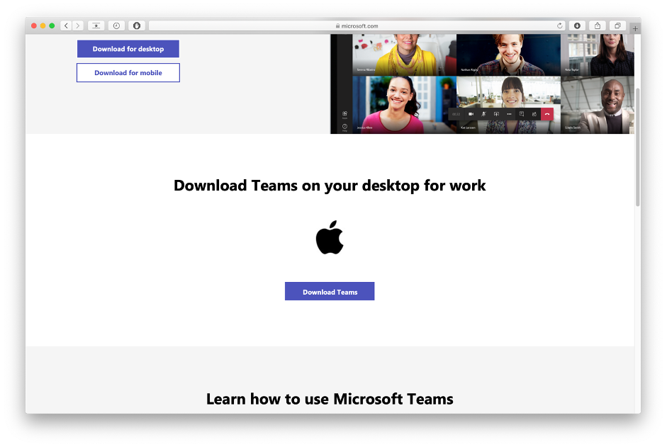
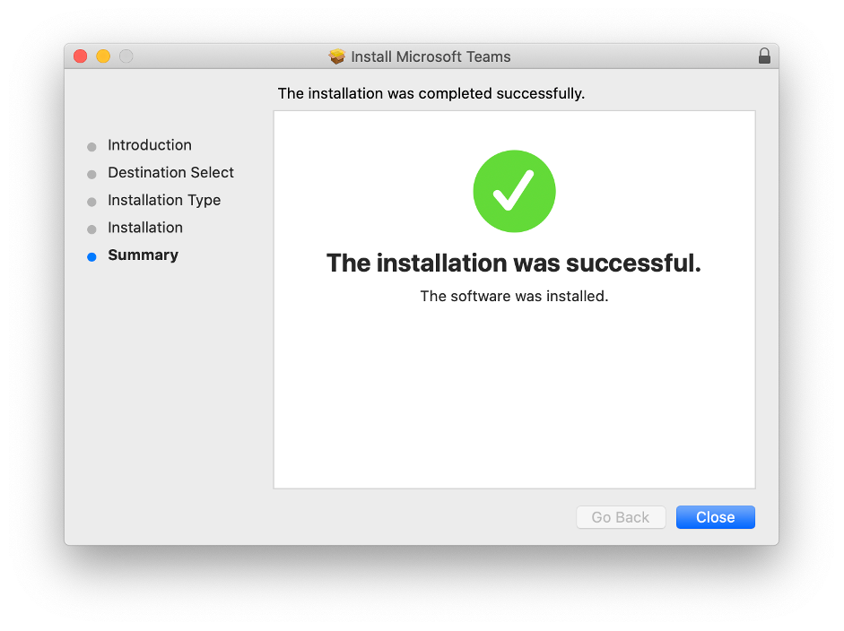
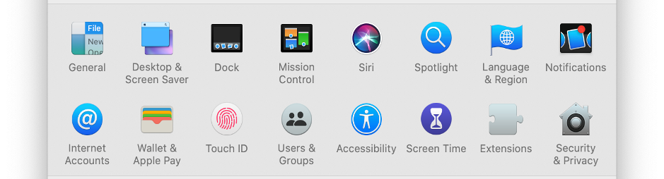
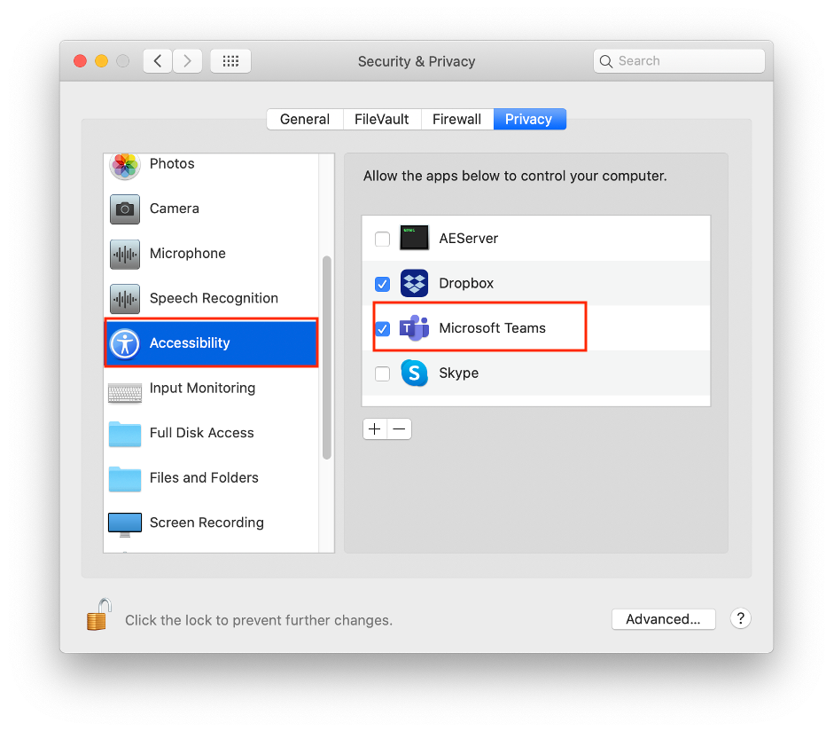
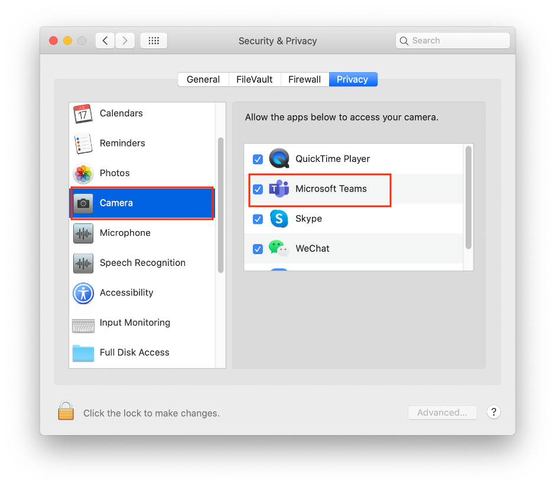
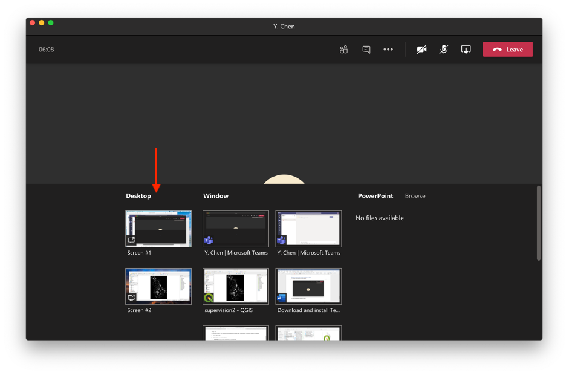
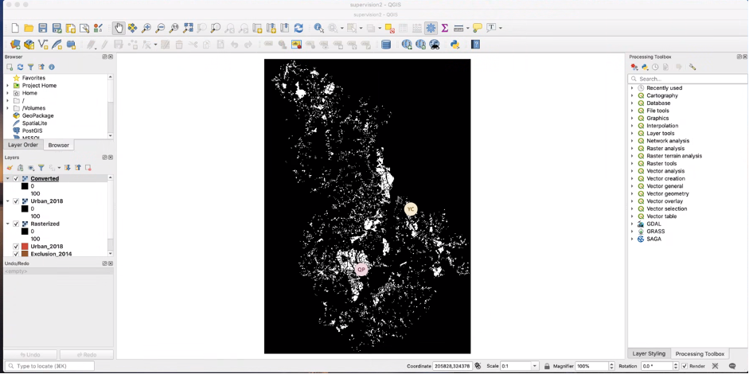

# Setup Microsoft Teams

- [Download and install Teams on Mac](#download-and-install-teams-on-mac)
- [Download and install Teams on Windows](#download-and-install-teams-on-windows)
- [Share screen & screen control](##share-screen--screen-control)

## Download and install Teams on Mac

1. From the Teams website (https://www.microsoft.com/en-gb/microsoft-teams/download-app), click Download Teams
   

2. Double click the `.pkg` file
   

3. Follow the installation wizard to complete the installation.
   

4. Teams installed and sign-in with your Crsid (xxx@cam.ac.uk)
   
   

5. To make Teams fully functional in the Mac, go to `System Preferences`, click `Security & Privacy`
   

6. In Privacy, select `Accessibility/ Camera/ Microphone/ Screen Recording` and tick Microsoft Teams. (You may need to click the lock at the left bottom corner to make changes)
   
   

## Download and install Teams on Windows

1. from the website (https://www.microsoft.com/en-us/microsoft-teams/download-app), click Download Teams

2. Click `Save File` and go to your `Downloads` folders, double click `Teams_windows_x64.exe`
   

3. login to Teams with your Crsid
   

## Share screen & screen control

1. Click the `Share content` button to share content
   

2. Select the `Desktop` to share
   

3. A red border will show the content you are sharing, and supervisors may request control in case you cannot manage to find the right function.
   

4. If you allow the control, you can see a mouse with supervisor’s name
   
