<button class="btn js-toggle-dark-mode">Dark color scheme</button>

# Answers for Assignment 1

**Answer for Qeustion A:**

|                  |                2011 |                2016 |               2021 |
| :--------------- | ------------------: | ------------------: | -----------------: |
| Highest (People) | Abbey&Castle (9850) | Trumpington (13220) | Trumpington(16620) |
| Lowest (People)  |       Market (7150) |       Market (7960) |     Newnham (8170) |

**Answer for Question B:**
The value stored in `ward_area` field should be numeric. The type of `Decimal number` of field can store numeric values. The setting for field length (the maximum length of the field) of 4 and a field precision (the maximum number of decimal places) of 2 allows the inputted value has 1 digit before the dot, then the dot and another 2 digits for the precision. When you are processing large dataset, defining the right field type and length will reduce the size of your file.

**Answer for Question C:**
The largest area in Cambridge city is Trumpington (7.34 km^2).
The smallest area in Cambridge city is Petersfield (1.06
km^2).

**Answer for Question D**:

|                       |                  2011 |                  2016 |                  2021 |
| :-------------------- | --------------------: | --------------------: | --------------------: |
| Highest (People/km^2) | Petersfield (7830.19) | Petersfield (8396.23) | Petersfield (9018.87) |
| Lowest (People/km^2)  | Trumpington (1098.09) | Trumpington (1801.09) |      Newham (1835.96) |

# Instruction for Assignment 1

## Import, select and export data from Cambridgeshire shapefile

1. Create a folder (such as `rm03_YourCRSid_assg1`) on your disk.
2. Launch QGIS and create a new project and save to your working directory.
3. Before importing data, you need to set properties for the project. - `General` tab: in the general settings, set your working directory as `Project Home`, change the unit for distance measurement you prefer and also display coordinates units. - `Metadata` tab: It is suggested to input title, author, creation date and a short abstract in the identification tab. - `CRS` tab: this tab provides the Coordinate Reference System (CRS) setting for the project file. Here, we choose the projected coordinate system, `OSGB 1936/British National Grid EPSG:27700`.
   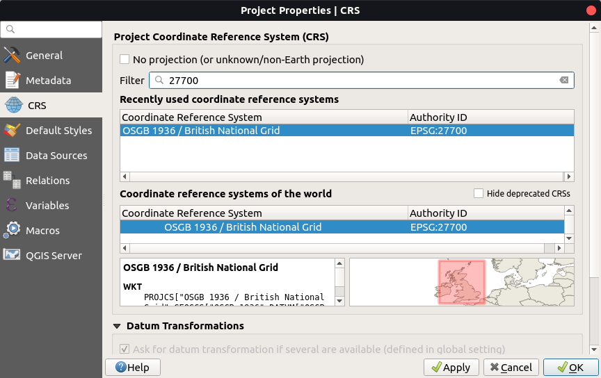
   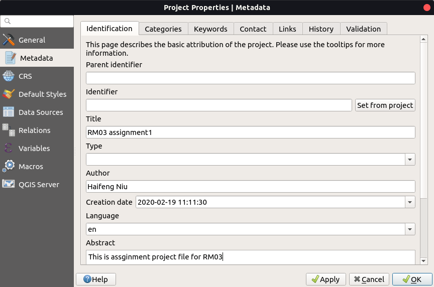
   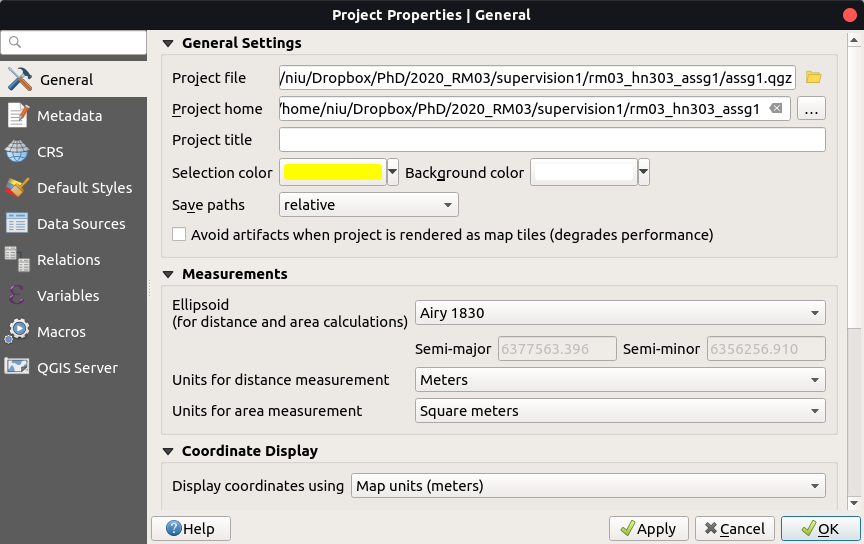

4. Download `Cambridge District Wards` data of Cambridgeshire from: [Cambridgeshire Insight Open Data](https://data.cambridgeshireinsight.org.uk/dataset/wardselectoral-divisions/resource/a5da0436-1142-48a9-8d82-d070fae138aa) and save zip file into your working directory.

5. Import shapefile into your project: Locate this file at your working directory in the `Browser Panel` and hold the left mouse and drag the `Wards_December_2015_Generalised_Clipped_Boundaries_in_Great_Britain.shp` into the map window. Or, Click `Open data source manager` button on `Data source manager toolbar` and switch to `Vector` tab. Choose file as the source type and choose your shapefile in the source path.

6. Open attribute table of Cambridgeshire layer and `Select features using an expression` in QGIS. In the window of expression, input `"lad15nm" = 'Cambridge'` and click select features.
   

7. Once select elements you need, right-click this layer and click `Export` > `Save Selected Features As`. Name this file as `Cam_City.shp`. This exported shapefile should include these wards: Abbey, Arbury, Castle, Cherry Hinton, Coleridge, East Chesterton, King’s Hedges, Market, Newnham, Petersfield, Queen Edith’s, Romsey, Trumpington and West Chesterton.
   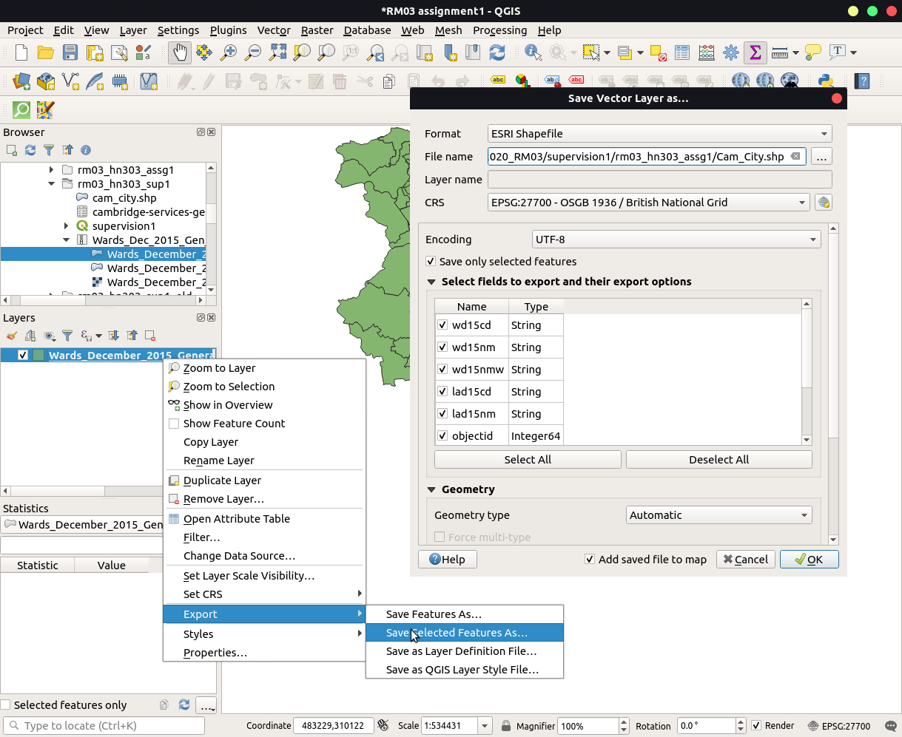

## Join Cambridge population estimates data with Cambridge shapefile

1. Download Cambridge population estimates data(2015) from: [**2015-based population forecasts for Cambridge**](https://data.cambridgeshireinsight.org.uk/dataset/2015-based-population-and-dwelling-stock-forecasts-cambridgeshire-and-peterborough-0)
2. Open it in in Excel or any spreadsheet software and comprise only one sheet, containing five columns, Ward Code, Ward name, Y2011, Y2016 and Y2021. Save the new table in your working directory.
   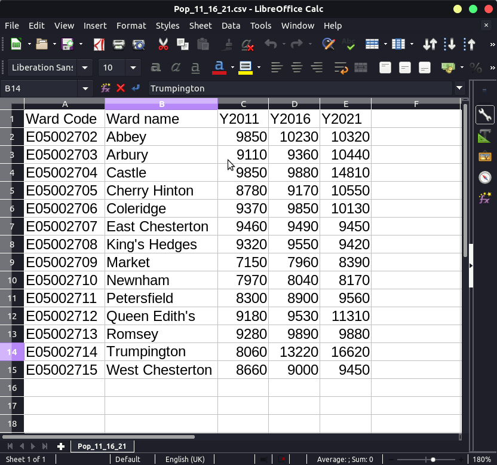

3. Locate this file at your working directory in the `Browser Panel` and hold the left mouse and drag the `2015-based-population-and-dwelling-stock-forecasts-cambridgeshire-and-peterborough-0.csv` into the map window. Or, Click `Open data source manager` button on `Data source manager toolbar` and switch to `Delimited Text` tab. Choose file as the source type and choose your shapefile in the source path.
   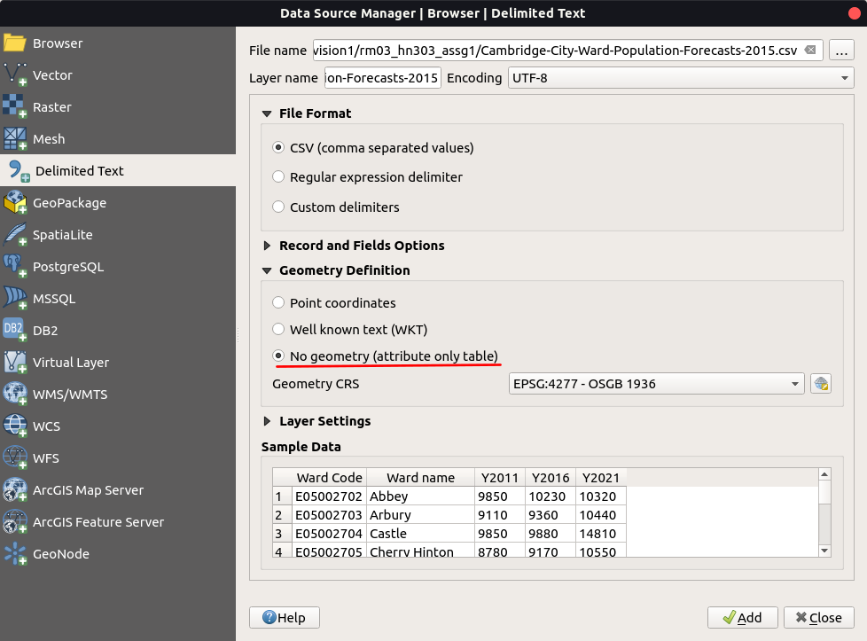

4. Right-click the `Cam_City` and click the `Properties` option. Switch to the `Joins` section on the side and click the `Add` button to join the population table `2015-based population forecasts for Cambridge` to the `Cam_City` shapefile. Select `Ward name` as Join field and `wd15nm` as Target field. Once this is done, the Attribute Table of `Cam_City` shapefile should show the Ward name and the population of each ward in 2011, 2016 and 2021.
   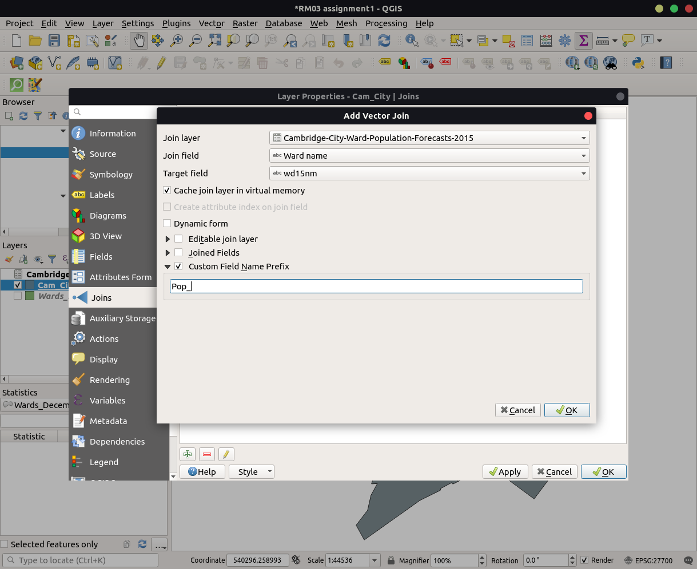
   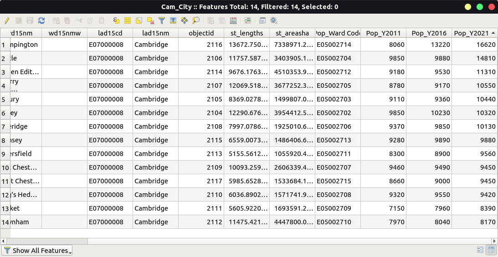

5. Use the `Export` command to create a new shapefile, name it as `Cam_City_Pop.shp`. The Attribute Table of this shapefile must be showing the ward names as well as the corresponding population in 2011, 2016 and 2021.
   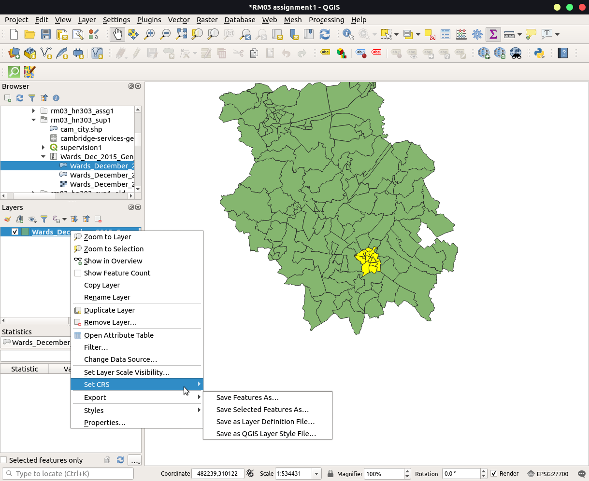

6. In the Attribute Table of `Cam_City_Pop` shapefile, click `Open field calculator`. Create a new field named as `Ward_Area` and set the output field type to ‘Decimal number (real)’, Precision = 4 and Scale = 2. In the expression window, input `$area/1000000` and it will compute the area for each ward in km2 (sq kilometres).
   
   

7. In the Attribute Table of `Cam_City_Pop` shapefile, click `Open field calculator`. Create another new field named as `Pop_Den11` and set the output field type to ‘Decimal number (real)’, Precision = 4 and Scale = 2. In the expression window, input `Pop_Y2011/Ward_Area` and We will compute population density, number of population per km2 in each ward. Repeat this step to create `Pop_Den16` and `Pop_Den21`, and calculate the density for 2016 and 2021.
   
   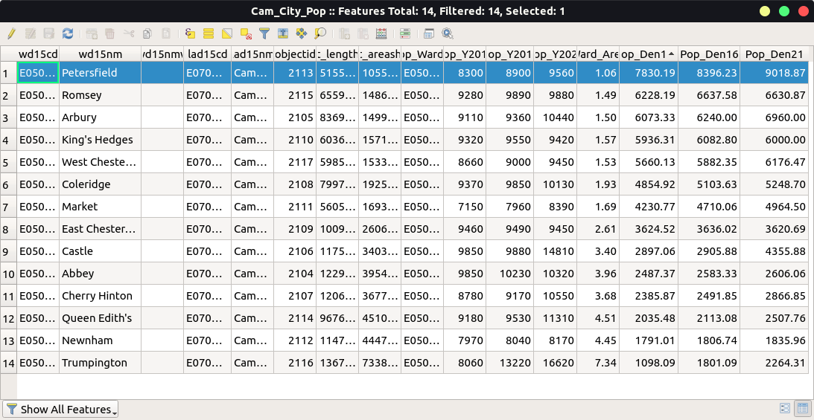

8. Symbolised cambridge map in `Categorized color` by `Pop_Den21` (per km2) of 2021 and export the map. 
   Hint: nevigate to `Project` > `Import/Export` > `Export Map to Image` in menu bar and set `Extent` by `Calculate from layer`(Cam_City_Pop)`. Please insert the exported image into your assginment.
   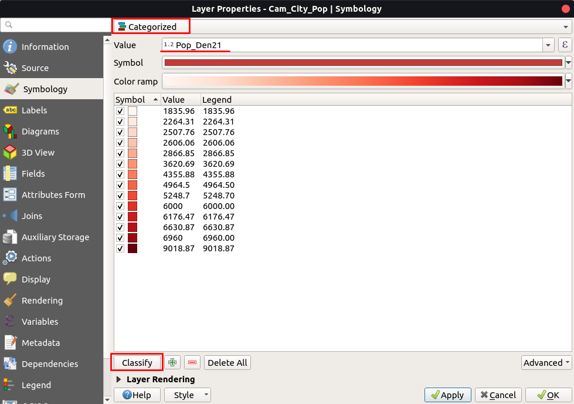
   
