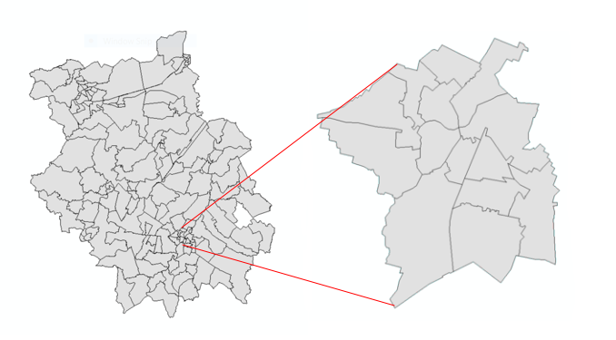
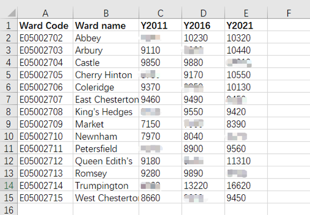
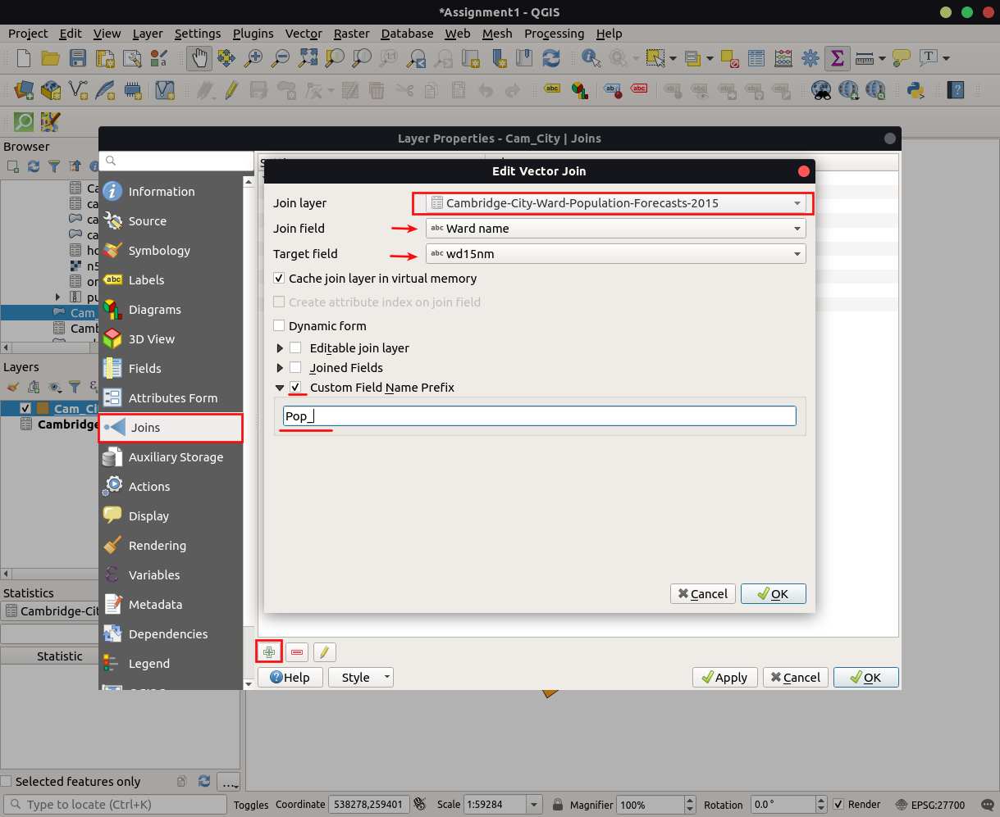
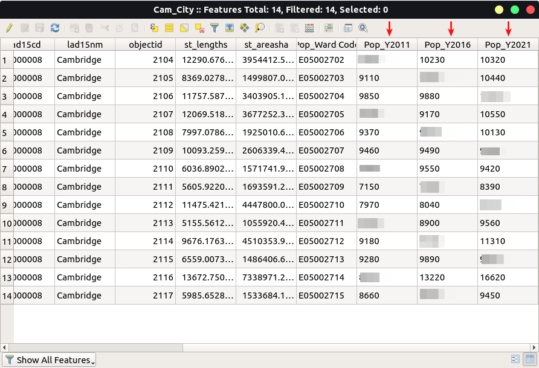
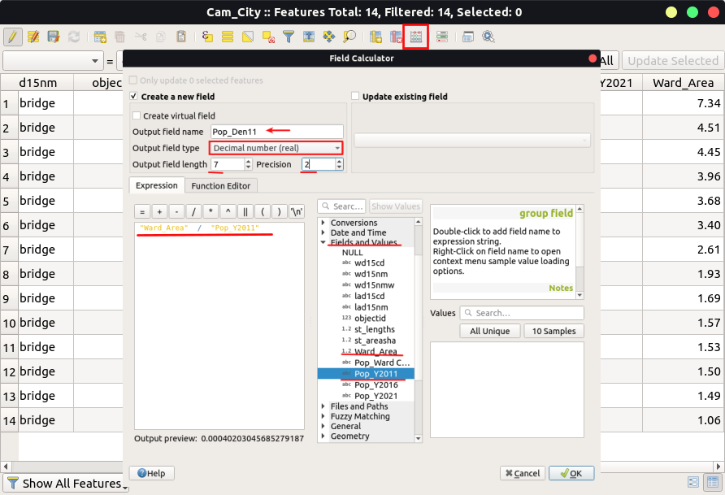

<button class="btn js-toggle-dark-mode">Dark color scheme</button>

# Assignment for Supervision 1
**Submission Date**: Before Supervision 2

## Instructions
1. If you missed supervision for some reason, please check Supervision 1[supervsion_exercies.md].
2. Please download and install QGIS standalone install version according to your platform:[Download QGIS](https://qgis.org/en/site/forusers/download.html)
3. Read through the tasks carefully. You may face problems if you overlook any of the steps.
4. Remember to save the QGIS document regularly. 
5. Save all the files used or prepared in your assignment (kml, shapefiles, map document, etc.).
6. Go through the tutorial on converting spreadsheet or csv file to shapefile using QGIS:[link](https://www.qgistutorials.com/en/docs/importing_spreadsheets_csv.html)
7. All figures in the assignment are for illustration purpose only and do not necessarily depict the actual data

Note: functions and filename are `highlighted` in this document.

## Assignment overview
In this assignment, you will extract the wards in the Cambridge city area using the Cambridgeshire data. After that, you will link the population data to the respective wards, and compute population density of each ward. Lastly, you will symbolize population density in cambridge.

## Tasks
1. Download `Cambridge District Wards` data of Cambridgeshire from: [Cambridgeshire Insight Open Data](https://data.cambridgeshireinsight.org.uk/dataset/wardselectoral-divisions/resource/a5da0436-1142-48a9-8d82-d070fae138aa) and import into QGIS.

2. By using `selec`create a new shapefile for the wards of Cambridge City. This shapefile will include these wards: Abbey, Arbury, Castle, Cherry Hinton, Coleridge, East Chesterton, King's Hedges, Market, Newnham, Petersfield, Queen Edith's, Romsey, Trumpington and West Chesterton. Name this file as `Cam_City.shp’ with choosing CRS EPSG:27700.\Hint: Use `Select features` or `Selection using expression` command to export the data to a new shapefile. 

3. Download Cambridge population estimates data 2015 (csv) from:[2015-based population forecasts for Cambridge](https://data.cambridgeshireinsight.org.uk/dataset/2015-based-population-and-dwelling-stock-forecasts-cambridgeshire-and-peterborough-0)

4. Open it in excel and comprise only one sheet, containing five columns, Ward Code, Ward name, Y2011, Y2016 and Y2021.

5. Import comprised csv file into QGIS.

**Question A: Which ward has the highest and lowest population in 2011, 2016 and 2021? Tabulate and also write respective population.**

6. Right-click the `Cam_City` and click `Properties` option. Use the `Join` function on the side to join the population table to the `Cam_City` shapefile that was created in above. Once this is done, the Attribute Table of `Cam_City` shapefile should show the Ward name and the population of each ward in 2011, 2016 and 2021.

7. Use the `Export` command to create a new shapefile, name it as `Cam_City_Pop.shp`. The Attribute Table of this shapefile must be showing the ward names as well as the corresponding population in 2011, 2016 and 2021. 
Hint: right-click to export

8. In the Attribute Table of `Cam_City_Pop` shapefile, click `Open field calculator`. Create a new field named as `Ward_Area` and set the output field type to ‘Decimal number (real)’, Precision = 4 and Scale = 2. In the expression window, input `$area/1000000` and We will compute the area of each ward in km2 (sq kilometre). 
Note: you can find `$area` in the right list under `Geometry` section.

**Question B: Why did we use `Double` as the data type while adding the field `Ward_Area` in the Attribute Table of `Cam_City_Pop` shapefile? What is the purpose of setting the `Precision` and `Scale` values?**

**Question C: Which ward is the largest and smallest in terms of area? Also note their areas in km2.**

9. In the Attribute Table of `Cam_City_Pop` shapefile, click `Open field calculator`. Create another new field named as `Pop_Den11` and set the output field type to ‘Decimal number (real)’, Precision = 7 and Scale = 2. In the expression window, input `Pop_Y2011/Ward_Area` and We will compute population density, number of popuation per km2 in each ward. Repeat this step to create  `Pop_Den16` and `Pop_Den21`. 

**Question D: Which ward has the highest and lowest population densities in 2011, 2012 and 2013? Tabulate and also write respective population densities.**

10.Symbolised cambridge map in Categorized color` by population density (persons/km2) of 2021 and export the map. 
Hint: nevigate to `Project` > `Import/Export` > `Export Map to Image` in menu bar and set `Extent` by `Calculate from layer`(Cam_City_Pop). 

