<button class="btn js-toggle-dark-mode">Dark mode</button>

> If you prefer to print out the whole supervision instruction, please find the pdf version in the section of supervision on [RM03 Moodle page](https://www.vle.cam.ac.uk/course/view.php?id=179012){: .btn }.

# Supervision 1 (17 February, 2021)

## Instructions

1. Read through the instruction carefully. You may face problems if you overlook any of the steps.
2. Remember to save the QGIS document regularly.
3. When running tasks on QGIS, leave the settings as the default unless instructed. 
   Note: functions and filename are `highlighted` in this document.

## Supervision overview

In this exercise, you will familiarise yourself with the basic features of QGIS software and geoprocessing exercises with vector data and raster data.

### Setup Work Environment (10 mins)

1. Please download and install `QGIS standalone install version` (Long term release repository, Version 3.10) according to your platform: [QGIS Download Page](https://qgis.org/en/site/forusers/download.html){: .btn }{:target="\_blank"}.
2. It is suggested to create a folder and name it as `rm03_YourCRSid_sup1`, at your prefered directory on your disk. This folder will be the working directory for all datasets and QGIS project file in this supervision.
3. Launch QGIS: Start QGIS Desktop and check interface (menu bar, toolbar, browser panel, layer panel and map window) 
   Note: if some panels or toolbars are not showing, navigate to menu bar `View` > `Panels` or `Toolbars` to switch on. 
   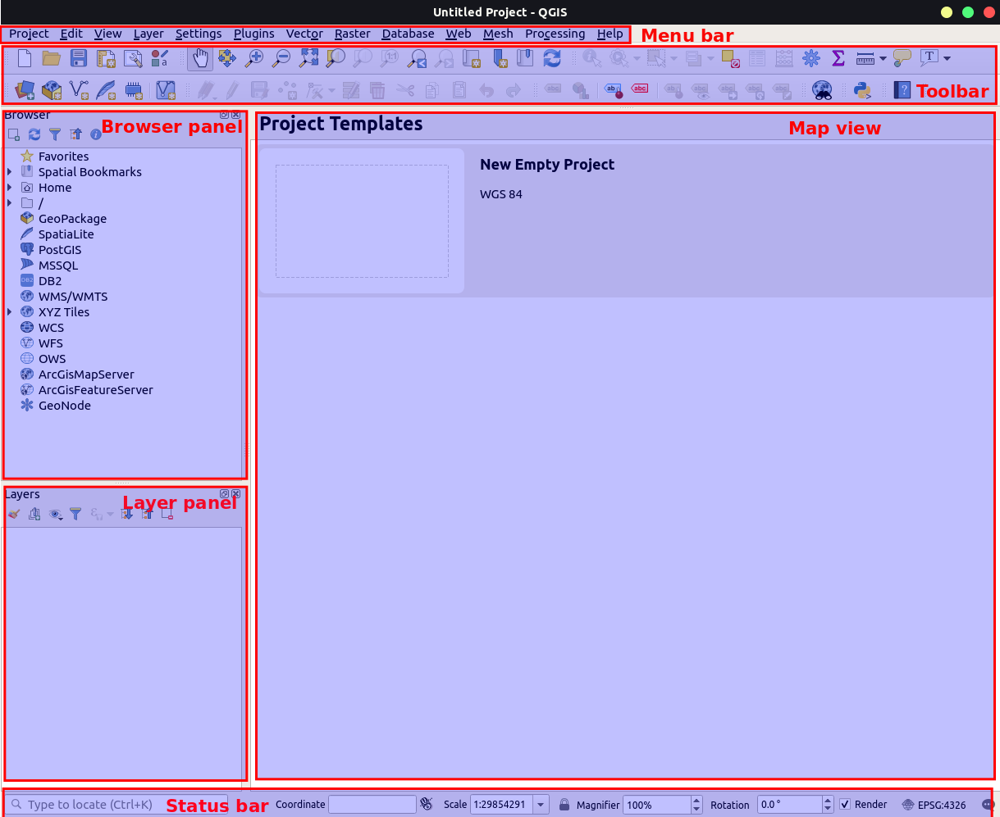

### QGIS Project Setup (5 mins)

1. In the menu bar, Click `Project` > `New` to create a new QGIS project.
2. Go to `Project` > `Save As` and save as `supervision1.QGZ` to the working directory.
3. Go to `Project` > `Properties` and open the `Project Properties` window.

- `CRS` tab: this tab provides the Coordinate Reference System (CRS) setting for the project file. Here, we choose the projected coordinate system, `OSGB 1936/British National Grid EPSG:27700`. Clip `Apply` button in the left bottom corner. Be aware that CRS setting in the `Project Properties` (called `Data Frame setting` in ArcGIS) is just for the project file, not including layer CRS. CRS setting for layers will be introduced later.

- `General` tab: in the general settings, set your working directory as `Project Home`, change the unit for distance measurement as `Meters` since we choose projected CRS (EPSG:27700) in the last step and set display coordinates units as `Map units (meters)`. 
    
- `Metadata` tab: It is suggested to input title, author, creation date and a short abstract in the identification tab.  

Note: after adding `Project home`, you can find `Project Home` directory is showing in the `Browser panel`. It is much easier to locate your data files through the panel. 
   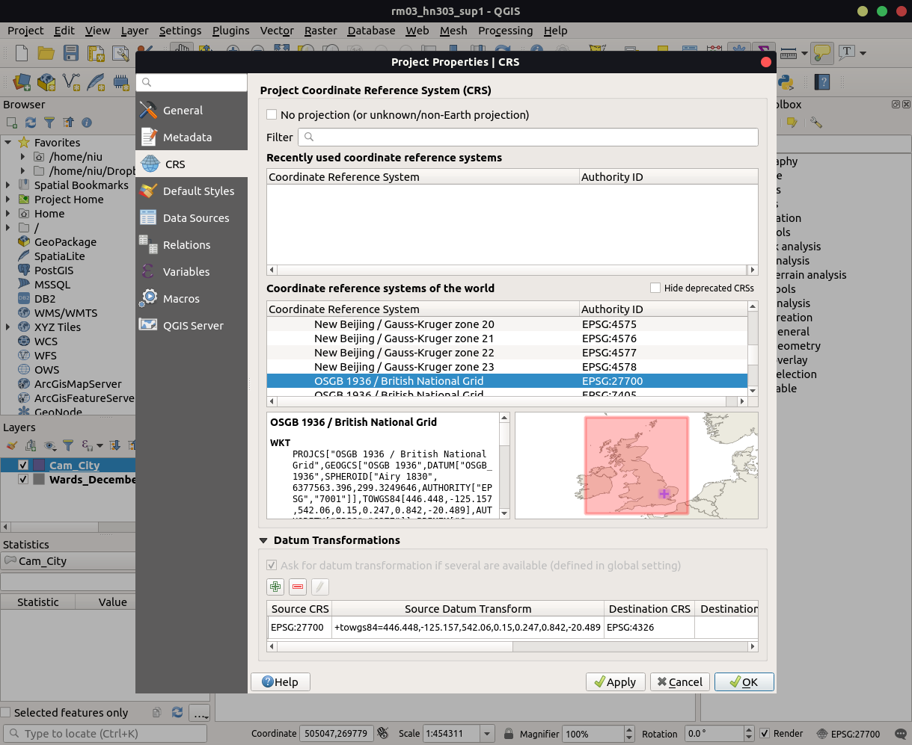
   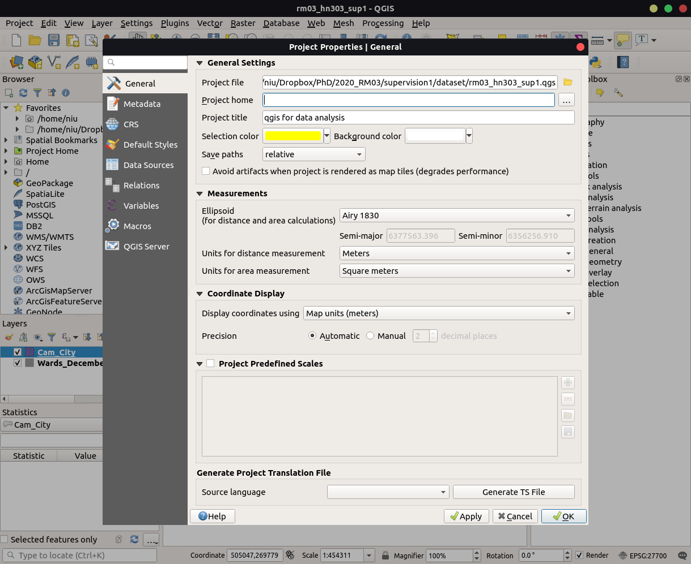
   
   
### Vector Data (30 mins)

First, we will play with some vector data. In this part, you will learn:

- How to import shapefile into QGIS?
- How to activate a layer?

1. Download `Cambridge District Wards` data of Cambridgeshire from: [Cambridgeshire Insight Open Data](https://data.cambridgeshireinsight.org.uk/dataset/wardselectoral-divisions/resource/a5da0436-1142-48a9-8d82-d070fae138aa){: .btn }{:target="\_blank"} and save zip file into your working directory.
2. Import shapefile into your project: Locate this file at your working directory in the `Browser Panel` and hold the left mouse and drag the `Wards_December_2015_Generalised_Clipped_Boundaries_in_Great_Britain.shp` into the map window. Alternatively, you can add vector file through the data source manager. Click `Open data source manager` button on `Data source manager toolbar` and switch to `Vector` tab. Choose file as the source type and choose your shapefile in the source path. 
   Note: You may be prompted a window to conduct CRS transformation, click ok to continue. 
   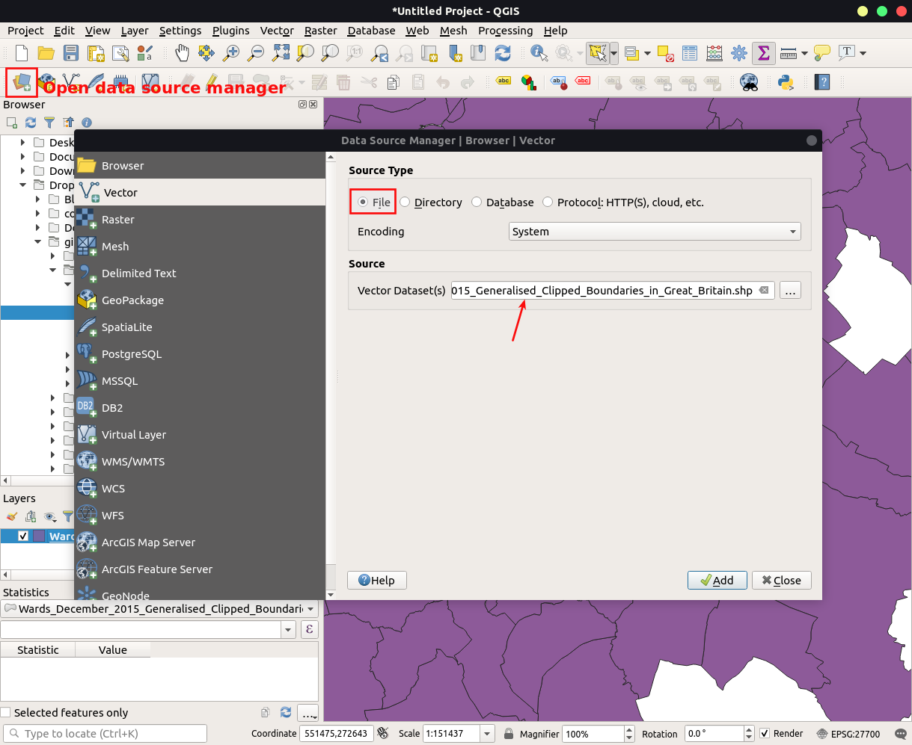

3: Check added layer in `Layer Panel`. You can turn on and off layer by checking or unchecking it. Before you perform any action to a layer, please make sure the target layer is checked and selected with highlight.

**Attributes table**

- How to open the attribute table?
- How to select polygons only from Cambridge through the attribute table?

1. Select the layer in the layers panel, click the `open attribute table` in the `Attribute Toolbar`. You will see the attribute table with different fields including `wd15nm` (the name of Ward District) and `lad15nm` (the name of Local Authority District). 
   

2. In the attribute table of the Cambridgeshire layer and double-click `lad15nm` to sort by value/content. Select all rows whose `lad15nm` value equal `Cambridge` (select first one and then press SHIFT on your keyboard while selecting the last one). The selected elements will be highlighted in the map view. 
   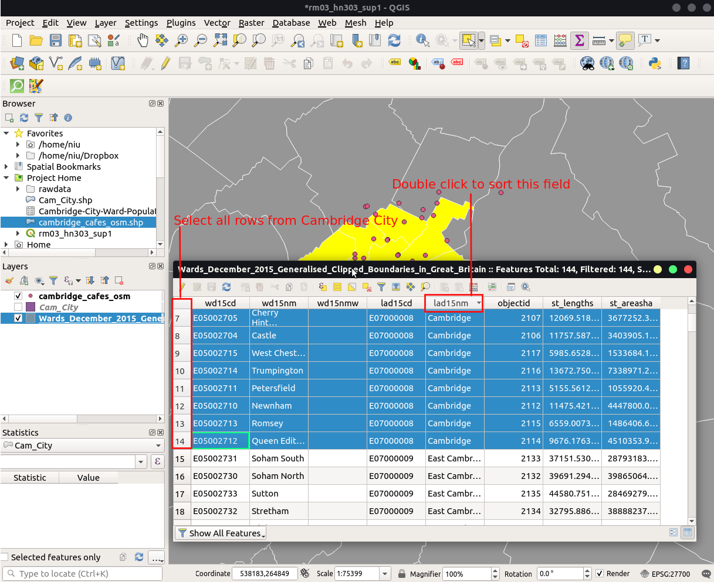

3. Here is an alternative method to select elements precisely: Open attribute table of Cambridgeshire layer and `Select features using an expression` in QGIS. In the window of expression, input `"lad15nm" = 'Cambridge'` and click select features.  
   Note: You don't need to type expression manually, expand `Field and Values` option in the right panel and double click `lad15nm`. The field name will show in the expression window. Once you select the field `lad15nm`, click `All Unique` button on the right, it will show a list of unique values from the field of `lad15nm`. Double click it to add to your expression. 
   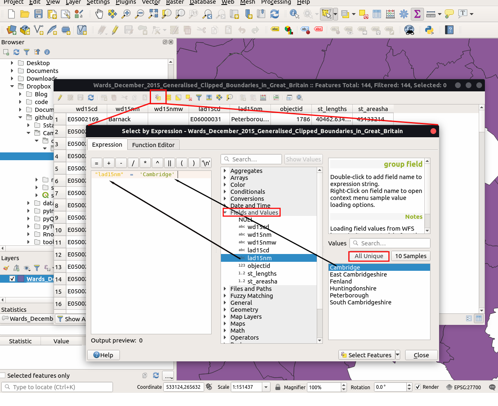

4. Once select elements you need, right-click this layer and click `Export` > `Save Selected Features As`. First, change the format to `ESRI Shapefile`. Then, you need to click the ellipsis (`...`) button to select the output directory and name the file as `Cam_City`. This exported shapefile should include these wards: Abbey, Arbury, Castle, Cherry Hinton, Coleridge, East Chesterton, King’s Hedges, Market, Newnham, Petersfield, Queen Edith’s, Romsey, Trumpington and West Chesterton.

5. Try other functions in attribute table: `select all`, `invert selection`, `deselect all`

**Importing spreadsheets or CSV files**

- How to import data from spreadsheets and CSV with coordinates?
- How to display coordinates from spreadsheets and CSV in QGIS?

1. Download `Cambridge local services` data of Cambridgeshire from: [Cambridgeshire Insight Open Data](https://data.cambridgeshireinsight.org.uk/dataset/cambridge-local-services/resource/af2c41d1-c8a0-46cf-ab77-ca407732e060){: .btn }{:target="\_blank"} and save into your working directory. (If you are using Safari on MacOS, you need to click `download` > `right click` in the pop-up window > save page as a csv file.) This is a dataset to be used to geo-locate a shortlist of agencies and facilities around Cambridge. 
2. Navigate to menu bar click `Layer` > `Add Layer` > `Add Delimited Text Layer`. Browse the `cambridge-services-geolocated-csv-2-standardized.csv` just downloaded and change the layer name to `Cam_Services`. In the section of File Format, choose CSV. In the Geometry Definition section, choose `Point coordinates` and select `Longitude` and `Latitude` fields as X Y fields respectively. Normally the Geometry definition section will be auto-populated if it finds a suitable X and Y coordinate fields. Then choose the right CRS (EPSG:4326 - WGS84) for this file. Finally, click `Add`, and you will find a point layer. 
   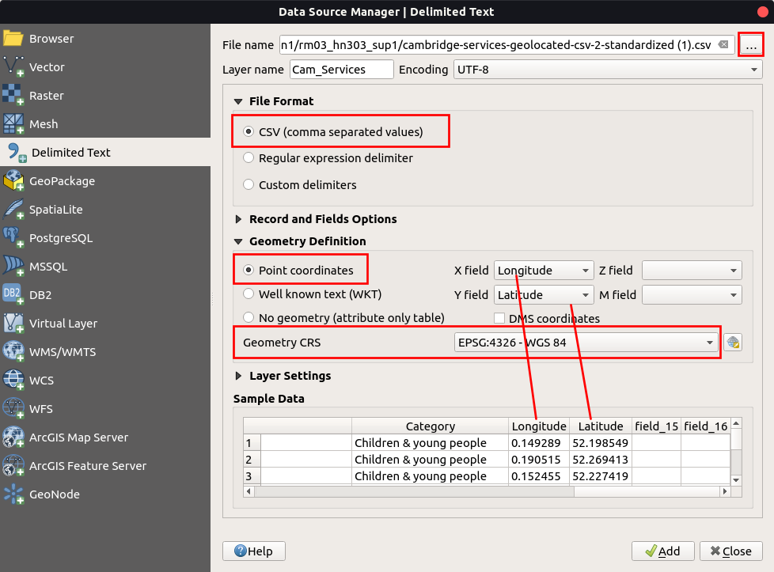

**Join layer**

- How can we link Cambridge local services with district information?

1. Navigate to `Processing` > `Toolbox` and search `Join attributes by location`. In the prompted window, choose `Cam_Services` as input layer and `Cam_City` as join layer. In the geometric predicate section, choose `intersects`. In the join type section, choose `create separate feature for each located feature (one-to-many)`. 
   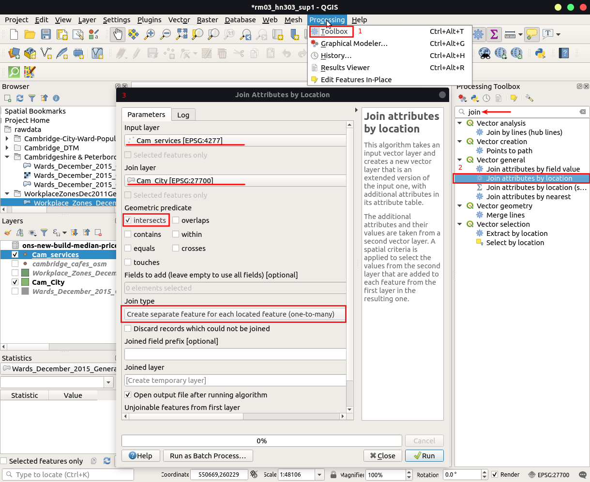

2. Open the attribute table of `Joined layer`, and you will find district information for each service item.

### Digitizing Map Data (15 mins)

- How to install a plugin in QGIS?
- How to add a base map to QGIS?
- How to create a new shapefile?
- How to add new features with attributes?

**Basemap and plugins in QGIS**

1. Extend functions of your QGIS with plugins: open `Plugins` > `Manage and Install Plugins` from the menu bar. Search `QuickMapServices` and click `Install plugin`.  
   Note: if some plugins are not showing, please switch to `Setting tab` and turn on the `Show also experimental plugins` option. 
   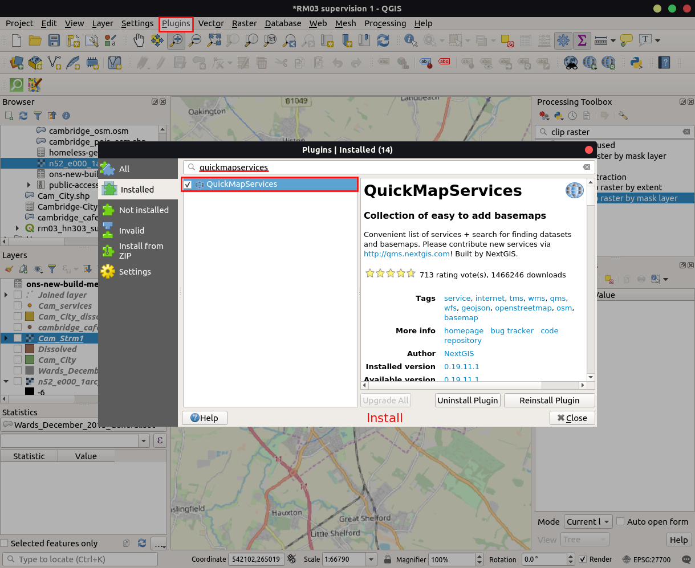

2. After installing the plugin, you can find `QuickMapServices` function in the `Web` section from the menu bar. Choose `OSM`-`OSM Standard`, and you will add a base map in QGIS.

**Create features/shapefiles in QGIS**

1.  Once you add a base map for your QGIS project, you will see a scalable map in the map window. 
    Note: You computer must be connected to the internet to add base map as the imagery is fetched from web servers.
2.  Zoom in to the Cambridge area to find the location of your frequently visited services including cafes, restaurants, book shops, cash machines, etc. If you are not familiar with the Cambridge city due to the COVID-19, please try to find our department and your college on the map and explore the surroundings.
3.  Create the following three shapefiles using `Layer` > `Create Layer` > `New Shapefile Layer`. You need to click the ellipsis (`...`) button to select the output directory and name the file as `My_POI.shp`(Point). Remember to choose the `EPSG:27700 - OSGB 1936 / British National Grid` coordinate system (select CRS > filter > Search `OSGB 1936`). You will add two `New Fields` (`name` and `category`) to its `Fields List` to store the name and category of each POI. 
    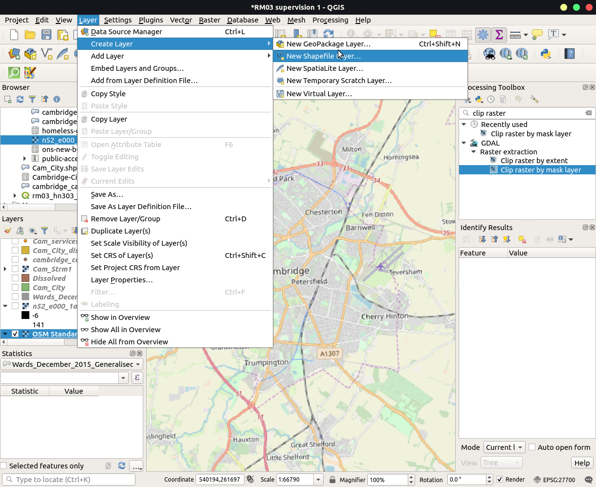
    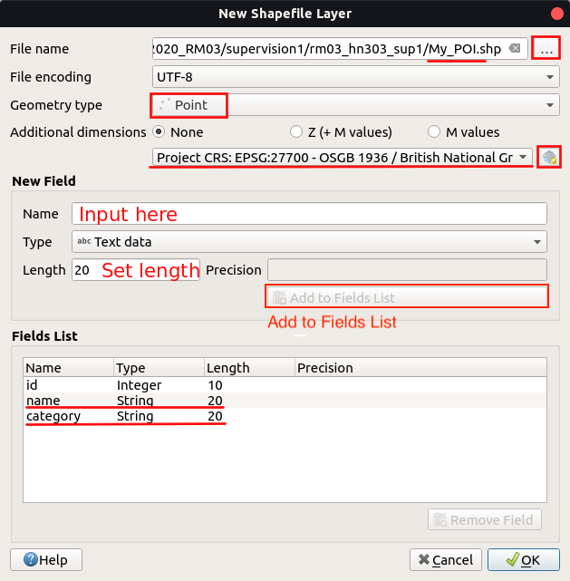

4.  Select the `My_POI` layer in the layer panel, then open `Toggle editing` and select `Add Point Feature`. After pining a point feature on map window, a `Feature Attribute` window will pop up. Input id, name and category (cafe, restaurant, book shop, etc.) of this new feature.  
    <!--  -->
    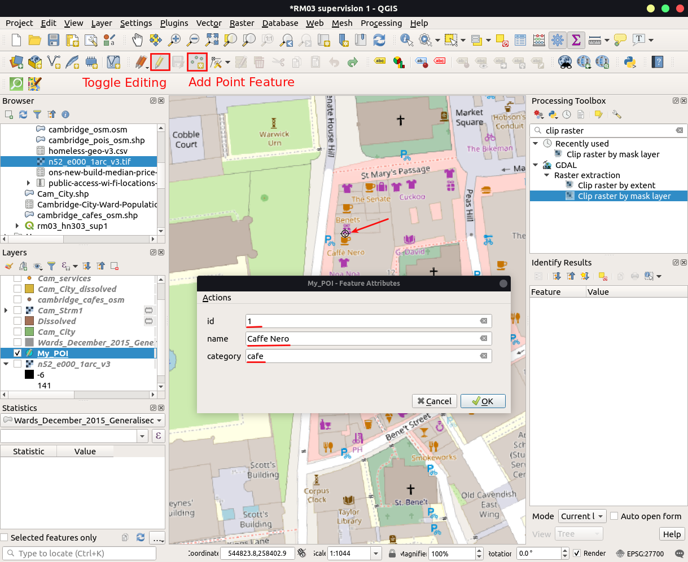

5.  After creating features in the map window, click `Toggle Editing` again and save changes.

6.  Repeat above step from 4 to 5. Create another 4 points with inputting attributes.

### Raster Data (10 mins)

Now, you will take a few mins to families the raster data. In this part, you will learn:

- How to import raster data?
- How to extract part of raster in Cambridge?
- How to symbolise raster map?

1. Download `Cambridge SRTM1` data of Cambridgeshire from: [Cambridge SRTM1 Data](data/n52_e000_1arc_v3.tif){:target="\_blank"} into your working directory. This dataset is used to generate digital elevation data and make a topographic map.

2. Import shapefile into your project: Locate this file at your working directory through `Browser Panel` and hold the left mouse and drag the `n52_e000_1arc_v3.tif` into the map window. Or, you can add vector file through data source manager. 
   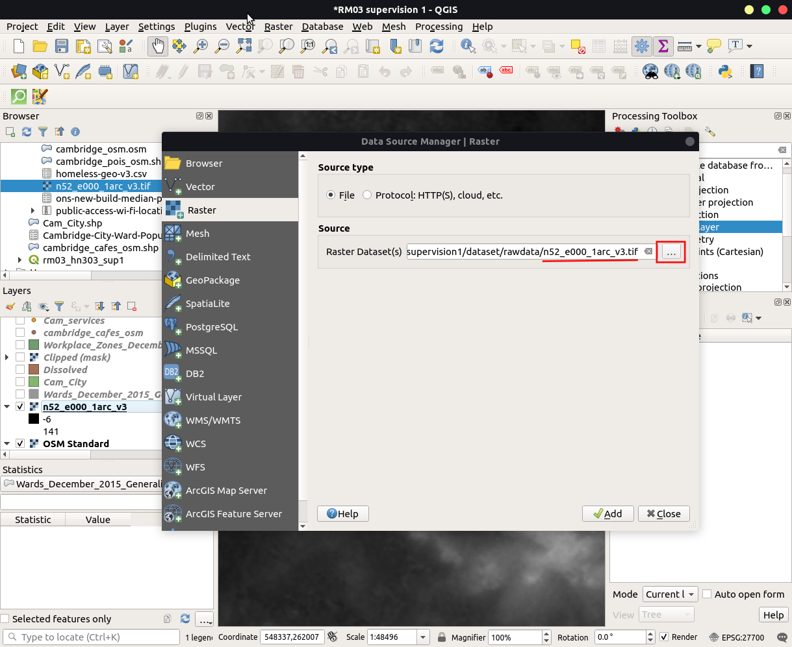

3. Before extracting from raster, we need an aggragated shapefile covering whole Cambridge city (called `mask layer` in raster clipping). Navigate to `Processing` > `Toolbox` and search `Dissolve` under `Vector geometry` section. In the prompted window, choose `Cam_City` as input layer and save as `Cam_City_dissolved.shp` to your working directory. 
   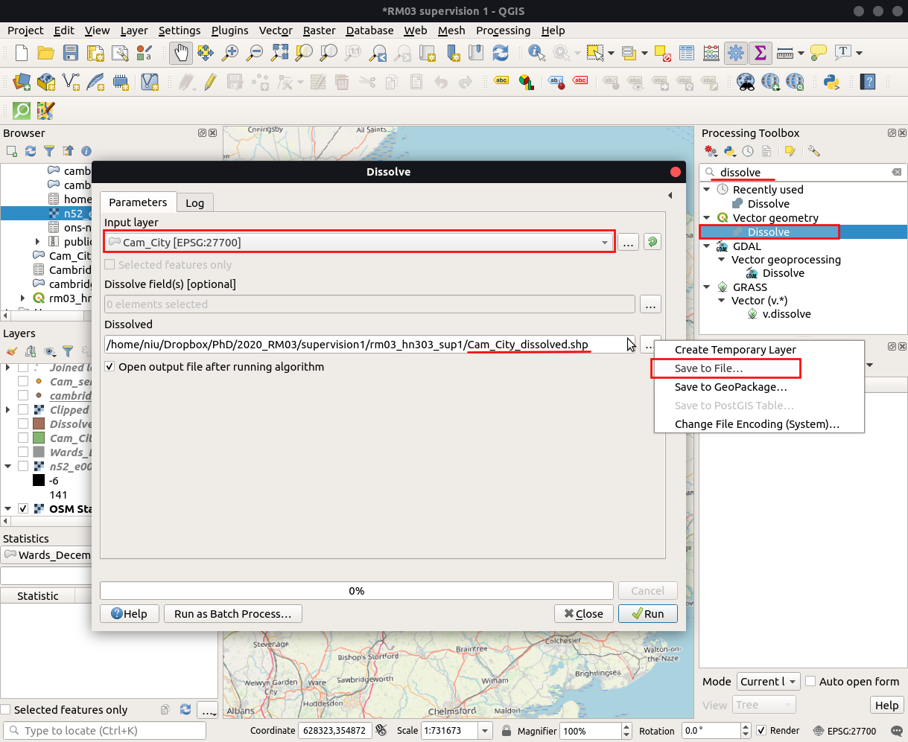
   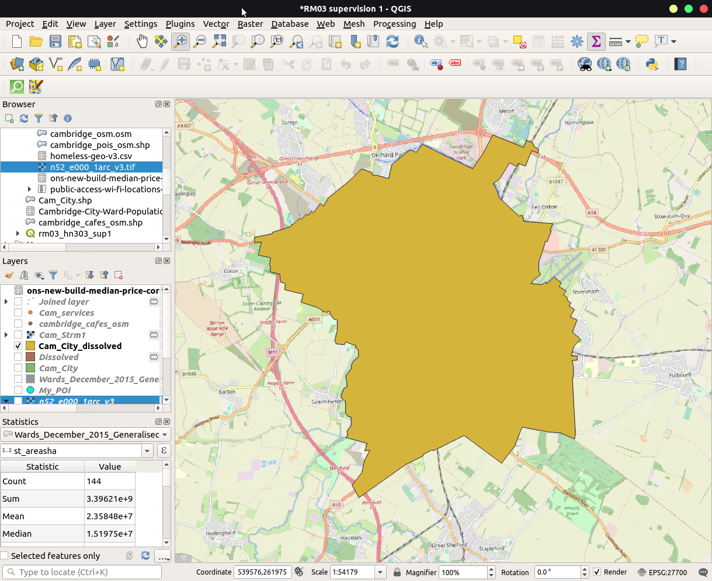

4. Navigate to `Processing` > `Toolbox` and search `Clip raster by mask layer`. In the prompted window, choose `n52_e000_1arc_v3.tif` as input layer and `Cam_City_dissolved` as a mask layer. Save extracted raster as `Cam_Strm1.tif`. 
   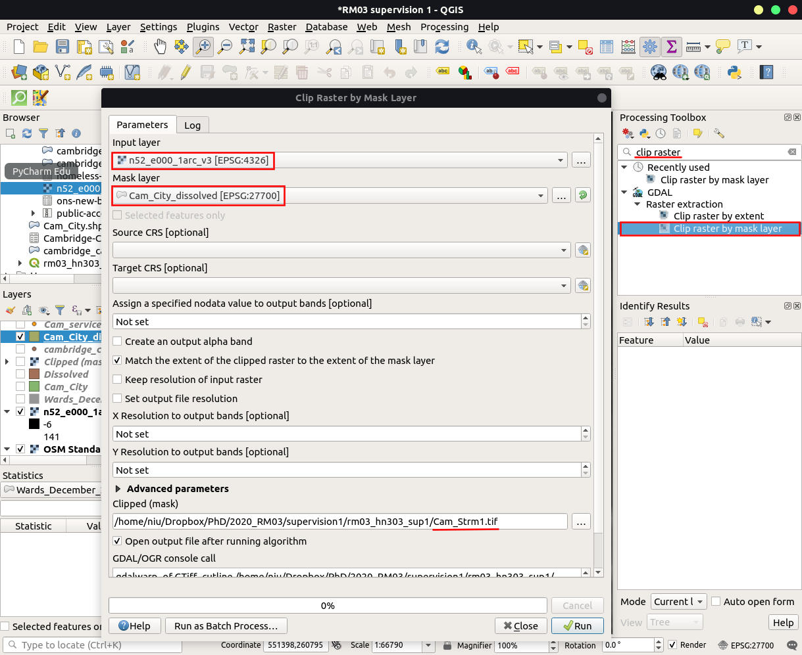

5. Change symbology: Select `Cam_Strm1.tif` and right-click to the properties option. Switch to `Symbology` tab and change `Render type` to `Paletted/Unique values`. Expand the `Color ramp` section and choose `Spectral`. Then click `Classify` button to automatically assign a colour to each value. Back to `Color ramp` section and check `Invert Color Ramp` option.  
   Note: if your layer is not showing, change the order of layers in `Layer Panel`. 
   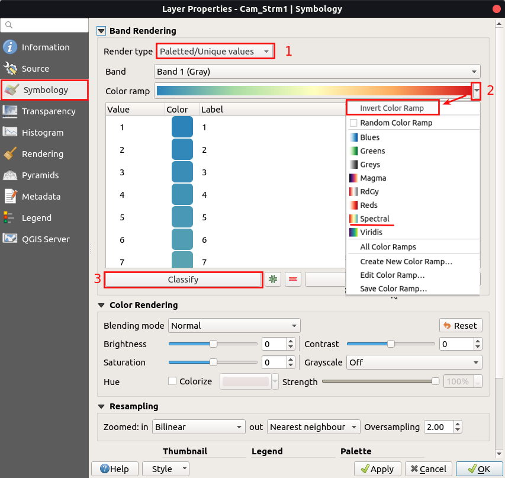
   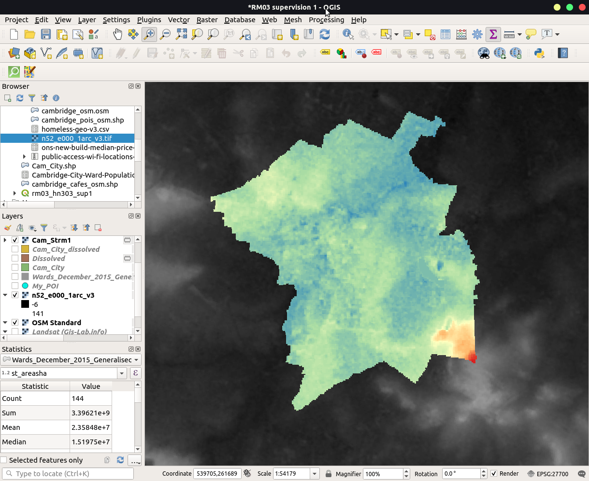

6. Now you have a topographic map about Cambridge city. You can compare your result with [Camrbidge Terrain Map](https://en-gb.topographic-map.com/maps/dgf/Cambridge/){: .btn }{:target="\_blank"}
