<button class="btn js-toggle-dark-mode">Dark mode</button>

<script>
const toggleDarkMode = document.querySelector('.js-toggle-dark-mode');

jtd.addEvent(toggleDarkMode, 'click', function(){
  if (jtd.getTheme() === 'dark') {
    jtd.setTheme('light');
    toggleDarkMode.textContent = 'Dark mode';
  } else {
    jtd.setTheme('dark');
    toggleDarkMode.textContent = 'Return to the light mode';
  }
});
</script>

> If you prefer to print out the whole supervision instruction, please find the pdf version in the section of supervision on [RM03 Moodle page](https://www.vle.cam.ac.uk/course/view.php?id=179012){: .btn }.

# Supervision 2 (1 March, 2022)

Note: This page is NOT an assignment - we will go through this together at the Supervision 2. All you need to have is NetLogo installed in your laptop. If you haven't done so already, please download and install `NetLogo (6.0.4)` according to your platform. There are newer versions but please make sure to download 6.0.4 so that all users will have a consistent experience in the supervision. We recommend downloading `Windows (64-bit)`, `Mac OS X`, or `Linux (64-bit)`: [NetLogo Download Page](https://ccl.northwestern.edu/netlogo/6.0.4/){:target="_blank"}. See you at the Supervision 2!


## Supervision overview

The aim of this supervision is to have you familiarise yourself with geoprocessing raster data on QGIS software as well as basic features of NetLogo software and how to use the GIS extension to input raster maps.

We will do this together by using QGIS to rasterise vector data representations of a city to produce a raster map. After introducing NetLogo and some hallmarks of agent based modelling (ABM), we will use the raster map you created to model urban growth using NetLogo. 

## Instructions
1. Read through the instructions carefully. You may face problems if you overlook any of the steps.
2. Remember to save the QGIS document regularly. 
3. When running tasks on QGIS, leave the settings as default unless instructed.
4. Some parts are labeled as `optional` which you can try in your own time at home if you wish.

Note: functions and filename are `highlighted` in this document.

## Preparing raster maps on QGIS (15-20 min)

### Setup work environment
1. We suggest creating folder and naming it `rm03_YourCRSid_sup2`, at your prefered directory. This folder will be the working directory for the assignment and supervision.

### QGIS project setup

Start QGIS and start a new project.

1. Click `Project` > `New`.
2. Click `Project` > `Save As`, and save as `supervision2.qgz` to the working directory. 
3. Download the following sets of data (sample data of Sejong, South Korea): [Urban_2018.zip](https://github.com/hn303/CamLandEc-RM03/blob/master/data/Urban_2018.zip){:target="_blank"}, [Exclusion_2014.zip](https://github.com/hn303/CamLandEc-RM03/blob/master/data/Exclusion_2014.zip){:target="_blank"}, [Road_2018.zip](https://github.com/hn303/CamLandEc-RM03/blob/master/data/Road_2018.zip){:target="_blank"}, and [Boundary.zip](https://github.com/hn303/CamLandEc-RM03/blob/master/data/Boundary.zip){:target="_blank"} in the working directory (you don't need to unzip). (Note: The original data is available on the Korea National Spatial Infrastructure Portal. We have simplified and edited the files for the supervision).
4. Go to `Project` >  `Properties` in menu bar and open the `Project Properties` window.
    - `General` tab: Set your working directory as `Project Home`.
Note: after adding project home, you can find `Project Home` directory is showing in the `Browser panel`. It is much easier to locate your data files through this panel.
5. Drag `Urban_2018.shp` `Exclusion_2014.shp` `Road_2018.shp` `Boundary.shp` to the  `Layers panel`. Drag `Boundary.shp` to the bottom. Uncheck all layers except `Boundary.shp`. You can check/uncheck the layer to make it visible/invisible on the visualisation by clicking the box next to the layer name in the `Layer panel`. 

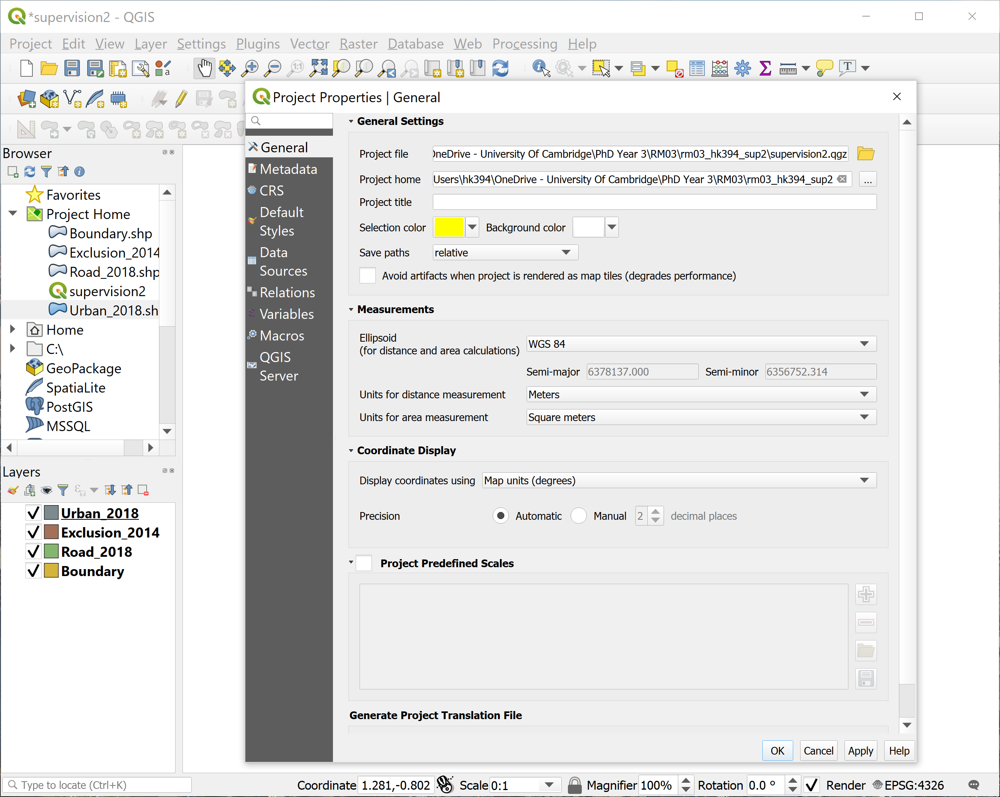

### Understanding the layer through its attribute table
1. To better understand what the layers represent you can see the attibute table of a layer by right-click > `Open Attibute Table`. The `Urban_2018` layer is a combination of urban land-use data by parcel and building data, with the urban parcels encoded with the value 100 in the field `URBAN`. `Exclusion_2014` layer is a combination of river, urban parks, and development restriction zone, with non-excluded areas coded 0 and excluded areas coded 100 in the field `EXCLUSION`. `Road_2018` layer contains roads, with the road-class information coded in the field `road_class` (25=small road, 50=medium road, 75=large road, 100=expressway).`Boundary` layer contains the administrative boundary of the city in the field `boundary` (within boundary=1).


### (OPTIONAL 1) Using symbology to assign colour to visualize the data
1. Let us assign colour for `Boundary` and `Urban_2018` layers only just to see what they look like.
2. Right-click on `Boundary` layer > `Properties` > `Symbology` (or double-click the color box). Click `Simple fill`, change `Fill color` to `black`, change `Stroke style` to `No Pen`, click `OK`. 
3. Check `Urban_2018` layer, double-click the color box. Click `Simple fill`, change `Fill color `to `white`, change `Stroke style` to `No Pen`, click `OK`.

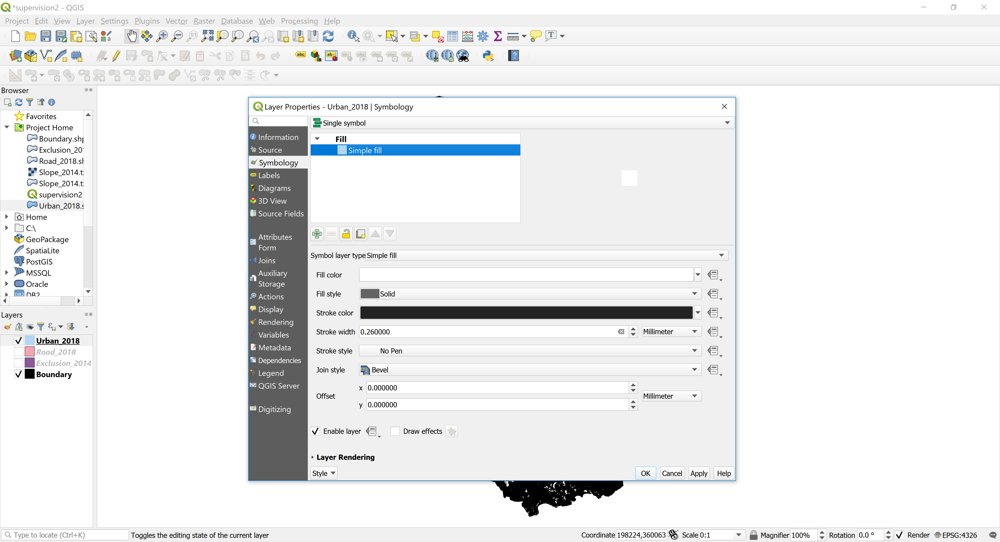  

4. You can assign colour for other layers too if you wish. Uncheck `Urban_2018` layer, check `Exclusion_2014` layer, double-click the color box. Click `Single symbol` > `Categorized`, click `Column` > `Exclusion`, click `Classify` and change `Legend` to 0=non-excluded, 100=excluded.
5. Double-click the color box of non-excluded, click `Simple fill`, change `Fill color` to `black`, change `Stroke style` to `No Pen`, click `OK`. Double-click the color box of excluded, click `Simple fill`, change `Fill color` to `white`, change `Stroke style` to `No Pen`, click `OK`. 
6. Delete the third row (unnecessary) by pressing the `negative sign` next to `Classify`. Click `OK`.

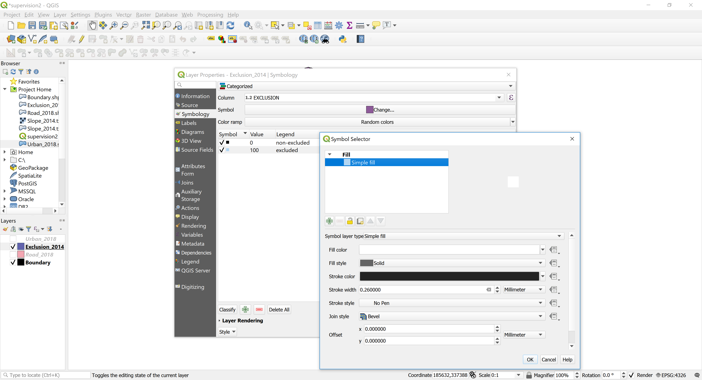 

### Converting vector to raster (rasterize)
1. Click and check `Urban_2018` layer, click the `Raster` tab in the top menu bar, `Conversion` > `Rasterize`. 
2. Set `Field to use for a burn-in value` as `URBAN`, `A fixed value to burn` as `Not set` (if there is a value click on the left facing arrow to remove it to `not set`). 
3. Set `output raster size units` as `Georeferenced units`, and `Resolution width` and `Resolution height` as `30` and `30` respectively.
2. Set `Output extent` as `211290.7980001302785240, 236760.7980001302785240, 322863.2411839000415057, 359223.2411839000415057`. Set `Nodata value` as `Not set`. Click `Run`.
Note: Numbers of the output extent came from the layer with the largest layer extent. Keeping the output extent same for all layers is important when loading them on NetLogo.

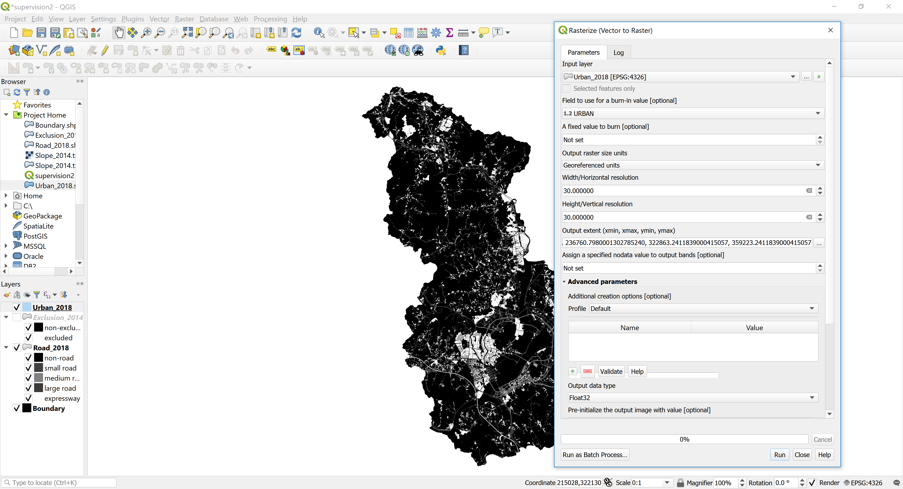 

3. Right-click on the newly created temporary `Rasterized` layer, click `Export` > `Save As`. Set `File name` as `Urban_2018.tif`, click `OK`.

Note: If you don't save as, these temporary files will disappear next time you open the QGIS file.

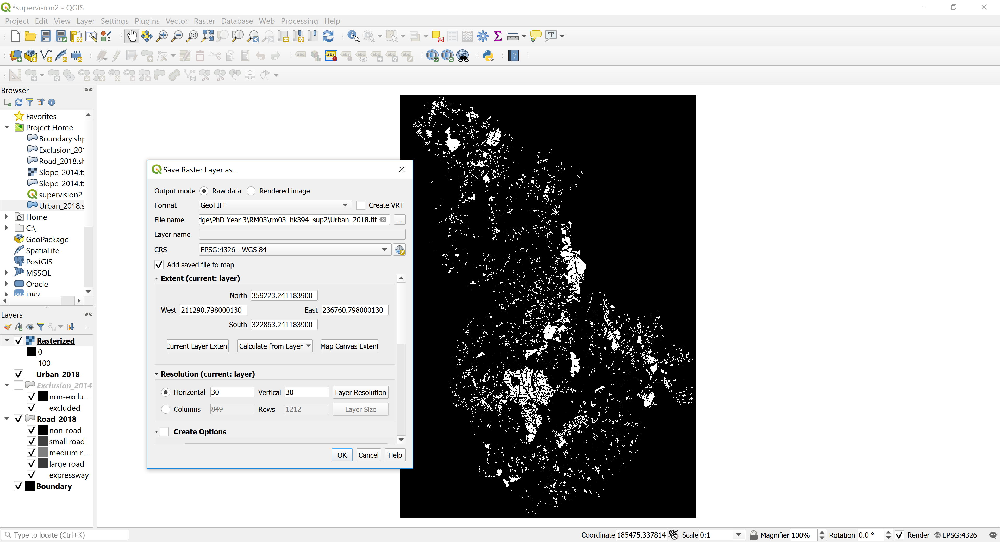 

Congratulations you have taken a vector .shp file and created a rasterized equivalent. From the lectures we know that whilst we are looking at the same phenomenon (the urbanized areas), the data representations quite different. With that mind have a go at answering the questions below. 

Note: As this supervision is for introducing how QGIS and raster data can be used on NetLogo, we cannot cover many other functions available on QGIS. Please refer to [QGIS Training Manual](https://docs.qgis.org/2.8/en/docs/training_manual/create_vector_data/index.html){:target="_blank"} for more information. 


### In-class questions
#### Question 1. Uncheck all layers except two `Urban_2018` layers and `Boundary`. Compare `Urban_2018.tif` with `Urban_2018.shp` by turning on and off the check of the raster layer. Zoom into the layer. How is the raster data different from vector data?

#### Question 2. Zoom into the `Urban_2018.tif` layer. You will see that the pixels are in a grid. Check the size of the grid by right-clicking on the layer and clicking `Properties`. In the `Information` tab, what are the dimensions and pixel size? (Note: pixel size is in meters)

#### Question 3. In real life, what would be the dimension (width and length on a map) of this city of Sejong, South Korea in kilometers? (hint: real distance = dimension * pixel size). Find this city on [Google Map](https://www.google.com/maps/place/Sejong+City+Hall/@36.5675237,127.1919615,11z/data=!4m5!3m4!1s0x357ad2abe6c47565:0x4da638f5f9f95e37!8m2!3d36.4800984!4d127.2890354){:target="_blank"} to see whether your calculation makes sense. You can search Sejong City Hall, and refer to the grey dotted line as the city boundary.

 

### Converting GeoTIFF (.tif) to ASCII (.asc) to load on NetLogo

We will be using the rasterized urban layer in NetLogo, but before we do so we need to convert it from the GeoTiff (.tif) format it is currently into the .asc format which we will use in NetLogo.

1. Check and click on `Urban_2018.tif` layer to highlight it and uncheck all other layers. On the `Menu bar`, click `Raster` > `Conversion` > `Translate`. Under `Converted`, click `Save to File` and save as `Urban_2018.asc`.

## Introducing NetLogo (10min)

NetLogo is a software package for cellular automata (CA) and agent based modelling (ABM) consisting mainly of the NetLogo programming language and an integrated development environment that allows you to write NetLogo code, run it, and observe the outputs on graphical user interface. It is commonly used as a research tool in the social sciences for its simple programming language, its portability, and strong connection between the code and visualisation.

NetLogo has somewhat quirky jargon for cellular automata and agents in agent based modelling for historical reasons. For the vast majority of our modelling we concern ourselves with a `world`. This `world` typically consists of a grid of `patches`, typically the cells found in cellular automata, and are addressed by their coordinates on this grid. Mobile agents that move across the patches are called `turtles`. This basic setup allows us to define CA, ABM, CA-ABM models. Through prescription of 'micro' behaviours on patches, turtles, and any other entities we can simulate change over time and observe 'macro' changes in the world, and sometimes unexpected emergent behaviour.

### Setup work environment for NetLogo
1. Continue using `rm03_YourCRSid_sup2` as your working directory.
2. Launch NetLogo. The interface will be explained along with exercises. Note: You can refer to [NetLogo User Manual (6.0.4)](https://ccl.northwestern.edu/netlogo/docs/){:target="_blank"} for more detailed information.
3. In `File` > `Models Library`, you can find a collection of sample models to explore. There are many sample models available on the User Community Models web page.

### Exercise 1: Wolf Sheep Predation
1. Open `Wolf Sheep Predation` from `Models Library` under `Biology` folder.

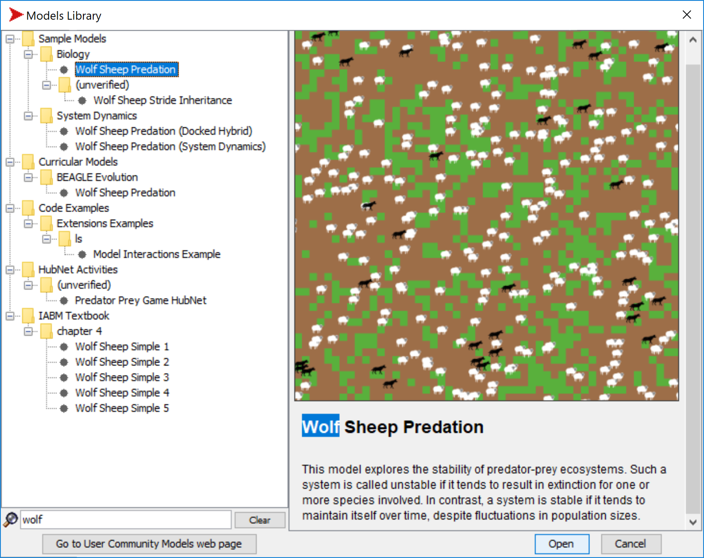

2. Click `setup` > `go` to start the simulation, and click `go` again to stop the simulation.
3. Try running the model with following changes and explain what happens:
- Change the `model-version` to `sheep-wolves-grass`. Sheep and wolves are the moving agents (again referenced 'turtles' in NetLogo), and grass form a grid of stationary agents ('patches').
- Decrease wolf poplulation.
- What other sliders/switches can you adjust to help out the sheep population?
- Can you find any parameters that generate a stable ecosystem?


## Studying a simple urban growth model in NetLogo using the raster data produced in QGIS (30min)

Having looked at a basic model integrated in the model library of NetLogo (we wholeheartedly encourage to look at more of the models), we can go ahead with creating our own model. Specifically we will be creating a simple urban growth simulation with cellular automata. To do so we will use rasterized versions of the Sejong area we looked at in QGIS. Herein each of the 30 x 30 meter pixels we created will now correspond to patches in our NetLogo world. Sejong or rather the Sejong Special Self-Governing City is a planned city of interest as it is still under construction to be completed in 2030 with intentions of it becoming the administrative capital of South Korea. So it may be of interests to simulate the kind of urban growth we may expect there. 

### Setting the work environment

1. Download the [netlogo_supervision2.zip](statics/netlogo_supervision2.zip) archive onto the directory of your choice (e.g. 'rm03_YourCRSid_sup2' is a good choice). Unzip and extract the contents from the archive.
2. Look over its contents. It should contain rasterized versions of the vector data we looked at in QGIS:
	- `Boundary.asc`
	- `Exclusion.asc`
	- `Road_2018.asc`
	- `Slope_2014.asc`
	- `Urban_2018.asc`
	- `Urbanization_sejong.nlogo`
3. The only files that should be new to you are `Slope_2014.asc` which is a raster data file containing slope data in sejong, and `Urbanization_sejong.nlogo`.
4. `Urbanization_sejong` is a NetLogo model file. It contains world settings and netlogo code to give our agents behaviours. The wolf-predation model we looked at previously also has netlogo model file where you installed the NetLogo package. Double click this file to have NetLogo open this model.

### Introduction to the urban growth model interface

1. Once NetLogo opens the model, within the interface tab, click on the `setup` button. You should the world load the various rasters and begin to show a view of Sejong. If the switch `show roads` is set to true the world will also display the roads on the world view.

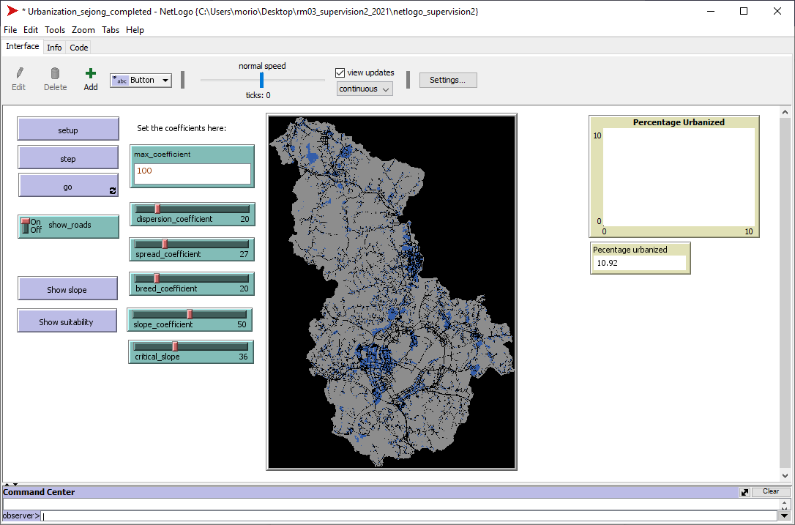

2. Click on the `step` button and then the `go` button. See how the world changes 

3. We can enact changes to the world and give agents behaviours through `procedures` (otherwise known as routines and functions in other languages). All procedures have the following signature:

```logo
to <procedureName>
    ;;
    ;; Do some stuff
    ;;
end
```

4. In many Netlogo models you will find a `setup` and `go` procedure. The `setup` procedure contains instructions to generate an initial starting state of the world, and the `go` procedure contains instructions to what agents should do during a single step or `tick` in time.
5. We can see this in the buttons on our interface. Right click on the `setup` button and click on `Edit...` this will open a pop up window which shows the `setup` procedure being called in the commands box. Close this window after.

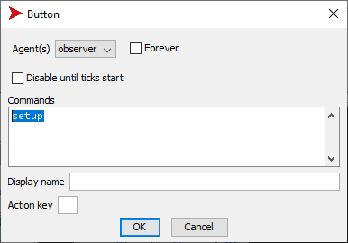

6. Similarly, you can see the call to the `go` procedure in the `step` and the `go` button. What is the difference?

### Studying the interface/code relationship

So since the buttons are simply making calls to procedures, lets see what these procedures are actually doing.

1. Near the top of the NetLogo window we have 3 tabs: `Interface`, `Info`, and `Code`. Click on the `Code` tab to look at the source code for the model.
2. Find the `setup` procedure.

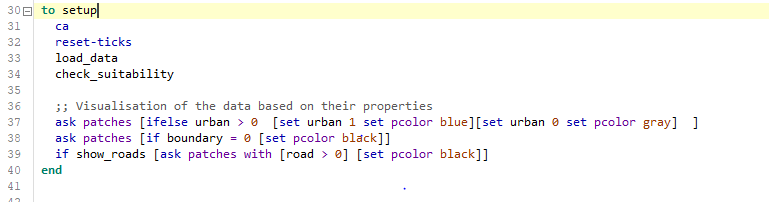

3. Aside from the NetLogo keywords `ca` (which 'clear-all's the world) and `reset-ticks` which sets the tick counter (back) to 0, all remaining commands should be relatively self explanatory. `load_data` and `check_suitability` are procedures and can also be found if you scroll down or use the `Procedures` drop down menu on the top.

4. Lets look at the `load_data` procedure, even without knowing the internals of the specific commands you can see that it is loading the various rasterized versions of the datasets we have created inside QGIS to the global variables in NetLogo. Following this applies the layer attributes to patch attributes to have each patch in the NetLogo world contain data of a dataset within one of its patch attributes.

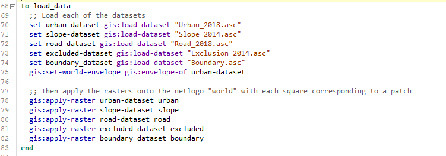

5. We can see what attributes a particular patch in the NetLogo has by inspecting it. Go to the `Interface` tab and right-click any space on the world view and select `Inspect patch` this will open a new window and you can see the attributes assigned to this patch.

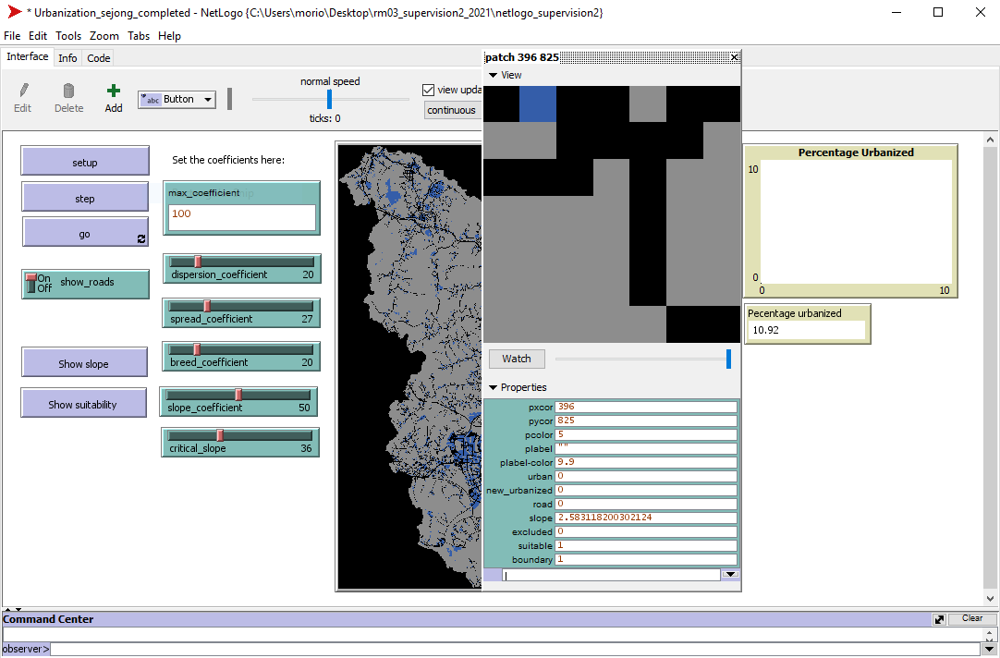

6. The patches in our urban growth model will change depending on the attributes it and its neighbouring patches have.

### Creating new behaviour

1. Looking at the `go` procedure we can see that we call upon three different growth procedures to affect urbanisation.
    - `spontaneous_growth`: causes patches picked at random to be urbanised based on the dispersion_value that is is calculated in the statement above it.
    - `new_spreading_center_growth`: causes growth from the newly urbanised patches from spontaneous_growth dependent on a 'breeding_coefficient'
    - `edge_growth`: causes growth at the edges of urbanised patches.

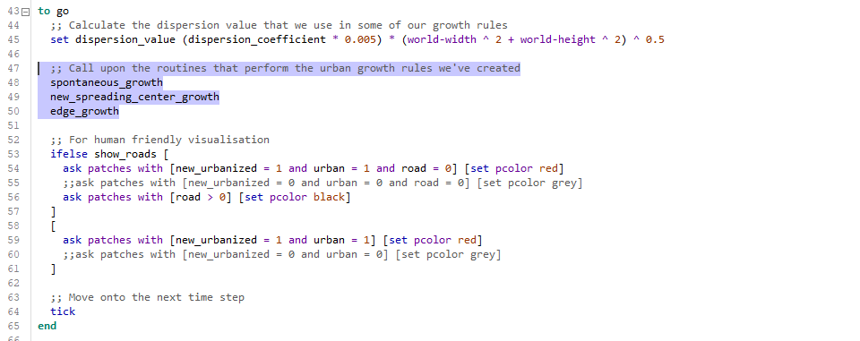

2. (Class question) which form of growth do you believe contributes most to the number of urbanised patches at each time step? You can deactivate any of the growth procedures by commenting it out by prefixing `;;` in front of the procedure.

3. Comment out the `edge_growth` procedure. Start the model over again with `setup` button and see how urbanisation occurs under only `spontaneous_growth` and `new_spreading_center_growth`.

4.  It would seem reasonable to have urbanisation occur along roads so let us create a new growth rule called `road_growth`. In this growth rule we want an urbanised patch that is next to a road patch to urbanise a patch that is adjacent to it and a road patch. 

5. Create a new procedure called `road_growth`, as written in the figure below. As you type this in, think whether this correctly implements our desired behaviour.

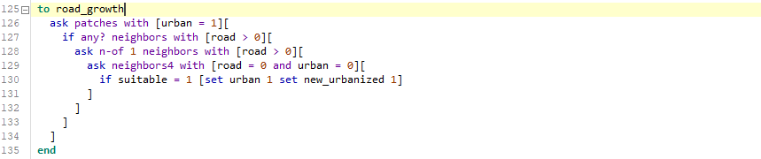

6. In order for the model to incorporate our new behaviour we have to tell it to do so! Add your new `road_growth` procedure into the `go` procedure that dictates what happens to the world at each tick in time.

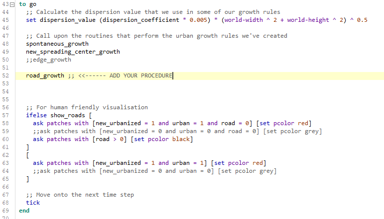

7. Now go back to the `Interface` tab and let us see how the world changes with your new growth rule. Does urbanisation occur along roads?

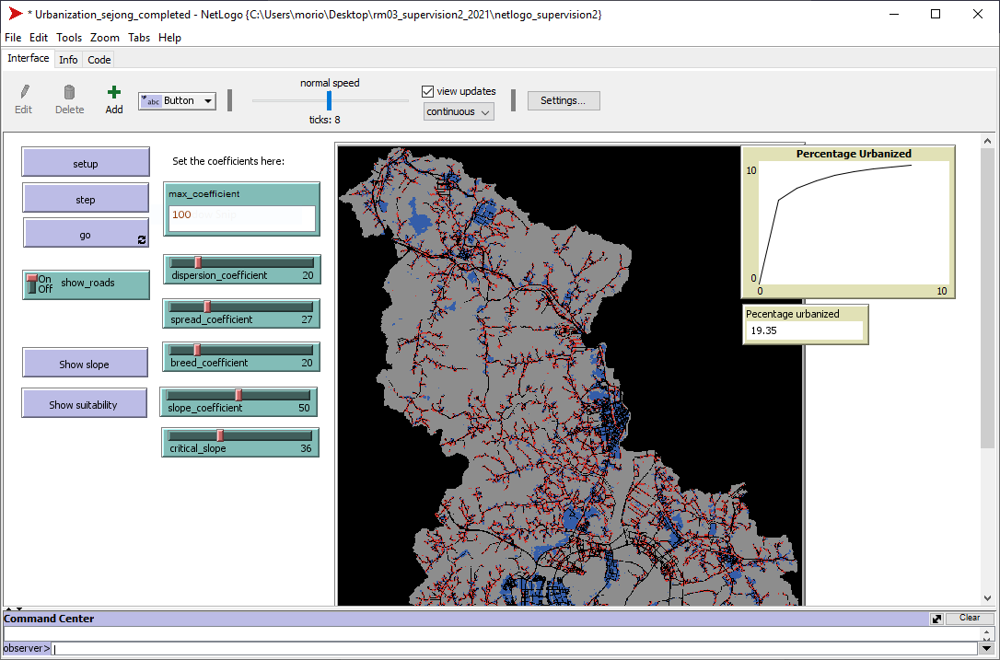 

8. To check the completed netlogo file of this exercise, please find the zipped file [Urbanization_sejong_completed.nlogo](statics/netlogo_supervision2_completed.zip)

## (If time allows) Discussion with supervisor

The model we have created is a parametric model. The behaviour of the various growth rules can be augmented by changing the values of the coefficients to better fit real life conditions in a process called calibration. What do we need in order to perform calibration?

## Closing

1. In a very short period of time you have been introduced to principles of NetLogo and practical ABM modelling using raster data that you created in QGIS. You have changed the behaviour of urbanisation within an urban growth model using code you have written. That's pretty impressive.

2. If you are interested in learning more, there is a whole myriad of resources online starting with the models integrated in the model library as well as detailed tutorials and usecases on the [NetLogo website](https://ccl.northwestern.edu/netlogo/){:target="_blank"}

3. There is an assignment [Supervision 2 Assignment](supervision2-assignment.md) which will allow you to explore more of NetLogo using the Game of Life model. Thanks for attending this supervision.
