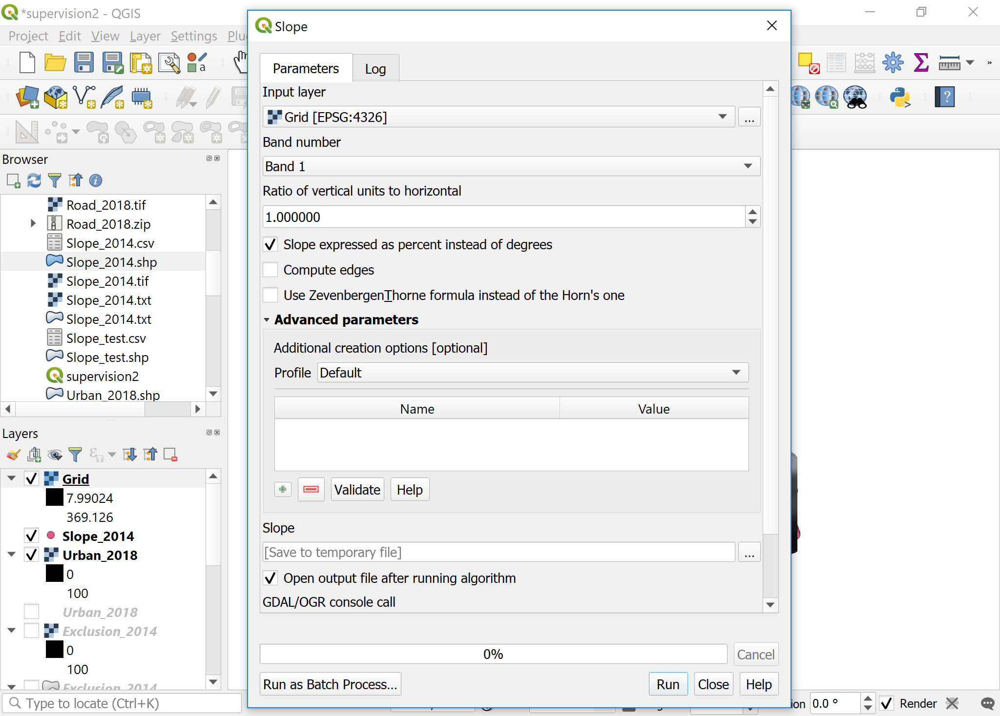
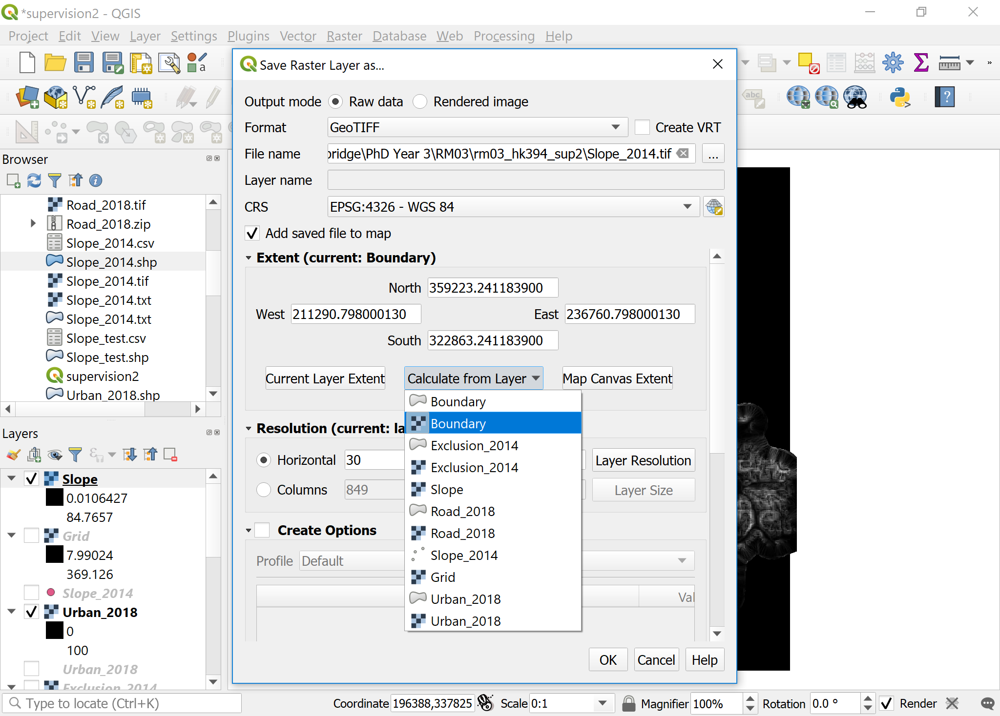
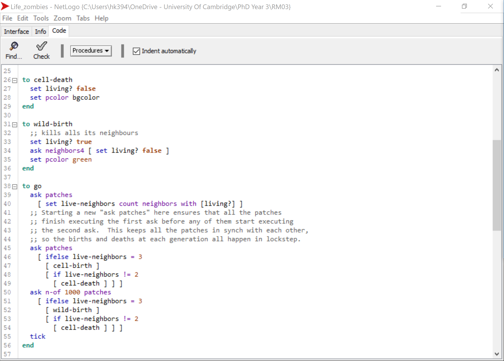
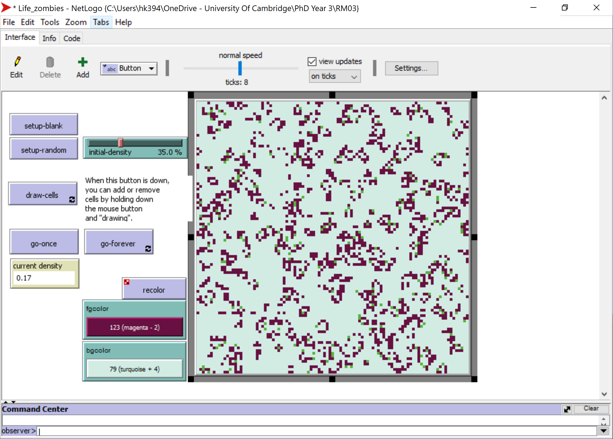
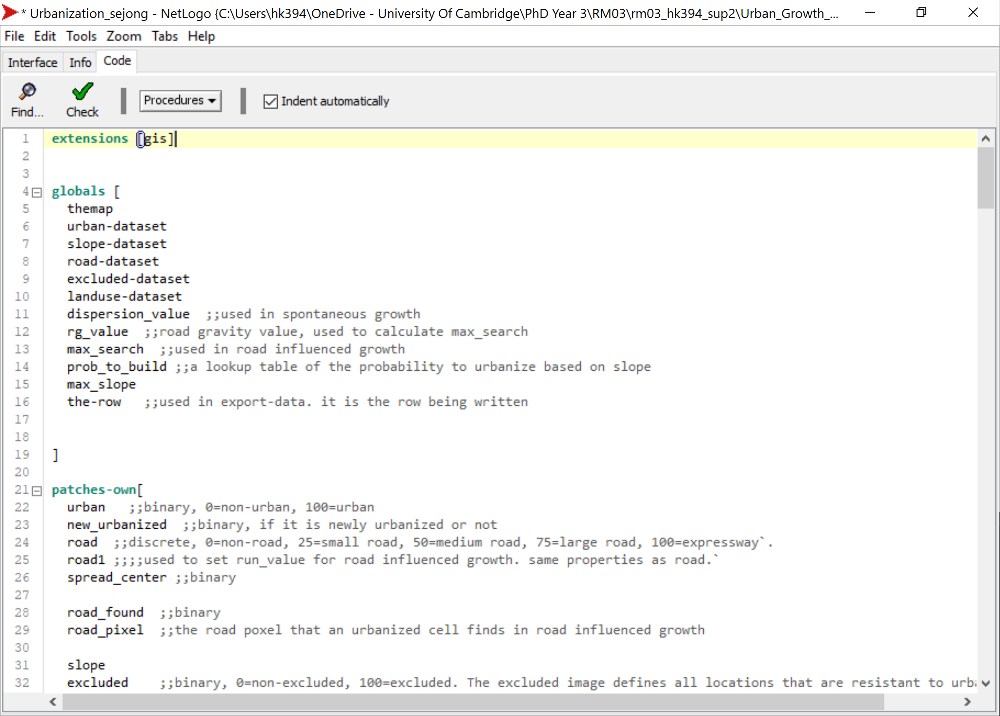
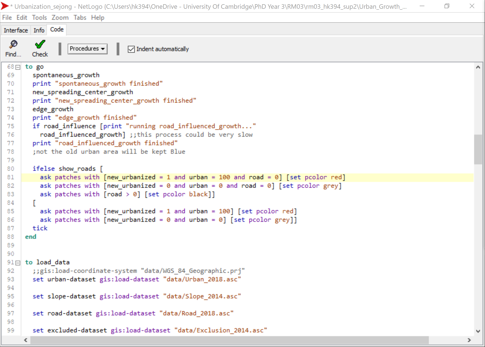
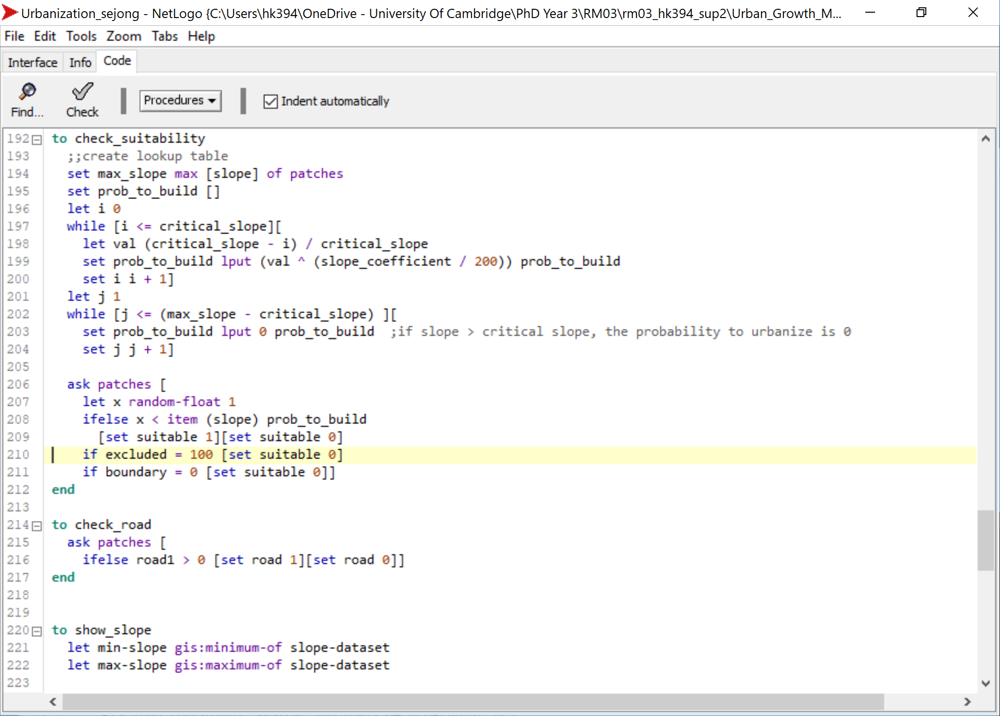
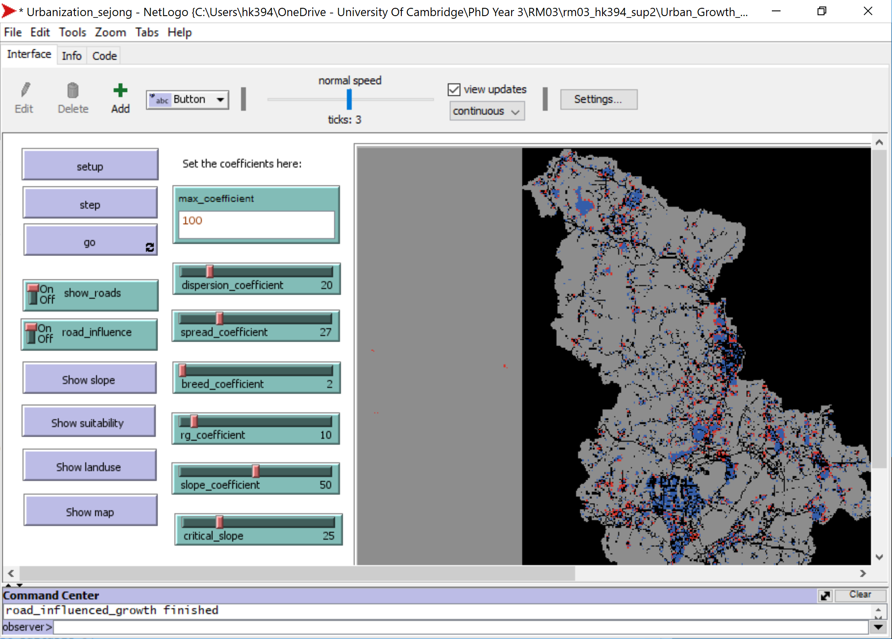

# Supervision 2 (27-28 February, 2020)

## Short presentation by supervisors (10min)
1. The slides are available on: [CamLandEc-RM03](https://hn303.github.io/CamLandEc-RM03/).

## Instructions
1. This supervision builds on Supervision 2 Assignment. If you haven't completed this for some reason, please open [Supervision 2 Assignment](https://hn303.github.io/CamLandEc-RM03/supervision2-assignment_.md) and ask for one of the supervisors' help. Additional to the four `zip` files to be downloaded for the assignment, please download the [outcomes of the assignment](data/supervision2_for_assignment_catchup.zip), and put them all unzipped in the same folder `rm03_YourCRSid_sup2` at your prefered directory on your disk.
2. Read through the instruction carefully. You may face problems if you overlook any of the steps.
3. Remember to save the QGIS document regularly. 
4. When running tasks on QGIS, leave the settings as default unless instructed.

Note: functions and filename are `highlighted` in this document.

## Supervision overview
In this supervision, you will familiarise yourself with geoprocessing raster data on QGIS software (e.g. preparing a slope map from digital elevation model (DEM) in xyz) as well as basic features of NetLogo software and how to use the GIS extension to input raster maps. 

### Resuming the QGIS exercise (20min)
1. Open `supervision2.qgz` file in your working directory `rm03_YourCRSid_sup2`.
2. Download data (sample data of Sejong, South Korea) [Slope_2014.csv](data/Slope_2014.csv) in the working directory.

#### Importing DEM data in `csv` as delimited text layer
1. On the `Menu bar`, click `Layer` > `Add Layer` > `Add Delimited Text Layer`. Add `Slope_2014.csv` with  `Point coordinates`. 

2. Right-click on `Slope_2014` layer (this is a temporary layer) > `Export` > `Save Feature As`. Set `File name`as `Slope_2014.shp` > `OK`. Remove the other temporary `Slope_2014` layer. Note: You can check the file type of the layers by lingering the cursor on the layer name, or by right-clicking > `Properties` > `Information tab`.

#### Interpolating the DEM data
4. On the `Menu bar`, click `Processing` > `Toolbox`, search `interpolation`, and double-click `Inverse distance weighted interpolation` under `SAGA`. Note: `IDW interpolation` under `QGIS Interpolation` in the `Processing Toolbox` does a similar job but takes much longer so we use a SAGA tool instead.

5. Set `Attribute` as `z` and `Cellsize` as `30`, and click `Run`. `Close` afterwards.
6. The newly created `Grid` is a temporary file. Right-click and `Export` > `Save As` > `Interpolation.tif`. Leave everything else as default > `OK`. Remove the `Grid` layer.

#### Generating slope in percent from interpolated data
5. Click the `Interpolation` layer. On the `Menu bar`, click `Raster` > `Analysis` > `Slope`. Check `Slope expressed as percent instead of degrees` and click `Run` > `Close`.

6. Right-click on `Slope` layer (this is a temporary layer) > `Export` > `Save As`. Set `File name` as `Slope_2014.tif`, click `Calculate from Layer` and choose any of the four raster layers created previously (`Boundary`, `Exclusion_2014`, `Road_2018`, and `Urban_2018`). You will notice that the extent is same in all these layers. Check that `Resolution` is set as `30`. Click `OK`.

#### Converting file format from `.tif` to `.asc` (to load on NetLogo)
1. Click on `Slope_2014.tif` layer. On the `Menu bar`, click `Raster` > `Conversion` > `Translate`. Under `Converted`, click `Save to File` and save as `Slope_2014.asc`.
2. Check and click on `Urban_2018.tif` layer and uncheck all other layers. On the `Menu bar`, click `Raster` > `Conversion` > `Translate`. Under `Converted`, click `Save to File` and save as `Urban_2018.asc`.
3. Check and click on `Exclusion_2014.tif` layer and uncheck all other layers. On the `Menu bar`, click `Raster` > `Conversion` > `Translate`. Under `Converted`, click `Save to File` and save as `Exclusion_2014.asc`.
4. Check and click on `Road_2018.tif` layer and uncheck all other layers. On the `Menu bar`, click `Raster` > `Conversion` > `Translate`. Under `Converted`, click `Save to File` and save as `Road_2018.asc`.
5. Check and click on `Boundary.tif` layer and uncheck all other layers. On the `Menu bar`, click `Raster` > `Conversion` > `Translate`. Under `Converted`, click `Save to File` and save as `Boundary.asc`.
6. Check in your working directory that we have the five `asc` files. We are now ready to import them to NetLogo! Don't close QGIS yet.

Note: As this supervision is for introducing how QGIS and raster data can be used on NetLogo, we cannot cover many other functions available on QGIS. Please refer to [QGIS Training Manual](https://docs.qgis.org/2.8/en/docs/training_manual/create_vector_data/index.html) for more information.

### Introducing NetLogo with two exercises (15min)

#### Setup work environment for NetLogo
1. Please download and install `NetLogo (6.1.1)` according to your platform. We recommend downloading `Windows (64-bit)`, `Mac OS X`, or `Linux (64-bit)`: [NetLogo Download Page](https://ccl.northwestern.edu/netlogo/6.1.1/). 
2. Continue using `rm03_YourCRSid_sup2` as your working directory.
3. Launch NetLogo. The interface will be explained along with exercises. Note: You can refer to [NetLogo User Manual (6.1.1)](https://ccl.northwestern.edu/netlogo/docs/) for more detailed information.
4. In `File` > `Models Library`, you can find a collection of sample models to explore. There are many sample models available on the User Community Models web page.

#### Exercise 1: Wolf Sheep Predation
1. Open `Wolf Sheep Predation` from `Models Library` under `Biology` folder.

2. Click `setup` > `go` to start the simulation, and click `go` agin to stop the simulation.
3. Try running the model with following changes and explain what happens:
- Change the `model-version` to `sheep-wolves-grass`. Sheep and wolves are the moving agents (turtles in NetLogo), and grass form a grid of stationary agents (patches).
- Decrese wolf poplulation.
- What other sliders/switches can you adjust to help out the sheep population?
- Can you find any parameters that generate a stable ecosystem?

#### Exercise 2: Game of Life (if you have time, go through this at the supervision, if not, at your free time)
1. Open `Life` from `Models Library` under `Computer Science` > `Cellular Automata`.
2. Game of Life is a simple cellular automata (CA) model where the state of the cells (patches) change according to behavioral rules. As the simulation runs, you can find recurring shapes like gliders and blinkers. Note: You can refer to [Conway's Game of Life](https://en.wikipedia.org/wiki/Conway%27s_Game_of_Life) for more detailed information.
3. Click `setup-random` > `go-forever` to start the simulation, and click `go-forever` again to stop the simulation.

4. Let's check the `Code` tab. (Note: If you don't see line numbers, for Windows users, on the `Menu bar`, click `Tools` > `Preferences` and check `Show Line Numbers`. For Mac users, on the `Menu bar`, click `NetLogo` > `Preferences` and check `Show Line Numbers`.) 
5. In line 2-3, `living?` and `live-neighbors` are variables. In line 8, `ask patches [ cell-death ]` means to [ask](http://ccl.northwestern.edu/netlogo/docs/dict/ask.html) patches to run the `[ cell-death ]` command. In line 26, `[ cell-death ]` command sets `living?` as false, and sets patch color as foreground color. `[ cell-birth ]` command does the opposite.
6. Line 14 means "ask patches to run the [ifelse](http://ccl.northwestern.edu/netlogo/docs/dict/ifelse.html) command. ifelse commands are very important in language-based rules. Line 15-17 means "if `random-float 100 < initial-density` reports true (in other words, "if a `random floating point number >= 0 but less than 100` is less than the `initial density (default=35)`"), run the `[ cell-death ]` command, and otherwise, run the `[ cell-birth ]` command. This part makes each cell to check the state of itself.
Note: You can refer to [NetLogo Dictionary](http://ccl.northwestern.edu/netlogo/docs/index2.html) when trying to understand the codes.

7. Line 33 means "set the variable `live-neighbors` to `count how many neighboring cells are alive`" and line 32 asks patches to run this command. This part makes each cell to check the state of its eight surrounding neighbors. Note: [neighbors](http://ccl.northwestern.edu/netlogo/docs/dict/neighbors.html).
8. Line 38 asks patches to run another ifelse command. The rule is:
- If there is exactly 3 alive neighbors, the cell becomes alive. (birth)
- If there are less than 2 alive neighbors, the cell dies. (under-population)
- If there are more than 3 alive neighbors, the cell dies. (over-population)
- If there are 2 alive neighbors, the cell remains in the state it is in. (sustainable life)
9. Try writing this rule into a code, as it is. See how this can be shorted to the code written in the model.

10. In line 33, try changing `neighbors` to `neighbors4` and see how this affects the simulation.
11. Let's add one more command to the model. Add the following lines below the `to cell-death` part. This command makes this cell colored in green to kill the four surrounding patches.

`to wild-birth`  
  `;; kills all of its neighbours`  
  `set living? true`  
  `ask neighbors4 [ set living? false ]`  
  `set pcolor green`  
`end`

12. Also, let's add a new rule for `wild-birth`. Add the following lines below the `ask patches [ ifelse ]` part. This rule runs the same ifelse command on the 1,000 randomly chosen patches, this time for `wild-birth`. (Note: [n-of](http://ccl.northwestern.edu/netlogo/docs/dict/n-of.html)). What happens to the simulation this time?

`ask n-of 1000 patches`  
  `[ ifelse live-neighbors = 3`  
    `[ wild-birth ]`  
    `[if live-neighbors != 2`  
      `[ cell-death ] ] ]`
      
      

#### Importing raster data from QGIS into a SLEUTH Urban Growth Model on NetLogo (20min)

### Setting the work environment
1. Download `ZIP` of the partial reimplementation of SLEUTH urban growth model on NetLogo and save it at your prefered directory on your disk (e.g. `rm03_YourCRSid_sup2`). : [Urban Growth Model](https://github.com/YangZhouCSS/Urban_Growth_Model).
2. Unzip `Urban_Growth_Model-master.zip` and further unzip `urban_growth_model.zip`. In the `urban_growth_model` > `urban model` folder, open `Urbanization.nlogo`. 
3. Click `setup` > `go` to try out. Inside `urban model` folder, open `data` folder, and you will see the asc files of Santa Fe, New Mexico. Copy-paste the five asc raster files that we created for Sejong: `Slope_2014.asc`, `Urban_2018.asc`, `Exclusion_2014.asc`, `Road_2018.asc` and `Boundary.asc`.
4. `File` > `Save As` the netlogo file to `Urbanization_sejong.nlogo`. We will make changes to the code to suit our Sejong data. 

### Editing the code to suit our data
1. Go to the `code` tab. `extensions [gis]` is used for this model. (Note: More information on [NetLogo GIS extension](https://ccl.northwestern.edu/netlogo/docs/gis.html). `globals` outlines the global variables accessible by all agents. 
2. `patches-own` outlines the variables that all patches can use. 
- In line 25, for `road1`, change `from 1 to 4` to `from 25 to 100`.
- In line 32, for `excluded`, change `0 if excluded` to `0=non-excluded, 100=excluded`.
- Add `boundary ;;binary, 0=outside boundary, 1=within boundary`
3. Optional: You can load the Santa Fe `asc` files on QGIS to see which code refers to what. In Santa Fe raster files,
- Urban: 1 = non-urban, 2 = urban
- Road: 1 = small road, 2 = medium road, 3 = large road, 4 = expressway
- Exclusion: 0=excluded
- Slope: Discrete. Whole number between 1 and 21.
4.Back to the `Code` tab, in the `to setup` section, `ca` means `clear all`. We cannot go through all codes one by one due to time limitation, so you can refer to [NetLogo Dictionary] (http://ccl.northwestern.edu/netlogo/docs/index2.html) in your free time. Also, the setting of values and growth rules etc. are based on the original SLEUTH model (details can be seen in [Project Gigapolis website](http://www.ncgia.ucsb.edu/projects/gig/About/bkOverview.html) so we won't go through in detail. The objective of this exercise in this supervision is to introduce how raster maps generated in QGIS can be loaded on NetLogo and how a model directly applicable to urban planning like SLEUTH urban growth model can run on NetLogo based on a set of rules.
5. Line 62 asks road patches to set run_value. Change `road = 1` to `road > 0` and `road1 / 4` to `road1 / 100` since in the raster data for Sejong, 0=non-road and road value ranges up to 100.
6. In line 65, also change `road = 1` to `road > 0`.

7. In line 83, change `road = 1` to `road > 0`.
9. In the `to load_data` section, change the Santa Fe data to `Urban_2018.asc`, `Slope_2014.asc`, `Road_2018.asc`, and `Exclusion_2014.asc`. 

10. In line 101, disable the `set landuse-dataset` row by putting `;;` in front as we will not include this for this exercise (landuse data is not crucial for SLEUTH growth rules).
11. Add in line 103, `set boundary_dataset gis:load-dataset "data/Boundary.asc"`. This is because Sejong data uses the administrative boundary while Santa Fe data uses the whole of the rectangular extent.
12. In line 108, change `urban = 2` to `urban > 0` because urban cells in Santa Fe raster are coded 2 while in Sejong, 100. This model can be extended to include urban data as continuous (e.g. urban intensity) rather than binary, therefore, `urban > 0` is used rather than `urban = 100`. 
13. Add in line 116, `gis:apply-raster boundary-dataset boundary`
14. Add in line 117, `ask patches [if boundary = 0 [set pcolor black]]
15. In line 119, disable `gis:apply-raster landuse-dataset landuse` by putting `;;` in front.

16. In line 161, change to `ask n-of tenpercent_urban (patches with [urban = 1])`. This is to fasten this procedure.
17. In line 170, 171 and 186, change `road = 1` to `road > 0`.

18. In line 210, change `excluded = 0` to `excluded = 100`. 
19. Add in line 211 `if boundary = 0 [set suitable 0]`.

20. In line 240, change `road = 1` to `road > 0`.

21. These do not affect the simulation, for optionally: In line 258, change `531` to `849`.
22. In line 259, change `394` to `1212`.
23. In line 260, change `-901575` to `211290.798000130308`
24. In line 261, change `1442925` to `322863.241183900100`.
25. Add in line 279 `to-report tenpercent_urban`
26. Add in line 280 `report (round (count patches with [urban = 1] * 0.10))`
27. Add in line 281 `end`. This is to define the value `tenpercent_urban` introduced earlier.
28. Click `Check` bottom next to `Find`. (Note: If an error message comes up for some reason, click `Dismiss` and try again twice. On the third go, the map will be loaded fine. If it still occurs, it might be due to typo, etc. Let one of the supervisors know, and in the interest of time, download the completed file [Urbanization_sejong.nlogo](data/Urbanization_sejong.nlogo) so that we can carry on. You can either put this file in the same working directory, or you can copy-paste this file's code to the NetLogo file that you have been working on.

### Changinng the model settings and running the simulation

1. Go back to `Interface` tab, click `setup`. You will see that the Sejong data have been loaded.
2. Click `go` and a few ticks and click `go` again. What happens?
3. Turn on the `road_influence` switch and run the model again. (Note: this may  How is it different from before?
4. Right-click on the map and click `Edit`. Change `max-pxcor` to `848` and `max-pycor` to `1211`. You will see that the Box is now changed to Sejong's raster dimension: 849 x 1212. Set patch size as `0.3` (or `0.2` and `0.1` depending on your screen resolution. Try several.) so that we can see the whole screen. (Note: If an error message comes up for some reason, click `Dismiss` and try again twice. On the third go, the map will be loaded fine.)

5. The Sejong masterplan sets that development is not possible on land with a slope greater than 20 degrees. 20 degrees slope equates to 36.4 percent slope. (Note: a simple degree to percent slope can be found online, for example [Calcunation.com](https://www.calcunation.com/calculator/degrees-to-percent.php). Move the `critical_slope` bar to `36` and see what changes.
6. The best-fit of five coefficients can be calculated through calibration which requires `extensions [r]` and many more. For more information on these coefficients, you can look at [Project Gigapolis webpage](http://www.ncgia.ucsb.edu/projects/gig/About/gwCoef.htm).
7. Right-click anywhere on the map and click `inspect patch` You will see the properties of the selected cell e.g. urban, road, slope, excluded...

8. You can right-click on the `Percentage urbanized` chart and monitor and the `export_data` button along with the information and move this closer to the map.
9. Currently, `Percentage urbanized` is set without the boundary in consideration. Right-click on the `Percentage urbanized` monitor and change the reporter to `(count patches with [urban = 1 and boundary = 1]) / (count patches with [boundary = 1]) * 100`. Make necessary change to the chart too (e.g. change the reporter similarly to the monitor, and change the maximum values from 10 to 100).
10. In a short period of time, you have been introduced to the concept of NetLogo, how to load your own raster data into an existing model that uses the GIS extension, as well as making changes to the code. If you are more interested, there are many more resources available on the [NetLogo website](https://ccl.northwestern.edu/netlogo/), for example, in `Help`, `Resources` and tabs under `Models` and `User Manuals`. Please feel free to reach out to Rain (hk394@cam.ac.uk) for any specific advise!

