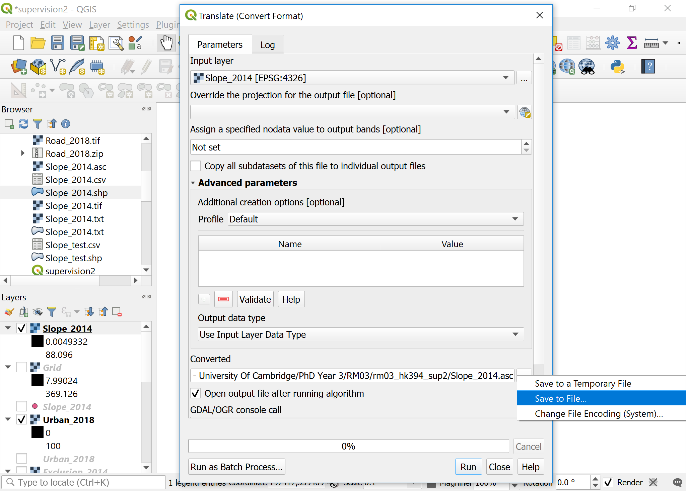

# Supervision 2 (27-28 February, 2020)

## Short presentation by supervisors (10min)
1. The slides are available on: [CamLandEc-RM03](https://hn303.github.io/CamLandEc-RM03/).

## Instructions
1. Read through the instruction carefully. You may face problems if you overlook any of the steps.
2. Remember to save the QGIS document regularly. 
3. When running tasks on QGIS, leave the settings as default unless instructed.
4. Some parts are labeled as `optional` which you can try in your own time at home if you wish.

Note: functions and filename are `highlighted` in this document.

## Supervision overview
In this supervision, you will familiarise yourself with geoprocessing raster data on QGIS software as well as basic features of NetLogo software and how to use the GIS extension to input raster maps. 

## Preparing raster maps on QGIS (30min)

### Setup work environment
1. It is suggested to create a folder and name it as `rm03_YourCRSid_sup2`, at your prefered directory on your disk. This folder will be the working directory for the assignment and supervision.

### QGIS project setup
1. Click `Project` > `New`.
2. Click `Project` > `Save As`, and save as `supervision2.qgz` to the working directory. 
3. Download dataset (sample data of Sejong, South Korea): [Urban_2018.zip](data/Urban_2018.zip), [Exclusion_2014.zip](data/Exclusion_2014.zip), [Road_2018.zip](data/Road_2018.zip), and [Boundary.zip](data/Boundary.zip) in the working directory (you don't need to unzip). (Note: The original dataset are from the Korea National Spatial Infrastructure Portal. We have simplified and edited the file contents for the supervision).
4. Go to `Project` >  `Properties` in menu bar and open the `Project Properties` window.
    - `General` tab: Set your working directory as `Project Home`.
Note: after adding project home, you can find `Project Home` directory is showing in the `Browser panel`. It is much easier to locate your data files through this panel.
5. Drag `Urban_2018.shp` `Exclusion_2014.shp` `Road_2018.shp` `Boundary.shp` to the  `Layers panel`. Drag `Boundary.shp` to the bottom. Uncheck all layers except `Boundary.shp`. Note: You can check/uncheck the layer to make it visible/invisible by clicking the box next to the layer name in the `Layer panel`. 

### Understanding the layer content through attribute table
1. You can see the attibute table of a layer by right-click > `Open Attibute Table`. `Urban_2018` layer is a combination of urban land-use data by parcel and building data, with the urban parcels coded 100 in the field `URBAN`. `Exclusion_2014` layer is a combination of river, urban parks, and development restriction zone, with non-excluded areas coded 0 and excluded areas coded 100 in the field `EXCLUSION`. `Road_2018` layer contains roads, with the road-class information coded in the field `road_class` (25=small road, 50=medium road, 75=large road, 100=expressway).`Boundary` layer contains the administrative boundary of the city in the field `boundary` (within boundary=1).

### Using symbology to assign colour to visualize the data
1. Let us assign colour for `Boundary` and `Urban_2018` layers only just to see what they look like.
2. Right-click on `Boundary` layer > `Properties` > `Symbology` (or double-click the color box). Click `Simple fill`, change `Fill color` to `black`, change `Stroke style` to `No Pen`, click `OK`. 
3. Check `Urban_2018` layer, double-click the color box. Click `Simple fill`, change `Fill color `to `white`, change `Stroke style` to `No Pen`, click `OK`.

  

### OPTIONAL 1: Using symbology to assign colour to visualize the data
1. You can assign colour for other layers too if you wish. Uncheck `Urban_2018` layer, check `Exclusion_2014` layer, double-click the color box. Click `Single symbol` > `Categorized`, click `Column` > `Exclusion`, click `Classify` and change `Legend` to 0=non-excluded, 100=excluded.
2. Double-click the color box of non-excluded, click `Simple fill`, change `Fill color` to `black`, change `Stroke style` to `No Pen`, click `OK`. Double-click the color box of excluded, click `Simple fill`, change `Fill color` to `white`, change `Stroke style` to `No Pen`, click `OK`. 
3. Delete the third row (unnecessary) by pressing the `negative sign` next to `Classify`. Click `OK`.

 

6. Uncheck `Exclusion_2014` layer, check `Road_2018` layer, double-click the color box. Click `Single symbol` > `Categorized`, click `Column` > `road_class`, click `Classify` and change `Legend` and `color` to the following with `No Pen`: 25=small road (#404040), 50=medium road (#808080), 75=large road (#3a3a3a), 100=expressway (white). Click `OK`. Note: The road classifications are coded from 25 because we want to have 0=non-road.

 

### Converting vector to raster (rasterize)
1. Click and check `Urban_2018` layer, click `Raster` in menu bar, `Conversion` > `Rasterize`. Set `Field to use for a burn-in value` as `URBAN`, `A fixed value to burn` as `Not set`, `output raster size units` as `Georeferenced units`, and `Resolution` as `30` and `30`.
2. Set `Output extent` as `211290.7980001302785240, 236760.7980001302785240, 322863.2411839000415057, 359223.2411839000415057`. Set `Nodata value` as `Not set`. Click `Run`.
Note: Numbers of the output extent came from the layer with the largest layer extent. Keeping the output extent same for all layers is important when loading them on NetLogo.

 

3. Right-click on the newly created temporary `Rasterized` layer, click `Export` > `Save As`. Set `File name` as `Urban_2018.tif`, click `OK`. You can now right-click `Rasterized` layer and click `Remove Layer`.
Note: If you don't save as, these temporary files will disappear next time you open the QGIS file.

 

### In-class questions
#### Question 1. Uncheck all layers except two `Urban_2018` layers and `Boundary`. Compare `Urban_2018.tif` with `Urban_2018.shp` by turning on and off the check of the raster layer. Zoom into the layer. How is the raster data different from vector data?

#### Question 2. Zoom into the `Urban_2018.tif` layer. You will see that the pixels are in a grid. Check the size of the grid by right-clicking on the layer and clicking `Properties`. In the `Information` tab, what are the dimensions and pixel size? (Note: pixel size is in meters)

#### Question 3. In real life, what would be the dimension (width and length on a map) of this city of Sejong, South Korea in kilometers? (hint: real distance = dimension * pixel size). Find this city on [Google Map](https://www.google.com/maps/place/Sejong+City+Hall/@36.5675237,127.1919615,11z/data=!4m5!3m4!1s0x357ad2abe6c47565:0x4da638f5f9f95e37!8m2!3d36.4800984!4d127.2890354) to see whether your calculation makes sense. You can search Sejong City Hall, and refer to the grey dotted line as the city boundary.

 

### Converting GeoTIFF (.tif) to ASCII (.asc) to load on NetLogo

1. Check and click on `Urban_2018.tif` layer and uncheck all other layers. On the `Menu bar`, click `Raster` > `Conversion` > `Translate`. Under `Converted`, click `Save to File` and save as `Urban_2018.asc`. (Note: This is because the SLEUTH model we will be using on NetLogo accepts ASCII files)
5. In the interest of time, please download the `asc` files for other layers: [Exclusion_2014.asc](data/Exclusion_2014.asc), [Road_2018.asc](data/Road_2018.asc), and [Boundary.asc](data/Boundary.asc). Load them onto your QGIS working file.

### OPTIONAL 2: Converting vector to raster (rasterize)
4. You can rasterise the other layers yourself too if you wish. Uncheck `Urban_2018` layer. Click and check `Excluson_2014` layer, click `Raster` in menu bar, `Conversion` > `Rasterize`. Set `Field to use for a burn-in value` as `EXCLUSION`, `A fixed value to burn` as `Not set`, `output raster size units` as `Georeferenced units`, and `Resolution` as `30` and `30`.
5. Set `Output extent` as `211290.7980001302785240, 236760.7980001302785240, 322863.2411839000415057, 359223.2411839000415057`. Set `Nodata value` as `Not set`. Click `Run`.

 

6. Right-click on the newly created `Rasterized` layer, click `Export` > `Save As`. Set `File name` as `Exclusion_2014.tif`, click `OK`. You can now right-click `Rasterized` layer and click `Remove Layer`.
7. Repeat the exact same `Rasterize` task on `Road_2018` layer using `road_class` as the `Field to use for a burn-in value`. `Save As` the temporary layer to `Road_2018.tif` and remove the temporary layer.
8. Repeat the exact same `Rasterize` task on `Boundary` layer using `boundary` as the `Field to use for a burn-in value`. `Save As` the temporary layer to `Boundary.tif` and remove the temporary layer.
9. Check and click `Road_2018` raster layer and zoom in. Use `Identify Features` button on menu bar (information sign + cursor) and click on the road pixels on the map to check that the grids are coded correctly (0=non-road, 25=small road, 50=medium road, 75=large road, 100=expressway).

 

### Importing DEM data in `csv` as delimited text layer
1. Download [Slope_2014.csv](data/Slope_2014.csv) in the working directory. (Note: The original data is from the Korea National Spatial Infrastructure Portal.)
2. On the `Menu bar`, click `Layer` > `Add Layer` > `Add Delimited Text Layer`. Add `Slope_2014.csv` with  `Point coordinates`. 

3. Right-click on `Slope_2014` layer (this is a temporary layer) > `Export` > `Save Feature As`. Set `File name`as `Slope_2014.shp` > `OK`. Remove the other temporary `Slope_2014` layer. Note: You can check the file type of the layers by lingering the cursor on the layer name, or by right-clicking > `Properties` > `Information tab`.

### Interpolating the DEM data
1. On the `Menu bar`, click `Processing` > `Toolbox`, search `interpolation`, and double-click `Inverse distance weighted interpolation` under `SAGA`. Note: `IDW interpolation` under `QGIS Interpolation` in the `Processing Toolbox` does a similar job but takes much longer so we use a SAGA tool instead.

2. Set `Attribute` as `z` and `Cellsize` as `30`, and click `Run`. `Close` afterwards.
3. The newly created `Grid` is a temporary file. Right-click and `Export` > `Save As` > `Interpolation.tif`. Leave everything else as default > `OK`. Remove the `Grid` layer.

#### Generating slope in percent from interpolated data
4. Click the `Interpolation` layer. On the `Menu bar`, click `Raster` > `Analysis` > `Slope`. Check `Slope expressed as percent instead of degrees` and click `Run` > `Close`.

5. Right-click on `Slope` layer (this is a temporary layer) > `Export` > `Save As`. Set `File name` as `Slope_2014.tif`, click `Calculate from Layer` and choose any of the four raster layers created previously (`Boundary`, `Exclusion_2014`, `Road_2018`, and `Urban_2018`). You will notice that the extent is same in all these layers. Check that `Resolution` is set as `30`. Click `OK`.
6. Click on `Slope_2014.tif` layer. On the `Menu bar`, click `Raster` > `Conversion` > `Translate`. Under `Converted`, click `Save to File` and save as `Slope_2014.asc`.
7. Check the `Properties` > `Information` of all five raster layers (`Slope_2014.asc`, `Urban_2018.asc`, `Exclusion_2014.asc`, `Road_2018.asc`, and `Boundary.asc`) and check that they have identical dimensions, origin, and pixel size. We are now ready to import them to NetLogo! Don't close QGIS yet.

Note: As this supervision is for introducing how QGIS and raster data can be used on NetLogo, we cannot cover many other functions available on QGIS. Please refer to [QGIS Training Manual](https://docs.qgis.org/2.8/en/docs/training_manual/create_vector_data/index.html) for more information.

## Introducing NetLogo with two exercises (15min)

### Setup work environment for NetLogo
1. Please download and install `NetLogo (6.1.1)` according to your platform. We recommend downloading `Windows (64-bit)`, `Mac OS X`, or `Linux (64-bit)`: [NetLogo Download Page](https://ccl.northwestern.edu/netlogo/6.1.1/). 
2. Continue using `rm03_YourCRSid_sup2` as your working directory.
3. Launch NetLogo. The interface will be explained along with exercises. Note: You can refer to [NetLogo User Manual (6.1.1)](https://ccl.northwestern.edu/netlogo/docs/) for more detailed information.
4. In `File` > `Models Library`, you can find a collection of sample models to explore. There are many sample models available on the User Community Models web page.

### Exercise 1: Wolf Sheep Predation
1. Open `Wolf Sheep Predation` from `Models Library` under `Biology` folder.

2. Click `setup` > `go` to start the simulation, and click `go` agin to stop the simulation.
3. Try running the model with following changes and explain what happens:
- Change the `model-version` to `sheep-wolves-grass`. Sheep and wolves are the moving agents (turtles in NetLogo), and grass form a grid of stationary agents (patches).
- Decrese wolf poplulation.
- What other sliders/switches can you adjust to help out the sheep population?
- Can you find any parameters that generate a stable ecosystem?

