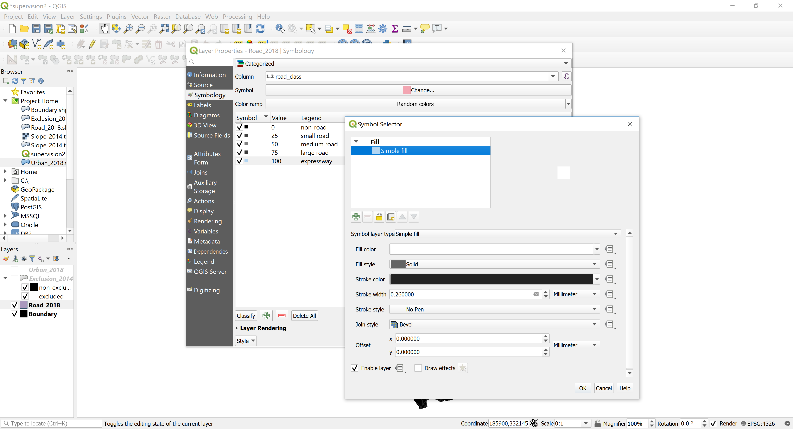
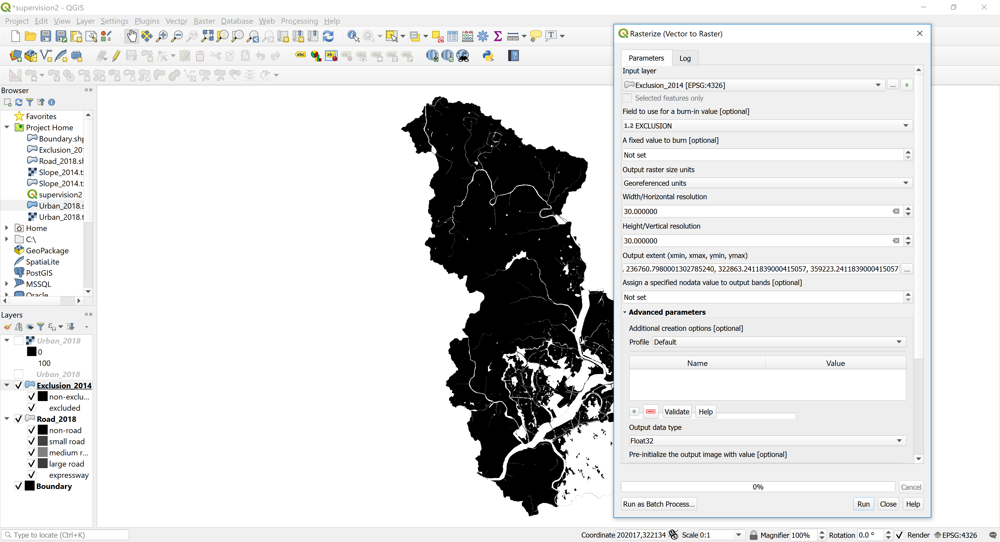
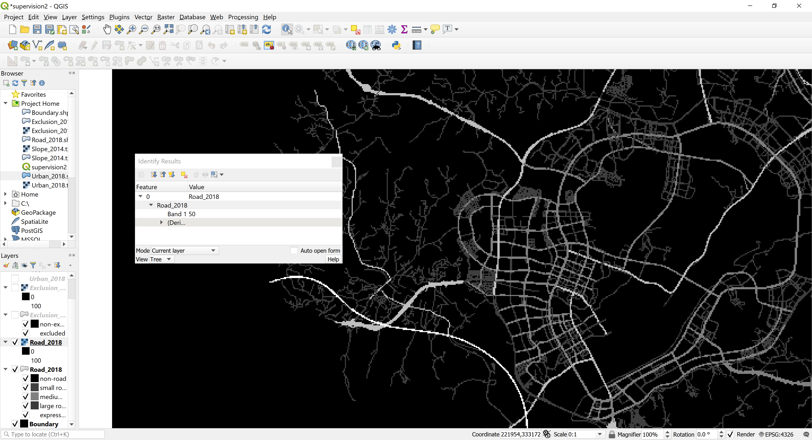

# Assignment for Supervision 2
**Submission Date**: before Supervision 2

## Instructions
1. Read through the instruction carefully. You may face problems if you overlook any of the steps.
2. Remember to save the QGIS document regularly. 
3. When running tasks on QGIS, leave the settings as default unless instructed.

Note: functions and filename are `highlighted` in this document.

## Assignment overview
In this assignment, you will familiarise yourself with geoprocessing raster data on QGIS software. By the end of this, you will have prepared urban, exclusion, road and boundary maps in raster form, ready to be imported into NetLogo at Supervision 2.

### Setup work environment
1. It is suggested to create a folder and name it as `rm03_YourCRSid_sup2`, at your prefered directory on your disk. This folder will be the working directory for the assignment and supervision.

### QGIS project setup
1. Click `Project` > `New`.
2. Click `Project` > `Save As`, and save as `supervision2.qgz` to the working directory. 
3. Download dataset (sample data of Sejong, South Korea): [Urban_2018.shp](data/Urban_2018.shp), [Exclusion_2014.shp](data/Exclusion_2014.shp), [Road_2018.shp](data/Road_2018.shp), and [Boundary.shp](data/Boundary.shp).
4. Go to `Project` >  `Properties` in menu bar and open the `Project Properties` window.
    - `General` tab: Set your working directory as `Project Home`.
Note: after adding project home, you can find `Project Home` directory is showing in the `Browser panel`. It is much easier to locate your data files through this panel.
5. Drag `Urban_2018.shp` `Exclusion_2014.shp` `Road_2018.shp` `Boundary.shp` to the  `Layers panel`. Drag `Boundary.shp` to the bottom. Uncheck all layers except `Boundary.shp`.

Note: `Urban_2018` layer is a combination of urban land-use data by parcel and building data, with the urban/non-urban information coded in the attribute `URBAN`. `Exclusion_2014` layer is a combination of river, urban parks, and development restriction zone, with the excluded/non-excluded information coded in the attribute `EXCLUSION`. `Road_2018` layer contains roads, with the road-class information coded in the attribute `road_class`.

### Using symbology to assign colour to visualize the data
1. Right-click on `Boundary` layer > `Properties` > `Symbology` (or double-click the color box). Click `Simple fill`, change `Fill color` to `black`, change `Stroke style` to `No Pen`, click `OK`. 
2. Check `Urban_2018` layer, double-click the color box. Click `Simple fill`, change `Fill color `to `white`, change `Stroke style` to `No Pen`, click `OK`.
  
3. Uncheck `Urban_2018` layer, check `Exclusion_2014` layer, double-click the color box. Click `Single symbol` > `Categorized`, click `Column` > `Exclusion`, click `Classify` and change `Legend` to 0=non-excluded, 100=excluded.
4. Double-click the color box of non-excluded, click `Simple fill`, change `Fill color` to `black`, change `Stroke style` to `No Pen`, click `OK`. Double-click the color box of excluded, click `Simple fill`, change `Fill color` to `white`, change `Stroke style` to `No Pen`, click `OK`. 
5. Delete the third row (unnecessary) by pressing the `negative sign` next to `Classify`. Click `OK`.
 
6. Uncheck `Exclusion_2014` layer, check `Road_2018` layer, double-click the color box. Click `Single symbol` > `Categorized`, click `Column` > `road_class`, click `Classify` and change `Legend` and `color` to the following with `No Pen`: 0=non-road (black), 25=small road (#404040), 50=medium road (#808080), 75=large road (#3a3a3a), 100=expressway (white). Click `OK`.
 

### Converting vector to raster (rasterize)
1. Click and check `Urban_2018` layer, click `Raster` in menu bar, `Conversion` > `Rasterize`. Set `Field to use for a burn-in value` as `URBAN`, `A field value to burn` as `Not set`, `output raster size units` as `Georeferenced units`, and `Resolution` as `30` and `30`.
2. Set `Output extent` as `211290.7980001302785240, 236760.7980001302785240, 322863.2411839000415057, 359223.2411839000415057`. Set `Nodata value` as `Not set`. Click `Run`.
Note: Numbers of the output extent came from the layer with the largest layer extent. Keeping the output extent same for all layers is important when loading them on NetLogo.
 
3. Right-click on the newly created `Rasterized` layer, click `Export` > `Save As`. Set `File name` as `Urban_2018`, click `OK`. You can now right-click `Rasterized` layer and click `Remove Layer`.
Note: If you don't save as, these temporary files will disappear next time you open the QGIS file.
 

#### Question 1. Zoom into the `Urban_2018` layer. You will see that the pixels are in a grid. Check the size of the grid by right-clicking on the layer and clicking `Properties`. In the `Information` tab, what are the dimensions and pixel size? (Note: pixel size is in meters)

#### Question 2. In real life, what would be the dimension (width and length on a map) of this city of Sejong, South Korea in kilometers? (hint: real distance = dimension * pixel size). Find this city on Google Map to see whether your calculation makes sense. You can search Sejong City Hall, and refer to the grey dotted line as the city boundary.
 

4. Uncheck `Urban_2018` layer. Click and check `Excluson_2014` layer, click `Raster` in menu bar, `Conversion` > `Rasterize`. Set `Field to use for a burn-in value` as `EXCLUSION`, `A field value to burn` as `Not set`, `output raster size units` as `Georeferenced units`, and `Resolution` as `30` and `30`.
5. Set `Output extent` as `211290.7980001302785240, 236760.7980001302785240, 322863.2411839000415057, 359223.2411839000415057`. Set `Nodata value` as `Not set`. Click `Run`.
 
6. Right-click on the newly created `Rasterized` layer, click `Export` > `Save As`. Set `File name` as `Exclusion_2014`, click `OK`. You can now right-click `Rasterized` layer and click `Remove Layer`.
7. Repeat the exact same `Rasterize` task on `Road_2018` layer using `road_class` as the `Field to use for a burn-in value`. `Save As` the temporary layer to `Road_2018` and remove the temporary layer.
8. Repeat the exact same `Rasterize` task on `Boundary` layer using `boundary` as the `Field to use for a burn-in value`. `Save As` the temporary layer to `Boundary` and remove the temporary layer.
9. Use `Identify Features` button on menu bar (information sign + cursor) and click on the road pixels on the map to check that the grids are coded correctly (0=non-road, 25=small road, 50=medium road, 75=large road, 100=expressway).
 
10. Check the `Properties` > `Information` of all four raster layers (`Urban_2018`, `Exclusion_2014`, `Road_2018`, and `Boundary`) and check that they have identical dimensions, origin, and pixel size. Check that these files are well present in your working directory folder in `.tif`. We will use these layers in the Supervision 2.
11. Save your QGIS working file and close. 
