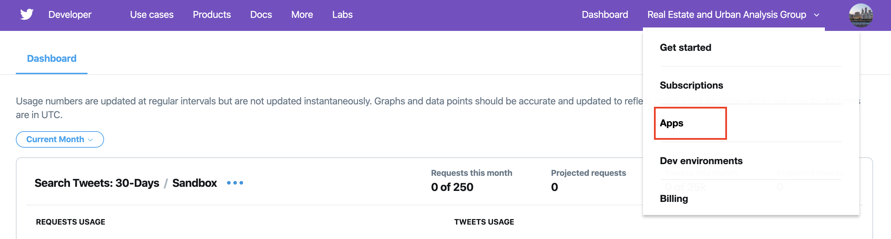
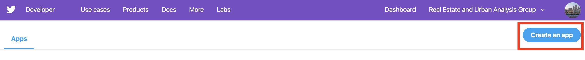
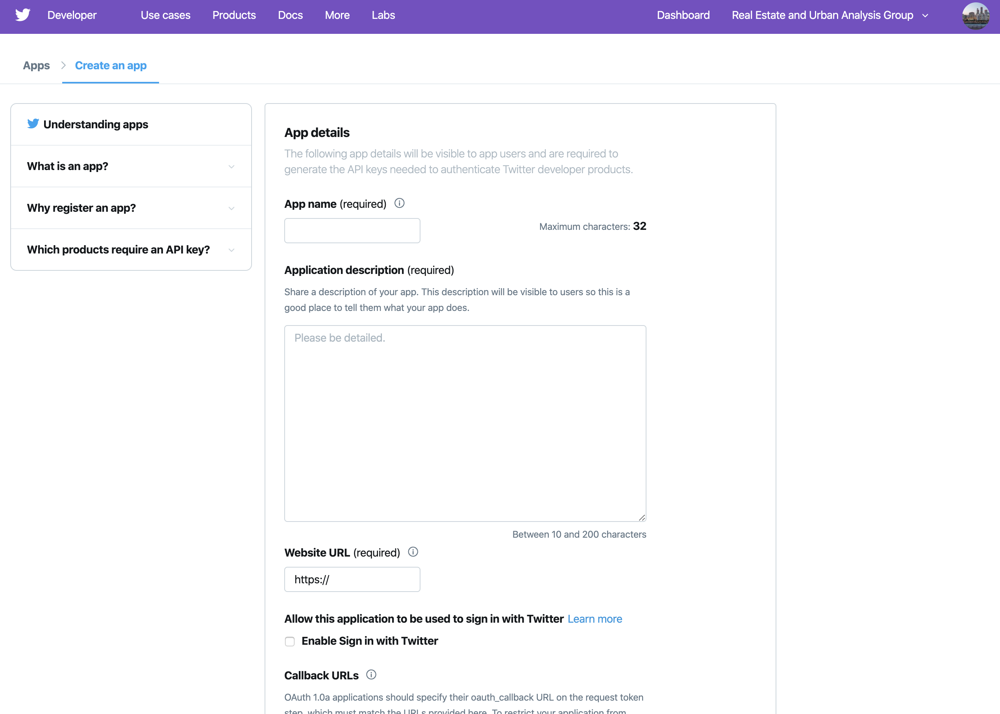

[](https://colab.research.google.com/github/hn303/CamLandEc-RM03/blob/master/supervision3-v3.ipynb)

Remember to replace the notebook URL in this template with the notebook you want to link to.
# Supervision 3 (12-13 March, 2020)


### Instructions
1. Read through the instruction carefully. You may face problems if you overlook any of the steps.
2. The instruction for data collection via APIs is written in [Google Colab](https://colab.research.google.com/notebooks/intro.ipynb#recent=true), a free jupyter environment that requires no setup to use and runs python entirely in the cloud. You need log in with your **Google Account** to use this free platform. If you do not have Google Account previously, please apply a new account via this [link](https://accounts.google.com/signup/v2/webcreateaccount?hl=en&continue=https%3A%2F%2Fmyaccount.google.com%2Fintro&flowName=GlifWebSignIn&flowEntry=SignUp) before the supervision. Know more about Google Colab, please check this [link](https://research.google.com/colaboratory/faq.html).
3. If you do not have **Twitter account**, please apply one via this [Twitter Signup](https://twitter.com/i/flow/signup)

Note: functions and filename are `highlighted` in this document.

### Supervision overview
In this exercise, you will familiarise yourself with collect data via Application programming interface(APIs), spatial visualization with collected data and creating a formal map on QGIS.

# 1. Collect Tweets via API

## Applysupervision3-exercises.md API from Twitter (5 mins)
The Twitter API (application programming interface) is your gateway to accessing Twitter data. 
A guidance on setting up Twitter APi: http://social-metrics.org/api-keys/

1. Open your broswer and open [Twitter APIs apply](https://developer.twitter.com/en/apply-for-access).
2. Click Apply for a developer account. I strongly recommend you to go through [restricted uses of Twitter APIs](https://developer.twitter.com/en/developer-terms/more-on-restricted-use-cases.html) before applying APIs from twitter.
3. Log in Twitter with your Twitter account.
4. Navigate to `your account` on the menu and click `Apps`. Then, click `create an app` button.
5. In the application page, input information for required items and click `create` button.
6. Get your authentication details

Note: please find this page if you fails to apply account during the supervision. notice that these APIs will be expeired after supervision.






## Collect data using API and save into tweet.csv file (10mins)
In this supervision, we will use python package to help collect data from Twitter via API.
If you are new to Python, you may wish to know basic python. Please see the document for python 3.x: https://docs.python.org/3/

The package used in this exercise is Tweepy, a more detailed tutorial: http://docs.tweepy.org/en/latest/.

- Connect to the twitter RESTful API to access twitter data with Python.
- Generate custom queries that download tweet data into Python using Tweepy.

### Step 0: install tweepy and other essential package
Only install the package at the first time. code for installation:

pip install tweepy

### Step 1: import all necessary packages/ libraries


```python
import tweepy
import csv
import time
import os.path
```

### Step 2: define your key


```python
#Variables that contains the user credentials to access Twitter API 
access_token = "528087151-Jh0dy5uVn8O4OAI2E8zh6UtdDv7HemxvnpbrZwmo"
access_token_secret = "94Jbu2xeGEtnXWivKgPgYoKAfzL1zxZAlmHxeWOPpwL8i"
consumer_key = "coXtHK8eQraTJ6vDTZXus1DrW"
consumer_secret = "5mkF2ac563pAJ5Xaw8CuOCtTEmK8OeV0SCgRqjPvZQWtnKseFq"
auth = tweepy.auth.OAuthHandler(consumer_key, consumer_secret)
auth.set_access_token(access_token, access_token_secret)
api = tweepy.API(auth)
```

