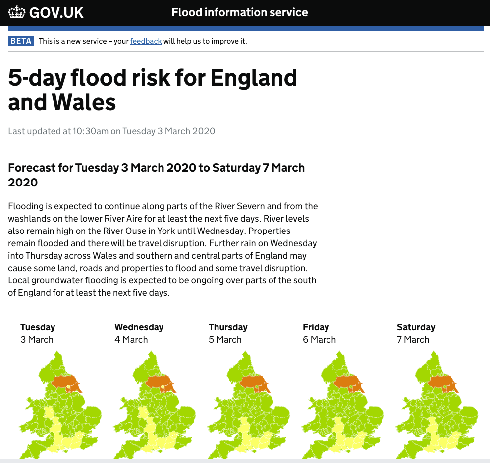

[](https://github.com/hn303/CamLandEc-RM03/blob/master/Supervision%203v3.ipynb)

Remember to replace the notebook URL in this template with the notebook you want to link to.
# Supervision 3 (12-13 March, 2020)


### Instructions
1. Read through the instruction carefully. You may face problems if you overlook any of the steps.
2. The instruction for data collection via APIs is written in [Google Colab](https://colab.research.google.com/notebooks/intro.ipynb#recent=true), a free jupyter environment that requires no setup to use and runs python entirely in the cloud. You need log in with your **Google Account** to use this free platform. If you do not have Google Account previously, please apply a new account via this [link](https://accounts.google.com/signup/v2/webcreateaccount?hl=en&continue=https%3A%2F%2Fmyaccount.google.com%2Fintro&flowName=GlifWebSignIn&flowEntry=SignUp) before the supervision. Know more about Google Colab, please check this [link](https://research.google.com/colaboratory/faq.html).
3. If you do not have **Twitter account**, please apply one via this [Twitter Signup](https://twitter.com/i/flow/signup)

Note: functions and filename are `highlighted` in this document.

### Supervision overview
In this exercise, you will familiarise yourself with collect data via Application programming interface(APIs), spatial visualization with collected data and creating a formal map on QGIS.

# 1. Collect Tweets via API

## Apply API from Twitter (5 mins)
The Twitter API (application programming interface) is your gateway to accessing Twitter data. 
A guidance on setting up Twitter APi: http://social-metrics.org/api-keys/

1. Open your broswer and open [Twitter APIs apply](https://developer.twitter.com/en/apply-for-access).
2. Click Apply for a developer account. I strongly recommend you to go through [restricted uses of Twitter APIs](https://developer.twitter.com/en/developer-terms/more-on-restricted-use-cases.html) before applying APIs from twitter.
3. Log in Twitter with your Twitter account.
4. Navigate to `your account` on the menu and click `Apps`. Then, click `create an app` button.
5. In the application page, input information for required items and click `create` button.
6. Get your authentication details

Note: please find this page if you fails to apply account during the supervision. notice that these APIs will be expeired after supervision.


## Collect data using API and save into tweet.csv file (10mins)
In this supervision, we will use python package to help collect data from Twitter via API.
If you are new to Python, you may wish to know basic python. Please see the document for python 3.x: https://docs.python.org/3/

The package used in this exercise is Tweepy, a more detailed tutorial: http://docs.tweepy.org/en/latest/.

- Connect to the twitter RESTful API to access twitter data with Python.
- Generate custom queries that download tweet data into Python using Tweepy.

### Step 0: install tweepy and other essential package
Only install the package at the first time. code for installation:

pip install tweepy

### Step 1: import all necessary packages/ libraries


```python
import tweepy
import csv
import time
import os.path
```

### Step 2: define your key


```python
#Variables that contains the user credentials to access Twitter API 
access_token = "528087151-Jh0dy5uVn8O4OAI2E8zh6UtdDv7HemxvnpbrZwmo"
access_token_secret = "94Jbu2xeGEtnXWivKgPgYoKAfzL1zxZAlmHxeWOPpwL8i"
consumer_key = "coXtHK8eQraTJ6vDTZXus1DrW"
consumer_secret = "5mkF2ac563pAJ5Xaw8CuOCtTEmK8OeV0SCgRqjPvZQWtnKseFq"
auth = tweepy.auth.OAuthHandler(consumer_key, consumer_secret)
auth.set_access_token(access_token, access_token_secret)
api = tweepy.API(auth)
```


```python
# test authentication
try:
    api.verify_credentials()
    print("Authentication OK")
except:
    print("Error during authentication")
```

    Authentication OK


### Step 3: search Twitter for Tweets and save data to csv
- what dataset you need? e.g. What is the public sentiment towards coronavirus in London? 
- set keywords e.g. coronavirus, corona virus, virus, covid19, nCoV2019
- set geocode e.g. Cambridge: 52.2,0.12,2mi, London: 51.53,-0.83,50mi
- collect tweets from the previous 15 days

https://developer.twitter.com/en/docs/tutorials/filtering-tweets-by-location

The government provide flood information service via this [link](https://flood-warning-information.service.gov.uk/warnings). Please open the link and check which cities has been issued a flood warining.




```python
file_exists = os.path.isfile('tweet.csv')
keywords = "flood" or "storm*" 
# or "shower*" or "storm*" or "rain"
# keywords = "i"

#Cambridge: 52.2,0.12,2mi
#London: 51.53,-0.83,50mi
search_results = api.search(q=keywords, lang="en", count=80, geocode = "53.96,-1.08,10mi")

print(search_results)

with open('tweet.csv',mode = 'w',encoding='utf-8') as f:
	headers = ['id', 'tweet', 'coordinates']
	writer = csv.DictWriter(f, delimiter=',', lineterminator='\n',fieldnames=headers)
	writer.writeheader()
	for status in search_results:
		print(status)
		if status.coordinates == None:
			writer.writerow({'id': status.id, 'tweet': status.text})
		else:
			writer.writerow({'id': status.id, 'tweet': status.text, 'coordinates': status.coordinates['coordinates']})
```

    [Status(_api=<tweepy.api.API object at 0x10cbcac10>, _json={'created_at': 'Fri Mar 06 20:14:09 +0000 2020', 'id': 1236022277218566144, 'id_str': '1236022277218566144', 'text': 'Mud from the last York flood. Brilliant for gardens and allotments, as I said to a baby pushing York man, who proba… https://t.co/Yv1LE1RmTY', 'truncated': True, 'entities': {'hashtags': [], 'symbols': [], 'user_mentions': [], 'urls': [{'url': 'https://t.co/Yv1LE1RmTY', 'expanded_url': 'https://twitter.com/i/web/status/1236022277218566144', 'display_url': 'twitter.com/i/web/status/1…', 'indices': [117, 140]}]}, 'metadata': {'iso_language_code': 'en', 'result_type': 'recent'}, 'source': '<a href="http://instagram.com" rel="nofollow">Instagram</a>', 'in_reply_to_status_id': None, 'in_reply_to_status_id_str': None, 'in_reply_to_user_id': None, 'in_reply_to_user_id_str': None, 'in_reply_to_screen_name': None, 'user': {'id': 176878577, 'id_str': '176878577', 'name': 'Glyn Watkins', 'screen_name': 'bradwan1', 'location': 'Bradford, West Yorkshire', 'description': 'Poet, writer showman. Fan of pies, pylons, beer & much else. Shows include Pylons Poetry & Pie; Curry & Kipling; and: J.B.Priestley Pie & Proud of Bradford.', 'url': 'http://t.co/0C7AmXkiQc', 'entities': {'url': {'urls': [{'url': 'http://t.co/0C7AmXkiQc', 'expanded_url': 'http://bradwan.co.uk', 'display_url': 'bradwan.co.uk', 'indices': [0, 22]}]}, 'description': {'urls': []}}, 'protected': False, 'followers_count': 130, 'friends_count': 56, 'listed_count': 9, 'created_at': 'Tue Aug 10 17:46:11 +0000 2010', 'favourites_count': 39, 'utc_offset': None, 'time_zone': None, 'geo_enabled': True, 'verified': False, 'statuses_count': 7888, 'lang': None, 'contributors_enabled': False, 'is_translator': False, 'is_translation_enabled': False, 'profile_background_color': 'C0DEED', 'profile_background_image_url': 'http://abs.twimg.com/images/themes/theme1/bg.png', 'profile_background_image_url_https': 'https://abs.twimg.com/images/themes/theme1/bg.png', 'profile_background_tile': False, 'profile_image_url': 'http://pbs.twimg.com/profile_images/868419890599911426/i9KdF40W_normal.jpg', 'profile_image_url_https': 'https://pbs.twimg.com/profile_images/868419890599911426/i9KdF40W_normal.jpg', 'profile_banner_url': 'https://pbs.twimg.com/profile_banners/176878577/1547727695', 'profile_link_color': '1DA1F2', 'profile_sidebar_border_color': 'C0DEED', 'profile_sidebar_fill_color': 'DDEEF6', 'profile_text_color': '333333', 'profile_use_background_image': True, 'has_extended_profile': False, 'default_profile': True, 'default_profile_image': False, 'following': False, 'follow_request_sent': False, 'notifications': False, 'translator_type': 'none'}, 'geo': {'type': 'Point', 'coordinates': [53.9583, -1.0803]}, 'coordinates': {'type': 'Point', 'coordinates': [-1.0803, 53.9583]}, 'place': {'id': '0c4f58af36a910a6', 'url': 'https://api.twitter.com/1.1/geo/id/0c4f58af36a910a6.json', 'place_type': 'city', 'name': 'York', 'full_name': 'York, England', 'country_code': 'GB', 'country': 'United Kingdom', 'contained_within': [], 'bounding_box': {'type': 'Polygon', 'coordinates': [[[-1.147268, 53.9280019], [-1.0233813, 53.9280019], [-1.0233813, 54.004411], [-1.147268, 54.004411]]]}, 'attributes': {}}, 'contributors': None, 'is_quote_status': False, 'retweet_count': 0, 'favorite_count': 0, 'favorited': False, 'retweeted': False, 'possibly_sensitive': False, 'lang': 'en'}, created_at=datetime.datetime(2020, 3, 6, 20, 14, 9), id=1236022277218566144, id_str='1236022277218566144', text='Mud from the last York flood. Brilliant for gardens and allotments, as I said to a baby pushing York man, who proba… https://t.co/Yv1LE1RmTY', truncated=True, entities={'hashtags': [], 'symbols': [], 'user_mentions': [], 'urls': [{'url': 'https://t.co/Yv1LE1RmTY', 'expanded_url': 'https://twitter.com/i/web/status/1236022277218566144', 'display_url': 'twitter.com/i/web/status/1…', 'indices': [117, 140]}]}, metadata={'iso_language_code': 'en', 'result_type': 'recent'}, source='Instagram', source_url='http://instagram.com', in_reply_to_status_id=None, in_reply_to_status_id_str=None, in_reply_to_user_id=None, in_reply_to_user_id_str=None, in_reply_to_screen_name=None, author=User(_api=<tweepy.api.API object at 0x10cbcac10>, _json={'id': 176878577, 'id_str': '176878577', 'name': 'Glyn Watkins', 'screen_name': 'bradwan1', 'location': 'Bradford, West Yorkshire', 'description': 'Poet, writer showman. Fan of pies, pylons, beer & much else. Shows include Pylons Poetry & Pie; Curry & Kipling; and: J.B.Priestley Pie & Proud of Bradford.', 'url': 'http://t.co/0C7AmXkiQc', 'entities': {'url': {'urls': [{'url': 'http://t.co/0C7AmXkiQc', 'expanded_url': 'http://bradwan.co.uk', 'display_url': 'bradwan.co.uk', 'indices': [0, 22]}]}, 'description': {'urls': []}}, 'protected': False, 'followers_count': 130, 'friends_count': 56, 'listed_count': 9, 'created_at': 'Tue Aug 10 17:46:11 +0000 2010', 'favourites_count': 39, 'utc_offset': None, 'time_zone': None, 'geo_enabled': True, 'verified': False, 'statuses_count': 7888, 'lang': None, 'contributors_enabled': False, 'is_translator': False, 'is_translation_enabled': False, 'profile_background_color': 'C0DEED', 'profile_background_image_url': 'http://abs.twimg.com/images/themes/theme1/bg.png', 'profile_background_image_url_https': 'https://abs.twimg.com/images/themes/theme1/bg.png', 'profile_background_tile': False, 'profile_image_url': 'http://pbs.twimg.com/profile_images/868419890599911426/i9KdF40W_normal.jpg', 'profile_image_url_https': 'https://pbs.twimg.com/profile_images/868419890599911426/i9KdF40W_normal.jpg', 'profile_banner_url': 'https://pbs.twimg.com/profile_banners/176878577/1547727695', 'profile_link_color': '1DA1F2', 'profile_sidebar_border_color': 'C0DEED', 'profile_sidebar_fill_color': 'DDEEF6', 'profile_text_color': '333333', 'profile_use_background_image': True, 'has_extended_profile': False, 'default_profile': True, 'default_profile_image': False, 'following': False, 'follow_request_sent': False, 'notifications': False, 'translator_type': 'none'}, id=176878577, id_str='176878577', name='Glyn Watkins', screen_name='bradwan1', location='Bradford, West Yorkshire', description='Poet, writer showman. Fan of pies, pylons, beer & much else. Shows include Pylons Poetry & Pie; Curry & Kipling; and: J.B.Priestley Pie & Proud of Bradford.', url='http://t.co/0C7AmXkiQc', entities={'url': {'urls': [{'url': 'http://t.co/0C7AmXkiQc', 'expanded_url': 'http://bradwan.co.uk', 'display_url': 'bradwan.co.uk', 'indices': [0, 22]}]}, 'description': {'urls': []}}, protected=False, followers_count=130, friends_count=56, listed_count=9, created_at=datetime.datetime(2010, 8, 10, 17, 46, 11), favourites_count=39, utc_offset=None, time_zone=None, geo_enabled=True, verified=False, statuses_count=7888, lang=None, contributors_enabled=False, is_translator=False, is_translation_enabled=False, profile_background_color='C0DEED', profile_background_image_url='http://abs.twimg.com/images/themes/theme1/bg.png', profile_background_image_url_https='https://abs.twimg.com/images/themes/theme1/bg.png', profile_background_tile=False, profile_image_url='http://pbs.twimg.com/profile_images/868419890599911426/i9KdF40W_normal.jpg', profile_image_url_https='https://pbs.twimg.com/profile_images/868419890599911426/i9KdF40W_normal.jpg', profile_banner_url='https://pbs.twimg.com/profile_banners/176878577/1547727695', profile_link_color='1DA1F2', profile_sidebar_border_color='C0DEED', profile_sidebar_fill_color='DDEEF6', profile_text_color='333333', profile_use_background_image=True, has_extended_profile=False, default_profile=True, default_profile_image=False, following=False, follow_request_sent=False, notifications=False, translator_type='none'), user=User(_api=<tweepy.api.API object at 0x10cbcac10>, _json={'id': 176878577, 'id_str': '176878577', 'name': 'Glyn Watkins', 'screen_name': 'bradwan1', 'location': 'Bradford, West Yorkshire', 'description': 'Poet, writer showman. Fan of pies, pylons, beer & much else. Shows include Pylons Poetry & Pie; Curry & Kipling; and: J.B.Priestley Pie & Proud of Bradford.', 'url': 'http://t.co/0C7AmXkiQc', 'entities': {'url': {'urls': [{'url': 'http://t.co/0C7AmXkiQc', 'expanded_url': 'http://bradwan.co.uk', 'display_url': 'bradwan.co.uk', 'indices': [0, 22]}]}, 'description': {'urls': []}}, 'protected': False, 'followers_count': 130, 'friends_count': 56, 'listed_count': 9, 'created_at': 'Tue Aug 10 17:46:11 +0000 2010', 'favourites_count': 39, 'utc_offset': None, 'time_zone': None, 'geo_enabled': True, 'verified': False, 'statuses_count': 7888, 'lang': None, 'contributors_enabled': False, 'is_translator': False, 'is_translation_enabled': False, 'profile_background_color': 'C0DEED', 'profile_background_image_url': 'http://abs.twimg.com/images/themes/theme1/bg.png', 'profile_background_image_url_https': 'https://abs.twimg.com/images/themes/theme1/bg.png', 'profile_background_tile': False, 'profile_image_url': 'http://pbs.twimg.com/profile_images/868419890599911426/i9KdF40W_normal.jpg', 'profile_image_url_https': 'https://pbs.twimg.com/profile_images/868419890599911426/i9KdF40W_normal.jpg', 'profile_banner_url': 'https://pbs.twimg.com/profile_banners/176878577/1547727695', 'profile_link_color': '1DA1F2', 'profile_sidebar_border_color': 'C0DEED', 'profile_sidebar_fill_color': 'DDEEF6', 'profile_text_color': '333333', 'profile_use_background_image': True, 'has_extended_profile': False, 'default_profile': True, 'default_profile_image': False, 'following': False, 'follow_request_sent': False, 'notifications': False, 'translator_type': 'none'}, id=176878577, id_str='176878577', name='Glyn Watkins', screen_name='bradwan1', location='Bradford, West Yorkshire', description='Poet, writer showman. Fan of pies, pylons, beer & much else. Shows include Pylons Poetry & Pie; Curry & Kipling; and: J.B.Priestley Pie & Proud of Bradford.', url='http://t.co/0C7AmXkiQc', entities={'url': {'urls': [{'url': 'http://t.co/0C7AmXkiQc', 'expanded_url': 'http://bradwan.co.uk', 'display_url': 'bradwan.co.uk', 'indices': [0, 22]}]}, 'description': {'urls': []}}, protected=False, followers_count=130, friends_count=56, listed_count=9, created_at=datetime.datetime(2010, 8, 10, 17, 46, 11), favourites_count=39, utc_offset=None, time_zone=None, geo_enabled=True, verified=False, statuses_count=7888, lang=None, contributors_enabled=False, is_translator=False, is_translation_enabled=False, profile_background_color='C0DEED', profile_background_image_url='http://abs.twimg.com/images/themes/theme1/bg.png', profile_background_image_url_https='https://abs.twimg.com/images/themes/theme1/bg.png', profile_background_tile=False, profile_image_url='http://pbs.twimg.com/profile_images/868419890599911426/i9KdF40W_normal.jpg', profile_image_url_https='https://pbs.twimg.com/profile_images/868419890599911426/i9KdF40W_normal.jpg', profile_banner_url='https://pbs.twimg.com/profile_banners/176878577/1547727695', profile_link_color='1DA1F2', profile_sidebar_border_color='C0DEED', profile_sidebar_fill_color='DDEEF6', profile_text_color='333333', profile_use_background_image=True, has_extended_profile=False, default_profile=True, default_profile_image=False, following=False, follow_request_sent=False, notifications=False, translator_type='none'), geo={'type': 'Point', 'coordinates': [53.9583, -1.0803]}, coordinates={'type': 'Point', 'coordinates': [-1.0803, 53.9583]}, place=Place(_api=<tweepy.api.API object at 0x10cbcac10>, id='0c4f58af36a910a6', url='https://api.twitter.com/1.1/geo/id/0c4f58af36a910a6.json', place_type='city', name='York', full_name='York, England', country_code='GB', country='United Kingdom', contained_within=[], bounding_box=BoundingBox(_api=<tweepy.api.API object at 0x10cbcac10>, type='Polygon', coordinates=[[[-1.147268, 53.9280019], [-1.0233813, 53.9280019], [-1.0233813, 54.004411], [-1.147268, 54.004411]]]), attributes={}), contributors=None, is_quote_status=False, retweet_count=0, favorite_count=0, favorited=False, retweeted=False, possibly_sensitive=False, lang='en'), Status(_api=<tweepy.api.API object at 0x10cbcac10>, _json={'created_at': 'Fri Mar 06 16:58:09 +0000 2020', 'id': 1235972950555230208, 'id_str': '1235972950555230208', 'text': 'Flood Community Drop in session Monday 5-7pm 16th March @ Friargate Quaker Meeting House. https://t.co/nAZNmto7Au', 'truncated': False, 'entities': {'hashtags': [], 'symbols': [], 'user_mentions': [], 'urls': [], 'media': [{'id': 1235972728882110464, 'id_str': '1235972728882110464', 'indices': [90, 113], 'media_url': 'http://pbs.twimg.com/media/EScOpgEWoAAmgQz.jpg', 'media_url_https': 'https://pbs.twimg.com/media/EScOpgEWoAAmgQz.jpg', 'url': 'https://t.co/nAZNmto7Au', 'display_url': 'pic.twitter.com/nAZNmto7Au', 'expanded_url': 'https://twitter.com/GuildhallWard/status/1235972950555230208/photo/1', 'type': 'photo', 'sizes': {'thumb': {'w': 150, 'h': 150, 'resize': 'crop'}, 'large': {'w': 2000, 'h': 1408, 'resize': 'fit'}, 'small': {'w': 680, 'h': 479, 'resize': 'fit'}, 'medium': {'w': 1200, 'h': 845, 'resize': 'fit'}}}]}, 'extended_entities': {'media': [{'id': 1235972728882110464, 'id_str': '1235972728882110464', 'indices': [90, 113], 'media_url': 'http://pbs.twimg.com/media/EScOpgEWoAAmgQz.jpg', 'media_url_https': 'https://pbs.twimg.com/media/EScOpgEWoAAmgQz.jpg', 'url': 'https://t.co/nAZNmto7Au', 'display_url': 'pic.twitter.com/nAZNmto7Au', 'expanded_url': 'https://twitter.com/GuildhallWard/status/1235972950555230208/photo/1', 'type': 'photo', 'sizes': {'thumb': {'w': 150, 'h': 150, 'resize': 'crop'}, 'large': {'w': 2000, 'h': 1408, 'resize': 'fit'}, 'small': {'w': 680, 'h': 479, 'resize': 'fit'}, 'medium': {'w': 1200, 'h': 845, 'resize': 'fit'}}}, {'id': 1235972764751839240, 'id_str': '1235972764751839240', 'indices': [90, 113], 'media_url': 'http://pbs.twimg.com/media/EScOrlsXQAgiEbE.jpg', 'media_url_https': 'https://pbs.twimg.com/media/EScOrlsXQAgiEbE.jpg', 'url': 'https://t.co/nAZNmto7Au', 'display_url': 'pic.twitter.com/nAZNmto7Au', 'expanded_url': 'https://twitter.com/GuildhallWard/status/1235972950555230208/photo/1', 'type': 'photo', 'sizes': {'thumb': {'w': 150, 'h': 150, 'resize': 'crop'}, 'large': {'w': 2000, 'h': 1408, 'resize': 'fit'}, 'small': {'w': 680, 'h': 479, 'resize': 'fit'}, 'medium': {'w': 1200, 'h': 845, 'resize': 'fit'}}}]}, 'metadata': {'iso_language_code': 'en', 'result_type': 'recent'}, 'source': '<a href="https://mobile.twitter.com" rel="nofollow">Twitter Web App</a>', 'in_reply_to_status_id': None, 'in_reply_to_status_id_str': None, 'in_reply_to_user_id': None, 'in_reply_to_user_id_str': None, 'in_reply_to_screen_name': None, 'user': {'id': 2327380506, 'id_str': '2327380506', 'name': 'Guildhall Ward', 'screen_name': 'GuildhallWard', 'location': 'York', 'description': 'Guildhall Ward covers inside the Bar Walls (north of the Ouse), Layerthorpe, Foss Islands, St Nicholas Fields, Bootham, The Groves and Haxby Road to White Cross', 'url': 'https://t.co/QZASoWSzo8', 'entities': {'url': {'urls': [{'url': 'https://t.co/QZASoWSzo8', 'expanded_url': 'http://york.gov.uk/guildhallward', 'display_url': 'york.gov.uk/guildhallward', 'indices': [0, 23]}]}, 'description': {'urls': []}}, 'protected': False, 'followers_count': 467, 'friends_count': 357, 'listed_count': 8, 'created_at': 'Tue Feb 04 16:30:45 +0000 2014', 'favourites_count': 1, 'utc_offset': None, 'time_zone': None, 'geo_enabled': False, 'verified': False, 'statuses_count': 258, 'lang': None, 'contributors_enabled': False, 'is_translator': False, 'is_translation_enabled': False, 'profile_background_color': 'C0DEED', 'profile_background_image_url': 'http://abs.twimg.com/images/themes/theme1/bg.png', 'profile_background_image_url_https': 'https://abs.twimg.com/images/themes/theme1/bg.png', 'profile_background_tile': False, 'profile_image_url': 'http://pbs.twimg.com/profile_images/567814291844513793/Np-f5AI5_normal.jpeg', 'profile_image_url_https': 'https://pbs.twimg.com/profile_images/567814291844513793/Np-f5AI5_normal.jpeg', 'profile_banner_url': 'https://pbs.twimg.com/profile_banners/2327380506/1463663378', 'profile_link_color': '1DA1F2', 'profile_sidebar_border_color': 'C0DEED', 'profile_sidebar_fill_color': 'DDEEF6', 'profile_text_color': '333333', 'profile_use_background_image': True, 'has_extended_profile': False, 'default_profile': True, 'default_profile_image': False, 'following': False, 'follow_request_sent': False, 'notifications': False, 'translator_type': 'none'}, 'geo': None, 'coordinates': None, 'place': None, 'contributors': None, 'is_quote_status': False, 'retweet_count': 0, 'favorite_count': 0, 'favorited': False, 'retweeted': False, 'possibly_sensitive': False, 'lang': 'en'}, created_at=datetime.datetime(2020, 3, 6, 16, 58, 9), id=1235972950555230208, id_str='1235972950555230208', text='Flood Community Drop in session Monday 5-7pm 16th March @ Friargate Quaker Meeting House. https://t.co/nAZNmto7Au', truncated=False, entities={'hashtags': [], 'symbols': [], 'user_mentions': [], 'urls': [], 'media': [{'id': 1235972728882110464, 'id_str': '1235972728882110464', 'indices': [90, 113], 'media_url': 'http://pbs.twimg.com/media/EScOpgEWoAAmgQz.jpg', 'media_url_https': 'https://pbs.twimg.com/media/EScOpgEWoAAmgQz.jpg', 'url': 'https://t.co/nAZNmto7Au', 'display_url': 'pic.twitter.com/nAZNmto7Au', 'expanded_url': 'https://twitter.com/GuildhallWard/status/1235972950555230208/photo/1', 'type': 'photo', 'sizes': {'thumb': {'w': 150, 'h': 150, 'resize': 'crop'}, 'large': {'w': 2000, 'h': 1408, 'resize': 'fit'}, 'small': {'w': 680, 'h': 479, 'resize': 'fit'}, 'medium': {'w': 1200, 'h': 845, 'resize': 'fit'}}}]}, extended_entities={'media': [{'id': 1235972728882110464, 'id_str': '1235972728882110464', 'indices': [90, 113], 'media_url': 'http://pbs.twimg.com/media/EScOpgEWoAAmgQz.jpg', 'media_url_https': 'https://pbs.twimg.com/media/EScOpgEWoAAmgQz.jpg', 'url': 'https://t.co/nAZNmto7Au', 'display_url': 'pic.twitter.com/nAZNmto7Au', 'expanded_url': 'https://twitter.com/GuildhallWard/status/1235972950555230208/photo/1', 'type': 'photo', 'sizes': {'thumb': {'w': 150, 'h': 150, 'resize': 'crop'}, 'large': {'w': 2000, 'h': 1408, 'resize': 'fit'}, 'small': {'w': 680, 'h': 479, 'resize': 'fit'}, 'medium': {'w': 1200, 'h': 845, 'resize': 'fit'}}}, {'id': 1235972764751839240, 'id_str': '1235972764751839240', 'indices': [90, 113], 'media_url': 'http://pbs.twimg.com/media/EScOrlsXQAgiEbE.jpg', 'media_url_https': 'https://pbs.twimg.com/media/EScOrlsXQAgiEbE.jpg', 'url': 'https://t.co/nAZNmto7Au', 'display_url': 'pic.twitter.com/nAZNmto7Au', 'expanded_url': 'https://twitter.com/GuildhallWard/status/1235972950555230208/photo/1', 'type': 'photo', 'sizes': {'thumb': {'w': 150, 'h': 150, 'resize': 'crop'}, 'large': {'w': 2000, 'h': 1408, 'resize': 'fit'}, 'small': {'w': 680, 'h': 479, 'resize': 'fit'}, 'medium': {'w': 1200, 'h': 845, 'resize': 'fit'}}}]}, metadata={'iso_language_code': 'en', 'result_type': 'recent'}, source='Twitter Web App', source_url='https://mobile.twitter.com', in_reply_to_status_id=None, in_reply_to_status_id_str=None, in_reply_to_user_id=None, in_reply_to_user_id_str=None, in_reply_to_screen_name=None, author=User(_api=<tweepy.api.API object at 0x10cbcac10>, _json={'id': 2327380506, 'id_str': '2327380506', 'name': 'Guildhall Ward', 'screen_name': 'GuildhallWard', 'location': 'York', 'description': 'Guildhall Ward covers inside the Bar Walls (north of the Ouse), Layerthorpe, Foss Islands, St Nicholas Fields, Bootham, The Groves and Haxby Road to White Cross', 'url': 'https://t.co/QZASoWSzo8', 'entities': {'url': {'urls': [{'url': 'https://t.co/QZASoWSzo8', 'expanded_url': 'http://york.gov.uk/guildhallward', 'display_url': 'york.gov.uk/guildhallward', 'indices': [0, 23]}]}, 'description': {'urls': []}}, 'protected': False, 'followers_count': 467, 'friends_count': 357, 'listed_count': 8, 'created_at': 'Tue Feb 04 16:30:45 +0000 2014', 'favourites_count': 1, 'utc_offset': None, 'time_zone': None, 'geo_enabled': False, 'verified': False, 'statuses_count': 258, 'lang': None, 'contributors_enabled': False, 'is_translator': False, 'is_translation_enabled': False, 'profile_background_color': 'C0DEED', 'profile_background_image_url': 'http://abs.twimg.com/images/themes/theme1/bg.png', 'profile_background_image_url_https': 'https://abs.twimg.com/images/themes/theme1/bg.png', 'profile_background_tile': False, 'profile_image_url': 'http://pbs.twimg.com/profile_images/567814291844513793/Np-f5AI5_normal.jpeg', 'profile_image_url_https': 'https://pbs.twimg.com/profile_images/567814291844513793/Np-f5AI5_normal.jpeg', 'profile_banner_url': 'https://pbs.twimg.com/profile_banners/2327380506/1463663378', 'profile_link_color': '1DA1F2', 'profile_sidebar_border_color': 'C0DEED', 'profile_sidebar_fill_color': 'DDEEF6', 'profile_text_color': '333333', 'profile_use_background_image': True, 'has_extended_profile': False, 'default_profile': True, 'default_profile_image': False, 'following': False, 'follow_request_sent': False, 'notifications': False, 'translator_type': 'none'}, id=2327380506, id_str='2327380506', name='Guildhall Ward', screen_name='GuildhallWard', location='York', description='Guildhall Ward covers inside the Bar Walls (north of the Ouse), Layerthorpe, Foss Islands, St Nicholas Fields, Bootham, The Groves and Haxby Road to White Cross', url='https://t.co/QZASoWSzo8', entities={'url': {'urls': [{'url': 'https://t.co/QZASoWSzo8', 'expanded_url': 'http://york.gov.uk/guildhallward', 'display_url': 'york.gov.uk/guildhallward', 'indices': [0, 23]}]}, 'description': {'urls': []}}, protected=False, followers_count=467, friends_count=357, listed_count=8, created_at=datetime.datetime(2014, 2, 4, 16, 30, 45), favourites_count=1, utc_offset=None, time_zone=None, geo_enabled=False, verified=False, statuses_count=258, lang=None, contributors_enabled=False, is_translator=False, is_translation_enabled=False, profile_background_color='C0DEED', profile_background_image_url='http://abs.twimg.com/images/themes/theme1/bg.png', profile_background_image_url_https='https://abs.twimg.com/images/themes/theme1/bg.png', profile_background_tile=False, profile_image_url='http://pbs.twimg.com/profile_images/567814291844513793/Np-f5AI5_normal.jpeg', profile_image_url_https='https://pbs.twimg.com/profile_images/567814291844513793/Np-f5AI5_normal.jpeg', profile_banner_url='https://pbs.twimg.com/profile_banners/2327380506/1463663378', profile_link_color='1DA1F2', profile_sidebar_border_color='C0DEED', profile_sidebar_fill_color='DDEEF6', profile_text_color='333333', profile_use_background_image=True, has_extended_profile=False, default_profile=True, default_profile_image=False, following=False, follow_request_sent=False, notifications=False, translator_type='none'), user=User(_api=<tweepy.api.API object at 0x10cbcac10>, _json={'id': 2327380506, 'id_str': '2327380506', 'name': 'Guildhall Ward', 'screen_name': 'GuildhallWard', 'location': 'York', 'description': 'Guildhall Ward covers inside the Bar Walls (north of the Ouse), Layerthorpe, Foss Islands, St Nicholas Fields, Bootham, The Groves and Haxby Road to White Cross', 'url': 'https://t.co/QZASoWSzo8', 'entities': {'url': {'urls': [{'url': 'https://t.co/QZASoWSzo8', 'expanded_url': 'http://york.gov.uk/guildhallward', 'display_url': 'york.gov.uk/guildhallward', 'indices': [0, 23]}]}, 'description': {'urls': []}}, 'protected': False, 'followers_count': 467, 'friends_count': 357, 'listed_count': 8, 'created_at': 'Tue Feb 04 16:30:45 +0000 2014', 'favourites_count': 1, 'utc_offset': None, 'time_zone': None, 'geo_enabled': False, 'verified': False, 'statuses_count': 258, 'lang': None, 'contributors_enabled': False, 'is_translator': False, 'is_translation_enabled': False, 'profile_background_color': 'C0DEED', 'profile_background_image_url': 'http://abs.twimg.com/images/themes/theme1/bg.png', 'profile_background_image_url_https': 'https://abs.twimg.com/images/themes/theme1/bg.png', 'profile_background_tile': False, 'profile_image_url': 'http://pbs.twimg.com/profile_images/567814291844513793/Np-f5AI5_normal.jpeg', 'profile_image_url_https': 'https://pbs.twimg.com/profile_images/567814291844513793/Np-f5AI5_normal.jpeg', 'profile_banner_url': 'https://pbs.twimg.com/profile_banners/2327380506/1463663378', 'profile_link_color': '1DA1F2', 'profile_sidebar_border_color': 'C0DEED', 'profile_sidebar_fill_color': 'DDEEF6', 'profile_text_color': '333333', 'profile_use_background_image': True, 'has_extended_profile': False, 'default_profile': True, 'default_profile_image': False, 'following': False, 'follow_request_sent': False, 'notifications': False, 'translator_type': 'none'}, id=2327380506, id_str='2327380506', name='Guildhall Ward', screen_name='GuildhallWard', location='York', description='Guildhall Ward covers inside the Bar Walls (north of the Ouse), Layerthorpe, Foss Islands, St Nicholas Fields, Bootham, The Groves and Haxby Road to White Cross', url='https://t.co/QZASoWSzo8', entities={'url': {'urls': [{'url': 'https://t.co/QZASoWSzo8', 'expanded_url': 'http://york.gov.uk/guildhallward', 'display_url': 'york.gov.uk/guildhallward', 'indices': [0, 23]}]}, 'description': {'urls': []}}, protected=False, followers_count=467, friends_count=357, listed_count=8, created_at=datetime.datetime(2014, 2, 4, 16, 30, 45), favourites_count=1, utc_offset=None, time_zone=None, geo_enabled=False, verified=False, statuses_count=258, lang=None, contributors_enabled=False, is_translator=False, is_translation_enabled=False, profile_background_color='C0DEED', profile_background_image_url='http://abs.twimg.com/images/themes/theme1/bg.png', profile_background_image_url_https='https://abs.twimg.com/images/themes/theme1/bg.png', profile_background_tile=False, profile_image_url='http://pbs.twimg.com/profile_images/567814291844513793/Np-f5AI5_normal.jpeg', profile_image_url_https='https://pbs.twimg.com/profile_images/567814291844513793/Np-f5AI5_normal.jpeg', profile_banner_url='https://pbs.twimg.com/profile_banners/2327380506/1463663378', profile_link_color='1DA1F2', profile_sidebar_border_color='C0DEED', profile_sidebar_fill_color='DDEEF6', profile_text_color='333333', profile_use_background_image=True, has_extended_profile=False, default_profile=True, default_profile_image=False, following=False, follow_request_sent=False, notifications=False, translator_type='none'), geo=None, coordinates=None, place=None, contributors=None, is_quote_status=False, retweet_count=0, favorite_count=0, favorited=False, retweeted=False, possibly_sensitive=False, lang='en'), Status(_api=<tweepy.api.API object at 0x10cbcac10>, _json={'created_at': 'Fri Mar 06 16:15:51 +0000 2020', 'id': 1235962305545977856, 'id_str': '1235962305545977856', 'text': 'RT @FishergateYork: Flood Community Drop in session Wedneday 11th March 6-8pm at Christian Science Church, Kilburn Road https://t.co/qx6VuV…', 'truncated': False, 'entities': {'hashtags': [], 'symbols': [], 'user_mentions': [{'screen_name': 'FishergateYork', 'name': 'Fishergate Ward York', 'id': 418704883, 'id_str': '418704883', 'indices': [3, 18]}], 'urls': []}, 'metadata': {'iso_language_code': 'en', 'result_type': 'recent'}, 'source': '<a href="http://twitter.com/download/iphone" rel="nofollow">Twitter for iPhone</a>', 'in_reply_to_status_id': None, 'in_reply_to_status_id_str': None, 'in_reply_to_user_id': None, 'in_reply_to_user_id_str': None, 'in_reply_to_screen_name': None, 'user': {'id': 1024691520, 'id_str': '1024691520', 'name': 'Vikki', 'screen_name': 'vikloumcc', 'location': 'York, England', 'description': 'Flood risk advisor at the Environment Agency focused on delivering the York Flood Alleviation Scheme. Wife & mum of two incredibly energetic boys. Views my own.', 'url': None, 'entities': {'description': {'urls': []}}, 'protected': False, 'followers_count': 257, 'friends_count': 261, 'listed_count': 4, 'created_at': 'Thu Dec 20 17:45:52 +0000 2012', 'favourites_count': 2709, 'utc_offset': None, 'time_zone': None, 'geo_enabled': True, 'verified': False, 'statuses_count': 1510, 'lang': None, 'contributors_enabled': False, 'is_translator': False, 'is_translation_enabled': False, 'profile_background_color': 'C0DEED', 'profile_background_image_url': 'http://abs.twimg.com/images/themes/theme1/bg.png', 'profile_background_image_url_https': 'https://abs.twimg.com/images/themes/theme1/bg.png', 'profile_background_tile': False, 'profile_image_url': 'http://pbs.twimg.com/profile_images/809509410573811712/kCvwUwZa_normal.jpg', 'profile_image_url_https': 'https://pbs.twimg.com/profile_images/809509410573811712/kCvwUwZa_normal.jpg', 'profile_banner_url': 'https://pbs.twimg.com/profile_banners/1024691520/1581687741', 'profile_link_color': '1DA1F2', 'profile_sidebar_border_color': 'C0DEED', 'profile_sidebar_fill_color': 'DDEEF6', 'profile_text_color': '333333', 'profile_use_background_image': True, 'has_extended_profile': False, 'default_profile': True, 'default_profile_image': False, 'following': False, 'follow_request_sent': False, 'notifications': False, 'translator_type': 'none'}, 'geo': None, 'coordinates': None, 'place': None, 'contributors': None, 'retweeted_status': {'created_at': 'Fri Mar 06 14:28:16 +0000 2020', 'id': 1235935231007485954, 'id_str': '1235935231007485954', 'text': 'Flood Community Drop in session Wedneday 11th March 6-8pm at Christian Science Church, Kilburn Road https://t.co/qx6VuV2dVf', 'truncated': False, 'entities': {'hashtags': [], 'symbols': [], 'user_mentions': [], 'urls': [], 'media': [{'id': 1235934954040758272, 'id_str': '1235934954040758272', 'indices': [100, 123], 'media_url': 'http://pbs.twimg.com/media/ESbsSt0WkAAcQoB.jpg', 'media_url_https': 'https://pbs.twimg.com/media/ESbsSt0WkAAcQoB.jpg', 'url': 'https://t.co/qx6VuV2dVf', 'display_url': 'pic.twitter.com/qx6VuV2dVf', 'expanded_url': 'https://twitter.com/FishergateYork/status/1235935231007485954/photo/1', 'type': 'photo', 'sizes': {'thumb': {'w': 150, 'h': 150, 'resize': 'crop'}, 'large': {'w': 2000, 'h': 1408, 'resize': 'fit'}, 'small': {'w': 680, 'h': 479, 'resize': 'fit'}, 'medium': {'w': 1200, 'h': 845, 'resize': 'fit'}}}]}, 'extended_entities': {'media': [{'id': 1235934954040758272, 'id_str': '1235934954040758272', 'indices': [100, 123], 'media_url': 'http://pbs.twimg.com/media/ESbsSt0WkAAcQoB.jpg', 'media_url_https': 'https://pbs.twimg.com/media/ESbsSt0WkAAcQoB.jpg', 'url': 'https://t.co/qx6VuV2dVf', 'display_url': 'pic.twitter.com/qx6VuV2dVf', 'expanded_url': 'https://twitter.com/FishergateYork/status/1235935231007485954/photo/1', 'type': 'photo', 'sizes': {'thumb': {'w': 150, 'h': 150, 'resize': 'crop'}, 'large': {'w': 2000, 'h': 1408, 'resize': 'fit'}, 'small': {'w': 680, 'h': 479, 'resize': 'fit'}, 'medium': {'w': 1200, 'h': 845, 'resize': 'fit'}}}, {'id': 1235934954233753600, 'id_str': '1235934954233753600', 'indices': [100, 123], 'media_url': 'http://pbs.twimg.com/media/ESbsSuiXcAAqIUp.jpg', 'media_url_https': 'https://pbs.twimg.com/media/ESbsSuiXcAAqIUp.jpg', 'url': 'https://t.co/qx6VuV2dVf', 'display_url': 'pic.twitter.com/qx6VuV2dVf', 'expanded_url': 'https://twitter.com/FishergateYork/status/1235935231007485954/photo/1', 'type': 'photo', 'sizes': {'thumb': {'w': 150, 'h': 150, 'resize': 'crop'}, 'large': {'w': 2000, 'h': 1408, 'resize': 'fit'}, 'small': {'w': 680, 'h': 479, 'resize': 'fit'}, 'medium': {'w': 1200, 'h': 845, 'resize': 'fit'}}}]}, 'metadata': {'iso_language_code': 'en', 'result_type': 'recent'}, 'source': '<a href="https://mobile.twitter.com" rel="nofollow">Twitter Web App</a>', 'in_reply_to_status_id': None, 'in_reply_to_status_id_str': None, 'in_reply_to_user_id': None, 'in_reply_to_user_id_str': None, 'in_reply_to_screen_name': None, 'user': {'id': 418704883, 'id_str': '418704883', 'name': 'Fishergate Ward York', 'screen_name': 'FishergateYork', 'location': 'York, United Kingdom', 'description': 'Official twitter account for Fishergate Ward in York.  Get involved in your community.  For general news see @york_wards or @cityofyork', 'url': 'http://t.co/BTIYeZ7y0N', 'entities': {'url': {'urls': [{'url': 'http://t.co/BTIYeZ7y0N', 'expanded_url': 'http://www.york.gov.uk/council/Wards/fishergate/', 'display_url': 'york.gov.uk/council/Wards/…', 'indices': [0, 22]}]}, 'description': {'urls': []}}, 'protected': False, 'followers_count': 489, 'friends_count': 148, 'listed_count': 6, 'created_at': 'Tue Nov 22 13:47:40 +0000 2011', 'favourites_count': 110, 'utc_offset': None, 'time_zone': None, 'geo_enabled': True, 'verified': False, 'statuses_count': 583, 'lang': None, 'contributors_enabled': False, 'is_translator': False, 'is_translation_enabled': False, 'profile_background_color': 'C0DEED', 'profile_background_image_url': 'http://abs.twimg.com/images/themes/theme1/bg.png', 'profile_background_image_url_https': 'https://abs.twimg.com/images/themes/theme1/bg.png', 'profile_background_tile': False, 'profile_image_url': 'http://pbs.twimg.com/profile_images/1652017994/CYC-crest-NMU-1_normal.jpg', 'profile_image_url_https': 'https://pbs.twimg.com/profile_images/1652017994/CYC-crest-NMU-1_normal.jpg', 'profile_link_color': '1DA1F2', 'profile_sidebar_border_color': 'C0DEED', 'profile_sidebar_fill_color': 'DDEEF6', 'profile_text_color': '333333', 'profile_use_background_image': True, 'has_extended_profile': False, 'default_profile': True, 'default_profile_image': False, 'following': False, 'follow_request_sent': False, 'notifications': False, 'translator_type': 'none'}, 'geo': None, 'coordinates': None, 'place': None, 'contributors': None, 'is_quote_status': False, 'retweet_count': 1, 'favorite_count': 0, 'favorited': False, 'retweeted': False, 'possibly_sensitive': False, 'lang': 'en'}, 'is_quote_status': False, 'retweet_count': 1, 'favorite_count': 0, 'favorited': False, 'retweeted': False, 'lang': 'en'}, created_at=datetime.datetime(2020, 3, 6, 16, 15, 51), id=1235962305545977856, id_str='1235962305545977856', text='RT @FishergateYork: Flood Community Drop in session Wedneday 11th March 6-8pm at Christian Science Church, Kilburn Road https://t.co/qx6VuV…', truncated=False, entities={'hashtags': [], 'symbols': [], 'user_mentions': [{'screen_name': 'FishergateYork', 'name': 'Fishergate Ward York', 'id': 418704883, 'id_str': '418704883', 'indices': [3, 18]}], 'urls': []}, metadata={'iso_language_code': 'en', 'result_type': 'recent'}, source='Twitter for iPhone', source_url='http://twitter.com/download/iphone', in_reply_to_status_id=None, in_reply_to_status_id_str=None, in_reply_to_user_id=None, in_reply_to_user_id_str=None, in_reply_to_screen_name=None, author=User(_api=<tweepy.api.API object at 0x10cbcac10>, _json={'id': 1024691520, 'id_str': '1024691520', 'name': 'Vikki', 'screen_name': 'vikloumcc', 'location': 'York, England', 'description': 'Flood risk advisor at the Environment Agency focused on delivering the York Flood Alleviation Scheme. Wife & mum of two incredibly energetic boys. Views my own.', 'url': None, 'entities': {'description': {'urls': []}}, 'protected': False, 'followers_count': 257, 'friends_count': 261, 'listed_count': 4, 'created_at': 'Thu Dec 20 17:45:52 +0000 2012', 'favourites_count': 2709, 'utc_offset': None, 'time_zone': None, 'geo_enabled': True, 'verified': False, 'statuses_count': 1510, 'lang': None, 'contributors_enabled': False, 'is_translator': False, 'is_translation_enabled': False, 'profile_background_color': 'C0DEED', 'profile_background_image_url': 'http://abs.twimg.com/images/themes/theme1/bg.png', 'profile_background_image_url_https': 'https://abs.twimg.com/images/themes/theme1/bg.png', 'profile_background_tile': False, 'profile_image_url': 'http://pbs.twimg.com/profile_images/809509410573811712/kCvwUwZa_normal.jpg', 'profile_image_url_https': 'https://pbs.twimg.com/profile_images/809509410573811712/kCvwUwZa_normal.jpg', 'profile_banner_url': 'https://pbs.twimg.com/profile_banners/1024691520/1581687741', 'profile_link_color': '1DA1F2', 'profile_sidebar_border_color': 'C0DEED', 'profile_sidebar_fill_color': 'DDEEF6', 'profile_text_color': '333333', 'profile_use_background_image': True, 'has_extended_profile': False, 'default_profile': True, 'default_profile_image': False, 'following': False, 'follow_request_sent': False, 'notifications': False, 'translator_type': 'none'}, id=1024691520, id_str='1024691520', name='Vikki', screen_name='vikloumcc', location='York, England', description='Flood risk advisor at the Environment Agency focused on delivering the York Flood Alleviation Scheme. Wife & mum of two incredibly energetic boys. Views my own.', url=None, entities={'description': {'urls': []}}, protected=False, followers_count=257, friends_count=261, listed_count=4, created_at=datetime.datetime(2012, 12, 20, 17, 45, 52), favourites_count=2709, utc_offset=None, time_zone=None, geo_enabled=True, verified=False, statuses_count=1510, lang=None, contributors_enabled=False, is_translator=False, is_translation_enabled=False, profile_background_color='C0DEED', profile_background_image_url='http://abs.twimg.com/images/themes/theme1/bg.png', profile_background_image_url_https='https://abs.twimg.com/images/themes/theme1/bg.png', profile_background_tile=False, profile_image_url='http://pbs.twimg.com/profile_images/809509410573811712/kCvwUwZa_normal.jpg', profile_image_url_https='https://pbs.twimg.com/profile_images/809509410573811712/kCvwUwZa_normal.jpg', profile_banner_url='https://pbs.twimg.com/profile_banners/1024691520/1581687741', profile_link_color='1DA1F2', profile_sidebar_border_color='C0DEED', profile_sidebar_fill_color='DDEEF6', profile_text_color='333333', profile_use_background_image=True, has_extended_profile=False, default_profile=True, default_profile_image=False, following=False, follow_request_sent=False, notifications=False, translator_type='none'), user=User(_api=<tweepy.api.API object at 0x10cbcac10>, _json={'id': 1024691520, 'id_str': '1024691520', 'name': 'Vikki', 'screen_name': 'vikloumcc', 'location': 'York, England', 'description': 'Flood risk advisor at the Environment Agency focused on delivering the York Flood Alleviation Scheme. Wife & mum of two incredibly energetic boys. Views my own.', 'url': None, 'entities': {'description': {'urls': []}}, 'protected': False, 'followers_count': 257, 'friends_count': 261, 'listed_count': 4, 'created_at': 'Thu Dec 20 17:45:52 +0000 2012', 'favourites_count': 2709, 'utc_offset': None, 'time_zone': None, 'geo_enabled': True, 'verified': False, 'statuses_count': 1510, 'lang': None, 'contributors_enabled': False, 'is_translator': False, 'is_translation_enabled': False, 'profile_background_color': 'C0DEED', 'profile_background_image_url': 'http://abs.twimg.com/images/themes/theme1/bg.png', 'profile_background_image_url_https': 'https://abs.twimg.com/images/themes/theme1/bg.png', 'profile_background_tile': False, 'profile_image_url': 'http://pbs.twimg.com/profile_images/809509410573811712/kCvwUwZa_normal.jpg', 'profile_image_url_https': 'https://pbs.twimg.com/profile_images/809509410573811712/kCvwUwZa_normal.jpg', 'profile_banner_url': 'https://pbs.twimg.com/profile_banners/1024691520/1581687741', 'profile_link_color': '1DA1F2', 'profile_sidebar_border_color': 'C0DEED', 'profile_sidebar_fill_color': 'DDEEF6', 'profile_text_color': '333333', 'profile_use_background_image': True, 'has_extended_profile': False, 'default_profile': True, 'default_profile_image': False, 'following': False, 'follow_request_sent': False, 'notifications': False, 'translator_type': 'none'}, id=1024691520, id_str='1024691520', name='Vikki', screen_name='vikloumcc', location='York, England', description='Flood risk advisor at the Environment Agency focused on delivering the York Flood Alleviation Scheme. Wife & mum of two incredibly energetic boys. Views my own.', url=None, entities={'description': {'urls': []}}, protected=False, followers_count=257, friends_count=261, listed_count=4, created_at=datetime.datetime(2012, 12, 20, 17, 45, 52), favourites_count=2709, utc_offset=None, time_zone=None, geo_enabled=True, verified=False, statuses_count=1510, lang=None, contributors_enabled=False, is_translator=False, is_translation_enabled=False, profile_background_color='C0DEED', profile_background_image_url='http://abs.twimg.com/images/themes/theme1/bg.png', profile_background_image_url_https='https://abs.twimg.com/images/themes/theme1/bg.png', profile_background_tile=False, profile_image_url='http://pbs.twimg.com/profile_images/809509410573811712/kCvwUwZa_normal.jpg', profile_image_url_https='https://pbs.twimg.com/profile_images/809509410573811712/kCvwUwZa_normal.jpg', profile_banner_url='https://pbs.twimg.com/profile_banners/1024691520/1581687741', profile_link_color='1DA1F2', profile_sidebar_border_color='C0DEED', profile_sidebar_fill_color='DDEEF6', profile_text_color='333333', profile_use_background_image=True, has_extended_profile=False, default_profile=True, default_profile_image=False, following=False, follow_request_sent=False, notifications=False, translator_type='none'), geo=None, coordinates=None, place=None, contributors=None, retweeted_status=Status(_api=<tweepy.api.API object at 0x10cbcac10>, _json={'created_at': 'Fri Mar 06 14:28:16 +0000 2020', 'id': 1235935231007485954, 'id_str': '1235935231007485954', 'text': 'Flood Community Drop in session Wedneday 11th March 6-8pm at Christian Science Church, Kilburn Road https://t.co/qx6VuV2dVf', 'truncated': False, 'entities': {'hashtags': [], 'symbols': [], 'user_mentions': [], 'urls': [], 'media': [{'id': 1235934954040758272, 'id_str': '1235934954040758272', 'indices': [100, 123], 'media_url': 'http://pbs.twimg.com/media/ESbsSt0WkAAcQoB.jpg', 'media_url_https': 'https://pbs.twimg.com/media/ESbsSt0WkAAcQoB.jpg', 'url': 'https://t.co/qx6VuV2dVf', 'display_url': 'pic.twitter.com/qx6VuV2dVf', 'expanded_url': 'https://twitter.com/FishergateYork/status/1235935231007485954/photo/1', 'type': 'photo', 'sizes': {'thumb': {'w': 150, 'h': 150, 'resize': 'crop'}, 'large': {'w': 2000, 'h': 1408, 'resize': 'fit'}, 'small': {'w': 680, 'h': 479, 'resize': 'fit'}, 'medium': {'w': 1200, 'h': 845, 'resize': 'fit'}}}]}, 'extended_entities': {'media': [{'id': 1235934954040758272, 'id_str': '1235934954040758272', 'indices': [100, 123], 'media_url': 'http://pbs.twimg.com/media/ESbsSt0WkAAcQoB.jpg', 'media_url_https': 'https://pbs.twimg.com/media/ESbsSt0WkAAcQoB.jpg', 'url': 'https://t.co/qx6VuV2dVf', 'display_url': 'pic.twitter.com/qx6VuV2dVf', 'expanded_url': 'https://twitter.com/FishergateYork/status/1235935231007485954/photo/1', 'type': 'photo', 'sizes': {'thumb': {'w': 150, 'h': 150, 'resize': 'crop'}, 'large': {'w': 2000, 'h': 1408, 'resize': 'fit'}, 'small': {'w': 680, 'h': 479, 'resize': 'fit'}, 'medium': {'w': 1200, 'h': 845, 'resize': 'fit'}}}, {'id': 1235934954233753600, 'id_str': '1235934954233753600', 'indices': [100, 123], 'media_url': 'http://pbs.twimg.com/media/ESbsSuiXcAAqIUp.jpg', 'media_url_https': 'https://pbs.twimg.com/media/ESbsSuiXcAAqIUp.jpg', 'url': 'https://t.co/qx6VuV2dVf', 'display_url': 'pic.twitter.com/qx6VuV2dVf', 'expanded_url': 'https://twitter.com/FishergateYork/status/1235935231007485954/photo/1', 'type': 'photo', 'sizes': {'thumb': {'w': 150, 'h': 150, 'resize': 'crop'}, 'large': {'w': 2000, 'h': 1408, 'resize': 'fit'}, 'small': {'w': 680, 'h': 479, 'resize': 'fit'}, 'medium': {'w': 1200, 'h': 845, 'resize': 'fit'}}}]}, 'metadata': {'iso_language_code': 'en', 'result_type': 'recent'}, 'source': '<a href="https://mobile.twitter.com" rel="nofollow">Twitter Web App</a>', 'in_reply_to_status_id': None, 'in_reply_to_status_id_str': None, 'in_reply_to_user_id': None, 'in_reply_to_user_id_str': None, 'in_reply_to_screen_name': None, 'user': {'id': 418704883, 'id_str': '418704883', 'name': 'Fishergate Ward York', 'screen_name': 'FishergateYork', 'location': 'York, United Kingdom', 'description': 'Official twitter account for Fishergate Ward in York.  Get involved in your community.  For general news see @york_wards or @cityofyork', 'url': 'http://t.co/BTIYeZ7y0N', 'entities': {'url': {'urls': [{'url': 'http://t.co/BTIYeZ7y0N', 'expanded_url': 'http://www.york.gov.uk/council/Wards/fishergate/', 'display_url': 'york.gov.uk/council/Wards/…', 'indices': [0, 22]}]}, 'description': {'urls': []}}, 'protected': False, 'followers_count': 489, 'friends_count': 148, 'listed_count': 6, 'created_at': 'Tue Nov 22 13:47:40 +0000 2011', 'favourites_count': 110, 'utc_offset': None, 'time_zone': None, 'geo_enabled': True, 'verified': False, 'statuses_count': 583, 'lang': None, 'contributors_enabled': False, 'is_translator': False, 'is_translation_enabled': False, 'profile_background_color': 'C0DEED', 'profile_background_image_url': 'http://abs.twimg.com/images/themes/theme1/bg.png', 'profile_background_image_url_https': 'https://abs.twimg.com/images/themes/theme1/bg.png', 'profile_background_tile': False, 'profile_image_url': 'http://pbs.twimg.com/profile_images/1652017994/CYC-crest-NMU-1_normal.jpg', 'profile_image_url_https': 'https://pbs.twimg.com/profile_images/1652017994/CYC-crest-NMU-1_normal.jpg', 'profile_link_color': '1DA1F2', 'profile_sidebar_border_color': 'C0DEED', 'profile_sidebar_fill_color': 'DDEEF6', 'profile_text_color': '333333', 'profile_use_background_image': True, 'has_extended_profile': False, 'default_profile': True, 'default_profile_image': False, 'following': False, 'follow_request_sent': False, 'notifications': False, 'translator_type': 'none'}, 'geo': None, 'coordinates': None, 'place': None, 'contributors': None, 'is_quote_status': False, 'retweet_count': 1, 'favorite_count': 0, 'favorited': False, 'retweeted': False, 'possibly_sensitive': False, 'lang': 'en'}, created_at=datetime.datetime(2020, 3, 6, 14, 28, 16), id=1235935231007485954, id_str='1235935231007485954', text='Flood Community Drop in session Wedneday 11th March 6-8pm at Christian Science Church, Kilburn Road https://t.co/qx6VuV2dVf', truncated=False, entities={'hashtags': [], 'symbols': [], 'user_mentions': [], 'urls': [], 'media': [{'id': 1235934954040758272, 'id_str': '1235934954040758272', 'indices': [100, 123], 'media_url': 'http://pbs.twimg.com/media/ESbsSt0WkAAcQoB.jpg', 'media_url_https': 'https://pbs.twimg.com/media/ESbsSt0WkAAcQoB.jpg', 'url': 'https://t.co/qx6VuV2dVf', 'display_url': 'pic.twitter.com/qx6VuV2dVf', 'expanded_url': 'https://twitter.com/FishergateYork/status/1235935231007485954/photo/1', 'type': 'photo', 'sizes': {'thumb': {'w': 150, 'h': 150, 'resize': 'crop'}, 'large': {'w': 2000, 'h': 1408, 'resize': 'fit'}, 'small': {'w': 680, 'h': 479, 'resize': 'fit'}, 'medium': {'w': 1200, 'h': 845, 'resize': 'fit'}}}]}, extended_entities={'media': [{'id': 1235934954040758272, 'id_str': '1235934954040758272', 'indices': [100, 123], 'media_url': 'http://pbs.twimg.com/media/ESbsSt0WkAAcQoB.jpg', 'media_url_https': 'https://pbs.twimg.com/media/ESbsSt0WkAAcQoB.jpg', 'url': 'https://t.co/qx6VuV2dVf', 'display_url': 'pic.twitter.com/qx6VuV2dVf', 'expanded_url': 'https://twitter.com/FishergateYork/status/1235935231007485954/photo/1', 'type': 'photo', 'sizes': {'thumb': {'w': 150, 'h': 150, 'resize': 'crop'}, 'large': {'w': 2000, 'h': 1408, 'resize': 'fit'}, 'small': {'w': 680, 'h': 479, 'resize': 'fit'}, 'medium': {'w': 1200, 'h': 845, 'resize': 'fit'}}}, {'id': 1235934954233753600, 'id_str': '1235934954233753600', 'indices': [100, 123], 'media_url': 'http://pbs.twimg.com/media/ESbsSuiXcAAqIUp.jpg', 'media_url_https': 'https://pbs.twimg.com/media/ESbsSuiXcAAqIUp.jpg', 'url': 'https://t.co/qx6VuV2dVf', 'display_url': 'pic.twitter.com/qx6VuV2dVf', 'expanded_url': 'https://twitter.com/FishergateYork/status/1235935231007485954/photo/1', 'type': 'photo', 'sizes': {'thumb': {'w': 150, 'h': 150, 'resize': 'crop'}, 'large': {'w': 2000, 'h': 1408, 'resize': 'fit'}, 'small': {'w': 680, 'h': 479, 'resize': 'fit'}, 'medium': {'w': 1200, 'h': 845, 'resize': 'fit'}}}]}, metadata={'iso_language_code': 'en', 'result_type': 'recent'}, source='Twitter Web App', source_url='https://mobile.twitter.com', in_reply_to_status_id=None, in_reply_to_status_id_str=None, in_reply_to_user_id=None, in_reply_to_user_id_str=None, in_reply_to_screen_name=None, author=User(_api=<tweepy.api.API object at 0x10cbcac10>, _json={'id': 418704883, 'id_str': '418704883', 'name': 'Fishergate Ward York', 'screen_name': 'FishergateYork', 'location': 'York, United Kingdom', 'description': 'Official twitter account for Fishergate Ward in York.  Get involved in your community.  For general news see @york_wards or @cityofyork', 'url': 'http://t.co/BTIYeZ7y0N', 'entities': {'url': {'urls': [{'url': 'http://t.co/BTIYeZ7y0N', 'expanded_url': 'http://www.york.gov.uk/council/Wards/fishergate/', 'display_url': 'york.gov.uk/council/Wards/…', 'indices': [0, 22]}]}, 'description': {'urls': []}}, 'protected': False, 'followers_count': 489, 'friends_count': 148, 'listed_count': 6, 'created_at': 'Tue Nov 22 13:47:40 +0000 2011', 'favourites_count': 110, 'utc_offset': None, 'time_zone': None, 'geo_enabled': True, 'verified': False, 'statuses_count': 583, 'lang': None, 'contributors_enabled': False, 'is_translator': False, 'is_translation_enabled': False, 'profile_background_color': 'C0DEED', 'profile_background_image_url': 'http://abs.twimg.com/images/themes/theme1/bg.png', 'profile_background_image_url_https': 'https://abs.twimg.com/images/themes/theme1/bg.png', 'profile_background_tile': False, 'profile_image_url': 'http://pbs.twimg.com/profile_images/1652017994/CYC-crest-NMU-1_normal.jpg', 'profile_image_url_https': 'https://pbs.twimg.com/profile_images/1652017994/CYC-crest-NMU-1_normal.jpg', 'profile_link_color': '1DA1F2', 'profile_sidebar_border_color': 'C0DEED', 'profile_sidebar_fill_color': 'DDEEF6', 'profile_text_color': '333333', 'profile_use_background_image': True, 'has_extended_profile': False, 'default_profile': True, 'default_profile_image': False, 'following': False, 'follow_request_sent': False, 'notifications': False, 'translator_type': 'none'}, id=418704883, id_str='418704883', name='Fishergate Ward York', screen_name='FishergateYork', location='York, United Kingdom', description='Official twitter account for Fishergate Ward in York.  Get involved in your community.  For general news see @york_wards or @cityofyork', url='http://t.co/BTIYeZ7y0N', entities={'url': {'urls': [{'url': 'http://t.co/BTIYeZ7y0N', 'expanded_url': 'http://www.york.gov.uk/council/Wards/fishergate/', 'display_url': 'york.gov.uk/council/Wards/…', 'indices': [0, 22]}]}, 'description': {'urls': []}}, protected=False, followers_count=489, friends_count=148, listed_count=6, created_at=datetime.datetime(2011, 11, 22, 13, 47, 40), favourites_count=110, utc_offset=None, time_zone=None, geo_enabled=True, verified=False, statuses_count=583, lang=None, contributors_enabled=False, is_translator=False, is_translation_enabled=False, profile_background_color='C0DEED', profile_background_image_url='http://abs.twimg.com/images/themes/theme1/bg.png', profile_background_image_url_https='https://abs.twimg.com/images/themes/theme1/bg.png', profile_background_tile=False, profile_image_url='http://pbs.twimg.com/profile_images/1652017994/CYC-crest-NMU-1_normal.jpg', profile_image_url_https='https://pbs.twimg.com/profile_images/1652017994/CYC-crest-NMU-1_normal.jpg', profile_link_color='1DA1F2', profile_sidebar_border_color='C0DEED', profile_sidebar_fill_color='DDEEF6', profile_text_color='333333', profile_use_background_image=True, has_extended_profile=False, default_profile=True, default_profile_image=False, following=False, follow_request_sent=False, notifications=False, translator_type='none'), user=User(_api=<tweepy.api.API object at 0x10cbcac10>, _json={'id': 418704883, 'id_str': '418704883', 'name': 'Fishergate Ward York', 'screen_name': 'FishergateYork', 'location': 'York, United Kingdom', 'description': 'Official twitter account for Fishergate Ward in York.  Get involved in your community.  For general news see @york_wards or @cityofyork', 'url': 'http://t.co/BTIYeZ7y0N', 'entities': {'url': {'urls': [{'url': 'http://t.co/BTIYeZ7y0N', 'expanded_url': 'http://www.york.gov.uk/council/Wards/fishergate/', 'display_url': 'york.gov.uk/council/Wards/…', 'indices': [0, 22]}]}, 'description': {'urls': []}}, 'protected': False, 'followers_count': 489, 'friends_count': 148, 'listed_count': 6, 'created_at': 'Tue Nov 22 13:47:40 +0000 2011', 'favourites_count': 110, 'utc_offset': None, 'time_zone': None, 'geo_enabled': True, 'verified': False, 'statuses_count': 583, 'lang': None, 'contributors_enabled': False, 'is_translator': False, 'is_translation_enabled': False, 'profile_background_color': 'C0DEED', 'profile_background_image_url': 'http://abs.twimg.com/images/themes/theme1/bg.png', 'profile_background_image_url_https': 'https://abs.twimg.com/images/themes/theme1/bg.png', 'profile_background_tile': False, 'profile_image_url': 'http://pbs.twimg.com/profile_images/1652017994/CYC-crest-NMU-1_normal.jpg', 'profile_image_url_https': 'https://pbs.twimg.com/profile_images/1652017994/CYC-crest-NMU-1_normal.jpg', 'profile_link_color': '1DA1F2', 'profile_sidebar_border_color': 'C0DEED', 'profile_sidebar_fill_color': 'DDEEF6', 'profile_text_color': '333333', 'profile_use_background_image': True, 'has_extended_profile': False, 'default_profile': True, 'default_profile_image': False, 'following': False, 'follow_request_sent': False, 'notifications': False, 'translator_type': 'none'}, id=418704883, id_str='418704883', name='Fishergate Ward York', screen_name='FishergateYork', location='York, United Kingdom', description='Official twitter account for Fishergate Ward in York.  Get involved in your community.  For general news see @york_wards or @cityofyork', url='http://t.co/BTIYeZ7y0N', entities={'url': {'urls': [{'url': 'http://t.co/BTIYeZ7y0N', 'expanded_url': 'http://www.york.gov.uk/council/Wards/fishergate/', 'display_url': 'york.gov.uk/council/Wards/…', 'indices': [0, 22]}]}, 'description': {'urls': []}}, protected=False, followers_count=489, friends_count=148, listed_count=6, created_at=datetime.datetime(2011, 11, 22, 13, 47, 40), favourites_count=110, utc_offset=None, time_zone=None, geo_enabled=True, verified=False, statuses_count=583, lang=None, contributors_enabled=False, is_translator=False, is_translation_enabled=False, profile_background_color='C0DEED', profile_background_image_url='http://abs.twimg.com/images/themes/theme1/bg.png', profile_background_image_url_https='https://abs.twimg.com/images/themes/theme1/bg.png', profile_background_tile=False, profile_image_url='http://pbs.twimg.com/profile_images/1652017994/CYC-crest-NMU-1_normal.jpg', profile_image_url_https='https://pbs.twimg.com/profile_images/1652017994/CYC-crest-NMU-1_normal.jpg', profile_link_color='1DA1F2', profile_sidebar_border_color='C0DEED', profile_sidebar_fill_color='DDEEF6', profile_text_color='333333', profile_use_background_image=True, has_extended_profile=False, default_profile=True, default_profile_image=False, following=False, follow_request_sent=False, notifications=False, translator_type='none'), geo=None, coordinates=None, place=None, contributors=None, is_quote_status=False, retweet_count=1, favorite_count=0, favorited=False, retweeted=False, possibly_sensitive=False, lang='en'), is_quote_status=False, retweet_count=1, favorite_count=0, favorited=False, retweeted=False, lang='en'), Status(_api=<tweepy.api.API object at 0x10cbcac10>, _json={'created_at': 'Fri Mar 06 15:11:07 +0000 2020', 'id': 1235946017067057152, 'id_str': '1235946017067057152', 'text': 'First up was Stamford Bridge. Some #flooddefences still in place and you can clearly see how high the #Derwent has… https://t.co/ObKvtiqpYI', 'truncated': True, 'entities': {'hashtags': [{'text': 'flooddefences', 'indices': [35, 49]}, {'text': 'Derwent', 'indices': [102, 110]}], 'symbols': [], 'user_mentions': [], 'urls': [{'url': 'https://t.co/ObKvtiqpYI', 'expanded_url': 'https://twitter.com/i/web/status/1235946017067057152', 'display_url': 'twitter.com/i/web/status/1…', 'indices': [116, 139]}]}, 'metadata': {'iso_language_code': 'en', 'result_type': 'recent'}, 'source': '<a href="https://mobile.twitter.com" rel="nofollow">Twitter Web App</a>', 'in_reply_to_status_id': 1235946014911221762, 'in_reply_to_status_id_str': '1235946014911221762', 'in_reply_to_user_id': 381673579, 'in_reply_to_user_id_str': '381673579', 'in_reply_to_screen_name': 'josh_NFM', 'user': {'id': 381673579, 'id_str': '381673579', 'name': 'Josh Wolstenholme', 'screen_name': 'josh_NFM', 'location': 'York, England', 'description': 'PhD @EEIatHull modelling leaky dams and NFM ~ RA on #THYME making maps of the bioeconomy ~ Graduate of @UniversityLeeds.', 'url': 'https://t.co/wDGamTUeBF', 'entities': {'url': {'urls': [{'url': 'https://t.co/wDGamTUeBF', 'expanded_url': 'https://www.hull.ac.uk/work-with-us/research/Institutes/energy-and-environment-institute.aspx', 'display_url': 'hull.ac.uk/work-with-us/r…', 'indices': [0, 23]}]}, 'description': {'urls': []}}, 'protected': False, 'followers_count': 377, 'friends_count': 528, 'listed_count': 0, 'created_at': 'Wed Sep 28 18:50:11 +0000 2011', 'favourites_count': 1433, 'utc_offset': None, 'time_zone': None, 'geo_enabled': True, 'verified': False, 'statuses_count': 372, 'lang': None, 'contributors_enabled': False, 'is_translator': False, 'is_translation_enabled': False, 'profile_background_color': '000000', 'profile_background_image_url': 'http://abs.twimg.com/images/themes/theme1/bg.png', 'profile_background_image_url_https': 'https://abs.twimg.com/images/themes/theme1/bg.png', 'profile_background_tile': False, 'profile_image_url': 'http://pbs.twimg.com/profile_images/1097878067756875777/eT2fnBx0_normal.png', 'profile_image_url_https': 'https://pbs.twimg.com/profile_images/1097878067756875777/eT2fnBx0_normal.png', 'profile_banner_url': 'https://pbs.twimg.com/profile_banners/381673579/1570564753', 'profile_link_color': '19CF86', 'profile_sidebar_border_color': '000000', 'profile_sidebar_fill_color': '000000', 'profile_text_color': '000000', 'profile_use_background_image': False, 'has_extended_profile': True, 'default_profile': False, 'default_profile_image': False, 'following': False, 'follow_request_sent': False, 'notifications': False, 'translator_type': 'none'}, 'geo': None, 'coordinates': None, 'place': None, 'contributors': None, 'is_quote_status': False, 'retweet_count': 0, 'favorite_count': 1, 'favorited': False, 'retweeted': False, 'possibly_sensitive': False, 'lang': 'en'}, created_at=datetime.datetime(2020, 3, 6, 15, 11, 7), id=1235946017067057152, id_str='1235946017067057152', text='First up was Stamford Bridge. Some #flooddefences still in place and you can clearly see how high the #Derwent has… https://t.co/ObKvtiqpYI', truncated=True, entities={'hashtags': [{'text': 'flooddefences', 'indices': [35, 49]}, {'text': 'Derwent', 'indices': [102, 110]}], 'symbols': [], 'user_mentions': [], 'urls': [{'url': 'https://t.co/ObKvtiqpYI', 'expanded_url': 'https://twitter.com/i/web/status/1235946017067057152', 'display_url': 'twitter.com/i/web/status/1…', 'indices': [116, 139]}]}, metadata={'iso_language_code': 'en', 'result_type': 'recent'}, source='Twitter Web App', source_url='https://mobile.twitter.com', in_reply_to_status_id=1235946014911221762, in_reply_to_status_id_str='1235946014911221762', in_reply_to_user_id=381673579, in_reply_to_user_id_str='381673579', in_reply_to_screen_name='josh_NFM', author=User(_api=<tweepy.api.API object at 0x10cbcac10>, _json={'id': 381673579, 'id_str': '381673579', 'name': 'Josh Wolstenholme', 'screen_name': 'josh_NFM', 'location': 'York, England', 'description': 'PhD @EEIatHull modelling leaky dams and NFM ~ RA on #THYME making maps of the bioeconomy ~ Graduate of @UniversityLeeds.', 'url': 'https://t.co/wDGamTUeBF', 'entities': {'url': {'urls': [{'url': 'https://t.co/wDGamTUeBF', 'expanded_url': 'https://www.hull.ac.uk/work-with-us/research/Institutes/energy-and-environment-institute.aspx', 'display_url': 'hull.ac.uk/work-with-us/r…', 'indices': [0, 23]}]}, 'description': {'urls': []}}, 'protected': False, 'followers_count': 377, 'friends_count': 528, 'listed_count': 0, 'created_at': 'Wed Sep 28 18:50:11 +0000 2011', 'favourites_count': 1433, 'utc_offset': None, 'time_zone': None, 'geo_enabled': True, 'verified': False, 'statuses_count': 372, 'lang': None, 'contributors_enabled': False, 'is_translator': False, 'is_translation_enabled': False, 'profile_background_color': '000000', 'profile_background_image_url': 'http://abs.twimg.com/images/themes/theme1/bg.png', 'profile_background_image_url_https': 'https://abs.twimg.com/images/themes/theme1/bg.png', 'profile_background_tile': False, 'profile_image_url': 'http://pbs.twimg.com/profile_images/1097878067756875777/eT2fnBx0_normal.png', 'profile_image_url_https': 'https://pbs.twimg.com/profile_images/1097878067756875777/eT2fnBx0_normal.png', 'profile_banner_url': 'https://pbs.twimg.com/profile_banners/381673579/1570564753', 'profile_link_color': '19CF86', 'profile_sidebar_border_color': '000000', 'profile_sidebar_fill_color': '000000', 'profile_text_color': '000000', 'profile_use_background_image': False, 'has_extended_profile': True, 'default_profile': False, 'default_profile_image': False, 'following': False, 'follow_request_sent': False, 'notifications': False, 'translator_type': 'none'}, id=381673579, id_str='381673579', name='Josh Wolstenholme', screen_name='josh_NFM', location='York, England', description='PhD @EEIatHull modelling leaky dams and NFM ~ RA on #THYME making maps of the bioeconomy ~ Graduate of @UniversityLeeds.', url='https://t.co/wDGamTUeBF', entities={'url': {'urls': [{'url': 'https://t.co/wDGamTUeBF', 'expanded_url': 'https://www.hull.ac.uk/work-with-us/research/Institutes/energy-and-environment-institute.aspx', 'display_url': 'hull.ac.uk/work-with-us/r…', 'indices': [0, 23]}]}, 'description': {'urls': []}}, protected=False, followers_count=377, friends_count=528, listed_count=0, created_at=datetime.datetime(2011, 9, 28, 18, 50, 11), favourites_count=1433, utc_offset=None, time_zone=None, geo_enabled=True, verified=False, statuses_count=372, lang=None, contributors_enabled=False, is_translator=False, is_translation_enabled=False, profile_background_color='000000', profile_background_image_url='http://abs.twimg.com/images/themes/theme1/bg.png', profile_background_image_url_https='https://abs.twimg.com/images/themes/theme1/bg.png', profile_background_tile=False, profile_image_url='http://pbs.twimg.com/profile_images/1097878067756875777/eT2fnBx0_normal.png', profile_image_url_https='https://pbs.twimg.com/profile_images/1097878067756875777/eT2fnBx0_normal.png', profile_banner_url='https://pbs.twimg.com/profile_banners/381673579/1570564753', profile_link_color='19CF86', profile_sidebar_border_color='000000', profile_sidebar_fill_color='000000', profile_text_color='000000', profile_use_background_image=False, has_extended_profile=True, default_profile=False, default_profile_image=False, following=False, follow_request_sent=False, notifications=False, translator_type='none'), user=User(_api=<tweepy.api.API object at 0x10cbcac10>, _json={'id': 381673579, 'id_str': '381673579', 'name': 'Josh Wolstenholme', 'screen_name': 'josh_NFM', 'location': 'York, England', 'description': 'PhD @EEIatHull modelling leaky dams and NFM ~ RA on #THYME making maps of the bioeconomy ~ Graduate of @UniversityLeeds.', 'url': 'https://t.co/wDGamTUeBF', 'entities': {'url': {'urls': [{'url': 'https://t.co/wDGamTUeBF', 'expanded_url': 'https://www.hull.ac.uk/work-with-us/research/Institutes/energy-and-environment-institute.aspx', 'display_url': 'hull.ac.uk/work-with-us/r…', 'indices': [0, 23]}]}, 'description': {'urls': []}}, 'protected': False, 'followers_count': 377, 'friends_count': 528, 'listed_count': 0, 'created_at': 'Wed Sep 28 18:50:11 +0000 2011', 'favourites_count': 1433, 'utc_offset': None, 'time_zone': None, 'geo_enabled': True, 'verified': False, 'statuses_count': 372, 'lang': None, 'contributors_enabled': False, 'is_translator': False, 'is_translation_enabled': False, 'profile_background_color': '000000', 'profile_background_image_url': 'http://abs.twimg.com/images/themes/theme1/bg.png', 'profile_background_image_url_https': 'https://abs.twimg.com/images/themes/theme1/bg.png', 'profile_background_tile': False, 'profile_image_url': 'http://pbs.twimg.com/profile_images/1097878067756875777/eT2fnBx0_normal.png', 'profile_image_url_https': 'https://pbs.twimg.com/profile_images/1097878067756875777/eT2fnBx0_normal.png', 'profile_banner_url': 'https://pbs.twimg.com/profile_banners/381673579/1570564753', 'profile_link_color': '19CF86', 'profile_sidebar_border_color': '000000', 'profile_sidebar_fill_color': '000000', 'profile_text_color': '000000', 'profile_use_background_image': False, 'has_extended_profile': True, 'default_profile': False, 'default_profile_image': False, 'following': False, 'follow_request_sent': False, 'notifications': False, 'translator_type': 'none'}, id=381673579, id_str='381673579', name='Josh Wolstenholme', screen_name='josh_NFM', location='York, England', description='PhD @EEIatHull modelling leaky dams and NFM ~ RA on #THYME making maps of the bioeconomy ~ Graduate of @UniversityLeeds.', url='https://t.co/wDGamTUeBF', entities={'url': {'urls': [{'url': 'https://t.co/wDGamTUeBF', 'expanded_url': 'https://www.hull.ac.uk/work-with-us/research/Institutes/energy-and-environment-institute.aspx', 'display_url': 'hull.ac.uk/work-with-us/r…', 'indices': [0, 23]}]}, 'description': {'urls': []}}, protected=False, followers_count=377, friends_count=528, listed_count=0, created_at=datetime.datetime(2011, 9, 28, 18, 50, 11), favourites_count=1433, utc_offset=None, time_zone=None, geo_enabled=True, verified=False, statuses_count=372, lang=None, contributors_enabled=False, is_translator=False, is_translation_enabled=False, profile_background_color='000000', profile_background_image_url='http://abs.twimg.com/images/themes/theme1/bg.png', profile_background_image_url_https='https://abs.twimg.com/images/themes/theme1/bg.png', profile_background_tile=False, profile_image_url='http://pbs.twimg.com/profile_images/1097878067756875777/eT2fnBx0_normal.png', profile_image_url_https='https://pbs.twimg.com/profile_images/1097878067756875777/eT2fnBx0_normal.png', profile_banner_url='https://pbs.twimg.com/profile_banners/381673579/1570564753', profile_link_color='19CF86', profile_sidebar_border_color='000000', profile_sidebar_fill_color='000000', profile_text_color='000000', profile_use_background_image=False, has_extended_profile=True, default_profile=False, default_profile_image=False, following=False, follow_request_sent=False, notifications=False, translator_type='none'), geo=None, coordinates=None, place=None, contributors=None, is_quote_status=False, retweet_count=0, favorite_count=1, favorited=False, retweeted=False, possibly_sensitive=False, lang='en'), Status(_api=<tweepy.api.API object at 0x10cbcac10>, _json={'created_at': 'Fri Mar 06 14:28:16 +0000 2020', 'id': 1235935231007485954, 'id_str': '1235935231007485954', 'text': 'Flood Community Drop in session Wedneday 11th March 6-8pm at Christian Science Church, Kilburn Road https://t.co/qx6VuV2dVf', 'truncated': False, 'entities': {'hashtags': [], 'symbols': [], 'user_mentions': [], 'urls': [], 'media': [{'id': 1235934954040758272, 'id_str': '1235934954040758272', 'indices': [100, 123], 'media_url': 'http://pbs.twimg.com/media/ESbsSt0WkAAcQoB.jpg', 'media_url_https': 'https://pbs.twimg.com/media/ESbsSt0WkAAcQoB.jpg', 'url': 'https://t.co/qx6VuV2dVf', 'display_url': 'pic.twitter.com/qx6VuV2dVf', 'expanded_url': 'https://twitter.com/FishergateYork/status/1235935231007485954/photo/1', 'type': 'photo', 'sizes': {'thumb': {'w': 150, 'h': 150, 'resize': 'crop'}, 'large': {'w': 2000, 'h': 1408, 'resize': 'fit'}, 'small': {'w': 680, 'h': 479, 'resize': 'fit'}, 'medium': {'w': 1200, 'h': 845, 'resize': 'fit'}}}]}, 'extended_entities': {'media': [{'id': 1235934954040758272, 'id_str': '1235934954040758272', 'indices': [100, 123], 'media_url': 'http://pbs.twimg.com/media/ESbsSt0WkAAcQoB.jpg', 'media_url_https': 'https://pbs.twimg.com/media/ESbsSt0WkAAcQoB.jpg', 'url': 'https://t.co/qx6VuV2dVf', 'display_url': 'pic.twitter.com/qx6VuV2dVf', 'expanded_url': 'https://twitter.com/FishergateYork/status/1235935231007485954/photo/1', 'type': 'photo', 'sizes': {'thumb': {'w': 150, 'h': 150, 'resize': 'crop'}, 'large': {'w': 2000, 'h': 1408, 'resize': 'fit'}, 'small': {'w': 680, 'h': 479, 'resize': 'fit'}, 'medium': {'w': 1200, 'h': 845, 'resize': 'fit'}}}, {'id': 1235934954233753600, 'id_str': '1235934954233753600', 'indices': [100, 123], 'media_url': 'http://pbs.twimg.com/media/ESbsSuiXcAAqIUp.jpg', 'media_url_https': 'https://pbs.twimg.com/media/ESbsSuiXcAAqIUp.jpg', 'url': 'https://t.co/qx6VuV2dVf', 'display_url': 'pic.twitter.com/qx6VuV2dVf', 'expanded_url': 'https://twitter.com/FishergateYork/status/1235935231007485954/photo/1', 'type': 'photo', 'sizes': {'thumb': {'w': 150, 'h': 150, 'resize': 'crop'}, 'large': {'w': 2000, 'h': 1408, 'resize': 'fit'}, 'small': {'w': 680, 'h': 479, 'resize': 'fit'}, 'medium': {'w': 1200, 'h': 845, 'resize': 'fit'}}}]}, 'metadata': {'iso_language_code': 'en', 'result_type': 'recent'}, 'source': '<a href="https://mobile.twitter.com" rel="nofollow">Twitter Web App</a>', 'in_reply_to_status_id': None, 'in_reply_to_status_id_str': None, 'in_reply_to_user_id': None, 'in_reply_to_user_id_str': None, 'in_reply_to_screen_name': None, 'user': {'id': 418704883, 'id_str': '418704883', 'name': 'Fishergate Ward York', 'screen_name': 'FishergateYork', 'location': 'York, United Kingdom', 'description': 'Official twitter account for Fishergate Ward in York.  Get involved in your community.  For general news see @york_wards or @cityofyork', 'url': 'http://t.co/BTIYeZ7y0N', 'entities': {'url': {'urls': [{'url': 'http://t.co/BTIYeZ7y0N', 'expanded_url': 'http://www.york.gov.uk/council/Wards/fishergate/', 'display_url': 'york.gov.uk/council/Wards/…', 'indices': [0, 22]}]}, 'description': {'urls': []}}, 'protected': False, 'followers_count': 489, 'friends_count': 148, 'listed_count': 6, 'created_at': 'Tue Nov 22 13:47:40 +0000 2011', 'favourites_count': 110, 'utc_offset': None, 'time_zone': None, 'geo_enabled': True, 'verified': False, 'statuses_count': 583, 'lang': None, 'contributors_enabled': False, 'is_translator': False, 'is_translation_enabled': False, 'profile_background_color': 'C0DEED', 'profile_background_image_url': 'http://abs.twimg.com/images/themes/theme1/bg.png', 'profile_background_image_url_https': 'https://abs.twimg.com/images/themes/theme1/bg.png', 'profile_background_tile': False, 'profile_image_url': 'http://pbs.twimg.com/profile_images/1652017994/CYC-crest-NMU-1_normal.jpg', 'profile_image_url_https': 'https://pbs.twimg.com/profile_images/1652017994/CYC-crest-NMU-1_normal.jpg', 'profile_link_color': '1DA1F2', 'profile_sidebar_border_color': 'C0DEED', 'profile_sidebar_fill_color': 'DDEEF6', 'profile_text_color': '333333', 'profile_use_background_image': True, 'has_extended_profile': False, 'default_profile': True, 'default_profile_image': False, 'following': False, 'follow_request_sent': False, 'notifications': False, 'translator_type': 'none'}, 'geo': None, 'coordinates': None, 'place': None, 'contributors': None, 'is_quote_status': False, 'retweet_count': 1, 'favorite_count': 0, 'favorited': False, 'retweeted': False, 'possibly_sensitive': False, 'lang': 'en'}, created_at=datetime.datetime(2020, 3, 6, 14, 28, 16), id=1235935231007485954, id_str='1235935231007485954', text='Flood Community Drop in session Wedneday 11th March 6-8pm at Christian Science Church, Kilburn Road https://t.co/qx6VuV2dVf', truncated=False, entities={'hashtags': [], 'symbols': [], 'user_mentions': [], 'urls': [], 'media': [{'id': 1235934954040758272, 'id_str': '1235934954040758272', 'indices': [100, 123], 'media_url': 'http://pbs.twimg.com/media/ESbsSt0WkAAcQoB.jpg', 'media_url_https': 'https://pbs.twimg.com/media/ESbsSt0WkAAcQoB.jpg', 'url': 'https://t.co/qx6VuV2dVf', 'display_url': 'pic.twitter.com/qx6VuV2dVf', 'expanded_url': 'https://twitter.com/FishergateYork/status/1235935231007485954/photo/1', 'type': 'photo', 'sizes': {'thumb': {'w': 150, 'h': 150, 'resize': 'crop'}, 'large': {'w': 2000, 'h': 1408, 'resize': 'fit'}, 'small': {'w': 680, 'h': 479, 'resize': 'fit'}, 'medium': {'w': 1200, 'h': 845, 'resize': 'fit'}}}]}, extended_entities={'media': [{'id': 1235934954040758272, 'id_str': '1235934954040758272', 'indices': [100, 123], 'media_url': 'http://pbs.twimg.com/media/ESbsSt0WkAAcQoB.jpg', 'media_url_https': 'https://pbs.twimg.com/media/ESbsSt0WkAAcQoB.jpg', 'url': 'https://t.co/qx6VuV2dVf', 'display_url': 'pic.twitter.com/qx6VuV2dVf', 'expanded_url': 'https://twitter.com/FishergateYork/status/1235935231007485954/photo/1', 'type': 'photo', 'sizes': {'thumb': {'w': 150, 'h': 150, 'resize': 'crop'}, 'large': {'w': 2000, 'h': 1408, 'resize': 'fit'}, 'small': {'w': 680, 'h': 479, 'resize': 'fit'}, 'medium': {'w': 1200, 'h': 845, 'resize': 'fit'}}}, {'id': 1235934954233753600, 'id_str': '1235934954233753600', 'indices': [100, 123], 'media_url': 'http://pbs.twimg.com/media/ESbsSuiXcAAqIUp.jpg', 'media_url_https': 'https://pbs.twimg.com/media/ESbsSuiXcAAqIUp.jpg', 'url': 'https://t.co/qx6VuV2dVf', 'display_url': 'pic.twitter.com/qx6VuV2dVf', 'expanded_url': 'https://twitter.com/FishergateYork/status/1235935231007485954/photo/1', 'type': 'photo', 'sizes': {'thumb': {'w': 150, 'h': 150, 'resize': 'crop'}, 'large': {'w': 2000, 'h': 1408, 'resize': 'fit'}, 'small': {'w': 680, 'h': 479, 'resize': 'fit'}, 'medium': {'w': 1200, 'h': 845, 'resize': 'fit'}}}]}, metadata={'iso_language_code': 'en', 'result_type': 'recent'}, source='Twitter Web App', source_url='https://mobile.twitter.com', in_reply_to_status_id=None, in_reply_to_status_id_str=None, in_reply_to_user_id=None, in_reply_to_user_id_str=None, in_reply_to_screen_name=None, author=User(_api=<tweepy.api.API object at 0x10cbcac10>, _json={'id': 418704883, 'id_str': '418704883', 'name': 'Fishergate Ward York', 'screen_name': 'FishergateYork', 'location': 'York, United Kingdom', 'description': 'Official twitter account for Fishergate Ward in York.  Get involved in your community.  For general news see @york_wards or @cityofyork', 'url': 'http://t.co/BTIYeZ7y0N', 'entities': {'url': {'urls': [{'url': 'http://t.co/BTIYeZ7y0N', 'expanded_url': 'http://www.york.gov.uk/council/Wards/fishergate/', 'display_url': 'york.gov.uk/council/Wards/…', 'indices': [0, 22]}]}, 'description': {'urls': []}}, 'protected': False, 'followers_count': 489, 'friends_count': 148, 'listed_count': 6, 'created_at': 'Tue Nov 22 13:47:40 +0000 2011', 'favourites_count': 110, 'utc_offset': None, 'time_zone': None, 'geo_enabled': True, 'verified': False, 'statuses_count': 583, 'lang': None, 'contributors_enabled': False, 'is_translator': False, 'is_translation_enabled': False, 'profile_background_color': 'C0DEED', 'profile_background_image_url': 'http://abs.twimg.com/images/themes/theme1/bg.png', 'profile_background_image_url_https': 'https://abs.twimg.com/images/themes/theme1/bg.png', 'profile_background_tile': False, 'profile_image_url': 'http://pbs.twimg.com/profile_images/1652017994/CYC-crest-NMU-1_normal.jpg', 'profile_image_url_https': 'https://pbs.twimg.com/profile_images/1652017994/CYC-crest-NMU-1_normal.jpg', 'profile_link_color': '1DA1F2', 'profile_sidebar_border_color': 'C0DEED', 'profile_sidebar_fill_color': 'DDEEF6', 'profile_text_color': '333333', 'profile_use_background_image': True, 'has_extended_profile': False, 'default_profile': True, 'default_profile_image': False, 'following': False, 'follow_request_sent': False, 'notifications': False, 'translator_type': 'none'}, id=418704883, id_str='418704883', name='Fishergate Ward York', screen_name='FishergateYork', location='York, United Kingdom', description='Official twitter account for Fishergate Ward in York.  Get involved in your community.  For general news see @york_wards or @cityofyork', url='http://t.co/BTIYeZ7y0N', entities={'url': {'urls': [{'url': 'http://t.co/BTIYeZ7y0N', 'expanded_url': 'http://www.york.gov.uk/council/Wards/fishergate/', 'display_url': 'york.gov.uk/council/Wards/…', 'indices': [0, 22]}]}, 'description': {'urls': []}}, protected=False, followers_count=489, friends_count=148, listed_count=6, created_at=datetime.datetime(2011, 11, 22, 13, 47, 40), favourites_count=110, utc_offset=None, time_zone=None, geo_enabled=True, verified=False, statuses_count=583, lang=None, contributors_enabled=False, is_translator=False, is_translation_enabled=False, profile_background_color='C0DEED', profile_background_image_url='http://abs.twimg.com/images/themes/theme1/bg.png', profile_background_image_url_https='https://abs.twimg.com/images/themes/theme1/bg.png', profile_background_tile=False, profile_image_url='http://pbs.twimg.com/profile_images/1652017994/CYC-crest-NMU-1_normal.jpg', profile_image_url_https='https://pbs.twimg.com/profile_images/1652017994/CYC-crest-NMU-1_normal.jpg', profile_link_color='1DA1F2', profile_sidebar_border_color='C0DEED', profile_sidebar_fill_color='DDEEF6', profile_text_color='333333', profile_use_background_image=True, has_extended_profile=False, default_profile=True, default_profile_image=False, following=False, follow_request_sent=False, notifications=False, translator_type='none'), user=User(_api=<tweepy.api.API object at 0x10cbcac10>, _json={'id': 418704883, 'id_str': '418704883', 'name': 'Fishergate Ward York', 'screen_name': 'FishergateYork', 'location': 'York, United Kingdom', 'description': 'Official twitter account for Fishergate Ward in York.  Get involved in your community.  For general news see @york_wards or @cityofyork', 'url': 'http://t.co/BTIYeZ7y0N', 'entities': {'url': {'urls': [{'url': 'http://t.co/BTIYeZ7y0N', 'expanded_url': 'http://www.york.gov.uk/council/Wards/fishergate/', 'display_url': 'york.gov.uk/council/Wards/…', 'indices': [0, 22]}]}, 'description': {'urls': []}}, 'protected': False, 'followers_count': 489, 'friends_count': 148, 'listed_count': 6, 'created_at': 'Tue Nov 22 13:47:40 +0000 2011', 'favourites_count': 110, 'utc_offset': None, 'time_zone': None, 'geo_enabled': True, 'verified': False, 'statuses_count': 583, 'lang': None, 'contributors_enabled': False, 'is_translator': False, 'is_translation_enabled': False, 'profile_background_color': 'C0DEED', 'profile_background_image_url': 'http://abs.twimg.com/images/themes/theme1/bg.png', 'profile_background_image_url_https': 'https://abs.twimg.com/images/themes/theme1/bg.png', 'profile_background_tile': False, 'profile_image_url': 'http://pbs.twimg.com/profile_images/1652017994/CYC-crest-NMU-1_normal.jpg', 'profile_image_url_https': 'https://pbs.twimg.com/profile_images/1652017994/CYC-crest-NMU-1_normal.jpg', 'profile_link_color': '1DA1F2', 'profile_sidebar_border_color': 'C0DEED', 'profile_sidebar_fill_color': 'DDEEF6', 'profile_text_color': '333333', 'profile_use_background_image': True, 'has_extended_profile': False, 'default_profile': True, 'default_profile_image': False, 'following': False, 'follow_request_sent': False, 'notifications': False, 'translator_type': 'none'}, id=418704883, id_str='418704883', name='Fishergate Ward York', screen_name='FishergateYork', location='York, United Kingdom', description='Official twitter account for Fishergate Ward in York.  Get involved in your community.  For general news see @york_wards or @cityofyork', url='http://t.co/BTIYeZ7y0N', entities={'url': {'urls': [{'url': 'http://t.co/BTIYeZ7y0N', 'expanded_url': 'http://www.york.gov.uk/council/Wards/fishergate/', 'display_url': 'york.gov.uk/council/Wards/…', 'indices': [0, 22]}]}, 'description': {'urls': []}}, protected=False, followers_count=489, friends_count=148, listed_count=6, created_at=datetime.datetime(2011, 11, 22, 13, 47, 40), favourites_count=110, utc_offset=None, time_zone=None, geo_enabled=True, verified=False, statuses_count=583, lang=None, contributors_enabled=False, is_translator=False, is_translation_enabled=False, profile_background_color='C0DEED', profile_background_image_url='http://abs.twimg.com/images/themes/theme1/bg.png', profile_background_image_url_https='https://abs.twimg.com/images/themes/theme1/bg.png', profile_background_tile=False, profile_image_url='http://pbs.twimg.com/profile_images/1652017994/CYC-crest-NMU-1_normal.jpg', profile_image_url_https='https://pbs.twimg.com/profile_images/1652017994/CYC-crest-NMU-1_normal.jpg', profile_link_color='1DA1F2', profile_sidebar_border_color='C0DEED', profile_sidebar_fill_color='DDEEF6', profile_text_color='333333', profile_use_background_image=True, has_extended_profile=False, default_profile=True, default_profile_image=False, following=False, follow_request_sent=False, notifications=False, translator_type='none'), geo=None, coordinates=None, place=None, contributors=None, is_quote_status=False, retweet_count=1, favorite_count=0, favorited=False, retweeted=False, possibly_sensitive=False, lang='en'), Status(_api=<tweepy.api.API object at 0x10cbcac10>, _json={'created_at': 'Fri Mar 06 13:55:19 +0000 2020', 'id': 1235926940495867905, 'id_str': '1235926940495867905', 'text': '@HouseofCommons @JulianSturdy Hi @JulianSturdy. Looking forward to hearing why you voted against a Motion to thank… https://t.co/NeY5fpG6WW', 'truncated': True, 'entities': {'hashtags': [], 'symbols': [], 'user_mentions': [{'screen_name': 'HouseofCommons', 'name': 'UK House of Commons', 'id': 950249762, 'id_str': '950249762', 'indices': [0, 15]}, {'screen_name': 'JulianSturdy', 'name': 'Julian Sturdy MP', 'id': 8558522, 'id_str': '8558522', 'indices': [16, 29]}, {'screen_name': 'JulianSturdy', 'name': 'Julian Sturdy MP', 'id': 8558522, 'id_str': '8558522', 'indices': [33, 46]}], 'urls': [{'url': 'https://t.co/NeY5fpG6WW', 'expanded_url': 'https://twitter.com/i/web/status/1235926940495867905', 'display_url': 'twitter.com/i/web/status/1…', 'indices': [116, 139]}]}, 'metadata': {'iso_language_code': 'en', 'result_type': 'recent'}, 'source': '<a href="https://mobile.twitter.com" rel="nofollow">Twitter Web App</a>', 'in_reply_to_status_id': 1235521621005393921, 'in_reply_to_status_id_str': '1235521621005393921', 'in_reply_to_user_id': 731099304669155328, 'in_reply_to_user_id_str': '731099304669155328', 'in_reply_to_screen_name': 'helenjonesyork', 'user': {'id': 731099304669155328, 'id_str': '731099304669155328', 'name': 'Helen Jones #NotMyPM', 'screen_name': 'helenjonesyork', 'location': 'York, England', 'description': 'Research Impact Manager @ Uni of York; pianist; historian; happily married crazy guinea-pig lady. Research/impact, music, environment, Yorkshire. Views all mine', 'url': 'https://t.co/PI5nM8742s', 'entities': {'url': {'urls': [{'url': 'https://t.co/PI5nM8742s', 'expanded_url': 'http://www.helenjonespiano.com', 'display_url': 'helenjonespiano.com', 'indices': [0, 23]}]}, 'description': {'urls': []}}, 'protected': False, 'followers_count': 371, 'friends_count': 345, 'listed_count': 9, 'created_at': 'Fri May 13 12:30:32 +0000 2016', 'favourites_count': 1923, 'utc_offset': None, 'time_zone': None, 'geo_enabled': False, 'verified': False, 'statuses_count': 1047, 'lang': None, 'contributors_enabled': False, 'is_translator': False, 'is_translation_enabled': False, 'profile_background_color': '000000', 'profile_background_image_url': 'http://abs.twimg.com/images/themes/theme1/bg.png', 'profile_background_image_url_https': 'https://abs.twimg.com/images/themes/theme1/bg.png', 'profile_background_tile': False, 'profile_image_url': 'http://pbs.twimg.com/profile_images/1194536070752460800/4ToXwFFo_normal.jpg', 'profile_image_url_https': 'https://pbs.twimg.com/profile_images/1194536070752460800/4ToXwFFo_normal.jpg', 'profile_banner_url': 'https://pbs.twimg.com/profile_banners/731099304669155328/1551366923', 'profile_link_color': '981CEB', 'profile_sidebar_border_color': '000000', 'profile_sidebar_fill_color': '000000', 'profile_text_color': '000000', 'profile_use_background_image': False, 'has_extended_profile': True, 'default_profile': False, 'default_profile_image': False, 'following': False, 'follow_request_sent': False, 'notifications': False, 'translator_type': 'none'}, 'geo': None, 'coordinates': None, 'place': None, 'contributors': None, 'is_quote_status': False, 'retweet_count': 0, 'favorite_count': 0, 'favorited': False, 'retweeted': False, 'lang': 'en'}, created_at=datetime.datetime(2020, 3, 6, 13, 55, 19), id=1235926940495867905, id_str='1235926940495867905', text='@HouseofCommons @JulianSturdy Hi @JulianSturdy. Looking forward to hearing why you voted against a Motion to thank… https://t.co/NeY5fpG6WW', truncated=True, entities={'hashtags': [], 'symbols': [], 'user_mentions': [{'screen_name': 'HouseofCommons', 'name': 'UK House of Commons', 'id': 950249762, 'id_str': '950249762', 'indices': [0, 15]}, {'screen_name': 'JulianSturdy', 'name': 'Julian Sturdy MP', 'id': 8558522, 'id_str': '8558522', 'indices': [16, 29]}, {'screen_name': 'JulianSturdy', 'name': 'Julian Sturdy MP', 'id': 8558522, 'id_str': '8558522', 'indices': [33, 46]}], 'urls': [{'url': 'https://t.co/NeY5fpG6WW', 'expanded_url': 'https://twitter.com/i/web/status/1235926940495867905', 'display_url': 'twitter.com/i/web/status/1…', 'indices': [116, 139]}]}, metadata={'iso_language_code': 'en', 'result_type': 'recent'}, source='Twitter Web App', source_url='https://mobile.twitter.com', in_reply_to_status_id=1235521621005393921, in_reply_to_status_id_str='1235521621005393921', in_reply_to_user_id=731099304669155328, in_reply_to_user_id_str='731099304669155328', in_reply_to_screen_name='helenjonesyork', author=User(_api=<tweepy.api.API object at 0x10cbcac10>, _json={'id': 731099304669155328, 'id_str': '731099304669155328', 'name': 'Helen Jones #NotMyPM', 'screen_name': 'helenjonesyork', 'location': 'York, England', 'description': 'Research Impact Manager @ Uni of York; pianist; historian; happily married crazy guinea-pig lady. Research/impact, music, environment, Yorkshire. Views all mine', 'url': 'https://t.co/PI5nM8742s', 'entities': {'url': {'urls': [{'url': 'https://t.co/PI5nM8742s', 'expanded_url': 'http://www.helenjonespiano.com', 'display_url': 'helenjonespiano.com', 'indices': [0, 23]}]}, 'description': {'urls': []}}, 'protected': False, 'followers_count': 371, 'friends_count': 345, 'listed_count': 9, 'created_at': 'Fri May 13 12:30:32 +0000 2016', 'favourites_count': 1923, 'utc_offset': None, 'time_zone': None, 'geo_enabled': False, 'verified': False, 'statuses_count': 1047, 'lang': None, 'contributors_enabled': False, 'is_translator': False, 'is_translation_enabled': False, 'profile_background_color': '000000', 'profile_background_image_url': 'http://abs.twimg.com/images/themes/theme1/bg.png', 'profile_background_image_url_https': 'https://abs.twimg.com/images/themes/theme1/bg.png', 'profile_background_tile': False, 'profile_image_url': 'http://pbs.twimg.com/profile_images/1194536070752460800/4ToXwFFo_normal.jpg', 'profile_image_url_https': 'https://pbs.twimg.com/profile_images/1194536070752460800/4ToXwFFo_normal.jpg', 'profile_banner_url': 'https://pbs.twimg.com/profile_banners/731099304669155328/1551366923', 'profile_link_color': '981CEB', 'profile_sidebar_border_color': '000000', 'profile_sidebar_fill_color': '000000', 'profile_text_color': '000000', 'profile_use_background_image': False, 'has_extended_profile': True, 'default_profile': False, 'default_profile_image': False, 'following': False, 'follow_request_sent': False, 'notifications': False, 'translator_type': 'none'}, id=731099304669155328, id_str='731099304669155328', name='Helen Jones #NotMyPM', screen_name='helenjonesyork', location='York, England', description='Research Impact Manager @ Uni of York; pianist; historian; happily married crazy guinea-pig lady. Research/impact, music, environment, Yorkshire. Views all mine', url='https://t.co/PI5nM8742s', entities={'url': {'urls': [{'url': 'https://t.co/PI5nM8742s', 'expanded_url': 'http://www.helenjonespiano.com', 'display_url': 'helenjonespiano.com', 'indices': [0, 23]}]}, 'description': {'urls': []}}, protected=False, followers_count=371, friends_count=345, listed_count=9, created_at=datetime.datetime(2016, 5, 13, 12, 30, 32), favourites_count=1923, utc_offset=None, time_zone=None, geo_enabled=False, verified=False, statuses_count=1047, lang=None, contributors_enabled=False, is_translator=False, is_translation_enabled=False, profile_background_color='000000', profile_background_image_url='http://abs.twimg.com/images/themes/theme1/bg.png', profile_background_image_url_https='https://abs.twimg.com/images/themes/theme1/bg.png', profile_background_tile=False, profile_image_url='http://pbs.twimg.com/profile_images/1194536070752460800/4ToXwFFo_normal.jpg', profile_image_url_https='https://pbs.twimg.com/profile_images/1194536070752460800/4ToXwFFo_normal.jpg', profile_banner_url='https://pbs.twimg.com/profile_banners/731099304669155328/1551366923', profile_link_color='981CEB', profile_sidebar_border_color='000000', profile_sidebar_fill_color='000000', profile_text_color='000000', profile_use_background_image=False, has_extended_profile=True, default_profile=False, default_profile_image=False, following=False, follow_request_sent=False, notifications=False, translator_type='none'), user=User(_api=<tweepy.api.API object at 0x10cbcac10>, _json={'id': 731099304669155328, 'id_str': '731099304669155328', 'name': 'Helen Jones #NotMyPM', 'screen_name': 'helenjonesyork', 'location': 'York, England', 'description': 'Research Impact Manager @ Uni of York; pianist; historian; happily married crazy guinea-pig lady. Research/impact, music, environment, Yorkshire. Views all mine', 'url': 'https://t.co/PI5nM8742s', 'entities': {'url': {'urls': [{'url': 'https://t.co/PI5nM8742s', 'expanded_url': 'http://www.helenjonespiano.com', 'display_url': 'helenjonespiano.com', 'indices': [0, 23]}]}, 'description': {'urls': []}}, 'protected': False, 'followers_count': 371, 'friends_count': 345, 'listed_count': 9, 'created_at': 'Fri May 13 12:30:32 +0000 2016', 'favourites_count': 1923, 'utc_offset': None, 'time_zone': None, 'geo_enabled': False, 'verified': False, 'statuses_count': 1047, 'lang': None, 'contributors_enabled': False, 'is_translator': False, 'is_translation_enabled': False, 'profile_background_color': '000000', 'profile_background_image_url': 'http://abs.twimg.com/images/themes/theme1/bg.png', 'profile_background_image_url_https': 'https://abs.twimg.com/images/themes/theme1/bg.png', 'profile_background_tile': False, 'profile_image_url': 'http://pbs.twimg.com/profile_images/1194536070752460800/4ToXwFFo_normal.jpg', 'profile_image_url_https': 'https://pbs.twimg.com/profile_images/1194536070752460800/4ToXwFFo_normal.jpg', 'profile_banner_url': 'https://pbs.twimg.com/profile_banners/731099304669155328/1551366923', 'profile_link_color': '981CEB', 'profile_sidebar_border_color': '000000', 'profile_sidebar_fill_color': '000000', 'profile_text_color': '000000', 'profile_use_background_image': False, 'has_extended_profile': True, 'default_profile': False, 'default_profile_image': False, 'following': False, 'follow_request_sent': False, 'notifications': False, 'translator_type': 'none'}, id=731099304669155328, id_str='731099304669155328', name='Helen Jones #NotMyPM', screen_name='helenjonesyork', location='York, England', description='Research Impact Manager @ Uni of York; pianist; historian; happily married crazy guinea-pig lady. Research/impact, music, environment, Yorkshire. Views all mine', url='https://t.co/PI5nM8742s', entities={'url': {'urls': [{'url': 'https://t.co/PI5nM8742s', 'expanded_url': 'http://www.helenjonespiano.com', 'display_url': 'helenjonespiano.com', 'indices': [0, 23]}]}, 'description': {'urls': []}}, protected=False, followers_count=371, friends_count=345, listed_count=9, created_at=datetime.datetime(2016, 5, 13, 12, 30, 32), favourites_count=1923, utc_offset=None, time_zone=None, geo_enabled=False, verified=False, statuses_count=1047, lang=None, contributors_enabled=False, is_translator=False, is_translation_enabled=False, profile_background_color='000000', profile_background_image_url='http://abs.twimg.com/images/themes/theme1/bg.png', profile_background_image_url_https='https://abs.twimg.com/images/themes/theme1/bg.png', profile_background_tile=False, profile_image_url='http://pbs.twimg.com/profile_images/1194536070752460800/4ToXwFFo_normal.jpg', profile_image_url_https='https://pbs.twimg.com/profile_images/1194536070752460800/4ToXwFFo_normal.jpg', profile_banner_url='https://pbs.twimg.com/profile_banners/731099304669155328/1551366923', profile_link_color='981CEB', profile_sidebar_border_color='000000', profile_sidebar_fill_color='000000', profile_text_color='000000', profile_use_background_image=False, has_extended_profile=True, default_profile=False, default_profile_image=False, following=False, follow_request_sent=False, notifications=False, translator_type='none'), geo=None, coordinates=None, place=None, contributors=None, is_quote_status=False, retweet_count=0, favorite_count=0, favorited=False, retweeted=False, lang='en'), Status(_api=<tweepy.api.API object at 0x10cbcac10>, _json={'created_at': 'Fri Mar 06 13:45:05 +0000 2020', 'id': 1235924364111081472, 'id_str': '1235924364111081472', 'text': 'With an unsettled outlook for the weekend our @EnvAgencyYNE Area Incident Rooms in both Leeds &amp; York will be operat… https://t.co/vFmssnAa83', 'truncated': True, 'entities': {'hashtags': [], 'symbols': [], 'user_mentions': [{'screen_name': 'EnvAgencyYNE', 'name': 'Environment Agency - Yorkshire & North East', 'id': 222468030, 'id_str': '222468030', 'indices': [46, 59]}], 'urls': [{'url': 'https://t.co/vFmssnAa83', 'expanded_url': 'https://twitter.com/i/web/status/1235924364111081472', 'display_url': 'twitter.com/i/web/status/1…', 'indices': [121, 144]}]}, 'metadata': {'iso_language_code': 'en', 'result_type': 'recent'}, 'source': '<a href="http://twitter.com/download/iphone" rel="nofollow">Twitter for iPhone</a>', 'in_reply_to_status_id': None, 'in_reply_to_status_id_str': None, 'in_reply_to_user_id': None, 'in_reply_to_user_id_str': None, 'in_reply_to_screen_name': None, 'user': {'id': 824880176517386241, 'id_str': '824880176517386241', 'name': 'Gavin Tabiner', 'screen_name': 'GavinTabinerEA', 'location': 'Yorkshire and The Humber', 'description': 'Field Operations Team Leader - @EnvAgencyYNE We build, maintain and operate flood defence assets alongside loads of other interesting stuff - this is our story.', 'url': 'https://t.co/dLij8LTVBm', 'entities': {'url': {'urls': [{'url': 'https://t.co/dLij8LTVBm', 'expanded_url': 'http://www.environment-agency.gov.uk', 'display_url': 'environment-agency.gov.uk', 'indices': [0, 23]}]}, 'description': {'urls': []}}, 'protected': False, 'followers_count': 753, 'friends_count': 1361, 'listed_count': 5, 'created_at': 'Fri Jan 27 07:22:14 +0000 2017', 'favourites_count': 2718, 'utc_offset': None, 'time_zone': None, 'geo_enabled': True, 'verified': False, 'statuses_count': 587, 'lang': None, 'contributors_enabled': False, 'is_translator': False, 'is_translation_enabled': False, 'profile_background_color': 'F5F8FA', 'profile_background_image_url': None, 'profile_background_image_url_https': None, 'profile_background_tile': False, 'profile_image_url': 'http://pbs.twimg.com/profile_images/1234916880571412480/09XOmosr_normal.jpg', 'profile_image_url_https': 'https://pbs.twimg.com/profile_images/1234916880571412480/09XOmosr_normal.jpg', 'profile_banner_url': 'https://pbs.twimg.com/profile_banners/824880176517386241/1583502752', 'profile_link_color': '1DA1F2', 'profile_sidebar_border_color': 'C0DEED', 'profile_sidebar_fill_color': 'DDEEF6', 'profile_text_color': '333333', 'profile_use_background_image': True, 'has_extended_profile': False, 'default_profile': True, 'default_profile_image': False, 'following': False, 'follow_request_sent': False, 'notifications': False, 'translator_type': 'none'}, 'geo': None, 'coordinates': None, 'place': {'id': '4efd6fc8c50fae33', 'url': 'https://api.twitter.com/1.1/geo/id/4efd6fc8c50fae33.json', 'place_type': 'admin', 'name': 'Yorkshire and The Humber', 'full_name': 'Yorkshire and The Humber, England', 'country_code': 'GB', 'country': 'United Kingdom', 'contained_within': [], 'bounding_box': {'type': 'Polygon', 'coordinates': [[[-2.56475248726412, 53.3015341502953], [0.149787002205902, 53.3015341502953], [0.149787002205902, 54.5621550270294], [-2.56475248726412, 54.5621550270294]]]}, 'attributes': {}}, 'contributors': None, 'is_quote_status': True, 'quoted_status_id': 1235612084190277632, 'quoted_status_id_str': '1235612084190277632', 'quoted_status': {'created_at': 'Thu Mar 05 17:04:12 +0000 2020', 'id': 1235612084190277632, 'id_str': '1235612084190277632', 'text': 'Find out what the weather has in store with meteorologist Alex Deakin. https://t.co/lI9Yjjyakz', 'truncated': False, 'entities': {'hashtags': [], 'symbols': [], 'user_mentions': [], 'urls': [], 'media': [{'id': 1235610858442678274, 'id_str': '1235610858442678274', 'indices': [71, 94], 'media_url': 'http://pbs.twimg.com/amplify_video_thumb/1235610858442678274/img/7yfvIQPjxfIAqDrs.jpg', 'media_url_https': 'https://pbs.twimg.com/amplify_video_thumb/1235610858442678274/img/7yfvIQPjxfIAqDrs.jpg', 'url': 'https://t.co/lI9Yjjyakz', 'display_url': 'pic.twitter.com/lI9Yjjyakz', 'expanded_url': 'https://twitter.com/metoffice/status/1235612084190277632/video/1', 'type': 'photo', 'sizes': {'thumb': {'w': 150, 'h': 150, 'resize': 'crop'}, 'medium': {'w': 1200, 'h': 675, 'resize': 'fit'}, 'small': {'w': 680, 'h': 383, 'resize': 'fit'}, 'large': {'w': 1280, 'h': 720, 'resize': 'fit'}}}]}, 'extended_entities': {'media': [{'id': 1235610858442678274, 'id_str': '1235610858442678274', 'indices': [71, 94], 'media_url': 'http://pbs.twimg.com/amplify_video_thumb/1235610858442678274/img/7yfvIQPjxfIAqDrs.jpg', 'media_url_https': 'https://pbs.twimg.com/amplify_video_thumb/1235610858442678274/img/7yfvIQPjxfIAqDrs.jpg', 'url': 'https://t.co/lI9Yjjyakz', 'display_url': 'pic.twitter.com/lI9Yjjyakz', 'expanded_url': 'https://twitter.com/metoffice/status/1235612084190277632/video/1', 'type': 'video', 'sizes': {'thumb': {'w': 150, 'h': 150, 'resize': 'crop'}, 'medium': {'w': 1200, 'h': 675, 'resize': 'fit'}, 'small': {'w': 680, 'h': 383, 'resize': 'fit'}, 'large': {'w': 1280, 'h': 720, 'resize': 'fit'}}, 'video_info': {'aspect_ratio': [16, 9], 'duration_millis': 173120, 'variants': [{'bitrate': 288000, 'content_type': 'video/mp4', 'url': 'https://video.twimg.com/amplify_video/1235610858442678274/vid/480x270/gfdwLXGTEvP2kGjk.mp4?tag=13'}, {'bitrate': 2176000, 'content_type': 'video/mp4', 'url': 'https://video.twimg.com/amplify_video/1235610858442678274/vid/1280x720/7MVuKC1xEZULV-wC.mp4?tag=13'}, {'content_type': 'application/x-mpegURL', 'url': 'https://video.twimg.com/amplify_video/1235610858442678274/pl/S6JRcs4V5ec0csit.m3u8?tag=13'}, {'bitrate': 832000, 'content_type': 'video/mp4', 'url': 'https://video.twimg.com/amplify_video/1235610858442678274/vid/640x360/B2y3191bcPE7C5EC.mp4?tag=13'}]}, 'additional_media_info': {'title': 'Weekend weather', 'description': 'Find out what the weather has in store this weekend with meteorologist Alex Deakin.', 'embeddable': True, 'monetizable': False}}]}, 'metadata': {'iso_language_code': 'en', 'result_type': 'recent'}, 'source': '<a href="https://studio.twitter.com" rel="nofollow">Twitter Media Studio</a>', 'in_reply_to_status_id': None, 'in_reply_to_status_id_str': None, 'in_reply_to_user_id': None, 'in_reply_to_user_id_str': None, 'in_reply_to_screen_name': None, 'user': {'id': 19282280, 'id_str': '19282280', 'name': 'Met Office', 'screen_name': 'metoffice', 'location': 'Exeter', 'description': 'Official UK Met Office account for weather, climate, news & jobs. Any questions? Just ask! Here 24/7/365 Stay #WeatherAware follow @metofficeUK for warnings. 🌦️', 'url': 'http://t.co/SnqRaTsNEj', 'entities': {'url': {'urls': [{'url': 'http://t.co/SnqRaTsNEj', 'expanded_url': 'http://www.metoffice.gov.uk', 'display_url': 'metoffice.gov.uk', 'indices': [0, 22]}]}, 'description': {'urls': []}}, 'protected': False, 'followers_count': 809715, 'friends_count': 606, 'listed_count': 4443, 'created_at': 'Wed Jan 21 09:47:40 +0000 2009', 'favourites_count': 16597, 'utc_offset': None, 'time_zone': None, 'geo_enabled': False, 'verified': True, 'statuses_count': 185283, 'lang': None, 'contributors_enabled': False, 'is_translator': False, 'is_translation_enabled': False, 'profile_background_color': '131516', 'profile_background_image_url': 'http://abs.twimg.com/images/themes/theme14/bg.gif', 'profile_background_image_url_https': 'https://abs.twimg.com/images/themes/theme14/bg.gif', 'profile_background_tile': False, 'profile_image_url': 'http://pbs.twimg.com/profile_images/1194226575815905281/2LpxD8M1_normal.jpg', 'profile_image_url_https': 'https://pbs.twimg.com/profile_images/1194226575815905281/2LpxD8M1_normal.jpg', 'profile_banner_url': 'https://pbs.twimg.com/profile_banners/19282280/1581952470', 'profile_link_color': '7B9E45', 'profile_sidebar_border_color': 'FFFFFF', 'profile_sidebar_fill_color': 'EFEFEF', 'profile_text_color': '333333', 'profile_use_background_image': True, 'has_extended_profile': False, 'default_profile': False, 'default_profile_image': False, 'following': False, 'follow_request_sent': False, 'notifications': False, 'translator_type': 'none'}, 'geo': None, 'coordinates': None, 'place': None, 'contributors': None, 'is_quote_status': False, 'retweet_count': 4, 'favorite_count': 24, 'favorited': False, 'retweeted': False, 'possibly_sensitive': False, 'lang': 'en'}, 'retweet_count': 0, 'favorite_count': 1, 'favorited': False, 'retweeted': False, 'possibly_sensitive': False, 'lang': 'en'}, created_at=datetime.datetime(2020, 3, 6, 13, 45, 5), id=1235924364111081472, id_str='1235924364111081472', text='With an unsettled outlook for the weekend our @EnvAgencyYNE Area Incident Rooms in both Leeds &amp; York will be operat… https://t.co/vFmssnAa83', truncated=True, entities={'hashtags': [], 'symbols': [], 'user_mentions': [{'screen_name': 'EnvAgencyYNE', 'name': 'Environment Agency - Yorkshire & North East', 'id': 222468030, 'id_str': '222468030', 'indices': [46, 59]}], 'urls': [{'url': 'https://t.co/vFmssnAa83', 'expanded_url': 'https://twitter.com/i/web/status/1235924364111081472', 'display_url': 'twitter.com/i/web/status/1…', 'indices': [121, 144]}]}, metadata={'iso_language_code': 'en', 'result_type': 'recent'}, source='Twitter for iPhone', source_url='http://twitter.com/download/iphone', in_reply_to_status_id=None, in_reply_to_status_id_str=None, in_reply_to_user_id=None, in_reply_to_user_id_str=None, in_reply_to_screen_name=None, author=User(_api=<tweepy.api.API object at 0x10cbcac10>, _json={'id': 824880176517386241, 'id_str': '824880176517386241', 'name': 'Gavin Tabiner', 'screen_name': 'GavinTabinerEA', 'location': 'Yorkshire and The Humber', 'description': 'Field Operations Team Leader - @EnvAgencyYNE We build, maintain and operate flood defence assets alongside loads of other interesting stuff - this is our story.', 'url': 'https://t.co/dLij8LTVBm', 'entities': {'url': {'urls': [{'url': 'https://t.co/dLij8LTVBm', 'expanded_url': 'http://www.environment-agency.gov.uk', 'display_url': 'environment-agency.gov.uk', 'indices': [0, 23]}]}, 'description': {'urls': []}}, 'protected': False, 'followers_count': 753, 'friends_count': 1361, 'listed_count': 5, 'created_at': 'Fri Jan 27 07:22:14 +0000 2017', 'favourites_count': 2718, 'utc_offset': None, 'time_zone': None, 'geo_enabled': True, 'verified': False, 'statuses_count': 587, 'lang': None, 'contributors_enabled': False, 'is_translator': False, 'is_translation_enabled': False, 'profile_background_color': 'F5F8FA', 'profile_background_image_url': None, 'profile_background_image_url_https': None, 'profile_background_tile': False, 'profile_image_url': 'http://pbs.twimg.com/profile_images/1234916880571412480/09XOmosr_normal.jpg', 'profile_image_url_https': 'https://pbs.twimg.com/profile_images/1234916880571412480/09XOmosr_normal.jpg', 'profile_banner_url': 'https://pbs.twimg.com/profile_banners/824880176517386241/1583502752', 'profile_link_color': '1DA1F2', 'profile_sidebar_border_color': 'C0DEED', 'profile_sidebar_fill_color': 'DDEEF6', 'profile_text_color': '333333', 'profile_use_background_image': True, 'has_extended_profile': False, 'default_profile': True, 'default_profile_image': False, 'following': False, 'follow_request_sent': False, 'notifications': False, 'translator_type': 'none'}, id=824880176517386241, id_str='824880176517386241', name='Gavin Tabiner', screen_name='GavinTabinerEA', location='Yorkshire and The Humber', description='Field Operations Team Leader - @EnvAgencyYNE We build, maintain and operate flood defence assets alongside loads of other interesting stuff - this is our story.', url='https://t.co/dLij8LTVBm', entities={'url': {'urls': [{'url': 'https://t.co/dLij8LTVBm', 'expanded_url': 'http://www.environment-agency.gov.uk', 'display_url': 'environment-agency.gov.uk', 'indices': [0, 23]}]}, 'description': {'urls': []}}, protected=False, followers_count=753, friends_count=1361, listed_count=5, created_at=datetime.datetime(2017, 1, 27, 7, 22, 14), favourites_count=2718, utc_offset=None, time_zone=None, geo_enabled=True, verified=False, statuses_count=587, lang=None, contributors_enabled=False, is_translator=False, is_translation_enabled=False, profile_background_color='F5F8FA', profile_background_image_url=None, profile_background_image_url_https=None, profile_background_tile=False, profile_image_url='http://pbs.twimg.com/profile_images/1234916880571412480/09XOmosr_normal.jpg', profile_image_url_https='https://pbs.twimg.com/profile_images/1234916880571412480/09XOmosr_normal.jpg', profile_banner_url='https://pbs.twimg.com/profile_banners/824880176517386241/1583502752', profile_link_color='1DA1F2', profile_sidebar_border_color='C0DEED', profile_sidebar_fill_color='DDEEF6', profile_text_color='333333', profile_use_background_image=True, has_extended_profile=False, default_profile=True, default_profile_image=False, following=False, follow_request_sent=False, notifications=False, translator_type='none'), user=User(_api=<tweepy.api.API object at 0x10cbcac10>, _json={'id': 824880176517386241, 'id_str': '824880176517386241', 'name': 'Gavin Tabiner', 'screen_name': 'GavinTabinerEA', 'location': 'Yorkshire and The Humber', 'description': 'Field Operations Team Leader - @EnvAgencyYNE We build, maintain and operate flood defence assets alongside loads of other interesting stuff - this is our story.', 'url': 'https://t.co/dLij8LTVBm', 'entities': {'url': {'urls': [{'url': 'https://t.co/dLij8LTVBm', 'expanded_url': 'http://www.environment-agency.gov.uk', 'display_url': 'environment-agency.gov.uk', 'indices': [0, 23]}]}, 'description': {'urls': []}}, 'protected': False, 'followers_count': 753, 'friends_count': 1361, 'listed_count': 5, 'created_at': 'Fri Jan 27 07:22:14 +0000 2017', 'favourites_count': 2718, 'utc_offset': None, 'time_zone': None, 'geo_enabled': True, 'verified': False, 'statuses_count': 587, 'lang': None, 'contributors_enabled': False, 'is_translator': False, 'is_translation_enabled': False, 'profile_background_color': 'F5F8FA', 'profile_background_image_url': None, 'profile_background_image_url_https': None, 'profile_background_tile': False, 'profile_image_url': 'http://pbs.twimg.com/profile_images/1234916880571412480/09XOmosr_normal.jpg', 'profile_image_url_https': 'https://pbs.twimg.com/profile_images/1234916880571412480/09XOmosr_normal.jpg', 'profile_banner_url': 'https://pbs.twimg.com/profile_banners/824880176517386241/1583502752', 'profile_link_color': '1DA1F2', 'profile_sidebar_border_color': 'C0DEED', 'profile_sidebar_fill_color': 'DDEEF6', 'profile_text_color': '333333', 'profile_use_background_image': True, 'has_extended_profile': False, 'default_profile': True, 'default_profile_image': False, 'following': False, 'follow_request_sent': False, 'notifications': False, 'translator_type': 'none'}, id=824880176517386241, id_str='824880176517386241', name='Gavin Tabiner', screen_name='GavinTabinerEA', location='Yorkshire and The Humber', description='Field Operations Team Leader - @EnvAgencyYNE We build, maintain and operate flood defence assets alongside loads of other interesting stuff - this is our story.', url='https://t.co/dLij8LTVBm', entities={'url': {'urls': [{'url': 'https://t.co/dLij8LTVBm', 'expanded_url': 'http://www.environment-agency.gov.uk', 'display_url': 'environment-agency.gov.uk', 'indices': [0, 23]}]}, 'description': {'urls': []}}, protected=False, followers_count=753, friends_count=1361, listed_count=5, created_at=datetime.datetime(2017, 1, 27, 7, 22, 14), favourites_count=2718, utc_offset=None, time_zone=None, geo_enabled=True, verified=False, statuses_count=587, lang=None, contributors_enabled=False, is_translator=False, is_translation_enabled=False, profile_background_color='F5F8FA', profile_background_image_url=None, profile_background_image_url_https=None, profile_background_tile=False, profile_image_url='http://pbs.twimg.com/profile_images/1234916880571412480/09XOmosr_normal.jpg', profile_image_url_https='https://pbs.twimg.com/profile_images/1234916880571412480/09XOmosr_normal.jpg', profile_banner_url='https://pbs.twimg.com/profile_banners/824880176517386241/1583502752', profile_link_color='1DA1F2', profile_sidebar_border_color='C0DEED', profile_sidebar_fill_color='DDEEF6', profile_text_color='333333', profile_use_background_image=True, has_extended_profile=False, default_profile=True, default_profile_image=False, following=False, follow_request_sent=False, notifications=False, translator_type='none'), geo=None, coordinates=None, place=Place(_api=<tweepy.api.API object at 0x10cbcac10>, id='4efd6fc8c50fae33', url='https://api.twitter.com/1.1/geo/id/4efd6fc8c50fae33.json', place_type='admin', name='Yorkshire and The Humber', full_name='Yorkshire and The Humber, England', country_code='GB', country='United Kingdom', contained_within=[], bounding_box=BoundingBox(_api=<tweepy.api.API object at 0x10cbcac10>, type='Polygon', coordinates=[[[-2.56475248726412, 53.3015341502953], [0.149787002205902, 53.3015341502953], [0.149787002205902, 54.5621550270294], [-2.56475248726412, 54.5621550270294]]]), attributes={}), contributors=None, is_quote_status=True, quoted_status_id=1235612084190277632, quoted_status_id_str='1235612084190277632', quoted_status=Status(_api=<tweepy.api.API object at 0x10cbcac10>, _json={'created_at': 'Thu Mar 05 17:04:12 +0000 2020', 'id': 1235612084190277632, 'id_str': '1235612084190277632', 'text': 'Find out what the weather has in store with meteorologist Alex Deakin. https://t.co/lI9Yjjyakz', 'truncated': False, 'entities': {'hashtags': [], 'symbols': [], 'user_mentions': [], 'urls': [], 'media': [{'id': 1235610858442678274, 'id_str': '1235610858442678274', 'indices': [71, 94], 'media_url': 'http://pbs.twimg.com/amplify_video_thumb/1235610858442678274/img/7yfvIQPjxfIAqDrs.jpg', 'media_url_https': 'https://pbs.twimg.com/amplify_video_thumb/1235610858442678274/img/7yfvIQPjxfIAqDrs.jpg', 'url': 'https://t.co/lI9Yjjyakz', 'display_url': 'pic.twitter.com/lI9Yjjyakz', 'expanded_url': 'https://twitter.com/metoffice/status/1235612084190277632/video/1', 'type': 'photo', 'sizes': {'thumb': {'w': 150, 'h': 150, 'resize': 'crop'}, 'medium': {'w': 1200, 'h': 675, 'resize': 'fit'}, 'small': {'w': 680, 'h': 383, 'resize': 'fit'}, 'large': {'w': 1280, 'h': 720, 'resize': 'fit'}}}]}, 'extended_entities': {'media': [{'id': 1235610858442678274, 'id_str': '1235610858442678274', 'indices': [71, 94], 'media_url': 'http://pbs.twimg.com/amplify_video_thumb/1235610858442678274/img/7yfvIQPjxfIAqDrs.jpg', 'media_url_https': 'https://pbs.twimg.com/amplify_video_thumb/1235610858442678274/img/7yfvIQPjxfIAqDrs.jpg', 'url': 'https://t.co/lI9Yjjyakz', 'display_url': 'pic.twitter.com/lI9Yjjyakz', 'expanded_url': 'https://twitter.com/metoffice/status/1235612084190277632/video/1', 'type': 'video', 'sizes': {'thumb': {'w': 150, 'h': 150, 'resize': 'crop'}, 'medium': {'w': 1200, 'h': 675, 'resize': 'fit'}, 'small': {'w': 680, 'h': 383, 'resize': 'fit'}, 'large': {'w': 1280, 'h': 720, 'resize': 'fit'}}, 'video_info': {'aspect_ratio': [16, 9], 'duration_millis': 173120, 'variants': [{'bitrate': 288000, 'content_type': 'video/mp4', 'url': 'https://video.twimg.com/amplify_video/1235610858442678274/vid/480x270/gfdwLXGTEvP2kGjk.mp4?tag=13'}, {'bitrate': 2176000, 'content_type': 'video/mp4', 'url': 'https://video.twimg.com/amplify_video/1235610858442678274/vid/1280x720/7MVuKC1xEZULV-wC.mp4?tag=13'}, {'content_type': 'application/x-mpegURL', 'url': 'https://video.twimg.com/amplify_video/1235610858442678274/pl/S6JRcs4V5ec0csit.m3u8?tag=13'}, {'bitrate': 832000, 'content_type': 'video/mp4', 'url': 'https://video.twimg.com/amplify_video/1235610858442678274/vid/640x360/B2y3191bcPE7C5EC.mp4?tag=13'}]}, 'additional_media_info': {'title': 'Weekend weather', 'description': 'Find out what the weather has in store this weekend with meteorologist Alex Deakin.', 'embeddable': True, 'monetizable': False}}]}, 'metadata': {'iso_language_code': 'en', 'result_type': 'recent'}, 'source': '<a href="https://studio.twitter.com" rel="nofollow">Twitter Media Studio</a>', 'in_reply_to_status_id': None, 'in_reply_to_status_id_str': None, 'in_reply_to_user_id': None, 'in_reply_to_user_id_str': None, 'in_reply_to_screen_name': None, 'user': {'id': 19282280, 'id_str': '19282280', 'name': 'Met Office', 'screen_name': 'metoffice', 'location': 'Exeter', 'description': 'Official UK Met Office account for weather, climate, news & jobs. Any questions? Just ask! Here 24/7/365 Stay #WeatherAware follow @metofficeUK for warnings. 🌦️', 'url': 'http://t.co/SnqRaTsNEj', 'entities': {'url': {'urls': [{'url': 'http://t.co/SnqRaTsNEj', 'expanded_url': 'http://www.metoffice.gov.uk', 'display_url': 'metoffice.gov.uk', 'indices': [0, 22]}]}, 'description': {'urls': []}}, 'protected': False, 'followers_count': 809715, 'friends_count': 606, 'listed_count': 4443, 'created_at': 'Wed Jan 21 09:47:40 +0000 2009', 'favourites_count': 16597, 'utc_offset': None, 'time_zone': None, 'geo_enabled': False, 'verified': True, 'statuses_count': 185283, 'lang': None, 'contributors_enabled': False, 'is_translator': False, 'is_translation_enabled': False, 'profile_background_color': '131516', 'profile_background_image_url': 'http://abs.twimg.com/images/themes/theme14/bg.gif', 'profile_background_image_url_https': 'https://abs.twimg.com/images/themes/theme14/bg.gif', 'profile_background_tile': False, 'profile_image_url': 'http://pbs.twimg.com/profile_images/1194226575815905281/2LpxD8M1_normal.jpg', 'profile_image_url_https': 'https://pbs.twimg.com/profile_images/1194226575815905281/2LpxD8M1_normal.jpg', 'profile_banner_url': 'https://pbs.twimg.com/profile_banners/19282280/1581952470', 'profile_link_color': '7B9E45', 'profile_sidebar_border_color': 'FFFFFF', 'profile_sidebar_fill_color': 'EFEFEF', 'profile_text_color': '333333', 'profile_use_background_image': True, 'has_extended_profile': False, 'default_profile': False, 'default_profile_image': False, 'following': False, 'follow_request_sent': False, 'notifications': False, 'translator_type': 'none'}, 'geo': None, 'coordinates': None, 'place': None, 'contributors': None, 'is_quote_status': False, 'retweet_count': 4, 'favorite_count': 24, 'favorited': False, 'retweeted': False, 'possibly_sensitive': False, 'lang': 'en'}, created_at=datetime.datetime(2020, 3, 5, 17, 4, 12), id=1235612084190277632, id_str='1235612084190277632', text='Find out what the weather has in store with meteorologist Alex Deakin. https://t.co/lI9Yjjyakz', truncated=False, entities={'hashtags': [], 'symbols': [], 'user_mentions': [], 'urls': [], 'media': [{'id': 1235610858442678274, 'id_str': '1235610858442678274', 'indices': [71, 94], 'media_url': 'http://pbs.twimg.com/amplify_video_thumb/1235610858442678274/img/7yfvIQPjxfIAqDrs.jpg', 'media_url_https': 'https://pbs.twimg.com/amplify_video_thumb/1235610858442678274/img/7yfvIQPjxfIAqDrs.jpg', 'url': 'https://t.co/lI9Yjjyakz', 'display_url': 'pic.twitter.com/lI9Yjjyakz', 'expanded_url': 'https://twitter.com/metoffice/status/1235612084190277632/video/1', 'type': 'photo', 'sizes': {'thumb': {'w': 150, 'h': 150, 'resize': 'crop'}, 'medium': {'w': 1200, 'h': 675, 'resize': 'fit'}, 'small': {'w': 680, 'h': 383, 'resize': 'fit'}, 'large': {'w': 1280, 'h': 720, 'resize': 'fit'}}}]}, extended_entities={'media': [{'id': 1235610858442678274, 'id_str': '1235610858442678274', 'indices': [71, 94], 'media_url': 'http://pbs.twimg.com/amplify_video_thumb/1235610858442678274/img/7yfvIQPjxfIAqDrs.jpg', 'media_url_https': 'https://pbs.twimg.com/amplify_video_thumb/1235610858442678274/img/7yfvIQPjxfIAqDrs.jpg', 'url': 'https://t.co/lI9Yjjyakz', 'display_url': 'pic.twitter.com/lI9Yjjyakz', 'expanded_url': 'https://twitter.com/metoffice/status/1235612084190277632/video/1', 'type': 'video', 'sizes': {'thumb': {'w': 150, 'h': 150, 'resize': 'crop'}, 'medium': {'w': 1200, 'h': 675, 'resize': 'fit'}, 'small': {'w': 680, 'h': 383, 'resize': 'fit'}, 'large': {'w': 1280, 'h': 720, 'resize': 'fit'}}, 'video_info': {'aspect_ratio': [16, 9], 'duration_millis': 173120, 'variants': [{'bitrate': 288000, 'content_type': 'video/mp4', 'url': 'https://video.twimg.com/amplify_video/1235610858442678274/vid/480x270/gfdwLXGTEvP2kGjk.mp4?tag=13'}, {'bitrate': 2176000, 'content_type': 'video/mp4', 'url': 'https://video.twimg.com/amplify_video/1235610858442678274/vid/1280x720/7MVuKC1xEZULV-wC.mp4?tag=13'}, {'content_type': 'application/x-mpegURL', 'url': 'https://video.twimg.com/amplify_video/1235610858442678274/pl/S6JRcs4V5ec0csit.m3u8?tag=13'}, {'bitrate': 832000, 'content_type': 'video/mp4', 'url': 'https://video.twimg.com/amplify_video/1235610858442678274/vid/640x360/B2y3191bcPE7C5EC.mp4?tag=13'}]}, 'additional_media_info': {'title': 'Weekend weather', 'description': 'Find out what the weather has in store this weekend with meteorologist Alex Deakin.', 'embeddable': True, 'monetizable': False}}]}, metadata={'iso_language_code': 'en', 'result_type': 'recent'}, source='Twitter Media Studio', source_url='https://studio.twitter.com', in_reply_to_status_id=None, in_reply_to_status_id_str=None, in_reply_to_user_id=None, in_reply_to_user_id_str=None, in_reply_to_screen_name=None, author=User(_api=<tweepy.api.API object at 0x10cbcac10>, _json={'id': 19282280, 'id_str': '19282280', 'name': 'Met Office', 'screen_name': 'metoffice', 'location': 'Exeter', 'description': 'Official UK Met Office account for weather, climate, news & jobs. Any questions? Just ask! Here 24/7/365 Stay #WeatherAware follow @metofficeUK for warnings. 🌦️', 'url': 'http://t.co/SnqRaTsNEj', 'entities': {'url': {'urls': [{'url': 'http://t.co/SnqRaTsNEj', 'expanded_url': 'http://www.metoffice.gov.uk', 'display_url': 'metoffice.gov.uk', 'indices': [0, 22]}]}, 'description': {'urls': []}}, 'protected': False, 'followers_count': 809715, 'friends_count': 606, 'listed_count': 4443, 'created_at': 'Wed Jan 21 09:47:40 +0000 2009', 'favourites_count': 16597, 'utc_offset': None, 'time_zone': None, 'geo_enabled': False, 'verified': True, 'statuses_count': 185283, 'lang': None, 'contributors_enabled': False, 'is_translator': False, 'is_translation_enabled': False, 'profile_background_color': '131516', 'profile_background_image_url': 'http://abs.twimg.com/images/themes/theme14/bg.gif', 'profile_background_image_url_https': 'https://abs.twimg.com/images/themes/theme14/bg.gif', 'profile_background_tile': False, 'profile_image_url': 'http://pbs.twimg.com/profile_images/1194226575815905281/2LpxD8M1_normal.jpg', 'profile_image_url_https': 'https://pbs.twimg.com/profile_images/1194226575815905281/2LpxD8M1_normal.jpg', 'profile_banner_url': 'https://pbs.twimg.com/profile_banners/19282280/1581952470', 'profile_link_color': '7B9E45', 'profile_sidebar_border_color': 'FFFFFF', 'profile_sidebar_fill_color': 'EFEFEF', 'profile_text_color': '333333', 'profile_use_background_image': True, 'has_extended_profile': False, 'default_profile': False, 'default_profile_image': False, 'following': False, 'follow_request_sent': False, 'notifications': False, 'translator_type': 'none'}, id=19282280, id_str='19282280', name='Met Office', screen_name='metoffice', location='Exeter', description='Official UK Met Office account for weather, climate, news & jobs. Any questions? Just ask! Here 24/7/365 Stay #WeatherAware follow @metofficeUK for warnings. 🌦️', url='http://t.co/SnqRaTsNEj', entities={'url': {'urls': [{'url': 'http://t.co/SnqRaTsNEj', 'expanded_url': 'http://www.metoffice.gov.uk', 'display_url': 'metoffice.gov.uk', 'indices': [0, 22]}]}, 'description': {'urls': []}}, protected=False, followers_count=809715, friends_count=606, listed_count=4443, created_at=datetime.datetime(2009, 1, 21, 9, 47, 40), favourites_count=16597, utc_offset=None, time_zone=None, geo_enabled=False, verified=True, statuses_count=185283, lang=None, contributors_enabled=False, is_translator=False, is_translation_enabled=False, profile_background_color='131516', profile_background_image_url='http://abs.twimg.com/images/themes/theme14/bg.gif', profile_background_image_url_https='https://abs.twimg.com/images/themes/theme14/bg.gif', profile_background_tile=False, profile_image_url='http://pbs.twimg.com/profile_images/1194226575815905281/2LpxD8M1_normal.jpg', profile_image_url_https='https://pbs.twimg.com/profile_images/1194226575815905281/2LpxD8M1_normal.jpg', profile_banner_url='https://pbs.twimg.com/profile_banners/19282280/1581952470', profile_link_color='7B9E45', profile_sidebar_border_color='FFFFFF', profile_sidebar_fill_color='EFEFEF', profile_text_color='333333', profile_use_background_image=True, has_extended_profile=False, default_profile=False, default_profile_image=False, following=False, follow_request_sent=False, notifications=False, translator_type='none'), user=User(_api=<tweepy.api.API object at 0x10cbcac10>, _json={'id': 19282280, 'id_str': '19282280', 'name': 'Met Office', 'screen_name': 'metoffice', 'location': 'Exeter', 'description': 'Official UK Met Office account for weather, climate, news & jobs. Any questions? Just ask! Here 24/7/365 Stay #WeatherAware follow @metofficeUK for warnings. 🌦️', 'url': 'http://t.co/SnqRaTsNEj', 'entities': {'url': {'urls': [{'url': 'http://t.co/SnqRaTsNEj', 'expanded_url': 'http://www.metoffice.gov.uk', 'display_url': 'metoffice.gov.uk', 'indices': [0, 22]}]}, 'description': {'urls': []}}, 'protected': False, 'followers_count': 809715, 'friends_count': 606, 'listed_count': 4443, 'created_at': 'Wed Jan 21 09:47:40 +0000 2009', 'favourites_count': 16597, 'utc_offset': None, 'time_zone': None, 'geo_enabled': False, 'verified': True, 'statuses_count': 185283, 'lang': None, 'contributors_enabled': False, 'is_translator': False, 'is_translation_enabled': False, 'profile_background_color': '131516', 'profile_background_image_url': 'http://abs.twimg.com/images/themes/theme14/bg.gif', 'profile_background_image_url_https': 'https://abs.twimg.com/images/themes/theme14/bg.gif', 'profile_background_tile': False, 'profile_image_url': 'http://pbs.twimg.com/profile_images/1194226575815905281/2LpxD8M1_normal.jpg', 'profile_image_url_https': 'https://pbs.twimg.com/profile_images/1194226575815905281/2LpxD8M1_normal.jpg', 'profile_banner_url': 'https://pbs.twimg.com/profile_banners/19282280/1581952470', 'profile_link_color': '7B9E45', 'profile_sidebar_border_color': 'FFFFFF', 'profile_sidebar_fill_color': 'EFEFEF', 'profile_text_color': '333333', 'profile_use_background_image': True, 'has_extended_profile': False, 'default_profile': False, 'default_profile_image': False, 'following': False, 'follow_request_sent': False, 'notifications': False, 'translator_type': 'none'}, id=19282280, id_str='19282280', name='Met Office', screen_name='metoffice', location='Exeter', description='Official UK Met Office account for weather, climate, news & jobs. Any questions? Just ask! Here 24/7/365 Stay #WeatherAware follow @metofficeUK for warnings. 🌦️', url='http://t.co/SnqRaTsNEj', entities={'url': {'urls': [{'url': 'http://t.co/SnqRaTsNEj', 'expanded_url': 'http://www.metoffice.gov.uk', 'display_url': 'metoffice.gov.uk', 'indices': [0, 22]}]}, 'description': {'urls': []}}, protected=False, followers_count=809715, friends_count=606, listed_count=4443, created_at=datetime.datetime(2009, 1, 21, 9, 47, 40), favourites_count=16597, utc_offset=None, time_zone=None, geo_enabled=False, verified=True, statuses_count=185283, lang=None, contributors_enabled=False, is_translator=False, is_translation_enabled=False, profile_background_color='131516', profile_background_image_url='http://abs.twimg.com/images/themes/theme14/bg.gif', profile_background_image_url_https='https://abs.twimg.com/images/themes/theme14/bg.gif', profile_background_tile=False, profile_image_url='http://pbs.twimg.com/profile_images/1194226575815905281/2LpxD8M1_normal.jpg', profile_image_url_https='https://pbs.twimg.com/profile_images/1194226575815905281/2LpxD8M1_normal.jpg', profile_banner_url='https://pbs.twimg.com/profile_banners/19282280/1581952470', profile_link_color='7B9E45', profile_sidebar_border_color='FFFFFF', profile_sidebar_fill_color='EFEFEF', profile_text_color='333333', profile_use_background_image=True, has_extended_profile=False, default_profile=False, default_profile_image=False, following=False, follow_request_sent=False, notifications=False, translator_type='none'), geo=None, coordinates=None, place=None, contributors=None, is_quote_status=False, retweet_count=4, favorite_count=24, favorited=False, retweeted=False, possibly_sensitive=False, lang='en'), retweet_count=0, favorite_count=1, favorited=False, retweeted=False, possibly_sensitive=False, lang='en'), Status(_api=<tweepy.api.API object at 0x10cbcac10>, _json={'created_at': 'Fri Mar 06 13:33:39 +0000 2020', 'id': 1235921488101937153, 'id_str': '1235921488101937153', 'text': 'RT @vikloumcc: Come on #York. I’ve met so many who have experienced flooding. This is a chance to help improve awareness of &amp; overcome barr…', 'truncated': False, 'entities': {'hashtags': [{'text': 'York', 'indices': [23, 28]}], 'symbols': [], 'user_mentions': [{'screen_name': 'vikloumcc', 'name': 'Vikki', 'id': 1024691520, 'id_str': '1024691520', 'indices': [3, 13]}], 'urls': []}, 'metadata': {'iso_language_code': 'en', 'result_type': 'recent'}, 'source': '<a href="http://twitter.com/download/android" rel="nofollow">Twitter for Android</a>', 'in_reply_to_status_id': None, 'in_reply_to_status_id_str': None, 'in_reply_to_user_id': None, 'in_reply_to_user_id_str': None, 'in_reply_to_screen_name': None, 'user': {'id': 246324373, 'id_str': '246324373', 'name': 'Mary Dhonau', 'screen_name': 'floodmary', 'location': 'Worcester', 'description': "Passionate Flood Resilience Campaigner. I've been flooded & survived!\nAdvocate for 'building back better'!", 'url': 'https://t.co/SymfUGo9sL', 'entities': {'url': {'urls': [{'url': 'https://t.co/SymfUGo9sL', 'expanded_url': 'http://www.marydhonau.co.uk', 'display_url': 'marydhonau.co.uk', 'indices': [0, 23]}]}, 'description': {'urls': []}}, 'protected': False, 'followers_count': 4642, 'friends_count': 2655, 'listed_count': 108, 'created_at': 'Wed Feb 02 15:48:12 +0000 2011', 'favourites_count': 8192, 'utc_offset': None, 'time_zone': None, 'geo_enabled': True, 'verified': False, 'statuses_count': 20393, 'lang': None, 'contributors_enabled': False, 'is_translator': False, 'is_translation_enabled': False, 'profile_background_color': '000000', 'profile_background_image_url': 'http://abs.twimg.com/images/themes/theme1/bg.png', 'profile_background_image_url_https': 'https://abs.twimg.com/images/themes/theme1/bg.png', 'profile_background_tile': False, 'profile_image_url': 'http://pbs.twimg.com/profile_images/1137753388375052288/BgOzsflr_normal.jpg', 'profile_image_url_https': 'https://pbs.twimg.com/profile_images/1137753388375052288/BgOzsflr_normal.jpg', 'profile_banner_url': 'https://pbs.twimg.com/profile_banners/246324373/1531225733', 'profile_link_color': '3B94D9', 'profile_sidebar_border_color': '000000', 'profile_sidebar_fill_color': '000000', 'profile_text_color': '000000', 'profile_use_background_image': False, 'has_extended_profile': False, 'default_profile': False, 'default_profile_image': False, 'following': False, 'follow_request_sent': False, 'notifications': False, 'translator_type': 'none'}, 'geo': None, 'coordinates': None, 'place': None, 'contributors': None, 'retweeted_status': {'created_at': 'Thu Mar 05 21:13:59 +0000 2020', 'id': 1235674944861802496, 'id_str': '1235674944861802496', 'text': 'Come on #York. I’ve met so many who have experienced flooding. This is a chance to help improve awareness of &amp; over… https://t.co/biMcaI6wbd', 'truncated': True, 'entities': {'hashtags': [{'text': 'York', 'indices': [8, 13]}], 'symbols': [], 'user_mentions': [], 'urls': [{'url': 'https://t.co/biMcaI6wbd', 'expanded_url': 'https://twitter.com/i/web/status/1235674944861802496', 'display_url': 'twitter.com/i/web/status/1…', 'indices': [121, 144]}]}, 'metadata': {'iso_language_code': 'en', 'result_type': 'recent'}, 'source': '<a href="http://twitter.com/download/iphone" rel="nofollow">Twitter for iPhone</a>', 'in_reply_to_status_id': None, 'in_reply_to_status_id_str': None, 'in_reply_to_user_id': None, 'in_reply_to_user_id_str': None, 'in_reply_to_screen_name': None, 'user': {'id': 1024691520, 'id_str': '1024691520', 'name': 'Vikki', 'screen_name': 'vikloumcc', 'location': 'York, England', 'description': 'Flood risk advisor at the Environment Agency focused on delivering the York Flood Alleviation Scheme. Wife & mum of two incredibly energetic boys. Views my own.', 'url': None, 'entities': {'description': {'urls': []}}, 'protected': False, 'followers_count': 257, 'friends_count': 261, 'listed_count': 4, 'created_at': 'Thu Dec 20 17:45:52 +0000 2012', 'favourites_count': 2709, 'utc_offset': None, 'time_zone': None, 'geo_enabled': True, 'verified': False, 'statuses_count': 1510, 'lang': None, 'contributors_enabled': False, 'is_translator': False, 'is_translation_enabled': False, 'profile_background_color': 'C0DEED', 'profile_background_image_url': 'http://abs.twimg.com/images/themes/theme1/bg.png', 'profile_background_image_url_https': 'https://abs.twimg.com/images/themes/theme1/bg.png', 'profile_background_tile': False, 'profile_image_url': 'http://pbs.twimg.com/profile_images/809509410573811712/kCvwUwZa_normal.jpg', 'profile_image_url_https': 'https://pbs.twimg.com/profile_images/809509410573811712/kCvwUwZa_normal.jpg', 'profile_banner_url': 'https://pbs.twimg.com/profile_banners/1024691520/1581687741', 'profile_link_color': '1DA1F2', 'profile_sidebar_border_color': 'C0DEED', 'profile_sidebar_fill_color': 'DDEEF6', 'profile_text_color': '333333', 'profile_use_background_image': True, 'has_extended_profile': False, 'default_profile': True, 'default_profile_image': False, 'following': False, 'follow_request_sent': False, 'notifications': False, 'translator_type': 'none'}, 'geo': None, 'coordinates': None, 'place': None, 'contributors': None, 'is_quote_status': True, 'quoted_status_id': 1235584806865342465, 'quoted_status_id_str': '1235584806865342465', 'quoted_status': {'created_at': 'Thu Mar 05 15:15:48 +0000 2020', 'id': 1235584806865342465, 'id_str': '1235584806865342465', 'text': 'Do you live, work or operate in Yorkshire?\nHave you been affected by historic or recent floods?\nCan you spare a lit… https://t.co/QIYj0PDQ8y', 'truncated': True, 'entities': {'hashtags': [], 'symbols': [], 'user_mentions': [], 'urls': [{'url': 'https://t.co/QIYj0PDQ8y', 'expanded_url': 'https://twitter.com/i/web/status/1235584806865342465', 'display_url': 'twitter.com/i/web/status/1…', 'indices': [117, 140]}]}, 'metadata': {'iso_language_code': 'en', 'result_type': 'recent'}, 'source': '<a href="http://twitter.com/download/iphone" rel="nofollow">Twitter for iPhone</a>', 'in_reply_to_status_id': None, 'in_reply_to_status_id_str': None, 'in_reply_to_user_id': None, 'in_reply_to_user_id_str': None, 'in_reply_to_screen_name': None, 'user': {'id': 320771218, 'id_str': '320771218', 'name': 'Shelley Evans', 'screen_name': 'ShellE666', 'location': 'Chester, England', 'description': 'Emergency Planning and Flood Resilience at JBA Consulting', 'url': None, 'entities': {'description': {'urls': []}}, 'protected': False, 'followers_count': 112, 'friends_count': 242, 'listed_count': 2, 'created_at': 'Mon Jun 20 14:09:31 +0000 2011', 'favourites_count': 561, 'utc_offset': None, 'time_zone': None, 'geo_enabled': True, 'verified': False, 'statuses_count': 298, 'lang': None, 'contributors_enabled': False, 'is_translator': False, 'is_translation_enabled': False, 'profile_background_color': 'C0DEED', 'profile_background_image_url': 'http://abs.twimg.com/images/themes/theme1/bg.png', 'profile_background_image_url_https': 'https://abs.twimg.com/images/themes/theme1/bg.png', 'profile_background_tile': False, 'profile_image_url': 'http://pbs.twimg.com/profile_images/1233664943519608834/bSVES7-Z_normal.jpg', 'profile_image_url_https': 'https://pbs.twimg.com/profile_images/1233664943519608834/bSVES7-Z_normal.jpg', 'profile_banner_url': 'https://pbs.twimg.com/profile_banners/320771218/1529733114', 'profile_link_color': '1DA1F2', 'profile_sidebar_border_color': 'C0DEED', 'profile_sidebar_fill_color': 'DDEEF6', 'profile_text_color': '333333', 'profile_use_background_image': True, 'has_extended_profile': False, 'default_profile': True, 'default_profile_image': False, 'following': False, 'follow_request_sent': False, 'notifications': False, 'translator_type': 'none'}, 'geo': None, 'coordinates': None, 'place': None, 'contributors': None, 'is_quote_status': True, 'quoted_status_id': 1235222259578687492, 'quoted_status_id_str': '1235222259578687492', 'retweet_count': 2, 'favorite_count': 3, 'favorited': False, 'retweeted': False, 'possibly_sensitive': False, 'lang': 'en'}, 'retweet_count': 1, 'favorite_count': 3, 'favorited': False, 'retweeted': False, 'possibly_sensitive': False, 'lang': 'en'}, 'is_quote_status': True, 'quoted_status_id': 1235584806865342465, 'quoted_status_id_str': '1235584806865342465', 'retweet_count': 1, 'favorite_count': 0, 'favorited': False, 'retweeted': False, 'lang': 'en'}, created_at=datetime.datetime(2020, 3, 6, 13, 33, 39), id=1235921488101937153, id_str='1235921488101937153', text='RT @vikloumcc: Come on #York. I’ve met so many who have experienced flooding. This is a chance to help improve awareness of &amp; overcome barr…', truncated=False, entities={'hashtags': [{'text': 'York', 'indices': [23, 28]}], 'symbols': [], 'user_mentions': [{'screen_name': 'vikloumcc', 'name': 'Vikki', 'id': 1024691520, 'id_str': '1024691520', 'indices': [3, 13]}], 'urls': []}, metadata={'iso_language_code': 'en', 'result_type': 'recent'}, source='Twitter for Android', source_url='http://twitter.com/download/android', in_reply_to_status_id=None, in_reply_to_status_id_str=None, in_reply_to_user_id=None, in_reply_to_user_id_str=None, in_reply_to_screen_name=None, author=User(_api=<tweepy.api.API object at 0x10cbcac10>, _json={'id': 246324373, 'id_str': '246324373', 'name': 'Mary Dhonau', 'screen_name': 'floodmary', 'location': 'Worcester', 'description': "Passionate Flood Resilience Campaigner. I've been flooded & survived!\nAdvocate for 'building back better'!", 'url': 'https://t.co/SymfUGo9sL', 'entities': {'url': {'urls': [{'url': 'https://t.co/SymfUGo9sL', 'expanded_url': 'http://www.marydhonau.co.uk', 'display_url': 'marydhonau.co.uk', 'indices': [0, 23]}]}, 'description': {'urls': []}}, 'protected': False, 'followers_count': 4642, 'friends_count': 2655, 'listed_count': 108, 'created_at': 'Wed Feb 02 15:48:12 +0000 2011', 'favourites_count': 8192, 'utc_offset': None, 'time_zone': None, 'geo_enabled': True, 'verified': False, 'statuses_count': 20393, 'lang': None, 'contributors_enabled': False, 'is_translator': False, 'is_translation_enabled': False, 'profile_background_color': '000000', 'profile_background_image_url': 'http://abs.twimg.com/images/themes/theme1/bg.png', 'profile_background_image_url_https': 'https://abs.twimg.com/images/themes/theme1/bg.png', 'profile_background_tile': False, 'profile_image_url': 'http://pbs.twimg.com/profile_images/1137753388375052288/BgOzsflr_normal.jpg', 'profile_image_url_https': 'https://pbs.twimg.com/profile_images/1137753388375052288/BgOzsflr_normal.jpg', 'profile_banner_url': 'https://pbs.twimg.com/profile_banners/246324373/1531225733', 'profile_link_color': '3B94D9', 'profile_sidebar_border_color': '000000', 'profile_sidebar_fill_color': '000000', 'profile_text_color': '000000', 'profile_use_background_image': False, 'has_extended_profile': False, 'default_profile': False, 'default_profile_image': False, 'following': False, 'follow_request_sent': False, 'notifications': False, 'translator_type': 'none'}, id=246324373, id_str='246324373', name='Mary Dhonau', screen_name='floodmary', location='Worcester', description="Passionate Flood Resilience Campaigner. I've been flooded & survived!\nAdvocate for 'building back better'!", url='https://t.co/SymfUGo9sL', entities={'url': {'urls': [{'url': 'https://t.co/SymfUGo9sL', 'expanded_url': 'http://www.marydhonau.co.uk', 'display_url': 'marydhonau.co.uk', 'indices': [0, 23]}]}, 'description': {'urls': []}}, protected=False, followers_count=4642, friends_count=2655, listed_count=108, created_at=datetime.datetime(2011, 2, 2, 15, 48, 12), favourites_count=8192, utc_offset=None, time_zone=None, geo_enabled=True, verified=False, statuses_count=20393, lang=None, contributors_enabled=False, is_translator=False, is_translation_enabled=False, profile_background_color='000000', profile_background_image_url='http://abs.twimg.com/images/themes/theme1/bg.png', profile_background_image_url_https='https://abs.twimg.com/images/themes/theme1/bg.png', profile_background_tile=False, profile_image_url='http://pbs.twimg.com/profile_images/1137753388375052288/BgOzsflr_normal.jpg', profile_image_url_https='https://pbs.twimg.com/profile_images/1137753388375052288/BgOzsflr_normal.jpg', profile_banner_url='https://pbs.twimg.com/profile_banners/246324373/1531225733', profile_link_color='3B94D9', profile_sidebar_border_color='000000', profile_sidebar_fill_color='000000', profile_text_color='000000', profile_use_background_image=False, has_extended_profile=False, default_profile=False, default_profile_image=False, following=False, follow_request_sent=False, notifications=False, translator_type='none'), user=User(_api=<tweepy.api.API object at 0x10cbcac10>, _json={'id': 246324373, 'id_str': '246324373', 'name': 'Mary Dhonau', 'screen_name': 'floodmary', 'location': 'Worcester', 'description': "Passionate Flood Resilience Campaigner. I've been flooded & survived!\nAdvocate for 'building back better'!", 'url': 'https://t.co/SymfUGo9sL', 'entities': {'url': {'urls': [{'url': 'https://t.co/SymfUGo9sL', 'expanded_url': 'http://www.marydhonau.co.uk', 'display_url': 'marydhonau.co.uk', 'indices': [0, 23]}]}, 'description': {'urls': []}}, 'protected': False, 'followers_count': 4642, 'friends_count': 2655, 'listed_count': 108, 'created_at': 'Wed Feb 02 15:48:12 +0000 2011', 'favourites_count': 8192, 'utc_offset': None, 'time_zone': None, 'geo_enabled': True, 'verified': False, 'statuses_count': 20393, 'lang': None, 'contributors_enabled': False, 'is_translator': False, 'is_translation_enabled': False, 'profile_background_color': '000000', 'profile_background_image_url': 'http://abs.twimg.com/images/themes/theme1/bg.png', 'profile_background_image_url_https': 'https://abs.twimg.com/images/themes/theme1/bg.png', 'profile_background_tile': False, 'profile_image_url': 'http://pbs.twimg.com/profile_images/1137753388375052288/BgOzsflr_normal.jpg', 'profile_image_url_https': 'https://pbs.twimg.com/profile_images/1137753388375052288/BgOzsflr_normal.jpg', 'profile_banner_url': 'https://pbs.twimg.com/profile_banners/246324373/1531225733', 'profile_link_color': '3B94D9', 'profile_sidebar_border_color': '000000', 'profile_sidebar_fill_color': '000000', 'profile_text_color': '000000', 'profile_use_background_image': False, 'has_extended_profile': False, 'default_profile': False, 'default_profile_image': False, 'following': False, 'follow_request_sent': False, 'notifications': False, 'translator_type': 'none'}, id=246324373, id_str='246324373', name='Mary Dhonau', screen_name='floodmary', location='Worcester', description="Passionate Flood Resilience Campaigner. I've been flooded & survived!\nAdvocate for 'building back better'!", url='https://t.co/SymfUGo9sL', entities={'url': {'urls': [{'url': 'https://t.co/SymfUGo9sL', 'expanded_url': 'http://www.marydhonau.co.uk', 'display_url': 'marydhonau.co.uk', 'indices': [0, 23]}]}, 'description': {'urls': []}}, protected=False, followers_count=4642, friends_count=2655, listed_count=108, created_at=datetime.datetime(2011, 2, 2, 15, 48, 12), favourites_count=8192, utc_offset=None, time_zone=None, geo_enabled=True, verified=False, statuses_count=20393, lang=None, contributors_enabled=False, is_translator=False, is_translation_enabled=False, profile_background_color='000000', profile_background_image_url='http://abs.twimg.com/images/themes/theme1/bg.png', profile_background_image_url_https='https://abs.twimg.com/images/themes/theme1/bg.png', profile_background_tile=False, profile_image_url='http://pbs.twimg.com/profile_images/1137753388375052288/BgOzsflr_normal.jpg', profile_image_url_https='https://pbs.twimg.com/profile_images/1137753388375052288/BgOzsflr_normal.jpg', profile_banner_url='https://pbs.twimg.com/profile_banners/246324373/1531225733', profile_link_color='3B94D9', profile_sidebar_border_color='000000', profile_sidebar_fill_color='000000', profile_text_color='000000', profile_use_background_image=False, has_extended_profile=False, default_profile=False, default_profile_image=False, following=False, follow_request_sent=False, notifications=False, translator_type='none'), geo=None, coordinates=None, place=None, contributors=None, retweeted_status=Status(_api=<tweepy.api.API object at 0x10cbcac10>, _json={'created_at': 'Thu Mar 05 21:13:59 +0000 2020', 'id': 1235674944861802496, 'id_str': '1235674944861802496', 'text': 'Come on #York. I’ve met so many who have experienced flooding. This is a chance to help improve awareness of &amp; over… https://t.co/biMcaI6wbd', 'truncated': True, 'entities': {'hashtags': [{'text': 'York', 'indices': [8, 13]}], 'symbols': [], 'user_mentions': [], 'urls': [{'url': 'https://t.co/biMcaI6wbd', 'expanded_url': 'https://twitter.com/i/web/status/1235674944861802496', 'display_url': 'twitter.com/i/web/status/1…', 'indices': [121, 144]}]}, 'metadata': {'iso_language_code': 'en', 'result_type': 'recent'}, 'source': '<a href="http://twitter.com/download/iphone" rel="nofollow">Twitter for iPhone</a>', 'in_reply_to_status_id': None, 'in_reply_to_status_id_str': None, 'in_reply_to_user_id': None, 'in_reply_to_user_id_str': None, 'in_reply_to_screen_name': None, 'user': {'id': 1024691520, 'id_str': '1024691520', 'name': 'Vikki', 'screen_name': 'vikloumcc', 'location': 'York, England', 'description': 'Flood risk advisor at the Environment Agency focused on delivering the York Flood Alleviation Scheme. Wife & mum of two incredibly energetic boys. Views my own.', 'url': None, 'entities': {'description': {'urls': []}}, 'protected': False, 'followers_count': 257, 'friends_count': 261, 'listed_count': 4, 'created_at': 'Thu Dec 20 17:45:52 +0000 2012', 'favourites_count': 2709, 'utc_offset': None, 'time_zone': None, 'geo_enabled': True, 'verified': False, 'statuses_count': 1510, 'lang': None, 'contributors_enabled': False, 'is_translator': False, 'is_translation_enabled': False, 'profile_background_color': 'C0DEED', 'profile_background_image_url': 'http://abs.twimg.com/images/themes/theme1/bg.png', 'profile_background_image_url_https': 'https://abs.twimg.com/images/themes/theme1/bg.png', 'profile_background_tile': False, 'profile_image_url': 'http://pbs.twimg.com/profile_images/809509410573811712/kCvwUwZa_normal.jpg', 'profile_image_url_https': 'https://pbs.twimg.com/profile_images/809509410573811712/kCvwUwZa_normal.jpg', 'profile_banner_url': 'https://pbs.twimg.com/profile_banners/1024691520/1581687741', 'profile_link_color': '1DA1F2', 'profile_sidebar_border_color': 'C0DEED', 'profile_sidebar_fill_color': 'DDEEF6', 'profile_text_color': '333333', 'profile_use_background_image': True, 'has_extended_profile': False, 'default_profile': True, 'default_profile_image': False, 'following': False, 'follow_request_sent': False, 'notifications': False, 'translator_type': 'none'}, 'geo': None, 'coordinates': None, 'place': None, 'contributors': None, 'is_quote_status': True, 'quoted_status_id': 1235584806865342465, 'quoted_status_id_str': '1235584806865342465', 'quoted_status': {'created_at': 'Thu Mar 05 15:15:48 +0000 2020', 'id': 1235584806865342465, 'id_str': '1235584806865342465', 'text': 'Do you live, work or operate in Yorkshire?\nHave you been affected by historic or recent floods?\nCan you spare a lit… https://t.co/QIYj0PDQ8y', 'truncated': True, 'entities': {'hashtags': [], 'symbols': [], 'user_mentions': [], 'urls': [{'url': 'https://t.co/QIYj0PDQ8y', 'expanded_url': 'https://twitter.com/i/web/status/1235584806865342465', 'display_url': 'twitter.com/i/web/status/1…', 'indices': [117, 140]}]}, 'metadata': {'iso_language_code': 'en', 'result_type': 'recent'}, 'source': '<a href="http://twitter.com/download/iphone" rel="nofollow">Twitter for iPhone</a>', 'in_reply_to_status_id': None, 'in_reply_to_status_id_str': None, 'in_reply_to_user_id': None, 'in_reply_to_user_id_str': None, 'in_reply_to_screen_name': None, 'user': {'id': 320771218, 'id_str': '320771218', 'name': 'Shelley Evans', 'screen_name': 'ShellE666', 'location': 'Chester, England', 'description': 'Emergency Planning and Flood Resilience at JBA Consulting', 'url': None, 'entities': {'description': {'urls': []}}, 'protected': False, 'followers_count': 112, 'friends_count': 242, 'listed_count': 2, 'created_at': 'Mon Jun 20 14:09:31 +0000 2011', 'favourites_count': 561, 'utc_offset': None, 'time_zone': None, 'geo_enabled': True, 'verified': False, 'statuses_count': 298, 'lang': None, 'contributors_enabled': False, 'is_translator': False, 'is_translation_enabled': False, 'profile_background_color': 'C0DEED', 'profile_background_image_url': 'http://abs.twimg.com/images/themes/theme1/bg.png', 'profile_background_image_url_https': 'https://abs.twimg.com/images/themes/theme1/bg.png', 'profile_background_tile': False, 'profile_image_url': 'http://pbs.twimg.com/profile_images/1233664943519608834/bSVES7-Z_normal.jpg', 'profile_image_url_https': 'https://pbs.twimg.com/profile_images/1233664943519608834/bSVES7-Z_normal.jpg', 'profile_banner_url': 'https://pbs.twimg.com/profile_banners/320771218/1529733114', 'profile_link_color': '1DA1F2', 'profile_sidebar_border_color': 'C0DEED', 'profile_sidebar_fill_color': 'DDEEF6', 'profile_text_color': '333333', 'profile_use_background_image': True, 'has_extended_profile': False, 'default_profile': True, 'default_profile_image': False, 'following': False, 'follow_request_sent': False, 'notifications': False, 'translator_type': 'none'}, 'geo': None, 'coordinates': None, 'place': None, 'contributors': None, 'is_quote_status': True, 'quoted_status_id': 1235222259578687492, 'quoted_status_id_str': '1235222259578687492', 'retweet_count': 2, 'favorite_count': 3, 'favorited': False, 'retweeted': False, 'possibly_sensitive': False, 'lang': 'en'}, 'retweet_count': 1, 'favorite_count': 3, 'favorited': False, 'retweeted': False, 'possibly_sensitive': False, 'lang': 'en'}, created_at=datetime.datetime(2020, 3, 5, 21, 13, 59), id=1235674944861802496, id_str='1235674944861802496', text='Come on #York. I’ve met so many who have experienced flooding. This is a chance to help improve awareness of &amp; over… https://t.co/biMcaI6wbd', truncated=True, entities={'hashtags': [{'text': 'York', 'indices': [8, 13]}], 'symbols': [], 'user_mentions': [], 'urls': [{'url': 'https://t.co/biMcaI6wbd', 'expanded_url': 'https://twitter.com/i/web/status/1235674944861802496', 'display_url': 'twitter.com/i/web/status/1…', 'indices': [121, 144]}]}, metadata={'iso_language_code': 'en', 'result_type': 'recent'}, source='Twitter for iPhone', source_url='http://twitter.com/download/iphone', in_reply_to_status_id=None, in_reply_to_status_id_str=None, in_reply_to_user_id=None, in_reply_to_user_id_str=None, in_reply_to_screen_name=None, author=User(_api=<tweepy.api.API object at 0x10cbcac10>, _json={'id': 1024691520, 'id_str': '1024691520', 'name': 'Vikki', 'screen_name': 'vikloumcc', 'location': 'York, England', 'description': 'Flood risk advisor at the Environment Agency focused on delivering the York Flood Alleviation Scheme. Wife & mum of two incredibly energetic boys. Views my own.', 'url': None, 'entities': {'description': {'urls': []}}, 'protected': False, 'followers_count': 257, 'friends_count': 261, 'listed_count': 4, 'created_at': 'Thu Dec 20 17:45:52 +0000 2012', 'favourites_count': 2709, 'utc_offset': None, 'time_zone': None, 'geo_enabled': True, 'verified': False, 'statuses_count': 1510, 'lang': None, 'contributors_enabled': False, 'is_translator': False, 'is_translation_enabled': False, 'profile_background_color': 'C0DEED', 'profile_background_image_url': 'http://abs.twimg.com/images/themes/theme1/bg.png', 'profile_background_image_url_https': 'https://abs.twimg.com/images/themes/theme1/bg.png', 'profile_background_tile': False, 'profile_image_url': 'http://pbs.twimg.com/profile_images/809509410573811712/kCvwUwZa_normal.jpg', 'profile_image_url_https': 'https://pbs.twimg.com/profile_images/809509410573811712/kCvwUwZa_normal.jpg', 'profile_banner_url': 'https://pbs.twimg.com/profile_banners/1024691520/1581687741', 'profile_link_color': '1DA1F2', 'profile_sidebar_border_color': 'C0DEED', 'profile_sidebar_fill_color': 'DDEEF6', 'profile_text_color': '333333', 'profile_use_background_image': True, 'has_extended_profile': False, 'default_profile': True, 'default_profile_image': False, 'following': False, 'follow_request_sent': False, 'notifications': False, 'translator_type': 'none'}, id=1024691520, id_str='1024691520', name='Vikki', screen_name='vikloumcc', location='York, England', description='Flood risk advisor at the Environment Agency focused on delivering the York Flood Alleviation Scheme. Wife & mum of two incredibly energetic boys. Views my own.', url=None, entities={'description': {'urls': []}}, protected=False, followers_count=257, friends_count=261, listed_count=4, created_at=datetime.datetime(2012, 12, 20, 17, 45, 52), favourites_count=2709, utc_offset=None, time_zone=None, geo_enabled=True, verified=False, statuses_count=1510, lang=None, contributors_enabled=False, is_translator=False, is_translation_enabled=False, profile_background_color='C0DEED', profile_background_image_url='http://abs.twimg.com/images/themes/theme1/bg.png', profile_background_image_url_https='https://abs.twimg.com/images/themes/theme1/bg.png', profile_background_tile=False, profile_image_url='http://pbs.twimg.com/profile_images/809509410573811712/kCvwUwZa_normal.jpg', profile_image_url_https='https://pbs.twimg.com/profile_images/809509410573811712/kCvwUwZa_normal.jpg', profile_banner_url='https://pbs.twimg.com/profile_banners/1024691520/1581687741', profile_link_color='1DA1F2', profile_sidebar_border_color='C0DEED', profile_sidebar_fill_color='DDEEF6', profile_text_color='333333', profile_use_background_image=True, has_extended_profile=False, default_profile=True, default_profile_image=False, following=False, follow_request_sent=False, notifications=False, translator_type='none'), user=User(_api=<tweepy.api.API object at 0x10cbcac10>, _json={'id': 1024691520, 'id_str': '1024691520', 'name': 'Vikki', 'screen_name': 'vikloumcc', 'location': 'York, England', 'description': 'Flood risk advisor at the Environment Agency focused on delivering the York Flood Alleviation Scheme. Wife & mum of two incredibly energetic boys. Views my own.', 'url': None, 'entities': {'description': {'urls': []}}, 'protected': False, 'followers_count': 257, 'friends_count': 261, 'listed_count': 4, 'created_at': 'Thu Dec 20 17:45:52 +0000 2012', 'favourites_count': 2709, 'utc_offset': None, 'time_zone': None, 'geo_enabled': True, 'verified': False, 'statuses_count': 1510, 'lang': None, 'contributors_enabled': False, 'is_translator': False, 'is_translation_enabled': False, 'profile_background_color': 'C0DEED', 'profile_background_image_url': 'http://abs.twimg.com/images/themes/theme1/bg.png', 'profile_background_image_url_https': 'https://abs.twimg.com/images/themes/theme1/bg.png', 'profile_background_tile': False, 'profile_image_url': 'http://pbs.twimg.com/profile_images/809509410573811712/kCvwUwZa_normal.jpg', 'profile_image_url_https': 'https://pbs.twimg.com/profile_images/809509410573811712/kCvwUwZa_normal.jpg', 'profile_banner_url': 'https://pbs.twimg.com/profile_banners/1024691520/1581687741', 'profile_link_color': '1DA1F2', 'profile_sidebar_border_color': 'C0DEED', 'profile_sidebar_fill_color': 'DDEEF6', 'profile_text_color': '333333', 'profile_use_background_image': True, 'has_extended_profile': False, 'default_profile': True, 'default_profile_image': False, 'following': False, 'follow_request_sent': False, 'notifications': False, 'translator_type': 'none'}, id=1024691520, id_str='1024691520', name='Vikki', screen_name='vikloumcc', location='York, England', description='Flood risk advisor at the Environment Agency focused on delivering the York Flood Alleviation Scheme. Wife & mum of two incredibly energetic boys. Views my own.', url=None, entities={'description': {'urls': []}}, protected=False, followers_count=257, friends_count=261, listed_count=4, created_at=datetime.datetime(2012, 12, 20, 17, 45, 52), favourites_count=2709, utc_offset=None, time_zone=None, geo_enabled=True, verified=False, statuses_count=1510, lang=None, contributors_enabled=False, is_translator=False, is_translation_enabled=False, profile_background_color='C0DEED', profile_background_image_url='http://abs.twimg.com/images/themes/theme1/bg.png', profile_background_image_url_https='https://abs.twimg.com/images/themes/theme1/bg.png', profile_background_tile=False, profile_image_url='http://pbs.twimg.com/profile_images/809509410573811712/kCvwUwZa_normal.jpg', profile_image_url_https='https://pbs.twimg.com/profile_images/809509410573811712/kCvwUwZa_normal.jpg', profile_banner_url='https://pbs.twimg.com/profile_banners/1024691520/1581687741', profile_link_color='1DA1F2', profile_sidebar_border_color='C0DEED', profile_sidebar_fill_color='DDEEF6', profile_text_color='333333', profile_use_background_image=True, has_extended_profile=False, default_profile=True, default_profile_image=False, following=False, follow_request_sent=False, notifications=False, translator_type='none'), geo=None, coordinates=None, place=None, contributors=None, is_quote_status=True, quoted_status_id=1235584806865342465, quoted_status_id_str='1235584806865342465', quoted_status=Status(_api=<tweepy.api.API object at 0x10cbcac10>, _json={'created_at': 'Thu Mar 05 15:15:48 +0000 2020', 'id': 1235584806865342465, 'id_str': '1235584806865342465', 'text': 'Do you live, work or operate in Yorkshire?\nHave you been affected by historic or recent floods?\nCan you spare a lit… https://t.co/QIYj0PDQ8y', 'truncated': True, 'entities': {'hashtags': [], 'symbols': [], 'user_mentions': [], 'urls': [{'url': 'https://t.co/QIYj0PDQ8y', 'expanded_url': 'https://twitter.com/i/web/status/1235584806865342465', 'display_url': 'twitter.com/i/web/status/1…', 'indices': [117, 140]}]}, 'metadata': {'iso_language_code': 'en', 'result_type': 'recent'}, 'source': '<a href="http://twitter.com/download/iphone" rel="nofollow">Twitter for iPhone</a>', 'in_reply_to_status_id': None, 'in_reply_to_status_id_str': None, 'in_reply_to_user_id': None, 'in_reply_to_user_id_str': None, 'in_reply_to_screen_name': None, 'user': {'id': 320771218, 'id_str': '320771218', 'name': 'Shelley Evans', 'screen_name': 'ShellE666', 'location': 'Chester, England', 'description': 'Emergency Planning and Flood Resilience at JBA Consulting', 'url': None, 'entities': {'description': {'urls': []}}, 'protected': False, 'followers_count': 112, 'friends_count': 242, 'listed_count': 2, 'created_at': 'Mon Jun 20 14:09:31 +0000 2011', 'favourites_count': 561, 'utc_offset': None, 'time_zone': None, 'geo_enabled': True, 'verified': False, 'statuses_count': 298, 'lang': None, 'contributors_enabled': False, 'is_translator': False, 'is_translation_enabled': False, 'profile_background_color': 'C0DEED', 'profile_background_image_url': 'http://abs.twimg.com/images/themes/theme1/bg.png', 'profile_background_image_url_https': 'https://abs.twimg.com/images/themes/theme1/bg.png', 'profile_background_tile': False, 'profile_image_url': 'http://pbs.twimg.com/profile_images/1233664943519608834/bSVES7-Z_normal.jpg', 'profile_image_url_https': 'https://pbs.twimg.com/profile_images/1233664943519608834/bSVES7-Z_normal.jpg', 'profile_banner_url': 'https://pbs.twimg.com/profile_banners/320771218/1529733114', 'profile_link_color': '1DA1F2', 'profile_sidebar_border_color': 'C0DEED', 'profile_sidebar_fill_color': 'DDEEF6', 'profile_text_color': '333333', 'profile_use_background_image': True, 'has_extended_profile': False, 'default_profile': True, 'default_profile_image': False, 'following': False, 'follow_request_sent': False, 'notifications': False, 'translator_type': 'none'}, 'geo': None, 'coordinates': None, 'place': None, 'contributors': None, 'is_quote_status': True, 'quoted_status_id': 1235222259578687492, 'quoted_status_id_str': '1235222259578687492', 'retweet_count': 2, 'favorite_count': 3, 'favorited': False, 'retweeted': False, 'possibly_sensitive': False, 'lang': 'en'}, created_at=datetime.datetime(2020, 3, 5, 15, 15, 48), id=1235584806865342465, id_str='1235584806865342465', text='Do you live, work or operate in Yorkshire?\nHave you been affected by historic or recent floods?\nCan you spare a lit… https://t.co/QIYj0PDQ8y', truncated=True, entities={'hashtags': [], 'symbols': [], 'user_mentions': [], 'urls': [{'url': 'https://t.co/QIYj0PDQ8y', 'expanded_url': 'https://twitter.com/i/web/status/1235584806865342465', 'display_url': 'twitter.com/i/web/status/1…', 'indices': [117, 140]}]}, metadata={'iso_language_code': 'en', 'result_type': 'recent'}, source='Twitter for iPhone', source_url='http://twitter.com/download/iphone', in_reply_to_status_id=None, in_reply_to_status_id_str=None, in_reply_to_user_id=None, in_reply_to_user_id_str=None, in_reply_to_screen_name=None, author=User(_api=<tweepy.api.API object at 0x10cbcac10>, _json={'id': 320771218, 'id_str': '320771218', 'name': 'Shelley Evans', 'screen_name': 'ShellE666', 'location': 'Chester, England', 'description': 'Emergency Planning and Flood Resilience at JBA Consulting', 'url': None, 'entities': {'description': {'urls': []}}, 'protected': False, 'followers_count': 112, 'friends_count': 242, 'listed_count': 2, 'created_at': 'Mon Jun 20 14:09:31 +0000 2011', 'favourites_count': 561, 'utc_offset': None, 'time_zone': None, 'geo_enabled': True, 'verified': False, 'statuses_count': 298, 'lang': None, 'contributors_enabled': False, 'is_translator': False, 'is_translation_enabled': False, 'profile_background_color': 'C0DEED', 'profile_background_image_url': 'http://abs.twimg.com/images/themes/theme1/bg.png', 'profile_background_image_url_https': 'https://abs.twimg.com/images/themes/theme1/bg.png', 'profile_background_tile': False, 'profile_image_url': 'http://pbs.twimg.com/profile_images/1233664943519608834/bSVES7-Z_normal.jpg', 'profile_image_url_https': 'https://pbs.twimg.com/profile_images/1233664943519608834/bSVES7-Z_normal.jpg', 'profile_banner_url': 'https://pbs.twimg.com/profile_banners/320771218/1529733114', 'profile_link_color': '1DA1F2', 'profile_sidebar_border_color': 'C0DEED', 'profile_sidebar_fill_color': 'DDEEF6', 'profile_text_color': '333333', 'profile_use_background_image': True, 'has_extended_profile': False, 'default_profile': True, 'default_profile_image': False, 'following': False, 'follow_request_sent': False, 'notifications': False, 'translator_type': 'none'}, id=320771218, id_str='320771218', name='Shelley Evans', screen_name='ShellE666', location='Chester, England', description='Emergency Planning and Flood Resilience at JBA Consulting', url=None, entities={'description': {'urls': []}}, protected=False, followers_count=112, friends_count=242, listed_count=2, created_at=datetime.datetime(2011, 6, 20, 14, 9, 31), favourites_count=561, utc_offset=None, time_zone=None, geo_enabled=True, verified=False, statuses_count=298, lang=None, contributors_enabled=False, is_translator=False, is_translation_enabled=False, profile_background_color='C0DEED', profile_background_image_url='http://abs.twimg.com/images/themes/theme1/bg.png', profile_background_image_url_https='https://abs.twimg.com/images/themes/theme1/bg.png', profile_background_tile=False, profile_image_url='http://pbs.twimg.com/profile_images/1233664943519608834/bSVES7-Z_normal.jpg', profile_image_url_https='https://pbs.twimg.com/profile_images/1233664943519608834/bSVES7-Z_normal.jpg', profile_banner_url='https://pbs.twimg.com/profile_banners/320771218/1529733114', profile_link_color='1DA1F2', profile_sidebar_border_color='C0DEED', profile_sidebar_fill_color='DDEEF6', profile_text_color='333333', profile_use_background_image=True, has_extended_profile=False, default_profile=True, default_profile_image=False, following=False, follow_request_sent=False, notifications=False, translator_type='none'), user=User(_api=<tweepy.api.API object at 0x10cbcac10>, _json={'id': 320771218, 'id_str': '320771218', 'name': 'Shelley Evans', 'screen_name': 'ShellE666', 'location': 'Chester, England', 'description': 'Emergency Planning and Flood Resilience at JBA Consulting', 'url': None, 'entities': {'description': {'urls': []}}, 'protected': False, 'followers_count': 112, 'friends_count': 242, 'listed_count': 2, 'created_at': 'Mon Jun 20 14:09:31 +0000 2011', 'favourites_count': 561, 'utc_offset': None, 'time_zone': None, 'geo_enabled': True, 'verified': False, 'statuses_count': 298, 'lang': None, 'contributors_enabled': False, 'is_translator': False, 'is_translation_enabled': False, 'profile_background_color': 'C0DEED', 'profile_background_image_url': 'http://abs.twimg.com/images/themes/theme1/bg.png', 'profile_background_image_url_https': 'https://abs.twimg.com/images/themes/theme1/bg.png', 'profile_background_tile': False, 'profile_image_url': 'http://pbs.twimg.com/profile_images/1233664943519608834/bSVES7-Z_normal.jpg', 'profile_image_url_https': 'https://pbs.twimg.com/profile_images/1233664943519608834/bSVES7-Z_normal.jpg', 'profile_banner_url': 'https://pbs.twimg.com/profile_banners/320771218/1529733114', 'profile_link_color': '1DA1F2', 'profile_sidebar_border_color': 'C0DEED', 'profile_sidebar_fill_color': 'DDEEF6', 'profile_text_color': '333333', 'profile_use_background_image': True, 'has_extended_profile': False, 'default_profile': True, 'default_profile_image': False, 'following': False, 'follow_request_sent': False, 'notifications': False, 'translator_type': 'none'}, id=320771218, id_str='320771218', name='Shelley Evans', screen_name='ShellE666', location='Chester, England', description='Emergency Planning and Flood Resilience at JBA Consulting', url=None, entities={'description': {'urls': []}}, protected=False, followers_count=112, friends_count=242, listed_count=2, created_at=datetime.datetime(2011, 6, 20, 14, 9, 31), favourites_count=561, utc_offset=None, time_zone=None, geo_enabled=True, verified=False, statuses_count=298, lang=None, contributors_enabled=False, is_translator=False, is_translation_enabled=False, profile_background_color='C0DEED', profile_background_image_url='http://abs.twimg.com/images/themes/theme1/bg.png', profile_background_image_url_https='https://abs.twimg.com/images/themes/theme1/bg.png', profile_background_tile=False, profile_image_url='http://pbs.twimg.com/profile_images/1233664943519608834/bSVES7-Z_normal.jpg', profile_image_url_https='https://pbs.twimg.com/profile_images/1233664943519608834/bSVES7-Z_normal.jpg', profile_banner_url='https://pbs.twimg.com/profile_banners/320771218/1529733114', profile_link_color='1DA1F2', profile_sidebar_border_color='C0DEED', profile_sidebar_fill_color='DDEEF6', profile_text_color='333333', profile_use_background_image=True, has_extended_profile=False, default_profile=True, default_profile_image=False, following=False, follow_request_sent=False, notifications=False, translator_type='none'), geo=None, coordinates=None, place=None, contributors=None, is_quote_status=True, quoted_status_id=1235222259578687492, quoted_status_id_str='1235222259578687492', retweet_count=2, favorite_count=3, favorited=False, retweeted=False, possibly_sensitive=False, lang='en'), retweet_count=1, favorite_count=3, favorited=False, retweeted=False, possibly_sensitive=False, lang='en'), is_quote_status=True, quoted_status_id=1235584806865342465, quoted_status_id_str='1235584806865342465', retweet_count=1, favorite_count=0, favorited=False, retweeted=False, lang='en'), Status(_api=<tweepy.api.API object at 0x10cbcac10>, _json={'created_at': 'Fri Mar 06 12:40:23 +0000 2020', 'id': 1235908081109827590, 'id_str': '1235908081109827590', 'text': 'Flood Alert: Tidal River Ouse from Naburn Lock to Selby 12:16 6 March https://t.co/byLiwH0TLv', 'truncated': False, 'entities': {'hashtags': [], 'symbols': [], 'user_mentions': [], 'urls': [{'url': 'https://t.co/byLiwH0TLv', 'expanded_url': 'https://riverlevels.uk/flood-warning-tidal-river-ouse/1583498422', 'display_url': 'riverlevels.uk/flood-warning-…', 'indices': [70, 93]}]}, 'metadata': {'iso_language_code': 'en', 'result_type': 'recent'}, 'source': '<a href="https://www.good-stuff.uk" rel="nofollow">Good Stuff Tweeter</a>', 'in_reply_to_status_id': None, 'in_reply_to_status_id_str': None, 'in_reply_to_user_id': None, 'in_reply_to_user_id_str': None, 'in_reply_to_screen_name': None, 'user': {'id': 3446146816, 'id_str': '3446146816', 'name': 'River Levels UK', 'screen_name': 'RiverlevelsUK', 'location': 'United Kingdom', 'description': 'River Levels and Flood Warnings for England and Wales', 'url': 'https://t.co/Pf4C6cVjZx', 'entities': {'url': {'urls': [{'url': 'https://t.co/Pf4C6cVjZx', 'expanded_url': 'https://riverlevels.uk', 'display_url': 'riverlevels.uk', 'indices': [0, 23]}]}, 'description': {'urls': []}}, 'protected': False, 'followers_count': 993, 'friends_count': 4, 'listed_count': 29, 'created_at': 'Wed Aug 26 10:41:40 +0000 2015', 'favourites_count': 0, 'utc_offset': None, 'time_zone': None, 'geo_enabled': True, 'verified': False, 'statuses_count': 135659, 'lang': None, 'contributors_enabled': False, 'is_translator': False, 'is_translation_enabled': False, 'profile_background_color': 'C0DEED', 'profile_background_image_url': 'http://abs.twimg.com/images/themes/theme1/bg.png', 'profile_background_image_url_https': 'https://abs.twimg.com/images/themes/theme1/bg.png', 'profile_background_tile': False, 'profile_image_url': 'http://pbs.twimg.com/profile_images/637172847245402112/mmw1KLJm_normal.jpg', 'profile_image_url_https': 'https://pbs.twimg.com/profile_images/637172847245402112/mmw1KLJm_normal.jpg', 'profile_banner_url': 'https://pbs.twimg.com/profile_banners/3446146816/1440748183', 'profile_link_color': '1DA1F2', 'profile_sidebar_border_color': 'C0DEED', 'profile_sidebar_fill_color': 'DDEEF6', 'profile_text_color': '333333', 'profile_use_background_image': True, 'has_extended_profile': False, 'default_profile': True, 'default_profile_image': False, 'following': False, 'follow_request_sent': False, 'notifications': False, 'translator_type': 'none'}, 'geo': {'type': 'Point', 'coordinates': [53.822911, -1.11412]}, 'coordinates': {'type': 'Point', 'coordinates': [-1.11412, 53.822911]}, 'place': {'id': '4efd6fc8c50fae33', 'url': 'https://api.twitter.com/1.1/geo/id/4efd6fc8c50fae33.json', 'place_type': 'admin', 'name': 'Yorkshire and The Humber', 'full_name': 'Yorkshire and The Humber, England', 'country_code': 'GB', 'country': 'United Kingdom', 'contained_within': [], 'bounding_box': {'type': 'Polygon', 'coordinates': [[[-2.56475248726412, 53.3015341502953], [0.149787002205902, 53.3015341502953], [0.149787002205902, 54.5621550270294], [-2.56475248726412, 54.5621550270294]]]}, 'attributes': {}}, 'contributors': None, 'is_quote_status': False, 'retweet_count': 0, 'favorite_count': 0, 'favorited': False, 'retweeted': False, 'possibly_sensitive': False, 'lang': 'en'}, created_at=datetime.datetime(2020, 3, 6, 12, 40, 23), id=1235908081109827590, id_str='1235908081109827590', text='Flood Alert: Tidal River Ouse from Naburn Lock to Selby 12:16 6 March https://t.co/byLiwH0TLv', truncated=False, entities={'hashtags': [], 'symbols': [], 'user_mentions': [], 'urls': [{'url': 'https://t.co/byLiwH0TLv', 'expanded_url': 'https://riverlevels.uk/flood-warning-tidal-river-ouse/1583498422', 'display_url': 'riverlevels.uk/flood-warning-…', 'indices': [70, 93]}]}, metadata={'iso_language_code': 'en', 'result_type': 'recent'}, source='Good Stuff Tweeter', source_url='https://www.good-stuff.uk', in_reply_to_status_id=None, in_reply_to_status_id_str=None, in_reply_to_user_id=None, in_reply_to_user_id_str=None, in_reply_to_screen_name=None, author=User(_api=<tweepy.api.API object at 0x10cbcac10>, _json={'id': 3446146816, 'id_str': '3446146816', 'name': 'River Levels UK', 'screen_name': 'RiverlevelsUK', 'location': 'United Kingdom', 'description': 'River Levels and Flood Warnings for England and Wales', 'url': 'https://t.co/Pf4C6cVjZx', 'entities': {'url': {'urls': [{'url': 'https://t.co/Pf4C6cVjZx', 'expanded_url': 'https://riverlevels.uk', 'display_url': 'riverlevels.uk', 'indices': [0, 23]}]}, 'description': {'urls': []}}, 'protected': False, 'followers_count': 993, 'friends_count': 4, 'listed_count': 29, 'created_at': 'Wed Aug 26 10:41:40 +0000 2015', 'favourites_count': 0, 'utc_offset': None, 'time_zone': None, 'geo_enabled': True, 'verified': False, 'statuses_count': 135659, 'lang': None, 'contributors_enabled': False, 'is_translator': False, 'is_translation_enabled': False, 'profile_background_color': 'C0DEED', 'profile_background_image_url': 'http://abs.twimg.com/images/themes/theme1/bg.png', 'profile_background_image_url_https': 'https://abs.twimg.com/images/themes/theme1/bg.png', 'profile_background_tile': False, 'profile_image_url': 'http://pbs.twimg.com/profile_images/637172847245402112/mmw1KLJm_normal.jpg', 'profile_image_url_https': 'https://pbs.twimg.com/profile_images/637172847245402112/mmw1KLJm_normal.jpg', 'profile_banner_url': 'https://pbs.twimg.com/profile_banners/3446146816/1440748183', 'profile_link_color': '1DA1F2', 'profile_sidebar_border_color': 'C0DEED', 'profile_sidebar_fill_color': 'DDEEF6', 'profile_text_color': '333333', 'profile_use_background_image': True, 'has_extended_profile': False, 'default_profile': True, 'default_profile_image': False, 'following': False, 'follow_request_sent': False, 'notifications': False, 'translator_type': 'none'}, id=3446146816, id_str='3446146816', name='River Levels UK', screen_name='RiverlevelsUK', location='United Kingdom', description='River Levels and Flood Warnings for England and Wales', url='https://t.co/Pf4C6cVjZx', entities={'url': {'urls': [{'url': 'https://t.co/Pf4C6cVjZx', 'expanded_url': 'https://riverlevels.uk', 'display_url': 'riverlevels.uk', 'indices': [0, 23]}]}, 'description': {'urls': []}}, protected=False, followers_count=993, friends_count=4, listed_count=29, created_at=datetime.datetime(2015, 8, 26, 10, 41, 40), favourites_count=0, utc_offset=None, time_zone=None, geo_enabled=True, verified=False, statuses_count=135659, lang=None, contributors_enabled=False, is_translator=False, is_translation_enabled=False, profile_background_color='C0DEED', profile_background_image_url='http://abs.twimg.com/images/themes/theme1/bg.png', profile_background_image_url_https='https://abs.twimg.com/images/themes/theme1/bg.png', profile_background_tile=False, profile_image_url='http://pbs.twimg.com/profile_images/637172847245402112/mmw1KLJm_normal.jpg', profile_image_url_https='https://pbs.twimg.com/profile_images/637172847245402112/mmw1KLJm_normal.jpg', profile_banner_url='https://pbs.twimg.com/profile_banners/3446146816/1440748183', profile_link_color='1DA1F2', profile_sidebar_border_color='C0DEED', profile_sidebar_fill_color='DDEEF6', profile_text_color='333333', profile_use_background_image=True, has_extended_profile=False, default_profile=True, default_profile_image=False, following=False, follow_request_sent=False, notifications=False, translator_type='none'), user=User(_api=<tweepy.api.API object at 0x10cbcac10>, _json={'id': 3446146816, 'id_str': '3446146816', 'name': 'River Levels UK', 'screen_name': 'RiverlevelsUK', 'location': 'United Kingdom', 'description': 'River Levels and Flood Warnings for England and Wales', 'url': 'https://t.co/Pf4C6cVjZx', 'entities': {'url': {'urls': [{'url': 'https://t.co/Pf4C6cVjZx', 'expanded_url': 'https://riverlevels.uk', 'display_url': 'riverlevels.uk', 'indices': [0, 23]}]}, 'description': {'urls': []}}, 'protected': False, 'followers_count': 993, 'friends_count': 4, 'listed_count': 29, 'created_at': 'Wed Aug 26 10:41:40 +0000 2015', 'favourites_count': 0, 'utc_offset': None, 'time_zone': None, 'geo_enabled': True, 'verified': False, 'statuses_count': 135659, 'lang': None, 'contributors_enabled': False, 'is_translator': False, 'is_translation_enabled': False, 'profile_background_color': 'C0DEED', 'profile_background_image_url': 'http://abs.twimg.com/images/themes/theme1/bg.png', 'profile_background_image_url_https': 'https://abs.twimg.com/images/themes/theme1/bg.png', 'profile_background_tile': False, 'profile_image_url': 'http://pbs.twimg.com/profile_images/637172847245402112/mmw1KLJm_normal.jpg', 'profile_image_url_https': 'https://pbs.twimg.com/profile_images/637172847245402112/mmw1KLJm_normal.jpg', 'profile_banner_url': 'https://pbs.twimg.com/profile_banners/3446146816/1440748183', 'profile_link_color': '1DA1F2', 'profile_sidebar_border_color': 'C0DEED', 'profile_sidebar_fill_color': 'DDEEF6', 'profile_text_color': '333333', 'profile_use_background_image': True, 'has_extended_profile': False, 'default_profile': True, 'default_profile_image': False, 'following': False, 'follow_request_sent': False, 'notifications': False, 'translator_type': 'none'}, id=3446146816, id_str='3446146816', name='River Levels UK', screen_name='RiverlevelsUK', location='United Kingdom', description='River Levels and Flood Warnings for England and Wales', url='https://t.co/Pf4C6cVjZx', entities={'url': {'urls': [{'url': 'https://t.co/Pf4C6cVjZx', 'expanded_url': 'https://riverlevels.uk', 'display_url': 'riverlevels.uk', 'indices': [0, 23]}]}, 'description': {'urls': []}}, protected=False, followers_count=993, friends_count=4, listed_count=29, created_at=datetime.datetime(2015, 8, 26, 10, 41, 40), favourites_count=0, utc_offset=None, time_zone=None, geo_enabled=True, verified=False, statuses_count=135659, lang=None, contributors_enabled=False, is_translator=False, is_translation_enabled=False, profile_background_color='C0DEED', profile_background_image_url='http://abs.twimg.com/images/themes/theme1/bg.png', profile_background_image_url_https='https://abs.twimg.com/images/themes/theme1/bg.png', profile_background_tile=False, profile_image_url='http://pbs.twimg.com/profile_images/637172847245402112/mmw1KLJm_normal.jpg', profile_image_url_https='https://pbs.twimg.com/profile_images/637172847245402112/mmw1KLJm_normal.jpg', profile_banner_url='https://pbs.twimg.com/profile_banners/3446146816/1440748183', profile_link_color='1DA1F2', profile_sidebar_border_color='C0DEED', profile_sidebar_fill_color='DDEEF6', profile_text_color='333333', profile_use_background_image=True, has_extended_profile=False, default_profile=True, default_profile_image=False, following=False, follow_request_sent=False, notifications=False, translator_type='none'), geo={'type': 'Point', 'coordinates': [53.822911, -1.11412]}, coordinates={'type': 'Point', 'coordinates': [-1.11412, 53.822911]}, place=Place(_api=<tweepy.api.API object at 0x10cbcac10>, id='4efd6fc8c50fae33', url='https://api.twitter.com/1.1/geo/id/4efd6fc8c50fae33.json', place_type='admin', name='Yorkshire and The Humber', full_name='Yorkshire and The Humber, England', country_code='GB', country='United Kingdom', contained_within=[], bounding_box=BoundingBox(_api=<tweepy.api.API object at 0x10cbcac10>, type='Polygon', coordinates=[[[-2.56475248726412, 53.3015341502953], [0.149787002205902, 53.3015341502953], [0.149787002205902, 54.5621550270294], [-2.56475248726412, 54.5621550270294]]]), attributes={}), contributors=None, is_quote_status=False, retweet_count=0, favorite_count=0, favorited=False, retweeted=False, possibly_sensitive=False, lang='en'), Status(_api=<tweepy.api.API object at 0x10cbcac10>, _json={'created_at': 'Fri Mar 06 11:10:16 +0000 2020', 'id': 1235885403917385728, 'id_str': '1235885403917385728', 'text': '@HighFarndale Not good in terms of environment, wildlife, climate change or flood management!', 'truncated': False, 'entities': {'hashtags': [], 'symbols': [], 'user_mentions': [{'screen_name': 'HighFarndale', 'name': 'Peter Mawson', 'id': 500212522, 'id_str': '500212522', 'indices': [0, 13]}], 'urls': []}, 'metadata': {'iso_language_code': 'en', 'result_type': 'recent'}, 'source': '<a href="http://twitter.com/download/android" rel="nofollow">Twitter for Android</a>', 'in_reply_to_status_id': 1235856993199349760, 'in_reply_to_status_id_str': '1235856993199349760', 'in_reply_to_user_id': 500212522, 'in_reply_to_user_id_str': '500212522', 'in_reply_to_screen_name': 'HighFarndale', 'user': {'id': 1468013197, 'id_str': '1468013197', 'name': 'Elizabeth Smith', 'screen_name': 'grapestograin', 'location': 'Lochranza, Scotland', 'description': 'Retired from Ryedale Vineyards.\n Planting vines in Lochranza for research purposes and having fun!', 'url': None, 'entities': {'description': {'urls': []}}, 'protected': False, 'followers_count': 237, 'friends_count': 414, 'listed_count': 30, 'created_at': 'Wed May 29 18:51:01 +0000 2013', 'favourites_count': 19709, 'utc_offset': None, 'time_zone': None, 'geo_enabled': True, 'verified': False, 'statuses_count': 5344, 'lang': None, 'contributors_enabled': False, 'is_translator': False, 'is_translation_enabled': False, 'profile_background_color': 'EDECE9', 'profile_background_image_url': 'http://abs.twimg.com/images/themes/theme10/bg.gif', 'profile_background_image_url_https': 'https://abs.twimg.com/images/themes/theme10/bg.gif', 'profile_background_tile': True, 'profile_image_url': 'http://pbs.twimg.com/profile_images/830390057613795328/b7ZRcBZ1_normal.jpg', 'profile_image_url_https': 'https://pbs.twimg.com/profile_images/830390057613795328/b7ZRcBZ1_normal.jpg', 'profile_banner_url': 'https://pbs.twimg.com/profile_banners/1468013197/1519763095', 'profile_link_color': 'FF691F', 'profile_sidebar_border_color': '000000', 'profile_sidebar_fill_color': '000000', 'profile_text_color': '000000', 'profile_use_background_image': True, 'has_extended_profile': False, 'default_profile': False, 'default_profile_image': False, 'following': False, 'follow_request_sent': False, 'notifications': False, 'translator_type': 'none'}, 'geo': None, 'coordinates': None, 'place': {'id': '4efd6fc8c50fae33', 'url': 'https://api.twitter.com/1.1/geo/id/4efd6fc8c50fae33.json', 'place_type': 'admin', 'name': 'Yorkshire and The Humber', 'full_name': 'Yorkshire and The Humber, England', 'country_code': 'GB', 'country': 'United Kingdom', 'contained_within': [], 'bounding_box': {'type': 'Polygon', 'coordinates': [[[-2.56475248726412, 53.3015341502953], [0.149787002205902, 53.3015341502953], [0.149787002205902, 54.5621550270294], [-2.56475248726412, 54.5621550270294]]]}, 'attributes': {}}, 'contributors': None, 'is_quote_status': False, 'retweet_count': 0, 'favorite_count': 1, 'favorited': False, 'retweeted': False, 'lang': 'en'}, created_at=datetime.datetime(2020, 3, 6, 11, 10, 16), id=1235885403917385728, id_str='1235885403917385728', text='@HighFarndale Not good in terms of environment, wildlife, climate change or flood management!', truncated=False, entities={'hashtags': [], 'symbols': [], 'user_mentions': [{'screen_name': 'HighFarndale', 'name': 'Peter Mawson', 'id': 500212522, 'id_str': '500212522', 'indices': [0, 13]}], 'urls': []}, metadata={'iso_language_code': 'en', 'result_type': 'recent'}, source='Twitter for Android', source_url='http://twitter.com/download/android', in_reply_to_status_id=1235856993199349760, in_reply_to_status_id_str='1235856993199349760', in_reply_to_user_id=500212522, in_reply_to_user_id_str='500212522', in_reply_to_screen_name='HighFarndale', author=User(_api=<tweepy.api.API object at 0x10cbcac10>, _json={'id': 1468013197, 'id_str': '1468013197', 'name': 'Elizabeth Smith', 'screen_name': 'grapestograin', 'location': 'Lochranza, Scotland', 'description': 'Retired from Ryedale Vineyards.\n Planting vines in Lochranza for research purposes and having fun!', 'url': None, 'entities': {'description': {'urls': []}}, 'protected': False, 'followers_count': 237, 'friends_count': 414, 'listed_count': 30, 'created_at': 'Wed May 29 18:51:01 +0000 2013', 'favourites_count': 19709, 'utc_offset': None, 'time_zone': None, 'geo_enabled': True, 'verified': False, 'statuses_count': 5344, 'lang': None, 'contributors_enabled': False, 'is_translator': False, 'is_translation_enabled': False, 'profile_background_color': 'EDECE9', 'profile_background_image_url': 'http://abs.twimg.com/images/themes/theme10/bg.gif', 'profile_background_image_url_https': 'https://abs.twimg.com/images/themes/theme10/bg.gif', 'profile_background_tile': True, 'profile_image_url': 'http://pbs.twimg.com/profile_images/830390057613795328/b7ZRcBZ1_normal.jpg', 'profile_image_url_https': 'https://pbs.twimg.com/profile_images/830390057613795328/b7ZRcBZ1_normal.jpg', 'profile_banner_url': 'https://pbs.twimg.com/profile_banners/1468013197/1519763095', 'profile_link_color': 'FF691F', 'profile_sidebar_border_color': '000000', 'profile_sidebar_fill_color': '000000', 'profile_text_color': '000000', 'profile_use_background_image': True, 'has_extended_profile': False, 'default_profile': False, 'default_profile_image': False, 'following': False, 'follow_request_sent': False, 'notifications': False, 'translator_type': 'none'}, id=1468013197, id_str='1468013197', name='Elizabeth Smith', screen_name='grapestograin', location='Lochranza, Scotland', description='Retired from Ryedale Vineyards.\n Planting vines in Lochranza for research purposes and having fun!', url=None, entities={'description': {'urls': []}}, protected=False, followers_count=237, friends_count=414, listed_count=30, created_at=datetime.datetime(2013, 5, 29, 18, 51, 1), favourites_count=19709, utc_offset=None, time_zone=None, geo_enabled=True, verified=False, statuses_count=5344, lang=None, contributors_enabled=False, is_translator=False, is_translation_enabled=False, profile_background_color='EDECE9', profile_background_image_url='http://abs.twimg.com/images/themes/theme10/bg.gif', profile_background_image_url_https='https://abs.twimg.com/images/themes/theme10/bg.gif', profile_background_tile=True, profile_image_url='http://pbs.twimg.com/profile_images/830390057613795328/b7ZRcBZ1_normal.jpg', profile_image_url_https='https://pbs.twimg.com/profile_images/830390057613795328/b7ZRcBZ1_normal.jpg', profile_banner_url='https://pbs.twimg.com/profile_banners/1468013197/1519763095', profile_link_color='FF691F', profile_sidebar_border_color='000000', profile_sidebar_fill_color='000000', profile_text_color='000000', profile_use_background_image=True, has_extended_profile=False, default_profile=False, default_profile_image=False, following=False, follow_request_sent=False, notifications=False, translator_type='none'), user=User(_api=<tweepy.api.API object at 0x10cbcac10>, _json={'id': 1468013197, 'id_str': '1468013197', 'name': 'Elizabeth Smith', 'screen_name': 'grapestograin', 'location': 'Lochranza, Scotland', 'description': 'Retired from Ryedale Vineyards.\n Planting vines in Lochranza for research purposes and having fun!', 'url': None, 'entities': {'description': {'urls': []}}, 'protected': False, 'followers_count': 237, 'friends_count': 414, 'listed_count': 30, 'created_at': 'Wed May 29 18:51:01 +0000 2013', 'favourites_count': 19709, 'utc_offset': None, 'time_zone': None, 'geo_enabled': True, 'verified': False, 'statuses_count': 5344, 'lang': None, 'contributors_enabled': False, 'is_translator': False, 'is_translation_enabled': False, 'profile_background_color': 'EDECE9', 'profile_background_image_url': 'http://abs.twimg.com/images/themes/theme10/bg.gif', 'profile_background_image_url_https': 'https://abs.twimg.com/images/themes/theme10/bg.gif', 'profile_background_tile': True, 'profile_image_url': 'http://pbs.twimg.com/profile_images/830390057613795328/b7ZRcBZ1_normal.jpg', 'profile_image_url_https': 'https://pbs.twimg.com/profile_images/830390057613795328/b7ZRcBZ1_normal.jpg', 'profile_banner_url': 'https://pbs.twimg.com/profile_banners/1468013197/1519763095', 'profile_link_color': 'FF691F', 'profile_sidebar_border_color': '000000', 'profile_sidebar_fill_color': '000000', 'profile_text_color': '000000', 'profile_use_background_image': True, 'has_extended_profile': False, 'default_profile': False, 'default_profile_image': False, 'following': False, 'follow_request_sent': False, 'notifications': False, 'translator_type': 'none'}, id=1468013197, id_str='1468013197', name='Elizabeth Smith', screen_name='grapestograin', location='Lochranza, Scotland', description='Retired from Ryedale Vineyards.\n Planting vines in Lochranza for research purposes and having fun!', url=None, entities={'description': {'urls': []}}, protected=False, followers_count=237, friends_count=414, listed_count=30, created_at=datetime.datetime(2013, 5, 29, 18, 51, 1), favourites_count=19709, utc_offset=None, time_zone=None, geo_enabled=True, verified=False, statuses_count=5344, lang=None, contributors_enabled=False, is_translator=False, is_translation_enabled=False, profile_background_color='EDECE9', profile_background_image_url='http://abs.twimg.com/images/themes/theme10/bg.gif', profile_background_image_url_https='https://abs.twimg.com/images/themes/theme10/bg.gif', profile_background_tile=True, profile_image_url='http://pbs.twimg.com/profile_images/830390057613795328/b7ZRcBZ1_normal.jpg', profile_image_url_https='https://pbs.twimg.com/profile_images/830390057613795328/b7ZRcBZ1_normal.jpg', profile_banner_url='https://pbs.twimg.com/profile_banners/1468013197/1519763095', profile_link_color='FF691F', profile_sidebar_border_color='000000', profile_sidebar_fill_color='000000', profile_text_color='000000', profile_use_background_image=True, has_extended_profile=False, default_profile=False, default_profile_image=False, following=False, follow_request_sent=False, notifications=False, translator_type='none'), geo=None, coordinates=None, place=Place(_api=<tweepy.api.API object at 0x10cbcac10>, id='4efd6fc8c50fae33', url='https://api.twitter.com/1.1/geo/id/4efd6fc8c50fae33.json', place_type='admin', name='Yorkshire and The Humber', full_name='Yorkshire and The Humber, England', country_code='GB', country='United Kingdom', contained_within=[], bounding_box=BoundingBox(_api=<tweepy.api.API object at 0x10cbcac10>, type='Polygon', coordinates=[[[-2.56475248726412, 53.3015341502953], [0.149787002205902, 53.3015341502953], [0.149787002205902, 54.5621550270294], [-2.56475248726412, 54.5621550270294]]]), attributes={}), contributors=None, is_quote_status=False, retweet_count=0, favorite_count=1, favorited=False, retweeted=False, lang='en'), Status(_api=<tweepy.api.API object at 0x10cbcac10>, _json={'created_at': 'Fri Mar 06 10:45:55 +0000 2020', 'id': 1235879276622331904, 'id_str': '1235879276622331904', 'text': "@4TheArsenal_ Personally flood he hid from this he's bumbling his way through", 'truncated': False, 'entities': {'hashtags': [], 'symbols': [], 'user_mentions': [{'screen_name': '4TheArsenal_', 'name': '4 The Arsenal', 'id': 903607106758160385, 'id_str': '903607106758160385', 'indices': [0, 13]}], 'urls': []}, 'metadata': {'iso_language_code': 'en', 'result_type': 'recent'}, 'source': '<a href="http://twitter.com/download/android" rel="nofollow">Twitter for Android</a>', 'in_reply_to_status_id': 1235878438491340802, 'in_reply_to_status_id_str': '1235878438491340802', 'in_reply_to_user_id': 903607106758160385, 'in_reply_to_user_id_str': '903607106758160385', 'in_reply_to_screen_name': '4TheArsenal_', 'user': {'id': 303199710, 'id_str': '303199710', 'name': 'Mathew Weeks-Platt', 'screen_name': 'danger2bananas', 'location': 'York', 'description': 'an unique type of idiot', 'url': 'https://t.co/RfaTiFaq8e', 'entities': {'url': {'urls': [{'url': 'https://t.co/RfaTiFaq8e', 'expanded_url': 'http://www.twitch.tv/danger2bananas', 'display_url': 'twitch.tv/danger2bananas', 'indices': [0, 23]}]}, 'description': {'urls': []}}, 'protected': False, 'followers_count': 978, 'friends_count': 2584, 'listed_count': 38, 'created_at': 'Sun May 22 13:25:06 +0000 2011', 'favourites_count': 12671, 'utc_offset': None, 'time_zone': None, 'geo_enabled': True, 'verified': False, 'statuses_count': 54782, 'lang': None, 'contributors_enabled': False, 'is_translator': False, 'is_translation_enabled': False, 'profile_background_color': 'C0DEED', 'profile_background_image_url': 'http://abs.twimg.com/images/themes/theme1/bg.png', 'profile_background_image_url_https': 'https://abs.twimg.com/images/themes/theme1/bg.png', 'profile_background_tile': False, 'profile_image_url': 'http://pbs.twimg.com/profile_images/1217586583957921794/uBkRo-Os_normal.jpg', 'profile_image_url_https': 'https://pbs.twimg.com/profile_images/1217586583957921794/uBkRo-Os_normal.jpg', 'profile_banner_url': 'https://pbs.twimg.com/profile_banners/303199710/1575451316', 'profile_link_color': '1DA1F2', 'profile_sidebar_border_color': 'C0DEED', 'profile_sidebar_fill_color': 'DDEEF6', 'profile_text_color': '333333', 'profile_use_background_image': True, 'has_extended_profile': True, 'default_profile': True, 'default_profile_image': False, 'following': False, 'follow_request_sent': False, 'notifications': False, 'translator_type': 'none'}, 'geo': None, 'coordinates': None, 'place': None, 'contributors': None, 'is_quote_status': False, 'retweet_count': 0, 'favorite_count': 0, 'favorited': False, 'retweeted': False, 'lang': 'en'}, created_at=datetime.datetime(2020, 3, 6, 10, 45, 55), id=1235879276622331904, id_str='1235879276622331904', text="@4TheArsenal_ Personally flood he hid from this he's bumbling his way through", truncated=False, entities={'hashtags': [], 'symbols': [], 'user_mentions': [{'screen_name': '4TheArsenal_', 'name': '4 The Arsenal', 'id': 903607106758160385, 'id_str': '903607106758160385', 'indices': [0, 13]}], 'urls': []}, metadata={'iso_language_code': 'en', 'result_type': 'recent'}, source='Twitter for Android', source_url='http://twitter.com/download/android', in_reply_to_status_id=1235878438491340802, in_reply_to_status_id_str='1235878438491340802', in_reply_to_user_id=903607106758160385, in_reply_to_user_id_str='903607106758160385', in_reply_to_screen_name='4TheArsenal_', author=User(_api=<tweepy.api.API object at 0x10cbcac10>, _json={'id': 303199710, 'id_str': '303199710', 'name': 'Mathew Weeks-Platt', 'screen_name': 'danger2bananas', 'location': 'York', 'description': 'an unique type of idiot', 'url': 'https://t.co/RfaTiFaq8e', 'entities': {'url': {'urls': [{'url': 'https://t.co/RfaTiFaq8e', 'expanded_url': 'http://www.twitch.tv/danger2bananas', 'display_url': 'twitch.tv/danger2bananas', 'indices': [0, 23]}]}, 'description': {'urls': []}}, 'protected': False, 'followers_count': 978, 'friends_count': 2584, 'listed_count': 38, 'created_at': 'Sun May 22 13:25:06 +0000 2011', 'favourites_count': 12671, 'utc_offset': None, 'time_zone': None, 'geo_enabled': True, 'verified': False, 'statuses_count': 54782, 'lang': None, 'contributors_enabled': False, 'is_translator': False, 'is_translation_enabled': False, 'profile_background_color': 'C0DEED', 'profile_background_image_url': 'http://abs.twimg.com/images/themes/theme1/bg.png', 'profile_background_image_url_https': 'https://abs.twimg.com/images/themes/theme1/bg.png', 'profile_background_tile': False, 'profile_image_url': 'http://pbs.twimg.com/profile_images/1217586583957921794/uBkRo-Os_normal.jpg', 'profile_image_url_https': 'https://pbs.twimg.com/profile_images/1217586583957921794/uBkRo-Os_normal.jpg', 'profile_banner_url': 'https://pbs.twimg.com/profile_banners/303199710/1575451316', 'profile_link_color': '1DA1F2', 'profile_sidebar_border_color': 'C0DEED', 'profile_sidebar_fill_color': 'DDEEF6', 'profile_text_color': '333333', 'profile_use_background_image': True, 'has_extended_profile': True, 'default_profile': True, 'default_profile_image': False, 'following': False, 'follow_request_sent': False, 'notifications': False, 'translator_type': 'none'}, id=303199710, id_str='303199710', name='Mathew Weeks-Platt', screen_name='danger2bananas', location='York', description='an unique type of idiot', url='https://t.co/RfaTiFaq8e', entities={'url': {'urls': [{'url': 'https://t.co/RfaTiFaq8e', 'expanded_url': 'http://www.twitch.tv/danger2bananas', 'display_url': 'twitch.tv/danger2bananas', 'indices': [0, 23]}]}, 'description': {'urls': []}}, protected=False, followers_count=978, friends_count=2584, listed_count=38, created_at=datetime.datetime(2011, 5, 22, 13, 25, 6), favourites_count=12671, utc_offset=None, time_zone=None, geo_enabled=True, verified=False, statuses_count=54782, lang=None, contributors_enabled=False, is_translator=False, is_translation_enabled=False, profile_background_color='C0DEED', profile_background_image_url='http://abs.twimg.com/images/themes/theme1/bg.png', profile_background_image_url_https='https://abs.twimg.com/images/themes/theme1/bg.png', profile_background_tile=False, profile_image_url='http://pbs.twimg.com/profile_images/1217586583957921794/uBkRo-Os_normal.jpg', profile_image_url_https='https://pbs.twimg.com/profile_images/1217586583957921794/uBkRo-Os_normal.jpg', profile_banner_url='https://pbs.twimg.com/profile_banners/303199710/1575451316', profile_link_color='1DA1F2', profile_sidebar_border_color='C0DEED', profile_sidebar_fill_color='DDEEF6', profile_text_color='333333', profile_use_background_image=True, has_extended_profile=True, default_profile=True, default_profile_image=False, following=False, follow_request_sent=False, notifications=False, translator_type='none'), user=User(_api=<tweepy.api.API object at 0x10cbcac10>, _json={'id': 303199710, 'id_str': '303199710', 'name': 'Mathew Weeks-Platt', 'screen_name': 'danger2bananas', 'location': 'York', 'description': 'an unique type of idiot', 'url': 'https://t.co/RfaTiFaq8e', 'entities': {'url': {'urls': [{'url': 'https://t.co/RfaTiFaq8e', 'expanded_url': 'http://www.twitch.tv/danger2bananas', 'display_url': 'twitch.tv/danger2bananas', 'indices': [0, 23]}]}, 'description': {'urls': []}}, 'protected': False, 'followers_count': 978, 'friends_count': 2584, 'listed_count': 38, 'created_at': 'Sun May 22 13:25:06 +0000 2011', 'favourites_count': 12671, 'utc_offset': None, 'time_zone': None, 'geo_enabled': True, 'verified': False, 'statuses_count': 54782, 'lang': None, 'contributors_enabled': False, 'is_translator': False, 'is_translation_enabled': False, 'profile_background_color': 'C0DEED', 'profile_background_image_url': 'http://abs.twimg.com/images/themes/theme1/bg.png', 'profile_background_image_url_https': 'https://abs.twimg.com/images/themes/theme1/bg.png', 'profile_background_tile': False, 'profile_image_url': 'http://pbs.twimg.com/profile_images/1217586583957921794/uBkRo-Os_normal.jpg', 'profile_image_url_https': 'https://pbs.twimg.com/profile_images/1217586583957921794/uBkRo-Os_normal.jpg', 'profile_banner_url': 'https://pbs.twimg.com/profile_banners/303199710/1575451316', 'profile_link_color': '1DA1F2', 'profile_sidebar_border_color': 'C0DEED', 'profile_sidebar_fill_color': 'DDEEF6', 'profile_text_color': '333333', 'profile_use_background_image': True, 'has_extended_profile': True, 'default_profile': True, 'default_profile_image': False, 'following': False, 'follow_request_sent': False, 'notifications': False, 'translator_type': 'none'}, id=303199710, id_str='303199710', name='Mathew Weeks-Platt', screen_name='danger2bananas', location='York', description='an unique type of idiot', url='https://t.co/RfaTiFaq8e', entities={'url': {'urls': [{'url': 'https://t.co/RfaTiFaq8e', 'expanded_url': 'http://www.twitch.tv/danger2bananas', 'display_url': 'twitch.tv/danger2bananas', 'indices': [0, 23]}]}, 'description': {'urls': []}}, protected=False, followers_count=978, friends_count=2584, listed_count=38, created_at=datetime.datetime(2011, 5, 22, 13, 25, 6), favourites_count=12671, utc_offset=None, time_zone=None, geo_enabled=True, verified=False, statuses_count=54782, lang=None, contributors_enabled=False, is_translator=False, is_translation_enabled=False, profile_background_color='C0DEED', profile_background_image_url='http://abs.twimg.com/images/themes/theme1/bg.png', profile_background_image_url_https='https://abs.twimg.com/images/themes/theme1/bg.png', profile_background_tile=False, profile_image_url='http://pbs.twimg.com/profile_images/1217586583957921794/uBkRo-Os_normal.jpg', profile_image_url_https='https://pbs.twimg.com/profile_images/1217586583957921794/uBkRo-Os_normal.jpg', profile_banner_url='https://pbs.twimg.com/profile_banners/303199710/1575451316', profile_link_color='1DA1F2', profile_sidebar_border_color='C0DEED', profile_sidebar_fill_color='DDEEF6', profile_text_color='333333', profile_use_background_image=True, has_extended_profile=True, default_profile=True, default_profile_image=False, following=False, follow_request_sent=False, notifications=False, translator_type='none'), geo=None, coordinates=None, place=None, contributors=None, is_quote_status=False, retweet_count=0, favorite_count=0, favorited=False, retweeted=False, lang='en'), Status(_api=<tweepy.api.API object at 0x10cbcac10>, _json={'created_at': 'Fri Mar 06 09:34:01 +0000 2020', 'id': 1235861179450290177, 'id_str': '1235861179450290177', 'text': 'NEWS - Grants of up to £5,000 are being offered to flood victims in the Selby district #selby #hirstcourtney… https://t.co/cT7W9R0KrO', 'truncated': True, 'entities': {'hashtags': [{'text': 'selby', 'indices': [87, 93]}, {'text': 'hirstcourtney', 'indices': [94, 108]}], 'symbols': [], 'user_mentions': [], 'urls': [{'url': 'https://t.co/cT7W9R0KrO', 'expanded_url': 'https://twitter.com/i/web/status/1235861179450290177', 'display_url': 'twitter.com/i/web/status/1…', 'indices': [110, 133]}]}, 'metadata': {'iso_language_code': 'en', 'result_type': 'recent'}, 'source': '<a href="http://www.minsterfm.com/" rel="nofollow">Minster FM</a>', 'in_reply_to_status_id': None, 'in_reply_to_status_id_str': None, 'in_reply_to_user_id': None, 'in_reply_to_user_id_str': None, 'in_reply_to_screen_name': None, 'user': {'id': 74756792, 'id_str': '74756792', 'name': 'Minster FM', 'screen_name': 'minsterfm', 'location': 'York', 'description': 'Minster FM - We Live North Yorkshire. The home of @BenMinsterFM @Laura_Castle @MissCharlesYork @DGofftheradio @DavidDunningUK @TimLichfield', 'url': 'https://t.co/6fNjqV3PvV', 'entities': {'url': {'urls': [{'url': 'https://t.co/6fNjqV3PvV', 'expanded_url': 'https://www.minsterfm.com/', 'display_url': 'minsterfm.com', 'indices': [0, 23]}]}, 'description': {'urls': []}}, 'protected': False, 'followers_count': 26019, 'friends_count': 9856, 'listed_count': 240, 'created_at': 'Wed Sep 16 15:28:20 +0000 2009', 'favourites_count': 3001, 'utc_offset': None, 'time_zone': None, 'geo_enabled': True, 'verified': True, 'statuses_count': 74646, 'lang': None, 'contributors_enabled': False, 'is_translator': False, 'is_translation_enabled': False, 'profile_background_color': 'C7E3FC', 'profile_background_image_url': 'http://abs.twimg.com/images/themes/theme1/bg.png', 'profile_background_image_url_https': 'https://abs.twimg.com/images/themes/theme1/bg.png', 'profile_background_tile': False, 'profile_image_url': 'http://pbs.twimg.com/profile_images/1212662205994459136/UniYp_EE_normal.jpg', 'profile_image_url_https': 'https://pbs.twimg.com/profile_images/1212662205994459136/UniYp_EE_normal.jpg', 'profile_banner_url': 'https://pbs.twimg.com/profile_banners/74756792/1579864389', 'profile_link_color': '517AB9', 'profile_sidebar_border_color': 'FFFFFF', 'profile_sidebar_fill_color': 'DDEEF6', 'profile_text_color': '333333', 'profile_use_background_image': True, 'has_extended_profile': True, 'default_profile': False, 'default_profile_image': False, 'following': False, 'follow_request_sent': False, 'notifications': False, 'translator_type': 'none'}, 'geo': None, 'coordinates': None, 'place': None, 'contributors': None, 'is_quote_status': False, 'retweet_count': 0, 'favorite_count': 0, 'favorited': False, 'retweeted': False, 'possibly_sensitive': False, 'lang': 'en'}, created_at=datetime.datetime(2020, 3, 6, 9, 34, 1), id=1235861179450290177, id_str='1235861179450290177', text='NEWS - Grants of up to £5,000 are being offered to flood victims in the Selby district #selby #hirstcourtney… https://t.co/cT7W9R0KrO', truncated=True, entities={'hashtags': [{'text': 'selby', 'indices': [87, 93]}, {'text': 'hirstcourtney', 'indices': [94, 108]}], 'symbols': [], 'user_mentions': [], 'urls': [{'url': 'https://t.co/cT7W9R0KrO', 'expanded_url': 'https://twitter.com/i/web/status/1235861179450290177', 'display_url': 'twitter.com/i/web/status/1…', 'indices': [110, 133]}]}, metadata={'iso_language_code': 'en', 'result_type': 'recent'}, source='Minster FM', source_url='http://www.minsterfm.com/', in_reply_to_status_id=None, in_reply_to_status_id_str=None, in_reply_to_user_id=None, in_reply_to_user_id_str=None, in_reply_to_screen_name=None, author=User(_api=<tweepy.api.API object at 0x10cbcac10>, _json={'id': 74756792, 'id_str': '74756792', 'name': 'Minster FM', 'screen_name': 'minsterfm', 'location': 'York', 'description': 'Minster FM - We Live North Yorkshire. The home of @BenMinsterFM @Laura_Castle @MissCharlesYork @DGofftheradio @DavidDunningUK @TimLichfield', 'url': 'https://t.co/6fNjqV3PvV', 'entities': {'url': {'urls': [{'url': 'https://t.co/6fNjqV3PvV', 'expanded_url': 'https://www.minsterfm.com/', 'display_url': 'minsterfm.com', 'indices': [0, 23]}]}, 'description': {'urls': []}}, 'protected': False, 'followers_count': 26019, 'friends_count': 9856, 'listed_count': 240, 'created_at': 'Wed Sep 16 15:28:20 +0000 2009', 'favourites_count': 3001, 'utc_offset': None, 'time_zone': None, 'geo_enabled': True, 'verified': True, 'statuses_count': 74646, 'lang': None, 'contributors_enabled': False, 'is_translator': False, 'is_translation_enabled': False, 'profile_background_color': 'C7E3FC', 'profile_background_image_url': 'http://abs.twimg.com/images/themes/theme1/bg.png', 'profile_background_image_url_https': 'https://abs.twimg.com/images/themes/theme1/bg.png', 'profile_background_tile': False, 'profile_image_url': 'http://pbs.twimg.com/profile_images/1212662205994459136/UniYp_EE_normal.jpg', 'profile_image_url_https': 'https://pbs.twimg.com/profile_images/1212662205994459136/UniYp_EE_normal.jpg', 'profile_banner_url': 'https://pbs.twimg.com/profile_banners/74756792/1579864389', 'profile_link_color': '517AB9', 'profile_sidebar_border_color': 'FFFFFF', 'profile_sidebar_fill_color': 'DDEEF6', 'profile_text_color': '333333', 'profile_use_background_image': True, 'has_extended_profile': True, 'default_profile': False, 'default_profile_image': False, 'following': False, 'follow_request_sent': False, 'notifications': False, 'translator_type': 'none'}, id=74756792, id_str='74756792', name='Minster FM', screen_name='minsterfm', location='York', description='Minster FM - We Live North Yorkshire. The home of @BenMinsterFM @Laura_Castle @MissCharlesYork @DGofftheradio @DavidDunningUK @TimLichfield', url='https://t.co/6fNjqV3PvV', entities={'url': {'urls': [{'url': 'https://t.co/6fNjqV3PvV', 'expanded_url': 'https://www.minsterfm.com/', 'display_url': 'minsterfm.com', 'indices': [0, 23]}]}, 'description': {'urls': []}}, protected=False, followers_count=26019, friends_count=9856, listed_count=240, created_at=datetime.datetime(2009, 9, 16, 15, 28, 20), favourites_count=3001, utc_offset=None, time_zone=None, geo_enabled=True, verified=True, statuses_count=74646, lang=None, contributors_enabled=False, is_translator=False, is_translation_enabled=False, profile_background_color='C7E3FC', profile_background_image_url='http://abs.twimg.com/images/themes/theme1/bg.png', profile_background_image_url_https='https://abs.twimg.com/images/themes/theme1/bg.png', profile_background_tile=False, profile_image_url='http://pbs.twimg.com/profile_images/1212662205994459136/UniYp_EE_normal.jpg', profile_image_url_https='https://pbs.twimg.com/profile_images/1212662205994459136/UniYp_EE_normal.jpg', profile_banner_url='https://pbs.twimg.com/profile_banners/74756792/1579864389', profile_link_color='517AB9', profile_sidebar_border_color='FFFFFF', profile_sidebar_fill_color='DDEEF6', profile_text_color='333333', profile_use_background_image=True, has_extended_profile=True, default_profile=False, default_profile_image=False, following=False, follow_request_sent=False, notifications=False, translator_type='none'), user=User(_api=<tweepy.api.API object at 0x10cbcac10>, _json={'id': 74756792, 'id_str': '74756792', 'name': 'Minster FM', 'screen_name': 'minsterfm', 'location': 'York', 'description': 'Minster FM - We Live North Yorkshire. The home of @BenMinsterFM @Laura_Castle @MissCharlesYork @DGofftheradio @DavidDunningUK @TimLichfield', 'url': 'https://t.co/6fNjqV3PvV', 'entities': {'url': {'urls': [{'url': 'https://t.co/6fNjqV3PvV', 'expanded_url': 'https://www.minsterfm.com/', 'display_url': 'minsterfm.com', 'indices': [0, 23]}]}, 'description': {'urls': []}}, 'protected': False, 'followers_count': 26019, 'friends_count': 9856, 'listed_count': 240, 'created_at': 'Wed Sep 16 15:28:20 +0000 2009', 'favourites_count': 3001, 'utc_offset': None, 'time_zone': None, 'geo_enabled': True, 'verified': True, 'statuses_count': 74646, 'lang': None, 'contributors_enabled': False, 'is_translator': False, 'is_translation_enabled': False, 'profile_background_color': 'C7E3FC', 'profile_background_image_url': 'http://abs.twimg.com/images/themes/theme1/bg.png', 'profile_background_image_url_https': 'https://abs.twimg.com/images/themes/theme1/bg.png', 'profile_background_tile': False, 'profile_image_url': 'http://pbs.twimg.com/profile_images/1212662205994459136/UniYp_EE_normal.jpg', 'profile_image_url_https': 'https://pbs.twimg.com/profile_images/1212662205994459136/UniYp_EE_normal.jpg', 'profile_banner_url': 'https://pbs.twimg.com/profile_banners/74756792/1579864389', 'profile_link_color': '517AB9', 'profile_sidebar_border_color': 'FFFFFF', 'profile_sidebar_fill_color': 'DDEEF6', 'profile_text_color': '333333', 'profile_use_background_image': True, 'has_extended_profile': True, 'default_profile': False, 'default_profile_image': False, 'following': False, 'follow_request_sent': False, 'notifications': False, 'translator_type': 'none'}, id=74756792, id_str='74756792', name='Minster FM', screen_name='minsterfm', location='York', description='Minster FM - We Live North Yorkshire. The home of @BenMinsterFM @Laura_Castle @MissCharlesYork @DGofftheradio @DavidDunningUK @TimLichfield', url='https://t.co/6fNjqV3PvV', entities={'url': {'urls': [{'url': 'https://t.co/6fNjqV3PvV', 'expanded_url': 'https://www.minsterfm.com/', 'display_url': 'minsterfm.com', 'indices': [0, 23]}]}, 'description': {'urls': []}}, protected=False, followers_count=26019, friends_count=9856, listed_count=240, created_at=datetime.datetime(2009, 9, 16, 15, 28, 20), favourites_count=3001, utc_offset=None, time_zone=None, geo_enabled=True, verified=True, statuses_count=74646, lang=None, contributors_enabled=False, is_translator=False, is_translation_enabled=False, profile_background_color='C7E3FC', profile_background_image_url='http://abs.twimg.com/images/themes/theme1/bg.png', profile_background_image_url_https='https://abs.twimg.com/images/themes/theme1/bg.png', profile_background_tile=False, profile_image_url='http://pbs.twimg.com/profile_images/1212662205994459136/UniYp_EE_normal.jpg', profile_image_url_https='https://pbs.twimg.com/profile_images/1212662205994459136/UniYp_EE_normal.jpg', profile_banner_url='https://pbs.twimg.com/profile_banners/74756792/1579864389', profile_link_color='517AB9', profile_sidebar_border_color='FFFFFF', profile_sidebar_fill_color='DDEEF6', profile_text_color='333333', profile_use_background_image=True, has_extended_profile=True, default_profile=False, default_profile_image=False, following=False, follow_request_sent=False, notifications=False, translator_type='none'), geo=None, coordinates=None, place=None, contributors=None, is_quote_status=False, retweet_count=0, favorite_count=0, favorited=False, retweeted=False, possibly_sensitive=False, lang='en'), Status(_api=<tweepy.api.API object at 0x10cbcac10>, _json={'created_at': 'Fri Mar 06 08:33:26 +0000 2020', 'id': 1235845935650836482, 'id_str': '1235845935650836482', 'text': "8:30am - Temple Hirst Junction \nHaven't been able to see the extent of the flood plain for 4 weeks due to the bad w… https://t.co/K0rvNSnI3B", 'truncated': True, 'entities': {'hashtags': [], 'symbols': [], 'user_mentions': [], 'urls': [{'url': 'https://t.co/K0rvNSnI3B', 'expanded_url': 'https://twitter.com/i/web/status/1235845935650836482', 'display_url': 'twitter.com/i/web/status/1…', 'indices': [117, 140]}]}, 'metadata': {'iso_language_code': 'en', 'result_type': 'recent'}, 'source': '<a href="http://twitter.com/download/android" rel="nofollow">Twitter for Android</a>', 'in_reply_to_status_id': None, 'in_reply_to_status_id_str': None, 'in_reply_to_user_id': None, 'in_reply_to_user_id_str': None, 'in_reply_to_screen_name': None, 'user': {'id': 1022752604739301376, 'id_str': '1022752604739301376', 'name': 'Alannah Bolton', 'screen_name': 'AlannahBolton', 'location': 'Sheffield, England', 'description': 'Yorkshire Property Flood Resilience Project Officer based in York. All things running and flooding!', 'url': None, 'entities': {'description': {'urls': []}}, 'protected': False, 'followers_count': 108, 'friends_count': 196, 'listed_count': 1, 'created_at': 'Fri Jul 27 07:56:37 +0000 2018', 'favourites_count': 252, 'utc_offset': None, 'time_zone': None, 'geo_enabled': True, 'verified': False, 'statuses_count': 68, 'lang': None, 'contributors_enabled': False, 'is_translator': False, 'is_translation_enabled': False, 'profile_background_color': 'F5F8FA', 'profile_background_image_url': None, 'profile_background_image_url_https': None, 'profile_background_tile': False, 'profile_image_url': 'http://pbs.twimg.com/profile_images/1022816078127349760/tdteISf2_normal.jpg', 'profile_image_url_https': 'https://pbs.twimg.com/profile_images/1022816078127349760/tdteISf2_normal.jpg', 'profile_banner_url': 'https://pbs.twimg.com/profile_banners/1022752604739301376/1581664128', 'profile_link_color': '1DA1F2', 'profile_sidebar_border_color': 'C0DEED', 'profile_sidebar_fill_color': 'DDEEF6', 'profile_text_color': '333333', 'profile_use_background_image': True, 'has_extended_profile': True, 'default_profile': True, 'default_profile_image': False, 'following': False, 'follow_request_sent': False, 'notifications': False, 'translator_type': 'none'}, 'geo': None, 'coordinates': None, 'place': {'id': '4efd6fc8c50fae33', 'url': 'https://api.twitter.com/1.1/geo/id/4efd6fc8c50fae33.json', 'place_type': 'admin', 'name': 'Yorkshire and The Humber', 'full_name': 'Yorkshire and The Humber, England', 'country_code': 'GB', 'country': 'United Kingdom', 'contained_within': [], 'bounding_box': {'type': 'Polygon', 'coordinates': [[[-2.56475248726412, 53.3015341502953], [0.149787002205902, 53.3015341502953], [0.149787002205902, 54.5621550270294], [-2.56475248726412, 54.5621550270294]]]}, 'attributes': {}}, 'contributors': None, 'is_quote_status': False, 'retweet_count': 1, 'favorite_count': 8, 'favorited': False, 'retweeted': False, 'possibly_sensitive': False, 'lang': 'en'}, created_at=datetime.datetime(2020, 3, 6, 8, 33, 26), id=1235845935650836482, id_str='1235845935650836482', text="8:30am - Temple Hirst Junction \nHaven't been able to see the extent of the flood plain for 4 weeks due to the bad w… https://t.co/K0rvNSnI3B", truncated=True, entities={'hashtags': [], 'symbols': [], 'user_mentions': [], 'urls': [{'url': 'https://t.co/K0rvNSnI3B', 'expanded_url': 'https://twitter.com/i/web/status/1235845935650836482', 'display_url': 'twitter.com/i/web/status/1…', 'indices': [117, 140]}]}, metadata={'iso_language_code': 'en', 'result_type': 'recent'}, source='Twitter for Android', source_url='http://twitter.com/download/android', in_reply_to_status_id=None, in_reply_to_status_id_str=None, in_reply_to_user_id=None, in_reply_to_user_id_str=None, in_reply_to_screen_name=None, author=User(_api=<tweepy.api.API object at 0x10cbcac10>, _json={'id': 1022752604739301376, 'id_str': '1022752604739301376', 'name': 'Alannah Bolton', 'screen_name': 'AlannahBolton', 'location': 'Sheffield, England', 'description': 'Yorkshire Property Flood Resilience Project Officer based in York. All things running and flooding!', 'url': None, 'entities': {'description': {'urls': []}}, 'protected': False, 'followers_count': 108, 'friends_count': 196, 'listed_count': 1, 'created_at': 'Fri Jul 27 07:56:37 +0000 2018', 'favourites_count': 252, 'utc_offset': None, 'time_zone': None, 'geo_enabled': True, 'verified': False, 'statuses_count': 68, 'lang': None, 'contributors_enabled': False, 'is_translator': False, 'is_translation_enabled': False, 'profile_background_color': 'F5F8FA', 'profile_background_image_url': None, 'profile_background_image_url_https': None, 'profile_background_tile': False, 'profile_image_url': 'http://pbs.twimg.com/profile_images/1022816078127349760/tdteISf2_normal.jpg', 'profile_image_url_https': 'https://pbs.twimg.com/profile_images/1022816078127349760/tdteISf2_normal.jpg', 'profile_banner_url': 'https://pbs.twimg.com/profile_banners/1022752604739301376/1581664128', 'profile_link_color': '1DA1F2', 'profile_sidebar_border_color': 'C0DEED', 'profile_sidebar_fill_color': 'DDEEF6', 'profile_text_color': '333333', 'profile_use_background_image': True, 'has_extended_profile': True, 'default_profile': True, 'default_profile_image': False, 'following': False, 'follow_request_sent': False, 'notifications': False, 'translator_type': 'none'}, id=1022752604739301376, id_str='1022752604739301376', name='Alannah Bolton', screen_name='AlannahBolton', location='Sheffield, England', description='Yorkshire Property Flood Resilience Project Officer based in York. All things running and flooding!', url=None, entities={'description': {'urls': []}}, protected=False, followers_count=108, friends_count=196, listed_count=1, created_at=datetime.datetime(2018, 7, 27, 7, 56, 37), favourites_count=252, utc_offset=None, time_zone=None, geo_enabled=True, verified=False, statuses_count=68, lang=None, contributors_enabled=False, is_translator=False, is_translation_enabled=False, profile_background_color='F5F8FA', profile_background_image_url=None, profile_background_image_url_https=None, profile_background_tile=False, profile_image_url='http://pbs.twimg.com/profile_images/1022816078127349760/tdteISf2_normal.jpg', profile_image_url_https='https://pbs.twimg.com/profile_images/1022816078127349760/tdteISf2_normal.jpg', profile_banner_url='https://pbs.twimg.com/profile_banners/1022752604739301376/1581664128', profile_link_color='1DA1F2', profile_sidebar_border_color='C0DEED', profile_sidebar_fill_color='DDEEF6', profile_text_color='333333', profile_use_background_image=True, has_extended_profile=True, default_profile=True, default_profile_image=False, following=False, follow_request_sent=False, notifications=False, translator_type='none'), user=User(_api=<tweepy.api.API object at 0x10cbcac10>, _json={'id': 1022752604739301376, 'id_str': '1022752604739301376', 'name': 'Alannah Bolton', 'screen_name': 'AlannahBolton', 'location': 'Sheffield, England', 'description': 'Yorkshire Property Flood Resilience Project Officer based in York. All things running and flooding!', 'url': None, 'entities': {'description': {'urls': []}}, 'protected': False, 'followers_count': 108, 'friends_count': 196, 'listed_count': 1, 'created_at': 'Fri Jul 27 07:56:37 +0000 2018', 'favourites_count': 252, 'utc_offset': None, 'time_zone': None, 'geo_enabled': True, 'verified': False, 'statuses_count': 68, 'lang': None, 'contributors_enabled': False, 'is_translator': False, 'is_translation_enabled': False, 'profile_background_color': 'F5F8FA', 'profile_background_image_url': None, 'profile_background_image_url_https': None, 'profile_background_tile': False, 'profile_image_url': 'http://pbs.twimg.com/profile_images/1022816078127349760/tdteISf2_normal.jpg', 'profile_image_url_https': 'https://pbs.twimg.com/profile_images/1022816078127349760/tdteISf2_normal.jpg', 'profile_banner_url': 'https://pbs.twimg.com/profile_banners/1022752604739301376/1581664128', 'profile_link_color': '1DA1F2', 'profile_sidebar_border_color': 'C0DEED', 'profile_sidebar_fill_color': 'DDEEF6', 'profile_text_color': '333333', 'profile_use_background_image': True, 'has_extended_profile': True, 'default_profile': True, 'default_profile_image': False, 'following': False, 'follow_request_sent': False, 'notifications': False, 'translator_type': 'none'}, id=1022752604739301376, id_str='1022752604739301376', name='Alannah Bolton', screen_name='AlannahBolton', location='Sheffield, England', description='Yorkshire Property Flood Resilience Project Officer based in York. All things running and flooding!', url=None, entities={'description': {'urls': []}}, protected=False, followers_count=108, friends_count=196, listed_count=1, created_at=datetime.datetime(2018, 7, 27, 7, 56, 37), favourites_count=252, utc_offset=None, time_zone=None, geo_enabled=True, verified=False, statuses_count=68, lang=None, contributors_enabled=False, is_translator=False, is_translation_enabled=False, profile_background_color='F5F8FA', profile_background_image_url=None, profile_background_image_url_https=None, profile_background_tile=False, profile_image_url='http://pbs.twimg.com/profile_images/1022816078127349760/tdteISf2_normal.jpg', profile_image_url_https='https://pbs.twimg.com/profile_images/1022816078127349760/tdteISf2_normal.jpg', profile_banner_url='https://pbs.twimg.com/profile_banners/1022752604739301376/1581664128', profile_link_color='1DA1F2', profile_sidebar_border_color='C0DEED', profile_sidebar_fill_color='DDEEF6', profile_text_color='333333', profile_use_background_image=True, has_extended_profile=True, default_profile=True, default_profile_image=False, following=False, follow_request_sent=False, notifications=False, translator_type='none'), geo=None, coordinates=None, place=Place(_api=<tweepy.api.API object at 0x10cbcac10>, id='4efd6fc8c50fae33', url='https://api.twitter.com/1.1/geo/id/4efd6fc8c50fae33.json', place_type='admin', name='Yorkshire and The Humber', full_name='Yorkshire and The Humber, England', country_code='GB', country='United Kingdom', contained_within=[], bounding_box=BoundingBox(_api=<tweepy.api.API object at 0x10cbcac10>, type='Polygon', coordinates=[[[-2.56475248726412, 53.3015341502953], [0.149787002205902, 53.3015341502953], [0.149787002205902, 54.5621550270294], [-2.56475248726412, 54.5621550270294]]]), attributes={}), contributors=None, is_quote_status=False, retweet_count=1, favorite_count=8, favorited=False, retweeted=False, possibly_sensitive=False, lang='en'), Status(_api=<tweepy.api.API object at 0x10cbcac10>, _json={'created_at': 'Fri Mar 06 08:09:19 +0000 2020', 'id': 1235839866555916288, 'id_str': '1235839866555916288', 'text': 'RT @Mindlockyork: Check out the boss lady chatting to @daviddunninguk from Minster FM about the recent flood scares a number of riverside b…', 'truncated': False, 'entities': {'hashtags': [], 'symbols': [], 'user_mentions': [{'screen_name': 'Mindlockyork', 'name': 'Mindlock Escape Games York', 'id': 958639847975112704, 'id_str': '958639847975112704', 'indices': [3, 16]}, {'screen_name': 'daviddunninguk', 'name': 'DavidDunninguk', 'id': 313848386, 'id_str': '313848386', 'indices': [54, 69]}], 'urls': []}, 'metadata': {'iso_language_code': 'en', 'result_type': 'recent'}, 'source': '<a href="http://twitter.com/download/iphone" rel="nofollow">Twitter for iPhone</a>', 'in_reply_to_status_id': None, 'in_reply_to_status_id_str': None, 'in_reply_to_user_id': None, 'in_reply_to_user_id_str': None, 'in_reply_to_screen_name': None, 'user': {'id': 171481677, 'id_str': '171481677', 'name': 'The Insurance Centre', 'screen_name': 'TICINSURANCE', 'location': 'Lancaster, UK', 'description': 'North West insurance broker focusing on service-led insurance solutions for the local community', 'url': 'https://t.co/bJFOUlVuJ4', 'entities': {'url': {'urls': [{'url': 'https://t.co/bJFOUlVuJ4', 'expanded_url': 'http://www.tic-insurance.co.uk', 'display_url': 'tic-insurance.co.uk', 'indices': [0, 23]}]}, 'description': {'urls': []}}, 'protected': False, 'followers_count': 987, 'friends_count': 952, 'listed_count': 18, 'created_at': 'Tue Jul 27 13:02:17 +0000 2010', 'favourites_count': 667, 'utc_offset': None, 'time_zone': None, 'geo_enabled': True, 'verified': False, 'statuses_count': 1693, 'lang': None, 'contributors_enabled': False, 'is_translator': False, 'is_translation_enabled': False, 'profile_background_color': 'C0DEED', 'profile_background_image_url': 'http://abs.twimg.com/images/themes/theme1/bg.png', 'profile_background_image_url_https': 'https://abs.twimg.com/images/themes/theme1/bg.png', 'profile_background_tile': False, 'profile_image_url': 'http://pbs.twimg.com/profile_images/534817762191736832/brufkU-F_normal.jpeg', 'profile_image_url_https': 'https://pbs.twimg.com/profile_images/534817762191736832/brufkU-F_normal.jpeg', 'profile_banner_url': 'https://pbs.twimg.com/profile_banners/171481677/1569320302', 'profile_link_color': '1DA1F2', 'profile_sidebar_border_color': 'C0DEED', 'profile_sidebar_fill_color': 'DDEEF6', 'profile_text_color': '333333', 'profile_use_background_image': True, 'has_extended_profile': False, 'default_profile': True, 'default_profile_image': False, 'following': False, 'follow_request_sent': False, 'notifications': False, 'translator_type': 'none'}, 'geo': None, 'coordinates': None, 'place': None, 'contributors': None, 'retweeted_status': {'created_at': 'Thu Feb 27 17:46:00 +0000 2020', 'id': 1233085890626453506, 'id_str': '1233085890626453506', 'text': 'Check out the boss lady chatting to @daviddunninguk from Minster FM about the recent flood scares a number of river… https://t.co/hOjTYiAkb5', 'truncated': True, 'entities': {'hashtags': [], 'symbols': [], 'user_mentions': [{'screen_name': 'daviddunninguk', 'name': 'DavidDunninguk', 'id': 313848386, 'id_str': '313848386', 'indices': [36, 51]}], 'urls': [{'url': 'https://t.co/hOjTYiAkb5', 'expanded_url': 'https://twitter.com/i/web/status/1233085890626453506', 'display_url': 'twitter.com/i/web/status/1…', 'indices': [117, 140]}]}, 'metadata': {'iso_language_code': 'en', 'result_type': 'recent'}, 'source': '<a href="http://twitter.com/download/iphone" rel="nofollow">Twitter for iPhone</a>', 'in_reply_to_status_id': None, 'in_reply_to_status_id_str': None, 'in_reply_to_user_id': None, 'in_reply_to_user_id_str': None, 'in_reply_to_screen_name': None, 'user': {'id': 958639847975112704, 'id_str': '958639847975112704', 'name': 'Mindlock Escape Games York', 'screen_name': 'Mindlockyork', 'location': 'York, England', 'description': 'The newest and most exciting #escapegame in #York complete with four adventures and perfect for your next #teambuilding event or #fundayout', 'url': 'https://t.co/hNU3LSmzz4', 'entities': {'url': {'urls': [{'url': 'https://t.co/hNU3LSmzz4', 'expanded_url': 'http://www.mindlockyork.co.uk', 'display_url': 'mindlockyork.co.uk', 'indices': [0, 23]}]}, 'description': {'urls': []}}, 'protected': False, 'followers_count': 185, 'friends_count': 287, 'listed_count': 1, 'created_at': 'Wed Jan 31 09:55:25 +0000 2018', 'favourites_count': 95, 'utc_offset': None, 'time_zone': None, 'geo_enabled': False, 'verified': False, 'statuses_count': 187, 'lang': None, 'contributors_enabled': False, 'is_translator': False, 'is_translation_enabled': False, 'profile_background_color': '000000', 'profile_background_image_url': 'http://abs.twimg.com/images/themes/theme1/bg.png', 'profile_background_image_url_https': 'https://abs.twimg.com/images/themes/theme1/bg.png', 'profile_background_tile': False, 'profile_image_url': 'http://pbs.twimg.com/profile_images/958640968701538304/Pjg4sxN7_normal.jpg', 'profile_image_url_https': 'https://pbs.twimg.com/profile_images/958640968701538304/Pjg4sxN7_normal.jpg', 'profile_banner_url': 'https://pbs.twimg.com/profile_banners/958639847975112704/1517393653', 'profile_link_color': '19CF86', 'profile_sidebar_border_color': '000000', 'profile_sidebar_fill_color': '000000', 'profile_text_color': '000000', 'profile_use_background_image': False, 'has_extended_profile': False, 'default_profile': False, 'default_profile_image': False, 'following': False, 'follow_request_sent': False, 'notifications': False, 'translator_type': 'none'}, 'geo': None, 'coordinates': None, 'place': None, 'contributors': None, 'is_quote_status': True, 'quoted_status_id': 1233080594055258112, 'quoted_status_id_str': '1233080594055258112', 'quoted_status': {'created_at': 'Thu Feb 27 17:24:57 +0000 2020', 'id': 1233080594055258112, 'id_str': '1233080594055258112', 'text': 'FLOOD STORIES - Safe and dry but endless alerts have put pressure on Mindlock in #York @CityofYork also praised for… https://t.co/CAWJ6y2UtR', 'truncated': True, 'entities': {'hashtags': [{'text': 'York', 'indices': [81, 86]}], 'symbols': [], 'user_mentions': [{'screen_name': 'CityofYork', 'name': 'City of York Council', 'id': 82311486, 'id_str': '82311486', 'indices': [87, 98]}], 'urls': [{'url': 'https://t.co/CAWJ6y2UtR', 'expanded_url': 'https://twitter.com/i/web/status/1233080594055258112', 'display_url': 'twitter.com/i/web/status/1…', 'indices': [117, 140]}]}, 'metadata': {'iso_language_code': 'en', 'result_type': 'recent'}, 'source': '<a href="http://www.minsterfm.com/" rel="nofollow">Minster FM</a>', 'in_reply_to_status_id': None, 'in_reply_to_status_id_str': None, 'in_reply_to_user_id': None, 'in_reply_to_user_id_str': None, 'in_reply_to_screen_name': None, 'user': {'id': 74756792, 'id_str': '74756792', 'name': 'Minster FM', 'screen_name': 'minsterfm', 'location': 'York', 'description': 'Minster FM - We Live North Yorkshire. The home of @BenMinsterFM @Laura_Castle @MissCharlesYork @DGofftheradio @DavidDunningUK @TimLichfield', 'url': 'https://t.co/6fNjqV3PvV', 'entities': {'url': {'urls': [{'url': 'https://t.co/6fNjqV3PvV', 'expanded_url': 'https://www.minsterfm.com/', 'display_url': 'minsterfm.com', 'indices': [0, 23]}]}, 'description': {'urls': []}}, 'protected': False, 'followers_count': 26019, 'friends_count': 9856, 'listed_count': 240, 'created_at': 'Wed Sep 16 15:28:20 +0000 2009', 'favourites_count': 3001, 'utc_offset': None, 'time_zone': None, 'geo_enabled': True, 'verified': True, 'statuses_count': 74646, 'lang': None, 'contributors_enabled': False, 'is_translator': False, 'is_translation_enabled': False, 'profile_background_color': 'C7E3FC', 'profile_background_image_url': 'http://abs.twimg.com/images/themes/theme1/bg.png', 'profile_background_image_url_https': 'https://abs.twimg.com/images/themes/theme1/bg.png', 'profile_background_tile': False, 'profile_image_url': 'http://pbs.twimg.com/profile_images/1212662205994459136/UniYp_EE_normal.jpg', 'profile_image_url_https': 'https://pbs.twimg.com/profile_images/1212662205994459136/UniYp_EE_normal.jpg', 'profile_banner_url': 'https://pbs.twimg.com/profile_banners/74756792/1579864389', 'profile_link_color': '517AB9', 'profile_sidebar_border_color': 'FFFFFF', 'profile_sidebar_fill_color': 'DDEEF6', 'profile_text_color': '333333', 'profile_use_background_image': True, 'has_extended_profile': True, 'default_profile': False, 'default_profile_image': False, 'following': False, 'follow_request_sent': False, 'notifications': False, 'translator_type': 'none'}, 'geo': None, 'coordinates': None, 'place': None, 'contributors': None, 'is_quote_status': False, 'retweet_count': 0, 'favorite_count': 1, 'favorited': False, 'retweeted': False, 'possibly_sensitive': False, 'lang': 'en'}, 'retweet_count': 4, 'favorite_count': 5, 'favorited': False, 'retweeted': False, 'possibly_sensitive': False, 'lang': 'en'}, 'is_quote_status': True, 'quoted_status_id': 1233080594055258112, 'quoted_status_id_str': '1233080594055258112', 'retweet_count': 4, 'favorite_count': 0, 'favorited': False, 'retweeted': False, 'lang': 'en'}, created_at=datetime.datetime(2020, 3, 6, 8, 9, 19), id=1235839866555916288, id_str='1235839866555916288', text='RT @Mindlockyork: Check out the boss lady chatting to @daviddunninguk from Minster FM about the recent flood scares a number of riverside b…', truncated=False, entities={'hashtags': [], 'symbols': [], 'user_mentions': [{'screen_name': 'Mindlockyork', 'name': 'Mindlock Escape Games York', 'id': 958639847975112704, 'id_str': '958639847975112704', 'indices': [3, 16]}, {'screen_name': 'daviddunninguk', 'name': 'DavidDunninguk', 'id': 313848386, 'id_str': '313848386', 'indices': [54, 69]}], 'urls': []}, metadata={'iso_language_code': 'en', 'result_type': 'recent'}, source='Twitter for iPhone', source_url='http://twitter.com/download/iphone', in_reply_to_status_id=None, in_reply_to_status_id_str=None, in_reply_to_user_id=None, in_reply_to_user_id_str=None, in_reply_to_screen_name=None, author=User(_api=<tweepy.api.API object at 0x10cbcac10>, _json={'id': 171481677, 'id_str': '171481677', 'name': 'The Insurance Centre', 'screen_name': 'TICINSURANCE', 'location': 'Lancaster, UK', 'description': 'North West insurance broker focusing on service-led insurance solutions for the local community', 'url': 'https://t.co/bJFOUlVuJ4', 'entities': {'url': {'urls': [{'url': 'https://t.co/bJFOUlVuJ4', 'expanded_url': 'http://www.tic-insurance.co.uk', 'display_url': 'tic-insurance.co.uk', 'indices': [0, 23]}]}, 'description': {'urls': []}}, 'protected': False, 'followers_count': 987, 'friends_count': 952, 'listed_count': 18, 'created_at': 'Tue Jul 27 13:02:17 +0000 2010', 'favourites_count': 667, 'utc_offset': None, 'time_zone': None, 'geo_enabled': True, 'verified': False, 'statuses_count': 1693, 'lang': None, 'contributors_enabled': False, 'is_translator': False, 'is_translation_enabled': False, 'profile_background_color': 'C0DEED', 'profile_background_image_url': 'http://abs.twimg.com/images/themes/theme1/bg.png', 'profile_background_image_url_https': 'https://abs.twimg.com/images/themes/theme1/bg.png', 'profile_background_tile': False, 'profile_image_url': 'http://pbs.twimg.com/profile_images/534817762191736832/brufkU-F_normal.jpeg', 'profile_image_url_https': 'https://pbs.twimg.com/profile_images/534817762191736832/brufkU-F_normal.jpeg', 'profile_banner_url': 'https://pbs.twimg.com/profile_banners/171481677/1569320302', 'profile_link_color': '1DA1F2', 'profile_sidebar_border_color': 'C0DEED', 'profile_sidebar_fill_color': 'DDEEF6', 'profile_text_color': '333333', 'profile_use_background_image': True, 'has_extended_profile': False, 'default_profile': True, 'default_profile_image': False, 'following': False, 'follow_request_sent': False, 'notifications': False, 'translator_type': 'none'}, id=171481677, id_str='171481677', name='The Insurance Centre', screen_name='TICINSURANCE', location='Lancaster, UK', description='North West insurance broker focusing on service-led insurance solutions for the local community', url='https://t.co/bJFOUlVuJ4', entities={'url': {'urls': [{'url': 'https://t.co/bJFOUlVuJ4', 'expanded_url': 'http://www.tic-insurance.co.uk', 'display_url': 'tic-insurance.co.uk', 'indices': [0, 23]}]}, 'description': {'urls': []}}, protected=False, followers_count=987, friends_count=952, listed_count=18, created_at=datetime.datetime(2010, 7, 27, 13, 2, 17), favourites_count=667, utc_offset=None, time_zone=None, geo_enabled=True, verified=False, statuses_count=1693, lang=None, contributors_enabled=False, is_translator=False, is_translation_enabled=False, profile_background_color='C0DEED', profile_background_image_url='http://abs.twimg.com/images/themes/theme1/bg.png', profile_background_image_url_https='https://abs.twimg.com/images/themes/theme1/bg.png', profile_background_tile=False, profile_image_url='http://pbs.twimg.com/profile_images/534817762191736832/brufkU-F_normal.jpeg', profile_image_url_https='https://pbs.twimg.com/profile_images/534817762191736832/brufkU-F_normal.jpeg', profile_banner_url='https://pbs.twimg.com/profile_banners/171481677/1569320302', profile_link_color='1DA1F2', profile_sidebar_border_color='C0DEED', profile_sidebar_fill_color='DDEEF6', profile_text_color='333333', profile_use_background_image=True, has_extended_profile=False, default_profile=True, default_profile_image=False, following=False, follow_request_sent=False, notifications=False, translator_type='none'), user=User(_api=<tweepy.api.API object at 0x10cbcac10>, _json={'id': 171481677, 'id_str': '171481677', 'name': 'The Insurance Centre', 'screen_name': 'TICINSURANCE', 'location': 'Lancaster, UK', 'description': 'North West insurance broker focusing on service-led insurance solutions for the local community', 'url': 'https://t.co/bJFOUlVuJ4', 'entities': {'url': {'urls': [{'url': 'https://t.co/bJFOUlVuJ4', 'expanded_url': 'http://www.tic-insurance.co.uk', 'display_url': 'tic-insurance.co.uk', 'indices': [0, 23]}]}, 'description': {'urls': []}}, 'protected': False, 'followers_count': 987, 'friends_count': 952, 'listed_count': 18, 'created_at': 'Tue Jul 27 13:02:17 +0000 2010', 'favourites_count': 667, 'utc_offset': None, 'time_zone': None, 'geo_enabled': True, 'verified': False, 'statuses_count': 1693, 'lang': None, 'contributors_enabled': False, 'is_translator': False, 'is_translation_enabled': False, 'profile_background_color': 'C0DEED', 'profile_background_image_url': 'http://abs.twimg.com/images/themes/theme1/bg.png', 'profile_background_image_url_https': 'https://abs.twimg.com/images/themes/theme1/bg.png', 'profile_background_tile': False, 'profile_image_url': 'http://pbs.twimg.com/profile_images/534817762191736832/brufkU-F_normal.jpeg', 'profile_image_url_https': 'https://pbs.twimg.com/profile_images/534817762191736832/brufkU-F_normal.jpeg', 'profile_banner_url': 'https://pbs.twimg.com/profile_banners/171481677/1569320302', 'profile_link_color': '1DA1F2', 'profile_sidebar_border_color': 'C0DEED', 'profile_sidebar_fill_color': 'DDEEF6', 'profile_text_color': '333333', 'profile_use_background_image': True, 'has_extended_profile': False, 'default_profile': True, 'default_profile_image': False, 'following': False, 'follow_request_sent': False, 'notifications': False, 'translator_type': 'none'}, id=171481677, id_str='171481677', name='The Insurance Centre', screen_name='TICINSURANCE', location='Lancaster, UK', description='North West insurance broker focusing on service-led insurance solutions for the local community', url='https://t.co/bJFOUlVuJ4', entities={'url': {'urls': [{'url': 'https://t.co/bJFOUlVuJ4', 'expanded_url': 'http://www.tic-insurance.co.uk', 'display_url': 'tic-insurance.co.uk', 'indices': [0, 23]}]}, 'description': {'urls': []}}, protected=False, followers_count=987, friends_count=952, listed_count=18, created_at=datetime.datetime(2010, 7, 27, 13, 2, 17), favourites_count=667, utc_offset=None, time_zone=None, geo_enabled=True, verified=False, statuses_count=1693, lang=None, contributors_enabled=False, is_translator=False, is_translation_enabled=False, profile_background_color='C0DEED', profile_background_image_url='http://abs.twimg.com/images/themes/theme1/bg.png', profile_background_image_url_https='https://abs.twimg.com/images/themes/theme1/bg.png', profile_background_tile=False, profile_image_url='http://pbs.twimg.com/profile_images/534817762191736832/brufkU-F_normal.jpeg', profile_image_url_https='https://pbs.twimg.com/profile_images/534817762191736832/brufkU-F_normal.jpeg', profile_banner_url='https://pbs.twimg.com/profile_banners/171481677/1569320302', profile_link_color='1DA1F2', profile_sidebar_border_color='C0DEED', profile_sidebar_fill_color='DDEEF6', profile_text_color='333333', profile_use_background_image=True, has_extended_profile=False, default_profile=True, default_profile_image=False, following=False, follow_request_sent=False, notifications=False, translator_type='none'), geo=None, coordinates=None, place=None, contributors=None, retweeted_status=Status(_api=<tweepy.api.API object at 0x10cbcac10>, _json={'created_at': 'Thu Feb 27 17:46:00 +0000 2020', 'id': 1233085890626453506, 'id_str': '1233085890626453506', 'text': 'Check out the boss lady chatting to @daviddunninguk from Minster FM about the recent flood scares a number of river… https://t.co/hOjTYiAkb5', 'truncated': True, 'entities': {'hashtags': [], 'symbols': [], 'user_mentions': [{'screen_name': 'daviddunninguk', 'name': 'DavidDunninguk', 'id': 313848386, 'id_str': '313848386', 'indices': [36, 51]}], 'urls': [{'url': 'https://t.co/hOjTYiAkb5', 'expanded_url': 'https://twitter.com/i/web/status/1233085890626453506', 'display_url': 'twitter.com/i/web/status/1…', 'indices': [117, 140]}]}, 'metadata': {'iso_language_code': 'en', 'result_type': 'recent'}, 'source': '<a href="http://twitter.com/download/iphone" rel="nofollow">Twitter for iPhone</a>', 'in_reply_to_status_id': None, 'in_reply_to_status_id_str': None, 'in_reply_to_user_id': None, 'in_reply_to_user_id_str': None, 'in_reply_to_screen_name': None, 'user': {'id': 958639847975112704, 'id_str': '958639847975112704', 'name': 'Mindlock Escape Games York', 'screen_name': 'Mindlockyork', 'location': 'York, England', 'description': 'The newest and most exciting #escapegame in #York complete with four adventures and perfect for your next #teambuilding event or #fundayout', 'url': 'https://t.co/hNU3LSmzz4', 'entities': {'url': {'urls': [{'url': 'https://t.co/hNU3LSmzz4', 'expanded_url': 'http://www.mindlockyork.co.uk', 'display_url': 'mindlockyork.co.uk', 'indices': [0, 23]}]}, 'description': {'urls': []}}, 'protected': False, 'followers_count': 185, 'friends_count': 287, 'listed_count': 1, 'created_at': 'Wed Jan 31 09:55:25 +0000 2018', 'favourites_count': 95, 'utc_offset': None, 'time_zone': None, 'geo_enabled': False, 'verified': False, 'statuses_count': 187, 'lang': None, 'contributors_enabled': False, 'is_translator': False, 'is_translation_enabled': False, 'profile_background_color': '000000', 'profile_background_image_url': 'http://abs.twimg.com/images/themes/theme1/bg.png', 'profile_background_image_url_https': 'https://abs.twimg.com/images/themes/theme1/bg.png', 'profile_background_tile': False, 'profile_image_url': 'http://pbs.twimg.com/profile_images/958640968701538304/Pjg4sxN7_normal.jpg', 'profile_image_url_https': 'https://pbs.twimg.com/profile_images/958640968701538304/Pjg4sxN7_normal.jpg', 'profile_banner_url': 'https://pbs.twimg.com/profile_banners/958639847975112704/1517393653', 'profile_link_color': '19CF86', 'profile_sidebar_border_color': '000000', 'profile_sidebar_fill_color': '000000', 'profile_text_color': '000000', 'profile_use_background_image': False, 'has_extended_profile': False, 'default_profile': False, 'default_profile_image': False, 'following': False, 'follow_request_sent': False, 'notifications': False, 'translator_type': 'none'}, 'geo': None, 'coordinates': None, 'place': None, 'contributors': None, 'is_quote_status': True, 'quoted_status_id': 1233080594055258112, 'quoted_status_id_str': '1233080594055258112', 'quoted_status': {'created_at': 'Thu Feb 27 17:24:57 +0000 2020', 'id': 1233080594055258112, 'id_str': '1233080594055258112', 'text': 'FLOOD STORIES - Safe and dry but endless alerts have put pressure on Mindlock in #York @CityofYork also praised for… https://t.co/CAWJ6y2UtR', 'truncated': True, 'entities': {'hashtags': [{'text': 'York', 'indices': [81, 86]}], 'symbols': [], 'user_mentions': [{'screen_name': 'CityofYork', 'name': 'City of York Council', 'id': 82311486, 'id_str': '82311486', 'indices': [87, 98]}], 'urls': [{'url': 'https://t.co/CAWJ6y2UtR', 'expanded_url': 'https://twitter.com/i/web/status/1233080594055258112', 'display_url': 'twitter.com/i/web/status/1…', 'indices': [117, 140]}]}, 'metadata': {'iso_language_code': 'en', 'result_type': 'recent'}, 'source': '<a href="http://www.minsterfm.com/" rel="nofollow">Minster FM</a>', 'in_reply_to_status_id': None, 'in_reply_to_status_id_str': None, 'in_reply_to_user_id': None, 'in_reply_to_user_id_str': None, 'in_reply_to_screen_name': None, 'user': {'id': 74756792, 'id_str': '74756792', 'name': 'Minster FM', 'screen_name': 'minsterfm', 'location': 'York', 'description': 'Minster FM - We Live North Yorkshire. The home of @BenMinsterFM @Laura_Castle @MissCharlesYork @DGofftheradio @DavidDunningUK @TimLichfield', 'url': 'https://t.co/6fNjqV3PvV', 'entities': {'url': {'urls': [{'url': 'https://t.co/6fNjqV3PvV', 'expanded_url': 'https://www.minsterfm.com/', 'display_url': 'minsterfm.com', 'indices': [0, 23]}]}, 'description': {'urls': []}}, 'protected': False, 'followers_count': 26019, 'friends_count': 9856, 'listed_count': 240, 'created_at': 'Wed Sep 16 15:28:20 +0000 2009', 'favourites_count': 3001, 'utc_offset': None, 'time_zone': None, 'geo_enabled': True, 'verified': True, 'statuses_count': 74646, 'lang': None, 'contributors_enabled': False, 'is_translator': False, 'is_translation_enabled': False, 'profile_background_color': 'C7E3FC', 'profile_background_image_url': 'http://abs.twimg.com/images/themes/theme1/bg.png', 'profile_background_image_url_https': 'https://abs.twimg.com/images/themes/theme1/bg.png', 'profile_background_tile': False, 'profile_image_url': 'http://pbs.twimg.com/profile_images/1212662205994459136/UniYp_EE_normal.jpg', 'profile_image_url_https': 'https://pbs.twimg.com/profile_images/1212662205994459136/UniYp_EE_normal.jpg', 'profile_banner_url': 'https://pbs.twimg.com/profile_banners/74756792/1579864389', 'profile_link_color': '517AB9', 'profile_sidebar_border_color': 'FFFFFF', 'profile_sidebar_fill_color': 'DDEEF6', 'profile_text_color': '333333', 'profile_use_background_image': True, 'has_extended_profile': True, 'default_profile': False, 'default_profile_image': False, 'following': False, 'follow_request_sent': False, 'notifications': False, 'translator_type': 'none'}, 'geo': None, 'coordinates': None, 'place': None, 'contributors': None, 'is_quote_status': False, 'retweet_count': 0, 'favorite_count': 1, 'favorited': False, 'retweeted': False, 'possibly_sensitive': False, 'lang': 'en'}, 'retweet_count': 4, 'favorite_count': 5, 'favorited': False, 'retweeted': False, 'possibly_sensitive': False, 'lang': 'en'}, created_at=datetime.datetime(2020, 2, 27, 17, 46), id=1233085890626453506, id_str='1233085890626453506', text='Check out the boss lady chatting to @daviddunninguk from Minster FM about the recent flood scares a number of river… https://t.co/hOjTYiAkb5', truncated=True, entities={'hashtags': [], 'symbols': [], 'user_mentions': [{'screen_name': 'daviddunninguk', 'name': 'DavidDunninguk', 'id': 313848386, 'id_str': '313848386', 'indices': [36, 51]}], 'urls': [{'url': 'https://t.co/hOjTYiAkb5', 'expanded_url': 'https://twitter.com/i/web/status/1233085890626453506', 'display_url': 'twitter.com/i/web/status/1…', 'indices': [117, 140]}]}, metadata={'iso_language_code': 'en', 'result_type': 'recent'}, source='Twitter for iPhone', source_url='http://twitter.com/download/iphone', in_reply_to_status_id=None, in_reply_to_status_id_str=None, in_reply_to_user_id=None, in_reply_to_user_id_str=None, in_reply_to_screen_name=None, author=User(_api=<tweepy.api.API object at 0x10cbcac10>, _json={'id': 958639847975112704, 'id_str': '958639847975112704', 'name': 'Mindlock Escape Games York', 'screen_name': 'Mindlockyork', 'location': 'York, England', 'description': 'The newest and most exciting #escapegame in #York complete with four adventures and perfect for your next #teambuilding event or #fundayout', 'url': 'https://t.co/hNU3LSmzz4', 'entities': {'url': {'urls': [{'url': 'https://t.co/hNU3LSmzz4', 'expanded_url': 'http://www.mindlockyork.co.uk', 'display_url': 'mindlockyork.co.uk', 'indices': [0, 23]}]}, 'description': {'urls': []}}, 'protected': False, 'followers_count': 185, 'friends_count': 287, 'listed_count': 1, 'created_at': 'Wed Jan 31 09:55:25 +0000 2018', 'favourites_count': 95, 'utc_offset': None, 'time_zone': None, 'geo_enabled': False, 'verified': False, 'statuses_count': 187, 'lang': None, 'contributors_enabled': False, 'is_translator': False, 'is_translation_enabled': False, 'profile_background_color': '000000', 'profile_background_image_url': 'http://abs.twimg.com/images/themes/theme1/bg.png', 'profile_background_image_url_https': 'https://abs.twimg.com/images/themes/theme1/bg.png', 'profile_background_tile': False, 'profile_image_url': 'http://pbs.twimg.com/profile_images/958640968701538304/Pjg4sxN7_normal.jpg', 'profile_image_url_https': 'https://pbs.twimg.com/profile_images/958640968701538304/Pjg4sxN7_normal.jpg', 'profile_banner_url': 'https://pbs.twimg.com/profile_banners/958639847975112704/1517393653', 'profile_link_color': '19CF86', 'profile_sidebar_border_color': '000000', 'profile_sidebar_fill_color': '000000', 'profile_text_color': '000000', 'profile_use_background_image': False, 'has_extended_profile': False, 'default_profile': False, 'default_profile_image': False, 'following': False, 'follow_request_sent': False, 'notifications': False, 'translator_type': 'none'}, id=958639847975112704, id_str='958639847975112704', name='Mindlock Escape Games York', screen_name='Mindlockyork', location='York, England', description='The newest and most exciting #escapegame in #York complete with four adventures and perfect for your next #teambuilding event or #fundayout', url='https://t.co/hNU3LSmzz4', entities={'url': {'urls': [{'url': 'https://t.co/hNU3LSmzz4', 'expanded_url': 'http://www.mindlockyork.co.uk', 'display_url': 'mindlockyork.co.uk', 'indices': [0, 23]}]}, 'description': {'urls': []}}, protected=False, followers_count=185, friends_count=287, listed_count=1, created_at=datetime.datetime(2018, 1, 31, 9, 55, 25), favourites_count=95, utc_offset=None, time_zone=None, geo_enabled=False, verified=False, statuses_count=187, lang=None, contributors_enabled=False, is_translator=False, is_translation_enabled=False, profile_background_color='000000', profile_background_image_url='http://abs.twimg.com/images/themes/theme1/bg.png', profile_background_image_url_https='https://abs.twimg.com/images/themes/theme1/bg.png', profile_background_tile=False, profile_image_url='http://pbs.twimg.com/profile_images/958640968701538304/Pjg4sxN7_normal.jpg', profile_image_url_https='https://pbs.twimg.com/profile_images/958640968701538304/Pjg4sxN7_normal.jpg', profile_banner_url='https://pbs.twimg.com/profile_banners/958639847975112704/1517393653', profile_link_color='19CF86', profile_sidebar_border_color='000000', profile_sidebar_fill_color='000000', profile_text_color='000000', profile_use_background_image=False, has_extended_profile=False, default_profile=False, default_profile_image=False, following=False, follow_request_sent=False, notifications=False, translator_type='none'), user=User(_api=<tweepy.api.API object at 0x10cbcac10>, _json={'id': 958639847975112704, 'id_str': '958639847975112704', 'name': 'Mindlock Escape Games York', 'screen_name': 'Mindlockyork', 'location': 'York, England', 'description': 'The newest and most exciting #escapegame in #York complete with four adventures and perfect for your next #teambuilding event or #fundayout', 'url': 'https://t.co/hNU3LSmzz4', 'entities': {'url': {'urls': [{'url': 'https://t.co/hNU3LSmzz4', 'expanded_url': 'http://www.mindlockyork.co.uk', 'display_url': 'mindlockyork.co.uk', 'indices': [0, 23]}]}, 'description': {'urls': []}}, 'protected': False, 'followers_count': 185, 'friends_count': 287, 'listed_count': 1, 'created_at': 'Wed Jan 31 09:55:25 +0000 2018', 'favourites_count': 95, 'utc_offset': None, 'time_zone': None, 'geo_enabled': False, 'verified': False, 'statuses_count': 187, 'lang': None, 'contributors_enabled': False, 'is_translator': False, 'is_translation_enabled': False, 'profile_background_color': '000000', 'profile_background_image_url': 'http://abs.twimg.com/images/themes/theme1/bg.png', 'profile_background_image_url_https': 'https://abs.twimg.com/images/themes/theme1/bg.png', 'profile_background_tile': False, 'profile_image_url': 'http://pbs.twimg.com/profile_images/958640968701538304/Pjg4sxN7_normal.jpg', 'profile_image_url_https': 'https://pbs.twimg.com/profile_images/958640968701538304/Pjg4sxN7_normal.jpg', 'profile_banner_url': 'https://pbs.twimg.com/profile_banners/958639847975112704/1517393653', 'profile_link_color': '19CF86', 'profile_sidebar_border_color': '000000', 'profile_sidebar_fill_color': '000000', 'profile_text_color': '000000', 'profile_use_background_image': False, 'has_extended_profile': False, 'default_profile': False, 'default_profile_image': False, 'following': False, 'follow_request_sent': False, 'notifications': False, 'translator_type': 'none'}, id=958639847975112704, id_str='958639847975112704', name='Mindlock Escape Games York', screen_name='Mindlockyork', location='York, England', description='The newest and most exciting #escapegame in #York complete with four adventures and perfect for your next #teambuilding event or #fundayout', url='https://t.co/hNU3LSmzz4', entities={'url': {'urls': [{'url': 'https://t.co/hNU3LSmzz4', 'expanded_url': 'http://www.mindlockyork.co.uk', 'display_url': 'mindlockyork.co.uk', 'indices': [0, 23]}]}, 'description': {'urls': []}}, protected=False, followers_count=185, friends_count=287, listed_count=1, created_at=datetime.datetime(2018, 1, 31, 9, 55, 25), favourites_count=95, utc_offset=None, time_zone=None, geo_enabled=False, verified=False, statuses_count=187, lang=None, contributors_enabled=False, is_translator=False, is_translation_enabled=False, profile_background_color='000000', profile_background_image_url='http://abs.twimg.com/images/themes/theme1/bg.png', profile_background_image_url_https='https://abs.twimg.com/images/themes/theme1/bg.png', profile_background_tile=False, profile_image_url='http://pbs.twimg.com/profile_images/958640968701538304/Pjg4sxN7_normal.jpg', profile_image_url_https='https://pbs.twimg.com/profile_images/958640968701538304/Pjg4sxN7_normal.jpg', profile_banner_url='https://pbs.twimg.com/profile_banners/958639847975112704/1517393653', profile_link_color='19CF86', profile_sidebar_border_color='000000', profile_sidebar_fill_color='000000', profile_text_color='000000', profile_use_background_image=False, has_extended_profile=False, default_profile=False, default_profile_image=False, following=False, follow_request_sent=False, notifications=False, translator_type='none'), geo=None, coordinates=None, place=None, contributors=None, is_quote_status=True, quoted_status_id=1233080594055258112, quoted_status_id_str='1233080594055258112', quoted_status=Status(_api=<tweepy.api.API object at 0x10cbcac10>, _json={'created_at': 'Thu Feb 27 17:24:57 +0000 2020', 'id': 1233080594055258112, 'id_str': '1233080594055258112', 'text': 'FLOOD STORIES - Safe and dry but endless alerts have put pressure on Mindlock in #York @CityofYork also praised for… https://t.co/CAWJ6y2UtR', 'truncated': True, 'entities': {'hashtags': [{'text': 'York', 'indices': [81, 86]}], 'symbols': [], 'user_mentions': [{'screen_name': 'CityofYork', 'name': 'City of York Council', 'id': 82311486, 'id_str': '82311486', 'indices': [87, 98]}], 'urls': [{'url': 'https://t.co/CAWJ6y2UtR', 'expanded_url': 'https://twitter.com/i/web/status/1233080594055258112', 'display_url': 'twitter.com/i/web/status/1…', 'indices': [117, 140]}]}, 'metadata': {'iso_language_code': 'en', 'result_type': 'recent'}, 'source': '<a href="http://www.minsterfm.com/" rel="nofollow">Minster FM</a>', 'in_reply_to_status_id': None, 'in_reply_to_status_id_str': None, 'in_reply_to_user_id': None, 'in_reply_to_user_id_str': None, 'in_reply_to_screen_name': None, 'user': {'id': 74756792, 'id_str': '74756792', 'name': 'Minster FM', 'screen_name': 'minsterfm', 'location': 'York', 'description': 'Minster FM - We Live North Yorkshire. The home of @BenMinsterFM @Laura_Castle @MissCharlesYork @DGofftheradio @DavidDunningUK @TimLichfield', 'url': 'https://t.co/6fNjqV3PvV', 'entities': {'url': {'urls': [{'url': 'https://t.co/6fNjqV3PvV', 'expanded_url': 'https://www.minsterfm.com/', 'display_url': 'minsterfm.com', 'indices': [0, 23]}]}, 'description': {'urls': []}}, 'protected': False, 'followers_count': 26019, 'friends_count': 9856, 'listed_count': 240, 'created_at': 'Wed Sep 16 15:28:20 +0000 2009', 'favourites_count': 3001, 'utc_offset': None, 'time_zone': None, 'geo_enabled': True, 'verified': True, 'statuses_count': 74646, 'lang': None, 'contributors_enabled': False, 'is_translator': False, 'is_translation_enabled': False, 'profile_background_color': 'C7E3FC', 'profile_background_image_url': 'http://abs.twimg.com/images/themes/theme1/bg.png', 'profile_background_image_url_https': 'https://abs.twimg.com/images/themes/theme1/bg.png', 'profile_background_tile': False, 'profile_image_url': 'http://pbs.twimg.com/profile_images/1212662205994459136/UniYp_EE_normal.jpg', 'profile_image_url_https': 'https://pbs.twimg.com/profile_images/1212662205994459136/UniYp_EE_normal.jpg', 'profile_banner_url': 'https://pbs.twimg.com/profile_banners/74756792/1579864389', 'profile_link_color': '517AB9', 'profile_sidebar_border_color': 'FFFFFF', 'profile_sidebar_fill_color': 'DDEEF6', 'profile_text_color': '333333', 'profile_use_background_image': True, 'has_extended_profile': True, 'default_profile': False, 'default_profile_image': False, 'following': False, 'follow_request_sent': False, 'notifications': False, 'translator_type': 'none'}, 'geo': None, 'coordinates': None, 'place': None, 'contributors': None, 'is_quote_status': False, 'retweet_count': 0, 'favorite_count': 1, 'favorited': False, 'retweeted': False, 'possibly_sensitive': False, 'lang': 'en'}, created_at=datetime.datetime(2020, 2, 27, 17, 24, 57), id=1233080594055258112, id_str='1233080594055258112', text='FLOOD STORIES - Safe and dry but endless alerts have put pressure on Mindlock in #York @CityofYork also praised for… https://t.co/CAWJ6y2UtR', truncated=True, entities={'hashtags': [{'text': 'York', 'indices': [81, 86]}], 'symbols': [], 'user_mentions': [{'screen_name': 'CityofYork', 'name': 'City of York Council', 'id': 82311486, 'id_str': '82311486', 'indices': [87, 98]}], 'urls': [{'url': 'https://t.co/CAWJ6y2UtR', 'expanded_url': 'https://twitter.com/i/web/status/1233080594055258112', 'display_url': 'twitter.com/i/web/status/1…', 'indices': [117, 140]}]}, metadata={'iso_language_code': 'en', 'result_type': 'recent'}, source='Minster FM', source_url='http://www.minsterfm.com/', in_reply_to_status_id=None, in_reply_to_status_id_str=None, in_reply_to_user_id=None, in_reply_to_user_id_str=None, in_reply_to_screen_name=None, author=User(_api=<tweepy.api.API object at 0x10cbcac10>, _json={'id': 74756792, 'id_str': '74756792', 'name': 'Minster FM', 'screen_name': 'minsterfm', 'location': 'York', 'description': 'Minster FM - We Live North Yorkshire. The home of @BenMinsterFM @Laura_Castle @MissCharlesYork @DGofftheradio @DavidDunningUK @TimLichfield', 'url': 'https://t.co/6fNjqV3PvV', 'entities': {'url': {'urls': [{'url': 'https://t.co/6fNjqV3PvV', 'expanded_url': 'https://www.minsterfm.com/', 'display_url': 'minsterfm.com', 'indices': [0, 23]}]}, 'description': {'urls': []}}, 'protected': False, 'followers_count': 26019, 'friends_count': 9856, 'listed_count': 240, 'created_at': 'Wed Sep 16 15:28:20 +0000 2009', 'favourites_count': 3001, 'utc_offset': None, 'time_zone': None, 'geo_enabled': True, 'verified': True, 'statuses_count': 74646, 'lang': None, 'contributors_enabled': False, 'is_translator': False, 'is_translation_enabled': False, 'profile_background_color': 'C7E3FC', 'profile_background_image_url': 'http://abs.twimg.com/images/themes/theme1/bg.png', 'profile_background_image_url_https': 'https://abs.twimg.com/images/themes/theme1/bg.png', 'profile_background_tile': False, 'profile_image_url': 'http://pbs.twimg.com/profile_images/1212662205994459136/UniYp_EE_normal.jpg', 'profile_image_url_https': 'https://pbs.twimg.com/profile_images/1212662205994459136/UniYp_EE_normal.jpg', 'profile_banner_url': 'https://pbs.twimg.com/profile_banners/74756792/1579864389', 'profile_link_color': '517AB9', 'profile_sidebar_border_color': 'FFFFFF', 'profile_sidebar_fill_color': 'DDEEF6', 'profile_text_color': '333333', 'profile_use_background_image': True, 'has_extended_profile': True, 'default_profile': False, 'default_profile_image': False, 'following': False, 'follow_request_sent': False, 'notifications': False, 'translator_type': 'none'}, id=74756792, id_str='74756792', name='Minster FM', screen_name='minsterfm', location='York', description='Minster FM - We Live North Yorkshire. The home of @BenMinsterFM @Laura_Castle @MissCharlesYork @DGofftheradio @DavidDunningUK @TimLichfield', url='https://t.co/6fNjqV3PvV', entities={'url': {'urls': [{'url': 'https://t.co/6fNjqV3PvV', 'expanded_url': 'https://www.minsterfm.com/', 'display_url': 'minsterfm.com', 'indices': [0, 23]}]}, 'description': {'urls': []}}, protected=False, followers_count=26019, friends_count=9856, listed_count=240, created_at=datetime.datetime(2009, 9, 16, 15, 28, 20), favourites_count=3001, utc_offset=None, time_zone=None, geo_enabled=True, verified=True, statuses_count=74646, lang=None, contributors_enabled=False, is_translator=False, is_translation_enabled=False, profile_background_color='C7E3FC', profile_background_image_url='http://abs.twimg.com/images/themes/theme1/bg.png', profile_background_image_url_https='https://abs.twimg.com/images/themes/theme1/bg.png', profile_background_tile=False, profile_image_url='http://pbs.twimg.com/profile_images/1212662205994459136/UniYp_EE_normal.jpg', profile_image_url_https='https://pbs.twimg.com/profile_images/1212662205994459136/UniYp_EE_normal.jpg', profile_banner_url='https://pbs.twimg.com/profile_banners/74756792/1579864389', profile_link_color='517AB9', profile_sidebar_border_color='FFFFFF', profile_sidebar_fill_color='DDEEF6', profile_text_color='333333', profile_use_background_image=True, has_extended_profile=True, default_profile=False, default_profile_image=False, following=False, follow_request_sent=False, notifications=False, translator_type='none'), user=User(_api=<tweepy.api.API object at 0x10cbcac10>, _json={'id': 74756792, 'id_str': '74756792', 'name': 'Minster FM', 'screen_name': 'minsterfm', 'location': 'York', 'description': 'Minster FM - We Live North Yorkshire. The home of @BenMinsterFM @Laura_Castle @MissCharlesYork @DGofftheradio @DavidDunningUK @TimLichfield', 'url': 'https://t.co/6fNjqV3PvV', 'entities': {'url': {'urls': [{'url': 'https://t.co/6fNjqV3PvV', 'expanded_url': 'https://www.minsterfm.com/', 'display_url': 'minsterfm.com', 'indices': [0, 23]}]}, 'description': {'urls': []}}, 'protected': False, 'followers_count': 26019, 'friends_count': 9856, 'listed_count': 240, 'created_at': 'Wed Sep 16 15:28:20 +0000 2009', 'favourites_count': 3001, 'utc_offset': None, 'time_zone': None, 'geo_enabled': True, 'verified': True, 'statuses_count': 74646, 'lang': None, 'contributors_enabled': False, 'is_translator': False, 'is_translation_enabled': False, 'profile_background_color': 'C7E3FC', 'profile_background_image_url': 'http://abs.twimg.com/images/themes/theme1/bg.png', 'profile_background_image_url_https': 'https://abs.twimg.com/images/themes/theme1/bg.png', 'profile_background_tile': False, 'profile_image_url': 'http://pbs.twimg.com/profile_images/1212662205994459136/UniYp_EE_normal.jpg', 'profile_image_url_https': 'https://pbs.twimg.com/profile_images/1212662205994459136/UniYp_EE_normal.jpg', 'profile_banner_url': 'https://pbs.twimg.com/profile_banners/74756792/1579864389', 'profile_link_color': '517AB9', 'profile_sidebar_border_color': 'FFFFFF', 'profile_sidebar_fill_color': 'DDEEF6', 'profile_text_color': '333333', 'profile_use_background_image': True, 'has_extended_profile': True, 'default_profile': False, 'default_profile_image': False, 'following': False, 'follow_request_sent': False, 'notifications': False, 'translator_type': 'none'}, id=74756792, id_str='74756792', name='Minster FM', screen_name='minsterfm', location='York', description='Minster FM - We Live North Yorkshire. The home of @BenMinsterFM @Laura_Castle @MissCharlesYork @DGofftheradio @DavidDunningUK @TimLichfield', url='https://t.co/6fNjqV3PvV', entities={'url': {'urls': [{'url': 'https://t.co/6fNjqV3PvV', 'expanded_url': 'https://www.minsterfm.com/', 'display_url': 'minsterfm.com', 'indices': [0, 23]}]}, 'description': {'urls': []}}, protected=False, followers_count=26019, friends_count=9856, listed_count=240, created_at=datetime.datetime(2009, 9, 16, 15, 28, 20), favourites_count=3001, utc_offset=None, time_zone=None, geo_enabled=True, verified=True, statuses_count=74646, lang=None, contributors_enabled=False, is_translator=False, is_translation_enabled=False, profile_background_color='C7E3FC', profile_background_image_url='http://abs.twimg.com/images/themes/theme1/bg.png', profile_background_image_url_https='https://abs.twimg.com/images/themes/theme1/bg.png', profile_background_tile=False, profile_image_url='http://pbs.twimg.com/profile_images/1212662205994459136/UniYp_EE_normal.jpg', profile_image_url_https='https://pbs.twimg.com/profile_images/1212662205994459136/UniYp_EE_normal.jpg', profile_banner_url='https://pbs.twimg.com/profile_banners/74756792/1579864389', profile_link_color='517AB9', profile_sidebar_border_color='FFFFFF', profile_sidebar_fill_color='DDEEF6', profile_text_color='333333', profile_use_background_image=True, has_extended_profile=True, default_profile=False, default_profile_image=False, following=False, follow_request_sent=False, notifications=False, translator_type='none'), geo=None, coordinates=None, place=None, contributors=None, is_quote_status=False, retweet_count=0, favorite_count=1, favorited=False, retweeted=False, possibly_sensitive=False, lang='en'), retweet_count=4, favorite_count=5, favorited=False, retweeted=False, possibly_sensitive=False, lang='en'), is_quote_status=True, quoted_status_id=1233080594055258112, quoted_status_id_str='1233080594055258112', retweet_count=4, favorite_count=0, favorited=False, retweeted=False, lang='en'), Status(_api=<tweepy.api.API object at 0x10cbcac10>, _json={'created_at': 'Thu Mar 05 23:33:46 +0000 2020', 'id': 1235710124431421440, 'id_str': '1235710124431421440', 'text': 'RT @yorkrescueboat: On 9th Feb the @EnvAgency issued a Flood Alert for the Upper River Ouse as a result of rainfall due to storm Ciara. The…', 'truncated': False, 'entities': {'hashtags': [], 'symbols': [], 'user_mentions': [{'screen_name': 'yorkrescueboat', 'name': 'York Rescue Boat', 'id': 1487736768, 'id_str': '1487736768', 'indices': [3, 18]}, {'screen_name': 'EnvAgency', 'name': 'Environment Agency', 'id': 47331384, 'id_str': '47331384', 'indices': [35, 45]}], 'urls': []}, 'metadata': {'iso_language_code': 'en', 'result_type': 'recent'}, 'source': '<a href="http://twitter.com/download/iphone" rel="nofollow">Twitter for iPhone</a>', 'in_reply_to_status_id': None, 'in_reply_to_status_id_str': None, 'in_reply_to_user_id': None, 'in_reply_to_user_id_str': None, 'in_reply_to_screen_name': None, 'user': {'id': 947090959, 'id_str': '947090959', 'name': 'monkey inyork', 'screen_name': 'monkeyinyork', 'location': 'York, England', 'description': 'All things York in England', 'url': None, 'entities': {'description': {'urls': []}}, 'protected': False, 'followers_count': 509, 'friends_count': 391, 'listed_count': 42, 'created_at': 'Wed Nov 14 05:04:39 +0000 2012', 'favourites_count': 33822, 'utc_offset': None, 'time_zone': None, 'geo_enabled': True, 'verified': False, 'statuses_count': 24083, 'lang': None, 'contributors_enabled': False, 'is_translator': False, 'is_translation_enabled': False, 'profile_background_color': 'C0DEED', 'profile_background_image_url': 'http://abs.twimg.com/images/themes/theme1/bg.png', 'profile_background_image_url_https': 'https://abs.twimg.com/images/themes/theme1/bg.png', 'profile_background_tile': False, 'profile_image_url': 'http://pbs.twimg.com/profile_images/1037375454720806913/Zrgi85WQ_normal.jpg', 'profile_image_url_https': 'https://pbs.twimg.com/profile_images/1037375454720806913/Zrgi85WQ_normal.jpg', 'profile_banner_url': 'https://pbs.twimg.com/profile_banners/947090959/1456410610', 'profile_link_color': '1DA1F2', 'profile_sidebar_border_color': 'C0DEED', 'profile_sidebar_fill_color': 'DDEEF6', 'profile_text_color': '333333', 'profile_use_background_image': True, 'has_extended_profile': False, 'default_profile': True, 'default_profile_image': False, 'following': False, 'follow_request_sent': False, 'notifications': False, 'translator_type': 'none'}, 'geo': None, 'coordinates': None, 'place': None, 'contributors': None, 'retweeted_status': {'created_at': 'Thu Mar 05 21:41:20 +0000 2020', 'id': 1235681828197085185, 'id_str': '1235681828197085185', 'text': 'On 9th Feb the @EnvAgency issued a Flood Alert for the Upper River Ouse as a result of rainfall due to storm Ciara.… https://t.co/AB6Mxx3ByJ', 'truncated': True, 'entities': {'hashtags': [], 'symbols': [], 'user_mentions': [{'screen_name': 'EnvAgency', 'name': 'Environment Agency', 'id': 47331384, 'id_str': '47331384', 'indices': [15, 25]}], 'urls': [{'url': 'https://t.co/AB6Mxx3ByJ', 'expanded_url': 'https://twitter.com/i/web/status/1235681828197085185', 'display_url': 'twitter.com/i/web/status/1…', 'indices': [117, 140]}]}, 'metadata': {'iso_language_code': 'en', 'result_type': 'recent'}, 'source': '<a href="http://twitter.com/download/iphone" rel="nofollow">Twitter for iPhone</a>', 'in_reply_to_status_id': None, 'in_reply_to_status_id_str': None, 'in_reply_to_user_id': None, 'in_reply_to_user_id_str': None, 'in_reply_to_screen_name': None, 'user': {'id': 1487736768, 'id_str': '1487736768', 'name': 'York Rescue Boat', 'screen_name': 'yorkrescueboat', 'location': 'York', 'description': 'Education / Prevention / Rescue. Independent lifeboat committed to creating safer river environments. National Flood Rescue Team. Give us a wave if you see us!', 'url': 'https://t.co/7zZbY8EJD9', 'entities': {'url': {'urls': [{'url': 'https://t.co/7zZbY8EJD9', 'expanded_url': 'http://yorkrescueboat.com', 'display_url': 'yorkrescueboat.com', 'indices': [0, 23]}]}, 'description': {'urls': []}}, 'protected': False, 'followers_count': 3139, 'friends_count': 1700, 'listed_count': 43, 'created_at': 'Thu Jun 06 13:28:00 +0000 2013', 'favourites_count': 2857, 'utc_offset': None, 'time_zone': None, 'geo_enabled': True, 'verified': False, 'statuses_count': 4864, 'lang': None, 'contributors_enabled': False, 'is_translator': False, 'is_translation_enabled': False, 'profile_background_color': 'C0DEED', 'profile_background_image_url': 'http://abs.twimg.com/images/themes/theme1/bg.png', 'profile_background_image_url_https': 'https://abs.twimg.com/images/themes/theme1/bg.png', 'profile_background_tile': False, 'profile_image_url': 'http://pbs.twimg.com/profile_images/1196190807868542978/u2bo8ci5_normal.jpg', 'profile_image_url_https': 'https://pbs.twimg.com/profile_images/1196190807868542978/u2bo8ci5_normal.jpg', 'profile_banner_url': 'https://pbs.twimg.com/profile_banners/1487736768/1571836135', 'profile_link_color': '007AB3', 'profile_sidebar_border_color': 'C0DEED', 'profile_sidebar_fill_color': 'DDEEF6', 'profile_text_color': '333333', 'profile_use_background_image': True, 'has_extended_profile': False, 'default_profile': False, 'default_profile_image': False, 'following': False, 'follow_request_sent': False, 'notifications': False, 'translator_type': 'none'}, 'geo': None, 'coordinates': None, 'place': None, 'contributors': None, 'is_quote_status': False, 'retweet_count': 4, 'favorite_count': 5, 'favorited': False, 'retweeted': False, 'possibly_sensitive': False, 'lang': 'en'}, 'is_quote_status': False, 'retweet_count': 4, 'favorite_count': 0, 'favorited': False, 'retweeted': False, 'lang': 'en'}, created_at=datetime.datetime(2020, 3, 5, 23, 33, 46), id=1235710124431421440, id_str='1235710124431421440', text='RT @yorkrescueboat: On 9th Feb the @EnvAgency issued a Flood Alert for the Upper River Ouse as a result of rainfall due to storm Ciara. The…', truncated=False, entities={'hashtags': [], 'symbols': [], 'user_mentions': [{'screen_name': 'yorkrescueboat', 'name': 'York Rescue Boat', 'id': 1487736768, 'id_str': '1487736768', 'indices': [3, 18]}, {'screen_name': 'EnvAgency', 'name': 'Environment Agency', 'id': 47331384, 'id_str': '47331384', 'indices': [35, 45]}], 'urls': []}, metadata={'iso_language_code': 'en', 'result_type': 'recent'}, source='Twitter for iPhone', source_url='http://twitter.com/download/iphone', in_reply_to_status_id=None, in_reply_to_status_id_str=None, in_reply_to_user_id=None, in_reply_to_user_id_str=None, in_reply_to_screen_name=None, author=User(_api=<tweepy.api.API object at 0x10cbcac10>, _json={'id': 947090959, 'id_str': '947090959', 'name': 'monkey inyork', 'screen_name': 'monkeyinyork', 'location': 'York, England', 'description': 'All things York in England', 'url': None, 'entities': {'description': {'urls': []}}, 'protected': False, 'followers_count': 509, 'friends_count': 391, 'listed_count': 42, 'created_at': 'Wed Nov 14 05:04:39 +0000 2012', 'favourites_count': 33822, 'utc_offset': None, 'time_zone': None, 'geo_enabled': True, 'verified': False, 'statuses_count': 24083, 'lang': None, 'contributors_enabled': False, 'is_translator': False, 'is_translation_enabled': False, 'profile_background_color': 'C0DEED', 'profile_background_image_url': 'http://abs.twimg.com/images/themes/theme1/bg.png', 'profile_background_image_url_https': 'https://abs.twimg.com/images/themes/theme1/bg.png', 'profile_background_tile': False, 'profile_image_url': 'http://pbs.twimg.com/profile_images/1037375454720806913/Zrgi85WQ_normal.jpg', 'profile_image_url_https': 'https://pbs.twimg.com/profile_images/1037375454720806913/Zrgi85WQ_normal.jpg', 'profile_banner_url': 'https://pbs.twimg.com/profile_banners/947090959/1456410610', 'profile_link_color': '1DA1F2', 'profile_sidebar_border_color': 'C0DEED', 'profile_sidebar_fill_color': 'DDEEF6', 'profile_text_color': '333333', 'profile_use_background_image': True, 'has_extended_profile': False, 'default_profile': True, 'default_profile_image': False, 'following': False, 'follow_request_sent': False, 'notifications': False, 'translator_type': 'none'}, id=947090959, id_str='947090959', name='monkey inyork', screen_name='monkeyinyork', location='York, England', description='All things York in England', url=None, entities={'description': {'urls': []}}, protected=False, followers_count=509, friends_count=391, listed_count=42, created_at=datetime.datetime(2012, 11, 14, 5, 4, 39), favourites_count=33822, utc_offset=None, time_zone=None, geo_enabled=True, verified=False, statuses_count=24083, lang=None, contributors_enabled=False, is_translator=False, is_translation_enabled=False, profile_background_color='C0DEED', profile_background_image_url='http://abs.twimg.com/images/themes/theme1/bg.png', profile_background_image_url_https='https://abs.twimg.com/images/themes/theme1/bg.png', profile_background_tile=False, profile_image_url='http://pbs.twimg.com/profile_images/1037375454720806913/Zrgi85WQ_normal.jpg', profile_image_url_https='https://pbs.twimg.com/profile_images/1037375454720806913/Zrgi85WQ_normal.jpg', profile_banner_url='https://pbs.twimg.com/profile_banners/947090959/1456410610', profile_link_color='1DA1F2', profile_sidebar_border_color='C0DEED', profile_sidebar_fill_color='DDEEF6', profile_text_color='333333', profile_use_background_image=True, has_extended_profile=False, default_profile=True, default_profile_image=False, following=False, follow_request_sent=False, notifications=False, translator_type='none'), user=User(_api=<tweepy.api.API object at 0x10cbcac10>, _json={'id': 947090959, 'id_str': '947090959', 'name': 'monkey inyork', 'screen_name': 'monkeyinyork', 'location': 'York, England', 'description': 'All things York in England', 'url': None, 'entities': {'description': {'urls': []}}, 'protected': False, 'followers_count': 509, 'friends_count': 391, 'listed_count': 42, 'created_at': 'Wed Nov 14 05:04:39 +0000 2012', 'favourites_count': 33822, 'utc_offset': None, 'time_zone': None, 'geo_enabled': True, 'verified': False, 'statuses_count': 24083, 'lang': None, 'contributors_enabled': False, 'is_translator': False, 'is_translation_enabled': False, 'profile_background_color': 'C0DEED', 'profile_background_image_url': 'http://abs.twimg.com/images/themes/theme1/bg.png', 'profile_background_image_url_https': 'https://abs.twimg.com/images/themes/theme1/bg.png', 'profile_background_tile': False, 'profile_image_url': 'http://pbs.twimg.com/profile_images/1037375454720806913/Zrgi85WQ_normal.jpg', 'profile_image_url_https': 'https://pbs.twimg.com/profile_images/1037375454720806913/Zrgi85WQ_normal.jpg', 'profile_banner_url': 'https://pbs.twimg.com/profile_banners/947090959/1456410610', 'profile_link_color': '1DA1F2', 'profile_sidebar_border_color': 'C0DEED', 'profile_sidebar_fill_color': 'DDEEF6', 'profile_text_color': '333333', 'profile_use_background_image': True, 'has_extended_profile': False, 'default_profile': True, 'default_profile_image': False, 'following': False, 'follow_request_sent': False, 'notifications': False, 'translator_type': 'none'}, id=947090959, id_str='947090959', name='monkey inyork', screen_name='monkeyinyork', location='York, England', description='All things York in England', url=None, entities={'description': {'urls': []}}, protected=False, followers_count=509, friends_count=391, listed_count=42, created_at=datetime.datetime(2012, 11, 14, 5, 4, 39), favourites_count=33822, utc_offset=None, time_zone=None, geo_enabled=True, verified=False, statuses_count=24083, lang=None, contributors_enabled=False, is_translator=False, is_translation_enabled=False, profile_background_color='C0DEED', profile_background_image_url='http://abs.twimg.com/images/themes/theme1/bg.png', profile_background_image_url_https='https://abs.twimg.com/images/themes/theme1/bg.png', profile_background_tile=False, profile_image_url='http://pbs.twimg.com/profile_images/1037375454720806913/Zrgi85WQ_normal.jpg', profile_image_url_https='https://pbs.twimg.com/profile_images/1037375454720806913/Zrgi85WQ_normal.jpg', profile_banner_url='https://pbs.twimg.com/profile_banners/947090959/1456410610', profile_link_color='1DA1F2', profile_sidebar_border_color='C0DEED', profile_sidebar_fill_color='DDEEF6', profile_text_color='333333', profile_use_background_image=True, has_extended_profile=False, default_profile=True, default_profile_image=False, following=False, follow_request_sent=False, notifications=False, translator_type='none'), geo=None, coordinates=None, place=None, contributors=None, retweeted_status=Status(_api=<tweepy.api.API object at 0x10cbcac10>, _json={'created_at': 'Thu Mar 05 21:41:20 +0000 2020', 'id': 1235681828197085185, 'id_str': '1235681828197085185', 'text': 'On 9th Feb the @EnvAgency issued a Flood Alert for the Upper River Ouse as a result of rainfall due to storm Ciara.… https://t.co/AB6Mxx3ByJ', 'truncated': True, 'entities': {'hashtags': [], 'symbols': [], 'user_mentions': [{'screen_name': 'EnvAgency', 'name': 'Environment Agency', 'id': 47331384, 'id_str': '47331384', 'indices': [15, 25]}], 'urls': [{'url': 'https://t.co/AB6Mxx3ByJ', 'expanded_url': 'https://twitter.com/i/web/status/1235681828197085185', 'display_url': 'twitter.com/i/web/status/1…', 'indices': [117, 140]}]}, 'metadata': {'iso_language_code': 'en', 'result_type': 'recent'}, 'source': '<a href="http://twitter.com/download/iphone" rel="nofollow">Twitter for iPhone</a>', 'in_reply_to_status_id': None, 'in_reply_to_status_id_str': None, 'in_reply_to_user_id': None, 'in_reply_to_user_id_str': None, 'in_reply_to_screen_name': None, 'user': {'id': 1487736768, 'id_str': '1487736768', 'name': 'York Rescue Boat', 'screen_name': 'yorkrescueboat', 'location': 'York', 'description': 'Education / Prevention / Rescue. Independent lifeboat committed to creating safer river environments. National Flood Rescue Team. Give us a wave if you see us!', 'url': 'https://t.co/7zZbY8EJD9', 'entities': {'url': {'urls': [{'url': 'https://t.co/7zZbY8EJD9', 'expanded_url': 'http://yorkrescueboat.com', 'display_url': 'yorkrescueboat.com', 'indices': [0, 23]}]}, 'description': {'urls': []}}, 'protected': False, 'followers_count': 3139, 'friends_count': 1700, 'listed_count': 43, 'created_at': 'Thu Jun 06 13:28:00 +0000 2013', 'favourites_count': 2857, 'utc_offset': None, 'time_zone': None, 'geo_enabled': True, 'verified': False, 'statuses_count': 4864, 'lang': None, 'contributors_enabled': False, 'is_translator': False, 'is_translation_enabled': False, 'profile_background_color': 'C0DEED', 'profile_background_image_url': 'http://abs.twimg.com/images/themes/theme1/bg.png', 'profile_background_image_url_https': 'https://abs.twimg.com/images/themes/theme1/bg.png', 'profile_background_tile': False, 'profile_image_url': 'http://pbs.twimg.com/profile_images/1196190807868542978/u2bo8ci5_normal.jpg', 'profile_image_url_https': 'https://pbs.twimg.com/profile_images/1196190807868542978/u2bo8ci5_normal.jpg', 'profile_banner_url': 'https://pbs.twimg.com/profile_banners/1487736768/1571836135', 'profile_link_color': '007AB3', 'profile_sidebar_border_color': 'C0DEED', 'profile_sidebar_fill_color': 'DDEEF6', 'profile_text_color': '333333', 'profile_use_background_image': True, 'has_extended_profile': False, 'default_profile': False, 'default_profile_image': False, 'following': False, 'follow_request_sent': False, 'notifications': False, 'translator_type': 'none'}, 'geo': None, 'coordinates': None, 'place': None, 'contributors': None, 'is_quote_status': False, 'retweet_count': 4, 'favorite_count': 5, 'favorited': False, 'retweeted': False, 'possibly_sensitive': False, 'lang': 'en'}, created_at=datetime.datetime(2020, 3, 5, 21, 41, 20), id=1235681828197085185, id_str='1235681828197085185', text='On 9th Feb the @EnvAgency issued a Flood Alert for the Upper River Ouse as a result of rainfall due to storm Ciara.… https://t.co/AB6Mxx3ByJ', truncated=True, entities={'hashtags': [], 'symbols': [], 'user_mentions': [{'screen_name': 'EnvAgency', 'name': 'Environment Agency', 'id': 47331384, 'id_str': '47331384', 'indices': [15, 25]}], 'urls': [{'url': 'https://t.co/AB6Mxx3ByJ', 'expanded_url': 'https://twitter.com/i/web/status/1235681828197085185', 'display_url': 'twitter.com/i/web/status/1…', 'indices': [117, 140]}]}, metadata={'iso_language_code': 'en', 'result_type': 'recent'}, source='Twitter for iPhone', source_url='http://twitter.com/download/iphone', in_reply_to_status_id=None, in_reply_to_status_id_str=None, in_reply_to_user_id=None, in_reply_to_user_id_str=None, in_reply_to_screen_name=None, author=User(_api=<tweepy.api.API object at 0x10cbcac10>, _json={'id': 1487736768, 'id_str': '1487736768', 'name': 'York Rescue Boat', 'screen_name': 'yorkrescueboat', 'location': 'York', 'description': 'Education / Prevention / Rescue. Independent lifeboat committed to creating safer river environments. National Flood Rescue Team. Give us a wave if you see us!', 'url': 'https://t.co/7zZbY8EJD9', 'entities': {'url': {'urls': [{'url': 'https://t.co/7zZbY8EJD9', 'expanded_url': 'http://yorkrescueboat.com', 'display_url': 'yorkrescueboat.com', 'indices': [0, 23]}]}, 'description': {'urls': []}}, 'protected': False, 'followers_count': 3139, 'friends_count': 1700, 'listed_count': 43, 'created_at': 'Thu Jun 06 13:28:00 +0000 2013', 'favourites_count': 2857, 'utc_offset': None, 'time_zone': None, 'geo_enabled': True, 'verified': False, 'statuses_count': 4864, 'lang': None, 'contributors_enabled': False, 'is_translator': False, 'is_translation_enabled': False, 'profile_background_color': 'C0DEED', 'profile_background_image_url': 'http://abs.twimg.com/images/themes/theme1/bg.png', 'profile_background_image_url_https': 'https://abs.twimg.com/images/themes/theme1/bg.png', 'profile_background_tile': False, 'profile_image_url': 'http://pbs.twimg.com/profile_images/1196190807868542978/u2bo8ci5_normal.jpg', 'profile_image_url_https': 'https://pbs.twimg.com/profile_images/1196190807868542978/u2bo8ci5_normal.jpg', 'profile_banner_url': 'https://pbs.twimg.com/profile_banners/1487736768/1571836135', 'profile_link_color': '007AB3', 'profile_sidebar_border_color': 'C0DEED', 'profile_sidebar_fill_color': 'DDEEF6', 'profile_text_color': '333333', 'profile_use_background_image': True, 'has_extended_profile': False, 'default_profile': False, 'default_profile_image': False, 'following': False, 'follow_request_sent': False, 'notifications': False, 'translator_type': 'none'}, id=1487736768, id_str='1487736768', name='York Rescue Boat', screen_name='yorkrescueboat', location='York', description='Education / Prevention / Rescue. Independent lifeboat committed to creating safer river environments. National Flood Rescue Team. Give us a wave if you see us!', url='https://t.co/7zZbY8EJD9', entities={'url': {'urls': [{'url': 'https://t.co/7zZbY8EJD9', 'expanded_url': 'http://yorkrescueboat.com', 'display_url': 'yorkrescueboat.com', 'indices': [0, 23]}]}, 'description': {'urls': []}}, protected=False, followers_count=3139, friends_count=1700, listed_count=43, created_at=datetime.datetime(2013, 6, 6, 13, 28), favourites_count=2857, utc_offset=None, time_zone=None, geo_enabled=True, verified=False, statuses_count=4864, lang=None, contributors_enabled=False, is_translator=False, is_translation_enabled=False, profile_background_color='C0DEED', profile_background_image_url='http://abs.twimg.com/images/themes/theme1/bg.png', profile_background_image_url_https='https://abs.twimg.com/images/themes/theme1/bg.png', profile_background_tile=False, profile_image_url='http://pbs.twimg.com/profile_images/1196190807868542978/u2bo8ci5_normal.jpg', profile_image_url_https='https://pbs.twimg.com/profile_images/1196190807868542978/u2bo8ci5_normal.jpg', profile_banner_url='https://pbs.twimg.com/profile_banners/1487736768/1571836135', profile_link_color='007AB3', profile_sidebar_border_color='C0DEED', profile_sidebar_fill_color='DDEEF6', profile_text_color='333333', profile_use_background_image=True, has_extended_profile=False, default_profile=False, default_profile_image=False, following=False, follow_request_sent=False, notifications=False, translator_type='none'), user=User(_api=<tweepy.api.API object at 0x10cbcac10>, _json={'id': 1487736768, 'id_str': '1487736768', 'name': 'York Rescue Boat', 'screen_name': 'yorkrescueboat', 'location': 'York', 'description': 'Education / Prevention / Rescue. Independent lifeboat committed to creating safer river environments. National Flood Rescue Team. Give us a wave if you see us!', 'url': 'https://t.co/7zZbY8EJD9', 'entities': {'url': {'urls': [{'url': 'https://t.co/7zZbY8EJD9', 'expanded_url': 'http://yorkrescueboat.com', 'display_url': 'yorkrescueboat.com', 'indices': [0, 23]}]}, 'description': {'urls': []}}, 'protected': False, 'followers_count': 3139, 'friends_count': 1700, 'listed_count': 43, 'created_at': 'Thu Jun 06 13:28:00 +0000 2013', 'favourites_count': 2857, 'utc_offset': None, 'time_zone': None, 'geo_enabled': True, 'verified': False, 'statuses_count': 4864, 'lang': None, 'contributors_enabled': False, 'is_translator': False, 'is_translation_enabled': False, 'profile_background_color': 'C0DEED', 'profile_background_image_url': 'http://abs.twimg.com/images/themes/theme1/bg.png', 'profile_background_image_url_https': 'https://abs.twimg.com/images/themes/theme1/bg.png', 'profile_background_tile': False, 'profile_image_url': 'http://pbs.twimg.com/profile_images/1196190807868542978/u2bo8ci5_normal.jpg', 'profile_image_url_https': 'https://pbs.twimg.com/profile_images/1196190807868542978/u2bo8ci5_normal.jpg', 'profile_banner_url': 'https://pbs.twimg.com/profile_banners/1487736768/1571836135', 'profile_link_color': '007AB3', 'profile_sidebar_border_color': 'C0DEED', 'profile_sidebar_fill_color': 'DDEEF6', 'profile_text_color': '333333', 'profile_use_background_image': True, 'has_extended_profile': False, 'default_profile': False, 'default_profile_image': False, 'following': False, 'follow_request_sent': False, 'notifications': False, 'translator_type': 'none'}, id=1487736768, id_str='1487736768', name='York Rescue Boat', screen_name='yorkrescueboat', location='York', description='Education / Prevention / Rescue. Independent lifeboat committed to creating safer river environments. National Flood Rescue Team. Give us a wave if you see us!', url='https://t.co/7zZbY8EJD9', entities={'url': {'urls': [{'url': 'https://t.co/7zZbY8EJD9', 'expanded_url': 'http://yorkrescueboat.com', 'display_url': 'yorkrescueboat.com', 'indices': [0, 23]}]}, 'description': {'urls': []}}, protected=False, followers_count=3139, friends_count=1700, listed_count=43, created_at=datetime.datetime(2013, 6, 6, 13, 28), favourites_count=2857, utc_offset=None, time_zone=None, geo_enabled=True, verified=False, statuses_count=4864, lang=None, contributors_enabled=False, is_translator=False, is_translation_enabled=False, profile_background_color='C0DEED', profile_background_image_url='http://abs.twimg.com/images/themes/theme1/bg.png', profile_background_image_url_https='https://abs.twimg.com/images/themes/theme1/bg.png', profile_background_tile=False, profile_image_url='http://pbs.twimg.com/profile_images/1196190807868542978/u2bo8ci5_normal.jpg', profile_image_url_https='https://pbs.twimg.com/profile_images/1196190807868542978/u2bo8ci5_normal.jpg', profile_banner_url='https://pbs.twimg.com/profile_banners/1487736768/1571836135', profile_link_color='007AB3', profile_sidebar_border_color='C0DEED', profile_sidebar_fill_color='DDEEF6', profile_text_color='333333', profile_use_background_image=True, has_extended_profile=False, default_profile=False, default_profile_image=False, following=False, follow_request_sent=False, notifications=False, translator_type='none'), geo=None, coordinates=None, place=None, contributors=None, is_quote_status=False, retweet_count=4, favorite_count=5, favorited=False, retweeted=False, possibly_sensitive=False, lang='en'), is_quote_status=False, retweet_count=4, favorite_count=0, favorited=False, retweeted=False, lang='en'), Status(_api=<tweepy.api.API object at 0x10cbcac10>, _json={'created_at': 'Thu Mar 05 22:33:46 +0000 2020', 'id': 1235695024677031936, 'id_str': '1235695024677031936', 'text': 'RT @yorkrescueboat: On 9th Feb the @EnvAgency issued a Flood Alert for the Upper River Ouse as a result of rainfall due to storm Ciara. The…', 'truncated': False, 'entities': {'hashtags': [], 'symbols': [], 'user_mentions': [{'screen_name': 'yorkrescueboat', 'name': 'York Rescue Boat', 'id': 1487736768, 'id_str': '1487736768', 'indices': [3, 18]}, {'screen_name': 'EnvAgency', 'name': 'Environment Agency', 'id': 47331384, 'id_str': '47331384', 'indices': [35, 45]}], 'urls': []}, 'metadata': {'iso_language_code': 'en', 'result_type': 'recent'}, 'source': '<a href="http://twitter.com/download/android" rel="nofollow">Twitter for Android</a>', 'in_reply_to_status_id': None, 'in_reply_to_status_id_str': None, 'in_reply_to_user_id': None, 'in_reply_to_user_id_str': None, 'in_reply_to_screen_name': None, 'user': {'id': 303179961, 'id_str': '303179961', 'name': 'Stuart Franklin', 'screen_name': 'StuartFranklin1', 'location': 'Hull City of Culture 2017', 'description': 'RNLI Governor                                                   Guide Dogs for the Blind Association Member.        Official International Queen Fan Club Member', 'url': None, 'entities': {'description': {'urls': []}}, 'protected': False, 'followers_count': 393, 'friends_count': 178, 'listed_count': 110, 'created_at': 'Sun May 22 12:41:24 +0000 2011', 'favourites_count': 16735, 'utc_offset': None, 'time_zone': None, 'geo_enabled': True, 'verified': False, 'statuses_count': 40365, 'lang': None, 'contributors_enabled': False, 'is_translator': False, 'is_translation_enabled': False, 'profile_background_color': 'C0DEED', 'profile_background_image_url': 'http://abs.twimg.com/images/themes/theme1/bg.png', 'profile_background_image_url_https': 'https://abs.twimg.com/images/themes/theme1/bg.png', 'profile_background_tile': False, 'profile_image_url': 'http://pbs.twimg.com/profile_images/1209807290251001858/IPfws6fH_normal.jpg', 'profile_image_url_https': 'https://pbs.twimg.com/profile_images/1209807290251001858/IPfws6fH_normal.jpg', 'profile_banner_url': 'https://pbs.twimg.com/profile_banners/303179961/1393616019', 'profile_link_color': '1DA1F2', 'profile_sidebar_border_color': 'C0DEED', 'profile_sidebar_fill_color': 'DDEEF6', 'profile_text_color': '333333', 'profile_use_background_image': True, 'has_extended_profile': True, 'default_profile': True, 'default_profile_image': False, 'following': False, 'follow_request_sent': False, 'notifications': False, 'translator_type': 'none'}, 'geo': None, 'coordinates': None, 'place': None, 'contributors': None, 'retweeted_status': {'created_at': 'Thu Mar 05 21:41:20 +0000 2020', 'id': 1235681828197085185, 'id_str': '1235681828197085185', 'text': 'On 9th Feb the @EnvAgency issued a Flood Alert for the Upper River Ouse as a result of rainfall due to storm Ciara.… https://t.co/AB6Mxx3ByJ', 'truncated': True, 'entities': {'hashtags': [], 'symbols': [], 'user_mentions': [{'screen_name': 'EnvAgency', 'name': 'Environment Agency', 'id': 47331384, 'id_str': '47331384', 'indices': [15, 25]}], 'urls': [{'url': 'https://t.co/AB6Mxx3ByJ', 'expanded_url': 'https://twitter.com/i/web/status/1235681828197085185', 'display_url': 'twitter.com/i/web/status/1…', 'indices': [117, 140]}]}, 'metadata': {'iso_language_code': 'en', 'result_type': 'recent'}, 'source': '<a href="http://twitter.com/download/iphone" rel="nofollow">Twitter for iPhone</a>', 'in_reply_to_status_id': None, 'in_reply_to_status_id_str': None, 'in_reply_to_user_id': None, 'in_reply_to_user_id_str': None, 'in_reply_to_screen_name': None, 'user': {'id': 1487736768, 'id_str': '1487736768', 'name': 'York Rescue Boat', 'screen_name': 'yorkrescueboat', 'location': 'York', 'description': 'Education / Prevention / Rescue. Independent lifeboat committed to creating safer river environments. National Flood Rescue Team. Give us a wave if you see us!', 'url': 'https://t.co/7zZbY8EJD9', 'entities': {'url': {'urls': [{'url': 'https://t.co/7zZbY8EJD9', 'expanded_url': 'http://yorkrescueboat.com', 'display_url': 'yorkrescueboat.com', 'indices': [0, 23]}]}, 'description': {'urls': []}}, 'protected': False, 'followers_count': 3139, 'friends_count': 1700, 'listed_count': 43, 'created_at': 'Thu Jun 06 13:28:00 +0000 2013', 'favourites_count': 2857, 'utc_offset': None, 'time_zone': None, 'geo_enabled': True, 'verified': False, 'statuses_count': 4864, 'lang': None, 'contributors_enabled': False, 'is_translator': False, 'is_translation_enabled': False, 'profile_background_color': 'C0DEED', 'profile_background_image_url': 'http://abs.twimg.com/images/themes/theme1/bg.png', 'profile_background_image_url_https': 'https://abs.twimg.com/images/themes/theme1/bg.png', 'profile_background_tile': False, 'profile_image_url': 'http://pbs.twimg.com/profile_images/1196190807868542978/u2bo8ci5_normal.jpg', 'profile_image_url_https': 'https://pbs.twimg.com/profile_images/1196190807868542978/u2bo8ci5_normal.jpg', 'profile_banner_url': 'https://pbs.twimg.com/profile_banners/1487736768/1571836135', 'profile_link_color': '007AB3', 'profile_sidebar_border_color': 'C0DEED', 'profile_sidebar_fill_color': 'DDEEF6', 'profile_text_color': '333333', 'profile_use_background_image': True, 'has_extended_profile': False, 'default_profile': False, 'default_profile_image': False, 'following': False, 'follow_request_sent': False, 'notifications': False, 'translator_type': 'none'}, 'geo': None, 'coordinates': None, 'place': None, 'contributors': None, 'is_quote_status': False, 'retweet_count': 4, 'favorite_count': 5, 'favorited': False, 'retweeted': False, 'possibly_sensitive': False, 'lang': 'en'}, 'is_quote_status': False, 'retweet_count': 4, 'favorite_count': 0, 'favorited': False, 'retweeted': False, 'lang': 'en'}, created_at=datetime.datetime(2020, 3, 5, 22, 33, 46), id=1235695024677031936, id_str='1235695024677031936', text='RT @yorkrescueboat: On 9th Feb the @EnvAgency issued a Flood Alert for the Upper River Ouse as a result of rainfall due to storm Ciara. The…', truncated=False, entities={'hashtags': [], 'symbols': [], 'user_mentions': [{'screen_name': 'yorkrescueboat', 'name': 'York Rescue Boat', 'id': 1487736768, 'id_str': '1487736768', 'indices': [3, 18]}, {'screen_name': 'EnvAgency', 'name': 'Environment Agency', 'id': 47331384, 'id_str': '47331384', 'indices': [35, 45]}], 'urls': []}, metadata={'iso_language_code': 'en', 'result_type': 'recent'}, source='Twitter for Android', source_url='http://twitter.com/download/android', in_reply_to_status_id=None, in_reply_to_status_id_str=None, in_reply_to_user_id=None, in_reply_to_user_id_str=None, in_reply_to_screen_name=None, author=User(_api=<tweepy.api.API object at 0x10cbcac10>, _json={'id': 303179961, 'id_str': '303179961', 'name': 'Stuart Franklin', 'screen_name': 'StuartFranklin1', 'location': 'Hull City of Culture 2017', 'description': 'RNLI Governor                                                   Guide Dogs for the Blind Association Member.        Official International Queen Fan Club Member', 'url': None, 'entities': {'description': {'urls': []}}, 'protected': False, 'followers_count': 393, 'friends_count': 178, 'listed_count': 110, 'created_at': 'Sun May 22 12:41:24 +0000 2011', 'favourites_count': 16735, 'utc_offset': None, 'time_zone': None, 'geo_enabled': True, 'verified': False, 'statuses_count': 40365, 'lang': None, 'contributors_enabled': False, 'is_translator': False, 'is_translation_enabled': False, 'profile_background_color': 'C0DEED', 'profile_background_image_url': 'http://abs.twimg.com/images/themes/theme1/bg.png', 'profile_background_image_url_https': 'https://abs.twimg.com/images/themes/theme1/bg.png', 'profile_background_tile': False, 'profile_image_url': 'http://pbs.twimg.com/profile_images/1209807290251001858/IPfws6fH_normal.jpg', 'profile_image_url_https': 'https://pbs.twimg.com/profile_images/1209807290251001858/IPfws6fH_normal.jpg', 'profile_banner_url': 'https://pbs.twimg.com/profile_banners/303179961/1393616019', 'profile_link_color': '1DA1F2', 'profile_sidebar_border_color': 'C0DEED', 'profile_sidebar_fill_color': 'DDEEF6', 'profile_text_color': '333333', 'profile_use_background_image': True, 'has_extended_profile': True, 'default_profile': True, 'default_profile_image': False, 'following': False, 'follow_request_sent': False, 'notifications': False, 'translator_type': 'none'}, id=303179961, id_str='303179961', name='Stuart Franklin', screen_name='StuartFranklin1', location='Hull City of Culture 2017', description='RNLI Governor                                                   Guide Dogs for the Blind Association Member.        Official International Queen Fan Club Member', url=None, entities={'description': {'urls': []}}, protected=False, followers_count=393, friends_count=178, listed_count=110, created_at=datetime.datetime(2011, 5, 22, 12, 41, 24), favourites_count=16735, utc_offset=None, time_zone=None, geo_enabled=True, verified=False, statuses_count=40365, lang=None, contributors_enabled=False, is_translator=False, is_translation_enabled=False, profile_background_color='C0DEED', profile_background_image_url='http://abs.twimg.com/images/themes/theme1/bg.png', profile_background_image_url_https='https://abs.twimg.com/images/themes/theme1/bg.png', profile_background_tile=False, profile_image_url='http://pbs.twimg.com/profile_images/1209807290251001858/IPfws6fH_normal.jpg', profile_image_url_https='https://pbs.twimg.com/profile_images/1209807290251001858/IPfws6fH_normal.jpg', profile_banner_url='https://pbs.twimg.com/profile_banners/303179961/1393616019', profile_link_color='1DA1F2', profile_sidebar_border_color='C0DEED', profile_sidebar_fill_color='DDEEF6', profile_text_color='333333', profile_use_background_image=True, has_extended_profile=True, default_profile=True, default_profile_image=False, following=False, follow_request_sent=False, notifications=False, translator_type='none'), user=User(_api=<tweepy.api.API object at 0x10cbcac10>, _json={'id': 303179961, 'id_str': '303179961', 'name': 'Stuart Franklin', 'screen_name': 'StuartFranklin1', 'location': 'Hull City of Culture 2017', 'description': 'RNLI Governor                                                   Guide Dogs for the Blind Association Member.        Official International Queen Fan Club Member', 'url': None, 'entities': {'description': {'urls': []}}, 'protected': False, 'followers_count': 393, 'friends_count': 178, 'listed_count': 110, 'created_at': 'Sun May 22 12:41:24 +0000 2011', 'favourites_count': 16735, 'utc_offset': None, 'time_zone': None, 'geo_enabled': True, 'verified': False, 'statuses_count': 40365, 'lang': None, 'contributors_enabled': False, 'is_translator': False, 'is_translation_enabled': False, 'profile_background_color': 'C0DEED', 'profile_background_image_url': 'http://abs.twimg.com/images/themes/theme1/bg.png', 'profile_background_image_url_https': 'https://abs.twimg.com/images/themes/theme1/bg.png', 'profile_background_tile': False, 'profile_image_url': 'http://pbs.twimg.com/profile_images/1209807290251001858/IPfws6fH_normal.jpg', 'profile_image_url_https': 'https://pbs.twimg.com/profile_images/1209807290251001858/IPfws6fH_normal.jpg', 'profile_banner_url': 'https://pbs.twimg.com/profile_banners/303179961/1393616019', 'profile_link_color': '1DA1F2', 'profile_sidebar_border_color': 'C0DEED', 'profile_sidebar_fill_color': 'DDEEF6', 'profile_text_color': '333333', 'profile_use_background_image': True, 'has_extended_profile': True, 'default_profile': True, 'default_profile_image': False, 'following': False, 'follow_request_sent': False, 'notifications': False, 'translator_type': 'none'}, id=303179961, id_str='303179961', name='Stuart Franklin', screen_name='StuartFranklin1', location='Hull City of Culture 2017', description='RNLI Governor                                                   Guide Dogs for the Blind Association Member.        Official International Queen Fan Club Member', url=None, entities={'description': {'urls': []}}, protected=False, followers_count=393, friends_count=178, listed_count=110, created_at=datetime.datetime(2011, 5, 22, 12, 41, 24), favourites_count=16735, utc_offset=None, time_zone=None, geo_enabled=True, verified=False, statuses_count=40365, lang=None, contributors_enabled=False, is_translator=False, is_translation_enabled=False, profile_background_color='C0DEED', profile_background_image_url='http://abs.twimg.com/images/themes/theme1/bg.png', profile_background_image_url_https='https://abs.twimg.com/images/themes/theme1/bg.png', profile_background_tile=False, profile_image_url='http://pbs.twimg.com/profile_images/1209807290251001858/IPfws6fH_normal.jpg', profile_image_url_https='https://pbs.twimg.com/profile_images/1209807290251001858/IPfws6fH_normal.jpg', profile_banner_url='https://pbs.twimg.com/profile_banners/303179961/1393616019', profile_link_color='1DA1F2', profile_sidebar_border_color='C0DEED', profile_sidebar_fill_color='DDEEF6', profile_text_color='333333', profile_use_background_image=True, has_extended_profile=True, default_profile=True, default_profile_image=False, following=False, follow_request_sent=False, notifications=False, translator_type='none'), geo=None, coordinates=None, place=None, contributors=None, retweeted_status=Status(_api=<tweepy.api.API object at 0x10cbcac10>, _json={'created_at': 'Thu Mar 05 21:41:20 +0000 2020', 'id': 1235681828197085185, 'id_str': '1235681828197085185', 'text': 'On 9th Feb the @EnvAgency issued a Flood Alert for the Upper River Ouse as a result of rainfall due to storm Ciara.… https://t.co/AB6Mxx3ByJ', 'truncated': True, 'entities': {'hashtags': [], 'symbols': [], 'user_mentions': [{'screen_name': 'EnvAgency', 'name': 'Environment Agency', 'id': 47331384, 'id_str': '47331384', 'indices': [15, 25]}], 'urls': [{'url': 'https://t.co/AB6Mxx3ByJ', 'expanded_url': 'https://twitter.com/i/web/status/1235681828197085185', 'display_url': 'twitter.com/i/web/status/1…', 'indices': [117, 140]}]}, 'metadata': {'iso_language_code': 'en', 'result_type': 'recent'}, 'source': '<a href="http://twitter.com/download/iphone" rel="nofollow">Twitter for iPhone</a>', 'in_reply_to_status_id': None, 'in_reply_to_status_id_str': None, 'in_reply_to_user_id': None, 'in_reply_to_user_id_str': None, 'in_reply_to_screen_name': None, 'user': {'id': 1487736768, 'id_str': '1487736768', 'name': 'York Rescue Boat', 'screen_name': 'yorkrescueboat', 'location': 'York', 'description': 'Education / Prevention / Rescue. Independent lifeboat committed to creating safer river environments. National Flood Rescue Team. Give us a wave if you see us!', 'url': 'https://t.co/7zZbY8EJD9', 'entities': {'url': {'urls': [{'url': 'https://t.co/7zZbY8EJD9', 'expanded_url': 'http://yorkrescueboat.com', 'display_url': 'yorkrescueboat.com', 'indices': [0, 23]}]}, 'description': {'urls': []}}, 'protected': False, 'followers_count': 3139, 'friends_count': 1700, 'listed_count': 43, 'created_at': 'Thu Jun 06 13:28:00 +0000 2013', 'favourites_count': 2857, 'utc_offset': None, 'time_zone': None, 'geo_enabled': True, 'verified': False, 'statuses_count': 4864, 'lang': None, 'contributors_enabled': False, 'is_translator': False, 'is_translation_enabled': False, 'profile_background_color': 'C0DEED', 'profile_background_image_url': 'http://abs.twimg.com/images/themes/theme1/bg.png', 'profile_background_image_url_https': 'https://abs.twimg.com/images/themes/theme1/bg.png', 'profile_background_tile': False, 'profile_image_url': 'http://pbs.twimg.com/profile_images/1196190807868542978/u2bo8ci5_normal.jpg', 'profile_image_url_https': 'https://pbs.twimg.com/profile_images/1196190807868542978/u2bo8ci5_normal.jpg', 'profile_banner_url': 'https://pbs.twimg.com/profile_banners/1487736768/1571836135', 'profile_link_color': '007AB3', 'profile_sidebar_border_color': 'C0DEED', 'profile_sidebar_fill_color': 'DDEEF6', 'profile_text_color': '333333', 'profile_use_background_image': True, 'has_extended_profile': False, 'default_profile': False, 'default_profile_image': False, 'following': False, 'follow_request_sent': False, 'notifications': False, 'translator_type': 'none'}, 'geo': None, 'coordinates': None, 'place': None, 'contributors': None, 'is_quote_status': False, 'retweet_count': 4, 'favorite_count': 5, 'favorited': False, 'retweeted': False, 'possibly_sensitive': False, 'lang': 'en'}, created_at=datetime.datetime(2020, 3, 5, 21, 41, 20), id=1235681828197085185, id_str='1235681828197085185', text='On 9th Feb the @EnvAgency issued a Flood Alert for the Upper River Ouse as a result of rainfall due to storm Ciara.… https://t.co/AB6Mxx3ByJ', truncated=True, entities={'hashtags': [], 'symbols': [], 'user_mentions': [{'screen_name': 'EnvAgency', 'name': 'Environment Agency', 'id': 47331384, 'id_str': '47331384', 'indices': [15, 25]}], 'urls': [{'url': 'https://t.co/AB6Mxx3ByJ', 'expanded_url': 'https://twitter.com/i/web/status/1235681828197085185', 'display_url': 'twitter.com/i/web/status/1…', 'indices': [117, 140]}]}, metadata={'iso_language_code': 'en', 'result_type': 'recent'}, source='Twitter for iPhone', source_url='http://twitter.com/download/iphone', in_reply_to_status_id=None, in_reply_to_status_id_str=None, in_reply_to_user_id=None, in_reply_to_user_id_str=None, in_reply_to_screen_name=None, author=User(_api=<tweepy.api.API object at 0x10cbcac10>, _json={'id': 1487736768, 'id_str': '1487736768', 'name': 'York Rescue Boat', 'screen_name': 'yorkrescueboat', 'location': 'York', 'description': 'Education / Prevention / Rescue. Independent lifeboat committed to creating safer river environments. National Flood Rescue Team. Give us a wave if you see us!', 'url': 'https://t.co/7zZbY8EJD9', 'entities': {'url': {'urls': [{'url': 'https://t.co/7zZbY8EJD9', 'expanded_url': 'http://yorkrescueboat.com', 'display_url': 'yorkrescueboat.com', 'indices': [0, 23]}]}, 'description': {'urls': []}}, 'protected': False, 'followers_count': 3139, 'friends_count': 1700, 'listed_count': 43, 'created_at': 'Thu Jun 06 13:28:00 +0000 2013', 'favourites_count': 2857, 'utc_offset': None, 'time_zone': None, 'geo_enabled': True, 'verified': False, 'statuses_count': 4864, 'lang': None, 'contributors_enabled': False, 'is_translator': False, 'is_translation_enabled': False, 'profile_background_color': 'C0DEED', 'profile_background_image_url': 'http://abs.twimg.com/images/themes/theme1/bg.png', 'profile_background_image_url_https': 'https://abs.twimg.com/images/themes/theme1/bg.png', 'profile_background_tile': False, 'profile_image_url': 'http://pbs.twimg.com/profile_images/1196190807868542978/u2bo8ci5_normal.jpg', 'profile_image_url_https': 'https://pbs.twimg.com/profile_images/1196190807868542978/u2bo8ci5_normal.jpg', 'profile_banner_url': 'https://pbs.twimg.com/profile_banners/1487736768/1571836135', 'profile_link_color': '007AB3', 'profile_sidebar_border_color': 'C0DEED', 'profile_sidebar_fill_color': 'DDEEF6', 'profile_text_color': '333333', 'profile_use_background_image': True, 'has_extended_profile': False, 'default_profile': False, 'default_profile_image': False, 'following': False, 'follow_request_sent': False, 'notifications': False, 'translator_type': 'none'}, id=1487736768, id_str='1487736768', name='York Rescue Boat', screen_name='yorkrescueboat', location='York', description='Education / Prevention / Rescue. Independent lifeboat committed to creating safer river environments. National Flood Rescue Team. Give us a wave if you see us!', url='https://t.co/7zZbY8EJD9', entities={'url': {'urls': [{'url': 'https://t.co/7zZbY8EJD9', 'expanded_url': 'http://yorkrescueboat.com', 'display_url': 'yorkrescueboat.com', 'indices': [0, 23]}]}, 'description': {'urls': []}}, protected=False, followers_count=3139, friends_count=1700, listed_count=43, created_at=datetime.datetime(2013, 6, 6, 13, 28), favourites_count=2857, utc_offset=None, time_zone=None, geo_enabled=True, verified=False, statuses_count=4864, lang=None, contributors_enabled=False, is_translator=False, is_translation_enabled=False, profile_background_color='C0DEED', profile_background_image_url='http://abs.twimg.com/images/themes/theme1/bg.png', profile_background_image_url_https='https://abs.twimg.com/images/themes/theme1/bg.png', profile_background_tile=False, profile_image_url='http://pbs.twimg.com/profile_images/1196190807868542978/u2bo8ci5_normal.jpg', profile_image_url_https='https://pbs.twimg.com/profile_images/1196190807868542978/u2bo8ci5_normal.jpg', profile_banner_url='https://pbs.twimg.com/profile_banners/1487736768/1571836135', profile_link_color='007AB3', profile_sidebar_border_color='C0DEED', profile_sidebar_fill_color='DDEEF6', profile_text_color='333333', profile_use_background_image=True, has_extended_profile=False, default_profile=False, default_profile_image=False, following=False, follow_request_sent=False, notifications=False, translator_type='none'), user=User(_api=<tweepy.api.API object at 0x10cbcac10>, _json={'id': 1487736768, 'id_str': '1487736768', 'name': 'York Rescue Boat', 'screen_name': 'yorkrescueboat', 'location': 'York', 'description': 'Education / Prevention / Rescue. Independent lifeboat committed to creating safer river environments. National Flood Rescue Team. Give us a wave if you see us!', 'url': 'https://t.co/7zZbY8EJD9', 'entities': {'url': {'urls': [{'url': 'https://t.co/7zZbY8EJD9', 'expanded_url': 'http://yorkrescueboat.com', 'display_url': 'yorkrescueboat.com', 'indices': [0, 23]}]}, 'description': {'urls': []}}, 'protected': False, 'followers_count': 3139, 'friends_count': 1700, 'listed_count': 43, 'created_at': 'Thu Jun 06 13:28:00 +0000 2013', 'favourites_count': 2857, 'utc_offset': None, 'time_zone': None, 'geo_enabled': True, 'verified': False, 'statuses_count': 4864, 'lang': None, 'contributors_enabled': False, 'is_translator': False, 'is_translation_enabled': False, 'profile_background_color': 'C0DEED', 'profile_background_image_url': 'http://abs.twimg.com/images/themes/theme1/bg.png', 'profile_background_image_url_https': 'https://abs.twimg.com/images/themes/theme1/bg.png', 'profile_background_tile': False, 'profile_image_url': 'http://pbs.twimg.com/profile_images/1196190807868542978/u2bo8ci5_normal.jpg', 'profile_image_url_https': 'https://pbs.twimg.com/profile_images/1196190807868542978/u2bo8ci5_normal.jpg', 'profile_banner_url': 'https://pbs.twimg.com/profile_banners/1487736768/1571836135', 'profile_link_color': '007AB3', 'profile_sidebar_border_color': 'C0DEED', 'profile_sidebar_fill_color': 'DDEEF6', 'profile_text_color': '333333', 'profile_use_background_image': True, 'has_extended_profile': False, 'default_profile': False, 'default_profile_image': False, 'following': False, 'follow_request_sent': False, 'notifications': False, 'translator_type': 'none'}, id=1487736768, id_str='1487736768', name='York Rescue Boat', screen_name='yorkrescueboat', location='York', description='Education / Prevention / Rescue. Independent lifeboat committed to creating safer river environments. National Flood Rescue Team. Give us a wave if you see us!', url='https://t.co/7zZbY8EJD9', entities={'url': {'urls': [{'url': 'https://t.co/7zZbY8EJD9', 'expanded_url': 'http://yorkrescueboat.com', 'display_url': 'yorkrescueboat.com', 'indices': [0, 23]}]}, 'description': {'urls': []}}, protected=False, followers_count=3139, friends_count=1700, listed_count=43, created_at=datetime.datetime(2013, 6, 6, 13, 28), favourites_count=2857, utc_offset=None, time_zone=None, geo_enabled=True, verified=False, statuses_count=4864, lang=None, contributors_enabled=False, is_translator=False, is_translation_enabled=False, profile_background_color='C0DEED', profile_background_image_url='http://abs.twimg.com/images/themes/theme1/bg.png', profile_background_image_url_https='https://abs.twimg.com/images/themes/theme1/bg.png', profile_background_tile=False, profile_image_url='http://pbs.twimg.com/profile_images/1196190807868542978/u2bo8ci5_normal.jpg', profile_image_url_https='https://pbs.twimg.com/profile_images/1196190807868542978/u2bo8ci5_normal.jpg', profile_banner_url='https://pbs.twimg.com/profile_banners/1487736768/1571836135', profile_link_color='007AB3', profile_sidebar_border_color='C0DEED', profile_sidebar_fill_color='DDEEF6', profile_text_color='333333', profile_use_background_image=True, has_extended_profile=False, default_profile=False, default_profile_image=False, following=False, follow_request_sent=False, notifications=False, translator_type='none'), geo=None, coordinates=None, place=None, contributors=None, is_quote_status=False, retweet_count=4, favorite_count=5, favorited=False, retweeted=False, possibly_sensitive=False, lang='en'), is_quote_status=False, retweet_count=4, favorite_count=0, favorited=False, retweeted=False, lang='en'), Status(_api=<tweepy.api.API object at 0x10cbcac10>, _json={'created_at': 'Thu Mar 05 22:06:19 +0000 2020', 'id': 1235688116306001921, 'id_str': '1235688116306001921', 'text': 'RT @yorkrescueboat: On 9th Feb the @EnvAgency issued a Flood Alert for the Upper River Ouse as a result of rainfall due to storm Ciara. The…', 'truncated': False, 'entities': {'hashtags': [], 'symbols': [], 'user_mentions': [{'screen_name': 'yorkrescueboat', 'name': 'York Rescue Boat', 'id': 1487736768, 'id_str': '1487736768', 'indices': [3, 18]}, {'screen_name': 'EnvAgency', 'name': 'Environment Agency', 'id': 47331384, 'id_str': '47331384', 'indices': [35, 45]}], 'urls': []}, 'metadata': {'iso_language_code': 'en', 'result_type': 'recent'}, 'source': '<a href="https://mobile.twitter.com" rel="nofollow">Twitter Web App</a>', 'in_reply_to_status_id': None, 'in_reply_to_status_id_str': None, 'in_reply_to_user_id': None, 'in_reply_to_user_id_str': None, 'in_reply_to_screen_name': None, 'user': {'id': 603535934, 'id_str': '603535934', 'name': 'les bailey', 'screen_name': 'lesbailey2', 'location': '', 'description': 'im married, love whitby and whitbylife boat yorkshire dales and yorkshire moors and the bbmf lancaster thumper', 'url': None, 'entities': {'description': {'urls': []}}, 'protected': False, 'followers_count': 1368, 'friends_count': 2406, 'listed_count': 128, 'created_at': 'Sat Jun 09 11:58:14 +0000 2012', 'favourites_count': 98352, 'utc_offset': None, 'time_zone': None, 'geo_enabled': True, 'verified': False, 'statuses_count': 57588, 'lang': None, 'contributors_enabled': False, 'is_translator': False, 'is_translation_enabled': False, 'profile_background_color': 'C0DEED', 'profile_background_image_url': 'http://abs.twimg.com/images/themes/theme1/bg.png', 'profile_background_image_url_https': 'https://abs.twimg.com/images/themes/theme1/bg.png', 'profile_background_tile': False, 'profile_image_url': 'http://pbs.twimg.com/profile_images/597129773098340352/W8aMVwlI_normal.jpg', 'profile_image_url_https': 'https://pbs.twimg.com/profile_images/597129773098340352/W8aMVwlI_normal.jpg', 'profile_link_color': '1DA1F2', 'profile_sidebar_border_color': 'C0DEED', 'profile_sidebar_fill_color': 'DDEEF6', 'profile_text_color': '333333', 'profile_use_background_image': True, 'has_extended_profile': False, 'default_profile': True, 'default_profile_image': False, 'following': False, 'follow_request_sent': False, 'notifications': False, 'translator_type': 'none'}, 'geo': None, 'coordinates': None, 'place': None, 'contributors': None, 'retweeted_status': {'created_at': 'Thu Mar 05 21:41:20 +0000 2020', 'id': 1235681828197085185, 'id_str': '1235681828197085185', 'text': 'On 9th Feb the @EnvAgency issued a Flood Alert for the Upper River Ouse as a result of rainfall due to storm Ciara.… https://t.co/AB6Mxx3ByJ', 'truncated': True, 'entities': {'hashtags': [], 'symbols': [], 'user_mentions': [{'screen_name': 'EnvAgency', 'name': 'Environment Agency', 'id': 47331384, 'id_str': '47331384', 'indices': [15, 25]}], 'urls': [{'url': 'https://t.co/AB6Mxx3ByJ', 'expanded_url': 'https://twitter.com/i/web/status/1235681828197085185', 'display_url': 'twitter.com/i/web/status/1…', 'indices': [117, 140]}]}, 'metadata': {'iso_language_code': 'en', 'result_type': 'recent'}, 'source': '<a href="http://twitter.com/download/iphone" rel="nofollow">Twitter for iPhone</a>', 'in_reply_to_status_id': None, 'in_reply_to_status_id_str': None, 'in_reply_to_user_id': None, 'in_reply_to_user_id_str': None, 'in_reply_to_screen_name': None, 'user': {'id': 1487736768, 'id_str': '1487736768', 'name': 'York Rescue Boat', 'screen_name': 'yorkrescueboat', 'location': 'York', 'description': 'Education / Prevention / Rescue. Independent lifeboat committed to creating safer river environments. National Flood Rescue Team. Give us a wave if you see us!', 'url': 'https://t.co/7zZbY8EJD9', 'entities': {'url': {'urls': [{'url': 'https://t.co/7zZbY8EJD9', 'expanded_url': 'http://yorkrescueboat.com', 'display_url': 'yorkrescueboat.com', 'indices': [0, 23]}]}, 'description': {'urls': []}}, 'protected': False, 'followers_count': 3139, 'friends_count': 1700, 'listed_count': 43, 'created_at': 'Thu Jun 06 13:28:00 +0000 2013', 'favourites_count': 2857, 'utc_offset': None, 'time_zone': None, 'geo_enabled': True, 'verified': False, 'statuses_count': 4864, 'lang': None, 'contributors_enabled': False, 'is_translator': False, 'is_translation_enabled': False, 'profile_background_color': 'C0DEED', 'profile_background_image_url': 'http://abs.twimg.com/images/themes/theme1/bg.png', 'profile_background_image_url_https': 'https://abs.twimg.com/images/themes/theme1/bg.png', 'profile_background_tile': False, 'profile_image_url': 'http://pbs.twimg.com/profile_images/1196190807868542978/u2bo8ci5_normal.jpg', 'profile_image_url_https': 'https://pbs.twimg.com/profile_images/1196190807868542978/u2bo8ci5_normal.jpg', 'profile_banner_url': 'https://pbs.twimg.com/profile_banners/1487736768/1571836135', 'profile_link_color': '007AB3', 'profile_sidebar_border_color': 'C0DEED', 'profile_sidebar_fill_color': 'DDEEF6', 'profile_text_color': '333333', 'profile_use_background_image': True, 'has_extended_profile': False, 'default_profile': False, 'default_profile_image': False, 'following': False, 'follow_request_sent': False, 'notifications': False, 'translator_type': 'none'}, 'geo': None, 'coordinates': None, 'place': None, 'contributors': None, 'is_quote_status': False, 'retweet_count': 4, 'favorite_count': 5, 'favorited': False, 'retweeted': False, 'possibly_sensitive': False, 'lang': 'en'}, 'is_quote_status': False, 'retweet_count': 4, 'favorite_count': 0, 'favorited': False, 'retweeted': False, 'lang': 'en'}, created_at=datetime.datetime(2020, 3, 5, 22, 6, 19), id=1235688116306001921, id_str='1235688116306001921', text='RT @yorkrescueboat: On 9th Feb the @EnvAgency issued a Flood Alert for the Upper River Ouse as a result of rainfall due to storm Ciara. The…', truncated=False, entities={'hashtags': [], 'symbols': [], 'user_mentions': [{'screen_name': 'yorkrescueboat', 'name': 'York Rescue Boat', 'id': 1487736768, 'id_str': '1487736768', 'indices': [3, 18]}, {'screen_name': 'EnvAgency', 'name': 'Environment Agency', 'id': 47331384, 'id_str': '47331384', 'indices': [35, 45]}], 'urls': []}, metadata={'iso_language_code': 'en', 'result_type': 'recent'}, source='Twitter Web App', source_url='https://mobile.twitter.com', in_reply_to_status_id=None, in_reply_to_status_id_str=None, in_reply_to_user_id=None, in_reply_to_user_id_str=None, in_reply_to_screen_name=None, author=User(_api=<tweepy.api.API object at 0x10cbcac10>, _json={'id': 603535934, 'id_str': '603535934', 'name': 'les bailey', 'screen_name': 'lesbailey2', 'location': '', 'description': 'im married, love whitby and whitbylife boat yorkshire dales and yorkshire moors and the bbmf lancaster thumper', 'url': None, 'entities': {'description': {'urls': []}}, 'protected': False, 'followers_count': 1368, 'friends_count': 2406, 'listed_count': 128, 'created_at': 'Sat Jun 09 11:58:14 +0000 2012', 'favourites_count': 98352, 'utc_offset': None, 'time_zone': None, 'geo_enabled': True, 'verified': False, 'statuses_count': 57588, 'lang': None, 'contributors_enabled': False, 'is_translator': False, 'is_translation_enabled': False, 'profile_background_color': 'C0DEED', 'profile_background_image_url': 'http://abs.twimg.com/images/themes/theme1/bg.png', 'profile_background_image_url_https': 'https://abs.twimg.com/images/themes/theme1/bg.png', 'profile_background_tile': False, 'profile_image_url': 'http://pbs.twimg.com/profile_images/597129773098340352/W8aMVwlI_normal.jpg', 'profile_image_url_https': 'https://pbs.twimg.com/profile_images/597129773098340352/W8aMVwlI_normal.jpg', 'profile_link_color': '1DA1F2', 'profile_sidebar_border_color': 'C0DEED', 'profile_sidebar_fill_color': 'DDEEF6', 'profile_text_color': '333333', 'profile_use_background_image': True, 'has_extended_profile': False, 'default_profile': True, 'default_profile_image': False, 'following': False, 'follow_request_sent': False, 'notifications': False, 'translator_type': 'none'}, id=603535934, id_str='603535934', name='les bailey', screen_name='lesbailey2', location='', description='im married, love whitby and whitbylife boat yorkshire dales and yorkshire moors and the bbmf lancaster thumper', url=None, entities={'description': {'urls': []}}, protected=False, followers_count=1368, friends_count=2406, listed_count=128, created_at=datetime.datetime(2012, 6, 9, 11, 58, 14), favourites_count=98352, utc_offset=None, time_zone=None, geo_enabled=True, verified=False, statuses_count=57588, lang=None, contributors_enabled=False, is_translator=False, is_translation_enabled=False, profile_background_color='C0DEED', profile_background_image_url='http://abs.twimg.com/images/themes/theme1/bg.png', profile_background_image_url_https='https://abs.twimg.com/images/themes/theme1/bg.png', profile_background_tile=False, profile_image_url='http://pbs.twimg.com/profile_images/597129773098340352/W8aMVwlI_normal.jpg', profile_image_url_https='https://pbs.twimg.com/profile_images/597129773098340352/W8aMVwlI_normal.jpg', profile_link_color='1DA1F2', profile_sidebar_border_color='C0DEED', profile_sidebar_fill_color='DDEEF6', profile_text_color='333333', profile_use_background_image=True, has_extended_profile=False, default_profile=True, default_profile_image=False, following=False, follow_request_sent=False, notifications=False, translator_type='none'), user=User(_api=<tweepy.api.API object at 0x10cbcac10>, _json={'id': 603535934, 'id_str': '603535934', 'name': 'les bailey', 'screen_name': 'lesbailey2', 'location': '', 'description': 'im married, love whitby and whitbylife boat yorkshire dales and yorkshire moors and the bbmf lancaster thumper', 'url': None, 'entities': {'description': {'urls': []}}, 'protected': False, 'followers_count': 1368, 'friends_count': 2406, 'listed_count': 128, 'created_at': 'Sat Jun 09 11:58:14 +0000 2012', 'favourites_count': 98352, 'utc_offset': None, 'time_zone': None, 'geo_enabled': True, 'verified': False, 'statuses_count': 57588, 'lang': None, 'contributors_enabled': False, 'is_translator': False, 'is_translation_enabled': False, 'profile_background_color': 'C0DEED', 'profile_background_image_url': 'http://abs.twimg.com/images/themes/theme1/bg.png', 'profile_background_image_url_https': 'https://abs.twimg.com/images/themes/theme1/bg.png', 'profile_background_tile': False, 'profile_image_url': 'http://pbs.twimg.com/profile_images/597129773098340352/W8aMVwlI_normal.jpg', 'profile_image_url_https': 'https://pbs.twimg.com/profile_images/597129773098340352/W8aMVwlI_normal.jpg', 'profile_link_color': '1DA1F2', 'profile_sidebar_border_color': 'C0DEED', 'profile_sidebar_fill_color': 'DDEEF6', 'profile_text_color': '333333', 'profile_use_background_image': True, 'has_extended_profile': False, 'default_profile': True, 'default_profile_image': False, 'following': False, 'follow_request_sent': False, 'notifications': False, 'translator_type': 'none'}, id=603535934, id_str='603535934', name='les bailey', screen_name='lesbailey2', location='', description='im married, love whitby and whitbylife boat yorkshire dales and yorkshire moors and the bbmf lancaster thumper', url=None, entities={'description': {'urls': []}}, protected=False, followers_count=1368, friends_count=2406, listed_count=128, created_at=datetime.datetime(2012, 6, 9, 11, 58, 14), favourites_count=98352, utc_offset=None, time_zone=None, geo_enabled=True, verified=False, statuses_count=57588, lang=None, contributors_enabled=False, is_translator=False, is_translation_enabled=False, profile_background_color='C0DEED', profile_background_image_url='http://abs.twimg.com/images/themes/theme1/bg.png', profile_background_image_url_https='https://abs.twimg.com/images/themes/theme1/bg.png', profile_background_tile=False, profile_image_url='http://pbs.twimg.com/profile_images/597129773098340352/W8aMVwlI_normal.jpg', profile_image_url_https='https://pbs.twimg.com/profile_images/597129773098340352/W8aMVwlI_normal.jpg', profile_link_color='1DA1F2', profile_sidebar_border_color='C0DEED', profile_sidebar_fill_color='DDEEF6', profile_text_color='333333', profile_use_background_image=True, has_extended_profile=False, default_profile=True, default_profile_image=False, following=False, follow_request_sent=False, notifications=False, translator_type='none'), geo=None, coordinates=None, place=None, contributors=None, retweeted_status=Status(_api=<tweepy.api.API object at 0x10cbcac10>, _json={'created_at': 'Thu Mar 05 21:41:20 +0000 2020', 'id': 1235681828197085185, 'id_str': '1235681828197085185', 'text': 'On 9th Feb the @EnvAgency issued a Flood Alert for the Upper River Ouse as a result of rainfall due to storm Ciara.… https://t.co/AB6Mxx3ByJ', 'truncated': True, 'entities': {'hashtags': [], 'symbols': [], 'user_mentions': [{'screen_name': 'EnvAgency', 'name': 'Environment Agency', 'id': 47331384, 'id_str': '47331384', 'indices': [15, 25]}], 'urls': [{'url': 'https://t.co/AB6Mxx3ByJ', 'expanded_url': 'https://twitter.com/i/web/status/1235681828197085185', 'display_url': 'twitter.com/i/web/status/1…', 'indices': [117, 140]}]}, 'metadata': {'iso_language_code': 'en', 'result_type': 'recent'}, 'source': '<a href="http://twitter.com/download/iphone" rel="nofollow">Twitter for iPhone</a>', 'in_reply_to_status_id': None, 'in_reply_to_status_id_str': None, 'in_reply_to_user_id': None, 'in_reply_to_user_id_str': None, 'in_reply_to_screen_name': None, 'user': {'id': 1487736768, 'id_str': '1487736768', 'name': 'York Rescue Boat', 'screen_name': 'yorkrescueboat', 'location': 'York', 'description': 'Education / Prevention / Rescue. Independent lifeboat committed to creating safer river environments. National Flood Rescue Team. Give us a wave if you see us!', 'url': 'https://t.co/7zZbY8EJD9', 'entities': {'url': {'urls': [{'url': 'https://t.co/7zZbY8EJD9', 'expanded_url': 'http://yorkrescueboat.com', 'display_url': 'yorkrescueboat.com', 'indices': [0, 23]}]}, 'description': {'urls': []}}, 'protected': False, 'followers_count': 3139, 'friends_count': 1700, 'listed_count': 43, 'created_at': 'Thu Jun 06 13:28:00 +0000 2013', 'favourites_count': 2857, 'utc_offset': None, 'time_zone': None, 'geo_enabled': True, 'verified': False, 'statuses_count': 4864, 'lang': None, 'contributors_enabled': False, 'is_translator': False, 'is_translation_enabled': False, 'profile_background_color': 'C0DEED', 'profile_background_image_url': 'http://abs.twimg.com/images/themes/theme1/bg.png', 'profile_background_image_url_https': 'https://abs.twimg.com/images/themes/theme1/bg.png', 'profile_background_tile': False, 'profile_image_url': 'http://pbs.twimg.com/profile_images/1196190807868542978/u2bo8ci5_normal.jpg', 'profile_image_url_https': 'https://pbs.twimg.com/profile_images/1196190807868542978/u2bo8ci5_normal.jpg', 'profile_banner_url': 'https://pbs.twimg.com/profile_banners/1487736768/1571836135', 'profile_link_color': '007AB3', 'profile_sidebar_border_color': 'C0DEED', 'profile_sidebar_fill_color': 'DDEEF6', 'profile_text_color': '333333', 'profile_use_background_image': True, 'has_extended_profile': False, 'default_profile': False, 'default_profile_image': False, 'following': False, 'follow_request_sent': False, 'notifications': False, 'translator_type': 'none'}, 'geo': None, 'coordinates': None, 'place': None, 'contributors': None, 'is_quote_status': False, 'retweet_count': 4, 'favorite_count': 5, 'favorited': False, 'retweeted': False, 'possibly_sensitive': False, 'lang': 'en'}, created_at=datetime.datetime(2020, 3, 5, 21, 41, 20), id=1235681828197085185, id_str='1235681828197085185', text='On 9th Feb the @EnvAgency issued a Flood Alert for the Upper River Ouse as a result of rainfall due to storm Ciara.… https://t.co/AB6Mxx3ByJ', truncated=True, entities={'hashtags': [], 'symbols': [], 'user_mentions': [{'screen_name': 'EnvAgency', 'name': 'Environment Agency', 'id': 47331384, 'id_str': '47331384', 'indices': [15, 25]}], 'urls': [{'url': 'https://t.co/AB6Mxx3ByJ', 'expanded_url': 'https://twitter.com/i/web/status/1235681828197085185', 'display_url': 'twitter.com/i/web/status/1…', 'indices': [117, 140]}]}, metadata={'iso_language_code': 'en', 'result_type': 'recent'}, source='Twitter for iPhone', source_url='http://twitter.com/download/iphone', in_reply_to_status_id=None, in_reply_to_status_id_str=None, in_reply_to_user_id=None, in_reply_to_user_id_str=None, in_reply_to_screen_name=None, author=User(_api=<tweepy.api.API object at 0x10cbcac10>, _json={'id': 1487736768, 'id_str': '1487736768', 'name': 'York Rescue Boat', 'screen_name': 'yorkrescueboat', 'location': 'York', 'description': 'Education / Prevention / Rescue. Independent lifeboat committed to creating safer river environments. National Flood Rescue Team. Give us a wave if you see us!', 'url': 'https://t.co/7zZbY8EJD9', 'entities': {'url': {'urls': [{'url': 'https://t.co/7zZbY8EJD9', 'expanded_url': 'http://yorkrescueboat.com', 'display_url': 'yorkrescueboat.com', 'indices': [0, 23]}]}, 'description': {'urls': []}}, 'protected': False, 'followers_count': 3139, 'friends_count': 1700, 'listed_count': 43, 'created_at': 'Thu Jun 06 13:28:00 +0000 2013', 'favourites_count': 2857, 'utc_offset': None, 'time_zone': None, 'geo_enabled': True, 'verified': False, 'statuses_count': 4864, 'lang': None, 'contributors_enabled': False, 'is_translator': False, 'is_translation_enabled': False, 'profile_background_color': 'C0DEED', 'profile_background_image_url': 'http://abs.twimg.com/images/themes/theme1/bg.png', 'profile_background_image_url_https': 'https://abs.twimg.com/images/themes/theme1/bg.png', 'profile_background_tile': False, 'profile_image_url': 'http://pbs.twimg.com/profile_images/1196190807868542978/u2bo8ci5_normal.jpg', 'profile_image_url_https': 'https://pbs.twimg.com/profile_images/1196190807868542978/u2bo8ci5_normal.jpg', 'profile_banner_url': 'https://pbs.twimg.com/profile_banners/1487736768/1571836135', 'profile_link_color': '007AB3', 'profile_sidebar_border_color': 'C0DEED', 'profile_sidebar_fill_color': 'DDEEF6', 'profile_text_color': '333333', 'profile_use_background_image': True, 'has_extended_profile': False, 'default_profile': False, 'default_profile_image': False, 'following': False, 'follow_request_sent': False, 'notifications': False, 'translator_type': 'none'}, id=1487736768, id_str='1487736768', name='York Rescue Boat', screen_name='yorkrescueboat', location='York', description='Education / Prevention / Rescue. Independent lifeboat committed to creating safer river environments. National Flood Rescue Team. Give us a wave if you see us!', url='https://t.co/7zZbY8EJD9', entities={'url': {'urls': [{'url': 'https://t.co/7zZbY8EJD9', 'expanded_url': 'http://yorkrescueboat.com', 'display_url': 'yorkrescueboat.com', 'indices': [0, 23]}]}, 'description': {'urls': []}}, protected=False, followers_count=3139, friends_count=1700, listed_count=43, created_at=datetime.datetime(2013, 6, 6, 13, 28), favourites_count=2857, utc_offset=None, time_zone=None, geo_enabled=True, verified=False, statuses_count=4864, lang=None, contributors_enabled=False, is_translator=False, is_translation_enabled=False, profile_background_color='C0DEED', profile_background_image_url='http://abs.twimg.com/images/themes/theme1/bg.png', profile_background_image_url_https='https://abs.twimg.com/images/themes/theme1/bg.png', profile_background_tile=False, profile_image_url='http://pbs.twimg.com/profile_images/1196190807868542978/u2bo8ci5_normal.jpg', profile_image_url_https='https://pbs.twimg.com/profile_images/1196190807868542978/u2bo8ci5_normal.jpg', profile_banner_url='https://pbs.twimg.com/profile_banners/1487736768/1571836135', profile_link_color='007AB3', profile_sidebar_border_color='C0DEED', profile_sidebar_fill_color='DDEEF6', profile_text_color='333333', profile_use_background_image=True, has_extended_profile=False, default_profile=False, default_profile_image=False, following=False, follow_request_sent=False, notifications=False, translator_type='none'), user=User(_api=<tweepy.api.API object at 0x10cbcac10>, _json={'id': 1487736768, 'id_str': '1487736768', 'name': 'York Rescue Boat', 'screen_name': 'yorkrescueboat', 'location': 'York', 'description': 'Education / Prevention / Rescue. Independent lifeboat committed to creating safer river environments. National Flood Rescue Team. Give us a wave if you see us!', 'url': 'https://t.co/7zZbY8EJD9', 'entities': {'url': {'urls': [{'url': 'https://t.co/7zZbY8EJD9', 'expanded_url': 'http://yorkrescueboat.com', 'display_url': 'yorkrescueboat.com', 'indices': [0, 23]}]}, 'description': {'urls': []}}, 'protected': False, 'followers_count': 3139, 'friends_count': 1700, 'listed_count': 43, 'created_at': 'Thu Jun 06 13:28:00 +0000 2013', 'favourites_count': 2857, 'utc_offset': None, 'time_zone': None, 'geo_enabled': True, 'verified': False, 'statuses_count': 4864, 'lang': None, 'contributors_enabled': False, 'is_translator': False, 'is_translation_enabled': False, 'profile_background_color': 'C0DEED', 'profile_background_image_url': 'http://abs.twimg.com/images/themes/theme1/bg.png', 'profile_background_image_url_https': 'https://abs.twimg.com/images/themes/theme1/bg.png', 'profile_background_tile': False, 'profile_image_url': 'http://pbs.twimg.com/profile_images/1196190807868542978/u2bo8ci5_normal.jpg', 'profile_image_url_https': 'https://pbs.twimg.com/profile_images/1196190807868542978/u2bo8ci5_normal.jpg', 'profile_banner_url': 'https://pbs.twimg.com/profile_banners/1487736768/1571836135', 'profile_link_color': '007AB3', 'profile_sidebar_border_color': 'C0DEED', 'profile_sidebar_fill_color': 'DDEEF6', 'profile_text_color': '333333', 'profile_use_background_image': True, 'has_extended_profile': False, 'default_profile': False, 'default_profile_image': False, 'following': False, 'follow_request_sent': False, 'notifications': False, 'translator_type': 'none'}, id=1487736768, id_str='1487736768', name='York Rescue Boat', screen_name='yorkrescueboat', location='York', description='Education / Prevention / Rescue. Independent lifeboat committed to creating safer river environments. National Flood Rescue Team. Give us a wave if you see us!', url='https://t.co/7zZbY8EJD9', entities={'url': {'urls': [{'url': 'https://t.co/7zZbY8EJD9', 'expanded_url': 'http://yorkrescueboat.com', 'display_url': 'yorkrescueboat.com', 'indices': [0, 23]}]}, 'description': {'urls': []}}, protected=False, followers_count=3139, friends_count=1700, listed_count=43, created_at=datetime.datetime(2013, 6, 6, 13, 28), favourites_count=2857, utc_offset=None, time_zone=None, geo_enabled=True, verified=False, statuses_count=4864, lang=None, contributors_enabled=False, is_translator=False, is_translation_enabled=False, profile_background_color='C0DEED', profile_background_image_url='http://abs.twimg.com/images/themes/theme1/bg.png', profile_background_image_url_https='https://abs.twimg.com/images/themes/theme1/bg.png', profile_background_tile=False, profile_image_url='http://pbs.twimg.com/profile_images/1196190807868542978/u2bo8ci5_normal.jpg', profile_image_url_https='https://pbs.twimg.com/profile_images/1196190807868542978/u2bo8ci5_normal.jpg', profile_banner_url='https://pbs.twimg.com/profile_banners/1487736768/1571836135', profile_link_color='007AB3', profile_sidebar_border_color='C0DEED', profile_sidebar_fill_color='DDEEF6', profile_text_color='333333', profile_use_background_image=True, has_extended_profile=False, default_profile=False, default_profile_image=False, following=False, follow_request_sent=False, notifications=False, translator_type='none'), geo=None, coordinates=None, place=None, contributors=None, is_quote_status=False, retweet_count=4, favorite_count=5, favorited=False, retweeted=False, possibly_sensitive=False, lang='en'), is_quote_status=False, retweet_count=4, favorite_count=0, favorited=False, retweeted=False, lang='en'), Status(_api=<tweepy.api.API object at 0x10cbcac10>, _json={'created_at': 'Thu Mar 05 22:01:50 +0000 2020', 'id': 1235686988247752705, 'id_str': '1235686988247752705', 'text': 'RT @vikloumcc: Some key messages from the Minister of Flooding the Rt Hon. Rebecca Pow that capital investment isn’t the magic answer to ma…', 'truncated': False, 'entities': {'hashtags': [], 'symbols': [], 'user_mentions': [{'screen_name': 'vikloumcc', 'name': 'Vikki', 'id': 1024691520, 'id_str': '1024691520', 'indices': [3, 13]}], 'urls': []}, 'metadata': {'iso_language_code': 'en', 'result_type': 'recent'}, 'source': '<a href="https://mobile.twitter.com" rel="nofollow">Twitter Web App</a>', 'in_reply_to_status_id': None, 'in_reply_to_status_id_str': None, 'in_reply_to_user_id': None, 'in_reply_to_user_id_str': None, 'in_reply_to_screen_name': None, 'user': {'id': 1370169828, 'id_str': '1370169828', 'name': 'Ebbwater', 'screen_name': 'Ebbwater', 'location': 'Vancouver, BC', 'description': 'Intelligent, thoughtful and complete flood management solutions.', 'url': 'http://t.co/kbBc87E7zY', 'entities': {'url': {'urls': [{'url': 'http://t.co/kbBc87E7zY', 'expanded_url': 'http://www.ebbwater.ca', 'display_url': 'ebbwater.ca', 'indices': [0, 22]}]}, 'description': {'urls': []}}, 'protected': False, 'followers_count': 445, 'friends_count': 316, 'listed_count': 18, 'created_at': 'Sun Apr 21 18:01:04 +0000 2013', 'favourites_count': 677, 'utc_offset': None, 'time_zone': None, 'geo_enabled': True, 'verified': False, 'statuses_count': 3207, 'lang': None, 'contributors_enabled': False, 'is_translator': False, 'is_translation_enabled': False, 'profile_background_color': 'C0DEED', 'profile_background_image_url': 'http://abs.twimg.com/images/themes/theme1/bg.png', 'profile_background_image_url_https': 'https://abs.twimg.com/images/themes/theme1/bg.png', 'profile_background_tile': False, 'profile_image_url': 'http://pbs.twimg.com/profile_images/3555614780/a17be7931c9304e9d2ac32c42a163c45_normal.jpeg', 'profile_image_url_https': 'https://pbs.twimg.com/profile_images/3555614780/a17be7931c9304e9d2ac32c42a163c45_normal.jpeg', 'profile_banner_url': 'https://pbs.twimg.com/profile_banners/1370169828/1399589593', 'profile_link_color': '1DA1F2', 'profile_sidebar_border_color': 'C0DEED', 'profile_sidebar_fill_color': 'DDEEF6', 'profile_text_color': '333333', 'profile_use_background_image': True, 'has_extended_profile': False, 'default_profile': True, 'default_profile_image': False, 'following': False, 'follow_request_sent': False, 'notifications': False, 'translator_type': 'none'}, 'geo': None, 'coordinates': None, 'place': None, 'contributors': None, 'retweeted_status': {'created_at': 'Thu Mar 05 10:30:11 +0000 2020', 'id': 1235512928704647168, 'id_str': '1235512928704647168', 'text': 'Some key messages from the Minister of Flooding the Rt Hon. Rebecca Pow that capital investment isn’t the magic ans… https://t.co/rTwEivgcV6', 'truncated': True, 'entities': {'hashtags': [], 'symbols': [], 'user_mentions': [], 'urls': [{'url': 'https://t.co/rTwEivgcV6', 'expanded_url': 'https://twitter.com/i/web/status/1235512928704647168', 'display_url': 'twitter.com/i/web/status/1…', 'indices': [117, 140]}]}, 'metadata': {'iso_language_code': 'en', 'result_type': 'recent'}, 'source': '<a href="http://twitter.com/download/iphone" rel="nofollow">Twitter for iPhone</a>', 'in_reply_to_status_id': None, 'in_reply_to_status_id_str': None, 'in_reply_to_user_id': None, 'in_reply_to_user_id_str': None, 'in_reply_to_screen_name': None, 'user': {'id': 1024691520, 'id_str': '1024691520', 'name': 'Vikki', 'screen_name': 'vikloumcc', 'location': 'York, England', 'description': 'Flood risk advisor at the Environment Agency focused on delivering the York Flood Alleviation Scheme. Wife & mum of two incredibly energetic boys. Views my own.', 'url': None, 'entities': {'description': {'urls': []}}, 'protected': False, 'followers_count': 257, 'friends_count': 261, 'listed_count': 4, 'created_at': 'Thu Dec 20 17:45:52 +0000 2012', 'favourites_count': 2709, 'utc_offset': None, 'time_zone': None, 'geo_enabled': True, 'verified': False, 'statuses_count': 1510, 'lang': None, 'contributors_enabled': False, 'is_translator': False, 'is_translation_enabled': False, 'profile_background_color': 'C0DEED', 'profile_background_image_url': 'http://abs.twimg.com/images/themes/theme1/bg.png', 'profile_background_image_url_https': 'https://abs.twimg.com/images/themes/theme1/bg.png', 'profile_background_tile': False, 'profile_image_url': 'http://pbs.twimg.com/profile_images/809509410573811712/kCvwUwZa_normal.jpg', 'profile_image_url_https': 'https://pbs.twimg.com/profile_images/809509410573811712/kCvwUwZa_normal.jpg', 'profile_banner_url': 'https://pbs.twimg.com/profile_banners/1024691520/1581687741', 'profile_link_color': '1DA1F2', 'profile_sidebar_border_color': 'C0DEED', 'profile_sidebar_fill_color': 'DDEEF6', 'profile_text_color': '333333', 'profile_use_background_image': True, 'has_extended_profile': False, 'default_profile': True, 'default_profile_image': False, 'following': False, 'follow_request_sent': False, 'notifications': False, 'translator_type': 'none'}, 'geo': None, 'coordinates': None, 'place': None, 'contributors': None, 'is_quote_status': False, 'retweet_count': 4, 'favorite_count': 8, 'favorited': False, 'retweeted': False, 'lang': 'en'}, 'is_quote_status': False, 'retweet_count': 4, 'favorite_count': 0, 'favorited': False, 'retweeted': False, 'lang': 'en'}, created_at=datetime.datetime(2020, 3, 5, 22, 1, 50), id=1235686988247752705, id_str='1235686988247752705', text='RT @vikloumcc: Some key messages from the Minister of Flooding the Rt Hon. Rebecca Pow that capital investment isn’t the magic answer to ma…', truncated=False, entities={'hashtags': [], 'symbols': [], 'user_mentions': [{'screen_name': 'vikloumcc', 'name': 'Vikki', 'id': 1024691520, 'id_str': '1024691520', 'indices': [3, 13]}], 'urls': []}, metadata={'iso_language_code': 'en', 'result_type': 'recent'}, source='Twitter Web App', source_url='https://mobile.twitter.com', in_reply_to_status_id=None, in_reply_to_status_id_str=None, in_reply_to_user_id=None, in_reply_to_user_id_str=None, in_reply_to_screen_name=None, author=User(_api=<tweepy.api.API object at 0x10cbcac10>, _json={'id': 1370169828, 'id_str': '1370169828', 'name': 'Ebbwater', 'screen_name': 'Ebbwater', 'location': 'Vancouver, BC', 'description': 'Intelligent, thoughtful and complete flood management solutions.', 'url': 'http://t.co/kbBc87E7zY', 'entities': {'url': {'urls': [{'url': 'http://t.co/kbBc87E7zY', 'expanded_url': 'http://www.ebbwater.ca', 'display_url': 'ebbwater.ca', 'indices': [0, 22]}]}, 'description': {'urls': []}}, 'protected': False, 'followers_count': 445, 'friends_count': 316, 'listed_count': 18, 'created_at': 'Sun Apr 21 18:01:04 +0000 2013', 'favourites_count': 677, 'utc_offset': None, 'time_zone': None, 'geo_enabled': True, 'verified': False, 'statuses_count': 3207, 'lang': None, 'contributors_enabled': False, 'is_translator': False, 'is_translation_enabled': False, 'profile_background_color': 'C0DEED', 'profile_background_image_url': 'http://abs.twimg.com/images/themes/theme1/bg.png', 'profile_background_image_url_https': 'https://abs.twimg.com/images/themes/theme1/bg.png', 'profile_background_tile': False, 'profile_image_url': 'http://pbs.twimg.com/profile_images/3555614780/a17be7931c9304e9d2ac32c42a163c45_normal.jpeg', 'profile_image_url_https': 'https://pbs.twimg.com/profile_images/3555614780/a17be7931c9304e9d2ac32c42a163c45_normal.jpeg', 'profile_banner_url': 'https://pbs.twimg.com/profile_banners/1370169828/1399589593', 'profile_link_color': '1DA1F2', 'profile_sidebar_border_color': 'C0DEED', 'profile_sidebar_fill_color': 'DDEEF6', 'profile_text_color': '333333', 'profile_use_background_image': True, 'has_extended_profile': False, 'default_profile': True, 'default_profile_image': False, 'following': False, 'follow_request_sent': False, 'notifications': False, 'translator_type': 'none'}, id=1370169828, id_str='1370169828', name='Ebbwater', screen_name='Ebbwater', location='Vancouver, BC', description='Intelligent, thoughtful and complete flood management solutions.', url='http://t.co/kbBc87E7zY', entities={'url': {'urls': [{'url': 'http://t.co/kbBc87E7zY', 'expanded_url': 'http://www.ebbwater.ca', 'display_url': 'ebbwater.ca', 'indices': [0, 22]}]}, 'description': {'urls': []}}, protected=False, followers_count=445, friends_count=316, listed_count=18, created_at=datetime.datetime(2013, 4, 21, 18, 1, 4), favourites_count=677, utc_offset=None, time_zone=None, geo_enabled=True, verified=False, statuses_count=3207, lang=None, contributors_enabled=False, is_translator=False, is_translation_enabled=False, profile_background_color='C0DEED', profile_background_image_url='http://abs.twimg.com/images/themes/theme1/bg.png', profile_background_image_url_https='https://abs.twimg.com/images/themes/theme1/bg.png', profile_background_tile=False, profile_image_url='http://pbs.twimg.com/profile_images/3555614780/a17be7931c9304e9d2ac32c42a163c45_normal.jpeg', profile_image_url_https='https://pbs.twimg.com/profile_images/3555614780/a17be7931c9304e9d2ac32c42a163c45_normal.jpeg', profile_banner_url='https://pbs.twimg.com/profile_banners/1370169828/1399589593', profile_link_color='1DA1F2', profile_sidebar_border_color='C0DEED', profile_sidebar_fill_color='DDEEF6', profile_text_color='333333', profile_use_background_image=True, has_extended_profile=False, default_profile=True, default_profile_image=False, following=False, follow_request_sent=False, notifications=False, translator_type='none'), user=User(_api=<tweepy.api.API object at 0x10cbcac10>, _json={'id': 1370169828, 'id_str': '1370169828', 'name': 'Ebbwater', 'screen_name': 'Ebbwater', 'location': 'Vancouver, BC', 'description': 'Intelligent, thoughtful and complete flood management solutions.', 'url': 'http://t.co/kbBc87E7zY', 'entities': {'url': {'urls': [{'url': 'http://t.co/kbBc87E7zY', 'expanded_url': 'http://www.ebbwater.ca', 'display_url': 'ebbwater.ca', 'indices': [0, 22]}]}, 'description': {'urls': []}}, 'protected': False, 'followers_count': 445, 'friends_count': 316, 'listed_count': 18, 'created_at': 'Sun Apr 21 18:01:04 +0000 2013', 'favourites_count': 677, 'utc_offset': None, 'time_zone': None, 'geo_enabled': True, 'verified': False, 'statuses_count': 3207, 'lang': None, 'contributors_enabled': False, 'is_translator': False, 'is_translation_enabled': False, 'profile_background_color': 'C0DEED', 'profile_background_image_url': 'http://abs.twimg.com/images/themes/theme1/bg.png', 'profile_background_image_url_https': 'https://abs.twimg.com/images/themes/theme1/bg.png', 'profile_background_tile': False, 'profile_image_url': 'http://pbs.twimg.com/profile_images/3555614780/a17be7931c9304e9d2ac32c42a163c45_normal.jpeg', 'profile_image_url_https': 'https://pbs.twimg.com/profile_images/3555614780/a17be7931c9304e9d2ac32c42a163c45_normal.jpeg', 'profile_banner_url': 'https://pbs.twimg.com/profile_banners/1370169828/1399589593', 'profile_link_color': '1DA1F2', 'profile_sidebar_border_color': 'C0DEED', 'profile_sidebar_fill_color': 'DDEEF6', 'profile_text_color': '333333', 'profile_use_background_image': True, 'has_extended_profile': False, 'default_profile': True, 'default_profile_image': False, 'following': False, 'follow_request_sent': False, 'notifications': False, 'translator_type': 'none'}, id=1370169828, id_str='1370169828', name='Ebbwater', screen_name='Ebbwater', location='Vancouver, BC', description='Intelligent, thoughtful and complete flood management solutions.', url='http://t.co/kbBc87E7zY', entities={'url': {'urls': [{'url': 'http://t.co/kbBc87E7zY', 'expanded_url': 'http://www.ebbwater.ca', 'display_url': 'ebbwater.ca', 'indices': [0, 22]}]}, 'description': {'urls': []}}, protected=False, followers_count=445, friends_count=316, listed_count=18, created_at=datetime.datetime(2013, 4, 21, 18, 1, 4), favourites_count=677, utc_offset=None, time_zone=None, geo_enabled=True, verified=False, statuses_count=3207, lang=None, contributors_enabled=False, is_translator=False, is_translation_enabled=False, profile_background_color='C0DEED', profile_background_image_url='http://abs.twimg.com/images/themes/theme1/bg.png', profile_background_image_url_https='https://abs.twimg.com/images/themes/theme1/bg.png', profile_background_tile=False, profile_image_url='http://pbs.twimg.com/profile_images/3555614780/a17be7931c9304e9d2ac32c42a163c45_normal.jpeg', profile_image_url_https='https://pbs.twimg.com/profile_images/3555614780/a17be7931c9304e9d2ac32c42a163c45_normal.jpeg', profile_banner_url='https://pbs.twimg.com/profile_banners/1370169828/1399589593', profile_link_color='1DA1F2', profile_sidebar_border_color='C0DEED', profile_sidebar_fill_color='DDEEF6', profile_text_color='333333', profile_use_background_image=True, has_extended_profile=False, default_profile=True, default_profile_image=False, following=False, follow_request_sent=False, notifications=False, translator_type='none'), geo=None, coordinates=None, place=None, contributors=None, retweeted_status=Status(_api=<tweepy.api.API object at 0x10cbcac10>, _json={'created_at': 'Thu Mar 05 10:30:11 +0000 2020', 'id': 1235512928704647168, 'id_str': '1235512928704647168', 'text': 'Some key messages from the Minister of Flooding the Rt Hon. Rebecca Pow that capital investment isn’t the magic ans… https://t.co/rTwEivgcV6', 'truncated': True, 'entities': {'hashtags': [], 'symbols': [], 'user_mentions': [], 'urls': [{'url': 'https://t.co/rTwEivgcV6', 'expanded_url': 'https://twitter.com/i/web/status/1235512928704647168', 'display_url': 'twitter.com/i/web/status/1…', 'indices': [117, 140]}]}, 'metadata': {'iso_language_code': 'en', 'result_type': 'recent'}, 'source': '<a href="http://twitter.com/download/iphone" rel="nofollow">Twitter for iPhone</a>', 'in_reply_to_status_id': None, 'in_reply_to_status_id_str': None, 'in_reply_to_user_id': None, 'in_reply_to_user_id_str': None, 'in_reply_to_screen_name': None, 'user': {'id': 1024691520, 'id_str': '1024691520', 'name': 'Vikki', 'screen_name': 'vikloumcc', 'location': 'York, England', 'description': 'Flood risk advisor at the Environment Agency focused on delivering the York Flood Alleviation Scheme. Wife & mum of two incredibly energetic boys. Views my own.', 'url': None, 'entities': {'description': {'urls': []}}, 'protected': False, 'followers_count': 257, 'friends_count': 261, 'listed_count': 4, 'created_at': 'Thu Dec 20 17:45:52 +0000 2012', 'favourites_count': 2709, 'utc_offset': None, 'time_zone': None, 'geo_enabled': True, 'verified': False, 'statuses_count': 1510, 'lang': None, 'contributors_enabled': False, 'is_translator': False, 'is_translation_enabled': False, 'profile_background_color': 'C0DEED', 'profile_background_image_url': 'http://abs.twimg.com/images/themes/theme1/bg.png', 'profile_background_image_url_https': 'https://abs.twimg.com/images/themes/theme1/bg.png', 'profile_background_tile': False, 'profile_image_url': 'http://pbs.twimg.com/profile_images/809509410573811712/kCvwUwZa_normal.jpg', 'profile_image_url_https': 'https://pbs.twimg.com/profile_images/809509410573811712/kCvwUwZa_normal.jpg', 'profile_banner_url': 'https://pbs.twimg.com/profile_banners/1024691520/1581687741', 'profile_link_color': '1DA1F2', 'profile_sidebar_border_color': 'C0DEED', 'profile_sidebar_fill_color': 'DDEEF6', 'profile_text_color': '333333', 'profile_use_background_image': True, 'has_extended_profile': False, 'default_profile': True, 'default_profile_image': False, 'following': False, 'follow_request_sent': False, 'notifications': False, 'translator_type': 'none'}, 'geo': None, 'coordinates': None, 'place': None, 'contributors': None, 'is_quote_status': False, 'retweet_count': 4, 'favorite_count': 8, 'favorited': False, 'retweeted': False, 'lang': 'en'}, created_at=datetime.datetime(2020, 3, 5, 10, 30, 11), id=1235512928704647168, id_str='1235512928704647168', text='Some key messages from the Minister of Flooding the Rt Hon. Rebecca Pow that capital investment isn’t the magic ans… https://t.co/rTwEivgcV6', truncated=True, entities={'hashtags': [], 'symbols': [], 'user_mentions': [], 'urls': [{'url': 'https://t.co/rTwEivgcV6', 'expanded_url': 'https://twitter.com/i/web/status/1235512928704647168', 'display_url': 'twitter.com/i/web/status/1…', 'indices': [117, 140]}]}, metadata={'iso_language_code': 'en', 'result_type': 'recent'}, source='Twitter for iPhone', source_url='http://twitter.com/download/iphone', in_reply_to_status_id=None, in_reply_to_status_id_str=None, in_reply_to_user_id=None, in_reply_to_user_id_str=None, in_reply_to_screen_name=None, author=User(_api=<tweepy.api.API object at 0x10cbcac10>, _json={'id': 1024691520, 'id_str': '1024691520', 'name': 'Vikki', 'screen_name': 'vikloumcc', 'location': 'York, England', 'description': 'Flood risk advisor at the Environment Agency focused on delivering the York Flood Alleviation Scheme. Wife & mum of two incredibly energetic boys. Views my own.', 'url': None, 'entities': {'description': {'urls': []}}, 'protected': False, 'followers_count': 257, 'friends_count': 261, 'listed_count': 4, 'created_at': 'Thu Dec 20 17:45:52 +0000 2012', 'favourites_count': 2709, 'utc_offset': None, 'time_zone': None, 'geo_enabled': True, 'verified': False, 'statuses_count': 1510, 'lang': None, 'contributors_enabled': False, 'is_translator': False, 'is_translation_enabled': False, 'profile_background_color': 'C0DEED', 'profile_background_image_url': 'http://abs.twimg.com/images/themes/theme1/bg.png', 'profile_background_image_url_https': 'https://abs.twimg.com/images/themes/theme1/bg.png', 'profile_background_tile': False, 'profile_image_url': 'http://pbs.twimg.com/profile_images/809509410573811712/kCvwUwZa_normal.jpg', 'profile_image_url_https': 'https://pbs.twimg.com/profile_images/809509410573811712/kCvwUwZa_normal.jpg', 'profile_banner_url': 'https://pbs.twimg.com/profile_banners/1024691520/1581687741', 'profile_link_color': '1DA1F2', 'profile_sidebar_border_color': 'C0DEED', 'profile_sidebar_fill_color': 'DDEEF6', 'profile_text_color': '333333', 'profile_use_background_image': True, 'has_extended_profile': False, 'default_profile': True, 'default_profile_image': False, 'following': False, 'follow_request_sent': False, 'notifications': False, 'translator_type': 'none'}, id=1024691520, id_str='1024691520', name='Vikki', screen_name='vikloumcc', location='York, England', description='Flood risk advisor at the Environment Agency focused on delivering the York Flood Alleviation Scheme. Wife & mum of two incredibly energetic boys. Views my own.', url=None, entities={'description': {'urls': []}}, protected=False, followers_count=257, friends_count=261, listed_count=4, created_at=datetime.datetime(2012, 12, 20, 17, 45, 52), favourites_count=2709, utc_offset=None, time_zone=None, geo_enabled=True, verified=False, statuses_count=1510, lang=None, contributors_enabled=False, is_translator=False, is_translation_enabled=False, profile_background_color='C0DEED', profile_background_image_url='http://abs.twimg.com/images/themes/theme1/bg.png', profile_background_image_url_https='https://abs.twimg.com/images/themes/theme1/bg.png', profile_background_tile=False, profile_image_url='http://pbs.twimg.com/profile_images/809509410573811712/kCvwUwZa_normal.jpg', profile_image_url_https='https://pbs.twimg.com/profile_images/809509410573811712/kCvwUwZa_normal.jpg', profile_banner_url='https://pbs.twimg.com/profile_banners/1024691520/1581687741', profile_link_color='1DA1F2', profile_sidebar_border_color='C0DEED', profile_sidebar_fill_color='DDEEF6', profile_text_color='333333', profile_use_background_image=True, has_extended_profile=False, default_profile=True, default_profile_image=False, following=False, follow_request_sent=False, notifications=False, translator_type='none'), user=User(_api=<tweepy.api.API object at 0x10cbcac10>, _json={'id': 1024691520, 'id_str': '1024691520', 'name': 'Vikki', 'screen_name': 'vikloumcc', 'location': 'York, England', 'description': 'Flood risk advisor at the Environment Agency focused on delivering the York Flood Alleviation Scheme. Wife & mum of two incredibly energetic boys. Views my own.', 'url': None, 'entities': {'description': {'urls': []}}, 'protected': False, 'followers_count': 257, 'friends_count': 261, 'listed_count': 4, 'created_at': 'Thu Dec 20 17:45:52 +0000 2012', 'favourites_count': 2709, 'utc_offset': None, 'time_zone': None, 'geo_enabled': True, 'verified': False, 'statuses_count': 1510, 'lang': None, 'contributors_enabled': False, 'is_translator': False, 'is_translation_enabled': False, 'profile_background_color': 'C0DEED', 'profile_background_image_url': 'http://abs.twimg.com/images/themes/theme1/bg.png', 'profile_background_image_url_https': 'https://abs.twimg.com/images/themes/theme1/bg.png', 'profile_background_tile': False, 'profile_image_url': 'http://pbs.twimg.com/profile_images/809509410573811712/kCvwUwZa_normal.jpg', 'profile_image_url_https': 'https://pbs.twimg.com/profile_images/809509410573811712/kCvwUwZa_normal.jpg', 'profile_banner_url': 'https://pbs.twimg.com/profile_banners/1024691520/1581687741', 'profile_link_color': '1DA1F2', 'profile_sidebar_border_color': 'C0DEED', 'profile_sidebar_fill_color': 'DDEEF6', 'profile_text_color': '333333', 'profile_use_background_image': True, 'has_extended_profile': False, 'default_profile': True, 'default_profile_image': False, 'following': False, 'follow_request_sent': False, 'notifications': False, 'translator_type': 'none'}, id=1024691520, id_str='1024691520', name='Vikki', screen_name='vikloumcc', location='York, England', description='Flood risk advisor at the Environment Agency focused on delivering the York Flood Alleviation Scheme. Wife & mum of two incredibly energetic boys. Views my own.', url=None, entities={'description': {'urls': []}}, protected=False, followers_count=257, friends_count=261, listed_count=4, created_at=datetime.datetime(2012, 12, 20, 17, 45, 52), favourites_count=2709, utc_offset=None, time_zone=None, geo_enabled=True, verified=False, statuses_count=1510, lang=None, contributors_enabled=False, is_translator=False, is_translation_enabled=False, profile_background_color='C0DEED', profile_background_image_url='http://abs.twimg.com/images/themes/theme1/bg.png', profile_background_image_url_https='https://abs.twimg.com/images/themes/theme1/bg.png', profile_background_tile=False, profile_image_url='http://pbs.twimg.com/profile_images/809509410573811712/kCvwUwZa_normal.jpg', profile_image_url_https='https://pbs.twimg.com/profile_images/809509410573811712/kCvwUwZa_normal.jpg', profile_banner_url='https://pbs.twimg.com/profile_banners/1024691520/1581687741', profile_link_color='1DA1F2', profile_sidebar_border_color='C0DEED', profile_sidebar_fill_color='DDEEF6', profile_text_color='333333', profile_use_background_image=True, has_extended_profile=False, default_profile=True, default_profile_image=False, following=False, follow_request_sent=False, notifications=False, translator_type='none'), geo=None, coordinates=None, place=None, contributors=None, is_quote_status=False, retweet_count=4, favorite_count=8, favorited=False, retweeted=False, lang='en'), is_quote_status=False, retweet_count=4, favorite_count=0, favorited=False, retweeted=False, lang='en'), Status(_api=<tweepy.api.API object at 0x10cbcac10>, _json={'created_at': 'Thu Mar 05 21:50:24 +0000 2020', 'id': 1235684109269131264, 'id_str': '1235684109269131264', 'text': 'Flood Alert: Tidal River Ouse from Naburn Lock to Selby 21:20 5 March https://t.co/cVnnVwNgWq', 'truncated': False, 'entities': {'hashtags': [], 'symbols': [], 'user_mentions': [], 'urls': [{'url': 'https://t.co/cVnnVwNgWq', 'expanded_url': 'https://riverlevels.uk/flood-warning-tidal-river-ouse/1583445023', 'display_url': 'riverlevels.uk/flood-warning-…', 'indices': [70, 93]}]}, 'metadata': {'iso_language_code': 'en', 'result_type': 'recent'}, 'source': '<a href="https://www.good-stuff.uk" rel="nofollow">Good Stuff Tweeter</a>', 'in_reply_to_status_id': None, 'in_reply_to_status_id_str': None, 'in_reply_to_user_id': None, 'in_reply_to_user_id_str': None, 'in_reply_to_screen_name': None, 'user': {'id': 3446146816, 'id_str': '3446146816', 'name': 'River Levels UK', 'screen_name': 'RiverlevelsUK', 'location': 'United Kingdom', 'description': 'River Levels and Flood Warnings for England and Wales', 'url': 'https://t.co/Pf4C6cVjZx', 'entities': {'url': {'urls': [{'url': 'https://t.co/Pf4C6cVjZx', 'expanded_url': 'https://riverlevels.uk', 'display_url': 'riverlevels.uk', 'indices': [0, 23]}]}, 'description': {'urls': []}}, 'protected': False, 'followers_count': 993, 'friends_count': 4, 'listed_count': 29, 'created_at': 'Wed Aug 26 10:41:40 +0000 2015', 'favourites_count': 0, 'utc_offset': None, 'time_zone': None, 'geo_enabled': True, 'verified': False, 'statuses_count': 135659, 'lang': None, 'contributors_enabled': False, 'is_translator': False, 'is_translation_enabled': False, 'profile_background_color': 'C0DEED', 'profile_background_image_url': 'http://abs.twimg.com/images/themes/theme1/bg.png', 'profile_background_image_url_https': 'https://abs.twimg.com/images/themes/theme1/bg.png', 'profile_background_tile': False, 'profile_image_url': 'http://pbs.twimg.com/profile_images/637172847245402112/mmw1KLJm_normal.jpg', 'profile_image_url_https': 'https://pbs.twimg.com/profile_images/637172847245402112/mmw1KLJm_normal.jpg', 'profile_banner_url': 'https://pbs.twimg.com/profile_banners/3446146816/1440748183', 'profile_link_color': '1DA1F2', 'profile_sidebar_border_color': 'C0DEED', 'profile_sidebar_fill_color': 'DDEEF6', 'profile_text_color': '333333', 'profile_use_background_image': True, 'has_extended_profile': False, 'default_profile': True, 'default_profile_image': False, 'following': False, 'follow_request_sent': False, 'notifications': False, 'translator_type': 'none'}, 'geo': {'type': 'Point', 'coordinates': [53.822911, -1.11412]}, 'coordinates': {'type': 'Point', 'coordinates': [-1.11412, 53.822911]}, 'place': {'id': '4efd6fc8c50fae33', 'url': 'https://api.twitter.com/1.1/geo/id/4efd6fc8c50fae33.json', 'place_type': 'admin', 'name': 'Yorkshire and The Humber', 'full_name': 'Yorkshire and The Humber, England', 'country_code': 'GB', 'country': 'United Kingdom', 'contained_within': [], 'bounding_box': {'type': 'Polygon', 'coordinates': [[[-2.56475248726412, 53.3015341502953], [0.149787002205902, 53.3015341502953], [0.149787002205902, 54.5621550270294], [-2.56475248726412, 54.5621550270294]]]}, 'attributes': {}}, 'contributors': None, 'is_quote_status': False, 'retweet_count': 0, 'favorite_count': 0, 'favorited': False, 'retweeted': False, 'possibly_sensitive': False, 'lang': 'en'}, created_at=datetime.datetime(2020, 3, 5, 21, 50, 24), id=1235684109269131264, id_str='1235684109269131264', text='Flood Alert: Tidal River Ouse from Naburn Lock to Selby 21:20 5 March https://t.co/cVnnVwNgWq', truncated=False, entities={'hashtags': [], 'symbols': [], 'user_mentions': [], 'urls': [{'url': 'https://t.co/cVnnVwNgWq', 'expanded_url': 'https://riverlevels.uk/flood-warning-tidal-river-ouse/1583445023', 'display_url': 'riverlevels.uk/flood-warning-…', 'indices': [70, 93]}]}, metadata={'iso_language_code': 'en', 'result_type': 'recent'}, source='Good Stuff Tweeter', source_url='https://www.good-stuff.uk', in_reply_to_status_id=None, in_reply_to_status_id_str=None, in_reply_to_user_id=None, in_reply_to_user_id_str=None, in_reply_to_screen_name=None, author=User(_api=<tweepy.api.API object at 0x10cbcac10>, _json={'id': 3446146816, 'id_str': '3446146816', 'name': 'River Levels UK', 'screen_name': 'RiverlevelsUK', 'location': 'United Kingdom', 'description': 'River Levels and Flood Warnings for England and Wales', 'url': 'https://t.co/Pf4C6cVjZx', 'entities': {'url': {'urls': [{'url': 'https://t.co/Pf4C6cVjZx', 'expanded_url': 'https://riverlevels.uk', 'display_url': 'riverlevels.uk', 'indices': [0, 23]}]}, 'description': {'urls': []}}, 'protected': False, 'followers_count': 993, 'friends_count': 4, 'listed_count': 29, 'created_at': 'Wed Aug 26 10:41:40 +0000 2015', 'favourites_count': 0, 'utc_offset': None, 'time_zone': None, 'geo_enabled': True, 'verified': False, 'statuses_count': 135659, 'lang': None, 'contributors_enabled': False, 'is_translator': False, 'is_translation_enabled': False, 'profile_background_color': 'C0DEED', 'profile_background_image_url': 'http://abs.twimg.com/images/themes/theme1/bg.png', 'profile_background_image_url_https': 'https://abs.twimg.com/images/themes/theme1/bg.png', 'profile_background_tile': False, 'profile_image_url': 'http://pbs.twimg.com/profile_images/637172847245402112/mmw1KLJm_normal.jpg', 'profile_image_url_https': 'https://pbs.twimg.com/profile_images/637172847245402112/mmw1KLJm_normal.jpg', 'profile_banner_url': 'https://pbs.twimg.com/profile_banners/3446146816/1440748183', 'profile_link_color': '1DA1F2', 'profile_sidebar_border_color': 'C0DEED', 'profile_sidebar_fill_color': 'DDEEF6', 'profile_text_color': '333333', 'profile_use_background_image': True, 'has_extended_profile': False, 'default_profile': True, 'default_profile_image': False, 'following': False, 'follow_request_sent': False, 'notifications': False, 'translator_type': 'none'}, id=3446146816, id_str='3446146816', name='River Levels UK', screen_name='RiverlevelsUK', location='United Kingdom', description='River Levels and Flood Warnings for England and Wales', url='https://t.co/Pf4C6cVjZx', entities={'url': {'urls': [{'url': 'https://t.co/Pf4C6cVjZx', 'expanded_url': 'https://riverlevels.uk', 'display_url': 'riverlevels.uk', 'indices': [0, 23]}]}, 'description': {'urls': []}}, protected=False, followers_count=993, friends_count=4, listed_count=29, created_at=datetime.datetime(2015, 8, 26, 10, 41, 40), favourites_count=0, utc_offset=None, time_zone=None, geo_enabled=True, verified=False, statuses_count=135659, lang=None, contributors_enabled=False, is_translator=False, is_translation_enabled=False, profile_background_color='C0DEED', profile_background_image_url='http://abs.twimg.com/images/themes/theme1/bg.png', profile_background_image_url_https='https://abs.twimg.com/images/themes/theme1/bg.png', profile_background_tile=False, profile_image_url='http://pbs.twimg.com/profile_images/637172847245402112/mmw1KLJm_normal.jpg', profile_image_url_https='https://pbs.twimg.com/profile_images/637172847245402112/mmw1KLJm_normal.jpg', profile_banner_url='https://pbs.twimg.com/profile_banners/3446146816/1440748183', profile_link_color='1DA1F2', profile_sidebar_border_color='C0DEED', profile_sidebar_fill_color='DDEEF6', profile_text_color='333333', profile_use_background_image=True, has_extended_profile=False, default_profile=True, default_profile_image=False, following=False, follow_request_sent=False, notifications=False, translator_type='none'), user=User(_api=<tweepy.api.API object at 0x10cbcac10>, _json={'id': 3446146816, 'id_str': '3446146816', 'name': 'River Levels UK', 'screen_name': 'RiverlevelsUK', 'location': 'United Kingdom', 'description': 'River Levels and Flood Warnings for England and Wales', 'url': 'https://t.co/Pf4C6cVjZx', 'entities': {'url': {'urls': [{'url': 'https://t.co/Pf4C6cVjZx', 'expanded_url': 'https://riverlevels.uk', 'display_url': 'riverlevels.uk', 'indices': [0, 23]}]}, 'description': {'urls': []}}, 'protected': False, 'followers_count': 993, 'friends_count': 4, 'listed_count': 29, 'created_at': 'Wed Aug 26 10:41:40 +0000 2015', 'favourites_count': 0, 'utc_offset': None, 'time_zone': None, 'geo_enabled': True, 'verified': False, 'statuses_count': 135659, 'lang': None, 'contributors_enabled': False, 'is_translator': False, 'is_translation_enabled': False, 'profile_background_color': 'C0DEED', 'profile_background_image_url': 'http://abs.twimg.com/images/themes/theme1/bg.png', 'profile_background_image_url_https': 'https://abs.twimg.com/images/themes/theme1/bg.png', 'profile_background_tile': False, 'profile_image_url': 'http://pbs.twimg.com/profile_images/637172847245402112/mmw1KLJm_normal.jpg', 'profile_image_url_https': 'https://pbs.twimg.com/profile_images/637172847245402112/mmw1KLJm_normal.jpg', 'profile_banner_url': 'https://pbs.twimg.com/profile_banners/3446146816/1440748183', 'profile_link_color': '1DA1F2', 'profile_sidebar_border_color': 'C0DEED', 'profile_sidebar_fill_color': 'DDEEF6', 'profile_text_color': '333333', 'profile_use_background_image': True, 'has_extended_profile': False, 'default_profile': True, 'default_profile_image': False, 'following': False, 'follow_request_sent': False, 'notifications': False, 'translator_type': 'none'}, id=3446146816, id_str='3446146816', name='River Levels UK', screen_name='RiverlevelsUK', location='United Kingdom', description='River Levels and Flood Warnings for England and Wales', url='https://t.co/Pf4C6cVjZx', entities={'url': {'urls': [{'url': 'https://t.co/Pf4C6cVjZx', 'expanded_url': 'https://riverlevels.uk', 'display_url': 'riverlevels.uk', 'indices': [0, 23]}]}, 'description': {'urls': []}}, protected=False, followers_count=993, friends_count=4, listed_count=29, created_at=datetime.datetime(2015, 8, 26, 10, 41, 40), favourites_count=0, utc_offset=None, time_zone=None, geo_enabled=True, verified=False, statuses_count=135659, lang=None, contributors_enabled=False, is_translator=False, is_translation_enabled=False, profile_background_color='C0DEED', profile_background_image_url='http://abs.twimg.com/images/themes/theme1/bg.png', profile_background_image_url_https='https://abs.twimg.com/images/themes/theme1/bg.png', profile_background_tile=False, profile_image_url='http://pbs.twimg.com/profile_images/637172847245402112/mmw1KLJm_normal.jpg', profile_image_url_https='https://pbs.twimg.com/profile_images/637172847245402112/mmw1KLJm_normal.jpg', profile_banner_url='https://pbs.twimg.com/profile_banners/3446146816/1440748183', profile_link_color='1DA1F2', profile_sidebar_border_color='C0DEED', profile_sidebar_fill_color='DDEEF6', profile_text_color='333333', profile_use_background_image=True, has_extended_profile=False, default_profile=True, default_profile_image=False, following=False, follow_request_sent=False, notifications=False, translator_type='none'), geo={'type': 'Point', 'coordinates': [53.822911, -1.11412]}, coordinates={'type': 'Point', 'coordinates': [-1.11412, 53.822911]}, place=Place(_api=<tweepy.api.API object at 0x10cbcac10>, id='4efd6fc8c50fae33', url='https://api.twitter.com/1.1/geo/id/4efd6fc8c50fae33.json', place_type='admin', name='Yorkshire and The Humber', full_name='Yorkshire and The Humber, England', country_code='GB', country='United Kingdom', contained_within=[], bounding_box=BoundingBox(_api=<tweepy.api.API object at 0x10cbcac10>, type='Polygon', coordinates=[[[-2.56475248726412, 53.3015341502953], [0.149787002205902, 53.3015341502953], [0.149787002205902, 54.5621550270294], [-2.56475248726412, 54.5621550270294]]]), attributes={}), contributors=None, is_quote_status=False, retweet_count=0, favorite_count=0, favorited=False, retweeted=False, possibly_sensitive=False, lang='en'), Status(_api=<tweepy.api.API object at 0x10cbcac10>, _json={'created_at': 'Thu Mar 05 21:41:37 +0000 2020', 'id': 1235681898833129473, 'id_str': '1235681898833129473', 'text': 'RT @yorkrescueboat: On 9th Feb the @EnvAgency issued a Flood Alert for the Upper River Ouse as a result of rainfall due to storm Ciara. The…', 'truncated': False, 'entities': {'hashtags': [], 'symbols': [], 'user_mentions': [{'screen_name': 'yorkrescueboat', 'name': 'York Rescue Boat', 'id': 1487736768, 'id_str': '1487736768', 'indices': [3, 18]}, {'screen_name': 'EnvAgency', 'name': 'Environment Agency', 'id': 47331384, 'id_str': '47331384', 'indices': [35, 45]}], 'urls': []}, 'metadata': {'iso_language_code': 'en', 'result_type': 'recent'}, 'source': '<a href="http://twitter.com/download/iphone" rel="nofollow">Twitter for iPhone</a>', 'in_reply_to_status_id': None, 'in_reply_to_status_id_str': None, 'in_reply_to_user_id': None, 'in_reply_to_user_id_str': None, 'in_reply_to_screen_name': None, 'user': {'id': 313848386, 'id_str': '313848386', 'name': 'DavidDunninguk', 'screen_name': 'daviddunninguk', 'location': 'York', 'description': 'News Editor @minsterfm - North Yorkshire. #York #Selby #Ryedale 104.7 #Thirsk 102.3 and #Northallerton 103.5FM', 'url': 'https://t.co/N1H9K2LBbp', 'entities': {'url': {'urls': [{'url': 'https://t.co/N1H9K2LBbp', 'expanded_url': 'http://www.minsterfm.com/news', 'display_url': 'minsterfm.com/news', 'indices': [0, 23]}]}, 'description': {'urls': []}}, 'protected': False, 'followers_count': 7368, 'friends_count': 7315, 'listed_count': 91, 'created_at': 'Thu Jun 09 09:33:02 +0000 2011', 'favourites_count': 2478, 'utc_offset': None, 'time_zone': None, 'geo_enabled': True, 'verified': False, 'statuses_count': 22822, 'lang': None, 'contributors_enabled': False, 'is_translator': False, 'is_translation_enabled': False, 'profile_background_color': 'C0DEED', 'profile_background_image_url': 'http://abs.twimg.com/images/themes/theme1/bg.png', 'profile_background_image_url_https': 'https://abs.twimg.com/images/themes/theme1/bg.png', 'profile_background_tile': False, 'profile_image_url': 'http://pbs.twimg.com/profile_images/943592169096601600/Dp2CTWPZ_normal.jpg', 'profile_image_url_https': 'https://pbs.twimg.com/profile_images/943592169096601600/Dp2CTWPZ_normal.jpg', 'profile_banner_url': 'https://pbs.twimg.com/profile_banners/313848386/1513804960', 'profile_link_color': '1DA1F2', 'profile_sidebar_border_color': 'C0DEED', 'profile_sidebar_fill_color': 'DDEEF6', 'profile_text_color': '333333', 'profile_use_background_image': True, 'has_extended_profile': False, 'default_profile': True, 'default_profile_image': False, 'following': False, 'follow_request_sent': False, 'notifications': False, 'translator_type': 'none'}, 'geo': None, 'coordinates': None, 'place': None, 'contributors': None, 'retweeted_status': {'created_at': 'Thu Mar 05 21:41:20 +0000 2020', 'id': 1235681828197085185, 'id_str': '1235681828197085185', 'text': 'On 9th Feb the @EnvAgency issued a Flood Alert for the Upper River Ouse as a result of rainfall due to storm Ciara.… https://t.co/AB6Mxx3ByJ', 'truncated': True, 'entities': {'hashtags': [], 'symbols': [], 'user_mentions': [{'screen_name': 'EnvAgency', 'name': 'Environment Agency', 'id': 47331384, 'id_str': '47331384', 'indices': [15, 25]}], 'urls': [{'url': 'https://t.co/AB6Mxx3ByJ', 'expanded_url': 'https://twitter.com/i/web/status/1235681828197085185', 'display_url': 'twitter.com/i/web/status/1…', 'indices': [117, 140]}]}, 'metadata': {'iso_language_code': 'en', 'result_type': 'recent'}, 'source': '<a href="http://twitter.com/download/iphone" rel="nofollow">Twitter for iPhone</a>', 'in_reply_to_status_id': None, 'in_reply_to_status_id_str': None, 'in_reply_to_user_id': None, 'in_reply_to_user_id_str': None, 'in_reply_to_screen_name': None, 'user': {'id': 1487736768, 'id_str': '1487736768', 'name': 'York Rescue Boat', 'screen_name': 'yorkrescueboat', 'location': 'York', 'description': 'Education / Prevention / Rescue. Independent lifeboat committed to creating safer river environments. National Flood Rescue Team. Give us a wave if you see us!', 'url': 'https://t.co/7zZbY8EJD9', 'entities': {'url': {'urls': [{'url': 'https://t.co/7zZbY8EJD9', 'expanded_url': 'http://yorkrescueboat.com', 'display_url': 'yorkrescueboat.com', 'indices': [0, 23]}]}, 'description': {'urls': []}}, 'protected': False, 'followers_count': 3139, 'friends_count': 1700, 'listed_count': 43, 'created_at': 'Thu Jun 06 13:28:00 +0000 2013', 'favourites_count': 2857, 'utc_offset': None, 'time_zone': None, 'geo_enabled': True, 'verified': False, 'statuses_count': 4864, 'lang': None, 'contributors_enabled': False, 'is_translator': False, 'is_translation_enabled': False, 'profile_background_color': 'C0DEED', 'profile_background_image_url': 'http://abs.twimg.com/images/themes/theme1/bg.png', 'profile_background_image_url_https': 'https://abs.twimg.com/images/themes/theme1/bg.png', 'profile_background_tile': False, 'profile_image_url': 'http://pbs.twimg.com/profile_images/1196190807868542978/u2bo8ci5_normal.jpg', 'profile_image_url_https': 'https://pbs.twimg.com/profile_images/1196190807868542978/u2bo8ci5_normal.jpg', 'profile_banner_url': 'https://pbs.twimg.com/profile_banners/1487736768/1571836135', 'profile_link_color': '007AB3', 'profile_sidebar_border_color': 'C0DEED', 'profile_sidebar_fill_color': 'DDEEF6', 'profile_text_color': '333333', 'profile_use_background_image': True, 'has_extended_profile': False, 'default_profile': False, 'default_profile_image': False, 'following': False, 'follow_request_sent': False, 'notifications': False, 'translator_type': 'none'}, 'geo': None, 'coordinates': None, 'place': None, 'contributors': None, 'is_quote_status': False, 'retweet_count': 4, 'favorite_count': 5, 'favorited': False, 'retweeted': False, 'possibly_sensitive': False, 'lang': 'en'}, 'is_quote_status': False, 'retweet_count': 4, 'favorite_count': 0, 'favorited': False, 'retweeted': False, 'lang': 'en'}, created_at=datetime.datetime(2020, 3, 5, 21, 41, 37), id=1235681898833129473, id_str='1235681898833129473', text='RT @yorkrescueboat: On 9th Feb the @EnvAgency issued a Flood Alert for the Upper River Ouse as a result of rainfall due to storm Ciara. The…', truncated=False, entities={'hashtags': [], 'symbols': [], 'user_mentions': [{'screen_name': 'yorkrescueboat', 'name': 'York Rescue Boat', 'id': 1487736768, 'id_str': '1487736768', 'indices': [3, 18]}, {'screen_name': 'EnvAgency', 'name': 'Environment Agency', 'id': 47331384, 'id_str': '47331384', 'indices': [35, 45]}], 'urls': []}, metadata={'iso_language_code': 'en', 'result_type': 'recent'}, source='Twitter for iPhone', source_url='http://twitter.com/download/iphone', in_reply_to_status_id=None, in_reply_to_status_id_str=None, in_reply_to_user_id=None, in_reply_to_user_id_str=None, in_reply_to_screen_name=None, author=User(_api=<tweepy.api.API object at 0x10cbcac10>, _json={'id': 313848386, 'id_str': '313848386', 'name': 'DavidDunninguk', 'screen_name': 'daviddunninguk', 'location': 'York', 'description': 'News Editor @minsterfm - North Yorkshire. #York #Selby #Ryedale 104.7 #Thirsk 102.3 and #Northallerton 103.5FM', 'url': 'https://t.co/N1H9K2LBbp', 'entities': {'url': {'urls': [{'url': 'https://t.co/N1H9K2LBbp', 'expanded_url': 'http://www.minsterfm.com/news', 'display_url': 'minsterfm.com/news', 'indices': [0, 23]}]}, 'description': {'urls': []}}, 'protected': False, 'followers_count': 7368, 'friends_count': 7315, 'listed_count': 91, 'created_at': 'Thu Jun 09 09:33:02 +0000 2011', 'favourites_count': 2478, 'utc_offset': None, 'time_zone': None, 'geo_enabled': True, 'verified': False, 'statuses_count': 22822, 'lang': None, 'contributors_enabled': False, 'is_translator': False, 'is_translation_enabled': False, 'profile_background_color': 'C0DEED', 'profile_background_image_url': 'http://abs.twimg.com/images/themes/theme1/bg.png', 'profile_background_image_url_https': 'https://abs.twimg.com/images/themes/theme1/bg.png', 'profile_background_tile': False, 'profile_image_url': 'http://pbs.twimg.com/profile_images/943592169096601600/Dp2CTWPZ_normal.jpg', 'profile_image_url_https': 'https://pbs.twimg.com/profile_images/943592169096601600/Dp2CTWPZ_normal.jpg', 'profile_banner_url': 'https://pbs.twimg.com/profile_banners/313848386/1513804960', 'profile_link_color': '1DA1F2', 'profile_sidebar_border_color': 'C0DEED', 'profile_sidebar_fill_color': 'DDEEF6', 'profile_text_color': '333333', 'profile_use_background_image': True, 'has_extended_profile': False, 'default_profile': True, 'default_profile_image': False, 'following': False, 'follow_request_sent': False, 'notifications': False, 'translator_type': 'none'}, id=313848386, id_str='313848386', name='DavidDunninguk', screen_name='daviddunninguk', location='York', description='News Editor @minsterfm - North Yorkshire. #York #Selby #Ryedale 104.7 #Thirsk 102.3 and #Northallerton 103.5FM', url='https://t.co/N1H9K2LBbp', entities={'url': {'urls': [{'url': 'https://t.co/N1H9K2LBbp', 'expanded_url': 'http://www.minsterfm.com/news', 'display_url': 'minsterfm.com/news', 'indices': [0, 23]}]}, 'description': {'urls': []}}, protected=False, followers_count=7368, friends_count=7315, listed_count=91, created_at=datetime.datetime(2011, 6, 9, 9, 33, 2), favourites_count=2478, utc_offset=None, time_zone=None, geo_enabled=True, verified=False, statuses_count=22822, lang=None, contributors_enabled=False, is_translator=False, is_translation_enabled=False, profile_background_color='C0DEED', profile_background_image_url='http://abs.twimg.com/images/themes/theme1/bg.png', profile_background_image_url_https='https://abs.twimg.com/images/themes/theme1/bg.png', profile_background_tile=False, profile_image_url='http://pbs.twimg.com/profile_images/943592169096601600/Dp2CTWPZ_normal.jpg', profile_image_url_https='https://pbs.twimg.com/profile_images/943592169096601600/Dp2CTWPZ_normal.jpg', profile_banner_url='https://pbs.twimg.com/profile_banners/313848386/1513804960', profile_link_color='1DA1F2', profile_sidebar_border_color='C0DEED', profile_sidebar_fill_color='DDEEF6', profile_text_color='333333', profile_use_background_image=True, has_extended_profile=False, default_profile=True, default_profile_image=False, following=False, follow_request_sent=False, notifications=False, translator_type='none'), user=User(_api=<tweepy.api.API object at 0x10cbcac10>, _json={'id': 313848386, 'id_str': '313848386', 'name': 'DavidDunninguk', 'screen_name': 'daviddunninguk', 'location': 'York', 'description': 'News Editor @minsterfm - North Yorkshire. #York #Selby #Ryedale 104.7 #Thirsk 102.3 and #Northallerton 103.5FM', 'url': 'https://t.co/N1H9K2LBbp', 'entities': {'url': {'urls': [{'url': 'https://t.co/N1H9K2LBbp', 'expanded_url': 'http://www.minsterfm.com/news', 'display_url': 'minsterfm.com/news', 'indices': [0, 23]}]}, 'description': {'urls': []}}, 'protected': False, 'followers_count': 7368, 'friends_count': 7315, 'listed_count': 91, 'created_at': 'Thu Jun 09 09:33:02 +0000 2011', 'favourites_count': 2478, 'utc_offset': None, 'time_zone': None, 'geo_enabled': True, 'verified': False, 'statuses_count': 22822, 'lang': None, 'contributors_enabled': False, 'is_translator': False, 'is_translation_enabled': False, 'profile_background_color': 'C0DEED', 'profile_background_image_url': 'http://abs.twimg.com/images/themes/theme1/bg.png', 'profile_background_image_url_https': 'https://abs.twimg.com/images/themes/theme1/bg.png', 'profile_background_tile': False, 'profile_image_url': 'http://pbs.twimg.com/profile_images/943592169096601600/Dp2CTWPZ_normal.jpg', 'profile_image_url_https': 'https://pbs.twimg.com/profile_images/943592169096601600/Dp2CTWPZ_normal.jpg', 'profile_banner_url': 'https://pbs.twimg.com/profile_banners/313848386/1513804960', 'profile_link_color': '1DA1F2', 'profile_sidebar_border_color': 'C0DEED', 'profile_sidebar_fill_color': 'DDEEF6', 'profile_text_color': '333333', 'profile_use_background_image': True, 'has_extended_profile': False, 'default_profile': True, 'default_profile_image': False, 'following': False, 'follow_request_sent': False, 'notifications': False, 'translator_type': 'none'}, id=313848386, id_str='313848386', name='DavidDunninguk', screen_name='daviddunninguk', location='York', description='News Editor @minsterfm - North Yorkshire. #York #Selby #Ryedale 104.7 #Thirsk 102.3 and #Northallerton 103.5FM', url='https://t.co/N1H9K2LBbp', entities={'url': {'urls': [{'url': 'https://t.co/N1H9K2LBbp', 'expanded_url': 'http://www.minsterfm.com/news', 'display_url': 'minsterfm.com/news', 'indices': [0, 23]}]}, 'description': {'urls': []}}, protected=False, followers_count=7368, friends_count=7315, listed_count=91, created_at=datetime.datetime(2011, 6, 9, 9, 33, 2), favourites_count=2478, utc_offset=None, time_zone=None, geo_enabled=True, verified=False, statuses_count=22822, lang=None, contributors_enabled=False, is_translator=False, is_translation_enabled=False, profile_background_color='C0DEED', profile_background_image_url='http://abs.twimg.com/images/themes/theme1/bg.png', profile_background_image_url_https='https://abs.twimg.com/images/themes/theme1/bg.png', profile_background_tile=False, profile_image_url='http://pbs.twimg.com/profile_images/943592169096601600/Dp2CTWPZ_normal.jpg', profile_image_url_https='https://pbs.twimg.com/profile_images/943592169096601600/Dp2CTWPZ_normal.jpg', profile_banner_url='https://pbs.twimg.com/profile_banners/313848386/1513804960', profile_link_color='1DA1F2', profile_sidebar_border_color='C0DEED', profile_sidebar_fill_color='DDEEF6', profile_text_color='333333', profile_use_background_image=True, has_extended_profile=False, default_profile=True, default_profile_image=False, following=False, follow_request_sent=False, notifications=False, translator_type='none'), geo=None, coordinates=None, place=None, contributors=None, retweeted_status=Status(_api=<tweepy.api.API object at 0x10cbcac10>, _json={'created_at': 'Thu Mar 05 21:41:20 +0000 2020', 'id': 1235681828197085185, 'id_str': '1235681828197085185', 'text': 'On 9th Feb the @EnvAgency issued a Flood Alert for the Upper River Ouse as a result of rainfall due to storm Ciara.… https://t.co/AB6Mxx3ByJ', 'truncated': True, 'entities': {'hashtags': [], 'symbols': [], 'user_mentions': [{'screen_name': 'EnvAgency', 'name': 'Environment Agency', 'id': 47331384, 'id_str': '47331384', 'indices': [15, 25]}], 'urls': [{'url': 'https://t.co/AB6Mxx3ByJ', 'expanded_url': 'https://twitter.com/i/web/status/1235681828197085185', 'display_url': 'twitter.com/i/web/status/1…', 'indices': [117, 140]}]}, 'metadata': {'iso_language_code': 'en', 'result_type': 'recent'}, 'source': '<a href="http://twitter.com/download/iphone" rel="nofollow">Twitter for iPhone</a>', 'in_reply_to_status_id': None, 'in_reply_to_status_id_str': None, 'in_reply_to_user_id': None, 'in_reply_to_user_id_str': None, 'in_reply_to_screen_name': None, 'user': {'id': 1487736768, 'id_str': '1487736768', 'name': 'York Rescue Boat', 'screen_name': 'yorkrescueboat', 'location': 'York', 'description': 'Education / Prevention / Rescue. Independent lifeboat committed to creating safer river environments. National Flood Rescue Team. Give us a wave if you see us!', 'url': 'https://t.co/7zZbY8EJD9', 'entities': {'url': {'urls': [{'url': 'https://t.co/7zZbY8EJD9', 'expanded_url': 'http://yorkrescueboat.com', 'display_url': 'yorkrescueboat.com', 'indices': [0, 23]}]}, 'description': {'urls': []}}, 'protected': False, 'followers_count': 3139, 'friends_count': 1700, 'listed_count': 43, 'created_at': 'Thu Jun 06 13:28:00 +0000 2013', 'favourites_count': 2857, 'utc_offset': None, 'time_zone': None, 'geo_enabled': True, 'verified': False, 'statuses_count': 4864, 'lang': None, 'contributors_enabled': False, 'is_translator': False, 'is_translation_enabled': False, 'profile_background_color': 'C0DEED', 'profile_background_image_url': 'http://abs.twimg.com/images/themes/theme1/bg.png', 'profile_background_image_url_https': 'https://abs.twimg.com/images/themes/theme1/bg.png', 'profile_background_tile': False, 'profile_image_url': 'http://pbs.twimg.com/profile_images/1196190807868542978/u2bo8ci5_normal.jpg', 'profile_image_url_https': 'https://pbs.twimg.com/profile_images/1196190807868542978/u2bo8ci5_normal.jpg', 'profile_banner_url': 'https://pbs.twimg.com/profile_banners/1487736768/1571836135', 'profile_link_color': '007AB3', 'profile_sidebar_border_color': 'C0DEED', 'profile_sidebar_fill_color': 'DDEEF6', 'profile_text_color': '333333', 'profile_use_background_image': True, 'has_extended_profile': False, 'default_profile': False, 'default_profile_image': False, 'following': False, 'follow_request_sent': False, 'notifications': False, 'translator_type': 'none'}, 'geo': None, 'coordinates': None, 'place': None, 'contributors': None, 'is_quote_status': False, 'retweet_count': 4, 'favorite_count': 5, 'favorited': False, 'retweeted': False, 'possibly_sensitive': False, 'lang': 'en'}, created_at=datetime.datetime(2020, 3, 5, 21, 41, 20), id=1235681828197085185, id_str='1235681828197085185', text='On 9th Feb the @EnvAgency issued a Flood Alert for the Upper River Ouse as a result of rainfall due to storm Ciara.… https://t.co/AB6Mxx3ByJ', truncated=True, entities={'hashtags': [], 'symbols': [], 'user_mentions': [{'screen_name': 'EnvAgency', 'name': 'Environment Agency', 'id': 47331384, 'id_str': '47331384', 'indices': [15, 25]}], 'urls': [{'url': 'https://t.co/AB6Mxx3ByJ', 'expanded_url': 'https://twitter.com/i/web/status/1235681828197085185', 'display_url': 'twitter.com/i/web/status/1…', 'indices': [117, 140]}]}, metadata={'iso_language_code': 'en', 'result_type': 'recent'}, source='Twitter for iPhone', source_url='http://twitter.com/download/iphone', in_reply_to_status_id=None, in_reply_to_status_id_str=None, in_reply_to_user_id=None, in_reply_to_user_id_str=None, in_reply_to_screen_name=None, author=User(_api=<tweepy.api.API object at 0x10cbcac10>, _json={'id': 1487736768, 'id_str': '1487736768', 'name': 'York Rescue Boat', 'screen_name': 'yorkrescueboat', 'location': 'York', 'description': 'Education / Prevention / Rescue. Independent lifeboat committed to creating safer river environments. National Flood Rescue Team. Give us a wave if you see us!', 'url': 'https://t.co/7zZbY8EJD9', 'entities': {'url': {'urls': [{'url': 'https://t.co/7zZbY8EJD9', 'expanded_url': 'http://yorkrescueboat.com', 'display_url': 'yorkrescueboat.com', 'indices': [0, 23]}]}, 'description': {'urls': []}}, 'protected': False, 'followers_count': 3139, 'friends_count': 1700, 'listed_count': 43, 'created_at': 'Thu Jun 06 13:28:00 +0000 2013', 'favourites_count': 2857, 'utc_offset': None, 'time_zone': None, 'geo_enabled': True, 'verified': False, 'statuses_count': 4864, 'lang': None, 'contributors_enabled': False, 'is_translator': False, 'is_translation_enabled': False, 'profile_background_color': 'C0DEED', 'profile_background_image_url': 'http://abs.twimg.com/images/themes/theme1/bg.png', 'profile_background_image_url_https': 'https://abs.twimg.com/images/themes/theme1/bg.png', 'profile_background_tile': False, 'profile_image_url': 'http://pbs.twimg.com/profile_images/1196190807868542978/u2bo8ci5_normal.jpg', 'profile_image_url_https': 'https://pbs.twimg.com/profile_images/1196190807868542978/u2bo8ci5_normal.jpg', 'profile_banner_url': 'https://pbs.twimg.com/profile_banners/1487736768/1571836135', 'profile_link_color': '007AB3', 'profile_sidebar_border_color': 'C0DEED', 'profile_sidebar_fill_color': 'DDEEF6', 'profile_text_color': '333333', 'profile_use_background_image': True, 'has_extended_profile': False, 'default_profile': False, 'default_profile_image': False, 'following': False, 'follow_request_sent': False, 'notifications': False, 'translator_type': 'none'}, id=1487736768, id_str='1487736768', name='York Rescue Boat', screen_name='yorkrescueboat', location='York', description='Education / Prevention / Rescue. Independent lifeboat committed to creating safer river environments. National Flood Rescue Team. Give us a wave if you see us!', url='https://t.co/7zZbY8EJD9', entities={'url': {'urls': [{'url': 'https://t.co/7zZbY8EJD9', 'expanded_url': 'http://yorkrescueboat.com', 'display_url': 'yorkrescueboat.com', 'indices': [0, 23]}]}, 'description': {'urls': []}}, protected=False, followers_count=3139, friends_count=1700, listed_count=43, created_at=datetime.datetime(2013, 6, 6, 13, 28), favourites_count=2857, utc_offset=None, time_zone=None, geo_enabled=True, verified=False, statuses_count=4864, lang=None, contributors_enabled=False, is_translator=False, is_translation_enabled=False, profile_background_color='C0DEED', profile_background_image_url='http://abs.twimg.com/images/themes/theme1/bg.png', profile_background_image_url_https='https://abs.twimg.com/images/themes/theme1/bg.png', profile_background_tile=False, profile_image_url='http://pbs.twimg.com/profile_images/1196190807868542978/u2bo8ci5_normal.jpg', profile_image_url_https='https://pbs.twimg.com/profile_images/1196190807868542978/u2bo8ci5_normal.jpg', profile_banner_url='https://pbs.twimg.com/profile_banners/1487736768/1571836135', profile_link_color='007AB3', profile_sidebar_border_color='C0DEED', profile_sidebar_fill_color='DDEEF6', profile_text_color='333333', profile_use_background_image=True, has_extended_profile=False, default_profile=False, default_profile_image=False, following=False, follow_request_sent=False, notifications=False, translator_type='none'), user=User(_api=<tweepy.api.API object at 0x10cbcac10>, _json={'id': 1487736768, 'id_str': '1487736768', 'name': 'York Rescue Boat', 'screen_name': 'yorkrescueboat', 'location': 'York', 'description': 'Education / Prevention / Rescue. Independent lifeboat committed to creating safer river environments. National Flood Rescue Team. Give us a wave if you see us!', 'url': 'https://t.co/7zZbY8EJD9', 'entities': {'url': {'urls': [{'url': 'https://t.co/7zZbY8EJD9', 'expanded_url': 'http://yorkrescueboat.com', 'display_url': 'yorkrescueboat.com', 'indices': [0, 23]}]}, 'description': {'urls': []}}, 'protected': False, 'followers_count': 3139, 'friends_count': 1700, 'listed_count': 43, 'created_at': 'Thu Jun 06 13:28:00 +0000 2013', 'favourites_count': 2857, 'utc_offset': None, 'time_zone': None, 'geo_enabled': True, 'verified': False, 'statuses_count': 4864, 'lang': None, 'contributors_enabled': False, 'is_translator': False, 'is_translation_enabled': False, 'profile_background_color': 'C0DEED', 'profile_background_image_url': 'http://abs.twimg.com/images/themes/theme1/bg.png', 'profile_background_image_url_https': 'https://abs.twimg.com/images/themes/theme1/bg.png', 'profile_background_tile': False, 'profile_image_url': 'http://pbs.twimg.com/profile_images/1196190807868542978/u2bo8ci5_normal.jpg', 'profile_image_url_https': 'https://pbs.twimg.com/profile_images/1196190807868542978/u2bo8ci5_normal.jpg', 'profile_banner_url': 'https://pbs.twimg.com/profile_banners/1487736768/1571836135', 'profile_link_color': '007AB3', 'profile_sidebar_border_color': 'C0DEED', 'profile_sidebar_fill_color': 'DDEEF6', 'profile_text_color': '333333', 'profile_use_background_image': True, 'has_extended_profile': False, 'default_profile': False, 'default_profile_image': False, 'following': False, 'follow_request_sent': False, 'notifications': False, 'translator_type': 'none'}, id=1487736768, id_str='1487736768', name='York Rescue Boat', screen_name='yorkrescueboat', location='York', description='Education / Prevention / Rescue. Independent lifeboat committed to creating safer river environments. National Flood Rescue Team. Give us a wave if you see us!', url='https://t.co/7zZbY8EJD9', entities={'url': {'urls': [{'url': 'https://t.co/7zZbY8EJD9', 'expanded_url': 'http://yorkrescueboat.com', 'display_url': 'yorkrescueboat.com', 'indices': [0, 23]}]}, 'description': {'urls': []}}, protected=False, followers_count=3139, friends_count=1700, listed_count=43, created_at=datetime.datetime(2013, 6, 6, 13, 28), favourites_count=2857, utc_offset=None, time_zone=None, geo_enabled=True, verified=False, statuses_count=4864, lang=None, contributors_enabled=False, is_translator=False, is_translation_enabled=False, profile_background_color='C0DEED', profile_background_image_url='http://abs.twimg.com/images/themes/theme1/bg.png', profile_background_image_url_https='https://abs.twimg.com/images/themes/theme1/bg.png', profile_background_tile=False, profile_image_url='http://pbs.twimg.com/profile_images/1196190807868542978/u2bo8ci5_normal.jpg', profile_image_url_https='https://pbs.twimg.com/profile_images/1196190807868542978/u2bo8ci5_normal.jpg', profile_banner_url='https://pbs.twimg.com/profile_banners/1487736768/1571836135', profile_link_color='007AB3', profile_sidebar_border_color='C0DEED', profile_sidebar_fill_color='DDEEF6', profile_text_color='333333', profile_use_background_image=True, has_extended_profile=False, default_profile=False, default_profile_image=False, following=False, follow_request_sent=False, notifications=False, translator_type='none'), geo=None, coordinates=None, place=None, contributors=None, is_quote_status=False, retweet_count=4, favorite_count=5, favorited=False, retweeted=False, possibly_sensitive=False, lang='en'), is_quote_status=False, retweet_count=4, favorite_count=0, favorited=False, retweeted=False, lang='en'), Status(_api=<tweepy.api.API object at 0x10cbcac10>, _json={'created_at': 'Thu Mar 05 21:41:29 +0000 2020', 'id': 1235681865262075906, 'id_str': '1235681865262075906', 'text': 'There is still plenty of cleaning up to do, standing water and silt on some roads and paths, flood plains full of w… https://t.co/zd6UcwoS88', 'truncated': True, 'entities': {'hashtags': [], 'symbols': [], 'user_mentions': [], 'urls': [{'url': 'https://t.co/zd6UcwoS88', 'expanded_url': 'https://twitter.com/i/web/status/1235681865262075906', 'display_url': 'twitter.com/i/web/status/1…', 'indices': [117, 140]}]}, 'metadata': {'iso_language_code': 'en', 'result_type': 'recent'}, 'source': '<a href="http://twitter.com/download/iphone" rel="nofollow">Twitter for iPhone</a>', 'in_reply_to_status_id': 1235681852867870721, 'in_reply_to_status_id_str': '1235681852867870721', 'in_reply_to_user_id': 1487736768, 'in_reply_to_user_id_str': '1487736768', 'in_reply_to_screen_name': 'yorkrescueboat', 'user': {'id': 1487736768, 'id_str': '1487736768', 'name': 'York Rescue Boat', 'screen_name': 'yorkrescueboat', 'location': 'York', 'description': 'Education / Prevention / Rescue. Independent lifeboat committed to creating safer river environments. National Flood Rescue Team. Give us a wave if you see us!', 'url': 'https://t.co/7zZbY8EJD9', 'entities': {'url': {'urls': [{'url': 'https://t.co/7zZbY8EJD9', 'expanded_url': 'http://yorkrescueboat.com', 'display_url': 'yorkrescueboat.com', 'indices': [0, 23]}]}, 'description': {'urls': []}}, 'protected': False, 'followers_count': 3139, 'friends_count': 1700, 'listed_count': 43, 'created_at': 'Thu Jun 06 13:28:00 +0000 2013', 'favourites_count': 2857, 'utc_offset': None, 'time_zone': None, 'geo_enabled': True, 'verified': False, 'statuses_count': 4864, 'lang': None, 'contributors_enabled': False, 'is_translator': False, 'is_translation_enabled': False, 'profile_background_color': 'C0DEED', 'profile_background_image_url': 'http://abs.twimg.com/images/themes/theme1/bg.png', 'profile_background_image_url_https': 'https://abs.twimg.com/images/themes/theme1/bg.png', 'profile_background_tile': False, 'profile_image_url': 'http://pbs.twimg.com/profile_images/1196190807868542978/u2bo8ci5_normal.jpg', 'profile_image_url_https': 'https://pbs.twimg.com/profile_images/1196190807868542978/u2bo8ci5_normal.jpg', 'profile_banner_url': 'https://pbs.twimg.com/profile_banners/1487736768/1571836135', 'profile_link_color': '007AB3', 'profile_sidebar_border_color': 'C0DEED', 'profile_sidebar_fill_color': 'DDEEF6', 'profile_text_color': '333333', 'profile_use_background_image': True, 'has_extended_profile': False, 'default_profile': False, 'default_profile_image': False, 'following': False, 'follow_request_sent': False, 'notifications': False, 'translator_type': 'none'}, 'geo': None, 'coordinates': None, 'place': None, 'contributors': None, 'is_quote_status': False, 'retweet_count': 0, 'favorite_count': 0, 'favorited': False, 'retweeted': False, 'possibly_sensitive': False, 'lang': 'en'}, created_at=datetime.datetime(2020, 3, 5, 21, 41, 29), id=1235681865262075906, id_str='1235681865262075906', text='There is still plenty of cleaning up to do, standing water and silt on some roads and paths, flood plains full of w… https://t.co/zd6UcwoS88', truncated=True, entities={'hashtags': [], 'symbols': [], 'user_mentions': [], 'urls': [{'url': 'https://t.co/zd6UcwoS88', 'expanded_url': 'https://twitter.com/i/web/status/1235681865262075906', 'display_url': 'twitter.com/i/web/status/1…', 'indices': [117, 140]}]}, metadata={'iso_language_code': 'en', 'result_type': 'recent'}, source='Twitter for iPhone', source_url='http://twitter.com/download/iphone', in_reply_to_status_id=1235681852867870721, in_reply_to_status_id_str='1235681852867870721', in_reply_to_user_id=1487736768, in_reply_to_user_id_str='1487736768', in_reply_to_screen_name='yorkrescueboat', author=User(_api=<tweepy.api.API object at 0x10cbcac10>, _json={'id': 1487736768, 'id_str': '1487736768', 'name': 'York Rescue Boat', 'screen_name': 'yorkrescueboat', 'location': 'York', 'description': 'Education / Prevention / Rescue. Independent lifeboat committed to creating safer river environments. National Flood Rescue Team. Give us a wave if you see us!', 'url': 'https://t.co/7zZbY8EJD9', 'entities': {'url': {'urls': [{'url': 'https://t.co/7zZbY8EJD9', 'expanded_url': 'http://yorkrescueboat.com', 'display_url': 'yorkrescueboat.com', 'indices': [0, 23]}]}, 'description': {'urls': []}}, 'protected': False, 'followers_count': 3139, 'friends_count': 1700, 'listed_count': 43, 'created_at': 'Thu Jun 06 13:28:00 +0000 2013', 'favourites_count': 2857, 'utc_offset': None, 'time_zone': None, 'geo_enabled': True, 'verified': False, 'statuses_count': 4864, 'lang': None, 'contributors_enabled': False, 'is_translator': False, 'is_translation_enabled': False, 'profile_background_color': 'C0DEED', 'profile_background_image_url': 'http://abs.twimg.com/images/themes/theme1/bg.png', 'profile_background_image_url_https': 'https://abs.twimg.com/images/themes/theme1/bg.png', 'profile_background_tile': False, 'profile_image_url': 'http://pbs.twimg.com/profile_images/1196190807868542978/u2bo8ci5_normal.jpg', 'profile_image_url_https': 'https://pbs.twimg.com/profile_images/1196190807868542978/u2bo8ci5_normal.jpg', 'profile_banner_url': 'https://pbs.twimg.com/profile_banners/1487736768/1571836135', 'profile_link_color': '007AB3', 'profile_sidebar_border_color': 'C0DEED', 'profile_sidebar_fill_color': 'DDEEF6', 'profile_text_color': '333333', 'profile_use_background_image': True, 'has_extended_profile': False, 'default_profile': False, 'default_profile_image': False, 'following': False, 'follow_request_sent': False, 'notifications': False, 'translator_type': 'none'}, id=1487736768, id_str='1487736768', name='York Rescue Boat', screen_name='yorkrescueboat', location='York', description='Education / Prevention / Rescue. Independent lifeboat committed to creating safer river environments. National Flood Rescue Team. Give us a wave if you see us!', url='https://t.co/7zZbY8EJD9', entities={'url': {'urls': [{'url': 'https://t.co/7zZbY8EJD9', 'expanded_url': 'http://yorkrescueboat.com', 'display_url': 'yorkrescueboat.com', 'indices': [0, 23]}]}, 'description': {'urls': []}}, protected=False, followers_count=3139, friends_count=1700, listed_count=43, created_at=datetime.datetime(2013, 6, 6, 13, 28), favourites_count=2857, utc_offset=None, time_zone=None, geo_enabled=True, verified=False, statuses_count=4864, lang=None, contributors_enabled=False, is_translator=False, is_translation_enabled=False, profile_background_color='C0DEED', profile_background_image_url='http://abs.twimg.com/images/themes/theme1/bg.png', profile_background_image_url_https='https://abs.twimg.com/images/themes/theme1/bg.png', profile_background_tile=False, profile_image_url='http://pbs.twimg.com/profile_images/1196190807868542978/u2bo8ci5_normal.jpg', profile_image_url_https='https://pbs.twimg.com/profile_images/1196190807868542978/u2bo8ci5_normal.jpg', profile_banner_url='https://pbs.twimg.com/profile_banners/1487736768/1571836135', profile_link_color='007AB3', profile_sidebar_border_color='C0DEED', profile_sidebar_fill_color='DDEEF6', profile_text_color='333333', profile_use_background_image=True, has_extended_profile=False, default_profile=False, default_profile_image=False, following=False, follow_request_sent=False, notifications=False, translator_type='none'), user=User(_api=<tweepy.api.API object at 0x10cbcac10>, _json={'id': 1487736768, 'id_str': '1487736768', 'name': 'York Rescue Boat', 'screen_name': 'yorkrescueboat', 'location': 'York', 'description': 'Education / Prevention / Rescue. Independent lifeboat committed to creating safer river environments. National Flood Rescue Team. Give us a wave if you see us!', 'url': 'https://t.co/7zZbY8EJD9', 'entities': {'url': {'urls': [{'url': 'https://t.co/7zZbY8EJD9', 'expanded_url': 'http://yorkrescueboat.com', 'display_url': 'yorkrescueboat.com', 'indices': [0, 23]}]}, 'description': {'urls': []}}, 'protected': False, 'followers_count': 3139, 'friends_count': 1700, 'listed_count': 43, 'created_at': 'Thu Jun 06 13:28:00 +0000 2013', 'favourites_count': 2857, 'utc_offset': None, 'time_zone': None, 'geo_enabled': True, 'verified': False, 'statuses_count': 4864, 'lang': None, 'contributors_enabled': False, 'is_translator': False, 'is_translation_enabled': False, 'profile_background_color': 'C0DEED', 'profile_background_image_url': 'http://abs.twimg.com/images/themes/theme1/bg.png', 'profile_background_image_url_https': 'https://abs.twimg.com/images/themes/theme1/bg.png', 'profile_background_tile': False, 'profile_image_url': 'http://pbs.twimg.com/profile_images/1196190807868542978/u2bo8ci5_normal.jpg', 'profile_image_url_https': 'https://pbs.twimg.com/profile_images/1196190807868542978/u2bo8ci5_normal.jpg', 'profile_banner_url': 'https://pbs.twimg.com/profile_banners/1487736768/1571836135', 'profile_link_color': '007AB3', 'profile_sidebar_border_color': 'C0DEED', 'profile_sidebar_fill_color': 'DDEEF6', 'profile_text_color': '333333', 'profile_use_background_image': True, 'has_extended_profile': False, 'default_profile': False, 'default_profile_image': False, 'following': False, 'follow_request_sent': False, 'notifications': False, 'translator_type': 'none'}, id=1487736768, id_str='1487736768', name='York Rescue Boat', screen_name='yorkrescueboat', location='York', description='Education / Prevention / Rescue. Independent lifeboat committed to creating safer river environments. National Flood Rescue Team. Give us a wave if you see us!', url='https://t.co/7zZbY8EJD9', entities={'url': {'urls': [{'url': 'https://t.co/7zZbY8EJD9', 'expanded_url': 'http://yorkrescueboat.com', 'display_url': 'yorkrescueboat.com', 'indices': [0, 23]}]}, 'description': {'urls': []}}, protected=False, followers_count=3139, friends_count=1700, listed_count=43, created_at=datetime.datetime(2013, 6, 6, 13, 28), favourites_count=2857, utc_offset=None, time_zone=None, geo_enabled=True, verified=False, statuses_count=4864, lang=None, contributors_enabled=False, is_translator=False, is_translation_enabled=False, profile_background_color='C0DEED', profile_background_image_url='http://abs.twimg.com/images/themes/theme1/bg.png', profile_background_image_url_https='https://abs.twimg.com/images/themes/theme1/bg.png', profile_background_tile=False, profile_image_url='http://pbs.twimg.com/profile_images/1196190807868542978/u2bo8ci5_normal.jpg', profile_image_url_https='https://pbs.twimg.com/profile_images/1196190807868542978/u2bo8ci5_normal.jpg', profile_banner_url='https://pbs.twimg.com/profile_banners/1487736768/1571836135', profile_link_color='007AB3', profile_sidebar_border_color='C0DEED', profile_sidebar_fill_color='DDEEF6', profile_text_color='333333', profile_use_background_image=True, has_extended_profile=False, default_profile=False, default_profile_image=False, following=False, follow_request_sent=False, notifications=False, translator_type='none'), geo=None, coordinates=None, place=None, contributors=None, is_quote_status=False, retweet_count=0, favorite_count=0, favorited=False, retweeted=False, possibly_sensitive=False, lang='en'), Status(_api=<tweepy.api.API object at 0x10cbcac10>, _json={'created_at': 'Thu Mar 05 21:41:26 +0000 2020', 'id': 1235681852867870721, 'id_str': '1235681852867870721', 'text': '@NorthYorksFire responded to lots of Flood incidents including flooded properties and motorists who found themselve… https://t.co/54ZGA3EvSv', 'truncated': True, 'entities': {'hashtags': [], 'symbols': [], 'user_mentions': [{'screen_name': 'NorthYorksFire', 'name': 'North Yorkshire Fire & Rescue Service', 'id': 143403749, 'id_str': '143403749', 'indices': [0, 15]}], 'urls': [{'url': 'https://t.co/54ZGA3EvSv', 'expanded_url': 'https://twitter.com/i/web/status/1235681852867870721', 'display_url': 'twitter.com/i/web/status/1…', 'indices': [117, 140]}]}, 'metadata': {'iso_language_code': 'en', 'result_type': 'recent'}, 'source': '<a href="http://twitter.com/download/iphone" rel="nofollow">Twitter for iPhone</a>', 'in_reply_to_status_id': 1235681836807962624, 'in_reply_to_status_id_str': '1235681836807962624', 'in_reply_to_user_id': 1487736768, 'in_reply_to_user_id_str': '1487736768', 'in_reply_to_screen_name': 'yorkrescueboat', 'user': {'id': 1487736768, 'id_str': '1487736768', 'name': 'York Rescue Boat', 'screen_name': 'yorkrescueboat', 'location': 'York', 'description': 'Education / Prevention / Rescue. Independent lifeboat committed to creating safer river environments. National Flood Rescue Team. Give us a wave if you see us!', 'url': 'https://t.co/7zZbY8EJD9', 'entities': {'url': {'urls': [{'url': 'https://t.co/7zZbY8EJD9', 'expanded_url': 'http://yorkrescueboat.com', 'display_url': 'yorkrescueboat.com', 'indices': [0, 23]}]}, 'description': {'urls': []}}, 'protected': False, 'followers_count': 3139, 'friends_count': 1700, 'listed_count': 43, 'created_at': 'Thu Jun 06 13:28:00 +0000 2013', 'favourites_count': 2857, 'utc_offset': None, 'time_zone': None, 'geo_enabled': True, 'verified': False, 'statuses_count': 4864, 'lang': None, 'contributors_enabled': False, 'is_translator': False, 'is_translation_enabled': False, 'profile_background_color': 'C0DEED', 'profile_background_image_url': 'http://abs.twimg.com/images/themes/theme1/bg.png', 'profile_background_image_url_https': 'https://abs.twimg.com/images/themes/theme1/bg.png', 'profile_background_tile': False, 'profile_image_url': 'http://pbs.twimg.com/profile_images/1196190807868542978/u2bo8ci5_normal.jpg', 'profile_image_url_https': 'https://pbs.twimg.com/profile_images/1196190807868542978/u2bo8ci5_normal.jpg', 'profile_banner_url': 'https://pbs.twimg.com/profile_banners/1487736768/1571836135', 'profile_link_color': '007AB3', 'profile_sidebar_border_color': 'C0DEED', 'profile_sidebar_fill_color': 'DDEEF6', 'profile_text_color': '333333', 'profile_use_background_image': True, 'has_extended_profile': False, 'default_profile': False, 'default_profile_image': False, 'following': False, 'follow_request_sent': False, 'notifications': False, 'translator_type': 'none'}, 'geo': None, 'coordinates': None, 'place': None, 'contributors': None, 'is_quote_status': False, 'retweet_count': 0, 'favorite_count': 0, 'favorited': False, 'retweeted': False, 'possibly_sensitive': False, 'lang': 'en'}, created_at=datetime.datetime(2020, 3, 5, 21, 41, 26), id=1235681852867870721, id_str='1235681852867870721', text='@NorthYorksFire responded to lots of Flood incidents including flooded properties and motorists who found themselve… https://t.co/54ZGA3EvSv', truncated=True, entities={'hashtags': [], 'symbols': [], 'user_mentions': [{'screen_name': 'NorthYorksFire', 'name': 'North Yorkshire Fire & Rescue Service', 'id': 143403749, 'id_str': '143403749', 'indices': [0, 15]}], 'urls': [{'url': 'https://t.co/54ZGA3EvSv', 'expanded_url': 'https://twitter.com/i/web/status/1235681852867870721', 'display_url': 'twitter.com/i/web/status/1…', 'indices': [117, 140]}]}, metadata={'iso_language_code': 'en', 'result_type': 'recent'}, source='Twitter for iPhone', source_url='http://twitter.com/download/iphone', in_reply_to_status_id=1235681836807962624, in_reply_to_status_id_str='1235681836807962624', in_reply_to_user_id=1487736768, in_reply_to_user_id_str='1487736768', in_reply_to_screen_name='yorkrescueboat', author=User(_api=<tweepy.api.API object at 0x10cbcac10>, _json={'id': 1487736768, 'id_str': '1487736768', 'name': 'York Rescue Boat', 'screen_name': 'yorkrescueboat', 'location': 'York', 'description': 'Education / Prevention / Rescue. Independent lifeboat committed to creating safer river environments. National Flood Rescue Team. Give us a wave if you see us!', 'url': 'https://t.co/7zZbY8EJD9', 'entities': {'url': {'urls': [{'url': 'https://t.co/7zZbY8EJD9', 'expanded_url': 'http://yorkrescueboat.com', 'display_url': 'yorkrescueboat.com', 'indices': [0, 23]}]}, 'description': {'urls': []}}, 'protected': False, 'followers_count': 3139, 'friends_count': 1700, 'listed_count': 43, 'created_at': 'Thu Jun 06 13:28:00 +0000 2013', 'favourites_count': 2857, 'utc_offset': None, 'time_zone': None, 'geo_enabled': True, 'verified': False, 'statuses_count': 4864, 'lang': None, 'contributors_enabled': False, 'is_translator': False, 'is_translation_enabled': False, 'profile_background_color': 'C0DEED', 'profile_background_image_url': 'http://abs.twimg.com/images/themes/theme1/bg.png', 'profile_background_image_url_https': 'https://abs.twimg.com/images/themes/theme1/bg.png', 'profile_background_tile': False, 'profile_image_url': 'http://pbs.twimg.com/profile_images/1196190807868542978/u2bo8ci5_normal.jpg', 'profile_image_url_https': 'https://pbs.twimg.com/profile_images/1196190807868542978/u2bo8ci5_normal.jpg', 'profile_banner_url': 'https://pbs.twimg.com/profile_banners/1487736768/1571836135', 'profile_link_color': '007AB3', 'profile_sidebar_border_color': 'C0DEED', 'profile_sidebar_fill_color': 'DDEEF6', 'profile_text_color': '333333', 'profile_use_background_image': True, 'has_extended_profile': False, 'default_profile': False, 'default_profile_image': False, 'following': False, 'follow_request_sent': False, 'notifications': False, 'translator_type': 'none'}, id=1487736768, id_str='1487736768', name='York Rescue Boat', screen_name='yorkrescueboat', location='York', description='Education / Prevention / Rescue. Independent lifeboat committed to creating safer river environments. National Flood Rescue Team. Give us a wave if you see us!', url='https://t.co/7zZbY8EJD9', entities={'url': {'urls': [{'url': 'https://t.co/7zZbY8EJD9', 'expanded_url': 'http://yorkrescueboat.com', 'display_url': 'yorkrescueboat.com', 'indices': [0, 23]}]}, 'description': {'urls': []}}, protected=False, followers_count=3139, friends_count=1700, listed_count=43, created_at=datetime.datetime(2013, 6, 6, 13, 28), favourites_count=2857, utc_offset=None, time_zone=None, geo_enabled=True, verified=False, statuses_count=4864, lang=None, contributors_enabled=False, is_translator=False, is_translation_enabled=False, profile_background_color='C0DEED', profile_background_image_url='http://abs.twimg.com/images/themes/theme1/bg.png', profile_background_image_url_https='https://abs.twimg.com/images/themes/theme1/bg.png', profile_background_tile=False, profile_image_url='http://pbs.twimg.com/profile_images/1196190807868542978/u2bo8ci5_normal.jpg', profile_image_url_https='https://pbs.twimg.com/profile_images/1196190807868542978/u2bo8ci5_normal.jpg', profile_banner_url='https://pbs.twimg.com/profile_banners/1487736768/1571836135', profile_link_color='007AB3', profile_sidebar_border_color='C0DEED', profile_sidebar_fill_color='DDEEF6', profile_text_color='333333', profile_use_background_image=True, has_extended_profile=False, default_profile=False, default_profile_image=False, following=False, follow_request_sent=False, notifications=False, translator_type='none'), user=User(_api=<tweepy.api.API object at 0x10cbcac10>, _json={'id': 1487736768, 'id_str': '1487736768', 'name': 'York Rescue Boat', 'screen_name': 'yorkrescueboat', 'location': 'York', 'description': 'Education / Prevention / Rescue. Independent lifeboat committed to creating safer river environments. National Flood Rescue Team. Give us a wave if you see us!', 'url': 'https://t.co/7zZbY8EJD9', 'entities': {'url': {'urls': [{'url': 'https://t.co/7zZbY8EJD9', 'expanded_url': 'http://yorkrescueboat.com', 'display_url': 'yorkrescueboat.com', 'indices': [0, 23]}]}, 'description': {'urls': []}}, 'protected': False, 'followers_count': 3139, 'friends_count': 1700, 'listed_count': 43, 'created_at': 'Thu Jun 06 13:28:00 +0000 2013', 'favourites_count': 2857, 'utc_offset': None, 'time_zone': None, 'geo_enabled': True, 'verified': False, 'statuses_count': 4864, 'lang': None, 'contributors_enabled': False, 'is_translator': False, 'is_translation_enabled': False, 'profile_background_color': 'C0DEED', 'profile_background_image_url': 'http://abs.twimg.com/images/themes/theme1/bg.png', 'profile_background_image_url_https': 'https://abs.twimg.com/images/themes/theme1/bg.png', 'profile_background_tile': False, 'profile_image_url': 'http://pbs.twimg.com/profile_images/1196190807868542978/u2bo8ci5_normal.jpg', 'profile_image_url_https': 'https://pbs.twimg.com/profile_images/1196190807868542978/u2bo8ci5_normal.jpg', 'profile_banner_url': 'https://pbs.twimg.com/profile_banners/1487736768/1571836135', 'profile_link_color': '007AB3', 'profile_sidebar_border_color': 'C0DEED', 'profile_sidebar_fill_color': 'DDEEF6', 'profile_text_color': '333333', 'profile_use_background_image': True, 'has_extended_profile': False, 'default_profile': False, 'default_profile_image': False, 'following': False, 'follow_request_sent': False, 'notifications': False, 'translator_type': 'none'}, id=1487736768, id_str='1487736768', name='York Rescue Boat', screen_name='yorkrescueboat', location='York', description='Education / Prevention / Rescue. Independent lifeboat committed to creating safer river environments. National Flood Rescue Team. Give us a wave if you see us!', url='https://t.co/7zZbY8EJD9', entities={'url': {'urls': [{'url': 'https://t.co/7zZbY8EJD9', 'expanded_url': 'http://yorkrescueboat.com', 'display_url': 'yorkrescueboat.com', 'indices': [0, 23]}]}, 'description': {'urls': []}}, protected=False, followers_count=3139, friends_count=1700, listed_count=43, created_at=datetime.datetime(2013, 6, 6, 13, 28), favourites_count=2857, utc_offset=None, time_zone=None, geo_enabled=True, verified=False, statuses_count=4864, lang=None, contributors_enabled=False, is_translator=False, is_translation_enabled=False, profile_background_color='C0DEED', profile_background_image_url='http://abs.twimg.com/images/themes/theme1/bg.png', profile_background_image_url_https='https://abs.twimg.com/images/themes/theme1/bg.png', profile_background_tile=False, profile_image_url='http://pbs.twimg.com/profile_images/1196190807868542978/u2bo8ci5_normal.jpg', profile_image_url_https='https://pbs.twimg.com/profile_images/1196190807868542978/u2bo8ci5_normal.jpg', profile_banner_url='https://pbs.twimg.com/profile_banners/1487736768/1571836135', profile_link_color='007AB3', profile_sidebar_border_color='C0DEED', profile_sidebar_fill_color='DDEEF6', profile_text_color='333333', profile_use_background_image=True, has_extended_profile=False, default_profile=False, default_profile_image=False, following=False, follow_request_sent=False, notifications=False, translator_type='none'), geo=None, coordinates=None, place=None, contributors=None, is_quote_status=False, retweet_count=0, favorite_count=0, favorited=False, retweeted=False, possibly_sensitive=False, lang='en'), Status(_api=<tweepy.api.API object at 0x10cbcac10>, _json={'created_at': 'Thu Mar 05 21:41:20 +0000 2020', 'id': 1235681828197085185, 'id_str': '1235681828197085185', 'text': 'On 9th Feb the @EnvAgency issued a Flood Alert for the Upper River Ouse as a result of rainfall due to storm Ciara.… https://t.co/AB6Mxx3ByJ', 'truncated': True, 'entities': {'hashtags': [], 'symbols': [], 'user_mentions': [{'screen_name': 'EnvAgency', 'name': 'Environment Agency', 'id': 47331384, 'id_str': '47331384', 'indices': [15, 25]}], 'urls': [{'url': 'https://t.co/AB6Mxx3ByJ', 'expanded_url': 'https://twitter.com/i/web/status/1235681828197085185', 'display_url': 'twitter.com/i/web/status/1…', 'indices': [117, 140]}]}, 'metadata': {'iso_language_code': 'en', 'result_type': 'recent'}, 'source': '<a href="http://twitter.com/download/iphone" rel="nofollow">Twitter for iPhone</a>', 'in_reply_to_status_id': None, 'in_reply_to_status_id_str': None, 'in_reply_to_user_id': None, 'in_reply_to_user_id_str': None, 'in_reply_to_screen_name': None, 'user': {'id': 1487736768, 'id_str': '1487736768', 'name': 'York Rescue Boat', 'screen_name': 'yorkrescueboat', 'location': 'York', 'description': 'Education / Prevention / Rescue. Independent lifeboat committed to creating safer river environments. National Flood Rescue Team. Give us a wave if you see us!', 'url': 'https://t.co/7zZbY8EJD9', 'entities': {'url': {'urls': [{'url': 'https://t.co/7zZbY8EJD9', 'expanded_url': 'http://yorkrescueboat.com', 'display_url': 'yorkrescueboat.com', 'indices': [0, 23]}]}, 'description': {'urls': []}}, 'protected': False, 'followers_count': 3139, 'friends_count': 1700, 'listed_count': 43, 'created_at': 'Thu Jun 06 13:28:00 +0000 2013', 'favourites_count': 2857, 'utc_offset': None, 'time_zone': None, 'geo_enabled': True, 'verified': False, 'statuses_count': 4864, 'lang': None, 'contributors_enabled': False, 'is_translator': False, 'is_translation_enabled': False, 'profile_background_color': 'C0DEED', 'profile_background_image_url': 'http://abs.twimg.com/images/themes/theme1/bg.png', 'profile_background_image_url_https': 'https://abs.twimg.com/images/themes/theme1/bg.png', 'profile_background_tile': False, 'profile_image_url': 'http://pbs.twimg.com/profile_images/1196190807868542978/u2bo8ci5_normal.jpg', 'profile_image_url_https': 'https://pbs.twimg.com/profile_images/1196190807868542978/u2bo8ci5_normal.jpg', 'profile_banner_url': 'https://pbs.twimg.com/profile_banners/1487736768/1571836135', 'profile_link_color': '007AB3', 'profile_sidebar_border_color': 'C0DEED', 'profile_sidebar_fill_color': 'DDEEF6', 'profile_text_color': '333333', 'profile_use_background_image': True, 'has_extended_profile': False, 'default_profile': False, 'default_profile_image': False, 'following': False, 'follow_request_sent': False, 'notifications': False, 'translator_type': 'none'}, 'geo': None, 'coordinates': None, 'place': None, 'contributors': None, 'is_quote_status': False, 'retweet_count': 4, 'favorite_count': 5, 'favorited': False, 'retweeted': False, 'possibly_sensitive': False, 'lang': 'en'}, created_at=datetime.datetime(2020, 3, 5, 21, 41, 20), id=1235681828197085185, id_str='1235681828197085185', text='On 9th Feb the @EnvAgency issued a Flood Alert for the Upper River Ouse as a result of rainfall due to storm Ciara.… https://t.co/AB6Mxx3ByJ', truncated=True, entities={'hashtags': [], 'symbols': [], 'user_mentions': [{'screen_name': 'EnvAgency', 'name': 'Environment Agency', 'id': 47331384, 'id_str': '47331384', 'indices': [15, 25]}], 'urls': [{'url': 'https://t.co/AB6Mxx3ByJ', 'expanded_url': 'https://twitter.com/i/web/status/1235681828197085185', 'display_url': 'twitter.com/i/web/status/1…', 'indices': [117, 140]}]}, metadata={'iso_language_code': 'en', 'result_type': 'recent'}, source='Twitter for iPhone', source_url='http://twitter.com/download/iphone', in_reply_to_status_id=None, in_reply_to_status_id_str=None, in_reply_to_user_id=None, in_reply_to_user_id_str=None, in_reply_to_screen_name=None, author=User(_api=<tweepy.api.API object at 0x10cbcac10>, _json={'id': 1487736768, 'id_str': '1487736768', 'name': 'York Rescue Boat', 'screen_name': 'yorkrescueboat', 'location': 'York', 'description': 'Education / Prevention / Rescue. Independent lifeboat committed to creating safer river environments. National Flood Rescue Team. Give us a wave if you see us!', 'url': 'https://t.co/7zZbY8EJD9', 'entities': {'url': {'urls': [{'url': 'https://t.co/7zZbY8EJD9', 'expanded_url': 'http://yorkrescueboat.com', 'display_url': 'yorkrescueboat.com', 'indices': [0, 23]}]}, 'description': {'urls': []}}, 'protected': False, 'followers_count': 3139, 'friends_count': 1700, 'listed_count': 43, 'created_at': 'Thu Jun 06 13:28:00 +0000 2013', 'favourites_count': 2857, 'utc_offset': None, 'time_zone': None, 'geo_enabled': True, 'verified': False, 'statuses_count': 4864, 'lang': None, 'contributors_enabled': False, 'is_translator': False, 'is_translation_enabled': False, 'profile_background_color': 'C0DEED', 'profile_background_image_url': 'http://abs.twimg.com/images/themes/theme1/bg.png', 'profile_background_image_url_https': 'https://abs.twimg.com/images/themes/theme1/bg.png', 'profile_background_tile': False, 'profile_image_url': 'http://pbs.twimg.com/profile_images/1196190807868542978/u2bo8ci5_normal.jpg', 'profile_image_url_https': 'https://pbs.twimg.com/profile_images/1196190807868542978/u2bo8ci5_normal.jpg', 'profile_banner_url': 'https://pbs.twimg.com/profile_banners/1487736768/1571836135', 'profile_link_color': '007AB3', 'profile_sidebar_border_color': 'C0DEED', 'profile_sidebar_fill_color': 'DDEEF6', 'profile_text_color': '333333', 'profile_use_background_image': True, 'has_extended_profile': False, 'default_profile': False, 'default_profile_image': False, 'following': False, 'follow_request_sent': False, 'notifications': False, 'translator_type': 'none'}, id=1487736768, id_str='1487736768', name='York Rescue Boat', screen_name='yorkrescueboat', location='York', description='Education / Prevention / Rescue. Independent lifeboat committed to creating safer river environments. National Flood Rescue Team. Give us a wave if you see us!', url='https://t.co/7zZbY8EJD9', entities={'url': {'urls': [{'url': 'https://t.co/7zZbY8EJD9', 'expanded_url': 'http://yorkrescueboat.com', 'display_url': 'yorkrescueboat.com', 'indices': [0, 23]}]}, 'description': {'urls': []}}, protected=False, followers_count=3139, friends_count=1700, listed_count=43, created_at=datetime.datetime(2013, 6, 6, 13, 28), favourites_count=2857, utc_offset=None, time_zone=None, geo_enabled=True, verified=False, statuses_count=4864, lang=None, contributors_enabled=False, is_translator=False, is_translation_enabled=False, profile_background_color='C0DEED', profile_background_image_url='http://abs.twimg.com/images/themes/theme1/bg.png', profile_background_image_url_https='https://abs.twimg.com/images/themes/theme1/bg.png', profile_background_tile=False, profile_image_url='http://pbs.twimg.com/profile_images/1196190807868542978/u2bo8ci5_normal.jpg', profile_image_url_https='https://pbs.twimg.com/profile_images/1196190807868542978/u2bo8ci5_normal.jpg', profile_banner_url='https://pbs.twimg.com/profile_banners/1487736768/1571836135', profile_link_color='007AB3', profile_sidebar_border_color='C0DEED', profile_sidebar_fill_color='DDEEF6', profile_text_color='333333', profile_use_background_image=True, has_extended_profile=False, default_profile=False, default_profile_image=False, following=False, follow_request_sent=False, notifications=False, translator_type='none'), user=User(_api=<tweepy.api.API object at 0x10cbcac10>, _json={'id': 1487736768, 'id_str': '1487736768', 'name': 'York Rescue Boat', 'screen_name': 'yorkrescueboat', 'location': 'York', 'description': 'Education / Prevention / Rescue. Independent lifeboat committed to creating safer river environments. National Flood Rescue Team. Give us a wave if you see us!', 'url': 'https://t.co/7zZbY8EJD9', 'entities': {'url': {'urls': [{'url': 'https://t.co/7zZbY8EJD9', 'expanded_url': 'http://yorkrescueboat.com', 'display_url': 'yorkrescueboat.com', 'indices': [0, 23]}]}, 'description': {'urls': []}}, 'protected': False, 'followers_count': 3139, 'friends_count': 1700, 'listed_count': 43, 'created_at': 'Thu Jun 06 13:28:00 +0000 2013', 'favourites_count': 2857, 'utc_offset': None, 'time_zone': None, 'geo_enabled': True, 'verified': False, 'statuses_count': 4864, 'lang': None, 'contributors_enabled': False, 'is_translator': False, 'is_translation_enabled': False, 'profile_background_color': 'C0DEED', 'profile_background_image_url': 'http://abs.twimg.com/images/themes/theme1/bg.png', 'profile_background_image_url_https': 'https://abs.twimg.com/images/themes/theme1/bg.png', 'profile_background_tile': False, 'profile_image_url': 'http://pbs.twimg.com/profile_images/1196190807868542978/u2bo8ci5_normal.jpg', 'profile_image_url_https': 'https://pbs.twimg.com/profile_images/1196190807868542978/u2bo8ci5_normal.jpg', 'profile_banner_url': 'https://pbs.twimg.com/profile_banners/1487736768/1571836135', 'profile_link_color': '007AB3', 'profile_sidebar_border_color': 'C0DEED', 'profile_sidebar_fill_color': 'DDEEF6', 'profile_text_color': '333333', 'profile_use_background_image': True, 'has_extended_profile': False, 'default_profile': False, 'default_profile_image': False, 'following': False, 'follow_request_sent': False, 'notifications': False, 'translator_type': 'none'}, id=1487736768, id_str='1487736768', name='York Rescue Boat', screen_name='yorkrescueboat', location='York', description='Education / Prevention / Rescue. Independent lifeboat committed to creating safer river environments. National Flood Rescue Team. Give us a wave if you see us!', url='https://t.co/7zZbY8EJD9', entities={'url': {'urls': [{'url': 'https://t.co/7zZbY8EJD9', 'expanded_url': 'http://yorkrescueboat.com', 'display_url': 'yorkrescueboat.com', 'indices': [0, 23]}]}, 'description': {'urls': []}}, protected=False, followers_count=3139, friends_count=1700, listed_count=43, created_at=datetime.datetime(2013, 6, 6, 13, 28), favourites_count=2857, utc_offset=None, time_zone=None, geo_enabled=True, verified=False, statuses_count=4864, lang=None, contributors_enabled=False, is_translator=False, is_translation_enabled=False, profile_background_color='C0DEED', profile_background_image_url='http://abs.twimg.com/images/themes/theme1/bg.png', profile_background_image_url_https='https://abs.twimg.com/images/themes/theme1/bg.png', profile_background_tile=False, profile_image_url='http://pbs.twimg.com/profile_images/1196190807868542978/u2bo8ci5_normal.jpg', profile_image_url_https='https://pbs.twimg.com/profile_images/1196190807868542978/u2bo8ci5_normal.jpg', profile_banner_url='https://pbs.twimg.com/profile_banners/1487736768/1571836135', profile_link_color='007AB3', profile_sidebar_border_color='C0DEED', profile_sidebar_fill_color='DDEEF6', profile_text_color='333333', profile_use_background_image=True, has_extended_profile=False, default_profile=False, default_profile_image=False, following=False, follow_request_sent=False, notifications=False, translator_type='none'), geo=None, coordinates=None, place=None, contributors=None, is_quote_status=False, retweet_count=4, favorite_count=5, favorited=False, retweeted=False, possibly_sensitive=False, lang='en'), Status(_api=<tweepy.api.API object at 0x10cbcac10>, _json={'created_at': 'Thu Mar 05 21:19:36 +0000 2020', 'id': 1235676360070385664, 'id_str': '1235676360070385664', 'text': "RT @YorkshirePFR: Thanks @FloodframeUk for sharing information about our Survey hosted by @JBAConsulting and @YorkshireiCASP.\n\nIf you're in…", 'truncated': False, 'entities': {'hashtags': [], 'symbols': [], 'user_mentions': [{'screen_name': 'YorkshirePFR', 'name': 'Yorkshire Property Flood Resilience Project', 'id': 1228319659725860864, 'id_str': '1228319659725860864', 'indices': [3, 16]}, {'screen_name': 'FloodframeUk', 'name': 'FloodframeUK', 'id': 1197852902313869312, 'id_str': '1197852902313869312', 'indices': [25, 38]}, {'screen_name': 'JBAConsulting', 'name': 'JBA Consulting', 'id': 205183711, 'id_str': '205183711', 'indices': [90, 104]}, {'screen_name': 'YorkshireiCASP', 'name': 'iCASP', 'id': 847818483811352576, 'id_str': '847818483811352576', 'indices': [109, 124]}], 'urls': []}, 'metadata': {'iso_language_code': 'en', 'result_type': 'recent'}, 'source': '<a href="http://twitter.com/download/iphone" rel="nofollow">Twitter for iPhone</a>', 'in_reply_to_status_id': None, 'in_reply_to_status_id_str': None, 'in_reply_to_user_id': None, 'in_reply_to_user_id_str': None, 'in_reply_to_screen_name': None, 'user': {'id': 320771218, 'id_str': '320771218', 'name': 'Shelley Evans', 'screen_name': 'ShellE666', 'location': 'Chester, England', 'description': 'Emergency Planning and Flood Resilience at JBA Consulting', 'url': None, 'entities': {'description': {'urls': []}}, 'protected': False, 'followers_count': 112, 'friends_count': 242, 'listed_count': 2, 'created_at': 'Mon Jun 20 14:09:31 +0000 2011', 'favourites_count': 561, 'utc_offset': None, 'time_zone': None, 'geo_enabled': True, 'verified': False, 'statuses_count': 298, 'lang': None, 'contributors_enabled': False, 'is_translator': False, 'is_translation_enabled': False, 'profile_background_color': 'C0DEED', 'profile_background_image_url': 'http://abs.twimg.com/images/themes/theme1/bg.png', 'profile_background_image_url_https': 'https://abs.twimg.com/images/themes/theme1/bg.png', 'profile_background_tile': False, 'profile_image_url': 'http://pbs.twimg.com/profile_images/1233664943519608834/bSVES7-Z_normal.jpg', 'profile_image_url_https': 'https://pbs.twimg.com/profile_images/1233664943519608834/bSVES7-Z_normal.jpg', 'profile_banner_url': 'https://pbs.twimg.com/profile_banners/320771218/1529733114', 'profile_link_color': '1DA1F2', 'profile_sidebar_border_color': 'C0DEED', 'profile_sidebar_fill_color': 'DDEEF6', 'profile_text_color': '333333', 'profile_use_background_image': True, 'has_extended_profile': False, 'default_profile': True, 'default_profile_image': False, 'following': False, 'follow_request_sent': False, 'notifications': False, 'translator_type': 'none'}, 'geo': None, 'coordinates': None, 'place': None, 'contributors': None, 'retweeted_status': {'created_at': 'Thu Mar 05 14:50:42 +0000 2020', 'id': 1235578487798300677, 'id_str': '1235578487798300677', 'text': 'Thanks @FloodframeUk for sharing information about our Survey hosted by @JBAConsulting and @YorkshireiCASP.\n\nIf you… https://t.co/tcrhCJHJ2d', 'truncated': True, 'entities': {'hashtags': [], 'symbols': [], 'user_mentions': [{'screen_name': 'FloodframeUk', 'name': 'FloodframeUK', 'id': 1197852902313869312, 'id_str': '1197852902313869312', 'indices': [7, 20]}, {'screen_name': 'JBAConsulting', 'name': 'JBA Consulting', 'id': 205183711, 'id_str': '205183711', 'indices': [72, 86]}, {'screen_name': 'YorkshireiCASP', 'name': 'iCASP', 'id': 847818483811352576, 'id_str': '847818483811352576', 'indices': [91, 106]}], 'urls': [{'url': 'https://t.co/tcrhCJHJ2d', 'expanded_url': 'https://twitter.com/i/web/status/1235578487798300677', 'display_url': 'twitter.com/i/web/status/1…', 'indices': [117, 140]}]}, 'metadata': {'iso_language_code': 'en', 'result_type': 'recent'}, 'source': '<a href="http://twitter.com/download/android" rel="nofollow">Twitter for Android</a>', 'in_reply_to_status_id': None, 'in_reply_to_status_id_str': None, 'in_reply_to_user_id': None, 'in_reply_to_user_id_str': None, 'in_reply_to_screen_name': None, 'user': {'id': 1228319659725860864, 'id_str': '1228319659725860864', 'name': 'Yorkshire Property Flood Resilience Project', 'screen_name': 'YorkshirePFR', 'location': 'York, England', 'description': 'Twitter hosted by Alannah Bolton, Emily Howes and Lauren Davidson, the three Yorkshire Future Flood Resilience Pathfinder Project Officers.', 'url': None, 'entities': {'description': {'urls': []}}, 'protected': False, 'followers_count': 65, 'friends_count': 74, 'listed_count': 0, 'created_at': 'Fri Feb 14 14:53:51 +0000 2020', 'favourites_count': 6, 'utc_offset': None, 'time_zone': None, 'geo_enabled': True, 'verified': False, 'statuses_count': 7, 'lang': None, 'contributors_enabled': False, 'is_translator': False, 'is_translation_enabled': False, 'profile_background_color': 'F5F8FA', 'profile_background_image_url': None, 'profile_background_image_url_https': None, 'profile_background_tile': False, 'profile_image_url': 'http://pbs.twimg.com/profile_images/1232281636814966785/3U9vrzxS_normal.jpg', 'profile_image_url_https': 'https://pbs.twimg.com/profile_images/1232281636814966785/3U9vrzxS_normal.jpg', 'profile_banner_url': 'https://pbs.twimg.com/profile_banners/1228319659725860864/1582633965', 'profile_link_color': '1DA1F2', 'profile_sidebar_border_color': 'C0DEED', 'profile_sidebar_fill_color': 'DDEEF6', 'profile_text_color': '333333', 'profile_use_background_image': True, 'has_extended_profile': False, 'default_profile': True, 'default_profile_image': False, 'following': False, 'follow_request_sent': False, 'notifications': False, 'translator_type': 'none'}, 'geo': None, 'coordinates': None, 'place': None, 'contributors': None, 'is_quote_status': True, 'quoted_status_id': 1235527679560036352, 'quoted_status_id_str': '1235527679560036352', 'quoted_status': {'created_at': 'Thu Mar 05 11:28:48 +0000 2020', 'id': 1235527679560036352, 'id_str': '1235527679560036352', 'text': 'Steve Wragg explains the focus of the new @YorkshirePFR pathfinder in engaging with businesses and communities at… https://t.co/aGUHcG4j0k', 'truncated': True, 'entities': {'hashtags': [], 'symbols': [], 'user_mentions': [{'screen_name': 'YorkshirePFR', 'name': 'Yorkshire Property Flood Resilience Project', 'id': 1228319659725860864, 'id_str': '1228319659725860864', 'indices': [42, 55]}], 'urls': [{'url': 'https://t.co/aGUHcG4j0k', 'expanded_url': 'https://twitter.com/i/web/status/1235527679560036352', 'display_url': 'twitter.com/i/web/status/1…', 'indices': [115, 138]}]}, 'metadata': {'iso_language_code': 'en', 'result_type': 'recent'}, 'source': '<a href="http://twitter.com/download/android" rel="nofollow">Twitter for Android</a>', 'in_reply_to_status_id': None, 'in_reply_to_status_id_str': None, 'in_reply_to_user_id': None, 'in_reply_to_user_id_str': None, 'in_reply_to_screen_name': None, 'user': {'id': 1197852902313869312, 'id_str': '1197852902313869312', 'name': 'FloodframeUK', 'screen_name': 'FloodframeUk', 'location': 'Hampshire', 'description': 'FloodFrame is a simple, automated solution for helping to protect property from #flood damage.  Floodframe is a Danish invention & this is our work in the UK.', 'url': 'https://t.co/FTQkisJcry', 'entities': {'url': {'urls': [{'url': 'https://t.co/FTQkisJcry', 'expanded_url': 'https://floodframe.com/en/', 'display_url': 'floodframe.com/en/', 'indices': [0, 23]}]}, 'description': {'urls': []}}, 'protected': False, 'followers_count': 28, 'friends_count': 149, 'listed_count': 0, 'created_at': 'Fri Nov 22 12:22:57 +0000 2019', 'favourites_count': 41, 'utc_offset': None, 'time_zone': None, 'geo_enabled': False, 'verified': False, 'statuses_count': 62, 'lang': None, 'contributors_enabled': False, 'is_translator': False, 'is_translation_enabled': False, 'profile_background_color': 'F5F8FA', 'profile_background_image_url': None, 'profile_background_image_url_https': None, 'profile_background_tile': False, 'profile_image_url': 'http://pbs.twimg.com/profile_images/1197902054854934529/9KoT5Ij1_normal.jpg', 'profile_image_url_https': 'https://pbs.twimg.com/profile_images/1197902054854934529/9KoT5Ij1_normal.jpg', 'profile_banner_url': 'https://pbs.twimg.com/profile_banners/1197852902313869312/1574437216', 'profile_link_color': '1DA1F2', 'profile_sidebar_border_color': 'C0DEED', 'profile_sidebar_fill_color': 'DDEEF6', 'profile_text_color': '333333', 'profile_use_background_image': True, 'has_extended_profile': False, 'default_profile': True, 'default_profile_image': False, 'following': False, 'follow_request_sent': False, 'notifications': False, 'translator_type': 'none'}, 'geo': None, 'coordinates': None, 'place': None, 'contributors': None, 'is_quote_status': False, 'retweet_count': 4, 'favorite_count': 7, 'favorited': False, 'retweeted': False, 'possibly_sensitive': False, 'lang': 'en'}, 'retweet_count': 2, 'favorite_count': 4, 'favorited': False, 'retweeted': False, 'possibly_sensitive': False, 'lang': 'en'}, 'is_quote_status': True, 'quoted_status_id': 1235527679560036352, 'quoted_status_id_str': '1235527679560036352', 'retweet_count': 2, 'favorite_count': 0, 'favorited': False, 'retweeted': False, 'lang': 'en'}, created_at=datetime.datetime(2020, 3, 5, 21, 19, 36), id=1235676360070385664, id_str='1235676360070385664', text="RT @YorkshirePFR: Thanks @FloodframeUk for sharing information about our Survey hosted by @JBAConsulting and @YorkshireiCASP.\n\nIf you're in…", truncated=False, entities={'hashtags': [], 'symbols': [], 'user_mentions': [{'screen_name': 'YorkshirePFR', 'name': 'Yorkshire Property Flood Resilience Project', 'id': 1228319659725860864, 'id_str': '1228319659725860864', 'indices': [3, 16]}, {'screen_name': 'FloodframeUk', 'name': 'FloodframeUK', 'id': 1197852902313869312, 'id_str': '1197852902313869312', 'indices': [25, 38]}, {'screen_name': 'JBAConsulting', 'name': 'JBA Consulting', 'id': 205183711, 'id_str': '205183711', 'indices': [90, 104]}, {'screen_name': 'YorkshireiCASP', 'name': 'iCASP', 'id': 847818483811352576, 'id_str': '847818483811352576', 'indices': [109, 124]}], 'urls': []}, metadata={'iso_language_code': 'en', 'result_type': 'recent'}, source='Twitter for iPhone', source_url='http://twitter.com/download/iphone', in_reply_to_status_id=None, in_reply_to_status_id_str=None, in_reply_to_user_id=None, in_reply_to_user_id_str=None, in_reply_to_screen_name=None, author=User(_api=<tweepy.api.API object at 0x10cbcac10>, _json={'id': 320771218, 'id_str': '320771218', 'name': 'Shelley Evans', 'screen_name': 'ShellE666', 'location': 'Chester, England', 'description': 'Emergency Planning and Flood Resilience at JBA Consulting', 'url': None, 'entities': {'description': {'urls': []}}, 'protected': False, 'followers_count': 112, 'friends_count': 242, 'listed_count': 2, 'created_at': 'Mon Jun 20 14:09:31 +0000 2011', 'favourites_count': 561, 'utc_offset': None, 'time_zone': None, 'geo_enabled': True, 'verified': False, 'statuses_count': 298, 'lang': None, 'contributors_enabled': False, 'is_translator': False, 'is_translation_enabled': False, 'profile_background_color': 'C0DEED', 'profile_background_image_url': 'http://abs.twimg.com/images/themes/theme1/bg.png', 'profile_background_image_url_https': 'https://abs.twimg.com/images/themes/theme1/bg.png', 'profile_background_tile': False, 'profile_image_url': 'http://pbs.twimg.com/profile_images/1233664943519608834/bSVES7-Z_normal.jpg', 'profile_image_url_https': 'https://pbs.twimg.com/profile_images/1233664943519608834/bSVES7-Z_normal.jpg', 'profile_banner_url': 'https://pbs.twimg.com/profile_banners/320771218/1529733114', 'profile_link_color': '1DA1F2', 'profile_sidebar_border_color': 'C0DEED', 'profile_sidebar_fill_color': 'DDEEF6', 'profile_text_color': '333333', 'profile_use_background_image': True, 'has_extended_profile': False, 'default_profile': True, 'default_profile_image': False, 'following': False, 'follow_request_sent': False, 'notifications': False, 'translator_type': 'none'}, id=320771218, id_str='320771218', name='Shelley Evans', screen_name='ShellE666', location='Chester, England', description='Emergency Planning and Flood Resilience at JBA Consulting', url=None, entities={'description': {'urls': []}}, protected=False, followers_count=112, friends_count=242, listed_count=2, created_at=datetime.datetime(2011, 6, 20, 14, 9, 31), favourites_count=561, utc_offset=None, time_zone=None, geo_enabled=True, verified=False, statuses_count=298, lang=None, contributors_enabled=False, is_translator=False, is_translation_enabled=False, profile_background_color='C0DEED', profile_background_image_url='http://abs.twimg.com/images/themes/theme1/bg.png', profile_background_image_url_https='https://abs.twimg.com/images/themes/theme1/bg.png', profile_background_tile=False, profile_image_url='http://pbs.twimg.com/profile_images/1233664943519608834/bSVES7-Z_normal.jpg', profile_image_url_https='https://pbs.twimg.com/profile_images/1233664943519608834/bSVES7-Z_normal.jpg', profile_banner_url='https://pbs.twimg.com/profile_banners/320771218/1529733114', profile_link_color='1DA1F2', profile_sidebar_border_color='C0DEED', profile_sidebar_fill_color='DDEEF6', profile_text_color='333333', profile_use_background_image=True, has_extended_profile=False, default_profile=True, default_profile_image=False, following=False, follow_request_sent=False, notifications=False, translator_type='none'), user=User(_api=<tweepy.api.API object at 0x10cbcac10>, _json={'id': 320771218, 'id_str': '320771218', 'name': 'Shelley Evans', 'screen_name': 'ShellE666', 'location': 'Chester, England', 'description': 'Emergency Planning and Flood Resilience at JBA Consulting', 'url': None, 'entities': {'description': {'urls': []}}, 'protected': False, 'followers_count': 112, 'friends_count': 242, 'listed_count': 2, 'created_at': 'Mon Jun 20 14:09:31 +0000 2011', 'favourites_count': 561, 'utc_offset': None, 'time_zone': None, 'geo_enabled': True, 'verified': False, 'statuses_count': 298, 'lang': None, 'contributors_enabled': False, 'is_translator': False, 'is_translation_enabled': False, 'profile_background_color': 'C0DEED', 'profile_background_image_url': 'http://abs.twimg.com/images/themes/theme1/bg.png', 'profile_background_image_url_https': 'https://abs.twimg.com/images/themes/theme1/bg.png', 'profile_background_tile': False, 'profile_image_url': 'http://pbs.twimg.com/profile_images/1233664943519608834/bSVES7-Z_normal.jpg', 'profile_image_url_https': 'https://pbs.twimg.com/profile_images/1233664943519608834/bSVES7-Z_normal.jpg', 'profile_banner_url': 'https://pbs.twimg.com/profile_banners/320771218/1529733114', 'profile_link_color': '1DA1F2', 'profile_sidebar_border_color': 'C0DEED', 'profile_sidebar_fill_color': 'DDEEF6', 'profile_text_color': '333333', 'profile_use_background_image': True, 'has_extended_profile': False, 'default_profile': True, 'default_profile_image': False, 'following': False, 'follow_request_sent': False, 'notifications': False, 'translator_type': 'none'}, id=320771218, id_str='320771218', name='Shelley Evans', screen_name='ShellE666', location='Chester, England', description='Emergency Planning and Flood Resilience at JBA Consulting', url=None, entities={'description': {'urls': []}}, protected=False, followers_count=112, friends_count=242, listed_count=2, created_at=datetime.datetime(2011, 6, 20, 14, 9, 31), favourites_count=561, utc_offset=None, time_zone=None, geo_enabled=True, verified=False, statuses_count=298, lang=None, contributors_enabled=False, is_translator=False, is_translation_enabled=False, profile_background_color='C0DEED', profile_background_image_url='http://abs.twimg.com/images/themes/theme1/bg.png', profile_background_image_url_https='https://abs.twimg.com/images/themes/theme1/bg.png', profile_background_tile=False, profile_image_url='http://pbs.twimg.com/profile_images/1233664943519608834/bSVES7-Z_normal.jpg', profile_image_url_https='https://pbs.twimg.com/profile_images/1233664943519608834/bSVES7-Z_normal.jpg', profile_banner_url='https://pbs.twimg.com/profile_banners/320771218/1529733114', profile_link_color='1DA1F2', profile_sidebar_border_color='C0DEED', profile_sidebar_fill_color='DDEEF6', profile_text_color='333333', profile_use_background_image=True, has_extended_profile=False, default_profile=True, default_profile_image=False, following=False, follow_request_sent=False, notifications=False, translator_type='none'), geo=None, coordinates=None, place=None, contributors=None, retweeted_status=Status(_api=<tweepy.api.API object at 0x10cbcac10>, _json={'created_at': 'Thu Mar 05 14:50:42 +0000 2020', 'id': 1235578487798300677, 'id_str': '1235578487798300677', 'text': 'Thanks @FloodframeUk for sharing information about our Survey hosted by @JBAConsulting and @YorkshireiCASP.\n\nIf you… https://t.co/tcrhCJHJ2d', 'truncated': True, 'entities': {'hashtags': [], 'symbols': [], 'user_mentions': [{'screen_name': 'FloodframeUk', 'name': 'FloodframeUK', 'id': 1197852902313869312, 'id_str': '1197852902313869312', 'indices': [7, 20]}, {'screen_name': 'JBAConsulting', 'name': 'JBA Consulting', 'id': 205183711, 'id_str': '205183711', 'indices': [72, 86]}, {'screen_name': 'YorkshireiCASP', 'name': 'iCASP', 'id': 847818483811352576, 'id_str': '847818483811352576', 'indices': [91, 106]}], 'urls': [{'url': 'https://t.co/tcrhCJHJ2d', 'expanded_url': 'https://twitter.com/i/web/status/1235578487798300677', 'display_url': 'twitter.com/i/web/status/1…', 'indices': [117, 140]}]}, 'metadata': {'iso_language_code': 'en', 'result_type': 'recent'}, 'source': '<a href="http://twitter.com/download/android" rel="nofollow">Twitter for Android</a>', 'in_reply_to_status_id': None, 'in_reply_to_status_id_str': None, 'in_reply_to_user_id': None, 'in_reply_to_user_id_str': None, 'in_reply_to_screen_name': None, 'user': {'id': 1228319659725860864, 'id_str': '1228319659725860864', 'name': 'Yorkshire Property Flood Resilience Project', 'screen_name': 'YorkshirePFR', 'location': 'York, England', 'description': 'Twitter hosted by Alannah Bolton, Emily Howes and Lauren Davidson, the three Yorkshire Future Flood Resilience Pathfinder Project Officers.', 'url': None, 'entities': {'description': {'urls': []}}, 'protected': False, 'followers_count': 65, 'friends_count': 74, 'listed_count': 0, 'created_at': 'Fri Feb 14 14:53:51 +0000 2020', 'favourites_count': 6, 'utc_offset': None, 'time_zone': None, 'geo_enabled': True, 'verified': False, 'statuses_count': 7, 'lang': None, 'contributors_enabled': False, 'is_translator': False, 'is_translation_enabled': False, 'profile_background_color': 'F5F8FA', 'profile_background_image_url': None, 'profile_background_image_url_https': None, 'profile_background_tile': False, 'profile_image_url': 'http://pbs.twimg.com/profile_images/1232281636814966785/3U9vrzxS_normal.jpg', 'profile_image_url_https': 'https://pbs.twimg.com/profile_images/1232281636814966785/3U9vrzxS_normal.jpg', 'profile_banner_url': 'https://pbs.twimg.com/profile_banners/1228319659725860864/1582633965', 'profile_link_color': '1DA1F2', 'profile_sidebar_border_color': 'C0DEED', 'profile_sidebar_fill_color': 'DDEEF6', 'profile_text_color': '333333', 'profile_use_background_image': True, 'has_extended_profile': False, 'default_profile': True, 'default_profile_image': False, 'following': False, 'follow_request_sent': False, 'notifications': False, 'translator_type': 'none'}, 'geo': None, 'coordinates': None, 'place': None, 'contributors': None, 'is_quote_status': True, 'quoted_status_id': 1235527679560036352, 'quoted_status_id_str': '1235527679560036352', 'quoted_status': {'created_at': 'Thu Mar 05 11:28:48 +0000 2020', 'id': 1235527679560036352, 'id_str': '1235527679560036352', 'text': 'Steve Wragg explains the focus of the new @YorkshirePFR pathfinder in engaging with businesses and communities at… https://t.co/aGUHcG4j0k', 'truncated': True, 'entities': {'hashtags': [], 'symbols': [], 'user_mentions': [{'screen_name': 'YorkshirePFR', 'name': 'Yorkshire Property Flood Resilience Project', 'id': 1228319659725860864, 'id_str': '1228319659725860864', 'indices': [42, 55]}], 'urls': [{'url': 'https://t.co/aGUHcG4j0k', 'expanded_url': 'https://twitter.com/i/web/status/1235527679560036352', 'display_url': 'twitter.com/i/web/status/1…', 'indices': [115, 138]}]}, 'metadata': {'iso_language_code': 'en', 'result_type': 'recent'}, 'source': '<a href="http://twitter.com/download/android" rel="nofollow">Twitter for Android</a>', 'in_reply_to_status_id': None, 'in_reply_to_status_id_str': None, 'in_reply_to_user_id': None, 'in_reply_to_user_id_str': None, 'in_reply_to_screen_name': None, 'user': {'id': 1197852902313869312, 'id_str': '1197852902313869312', 'name': 'FloodframeUK', 'screen_name': 'FloodframeUk', 'location': 'Hampshire', 'description': 'FloodFrame is a simple, automated solution for helping to protect property from #flood damage.  Floodframe is a Danish invention & this is our work in the UK.', 'url': 'https://t.co/FTQkisJcry', 'entities': {'url': {'urls': [{'url': 'https://t.co/FTQkisJcry', 'expanded_url': 'https://floodframe.com/en/', 'display_url': 'floodframe.com/en/', 'indices': [0, 23]}]}, 'description': {'urls': []}}, 'protected': False, 'followers_count': 28, 'friends_count': 149, 'listed_count': 0, 'created_at': 'Fri Nov 22 12:22:57 +0000 2019', 'favourites_count': 41, 'utc_offset': None, 'time_zone': None, 'geo_enabled': False, 'verified': False, 'statuses_count': 62, 'lang': None, 'contributors_enabled': False, 'is_translator': False, 'is_translation_enabled': False, 'profile_background_color': 'F5F8FA', 'profile_background_image_url': None, 'profile_background_image_url_https': None, 'profile_background_tile': False, 'profile_image_url': 'http://pbs.twimg.com/profile_images/1197902054854934529/9KoT5Ij1_normal.jpg', 'profile_image_url_https': 'https://pbs.twimg.com/profile_images/1197902054854934529/9KoT5Ij1_normal.jpg', 'profile_banner_url': 'https://pbs.twimg.com/profile_banners/1197852902313869312/1574437216', 'profile_link_color': '1DA1F2', 'profile_sidebar_border_color': 'C0DEED', 'profile_sidebar_fill_color': 'DDEEF6', 'profile_text_color': '333333', 'profile_use_background_image': True, 'has_extended_profile': False, 'default_profile': True, 'default_profile_image': False, 'following': False, 'follow_request_sent': False, 'notifications': False, 'translator_type': 'none'}, 'geo': None, 'coordinates': None, 'place': None, 'contributors': None, 'is_quote_status': False, 'retweet_count': 4, 'favorite_count': 7, 'favorited': False, 'retweeted': False, 'possibly_sensitive': False, 'lang': 'en'}, 'retweet_count': 2, 'favorite_count': 4, 'favorited': False, 'retweeted': False, 'possibly_sensitive': False, 'lang': 'en'}, created_at=datetime.datetime(2020, 3, 5, 14, 50, 42), id=1235578487798300677, id_str='1235578487798300677', text='Thanks @FloodframeUk for sharing information about our Survey hosted by @JBAConsulting and @YorkshireiCASP.\n\nIf you… https://t.co/tcrhCJHJ2d', truncated=True, entities={'hashtags': [], 'symbols': [], 'user_mentions': [{'screen_name': 'FloodframeUk', 'name': 'FloodframeUK', 'id': 1197852902313869312, 'id_str': '1197852902313869312', 'indices': [7, 20]}, {'screen_name': 'JBAConsulting', 'name': 'JBA Consulting', 'id': 205183711, 'id_str': '205183711', 'indices': [72, 86]}, {'screen_name': 'YorkshireiCASP', 'name': 'iCASP', 'id': 847818483811352576, 'id_str': '847818483811352576', 'indices': [91, 106]}], 'urls': [{'url': 'https://t.co/tcrhCJHJ2d', 'expanded_url': 'https://twitter.com/i/web/status/1235578487798300677', 'display_url': 'twitter.com/i/web/status/1…', 'indices': [117, 140]}]}, metadata={'iso_language_code': 'en', 'result_type': 'recent'}, source='Twitter for Android', source_url='http://twitter.com/download/android', in_reply_to_status_id=None, in_reply_to_status_id_str=None, in_reply_to_user_id=None, in_reply_to_user_id_str=None, in_reply_to_screen_name=None, author=User(_api=<tweepy.api.API object at 0x10cbcac10>, _json={'id': 1228319659725860864, 'id_str': '1228319659725860864', 'name': 'Yorkshire Property Flood Resilience Project', 'screen_name': 'YorkshirePFR', 'location': 'York, England', 'description': 'Twitter hosted by Alannah Bolton, Emily Howes and Lauren Davidson, the three Yorkshire Future Flood Resilience Pathfinder Project Officers.', 'url': None, 'entities': {'description': {'urls': []}}, 'protected': False, 'followers_count': 65, 'friends_count': 74, 'listed_count': 0, 'created_at': 'Fri Feb 14 14:53:51 +0000 2020', 'favourites_count': 6, 'utc_offset': None, 'time_zone': None, 'geo_enabled': True, 'verified': False, 'statuses_count': 7, 'lang': None, 'contributors_enabled': False, 'is_translator': False, 'is_translation_enabled': False, 'profile_background_color': 'F5F8FA', 'profile_background_image_url': None, 'profile_background_image_url_https': None, 'profile_background_tile': False, 'profile_image_url': 'http://pbs.twimg.com/profile_images/1232281636814966785/3U9vrzxS_normal.jpg', 'profile_image_url_https': 'https://pbs.twimg.com/profile_images/1232281636814966785/3U9vrzxS_normal.jpg', 'profile_banner_url': 'https://pbs.twimg.com/profile_banners/1228319659725860864/1582633965', 'profile_link_color': '1DA1F2', 'profile_sidebar_border_color': 'C0DEED', 'profile_sidebar_fill_color': 'DDEEF6', 'profile_text_color': '333333', 'profile_use_background_image': True, 'has_extended_profile': False, 'default_profile': True, 'default_profile_image': False, 'following': False, 'follow_request_sent': False, 'notifications': False, 'translator_type': 'none'}, id=1228319659725860864, id_str='1228319659725860864', name='Yorkshire Property Flood Resilience Project', screen_name='YorkshirePFR', location='York, England', description='Twitter hosted by Alannah Bolton, Emily Howes and Lauren Davidson, the three Yorkshire Future Flood Resilience Pathfinder Project Officers.', url=None, entities={'description': {'urls': []}}, protected=False, followers_count=65, friends_count=74, listed_count=0, created_at=datetime.datetime(2020, 2, 14, 14, 53, 51), favourites_count=6, utc_offset=None, time_zone=None, geo_enabled=True, verified=False, statuses_count=7, lang=None, contributors_enabled=False, is_translator=False, is_translation_enabled=False, profile_background_color='F5F8FA', profile_background_image_url=None, profile_background_image_url_https=None, profile_background_tile=False, profile_image_url='http://pbs.twimg.com/profile_images/1232281636814966785/3U9vrzxS_normal.jpg', profile_image_url_https='https://pbs.twimg.com/profile_images/1232281636814966785/3U9vrzxS_normal.jpg', profile_banner_url='https://pbs.twimg.com/profile_banners/1228319659725860864/1582633965', profile_link_color='1DA1F2', profile_sidebar_border_color='C0DEED', profile_sidebar_fill_color='DDEEF6', profile_text_color='333333', profile_use_background_image=True, has_extended_profile=False, default_profile=True, default_profile_image=False, following=False, follow_request_sent=False, notifications=False, translator_type='none'), user=User(_api=<tweepy.api.API object at 0x10cbcac10>, _json={'id': 1228319659725860864, 'id_str': '1228319659725860864', 'name': 'Yorkshire Property Flood Resilience Project', 'screen_name': 'YorkshirePFR', 'location': 'York, England', 'description': 'Twitter hosted by Alannah Bolton, Emily Howes and Lauren Davidson, the three Yorkshire Future Flood Resilience Pathfinder Project Officers.', 'url': None, 'entities': {'description': {'urls': []}}, 'protected': False, 'followers_count': 65, 'friends_count': 74, 'listed_count': 0, 'created_at': 'Fri Feb 14 14:53:51 +0000 2020', 'favourites_count': 6, 'utc_offset': None, 'time_zone': None, 'geo_enabled': True, 'verified': False, 'statuses_count': 7, 'lang': None, 'contributors_enabled': False, 'is_translator': False, 'is_translation_enabled': False, 'profile_background_color': 'F5F8FA', 'profile_background_image_url': None, 'profile_background_image_url_https': None, 'profile_background_tile': False, 'profile_image_url': 'http://pbs.twimg.com/profile_images/1232281636814966785/3U9vrzxS_normal.jpg', 'profile_image_url_https': 'https://pbs.twimg.com/profile_images/1232281636814966785/3U9vrzxS_normal.jpg', 'profile_banner_url': 'https://pbs.twimg.com/profile_banners/1228319659725860864/1582633965', 'profile_link_color': '1DA1F2', 'profile_sidebar_border_color': 'C0DEED', 'profile_sidebar_fill_color': 'DDEEF6', 'profile_text_color': '333333', 'profile_use_background_image': True, 'has_extended_profile': False, 'default_profile': True, 'default_profile_image': False, 'following': False, 'follow_request_sent': False, 'notifications': False, 'translator_type': 'none'}, id=1228319659725860864, id_str='1228319659725860864', name='Yorkshire Property Flood Resilience Project', screen_name='YorkshirePFR', location='York, England', description='Twitter hosted by Alannah Bolton, Emily Howes and Lauren Davidson, the three Yorkshire Future Flood Resilience Pathfinder Project Officers.', url=None, entities={'description': {'urls': []}}, protected=False, followers_count=65, friends_count=74, listed_count=0, created_at=datetime.datetime(2020, 2, 14, 14, 53, 51), favourites_count=6, utc_offset=None, time_zone=None, geo_enabled=True, verified=False, statuses_count=7, lang=None, contributors_enabled=False, is_translator=False, is_translation_enabled=False, profile_background_color='F5F8FA', profile_background_image_url=None, profile_background_image_url_https=None, profile_background_tile=False, profile_image_url='http://pbs.twimg.com/profile_images/1232281636814966785/3U9vrzxS_normal.jpg', profile_image_url_https='https://pbs.twimg.com/profile_images/1232281636814966785/3U9vrzxS_normal.jpg', profile_banner_url='https://pbs.twimg.com/profile_banners/1228319659725860864/1582633965', profile_link_color='1DA1F2', profile_sidebar_border_color='C0DEED', profile_sidebar_fill_color='DDEEF6', profile_text_color='333333', profile_use_background_image=True, has_extended_profile=False, default_profile=True, default_profile_image=False, following=False, follow_request_sent=False, notifications=False, translator_type='none'), geo=None, coordinates=None, place=None, contributors=None, is_quote_status=True, quoted_status_id=1235527679560036352, quoted_status_id_str='1235527679560036352', quoted_status=Status(_api=<tweepy.api.API object at 0x10cbcac10>, _json={'created_at': 'Thu Mar 05 11:28:48 +0000 2020', 'id': 1235527679560036352, 'id_str': '1235527679560036352', 'text': 'Steve Wragg explains the focus of the new @YorkshirePFR pathfinder in engaging with businesses and communities at… https://t.co/aGUHcG4j0k', 'truncated': True, 'entities': {'hashtags': [], 'symbols': [], 'user_mentions': [{'screen_name': 'YorkshirePFR', 'name': 'Yorkshire Property Flood Resilience Project', 'id': 1228319659725860864, 'id_str': '1228319659725860864', 'indices': [42, 55]}], 'urls': [{'url': 'https://t.co/aGUHcG4j0k', 'expanded_url': 'https://twitter.com/i/web/status/1235527679560036352', 'display_url': 'twitter.com/i/web/status/1…', 'indices': [115, 138]}]}, 'metadata': {'iso_language_code': 'en', 'result_type': 'recent'}, 'source': '<a href="http://twitter.com/download/android" rel="nofollow">Twitter for Android</a>', 'in_reply_to_status_id': None, 'in_reply_to_status_id_str': None, 'in_reply_to_user_id': None, 'in_reply_to_user_id_str': None, 'in_reply_to_screen_name': None, 'user': {'id': 1197852902313869312, 'id_str': '1197852902313869312', 'name': 'FloodframeUK', 'screen_name': 'FloodframeUk', 'location': 'Hampshire', 'description': 'FloodFrame is a simple, automated solution for helping to protect property from #flood damage.  Floodframe is a Danish invention & this is our work in the UK.', 'url': 'https://t.co/FTQkisJcry', 'entities': {'url': {'urls': [{'url': 'https://t.co/FTQkisJcry', 'expanded_url': 'https://floodframe.com/en/', 'display_url': 'floodframe.com/en/', 'indices': [0, 23]}]}, 'description': {'urls': []}}, 'protected': False, 'followers_count': 28, 'friends_count': 149, 'listed_count': 0, 'created_at': 'Fri Nov 22 12:22:57 +0000 2019', 'favourites_count': 41, 'utc_offset': None, 'time_zone': None, 'geo_enabled': False, 'verified': False, 'statuses_count': 62, 'lang': None, 'contributors_enabled': False, 'is_translator': False, 'is_translation_enabled': False, 'profile_background_color': 'F5F8FA', 'profile_background_image_url': None, 'profile_background_image_url_https': None, 'profile_background_tile': False, 'profile_image_url': 'http://pbs.twimg.com/profile_images/1197902054854934529/9KoT5Ij1_normal.jpg', 'profile_image_url_https': 'https://pbs.twimg.com/profile_images/1197902054854934529/9KoT5Ij1_normal.jpg', 'profile_banner_url': 'https://pbs.twimg.com/profile_banners/1197852902313869312/1574437216', 'profile_link_color': '1DA1F2', 'profile_sidebar_border_color': 'C0DEED', 'profile_sidebar_fill_color': 'DDEEF6', 'profile_text_color': '333333', 'profile_use_background_image': True, 'has_extended_profile': False, 'default_profile': True, 'default_profile_image': False, 'following': False, 'follow_request_sent': False, 'notifications': False, 'translator_type': 'none'}, 'geo': None, 'coordinates': None, 'place': None, 'contributors': None, 'is_quote_status': False, 'retweet_count': 4, 'favorite_count': 7, 'favorited': False, 'retweeted': False, 'possibly_sensitive': False, 'lang': 'en'}, created_at=datetime.datetime(2020, 3, 5, 11, 28, 48), id=1235527679560036352, id_str='1235527679560036352', text='Steve Wragg explains the focus of the new @YorkshirePFR pathfinder in engaging with businesses and communities at… https://t.co/aGUHcG4j0k', truncated=True, entities={'hashtags': [], 'symbols': [], 'user_mentions': [{'screen_name': 'YorkshirePFR', 'name': 'Yorkshire Property Flood Resilience Project', 'id': 1228319659725860864, 'id_str': '1228319659725860864', 'indices': [42, 55]}], 'urls': [{'url': 'https://t.co/aGUHcG4j0k', 'expanded_url': 'https://twitter.com/i/web/status/1235527679560036352', 'display_url': 'twitter.com/i/web/status/1…', 'indices': [115, 138]}]}, metadata={'iso_language_code': 'en', 'result_type': 'recent'}, source='Twitter for Android', source_url='http://twitter.com/download/android', in_reply_to_status_id=None, in_reply_to_status_id_str=None, in_reply_to_user_id=None, in_reply_to_user_id_str=None, in_reply_to_screen_name=None, author=User(_api=<tweepy.api.API object at 0x10cbcac10>, _json={'id': 1197852902313869312, 'id_str': '1197852902313869312', 'name': 'FloodframeUK', 'screen_name': 'FloodframeUk', 'location': 'Hampshire', 'description': 'FloodFrame is a simple, automated solution for helping to protect property from #flood damage.  Floodframe is a Danish invention & this is our work in the UK.', 'url': 'https://t.co/FTQkisJcry', 'entities': {'url': {'urls': [{'url': 'https://t.co/FTQkisJcry', 'expanded_url': 'https://floodframe.com/en/', 'display_url': 'floodframe.com/en/', 'indices': [0, 23]}]}, 'description': {'urls': []}}, 'protected': False, 'followers_count': 28, 'friends_count': 149, 'listed_count': 0, 'created_at': 'Fri Nov 22 12:22:57 +0000 2019', 'favourites_count': 41, 'utc_offset': None, 'time_zone': None, 'geo_enabled': False, 'verified': False, 'statuses_count': 62, 'lang': None, 'contributors_enabled': False, 'is_translator': False, 'is_translation_enabled': False, 'profile_background_color': 'F5F8FA', 'profile_background_image_url': None, 'profile_background_image_url_https': None, 'profile_background_tile': False, 'profile_image_url': 'http://pbs.twimg.com/profile_images/1197902054854934529/9KoT5Ij1_normal.jpg', 'profile_image_url_https': 'https://pbs.twimg.com/profile_images/1197902054854934529/9KoT5Ij1_normal.jpg', 'profile_banner_url': 'https://pbs.twimg.com/profile_banners/1197852902313869312/1574437216', 'profile_link_color': '1DA1F2', 'profile_sidebar_border_color': 'C0DEED', 'profile_sidebar_fill_color': 'DDEEF6', 'profile_text_color': '333333', 'profile_use_background_image': True, 'has_extended_profile': False, 'default_profile': True, 'default_profile_image': False, 'following': False, 'follow_request_sent': False, 'notifications': False, 'translator_type': 'none'}, id=1197852902313869312, id_str='1197852902313869312', name='FloodframeUK', screen_name='FloodframeUk', location='Hampshire', description='FloodFrame is a simple, automated solution for helping to protect property from #flood damage.  Floodframe is a Danish invention & this is our work in the UK.', url='https://t.co/FTQkisJcry', entities={'url': {'urls': [{'url': 'https://t.co/FTQkisJcry', 'expanded_url': 'https://floodframe.com/en/', 'display_url': 'floodframe.com/en/', 'indices': [0, 23]}]}, 'description': {'urls': []}}, protected=False, followers_count=28, friends_count=149, listed_count=0, created_at=datetime.datetime(2019, 11, 22, 12, 22, 57), favourites_count=41, utc_offset=None, time_zone=None, geo_enabled=False, verified=False, statuses_count=62, lang=None, contributors_enabled=False, is_translator=False, is_translation_enabled=False, profile_background_color='F5F8FA', profile_background_image_url=None, profile_background_image_url_https=None, profile_background_tile=False, profile_image_url='http://pbs.twimg.com/profile_images/1197902054854934529/9KoT5Ij1_normal.jpg', profile_image_url_https='https://pbs.twimg.com/profile_images/1197902054854934529/9KoT5Ij1_normal.jpg', profile_banner_url='https://pbs.twimg.com/profile_banners/1197852902313869312/1574437216', profile_link_color='1DA1F2', profile_sidebar_border_color='C0DEED', profile_sidebar_fill_color='DDEEF6', profile_text_color='333333', profile_use_background_image=True, has_extended_profile=False, default_profile=True, default_profile_image=False, following=False, follow_request_sent=False, notifications=False, translator_type='none'), user=User(_api=<tweepy.api.API object at 0x10cbcac10>, _json={'id': 1197852902313869312, 'id_str': '1197852902313869312', 'name': 'FloodframeUK', 'screen_name': 'FloodframeUk', 'location': 'Hampshire', 'description': 'FloodFrame is a simple, automated solution for helping to protect property from #flood damage.  Floodframe is a Danish invention & this is our work in the UK.', 'url': 'https://t.co/FTQkisJcry', 'entities': {'url': {'urls': [{'url': 'https://t.co/FTQkisJcry', 'expanded_url': 'https://floodframe.com/en/', 'display_url': 'floodframe.com/en/', 'indices': [0, 23]}]}, 'description': {'urls': []}}, 'protected': False, 'followers_count': 28, 'friends_count': 149, 'listed_count': 0, 'created_at': 'Fri Nov 22 12:22:57 +0000 2019', 'favourites_count': 41, 'utc_offset': None, 'time_zone': None, 'geo_enabled': False, 'verified': False, 'statuses_count': 62, 'lang': None, 'contributors_enabled': False, 'is_translator': False, 'is_translation_enabled': False, 'profile_background_color': 'F5F8FA', 'profile_background_image_url': None, 'profile_background_image_url_https': None, 'profile_background_tile': False, 'profile_image_url': 'http://pbs.twimg.com/profile_images/1197902054854934529/9KoT5Ij1_normal.jpg', 'profile_image_url_https': 'https://pbs.twimg.com/profile_images/1197902054854934529/9KoT5Ij1_normal.jpg', 'profile_banner_url': 'https://pbs.twimg.com/profile_banners/1197852902313869312/1574437216', 'profile_link_color': '1DA1F2', 'profile_sidebar_border_color': 'C0DEED', 'profile_sidebar_fill_color': 'DDEEF6', 'profile_text_color': '333333', 'profile_use_background_image': True, 'has_extended_profile': False, 'default_profile': True, 'default_profile_image': False, 'following': False, 'follow_request_sent': False, 'notifications': False, 'translator_type': 'none'}, id=1197852902313869312, id_str='1197852902313869312', name='FloodframeUK', screen_name='FloodframeUk', location='Hampshire', description='FloodFrame is a simple, automated solution for helping to protect property from #flood damage.  Floodframe is a Danish invention & this is our work in the UK.', url='https://t.co/FTQkisJcry', entities={'url': {'urls': [{'url': 'https://t.co/FTQkisJcry', 'expanded_url': 'https://floodframe.com/en/', 'display_url': 'floodframe.com/en/', 'indices': [0, 23]}]}, 'description': {'urls': []}}, protected=False, followers_count=28, friends_count=149, listed_count=0, created_at=datetime.datetime(2019, 11, 22, 12, 22, 57), favourites_count=41, utc_offset=None, time_zone=None, geo_enabled=False, verified=False, statuses_count=62, lang=None, contributors_enabled=False, is_translator=False, is_translation_enabled=False, profile_background_color='F5F8FA', profile_background_image_url=None, profile_background_image_url_https=None, profile_background_tile=False, profile_image_url='http://pbs.twimg.com/profile_images/1197902054854934529/9KoT5Ij1_normal.jpg', profile_image_url_https='https://pbs.twimg.com/profile_images/1197902054854934529/9KoT5Ij1_normal.jpg', profile_banner_url='https://pbs.twimg.com/profile_banners/1197852902313869312/1574437216', profile_link_color='1DA1F2', profile_sidebar_border_color='C0DEED', profile_sidebar_fill_color='DDEEF6', profile_text_color='333333', profile_use_background_image=True, has_extended_profile=False, default_profile=True, default_profile_image=False, following=False, follow_request_sent=False, notifications=False, translator_type='none'), geo=None, coordinates=None, place=None, contributors=None, is_quote_status=False, retweet_count=4, favorite_count=7, favorited=False, retweeted=False, possibly_sensitive=False, lang='en'), retweet_count=2, favorite_count=4, favorited=False, retweeted=False, possibly_sensitive=False, lang='en'), is_quote_status=True, quoted_status_id=1235527679560036352, quoted_status_id_str='1235527679560036352', retweet_count=2, favorite_count=0, favorited=False, retweeted=False, lang='en'), Status(_api=<tweepy.api.API object at 0x10cbcac10>, _json={'created_at': 'Thu Mar 05 21:13:59 +0000 2020', 'id': 1235674944861802496, 'id_str': '1235674944861802496', 'text': 'Come on #York. I’ve met so many who have experienced flooding. This is a chance to help improve awareness of &amp; over… https://t.co/biMcaI6wbd', 'truncated': True, 'entities': {'hashtags': [{'text': 'York', 'indices': [8, 13]}], 'symbols': [], 'user_mentions': [], 'urls': [{'url': 'https://t.co/biMcaI6wbd', 'expanded_url': 'https://twitter.com/i/web/status/1235674944861802496', 'display_url': 'twitter.com/i/web/status/1…', 'indices': [121, 144]}]}, 'metadata': {'iso_language_code': 'en', 'result_type': 'recent'}, 'source': '<a href="http://twitter.com/download/iphone" rel="nofollow">Twitter for iPhone</a>', 'in_reply_to_status_id': None, 'in_reply_to_status_id_str': None, 'in_reply_to_user_id': None, 'in_reply_to_user_id_str': None, 'in_reply_to_screen_name': None, 'user': {'id': 1024691520, 'id_str': '1024691520', 'name': 'Vikki', 'screen_name': 'vikloumcc', 'location': 'York, England', 'description': 'Flood risk advisor at the Environment Agency focused on delivering the York Flood Alleviation Scheme. Wife & mum of two incredibly energetic boys. Views my own.', 'url': None, 'entities': {'description': {'urls': []}}, 'protected': False, 'followers_count': 257, 'friends_count': 261, 'listed_count': 4, 'created_at': 'Thu Dec 20 17:45:52 +0000 2012', 'favourites_count': 2709, 'utc_offset': None, 'time_zone': None, 'geo_enabled': True, 'verified': False, 'statuses_count': 1510, 'lang': None, 'contributors_enabled': False, 'is_translator': False, 'is_translation_enabled': False, 'profile_background_color': 'C0DEED', 'profile_background_image_url': 'http://abs.twimg.com/images/themes/theme1/bg.png', 'profile_background_image_url_https': 'https://abs.twimg.com/images/themes/theme1/bg.png', 'profile_background_tile': False, 'profile_image_url': 'http://pbs.twimg.com/profile_images/809509410573811712/kCvwUwZa_normal.jpg', 'profile_image_url_https': 'https://pbs.twimg.com/profile_images/809509410573811712/kCvwUwZa_normal.jpg', 'profile_banner_url': 'https://pbs.twimg.com/profile_banners/1024691520/1581687741', 'profile_link_color': '1DA1F2', 'profile_sidebar_border_color': 'C0DEED', 'profile_sidebar_fill_color': 'DDEEF6', 'profile_text_color': '333333', 'profile_use_background_image': True, 'has_extended_profile': False, 'default_profile': True, 'default_profile_image': False, 'following': False, 'follow_request_sent': False, 'notifications': False, 'translator_type': 'none'}, 'geo': None, 'coordinates': None, 'place': None, 'contributors': None, 'is_quote_status': True, 'quoted_status_id': 1235584806865342465, 'quoted_status_id_str': '1235584806865342465', 'quoted_status': {'created_at': 'Thu Mar 05 15:15:48 +0000 2020', 'id': 1235584806865342465, 'id_str': '1235584806865342465', 'text': 'Do you live, work or operate in Yorkshire?\nHave you been affected by historic or recent floods?\nCan you spare a lit… https://t.co/QIYj0PDQ8y', 'truncated': True, 'entities': {'hashtags': [], 'symbols': [], 'user_mentions': [], 'urls': [{'url': 'https://t.co/QIYj0PDQ8y', 'expanded_url': 'https://twitter.com/i/web/status/1235584806865342465', 'display_url': 'twitter.com/i/web/status/1…', 'indices': [117, 140]}]}, 'metadata': {'iso_language_code': 'en', 'result_type': 'recent'}, 'source': '<a href="http://twitter.com/download/iphone" rel="nofollow">Twitter for iPhone</a>', 'in_reply_to_status_id': None, 'in_reply_to_status_id_str': None, 'in_reply_to_user_id': None, 'in_reply_to_user_id_str': None, 'in_reply_to_screen_name': None, 'user': {'id': 320771218, 'id_str': '320771218', 'name': 'Shelley Evans', 'screen_name': 'ShellE666', 'location': 'Chester, England', 'description': 'Emergency Planning and Flood Resilience at JBA Consulting', 'url': None, 'entities': {'description': {'urls': []}}, 'protected': False, 'followers_count': 112, 'friends_count': 242, 'listed_count': 2, 'created_at': 'Mon Jun 20 14:09:31 +0000 2011', 'favourites_count': 561, 'utc_offset': None, 'time_zone': None, 'geo_enabled': True, 'verified': False, 'statuses_count': 298, 'lang': None, 'contributors_enabled': False, 'is_translator': False, 'is_translation_enabled': False, 'profile_background_color': 'C0DEED', 'profile_background_image_url': 'http://abs.twimg.com/images/themes/theme1/bg.png', 'profile_background_image_url_https': 'https://abs.twimg.com/images/themes/theme1/bg.png', 'profile_background_tile': False, 'profile_image_url': 'http://pbs.twimg.com/profile_images/1233664943519608834/bSVES7-Z_normal.jpg', 'profile_image_url_https': 'https://pbs.twimg.com/profile_images/1233664943519608834/bSVES7-Z_normal.jpg', 'profile_banner_url': 'https://pbs.twimg.com/profile_banners/320771218/1529733114', 'profile_link_color': '1DA1F2', 'profile_sidebar_border_color': 'C0DEED', 'profile_sidebar_fill_color': 'DDEEF6', 'profile_text_color': '333333', 'profile_use_background_image': True, 'has_extended_profile': False, 'default_profile': True, 'default_profile_image': False, 'following': False, 'follow_request_sent': False, 'notifications': False, 'translator_type': 'none'}, 'geo': None, 'coordinates': None, 'place': None, 'contributors': None, 'is_quote_status': True, 'quoted_status_id': 1235222259578687492, 'quoted_status_id_str': '1235222259578687492', 'retweet_count': 2, 'favorite_count': 3, 'favorited': False, 'retweeted': False, 'possibly_sensitive': False, 'lang': 'en'}, 'retweet_count': 1, 'favorite_count': 3, 'favorited': False, 'retweeted': False, 'possibly_sensitive': False, 'lang': 'en'}, created_at=datetime.datetime(2020, 3, 5, 21, 13, 59), id=1235674944861802496, id_str='1235674944861802496', text='Come on #York. I’ve met so many who have experienced flooding. This is a chance to help improve awareness of &amp; over… https://t.co/biMcaI6wbd', truncated=True, entities={'hashtags': [{'text': 'York', 'indices': [8, 13]}], 'symbols': [], 'user_mentions': [], 'urls': [{'url': 'https://t.co/biMcaI6wbd', 'expanded_url': 'https://twitter.com/i/web/status/1235674944861802496', 'display_url': 'twitter.com/i/web/status/1…', 'indices': [121, 144]}]}, metadata={'iso_language_code': 'en', 'result_type': 'recent'}, source='Twitter for iPhone', source_url='http://twitter.com/download/iphone', in_reply_to_status_id=None, in_reply_to_status_id_str=None, in_reply_to_user_id=None, in_reply_to_user_id_str=None, in_reply_to_screen_name=None, author=User(_api=<tweepy.api.API object at 0x10cbcac10>, _json={'id': 1024691520, 'id_str': '1024691520', 'name': 'Vikki', 'screen_name': 'vikloumcc', 'location': 'York, England', 'description': 'Flood risk advisor at the Environment Agency focused on delivering the York Flood Alleviation Scheme. Wife & mum of two incredibly energetic boys. Views my own.', 'url': None, 'entities': {'description': {'urls': []}}, 'protected': False, 'followers_count': 257, 'friends_count': 261, 'listed_count': 4, 'created_at': 'Thu Dec 20 17:45:52 +0000 2012', 'favourites_count': 2709, 'utc_offset': None, 'time_zone': None, 'geo_enabled': True, 'verified': False, 'statuses_count': 1510, 'lang': None, 'contributors_enabled': False, 'is_translator': False, 'is_translation_enabled': False, 'profile_background_color': 'C0DEED', 'profile_background_image_url': 'http://abs.twimg.com/images/themes/theme1/bg.png', 'profile_background_image_url_https': 'https://abs.twimg.com/images/themes/theme1/bg.png', 'profile_background_tile': False, 'profile_image_url': 'http://pbs.twimg.com/profile_images/809509410573811712/kCvwUwZa_normal.jpg', 'profile_image_url_https': 'https://pbs.twimg.com/profile_images/809509410573811712/kCvwUwZa_normal.jpg', 'profile_banner_url': 'https://pbs.twimg.com/profile_banners/1024691520/1581687741', 'profile_link_color': '1DA1F2', 'profile_sidebar_border_color': 'C0DEED', 'profile_sidebar_fill_color': 'DDEEF6', 'profile_text_color': '333333', 'profile_use_background_image': True, 'has_extended_profile': False, 'default_profile': True, 'default_profile_image': False, 'following': False, 'follow_request_sent': False, 'notifications': False, 'translator_type': 'none'}, id=1024691520, id_str='1024691520', name='Vikki', screen_name='vikloumcc', location='York, England', description='Flood risk advisor at the Environment Agency focused on delivering the York Flood Alleviation Scheme. Wife & mum of two incredibly energetic boys. Views my own.', url=None, entities={'description': {'urls': []}}, protected=False, followers_count=257, friends_count=261, listed_count=4, created_at=datetime.datetime(2012, 12, 20, 17, 45, 52), favourites_count=2709, utc_offset=None, time_zone=None, geo_enabled=True, verified=False, statuses_count=1510, lang=None, contributors_enabled=False, is_translator=False, is_translation_enabled=False, profile_background_color='C0DEED', profile_background_image_url='http://abs.twimg.com/images/themes/theme1/bg.png', profile_background_image_url_https='https://abs.twimg.com/images/themes/theme1/bg.png', profile_background_tile=False, profile_image_url='http://pbs.twimg.com/profile_images/809509410573811712/kCvwUwZa_normal.jpg', profile_image_url_https='https://pbs.twimg.com/profile_images/809509410573811712/kCvwUwZa_normal.jpg', profile_banner_url='https://pbs.twimg.com/profile_banners/1024691520/1581687741', profile_link_color='1DA1F2', profile_sidebar_border_color='C0DEED', profile_sidebar_fill_color='DDEEF6', profile_text_color='333333', profile_use_background_image=True, has_extended_profile=False, default_profile=True, default_profile_image=False, following=False, follow_request_sent=False, notifications=False, translator_type='none'), user=User(_api=<tweepy.api.API object at 0x10cbcac10>, _json={'id': 1024691520, 'id_str': '1024691520', 'name': 'Vikki', 'screen_name': 'vikloumcc', 'location': 'York, England', 'description': 'Flood risk advisor at the Environment Agency focused on delivering the York Flood Alleviation Scheme. Wife & mum of two incredibly energetic boys. Views my own.', 'url': None, 'entities': {'description': {'urls': []}}, 'protected': False, 'followers_count': 257, 'friends_count': 261, 'listed_count': 4, 'created_at': 'Thu Dec 20 17:45:52 +0000 2012', 'favourites_count': 2709, 'utc_offset': None, 'time_zone': None, 'geo_enabled': True, 'verified': False, 'statuses_count': 1510, 'lang': None, 'contributors_enabled': False, 'is_translator': False, 'is_translation_enabled': False, 'profile_background_color': 'C0DEED', 'profile_background_image_url': 'http://abs.twimg.com/images/themes/theme1/bg.png', 'profile_background_image_url_https': 'https://abs.twimg.com/images/themes/theme1/bg.png', 'profile_background_tile': False, 'profile_image_url': 'http://pbs.twimg.com/profile_images/809509410573811712/kCvwUwZa_normal.jpg', 'profile_image_url_https': 'https://pbs.twimg.com/profile_images/809509410573811712/kCvwUwZa_normal.jpg', 'profile_banner_url': 'https://pbs.twimg.com/profile_banners/1024691520/1581687741', 'profile_link_color': '1DA1F2', 'profile_sidebar_border_color': 'C0DEED', 'profile_sidebar_fill_color': 'DDEEF6', 'profile_text_color': '333333', 'profile_use_background_image': True, 'has_extended_profile': False, 'default_profile': True, 'default_profile_image': False, 'following': False, 'follow_request_sent': False, 'notifications': False, 'translator_type': 'none'}, id=1024691520, id_str='1024691520', name='Vikki', screen_name='vikloumcc', location='York, England', description='Flood risk advisor at the Environment Agency focused on delivering the York Flood Alleviation Scheme. Wife & mum of two incredibly energetic boys. Views my own.', url=None, entities={'description': {'urls': []}}, protected=False, followers_count=257, friends_count=261, listed_count=4, created_at=datetime.datetime(2012, 12, 20, 17, 45, 52), favourites_count=2709, utc_offset=None, time_zone=None, geo_enabled=True, verified=False, statuses_count=1510, lang=None, contributors_enabled=False, is_translator=False, is_translation_enabled=False, profile_background_color='C0DEED', profile_background_image_url='http://abs.twimg.com/images/themes/theme1/bg.png', profile_background_image_url_https='https://abs.twimg.com/images/themes/theme1/bg.png', profile_background_tile=False, profile_image_url='http://pbs.twimg.com/profile_images/809509410573811712/kCvwUwZa_normal.jpg', profile_image_url_https='https://pbs.twimg.com/profile_images/809509410573811712/kCvwUwZa_normal.jpg', profile_banner_url='https://pbs.twimg.com/profile_banners/1024691520/1581687741', profile_link_color='1DA1F2', profile_sidebar_border_color='C0DEED', profile_sidebar_fill_color='DDEEF6', profile_text_color='333333', profile_use_background_image=True, has_extended_profile=False, default_profile=True, default_profile_image=False, following=False, follow_request_sent=False, notifications=False, translator_type='none'), geo=None, coordinates=None, place=None, contributors=None, is_quote_status=True, quoted_status_id=1235584806865342465, quoted_status_id_str='1235584806865342465', quoted_status=Status(_api=<tweepy.api.API object at 0x10cbcac10>, _json={'created_at': 'Thu Mar 05 15:15:48 +0000 2020', 'id': 1235584806865342465, 'id_str': '1235584806865342465', 'text': 'Do you live, work or operate in Yorkshire?\nHave you been affected by historic or recent floods?\nCan you spare a lit… https://t.co/QIYj0PDQ8y', 'truncated': True, 'entities': {'hashtags': [], 'symbols': [], 'user_mentions': [], 'urls': [{'url': 'https://t.co/QIYj0PDQ8y', 'expanded_url': 'https://twitter.com/i/web/status/1235584806865342465', 'display_url': 'twitter.com/i/web/status/1…', 'indices': [117, 140]}]}, 'metadata': {'iso_language_code': 'en', 'result_type': 'recent'}, 'source': '<a href="http://twitter.com/download/iphone" rel="nofollow">Twitter for iPhone</a>', 'in_reply_to_status_id': None, 'in_reply_to_status_id_str': None, 'in_reply_to_user_id': None, 'in_reply_to_user_id_str': None, 'in_reply_to_screen_name': None, 'user': {'id': 320771218, 'id_str': '320771218', 'name': 'Shelley Evans', 'screen_name': 'ShellE666', 'location': 'Chester, England', 'description': 'Emergency Planning and Flood Resilience at JBA Consulting', 'url': None, 'entities': {'description': {'urls': []}}, 'protected': False, 'followers_count': 112, 'friends_count': 242, 'listed_count': 2, 'created_at': 'Mon Jun 20 14:09:31 +0000 2011', 'favourites_count': 561, 'utc_offset': None, 'time_zone': None, 'geo_enabled': True, 'verified': False, 'statuses_count': 298, 'lang': None, 'contributors_enabled': False, 'is_translator': False, 'is_translation_enabled': False, 'profile_background_color': 'C0DEED', 'profile_background_image_url': 'http://abs.twimg.com/images/themes/theme1/bg.png', 'profile_background_image_url_https': 'https://abs.twimg.com/images/themes/theme1/bg.png', 'profile_background_tile': False, 'profile_image_url': 'http://pbs.twimg.com/profile_images/1233664943519608834/bSVES7-Z_normal.jpg', 'profile_image_url_https': 'https://pbs.twimg.com/profile_images/1233664943519608834/bSVES7-Z_normal.jpg', 'profile_banner_url': 'https://pbs.twimg.com/profile_banners/320771218/1529733114', 'profile_link_color': '1DA1F2', 'profile_sidebar_border_color': 'C0DEED', 'profile_sidebar_fill_color': 'DDEEF6', 'profile_text_color': '333333', 'profile_use_background_image': True, 'has_extended_profile': False, 'default_profile': True, 'default_profile_image': False, 'following': False, 'follow_request_sent': False, 'notifications': False, 'translator_type': 'none'}, 'geo': None, 'coordinates': None, 'place': None, 'contributors': None, 'is_quote_status': True, 'quoted_status_id': 1235222259578687492, 'quoted_status_id_str': '1235222259578687492', 'retweet_count': 2, 'favorite_count': 3, 'favorited': False, 'retweeted': False, 'possibly_sensitive': False, 'lang': 'en'}, created_at=datetime.datetime(2020, 3, 5, 15, 15, 48), id=1235584806865342465, id_str='1235584806865342465', text='Do you live, work or operate in Yorkshire?\nHave you been affected by historic or recent floods?\nCan you spare a lit… https://t.co/QIYj0PDQ8y', truncated=True, entities={'hashtags': [], 'symbols': [], 'user_mentions': [], 'urls': [{'url': 'https://t.co/QIYj0PDQ8y', 'expanded_url': 'https://twitter.com/i/web/status/1235584806865342465', 'display_url': 'twitter.com/i/web/status/1…', 'indices': [117, 140]}]}, metadata={'iso_language_code': 'en', 'result_type': 'recent'}, source='Twitter for iPhone', source_url='http://twitter.com/download/iphone', in_reply_to_status_id=None, in_reply_to_status_id_str=None, in_reply_to_user_id=None, in_reply_to_user_id_str=None, in_reply_to_screen_name=None, author=User(_api=<tweepy.api.API object at 0x10cbcac10>, _json={'id': 320771218, 'id_str': '320771218', 'name': 'Shelley Evans', 'screen_name': 'ShellE666', 'location': 'Chester, England', 'description': 'Emergency Planning and Flood Resilience at JBA Consulting', 'url': None, 'entities': {'description': {'urls': []}}, 'protected': False, 'followers_count': 112, 'friends_count': 242, 'listed_count': 2, 'created_at': 'Mon Jun 20 14:09:31 +0000 2011', 'favourites_count': 561, 'utc_offset': None, 'time_zone': None, 'geo_enabled': True, 'verified': False, 'statuses_count': 298, 'lang': None, 'contributors_enabled': False, 'is_translator': False, 'is_translation_enabled': False, 'profile_background_color': 'C0DEED', 'profile_background_image_url': 'http://abs.twimg.com/images/themes/theme1/bg.png', 'profile_background_image_url_https': 'https://abs.twimg.com/images/themes/theme1/bg.png', 'profile_background_tile': False, 'profile_image_url': 'http://pbs.twimg.com/profile_images/1233664943519608834/bSVES7-Z_normal.jpg', 'profile_image_url_https': 'https://pbs.twimg.com/profile_images/1233664943519608834/bSVES7-Z_normal.jpg', 'profile_banner_url': 'https://pbs.twimg.com/profile_banners/320771218/1529733114', 'profile_link_color': '1DA1F2', 'profile_sidebar_border_color': 'C0DEED', 'profile_sidebar_fill_color': 'DDEEF6', 'profile_text_color': '333333', 'profile_use_background_image': True, 'has_extended_profile': False, 'default_profile': True, 'default_profile_image': False, 'following': False, 'follow_request_sent': False, 'notifications': False, 'translator_type': 'none'}, id=320771218, id_str='320771218', name='Shelley Evans', screen_name='ShellE666', location='Chester, England', description='Emergency Planning and Flood Resilience at JBA Consulting', url=None, entities={'description': {'urls': []}}, protected=False, followers_count=112, friends_count=242, listed_count=2, created_at=datetime.datetime(2011, 6, 20, 14, 9, 31), favourites_count=561, utc_offset=None, time_zone=None, geo_enabled=True, verified=False, statuses_count=298, lang=None, contributors_enabled=False, is_translator=False, is_translation_enabled=False, profile_background_color='C0DEED', profile_background_image_url='http://abs.twimg.com/images/themes/theme1/bg.png', profile_background_image_url_https='https://abs.twimg.com/images/themes/theme1/bg.png', profile_background_tile=False, profile_image_url='http://pbs.twimg.com/profile_images/1233664943519608834/bSVES7-Z_normal.jpg', profile_image_url_https='https://pbs.twimg.com/profile_images/1233664943519608834/bSVES7-Z_normal.jpg', profile_banner_url='https://pbs.twimg.com/profile_banners/320771218/1529733114', profile_link_color='1DA1F2', profile_sidebar_border_color='C0DEED', profile_sidebar_fill_color='DDEEF6', profile_text_color='333333', profile_use_background_image=True, has_extended_profile=False, default_profile=True, default_profile_image=False, following=False, follow_request_sent=False, notifications=False, translator_type='none'), user=User(_api=<tweepy.api.API object at 0x10cbcac10>, _json={'id': 320771218, 'id_str': '320771218', 'name': 'Shelley Evans', 'screen_name': 'ShellE666', 'location': 'Chester, England', 'description': 'Emergency Planning and Flood Resilience at JBA Consulting', 'url': None, 'entities': {'description': {'urls': []}}, 'protected': False, 'followers_count': 112, 'friends_count': 242, 'listed_count': 2, 'created_at': 'Mon Jun 20 14:09:31 +0000 2011', 'favourites_count': 561, 'utc_offset': None, 'time_zone': None, 'geo_enabled': True, 'verified': False, 'statuses_count': 298, 'lang': None, 'contributors_enabled': False, 'is_translator': False, 'is_translation_enabled': False, 'profile_background_color': 'C0DEED', 'profile_background_image_url': 'http://abs.twimg.com/images/themes/theme1/bg.png', 'profile_background_image_url_https': 'https://abs.twimg.com/images/themes/theme1/bg.png', 'profile_background_tile': False, 'profile_image_url': 'http://pbs.twimg.com/profile_images/1233664943519608834/bSVES7-Z_normal.jpg', 'profile_image_url_https': 'https://pbs.twimg.com/profile_images/1233664943519608834/bSVES7-Z_normal.jpg', 'profile_banner_url': 'https://pbs.twimg.com/profile_banners/320771218/1529733114', 'profile_link_color': '1DA1F2', 'profile_sidebar_border_color': 'C0DEED', 'profile_sidebar_fill_color': 'DDEEF6', 'profile_text_color': '333333', 'profile_use_background_image': True, 'has_extended_profile': False, 'default_profile': True, 'default_profile_image': False, 'following': False, 'follow_request_sent': False, 'notifications': False, 'translator_type': 'none'}, id=320771218, id_str='320771218', name='Shelley Evans', screen_name='ShellE666', location='Chester, England', description='Emergency Planning and Flood Resilience at JBA Consulting', url=None, entities={'description': {'urls': []}}, protected=False, followers_count=112, friends_count=242, listed_count=2, created_at=datetime.datetime(2011, 6, 20, 14, 9, 31), favourites_count=561, utc_offset=None, time_zone=None, geo_enabled=True, verified=False, statuses_count=298, lang=None, contributors_enabled=False, is_translator=False, is_translation_enabled=False, profile_background_color='C0DEED', profile_background_image_url='http://abs.twimg.com/images/themes/theme1/bg.png', profile_background_image_url_https='https://abs.twimg.com/images/themes/theme1/bg.png', profile_background_tile=False, profile_image_url='http://pbs.twimg.com/profile_images/1233664943519608834/bSVES7-Z_normal.jpg', profile_image_url_https='https://pbs.twimg.com/profile_images/1233664943519608834/bSVES7-Z_normal.jpg', profile_banner_url='https://pbs.twimg.com/profile_banners/320771218/1529733114', profile_link_color='1DA1F2', profile_sidebar_border_color='C0DEED', profile_sidebar_fill_color='DDEEF6', profile_text_color='333333', profile_use_background_image=True, has_extended_profile=False, default_profile=True, default_profile_image=False, following=False, follow_request_sent=False, notifications=False, translator_type='none'), geo=None, coordinates=None, place=None, contributors=None, is_quote_status=True, quoted_status_id=1235222259578687492, quoted_status_id_str='1235222259578687492', retweet_count=2, favorite_count=3, favorited=False, retweeted=False, possibly_sensitive=False, lang='en'), retweet_count=1, favorite_count=3, favorited=False, retweeted=False, possibly_sensitive=False, lang='en'), Status(_api=<tweepy.api.API object at 0x10cbcac10>, _json={'created_at': 'Thu Mar 05 20:58:07 +0000 2020', 'id': 1235670954845630480, 'id_str': '1235670954845630480', 'text': 'RT @vikloumcc: Some key messages from the Minister of Flooding the Rt Hon. Rebecca Pow that capital investment isn’t the magic answer to ma…', 'truncated': False, 'entities': {'hashtags': [], 'symbols': [], 'user_mentions': [{'screen_name': 'vikloumcc', 'name': 'Vikki', 'id': 1024691520, 'id_str': '1024691520', 'indices': [3, 13]}], 'urls': []}, 'metadata': {'iso_language_code': 'en', 'result_type': 'recent'}, 'source': '<a href="http://twitter.com/download/android" rel="nofollow">Twitter for Android</a>', 'in_reply_to_status_id': None, 'in_reply_to_status_id_str': None, 'in_reply_to_user_id': None, 'in_reply_to_user_id_str': None, 'in_reply_to_screen_name': None, 'user': {'id': 2776789167, 'id_str': '2776789167', 'name': 'David Viles', 'screen_name': 'DJViles', 'location': '', 'description': 'Birder, railway enthusiast, military aviation enthusiast, County fan, Panthers fan, from Notts', 'url': None, 'entities': {'description': {'urls': []}}, 'protected': False, 'followers_count': 638, 'friends_count': 1042, 'listed_count': 29, 'created_at': 'Fri Sep 19 19:34:03 +0000 2014', 'favourites_count': 52977, 'utc_offset': None, 'time_zone': None, 'geo_enabled': True, 'verified': False, 'statuses_count': 54985, 'lang': None, 'contributors_enabled': False, 'is_translator': False, 'is_translation_enabled': False, 'profile_background_color': 'C0DEED', 'profile_background_image_url': 'http://abs.twimg.com/images/themes/theme1/bg.png', 'profile_background_image_url_https': 'https://abs.twimg.com/images/themes/theme1/bg.png', 'profile_background_tile': False, 'profile_image_url': 'http://pbs.twimg.com/profile_images/607599652129673216/Vysh9wsl_normal.jpg', 'profile_image_url_https': 'https://pbs.twimg.com/profile_images/607599652129673216/Vysh9wsl_normal.jpg', 'profile_banner_url': 'https://pbs.twimg.com/profile_banners/2776789167/1433698019', 'profile_link_color': '1DA1F2', 'profile_sidebar_border_color': 'C0DEED', 'profile_sidebar_fill_color': 'DDEEF6', 'profile_text_color': '333333', 'profile_use_background_image': True, 'has_extended_profile': False, 'default_profile': True, 'default_profile_image': False, 'following': False, 'follow_request_sent': False, 'notifications': False, 'translator_type': 'none'}, 'geo': None, 'coordinates': None, 'place': None, 'contributors': None, 'retweeted_status': {'created_at': 'Thu Mar 05 10:30:11 +0000 2020', 'id': 1235512928704647168, 'id_str': '1235512928704647168', 'text': 'Some key messages from the Minister of Flooding the Rt Hon. Rebecca Pow that capital investment isn’t the magic ans… https://t.co/rTwEivgcV6', 'truncated': True, 'entities': {'hashtags': [], 'symbols': [], 'user_mentions': [], 'urls': [{'url': 'https://t.co/rTwEivgcV6', 'expanded_url': 'https://twitter.com/i/web/status/1235512928704647168', 'display_url': 'twitter.com/i/web/status/1…', 'indices': [117, 140]}]}, 'metadata': {'iso_language_code': 'en', 'result_type': 'recent'}, 'source': '<a href="http://twitter.com/download/iphone" rel="nofollow">Twitter for iPhone</a>', 'in_reply_to_status_id': None, 'in_reply_to_status_id_str': None, 'in_reply_to_user_id': None, 'in_reply_to_user_id_str': None, 'in_reply_to_screen_name': None, 'user': {'id': 1024691520, 'id_str': '1024691520', 'name': 'Vikki', 'screen_name': 'vikloumcc', 'location': 'York, England', 'description': 'Flood risk advisor at the Environment Agency focused on delivering the York Flood Alleviation Scheme. Wife & mum of two incredibly energetic boys. Views my own.', 'url': None, 'entities': {'description': {'urls': []}}, 'protected': False, 'followers_count': 257, 'friends_count': 261, 'listed_count': 4, 'created_at': 'Thu Dec 20 17:45:52 +0000 2012', 'favourites_count': 2709, 'utc_offset': None, 'time_zone': None, 'geo_enabled': True, 'verified': False, 'statuses_count': 1510, 'lang': None, 'contributors_enabled': False, 'is_translator': False, 'is_translation_enabled': False, 'profile_background_color': 'C0DEED', 'profile_background_image_url': 'http://abs.twimg.com/images/themes/theme1/bg.png', 'profile_background_image_url_https': 'https://abs.twimg.com/images/themes/theme1/bg.png', 'profile_background_tile': False, 'profile_image_url': 'http://pbs.twimg.com/profile_images/809509410573811712/kCvwUwZa_normal.jpg', 'profile_image_url_https': 'https://pbs.twimg.com/profile_images/809509410573811712/kCvwUwZa_normal.jpg', 'profile_banner_url': 'https://pbs.twimg.com/profile_banners/1024691520/1581687741', 'profile_link_color': '1DA1F2', 'profile_sidebar_border_color': 'C0DEED', 'profile_sidebar_fill_color': 'DDEEF6', 'profile_text_color': '333333', 'profile_use_background_image': True, 'has_extended_profile': False, 'default_profile': True, 'default_profile_image': False, 'following': False, 'follow_request_sent': False, 'notifications': False, 'translator_type': 'none'}, 'geo': None, 'coordinates': None, 'place': None, 'contributors': None, 'is_quote_status': False, 'retweet_count': 4, 'favorite_count': 8, 'favorited': False, 'retweeted': False, 'lang': 'en'}, 'is_quote_status': False, 'retweet_count': 4, 'favorite_count': 0, 'favorited': False, 'retweeted': False, 'lang': 'en'}, created_at=datetime.datetime(2020, 3, 5, 20, 58, 7), id=1235670954845630480, id_str='1235670954845630480', text='RT @vikloumcc: Some key messages from the Minister of Flooding the Rt Hon. Rebecca Pow that capital investment isn’t the magic answer to ma…', truncated=False, entities={'hashtags': [], 'symbols': [], 'user_mentions': [{'screen_name': 'vikloumcc', 'name': 'Vikki', 'id': 1024691520, 'id_str': '1024691520', 'indices': [3, 13]}], 'urls': []}, metadata={'iso_language_code': 'en', 'result_type': 'recent'}, source='Twitter for Android', source_url='http://twitter.com/download/android', in_reply_to_status_id=None, in_reply_to_status_id_str=None, in_reply_to_user_id=None, in_reply_to_user_id_str=None, in_reply_to_screen_name=None, author=User(_api=<tweepy.api.API object at 0x10cbcac10>, _json={'id': 2776789167, 'id_str': '2776789167', 'name': 'David Viles', 'screen_name': 'DJViles', 'location': '', 'description': 'Birder, railway enthusiast, military aviation enthusiast, County fan, Panthers fan, from Notts', 'url': None, 'entities': {'description': {'urls': []}}, 'protected': False, 'followers_count': 638, 'friends_count': 1042, 'listed_count': 29, 'created_at': 'Fri Sep 19 19:34:03 +0000 2014', 'favourites_count': 52977, 'utc_offset': None, 'time_zone': None, 'geo_enabled': True, 'verified': False, 'statuses_count': 54985, 'lang': None, 'contributors_enabled': False, 'is_translator': False, 'is_translation_enabled': False, 'profile_background_color': 'C0DEED', 'profile_background_image_url': 'http://abs.twimg.com/images/themes/theme1/bg.png', 'profile_background_image_url_https': 'https://abs.twimg.com/images/themes/theme1/bg.png', 'profile_background_tile': False, 'profile_image_url': 'http://pbs.twimg.com/profile_images/607599652129673216/Vysh9wsl_normal.jpg', 'profile_image_url_https': 'https://pbs.twimg.com/profile_images/607599652129673216/Vysh9wsl_normal.jpg', 'profile_banner_url': 'https://pbs.twimg.com/profile_banners/2776789167/1433698019', 'profile_link_color': '1DA1F2', 'profile_sidebar_border_color': 'C0DEED', 'profile_sidebar_fill_color': 'DDEEF6', 'profile_text_color': '333333', 'profile_use_background_image': True, 'has_extended_profile': False, 'default_profile': True, 'default_profile_image': False, 'following': False, 'follow_request_sent': False, 'notifications': False, 'translator_type': 'none'}, id=2776789167, id_str='2776789167', name='David Viles', screen_name='DJViles', location='', description='Birder, railway enthusiast, military aviation enthusiast, County fan, Panthers fan, from Notts', url=None, entities={'description': {'urls': []}}, protected=False, followers_count=638, friends_count=1042, listed_count=29, created_at=datetime.datetime(2014, 9, 19, 19, 34, 3), favourites_count=52977, utc_offset=None, time_zone=None, geo_enabled=True, verified=False, statuses_count=54985, lang=None, contributors_enabled=False, is_translator=False, is_translation_enabled=False, profile_background_color='C0DEED', profile_background_image_url='http://abs.twimg.com/images/themes/theme1/bg.png', profile_background_image_url_https='https://abs.twimg.com/images/themes/theme1/bg.png', profile_background_tile=False, profile_image_url='http://pbs.twimg.com/profile_images/607599652129673216/Vysh9wsl_normal.jpg', profile_image_url_https='https://pbs.twimg.com/profile_images/607599652129673216/Vysh9wsl_normal.jpg', profile_banner_url='https://pbs.twimg.com/profile_banners/2776789167/1433698019', profile_link_color='1DA1F2', profile_sidebar_border_color='C0DEED', profile_sidebar_fill_color='DDEEF6', profile_text_color='333333', profile_use_background_image=True, has_extended_profile=False, default_profile=True, default_profile_image=False, following=False, follow_request_sent=False, notifications=False, translator_type='none'), user=User(_api=<tweepy.api.API object at 0x10cbcac10>, _json={'id': 2776789167, 'id_str': '2776789167', 'name': 'David Viles', 'screen_name': 'DJViles', 'location': '', 'description': 'Birder, railway enthusiast, military aviation enthusiast, County fan, Panthers fan, from Notts', 'url': None, 'entities': {'description': {'urls': []}}, 'protected': False, 'followers_count': 638, 'friends_count': 1042, 'listed_count': 29, 'created_at': 'Fri Sep 19 19:34:03 +0000 2014', 'favourites_count': 52977, 'utc_offset': None, 'time_zone': None, 'geo_enabled': True, 'verified': False, 'statuses_count': 54985, 'lang': None, 'contributors_enabled': False, 'is_translator': False, 'is_translation_enabled': False, 'profile_background_color': 'C0DEED', 'profile_background_image_url': 'http://abs.twimg.com/images/themes/theme1/bg.png', 'profile_background_image_url_https': 'https://abs.twimg.com/images/themes/theme1/bg.png', 'profile_background_tile': False, 'profile_image_url': 'http://pbs.twimg.com/profile_images/607599652129673216/Vysh9wsl_normal.jpg', 'profile_image_url_https': 'https://pbs.twimg.com/profile_images/607599652129673216/Vysh9wsl_normal.jpg', 'profile_banner_url': 'https://pbs.twimg.com/profile_banners/2776789167/1433698019', 'profile_link_color': '1DA1F2', 'profile_sidebar_border_color': 'C0DEED', 'profile_sidebar_fill_color': 'DDEEF6', 'profile_text_color': '333333', 'profile_use_background_image': True, 'has_extended_profile': False, 'default_profile': True, 'default_profile_image': False, 'following': False, 'follow_request_sent': False, 'notifications': False, 'translator_type': 'none'}, id=2776789167, id_str='2776789167', name='David Viles', screen_name='DJViles', location='', description='Birder, railway enthusiast, military aviation enthusiast, County fan, Panthers fan, from Notts', url=None, entities={'description': {'urls': []}}, protected=False, followers_count=638, friends_count=1042, listed_count=29, created_at=datetime.datetime(2014, 9, 19, 19, 34, 3), favourites_count=52977, utc_offset=None, time_zone=None, geo_enabled=True, verified=False, statuses_count=54985, lang=None, contributors_enabled=False, is_translator=False, is_translation_enabled=False, profile_background_color='C0DEED', profile_background_image_url='http://abs.twimg.com/images/themes/theme1/bg.png', profile_background_image_url_https='https://abs.twimg.com/images/themes/theme1/bg.png', profile_background_tile=False, profile_image_url='http://pbs.twimg.com/profile_images/607599652129673216/Vysh9wsl_normal.jpg', profile_image_url_https='https://pbs.twimg.com/profile_images/607599652129673216/Vysh9wsl_normal.jpg', profile_banner_url='https://pbs.twimg.com/profile_banners/2776789167/1433698019', profile_link_color='1DA1F2', profile_sidebar_border_color='C0DEED', profile_sidebar_fill_color='DDEEF6', profile_text_color='333333', profile_use_background_image=True, has_extended_profile=False, default_profile=True, default_profile_image=False, following=False, follow_request_sent=False, notifications=False, translator_type='none'), geo=None, coordinates=None, place=None, contributors=None, retweeted_status=Status(_api=<tweepy.api.API object at 0x10cbcac10>, _json={'created_at': 'Thu Mar 05 10:30:11 +0000 2020', 'id': 1235512928704647168, 'id_str': '1235512928704647168', 'text': 'Some key messages from the Minister of Flooding the Rt Hon. Rebecca Pow that capital investment isn’t the magic ans… https://t.co/rTwEivgcV6', 'truncated': True, 'entities': {'hashtags': [], 'symbols': [], 'user_mentions': [], 'urls': [{'url': 'https://t.co/rTwEivgcV6', 'expanded_url': 'https://twitter.com/i/web/status/1235512928704647168', 'display_url': 'twitter.com/i/web/status/1…', 'indices': [117, 140]}]}, 'metadata': {'iso_language_code': 'en', 'result_type': 'recent'}, 'source': '<a href="http://twitter.com/download/iphone" rel="nofollow">Twitter for iPhone</a>', 'in_reply_to_status_id': None, 'in_reply_to_status_id_str': None, 'in_reply_to_user_id': None, 'in_reply_to_user_id_str': None, 'in_reply_to_screen_name': None, 'user': {'id': 1024691520, 'id_str': '1024691520', 'name': 'Vikki', 'screen_name': 'vikloumcc', 'location': 'York, England', 'description': 'Flood risk advisor at the Environment Agency focused on delivering the York Flood Alleviation Scheme. Wife & mum of two incredibly energetic boys. Views my own.', 'url': None, 'entities': {'description': {'urls': []}}, 'protected': False, 'followers_count': 257, 'friends_count': 261, 'listed_count': 4, 'created_at': 'Thu Dec 20 17:45:52 +0000 2012', 'favourites_count': 2709, 'utc_offset': None, 'time_zone': None, 'geo_enabled': True, 'verified': False, 'statuses_count': 1510, 'lang': None, 'contributors_enabled': False, 'is_translator': False, 'is_translation_enabled': False, 'profile_background_color': 'C0DEED', 'profile_background_image_url': 'http://abs.twimg.com/images/themes/theme1/bg.png', 'profile_background_image_url_https': 'https://abs.twimg.com/images/themes/theme1/bg.png', 'profile_background_tile': False, 'profile_image_url': 'http://pbs.twimg.com/profile_images/809509410573811712/kCvwUwZa_normal.jpg', 'profile_image_url_https': 'https://pbs.twimg.com/profile_images/809509410573811712/kCvwUwZa_normal.jpg', 'profile_banner_url': 'https://pbs.twimg.com/profile_banners/1024691520/1581687741', 'profile_link_color': '1DA1F2', 'profile_sidebar_border_color': 'C0DEED', 'profile_sidebar_fill_color': 'DDEEF6', 'profile_text_color': '333333', 'profile_use_background_image': True, 'has_extended_profile': False, 'default_profile': True, 'default_profile_image': False, 'following': False, 'follow_request_sent': False, 'notifications': False, 'translator_type': 'none'}, 'geo': None, 'coordinates': None, 'place': None, 'contributors': None, 'is_quote_status': False, 'retweet_count': 4, 'favorite_count': 8, 'favorited': False, 'retweeted': False, 'lang': 'en'}, created_at=datetime.datetime(2020, 3, 5, 10, 30, 11), id=1235512928704647168, id_str='1235512928704647168', text='Some key messages from the Minister of Flooding the Rt Hon. Rebecca Pow that capital investment isn’t the magic ans… https://t.co/rTwEivgcV6', truncated=True, entities={'hashtags': [], 'symbols': [], 'user_mentions': [], 'urls': [{'url': 'https://t.co/rTwEivgcV6', 'expanded_url': 'https://twitter.com/i/web/status/1235512928704647168', 'display_url': 'twitter.com/i/web/status/1…', 'indices': [117, 140]}]}, metadata={'iso_language_code': 'en', 'result_type': 'recent'}, source='Twitter for iPhone', source_url='http://twitter.com/download/iphone', in_reply_to_status_id=None, in_reply_to_status_id_str=None, in_reply_to_user_id=None, in_reply_to_user_id_str=None, in_reply_to_screen_name=None, author=User(_api=<tweepy.api.API object at 0x10cbcac10>, _json={'id': 1024691520, 'id_str': '1024691520', 'name': 'Vikki', 'screen_name': 'vikloumcc', 'location': 'York, England', 'description': 'Flood risk advisor at the Environment Agency focused on delivering the York Flood Alleviation Scheme. Wife & mum of two incredibly energetic boys. Views my own.', 'url': None, 'entities': {'description': {'urls': []}}, 'protected': False, 'followers_count': 257, 'friends_count': 261, 'listed_count': 4, 'created_at': 'Thu Dec 20 17:45:52 +0000 2012', 'favourites_count': 2709, 'utc_offset': None, 'time_zone': None, 'geo_enabled': True, 'verified': False, 'statuses_count': 1510, 'lang': None, 'contributors_enabled': False, 'is_translator': False, 'is_translation_enabled': False, 'profile_background_color': 'C0DEED', 'profile_background_image_url': 'http://abs.twimg.com/images/themes/theme1/bg.png', 'profile_background_image_url_https': 'https://abs.twimg.com/images/themes/theme1/bg.png', 'profile_background_tile': False, 'profile_image_url': 'http://pbs.twimg.com/profile_images/809509410573811712/kCvwUwZa_normal.jpg', 'profile_image_url_https': 'https://pbs.twimg.com/profile_images/809509410573811712/kCvwUwZa_normal.jpg', 'profile_banner_url': 'https://pbs.twimg.com/profile_banners/1024691520/1581687741', 'profile_link_color': '1DA1F2', 'profile_sidebar_border_color': 'C0DEED', 'profile_sidebar_fill_color': 'DDEEF6', 'profile_text_color': '333333', 'profile_use_background_image': True, 'has_extended_profile': False, 'default_profile': True, 'default_profile_image': False, 'following': False, 'follow_request_sent': False, 'notifications': False, 'translator_type': 'none'}, id=1024691520, id_str='1024691520', name='Vikki', screen_name='vikloumcc', location='York, England', description='Flood risk advisor at the Environment Agency focused on delivering the York Flood Alleviation Scheme. Wife & mum of two incredibly energetic boys. Views my own.', url=None, entities={'description': {'urls': []}}, protected=False, followers_count=257, friends_count=261, listed_count=4, created_at=datetime.datetime(2012, 12, 20, 17, 45, 52), favourites_count=2709, utc_offset=None, time_zone=None, geo_enabled=True, verified=False, statuses_count=1510, lang=None, contributors_enabled=False, is_translator=False, is_translation_enabled=False, profile_background_color='C0DEED', profile_background_image_url='http://abs.twimg.com/images/themes/theme1/bg.png', profile_background_image_url_https='https://abs.twimg.com/images/themes/theme1/bg.png', profile_background_tile=False, profile_image_url='http://pbs.twimg.com/profile_images/809509410573811712/kCvwUwZa_normal.jpg', profile_image_url_https='https://pbs.twimg.com/profile_images/809509410573811712/kCvwUwZa_normal.jpg', profile_banner_url='https://pbs.twimg.com/profile_banners/1024691520/1581687741', profile_link_color='1DA1F2', profile_sidebar_border_color='C0DEED', profile_sidebar_fill_color='DDEEF6', profile_text_color='333333', profile_use_background_image=True, has_extended_profile=False, default_profile=True, default_profile_image=False, following=False, follow_request_sent=False, notifications=False, translator_type='none'), user=User(_api=<tweepy.api.API object at 0x10cbcac10>, _json={'id': 1024691520, 'id_str': '1024691520', 'name': 'Vikki', 'screen_name': 'vikloumcc', 'location': 'York, England', 'description': 'Flood risk advisor at the Environment Agency focused on delivering the York Flood Alleviation Scheme. Wife & mum of two incredibly energetic boys. Views my own.', 'url': None, 'entities': {'description': {'urls': []}}, 'protected': False, 'followers_count': 257, 'friends_count': 261, 'listed_count': 4, 'created_at': 'Thu Dec 20 17:45:52 +0000 2012', 'favourites_count': 2709, 'utc_offset': None, 'time_zone': None, 'geo_enabled': True, 'verified': False, 'statuses_count': 1510, 'lang': None, 'contributors_enabled': False, 'is_translator': False, 'is_translation_enabled': False, 'profile_background_color': 'C0DEED', 'profile_background_image_url': 'http://abs.twimg.com/images/themes/theme1/bg.png', 'profile_background_image_url_https': 'https://abs.twimg.com/images/themes/theme1/bg.png', 'profile_background_tile': False, 'profile_image_url': 'http://pbs.twimg.com/profile_images/809509410573811712/kCvwUwZa_normal.jpg', 'profile_image_url_https': 'https://pbs.twimg.com/profile_images/809509410573811712/kCvwUwZa_normal.jpg', 'profile_banner_url': 'https://pbs.twimg.com/profile_banners/1024691520/1581687741', 'profile_link_color': '1DA1F2', 'profile_sidebar_border_color': 'C0DEED', 'profile_sidebar_fill_color': 'DDEEF6', 'profile_text_color': '333333', 'profile_use_background_image': True, 'has_extended_profile': False, 'default_profile': True, 'default_profile_image': False, 'following': False, 'follow_request_sent': False, 'notifications': False, 'translator_type': 'none'}, id=1024691520, id_str='1024691520', name='Vikki', screen_name='vikloumcc', location='York, England', description='Flood risk advisor at the Environment Agency focused on delivering the York Flood Alleviation Scheme. Wife & mum of two incredibly energetic boys. Views my own.', url=None, entities={'description': {'urls': []}}, protected=False, followers_count=257, friends_count=261, listed_count=4, created_at=datetime.datetime(2012, 12, 20, 17, 45, 52), favourites_count=2709, utc_offset=None, time_zone=None, geo_enabled=True, verified=False, statuses_count=1510, lang=None, contributors_enabled=False, is_translator=False, is_translation_enabled=False, profile_background_color='C0DEED', profile_background_image_url='http://abs.twimg.com/images/themes/theme1/bg.png', profile_background_image_url_https='https://abs.twimg.com/images/themes/theme1/bg.png', profile_background_tile=False, profile_image_url='http://pbs.twimg.com/profile_images/809509410573811712/kCvwUwZa_normal.jpg', profile_image_url_https='https://pbs.twimg.com/profile_images/809509410573811712/kCvwUwZa_normal.jpg', profile_banner_url='https://pbs.twimg.com/profile_banners/1024691520/1581687741', profile_link_color='1DA1F2', profile_sidebar_border_color='C0DEED', profile_sidebar_fill_color='DDEEF6', profile_text_color='333333', profile_use_background_image=True, has_extended_profile=False, default_profile=True, default_profile_image=False, following=False, follow_request_sent=False, notifications=False, translator_type='none'), geo=None, coordinates=None, place=None, contributors=None, is_quote_status=False, retweet_count=4, favorite_count=8, favorited=False, retweeted=False, lang='en'), is_quote_status=False, retweet_count=4, favorite_count=0, favorited=False, retweeted=False, lang='en'), Status(_api=<tweepy.api.API object at 0x10cbcac10>, _json={'created_at': 'Thu Mar 05 19:38:05 +0000 2020', 'id': 1235650813252571143, 'id_str': '1235650813252571143', 'text': "RT @YorkshirePFR: Thanks @FloodframeUk for sharing information about our Survey hosted by @JBAConsulting and @YorkshireiCASP.\n\nIf you're in…", 'truncated': False, 'entities': {'hashtags': [], 'symbols': [], 'user_mentions': [{'screen_name': 'YorkshirePFR', 'name': 'Yorkshire Property Flood Resilience Project', 'id': 1228319659725860864, 'id_str': '1228319659725860864', 'indices': [3, 16]}, {'screen_name': 'FloodframeUk', 'name': 'FloodframeUK', 'id': 1197852902313869312, 'id_str': '1197852902313869312', 'indices': [25, 38]}, {'screen_name': 'JBAConsulting', 'name': 'JBA Consulting', 'id': 205183711, 'id_str': '205183711', 'indices': [90, 104]}, {'screen_name': 'YorkshireiCASP', 'name': 'iCASP', 'id': 847818483811352576, 'id_str': '847818483811352576', 'indices': [109, 124]}], 'urls': []}, 'metadata': {'iso_language_code': 'en', 'result_type': 'recent'}, 'source': '<a href="http://twitter.com/download/android" rel="nofollow">Twitter for Android</a>', 'in_reply_to_status_id': None, 'in_reply_to_status_id_str': None, 'in_reply_to_user_id': None, 'in_reply_to_user_id_str': None, 'in_reply_to_screen_name': None, 'user': {'id': 847818483811352576, 'id_str': '847818483811352576', 'name': 'iCASP', 'screen_name': 'YorkshireiCASP', 'location': 'Leeds, England', 'description': 'The Yorkshire Integrated Catchment Solutions Programme brings together expert partnerships and innovative science to generate regional benefits.', 'url': None, 'entities': {'description': {'urls': []}}, 'protected': False, 'followers_count': 724, 'friends_count': 587, 'listed_count': 4, 'created_at': 'Fri Mar 31 14:30:53 +0000 2017', 'favourites_count': 1285, 'utc_offset': None, 'time_zone': None, 'geo_enabled': False, 'verified': False, 'statuses_count': 1025, 'lang': None, 'contributors_enabled': False, 'is_translator': False, 'is_translation_enabled': False, 'profile_background_color': '000000', 'profile_background_image_url': 'http://abs.twimg.com/images/themes/theme1/bg.png', 'profile_background_image_url_https': 'https://abs.twimg.com/images/themes/theme1/bg.png', 'profile_background_tile': False, 'profile_image_url': 'http://pbs.twimg.com/profile_images/867403922952130560/fTefGJ1s_normal.jpg', 'profile_image_url_https': 'https://pbs.twimg.com/profile_images/867403922952130560/fTefGJ1s_normal.jpg', 'profile_banner_url': 'https://pbs.twimg.com/profile_banners/847818483811352576/1490972387', 'profile_link_color': '19CF86', 'profile_sidebar_border_color': '000000', 'profile_sidebar_fill_color': '000000', 'profile_text_color': '000000', 'profile_use_background_image': False, 'has_extended_profile': False, 'default_profile': False, 'default_profile_image': False, 'following': False, 'follow_request_sent': False, 'notifications': False, 'translator_type': 'none'}, 'geo': None, 'coordinates': None, 'place': None, 'contributors': None, 'retweeted_status': {'created_at': 'Thu Mar 05 14:50:42 +0000 2020', 'id': 1235578487798300677, 'id_str': '1235578487798300677', 'text': 'Thanks @FloodframeUk for sharing information about our Survey hosted by @JBAConsulting and @YorkshireiCASP.\n\nIf you… https://t.co/tcrhCJHJ2d', 'truncated': True, 'entities': {'hashtags': [], 'symbols': [], 'user_mentions': [{'screen_name': 'FloodframeUk', 'name': 'FloodframeUK', 'id': 1197852902313869312, 'id_str': '1197852902313869312', 'indices': [7, 20]}, {'screen_name': 'JBAConsulting', 'name': 'JBA Consulting', 'id': 205183711, 'id_str': '205183711', 'indices': [72, 86]}, {'screen_name': 'YorkshireiCASP', 'name': 'iCASP', 'id': 847818483811352576, 'id_str': '847818483811352576', 'indices': [91, 106]}], 'urls': [{'url': 'https://t.co/tcrhCJHJ2d', 'expanded_url': 'https://twitter.com/i/web/status/1235578487798300677', 'display_url': 'twitter.com/i/web/status/1…', 'indices': [117, 140]}]}, 'metadata': {'iso_language_code': 'en', 'result_type': 'recent'}, 'source': '<a href="http://twitter.com/download/android" rel="nofollow">Twitter for Android</a>', 'in_reply_to_status_id': None, 'in_reply_to_status_id_str': None, 'in_reply_to_user_id': None, 'in_reply_to_user_id_str': None, 'in_reply_to_screen_name': None, 'user': {'id': 1228319659725860864, 'id_str': '1228319659725860864', 'name': 'Yorkshire Property Flood Resilience Project', 'screen_name': 'YorkshirePFR', 'location': 'York, England', 'description': 'Twitter hosted by Alannah Bolton, Emily Howes and Lauren Davidson, the three Yorkshire Future Flood Resilience Pathfinder Project Officers.', 'url': None, 'entities': {'description': {'urls': []}}, 'protected': False, 'followers_count': 65, 'friends_count': 74, 'listed_count': 0, 'created_at': 'Fri Feb 14 14:53:51 +0000 2020', 'favourites_count': 6, 'utc_offset': None, 'time_zone': None, 'geo_enabled': True, 'verified': False, 'statuses_count': 7, 'lang': None, 'contributors_enabled': False, 'is_translator': False, 'is_translation_enabled': False, 'profile_background_color': 'F5F8FA', 'profile_background_image_url': None, 'profile_background_image_url_https': None, 'profile_background_tile': False, 'profile_image_url': 'http://pbs.twimg.com/profile_images/1232281636814966785/3U9vrzxS_normal.jpg', 'profile_image_url_https': 'https://pbs.twimg.com/profile_images/1232281636814966785/3U9vrzxS_normal.jpg', 'profile_banner_url': 'https://pbs.twimg.com/profile_banners/1228319659725860864/1582633965', 'profile_link_color': '1DA1F2', 'profile_sidebar_border_color': 'C0DEED', 'profile_sidebar_fill_color': 'DDEEF6', 'profile_text_color': '333333', 'profile_use_background_image': True, 'has_extended_profile': False, 'default_profile': True, 'default_profile_image': False, 'following': False, 'follow_request_sent': False, 'notifications': False, 'translator_type': 'none'}, 'geo': None, 'coordinates': None, 'place': None, 'contributors': None, 'is_quote_status': True, 'quoted_status_id': 1235527679560036352, 'quoted_status_id_str': '1235527679560036352', 'quoted_status': {'created_at': 'Thu Mar 05 11:28:48 +0000 2020', 'id': 1235527679560036352, 'id_str': '1235527679560036352', 'text': 'Steve Wragg explains the focus of the new @YorkshirePFR pathfinder in engaging with businesses and communities at… https://t.co/aGUHcG4j0k', 'truncated': True, 'entities': {'hashtags': [], 'symbols': [], 'user_mentions': [{'screen_name': 'YorkshirePFR', 'name': 'Yorkshire Property Flood Resilience Project', 'id': 1228319659725860864, 'id_str': '1228319659725860864', 'indices': [42, 55]}], 'urls': [{'url': 'https://t.co/aGUHcG4j0k', 'expanded_url': 'https://twitter.com/i/web/status/1235527679560036352', 'display_url': 'twitter.com/i/web/status/1…', 'indices': [115, 138]}]}, 'metadata': {'iso_language_code': 'en', 'result_type': 'recent'}, 'source': '<a href="http://twitter.com/download/android" rel="nofollow">Twitter for Android</a>', 'in_reply_to_status_id': None, 'in_reply_to_status_id_str': None, 'in_reply_to_user_id': None, 'in_reply_to_user_id_str': None, 'in_reply_to_screen_name': None, 'user': {'id': 1197852902313869312, 'id_str': '1197852902313869312', 'name': 'FloodframeUK', 'screen_name': 'FloodframeUk', 'location': 'Hampshire', 'description': 'FloodFrame is a simple, automated solution for helping to protect property from #flood damage.  Floodframe is a Danish invention & this is our work in the UK.', 'url': 'https://t.co/FTQkisJcry', 'entities': {'url': {'urls': [{'url': 'https://t.co/FTQkisJcry', 'expanded_url': 'https://floodframe.com/en/', 'display_url': 'floodframe.com/en/', 'indices': [0, 23]}]}, 'description': {'urls': []}}, 'protected': False, 'followers_count': 28, 'friends_count': 149, 'listed_count': 0, 'created_at': 'Fri Nov 22 12:22:57 +0000 2019', 'favourites_count': 41, 'utc_offset': None, 'time_zone': None, 'geo_enabled': False, 'verified': False, 'statuses_count': 62, 'lang': None, 'contributors_enabled': False, 'is_translator': False, 'is_translation_enabled': False, 'profile_background_color': 'F5F8FA', 'profile_background_image_url': None, 'profile_background_image_url_https': None, 'profile_background_tile': False, 'profile_image_url': 'http://pbs.twimg.com/profile_images/1197902054854934529/9KoT5Ij1_normal.jpg', 'profile_image_url_https': 'https://pbs.twimg.com/profile_images/1197902054854934529/9KoT5Ij1_normal.jpg', 'profile_banner_url': 'https://pbs.twimg.com/profile_banners/1197852902313869312/1574437216', 'profile_link_color': '1DA1F2', 'profile_sidebar_border_color': 'C0DEED', 'profile_sidebar_fill_color': 'DDEEF6', 'profile_text_color': '333333', 'profile_use_background_image': True, 'has_extended_profile': False, 'default_profile': True, 'default_profile_image': False, 'following': False, 'follow_request_sent': False, 'notifications': False, 'translator_type': 'none'}, 'geo': None, 'coordinates': None, 'place': None, 'contributors': None, 'is_quote_status': False, 'retweet_count': 4, 'favorite_count': 7, 'favorited': False, 'retweeted': False, 'possibly_sensitive': False, 'lang': 'en'}, 'retweet_count': 2, 'favorite_count': 4, 'favorited': False, 'retweeted': False, 'possibly_sensitive': False, 'lang': 'en'}, 'is_quote_status': True, 'quoted_status_id': 1235527679560036352, 'quoted_status_id_str': '1235527679560036352', 'retweet_count': 2, 'favorite_count': 0, 'favorited': False, 'retweeted': False, 'lang': 'en'}, created_at=datetime.datetime(2020, 3, 5, 19, 38, 5), id=1235650813252571143, id_str='1235650813252571143', text="RT @YorkshirePFR: Thanks @FloodframeUk for sharing information about our Survey hosted by @JBAConsulting and @YorkshireiCASP.\n\nIf you're in…", truncated=False, entities={'hashtags': [], 'symbols': [], 'user_mentions': [{'screen_name': 'YorkshirePFR', 'name': 'Yorkshire Property Flood Resilience Project', 'id': 1228319659725860864, 'id_str': '1228319659725860864', 'indices': [3, 16]}, {'screen_name': 'FloodframeUk', 'name': 'FloodframeUK', 'id': 1197852902313869312, 'id_str': '1197852902313869312', 'indices': [25, 38]}, {'screen_name': 'JBAConsulting', 'name': 'JBA Consulting', 'id': 205183711, 'id_str': '205183711', 'indices': [90, 104]}, {'screen_name': 'YorkshireiCASP', 'name': 'iCASP', 'id': 847818483811352576, 'id_str': '847818483811352576', 'indices': [109, 124]}], 'urls': []}, metadata={'iso_language_code': 'en', 'result_type': 'recent'}, source='Twitter for Android', source_url='http://twitter.com/download/android', in_reply_to_status_id=None, in_reply_to_status_id_str=None, in_reply_to_user_id=None, in_reply_to_user_id_str=None, in_reply_to_screen_name=None, author=User(_api=<tweepy.api.API object at 0x10cbcac10>, _json={'id': 847818483811352576, 'id_str': '847818483811352576', 'name': 'iCASP', 'screen_name': 'YorkshireiCASP', 'location': 'Leeds, England', 'description': 'The Yorkshire Integrated Catchment Solutions Programme brings together expert partnerships and innovative science to generate regional benefits.', 'url': None, 'entities': {'description': {'urls': []}}, 'protected': False, 'followers_count': 724, 'friends_count': 587, 'listed_count': 4, 'created_at': 'Fri Mar 31 14:30:53 +0000 2017', 'favourites_count': 1285, 'utc_offset': None, 'time_zone': None, 'geo_enabled': False, 'verified': False, 'statuses_count': 1025, 'lang': None, 'contributors_enabled': False, 'is_translator': False, 'is_translation_enabled': False, 'profile_background_color': '000000', 'profile_background_image_url': 'http://abs.twimg.com/images/themes/theme1/bg.png', 'profile_background_image_url_https': 'https://abs.twimg.com/images/themes/theme1/bg.png', 'profile_background_tile': False, 'profile_image_url': 'http://pbs.twimg.com/profile_images/867403922952130560/fTefGJ1s_normal.jpg', 'profile_image_url_https': 'https://pbs.twimg.com/profile_images/867403922952130560/fTefGJ1s_normal.jpg', 'profile_banner_url': 'https://pbs.twimg.com/profile_banners/847818483811352576/1490972387', 'profile_link_color': '19CF86', 'profile_sidebar_border_color': '000000', 'profile_sidebar_fill_color': '000000', 'profile_text_color': '000000', 'profile_use_background_image': False, 'has_extended_profile': False, 'default_profile': False, 'default_profile_image': False, 'following': False, 'follow_request_sent': False, 'notifications': False, 'translator_type': 'none'}, id=847818483811352576, id_str='847818483811352576', name='iCASP', screen_name='YorkshireiCASP', location='Leeds, England', description='The Yorkshire Integrated Catchment Solutions Programme brings together expert partnerships and innovative science to generate regional benefits.', url=None, entities={'description': {'urls': []}}, protected=False, followers_count=724, friends_count=587, listed_count=4, created_at=datetime.datetime(2017, 3, 31, 14, 30, 53), favourites_count=1285, utc_offset=None, time_zone=None, geo_enabled=False, verified=False, statuses_count=1025, lang=None, contributors_enabled=False, is_translator=False, is_translation_enabled=False, profile_background_color='000000', profile_background_image_url='http://abs.twimg.com/images/themes/theme1/bg.png', profile_background_image_url_https='https://abs.twimg.com/images/themes/theme1/bg.png', profile_background_tile=False, profile_image_url='http://pbs.twimg.com/profile_images/867403922952130560/fTefGJ1s_normal.jpg', profile_image_url_https='https://pbs.twimg.com/profile_images/867403922952130560/fTefGJ1s_normal.jpg', profile_banner_url='https://pbs.twimg.com/profile_banners/847818483811352576/1490972387', profile_link_color='19CF86', profile_sidebar_border_color='000000', profile_sidebar_fill_color='000000', profile_text_color='000000', profile_use_background_image=False, has_extended_profile=False, default_profile=False, default_profile_image=False, following=False, follow_request_sent=False, notifications=False, translator_type='none'), user=User(_api=<tweepy.api.API object at 0x10cbcac10>, _json={'id': 847818483811352576, 'id_str': '847818483811352576', 'name': 'iCASP', 'screen_name': 'YorkshireiCASP', 'location': 'Leeds, England', 'description': 'The Yorkshire Integrated Catchment Solutions Programme brings together expert partnerships and innovative science to generate regional benefits.', 'url': None, 'entities': {'description': {'urls': []}}, 'protected': False, 'followers_count': 724, 'friends_count': 587, 'listed_count': 4, 'created_at': 'Fri Mar 31 14:30:53 +0000 2017', 'favourites_count': 1285, 'utc_offset': None, 'time_zone': None, 'geo_enabled': False, 'verified': False, 'statuses_count': 1025, 'lang': None, 'contributors_enabled': False, 'is_translator': False, 'is_translation_enabled': False, 'profile_background_color': '000000', 'profile_background_image_url': 'http://abs.twimg.com/images/themes/theme1/bg.png', 'profile_background_image_url_https': 'https://abs.twimg.com/images/themes/theme1/bg.png', 'profile_background_tile': False, 'profile_image_url': 'http://pbs.twimg.com/profile_images/867403922952130560/fTefGJ1s_normal.jpg', 'profile_image_url_https': 'https://pbs.twimg.com/profile_images/867403922952130560/fTefGJ1s_normal.jpg', 'profile_banner_url': 'https://pbs.twimg.com/profile_banners/847818483811352576/1490972387', 'profile_link_color': '19CF86', 'profile_sidebar_border_color': '000000', 'profile_sidebar_fill_color': '000000', 'profile_text_color': '000000', 'profile_use_background_image': False, 'has_extended_profile': False, 'default_profile': False, 'default_profile_image': False, 'following': False, 'follow_request_sent': False, 'notifications': False, 'translator_type': 'none'}, id=847818483811352576, id_str='847818483811352576', name='iCASP', screen_name='YorkshireiCASP', location='Leeds, England', description='The Yorkshire Integrated Catchment Solutions Programme brings together expert partnerships and innovative science to generate regional benefits.', url=None, entities={'description': {'urls': []}}, protected=False, followers_count=724, friends_count=587, listed_count=4, created_at=datetime.datetime(2017, 3, 31, 14, 30, 53), favourites_count=1285, utc_offset=None, time_zone=None, geo_enabled=False, verified=False, statuses_count=1025, lang=None, contributors_enabled=False, is_translator=False, is_translation_enabled=False, profile_background_color='000000', profile_background_image_url='http://abs.twimg.com/images/themes/theme1/bg.png', profile_background_image_url_https='https://abs.twimg.com/images/themes/theme1/bg.png', profile_background_tile=False, profile_image_url='http://pbs.twimg.com/profile_images/867403922952130560/fTefGJ1s_normal.jpg', profile_image_url_https='https://pbs.twimg.com/profile_images/867403922952130560/fTefGJ1s_normal.jpg', profile_banner_url='https://pbs.twimg.com/profile_banners/847818483811352576/1490972387', profile_link_color='19CF86', profile_sidebar_border_color='000000', profile_sidebar_fill_color='000000', profile_text_color='000000', profile_use_background_image=False, has_extended_profile=False, default_profile=False, default_profile_image=False, following=False, follow_request_sent=False, notifications=False, translator_type='none'), geo=None, coordinates=None, place=None, contributors=None, retweeted_status=Status(_api=<tweepy.api.API object at 0x10cbcac10>, _json={'created_at': 'Thu Mar 05 14:50:42 +0000 2020', 'id': 1235578487798300677, 'id_str': '1235578487798300677', 'text': 'Thanks @FloodframeUk for sharing information about our Survey hosted by @JBAConsulting and @YorkshireiCASP.\n\nIf you… https://t.co/tcrhCJHJ2d', 'truncated': True, 'entities': {'hashtags': [], 'symbols': [], 'user_mentions': [{'screen_name': 'FloodframeUk', 'name': 'FloodframeUK', 'id': 1197852902313869312, 'id_str': '1197852902313869312', 'indices': [7, 20]}, {'screen_name': 'JBAConsulting', 'name': 'JBA Consulting', 'id': 205183711, 'id_str': '205183711', 'indices': [72, 86]}, {'screen_name': 'YorkshireiCASP', 'name': 'iCASP', 'id': 847818483811352576, 'id_str': '847818483811352576', 'indices': [91, 106]}], 'urls': [{'url': 'https://t.co/tcrhCJHJ2d', 'expanded_url': 'https://twitter.com/i/web/status/1235578487798300677', 'display_url': 'twitter.com/i/web/status/1…', 'indices': [117, 140]}]}, 'metadata': {'iso_language_code': 'en', 'result_type': 'recent'}, 'source': '<a href="http://twitter.com/download/android" rel="nofollow">Twitter for Android</a>', 'in_reply_to_status_id': None, 'in_reply_to_status_id_str': None, 'in_reply_to_user_id': None, 'in_reply_to_user_id_str': None, 'in_reply_to_screen_name': None, 'user': {'id': 1228319659725860864, 'id_str': '1228319659725860864', 'name': 'Yorkshire Property Flood Resilience Project', 'screen_name': 'YorkshirePFR', 'location': 'York, England', 'description': 'Twitter hosted by Alannah Bolton, Emily Howes and Lauren Davidson, the three Yorkshire Future Flood Resilience Pathfinder Project Officers.', 'url': None, 'entities': {'description': {'urls': []}}, 'protected': False, 'followers_count': 65, 'friends_count': 74, 'listed_count': 0, 'created_at': 'Fri Feb 14 14:53:51 +0000 2020', 'favourites_count': 6, 'utc_offset': None, 'time_zone': None, 'geo_enabled': True, 'verified': False, 'statuses_count': 7, 'lang': None, 'contributors_enabled': False, 'is_translator': False, 'is_translation_enabled': False, 'profile_background_color': 'F5F8FA', 'profile_background_image_url': None, 'profile_background_image_url_https': None, 'profile_background_tile': False, 'profile_image_url': 'http://pbs.twimg.com/profile_images/1232281636814966785/3U9vrzxS_normal.jpg', 'profile_image_url_https': 'https://pbs.twimg.com/profile_images/1232281636814966785/3U9vrzxS_normal.jpg', 'profile_banner_url': 'https://pbs.twimg.com/profile_banners/1228319659725860864/1582633965', 'profile_link_color': '1DA1F2', 'profile_sidebar_border_color': 'C0DEED', 'profile_sidebar_fill_color': 'DDEEF6', 'profile_text_color': '333333', 'profile_use_background_image': True, 'has_extended_profile': False, 'default_profile': True, 'default_profile_image': False, 'following': False, 'follow_request_sent': False, 'notifications': False, 'translator_type': 'none'}, 'geo': None, 'coordinates': None, 'place': None, 'contributors': None, 'is_quote_status': True, 'quoted_status_id': 1235527679560036352, 'quoted_status_id_str': '1235527679560036352', 'quoted_status': {'created_at': 'Thu Mar 05 11:28:48 +0000 2020', 'id': 1235527679560036352, 'id_str': '1235527679560036352', 'text': 'Steve Wragg explains the focus of the new @YorkshirePFR pathfinder in engaging with businesses and communities at… https://t.co/aGUHcG4j0k', 'truncated': True, 'entities': {'hashtags': [], 'symbols': [], 'user_mentions': [{'screen_name': 'YorkshirePFR', 'name': 'Yorkshire Property Flood Resilience Project', 'id': 1228319659725860864, 'id_str': '1228319659725860864', 'indices': [42, 55]}], 'urls': [{'url': 'https://t.co/aGUHcG4j0k', 'expanded_url': 'https://twitter.com/i/web/status/1235527679560036352', 'display_url': 'twitter.com/i/web/status/1…', 'indices': [115, 138]}]}, 'metadata': {'iso_language_code': 'en', 'result_type': 'recent'}, 'source': '<a href="http://twitter.com/download/android" rel="nofollow">Twitter for Android</a>', 'in_reply_to_status_id': None, 'in_reply_to_status_id_str': None, 'in_reply_to_user_id': None, 'in_reply_to_user_id_str': None, 'in_reply_to_screen_name': None, 'user': {'id': 1197852902313869312, 'id_str': '1197852902313869312', 'name': 'FloodframeUK', 'screen_name': 'FloodframeUk', 'location': 'Hampshire', 'description': 'FloodFrame is a simple, automated solution for helping to protect property from #flood damage.  Floodframe is a Danish invention & this is our work in the UK.', 'url': 'https://t.co/FTQkisJcry', 'entities': {'url': {'urls': [{'url': 'https://t.co/FTQkisJcry', 'expanded_url': 'https://floodframe.com/en/', 'display_url': 'floodframe.com/en/', 'indices': [0, 23]}]}, 'description': {'urls': []}}, 'protected': False, 'followers_count': 28, 'friends_count': 149, 'listed_count': 0, 'created_at': 'Fri Nov 22 12:22:57 +0000 2019', 'favourites_count': 41, 'utc_offset': None, 'time_zone': None, 'geo_enabled': False, 'verified': False, 'statuses_count': 62, 'lang': None, 'contributors_enabled': False, 'is_translator': False, 'is_translation_enabled': False, 'profile_background_color': 'F5F8FA', 'profile_background_image_url': None, 'profile_background_image_url_https': None, 'profile_background_tile': False, 'profile_image_url': 'http://pbs.twimg.com/profile_images/1197902054854934529/9KoT5Ij1_normal.jpg', 'profile_image_url_https': 'https://pbs.twimg.com/profile_images/1197902054854934529/9KoT5Ij1_normal.jpg', 'profile_banner_url': 'https://pbs.twimg.com/profile_banners/1197852902313869312/1574437216', 'profile_link_color': '1DA1F2', 'profile_sidebar_border_color': 'C0DEED', 'profile_sidebar_fill_color': 'DDEEF6', 'profile_text_color': '333333', 'profile_use_background_image': True, 'has_extended_profile': False, 'default_profile': True, 'default_profile_image': False, 'following': False, 'follow_request_sent': False, 'notifications': False, 'translator_type': 'none'}, 'geo': None, 'coordinates': None, 'place': None, 'contributors': None, 'is_quote_status': False, 'retweet_count': 4, 'favorite_count': 7, 'favorited': False, 'retweeted': False, 'possibly_sensitive': False, 'lang': 'en'}, 'retweet_count': 2, 'favorite_count': 4, 'favorited': False, 'retweeted': False, 'possibly_sensitive': False, 'lang': 'en'}, created_at=datetime.datetime(2020, 3, 5, 14, 50, 42), id=1235578487798300677, id_str='1235578487798300677', text='Thanks @FloodframeUk for sharing information about our Survey hosted by @JBAConsulting and @YorkshireiCASP.\n\nIf you… https://t.co/tcrhCJHJ2d', truncated=True, entities={'hashtags': [], 'symbols': [], 'user_mentions': [{'screen_name': 'FloodframeUk', 'name': 'FloodframeUK', 'id': 1197852902313869312, 'id_str': '1197852902313869312', 'indices': [7, 20]}, {'screen_name': 'JBAConsulting', 'name': 'JBA Consulting', 'id': 205183711, 'id_str': '205183711', 'indices': [72, 86]}, {'screen_name': 'YorkshireiCASP', 'name': 'iCASP', 'id': 847818483811352576, 'id_str': '847818483811352576', 'indices': [91, 106]}], 'urls': [{'url': 'https://t.co/tcrhCJHJ2d', 'expanded_url': 'https://twitter.com/i/web/status/1235578487798300677', 'display_url': 'twitter.com/i/web/status/1…', 'indices': [117, 140]}]}, metadata={'iso_language_code': 'en', 'result_type': 'recent'}, source='Twitter for Android', source_url='http://twitter.com/download/android', in_reply_to_status_id=None, in_reply_to_status_id_str=None, in_reply_to_user_id=None, in_reply_to_user_id_str=None, in_reply_to_screen_name=None, author=User(_api=<tweepy.api.API object at 0x10cbcac10>, _json={'id': 1228319659725860864, 'id_str': '1228319659725860864', 'name': 'Yorkshire Property Flood Resilience Project', 'screen_name': 'YorkshirePFR', 'location': 'York, England', 'description': 'Twitter hosted by Alannah Bolton, Emily Howes and Lauren Davidson, the three Yorkshire Future Flood Resilience Pathfinder Project Officers.', 'url': None, 'entities': {'description': {'urls': []}}, 'protected': False, 'followers_count': 65, 'friends_count': 74, 'listed_count': 0, 'created_at': 'Fri Feb 14 14:53:51 +0000 2020', 'favourites_count': 6, 'utc_offset': None, 'time_zone': None, 'geo_enabled': True, 'verified': False, 'statuses_count': 7, 'lang': None, 'contributors_enabled': False, 'is_translator': False, 'is_translation_enabled': False, 'profile_background_color': 'F5F8FA', 'profile_background_image_url': None, 'profile_background_image_url_https': None, 'profile_background_tile': False, 'profile_image_url': 'http://pbs.twimg.com/profile_images/1232281636814966785/3U9vrzxS_normal.jpg', 'profile_image_url_https': 'https://pbs.twimg.com/profile_images/1232281636814966785/3U9vrzxS_normal.jpg', 'profile_banner_url': 'https://pbs.twimg.com/profile_banners/1228319659725860864/1582633965', 'profile_link_color': '1DA1F2', 'profile_sidebar_border_color': 'C0DEED', 'profile_sidebar_fill_color': 'DDEEF6', 'profile_text_color': '333333', 'profile_use_background_image': True, 'has_extended_profile': False, 'default_profile': True, 'default_profile_image': False, 'following': False, 'follow_request_sent': False, 'notifications': False, 'translator_type': 'none'}, id=1228319659725860864, id_str='1228319659725860864', name='Yorkshire Property Flood Resilience Project', screen_name='YorkshirePFR', location='York, England', description='Twitter hosted by Alannah Bolton, Emily Howes and Lauren Davidson, the three Yorkshire Future Flood Resilience Pathfinder Project Officers.', url=None, entities={'description': {'urls': []}}, protected=False, followers_count=65, friends_count=74, listed_count=0, created_at=datetime.datetime(2020, 2, 14, 14, 53, 51), favourites_count=6, utc_offset=None, time_zone=None, geo_enabled=True, verified=False, statuses_count=7, lang=None, contributors_enabled=False, is_translator=False, is_translation_enabled=False, profile_background_color='F5F8FA', profile_background_image_url=None, profile_background_image_url_https=None, profile_background_tile=False, profile_image_url='http://pbs.twimg.com/profile_images/1232281636814966785/3U9vrzxS_normal.jpg', profile_image_url_https='https://pbs.twimg.com/profile_images/1232281636814966785/3U9vrzxS_normal.jpg', profile_banner_url='https://pbs.twimg.com/profile_banners/1228319659725860864/1582633965', profile_link_color='1DA1F2', profile_sidebar_border_color='C0DEED', profile_sidebar_fill_color='DDEEF6', profile_text_color='333333', profile_use_background_image=True, has_extended_profile=False, default_profile=True, default_profile_image=False, following=False, follow_request_sent=False, notifications=False, translator_type='none'), user=User(_api=<tweepy.api.API object at 0x10cbcac10>, _json={'id': 1228319659725860864, 'id_str': '1228319659725860864', 'name': 'Yorkshire Property Flood Resilience Project', 'screen_name': 'YorkshirePFR', 'location': 'York, England', 'description': 'Twitter hosted by Alannah Bolton, Emily Howes and Lauren Davidson, the three Yorkshire Future Flood Resilience Pathfinder Project Officers.', 'url': None, 'entities': {'description': {'urls': []}}, 'protected': False, 'followers_count': 65, 'friends_count': 74, 'listed_count': 0, 'created_at': 'Fri Feb 14 14:53:51 +0000 2020', 'favourites_count': 6, 'utc_offset': None, 'time_zone': None, 'geo_enabled': True, 'verified': False, 'statuses_count': 7, 'lang': None, 'contributors_enabled': False, 'is_translator': False, 'is_translation_enabled': False, 'profile_background_color': 'F5F8FA', 'profile_background_image_url': None, 'profile_background_image_url_https': None, 'profile_background_tile': False, 'profile_image_url': 'http://pbs.twimg.com/profile_images/1232281636814966785/3U9vrzxS_normal.jpg', 'profile_image_url_https': 'https://pbs.twimg.com/profile_images/1232281636814966785/3U9vrzxS_normal.jpg', 'profile_banner_url': 'https://pbs.twimg.com/profile_banners/1228319659725860864/1582633965', 'profile_link_color': '1DA1F2', 'profile_sidebar_border_color': 'C0DEED', 'profile_sidebar_fill_color': 'DDEEF6', 'profile_text_color': '333333', 'profile_use_background_image': True, 'has_extended_profile': False, 'default_profile': True, 'default_profile_image': False, 'following': False, 'follow_request_sent': False, 'notifications': False, 'translator_type': 'none'}, id=1228319659725860864, id_str='1228319659725860864', name='Yorkshire Property Flood Resilience Project', screen_name='YorkshirePFR', location='York, England', description='Twitter hosted by Alannah Bolton, Emily Howes and Lauren Davidson, the three Yorkshire Future Flood Resilience Pathfinder Project Officers.', url=None, entities={'description': {'urls': []}}, protected=False, followers_count=65, friends_count=74, listed_count=0, created_at=datetime.datetime(2020, 2, 14, 14, 53, 51), favourites_count=6, utc_offset=None, time_zone=None, geo_enabled=True, verified=False, statuses_count=7, lang=None, contributors_enabled=False, is_translator=False, is_translation_enabled=False, profile_background_color='F5F8FA', profile_background_image_url=None, profile_background_image_url_https=None, profile_background_tile=False, profile_image_url='http://pbs.twimg.com/profile_images/1232281636814966785/3U9vrzxS_normal.jpg', profile_image_url_https='https://pbs.twimg.com/profile_images/1232281636814966785/3U9vrzxS_normal.jpg', profile_banner_url='https://pbs.twimg.com/profile_banners/1228319659725860864/1582633965', profile_link_color='1DA1F2', profile_sidebar_border_color='C0DEED', profile_sidebar_fill_color='DDEEF6', profile_text_color='333333', profile_use_background_image=True, has_extended_profile=False, default_profile=True, default_profile_image=False, following=False, follow_request_sent=False, notifications=False, translator_type='none'), geo=None, coordinates=None, place=None, contributors=None, is_quote_status=True, quoted_status_id=1235527679560036352, quoted_status_id_str='1235527679560036352', quoted_status=Status(_api=<tweepy.api.API object at 0x10cbcac10>, _json={'created_at': 'Thu Mar 05 11:28:48 +0000 2020', 'id': 1235527679560036352, 'id_str': '1235527679560036352', 'text': 'Steve Wragg explains the focus of the new @YorkshirePFR pathfinder in engaging with businesses and communities at… https://t.co/aGUHcG4j0k', 'truncated': True, 'entities': {'hashtags': [], 'symbols': [], 'user_mentions': [{'screen_name': 'YorkshirePFR', 'name': 'Yorkshire Property Flood Resilience Project', 'id': 1228319659725860864, 'id_str': '1228319659725860864', 'indices': [42, 55]}], 'urls': [{'url': 'https://t.co/aGUHcG4j0k', 'expanded_url': 'https://twitter.com/i/web/status/1235527679560036352', 'display_url': 'twitter.com/i/web/status/1…', 'indices': [115, 138]}]}, 'metadata': {'iso_language_code': 'en', 'result_type': 'recent'}, 'source': '<a href="http://twitter.com/download/android" rel="nofollow">Twitter for Android</a>', 'in_reply_to_status_id': None, 'in_reply_to_status_id_str': None, 'in_reply_to_user_id': None, 'in_reply_to_user_id_str': None, 'in_reply_to_screen_name': None, 'user': {'id': 1197852902313869312, 'id_str': '1197852902313869312', 'name': 'FloodframeUK', 'screen_name': 'FloodframeUk', 'location': 'Hampshire', 'description': 'FloodFrame is a simple, automated solution for helping to protect property from #flood damage.  Floodframe is a Danish invention & this is our work in the UK.', 'url': 'https://t.co/FTQkisJcry', 'entities': {'url': {'urls': [{'url': 'https://t.co/FTQkisJcry', 'expanded_url': 'https://floodframe.com/en/', 'display_url': 'floodframe.com/en/', 'indices': [0, 23]}]}, 'description': {'urls': []}}, 'protected': False, 'followers_count': 28, 'friends_count': 149, 'listed_count': 0, 'created_at': 'Fri Nov 22 12:22:57 +0000 2019', 'favourites_count': 41, 'utc_offset': None, 'time_zone': None, 'geo_enabled': False, 'verified': False, 'statuses_count': 62, 'lang': None, 'contributors_enabled': False, 'is_translator': False, 'is_translation_enabled': False, 'profile_background_color': 'F5F8FA', 'profile_background_image_url': None, 'profile_background_image_url_https': None, 'profile_background_tile': False, 'profile_image_url': 'http://pbs.twimg.com/profile_images/1197902054854934529/9KoT5Ij1_normal.jpg', 'profile_image_url_https': 'https://pbs.twimg.com/profile_images/1197902054854934529/9KoT5Ij1_normal.jpg', 'profile_banner_url': 'https://pbs.twimg.com/profile_banners/1197852902313869312/1574437216', 'profile_link_color': '1DA1F2', 'profile_sidebar_border_color': 'C0DEED', 'profile_sidebar_fill_color': 'DDEEF6', 'profile_text_color': '333333', 'profile_use_background_image': True, 'has_extended_profile': False, 'default_profile': True, 'default_profile_image': False, 'following': False, 'follow_request_sent': False, 'notifications': False, 'translator_type': 'none'}, 'geo': None, 'coordinates': None, 'place': None, 'contributors': None, 'is_quote_status': False, 'retweet_count': 4, 'favorite_count': 7, 'favorited': False, 'retweeted': False, 'possibly_sensitive': False, 'lang': 'en'}, created_at=datetime.datetime(2020, 3, 5, 11, 28, 48), id=1235527679560036352, id_str='1235527679560036352', text='Steve Wragg explains the focus of the new @YorkshirePFR pathfinder in engaging with businesses and communities at… https://t.co/aGUHcG4j0k', truncated=True, entities={'hashtags': [], 'symbols': [], 'user_mentions': [{'screen_name': 'YorkshirePFR', 'name': 'Yorkshire Property Flood Resilience Project', 'id': 1228319659725860864, 'id_str': '1228319659725860864', 'indices': [42, 55]}], 'urls': [{'url': 'https://t.co/aGUHcG4j0k', 'expanded_url': 'https://twitter.com/i/web/status/1235527679560036352', 'display_url': 'twitter.com/i/web/status/1…', 'indices': [115, 138]}]}, metadata={'iso_language_code': 'en', 'result_type': 'recent'}, source='Twitter for Android', source_url='http://twitter.com/download/android', in_reply_to_status_id=None, in_reply_to_status_id_str=None, in_reply_to_user_id=None, in_reply_to_user_id_str=None, in_reply_to_screen_name=None, author=User(_api=<tweepy.api.API object at 0x10cbcac10>, _json={'id': 1197852902313869312, 'id_str': '1197852902313869312', 'name': 'FloodframeUK', 'screen_name': 'FloodframeUk', 'location': 'Hampshire', 'description': 'FloodFrame is a simple, automated solution for helping to protect property from #flood damage.  Floodframe is a Danish invention & this is our work in the UK.', 'url': 'https://t.co/FTQkisJcry', 'entities': {'url': {'urls': [{'url': 'https://t.co/FTQkisJcry', 'expanded_url': 'https://floodframe.com/en/', 'display_url': 'floodframe.com/en/', 'indices': [0, 23]}]}, 'description': {'urls': []}}, 'protected': False, 'followers_count': 28, 'friends_count': 149, 'listed_count': 0, 'created_at': 'Fri Nov 22 12:22:57 +0000 2019', 'favourites_count': 41, 'utc_offset': None, 'time_zone': None, 'geo_enabled': False, 'verified': False, 'statuses_count': 62, 'lang': None, 'contributors_enabled': False, 'is_translator': False, 'is_translation_enabled': False, 'profile_background_color': 'F5F8FA', 'profile_background_image_url': None, 'profile_background_image_url_https': None, 'profile_background_tile': False, 'profile_image_url': 'http://pbs.twimg.com/profile_images/1197902054854934529/9KoT5Ij1_normal.jpg', 'profile_image_url_https': 'https://pbs.twimg.com/profile_images/1197902054854934529/9KoT5Ij1_normal.jpg', 'profile_banner_url': 'https://pbs.twimg.com/profile_banners/1197852902313869312/1574437216', 'profile_link_color': '1DA1F2', 'profile_sidebar_border_color': 'C0DEED', 'profile_sidebar_fill_color': 'DDEEF6', 'profile_text_color': '333333', 'profile_use_background_image': True, 'has_extended_profile': False, 'default_profile': True, 'default_profile_image': False, 'following': False, 'follow_request_sent': False, 'notifications': False, 'translator_type': 'none'}, id=1197852902313869312, id_str='1197852902313869312', name='FloodframeUK', screen_name='FloodframeUk', location='Hampshire', description='FloodFrame is a simple, automated solution for helping to protect property from #flood damage.  Floodframe is a Danish invention & this is our work in the UK.', url='https://t.co/FTQkisJcry', entities={'url': {'urls': [{'url': 'https://t.co/FTQkisJcry', 'expanded_url': 'https://floodframe.com/en/', 'display_url': 'floodframe.com/en/', 'indices': [0, 23]}]}, 'description': {'urls': []}}, protected=False, followers_count=28, friends_count=149, listed_count=0, created_at=datetime.datetime(2019, 11, 22, 12, 22, 57), favourites_count=41, utc_offset=None, time_zone=None, geo_enabled=False, verified=False, statuses_count=62, lang=None, contributors_enabled=False, is_translator=False, is_translation_enabled=False, profile_background_color='F5F8FA', profile_background_image_url=None, profile_background_image_url_https=None, profile_background_tile=False, profile_image_url='http://pbs.twimg.com/profile_images/1197902054854934529/9KoT5Ij1_normal.jpg', profile_image_url_https='https://pbs.twimg.com/profile_images/1197902054854934529/9KoT5Ij1_normal.jpg', profile_banner_url='https://pbs.twimg.com/profile_banners/1197852902313869312/1574437216', profile_link_color='1DA1F2', profile_sidebar_border_color='C0DEED', profile_sidebar_fill_color='DDEEF6', profile_text_color='333333', profile_use_background_image=True, has_extended_profile=False, default_profile=True, default_profile_image=False, following=False, follow_request_sent=False, notifications=False, translator_type='none'), user=User(_api=<tweepy.api.API object at 0x10cbcac10>, _json={'id': 1197852902313869312, 'id_str': '1197852902313869312', 'name': 'FloodframeUK', 'screen_name': 'FloodframeUk', 'location': 'Hampshire', 'description': 'FloodFrame is a simple, automated solution for helping to protect property from #flood damage.  Floodframe is a Danish invention & this is our work in the UK.', 'url': 'https://t.co/FTQkisJcry', 'entities': {'url': {'urls': [{'url': 'https://t.co/FTQkisJcry', 'expanded_url': 'https://floodframe.com/en/', 'display_url': 'floodframe.com/en/', 'indices': [0, 23]}]}, 'description': {'urls': []}}, 'protected': False, 'followers_count': 28, 'friends_count': 149, 'listed_count': 0, 'created_at': 'Fri Nov 22 12:22:57 +0000 2019', 'favourites_count': 41, 'utc_offset': None, 'time_zone': None, 'geo_enabled': False, 'verified': False, 'statuses_count': 62, 'lang': None, 'contributors_enabled': False, 'is_translator': False, 'is_translation_enabled': False, 'profile_background_color': 'F5F8FA', 'profile_background_image_url': None, 'profile_background_image_url_https': None, 'profile_background_tile': False, 'profile_image_url': 'http://pbs.twimg.com/profile_images/1197902054854934529/9KoT5Ij1_normal.jpg', 'profile_image_url_https': 'https://pbs.twimg.com/profile_images/1197902054854934529/9KoT5Ij1_normal.jpg', 'profile_banner_url': 'https://pbs.twimg.com/profile_banners/1197852902313869312/1574437216', 'profile_link_color': '1DA1F2', 'profile_sidebar_border_color': 'C0DEED', 'profile_sidebar_fill_color': 'DDEEF6', 'profile_text_color': '333333', 'profile_use_background_image': True, 'has_extended_profile': False, 'default_profile': True, 'default_profile_image': False, 'following': False, 'follow_request_sent': False, 'notifications': False, 'translator_type': 'none'}, id=1197852902313869312, id_str='1197852902313869312', name='FloodframeUK', screen_name='FloodframeUk', location='Hampshire', description='FloodFrame is a simple, automated solution for helping to protect property from #flood damage.  Floodframe is a Danish invention & this is our work in the UK.', url='https://t.co/FTQkisJcry', entities={'url': {'urls': [{'url': 'https://t.co/FTQkisJcry', 'expanded_url': 'https://floodframe.com/en/', 'display_url': 'floodframe.com/en/', 'indices': [0, 23]}]}, 'description': {'urls': []}}, protected=False, followers_count=28, friends_count=149, listed_count=0, created_at=datetime.datetime(2019, 11, 22, 12, 22, 57), favourites_count=41, utc_offset=None, time_zone=None, geo_enabled=False, verified=False, statuses_count=62, lang=None, contributors_enabled=False, is_translator=False, is_translation_enabled=False, profile_background_color='F5F8FA', profile_background_image_url=None, profile_background_image_url_https=None, profile_background_tile=False, profile_image_url='http://pbs.twimg.com/profile_images/1197902054854934529/9KoT5Ij1_normal.jpg', profile_image_url_https='https://pbs.twimg.com/profile_images/1197902054854934529/9KoT5Ij1_normal.jpg', profile_banner_url='https://pbs.twimg.com/profile_banners/1197852902313869312/1574437216', profile_link_color='1DA1F2', profile_sidebar_border_color='C0DEED', profile_sidebar_fill_color='DDEEF6', profile_text_color='333333', profile_use_background_image=True, has_extended_profile=False, default_profile=True, default_profile_image=False, following=False, follow_request_sent=False, notifications=False, translator_type='none'), geo=None, coordinates=None, place=None, contributors=None, is_quote_status=False, retweet_count=4, favorite_count=7, favorited=False, retweeted=False, possibly_sensitive=False, lang='en'), retweet_count=2, favorite_count=4, favorited=False, retweeted=False, possibly_sensitive=False, lang='en'), is_quote_status=True, quoted_status_id=1235527679560036352, quoted_status_id_str='1235527679560036352', retweet_count=2, favorite_count=0, favorited=False, retweeted=False, lang='en'), Status(_api=<tweepy.api.API object at 0x10cbcac10>, _json={'created_at': 'Thu Mar 05 19:32:53 +0000 2020', 'id': 1235649502498840576, 'id_str': '1235649502498840576', 'text': 'Bingo Update.. (see below) 🥺\n\nNow it’s time to raise as much as possible for @MartinHouseCH which will be shared wi… https://t.co/ZrVb69AwDp', 'truncated': True, 'entities': {'hashtags': [], 'symbols': [], 'user_mentions': [{'screen_name': 'MartinHouseCH', 'name': 'Martin House Hospice', 'id': 188321172, 'id_str': '188321172', 'indices': [77, 91]}], 'urls': [{'url': 'https://t.co/ZrVb69AwDp', 'expanded_url': 'https://twitter.com/i/web/status/1235649502498840576', 'display_url': 'twitter.com/i/web/status/1…', 'indices': [117, 140]}]}, 'metadata': {'iso_language_code': 'en', 'result_type': 'recent'}, 'source': '<a href="http://twitter.com/download/iphone" rel="nofollow">Twitter for iPhone</a>', 'in_reply_to_status_id': None, 'in_reply_to_status_id_str': None, 'in_reply_to_user_id': None, 'in_reply_to_user_id_str': None, 'in_reply_to_screen_name': None, 'user': {'id': 215303284, 'id_str': '215303284', 'name': 'Emily Wilby', 'screen_name': 'emilykatewilby', 'location': 'Yorkshire and The Humber, England', 'description': 'Childrens Physiotherapist, Into Running (training for VLM), Skier, Cas Tigers Fan. Mrs to Jim. Proud Parents to Rescue Terriers. Living the Yorkshire Life. ✨', 'url': 'https://t.co/CLBtR9g39F', 'entities': {'url': {'urls': [{'url': 'https://t.co/CLBtR9g39F', 'expanded_url': 'http://www.justgiving.com/fundraising/emilykatewilby', 'display_url': 'justgiving.com/fundraising/em…', 'indices': [0, 23]}]}, 'description': {'urls': []}}, 'protected': False, 'followers_count': 213, 'friends_count': 584, 'listed_count': 4, 'created_at': 'Sat Nov 13 15:22:09 +0000 2010', 'favourites_count': 5211, 'utc_offset': None, 'time_zone': None, 'geo_enabled': True, 'verified': False, 'statuses_count': 659, 'lang': None, 'contributors_enabled': False, 'is_translator': False, 'is_translation_enabled': False, 'profile_background_color': 'FCEBB6', 'profile_background_image_url': 'http://abs.twimg.com/images/themes/theme10/bg.gif', 'profile_background_image_url_https': 'https://abs.twimg.com/images/themes/theme10/bg.gif', 'profile_background_tile': True, 'profile_image_url': 'http://pbs.twimg.com/profile_images/1076240173493567488/W2PNDiDw_normal.jpg', 'profile_image_url_https': 'https://pbs.twimg.com/profile_images/1076240173493567488/W2PNDiDw_normal.jpg', 'profile_banner_url': 'https://pbs.twimg.com/profile_banners/215303284/1548356826', 'profile_link_color': 'CE7834', 'profile_sidebar_border_color': 'F0A830', 'profile_sidebar_fill_color': '78C0A8', 'profile_text_color': '5E412F', 'profile_use_background_image': True, 'has_extended_profile': True, 'default_profile': False, 'default_profile_image': False, 'following': False, 'follow_request_sent': False, 'notifications': False, 'translator_type': 'none'}, 'geo': None, 'coordinates': None, 'place': {'id': '4efd6fc8c50fae33', 'url': 'https://api.twitter.com/1.1/geo/id/4efd6fc8c50fae33.json', 'place_type': 'admin', 'name': 'Yorkshire and The Humber', 'full_name': 'Yorkshire and The Humber, England', 'country_code': 'GB', 'country': 'United Kingdom', 'contained_within': [], 'bounding_box': {'type': 'Polygon', 'coordinates': [[[-2.56475248726412, 53.3015341502953], [0.149787002205902, 53.3015341502953], [0.149787002205902, 54.5621550270294], [-2.56475248726412, 54.5621550270294]]]}, 'attributes': {}}, 'contributors': None, 'is_quote_status': False, 'retweet_count': 0, 'favorite_count': 6, 'favorited': False, 'retweeted': False, 'possibly_sensitive': False, 'lang': 'en'}, created_at=datetime.datetime(2020, 3, 5, 19, 32, 53), id=1235649502498840576, id_str='1235649502498840576', text='Bingo Update.. (see below) 🥺\n\nNow it’s time to raise as much as possible for @MartinHouseCH which will be shared wi… https://t.co/ZrVb69AwDp', truncated=True, entities={'hashtags': [], 'symbols': [], 'user_mentions': [{'screen_name': 'MartinHouseCH', 'name': 'Martin House Hospice', 'id': 188321172, 'id_str': '188321172', 'indices': [77, 91]}], 'urls': [{'url': 'https://t.co/ZrVb69AwDp', 'expanded_url': 'https://twitter.com/i/web/status/1235649502498840576', 'display_url': 'twitter.com/i/web/status/1…', 'indices': [117, 140]}]}, metadata={'iso_language_code': 'en', 'result_type': 'recent'}, source='Twitter for iPhone', source_url='http://twitter.com/download/iphone', in_reply_to_status_id=None, in_reply_to_status_id_str=None, in_reply_to_user_id=None, in_reply_to_user_id_str=None, in_reply_to_screen_name=None, author=User(_api=<tweepy.api.API object at 0x10cbcac10>, _json={'id': 215303284, 'id_str': '215303284', 'name': 'Emily Wilby', 'screen_name': 'emilykatewilby', 'location': 'Yorkshire and The Humber, England', 'description': 'Childrens Physiotherapist, Into Running (training for VLM), Skier, Cas Tigers Fan. Mrs to Jim. Proud Parents to Rescue Terriers. Living the Yorkshire Life. ✨', 'url': 'https://t.co/CLBtR9g39F', 'entities': {'url': {'urls': [{'url': 'https://t.co/CLBtR9g39F', 'expanded_url': 'http://www.justgiving.com/fundraising/emilykatewilby', 'display_url': 'justgiving.com/fundraising/em…', 'indices': [0, 23]}]}, 'description': {'urls': []}}, 'protected': False, 'followers_count': 213, 'friends_count': 584, 'listed_count': 4, 'created_at': 'Sat Nov 13 15:22:09 +0000 2010', 'favourites_count': 5211, 'utc_offset': None, 'time_zone': None, 'geo_enabled': True, 'verified': False, 'statuses_count': 659, 'lang': None, 'contributors_enabled': False, 'is_translator': False, 'is_translation_enabled': False, 'profile_background_color': 'FCEBB6', 'profile_background_image_url': 'http://abs.twimg.com/images/themes/theme10/bg.gif', 'profile_background_image_url_https': 'https://abs.twimg.com/images/themes/theme10/bg.gif', 'profile_background_tile': True, 'profile_image_url': 'http://pbs.twimg.com/profile_images/1076240173493567488/W2PNDiDw_normal.jpg', 'profile_image_url_https': 'https://pbs.twimg.com/profile_images/1076240173493567488/W2PNDiDw_normal.jpg', 'profile_banner_url': 'https://pbs.twimg.com/profile_banners/215303284/1548356826', 'profile_link_color': 'CE7834', 'profile_sidebar_border_color': 'F0A830', 'profile_sidebar_fill_color': '78C0A8', 'profile_text_color': '5E412F', 'profile_use_background_image': True, 'has_extended_profile': True, 'default_profile': False, 'default_profile_image': False, 'following': False, 'follow_request_sent': False, 'notifications': False, 'translator_type': 'none'}, id=215303284, id_str='215303284', name='Emily Wilby', screen_name='emilykatewilby', location='Yorkshire and The Humber, England', description='Childrens Physiotherapist, Into Running (training for VLM), Skier, Cas Tigers Fan. Mrs to Jim. Proud Parents to Rescue Terriers. Living the Yorkshire Life. ✨', url='https://t.co/CLBtR9g39F', entities={'url': {'urls': [{'url': 'https://t.co/CLBtR9g39F', 'expanded_url': 'http://www.justgiving.com/fundraising/emilykatewilby', 'display_url': 'justgiving.com/fundraising/em…', 'indices': [0, 23]}]}, 'description': {'urls': []}}, protected=False, followers_count=213, friends_count=584, listed_count=4, created_at=datetime.datetime(2010, 11, 13, 15, 22, 9), favourites_count=5211, utc_offset=None, time_zone=None, geo_enabled=True, verified=False, statuses_count=659, lang=None, contributors_enabled=False, is_translator=False, is_translation_enabled=False, profile_background_color='FCEBB6', profile_background_image_url='http://abs.twimg.com/images/themes/theme10/bg.gif', profile_background_image_url_https='https://abs.twimg.com/images/themes/theme10/bg.gif', profile_background_tile=True, profile_image_url='http://pbs.twimg.com/profile_images/1076240173493567488/W2PNDiDw_normal.jpg', profile_image_url_https='https://pbs.twimg.com/profile_images/1076240173493567488/W2PNDiDw_normal.jpg', profile_banner_url='https://pbs.twimg.com/profile_banners/215303284/1548356826', profile_link_color='CE7834', profile_sidebar_border_color='F0A830', profile_sidebar_fill_color='78C0A8', profile_text_color='5E412F', profile_use_background_image=True, has_extended_profile=True, default_profile=False, default_profile_image=False, following=False, follow_request_sent=False, notifications=False, translator_type='none'), user=User(_api=<tweepy.api.API object at 0x10cbcac10>, _json={'id': 215303284, 'id_str': '215303284', 'name': 'Emily Wilby', 'screen_name': 'emilykatewilby', 'location': 'Yorkshire and The Humber, England', 'description': 'Childrens Physiotherapist, Into Running (training for VLM), Skier, Cas Tigers Fan. Mrs to Jim. Proud Parents to Rescue Terriers. Living the Yorkshire Life. ✨', 'url': 'https://t.co/CLBtR9g39F', 'entities': {'url': {'urls': [{'url': 'https://t.co/CLBtR9g39F', 'expanded_url': 'http://www.justgiving.com/fundraising/emilykatewilby', 'display_url': 'justgiving.com/fundraising/em…', 'indices': [0, 23]}]}, 'description': {'urls': []}}, 'protected': False, 'followers_count': 213, 'friends_count': 584, 'listed_count': 4, 'created_at': 'Sat Nov 13 15:22:09 +0000 2010', 'favourites_count': 5211, 'utc_offset': None, 'time_zone': None, 'geo_enabled': True, 'verified': False, 'statuses_count': 659, 'lang': None, 'contributors_enabled': False, 'is_translator': False, 'is_translation_enabled': False, 'profile_background_color': 'FCEBB6', 'profile_background_image_url': 'http://abs.twimg.com/images/themes/theme10/bg.gif', 'profile_background_image_url_https': 'https://abs.twimg.com/images/themes/theme10/bg.gif', 'profile_background_tile': True, 'profile_image_url': 'http://pbs.twimg.com/profile_images/1076240173493567488/W2PNDiDw_normal.jpg', 'profile_image_url_https': 'https://pbs.twimg.com/profile_images/1076240173493567488/W2PNDiDw_normal.jpg', 'profile_banner_url': 'https://pbs.twimg.com/profile_banners/215303284/1548356826', 'profile_link_color': 'CE7834', 'profile_sidebar_border_color': 'F0A830', 'profile_sidebar_fill_color': '78C0A8', 'profile_text_color': '5E412F', 'profile_use_background_image': True, 'has_extended_profile': True, 'default_profile': False, 'default_profile_image': False, 'following': False, 'follow_request_sent': False, 'notifications': False, 'translator_type': 'none'}, id=215303284, id_str='215303284', name='Emily Wilby', screen_name='emilykatewilby', location='Yorkshire and The Humber, England', description='Childrens Physiotherapist, Into Running (training for VLM), Skier, Cas Tigers Fan. Mrs to Jim. Proud Parents to Rescue Terriers. Living the Yorkshire Life. ✨', url='https://t.co/CLBtR9g39F', entities={'url': {'urls': [{'url': 'https://t.co/CLBtR9g39F', 'expanded_url': 'http://www.justgiving.com/fundraising/emilykatewilby', 'display_url': 'justgiving.com/fundraising/em…', 'indices': [0, 23]}]}, 'description': {'urls': []}}, protected=False, followers_count=213, friends_count=584, listed_count=4, created_at=datetime.datetime(2010, 11, 13, 15, 22, 9), favourites_count=5211, utc_offset=None, time_zone=None, geo_enabled=True, verified=False, statuses_count=659, lang=None, contributors_enabled=False, is_translator=False, is_translation_enabled=False, profile_background_color='FCEBB6', profile_background_image_url='http://abs.twimg.com/images/themes/theme10/bg.gif', profile_background_image_url_https='https://abs.twimg.com/images/themes/theme10/bg.gif', profile_background_tile=True, profile_image_url='http://pbs.twimg.com/profile_images/1076240173493567488/W2PNDiDw_normal.jpg', profile_image_url_https='https://pbs.twimg.com/profile_images/1076240173493567488/W2PNDiDw_normal.jpg', profile_banner_url='https://pbs.twimg.com/profile_banners/215303284/1548356826', profile_link_color='CE7834', profile_sidebar_border_color='F0A830', profile_sidebar_fill_color='78C0A8', profile_text_color='5E412F', profile_use_background_image=True, has_extended_profile=True, default_profile=False, default_profile_image=False, following=False, follow_request_sent=False, notifications=False, translator_type='none'), geo=None, coordinates=None, place=Place(_api=<tweepy.api.API object at 0x10cbcac10>, id='4efd6fc8c50fae33', url='https://api.twitter.com/1.1/geo/id/4efd6fc8c50fae33.json', place_type='admin', name='Yorkshire and The Humber', full_name='Yorkshire and The Humber, England', country_code='GB', country='United Kingdom', contained_within=[], bounding_box=BoundingBox(_api=<tweepy.api.API object at 0x10cbcac10>, type='Polygon', coordinates=[[[-2.56475248726412, 53.3015341502953], [0.149787002205902, 53.3015341502953], [0.149787002205902, 54.5621550270294], [-2.56475248726412, 54.5621550270294]]]), attributes={}), contributors=None, is_quote_status=False, retweet_count=0, favorite_count=6, favorited=False, retweeted=False, possibly_sensitive=False, lang='en'), Status(_api=<tweepy.api.API object at 0x10cbcac10>, _json={'created_at': 'Thu Mar 05 19:17:00 +0000 2020', 'id': 1235645506136797184, 'id_str': '1235645506136797184', 'text': 'RT @vikloumcc: Some key messages from the Minister of Flooding the Rt Hon. Rebecca Pow that capital investment isn’t the magic answer to ma…', 'truncated': False, 'entities': {'hashtags': [], 'symbols': [], 'user_mentions': [{'screen_name': 'vikloumcc', 'name': 'Vikki', 'id': 1024691520, 'id_str': '1024691520', 'indices': [3, 13]}], 'urls': []}, 'metadata': {'iso_language_code': 'en', 'result_type': 'recent'}, 'source': '<a href="http://twitter.com/download/iphone" rel="nofollow">Twitter for iPhone</a>', 'in_reply_to_status_id': None, 'in_reply_to_status_id_str': None, 'in_reply_to_user_id': None, 'in_reply_to_user_id_str': None, 'in_reply_to_screen_name': None, 'user': {'id': 796734451900444672, 'id_str': '796734451900444672', 'name': 'Jenny Baker', 'screen_name': 'JennyBakerEA', 'location': 'Yorkshire and The Humber', 'description': 'Environment Agency Flood Risk Manager in Yorkshire. Follow me to find out how we work to protect people from flooding and improve the environment.', 'url': 'https://t.co/9RDonQ7FXz', 'entities': {'url': {'urls': [{'url': 'https://t.co/9RDonQ7FXz', 'expanded_url': 'https://www.gov.uk/topic/environmental-management/flooding-coastal-change', 'display_url': 'gov.uk/topic/environm…', 'indices': [0, 23]}]}, 'description': {'urls': []}}, 'protected': False, 'followers_count': 663, 'friends_count': 674, 'listed_count': 9, 'created_at': 'Thu Nov 10 15:21:10 +0000 2016', 'favourites_count': 1263, 'utc_offset': None, 'time_zone': None, 'geo_enabled': False, 'verified': False, 'statuses_count': 1765, 'lang': None, 'contributors_enabled': False, 'is_translator': False, 'is_translation_enabled': False, 'profile_background_color': '000000', 'profile_background_image_url': 'http://abs.twimg.com/images/themes/theme1/bg.png', 'profile_background_image_url_https': 'https://abs.twimg.com/images/themes/theme1/bg.png', 'profile_background_tile': False, 'profile_image_url': 'http://pbs.twimg.com/profile_images/841974715459723265/lhUg0bNE_normal.jpg', 'profile_image_url_https': 'https://pbs.twimg.com/profile_images/841974715459723265/lhUg0bNE_normal.jpg', 'profile_banner_url': 'https://pbs.twimg.com/profile_banners/796734451900444672/1478793510', 'profile_link_color': '19CF86', 'profile_sidebar_border_color': '000000', 'profile_sidebar_fill_color': '000000', 'profile_text_color': '000000', 'profile_use_background_image': False, 'has_extended_profile': False, 'default_profile': False, 'default_profile_image': False, 'following': False, 'follow_request_sent': False, 'notifications': False, 'translator_type': 'none'}, 'geo': None, 'coordinates': None, 'place': None, 'contributors': None, 'retweeted_status': {'created_at': 'Thu Mar 05 10:30:11 +0000 2020', 'id': 1235512928704647168, 'id_str': '1235512928704647168', 'text': 'Some key messages from the Minister of Flooding the Rt Hon. Rebecca Pow that capital investment isn’t the magic ans… https://t.co/rTwEivgcV6', 'truncated': True, 'entities': {'hashtags': [], 'symbols': [], 'user_mentions': [], 'urls': [{'url': 'https://t.co/rTwEivgcV6', 'expanded_url': 'https://twitter.com/i/web/status/1235512928704647168', 'display_url': 'twitter.com/i/web/status/1…', 'indices': [117, 140]}]}, 'metadata': {'iso_language_code': 'en', 'result_type': 'recent'}, 'source': '<a href="http://twitter.com/download/iphone" rel="nofollow">Twitter for iPhone</a>', 'in_reply_to_status_id': None, 'in_reply_to_status_id_str': None, 'in_reply_to_user_id': None, 'in_reply_to_user_id_str': None, 'in_reply_to_screen_name': None, 'user': {'id': 1024691520, 'id_str': '1024691520', 'name': 'Vikki', 'screen_name': 'vikloumcc', 'location': 'York, England', 'description': 'Flood risk advisor at the Environment Agency focused on delivering the York Flood Alleviation Scheme. Wife & mum of two incredibly energetic boys. Views my own.', 'url': None, 'entities': {'description': {'urls': []}}, 'protected': False, 'followers_count': 257, 'friends_count': 261, 'listed_count': 4, 'created_at': 'Thu Dec 20 17:45:52 +0000 2012', 'favourites_count': 2709, 'utc_offset': None, 'time_zone': None, 'geo_enabled': True, 'verified': False, 'statuses_count': 1510, 'lang': None, 'contributors_enabled': False, 'is_translator': False, 'is_translation_enabled': False, 'profile_background_color': 'C0DEED', 'profile_background_image_url': 'http://abs.twimg.com/images/themes/theme1/bg.png', 'profile_background_image_url_https': 'https://abs.twimg.com/images/themes/theme1/bg.png', 'profile_background_tile': False, 'profile_image_url': 'http://pbs.twimg.com/profile_images/809509410573811712/kCvwUwZa_normal.jpg', 'profile_image_url_https': 'https://pbs.twimg.com/profile_images/809509410573811712/kCvwUwZa_normal.jpg', 'profile_banner_url': 'https://pbs.twimg.com/profile_banners/1024691520/1581687741', 'profile_link_color': '1DA1F2', 'profile_sidebar_border_color': 'C0DEED', 'profile_sidebar_fill_color': 'DDEEF6', 'profile_text_color': '333333', 'profile_use_background_image': True, 'has_extended_profile': False, 'default_profile': True, 'default_profile_image': False, 'following': False, 'follow_request_sent': False, 'notifications': False, 'translator_type': 'none'}, 'geo': None, 'coordinates': None, 'place': None, 'contributors': None, 'is_quote_status': False, 'retweet_count': 4, 'favorite_count': 8, 'favorited': False, 'retweeted': False, 'lang': 'en'}, 'is_quote_status': False, 'retweet_count': 4, 'favorite_count': 0, 'favorited': False, 'retweeted': False, 'lang': 'en'}, created_at=datetime.datetime(2020, 3, 5, 19, 17), id=1235645506136797184, id_str='1235645506136797184', text='RT @vikloumcc: Some key messages from the Minister of Flooding the Rt Hon. Rebecca Pow that capital investment isn’t the magic answer to ma…', truncated=False, entities={'hashtags': [], 'symbols': [], 'user_mentions': [{'screen_name': 'vikloumcc', 'name': 'Vikki', 'id': 1024691520, 'id_str': '1024691520', 'indices': [3, 13]}], 'urls': []}, metadata={'iso_language_code': 'en', 'result_type': 'recent'}, source='Twitter for iPhone', source_url='http://twitter.com/download/iphone', in_reply_to_status_id=None, in_reply_to_status_id_str=None, in_reply_to_user_id=None, in_reply_to_user_id_str=None, in_reply_to_screen_name=None, author=User(_api=<tweepy.api.API object at 0x10cbcac10>, _json={'id': 796734451900444672, 'id_str': '796734451900444672', 'name': 'Jenny Baker', 'screen_name': 'JennyBakerEA', 'location': 'Yorkshire and The Humber', 'description': 'Environment Agency Flood Risk Manager in Yorkshire. Follow me to find out how we work to protect people from flooding and improve the environment.', 'url': 'https://t.co/9RDonQ7FXz', 'entities': {'url': {'urls': [{'url': 'https://t.co/9RDonQ7FXz', 'expanded_url': 'https://www.gov.uk/topic/environmental-management/flooding-coastal-change', 'display_url': 'gov.uk/topic/environm…', 'indices': [0, 23]}]}, 'description': {'urls': []}}, 'protected': False, 'followers_count': 663, 'friends_count': 674, 'listed_count': 9, 'created_at': 'Thu Nov 10 15:21:10 +0000 2016', 'favourites_count': 1263, 'utc_offset': None, 'time_zone': None, 'geo_enabled': False, 'verified': False, 'statuses_count': 1765, 'lang': None, 'contributors_enabled': False, 'is_translator': False, 'is_translation_enabled': False, 'profile_background_color': '000000', 'profile_background_image_url': 'http://abs.twimg.com/images/themes/theme1/bg.png', 'profile_background_image_url_https': 'https://abs.twimg.com/images/themes/theme1/bg.png', 'profile_background_tile': False, 'profile_image_url': 'http://pbs.twimg.com/profile_images/841974715459723265/lhUg0bNE_normal.jpg', 'profile_image_url_https': 'https://pbs.twimg.com/profile_images/841974715459723265/lhUg0bNE_normal.jpg', 'profile_banner_url': 'https://pbs.twimg.com/profile_banners/796734451900444672/1478793510', 'profile_link_color': '19CF86', 'profile_sidebar_border_color': '000000', 'profile_sidebar_fill_color': '000000', 'profile_text_color': '000000', 'profile_use_background_image': False, 'has_extended_profile': False, 'default_profile': False, 'default_profile_image': False, 'following': False, 'follow_request_sent': False, 'notifications': False, 'translator_type': 'none'}, id=796734451900444672, id_str='796734451900444672', name='Jenny Baker', screen_name='JennyBakerEA', location='Yorkshire and The Humber', description='Environment Agency Flood Risk Manager in Yorkshire. Follow me to find out how we work to protect people from flooding and improve the environment.', url='https://t.co/9RDonQ7FXz', entities={'url': {'urls': [{'url': 'https://t.co/9RDonQ7FXz', 'expanded_url': 'https://www.gov.uk/topic/environmental-management/flooding-coastal-change', 'display_url': 'gov.uk/topic/environm…', 'indices': [0, 23]}]}, 'description': {'urls': []}}, protected=False, followers_count=663, friends_count=674, listed_count=9, created_at=datetime.datetime(2016, 11, 10, 15, 21, 10), favourites_count=1263, utc_offset=None, time_zone=None, geo_enabled=False, verified=False, statuses_count=1765, lang=None, contributors_enabled=False, is_translator=False, is_translation_enabled=False, profile_background_color='000000', profile_background_image_url='http://abs.twimg.com/images/themes/theme1/bg.png', profile_background_image_url_https='https://abs.twimg.com/images/themes/theme1/bg.png', profile_background_tile=False, profile_image_url='http://pbs.twimg.com/profile_images/841974715459723265/lhUg0bNE_normal.jpg', profile_image_url_https='https://pbs.twimg.com/profile_images/841974715459723265/lhUg0bNE_normal.jpg', profile_banner_url='https://pbs.twimg.com/profile_banners/796734451900444672/1478793510', profile_link_color='19CF86', profile_sidebar_border_color='000000', profile_sidebar_fill_color='000000', profile_text_color='000000', profile_use_background_image=False, has_extended_profile=False, default_profile=False, default_profile_image=False, following=False, follow_request_sent=False, notifications=False, translator_type='none'), user=User(_api=<tweepy.api.API object at 0x10cbcac10>, _json={'id': 796734451900444672, 'id_str': '796734451900444672', 'name': 'Jenny Baker', 'screen_name': 'JennyBakerEA', 'location': 'Yorkshire and The Humber', 'description': 'Environment Agency Flood Risk Manager in Yorkshire. Follow me to find out how we work to protect people from flooding and improve the environment.', 'url': 'https://t.co/9RDonQ7FXz', 'entities': {'url': {'urls': [{'url': 'https://t.co/9RDonQ7FXz', 'expanded_url': 'https://www.gov.uk/topic/environmental-management/flooding-coastal-change', 'display_url': 'gov.uk/topic/environm…', 'indices': [0, 23]}]}, 'description': {'urls': []}}, 'protected': False, 'followers_count': 663, 'friends_count': 674, 'listed_count': 9, 'created_at': 'Thu Nov 10 15:21:10 +0000 2016', 'favourites_count': 1263, 'utc_offset': None, 'time_zone': None, 'geo_enabled': False, 'verified': False, 'statuses_count': 1765, 'lang': None, 'contributors_enabled': False, 'is_translator': False, 'is_translation_enabled': False, 'profile_background_color': '000000', 'profile_background_image_url': 'http://abs.twimg.com/images/themes/theme1/bg.png', 'profile_background_image_url_https': 'https://abs.twimg.com/images/themes/theme1/bg.png', 'profile_background_tile': False, 'profile_image_url': 'http://pbs.twimg.com/profile_images/841974715459723265/lhUg0bNE_normal.jpg', 'profile_image_url_https': 'https://pbs.twimg.com/profile_images/841974715459723265/lhUg0bNE_normal.jpg', 'profile_banner_url': 'https://pbs.twimg.com/profile_banners/796734451900444672/1478793510', 'profile_link_color': '19CF86', 'profile_sidebar_border_color': '000000', 'profile_sidebar_fill_color': '000000', 'profile_text_color': '000000', 'profile_use_background_image': False, 'has_extended_profile': False, 'default_profile': False, 'default_profile_image': False, 'following': False, 'follow_request_sent': False, 'notifications': False, 'translator_type': 'none'}, id=796734451900444672, id_str='796734451900444672', name='Jenny Baker', screen_name='JennyBakerEA', location='Yorkshire and The Humber', description='Environment Agency Flood Risk Manager in Yorkshire. Follow me to find out how we work to protect people from flooding and improve the environment.', url='https://t.co/9RDonQ7FXz', entities={'url': {'urls': [{'url': 'https://t.co/9RDonQ7FXz', 'expanded_url': 'https://www.gov.uk/topic/environmental-management/flooding-coastal-change', 'display_url': 'gov.uk/topic/environm…', 'indices': [0, 23]}]}, 'description': {'urls': []}}, protected=False, followers_count=663, friends_count=674, listed_count=9, created_at=datetime.datetime(2016, 11, 10, 15, 21, 10), favourites_count=1263, utc_offset=None, time_zone=None, geo_enabled=False, verified=False, statuses_count=1765, lang=None, contributors_enabled=False, is_translator=False, is_translation_enabled=False, profile_background_color='000000', profile_background_image_url='http://abs.twimg.com/images/themes/theme1/bg.png', profile_background_image_url_https='https://abs.twimg.com/images/themes/theme1/bg.png', profile_background_tile=False, profile_image_url='http://pbs.twimg.com/profile_images/841974715459723265/lhUg0bNE_normal.jpg', profile_image_url_https='https://pbs.twimg.com/profile_images/841974715459723265/lhUg0bNE_normal.jpg', profile_banner_url='https://pbs.twimg.com/profile_banners/796734451900444672/1478793510', profile_link_color='19CF86', profile_sidebar_border_color='000000', profile_sidebar_fill_color='000000', profile_text_color='000000', profile_use_background_image=False, has_extended_profile=False, default_profile=False, default_profile_image=False, following=False, follow_request_sent=False, notifications=False, translator_type='none'), geo=None, coordinates=None, place=None, contributors=None, retweeted_status=Status(_api=<tweepy.api.API object at 0x10cbcac10>, _json={'created_at': 'Thu Mar 05 10:30:11 +0000 2020', 'id': 1235512928704647168, 'id_str': '1235512928704647168', 'text': 'Some key messages from the Minister of Flooding the Rt Hon. Rebecca Pow that capital investment isn’t the magic ans… https://t.co/rTwEivgcV6', 'truncated': True, 'entities': {'hashtags': [], 'symbols': [], 'user_mentions': [], 'urls': [{'url': 'https://t.co/rTwEivgcV6', 'expanded_url': 'https://twitter.com/i/web/status/1235512928704647168', 'display_url': 'twitter.com/i/web/status/1…', 'indices': [117, 140]}]}, 'metadata': {'iso_language_code': 'en', 'result_type': 'recent'}, 'source': '<a href="http://twitter.com/download/iphone" rel="nofollow">Twitter for iPhone</a>', 'in_reply_to_status_id': None, 'in_reply_to_status_id_str': None, 'in_reply_to_user_id': None, 'in_reply_to_user_id_str': None, 'in_reply_to_screen_name': None, 'user': {'id': 1024691520, 'id_str': '1024691520', 'name': 'Vikki', 'screen_name': 'vikloumcc', 'location': 'York, England', 'description': 'Flood risk advisor at the Environment Agency focused on delivering the York Flood Alleviation Scheme. Wife & mum of two incredibly energetic boys. Views my own.', 'url': None, 'entities': {'description': {'urls': []}}, 'protected': False, 'followers_count': 257, 'friends_count': 261, 'listed_count': 4, 'created_at': 'Thu Dec 20 17:45:52 +0000 2012', 'favourites_count': 2709, 'utc_offset': None, 'time_zone': None, 'geo_enabled': True, 'verified': False, 'statuses_count': 1510, 'lang': None, 'contributors_enabled': False, 'is_translator': False, 'is_translation_enabled': False, 'profile_background_color': 'C0DEED', 'profile_background_image_url': 'http://abs.twimg.com/images/themes/theme1/bg.png', 'profile_background_image_url_https': 'https://abs.twimg.com/images/themes/theme1/bg.png', 'profile_background_tile': False, 'profile_image_url': 'http://pbs.twimg.com/profile_images/809509410573811712/kCvwUwZa_normal.jpg', 'profile_image_url_https': 'https://pbs.twimg.com/profile_images/809509410573811712/kCvwUwZa_normal.jpg', 'profile_banner_url': 'https://pbs.twimg.com/profile_banners/1024691520/1581687741', 'profile_link_color': '1DA1F2', 'profile_sidebar_border_color': 'C0DEED', 'profile_sidebar_fill_color': 'DDEEF6', 'profile_text_color': '333333', 'profile_use_background_image': True, 'has_extended_profile': False, 'default_profile': True, 'default_profile_image': False, 'following': False, 'follow_request_sent': False, 'notifications': False, 'translator_type': 'none'}, 'geo': None, 'coordinates': None, 'place': None, 'contributors': None, 'is_quote_status': False, 'retweet_count': 4, 'favorite_count': 8, 'favorited': False, 'retweeted': False, 'lang': 'en'}, created_at=datetime.datetime(2020, 3, 5, 10, 30, 11), id=1235512928704647168, id_str='1235512928704647168', text='Some key messages from the Minister of Flooding the Rt Hon. Rebecca Pow that capital investment isn’t the magic ans… https://t.co/rTwEivgcV6', truncated=True, entities={'hashtags': [], 'symbols': [], 'user_mentions': [], 'urls': [{'url': 'https://t.co/rTwEivgcV6', 'expanded_url': 'https://twitter.com/i/web/status/1235512928704647168', 'display_url': 'twitter.com/i/web/status/1…', 'indices': [117, 140]}]}, metadata={'iso_language_code': 'en', 'result_type': 'recent'}, source='Twitter for iPhone', source_url='http://twitter.com/download/iphone', in_reply_to_status_id=None, in_reply_to_status_id_str=None, in_reply_to_user_id=None, in_reply_to_user_id_str=None, in_reply_to_screen_name=None, author=User(_api=<tweepy.api.API object at 0x10cbcac10>, _json={'id': 1024691520, 'id_str': '1024691520', 'name': 'Vikki', 'screen_name': 'vikloumcc', 'location': 'York, England', 'description': 'Flood risk advisor at the Environment Agency focused on delivering the York Flood Alleviation Scheme. Wife & mum of two incredibly energetic boys. Views my own.', 'url': None, 'entities': {'description': {'urls': []}}, 'protected': False, 'followers_count': 257, 'friends_count': 261, 'listed_count': 4, 'created_at': 'Thu Dec 20 17:45:52 +0000 2012', 'favourites_count': 2709, 'utc_offset': None, 'time_zone': None, 'geo_enabled': True, 'verified': False, 'statuses_count': 1510, 'lang': None, 'contributors_enabled': False, 'is_translator': False, 'is_translation_enabled': False, 'profile_background_color': 'C0DEED', 'profile_background_image_url': 'http://abs.twimg.com/images/themes/theme1/bg.png', 'profile_background_image_url_https': 'https://abs.twimg.com/images/themes/theme1/bg.png', 'profile_background_tile': False, 'profile_image_url': 'http://pbs.twimg.com/profile_images/809509410573811712/kCvwUwZa_normal.jpg', 'profile_image_url_https': 'https://pbs.twimg.com/profile_images/809509410573811712/kCvwUwZa_normal.jpg', 'profile_banner_url': 'https://pbs.twimg.com/profile_banners/1024691520/1581687741', 'profile_link_color': '1DA1F2', 'profile_sidebar_border_color': 'C0DEED', 'profile_sidebar_fill_color': 'DDEEF6', 'profile_text_color': '333333', 'profile_use_background_image': True, 'has_extended_profile': False, 'default_profile': True, 'default_profile_image': False, 'following': False, 'follow_request_sent': False, 'notifications': False, 'translator_type': 'none'}, id=1024691520, id_str='1024691520', name='Vikki', screen_name='vikloumcc', location='York, England', description='Flood risk advisor at the Environment Agency focused on delivering the York Flood Alleviation Scheme. Wife & mum of two incredibly energetic boys. Views my own.', url=None, entities={'description': {'urls': []}}, protected=False, followers_count=257, friends_count=261, listed_count=4, created_at=datetime.datetime(2012, 12, 20, 17, 45, 52), favourites_count=2709, utc_offset=None, time_zone=None, geo_enabled=True, verified=False, statuses_count=1510, lang=None, contributors_enabled=False, is_translator=False, is_translation_enabled=False, profile_background_color='C0DEED', profile_background_image_url='http://abs.twimg.com/images/themes/theme1/bg.png', profile_background_image_url_https='https://abs.twimg.com/images/themes/theme1/bg.png', profile_background_tile=False, profile_image_url='http://pbs.twimg.com/profile_images/809509410573811712/kCvwUwZa_normal.jpg', profile_image_url_https='https://pbs.twimg.com/profile_images/809509410573811712/kCvwUwZa_normal.jpg', profile_banner_url='https://pbs.twimg.com/profile_banners/1024691520/1581687741', profile_link_color='1DA1F2', profile_sidebar_border_color='C0DEED', profile_sidebar_fill_color='DDEEF6', profile_text_color='333333', profile_use_background_image=True, has_extended_profile=False, default_profile=True, default_profile_image=False, following=False, follow_request_sent=False, notifications=False, translator_type='none'), user=User(_api=<tweepy.api.API object at 0x10cbcac10>, _json={'id': 1024691520, 'id_str': '1024691520', 'name': 'Vikki', 'screen_name': 'vikloumcc', 'location': 'York, England', 'description': 'Flood risk advisor at the Environment Agency focused on delivering the York Flood Alleviation Scheme. Wife & mum of two incredibly energetic boys. Views my own.', 'url': None, 'entities': {'description': {'urls': []}}, 'protected': False, 'followers_count': 257, 'friends_count': 261, 'listed_count': 4, 'created_at': 'Thu Dec 20 17:45:52 +0000 2012', 'favourites_count': 2709, 'utc_offset': None, 'time_zone': None, 'geo_enabled': True, 'verified': False, 'statuses_count': 1510, 'lang': None, 'contributors_enabled': False, 'is_translator': False, 'is_translation_enabled': False, 'profile_background_color': 'C0DEED', 'profile_background_image_url': 'http://abs.twimg.com/images/themes/theme1/bg.png', 'profile_background_image_url_https': 'https://abs.twimg.com/images/themes/theme1/bg.png', 'profile_background_tile': False, 'profile_image_url': 'http://pbs.twimg.com/profile_images/809509410573811712/kCvwUwZa_normal.jpg', 'profile_image_url_https': 'https://pbs.twimg.com/profile_images/809509410573811712/kCvwUwZa_normal.jpg', 'profile_banner_url': 'https://pbs.twimg.com/profile_banners/1024691520/1581687741', 'profile_link_color': '1DA1F2', 'profile_sidebar_border_color': 'C0DEED', 'profile_sidebar_fill_color': 'DDEEF6', 'profile_text_color': '333333', 'profile_use_background_image': True, 'has_extended_profile': False, 'default_profile': True, 'default_profile_image': False, 'following': False, 'follow_request_sent': False, 'notifications': False, 'translator_type': 'none'}, id=1024691520, id_str='1024691520', name='Vikki', screen_name='vikloumcc', location='York, England', description='Flood risk advisor at the Environment Agency focused on delivering the York Flood Alleviation Scheme. Wife & mum of two incredibly energetic boys. Views my own.', url=None, entities={'description': {'urls': []}}, protected=False, followers_count=257, friends_count=261, listed_count=4, created_at=datetime.datetime(2012, 12, 20, 17, 45, 52), favourites_count=2709, utc_offset=None, time_zone=None, geo_enabled=True, verified=False, statuses_count=1510, lang=None, contributors_enabled=False, is_translator=False, is_translation_enabled=False, profile_background_color='C0DEED', profile_background_image_url='http://abs.twimg.com/images/themes/theme1/bg.png', profile_background_image_url_https='https://abs.twimg.com/images/themes/theme1/bg.png', profile_background_tile=False, profile_image_url='http://pbs.twimg.com/profile_images/809509410573811712/kCvwUwZa_normal.jpg', profile_image_url_https='https://pbs.twimg.com/profile_images/809509410573811712/kCvwUwZa_normal.jpg', profile_banner_url='https://pbs.twimg.com/profile_banners/1024691520/1581687741', profile_link_color='1DA1F2', profile_sidebar_border_color='C0DEED', profile_sidebar_fill_color='DDEEF6', profile_text_color='333333', profile_use_background_image=True, has_extended_profile=False, default_profile=True, default_profile_image=False, following=False, follow_request_sent=False, notifications=False, translator_type='none'), geo=None, coordinates=None, place=None, contributors=None, is_quote_status=False, retweet_count=4, favorite_count=8, favorited=False, retweeted=False, lang='en'), is_quote_status=False, retweet_count=4, favorite_count=0, favorited=False, retweeted=False, lang='en'), Status(_api=<tweepy.api.API object at 0x10cbcac10>, _json={'created_at': 'Thu Mar 05 19:13:25 +0000 2020', 'id': 1235644604482867201, 'id_str': '1235644604482867201', 'text': 'RT @vikloumcc: Some key messages from the Minister of Flooding the Rt Hon. Rebecca Pow that capital investment isn’t the magic answer to ma…', 'truncated': False, 'entities': {'hashtags': [], 'symbols': [], 'user_mentions': [{'screen_name': 'vikloumcc', 'name': 'Vikki', 'id': 1024691520, 'id_str': '1024691520', 'indices': [3, 13]}], 'urls': []}, 'metadata': {'iso_language_code': 'en', 'result_type': 'recent'}, 'source': '<a href="http://twitter.com/download/android" rel="nofollow">Twitter for Android</a>', 'in_reply_to_status_id': None, 'in_reply_to_status_id_str': None, 'in_reply_to_user_id': None, 'in_reply_to_user_id_str': None, 'in_reply_to_screen_name': None, 'user': {'id': 246324373, 'id_str': '246324373', 'name': 'Mary Dhonau', 'screen_name': 'floodmary', 'location': 'Worcester', 'description': "Passionate Flood Resilience Campaigner. I've been flooded & survived!\nAdvocate for 'building back better'!", 'url': 'https://t.co/SymfUGo9sL', 'entities': {'url': {'urls': [{'url': 'https://t.co/SymfUGo9sL', 'expanded_url': 'http://www.marydhonau.co.uk', 'display_url': 'marydhonau.co.uk', 'indices': [0, 23]}]}, 'description': {'urls': []}}, 'protected': False, 'followers_count': 4642, 'friends_count': 2655, 'listed_count': 108, 'created_at': 'Wed Feb 02 15:48:12 +0000 2011', 'favourites_count': 8192, 'utc_offset': None, 'time_zone': None, 'geo_enabled': True, 'verified': False, 'statuses_count': 20393, 'lang': None, 'contributors_enabled': False, 'is_translator': False, 'is_translation_enabled': False, 'profile_background_color': '000000', 'profile_background_image_url': 'http://abs.twimg.com/images/themes/theme1/bg.png', 'profile_background_image_url_https': 'https://abs.twimg.com/images/themes/theme1/bg.png', 'profile_background_tile': False, 'profile_image_url': 'http://pbs.twimg.com/profile_images/1137753388375052288/BgOzsflr_normal.jpg', 'profile_image_url_https': 'https://pbs.twimg.com/profile_images/1137753388375052288/BgOzsflr_normal.jpg', 'profile_banner_url': 'https://pbs.twimg.com/profile_banners/246324373/1531225733', 'profile_link_color': '3B94D9', 'profile_sidebar_border_color': '000000', 'profile_sidebar_fill_color': '000000', 'profile_text_color': '000000', 'profile_use_background_image': False, 'has_extended_profile': False, 'default_profile': False, 'default_profile_image': False, 'following': False, 'follow_request_sent': False, 'notifications': False, 'translator_type': 'none'}, 'geo': None, 'coordinates': None, 'place': None, 'contributors': None, 'retweeted_status': {'created_at': 'Thu Mar 05 10:30:11 +0000 2020', 'id': 1235512928704647168, 'id_str': '1235512928704647168', 'text': 'Some key messages from the Minister of Flooding the Rt Hon. Rebecca Pow that capital investment isn’t the magic ans… https://t.co/rTwEivgcV6', 'truncated': True, 'entities': {'hashtags': [], 'symbols': [], 'user_mentions': [], 'urls': [{'url': 'https://t.co/rTwEivgcV6', 'expanded_url': 'https://twitter.com/i/web/status/1235512928704647168', 'display_url': 'twitter.com/i/web/status/1…', 'indices': [117, 140]}]}, 'metadata': {'iso_language_code': 'en', 'result_type': 'recent'}, 'source': '<a href="http://twitter.com/download/iphone" rel="nofollow">Twitter for iPhone</a>', 'in_reply_to_status_id': None, 'in_reply_to_status_id_str': None, 'in_reply_to_user_id': None, 'in_reply_to_user_id_str': None, 'in_reply_to_screen_name': None, 'user': {'id': 1024691520, 'id_str': '1024691520', 'name': 'Vikki', 'screen_name': 'vikloumcc', 'location': 'York, England', 'description': 'Flood risk advisor at the Environment Agency focused on delivering the York Flood Alleviation Scheme. Wife & mum of two incredibly energetic boys. Views my own.', 'url': None, 'entities': {'description': {'urls': []}}, 'protected': False, 'followers_count': 257, 'friends_count': 261, 'listed_count': 4, 'created_at': 'Thu Dec 20 17:45:52 +0000 2012', 'favourites_count': 2709, 'utc_offset': None, 'time_zone': None, 'geo_enabled': True, 'verified': False, 'statuses_count': 1510, 'lang': None, 'contributors_enabled': False, 'is_translator': False, 'is_translation_enabled': False, 'profile_background_color': 'C0DEED', 'profile_background_image_url': 'http://abs.twimg.com/images/themes/theme1/bg.png', 'profile_background_image_url_https': 'https://abs.twimg.com/images/themes/theme1/bg.png', 'profile_background_tile': False, 'profile_image_url': 'http://pbs.twimg.com/profile_images/809509410573811712/kCvwUwZa_normal.jpg', 'profile_image_url_https': 'https://pbs.twimg.com/profile_images/809509410573811712/kCvwUwZa_normal.jpg', 'profile_banner_url': 'https://pbs.twimg.com/profile_banners/1024691520/1581687741', 'profile_link_color': '1DA1F2', 'profile_sidebar_border_color': 'C0DEED', 'profile_sidebar_fill_color': 'DDEEF6', 'profile_text_color': '333333', 'profile_use_background_image': True, 'has_extended_profile': False, 'default_profile': True, 'default_profile_image': False, 'following': False, 'follow_request_sent': False, 'notifications': False, 'translator_type': 'none'}, 'geo': None, 'coordinates': None, 'place': None, 'contributors': None, 'is_quote_status': False, 'retweet_count': 4, 'favorite_count': 8, 'favorited': False, 'retweeted': False, 'lang': 'en'}, 'is_quote_status': False, 'retweet_count': 4, 'favorite_count': 0, 'favorited': False, 'retweeted': False, 'lang': 'en'}, created_at=datetime.datetime(2020, 3, 5, 19, 13, 25), id=1235644604482867201, id_str='1235644604482867201', text='RT @vikloumcc: Some key messages from the Minister of Flooding the Rt Hon. Rebecca Pow that capital investment isn’t the magic answer to ma…', truncated=False, entities={'hashtags': [], 'symbols': [], 'user_mentions': [{'screen_name': 'vikloumcc', 'name': 'Vikki', 'id': 1024691520, 'id_str': '1024691520', 'indices': [3, 13]}], 'urls': []}, metadata={'iso_language_code': 'en', 'result_type': 'recent'}, source='Twitter for Android', source_url='http://twitter.com/download/android', in_reply_to_status_id=None, in_reply_to_status_id_str=None, in_reply_to_user_id=None, in_reply_to_user_id_str=None, in_reply_to_screen_name=None, author=User(_api=<tweepy.api.API object at 0x10cbcac10>, _json={'id': 246324373, 'id_str': '246324373', 'name': 'Mary Dhonau', 'screen_name': 'floodmary', 'location': 'Worcester', 'description': "Passionate Flood Resilience Campaigner. I've been flooded & survived!\nAdvocate for 'building back better'!", 'url': 'https://t.co/SymfUGo9sL', 'entities': {'url': {'urls': [{'url': 'https://t.co/SymfUGo9sL', 'expanded_url': 'http://www.marydhonau.co.uk', 'display_url': 'marydhonau.co.uk', 'indices': [0, 23]}]}, 'description': {'urls': []}}, 'protected': False, 'followers_count': 4642, 'friends_count': 2655, 'listed_count': 108, 'created_at': 'Wed Feb 02 15:48:12 +0000 2011', 'favourites_count': 8192, 'utc_offset': None, 'time_zone': None, 'geo_enabled': True, 'verified': False, 'statuses_count': 20393, 'lang': None, 'contributors_enabled': False, 'is_translator': False, 'is_translation_enabled': False, 'profile_background_color': '000000', 'profile_background_image_url': 'http://abs.twimg.com/images/themes/theme1/bg.png', 'profile_background_image_url_https': 'https://abs.twimg.com/images/themes/theme1/bg.png', 'profile_background_tile': False, 'profile_image_url': 'http://pbs.twimg.com/profile_images/1137753388375052288/BgOzsflr_normal.jpg', 'profile_image_url_https': 'https://pbs.twimg.com/profile_images/1137753388375052288/BgOzsflr_normal.jpg', 'profile_banner_url': 'https://pbs.twimg.com/profile_banners/246324373/1531225733', 'profile_link_color': '3B94D9', 'profile_sidebar_border_color': '000000', 'profile_sidebar_fill_color': '000000', 'profile_text_color': '000000', 'profile_use_background_image': False, 'has_extended_profile': False, 'default_profile': False, 'default_profile_image': False, 'following': False, 'follow_request_sent': False, 'notifications': False, 'translator_type': 'none'}, id=246324373, id_str='246324373', name='Mary Dhonau', screen_name='floodmary', location='Worcester', description="Passionate Flood Resilience Campaigner. I've been flooded & survived!\nAdvocate for 'building back better'!", url='https://t.co/SymfUGo9sL', entities={'url': {'urls': [{'url': 'https://t.co/SymfUGo9sL', 'expanded_url': 'http://www.marydhonau.co.uk', 'display_url': 'marydhonau.co.uk', 'indices': [0, 23]}]}, 'description': {'urls': []}}, protected=False, followers_count=4642, friends_count=2655, listed_count=108, created_at=datetime.datetime(2011, 2, 2, 15, 48, 12), favourites_count=8192, utc_offset=None, time_zone=None, geo_enabled=True, verified=False, statuses_count=20393, lang=None, contributors_enabled=False, is_translator=False, is_translation_enabled=False, profile_background_color='000000', profile_background_image_url='http://abs.twimg.com/images/themes/theme1/bg.png', profile_background_image_url_https='https://abs.twimg.com/images/themes/theme1/bg.png', profile_background_tile=False, profile_image_url='http://pbs.twimg.com/profile_images/1137753388375052288/BgOzsflr_normal.jpg', profile_image_url_https='https://pbs.twimg.com/profile_images/1137753388375052288/BgOzsflr_normal.jpg', profile_banner_url='https://pbs.twimg.com/profile_banners/246324373/1531225733', profile_link_color='3B94D9', profile_sidebar_border_color='000000', profile_sidebar_fill_color='000000', profile_text_color='000000', profile_use_background_image=False, has_extended_profile=False, default_profile=False, default_profile_image=False, following=False, follow_request_sent=False, notifications=False, translator_type='none'), user=User(_api=<tweepy.api.API object at 0x10cbcac10>, _json={'id': 246324373, 'id_str': '246324373', 'name': 'Mary Dhonau', 'screen_name': 'floodmary', 'location': 'Worcester', 'description': "Passionate Flood Resilience Campaigner. I've been flooded & survived!\nAdvocate for 'building back better'!", 'url': 'https://t.co/SymfUGo9sL', 'entities': {'url': {'urls': [{'url': 'https://t.co/SymfUGo9sL', 'expanded_url': 'http://www.marydhonau.co.uk', 'display_url': 'marydhonau.co.uk', 'indices': [0, 23]}]}, 'description': {'urls': []}}, 'protected': False, 'followers_count': 4642, 'friends_count': 2655, 'listed_count': 108, 'created_at': 'Wed Feb 02 15:48:12 +0000 2011', 'favourites_count': 8192, 'utc_offset': None, 'time_zone': None, 'geo_enabled': True, 'verified': False, 'statuses_count': 20393, 'lang': None, 'contributors_enabled': False, 'is_translator': False, 'is_translation_enabled': False, 'profile_background_color': '000000', 'profile_background_image_url': 'http://abs.twimg.com/images/themes/theme1/bg.png', 'profile_background_image_url_https': 'https://abs.twimg.com/images/themes/theme1/bg.png', 'profile_background_tile': False, 'profile_image_url': 'http://pbs.twimg.com/profile_images/1137753388375052288/BgOzsflr_normal.jpg', 'profile_image_url_https': 'https://pbs.twimg.com/profile_images/1137753388375052288/BgOzsflr_normal.jpg', 'profile_banner_url': 'https://pbs.twimg.com/profile_banners/246324373/1531225733', 'profile_link_color': '3B94D9', 'profile_sidebar_border_color': '000000', 'profile_sidebar_fill_color': '000000', 'profile_text_color': '000000', 'profile_use_background_image': False, 'has_extended_profile': False, 'default_profile': False, 'default_profile_image': False, 'following': False, 'follow_request_sent': False, 'notifications': False, 'translator_type': 'none'}, id=246324373, id_str='246324373', name='Mary Dhonau', screen_name='floodmary', location='Worcester', description="Passionate Flood Resilience Campaigner. I've been flooded & survived!\nAdvocate for 'building back better'!", url='https://t.co/SymfUGo9sL', entities={'url': {'urls': [{'url': 'https://t.co/SymfUGo9sL', 'expanded_url': 'http://www.marydhonau.co.uk', 'display_url': 'marydhonau.co.uk', 'indices': [0, 23]}]}, 'description': {'urls': []}}, protected=False, followers_count=4642, friends_count=2655, listed_count=108, created_at=datetime.datetime(2011, 2, 2, 15, 48, 12), favourites_count=8192, utc_offset=None, time_zone=None, geo_enabled=True, verified=False, statuses_count=20393, lang=None, contributors_enabled=False, is_translator=False, is_translation_enabled=False, profile_background_color='000000', profile_background_image_url='http://abs.twimg.com/images/themes/theme1/bg.png', profile_background_image_url_https='https://abs.twimg.com/images/themes/theme1/bg.png', profile_background_tile=False, profile_image_url='http://pbs.twimg.com/profile_images/1137753388375052288/BgOzsflr_normal.jpg', profile_image_url_https='https://pbs.twimg.com/profile_images/1137753388375052288/BgOzsflr_normal.jpg', profile_banner_url='https://pbs.twimg.com/profile_banners/246324373/1531225733', profile_link_color='3B94D9', profile_sidebar_border_color='000000', profile_sidebar_fill_color='000000', profile_text_color='000000', profile_use_background_image=False, has_extended_profile=False, default_profile=False, default_profile_image=False, following=False, follow_request_sent=False, notifications=False, translator_type='none'), geo=None, coordinates=None, place=None, contributors=None, retweeted_status=Status(_api=<tweepy.api.API object at 0x10cbcac10>, _json={'created_at': 'Thu Mar 05 10:30:11 +0000 2020', 'id': 1235512928704647168, 'id_str': '1235512928704647168', 'text': 'Some key messages from the Minister of Flooding the Rt Hon. Rebecca Pow that capital investment isn’t the magic ans… https://t.co/rTwEivgcV6', 'truncated': True, 'entities': {'hashtags': [], 'symbols': [], 'user_mentions': [], 'urls': [{'url': 'https://t.co/rTwEivgcV6', 'expanded_url': 'https://twitter.com/i/web/status/1235512928704647168', 'display_url': 'twitter.com/i/web/status/1…', 'indices': [117, 140]}]}, 'metadata': {'iso_language_code': 'en', 'result_type': 'recent'}, 'source': '<a href="http://twitter.com/download/iphone" rel="nofollow">Twitter for iPhone</a>', 'in_reply_to_status_id': None, 'in_reply_to_status_id_str': None, 'in_reply_to_user_id': None, 'in_reply_to_user_id_str': None, 'in_reply_to_screen_name': None, 'user': {'id': 1024691520, 'id_str': '1024691520', 'name': 'Vikki', 'screen_name': 'vikloumcc', 'location': 'York, England', 'description': 'Flood risk advisor at the Environment Agency focused on delivering the York Flood Alleviation Scheme. Wife & mum of two incredibly energetic boys. Views my own.', 'url': None, 'entities': {'description': {'urls': []}}, 'protected': False, 'followers_count': 257, 'friends_count': 261, 'listed_count': 4, 'created_at': 'Thu Dec 20 17:45:52 +0000 2012', 'favourites_count': 2709, 'utc_offset': None, 'time_zone': None, 'geo_enabled': True, 'verified': False, 'statuses_count': 1510, 'lang': None, 'contributors_enabled': False, 'is_translator': False, 'is_translation_enabled': False, 'profile_background_color': 'C0DEED', 'profile_background_image_url': 'http://abs.twimg.com/images/themes/theme1/bg.png', 'profile_background_image_url_https': 'https://abs.twimg.com/images/themes/theme1/bg.png', 'profile_background_tile': False, 'profile_image_url': 'http://pbs.twimg.com/profile_images/809509410573811712/kCvwUwZa_normal.jpg', 'profile_image_url_https': 'https://pbs.twimg.com/profile_images/809509410573811712/kCvwUwZa_normal.jpg', 'profile_banner_url': 'https://pbs.twimg.com/profile_banners/1024691520/1581687741', 'profile_link_color': '1DA1F2', 'profile_sidebar_border_color': 'C0DEED', 'profile_sidebar_fill_color': 'DDEEF6', 'profile_text_color': '333333', 'profile_use_background_image': True, 'has_extended_profile': False, 'default_profile': True, 'default_profile_image': False, 'following': False, 'follow_request_sent': False, 'notifications': False, 'translator_type': 'none'}, 'geo': None, 'coordinates': None, 'place': None, 'contributors': None, 'is_quote_status': False, 'retweet_count': 4, 'favorite_count': 8, 'favorited': False, 'retweeted': False, 'lang': 'en'}, created_at=datetime.datetime(2020, 3, 5, 10, 30, 11), id=1235512928704647168, id_str='1235512928704647168', text='Some key messages from the Minister of Flooding the Rt Hon. Rebecca Pow that capital investment isn’t the magic ans… https://t.co/rTwEivgcV6', truncated=True, entities={'hashtags': [], 'symbols': [], 'user_mentions': [], 'urls': [{'url': 'https://t.co/rTwEivgcV6', 'expanded_url': 'https://twitter.com/i/web/status/1235512928704647168', 'display_url': 'twitter.com/i/web/status/1…', 'indices': [117, 140]}]}, metadata={'iso_language_code': 'en', 'result_type': 'recent'}, source='Twitter for iPhone', source_url='http://twitter.com/download/iphone', in_reply_to_status_id=None, in_reply_to_status_id_str=None, in_reply_to_user_id=None, in_reply_to_user_id_str=None, in_reply_to_screen_name=None, author=User(_api=<tweepy.api.API object at 0x10cbcac10>, _json={'id': 1024691520, 'id_str': '1024691520', 'name': 'Vikki', 'screen_name': 'vikloumcc', 'location': 'York, England', 'description': 'Flood risk advisor at the Environment Agency focused on delivering the York Flood Alleviation Scheme. Wife & mum of two incredibly energetic boys. Views my own.', 'url': None, 'entities': {'description': {'urls': []}}, 'protected': False, 'followers_count': 257, 'friends_count': 261, 'listed_count': 4, 'created_at': 'Thu Dec 20 17:45:52 +0000 2012', 'favourites_count': 2709, 'utc_offset': None, 'time_zone': None, 'geo_enabled': True, 'verified': False, 'statuses_count': 1510, 'lang': None, 'contributors_enabled': False, 'is_translator': False, 'is_translation_enabled': False, 'profile_background_color': 'C0DEED', 'profile_background_image_url': 'http://abs.twimg.com/images/themes/theme1/bg.png', 'profile_background_image_url_https': 'https://abs.twimg.com/images/themes/theme1/bg.png', 'profile_background_tile': False, 'profile_image_url': 'http://pbs.twimg.com/profile_images/809509410573811712/kCvwUwZa_normal.jpg', 'profile_image_url_https': 'https://pbs.twimg.com/profile_images/809509410573811712/kCvwUwZa_normal.jpg', 'profile_banner_url': 'https://pbs.twimg.com/profile_banners/1024691520/1581687741', 'profile_link_color': '1DA1F2', 'profile_sidebar_border_color': 'C0DEED', 'profile_sidebar_fill_color': 'DDEEF6', 'profile_text_color': '333333', 'profile_use_background_image': True, 'has_extended_profile': False, 'default_profile': True, 'default_profile_image': False, 'following': False, 'follow_request_sent': False, 'notifications': False, 'translator_type': 'none'}, id=1024691520, id_str='1024691520', name='Vikki', screen_name='vikloumcc', location='York, England', description='Flood risk advisor at the Environment Agency focused on delivering the York Flood Alleviation Scheme. Wife & mum of two incredibly energetic boys. Views my own.', url=None, entities={'description': {'urls': []}}, protected=False, followers_count=257, friends_count=261, listed_count=4, created_at=datetime.datetime(2012, 12, 20, 17, 45, 52), favourites_count=2709, utc_offset=None, time_zone=None, geo_enabled=True, verified=False, statuses_count=1510, lang=None, contributors_enabled=False, is_translator=False, is_translation_enabled=False, profile_background_color='C0DEED', profile_background_image_url='http://abs.twimg.com/images/themes/theme1/bg.png', profile_background_image_url_https='https://abs.twimg.com/images/themes/theme1/bg.png', profile_background_tile=False, profile_image_url='http://pbs.twimg.com/profile_images/809509410573811712/kCvwUwZa_normal.jpg', profile_image_url_https='https://pbs.twimg.com/profile_images/809509410573811712/kCvwUwZa_normal.jpg', profile_banner_url='https://pbs.twimg.com/profile_banners/1024691520/1581687741', profile_link_color='1DA1F2', profile_sidebar_border_color='C0DEED', profile_sidebar_fill_color='DDEEF6', profile_text_color='333333', profile_use_background_image=True, has_extended_profile=False, default_profile=True, default_profile_image=False, following=False, follow_request_sent=False, notifications=False, translator_type='none'), user=User(_api=<tweepy.api.API object at 0x10cbcac10>, _json={'id': 1024691520, 'id_str': '1024691520', 'name': 'Vikki', 'screen_name': 'vikloumcc', 'location': 'York, England', 'description': 'Flood risk advisor at the Environment Agency focused on delivering the York Flood Alleviation Scheme. Wife & mum of two incredibly energetic boys. Views my own.', 'url': None, 'entities': {'description': {'urls': []}}, 'protected': False, 'followers_count': 257, 'friends_count': 261, 'listed_count': 4, 'created_at': 'Thu Dec 20 17:45:52 +0000 2012', 'favourites_count': 2709, 'utc_offset': None, 'time_zone': None, 'geo_enabled': True, 'verified': False, 'statuses_count': 1510, 'lang': None, 'contributors_enabled': False, 'is_translator': False, 'is_translation_enabled': False, 'profile_background_color': 'C0DEED', 'profile_background_image_url': 'http://abs.twimg.com/images/themes/theme1/bg.png', 'profile_background_image_url_https': 'https://abs.twimg.com/images/themes/theme1/bg.png', 'profile_background_tile': False, 'profile_image_url': 'http://pbs.twimg.com/profile_images/809509410573811712/kCvwUwZa_normal.jpg', 'profile_image_url_https': 'https://pbs.twimg.com/profile_images/809509410573811712/kCvwUwZa_normal.jpg', 'profile_banner_url': 'https://pbs.twimg.com/profile_banners/1024691520/1581687741', 'profile_link_color': '1DA1F2', 'profile_sidebar_border_color': 'C0DEED', 'profile_sidebar_fill_color': 'DDEEF6', 'profile_text_color': '333333', 'profile_use_background_image': True, 'has_extended_profile': False, 'default_profile': True, 'default_profile_image': False, 'following': False, 'follow_request_sent': False, 'notifications': False, 'translator_type': 'none'}, id=1024691520, id_str='1024691520', name='Vikki', screen_name='vikloumcc', location='York, England', description='Flood risk advisor at the Environment Agency focused on delivering the York Flood Alleviation Scheme. Wife & mum of two incredibly energetic boys. Views my own.', url=None, entities={'description': {'urls': []}}, protected=False, followers_count=257, friends_count=261, listed_count=4, created_at=datetime.datetime(2012, 12, 20, 17, 45, 52), favourites_count=2709, utc_offset=None, time_zone=None, geo_enabled=True, verified=False, statuses_count=1510, lang=None, contributors_enabled=False, is_translator=False, is_translation_enabled=False, profile_background_color='C0DEED', profile_background_image_url='http://abs.twimg.com/images/themes/theme1/bg.png', profile_background_image_url_https='https://abs.twimg.com/images/themes/theme1/bg.png', profile_background_tile=False, profile_image_url='http://pbs.twimg.com/profile_images/809509410573811712/kCvwUwZa_normal.jpg', profile_image_url_https='https://pbs.twimg.com/profile_images/809509410573811712/kCvwUwZa_normal.jpg', profile_banner_url='https://pbs.twimg.com/profile_banners/1024691520/1581687741', profile_link_color='1DA1F2', profile_sidebar_border_color='C0DEED', profile_sidebar_fill_color='DDEEF6', profile_text_color='333333', profile_use_background_image=True, has_extended_profile=False, default_profile=True, default_profile_image=False, following=False, follow_request_sent=False, notifications=False, translator_type='none'), geo=None, coordinates=None, place=None, contributors=None, is_quote_status=False, retweet_count=4, favorite_count=8, favorited=False, retweeted=False, lang='en'), is_quote_status=False, retweet_count=4, favorite_count=0, favorited=False, retweeted=False, lang='en'), Status(_api=<tweepy.api.API object at 0x10cbcac10>, _json={'created_at': 'Thu Mar 05 19:05:12 +0000 2020', 'id': 1235642535608864768, 'id_str': '1235642535608864768', 'text': 'RT @YorkGreens: Cllr @DeniseCraghill explains what @TheGreenParty are doing in York to tackle #flooding:\n\nWe need:\n🌊 Invest more in flood p…', 'truncated': False, 'entities': {'hashtags': [{'text': 'flooding', 'indices': [94, 103]}], 'symbols': [], 'user_mentions': [{'screen_name': 'YorkGreens', 'name': 'York Green Party', 'id': 278551657, 'id_str': '278551657', 'indices': [3, 14]}, {'screen_name': 'DeniseCraghill', 'name': 'Denise Craghill', 'id': 765686618, 'id_str': '765686618', 'indices': [21, 36]}, {'screen_name': 'TheGreenParty', 'name': 'The Green Party', 'id': 15529670, 'id_str': '15529670', 'indices': [51, 65]}], 'urls': []}, 'metadata': {'iso_language_code': 'en', 'result_type': 'recent'}, 'source': '<a href="https://mobile.twitter.com" rel="nofollow">Twitter Web App</a>', 'in_reply_to_status_id': None, 'in_reply_to_status_id_str': None, 'in_reply_to_user_id': None, 'in_reply_to_user_id_str': None, 'in_reply_to_screen_name': None, 'user': {'id': 489948871, 'id_str': '489948871', 'name': 'pigreen', 'screen_name': 'pigreen1', 'location': 'the waveney valley, s. norfolk', 'description': 'offering a red-green perspective on local, national and international affairs', 'url': None, 'entities': {'description': {'urls': []}}, 'protected': False, 'followers_count': 706, 'friends_count': 610, 'listed_count': 45, 'created_at': 'Sun Feb 12 02:31:58 +0000 2012', 'favourites_count': 245, 'utc_offset': None, 'time_zone': None, 'geo_enabled': True, 'verified': False, 'statuses_count': 77800, 'lang': None, 'contributors_enabled': False, 'is_translator': False, 'is_translation_enabled': False, 'profile_background_color': 'C0DEED', 'profile_background_image_url': 'http://abs.twimg.com/images/themes/theme1/bg.png', 'profile_background_image_url_https': 'https://abs.twimg.com/images/themes/theme1/bg.png', 'profile_background_tile': False, 'profile_image_url': 'http://pbs.twimg.com/profile_images/687231883751612417/EDLzwAFa_normal.jpg', 'profile_image_url_https': 'https://pbs.twimg.com/profile_images/687231883751612417/EDLzwAFa_normal.jpg', 'profile_link_color': '1DA1F2', 'profile_sidebar_border_color': 'C0DEED', 'profile_sidebar_fill_color': 'DDEEF6', 'profile_text_color': '333333', 'profile_use_background_image': True, 'has_extended_profile': False, 'default_profile': True, 'default_profile_image': False, 'following': False, 'follow_request_sent': False, 'notifications': False, 'translator_type': 'none'}, 'geo': None, 'coordinates': None, 'place': None, 'contributors': None, 'retweeted_status': {'created_at': 'Thu Feb 27 15:25:26 +0000 2020', 'id': 1233050517271654400, 'id_str': '1233050517271654400', 'text': 'Cllr @DeniseCraghill explains what @TheGreenParty are doing in York to tackle #flooding:\n\nWe need:\n🌊 Invest more in… https://t.co/Il16HRUtdj', 'truncated': True, 'entities': {'hashtags': [{'text': 'flooding', 'indices': [78, 87]}], 'symbols': [], 'user_mentions': [{'screen_name': 'DeniseCraghill', 'name': 'Denise Craghill', 'id': 765686618, 'id_str': '765686618', 'indices': [5, 20]}, {'screen_name': 'TheGreenParty', 'name': 'The Green Party', 'id': 15529670, 'id_str': '15529670', 'indices': [35, 49]}], 'urls': [{'url': 'https://t.co/Il16HRUtdj', 'expanded_url': 'https://twitter.com/i/web/status/1233050517271654400', 'display_url': 'twitter.com/i/web/status/1…', 'indices': [117, 140]}]}, 'metadata': {'iso_language_code': 'en', 'result_type': 'recent'}, 'source': '<a href="https://about.twitter.com/products/tweetdeck" rel="nofollow">TweetDeck</a>', 'in_reply_to_status_id': None, 'in_reply_to_status_id_str': None, 'in_reply_to_user_id': None, 'in_reply_to_user_id_str': None, 'in_reply_to_screen_name': None, 'user': {'id': 278551657, 'id_str': '278551657', 'name': 'York Green Party', 'screen_name': 'YorkGreens', 'location': 'York, England', 'description': 'Fed up with the same broken politics of the two big parties? \n\nThere is an alternative ...', 'url': 'https://t.co/Hs0yccdJjJ', 'entities': {'url': {'urls': [{'url': 'https://t.co/Hs0yccdJjJ', 'expanded_url': 'http://york.greenparty.org.uk', 'display_url': 'york.greenparty.org.uk', 'indices': [0, 23]}]}, 'description': {'urls': []}}, 'protected': False, 'followers_count': 3242, 'friends_count': 3020, 'listed_count': 84, 'created_at': 'Thu Apr 07 14:08:13 +0000 2011', 'favourites_count': 5569, 'utc_offset': None, 'time_zone': None, 'geo_enabled': True, 'verified': False, 'statuses_count': 10736, 'lang': None, 'contributors_enabled': False, 'is_translator': False, 'is_translation_enabled': False, 'profile_background_color': 'C0DEED', 'profile_background_image_url': 'http://abs.twimg.com/images/themes/theme1/bg.png', 'profile_background_image_url_https': 'https://abs.twimg.com/images/themes/theme1/bg.png', 'profile_background_tile': False, 'profile_image_url': 'http://pbs.twimg.com/profile_images/1212422672900087809/uJh_Zbvk_normal.jpg', 'profile_image_url_https': 'https://pbs.twimg.com/profile_images/1212422672900087809/uJh_Zbvk_normal.jpg', 'profile_banner_url': 'https://pbs.twimg.com/profile_banners/278551657/1577899228', 'profile_link_color': '1DA1F2', 'profile_sidebar_border_color': 'C0DEED', 'profile_sidebar_fill_color': 'DDEEF6', 'profile_text_color': '333333', 'profile_use_background_image': True, 'has_extended_profile': False, 'default_profile': True, 'default_profile_image': False, 'following': False, 'follow_request_sent': False, 'notifications': False, 'translator_type': 'none'}, 'geo': None, 'coordinates': None, 'place': None, 'contributors': None, 'is_quote_status': False, 'retweet_count': 32, 'favorite_count': 63, 'favorited': False, 'retweeted': False, 'possibly_sensitive': False, 'lang': 'en'}, 'is_quote_status': False, 'retweet_count': 32, 'favorite_count': 0, 'favorited': False, 'retweeted': False, 'lang': 'en'}, created_at=datetime.datetime(2020, 3, 5, 19, 5, 12), id=1235642535608864768, id_str='1235642535608864768', text='RT @YorkGreens: Cllr @DeniseCraghill explains what @TheGreenParty are doing in York to tackle #flooding:\n\nWe need:\n🌊 Invest more in flood p…', truncated=False, entities={'hashtags': [{'text': 'flooding', 'indices': [94, 103]}], 'symbols': [], 'user_mentions': [{'screen_name': 'YorkGreens', 'name': 'York Green Party', 'id': 278551657, 'id_str': '278551657', 'indices': [3, 14]}, {'screen_name': 'DeniseCraghill', 'name': 'Denise Craghill', 'id': 765686618, 'id_str': '765686618', 'indices': [21, 36]}, {'screen_name': 'TheGreenParty', 'name': 'The Green Party', 'id': 15529670, 'id_str': '15529670', 'indices': [51, 65]}], 'urls': []}, metadata={'iso_language_code': 'en', 'result_type': 'recent'}, source='Twitter Web App', source_url='https://mobile.twitter.com', in_reply_to_status_id=None, in_reply_to_status_id_str=None, in_reply_to_user_id=None, in_reply_to_user_id_str=None, in_reply_to_screen_name=None, author=User(_api=<tweepy.api.API object at 0x10cbcac10>, _json={'id': 489948871, 'id_str': '489948871', 'name': 'pigreen', 'screen_name': 'pigreen1', 'location': 'the waveney valley, s. norfolk', 'description': 'offering a red-green perspective on local, national and international affairs', 'url': None, 'entities': {'description': {'urls': []}}, 'protected': False, 'followers_count': 706, 'friends_count': 610, 'listed_count': 45, 'created_at': 'Sun Feb 12 02:31:58 +0000 2012', 'favourites_count': 245, 'utc_offset': None, 'time_zone': None, 'geo_enabled': True, 'verified': False, 'statuses_count': 77800, 'lang': None, 'contributors_enabled': False, 'is_translator': False, 'is_translation_enabled': False, 'profile_background_color': 'C0DEED', 'profile_background_image_url': 'http://abs.twimg.com/images/themes/theme1/bg.png', 'profile_background_image_url_https': 'https://abs.twimg.com/images/themes/theme1/bg.png', 'profile_background_tile': False, 'profile_image_url': 'http://pbs.twimg.com/profile_images/687231883751612417/EDLzwAFa_normal.jpg', 'profile_image_url_https': 'https://pbs.twimg.com/profile_images/687231883751612417/EDLzwAFa_normal.jpg', 'profile_link_color': '1DA1F2', 'profile_sidebar_border_color': 'C0DEED', 'profile_sidebar_fill_color': 'DDEEF6', 'profile_text_color': '333333', 'profile_use_background_image': True, 'has_extended_profile': False, 'default_profile': True, 'default_profile_image': False, 'following': False, 'follow_request_sent': False, 'notifications': False, 'translator_type': 'none'}, id=489948871, id_str='489948871', name='pigreen', screen_name='pigreen1', location='the waveney valley, s. norfolk', description='offering a red-green perspective on local, national and international affairs', url=None, entities={'description': {'urls': []}}, protected=False, followers_count=706, friends_count=610, listed_count=45, created_at=datetime.datetime(2012, 2, 12, 2, 31, 58), favourites_count=245, utc_offset=None, time_zone=None, geo_enabled=True, verified=False, statuses_count=77800, lang=None, contributors_enabled=False, is_translator=False, is_translation_enabled=False, profile_background_color='C0DEED', profile_background_image_url='http://abs.twimg.com/images/themes/theme1/bg.png', profile_background_image_url_https='https://abs.twimg.com/images/themes/theme1/bg.png', profile_background_tile=False, profile_image_url='http://pbs.twimg.com/profile_images/687231883751612417/EDLzwAFa_normal.jpg', profile_image_url_https='https://pbs.twimg.com/profile_images/687231883751612417/EDLzwAFa_normal.jpg', profile_link_color='1DA1F2', profile_sidebar_border_color='C0DEED', profile_sidebar_fill_color='DDEEF6', profile_text_color='333333', profile_use_background_image=True, has_extended_profile=False, default_profile=True, default_profile_image=False, following=False, follow_request_sent=False, notifications=False, translator_type='none'), user=User(_api=<tweepy.api.API object at 0x10cbcac10>, _json={'id': 489948871, 'id_str': '489948871', 'name': 'pigreen', 'screen_name': 'pigreen1', 'location': 'the waveney valley, s. norfolk', 'description': 'offering a red-green perspective on local, national and international affairs', 'url': None, 'entities': {'description': {'urls': []}}, 'protected': False, 'followers_count': 706, 'friends_count': 610, 'listed_count': 45, 'created_at': 'Sun Feb 12 02:31:58 +0000 2012', 'favourites_count': 245, 'utc_offset': None, 'time_zone': None, 'geo_enabled': True, 'verified': False, 'statuses_count': 77800, 'lang': None, 'contributors_enabled': False, 'is_translator': False, 'is_translation_enabled': False, 'profile_background_color': 'C0DEED', 'profile_background_image_url': 'http://abs.twimg.com/images/themes/theme1/bg.png', 'profile_background_image_url_https': 'https://abs.twimg.com/images/themes/theme1/bg.png', 'profile_background_tile': False, 'profile_image_url': 'http://pbs.twimg.com/profile_images/687231883751612417/EDLzwAFa_normal.jpg', 'profile_image_url_https': 'https://pbs.twimg.com/profile_images/687231883751612417/EDLzwAFa_normal.jpg', 'profile_link_color': '1DA1F2', 'profile_sidebar_border_color': 'C0DEED', 'profile_sidebar_fill_color': 'DDEEF6', 'profile_text_color': '333333', 'profile_use_background_image': True, 'has_extended_profile': False, 'default_profile': True, 'default_profile_image': False, 'following': False, 'follow_request_sent': False, 'notifications': False, 'translator_type': 'none'}, id=489948871, id_str='489948871', name='pigreen', screen_name='pigreen1', location='the waveney valley, s. norfolk', description='offering a red-green perspective on local, national and international affairs', url=None, entities={'description': {'urls': []}}, protected=False, followers_count=706, friends_count=610, listed_count=45, created_at=datetime.datetime(2012, 2, 12, 2, 31, 58), favourites_count=245, utc_offset=None, time_zone=None, geo_enabled=True, verified=False, statuses_count=77800, lang=None, contributors_enabled=False, is_translator=False, is_translation_enabled=False, profile_background_color='C0DEED', profile_background_image_url='http://abs.twimg.com/images/themes/theme1/bg.png', profile_background_image_url_https='https://abs.twimg.com/images/themes/theme1/bg.png', profile_background_tile=False, profile_image_url='http://pbs.twimg.com/profile_images/687231883751612417/EDLzwAFa_normal.jpg', profile_image_url_https='https://pbs.twimg.com/profile_images/687231883751612417/EDLzwAFa_normal.jpg', profile_link_color='1DA1F2', profile_sidebar_border_color='C0DEED', profile_sidebar_fill_color='DDEEF6', profile_text_color='333333', profile_use_background_image=True, has_extended_profile=False, default_profile=True, default_profile_image=False, following=False, follow_request_sent=False, notifications=False, translator_type='none'), geo=None, coordinates=None, place=None, contributors=None, retweeted_status=Status(_api=<tweepy.api.API object at 0x10cbcac10>, _json={'created_at': 'Thu Feb 27 15:25:26 +0000 2020', 'id': 1233050517271654400, 'id_str': '1233050517271654400', 'text': 'Cllr @DeniseCraghill explains what @TheGreenParty are doing in York to tackle #flooding:\n\nWe need:\n🌊 Invest more in… https://t.co/Il16HRUtdj', 'truncated': True, 'entities': {'hashtags': [{'text': 'flooding', 'indices': [78, 87]}], 'symbols': [], 'user_mentions': [{'screen_name': 'DeniseCraghill', 'name': 'Denise Craghill', 'id': 765686618, 'id_str': '765686618', 'indices': [5, 20]}, {'screen_name': 'TheGreenParty', 'name': 'The Green Party', 'id': 15529670, 'id_str': '15529670', 'indices': [35, 49]}], 'urls': [{'url': 'https://t.co/Il16HRUtdj', 'expanded_url': 'https://twitter.com/i/web/status/1233050517271654400', 'display_url': 'twitter.com/i/web/status/1…', 'indices': [117, 140]}]}, 'metadata': {'iso_language_code': 'en', 'result_type': 'recent'}, 'source': '<a href="https://about.twitter.com/products/tweetdeck" rel="nofollow">TweetDeck</a>', 'in_reply_to_status_id': None, 'in_reply_to_status_id_str': None, 'in_reply_to_user_id': None, 'in_reply_to_user_id_str': None, 'in_reply_to_screen_name': None, 'user': {'id': 278551657, 'id_str': '278551657', 'name': 'York Green Party', 'screen_name': 'YorkGreens', 'location': 'York, England', 'description': 'Fed up with the same broken politics of the two big parties? \n\nThere is an alternative ...', 'url': 'https://t.co/Hs0yccdJjJ', 'entities': {'url': {'urls': [{'url': 'https://t.co/Hs0yccdJjJ', 'expanded_url': 'http://york.greenparty.org.uk', 'display_url': 'york.greenparty.org.uk', 'indices': [0, 23]}]}, 'description': {'urls': []}}, 'protected': False, 'followers_count': 3242, 'friends_count': 3020, 'listed_count': 84, 'created_at': 'Thu Apr 07 14:08:13 +0000 2011', 'favourites_count': 5569, 'utc_offset': None, 'time_zone': None, 'geo_enabled': True, 'verified': False, 'statuses_count': 10736, 'lang': None, 'contributors_enabled': False, 'is_translator': False, 'is_translation_enabled': False, 'profile_background_color': 'C0DEED', 'profile_background_image_url': 'http://abs.twimg.com/images/themes/theme1/bg.png', 'profile_background_image_url_https': 'https://abs.twimg.com/images/themes/theme1/bg.png', 'profile_background_tile': False, 'profile_image_url': 'http://pbs.twimg.com/profile_images/1212422672900087809/uJh_Zbvk_normal.jpg', 'profile_image_url_https': 'https://pbs.twimg.com/profile_images/1212422672900087809/uJh_Zbvk_normal.jpg', 'profile_banner_url': 'https://pbs.twimg.com/profile_banners/278551657/1577899228', 'profile_link_color': '1DA1F2', 'profile_sidebar_border_color': 'C0DEED', 'profile_sidebar_fill_color': 'DDEEF6', 'profile_text_color': '333333', 'profile_use_background_image': True, 'has_extended_profile': False, 'default_profile': True, 'default_profile_image': False, 'following': False, 'follow_request_sent': False, 'notifications': False, 'translator_type': 'none'}, 'geo': None, 'coordinates': None, 'place': None, 'contributors': None, 'is_quote_status': False, 'retweet_count': 32, 'favorite_count': 63, 'favorited': False, 'retweeted': False, 'possibly_sensitive': False, 'lang': 'en'}, created_at=datetime.datetime(2020, 2, 27, 15, 25, 26), id=1233050517271654400, id_str='1233050517271654400', text='Cllr @DeniseCraghill explains what @TheGreenParty are doing in York to tackle #flooding:\n\nWe need:\n🌊 Invest more in… https://t.co/Il16HRUtdj', truncated=True, entities={'hashtags': [{'text': 'flooding', 'indices': [78, 87]}], 'symbols': [], 'user_mentions': [{'screen_name': 'DeniseCraghill', 'name': 'Denise Craghill', 'id': 765686618, 'id_str': '765686618', 'indices': [5, 20]}, {'screen_name': 'TheGreenParty', 'name': 'The Green Party', 'id': 15529670, 'id_str': '15529670', 'indices': [35, 49]}], 'urls': [{'url': 'https://t.co/Il16HRUtdj', 'expanded_url': 'https://twitter.com/i/web/status/1233050517271654400', 'display_url': 'twitter.com/i/web/status/1…', 'indices': [117, 140]}]}, metadata={'iso_language_code': 'en', 'result_type': 'recent'}, source='TweetDeck', source_url='https://about.twitter.com/products/tweetdeck', in_reply_to_status_id=None, in_reply_to_status_id_str=None, in_reply_to_user_id=None, in_reply_to_user_id_str=None, in_reply_to_screen_name=None, author=User(_api=<tweepy.api.API object at 0x10cbcac10>, _json={'id': 278551657, 'id_str': '278551657', 'name': 'York Green Party', 'screen_name': 'YorkGreens', 'location': 'York, England', 'description': 'Fed up with the same broken politics of the two big parties? \n\nThere is an alternative ...', 'url': 'https://t.co/Hs0yccdJjJ', 'entities': {'url': {'urls': [{'url': 'https://t.co/Hs0yccdJjJ', 'expanded_url': 'http://york.greenparty.org.uk', 'display_url': 'york.greenparty.org.uk', 'indices': [0, 23]}]}, 'description': {'urls': []}}, 'protected': False, 'followers_count': 3242, 'friends_count': 3020, 'listed_count': 84, 'created_at': 'Thu Apr 07 14:08:13 +0000 2011', 'favourites_count': 5569, 'utc_offset': None, 'time_zone': None, 'geo_enabled': True, 'verified': False, 'statuses_count': 10736, 'lang': None, 'contributors_enabled': False, 'is_translator': False, 'is_translation_enabled': False, 'profile_background_color': 'C0DEED', 'profile_background_image_url': 'http://abs.twimg.com/images/themes/theme1/bg.png', 'profile_background_image_url_https': 'https://abs.twimg.com/images/themes/theme1/bg.png', 'profile_background_tile': False, 'profile_image_url': 'http://pbs.twimg.com/profile_images/1212422672900087809/uJh_Zbvk_normal.jpg', 'profile_image_url_https': 'https://pbs.twimg.com/profile_images/1212422672900087809/uJh_Zbvk_normal.jpg', 'profile_banner_url': 'https://pbs.twimg.com/profile_banners/278551657/1577899228', 'profile_link_color': '1DA1F2', 'profile_sidebar_border_color': 'C0DEED', 'profile_sidebar_fill_color': 'DDEEF6', 'profile_text_color': '333333', 'profile_use_background_image': True, 'has_extended_profile': False, 'default_profile': True, 'default_profile_image': False, 'following': False, 'follow_request_sent': False, 'notifications': False, 'translator_type': 'none'}, id=278551657, id_str='278551657', name='York Green Party', screen_name='YorkGreens', location='York, England', description='Fed up with the same broken politics of the two big parties? \n\nThere is an alternative ...', url='https://t.co/Hs0yccdJjJ', entities={'url': {'urls': [{'url': 'https://t.co/Hs0yccdJjJ', 'expanded_url': 'http://york.greenparty.org.uk', 'display_url': 'york.greenparty.org.uk', 'indices': [0, 23]}]}, 'description': {'urls': []}}, protected=False, followers_count=3242, friends_count=3020, listed_count=84, created_at=datetime.datetime(2011, 4, 7, 14, 8, 13), favourites_count=5569, utc_offset=None, time_zone=None, geo_enabled=True, verified=False, statuses_count=10736, lang=None, contributors_enabled=False, is_translator=False, is_translation_enabled=False, profile_background_color='C0DEED', profile_background_image_url='http://abs.twimg.com/images/themes/theme1/bg.png', profile_background_image_url_https='https://abs.twimg.com/images/themes/theme1/bg.png', profile_background_tile=False, profile_image_url='http://pbs.twimg.com/profile_images/1212422672900087809/uJh_Zbvk_normal.jpg', profile_image_url_https='https://pbs.twimg.com/profile_images/1212422672900087809/uJh_Zbvk_normal.jpg', profile_banner_url='https://pbs.twimg.com/profile_banners/278551657/1577899228', profile_link_color='1DA1F2', profile_sidebar_border_color='C0DEED', profile_sidebar_fill_color='DDEEF6', profile_text_color='333333', profile_use_background_image=True, has_extended_profile=False, default_profile=True, default_profile_image=False, following=False, follow_request_sent=False, notifications=False, translator_type='none'), user=User(_api=<tweepy.api.API object at 0x10cbcac10>, _json={'id': 278551657, 'id_str': '278551657', 'name': 'York Green Party', 'screen_name': 'YorkGreens', 'location': 'York, England', 'description': 'Fed up with the same broken politics of the two big parties? \n\nThere is an alternative ...', 'url': 'https://t.co/Hs0yccdJjJ', 'entities': {'url': {'urls': [{'url': 'https://t.co/Hs0yccdJjJ', 'expanded_url': 'http://york.greenparty.org.uk', 'display_url': 'york.greenparty.org.uk', 'indices': [0, 23]}]}, 'description': {'urls': []}}, 'protected': False, 'followers_count': 3242, 'friends_count': 3020, 'listed_count': 84, 'created_at': 'Thu Apr 07 14:08:13 +0000 2011', 'favourites_count': 5569, 'utc_offset': None, 'time_zone': None, 'geo_enabled': True, 'verified': False, 'statuses_count': 10736, 'lang': None, 'contributors_enabled': False, 'is_translator': False, 'is_translation_enabled': False, 'profile_background_color': 'C0DEED', 'profile_background_image_url': 'http://abs.twimg.com/images/themes/theme1/bg.png', 'profile_background_image_url_https': 'https://abs.twimg.com/images/themes/theme1/bg.png', 'profile_background_tile': False, 'profile_image_url': 'http://pbs.twimg.com/profile_images/1212422672900087809/uJh_Zbvk_normal.jpg', 'profile_image_url_https': 'https://pbs.twimg.com/profile_images/1212422672900087809/uJh_Zbvk_normal.jpg', 'profile_banner_url': 'https://pbs.twimg.com/profile_banners/278551657/1577899228', 'profile_link_color': '1DA1F2', 'profile_sidebar_border_color': 'C0DEED', 'profile_sidebar_fill_color': 'DDEEF6', 'profile_text_color': '333333', 'profile_use_background_image': True, 'has_extended_profile': False, 'default_profile': True, 'default_profile_image': False, 'following': False, 'follow_request_sent': False, 'notifications': False, 'translator_type': 'none'}, id=278551657, id_str='278551657', name='York Green Party', screen_name='YorkGreens', location='York, England', description='Fed up with the same broken politics of the two big parties? \n\nThere is an alternative ...', url='https://t.co/Hs0yccdJjJ', entities={'url': {'urls': [{'url': 'https://t.co/Hs0yccdJjJ', 'expanded_url': 'http://york.greenparty.org.uk', 'display_url': 'york.greenparty.org.uk', 'indices': [0, 23]}]}, 'description': {'urls': []}}, protected=False, followers_count=3242, friends_count=3020, listed_count=84, created_at=datetime.datetime(2011, 4, 7, 14, 8, 13), favourites_count=5569, utc_offset=None, time_zone=None, geo_enabled=True, verified=False, statuses_count=10736, lang=None, contributors_enabled=False, is_translator=False, is_translation_enabled=False, profile_background_color='C0DEED', profile_background_image_url='http://abs.twimg.com/images/themes/theme1/bg.png', profile_background_image_url_https='https://abs.twimg.com/images/themes/theme1/bg.png', profile_background_tile=False, profile_image_url='http://pbs.twimg.com/profile_images/1212422672900087809/uJh_Zbvk_normal.jpg', profile_image_url_https='https://pbs.twimg.com/profile_images/1212422672900087809/uJh_Zbvk_normal.jpg', profile_banner_url='https://pbs.twimg.com/profile_banners/278551657/1577899228', profile_link_color='1DA1F2', profile_sidebar_border_color='C0DEED', profile_sidebar_fill_color='DDEEF6', profile_text_color='333333', profile_use_background_image=True, has_extended_profile=False, default_profile=True, default_profile_image=False, following=False, follow_request_sent=False, notifications=False, translator_type='none'), geo=None, coordinates=None, place=None, contributors=None, is_quote_status=False, retweet_count=32, favorite_count=63, favorited=False, retweeted=False, possibly_sensitive=False, lang='en'), is_quote_status=False, retweet_count=32, favorite_count=0, favorited=False, retweeted=False, lang='en'), Status(_api=<tweepy.api.API object at 0x10cbcac10>, _json={'created_at': 'Thu Mar 05 19:02:13 +0000 2020', 'id': 1235641786820853764, 'id_str': '1235641786820853764', 'text': "RT @YorkCycle: It's great to see New Walk being hosed down so soon after the flood waters receded. Hosing down this route removes the silt…", 'truncated': False, 'entities': {'hashtags': [], 'symbols': [], 'user_mentions': [{'screen_name': 'YorkCycle', 'name': 'York Cycle Campaign', 'id': 408074642, 'id_str': '408074642', 'indices': [3, 13]}], 'urls': []}, 'metadata': {'iso_language_code': 'en', 'result_type': 'recent'}, 'source': '<a href="http://twitter.com" rel="nofollow">Twitter Web Client</a>', 'in_reply_to_status_id': None, 'in_reply_to_status_id_str': None, 'in_reply_to_user_id': None, 'in_reply_to_user_id_str': None, 'in_reply_to_screen_name': None, 'user': {'id': 2498871378, 'id_str': '2498871378', 'name': 'Arcticfox Leaf GreenHeart Leaf !!', 'screen_name': 'greenbeltsal', 'location': 'York', 'description': 'Passionate about the Green Belt,  enough to have a Green Belt Tattoo around my waist,a midlife crisis with a cause. A Green Belt that will NEVER be built on.', 'url': None, 'entities': {'description': {'urls': []}}, 'protected': False, 'followers_count': 2140, 'friends_count': 2721, 'listed_count': 382, 'created_at': 'Fri May 16 13:16:06 +0000 2014', 'favourites_count': 66993, 'utc_offset': None, 'time_zone': None, 'geo_enabled': True, 'verified': False, 'statuses_count': 129635, 'lang': None, 'contributors_enabled': False, 'is_translator': False, 'is_translation_enabled': False, 'profile_background_color': 'C0DEED', 'profile_background_image_url': 'http://abs.twimg.com/images/themes/theme1/bg.png', 'profile_background_image_url_https': 'https://abs.twimg.com/images/themes/theme1/bg.png', 'profile_background_tile': False, 'profile_image_url': 'http://pbs.twimg.com/profile_images/533679889157603328/0ccCd2cv_normal.jpeg', 'profile_image_url_https': 'https://pbs.twimg.com/profile_images/533679889157603328/0ccCd2cv_normal.jpeg', 'profile_banner_url': 'https://pbs.twimg.com/profile_banners/2498871378/1422550786', 'profile_link_color': '1DA1F2', 'profile_sidebar_border_color': 'C0DEED', 'profile_sidebar_fill_color': 'DDEEF6', 'profile_text_color': '333333', 'profile_use_background_image': True, 'has_extended_profile': False, 'default_profile': True, 'default_profile_image': False, 'following': False, 'follow_request_sent': False, 'notifications': False, 'translator_type': 'none'}, 'geo': None, 'coordinates': None, 'place': None, 'contributors': None, 'retweeted_status': {'created_at': 'Thu Mar 05 09:19:47 +0000 2020', 'id': 1235495211494764547, 'id_str': '1235495211494764547', 'text': "It's great to see New Walk being hosed down so soon after the flood waters receded. Hosing down this route removes… https://t.co/4GQ1IDnRYW", 'truncated': True, 'entities': {'hashtags': [], 'symbols': [], 'user_mentions': [], 'urls': [{'url': 'https://t.co/4GQ1IDnRYW', 'expanded_url': 'https://twitter.com/i/web/status/1235495211494764547', 'display_url': 'twitter.com/i/web/status/1…', 'indices': [116, 139]}]}, 'metadata': {'iso_language_code': 'en', 'result_type': 'recent'}, 'source': '<a href="http://twitter.com/download/android" rel="nofollow">Twitter for Android</a>', 'in_reply_to_status_id': None, 'in_reply_to_status_id_str': None, 'in_reply_to_user_id': None, 'in_reply_to_user_id_str': None, 'in_reply_to_screen_name': None, 'user': {'id': 408074642, 'id_str': '408074642', 'name': 'York Cycle Campaign', 'screen_name': 'YorkCycle', 'location': 'York, England', 'description': 'We represent those who cycle to get around York, or wishes they could. We want to make it easier, safer, and accessible to absolutely everyone! RT≠Endorsement', 'url': 'https://t.co/0zbStuyVTC', 'entities': {'url': {'urls': [{'url': 'https://t.co/0zbStuyVTC', 'expanded_url': 'https://www.yorkcyclecampaign.bike', 'display_url': 'yorkcyclecampaign.bike', 'indices': [0, 23]}]}, 'description': {'urls': []}}, 'protected': False, 'followers_count': 841, 'friends_count': 343, 'listed_count': 6, 'created_at': 'Tue Nov 08 23:11:51 +0000 2011', 'favourites_count': 1305, 'utc_offset': None, 'time_zone': None, 'geo_enabled': True, 'verified': False, 'statuses_count': 1765, 'lang': None, 'contributors_enabled': False, 'is_translator': False, 'is_translation_enabled': False, 'profile_background_color': 'C0DEED', 'profile_background_image_url': 'http://abs.twimg.com/images/themes/theme1/bg.png', 'profile_background_image_url_https': 'https://abs.twimg.com/images/themes/theme1/bg.png', 'profile_background_tile': False, 'profile_image_url': 'http://pbs.twimg.com/profile_images/920265029693460482/jIRBwkYL_normal.jpg', 'profile_image_url_https': 'https://pbs.twimg.com/profile_images/920265029693460482/jIRBwkYL_normal.jpg', 'profile_banner_url': 'https://pbs.twimg.com/profile_banners/408074642/1508244764', 'profile_link_color': '1DA1F2', 'profile_sidebar_border_color': 'C0DEED', 'profile_sidebar_fill_color': 'DDEEF6', 'profile_text_color': '333333', 'profile_use_background_image': True, 'has_extended_profile': False, 'default_profile': True, 'default_profile_image': False, 'following': False, 'follow_request_sent': False, 'notifications': False, 'translator_type': 'none'}, 'geo': None, 'coordinates': None, 'place': None, 'contributors': None, 'is_quote_status': False, 'retweet_count': 6, 'favorite_count': 52, 'favorited': False, 'retweeted': False, 'possibly_sensitive': False, 'lang': 'en'}, 'is_quote_status': False, 'retweet_count': 6, 'favorite_count': 0, 'favorited': False, 'retweeted': False, 'lang': 'en'}, created_at=datetime.datetime(2020, 3, 5, 19, 2, 13), id=1235641786820853764, id_str='1235641786820853764', text="RT @YorkCycle: It's great to see New Walk being hosed down so soon after the flood waters receded. Hosing down this route removes the silt…", truncated=False, entities={'hashtags': [], 'symbols': [], 'user_mentions': [{'screen_name': 'YorkCycle', 'name': 'York Cycle Campaign', 'id': 408074642, 'id_str': '408074642', 'indices': [3, 13]}], 'urls': []}, metadata={'iso_language_code': 'en', 'result_type': 'recent'}, source='Twitter Web Client', source_url='http://twitter.com', in_reply_to_status_id=None, in_reply_to_status_id_str=None, in_reply_to_user_id=None, in_reply_to_user_id_str=None, in_reply_to_screen_name=None, author=User(_api=<tweepy.api.API object at 0x10cbcac10>, _json={'id': 2498871378, 'id_str': '2498871378', 'name': 'Arcticfox Leaf GreenHeart Leaf !!', 'screen_name': 'greenbeltsal', 'location': 'York', 'description': 'Passionate about the Green Belt,  enough to have a Green Belt Tattoo around my waist,a midlife crisis with a cause. A Green Belt that will NEVER be built on.', 'url': None, 'entities': {'description': {'urls': []}}, 'protected': False, 'followers_count': 2140, 'friends_count': 2721, 'listed_count': 382, 'created_at': 'Fri May 16 13:16:06 +0000 2014', 'favourites_count': 66993, 'utc_offset': None, 'time_zone': None, 'geo_enabled': True, 'verified': False, 'statuses_count': 129635, 'lang': None, 'contributors_enabled': False, 'is_translator': False, 'is_translation_enabled': False, 'profile_background_color': 'C0DEED', 'profile_background_image_url': 'http://abs.twimg.com/images/themes/theme1/bg.png', 'profile_background_image_url_https': 'https://abs.twimg.com/images/themes/theme1/bg.png', 'profile_background_tile': False, 'profile_image_url': 'http://pbs.twimg.com/profile_images/533679889157603328/0ccCd2cv_normal.jpeg', 'profile_image_url_https': 'https://pbs.twimg.com/profile_images/533679889157603328/0ccCd2cv_normal.jpeg', 'profile_banner_url': 'https://pbs.twimg.com/profile_banners/2498871378/1422550786', 'profile_link_color': '1DA1F2', 'profile_sidebar_border_color': 'C0DEED', 'profile_sidebar_fill_color': 'DDEEF6', 'profile_text_color': '333333', 'profile_use_background_image': True, 'has_extended_profile': False, 'default_profile': True, 'default_profile_image': False, 'following': False, 'follow_request_sent': False, 'notifications': False, 'translator_type': 'none'}, id=2498871378, id_str='2498871378', name='Arcticfox Leaf GreenHeart Leaf !!', screen_name='greenbeltsal', location='York', description='Passionate about the Green Belt,  enough to have a Green Belt Tattoo around my waist,a midlife crisis with a cause. A Green Belt that will NEVER be built on.', url=None, entities={'description': {'urls': []}}, protected=False, followers_count=2140, friends_count=2721, listed_count=382, created_at=datetime.datetime(2014, 5, 16, 13, 16, 6), favourites_count=66993, utc_offset=None, time_zone=None, geo_enabled=True, verified=False, statuses_count=129635, lang=None, contributors_enabled=False, is_translator=False, is_translation_enabled=False, profile_background_color='C0DEED', profile_background_image_url='http://abs.twimg.com/images/themes/theme1/bg.png', profile_background_image_url_https='https://abs.twimg.com/images/themes/theme1/bg.png', profile_background_tile=False, profile_image_url='http://pbs.twimg.com/profile_images/533679889157603328/0ccCd2cv_normal.jpeg', profile_image_url_https='https://pbs.twimg.com/profile_images/533679889157603328/0ccCd2cv_normal.jpeg', profile_banner_url='https://pbs.twimg.com/profile_banners/2498871378/1422550786', profile_link_color='1DA1F2', profile_sidebar_border_color='C0DEED', profile_sidebar_fill_color='DDEEF6', profile_text_color='333333', profile_use_background_image=True, has_extended_profile=False, default_profile=True, default_profile_image=False, following=False, follow_request_sent=False, notifications=False, translator_type='none'), user=User(_api=<tweepy.api.API object at 0x10cbcac10>, _json={'id': 2498871378, 'id_str': '2498871378', 'name': 'Arcticfox Leaf GreenHeart Leaf !!', 'screen_name': 'greenbeltsal', 'location': 'York', 'description': 'Passionate about the Green Belt,  enough to have a Green Belt Tattoo around my waist,a midlife crisis with a cause. A Green Belt that will NEVER be built on.', 'url': None, 'entities': {'description': {'urls': []}}, 'protected': False, 'followers_count': 2140, 'friends_count': 2721, 'listed_count': 382, 'created_at': 'Fri May 16 13:16:06 +0000 2014', 'favourites_count': 66993, 'utc_offset': None, 'time_zone': None, 'geo_enabled': True, 'verified': False, 'statuses_count': 129635, 'lang': None, 'contributors_enabled': False, 'is_translator': False, 'is_translation_enabled': False, 'profile_background_color': 'C0DEED', 'profile_background_image_url': 'http://abs.twimg.com/images/themes/theme1/bg.png', 'profile_background_image_url_https': 'https://abs.twimg.com/images/themes/theme1/bg.png', 'profile_background_tile': False, 'profile_image_url': 'http://pbs.twimg.com/profile_images/533679889157603328/0ccCd2cv_normal.jpeg', 'profile_image_url_https': 'https://pbs.twimg.com/profile_images/533679889157603328/0ccCd2cv_normal.jpeg', 'profile_banner_url': 'https://pbs.twimg.com/profile_banners/2498871378/1422550786', 'profile_link_color': '1DA1F2', 'profile_sidebar_border_color': 'C0DEED', 'profile_sidebar_fill_color': 'DDEEF6', 'profile_text_color': '333333', 'profile_use_background_image': True, 'has_extended_profile': False, 'default_profile': True, 'default_profile_image': False, 'following': False, 'follow_request_sent': False, 'notifications': False, 'translator_type': 'none'}, id=2498871378, id_str='2498871378', name='Arcticfox Leaf GreenHeart Leaf !!', screen_name='greenbeltsal', location='York', description='Passionate about the Green Belt,  enough to have a Green Belt Tattoo around my waist,a midlife crisis with a cause. A Green Belt that will NEVER be built on.', url=None, entities={'description': {'urls': []}}, protected=False, followers_count=2140, friends_count=2721, listed_count=382, created_at=datetime.datetime(2014, 5, 16, 13, 16, 6), favourites_count=66993, utc_offset=None, time_zone=None, geo_enabled=True, verified=False, statuses_count=129635, lang=None, contributors_enabled=False, is_translator=False, is_translation_enabled=False, profile_background_color='C0DEED', profile_background_image_url='http://abs.twimg.com/images/themes/theme1/bg.png', profile_background_image_url_https='https://abs.twimg.com/images/themes/theme1/bg.png', profile_background_tile=False, profile_image_url='http://pbs.twimg.com/profile_images/533679889157603328/0ccCd2cv_normal.jpeg', profile_image_url_https='https://pbs.twimg.com/profile_images/533679889157603328/0ccCd2cv_normal.jpeg', profile_banner_url='https://pbs.twimg.com/profile_banners/2498871378/1422550786', profile_link_color='1DA1F2', profile_sidebar_border_color='C0DEED', profile_sidebar_fill_color='DDEEF6', profile_text_color='333333', profile_use_background_image=True, has_extended_profile=False, default_profile=True, default_profile_image=False, following=False, follow_request_sent=False, notifications=False, translator_type='none'), geo=None, coordinates=None, place=None, contributors=None, retweeted_status=Status(_api=<tweepy.api.API object at 0x10cbcac10>, _json={'created_at': 'Thu Mar 05 09:19:47 +0000 2020', 'id': 1235495211494764547, 'id_str': '1235495211494764547', 'text': "It's great to see New Walk being hosed down so soon after the flood waters receded. Hosing down this route removes… https://t.co/4GQ1IDnRYW", 'truncated': True, 'entities': {'hashtags': [], 'symbols': [], 'user_mentions': [], 'urls': [{'url': 'https://t.co/4GQ1IDnRYW', 'expanded_url': 'https://twitter.com/i/web/status/1235495211494764547', 'display_url': 'twitter.com/i/web/status/1…', 'indices': [116, 139]}]}, 'metadata': {'iso_language_code': 'en', 'result_type': 'recent'}, 'source': '<a href="http://twitter.com/download/android" rel="nofollow">Twitter for Android</a>', 'in_reply_to_status_id': None, 'in_reply_to_status_id_str': None, 'in_reply_to_user_id': None, 'in_reply_to_user_id_str': None, 'in_reply_to_screen_name': None, 'user': {'id': 408074642, 'id_str': '408074642', 'name': 'York Cycle Campaign', 'screen_name': 'YorkCycle', 'location': 'York, England', 'description': 'We represent those who cycle to get around York, or wishes they could. We want to make it easier, safer, and accessible to absolutely everyone! RT≠Endorsement', 'url': 'https://t.co/0zbStuyVTC', 'entities': {'url': {'urls': [{'url': 'https://t.co/0zbStuyVTC', 'expanded_url': 'https://www.yorkcyclecampaign.bike', 'display_url': 'yorkcyclecampaign.bike', 'indices': [0, 23]}]}, 'description': {'urls': []}}, 'protected': False, 'followers_count': 841, 'friends_count': 343, 'listed_count': 6, 'created_at': 'Tue Nov 08 23:11:51 +0000 2011', 'favourites_count': 1305, 'utc_offset': None, 'time_zone': None, 'geo_enabled': True, 'verified': False, 'statuses_count': 1765, 'lang': None, 'contributors_enabled': False, 'is_translator': False, 'is_translation_enabled': False, 'profile_background_color': 'C0DEED', 'profile_background_image_url': 'http://abs.twimg.com/images/themes/theme1/bg.png', 'profile_background_image_url_https': 'https://abs.twimg.com/images/themes/theme1/bg.png', 'profile_background_tile': False, 'profile_image_url': 'http://pbs.twimg.com/profile_images/920265029693460482/jIRBwkYL_normal.jpg', 'profile_image_url_https': 'https://pbs.twimg.com/profile_images/920265029693460482/jIRBwkYL_normal.jpg', 'profile_banner_url': 'https://pbs.twimg.com/profile_banners/408074642/1508244764', 'profile_link_color': '1DA1F2', 'profile_sidebar_border_color': 'C0DEED', 'profile_sidebar_fill_color': 'DDEEF6', 'profile_text_color': '333333', 'profile_use_background_image': True, 'has_extended_profile': False, 'default_profile': True, 'default_profile_image': False, 'following': False, 'follow_request_sent': False, 'notifications': False, 'translator_type': 'none'}, 'geo': None, 'coordinates': None, 'place': None, 'contributors': None, 'is_quote_status': False, 'retweet_count': 6, 'favorite_count': 52, 'favorited': False, 'retweeted': False, 'possibly_sensitive': False, 'lang': 'en'}, created_at=datetime.datetime(2020, 3, 5, 9, 19, 47), id=1235495211494764547, id_str='1235495211494764547', text="It's great to see New Walk being hosed down so soon after the flood waters receded. Hosing down this route removes… https://t.co/4GQ1IDnRYW", truncated=True, entities={'hashtags': [], 'symbols': [], 'user_mentions': [], 'urls': [{'url': 'https://t.co/4GQ1IDnRYW', 'expanded_url': 'https://twitter.com/i/web/status/1235495211494764547', 'display_url': 'twitter.com/i/web/status/1…', 'indices': [116, 139]}]}, metadata={'iso_language_code': 'en', 'result_type': 'recent'}, source='Twitter for Android', source_url='http://twitter.com/download/android', in_reply_to_status_id=None, in_reply_to_status_id_str=None, in_reply_to_user_id=None, in_reply_to_user_id_str=None, in_reply_to_screen_name=None, author=User(_api=<tweepy.api.API object at 0x10cbcac10>, _json={'id': 408074642, 'id_str': '408074642', 'name': 'York Cycle Campaign', 'screen_name': 'YorkCycle', 'location': 'York, England', 'description': 'We represent those who cycle to get around York, or wishes they could. We want to make it easier, safer, and accessible to absolutely everyone! RT≠Endorsement', 'url': 'https://t.co/0zbStuyVTC', 'entities': {'url': {'urls': [{'url': 'https://t.co/0zbStuyVTC', 'expanded_url': 'https://www.yorkcyclecampaign.bike', 'display_url': 'yorkcyclecampaign.bike', 'indices': [0, 23]}]}, 'description': {'urls': []}}, 'protected': False, 'followers_count': 841, 'friends_count': 343, 'listed_count': 6, 'created_at': 'Tue Nov 08 23:11:51 +0000 2011', 'favourites_count': 1305, 'utc_offset': None, 'time_zone': None, 'geo_enabled': True, 'verified': False, 'statuses_count': 1765, 'lang': None, 'contributors_enabled': False, 'is_translator': False, 'is_translation_enabled': False, 'profile_background_color': 'C0DEED', 'profile_background_image_url': 'http://abs.twimg.com/images/themes/theme1/bg.png', 'profile_background_image_url_https': 'https://abs.twimg.com/images/themes/theme1/bg.png', 'profile_background_tile': False, 'profile_image_url': 'http://pbs.twimg.com/profile_images/920265029693460482/jIRBwkYL_normal.jpg', 'profile_image_url_https': 'https://pbs.twimg.com/profile_images/920265029693460482/jIRBwkYL_normal.jpg', 'profile_banner_url': 'https://pbs.twimg.com/profile_banners/408074642/1508244764', 'profile_link_color': '1DA1F2', 'profile_sidebar_border_color': 'C0DEED', 'profile_sidebar_fill_color': 'DDEEF6', 'profile_text_color': '333333', 'profile_use_background_image': True, 'has_extended_profile': False, 'default_profile': True, 'default_profile_image': False, 'following': False, 'follow_request_sent': False, 'notifications': False, 'translator_type': 'none'}, id=408074642, id_str='408074642', name='York Cycle Campaign', screen_name='YorkCycle', location='York, England', description='We represent those who cycle to get around York, or wishes they could. We want to make it easier, safer, and accessible to absolutely everyone! RT≠Endorsement', url='https://t.co/0zbStuyVTC', entities={'url': {'urls': [{'url': 'https://t.co/0zbStuyVTC', 'expanded_url': 'https://www.yorkcyclecampaign.bike', 'display_url': 'yorkcyclecampaign.bike', 'indices': [0, 23]}]}, 'description': {'urls': []}}, protected=False, followers_count=841, friends_count=343, listed_count=6, created_at=datetime.datetime(2011, 11, 8, 23, 11, 51), favourites_count=1305, utc_offset=None, time_zone=None, geo_enabled=True, verified=False, statuses_count=1765, lang=None, contributors_enabled=False, is_translator=False, is_translation_enabled=False, profile_background_color='C0DEED', profile_background_image_url='http://abs.twimg.com/images/themes/theme1/bg.png', profile_background_image_url_https='https://abs.twimg.com/images/themes/theme1/bg.png', profile_background_tile=False, profile_image_url='http://pbs.twimg.com/profile_images/920265029693460482/jIRBwkYL_normal.jpg', profile_image_url_https='https://pbs.twimg.com/profile_images/920265029693460482/jIRBwkYL_normal.jpg', profile_banner_url='https://pbs.twimg.com/profile_banners/408074642/1508244764', profile_link_color='1DA1F2', profile_sidebar_border_color='C0DEED', profile_sidebar_fill_color='DDEEF6', profile_text_color='333333', profile_use_background_image=True, has_extended_profile=False, default_profile=True, default_profile_image=False, following=False, follow_request_sent=False, notifications=False, translator_type='none'), user=User(_api=<tweepy.api.API object at 0x10cbcac10>, _json={'id': 408074642, 'id_str': '408074642', 'name': 'York Cycle Campaign', 'screen_name': 'YorkCycle', 'location': 'York, England', 'description': 'We represent those who cycle to get around York, or wishes they could. We want to make it easier, safer, and accessible to absolutely everyone! RT≠Endorsement', 'url': 'https://t.co/0zbStuyVTC', 'entities': {'url': {'urls': [{'url': 'https://t.co/0zbStuyVTC', 'expanded_url': 'https://www.yorkcyclecampaign.bike', 'display_url': 'yorkcyclecampaign.bike', 'indices': [0, 23]}]}, 'description': {'urls': []}}, 'protected': False, 'followers_count': 841, 'friends_count': 343, 'listed_count': 6, 'created_at': 'Tue Nov 08 23:11:51 +0000 2011', 'favourites_count': 1305, 'utc_offset': None, 'time_zone': None, 'geo_enabled': True, 'verified': False, 'statuses_count': 1765, 'lang': None, 'contributors_enabled': False, 'is_translator': False, 'is_translation_enabled': False, 'profile_background_color': 'C0DEED', 'profile_background_image_url': 'http://abs.twimg.com/images/themes/theme1/bg.png', 'profile_background_image_url_https': 'https://abs.twimg.com/images/themes/theme1/bg.png', 'profile_background_tile': False, 'profile_image_url': 'http://pbs.twimg.com/profile_images/920265029693460482/jIRBwkYL_normal.jpg', 'profile_image_url_https': 'https://pbs.twimg.com/profile_images/920265029693460482/jIRBwkYL_normal.jpg', 'profile_banner_url': 'https://pbs.twimg.com/profile_banners/408074642/1508244764', 'profile_link_color': '1DA1F2', 'profile_sidebar_border_color': 'C0DEED', 'profile_sidebar_fill_color': 'DDEEF6', 'profile_text_color': '333333', 'profile_use_background_image': True, 'has_extended_profile': False, 'default_profile': True, 'default_profile_image': False, 'following': False, 'follow_request_sent': False, 'notifications': False, 'translator_type': 'none'}, id=408074642, id_str='408074642', name='York Cycle Campaign', screen_name='YorkCycle', location='York, England', description='We represent those who cycle to get around York, or wishes they could. We want to make it easier, safer, and accessible to absolutely everyone! RT≠Endorsement', url='https://t.co/0zbStuyVTC', entities={'url': {'urls': [{'url': 'https://t.co/0zbStuyVTC', 'expanded_url': 'https://www.yorkcyclecampaign.bike', 'display_url': 'yorkcyclecampaign.bike', 'indices': [0, 23]}]}, 'description': {'urls': []}}, protected=False, followers_count=841, friends_count=343, listed_count=6, created_at=datetime.datetime(2011, 11, 8, 23, 11, 51), favourites_count=1305, utc_offset=None, time_zone=None, geo_enabled=True, verified=False, statuses_count=1765, lang=None, contributors_enabled=False, is_translator=False, is_translation_enabled=False, profile_background_color='C0DEED', profile_background_image_url='http://abs.twimg.com/images/themes/theme1/bg.png', profile_background_image_url_https='https://abs.twimg.com/images/themes/theme1/bg.png', profile_background_tile=False, profile_image_url='http://pbs.twimg.com/profile_images/920265029693460482/jIRBwkYL_normal.jpg', profile_image_url_https='https://pbs.twimg.com/profile_images/920265029693460482/jIRBwkYL_normal.jpg', profile_banner_url='https://pbs.twimg.com/profile_banners/408074642/1508244764', profile_link_color='1DA1F2', profile_sidebar_border_color='C0DEED', profile_sidebar_fill_color='DDEEF6', profile_text_color='333333', profile_use_background_image=True, has_extended_profile=False, default_profile=True, default_profile_image=False, following=False, follow_request_sent=False, notifications=False, translator_type='none'), geo=None, coordinates=None, place=None, contributors=None, is_quote_status=False, retweet_count=6, favorite_count=52, favorited=False, retweeted=False, possibly_sensitive=False, lang='en'), is_quote_status=False, retweet_count=6, favorite_count=0, favorited=False, retweeted=False, lang='en'), Status(_api=<tweepy.api.API object at 0x10cbcac10>, _json={'created_at': 'Thu Mar 05 18:44:58 +0000 2020', 'id': 1235637442838966273, 'id_str': '1235637442838966273', 'text': '@floodmary @InnesThomson @pinktrackies @ADA_updates @NFUtweets @CLAtweets @ADEPTLA @AuthoritySuds @NatFloodForum… https://t.co/U6kq5nCY08', 'truncated': True, 'entities': {'hashtags': [], 'symbols': [], 'user_mentions': [{'screen_name': 'floodmary', 'name': 'Mary Dhonau', 'id': 246324373, 'id_str': '246324373', 'indices': [0, 10]}, {'screen_name': 'InnesThomson', 'name': 'Innes Thomson', 'id': 3242186865, 'id_str': '3242186865', 'indices': [11, 24]}, {'screen_name': 'pinktrackies', 'name': 'Bryony Sadler', 'id': 2310332626, 'id_str': '2310332626', 'indices': [25, 38]}, {'screen_name': 'ADA_updates', 'name': 'ADA', 'id': 1057342818, 'id_str': '1057342818', 'indices': [39, 51]}, {'screen_name': 'NFUtweets', 'name': "National Farmers' Union", 'id': 61736345, 'id_str': '61736345', 'indices': [52, 62]}, {'screen_name': 'CLAtweets', 'name': 'CLA', 'id': 190589156, 'id_str': '190589156', 'indices': [63, 73]}, {'screen_name': 'ADEPTLA', 'name': 'ADEPT', 'id': 1612644936, 'id_str': '1612644936', 'indices': [74, 82]}, {'screen_name': 'AuthoritySuds', 'name': 'SuDS Authority', 'id': 1099991788645953537, 'id_str': '1099991788645953537', 'indices': [83, 97]}, {'screen_name': 'NatFloodForum', 'name': 'National Flood Forum', 'id': 91701282, 'id_str': '91701282', 'indices': [98, 112]}], 'urls': [{'url': 'https://t.co/U6kq5nCY08', 'expanded_url': 'https://twitter.com/i/web/status/1235637442838966273', 'display_url': 'twitter.com/i/web/status/1…', 'indices': [114, 137]}]}, 'metadata': {'iso_language_code': 'en', 'result_type': 'recent'}, 'source': '<a href="http://twitter.com/download/iphone" rel="nofollow">Twitter for iPhone</a>', 'in_reply_to_status_id': 1235635720578007041, 'in_reply_to_status_id_str': '1235635720578007041', 'in_reply_to_user_id': 359288159, 'in_reply_to_user_id_str': '359288159', 'in_reply_to_screen_name': 'FloodAdviceUK', 'user': {'id': 359288159, 'id_str': '359288159', 'name': 'Warwick York Chartered Surveyors', 'screen_name': 'FloodAdviceUK', 'location': 'York. UK.', 'description': 'Independent Chartered Surveyors (RICS) specialising in property level protection flood surveys Full details on our website', 'url': 'https://t.co/ez7emsKPHN', 'entities': {'url': {'urls': [{'url': 'https://t.co/ez7emsKPHN', 'expanded_url': 'http://www.floodsurveyor.co.uk/', 'display_url': 'floodsurveyor.co.uk', 'indices': [0, 23]}]}, 'description': {'urls': []}}, 'protected': False, 'followers_count': 2278, 'friends_count': 2228, 'listed_count': 47, 'created_at': 'Sun Aug 21 09:52:46 +0000 2011', 'favourites_count': 19, 'utc_offset': None, 'time_zone': None, 'geo_enabled': False, 'verified': False, 'statuses_count': 2532, 'lang': None, 'contributors_enabled': False, 'is_translator': False, 'is_translation_enabled': False, 'profile_background_color': 'C0DEED', 'profile_background_image_url': 'http://abs.twimg.com/images/themes/theme1/bg.png', 'profile_background_image_url_https': 'https://abs.twimg.com/images/themes/theme1/bg.png', 'profile_background_tile': False, 'profile_image_url': 'http://pbs.twimg.com/profile_images/804329315873783808/-OFC2Hf2_normal.jpg', 'profile_image_url_https': 'https://pbs.twimg.com/profile_images/804329315873783808/-OFC2Hf2_normal.jpg', 'profile_banner_url': 'https://pbs.twimg.com/profile_banners/359288159/1458459042', 'profile_link_color': '1DA1F2', 'profile_sidebar_border_color': 'C0DEED', 'profile_sidebar_fill_color': 'DDEEF6', 'profile_text_color': '333333', 'profile_use_background_image': True, 'has_extended_profile': False, 'default_profile': True, 'default_profile_image': False, 'following': False, 'follow_request_sent': False, 'notifications': False, 'translator_type': 'none'}, 'geo': None, 'coordinates': None, 'place': None, 'contributors': None, 'is_quote_status': False, 'retweet_count': 0, 'favorite_count': 1, 'favorited': False, 'retweeted': False, 'lang': 'en'}, created_at=datetime.datetime(2020, 3, 5, 18, 44, 58), id=1235637442838966273, id_str='1235637442838966273', text='@floodmary @InnesThomson @pinktrackies @ADA_updates @NFUtweets @CLAtweets @ADEPTLA @AuthoritySuds @NatFloodForum… https://t.co/U6kq5nCY08', truncated=True, entities={'hashtags': [], 'symbols': [], 'user_mentions': [{'screen_name': 'floodmary', 'name': 'Mary Dhonau', 'id': 246324373, 'id_str': '246324373', 'indices': [0, 10]}, {'screen_name': 'InnesThomson', 'name': 'Innes Thomson', 'id': 3242186865, 'id_str': '3242186865', 'indices': [11, 24]}, {'screen_name': 'pinktrackies', 'name': 'Bryony Sadler', 'id': 2310332626, 'id_str': '2310332626', 'indices': [25, 38]}, {'screen_name': 'ADA_updates', 'name': 'ADA', 'id': 1057342818, 'id_str': '1057342818', 'indices': [39, 51]}, {'screen_name': 'NFUtweets', 'name': "National Farmers' Union", 'id': 61736345, 'id_str': '61736345', 'indices': [52, 62]}, {'screen_name': 'CLAtweets', 'name': 'CLA', 'id': 190589156, 'id_str': '190589156', 'indices': [63, 73]}, {'screen_name': 'ADEPTLA', 'name': 'ADEPT', 'id': 1612644936, 'id_str': '1612644936', 'indices': [74, 82]}, {'screen_name': 'AuthoritySuds', 'name': 'SuDS Authority', 'id': 1099991788645953537, 'id_str': '1099991788645953537', 'indices': [83, 97]}, {'screen_name': 'NatFloodForum', 'name': 'National Flood Forum', 'id': 91701282, 'id_str': '91701282', 'indices': [98, 112]}], 'urls': [{'url': 'https://t.co/U6kq5nCY08', 'expanded_url': 'https://twitter.com/i/web/status/1235637442838966273', 'display_url': 'twitter.com/i/web/status/1…', 'indices': [114, 137]}]}, metadata={'iso_language_code': 'en', 'result_type': 'recent'}, source='Twitter for iPhone', source_url='http://twitter.com/download/iphone', in_reply_to_status_id=1235635720578007041, in_reply_to_status_id_str='1235635720578007041', in_reply_to_user_id=359288159, in_reply_to_user_id_str='359288159', in_reply_to_screen_name='FloodAdviceUK', author=User(_api=<tweepy.api.API object at 0x10cbcac10>, _json={'id': 359288159, 'id_str': '359288159', 'name': 'Warwick York Chartered Surveyors', 'screen_name': 'FloodAdviceUK', 'location': 'York. UK.', 'description': 'Independent Chartered Surveyors (RICS) specialising in property level protection flood surveys Full details on our website', 'url': 'https://t.co/ez7emsKPHN', 'entities': {'url': {'urls': [{'url': 'https://t.co/ez7emsKPHN', 'expanded_url': 'http://www.floodsurveyor.co.uk/', 'display_url': 'floodsurveyor.co.uk', 'indices': [0, 23]}]}, 'description': {'urls': []}}, 'protected': False, 'followers_count': 2278, 'friends_count': 2228, 'listed_count': 47, 'created_at': 'Sun Aug 21 09:52:46 +0000 2011', 'favourites_count': 19, 'utc_offset': None, 'time_zone': None, 'geo_enabled': False, 'verified': False, 'statuses_count': 2532, 'lang': None, 'contributors_enabled': False, 'is_translator': False, 'is_translation_enabled': False, 'profile_background_color': 'C0DEED', 'profile_background_image_url': 'http://abs.twimg.com/images/themes/theme1/bg.png', 'profile_background_image_url_https': 'https://abs.twimg.com/images/themes/theme1/bg.png', 'profile_background_tile': False, 'profile_image_url': 'http://pbs.twimg.com/profile_images/804329315873783808/-OFC2Hf2_normal.jpg', 'profile_image_url_https': 'https://pbs.twimg.com/profile_images/804329315873783808/-OFC2Hf2_normal.jpg', 'profile_banner_url': 'https://pbs.twimg.com/profile_banners/359288159/1458459042', 'profile_link_color': '1DA1F2', 'profile_sidebar_border_color': 'C0DEED', 'profile_sidebar_fill_color': 'DDEEF6', 'profile_text_color': '333333', 'profile_use_background_image': True, 'has_extended_profile': False, 'default_profile': True, 'default_profile_image': False, 'following': False, 'follow_request_sent': False, 'notifications': False, 'translator_type': 'none'}, id=359288159, id_str='359288159', name='Warwick York Chartered Surveyors', screen_name='FloodAdviceUK', location='York. UK.', description='Independent Chartered Surveyors (RICS) specialising in property level protection flood surveys Full details on our website', url='https://t.co/ez7emsKPHN', entities={'url': {'urls': [{'url': 'https://t.co/ez7emsKPHN', 'expanded_url': 'http://www.floodsurveyor.co.uk/', 'display_url': 'floodsurveyor.co.uk', 'indices': [0, 23]}]}, 'description': {'urls': []}}, protected=False, followers_count=2278, friends_count=2228, listed_count=47, created_at=datetime.datetime(2011, 8, 21, 9, 52, 46), favourites_count=19, utc_offset=None, time_zone=None, geo_enabled=False, verified=False, statuses_count=2532, lang=None, contributors_enabled=False, is_translator=False, is_translation_enabled=False, profile_background_color='C0DEED', profile_background_image_url='http://abs.twimg.com/images/themes/theme1/bg.png', profile_background_image_url_https='https://abs.twimg.com/images/themes/theme1/bg.png', profile_background_tile=False, profile_image_url='http://pbs.twimg.com/profile_images/804329315873783808/-OFC2Hf2_normal.jpg', profile_image_url_https='https://pbs.twimg.com/profile_images/804329315873783808/-OFC2Hf2_normal.jpg', profile_banner_url='https://pbs.twimg.com/profile_banners/359288159/1458459042', profile_link_color='1DA1F2', profile_sidebar_border_color='C0DEED', profile_sidebar_fill_color='DDEEF6', profile_text_color='333333', profile_use_background_image=True, has_extended_profile=False, default_profile=True, default_profile_image=False, following=False, follow_request_sent=False, notifications=False, translator_type='none'), user=User(_api=<tweepy.api.API object at 0x10cbcac10>, _json={'id': 359288159, 'id_str': '359288159', 'name': 'Warwick York Chartered Surveyors', 'screen_name': 'FloodAdviceUK', 'location': 'York. UK.', 'description': 'Independent Chartered Surveyors (RICS) specialising in property level protection flood surveys Full details on our website', 'url': 'https://t.co/ez7emsKPHN', 'entities': {'url': {'urls': [{'url': 'https://t.co/ez7emsKPHN', 'expanded_url': 'http://www.floodsurveyor.co.uk/', 'display_url': 'floodsurveyor.co.uk', 'indices': [0, 23]}]}, 'description': {'urls': []}}, 'protected': False, 'followers_count': 2278, 'friends_count': 2228, 'listed_count': 47, 'created_at': 'Sun Aug 21 09:52:46 +0000 2011', 'favourites_count': 19, 'utc_offset': None, 'time_zone': None, 'geo_enabled': False, 'verified': False, 'statuses_count': 2532, 'lang': None, 'contributors_enabled': False, 'is_translator': False, 'is_translation_enabled': False, 'profile_background_color': 'C0DEED', 'profile_background_image_url': 'http://abs.twimg.com/images/themes/theme1/bg.png', 'profile_background_image_url_https': 'https://abs.twimg.com/images/themes/theme1/bg.png', 'profile_background_tile': False, 'profile_image_url': 'http://pbs.twimg.com/profile_images/804329315873783808/-OFC2Hf2_normal.jpg', 'profile_image_url_https': 'https://pbs.twimg.com/profile_images/804329315873783808/-OFC2Hf2_normal.jpg', 'profile_banner_url': 'https://pbs.twimg.com/profile_banners/359288159/1458459042', 'profile_link_color': '1DA1F2', 'profile_sidebar_border_color': 'C0DEED', 'profile_sidebar_fill_color': 'DDEEF6', 'profile_text_color': '333333', 'profile_use_background_image': True, 'has_extended_profile': False, 'default_profile': True, 'default_profile_image': False, 'following': False, 'follow_request_sent': False, 'notifications': False, 'translator_type': 'none'}, id=359288159, id_str='359288159', name='Warwick York Chartered Surveyors', screen_name='FloodAdviceUK', location='York. UK.', description='Independent Chartered Surveyors (RICS) specialising in property level protection flood surveys Full details on our website', url='https://t.co/ez7emsKPHN', entities={'url': {'urls': [{'url': 'https://t.co/ez7emsKPHN', 'expanded_url': 'http://www.floodsurveyor.co.uk/', 'display_url': 'floodsurveyor.co.uk', 'indices': [0, 23]}]}, 'description': {'urls': []}}, protected=False, followers_count=2278, friends_count=2228, listed_count=47, created_at=datetime.datetime(2011, 8, 21, 9, 52, 46), favourites_count=19, utc_offset=None, time_zone=None, geo_enabled=False, verified=False, statuses_count=2532, lang=None, contributors_enabled=False, is_translator=False, is_translation_enabled=False, profile_background_color='C0DEED', profile_background_image_url='http://abs.twimg.com/images/themes/theme1/bg.png', profile_background_image_url_https='https://abs.twimg.com/images/themes/theme1/bg.png', profile_background_tile=False, profile_image_url='http://pbs.twimg.com/profile_images/804329315873783808/-OFC2Hf2_normal.jpg', profile_image_url_https='https://pbs.twimg.com/profile_images/804329315873783808/-OFC2Hf2_normal.jpg', profile_banner_url='https://pbs.twimg.com/profile_banners/359288159/1458459042', profile_link_color='1DA1F2', profile_sidebar_border_color='C0DEED', profile_sidebar_fill_color='DDEEF6', profile_text_color='333333', profile_use_background_image=True, has_extended_profile=False, default_profile=True, default_profile_image=False, following=False, follow_request_sent=False, notifications=False, translator_type='none'), geo=None, coordinates=None, place=None, contributors=None, is_quote_status=False, retweet_count=0, favorite_count=1, favorited=False, retweeted=False, lang='en'), Status(_api=<tweepy.api.API object at 0x10cbcac10>, _json={'created_at': 'Thu Mar 05 18:38:24 +0000 2020', 'id': 1235635793793867777, 'id_str': '1235635793793867777', 'text': '@floodmary @InnesThomson @pinktrackies @ADA_updates @NFUtweets @CLAtweets @ADEPTLA @AuthoritySuds @NatFloodForum… https://t.co/MOnKtjyf9F', 'truncated': True, 'entities': {'hashtags': [], 'symbols': [], 'user_mentions': [{'screen_name': 'floodmary', 'name': 'Mary Dhonau', 'id': 246324373, 'id_str': '246324373', 'indices': [0, 10]}, {'screen_name': 'InnesThomson', 'name': 'Innes Thomson', 'id': 3242186865, 'id_str': '3242186865', 'indices': [11, 24]}, {'screen_name': 'pinktrackies', 'name': 'Bryony Sadler', 'id': 2310332626, 'id_str': '2310332626', 'indices': [25, 38]}, {'screen_name': 'ADA_updates', 'name': 'ADA', 'id': 1057342818, 'id_str': '1057342818', 'indices': [39, 51]}, {'screen_name': 'NFUtweets', 'name': "National Farmers' Union", 'id': 61736345, 'id_str': '61736345', 'indices': [52, 62]}, {'screen_name': 'CLAtweets', 'name': 'CLA', 'id': 190589156, 'id_str': '190589156', 'indices': [63, 73]}, {'screen_name': 'ADEPTLA', 'name': 'ADEPT', 'id': 1612644936, 'id_str': '1612644936', 'indices': [74, 82]}, {'screen_name': 'AuthoritySuds', 'name': 'SuDS Authority', 'id': 1099991788645953537, 'id_str': '1099991788645953537', 'indices': [83, 97]}, {'screen_name': 'NatFloodForum', 'name': 'National Flood Forum', 'id': 91701282, 'id_str': '91701282', 'indices': [98, 112]}], 'urls': [{'url': 'https://t.co/MOnKtjyf9F', 'expanded_url': 'https://twitter.com/i/web/status/1235635793793867777', 'display_url': 'twitter.com/i/web/status/1…', 'indices': [114, 137]}]}, 'metadata': {'iso_language_code': 'en', 'result_type': 'recent'}, 'source': '<a href="http://twitter.com/download/iphone" rel="nofollow">Twitter for iPhone</a>', 'in_reply_to_status_id': 1235635720578007041, 'in_reply_to_status_id_str': '1235635720578007041', 'in_reply_to_user_id': 359288159, 'in_reply_to_user_id_str': '359288159', 'in_reply_to_screen_name': 'FloodAdviceUK', 'user': {'id': 359288159, 'id_str': '359288159', 'name': 'Warwick York Chartered Surveyors', 'screen_name': 'FloodAdviceUK', 'location': 'York. UK.', 'description': 'Independent Chartered Surveyors (RICS) specialising in property level protection flood surveys Full details on our website', 'url': 'https://t.co/ez7emsKPHN', 'entities': {'url': {'urls': [{'url': 'https://t.co/ez7emsKPHN', 'expanded_url': 'http://www.floodsurveyor.co.uk/', 'display_url': 'floodsurveyor.co.uk', 'indices': [0, 23]}]}, 'description': {'urls': []}}, 'protected': False, 'followers_count': 2278, 'friends_count': 2228, 'listed_count': 47, 'created_at': 'Sun Aug 21 09:52:46 +0000 2011', 'favourites_count': 19, 'utc_offset': None, 'time_zone': None, 'geo_enabled': False, 'verified': False, 'statuses_count': 2532, 'lang': None, 'contributors_enabled': False, 'is_translator': False, 'is_translation_enabled': False, 'profile_background_color': 'C0DEED', 'profile_background_image_url': 'http://abs.twimg.com/images/themes/theme1/bg.png', 'profile_background_image_url_https': 'https://abs.twimg.com/images/themes/theme1/bg.png', 'profile_background_tile': False, 'profile_image_url': 'http://pbs.twimg.com/profile_images/804329315873783808/-OFC2Hf2_normal.jpg', 'profile_image_url_https': 'https://pbs.twimg.com/profile_images/804329315873783808/-OFC2Hf2_normal.jpg', 'profile_banner_url': 'https://pbs.twimg.com/profile_banners/359288159/1458459042', 'profile_link_color': '1DA1F2', 'profile_sidebar_border_color': 'C0DEED', 'profile_sidebar_fill_color': 'DDEEF6', 'profile_text_color': '333333', 'profile_use_background_image': True, 'has_extended_profile': False, 'default_profile': True, 'default_profile_image': False, 'following': False, 'follow_request_sent': False, 'notifications': False, 'translator_type': 'none'}, 'geo': None, 'coordinates': None, 'place': None, 'contributors': None, 'is_quote_status': False, 'retweet_count': 0, 'favorite_count': 2, 'favorited': False, 'retweeted': False, 'lang': 'en'}, created_at=datetime.datetime(2020, 3, 5, 18, 38, 24), id=1235635793793867777, id_str='1235635793793867777', text='@floodmary @InnesThomson @pinktrackies @ADA_updates @NFUtweets @CLAtweets @ADEPTLA @AuthoritySuds @NatFloodForum… https://t.co/MOnKtjyf9F', truncated=True, entities={'hashtags': [], 'symbols': [], 'user_mentions': [{'screen_name': 'floodmary', 'name': 'Mary Dhonau', 'id': 246324373, 'id_str': '246324373', 'indices': [0, 10]}, {'screen_name': 'InnesThomson', 'name': 'Innes Thomson', 'id': 3242186865, 'id_str': '3242186865', 'indices': [11, 24]}, {'screen_name': 'pinktrackies', 'name': 'Bryony Sadler', 'id': 2310332626, 'id_str': '2310332626', 'indices': [25, 38]}, {'screen_name': 'ADA_updates', 'name': 'ADA', 'id': 1057342818, 'id_str': '1057342818', 'indices': [39, 51]}, {'screen_name': 'NFUtweets', 'name': "National Farmers' Union", 'id': 61736345, 'id_str': '61736345', 'indices': [52, 62]}, {'screen_name': 'CLAtweets', 'name': 'CLA', 'id': 190589156, 'id_str': '190589156', 'indices': [63, 73]}, {'screen_name': 'ADEPTLA', 'name': 'ADEPT', 'id': 1612644936, 'id_str': '1612644936', 'indices': [74, 82]}, {'screen_name': 'AuthoritySuds', 'name': 'SuDS Authority', 'id': 1099991788645953537, 'id_str': '1099991788645953537', 'indices': [83, 97]}, {'screen_name': 'NatFloodForum', 'name': 'National Flood Forum', 'id': 91701282, 'id_str': '91701282', 'indices': [98, 112]}], 'urls': [{'url': 'https://t.co/MOnKtjyf9F', 'expanded_url': 'https://twitter.com/i/web/status/1235635793793867777', 'display_url': 'twitter.com/i/web/status/1…', 'indices': [114, 137]}]}, metadata={'iso_language_code': 'en', 'result_type': 'recent'}, source='Twitter for iPhone', source_url='http://twitter.com/download/iphone', in_reply_to_status_id=1235635720578007041, in_reply_to_status_id_str='1235635720578007041', in_reply_to_user_id=359288159, in_reply_to_user_id_str='359288159', in_reply_to_screen_name='FloodAdviceUK', author=User(_api=<tweepy.api.API object at 0x10cbcac10>, _json={'id': 359288159, 'id_str': '359288159', 'name': 'Warwick York Chartered Surveyors', 'screen_name': 'FloodAdviceUK', 'location': 'York. UK.', 'description': 'Independent Chartered Surveyors (RICS) specialising in property level protection flood surveys Full details on our website', 'url': 'https://t.co/ez7emsKPHN', 'entities': {'url': {'urls': [{'url': 'https://t.co/ez7emsKPHN', 'expanded_url': 'http://www.floodsurveyor.co.uk/', 'display_url': 'floodsurveyor.co.uk', 'indices': [0, 23]}]}, 'description': {'urls': []}}, 'protected': False, 'followers_count': 2278, 'friends_count': 2228, 'listed_count': 47, 'created_at': 'Sun Aug 21 09:52:46 +0000 2011', 'favourites_count': 19, 'utc_offset': None, 'time_zone': None, 'geo_enabled': False, 'verified': False, 'statuses_count': 2532, 'lang': None, 'contributors_enabled': False, 'is_translator': False, 'is_translation_enabled': False, 'profile_background_color': 'C0DEED', 'profile_background_image_url': 'http://abs.twimg.com/images/themes/theme1/bg.png', 'profile_background_image_url_https': 'https://abs.twimg.com/images/themes/theme1/bg.png', 'profile_background_tile': False, 'profile_image_url': 'http://pbs.twimg.com/profile_images/804329315873783808/-OFC2Hf2_normal.jpg', 'profile_image_url_https': 'https://pbs.twimg.com/profile_images/804329315873783808/-OFC2Hf2_normal.jpg', 'profile_banner_url': 'https://pbs.twimg.com/profile_banners/359288159/1458459042', 'profile_link_color': '1DA1F2', 'profile_sidebar_border_color': 'C0DEED', 'profile_sidebar_fill_color': 'DDEEF6', 'profile_text_color': '333333', 'profile_use_background_image': True, 'has_extended_profile': False, 'default_profile': True, 'default_profile_image': False, 'following': False, 'follow_request_sent': False, 'notifications': False, 'translator_type': 'none'}, id=359288159, id_str='359288159', name='Warwick York Chartered Surveyors', screen_name='FloodAdviceUK', location='York. UK.', description='Independent Chartered Surveyors (RICS) specialising in property level protection flood surveys Full details on our website', url='https://t.co/ez7emsKPHN', entities={'url': {'urls': [{'url': 'https://t.co/ez7emsKPHN', 'expanded_url': 'http://www.floodsurveyor.co.uk/', 'display_url': 'floodsurveyor.co.uk', 'indices': [0, 23]}]}, 'description': {'urls': []}}, protected=False, followers_count=2278, friends_count=2228, listed_count=47, created_at=datetime.datetime(2011, 8, 21, 9, 52, 46), favourites_count=19, utc_offset=None, time_zone=None, geo_enabled=False, verified=False, statuses_count=2532, lang=None, contributors_enabled=False, is_translator=False, is_translation_enabled=False, profile_background_color='C0DEED', profile_background_image_url='http://abs.twimg.com/images/themes/theme1/bg.png', profile_background_image_url_https='https://abs.twimg.com/images/themes/theme1/bg.png', profile_background_tile=False, profile_image_url='http://pbs.twimg.com/profile_images/804329315873783808/-OFC2Hf2_normal.jpg', profile_image_url_https='https://pbs.twimg.com/profile_images/804329315873783808/-OFC2Hf2_normal.jpg', profile_banner_url='https://pbs.twimg.com/profile_banners/359288159/1458459042', profile_link_color='1DA1F2', profile_sidebar_border_color='C0DEED', profile_sidebar_fill_color='DDEEF6', profile_text_color='333333', profile_use_background_image=True, has_extended_profile=False, default_profile=True, default_profile_image=False, following=False, follow_request_sent=False, notifications=False, translator_type='none'), user=User(_api=<tweepy.api.API object at 0x10cbcac10>, _json={'id': 359288159, 'id_str': '359288159', 'name': 'Warwick York Chartered Surveyors', 'screen_name': 'FloodAdviceUK', 'location': 'York. UK.', 'description': 'Independent Chartered Surveyors (RICS) specialising in property level protection flood surveys Full details on our website', 'url': 'https://t.co/ez7emsKPHN', 'entities': {'url': {'urls': [{'url': 'https://t.co/ez7emsKPHN', 'expanded_url': 'http://www.floodsurveyor.co.uk/', 'display_url': 'floodsurveyor.co.uk', 'indices': [0, 23]}]}, 'description': {'urls': []}}, 'protected': False, 'followers_count': 2278, 'friends_count': 2228, 'listed_count': 47, 'created_at': 'Sun Aug 21 09:52:46 +0000 2011', 'favourites_count': 19, 'utc_offset': None, 'time_zone': None, 'geo_enabled': False, 'verified': False, 'statuses_count': 2532, 'lang': None, 'contributors_enabled': False, 'is_translator': False, 'is_translation_enabled': False, 'profile_background_color': 'C0DEED', 'profile_background_image_url': 'http://abs.twimg.com/images/themes/theme1/bg.png', 'profile_background_image_url_https': 'https://abs.twimg.com/images/themes/theme1/bg.png', 'profile_background_tile': False, 'profile_image_url': 'http://pbs.twimg.com/profile_images/804329315873783808/-OFC2Hf2_normal.jpg', 'profile_image_url_https': 'https://pbs.twimg.com/profile_images/804329315873783808/-OFC2Hf2_normal.jpg', 'profile_banner_url': 'https://pbs.twimg.com/profile_banners/359288159/1458459042', 'profile_link_color': '1DA1F2', 'profile_sidebar_border_color': 'C0DEED', 'profile_sidebar_fill_color': 'DDEEF6', 'profile_text_color': '333333', 'profile_use_background_image': True, 'has_extended_profile': False, 'default_profile': True, 'default_profile_image': False, 'following': False, 'follow_request_sent': False, 'notifications': False, 'translator_type': 'none'}, id=359288159, id_str='359288159', name='Warwick York Chartered Surveyors', screen_name='FloodAdviceUK', location='York. UK.', description='Independent Chartered Surveyors (RICS) specialising in property level protection flood surveys Full details on our website', url='https://t.co/ez7emsKPHN', entities={'url': {'urls': [{'url': 'https://t.co/ez7emsKPHN', 'expanded_url': 'http://www.floodsurveyor.co.uk/', 'display_url': 'floodsurveyor.co.uk', 'indices': [0, 23]}]}, 'description': {'urls': []}}, protected=False, followers_count=2278, friends_count=2228, listed_count=47, created_at=datetime.datetime(2011, 8, 21, 9, 52, 46), favourites_count=19, utc_offset=None, time_zone=None, geo_enabled=False, verified=False, statuses_count=2532, lang=None, contributors_enabled=False, is_translator=False, is_translation_enabled=False, profile_background_color='C0DEED', profile_background_image_url='http://abs.twimg.com/images/themes/theme1/bg.png', profile_background_image_url_https='https://abs.twimg.com/images/themes/theme1/bg.png', profile_background_tile=False, profile_image_url='http://pbs.twimg.com/profile_images/804329315873783808/-OFC2Hf2_normal.jpg', profile_image_url_https='https://pbs.twimg.com/profile_images/804329315873783808/-OFC2Hf2_normal.jpg', profile_banner_url='https://pbs.twimg.com/profile_banners/359288159/1458459042', profile_link_color='1DA1F2', profile_sidebar_border_color='C0DEED', profile_sidebar_fill_color='DDEEF6', profile_text_color='333333', profile_use_background_image=True, has_extended_profile=False, default_profile=True, default_profile_image=False, following=False, follow_request_sent=False, notifications=False, translator_type='none'), geo=None, coordinates=None, place=None, contributors=None, is_quote_status=False, retweet_count=0, favorite_count=2, favorited=False, retweeted=False, lang='en'), Status(_api=<tweepy.api.API object at 0x10cbcac10>, _json={'created_at': 'Thu Mar 05 18:38:07 +0000 2020', 'id': 1235635720578007041, 'id_str': '1235635720578007041', 'text': '@floodmary @InnesThomson @pinktrackies @ADA_updates @NFUtweets @CLAtweets @ADEPTLA @AuthoritySuds @NatFloodForum… https://t.co/eHDS0y8rqH', 'truncated': True, 'entities': {'hashtags': [], 'symbols': [], 'user_mentions': [{'screen_name': 'floodmary', 'name': 'Mary Dhonau', 'id': 246324373, 'id_str': '246324373', 'indices': [0, 10]}, {'screen_name': 'InnesThomson', 'name': 'Innes Thomson', 'id': 3242186865, 'id_str': '3242186865', 'indices': [11, 24]}, {'screen_name': 'pinktrackies', 'name': 'Bryony Sadler', 'id': 2310332626, 'id_str': '2310332626', 'indices': [25, 38]}, {'screen_name': 'ADA_updates', 'name': 'ADA', 'id': 1057342818, 'id_str': '1057342818', 'indices': [39, 51]}, {'screen_name': 'NFUtweets', 'name': "National Farmers' Union", 'id': 61736345, 'id_str': '61736345', 'indices': [52, 62]}, {'screen_name': 'CLAtweets', 'name': 'CLA', 'id': 190589156, 'id_str': '190589156', 'indices': [63, 73]}, {'screen_name': 'ADEPTLA', 'name': 'ADEPT', 'id': 1612644936, 'id_str': '1612644936', 'indices': [74, 82]}, {'screen_name': 'AuthoritySuds', 'name': 'SuDS Authority', 'id': 1099991788645953537, 'id_str': '1099991788645953537', 'indices': [83, 97]}, {'screen_name': 'NatFloodForum', 'name': 'National Flood Forum', 'id': 91701282, 'id_str': '91701282', 'indices': [98, 112]}], 'urls': [{'url': 'https://t.co/eHDS0y8rqH', 'expanded_url': 'https://twitter.com/i/web/status/1235635720578007041', 'display_url': 'twitter.com/i/web/status/1…', 'indices': [114, 137]}]}, 'metadata': {'iso_language_code': 'en', 'result_type': 'recent'}, 'source': '<a href="http://twitter.com/download/iphone" rel="nofollow">Twitter for iPhone</a>', 'in_reply_to_status_id': 1235546920883453952, 'in_reply_to_status_id_str': '1235546920883453952', 'in_reply_to_user_id': 246324373, 'in_reply_to_user_id_str': '246324373', 'in_reply_to_screen_name': 'floodmary', 'user': {'id': 359288159, 'id_str': '359288159', 'name': 'Warwick York Chartered Surveyors', 'screen_name': 'FloodAdviceUK', 'location': 'York. UK.', 'description': 'Independent Chartered Surveyors (RICS) specialising in property level protection flood surveys Full details on our website', 'url': 'https://t.co/ez7emsKPHN', 'entities': {'url': {'urls': [{'url': 'https://t.co/ez7emsKPHN', 'expanded_url': 'http://www.floodsurveyor.co.uk/', 'display_url': 'floodsurveyor.co.uk', 'indices': [0, 23]}]}, 'description': {'urls': []}}, 'protected': False, 'followers_count': 2278, 'friends_count': 2228, 'listed_count': 47, 'created_at': 'Sun Aug 21 09:52:46 +0000 2011', 'favourites_count': 19, 'utc_offset': None, 'time_zone': None, 'geo_enabled': False, 'verified': False, 'statuses_count': 2532, 'lang': None, 'contributors_enabled': False, 'is_translator': False, 'is_translation_enabled': False, 'profile_background_color': 'C0DEED', 'profile_background_image_url': 'http://abs.twimg.com/images/themes/theme1/bg.png', 'profile_background_image_url_https': 'https://abs.twimg.com/images/themes/theme1/bg.png', 'profile_background_tile': False, 'profile_image_url': 'http://pbs.twimg.com/profile_images/804329315873783808/-OFC2Hf2_normal.jpg', 'profile_image_url_https': 'https://pbs.twimg.com/profile_images/804329315873783808/-OFC2Hf2_normal.jpg', 'profile_banner_url': 'https://pbs.twimg.com/profile_banners/359288159/1458459042', 'profile_link_color': '1DA1F2', 'profile_sidebar_border_color': 'C0DEED', 'profile_sidebar_fill_color': 'DDEEF6', 'profile_text_color': '333333', 'profile_use_background_image': True, 'has_extended_profile': False, 'default_profile': True, 'default_profile_image': False, 'following': False, 'follow_request_sent': False, 'notifications': False, 'translator_type': 'none'}, 'geo': None, 'coordinates': None, 'place': None, 'contributors': None, 'is_quote_status': False, 'retweet_count': 0, 'favorite_count': 2, 'favorited': False, 'retweeted': False, 'lang': 'en'}, created_at=datetime.datetime(2020, 3, 5, 18, 38, 7), id=1235635720578007041, id_str='1235635720578007041', text='@floodmary @InnesThomson @pinktrackies @ADA_updates @NFUtweets @CLAtweets @ADEPTLA @AuthoritySuds @NatFloodForum… https://t.co/eHDS0y8rqH', truncated=True, entities={'hashtags': [], 'symbols': [], 'user_mentions': [{'screen_name': 'floodmary', 'name': 'Mary Dhonau', 'id': 246324373, 'id_str': '246324373', 'indices': [0, 10]}, {'screen_name': 'InnesThomson', 'name': 'Innes Thomson', 'id': 3242186865, 'id_str': '3242186865', 'indices': [11, 24]}, {'screen_name': 'pinktrackies', 'name': 'Bryony Sadler', 'id': 2310332626, 'id_str': '2310332626', 'indices': [25, 38]}, {'screen_name': 'ADA_updates', 'name': 'ADA', 'id': 1057342818, 'id_str': '1057342818', 'indices': [39, 51]}, {'screen_name': 'NFUtweets', 'name': "National Farmers' Union", 'id': 61736345, 'id_str': '61736345', 'indices': [52, 62]}, {'screen_name': 'CLAtweets', 'name': 'CLA', 'id': 190589156, 'id_str': '190589156', 'indices': [63, 73]}, {'screen_name': 'ADEPTLA', 'name': 'ADEPT', 'id': 1612644936, 'id_str': '1612644936', 'indices': [74, 82]}, {'screen_name': 'AuthoritySuds', 'name': 'SuDS Authority', 'id': 1099991788645953537, 'id_str': '1099991788645953537', 'indices': [83, 97]}, {'screen_name': 'NatFloodForum', 'name': 'National Flood Forum', 'id': 91701282, 'id_str': '91701282', 'indices': [98, 112]}], 'urls': [{'url': 'https://t.co/eHDS0y8rqH', 'expanded_url': 'https://twitter.com/i/web/status/1235635720578007041', 'display_url': 'twitter.com/i/web/status/1…', 'indices': [114, 137]}]}, metadata={'iso_language_code': 'en', 'result_type': 'recent'}, source='Twitter for iPhone', source_url='http://twitter.com/download/iphone', in_reply_to_status_id=1235546920883453952, in_reply_to_status_id_str='1235546920883453952', in_reply_to_user_id=246324373, in_reply_to_user_id_str='246324373', in_reply_to_screen_name='floodmary', author=User(_api=<tweepy.api.API object at 0x10cbcac10>, _json={'id': 359288159, 'id_str': '359288159', 'name': 'Warwick York Chartered Surveyors', 'screen_name': 'FloodAdviceUK', 'location': 'York. UK.', 'description': 'Independent Chartered Surveyors (RICS) specialising in property level protection flood surveys Full details on our website', 'url': 'https://t.co/ez7emsKPHN', 'entities': {'url': {'urls': [{'url': 'https://t.co/ez7emsKPHN', 'expanded_url': 'http://www.floodsurveyor.co.uk/', 'display_url': 'floodsurveyor.co.uk', 'indices': [0, 23]}]}, 'description': {'urls': []}}, 'protected': False, 'followers_count': 2278, 'friends_count': 2228, 'listed_count': 47, 'created_at': 'Sun Aug 21 09:52:46 +0000 2011', 'favourites_count': 19, 'utc_offset': None, 'time_zone': None, 'geo_enabled': False, 'verified': False, 'statuses_count': 2532, 'lang': None, 'contributors_enabled': False, 'is_translator': False, 'is_translation_enabled': False, 'profile_background_color': 'C0DEED', 'profile_background_image_url': 'http://abs.twimg.com/images/themes/theme1/bg.png', 'profile_background_image_url_https': 'https://abs.twimg.com/images/themes/theme1/bg.png', 'profile_background_tile': False, 'profile_image_url': 'http://pbs.twimg.com/profile_images/804329315873783808/-OFC2Hf2_normal.jpg', 'profile_image_url_https': 'https://pbs.twimg.com/profile_images/804329315873783808/-OFC2Hf2_normal.jpg', 'profile_banner_url': 'https://pbs.twimg.com/profile_banners/359288159/1458459042', 'profile_link_color': '1DA1F2', 'profile_sidebar_border_color': 'C0DEED', 'profile_sidebar_fill_color': 'DDEEF6', 'profile_text_color': '333333', 'profile_use_background_image': True, 'has_extended_profile': False, 'default_profile': True, 'default_profile_image': False, 'following': False, 'follow_request_sent': False, 'notifications': False, 'translator_type': 'none'}, id=359288159, id_str='359288159', name='Warwick York Chartered Surveyors', screen_name='FloodAdviceUK', location='York. UK.', description='Independent Chartered Surveyors (RICS) specialising in property level protection flood surveys Full details on our website', url='https://t.co/ez7emsKPHN', entities={'url': {'urls': [{'url': 'https://t.co/ez7emsKPHN', 'expanded_url': 'http://www.floodsurveyor.co.uk/', 'display_url': 'floodsurveyor.co.uk', 'indices': [0, 23]}]}, 'description': {'urls': []}}, protected=False, followers_count=2278, friends_count=2228, listed_count=47, created_at=datetime.datetime(2011, 8, 21, 9, 52, 46), favourites_count=19, utc_offset=None, time_zone=None, geo_enabled=False, verified=False, statuses_count=2532, lang=None, contributors_enabled=False, is_translator=False, is_translation_enabled=False, profile_background_color='C0DEED', profile_background_image_url='http://abs.twimg.com/images/themes/theme1/bg.png', profile_background_image_url_https='https://abs.twimg.com/images/themes/theme1/bg.png', profile_background_tile=False, profile_image_url='http://pbs.twimg.com/profile_images/804329315873783808/-OFC2Hf2_normal.jpg', profile_image_url_https='https://pbs.twimg.com/profile_images/804329315873783808/-OFC2Hf2_normal.jpg', profile_banner_url='https://pbs.twimg.com/profile_banners/359288159/1458459042', profile_link_color='1DA1F2', profile_sidebar_border_color='C0DEED', profile_sidebar_fill_color='DDEEF6', profile_text_color='333333', profile_use_background_image=True, has_extended_profile=False, default_profile=True, default_profile_image=False, following=False, follow_request_sent=False, notifications=False, translator_type='none'), user=User(_api=<tweepy.api.API object at 0x10cbcac10>, _json={'id': 359288159, 'id_str': '359288159', 'name': 'Warwick York Chartered Surveyors', 'screen_name': 'FloodAdviceUK', 'location': 'York. UK.', 'description': 'Independent Chartered Surveyors (RICS) specialising in property level protection flood surveys Full details on our website', 'url': 'https://t.co/ez7emsKPHN', 'entities': {'url': {'urls': [{'url': 'https://t.co/ez7emsKPHN', 'expanded_url': 'http://www.floodsurveyor.co.uk/', 'display_url': 'floodsurveyor.co.uk', 'indices': [0, 23]}]}, 'description': {'urls': []}}, 'protected': False, 'followers_count': 2278, 'friends_count': 2228, 'listed_count': 47, 'created_at': 'Sun Aug 21 09:52:46 +0000 2011', 'favourites_count': 19, 'utc_offset': None, 'time_zone': None, 'geo_enabled': False, 'verified': False, 'statuses_count': 2532, 'lang': None, 'contributors_enabled': False, 'is_translator': False, 'is_translation_enabled': False, 'profile_background_color': 'C0DEED', 'profile_background_image_url': 'http://abs.twimg.com/images/themes/theme1/bg.png', 'profile_background_image_url_https': 'https://abs.twimg.com/images/themes/theme1/bg.png', 'profile_background_tile': False, 'profile_image_url': 'http://pbs.twimg.com/profile_images/804329315873783808/-OFC2Hf2_normal.jpg', 'profile_image_url_https': 'https://pbs.twimg.com/profile_images/804329315873783808/-OFC2Hf2_normal.jpg', 'profile_banner_url': 'https://pbs.twimg.com/profile_banners/359288159/1458459042', 'profile_link_color': '1DA1F2', 'profile_sidebar_border_color': 'C0DEED', 'profile_sidebar_fill_color': 'DDEEF6', 'profile_text_color': '333333', 'profile_use_background_image': True, 'has_extended_profile': False, 'default_profile': True, 'default_profile_image': False, 'following': False, 'follow_request_sent': False, 'notifications': False, 'translator_type': 'none'}, id=359288159, id_str='359288159', name='Warwick York Chartered Surveyors', screen_name='FloodAdviceUK', location='York. UK.', description='Independent Chartered Surveyors (RICS) specialising in property level protection flood surveys Full details on our website', url='https://t.co/ez7emsKPHN', entities={'url': {'urls': [{'url': 'https://t.co/ez7emsKPHN', 'expanded_url': 'http://www.floodsurveyor.co.uk/', 'display_url': 'floodsurveyor.co.uk', 'indices': [0, 23]}]}, 'description': {'urls': []}}, protected=False, followers_count=2278, friends_count=2228, listed_count=47, created_at=datetime.datetime(2011, 8, 21, 9, 52, 46), favourites_count=19, utc_offset=None, time_zone=None, geo_enabled=False, verified=False, statuses_count=2532, lang=None, contributors_enabled=False, is_translator=False, is_translation_enabled=False, profile_background_color='C0DEED', profile_background_image_url='http://abs.twimg.com/images/themes/theme1/bg.png', profile_background_image_url_https='https://abs.twimg.com/images/themes/theme1/bg.png', profile_background_tile=False, profile_image_url='http://pbs.twimg.com/profile_images/804329315873783808/-OFC2Hf2_normal.jpg', profile_image_url_https='https://pbs.twimg.com/profile_images/804329315873783808/-OFC2Hf2_normal.jpg', profile_banner_url='https://pbs.twimg.com/profile_banners/359288159/1458459042', profile_link_color='1DA1F2', profile_sidebar_border_color='C0DEED', profile_sidebar_fill_color='DDEEF6', profile_text_color='333333', profile_use_background_image=True, has_extended_profile=False, default_profile=True, default_profile_image=False, following=False, follow_request_sent=False, notifications=False, translator_type='none'), geo=None, coordinates=None, place=None, contributors=None, is_quote_status=False, retweet_count=0, favorite_count=2, favorited=False, retweeted=False, lang='en'), Status(_api=<tweepy.api.API object at 0x10cbcac10>, _json={'created_at': 'Thu Mar 05 16:11:17 +0000 2020', 'id': 1235598769543991302, 'id_str': '1235598769543991302', 'text': 'Flood Alert: Tidal River Ouse from Naburn Lock to Selby 15:51 5 March https://t.co/xCgVxjHW6R', 'truncated': False, 'entities': {'hashtags': [], 'symbols': [], 'user_mentions': [], 'urls': [{'url': 'https://t.co/xCgVxjHW6R', 'expanded_url': 'https://riverlevels.uk/flood-warning-tidal-river-ouse/1583424677', 'display_url': 'riverlevels.uk/flood-warning-…', 'indices': [70, 93]}]}, 'metadata': {'iso_language_code': 'en', 'result_type': 'recent'}, 'source': '<a href="https://www.good-stuff.uk" rel="nofollow">Good Stuff Tweeter</a>', 'in_reply_to_status_id': None, 'in_reply_to_status_id_str': None, 'in_reply_to_user_id': None, 'in_reply_to_user_id_str': None, 'in_reply_to_screen_name': None, 'user': {'id': 3446146816, 'id_str': '3446146816', 'name': 'River Levels UK', 'screen_name': 'RiverlevelsUK', 'location': 'United Kingdom', 'description': 'River Levels and Flood Warnings for England and Wales', 'url': 'https://t.co/Pf4C6cVjZx', 'entities': {'url': {'urls': [{'url': 'https://t.co/Pf4C6cVjZx', 'expanded_url': 'https://riverlevels.uk', 'display_url': 'riverlevels.uk', 'indices': [0, 23]}]}, 'description': {'urls': []}}, 'protected': False, 'followers_count': 993, 'friends_count': 4, 'listed_count': 29, 'created_at': 'Wed Aug 26 10:41:40 +0000 2015', 'favourites_count': 0, 'utc_offset': None, 'time_zone': None, 'geo_enabled': True, 'verified': False, 'statuses_count': 135659, 'lang': None, 'contributors_enabled': False, 'is_translator': False, 'is_translation_enabled': False, 'profile_background_color': 'C0DEED', 'profile_background_image_url': 'http://abs.twimg.com/images/themes/theme1/bg.png', 'profile_background_image_url_https': 'https://abs.twimg.com/images/themes/theme1/bg.png', 'profile_background_tile': False, 'profile_image_url': 'http://pbs.twimg.com/profile_images/637172847245402112/mmw1KLJm_normal.jpg', 'profile_image_url_https': 'https://pbs.twimg.com/profile_images/637172847245402112/mmw1KLJm_normal.jpg', 'profile_banner_url': 'https://pbs.twimg.com/profile_banners/3446146816/1440748183', 'profile_link_color': '1DA1F2', 'profile_sidebar_border_color': 'C0DEED', 'profile_sidebar_fill_color': 'DDEEF6', 'profile_text_color': '333333', 'profile_use_background_image': True, 'has_extended_profile': False, 'default_profile': True, 'default_profile_image': False, 'following': False, 'follow_request_sent': False, 'notifications': False, 'translator_type': 'none'}, 'geo': {'type': 'Point', 'coordinates': [53.822911, -1.11412]}, 'coordinates': {'type': 'Point', 'coordinates': [-1.11412, 53.822911]}, 'place': {'id': '4efd6fc8c50fae33', 'url': 'https://api.twitter.com/1.1/geo/id/4efd6fc8c50fae33.json', 'place_type': 'admin', 'name': 'Yorkshire and The Humber', 'full_name': 'Yorkshire and The Humber, England', 'country_code': 'GB', 'country': 'United Kingdom', 'contained_within': [], 'bounding_box': {'type': 'Polygon', 'coordinates': [[[-2.56475248726412, 53.3015341502953], [0.149787002205902, 53.3015341502953], [0.149787002205902, 54.5621550270294], [-2.56475248726412, 54.5621550270294]]]}, 'attributes': {}}, 'contributors': None, 'is_quote_status': False, 'retweet_count': 0, 'favorite_count': 0, 'favorited': False, 'retweeted': False, 'possibly_sensitive': False, 'lang': 'en'}, created_at=datetime.datetime(2020, 3, 5, 16, 11, 17), id=1235598769543991302, id_str='1235598769543991302', text='Flood Alert: Tidal River Ouse from Naburn Lock to Selby 15:51 5 March https://t.co/xCgVxjHW6R', truncated=False, entities={'hashtags': [], 'symbols': [], 'user_mentions': [], 'urls': [{'url': 'https://t.co/xCgVxjHW6R', 'expanded_url': 'https://riverlevels.uk/flood-warning-tidal-river-ouse/1583424677', 'display_url': 'riverlevels.uk/flood-warning-…', 'indices': [70, 93]}]}, metadata={'iso_language_code': 'en', 'result_type': 'recent'}, source='Good Stuff Tweeter', source_url='https://www.good-stuff.uk', in_reply_to_status_id=None, in_reply_to_status_id_str=None, in_reply_to_user_id=None, in_reply_to_user_id_str=None, in_reply_to_screen_name=None, author=User(_api=<tweepy.api.API object at 0x10cbcac10>, _json={'id': 3446146816, 'id_str': '3446146816', 'name': 'River Levels UK', 'screen_name': 'RiverlevelsUK', 'location': 'United Kingdom', 'description': 'River Levels and Flood Warnings for England and Wales', 'url': 'https://t.co/Pf4C6cVjZx', 'entities': {'url': {'urls': [{'url': 'https://t.co/Pf4C6cVjZx', 'expanded_url': 'https://riverlevels.uk', 'display_url': 'riverlevels.uk', 'indices': [0, 23]}]}, 'description': {'urls': []}}, 'protected': False, 'followers_count': 993, 'friends_count': 4, 'listed_count': 29, 'created_at': 'Wed Aug 26 10:41:40 +0000 2015', 'favourites_count': 0, 'utc_offset': None, 'time_zone': None, 'geo_enabled': True, 'verified': False, 'statuses_count': 135659, 'lang': None, 'contributors_enabled': False, 'is_translator': False, 'is_translation_enabled': False, 'profile_background_color': 'C0DEED', 'profile_background_image_url': 'http://abs.twimg.com/images/themes/theme1/bg.png', 'profile_background_image_url_https': 'https://abs.twimg.com/images/themes/theme1/bg.png', 'profile_background_tile': False, 'profile_image_url': 'http://pbs.twimg.com/profile_images/637172847245402112/mmw1KLJm_normal.jpg', 'profile_image_url_https': 'https://pbs.twimg.com/profile_images/637172847245402112/mmw1KLJm_normal.jpg', 'profile_banner_url': 'https://pbs.twimg.com/profile_banners/3446146816/1440748183', 'profile_link_color': '1DA1F2', 'profile_sidebar_border_color': 'C0DEED', 'profile_sidebar_fill_color': 'DDEEF6', 'profile_text_color': '333333', 'profile_use_background_image': True, 'has_extended_profile': False, 'default_profile': True, 'default_profile_image': False, 'following': False, 'follow_request_sent': False, 'notifications': False, 'translator_type': 'none'}, id=3446146816, id_str='3446146816', name='River Levels UK', screen_name='RiverlevelsUK', location='United Kingdom', description='River Levels and Flood Warnings for England and Wales', url='https://t.co/Pf4C6cVjZx', entities={'url': {'urls': [{'url': 'https://t.co/Pf4C6cVjZx', 'expanded_url': 'https://riverlevels.uk', 'display_url': 'riverlevels.uk', 'indices': [0, 23]}]}, 'description': {'urls': []}}, protected=False, followers_count=993, friends_count=4, listed_count=29, created_at=datetime.datetime(2015, 8, 26, 10, 41, 40), favourites_count=0, utc_offset=None, time_zone=None, geo_enabled=True, verified=False, statuses_count=135659, lang=None, contributors_enabled=False, is_translator=False, is_translation_enabled=False, profile_background_color='C0DEED', profile_background_image_url='http://abs.twimg.com/images/themes/theme1/bg.png', profile_background_image_url_https='https://abs.twimg.com/images/themes/theme1/bg.png', profile_background_tile=False, profile_image_url='http://pbs.twimg.com/profile_images/637172847245402112/mmw1KLJm_normal.jpg', profile_image_url_https='https://pbs.twimg.com/profile_images/637172847245402112/mmw1KLJm_normal.jpg', profile_banner_url='https://pbs.twimg.com/profile_banners/3446146816/1440748183', profile_link_color='1DA1F2', profile_sidebar_border_color='C0DEED', profile_sidebar_fill_color='DDEEF6', profile_text_color='333333', profile_use_background_image=True, has_extended_profile=False, default_profile=True, default_profile_image=False, following=False, follow_request_sent=False, notifications=False, translator_type='none'), user=User(_api=<tweepy.api.API object at 0x10cbcac10>, _json={'id': 3446146816, 'id_str': '3446146816', 'name': 'River Levels UK', 'screen_name': 'RiverlevelsUK', 'location': 'United Kingdom', 'description': 'River Levels and Flood Warnings for England and Wales', 'url': 'https://t.co/Pf4C6cVjZx', 'entities': {'url': {'urls': [{'url': 'https://t.co/Pf4C6cVjZx', 'expanded_url': 'https://riverlevels.uk', 'display_url': 'riverlevels.uk', 'indices': [0, 23]}]}, 'description': {'urls': []}}, 'protected': False, 'followers_count': 993, 'friends_count': 4, 'listed_count': 29, 'created_at': 'Wed Aug 26 10:41:40 +0000 2015', 'favourites_count': 0, 'utc_offset': None, 'time_zone': None, 'geo_enabled': True, 'verified': False, 'statuses_count': 135659, 'lang': None, 'contributors_enabled': False, 'is_translator': False, 'is_translation_enabled': False, 'profile_background_color': 'C0DEED', 'profile_background_image_url': 'http://abs.twimg.com/images/themes/theme1/bg.png', 'profile_background_image_url_https': 'https://abs.twimg.com/images/themes/theme1/bg.png', 'profile_background_tile': False, 'profile_image_url': 'http://pbs.twimg.com/profile_images/637172847245402112/mmw1KLJm_normal.jpg', 'profile_image_url_https': 'https://pbs.twimg.com/profile_images/637172847245402112/mmw1KLJm_normal.jpg', 'profile_banner_url': 'https://pbs.twimg.com/profile_banners/3446146816/1440748183', 'profile_link_color': '1DA1F2', 'profile_sidebar_border_color': 'C0DEED', 'profile_sidebar_fill_color': 'DDEEF6', 'profile_text_color': '333333', 'profile_use_background_image': True, 'has_extended_profile': False, 'default_profile': True, 'default_profile_image': False, 'following': False, 'follow_request_sent': False, 'notifications': False, 'translator_type': 'none'}, id=3446146816, id_str='3446146816', name='River Levels UK', screen_name='RiverlevelsUK', location='United Kingdom', description='River Levels and Flood Warnings for England and Wales', url='https://t.co/Pf4C6cVjZx', entities={'url': {'urls': [{'url': 'https://t.co/Pf4C6cVjZx', 'expanded_url': 'https://riverlevels.uk', 'display_url': 'riverlevels.uk', 'indices': [0, 23]}]}, 'description': {'urls': []}}, protected=False, followers_count=993, friends_count=4, listed_count=29, created_at=datetime.datetime(2015, 8, 26, 10, 41, 40), favourites_count=0, utc_offset=None, time_zone=None, geo_enabled=True, verified=False, statuses_count=135659, lang=None, contributors_enabled=False, is_translator=False, is_translation_enabled=False, profile_background_color='C0DEED', profile_background_image_url='http://abs.twimg.com/images/themes/theme1/bg.png', profile_background_image_url_https='https://abs.twimg.com/images/themes/theme1/bg.png', profile_background_tile=False, profile_image_url='http://pbs.twimg.com/profile_images/637172847245402112/mmw1KLJm_normal.jpg', profile_image_url_https='https://pbs.twimg.com/profile_images/637172847245402112/mmw1KLJm_normal.jpg', profile_banner_url='https://pbs.twimg.com/profile_banners/3446146816/1440748183', profile_link_color='1DA1F2', profile_sidebar_border_color='C0DEED', profile_sidebar_fill_color='DDEEF6', profile_text_color='333333', profile_use_background_image=True, has_extended_profile=False, default_profile=True, default_profile_image=False, following=False, follow_request_sent=False, notifications=False, translator_type='none'), geo={'type': 'Point', 'coordinates': [53.822911, -1.11412]}, coordinates={'type': 'Point', 'coordinates': [-1.11412, 53.822911]}, place=Place(_api=<tweepy.api.API object at 0x10cbcac10>, id='4efd6fc8c50fae33', url='https://api.twitter.com/1.1/geo/id/4efd6fc8c50fae33.json', place_type='admin', name='Yorkshire and The Humber', full_name='Yorkshire and The Humber, England', country_code='GB', country='United Kingdom', contained_within=[], bounding_box=BoundingBox(_api=<tweepy.api.API object at 0x10cbcac10>, type='Polygon', coordinates=[[[-2.56475248726412, 53.3015341502953], [0.149787002205902, 53.3015341502953], [0.149787002205902, 54.5621550270294], [-2.56475248726412, 54.5621550270294]]]), attributes={}), contributors=None, is_quote_status=False, retweet_count=0, favorite_count=0, favorited=False, retweeted=False, possibly_sensitive=False, lang='en'), Status(_api=<tweepy.api.API object at 0x10cbcac10>, _json={'created_at': 'Thu Mar 05 16:00:30 +0000 2020', 'id': 1235596055607160834, 'id_str': '1235596055607160834', 'text': 'Back to normal: River Ouse at Naburn Lock 15:42 5 March https://t.co/VwJF5QHUM6', 'truncated': False, 'entities': {'hashtags': [], 'symbols': [], 'user_mentions': [], 'urls': [{'url': 'https://t.co/VwJF5QHUM6', 'expanded_url': 'https://riverlevels.uk/flood-warning-river-ouse-at-naburn-lock/1583424030', 'display_url': 'riverlevels.uk/flood-warning-…', 'indices': [56, 79]}]}, 'metadata': {'iso_language_code': 'en', 'result_type': 'recent'}, 'source': '<a href="https://www.good-stuff.uk" rel="nofollow">Good Stuff Tweeter</a>', 'in_reply_to_status_id': None, 'in_reply_to_status_id_str': None, 'in_reply_to_user_id': None, 'in_reply_to_user_id_str': None, 'in_reply_to_screen_name': None, 'user': {'id': 3446146816, 'id_str': '3446146816', 'name': 'River Levels UK', 'screen_name': 'RiverlevelsUK', 'location': 'United Kingdom', 'description': 'River Levels and Flood Warnings for England and Wales', 'url': 'https://t.co/Pf4C6cVjZx', 'entities': {'url': {'urls': [{'url': 'https://t.co/Pf4C6cVjZx', 'expanded_url': 'https://riverlevels.uk', 'display_url': 'riverlevels.uk', 'indices': [0, 23]}]}, 'description': {'urls': []}}, 'protected': False, 'followers_count': 993, 'friends_count': 4, 'listed_count': 29, 'created_at': 'Wed Aug 26 10:41:40 +0000 2015', 'favourites_count': 0, 'utc_offset': None, 'time_zone': None, 'geo_enabled': True, 'verified': False, 'statuses_count': 135659, 'lang': None, 'contributors_enabled': False, 'is_translator': False, 'is_translation_enabled': False, 'profile_background_color': 'C0DEED', 'profile_background_image_url': 'http://abs.twimg.com/images/themes/theme1/bg.png', 'profile_background_image_url_https': 'https://abs.twimg.com/images/themes/theme1/bg.png', 'profile_background_tile': False, 'profile_image_url': 'http://pbs.twimg.com/profile_images/637172847245402112/mmw1KLJm_normal.jpg', 'profile_image_url_https': 'https://pbs.twimg.com/profile_images/637172847245402112/mmw1KLJm_normal.jpg', 'profile_banner_url': 'https://pbs.twimg.com/profile_banners/3446146816/1440748183', 'profile_link_color': '1DA1F2', 'profile_sidebar_border_color': 'C0DEED', 'profile_sidebar_fill_color': 'DDEEF6', 'profile_text_color': '333333', 'profile_use_background_image': True, 'has_extended_profile': False, 'default_profile': True, 'default_profile_image': False, 'following': False, 'follow_request_sent': False, 'notifications': False, 'translator_type': 'none'}, 'geo': {'type': 'Point', 'coordinates': [53.893899, -1.096129]}, 'coordinates': {'type': 'Point', 'coordinates': [-1.096129, 53.893899]}, 'place': {'id': '4efd6fc8c50fae33', 'url': 'https://api.twitter.com/1.1/geo/id/4efd6fc8c50fae33.json', 'place_type': 'admin', 'name': 'Yorkshire and The Humber', 'full_name': 'Yorkshire and The Humber, England', 'country_code': 'GB', 'country': 'United Kingdom', 'contained_within': [], 'bounding_box': {'type': 'Polygon', 'coordinates': [[[-2.56475248726412, 53.3015341502953], [0.149787002205902, 53.3015341502953], [0.149787002205902, 54.5621550270294], [-2.56475248726412, 54.5621550270294]]]}, 'attributes': {}}, 'contributors': None, 'is_quote_status': False, 'retweet_count': 0, 'favorite_count': 0, 'favorited': False, 'retweeted': False, 'possibly_sensitive': False, 'lang': 'en'}, created_at=datetime.datetime(2020, 3, 5, 16, 0, 30), id=1235596055607160834, id_str='1235596055607160834', text='Back to normal: River Ouse at Naburn Lock 15:42 5 March https://t.co/VwJF5QHUM6', truncated=False, entities={'hashtags': [], 'symbols': [], 'user_mentions': [], 'urls': [{'url': 'https://t.co/VwJF5QHUM6', 'expanded_url': 'https://riverlevels.uk/flood-warning-river-ouse-at-naburn-lock/1583424030', 'display_url': 'riverlevels.uk/flood-warning-…', 'indices': [56, 79]}]}, metadata={'iso_language_code': 'en', 'result_type': 'recent'}, source='Good Stuff Tweeter', source_url='https://www.good-stuff.uk', in_reply_to_status_id=None, in_reply_to_status_id_str=None, in_reply_to_user_id=None, in_reply_to_user_id_str=None, in_reply_to_screen_name=None, author=User(_api=<tweepy.api.API object at 0x10cbcac10>, _json={'id': 3446146816, 'id_str': '3446146816', 'name': 'River Levels UK', 'screen_name': 'RiverlevelsUK', 'location': 'United Kingdom', 'description': 'River Levels and Flood Warnings for England and Wales', 'url': 'https://t.co/Pf4C6cVjZx', 'entities': {'url': {'urls': [{'url': 'https://t.co/Pf4C6cVjZx', 'expanded_url': 'https://riverlevels.uk', 'display_url': 'riverlevels.uk', 'indices': [0, 23]}]}, 'description': {'urls': []}}, 'protected': False, 'followers_count': 993, 'friends_count': 4, 'listed_count': 29, 'created_at': 'Wed Aug 26 10:41:40 +0000 2015', 'favourites_count': 0, 'utc_offset': None, 'time_zone': None, 'geo_enabled': True, 'verified': False, 'statuses_count': 135659, 'lang': None, 'contributors_enabled': False, 'is_translator': False, 'is_translation_enabled': False, 'profile_background_color': 'C0DEED', 'profile_background_image_url': 'http://abs.twimg.com/images/themes/theme1/bg.png', 'profile_background_image_url_https': 'https://abs.twimg.com/images/themes/theme1/bg.png', 'profile_background_tile': False, 'profile_image_url': 'http://pbs.twimg.com/profile_images/637172847245402112/mmw1KLJm_normal.jpg', 'profile_image_url_https': 'https://pbs.twimg.com/profile_images/637172847245402112/mmw1KLJm_normal.jpg', 'profile_banner_url': 'https://pbs.twimg.com/profile_banners/3446146816/1440748183', 'profile_link_color': '1DA1F2', 'profile_sidebar_border_color': 'C0DEED', 'profile_sidebar_fill_color': 'DDEEF6', 'profile_text_color': '333333', 'profile_use_background_image': True, 'has_extended_profile': False, 'default_profile': True, 'default_profile_image': False, 'following': False, 'follow_request_sent': False, 'notifications': False, 'translator_type': 'none'}, id=3446146816, id_str='3446146816', name='River Levels UK', screen_name='RiverlevelsUK', location='United Kingdom', description='River Levels and Flood Warnings for England and Wales', url='https://t.co/Pf4C6cVjZx', entities={'url': {'urls': [{'url': 'https://t.co/Pf4C6cVjZx', 'expanded_url': 'https://riverlevels.uk', 'display_url': 'riverlevels.uk', 'indices': [0, 23]}]}, 'description': {'urls': []}}, protected=False, followers_count=993, friends_count=4, listed_count=29, created_at=datetime.datetime(2015, 8, 26, 10, 41, 40), favourites_count=0, utc_offset=None, time_zone=None, geo_enabled=True, verified=False, statuses_count=135659, lang=None, contributors_enabled=False, is_translator=False, is_translation_enabled=False, profile_background_color='C0DEED', profile_background_image_url='http://abs.twimg.com/images/themes/theme1/bg.png', profile_background_image_url_https='https://abs.twimg.com/images/themes/theme1/bg.png', profile_background_tile=False, profile_image_url='http://pbs.twimg.com/profile_images/637172847245402112/mmw1KLJm_normal.jpg', profile_image_url_https='https://pbs.twimg.com/profile_images/637172847245402112/mmw1KLJm_normal.jpg', profile_banner_url='https://pbs.twimg.com/profile_banners/3446146816/1440748183', profile_link_color='1DA1F2', profile_sidebar_border_color='C0DEED', profile_sidebar_fill_color='DDEEF6', profile_text_color='333333', profile_use_background_image=True, has_extended_profile=False, default_profile=True, default_profile_image=False, following=False, follow_request_sent=False, notifications=False, translator_type='none'), user=User(_api=<tweepy.api.API object at 0x10cbcac10>, _json={'id': 3446146816, 'id_str': '3446146816', 'name': 'River Levels UK', 'screen_name': 'RiverlevelsUK', 'location': 'United Kingdom', 'description': 'River Levels and Flood Warnings for England and Wales', 'url': 'https://t.co/Pf4C6cVjZx', 'entities': {'url': {'urls': [{'url': 'https://t.co/Pf4C6cVjZx', 'expanded_url': 'https://riverlevels.uk', 'display_url': 'riverlevels.uk', 'indices': [0, 23]}]}, 'description': {'urls': []}}, 'protected': False, 'followers_count': 993, 'friends_count': 4, 'listed_count': 29, 'created_at': 'Wed Aug 26 10:41:40 +0000 2015', 'favourites_count': 0, 'utc_offset': None, 'time_zone': None, 'geo_enabled': True, 'verified': False, 'statuses_count': 135659, 'lang': None, 'contributors_enabled': False, 'is_translator': False, 'is_translation_enabled': False, 'profile_background_color': 'C0DEED', 'profile_background_image_url': 'http://abs.twimg.com/images/themes/theme1/bg.png', 'profile_background_image_url_https': 'https://abs.twimg.com/images/themes/theme1/bg.png', 'profile_background_tile': False, 'profile_image_url': 'http://pbs.twimg.com/profile_images/637172847245402112/mmw1KLJm_normal.jpg', 'profile_image_url_https': 'https://pbs.twimg.com/profile_images/637172847245402112/mmw1KLJm_normal.jpg', 'profile_banner_url': 'https://pbs.twimg.com/profile_banners/3446146816/1440748183', 'profile_link_color': '1DA1F2', 'profile_sidebar_border_color': 'C0DEED', 'profile_sidebar_fill_color': 'DDEEF6', 'profile_text_color': '333333', 'profile_use_background_image': True, 'has_extended_profile': False, 'default_profile': True, 'default_profile_image': False, 'following': False, 'follow_request_sent': False, 'notifications': False, 'translator_type': 'none'}, id=3446146816, id_str='3446146816', name='River Levels UK', screen_name='RiverlevelsUK', location='United Kingdom', description='River Levels and Flood Warnings for England and Wales', url='https://t.co/Pf4C6cVjZx', entities={'url': {'urls': [{'url': 'https://t.co/Pf4C6cVjZx', 'expanded_url': 'https://riverlevels.uk', 'display_url': 'riverlevels.uk', 'indices': [0, 23]}]}, 'description': {'urls': []}}, protected=False, followers_count=993, friends_count=4, listed_count=29, created_at=datetime.datetime(2015, 8, 26, 10, 41, 40), favourites_count=0, utc_offset=None, time_zone=None, geo_enabled=True, verified=False, statuses_count=135659, lang=None, contributors_enabled=False, is_translator=False, is_translation_enabled=False, profile_background_color='C0DEED', profile_background_image_url='http://abs.twimg.com/images/themes/theme1/bg.png', profile_background_image_url_https='https://abs.twimg.com/images/themes/theme1/bg.png', profile_background_tile=False, profile_image_url='http://pbs.twimg.com/profile_images/637172847245402112/mmw1KLJm_normal.jpg', profile_image_url_https='https://pbs.twimg.com/profile_images/637172847245402112/mmw1KLJm_normal.jpg', profile_banner_url='https://pbs.twimg.com/profile_banners/3446146816/1440748183', profile_link_color='1DA1F2', profile_sidebar_border_color='C0DEED', profile_sidebar_fill_color='DDEEF6', profile_text_color='333333', profile_use_background_image=True, has_extended_profile=False, default_profile=True, default_profile_image=False, following=False, follow_request_sent=False, notifications=False, translator_type='none'), geo={'type': 'Point', 'coordinates': [53.893899, -1.096129]}, coordinates={'type': 'Point', 'coordinates': [-1.096129, 53.893899]}, place=Place(_api=<tweepy.api.API object at 0x10cbcac10>, id='4efd6fc8c50fae33', url='https://api.twitter.com/1.1/geo/id/4efd6fc8c50fae33.json', place_type='admin', name='Yorkshire and The Humber', full_name='Yorkshire and The Humber, England', country_code='GB', country='United Kingdom', contained_within=[], bounding_box=BoundingBox(_api=<tweepy.api.API object at 0x10cbcac10>, type='Polygon', coordinates=[[[-2.56475248726412, 53.3015341502953], [0.149787002205902, 53.3015341502953], [0.149787002205902, 54.5621550270294], [-2.56475248726412, 54.5621550270294]]]), attributes={}), contributors=None, is_quote_status=False, retweet_count=0, favorite_count=0, favorited=False, retweeted=False, possibly_sensitive=False, lang='en'), Status(_api=<tweepy.api.API object at 0x10cbcac10>, _json={'created_at': 'Thu Mar 05 16:00:25 +0000 2020', 'id': 1235596032861507586, 'id_str': '1235596032861507586', 'text': 'Back to normal: Upper River Ouse 15:45 5 March https://t.co/x9YSIAqGUT', 'truncated': False, 'entities': {'hashtags': [], 'symbols': [], 'user_mentions': [], 'urls': [{'url': 'https://t.co/x9YSIAqGUT', 'expanded_url': 'https://riverlevels.uk/flood-warning-upper-river-ouse/1583424024', 'display_url': 'riverlevels.uk/flood-warning-…', 'indices': [47, 70]}]}, 'metadata': {'iso_language_code': 'en', 'result_type': 'recent'}, 'source': '<a href="https://www.good-stuff.uk" rel="nofollow">Good Stuff Tweeter</a>', 'in_reply_to_status_id': None, 'in_reply_to_status_id_str': None, 'in_reply_to_user_id': None, 'in_reply_to_user_id_str': None, 'in_reply_to_screen_name': None, 'user': {'id': 3446146816, 'id_str': '3446146816', 'name': 'River Levels UK', 'screen_name': 'RiverlevelsUK', 'location': 'United Kingdom', 'description': 'River Levels and Flood Warnings for England and Wales', 'url': 'https://t.co/Pf4C6cVjZx', 'entities': {'url': {'urls': [{'url': 'https://t.co/Pf4C6cVjZx', 'expanded_url': 'https://riverlevels.uk', 'display_url': 'riverlevels.uk', 'indices': [0, 23]}]}, 'description': {'urls': []}}, 'protected': False, 'followers_count': 993, 'friends_count': 4, 'listed_count': 29, 'created_at': 'Wed Aug 26 10:41:40 +0000 2015', 'favourites_count': 0, 'utc_offset': None, 'time_zone': None, 'geo_enabled': True, 'verified': False, 'statuses_count': 135659, 'lang': None, 'contributors_enabled': False, 'is_translator': False, 'is_translation_enabled': False, 'profile_background_color': 'C0DEED', 'profile_background_image_url': 'http://abs.twimg.com/images/themes/theme1/bg.png', 'profile_background_image_url_https': 'https://abs.twimg.com/images/themes/theme1/bg.png', 'profile_background_tile': False, 'profile_image_url': 'http://pbs.twimg.com/profile_images/637172847245402112/mmw1KLJm_normal.jpg', 'profile_image_url_https': 'https://pbs.twimg.com/profile_images/637172847245402112/mmw1KLJm_normal.jpg', 'profile_banner_url': 'https://pbs.twimg.com/profile_banners/3446146816/1440748183', 'profile_link_color': '1DA1F2', 'profile_sidebar_border_color': 'C0DEED', 'profile_sidebar_fill_color': 'DDEEF6', 'profile_text_color': '333333', 'profile_use_background_image': True, 'has_extended_profile': False, 'default_profile': True, 'default_profile_image': False, 'following': False, 'follow_request_sent': False, 'notifications': False, 'translator_type': 'none'}, 'geo': {'type': 'Point', 'coordinates': [53.996804, -1.169873]}, 'coordinates': {'type': 'Point', 'coordinates': [-1.169873, 53.996804]}, 'place': {'id': '4efd6fc8c50fae33', 'url': 'https://api.twitter.com/1.1/geo/id/4efd6fc8c50fae33.json', 'place_type': 'admin', 'name': 'Yorkshire and The Humber', 'full_name': 'Yorkshire and The Humber, England', 'country_code': 'GB', 'country': 'United Kingdom', 'contained_within': [], 'bounding_box': {'type': 'Polygon', 'coordinates': [[[-2.56475248726412, 53.3015341502953], [0.149787002205902, 53.3015341502953], [0.149787002205902, 54.5621550270294], [-2.56475248726412, 54.5621550270294]]]}, 'attributes': {}}, 'contributors': None, 'is_quote_status': False, 'retweet_count': 0, 'favorite_count': 0, 'favorited': False, 'retweeted': False, 'possibly_sensitive': False, 'lang': 'en'}, created_at=datetime.datetime(2020, 3, 5, 16, 0, 25), id=1235596032861507586, id_str='1235596032861507586', text='Back to normal: Upper River Ouse 15:45 5 March https://t.co/x9YSIAqGUT', truncated=False, entities={'hashtags': [], 'symbols': [], 'user_mentions': [], 'urls': [{'url': 'https://t.co/x9YSIAqGUT', 'expanded_url': 'https://riverlevels.uk/flood-warning-upper-river-ouse/1583424024', 'display_url': 'riverlevels.uk/flood-warning-…', 'indices': [47, 70]}]}, metadata={'iso_language_code': 'en', 'result_type': 'recent'}, source='Good Stuff Tweeter', source_url='https://www.good-stuff.uk', in_reply_to_status_id=None, in_reply_to_status_id_str=None, in_reply_to_user_id=None, in_reply_to_user_id_str=None, in_reply_to_screen_name=None, author=User(_api=<tweepy.api.API object at 0x10cbcac10>, _json={'id': 3446146816, 'id_str': '3446146816', 'name': 'River Levels UK', 'screen_name': 'RiverlevelsUK', 'location': 'United Kingdom', 'description': 'River Levels and Flood Warnings for England and Wales', 'url': 'https://t.co/Pf4C6cVjZx', 'entities': {'url': {'urls': [{'url': 'https://t.co/Pf4C6cVjZx', 'expanded_url': 'https://riverlevels.uk', 'display_url': 'riverlevels.uk', 'indices': [0, 23]}]}, 'description': {'urls': []}}, 'protected': False, 'followers_count': 993, 'friends_count': 4, 'listed_count': 29, 'created_at': 'Wed Aug 26 10:41:40 +0000 2015', 'favourites_count': 0, 'utc_offset': None, 'time_zone': None, 'geo_enabled': True, 'verified': False, 'statuses_count': 135659, 'lang': None, 'contributors_enabled': False, 'is_translator': False, 'is_translation_enabled': False, 'profile_background_color': 'C0DEED', 'profile_background_image_url': 'http://abs.twimg.com/images/themes/theme1/bg.png', 'profile_background_image_url_https': 'https://abs.twimg.com/images/themes/theme1/bg.png', 'profile_background_tile': False, 'profile_image_url': 'http://pbs.twimg.com/profile_images/637172847245402112/mmw1KLJm_normal.jpg', 'profile_image_url_https': 'https://pbs.twimg.com/profile_images/637172847245402112/mmw1KLJm_normal.jpg', 'profile_banner_url': 'https://pbs.twimg.com/profile_banners/3446146816/1440748183', 'profile_link_color': '1DA1F2', 'profile_sidebar_border_color': 'C0DEED', 'profile_sidebar_fill_color': 'DDEEF6', 'profile_text_color': '333333', 'profile_use_background_image': True, 'has_extended_profile': False, 'default_profile': True, 'default_profile_image': False, 'following': False, 'follow_request_sent': False, 'notifications': False, 'translator_type': 'none'}, id=3446146816, id_str='3446146816', name='River Levels UK', screen_name='RiverlevelsUK', location='United Kingdom', description='River Levels and Flood Warnings for England and Wales', url='https://t.co/Pf4C6cVjZx', entities={'url': {'urls': [{'url': 'https://t.co/Pf4C6cVjZx', 'expanded_url': 'https://riverlevels.uk', 'display_url': 'riverlevels.uk', 'indices': [0, 23]}]}, 'description': {'urls': []}}, protected=False, followers_count=993, friends_count=4, listed_count=29, created_at=datetime.datetime(2015, 8, 26, 10, 41, 40), favourites_count=0, utc_offset=None, time_zone=None, geo_enabled=True, verified=False, statuses_count=135659, lang=None, contributors_enabled=False, is_translator=False, is_translation_enabled=False, profile_background_color='C0DEED', profile_background_image_url='http://abs.twimg.com/images/themes/theme1/bg.png', profile_background_image_url_https='https://abs.twimg.com/images/themes/theme1/bg.png', profile_background_tile=False, profile_image_url='http://pbs.twimg.com/profile_images/637172847245402112/mmw1KLJm_normal.jpg', profile_image_url_https='https://pbs.twimg.com/profile_images/637172847245402112/mmw1KLJm_normal.jpg', profile_banner_url='https://pbs.twimg.com/profile_banners/3446146816/1440748183', profile_link_color='1DA1F2', profile_sidebar_border_color='C0DEED', profile_sidebar_fill_color='DDEEF6', profile_text_color='333333', profile_use_background_image=True, has_extended_profile=False, default_profile=True, default_profile_image=False, following=False, follow_request_sent=False, notifications=False, translator_type='none'), user=User(_api=<tweepy.api.API object at 0x10cbcac10>, _json={'id': 3446146816, 'id_str': '3446146816', 'name': 'River Levels UK', 'screen_name': 'RiverlevelsUK', 'location': 'United Kingdom', 'description': 'River Levels and Flood Warnings for England and Wales', 'url': 'https://t.co/Pf4C6cVjZx', 'entities': {'url': {'urls': [{'url': 'https://t.co/Pf4C6cVjZx', 'expanded_url': 'https://riverlevels.uk', 'display_url': 'riverlevels.uk', 'indices': [0, 23]}]}, 'description': {'urls': []}}, 'protected': False, 'followers_count': 993, 'friends_count': 4, 'listed_count': 29, 'created_at': 'Wed Aug 26 10:41:40 +0000 2015', 'favourites_count': 0, 'utc_offset': None, 'time_zone': None, 'geo_enabled': True, 'verified': False, 'statuses_count': 135659, 'lang': None, 'contributors_enabled': False, 'is_translator': False, 'is_translation_enabled': False, 'profile_background_color': 'C0DEED', 'profile_background_image_url': 'http://abs.twimg.com/images/themes/theme1/bg.png', 'profile_background_image_url_https': 'https://abs.twimg.com/images/themes/theme1/bg.png', 'profile_background_tile': False, 'profile_image_url': 'http://pbs.twimg.com/profile_images/637172847245402112/mmw1KLJm_normal.jpg', 'profile_image_url_https': 'https://pbs.twimg.com/profile_images/637172847245402112/mmw1KLJm_normal.jpg', 'profile_banner_url': 'https://pbs.twimg.com/profile_banners/3446146816/1440748183', 'profile_link_color': '1DA1F2', 'profile_sidebar_border_color': 'C0DEED', 'profile_sidebar_fill_color': 'DDEEF6', 'profile_text_color': '333333', 'profile_use_background_image': True, 'has_extended_profile': False, 'default_profile': True, 'default_profile_image': False, 'following': False, 'follow_request_sent': False, 'notifications': False, 'translator_type': 'none'}, id=3446146816, id_str='3446146816', name='River Levels UK', screen_name='RiverlevelsUK', location='United Kingdom', description='River Levels and Flood Warnings for England and Wales', url='https://t.co/Pf4C6cVjZx', entities={'url': {'urls': [{'url': 'https://t.co/Pf4C6cVjZx', 'expanded_url': 'https://riverlevels.uk', 'display_url': 'riverlevels.uk', 'indices': [0, 23]}]}, 'description': {'urls': []}}, protected=False, followers_count=993, friends_count=4, listed_count=29, created_at=datetime.datetime(2015, 8, 26, 10, 41, 40), favourites_count=0, utc_offset=None, time_zone=None, geo_enabled=True, verified=False, statuses_count=135659, lang=None, contributors_enabled=False, is_translator=False, is_translation_enabled=False, profile_background_color='C0DEED', profile_background_image_url='http://abs.twimg.com/images/themes/theme1/bg.png', profile_background_image_url_https='https://abs.twimg.com/images/themes/theme1/bg.png', profile_background_tile=False, profile_image_url='http://pbs.twimg.com/profile_images/637172847245402112/mmw1KLJm_normal.jpg', profile_image_url_https='https://pbs.twimg.com/profile_images/637172847245402112/mmw1KLJm_normal.jpg', profile_banner_url='https://pbs.twimg.com/profile_banners/3446146816/1440748183', profile_link_color='1DA1F2', profile_sidebar_border_color='C0DEED', profile_sidebar_fill_color='DDEEF6', profile_text_color='333333', profile_use_background_image=True, has_extended_profile=False, default_profile=True, default_profile_image=False, following=False, follow_request_sent=False, notifications=False, translator_type='none'), geo={'type': 'Point', 'coordinates': [53.996804, -1.169873]}, coordinates={'type': 'Point', 'coordinates': [-1.169873, 53.996804]}, place=Place(_api=<tweepy.api.API object at 0x10cbcac10>, id='4efd6fc8c50fae33', url='https://api.twitter.com/1.1/geo/id/4efd6fc8c50fae33.json', place_type='admin', name='Yorkshire and The Humber', full_name='Yorkshire and The Humber, England', country_code='GB', country='United Kingdom', contained_within=[], bounding_box=BoundingBox(_api=<tweepy.api.API object at 0x10cbcac10>, type='Polygon', coordinates=[[[-2.56475248726412, 53.3015341502953], [0.149787002205902, 53.3015341502953], [0.149787002205902, 54.5621550270294], [-2.56475248726412, 54.5621550270294]]]), attributes={}), contributors=None, is_quote_status=False, retweet_count=0, favorite_count=0, favorited=False, retweeted=False, possibly_sensitive=False, lang='en'), Status(_api=<tweepy.api.API object at 0x10cbcac10>, _json={'created_at': 'Thu Mar 05 15:24:17 +0000 2020', 'id': 1235586941569163264, 'id_str': '1235586941569163264', 'text': '@JulianSturdy @ThomlinsonAlfie @yorkpress @CityofYork @EnvAgency @YorkshireWater From 2016:\n"The majority of MPs vo… https://t.co/HPw0bxDbQZ', 'truncated': True, 'entities': {'hashtags': [], 'symbols': [], 'user_mentions': [{'screen_name': 'JulianSturdy', 'name': 'Julian Sturdy MP', 'id': 8558522, 'id_str': '8558522', 'indices': [0, 13]}, {'screen_name': 'ThomlinsonAlfie', 'name': 'Alfie Thomlinson', 'id': 1076245793466658819, 'id_str': '1076245793466658819', 'indices': [14, 30]}, {'screen_name': 'yorkpress', 'name': 'The Press', 'id': 23736936, 'id_str': '23736936', 'indices': [31, 41]}, {'screen_name': 'CityofYork', 'name': 'City of York Council', 'id': 82311486, 'id_str': '82311486', 'indices': [42, 53]}, {'screen_name': 'EnvAgency', 'name': 'Environment Agency', 'id': 47331384, 'id_str': '47331384', 'indices': [54, 64]}, {'screen_name': 'YorkshireWater', 'name': 'Yorkshire Water 💧', 'id': 19709120, 'id_str': '19709120', 'indices': [65, 80]}], 'urls': [{'url': 'https://t.co/HPw0bxDbQZ', 'expanded_url': 'https://twitter.com/i/web/status/1235586941569163264', 'display_url': 'twitter.com/i/web/status/1…', 'indices': [117, 140]}]}, 'metadata': {'iso_language_code': 'en', 'result_type': 'recent'}, 'source': '<a href="https://mobile.twitter.com" rel="nofollow">Twitter Web App</a>', 'in_reply_to_status_id': 1235527893972914177, 'in_reply_to_status_id_str': '1235527893972914177', 'in_reply_to_user_id': 8558522, 'in_reply_to_user_id_str': '8558522', 'in_reply_to_screen_name': 'JulianSturdy', 'user': {'id': 286296853, 'id_str': '286296853', 'name': 'Henry Raby', 'screen_name': 'Henry_Raby', 'location': 'York, England', 'description': 'York punk poet, theatre-maker, play-wright. Themes include protest & dinosaurs. Artistic Director of @Say_Owt, 1/2 of @Vandal_Factory.\nHe/Him.', 'url': 'https://t.co/s3qObkZYO6', 'entities': {'url': {'urls': [{'url': 'https://t.co/s3qObkZYO6', 'expanded_url': 'http://www.henryraby.com', 'display_url': 'henryraby.com', 'indices': [0, 23]}]}, 'description': {'urls': []}}, 'protected': False, 'followers_count': 2170, 'friends_count': 962, 'listed_count': 59, 'created_at': 'Fri Apr 22 18:30:42 +0000 2011', 'favourites_count': 14345, 'utc_offset': None, 'time_zone': None, 'geo_enabled': True, 'verified': False, 'statuses_count': 18231, 'lang': None, 'contributors_enabled': False, 'is_translator': False, 'is_translation_enabled': False, 'profile_background_color': '000000', 'profile_background_image_url': 'http://abs.twimg.com/images/themes/theme1/bg.png', 'profile_background_image_url_https': 'https://abs.twimg.com/images/themes/theme1/bg.png', 'profile_background_tile': False, 'profile_image_url': 'http://pbs.twimg.com/profile_images/1225398186908553216/2Emi-J0F_normal.jpg', 'profile_image_url_https': 'https://pbs.twimg.com/profile_images/1225398186908553216/2Emi-J0F_normal.jpg', 'profile_banner_url': 'https://pbs.twimg.com/profile_banners/286296853/1567285643', 'profile_link_color': 'E81C4F', 'profile_sidebar_border_color': '000000', 'profile_sidebar_fill_color': '000000', 'profile_text_color': '000000', 'profile_use_background_image': False, 'has_extended_profile': False, 'default_profile': False, 'default_profile_image': False, 'following': False, 'follow_request_sent': False, 'notifications': False, 'translator_type': 'none'}, 'geo': None, 'coordinates': None, 'place': None, 'contributors': None, 'is_quote_status': False, 'retweet_count': 0, 'favorite_count': 1, 'favorited': False, 'retweeted': False, 'possibly_sensitive': False, 'lang': 'en'}, created_at=datetime.datetime(2020, 3, 5, 15, 24, 17), id=1235586941569163264, id_str='1235586941569163264', text='@JulianSturdy @ThomlinsonAlfie @yorkpress @CityofYork @EnvAgency @YorkshireWater From 2016:\n"The majority of MPs vo… https://t.co/HPw0bxDbQZ', truncated=True, entities={'hashtags': [], 'symbols': [], 'user_mentions': [{'screen_name': 'JulianSturdy', 'name': 'Julian Sturdy MP', 'id': 8558522, 'id_str': '8558522', 'indices': [0, 13]}, {'screen_name': 'ThomlinsonAlfie', 'name': 'Alfie Thomlinson', 'id': 1076245793466658819, 'id_str': '1076245793466658819', 'indices': [14, 30]}, {'screen_name': 'yorkpress', 'name': 'The Press', 'id': 23736936, 'id_str': '23736936', 'indices': [31, 41]}, {'screen_name': 'CityofYork', 'name': 'City of York Council', 'id': 82311486, 'id_str': '82311486', 'indices': [42, 53]}, {'screen_name': 'EnvAgency', 'name': 'Environment Agency', 'id': 47331384, 'id_str': '47331384', 'indices': [54, 64]}, {'screen_name': 'YorkshireWater', 'name': 'Yorkshire Water 💧', 'id': 19709120, 'id_str': '19709120', 'indices': [65, 80]}], 'urls': [{'url': 'https://t.co/HPw0bxDbQZ', 'expanded_url': 'https://twitter.com/i/web/status/1235586941569163264', 'display_url': 'twitter.com/i/web/status/1…', 'indices': [117, 140]}]}, metadata={'iso_language_code': 'en', 'result_type': 'recent'}, source='Twitter Web App', source_url='https://mobile.twitter.com', in_reply_to_status_id=1235527893972914177, in_reply_to_status_id_str='1235527893972914177', in_reply_to_user_id=8558522, in_reply_to_user_id_str='8558522', in_reply_to_screen_name='JulianSturdy', author=User(_api=<tweepy.api.API object at 0x10cbcac10>, _json={'id': 286296853, 'id_str': '286296853', 'name': 'Henry Raby', 'screen_name': 'Henry_Raby', 'location': 'York, England', 'description': 'York punk poet, theatre-maker, play-wright. Themes include protest & dinosaurs. Artistic Director of @Say_Owt, 1/2 of @Vandal_Factory.\nHe/Him.', 'url': 'https://t.co/s3qObkZYO6', 'entities': {'url': {'urls': [{'url': 'https://t.co/s3qObkZYO6', 'expanded_url': 'http://www.henryraby.com', 'display_url': 'henryraby.com', 'indices': [0, 23]}]}, 'description': {'urls': []}}, 'protected': False, 'followers_count': 2170, 'friends_count': 962, 'listed_count': 59, 'created_at': 'Fri Apr 22 18:30:42 +0000 2011', 'favourites_count': 14345, 'utc_offset': None, 'time_zone': None, 'geo_enabled': True, 'verified': False, 'statuses_count': 18231, 'lang': None, 'contributors_enabled': False, 'is_translator': False, 'is_translation_enabled': False, 'profile_background_color': '000000', 'profile_background_image_url': 'http://abs.twimg.com/images/themes/theme1/bg.png', 'profile_background_image_url_https': 'https://abs.twimg.com/images/themes/theme1/bg.png', 'profile_background_tile': False, 'profile_image_url': 'http://pbs.twimg.com/profile_images/1225398186908553216/2Emi-J0F_normal.jpg', 'profile_image_url_https': 'https://pbs.twimg.com/profile_images/1225398186908553216/2Emi-J0F_normal.jpg', 'profile_banner_url': 'https://pbs.twimg.com/profile_banners/286296853/1567285643', 'profile_link_color': 'E81C4F', 'profile_sidebar_border_color': '000000', 'profile_sidebar_fill_color': '000000', 'profile_text_color': '000000', 'profile_use_background_image': False, 'has_extended_profile': False, 'default_profile': False, 'default_profile_image': False, 'following': False, 'follow_request_sent': False, 'notifications': False, 'translator_type': 'none'}, id=286296853, id_str='286296853', name='Henry Raby', screen_name='Henry_Raby', location='York, England', description='York punk poet, theatre-maker, play-wright. Themes include protest & dinosaurs. Artistic Director of @Say_Owt, 1/2 of @Vandal_Factory.\nHe/Him.', url='https://t.co/s3qObkZYO6', entities={'url': {'urls': [{'url': 'https://t.co/s3qObkZYO6', 'expanded_url': 'http://www.henryraby.com', 'display_url': 'henryraby.com', 'indices': [0, 23]}]}, 'description': {'urls': []}}, protected=False, followers_count=2170, friends_count=962, listed_count=59, created_at=datetime.datetime(2011, 4, 22, 18, 30, 42), favourites_count=14345, utc_offset=None, time_zone=None, geo_enabled=True, verified=False, statuses_count=18231, lang=None, contributors_enabled=False, is_translator=False, is_translation_enabled=False, profile_background_color='000000', profile_background_image_url='http://abs.twimg.com/images/themes/theme1/bg.png', profile_background_image_url_https='https://abs.twimg.com/images/themes/theme1/bg.png', profile_background_tile=False, profile_image_url='http://pbs.twimg.com/profile_images/1225398186908553216/2Emi-J0F_normal.jpg', profile_image_url_https='https://pbs.twimg.com/profile_images/1225398186908553216/2Emi-J0F_normal.jpg', profile_banner_url='https://pbs.twimg.com/profile_banners/286296853/1567285643', profile_link_color='E81C4F', profile_sidebar_border_color='000000', profile_sidebar_fill_color='000000', profile_text_color='000000', profile_use_background_image=False, has_extended_profile=False, default_profile=False, default_profile_image=False, following=False, follow_request_sent=False, notifications=False, translator_type='none'), user=User(_api=<tweepy.api.API object at 0x10cbcac10>, _json={'id': 286296853, 'id_str': '286296853', 'name': 'Henry Raby', 'screen_name': 'Henry_Raby', 'location': 'York, England', 'description': 'York punk poet, theatre-maker, play-wright. Themes include protest & dinosaurs. Artistic Director of @Say_Owt, 1/2 of @Vandal_Factory.\nHe/Him.', 'url': 'https://t.co/s3qObkZYO6', 'entities': {'url': {'urls': [{'url': 'https://t.co/s3qObkZYO6', 'expanded_url': 'http://www.henryraby.com', 'display_url': 'henryraby.com', 'indices': [0, 23]}]}, 'description': {'urls': []}}, 'protected': False, 'followers_count': 2170, 'friends_count': 962, 'listed_count': 59, 'created_at': 'Fri Apr 22 18:30:42 +0000 2011', 'favourites_count': 14345, 'utc_offset': None, 'time_zone': None, 'geo_enabled': True, 'verified': False, 'statuses_count': 18231, 'lang': None, 'contributors_enabled': False, 'is_translator': False, 'is_translation_enabled': False, 'profile_background_color': '000000', 'profile_background_image_url': 'http://abs.twimg.com/images/themes/theme1/bg.png', 'profile_background_image_url_https': 'https://abs.twimg.com/images/themes/theme1/bg.png', 'profile_background_tile': False, 'profile_image_url': 'http://pbs.twimg.com/profile_images/1225398186908553216/2Emi-J0F_normal.jpg', 'profile_image_url_https': 'https://pbs.twimg.com/profile_images/1225398186908553216/2Emi-J0F_normal.jpg', 'profile_banner_url': 'https://pbs.twimg.com/profile_banners/286296853/1567285643', 'profile_link_color': 'E81C4F', 'profile_sidebar_border_color': '000000', 'profile_sidebar_fill_color': '000000', 'profile_text_color': '000000', 'profile_use_background_image': False, 'has_extended_profile': False, 'default_profile': False, 'default_profile_image': False, 'following': False, 'follow_request_sent': False, 'notifications': False, 'translator_type': 'none'}, id=286296853, id_str='286296853', name='Henry Raby', screen_name='Henry_Raby', location='York, England', description='York punk poet, theatre-maker, play-wright. Themes include protest & dinosaurs. Artistic Director of @Say_Owt, 1/2 of @Vandal_Factory.\nHe/Him.', url='https://t.co/s3qObkZYO6', entities={'url': {'urls': [{'url': 'https://t.co/s3qObkZYO6', 'expanded_url': 'http://www.henryraby.com', 'display_url': 'henryraby.com', 'indices': [0, 23]}]}, 'description': {'urls': []}}, protected=False, followers_count=2170, friends_count=962, listed_count=59, created_at=datetime.datetime(2011, 4, 22, 18, 30, 42), favourites_count=14345, utc_offset=None, time_zone=None, geo_enabled=True, verified=False, statuses_count=18231, lang=None, contributors_enabled=False, is_translator=False, is_translation_enabled=False, profile_background_color='000000', profile_background_image_url='http://abs.twimg.com/images/themes/theme1/bg.png', profile_background_image_url_https='https://abs.twimg.com/images/themes/theme1/bg.png', profile_background_tile=False, profile_image_url='http://pbs.twimg.com/profile_images/1225398186908553216/2Emi-J0F_normal.jpg', profile_image_url_https='https://pbs.twimg.com/profile_images/1225398186908553216/2Emi-J0F_normal.jpg', profile_banner_url='https://pbs.twimg.com/profile_banners/286296853/1567285643', profile_link_color='E81C4F', profile_sidebar_border_color='000000', profile_sidebar_fill_color='000000', profile_text_color='000000', profile_use_background_image=False, has_extended_profile=False, default_profile=False, default_profile_image=False, following=False, follow_request_sent=False, notifications=False, translator_type='none'), geo=None, coordinates=None, place=None, contributors=None, is_quote_status=False, retweet_count=0, favorite_count=1, favorited=False, retweeted=False, possibly_sensitive=False, lang='en'), Status(_api=<tweepy.api.API object at 0x10cbcac10>, _json={'created_at': 'Thu Mar 05 15:16:29 +0000 2020', 'id': 1235584978978775044, 'id_str': '1235584978978775044', 'text': 'Julie Foley on the Flood &amp; Coastal Erosion Risk management strategy: creating climate resilient places, resilient g… https://t.co/So4zp93xCC', 'truncated': True, 'entities': {'hashtags': [], 'symbols': [], 'user_mentions': [], 'urls': [{'url': 'https://t.co/So4zp93xCC', 'expanded_url': 'https://twitter.com/i/web/status/1235584978978775044', 'display_url': 'twitter.com/i/web/status/1…', 'indices': [121, 144]}]}, 'metadata': {'iso_language_code': 'en', 'result_type': 'recent'}, 'source': '<a href="http://twitter.com/download/iphone" rel="nofollow">Twitter for iPhone</a>', 'in_reply_to_status_id': None, 'in_reply_to_status_id_str': None, 'in_reply_to_user_id': None, 'in_reply_to_user_id_str': None, 'in_reply_to_screen_name': None, 'user': {'id': 163470898, 'id_str': '163470898', 'name': 'Angie Elwin', 'screen_name': 'angie_elwin', 'location': 'London, Europe', 'description': 'Postdoctoral researcher in Geography @UniRdg_GES PhD research focused on mangroves and shrimp farming resilience in Thailand', 'url': 'https://t.co/uPpG6UuSEG', 'entities': {'url': {'urls': [{'url': 'https://t.co/uPpG6UuSEG', 'expanded_url': 'https://www.researchgate.net/profile/Angie_Elwin', 'display_url': 'researchgate.net/profile/Angie_…', 'indices': [0, 23]}]}, 'description': {'urls': []}}, 'protected': False, 'followers_count': 214, 'friends_count': 527, 'listed_count': 0, 'created_at': 'Tue Jul 06 14:13:49 +0000 2010', 'favourites_count': 1273, 'utc_offset': None, 'time_zone': None, 'geo_enabled': True, 'verified': False, 'statuses_count': 270, 'lang': None, 'contributors_enabled': False, 'is_translator': False, 'is_translation_enabled': False, 'profile_background_color': '1A1B1F', 'profile_background_image_url': 'http://abs.twimg.com/images/themes/theme9/bg.gif', 'profile_background_image_url_https': 'https://abs.twimg.com/images/themes/theme9/bg.gif', 'profile_background_tile': True, 'profile_image_url': 'http://pbs.twimg.com/profile_images/1027304824453455875/HIvCzpSA_normal.jpg', 'profile_image_url_https': 'https://pbs.twimg.com/profile_images/1027304824453455875/HIvCzpSA_normal.jpg', 'profile_banner_url': 'https://pbs.twimg.com/profile_banners/163470898/1480117839', 'profile_link_color': '2FC2EF', 'profile_sidebar_border_color': '000000', 'profile_sidebar_fill_color': '252429', 'profile_text_color': '666666', 'profile_use_background_image': True, 'has_extended_profile': False, 'default_profile': False, 'default_profile_image': False, 'following': False, 'follow_request_sent': False, 'notifications': False, 'translator_type': 'none'}, 'geo': None, 'coordinates': None, 'place': {'id': '0c4f58af36a910a6', 'url': 'https://api.twitter.com/1.1/geo/id/0c4f58af36a910a6.json', 'place_type': 'city', 'name': 'York', 'full_name': 'York, England', 'country_code': 'GB', 'country': 'United Kingdom', 'contained_within': [], 'bounding_box': {'type': 'Polygon', 'coordinates': [[[-1.147268, 53.9280019], [-1.0233813, 53.9280019], [-1.0233813, 54.004411], [-1.147268, 54.004411]]]}, 'attributes': {}}, 'contributors': None, 'is_quote_status': False, 'retweet_count': 1, 'favorite_count': 5, 'favorited': False, 'retweeted': False, 'possibly_sensitive': False, 'lang': 'en'}, created_at=datetime.datetime(2020, 3, 5, 15, 16, 29), id=1235584978978775044, id_str='1235584978978775044', text='Julie Foley on the Flood &amp; Coastal Erosion Risk management strategy: creating climate resilient places, resilient g… https://t.co/So4zp93xCC', truncated=True, entities={'hashtags': [], 'symbols': [], 'user_mentions': [], 'urls': [{'url': 'https://t.co/So4zp93xCC', 'expanded_url': 'https://twitter.com/i/web/status/1235584978978775044', 'display_url': 'twitter.com/i/web/status/1…', 'indices': [121, 144]}]}, metadata={'iso_language_code': 'en', 'result_type': 'recent'}, source='Twitter for iPhone', source_url='http://twitter.com/download/iphone', in_reply_to_status_id=None, in_reply_to_status_id_str=None, in_reply_to_user_id=None, in_reply_to_user_id_str=None, in_reply_to_screen_name=None, author=User(_api=<tweepy.api.API object at 0x10cbcac10>, _json={'id': 163470898, 'id_str': '163470898', 'name': 'Angie Elwin', 'screen_name': 'angie_elwin', 'location': 'London, Europe', 'description': 'Postdoctoral researcher in Geography @UniRdg_GES PhD research focused on mangroves and shrimp farming resilience in Thailand', 'url': 'https://t.co/uPpG6UuSEG', 'entities': {'url': {'urls': [{'url': 'https://t.co/uPpG6UuSEG', 'expanded_url': 'https://www.researchgate.net/profile/Angie_Elwin', 'display_url': 'researchgate.net/profile/Angie_…', 'indices': [0, 23]}]}, 'description': {'urls': []}}, 'protected': False, 'followers_count': 214, 'friends_count': 527, 'listed_count': 0, 'created_at': 'Tue Jul 06 14:13:49 +0000 2010', 'favourites_count': 1273, 'utc_offset': None, 'time_zone': None, 'geo_enabled': True, 'verified': False, 'statuses_count': 270, 'lang': None, 'contributors_enabled': False, 'is_translator': False, 'is_translation_enabled': False, 'profile_background_color': '1A1B1F', 'profile_background_image_url': 'http://abs.twimg.com/images/themes/theme9/bg.gif', 'profile_background_image_url_https': 'https://abs.twimg.com/images/themes/theme9/bg.gif', 'profile_background_tile': True, 'profile_image_url': 'http://pbs.twimg.com/profile_images/1027304824453455875/HIvCzpSA_normal.jpg', 'profile_image_url_https': 'https://pbs.twimg.com/profile_images/1027304824453455875/HIvCzpSA_normal.jpg', 'profile_banner_url': 'https://pbs.twimg.com/profile_banners/163470898/1480117839', 'profile_link_color': '2FC2EF', 'profile_sidebar_border_color': '000000', 'profile_sidebar_fill_color': '252429', 'profile_text_color': '666666', 'profile_use_background_image': True, 'has_extended_profile': False, 'default_profile': False, 'default_profile_image': False, 'following': False, 'follow_request_sent': False, 'notifications': False, 'translator_type': 'none'}, id=163470898, id_str='163470898', name='Angie Elwin', screen_name='angie_elwin', location='London, Europe', description='Postdoctoral researcher in Geography @UniRdg_GES PhD research focused on mangroves and shrimp farming resilience in Thailand', url='https://t.co/uPpG6UuSEG', entities={'url': {'urls': [{'url': 'https://t.co/uPpG6UuSEG', 'expanded_url': 'https://www.researchgate.net/profile/Angie_Elwin', 'display_url': 'researchgate.net/profile/Angie_…', 'indices': [0, 23]}]}, 'description': {'urls': []}}, protected=False, followers_count=214, friends_count=527, listed_count=0, created_at=datetime.datetime(2010, 7, 6, 14, 13, 49), favourites_count=1273, utc_offset=None, time_zone=None, geo_enabled=True, verified=False, statuses_count=270, lang=None, contributors_enabled=False, is_translator=False, is_translation_enabled=False, profile_background_color='1A1B1F', profile_background_image_url='http://abs.twimg.com/images/themes/theme9/bg.gif', profile_background_image_url_https='https://abs.twimg.com/images/themes/theme9/bg.gif', profile_background_tile=True, profile_image_url='http://pbs.twimg.com/profile_images/1027304824453455875/HIvCzpSA_normal.jpg', profile_image_url_https='https://pbs.twimg.com/profile_images/1027304824453455875/HIvCzpSA_normal.jpg', profile_banner_url='https://pbs.twimg.com/profile_banners/163470898/1480117839', profile_link_color='2FC2EF', profile_sidebar_border_color='000000', profile_sidebar_fill_color='252429', profile_text_color='666666', profile_use_background_image=True, has_extended_profile=False, default_profile=False, default_profile_image=False, following=False, follow_request_sent=False, notifications=False, translator_type='none'), user=User(_api=<tweepy.api.API object at 0x10cbcac10>, _json={'id': 163470898, 'id_str': '163470898', 'name': 'Angie Elwin', 'screen_name': 'angie_elwin', 'location': 'London, Europe', 'description': 'Postdoctoral researcher in Geography @UniRdg_GES PhD research focused on mangroves and shrimp farming resilience in Thailand', 'url': 'https://t.co/uPpG6UuSEG', 'entities': {'url': {'urls': [{'url': 'https://t.co/uPpG6UuSEG', 'expanded_url': 'https://www.researchgate.net/profile/Angie_Elwin', 'display_url': 'researchgate.net/profile/Angie_…', 'indices': [0, 23]}]}, 'description': {'urls': []}}, 'protected': False, 'followers_count': 214, 'friends_count': 527, 'listed_count': 0, 'created_at': 'Tue Jul 06 14:13:49 +0000 2010', 'favourites_count': 1273, 'utc_offset': None, 'time_zone': None, 'geo_enabled': True, 'verified': False, 'statuses_count': 270, 'lang': None, 'contributors_enabled': False, 'is_translator': False, 'is_translation_enabled': False, 'profile_background_color': '1A1B1F', 'profile_background_image_url': 'http://abs.twimg.com/images/themes/theme9/bg.gif', 'profile_background_image_url_https': 'https://abs.twimg.com/images/themes/theme9/bg.gif', 'profile_background_tile': True, 'profile_image_url': 'http://pbs.twimg.com/profile_images/1027304824453455875/HIvCzpSA_normal.jpg', 'profile_image_url_https': 'https://pbs.twimg.com/profile_images/1027304824453455875/HIvCzpSA_normal.jpg', 'profile_banner_url': 'https://pbs.twimg.com/profile_banners/163470898/1480117839', 'profile_link_color': '2FC2EF', 'profile_sidebar_border_color': '000000', 'profile_sidebar_fill_color': '252429', 'profile_text_color': '666666', 'profile_use_background_image': True, 'has_extended_profile': False, 'default_profile': False, 'default_profile_image': False, 'following': False, 'follow_request_sent': False, 'notifications': False, 'translator_type': 'none'}, id=163470898, id_str='163470898', name='Angie Elwin', screen_name='angie_elwin', location='London, Europe', description='Postdoctoral researcher in Geography @UniRdg_GES PhD research focused on mangroves and shrimp farming resilience in Thailand', url='https://t.co/uPpG6UuSEG', entities={'url': {'urls': [{'url': 'https://t.co/uPpG6UuSEG', 'expanded_url': 'https://www.researchgate.net/profile/Angie_Elwin', 'display_url': 'researchgate.net/profile/Angie_…', 'indices': [0, 23]}]}, 'description': {'urls': []}}, protected=False, followers_count=214, friends_count=527, listed_count=0, created_at=datetime.datetime(2010, 7, 6, 14, 13, 49), favourites_count=1273, utc_offset=None, time_zone=None, geo_enabled=True, verified=False, statuses_count=270, lang=None, contributors_enabled=False, is_translator=False, is_translation_enabled=False, profile_background_color='1A1B1F', profile_background_image_url='http://abs.twimg.com/images/themes/theme9/bg.gif', profile_background_image_url_https='https://abs.twimg.com/images/themes/theme9/bg.gif', profile_background_tile=True, profile_image_url='http://pbs.twimg.com/profile_images/1027304824453455875/HIvCzpSA_normal.jpg', profile_image_url_https='https://pbs.twimg.com/profile_images/1027304824453455875/HIvCzpSA_normal.jpg', profile_banner_url='https://pbs.twimg.com/profile_banners/163470898/1480117839', profile_link_color='2FC2EF', profile_sidebar_border_color='000000', profile_sidebar_fill_color='252429', profile_text_color='666666', profile_use_background_image=True, has_extended_profile=False, default_profile=False, default_profile_image=False, following=False, follow_request_sent=False, notifications=False, translator_type='none'), geo=None, coordinates=None, place=Place(_api=<tweepy.api.API object at 0x10cbcac10>, id='0c4f58af36a910a6', url='https://api.twitter.com/1.1/geo/id/0c4f58af36a910a6.json', place_type='city', name='York', full_name='York, England', country_code='GB', country='United Kingdom', contained_within=[], bounding_box=BoundingBox(_api=<tweepy.api.API object at 0x10cbcac10>, type='Polygon', coordinates=[[[-1.147268, 53.9280019], [-1.0233813, 53.9280019], [-1.0233813, 54.004411], [-1.147268, 54.004411]]]), attributes={}), contributors=None, is_quote_status=False, retweet_count=1, favorite_count=5, favorited=False, retweeted=False, possibly_sensitive=False, lang='en'), Status(_api=<tweepy.api.API object at 0x10cbcac10>, _json={'created_at': 'Thu Mar 05 15:12:08 +0000 2020', 'id': 1235583883220934659, 'id_str': '1235583883220934659', 'text': 'RT @GSwinburn: Hi @NigelCllr can you confirm if @cityofyork was able to access the Belwin scheme to pay for the extended flood events? Tx', 'truncated': False, 'entities': {'hashtags': [], 'symbols': [], 'user_mentions': [{'screen_name': 'GSwinburn', 'name': 'Gwen Swinburn', 'id': 17902935, 'id_str': '17902935', 'indices': [3, 13]}, {'screen_name': 'NigelCllr', 'name': 'Nigel Ayre', 'id': 1010678246, 'id_str': '1010678246', 'indices': [18, 28]}, {'screen_name': 'CityofYork', 'name': 'City of York Council', 'id': 82311486, 'id_str': '82311486', 'indices': [48, 59]}], 'urls': []}, 'metadata': {'iso_language_code': 'en', 'result_type': 'recent'}, 'source': '<a href="http://twitter.com/download/android" rel="nofollow">Twitter for Android</a>', 'in_reply_to_status_id': None, 'in_reply_to_status_id_str': None, 'in_reply_to_user_id': None, 'in_reply_to_user_id_str': None, 'in_reply_to_screen_name': None, 'user': {'id': 452240889, 'id_str': '452240889', 'name': 'Habeas Corpus +🍺+💉+🚘=❌', 'screen_name': 'GrumpyBiker1969', 'location': 'Strensall, North Yorkshire, UK', 'description': 'Dad of 2 Daughters, \nsemi retired. Radio Comms. Cyclist. Ex Bodybuilder. \n supporter of blue light services.\nEx REME Arte Et Marte \n#ItsOkNotToBeOk #TourDeAky', 'url': None, 'entities': {'description': {'urls': []}}, 'protected': False, 'followers_count': 1644, 'friends_count': 2871, 'listed_count': 97, 'created_at': 'Sun Jan 01 16:06:16 +0000 2012', 'favourites_count': 110131, 'utc_offset': None, 'time_zone': None, 'geo_enabled': True, 'verified': False, 'statuses_count': 69091, 'lang': None, 'contributors_enabled': False, 'is_translator': False, 'is_translation_enabled': False, 'profile_background_color': 'C0DEED', 'profile_background_image_url': 'http://abs.twimg.com/images/themes/theme1/bg.png', 'profile_background_image_url_https': 'https://abs.twimg.com/images/themes/theme1/bg.png', 'profile_background_tile': False, 'profile_image_url': 'http://pbs.twimg.com/profile_images/1222960562331619329/pmyOWTXJ_normal.jpg', 'profile_image_url_https': 'https://pbs.twimg.com/profile_images/1222960562331619329/pmyOWTXJ_normal.jpg', 'profile_banner_url': 'https://pbs.twimg.com/profile_banners/452240889/1560584653', 'profile_link_color': '1DA1F2', 'profile_sidebar_border_color': 'C0DEED', 'profile_sidebar_fill_color': 'DDEEF6', 'profile_text_color': '333333', 'profile_use_background_image': True, 'has_extended_profile': True, 'default_profile': True, 'default_profile_image': False, 'following': False, 'follow_request_sent': False, 'notifications': False, 'translator_type': 'none'}, 'geo': None, 'coordinates': None, 'place': None, 'contributors': None, 'retweeted_status': {'created_at': 'Thu Mar 05 10:50:45 +0000 2020', 'id': 1235518102105919495, 'id_str': '1235518102105919495', 'text': 'Hi @NigelCllr can you confirm if @cityofyork was able to access the Belwin scheme to pay for the extended flood events? Tx', 'truncated': False, 'entities': {'hashtags': [], 'symbols': [], 'user_mentions': [{'screen_name': 'NigelCllr', 'name': 'Nigel Ayre', 'id': 1010678246, 'id_str': '1010678246', 'indices': [3, 13]}, {'screen_name': 'CityofYork', 'name': 'City of York Council', 'id': 82311486, 'id_str': '82311486', 'indices': [33, 44]}], 'urls': []}, 'metadata': {'iso_language_code': 'en', 'result_type': 'recent'}, 'source': '<a href="http://twitter.com/download/iphone" rel="nofollow">Twitter for iPhone</a>', 'in_reply_to_status_id': None, 'in_reply_to_status_id_str': None, 'in_reply_to_user_id': None, 'in_reply_to_user_id_str': None, 'in_reply_to_screen_name': None, 'user': {'id': 17902935, 'id_str': '17902935', 'name': 'Gwen Swinburn', 'screen_name': 'GSwinburn', 'location': 'York, England', 'description': 'Proudly help anyone to expose wrongdoing & governance failures at City of York Council                                     🇬🇧democracy finally respected🇬🇧😌', 'url': None, 'entities': {'description': {'urls': []}}, 'protected': False, 'followers_count': 1481, 'friends_count': 850, 'listed_count': 20, 'created_at': 'Fri Dec 05 17:47:58 +0000 2008', 'favourites_count': 14291, 'utc_offset': None, 'time_zone': None, 'geo_enabled': True, 'verified': False, 'statuses_count': 77534, 'lang': None, 'contributors_enabled': False, 'is_translator': False, 'is_translation_enabled': False, 'profile_background_color': 'C0DEED', 'profile_background_image_url': 'http://abs.twimg.com/images/themes/theme1/bg.png', 'profile_background_image_url_https': 'https://abs.twimg.com/images/themes/theme1/bg.png', 'profile_background_tile': False, 'profile_image_url': 'http://pbs.twimg.com/profile_images/1132195194957381634/49KihaX3_normal.jpg', 'profile_image_url_https': 'https://pbs.twimg.com/profile_images/1132195194957381634/49KihaX3_normal.jpg', 'profile_banner_url': 'https://pbs.twimg.com/profile_banners/17902935/1524005584', 'profile_link_color': '1DA1F2', 'profile_sidebar_border_color': 'C0DEED', 'profile_sidebar_fill_color': 'DDEEF6', 'profile_text_color': '333333', 'profile_use_background_image': True, 'has_extended_profile': False, 'default_profile': True, 'default_profile_image': False, 'following': False, 'follow_request_sent': False, 'notifications': False, 'translator_type': 'none'}, 'geo': None, 'coordinates': None, 'place': None, 'contributors': None, 'is_quote_status': False, 'retweet_count': 1, 'favorite_count': 1, 'favorited': False, 'retweeted': False, 'lang': 'en'}, 'is_quote_status': False, 'retweet_count': 1, 'favorite_count': 0, 'favorited': False, 'retweeted': False, 'lang': 'en'}, created_at=datetime.datetime(2020, 3, 5, 15, 12, 8), id=1235583883220934659, id_str='1235583883220934659', text='RT @GSwinburn: Hi @NigelCllr can you confirm if @cityofyork was able to access the Belwin scheme to pay for the extended flood events? Tx', truncated=False, entities={'hashtags': [], 'symbols': [], 'user_mentions': [{'screen_name': 'GSwinburn', 'name': 'Gwen Swinburn', 'id': 17902935, 'id_str': '17902935', 'indices': [3, 13]}, {'screen_name': 'NigelCllr', 'name': 'Nigel Ayre', 'id': 1010678246, 'id_str': '1010678246', 'indices': [18, 28]}, {'screen_name': 'CityofYork', 'name': 'City of York Council', 'id': 82311486, 'id_str': '82311486', 'indices': [48, 59]}], 'urls': []}, metadata={'iso_language_code': 'en', 'result_type': 'recent'}, source='Twitter for Android', source_url='http://twitter.com/download/android', in_reply_to_status_id=None, in_reply_to_status_id_str=None, in_reply_to_user_id=None, in_reply_to_user_id_str=None, in_reply_to_screen_name=None, author=User(_api=<tweepy.api.API object at 0x10cbcac10>, _json={'id': 452240889, 'id_str': '452240889', 'name': 'Habeas Corpus +🍺+💉+🚘=❌', 'screen_name': 'GrumpyBiker1969', 'location': 'Strensall, North Yorkshire, UK', 'description': 'Dad of 2 Daughters, \nsemi retired. Radio Comms. Cyclist. Ex Bodybuilder. \n supporter of blue light services.\nEx REME Arte Et Marte \n#ItsOkNotToBeOk #TourDeAky', 'url': None, 'entities': {'description': {'urls': []}}, 'protected': False, 'followers_count': 1644, 'friends_count': 2871, 'listed_count': 97, 'created_at': 'Sun Jan 01 16:06:16 +0000 2012', 'favourites_count': 110131, 'utc_offset': None, 'time_zone': None, 'geo_enabled': True, 'verified': False, 'statuses_count': 69091, 'lang': None, 'contributors_enabled': False, 'is_translator': False, 'is_translation_enabled': False, 'profile_background_color': 'C0DEED', 'profile_background_image_url': 'http://abs.twimg.com/images/themes/theme1/bg.png', 'profile_background_image_url_https': 'https://abs.twimg.com/images/themes/theme1/bg.png', 'profile_background_tile': False, 'profile_image_url': 'http://pbs.twimg.com/profile_images/1222960562331619329/pmyOWTXJ_normal.jpg', 'profile_image_url_https': 'https://pbs.twimg.com/profile_images/1222960562331619329/pmyOWTXJ_normal.jpg', 'profile_banner_url': 'https://pbs.twimg.com/profile_banners/452240889/1560584653', 'profile_link_color': '1DA1F2', 'profile_sidebar_border_color': 'C0DEED', 'profile_sidebar_fill_color': 'DDEEF6', 'profile_text_color': '333333', 'profile_use_background_image': True, 'has_extended_profile': True, 'default_profile': True, 'default_profile_image': False, 'following': False, 'follow_request_sent': False, 'notifications': False, 'translator_type': 'none'}, id=452240889, id_str='452240889', name='Habeas Corpus +🍺+💉+🚘=❌', screen_name='GrumpyBiker1969', location='Strensall, North Yorkshire, UK', description='Dad of 2 Daughters, \nsemi retired. Radio Comms. Cyclist. Ex Bodybuilder. \n supporter of blue light services.\nEx REME Arte Et Marte \n#ItsOkNotToBeOk #TourDeAky', url=None, entities={'description': {'urls': []}}, protected=False, followers_count=1644, friends_count=2871, listed_count=97, created_at=datetime.datetime(2012, 1, 1, 16, 6, 16), favourites_count=110131, utc_offset=None, time_zone=None, geo_enabled=True, verified=False, statuses_count=69091, lang=None, contributors_enabled=False, is_translator=False, is_translation_enabled=False, profile_background_color='C0DEED', profile_background_image_url='http://abs.twimg.com/images/themes/theme1/bg.png', profile_background_image_url_https='https://abs.twimg.com/images/themes/theme1/bg.png', profile_background_tile=False, profile_image_url='http://pbs.twimg.com/profile_images/1222960562331619329/pmyOWTXJ_normal.jpg', profile_image_url_https='https://pbs.twimg.com/profile_images/1222960562331619329/pmyOWTXJ_normal.jpg', profile_banner_url='https://pbs.twimg.com/profile_banners/452240889/1560584653', profile_link_color='1DA1F2', profile_sidebar_border_color='C0DEED', profile_sidebar_fill_color='DDEEF6', profile_text_color='333333', profile_use_background_image=True, has_extended_profile=True, default_profile=True, default_profile_image=False, following=False, follow_request_sent=False, notifications=False, translator_type='none'), user=User(_api=<tweepy.api.API object at 0x10cbcac10>, _json={'id': 452240889, 'id_str': '452240889', 'name': 'Habeas Corpus +🍺+💉+🚘=❌', 'screen_name': 'GrumpyBiker1969', 'location': 'Strensall, North Yorkshire, UK', 'description': 'Dad of 2 Daughters, \nsemi retired. Radio Comms. Cyclist. Ex Bodybuilder. \n supporter of blue light services.\nEx REME Arte Et Marte \n#ItsOkNotToBeOk #TourDeAky', 'url': None, 'entities': {'description': {'urls': []}}, 'protected': False, 'followers_count': 1644, 'friends_count': 2871, 'listed_count': 97, 'created_at': 'Sun Jan 01 16:06:16 +0000 2012', 'favourites_count': 110131, 'utc_offset': None, 'time_zone': None, 'geo_enabled': True, 'verified': False, 'statuses_count': 69091, 'lang': None, 'contributors_enabled': False, 'is_translator': False, 'is_translation_enabled': False, 'profile_background_color': 'C0DEED', 'profile_background_image_url': 'http://abs.twimg.com/images/themes/theme1/bg.png', 'profile_background_image_url_https': 'https://abs.twimg.com/images/themes/theme1/bg.png', 'profile_background_tile': False, 'profile_image_url': 'http://pbs.twimg.com/profile_images/1222960562331619329/pmyOWTXJ_normal.jpg', 'profile_image_url_https': 'https://pbs.twimg.com/profile_images/1222960562331619329/pmyOWTXJ_normal.jpg', 'profile_banner_url': 'https://pbs.twimg.com/profile_banners/452240889/1560584653', 'profile_link_color': '1DA1F2', 'profile_sidebar_border_color': 'C0DEED', 'profile_sidebar_fill_color': 'DDEEF6', 'profile_text_color': '333333', 'profile_use_background_image': True, 'has_extended_profile': True, 'default_profile': True, 'default_profile_image': False, 'following': False, 'follow_request_sent': False, 'notifications': False, 'translator_type': 'none'}, id=452240889, id_str='452240889', name='Habeas Corpus +🍺+💉+🚘=❌', screen_name='GrumpyBiker1969', location='Strensall, North Yorkshire, UK', description='Dad of 2 Daughters, \nsemi retired. Radio Comms. Cyclist. Ex Bodybuilder. \n supporter of blue light services.\nEx REME Arte Et Marte \n#ItsOkNotToBeOk #TourDeAky', url=None, entities={'description': {'urls': []}}, protected=False, followers_count=1644, friends_count=2871, listed_count=97, created_at=datetime.datetime(2012, 1, 1, 16, 6, 16), favourites_count=110131, utc_offset=None, time_zone=None, geo_enabled=True, verified=False, statuses_count=69091, lang=None, contributors_enabled=False, is_translator=False, is_translation_enabled=False, profile_background_color='C0DEED', profile_background_image_url='http://abs.twimg.com/images/themes/theme1/bg.png', profile_background_image_url_https='https://abs.twimg.com/images/themes/theme1/bg.png', profile_background_tile=False, profile_image_url='http://pbs.twimg.com/profile_images/1222960562331619329/pmyOWTXJ_normal.jpg', profile_image_url_https='https://pbs.twimg.com/profile_images/1222960562331619329/pmyOWTXJ_normal.jpg', profile_banner_url='https://pbs.twimg.com/profile_banners/452240889/1560584653', profile_link_color='1DA1F2', profile_sidebar_border_color='C0DEED', profile_sidebar_fill_color='DDEEF6', profile_text_color='333333', profile_use_background_image=True, has_extended_profile=True, default_profile=True, default_profile_image=False, following=False, follow_request_sent=False, notifications=False, translator_type='none'), geo=None, coordinates=None, place=None, contributors=None, retweeted_status=Status(_api=<tweepy.api.API object at 0x10cbcac10>, _json={'created_at': 'Thu Mar 05 10:50:45 +0000 2020', 'id': 1235518102105919495, 'id_str': '1235518102105919495', 'text': 'Hi @NigelCllr can you confirm if @cityofyork was able to access the Belwin scheme to pay for the extended flood events? Tx', 'truncated': False, 'entities': {'hashtags': [], 'symbols': [], 'user_mentions': [{'screen_name': 'NigelCllr', 'name': 'Nigel Ayre', 'id': 1010678246, 'id_str': '1010678246', 'indices': [3, 13]}, {'screen_name': 'CityofYork', 'name': 'City of York Council', 'id': 82311486, 'id_str': '82311486', 'indices': [33, 44]}], 'urls': []}, 'metadata': {'iso_language_code': 'en', 'result_type': 'recent'}, 'source': '<a href="http://twitter.com/download/iphone" rel="nofollow">Twitter for iPhone</a>', 'in_reply_to_status_id': None, 'in_reply_to_status_id_str': None, 'in_reply_to_user_id': None, 'in_reply_to_user_id_str': None, 'in_reply_to_screen_name': None, 'user': {'id': 17902935, 'id_str': '17902935', 'name': 'Gwen Swinburn', 'screen_name': 'GSwinburn', 'location': 'York, England', 'description': 'Proudly help anyone to expose wrongdoing & governance failures at City of York Council                                     🇬🇧democracy finally respected🇬🇧😌', 'url': None, 'entities': {'description': {'urls': []}}, 'protected': False, 'followers_count': 1481, 'friends_count': 850, 'listed_count': 20, 'created_at': 'Fri Dec 05 17:47:58 +0000 2008', 'favourites_count': 14291, 'utc_offset': None, 'time_zone': None, 'geo_enabled': True, 'verified': False, 'statuses_count': 77534, 'lang': None, 'contributors_enabled': False, 'is_translator': False, 'is_translation_enabled': False, 'profile_background_color': 'C0DEED', 'profile_background_image_url': 'http://abs.twimg.com/images/themes/theme1/bg.png', 'profile_background_image_url_https': 'https://abs.twimg.com/images/themes/theme1/bg.png', 'profile_background_tile': False, 'profile_image_url': 'http://pbs.twimg.com/profile_images/1132195194957381634/49KihaX3_normal.jpg', 'profile_image_url_https': 'https://pbs.twimg.com/profile_images/1132195194957381634/49KihaX3_normal.jpg', 'profile_banner_url': 'https://pbs.twimg.com/profile_banners/17902935/1524005584', 'profile_link_color': '1DA1F2', 'profile_sidebar_border_color': 'C0DEED', 'profile_sidebar_fill_color': 'DDEEF6', 'profile_text_color': '333333', 'profile_use_background_image': True, 'has_extended_profile': False, 'default_profile': True, 'default_profile_image': False, 'following': False, 'follow_request_sent': False, 'notifications': False, 'translator_type': 'none'}, 'geo': None, 'coordinates': None, 'place': None, 'contributors': None, 'is_quote_status': False, 'retweet_count': 1, 'favorite_count': 1, 'favorited': False, 'retweeted': False, 'lang': 'en'}, created_at=datetime.datetime(2020, 3, 5, 10, 50, 45), id=1235518102105919495, id_str='1235518102105919495', text='Hi @NigelCllr can you confirm if @cityofyork was able to access the Belwin scheme to pay for the extended flood events? Tx', truncated=False, entities={'hashtags': [], 'symbols': [], 'user_mentions': [{'screen_name': 'NigelCllr', 'name': 'Nigel Ayre', 'id': 1010678246, 'id_str': '1010678246', 'indices': [3, 13]}, {'screen_name': 'CityofYork', 'name': 'City of York Council', 'id': 82311486, 'id_str': '82311486', 'indices': [33, 44]}], 'urls': []}, metadata={'iso_language_code': 'en', 'result_type': 'recent'}, source='Twitter for iPhone', source_url='http://twitter.com/download/iphone', in_reply_to_status_id=None, in_reply_to_status_id_str=None, in_reply_to_user_id=None, in_reply_to_user_id_str=None, in_reply_to_screen_name=None, author=User(_api=<tweepy.api.API object at 0x10cbcac10>, _json={'id': 17902935, 'id_str': '17902935', 'name': 'Gwen Swinburn', 'screen_name': 'GSwinburn', 'location': 'York, England', 'description': 'Proudly help anyone to expose wrongdoing & governance failures at City of York Council                                     🇬🇧democracy finally respected🇬🇧😌', 'url': None, 'entities': {'description': {'urls': []}}, 'protected': False, 'followers_count': 1481, 'friends_count': 850, 'listed_count': 20, 'created_at': 'Fri Dec 05 17:47:58 +0000 2008', 'favourites_count': 14291, 'utc_offset': None, 'time_zone': None, 'geo_enabled': True, 'verified': False, 'statuses_count': 77534, 'lang': None, 'contributors_enabled': False, 'is_translator': False, 'is_translation_enabled': False, 'profile_background_color': 'C0DEED', 'profile_background_image_url': 'http://abs.twimg.com/images/themes/theme1/bg.png', 'profile_background_image_url_https': 'https://abs.twimg.com/images/themes/theme1/bg.png', 'profile_background_tile': False, 'profile_image_url': 'http://pbs.twimg.com/profile_images/1132195194957381634/49KihaX3_normal.jpg', 'profile_image_url_https': 'https://pbs.twimg.com/profile_images/1132195194957381634/49KihaX3_normal.jpg', 'profile_banner_url': 'https://pbs.twimg.com/profile_banners/17902935/1524005584', 'profile_link_color': '1DA1F2', 'profile_sidebar_border_color': 'C0DEED', 'profile_sidebar_fill_color': 'DDEEF6', 'profile_text_color': '333333', 'profile_use_background_image': True, 'has_extended_profile': False, 'default_profile': True, 'default_profile_image': False, 'following': False, 'follow_request_sent': False, 'notifications': False, 'translator_type': 'none'}, id=17902935, id_str='17902935', name='Gwen Swinburn', screen_name='GSwinburn', location='York, England', description='Proudly help anyone to expose wrongdoing & governance failures at City of York Council                                     🇬🇧democracy finally respected🇬🇧😌', url=None, entities={'description': {'urls': []}}, protected=False, followers_count=1481, friends_count=850, listed_count=20, created_at=datetime.datetime(2008, 12, 5, 17, 47, 58), favourites_count=14291, utc_offset=None, time_zone=None, geo_enabled=True, verified=False, statuses_count=77534, lang=None, contributors_enabled=False, is_translator=False, is_translation_enabled=False, profile_background_color='C0DEED', profile_background_image_url='http://abs.twimg.com/images/themes/theme1/bg.png', profile_background_image_url_https='https://abs.twimg.com/images/themes/theme1/bg.png', profile_background_tile=False, profile_image_url='http://pbs.twimg.com/profile_images/1132195194957381634/49KihaX3_normal.jpg', profile_image_url_https='https://pbs.twimg.com/profile_images/1132195194957381634/49KihaX3_normal.jpg', profile_banner_url='https://pbs.twimg.com/profile_banners/17902935/1524005584', profile_link_color='1DA1F2', profile_sidebar_border_color='C0DEED', profile_sidebar_fill_color='DDEEF6', profile_text_color='333333', profile_use_background_image=True, has_extended_profile=False, default_profile=True, default_profile_image=False, following=False, follow_request_sent=False, notifications=False, translator_type='none'), user=User(_api=<tweepy.api.API object at 0x10cbcac10>, _json={'id': 17902935, 'id_str': '17902935', 'name': 'Gwen Swinburn', 'screen_name': 'GSwinburn', 'location': 'York, England', 'description': 'Proudly help anyone to expose wrongdoing & governance failures at City of York Council                                     🇬🇧democracy finally respected🇬🇧😌', 'url': None, 'entities': {'description': {'urls': []}}, 'protected': False, 'followers_count': 1481, 'friends_count': 850, 'listed_count': 20, 'created_at': 'Fri Dec 05 17:47:58 +0000 2008', 'favourites_count': 14291, 'utc_offset': None, 'time_zone': None, 'geo_enabled': True, 'verified': False, 'statuses_count': 77534, 'lang': None, 'contributors_enabled': False, 'is_translator': False, 'is_translation_enabled': False, 'profile_background_color': 'C0DEED', 'profile_background_image_url': 'http://abs.twimg.com/images/themes/theme1/bg.png', 'profile_background_image_url_https': 'https://abs.twimg.com/images/themes/theme1/bg.png', 'profile_background_tile': False, 'profile_image_url': 'http://pbs.twimg.com/profile_images/1132195194957381634/49KihaX3_normal.jpg', 'profile_image_url_https': 'https://pbs.twimg.com/profile_images/1132195194957381634/49KihaX3_normal.jpg', 'profile_banner_url': 'https://pbs.twimg.com/profile_banners/17902935/1524005584', 'profile_link_color': '1DA1F2', 'profile_sidebar_border_color': 'C0DEED', 'profile_sidebar_fill_color': 'DDEEF6', 'profile_text_color': '333333', 'profile_use_background_image': True, 'has_extended_profile': False, 'default_profile': True, 'default_profile_image': False, 'following': False, 'follow_request_sent': False, 'notifications': False, 'translator_type': 'none'}, id=17902935, id_str='17902935', name='Gwen Swinburn', screen_name='GSwinburn', location='York, England', description='Proudly help anyone to expose wrongdoing & governance failures at City of York Council                                     🇬🇧democracy finally respected🇬🇧😌', url=None, entities={'description': {'urls': []}}, protected=False, followers_count=1481, friends_count=850, listed_count=20, created_at=datetime.datetime(2008, 12, 5, 17, 47, 58), favourites_count=14291, utc_offset=None, time_zone=None, geo_enabled=True, verified=False, statuses_count=77534, lang=None, contributors_enabled=False, is_translator=False, is_translation_enabled=False, profile_background_color='C0DEED', profile_background_image_url='http://abs.twimg.com/images/themes/theme1/bg.png', profile_background_image_url_https='https://abs.twimg.com/images/themes/theme1/bg.png', profile_background_tile=False, profile_image_url='http://pbs.twimg.com/profile_images/1132195194957381634/49KihaX3_normal.jpg', profile_image_url_https='https://pbs.twimg.com/profile_images/1132195194957381634/49KihaX3_normal.jpg', profile_banner_url='https://pbs.twimg.com/profile_banners/17902935/1524005584', profile_link_color='1DA1F2', profile_sidebar_border_color='C0DEED', profile_sidebar_fill_color='DDEEF6', profile_text_color='333333', profile_use_background_image=True, has_extended_profile=False, default_profile=True, default_profile_image=False, following=False, follow_request_sent=False, notifications=False, translator_type='none'), geo=None, coordinates=None, place=None, contributors=None, is_quote_status=False, retweet_count=1, favorite_count=1, favorited=False, retweeted=False, lang='en'), is_quote_status=False, retweet_count=1, favorite_count=0, favorited=False, retweeted=False, lang='en'), Status(_api=<tweepy.api.API object at 0x10cbcac10>, _json={'created_at': 'Thu Mar 05 14:51:25 +0000 2020', 'id': 1235578669684252678, 'id_str': '1235578669684252678', 'text': "RT @YorkshirePFR: @CityofYork Council Flood Risk Manager and @YorkshirePFR PM, Steve Wragg hosting 'The Future of Flood Protection' discuss…", 'truncated': False, 'entities': {'hashtags': [], 'symbols': [], 'user_mentions': [{'screen_name': 'YorkshirePFR', 'name': 'Yorkshire Property Flood Resilience Project', 'id': 1228319659725860864, 'id_str': '1228319659725860864', 'indices': [3, 16]}, {'screen_name': 'CityofYork', 'name': 'City of York Council', 'id': 82311486, 'id_str': '82311486', 'indices': [18, 29]}, {'screen_name': 'YorkshirePFR', 'name': 'Yorkshire Property Flood Resilience Project', 'id': 1228319659725860864, 'id_str': '1228319659725860864', 'indices': [61, 74]}], 'urls': []}, 'metadata': {'iso_language_code': 'en', 'result_type': 'recent'}, 'source': '<a href="http://twitter.com/download/android" rel="nofollow">Twitter for Android</a>', 'in_reply_to_status_id': None, 'in_reply_to_status_id_str': None, 'in_reply_to_user_id': None, 'in_reply_to_user_id_str': None, 'in_reply_to_screen_name': None, 'user': {'id': 1022752604739301376, 'id_str': '1022752604739301376', 'name': 'Alannah Bolton', 'screen_name': 'AlannahBolton', 'location': 'Sheffield, England', 'description': 'Yorkshire Property Flood Resilience Project Officer based in York. All things running and flooding!', 'url': None, 'entities': {'description': {'urls': []}}, 'protected': False, 'followers_count': 108, 'friends_count': 196, 'listed_count': 1, 'created_at': 'Fri Jul 27 07:56:37 +0000 2018', 'favourites_count': 252, 'utc_offset': None, 'time_zone': None, 'geo_enabled': True, 'verified': False, 'statuses_count': 68, 'lang': None, 'contributors_enabled': False, 'is_translator': False, 'is_translation_enabled': False, 'profile_background_color': 'F5F8FA', 'profile_background_image_url': None, 'profile_background_image_url_https': None, 'profile_background_tile': False, 'profile_image_url': 'http://pbs.twimg.com/profile_images/1022816078127349760/tdteISf2_normal.jpg', 'profile_image_url_https': 'https://pbs.twimg.com/profile_images/1022816078127349760/tdteISf2_normal.jpg', 'profile_banner_url': 'https://pbs.twimg.com/profile_banners/1022752604739301376/1581664128', 'profile_link_color': '1DA1F2', 'profile_sidebar_border_color': 'C0DEED', 'profile_sidebar_fill_color': 'DDEEF6', 'profile_text_color': '333333', 'profile_use_background_image': True, 'has_extended_profile': True, 'default_profile': True, 'default_profile_image': False, 'following': False, 'follow_request_sent': False, 'notifications': False, 'translator_type': 'none'}, 'geo': None, 'coordinates': None, 'place': None, 'contributors': None, 'retweeted_status': {'created_at': 'Thu Mar 05 14:48:10 +0000 2020', 'id': 1235577853632266242, 'id_str': '1235577853632266242', 'text': "@CityofYork Council Flood Risk Manager and @YorkshirePFR PM, Steve Wragg hosting 'The Future of Flood Protection' d… https://t.co/DNuKksxd25", 'truncated': True, 'entities': {'hashtags': [], 'symbols': [], 'user_mentions': [{'screen_name': 'CityofYork', 'name': 'City of York Council', 'id': 82311486, 'id_str': '82311486', 'indices': [0, 11]}, {'screen_name': 'YorkshirePFR', 'name': 'Yorkshire Property Flood Resilience Project', 'id': 1228319659725860864, 'id_str': '1228319659725860864', 'indices': [43, 56]}], 'urls': [{'url': 'https://t.co/DNuKksxd25', 'expanded_url': 'https://twitter.com/i/web/status/1235577853632266242', 'display_url': 'twitter.com/i/web/status/1…', 'indices': [117, 140]}]}, 'metadata': {'iso_language_code': 'en', 'result_type': 'recent'}, 'source': '<a href="http://twitter.com/download/android" rel="nofollow">Twitter for Android</a>', 'in_reply_to_status_id': None, 'in_reply_to_status_id_str': None, 'in_reply_to_user_id': 82311486, 'in_reply_to_user_id_str': '82311486', 'in_reply_to_screen_name': 'CityofYork', 'user': {'id': 1228319659725860864, 'id_str': '1228319659725860864', 'name': 'Yorkshire Property Flood Resilience Project', 'screen_name': 'YorkshirePFR', 'location': 'York, England', 'description': 'Twitter hosted by Alannah Bolton, Emily Howes and Lauren Davidson, the three Yorkshire Future Flood Resilience Pathfinder Project Officers.', 'url': None, 'entities': {'description': {'urls': []}}, 'protected': False, 'followers_count': 65, 'friends_count': 74, 'listed_count': 0, 'created_at': 'Fri Feb 14 14:53:51 +0000 2020', 'favourites_count': 6, 'utc_offset': None, 'time_zone': None, 'geo_enabled': True, 'verified': False, 'statuses_count': 7, 'lang': None, 'contributors_enabled': False, 'is_translator': False, 'is_translation_enabled': False, 'profile_background_color': 'F5F8FA', 'profile_background_image_url': None, 'profile_background_image_url_https': None, 'profile_background_tile': False, 'profile_image_url': 'http://pbs.twimg.com/profile_images/1232281636814966785/3U9vrzxS_normal.jpg', 'profile_image_url_https': 'https://pbs.twimg.com/profile_images/1232281636814966785/3U9vrzxS_normal.jpg', 'profile_banner_url': 'https://pbs.twimg.com/profile_banners/1228319659725860864/1582633965', 'profile_link_color': '1DA1F2', 'profile_sidebar_border_color': 'C0DEED', 'profile_sidebar_fill_color': 'DDEEF6', 'profile_text_color': '333333', 'profile_use_background_image': True, 'has_extended_profile': False, 'default_profile': True, 'default_profile_image': False, 'following': False, 'follow_request_sent': False, 'notifications': False, 'translator_type': 'none'}, 'geo': None, 'coordinates': None, 'place': None, 'contributors': None, 'is_quote_status': False, 'retweet_count': 1, 'favorite_count': 0, 'favorited': False, 'retweeted': False, 'possibly_sensitive': False, 'lang': 'en'}, 'is_quote_status': False, 'retweet_count': 1, 'favorite_count': 0, 'favorited': False, 'retweeted': False, 'lang': 'en'}, created_at=datetime.datetime(2020, 3, 5, 14, 51, 25), id=1235578669684252678, id_str='1235578669684252678', text="RT @YorkshirePFR: @CityofYork Council Flood Risk Manager and @YorkshirePFR PM, Steve Wragg hosting 'The Future of Flood Protection' discuss…", truncated=False, entities={'hashtags': [], 'symbols': [], 'user_mentions': [{'screen_name': 'YorkshirePFR', 'name': 'Yorkshire Property Flood Resilience Project', 'id': 1228319659725860864, 'id_str': '1228319659725860864', 'indices': [3, 16]}, {'screen_name': 'CityofYork', 'name': 'City of York Council', 'id': 82311486, 'id_str': '82311486', 'indices': [18, 29]}, {'screen_name': 'YorkshirePFR', 'name': 'Yorkshire Property Flood Resilience Project', 'id': 1228319659725860864, 'id_str': '1228319659725860864', 'indices': [61, 74]}], 'urls': []}, metadata={'iso_language_code': 'en', 'result_type': 'recent'}, source='Twitter for Android', source_url='http://twitter.com/download/android', in_reply_to_status_id=None, in_reply_to_status_id_str=None, in_reply_to_user_id=None, in_reply_to_user_id_str=None, in_reply_to_screen_name=None, author=User(_api=<tweepy.api.API object at 0x10cbcac10>, _json={'id': 1022752604739301376, 'id_str': '1022752604739301376', 'name': 'Alannah Bolton', 'screen_name': 'AlannahBolton', 'location': 'Sheffield, England', 'description': 'Yorkshire Property Flood Resilience Project Officer based in York. All things running and flooding!', 'url': None, 'entities': {'description': {'urls': []}}, 'protected': False, 'followers_count': 108, 'friends_count': 196, 'listed_count': 1, 'created_at': 'Fri Jul 27 07:56:37 +0000 2018', 'favourites_count': 252, 'utc_offset': None, 'time_zone': None, 'geo_enabled': True, 'verified': False, 'statuses_count': 68, 'lang': None, 'contributors_enabled': False, 'is_translator': False, 'is_translation_enabled': False, 'profile_background_color': 'F5F8FA', 'profile_background_image_url': None, 'profile_background_image_url_https': None, 'profile_background_tile': False, 'profile_image_url': 'http://pbs.twimg.com/profile_images/1022816078127349760/tdteISf2_normal.jpg', 'profile_image_url_https': 'https://pbs.twimg.com/profile_images/1022816078127349760/tdteISf2_normal.jpg', 'profile_banner_url': 'https://pbs.twimg.com/profile_banners/1022752604739301376/1581664128', 'profile_link_color': '1DA1F2', 'profile_sidebar_border_color': 'C0DEED', 'profile_sidebar_fill_color': 'DDEEF6', 'profile_text_color': '333333', 'profile_use_background_image': True, 'has_extended_profile': True, 'default_profile': True, 'default_profile_image': False, 'following': False, 'follow_request_sent': False, 'notifications': False, 'translator_type': 'none'}, id=1022752604739301376, id_str='1022752604739301376', name='Alannah Bolton', screen_name='AlannahBolton', location='Sheffield, England', description='Yorkshire Property Flood Resilience Project Officer based in York. All things running and flooding!', url=None, entities={'description': {'urls': []}}, protected=False, followers_count=108, friends_count=196, listed_count=1, created_at=datetime.datetime(2018, 7, 27, 7, 56, 37), favourites_count=252, utc_offset=None, time_zone=None, geo_enabled=True, verified=False, statuses_count=68, lang=None, contributors_enabled=False, is_translator=False, is_translation_enabled=False, profile_background_color='F5F8FA', profile_background_image_url=None, profile_background_image_url_https=None, profile_background_tile=False, profile_image_url='http://pbs.twimg.com/profile_images/1022816078127349760/tdteISf2_normal.jpg', profile_image_url_https='https://pbs.twimg.com/profile_images/1022816078127349760/tdteISf2_normal.jpg', profile_banner_url='https://pbs.twimg.com/profile_banners/1022752604739301376/1581664128', profile_link_color='1DA1F2', profile_sidebar_border_color='C0DEED', profile_sidebar_fill_color='DDEEF6', profile_text_color='333333', profile_use_background_image=True, has_extended_profile=True, default_profile=True, default_profile_image=False, following=False, follow_request_sent=False, notifications=False, translator_type='none'), user=User(_api=<tweepy.api.API object at 0x10cbcac10>, _json={'id': 1022752604739301376, 'id_str': '1022752604739301376', 'name': 'Alannah Bolton', 'screen_name': 'AlannahBolton', 'location': 'Sheffield, England', 'description': 'Yorkshire Property Flood Resilience Project Officer based in York. All things running and flooding!', 'url': None, 'entities': {'description': {'urls': []}}, 'protected': False, 'followers_count': 108, 'friends_count': 196, 'listed_count': 1, 'created_at': 'Fri Jul 27 07:56:37 +0000 2018', 'favourites_count': 252, 'utc_offset': None, 'time_zone': None, 'geo_enabled': True, 'verified': False, 'statuses_count': 68, 'lang': None, 'contributors_enabled': False, 'is_translator': False, 'is_translation_enabled': False, 'profile_background_color': 'F5F8FA', 'profile_background_image_url': None, 'profile_background_image_url_https': None, 'profile_background_tile': False, 'profile_image_url': 'http://pbs.twimg.com/profile_images/1022816078127349760/tdteISf2_normal.jpg', 'profile_image_url_https': 'https://pbs.twimg.com/profile_images/1022816078127349760/tdteISf2_normal.jpg', 'profile_banner_url': 'https://pbs.twimg.com/profile_banners/1022752604739301376/1581664128', 'profile_link_color': '1DA1F2', 'profile_sidebar_border_color': 'C0DEED', 'profile_sidebar_fill_color': 'DDEEF6', 'profile_text_color': '333333', 'profile_use_background_image': True, 'has_extended_profile': True, 'default_profile': True, 'default_profile_image': False, 'following': False, 'follow_request_sent': False, 'notifications': False, 'translator_type': 'none'}, id=1022752604739301376, id_str='1022752604739301376', name='Alannah Bolton', screen_name='AlannahBolton', location='Sheffield, England', description='Yorkshire Property Flood Resilience Project Officer based in York. All things running and flooding!', url=None, entities={'description': {'urls': []}}, protected=False, followers_count=108, friends_count=196, listed_count=1, created_at=datetime.datetime(2018, 7, 27, 7, 56, 37), favourites_count=252, utc_offset=None, time_zone=None, geo_enabled=True, verified=False, statuses_count=68, lang=None, contributors_enabled=False, is_translator=False, is_translation_enabled=False, profile_background_color='F5F8FA', profile_background_image_url=None, profile_background_image_url_https=None, profile_background_tile=False, profile_image_url='http://pbs.twimg.com/profile_images/1022816078127349760/tdteISf2_normal.jpg', profile_image_url_https='https://pbs.twimg.com/profile_images/1022816078127349760/tdteISf2_normal.jpg', profile_banner_url='https://pbs.twimg.com/profile_banners/1022752604739301376/1581664128', profile_link_color='1DA1F2', profile_sidebar_border_color='C0DEED', profile_sidebar_fill_color='DDEEF6', profile_text_color='333333', profile_use_background_image=True, has_extended_profile=True, default_profile=True, default_profile_image=False, following=False, follow_request_sent=False, notifications=False, translator_type='none'), geo=None, coordinates=None, place=None, contributors=None, retweeted_status=Status(_api=<tweepy.api.API object at 0x10cbcac10>, _json={'created_at': 'Thu Mar 05 14:48:10 +0000 2020', 'id': 1235577853632266242, 'id_str': '1235577853632266242', 'text': "@CityofYork Council Flood Risk Manager and @YorkshirePFR PM, Steve Wragg hosting 'The Future of Flood Protection' d… https://t.co/DNuKksxd25", 'truncated': True, 'entities': {'hashtags': [], 'symbols': [], 'user_mentions': [{'screen_name': 'CityofYork', 'name': 'City of York Council', 'id': 82311486, 'id_str': '82311486', 'indices': [0, 11]}, {'screen_name': 'YorkshirePFR', 'name': 'Yorkshire Property Flood Resilience Project', 'id': 1228319659725860864, 'id_str': '1228319659725860864', 'indices': [43, 56]}], 'urls': [{'url': 'https://t.co/DNuKksxd25', 'expanded_url': 'https://twitter.com/i/web/status/1235577853632266242', 'display_url': 'twitter.com/i/web/status/1…', 'indices': [117, 140]}]}, 'metadata': {'iso_language_code': 'en', 'result_type': 'recent'}, 'source': '<a href="http://twitter.com/download/android" rel="nofollow">Twitter for Android</a>', 'in_reply_to_status_id': None, 'in_reply_to_status_id_str': None, 'in_reply_to_user_id': 82311486, 'in_reply_to_user_id_str': '82311486', 'in_reply_to_screen_name': 'CityofYork', 'user': {'id': 1228319659725860864, 'id_str': '1228319659725860864', 'name': 'Yorkshire Property Flood Resilience Project', 'screen_name': 'YorkshirePFR', 'location': 'York, England', 'description': 'Twitter hosted by Alannah Bolton, Emily Howes and Lauren Davidson, the three Yorkshire Future Flood Resilience Pathfinder Project Officers.', 'url': None, 'entities': {'description': {'urls': []}}, 'protected': False, 'followers_count': 65, 'friends_count': 74, 'listed_count': 0, 'created_at': 'Fri Feb 14 14:53:51 +0000 2020', 'favourites_count': 6, 'utc_offset': None, 'time_zone': None, 'geo_enabled': True, 'verified': False, 'statuses_count': 7, 'lang': None, 'contributors_enabled': False, 'is_translator': False, 'is_translation_enabled': False, 'profile_background_color': 'F5F8FA', 'profile_background_image_url': None, 'profile_background_image_url_https': None, 'profile_background_tile': False, 'profile_image_url': 'http://pbs.twimg.com/profile_images/1232281636814966785/3U9vrzxS_normal.jpg', 'profile_image_url_https': 'https://pbs.twimg.com/profile_images/1232281636814966785/3U9vrzxS_normal.jpg', 'profile_banner_url': 'https://pbs.twimg.com/profile_banners/1228319659725860864/1582633965', 'profile_link_color': '1DA1F2', 'profile_sidebar_border_color': 'C0DEED', 'profile_sidebar_fill_color': 'DDEEF6', 'profile_text_color': '333333', 'profile_use_background_image': True, 'has_extended_profile': False, 'default_profile': True, 'default_profile_image': False, 'following': False, 'follow_request_sent': False, 'notifications': False, 'translator_type': 'none'}, 'geo': None, 'coordinates': None, 'place': None, 'contributors': None, 'is_quote_status': False, 'retweet_count': 1, 'favorite_count': 0, 'favorited': False, 'retweeted': False, 'possibly_sensitive': False, 'lang': 'en'}, created_at=datetime.datetime(2020, 3, 5, 14, 48, 10), id=1235577853632266242, id_str='1235577853632266242', text="@CityofYork Council Flood Risk Manager and @YorkshirePFR PM, Steve Wragg hosting 'The Future of Flood Protection' d… https://t.co/DNuKksxd25", truncated=True, entities={'hashtags': [], 'symbols': [], 'user_mentions': [{'screen_name': 'CityofYork', 'name': 'City of York Council', 'id': 82311486, 'id_str': '82311486', 'indices': [0, 11]}, {'screen_name': 'YorkshirePFR', 'name': 'Yorkshire Property Flood Resilience Project', 'id': 1228319659725860864, 'id_str': '1228319659725860864', 'indices': [43, 56]}], 'urls': [{'url': 'https://t.co/DNuKksxd25', 'expanded_url': 'https://twitter.com/i/web/status/1235577853632266242', 'display_url': 'twitter.com/i/web/status/1…', 'indices': [117, 140]}]}, metadata={'iso_language_code': 'en', 'result_type': 'recent'}, source='Twitter for Android', source_url='http://twitter.com/download/android', in_reply_to_status_id=None, in_reply_to_status_id_str=None, in_reply_to_user_id=82311486, in_reply_to_user_id_str='82311486', in_reply_to_screen_name='CityofYork', author=User(_api=<tweepy.api.API object at 0x10cbcac10>, _json={'id': 1228319659725860864, 'id_str': '1228319659725860864', 'name': 'Yorkshire Property Flood Resilience Project', 'screen_name': 'YorkshirePFR', 'location': 'York, England', 'description': 'Twitter hosted by Alannah Bolton, Emily Howes and Lauren Davidson, the three Yorkshire Future Flood Resilience Pathfinder Project Officers.', 'url': None, 'entities': {'description': {'urls': []}}, 'protected': False, 'followers_count': 65, 'friends_count': 74, 'listed_count': 0, 'created_at': 'Fri Feb 14 14:53:51 +0000 2020', 'favourites_count': 6, 'utc_offset': None, 'time_zone': None, 'geo_enabled': True, 'verified': False, 'statuses_count': 7, 'lang': None, 'contributors_enabled': False, 'is_translator': False, 'is_translation_enabled': False, 'profile_background_color': 'F5F8FA', 'profile_background_image_url': None, 'profile_background_image_url_https': None, 'profile_background_tile': False, 'profile_image_url': 'http://pbs.twimg.com/profile_images/1232281636814966785/3U9vrzxS_normal.jpg', 'profile_image_url_https': 'https://pbs.twimg.com/profile_images/1232281636814966785/3U9vrzxS_normal.jpg', 'profile_banner_url': 'https://pbs.twimg.com/profile_banners/1228319659725860864/1582633965', 'profile_link_color': '1DA1F2', 'profile_sidebar_border_color': 'C0DEED', 'profile_sidebar_fill_color': 'DDEEF6', 'profile_text_color': '333333', 'profile_use_background_image': True, 'has_extended_profile': False, 'default_profile': True, 'default_profile_image': False, 'following': False, 'follow_request_sent': False, 'notifications': False, 'translator_type': 'none'}, id=1228319659725860864, id_str='1228319659725860864', name='Yorkshire Property Flood Resilience Project', screen_name='YorkshirePFR', location='York, England', description='Twitter hosted by Alannah Bolton, Emily Howes and Lauren Davidson, the three Yorkshire Future Flood Resilience Pathfinder Project Officers.', url=None, entities={'description': {'urls': []}}, protected=False, followers_count=65, friends_count=74, listed_count=0, created_at=datetime.datetime(2020, 2, 14, 14, 53, 51), favourites_count=6, utc_offset=None, time_zone=None, geo_enabled=True, verified=False, statuses_count=7, lang=None, contributors_enabled=False, is_translator=False, is_translation_enabled=False, profile_background_color='F5F8FA', profile_background_image_url=None, profile_background_image_url_https=None, profile_background_tile=False, profile_image_url='http://pbs.twimg.com/profile_images/1232281636814966785/3U9vrzxS_normal.jpg', profile_image_url_https='https://pbs.twimg.com/profile_images/1232281636814966785/3U9vrzxS_normal.jpg', profile_banner_url='https://pbs.twimg.com/profile_banners/1228319659725860864/1582633965', profile_link_color='1DA1F2', profile_sidebar_border_color='C0DEED', profile_sidebar_fill_color='DDEEF6', profile_text_color='333333', profile_use_background_image=True, has_extended_profile=False, default_profile=True, default_profile_image=False, following=False, follow_request_sent=False, notifications=False, translator_type='none'), user=User(_api=<tweepy.api.API object at 0x10cbcac10>, _json={'id': 1228319659725860864, 'id_str': '1228319659725860864', 'name': 'Yorkshire Property Flood Resilience Project', 'screen_name': 'YorkshirePFR', 'location': 'York, England', 'description': 'Twitter hosted by Alannah Bolton, Emily Howes and Lauren Davidson, the three Yorkshire Future Flood Resilience Pathfinder Project Officers.', 'url': None, 'entities': {'description': {'urls': []}}, 'protected': False, 'followers_count': 65, 'friends_count': 74, 'listed_count': 0, 'created_at': 'Fri Feb 14 14:53:51 +0000 2020', 'favourites_count': 6, 'utc_offset': None, 'time_zone': None, 'geo_enabled': True, 'verified': False, 'statuses_count': 7, 'lang': None, 'contributors_enabled': False, 'is_translator': False, 'is_translation_enabled': False, 'profile_background_color': 'F5F8FA', 'profile_background_image_url': None, 'profile_background_image_url_https': None, 'profile_background_tile': False, 'profile_image_url': 'http://pbs.twimg.com/profile_images/1232281636814966785/3U9vrzxS_normal.jpg', 'profile_image_url_https': 'https://pbs.twimg.com/profile_images/1232281636814966785/3U9vrzxS_normal.jpg', 'profile_banner_url': 'https://pbs.twimg.com/profile_banners/1228319659725860864/1582633965', 'profile_link_color': '1DA1F2', 'profile_sidebar_border_color': 'C0DEED', 'profile_sidebar_fill_color': 'DDEEF6', 'profile_text_color': '333333', 'profile_use_background_image': True, 'has_extended_profile': False, 'default_profile': True, 'default_profile_image': False, 'following': False, 'follow_request_sent': False, 'notifications': False, 'translator_type': 'none'}, id=1228319659725860864, id_str='1228319659725860864', name='Yorkshire Property Flood Resilience Project', screen_name='YorkshirePFR', location='York, England', description='Twitter hosted by Alannah Bolton, Emily Howes and Lauren Davidson, the three Yorkshire Future Flood Resilience Pathfinder Project Officers.', url=None, entities={'description': {'urls': []}}, protected=False, followers_count=65, friends_count=74, listed_count=0, created_at=datetime.datetime(2020, 2, 14, 14, 53, 51), favourites_count=6, utc_offset=None, time_zone=None, geo_enabled=True, verified=False, statuses_count=7, lang=None, contributors_enabled=False, is_translator=False, is_translation_enabled=False, profile_background_color='F5F8FA', profile_background_image_url=None, profile_background_image_url_https=None, profile_background_tile=False, profile_image_url='http://pbs.twimg.com/profile_images/1232281636814966785/3U9vrzxS_normal.jpg', profile_image_url_https='https://pbs.twimg.com/profile_images/1232281636814966785/3U9vrzxS_normal.jpg', profile_banner_url='https://pbs.twimg.com/profile_banners/1228319659725860864/1582633965', profile_link_color='1DA1F2', profile_sidebar_border_color='C0DEED', profile_sidebar_fill_color='DDEEF6', profile_text_color='333333', profile_use_background_image=True, has_extended_profile=False, default_profile=True, default_profile_image=False, following=False, follow_request_sent=False, notifications=False, translator_type='none'), geo=None, coordinates=None, place=None, contributors=None, is_quote_status=False, retweet_count=1, favorite_count=0, favorited=False, retweeted=False, possibly_sensitive=False, lang='en'), is_quote_status=False, retweet_count=1, favorite_count=0, favorited=False, retweeted=False, lang='en'), Status(_api=<tweepy.api.API object at 0x10cbcac10>, _json={'created_at': 'Thu Mar 05 14:50:42 +0000 2020', 'id': 1235578487798300677, 'id_str': '1235578487798300677', 'text': 'Thanks @FloodframeUk for sharing information about our Survey hosted by @JBAConsulting and @YorkshireiCASP.\n\nIf you… https://t.co/tcrhCJHJ2d', 'truncated': True, 'entities': {'hashtags': [], 'symbols': [], 'user_mentions': [{'screen_name': 'FloodframeUk', 'name': 'FloodframeUK', 'id': 1197852902313869312, 'id_str': '1197852902313869312', 'indices': [7, 20]}, {'screen_name': 'JBAConsulting', 'name': 'JBA Consulting', 'id': 205183711, 'id_str': '205183711', 'indices': [72, 86]}, {'screen_name': 'YorkshireiCASP', 'name': 'iCASP', 'id': 847818483811352576, 'id_str': '847818483811352576', 'indices': [91, 106]}], 'urls': [{'url': 'https://t.co/tcrhCJHJ2d', 'expanded_url': 'https://twitter.com/i/web/status/1235578487798300677', 'display_url': 'twitter.com/i/web/status/1…', 'indices': [117, 140]}]}, 'metadata': {'iso_language_code': 'en', 'result_type': 'recent'}, 'source': '<a href="http://twitter.com/download/android" rel="nofollow">Twitter for Android</a>', 'in_reply_to_status_id': None, 'in_reply_to_status_id_str': None, 'in_reply_to_user_id': None, 'in_reply_to_user_id_str': None, 'in_reply_to_screen_name': None, 'user': {'id': 1228319659725860864, 'id_str': '1228319659725860864', 'name': 'Yorkshire Property Flood Resilience Project', 'screen_name': 'YorkshirePFR', 'location': 'York, England', 'description': 'Twitter hosted by Alannah Bolton, Emily Howes and Lauren Davidson, the three Yorkshire Future Flood Resilience Pathfinder Project Officers.', 'url': None, 'entities': {'description': {'urls': []}}, 'protected': False, 'followers_count': 65, 'friends_count': 74, 'listed_count': 0, 'created_at': 'Fri Feb 14 14:53:51 +0000 2020', 'favourites_count': 6, 'utc_offset': None, 'time_zone': None, 'geo_enabled': True, 'verified': False, 'statuses_count': 7, 'lang': None, 'contributors_enabled': False, 'is_translator': False, 'is_translation_enabled': False, 'profile_background_color': 'F5F8FA', 'profile_background_image_url': None, 'profile_background_image_url_https': None, 'profile_background_tile': False, 'profile_image_url': 'http://pbs.twimg.com/profile_images/1232281636814966785/3U9vrzxS_normal.jpg', 'profile_image_url_https': 'https://pbs.twimg.com/profile_images/1232281636814966785/3U9vrzxS_normal.jpg', 'profile_banner_url': 'https://pbs.twimg.com/profile_banners/1228319659725860864/1582633965', 'profile_link_color': '1DA1F2', 'profile_sidebar_border_color': 'C0DEED', 'profile_sidebar_fill_color': 'DDEEF6', 'profile_text_color': '333333', 'profile_use_background_image': True, 'has_extended_profile': False, 'default_profile': True, 'default_profile_image': False, 'following': False, 'follow_request_sent': False, 'notifications': False, 'translator_type': 'none'}, 'geo': None, 'coordinates': None, 'place': None, 'contributors': None, 'is_quote_status': True, 'quoted_status_id': 1235527679560036352, 'quoted_status_id_str': '1235527679560036352', 'quoted_status': {'created_at': 'Thu Mar 05 11:28:48 +0000 2020', 'id': 1235527679560036352, 'id_str': '1235527679560036352', 'text': 'Steve Wragg explains the focus of the new @YorkshirePFR pathfinder in engaging with businesses and communities at… https://t.co/aGUHcG4j0k', 'truncated': True, 'entities': {'hashtags': [], 'symbols': [], 'user_mentions': [{'screen_name': 'YorkshirePFR', 'name': 'Yorkshire Property Flood Resilience Project', 'id': 1228319659725860864, 'id_str': '1228319659725860864', 'indices': [42, 55]}], 'urls': [{'url': 'https://t.co/aGUHcG4j0k', 'expanded_url': 'https://twitter.com/i/web/status/1235527679560036352', 'display_url': 'twitter.com/i/web/status/1…', 'indices': [115, 138]}]}, 'metadata': {'iso_language_code': 'en', 'result_type': 'recent'}, 'source': '<a href="http://twitter.com/download/android" rel="nofollow">Twitter for Android</a>', 'in_reply_to_status_id': None, 'in_reply_to_status_id_str': None, 'in_reply_to_user_id': None, 'in_reply_to_user_id_str': None, 'in_reply_to_screen_name': None, 'user': {'id': 1197852902313869312, 'id_str': '1197852902313869312', 'name': 'FloodframeUK', 'screen_name': 'FloodframeUk', 'location': 'Hampshire', 'description': 'FloodFrame is a simple, automated solution for helping to protect property from #flood damage.  Floodframe is a Danish invention & this is our work in the UK.', 'url': 'https://t.co/FTQkisJcry', 'entities': {'url': {'urls': [{'url': 'https://t.co/FTQkisJcry', 'expanded_url': 'https://floodframe.com/en/', 'display_url': 'floodframe.com/en/', 'indices': [0, 23]}]}, 'description': {'urls': []}}, 'protected': False, 'followers_count': 28, 'friends_count': 149, 'listed_count': 0, 'created_at': 'Fri Nov 22 12:22:57 +0000 2019', 'favourites_count': 41, 'utc_offset': None, 'time_zone': None, 'geo_enabled': False, 'verified': False, 'statuses_count': 62, 'lang': None, 'contributors_enabled': False, 'is_translator': False, 'is_translation_enabled': False, 'profile_background_color': 'F5F8FA', 'profile_background_image_url': None, 'profile_background_image_url_https': None, 'profile_background_tile': False, 'profile_image_url': 'http://pbs.twimg.com/profile_images/1197902054854934529/9KoT5Ij1_normal.jpg', 'profile_image_url_https': 'https://pbs.twimg.com/profile_images/1197902054854934529/9KoT5Ij1_normal.jpg', 'profile_banner_url': 'https://pbs.twimg.com/profile_banners/1197852902313869312/1574437216', 'profile_link_color': '1DA1F2', 'profile_sidebar_border_color': 'C0DEED', 'profile_sidebar_fill_color': 'DDEEF6', 'profile_text_color': '333333', 'profile_use_background_image': True, 'has_extended_profile': False, 'default_profile': True, 'default_profile_image': False, 'following': False, 'follow_request_sent': False, 'notifications': False, 'translator_type': 'none'}, 'geo': None, 'coordinates': None, 'place': None, 'contributors': None, 'is_quote_status': False, 'retweet_count': 4, 'favorite_count': 7, 'favorited': False, 'retweeted': False, 'possibly_sensitive': False, 'lang': 'en'}, 'retweet_count': 2, 'favorite_count': 4, 'favorited': False, 'retweeted': False, 'possibly_sensitive': False, 'lang': 'en'}, created_at=datetime.datetime(2020, 3, 5, 14, 50, 42), id=1235578487798300677, id_str='1235578487798300677', text='Thanks @FloodframeUk for sharing information about our Survey hosted by @JBAConsulting and @YorkshireiCASP.\n\nIf you… https://t.co/tcrhCJHJ2d', truncated=True, entities={'hashtags': [], 'symbols': [], 'user_mentions': [{'screen_name': 'FloodframeUk', 'name': 'FloodframeUK', 'id': 1197852902313869312, 'id_str': '1197852902313869312', 'indices': [7, 20]}, {'screen_name': 'JBAConsulting', 'name': 'JBA Consulting', 'id': 205183711, 'id_str': '205183711', 'indices': [72, 86]}, {'screen_name': 'YorkshireiCASP', 'name': 'iCASP', 'id': 847818483811352576, 'id_str': '847818483811352576', 'indices': [91, 106]}], 'urls': [{'url': 'https://t.co/tcrhCJHJ2d', 'expanded_url': 'https://twitter.com/i/web/status/1235578487798300677', 'display_url': 'twitter.com/i/web/status/1…', 'indices': [117, 140]}]}, metadata={'iso_language_code': 'en', 'result_type': 'recent'}, source='Twitter for Android', source_url='http://twitter.com/download/android', in_reply_to_status_id=None, in_reply_to_status_id_str=None, in_reply_to_user_id=None, in_reply_to_user_id_str=None, in_reply_to_screen_name=None, author=User(_api=<tweepy.api.API object at 0x10cbcac10>, _json={'id': 1228319659725860864, 'id_str': '1228319659725860864', 'name': 'Yorkshire Property Flood Resilience Project', 'screen_name': 'YorkshirePFR', 'location': 'York, England', 'description': 'Twitter hosted by Alannah Bolton, Emily Howes and Lauren Davidson, the three Yorkshire Future Flood Resilience Pathfinder Project Officers.', 'url': None, 'entities': {'description': {'urls': []}}, 'protected': False, 'followers_count': 65, 'friends_count': 74, 'listed_count': 0, 'created_at': 'Fri Feb 14 14:53:51 +0000 2020', 'favourites_count': 6, 'utc_offset': None, 'time_zone': None, 'geo_enabled': True, 'verified': False, 'statuses_count': 7, 'lang': None, 'contributors_enabled': False, 'is_translator': False, 'is_translation_enabled': False, 'profile_background_color': 'F5F8FA', 'profile_background_image_url': None, 'profile_background_image_url_https': None, 'profile_background_tile': False, 'profile_image_url': 'http://pbs.twimg.com/profile_images/1232281636814966785/3U9vrzxS_normal.jpg', 'profile_image_url_https': 'https://pbs.twimg.com/profile_images/1232281636814966785/3U9vrzxS_normal.jpg', 'profile_banner_url': 'https://pbs.twimg.com/profile_banners/1228319659725860864/1582633965', 'profile_link_color': '1DA1F2', 'profile_sidebar_border_color': 'C0DEED', 'profile_sidebar_fill_color': 'DDEEF6', 'profile_text_color': '333333', 'profile_use_background_image': True, 'has_extended_profile': False, 'default_profile': True, 'default_profile_image': False, 'following': False, 'follow_request_sent': False, 'notifications': False, 'translator_type': 'none'}, id=1228319659725860864, id_str='1228319659725860864', name='Yorkshire Property Flood Resilience Project', screen_name='YorkshirePFR', location='York, England', description='Twitter hosted by Alannah Bolton, Emily Howes and Lauren Davidson, the three Yorkshire Future Flood Resilience Pathfinder Project Officers.', url=None, entities={'description': {'urls': []}}, protected=False, followers_count=65, friends_count=74, listed_count=0, created_at=datetime.datetime(2020, 2, 14, 14, 53, 51), favourites_count=6, utc_offset=None, time_zone=None, geo_enabled=True, verified=False, statuses_count=7, lang=None, contributors_enabled=False, is_translator=False, is_translation_enabled=False, profile_background_color='F5F8FA', profile_background_image_url=None, profile_background_image_url_https=None, profile_background_tile=False, profile_image_url='http://pbs.twimg.com/profile_images/1232281636814966785/3U9vrzxS_normal.jpg', profile_image_url_https='https://pbs.twimg.com/profile_images/1232281636814966785/3U9vrzxS_normal.jpg', profile_banner_url='https://pbs.twimg.com/profile_banners/1228319659725860864/1582633965', profile_link_color='1DA1F2', profile_sidebar_border_color='C0DEED', profile_sidebar_fill_color='DDEEF6', profile_text_color='333333', profile_use_background_image=True, has_extended_profile=False, default_profile=True, default_profile_image=False, following=False, follow_request_sent=False, notifications=False, translator_type='none'), user=User(_api=<tweepy.api.API object at 0x10cbcac10>, _json={'id': 1228319659725860864, 'id_str': '1228319659725860864', 'name': 'Yorkshire Property Flood Resilience Project', 'screen_name': 'YorkshirePFR', 'location': 'York, England', 'description': 'Twitter hosted by Alannah Bolton, Emily Howes and Lauren Davidson, the three Yorkshire Future Flood Resilience Pathfinder Project Officers.', 'url': None, 'entities': {'description': {'urls': []}}, 'protected': False, 'followers_count': 65, 'friends_count': 74, 'listed_count': 0, 'created_at': 'Fri Feb 14 14:53:51 +0000 2020', 'favourites_count': 6, 'utc_offset': None, 'time_zone': None, 'geo_enabled': True, 'verified': False, 'statuses_count': 7, 'lang': None, 'contributors_enabled': False, 'is_translator': False, 'is_translation_enabled': False, 'profile_background_color': 'F5F8FA', 'profile_background_image_url': None, 'profile_background_image_url_https': None, 'profile_background_tile': False, 'profile_image_url': 'http://pbs.twimg.com/profile_images/1232281636814966785/3U9vrzxS_normal.jpg', 'profile_image_url_https': 'https://pbs.twimg.com/profile_images/1232281636814966785/3U9vrzxS_normal.jpg', 'profile_banner_url': 'https://pbs.twimg.com/profile_banners/1228319659725860864/1582633965', 'profile_link_color': '1DA1F2', 'profile_sidebar_border_color': 'C0DEED', 'profile_sidebar_fill_color': 'DDEEF6', 'profile_text_color': '333333', 'profile_use_background_image': True, 'has_extended_profile': False, 'default_profile': True, 'default_profile_image': False, 'following': False, 'follow_request_sent': False, 'notifications': False, 'translator_type': 'none'}, id=1228319659725860864, id_str='1228319659725860864', name='Yorkshire Property Flood Resilience Project', screen_name='YorkshirePFR', location='York, England', description='Twitter hosted by Alannah Bolton, Emily Howes and Lauren Davidson, the three Yorkshire Future Flood Resilience Pathfinder Project Officers.', url=None, entities={'description': {'urls': []}}, protected=False, followers_count=65, friends_count=74, listed_count=0, created_at=datetime.datetime(2020, 2, 14, 14, 53, 51), favourites_count=6, utc_offset=None, time_zone=None, geo_enabled=True, verified=False, statuses_count=7, lang=None, contributors_enabled=False, is_translator=False, is_translation_enabled=False, profile_background_color='F5F8FA', profile_background_image_url=None, profile_background_image_url_https=None, profile_background_tile=False, profile_image_url='http://pbs.twimg.com/profile_images/1232281636814966785/3U9vrzxS_normal.jpg', profile_image_url_https='https://pbs.twimg.com/profile_images/1232281636814966785/3U9vrzxS_normal.jpg', profile_banner_url='https://pbs.twimg.com/profile_banners/1228319659725860864/1582633965', profile_link_color='1DA1F2', profile_sidebar_border_color='C0DEED', profile_sidebar_fill_color='DDEEF6', profile_text_color='333333', profile_use_background_image=True, has_extended_profile=False, default_profile=True, default_profile_image=False, following=False, follow_request_sent=False, notifications=False, translator_type='none'), geo=None, coordinates=None, place=None, contributors=None, is_quote_status=True, quoted_status_id=1235527679560036352, quoted_status_id_str='1235527679560036352', quoted_status=Status(_api=<tweepy.api.API object at 0x10cbcac10>, _json={'created_at': 'Thu Mar 05 11:28:48 +0000 2020', 'id': 1235527679560036352, 'id_str': '1235527679560036352', 'text': 'Steve Wragg explains the focus of the new @YorkshirePFR pathfinder in engaging with businesses and communities at… https://t.co/aGUHcG4j0k', 'truncated': True, 'entities': {'hashtags': [], 'symbols': [], 'user_mentions': [{'screen_name': 'YorkshirePFR', 'name': 'Yorkshire Property Flood Resilience Project', 'id': 1228319659725860864, 'id_str': '1228319659725860864', 'indices': [42, 55]}], 'urls': [{'url': 'https://t.co/aGUHcG4j0k', 'expanded_url': 'https://twitter.com/i/web/status/1235527679560036352', 'display_url': 'twitter.com/i/web/status/1…', 'indices': [115, 138]}]}, 'metadata': {'iso_language_code': 'en', 'result_type': 'recent'}, 'source': '<a href="http://twitter.com/download/android" rel="nofollow">Twitter for Android</a>', 'in_reply_to_status_id': None, 'in_reply_to_status_id_str': None, 'in_reply_to_user_id': None, 'in_reply_to_user_id_str': None, 'in_reply_to_screen_name': None, 'user': {'id': 1197852902313869312, 'id_str': '1197852902313869312', 'name': 'FloodframeUK', 'screen_name': 'FloodframeUk', 'location': 'Hampshire', 'description': 'FloodFrame is a simple, automated solution for helping to protect property from #flood damage.  Floodframe is a Danish invention & this is our work in the UK.', 'url': 'https://t.co/FTQkisJcry', 'entities': {'url': {'urls': [{'url': 'https://t.co/FTQkisJcry', 'expanded_url': 'https://floodframe.com/en/', 'display_url': 'floodframe.com/en/', 'indices': [0, 23]}]}, 'description': {'urls': []}}, 'protected': False, 'followers_count': 28, 'friends_count': 149, 'listed_count': 0, 'created_at': 'Fri Nov 22 12:22:57 +0000 2019', 'favourites_count': 41, 'utc_offset': None, 'time_zone': None, 'geo_enabled': False, 'verified': False, 'statuses_count': 62, 'lang': None, 'contributors_enabled': False, 'is_translator': False, 'is_translation_enabled': False, 'profile_background_color': 'F5F8FA', 'profile_background_image_url': None, 'profile_background_image_url_https': None, 'profile_background_tile': False, 'profile_image_url': 'http://pbs.twimg.com/profile_images/1197902054854934529/9KoT5Ij1_normal.jpg', 'profile_image_url_https': 'https://pbs.twimg.com/profile_images/1197902054854934529/9KoT5Ij1_normal.jpg', 'profile_banner_url': 'https://pbs.twimg.com/profile_banners/1197852902313869312/1574437216', 'profile_link_color': '1DA1F2', 'profile_sidebar_border_color': 'C0DEED', 'profile_sidebar_fill_color': 'DDEEF6', 'profile_text_color': '333333', 'profile_use_background_image': True, 'has_extended_profile': False, 'default_profile': True, 'default_profile_image': False, 'following': False, 'follow_request_sent': False, 'notifications': False, 'translator_type': 'none'}, 'geo': None, 'coordinates': None, 'place': None, 'contributors': None, 'is_quote_status': False, 'retweet_count': 4, 'favorite_count': 7, 'favorited': False, 'retweeted': False, 'possibly_sensitive': False, 'lang': 'en'}, created_at=datetime.datetime(2020, 3, 5, 11, 28, 48), id=1235527679560036352, id_str='1235527679560036352', text='Steve Wragg explains the focus of the new @YorkshirePFR pathfinder in engaging with businesses and communities at… https://t.co/aGUHcG4j0k', truncated=True, entities={'hashtags': [], 'symbols': [], 'user_mentions': [{'screen_name': 'YorkshirePFR', 'name': 'Yorkshire Property Flood Resilience Project', 'id': 1228319659725860864, 'id_str': '1228319659725860864', 'indices': [42, 55]}], 'urls': [{'url': 'https://t.co/aGUHcG4j0k', 'expanded_url': 'https://twitter.com/i/web/status/1235527679560036352', 'display_url': 'twitter.com/i/web/status/1…', 'indices': [115, 138]}]}, metadata={'iso_language_code': 'en', 'result_type': 'recent'}, source='Twitter for Android', source_url='http://twitter.com/download/android', in_reply_to_status_id=None, in_reply_to_status_id_str=None, in_reply_to_user_id=None, in_reply_to_user_id_str=None, in_reply_to_screen_name=None, author=User(_api=<tweepy.api.API object at 0x10cbcac10>, _json={'id': 1197852902313869312, 'id_str': '1197852902313869312', 'name': 'FloodframeUK', 'screen_name': 'FloodframeUk', 'location': 'Hampshire', 'description': 'FloodFrame is a simple, automated solution for helping to protect property from #flood damage.  Floodframe is a Danish invention & this is our work in the UK.', 'url': 'https://t.co/FTQkisJcry', 'entities': {'url': {'urls': [{'url': 'https://t.co/FTQkisJcry', 'expanded_url': 'https://floodframe.com/en/', 'display_url': 'floodframe.com/en/', 'indices': [0, 23]}]}, 'description': {'urls': []}}, 'protected': False, 'followers_count': 28, 'friends_count': 149, 'listed_count': 0, 'created_at': 'Fri Nov 22 12:22:57 +0000 2019', 'favourites_count': 41, 'utc_offset': None, 'time_zone': None, 'geo_enabled': False, 'verified': False, 'statuses_count': 62, 'lang': None, 'contributors_enabled': False, 'is_translator': False, 'is_translation_enabled': False, 'profile_background_color': 'F5F8FA', 'profile_background_image_url': None, 'profile_background_image_url_https': None, 'profile_background_tile': False, 'profile_image_url': 'http://pbs.twimg.com/profile_images/1197902054854934529/9KoT5Ij1_normal.jpg', 'profile_image_url_https': 'https://pbs.twimg.com/profile_images/1197902054854934529/9KoT5Ij1_normal.jpg', 'profile_banner_url': 'https://pbs.twimg.com/profile_banners/1197852902313869312/1574437216', 'profile_link_color': '1DA1F2', 'profile_sidebar_border_color': 'C0DEED', 'profile_sidebar_fill_color': 'DDEEF6', 'profile_text_color': '333333', 'profile_use_background_image': True, 'has_extended_profile': False, 'default_profile': True, 'default_profile_image': False, 'following': False, 'follow_request_sent': False, 'notifications': False, 'translator_type': 'none'}, id=1197852902313869312, id_str='1197852902313869312', name='FloodframeUK', screen_name='FloodframeUk', location='Hampshire', description='FloodFrame is a simple, automated solution for helping to protect property from #flood damage.  Floodframe is a Danish invention & this is our work in the UK.', url='https://t.co/FTQkisJcry', entities={'url': {'urls': [{'url': 'https://t.co/FTQkisJcry', 'expanded_url': 'https://floodframe.com/en/', 'display_url': 'floodframe.com/en/', 'indices': [0, 23]}]}, 'description': {'urls': []}}, protected=False, followers_count=28, friends_count=149, listed_count=0, created_at=datetime.datetime(2019, 11, 22, 12, 22, 57), favourites_count=41, utc_offset=None, time_zone=None, geo_enabled=False, verified=False, statuses_count=62, lang=None, contributors_enabled=False, is_translator=False, is_translation_enabled=False, profile_background_color='F5F8FA', profile_background_image_url=None, profile_background_image_url_https=None, profile_background_tile=False, profile_image_url='http://pbs.twimg.com/profile_images/1197902054854934529/9KoT5Ij1_normal.jpg', profile_image_url_https='https://pbs.twimg.com/profile_images/1197902054854934529/9KoT5Ij1_normal.jpg', profile_banner_url='https://pbs.twimg.com/profile_banners/1197852902313869312/1574437216', profile_link_color='1DA1F2', profile_sidebar_border_color='C0DEED', profile_sidebar_fill_color='DDEEF6', profile_text_color='333333', profile_use_background_image=True, has_extended_profile=False, default_profile=True, default_profile_image=False, following=False, follow_request_sent=False, notifications=False, translator_type='none'), user=User(_api=<tweepy.api.API object at 0x10cbcac10>, _json={'id': 1197852902313869312, 'id_str': '1197852902313869312', 'name': 'FloodframeUK', 'screen_name': 'FloodframeUk', 'location': 'Hampshire', 'description': 'FloodFrame is a simple, automated solution for helping to protect property from #flood damage.  Floodframe is a Danish invention & this is our work in the UK.', 'url': 'https://t.co/FTQkisJcry', 'entities': {'url': {'urls': [{'url': 'https://t.co/FTQkisJcry', 'expanded_url': 'https://floodframe.com/en/', 'display_url': 'floodframe.com/en/', 'indices': [0, 23]}]}, 'description': {'urls': []}}, 'protected': False, 'followers_count': 28, 'friends_count': 149, 'listed_count': 0, 'created_at': 'Fri Nov 22 12:22:57 +0000 2019', 'favourites_count': 41, 'utc_offset': None, 'time_zone': None, 'geo_enabled': False, 'verified': False, 'statuses_count': 62, 'lang': None, 'contributors_enabled': False, 'is_translator': False, 'is_translation_enabled': False, 'profile_background_color': 'F5F8FA', 'profile_background_image_url': None, 'profile_background_image_url_https': None, 'profile_background_tile': False, 'profile_image_url': 'http://pbs.twimg.com/profile_images/1197902054854934529/9KoT5Ij1_normal.jpg', 'profile_image_url_https': 'https://pbs.twimg.com/profile_images/1197902054854934529/9KoT5Ij1_normal.jpg', 'profile_banner_url': 'https://pbs.twimg.com/profile_banners/1197852902313869312/1574437216', 'profile_link_color': '1DA1F2', 'profile_sidebar_border_color': 'C0DEED', 'profile_sidebar_fill_color': 'DDEEF6', 'profile_text_color': '333333', 'profile_use_background_image': True, 'has_extended_profile': False, 'default_profile': True, 'default_profile_image': False, 'following': False, 'follow_request_sent': False, 'notifications': False, 'translator_type': 'none'}, id=1197852902313869312, id_str='1197852902313869312', name='FloodframeUK', screen_name='FloodframeUk', location='Hampshire', description='FloodFrame is a simple, automated solution for helping to protect property from #flood damage.  Floodframe is a Danish invention & this is our work in the UK.', url='https://t.co/FTQkisJcry', entities={'url': {'urls': [{'url': 'https://t.co/FTQkisJcry', 'expanded_url': 'https://floodframe.com/en/', 'display_url': 'floodframe.com/en/', 'indices': [0, 23]}]}, 'description': {'urls': []}}, protected=False, followers_count=28, friends_count=149, listed_count=0, created_at=datetime.datetime(2019, 11, 22, 12, 22, 57), favourites_count=41, utc_offset=None, time_zone=None, geo_enabled=False, verified=False, statuses_count=62, lang=None, contributors_enabled=False, is_translator=False, is_translation_enabled=False, profile_background_color='F5F8FA', profile_background_image_url=None, profile_background_image_url_https=None, profile_background_tile=False, profile_image_url='http://pbs.twimg.com/profile_images/1197902054854934529/9KoT5Ij1_normal.jpg', profile_image_url_https='https://pbs.twimg.com/profile_images/1197902054854934529/9KoT5Ij1_normal.jpg', profile_banner_url='https://pbs.twimg.com/profile_banners/1197852902313869312/1574437216', profile_link_color='1DA1F2', profile_sidebar_border_color='C0DEED', profile_sidebar_fill_color='DDEEF6', profile_text_color='333333', profile_use_background_image=True, has_extended_profile=False, default_profile=True, default_profile_image=False, following=False, follow_request_sent=False, notifications=False, translator_type='none'), geo=None, coordinates=None, place=None, contributors=None, is_quote_status=False, retweet_count=4, favorite_count=7, favorited=False, retweeted=False, possibly_sensitive=False, lang='en'), retweet_count=2, favorite_count=4, favorited=False, retweeted=False, possibly_sensitive=False, lang='en'), Status(_api=<tweepy.api.API object at 0x10cbcac10>, _json={'created_at': 'Thu Mar 05 14:48:10 +0000 2020', 'id': 1235577853632266242, 'id_str': '1235577853632266242', 'text': "@CityofYork Council Flood Risk Manager and @YorkshirePFR PM, Steve Wragg hosting 'The Future of Flood Protection' d… https://t.co/DNuKksxd25", 'truncated': True, 'entities': {'hashtags': [], 'symbols': [], 'user_mentions': [{'screen_name': 'CityofYork', 'name': 'City of York Council', 'id': 82311486, 'id_str': '82311486', 'indices': [0, 11]}, {'screen_name': 'YorkshirePFR', 'name': 'Yorkshire Property Flood Resilience Project', 'id': 1228319659725860864, 'id_str': '1228319659725860864', 'indices': [43, 56]}], 'urls': [{'url': 'https://t.co/DNuKksxd25', 'expanded_url': 'https://twitter.com/i/web/status/1235577853632266242', 'display_url': 'twitter.com/i/web/status/1…', 'indices': [117, 140]}]}, 'metadata': {'iso_language_code': 'en', 'result_type': 'recent'}, 'source': '<a href="http://twitter.com/download/android" rel="nofollow">Twitter for Android</a>', 'in_reply_to_status_id': None, 'in_reply_to_status_id_str': None, 'in_reply_to_user_id': 82311486, 'in_reply_to_user_id_str': '82311486', 'in_reply_to_screen_name': 'CityofYork', 'user': {'id': 1228319659725860864, 'id_str': '1228319659725860864', 'name': 'Yorkshire Property Flood Resilience Project', 'screen_name': 'YorkshirePFR', 'location': 'York, England', 'description': 'Twitter hosted by Alannah Bolton, Emily Howes and Lauren Davidson, the three Yorkshire Future Flood Resilience Pathfinder Project Officers.', 'url': None, 'entities': {'description': {'urls': []}}, 'protected': False, 'followers_count': 65, 'friends_count': 74, 'listed_count': 0, 'created_at': 'Fri Feb 14 14:53:51 +0000 2020', 'favourites_count': 6, 'utc_offset': None, 'time_zone': None, 'geo_enabled': True, 'verified': False, 'statuses_count': 7, 'lang': None, 'contributors_enabled': False, 'is_translator': False, 'is_translation_enabled': False, 'profile_background_color': 'F5F8FA', 'profile_background_image_url': None, 'profile_background_image_url_https': None, 'profile_background_tile': False, 'profile_image_url': 'http://pbs.twimg.com/profile_images/1232281636814966785/3U9vrzxS_normal.jpg', 'profile_image_url_https': 'https://pbs.twimg.com/profile_images/1232281636814966785/3U9vrzxS_normal.jpg', 'profile_banner_url': 'https://pbs.twimg.com/profile_banners/1228319659725860864/1582633965', 'profile_link_color': '1DA1F2', 'profile_sidebar_border_color': 'C0DEED', 'profile_sidebar_fill_color': 'DDEEF6', 'profile_text_color': '333333', 'profile_use_background_image': True, 'has_extended_profile': False, 'default_profile': True, 'default_profile_image': False, 'following': False, 'follow_request_sent': False, 'notifications': False, 'translator_type': 'none'}, 'geo': None, 'coordinates': None, 'place': None, 'contributors': None, 'is_quote_status': False, 'retweet_count': 1, 'favorite_count': 0, 'favorited': False, 'retweeted': False, 'possibly_sensitive': False, 'lang': 'en'}, created_at=datetime.datetime(2020, 3, 5, 14, 48, 10), id=1235577853632266242, id_str='1235577853632266242', text="@CityofYork Council Flood Risk Manager and @YorkshirePFR PM, Steve Wragg hosting 'The Future of Flood Protection' d… https://t.co/DNuKksxd25", truncated=True, entities={'hashtags': [], 'symbols': [], 'user_mentions': [{'screen_name': 'CityofYork', 'name': 'City of York Council', 'id': 82311486, 'id_str': '82311486', 'indices': [0, 11]}, {'screen_name': 'YorkshirePFR', 'name': 'Yorkshire Property Flood Resilience Project', 'id': 1228319659725860864, 'id_str': '1228319659725860864', 'indices': [43, 56]}], 'urls': [{'url': 'https://t.co/DNuKksxd25', 'expanded_url': 'https://twitter.com/i/web/status/1235577853632266242', 'display_url': 'twitter.com/i/web/status/1…', 'indices': [117, 140]}]}, metadata={'iso_language_code': 'en', 'result_type': 'recent'}, source='Twitter for Android', source_url='http://twitter.com/download/android', in_reply_to_status_id=None, in_reply_to_status_id_str=None, in_reply_to_user_id=82311486, in_reply_to_user_id_str='82311486', in_reply_to_screen_name='CityofYork', author=User(_api=<tweepy.api.API object at 0x10cbcac10>, _json={'id': 1228319659725860864, 'id_str': '1228319659725860864', 'name': 'Yorkshire Property Flood Resilience Project', 'screen_name': 'YorkshirePFR', 'location': 'York, England', 'description': 'Twitter hosted by Alannah Bolton, Emily Howes and Lauren Davidson, the three Yorkshire Future Flood Resilience Pathfinder Project Officers.', 'url': None, 'entities': {'description': {'urls': []}}, 'protected': False, 'followers_count': 65, 'friends_count': 74, 'listed_count': 0, 'created_at': 'Fri Feb 14 14:53:51 +0000 2020', 'favourites_count': 6, 'utc_offset': None, 'time_zone': None, 'geo_enabled': True, 'verified': False, 'statuses_count': 7, 'lang': None, 'contributors_enabled': False, 'is_translator': False, 'is_translation_enabled': False, 'profile_background_color': 'F5F8FA', 'profile_background_image_url': None, 'profile_background_image_url_https': None, 'profile_background_tile': False, 'profile_image_url': 'http://pbs.twimg.com/profile_images/1232281636814966785/3U9vrzxS_normal.jpg', 'profile_image_url_https': 'https://pbs.twimg.com/profile_images/1232281636814966785/3U9vrzxS_normal.jpg', 'profile_banner_url': 'https://pbs.twimg.com/profile_banners/1228319659725860864/1582633965', 'profile_link_color': '1DA1F2', 'profile_sidebar_border_color': 'C0DEED', 'profile_sidebar_fill_color': 'DDEEF6', 'profile_text_color': '333333', 'profile_use_background_image': True, 'has_extended_profile': False, 'default_profile': True, 'default_profile_image': False, 'following': False, 'follow_request_sent': False, 'notifications': False, 'translator_type': 'none'}, id=1228319659725860864, id_str='1228319659725860864', name='Yorkshire Property Flood Resilience Project', screen_name='YorkshirePFR', location='York, England', description='Twitter hosted by Alannah Bolton, Emily Howes and Lauren Davidson, the three Yorkshire Future Flood Resilience Pathfinder Project Officers.', url=None, entities={'description': {'urls': []}}, protected=False, followers_count=65, friends_count=74, listed_count=0, created_at=datetime.datetime(2020, 2, 14, 14, 53, 51), favourites_count=6, utc_offset=None, time_zone=None, geo_enabled=True, verified=False, statuses_count=7, lang=None, contributors_enabled=False, is_translator=False, is_translation_enabled=False, profile_background_color='F5F8FA', profile_background_image_url=None, profile_background_image_url_https=None, profile_background_tile=False, profile_image_url='http://pbs.twimg.com/profile_images/1232281636814966785/3U9vrzxS_normal.jpg', profile_image_url_https='https://pbs.twimg.com/profile_images/1232281636814966785/3U9vrzxS_normal.jpg', profile_banner_url='https://pbs.twimg.com/profile_banners/1228319659725860864/1582633965', profile_link_color='1DA1F2', profile_sidebar_border_color='C0DEED', profile_sidebar_fill_color='DDEEF6', profile_text_color='333333', profile_use_background_image=True, has_extended_profile=False, default_profile=True, default_profile_image=False, following=False, follow_request_sent=False, notifications=False, translator_type='none'), user=User(_api=<tweepy.api.API object at 0x10cbcac10>, _json={'id': 1228319659725860864, 'id_str': '1228319659725860864', 'name': 'Yorkshire Property Flood Resilience Project', 'screen_name': 'YorkshirePFR', 'location': 'York, England', 'description': 'Twitter hosted by Alannah Bolton, Emily Howes and Lauren Davidson, the three Yorkshire Future Flood Resilience Pathfinder Project Officers.', 'url': None, 'entities': {'description': {'urls': []}}, 'protected': False, 'followers_count': 65, 'friends_count': 74, 'listed_count': 0, 'created_at': 'Fri Feb 14 14:53:51 +0000 2020', 'favourites_count': 6, 'utc_offset': None, 'time_zone': None, 'geo_enabled': True, 'verified': False, 'statuses_count': 7, 'lang': None, 'contributors_enabled': False, 'is_translator': False, 'is_translation_enabled': False, 'profile_background_color': 'F5F8FA', 'profile_background_image_url': None, 'profile_background_image_url_https': None, 'profile_background_tile': False, 'profile_image_url': 'http://pbs.twimg.com/profile_images/1232281636814966785/3U9vrzxS_normal.jpg', 'profile_image_url_https': 'https://pbs.twimg.com/profile_images/1232281636814966785/3U9vrzxS_normal.jpg', 'profile_banner_url': 'https://pbs.twimg.com/profile_banners/1228319659725860864/1582633965', 'profile_link_color': '1DA1F2', 'profile_sidebar_border_color': 'C0DEED', 'profile_sidebar_fill_color': 'DDEEF6', 'profile_text_color': '333333', 'profile_use_background_image': True, 'has_extended_profile': False, 'default_profile': True, 'default_profile_image': False, 'following': False, 'follow_request_sent': False, 'notifications': False, 'translator_type': 'none'}, id=1228319659725860864, id_str='1228319659725860864', name='Yorkshire Property Flood Resilience Project', screen_name='YorkshirePFR', location='York, England', description='Twitter hosted by Alannah Bolton, Emily Howes and Lauren Davidson, the three Yorkshire Future Flood Resilience Pathfinder Project Officers.', url=None, entities={'description': {'urls': []}}, protected=False, followers_count=65, friends_count=74, listed_count=0, created_at=datetime.datetime(2020, 2, 14, 14, 53, 51), favourites_count=6, utc_offset=None, time_zone=None, geo_enabled=True, verified=False, statuses_count=7, lang=None, contributors_enabled=False, is_translator=False, is_translation_enabled=False, profile_background_color='F5F8FA', profile_background_image_url=None, profile_background_image_url_https=None, profile_background_tile=False, profile_image_url='http://pbs.twimg.com/profile_images/1232281636814966785/3U9vrzxS_normal.jpg', profile_image_url_https='https://pbs.twimg.com/profile_images/1232281636814966785/3U9vrzxS_normal.jpg', profile_banner_url='https://pbs.twimg.com/profile_banners/1228319659725860864/1582633965', profile_link_color='1DA1F2', profile_sidebar_border_color='C0DEED', profile_sidebar_fill_color='DDEEF6', profile_text_color='333333', profile_use_background_image=True, has_extended_profile=False, default_profile=True, default_profile_image=False, following=False, follow_request_sent=False, notifications=False, translator_type='none'), geo=None, coordinates=None, place=None, contributors=None, is_quote_status=False, retweet_count=1, favorite_count=0, favorited=False, retweeted=False, possibly_sensitive=False, lang='en'), Status(_api=<tweepy.api.API object at 0x10cbcac10>, _json={'created_at': 'Thu Mar 05 14:08:07 +0000 2020', 'id': 1235567773956349952, 'id_str': '1235567773956349952', 'text': "Boris Johnson defends decision not to visit UK's flood-hit areas\nEmergency services told PM he would ‘disrupt the b… https://t.co/b5JEtLWhKS", 'truncated': True, 'entities': {'hashtags': [], 'symbols': [], 'user_mentions': [], 'urls': [{'url': 'https://t.co/b5JEtLWhKS', 'expanded_url': 'https://twitter.com/i/web/status/1235567773956349952', 'display_url': 'twitter.com/i/web/status/1…', 'indices': [117, 140]}]}, 'metadata': {'iso_language_code': 'en', 'result_type': 'recent'}, 'source': '<a href="http://twitter.com" rel="nofollow">Twitter Web Client</a>', 'in_reply_to_status_id': None, 'in_reply_to_status_id_str': None, 'in_reply_to_user_id': None, 'in_reply_to_user_id_str': None, 'in_reply_to_screen_name': None, 'user': {'id': 1272747948, 'id_str': '1272747948', 'name': 'Pickles U Fat Get', 'screen_name': 'torysmasher', 'location': 'University of York', 'description': "Socialist & Trade Unionist----GTTO---- Bolton College Strike 25 years November 2020      Unfair Dismissal of 'ManCAT 5'  16 years August 2020 .....No SCABS here", 'url': None, 'entities': {'description': {'urls': []}}, 'protected': False, 'followers_count': 5476, 'friends_count': 5730, 'listed_count': 163, 'created_at': 'Sat Mar 16 16:39:53 +0000 2013', 'favourites_count': 53992, 'utc_offset': None, 'time_zone': None, 'geo_enabled': True, 'verified': False, 'statuses_count': 198873, 'lang': None, 'contributors_enabled': False, 'is_translator': False, 'is_translation_enabled': False, 'profile_background_color': 'ACDED6', 'profile_background_image_url': 'http://abs.twimg.com/images/themes/theme18/bg.gif', 'profile_background_image_url_https': 'https://abs.twimg.com/images/themes/theme18/bg.gif', 'profile_background_tile': True, 'profile_image_url': 'http://pbs.twimg.com/profile_images/1214521624835153922/XuFQNDZq_normal.png', 'profile_image_url_https': 'https://pbs.twimg.com/profile_images/1214521624835153922/XuFQNDZq_normal.png', 'profile_banner_url': 'https://pbs.twimg.com/profile_banners/1272747948/1401367960', 'profile_link_color': '038543', 'profile_sidebar_border_color': '000000', 'profile_sidebar_fill_color': '000000', 'profile_text_color': '000000', 'profile_use_background_image': True, 'has_extended_profile': False, 'default_profile': False, 'default_profile_image': False, 'following': False, 'follow_request_sent': False, 'notifications': False, 'translator_type': 'none'}, 'geo': None, 'coordinates': None, 'place': None, 'contributors': None, 'is_quote_status': False, 'retweet_count': 0, 'favorite_count': 0, 'favorited': False, 'retweeted': False, 'possibly_sensitive': False, 'lang': 'en'}, created_at=datetime.datetime(2020, 3, 5, 14, 8, 7), id=1235567773956349952, id_str='1235567773956349952', text="Boris Johnson defends decision not to visit UK's flood-hit areas\nEmergency services told PM he would ‘disrupt the b… https://t.co/b5JEtLWhKS", truncated=True, entities={'hashtags': [], 'symbols': [], 'user_mentions': [], 'urls': [{'url': 'https://t.co/b5JEtLWhKS', 'expanded_url': 'https://twitter.com/i/web/status/1235567773956349952', 'display_url': 'twitter.com/i/web/status/1…', 'indices': [117, 140]}]}, metadata={'iso_language_code': 'en', 'result_type': 'recent'}, source='Twitter Web Client', source_url='http://twitter.com', in_reply_to_status_id=None, in_reply_to_status_id_str=None, in_reply_to_user_id=None, in_reply_to_user_id_str=None, in_reply_to_screen_name=None, author=User(_api=<tweepy.api.API object at 0x10cbcac10>, _json={'id': 1272747948, 'id_str': '1272747948', 'name': 'Pickles U Fat Get', 'screen_name': 'torysmasher', 'location': 'University of York', 'description': "Socialist & Trade Unionist----GTTO---- Bolton College Strike 25 years November 2020      Unfair Dismissal of 'ManCAT 5'  16 years August 2020 .....No SCABS here", 'url': None, 'entities': {'description': {'urls': []}}, 'protected': False, 'followers_count': 5476, 'friends_count': 5730, 'listed_count': 163, 'created_at': 'Sat Mar 16 16:39:53 +0000 2013', 'favourites_count': 53992, 'utc_offset': None, 'time_zone': None, 'geo_enabled': True, 'verified': False, 'statuses_count': 198873, 'lang': None, 'contributors_enabled': False, 'is_translator': False, 'is_translation_enabled': False, 'profile_background_color': 'ACDED6', 'profile_background_image_url': 'http://abs.twimg.com/images/themes/theme18/bg.gif', 'profile_background_image_url_https': 'https://abs.twimg.com/images/themes/theme18/bg.gif', 'profile_background_tile': True, 'profile_image_url': 'http://pbs.twimg.com/profile_images/1214521624835153922/XuFQNDZq_normal.png', 'profile_image_url_https': 'https://pbs.twimg.com/profile_images/1214521624835153922/XuFQNDZq_normal.png', 'profile_banner_url': 'https://pbs.twimg.com/profile_banners/1272747948/1401367960', 'profile_link_color': '038543', 'profile_sidebar_border_color': '000000', 'profile_sidebar_fill_color': '000000', 'profile_text_color': '000000', 'profile_use_background_image': True, 'has_extended_profile': False, 'default_profile': False, 'default_profile_image': False, 'following': False, 'follow_request_sent': False, 'notifications': False, 'translator_type': 'none'}, id=1272747948, id_str='1272747948', name='Pickles U Fat Get', screen_name='torysmasher', location='University of York', description="Socialist & Trade Unionist----GTTO---- Bolton College Strike 25 years November 2020      Unfair Dismissal of 'ManCAT 5'  16 years August 2020 .....No SCABS here", url=None, entities={'description': {'urls': []}}, protected=False, followers_count=5476, friends_count=5730, listed_count=163, created_at=datetime.datetime(2013, 3, 16, 16, 39, 53), favourites_count=53992, utc_offset=None, time_zone=None, geo_enabled=True, verified=False, statuses_count=198873, lang=None, contributors_enabled=False, is_translator=False, is_translation_enabled=False, profile_background_color='ACDED6', profile_background_image_url='http://abs.twimg.com/images/themes/theme18/bg.gif', profile_background_image_url_https='https://abs.twimg.com/images/themes/theme18/bg.gif', profile_background_tile=True, profile_image_url='http://pbs.twimg.com/profile_images/1214521624835153922/XuFQNDZq_normal.png', profile_image_url_https='https://pbs.twimg.com/profile_images/1214521624835153922/XuFQNDZq_normal.png', profile_banner_url='https://pbs.twimg.com/profile_banners/1272747948/1401367960', profile_link_color='038543', profile_sidebar_border_color='000000', profile_sidebar_fill_color='000000', profile_text_color='000000', profile_use_background_image=True, has_extended_profile=False, default_profile=False, default_profile_image=False, following=False, follow_request_sent=False, notifications=False, translator_type='none'), user=User(_api=<tweepy.api.API object at 0x10cbcac10>, _json={'id': 1272747948, 'id_str': '1272747948', 'name': 'Pickles U Fat Get', 'screen_name': 'torysmasher', 'location': 'University of York', 'description': "Socialist & Trade Unionist----GTTO---- Bolton College Strike 25 years November 2020      Unfair Dismissal of 'ManCAT 5'  16 years August 2020 .....No SCABS here", 'url': None, 'entities': {'description': {'urls': []}}, 'protected': False, 'followers_count': 5476, 'friends_count': 5730, 'listed_count': 163, 'created_at': 'Sat Mar 16 16:39:53 +0000 2013', 'favourites_count': 53992, 'utc_offset': None, 'time_zone': None, 'geo_enabled': True, 'verified': False, 'statuses_count': 198873, 'lang': None, 'contributors_enabled': False, 'is_translator': False, 'is_translation_enabled': False, 'profile_background_color': 'ACDED6', 'profile_background_image_url': 'http://abs.twimg.com/images/themes/theme18/bg.gif', 'profile_background_image_url_https': 'https://abs.twimg.com/images/themes/theme18/bg.gif', 'profile_background_tile': True, 'profile_image_url': 'http://pbs.twimg.com/profile_images/1214521624835153922/XuFQNDZq_normal.png', 'profile_image_url_https': 'https://pbs.twimg.com/profile_images/1214521624835153922/XuFQNDZq_normal.png', 'profile_banner_url': 'https://pbs.twimg.com/profile_banners/1272747948/1401367960', 'profile_link_color': '038543', 'profile_sidebar_border_color': '000000', 'profile_sidebar_fill_color': '000000', 'profile_text_color': '000000', 'profile_use_background_image': True, 'has_extended_profile': False, 'default_profile': False, 'default_profile_image': False, 'following': False, 'follow_request_sent': False, 'notifications': False, 'translator_type': 'none'}, id=1272747948, id_str='1272747948', name='Pickles U Fat Get', screen_name='torysmasher', location='University of York', description="Socialist & Trade Unionist----GTTO---- Bolton College Strike 25 years November 2020      Unfair Dismissal of 'ManCAT 5'  16 years August 2020 .....No SCABS here", url=None, entities={'description': {'urls': []}}, protected=False, followers_count=5476, friends_count=5730, listed_count=163, created_at=datetime.datetime(2013, 3, 16, 16, 39, 53), favourites_count=53992, utc_offset=None, time_zone=None, geo_enabled=True, verified=False, statuses_count=198873, lang=None, contributors_enabled=False, is_translator=False, is_translation_enabled=False, profile_background_color='ACDED6', profile_background_image_url='http://abs.twimg.com/images/themes/theme18/bg.gif', profile_background_image_url_https='https://abs.twimg.com/images/themes/theme18/bg.gif', profile_background_tile=True, profile_image_url='http://pbs.twimg.com/profile_images/1214521624835153922/XuFQNDZq_normal.png', profile_image_url_https='https://pbs.twimg.com/profile_images/1214521624835153922/XuFQNDZq_normal.png', profile_banner_url='https://pbs.twimg.com/profile_banners/1272747948/1401367960', profile_link_color='038543', profile_sidebar_border_color='000000', profile_sidebar_fill_color='000000', profile_text_color='000000', profile_use_background_image=True, has_extended_profile=False, default_profile=False, default_profile_image=False, following=False, follow_request_sent=False, notifications=False, translator_type='none'), geo=None, coordinates=None, place=None, contributors=None, is_quote_status=False, retweet_count=0, favorite_count=0, favorited=False, retweeted=False, possibly_sensitive=False, lang='en'), Status(_api=<tweepy.api.API object at 0x10cbcac10>, _json={'created_at': 'Thu Mar 05 14:06:25 +0000 2020', 'id': 1235567346342715394, 'id_str': '1235567346342715394', 'text': 'Feelings flood your interactions with others today and a great... More for Sagittarius https://t.co/6EGWB3K32w', 'truncated': False, 'entities': {'hashtags': [], 'symbols': [], 'user_mentions': [], 'urls': [{'url': 'https://t.co/6EGWB3K32w', 'expanded_url': 'http://bit.ly/yibOac', 'display_url': 'bit.ly/yibOac', 'indices': [87, 110]}]}, 'metadata': {'iso_language_code': 'en', 'result_type': 'recent'}, 'source': '<a href="http://www.twittascope.com" rel="nofollow">Twittascope</a>', 'in_reply_to_status_id': None, 'in_reply_to_status_id_str': None, 'in_reply_to_user_id': None, 'in_reply_to_user_id_str': None, 'in_reply_to_screen_name': None, 'user': {'id': 831019333, 'id_str': '831019333', 'name': 'don Howe', 'screen_name': 'BilbodonDon', 'location': 'York', 'description': 'love York England', 'url': None, 'entities': {'description': {'urls': []}}, 'protected': False, 'followers_count': 119, 'friends_count': 139, 'listed_count': 1, 'created_at': 'Tue Sep 18 13:02:09 +0000 2012', 'favourites_count': 75, 'utc_offset': None, 'time_zone': None, 'geo_enabled': True, 'verified': False, 'statuses_count': 2716, 'lang': None, 'contributors_enabled': False, 'is_translator': False, 'is_translation_enabled': False, 'profile_background_color': 'C0DEED', 'profile_background_image_url': 'http://abs.twimg.com/images/themes/theme1/bg.png', 'profile_background_image_url_https': 'https://abs.twimg.com/images/themes/theme1/bg.png', 'profile_background_tile': False, 'profile_image_url': 'http://pbs.twimg.com/profile_images/983393040009256960/Sgew_orq_normal.jpg', 'profile_image_url_https': 'https://pbs.twimg.com/profile_images/983393040009256960/Sgew_orq_normal.jpg', 'profile_banner_url': 'https://pbs.twimg.com/profile_banners/831019333/1392056079', 'profile_link_color': '57B300', 'profile_sidebar_border_color': 'C0DEED', 'profile_sidebar_fill_color': 'DDEEF6', 'profile_text_color': '333333', 'profile_use_background_image': True, 'has_extended_profile': False, 'default_profile': False, 'default_profile_image': False, 'following': False, 'follow_request_sent': False, 'notifications': False, 'translator_type': 'none'}, 'geo': None, 'coordinates': None, 'place': None, 'contributors': None, 'is_quote_status': False, 'retweet_count': 0, 'favorite_count': 0, 'favorited': False, 'retweeted': False, 'possibly_sensitive': False, 'lang': 'en'}, created_at=datetime.datetime(2020, 3, 5, 14, 6, 25), id=1235567346342715394, id_str='1235567346342715394', text='Feelings flood your interactions with others today and a great... More for Sagittarius https://t.co/6EGWB3K32w', truncated=False, entities={'hashtags': [], 'symbols': [], 'user_mentions': [], 'urls': [{'url': 'https://t.co/6EGWB3K32w', 'expanded_url': 'http://bit.ly/yibOac', 'display_url': 'bit.ly/yibOac', 'indices': [87, 110]}]}, metadata={'iso_language_code': 'en', 'result_type': 'recent'}, source='Twittascope', source_url='http://www.twittascope.com', in_reply_to_status_id=None, in_reply_to_status_id_str=None, in_reply_to_user_id=None, in_reply_to_user_id_str=None, in_reply_to_screen_name=None, author=User(_api=<tweepy.api.API object at 0x10cbcac10>, _json={'id': 831019333, 'id_str': '831019333', 'name': 'don Howe', 'screen_name': 'BilbodonDon', 'location': 'York', 'description': 'love York England', 'url': None, 'entities': {'description': {'urls': []}}, 'protected': False, 'followers_count': 119, 'friends_count': 139, 'listed_count': 1, 'created_at': 'Tue Sep 18 13:02:09 +0000 2012', 'favourites_count': 75, 'utc_offset': None, 'time_zone': None, 'geo_enabled': True, 'verified': False, 'statuses_count': 2716, 'lang': None, 'contributors_enabled': False, 'is_translator': False, 'is_translation_enabled': False, 'profile_background_color': 'C0DEED', 'profile_background_image_url': 'http://abs.twimg.com/images/themes/theme1/bg.png', 'profile_background_image_url_https': 'https://abs.twimg.com/images/themes/theme1/bg.png', 'profile_background_tile': False, 'profile_image_url': 'http://pbs.twimg.com/profile_images/983393040009256960/Sgew_orq_normal.jpg', 'profile_image_url_https': 'https://pbs.twimg.com/profile_images/983393040009256960/Sgew_orq_normal.jpg', 'profile_banner_url': 'https://pbs.twimg.com/profile_banners/831019333/1392056079', 'profile_link_color': '57B300', 'profile_sidebar_border_color': 'C0DEED', 'profile_sidebar_fill_color': 'DDEEF6', 'profile_text_color': '333333', 'profile_use_background_image': True, 'has_extended_profile': False, 'default_profile': False, 'default_profile_image': False, 'following': False, 'follow_request_sent': False, 'notifications': False, 'translator_type': 'none'}, id=831019333, id_str='831019333', name='don Howe', screen_name='BilbodonDon', location='York', description='love York England', url=None, entities={'description': {'urls': []}}, protected=False, followers_count=119, friends_count=139, listed_count=1, created_at=datetime.datetime(2012, 9, 18, 13, 2, 9), favourites_count=75, utc_offset=None, time_zone=None, geo_enabled=True, verified=False, statuses_count=2716, lang=None, contributors_enabled=False, is_translator=False, is_translation_enabled=False, profile_background_color='C0DEED', profile_background_image_url='http://abs.twimg.com/images/themes/theme1/bg.png', profile_background_image_url_https='https://abs.twimg.com/images/themes/theme1/bg.png', profile_background_tile=False, profile_image_url='http://pbs.twimg.com/profile_images/983393040009256960/Sgew_orq_normal.jpg', profile_image_url_https='https://pbs.twimg.com/profile_images/983393040009256960/Sgew_orq_normal.jpg', profile_banner_url='https://pbs.twimg.com/profile_banners/831019333/1392056079', profile_link_color='57B300', profile_sidebar_border_color='C0DEED', profile_sidebar_fill_color='DDEEF6', profile_text_color='333333', profile_use_background_image=True, has_extended_profile=False, default_profile=False, default_profile_image=False, following=False, follow_request_sent=False, notifications=False, translator_type='none'), user=User(_api=<tweepy.api.API object at 0x10cbcac10>, _json={'id': 831019333, 'id_str': '831019333', 'name': 'don Howe', 'screen_name': 'BilbodonDon', 'location': 'York', 'description': 'love York England', 'url': None, 'entities': {'description': {'urls': []}}, 'protected': False, 'followers_count': 119, 'friends_count': 139, 'listed_count': 1, 'created_at': 'Tue Sep 18 13:02:09 +0000 2012', 'favourites_count': 75, 'utc_offset': None, 'time_zone': None, 'geo_enabled': True, 'verified': False, 'statuses_count': 2716, 'lang': None, 'contributors_enabled': False, 'is_translator': False, 'is_translation_enabled': False, 'profile_background_color': 'C0DEED', 'profile_background_image_url': 'http://abs.twimg.com/images/themes/theme1/bg.png', 'profile_background_image_url_https': 'https://abs.twimg.com/images/themes/theme1/bg.png', 'profile_background_tile': False, 'profile_image_url': 'http://pbs.twimg.com/profile_images/983393040009256960/Sgew_orq_normal.jpg', 'profile_image_url_https': 'https://pbs.twimg.com/profile_images/983393040009256960/Sgew_orq_normal.jpg', 'profile_banner_url': 'https://pbs.twimg.com/profile_banners/831019333/1392056079', 'profile_link_color': '57B300', 'profile_sidebar_border_color': 'C0DEED', 'profile_sidebar_fill_color': 'DDEEF6', 'profile_text_color': '333333', 'profile_use_background_image': True, 'has_extended_profile': False, 'default_profile': False, 'default_profile_image': False, 'following': False, 'follow_request_sent': False, 'notifications': False, 'translator_type': 'none'}, id=831019333, id_str='831019333', name='don Howe', screen_name='BilbodonDon', location='York', description='love York England', url=None, entities={'description': {'urls': []}}, protected=False, followers_count=119, friends_count=139, listed_count=1, created_at=datetime.datetime(2012, 9, 18, 13, 2, 9), favourites_count=75, utc_offset=None, time_zone=None, geo_enabled=True, verified=False, statuses_count=2716, lang=None, contributors_enabled=False, is_translator=False, is_translation_enabled=False, profile_background_color='C0DEED', profile_background_image_url='http://abs.twimg.com/images/themes/theme1/bg.png', profile_background_image_url_https='https://abs.twimg.com/images/themes/theme1/bg.png', profile_background_tile=False, profile_image_url='http://pbs.twimg.com/profile_images/983393040009256960/Sgew_orq_normal.jpg', profile_image_url_https='https://pbs.twimg.com/profile_images/983393040009256960/Sgew_orq_normal.jpg', profile_banner_url='https://pbs.twimg.com/profile_banners/831019333/1392056079', profile_link_color='57B300', profile_sidebar_border_color='C0DEED', profile_sidebar_fill_color='DDEEF6', profile_text_color='333333', profile_use_background_image=True, has_extended_profile=False, default_profile=False, default_profile_image=False, following=False, follow_request_sent=False, notifications=False, translator_type='none'), geo=None, coordinates=None, place=None, contributors=None, is_quote_status=False, retweet_count=0, favorite_count=0, favorited=False, retweeted=False, possibly_sensitive=False, lang='en'), Status(_api=<tweepy.api.API object at 0x10cbcac10>, _json={'created_at': 'Thu Mar 05 14:00:07 +0000 2020', 'id': 1235565759637721095, 'id_str': '1235565759637721095', 'text': 'RT @vikloumcc: Today I’m at the @NatFloodForum conference to learn and share experience of working together to manage flood risk, particula…', 'truncated': False, 'entities': {'hashtags': [], 'symbols': [], 'user_mentions': [{'screen_name': 'vikloumcc', 'name': 'Vikki', 'id': 1024691520, 'id_str': '1024691520', 'indices': [3, 13]}, {'screen_name': 'NatFloodForum', 'name': 'National Flood Forum', 'id': 91701282, 'id_str': '91701282', 'indices': [32, 46]}], 'urls': []}, 'metadata': {'iso_language_code': 'en', 'result_type': 'recent'}, 'source': '<a href="http://twitter.com/download/iphone" rel="nofollow">Twitter for iPhone</a>', 'in_reply_to_status_id': None, 'in_reply_to_status_id_str': None, 'in_reply_to_user_id': None, 'in_reply_to_user_id_str': None, 'in_reply_to_screen_name': None, 'user': {'id': 236972383, 'id_str': '236972383', 'name': 'Neil Longden', 'screen_name': 'CalverleyShins', 'location': '', 'description': 'Never tell me the odds !', 'url': None, 'entities': {'description': {'urls': []}}, 'protected': False, 'followers_count': 485, 'friends_count': 1070, 'listed_count': 22, 'created_at': 'Tue Jan 11 19:54:34 +0000 2011', 'favourites_count': 7974, 'utc_offset': None, 'time_zone': None, 'geo_enabled': True, 'verified': False, 'statuses_count': 14701, 'lang': None, 'contributors_enabled': False, 'is_translator': False, 'is_translation_enabled': False, 'profile_background_color': 'C0DEED', 'profile_background_image_url': 'http://abs.twimg.com/images/themes/theme1/bg.png', 'profile_background_image_url_https': 'https://abs.twimg.com/images/themes/theme1/bg.png', 'profile_background_tile': True, 'profile_image_url': 'http://pbs.twimg.com/profile_images/2726223900/68d3539d9da2fbcb5d5e587fa97e693f_normal.png', 'profile_image_url_https': 'https://pbs.twimg.com/profile_images/2726223900/68d3539d9da2fbcb5d5e587fa97e693f_normal.png', 'profile_banner_url': 'https://pbs.twimg.com/profile_banners/236972383/1352314632', 'profile_link_color': '0084B4', 'profile_sidebar_border_color': 'C0DEED', 'profile_sidebar_fill_color': 'DDEEF6', 'profile_text_color': '333333', 'profile_use_background_image': True, 'has_extended_profile': False, 'default_profile': False, 'default_profile_image': False, 'following': False, 'follow_request_sent': False, 'notifications': False, 'translator_type': 'none'}, 'geo': None, 'coordinates': None, 'place': None, 'contributors': None, 'retweeted_status': {'created_at': 'Thu Mar 05 10:02:16 +0000 2020', 'id': 1235505901613826048, 'id_str': '1235505901613826048', 'text': 'Today I’m at the @NatFloodForum conference to learn and share experience of working together to manage flood risk,… https://t.co/BB0BefmmXR', 'truncated': True, 'entities': {'hashtags': [], 'symbols': [], 'user_mentions': [{'screen_name': 'NatFloodForum', 'name': 'National Flood Forum', 'id': 91701282, 'id_str': '91701282', 'indices': [17, 31]}], 'urls': [{'url': 'https://t.co/BB0BefmmXR', 'expanded_url': 'https://twitter.com/i/web/status/1235505901613826048', 'display_url': 'twitter.com/i/web/status/1…', 'indices': [116, 139]}]}, 'metadata': {'iso_language_code': 'en', 'result_type': 'recent'}, 'source': '<a href="http://twitter.com/download/iphone" rel="nofollow">Twitter for iPhone</a>', 'in_reply_to_status_id': None, 'in_reply_to_status_id_str': None, 'in_reply_to_user_id': None, 'in_reply_to_user_id_str': None, 'in_reply_to_screen_name': None, 'user': {'id': 1024691520, 'id_str': '1024691520', 'name': 'Vikki', 'screen_name': 'vikloumcc', 'location': 'York, England', 'description': 'Flood risk advisor at the Environment Agency focused on delivering the York Flood Alleviation Scheme. Wife & mum of two incredibly energetic boys. Views my own.', 'url': None, 'entities': {'description': {'urls': []}}, 'protected': False, 'followers_count': 257, 'friends_count': 261, 'listed_count': 4, 'created_at': 'Thu Dec 20 17:45:52 +0000 2012', 'favourites_count': 2709, 'utc_offset': None, 'time_zone': None, 'geo_enabled': True, 'verified': False, 'statuses_count': 1510, 'lang': None, 'contributors_enabled': False, 'is_translator': False, 'is_translation_enabled': False, 'profile_background_color': 'C0DEED', 'profile_background_image_url': 'http://abs.twimg.com/images/themes/theme1/bg.png', 'profile_background_image_url_https': 'https://abs.twimg.com/images/themes/theme1/bg.png', 'profile_background_tile': False, 'profile_image_url': 'http://pbs.twimg.com/profile_images/809509410573811712/kCvwUwZa_normal.jpg', 'profile_image_url_https': 'https://pbs.twimg.com/profile_images/809509410573811712/kCvwUwZa_normal.jpg', 'profile_banner_url': 'https://pbs.twimg.com/profile_banners/1024691520/1581687741', 'profile_link_color': '1DA1F2', 'profile_sidebar_border_color': 'C0DEED', 'profile_sidebar_fill_color': 'DDEEF6', 'profile_text_color': '333333', 'profile_use_background_image': True, 'has_extended_profile': False, 'default_profile': True, 'default_profile_image': False, 'following': False, 'follow_request_sent': False, 'notifications': False, 'translator_type': 'none'}, 'geo': None, 'coordinates': None, 'place': None, 'contributors': None, 'is_quote_status': False, 'retweet_count': 1, 'favorite_count': 7, 'favorited': False, 'retweeted': False, 'possibly_sensitive': False, 'lang': 'en'}, 'is_quote_status': False, 'retweet_count': 1, 'favorite_count': 0, 'favorited': False, 'retweeted': False, 'lang': 'en'}, created_at=datetime.datetime(2020, 3, 5, 14, 0, 7), id=1235565759637721095, id_str='1235565759637721095', text='RT @vikloumcc: Today I’m at the @NatFloodForum conference to learn and share experience of working together to manage flood risk, particula…', truncated=False, entities={'hashtags': [], 'symbols': [], 'user_mentions': [{'screen_name': 'vikloumcc', 'name': 'Vikki', 'id': 1024691520, 'id_str': '1024691520', 'indices': [3, 13]}, {'screen_name': 'NatFloodForum', 'name': 'National Flood Forum', 'id': 91701282, 'id_str': '91701282', 'indices': [32, 46]}], 'urls': []}, metadata={'iso_language_code': 'en', 'result_type': 'recent'}, source='Twitter for iPhone', source_url='http://twitter.com/download/iphone', in_reply_to_status_id=None, in_reply_to_status_id_str=None, in_reply_to_user_id=None, in_reply_to_user_id_str=None, in_reply_to_screen_name=None, author=User(_api=<tweepy.api.API object at 0x10cbcac10>, _json={'id': 236972383, 'id_str': '236972383', 'name': 'Neil Longden', 'screen_name': 'CalverleyShins', 'location': '', 'description': 'Never tell me the odds !', 'url': None, 'entities': {'description': {'urls': []}}, 'protected': False, 'followers_count': 485, 'friends_count': 1070, 'listed_count': 22, 'created_at': 'Tue Jan 11 19:54:34 +0000 2011', 'favourites_count': 7974, 'utc_offset': None, 'time_zone': None, 'geo_enabled': True, 'verified': False, 'statuses_count': 14701, 'lang': None, 'contributors_enabled': False, 'is_translator': False, 'is_translation_enabled': False, 'profile_background_color': 'C0DEED', 'profile_background_image_url': 'http://abs.twimg.com/images/themes/theme1/bg.png', 'profile_background_image_url_https': 'https://abs.twimg.com/images/themes/theme1/bg.png', 'profile_background_tile': True, 'profile_image_url': 'http://pbs.twimg.com/profile_images/2726223900/68d3539d9da2fbcb5d5e587fa97e693f_normal.png', 'profile_image_url_https': 'https://pbs.twimg.com/profile_images/2726223900/68d3539d9da2fbcb5d5e587fa97e693f_normal.png', 'profile_banner_url': 'https://pbs.twimg.com/profile_banners/236972383/1352314632', 'profile_link_color': '0084B4', 'profile_sidebar_border_color': 'C0DEED', 'profile_sidebar_fill_color': 'DDEEF6', 'profile_text_color': '333333', 'profile_use_background_image': True, 'has_extended_profile': False, 'default_profile': False, 'default_profile_image': False, 'following': False, 'follow_request_sent': False, 'notifications': False, 'translator_type': 'none'}, id=236972383, id_str='236972383', name='Neil Longden', screen_name='CalverleyShins', location='', description='Never tell me the odds !', url=None, entities={'description': {'urls': []}}, protected=False, followers_count=485, friends_count=1070, listed_count=22, created_at=datetime.datetime(2011, 1, 11, 19, 54, 34), favourites_count=7974, utc_offset=None, time_zone=None, geo_enabled=True, verified=False, statuses_count=14701, lang=None, contributors_enabled=False, is_translator=False, is_translation_enabled=False, profile_background_color='C0DEED', profile_background_image_url='http://abs.twimg.com/images/themes/theme1/bg.png', profile_background_image_url_https='https://abs.twimg.com/images/themes/theme1/bg.png', profile_background_tile=True, profile_image_url='http://pbs.twimg.com/profile_images/2726223900/68d3539d9da2fbcb5d5e587fa97e693f_normal.png', profile_image_url_https='https://pbs.twimg.com/profile_images/2726223900/68d3539d9da2fbcb5d5e587fa97e693f_normal.png', profile_banner_url='https://pbs.twimg.com/profile_banners/236972383/1352314632', profile_link_color='0084B4', profile_sidebar_border_color='C0DEED', profile_sidebar_fill_color='DDEEF6', profile_text_color='333333', profile_use_background_image=True, has_extended_profile=False, default_profile=False, default_profile_image=False, following=False, follow_request_sent=False, notifications=False, translator_type='none'), user=User(_api=<tweepy.api.API object at 0x10cbcac10>, _json={'id': 236972383, 'id_str': '236972383', 'name': 'Neil Longden', 'screen_name': 'CalverleyShins', 'location': '', 'description': 'Never tell me the odds !', 'url': None, 'entities': {'description': {'urls': []}}, 'protected': False, 'followers_count': 485, 'friends_count': 1070, 'listed_count': 22, 'created_at': 'Tue Jan 11 19:54:34 +0000 2011', 'favourites_count': 7974, 'utc_offset': None, 'time_zone': None, 'geo_enabled': True, 'verified': False, 'statuses_count': 14701, 'lang': None, 'contributors_enabled': False, 'is_translator': False, 'is_translation_enabled': False, 'profile_background_color': 'C0DEED', 'profile_background_image_url': 'http://abs.twimg.com/images/themes/theme1/bg.png', 'profile_background_image_url_https': 'https://abs.twimg.com/images/themes/theme1/bg.png', 'profile_background_tile': True, 'profile_image_url': 'http://pbs.twimg.com/profile_images/2726223900/68d3539d9da2fbcb5d5e587fa97e693f_normal.png', 'profile_image_url_https': 'https://pbs.twimg.com/profile_images/2726223900/68d3539d9da2fbcb5d5e587fa97e693f_normal.png', 'profile_banner_url': 'https://pbs.twimg.com/profile_banners/236972383/1352314632', 'profile_link_color': '0084B4', 'profile_sidebar_border_color': 'C0DEED', 'profile_sidebar_fill_color': 'DDEEF6', 'profile_text_color': '333333', 'profile_use_background_image': True, 'has_extended_profile': False, 'default_profile': False, 'default_profile_image': False, 'following': False, 'follow_request_sent': False, 'notifications': False, 'translator_type': 'none'}, id=236972383, id_str='236972383', name='Neil Longden', screen_name='CalverleyShins', location='', description='Never tell me the odds !', url=None, entities={'description': {'urls': []}}, protected=False, followers_count=485, friends_count=1070, listed_count=22, created_at=datetime.datetime(2011, 1, 11, 19, 54, 34), favourites_count=7974, utc_offset=None, time_zone=None, geo_enabled=True, verified=False, statuses_count=14701, lang=None, contributors_enabled=False, is_translator=False, is_translation_enabled=False, profile_background_color='C0DEED', profile_background_image_url='http://abs.twimg.com/images/themes/theme1/bg.png', profile_background_image_url_https='https://abs.twimg.com/images/themes/theme1/bg.png', profile_background_tile=True, profile_image_url='http://pbs.twimg.com/profile_images/2726223900/68d3539d9da2fbcb5d5e587fa97e693f_normal.png', profile_image_url_https='https://pbs.twimg.com/profile_images/2726223900/68d3539d9da2fbcb5d5e587fa97e693f_normal.png', profile_banner_url='https://pbs.twimg.com/profile_banners/236972383/1352314632', profile_link_color='0084B4', profile_sidebar_border_color='C0DEED', profile_sidebar_fill_color='DDEEF6', profile_text_color='333333', profile_use_background_image=True, has_extended_profile=False, default_profile=False, default_profile_image=False, following=False, follow_request_sent=False, notifications=False, translator_type='none'), geo=None, coordinates=None, place=None, contributors=None, retweeted_status=Status(_api=<tweepy.api.API object at 0x10cbcac10>, _json={'created_at': 'Thu Mar 05 10:02:16 +0000 2020', 'id': 1235505901613826048, 'id_str': '1235505901613826048', 'text': 'Today I’m at the @NatFloodForum conference to learn and share experience of working together to manage flood risk,… https://t.co/BB0BefmmXR', 'truncated': True, 'entities': {'hashtags': [], 'symbols': [], 'user_mentions': [{'screen_name': 'NatFloodForum', 'name': 'National Flood Forum', 'id': 91701282, 'id_str': '91701282', 'indices': [17, 31]}], 'urls': [{'url': 'https://t.co/BB0BefmmXR', 'expanded_url': 'https://twitter.com/i/web/status/1235505901613826048', 'display_url': 'twitter.com/i/web/status/1…', 'indices': [116, 139]}]}, 'metadata': {'iso_language_code': 'en', 'result_type': 'recent'}, 'source': '<a href="http://twitter.com/download/iphone" rel="nofollow">Twitter for iPhone</a>', 'in_reply_to_status_id': None, 'in_reply_to_status_id_str': None, 'in_reply_to_user_id': None, 'in_reply_to_user_id_str': None, 'in_reply_to_screen_name': None, 'user': {'id': 1024691520, 'id_str': '1024691520', 'name': 'Vikki', 'screen_name': 'vikloumcc', 'location': 'York, England', 'description': 'Flood risk advisor at the Environment Agency focused on delivering the York Flood Alleviation Scheme. Wife & mum of two incredibly energetic boys. Views my own.', 'url': None, 'entities': {'description': {'urls': []}}, 'protected': False, 'followers_count': 257, 'friends_count': 261, 'listed_count': 4, 'created_at': 'Thu Dec 20 17:45:52 +0000 2012', 'favourites_count': 2709, 'utc_offset': None, 'time_zone': None, 'geo_enabled': True, 'verified': False, 'statuses_count': 1510, 'lang': None, 'contributors_enabled': False, 'is_translator': False, 'is_translation_enabled': False, 'profile_background_color': 'C0DEED', 'profile_background_image_url': 'http://abs.twimg.com/images/themes/theme1/bg.png', 'profile_background_image_url_https': 'https://abs.twimg.com/images/themes/theme1/bg.png', 'profile_background_tile': False, 'profile_image_url': 'http://pbs.twimg.com/profile_images/809509410573811712/kCvwUwZa_normal.jpg', 'profile_image_url_https': 'https://pbs.twimg.com/profile_images/809509410573811712/kCvwUwZa_normal.jpg', 'profile_banner_url': 'https://pbs.twimg.com/profile_banners/1024691520/1581687741', 'profile_link_color': '1DA1F2', 'profile_sidebar_border_color': 'C0DEED', 'profile_sidebar_fill_color': 'DDEEF6', 'profile_text_color': '333333', 'profile_use_background_image': True, 'has_extended_profile': False, 'default_profile': True, 'default_profile_image': False, 'following': False, 'follow_request_sent': False, 'notifications': False, 'translator_type': 'none'}, 'geo': None, 'coordinates': None, 'place': None, 'contributors': None, 'is_quote_status': False, 'retweet_count': 1, 'favorite_count': 7, 'favorited': False, 'retweeted': False, 'possibly_sensitive': False, 'lang': 'en'}, created_at=datetime.datetime(2020, 3, 5, 10, 2, 16), id=1235505901613826048, id_str='1235505901613826048', text='Today I’m at the @NatFloodForum conference to learn and share experience of working together to manage flood risk,… https://t.co/BB0BefmmXR', truncated=True, entities={'hashtags': [], 'symbols': [], 'user_mentions': [{'screen_name': 'NatFloodForum', 'name': 'National Flood Forum', 'id': 91701282, 'id_str': '91701282', 'indices': [17, 31]}], 'urls': [{'url': 'https://t.co/BB0BefmmXR', 'expanded_url': 'https://twitter.com/i/web/status/1235505901613826048', 'display_url': 'twitter.com/i/web/status/1…', 'indices': [116, 139]}]}, metadata={'iso_language_code': 'en', 'result_type': 'recent'}, source='Twitter for iPhone', source_url='http://twitter.com/download/iphone', in_reply_to_status_id=None, in_reply_to_status_id_str=None, in_reply_to_user_id=None, in_reply_to_user_id_str=None, in_reply_to_screen_name=None, author=User(_api=<tweepy.api.API object at 0x10cbcac10>, _json={'id': 1024691520, 'id_str': '1024691520', 'name': 'Vikki', 'screen_name': 'vikloumcc', 'location': 'York, England', 'description': 'Flood risk advisor at the Environment Agency focused on delivering the York Flood Alleviation Scheme. Wife & mum of two incredibly energetic boys. Views my own.', 'url': None, 'entities': {'description': {'urls': []}}, 'protected': False, 'followers_count': 257, 'friends_count': 261, 'listed_count': 4, 'created_at': 'Thu Dec 20 17:45:52 +0000 2012', 'favourites_count': 2709, 'utc_offset': None, 'time_zone': None, 'geo_enabled': True, 'verified': False, 'statuses_count': 1510, 'lang': None, 'contributors_enabled': False, 'is_translator': False, 'is_translation_enabled': False, 'profile_background_color': 'C0DEED', 'profile_background_image_url': 'http://abs.twimg.com/images/themes/theme1/bg.png', 'profile_background_image_url_https': 'https://abs.twimg.com/images/themes/theme1/bg.png', 'profile_background_tile': False, 'profile_image_url': 'http://pbs.twimg.com/profile_images/809509410573811712/kCvwUwZa_normal.jpg', 'profile_image_url_https': 'https://pbs.twimg.com/profile_images/809509410573811712/kCvwUwZa_normal.jpg', 'profile_banner_url': 'https://pbs.twimg.com/profile_banners/1024691520/1581687741', 'profile_link_color': '1DA1F2', 'profile_sidebar_border_color': 'C0DEED', 'profile_sidebar_fill_color': 'DDEEF6', 'profile_text_color': '333333', 'profile_use_background_image': True, 'has_extended_profile': False, 'default_profile': True, 'default_profile_image': False, 'following': False, 'follow_request_sent': False, 'notifications': False, 'translator_type': 'none'}, id=1024691520, id_str='1024691520', name='Vikki', screen_name='vikloumcc', location='York, England', description='Flood risk advisor at the Environment Agency focused on delivering the York Flood Alleviation Scheme. Wife & mum of two incredibly energetic boys. Views my own.', url=None, entities={'description': {'urls': []}}, protected=False, followers_count=257, friends_count=261, listed_count=4, created_at=datetime.datetime(2012, 12, 20, 17, 45, 52), favourites_count=2709, utc_offset=None, time_zone=None, geo_enabled=True, verified=False, statuses_count=1510, lang=None, contributors_enabled=False, is_translator=False, is_translation_enabled=False, profile_background_color='C0DEED', profile_background_image_url='http://abs.twimg.com/images/themes/theme1/bg.png', profile_background_image_url_https='https://abs.twimg.com/images/themes/theme1/bg.png', profile_background_tile=False, profile_image_url='http://pbs.twimg.com/profile_images/809509410573811712/kCvwUwZa_normal.jpg', profile_image_url_https='https://pbs.twimg.com/profile_images/809509410573811712/kCvwUwZa_normal.jpg', profile_banner_url='https://pbs.twimg.com/profile_banners/1024691520/1581687741', profile_link_color='1DA1F2', profile_sidebar_border_color='C0DEED', profile_sidebar_fill_color='DDEEF6', profile_text_color='333333', profile_use_background_image=True, has_extended_profile=False, default_profile=True, default_profile_image=False, following=False, follow_request_sent=False, notifications=False, translator_type='none'), user=User(_api=<tweepy.api.API object at 0x10cbcac10>, _json={'id': 1024691520, 'id_str': '1024691520', 'name': 'Vikki', 'screen_name': 'vikloumcc', 'location': 'York, England', 'description': 'Flood risk advisor at the Environment Agency focused on delivering the York Flood Alleviation Scheme. Wife & mum of two incredibly energetic boys. Views my own.', 'url': None, 'entities': {'description': {'urls': []}}, 'protected': False, 'followers_count': 257, 'friends_count': 261, 'listed_count': 4, 'created_at': 'Thu Dec 20 17:45:52 +0000 2012', 'favourites_count': 2709, 'utc_offset': None, 'time_zone': None, 'geo_enabled': True, 'verified': False, 'statuses_count': 1510, 'lang': None, 'contributors_enabled': False, 'is_translator': False, 'is_translation_enabled': False, 'profile_background_color': 'C0DEED', 'profile_background_image_url': 'http://abs.twimg.com/images/themes/theme1/bg.png', 'profile_background_image_url_https': 'https://abs.twimg.com/images/themes/theme1/bg.png', 'profile_background_tile': False, 'profile_image_url': 'http://pbs.twimg.com/profile_images/809509410573811712/kCvwUwZa_normal.jpg', 'profile_image_url_https': 'https://pbs.twimg.com/profile_images/809509410573811712/kCvwUwZa_normal.jpg', 'profile_banner_url': 'https://pbs.twimg.com/profile_banners/1024691520/1581687741', 'profile_link_color': '1DA1F2', 'profile_sidebar_border_color': 'C0DEED', 'profile_sidebar_fill_color': 'DDEEF6', 'profile_text_color': '333333', 'profile_use_background_image': True, 'has_extended_profile': False, 'default_profile': True, 'default_profile_image': False, 'following': False, 'follow_request_sent': False, 'notifications': False, 'translator_type': 'none'}, id=1024691520, id_str='1024691520', name='Vikki', screen_name='vikloumcc', location='York, England', description='Flood risk advisor at the Environment Agency focused on delivering the York Flood Alleviation Scheme. Wife & mum of two incredibly energetic boys. Views my own.', url=None, entities={'description': {'urls': []}}, protected=False, followers_count=257, friends_count=261, listed_count=4, created_at=datetime.datetime(2012, 12, 20, 17, 45, 52), favourites_count=2709, utc_offset=None, time_zone=None, geo_enabled=True, verified=False, statuses_count=1510, lang=None, contributors_enabled=False, is_translator=False, is_translation_enabled=False, profile_background_color='C0DEED', profile_background_image_url='http://abs.twimg.com/images/themes/theme1/bg.png', profile_background_image_url_https='https://abs.twimg.com/images/themes/theme1/bg.png', profile_background_tile=False, profile_image_url='http://pbs.twimg.com/profile_images/809509410573811712/kCvwUwZa_normal.jpg', profile_image_url_https='https://pbs.twimg.com/profile_images/809509410573811712/kCvwUwZa_normal.jpg', profile_banner_url='https://pbs.twimg.com/profile_banners/1024691520/1581687741', profile_link_color='1DA1F2', profile_sidebar_border_color='C0DEED', profile_sidebar_fill_color='DDEEF6', profile_text_color='333333', profile_use_background_image=True, has_extended_profile=False, default_profile=True, default_profile_image=False, following=False, follow_request_sent=False, notifications=False, translator_type='none'), geo=None, coordinates=None, place=None, contributors=None, is_quote_status=False, retweet_count=1, favorite_count=7, favorited=False, retweeted=False, possibly_sensitive=False, lang='en'), is_quote_status=False, retweet_count=1, favorite_count=0, favorited=False, retweeted=False, lang='en'), Status(_api=<tweepy.api.API object at 0x10cbcac10>, _json={'created_at': 'Thu Mar 05 12:57:51 +0000 2020', 'id': 1235550088400900096, 'id_str': '1235550088400900096', 'text': 'RT @yorkrescueboat: We are teaming up with Aviva community fund to help make our community more resilient when dealing with flooding please…', 'truncated': False, 'entities': {'hashtags': [], 'symbols': [], 'user_mentions': [{'screen_name': 'yorkrescueboat', 'name': 'York Rescue Boat', 'id': 1487736768, 'id_str': '1487736768', 'indices': [3, 18]}], 'urls': []}, 'metadata': {'iso_language_code': 'en', 'result_type': 'recent'}, 'source': '<a href="http://twitter.com/download/iphone" rel="nofollow">Twitter for iPhone</a>', 'in_reply_to_status_id': None, 'in_reply_to_status_id_str': None, 'in_reply_to_user_id': None, 'in_reply_to_user_id_str': None, 'in_reply_to_screen_name': None, 'user': {'id': 2267834441, 'id_str': '2267834441', 'name': 'lifeboatdave', 'screen_name': 'Lifeboatmandave', 'location': '', 'description': 'Volunteer with York Rescue Boat', 'url': None, 'entities': {'description': {'urls': []}}, 'protected': False, 'followers_count': 140, 'friends_count': 230, 'listed_count': 10, 'created_at': 'Tue Jan 07 23:42:56 +0000 2014', 'favourites_count': 1159, 'utc_offset': None, 'time_zone': None, 'geo_enabled': True, 'verified': False, 'statuses_count': 1295, 'lang': None, 'contributors_enabled': False, 'is_translator': False, 'is_translation_enabled': False, 'profile_background_color': '0099B9', 'profile_background_image_url': 'http://abs.twimg.com/images/themes/theme4/bg.gif', 'profile_background_image_url_https': 'https://abs.twimg.com/images/themes/theme4/bg.gif', 'profile_background_tile': False, 'profile_image_url': 'http://pbs.twimg.com/profile_images/611223853671542784/aXOq_NX7_normal.jpg', 'profile_image_url_https': 'https://pbs.twimg.com/profile_images/611223853671542784/aXOq_NX7_normal.jpg', 'profile_link_color': '0099B9', 'profile_sidebar_border_color': '5ED4DC', 'profile_sidebar_fill_color': '95E8EC', 'profile_text_color': '3C3940', 'profile_use_background_image': True, 'has_extended_profile': False, 'default_profile': False, 'default_profile_image': False, 'following': False, 'follow_request_sent': False, 'notifications': False, 'translator_type': 'none'}, 'geo': None, 'coordinates': None, 'place': None, 'contributors': None, 'retweeted_status': {'created_at': 'Wed Mar 04 08:14:47 +0000 2020', 'id': 1235116466883592193, 'id_str': '1235116466883592193', 'text': 'We are teaming up with Aviva community fund to help make our community more resilient when dealing with flooding pl… https://t.co/DH2vzLf0uf', 'truncated': True, 'entities': {'hashtags': [], 'symbols': [], 'user_mentions': [], 'urls': [{'url': 'https://t.co/DH2vzLf0uf', 'expanded_url': 'https://twitter.com/i/web/status/1235116466883592193', 'display_url': 'twitter.com/i/web/status/1…', 'indices': [117, 140]}]}, 'metadata': {'iso_language_code': 'en', 'result_type': 'recent'}, 'source': '<a href="http://twitter.com/download/android" rel="nofollow">Twitter for Android</a>', 'in_reply_to_status_id': None, 'in_reply_to_status_id_str': None, 'in_reply_to_user_id': None, 'in_reply_to_user_id_str': None, 'in_reply_to_screen_name': None, 'user': {'id': 1487736768, 'id_str': '1487736768', 'name': 'York Rescue Boat', 'screen_name': 'yorkrescueboat', 'location': 'York', 'description': 'Education / Prevention / Rescue. Independent lifeboat committed to creating safer river environments. National Flood Rescue Team. Give us a wave if you see us!', 'url': 'https://t.co/7zZbY8EJD9', 'entities': {'url': {'urls': [{'url': 'https://t.co/7zZbY8EJD9', 'expanded_url': 'http://yorkrescueboat.com', 'display_url': 'yorkrescueboat.com', 'indices': [0, 23]}]}, 'description': {'urls': []}}, 'protected': False, 'followers_count': 3139, 'friends_count': 1700, 'listed_count': 43, 'created_at': 'Thu Jun 06 13:28:00 +0000 2013', 'favourites_count': 2857, 'utc_offset': None, 'time_zone': None, 'geo_enabled': True, 'verified': False, 'statuses_count': 4864, 'lang': None, 'contributors_enabled': False, 'is_translator': False, 'is_translation_enabled': False, 'profile_background_color': 'C0DEED', 'profile_background_image_url': 'http://abs.twimg.com/images/themes/theme1/bg.png', 'profile_background_image_url_https': 'https://abs.twimg.com/images/themes/theme1/bg.png', 'profile_background_tile': False, 'profile_image_url': 'http://pbs.twimg.com/profile_images/1196190807868542978/u2bo8ci5_normal.jpg', 'profile_image_url_https': 'https://pbs.twimg.com/profile_images/1196190807868542978/u2bo8ci5_normal.jpg', 'profile_banner_url': 'https://pbs.twimg.com/profile_banners/1487736768/1571836135', 'profile_link_color': '007AB3', 'profile_sidebar_border_color': 'C0DEED', 'profile_sidebar_fill_color': 'DDEEF6', 'profile_text_color': '333333', 'profile_use_background_image': True, 'has_extended_profile': False, 'default_profile': False, 'default_profile_image': False, 'following': False, 'follow_request_sent': False, 'notifications': False, 'translator_type': 'none'}, 'geo': None, 'coordinates': None, 'place': None, 'contributors': None, 'is_quote_status': False, 'retweet_count': 17, 'favorite_count': 24, 'favorited': False, 'retweeted': False, 'possibly_sensitive': False, 'lang': 'en'}, 'is_quote_status': False, 'retweet_count': 17, 'favorite_count': 0, 'favorited': False, 'retweeted': False, 'lang': 'en'}, created_at=datetime.datetime(2020, 3, 5, 12, 57, 51), id=1235550088400900096, id_str='1235550088400900096', text='RT @yorkrescueboat: We are teaming up with Aviva community fund to help make our community more resilient when dealing with flooding please…', truncated=False, entities={'hashtags': [], 'symbols': [], 'user_mentions': [{'screen_name': 'yorkrescueboat', 'name': 'York Rescue Boat', 'id': 1487736768, 'id_str': '1487736768', 'indices': [3, 18]}], 'urls': []}, metadata={'iso_language_code': 'en', 'result_type': 'recent'}, source='Twitter for iPhone', source_url='http://twitter.com/download/iphone', in_reply_to_status_id=None, in_reply_to_status_id_str=None, in_reply_to_user_id=None, in_reply_to_user_id_str=None, in_reply_to_screen_name=None, author=User(_api=<tweepy.api.API object at 0x10cbcac10>, _json={'id': 2267834441, 'id_str': '2267834441', 'name': 'lifeboatdave', 'screen_name': 'Lifeboatmandave', 'location': '', 'description': 'Volunteer with York Rescue Boat', 'url': None, 'entities': {'description': {'urls': []}}, 'protected': False, 'followers_count': 140, 'friends_count': 230, 'listed_count': 10, 'created_at': 'Tue Jan 07 23:42:56 +0000 2014', 'favourites_count': 1159, 'utc_offset': None, 'time_zone': None, 'geo_enabled': True, 'verified': False, 'statuses_count': 1295, 'lang': None, 'contributors_enabled': False, 'is_translator': False, 'is_translation_enabled': False, 'profile_background_color': '0099B9', 'profile_background_image_url': 'http://abs.twimg.com/images/themes/theme4/bg.gif', 'profile_background_image_url_https': 'https://abs.twimg.com/images/themes/theme4/bg.gif', 'profile_background_tile': False, 'profile_image_url': 'http://pbs.twimg.com/profile_images/611223853671542784/aXOq_NX7_normal.jpg', 'profile_image_url_https': 'https://pbs.twimg.com/profile_images/611223853671542784/aXOq_NX7_normal.jpg', 'profile_link_color': '0099B9', 'profile_sidebar_border_color': '5ED4DC', 'profile_sidebar_fill_color': '95E8EC', 'profile_text_color': '3C3940', 'profile_use_background_image': True, 'has_extended_profile': False, 'default_profile': False, 'default_profile_image': False, 'following': False, 'follow_request_sent': False, 'notifications': False, 'translator_type': 'none'}, id=2267834441, id_str='2267834441', name='lifeboatdave', screen_name='Lifeboatmandave', location='', description='Volunteer with York Rescue Boat', url=None, entities={'description': {'urls': []}}, protected=False, followers_count=140, friends_count=230, listed_count=10, created_at=datetime.datetime(2014, 1, 7, 23, 42, 56), favourites_count=1159, utc_offset=None, time_zone=None, geo_enabled=True, verified=False, statuses_count=1295, lang=None, contributors_enabled=False, is_translator=False, is_translation_enabled=False, profile_background_color='0099B9', profile_background_image_url='http://abs.twimg.com/images/themes/theme4/bg.gif', profile_background_image_url_https='https://abs.twimg.com/images/themes/theme4/bg.gif', profile_background_tile=False, profile_image_url='http://pbs.twimg.com/profile_images/611223853671542784/aXOq_NX7_normal.jpg', profile_image_url_https='https://pbs.twimg.com/profile_images/611223853671542784/aXOq_NX7_normal.jpg', profile_link_color='0099B9', profile_sidebar_border_color='5ED4DC', profile_sidebar_fill_color='95E8EC', profile_text_color='3C3940', profile_use_background_image=True, has_extended_profile=False, default_profile=False, default_profile_image=False, following=False, follow_request_sent=False, notifications=False, translator_type='none'), user=User(_api=<tweepy.api.API object at 0x10cbcac10>, _json={'id': 2267834441, 'id_str': '2267834441', 'name': 'lifeboatdave', 'screen_name': 'Lifeboatmandave', 'location': '', 'description': 'Volunteer with York Rescue Boat', 'url': None, 'entities': {'description': {'urls': []}}, 'protected': False, 'followers_count': 140, 'friends_count': 230, 'listed_count': 10, 'created_at': 'Tue Jan 07 23:42:56 +0000 2014', 'favourites_count': 1159, 'utc_offset': None, 'time_zone': None, 'geo_enabled': True, 'verified': False, 'statuses_count': 1295, 'lang': None, 'contributors_enabled': False, 'is_translator': False, 'is_translation_enabled': False, 'profile_background_color': '0099B9', 'profile_background_image_url': 'http://abs.twimg.com/images/themes/theme4/bg.gif', 'profile_background_image_url_https': 'https://abs.twimg.com/images/themes/theme4/bg.gif', 'profile_background_tile': False, 'profile_image_url': 'http://pbs.twimg.com/profile_images/611223853671542784/aXOq_NX7_normal.jpg', 'profile_image_url_https': 'https://pbs.twimg.com/profile_images/611223853671542784/aXOq_NX7_normal.jpg', 'profile_link_color': '0099B9', 'profile_sidebar_border_color': '5ED4DC', 'profile_sidebar_fill_color': '95E8EC', 'profile_text_color': '3C3940', 'profile_use_background_image': True, 'has_extended_profile': False, 'default_profile': False, 'default_profile_image': False, 'following': False, 'follow_request_sent': False, 'notifications': False, 'translator_type': 'none'}, id=2267834441, id_str='2267834441', name='lifeboatdave', screen_name='Lifeboatmandave', location='', description='Volunteer with York Rescue Boat', url=None, entities={'description': {'urls': []}}, protected=False, followers_count=140, friends_count=230, listed_count=10, created_at=datetime.datetime(2014, 1, 7, 23, 42, 56), favourites_count=1159, utc_offset=None, time_zone=None, geo_enabled=True, verified=False, statuses_count=1295, lang=None, contributors_enabled=False, is_translator=False, is_translation_enabled=False, profile_background_color='0099B9', profile_background_image_url='http://abs.twimg.com/images/themes/theme4/bg.gif', profile_background_image_url_https='https://abs.twimg.com/images/themes/theme4/bg.gif', profile_background_tile=False, profile_image_url='http://pbs.twimg.com/profile_images/611223853671542784/aXOq_NX7_normal.jpg', profile_image_url_https='https://pbs.twimg.com/profile_images/611223853671542784/aXOq_NX7_normal.jpg', profile_link_color='0099B9', profile_sidebar_border_color='5ED4DC', profile_sidebar_fill_color='95E8EC', profile_text_color='3C3940', profile_use_background_image=True, has_extended_profile=False, default_profile=False, default_profile_image=False, following=False, follow_request_sent=False, notifications=False, translator_type='none'), geo=None, coordinates=None, place=None, contributors=None, retweeted_status=Status(_api=<tweepy.api.API object at 0x10cbcac10>, _json={'created_at': 'Wed Mar 04 08:14:47 +0000 2020', 'id': 1235116466883592193, 'id_str': '1235116466883592193', 'text': 'We are teaming up with Aviva community fund to help make our community more resilient when dealing with flooding pl… https://t.co/DH2vzLf0uf', 'truncated': True, 'entities': {'hashtags': [], 'symbols': [], 'user_mentions': [], 'urls': [{'url': 'https://t.co/DH2vzLf0uf', 'expanded_url': 'https://twitter.com/i/web/status/1235116466883592193', 'display_url': 'twitter.com/i/web/status/1…', 'indices': [117, 140]}]}, 'metadata': {'iso_language_code': 'en', 'result_type': 'recent'}, 'source': '<a href="http://twitter.com/download/android" rel="nofollow">Twitter for Android</a>', 'in_reply_to_status_id': None, 'in_reply_to_status_id_str': None, 'in_reply_to_user_id': None, 'in_reply_to_user_id_str': None, 'in_reply_to_screen_name': None, 'user': {'id': 1487736768, 'id_str': '1487736768', 'name': 'York Rescue Boat', 'screen_name': 'yorkrescueboat', 'location': 'York', 'description': 'Education / Prevention / Rescue. Independent lifeboat committed to creating safer river environments. National Flood Rescue Team. Give us a wave if you see us!', 'url': 'https://t.co/7zZbY8EJD9', 'entities': {'url': {'urls': [{'url': 'https://t.co/7zZbY8EJD9', 'expanded_url': 'http://yorkrescueboat.com', 'display_url': 'yorkrescueboat.com', 'indices': [0, 23]}]}, 'description': {'urls': []}}, 'protected': False, 'followers_count': 3139, 'friends_count': 1700, 'listed_count': 43, 'created_at': 'Thu Jun 06 13:28:00 +0000 2013', 'favourites_count': 2857, 'utc_offset': None, 'time_zone': None, 'geo_enabled': True, 'verified': False, 'statuses_count': 4864, 'lang': None, 'contributors_enabled': False, 'is_translator': False, 'is_translation_enabled': False, 'profile_background_color': 'C0DEED', 'profile_background_image_url': 'http://abs.twimg.com/images/themes/theme1/bg.png', 'profile_background_image_url_https': 'https://abs.twimg.com/images/themes/theme1/bg.png', 'profile_background_tile': False, 'profile_image_url': 'http://pbs.twimg.com/profile_images/1196190807868542978/u2bo8ci5_normal.jpg', 'profile_image_url_https': 'https://pbs.twimg.com/profile_images/1196190807868542978/u2bo8ci5_normal.jpg', 'profile_banner_url': 'https://pbs.twimg.com/profile_banners/1487736768/1571836135', 'profile_link_color': '007AB3', 'profile_sidebar_border_color': 'C0DEED', 'profile_sidebar_fill_color': 'DDEEF6', 'profile_text_color': '333333', 'profile_use_background_image': True, 'has_extended_profile': False, 'default_profile': False, 'default_profile_image': False, 'following': False, 'follow_request_sent': False, 'notifications': False, 'translator_type': 'none'}, 'geo': None, 'coordinates': None, 'place': None, 'contributors': None, 'is_quote_status': False, 'retweet_count': 17, 'favorite_count': 24, 'favorited': False, 'retweeted': False, 'possibly_sensitive': False, 'lang': 'en'}, created_at=datetime.datetime(2020, 3, 4, 8, 14, 47), id=1235116466883592193, id_str='1235116466883592193', text='We are teaming up with Aviva community fund to help make our community more resilient when dealing with flooding pl… https://t.co/DH2vzLf0uf', truncated=True, entities={'hashtags': [], 'symbols': [], 'user_mentions': [], 'urls': [{'url': 'https://t.co/DH2vzLf0uf', 'expanded_url': 'https://twitter.com/i/web/status/1235116466883592193', 'display_url': 'twitter.com/i/web/status/1…', 'indices': [117, 140]}]}, metadata={'iso_language_code': 'en', 'result_type': 'recent'}, source='Twitter for Android', source_url='http://twitter.com/download/android', in_reply_to_status_id=None, in_reply_to_status_id_str=None, in_reply_to_user_id=None, in_reply_to_user_id_str=None, in_reply_to_screen_name=None, author=User(_api=<tweepy.api.API object at 0x10cbcac10>, _json={'id': 1487736768, 'id_str': '1487736768', 'name': 'York Rescue Boat', 'screen_name': 'yorkrescueboat', 'location': 'York', 'description': 'Education / Prevention / Rescue. Independent lifeboat committed to creating safer river environments. National Flood Rescue Team. Give us a wave if you see us!', 'url': 'https://t.co/7zZbY8EJD9', 'entities': {'url': {'urls': [{'url': 'https://t.co/7zZbY8EJD9', 'expanded_url': 'http://yorkrescueboat.com', 'display_url': 'yorkrescueboat.com', 'indices': [0, 23]}]}, 'description': {'urls': []}}, 'protected': False, 'followers_count': 3139, 'friends_count': 1700, 'listed_count': 43, 'created_at': 'Thu Jun 06 13:28:00 +0000 2013', 'favourites_count': 2857, 'utc_offset': None, 'time_zone': None, 'geo_enabled': True, 'verified': False, 'statuses_count': 4864, 'lang': None, 'contributors_enabled': False, 'is_translator': False, 'is_translation_enabled': False, 'profile_background_color': 'C0DEED', 'profile_background_image_url': 'http://abs.twimg.com/images/themes/theme1/bg.png', 'profile_background_image_url_https': 'https://abs.twimg.com/images/themes/theme1/bg.png', 'profile_background_tile': False, 'profile_image_url': 'http://pbs.twimg.com/profile_images/1196190807868542978/u2bo8ci5_normal.jpg', 'profile_image_url_https': 'https://pbs.twimg.com/profile_images/1196190807868542978/u2bo8ci5_normal.jpg', 'profile_banner_url': 'https://pbs.twimg.com/profile_banners/1487736768/1571836135', 'profile_link_color': '007AB3', 'profile_sidebar_border_color': 'C0DEED', 'profile_sidebar_fill_color': 'DDEEF6', 'profile_text_color': '333333', 'profile_use_background_image': True, 'has_extended_profile': False, 'default_profile': False, 'default_profile_image': False, 'following': False, 'follow_request_sent': False, 'notifications': False, 'translator_type': 'none'}, id=1487736768, id_str='1487736768', name='York Rescue Boat', screen_name='yorkrescueboat', location='York', description='Education / Prevention / Rescue. Independent lifeboat committed to creating safer river environments. National Flood Rescue Team. Give us a wave if you see us!', url='https://t.co/7zZbY8EJD9', entities={'url': {'urls': [{'url': 'https://t.co/7zZbY8EJD9', 'expanded_url': 'http://yorkrescueboat.com', 'display_url': 'yorkrescueboat.com', 'indices': [0, 23]}]}, 'description': {'urls': []}}, protected=False, followers_count=3139, friends_count=1700, listed_count=43, created_at=datetime.datetime(2013, 6, 6, 13, 28), favourites_count=2857, utc_offset=None, time_zone=None, geo_enabled=True, verified=False, statuses_count=4864, lang=None, contributors_enabled=False, is_translator=False, is_translation_enabled=False, profile_background_color='C0DEED', profile_background_image_url='http://abs.twimg.com/images/themes/theme1/bg.png', profile_background_image_url_https='https://abs.twimg.com/images/themes/theme1/bg.png', profile_background_tile=False, profile_image_url='http://pbs.twimg.com/profile_images/1196190807868542978/u2bo8ci5_normal.jpg', profile_image_url_https='https://pbs.twimg.com/profile_images/1196190807868542978/u2bo8ci5_normal.jpg', profile_banner_url='https://pbs.twimg.com/profile_banners/1487736768/1571836135', profile_link_color='007AB3', profile_sidebar_border_color='C0DEED', profile_sidebar_fill_color='DDEEF6', profile_text_color='333333', profile_use_background_image=True, has_extended_profile=False, default_profile=False, default_profile_image=False, following=False, follow_request_sent=False, notifications=False, translator_type='none'), user=User(_api=<tweepy.api.API object at 0x10cbcac10>, _json={'id': 1487736768, 'id_str': '1487736768', 'name': 'York Rescue Boat', 'screen_name': 'yorkrescueboat', 'location': 'York', 'description': 'Education / Prevention / Rescue. Independent lifeboat committed to creating safer river environments. National Flood Rescue Team. Give us a wave if you see us!', 'url': 'https://t.co/7zZbY8EJD9', 'entities': {'url': {'urls': [{'url': 'https://t.co/7zZbY8EJD9', 'expanded_url': 'http://yorkrescueboat.com', 'display_url': 'yorkrescueboat.com', 'indices': [0, 23]}]}, 'description': {'urls': []}}, 'protected': False, 'followers_count': 3139, 'friends_count': 1700, 'listed_count': 43, 'created_at': 'Thu Jun 06 13:28:00 +0000 2013', 'favourites_count': 2857, 'utc_offset': None, 'time_zone': None, 'geo_enabled': True, 'verified': False, 'statuses_count': 4864, 'lang': None, 'contributors_enabled': False, 'is_translator': False, 'is_translation_enabled': False, 'profile_background_color': 'C0DEED', 'profile_background_image_url': 'http://abs.twimg.com/images/themes/theme1/bg.png', 'profile_background_image_url_https': 'https://abs.twimg.com/images/themes/theme1/bg.png', 'profile_background_tile': False, 'profile_image_url': 'http://pbs.twimg.com/profile_images/1196190807868542978/u2bo8ci5_normal.jpg', 'profile_image_url_https': 'https://pbs.twimg.com/profile_images/1196190807868542978/u2bo8ci5_normal.jpg', 'profile_banner_url': 'https://pbs.twimg.com/profile_banners/1487736768/1571836135', 'profile_link_color': '007AB3', 'profile_sidebar_border_color': 'C0DEED', 'profile_sidebar_fill_color': 'DDEEF6', 'profile_text_color': '333333', 'profile_use_background_image': True, 'has_extended_profile': False, 'default_profile': False, 'default_profile_image': False, 'following': False, 'follow_request_sent': False, 'notifications': False, 'translator_type': 'none'}, id=1487736768, id_str='1487736768', name='York Rescue Boat', screen_name='yorkrescueboat', location='York', description='Education / Prevention / Rescue. Independent lifeboat committed to creating safer river environments. National Flood Rescue Team. Give us a wave if you see us!', url='https://t.co/7zZbY8EJD9', entities={'url': {'urls': [{'url': 'https://t.co/7zZbY8EJD9', 'expanded_url': 'http://yorkrescueboat.com', 'display_url': 'yorkrescueboat.com', 'indices': [0, 23]}]}, 'description': {'urls': []}}, protected=False, followers_count=3139, friends_count=1700, listed_count=43, created_at=datetime.datetime(2013, 6, 6, 13, 28), favourites_count=2857, utc_offset=None, time_zone=None, geo_enabled=True, verified=False, statuses_count=4864, lang=None, contributors_enabled=False, is_translator=False, is_translation_enabled=False, profile_background_color='C0DEED', profile_background_image_url='http://abs.twimg.com/images/themes/theme1/bg.png', profile_background_image_url_https='https://abs.twimg.com/images/themes/theme1/bg.png', profile_background_tile=False, profile_image_url='http://pbs.twimg.com/profile_images/1196190807868542978/u2bo8ci5_normal.jpg', profile_image_url_https='https://pbs.twimg.com/profile_images/1196190807868542978/u2bo8ci5_normal.jpg', profile_banner_url='https://pbs.twimg.com/profile_banners/1487736768/1571836135', profile_link_color='007AB3', profile_sidebar_border_color='C0DEED', profile_sidebar_fill_color='DDEEF6', profile_text_color='333333', profile_use_background_image=True, has_extended_profile=False, default_profile=False, default_profile_image=False, following=False, follow_request_sent=False, notifications=False, translator_type='none'), geo=None, coordinates=None, place=None, contributors=None, is_quote_status=False, retweet_count=17, favorite_count=24, favorited=False, retweeted=False, possibly_sensitive=False, lang='en'), is_quote_status=False, retweet_count=17, favorite_count=0, favorited=False, retweeted=False, lang='en'), Status(_api=<tweepy.api.API object at 0x10cbcac10>, _json={'created_at': 'Thu Mar 05 11:51:23 +0000 2020', 'id': 1235533364846833666, 'id_str': '1235533364846833666', 'text': 'Route 7 flood update - East / West Cowick is now open. The bus will call at Carlton and East / West Cowick. Snaith… https://t.co/kQVAVqTwOD', 'truncated': True, 'entities': {'hashtags': [], 'symbols': [], 'user_mentions': [], 'urls': [{'url': 'https://t.co/kQVAVqTwOD', 'expanded_url': 'https://twitter.com/i/web/status/1235533364846833666', 'display_url': 'twitter.com/i/web/status/1…', 'indices': [116, 139]}]}, 'metadata': {'iso_language_code': 'en', 'result_type': 'recent'}, 'source': '<a href="https://mobile.twitter.com" rel="nofollow">Twitter Web App</a>', 'in_reply_to_status_id': None, 'in_reply_to_status_id_str': None, 'in_reply_to_user_id': None, 'in_reply_to_user_id_str': None, 'in_reply_to_screen_name': None, 'user': {'id': 1004659763995664384, 'id_str': '1004659763995664384', 'name': 'York College Travel Updates', 'screen_name': 'YCtravelupdates', 'location': 'York, England', 'description': 'Stay up to date with all things travel at York College.', 'url': 'https://t.co/ZhUAcbY07L', 'entities': {'url': {'urls': [{'url': 'https://t.co/ZhUAcbY07L', 'expanded_url': 'http://www.yorkcollege.ac.uk/contact-us/travel-transport.html', 'display_url': 'yorkcollege.ac.uk/contact-us/tra…', 'indices': [0, 23]}]}, 'description': {'urls': []}}, 'protected': False, 'followers_count': 643, 'friends_count': 25, 'listed_count': 1, 'created_at': 'Thu Jun 07 09:42:08 +0000 2018', 'favourites_count': 28, 'utc_offset': None, 'time_zone': None, 'geo_enabled': True, 'verified': False, 'statuses_count': 391, 'lang': None, 'contributors_enabled': False, 'is_translator': False, 'is_translation_enabled': False, 'profile_background_color': 'F5F8FA', 'profile_background_image_url': None, 'profile_background_image_url_https': None, 'profile_background_tile': False, 'profile_image_url': 'http://pbs.twimg.com/profile_images/1004691330264682496/GRN-IPBQ_normal.jpg', 'profile_image_url_https': 'https://pbs.twimg.com/profile_images/1004691330264682496/GRN-IPBQ_normal.jpg', 'profile_banner_url': 'https://pbs.twimg.com/profile_banners/1004659763995664384/1528797636', 'profile_link_color': '1DA1F2', 'profile_sidebar_border_color': 'C0DEED', 'profile_sidebar_fill_color': 'DDEEF6', 'profile_text_color': '333333', 'profile_use_background_image': True, 'has_extended_profile': False, 'default_profile': True, 'default_profile_image': False, 'following': False, 'follow_request_sent': False, 'notifications': False, 'translator_type': 'none'}, 'geo': None, 'coordinates': None, 'place': None, 'contributors': None, 'is_quote_status': False, 'retweet_count': 0, 'favorite_count': 0, 'favorited': False, 'retweeted': False, 'lang': 'en'}, created_at=datetime.datetime(2020, 3, 5, 11, 51, 23), id=1235533364846833666, id_str='1235533364846833666', text='Route 7 flood update - East / West Cowick is now open. The bus will call at Carlton and East / West Cowick. Snaith… https://t.co/kQVAVqTwOD', truncated=True, entities={'hashtags': [], 'symbols': [], 'user_mentions': [], 'urls': [{'url': 'https://t.co/kQVAVqTwOD', 'expanded_url': 'https://twitter.com/i/web/status/1235533364846833666', 'display_url': 'twitter.com/i/web/status/1…', 'indices': [116, 139]}]}, metadata={'iso_language_code': 'en', 'result_type': 'recent'}, source='Twitter Web App', source_url='https://mobile.twitter.com', in_reply_to_status_id=None, in_reply_to_status_id_str=None, in_reply_to_user_id=None, in_reply_to_user_id_str=None, in_reply_to_screen_name=None, author=User(_api=<tweepy.api.API object at 0x10cbcac10>, _json={'id': 1004659763995664384, 'id_str': '1004659763995664384', 'name': 'York College Travel Updates', 'screen_name': 'YCtravelupdates', 'location': 'York, England', 'description': 'Stay up to date with all things travel at York College.', 'url': 'https://t.co/ZhUAcbY07L', 'entities': {'url': {'urls': [{'url': 'https://t.co/ZhUAcbY07L', 'expanded_url': 'http://www.yorkcollege.ac.uk/contact-us/travel-transport.html', 'display_url': 'yorkcollege.ac.uk/contact-us/tra…', 'indices': [0, 23]}]}, 'description': {'urls': []}}, 'protected': False, 'followers_count': 643, 'friends_count': 25, 'listed_count': 1, 'created_at': 'Thu Jun 07 09:42:08 +0000 2018', 'favourites_count': 28, 'utc_offset': None, 'time_zone': None, 'geo_enabled': True, 'verified': False, 'statuses_count': 391, 'lang': None, 'contributors_enabled': False, 'is_translator': False, 'is_translation_enabled': False, 'profile_background_color': 'F5F8FA', 'profile_background_image_url': None, 'profile_background_image_url_https': None, 'profile_background_tile': False, 'profile_image_url': 'http://pbs.twimg.com/profile_images/1004691330264682496/GRN-IPBQ_normal.jpg', 'profile_image_url_https': 'https://pbs.twimg.com/profile_images/1004691330264682496/GRN-IPBQ_normal.jpg', 'profile_banner_url': 'https://pbs.twimg.com/profile_banners/1004659763995664384/1528797636', 'profile_link_color': '1DA1F2', 'profile_sidebar_border_color': 'C0DEED', 'profile_sidebar_fill_color': 'DDEEF6', 'profile_text_color': '333333', 'profile_use_background_image': True, 'has_extended_profile': False, 'default_profile': True, 'default_profile_image': False, 'following': False, 'follow_request_sent': False, 'notifications': False, 'translator_type': 'none'}, id=1004659763995664384, id_str='1004659763995664384', name='York College Travel Updates', screen_name='YCtravelupdates', location='York, England', description='Stay up to date with all things travel at York College.', url='https://t.co/ZhUAcbY07L', entities={'url': {'urls': [{'url': 'https://t.co/ZhUAcbY07L', 'expanded_url': 'http://www.yorkcollege.ac.uk/contact-us/travel-transport.html', 'display_url': 'yorkcollege.ac.uk/contact-us/tra…', 'indices': [0, 23]}]}, 'description': {'urls': []}}, protected=False, followers_count=643, friends_count=25, listed_count=1, created_at=datetime.datetime(2018, 6, 7, 9, 42, 8), favourites_count=28, utc_offset=None, time_zone=None, geo_enabled=True, verified=False, statuses_count=391, lang=None, contributors_enabled=False, is_translator=False, is_translation_enabled=False, profile_background_color='F5F8FA', profile_background_image_url=None, profile_background_image_url_https=None, profile_background_tile=False, profile_image_url='http://pbs.twimg.com/profile_images/1004691330264682496/GRN-IPBQ_normal.jpg', profile_image_url_https='https://pbs.twimg.com/profile_images/1004691330264682496/GRN-IPBQ_normal.jpg', profile_banner_url='https://pbs.twimg.com/profile_banners/1004659763995664384/1528797636', profile_link_color='1DA1F2', profile_sidebar_border_color='C0DEED', profile_sidebar_fill_color='DDEEF6', profile_text_color='333333', profile_use_background_image=True, has_extended_profile=False, default_profile=True, default_profile_image=False, following=False, follow_request_sent=False, notifications=False, translator_type='none'), user=User(_api=<tweepy.api.API object at 0x10cbcac10>, _json={'id': 1004659763995664384, 'id_str': '1004659763995664384', 'name': 'York College Travel Updates', 'screen_name': 'YCtravelupdates', 'location': 'York, England', 'description': 'Stay up to date with all things travel at York College.', 'url': 'https://t.co/ZhUAcbY07L', 'entities': {'url': {'urls': [{'url': 'https://t.co/ZhUAcbY07L', 'expanded_url': 'http://www.yorkcollege.ac.uk/contact-us/travel-transport.html', 'display_url': 'yorkcollege.ac.uk/contact-us/tra…', 'indices': [0, 23]}]}, 'description': {'urls': []}}, 'protected': False, 'followers_count': 643, 'friends_count': 25, 'listed_count': 1, 'created_at': 'Thu Jun 07 09:42:08 +0000 2018', 'favourites_count': 28, 'utc_offset': None, 'time_zone': None, 'geo_enabled': True, 'verified': False, 'statuses_count': 391, 'lang': None, 'contributors_enabled': False, 'is_translator': False, 'is_translation_enabled': False, 'profile_background_color': 'F5F8FA', 'profile_background_image_url': None, 'profile_background_image_url_https': None, 'profile_background_tile': False, 'profile_image_url': 'http://pbs.twimg.com/profile_images/1004691330264682496/GRN-IPBQ_normal.jpg', 'profile_image_url_https': 'https://pbs.twimg.com/profile_images/1004691330264682496/GRN-IPBQ_normal.jpg', 'profile_banner_url': 'https://pbs.twimg.com/profile_banners/1004659763995664384/1528797636', 'profile_link_color': '1DA1F2', 'profile_sidebar_border_color': 'C0DEED', 'profile_sidebar_fill_color': 'DDEEF6', 'profile_text_color': '333333', 'profile_use_background_image': True, 'has_extended_profile': False, 'default_profile': True, 'default_profile_image': False, 'following': False, 'follow_request_sent': False, 'notifications': False, 'translator_type': 'none'}, id=1004659763995664384, id_str='1004659763995664384', name='York College Travel Updates', screen_name='YCtravelupdates', location='York, England', description='Stay up to date with all things travel at York College.', url='https://t.co/ZhUAcbY07L', entities={'url': {'urls': [{'url': 'https://t.co/ZhUAcbY07L', 'expanded_url': 'http://www.yorkcollege.ac.uk/contact-us/travel-transport.html', 'display_url': 'yorkcollege.ac.uk/contact-us/tra…', 'indices': [0, 23]}]}, 'description': {'urls': []}}, protected=False, followers_count=643, friends_count=25, listed_count=1, created_at=datetime.datetime(2018, 6, 7, 9, 42, 8), favourites_count=28, utc_offset=None, time_zone=None, geo_enabled=True, verified=False, statuses_count=391, lang=None, contributors_enabled=False, is_translator=False, is_translation_enabled=False, profile_background_color='F5F8FA', profile_background_image_url=None, profile_background_image_url_https=None, profile_background_tile=False, profile_image_url='http://pbs.twimg.com/profile_images/1004691330264682496/GRN-IPBQ_normal.jpg', profile_image_url_https='https://pbs.twimg.com/profile_images/1004691330264682496/GRN-IPBQ_normal.jpg', profile_banner_url='https://pbs.twimg.com/profile_banners/1004659763995664384/1528797636', profile_link_color='1DA1F2', profile_sidebar_border_color='C0DEED', profile_sidebar_fill_color='DDEEF6', profile_text_color='333333', profile_use_background_image=True, has_extended_profile=False, default_profile=True, default_profile_image=False, following=False, follow_request_sent=False, notifications=False, translator_type='none'), geo=None, coordinates=None, place=None, contributors=None, is_quote_status=False, retweet_count=0, favorite_count=0, favorited=False, retweeted=False, lang='en'), Status(_api=<tweepy.api.API object at 0x10cbcac10>, _json={'created_at': 'Thu Mar 05 11:25:56 +0000 2020', 'id': 1235526957179133953, 'id_str': '1235526957179133953', 'text': 'NEWS - 10,000 litres of water is being pumped out of Lower Aire washland every second says Environment Agency@EnvAg… https://t.co/1wEoRMtHil', 'truncated': True, 'entities': {'hashtags': [], 'symbols': [], 'user_mentions': [], 'urls': [{'url': 'https://t.co/1wEoRMtHil', 'expanded_url': 'https://twitter.com/i/web/status/1235526957179133953', 'display_url': 'twitter.com/i/web/status/1…', 'indices': [117, 140]}]}, 'metadata': {'iso_language_code': 'en', 'result_type': 'recent'}, 'source': '<a href="http://www.minsterfm.com/" rel="nofollow">Minster FM</a>', 'in_reply_to_status_id': None, 'in_reply_to_status_id_str': None, 'in_reply_to_user_id': None, 'in_reply_to_user_id_str': None, 'in_reply_to_screen_name': None, 'user': {'id': 74756792, 'id_str': '74756792', 'name': 'Minster FM', 'screen_name': 'minsterfm', 'location': 'York', 'description': 'Minster FM - We Live North Yorkshire. The home of @BenMinsterFM @Laura_Castle @MissCharlesYork @DGofftheradio @DavidDunningUK @TimLichfield', 'url': 'https://t.co/6fNjqV3PvV', 'entities': {'url': {'urls': [{'url': 'https://t.co/6fNjqV3PvV', 'expanded_url': 'https://www.minsterfm.com/', 'display_url': 'minsterfm.com', 'indices': [0, 23]}]}, 'description': {'urls': []}}, 'protected': False, 'followers_count': 26019, 'friends_count': 9856, 'listed_count': 240, 'created_at': 'Wed Sep 16 15:28:20 +0000 2009', 'favourites_count': 3001, 'utc_offset': None, 'time_zone': None, 'geo_enabled': True, 'verified': True, 'statuses_count': 74646, 'lang': None, 'contributors_enabled': False, 'is_translator': False, 'is_translation_enabled': False, 'profile_background_color': 'C7E3FC', 'profile_background_image_url': 'http://abs.twimg.com/images/themes/theme1/bg.png', 'profile_background_image_url_https': 'https://abs.twimg.com/images/themes/theme1/bg.png', 'profile_background_tile': False, 'profile_image_url': 'http://pbs.twimg.com/profile_images/1212662205994459136/UniYp_EE_normal.jpg', 'profile_image_url_https': 'https://pbs.twimg.com/profile_images/1212662205994459136/UniYp_EE_normal.jpg', 'profile_banner_url': 'https://pbs.twimg.com/profile_banners/74756792/1579864389', 'profile_link_color': '517AB9', 'profile_sidebar_border_color': 'FFFFFF', 'profile_sidebar_fill_color': 'DDEEF6', 'profile_text_color': '333333', 'profile_use_background_image': True, 'has_extended_profile': True, 'default_profile': False, 'default_profile_image': False, 'following': False, 'follow_request_sent': False, 'notifications': False, 'translator_type': 'none'}, 'geo': None, 'coordinates': None, 'place': None, 'contributors': None, 'is_quote_status': False, 'retweet_count': 0, 'favorite_count': 0, 'favorited': False, 'retweeted': False, 'possibly_sensitive': False, 'lang': 'en'}, created_at=datetime.datetime(2020, 3, 5, 11, 25, 56), id=1235526957179133953, id_str='1235526957179133953', text='NEWS - 10,000 litres of water is being pumped out of Lower Aire washland every second says Environment Agency@EnvAg… https://t.co/1wEoRMtHil', truncated=True, entities={'hashtags': [], 'symbols': [], 'user_mentions': [], 'urls': [{'url': 'https://t.co/1wEoRMtHil', 'expanded_url': 'https://twitter.com/i/web/status/1235526957179133953', 'display_url': 'twitter.com/i/web/status/1…', 'indices': [117, 140]}]}, metadata={'iso_language_code': 'en', 'result_type': 'recent'}, source='Minster FM', source_url='http://www.minsterfm.com/', in_reply_to_status_id=None, in_reply_to_status_id_str=None, in_reply_to_user_id=None, in_reply_to_user_id_str=None, in_reply_to_screen_name=None, author=User(_api=<tweepy.api.API object at 0x10cbcac10>, _json={'id': 74756792, 'id_str': '74756792', 'name': 'Minster FM', 'screen_name': 'minsterfm', 'location': 'York', 'description': 'Minster FM - We Live North Yorkshire. The home of @BenMinsterFM @Laura_Castle @MissCharlesYork @DGofftheradio @DavidDunningUK @TimLichfield', 'url': 'https://t.co/6fNjqV3PvV', 'entities': {'url': {'urls': [{'url': 'https://t.co/6fNjqV3PvV', 'expanded_url': 'https://www.minsterfm.com/', 'display_url': 'minsterfm.com', 'indices': [0, 23]}]}, 'description': {'urls': []}}, 'protected': False, 'followers_count': 26019, 'friends_count': 9856, 'listed_count': 240, 'created_at': 'Wed Sep 16 15:28:20 +0000 2009', 'favourites_count': 3001, 'utc_offset': None, 'time_zone': None, 'geo_enabled': True, 'verified': True, 'statuses_count': 74646, 'lang': None, 'contributors_enabled': False, 'is_translator': False, 'is_translation_enabled': False, 'profile_background_color': 'C7E3FC', 'profile_background_image_url': 'http://abs.twimg.com/images/themes/theme1/bg.png', 'profile_background_image_url_https': 'https://abs.twimg.com/images/themes/theme1/bg.png', 'profile_background_tile': False, 'profile_image_url': 'http://pbs.twimg.com/profile_images/1212662205994459136/UniYp_EE_normal.jpg', 'profile_image_url_https': 'https://pbs.twimg.com/profile_images/1212662205994459136/UniYp_EE_normal.jpg', 'profile_banner_url': 'https://pbs.twimg.com/profile_banners/74756792/1579864389', 'profile_link_color': '517AB9', 'profile_sidebar_border_color': 'FFFFFF', 'profile_sidebar_fill_color': 'DDEEF6', 'profile_text_color': '333333', 'profile_use_background_image': True, 'has_extended_profile': True, 'default_profile': False, 'default_profile_image': False, 'following': False, 'follow_request_sent': False, 'notifications': False, 'translator_type': 'none'}, id=74756792, id_str='74756792', name='Minster FM', screen_name='minsterfm', location='York', description='Minster FM - We Live North Yorkshire. The home of @BenMinsterFM @Laura_Castle @MissCharlesYork @DGofftheradio @DavidDunningUK @TimLichfield', url='https://t.co/6fNjqV3PvV', entities={'url': {'urls': [{'url': 'https://t.co/6fNjqV3PvV', 'expanded_url': 'https://www.minsterfm.com/', 'display_url': 'minsterfm.com', 'indices': [0, 23]}]}, 'description': {'urls': []}}, protected=False, followers_count=26019, friends_count=9856, listed_count=240, created_at=datetime.datetime(2009, 9, 16, 15, 28, 20), favourites_count=3001, utc_offset=None, time_zone=None, geo_enabled=True, verified=True, statuses_count=74646, lang=None, contributors_enabled=False, is_translator=False, is_translation_enabled=False, profile_background_color='C7E3FC', profile_background_image_url='http://abs.twimg.com/images/themes/theme1/bg.png', profile_background_image_url_https='https://abs.twimg.com/images/themes/theme1/bg.png', profile_background_tile=False, profile_image_url='http://pbs.twimg.com/profile_images/1212662205994459136/UniYp_EE_normal.jpg', profile_image_url_https='https://pbs.twimg.com/profile_images/1212662205994459136/UniYp_EE_normal.jpg', profile_banner_url='https://pbs.twimg.com/profile_banners/74756792/1579864389', profile_link_color='517AB9', profile_sidebar_border_color='FFFFFF', profile_sidebar_fill_color='DDEEF6', profile_text_color='333333', profile_use_background_image=True, has_extended_profile=True, default_profile=False, default_profile_image=False, following=False, follow_request_sent=False, notifications=False, translator_type='none'), user=User(_api=<tweepy.api.API object at 0x10cbcac10>, _json={'id': 74756792, 'id_str': '74756792', 'name': 'Minster FM', 'screen_name': 'minsterfm', 'location': 'York', 'description': 'Minster FM - We Live North Yorkshire. The home of @BenMinsterFM @Laura_Castle @MissCharlesYork @DGofftheradio @DavidDunningUK @TimLichfield', 'url': 'https://t.co/6fNjqV3PvV', 'entities': {'url': {'urls': [{'url': 'https://t.co/6fNjqV3PvV', 'expanded_url': 'https://www.minsterfm.com/', 'display_url': 'minsterfm.com', 'indices': [0, 23]}]}, 'description': {'urls': []}}, 'protected': False, 'followers_count': 26019, 'friends_count': 9856, 'listed_count': 240, 'created_at': 'Wed Sep 16 15:28:20 +0000 2009', 'favourites_count': 3001, 'utc_offset': None, 'time_zone': None, 'geo_enabled': True, 'verified': True, 'statuses_count': 74646, 'lang': None, 'contributors_enabled': False, 'is_translator': False, 'is_translation_enabled': False, 'profile_background_color': 'C7E3FC', 'profile_background_image_url': 'http://abs.twimg.com/images/themes/theme1/bg.png', 'profile_background_image_url_https': 'https://abs.twimg.com/images/themes/theme1/bg.png', 'profile_background_tile': False, 'profile_image_url': 'http://pbs.twimg.com/profile_images/1212662205994459136/UniYp_EE_normal.jpg', 'profile_image_url_https': 'https://pbs.twimg.com/profile_images/1212662205994459136/UniYp_EE_normal.jpg', 'profile_banner_url': 'https://pbs.twimg.com/profile_banners/74756792/1579864389', 'profile_link_color': '517AB9', 'profile_sidebar_border_color': 'FFFFFF', 'profile_sidebar_fill_color': 'DDEEF6', 'profile_text_color': '333333', 'profile_use_background_image': True, 'has_extended_profile': True, 'default_profile': False, 'default_profile_image': False, 'following': False, 'follow_request_sent': False, 'notifications': False, 'translator_type': 'none'}, id=74756792, id_str='74756792', name='Minster FM', screen_name='minsterfm', location='York', description='Minster FM - We Live North Yorkshire. The home of @BenMinsterFM @Laura_Castle @MissCharlesYork @DGofftheradio @DavidDunningUK @TimLichfield', url='https://t.co/6fNjqV3PvV', entities={'url': {'urls': [{'url': 'https://t.co/6fNjqV3PvV', 'expanded_url': 'https://www.minsterfm.com/', 'display_url': 'minsterfm.com', 'indices': [0, 23]}]}, 'description': {'urls': []}}, protected=False, followers_count=26019, friends_count=9856, listed_count=240, created_at=datetime.datetime(2009, 9, 16, 15, 28, 20), favourites_count=3001, utc_offset=None, time_zone=None, geo_enabled=True, verified=True, statuses_count=74646, lang=None, contributors_enabled=False, is_translator=False, is_translation_enabled=False, profile_background_color='C7E3FC', profile_background_image_url='http://abs.twimg.com/images/themes/theme1/bg.png', profile_background_image_url_https='https://abs.twimg.com/images/themes/theme1/bg.png', profile_background_tile=False, profile_image_url='http://pbs.twimg.com/profile_images/1212662205994459136/UniYp_EE_normal.jpg', profile_image_url_https='https://pbs.twimg.com/profile_images/1212662205994459136/UniYp_EE_normal.jpg', profile_banner_url='https://pbs.twimg.com/profile_banners/74756792/1579864389', profile_link_color='517AB9', profile_sidebar_border_color='FFFFFF', profile_sidebar_fill_color='DDEEF6', profile_text_color='333333', profile_use_background_image=True, has_extended_profile=True, default_profile=False, default_profile_image=False, following=False, follow_request_sent=False, notifications=False, translator_type='none'), geo=None, coordinates=None, place=None, contributors=None, is_quote_status=False, retweet_count=0, favorite_count=0, favorited=False, retweeted=False, possibly_sensitive=False, lang='en'), Status(_api=<tweepy.api.API object at 0x10cbcac10>, _json={'created_at': 'Thu Mar 05 10:58:32 +0000 2020', 'id': 1235520064394272768, 'id_str': '1235520064394272768', 'text': "RT @YorkCycle: It's great to see New Walk being hosed down so soon after the flood waters receded. Hosing down this route removes the silt…", 'truncated': False, 'entities': {'hashtags': [], 'symbols': [], 'user_mentions': [{'screen_name': 'YorkCycle', 'name': 'York Cycle Campaign', 'id': 408074642, 'id_str': '408074642', 'indices': [3, 13]}], 'urls': []}, 'metadata': {'iso_language_code': 'en', 'result_type': 'recent'}, 'source': '<a href="https://mobile.twitter.com" rel="nofollow">Twitter Web App</a>', 'in_reply_to_status_id': None, 'in_reply_to_status_id_str': None, 'in_reply_to_user_id': None, 'in_reply_to_user_id_str': None, 'in_reply_to_screen_name': None, 'user': {'id': 82311486, 'id_str': '82311486', 'name': 'City of York Council', 'screen_name': 'CityofYork', 'location': 'West Offices,Station Rise,York', 'description': 'We reply to tweets 8.30am - 5.30pm Mon to Fri, except in emergencies. \nFor general enquiries contact: ycc@york.gov.uk,\n01904 551550', 'url': 'https://t.co/b37oBbQY0k', 'entities': {'url': {'urls': [{'url': 'https://t.co/b37oBbQY0k', 'expanded_url': 'https://www.york.gov.uk/reportproblems', 'display_url': 'york.gov.uk/reportproblems', 'indices': [0, 23]}]}, 'description': {'urls': []}}, 'protected': False, 'followers_count': 43938, 'friends_count': 883, 'listed_count': 379, 'created_at': 'Wed Oct 14 08:35:03 +0000 2009', 'favourites_count': 2863, 'utc_offset': None, 'time_zone': None, 'geo_enabled': True, 'verified': True, 'statuses_count': 37423, 'lang': None, 'contributors_enabled': False, 'is_translator': False, 'is_translation_enabled': False, 'profile_background_color': 'D52A1E', 'profile_background_image_url': 'http://abs.twimg.com/images/themes/theme17/bg.gif', 'profile_background_image_url_https': 'https://abs.twimg.com/images/themes/theme17/bg.gif', 'profile_background_tile': False, 'profile_image_url': 'http://pbs.twimg.com/profile_images/1138406649146855424/xHuxfkYz_normal.png', 'profile_image_url_https': 'https://pbs.twimg.com/profile_images/1138406649146855424/xHuxfkYz_normal.png', 'profile_banner_url': 'https://pbs.twimg.com/profile_banners/82311486/1568909604', 'profile_link_color': 'DD2E44', 'profile_sidebar_border_color': 'DBE9ED', 'profile_sidebar_fill_color': 'E6F6F9', 'profile_text_color': '333333', 'profile_use_background_image': False, 'has_extended_profile': False, 'default_profile': False, 'default_profile_image': False, 'following': False, 'follow_request_sent': False, 'notifications': False, 'translator_type': 'none'}, 'geo': None, 'coordinates': None, 'place': None, 'contributors': None, 'retweeted_status': {'created_at': 'Thu Mar 05 09:19:47 +0000 2020', 'id': 1235495211494764547, 'id_str': '1235495211494764547', 'text': "It's great to see New Walk being hosed down so soon after the flood waters receded. Hosing down this route removes… https://t.co/4GQ1IDnRYW", 'truncated': True, 'entities': {'hashtags': [], 'symbols': [], 'user_mentions': [], 'urls': [{'url': 'https://t.co/4GQ1IDnRYW', 'expanded_url': 'https://twitter.com/i/web/status/1235495211494764547', 'display_url': 'twitter.com/i/web/status/1…', 'indices': [116, 139]}]}, 'metadata': {'iso_language_code': 'en', 'result_type': 'recent'}, 'source': '<a href="http://twitter.com/download/android" rel="nofollow">Twitter for Android</a>', 'in_reply_to_status_id': None, 'in_reply_to_status_id_str': None, 'in_reply_to_user_id': None, 'in_reply_to_user_id_str': None, 'in_reply_to_screen_name': None, 'user': {'id': 408074642, 'id_str': '408074642', 'name': 'York Cycle Campaign', 'screen_name': 'YorkCycle', 'location': 'York, England', 'description': 'We represent those who cycle to get around York, or wishes they could. We want to make it easier, safer, and accessible to absolutely everyone! RT≠Endorsement', 'url': 'https://t.co/0zbStuyVTC', 'entities': {'url': {'urls': [{'url': 'https://t.co/0zbStuyVTC', 'expanded_url': 'https://www.yorkcyclecampaign.bike', 'display_url': 'yorkcyclecampaign.bike', 'indices': [0, 23]}]}, 'description': {'urls': []}}, 'protected': False, 'followers_count': 841, 'friends_count': 343, 'listed_count': 6, 'created_at': 'Tue Nov 08 23:11:51 +0000 2011', 'favourites_count': 1305, 'utc_offset': None, 'time_zone': None, 'geo_enabled': True, 'verified': False, 'statuses_count': 1765, 'lang': None, 'contributors_enabled': False, 'is_translator': False, 'is_translation_enabled': False, 'profile_background_color': 'C0DEED', 'profile_background_image_url': 'http://abs.twimg.com/images/themes/theme1/bg.png', 'profile_background_image_url_https': 'https://abs.twimg.com/images/themes/theme1/bg.png', 'profile_background_tile': False, 'profile_image_url': 'http://pbs.twimg.com/profile_images/920265029693460482/jIRBwkYL_normal.jpg', 'profile_image_url_https': 'https://pbs.twimg.com/profile_images/920265029693460482/jIRBwkYL_normal.jpg', 'profile_banner_url': 'https://pbs.twimg.com/profile_banners/408074642/1508244764', 'profile_link_color': '1DA1F2', 'profile_sidebar_border_color': 'C0DEED', 'profile_sidebar_fill_color': 'DDEEF6', 'profile_text_color': '333333', 'profile_use_background_image': True, 'has_extended_profile': False, 'default_profile': True, 'default_profile_image': False, 'following': False, 'follow_request_sent': False, 'notifications': False, 'translator_type': 'none'}, 'geo': None, 'coordinates': None, 'place': None, 'contributors': None, 'is_quote_status': False, 'retweet_count': 6, 'favorite_count': 52, 'favorited': False, 'retweeted': False, 'possibly_sensitive': False, 'lang': 'en'}, 'is_quote_status': False, 'retweet_count': 6, 'favorite_count': 0, 'favorited': False, 'retweeted': False, 'lang': 'en'}, created_at=datetime.datetime(2020, 3, 5, 10, 58, 32), id=1235520064394272768, id_str='1235520064394272768', text="RT @YorkCycle: It's great to see New Walk being hosed down so soon after the flood waters receded. Hosing down this route removes the silt…", truncated=False, entities={'hashtags': [], 'symbols': [], 'user_mentions': [{'screen_name': 'YorkCycle', 'name': 'York Cycle Campaign', 'id': 408074642, 'id_str': '408074642', 'indices': [3, 13]}], 'urls': []}, metadata={'iso_language_code': 'en', 'result_type': 'recent'}, source='Twitter Web App', source_url='https://mobile.twitter.com', in_reply_to_status_id=None, in_reply_to_status_id_str=None, in_reply_to_user_id=None, in_reply_to_user_id_str=None, in_reply_to_screen_name=None, author=User(_api=<tweepy.api.API object at 0x10cbcac10>, _json={'id': 82311486, 'id_str': '82311486', 'name': 'City of York Council', 'screen_name': 'CityofYork', 'location': 'West Offices,Station Rise,York', 'description': 'We reply to tweets 8.30am - 5.30pm Mon to Fri, except in emergencies. \nFor general enquiries contact: ycc@york.gov.uk,\n01904 551550', 'url': 'https://t.co/b37oBbQY0k', 'entities': {'url': {'urls': [{'url': 'https://t.co/b37oBbQY0k', 'expanded_url': 'https://www.york.gov.uk/reportproblems', 'display_url': 'york.gov.uk/reportproblems', 'indices': [0, 23]}]}, 'description': {'urls': []}}, 'protected': False, 'followers_count': 43938, 'friends_count': 883, 'listed_count': 379, 'created_at': 'Wed Oct 14 08:35:03 +0000 2009', 'favourites_count': 2863, 'utc_offset': None, 'time_zone': None, 'geo_enabled': True, 'verified': True, 'statuses_count': 37423, 'lang': None, 'contributors_enabled': False, 'is_translator': False, 'is_translation_enabled': False, 'profile_background_color': 'D52A1E', 'profile_background_image_url': 'http://abs.twimg.com/images/themes/theme17/bg.gif', 'profile_background_image_url_https': 'https://abs.twimg.com/images/themes/theme17/bg.gif', 'profile_background_tile': False, 'profile_image_url': 'http://pbs.twimg.com/profile_images/1138406649146855424/xHuxfkYz_normal.png', 'profile_image_url_https': 'https://pbs.twimg.com/profile_images/1138406649146855424/xHuxfkYz_normal.png', 'profile_banner_url': 'https://pbs.twimg.com/profile_banners/82311486/1568909604', 'profile_link_color': 'DD2E44', 'profile_sidebar_border_color': 'DBE9ED', 'profile_sidebar_fill_color': 'E6F6F9', 'profile_text_color': '333333', 'profile_use_background_image': False, 'has_extended_profile': False, 'default_profile': False, 'default_profile_image': False, 'following': False, 'follow_request_sent': False, 'notifications': False, 'translator_type': 'none'}, id=82311486, id_str='82311486', name='City of York Council', screen_name='CityofYork', location='West Offices,Station Rise,York', description='We reply to tweets 8.30am - 5.30pm Mon to Fri, except in emergencies. \nFor general enquiries contact: ycc@york.gov.uk,\n01904 551550', url='https://t.co/b37oBbQY0k', entities={'url': {'urls': [{'url': 'https://t.co/b37oBbQY0k', 'expanded_url': 'https://www.york.gov.uk/reportproblems', 'display_url': 'york.gov.uk/reportproblems', 'indices': [0, 23]}]}, 'description': {'urls': []}}, protected=False, followers_count=43938, friends_count=883, listed_count=379, created_at=datetime.datetime(2009, 10, 14, 8, 35, 3), favourites_count=2863, utc_offset=None, time_zone=None, geo_enabled=True, verified=True, statuses_count=37423, lang=None, contributors_enabled=False, is_translator=False, is_translation_enabled=False, profile_background_color='D52A1E', profile_background_image_url='http://abs.twimg.com/images/themes/theme17/bg.gif', profile_background_image_url_https='https://abs.twimg.com/images/themes/theme17/bg.gif', profile_background_tile=False, profile_image_url='http://pbs.twimg.com/profile_images/1138406649146855424/xHuxfkYz_normal.png', profile_image_url_https='https://pbs.twimg.com/profile_images/1138406649146855424/xHuxfkYz_normal.png', profile_banner_url='https://pbs.twimg.com/profile_banners/82311486/1568909604', profile_link_color='DD2E44', profile_sidebar_border_color='DBE9ED', profile_sidebar_fill_color='E6F6F9', profile_text_color='333333', profile_use_background_image=False, has_extended_profile=False, default_profile=False, default_profile_image=False, following=False, follow_request_sent=False, notifications=False, translator_type='none'), user=User(_api=<tweepy.api.API object at 0x10cbcac10>, _json={'id': 82311486, 'id_str': '82311486', 'name': 'City of York Council', 'screen_name': 'CityofYork', 'location': 'West Offices,Station Rise,York', 'description': 'We reply to tweets 8.30am - 5.30pm Mon to Fri, except in emergencies. \nFor general enquiries contact: ycc@york.gov.uk,\n01904 551550', 'url': 'https://t.co/b37oBbQY0k', 'entities': {'url': {'urls': [{'url': 'https://t.co/b37oBbQY0k', 'expanded_url': 'https://www.york.gov.uk/reportproblems', 'display_url': 'york.gov.uk/reportproblems', 'indices': [0, 23]}]}, 'description': {'urls': []}}, 'protected': False, 'followers_count': 43938, 'friends_count': 883, 'listed_count': 379, 'created_at': 'Wed Oct 14 08:35:03 +0000 2009', 'favourites_count': 2863, 'utc_offset': None, 'time_zone': None, 'geo_enabled': True, 'verified': True, 'statuses_count': 37423, 'lang': None, 'contributors_enabled': False, 'is_translator': False, 'is_translation_enabled': False, 'profile_background_color': 'D52A1E', 'profile_background_image_url': 'http://abs.twimg.com/images/themes/theme17/bg.gif', 'profile_background_image_url_https': 'https://abs.twimg.com/images/themes/theme17/bg.gif', 'profile_background_tile': False, 'profile_image_url': 'http://pbs.twimg.com/profile_images/1138406649146855424/xHuxfkYz_normal.png', 'profile_image_url_https': 'https://pbs.twimg.com/profile_images/1138406649146855424/xHuxfkYz_normal.png', 'profile_banner_url': 'https://pbs.twimg.com/profile_banners/82311486/1568909604', 'profile_link_color': 'DD2E44', 'profile_sidebar_border_color': 'DBE9ED', 'profile_sidebar_fill_color': 'E6F6F9', 'profile_text_color': '333333', 'profile_use_background_image': False, 'has_extended_profile': False, 'default_profile': False, 'default_profile_image': False, 'following': False, 'follow_request_sent': False, 'notifications': False, 'translator_type': 'none'}, id=82311486, id_str='82311486', name='City of York Council', screen_name='CityofYork', location='West Offices,Station Rise,York', description='We reply to tweets 8.30am - 5.30pm Mon to Fri, except in emergencies. \nFor general enquiries contact: ycc@york.gov.uk,\n01904 551550', url='https://t.co/b37oBbQY0k', entities={'url': {'urls': [{'url': 'https://t.co/b37oBbQY0k', 'expanded_url': 'https://www.york.gov.uk/reportproblems', 'display_url': 'york.gov.uk/reportproblems', 'indices': [0, 23]}]}, 'description': {'urls': []}}, protected=False, followers_count=43938, friends_count=883, listed_count=379, created_at=datetime.datetime(2009, 10, 14, 8, 35, 3), favourites_count=2863, utc_offset=None, time_zone=None, geo_enabled=True, verified=True, statuses_count=37423, lang=None, contributors_enabled=False, is_translator=False, is_translation_enabled=False, profile_background_color='D52A1E', profile_background_image_url='http://abs.twimg.com/images/themes/theme17/bg.gif', profile_background_image_url_https='https://abs.twimg.com/images/themes/theme17/bg.gif', profile_background_tile=False, profile_image_url='http://pbs.twimg.com/profile_images/1138406649146855424/xHuxfkYz_normal.png', profile_image_url_https='https://pbs.twimg.com/profile_images/1138406649146855424/xHuxfkYz_normal.png', profile_banner_url='https://pbs.twimg.com/profile_banners/82311486/1568909604', profile_link_color='DD2E44', profile_sidebar_border_color='DBE9ED', profile_sidebar_fill_color='E6F6F9', profile_text_color='333333', profile_use_background_image=False, has_extended_profile=False, default_profile=False, default_profile_image=False, following=False, follow_request_sent=False, notifications=False, translator_type='none'), geo=None, coordinates=None, place=None, contributors=None, retweeted_status=Status(_api=<tweepy.api.API object at 0x10cbcac10>, _json={'created_at': 'Thu Mar 05 09:19:47 +0000 2020', 'id': 1235495211494764547, 'id_str': '1235495211494764547', 'text': "It's great to see New Walk being hosed down so soon after the flood waters receded. Hosing down this route removes… https://t.co/4GQ1IDnRYW", 'truncated': True, 'entities': {'hashtags': [], 'symbols': [], 'user_mentions': [], 'urls': [{'url': 'https://t.co/4GQ1IDnRYW', 'expanded_url': 'https://twitter.com/i/web/status/1235495211494764547', 'display_url': 'twitter.com/i/web/status/1…', 'indices': [116, 139]}]}, 'metadata': {'iso_language_code': 'en', 'result_type': 'recent'}, 'source': '<a href="http://twitter.com/download/android" rel="nofollow">Twitter for Android</a>', 'in_reply_to_status_id': None, 'in_reply_to_status_id_str': None, 'in_reply_to_user_id': None, 'in_reply_to_user_id_str': None, 'in_reply_to_screen_name': None, 'user': {'id': 408074642, 'id_str': '408074642', 'name': 'York Cycle Campaign', 'screen_name': 'YorkCycle', 'location': 'York, England', 'description': 'We represent those who cycle to get around York, or wishes they could. We want to make it easier, safer, and accessible to absolutely everyone! RT≠Endorsement', 'url': 'https://t.co/0zbStuyVTC', 'entities': {'url': {'urls': [{'url': 'https://t.co/0zbStuyVTC', 'expanded_url': 'https://www.yorkcyclecampaign.bike', 'display_url': 'yorkcyclecampaign.bike', 'indices': [0, 23]}]}, 'description': {'urls': []}}, 'protected': False, 'followers_count': 841, 'friends_count': 343, 'listed_count': 6, 'created_at': 'Tue Nov 08 23:11:51 +0000 2011', 'favourites_count': 1305, 'utc_offset': None, 'time_zone': None, 'geo_enabled': True, 'verified': False, 'statuses_count': 1765, 'lang': None, 'contributors_enabled': False, 'is_translator': False, 'is_translation_enabled': False, 'profile_background_color': 'C0DEED', 'profile_background_image_url': 'http://abs.twimg.com/images/themes/theme1/bg.png', 'profile_background_image_url_https': 'https://abs.twimg.com/images/themes/theme1/bg.png', 'profile_background_tile': False, 'profile_image_url': 'http://pbs.twimg.com/profile_images/920265029693460482/jIRBwkYL_normal.jpg', 'profile_image_url_https': 'https://pbs.twimg.com/profile_images/920265029693460482/jIRBwkYL_normal.jpg', 'profile_banner_url': 'https://pbs.twimg.com/profile_banners/408074642/1508244764', 'profile_link_color': '1DA1F2', 'profile_sidebar_border_color': 'C0DEED', 'profile_sidebar_fill_color': 'DDEEF6', 'profile_text_color': '333333', 'profile_use_background_image': True, 'has_extended_profile': False, 'default_profile': True, 'default_profile_image': False, 'following': False, 'follow_request_sent': False, 'notifications': False, 'translator_type': 'none'}, 'geo': None, 'coordinates': None, 'place': None, 'contributors': None, 'is_quote_status': False, 'retweet_count': 6, 'favorite_count': 52, 'favorited': False, 'retweeted': False, 'possibly_sensitive': False, 'lang': 'en'}, created_at=datetime.datetime(2020, 3, 5, 9, 19, 47), id=1235495211494764547, id_str='1235495211494764547', text="It's great to see New Walk being hosed down so soon after the flood waters receded. Hosing down this route removes… https://t.co/4GQ1IDnRYW", truncated=True, entities={'hashtags': [], 'symbols': [], 'user_mentions': [], 'urls': [{'url': 'https://t.co/4GQ1IDnRYW', 'expanded_url': 'https://twitter.com/i/web/status/1235495211494764547', 'display_url': 'twitter.com/i/web/status/1…', 'indices': [116, 139]}]}, metadata={'iso_language_code': 'en', 'result_type': 'recent'}, source='Twitter for Android', source_url='http://twitter.com/download/android', in_reply_to_status_id=None, in_reply_to_status_id_str=None, in_reply_to_user_id=None, in_reply_to_user_id_str=None, in_reply_to_screen_name=None, author=User(_api=<tweepy.api.API object at 0x10cbcac10>, _json={'id': 408074642, 'id_str': '408074642', 'name': 'York Cycle Campaign', 'screen_name': 'YorkCycle', 'location': 'York, England', 'description': 'We represent those who cycle to get around York, or wishes they could. We want to make it easier, safer, and accessible to absolutely everyone! RT≠Endorsement', 'url': 'https://t.co/0zbStuyVTC', 'entities': {'url': {'urls': [{'url': 'https://t.co/0zbStuyVTC', 'expanded_url': 'https://www.yorkcyclecampaign.bike', 'display_url': 'yorkcyclecampaign.bike', 'indices': [0, 23]}]}, 'description': {'urls': []}}, 'protected': False, 'followers_count': 841, 'friends_count': 343, 'listed_count': 6, 'created_at': 'Tue Nov 08 23:11:51 +0000 2011', 'favourites_count': 1305, 'utc_offset': None, 'time_zone': None, 'geo_enabled': True, 'verified': False, 'statuses_count': 1765, 'lang': None, 'contributors_enabled': False, 'is_translator': False, 'is_translation_enabled': False, 'profile_background_color': 'C0DEED', 'profile_background_image_url': 'http://abs.twimg.com/images/themes/theme1/bg.png', 'profile_background_image_url_https': 'https://abs.twimg.com/images/themes/theme1/bg.png', 'profile_background_tile': False, 'profile_image_url': 'http://pbs.twimg.com/profile_images/920265029693460482/jIRBwkYL_normal.jpg', 'profile_image_url_https': 'https://pbs.twimg.com/profile_images/920265029693460482/jIRBwkYL_normal.jpg', 'profile_banner_url': 'https://pbs.twimg.com/profile_banners/408074642/1508244764', 'profile_link_color': '1DA1F2', 'profile_sidebar_border_color': 'C0DEED', 'profile_sidebar_fill_color': 'DDEEF6', 'profile_text_color': '333333', 'profile_use_background_image': True, 'has_extended_profile': False, 'default_profile': True, 'default_profile_image': False, 'following': False, 'follow_request_sent': False, 'notifications': False, 'translator_type': 'none'}, id=408074642, id_str='408074642', name='York Cycle Campaign', screen_name='YorkCycle', location='York, England', description='We represent those who cycle to get around York, or wishes they could. We want to make it easier, safer, and accessible to absolutely everyone! RT≠Endorsement', url='https://t.co/0zbStuyVTC', entities={'url': {'urls': [{'url': 'https://t.co/0zbStuyVTC', 'expanded_url': 'https://www.yorkcyclecampaign.bike', 'display_url': 'yorkcyclecampaign.bike', 'indices': [0, 23]}]}, 'description': {'urls': []}}, protected=False, followers_count=841, friends_count=343, listed_count=6, created_at=datetime.datetime(2011, 11, 8, 23, 11, 51), favourites_count=1305, utc_offset=None, time_zone=None, geo_enabled=True, verified=False, statuses_count=1765, lang=None, contributors_enabled=False, is_translator=False, is_translation_enabled=False, profile_background_color='C0DEED', profile_background_image_url='http://abs.twimg.com/images/themes/theme1/bg.png', profile_background_image_url_https='https://abs.twimg.com/images/themes/theme1/bg.png', profile_background_tile=False, profile_image_url='http://pbs.twimg.com/profile_images/920265029693460482/jIRBwkYL_normal.jpg', profile_image_url_https='https://pbs.twimg.com/profile_images/920265029693460482/jIRBwkYL_normal.jpg', profile_banner_url='https://pbs.twimg.com/profile_banners/408074642/1508244764', profile_link_color='1DA1F2', profile_sidebar_border_color='C0DEED', profile_sidebar_fill_color='DDEEF6', profile_text_color='333333', profile_use_background_image=True, has_extended_profile=False, default_profile=True, default_profile_image=False, following=False, follow_request_sent=False, notifications=False, translator_type='none'), user=User(_api=<tweepy.api.API object at 0x10cbcac10>, _json={'id': 408074642, 'id_str': '408074642', 'name': 'York Cycle Campaign', 'screen_name': 'YorkCycle', 'location': 'York, England', 'description': 'We represent those who cycle to get around York, or wishes they could. We want to make it easier, safer, and accessible to absolutely everyone! RT≠Endorsement', 'url': 'https://t.co/0zbStuyVTC', 'entities': {'url': {'urls': [{'url': 'https://t.co/0zbStuyVTC', 'expanded_url': 'https://www.yorkcyclecampaign.bike', 'display_url': 'yorkcyclecampaign.bike', 'indices': [0, 23]}]}, 'description': {'urls': []}}, 'protected': False, 'followers_count': 841, 'friends_count': 343, 'listed_count': 6, 'created_at': 'Tue Nov 08 23:11:51 +0000 2011', 'favourites_count': 1305, 'utc_offset': None, 'time_zone': None, 'geo_enabled': True, 'verified': False, 'statuses_count': 1765, 'lang': None, 'contributors_enabled': False, 'is_translator': False, 'is_translation_enabled': False, 'profile_background_color': 'C0DEED', 'profile_background_image_url': 'http://abs.twimg.com/images/themes/theme1/bg.png', 'profile_background_image_url_https': 'https://abs.twimg.com/images/themes/theme1/bg.png', 'profile_background_tile': False, 'profile_image_url': 'http://pbs.twimg.com/profile_images/920265029693460482/jIRBwkYL_normal.jpg', 'profile_image_url_https': 'https://pbs.twimg.com/profile_images/920265029693460482/jIRBwkYL_normal.jpg', 'profile_banner_url': 'https://pbs.twimg.com/profile_banners/408074642/1508244764', 'profile_link_color': '1DA1F2', 'profile_sidebar_border_color': 'C0DEED', 'profile_sidebar_fill_color': 'DDEEF6', 'profile_text_color': '333333', 'profile_use_background_image': True, 'has_extended_profile': False, 'default_profile': True, 'default_profile_image': False, 'following': False, 'follow_request_sent': False, 'notifications': False, 'translator_type': 'none'}, id=408074642, id_str='408074642', name='York Cycle Campaign', screen_name='YorkCycle', location='York, England', description='We represent those who cycle to get around York, or wishes they could. We want to make it easier, safer, and accessible to absolutely everyone! RT≠Endorsement', url='https://t.co/0zbStuyVTC', entities={'url': {'urls': [{'url': 'https://t.co/0zbStuyVTC', 'expanded_url': 'https://www.yorkcyclecampaign.bike', 'display_url': 'yorkcyclecampaign.bike', 'indices': [0, 23]}]}, 'description': {'urls': []}}, protected=False, followers_count=841, friends_count=343, listed_count=6, created_at=datetime.datetime(2011, 11, 8, 23, 11, 51), favourites_count=1305, utc_offset=None, time_zone=None, geo_enabled=True, verified=False, statuses_count=1765, lang=None, contributors_enabled=False, is_translator=False, is_translation_enabled=False, profile_background_color='C0DEED', profile_background_image_url='http://abs.twimg.com/images/themes/theme1/bg.png', profile_background_image_url_https='https://abs.twimg.com/images/themes/theme1/bg.png', profile_background_tile=False, profile_image_url='http://pbs.twimg.com/profile_images/920265029693460482/jIRBwkYL_normal.jpg', profile_image_url_https='https://pbs.twimg.com/profile_images/920265029693460482/jIRBwkYL_normal.jpg', profile_banner_url='https://pbs.twimg.com/profile_banners/408074642/1508244764', profile_link_color='1DA1F2', profile_sidebar_border_color='C0DEED', profile_sidebar_fill_color='DDEEF6', profile_text_color='333333', profile_use_background_image=True, has_extended_profile=False, default_profile=True, default_profile_image=False, following=False, follow_request_sent=False, notifications=False, translator_type='none'), geo=None, coordinates=None, place=None, contributors=None, is_quote_status=False, retweet_count=6, favorite_count=52, favorited=False, retweeted=False, possibly_sensitive=False, lang='en'), is_quote_status=False, retweet_count=6, favorite_count=0, favorited=False, retweeted=False, lang='en'), Status(_api=<tweepy.api.API object at 0x10cbcac10>, _json={'created_at': 'Thu Mar 05 10:50:45 +0000 2020', 'id': 1235518102105919495, 'id_str': '1235518102105919495', 'text': 'Hi @NigelCllr can you confirm if @cityofyork was able to access the Belwin scheme to pay for the extended flood events? Tx', 'truncated': False, 'entities': {'hashtags': [], 'symbols': [], 'user_mentions': [{'screen_name': 'NigelCllr', 'name': 'Nigel Ayre', 'id': 1010678246, 'id_str': '1010678246', 'indices': [3, 13]}, {'screen_name': 'CityofYork', 'name': 'City of York Council', 'id': 82311486, 'id_str': '82311486', 'indices': [33, 44]}], 'urls': []}, 'metadata': {'iso_language_code': 'en', 'result_type': 'recent'}, 'source': '<a href="http://twitter.com/download/iphone" rel="nofollow">Twitter for iPhone</a>', 'in_reply_to_status_id': None, 'in_reply_to_status_id_str': None, 'in_reply_to_user_id': None, 'in_reply_to_user_id_str': None, 'in_reply_to_screen_name': None, 'user': {'id': 17902935, 'id_str': '17902935', 'name': 'Gwen Swinburn', 'screen_name': 'GSwinburn', 'location': 'York, England', 'description': 'Proudly help anyone to expose wrongdoing & governance failures at City of York Council                                     🇬🇧democracy finally respected🇬🇧😌', 'url': None, 'entities': {'description': {'urls': []}}, 'protected': False, 'followers_count': 1481, 'friends_count': 850, 'listed_count': 20, 'created_at': 'Fri Dec 05 17:47:58 +0000 2008', 'favourites_count': 14291, 'utc_offset': None, 'time_zone': None, 'geo_enabled': True, 'verified': False, 'statuses_count': 77534, 'lang': None, 'contributors_enabled': False, 'is_translator': False, 'is_translation_enabled': False, 'profile_background_color': 'C0DEED', 'profile_background_image_url': 'http://abs.twimg.com/images/themes/theme1/bg.png', 'profile_background_image_url_https': 'https://abs.twimg.com/images/themes/theme1/bg.png', 'profile_background_tile': False, 'profile_image_url': 'http://pbs.twimg.com/profile_images/1132195194957381634/49KihaX3_normal.jpg', 'profile_image_url_https': 'https://pbs.twimg.com/profile_images/1132195194957381634/49KihaX3_normal.jpg', 'profile_banner_url': 'https://pbs.twimg.com/profile_banners/17902935/1524005584', 'profile_link_color': '1DA1F2', 'profile_sidebar_border_color': 'C0DEED', 'profile_sidebar_fill_color': 'DDEEF6', 'profile_text_color': '333333', 'profile_use_background_image': True, 'has_extended_profile': False, 'default_profile': True, 'default_profile_image': False, 'following': False, 'follow_request_sent': False, 'notifications': False, 'translator_type': 'none'}, 'geo': None, 'coordinates': None, 'place': None, 'contributors': None, 'is_quote_status': False, 'retweet_count': 1, 'favorite_count': 1, 'favorited': False, 'retweeted': False, 'lang': 'en'}, created_at=datetime.datetime(2020, 3, 5, 10, 50, 45), id=1235518102105919495, id_str='1235518102105919495', text='Hi @NigelCllr can you confirm if @cityofyork was able to access the Belwin scheme to pay for the extended flood events? Tx', truncated=False, entities={'hashtags': [], 'symbols': [], 'user_mentions': [{'screen_name': 'NigelCllr', 'name': 'Nigel Ayre', 'id': 1010678246, 'id_str': '1010678246', 'indices': [3, 13]}, {'screen_name': 'CityofYork', 'name': 'City of York Council', 'id': 82311486, 'id_str': '82311486', 'indices': [33, 44]}], 'urls': []}, metadata={'iso_language_code': 'en', 'result_type': 'recent'}, source='Twitter for iPhone', source_url='http://twitter.com/download/iphone', in_reply_to_status_id=None, in_reply_to_status_id_str=None, in_reply_to_user_id=None, in_reply_to_user_id_str=None, in_reply_to_screen_name=None, author=User(_api=<tweepy.api.API object at 0x10cbcac10>, _json={'id': 17902935, 'id_str': '17902935', 'name': 'Gwen Swinburn', 'screen_name': 'GSwinburn', 'location': 'York, England', 'description': 'Proudly help anyone to expose wrongdoing & governance failures at City of York Council                                     🇬🇧democracy finally respected🇬🇧😌', 'url': None, 'entities': {'description': {'urls': []}}, 'protected': False, 'followers_count': 1481, 'friends_count': 850, 'listed_count': 20, 'created_at': 'Fri Dec 05 17:47:58 +0000 2008', 'favourites_count': 14291, 'utc_offset': None, 'time_zone': None, 'geo_enabled': True, 'verified': False, 'statuses_count': 77534, 'lang': None, 'contributors_enabled': False, 'is_translator': False, 'is_translation_enabled': False, 'profile_background_color': 'C0DEED', 'profile_background_image_url': 'http://abs.twimg.com/images/themes/theme1/bg.png', 'profile_background_image_url_https': 'https://abs.twimg.com/images/themes/theme1/bg.png', 'profile_background_tile': False, 'profile_image_url': 'http://pbs.twimg.com/profile_images/1132195194957381634/49KihaX3_normal.jpg', 'profile_image_url_https': 'https://pbs.twimg.com/profile_images/1132195194957381634/49KihaX3_normal.jpg', 'profile_banner_url': 'https://pbs.twimg.com/profile_banners/17902935/1524005584', 'profile_link_color': '1DA1F2', 'profile_sidebar_border_color': 'C0DEED', 'profile_sidebar_fill_color': 'DDEEF6', 'profile_text_color': '333333', 'profile_use_background_image': True, 'has_extended_profile': False, 'default_profile': True, 'default_profile_image': False, 'following': False, 'follow_request_sent': False, 'notifications': False, 'translator_type': 'none'}, id=17902935, id_str='17902935', name='Gwen Swinburn', screen_name='GSwinburn', location='York, England', description='Proudly help anyone to expose wrongdoing & governance failures at City of York Council                                     🇬🇧democracy finally respected🇬🇧😌', url=None, entities={'description': {'urls': []}}, protected=False, followers_count=1481, friends_count=850, listed_count=20, created_at=datetime.datetime(2008, 12, 5, 17, 47, 58), favourites_count=14291, utc_offset=None, time_zone=None, geo_enabled=True, verified=False, statuses_count=77534, lang=None, contributors_enabled=False, is_translator=False, is_translation_enabled=False, profile_background_color='C0DEED', profile_background_image_url='http://abs.twimg.com/images/themes/theme1/bg.png', profile_background_image_url_https='https://abs.twimg.com/images/themes/theme1/bg.png', profile_background_tile=False, profile_image_url='http://pbs.twimg.com/profile_images/1132195194957381634/49KihaX3_normal.jpg', profile_image_url_https='https://pbs.twimg.com/profile_images/1132195194957381634/49KihaX3_normal.jpg', profile_banner_url='https://pbs.twimg.com/profile_banners/17902935/1524005584', profile_link_color='1DA1F2', profile_sidebar_border_color='C0DEED', profile_sidebar_fill_color='DDEEF6', profile_text_color='333333', profile_use_background_image=True, has_extended_profile=False, default_profile=True, default_profile_image=False, following=False, follow_request_sent=False, notifications=False, translator_type='none'), user=User(_api=<tweepy.api.API object at 0x10cbcac10>, _json={'id': 17902935, 'id_str': '17902935', 'name': 'Gwen Swinburn', 'screen_name': 'GSwinburn', 'location': 'York, England', 'description': 'Proudly help anyone to expose wrongdoing & governance failures at City of York Council                                     🇬🇧democracy finally respected🇬🇧😌', 'url': None, 'entities': {'description': {'urls': []}}, 'protected': False, 'followers_count': 1481, 'friends_count': 850, 'listed_count': 20, 'created_at': 'Fri Dec 05 17:47:58 +0000 2008', 'favourites_count': 14291, 'utc_offset': None, 'time_zone': None, 'geo_enabled': True, 'verified': False, 'statuses_count': 77534, 'lang': None, 'contributors_enabled': False, 'is_translator': False, 'is_translation_enabled': False, 'profile_background_color': 'C0DEED', 'profile_background_image_url': 'http://abs.twimg.com/images/themes/theme1/bg.png', 'profile_background_image_url_https': 'https://abs.twimg.com/images/themes/theme1/bg.png', 'profile_background_tile': False, 'profile_image_url': 'http://pbs.twimg.com/profile_images/1132195194957381634/49KihaX3_normal.jpg', 'profile_image_url_https': 'https://pbs.twimg.com/profile_images/1132195194957381634/49KihaX3_normal.jpg', 'profile_banner_url': 'https://pbs.twimg.com/profile_banners/17902935/1524005584', 'profile_link_color': '1DA1F2', 'profile_sidebar_border_color': 'C0DEED', 'profile_sidebar_fill_color': 'DDEEF6', 'profile_text_color': '333333', 'profile_use_background_image': True, 'has_extended_profile': False, 'default_profile': True, 'default_profile_image': False, 'following': False, 'follow_request_sent': False, 'notifications': False, 'translator_type': 'none'}, id=17902935, id_str='17902935', name='Gwen Swinburn', screen_name='GSwinburn', location='York, England', description='Proudly help anyone to expose wrongdoing & governance failures at City of York Council                                     🇬🇧democracy finally respected🇬🇧😌', url=None, entities={'description': {'urls': []}}, protected=False, followers_count=1481, friends_count=850, listed_count=20, created_at=datetime.datetime(2008, 12, 5, 17, 47, 58), favourites_count=14291, utc_offset=None, time_zone=None, geo_enabled=True, verified=False, statuses_count=77534, lang=None, contributors_enabled=False, is_translator=False, is_translation_enabled=False, profile_background_color='C0DEED', profile_background_image_url='http://abs.twimg.com/images/themes/theme1/bg.png', profile_background_image_url_https='https://abs.twimg.com/images/themes/theme1/bg.png', profile_background_tile=False, profile_image_url='http://pbs.twimg.com/profile_images/1132195194957381634/49KihaX3_normal.jpg', profile_image_url_https='https://pbs.twimg.com/profile_images/1132195194957381634/49KihaX3_normal.jpg', profile_banner_url='https://pbs.twimg.com/profile_banners/17902935/1524005584', profile_link_color='1DA1F2', profile_sidebar_border_color='C0DEED', profile_sidebar_fill_color='DDEEF6', profile_text_color='333333', profile_use_background_image=True, has_extended_profile=False, default_profile=True, default_profile_image=False, following=False, follow_request_sent=False, notifications=False, translator_type='none'), geo=None, coordinates=None, place=None, contributors=None, is_quote_status=False, retweet_count=1, favorite_count=1, favorited=False, retweeted=False, lang='en'), Status(_api=<tweepy.api.API object at 0x10cbcac10>, _json={'created_at': 'Thu Mar 05 10:30:11 +0000 2020', 'id': 1235512928704647168, 'id_str': '1235512928704647168', 'text': 'Some key messages from the Minister of Flooding the Rt Hon. Rebecca Pow that capital investment isn’t the magic ans… https://t.co/rTwEivgcV6', 'truncated': True, 'entities': {'hashtags': [], 'symbols': [], 'user_mentions': [], 'urls': [{'url': 'https://t.co/rTwEivgcV6', 'expanded_url': 'https://twitter.com/i/web/status/1235512928704647168', 'display_url': 'twitter.com/i/web/status/1…', 'indices': [117, 140]}]}, 'metadata': {'iso_language_code': 'en', 'result_type': 'recent'}, 'source': '<a href="http://twitter.com/download/iphone" rel="nofollow">Twitter for iPhone</a>', 'in_reply_to_status_id': None, 'in_reply_to_status_id_str': None, 'in_reply_to_user_id': None, 'in_reply_to_user_id_str': None, 'in_reply_to_screen_name': None, 'user': {'id': 1024691520, 'id_str': '1024691520', 'name': 'Vikki', 'screen_name': 'vikloumcc', 'location': 'York, England', 'description': 'Flood risk advisor at the Environment Agency focused on delivering the York Flood Alleviation Scheme. Wife & mum of two incredibly energetic boys. Views my own.', 'url': None, 'entities': {'description': {'urls': []}}, 'protected': False, 'followers_count': 257, 'friends_count': 261, 'listed_count': 4, 'created_at': 'Thu Dec 20 17:45:52 +0000 2012', 'favourites_count': 2709, 'utc_offset': None, 'time_zone': None, 'geo_enabled': True, 'verified': False, 'statuses_count': 1510, 'lang': None, 'contributors_enabled': False, 'is_translator': False, 'is_translation_enabled': False, 'profile_background_color': 'C0DEED', 'profile_background_image_url': 'http://abs.twimg.com/images/themes/theme1/bg.png', 'profile_background_image_url_https': 'https://abs.twimg.com/images/themes/theme1/bg.png', 'profile_background_tile': False, 'profile_image_url': 'http://pbs.twimg.com/profile_images/809509410573811712/kCvwUwZa_normal.jpg', 'profile_image_url_https': 'https://pbs.twimg.com/profile_images/809509410573811712/kCvwUwZa_normal.jpg', 'profile_banner_url': 'https://pbs.twimg.com/profile_banners/1024691520/1581687741', 'profile_link_color': '1DA1F2', 'profile_sidebar_border_color': 'C0DEED', 'profile_sidebar_fill_color': 'DDEEF6', 'profile_text_color': '333333', 'profile_use_background_image': True, 'has_extended_profile': False, 'default_profile': True, 'default_profile_image': False, 'following': False, 'follow_request_sent': False, 'notifications': False, 'translator_type': 'none'}, 'geo': None, 'coordinates': None, 'place': None, 'contributors': None, 'is_quote_status': False, 'retweet_count': 4, 'favorite_count': 8, 'favorited': False, 'retweeted': False, 'lang': 'en'}, created_at=datetime.datetime(2020, 3, 5, 10, 30, 11), id=1235512928704647168, id_str='1235512928704647168', text='Some key messages from the Minister of Flooding the Rt Hon. Rebecca Pow that capital investment isn’t the magic ans… https://t.co/rTwEivgcV6', truncated=True, entities={'hashtags': [], 'symbols': [], 'user_mentions': [], 'urls': [{'url': 'https://t.co/rTwEivgcV6', 'expanded_url': 'https://twitter.com/i/web/status/1235512928704647168', 'display_url': 'twitter.com/i/web/status/1…', 'indices': [117, 140]}]}, metadata={'iso_language_code': 'en', 'result_type': 'recent'}, source='Twitter for iPhone', source_url='http://twitter.com/download/iphone', in_reply_to_status_id=None, in_reply_to_status_id_str=None, in_reply_to_user_id=None, in_reply_to_user_id_str=None, in_reply_to_screen_name=None, author=User(_api=<tweepy.api.API object at 0x10cbcac10>, _json={'id': 1024691520, 'id_str': '1024691520', 'name': 'Vikki', 'screen_name': 'vikloumcc', 'location': 'York, England', 'description': 'Flood risk advisor at the Environment Agency focused on delivering the York Flood Alleviation Scheme. Wife & mum of two incredibly energetic boys. Views my own.', 'url': None, 'entities': {'description': {'urls': []}}, 'protected': False, 'followers_count': 257, 'friends_count': 261, 'listed_count': 4, 'created_at': 'Thu Dec 20 17:45:52 +0000 2012', 'favourites_count': 2709, 'utc_offset': None, 'time_zone': None, 'geo_enabled': True, 'verified': False, 'statuses_count': 1510, 'lang': None, 'contributors_enabled': False, 'is_translator': False, 'is_translation_enabled': False, 'profile_background_color': 'C0DEED', 'profile_background_image_url': 'http://abs.twimg.com/images/themes/theme1/bg.png', 'profile_background_image_url_https': 'https://abs.twimg.com/images/themes/theme1/bg.png', 'profile_background_tile': False, 'profile_image_url': 'http://pbs.twimg.com/profile_images/809509410573811712/kCvwUwZa_normal.jpg', 'profile_image_url_https': 'https://pbs.twimg.com/profile_images/809509410573811712/kCvwUwZa_normal.jpg', 'profile_banner_url': 'https://pbs.twimg.com/profile_banners/1024691520/1581687741', 'profile_link_color': '1DA1F2', 'profile_sidebar_border_color': 'C0DEED', 'profile_sidebar_fill_color': 'DDEEF6', 'profile_text_color': '333333', 'profile_use_background_image': True, 'has_extended_profile': False, 'default_profile': True, 'default_profile_image': False, 'following': False, 'follow_request_sent': False, 'notifications': False, 'translator_type': 'none'}, id=1024691520, id_str='1024691520', name='Vikki', screen_name='vikloumcc', location='York, England', description='Flood risk advisor at the Environment Agency focused on delivering the York Flood Alleviation Scheme. Wife & mum of two incredibly energetic boys. Views my own.', url=None, entities={'description': {'urls': []}}, protected=False, followers_count=257, friends_count=261, listed_count=4, created_at=datetime.datetime(2012, 12, 20, 17, 45, 52), favourites_count=2709, utc_offset=None, time_zone=None, geo_enabled=True, verified=False, statuses_count=1510, lang=None, contributors_enabled=False, is_translator=False, is_translation_enabled=False, profile_background_color='C0DEED', profile_background_image_url='http://abs.twimg.com/images/themes/theme1/bg.png', profile_background_image_url_https='https://abs.twimg.com/images/themes/theme1/bg.png', profile_background_tile=False, profile_image_url='http://pbs.twimg.com/profile_images/809509410573811712/kCvwUwZa_normal.jpg', profile_image_url_https='https://pbs.twimg.com/profile_images/809509410573811712/kCvwUwZa_normal.jpg', profile_banner_url='https://pbs.twimg.com/profile_banners/1024691520/1581687741', profile_link_color='1DA1F2', profile_sidebar_border_color='C0DEED', profile_sidebar_fill_color='DDEEF6', profile_text_color='333333', profile_use_background_image=True, has_extended_profile=False, default_profile=True, default_profile_image=False, following=False, follow_request_sent=False, notifications=False, translator_type='none'), user=User(_api=<tweepy.api.API object at 0x10cbcac10>, _json={'id': 1024691520, 'id_str': '1024691520', 'name': 'Vikki', 'screen_name': 'vikloumcc', 'location': 'York, England', 'description': 'Flood risk advisor at the Environment Agency focused on delivering the York Flood Alleviation Scheme. Wife & mum of two incredibly energetic boys. Views my own.', 'url': None, 'entities': {'description': {'urls': []}}, 'protected': False, 'followers_count': 257, 'friends_count': 261, 'listed_count': 4, 'created_at': 'Thu Dec 20 17:45:52 +0000 2012', 'favourites_count': 2709, 'utc_offset': None, 'time_zone': None, 'geo_enabled': True, 'verified': False, 'statuses_count': 1510, 'lang': None, 'contributors_enabled': False, 'is_translator': False, 'is_translation_enabled': False, 'profile_background_color': 'C0DEED', 'profile_background_image_url': 'http://abs.twimg.com/images/themes/theme1/bg.png', 'profile_background_image_url_https': 'https://abs.twimg.com/images/themes/theme1/bg.png', 'profile_background_tile': False, 'profile_image_url': 'http://pbs.twimg.com/profile_images/809509410573811712/kCvwUwZa_normal.jpg', 'profile_image_url_https': 'https://pbs.twimg.com/profile_images/809509410573811712/kCvwUwZa_normal.jpg', 'profile_banner_url': 'https://pbs.twimg.com/profile_banners/1024691520/1581687741', 'profile_link_color': '1DA1F2', 'profile_sidebar_border_color': 'C0DEED', 'profile_sidebar_fill_color': 'DDEEF6', 'profile_text_color': '333333', 'profile_use_background_image': True, 'has_extended_profile': False, 'default_profile': True, 'default_profile_image': False, 'following': False, 'follow_request_sent': False, 'notifications': False, 'translator_type': 'none'}, id=1024691520, id_str='1024691520', name='Vikki', screen_name='vikloumcc', location='York, England', description='Flood risk advisor at the Environment Agency focused on delivering the York Flood Alleviation Scheme. Wife & mum of two incredibly energetic boys. Views my own.', url=None, entities={'description': {'urls': []}}, protected=False, followers_count=257, friends_count=261, listed_count=4, created_at=datetime.datetime(2012, 12, 20, 17, 45, 52), favourites_count=2709, utc_offset=None, time_zone=None, geo_enabled=True, verified=False, statuses_count=1510, lang=None, contributors_enabled=False, is_translator=False, is_translation_enabled=False, profile_background_color='C0DEED', profile_background_image_url='http://abs.twimg.com/images/themes/theme1/bg.png', profile_background_image_url_https='https://abs.twimg.com/images/themes/theme1/bg.png', profile_background_tile=False, profile_image_url='http://pbs.twimg.com/profile_images/809509410573811712/kCvwUwZa_normal.jpg', profile_image_url_https='https://pbs.twimg.com/profile_images/809509410573811712/kCvwUwZa_normal.jpg', profile_banner_url='https://pbs.twimg.com/profile_banners/1024691520/1581687741', profile_link_color='1DA1F2', profile_sidebar_border_color='C0DEED', profile_sidebar_fill_color='DDEEF6', profile_text_color='333333', profile_use_background_image=True, has_extended_profile=False, default_profile=True, default_profile_image=False, following=False, follow_request_sent=False, notifications=False, translator_type='none'), geo=None, coordinates=None, place=None, contributors=None, is_quote_status=False, retweet_count=4, favorite_count=8, favorited=False, retweeted=False, lang='en'), Status(_api=<tweepy.api.API object at 0x10cbcac10>, _json={'created_at': 'Thu Mar 05 10:02:16 +0000 2020', 'id': 1235505901613826048, 'id_str': '1235505901613826048', 'text': 'Today I’m at the @NatFloodForum conference to learn and share experience of working together to manage flood risk,… https://t.co/BB0BefmmXR', 'truncated': True, 'entities': {'hashtags': [], 'symbols': [], 'user_mentions': [{'screen_name': 'NatFloodForum', 'name': 'National Flood Forum', 'id': 91701282, 'id_str': '91701282', 'indices': [17, 31]}], 'urls': [{'url': 'https://t.co/BB0BefmmXR', 'expanded_url': 'https://twitter.com/i/web/status/1235505901613826048', 'display_url': 'twitter.com/i/web/status/1…', 'indices': [116, 139]}]}, 'metadata': {'iso_language_code': 'en', 'result_type': 'recent'}, 'source': '<a href="http://twitter.com/download/iphone" rel="nofollow">Twitter for iPhone</a>', 'in_reply_to_status_id': None, 'in_reply_to_status_id_str': None, 'in_reply_to_user_id': None, 'in_reply_to_user_id_str': None, 'in_reply_to_screen_name': None, 'user': {'id': 1024691520, 'id_str': '1024691520', 'name': 'Vikki', 'screen_name': 'vikloumcc', 'location': 'York, England', 'description': 'Flood risk advisor at the Environment Agency focused on delivering the York Flood Alleviation Scheme. Wife & mum of two incredibly energetic boys. Views my own.', 'url': None, 'entities': {'description': {'urls': []}}, 'protected': False, 'followers_count': 257, 'friends_count': 261, 'listed_count': 4, 'created_at': 'Thu Dec 20 17:45:52 +0000 2012', 'favourites_count': 2709, 'utc_offset': None, 'time_zone': None, 'geo_enabled': True, 'verified': False, 'statuses_count': 1510, 'lang': None, 'contributors_enabled': False, 'is_translator': False, 'is_translation_enabled': False, 'profile_background_color': 'C0DEED', 'profile_background_image_url': 'http://abs.twimg.com/images/themes/theme1/bg.png', 'profile_background_image_url_https': 'https://abs.twimg.com/images/themes/theme1/bg.png', 'profile_background_tile': False, 'profile_image_url': 'http://pbs.twimg.com/profile_images/809509410573811712/kCvwUwZa_normal.jpg', 'profile_image_url_https': 'https://pbs.twimg.com/profile_images/809509410573811712/kCvwUwZa_normal.jpg', 'profile_banner_url': 'https://pbs.twimg.com/profile_banners/1024691520/1581687741', 'profile_link_color': '1DA1F2', 'profile_sidebar_border_color': 'C0DEED', 'profile_sidebar_fill_color': 'DDEEF6', 'profile_text_color': '333333', 'profile_use_background_image': True, 'has_extended_profile': False, 'default_profile': True, 'default_profile_image': False, 'following': False, 'follow_request_sent': False, 'notifications': False, 'translator_type': 'none'}, 'geo': None, 'coordinates': None, 'place': None, 'contributors': None, 'is_quote_status': False, 'retweet_count': 1, 'favorite_count': 7, 'favorited': False, 'retweeted': False, 'possibly_sensitive': False, 'lang': 'en'}, created_at=datetime.datetime(2020, 3, 5, 10, 2, 16), id=1235505901613826048, id_str='1235505901613826048', text='Today I’m at the @NatFloodForum conference to learn and share experience of working together to manage flood risk,… https://t.co/BB0BefmmXR', truncated=True, entities={'hashtags': [], 'symbols': [], 'user_mentions': [{'screen_name': 'NatFloodForum', 'name': 'National Flood Forum', 'id': 91701282, 'id_str': '91701282', 'indices': [17, 31]}], 'urls': [{'url': 'https://t.co/BB0BefmmXR', 'expanded_url': 'https://twitter.com/i/web/status/1235505901613826048', 'display_url': 'twitter.com/i/web/status/1…', 'indices': [116, 139]}]}, metadata={'iso_language_code': 'en', 'result_type': 'recent'}, source='Twitter for iPhone', source_url='http://twitter.com/download/iphone', in_reply_to_status_id=None, in_reply_to_status_id_str=None, in_reply_to_user_id=None, in_reply_to_user_id_str=None, in_reply_to_screen_name=None, author=User(_api=<tweepy.api.API object at 0x10cbcac10>, _json={'id': 1024691520, 'id_str': '1024691520', 'name': 'Vikki', 'screen_name': 'vikloumcc', 'location': 'York, England', 'description': 'Flood risk advisor at the Environment Agency focused on delivering the York Flood Alleviation Scheme. Wife & mum of two incredibly energetic boys. Views my own.', 'url': None, 'entities': {'description': {'urls': []}}, 'protected': False, 'followers_count': 257, 'friends_count': 261, 'listed_count': 4, 'created_at': 'Thu Dec 20 17:45:52 +0000 2012', 'favourites_count': 2709, 'utc_offset': None, 'time_zone': None, 'geo_enabled': True, 'verified': False, 'statuses_count': 1510, 'lang': None, 'contributors_enabled': False, 'is_translator': False, 'is_translation_enabled': False, 'profile_background_color': 'C0DEED', 'profile_background_image_url': 'http://abs.twimg.com/images/themes/theme1/bg.png', 'profile_background_image_url_https': 'https://abs.twimg.com/images/themes/theme1/bg.png', 'profile_background_tile': False, 'profile_image_url': 'http://pbs.twimg.com/profile_images/809509410573811712/kCvwUwZa_normal.jpg', 'profile_image_url_https': 'https://pbs.twimg.com/profile_images/809509410573811712/kCvwUwZa_normal.jpg', 'profile_banner_url': 'https://pbs.twimg.com/profile_banners/1024691520/1581687741', 'profile_link_color': '1DA1F2', 'profile_sidebar_border_color': 'C0DEED', 'profile_sidebar_fill_color': 'DDEEF6', 'profile_text_color': '333333', 'profile_use_background_image': True, 'has_extended_profile': False, 'default_profile': True, 'default_profile_image': False, 'following': False, 'follow_request_sent': False, 'notifications': False, 'translator_type': 'none'}, id=1024691520, id_str='1024691520', name='Vikki', screen_name='vikloumcc', location='York, England', description='Flood risk advisor at the Environment Agency focused on delivering the York Flood Alleviation Scheme. Wife & mum of two incredibly energetic boys. Views my own.', url=None, entities={'description': {'urls': []}}, protected=False, followers_count=257, friends_count=261, listed_count=4, created_at=datetime.datetime(2012, 12, 20, 17, 45, 52), favourites_count=2709, utc_offset=None, time_zone=None, geo_enabled=True, verified=False, statuses_count=1510, lang=None, contributors_enabled=False, is_translator=False, is_translation_enabled=False, profile_background_color='C0DEED', profile_background_image_url='http://abs.twimg.com/images/themes/theme1/bg.png', profile_background_image_url_https='https://abs.twimg.com/images/themes/theme1/bg.png', profile_background_tile=False, profile_image_url='http://pbs.twimg.com/profile_images/809509410573811712/kCvwUwZa_normal.jpg', profile_image_url_https='https://pbs.twimg.com/profile_images/809509410573811712/kCvwUwZa_normal.jpg', profile_banner_url='https://pbs.twimg.com/profile_banners/1024691520/1581687741', profile_link_color='1DA1F2', profile_sidebar_border_color='C0DEED', profile_sidebar_fill_color='DDEEF6', profile_text_color='333333', profile_use_background_image=True, has_extended_profile=False, default_profile=True, default_profile_image=False, following=False, follow_request_sent=False, notifications=False, translator_type='none'), user=User(_api=<tweepy.api.API object at 0x10cbcac10>, _json={'id': 1024691520, 'id_str': '1024691520', 'name': 'Vikki', 'screen_name': 'vikloumcc', 'location': 'York, England', 'description': 'Flood risk advisor at the Environment Agency focused on delivering the York Flood Alleviation Scheme. Wife & mum of two incredibly energetic boys. Views my own.', 'url': None, 'entities': {'description': {'urls': []}}, 'protected': False, 'followers_count': 257, 'friends_count': 261, 'listed_count': 4, 'created_at': 'Thu Dec 20 17:45:52 +0000 2012', 'favourites_count': 2709, 'utc_offset': None, 'time_zone': None, 'geo_enabled': True, 'verified': False, 'statuses_count': 1510, 'lang': None, 'contributors_enabled': False, 'is_translator': False, 'is_translation_enabled': False, 'profile_background_color': 'C0DEED', 'profile_background_image_url': 'http://abs.twimg.com/images/themes/theme1/bg.png', 'profile_background_image_url_https': 'https://abs.twimg.com/images/themes/theme1/bg.png', 'profile_background_tile': False, 'profile_image_url': 'http://pbs.twimg.com/profile_images/809509410573811712/kCvwUwZa_normal.jpg', 'profile_image_url_https': 'https://pbs.twimg.com/profile_images/809509410573811712/kCvwUwZa_normal.jpg', 'profile_banner_url': 'https://pbs.twimg.com/profile_banners/1024691520/1581687741', 'profile_link_color': '1DA1F2', 'profile_sidebar_border_color': 'C0DEED', 'profile_sidebar_fill_color': 'DDEEF6', 'profile_text_color': '333333', 'profile_use_background_image': True, 'has_extended_profile': False, 'default_profile': True, 'default_profile_image': False, 'following': False, 'follow_request_sent': False, 'notifications': False, 'translator_type': 'none'}, id=1024691520, id_str='1024691520', name='Vikki', screen_name='vikloumcc', location='York, England', description='Flood risk advisor at the Environment Agency focused on delivering the York Flood Alleviation Scheme. Wife & mum of two incredibly energetic boys. Views my own.', url=None, entities={'description': {'urls': []}}, protected=False, followers_count=257, friends_count=261, listed_count=4, created_at=datetime.datetime(2012, 12, 20, 17, 45, 52), favourites_count=2709, utc_offset=None, time_zone=None, geo_enabled=True, verified=False, statuses_count=1510, lang=None, contributors_enabled=False, is_translator=False, is_translation_enabled=False, profile_background_color='C0DEED', profile_background_image_url='http://abs.twimg.com/images/themes/theme1/bg.png', profile_background_image_url_https='https://abs.twimg.com/images/themes/theme1/bg.png', profile_background_tile=False, profile_image_url='http://pbs.twimg.com/profile_images/809509410573811712/kCvwUwZa_normal.jpg', profile_image_url_https='https://pbs.twimg.com/profile_images/809509410573811712/kCvwUwZa_normal.jpg', profile_banner_url='https://pbs.twimg.com/profile_banners/1024691520/1581687741', profile_link_color='1DA1F2', profile_sidebar_border_color='C0DEED', profile_sidebar_fill_color='DDEEF6', profile_text_color='333333', profile_use_background_image=True, has_extended_profile=False, default_profile=True, default_profile_image=False, following=False, follow_request_sent=False, notifications=False, translator_type='none'), geo=None, coordinates=None, place=None, contributors=None, is_quote_status=False, retweet_count=1, favorite_count=7, favorited=False, retweeted=False, possibly_sensitive=False, lang='en'), Status(_api=<tweepy.api.API object at 0x10cbcac10>, _json={'created_at': 'Thu Mar 05 09:45:40 +0000 2020', 'id': 1235501727266353152, 'id_str': '1235501727266353152', 'text': "RT @YorkCycle: It's great to see New Walk being hosed down so soon after the flood waters receded. Hosing down this route removes the silt…", 'truncated': False, 'entities': {'hashtags': [], 'symbols': [], 'user_mentions': [{'screen_name': 'YorkCycle', 'name': 'York Cycle Campaign', 'id': 408074642, 'id_str': '408074642', 'indices': [3, 13]}], 'urls': []}, 'metadata': {'iso_language_code': 'en', 'result_type': 'recent'}, 'source': '<a href="http://twitter.com/download/android" rel="nofollow">Twitter for Android</a>', 'in_reply_to_status_id': None, 'in_reply_to_status_id_str': None, 'in_reply_to_user_id': None, 'in_reply_to_user_id_str': None, 'in_reply_to_screen_name': None, 'user': {'id': 21084366, 'id_str': '21084366', 'name': 'Robyn Jankel 🇪🇺💖', 'screen_name': 'RobynJankel', 'location': 'York, England', 'description': 'Brightly-coloured Londoner up north. Feminist. Cycle campaigner. Fan of food, glitter, eyeliner, sequins, travel, washi tape, dog gifs, and equality. She/her.', 'url': 'https://t.co/vFf0ozTzb0', 'entities': {'url': {'urls': [{'url': 'https://t.co/vFf0ozTzb0', 'expanded_url': 'http://www.theflashpacker.info', 'display_url': 'theflashpacker.info', 'indices': [0, 23]}]}, 'description': {'urls': []}}, 'protected': False, 'followers_count': 533, 'friends_count': 696, 'listed_count': 16, 'created_at': 'Tue Feb 17 12:25:32 +0000 2009', 'favourites_count': 6000, 'utc_offset': None, 'time_zone': None, 'geo_enabled': True, 'verified': False, 'statuses_count': 4765, 'lang': None, 'contributors_enabled': False, 'is_translator': False, 'is_translation_enabled': False, 'profile_background_color': '8705F0', 'profile_background_image_url': 'http://abs.twimg.com/images/themes/theme11/bg.gif', 'profile_background_image_url_https': 'https://abs.twimg.com/images/themes/theme11/bg.gif', 'profile_background_tile': True, 'profile_image_url': 'http://pbs.twimg.com/profile_images/1002921013598937088/cTfpk3HY_normal.jpg', 'profile_image_url_https': 'https://pbs.twimg.com/profile_images/1002921013598937088/cTfpk3HY_normal.jpg', 'profile_banner_url': 'https://pbs.twimg.com/profile_banners/21084366/1511460252', 'profile_link_color': 'E200AC', 'profile_sidebar_border_color': '11A1EE', 'profile_sidebar_fill_color': 'E5507E', 'profile_text_color': '187291', 'profile_use_background_image': True, 'has_extended_profile': False, 'default_profile': False, 'default_profile_image': False, 'following': False, 'follow_request_sent': False, 'notifications': False, 'translator_type': 'none'}, 'geo': None, 'coordinates': None, 'place': None, 'contributors': None, 'retweeted_status': {'created_at': 'Thu Mar 05 09:19:47 +0000 2020', 'id': 1235495211494764547, 'id_str': '1235495211494764547', 'text': "It's great to see New Walk being hosed down so soon after the flood waters receded. Hosing down this route removes… https://t.co/4GQ1IDnRYW", 'truncated': True, 'entities': {'hashtags': [], 'symbols': [], 'user_mentions': [], 'urls': [{'url': 'https://t.co/4GQ1IDnRYW', 'expanded_url': 'https://twitter.com/i/web/status/1235495211494764547', 'display_url': 'twitter.com/i/web/status/1…', 'indices': [116, 139]}]}, 'metadata': {'iso_language_code': 'en', 'result_type': 'recent'}, 'source': '<a href="http://twitter.com/download/android" rel="nofollow">Twitter for Android</a>', 'in_reply_to_status_id': None, 'in_reply_to_status_id_str': None, 'in_reply_to_user_id': None, 'in_reply_to_user_id_str': None, 'in_reply_to_screen_name': None, 'user': {'id': 408074642, 'id_str': '408074642', 'name': 'York Cycle Campaign', 'screen_name': 'YorkCycle', 'location': 'York, England', 'description': 'We represent those who cycle to get around York, or wishes they could. We want to make it easier, safer, and accessible to absolutely everyone! RT≠Endorsement', 'url': 'https://t.co/0zbStuyVTC', 'entities': {'url': {'urls': [{'url': 'https://t.co/0zbStuyVTC', 'expanded_url': 'https://www.yorkcyclecampaign.bike', 'display_url': 'yorkcyclecampaign.bike', 'indices': [0, 23]}]}, 'description': {'urls': []}}, 'protected': False, 'followers_count': 841, 'friends_count': 343, 'listed_count': 6, 'created_at': 'Tue Nov 08 23:11:51 +0000 2011', 'favourites_count': 1305, 'utc_offset': None, 'time_zone': None, 'geo_enabled': True, 'verified': False, 'statuses_count': 1765, 'lang': None, 'contributors_enabled': False, 'is_translator': False, 'is_translation_enabled': False, 'profile_background_color': 'C0DEED', 'profile_background_image_url': 'http://abs.twimg.com/images/themes/theme1/bg.png', 'profile_background_image_url_https': 'https://abs.twimg.com/images/themes/theme1/bg.png', 'profile_background_tile': False, 'profile_image_url': 'http://pbs.twimg.com/profile_images/920265029693460482/jIRBwkYL_normal.jpg', 'profile_image_url_https': 'https://pbs.twimg.com/profile_images/920265029693460482/jIRBwkYL_normal.jpg', 'profile_banner_url': 'https://pbs.twimg.com/profile_banners/408074642/1508244764', 'profile_link_color': '1DA1F2', 'profile_sidebar_border_color': 'C0DEED', 'profile_sidebar_fill_color': 'DDEEF6', 'profile_text_color': '333333', 'profile_use_background_image': True, 'has_extended_profile': False, 'default_profile': True, 'default_profile_image': False, 'following': False, 'follow_request_sent': False, 'notifications': False, 'translator_type': 'none'}, 'geo': None, 'coordinates': None, 'place': None, 'contributors': None, 'is_quote_status': False, 'retweet_count': 6, 'favorite_count': 52, 'favorited': False, 'retweeted': False, 'possibly_sensitive': False, 'lang': 'en'}, 'is_quote_status': False, 'retweet_count': 6, 'favorite_count': 0, 'favorited': False, 'retweeted': False, 'lang': 'en'}, created_at=datetime.datetime(2020, 3, 5, 9, 45, 40), id=1235501727266353152, id_str='1235501727266353152', text="RT @YorkCycle: It's great to see New Walk being hosed down so soon after the flood waters receded. Hosing down this route removes the silt…", truncated=False, entities={'hashtags': [], 'symbols': [], 'user_mentions': [{'screen_name': 'YorkCycle', 'name': 'York Cycle Campaign', 'id': 408074642, 'id_str': '408074642', 'indices': [3, 13]}], 'urls': []}, metadata={'iso_language_code': 'en', 'result_type': 'recent'}, source='Twitter for Android', source_url='http://twitter.com/download/android', in_reply_to_status_id=None, in_reply_to_status_id_str=None, in_reply_to_user_id=None, in_reply_to_user_id_str=None, in_reply_to_screen_name=None, author=User(_api=<tweepy.api.API object at 0x10cbcac10>, _json={'id': 21084366, 'id_str': '21084366', 'name': 'Robyn Jankel 🇪🇺💖', 'screen_name': 'RobynJankel', 'location': 'York, England', 'description': 'Brightly-coloured Londoner up north. Feminist. Cycle campaigner. Fan of food, glitter, eyeliner, sequins, travel, washi tape, dog gifs, and equality. She/her.', 'url': 'https://t.co/vFf0ozTzb0', 'entities': {'url': {'urls': [{'url': 'https://t.co/vFf0ozTzb0', 'expanded_url': 'http://www.theflashpacker.info', 'display_url': 'theflashpacker.info', 'indices': [0, 23]}]}, 'description': {'urls': []}}, 'protected': False, 'followers_count': 533, 'friends_count': 696, 'listed_count': 16, 'created_at': 'Tue Feb 17 12:25:32 +0000 2009', 'favourites_count': 6000, 'utc_offset': None, 'time_zone': None, 'geo_enabled': True, 'verified': False, 'statuses_count': 4765, 'lang': None, 'contributors_enabled': False, 'is_translator': False, 'is_translation_enabled': False, 'profile_background_color': '8705F0', 'profile_background_image_url': 'http://abs.twimg.com/images/themes/theme11/bg.gif', 'profile_background_image_url_https': 'https://abs.twimg.com/images/themes/theme11/bg.gif', 'profile_background_tile': True, 'profile_image_url': 'http://pbs.twimg.com/profile_images/1002921013598937088/cTfpk3HY_normal.jpg', 'profile_image_url_https': 'https://pbs.twimg.com/profile_images/1002921013598937088/cTfpk3HY_normal.jpg', 'profile_banner_url': 'https://pbs.twimg.com/profile_banners/21084366/1511460252', 'profile_link_color': 'E200AC', 'profile_sidebar_border_color': '11A1EE', 'profile_sidebar_fill_color': 'E5507E', 'profile_text_color': '187291', 'profile_use_background_image': True, 'has_extended_profile': False, 'default_profile': False, 'default_profile_image': False, 'following': False, 'follow_request_sent': False, 'notifications': False, 'translator_type': 'none'}, id=21084366, id_str='21084366', name='Robyn Jankel 🇪🇺💖', screen_name='RobynJankel', location='York, England', description='Brightly-coloured Londoner up north. Feminist. Cycle campaigner. Fan of food, glitter, eyeliner, sequins, travel, washi tape, dog gifs, and equality. She/her.', url='https://t.co/vFf0ozTzb0', entities={'url': {'urls': [{'url': 'https://t.co/vFf0ozTzb0', 'expanded_url': 'http://www.theflashpacker.info', 'display_url': 'theflashpacker.info', 'indices': [0, 23]}]}, 'description': {'urls': []}}, protected=False, followers_count=533, friends_count=696, listed_count=16, created_at=datetime.datetime(2009, 2, 17, 12, 25, 32), favourites_count=6000, utc_offset=None, time_zone=None, geo_enabled=True, verified=False, statuses_count=4765, lang=None, contributors_enabled=False, is_translator=False, is_translation_enabled=False, profile_background_color='8705F0', profile_background_image_url='http://abs.twimg.com/images/themes/theme11/bg.gif', profile_background_image_url_https='https://abs.twimg.com/images/themes/theme11/bg.gif', profile_background_tile=True, profile_image_url='http://pbs.twimg.com/profile_images/1002921013598937088/cTfpk3HY_normal.jpg', profile_image_url_https='https://pbs.twimg.com/profile_images/1002921013598937088/cTfpk3HY_normal.jpg', profile_banner_url='https://pbs.twimg.com/profile_banners/21084366/1511460252', profile_link_color='E200AC', profile_sidebar_border_color='11A1EE', profile_sidebar_fill_color='E5507E', profile_text_color='187291', profile_use_background_image=True, has_extended_profile=False, default_profile=False, default_profile_image=False, following=False, follow_request_sent=False, notifications=False, translator_type='none'), user=User(_api=<tweepy.api.API object at 0x10cbcac10>, _json={'id': 21084366, 'id_str': '21084366', 'name': 'Robyn Jankel 🇪🇺💖', 'screen_name': 'RobynJankel', 'location': 'York, England', 'description': 'Brightly-coloured Londoner up north. Feminist. Cycle campaigner. Fan of food, glitter, eyeliner, sequins, travel, washi tape, dog gifs, and equality. She/her.', 'url': 'https://t.co/vFf0ozTzb0', 'entities': {'url': {'urls': [{'url': 'https://t.co/vFf0ozTzb0', 'expanded_url': 'http://www.theflashpacker.info', 'display_url': 'theflashpacker.info', 'indices': [0, 23]}]}, 'description': {'urls': []}}, 'protected': False, 'followers_count': 533, 'friends_count': 696, 'listed_count': 16, 'created_at': 'Tue Feb 17 12:25:32 +0000 2009', 'favourites_count': 6000, 'utc_offset': None, 'time_zone': None, 'geo_enabled': True, 'verified': False, 'statuses_count': 4765, 'lang': None, 'contributors_enabled': False, 'is_translator': False, 'is_translation_enabled': False, 'profile_background_color': '8705F0', 'profile_background_image_url': 'http://abs.twimg.com/images/themes/theme11/bg.gif', 'profile_background_image_url_https': 'https://abs.twimg.com/images/themes/theme11/bg.gif', 'profile_background_tile': True, 'profile_image_url': 'http://pbs.twimg.com/profile_images/1002921013598937088/cTfpk3HY_normal.jpg', 'profile_image_url_https': 'https://pbs.twimg.com/profile_images/1002921013598937088/cTfpk3HY_normal.jpg', 'profile_banner_url': 'https://pbs.twimg.com/profile_banners/21084366/1511460252', 'profile_link_color': 'E200AC', 'profile_sidebar_border_color': '11A1EE', 'profile_sidebar_fill_color': 'E5507E', 'profile_text_color': '187291', 'profile_use_background_image': True, 'has_extended_profile': False, 'default_profile': False, 'default_profile_image': False, 'following': False, 'follow_request_sent': False, 'notifications': False, 'translator_type': 'none'}, id=21084366, id_str='21084366', name='Robyn Jankel 🇪🇺💖', screen_name='RobynJankel', location='York, England', description='Brightly-coloured Londoner up north. Feminist. Cycle campaigner. Fan of food, glitter, eyeliner, sequins, travel, washi tape, dog gifs, and equality. She/her.', url='https://t.co/vFf0ozTzb0', entities={'url': {'urls': [{'url': 'https://t.co/vFf0ozTzb0', 'expanded_url': 'http://www.theflashpacker.info', 'display_url': 'theflashpacker.info', 'indices': [0, 23]}]}, 'description': {'urls': []}}, protected=False, followers_count=533, friends_count=696, listed_count=16, created_at=datetime.datetime(2009, 2, 17, 12, 25, 32), favourites_count=6000, utc_offset=None, time_zone=None, geo_enabled=True, verified=False, statuses_count=4765, lang=None, contributors_enabled=False, is_translator=False, is_translation_enabled=False, profile_background_color='8705F0', profile_background_image_url='http://abs.twimg.com/images/themes/theme11/bg.gif', profile_background_image_url_https='https://abs.twimg.com/images/themes/theme11/bg.gif', profile_background_tile=True, profile_image_url='http://pbs.twimg.com/profile_images/1002921013598937088/cTfpk3HY_normal.jpg', profile_image_url_https='https://pbs.twimg.com/profile_images/1002921013598937088/cTfpk3HY_normal.jpg', profile_banner_url='https://pbs.twimg.com/profile_banners/21084366/1511460252', profile_link_color='E200AC', profile_sidebar_border_color='11A1EE', profile_sidebar_fill_color='E5507E', profile_text_color='187291', profile_use_background_image=True, has_extended_profile=False, default_profile=False, default_profile_image=False, following=False, follow_request_sent=False, notifications=False, translator_type='none'), geo=None, coordinates=None, place=None, contributors=None, retweeted_status=Status(_api=<tweepy.api.API object at 0x10cbcac10>, _json={'created_at': 'Thu Mar 05 09:19:47 +0000 2020', 'id': 1235495211494764547, 'id_str': '1235495211494764547', 'text': "It's great to see New Walk being hosed down so soon after the flood waters receded. Hosing down this route removes… https://t.co/4GQ1IDnRYW", 'truncated': True, 'entities': {'hashtags': [], 'symbols': [], 'user_mentions': [], 'urls': [{'url': 'https://t.co/4GQ1IDnRYW', 'expanded_url': 'https://twitter.com/i/web/status/1235495211494764547', 'display_url': 'twitter.com/i/web/status/1…', 'indices': [116, 139]}]}, 'metadata': {'iso_language_code': 'en', 'result_type': 'recent'}, 'source': '<a href="http://twitter.com/download/android" rel="nofollow">Twitter for Android</a>', 'in_reply_to_status_id': None, 'in_reply_to_status_id_str': None, 'in_reply_to_user_id': None, 'in_reply_to_user_id_str': None, 'in_reply_to_screen_name': None, 'user': {'id': 408074642, 'id_str': '408074642', 'name': 'York Cycle Campaign', 'screen_name': 'YorkCycle', 'location': 'York, England', 'description': 'We represent those who cycle to get around York, or wishes they could. We want to make it easier, safer, and accessible to absolutely everyone! RT≠Endorsement', 'url': 'https://t.co/0zbStuyVTC', 'entities': {'url': {'urls': [{'url': 'https://t.co/0zbStuyVTC', 'expanded_url': 'https://www.yorkcyclecampaign.bike', 'display_url': 'yorkcyclecampaign.bike', 'indices': [0, 23]}]}, 'description': {'urls': []}}, 'protected': False, 'followers_count': 841, 'friends_count': 343, 'listed_count': 6, 'created_at': 'Tue Nov 08 23:11:51 +0000 2011', 'favourites_count': 1305, 'utc_offset': None, 'time_zone': None, 'geo_enabled': True, 'verified': False, 'statuses_count': 1765, 'lang': None, 'contributors_enabled': False, 'is_translator': False, 'is_translation_enabled': False, 'profile_background_color': 'C0DEED', 'profile_background_image_url': 'http://abs.twimg.com/images/themes/theme1/bg.png', 'profile_background_image_url_https': 'https://abs.twimg.com/images/themes/theme1/bg.png', 'profile_background_tile': False, 'profile_image_url': 'http://pbs.twimg.com/profile_images/920265029693460482/jIRBwkYL_normal.jpg', 'profile_image_url_https': 'https://pbs.twimg.com/profile_images/920265029693460482/jIRBwkYL_normal.jpg', 'profile_banner_url': 'https://pbs.twimg.com/profile_banners/408074642/1508244764', 'profile_link_color': '1DA1F2', 'profile_sidebar_border_color': 'C0DEED', 'profile_sidebar_fill_color': 'DDEEF6', 'profile_text_color': '333333', 'profile_use_background_image': True, 'has_extended_profile': False, 'default_profile': True, 'default_profile_image': False, 'following': False, 'follow_request_sent': False, 'notifications': False, 'translator_type': 'none'}, 'geo': None, 'coordinates': None, 'place': None, 'contributors': None, 'is_quote_status': False, 'retweet_count': 6, 'favorite_count': 52, 'favorited': False, 'retweeted': False, 'possibly_sensitive': False, 'lang': 'en'}, created_at=datetime.datetime(2020, 3, 5, 9, 19, 47), id=1235495211494764547, id_str='1235495211494764547', text="It's great to see New Walk being hosed down so soon after the flood waters receded. Hosing down this route removes… https://t.co/4GQ1IDnRYW", truncated=True, entities={'hashtags': [], 'symbols': [], 'user_mentions': [], 'urls': [{'url': 'https://t.co/4GQ1IDnRYW', 'expanded_url': 'https://twitter.com/i/web/status/1235495211494764547', 'display_url': 'twitter.com/i/web/status/1…', 'indices': [116, 139]}]}, metadata={'iso_language_code': 'en', 'result_type': 'recent'}, source='Twitter for Android', source_url='http://twitter.com/download/android', in_reply_to_status_id=None, in_reply_to_status_id_str=None, in_reply_to_user_id=None, in_reply_to_user_id_str=None, in_reply_to_screen_name=None, author=User(_api=<tweepy.api.API object at 0x10cbcac10>, _json={'id': 408074642, 'id_str': '408074642', 'name': 'York Cycle Campaign', 'screen_name': 'YorkCycle', 'location': 'York, England', 'description': 'We represent those who cycle to get around York, or wishes they could. We want to make it easier, safer, and accessible to absolutely everyone! RT≠Endorsement', 'url': 'https://t.co/0zbStuyVTC', 'entities': {'url': {'urls': [{'url': 'https://t.co/0zbStuyVTC', 'expanded_url': 'https://www.yorkcyclecampaign.bike', 'display_url': 'yorkcyclecampaign.bike', 'indices': [0, 23]}]}, 'description': {'urls': []}}, 'protected': False, 'followers_count': 841, 'friends_count': 343, 'listed_count': 6, 'created_at': 'Tue Nov 08 23:11:51 +0000 2011', 'favourites_count': 1305, 'utc_offset': None, 'time_zone': None, 'geo_enabled': True, 'verified': False, 'statuses_count': 1765, 'lang': None, 'contributors_enabled': False, 'is_translator': False, 'is_translation_enabled': False, 'profile_background_color': 'C0DEED', 'profile_background_image_url': 'http://abs.twimg.com/images/themes/theme1/bg.png', 'profile_background_image_url_https': 'https://abs.twimg.com/images/themes/theme1/bg.png', 'profile_background_tile': False, 'profile_image_url': 'http://pbs.twimg.com/profile_images/920265029693460482/jIRBwkYL_normal.jpg', 'profile_image_url_https': 'https://pbs.twimg.com/profile_images/920265029693460482/jIRBwkYL_normal.jpg', 'profile_banner_url': 'https://pbs.twimg.com/profile_banners/408074642/1508244764', 'profile_link_color': '1DA1F2', 'profile_sidebar_border_color': 'C0DEED', 'profile_sidebar_fill_color': 'DDEEF6', 'profile_text_color': '333333', 'profile_use_background_image': True, 'has_extended_profile': False, 'default_profile': True, 'default_profile_image': False, 'following': False, 'follow_request_sent': False, 'notifications': False, 'translator_type': 'none'}, id=408074642, id_str='408074642', name='York Cycle Campaign', screen_name='YorkCycle', location='York, England', description='We represent those who cycle to get around York, or wishes they could. We want to make it easier, safer, and accessible to absolutely everyone! RT≠Endorsement', url='https://t.co/0zbStuyVTC', entities={'url': {'urls': [{'url': 'https://t.co/0zbStuyVTC', 'expanded_url': 'https://www.yorkcyclecampaign.bike', 'display_url': 'yorkcyclecampaign.bike', 'indices': [0, 23]}]}, 'description': {'urls': []}}, protected=False, followers_count=841, friends_count=343, listed_count=6, created_at=datetime.datetime(2011, 11, 8, 23, 11, 51), favourites_count=1305, utc_offset=None, time_zone=None, geo_enabled=True, verified=False, statuses_count=1765, lang=None, contributors_enabled=False, is_translator=False, is_translation_enabled=False, profile_background_color='C0DEED', profile_background_image_url='http://abs.twimg.com/images/themes/theme1/bg.png', profile_background_image_url_https='https://abs.twimg.com/images/themes/theme1/bg.png', profile_background_tile=False, profile_image_url='http://pbs.twimg.com/profile_images/920265029693460482/jIRBwkYL_normal.jpg', profile_image_url_https='https://pbs.twimg.com/profile_images/920265029693460482/jIRBwkYL_normal.jpg', profile_banner_url='https://pbs.twimg.com/profile_banners/408074642/1508244764', profile_link_color='1DA1F2', profile_sidebar_border_color='C0DEED', profile_sidebar_fill_color='DDEEF6', profile_text_color='333333', profile_use_background_image=True, has_extended_profile=False, default_profile=True, default_profile_image=False, following=False, follow_request_sent=False, notifications=False, translator_type='none'), user=User(_api=<tweepy.api.API object at 0x10cbcac10>, _json={'id': 408074642, 'id_str': '408074642', 'name': 'York Cycle Campaign', 'screen_name': 'YorkCycle', 'location': 'York, England', 'description': 'We represent those who cycle to get around York, or wishes they could. We want to make it easier, safer, and accessible to absolutely everyone! RT≠Endorsement', 'url': 'https://t.co/0zbStuyVTC', 'entities': {'url': {'urls': [{'url': 'https://t.co/0zbStuyVTC', 'expanded_url': 'https://www.yorkcyclecampaign.bike', 'display_url': 'yorkcyclecampaign.bike', 'indices': [0, 23]}]}, 'description': {'urls': []}}, 'protected': False, 'followers_count': 841, 'friends_count': 343, 'listed_count': 6, 'created_at': 'Tue Nov 08 23:11:51 +0000 2011', 'favourites_count': 1305, 'utc_offset': None, 'time_zone': None, 'geo_enabled': True, 'verified': False, 'statuses_count': 1765, 'lang': None, 'contributors_enabled': False, 'is_translator': False, 'is_translation_enabled': False, 'profile_background_color': 'C0DEED', 'profile_background_image_url': 'http://abs.twimg.com/images/themes/theme1/bg.png', 'profile_background_image_url_https': 'https://abs.twimg.com/images/themes/theme1/bg.png', 'profile_background_tile': False, 'profile_image_url': 'http://pbs.twimg.com/profile_images/920265029693460482/jIRBwkYL_normal.jpg', 'profile_image_url_https': 'https://pbs.twimg.com/profile_images/920265029693460482/jIRBwkYL_normal.jpg', 'profile_banner_url': 'https://pbs.twimg.com/profile_banners/408074642/1508244764', 'profile_link_color': '1DA1F2', 'profile_sidebar_border_color': 'C0DEED', 'profile_sidebar_fill_color': 'DDEEF6', 'profile_text_color': '333333', 'profile_use_background_image': True, 'has_extended_profile': False, 'default_profile': True, 'default_profile_image': False, 'following': False, 'follow_request_sent': False, 'notifications': False, 'translator_type': 'none'}, id=408074642, id_str='408074642', name='York Cycle Campaign', screen_name='YorkCycle', location='York, England', description='We represent those who cycle to get around York, or wishes they could. We want to make it easier, safer, and accessible to absolutely everyone! RT≠Endorsement', url='https://t.co/0zbStuyVTC', entities={'url': {'urls': [{'url': 'https://t.co/0zbStuyVTC', 'expanded_url': 'https://www.yorkcyclecampaign.bike', 'display_url': 'yorkcyclecampaign.bike', 'indices': [0, 23]}]}, 'description': {'urls': []}}, protected=False, followers_count=841, friends_count=343, listed_count=6, created_at=datetime.datetime(2011, 11, 8, 23, 11, 51), favourites_count=1305, utc_offset=None, time_zone=None, geo_enabled=True, verified=False, statuses_count=1765, lang=None, contributors_enabled=False, is_translator=False, is_translation_enabled=False, profile_background_color='C0DEED', profile_background_image_url='http://abs.twimg.com/images/themes/theme1/bg.png', profile_background_image_url_https='https://abs.twimg.com/images/themes/theme1/bg.png', profile_background_tile=False, profile_image_url='http://pbs.twimg.com/profile_images/920265029693460482/jIRBwkYL_normal.jpg', profile_image_url_https='https://pbs.twimg.com/profile_images/920265029693460482/jIRBwkYL_normal.jpg', profile_banner_url='https://pbs.twimg.com/profile_banners/408074642/1508244764', profile_link_color='1DA1F2', profile_sidebar_border_color='C0DEED', profile_sidebar_fill_color='DDEEF6', profile_text_color='333333', profile_use_background_image=True, has_extended_profile=False, default_profile=True, default_profile_image=False, following=False, follow_request_sent=False, notifications=False, translator_type='none'), geo=None, coordinates=None, place=None, contributors=None, is_quote_status=False, retweet_count=6, favorite_count=52, favorited=False, retweeted=False, possibly_sensitive=False, lang='en'), is_quote_status=False, retweet_count=6, favorite_count=0, favorited=False, retweeted=False, lang='en'), Status(_api=<tweepy.api.API object at 0x10cbcac10>, _json={'created_at': 'Thu Mar 05 09:27:42 +0000 2020', 'id': 1235497202543362048, 'id_str': '1235497202543362048', 'text': "RT @YorkCycle: It's great to see New Walk being hosed down so soon after the flood waters receded. Hosing down this route removes the silt…", 'truncated': False, 'entities': {'hashtags': [], 'symbols': [], 'user_mentions': [{'screen_name': 'YorkCycle', 'name': 'York Cycle Campaign', 'id': 408074642, 'id_str': '408074642', 'indices': [3, 13]}], 'urls': []}, 'metadata': {'iso_language_code': 'en', 'result_type': 'recent'}, 'source': '<a href="http://twitter.com/download/android" rel="nofollow">Twitter for Android</a>', 'in_reply_to_status_id': None, 'in_reply_to_status_id_str': None, 'in_reply_to_user_id': None, 'in_reply_to_user_id_str': None, 'in_reply_to_screen_name': None, 'user': {'id': 452240889, 'id_str': '452240889', 'name': 'Habeas Corpus +🍺+💉+🚘=❌', 'screen_name': 'GrumpyBiker1969', 'location': 'Strensall, North Yorkshire, UK', 'description': 'Dad of 2 Daughters, \nsemi retired. Radio Comms. Cyclist. Ex Bodybuilder. \n supporter of blue light services.\nEx REME Arte Et Marte \n#ItsOkNotToBeOk #TourDeAky', 'url': None, 'entities': {'description': {'urls': []}}, 'protected': False, 'followers_count': 1644, 'friends_count': 2871, 'listed_count': 97, 'created_at': 'Sun Jan 01 16:06:16 +0000 2012', 'favourites_count': 110131, 'utc_offset': None, 'time_zone': None, 'geo_enabled': True, 'verified': False, 'statuses_count': 69091, 'lang': None, 'contributors_enabled': False, 'is_translator': False, 'is_translation_enabled': False, 'profile_background_color': 'C0DEED', 'profile_background_image_url': 'http://abs.twimg.com/images/themes/theme1/bg.png', 'profile_background_image_url_https': 'https://abs.twimg.com/images/themes/theme1/bg.png', 'profile_background_tile': False, 'profile_image_url': 'http://pbs.twimg.com/profile_images/1222960562331619329/pmyOWTXJ_normal.jpg', 'profile_image_url_https': 'https://pbs.twimg.com/profile_images/1222960562331619329/pmyOWTXJ_normal.jpg', 'profile_banner_url': 'https://pbs.twimg.com/profile_banners/452240889/1560584653', 'profile_link_color': '1DA1F2', 'profile_sidebar_border_color': 'C0DEED', 'profile_sidebar_fill_color': 'DDEEF6', 'profile_text_color': '333333', 'profile_use_background_image': True, 'has_extended_profile': True, 'default_profile': True, 'default_profile_image': False, 'following': False, 'follow_request_sent': False, 'notifications': False, 'translator_type': 'none'}, 'geo': None, 'coordinates': None, 'place': None, 'contributors': None, 'retweeted_status': {'created_at': 'Thu Mar 05 09:19:47 +0000 2020', 'id': 1235495211494764547, 'id_str': '1235495211494764547', 'text': "It's great to see New Walk being hosed down so soon after the flood waters receded. Hosing down this route removes… https://t.co/4GQ1IDnRYW", 'truncated': True, 'entities': {'hashtags': [], 'symbols': [], 'user_mentions': [], 'urls': [{'url': 'https://t.co/4GQ1IDnRYW', 'expanded_url': 'https://twitter.com/i/web/status/1235495211494764547', 'display_url': 'twitter.com/i/web/status/1…', 'indices': [116, 139]}]}, 'metadata': {'iso_language_code': 'en', 'result_type': 'recent'}, 'source': '<a href="http://twitter.com/download/android" rel="nofollow">Twitter for Android</a>', 'in_reply_to_status_id': None, 'in_reply_to_status_id_str': None, 'in_reply_to_user_id': None, 'in_reply_to_user_id_str': None, 'in_reply_to_screen_name': None, 'user': {'id': 408074642, 'id_str': '408074642', 'name': 'York Cycle Campaign', 'screen_name': 'YorkCycle', 'location': 'York, England', 'description': 'We represent those who cycle to get around York, or wishes they could. We want to make it easier, safer, and accessible to absolutely everyone! RT≠Endorsement', 'url': 'https://t.co/0zbStuyVTC', 'entities': {'url': {'urls': [{'url': 'https://t.co/0zbStuyVTC', 'expanded_url': 'https://www.yorkcyclecampaign.bike', 'display_url': 'yorkcyclecampaign.bike', 'indices': [0, 23]}]}, 'description': {'urls': []}}, 'protected': False, 'followers_count': 841, 'friends_count': 343, 'listed_count': 6, 'created_at': 'Tue Nov 08 23:11:51 +0000 2011', 'favourites_count': 1305, 'utc_offset': None, 'time_zone': None, 'geo_enabled': True, 'verified': False, 'statuses_count': 1765, 'lang': None, 'contributors_enabled': False, 'is_translator': False, 'is_translation_enabled': False, 'profile_background_color': 'C0DEED', 'profile_background_image_url': 'http://abs.twimg.com/images/themes/theme1/bg.png', 'profile_background_image_url_https': 'https://abs.twimg.com/images/themes/theme1/bg.png', 'profile_background_tile': False, 'profile_image_url': 'http://pbs.twimg.com/profile_images/920265029693460482/jIRBwkYL_normal.jpg', 'profile_image_url_https': 'https://pbs.twimg.com/profile_images/920265029693460482/jIRBwkYL_normal.jpg', 'profile_banner_url': 'https://pbs.twimg.com/profile_banners/408074642/1508244764', 'profile_link_color': '1DA1F2', 'profile_sidebar_border_color': 'C0DEED', 'profile_sidebar_fill_color': 'DDEEF6', 'profile_text_color': '333333', 'profile_use_background_image': True, 'has_extended_profile': False, 'default_profile': True, 'default_profile_image': False, 'following': False, 'follow_request_sent': False, 'notifications': False, 'translator_type': 'none'}, 'geo': None, 'coordinates': None, 'place': None, 'contributors': None, 'is_quote_status': False, 'retweet_count': 6, 'favorite_count': 52, 'favorited': False, 'retweeted': False, 'possibly_sensitive': False, 'lang': 'en'}, 'is_quote_status': False, 'retweet_count': 6, 'favorite_count': 0, 'favorited': False, 'retweeted': False, 'lang': 'en'}, created_at=datetime.datetime(2020, 3, 5, 9, 27, 42), id=1235497202543362048, id_str='1235497202543362048', text="RT @YorkCycle: It's great to see New Walk being hosed down so soon after the flood waters receded. Hosing down this route removes the silt…", truncated=False, entities={'hashtags': [], 'symbols': [], 'user_mentions': [{'screen_name': 'YorkCycle', 'name': 'York Cycle Campaign', 'id': 408074642, 'id_str': '408074642', 'indices': [3, 13]}], 'urls': []}, metadata={'iso_language_code': 'en', 'result_type': 'recent'}, source='Twitter for Android', source_url='http://twitter.com/download/android', in_reply_to_status_id=None, in_reply_to_status_id_str=None, in_reply_to_user_id=None, in_reply_to_user_id_str=None, in_reply_to_screen_name=None, author=User(_api=<tweepy.api.API object at 0x10cbcac10>, _json={'id': 452240889, 'id_str': '452240889', 'name': 'Habeas Corpus +🍺+💉+🚘=❌', 'screen_name': 'GrumpyBiker1969', 'location': 'Strensall, North Yorkshire, UK', 'description': 'Dad of 2 Daughters, \nsemi retired. Radio Comms. Cyclist. Ex Bodybuilder. \n supporter of blue light services.\nEx REME Arte Et Marte \n#ItsOkNotToBeOk #TourDeAky', 'url': None, 'entities': {'description': {'urls': []}}, 'protected': False, 'followers_count': 1644, 'friends_count': 2871, 'listed_count': 97, 'created_at': 'Sun Jan 01 16:06:16 +0000 2012', 'favourites_count': 110131, 'utc_offset': None, 'time_zone': None, 'geo_enabled': True, 'verified': False, 'statuses_count': 69091, 'lang': None, 'contributors_enabled': False, 'is_translator': False, 'is_translation_enabled': False, 'profile_background_color': 'C0DEED', 'profile_background_image_url': 'http://abs.twimg.com/images/themes/theme1/bg.png', 'profile_background_image_url_https': 'https://abs.twimg.com/images/themes/theme1/bg.png', 'profile_background_tile': False, 'profile_image_url': 'http://pbs.twimg.com/profile_images/1222960562331619329/pmyOWTXJ_normal.jpg', 'profile_image_url_https': 'https://pbs.twimg.com/profile_images/1222960562331619329/pmyOWTXJ_normal.jpg', 'profile_banner_url': 'https://pbs.twimg.com/profile_banners/452240889/1560584653', 'profile_link_color': '1DA1F2', 'profile_sidebar_border_color': 'C0DEED', 'profile_sidebar_fill_color': 'DDEEF6', 'profile_text_color': '333333', 'profile_use_background_image': True, 'has_extended_profile': True, 'default_profile': True, 'default_profile_image': False, 'following': False, 'follow_request_sent': False, 'notifications': False, 'translator_type': 'none'}, id=452240889, id_str='452240889', name='Habeas Corpus +🍺+💉+🚘=❌', screen_name='GrumpyBiker1969', location='Strensall, North Yorkshire, UK', description='Dad of 2 Daughters, \nsemi retired. Radio Comms. Cyclist. Ex Bodybuilder. \n supporter of blue light services.\nEx REME Arte Et Marte \n#ItsOkNotToBeOk #TourDeAky', url=None, entities={'description': {'urls': []}}, protected=False, followers_count=1644, friends_count=2871, listed_count=97, created_at=datetime.datetime(2012, 1, 1, 16, 6, 16), favourites_count=110131, utc_offset=None, time_zone=None, geo_enabled=True, verified=False, statuses_count=69091, lang=None, contributors_enabled=False, is_translator=False, is_translation_enabled=False, profile_background_color='C0DEED', profile_background_image_url='http://abs.twimg.com/images/themes/theme1/bg.png', profile_background_image_url_https='https://abs.twimg.com/images/themes/theme1/bg.png', profile_background_tile=False, profile_image_url='http://pbs.twimg.com/profile_images/1222960562331619329/pmyOWTXJ_normal.jpg', profile_image_url_https='https://pbs.twimg.com/profile_images/1222960562331619329/pmyOWTXJ_normal.jpg', profile_banner_url='https://pbs.twimg.com/profile_banners/452240889/1560584653', profile_link_color='1DA1F2', profile_sidebar_border_color='C0DEED', profile_sidebar_fill_color='DDEEF6', profile_text_color='333333', profile_use_background_image=True, has_extended_profile=True, default_profile=True, default_profile_image=False, following=False, follow_request_sent=False, notifications=False, translator_type='none'), user=User(_api=<tweepy.api.API object at 0x10cbcac10>, _json={'id': 452240889, 'id_str': '452240889', 'name': 'Habeas Corpus +🍺+💉+🚘=❌', 'screen_name': 'GrumpyBiker1969', 'location': 'Strensall, North Yorkshire, UK', 'description': 'Dad of 2 Daughters, \nsemi retired. Radio Comms. Cyclist. Ex Bodybuilder. \n supporter of blue light services.\nEx REME Arte Et Marte \n#ItsOkNotToBeOk #TourDeAky', 'url': None, 'entities': {'description': {'urls': []}}, 'protected': False, 'followers_count': 1644, 'friends_count': 2871, 'listed_count': 97, 'created_at': 'Sun Jan 01 16:06:16 +0000 2012', 'favourites_count': 110131, 'utc_offset': None, 'time_zone': None, 'geo_enabled': True, 'verified': False, 'statuses_count': 69091, 'lang': None, 'contributors_enabled': False, 'is_translator': False, 'is_translation_enabled': False, 'profile_background_color': 'C0DEED', 'profile_background_image_url': 'http://abs.twimg.com/images/themes/theme1/bg.png', 'profile_background_image_url_https': 'https://abs.twimg.com/images/themes/theme1/bg.png', 'profile_background_tile': False, 'profile_image_url': 'http://pbs.twimg.com/profile_images/1222960562331619329/pmyOWTXJ_normal.jpg', 'profile_image_url_https': 'https://pbs.twimg.com/profile_images/1222960562331619329/pmyOWTXJ_normal.jpg', 'profile_banner_url': 'https://pbs.twimg.com/profile_banners/452240889/1560584653', 'profile_link_color': '1DA1F2', 'profile_sidebar_border_color': 'C0DEED', 'profile_sidebar_fill_color': 'DDEEF6', 'profile_text_color': '333333', 'profile_use_background_image': True, 'has_extended_profile': True, 'default_profile': True, 'default_profile_image': False, 'following': False, 'follow_request_sent': False, 'notifications': False, 'translator_type': 'none'}, id=452240889, id_str='452240889', name='Habeas Corpus +🍺+💉+🚘=❌', screen_name='GrumpyBiker1969', location='Strensall, North Yorkshire, UK', description='Dad of 2 Daughters, \nsemi retired. Radio Comms. Cyclist. Ex Bodybuilder. \n supporter of blue light services.\nEx REME Arte Et Marte \n#ItsOkNotToBeOk #TourDeAky', url=None, entities={'description': {'urls': []}}, protected=False, followers_count=1644, friends_count=2871, listed_count=97, created_at=datetime.datetime(2012, 1, 1, 16, 6, 16), favourites_count=110131, utc_offset=None, time_zone=None, geo_enabled=True, verified=False, statuses_count=69091, lang=None, contributors_enabled=False, is_translator=False, is_translation_enabled=False, profile_background_color='C0DEED', profile_background_image_url='http://abs.twimg.com/images/themes/theme1/bg.png', profile_background_image_url_https='https://abs.twimg.com/images/themes/theme1/bg.png', profile_background_tile=False, profile_image_url='http://pbs.twimg.com/profile_images/1222960562331619329/pmyOWTXJ_normal.jpg', profile_image_url_https='https://pbs.twimg.com/profile_images/1222960562331619329/pmyOWTXJ_normal.jpg', profile_banner_url='https://pbs.twimg.com/profile_banners/452240889/1560584653', profile_link_color='1DA1F2', profile_sidebar_border_color='C0DEED', profile_sidebar_fill_color='DDEEF6', profile_text_color='333333', profile_use_background_image=True, has_extended_profile=True, default_profile=True, default_profile_image=False, following=False, follow_request_sent=False, notifications=False, translator_type='none'), geo=None, coordinates=None, place=None, contributors=None, retweeted_status=Status(_api=<tweepy.api.API object at 0x10cbcac10>, _json={'created_at': 'Thu Mar 05 09:19:47 +0000 2020', 'id': 1235495211494764547, 'id_str': '1235495211494764547', 'text': "It's great to see New Walk being hosed down so soon after the flood waters receded. Hosing down this route removes… https://t.co/4GQ1IDnRYW", 'truncated': True, 'entities': {'hashtags': [], 'symbols': [], 'user_mentions': [], 'urls': [{'url': 'https://t.co/4GQ1IDnRYW', 'expanded_url': 'https://twitter.com/i/web/status/1235495211494764547', 'display_url': 'twitter.com/i/web/status/1…', 'indices': [116, 139]}]}, 'metadata': {'iso_language_code': 'en', 'result_type': 'recent'}, 'source': '<a href="http://twitter.com/download/android" rel="nofollow">Twitter for Android</a>', 'in_reply_to_status_id': None, 'in_reply_to_status_id_str': None, 'in_reply_to_user_id': None, 'in_reply_to_user_id_str': None, 'in_reply_to_screen_name': None, 'user': {'id': 408074642, 'id_str': '408074642', 'name': 'York Cycle Campaign', 'screen_name': 'YorkCycle', 'location': 'York, England', 'description': 'We represent those who cycle to get around York, or wishes they could. We want to make it easier, safer, and accessible to absolutely everyone! RT≠Endorsement', 'url': 'https://t.co/0zbStuyVTC', 'entities': {'url': {'urls': [{'url': 'https://t.co/0zbStuyVTC', 'expanded_url': 'https://www.yorkcyclecampaign.bike', 'display_url': 'yorkcyclecampaign.bike', 'indices': [0, 23]}]}, 'description': {'urls': []}}, 'protected': False, 'followers_count': 841, 'friends_count': 343, 'listed_count': 6, 'created_at': 'Tue Nov 08 23:11:51 +0000 2011', 'favourites_count': 1305, 'utc_offset': None, 'time_zone': None, 'geo_enabled': True, 'verified': False, 'statuses_count': 1765, 'lang': None, 'contributors_enabled': False, 'is_translator': False, 'is_translation_enabled': False, 'profile_background_color': 'C0DEED', 'profile_background_image_url': 'http://abs.twimg.com/images/themes/theme1/bg.png', 'profile_background_image_url_https': 'https://abs.twimg.com/images/themes/theme1/bg.png', 'profile_background_tile': False, 'profile_image_url': 'http://pbs.twimg.com/profile_images/920265029693460482/jIRBwkYL_normal.jpg', 'profile_image_url_https': 'https://pbs.twimg.com/profile_images/920265029693460482/jIRBwkYL_normal.jpg', 'profile_banner_url': 'https://pbs.twimg.com/profile_banners/408074642/1508244764', 'profile_link_color': '1DA1F2', 'profile_sidebar_border_color': 'C0DEED', 'profile_sidebar_fill_color': 'DDEEF6', 'profile_text_color': '333333', 'profile_use_background_image': True, 'has_extended_profile': False, 'default_profile': True, 'default_profile_image': False, 'following': False, 'follow_request_sent': False, 'notifications': False, 'translator_type': 'none'}, 'geo': None, 'coordinates': None, 'place': None, 'contributors': None, 'is_quote_status': False, 'retweet_count': 6, 'favorite_count': 52, 'favorited': False, 'retweeted': False, 'possibly_sensitive': False, 'lang': 'en'}, created_at=datetime.datetime(2020, 3, 5, 9, 19, 47), id=1235495211494764547, id_str='1235495211494764547', text="It's great to see New Walk being hosed down so soon after the flood waters receded. Hosing down this route removes… https://t.co/4GQ1IDnRYW", truncated=True, entities={'hashtags': [], 'symbols': [], 'user_mentions': [], 'urls': [{'url': 'https://t.co/4GQ1IDnRYW', 'expanded_url': 'https://twitter.com/i/web/status/1235495211494764547', 'display_url': 'twitter.com/i/web/status/1…', 'indices': [116, 139]}]}, metadata={'iso_language_code': 'en', 'result_type': 'recent'}, source='Twitter for Android', source_url='http://twitter.com/download/android', in_reply_to_status_id=None, in_reply_to_status_id_str=None, in_reply_to_user_id=None, in_reply_to_user_id_str=None, in_reply_to_screen_name=None, author=User(_api=<tweepy.api.API object at 0x10cbcac10>, _json={'id': 408074642, 'id_str': '408074642', 'name': 'York Cycle Campaign', 'screen_name': 'YorkCycle', 'location': 'York, England', 'description': 'We represent those who cycle to get around York, or wishes they could. We want to make it easier, safer, and accessible to absolutely everyone! RT≠Endorsement', 'url': 'https://t.co/0zbStuyVTC', 'entities': {'url': {'urls': [{'url': 'https://t.co/0zbStuyVTC', 'expanded_url': 'https://www.yorkcyclecampaign.bike', 'display_url': 'yorkcyclecampaign.bike', 'indices': [0, 23]}]}, 'description': {'urls': []}}, 'protected': False, 'followers_count': 841, 'friends_count': 343, 'listed_count': 6, 'created_at': 'Tue Nov 08 23:11:51 +0000 2011', 'favourites_count': 1305, 'utc_offset': None, 'time_zone': None, 'geo_enabled': True, 'verified': False, 'statuses_count': 1765, 'lang': None, 'contributors_enabled': False, 'is_translator': False, 'is_translation_enabled': False, 'profile_background_color': 'C0DEED', 'profile_background_image_url': 'http://abs.twimg.com/images/themes/theme1/bg.png', 'profile_background_image_url_https': 'https://abs.twimg.com/images/themes/theme1/bg.png', 'profile_background_tile': False, 'profile_image_url': 'http://pbs.twimg.com/profile_images/920265029693460482/jIRBwkYL_normal.jpg', 'profile_image_url_https': 'https://pbs.twimg.com/profile_images/920265029693460482/jIRBwkYL_normal.jpg', 'profile_banner_url': 'https://pbs.twimg.com/profile_banners/408074642/1508244764', 'profile_link_color': '1DA1F2', 'profile_sidebar_border_color': 'C0DEED', 'profile_sidebar_fill_color': 'DDEEF6', 'profile_text_color': '333333', 'profile_use_background_image': True, 'has_extended_profile': False, 'default_profile': True, 'default_profile_image': False, 'following': False, 'follow_request_sent': False, 'notifications': False, 'translator_type': 'none'}, id=408074642, id_str='408074642', name='York Cycle Campaign', screen_name='YorkCycle', location='York, England', description='We represent those who cycle to get around York, or wishes they could. We want to make it easier, safer, and accessible to absolutely everyone! RT≠Endorsement', url='https://t.co/0zbStuyVTC', entities={'url': {'urls': [{'url': 'https://t.co/0zbStuyVTC', 'expanded_url': 'https://www.yorkcyclecampaign.bike', 'display_url': 'yorkcyclecampaign.bike', 'indices': [0, 23]}]}, 'description': {'urls': []}}, protected=False, followers_count=841, friends_count=343, listed_count=6, created_at=datetime.datetime(2011, 11, 8, 23, 11, 51), favourites_count=1305, utc_offset=None, time_zone=None, geo_enabled=True, verified=False, statuses_count=1765, lang=None, contributors_enabled=False, is_translator=False, is_translation_enabled=False, profile_background_color='C0DEED', profile_background_image_url='http://abs.twimg.com/images/themes/theme1/bg.png', profile_background_image_url_https='https://abs.twimg.com/images/themes/theme1/bg.png', profile_background_tile=False, profile_image_url='http://pbs.twimg.com/profile_images/920265029693460482/jIRBwkYL_normal.jpg', profile_image_url_https='https://pbs.twimg.com/profile_images/920265029693460482/jIRBwkYL_normal.jpg', profile_banner_url='https://pbs.twimg.com/profile_banners/408074642/1508244764', profile_link_color='1DA1F2', profile_sidebar_border_color='C0DEED', profile_sidebar_fill_color='DDEEF6', profile_text_color='333333', profile_use_background_image=True, has_extended_profile=False, default_profile=True, default_profile_image=False, following=False, follow_request_sent=False, notifications=False, translator_type='none'), user=User(_api=<tweepy.api.API object at 0x10cbcac10>, _json={'id': 408074642, 'id_str': '408074642', 'name': 'York Cycle Campaign', 'screen_name': 'YorkCycle', 'location': 'York, England', 'description': 'We represent those who cycle to get around York, or wishes they could. We want to make it easier, safer, and accessible to absolutely everyone! RT≠Endorsement', 'url': 'https://t.co/0zbStuyVTC', 'entities': {'url': {'urls': [{'url': 'https://t.co/0zbStuyVTC', 'expanded_url': 'https://www.yorkcyclecampaign.bike', 'display_url': 'yorkcyclecampaign.bike', 'indices': [0, 23]}]}, 'description': {'urls': []}}, 'protected': False, 'followers_count': 841, 'friends_count': 343, 'listed_count': 6, 'created_at': 'Tue Nov 08 23:11:51 +0000 2011', 'favourites_count': 1305, 'utc_offset': None, 'time_zone': None, 'geo_enabled': True, 'verified': False, 'statuses_count': 1765, 'lang': None, 'contributors_enabled': False, 'is_translator': False, 'is_translation_enabled': False, 'profile_background_color': 'C0DEED', 'profile_background_image_url': 'http://abs.twimg.com/images/themes/theme1/bg.png', 'profile_background_image_url_https': 'https://abs.twimg.com/images/themes/theme1/bg.png', 'profile_background_tile': False, 'profile_image_url': 'http://pbs.twimg.com/profile_images/920265029693460482/jIRBwkYL_normal.jpg', 'profile_image_url_https': 'https://pbs.twimg.com/profile_images/920265029693460482/jIRBwkYL_normal.jpg', 'profile_banner_url': 'https://pbs.twimg.com/profile_banners/408074642/1508244764', 'profile_link_color': '1DA1F2', 'profile_sidebar_border_color': 'C0DEED', 'profile_sidebar_fill_color': 'DDEEF6', 'profile_text_color': '333333', 'profile_use_background_image': True, 'has_extended_profile': False, 'default_profile': True, 'default_profile_image': False, 'following': False, 'follow_request_sent': False, 'notifications': False, 'translator_type': 'none'}, id=408074642, id_str='408074642', name='York Cycle Campaign', screen_name='YorkCycle', location='York, England', description='We represent those who cycle to get around York, or wishes they could. We want to make it easier, safer, and accessible to absolutely everyone! RT≠Endorsement', url='https://t.co/0zbStuyVTC', entities={'url': {'urls': [{'url': 'https://t.co/0zbStuyVTC', 'expanded_url': 'https://www.yorkcyclecampaign.bike', 'display_url': 'yorkcyclecampaign.bike', 'indices': [0, 23]}]}, 'description': {'urls': []}}, protected=False, followers_count=841, friends_count=343, listed_count=6, created_at=datetime.datetime(2011, 11, 8, 23, 11, 51), favourites_count=1305, utc_offset=None, time_zone=None, geo_enabled=True, verified=False, statuses_count=1765, lang=None, contributors_enabled=False, is_translator=False, is_translation_enabled=False, profile_background_color='C0DEED', profile_background_image_url='http://abs.twimg.com/images/themes/theme1/bg.png', profile_background_image_url_https='https://abs.twimg.com/images/themes/theme1/bg.png', profile_background_tile=False, profile_image_url='http://pbs.twimg.com/profile_images/920265029693460482/jIRBwkYL_normal.jpg', profile_image_url_https='https://pbs.twimg.com/profile_images/920265029693460482/jIRBwkYL_normal.jpg', profile_banner_url='https://pbs.twimg.com/profile_banners/408074642/1508244764', profile_link_color='1DA1F2', profile_sidebar_border_color='C0DEED', profile_sidebar_fill_color='DDEEF6', profile_text_color='333333', profile_use_background_image=True, has_extended_profile=False, default_profile=True, default_profile_image=False, following=False, follow_request_sent=False, notifications=False, translator_type='none'), geo=None, coordinates=None, place=None, contributors=None, is_quote_status=False, retweet_count=6, favorite_count=52, favorited=False, retweeted=False, possibly_sensitive=False, lang='en'), is_quote_status=False, retweet_count=6, favorite_count=0, favorited=False, retweeted=False, lang='en'), Status(_api=<tweepy.api.API object at 0x10cbcac10>, _json={'created_at': 'Thu Mar 05 09:20:43 +0000 2020', 'id': 1235495445981519872, 'id_str': '1235495445981519872', 'text': "RT @YorkCycle: It's great to see New Walk being hosed down so soon after the flood waters receded. Hosing down this route removes the silt…", 'truncated': False, 'entities': {'hashtags': [], 'symbols': [], 'user_mentions': [{'screen_name': 'YorkCycle', 'name': 'York Cycle Campaign', 'id': 408074642, 'id_str': '408074642', 'indices': [3, 13]}], 'urls': []}, 'metadata': {'iso_language_code': 'en', 'result_type': 'recent'}, 'source': '<a href="https://mobile.twitter.com" rel="nofollow">Twitter Web App</a>', 'in_reply_to_status_id': None, 'in_reply_to_status_id_str': None, 'in_reply_to_user_id': None, 'in_reply_to_user_id_str': None, 'in_reply_to_screen_name': None, 'user': {'id': 18137194, 'id_str': '18137194', 'name': 'Kate Ravilious', 'screen_name': 'katerav', 'location': 'York, UK', 'description': 'Science journo. Standing up for facts & evidence #Scicomm. Love great outdoors and cake, preferably both at once.', 'url': 'http://t.co/d7yyCup5NA', 'entities': {'url': {'urls': [{'url': 'http://t.co/d7yyCup5NA', 'expanded_url': 'http://www.ravilious.net/kate', 'display_url': 'ravilious.net/kate', 'indices': [0, 22]}]}, 'description': {'urls': []}}, 'protected': False, 'followers_count': 950, 'friends_count': 564, 'listed_count': 20, 'created_at': 'Mon Dec 15 14:31:18 +0000 2008', 'favourites_count': 4714, 'utc_offset': None, 'time_zone': None, 'geo_enabled': False, 'verified': False, 'statuses_count': 2716, 'lang': None, 'contributors_enabled': False, 'is_translator': False, 'is_translation_enabled': False, 'profile_background_color': 'C0DEED', 'profile_background_image_url': 'http://abs.twimg.com/images/themes/theme1/bg.png', 'profile_background_image_url_https': 'https://abs.twimg.com/images/themes/theme1/bg.png', 'profile_background_tile': True, 'profile_image_url': 'http://pbs.twimg.com/profile_images/773496071523893248/xMEr0dO2_normal.jpg', 'profile_image_url_https': 'https://pbs.twimg.com/profile_images/773496071523893248/xMEr0dO2_normal.jpg', 'profile_banner_url': 'https://pbs.twimg.com/profile_banners/18137194/1520431751', 'profile_link_color': '0084B4', 'profile_sidebar_border_color': 'C0DEED', 'profile_sidebar_fill_color': 'DDEEF6', 'profile_text_color': '333333', 'profile_use_background_image': True, 'has_extended_profile': False, 'default_profile': False, 'default_profile_image': False, 'following': False, 'follow_request_sent': False, 'notifications': False, 'translator_type': 'none'}, 'geo': None, 'coordinates': None, 'place': None, 'contributors': None, 'retweeted_status': {'created_at': 'Thu Mar 05 09:19:47 +0000 2020', 'id': 1235495211494764547, 'id_str': '1235495211494764547', 'text': "It's great to see New Walk being hosed down so soon after the flood waters receded. Hosing down this route removes… https://t.co/4GQ1IDnRYW", 'truncated': True, 'entities': {'hashtags': [], 'symbols': [], 'user_mentions': [], 'urls': [{'url': 'https://t.co/4GQ1IDnRYW', 'expanded_url': 'https://twitter.com/i/web/status/1235495211494764547', 'display_url': 'twitter.com/i/web/status/1…', 'indices': [116, 139]}]}, 'metadata': {'iso_language_code': 'en', 'result_type': 'recent'}, 'source': '<a href="http://twitter.com/download/android" rel="nofollow">Twitter for Android</a>', 'in_reply_to_status_id': None, 'in_reply_to_status_id_str': None, 'in_reply_to_user_id': None, 'in_reply_to_user_id_str': None, 'in_reply_to_screen_name': None, 'user': {'id': 408074642, 'id_str': '408074642', 'name': 'York Cycle Campaign', 'screen_name': 'YorkCycle', 'location': 'York, England', 'description': 'We represent those who cycle to get around York, or wishes they could. We want to make it easier, safer, and accessible to absolutely everyone! RT≠Endorsement', 'url': 'https://t.co/0zbStuyVTC', 'entities': {'url': {'urls': [{'url': 'https://t.co/0zbStuyVTC', 'expanded_url': 'https://www.yorkcyclecampaign.bike', 'display_url': 'yorkcyclecampaign.bike', 'indices': [0, 23]}]}, 'description': {'urls': []}}, 'protected': False, 'followers_count': 841, 'friends_count': 343, 'listed_count': 6, 'created_at': 'Tue Nov 08 23:11:51 +0000 2011', 'favourites_count': 1305, 'utc_offset': None, 'time_zone': None, 'geo_enabled': True, 'verified': False, 'statuses_count': 1765, 'lang': None, 'contributors_enabled': False, 'is_translator': False, 'is_translation_enabled': False, 'profile_background_color': 'C0DEED', 'profile_background_image_url': 'http://abs.twimg.com/images/themes/theme1/bg.png', 'profile_background_image_url_https': 'https://abs.twimg.com/images/themes/theme1/bg.png', 'profile_background_tile': False, 'profile_image_url': 'http://pbs.twimg.com/profile_images/920265029693460482/jIRBwkYL_normal.jpg', 'profile_image_url_https': 'https://pbs.twimg.com/profile_images/920265029693460482/jIRBwkYL_normal.jpg', 'profile_banner_url': 'https://pbs.twimg.com/profile_banners/408074642/1508244764', 'profile_link_color': '1DA1F2', 'profile_sidebar_border_color': 'C0DEED', 'profile_sidebar_fill_color': 'DDEEF6', 'profile_text_color': '333333', 'profile_use_background_image': True, 'has_extended_profile': False, 'default_profile': True, 'default_profile_image': False, 'following': False, 'follow_request_sent': False, 'notifications': False, 'translator_type': 'none'}, 'geo': None, 'coordinates': None, 'place': None, 'contributors': None, 'is_quote_status': False, 'retweet_count': 6, 'favorite_count': 52, 'favorited': False, 'retweeted': False, 'possibly_sensitive': False, 'lang': 'en'}, 'is_quote_status': False, 'retweet_count': 6, 'favorite_count': 0, 'favorited': False, 'retweeted': False, 'lang': 'en'}, created_at=datetime.datetime(2020, 3, 5, 9, 20, 43), id=1235495445981519872, id_str='1235495445981519872', text="RT @YorkCycle: It's great to see New Walk being hosed down so soon after the flood waters receded. Hosing down this route removes the silt…", truncated=False, entities={'hashtags': [], 'symbols': [], 'user_mentions': [{'screen_name': 'YorkCycle', 'name': 'York Cycle Campaign', 'id': 408074642, 'id_str': '408074642', 'indices': [3, 13]}], 'urls': []}, metadata={'iso_language_code': 'en', 'result_type': 'recent'}, source='Twitter Web App', source_url='https://mobile.twitter.com', in_reply_to_status_id=None, in_reply_to_status_id_str=None, in_reply_to_user_id=None, in_reply_to_user_id_str=None, in_reply_to_screen_name=None, author=User(_api=<tweepy.api.API object at 0x10cbcac10>, _json={'id': 18137194, 'id_str': '18137194', 'name': 'Kate Ravilious', 'screen_name': 'katerav', 'location': 'York, UK', 'description': 'Science journo. Standing up for facts & evidence #Scicomm. Love great outdoors and cake, preferably both at once.', 'url': 'http://t.co/d7yyCup5NA', 'entities': {'url': {'urls': [{'url': 'http://t.co/d7yyCup5NA', 'expanded_url': 'http://www.ravilious.net/kate', 'display_url': 'ravilious.net/kate', 'indices': [0, 22]}]}, 'description': {'urls': []}}, 'protected': False, 'followers_count': 950, 'friends_count': 564, 'listed_count': 20, 'created_at': 'Mon Dec 15 14:31:18 +0000 2008', 'favourites_count': 4714, 'utc_offset': None, 'time_zone': None, 'geo_enabled': False, 'verified': False, 'statuses_count': 2716, 'lang': None, 'contributors_enabled': False, 'is_translator': False, 'is_translation_enabled': False, 'profile_background_color': 'C0DEED', 'profile_background_image_url': 'http://abs.twimg.com/images/themes/theme1/bg.png', 'profile_background_image_url_https': 'https://abs.twimg.com/images/themes/theme1/bg.png', 'profile_background_tile': True, 'profile_image_url': 'http://pbs.twimg.com/profile_images/773496071523893248/xMEr0dO2_normal.jpg', 'profile_image_url_https': 'https://pbs.twimg.com/profile_images/773496071523893248/xMEr0dO2_normal.jpg', 'profile_banner_url': 'https://pbs.twimg.com/profile_banners/18137194/1520431751', 'profile_link_color': '0084B4', 'profile_sidebar_border_color': 'C0DEED', 'profile_sidebar_fill_color': 'DDEEF6', 'profile_text_color': '333333', 'profile_use_background_image': True, 'has_extended_profile': False, 'default_profile': False, 'default_profile_image': False, 'following': False, 'follow_request_sent': False, 'notifications': False, 'translator_type': 'none'}, id=18137194, id_str='18137194', name='Kate Ravilious', screen_name='katerav', location='York, UK', description='Science journo. Standing up for facts & evidence #Scicomm. Love great outdoors and cake, preferably both at once.', url='http://t.co/d7yyCup5NA', entities={'url': {'urls': [{'url': 'http://t.co/d7yyCup5NA', 'expanded_url': 'http://www.ravilious.net/kate', 'display_url': 'ravilious.net/kate', 'indices': [0, 22]}]}, 'description': {'urls': []}}, protected=False, followers_count=950, friends_count=564, listed_count=20, created_at=datetime.datetime(2008, 12, 15, 14, 31, 18), favourites_count=4714, utc_offset=None, time_zone=None, geo_enabled=False, verified=False, statuses_count=2716, lang=None, contributors_enabled=False, is_translator=False, is_translation_enabled=False, profile_background_color='C0DEED', profile_background_image_url='http://abs.twimg.com/images/themes/theme1/bg.png', profile_background_image_url_https='https://abs.twimg.com/images/themes/theme1/bg.png', profile_background_tile=True, profile_image_url='http://pbs.twimg.com/profile_images/773496071523893248/xMEr0dO2_normal.jpg', profile_image_url_https='https://pbs.twimg.com/profile_images/773496071523893248/xMEr0dO2_normal.jpg', profile_banner_url='https://pbs.twimg.com/profile_banners/18137194/1520431751', profile_link_color='0084B4', profile_sidebar_border_color='C0DEED', profile_sidebar_fill_color='DDEEF6', profile_text_color='333333', profile_use_background_image=True, has_extended_profile=False, default_profile=False, default_profile_image=False, following=False, follow_request_sent=False, notifications=False, translator_type='none'), user=User(_api=<tweepy.api.API object at 0x10cbcac10>, _json={'id': 18137194, 'id_str': '18137194', 'name': 'Kate Ravilious', 'screen_name': 'katerav', 'location': 'York, UK', 'description': 'Science journo. Standing up for facts & evidence #Scicomm. Love great outdoors and cake, preferably both at once.', 'url': 'http://t.co/d7yyCup5NA', 'entities': {'url': {'urls': [{'url': 'http://t.co/d7yyCup5NA', 'expanded_url': 'http://www.ravilious.net/kate', 'display_url': 'ravilious.net/kate', 'indices': [0, 22]}]}, 'description': {'urls': []}}, 'protected': False, 'followers_count': 950, 'friends_count': 564, 'listed_count': 20, 'created_at': 'Mon Dec 15 14:31:18 +0000 2008', 'favourites_count': 4714, 'utc_offset': None, 'time_zone': None, 'geo_enabled': False, 'verified': False, 'statuses_count': 2716, 'lang': None, 'contributors_enabled': False, 'is_translator': False, 'is_translation_enabled': False, 'profile_background_color': 'C0DEED', 'profile_background_image_url': 'http://abs.twimg.com/images/themes/theme1/bg.png', 'profile_background_image_url_https': 'https://abs.twimg.com/images/themes/theme1/bg.png', 'profile_background_tile': True, 'profile_image_url': 'http://pbs.twimg.com/profile_images/773496071523893248/xMEr0dO2_normal.jpg', 'profile_image_url_https': 'https://pbs.twimg.com/profile_images/773496071523893248/xMEr0dO2_normal.jpg', 'profile_banner_url': 'https://pbs.twimg.com/profile_banners/18137194/1520431751', 'profile_link_color': '0084B4', 'profile_sidebar_border_color': 'C0DEED', 'profile_sidebar_fill_color': 'DDEEF6', 'profile_text_color': '333333', 'profile_use_background_image': True, 'has_extended_profile': False, 'default_profile': False, 'default_profile_image': False, 'following': False, 'follow_request_sent': False, 'notifications': False, 'translator_type': 'none'}, id=18137194, id_str='18137194', name='Kate Ravilious', screen_name='katerav', location='York, UK', description='Science journo. Standing up for facts & evidence #Scicomm. Love great outdoors and cake, preferably both at once.', url='http://t.co/d7yyCup5NA', entities={'url': {'urls': [{'url': 'http://t.co/d7yyCup5NA', 'expanded_url': 'http://www.ravilious.net/kate', 'display_url': 'ravilious.net/kate', 'indices': [0, 22]}]}, 'description': {'urls': []}}, protected=False, followers_count=950, friends_count=564, listed_count=20, created_at=datetime.datetime(2008, 12, 15, 14, 31, 18), favourites_count=4714, utc_offset=None, time_zone=None, geo_enabled=False, verified=False, statuses_count=2716, lang=None, contributors_enabled=False, is_translator=False, is_translation_enabled=False, profile_background_color='C0DEED', profile_background_image_url='http://abs.twimg.com/images/themes/theme1/bg.png', profile_background_image_url_https='https://abs.twimg.com/images/themes/theme1/bg.png', profile_background_tile=True, profile_image_url='http://pbs.twimg.com/profile_images/773496071523893248/xMEr0dO2_normal.jpg', profile_image_url_https='https://pbs.twimg.com/profile_images/773496071523893248/xMEr0dO2_normal.jpg', profile_banner_url='https://pbs.twimg.com/profile_banners/18137194/1520431751', profile_link_color='0084B4', profile_sidebar_border_color='C0DEED', profile_sidebar_fill_color='DDEEF6', profile_text_color='333333', profile_use_background_image=True, has_extended_profile=False, default_profile=False, default_profile_image=False, following=False, follow_request_sent=False, notifications=False, translator_type='none'), geo=None, coordinates=None, place=None, contributors=None, retweeted_status=Status(_api=<tweepy.api.API object at 0x10cbcac10>, _json={'created_at': 'Thu Mar 05 09:19:47 +0000 2020', 'id': 1235495211494764547, 'id_str': '1235495211494764547', 'text': "It's great to see New Walk being hosed down so soon after the flood waters receded. Hosing down this route removes… https://t.co/4GQ1IDnRYW", 'truncated': True, 'entities': {'hashtags': [], 'symbols': [], 'user_mentions': [], 'urls': [{'url': 'https://t.co/4GQ1IDnRYW', 'expanded_url': 'https://twitter.com/i/web/status/1235495211494764547', 'display_url': 'twitter.com/i/web/status/1…', 'indices': [116, 139]}]}, 'metadata': {'iso_language_code': 'en', 'result_type': 'recent'}, 'source': '<a href="http://twitter.com/download/android" rel="nofollow">Twitter for Android</a>', 'in_reply_to_status_id': None, 'in_reply_to_status_id_str': None, 'in_reply_to_user_id': None, 'in_reply_to_user_id_str': None, 'in_reply_to_screen_name': None, 'user': {'id': 408074642, 'id_str': '408074642', 'name': 'York Cycle Campaign', 'screen_name': 'YorkCycle', 'location': 'York, England', 'description': 'We represent those who cycle to get around York, or wishes they could. We want to make it easier, safer, and accessible to absolutely everyone! RT≠Endorsement', 'url': 'https://t.co/0zbStuyVTC', 'entities': {'url': {'urls': [{'url': 'https://t.co/0zbStuyVTC', 'expanded_url': 'https://www.yorkcyclecampaign.bike', 'display_url': 'yorkcyclecampaign.bike', 'indices': [0, 23]}]}, 'description': {'urls': []}}, 'protected': False, 'followers_count': 841, 'friends_count': 343, 'listed_count': 6, 'created_at': 'Tue Nov 08 23:11:51 +0000 2011', 'favourites_count': 1305, 'utc_offset': None, 'time_zone': None, 'geo_enabled': True, 'verified': False, 'statuses_count': 1765, 'lang': None, 'contributors_enabled': False, 'is_translator': False, 'is_translation_enabled': False, 'profile_background_color': 'C0DEED', 'profile_background_image_url': 'http://abs.twimg.com/images/themes/theme1/bg.png', 'profile_background_image_url_https': 'https://abs.twimg.com/images/themes/theme1/bg.png', 'profile_background_tile': False, 'profile_image_url': 'http://pbs.twimg.com/profile_images/920265029693460482/jIRBwkYL_normal.jpg', 'profile_image_url_https': 'https://pbs.twimg.com/profile_images/920265029693460482/jIRBwkYL_normal.jpg', 'profile_banner_url': 'https://pbs.twimg.com/profile_banners/408074642/1508244764', 'profile_link_color': '1DA1F2', 'profile_sidebar_border_color': 'C0DEED', 'profile_sidebar_fill_color': 'DDEEF6', 'profile_text_color': '333333', 'profile_use_background_image': True, 'has_extended_profile': False, 'default_profile': True, 'default_profile_image': False, 'following': False, 'follow_request_sent': False, 'notifications': False, 'translator_type': 'none'}, 'geo': None, 'coordinates': None, 'place': None, 'contributors': None, 'is_quote_status': False, 'retweet_count': 6, 'favorite_count': 52, 'favorited': False, 'retweeted': False, 'possibly_sensitive': False, 'lang': 'en'}, created_at=datetime.datetime(2020, 3, 5, 9, 19, 47), id=1235495211494764547, id_str='1235495211494764547', text="It's great to see New Walk being hosed down so soon after the flood waters receded. Hosing down this route removes… https://t.co/4GQ1IDnRYW", truncated=True, entities={'hashtags': [], 'symbols': [], 'user_mentions': [], 'urls': [{'url': 'https://t.co/4GQ1IDnRYW', 'expanded_url': 'https://twitter.com/i/web/status/1235495211494764547', 'display_url': 'twitter.com/i/web/status/1…', 'indices': [116, 139]}]}, metadata={'iso_language_code': 'en', 'result_type': 'recent'}, source='Twitter for Android', source_url='http://twitter.com/download/android', in_reply_to_status_id=None, in_reply_to_status_id_str=None, in_reply_to_user_id=None, in_reply_to_user_id_str=None, in_reply_to_screen_name=None, author=User(_api=<tweepy.api.API object at 0x10cbcac10>, _json={'id': 408074642, 'id_str': '408074642', 'name': 'York Cycle Campaign', 'screen_name': 'YorkCycle', 'location': 'York, England', 'description': 'We represent those who cycle to get around York, or wishes they could. We want to make it easier, safer, and accessible to absolutely everyone! RT≠Endorsement', 'url': 'https://t.co/0zbStuyVTC', 'entities': {'url': {'urls': [{'url': 'https://t.co/0zbStuyVTC', 'expanded_url': 'https://www.yorkcyclecampaign.bike', 'display_url': 'yorkcyclecampaign.bike', 'indices': [0, 23]}]}, 'description': {'urls': []}}, 'protected': False, 'followers_count': 841, 'friends_count': 343, 'listed_count': 6, 'created_at': 'Tue Nov 08 23:11:51 +0000 2011', 'favourites_count': 1305, 'utc_offset': None, 'time_zone': None, 'geo_enabled': True, 'verified': False, 'statuses_count': 1765, 'lang': None, 'contributors_enabled': False, 'is_translator': False, 'is_translation_enabled': False, 'profile_background_color': 'C0DEED', 'profile_background_image_url': 'http://abs.twimg.com/images/themes/theme1/bg.png', 'profile_background_image_url_https': 'https://abs.twimg.com/images/themes/theme1/bg.png', 'profile_background_tile': False, 'profile_image_url': 'http://pbs.twimg.com/profile_images/920265029693460482/jIRBwkYL_normal.jpg', 'profile_image_url_https': 'https://pbs.twimg.com/profile_images/920265029693460482/jIRBwkYL_normal.jpg', 'profile_banner_url': 'https://pbs.twimg.com/profile_banners/408074642/1508244764', 'profile_link_color': '1DA1F2', 'profile_sidebar_border_color': 'C0DEED', 'profile_sidebar_fill_color': 'DDEEF6', 'profile_text_color': '333333', 'profile_use_background_image': True, 'has_extended_profile': False, 'default_profile': True, 'default_profile_image': False, 'following': False, 'follow_request_sent': False, 'notifications': False, 'translator_type': 'none'}, id=408074642, id_str='408074642', name='York Cycle Campaign', screen_name='YorkCycle', location='York, England', description='We represent those who cycle to get around York, or wishes they could. We want to make it easier, safer, and accessible to absolutely everyone! RT≠Endorsement', url='https://t.co/0zbStuyVTC', entities={'url': {'urls': [{'url': 'https://t.co/0zbStuyVTC', 'expanded_url': 'https://www.yorkcyclecampaign.bike', 'display_url': 'yorkcyclecampaign.bike', 'indices': [0, 23]}]}, 'description': {'urls': []}}, protected=False, followers_count=841, friends_count=343, listed_count=6, created_at=datetime.datetime(2011, 11, 8, 23, 11, 51), favourites_count=1305, utc_offset=None, time_zone=None, geo_enabled=True, verified=False, statuses_count=1765, lang=None, contributors_enabled=False, is_translator=False, is_translation_enabled=False, profile_background_color='C0DEED', profile_background_image_url='http://abs.twimg.com/images/themes/theme1/bg.png', profile_background_image_url_https='https://abs.twimg.com/images/themes/theme1/bg.png', profile_background_tile=False, profile_image_url='http://pbs.twimg.com/profile_images/920265029693460482/jIRBwkYL_normal.jpg', profile_image_url_https='https://pbs.twimg.com/profile_images/920265029693460482/jIRBwkYL_normal.jpg', profile_banner_url='https://pbs.twimg.com/profile_banners/408074642/1508244764', profile_link_color='1DA1F2', profile_sidebar_border_color='C0DEED', profile_sidebar_fill_color='DDEEF6', profile_text_color='333333', profile_use_background_image=True, has_extended_profile=False, default_profile=True, default_profile_image=False, following=False, follow_request_sent=False, notifications=False, translator_type='none'), user=User(_api=<tweepy.api.API object at 0x10cbcac10>, _json={'id': 408074642, 'id_str': '408074642', 'name': 'York Cycle Campaign', 'screen_name': 'YorkCycle', 'location': 'York, England', 'description': 'We represent those who cycle to get around York, or wishes they could. We want to make it easier, safer, and accessible to absolutely everyone! RT≠Endorsement', 'url': 'https://t.co/0zbStuyVTC', 'entities': {'url': {'urls': [{'url': 'https://t.co/0zbStuyVTC', 'expanded_url': 'https://www.yorkcyclecampaign.bike', 'display_url': 'yorkcyclecampaign.bike', 'indices': [0, 23]}]}, 'description': {'urls': []}}, 'protected': False, 'followers_count': 841, 'friends_count': 343, 'listed_count': 6, 'created_at': 'Tue Nov 08 23:11:51 +0000 2011', 'favourites_count': 1305, 'utc_offset': None, 'time_zone': None, 'geo_enabled': True, 'verified': False, 'statuses_count': 1765, 'lang': None, 'contributors_enabled': False, 'is_translator': False, 'is_translation_enabled': False, 'profile_background_color': 'C0DEED', 'profile_background_image_url': 'http://abs.twimg.com/images/themes/theme1/bg.png', 'profile_background_image_url_https': 'https://abs.twimg.com/images/themes/theme1/bg.png', 'profile_background_tile': False, 'profile_image_url': 'http://pbs.twimg.com/profile_images/920265029693460482/jIRBwkYL_normal.jpg', 'profile_image_url_https': 'https://pbs.twimg.com/profile_images/920265029693460482/jIRBwkYL_normal.jpg', 'profile_banner_url': 'https://pbs.twimg.com/profile_banners/408074642/1508244764', 'profile_link_color': '1DA1F2', 'profile_sidebar_border_color': 'C0DEED', 'profile_sidebar_fill_color': 'DDEEF6', 'profile_text_color': '333333', 'profile_use_background_image': True, 'has_extended_profile': False, 'default_profile': True, 'default_profile_image': False, 'following': False, 'follow_request_sent': False, 'notifications': False, 'translator_type': 'none'}, id=408074642, id_str='408074642', name='York Cycle Campaign', screen_name='YorkCycle', location='York, England', description='We represent those who cycle to get around York, or wishes they could. We want to make it easier, safer, and accessible to absolutely everyone! RT≠Endorsement', url='https://t.co/0zbStuyVTC', entities={'url': {'urls': [{'url': 'https://t.co/0zbStuyVTC', 'expanded_url': 'https://www.yorkcyclecampaign.bike', 'display_url': 'yorkcyclecampaign.bike', 'indices': [0, 23]}]}, 'description': {'urls': []}}, protected=False, followers_count=841, friends_count=343, listed_count=6, created_at=datetime.datetime(2011, 11, 8, 23, 11, 51), favourites_count=1305, utc_offset=None, time_zone=None, geo_enabled=True, verified=False, statuses_count=1765, lang=None, contributors_enabled=False, is_translator=False, is_translation_enabled=False, profile_background_color='C0DEED', profile_background_image_url='http://abs.twimg.com/images/themes/theme1/bg.png', profile_background_image_url_https='https://abs.twimg.com/images/themes/theme1/bg.png', profile_background_tile=False, profile_image_url='http://pbs.twimg.com/profile_images/920265029693460482/jIRBwkYL_normal.jpg', profile_image_url_https='https://pbs.twimg.com/profile_images/920265029693460482/jIRBwkYL_normal.jpg', profile_banner_url='https://pbs.twimg.com/profile_banners/408074642/1508244764', profile_link_color='1DA1F2', profile_sidebar_border_color='C0DEED', profile_sidebar_fill_color='DDEEF6', profile_text_color='333333', profile_use_background_image=True, has_extended_profile=False, default_profile=True, default_profile_image=False, following=False, follow_request_sent=False, notifications=False, translator_type='none'), geo=None, coordinates=None, place=None, contributors=None, is_quote_status=False, retweet_count=6, favorite_count=52, favorited=False, retweeted=False, possibly_sensitive=False, lang='en'), is_quote_status=False, retweet_count=6, favorite_count=0, favorited=False, retweeted=False, lang='en'), Status(_api=<tweepy.api.API object at 0x10cbcac10>, _json={'created_at': 'Thu Mar 05 09:19:47 +0000 2020', 'id': 1235495211494764547, 'id_str': '1235495211494764547', 'text': "It's great to see New Walk being hosed down so soon after the flood waters receded. Hosing down this route removes… https://t.co/4GQ1IDnRYW", 'truncated': True, 'entities': {'hashtags': [], 'symbols': [], 'user_mentions': [], 'urls': [{'url': 'https://t.co/4GQ1IDnRYW', 'expanded_url': 'https://twitter.com/i/web/status/1235495211494764547', 'display_url': 'twitter.com/i/web/status/1…', 'indices': [116, 139]}]}, 'metadata': {'iso_language_code': 'en', 'result_type': 'recent'}, 'source': '<a href="http://twitter.com/download/android" rel="nofollow">Twitter for Android</a>', 'in_reply_to_status_id': None, 'in_reply_to_status_id_str': None, 'in_reply_to_user_id': None, 'in_reply_to_user_id_str': None, 'in_reply_to_screen_name': None, 'user': {'id': 408074642, 'id_str': '408074642', 'name': 'York Cycle Campaign', 'screen_name': 'YorkCycle', 'location': 'York, England', 'description': 'We represent those who cycle to get around York, or wishes they could. We want to make it easier, safer, and accessible to absolutely everyone! RT≠Endorsement', 'url': 'https://t.co/0zbStuyVTC', 'entities': {'url': {'urls': [{'url': 'https://t.co/0zbStuyVTC', 'expanded_url': 'https://www.yorkcyclecampaign.bike', 'display_url': 'yorkcyclecampaign.bike', 'indices': [0, 23]}]}, 'description': {'urls': []}}, 'protected': False, 'followers_count': 841, 'friends_count': 343, 'listed_count': 6, 'created_at': 'Tue Nov 08 23:11:51 +0000 2011', 'favourites_count': 1305, 'utc_offset': None, 'time_zone': None, 'geo_enabled': True, 'verified': False, 'statuses_count': 1765, 'lang': None, 'contributors_enabled': False, 'is_translator': False, 'is_translation_enabled': False, 'profile_background_color': 'C0DEED', 'profile_background_image_url': 'http://abs.twimg.com/images/themes/theme1/bg.png', 'profile_background_image_url_https': 'https://abs.twimg.com/images/themes/theme1/bg.png', 'profile_background_tile': False, 'profile_image_url': 'http://pbs.twimg.com/profile_images/920265029693460482/jIRBwkYL_normal.jpg', 'profile_image_url_https': 'https://pbs.twimg.com/profile_images/920265029693460482/jIRBwkYL_normal.jpg', 'profile_banner_url': 'https://pbs.twimg.com/profile_banners/408074642/1508244764', 'profile_link_color': '1DA1F2', 'profile_sidebar_border_color': 'C0DEED', 'profile_sidebar_fill_color': 'DDEEF6', 'profile_text_color': '333333', 'profile_use_background_image': True, 'has_extended_profile': False, 'default_profile': True, 'default_profile_image': False, 'following': False, 'follow_request_sent': False, 'notifications': False, 'translator_type': 'none'}, 'geo': None, 'coordinates': None, 'place': None, 'contributors': None, 'is_quote_status': False, 'retweet_count': 6, 'favorite_count': 52, 'favorited': False, 'retweeted': False, 'possibly_sensitive': False, 'lang': 'en'}, created_at=datetime.datetime(2020, 3, 5, 9, 19, 47), id=1235495211494764547, id_str='1235495211494764547', text="It's great to see New Walk being hosed down so soon after the flood waters receded. Hosing down this route removes… https://t.co/4GQ1IDnRYW", truncated=True, entities={'hashtags': [], 'symbols': [], 'user_mentions': [], 'urls': [{'url': 'https://t.co/4GQ1IDnRYW', 'expanded_url': 'https://twitter.com/i/web/status/1235495211494764547', 'display_url': 'twitter.com/i/web/status/1…', 'indices': [116, 139]}]}, metadata={'iso_language_code': 'en', 'result_type': 'recent'}, source='Twitter for Android', source_url='http://twitter.com/download/android', in_reply_to_status_id=None, in_reply_to_status_id_str=None, in_reply_to_user_id=None, in_reply_to_user_id_str=None, in_reply_to_screen_name=None, author=User(_api=<tweepy.api.API object at 0x10cbcac10>, _json={'id': 408074642, 'id_str': '408074642', 'name': 'York Cycle Campaign', 'screen_name': 'YorkCycle', 'location': 'York, England', 'description': 'We represent those who cycle to get around York, or wishes they could. We want to make it easier, safer, and accessible to absolutely everyone! RT≠Endorsement', 'url': 'https://t.co/0zbStuyVTC', 'entities': {'url': {'urls': [{'url': 'https://t.co/0zbStuyVTC', 'expanded_url': 'https://www.yorkcyclecampaign.bike', 'display_url': 'yorkcyclecampaign.bike', 'indices': [0, 23]}]}, 'description': {'urls': []}}, 'protected': False, 'followers_count': 841, 'friends_count': 343, 'listed_count': 6, 'created_at': 'Tue Nov 08 23:11:51 +0000 2011', 'favourites_count': 1305, 'utc_offset': None, 'time_zone': None, 'geo_enabled': True, 'verified': False, 'statuses_count': 1765, 'lang': None, 'contributors_enabled': False, 'is_translator': False, 'is_translation_enabled': False, 'profile_background_color': 'C0DEED', 'profile_background_image_url': 'http://abs.twimg.com/images/themes/theme1/bg.png', 'profile_background_image_url_https': 'https://abs.twimg.com/images/themes/theme1/bg.png', 'profile_background_tile': False, 'profile_image_url': 'http://pbs.twimg.com/profile_images/920265029693460482/jIRBwkYL_normal.jpg', 'profile_image_url_https': 'https://pbs.twimg.com/profile_images/920265029693460482/jIRBwkYL_normal.jpg', 'profile_banner_url': 'https://pbs.twimg.com/profile_banners/408074642/1508244764', 'profile_link_color': '1DA1F2', 'profile_sidebar_border_color': 'C0DEED', 'profile_sidebar_fill_color': 'DDEEF6', 'profile_text_color': '333333', 'profile_use_background_image': True, 'has_extended_profile': False, 'default_profile': True, 'default_profile_image': False, 'following': False, 'follow_request_sent': False, 'notifications': False, 'translator_type': 'none'}, id=408074642, id_str='408074642', name='York Cycle Campaign', screen_name='YorkCycle', location='York, England', description='We represent those who cycle to get around York, or wishes they could. We want to make it easier, safer, and accessible to absolutely everyone! RT≠Endorsement', url='https://t.co/0zbStuyVTC', entities={'url': {'urls': [{'url': 'https://t.co/0zbStuyVTC', 'expanded_url': 'https://www.yorkcyclecampaign.bike', 'display_url': 'yorkcyclecampaign.bike', 'indices': [0, 23]}]}, 'description': {'urls': []}}, protected=False, followers_count=841, friends_count=343, listed_count=6, created_at=datetime.datetime(2011, 11, 8, 23, 11, 51), favourites_count=1305, utc_offset=None, time_zone=None, geo_enabled=True, verified=False, statuses_count=1765, lang=None, contributors_enabled=False, is_translator=False, is_translation_enabled=False, profile_background_color='C0DEED', profile_background_image_url='http://abs.twimg.com/images/themes/theme1/bg.png', profile_background_image_url_https='https://abs.twimg.com/images/themes/theme1/bg.png', profile_background_tile=False, profile_image_url='http://pbs.twimg.com/profile_images/920265029693460482/jIRBwkYL_normal.jpg', profile_image_url_https='https://pbs.twimg.com/profile_images/920265029693460482/jIRBwkYL_normal.jpg', profile_banner_url='https://pbs.twimg.com/profile_banners/408074642/1508244764', profile_link_color='1DA1F2', profile_sidebar_border_color='C0DEED', profile_sidebar_fill_color='DDEEF6', profile_text_color='333333', profile_use_background_image=True, has_extended_profile=False, default_profile=True, default_profile_image=False, following=False, follow_request_sent=False, notifications=False, translator_type='none'), user=User(_api=<tweepy.api.API object at 0x10cbcac10>, _json={'id': 408074642, 'id_str': '408074642', 'name': 'York Cycle Campaign', 'screen_name': 'YorkCycle', 'location': 'York, England', 'description': 'We represent those who cycle to get around York, or wishes they could. We want to make it easier, safer, and accessible to absolutely everyone! RT≠Endorsement', 'url': 'https://t.co/0zbStuyVTC', 'entities': {'url': {'urls': [{'url': 'https://t.co/0zbStuyVTC', 'expanded_url': 'https://www.yorkcyclecampaign.bike', 'display_url': 'yorkcyclecampaign.bike', 'indices': [0, 23]}]}, 'description': {'urls': []}}, 'protected': False, 'followers_count': 841, 'friends_count': 343, 'listed_count': 6, 'created_at': 'Tue Nov 08 23:11:51 +0000 2011', 'favourites_count': 1305, 'utc_offset': None, 'time_zone': None, 'geo_enabled': True, 'verified': False, 'statuses_count': 1765, 'lang': None, 'contributors_enabled': False, 'is_translator': False, 'is_translation_enabled': False, 'profile_background_color': 'C0DEED', 'profile_background_image_url': 'http://abs.twimg.com/images/themes/theme1/bg.png', 'profile_background_image_url_https': 'https://abs.twimg.com/images/themes/theme1/bg.png', 'profile_background_tile': False, 'profile_image_url': 'http://pbs.twimg.com/profile_images/920265029693460482/jIRBwkYL_normal.jpg', 'profile_image_url_https': 'https://pbs.twimg.com/profile_images/920265029693460482/jIRBwkYL_normal.jpg', 'profile_banner_url': 'https://pbs.twimg.com/profile_banners/408074642/1508244764', 'profile_link_color': '1DA1F2', 'profile_sidebar_border_color': 'C0DEED', 'profile_sidebar_fill_color': 'DDEEF6', 'profile_text_color': '333333', 'profile_use_background_image': True, 'has_extended_profile': False, 'default_profile': True, 'default_profile_image': False, 'following': False, 'follow_request_sent': False, 'notifications': False, 'translator_type': 'none'}, id=408074642, id_str='408074642', name='York Cycle Campaign', screen_name='YorkCycle', location='York, England', description='We represent those who cycle to get around York, or wishes they could. We want to make it easier, safer, and accessible to absolutely everyone! RT≠Endorsement', url='https://t.co/0zbStuyVTC', entities={'url': {'urls': [{'url': 'https://t.co/0zbStuyVTC', 'expanded_url': 'https://www.yorkcyclecampaign.bike', 'display_url': 'yorkcyclecampaign.bike', 'indices': [0, 23]}]}, 'description': {'urls': []}}, protected=False, followers_count=841, friends_count=343, listed_count=6, created_at=datetime.datetime(2011, 11, 8, 23, 11, 51), favourites_count=1305, utc_offset=None, time_zone=None, geo_enabled=True, verified=False, statuses_count=1765, lang=None, contributors_enabled=False, is_translator=False, is_translation_enabled=False, profile_background_color='C0DEED', profile_background_image_url='http://abs.twimg.com/images/themes/theme1/bg.png', profile_background_image_url_https='https://abs.twimg.com/images/themes/theme1/bg.png', profile_background_tile=False, profile_image_url='http://pbs.twimg.com/profile_images/920265029693460482/jIRBwkYL_normal.jpg', profile_image_url_https='https://pbs.twimg.com/profile_images/920265029693460482/jIRBwkYL_normal.jpg', profile_banner_url='https://pbs.twimg.com/profile_banners/408074642/1508244764', profile_link_color='1DA1F2', profile_sidebar_border_color='C0DEED', profile_sidebar_fill_color='DDEEF6', profile_text_color='333333', profile_use_background_image=True, has_extended_profile=False, default_profile=True, default_profile_image=False, following=False, follow_request_sent=False, notifications=False, translator_type='none'), geo=None, coordinates=None, place=None, contributors=None, is_quote_status=False, retweet_count=6, favorite_count=52, favorited=False, retweeted=False, possibly_sensitive=False, lang='en'), Status(_api=<tweepy.api.API object at 0x10cbcac10>, _json={'created_at': 'Thu Mar 05 09:11:02 +0000 2020', 'id': 1235493008512073728, 'id_str': '1235493008512073728', 'text': "@DWildheart Okay: '...Flood' I was already familiar with, and I realized '..weather' yes that one too. But...'In st… https://t.co/DybG6VivJ3", 'truncated': True, 'entities': {'hashtags': [], 'symbols': [], 'user_mentions': [{'screen_name': 'DWildheart', 'name': 'DannyWildheart', 'id': 993104620108025858, 'id_str': '993104620108025858', 'indices': [0, 11]}], 'urls': [{'url': 'https://t.co/DybG6VivJ3', 'expanded_url': 'https://twitter.com/i/web/status/1235493008512073728', 'display_url': 'twitter.com/i/web/status/1…', 'indices': [117, 140]}]}, 'metadata': {'iso_language_code': 'en', 'result_type': 'recent'}, 'source': '<a href="https://mobile.twitter.com" rel="nofollow">Twitter Web App</a>', 'in_reply_to_status_id': 1234989193475973120, 'in_reply_to_status_id_str': '1234989193475973120', 'in_reply_to_user_id': 993104620108025858, 'in_reply_to_user_id_str': '993104620108025858', 'in_reply_to_screen_name': 'DWildheart', 'user': {'id': 960250736, 'id_str': '960250736', 'name': 'Alex Gillett', 'screen_name': 'DrAlexGillett', 'location': 'York, England', 'description': "Author and academic at University of York (UK). Currently recovering from illness. Opinions expressed are mine, not the University's.", 'url': 'https://t.co/ThTZYHG0Cs', 'entities': {'url': {'urls': [{'url': 'https://t.co/ThTZYHG0Cs', 'expanded_url': 'http://soccermadboffins.blogspot.co.uk/', 'display_url': 'soccermadboffins.blogspot.co.uk', 'indices': [0, 23]}]}, 'description': {'urls': []}}, 'protected': False, 'followers_count': 306, 'friends_count': 626, 'listed_count': 4, 'created_at': 'Tue Nov 20 10:43:30 +0000 2012', 'favourites_count': 1518, 'utc_offset': None, 'time_zone': None, 'geo_enabled': False, 'verified': False, 'statuses_count': 486, 'lang': None, 'contributors_enabled': False, 'is_translator': False, 'is_translation_enabled': False, 'profile_background_color': '1A1B1F', 'profile_background_image_url': 'http://abs.twimg.com/images/themes/theme9/bg.gif', 'profile_background_image_url_https': 'https://abs.twimg.com/images/themes/theme9/bg.gif', 'profile_background_tile': False, 'profile_image_url': 'http://pbs.twimg.com/profile_images/567372407866789888/L8lDJbBZ_normal.jpeg', 'profile_image_url_https': 'https://pbs.twimg.com/profile_images/567372407866789888/L8lDJbBZ_normal.jpeg', 'profile_link_color': '2FC2EF', 'profile_sidebar_border_color': '181A1E', 'profile_sidebar_fill_color': '252429', 'profile_text_color': '666666', 'profile_use_background_image': True, 'has_extended_profile': False, 'default_profile': False, 'default_profile_image': False, 'following': False, 'follow_request_sent': False, 'notifications': False, 'translator_type': 'none'}, 'geo': None, 'coordinates': None, 'place': None, 'contributors': None, 'is_quote_status': False, 'retweet_count': 0, 'favorite_count': 0, 'favorited': False, 'retweeted': False, 'lang': 'en'}, created_at=datetime.datetime(2020, 3, 5, 9, 11, 2), id=1235493008512073728, id_str='1235493008512073728', text="@DWildheart Okay: '...Flood' I was already familiar with, and I realized '..weather' yes that one too. But...'In st… https://t.co/DybG6VivJ3", truncated=True, entities={'hashtags': [], 'symbols': [], 'user_mentions': [{'screen_name': 'DWildheart', 'name': 'DannyWildheart', 'id': 993104620108025858, 'id_str': '993104620108025858', 'indices': [0, 11]}], 'urls': [{'url': 'https://t.co/DybG6VivJ3', 'expanded_url': 'https://twitter.com/i/web/status/1235493008512073728', 'display_url': 'twitter.com/i/web/status/1…', 'indices': [117, 140]}]}, metadata={'iso_language_code': 'en', 'result_type': 'recent'}, source='Twitter Web App', source_url='https://mobile.twitter.com', in_reply_to_status_id=1234989193475973120, in_reply_to_status_id_str='1234989193475973120', in_reply_to_user_id=993104620108025858, in_reply_to_user_id_str='993104620108025858', in_reply_to_screen_name='DWildheart', author=User(_api=<tweepy.api.API object at 0x10cbcac10>, _json={'id': 960250736, 'id_str': '960250736', 'name': 'Alex Gillett', 'screen_name': 'DrAlexGillett', 'location': 'York, England', 'description': "Author and academic at University of York (UK). Currently recovering from illness. Opinions expressed are mine, not the University's.", 'url': 'https://t.co/ThTZYHG0Cs', 'entities': {'url': {'urls': [{'url': 'https://t.co/ThTZYHG0Cs', 'expanded_url': 'http://soccermadboffins.blogspot.co.uk/', 'display_url': 'soccermadboffins.blogspot.co.uk', 'indices': [0, 23]}]}, 'description': {'urls': []}}, 'protected': False, 'followers_count': 306, 'friends_count': 626, 'listed_count': 4, 'created_at': 'Tue Nov 20 10:43:30 +0000 2012', 'favourites_count': 1518, 'utc_offset': None, 'time_zone': None, 'geo_enabled': False, 'verified': False, 'statuses_count': 486, 'lang': None, 'contributors_enabled': False, 'is_translator': False, 'is_translation_enabled': False, 'profile_background_color': '1A1B1F', 'profile_background_image_url': 'http://abs.twimg.com/images/themes/theme9/bg.gif', 'profile_background_image_url_https': 'https://abs.twimg.com/images/themes/theme9/bg.gif', 'profile_background_tile': False, 'profile_image_url': 'http://pbs.twimg.com/profile_images/567372407866789888/L8lDJbBZ_normal.jpeg', 'profile_image_url_https': 'https://pbs.twimg.com/profile_images/567372407866789888/L8lDJbBZ_normal.jpeg', 'profile_link_color': '2FC2EF', 'profile_sidebar_border_color': '181A1E', 'profile_sidebar_fill_color': '252429', 'profile_text_color': '666666', 'profile_use_background_image': True, 'has_extended_profile': False, 'default_profile': False, 'default_profile_image': False, 'following': False, 'follow_request_sent': False, 'notifications': False, 'translator_type': 'none'}, id=960250736, id_str='960250736', name='Alex Gillett', screen_name='DrAlexGillett', location='York, England', description="Author and academic at University of York (UK). Currently recovering from illness. Opinions expressed are mine, not the University's.", url='https://t.co/ThTZYHG0Cs', entities={'url': {'urls': [{'url': 'https://t.co/ThTZYHG0Cs', 'expanded_url': 'http://soccermadboffins.blogspot.co.uk/', 'display_url': 'soccermadboffins.blogspot.co.uk', 'indices': [0, 23]}]}, 'description': {'urls': []}}, protected=False, followers_count=306, friends_count=626, listed_count=4, created_at=datetime.datetime(2012, 11, 20, 10, 43, 30), favourites_count=1518, utc_offset=None, time_zone=None, geo_enabled=False, verified=False, statuses_count=486, lang=None, contributors_enabled=False, is_translator=False, is_translation_enabled=False, profile_background_color='1A1B1F', profile_background_image_url='http://abs.twimg.com/images/themes/theme9/bg.gif', profile_background_image_url_https='https://abs.twimg.com/images/themes/theme9/bg.gif', profile_background_tile=False, profile_image_url='http://pbs.twimg.com/profile_images/567372407866789888/L8lDJbBZ_normal.jpeg', profile_image_url_https='https://pbs.twimg.com/profile_images/567372407866789888/L8lDJbBZ_normal.jpeg', profile_link_color='2FC2EF', profile_sidebar_border_color='181A1E', profile_sidebar_fill_color='252429', profile_text_color='666666', profile_use_background_image=True, has_extended_profile=False, default_profile=False, default_profile_image=False, following=False, follow_request_sent=False, notifications=False, translator_type='none'), user=User(_api=<tweepy.api.API object at 0x10cbcac10>, _json={'id': 960250736, 'id_str': '960250736', 'name': 'Alex Gillett', 'screen_name': 'DrAlexGillett', 'location': 'York, England', 'description': "Author and academic at University of York (UK). Currently recovering from illness. Opinions expressed are mine, not the University's.", 'url': 'https://t.co/ThTZYHG0Cs', 'entities': {'url': {'urls': [{'url': 'https://t.co/ThTZYHG0Cs', 'expanded_url': 'http://soccermadboffins.blogspot.co.uk/', 'display_url': 'soccermadboffins.blogspot.co.uk', 'indices': [0, 23]}]}, 'description': {'urls': []}}, 'protected': False, 'followers_count': 306, 'friends_count': 626, 'listed_count': 4, 'created_at': 'Tue Nov 20 10:43:30 +0000 2012', 'favourites_count': 1518, 'utc_offset': None, 'time_zone': None, 'geo_enabled': False, 'verified': False, 'statuses_count': 486, 'lang': None, 'contributors_enabled': False, 'is_translator': False, 'is_translation_enabled': False, 'profile_background_color': '1A1B1F', 'profile_background_image_url': 'http://abs.twimg.com/images/themes/theme9/bg.gif', 'profile_background_image_url_https': 'https://abs.twimg.com/images/themes/theme9/bg.gif', 'profile_background_tile': False, 'profile_image_url': 'http://pbs.twimg.com/profile_images/567372407866789888/L8lDJbBZ_normal.jpeg', 'profile_image_url_https': 'https://pbs.twimg.com/profile_images/567372407866789888/L8lDJbBZ_normal.jpeg', 'profile_link_color': '2FC2EF', 'profile_sidebar_border_color': '181A1E', 'profile_sidebar_fill_color': '252429', 'profile_text_color': '666666', 'profile_use_background_image': True, 'has_extended_profile': False, 'default_profile': False, 'default_profile_image': False, 'following': False, 'follow_request_sent': False, 'notifications': False, 'translator_type': 'none'}, id=960250736, id_str='960250736', name='Alex Gillett', screen_name='DrAlexGillett', location='York, England', description="Author and academic at University of York (UK). Currently recovering from illness. Opinions expressed are mine, not the University's.", url='https://t.co/ThTZYHG0Cs', entities={'url': {'urls': [{'url': 'https://t.co/ThTZYHG0Cs', 'expanded_url': 'http://soccermadboffins.blogspot.co.uk/', 'display_url': 'soccermadboffins.blogspot.co.uk', 'indices': [0, 23]}]}, 'description': {'urls': []}}, protected=False, followers_count=306, friends_count=626, listed_count=4, created_at=datetime.datetime(2012, 11, 20, 10, 43, 30), favourites_count=1518, utc_offset=None, time_zone=None, geo_enabled=False, verified=False, statuses_count=486, lang=None, contributors_enabled=False, is_translator=False, is_translation_enabled=False, profile_background_color='1A1B1F', profile_background_image_url='http://abs.twimg.com/images/themes/theme9/bg.gif', profile_background_image_url_https='https://abs.twimg.com/images/themes/theme9/bg.gif', profile_background_tile=False, profile_image_url='http://pbs.twimg.com/profile_images/567372407866789888/L8lDJbBZ_normal.jpeg', profile_image_url_https='https://pbs.twimg.com/profile_images/567372407866789888/L8lDJbBZ_normal.jpeg', profile_link_color='2FC2EF', profile_sidebar_border_color='181A1E', profile_sidebar_fill_color='252429', profile_text_color='666666', profile_use_background_image=True, has_extended_profile=False, default_profile=False, default_profile_image=False, following=False, follow_request_sent=False, notifications=False, translator_type='none'), geo=None, coordinates=None, place=None, contributors=None, is_quote_status=False, retweet_count=0, favorite_count=0, favorited=False, retweeted=False, lang='en'), Status(_api=<tweepy.api.API object at 0x10cbcac10>, _json={'created_at': 'Thu Mar 05 08:30:43 +0000 2020', 'id': 1235482864030027778, 'id_str': '1235482864030027778', 'text': 'Flood Warning: River Ouse at Naburn Lock 08:01 5 March https://t.co/BdYZjg7n4G', 'truncated': False, 'entities': {'hashtags': [], 'symbols': [], 'user_mentions': [], 'urls': [{'url': 'https://t.co/BdYZjg7n4G', 'expanded_url': 'https://riverlevels.uk/flood-warning-river-ouse-at-naburn-lock/1583397043', 'display_url': 'riverlevels.uk/flood-warning-…', 'indices': [55, 78]}]}, 'metadata': {'iso_language_code': 'en', 'result_type': 'recent'}, 'source': '<a href="https://www.good-stuff.uk" rel="nofollow">Good Stuff Tweeter</a>', 'in_reply_to_status_id': None, 'in_reply_to_status_id_str': None, 'in_reply_to_user_id': None, 'in_reply_to_user_id_str': None, 'in_reply_to_screen_name': None, 'user': {'id': 3446146816, 'id_str': '3446146816', 'name': 'River Levels UK', 'screen_name': 'RiverlevelsUK', 'location': 'United Kingdom', 'description': 'River Levels and Flood Warnings for England and Wales', 'url': 'https://t.co/Pf4C6cVjZx', 'entities': {'url': {'urls': [{'url': 'https://t.co/Pf4C6cVjZx', 'expanded_url': 'https://riverlevels.uk', 'display_url': 'riverlevels.uk', 'indices': [0, 23]}]}, 'description': {'urls': []}}, 'protected': False, 'followers_count': 993, 'friends_count': 4, 'listed_count': 29, 'created_at': 'Wed Aug 26 10:41:40 +0000 2015', 'favourites_count': 0, 'utc_offset': None, 'time_zone': None, 'geo_enabled': True, 'verified': False, 'statuses_count': 135659, 'lang': None, 'contributors_enabled': False, 'is_translator': False, 'is_translation_enabled': False, 'profile_background_color': 'C0DEED', 'profile_background_image_url': 'http://abs.twimg.com/images/themes/theme1/bg.png', 'profile_background_image_url_https': 'https://abs.twimg.com/images/themes/theme1/bg.png', 'profile_background_tile': False, 'profile_image_url': 'http://pbs.twimg.com/profile_images/637172847245402112/mmw1KLJm_normal.jpg', 'profile_image_url_https': 'https://pbs.twimg.com/profile_images/637172847245402112/mmw1KLJm_normal.jpg', 'profile_banner_url': 'https://pbs.twimg.com/profile_banners/3446146816/1440748183', 'profile_link_color': '1DA1F2', 'profile_sidebar_border_color': 'C0DEED', 'profile_sidebar_fill_color': 'DDEEF6', 'profile_text_color': '333333', 'profile_use_background_image': True, 'has_extended_profile': False, 'default_profile': True, 'default_profile_image': False, 'following': False, 'follow_request_sent': False, 'notifications': False, 'translator_type': 'none'}, 'geo': {'type': 'Point', 'coordinates': [53.893899, -1.096129]}, 'coordinates': {'type': 'Point', 'coordinates': [-1.096129, 53.893899]}, 'place': {'id': '4efd6fc8c50fae33', 'url': 'https://api.twitter.com/1.1/geo/id/4efd6fc8c50fae33.json', 'place_type': 'admin', 'name': 'Yorkshire and The Humber', 'full_name': 'Yorkshire and The Humber, England', 'country_code': 'GB', 'country': 'United Kingdom', 'contained_within': [], 'bounding_box': {'type': 'Polygon', 'coordinates': [[[-2.56475248726412, 53.3015341502953], [0.149787002205902, 53.3015341502953], [0.149787002205902, 54.5621550270294], [-2.56475248726412, 54.5621550270294]]]}, 'attributes': {}}, 'contributors': None, 'is_quote_status': False, 'retweet_count': 0, 'favorite_count': 0, 'favorited': False, 'retweeted': False, 'possibly_sensitive': False, 'lang': 'en'}, created_at=datetime.datetime(2020, 3, 5, 8, 30, 43), id=1235482864030027778, id_str='1235482864030027778', text='Flood Warning: River Ouse at Naburn Lock 08:01 5 March https://t.co/BdYZjg7n4G', truncated=False, entities={'hashtags': [], 'symbols': [], 'user_mentions': [], 'urls': [{'url': 'https://t.co/BdYZjg7n4G', 'expanded_url': 'https://riverlevels.uk/flood-warning-river-ouse-at-naburn-lock/1583397043', 'display_url': 'riverlevels.uk/flood-warning-…', 'indices': [55, 78]}]}, metadata={'iso_language_code': 'en', 'result_type': 'recent'}, source='Good Stuff Tweeter', source_url='https://www.good-stuff.uk', in_reply_to_status_id=None, in_reply_to_status_id_str=None, in_reply_to_user_id=None, in_reply_to_user_id_str=None, in_reply_to_screen_name=None, author=User(_api=<tweepy.api.API object at 0x10cbcac10>, _json={'id': 3446146816, 'id_str': '3446146816', 'name': 'River Levels UK', 'screen_name': 'RiverlevelsUK', 'location': 'United Kingdom', 'description': 'River Levels and Flood Warnings for England and Wales', 'url': 'https://t.co/Pf4C6cVjZx', 'entities': {'url': {'urls': [{'url': 'https://t.co/Pf4C6cVjZx', 'expanded_url': 'https://riverlevels.uk', 'display_url': 'riverlevels.uk', 'indices': [0, 23]}]}, 'description': {'urls': []}}, 'protected': False, 'followers_count': 993, 'friends_count': 4, 'listed_count': 29, 'created_at': 'Wed Aug 26 10:41:40 +0000 2015', 'favourites_count': 0, 'utc_offset': None, 'time_zone': None, 'geo_enabled': True, 'verified': False, 'statuses_count': 135659, 'lang': None, 'contributors_enabled': False, 'is_translator': False, 'is_translation_enabled': False, 'profile_background_color': 'C0DEED', 'profile_background_image_url': 'http://abs.twimg.com/images/themes/theme1/bg.png', 'profile_background_image_url_https': 'https://abs.twimg.com/images/themes/theme1/bg.png', 'profile_background_tile': False, 'profile_image_url': 'http://pbs.twimg.com/profile_images/637172847245402112/mmw1KLJm_normal.jpg', 'profile_image_url_https': 'https://pbs.twimg.com/profile_images/637172847245402112/mmw1KLJm_normal.jpg', 'profile_banner_url': 'https://pbs.twimg.com/profile_banners/3446146816/1440748183', 'profile_link_color': '1DA1F2', 'profile_sidebar_border_color': 'C0DEED', 'profile_sidebar_fill_color': 'DDEEF6', 'profile_text_color': '333333', 'profile_use_background_image': True, 'has_extended_profile': False, 'default_profile': True, 'default_profile_image': False, 'following': False, 'follow_request_sent': False, 'notifications': False, 'translator_type': 'none'}, id=3446146816, id_str='3446146816', name='River Levels UK', screen_name='RiverlevelsUK', location='United Kingdom', description='River Levels and Flood Warnings for England and Wales', url='https://t.co/Pf4C6cVjZx', entities={'url': {'urls': [{'url': 'https://t.co/Pf4C6cVjZx', 'expanded_url': 'https://riverlevels.uk', 'display_url': 'riverlevels.uk', 'indices': [0, 23]}]}, 'description': {'urls': []}}, protected=False, followers_count=993, friends_count=4, listed_count=29, created_at=datetime.datetime(2015, 8, 26, 10, 41, 40), favourites_count=0, utc_offset=None, time_zone=None, geo_enabled=True, verified=False, statuses_count=135659, lang=None, contributors_enabled=False, is_translator=False, is_translation_enabled=False, profile_background_color='C0DEED', profile_background_image_url='http://abs.twimg.com/images/themes/theme1/bg.png', profile_background_image_url_https='https://abs.twimg.com/images/themes/theme1/bg.png', profile_background_tile=False, profile_image_url='http://pbs.twimg.com/profile_images/637172847245402112/mmw1KLJm_normal.jpg', profile_image_url_https='https://pbs.twimg.com/profile_images/637172847245402112/mmw1KLJm_normal.jpg', profile_banner_url='https://pbs.twimg.com/profile_banners/3446146816/1440748183', profile_link_color='1DA1F2', profile_sidebar_border_color='C0DEED', profile_sidebar_fill_color='DDEEF6', profile_text_color='333333', profile_use_background_image=True, has_extended_profile=False, default_profile=True, default_profile_image=False, following=False, follow_request_sent=False, notifications=False, translator_type='none'), user=User(_api=<tweepy.api.API object at 0x10cbcac10>, _json={'id': 3446146816, 'id_str': '3446146816', 'name': 'River Levels UK', 'screen_name': 'RiverlevelsUK', 'location': 'United Kingdom', 'description': 'River Levels and Flood Warnings for England and Wales', 'url': 'https://t.co/Pf4C6cVjZx', 'entities': {'url': {'urls': [{'url': 'https://t.co/Pf4C6cVjZx', 'expanded_url': 'https://riverlevels.uk', 'display_url': 'riverlevels.uk', 'indices': [0, 23]}]}, 'description': {'urls': []}}, 'protected': False, 'followers_count': 993, 'friends_count': 4, 'listed_count': 29, 'created_at': 'Wed Aug 26 10:41:40 +0000 2015', 'favourites_count': 0, 'utc_offset': None, 'time_zone': None, 'geo_enabled': True, 'verified': False, 'statuses_count': 135659, 'lang': None, 'contributors_enabled': False, 'is_translator': False, 'is_translation_enabled': False, 'profile_background_color': 'C0DEED', 'profile_background_image_url': 'http://abs.twimg.com/images/themes/theme1/bg.png', 'profile_background_image_url_https': 'https://abs.twimg.com/images/themes/theme1/bg.png', 'profile_background_tile': False, 'profile_image_url': 'http://pbs.twimg.com/profile_images/637172847245402112/mmw1KLJm_normal.jpg', 'profile_image_url_https': 'https://pbs.twimg.com/profile_images/637172847245402112/mmw1KLJm_normal.jpg', 'profile_banner_url': 'https://pbs.twimg.com/profile_banners/3446146816/1440748183', 'profile_link_color': '1DA1F2', 'profile_sidebar_border_color': 'C0DEED', 'profile_sidebar_fill_color': 'DDEEF6', 'profile_text_color': '333333', 'profile_use_background_image': True, 'has_extended_profile': False, 'default_profile': True, 'default_profile_image': False, 'following': False, 'follow_request_sent': False, 'notifications': False, 'translator_type': 'none'}, id=3446146816, id_str='3446146816', name='River Levels UK', screen_name='RiverlevelsUK', location='United Kingdom', description='River Levels and Flood Warnings for England and Wales', url='https://t.co/Pf4C6cVjZx', entities={'url': {'urls': [{'url': 'https://t.co/Pf4C6cVjZx', 'expanded_url': 'https://riverlevels.uk', 'display_url': 'riverlevels.uk', 'indices': [0, 23]}]}, 'description': {'urls': []}}, protected=False, followers_count=993, friends_count=4, listed_count=29, created_at=datetime.datetime(2015, 8, 26, 10, 41, 40), favourites_count=0, utc_offset=None, time_zone=None, geo_enabled=True, verified=False, statuses_count=135659, lang=None, contributors_enabled=False, is_translator=False, is_translation_enabled=False, profile_background_color='C0DEED', profile_background_image_url='http://abs.twimg.com/images/themes/theme1/bg.png', profile_background_image_url_https='https://abs.twimg.com/images/themes/theme1/bg.png', profile_background_tile=False, profile_image_url='http://pbs.twimg.com/profile_images/637172847245402112/mmw1KLJm_normal.jpg', profile_image_url_https='https://pbs.twimg.com/profile_images/637172847245402112/mmw1KLJm_normal.jpg', profile_banner_url='https://pbs.twimg.com/profile_banners/3446146816/1440748183', profile_link_color='1DA1F2', profile_sidebar_border_color='C0DEED', profile_sidebar_fill_color='DDEEF6', profile_text_color='333333', profile_use_background_image=True, has_extended_profile=False, default_profile=True, default_profile_image=False, following=False, follow_request_sent=False, notifications=False, translator_type='none'), geo={'type': 'Point', 'coordinates': [53.893899, -1.096129]}, coordinates={'type': 'Point', 'coordinates': [-1.096129, 53.893899]}, place=Place(_api=<tweepy.api.API object at 0x10cbcac10>, id='4efd6fc8c50fae33', url='https://api.twitter.com/1.1/geo/id/4efd6fc8c50fae33.json', place_type='admin', name='Yorkshire and The Humber', full_name='Yorkshire and The Humber, England', country_code='GB', country='United Kingdom', contained_within=[], bounding_box=BoundingBox(_api=<tweepy.api.API object at 0x10cbcac10>, type='Polygon', coordinates=[[[-2.56475248726412, 53.3015341502953], [0.149787002205902, 53.3015341502953], [0.149787002205902, 54.5621550270294], [-2.56475248726412, 54.5621550270294]]]), attributes={}), contributors=None, is_quote_status=False, retweet_count=0, favorite_count=0, favorited=False, retweeted=False, possibly_sensitive=False, lang='en'), Status(_api=<tweepy.api.API object at 0x10cbcac10>, _json={'created_at': 'Thu Mar 05 08:30:38 +0000 2020', 'id': 1235482841267556353, 'id_str': '1235482841267556353', 'text': 'Flood Alert: Upper River Ouse 08:11 5 March https://t.co/3eqJQt4f4t', 'truncated': False, 'entities': {'hashtags': [], 'symbols': [], 'user_mentions': [], 'urls': [{'url': 'https://t.co/3eqJQt4f4t', 'expanded_url': 'https://riverlevels.uk/flood-warning-upper-river-ouse/1583397037', 'display_url': 'riverlevels.uk/flood-warning-…', 'indices': [44, 67]}]}, 'metadata': {'iso_language_code': 'en', 'result_type': 'recent'}, 'source': '<a href="https://www.good-stuff.uk" rel="nofollow">Good Stuff Tweeter</a>', 'in_reply_to_status_id': None, 'in_reply_to_status_id_str': None, 'in_reply_to_user_id': None, 'in_reply_to_user_id_str': None, 'in_reply_to_screen_name': None, 'user': {'id': 3446146816, 'id_str': '3446146816', 'name': 'River Levels UK', 'screen_name': 'RiverlevelsUK', 'location': 'United Kingdom', 'description': 'River Levels and Flood Warnings for England and Wales', 'url': 'https://t.co/Pf4C6cVjZx', 'entities': {'url': {'urls': [{'url': 'https://t.co/Pf4C6cVjZx', 'expanded_url': 'https://riverlevels.uk', 'display_url': 'riverlevels.uk', 'indices': [0, 23]}]}, 'description': {'urls': []}}, 'protected': False, 'followers_count': 993, 'friends_count': 4, 'listed_count': 29, 'created_at': 'Wed Aug 26 10:41:40 +0000 2015', 'favourites_count': 0, 'utc_offset': None, 'time_zone': None, 'geo_enabled': True, 'verified': False, 'statuses_count': 135659, 'lang': None, 'contributors_enabled': False, 'is_translator': False, 'is_translation_enabled': False, 'profile_background_color': 'C0DEED', 'profile_background_image_url': 'http://abs.twimg.com/images/themes/theme1/bg.png', 'profile_background_image_url_https': 'https://abs.twimg.com/images/themes/theme1/bg.png', 'profile_background_tile': False, 'profile_image_url': 'http://pbs.twimg.com/profile_images/637172847245402112/mmw1KLJm_normal.jpg', 'profile_image_url_https': 'https://pbs.twimg.com/profile_images/637172847245402112/mmw1KLJm_normal.jpg', 'profile_banner_url': 'https://pbs.twimg.com/profile_banners/3446146816/1440748183', 'profile_link_color': '1DA1F2', 'profile_sidebar_border_color': 'C0DEED', 'profile_sidebar_fill_color': 'DDEEF6', 'profile_text_color': '333333', 'profile_use_background_image': True, 'has_extended_profile': False, 'default_profile': True, 'default_profile_image': False, 'following': False, 'follow_request_sent': False, 'notifications': False, 'translator_type': 'none'}, 'geo': {'type': 'Point', 'coordinates': [53.996804, -1.169873]}, 'coordinates': {'type': 'Point', 'coordinates': [-1.169873, 53.996804]}, 'place': {'id': '4efd6fc8c50fae33', 'url': 'https://api.twitter.com/1.1/geo/id/4efd6fc8c50fae33.json', 'place_type': 'admin', 'name': 'Yorkshire and The Humber', 'full_name': 'Yorkshire and The Humber, England', 'country_code': 'GB', 'country': 'United Kingdom', 'contained_within': [], 'bounding_box': {'type': 'Polygon', 'coordinates': [[[-2.56475248726412, 53.3015341502953], [0.149787002205902, 53.3015341502953], [0.149787002205902, 54.5621550270294], [-2.56475248726412, 54.5621550270294]]]}, 'attributes': {}}, 'contributors': None, 'is_quote_status': False, 'retweet_count': 0, 'favorite_count': 0, 'favorited': False, 'retweeted': False, 'possibly_sensitive': False, 'lang': 'en'}, created_at=datetime.datetime(2020, 3, 5, 8, 30, 38), id=1235482841267556353, id_str='1235482841267556353', text='Flood Alert: Upper River Ouse 08:11 5 March https://t.co/3eqJQt4f4t', truncated=False, entities={'hashtags': [], 'symbols': [], 'user_mentions': [], 'urls': [{'url': 'https://t.co/3eqJQt4f4t', 'expanded_url': 'https://riverlevels.uk/flood-warning-upper-river-ouse/1583397037', 'display_url': 'riverlevels.uk/flood-warning-…', 'indices': [44, 67]}]}, metadata={'iso_language_code': 'en', 'result_type': 'recent'}, source='Good Stuff Tweeter', source_url='https://www.good-stuff.uk', in_reply_to_status_id=None, in_reply_to_status_id_str=None, in_reply_to_user_id=None, in_reply_to_user_id_str=None, in_reply_to_screen_name=None, author=User(_api=<tweepy.api.API object at 0x10cbcac10>, _json={'id': 3446146816, 'id_str': '3446146816', 'name': 'River Levels UK', 'screen_name': 'RiverlevelsUK', 'location': 'United Kingdom', 'description': 'River Levels and Flood Warnings for England and Wales', 'url': 'https://t.co/Pf4C6cVjZx', 'entities': {'url': {'urls': [{'url': 'https://t.co/Pf4C6cVjZx', 'expanded_url': 'https://riverlevels.uk', 'display_url': 'riverlevels.uk', 'indices': [0, 23]}]}, 'description': {'urls': []}}, 'protected': False, 'followers_count': 993, 'friends_count': 4, 'listed_count': 29, 'created_at': 'Wed Aug 26 10:41:40 +0000 2015', 'favourites_count': 0, 'utc_offset': None, 'time_zone': None, 'geo_enabled': True, 'verified': False, 'statuses_count': 135659, 'lang': None, 'contributors_enabled': False, 'is_translator': False, 'is_translation_enabled': False, 'profile_background_color': 'C0DEED', 'profile_background_image_url': 'http://abs.twimg.com/images/themes/theme1/bg.png', 'profile_background_image_url_https': 'https://abs.twimg.com/images/themes/theme1/bg.png', 'profile_background_tile': False, 'profile_image_url': 'http://pbs.twimg.com/profile_images/637172847245402112/mmw1KLJm_normal.jpg', 'profile_image_url_https': 'https://pbs.twimg.com/profile_images/637172847245402112/mmw1KLJm_normal.jpg', 'profile_banner_url': 'https://pbs.twimg.com/profile_banners/3446146816/1440748183', 'profile_link_color': '1DA1F2', 'profile_sidebar_border_color': 'C0DEED', 'profile_sidebar_fill_color': 'DDEEF6', 'profile_text_color': '333333', 'profile_use_background_image': True, 'has_extended_profile': False, 'default_profile': True, 'default_profile_image': False, 'following': False, 'follow_request_sent': False, 'notifications': False, 'translator_type': 'none'}, id=3446146816, id_str='3446146816', name='River Levels UK', screen_name='RiverlevelsUK', location='United Kingdom', description='River Levels and Flood Warnings for England and Wales', url='https://t.co/Pf4C6cVjZx', entities={'url': {'urls': [{'url': 'https://t.co/Pf4C6cVjZx', 'expanded_url': 'https://riverlevels.uk', 'display_url': 'riverlevels.uk', 'indices': [0, 23]}]}, 'description': {'urls': []}}, protected=False, followers_count=993, friends_count=4, listed_count=29, created_at=datetime.datetime(2015, 8, 26, 10, 41, 40), favourites_count=0, utc_offset=None, time_zone=None, geo_enabled=True, verified=False, statuses_count=135659, lang=None, contributors_enabled=False, is_translator=False, is_translation_enabled=False, profile_background_color='C0DEED', profile_background_image_url='http://abs.twimg.com/images/themes/theme1/bg.png', profile_background_image_url_https='https://abs.twimg.com/images/themes/theme1/bg.png', profile_background_tile=False, profile_image_url='http://pbs.twimg.com/profile_images/637172847245402112/mmw1KLJm_normal.jpg', profile_image_url_https='https://pbs.twimg.com/profile_images/637172847245402112/mmw1KLJm_normal.jpg', profile_banner_url='https://pbs.twimg.com/profile_banners/3446146816/1440748183', profile_link_color='1DA1F2', profile_sidebar_border_color='C0DEED', profile_sidebar_fill_color='DDEEF6', profile_text_color='333333', profile_use_background_image=True, has_extended_profile=False, default_profile=True, default_profile_image=False, following=False, follow_request_sent=False, notifications=False, translator_type='none'), user=User(_api=<tweepy.api.API object at 0x10cbcac10>, _json={'id': 3446146816, 'id_str': '3446146816', 'name': 'River Levels UK', 'screen_name': 'RiverlevelsUK', 'location': 'United Kingdom', 'description': 'River Levels and Flood Warnings for England and Wales', 'url': 'https://t.co/Pf4C6cVjZx', 'entities': {'url': {'urls': [{'url': 'https://t.co/Pf4C6cVjZx', 'expanded_url': 'https://riverlevels.uk', 'display_url': 'riverlevels.uk', 'indices': [0, 23]}]}, 'description': {'urls': []}}, 'protected': False, 'followers_count': 993, 'friends_count': 4, 'listed_count': 29, 'created_at': 'Wed Aug 26 10:41:40 +0000 2015', 'favourites_count': 0, 'utc_offset': None, 'time_zone': None, 'geo_enabled': True, 'verified': False, 'statuses_count': 135659, 'lang': None, 'contributors_enabled': False, 'is_translator': False, 'is_translation_enabled': False, 'profile_background_color': 'C0DEED', 'profile_background_image_url': 'http://abs.twimg.com/images/themes/theme1/bg.png', 'profile_background_image_url_https': 'https://abs.twimg.com/images/themes/theme1/bg.png', 'profile_background_tile': False, 'profile_image_url': 'http://pbs.twimg.com/profile_images/637172847245402112/mmw1KLJm_normal.jpg', 'profile_image_url_https': 'https://pbs.twimg.com/profile_images/637172847245402112/mmw1KLJm_normal.jpg', 'profile_banner_url': 'https://pbs.twimg.com/profile_banners/3446146816/1440748183', 'profile_link_color': '1DA1F2', 'profile_sidebar_border_color': 'C0DEED', 'profile_sidebar_fill_color': 'DDEEF6', 'profile_text_color': '333333', 'profile_use_background_image': True, 'has_extended_profile': False, 'default_profile': True, 'default_profile_image': False, 'following': False, 'follow_request_sent': False, 'notifications': False, 'translator_type': 'none'}, id=3446146816, id_str='3446146816', name='River Levels UK', screen_name='RiverlevelsUK', location='United Kingdom', description='River Levels and Flood Warnings for England and Wales', url='https://t.co/Pf4C6cVjZx', entities={'url': {'urls': [{'url': 'https://t.co/Pf4C6cVjZx', 'expanded_url': 'https://riverlevels.uk', 'display_url': 'riverlevels.uk', 'indices': [0, 23]}]}, 'description': {'urls': []}}, protected=False, followers_count=993, friends_count=4, listed_count=29, created_at=datetime.datetime(2015, 8, 26, 10, 41, 40), favourites_count=0, utc_offset=None, time_zone=None, geo_enabled=True, verified=False, statuses_count=135659, lang=None, contributors_enabled=False, is_translator=False, is_translation_enabled=False, profile_background_color='C0DEED', profile_background_image_url='http://abs.twimg.com/images/themes/theme1/bg.png', profile_background_image_url_https='https://abs.twimg.com/images/themes/theme1/bg.png', profile_background_tile=False, profile_image_url='http://pbs.twimg.com/profile_images/637172847245402112/mmw1KLJm_normal.jpg', profile_image_url_https='https://pbs.twimg.com/profile_images/637172847245402112/mmw1KLJm_normal.jpg', profile_banner_url='https://pbs.twimg.com/profile_banners/3446146816/1440748183', profile_link_color='1DA1F2', profile_sidebar_border_color='C0DEED', profile_sidebar_fill_color='DDEEF6', profile_text_color='333333', profile_use_background_image=True, has_extended_profile=False, default_profile=True, default_profile_image=False, following=False, follow_request_sent=False, notifications=False, translator_type='none'), geo={'type': 'Point', 'coordinates': [53.996804, -1.169873]}, coordinates={'type': 'Point', 'coordinates': [-1.169873, 53.996804]}, place=Place(_api=<tweepy.api.API object at 0x10cbcac10>, id='4efd6fc8c50fae33', url='https://api.twitter.com/1.1/geo/id/4efd6fc8c50fae33.json', place_type='admin', name='Yorkshire and The Humber', full_name='Yorkshire and The Humber, England', country_code='GB', country='United Kingdom', contained_within=[], bounding_box=BoundingBox(_api=<tweepy.api.API object at 0x10cbcac10>, type='Polygon', coordinates=[[[-2.56475248726412, 53.3015341502953], [0.149787002205902, 53.3015341502953], [0.149787002205902, 54.5621550270294], [-2.56475248726412, 54.5621550270294]]]), attributes={}), contributors=None, is_quote_status=False, retweet_count=0, favorite_count=0, favorited=False, retweeted=False, possibly_sensitive=False, lang='en'), Status(_api=<tweepy.api.API object at 0x10cbcac10>, _json={'created_at': 'Thu Mar 05 08:30:32 +0000 2020', 'id': 1235482818555215873, 'id_str': '1235482818555215873', 'text': 'Flood Alert: Tidal River Ouse from Naburn Lock to Selby 08:09 5 March https://t.co/DobgM3xayb', 'truncated': False, 'entities': {'hashtags': [], 'symbols': [], 'user_mentions': [], 'urls': [{'url': 'https://t.co/DobgM3xayb', 'expanded_url': 'https://riverlevels.uk/flood-warning-tidal-river-ouse/1583397032', 'display_url': 'riverlevels.uk/flood-warning-…', 'indices': [70, 93]}]}, 'metadata': {'iso_language_code': 'en', 'result_type': 'recent'}, 'source': '<a href="https://www.good-stuff.uk" rel="nofollow">Good Stuff Tweeter</a>', 'in_reply_to_status_id': None, 'in_reply_to_status_id_str': None, 'in_reply_to_user_id': None, 'in_reply_to_user_id_str': None, 'in_reply_to_screen_name': None, 'user': {'id': 3446146816, 'id_str': '3446146816', 'name': 'River Levels UK', 'screen_name': 'RiverlevelsUK', 'location': 'United Kingdom', 'description': 'River Levels and Flood Warnings for England and Wales', 'url': 'https://t.co/Pf4C6cVjZx', 'entities': {'url': {'urls': [{'url': 'https://t.co/Pf4C6cVjZx', 'expanded_url': 'https://riverlevels.uk', 'display_url': 'riverlevels.uk', 'indices': [0, 23]}]}, 'description': {'urls': []}}, 'protected': False, 'followers_count': 993, 'friends_count': 4, 'listed_count': 29, 'created_at': 'Wed Aug 26 10:41:40 +0000 2015', 'favourites_count': 0, 'utc_offset': None, 'time_zone': None, 'geo_enabled': True, 'verified': False, 'statuses_count': 135659, 'lang': None, 'contributors_enabled': False, 'is_translator': False, 'is_translation_enabled': False, 'profile_background_color': 'C0DEED', 'profile_background_image_url': 'http://abs.twimg.com/images/themes/theme1/bg.png', 'profile_background_image_url_https': 'https://abs.twimg.com/images/themes/theme1/bg.png', 'profile_background_tile': False, 'profile_image_url': 'http://pbs.twimg.com/profile_images/637172847245402112/mmw1KLJm_normal.jpg', 'profile_image_url_https': 'https://pbs.twimg.com/profile_images/637172847245402112/mmw1KLJm_normal.jpg', 'profile_banner_url': 'https://pbs.twimg.com/profile_banners/3446146816/1440748183', 'profile_link_color': '1DA1F2', 'profile_sidebar_border_color': 'C0DEED', 'profile_sidebar_fill_color': 'DDEEF6', 'profile_text_color': '333333', 'profile_use_background_image': True, 'has_extended_profile': False, 'default_profile': True, 'default_profile_image': False, 'following': False, 'follow_request_sent': False, 'notifications': False, 'translator_type': 'none'}, 'geo': {'type': 'Point', 'coordinates': [53.822911, -1.11412]}, 'coordinates': {'type': 'Point', 'coordinates': [-1.11412, 53.822911]}, 'place': {'id': '4efd6fc8c50fae33', 'url': 'https://api.twitter.com/1.1/geo/id/4efd6fc8c50fae33.json', 'place_type': 'admin', 'name': 'Yorkshire and The Humber', 'full_name': 'Yorkshire and The Humber, England', 'country_code': 'GB', 'country': 'United Kingdom', 'contained_within': [], 'bounding_box': {'type': 'Polygon', 'coordinates': [[[-2.56475248726412, 53.3015341502953], [0.149787002205902, 53.3015341502953], [0.149787002205902, 54.5621550270294], [-2.56475248726412, 54.5621550270294]]]}, 'attributes': {}}, 'contributors': None, 'is_quote_status': False, 'retweet_count': 0, 'favorite_count': 0, 'favorited': False, 'retweeted': False, 'possibly_sensitive': False, 'lang': 'en'}, created_at=datetime.datetime(2020, 3, 5, 8, 30, 32), id=1235482818555215873, id_str='1235482818555215873', text='Flood Alert: Tidal River Ouse from Naburn Lock to Selby 08:09 5 March https://t.co/DobgM3xayb', truncated=False, entities={'hashtags': [], 'symbols': [], 'user_mentions': [], 'urls': [{'url': 'https://t.co/DobgM3xayb', 'expanded_url': 'https://riverlevels.uk/flood-warning-tidal-river-ouse/1583397032', 'display_url': 'riverlevels.uk/flood-warning-…', 'indices': [70, 93]}]}, metadata={'iso_language_code': 'en', 'result_type': 'recent'}, source='Good Stuff Tweeter', source_url='https://www.good-stuff.uk', in_reply_to_status_id=None, in_reply_to_status_id_str=None, in_reply_to_user_id=None, in_reply_to_user_id_str=None, in_reply_to_screen_name=None, author=User(_api=<tweepy.api.API object at 0x10cbcac10>, _json={'id': 3446146816, 'id_str': '3446146816', 'name': 'River Levels UK', 'screen_name': 'RiverlevelsUK', 'location': 'United Kingdom', 'description': 'River Levels and Flood Warnings for England and Wales', 'url': 'https://t.co/Pf4C6cVjZx', 'entities': {'url': {'urls': [{'url': 'https://t.co/Pf4C6cVjZx', 'expanded_url': 'https://riverlevels.uk', 'display_url': 'riverlevels.uk', 'indices': [0, 23]}]}, 'description': {'urls': []}}, 'protected': False, 'followers_count': 993, 'friends_count': 4, 'listed_count': 29, 'created_at': 'Wed Aug 26 10:41:40 +0000 2015', 'favourites_count': 0, 'utc_offset': None, 'time_zone': None, 'geo_enabled': True, 'verified': False, 'statuses_count': 135659, 'lang': None, 'contributors_enabled': False, 'is_translator': False, 'is_translation_enabled': False, 'profile_background_color': 'C0DEED', 'profile_background_image_url': 'http://abs.twimg.com/images/themes/theme1/bg.png', 'profile_background_image_url_https': 'https://abs.twimg.com/images/themes/theme1/bg.png', 'profile_background_tile': False, 'profile_image_url': 'http://pbs.twimg.com/profile_images/637172847245402112/mmw1KLJm_normal.jpg', 'profile_image_url_https': 'https://pbs.twimg.com/profile_images/637172847245402112/mmw1KLJm_normal.jpg', 'profile_banner_url': 'https://pbs.twimg.com/profile_banners/3446146816/1440748183', 'profile_link_color': '1DA1F2', 'profile_sidebar_border_color': 'C0DEED', 'profile_sidebar_fill_color': 'DDEEF6', 'profile_text_color': '333333', 'profile_use_background_image': True, 'has_extended_profile': False, 'default_profile': True, 'default_profile_image': False, 'following': False, 'follow_request_sent': False, 'notifications': False, 'translator_type': 'none'}, id=3446146816, id_str='3446146816', name='River Levels UK', screen_name='RiverlevelsUK', location='United Kingdom', description='River Levels and Flood Warnings for England and Wales', url='https://t.co/Pf4C6cVjZx', entities={'url': {'urls': [{'url': 'https://t.co/Pf4C6cVjZx', 'expanded_url': 'https://riverlevels.uk', 'display_url': 'riverlevels.uk', 'indices': [0, 23]}]}, 'description': {'urls': []}}, protected=False, followers_count=993, friends_count=4, listed_count=29, created_at=datetime.datetime(2015, 8, 26, 10, 41, 40), favourites_count=0, utc_offset=None, time_zone=None, geo_enabled=True, verified=False, statuses_count=135659, lang=None, contributors_enabled=False, is_translator=False, is_translation_enabled=False, profile_background_color='C0DEED', profile_background_image_url='http://abs.twimg.com/images/themes/theme1/bg.png', profile_background_image_url_https='https://abs.twimg.com/images/themes/theme1/bg.png', profile_background_tile=False, profile_image_url='http://pbs.twimg.com/profile_images/637172847245402112/mmw1KLJm_normal.jpg', profile_image_url_https='https://pbs.twimg.com/profile_images/637172847245402112/mmw1KLJm_normal.jpg', profile_banner_url='https://pbs.twimg.com/profile_banners/3446146816/1440748183', profile_link_color='1DA1F2', profile_sidebar_border_color='C0DEED', profile_sidebar_fill_color='DDEEF6', profile_text_color='333333', profile_use_background_image=True, has_extended_profile=False, default_profile=True, default_profile_image=False, following=False, follow_request_sent=False, notifications=False, translator_type='none'), user=User(_api=<tweepy.api.API object at 0x10cbcac10>, _json={'id': 3446146816, 'id_str': '3446146816', 'name': 'River Levels UK', 'screen_name': 'RiverlevelsUK', 'location': 'United Kingdom', 'description': 'River Levels and Flood Warnings for England and Wales', 'url': 'https://t.co/Pf4C6cVjZx', 'entities': {'url': {'urls': [{'url': 'https://t.co/Pf4C6cVjZx', 'expanded_url': 'https://riverlevels.uk', 'display_url': 'riverlevels.uk', 'indices': [0, 23]}]}, 'description': {'urls': []}}, 'protected': False, 'followers_count': 993, 'friends_count': 4, 'listed_count': 29, 'created_at': 'Wed Aug 26 10:41:40 +0000 2015', 'favourites_count': 0, 'utc_offset': None, 'time_zone': None, 'geo_enabled': True, 'verified': False, 'statuses_count': 135659, 'lang': None, 'contributors_enabled': False, 'is_translator': False, 'is_translation_enabled': False, 'profile_background_color': 'C0DEED', 'profile_background_image_url': 'http://abs.twimg.com/images/themes/theme1/bg.png', 'profile_background_image_url_https': 'https://abs.twimg.com/images/themes/theme1/bg.png', 'profile_background_tile': False, 'profile_image_url': 'http://pbs.twimg.com/profile_images/637172847245402112/mmw1KLJm_normal.jpg', 'profile_image_url_https': 'https://pbs.twimg.com/profile_images/637172847245402112/mmw1KLJm_normal.jpg', 'profile_banner_url': 'https://pbs.twimg.com/profile_banners/3446146816/1440748183', 'profile_link_color': '1DA1F2', 'profile_sidebar_border_color': 'C0DEED', 'profile_sidebar_fill_color': 'DDEEF6', 'profile_text_color': '333333', 'profile_use_background_image': True, 'has_extended_profile': False, 'default_profile': True, 'default_profile_image': False, 'following': False, 'follow_request_sent': False, 'notifications': False, 'translator_type': 'none'}, id=3446146816, id_str='3446146816', name='River Levels UK', screen_name='RiverlevelsUK', location='United Kingdom', description='River Levels and Flood Warnings for England and Wales', url='https://t.co/Pf4C6cVjZx', entities={'url': {'urls': [{'url': 'https://t.co/Pf4C6cVjZx', 'expanded_url': 'https://riverlevels.uk', 'display_url': 'riverlevels.uk', 'indices': [0, 23]}]}, 'description': {'urls': []}}, protected=False, followers_count=993, friends_count=4, listed_count=29, created_at=datetime.datetime(2015, 8, 26, 10, 41, 40), favourites_count=0, utc_offset=None, time_zone=None, geo_enabled=True, verified=False, statuses_count=135659, lang=None, contributors_enabled=False, is_translator=False, is_translation_enabled=False, profile_background_color='C0DEED', profile_background_image_url='http://abs.twimg.com/images/themes/theme1/bg.png', profile_background_image_url_https='https://abs.twimg.com/images/themes/theme1/bg.png', profile_background_tile=False, profile_image_url='http://pbs.twimg.com/profile_images/637172847245402112/mmw1KLJm_normal.jpg', profile_image_url_https='https://pbs.twimg.com/profile_images/637172847245402112/mmw1KLJm_normal.jpg', profile_banner_url='https://pbs.twimg.com/profile_banners/3446146816/1440748183', profile_link_color='1DA1F2', profile_sidebar_border_color='C0DEED', profile_sidebar_fill_color='DDEEF6', profile_text_color='333333', profile_use_background_image=True, has_extended_profile=False, default_profile=True, default_profile_image=False, following=False, follow_request_sent=False, notifications=False, translator_type='none'), geo={'type': 'Point', 'coordinates': [53.822911, -1.11412]}, coordinates={'type': 'Point', 'coordinates': [-1.11412, 53.822911]}, place=Place(_api=<tweepy.api.API object at 0x10cbcac10>, id='4efd6fc8c50fae33', url='https://api.twitter.com/1.1/geo/id/4efd6fc8c50fae33.json', place_type='admin', name='Yorkshire and The Humber', full_name='Yorkshire and The Humber, England', country_code='GB', country='United Kingdom', contained_within=[], bounding_box=BoundingBox(_api=<tweepy.api.API object at 0x10cbcac10>, type='Polygon', coordinates=[[[-2.56475248726412, 53.3015341502953], [0.149787002205902, 53.3015341502953], [0.149787002205902, 54.5621550270294], [-2.56475248726412, 54.5621550270294]]]), attributes={}), contributors=None, is_quote_status=False, retweet_count=0, favorite_count=0, favorited=False, retweeted=False, possibly_sensitive=False, lang='en'), Status(_api=<tweepy.api.API object at 0x10cbcac10>, _json={'created_at': 'Thu Mar 05 00:18:17 +0000 2020', 'id': 1235358937937063939, 'id_str': '1235358937937063939', 'text': 'RT @RobStoneman: Protect cities from flooding by making them wilder and better for people. Make space for water and reap the benefits. Brin…', 'truncated': False, 'entities': {'hashtags': [], 'symbols': [], 'user_mentions': [{'screen_name': 'RobStoneman', 'name': 'Rob Stoneman', 'id': 55674530, 'id_str': '55674530', 'indices': [3, 15]}], 'urls': []}, 'metadata': {'iso_language_code': 'en', 'result_type': 'recent'}, 'source': '<a href="http://twitter.com/#!/download/ipad" rel="nofollow">Twitter for iPad</a>', 'in_reply_to_status_id': None, 'in_reply_to_status_id_str': None, 'in_reply_to_user_id': None, 'in_reply_to_user_id_str': None, 'in_reply_to_screen_name': None, 'user': {'id': 4752522058, 'id_str': '4752522058', 'name': 'Ann💚tt💜(+^🌞🌈🎶🕊', 'screen_name': 'LoveTrueNature', 'location': 'Denmark DK Europe Earth Heart', 'description': '☮️🙏🏼LOVE❤️#Prince😇spirit&soul🌞🌹💦🌈🕉🎶🕊💞🕊🌐💓🎶#music💨👣#nature🌕🦋#PaisleyPark🍁✝️😘🌲WorldPeaceHugs♻️💙🐬🎶🐸#organic💚🍎👌🏿#wildlife🐾💜✌🏾', 'url': None, 'entities': {'description': {'urls': []}}, 'protected': False, 'followers_count': 1327, 'friends_count': 2244, 'listed_count': 106, 'created_at': 'Sat Jan 09 08:02:37 +0000 2016', 'favourites_count': 101773, 'utc_offset': None, 'time_zone': None, 'geo_enabled': True, 'verified': False, 'statuses_count': 66907, 'lang': None, 'contributors_enabled': False, 'is_translator': False, 'is_translation_enabled': False, 'profile_background_color': 'F5F8FA', 'profile_background_image_url': None, 'profile_background_image_url_https': None, 'profile_background_tile': False, 'profile_image_url': 'http://pbs.twimg.com/profile_images/685735694547943424/9Q9yYPQv_normal.jpg', 'profile_image_url_https': 'https://pbs.twimg.com/profile_images/685735694547943424/9Q9yYPQv_normal.jpg', 'profile_banner_url': 'https://pbs.twimg.com/profile_banners/4752522058/1453230431', 'profile_link_color': '1DA1F2', 'profile_sidebar_border_color': 'C0DEED', 'profile_sidebar_fill_color': 'DDEEF6', 'profile_text_color': '333333', 'profile_use_background_image': True, 'has_extended_profile': False, 'default_profile': True, 'default_profile_image': False, 'following': False, 'follow_request_sent': False, 'notifications': False, 'translator_type': 'none'}, 'geo': None, 'coordinates': None, 'place': None, 'contributors': None, 'retweeted_status': {'created_at': 'Thu Feb 27 08:46:09 +0000 2020', 'id': 1232950030710996992, 'id_str': '1232950030710996992', 'text': 'Protect cities from flooding by making them wilder and better for people. Make space for water and reap the benefit… https://t.co/GF2AYNPUKt', 'truncated': True, 'entities': {'hashtags': [], 'symbols': [], 'user_mentions': [], 'urls': [{'url': 'https://t.co/GF2AYNPUKt', 'expanded_url': 'https://twitter.com/i/web/status/1232950030710996992', 'display_url': 'twitter.com/i/web/status/1…', 'indices': [117, 140]}]}, 'metadata': {'iso_language_code': 'en', 'result_type': 'recent'}, 'source': '<a href="https://mobile.twitter.com" rel="nofollow">Twitter Web App</a>', 'in_reply_to_status_id': None, 'in_reply_to_status_id_str': None, 'in_reply_to_user_id': None, 'in_reply_to_user_id_str': None, 'in_reply_to_screen_name': None, 'user': {'id': 55674530, 'id_str': '55674530', 'name': 'Rob Stoneman', 'screen_name': 'RobStoneman', 'location': 'York', 'description': 'Area Rewilding Coordinator with Rewilding Europe. Previously worked for 26 years with the British Wildlife Trusts.', 'url': 'https://t.co/i3q52MMKYw', 'entities': {'url': {'urls': [{'url': 'https://t.co/i3q52MMKYw', 'expanded_url': 'http://rewildingeurope.com', 'display_url': 'rewildingeurope.com', 'indices': [0, 23]}]}, 'description': {'urls': []}}, 'protected': False, 'followers_count': 2005, 'friends_count': 1524, 'listed_count': 19, 'created_at': 'Fri Jul 10 21:50:07 +0000 2009', 'favourites_count': 234, 'utc_offset': None, 'time_zone': None, 'geo_enabled': True, 'verified': False, 'statuses_count': 2371, 'lang': None, 'contributors_enabled': False, 'is_translator': False, 'is_translation_enabled': False, 'profile_background_color': 'C0DEED', 'profile_background_image_url': 'http://abs.twimg.com/images/themes/theme1/bg.png', 'profile_background_image_url_https': 'https://abs.twimg.com/images/themes/theme1/bg.png', 'profile_background_tile': False, 'profile_image_url': 'http://pbs.twimg.com/profile_images/892746522961510400/syAHFOic_normal.jpg', 'profile_image_url_https': 'https://pbs.twimg.com/profile_images/892746522961510400/syAHFOic_normal.jpg', 'profile_banner_url': 'https://pbs.twimg.com/profile_banners/55674530/1576684142', 'profile_link_color': '1DA1F2', 'profile_sidebar_border_color': 'C0DEED', 'profile_sidebar_fill_color': 'DDEEF6', 'profile_text_color': '333333', 'profile_use_background_image': True, 'has_extended_profile': False, 'default_profile': True, 'default_profile_image': False, 'following': False, 'follow_request_sent': False, 'notifications': False, 'translator_type': 'none'}, 'geo': None, 'coordinates': None, 'place': None, 'contributors': None, 'is_quote_status': False, 'retweet_count': 34, 'favorite_count': 109, 'favorited': False, 'retweeted': False, 'possibly_sensitive': False, 'lang': 'en'}, 'is_quote_status': False, 'retweet_count': 34, 'favorite_count': 0, 'favorited': False, 'retweeted': False, 'lang': 'en'}, created_at=datetime.datetime(2020, 3, 5, 0, 18, 17), id=1235358937937063939, id_str='1235358937937063939', text='RT @RobStoneman: Protect cities from flooding by making them wilder and better for people. Make space for water and reap the benefits. Brin…', truncated=False, entities={'hashtags': [], 'symbols': [], 'user_mentions': [{'screen_name': 'RobStoneman', 'name': 'Rob Stoneman', 'id': 55674530, 'id_str': '55674530', 'indices': [3, 15]}], 'urls': []}, metadata={'iso_language_code': 'en', 'result_type': 'recent'}, source='Twitter for iPad', source_url='http://twitter.com/#!/download/ipad', in_reply_to_status_id=None, in_reply_to_status_id_str=None, in_reply_to_user_id=None, in_reply_to_user_id_str=None, in_reply_to_screen_name=None, author=User(_api=<tweepy.api.API object at 0x10cbcac10>, _json={'id': 4752522058, 'id_str': '4752522058', 'name': 'Ann💚tt💜(+^🌞🌈🎶🕊', 'screen_name': 'LoveTrueNature', 'location': 'Denmark DK Europe Earth Heart', 'description': '☮️🙏🏼LOVE❤️#Prince😇spirit&soul🌞🌹💦🌈🕉🎶🕊💞🕊🌐💓🎶#music💨👣#nature🌕🦋#PaisleyPark🍁✝️😘🌲WorldPeaceHugs♻️💙🐬🎶🐸#organic💚🍎👌🏿#wildlife🐾💜✌🏾', 'url': None, 'entities': {'description': {'urls': []}}, 'protected': False, 'followers_count': 1327, 'friends_count': 2244, 'listed_count': 106, 'created_at': 'Sat Jan 09 08:02:37 +0000 2016', 'favourites_count': 101773, 'utc_offset': None, 'time_zone': None, 'geo_enabled': True, 'verified': False, 'statuses_count': 66907, 'lang': None, 'contributors_enabled': False, 'is_translator': False, 'is_translation_enabled': False, 'profile_background_color': 'F5F8FA', 'profile_background_image_url': None, 'profile_background_image_url_https': None, 'profile_background_tile': False, 'profile_image_url': 'http://pbs.twimg.com/profile_images/685735694547943424/9Q9yYPQv_normal.jpg', 'profile_image_url_https': 'https://pbs.twimg.com/profile_images/685735694547943424/9Q9yYPQv_normal.jpg', 'profile_banner_url': 'https://pbs.twimg.com/profile_banners/4752522058/1453230431', 'profile_link_color': '1DA1F2', 'profile_sidebar_border_color': 'C0DEED', 'profile_sidebar_fill_color': 'DDEEF6', 'profile_text_color': '333333', 'profile_use_background_image': True, 'has_extended_profile': False, 'default_profile': True, 'default_profile_image': False, 'following': False, 'follow_request_sent': False, 'notifications': False, 'translator_type': 'none'}, id=4752522058, id_str='4752522058', name='Ann💚tt💜(+^🌞🌈🎶🕊', screen_name='LoveTrueNature', location='Denmark DK Europe Earth Heart', description='☮️🙏🏼LOVE❤️#Prince😇spirit&soul🌞🌹💦🌈🕉🎶🕊💞🕊🌐💓🎶#music💨👣#nature🌕🦋#PaisleyPark🍁✝️😘🌲WorldPeaceHugs♻️💙🐬🎶🐸#organic💚🍎👌🏿#wildlife🐾💜✌🏾', url=None, entities={'description': {'urls': []}}, protected=False, followers_count=1327, friends_count=2244, listed_count=106, created_at=datetime.datetime(2016, 1, 9, 8, 2, 37), favourites_count=101773, utc_offset=None, time_zone=None, geo_enabled=True, verified=False, statuses_count=66907, lang=None, contributors_enabled=False, is_translator=False, is_translation_enabled=False, profile_background_color='F5F8FA', profile_background_image_url=None, profile_background_image_url_https=None, profile_background_tile=False, profile_image_url='http://pbs.twimg.com/profile_images/685735694547943424/9Q9yYPQv_normal.jpg', profile_image_url_https='https://pbs.twimg.com/profile_images/685735694547943424/9Q9yYPQv_normal.jpg', profile_banner_url='https://pbs.twimg.com/profile_banners/4752522058/1453230431', profile_link_color='1DA1F2', profile_sidebar_border_color='C0DEED', profile_sidebar_fill_color='DDEEF6', profile_text_color='333333', profile_use_background_image=True, has_extended_profile=False, default_profile=True, default_profile_image=False, following=False, follow_request_sent=False, notifications=False, translator_type='none'), user=User(_api=<tweepy.api.API object at 0x10cbcac10>, _json={'id': 4752522058, 'id_str': '4752522058', 'name': 'Ann💚tt💜(+^🌞🌈🎶🕊', 'screen_name': 'LoveTrueNature', 'location': 'Denmark DK Europe Earth Heart', 'description': '☮️🙏🏼LOVE❤️#Prince😇spirit&soul🌞🌹💦🌈🕉🎶🕊💞🕊🌐💓🎶#music💨👣#nature🌕🦋#PaisleyPark🍁✝️😘🌲WorldPeaceHugs♻️💙🐬🎶🐸#organic💚🍎👌🏿#wildlife🐾💜✌🏾', 'url': None, 'entities': {'description': {'urls': []}}, 'protected': False, 'followers_count': 1327, 'friends_count': 2244, 'listed_count': 106, 'created_at': 'Sat Jan 09 08:02:37 +0000 2016', 'favourites_count': 101773, 'utc_offset': None, 'time_zone': None, 'geo_enabled': True, 'verified': False, 'statuses_count': 66907, 'lang': None, 'contributors_enabled': False, 'is_translator': False, 'is_translation_enabled': False, 'profile_background_color': 'F5F8FA', 'profile_background_image_url': None, 'profile_background_image_url_https': None, 'profile_background_tile': False, 'profile_image_url': 'http://pbs.twimg.com/profile_images/685735694547943424/9Q9yYPQv_normal.jpg', 'profile_image_url_https': 'https://pbs.twimg.com/profile_images/685735694547943424/9Q9yYPQv_normal.jpg', 'profile_banner_url': 'https://pbs.twimg.com/profile_banners/4752522058/1453230431', 'profile_link_color': '1DA1F2', 'profile_sidebar_border_color': 'C0DEED', 'profile_sidebar_fill_color': 'DDEEF6', 'profile_text_color': '333333', 'profile_use_background_image': True, 'has_extended_profile': False, 'default_profile': True, 'default_profile_image': False, 'following': False, 'follow_request_sent': False, 'notifications': False, 'translator_type': 'none'}, id=4752522058, id_str='4752522058', name='Ann💚tt💜(+^🌞🌈🎶🕊', screen_name='LoveTrueNature', location='Denmark DK Europe Earth Heart', description='☮️🙏🏼LOVE❤️#Prince😇spirit&soul🌞🌹💦🌈🕉🎶🕊💞🕊🌐💓🎶#music💨👣#nature🌕🦋#PaisleyPark🍁✝️😘🌲WorldPeaceHugs♻️💙🐬🎶🐸#organic💚🍎👌🏿#wildlife🐾💜✌🏾', url=None, entities={'description': {'urls': []}}, protected=False, followers_count=1327, friends_count=2244, listed_count=106, created_at=datetime.datetime(2016, 1, 9, 8, 2, 37), favourites_count=101773, utc_offset=None, time_zone=None, geo_enabled=True, verified=False, statuses_count=66907, lang=None, contributors_enabled=False, is_translator=False, is_translation_enabled=False, profile_background_color='F5F8FA', profile_background_image_url=None, profile_background_image_url_https=None, profile_background_tile=False, profile_image_url='http://pbs.twimg.com/profile_images/685735694547943424/9Q9yYPQv_normal.jpg', profile_image_url_https='https://pbs.twimg.com/profile_images/685735694547943424/9Q9yYPQv_normal.jpg', profile_banner_url='https://pbs.twimg.com/profile_banners/4752522058/1453230431', profile_link_color='1DA1F2', profile_sidebar_border_color='C0DEED', profile_sidebar_fill_color='DDEEF6', profile_text_color='333333', profile_use_background_image=True, has_extended_profile=False, default_profile=True, default_profile_image=False, following=False, follow_request_sent=False, notifications=False, translator_type='none'), geo=None, coordinates=None, place=None, contributors=None, retweeted_status=Status(_api=<tweepy.api.API object at 0x10cbcac10>, _json={'created_at': 'Thu Feb 27 08:46:09 +0000 2020', 'id': 1232950030710996992, 'id_str': '1232950030710996992', 'text': 'Protect cities from flooding by making them wilder and better for people. Make space for water and reap the benefit… https://t.co/GF2AYNPUKt', 'truncated': True, 'entities': {'hashtags': [], 'symbols': [], 'user_mentions': [], 'urls': [{'url': 'https://t.co/GF2AYNPUKt', 'expanded_url': 'https://twitter.com/i/web/status/1232950030710996992', 'display_url': 'twitter.com/i/web/status/1…', 'indices': [117, 140]}]}, 'metadata': {'iso_language_code': 'en', 'result_type': 'recent'}, 'source': '<a href="https://mobile.twitter.com" rel="nofollow">Twitter Web App</a>', 'in_reply_to_status_id': None, 'in_reply_to_status_id_str': None, 'in_reply_to_user_id': None, 'in_reply_to_user_id_str': None, 'in_reply_to_screen_name': None, 'user': {'id': 55674530, 'id_str': '55674530', 'name': 'Rob Stoneman', 'screen_name': 'RobStoneman', 'location': 'York', 'description': 'Area Rewilding Coordinator with Rewilding Europe. Previously worked for 26 years with the British Wildlife Trusts.', 'url': 'https://t.co/i3q52MMKYw', 'entities': {'url': {'urls': [{'url': 'https://t.co/i3q52MMKYw', 'expanded_url': 'http://rewildingeurope.com', 'display_url': 'rewildingeurope.com', 'indices': [0, 23]}]}, 'description': {'urls': []}}, 'protected': False, 'followers_count': 2005, 'friends_count': 1524, 'listed_count': 19, 'created_at': 'Fri Jul 10 21:50:07 +0000 2009', 'favourites_count': 234, 'utc_offset': None, 'time_zone': None, 'geo_enabled': True, 'verified': False, 'statuses_count': 2371, 'lang': None, 'contributors_enabled': False, 'is_translator': False, 'is_translation_enabled': False, 'profile_background_color': 'C0DEED', 'profile_background_image_url': 'http://abs.twimg.com/images/themes/theme1/bg.png', 'profile_background_image_url_https': 'https://abs.twimg.com/images/themes/theme1/bg.png', 'profile_background_tile': False, 'profile_image_url': 'http://pbs.twimg.com/profile_images/892746522961510400/syAHFOic_normal.jpg', 'profile_image_url_https': 'https://pbs.twimg.com/profile_images/892746522961510400/syAHFOic_normal.jpg', 'profile_banner_url': 'https://pbs.twimg.com/profile_banners/55674530/1576684142', 'profile_link_color': '1DA1F2', 'profile_sidebar_border_color': 'C0DEED', 'profile_sidebar_fill_color': 'DDEEF6', 'profile_text_color': '333333', 'profile_use_background_image': True, 'has_extended_profile': False, 'default_profile': True, 'default_profile_image': False, 'following': False, 'follow_request_sent': False, 'notifications': False, 'translator_type': 'none'}, 'geo': None, 'coordinates': None, 'place': None, 'contributors': None, 'is_quote_status': False, 'retweet_count': 34, 'favorite_count': 109, 'favorited': False, 'retweeted': False, 'possibly_sensitive': False, 'lang': 'en'}, created_at=datetime.datetime(2020, 2, 27, 8, 46, 9), id=1232950030710996992, id_str='1232950030710996992', text='Protect cities from flooding by making them wilder and better for people. Make space for water and reap the benefit… https://t.co/GF2AYNPUKt', truncated=True, entities={'hashtags': [], 'symbols': [], 'user_mentions': [], 'urls': [{'url': 'https://t.co/GF2AYNPUKt', 'expanded_url': 'https://twitter.com/i/web/status/1232950030710996992', 'display_url': 'twitter.com/i/web/status/1…', 'indices': [117, 140]}]}, metadata={'iso_language_code': 'en', 'result_type': 'recent'}, source='Twitter Web App', source_url='https://mobile.twitter.com', in_reply_to_status_id=None, in_reply_to_status_id_str=None, in_reply_to_user_id=None, in_reply_to_user_id_str=None, in_reply_to_screen_name=None, author=User(_api=<tweepy.api.API object at 0x10cbcac10>, _json={'id': 55674530, 'id_str': '55674530', 'name': 'Rob Stoneman', 'screen_name': 'RobStoneman', 'location': 'York', 'description': 'Area Rewilding Coordinator with Rewilding Europe. Previously worked for 26 years with the British Wildlife Trusts.', 'url': 'https://t.co/i3q52MMKYw', 'entities': {'url': {'urls': [{'url': 'https://t.co/i3q52MMKYw', 'expanded_url': 'http://rewildingeurope.com', 'display_url': 'rewildingeurope.com', 'indices': [0, 23]}]}, 'description': {'urls': []}}, 'protected': False, 'followers_count': 2005, 'friends_count': 1524, 'listed_count': 19, 'created_at': 'Fri Jul 10 21:50:07 +0000 2009', 'favourites_count': 234, 'utc_offset': None, 'time_zone': None, 'geo_enabled': True, 'verified': False, 'statuses_count': 2371, 'lang': None, 'contributors_enabled': False, 'is_translator': False, 'is_translation_enabled': False, 'profile_background_color': 'C0DEED', 'profile_background_image_url': 'http://abs.twimg.com/images/themes/theme1/bg.png', 'profile_background_image_url_https': 'https://abs.twimg.com/images/themes/theme1/bg.png', 'profile_background_tile': False, 'profile_image_url': 'http://pbs.twimg.com/profile_images/892746522961510400/syAHFOic_normal.jpg', 'profile_image_url_https': 'https://pbs.twimg.com/profile_images/892746522961510400/syAHFOic_normal.jpg', 'profile_banner_url': 'https://pbs.twimg.com/profile_banners/55674530/1576684142', 'profile_link_color': '1DA1F2', 'profile_sidebar_border_color': 'C0DEED', 'profile_sidebar_fill_color': 'DDEEF6', 'profile_text_color': '333333', 'profile_use_background_image': True, 'has_extended_profile': False, 'default_profile': True, 'default_profile_image': False, 'following': False, 'follow_request_sent': False, 'notifications': False, 'translator_type': 'none'}, id=55674530, id_str='55674530', name='Rob Stoneman', screen_name='RobStoneman', location='York', description='Area Rewilding Coordinator with Rewilding Europe. Previously worked for 26 years with the British Wildlife Trusts.', url='https://t.co/i3q52MMKYw', entities={'url': {'urls': [{'url': 'https://t.co/i3q52MMKYw', 'expanded_url': 'http://rewildingeurope.com', 'display_url': 'rewildingeurope.com', 'indices': [0, 23]}]}, 'description': {'urls': []}}, protected=False, followers_count=2005, friends_count=1524, listed_count=19, created_at=datetime.datetime(2009, 7, 10, 21, 50, 7), favourites_count=234, utc_offset=None, time_zone=None, geo_enabled=True, verified=False, statuses_count=2371, lang=None, contributors_enabled=False, is_translator=False, is_translation_enabled=False, profile_background_color='C0DEED', profile_background_image_url='http://abs.twimg.com/images/themes/theme1/bg.png', profile_background_image_url_https='https://abs.twimg.com/images/themes/theme1/bg.png', profile_background_tile=False, profile_image_url='http://pbs.twimg.com/profile_images/892746522961510400/syAHFOic_normal.jpg', profile_image_url_https='https://pbs.twimg.com/profile_images/892746522961510400/syAHFOic_normal.jpg', profile_banner_url='https://pbs.twimg.com/profile_banners/55674530/1576684142', profile_link_color='1DA1F2', profile_sidebar_border_color='C0DEED', profile_sidebar_fill_color='DDEEF6', profile_text_color='333333', profile_use_background_image=True, has_extended_profile=False, default_profile=True, default_profile_image=False, following=False, follow_request_sent=False, notifications=False, translator_type='none'), user=User(_api=<tweepy.api.API object at 0x10cbcac10>, _json={'id': 55674530, 'id_str': '55674530', 'name': 'Rob Stoneman', 'screen_name': 'RobStoneman', 'location': 'York', 'description': 'Area Rewilding Coordinator with Rewilding Europe. Previously worked for 26 years with the British Wildlife Trusts.', 'url': 'https://t.co/i3q52MMKYw', 'entities': {'url': {'urls': [{'url': 'https://t.co/i3q52MMKYw', 'expanded_url': 'http://rewildingeurope.com', 'display_url': 'rewildingeurope.com', 'indices': [0, 23]}]}, 'description': {'urls': []}}, 'protected': False, 'followers_count': 2005, 'friends_count': 1524, 'listed_count': 19, 'created_at': 'Fri Jul 10 21:50:07 +0000 2009', 'favourites_count': 234, 'utc_offset': None, 'time_zone': None, 'geo_enabled': True, 'verified': False, 'statuses_count': 2371, 'lang': None, 'contributors_enabled': False, 'is_translator': False, 'is_translation_enabled': False, 'profile_background_color': 'C0DEED', 'profile_background_image_url': 'http://abs.twimg.com/images/themes/theme1/bg.png', 'profile_background_image_url_https': 'https://abs.twimg.com/images/themes/theme1/bg.png', 'profile_background_tile': False, 'profile_image_url': 'http://pbs.twimg.com/profile_images/892746522961510400/syAHFOic_normal.jpg', 'profile_image_url_https': 'https://pbs.twimg.com/profile_images/892746522961510400/syAHFOic_normal.jpg', 'profile_banner_url': 'https://pbs.twimg.com/profile_banners/55674530/1576684142', 'profile_link_color': '1DA1F2', 'profile_sidebar_border_color': 'C0DEED', 'profile_sidebar_fill_color': 'DDEEF6', 'profile_text_color': '333333', 'profile_use_background_image': True, 'has_extended_profile': False, 'default_profile': True, 'default_profile_image': False, 'following': False, 'follow_request_sent': False, 'notifications': False, 'translator_type': 'none'}, id=55674530, id_str='55674530', name='Rob Stoneman', screen_name='RobStoneman', location='York', description='Area Rewilding Coordinator with Rewilding Europe. Previously worked for 26 years with the British Wildlife Trusts.', url='https://t.co/i3q52MMKYw', entities={'url': {'urls': [{'url': 'https://t.co/i3q52MMKYw', 'expanded_url': 'http://rewildingeurope.com', 'display_url': 'rewildingeurope.com', 'indices': [0, 23]}]}, 'description': {'urls': []}}, protected=False, followers_count=2005, friends_count=1524, listed_count=19, created_at=datetime.datetime(2009, 7, 10, 21, 50, 7), favourites_count=234, utc_offset=None, time_zone=None, geo_enabled=True, verified=False, statuses_count=2371, lang=None, contributors_enabled=False, is_translator=False, is_translation_enabled=False, profile_background_color='C0DEED', profile_background_image_url='http://abs.twimg.com/images/themes/theme1/bg.png', profile_background_image_url_https='https://abs.twimg.com/images/themes/theme1/bg.png', profile_background_tile=False, profile_image_url='http://pbs.twimg.com/profile_images/892746522961510400/syAHFOic_normal.jpg', profile_image_url_https='https://pbs.twimg.com/profile_images/892746522961510400/syAHFOic_normal.jpg', profile_banner_url='https://pbs.twimg.com/profile_banners/55674530/1576684142', profile_link_color='1DA1F2', profile_sidebar_border_color='C0DEED', profile_sidebar_fill_color='DDEEF6', profile_text_color='333333', profile_use_background_image=True, has_extended_profile=False, default_profile=True, default_profile_image=False, following=False, follow_request_sent=False, notifications=False, translator_type='none'), geo=None, coordinates=None, place=None, contributors=None, is_quote_status=False, retweet_count=34, favorite_count=109, favorited=False, retweeted=False, possibly_sensitive=False, lang='en'), is_quote_status=False, retweet_count=34, favorite_count=0, favorited=False, retweeted=False, lang='en'), Status(_api=<tweepy.api.API object at 0x10cbcac10>, _json={'created_at': 'Wed Mar 04 23:48:09 +0000 2020', 'id': 1235351357470789632, 'id_str': '1235351357470789632', 'text': 'RT @yorkrescueboat: We are teaming up with Aviva community fund to help make our community more resilient when dealing with flooding please…', 'truncated': False, 'entities': {'hashtags': [], 'symbols': [], 'user_mentions': [{'screen_name': 'yorkrescueboat', 'name': 'York Rescue Boat', 'id': 1487736768, 'id_str': '1487736768', 'indices': [3, 18]}], 'urls': []}, 'metadata': {'iso_language_code': 'en', 'result_type': 'recent'}, 'source': '<a href="http://twitter.com/download/iphone" rel="nofollow">Twitter for iPhone</a>', 'in_reply_to_status_id': None, 'in_reply_to_status_id_str': None, 'in_reply_to_user_id': None, 'in_reply_to_user_id_str': None, 'in_reply_to_screen_name': None, 'user': {'id': 1024691520, 'id_str': '1024691520', 'name': 'Vikki', 'screen_name': 'vikloumcc', 'location': 'York, England', 'description': 'Flood risk advisor at the Environment Agency focused on delivering the York Flood Alleviation Scheme. Wife & mum of two incredibly energetic boys. Views my own.', 'url': None, 'entities': {'description': {'urls': []}}, 'protected': False, 'followers_count': 257, 'friends_count': 261, 'listed_count': 4, 'created_at': 'Thu Dec 20 17:45:52 +0000 2012', 'favourites_count': 2709, 'utc_offset': None, 'time_zone': None, 'geo_enabled': True, 'verified': False, 'statuses_count': 1510, 'lang': None, 'contributors_enabled': False, 'is_translator': False, 'is_translation_enabled': False, 'profile_background_color': 'C0DEED', 'profile_background_image_url': 'http://abs.twimg.com/images/themes/theme1/bg.png', 'profile_background_image_url_https': 'https://abs.twimg.com/images/themes/theme1/bg.png', 'profile_background_tile': False, 'profile_image_url': 'http://pbs.twimg.com/profile_images/809509410573811712/kCvwUwZa_normal.jpg', 'profile_image_url_https': 'https://pbs.twimg.com/profile_images/809509410573811712/kCvwUwZa_normal.jpg', 'profile_banner_url': 'https://pbs.twimg.com/profile_banners/1024691520/1581687741', 'profile_link_color': '1DA1F2', 'profile_sidebar_border_color': 'C0DEED', 'profile_sidebar_fill_color': 'DDEEF6', 'profile_text_color': '333333', 'profile_use_background_image': True, 'has_extended_profile': False, 'default_profile': True, 'default_profile_image': False, 'following': False, 'follow_request_sent': False, 'notifications': False, 'translator_type': 'none'}, 'geo': None, 'coordinates': None, 'place': None, 'contributors': None, 'retweeted_status': {'created_at': 'Wed Mar 04 08:14:47 +0000 2020', 'id': 1235116466883592193, 'id_str': '1235116466883592193', 'text': 'We are teaming up with Aviva community fund to help make our community more resilient when dealing with flooding pl… https://t.co/DH2vzLf0uf', 'truncated': True, 'entities': {'hashtags': [], 'symbols': [], 'user_mentions': [], 'urls': [{'url': 'https://t.co/DH2vzLf0uf', 'expanded_url': 'https://twitter.com/i/web/status/1235116466883592193', 'display_url': 'twitter.com/i/web/status/1…', 'indices': [117, 140]}]}, 'metadata': {'iso_language_code': 'en', 'result_type': 'recent'}, 'source': '<a href="http://twitter.com/download/android" rel="nofollow">Twitter for Android</a>', 'in_reply_to_status_id': None, 'in_reply_to_status_id_str': None, 'in_reply_to_user_id': None, 'in_reply_to_user_id_str': None, 'in_reply_to_screen_name': None, 'user': {'id': 1487736768, 'id_str': '1487736768', 'name': 'York Rescue Boat', 'screen_name': 'yorkrescueboat', 'location': 'York', 'description': 'Education / Prevention / Rescue. Independent lifeboat committed to creating safer river environments. National Flood Rescue Team. Give us a wave if you see us!', 'url': 'https://t.co/7zZbY8EJD9', 'entities': {'url': {'urls': [{'url': 'https://t.co/7zZbY8EJD9', 'expanded_url': 'http://yorkrescueboat.com', 'display_url': 'yorkrescueboat.com', 'indices': [0, 23]}]}, 'description': {'urls': []}}, 'protected': False, 'followers_count': 3139, 'friends_count': 1700, 'listed_count': 43, 'created_at': 'Thu Jun 06 13:28:00 +0000 2013', 'favourites_count': 2857, 'utc_offset': None, 'time_zone': None, 'geo_enabled': True, 'verified': False, 'statuses_count': 4864, 'lang': None, 'contributors_enabled': False, 'is_translator': False, 'is_translation_enabled': False, 'profile_background_color': 'C0DEED', 'profile_background_image_url': 'http://abs.twimg.com/images/themes/theme1/bg.png', 'profile_background_image_url_https': 'https://abs.twimg.com/images/themes/theme1/bg.png', 'profile_background_tile': False, 'profile_image_url': 'http://pbs.twimg.com/profile_images/1196190807868542978/u2bo8ci5_normal.jpg', 'profile_image_url_https': 'https://pbs.twimg.com/profile_images/1196190807868542978/u2bo8ci5_normal.jpg', 'profile_banner_url': 'https://pbs.twimg.com/profile_banners/1487736768/1571836135', 'profile_link_color': '007AB3', 'profile_sidebar_border_color': 'C0DEED', 'profile_sidebar_fill_color': 'DDEEF6', 'profile_text_color': '333333', 'profile_use_background_image': True, 'has_extended_profile': False, 'default_profile': False, 'default_profile_image': False, 'following': False, 'follow_request_sent': False, 'notifications': False, 'translator_type': 'none'}, 'geo': None, 'coordinates': None, 'place': None, 'contributors': None, 'is_quote_status': False, 'retweet_count': 17, 'favorite_count': 24, 'favorited': False, 'retweeted': False, 'possibly_sensitive': False, 'lang': 'en'}, 'is_quote_status': False, 'retweet_count': 17, 'favorite_count': 0, 'favorited': False, 'retweeted': False, 'lang': 'en'}, created_at=datetime.datetime(2020, 3, 4, 23, 48, 9), id=1235351357470789632, id_str='1235351357470789632', text='RT @yorkrescueboat: We are teaming up with Aviva community fund to help make our community more resilient when dealing with flooding please…', truncated=False, entities={'hashtags': [], 'symbols': [], 'user_mentions': [{'screen_name': 'yorkrescueboat', 'name': 'York Rescue Boat', 'id': 1487736768, 'id_str': '1487736768', 'indices': [3, 18]}], 'urls': []}, metadata={'iso_language_code': 'en', 'result_type': 'recent'}, source='Twitter for iPhone', source_url='http://twitter.com/download/iphone', in_reply_to_status_id=None, in_reply_to_status_id_str=None, in_reply_to_user_id=None, in_reply_to_user_id_str=None, in_reply_to_screen_name=None, author=User(_api=<tweepy.api.API object at 0x10cbcac10>, _json={'id': 1024691520, 'id_str': '1024691520', 'name': 'Vikki', 'screen_name': 'vikloumcc', 'location': 'York, England', 'description': 'Flood risk advisor at the Environment Agency focused on delivering the York Flood Alleviation Scheme. Wife & mum of two incredibly energetic boys. Views my own.', 'url': None, 'entities': {'description': {'urls': []}}, 'protected': False, 'followers_count': 257, 'friends_count': 261, 'listed_count': 4, 'created_at': 'Thu Dec 20 17:45:52 +0000 2012', 'favourites_count': 2709, 'utc_offset': None, 'time_zone': None, 'geo_enabled': True, 'verified': False, 'statuses_count': 1510, 'lang': None, 'contributors_enabled': False, 'is_translator': False, 'is_translation_enabled': False, 'profile_background_color': 'C0DEED', 'profile_background_image_url': 'http://abs.twimg.com/images/themes/theme1/bg.png', 'profile_background_image_url_https': 'https://abs.twimg.com/images/themes/theme1/bg.png', 'profile_background_tile': False, 'profile_image_url': 'http://pbs.twimg.com/profile_images/809509410573811712/kCvwUwZa_normal.jpg', 'profile_image_url_https': 'https://pbs.twimg.com/profile_images/809509410573811712/kCvwUwZa_normal.jpg', 'profile_banner_url': 'https://pbs.twimg.com/profile_banners/1024691520/1581687741', 'profile_link_color': '1DA1F2', 'profile_sidebar_border_color': 'C0DEED', 'profile_sidebar_fill_color': 'DDEEF6', 'profile_text_color': '333333', 'profile_use_background_image': True, 'has_extended_profile': False, 'default_profile': True, 'default_profile_image': False, 'following': False, 'follow_request_sent': False, 'notifications': False, 'translator_type': 'none'}, id=1024691520, id_str='1024691520', name='Vikki', screen_name='vikloumcc', location='York, England', description='Flood risk advisor at the Environment Agency focused on delivering the York Flood Alleviation Scheme. Wife & mum of two incredibly energetic boys. Views my own.', url=None, entities={'description': {'urls': []}}, protected=False, followers_count=257, friends_count=261, listed_count=4, created_at=datetime.datetime(2012, 12, 20, 17, 45, 52), favourites_count=2709, utc_offset=None, time_zone=None, geo_enabled=True, verified=False, statuses_count=1510, lang=None, contributors_enabled=False, is_translator=False, is_translation_enabled=False, profile_background_color='C0DEED', profile_background_image_url='http://abs.twimg.com/images/themes/theme1/bg.png', profile_background_image_url_https='https://abs.twimg.com/images/themes/theme1/bg.png', profile_background_tile=False, profile_image_url='http://pbs.twimg.com/profile_images/809509410573811712/kCvwUwZa_normal.jpg', profile_image_url_https='https://pbs.twimg.com/profile_images/809509410573811712/kCvwUwZa_normal.jpg', profile_banner_url='https://pbs.twimg.com/profile_banners/1024691520/1581687741', profile_link_color='1DA1F2', profile_sidebar_border_color='C0DEED', profile_sidebar_fill_color='DDEEF6', profile_text_color='333333', profile_use_background_image=True, has_extended_profile=False, default_profile=True, default_profile_image=False, following=False, follow_request_sent=False, notifications=False, translator_type='none'), user=User(_api=<tweepy.api.API object at 0x10cbcac10>, _json={'id': 1024691520, 'id_str': '1024691520', 'name': 'Vikki', 'screen_name': 'vikloumcc', 'location': 'York, England', 'description': 'Flood risk advisor at the Environment Agency focused on delivering the York Flood Alleviation Scheme. Wife & mum of two incredibly energetic boys. Views my own.', 'url': None, 'entities': {'description': {'urls': []}}, 'protected': False, 'followers_count': 257, 'friends_count': 261, 'listed_count': 4, 'created_at': 'Thu Dec 20 17:45:52 +0000 2012', 'favourites_count': 2709, 'utc_offset': None, 'time_zone': None, 'geo_enabled': True, 'verified': False, 'statuses_count': 1510, 'lang': None, 'contributors_enabled': False, 'is_translator': False, 'is_translation_enabled': False, 'profile_background_color': 'C0DEED', 'profile_background_image_url': 'http://abs.twimg.com/images/themes/theme1/bg.png', 'profile_background_image_url_https': 'https://abs.twimg.com/images/themes/theme1/bg.png', 'profile_background_tile': False, 'profile_image_url': 'http://pbs.twimg.com/profile_images/809509410573811712/kCvwUwZa_normal.jpg', 'profile_image_url_https': 'https://pbs.twimg.com/profile_images/809509410573811712/kCvwUwZa_normal.jpg', 'profile_banner_url': 'https://pbs.twimg.com/profile_banners/1024691520/1581687741', 'profile_link_color': '1DA1F2', 'profile_sidebar_border_color': 'C0DEED', 'profile_sidebar_fill_color': 'DDEEF6', 'profile_text_color': '333333', 'profile_use_background_image': True, 'has_extended_profile': False, 'default_profile': True, 'default_profile_image': False, 'following': False, 'follow_request_sent': False, 'notifications': False, 'translator_type': 'none'}, id=1024691520, id_str='1024691520', name='Vikki', screen_name='vikloumcc', location='York, England', description='Flood risk advisor at the Environment Agency focused on delivering the York Flood Alleviation Scheme. Wife & mum of two incredibly energetic boys. Views my own.', url=None, entities={'description': {'urls': []}}, protected=False, followers_count=257, friends_count=261, listed_count=4, created_at=datetime.datetime(2012, 12, 20, 17, 45, 52), favourites_count=2709, utc_offset=None, time_zone=None, geo_enabled=True, verified=False, statuses_count=1510, lang=None, contributors_enabled=False, is_translator=False, is_translation_enabled=False, profile_background_color='C0DEED', profile_background_image_url='http://abs.twimg.com/images/themes/theme1/bg.png', profile_background_image_url_https='https://abs.twimg.com/images/themes/theme1/bg.png', profile_background_tile=False, profile_image_url='http://pbs.twimg.com/profile_images/809509410573811712/kCvwUwZa_normal.jpg', profile_image_url_https='https://pbs.twimg.com/profile_images/809509410573811712/kCvwUwZa_normal.jpg', profile_banner_url='https://pbs.twimg.com/profile_banners/1024691520/1581687741', profile_link_color='1DA1F2', profile_sidebar_border_color='C0DEED', profile_sidebar_fill_color='DDEEF6', profile_text_color='333333', profile_use_background_image=True, has_extended_profile=False, default_profile=True, default_profile_image=False, following=False, follow_request_sent=False, notifications=False, translator_type='none'), geo=None, coordinates=None, place=None, contributors=None, retweeted_status=Status(_api=<tweepy.api.API object at 0x10cbcac10>, _json={'created_at': 'Wed Mar 04 08:14:47 +0000 2020', 'id': 1235116466883592193, 'id_str': '1235116466883592193', 'text': 'We are teaming up with Aviva community fund to help make our community more resilient when dealing with flooding pl… https://t.co/DH2vzLf0uf', 'truncated': True, 'entities': {'hashtags': [], 'symbols': [], 'user_mentions': [], 'urls': [{'url': 'https://t.co/DH2vzLf0uf', 'expanded_url': 'https://twitter.com/i/web/status/1235116466883592193', 'display_url': 'twitter.com/i/web/status/1…', 'indices': [117, 140]}]}, 'metadata': {'iso_language_code': 'en', 'result_type': 'recent'}, 'source': '<a href="http://twitter.com/download/android" rel="nofollow">Twitter for Android</a>', 'in_reply_to_status_id': None, 'in_reply_to_status_id_str': None, 'in_reply_to_user_id': None, 'in_reply_to_user_id_str': None, 'in_reply_to_screen_name': None, 'user': {'id': 1487736768, 'id_str': '1487736768', 'name': 'York Rescue Boat', 'screen_name': 'yorkrescueboat', 'location': 'York', 'description': 'Education / Prevention / Rescue. Independent lifeboat committed to creating safer river environments. National Flood Rescue Team. Give us a wave if you see us!', 'url': 'https://t.co/7zZbY8EJD9', 'entities': {'url': {'urls': [{'url': 'https://t.co/7zZbY8EJD9', 'expanded_url': 'http://yorkrescueboat.com', 'display_url': 'yorkrescueboat.com', 'indices': [0, 23]}]}, 'description': {'urls': []}}, 'protected': False, 'followers_count': 3139, 'friends_count': 1700, 'listed_count': 43, 'created_at': 'Thu Jun 06 13:28:00 +0000 2013', 'favourites_count': 2857, 'utc_offset': None, 'time_zone': None, 'geo_enabled': True, 'verified': False, 'statuses_count': 4864, 'lang': None, 'contributors_enabled': False, 'is_translator': False, 'is_translation_enabled': False, 'profile_background_color': 'C0DEED', 'profile_background_image_url': 'http://abs.twimg.com/images/themes/theme1/bg.png', 'profile_background_image_url_https': 'https://abs.twimg.com/images/themes/theme1/bg.png', 'profile_background_tile': False, 'profile_image_url': 'http://pbs.twimg.com/profile_images/1196190807868542978/u2bo8ci5_normal.jpg', 'profile_image_url_https': 'https://pbs.twimg.com/profile_images/1196190807868542978/u2bo8ci5_normal.jpg', 'profile_banner_url': 'https://pbs.twimg.com/profile_banners/1487736768/1571836135', 'profile_link_color': '007AB3', 'profile_sidebar_border_color': 'C0DEED', 'profile_sidebar_fill_color': 'DDEEF6', 'profile_text_color': '333333', 'profile_use_background_image': True, 'has_extended_profile': False, 'default_profile': False, 'default_profile_image': False, 'following': False, 'follow_request_sent': False, 'notifications': False, 'translator_type': 'none'}, 'geo': None, 'coordinates': None, 'place': None, 'contributors': None, 'is_quote_status': False, 'retweet_count': 17, 'favorite_count': 24, 'favorited': False, 'retweeted': False, 'possibly_sensitive': False, 'lang': 'en'}, created_at=datetime.datetime(2020, 3, 4, 8, 14, 47), id=1235116466883592193, id_str='1235116466883592193', text='We are teaming up with Aviva community fund to help make our community more resilient when dealing with flooding pl… https://t.co/DH2vzLf0uf', truncated=True, entities={'hashtags': [], 'symbols': [], 'user_mentions': [], 'urls': [{'url': 'https://t.co/DH2vzLf0uf', 'expanded_url': 'https://twitter.com/i/web/status/1235116466883592193', 'display_url': 'twitter.com/i/web/status/1…', 'indices': [117, 140]}]}, metadata={'iso_language_code': 'en', 'result_type': 'recent'}, source='Twitter for Android', source_url='http://twitter.com/download/android', in_reply_to_status_id=None, in_reply_to_status_id_str=None, in_reply_to_user_id=None, in_reply_to_user_id_str=None, in_reply_to_screen_name=None, author=User(_api=<tweepy.api.API object at 0x10cbcac10>, _json={'id': 1487736768, 'id_str': '1487736768', 'name': 'York Rescue Boat', 'screen_name': 'yorkrescueboat', 'location': 'York', 'description': 'Education / Prevention / Rescue. Independent lifeboat committed to creating safer river environments. National Flood Rescue Team. Give us a wave if you see us!', 'url': 'https://t.co/7zZbY8EJD9', 'entities': {'url': {'urls': [{'url': 'https://t.co/7zZbY8EJD9', 'expanded_url': 'http://yorkrescueboat.com', 'display_url': 'yorkrescueboat.com', 'indices': [0, 23]}]}, 'description': {'urls': []}}, 'protected': False, 'followers_count': 3139, 'friends_count': 1700, 'listed_count': 43, 'created_at': 'Thu Jun 06 13:28:00 +0000 2013', 'favourites_count': 2857, 'utc_offset': None, 'time_zone': None, 'geo_enabled': True, 'verified': False, 'statuses_count': 4864, 'lang': None, 'contributors_enabled': False, 'is_translator': False, 'is_translation_enabled': False, 'profile_background_color': 'C0DEED', 'profile_background_image_url': 'http://abs.twimg.com/images/themes/theme1/bg.png', 'profile_background_image_url_https': 'https://abs.twimg.com/images/themes/theme1/bg.png', 'profile_background_tile': False, 'profile_image_url': 'http://pbs.twimg.com/profile_images/1196190807868542978/u2bo8ci5_normal.jpg', 'profile_image_url_https': 'https://pbs.twimg.com/profile_images/1196190807868542978/u2bo8ci5_normal.jpg', 'profile_banner_url': 'https://pbs.twimg.com/profile_banners/1487736768/1571836135', 'profile_link_color': '007AB3', 'profile_sidebar_border_color': 'C0DEED', 'profile_sidebar_fill_color': 'DDEEF6', 'profile_text_color': '333333', 'profile_use_background_image': True, 'has_extended_profile': False, 'default_profile': False, 'default_profile_image': False, 'following': False, 'follow_request_sent': False, 'notifications': False, 'translator_type': 'none'}, id=1487736768, id_str='1487736768', name='York Rescue Boat', screen_name='yorkrescueboat', location='York', description='Education / Prevention / Rescue. Independent lifeboat committed to creating safer river environments. National Flood Rescue Team. Give us a wave if you see us!', url='https://t.co/7zZbY8EJD9', entities={'url': {'urls': [{'url': 'https://t.co/7zZbY8EJD9', 'expanded_url': 'http://yorkrescueboat.com', 'display_url': 'yorkrescueboat.com', 'indices': [0, 23]}]}, 'description': {'urls': []}}, protected=False, followers_count=3139, friends_count=1700, listed_count=43, created_at=datetime.datetime(2013, 6, 6, 13, 28), favourites_count=2857, utc_offset=None, time_zone=None, geo_enabled=True, verified=False, statuses_count=4864, lang=None, contributors_enabled=False, is_translator=False, is_translation_enabled=False, profile_background_color='C0DEED', profile_background_image_url='http://abs.twimg.com/images/themes/theme1/bg.png', profile_background_image_url_https='https://abs.twimg.com/images/themes/theme1/bg.png', profile_background_tile=False, profile_image_url='http://pbs.twimg.com/profile_images/1196190807868542978/u2bo8ci5_normal.jpg', profile_image_url_https='https://pbs.twimg.com/profile_images/1196190807868542978/u2bo8ci5_normal.jpg', profile_banner_url='https://pbs.twimg.com/profile_banners/1487736768/1571836135', profile_link_color='007AB3', profile_sidebar_border_color='C0DEED', profile_sidebar_fill_color='DDEEF6', profile_text_color='333333', profile_use_background_image=True, has_extended_profile=False, default_profile=False, default_profile_image=False, following=False, follow_request_sent=False, notifications=False, translator_type='none'), user=User(_api=<tweepy.api.API object at 0x10cbcac10>, _json={'id': 1487736768, 'id_str': '1487736768', 'name': 'York Rescue Boat', 'screen_name': 'yorkrescueboat', 'location': 'York', 'description': 'Education / Prevention / Rescue. Independent lifeboat committed to creating safer river environments. National Flood Rescue Team. Give us a wave if you see us!', 'url': 'https://t.co/7zZbY8EJD9', 'entities': {'url': {'urls': [{'url': 'https://t.co/7zZbY8EJD9', 'expanded_url': 'http://yorkrescueboat.com', 'display_url': 'yorkrescueboat.com', 'indices': [0, 23]}]}, 'description': {'urls': []}}, 'protected': False, 'followers_count': 3139, 'friends_count': 1700, 'listed_count': 43, 'created_at': 'Thu Jun 06 13:28:00 +0000 2013', 'favourites_count': 2857, 'utc_offset': None, 'time_zone': None, 'geo_enabled': True, 'verified': False, 'statuses_count': 4864, 'lang': None, 'contributors_enabled': False, 'is_translator': False, 'is_translation_enabled': False, 'profile_background_color': 'C0DEED', 'profile_background_image_url': 'http://abs.twimg.com/images/themes/theme1/bg.png', 'profile_background_image_url_https': 'https://abs.twimg.com/images/themes/theme1/bg.png', 'profile_background_tile': False, 'profile_image_url': 'http://pbs.twimg.com/profile_images/1196190807868542978/u2bo8ci5_normal.jpg', 'profile_image_url_https': 'https://pbs.twimg.com/profile_images/1196190807868542978/u2bo8ci5_normal.jpg', 'profile_banner_url': 'https://pbs.twimg.com/profile_banners/1487736768/1571836135', 'profile_link_color': '007AB3', 'profile_sidebar_border_color': 'C0DEED', 'profile_sidebar_fill_color': 'DDEEF6', 'profile_text_color': '333333', 'profile_use_background_image': True, 'has_extended_profile': False, 'default_profile': False, 'default_profile_image': False, 'following': False, 'follow_request_sent': False, 'notifications': False, 'translator_type': 'none'}, id=1487736768, id_str='1487736768', name='York Rescue Boat', screen_name='yorkrescueboat', location='York', description='Education / Prevention / Rescue. Independent lifeboat committed to creating safer river environments. National Flood Rescue Team. Give us a wave if you see us!', url='https://t.co/7zZbY8EJD9', entities={'url': {'urls': [{'url': 'https://t.co/7zZbY8EJD9', 'expanded_url': 'http://yorkrescueboat.com', 'display_url': 'yorkrescueboat.com', 'indices': [0, 23]}]}, 'description': {'urls': []}}, protected=False, followers_count=3139, friends_count=1700, listed_count=43, created_at=datetime.datetime(2013, 6, 6, 13, 28), favourites_count=2857, utc_offset=None, time_zone=None, geo_enabled=True, verified=False, statuses_count=4864, lang=None, contributors_enabled=False, is_translator=False, is_translation_enabled=False, profile_background_color='C0DEED', profile_background_image_url='http://abs.twimg.com/images/themes/theme1/bg.png', profile_background_image_url_https='https://abs.twimg.com/images/themes/theme1/bg.png', profile_background_tile=False, profile_image_url='http://pbs.twimg.com/profile_images/1196190807868542978/u2bo8ci5_normal.jpg', profile_image_url_https='https://pbs.twimg.com/profile_images/1196190807868542978/u2bo8ci5_normal.jpg', profile_banner_url='https://pbs.twimg.com/profile_banners/1487736768/1571836135', profile_link_color='007AB3', profile_sidebar_border_color='C0DEED', profile_sidebar_fill_color='DDEEF6', profile_text_color='333333', profile_use_background_image=True, has_extended_profile=False, default_profile=False, default_profile_image=False, following=False, follow_request_sent=False, notifications=False, translator_type='none'), geo=None, coordinates=None, place=None, contributors=None, is_quote_status=False, retweet_count=17, favorite_count=24, favorited=False, retweeted=False, possibly_sensitive=False, lang='en'), is_quote_status=False, retweet_count=17, favorite_count=0, favorited=False, retweeted=False, lang='en'), Status(_api=<tweepy.api.API object at 0x10cbcac10>, _json={'created_at': 'Wed Mar 04 23:12:38 +0000 2020', 'id': 1235342416565198848, 'id_str': '1235342416565198848', 'text': "RT @theyorkbid: The BID's street cleaning team were hard at work on Kings Staith this morning blasting away the mud left by the receding fl…", 'truncated': False, 'entities': {'hashtags': [], 'symbols': [], 'user_mentions': [{'screen_name': 'theyorkbid', 'name': 'The York BID', 'id': 3240455459, 'id_str': '3240455459', 'indices': [3, 14]}], 'urls': []}, 'metadata': {'iso_language_code': 'en', 'result_type': 'recent'}, 'source': '<a href="http://twitter.com/download/iphone" rel="nofollow">Twitter for iPhone</a>', 'in_reply_to_status_id': None, 'in_reply_to_status_id_str': None, 'in_reply_to_user_id': None, 'in_reply_to_user_id_str': None, 'in_reply_to_screen_name': None, 'user': {'id': 790585664442171392, 'id_str': '790585664442171392', 'name': 'York Street Rangers', 'screen_name': 'YorkBIDRangers', 'location': 'York, England', 'description': 'Street Rangers support York BID’s initiative to boost safety in York City Centre & enhancing an inviting atmosphere. CSAS Accredited - Delivered by Eboracum UK', 'url': 'https://t.co/WRPWS7ZoC5', 'entities': {'url': {'urls': [{'url': 'https://t.co/WRPWS7ZoC5', 'expanded_url': 'http://www.theyorkbid.com', 'display_url': 'theyorkbid.com', 'indices': [0, 23]}]}, 'description': {'urls': []}}, 'protected': False, 'followers_count': 1282, 'friends_count': 827, 'listed_count': 6, 'created_at': 'Mon Oct 24 16:08:05 +0000 2016', 'favourites_count': 1506, 'utc_offset': None, 'time_zone': None, 'geo_enabled': False, 'verified': False, 'statuses_count': 1193, 'lang': None, 'contributors_enabled': False, 'is_translator': False, 'is_translation_enabled': False, 'profile_background_color': 'F5F8FA', 'profile_background_image_url': None, 'profile_background_image_url_https': None, 'profile_background_tile': False, 'profile_image_url': 'http://pbs.twimg.com/profile_images/1191037361435676680/z3NKiUXm_normal.jpg', 'profile_image_url_https': 'https://pbs.twimg.com/profile_images/1191037361435676680/z3NKiUXm_normal.jpg', 'profile_banner_url': 'https://pbs.twimg.com/profile_banners/790585664442171392/1542403865', 'profile_link_color': '1DA1F2', 'profile_sidebar_border_color': 'C0DEED', 'profile_sidebar_fill_color': 'DDEEF6', 'profile_text_color': '333333', 'profile_use_background_image': True, 'has_extended_profile': False, 'default_profile': True, 'default_profile_image': False, 'following': False, 'follow_request_sent': False, 'notifications': False, 'translator_type': 'none'}, 'geo': None, 'coordinates': None, 'place': None, 'contributors': None, 'retweeted_status': {'created_at': 'Wed Mar 04 15:40:37 +0000 2020', 'id': 1235228665262346241, 'id_str': '1235228665262346241', 'text': "The BID's street cleaning team were hard at work on Kings Staith this morning blasting away the mud left by the rec… https://t.co/wNlt4vL5x9", 'truncated': True, 'entities': {'hashtags': [], 'symbols': [], 'user_mentions': [], 'urls': [{'url': 'https://t.co/wNlt4vL5x9', 'expanded_url': 'https://twitter.com/i/web/status/1235228665262346241', 'display_url': 'twitter.com/i/web/status/1…', 'indices': [117, 140]}]}, 'metadata': {'iso_language_code': 'en', 'result_type': 'recent'}, 'source': '<a href="https://buffer.com" rel="nofollow">Buffer</a>', 'in_reply_to_status_id': None, 'in_reply_to_status_id_str': None, 'in_reply_to_user_id': None, 'in_reply_to_user_id_str': None, 'in_reply_to_screen_name': None, 'user': {'id': 3240455459, 'id_str': '3240455459', 'name': 'The York BID', 'screen_name': 'theyorkbid', 'location': 'York, England', 'description': 'The twitter feed for York BID. Businesses working together to make a real difference to the economic vitality and environment of York city centre', 'url': 'http://t.co/WRPWS7ZoC5', 'entities': {'url': {'urls': [{'url': 'http://t.co/WRPWS7ZoC5', 'expanded_url': 'http://www.theyorkbid.com', 'display_url': 'theyorkbid.com', 'indices': [0, 22]}]}, 'description': {'urls': []}}, 'protected': False, 'followers_count': 4358, 'friends_count': 1390, 'listed_count': 38, 'created_at': 'Thu May 07 14:20:56 +0000 2015', 'favourites_count': 1333, 'utc_offset': None, 'time_zone': None, 'geo_enabled': True, 'verified': False, 'statuses_count': 4037, 'lang': None, 'contributors_enabled': False, 'is_translator': False, 'is_translation_enabled': False, 'profile_background_color': '000000', 'profile_background_image_url': 'http://abs.twimg.com/images/themes/theme1/bg.png', 'profile_background_image_url_https': 'https://abs.twimg.com/images/themes/theme1/bg.png', 'profile_background_tile': False, 'profile_image_url': 'http://pbs.twimg.com/profile_images/643341527356452864/kUpDXunH_normal.jpg', 'profile_image_url_https': 'https://pbs.twimg.com/profile_images/643341527356452864/kUpDXunH_normal.jpg', 'profile_banner_url': 'https://pbs.twimg.com/profile_banners/3240455459/1442219547', 'profile_link_color': 'FAB81E', 'profile_sidebar_border_color': '000000', 'profile_sidebar_fill_color': '000000', 'profile_text_color': '000000', 'profile_use_background_image': False, 'has_extended_profile': False, 'default_profile': False, 'default_profile_image': False, 'following': False, 'follow_request_sent': False, 'notifications': False, 'translator_type': 'none'}, 'geo': None, 'coordinates': None, 'place': None, 'contributors': None, 'is_quote_status': False, 'retweet_count': 6, 'favorite_count': 12, 'favorited': False, 'retweeted': False, 'possibly_sensitive': False, 'lang': 'en'}, 'is_quote_status': False, 'retweet_count': 6, 'favorite_count': 0, 'favorited': False, 'retweeted': False, 'lang': 'en'}, created_at=datetime.datetime(2020, 3, 4, 23, 12, 38), id=1235342416565198848, id_str='1235342416565198848', text="RT @theyorkbid: The BID's street cleaning team were hard at work on Kings Staith this morning blasting away the mud left by the receding fl…", truncated=False, entities={'hashtags': [], 'symbols': [], 'user_mentions': [{'screen_name': 'theyorkbid', 'name': 'The York BID', 'id': 3240455459, 'id_str': '3240455459', 'indices': [3, 14]}], 'urls': []}, metadata={'iso_language_code': 'en', 'result_type': 'recent'}, source='Twitter for iPhone', source_url='http://twitter.com/download/iphone', in_reply_to_status_id=None, in_reply_to_status_id_str=None, in_reply_to_user_id=None, in_reply_to_user_id_str=None, in_reply_to_screen_name=None, author=User(_api=<tweepy.api.API object at 0x10cbcac10>, _json={'id': 790585664442171392, 'id_str': '790585664442171392', 'name': 'York Street Rangers', 'screen_name': 'YorkBIDRangers', 'location': 'York, England', 'description': 'Street Rangers support York BID’s initiative to boost safety in York City Centre & enhancing an inviting atmosphere. CSAS Accredited - Delivered by Eboracum UK', 'url': 'https://t.co/WRPWS7ZoC5', 'entities': {'url': {'urls': [{'url': 'https://t.co/WRPWS7ZoC5', 'expanded_url': 'http://www.theyorkbid.com', 'display_url': 'theyorkbid.com', 'indices': [0, 23]}]}, 'description': {'urls': []}}, 'protected': False, 'followers_count': 1282, 'friends_count': 827, 'listed_count': 6, 'created_at': 'Mon Oct 24 16:08:05 +0000 2016', 'favourites_count': 1506, 'utc_offset': None, 'time_zone': None, 'geo_enabled': False, 'verified': False, 'statuses_count': 1193, 'lang': None, 'contributors_enabled': False, 'is_translator': False, 'is_translation_enabled': False, 'profile_background_color': 'F5F8FA', 'profile_background_image_url': None, 'profile_background_image_url_https': None, 'profile_background_tile': False, 'profile_image_url': 'http://pbs.twimg.com/profile_images/1191037361435676680/z3NKiUXm_normal.jpg', 'profile_image_url_https': 'https://pbs.twimg.com/profile_images/1191037361435676680/z3NKiUXm_normal.jpg', 'profile_banner_url': 'https://pbs.twimg.com/profile_banners/790585664442171392/1542403865', 'profile_link_color': '1DA1F2', 'profile_sidebar_border_color': 'C0DEED', 'profile_sidebar_fill_color': 'DDEEF6', 'profile_text_color': '333333', 'profile_use_background_image': True, 'has_extended_profile': False, 'default_profile': True, 'default_profile_image': False, 'following': False, 'follow_request_sent': False, 'notifications': False, 'translator_type': 'none'}, id=790585664442171392, id_str='790585664442171392', name='York Street Rangers', screen_name='YorkBIDRangers', location='York, England', description='Street Rangers support York BID’s initiative to boost safety in York City Centre & enhancing an inviting atmosphere. CSAS Accredited - Delivered by Eboracum UK', url='https://t.co/WRPWS7ZoC5', entities={'url': {'urls': [{'url': 'https://t.co/WRPWS7ZoC5', 'expanded_url': 'http://www.theyorkbid.com', 'display_url': 'theyorkbid.com', 'indices': [0, 23]}]}, 'description': {'urls': []}}, protected=False, followers_count=1282, friends_count=827, listed_count=6, created_at=datetime.datetime(2016, 10, 24, 16, 8, 5), favourites_count=1506, utc_offset=None, time_zone=None, geo_enabled=False, verified=False, statuses_count=1193, lang=None, contributors_enabled=False, is_translator=False, is_translation_enabled=False, profile_background_color='F5F8FA', profile_background_image_url=None, profile_background_image_url_https=None, profile_background_tile=False, profile_image_url='http://pbs.twimg.com/profile_images/1191037361435676680/z3NKiUXm_normal.jpg', profile_image_url_https='https://pbs.twimg.com/profile_images/1191037361435676680/z3NKiUXm_normal.jpg', profile_banner_url='https://pbs.twimg.com/profile_banners/790585664442171392/1542403865', profile_link_color='1DA1F2', profile_sidebar_border_color='C0DEED', profile_sidebar_fill_color='DDEEF6', profile_text_color='333333', profile_use_background_image=True, has_extended_profile=False, default_profile=True, default_profile_image=False, following=False, follow_request_sent=False, notifications=False, translator_type='none'), user=User(_api=<tweepy.api.API object at 0x10cbcac10>, _json={'id': 790585664442171392, 'id_str': '790585664442171392', 'name': 'York Street Rangers', 'screen_name': 'YorkBIDRangers', 'location': 'York, England', 'description': 'Street Rangers support York BID’s initiative to boost safety in York City Centre & enhancing an inviting atmosphere. CSAS Accredited - Delivered by Eboracum UK', 'url': 'https://t.co/WRPWS7ZoC5', 'entities': {'url': {'urls': [{'url': 'https://t.co/WRPWS7ZoC5', 'expanded_url': 'http://www.theyorkbid.com', 'display_url': 'theyorkbid.com', 'indices': [0, 23]}]}, 'description': {'urls': []}}, 'protected': False, 'followers_count': 1282, 'friends_count': 827, 'listed_count': 6, 'created_at': 'Mon Oct 24 16:08:05 +0000 2016', 'favourites_count': 1506, 'utc_offset': None, 'time_zone': None, 'geo_enabled': False, 'verified': False, 'statuses_count': 1193, 'lang': None, 'contributors_enabled': False, 'is_translator': False, 'is_translation_enabled': False, 'profile_background_color': 'F5F8FA', 'profile_background_image_url': None, 'profile_background_image_url_https': None, 'profile_background_tile': False, 'profile_image_url': 'http://pbs.twimg.com/profile_images/1191037361435676680/z3NKiUXm_normal.jpg', 'profile_image_url_https': 'https://pbs.twimg.com/profile_images/1191037361435676680/z3NKiUXm_normal.jpg', 'profile_banner_url': 'https://pbs.twimg.com/profile_banners/790585664442171392/1542403865', 'profile_link_color': '1DA1F2', 'profile_sidebar_border_color': 'C0DEED', 'profile_sidebar_fill_color': 'DDEEF6', 'profile_text_color': '333333', 'profile_use_background_image': True, 'has_extended_profile': False, 'default_profile': True, 'default_profile_image': False, 'following': False, 'follow_request_sent': False, 'notifications': False, 'translator_type': 'none'}, id=790585664442171392, id_str='790585664442171392', name='York Street Rangers', screen_name='YorkBIDRangers', location='York, England', description='Street Rangers support York BID’s initiative to boost safety in York City Centre & enhancing an inviting atmosphere. CSAS Accredited - Delivered by Eboracum UK', url='https://t.co/WRPWS7ZoC5', entities={'url': {'urls': [{'url': 'https://t.co/WRPWS7ZoC5', 'expanded_url': 'http://www.theyorkbid.com', 'display_url': 'theyorkbid.com', 'indices': [0, 23]}]}, 'description': {'urls': []}}, protected=False, followers_count=1282, friends_count=827, listed_count=6, created_at=datetime.datetime(2016, 10, 24, 16, 8, 5), favourites_count=1506, utc_offset=None, time_zone=None, geo_enabled=False, verified=False, statuses_count=1193, lang=None, contributors_enabled=False, is_translator=False, is_translation_enabled=False, profile_background_color='F5F8FA', profile_background_image_url=None, profile_background_image_url_https=None, profile_background_tile=False, profile_image_url='http://pbs.twimg.com/profile_images/1191037361435676680/z3NKiUXm_normal.jpg', profile_image_url_https='https://pbs.twimg.com/profile_images/1191037361435676680/z3NKiUXm_normal.jpg', profile_banner_url='https://pbs.twimg.com/profile_banners/790585664442171392/1542403865', profile_link_color='1DA1F2', profile_sidebar_border_color='C0DEED', profile_sidebar_fill_color='DDEEF6', profile_text_color='333333', profile_use_background_image=True, has_extended_profile=False, default_profile=True, default_profile_image=False, following=False, follow_request_sent=False, notifications=False, translator_type='none'), geo=None, coordinates=None, place=None, contributors=None, retweeted_status=Status(_api=<tweepy.api.API object at 0x10cbcac10>, _json={'created_at': 'Wed Mar 04 15:40:37 +0000 2020', 'id': 1235228665262346241, 'id_str': '1235228665262346241', 'text': "The BID's street cleaning team were hard at work on Kings Staith this morning blasting away the mud left by the rec… https://t.co/wNlt4vL5x9", 'truncated': True, 'entities': {'hashtags': [], 'symbols': [], 'user_mentions': [], 'urls': [{'url': 'https://t.co/wNlt4vL5x9', 'expanded_url': 'https://twitter.com/i/web/status/1235228665262346241', 'display_url': 'twitter.com/i/web/status/1…', 'indices': [117, 140]}]}, 'metadata': {'iso_language_code': 'en', 'result_type': 'recent'}, 'source': '<a href="https://buffer.com" rel="nofollow">Buffer</a>', 'in_reply_to_status_id': None, 'in_reply_to_status_id_str': None, 'in_reply_to_user_id': None, 'in_reply_to_user_id_str': None, 'in_reply_to_screen_name': None, 'user': {'id': 3240455459, 'id_str': '3240455459', 'name': 'The York BID', 'screen_name': 'theyorkbid', 'location': 'York, England', 'description': 'The twitter feed for York BID. Businesses working together to make a real difference to the economic vitality and environment of York city centre', 'url': 'http://t.co/WRPWS7ZoC5', 'entities': {'url': {'urls': [{'url': 'http://t.co/WRPWS7ZoC5', 'expanded_url': 'http://www.theyorkbid.com', 'display_url': 'theyorkbid.com', 'indices': [0, 22]}]}, 'description': {'urls': []}}, 'protected': False, 'followers_count': 4358, 'friends_count': 1390, 'listed_count': 38, 'created_at': 'Thu May 07 14:20:56 +0000 2015', 'favourites_count': 1333, 'utc_offset': None, 'time_zone': None, 'geo_enabled': True, 'verified': False, 'statuses_count': 4037, 'lang': None, 'contributors_enabled': False, 'is_translator': False, 'is_translation_enabled': False, 'profile_background_color': '000000', 'profile_background_image_url': 'http://abs.twimg.com/images/themes/theme1/bg.png', 'profile_background_image_url_https': 'https://abs.twimg.com/images/themes/theme1/bg.png', 'profile_background_tile': False, 'profile_image_url': 'http://pbs.twimg.com/profile_images/643341527356452864/kUpDXunH_normal.jpg', 'profile_image_url_https': 'https://pbs.twimg.com/profile_images/643341527356452864/kUpDXunH_normal.jpg', 'profile_banner_url': 'https://pbs.twimg.com/profile_banners/3240455459/1442219547', 'profile_link_color': 'FAB81E', 'profile_sidebar_border_color': '000000', 'profile_sidebar_fill_color': '000000', 'profile_text_color': '000000', 'profile_use_background_image': False, 'has_extended_profile': False, 'default_profile': False, 'default_profile_image': False, 'following': False, 'follow_request_sent': False, 'notifications': False, 'translator_type': 'none'}, 'geo': None, 'coordinates': None, 'place': None, 'contributors': None, 'is_quote_status': False, 'retweet_count': 6, 'favorite_count': 12, 'favorited': False, 'retweeted': False, 'possibly_sensitive': False, 'lang': 'en'}, created_at=datetime.datetime(2020, 3, 4, 15, 40, 37), id=1235228665262346241, id_str='1235228665262346241', text="The BID's street cleaning team were hard at work on Kings Staith this morning blasting away the mud left by the rec… https://t.co/wNlt4vL5x9", truncated=True, entities={'hashtags': [], 'symbols': [], 'user_mentions': [], 'urls': [{'url': 'https://t.co/wNlt4vL5x9', 'expanded_url': 'https://twitter.com/i/web/status/1235228665262346241', 'display_url': 'twitter.com/i/web/status/1…', 'indices': [117, 140]}]}, metadata={'iso_language_code': 'en', 'result_type': 'recent'}, source='Buffer', source_url='https://buffer.com', in_reply_to_status_id=None, in_reply_to_status_id_str=None, in_reply_to_user_id=None, in_reply_to_user_id_str=None, in_reply_to_screen_name=None, author=User(_api=<tweepy.api.API object at 0x10cbcac10>, _json={'id': 3240455459, 'id_str': '3240455459', 'name': 'The York BID', 'screen_name': 'theyorkbid', 'location': 'York, England', 'description': 'The twitter feed for York BID. Businesses working together to make a real difference to the economic vitality and environment of York city centre', 'url': 'http://t.co/WRPWS7ZoC5', 'entities': {'url': {'urls': [{'url': 'http://t.co/WRPWS7ZoC5', 'expanded_url': 'http://www.theyorkbid.com', 'display_url': 'theyorkbid.com', 'indices': [0, 22]}]}, 'description': {'urls': []}}, 'protected': False, 'followers_count': 4358, 'friends_count': 1390, 'listed_count': 38, 'created_at': 'Thu May 07 14:20:56 +0000 2015', 'favourites_count': 1333, 'utc_offset': None, 'time_zone': None, 'geo_enabled': True, 'verified': False, 'statuses_count': 4037, 'lang': None, 'contributors_enabled': False, 'is_translator': False, 'is_translation_enabled': False, 'profile_background_color': '000000', 'profile_background_image_url': 'http://abs.twimg.com/images/themes/theme1/bg.png', 'profile_background_image_url_https': 'https://abs.twimg.com/images/themes/theme1/bg.png', 'profile_background_tile': False, 'profile_image_url': 'http://pbs.twimg.com/profile_images/643341527356452864/kUpDXunH_normal.jpg', 'profile_image_url_https': 'https://pbs.twimg.com/profile_images/643341527356452864/kUpDXunH_normal.jpg', 'profile_banner_url': 'https://pbs.twimg.com/profile_banners/3240455459/1442219547', 'profile_link_color': 'FAB81E', 'profile_sidebar_border_color': '000000', 'profile_sidebar_fill_color': '000000', 'profile_text_color': '000000', 'profile_use_background_image': False, 'has_extended_profile': False, 'default_profile': False, 'default_profile_image': False, 'following': False, 'follow_request_sent': False, 'notifications': False, 'translator_type': 'none'}, id=3240455459, id_str='3240455459', name='The York BID', screen_name='theyorkbid', location='York, England', description='The twitter feed for York BID. Businesses working together to make a real difference to the economic vitality and environment of York city centre', url='http://t.co/WRPWS7ZoC5', entities={'url': {'urls': [{'url': 'http://t.co/WRPWS7ZoC5', 'expanded_url': 'http://www.theyorkbid.com', 'display_url': 'theyorkbid.com', 'indices': [0, 22]}]}, 'description': {'urls': []}}, protected=False, followers_count=4358, friends_count=1390, listed_count=38, created_at=datetime.datetime(2015, 5, 7, 14, 20, 56), favourites_count=1333, utc_offset=None, time_zone=None, geo_enabled=True, verified=False, statuses_count=4037, lang=None, contributors_enabled=False, is_translator=False, is_translation_enabled=False, profile_background_color='000000', profile_background_image_url='http://abs.twimg.com/images/themes/theme1/bg.png', profile_background_image_url_https='https://abs.twimg.com/images/themes/theme1/bg.png', profile_background_tile=False, profile_image_url='http://pbs.twimg.com/profile_images/643341527356452864/kUpDXunH_normal.jpg', profile_image_url_https='https://pbs.twimg.com/profile_images/643341527356452864/kUpDXunH_normal.jpg', profile_banner_url='https://pbs.twimg.com/profile_banners/3240455459/1442219547', profile_link_color='FAB81E', profile_sidebar_border_color='000000', profile_sidebar_fill_color='000000', profile_text_color='000000', profile_use_background_image=False, has_extended_profile=False, default_profile=False, default_profile_image=False, following=False, follow_request_sent=False, notifications=False, translator_type='none'), user=User(_api=<tweepy.api.API object at 0x10cbcac10>, _json={'id': 3240455459, 'id_str': '3240455459', 'name': 'The York BID', 'screen_name': 'theyorkbid', 'location': 'York, England', 'description': 'The twitter feed for York BID. Businesses working together to make a real difference to the economic vitality and environment of York city centre', 'url': 'http://t.co/WRPWS7ZoC5', 'entities': {'url': {'urls': [{'url': 'http://t.co/WRPWS7ZoC5', 'expanded_url': 'http://www.theyorkbid.com', 'display_url': 'theyorkbid.com', 'indices': [0, 22]}]}, 'description': {'urls': []}}, 'protected': False, 'followers_count': 4358, 'friends_count': 1390, 'listed_count': 38, 'created_at': 'Thu May 07 14:20:56 +0000 2015', 'favourites_count': 1333, 'utc_offset': None, 'time_zone': None, 'geo_enabled': True, 'verified': False, 'statuses_count': 4037, 'lang': None, 'contributors_enabled': False, 'is_translator': False, 'is_translation_enabled': False, 'profile_background_color': '000000', 'profile_background_image_url': 'http://abs.twimg.com/images/themes/theme1/bg.png', 'profile_background_image_url_https': 'https://abs.twimg.com/images/themes/theme1/bg.png', 'profile_background_tile': False, 'profile_image_url': 'http://pbs.twimg.com/profile_images/643341527356452864/kUpDXunH_normal.jpg', 'profile_image_url_https': 'https://pbs.twimg.com/profile_images/643341527356452864/kUpDXunH_normal.jpg', 'profile_banner_url': 'https://pbs.twimg.com/profile_banners/3240455459/1442219547', 'profile_link_color': 'FAB81E', 'profile_sidebar_border_color': '000000', 'profile_sidebar_fill_color': '000000', 'profile_text_color': '000000', 'profile_use_background_image': False, 'has_extended_profile': False, 'default_profile': False, 'default_profile_image': False, 'following': False, 'follow_request_sent': False, 'notifications': False, 'translator_type': 'none'}, id=3240455459, id_str='3240455459', name='The York BID', screen_name='theyorkbid', location='York, England', description='The twitter feed for York BID. Businesses working together to make a real difference to the economic vitality and environment of York city centre', url='http://t.co/WRPWS7ZoC5', entities={'url': {'urls': [{'url': 'http://t.co/WRPWS7ZoC5', 'expanded_url': 'http://www.theyorkbid.com', 'display_url': 'theyorkbid.com', 'indices': [0, 22]}]}, 'description': {'urls': []}}, protected=False, followers_count=4358, friends_count=1390, listed_count=38, created_at=datetime.datetime(2015, 5, 7, 14, 20, 56), favourites_count=1333, utc_offset=None, time_zone=None, geo_enabled=True, verified=False, statuses_count=4037, lang=None, contributors_enabled=False, is_translator=False, is_translation_enabled=False, profile_background_color='000000', profile_background_image_url='http://abs.twimg.com/images/themes/theme1/bg.png', profile_background_image_url_https='https://abs.twimg.com/images/themes/theme1/bg.png', profile_background_tile=False, profile_image_url='http://pbs.twimg.com/profile_images/643341527356452864/kUpDXunH_normal.jpg', profile_image_url_https='https://pbs.twimg.com/profile_images/643341527356452864/kUpDXunH_normal.jpg', profile_banner_url='https://pbs.twimg.com/profile_banners/3240455459/1442219547', profile_link_color='FAB81E', profile_sidebar_border_color='000000', profile_sidebar_fill_color='000000', profile_text_color='000000', profile_use_background_image=False, has_extended_profile=False, default_profile=False, default_profile_image=False, following=False, follow_request_sent=False, notifications=False, translator_type='none'), geo=None, coordinates=None, place=None, contributors=None, is_quote_status=False, retweet_count=6, favorite_count=12, favorited=False, retweeted=False, possibly_sensitive=False, lang='en'), is_quote_status=False, retweet_count=6, favorite_count=0, favorited=False, retweeted=False, lang='en'), Status(_api=<tweepy.api.API object at 0x10cbcac10>, _json={'created_at': 'Wed Mar 04 22:16:11 +0000 2020', 'id': 1235328209916432386, 'id_str': '1235328209916432386', 'text': 'RT @yorkrescueboat: We are teaming up with Aviva community fund to help make our community more resilient when dealing with flooding please…', 'truncated': False, 'entities': {'hashtags': [], 'symbols': [], 'user_mentions': [{'screen_name': 'yorkrescueboat', 'name': 'York Rescue Boat', 'id': 1487736768, 'id_str': '1487736768', 'indices': [3, 18]}], 'urls': []}, 'metadata': {'iso_language_code': 'en', 'result_type': 'recent'}, 'source': '<a href="http://twitter.com/download/iphone" rel="nofollow">Twitter for iPhone</a>', 'in_reply_to_status_id': None, 'in_reply_to_status_id_str': None, 'in_reply_to_user_id': None, 'in_reply_to_user_id_str': None, 'in_reply_to_screen_name': None, 'user': {'id': 40479928, 'id_str': '40479928', 'name': 'Teresa', 'screen_name': 'teresabarker', 'location': 'York, England', 'description': '', 'url': 'https://t.co/WyMcOYsuzh', 'entities': {'url': {'urls': [{'url': 'https://t.co/WyMcOYsuzh', 'expanded_url': 'http://www.barkers-travel.co.uk', 'display_url': 'barkers-travel.co.uk', 'indices': [0, 23]}]}, 'description': {'urls': []}}, 'protected': False, 'followers_count': 91, 'friends_count': 200, 'listed_count': 2, 'created_at': 'Sat May 16 15:15:49 +0000 2009', 'favourites_count': 3812, 'utc_offset': None, 'time_zone': None, 'geo_enabled': True, 'verified': False, 'statuses_count': 4467, 'lang': None, 'contributors_enabled': False, 'is_translator': False, 'is_translation_enabled': False, 'profile_background_color': 'B2DFDA', 'profile_background_image_url': 'http://abs.twimg.com/images/themes/theme13/bg.gif', 'profile_background_image_url_https': 'https://abs.twimg.com/images/themes/theme13/bg.gif', 'profile_background_tile': False, 'profile_image_url': 'http://pbs.twimg.com/profile_images/1114478148945686528/utJqOxZf_normal.jpg', 'profile_image_url_https': 'https://pbs.twimg.com/profile_images/1114478148945686528/utJqOxZf_normal.jpg', 'profile_link_color': '4444A6', 'profile_sidebar_border_color': 'EEEEEE', 'profile_sidebar_fill_color': 'FFFFFF', 'profile_text_color': '333333', 'profile_use_background_image': True, 'has_extended_profile': True, 'default_profile': False, 'default_profile_image': False, 'following': False, 'follow_request_sent': False, 'notifications': False, 'translator_type': 'none'}, 'geo': None, 'coordinates': None, 'place': None, 'contributors': None, 'retweeted_status': {'created_at': 'Wed Mar 04 08:14:47 +0000 2020', 'id': 1235116466883592193, 'id_str': '1235116466883592193', 'text': 'We are teaming up with Aviva community fund to help make our community more resilient when dealing with flooding pl… https://t.co/DH2vzLf0uf', 'truncated': True, 'entities': {'hashtags': [], 'symbols': [], 'user_mentions': [], 'urls': [{'url': 'https://t.co/DH2vzLf0uf', 'expanded_url': 'https://twitter.com/i/web/status/1235116466883592193', 'display_url': 'twitter.com/i/web/status/1…', 'indices': [117, 140]}]}, 'metadata': {'iso_language_code': 'en', 'result_type': 'recent'}, 'source': '<a href="http://twitter.com/download/android" rel="nofollow">Twitter for Android</a>', 'in_reply_to_status_id': None, 'in_reply_to_status_id_str': None, 'in_reply_to_user_id': None, 'in_reply_to_user_id_str': None, 'in_reply_to_screen_name': None, 'user': {'id': 1487736768, 'id_str': '1487736768', 'name': 'York Rescue Boat', 'screen_name': 'yorkrescueboat', 'location': 'York', 'description': 'Education / Prevention / Rescue. Independent lifeboat committed to creating safer river environments. National Flood Rescue Team. Give us a wave if you see us!', 'url': 'https://t.co/7zZbY8EJD9', 'entities': {'url': {'urls': [{'url': 'https://t.co/7zZbY8EJD9', 'expanded_url': 'http://yorkrescueboat.com', 'display_url': 'yorkrescueboat.com', 'indices': [0, 23]}]}, 'description': {'urls': []}}, 'protected': False, 'followers_count': 3139, 'friends_count': 1700, 'listed_count': 43, 'created_at': 'Thu Jun 06 13:28:00 +0000 2013', 'favourites_count': 2857, 'utc_offset': None, 'time_zone': None, 'geo_enabled': True, 'verified': False, 'statuses_count': 4864, 'lang': None, 'contributors_enabled': False, 'is_translator': False, 'is_translation_enabled': False, 'profile_background_color': 'C0DEED', 'profile_background_image_url': 'http://abs.twimg.com/images/themes/theme1/bg.png', 'profile_background_image_url_https': 'https://abs.twimg.com/images/themes/theme1/bg.png', 'profile_background_tile': False, 'profile_image_url': 'http://pbs.twimg.com/profile_images/1196190807868542978/u2bo8ci5_normal.jpg', 'profile_image_url_https': 'https://pbs.twimg.com/profile_images/1196190807868542978/u2bo8ci5_normal.jpg', 'profile_banner_url': 'https://pbs.twimg.com/profile_banners/1487736768/1571836135', 'profile_link_color': '007AB3', 'profile_sidebar_border_color': 'C0DEED', 'profile_sidebar_fill_color': 'DDEEF6', 'profile_text_color': '333333', 'profile_use_background_image': True, 'has_extended_profile': False, 'default_profile': False, 'default_profile_image': False, 'following': False, 'follow_request_sent': False, 'notifications': False, 'translator_type': 'none'}, 'geo': None, 'coordinates': None, 'place': None, 'contributors': None, 'is_quote_status': False, 'retweet_count': 17, 'favorite_count': 24, 'favorited': False, 'retweeted': False, 'possibly_sensitive': False, 'lang': 'en'}, 'is_quote_status': False, 'retweet_count': 17, 'favorite_count': 0, 'favorited': False, 'retweeted': False, 'lang': 'en'}, created_at=datetime.datetime(2020, 3, 4, 22, 16, 11), id=1235328209916432386, id_str='1235328209916432386', text='RT @yorkrescueboat: We are teaming up with Aviva community fund to help make our community more resilient when dealing with flooding please…', truncated=False, entities={'hashtags': [], 'symbols': [], 'user_mentions': [{'screen_name': 'yorkrescueboat', 'name': 'York Rescue Boat', 'id': 1487736768, 'id_str': '1487736768', 'indices': [3, 18]}], 'urls': []}, metadata={'iso_language_code': 'en', 'result_type': 'recent'}, source='Twitter for iPhone', source_url='http://twitter.com/download/iphone', in_reply_to_status_id=None, in_reply_to_status_id_str=None, in_reply_to_user_id=None, in_reply_to_user_id_str=None, in_reply_to_screen_name=None, author=User(_api=<tweepy.api.API object at 0x10cbcac10>, _json={'id': 40479928, 'id_str': '40479928', 'name': 'Teresa', 'screen_name': 'teresabarker', 'location': 'York, England', 'description': '', 'url': 'https://t.co/WyMcOYsuzh', 'entities': {'url': {'urls': [{'url': 'https://t.co/WyMcOYsuzh', 'expanded_url': 'http://www.barkers-travel.co.uk', 'display_url': 'barkers-travel.co.uk', 'indices': [0, 23]}]}, 'description': {'urls': []}}, 'protected': False, 'followers_count': 91, 'friends_count': 200, 'listed_count': 2, 'created_at': 'Sat May 16 15:15:49 +0000 2009', 'favourites_count': 3812, 'utc_offset': None, 'time_zone': None, 'geo_enabled': True, 'verified': False, 'statuses_count': 4467, 'lang': None, 'contributors_enabled': False, 'is_translator': False, 'is_translation_enabled': False, 'profile_background_color': 'B2DFDA', 'profile_background_image_url': 'http://abs.twimg.com/images/themes/theme13/bg.gif', 'profile_background_image_url_https': 'https://abs.twimg.com/images/themes/theme13/bg.gif', 'profile_background_tile': False, 'profile_image_url': 'http://pbs.twimg.com/profile_images/1114478148945686528/utJqOxZf_normal.jpg', 'profile_image_url_https': 'https://pbs.twimg.com/profile_images/1114478148945686528/utJqOxZf_normal.jpg', 'profile_link_color': '4444A6', 'profile_sidebar_border_color': 'EEEEEE', 'profile_sidebar_fill_color': 'FFFFFF', 'profile_text_color': '333333', 'profile_use_background_image': True, 'has_extended_profile': True, 'default_profile': False, 'default_profile_image': False, 'following': False, 'follow_request_sent': False, 'notifications': False, 'translator_type': 'none'}, id=40479928, id_str='40479928', name='Teresa', screen_name='teresabarker', location='York, England', description='', url='https://t.co/WyMcOYsuzh', entities={'url': {'urls': [{'url': 'https://t.co/WyMcOYsuzh', 'expanded_url': 'http://www.barkers-travel.co.uk', 'display_url': 'barkers-travel.co.uk', 'indices': [0, 23]}]}, 'description': {'urls': []}}, protected=False, followers_count=91, friends_count=200, listed_count=2, created_at=datetime.datetime(2009, 5, 16, 15, 15, 49), favourites_count=3812, utc_offset=None, time_zone=None, geo_enabled=True, verified=False, statuses_count=4467, lang=None, contributors_enabled=False, is_translator=False, is_translation_enabled=False, profile_background_color='B2DFDA', profile_background_image_url='http://abs.twimg.com/images/themes/theme13/bg.gif', profile_background_image_url_https='https://abs.twimg.com/images/themes/theme13/bg.gif', profile_background_tile=False, profile_image_url='http://pbs.twimg.com/profile_images/1114478148945686528/utJqOxZf_normal.jpg', profile_image_url_https='https://pbs.twimg.com/profile_images/1114478148945686528/utJqOxZf_normal.jpg', profile_link_color='4444A6', profile_sidebar_border_color='EEEEEE', profile_sidebar_fill_color='FFFFFF', profile_text_color='333333', profile_use_background_image=True, has_extended_profile=True, default_profile=False, default_profile_image=False, following=False, follow_request_sent=False, notifications=False, translator_type='none'), user=User(_api=<tweepy.api.API object at 0x10cbcac10>, _json={'id': 40479928, 'id_str': '40479928', 'name': 'Teresa', 'screen_name': 'teresabarker', 'location': 'York, England', 'description': '', 'url': 'https://t.co/WyMcOYsuzh', 'entities': {'url': {'urls': [{'url': 'https://t.co/WyMcOYsuzh', 'expanded_url': 'http://www.barkers-travel.co.uk', 'display_url': 'barkers-travel.co.uk', 'indices': [0, 23]}]}, 'description': {'urls': []}}, 'protected': False, 'followers_count': 91, 'friends_count': 200, 'listed_count': 2, 'created_at': 'Sat May 16 15:15:49 +0000 2009', 'favourites_count': 3812, 'utc_offset': None, 'time_zone': None, 'geo_enabled': True, 'verified': False, 'statuses_count': 4467, 'lang': None, 'contributors_enabled': False, 'is_translator': False, 'is_translation_enabled': False, 'profile_background_color': 'B2DFDA', 'profile_background_image_url': 'http://abs.twimg.com/images/themes/theme13/bg.gif', 'profile_background_image_url_https': 'https://abs.twimg.com/images/themes/theme13/bg.gif', 'profile_background_tile': False, 'profile_image_url': 'http://pbs.twimg.com/profile_images/1114478148945686528/utJqOxZf_normal.jpg', 'profile_image_url_https': 'https://pbs.twimg.com/profile_images/1114478148945686528/utJqOxZf_normal.jpg', 'profile_link_color': '4444A6', 'profile_sidebar_border_color': 'EEEEEE', 'profile_sidebar_fill_color': 'FFFFFF', 'profile_text_color': '333333', 'profile_use_background_image': True, 'has_extended_profile': True, 'default_profile': False, 'default_profile_image': False, 'following': False, 'follow_request_sent': False, 'notifications': False, 'translator_type': 'none'}, id=40479928, id_str='40479928', name='Teresa', screen_name='teresabarker', location='York, England', description='', url='https://t.co/WyMcOYsuzh', entities={'url': {'urls': [{'url': 'https://t.co/WyMcOYsuzh', 'expanded_url': 'http://www.barkers-travel.co.uk', 'display_url': 'barkers-travel.co.uk', 'indices': [0, 23]}]}, 'description': {'urls': []}}, protected=False, followers_count=91, friends_count=200, listed_count=2, created_at=datetime.datetime(2009, 5, 16, 15, 15, 49), favourites_count=3812, utc_offset=None, time_zone=None, geo_enabled=True, verified=False, statuses_count=4467, lang=None, contributors_enabled=False, is_translator=False, is_translation_enabled=False, profile_background_color='B2DFDA', profile_background_image_url='http://abs.twimg.com/images/themes/theme13/bg.gif', profile_background_image_url_https='https://abs.twimg.com/images/themes/theme13/bg.gif', profile_background_tile=False, profile_image_url='http://pbs.twimg.com/profile_images/1114478148945686528/utJqOxZf_normal.jpg', profile_image_url_https='https://pbs.twimg.com/profile_images/1114478148945686528/utJqOxZf_normal.jpg', profile_link_color='4444A6', profile_sidebar_border_color='EEEEEE', profile_sidebar_fill_color='FFFFFF', profile_text_color='333333', profile_use_background_image=True, has_extended_profile=True, default_profile=False, default_profile_image=False, following=False, follow_request_sent=False, notifications=False, translator_type='none'), geo=None, coordinates=None, place=None, contributors=None, retweeted_status=Status(_api=<tweepy.api.API object at 0x10cbcac10>, _json={'created_at': 'Wed Mar 04 08:14:47 +0000 2020', 'id': 1235116466883592193, 'id_str': '1235116466883592193', 'text': 'We are teaming up with Aviva community fund to help make our community more resilient when dealing with flooding pl… https://t.co/DH2vzLf0uf', 'truncated': True, 'entities': {'hashtags': [], 'symbols': [], 'user_mentions': [], 'urls': [{'url': 'https://t.co/DH2vzLf0uf', 'expanded_url': 'https://twitter.com/i/web/status/1235116466883592193', 'display_url': 'twitter.com/i/web/status/1…', 'indices': [117, 140]}]}, 'metadata': {'iso_language_code': 'en', 'result_type': 'recent'}, 'source': '<a href="http://twitter.com/download/android" rel="nofollow">Twitter for Android</a>', 'in_reply_to_status_id': None, 'in_reply_to_status_id_str': None, 'in_reply_to_user_id': None, 'in_reply_to_user_id_str': None, 'in_reply_to_screen_name': None, 'user': {'id': 1487736768, 'id_str': '1487736768', 'name': 'York Rescue Boat', 'screen_name': 'yorkrescueboat', 'location': 'York', 'description': 'Education / Prevention / Rescue. Independent lifeboat committed to creating safer river environments. National Flood Rescue Team. Give us a wave if you see us!', 'url': 'https://t.co/7zZbY8EJD9', 'entities': {'url': {'urls': [{'url': 'https://t.co/7zZbY8EJD9', 'expanded_url': 'http://yorkrescueboat.com', 'display_url': 'yorkrescueboat.com', 'indices': [0, 23]}]}, 'description': {'urls': []}}, 'protected': False, 'followers_count': 3139, 'friends_count': 1700, 'listed_count': 43, 'created_at': 'Thu Jun 06 13:28:00 +0000 2013', 'favourites_count': 2857, 'utc_offset': None, 'time_zone': None, 'geo_enabled': True, 'verified': False, 'statuses_count': 4864, 'lang': None, 'contributors_enabled': False, 'is_translator': False, 'is_translation_enabled': False, 'profile_background_color': 'C0DEED', 'profile_background_image_url': 'http://abs.twimg.com/images/themes/theme1/bg.png', 'profile_background_image_url_https': 'https://abs.twimg.com/images/themes/theme1/bg.png', 'profile_background_tile': False, 'profile_image_url': 'http://pbs.twimg.com/profile_images/1196190807868542978/u2bo8ci5_normal.jpg', 'profile_image_url_https': 'https://pbs.twimg.com/profile_images/1196190807868542978/u2bo8ci5_normal.jpg', 'profile_banner_url': 'https://pbs.twimg.com/profile_banners/1487736768/1571836135', 'profile_link_color': '007AB3', 'profile_sidebar_border_color': 'C0DEED', 'profile_sidebar_fill_color': 'DDEEF6', 'profile_text_color': '333333', 'profile_use_background_image': True, 'has_extended_profile': False, 'default_profile': False, 'default_profile_image': False, 'following': False, 'follow_request_sent': False, 'notifications': False, 'translator_type': 'none'}, 'geo': None, 'coordinates': None, 'place': None, 'contributors': None, 'is_quote_status': False, 'retweet_count': 17, 'favorite_count': 24, 'favorited': False, 'retweeted': False, 'possibly_sensitive': False, 'lang': 'en'}, created_at=datetime.datetime(2020, 3, 4, 8, 14, 47), id=1235116466883592193, id_str='1235116466883592193', text='We are teaming up with Aviva community fund to help make our community more resilient when dealing with flooding pl… https://t.co/DH2vzLf0uf', truncated=True, entities={'hashtags': [], 'symbols': [], 'user_mentions': [], 'urls': [{'url': 'https://t.co/DH2vzLf0uf', 'expanded_url': 'https://twitter.com/i/web/status/1235116466883592193', 'display_url': 'twitter.com/i/web/status/1…', 'indices': [117, 140]}]}, metadata={'iso_language_code': 'en', 'result_type': 'recent'}, source='Twitter for Android', source_url='http://twitter.com/download/android', in_reply_to_status_id=None, in_reply_to_status_id_str=None, in_reply_to_user_id=None, in_reply_to_user_id_str=None, in_reply_to_screen_name=None, author=User(_api=<tweepy.api.API object at 0x10cbcac10>, _json={'id': 1487736768, 'id_str': '1487736768', 'name': 'York Rescue Boat', 'screen_name': 'yorkrescueboat', 'location': 'York', 'description': 'Education / Prevention / Rescue. Independent lifeboat committed to creating safer river environments. National Flood Rescue Team. Give us a wave if you see us!', 'url': 'https://t.co/7zZbY8EJD9', 'entities': {'url': {'urls': [{'url': 'https://t.co/7zZbY8EJD9', 'expanded_url': 'http://yorkrescueboat.com', 'display_url': 'yorkrescueboat.com', 'indices': [0, 23]}]}, 'description': {'urls': []}}, 'protected': False, 'followers_count': 3139, 'friends_count': 1700, 'listed_count': 43, 'created_at': 'Thu Jun 06 13:28:00 +0000 2013', 'favourites_count': 2857, 'utc_offset': None, 'time_zone': None, 'geo_enabled': True, 'verified': False, 'statuses_count': 4864, 'lang': None, 'contributors_enabled': False, 'is_translator': False, 'is_translation_enabled': False, 'profile_background_color': 'C0DEED', 'profile_background_image_url': 'http://abs.twimg.com/images/themes/theme1/bg.png', 'profile_background_image_url_https': 'https://abs.twimg.com/images/themes/theme1/bg.png', 'profile_background_tile': False, 'profile_image_url': 'http://pbs.twimg.com/profile_images/1196190807868542978/u2bo8ci5_normal.jpg', 'profile_image_url_https': 'https://pbs.twimg.com/profile_images/1196190807868542978/u2bo8ci5_normal.jpg', 'profile_banner_url': 'https://pbs.twimg.com/profile_banners/1487736768/1571836135', 'profile_link_color': '007AB3', 'profile_sidebar_border_color': 'C0DEED', 'profile_sidebar_fill_color': 'DDEEF6', 'profile_text_color': '333333', 'profile_use_background_image': True, 'has_extended_profile': False, 'default_profile': False, 'default_profile_image': False, 'following': False, 'follow_request_sent': False, 'notifications': False, 'translator_type': 'none'}, id=1487736768, id_str='1487736768', name='York Rescue Boat', screen_name='yorkrescueboat', location='York', description='Education / Prevention / Rescue. Independent lifeboat committed to creating safer river environments. National Flood Rescue Team. Give us a wave if you see us!', url='https://t.co/7zZbY8EJD9', entities={'url': {'urls': [{'url': 'https://t.co/7zZbY8EJD9', 'expanded_url': 'http://yorkrescueboat.com', 'display_url': 'yorkrescueboat.com', 'indices': [0, 23]}]}, 'description': {'urls': []}}, protected=False, followers_count=3139, friends_count=1700, listed_count=43, created_at=datetime.datetime(2013, 6, 6, 13, 28), favourites_count=2857, utc_offset=None, time_zone=None, geo_enabled=True, verified=False, statuses_count=4864, lang=None, contributors_enabled=False, is_translator=False, is_translation_enabled=False, profile_background_color='C0DEED', profile_background_image_url='http://abs.twimg.com/images/themes/theme1/bg.png', profile_background_image_url_https='https://abs.twimg.com/images/themes/theme1/bg.png', profile_background_tile=False, profile_image_url='http://pbs.twimg.com/profile_images/1196190807868542978/u2bo8ci5_normal.jpg', profile_image_url_https='https://pbs.twimg.com/profile_images/1196190807868542978/u2bo8ci5_normal.jpg', profile_banner_url='https://pbs.twimg.com/profile_banners/1487736768/1571836135', profile_link_color='007AB3', profile_sidebar_border_color='C0DEED', profile_sidebar_fill_color='DDEEF6', profile_text_color='333333', profile_use_background_image=True, has_extended_profile=False, default_profile=False, default_profile_image=False, following=False, follow_request_sent=False, notifications=False, translator_type='none'), user=User(_api=<tweepy.api.API object at 0x10cbcac10>, _json={'id': 1487736768, 'id_str': '1487736768', 'name': 'York Rescue Boat', 'screen_name': 'yorkrescueboat', 'location': 'York', 'description': 'Education / Prevention / Rescue. Independent lifeboat committed to creating safer river environments. National Flood Rescue Team. Give us a wave if you see us!', 'url': 'https://t.co/7zZbY8EJD9', 'entities': {'url': {'urls': [{'url': 'https://t.co/7zZbY8EJD9', 'expanded_url': 'http://yorkrescueboat.com', 'display_url': 'yorkrescueboat.com', 'indices': [0, 23]}]}, 'description': {'urls': []}}, 'protected': False, 'followers_count': 3139, 'friends_count': 1700, 'listed_count': 43, 'created_at': 'Thu Jun 06 13:28:00 +0000 2013', 'favourites_count': 2857, 'utc_offset': None, 'time_zone': None, 'geo_enabled': True, 'verified': False, 'statuses_count': 4864, 'lang': None, 'contributors_enabled': False, 'is_translator': False, 'is_translation_enabled': False, 'profile_background_color': 'C0DEED', 'profile_background_image_url': 'http://abs.twimg.com/images/themes/theme1/bg.png', 'profile_background_image_url_https': 'https://abs.twimg.com/images/themes/theme1/bg.png', 'profile_background_tile': False, 'profile_image_url': 'http://pbs.twimg.com/profile_images/1196190807868542978/u2bo8ci5_normal.jpg', 'profile_image_url_https': 'https://pbs.twimg.com/profile_images/1196190807868542978/u2bo8ci5_normal.jpg', 'profile_banner_url': 'https://pbs.twimg.com/profile_banners/1487736768/1571836135', 'profile_link_color': '007AB3', 'profile_sidebar_border_color': 'C0DEED', 'profile_sidebar_fill_color': 'DDEEF6', 'profile_text_color': '333333', 'profile_use_background_image': True, 'has_extended_profile': False, 'default_profile': False, 'default_profile_image': False, 'following': False, 'follow_request_sent': False, 'notifications': False, 'translator_type': 'none'}, id=1487736768, id_str='1487736768', name='York Rescue Boat', screen_name='yorkrescueboat', location='York', description='Education / Prevention / Rescue. Independent lifeboat committed to creating safer river environments. National Flood Rescue Team. Give us a wave if you see us!', url='https://t.co/7zZbY8EJD9', entities={'url': {'urls': [{'url': 'https://t.co/7zZbY8EJD9', 'expanded_url': 'http://yorkrescueboat.com', 'display_url': 'yorkrescueboat.com', 'indices': [0, 23]}]}, 'description': {'urls': []}}, protected=False, followers_count=3139, friends_count=1700, listed_count=43, created_at=datetime.datetime(2013, 6, 6, 13, 28), favourites_count=2857, utc_offset=None, time_zone=None, geo_enabled=True, verified=False, statuses_count=4864, lang=None, contributors_enabled=False, is_translator=False, is_translation_enabled=False, profile_background_color='C0DEED', profile_background_image_url='http://abs.twimg.com/images/themes/theme1/bg.png', profile_background_image_url_https='https://abs.twimg.com/images/themes/theme1/bg.png', profile_background_tile=False, profile_image_url='http://pbs.twimg.com/profile_images/1196190807868542978/u2bo8ci5_normal.jpg', profile_image_url_https='https://pbs.twimg.com/profile_images/1196190807868542978/u2bo8ci5_normal.jpg', profile_banner_url='https://pbs.twimg.com/profile_banners/1487736768/1571836135', profile_link_color='007AB3', profile_sidebar_border_color='C0DEED', profile_sidebar_fill_color='DDEEF6', profile_text_color='333333', profile_use_background_image=True, has_extended_profile=False, default_profile=False, default_profile_image=False, following=False, follow_request_sent=False, notifications=False, translator_type='none'), geo=None, coordinates=None, place=None, contributors=None, is_quote_status=False, retweet_count=17, favorite_count=24, favorited=False, retweeted=False, possibly_sensitive=False, lang='en'), is_quote_status=False, retweet_count=17, favorite_count=0, favorited=False, retweeted=False, lang='en'), Status(_api=<tweepy.api.API object at 0x10cbcac10>, _json={'created_at': 'Wed Mar 04 21:30:29 +0000 2020', 'id': 1235316708715397120, 'id_str': '1235316708715397120', 'text': 'Flood Warning: River Ouse at Naburn Lock 21:01 4 March https://t.co/QIM7MCrjwx', 'truncated': False, 'entities': {'hashtags': [], 'symbols': [], 'user_mentions': [], 'urls': [{'url': 'https://t.co/QIM7MCrjwx', 'expanded_url': 'https://riverlevels.uk/flood-warning-river-ouse-at-naburn-lock/1583357428', 'display_url': 'riverlevels.uk/flood-warning-…', 'indices': [55, 78]}]}, 'metadata': {'iso_language_code': 'en', 'result_type': 'recent'}, 'source': '<a href="https://www.good-stuff.uk" rel="nofollow">Good Stuff Tweeter</a>', 'in_reply_to_status_id': None, 'in_reply_to_status_id_str': None, 'in_reply_to_user_id': None, 'in_reply_to_user_id_str': None, 'in_reply_to_screen_name': None, 'user': {'id': 3446146816, 'id_str': '3446146816', 'name': 'River Levels UK', 'screen_name': 'RiverlevelsUK', 'location': 'United Kingdom', 'description': 'River Levels and Flood Warnings for England and Wales', 'url': 'https://t.co/Pf4C6cVjZx', 'entities': {'url': {'urls': [{'url': 'https://t.co/Pf4C6cVjZx', 'expanded_url': 'https://riverlevels.uk', 'display_url': 'riverlevels.uk', 'indices': [0, 23]}]}, 'description': {'urls': []}}, 'protected': False, 'followers_count': 993, 'friends_count': 4, 'listed_count': 29, 'created_at': 'Wed Aug 26 10:41:40 +0000 2015', 'favourites_count': 0, 'utc_offset': None, 'time_zone': None, 'geo_enabled': True, 'verified': False, 'statuses_count': 135659, 'lang': None, 'contributors_enabled': False, 'is_translator': False, 'is_translation_enabled': False, 'profile_background_color': 'C0DEED', 'profile_background_image_url': 'http://abs.twimg.com/images/themes/theme1/bg.png', 'profile_background_image_url_https': 'https://abs.twimg.com/images/themes/theme1/bg.png', 'profile_background_tile': False, 'profile_image_url': 'http://pbs.twimg.com/profile_images/637172847245402112/mmw1KLJm_normal.jpg', 'profile_image_url_https': 'https://pbs.twimg.com/profile_images/637172847245402112/mmw1KLJm_normal.jpg', 'profile_banner_url': 'https://pbs.twimg.com/profile_banners/3446146816/1440748183', 'profile_link_color': '1DA1F2', 'profile_sidebar_border_color': 'C0DEED', 'profile_sidebar_fill_color': 'DDEEF6', 'profile_text_color': '333333', 'profile_use_background_image': True, 'has_extended_profile': False, 'default_profile': True, 'default_profile_image': False, 'following': False, 'follow_request_sent': False, 'notifications': False, 'translator_type': 'none'}, 'geo': {'type': 'Point', 'coordinates': [53.893899, -1.096129]}, 'coordinates': {'type': 'Point', 'coordinates': [-1.096129, 53.893899]}, 'place': {'id': '4efd6fc8c50fae33', 'url': 'https://api.twitter.com/1.1/geo/id/4efd6fc8c50fae33.json', 'place_type': 'admin', 'name': 'Yorkshire and The Humber', 'full_name': 'Yorkshire and The Humber, England', 'country_code': 'GB', 'country': 'United Kingdom', 'contained_within': [], 'bounding_box': {'type': 'Polygon', 'coordinates': [[[-2.56475248726412, 53.3015341502953], [0.149787002205902, 53.3015341502953], [0.149787002205902, 54.5621550270294], [-2.56475248726412, 54.5621550270294]]]}, 'attributes': {}}, 'contributors': None, 'is_quote_status': False, 'retweet_count': 1, 'favorite_count': 0, 'favorited': False, 'retweeted': False, 'possibly_sensitive': False, 'lang': 'en'}, created_at=datetime.datetime(2020, 3, 4, 21, 30, 29), id=1235316708715397120, id_str='1235316708715397120', text='Flood Warning: River Ouse at Naburn Lock 21:01 4 March https://t.co/QIM7MCrjwx', truncated=False, entities={'hashtags': [], 'symbols': [], 'user_mentions': [], 'urls': [{'url': 'https://t.co/QIM7MCrjwx', 'expanded_url': 'https://riverlevels.uk/flood-warning-river-ouse-at-naburn-lock/1583357428', 'display_url': 'riverlevels.uk/flood-warning-…', 'indices': [55, 78]}]}, metadata={'iso_language_code': 'en', 'result_type': 'recent'}, source='Good Stuff Tweeter', source_url='https://www.good-stuff.uk', in_reply_to_status_id=None, in_reply_to_status_id_str=None, in_reply_to_user_id=None, in_reply_to_user_id_str=None, in_reply_to_screen_name=None, author=User(_api=<tweepy.api.API object at 0x10cbcac10>, _json={'id': 3446146816, 'id_str': '3446146816', 'name': 'River Levels UK', 'screen_name': 'RiverlevelsUK', 'location': 'United Kingdom', 'description': 'River Levels and Flood Warnings for England and Wales', 'url': 'https://t.co/Pf4C6cVjZx', 'entities': {'url': {'urls': [{'url': 'https://t.co/Pf4C6cVjZx', 'expanded_url': 'https://riverlevels.uk', 'display_url': 'riverlevels.uk', 'indices': [0, 23]}]}, 'description': {'urls': []}}, 'protected': False, 'followers_count': 993, 'friends_count': 4, 'listed_count': 29, 'created_at': 'Wed Aug 26 10:41:40 +0000 2015', 'favourites_count': 0, 'utc_offset': None, 'time_zone': None, 'geo_enabled': True, 'verified': False, 'statuses_count': 135659, 'lang': None, 'contributors_enabled': False, 'is_translator': False, 'is_translation_enabled': False, 'profile_background_color': 'C0DEED', 'profile_background_image_url': 'http://abs.twimg.com/images/themes/theme1/bg.png', 'profile_background_image_url_https': 'https://abs.twimg.com/images/themes/theme1/bg.png', 'profile_background_tile': False, 'profile_image_url': 'http://pbs.twimg.com/profile_images/637172847245402112/mmw1KLJm_normal.jpg', 'profile_image_url_https': 'https://pbs.twimg.com/profile_images/637172847245402112/mmw1KLJm_normal.jpg', 'profile_banner_url': 'https://pbs.twimg.com/profile_banners/3446146816/1440748183', 'profile_link_color': '1DA1F2', 'profile_sidebar_border_color': 'C0DEED', 'profile_sidebar_fill_color': 'DDEEF6', 'profile_text_color': '333333', 'profile_use_background_image': True, 'has_extended_profile': False, 'default_profile': True, 'default_profile_image': False, 'following': False, 'follow_request_sent': False, 'notifications': False, 'translator_type': 'none'}, id=3446146816, id_str='3446146816', name='River Levels UK', screen_name='RiverlevelsUK', location='United Kingdom', description='River Levels and Flood Warnings for England and Wales', url='https://t.co/Pf4C6cVjZx', entities={'url': {'urls': [{'url': 'https://t.co/Pf4C6cVjZx', 'expanded_url': 'https://riverlevels.uk', 'display_url': 'riverlevels.uk', 'indices': [0, 23]}]}, 'description': {'urls': []}}, protected=False, followers_count=993, friends_count=4, listed_count=29, created_at=datetime.datetime(2015, 8, 26, 10, 41, 40), favourites_count=0, utc_offset=None, time_zone=None, geo_enabled=True, verified=False, statuses_count=135659, lang=None, contributors_enabled=False, is_translator=False, is_translation_enabled=False, profile_background_color='C0DEED', profile_background_image_url='http://abs.twimg.com/images/themes/theme1/bg.png', profile_background_image_url_https='https://abs.twimg.com/images/themes/theme1/bg.png', profile_background_tile=False, profile_image_url='http://pbs.twimg.com/profile_images/637172847245402112/mmw1KLJm_normal.jpg', profile_image_url_https='https://pbs.twimg.com/profile_images/637172847245402112/mmw1KLJm_normal.jpg', profile_banner_url='https://pbs.twimg.com/profile_banners/3446146816/1440748183', profile_link_color='1DA1F2', profile_sidebar_border_color='C0DEED', profile_sidebar_fill_color='DDEEF6', profile_text_color='333333', profile_use_background_image=True, has_extended_profile=False, default_profile=True, default_profile_image=False, following=False, follow_request_sent=False, notifications=False, translator_type='none'), user=User(_api=<tweepy.api.API object at 0x10cbcac10>, _json={'id': 3446146816, 'id_str': '3446146816', 'name': 'River Levels UK', 'screen_name': 'RiverlevelsUK', 'location': 'United Kingdom', 'description': 'River Levels and Flood Warnings for England and Wales', 'url': 'https://t.co/Pf4C6cVjZx', 'entities': {'url': {'urls': [{'url': 'https://t.co/Pf4C6cVjZx', 'expanded_url': 'https://riverlevels.uk', 'display_url': 'riverlevels.uk', 'indices': [0, 23]}]}, 'description': {'urls': []}}, 'protected': False, 'followers_count': 993, 'friends_count': 4, 'listed_count': 29, 'created_at': 'Wed Aug 26 10:41:40 +0000 2015', 'favourites_count': 0, 'utc_offset': None, 'time_zone': None, 'geo_enabled': True, 'verified': False, 'statuses_count': 135659, 'lang': None, 'contributors_enabled': False, 'is_translator': False, 'is_translation_enabled': False, 'profile_background_color': 'C0DEED', 'profile_background_image_url': 'http://abs.twimg.com/images/themes/theme1/bg.png', 'profile_background_image_url_https': 'https://abs.twimg.com/images/themes/theme1/bg.png', 'profile_background_tile': False, 'profile_image_url': 'http://pbs.twimg.com/profile_images/637172847245402112/mmw1KLJm_normal.jpg', 'profile_image_url_https': 'https://pbs.twimg.com/profile_images/637172847245402112/mmw1KLJm_normal.jpg', 'profile_banner_url': 'https://pbs.twimg.com/profile_banners/3446146816/1440748183', 'profile_link_color': '1DA1F2', 'profile_sidebar_border_color': 'C0DEED', 'profile_sidebar_fill_color': 'DDEEF6', 'profile_text_color': '333333', 'profile_use_background_image': True, 'has_extended_profile': False, 'default_profile': True, 'default_profile_image': False, 'following': False, 'follow_request_sent': False, 'notifications': False, 'translator_type': 'none'}, id=3446146816, id_str='3446146816', name='River Levels UK', screen_name='RiverlevelsUK', location='United Kingdom', description='River Levels and Flood Warnings for England and Wales', url='https://t.co/Pf4C6cVjZx', entities={'url': {'urls': [{'url': 'https://t.co/Pf4C6cVjZx', 'expanded_url': 'https://riverlevels.uk', 'display_url': 'riverlevels.uk', 'indices': [0, 23]}]}, 'description': {'urls': []}}, protected=False, followers_count=993, friends_count=4, listed_count=29, created_at=datetime.datetime(2015, 8, 26, 10, 41, 40), favourites_count=0, utc_offset=None, time_zone=None, geo_enabled=True, verified=False, statuses_count=135659, lang=None, contributors_enabled=False, is_translator=False, is_translation_enabled=False, profile_background_color='C0DEED', profile_background_image_url='http://abs.twimg.com/images/themes/theme1/bg.png', profile_background_image_url_https='https://abs.twimg.com/images/themes/theme1/bg.png', profile_background_tile=False, profile_image_url='http://pbs.twimg.com/profile_images/637172847245402112/mmw1KLJm_normal.jpg', profile_image_url_https='https://pbs.twimg.com/profile_images/637172847245402112/mmw1KLJm_normal.jpg', profile_banner_url='https://pbs.twimg.com/profile_banners/3446146816/1440748183', profile_link_color='1DA1F2', profile_sidebar_border_color='C0DEED', profile_sidebar_fill_color='DDEEF6', profile_text_color='333333', profile_use_background_image=True, has_extended_profile=False, default_profile=True, default_profile_image=False, following=False, follow_request_sent=False, notifications=False, translator_type='none'), geo={'type': 'Point', 'coordinates': [53.893899, -1.096129]}, coordinates={'type': 'Point', 'coordinates': [-1.096129, 53.893899]}, place=Place(_api=<tweepy.api.API object at 0x10cbcac10>, id='4efd6fc8c50fae33', url='https://api.twitter.com/1.1/geo/id/4efd6fc8c50fae33.json', place_type='admin', name='Yorkshire and The Humber', full_name='Yorkshire and The Humber, England', country_code='GB', country='United Kingdom', contained_within=[], bounding_box=BoundingBox(_api=<tweepy.api.API object at 0x10cbcac10>, type='Polygon', coordinates=[[[-2.56475248726412, 53.3015341502953], [0.149787002205902, 53.3015341502953], [0.149787002205902, 54.5621550270294], [-2.56475248726412, 54.5621550270294]]]), attributes={}), contributors=None, is_quote_status=False, retweet_count=1, favorite_count=0, favorited=False, retweeted=False, possibly_sensitive=False, lang='en'), Status(_api=<tweepy.api.API object at 0x10cbcac10>, _json={'created_at': 'Wed Mar 04 21:30:23 +0000 2020', 'id': 1235316685831315464, 'id_str': '1235316685831315464', 'text': 'Flood Alert: Upper River Ouse 21:04 4 March https://t.co/JHYKikfUfb', 'truncated': False, 'entities': {'hashtags': [], 'symbols': [], 'user_mentions': [], 'urls': [{'url': 'https://t.co/JHYKikfUfb', 'expanded_url': 'https://riverlevels.uk/flood-warning-upper-river-ouse/1583357423', 'display_url': 'riverlevels.uk/flood-warning-…', 'indices': [44, 67]}]}, 'metadata': {'iso_language_code': 'en', 'result_type': 'recent'}, 'source': '<a href="https://www.good-stuff.uk" rel="nofollow">Good Stuff Tweeter</a>', 'in_reply_to_status_id': None, 'in_reply_to_status_id_str': None, 'in_reply_to_user_id': None, 'in_reply_to_user_id_str': None, 'in_reply_to_screen_name': None, 'user': {'id': 3446146816, 'id_str': '3446146816', 'name': 'River Levels UK', 'screen_name': 'RiverlevelsUK', 'location': 'United Kingdom', 'description': 'River Levels and Flood Warnings for England and Wales', 'url': 'https://t.co/Pf4C6cVjZx', 'entities': {'url': {'urls': [{'url': 'https://t.co/Pf4C6cVjZx', 'expanded_url': 'https://riverlevels.uk', 'display_url': 'riverlevels.uk', 'indices': [0, 23]}]}, 'description': {'urls': []}}, 'protected': False, 'followers_count': 993, 'friends_count': 4, 'listed_count': 29, 'created_at': 'Wed Aug 26 10:41:40 +0000 2015', 'favourites_count': 0, 'utc_offset': None, 'time_zone': None, 'geo_enabled': True, 'verified': False, 'statuses_count': 135659, 'lang': None, 'contributors_enabled': False, 'is_translator': False, 'is_translation_enabled': False, 'profile_background_color': 'C0DEED', 'profile_background_image_url': 'http://abs.twimg.com/images/themes/theme1/bg.png', 'profile_background_image_url_https': 'https://abs.twimg.com/images/themes/theme1/bg.png', 'profile_background_tile': False, 'profile_image_url': 'http://pbs.twimg.com/profile_images/637172847245402112/mmw1KLJm_normal.jpg', 'profile_image_url_https': 'https://pbs.twimg.com/profile_images/637172847245402112/mmw1KLJm_normal.jpg', 'profile_banner_url': 'https://pbs.twimg.com/profile_banners/3446146816/1440748183', 'profile_link_color': '1DA1F2', 'profile_sidebar_border_color': 'C0DEED', 'profile_sidebar_fill_color': 'DDEEF6', 'profile_text_color': '333333', 'profile_use_background_image': True, 'has_extended_profile': False, 'default_profile': True, 'default_profile_image': False, 'following': False, 'follow_request_sent': False, 'notifications': False, 'translator_type': 'none'}, 'geo': {'type': 'Point', 'coordinates': [53.996804, -1.169873]}, 'coordinates': {'type': 'Point', 'coordinates': [-1.169873, 53.996804]}, 'place': {'id': '4efd6fc8c50fae33', 'url': 'https://api.twitter.com/1.1/geo/id/4efd6fc8c50fae33.json', 'place_type': 'admin', 'name': 'Yorkshire and The Humber', 'full_name': 'Yorkshire and The Humber, England', 'country_code': 'GB', 'country': 'United Kingdom', 'contained_within': [], 'bounding_box': {'type': 'Polygon', 'coordinates': [[[-2.56475248726412, 53.3015341502953], [0.149787002205902, 53.3015341502953], [0.149787002205902, 54.5621550270294], [-2.56475248726412, 54.5621550270294]]]}, 'attributes': {}}, 'contributors': None, 'is_quote_status': False, 'retweet_count': 0, 'favorite_count': 0, 'favorited': False, 'retweeted': False, 'possibly_sensitive': False, 'lang': 'en'}, created_at=datetime.datetime(2020, 3, 4, 21, 30, 23), id=1235316685831315464, id_str='1235316685831315464', text='Flood Alert: Upper River Ouse 21:04 4 March https://t.co/JHYKikfUfb', truncated=False, entities={'hashtags': [], 'symbols': [], 'user_mentions': [], 'urls': [{'url': 'https://t.co/JHYKikfUfb', 'expanded_url': 'https://riverlevels.uk/flood-warning-upper-river-ouse/1583357423', 'display_url': 'riverlevels.uk/flood-warning-…', 'indices': [44, 67]}]}, metadata={'iso_language_code': 'en', 'result_type': 'recent'}, source='Good Stuff Tweeter', source_url='https://www.good-stuff.uk', in_reply_to_status_id=None, in_reply_to_status_id_str=None, in_reply_to_user_id=None, in_reply_to_user_id_str=None, in_reply_to_screen_name=None, author=User(_api=<tweepy.api.API object at 0x10cbcac10>, _json={'id': 3446146816, 'id_str': '3446146816', 'name': 'River Levels UK', 'screen_name': 'RiverlevelsUK', 'location': 'United Kingdom', 'description': 'River Levels and Flood Warnings for England and Wales', 'url': 'https://t.co/Pf4C6cVjZx', 'entities': {'url': {'urls': [{'url': 'https://t.co/Pf4C6cVjZx', 'expanded_url': 'https://riverlevels.uk', 'display_url': 'riverlevels.uk', 'indices': [0, 23]}]}, 'description': {'urls': []}}, 'protected': False, 'followers_count': 993, 'friends_count': 4, 'listed_count': 29, 'created_at': 'Wed Aug 26 10:41:40 +0000 2015', 'favourites_count': 0, 'utc_offset': None, 'time_zone': None, 'geo_enabled': True, 'verified': False, 'statuses_count': 135659, 'lang': None, 'contributors_enabled': False, 'is_translator': False, 'is_translation_enabled': False, 'profile_background_color': 'C0DEED', 'profile_background_image_url': 'http://abs.twimg.com/images/themes/theme1/bg.png', 'profile_background_image_url_https': 'https://abs.twimg.com/images/themes/theme1/bg.png', 'profile_background_tile': False, 'profile_image_url': 'http://pbs.twimg.com/profile_images/637172847245402112/mmw1KLJm_normal.jpg', 'profile_image_url_https': 'https://pbs.twimg.com/profile_images/637172847245402112/mmw1KLJm_normal.jpg', 'profile_banner_url': 'https://pbs.twimg.com/profile_banners/3446146816/1440748183', 'profile_link_color': '1DA1F2', 'profile_sidebar_border_color': 'C0DEED', 'profile_sidebar_fill_color': 'DDEEF6', 'profile_text_color': '333333', 'profile_use_background_image': True, 'has_extended_profile': False, 'default_profile': True, 'default_profile_image': False, 'following': False, 'follow_request_sent': False, 'notifications': False, 'translator_type': 'none'}, id=3446146816, id_str='3446146816', name='River Levels UK', screen_name='RiverlevelsUK', location='United Kingdom', description='River Levels and Flood Warnings for England and Wales', url='https://t.co/Pf4C6cVjZx', entities={'url': {'urls': [{'url': 'https://t.co/Pf4C6cVjZx', 'expanded_url': 'https://riverlevels.uk', 'display_url': 'riverlevels.uk', 'indices': [0, 23]}]}, 'description': {'urls': []}}, protected=False, followers_count=993, friends_count=4, listed_count=29, created_at=datetime.datetime(2015, 8, 26, 10, 41, 40), favourites_count=0, utc_offset=None, time_zone=None, geo_enabled=True, verified=False, statuses_count=135659, lang=None, contributors_enabled=False, is_translator=False, is_translation_enabled=False, profile_background_color='C0DEED', profile_background_image_url='http://abs.twimg.com/images/themes/theme1/bg.png', profile_background_image_url_https='https://abs.twimg.com/images/themes/theme1/bg.png', profile_background_tile=False, profile_image_url='http://pbs.twimg.com/profile_images/637172847245402112/mmw1KLJm_normal.jpg', profile_image_url_https='https://pbs.twimg.com/profile_images/637172847245402112/mmw1KLJm_normal.jpg', profile_banner_url='https://pbs.twimg.com/profile_banners/3446146816/1440748183', profile_link_color='1DA1F2', profile_sidebar_border_color='C0DEED', profile_sidebar_fill_color='DDEEF6', profile_text_color='333333', profile_use_background_image=True, has_extended_profile=False, default_profile=True, default_profile_image=False, following=False, follow_request_sent=False, notifications=False, translator_type='none'), user=User(_api=<tweepy.api.API object at 0x10cbcac10>, _json={'id': 3446146816, 'id_str': '3446146816', 'name': 'River Levels UK', 'screen_name': 'RiverlevelsUK', 'location': 'United Kingdom', 'description': 'River Levels and Flood Warnings for England and Wales', 'url': 'https://t.co/Pf4C6cVjZx', 'entities': {'url': {'urls': [{'url': 'https://t.co/Pf4C6cVjZx', 'expanded_url': 'https://riverlevels.uk', 'display_url': 'riverlevels.uk', 'indices': [0, 23]}]}, 'description': {'urls': []}}, 'protected': False, 'followers_count': 993, 'friends_count': 4, 'listed_count': 29, 'created_at': 'Wed Aug 26 10:41:40 +0000 2015', 'favourites_count': 0, 'utc_offset': None, 'time_zone': None, 'geo_enabled': True, 'verified': False, 'statuses_count': 135659, 'lang': None, 'contributors_enabled': False, 'is_translator': False, 'is_translation_enabled': False, 'profile_background_color': 'C0DEED', 'profile_background_image_url': 'http://abs.twimg.com/images/themes/theme1/bg.png', 'profile_background_image_url_https': 'https://abs.twimg.com/images/themes/theme1/bg.png', 'profile_background_tile': False, 'profile_image_url': 'http://pbs.twimg.com/profile_images/637172847245402112/mmw1KLJm_normal.jpg', 'profile_image_url_https': 'https://pbs.twimg.com/profile_images/637172847245402112/mmw1KLJm_normal.jpg', 'profile_banner_url': 'https://pbs.twimg.com/profile_banners/3446146816/1440748183', 'profile_link_color': '1DA1F2', 'profile_sidebar_border_color': 'C0DEED', 'profile_sidebar_fill_color': 'DDEEF6', 'profile_text_color': '333333', 'profile_use_background_image': True, 'has_extended_profile': False, 'default_profile': True, 'default_profile_image': False, 'following': False, 'follow_request_sent': False, 'notifications': False, 'translator_type': 'none'}, id=3446146816, id_str='3446146816', name='River Levels UK', screen_name='RiverlevelsUK', location='United Kingdom', description='River Levels and Flood Warnings for England and Wales', url='https://t.co/Pf4C6cVjZx', entities={'url': {'urls': [{'url': 'https://t.co/Pf4C6cVjZx', 'expanded_url': 'https://riverlevels.uk', 'display_url': 'riverlevels.uk', 'indices': [0, 23]}]}, 'description': {'urls': []}}, protected=False, followers_count=993, friends_count=4, listed_count=29, created_at=datetime.datetime(2015, 8, 26, 10, 41, 40), favourites_count=0, utc_offset=None, time_zone=None, geo_enabled=True, verified=False, statuses_count=135659, lang=None, contributors_enabled=False, is_translator=False, is_translation_enabled=False, profile_background_color='C0DEED', profile_background_image_url='http://abs.twimg.com/images/themes/theme1/bg.png', profile_background_image_url_https='https://abs.twimg.com/images/themes/theme1/bg.png', profile_background_tile=False, profile_image_url='http://pbs.twimg.com/profile_images/637172847245402112/mmw1KLJm_normal.jpg', profile_image_url_https='https://pbs.twimg.com/profile_images/637172847245402112/mmw1KLJm_normal.jpg', profile_banner_url='https://pbs.twimg.com/profile_banners/3446146816/1440748183', profile_link_color='1DA1F2', profile_sidebar_border_color='C0DEED', profile_sidebar_fill_color='DDEEF6', profile_text_color='333333', profile_use_background_image=True, has_extended_profile=False, default_profile=True, default_profile_image=False, following=False, follow_request_sent=False, notifications=False, translator_type='none'), geo={'type': 'Point', 'coordinates': [53.996804, -1.169873]}, coordinates={'type': 'Point', 'coordinates': [-1.169873, 53.996804]}, place=Place(_api=<tweepy.api.API object at 0x10cbcac10>, id='4efd6fc8c50fae33', url='https://api.twitter.com/1.1/geo/id/4efd6fc8c50fae33.json', place_type='admin', name='Yorkshire and The Humber', full_name='Yorkshire and The Humber, England', country_code='GB', country='United Kingdom', contained_within=[], bounding_box=BoundingBox(_api=<tweepy.api.API object at 0x10cbcac10>, type='Polygon', coordinates=[[[-2.56475248726412, 53.3015341502953], [0.149787002205902, 53.3015341502953], [0.149787002205902, 54.5621550270294], [-2.56475248726412, 54.5621550270294]]]), attributes={}), contributors=None, is_quote_status=False, retweet_count=0, favorite_count=0, favorited=False, retweeted=False, possibly_sensitive=False, lang='en'), Status(_api=<tweepy.api.API object at 0x10cbcac10>, _json={'created_at': 'Wed Mar 04 21:10:21 +0000 2020', 'id': 1235311644194074626, 'id_str': '1235311644194074626', 'text': 'Flood Alert: Tidal River Ouse from Naburn Lock to Selby 20:53 4 March https://t.co/uIgmCSo40b', 'truncated': False, 'entities': {'hashtags': [], 'symbols': [], 'user_mentions': [], 'urls': [{'url': 'https://t.co/uIgmCSo40b', 'expanded_url': 'https://riverlevels.uk/flood-warning-tidal-river-ouse/1583356221', 'display_url': 'riverlevels.uk/flood-warning-…', 'indices': [70, 93]}]}, 'metadata': {'iso_language_code': 'en', 'result_type': 'recent'}, 'source': '<a href="https://www.good-stuff.uk" rel="nofollow">Good Stuff Tweeter</a>', 'in_reply_to_status_id': None, 'in_reply_to_status_id_str': None, 'in_reply_to_user_id': None, 'in_reply_to_user_id_str': None, 'in_reply_to_screen_name': None, 'user': {'id': 3446146816, 'id_str': '3446146816', 'name': 'River Levels UK', 'screen_name': 'RiverlevelsUK', 'location': 'United Kingdom', 'description': 'River Levels and Flood Warnings for England and Wales', 'url': 'https://t.co/Pf4C6cVjZx', 'entities': {'url': {'urls': [{'url': 'https://t.co/Pf4C6cVjZx', 'expanded_url': 'https://riverlevels.uk', 'display_url': 'riverlevels.uk', 'indices': [0, 23]}]}, 'description': {'urls': []}}, 'protected': False, 'followers_count': 993, 'friends_count': 4, 'listed_count': 29, 'created_at': 'Wed Aug 26 10:41:40 +0000 2015', 'favourites_count': 0, 'utc_offset': None, 'time_zone': None, 'geo_enabled': True, 'verified': False, 'statuses_count': 135659, 'lang': None, 'contributors_enabled': False, 'is_translator': False, 'is_translation_enabled': False, 'profile_background_color': 'C0DEED', 'profile_background_image_url': 'http://abs.twimg.com/images/themes/theme1/bg.png', 'profile_background_image_url_https': 'https://abs.twimg.com/images/themes/theme1/bg.png', 'profile_background_tile': False, 'profile_image_url': 'http://pbs.twimg.com/profile_images/637172847245402112/mmw1KLJm_normal.jpg', 'profile_image_url_https': 'https://pbs.twimg.com/profile_images/637172847245402112/mmw1KLJm_normal.jpg', 'profile_banner_url': 'https://pbs.twimg.com/profile_banners/3446146816/1440748183', 'profile_link_color': '1DA1F2', 'profile_sidebar_border_color': 'C0DEED', 'profile_sidebar_fill_color': 'DDEEF6', 'profile_text_color': '333333', 'profile_use_background_image': True, 'has_extended_profile': False, 'default_profile': True, 'default_profile_image': False, 'following': False, 'follow_request_sent': False, 'notifications': False, 'translator_type': 'none'}, 'geo': {'type': 'Point', 'coordinates': [53.822911, -1.11412]}, 'coordinates': {'type': 'Point', 'coordinates': [-1.11412, 53.822911]}, 'place': {'id': '4efd6fc8c50fae33', 'url': 'https://api.twitter.com/1.1/geo/id/4efd6fc8c50fae33.json', 'place_type': 'admin', 'name': 'Yorkshire and The Humber', 'full_name': 'Yorkshire and The Humber, England', 'country_code': 'GB', 'country': 'United Kingdom', 'contained_within': [], 'bounding_box': {'type': 'Polygon', 'coordinates': [[[-2.56475248726412, 53.3015341502953], [0.149787002205902, 53.3015341502953], [0.149787002205902, 54.5621550270294], [-2.56475248726412, 54.5621550270294]]]}, 'attributes': {}}, 'contributors': None, 'is_quote_status': False, 'retweet_count': 0, 'favorite_count': 0, 'favorited': False, 'retweeted': False, 'possibly_sensitive': False, 'lang': 'en'}, created_at=datetime.datetime(2020, 3, 4, 21, 10, 21), id=1235311644194074626, id_str='1235311644194074626', text='Flood Alert: Tidal River Ouse from Naburn Lock to Selby 20:53 4 March https://t.co/uIgmCSo40b', truncated=False, entities={'hashtags': [], 'symbols': [], 'user_mentions': [], 'urls': [{'url': 'https://t.co/uIgmCSo40b', 'expanded_url': 'https://riverlevels.uk/flood-warning-tidal-river-ouse/1583356221', 'display_url': 'riverlevels.uk/flood-warning-…', 'indices': [70, 93]}]}, metadata={'iso_language_code': 'en', 'result_type': 'recent'}, source='Good Stuff Tweeter', source_url='https://www.good-stuff.uk', in_reply_to_status_id=None, in_reply_to_status_id_str=None, in_reply_to_user_id=None, in_reply_to_user_id_str=None, in_reply_to_screen_name=None, author=User(_api=<tweepy.api.API object at 0x10cbcac10>, _json={'id': 3446146816, 'id_str': '3446146816', 'name': 'River Levels UK', 'screen_name': 'RiverlevelsUK', 'location': 'United Kingdom', 'description': 'River Levels and Flood Warnings for England and Wales', 'url': 'https://t.co/Pf4C6cVjZx', 'entities': {'url': {'urls': [{'url': 'https://t.co/Pf4C6cVjZx', 'expanded_url': 'https://riverlevels.uk', 'display_url': 'riverlevels.uk', 'indices': [0, 23]}]}, 'description': {'urls': []}}, 'protected': False, 'followers_count': 993, 'friends_count': 4, 'listed_count': 29, 'created_at': 'Wed Aug 26 10:41:40 +0000 2015', 'favourites_count': 0, 'utc_offset': None, 'time_zone': None, 'geo_enabled': True, 'verified': False, 'statuses_count': 135659, 'lang': None, 'contributors_enabled': False, 'is_translator': False, 'is_translation_enabled': False, 'profile_background_color': 'C0DEED', 'profile_background_image_url': 'http://abs.twimg.com/images/themes/theme1/bg.png', 'profile_background_image_url_https': 'https://abs.twimg.com/images/themes/theme1/bg.png', 'profile_background_tile': False, 'profile_image_url': 'http://pbs.twimg.com/profile_images/637172847245402112/mmw1KLJm_normal.jpg', 'profile_image_url_https': 'https://pbs.twimg.com/profile_images/637172847245402112/mmw1KLJm_normal.jpg', 'profile_banner_url': 'https://pbs.twimg.com/profile_banners/3446146816/1440748183', 'profile_link_color': '1DA1F2', 'profile_sidebar_border_color': 'C0DEED', 'profile_sidebar_fill_color': 'DDEEF6', 'profile_text_color': '333333', 'profile_use_background_image': True, 'has_extended_profile': False, 'default_profile': True, 'default_profile_image': False, 'following': False, 'follow_request_sent': False, 'notifications': False, 'translator_type': 'none'}, id=3446146816, id_str='3446146816', name='River Levels UK', screen_name='RiverlevelsUK', location='United Kingdom', description='River Levels and Flood Warnings for England and Wales', url='https://t.co/Pf4C6cVjZx', entities={'url': {'urls': [{'url': 'https://t.co/Pf4C6cVjZx', 'expanded_url': 'https://riverlevels.uk', 'display_url': 'riverlevels.uk', 'indices': [0, 23]}]}, 'description': {'urls': []}}, protected=False, followers_count=993, friends_count=4, listed_count=29, created_at=datetime.datetime(2015, 8, 26, 10, 41, 40), favourites_count=0, utc_offset=None, time_zone=None, geo_enabled=True, verified=False, statuses_count=135659, lang=None, contributors_enabled=False, is_translator=False, is_translation_enabled=False, profile_background_color='C0DEED', profile_background_image_url='http://abs.twimg.com/images/themes/theme1/bg.png', profile_background_image_url_https='https://abs.twimg.com/images/themes/theme1/bg.png', profile_background_tile=False, profile_image_url='http://pbs.twimg.com/profile_images/637172847245402112/mmw1KLJm_normal.jpg', profile_image_url_https='https://pbs.twimg.com/profile_images/637172847245402112/mmw1KLJm_normal.jpg', profile_banner_url='https://pbs.twimg.com/profile_banners/3446146816/1440748183', profile_link_color='1DA1F2', profile_sidebar_border_color='C0DEED', profile_sidebar_fill_color='DDEEF6', profile_text_color='333333', profile_use_background_image=True, has_extended_profile=False, default_profile=True, default_profile_image=False, following=False, follow_request_sent=False, notifications=False, translator_type='none'), user=User(_api=<tweepy.api.API object at 0x10cbcac10>, _json={'id': 3446146816, 'id_str': '3446146816', 'name': 'River Levels UK', 'screen_name': 'RiverlevelsUK', 'location': 'United Kingdom', 'description': 'River Levels and Flood Warnings for England and Wales', 'url': 'https://t.co/Pf4C6cVjZx', 'entities': {'url': {'urls': [{'url': 'https://t.co/Pf4C6cVjZx', 'expanded_url': 'https://riverlevels.uk', 'display_url': 'riverlevels.uk', 'indices': [0, 23]}]}, 'description': {'urls': []}}, 'protected': False, 'followers_count': 993, 'friends_count': 4, 'listed_count': 29, 'created_at': 'Wed Aug 26 10:41:40 +0000 2015', 'favourites_count': 0, 'utc_offset': None, 'time_zone': None, 'geo_enabled': True, 'verified': False, 'statuses_count': 135659, 'lang': None, 'contributors_enabled': False, 'is_translator': False, 'is_translation_enabled': False, 'profile_background_color': 'C0DEED', 'profile_background_image_url': 'http://abs.twimg.com/images/themes/theme1/bg.png', 'profile_background_image_url_https': 'https://abs.twimg.com/images/themes/theme1/bg.png', 'profile_background_tile': False, 'profile_image_url': 'http://pbs.twimg.com/profile_images/637172847245402112/mmw1KLJm_normal.jpg', 'profile_image_url_https': 'https://pbs.twimg.com/profile_images/637172847245402112/mmw1KLJm_normal.jpg', 'profile_banner_url': 'https://pbs.twimg.com/profile_banners/3446146816/1440748183', 'profile_link_color': '1DA1F2', 'profile_sidebar_border_color': 'C0DEED', 'profile_sidebar_fill_color': 'DDEEF6', 'profile_text_color': '333333', 'profile_use_background_image': True, 'has_extended_profile': False, 'default_profile': True, 'default_profile_image': False, 'following': False, 'follow_request_sent': False, 'notifications': False, 'translator_type': 'none'}, id=3446146816, id_str='3446146816', name='River Levels UK', screen_name='RiverlevelsUK', location='United Kingdom', description='River Levels and Flood Warnings for England and Wales', url='https://t.co/Pf4C6cVjZx', entities={'url': {'urls': [{'url': 'https://t.co/Pf4C6cVjZx', 'expanded_url': 'https://riverlevels.uk', 'display_url': 'riverlevels.uk', 'indices': [0, 23]}]}, 'description': {'urls': []}}, protected=False, followers_count=993, friends_count=4, listed_count=29, created_at=datetime.datetime(2015, 8, 26, 10, 41, 40), favourites_count=0, utc_offset=None, time_zone=None, geo_enabled=True, verified=False, statuses_count=135659, lang=None, contributors_enabled=False, is_translator=False, is_translation_enabled=False, profile_background_color='C0DEED', profile_background_image_url='http://abs.twimg.com/images/themes/theme1/bg.png', profile_background_image_url_https='https://abs.twimg.com/images/themes/theme1/bg.png', profile_background_tile=False, profile_image_url='http://pbs.twimg.com/profile_images/637172847245402112/mmw1KLJm_normal.jpg', profile_image_url_https='https://pbs.twimg.com/profile_images/637172847245402112/mmw1KLJm_normal.jpg', profile_banner_url='https://pbs.twimg.com/profile_banners/3446146816/1440748183', profile_link_color='1DA1F2', profile_sidebar_border_color='C0DEED', profile_sidebar_fill_color='DDEEF6', profile_text_color='333333', profile_use_background_image=True, has_extended_profile=False, default_profile=True, default_profile_image=False, following=False, follow_request_sent=False, notifications=False, translator_type='none'), geo={'type': 'Point', 'coordinates': [53.822911, -1.11412]}, coordinates={'type': 'Point', 'coordinates': [-1.11412, 53.822911]}, place=Place(_api=<tweepy.api.API object at 0x10cbcac10>, id='4efd6fc8c50fae33', url='https://api.twitter.com/1.1/geo/id/4efd6fc8c50fae33.json', place_type='admin', name='Yorkshire and The Humber', full_name='Yorkshire and The Humber, England', country_code='GB', country='United Kingdom', contained_within=[], bounding_box=BoundingBox(_api=<tweepy.api.API object at 0x10cbcac10>, type='Polygon', coordinates=[[[-2.56475248726412, 53.3015341502953], [0.149787002205902, 53.3015341502953], [0.149787002205902, 54.5621550270294], [-2.56475248726412, 54.5621550270294]]]), attributes={}), contributors=None, is_quote_status=False, retweet_count=0, favorite_count=0, favorited=False, retweeted=False, possibly_sensitive=False, lang='en'), Status(_api=<tweepy.api.API object at 0x10cbcac10>, _json={'created_at': 'Wed Mar 04 20:38:17 +0000 2020', 'id': 1235303575405965317, 'id_str': '1235303575405965317', 'text': "RT @theyorkbid: The BID's street cleaning team were hard at work on Kings Staith this morning blasting away the mud left by the receding fl…", 'truncated': False, 'entities': {'hashtags': [], 'symbols': [], 'user_mentions': [{'screen_name': 'theyorkbid', 'name': 'The York BID', 'id': 3240455459, 'id_str': '3240455459', 'indices': [3, 14]}], 'urls': []}, 'metadata': {'iso_language_code': 'en', 'result_type': 'recent'}, 'source': '<a href="http://twitter.com/download/iphone" rel="nofollow">Twitter for iPhone</a>', 'in_reply_to_status_id': None, 'in_reply_to_status_id_str': None, 'in_reply_to_user_id': None, 'in_reply_to_user_id_str': None, 'in_reply_to_screen_name': None, 'user': {'id': 2875171252, 'id_str': '2875171252', 'name': "Anne Ma'aye", 'screen_name': 'networkyork2006', 'location': 'York, North Yorkshire', 'description': 'Founded in 2006 a highly successful business group for people serious about their business ...Keeping Business on Track!', 'url': 'https://t.co/GxaVNw7Sqv', 'entities': {'url': {'urls': [{'url': 'https://t.co/GxaVNw7Sqv', 'expanded_url': 'http://www.network-york.co.uk', 'display_url': 'network-york.co.uk', 'indices': [0, 23]}]}, 'description': {'urls': []}}, 'protected': False, 'followers_count': 1291, 'friends_count': 1747, 'listed_count': 89, 'created_at': 'Thu Nov 13 14:45:25 +0000 2014', 'favourites_count': 10232, 'utc_offset': None, 'time_zone': None, 'geo_enabled': True, 'verified': False, 'statuses_count': 17970, 'lang': None, 'contributors_enabled': False, 'is_translator': False, 'is_translation_enabled': False, 'profile_background_color': '000000', 'profile_background_image_url': 'http://abs.twimg.com/images/themes/theme1/bg.png', 'profile_background_image_url_https': 'https://abs.twimg.com/images/themes/theme1/bg.png', 'profile_background_tile': False, 'profile_image_url': 'http://pbs.twimg.com/profile_images/876790727526756352/K9VLt91g_normal.jpg', 'profile_image_url_https': 'https://pbs.twimg.com/profile_images/876790727526756352/K9VLt91g_normal.jpg', 'profile_banner_url': 'https://pbs.twimg.com/profile_banners/2875171252/1415891917', 'profile_link_color': 'ABB8C2', 'profile_sidebar_border_color': '000000', 'profile_sidebar_fill_color': '000000', 'profile_text_color': '000000', 'profile_use_background_image': False, 'has_extended_profile': False, 'default_profile': False, 'default_profile_image': False, 'following': False, 'follow_request_sent': False, 'notifications': False, 'translator_type': 'none'}, 'geo': None, 'coordinates': None, 'place': None, 'contributors': None, 'retweeted_status': {'created_at': 'Wed Mar 04 15:40:37 +0000 2020', 'id': 1235228665262346241, 'id_str': '1235228665262346241', 'text': "The BID's street cleaning team were hard at work on Kings Staith this morning blasting away the mud left by the rec… https://t.co/wNlt4vL5x9", 'truncated': True, 'entities': {'hashtags': [], 'symbols': [], 'user_mentions': [], 'urls': [{'url': 'https://t.co/wNlt4vL5x9', 'expanded_url': 'https://twitter.com/i/web/status/1235228665262346241', 'display_url': 'twitter.com/i/web/status/1…', 'indices': [117, 140]}]}, 'metadata': {'iso_language_code': 'en', 'result_type': 'recent'}, 'source': '<a href="https://buffer.com" rel="nofollow">Buffer</a>', 'in_reply_to_status_id': None, 'in_reply_to_status_id_str': None, 'in_reply_to_user_id': None, 'in_reply_to_user_id_str': None, 'in_reply_to_screen_name': None, 'user': {'id': 3240455459, 'id_str': '3240455459', 'name': 'The York BID', 'screen_name': 'theyorkbid', 'location': 'York, England', 'description': 'The twitter feed for York BID. Businesses working together to make a real difference to the economic vitality and environment of York city centre', 'url': 'http://t.co/WRPWS7ZoC5', 'entities': {'url': {'urls': [{'url': 'http://t.co/WRPWS7ZoC5', 'expanded_url': 'http://www.theyorkbid.com', 'display_url': 'theyorkbid.com', 'indices': [0, 22]}]}, 'description': {'urls': []}}, 'protected': False, 'followers_count': 4358, 'friends_count': 1390, 'listed_count': 38, 'created_at': 'Thu May 07 14:20:56 +0000 2015', 'favourites_count': 1333, 'utc_offset': None, 'time_zone': None, 'geo_enabled': True, 'verified': False, 'statuses_count': 4037, 'lang': None, 'contributors_enabled': False, 'is_translator': False, 'is_translation_enabled': False, 'profile_background_color': '000000', 'profile_background_image_url': 'http://abs.twimg.com/images/themes/theme1/bg.png', 'profile_background_image_url_https': 'https://abs.twimg.com/images/themes/theme1/bg.png', 'profile_background_tile': False, 'profile_image_url': 'http://pbs.twimg.com/profile_images/643341527356452864/kUpDXunH_normal.jpg', 'profile_image_url_https': 'https://pbs.twimg.com/profile_images/643341527356452864/kUpDXunH_normal.jpg', 'profile_banner_url': 'https://pbs.twimg.com/profile_banners/3240455459/1442219547', 'profile_link_color': 'FAB81E', 'profile_sidebar_border_color': '000000', 'profile_sidebar_fill_color': '000000', 'profile_text_color': '000000', 'profile_use_background_image': False, 'has_extended_profile': False, 'default_profile': False, 'default_profile_image': False, 'following': False, 'follow_request_sent': False, 'notifications': False, 'translator_type': 'none'}, 'geo': None, 'coordinates': None, 'place': None, 'contributors': None, 'is_quote_status': False, 'retweet_count': 6, 'favorite_count': 12, 'favorited': False, 'retweeted': False, 'possibly_sensitive': False, 'lang': 'en'}, 'is_quote_status': False, 'retweet_count': 6, 'favorite_count': 0, 'favorited': False, 'retweeted': False, 'lang': 'en'}, created_at=datetime.datetime(2020, 3, 4, 20, 38, 17), id=1235303575405965317, id_str='1235303575405965317', text="RT @theyorkbid: The BID's street cleaning team were hard at work on Kings Staith this morning blasting away the mud left by the receding fl…", truncated=False, entities={'hashtags': [], 'symbols': [], 'user_mentions': [{'screen_name': 'theyorkbid', 'name': 'The York BID', 'id': 3240455459, 'id_str': '3240455459', 'indices': [3, 14]}], 'urls': []}, metadata={'iso_language_code': 'en', 'result_type': 'recent'}, source='Twitter for iPhone', source_url='http://twitter.com/download/iphone', in_reply_to_status_id=None, in_reply_to_status_id_str=None, in_reply_to_user_id=None, in_reply_to_user_id_str=None, in_reply_to_screen_name=None, author=User(_api=<tweepy.api.API object at 0x10cbcac10>, _json={'id': 2875171252, 'id_str': '2875171252', 'name': "Anne Ma'aye", 'screen_name': 'networkyork2006', 'location': 'York, North Yorkshire', 'description': 'Founded in 2006 a highly successful business group for people serious about their business ...Keeping Business on Track!', 'url': 'https://t.co/GxaVNw7Sqv', 'entities': {'url': {'urls': [{'url': 'https://t.co/GxaVNw7Sqv', 'expanded_url': 'http://www.network-york.co.uk', 'display_url': 'network-york.co.uk', 'indices': [0, 23]}]}, 'description': {'urls': []}}, 'protected': False, 'followers_count': 1291, 'friends_count': 1747, 'listed_count': 89, 'created_at': 'Thu Nov 13 14:45:25 +0000 2014', 'favourites_count': 10232, 'utc_offset': None, 'time_zone': None, 'geo_enabled': True, 'verified': False, 'statuses_count': 17970, 'lang': None, 'contributors_enabled': False, 'is_translator': False, 'is_translation_enabled': False, 'profile_background_color': '000000', 'profile_background_image_url': 'http://abs.twimg.com/images/themes/theme1/bg.png', 'profile_background_image_url_https': 'https://abs.twimg.com/images/themes/theme1/bg.png', 'profile_background_tile': False, 'profile_image_url': 'http://pbs.twimg.com/profile_images/876790727526756352/K9VLt91g_normal.jpg', 'profile_image_url_https': 'https://pbs.twimg.com/profile_images/876790727526756352/K9VLt91g_normal.jpg', 'profile_banner_url': 'https://pbs.twimg.com/profile_banners/2875171252/1415891917', 'profile_link_color': 'ABB8C2', 'profile_sidebar_border_color': '000000', 'profile_sidebar_fill_color': '000000', 'profile_text_color': '000000', 'profile_use_background_image': False, 'has_extended_profile': False, 'default_profile': False, 'default_profile_image': False, 'following': False, 'follow_request_sent': False, 'notifications': False, 'translator_type': 'none'}, id=2875171252, id_str='2875171252', name="Anne Ma'aye", screen_name='networkyork2006', location='York, North Yorkshire', description='Founded in 2006 a highly successful business group for people serious about their business ...Keeping Business on Track!', url='https://t.co/GxaVNw7Sqv', entities={'url': {'urls': [{'url': 'https://t.co/GxaVNw7Sqv', 'expanded_url': 'http://www.network-york.co.uk', 'display_url': 'network-york.co.uk', 'indices': [0, 23]}]}, 'description': {'urls': []}}, protected=False, followers_count=1291, friends_count=1747, listed_count=89, created_at=datetime.datetime(2014, 11, 13, 14, 45, 25), favourites_count=10232, utc_offset=None, time_zone=None, geo_enabled=True, verified=False, statuses_count=17970, lang=None, contributors_enabled=False, is_translator=False, is_translation_enabled=False, profile_background_color='000000', profile_background_image_url='http://abs.twimg.com/images/themes/theme1/bg.png', profile_background_image_url_https='https://abs.twimg.com/images/themes/theme1/bg.png', profile_background_tile=False, profile_image_url='http://pbs.twimg.com/profile_images/876790727526756352/K9VLt91g_normal.jpg', profile_image_url_https='https://pbs.twimg.com/profile_images/876790727526756352/K9VLt91g_normal.jpg', profile_banner_url='https://pbs.twimg.com/profile_banners/2875171252/1415891917', profile_link_color='ABB8C2', profile_sidebar_border_color='000000', profile_sidebar_fill_color='000000', profile_text_color='000000', profile_use_background_image=False, has_extended_profile=False, default_profile=False, default_profile_image=False, following=False, follow_request_sent=False, notifications=False, translator_type='none'), user=User(_api=<tweepy.api.API object at 0x10cbcac10>, _json={'id': 2875171252, 'id_str': '2875171252', 'name': "Anne Ma'aye", 'screen_name': 'networkyork2006', 'location': 'York, North Yorkshire', 'description': 'Founded in 2006 a highly successful business group for people serious about their business ...Keeping Business on Track!', 'url': 'https://t.co/GxaVNw7Sqv', 'entities': {'url': {'urls': [{'url': 'https://t.co/GxaVNw7Sqv', 'expanded_url': 'http://www.network-york.co.uk', 'display_url': 'network-york.co.uk', 'indices': [0, 23]}]}, 'description': {'urls': []}}, 'protected': False, 'followers_count': 1291, 'friends_count': 1747, 'listed_count': 89, 'created_at': 'Thu Nov 13 14:45:25 +0000 2014', 'favourites_count': 10232, 'utc_offset': None, 'time_zone': None, 'geo_enabled': True, 'verified': False, 'statuses_count': 17970, 'lang': None, 'contributors_enabled': False, 'is_translator': False, 'is_translation_enabled': False, 'profile_background_color': '000000', 'profile_background_image_url': 'http://abs.twimg.com/images/themes/theme1/bg.png', 'profile_background_image_url_https': 'https://abs.twimg.com/images/themes/theme1/bg.png', 'profile_background_tile': False, 'profile_image_url': 'http://pbs.twimg.com/profile_images/876790727526756352/K9VLt91g_normal.jpg', 'profile_image_url_https': 'https://pbs.twimg.com/profile_images/876790727526756352/K9VLt91g_normal.jpg', 'profile_banner_url': 'https://pbs.twimg.com/profile_banners/2875171252/1415891917', 'profile_link_color': 'ABB8C2', 'profile_sidebar_border_color': '000000', 'profile_sidebar_fill_color': '000000', 'profile_text_color': '000000', 'profile_use_background_image': False, 'has_extended_profile': False, 'default_profile': False, 'default_profile_image': False, 'following': False, 'follow_request_sent': False, 'notifications': False, 'translator_type': 'none'}, id=2875171252, id_str='2875171252', name="Anne Ma'aye", screen_name='networkyork2006', location='York, North Yorkshire', description='Founded in 2006 a highly successful business group for people serious about their business ...Keeping Business on Track!', url='https://t.co/GxaVNw7Sqv', entities={'url': {'urls': [{'url': 'https://t.co/GxaVNw7Sqv', 'expanded_url': 'http://www.network-york.co.uk', 'display_url': 'network-york.co.uk', 'indices': [0, 23]}]}, 'description': {'urls': []}}, protected=False, followers_count=1291, friends_count=1747, listed_count=89, created_at=datetime.datetime(2014, 11, 13, 14, 45, 25), favourites_count=10232, utc_offset=None, time_zone=None, geo_enabled=True, verified=False, statuses_count=17970, lang=None, contributors_enabled=False, is_translator=False, is_translation_enabled=False, profile_background_color='000000', profile_background_image_url='http://abs.twimg.com/images/themes/theme1/bg.png', profile_background_image_url_https='https://abs.twimg.com/images/themes/theme1/bg.png', profile_background_tile=False, profile_image_url='http://pbs.twimg.com/profile_images/876790727526756352/K9VLt91g_normal.jpg', profile_image_url_https='https://pbs.twimg.com/profile_images/876790727526756352/K9VLt91g_normal.jpg', profile_banner_url='https://pbs.twimg.com/profile_banners/2875171252/1415891917', profile_link_color='ABB8C2', profile_sidebar_border_color='000000', profile_sidebar_fill_color='000000', profile_text_color='000000', profile_use_background_image=False, has_extended_profile=False, default_profile=False, default_profile_image=False, following=False, follow_request_sent=False, notifications=False, translator_type='none'), geo=None, coordinates=None, place=None, contributors=None, retweeted_status=Status(_api=<tweepy.api.API object at 0x10cbcac10>, _json={'created_at': 'Wed Mar 04 15:40:37 +0000 2020', 'id': 1235228665262346241, 'id_str': '1235228665262346241', 'text': "The BID's street cleaning team were hard at work on Kings Staith this morning blasting away the mud left by the rec… https://t.co/wNlt4vL5x9", 'truncated': True, 'entities': {'hashtags': [], 'symbols': [], 'user_mentions': [], 'urls': [{'url': 'https://t.co/wNlt4vL5x9', 'expanded_url': 'https://twitter.com/i/web/status/1235228665262346241', 'display_url': 'twitter.com/i/web/status/1…', 'indices': [117, 140]}]}, 'metadata': {'iso_language_code': 'en', 'result_type': 'recent'}, 'source': '<a href="https://buffer.com" rel="nofollow">Buffer</a>', 'in_reply_to_status_id': None, 'in_reply_to_status_id_str': None, 'in_reply_to_user_id': None, 'in_reply_to_user_id_str': None, 'in_reply_to_screen_name': None, 'user': {'id': 3240455459, 'id_str': '3240455459', 'name': 'The York BID', 'screen_name': 'theyorkbid', 'location': 'York, England', 'description': 'The twitter feed for York BID. Businesses working together to make a real difference to the economic vitality and environment of York city centre', 'url': 'http://t.co/WRPWS7ZoC5', 'entities': {'url': {'urls': [{'url': 'http://t.co/WRPWS7ZoC5', 'expanded_url': 'http://www.theyorkbid.com', 'display_url': 'theyorkbid.com', 'indices': [0, 22]}]}, 'description': {'urls': []}}, 'protected': False, 'followers_count': 4358, 'friends_count': 1390, 'listed_count': 38, 'created_at': 'Thu May 07 14:20:56 +0000 2015', 'favourites_count': 1333, 'utc_offset': None, 'time_zone': None, 'geo_enabled': True, 'verified': False, 'statuses_count': 4037, 'lang': None, 'contributors_enabled': False, 'is_translator': False, 'is_translation_enabled': False, 'profile_background_color': '000000', 'profile_background_image_url': 'http://abs.twimg.com/images/themes/theme1/bg.png', 'profile_background_image_url_https': 'https://abs.twimg.com/images/themes/theme1/bg.png', 'profile_background_tile': False, 'profile_image_url': 'http://pbs.twimg.com/profile_images/643341527356452864/kUpDXunH_normal.jpg', 'profile_image_url_https': 'https://pbs.twimg.com/profile_images/643341527356452864/kUpDXunH_normal.jpg', 'profile_banner_url': 'https://pbs.twimg.com/profile_banners/3240455459/1442219547', 'profile_link_color': 'FAB81E', 'profile_sidebar_border_color': '000000', 'profile_sidebar_fill_color': '000000', 'profile_text_color': '000000', 'profile_use_background_image': False, 'has_extended_profile': False, 'default_profile': False, 'default_profile_image': False, 'following': False, 'follow_request_sent': False, 'notifications': False, 'translator_type': 'none'}, 'geo': None, 'coordinates': None, 'place': None, 'contributors': None, 'is_quote_status': False, 'retweet_count': 6, 'favorite_count': 12, 'favorited': False, 'retweeted': False, 'possibly_sensitive': False, 'lang': 'en'}, created_at=datetime.datetime(2020, 3, 4, 15, 40, 37), id=1235228665262346241, id_str='1235228665262346241', text="The BID's street cleaning team were hard at work on Kings Staith this morning blasting away the mud left by the rec… https://t.co/wNlt4vL5x9", truncated=True, entities={'hashtags': [], 'symbols': [], 'user_mentions': [], 'urls': [{'url': 'https://t.co/wNlt4vL5x9', 'expanded_url': 'https://twitter.com/i/web/status/1235228665262346241', 'display_url': 'twitter.com/i/web/status/1…', 'indices': [117, 140]}]}, metadata={'iso_language_code': 'en', 'result_type': 'recent'}, source='Buffer', source_url='https://buffer.com', in_reply_to_status_id=None, in_reply_to_status_id_str=None, in_reply_to_user_id=None, in_reply_to_user_id_str=None, in_reply_to_screen_name=None, author=User(_api=<tweepy.api.API object at 0x10cbcac10>, _json={'id': 3240455459, 'id_str': '3240455459', 'name': 'The York BID', 'screen_name': 'theyorkbid', 'location': 'York, England', 'description': 'The twitter feed for York BID. Businesses working together to make a real difference to the economic vitality and environment of York city centre', 'url': 'http://t.co/WRPWS7ZoC5', 'entities': {'url': {'urls': [{'url': 'http://t.co/WRPWS7ZoC5', 'expanded_url': 'http://www.theyorkbid.com', 'display_url': 'theyorkbid.com', 'indices': [0, 22]}]}, 'description': {'urls': []}}, 'protected': False, 'followers_count': 4358, 'friends_count': 1390, 'listed_count': 38, 'created_at': 'Thu May 07 14:20:56 +0000 2015', 'favourites_count': 1333, 'utc_offset': None, 'time_zone': None, 'geo_enabled': True, 'verified': False, 'statuses_count': 4037, 'lang': None, 'contributors_enabled': False, 'is_translator': False, 'is_translation_enabled': False, 'profile_background_color': '000000', 'profile_background_image_url': 'http://abs.twimg.com/images/themes/theme1/bg.png', 'profile_background_image_url_https': 'https://abs.twimg.com/images/themes/theme1/bg.png', 'profile_background_tile': False, 'profile_image_url': 'http://pbs.twimg.com/profile_images/643341527356452864/kUpDXunH_normal.jpg', 'profile_image_url_https': 'https://pbs.twimg.com/profile_images/643341527356452864/kUpDXunH_normal.jpg', 'profile_banner_url': 'https://pbs.twimg.com/profile_banners/3240455459/1442219547', 'profile_link_color': 'FAB81E', 'profile_sidebar_border_color': '000000', 'profile_sidebar_fill_color': '000000', 'profile_text_color': '000000', 'profile_use_background_image': False, 'has_extended_profile': False, 'default_profile': False, 'default_profile_image': False, 'following': False, 'follow_request_sent': False, 'notifications': False, 'translator_type': 'none'}, id=3240455459, id_str='3240455459', name='The York BID', screen_name='theyorkbid', location='York, England', description='The twitter feed for York BID. Businesses working together to make a real difference to the economic vitality and environment of York city centre', url='http://t.co/WRPWS7ZoC5', entities={'url': {'urls': [{'url': 'http://t.co/WRPWS7ZoC5', 'expanded_url': 'http://www.theyorkbid.com', 'display_url': 'theyorkbid.com', 'indices': [0, 22]}]}, 'description': {'urls': []}}, protected=False, followers_count=4358, friends_count=1390, listed_count=38, created_at=datetime.datetime(2015, 5, 7, 14, 20, 56), favourites_count=1333, utc_offset=None, time_zone=None, geo_enabled=True, verified=False, statuses_count=4037, lang=None, contributors_enabled=False, is_translator=False, is_translation_enabled=False, profile_background_color='000000', profile_background_image_url='http://abs.twimg.com/images/themes/theme1/bg.png', profile_background_image_url_https='https://abs.twimg.com/images/themes/theme1/bg.png', profile_background_tile=False, profile_image_url='http://pbs.twimg.com/profile_images/643341527356452864/kUpDXunH_normal.jpg', profile_image_url_https='https://pbs.twimg.com/profile_images/643341527356452864/kUpDXunH_normal.jpg', profile_banner_url='https://pbs.twimg.com/profile_banners/3240455459/1442219547', profile_link_color='FAB81E', profile_sidebar_border_color='000000', profile_sidebar_fill_color='000000', profile_text_color='000000', profile_use_background_image=False, has_extended_profile=False, default_profile=False, default_profile_image=False, following=False, follow_request_sent=False, notifications=False, translator_type='none'), user=User(_api=<tweepy.api.API object at 0x10cbcac10>, _json={'id': 3240455459, 'id_str': '3240455459', 'name': 'The York BID', 'screen_name': 'theyorkbid', 'location': 'York, England', 'description': 'The twitter feed for York BID. Businesses working together to make a real difference to the economic vitality and environment of York city centre', 'url': 'http://t.co/WRPWS7ZoC5', 'entities': {'url': {'urls': [{'url': 'http://t.co/WRPWS7ZoC5', 'expanded_url': 'http://www.theyorkbid.com', 'display_url': 'theyorkbid.com', 'indices': [0, 22]}]}, 'description': {'urls': []}}, 'protected': False, 'followers_count': 4358, 'friends_count': 1390, 'listed_count': 38, 'created_at': 'Thu May 07 14:20:56 +0000 2015', 'favourites_count': 1333, 'utc_offset': None, 'time_zone': None, 'geo_enabled': True, 'verified': False, 'statuses_count': 4037, 'lang': None, 'contributors_enabled': False, 'is_translator': False, 'is_translation_enabled': False, 'profile_background_color': '000000', 'profile_background_image_url': 'http://abs.twimg.com/images/themes/theme1/bg.png', 'profile_background_image_url_https': 'https://abs.twimg.com/images/themes/theme1/bg.png', 'profile_background_tile': False, 'profile_image_url': 'http://pbs.twimg.com/profile_images/643341527356452864/kUpDXunH_normal.jpg', 'profile_image_url_https': 'https://pbs.twimg.com/profile_images/643341527356452864/kUpDXunH_normal.jpg', 'profile_banner_url': 'https://pbs.twimg.com/profile_banners/3240455459/1442219547', 'profile_link_color': 'FAB81E', 'profile_sidebar_border_color': '000000', 'profile_sidebar_fill_color': '000000', 'profile_text_color': '000000', 'profile_use_background_image': False, 'has_extended_profile': False, 'default_profile': False, 'default_profile_image': False, 'following': False, 'follow_request_sent': False, 'notifications': False, 'translator_type': 'none'}, id=3240455459, id_str='3240455459', name='The York BID', screen_name='theyorkbid', location='York, England', description='The twitter feed for York BID. Businesses working together to make a real difference to the economic vitality and environment of York city centre', url='http://t.co/WRPWS7ZoC5', entities={'url': {'urls': [{'url': 'http://t.co/WRPWS7ZoC5', 'expanded_url': 'http://www.theyorkbid.com', 'display_url': 'theyorkbid.com', 'indices': [0, 22]}]}, 'description': {'urls': []}}, protected=False, followers_count=4358, friends_count=1390, listed_count=38, created_at=datetime.datetime(2015, 5, 7, 14, 20, 56), favourites_count=1333, utc_offset=None, time_zone=None, geo_enabled=True, verified=False, statuses_count=4037, lang=None, contributors_enabled=False, is_translator=False, is_translation_enabled=False, profile_background_color='000000', profile_background_image_url='http://abs.twimg.com/images/themes/theme1/bg.png', profile_background_image_url_https='https://abs.twimg.com/images/themes/theme1/bg.png', profile_background_tile=False, profile_image_url='http://pbs.twimg.com/profile_images/643341527356452864/kUpDXunH_normal.jpg', profile_image_url_https='https://pbs.twimg.com/profile_images/643341527356452864/kUpDXunH_normal.jpg', profile_banner_url='https://pbs.twimg.com/profile_banners/3240455459/1442219547', profile_link_color='FAB81E', profile_sidebar_border_color='000000', profile_sidebar_fill_color='000000', profile_text_color='000000', profile_use_background_image=False, has_extended_profile=False, default_profile=False, default_profile_image=False, following=False, follow_request_sent=False, notifications=False, translator_type='none'), geo=None, coordinates=None, place=None, contributors=None, is_quote_status=False, retweet_count=6, favorite_count=12, favorited=False, retweeted=False, possibly_sensitive=False, lang='en'), is_quote_status=False, retweet_count=6, favorite_count=0, favorited=False, retweeted=False, lang='en'), Status(_api=<tweepy.api.API object at 0x10cbcac10>, _json={'created_at': 'Wed Mar 04 19:54:43 +0000 2020', 'id': 1235292607892332544, 'id_str': '1235292607892332544', 'text': "RT @theyorkbid: The BID's street cleaning team were hard at work on Kings Staith this morning blasting away the mud left by the receding fl…", 'truncated': False, 'entities': {'hashtags': [], 'symbols': [], 'user_mentions': [{'screen_name': 'theyorkbid', 'name': 'The York BID', 'id': 3240455459, 'id_str': '3240455459', 'indices': [3, 14]}], 'urls': []}, 'metadata': {'iso_language_code': 'en', 'result_type': 'recent'}, 'source': '<a href="http://twitter.com/download/iphone" rel="nofollow">Twitter for iPhone</a>', 'in_reply_to_status_id': None, 'in_reply_to_status_id_str': None, 'in_reply_to_user_id': None, 'in_reply_to_user_id_str': None, 'in_reply_to_screen_name': None, 'user': {'id': 17902935, 'id_str': '17902935', 'name': 'Gwen Swinburn', 'screen_name': 'GSwinburn', 'location': 'York, England', 'description': 'Proudly help anyone to expose wrongdoing & governance failures at City of York Council                                     🇬🇧democracy finally respected🇬🇧😌', 'url': None, 'entities': {'description': {'urls': []}}, 'protected': False, 'followers_count': 1481, 'friends_count': 850, 'listed_count': 20, 'created_at': 'Fri Dec 05 17:47:58 +0000 2008', 'favourites_count': 14291, 'utc_offset': None, 'time_zone': None, 'geo_enabled': True, 'verified': False, 'statuses_count': 77534, 'lang': None, 'contributors_enabled': False, 'is_translator': False, 'is_translation_enabled': False, 'profile_background_color': 'C0DEED', 'profile_background_image_url': 'http://abs.twimg.com/images/themes/theme1/bg.png', 'profile_background_image_url_https': 'https://abs.twimg.com/images/themes/theme1/bg.png', 'profile_background_tile': False, 'profile_image_url': 'http://pbs.twimg.com/profile_images/1132195194957381634/49KihaX3_normal.jpg', 'profile_image_url_https': 'https://pbs.twimg.com/profile_images/1132195194957381634/49KihaX3_normal.jpg', 'profile_banner_url': 'https://pbs.twimg.com/profile_banners/17902935/1524005584', 'profile_link_color': '1DA1F2', 'profile_sidebar_border_color': 'C0DEED', 'profile_sidebar_fill_color': 'DDEEF6', 'profile_text_color': '333333', 'profile_use_background_image': True, 'has_extended_profile': False, 'default_profile': True, 'default_profile_image': False, 'following': False, 'follow_request_sent': False, 'notifications': False, 'translator_type': 'none'}, 'geo': None, 'coordinates': None, 'place': None, 'contributors': None, 'retweeted_status': {'created_at': 'Wed Mar 04 15:40:37 +0000 2020', 'id': 1235228665262346241, 'id_str': '1235228665262346241', 'text': "The BID's street cleaning team were hard at work on Kings Staith this morning blasting away the mud left by the rec… https://t.co/wNlt4vL5x9", 'truncated': True, 'entities': {'hashtags': [], 'symbols': [], 'user_mentions': [], 'urls': [{'url': 'https://t.co/wNlt4vL5x9', 'expanded_url': 'https://twitter.com/i/web/status/1235228665262346241', 'display_url': 'twitter.com/i/web/status/1…', 'indices': [117, 140]}]}, 'metadata': {'iso_language_code': 'en', 'result_type': 'recent'}, 'source': '<a href="https://buffer.com" rel="nofollow">Buffer</a>', 'in_reply_to_status_id': None, 'in_reply_to_status_id_str': None, 'in_reply_to_user_id': None, 'in_reply_to_user_id_str': None, 'in_reply_to_screen_name': None, 'user': {'id': 3240455459, 'id_str': '3240455459', 'name': 'The York BID', 'screen_name': 'theyorkbid', 'location': 'York, England', 'description': 'The twitter feed for York BID. Businesses working together to make a real difference to the economic vitality and environment of York city centre', 'url': 'http://t.co/WRPWS7ZoC5', 'entities': {'url': {'urls': [{'url': 'http://t.co/WRPWS7ZoC5', 'expanded_url': 'http://www.theyorkbid.com', 'display_url': 'theyorkbid.com', 'indices': [0, 22]}]}, 'description': {'urls': []}}, 'protected': False, 'followers_count': 4358, 'friends_count': 1390, 'listed_count': 38, 'created_at': 'Thu May 07 14:20:56 +0000 2015', 'favourites_count': 1333, 'utc_offset': None, 'time_zone': None, 'geo_enabled': True, 'verified': False, 'statuses_count': 4037, 'lang': None, 'contributors_enabled': False, 'is_translator': False, 'is_translation_enabled': False, 'profile_background_color': '000000', 'profile_background_image_url': 'http://abs.twimg.com/images/themes/theme1/bg.png', 'profile_background_image_url_https': 'https://abs.twimg.com/images/themes/theme1/bg.png', 'profile_background_tile': False, 'profile_image_url': 'http://pbs.twimg.com/profile_images/643341527356452864/kUpDXunH_normal.jpg', 'profile_image_url_https': 'https://pbs.twimg.com/profile_images/643341527356452864/kUpDXunH_normal.jpg', 'profile_banner_url': 'https://pbs.twimg.com/profile_banners/3240455459/1442219547', 'profile_link_color': 'FAB81E', 'profile_sidebar_border_color': '000000', 'profile_sidebar_fill_color': '000000', 'profile_text_color': '000000', 'profile_use_background_image': False, 'has_extended_profile': False, 'default_profile': False, 'default_profile_image': False, 'following': False, 'follow_request_sent': False, 'notifications': False, 'translator_type': 'none'}, 'geo': None, 'coordinates': None, 'place': None, 'contributors': None, 'is_quote_status': False, 'retweet_count': 6, 'favorite_count': 12, 'favorited': False, 'retweeted': False, 'possibly_sensitive': False, 'lang': 'en'}, 'is_quote_status': False, 'retweet_count': 6, 'favorite_count': 0, 'favorited': False, 'retweeted': False, 'lang': 'en'}, created_at=datetime.datetime(2020, 3, 4, 19, 54, 43), id=1235292607892332544, id_str='1235292607892332544', text="RT @theyorkbid: The BID's street cleaning team were hard at work on Kings Staith this morning blasting away the mud left by the receding fl…", truncated=False, entities={'hashtags': [], 'symbols': [], 'user_mentions': [{'screen_name': 'theyorkbid', 'name': 'The York BID', 'id': 3240455459, 'id_str': '3240455459', 'indices': [3, 14]}], 'urls': []}, metadata={'iso_language_code': 'en', 'result_type': 'recent'}, source='Twitter for iPhone', source_url='http://twitter.com/download/iphone', in_reply_to_status_id=None, in_reply_to_status_id_str=None, in_reply_to_user_id=None, in_reply_to_user_id_str=None, in_reply_to_screen_name=None, author=User(_api=<tweepy.api.API object at 0x10cbcac10>, _json={'id': 17902935, 'id_str': '17902935', 'name': 'Gwen Swinburn', 'screen_name': 'GSwinburn', 'location': 'York, England', 'description': 'Proudly help anyone to expose wrongdoing & governance failures at City of York Council                                     🇬🇧democracy finally respected🇬🇧😌', 'url': None, 'entities': {'description': {'urls': []}}, 'protected': False, 'followers_count': 1481, 'friends_count': 850, 'listed_count': 20, 'created_at': 'Fri Dec 05 17:47:58 +0000 2008', 'favourites_count': 14291, 'utc_offset': None, 'time_zone': None, 'geo_enabled': True, 'verified': False, 'statuses_count': 77534, 'lang': None, 'contributors_enabled': False, 'is_translator': False, 'is_translation_enabled': False, 'profile_background_color': 'C0DEED', 'profile_background_image_url': 'http://abs.twimg.com/images/themes/theme1/bg.png', 'profile_background_image_url_https': 'https://abs.twimg.com/images/themes/theme1/bg.png', 'profile_background_tile': False, 'profile_image_url': 'http://pbs.twimg.com/profile_images/1132195194957381634/49KihaX3_normal.jpg', 'profile_image_url_https': 'https://pbs.twimg.com/profile_images/1132195194957381634/49KihaX3_normal.jpg', 'profile_banner_url': 'https://pbs.twimg.com/profile_banners/17902935/1524005584', 'profile_link_color': '1DA1F2', 'profile_sidebar_border_color': 'C0DEED', 'profile_sidebar_fill_color': 'DDEEF6', 'profile_text_color': '333333', 'profile_use_background_image': True, 'has_extended_profile': False, 'default_profile': True, 'default_profile_image': False, 'following': False, 'follow_request_sent': False, 'notifications': False, 'translator_type': 'none'}, id=17902935, id_str='17902935', name='Gwen Swinburn', screen_name='GSwinburn', location='York, England', description='Proudly help anyone to expose wrongdoing & governance failures at City of York Council                                     🇬🇧democracy finally respected🇬🇧😌', url=None, entities={'description': {'urls': []}}, protected=False, followers_count=1481, friends_count=850, listed_count=20, created_at=datetime.datetime(2008, 12, 5, 17, 47, 58), favourites_count=14291, utc_offset=None, time_zone=None, geo_enabled=True, verified=False, statuses_count=77534, lang=None, contributors_enabled=False, is_translator=False, is_translation_enabled=False, profile_background_color='C0DEED', profile_background_image_url='http://abs.twimg.com/images/themes/theme1/bg.png', profile_background_image_url_https='https://abs.twimg.com/images/themes/theme1/bg.png', profile_background_tile=False, profile_image_url='http://pbs.twimg.com/profile_images/1132195194957381634/49KihaX3_normal.jpg', profile_image_url_https='https://pbs.twimg.com/profile_images/1132195194957381634/49KihaX3_normal.jpg', profile_banner_url='https://pbs.twimg.com/profile_banners/17902935/1524005584', profile_link_color='1DA1F2', profile_sidebar_border_color='C0DEED', profile_sidebar_fill_color='DDEEF6', profile_text_color='333333', profile_use_background_image=True, has_extended_profile=False, default_profile=True, default_profile_image=False, following=False, follow_request_sent=False, notifications=False, translator_type='none'), user=User(_api=<tweepy.api.API object at 0x10cbcac10>, _json={'id': 17902935, 'id_str': '17902935', 'name': 'Gwen Swinburn', 'screen_name': 'GSwinburn', 'location': 'York, England', 'description': 'Proudly help anyone to expose wrongdoing & governance failures at City of York Council                                     🇬🇧democracy finally respected🇬🇧😌', 'url': None, 'entities': {'description': {'urls': []}}, 'protected': False, 'followers_count': 1481, 'friends_count': 850, 'listed_count': 20, 'created_at': 'Fri Dec 05 17:47:58 +0000 2008', 'favourites_count': 14291, 'utc_offset': None, 'time_zone': None, 'geo_enabled': True, 'verified': False, 'statuses_count': 77534, 'lang': None, 'contributors_enabled': False, 'is_translator': False, 'is_translation_enabled': False, 'profile_background_color': 'C0DEED', 'profile_background_image_url': 'http://abs.twimg.com/images/themes/theme1/bg.png', 'profile_background_image_url_https': 'https://abs.twimg.com/images/themes/theme1/bg.png', 'profile_background_tile': False, 'profile_image_url': 'http://pbs.twimg.com/profile_images/1132195194957381634/49KihaX3_normal.jpg', 'profile_image_url_https': 'https://pbs.twimg.com/profile_images/1132195194957381634/49KihaX3_normal.jpg', 'profile_banner_url': 'https://pbs.twimg.com/profile_banners/17902935/1524005584', 'profile_link_color': '1DA1F2', 'profile_sidebar_border_color': 'C0DEED', 'profile_sidebar_fill_color': 'DDEEF6', 'profile_text_color': '333333', 'profile_use_background_image': True, 'has_extended_profile': False, 'default_profile': True, 'default_profile_image': False, 'following': False, 'follow_request_sent': False, 'notifications': False, 'translator_type': 'none'}, id=17902935, id_str='17902935', name='Gwen Swinburn', screen_name='GSwinburn', location='York, England', description='Proudly help anyone to expose wrongdoing & governance failures at City of York Council                                     🇬🇧democracy finally respected🇬🇧😌', url=None, entities={'description': {'urls': []}}, protected=False, followers_count=1481, friends_count=850, listed_count=20, created_at=datetime.datetime(2008, 12, 5, 17, 47, 58), favourites_count=14291, utc_offset=None, time_zone=None, geo_enabled=True, verified=False, statuses_count=77534, lang=None, contributors_enabled=False, is_translator=False, is_translation_enabled=False, profile_background_color='C0DEED', profile_background_image_url='http://abs.twimg.com/images/themes/theme1/bg.png', profile_background_image_url_https='https://abs.twimg.com/images/themes/theme1/bg.png', profile_background_tile=False, profile_image_url='http://pbs.twimg.com/profile_images/1132195194957381634/49KihaX3_normal.jpg', profile_image_url_https='https://pbs.twimg.com/profile_images/1132195194957381634/49KihaX3_normal.jpg', profile_banner_url='https://pbs.twimg.com/profile_banners/17902935/1524005584', profile_link_color='1DA1F2', profile_sidebar_border_color='C0DEED', profile_sidebar_fill_color='DDEEF6', profile_text_color='333333', profile_use_background_image=True, has_extended_profile=False, default_profile=True, default_profile_image=False, following=False, follow_request_sent=False, notifications=False, translator_type='none'), geo=None, coordinates=None, place=None, contributors=None, retweeted_status=Status(_api=<tweepy.api.API object at 0x10cbcac10>, _json={'created_at': 'Wed Mar 04 15:40:37 +0000 2020', 'id': 1235228665262346241, 'id_str': '1235228665262346241', 'text': "The BID's street cleaning team were hard at work on Kings Staith this morning blasting away the mud left by the rec… https://t.co/wNlt4vL5x9", 'truncated': True, 'entities': {'hashtags': [], 'symbols': [], 'user_mentions': [], 'urls': [{'url': 'https://t.co/wNlt4vL5x9', 'expanded_url': 'https://twitter.com/i/web/status/1235228665262346241', 'display_url': 'twitter.com/i/web/status/1…', 'indices': [117, 140]}]}, 'metadata': {'iso_language_code': 'en', 'result_type': 'recent'}, 'source': '<a href="https://buffer.com" rel="nofollow">Buffer</a>', 'in_reply_to_status_id': None, 'in_reply_to_status_id_str': None, 'in_reply_to_user_id': None, 'in_reply_to_user_id_str': None, 'in_reply_to_screen_name': None, 'user': {'id': 3240455459, 'id_str': '3240455459', 'name': 'The York BID', 'screen_name': 'theyorkbid', 'location': 'York, England', 'description': 'The twitter feed for York BID. Businesses working together to make a real difference to the economic vitality and environment of York city centre', 'url': 'http://t.co/WRPWS7ZoC5', 'entities': {'url': {'urls': [{'url': 'http://t.co/WRPWS7ZoC5', 'expanded_url': 'http://www.theyorkbid.com', 'display_url': 'theyorkbid.com', 'indices': [0, 22]}]}, 'description': {'urls': []}}, 'protected': False, 'followers_count': 4358, 'friends_count': 1390, 'listed_count': 38, 'created_at': 'Thu May 07 14:20:56 +0000 2015', 'favourites_count': 1333, 'utc_offset': None, 'time_zone': None, 'geo_enabled': True, 'verified': False, 'statuses_count': 4037, 'lang': None, 'contributors_enabled': False, 'is_translator': False, 'is_translation_enabled': False, 'profile_background_color': '000000', 'profile_background_image_url': 'http://abs.twimg.com/images/themes/theme1/bg.png', 'profile_background_image_url_https': 'https://abs.twimg.com/images/themes/theme1/bg.png', 'profile_background_tile': False, 'profile_image_url': 'http://pbs.twimg.com/profile_images/643341527356452864/kUpDXunH_normal.jpg', 'profile_image_url_https': 'https://pbs.twimg.com/profile_images/643341527356452864/kUpDXunH_normal.jpg', 'profile_banner_url': 'https://pbs.twimg.com/profile_banners/3240455459/1442219547', 'profile_link_color': 'FAB81E', 'profile_sidebar_border_color': '000000', 'profile_sidebar_fill_color': '000000', 'profile_text_color': '000000', 'profile_use_background_image': False, 'has_extended_profile': False, 'default_profile': False, 'default_profile_image': False, 'following': False, 'follow_request_sent': False, 'notifications': False, 'translator_type': 'none'}, 'geo': None, 'coordinates': None, 'place': None, 'contributors': None, 'is_quote_status': False, 'retweet_count': 6, 'favorite_count': 12, 'favorited': False, 'retweeted': False, 'possibly_sensitive': False, 'lang': 'en'}, created_at=datetime.datetime(2020, 3, 4, 15, 40, 37), id=1235228665262346241, id_str='1235228665262346241', text="The BID's street cleaning team were hard at work on Kings Staith this morning blasting away the mud left by the rec… https://t.co/wNlt4vL5x9", truncated=True, entities={'hashtags': [], 'symbols': [], 'user_mentions': [], 'urls': [{'url': 'https://t.co/wNlt4vL5x9', 'expanded_url': 'https://twitter.com/i/web/status/1235228665262346241', 'display_url': 'twitter.com/i/web/status/1…', 'indices': [117, 140]}]}, metadata={'iso_language_code': 'en', 'result_type': 'recent'}, source='Buffer', source_url='https://buffer.com', in_reply_to_status_id=None, in_reply_to_status_id_str=None, in_reply_to_user_id=None, in_reply_to_user_id_str=None, in_reply_to_screen_name=None, author=User(_api=<tweepy.api.API object at 0x10cbcac10>, _json={'id': 3240455459, 'id_str': '3240455459', 'name': 'The York BID', 'screen_name': 'theyorkbid', 'location': 'York, England', 'description': 'The twitter feed for York BID. Businesses working together to make a real difference to the economic vitality and environment of York city centre', 'url': 'http://t.co/WRPWS7ZoC5', 'entities': {'url': {'urls': [{'url': 'http://t.co/WRPWS7ZoC5', 'expanded_url': 'http://www.theyorkbid.com', 'display_url': 'theyorkbid.com', 'indices': [0, 22]}]}, 'description': {'urls': []}}, 'protected': False, 'followers_count': 4358, 'friends_count': 1390, 'listed_count': 38, 'created_at': 'Thu May 07 14:20:56 +0000 2015', 'favourites_count': 1333, 'utc_offset': None, 'time_zone': None, 'geo_enabled': True, 'verified': False, 'statuses_count': 4037, 'lang': None, 'contributors_enabled': False, 'is_translator': False, 'is_translation_enabled': False, 'profile_background_color': '000000', 'profile_background_image_url': 'http://abs.twimg.com/images/themes/theme1/bg.png', 'profile_background_image_url_https': 'https://abs.twimg.com/images/themes/theme1/bg.png', 'profile_background_tile': False, 'profile_image_url': 'http://pbs.twimg.com/profile_images/643341527356452864/kUpDXunH_normal.jpg', 'profile_image_url_https': 'https://pbs.twimg.com/profile_images/643341527356452864/kUpDXunH_normal.jpg', 'profile_banner_url': 'https://pbs.twimg.com/profile_banners/3240455459/1442219547', 'profile_link_color': 'FAB81E', 'profile_sidebar_border_color': '000000', 'profile_sidebar_fill_color': '000000', 'profile_text_color': '000000', 'profile_use_background_image': False, 'has_extended_profile': False, 'default_profile': False, 'default_profile_image': False, 'following': False, 'follow_request_sent': False, 'notifications': False, 'translator_type': 'none'}, id=3240455459, id_str='3240455459', name='The York BID', screen_name='theyorkbid', location='York, England', description='The twitter feed for York BID. Businesses working together to make a real difference to the economic vitality and environment of York city centre', url='http://t.co/WRPWS7ZoC5', entities={'url': {'urls': [{'url': 'http://t.co/WRPWS7ZoC5', 'expanded_url': 'http://www.theyorkbid.com', 'display_url': 'theyorkbid.com', 'indices': [0, 22]}]}, 'description': {'urls': []}}, protected=False, followers_count=4358, friends_count=1390, listed_count=38, created_at=datetime.datetime(2015, 5, 7, 14, 20, 56), favourites_count=1333, utc_offset=None, time_zone=None, geo_enabled=True, verified=False, statuses_count=4037, lang=None, contributors_enabled=False, is_translator=False, is_translation_enabled=False, profile_background_color='000000', profile_background_image_url='http://abs.twimg.com/images/themes/theme1/bg.png', profile_background_image_url_https='https://abs.twimg.com/images/themes/theme1/bg.png', profile_background_tile=False, profile_image_url='http://pbs.twimg.com/profile_images/643341527356452864/kUpDXunH_normal.jpg', profile_image_url_https='https://pbs.twimg.com/profile_images/643341527356452864/kUpDXunH_normal.jpg', profile_banner_url='https://pbs.twimg.com/profile_banners/3240455459/1442219547', profile_link_color='FAB81E', profile_sidebar_border_color='000000', profile_sidebar_fill_color='000000', profile_text_color='000000', profile_use_background_image=False, has_extended_profile=False, default_profile=False, default_profile_image=False, following=False, follow_request_sent=False, notifications=False, translator_type='none'), user=User(_api=<tweepy.api.API object at 0x10cbcac10>, _json={'id': 3240455459, 'id_str': '3240455459', 'name': 'The York BID', 'screen_name': 'theyorkbid', 'location': 'York, England', 'description': 'The twitter feed for York BID. Businesses working together to make a real difference to the economic vitality and environment of York city centre', 'url': 'http://t.co/WRPWS7ZoC5', 'entities': {'url': {'urls': [{'url': 'http://t.co/WRPWS7ZoC5', 'expanded_url': 'http://www.theyorkbid.com', 'display_url': 'theyorkbid.com', 'indices': [0, 22]}]}, 'description': {'urls': []}}, 'protected': False, 'followers_count': 4358, 'friends_count': 1390, 'listed_count': 38, 'created_at': 'Thu May 07 14:20:56 +0000 2015', 'favourites_count': 1333, 'utc_offset': None, 'time_zone': None, 'geo_enabled': True, 'verified': False, 'statuses_count': 4037, 'lang': None, 'contributors_enabled': False, 'is_translator': False, 'is_translation_enabled': False, 'profile_background_color': '000000', 'profile_background_image_url': 'http://abs.twimg.com/images/themes/theme1/bg.png', 'profile_background_image_url_https': 'https://abs.twimg.com/images/themes/theme1/bg.png', 'profile_background_tile': False, 'profile_image_url': 'http://pbs.twimg.com/profile_images/643341527356452864/kUpDXunH_normal.jpg', 'profile_image_url_https': 'https://pbs.twimg.com/profile_images/643341527356452864/kUpDXunH_normal.jpg', 'profile_banner_url': 'https://pbs.twimg.com/profile_banners/3240455459/1442219547', 'profile_link_color': 'FAB81E', 'profile_sidebar_border_color': '000000', 'profile_sidebar_fill_color': '000000', 'profile_text_color': '000000', 'profile_use_background_image': False, 'has_extended_profile': False, 'default_profile': False, 'default_profile_image': False, 'following': False, 'follow_request_sent': False, 'notifications': False, 'translator_type': 'none'}, id=3240455459, id_str='3240455459', name='The York BID', screen_name='theyorkbid', location='York, England', description='The twitter feed for York BID. Businesses working together to make a real difference to the economic vitality and environment of York city centre', url='http://t.co/WRPWS7ZoC5', entities={'url': {'urls': [{'url': 'http://t.co/WRPWS7ZoC5', 'expanded_url': 'http://www.theyorkbid.com', 'display_url': 'theyorkbid.com', 'indices': [0, 22]}]}, 'description': {'urls': []}}, protected=False, followers_count=4358, friends_count=1390, listed_count=38, created_at=datetime.datetime(2015, 5, 7, 14, 20, 56), favourites_count=1333, utc_offset=None, time_zone=None, geo_enabled=True, verified=False, statuses_count=4037, lang=None, contributors_enabled=False, is_translator=False, is_translation_enabled=False, profile_background_color='000000', profile_background_image_url='http://abs.twimg.com/images/themes/theme1/bg.png', profile_background_image_url_https='https://abs.twimg.com/images/themes/theme1/bg.png', profile_background_tile=False, profile_image_url='http://pbs.twimg.com/profile_images/643341527356452864/kUpDXunH_normal.jpg', profile_image_url_https='https://pbs.twimg.com/profile_images/643341527356452864/kUpDXunH_normal.jpg', profile_banner_url='https://pbs.twimg.com/profile_banners/3240455459/1442219547', profile_link_color='FAB81E', profile_sidebar_border_color='000000', profile_sidebar_fill_color='000000', profile_text_color='000000', profile_use_background_image=False, has_extended_profile=False, default_profile=False, default_profile_image=False, following=False, follow_request_sent=False, notifications=False, translator_type='none'), geo=None, coordinates=None, place=None, contributors=None, is_quote_status=False, retweet_count=6, favorite_count=12, favorited=False, retweeted=False, possibly_sensitive=False, lang='en'), is_quote_status=False, retweet_count=6, favorite_count=0, favorited=False, retweeted=False, lang='en'), Status(_api=<tweepy.api.API object at 0x10cbcac10>, _json={'created_at': 'Wed Mar 04 19:53:55 +0000 2020', 'id': 1235292409929650176, 'id_str': '1235292409929650176', 'text': "RT @theyorkbid: The BID's street cleaning team were hard at work on Kings Staith this morning blasting away the mud left by the receding fl…", 'truncated': False, 'entities': {'hashtags': [], 'symbols': [], 'user_mentions': [{'screen_name': 'theyorkbid', 'name': 'The York BID', 'id': 3240455459, 'id_str': '3240455459', 'indices': [3, 14]}], 'urls': []}, 'metadata': {'iso_language_code': 'en', 'result_type': 'recent'}, 'source': '<a href="http://twitter.com/download/iphone" rel="nofollow">Twitter for iPhone</a>', 'in_reply_to_status_id': None, 'in_reply_to_status_id_str': None, 'in_reply_to_user_id': None, 'in_reply_to_user_id_str': None, 'in_reply_to_screen_name': None, 'user': {'id': 3240455459, 'id_str': '3240455459', 'name': 'The York BID', 'screen_name': 'theyorkbid', 'location': 'York, England', 'description': 'The twitter feed for York BID. Businesses working together to make a real difference to the economic vitality and environment of York city centre', 'url': 'http://t.co/WRPWS7ZoC5', 'entities': {'url': {'urls': [{'url': 'http://t.co/WRPWS7ZoC5', 'expanded_url': 'http://www.theyorkbid.com', 'display_url': 'theyorkbid.com', 'indices': [0, 22]}]}, 'description': {'urls': []}}, 'protected': False, 'followers_count': 4358, 'friends_count': 1390, 'listed_count': 38, 'created_at': 'Thu May 07 14:20:56 +0000 2015', 'favourites_count': 1333, 'utc_offset': None, 'time_zone': None, 'geo_enabled': True, 'verified': False, 'statuses_count': 4037, 'lang': None, 'contributors_enabled': False, 'is_translator': False, 'is_translation_enabled': False, 'profile_background_color': '000000', 'profile_background_image_url': 'http://abs.twimg.com/images/themes/theme1/bg.png', 'profile_background_image_url_https': 'https://abs.twimg.com/images/themes/theme1/bg.png', 'profile_background_tile': False, 'profile_image_url': 'http://pbs.twimg.com/profile_images/643341527356452864/kUpDXunH_normal.jpg', 'profile_image_url_https': 'https://pbs.twimg.com/profile_images/643341527356452864/kUpDXunH_normal.jpg', 'profile_banner_url': 'https://pbs.twimg.com/profile_banners/3240455459/1442219547', 'profile_link_color': 'FAB81E', 'profile_sidebar_border_color': '000000', 'profile_sidebar_fill_color': '000000', 'profile_text_color': '000000', 'profile_use_background_image': False, 'has_extended_profile': False, 'default_profile': False, 'default_profile_image': False, 'following': False, 'follow_request_sent': False, 'notifications': False, 'translator_type': 'none'}, 'geo': None, 'coordinates': None, 'place': None, 'contributors': None, 'retweeted_status': {'created_at': 'Wed Mar 04 15:40:37 +0000 2020', 'id': 1235228665262346241, 'id_str': '1235228665262346241', 'text': "The BID's street cleaning team were hard at work on Kings Staith this morning blasting away the mud left by the rec… https://t.co/wNlt4vL5x9", 'truncated': True, 'entities': {'hashtags': [], 'symbols': [], 'user_mentions': [], 'urls': [{'url': 'https://t.co/wNlt4vL5x9', 'expanded_url': 'https://twitter.com/i/web/status/1235228665262346241', 'display_url': 'twitter.com/i/web/status/1…', 'indices': [117, 140]}]}, 'metadata': {'iso_language_code': 'en', 'result_type': 'recent'}, 'source': '<a href="https://buffer.com" rel="nofollow">Buffer</a>', 'in_reply_to_status_id': None, 'in_reply_to_status_id_str': None, 'in_reply_to_user_id': None, 'in_reply_to_user_id_str': None, 'in_reply_to_screen_name': None, 'user': {'id': 3240455459, 'id_str': '3240455459', 'name': 'The York BID', 'screen_name': 'theyorkbid', 'location': 'York, England', 'description': 'The twitter feed for York BID. Businesses working together to make a real difference to the economic vitality and environment of York city centre', 'url': 'http://t.co/WRPWS7ZoC5', 'entities': {'url': {'urls': [{'url': 'http://t.co/WRPWS7ZoC5', 'expanded_url': 'http://www.theyorkbid.com', 'display_url': 'theyorkbid.com', 'indices': [0, 22]}]}, 'description': {'urls': []}}, 'protected': False, 'followers_count': 4358, 'friends_count': 1390, 'listed_count': 38, 'created_at': 'Thu May 07 14:20:56 +0000 2015', 'favourites_count': 1333, 'utc_offset': None, 'time_zone': None, 'geo_enabled': True, 'verified': False, 'statuses_count': 4037, 'lang': None, 'contributors_enabled': False, 'is_translator': False, 'is_translation_enabled': False, 'profile_background_color': '000000', 'profile_background_image_url': 'http://abs.twimg.com/images/themes/theme1/bg.png', 'profile_background_image_url_https': 'https://abs.twimg.com/images/themes/theme1/bg.png', 'profile_background_tile': False, 'profile_image_url': 'http://pbs.twimg.com/profile_images/643341527356452864/kUpDXunH_normal.jpg', 'profile_image_url_https': 'https://pbs.twimg.com/profile_images/643341527356452864/kUpDXunH_normal.jpg', 'profile_banner_url': 'https://pbs.twimg.com/profile_banners/3240455459/1442219547', 'profile_link_color': 'FAB81E', 'profile_sidebar_border_color': '000000', 'profile_sidebar_fill_color': '000000', 'profile_text_color': '000000', 'profile_use_background_image': False, 'has_extended_profile': False, 'default_profile': False, 'default_profile_image': False, 'following': False, 'follow_request_sent': False, 'notifications': False, 'translator_type': 'none'}, 'geo': None, 'coordinates': None, 'place': None, 'contributors': None, 'is_quote_status': False, 'retweet_count': 6, 'favorite_count': 12, 'favorited': False, 'retweeted': False, 'possibly_sensitive': False, 'lang': 'en'}, 'is_quote_status': False, 'retweet_count': 6, 'favorite_count': 0, 'favorited': False, 'retweeted': False, 'lang': 'en'}, created_at=datetime.datetime(2020, 3, 4, 19, 53, 55), id=1235292409929650176, id_str='1235292409929650176', text="RT @theyorkbid: The BID's street cleaning team were hard at work on Kings Staith this morning blasting away the mud left by the receding fl…", truncated=False, entities={'hashtags': [], 'symbols': [], 'user_mentions': [{'screen_name': 'theyorkbid', 'name': 'The York BID', 'id': 3240455459, 'id_str': '3240455459', 'indices': [3, 14]}], 'urls': []}, metadata={'iso_language_code': 'en', 'result_type': 'recent'}, source='Twitter for iPhone', source_url='http://twitter.com/download/iphone', in_reply_to_status_id=None, in_reply_to_status_id_str=None, in_reply_to_user_id=None, in_reply_to_user_id_str=None, in_reply_to_screen_name=None, author=User(_api=<tweepy.api.API object at 0x10cbcac10>, _json={'id': 3240455459, 'id_str': '3240455459', 'name': 'The York BID', 'screen_name': 'theyorkbid', 'location': 'York, England', 'description': 'The twitter feed for York BID. Businesses working together to make a real difference to the economic vitality and environment of York city centre', 'url': 'http://t.co/WRPWS7ZoC5', 'entities': {'url': {'urls': [{'url': 'http://t.co/WRPWS7ZoC5', 'expanded_url': 'http://www.theyorkbid.com', 'display_url': 'theyorkbid.com', 'indices': [0, 22]}]}, 'description': {'urls': []}}, 'protected': False, 'followers_count': 4358, 'friends_count': 1390, 'listed_count': 38, 'created_at': 'Thu May 07 14:20:56 +0000 2015', 'favourites_count': 1333, 'utc_offset': None, 'time_zone': None, 'geo_enabled': True, 'verified': False, 'statuses_count': 4037, 'lang': None, 'contributors_enabled': False, 'is_translator': False, 'is_translation_enabled': False, 'profile_background_color': '000000', 'profile_background_image_url': 'http://abs.twimg.com/images/themes/theme1/bg.png', 'profile_background_image_url_https': 'https://abs.twimg.com/images/themes/theme1/bg.png', 'profile_background_tile': False, 'profile_image_url': 'http://pbs.twimg.com/profile_images/643341527356452864/kUpDXunH_normal.jpg', 'profile_image_url_https': 'https://pbs.twimg.com/profile_images/643341527356452864/kUpDXunH_normal.jpg', 'profile_banner_url': 'https://pbs.twimg.com/profile_banners/3240455459/1442219547', 'profile_link_color': 'FAB81E', 'profile_sidebar_border_color': '000000', 'profile_sidebar_fill_color': '000000', 'profile_text_color': '000000', 'profile_use_background_image': False, 'has_extended_profile': False, 'default_profile': False, 'default_profile_image': False, 'following': False, 'follow_request_sent': False, 'notifications': False, 'translator_type': 'none'}, id=3240455459, id_str='3240455459', name='The York BID', screen_name='theyorkbid', location='York, England', description='The twitter feed for York BID. Businesses working together to make a real difference to the economic vitality and environment of York city centre', url='http://t.co/WRPWS7ZoC5', entities={'url': {'urls': [{'url': 'http://t.co/WRPWS7ZoC5', 'expanded_url': 'http://www.theyorkbid.com', 'display_url': 'theyorkbid.com', 'indices': [0, 22]}]}, 'description': {'urls': []}}, protected=False, followers_count=4358, friends_count=1390, listed_count=38, created_at=datetime.datetime(2015, 5, 7, 14, 20, 56), favourites_count=1333, utc_offset=None, time_zone=None, geo_enabled=True, verified=False, statuses_count=4037, lang=None, contributors_enabled=False, is_translator=False, is_translation_enabled=False, profile_background_color='000000', profile_background_image_url='http://abs.twimg.com/images/themes/theme1/bg.png', profile_background_image_url_https='https://abs.twimg.com/images/themes/theme1/bg.png', profile_background_tile=False, profile_image_url='http://pbs.twimg.com/profile_images/643341527356452864/kUpDXunH_normal.jpg', profile_image_url_https='https://pbs.twimg.com/profile_images/643341527356452864/kUpDXunH_normal.jpg', profile_banner_url='https://pbs.twimg.com/profile_banners/3240455459/1442219547', profile_link_color='FAB81E', profile_sidebar_border_color='000000', profile_sidebar_fill_color='000000', profile_text_color='000000', profile_use_background_image=False, has_extended_profile=False, default_profile=False, default_profile_image=False, following=False, follow_request_sent=False, notifications=False, translator_type='none'), user=User(_api=<tweepy.api.API object at 0x10cbcac10>, _json={'id': 3240455459, 'id_str': '3240455459', 'name': 'The York BID', 'screen_name': 'theyorkbid', 'location': 'York, England', 'description': 'The twitter feed for York BID. Businesses working together to make a real difference to the economic vitality and environment of York city centre', 'url': 'http://t.co/WRPWS7ZoC5', 'entities': {'url': {'urls': [{'url': 'http://t.co/WRPWS7ZoC5', 'expanded_url': 'http://www.theyorkbid.com', 'display_url': 'theyorkbid.com', 'indices': [0, 22]}]}, 'description': {'urls': []}}, 'protected': False, 'followers_count': 4358, 'friends_count': 1390, 'listed_count': 38, 'created_at': 'Thu May 07 14:20:56 +0000 2015', 'favourites_count': 1333, 'utc_offset': None, 'time_zone': None, 'geo_enabled': True, 'verified': False, 'statuses_count': 4037, 'lang': None, 'contributors_enabled': False, 'is_translator': False, 'is_translation_enabled': False, 'profile_background_color': '000000', 'profile_background_image_url': 'http://abs.twimg.com/images/themes/theme1/bg.png', 'profile_background_image_url_https': 'https://abs.twimg.com/images/themes/theme1/bg.png', 'profile_background_tile': False, 'profile_image_url': 'http://pbs.twimg.com/profile_images/643341527356452864/kUpDXunH_normal.jpg', 'profile_image_url_https': 'https://pbs.twimg.com/profile_images/643341527356452864/kUpDXunH_normal.jpg', 'profile_banner_url': 'https://pbs.twimg.com/profile_banners/3240455459/1442219547', 'profile_link_color': 'FAB81E', 'profile_sidebar_border_color': '000000', 'profile_sidebar_fill_color': '000000', 'profile_text_color': '000000', 'profile_use_background_image': False, 'has_extended_profile': False, 'default_profile': False, 'default_profile_image': False, 'following': False, 'follow_request_sent': False, 'notifications': False, 'translator_type': 'none'}, id=3240455459, id_str='3240455459', name='The York BID', screen_name='theyorkbid', location='York, England', description='The twitter feed for York BID. Businesses working together to make a real difference to the economic vitality and environment of York city centre', url='http://t.co/WRPWS7ZoC5', entities={'url': {'urls': [{'url': 'http://t.co/WRPWS7ZoC5', 'expanded_url': 'http://www.theyorkbid.com', 'display_url': 'theyorkbid.com', 'indices': [0, 22]}]}, 'description': {'urls': []}}, protected=False, followers_count=4358, friends_count=1390, listed_count=38, created_at=datetime.datetime(2015, 5, 7, 14, 20, 56), favourites_count=1333, utc_offset=None, time_zone=None, geo_enabled=True, verified=False, statuses_count=4037, lang=None, contributors_enabled=False, is_translator=False, is_translation_enabled=False, profile_background_color='000000', profile_background_image_url='http://abs.twimg.com/images/themes/theme1/bg.png', profile_background_image_url_https='https://abs.twimg.com/images/themes/theme1/bg.png', profile_background_tile=False, profile_image_url='http://pbs.twimg.com/profile_images/643341527356452864/kUpDXunH_normal.jpg', profile_image_url_https='https://pbs.twimg.com/profile_images/643341527356452864/kUpDXunH_normal.jpg', profile_banner_url='https://pbs.twimg.com/profile_banners/3240455459/1442219547', profile_link_color='FAB81E', profile_sidebar_border_color='000000', profile_sidebar_fill_color='000000', profile_text_color='000000', profile_use_background_image=False, has_extended_profile=False, default_profile=False, default_profile_image=False, following=False, follow_request_sent=False, notifications=False, translator_type='none'), geo=None, coordinates=None, place=None, contributors=None, retweeted_status=Status(_api=<tweepy.api.API object at 0x10cbcac10>, _json={'created_at': 'Wed Mar 04 15:40:37 +0000 2020', 'id': 1235228665262346241, 'id_str': '1235228665262346241', 'text': "The BID's street cleaning team were hard at work on Kings Staith this morning blasting away the mud left by the rec… https://t.co/wNlt4vL5x9", 'truncated': True, 'entities': {'hashtags': [], 'symbols': [], 'user_mentions': [], 'urls': [{'url': 'https://t.co/wNlt4vL5x9', 'expanded_url': 'https://twitter.com/i/web/status/1235228665262346241', 'display_url': 'twitter.com/i/web/status/1…', 'indices': [117, 140]}]}, 'metadata': {'iso_language_code': 'en', 'result_type': 'recent'}, 'source': '<a href="https://buffer.com" rel="nofollow">Buffer</a>', 'in_reply_to_status_id': None, 'in_reply_to_status_id_str': None, 'in_reply_to_user_id': None, 'in_reply_to_user_id_str': None, 'in_reply_to_screen_name': None, 'user': {'id': 3240455459, 'id_str': '3240455459', 'name': 'The York BID', 'screen_name': 'theyorkbid', 'location': 'York, England', 'description': 'The twitter feed for York BID. Businesses working together to make a real difference to the economic vitality and environment of York city centre', 'url': 'http://t.co/WRPWS7ZoC5', 'entities': {'url': {'urls': [{'url': 'http://t.co/WRPWS7ZoC5', 'expanded_url': 'http://www.theyorkbid.com', 'display_url': 'theyorkbid.com', 'indices': [0, 22]}]}, 'description': {'urls': []}}, 'protected': False, 'followers_count': 4358, 'friends_count': 1390, 'listed_count': 38, 'created_at': 'Thu May 07 14:20:56 +0000 2015', 'favourites_count': 1333, 'utc_offset': None, 'time_zone': None, 'geo_enabled': True, 'verified': False, 'statuses_count': 4037, 'lang': None, 'contributors_enabled': False, 'is_translator': False, 'is_translation_enabled': False, 'profile_background_color': '000000', 'profile_background_image_url': 'http://abs.twimg.com/images/themes/theme1/bg.png', 'profile_background_image_url_https': 'https://abs.twimg.com/images/themes/theme1/bg.png', 'profile_background_tile': False, 'profile_image_url': 'http://pbs.twimg.com/profile_images/643341527356452864/kUpDXunH_normal.jpg', 'profile_image_url_https': 'https://pbs.twimg.com/profile_images/643341527356452864/kUpDXunH_normal.jpg', 'profile_banner_url': 'https://pbs.twimg.com/profile_banners/3240455459/1442219547', 'profile_link_color': 'FAB81E', 'profile_sidebar_border_color': '000000', 'profile_sidebar_fill_color': '000000', 'profile_text_color': '000000', 'profile_use_background_image': False, 'has_extended_profile': False, 'default_profile': False, 'default_profile_image': False, 'following': False, 'follow_request_sent': False, 'notifications': False, 'translator_type': 'none'}, 'geo': None, 'coordinates': None, 'place': None, 'contributors': None, 'is_quote_status': False, 'retweet_count': 6, 'favorite_count': 12, 'favorited': False, 'retweeted': False, 'possibly_sensitive': False, 'lang': 'en'}, created_at=datetime.datetime(2020, 3, 4, 15, 40, 37), id=1235228665262346241, id_str='1235228665262346241', text="The BID's street cleaning team were hard at work on Kings Staith this morning blasting away the mud left by the rec… https://t.co/wNlt4vL5x9", truncated=True, entities={'hashtags': [], 'symbols': [], 'user_mentions': [], 'urls': [{'url': 'https://t.co/wNlt4vL5x9', 'expanded_url': 'https://twitter.com/i/web/status/1235228665262346241', 'display_url': 'twitter.com/i/web/status/1…', 'indices': [117, 140]}]}, metadata={'iso_language_code': 'en', 'result_type': 'recent'}, source='Buffer', source_url='https://buffer.com', in_reply_to_status_id=None, in_reply_to_status_id_str=None, in_reply_to_user_id=None, in_reply_to_user_id_str=None, in_reply_to_screen_name=None, author=User(_api=<tweepy.api.API object at 0x10cbcac10>, _json={'id': 3240455459, 'id_str': '3240455459', 'name': 'The York BID', 'screen_name': 'theyorkbid', 'location': 'York, England', 'description': 'The twitter feed for York BID. Businesses working together to make a real difference to the economic vitality and environment of York city centre', 'url': 'http://t.co/WRPWS7ZoC5', 'entities': {'url': {'urls': [{'url': 'http://t.co/WRPWS7ZoC5', 'expanded_url': 'http://www.theyorkbid.com', 'display_url': 'theyorkbid.com', 'indices': [0, 22]}]}, 'description': {'urls': []}}, 'protected': False, 'followers_count': 4358, 'friends_count': 1390, 'listed_count': 38, 'created_at': 'Thu May 07 14:20:56 +0000 2015', 'favourites_count': 1333, 'utc_offset': None, 'time_zone': None, 'geo_enabled': True, 'verified': False, 'statuses_count': 4037, 'lang': None, 'contributors_enabled': False, 'is_translator': False, 'is_translation_enabled': False, 'profile_background_color': '000000', 'profile_background_image_url': 'http://abs.twimg.com/images/themes/theme1/bg.png', 'profile_background_image_url_https': 'https://abs.twimg.com/images/themes/theme1/bg.png', 'profile_background_tile': False, 'profile_image_url': 'http://pbs.twimg.com/profile_images/643341527356452864/kUpDXunH_normal.jpg', 'profile_image_url_https': 'https://pbs.twimg.com/profile_images/643341527356452864/kUpDXunH_normal.jpg', 'profile_banner_url': 'https://pbs.twimg.com/profile_banners/3240455459/1442219547', 'profile_link_color': 'FAB81E', 'profile_sidebar_border_color': '000000', 'profile_sidebar_fill_color': '000000', 'profile_text_color': '000000', 'profile_use_background_image': False, 'has_extended_profile': False, 'default_profile': False, 'default_profile_image': False, 'following': False, 'follow_request_sent': False, 'notifications': False, 'translator_type': 'none'}, id=3240455459, id_str='3240455459', name='The York BID', screen_name='theyorkbid', location='York, England', description='The twitter feed for York BID. Businesses working together to make a real difference to the economic vitality and environment of York city centre', url='http://t.co/WRPWS7ZoC5', entities={'url': {'urls': [{'url': 'http://t.co/WRPWS7ZoC5', 'expanded_url': 'http://www.theyorkbid.com', 'display_url': 'theyorkbid.com', 'indices': [0, 22]}]}, 'description': {'urls': []}}, protected=False, followers_count=4358, friends_count=1390, listed_count=38, created_at=datetime.datetime(2015, 5, 7, 14, 20, 56), favourites_count=1333, utc_offset=None, time_zone=None, geo_enabled=True, verified=False, statuses_count=4037, lang=None, contributors_enabled=False, is_translator=False, is_translation_enabled=False, profile_background_color='000000', profile_background_image_url='http://abs.twimg.com/images/themes/theme1/bg.png', profile_background_image_url_https='https://abs.twimg.com/images/themes/theme1/bg.png', profile_background_tile=False, profile_image_url='http://pbs.twimg.com/profile_images/643341527356452864/kUpDXunH_normal.jpg', profile_image_url_https='https://pbs.twimg.com/profile_images/643341527356452864/kUpDXunH_normal.jpg', profile_banner_url='https://pbs.twimg.com/profile_banners/3240455459/1442219547', profile_link_color='FAB81E', profile_sidebar_border_color='000000', profile_sidebar_fill_color='000000', profile_text_color='000000', profile_use_background_image=False, has_extended_profile=False, default_profile=False, default_profile_image=False, following=False, follow_request_sent=False, notifications=False, translator_type='none'), user=User(_api=<tweepy.api.API object at 0x10cbcac10>, _json={'id': 3240455459, 'id_str': '3240455459', 'name': 'The York BID', 'screen_name': 'theyorkbid', 'location': 'York, England', 'description': 'The twitter feed for York BID. Businesses working together to make a real difference to the economic vitality and environment of York city centre', 'url': 'http://t.co/WRPWS7ZoC5', 'entities': {'url': {'urls': [{'url': 'http://t.co/WRPWS7ZoC5', 'expanded_url': 'http://www.theyorkbid.com', 'display_url': 'theyorkbid.com', 'indices': [0, 22]}]}, 'description': {'urls': []}}, 'protected': False, 'followers_count': 4358, 'friends_count': 1390, 'listed_count': 38, 'created_at': 'Thu May 07 14:20:56 +0000 2015', 'favourites_count': 1333, 'utc_offset': None, 'time_zone': None, 'geo_enabled': True, 'verified': False, 'statuses_count': 4037, 'lang': None, 'contributors_enabled': False, 'is_translator': False, 'is_translation_enabled': False, 'profile_background_color': '000000', 'profile_background_image_url': 'http://abs.twimg.com/images/themes/theme1/bg.png', 'profile_background_image_url_https': 'https://abs.twimg.com/images/themes/theme1/bg.png', 'profile_background_tile': False, 'profile_image_url': 'http://pbs.twimg.com/profile_images/643341527356452864/kUpDXunH_normal.jpg', 'profile_image_url_https': 'https://pbs.twimg.com/profile_images/643341527356452864/kUpDXunH_normal.jpg', 'profile_banner_url': 'https://pbs.twimg.com/profile_banners/3240455459/1442219547', 'profile_link_color': 'FAB81E', 'profile_sidebar_border_color': '000000', 'profile_sidebar_fill_color': '000000', 'profile_text_color': '000000', 'profile_use_background_image': False, 'has_extended_profile': False, 'default_profile': False, 'default_profile_image': False, 'following': False, 'follow_request_sent': False, 'notifications': False, 'translator_type': 'none'}, id=3240455459, id_str='3240455459', name='The York BID', screen_name='theyorkbid', location='York, England', description='The twitter feed for York BID. Businesses working together to make a real difference to the economic vitality and environment of York city centre', url='http://t.co/WRPWS7ZoC5', entities={'url': {'urls': [{'url': 'http://t.co/WRPWS7ZoC5', 'expanded_url': 'http://www.theyorkbid.com', 'display_url': 'theyorkbid.com', 'indices': [0, 22]}]}, 'description': {'urls': []}}, protected=False, followers_count=4358, friends_count=1390, listed_count=38, created_at=datetime.datetime(2015, 5, 7, 14, 20, 56), favourites_count=1333, utc_offset=None, time_zone=None, geo_enabled=True, verified=False, statuses_count=4037, lang=None, contributors_enabled=False, is_translator=False, is_translation_enabled=False, profile_background_color='000000', profile_background_image_url='http://abs.twimg.com/images/themes/theme1/bg.png', profile_background_image_url_https='https://abs.twimg.com/images/themes/theme1/bg.png', profile_background_tile=False, profile_image_url='http://pbs.twimg.com/profile_images/643341527356452864/kUpDXunH_normal.jpg', profile_image_url_https='https://pbs.twimg.com/profile_images/643341527356452864/kUpDXunH_normal.jpg', profile_banner_url='https://pbs.twimg.com/profile_banners/3240455459/1442219547', profile_link_color='FAB81E', profile_sidebar_border_color='000000', profile_sidebar_fill_color='000000', profile_text_color='000000', profile_use_background_image=False, has_extended_profile=False, default_profile=False, default_profile_image=False, following=False, follow_request_sent=False, notifications=False, translator_type='none'), geo=None, coordinates=None, place=None, contributors=None, is_quote_status=False, retweet_count=6, favorite_count=12, favorited=False, retweeted=False, possibly_sensitive=False, lang='en'), is_quote_status=False, retweet_count=6, favorite_count=0, favorited=False, retweeted=False, lang='en'), Status(_api=<tweepy.api.API object at 0x10cbcac10>, _json={'created_at': 'Wed Mar 04 19:53:24 +0000 2020', 'id': 1235292276554899459, 'id_str': '1235292276554899459', 'text': "RT @theyorkbid: The BID's street cleaning team were hard at work on Kings Staith this morning blasting away the mud left by the receding fl…", 'truncated': False, 'entities': {'hashtags': [], 'symbols': [], 'user_mentions': [{'screen_name': 'theyorkbid', 'name': 'The York BID', 'id': 3240455459, 'id_str': '3240455459', 'indices': [3, 14]}], 'urls': []}, 'metadata': {'iso_language_code': 'en', 'result_type': 'recent'}, 'source': '<a href="http://twitter.com" rel="nofollow">Twitter Web Client</a>', 'in_reply_to_status_id': None, 'in_reply_to_status_id_str': None, 'in_reply_to_user_id': None, 'in_reply_to_user_id_str': None, 'in_reply_to_screen_name': None, 'user': {'id': 82311486, 'id_str': '82311486', 'name': 'City of York Council', 'screen_name': 'CityofYork', 'location': 'West Offices,Station Rise,York', 'description': 'We reply to tweets 8.30am - 5.30pm Mon to Fri, except in emergencies. \nFor general enquiries contact: ycc@york.gov.uk,\n01904 551550', 'url': 'https://t.co/b37oBbQY0k', 'entities': {'url': {'urls': [{'url': 'https://t.co/b37oBbQY0k', 'expanded_url': 'https://www.york.gov.uk/reportproblems', 'display_url': 'york.gov.uk/reportproblems', 'indices': [0, 23]}]}, 'description': {'urls': []}}, 'protected': False, 'followers_count': 43938, 'friends_count': 883, 'listed_count': 379, 'created_at': 'Wed Oct 14 08:35:03 +0000 2009', 'favourites_count': 2863, 'utc_offset': None, 'time_zone': None, 'geo_enabled': True, 'verified': True, 'statuses_count': 37423, 'lang': None, 'contributors_enabled': False, 'is_translator': False, 'is_translation_enabled': False, 'profile_background_color': 'D52A1E', 'profile_background_image_url': 'http://abs.twimg.com/images/themes/theme17/bg.gif', 'profile_background_image_url_https': 'https://abs.twimg.com/images/themes/theme17/bg.gif', 'profile_background_tile': False, 'profile_image_url': 'http://pbs.twimg.com/profile_images/1138406649146855424/xHuxfkYz_normal.png', 'profile_image_url_https': 'https://pbs.twimg.com/profile_images/1138406649146855424/xHuxfkYz_normal.png', 'profile_banner_url': 'https://pbs.twimg.com/profile_banners/82311486/1568909604', 'profile_link_color': 'DD2E44', 'profile_sidebar_border_color': 'DBE9ED', 'profile_sidebar_fill_color': 'E6F6F9', 'profile_text_color': '333333', 'profile_use_background_image': False, 'has_extended_profile': False, 'default_profile': False, 'default_profile_image': False, 'following': False, 'follow_request_sent': False, 'notifications': False, 'translator_type': 'none'}, 'geo': None, 'coordinates': None, 'place': None, 'contributors': None, 'retweeted_status': {'created_at': 'Wed Mar 04 15:40:37 +0000 2020', 'id': 1235228665262346241, 'id_str': '1235228665262346241', 'text': "The BID's street cleaning team were hard at work on Kings Staith this morning blasting away the mud left by the rec… https://t.co/wNlt4vL5x9", 'truncated': True, 'entities': {'hashtags': [], 'symbols': [], 'user_mentions': [], 'urls': [{'url': 'https://t.co/wNlt4vL5x9', 'expanded_url': 'https://twitter.com/i/web/status/1235228665262346241', 'display_url': 'twitter.com/i/web/status/1…', 'indices': [117, 140]}]}, 'metadata': {'iso_language_code': 'en', 'result_type': 'recent'}, 'source': '<a href="https://buffer.com" rel="nofollow">Buffer</a>', 'in_reply_to_status_id': None, 'in_reply_to_status_id_str': None, 'in_reply_to_user_id': None, 'in_reply_to_user_id_str': None, 'in_reply_to_screen_name': None, 'user': {'id': 3240455459, 'id_str': '3240455459', 'name': 'The York BID', 'screen_name': 'theyorkbid', 'location': 'York, England', 'description': 'The twitter feed for York BID. Businesses working together to make a real difference to the economic vitality and environment of York city centre', 'url': 'http://t.co/WRPWS7ZoC5', 'entities': {'url': {'urls': [{'url': 'http://t.co/WRPWS7ZoC5', 'expanded_url': 'http://www.theyorkbid.com', 'display_url': 'theyorkbid.com', 'indices': [0, 22]}]}, 'description': {'urls': []}}, 'protected': False, 'followers_count': 4358, 'friends_count': 1390, 'listed_count': 38, 'created_at': 'Thu May 07 14:20:56 +0000 2015', 'favourites_count': 1333, 'utc_offset': None, 'time_zone': None, 'geo_enabled': True, 'verified': False, 'statuses_count': 4037, 'lang': None, 'contributors_enabled': False, 'is_translator': False, 'is_translation_enabled': False, 'profile_background_color': '000000', 'profile_background_image_url': 'http://abs.twimg.com/images/themes/theme1/bg.png', 'profile_background_image_url_https': 'https://abs.twimg.com/images/themes/theme1/bg.png', 'profile_background_tile': False, 'profile_image_url': 'http://pbs.twimg.com/profile_images/643341527356452864/kUpDXunH_normal.jpg', 'profile_image_url_https': 'https://pbs.twimg.com/profile_images/643341527356452864/kUpDXunH_normal.jpg', 'profile_banner_url': 'https://pbs.twimg.com/profile_banners/3240455459/1442219547', 'profile_link_color': 'FAB81E', 'profile_sidebar_border_color': '000000', 'profile_sidebar_fill_color': '000000', 'profile_text_color': '000000', 'profile_use_background_image': False, 'has_extended_profile': False, 'default_profile': False, 'default_profile_image': False, 'following': False, 'follow_request_sent': False, 'notifications': False, 'translator_type': 'none'}, 'geo': None, 'coordinates': None, 'place': None, 'contributors': None, 'is_quote_status': False, 'retweet_count': 6, 'favorite_count': 12, 'favorited': False, 'retweeted': False, 'possibly_sensitive': False, 'lang': 'en'}, 'is_quote_status': False, 'retweet_count': 6, 'favorite_count': 0, 'favorited': False, 'retweeted': False, 'lang': 'en'}, created_at=datetime.datetime(2020, 3, 4, 19, 53, 24), id=1235292276554899459, id_str='1235292276554899459', text="RT @theyorkbid: The BID's street cleaning team were hard at work on Kings Staith this morning blasting away the mud left by the receding fl…", truncated=False, entities={'hashtags': [], 'symbols': [], 'user_mentions': [{'screen_name': 'theyorkbid', 'name': 'The York BID', 'id': 3240455459, 'id_str': '3240455459', 'indices': [3, 14]}], 'urls': []}, metadata={'iso_language_code': 'en', 'result_type': 'recent'}, source='Twitter Web Client', source_url='http://twitter.com', in_reply_to_status_id=None, in_reply_to_status_id_str=None, in_reply_to_user_id=None, in_reply_to_user_id_str=None, in_reply_to_screen_name=None, author=User(_api=<tweepy.api.API object at 0x10cbcac10>, _json={'id': 82311486, 'id_str': '82311486', 'name': 'City of York Council', 'screen_name': 'CityofYork', 'location': 'West Offices,Station Rise,York', 'description': 'We reply to tweets 8.30am - 5.30pm Mon to Fri, except in emergencies. \nFor general enquiries contact: ycc@york.gov.uk,\n01904 551550', 'url': 'https://t.co/b37oBbQY0k', 'entities': {'url': {'urls': [{'url': 'https://t.co/b37oBbQY0k', 'expanded_url': 'https://www.york.gov.uk/reportproblems', 'display_url': 'york.gov.uk/reportproblems', 'indices': [0, 23]}]}, 'description': {'urls': []}}, 'protected': False, 'followers_count': 43938, 'friends_count': 883, 'listed_count': 379, 'created_at': 'Wed Oct 14 08:35:03 +0000 2009', 'favourites_count': 2863, 'utc_offset': None, 'time_zone': None, 'geo_enabled': True, 'verified': True, 'statuses_count': 37423, 'lang': None, 'contributors_enabled': False, 'is_translator': False, 'is_translation_enabled': False, 'profile_background_color': 'D52A1E', 'profile_background_image_url': 'http://abs.twimg.com/images/themes/theme17/bg.gif', 'profile_background_image_url_https': 'https://abs.twimg.com/images/themes/theme17/bg.gif', 'profile_background_tile': False, 'profile_image_url': 'http://pbs.twimg.com/profile_images/1138406649146855424/xHuxfkYz_normal.png', 'profile_image_url_https': 'https://pbs.twimg.com/profile_images/1138406649146855424/xHuxfkYz_normal.png', 'profile_banner_url': 'https://pbs.twimg.com/profile_banners/82311486/1568909604', 'profile_link_color': 'DD2E44', 'profile_sidebar_border_color': 'DBE9ED', 'profile_sidebar_fill_color': 'E6F6F9', 'profile_text_color': '333333', 'profile_use_background_image': False, 'has_extended_profile': False, 'default_profile': False, 'default_profile_image': False, 'following': False, 'follow_request_sent': False, 'notifications': False, 'translator_type': 'none'}, id=82311486, id_str='82311486', name='City of York Council', screen_name='CityofYork', location='West Offices,Station Rise,York', description='We reply to tweets 8.30am - 5.30pm Mon to Fri, except in emergencies. \nFor general enquiries contact: ycc@york.gov.uk,\n01904 551550', url='https://t.co/b37oBbQY0k', entities={'url': {'urls': [{'url': 'https://t.co/b37oBbQY0k', 'expanded_url': 'https://www.york.gov.uk/reportproblems', 'display_url': 'york.gov.uk/reportproblems', 'indices': [0, 23]}]}, 'description': {'urls': []}}, protected=False, followers_count=43938, friends_count=883, listed_count=379, created_at=datetime.datetime(2009, 10, 14, 8, 35, 3), favourites_count=2863, utc_offset=None, time_zone=None, geo_enabled=True, verified=True, statuses_count=37423, lang=None, contributors_enabled=False, is_translator=False, is_translation_enabled=False, profile_background_color='D52A1E', profile_background_image_url='http://abs.twimg.com/images/themes/theme17/bg.gif', profile_background_image_url_https='https://abs.twimg.com/images/themes/theme17/bg.gif', profile_background_tile=False, profile_image_url='http://pbs.twimg.com/profile_images/1138406649146855424/xHuxfkYz_normal.png', profile_image_url_https='https://pbs.twimg.com/profile_images/1138406649146855424/xHuxfkYz_normal.png', profile_banner_url='https://pbs.twimg.com/profile_banners/82311486/1568909604', profile_link_color='DD2E44', profile_sidebar_border_color='DBE9ED', profile_sidebar_fill_color='E6F6F9', profile_text_color='333333', profile_use_background_image=False, has_extended_profile=False, default_profile=False, default_profile_image=False, following=False, follow_request_sent=False, notifications=False, translator_type='none'), user=User(_api=<tweepy.api.API object at 0x10cbcac10>, _json={'id': 82311486, 'id_str': '82311486', 'name': 'City of York Council', 'screen_name': 'CityofYork', 'location': 'West Offices,Station Rise,York', 'description': 'We reply to tweets 8.30am - 5.30pm Mon to Fri, except in emergencies. \nFor general enquiries contact: ycc@york.gov.uk,\n01904 551550', 'url': 'https://t.co/b37oBbQY0k', 'entities': {'url': {'urls': [{'url': 'https://t.co/b37oBbQY0k', 'expanded_url': 'https://www.york.gov.uk/reportproblems', 'display_url': 'york.gov.uk/reportproblems', 'indices': [0, 23]}]}, 'description': {'urls': []}}, 'protected': False, 'followers_count': 43938, 'friends_count': 883, 'listed_count': 379, 'created_at': 'Wed Oct 14 08:35:03 +0000 2009', 'favourites_count': 2863, 'utc_offset': None, 'time_zone': None, 'geo_enabled': True, 'verified': True, 'statuses_count': 37423, 'lang': None, 'contributors_enabled': False, 'is_translator': False, 'is_translation_enabled': False, 'profile_background_color': 'D52A1E', 'profile_background_image_url': 'http://abs.twimg.com/images/themes/theme17/bg.gif', 'profile_background_image_url_https': 'https://abs.twimg.com/images/themes/theme17/bg.gif', 'profile_background_tile': False, 'profile_image_url': 'http://pbs.twimg.com/profile_images/1138406649146855424/xHuxfkYz_normal.png', 'profile_image_url_https': 'https://pbs.twimg.com/profile_images/1138406649146855424/xHuxfkYz_normal.png', 'profile_banner_url': 'https://pbs.twimg.com/profile_banners/82311486/1568909604', 'profile_link_color': 'DD2E44', 'profile_sidebar_border_color': 'DBE9ED', 'profile_sidebar_fill_color': 'E6F6F9', 'profile_text_color': '333333', 'profile_use_background_image': False, 'has_extended_profile': False, 'default_profile': False, 'default_profile_image': False, 'following': False, 'follow_request_sent': False, 'notifications': False, 'translator_type': 'none'}, id=82311486, id_str='82311486', name='City of York Council', screen_name='CityofYork', location='West Offices,Station Rise,York', description='We reply to tweets 8.30am - 5.30pm Mon to Fri, except in emergencies. \nFor general enquiries contact: ycc@york.gov.uk,\n01904 551550', url='https://t.co/b37oBbQY0k', entities={'url': {'urls': [{'url': 'https://t.co/b37oBbQY0k', 'expanded_url': 'https://www.york.gov.uk/reportproblems', 'display_url': 'york.gov.uk/reportproblems', 'indices': [0, 23]}]}, 'description': {'urls': []}}, protected=False, followers_count=43938, friends_count=883, listed_count=379, created_at=datetime.datetime(2009, 10, 14, 8, 35, 3), favourites_count=2863, utc_offset=None, time_zone=None, geo_enabled=True, verified=True, statuses_count=37423, lang=None, contributors_enabled=False, is_translator=False, is_translation_enabled=False, profile_background_color='D52A1E', profile_background_image_url='http://abs.twimg.com/images/themes/theme17/bg.gif', profile_background_image_url_https='https://abs.twimg.com/images/themes/theme17/bg.gif', profile_background_tile=False, profile_image_url='http://pbs.twimg.com/profile_images/1138406649146855424/xHuxfkYz_normal.png', profile_image_url_https='https://pbs.twimg.com/profile_images/1138406649146855424/xHuxfkYz_normal.png', profile_banner_url='https://pbs.twimg.com/profile_banners/82311486/1568909604', profile_link_color='DD2E44', profile_sidebar_border_color='DBE9ED', profile_sidebar_fill_color='E6F6F9', profile_text_color='333333', profile_use_background_image=False, has_extended_profile=False, default_profile=False, default_profile_image=False, following=False, follow_request_sent=False, notifications=False, translator_type='none'), geo=None, coordinates=None, place=None, contributors=None, retweeted_status=Status(_api=<tweepy.api.API object at 0x10cbcac10>, _json={'created_at': 'Wed Mar 04 15:40:37 +0000 2020', 'id': 1235228665262346241, 'id_str': '1235228665262346241', 'text': "The BID's street cleaning team were hard at work on Kings Staith this morning blasting away the mud left by the rec… https://t.co/wNlt4vL5x9", 'truncated': True, 'entities': {'hashtags': [], 'symbols': [], 'user_mentions': [], 'urls': [{'url': 'https://t.co/wNlt4vL5x9', 'expanded_url': 'https://twitter.com/i/web/status/1235228665262346241', 'display_url': 'twitter.com/i/web/status/1…', 'indices': [117, 140]}]}, 'metadata': {'iso_language_code': 'en', 'result_type': 'recent'}, 'source': '<a href="https://buffer.com" rel="nofollow">Buffer</a>', 'in_reply_to_status_id': None, 'in_reply_to_status_id_str': None, 'in_reply_to_user_id': None, 'in_reply_to_user_id_str': None, 'in_reply_to_screen_name': None, 'user': {'id': 3240455459, 'id_str': '3240455459', 'name': 'The York BID', 'screen_name': 'theyorkbid', 'location': 'York, England', 'description': 'The twitter feed for York BID. Businesses working together to make a real difference to the economic vitality and environment of York city centre', 'url': 'http://t.co/WRPWS7ZoC5', 'entities': {'url': {'urls': [{'url': 'http://t.co/WRPWS7ZoC5', 'expanded_url': 'http://www.theyorkbid.com', 'display_url': 'theyorkbid.com', 'indices': [0, 22]}]}, 'description': {'urls': []}}, 'protected': False, 'followers_count': 4358, 'friends_count': 1390, 'listed_count': 38, 'created_at': 'Thu May 07 14:20:56 +0000 2015', 'favourites_count': 1333, 'utc_offset': None, 'time_zone': None, 'geo_enabled': True, 'verified': False, 'statuses_count': 4037, 'lang': None, 'contributors_enabled': False, 'is_translator': False, 'is_translation_enabled': False, 'profile_background_color': '000000', 'profile_background_image_url': 'http://abs.twimg.com/images/themes/theme1/bg.png', 'profile_background_image_url_https': 'https://abs.twimg.com/images/themes/theme1/bg.png', 'profile_background_tile': False, 'profile_image_url': 'http://pbs.twimg.com/profile_images/643341527356452864/kUpDXunH_normal.jpg', 'profile_image_url_https': 'https://pbs.twimg.com/profile_images/643341527356452864/kUpDXunH_normal.jpg', 'profile_banner_url': 'https://pbs.twimg.com/profile_banners/3240455459/1442219547', 'profile_link_color': 'FAB81E', 'profile_sidebar_border_color': '000000', 'profile_sidebar_fill_color': '000000', 'profile_text_color': '000000', 'profile_use_background_image': False, 'has_extended_profile': False, 'default_profile': False, 'default_profile_image': False, 'following': False, 'follow_request_sent': False, 'notifications': False, 'translator_type': 'none'}, 'geo': None, 'coordinates': None, 'place': None, 'contributors': None, 'is_quote_status': False, 'retweet_count': 6, 'favorite_count': 12, 'favorited': False, 'retweeted': False, 'possibly_sensitive': False, 'lang': 'en'}, created_at=datetime.datetime(2020, 3, 4, 15, 40, 37), id=1235228665262346241, id_str='1235228665262346241', text="The BID's street cleaning team were hard at work on Kings Staith this morning blasting away the mud left by the rec… https://t.co/wNlt4vL5x9", truncated=True, entities={'hashtags': [], 'symbols': [], 'user_mentions': [], 'urls': [{'url': 'https://t.co/wNlt4vL5x9', 'expanded_url': 'https://twitter.com/i/web/status/1235228665262346241', 'display_url': 'twitter.com/i/web/status/1…', 'indices': [117, 140]}]}, metadata={'iso_language_code': 'en', 'result_type': 'recent'}, source='Buffer', source_url='https://buffer.com', in_reply_to_status_id=None, in_reply_to_status_id_str=None, in_reply_to_user_id=None, in_reply_to_user_id_str=None, in_reply_to_screen_name=None, author=User(_api=<tweepy.api.API object at 0x10cbcac10>, _json={'id': 3240455459, 'id_str': '3240455459', 'name': 'The York BID', 'screen_name': 'theyorkbid', 'location': 'York, England', 'description': 'The twitter feed for York BID. Businesses working together to make a real difference to the economic vitality and environment of York city centre', 'url': 'http://t.co/WRPWS7ZoC5', 'entities': {'url': {'urls': [{'url': 'http://t.co/WRPWS7ZoC5', 'expanded_url': 'http://www.theyorkbid.com', 'display_url': 'theyorkbid.com', 'indices': [0, 22]}]}, 'description': {'urls': []}}, 'protected': False, 'followers_count': 4358, 'friends_count': 1390, 'listed_count': 38, 'created_at': 'Thu May 07 14:20:56 +0000 2015', 'favourites_count': 1333, 'utc_offset': None, 'time_zone': None, 'geo_enabled': True, 'verified': False, 'statuses_count': 4037, 'lang': None, 'contributors_enabled': False, 'is_translator': False, 'is_translation_enabled': False, 'profile_background_color': '000000', 'profile_background_image_url': 'http://abs.twimg.com/images/themes/theme1/bg.png', 'profile_background_image_url_https': 'https://abs.twimg.com/images/themes/theme1/bg.png', 'profile_background_tile': False, 'profile_image_url': 'http://pbs.twimg.com/profile_images/643341527356452864/kUpDXunH_normal.jpg', 'profile_image_url_https': 'https://pbs.twimg.com/profile_images/643341527356452864/kUpDXunH_normal.jpg', 'profile_banner_url': 'https://pbs.twimg.com/profile_banners/3240455459/1442219547', 'profile_link_color': 'FAB81E', 'profile_sidebar_border_color': '000000', 'profile_sidebar_fill_color': '000000', 'profile_text_color': '000000', 'profile_use_background_image': False, 'has_extended_profile': False, 'default_profile': False, 'default_profile_image': False, 'following': False, 'follow_request_sent': False, 'notifications': False, 'translator_type': 'none'}, id=3240455459, id_str='3240455459', name='The York BID', screen_name='theyorkbid', location='York, England', description='The twitter feed for York BID. Businesses working together to make a real difference to the economic vitality and environment of York city centre', url='http://t.co/WRPWS7ZoC5', entities={'url': {'urls': [{'url': 'http://t.co/WRPWS7ZoC5', 'expanded_url': 'http://www.theyorkbid.com', 'display_url': 'theyorkbid.com', 'indices': [0, 22]}]}, 'description': {'urls': []}}, protected=False, followers_count=4358, friends_count=1390, listed_count=38, created_at=datetime.datetime(2015, 5, 7, 14, 20, 56), favourites_count=1333, utc_offset=None, time_zone=None, geo_enabled=True, verified=False, statuses_count=4037, lang=None, contributors_enabled=False, is_translator=False, is_translation_enabled=False, profile_background_color='000000', profile_background_image_url='http://abs.twimg.com/images/themes/theme1/bg.png', profile_background_image_url_https='https://abs.twimg.com/images/themes/theme1/bg.png', profile_background_tile=False, profile_image_url='http://pbs.twimg.com/profile_images/643341527356452864/kUpDXunH_normal.jpg', profile_image_url_https='https://pbs.twimg.com/profile_images/643341527356452864/kUpDXunH_normal.jpg', profile_banner_url='https://pbs.twimg.com/profile_banners/3240455459/1442219547', profile_link_color='FAB81E', profile_sidebar_border_color='000000', profile_sidebar_fill_color='000000', profile_text_color='000000', profile_use_background_image=False, has_extended_profile=False, default_profile=False, default_profile_image=False, following=False, follow_request_sent=False, notifications=False, translator_type='none'), user=User(_api=<tweepy.api.API object at 0x10cbcac10>, _json={'id': 3240455459, 'id_str': '3240455459', 'name': 'The York BID', 'screen_name': 'theyorkbid', 'location': 'York, England', 'description': 'The twitter feed for York BID. Businesses working together to make a real difference to the economic vitality and environment of York city centre', 'url': 'http://t.co/WRPWS7ZoC5', 'entities': {'url': {'urls': [{'url': 'http://t.co/WRPWS7ZoC5', 'expanded_url': 'http://www.theyorkbid.com', 'display_url': 'theyorkbid.com', 'indices': [0, 22]}]}, 'description': {'urls': []}}, 'protected': False, 'followers_count': 4358, 'friends_count': 1390, 'listed_count': 38, 'created_at': 'Thu May 07 14:20:56 +0000 2015', 'favourites_count': 1333, 'utc_offset': None, 'time_zone': None, 'geo_enabled': True, 'verified': False, 'statuses_count': 4037, 'lang': None, 'contributors_enabled': False, 'is_translator': False, 'is_translation_enabled': False, 'profile_background_color': '000000', 'profile_background_image_url': 'http://abs.twimg.com/images/themes/theme1/bg.png', 'profile_background_image_url_https': 'https://abs.twimg.com/images/themes/theme1/bg.png', 'profile_background_tile': False, 'profile_image_url': 'http://pbs.twimg.com/profile_images/643341527356452864/kUpDXunH_normal.jpg', 'profile_image_url_https': 'https://pbs.twimg.com/profile_images/643341527356452864/kUpDXunH_normal.jpg', 'profile_banner_url': 'https://pbs.twimg.com/profile_banners/3240455459/1442219547', 'profile_link_color': 'FAB81E', 'profile_sidebar_border_color': '000000', 'profile_sidebar_fill_color': '000000', 'profile_text_color': '000000', 'profile_use_background_image': False, 'has_extended_profile': False, 'default_profile': False, 'default_profile_image': False, 'following': False, 'follow_request_sent': False, 'notifications': False, 'translator_type': 'none'}, id=3240455459, id_str='3240455459', name='The York BID', screen_name='theyorkbid', location='York, England', description='The twitter feed for York BID. Businesses working together to make a real difference to the economic vitality and environment of York city centre', url='http://t.co/WRPWS7ZoC5', entities={'url': {'urls': [{'url': 'http://t.co/WRPWS7ZoC5', 'expanded_url': 'http://www.theyorkbid.com', 'display_url': 'theyorkbid.com', 'indices': [0, 22]}]}, 'description': {'urls': []}}, protected=False, followers_count=4358, friends_count=1390, listed_count=38, created_at=datetime.datetime(2015, 5, 7, 14, 20, 56), favourites_count=1333, utc_offset=None, time_zone=None, geo_enabled=True, verified=False, statuses_count=4037, lang=None, contributors_enabled=False, is_translator=False, is_translation_enabled=False, profile_background_color='000000', profile_background_image_url='http://abs.twimg.com/images/themes/theme1/bg.png', profile_background_image_url_https='https://abs.twimg.com/images/themes/theme1/bg.png', profile_background_tile=False, profile_image_url='http://pbs.twimg.com/profile_images/643341527356452864/kUpDXunH_normal.jpg', profile_image_url_https='https://pbs.twimg.com/profile_images/643341527356452864/kUpDXunH_normal.jpg', profile_banner_url='https://pbs.twimg.com/profile_banners/3240455459/1442219547', profile_link_color='FAB81E', profile_sidebar_border_color='000000', profile_sidebar_fill_color='000000', profile_text_color='000000', profile_use_background_image=False, has_extended_profile=False, default_profile=False, default_profile_image=False, following=False, follow_request_sent=False, notifications=False, translator_type='none'), geo=None, coordinates=None, place=None, contributors=None, is_quote_status=False, retweet_count=6, favorite_count=12, favorited=False, retweeted=False, possibly_sensitive=False, lang='en'), is_quote_status=False, retweet_count=6, favorite_count=0, favorited=False, retweeted=False, lang='en'), Status(_api=<tweepy.api.API object at 0x10cbcac10>, _json={'created_at': 'Wed Mar 04 19:48:57 +0000 2020', 'id': 1235291158923956227, 'id_str': '1235291158923956227', 'text': "@PatersonLou The flood barriers aren't working so the govt have told them to try blocking rivers with bog roll", 'truncated': False, 'entities': {'hashtags': [], 'symbols': [], 'user_mentions': [{'screen_name': 'PatersonLou', 'name': 'Lou Paterson 🇬🇧', 'id': 1169895987692756992, 'id_str': '1169895987692756992', 'indices': [0, 12]}], 'urls': []}, 'metadata': {'iso_language_code': 'en', 'result_type': 'recent'}, 'source': '<a href="http://twitter.com/download/android" rel="nofollow">Twitter for Android</a>', 'in_reply_to_status_id': 1235246480522387463, 'in_reply_to_status_id_str': '1235246480522387463', 'in_reply_to_user_id': 1169895987692756992, 'in_reply_to_user_id_str': '1169895987692756992', 'in_reply_to_screen_name': 'PatersonLou', 'user': {'id': 973003022656733184, 'id_str': '973003022656733184', 'name': 'Pet Stewcock', 'screen_name': 'PStewcock', 'location': 'York, England', 'description': 'Fun, laughter, beer, hard work', 'url': None, 'entities': {'description': {'urls': []}}, 'protected': False, 'followers_count': 6, 'friends_count': 34, 'listed_count': 0, 'created_at': 'Mon Mar 12 01:09:32 +0000 2018', 'favourites_count': 782, 'utc_offset': None, 'time_zone': None, 'geo_enabled': False, 'verified': False, 'statuses_count': 392, 'lang': None, 'contributors_enabled': False, 'is_translator': False, 'is_translation_enabled': False, 'profile_background_color': 'F5F8FA', 'profile_background_image_url': None, 'profile_background_image_url_https': None, 'profile_background_tile': False, 'profile_image_url': 'http://abs.twimg.com/sticky/default_profile_images/default_profile_normal.png', 'profile_image_url_https': 'https://abs.twimg.com/sticky/default_profile_images/default_profile_normal.png', 'profile_link_color': '1DA1F2', 'profile_sidebar_border_color': 'C0DEED', 'profile_sidebar_fill_color': 'DDEEF6', 'profile_text_color': '333333', 'profile_use_background_image': True, 'has_extended_profile': True, 'default_profile': True, 'default_profile_image': True, 'following': False, 'follow_request_sent': False, 'notifications': False, 'translator_type': 'none'}, 'geo': None, 'coordinates': None, 'place': None, 'contributors': None, 'is_quote_status': False, 'retweet_count': 0, 'favorite_count': 0, 'favorited': False, 'retweeted': False, 'lang': 'en'}, created_at=datetime.datetime(2020, 3, 4, 19, 48, 57), id=1235291158923956227, id_str='1235291158923956227', text="@PatersonLou The flood barriers aren't working so the govt have told them to try blocking rivers with bog roll", truncated=False, entities={'hashtags': [], 'symbols': [], 'user_mentions': [{'screen_name': 'PatersonLou', 'name': 'Lou Paterson 🇬🇧', 'id': 1169895987692756992, 'id_str': '1169895987692756992', 'indices': [0, 12]}], 'urls': []}, metadata={'iso_language_code': 'en', 'result_type': 'recent'}, source='Twitter for Android', source_url='http://twitter.com/download/android', in_reply_to_status_id=1235246480522387463, in_reply_to_status_id_str='1235246480522387463', in_reply_to_user_id=1169895987692756992, in_reply_to_user_id_str='1169895987692756992', in_reply_to_screen_name='PatersonLou', author=User(_api=<tweepy.api.API object at 0x10cbcac10>, _json={'id': 973003022656733184, 'id_str': '973003022656733184', 'name': 'Pet Stewcock', 'screen_name': 'PStewcock', 'location': 'York, England', 'description': 'Fun, laughter, beer, hard work', 'url': None, 'entities': {'description': {'urls': []}}, 'protected': False, 'followers_count': 6, 'friends_count': 34, 'listed_count': 0, 'created_at': 'Mon Mar 12 01:09:32 +0000 2018', 'favourites_count': 782, 'utc_offset': None, 'time_zone': None, 'geo_enabled': False, 'verified': False, 'statuses_count': 392, 'lang': None, 'contributors_enabled': False, 'is_translator': False, 'is_translation_enabled': False, 'profile_background_color': 'F5F8FA', 'profile_background_image_url': None, 'profile_background_image_url_https': None, 'profile_background_tile': False, 'profile_image_url': 'http://abs.twimg.com/sticky/default_profile_images/default_profile_normal.png', 'profile_image_url_https': 'https://abs.twimg.com/sticky/default_profile_images/default_profile_normal.png', 'profile_link_color': '1DA1F2', 'profile_sidebar_border_color': 'C0DEED', 'profile_sidebar_fill_color': 'DDEEF6', 'profile_text_color': '333333', 'profile_use_background_image': True, 'has_extended_profile': True, 'default_profile': True, 'default_profile_image': True, 'following': False, 'follow_request_sent': False, 'notifications': False, 'translator_type': 'none'}, id=973003022656733184, id_str='973003022656733184', name='Pet Stewcock', screen_name='PStewcock', location='York, England', description='Fun, laughter, beer, hard work', url=None, entities={'description': {'urls': []}}, protected=False, followers_count=6, friends_count=34, listed_count=0, created_at=datetime.datetime(2018, 3, 12, 1, 9, 32), favourites_count=782, utc_offset=None, time_zone=None, geo_enabled=False, verified=False, statuses_count=392, lang=None, contributors_enabled=False, is_translator=False, is_translation_enabled=False, profile_background_color='F5F8FA', profile_background_image_url=None, profile_background_image_url_https=None, profile_background_tile=False, profile_image_url='http://abs.twimg.com/sticky/default_profile_images/default_profile_normal.png', profile_image_url_https='https://abs.twimg.com/sticky/default_profile_images/default_profile_normal.png', profile_link_color='1DA1F2', profile_sidebar_border_color='C0DEED', profile_sidebar_fill_color='DDEEF6', profile_text_color='333333', profile_use_background_image=True, has_extended_profile=True, default_profile=True, default_profile_image=True, following=False, follow_request_sent=False, notifications=False, translator_type='none'), user=User(_api=<tweepy.api.API object at 0x10cbcac10>, _json={'id': 973003022656733184, 'id_str': '973003022656733184', 'name': 'Pet Stewcock', 'screen_name': 'PStewcock', 'location': 'York, England', 'description': 'Fun, laughter, beer, hard work', 'url': None, 'entities': {'description': {'urls': []}}, 'protected': False, 'followers_count': 6, 'friends_count': 34, 'listed_count': 0, 'created_at': 'Mon Mar 12 01:09:32 +0000 2018', 'favourites_count': 782, 'utc_offset': None, 'time_zone': None, 'geo_enabled': False, 'verified': False, 'statuses_count': 392, 'lang': None, 'contributors_enabled': False, 'is_translator': False, 'is_translation_enabled': False, 'profile_background_color': 'F5F8FA', 'profile_background_image_url': None, 'profile_background_image_url_https': None, 'profile_background_tile': False, 'profile_image_url': 'http://abs.twimg.com/sticky/default_profile_images/default_profile_normal.png', 'profile_image_url_https': 'https://abs.twimg.com/sticky/default_profile_images/default_profile_normal.png', 'profile_link_color': '1DA1F2', 'profile_sidebar_border_color': 'C0DEED', 'profile_sidebar_fill_color': 'DDEEF6', 'profile_text_color': '333333', 'profile_use_background_image': True, 'has_extended_profile': True, 'default_profile': True, 'default_profile_image': True, 'following': False, 'follow_request_sent': False, 'notifications': False, 'translator_type': 'none'}, id=973003022656733184, id_str='973003022656733184', name='Pet Stewcock', screen_name='PStewcock', location='York, England', description='Fun, laughter, beer, hard work', url=None, entities={'description': {'urls': []}}, protected=False, followers_count=6, friends_count=34, listed_count=0, created_at=datetime.datetime(2018, 3, 12, 1, 9, 32), favourites_count=782, utc_offset=None, time_zone=None, geo_enabled=False, verified=False, statuses_count=392, lang=None, contributors_enabled=False, is_translator=False, is_translation_enabled=False, profile_background_color='F5F8FA', profile_background_image_url=None, profile_background_image_url_https=None, profile_background_tile=False, profile_image_url='http://abs.twimg.com/sticky/default_profile_images/default_profile_normal.png', profile_image_url_https='https://abs.twimg.com/sticky/default_profile_images/default_profile_normal.png', profile_link_color='1DA1F2', profile_sidebar_border_color='C0DEED', profile_sidebar_fill_color='DDEEF6', profile_text_color='333333', profile_use_background_image=True, has_extended_profile=True, default_profile=True, default_profile_image=True, following=False, follow_request_sent=False, notifications=False, translator_type='none'), geo=None, coordinates=None, place=None, contributors=None, is_quote_status=False, retweet_count=0, favorite_count=0, favorited=False, retweeted=False, lang='en'), Status(_api=<tweepy.api.API object at 0x10cbcac10>, _json={'created_at': 'Wed Mar 04 18:41:55 +0000 2020', 'id': 1235274288871198721, 'id_str': '1235274288871198721', 'text': 'RT @yorkrescueboat: We are teaming up with Aviva community fund to help make our community more resilient when dealing with flooding please…', 'truncated': False, 'entities': {'hashtags': [], 'symbols': [], 'user_mentions': [{'screen_name': 'yorkrescueboat', 'name': 'York Rescue Boat', 'id': 1487736768, 'id_str': '1487736768', 'indices': [3, 18]}], 'urls': []}, 'metadata': {'iso_language_code': 'en', 'result_type': 'recent'}, 'source': '<a href="http://twitter.com/download/android" rel="nofollow">Twitter for Android</a>', 'in_reply_to_status_id': None, 'in_reply_to_status_id_str': None, 'in_reply_to_user_id': None, 'in_reply_to_user_id_str': None, 'in_reply_to_screen_name': None, 'user': {'id': 979072672637374467, 'id_str': '979072672637374467', 'name': 'Merseyside Water Rescue', 'screen_name': 'merseysidewr', 'location': 'Liverpool, England', 'description': 'MWR is an independent rescue charity operating around Liverpool south docks, providing safety and education for those near the water. Donate now: https://t.co/rDcMnZUMdz', 'url': None, 'entities': {'description': {'urls': [{'url': 'https://t.co/rDcMnZUMdz', 'expanded_url': 'http://bit.ly/2UQqGnx', 'display_url': 'bit.ly/2UQqGnx', 'indices': [146, 169]}]}}, 'protected': False, 'followers_count': 430, 'friends_count': 1067, 'listed_count': 1, 'created_at': 'Wed Mar 28 19:08:10 +0000 2018', 'favourites_count': 705, 'utc_offset': None, 'time_zone': None, 'geo_enabled': False, 'verified': False, 'statuses_count': 405, 'lang': None, 'contributors_enabled': False, 'is_translator': False, 'is_translation_enabled': False, 'profile_background_color': 'F5F8FA', 'profile_background_image_url': None, 'profile_background_image_url_https': None, 'profile_background_tile': False, 'profile_image_url': 'http://pbs.twimg.com/profile_images/979073265372160000/B3sLFrbA_normal.jpg', 'profile_image_url_https': 'https://pbs.twimg.com/profile_images/979073265372160000/B3sLFrbA_normal.jpg', 'profile_banner_url': 'https://pbs.twimg.com/profile_banners/979072672637374467/1549219448', 'profile_link_color': '1DA1F2', 'profile_sidebar_border_color': 'C0DEED', 'profile_sidebar_fill_color': 'DDEEF6', 'profile_text_color': '333333', 'profile_use_background_image': True, 'has_extended_profile': False, 'default_profile': True, 'default_profile_image': False, 'following': False, 'follow_request_sent': False, 'notifications': False, 'translator_type': 'none'}, 'geo': None, 'coordinates': None, 'place': None, 'contributors': None, 'retweeted_status': {'created_at': 'Wed Mar 04 08:14:47 +0000 2020', 'id': 1235116466883592193, 'id_str': '1235116466883592193', 'text': 'We are teaming up with Aviva community fund to help make our community more resilient when dealing with flooding pl… https://t.co/DH2vzLf0uf', 'truncated': True, 'entities': {'hashtags': [], 'symbols': [], 'user_mentions': [], 'urls': [{'url': 'https://t.co/DH2vzLf0uf', 'expanded_url': 'https://twitter.com/i/web/status/1235116466883592193', 'display_url': 'twitter.com/i/web/status/1…', 'indices': [117, 140]}]}, 'metadata': {'iso_language_code': 'en', 'result_type': 'recent'}, 'source': '<a href="http://twitter.com/download/android" rel="nofollow">Twitter for Android</a>', 'in_reply_to_status_id': None, 'in_reply_to_status_id_str': None, 'in_reply_to_user_id': None, 'in_reply_to_user_id_str': None, 'in_reply_to_screen_name': None, 'user': {'id': 1487736768, 'id_str': '1487736768', 'name': 'York Rescue Boat', 'screen_name': 'yorkrescueboat', 'location': 'York', 'description': 'Education / Prevention / Rescue. Independent lifeboat committed to creating safer river environments. National Flood Rescue Team. Give us a wave if you see us!', 'url': 'https://t.co/7zZbY8EJD9', 'entities': {'url': {'urls': [{'url': 'https://t.co/7zZbY8EJD9', 'expanded_url': 'http://yorkrescueboat.com', 'display_url': 'yorkrescueboat.com', 'indices': [0, 23]}]}, 'description': {'urls': []}}, 'protected': False, 'followers_count': 3139, 'friends_count': 1700, 'listed_count': 43, 'created_at': 'Thu Jun 06 13:28:00 +0000 2013', 'favourites_count': 2857, 'utc_offset': None, 'time_zone': None, 'geo_enabled': True, 'verified': False, 'statuses_count': 4864, 'lang': None, 'contributors_enabled': False, 'is_translator': False, 'is_translation_enabled': False, 'profile_background_color': 'C0DEED', 'profile_background_image_url': 'http://abs.twimg.com/images/themes/theme1/bg.png', 'profile_background_image_url_https': 'https://abs.twimg.com/images/themes/theme1/bg.png', 'profile_background_tile': False, 'profile_image_url': 'http://pbs.twimg.com/profile_images/1196190807868542978/u2bo8ci5_normal.jpg', 'profile_image_url_https': 'https://pbs.twimg.com/profile_images/1196190807868542978/u2bo8ci5_normal.jpg', 'profile_banner_url': 'https://pbs.twimg.com/profile_banners/1487736768/1571836135', 'profile_link_color': '007AB3', 'profile_sidebar_border_color': 'C0DEED', 'profile_sidebar_fill_color': 'DDEEF6', 'profile_text_color': '333333', 'profile_use_background_image': True, 'has_extended_profile': False, 'default_profile': False, 'default_profile_image': False, 'following': False, 'follow_request_sent': False, 'notifications': False, 'translator_type': 'none'}, 'geo': None, 'coordinates': None, 'place': None, 'contributors': None, 'is_quote_status': False, 'retweet_count': 17, 'favorite_count': 24, 'favorited': False, 'retweeted': False, 'possibly_sensitive': False, 'lang': 'en'}, 'is_quote_status': False, 'retweet_count': 17, 'favorite_count': 0, 'favorited': False, 'retweeted': False, 'lang': 'en'}, created_at=datetime.datetime(2020, 3, 4, 18, 41, 55), id=1235274288871198721, id_str='1235274288871198721', text='RT @yorkrescueboat: We are teaming up with Aviva community fund to help make our community more resilient when dealing with flooding please…', truncated=False, entities={'hashtags': [], 'symbols': [], 'user_mentions': [{'screen_name': 'yorkrescueboat', 'name': 'York Rescue Boat', 'id': 1487736768, 'id_str': '1487736768', 'indices': [3, 18]}], 'urls': []}, metadata={'iso_language_code': 'en', 'result_type': 'recent'}, source='Twitter for Android', source_url='http://twitter.com/download/android', in_reply_to_status_id=None, in_reply_to_status_id_str=None, in_reply_to_user_id=None, in_reply_to_user_id_str=None, in_reply_to_screen_name=None, author=User(_api=<tweepy.api.API object at 0x10cbcac10>, _json={'id': 979072672637374467, 'id_str': '979072672637374467', 'name': 'Merseyside Water Rescue', 'screen_name': 'merseysidewr', 'location': 'Liverpool, England', 'description': 'MWR is an independent rescue charity operating around Liverpool south docks, providing safety and education for those near the water. Donate now: https://t.co/rDcMnZUMdz', 'url': None, 'entities': {'description': {'urls': [{'url': 'https://t.co/rDcMnZUMdz', 'expanded_url': 'http://bit.ly/2UQqGnx', 'display_url': 'bit.ly/2UQqGnx', 'indices': [146, 169]}]}}, 'protected': False, 'followers_count': 430, 'friends_count': 1067, 'listed_count': 1, 'created_at': 'Wed Mar 28 19:08:10 +0000 2018', 'favourites_count': 705, 'utc_offset': None, 'time_zone': None, 'geo_enabled': False, 'verified': False, 'statuses_count': 405, 'lang': None, 'contributors_enabled': False, 'is_translator': False, 'is_translation_enabled': False, 'profile_background_color': 'F5F8FA', 'profile_background_image_url': None, 'profile_background_image_url_https': None, 'profile_background_tile': False, 'profile_image_url': 'http://pbs.twimg.com/profile_images/979073265372160000/B3sLFrbA_normal.jpg', 'profile_image_url_https': 'https://pbs.twimg.com/profile_images/979073265372160000/B3sLFrbA_normal.jpg', 'profile_banner_url': 'https://pbs.twimg.com/profile_banners/979072672637374467/1549219448', 'profile_link_color': '1DA1F2', 'profile_sidebar_border_color': 'C0DEED', 'profile_sidebar_fill_color': 'DDEEF6', 'profile_text_color': '333333', 'profile_use_background_image': True, 'has_extended_profile': False, 'default_profile': True, 'default_profile_image': False, 'following': False, 'follow_request_sent': False, 'notifications': False, 'translator_type': 'none'}, id=979072672637374467, id_str='979072672637374467', name='Merseyside Water Rescue', screen_name='merseysidewr', location='Liverpool, England', description='MWR is an independent rescue charity operating around Liverpool south docks, providing safety and education for those near the water. Donate now: https://t.co/rDcMnZUMdz', url=None, entities={'description': {'urls': [{'url': 'https://t.co/rDcMnZUMdz', 'expanded_url': 'http://bit.ly/2UQqGnx', 'display_url': 'bit.ly/2UQqGnx', 'indices': [146, 169]}]}}, protected=False, followers_count=430, friends_count=1067, listed_count=1, created_at=datetime.datetime(2018, 3, 28, 19, 8, 10), favourites_count=705, utc_offset=None, time_zone=None, geo_enabled=False, verified=False, statuses_count=405, lang=None, contributors_enabled=False, is_translator=False, is_translation_enabled=False, profile_background_color='F5F8FA', profile_background_image_url=None, profile_background_image_url_https=None, profile_background_tile=False, profile_image_url='http://pbs.twimg.com/profile_images/979073265372160000/B3sLFrbA_normal.jpg', profile_image_url_https='https://pbs.twimg.com/profile_images/979073265372160000/B3sLFrbA_normal.jpg', profile_banner_url='https://pbs.twimg.com/profile_banners/979072672637374467/1549219448', profile_link_color='1DA1F2', profile_sidebar_border_color='C0DEED', profile_sidebar_fill_color='DDEEF6', profile_text_color='333333', profile_use_background_image=True, has_extended_profile=False, default_profile=True, default_profile_image=False, following=False, follow_request_sent=False, notifications=False, translator_type='none'), user=User(_api=<tweepy.api.API object at 0x10cbcac10>, _json={'id': 979072672637374467, 'id_str': '979072672637374467', 'name': 'Merseyside Water Rescue', 'screen_name': 'merseysidewr', 'location': 'Liverpool, England', 'description': 'MWR is an independent rescue charity operating around Liverpool south docks, providing safety and education for those near the water. Donate now: https://t.co/rDcMnZUMdz', 'url': None, 'entities': {'description': {'urls': [{'url': 'https://t.co/rDcMnZUMdz', 'expanded_url': 'http://bit.ly/2UQqGnx', 'display_url': 'bit.ly/2UQqGnx', 'indices': [146, 169]}]}}, 'protected': False, 'followers_count': 430, 'friends_count': 1067, 'listed_count': 1, 'created_at': 'Wed Mar 28 19:08:10 +0000 2018', 'favourites_count': 705, 'utc_offset': None, 'time_zone': None, 'geo_enabled': False, 'verified': False, 'statuses_count': 405, 'lang': None, 'contributors_enabled': False, 'is_translator': False, 'is_translation_enabled': False, 'profile_background_color': 'F5F8FA', 'profile_background_image_url': None, 'profile_background_image_url_https': None, 'profile_background_tile': False, 'profile_image_url': 'http://pbs.twimg.com/profile_images/979073265372160000/B3sLFrbA_normal.jpg', 'profile_image_url_https': 'https://pbs.twimg.com/profile_images/979073265372160000/B3sLFrbA_normal.jpg', 'profile_banner_url': 'https://pbs.twimg.com/profile_banners/979072672637374467/1549219448', 'profile_link_color': '1DA1F2', 'profile_sidebar_border_color': 'C0DEED', 'profile_sidebar_fill_color': 'DDEEF6', 'profile_text_color': '333333', 'profile_use_background_image': True, 'has_extended_profile': False, 'default_profile': True, 'default_profile_image': False, 'following': False, 'follow_request_sent': False, 'notifications': False, 'translator_type': 'none'}, id=979072672637374467, id_str='979072672637374467', name='Merseyside Water Rescue', screen_name='merseysidewr', location='Liverpool, England', description='MWR is an independent rescue charity operating around Liverpool south docks, providing safety and education for those near the water. Donate now: https://t.co/rDcMnZUMdz', url=None, entities={'description': {'urls': [{'url': 'https://t.co/rDcMnZUMdz', 'expanded_url': 'http://bit.ly/2UQqGnx', 'display_url': 'bit.ly/2UQqGnx', 'indices': [146, 169]}]}}, protected=False, followers_count=430, friends_count=1067, listed_count=1, created_at=datetime.datetime(2018, 3, 28, 19, 8, 10), favourites_count=705, utc_offset=None, time_zone=None, geo_enabled=False, verified=False, statuses_count=405, lang=None, contributors_enabled=False, is_translator=False, is_translation_enabled=False, profile_background_color='F5F8FA', profile_background_image_url=None, profile_background_image_url_https=None, profile_background_tile=False, profile_image_url='http://pbs.twimg.com/profile_images/979073265372160000/B3sLFrbA_normal.jpg', profile_image_url_https='https://pbs.twimg.com/profile_images/979073265372160000/B3sLFrbA_normal.jpg', profile_banner_url='https://pbs.twimg.com/profile_banners/979072672637374467/1549219448', profile_link_color='1DA1F2', profile_sidebar_border_color='C0DEED', profile_sidebar_fill_color='DDEEF6', profile_text_color='333333', profile_use_background_image=True, has_extended_profile=False, default_profile=True, default_profile_image=False, following=False, follow_request_sent=False, notifications=False, translator_type='none'), geo=None, coordinates=None, place=None, contributors=None, retweeted_status=Status(_api=<tweepy.api.API object at 0x10cbcac10>, _json={'created_at': 'Wed Mar 04 08:14:47 +0000 2020', 'id': 1235116466883592193, 'id_str': '1235116466883592193', 'text': 'We are teaming up with Aviva community fund to help make our community more resilient when dealing with flooding pl… https://t.co/DH2vzLf0uf', 'truncated': True, 'entities': {'hashtags': [], 'symbols': [], 'user_mentions': [], 'urls': [{'url': 'https://t.co/DH2vzLf0uf', 'expanded_url': 'https://twitter.com/i/web/status/1235116466883592193', 'display_url': 'twitter.com/i/web/status/1…', 'indices': [117, 140]}]}, 'metadata': {'iso_language_code': 'en', 'result_type': 'recent'}, 'source': '<a href="http://twitter.com/download/android" rel="nofollow">Twitter for Android</a>', 'in_reply_to_status_id': None, 'in_reply_to_status_id_str': None, 'in_reply_to_user_id': None, 'in_reply_to_user_id_str': None, 'in_reply_to_screen_name': None, 'user': {'id': 1487736768, 'id_str': '1487736768', 'name': 'York Rescue Boat', 'screen_name': 'yorkrescueboat', 'location': 'York', 'description': 'Education / Prevention / Rescue. Independent lifeboat committed to creating safer river environments. National Flood Rescue Team. Give us a wave if you see us!', 'url': 'https://t.co/7zZbY8EJD9', 'entities': {'url': {'urls': [{'url': 'https://t.co/7zZbY8EJD9', 'expanded_url': 'http://yorkrescueboat.com', 'display_url': 'yorkrescueboat.com', 'indices': [0, 23]}]}, 'description': {'urls': []}}, 'protected': False, 'followers_count': 3139, 'friends_count': 1700, 'listed_count': 43, 'created_at': 'Thu Jun 06 13:28:00 +0000 2013', 'favourites_count': 2857, 'utc_offset': None, 'time_zone': None, 'geo_enabled': True, 'verified': False, 'statuses_count': 4864, 'lang': None, 'contributors_enabled': False, 'is_translator': False, 'is_translation_enabled': False, 'profile_background_color': 'C0DEED', 'profile_background_image_url': 'http://abs.twimg.com/images/themes/theme1/bg.png', 'profile_background_image_url_https': 'https://abs.twimg.com/images/themes/theme1/bg.png', 'profile_background_tile': False, 'profile_image_url': 'http://pbs.twimg.com/profile_images/1196190807868542978/u2bo8ci5_normal.jpg', 'profile_image_url_https': 'https://pbs.twimg.com/profile_images/1196190807868542978/u2bo8ci5_normal.jpg', 'profile_banner_url': 'https://pbs.twimg.com/profile_banners/1487736768/1571836135', 'profile_link_color': '007AB3', 'profile_sidebar_border_color': 'C0DEED', 'profile_sidebar_fill_color': 'DDEEF6', 'profile_text_color': '333333', 'profile_use_background_image': True, 'has_extended_profile': False, 'default_profile': False, 'default_profile_image': False, 'following': False, 'follow_request_sent': False, 'notifications': False, 'translator_type': 'none'}, 'geo': None, 'coordinates': None, 'place': None, 'contributors': None, 'is_quote_status': False, 'retweet_count': 17, 'favorite_count': 24, 'favorited': False, 'retweeted': False, 'possibly_sensitive': False, 'lang': 'en'}, created_at=datetime.datetime(2020, 3, 4, 8, 14, 47), id=1235116466883592193, id_str='1235116466883592193', text='We are teaming up with Aviva community fund to help make our community more resilient when dealing with flooding pl… https://t.co/DH2vzLf0uf', truncated=True, entities={'hashtags': [], 'symbols': [], 'user_mentions': [], 'urls': [{'url': 'https://t.co/DH2vzLf0uf', 'expanded_url': 'https://twitter.com/i/web/status/1235116466883592193', 'display_url': 'twitter.com/i/web/status/1…', 'indices': [117, 140]}]}, metadata={'iso_language_code': 'en', 'result_type': 'recent'}, source='Twitter for Android', source_url='http://twitter.com/download/android', in_reply_to_status_id=None, in_reply_to_status_id_str=None, in_reply_to_user_id=None, in_reply_to_user_id_str=None, in_reply_to_screen_name=None, author=User(_api=<tweepy.api.API object at 0x10cbcac10>, _json={'id': 1487736768, 'id_str': '1487736768', 'name': 'York Rescue Boat', 'screen_name': 'yorkrescueboat', 'location': 'York', 'description': 'Education / Prevention / Rescue. Independent lifeboat committed to creating safer river environments. National Flood Rescue Team. Give us a wave if you see us!', 'url': 'https://t.co/7zZbY8EJD9', 'entities': {'url': {'urls': [{'url': 'https://t.co/7zZbY8EJD9', 'expanded_url': 'http://yorkrescueboat.com', 'display_url': 'yorkrescueboat.com', 'indices': [0, 23]}]}, 'description': {'urls': []}}, 'protected': False, 'followers_count': 3139, 'friends_count': 1700, 'listed_count': 43, 'created_at': 'Thu Jun 06 13:28:00 +0000 2013', 'favourites_count': 2857, 'utc_offset': None, 'time_zone': None, 'geo_enabled': True, 'verified': False, 'statuses_count': 4864, 'lang': None, 'contributors_enabled': False, 'is_translator': False, 'is_translation_enabled': False, 'profile_background_color': 'C0DEED', 'profile_background_image_url': 'http://abs.twimg.com/images/themes/theme1/bg.png', 'profile_background_image_url_https': 'https://abs.twimg.com/images/themes/theme1/bg.png', 'profile_background_tile': False, 'profile_image_url': 'http://pbs.twimg.com/profile_images/1196190807868542978/u2bo8ci5_normal.jpg', 'profile_image_url_https': 'https://pbs.twimg.com/profile_images/1196190807868542978/u2bo8ci5_normal.jpg', 'profile_banner_url': 'https://pbs.twimg.com/profile_banners/1487736768/1571836135', 'profile_link_color': '007AB3', 'profile_sidebar_border_color': 'C0DEED', 'profile_sidebar_fill_color': 'DDEEF6', 'profile_text_color': '333333', 'profile_use_background_image': True, 'has_extended_profile': False, 'default_profile': False, 'default_profile_image': False, 'following': False, 'follow_request_sent': False, 'notifications': False, 'translator_type': 'none'}, id=1487736768, id_str='1487736768', name='York Rescue Boat', screen_name='yorkrescueboat', location='York', description='Education / Prevention / Rescue. Independent lifeboat committed to creating safer river environments. National Flood Rescue Team. Give us a wave if you see us!', url='https://t.co/7zZbY8EJD9', entities={'url': {'urls': [{'url': 'https://t.co/7zZbY8EJD9', 'expanded_url': 'http://yorkrescueboat.com', 'display_url': 'yorkrescueboat.com', 'indices': [0, 23]}]}, 'description': {'urls': []}}, protected=False, followers_count=3139, friends_count=1700, listed_count=43, created_at=datetime.datetime(2013, 6, 6, 13, 28), favourites_count=2857, utc_offset=None, time_zone=None, geo_enabled=True, verified=False, statuses_count=4864, lang=None, contributors_enabled=False, is_translator=False, is_translation_enabled=False, profile_background_color='C0DEED', profile_background_image_url='http://abs.twimg.com/images/themes/theme1/bg.png', profile_background_image_url_https='https://abs.twimg.com/images/themes/theme1/bg.png', profile_background_tile=False, profile_image_url='http://pbs.twimg.com/profile_images/1196190807868542978/u2bo8ci5_normal.jpg', profile_image_url_https='https://pbs.twimg.com/profile_images/1196190807868542978/u2bo8ci5_normal.jpg', profile_banner_url='https://pbs.twimg.com/profile_banners/1487736768/1571836135', profile_link_color='007AB3', profile_sidebar_border_color='C0DEED', profile_sidebar_fill_color='DDEEF6', profile_text_color='333333', profile_use_background_image=True, has_extended_profile=False, default_profile=False, default_profile_image=False, following=False, follow_request_sent=False, notifications=False, translator_type='none'), user=User(_api=<tweepy.api.API object at 0x10cbcac10>, _json={'id': 1487736768, 'id_str': '1487736768', 'name': 'York Rescue Boat', 'screen_name': 'yorkrescueboat', 'location': 'York', 'description': 'Education / Prevention / Rescue. Independent lifeboat committed to creating safer river environments. National Flood Rescue Team. Give us a wave if you see us!', 'url': 'https://t.co/7zZbY8EJD9', 'entities': {'url': {'urls': [{'url': 'https://t.co/7zZbY8EJD9', 'expanded_url': 'http://yorkrescueboat.com', 'display_url': 'yorkrescueboat.com', 'indices': [0, 23]}]}, 'description': {'urls': []}}, 'protected': False, 'followers_count': 3139, 'friends_count': 1700, 'listed_count': 43, 'created_at': 'Thu Jun 06 13:28:00 +0000 2013', 'favourites_count': 2857, 'utc_offset': None, 'time_zone': None, 'geo_enabled': True, 'verified': False, 'statuses_count': 4864, 'lang': None, 'contributors_enabled': False, 'is_translator': False, 'is_translation_enabled': False, 'profile_background_color': 'C0DEED', 'profile_background_image_url': 'http://abs.twimg.com/images/themes/theme1/bg.png', 'profile_background_image_url_https': 'https://abs.twimg.com/images/themes/theme1/bg.png', 'profile_background_tile': False, 'profile_image_url': 'http://pbs.twimg.com/profile_images/1196190807868542978/u2bo8ci5_normal.jpg', 'profile_image_url_https': 'https://pbs.twimg.com/profile_images/1196190807868542978/u2bo8ci5_normal.jpg', 'profile_banner_url': 'https://pbs.twimg.com/profile_banners/1487736768/1571836135', 'profile_link_color': '007AB3', 'profile_sidebar_border_color': 'C0DEED', 'profile_sidebar_fill_color': 'DDEEF6', 'profile_text_color': '333333', 'profile_use_background_image': True, 'has_extended_profile': False, 'default_profile': False, 'default_profile_image': False, 'following': False, 'follow_request_sent': False, 'notifications': False, 'translator_type': 'none'}, id=1487736768, id_str='1487736768', name='York Rescue Boat', screen_name='yorkrescueboat', location='York', description='Education / Prevention / Rescue. Independent lifeboat committed to creating safer river environments. National Flood Rescue Team. Give us a wave if you see us!', url='https://t.co/7zZbY8EJD9', entities={'url': {'urls': [{'url': 'https://t.co/7zZbY8EJD9', 'expanded_url': 'http://yorkrescueboat.com', 'display_url': 'yorkrescueboat.com', 'indices': [0, 23]}]}, 'description': {'urls': []}}, protected=False, followers_count=3139, friends_count=1700, listed_count=43, created_at=datetime.datetime(2013, 6, 6, 13, 28), favourites_count=2857, utc_offset=None, time_zone=None, geo_enabled=True, verified=False, statuses_count=4864, lang=None, contributors_enabled=False, is_translator=False, is_translation_enabled=False, profile_background_color='C0DEED', profile_background_image_url='http://abs.twimg.com/images/themes/theme1/bg.png', profile_background_image_url_https='https://abs.twimg.com/images/themes/theme1/bg.png', profile_background_tile=False, profile_image_url='http://pbs.twimg.com/profile_images/1196190807868542978/u2bo8ci5_normal.jpg', profile_image_url_https='https://pbs.twimg.com/profile_images/1196190807868542978/u2bo8ci5_normal.jpg', profile_banner_url='https://pbs.twimg.com/profile_banners/1487736768/1571836135', profile_link_color='007AB3', profile_sidebar_border_color='C0DEED', profile_sidebar_fill_color='DDEEF6', profile_text_color='333333', profile_use_background_image=True, has_extended_profile=False, default_profile=False, default_profile_image=False, following=False, follow_request_sent=False, notifications=False, translator_type='none'), geo=None, coordinates=None, place=None, contributors=None, is_quote_status=False, retweet_count=17, favorite_count=24, favorited=False, retweeted=False, possibly_sensitive=False, lang='en'), is_quote_status=False, retweet_count=17, favorite_count=0, favorited=False, retweeted=False, lang='en'), Status(_api=<tweepy.api.API object at 0x10cbcac10>, _json={'created_at': 'Wed Mar 04 17:14:56 +0000 2020', 'id': 1235252399121539073, 'id_str': '1235252399121539073', 'text': 'RT @RiverOuseYork: River Ouse York water level: 2.12m at 16:00. Chance of flooding. #Flood #York #Ouse #Falling', 'truncated': False, 'entities': {'hashtags': [{'text': 'Flood', 'indices': [84, 90]}, {'text': 'York', 'indices': [91, 96]}, {'text': 'Ouse', 'indices': [97, 102]}, {'text': 'Falling', 'indices': [103, 111]}], 'symbols': [], 'user_mentions': [{'screen_name': 'RiverOuseYork', 'name': 'River Ouse (York)', 'id': 2698477658, 'id_str': '2698477658', 'indices': [3, 17]}], 'urls': []}, 'metadata': {'iso_language_code': 'en', 'result_type': 'recent'}, 'source': '<a href="https://twitter.com/daniceraj" rel="nofollow">TwitterAppBots</a>', 'in_reply_to_status_id': None, 'in_reply_to_status_id_str': None, 'in_reply_to_user_id': None, 'in_reply_to_user_id_str': None, 'in_reply_to_screen_name': None, 'user': {'id': 2595870686, 'id_str': '2595870686', 'name': 'dinesh raj', 'screen_name': 'daniceraj', 'location': '', 'description': '', 'url': None, 'entities': {'description': {'urls': []}}, 'protected': False, 'followers_count': 745, 'friends_count': 236, 'listed_count': 24, 'created_at': 'Mon Jun 30 05:51:33 +0000 2014', 'favourites_count': 748, 'utc_offset': None, 'time_zone': None, 'geo_enabled': True, 'verified': False, 'statuses_count': 112044, 'lang': None, 'contributors_enabled': False, 'is_translator': False, 'is_translation_enabled': False, 'profile_background_color': 'C0DEED', 'profile_background_image_url': 'http://abs.twimg.com/images/themes/theme1/bg.png', 'profile_background_image_url_https': 'https://abs.twimg.com/images/themes/theme1/bg.png', 'profile_background_tile': False, 'profile_image_url': 'http://pbs.twimg.com/profile_images/755739168404144128/y4tKsybD_normal.jpg', 'profile_image_url_https': 'https://pbs.twimg.com/profile_images/755739168404144128/y4tKsybD_normal.jpg', 'profile_link_color': '1DA1F2', 'profile_sidebar_border_color': 'C0DEED', 'profile_sidebar_fill_color': 'DDEEF6', 'profile_text_color': '333333', 'profile_use_background_image': True, 'has_extended_profile': False, 'default_profile': True, 'default_profile_image': False, 'following': False, 'follow_request_sent': False, 'notifications': False, 'translator_type': 'none'}, 'geo': None, 'coordinates': None, 'place': None, 'contributors': None, 'retweeted_status': {'created_at': 'Wed Mar 04 17:00:07 +0000 2020', 'id': 1235248670355972102, 'id_str': '1235248670355972102', 'text': 'River Ouse York water level: 2.12m at 16:00. Chance of flooding. #Flood #York #Ouse #Falling', 'truncated': False, 'entities': {'hashtags': [{'text': 'Flood', 'indices': [65, 71]}, {'text': 'York', 'indices': [72, 77]}, {'text': 'Ouse', 'indices': [78, 83]}, {'text': 'Falling', 'indices': [84, 92]}], 'symbols': [], 'user_mentions': [], 'urls': []}, 'metadata': {'iso_language_code': 'en', 'result_type': 'recent'}, 'source': '<a href="http://imjam.es" rel="nofollow">RiverLevelLeeds</a>', 'in_reply_to_status_id': None, 'in_reply_to_status_id_str': None, 'in_reply_to_user_id': None, 'in_reply_to_user_id_str': None, 'in_reply_to_screen_name': None, 'user': {'id': 2698477658, 'id_str': '2698477658', 'name': 'River Ouse (York)', 'screen_name': 'RiverOuseYork', 'location': 'York', 'description': 'The latest river level for the River Ouse in York City Centre. Normal Level under 1.90m. Data: https://t.co/maLgLzWJIZ. View footpath status: https://t.co/QRRfuedfhq', 'url': 'https://t.co/QRRfuedfhq', 'entities': {'url': {'urls': [{'url': 'https://t.co/QRRfuedfhq', 'expanded_url': 'http://IsItFlooded.co.uk/York', 'display_url': 'IsItFlooded.co.uk/York', 'indices': [0, 23]}]}, 'description': {'urls': [{'url': 'https://t.co/maLgLzWJIZ', 'expanded_url': 'http://gov.uk/flood', 'display_url': 'gov.uk/flood', 'indices': [95, 118]}, {'url': 'https://t.co/QRRfuedfhq', 'expanded_url': 'http://IsItFlooded.co.uk/York', 'display_url': 'IsItFlooded.co.uk/York', 'indices': [142, 165]}]}}, 'protected': False, 'followers_count': 3010, 'friends_count': 1, 'listed_count': 40, 'created_at': 'Fri Aug 01 15:06:41 +0000 2014', 'favourites_count': 6, 'utc_offset': None, 'time_zone': None, 'geo_enabled': False, 'verified': False, 'statuses_count': 15211, 'lang': None, 'contributors_enabled': False, 'is_translator': False, 'is_translation_enabled': False, 'profile_background_color': 'C0DEED', 'profile_background_image_url': 'http://abs.twimg.com/images/themes/theme1/bg.png', 'profile_background_image_url_https': 'https://abs.twimg.com/images/themes/theme1/bg.png', 'profile_background_tile': False, 'profile_image_url': 'http://pbs.twimg.com/profile_images/496964110265774080/_XAtEc8b_normal.jpeg', 'profile_image_url_https': 'https://pbs.twimg.com/profile_images/496964110265774080/_XAtEc8b_normal.jpeg', 'profile_banner_url': 'https://pbs.twimg.com/profile_banners/2698477658/1582323909', 'profile_link_color': '1DA1F2', 'profile_sidebar_border_color': 'C0DEED', 'profile_sidebar_fill_color': 'DDEEF6', 'profile_text_color': '333333', 'profile_use_background_image': True, 'has_extended_profile': False, 'default_profile': True, 'default_profile_image': False, 'following': False, 'follow_request_sent': False, 'notifications': False, 'translator_type': 'none'}, 'geo': None, 'coordinates': None, 'place': None, 'contributors': None, 'is_quote_status': False, 'retweet_count': 1, 'favorite_count': 0, 'favorited': False, 'retweeted': False, 'lang': 'en'}, 'is_quote_status': False, 'retweet_count': 1, 'favorite_count': 0, 'favorited': False, 'retweeted': False, 'lang': 'en'}, created_at=datetime.datetime(2020, 3, 4, 17, 14, 56), id=1235252399121539073, id_str='1235252399121539073', text='RT @RiverOuseYork: River Ouse York water level: 2.12m at 16:00. Chance of flooding. #Flood #York #Ouse #Falling', truncated=False, entities={'hashtags': [{'text': 'Flood', 'indices': [84, 90]}, {'text': 'York', 'indices': [91, 96]}, {'text': 'Ouse', 'indices': [97, 102]}, {'text': 'Falling', 'indices': [103, 111]}], 'symbols': [], 'user_mentions': [{'screen_name': 'RiverOuseYork', 'name': 'River Ouse (York)', 'id': 2698477658, 'id_str': '2698477658', 'indices': [3, 17]}], 'urls': []}, metadata={'iso_language_code': 'en', 'result_type': 'recent'}, source='TwitterAppBots', source_url='https://twitter.com/daniceraj', in_reply_to_status_id=None, in_reply_to_status_id_str=None, in_reply_to_user_id=None, in_reply_to_user_id_str=None, in_reply_to_screen_name=None, author=User(_api=<tweepy.api.API object at 0x10cbcac10>, _json={'id': 2595870686, 'id_str': '2595870686', 'name': 'dinesh raj', 'screen_name': 'daniceraj', 'location': '', 'description': '', 'url': None, 'entities': {'description': {'urls': []}}, 'protected': False, 'followers_count': 745, 'friends_count': 236, 'listed_count': 24, 'created_at': 'Mon Jun 30 05:51:33 +0000 2014', 'favourites_count': 748, 'utc_offset': None, 'time_zone': None, 'geo_enabled': True, 'verified': False, 'statuses_count': 112044, 'lang': None, 'contributors_enabled': False, 'is_translator': False, 'is_translation_enabled': False, 'profile_background_color': 'C0DEED', 'profile_background_image_url': 'http://abs.twimg.com/images/themes/theme1/bg.png', 'profile_background_image_url_https': 'https://abs.twimg.com/images/themes/theme1/bg.png', 'profile_background_tile': False, 'profile_image_url': 'http://pbs.twimg.com/profile_images/755739168404144128/y4tKsybD_normal.jpg', 'profile_image_url_https': 'https://pbs.twimg.com/profile_images/755739168404144128/y4tKsybD_normal.jpg', 'profile_link_color': '1DA1F2', 'profile_sidebar_border_color': 'C0DEED', 'profile_sidebar_fill_color': 'DDEEF6', 'profile_text_color': '333333', 'profile_use_background_image': True, 'has_extended_profile': False, 'default_profile': True, 'default_profile_image': False, 'following': False, 'follow_request_sent': False, 'notifications': False, 'translator_type': 'none'}, id=2595870686, id_str='2595870686', name='dinesh raj', screen_name='daniceraj', location='', description='', url=None, entities={'description': {'urls': []}}, protected=False, followers_count=745, friends_count=236, listed_count=24, created_at=datetime.datetime(2014, 6, 30, 5, 51, 33), favourites_count=748, utc_offset=None, time_zone=None, geo_enabled=True, verified=False, statuses_count=112044, lang=None, contributors_enabled=False, is_translator=False, is_translation_enabled=False, profile_background_color='C0DEED', profile_background_image_url='http://abs.twimg.com/images/themes/theme1/bg.png', profile_background_image_url_https='https://abs.twimg.com/images/themes/theme1/bg.png', profile_background_tile=False, profile_image_url='http://pbs.twimg.com/profile_images/755739168404144128/y4tKsybD_normal.jpg', profile_image_url_https='https://pbs.twimg.com/profile_images/755739168404144128/y4tKsybD_normal.jpg', profile_link_color='1DA1F2', profile_sidebar_border_color='C0DEED', profile_sidebar_fill_color='DDEEF6', profile_text_color='333333', profile_use_background_image=True, has_extended_profile=False, default_profile=True, default_profile_image=False, following=False, follow_request_sent=False, notifications=False, translator_type='none'), user=User(_api=<tweepy.api.API object at 0x10cbcac10>, _json={'id': 2595870686, 'id_str': '2595870686', 'name': 'dinesh raj', 'screen_name': 'daniceraj', 'location': '', 'description': '', 'url': None, 'entities': {'description': {'urls': []}}, 'protected': False, 'followers_count': 745, 'friends_count': 236, 'listed_count': 24, 'created_at': 'Mon Jun 30 05:51:33 +0000 2014', 'favourites_count': 748, 'utc_offset': None, 'time_zone': None, 'geo_enabled': True, 'verified': False, 'statuses_count': 112044, 'lang': None, 'contributors_enabled': False, 'is_translator': False, 'is_translation_enabled': False, 'profile_background_color': 'C0DEED', 'profile_background_image_url': 'http://abs.twimg.com/images/themes/theme1/bg.png', 'profile_background_image_url_https': 'https://abs.twimg.com/images/themes/theme1/bg.png', 'profile_background_tile': False, 'profile_image_url': 'http://pbs.twimg.com/profile_images/755739168404144128/y4tKsybD_normal.jpg', 'profile_image_url_https': 'https://pbs.twimg.com/profile_images/755739168404144128/y4tKsybD_normal.jpg', 'profile_link_color': '1DA1F2', 'profile_sidebar_border_color': 'C0DEED', 'profile_sidebar_fill_color': 'DDEEF6', 'profile_text_color': '333333', 'profile_use_background_image': True, 'has_extended_profile': False, 'default_profile': True, 'default_profile_image': False, 'following': False, 'follow_request_sent': False, 'notifications': False, 'translator_type': 'none'}, id=2595870686, id_str='2595870686', name='dinesh raj', screen_name='daniceraj', location='', description='', url=None, entities={'description': {'urls': []}}, protected=False, followers_count=745, friends_count=236, listed_count=24, created_at=datetime.datetime(2014, 6, 30, 5, 51, 33), favourites_count=748, utc_offset=None, time_zone=None, geo_enabled=True, verified=False, statuses_count=112044, lang=None, contributors_enabled=False, is_translator=False, is_translation_enabled=False, profile_background_color='C0DEED', profile_background_image_url='http://abs.twimg.com/images/themes/theme1/bg.png', profile_background_image_url_https='https://abs.twimg.com/images/themes/theme1/bg.png', profile_background_tile=False, profile_image_url='http://pbs.twimg.com/profile_images/755739168404144128/y4tKsybD_normal.jpg', profile_image_url_https='https://pbs.twimg.com/profile_images/755739168404144128/y4tKsybD_normal.jpg', profile_link_color='1DA1F2', profile_sidebar_border_color='C0DEED', profile_sidebar_fill_color='DDEEF6', profile_text_color='333333', profile_use_background_image=True, has_extended_profile=False, default_profile=True, default_profile_image=False, following=False, follow_request_sent=False, notifications=False, translator_type='none'), geo=None, coordinates=None, place=None, contributors=None, retweeted_status=Status(_api=<tweepy.api.API object at 0x10cbcac10>, _json={'created_at': 'Wed Mar 04 17:00:07 +0000 2020', 'id': 1235248670355972102, 'id_str': '1235248670355972102', 'text': 'River Ouse York water level: 2.12m at 16:00. Chance of flooding. #Flood #York #Ouse #Falling', 'truncated': False, 'entities': {'hashtags': [{'text': 'Flood', 'indices': [65, 71]}, {'text': 'York', 'indices': [72, 77]}, {'text': 'Ouse', 'indices': [78, 83]}, {'text': 'Falling', 'indices': [84, 92]}], 'symbols': [], 'user_mentions': [], 'urls': []}, 'metadata': {'iso_language_code': 'en', 'result_type': 'recent'}, 'source': '<a href="http://imjam.es" rel="nofollow">RiverLevelLeeds</a>', 'in_reply_to_status_id': None, 'in_reply_to_status_id_str': None, 'in_reply_to_user_id': None, 'in_reply_to_user_id_str': None, 'in_reply_to_screen_name': None, 'user': {'id': 2698477658, 'id_str': '2698477658', 'name': 'River Ouse (York)', 'screen_name': 'RiverOuseYork', 'location': 'York', 'description': 'The latest river level for the River Ouse in York City Centre. Normal Level under 1.90m. Data: https://t.co/maLgLzWJIZ. View footpath status: https://t.co/QRRfuedfhq', 'url': 'https://t.co/QRRfuedfhq', 'entities': {'url': {'urls': [{'url': 'https://t.co/QRRfuedfhq', 'expanded_url': 'http://IsItFlooded.co.uk/York', 'display_url': 'IsItFlooded.co.uk/York', 'indices': [0, 23]}]}, 'description': {'urls': [{'url': 'https://t.co/maLgLzWJIZ', 'expanded_url': 'http://gov.uk/flood', 'display_url': 'gov.uk/flood', 'indices': [95, 118]}, {'url': 'https://t.co/QRRfuedfhq', 'expanded_url': 'http://IsItFlooded.co.uk/York', 'display_url': 'IsItFlooded.co.uk/York', 'indices': [142, 165]}]}}, 'protected': False, 'followers_count': 3010, 'friends_count': 1, 'listed_count': 40, 'created_at': 'Fri Aug 01 15:06:41 +0000 2014', 'favourites_count': 6, 'utc_offset': None, 'time_zone': None, 'geo_enabled': False, 'verified': False, 'statuses_count': 15211, 'lang': None, 'contributors_enabled': False, 'is_translator': False, 'is_translation_enabled': False, 'profile_background_color': 'C0DEED', 'profile_background_image_url': 'http://abs.twimg.com/images/themes/theme1/bg.png', 'profile_background_image_url_https': 'https://abs.twimg.com/images/themes/theme1/bg.png', 'profile_background_tile': False, 'profile_image_url': 'http://pbs.twimg.com/profile_images/496964110265774080/_XAtEc8b_normal.jpeg', 'profile_image_url_https': 'https://pbs.twimg.com/profile_images/496964110265774080/_XAtEc8b_normal.jpeg', 'profile_banner_url': 'https://pbs.twimg.com/profile_banners/2698477658/1582323909', 'profile_link_color': '1DA1F2', 'profile_sidebar_border_color': 'C0DEED', 'profile_sidebar_fill_color': 'DDEEF6', 'profile_text_color': '333333', 'profile_use_background_image': True, 'has_extended_profile': False, 'default_profile': True, 'default_profile_image': False, 'following': False, 'follow_request_sent': False, 'notifications': False, 'translator_type': 'none'}, 'geo': None, 'coordinates': None, 'place': None, 'contributors': None, 'is_quote_status': False, 'retweet_count': 1, 'favorite_count': 0, 'favorited': False, 'retweeted': False, 'lang': 'en'}, created_at=datetime.datetime(2020, 3, 4, 17, 0, 7), id=1235248670355972102, id_str='1235248670355972102', text='River Ouse York water level: 2.12m at 16:00. Chance of flooding. #Flood #York #Ouse #Falling', truncated=False, entities={'hashtags': [{'text': 'Flood', 'indices': [65, 71]}, {'text': 'York', 'indices': [72, 77]}, {'text': 'Ouse', 'indices': [78, 83]}, {'text': 'Falling', 'indices': [84, 92]}], 'symbols': [], 'user_mentions': [], 'urls': []}, metadata={'iso_language_code': 'en', 'result_type': 'recent'}, source='RiverLevelLeeds', source_url='http://imjam.es', in_reply_to_status_id=None, in_reply_to_status_id_str=None, in_reply_to_user_id=None, in_reply_to_user_id_str=None, in_reply_to_screen_name=None, author=User(_api=<tweepy.api.API object at 0x10cbcac10>, _json={'id': 2698477658, 'id_str': '2698477658', 'name': 'River Ouse (York)', 'screen_name': 'RiverOuseYork', 'location': 'York', 'description': 'The latest river level for the River Ouse in York City Centre. Normal Level under 1.90m. Data: https://t.co/maLgLzWJIZ. View footpath status: https://t.co/QRRfuedfhq', 'url': 'https://t.co/QRRfuedfhq', 'entities': {'url': {'urls': [{'url': 'https://t.co/QRRfuedfhq', 'expanded_url': 'http://IsItFlooded.co.uk/York', 'display_url': 'IsItFlooded.co.uk/York', 'indices': [0, 23]}]}, 'description': {'urls': [{'url': 'https://t.co/maLgLzWJIZ', 'expanded_url': 'http://gov.uk/flood', 'display_url': 'gov.uk/flood', 'indices': [95, 118]}, {'url': 'https://t.co/QRRfuedfhq', 'expanded_url': 'http://IsItFlooded.co.uk/York', 'display_url': 'IsItFlooded.co.uk/York', 'indices': [142, 165]}]}}, 'protected': False, 'followers_count': 3010, 'friends_count': 1, 'listed_count': 40, 'created_at': 'Fri Aug 01 15:06:41 +0000 2014', 'favourites_count': 6, 'utc_offset': None, 'time_zone': None, 'geo_enabled': False, 'verified': False, 'statuses_count': 15211, 'lang': None, 'contributors_enabled': False, 'is_translator': False, 'is_translation_enabled': False, 'profile_background_color': 'C0DEED', 'profile_background_image_url': 'http://abs.twimg.com/images/themes/theme1/bg.png', 'profile_background_image_url_https': 'https://abs.twimg.com/images/themes/theme1/bg.png', 'profile_background_tile': False, 'profile_image_url': 'http://pbs.twimg.com/profile_images/496964110265774080/_XAtEc8b_normal.jpeg', 'profile_image_url_https': 'https://pbs.twimg.com/profile_images/496964110265774080/_XAtEc8b_normal.jpeg', 'profile_banner_url': 'https://pbs.twimg.com/profile_banners/2698477658/1582323909', 'profile_link_color': '1DA1F2', 'profile_sidebar_border_color': 'C0DEED', 'profile_sidebar_fill_color': 'DDEEF6', 'profile_text_color': '333333', 'profile_use_background_image': True, 'has_extended_profile': False, 'default_profile': True, 'default_profile_image': False, 'following': False, 'follow_request_sent': False, 'notifications': False, 'translator_type': 'none'}, id=2698477658, id_str='2698477658', name='River Ouse (York)', screen_name='RiverOuseYork', location='York', description='The latest river level for the River Ouse in York City Centre. Normal Level under 1.90m. Data: https://t.co/maLgLzWJIZ. View footpath status: https://t.co/QRRfuedfhq', url='https://t.co/QRRfuedfhq', entities={'url': {'urls': [{'url': 'https://t.co/QRRfuedfhq', 'expanded_url': 'http://IsItFlooded.co.uk/York', 'display_url': 'IsItFlooded.co.uk/York', 'indices': [0, 23]}]}, 'description': {'urls': [{'url': 'https://t.co/maLgLzWJIZ', 'expanded_url': 'http://gov.uk/flood', 'display_url': 'gov.uk/flood', 'indices': [95, 118]}, {'url': 'https://t.co/QRRfuedfhq', 'expanded_url': 'http://IsItFlooded.co.uk/York', 'display_url': 'IsItFlooded.co.uk/York', 'indices': [142, 165]}]}}, protected=False, followers_count=3010, friends_count=1, listed_count=40, created_at=datetime.datetime(2014, 8, 1, 15, 6, 41), favourites_count=6, utc_offset=None, time_zone=None, geo_enabled=False, verified=False, statuses_count=15211, lang=None, contributors_enabled=False, is_translator=False, is_translation_enabled=False, profile_background_color='C0DEED', profile_background_image_url='http://abs.twimg.com/images/themes/theme1/bg.png', profile_background_image_url_https='https://abs.twimg.com/images/themes/theme1/bg.png', profile_background_tile=False, profile_image_url='http://pbs.twimg.com/profile_images/496964110265774080/_XAtEc8b_normal.jpeg', profile_image_url_https='https://pbs.twimg.com/profile_images/496964110265774080/_XAtEc8b_normal.jpeg', profile_banner_url='https://pbs.twimg.com/profile_banners/2698477658/1582323909', profile_link_color='1DA1F2', profile_sidebar_border_color='C0DEED', profile_sidebar_fill_color='DDEEF6', profile_text_color='333333', profile_use_background_image=True, has_extended_profile=False, default_profile=True, default_profile_image=False, following=False, follow_request_sent=False, notifications=False, translator_type='none'), user=User(_api=<tweepy.api.API object at 0x10cbcac10>, _json={'id': 2698477658, 'id_str': '2698477658', 'name': 'River Ouse (York)', 'screen_name': 'RiverOuseYork', 'location': 'York', 'description': 'The latest river level for the River Ouse in York City Centre. Normal Level under 1.90m. Data: https://t.co/maLgLzWJIZ. View footpath status: https://t.co/QRRfuedfhq', 'url': 'https://t.co/QRRfuedfhq', 'entities': {'url': {'urls': [{'url': 'https://t.co/QRRfuedfhq', 'expanded_url': 'http://IsItFlooded.co.uk/York', 'display_url': 'IsItFlooded.co.uk/York', 'indices': [0, 23]}]}, 'description': {'urls': [{'url': 'https://t.co/maLgLzWJIZ', 'expanded_url': 'http://gov.uk/flood', 'display_url': 'gov.uk/flood', 'indices': [95, 118]}, {'url': 'https://t.co/QRRfuedfhq', 'expanded_url': 'http://IsItFlooded.co.uk/York', 'display_url': 'IsItFlooded.co.uk/York', 'indices': [142, 165]}]}}, 'protected': False, 'followers_count': 3010, 'friends_count': 1, 'listed_count': 40, 'created_at': 'Fri Aug 01 15:06:41 +0000 2014', 'favourites_count': 6, 'utc_offset': None, 'time_zone': None, 'geo_enabled': False, 'verified': False, 'statuses_count': 15211, 'lang': None, 'contributors_enabled': False, 'is_translator': False, 'is_translation_enabled': False, 'profile_background_color': 'C0DEED', 'profile_background_image_url': 'http://abs.twimg.com/images/themes/theme1/bg.png', 'profile_background_image_url_https': 'https://abs.twimg.com/images/themes/theme1/bg.png', 'profile_background_tile': False, 'profile_image_url': 'http://pbs.twimg.com/profile_images/496964110265774080/_XAtEc8b_normal.jpeg', 'profile_image_url_https': 'https://pbs.twimg.com/profile_images/496964110265774080/_XAtEc8b_normal.jpeg', 'profile_banner_url': 'https://pbs.twimg.com/profile_banners/2698477658/1582323909', 'profile_link_color': '1DA1F2', 'profile_sidebar_border_color': 'C0DEED', 'profile_sidebar_fill_color': 'DDEEF6', 'profile_text_color': '333333', 'profile_use_background_image': True, 'has_extended_profile': False, 'default_profile': True, 'default_profile_image': False, 'following': False, 'follow_request_sent': False, 'notifications': False, 'translator_type': 'none'}, id=2698477658, id_str='2698477658', name='River Ouse (York)', screen_name='RiverOuseYork', location='York', description='The latest river level for the River Ouse in York City Centre. Normal Level under 1.90m. Data: https://t.co/maLgLzWJIZ. View footpath status: https://t.co/QRRfuedfhq', url='https://t.co/QRRfuedfhq', entities={'url': {'urls': [{'url': 'https://t.co/QRRfuedfhq', 'expanded_url': 'http://IsItFlooded.co.uk/York', 'display_url': 'IsItFlooded.co.uk/York', 'indices': [0, 23]}]}, 'description': {'urls': [{'url': 'https://t.co/maLgLzWJIZ', 'expanded_url': 'http://gov.uk/flood', 'display_url': 'gov.uk/flood', 'indices': [95, 118]}, {'url': 'https://t.co/QRRfuedfhq', 'expanded_url': 'http://IsItFlooded.co.uk/York', 'display_url': 'IsItFlooded.co.uk/York', 'indices': [142, 165]}]}}, protected=False, followers_count=3010, friends_count=1, listed_count=40, created_at=datetime.datetime(2014, 8, 1, 15, 6, 41), favourites_count=6, utc_offset=None, time_zone=None, geo_enabled=False, verified=False, statuses_count=15211, lang=None, contributors_enabled=False, is_translator=False, is_translation_enabled=False, profile_background_color='C0DEED', profile_background_image_url='http://abs.twimg.com/images/themes/theme1/bg.png', profile_background_image_url_https='https://abs.twimg.com/images/themes/theme1/bg.png', profile_background_tile=False, profile_image_url='http://pbs.twimg.com/profile_images/496964110265774080/_XAtEc8b_normal.jpeg', profile_image_url_https='https://pbs.twimg.com/profile_images/496964110265774080/_XAtEc8b_normal.jpeg', profile_banner_url='https://pbs.twimg.com/profile_banners/2698477658/1582323909', profile_link_color='1DA1F2', profile_sidebar_border_color='C0DEED', profile_sidebar_fill_color='DDEEF6', profile_text_color='333333', profile_use_background_image=True, has_extended_profile=False, default_profile=True, default_profile_image=False, following=False, follow_request_sent=False, notifications=False, translator_type='none'), geo=None, coordinates=None, place=None, contributors=None, is_quote_status=False, retweet_count=1, favorite_count=0, favorited=False, retweeted=False, lang='en'), is_quote_status=False, retweet_count=1, favorite_count=0, favorited=False, retweeted=False, lang='en'), Status(_api=<tweepy.api.API object at 0x10cbcac10>, _json={'created_at': 'Wed Mar 04 17:07:32 +0000 2020', 'id': 1235250537223917568, 'id_str': '1235250537223917568', 'text': "RT @theyorkbid: The BID's street cleaning team were hard at work on Kings Staith this morning blasting away the mud left by the receding fl…", 'truncated': False, 'entities': {'hashtags': [], 'symbols': [], 'user_mentions': [{'screen_name': 'theyorkbid', 'name': 'The York BID', 'id': 3240455459, 'id_str': '3240455459', 'indices': [3, 14]}], 'urls': []}, 'metadata': {'iso_language_code': 'en', 'result_type': 'recent'}, 'source': '<a href="http://twitter.com/download/iphone" rel="nofollow">Twitter for iPhone</a>', 'in_reply_to_status_id': None, 'in_reply_to_status_id_str': None, 'in_reply_to_user_id': None, 'in_reply_to_user_id_str': None, 'in_reply_to_screen_name': None, 'user': {'id': 947090959, 'id_str': '947090959', 'name': 'monkey inyork', 'screen_name': 'monkeyinyork', 'location': 'York, England', 'description': 'All things York in England', 'url': None, 'entities': {'description': {'urls': []}}, 'protected': False, 'followers_count': 509, 'friends_count': 391, 'listed_count': 42, 'created_at': 'Wed Nov 14 05:04:39 +0000 2012', 'favourites_count': 33822, 'utc_offset': None, 'time_zone': None, 'geo_enabled': True, 'verified': False, 'statuses_count': 24083, 'lang': None, 'contributors_enabled': False, 'is_translator': False, 'is_translation_enabled': False, 'profile_background_color': 'C0DEED', 'profile_background_image_url': 'http://abs.twimg.com/images/themes/theme1/bg.png', 'profile_background_image_url_https': 'https://abs.twimg.com/images/themes/theme1/bg.png', 'profile_background_tile': False, 'profile_image_url': 'http://pbs.twimg.com/profile_images/1037375454720806913/Zrgi85WQ_normal.jpg', 'profile_image_url_https': 'https://pbs.twimg.com/profile_images/1037375454720806913/Zrgi85WQ_normal.jpg', 'profile_banner_url': 'https://pbs.twimg.com/profile_banners/947090959/1456410610', 'profile_link_color': '1DA1F2', 'profile_sidebar_border_color': 'C0DEED', 'profile_sidebar_fill_color': 'DDEEF6', 'profile_text_color': '333333', 'profile_use_background_image': True, 'has_extended_profile': False, 'default_profile': True, 'default_profile_image': False, 'following': False, 'follow_request_sent': False, 'notifications': False, 'translator_type': 'none'}, 'geo': None, 'coordinates': None, 'place': None, 'contributors': None, 'retweeted_status': {'created_at': 'Wed Mar 04 15:40:37 +0000 2020', 'id': 1235228665262346241, 'id_str': '1235228665262346241', 'text': "The BID's street cleaning team were hard at work on Kings Staith this morning blasting away the mud left by the rec… https://t.co/wNlt4vL5x9", 'truncated': True, 'entities': {'hashtags': [], 'symbols': [], 'user_mentions': [], 'urls': [{'url': 'https://t.co/wNlt4vL5x9', 'expanded_url': 'https://twitter.com/i/web/status/1235228665262346241', 'display_url': 'twitter.com/i/web/status/1…', 'indices': [117, 140]}]}, 'metadata': {'iso_language_code': 'en', 'result_type': 'recent'}, 'source': '<a href="https://buffer.com" rel="nofollow">Buffer</a>', 'in_reply_to_status_id': None, 'in_reply_to_status_id_str': None, 'in_reply_to_user_id': None, 'in_reply_to_user_id_str': None, 'in_reply_to_screen_name': None, 'user': {'id': 3240455459, 'id_str': '3240455459', 'name': 'The York BID', 'screen_name': 'theyorkbid', 'location': 'York, England', 'description': 'The twitter feed for York BID. Businesses working together to make a real difference to the economic vitality and environment of York city centre', 'url': 'http://t.co/WRPWS7ZoC5', 'entities': {'url': {'urls': [{'url': 'http://t.co/WRPWS7ZoC5', 'expanded_url': 'http://www.theyorkbid.com', 'display_url': 'theyorkbid.com', 'indices': [0, 22]}]}, 'description': {'urls': []}}, 'protected': False, 'followers_count': 4358, 'friends_count': 1390, 'listed_count': 38, 'created_at': 'Thu May 07 14:20:56 +0000 2015', 'favourites_count': 1333, 'utc_offset': None, 'time_zone': None, 'geo_enabled': True, 'verified': False, 'statuses_count': 4037, 'lang': None, 'contributors_enabled': False, 'is_translator': False, 'is_translation_enabled': False, 'profile_background_color': '000000', 'profile_background_image_url': 'http://abs.twimg.com/images/themes/theme1/bg.png', 'profile_background_image_url_https': 'https://abs.twimg.com/images/themes/theme1/bg.png', 'profile_background_tile': False, 'profile_image_url': 'http://pbs.twimg.com/profile_images/643341527356452864/kUpDXunH_normal.jpg', 'profile_image_url_https': 'https://pbs.twimg.com/profile_images/643341527356452864/kUpDXunH_normal.jpg', 'profile_banner_url': 'https://pbs.twimg.com/profile_banners/3240455459/1442219547', 'profile_link_color': 'FAB81E', 'profile_sidebar_border_color': '000000', 'profile_sidebar_fill_color': '000000', 'profile_text_color': '000000', 'profile_use_background_image': False, 'has_extended_profile': False, 'default_profile': False, 'default_profile_image': False, 'following': False, 'follow_request_sent': False, 'notifications': False, 'translator_type': 'none'}, 'geo': None, 'coordinates': None, 'place': None, 'contributors': None, 'is_quote_status': False, 'retweet_count': 6, 'favorite_count': 12, 'favorited': False, 'retweeted': False, 'possibly_sensitive': False, 'lang': 'en'}, 'is_quote_status': False, 'retweet_count': 6, 'favorite_count': 0, 'favorited': False, 'retweeted': False, 'lang': 'en'}, created_at=datetime.datetime(2020, 3, 4, 17, 7, 32), id=1235250537223917568, id_str='1235250537223917568', text="RT @theyorkbid: The BID's street cleaning team were hard at work on Kings Staith this morning blasting away the mud left by the receding fl…", truncated=False, entities={'hashtags': [], 'symbols': [], 'user_mentions': [{'screen_name': 'theyorkbid', 'name': 'The York BID', 'id': 3240455459, 'id_str': '3240455459', 'indices': [3, 14]}], 'urls': []}, metadata={'iso_language_code': 'en', 'result_type': 'recent'}, source='Twitter for iPhone', source_url='http://twitter.com/download/iphone', in_reply_to_status_id=None, in_reply_to_status_id_str=None, in_reply_to_user_id=None, in_reply_to_user_id_str=None, in_reply_to_screen_name=None, author=User(_api=<tweepy.api.API object at 0x10cbcac10>, _json={'id': 947090959, 'id_str': '947090959', 'name': 'monkey inyork', 'screen_name': 'monkeyinyork', 'location': 'York, England', 'description': 'All things York in England', 'url': None, 'entities': {'description': {'urls': []}}, 'protected': False, 'followers_count': 509, 'friends_count': 391, 'listed_count': 42, 'created_at': 'Wed Nov 14 05:04:39 +0000 2012', 'favourites_count': 33822, 'utc_offset': None, 'time_zone': None, 'geo_enabled': True, 'verified': False, 'statuses_count': 24083, 'lang': None, 'contributors_enabled': False, 'is_translator': False, 'is_translation_enabled': False, 'profile_background_color': 'C0DEED', 'profile_background_image_url': 'http://abs.twimg.com/images/themes/theme1/bg.png', 'profile_background_image_url_https': 'https://abs.twimg.com/images/themes/theme1/bg.png', 'profile_background_tile': False, 'profile_image_url': 'http://pbs.twimg.com/profile_images/1037375454720806913/Zrgi85WQ_normal.jpg', 'profile_image_url_https': 'https://pbs.twimg.com/profile_images/1037375454720806913/Zrgi85WQ_normal.jpg', 'profile_banner_url': 'https://pbs.twimg.com/profile_banners/947090959/1456410610', 'profile_link_color': '1DA1F2', 'profile_sidebar_border_color': 'C0DEED', 'profile_sidebar_fill_color': 'DDEEF6', 'profile_text_color': '333333', 'profile_use_background_image': True, 'has_extended_profile': False, 'default_profile': True, 'default_profile_image': False, 'following': False, 'follow_request_sent': False, 'notifications': False, 'translator_type': 'none'}, id=947090959, id_str='947090959', name='monkey inyork', screen_name='monkeyinyork', location='York, England', description='All things York in England', url=None, entities={'description': {'urls': []}}, protected=False, followers_count=509, friends_count=391, listed_count=42, created_at=datetime.datetime(2012, 11, 14, 5, 4, 39), favourites_count=33822, utc_offset=None, time_zone=None, geo_enabled=True, verified=False, statuses_count=24083, lang=None, contributors_enabled=False, is_translator=False, is_translation_enabled=False, profile_background_color='C0DEED', profile_background_image_url='http://abs.twimg.com/images/themes/theme1/bg.png', profile_background_image_url_https='https://abs.twimg.com/images/themes/theme1/bg.png', profile_background_tile=False, profile_image_url='http://pbs.twimg.com/profile_images/1037375454720806913/Zrgi85WQ_normal.jpg', profile_image_url_https='https://pbs.twimg.com/profile_images/1037375454720806913/Zrgi85WQ_normal.jpg', profile_banner_url='https://pbs.twimg.com/profile_banners/947090959/1456410610', profile_link_color='1DA1F2', profile_sidebar_border_color='C0DEED', profile_sidebar_fill_color='DDEEF6', profile_text_color='333333', profile_use_background_image=True, has_extended_profile=False, default_profile=True, default_profile_image=False, following=False, follow_request_sent=False, notifications=False, translator_type='none'), user=User(_api=<tweepy.api.API object at 0x10cbcac10>, _json={'id': 947090959, 'id_str': '947090959', 'name': 'monkey inyork', 'screen_name': 'monkeyinyork', 'location': 'York, England', 'description': 'All things York in England', 'url': None, 'entities': {'description': {'urls': []}}, 'protected': False, 'followers_count': 509, 'friends_count': 391, 'listed_count': 42, 'created_at': 'Wed Nov 14 05:04:39 +0000 2012', 'favourites_count': 33822, 'utc_offset': None, 'time_zone': None, 'geo_enabled': True, 'verified': False, 'statuses_count': 24083, 'lang': None, 'contributors_enabled': False, 'is_translator': False, 'is_translation_enabled': False, 'profile_background_color': 'C0DEED', 'profile_background_image_url': 'http://abs.twimg.com/images/themes/theme1/bg.png', 'profile_background_image_url_https': 'https://abs.twimg.com/images/themes/theme1/bg.png', 'profile_background_tile': False, 'profile_image_url': 'http://pbs.twimg.com/profile_images/1037375454720806913/Zrgi85WQ_normal.jpg', 'profile_image_url_https': 'https://pbs.twimg.com/profile_images/1037375454720806913/Zrgi85WQ_normal.jpg', 'profile_banner_url': 'https://pbs.twimg.com/profile_banners/947090959/1456410610', 'profile_link_color': '1DA1F2', 'profile_sidebar_border_color': 'C0DEED', 'profile_sidebar_fill_color': 'DDEEF6', 'profile_text_color': '333333', 'profile_use_background_image': True, 'has_extended_profile': False, 'default_profile': True, 'default_profile_image': False, 'following': False, 'follow_request_sent': False, 'notifications': False, 'translator_type': 'none'}, id=947090959, id_str='947090959', name='monkey inyork', screen_name='monkeyinyork', location='York, England', description='All things York in England', url=None, entities={'description': {'urls': []}}, protected=False, followers_count=509, friends_count=391, listed_count=42, created_at=datetime.datetime(2012, 11, 14, 5, 4, 39), favourites_count=33822, utc_offset=None, time_zone=None, geo_enabled=True, verified=False, statuses_count=24083, lang=None, contributors_enabled=False, is_translator=False, is_translation_enabled=False, profile_background_color='C0DEED', profile_background_image_url='http://abs.twimg.com/images/themes/theme1/bg.png', profile_background_image_url_https='https://abs.twimg.com/images/themes/theme1/bg.png', profile_background_tile=False, profile_image_url='http://pbs.twimg.com/profile_images/1037375454720806913/Zrgi85WQ_normal.jpg', profile_image_url_https='https://pbs.twimg.com/profile_images/1037375454720806913/Zrgi85WQ_normal.jpg', profile_banner_url='https://pbs.twimg.com/profile_banners/947090959/1456410610', profile_link_color='1DA1F2', profile_sidebar_border_color='C0DEED', profile_sidebar_fill_color='DDEEF6', profile_text_color='333333', profile_use_background_image=True, has_extended_profile=False, default_profile=True, default_profile_image=False, following=False, follow_request_sent=False, notifications=False, translator_type='none'), geo=None, coordinates=None, place=None, contributors=None, retweeted_status=Status(_api=<tweepy.api.API object at 0x10cbcac10>, _json={'created_at': 'Wed Mar 04 15:40:37 +0000 2020', 'id': 1235228665262346241, 'id_str': '1235228665262346241', 'text': "The BID's street cleaning team were hard at work on Kings Staith this morning blasting away the mud left by the rec… https://t.co/wNlt4vL5x9", 'truncated': True, 'entities': {'hashtags': [], 'symbols': [], 'user_mentions': [], 'urls': [{'url': 'https://t.co/wNlt4vL5x9', 'expanded_url': 'https://twitter.com/i/web/status/1235228665262346241', 'display_url': 'twitter.com/i/web/status/1…', 'indices': [117, 140]}]}, 'metadata': {'iso_language_code': 'en', 'result_type': 'recent'}, 'source': '<a href="https://buffer.com" rel="nofollow">Buffer</a>', 'in_reply_to_status_id': None, 'in_reply_to_status_id_str': None, 'in_reply_to_user_id': None, 'in_reply_to_user_id_str': None, 'in_reply_to_screen_name': None, 'user': {'id': 3240455459, 'id_str': '3240455459', 'name': 'The York BID', 'screen_name': 'theyorkbid', 'location': 'York, England', 'description': 'The twitter feed for York BID. Businesses working together to make a real difference to the economic vitality and environment of York city centre', 'url': 'http://t.co/WRPWS7ZoC5', 'entities': {'url': {'urls': [{'url': 'http://t.co/WRPWS7ZoC5', 'expanded_url': 'http://www.theyorkbid.com', 'display_url': 'theyorkbid.com', 'indices': [0, 22]}]}, 'description': {'urls': []}}, 'protected': False, 'followers_count': 4358, 'friends_count': 1390, 'listed_count': 38, 'created_at': 'Thu May 07 14:20:56 +0000 2015', 'favourites_count': 1333, 'utc_offset': None, 'time_zone': None, 'geo_enabled': True, 'verified': False, 'statuses_count': 4037, 'lang': None, 'contributors_enabled': False, 'is_translator': False, 'is_translation_enabled': False, 'profile_background_color': '000000', 'profile_background_image_url': 'http://abs.twimg.com/images/themes/theme1/bg.png', 'profile_background_image_url_https': 'https://abs.twimg.com/images/themes/theme1/bg.png', 'profile_background_tile': False, 'profile_image_url': 'http://pbs.twimg.com/profile_images/643341527356452864/kUpDXunH_normal.jpg', 'profile_image_url_https': 'https://pbs.twimg.com/profile_images/643341527356452864/kUpDXunH_normal.jpg', 'profile_banner_url': 'https://pbs.twimg.com/profile_banners/3240455459/1442219547', 'profile_link_color': 'FAB81E', 'profile_sidebar_border_color': '000000', 'profile_sidebar_fill_color': '000000', 'profile_text_color': '000000', 'profile_use_background_image': False, 'has_extended_profile': False, 'default_profile': False, 'default_profile_image': False, 'following': False, 'follow_request_sent': False, 'notifications': False, 'translator_type': 'none'}, 'geo': None, 'coordinates': None, 'place': None, 'contributors': None, 'is_quote_status': False, 'retweet_count': 6, 'favorite_count': 12, 'favorited': False, 'retweeted': False, 'possibly_sensitive': False, 'lang': 'en'}, created_at=datetime.datetime(2020, 3, 4, 15, 40, 37), id=1235228665262346241, id_str='1235228665262346241', text="The BID's street cleaning team were hard at work on Kings Staith this morning blasting away the mud left by the rec… https://t.co/wNlt4vL5x9", truncated=True, entities={'hashtags': [], 'symbols': [], 'user_mentions': [], 'urls': [{'url': 'https://t.co/wNlt4vL5x9', 'expanded_url': 'https://twitter.com/i/web/status/1235228665262346241', 'display_url': 'twitter.com/i/web/status/1…', 'indices': [117, 140]}]}, metadata={'iso_language_code': 'en', 'result_type': 'recent'}, source='Buffer', source_url='https://buffer.com', in_reply_to_status_id=None, in_reply_to_status_id_str=None, in_reply_to_user_id=None, in_reply_to_user_id_str=None, in_reply_to_screen_name=None, author=User(_api=<tweepy.api.API object at 0x10cbcac10>, _json={'id': 3240455459, 'id_str': '3240455459', 'name': 'The York BID', 'screen_name': 'theyorkbid', 'location': 'York, England', 'description': 'The twitter feed for York BID. Businesses working together to make a real difference to the economic vitality and environment of York city centre', 'url': 'http://t.co/WRPWS7ZoC5', 'entities': {'url': {'urls': [{'url': 'http://t.co/WRPWS7ZoC5', 'expanded_url': 'http://www.theyorkbid.com', 'display_url': 'theyorkbid.com', 'indices': [0, 22]}]}, 'description': {'urls': []}}, 'protected': False, 'followers_count': 4358, 'friends_count': 1390, 'listed_count': 38, 'created_at': 'Thu May 07 14:20:56 +0000 2015', 'favourites_count': 1333, 'utc_offset': None, 'time_zone': None, 'geo_enabled': True, 'verified': False, 'statuses_count': 4037, 'lang': None, 'contributors_enabled': False, 'is_translator': False, 'is_translation_enabled': False, 'profile_background_color': '000000', 'profile_background_image_url': 'http://abs.twimg.com/images/themes/theme1/bg.png', 'profile_background_image_url_https': 'https://abs.twimg.com/images/themes/theme1/bg.png', 'profile_background_tile': False, 'profile_image_url': 'http://pbs.twimg.com/profile_images/643341527356452864/kUpDXunH_normal.jpg', 'profile_image_url_https': 'https://pbs.twimg.com/profile_images/643341527356452864/kUpDXunH_normal.jpg', 'profile_banner_url': 'https://pbs.twimg.com/profile_banners/3240455459/1442219547', 'profile_link_color': 'FAB81E', 'profile_sidebar_border_color': '000000', 'profile_sidebar_fill_color': '000000', 'profile_text_color': '000000', 'profile_use_background_image': False, 'has_extended_profile': False, 'default_profile': False, 'default_profile_image': False, 'following': False, 'follow_request_sent': False, 'notifications': False, 'translator_type': 'none'}, id=3240455459, id_str='3240455459', name='The York BID', screen_name='theyorkbid', location='York, England', description='The twitter feed for York BID. Businesses working together to make a real difference to the economic vitality and environment of York city centre', url='http://t.co/WRPWS7ZoC5', entities={'url': {'urls': [{'url': 'http://t.co/WRPWS7ZoC5', 'expanded_url': 'http://www.theyorkbid.com', 'display_url': 'theyorkbid.com', 'indices': [0, 22]}]}, 'description': {'urls': []}}, protected=False, followers_count=4358, friends_count=1390, listed_count=38, created_at=datetime.datetime(2015, 5, 7, 14, 20, 56), favourites_count=1333, utc_offset=None, time_zone=None, geo_enabled=True, verified=False, statuses_count=4037, lang=None, contributors_enabled=False, is_translator=False, is_translation_enabled=False, profile_background_color='000000', profile_background_image_url='http://abs.twimg.com/images/themes/theme1/bg.png', profile_background_image_url_https='https://abs.twimg.com/images/themes/theme1/bg.png', profile_background_tile=False, profile_image_url='http://pbs.twimg.com/profile_images/643341527356452864/kUpDXunH_normal.jpg', profile_image_url_https='https://pbs.twimg.com/profile_images/643341527356452864/kUpDXunH_normal.jpg', profile_banner_url='https://pbs.twimg.com/profile_banners/3240455459/1442219547', profile_link_color='FAB81E', profile_sidebar_border_color='000000', profile_sidebar_fill_color='000000', profile_text_color='000000', profile_use_background_image=False, has_extended_profile=False, default_profile=False, default_profile_image=False, following=False, follow_request_sent=False, notifications=False, translator_type='none'), user=User(_api=<tweepy.api.API object at 0x10cbcac10>, _json={'id': 3240455459, 'id_str': '3240455459', 'name': 'The York BID', 'screen_name': 'theyorkbid', 'location': 'York, England', 'description': 'The twitter feed for York BID. Businesses working together to make a real difference to the economic vitality and environment of York city centre', 'url': 'http://t.co/WRPWS7ZoC5', 'entities': {'url': {'urls': [{'url': 'http://t.co/WRPWS7ZoC5', 'expanded_url': 'http://www.theyorkbid.com', 'display_url': 'theyorkbid.com', 'indices': [0, 22]}]}, 'description': {'urls': []}}, 'protected': False, 'followers_count': 4358, 'friends_count': 1390, 'listed_count': 38, 'created_at': 'Thu May 07 14:20:56 +0000 2015', 'favourites_count': 1333, 'utc_offset': None, 'time_zone': None, 'geo_enabled': True, 'verified': False, 'statuses_count': 4037, 'lang': None, 'contributors_enabled': False, 'is_translator': False, 'is_translation_enabled': False, 'profile_background_color': '000000', 'profile_background_image_url': 'http://abs.twimg.com/images/themes/theme1/bg.png', 'profile_background_image_url_https': 'https://abs.twimg.com/images/themes/theme1/bg.png', 'profile_background_tile': False, 'profile_image_url': 'http://pbs.twimg.com/profile_images/643341527356452864/kUpDXunH_normal.jpg', 'profile_image_url_https': 'https://pbs.twimg.com/profile_images/643341527356452864/kUpDXunH_normal.jpg', 'profile_banner_url': 'https://pbs.twimg.com/profile_banners/3240455459/1442219547', 'profile_link_color': 'FAB81E', 'profile_sidebar_border_color': '000000', 'profile_sidebar_fill_color': '000000', 'profile_text_color': '000000', 'profile_use_background_image': False, 'has_extended_profile': False, 'default_profile': False, 'default_profile_image': False, 'following': False, 'follow_request_sent': False, 'notifications': False, 'translator_type': 'none'}, id=3240455459, id_str='3240455459', name='The York BID', screen_name='theyorkbid', location='York, England', description='The twitter feed for York BID. Businesses working together to make a real difference to the economic vitality and environment of York city centre', url='http://t.co/WRPWS7ZoC5', entities={'url': {'urls': [{'url': 'http://t.co/WRPWS7ZoC5', 'expanded_url': 'http://www.theyorkbid.com', 'display_url': 'theyorkbid.com', 'indices': [0, 22]}]}, 'description': {'urls': []}}, protected=False, followers_count=4358, friends_count=1390, listed_count=38, created_at=datetime.datetime(2015, 5, 7, 14, 20, 56), favourites_count=1333, utc_offset=None, time_zone=None, geo_enabled=True, verified=False, statuses_count=4037, lang=None, contributors_enabled=False, is_translator=False, is_translation_enabled=False, profile_background_color='000000', profile_background_image_url='http://abs.twimg.com/images/themes/theme1/bg.png', profile_background_image_url_https='https://abs.twimg.com/images/themes/theme1/bg.png', profile_background_tile=False, profile_image_url='http://pbs.twimg.com/profile_images/643341527356452864/kUpDXunH_normal.jpg', profile_image_url_https='https://pbs.twimg.com/profile_images/643341527356452864/kUpDXunH_normal.jpg', profile_banner_url='https://pbs.twimg.com/profile_banners/3240455459/1442219547', profile_link_color='FAB81E', profile_sidebar_border_color='000000', profile_sidebar_fill_color='000000', profile_text_color='000000', profile_use_background_image=False, has_extended_profile=False, default_profile=False, default_profile_image=False, following=False, follow_request_sent=False, notifications=False, translator_type='none'), geo=None, coordinates=None, place=None, contributors=None, is_quote_status=False, retweet_count=6, favorite_count=12, favorited=False, retweeted=False, possibly_sensitive=False, lang='en'), is_quote_status=False, retweet_count=6, favorite_count=0, favorited=False, retweeted=False, lang='en'), Status(_api=<tweepy.api.API object at 0x10cbcac10>, _json={'created_at': 'Wed Mar 04 17:00:07 +0000 2020', 'id': 1235248670355972102, 'id_str': '1235248670355972102', 'text': 'River Ouse York water level: 2.12m at 16:00. Chance of flooding. #Flood #York #Ouse #Falling', 'truncated': False, 'entities': {'hashtags': [{'text': 'Flood', 'indices': [65, 71]}, {'text': 'York', 'indices': [72, 77]}, {'text': 'Ouse', 'indices': [78, 83]}, {'text': 'Falling', 'indices': [84, 92]}], 'symbols': [], 'user_mentions': [], 'urls': []}, 'metadata': {'iso_language_code': 'en', 'result_type': 'recent'}, 'source': '<a href="http://imjam.es" rel="nofollow">RiverLevelLeeds</a>', 'in_reply_to_status_id': None, 'in_reply_to_status_id_str': None, 'in_reply_to_user_id': None, 'in_reply_to_user_id_str': None, 'in_reply_to_screen_name': None, 'user': {'id': 2698477658, 'id_str': '2698477658', 'name': 'River Ouse (York)', 'screen_name': 'RiverOuseYork', 'location': 'York', 'description': 'The latest river level for the River Ouse in York City Centre. Normal Level under 1.90m. Data: https://t.co/maLgLzWJIZ. View footpath status: https://t.co/QRRfuedfhq', 'url': 'https://t.co/QRRfuedfhq', 'entities': {'url': {'urls': [{'url': 'https://t.co/QRRfuedfhq', 'expanded_url': 'http://IsItFlooded.co.uk/York', 'display_url': 'IsItFlooded.co.uk/York', 'indices': [0, 23]}]}, 'description': {'urls': [{'url': 'https://t.co/maLgLzWJIZ', 'expanded_url': 'http://gov.uk/flood', 'display_url': 'gov.uk/flood', 'indices': [95, 118]}, {'url': 'https://t.co/QRRfuedfhq', 'expanded_url': 'http://IsItFlooded.co.uk/York', 'display_url': 'IsItFlooded.co.uk/York', 'indices': [142, 165]}]}}, 'protected': False, 'followers_count': 3010, 'friends_count': 1, 'listed_count': 40, 'created_at': 'Fri Aug 01 15:06:41 +0000 2014', 'favourites_count': 6, 'utc_offset': None, 'time_zone': None, 'geo_enabled': False, 'verified': False, 'statuses_count': 15211, 'lang': None, 'contributors_enabled': False, 'is_translator': False, 'is_translation_enabled': False, 'profile_background_color': 'C0DEED', 'profile_background_image_url': 'http://abs.twimg.com/images/themes/theme1/bg.png', 'profile_background_image_url_https': 'https://abs.twimg.com/images/themes/theme1/bg.png', 'profile_background_tile': False, 'profile_image_url': 'http://pbs.twimg.com/profile_images/496964110265774080/_XAtEc8b_normal.jpeg', 'profile_image_url_https': 'https://pbs.twimg.com/profile_images/496964110265774080/_XAtEc8b_normal.jpeg', 'profile_banner_url': 'https://pbs.twimg.com/profile_banners/2698477658/1582323909', 'profile_link_color': '1DA1F2', 'profile_sidebar_border_color': 'C0DEED', 'profile_sidebar_fill_color': 'DDEEF6', 'profile_text_color': '333333', 'profile_use_background_image': True, 'has_extended_profile': False, 'default_profile': True, 'default_profile_image': False, 'following': False, 'follow_request_sent': False, 'notifications': False, 'translator_type': 'none'}, 'geo': None, 'coordinates': None, 'place': None, 'contributors': None, 'is_quote_status': False, 'retweet_count': 1, 'favorite_count': 0, 'favorited': False, 'retweeted': False, 'lang': 'en'}, created_at=datetime.datetime(2020, 3, 4, 17, 0, 7), id=1235248670355972102, id_str='1235248670355972102', text='River Ouse York water level: 2.12m at 16:00. Chance of flooding. #Flood #York #Ouse #Falling', truncated=False, entities={'hashtags': [{'text': 'Flood', 'indices': [65, 71]}, {'text': 'York', 'indices': [72, 77]}, {'text': 'Ouse', 'indices': [78, 83]}, {'text': 'Falling', 'indices': [84, 92]}], 'symbols': [], 'user_mentions': [], 'urls': []}, metadata={'iso_language_code': 'en', 'result_type': 'recent'}, source='RiverLevelLeeds', source_url='http://imjam.es', in_reply_to_status_id=None, in_reply_to_status_id_str=None, in_reply_to_user_id=None, in_reply_to_user_id_str=None, in_reply_to_screen_name=None, author=User(_api=<tweepy.api.API object at 0x10cbcac10>, _json={'id': 2698477658, 'id_str': '2698477658', 'name': 'River Ouse (York)', 'screen_name': 'RiverOuseYork', 'location': 'York', 'description': 'The latest river level for the River Ouse in York City Centre. Normal Level under 1.90m. Data: https://t.co/maLgLzWJIZ. View footpath status: https://t.co/QRRfuedfhq', 'url': 'https://t.co/QRRfuedfhq', 'entities': {'url': {'urls': [{'url': 'https://t.co/QRRfuedfhq', 'expanded_url': 'http://IsItFlooded.co.uk/York', 'display_url': 'IsItFlooded.co.uk/York', 'indices': [0, 23]}]}, 'description': {'urls': [{'url': 'https://t.co/maLgLzWJIZ', 'expanded_url': 'http://gov.uk/flood', 'display_url': 'gov.uk/flood', 'indices': [95, 118]}, {'url': 'https://t.co/QRRfuedfhq', 'expanded_url': 'http://IsItFlooded.co.uk/York', 'display_url': 'IsItFlooded.co.uk/York', 'indices': [142, 165]}]}}, 'protected': False, 'followers_count': 3010, 'friends_count': 1, 'listed_count': 40, 'created_at': 'Fri Aug 01 15:06:41 +0000 2014', 'favourites_count': 6, 'utc_offset': None, 'time_zone': None, 'geo_enabled': False, 'verified': False, 'statuses_count': 15211, 'lang': None, 'contributors_enabled': False, 'is_translator': False, 'is_translation_enabled': False, 'profile_background_color': 'C0DEED', 'profile_background_image_url': 'http://abs.twimg.com/images/themes/theme1/bg.png', 'profile_background_image_url_https': 'https://abs.twimg.com/images/themes/theme1/bg.png', 'profile_background_tile': False, 'profile_image_url': 'http://pbs.twimg.com/profile_images/496964110265774080/_XAtEc8b_normal.jpeg', 'profile_image_url_https': 'https://pbs.twimg.com/profile_images/496964110265774080/_XAtEc8b_normal.jpeg', 'profile_banner_url': 'https://pbs.twimg.com/profile_banners/2698477658/1582323909', 'profile_link_color': '1DA1F2', 'profile_sidebar_border_color': 'C0DEED', 'profile_sidebar_fill_color': 'DDEEF6', 'profile_text_color': '333333', 'profile_use_background_image': True, 'has_extended_profile': False, 'default_profile': True, 'default_profile_image': False, 'following': False, 'follow_request_sent': False, 'notifications': False, 'translator_type': 'none'}, id=2698477658, id_str='2698477658', name='River Ouse (York)', screen_name='RiverOuseYork', location='York', description='The latest river level for the River Ouse in York City Centre. Normal Level under 1.90m. Data: https://t.co/maLgLzWJIZ. View footpath status: https://t.co/QRRfuedfhq', url='https://t.co/QRRfuedfhq', entities={'url': {'urls': [{'url': 'https://t.co/QRRfuedfhq', 'expanded_url': 'http://IsItFlooded.co.uk/York', 'display_url': 'IsItFlooded.co.uk/York', 'indices': [0, 23]}]}, 'description': {'urls': [{'url': 'https://t.co/maLgLzWJIZ', 'expanded_url': 'http://gov.uk/flood', 'display_url': 'gov.uk/flood', 'indices': [95, 118]}, {'url': 'https://t.co/QRRfuedfhq', 'expanded_url': 'http://IsItFlooded.co.uk/York', 'display_url': 'IsItFlooded.co.uk/York', 'indices': [142, 165]}]}}, protected=False, followers_count=3010, friends_count=1, listed_count=40, created_at=datetime.datetime(2014, 8, 1, 15, 6, 41), favourites_count=6, utc_offset=None, time_zone=None, geo_enabled=False, verified=False, statuses_count=15211, lang=None, contributors_enabled=False, is_translator=False, is_translation_enabled=False, profile_background_color='C0DEED', profile_background_image_url='http://abs.twimg.com/images/themes/theme1/bg.png', profile_background_image_url_https='https://abs.twimg.com/images/themes/theme1/bg.png', profile_background_tile=False, profile_image_url='http://pbs.twimg.com/profile_images/496964110265774080/_XAtEc8b_normal.jpeg', profile_image_url_https='https://pbs.twimg.com/profile_images/496964110265774080/_XAtEc8b_normal.jpeg', profile_banner_url='https://pbs.twimg.com/profile_banners/2698477658/1582323909', profile_link_color='1DA1F2', profile_sidebar_border_color='C0DEED', profile_sidebar_fill_color='DDEEF6', profile_text_color='333333', profile_use_background_image=True, has_extended_profile=False, default_profile=True, default_profile_image=False, following=False, follow_request_sent=False, notifications=False, translator_type='none'), user=User(_api=<tweepy.api.API object at 0x10cbcac10>, _json={'id': 2698477658, 'id_str': '2698477658', 'name': 'River Ouse (York)', 'screen_name': 'RiverOuseYork', 'location': 'York', 'description': 'The latest river level for the River Ouse in York City Centre. Normal Level under 1.90m. Data: https://t.co/maLgLzWJIZ. View footpath status: https://t.co/QRRfuedfhq', 'url': 'https://t.co/QRRfuedfhq', 'entities': {'url': {'urls': [{'url': 'https://t.co/QRRfuedfhq', 'expanded_url': 'http://IsItFlooded.co.uk/York', 'display_url': 'IsItFlooded.co.uk/York', 'indices': [0, 23]}]}, 'description': {'urls': [{'url': 'https://t.co/maLgLzWJIZ', 'expanded_url': 'http://gov.uk/flood', 'display_url': 'gov.uk/flood', 'indices': [95, 118]}, {'url': 'https://t.co/QRRfuedfhq', 'expanded_url': 'http://IsItFlooded.co.uk/York', 'display_url': 'IsItFlooded.co.uk/York', 'indices': [142, 165]}]}}, 'protected': False, 'followers_count': 3010, 'friends_count': 1, 'listed_count': 40, 'created_at': 'Fri Aug 01 15:06:41 +0000 2014', 'favourites_count': 6, 'utc_offset': None, 'time_zone': None, 'geo_enabled': False, 'verified': False, 'statuses_count': 15211, 'lang': None, 'contributors_enabled': False, 'is_translator': False, 'is_translation_enabled': False, 'profile_background_color': 'C0DEED', 'profile_background_image_url': 'http://abs.twimg.com/images/themes/theme1/bg.png', 'profile_background_image_url_https': 'https://abs.twimg.com/images/themes/theme1/bg.png', 'profile_background_tile': False, 'profile_image_url': 'http://pbs.twimg.com/profile_images/496964110265774080/_XAtEc8b_normal.jpeg', 'profile_image_url_https': 'https://pbs.twimg.com/profile_images/496964110265774080/_XAtEc8b_normal.jpeg', 'profile_banner_url': 'https://pbs.twimg.com/profile_banners/2698477658/1582323909', 'profile_link_color': '1DA1F2', 'profile_sidebar_border_color': 'C0DEED', 'profile_sidebar_fill_color': 'DDEEF6', 'profile_text_color': '333333', 'profile_use_background_image': True, 'has_extended_profile': False, 'default_profile': True, 'default_profile_image': False, 'following': False, 'follow_request_sent': False, 'notifications': False, 'translator_type': 'none'}, id=2698477658, id_str='2698477658', name='River Ouse (York)', screen_name='RiverOuseYork', location='York', description='The latest river level for the River Ouse in York City Centre. Normal Level under 1.90m. Data: https://t.co/maLgLzWJIZ. View footpath status: https://t.co/QRRfuedfhq', url='https://t.co/QRRfuedfhq', entities={'url': {'urls': [{'url': 'https://t.co/QRRfuedfhq', 'expanded_url': 'http://IsItFlooded.co.uk/York', 'display_url': 'IsItFlooded.co.uk/York', 'indices': [0, 23]}]}, 'description': {'urls': [{'url': 'https://t.co/maLgLzWJIZ', 'expanded_url': 'http://gov.uk/flood', 'display_url': 'gov.uk/flood', 'indices': [95, 118]}, {'url': 'https://t.co/QRRfuedfhq', 'expanded_url': 'http://IsItFlooded.co.uk/York', 'display_url': 'IsItFlooded.co.uk/York', 'indices': [142, 165]}]}}, protected=False, followers_count=3010, friends_count=1, listed_count=40, created_at=datetime.datetime(2014, 8, 1, 15, 6, 41), favourites_count=6, utc_offset=None, time_zone=None, geo_enabled=False, verified=False, statuses_count=15211, lang=None, contributors_enabled=False, is_translator=False, is_translation_enabled=False, profile_background_color='C0DEED', profile_background_image_url='http://abs.twimg.com/images/themes/theme1/bg.png', profile_background_image_url_https='https://abs.twimg.com/images/themes/theme1/bg.png', profile_background_tile=False, profile_image_url='http://pbs.twimg.com/profile_images/496964110265774080/_XAtEc8b_normal.jpeg', profile_image_url_https='https://pbs.twimg.com/profile_images/496964110265774080/_XAtEc8b_normal.jpeg', profile_banner_url='https://pbs.twimg.com/profile_banners/2698477658/1582323909', profile_link_color='1DA1F2', profile_sidebar_border_color='C0DEED', profile_sidebar_fill_color='DDEEF6', profile_text_color='333333', profile_use_background_image=True, has_extended_profile=False, default_profile=True, default_profile_image=False, following=False, follow_request_sent=False, notifications=False, translator_type='none'), geo=None, coordinates=None, place=None, contributors=None, is_quote_status=False, retweet_count=1, favorite_count=0, favorited=False, retweeted=False, lang='en'), Status(_api=<tweepy.api.API object at 0x10cbcac10>, _json={'created_at': 'Wed Mar 04 16:15:01 +0000 2020', 'id': 1235237319558475777, 'id_str': '1235237319558475777', 'text': 'RT @RiverOuseYork: River Ouse York water level: 2.15m at 15:00. Chance of flooding. #Flood #York #Ouse #Falling', 'truncated': False, 'entities': {'hashtags': [{'text': 'Flood', 'indices': [84, 90]}, {'text': 'York', 'indices': [91, 96]}, {'text': 'Ouse', 'indices': [97, 102]}, {'text': 'Falling', 'indices': [103, 111]}], 'symbols': [], 'user_mentions': [{'screen_name': 'RiverOuseYork', 'name': 'River Ouse (York)', 'id': 2698477658, 'id_str': '2698477658', 'indices': [3, 17]}], 'urls': []}, 'metadata': {'iso_language_code': 'en', 'result_type': 'recent'}, 'source': '<a href="https://twitter.com/daniceraj" rel="nofollow">TwitterAppBots</a>', 'in_reply_to_status_id': None, 'in_reply_to_status_id_str': None, 'in_reply_to_user_id': None, 'in_reply_to_user_id_str': None, 'in_reply_to_screen_name': None, 'user': {'id': 2595870686, 'id_str': '2595870686', 'name': 'dinesh raj', 'screen_name': 'daniceraj', 'location': '', 'description': '', 'url': None, 'entities': {'description': {'urls': []}}, 'protected': False, 'followers_count': 745, 'friends_count': 236, 'listed_count': 24, 'created_at': 'Mon Jun 30 05:51:33 +0000 2014', 'favourites_count': 748, 'utc_offset': None, 'time_zone': None, 'geo_enabled': True, 'verified': False, 'statuses_count': 112044, 'lang': None, 'contributors_enabled': False, 'is_translator': False, 'is_translation_enabled': False, 'profile_background_color': 'C0DEED', 'profile_background_image_url': 'http://abs.twimg.com/images/themes/theme1/bg.png', 'profile_background_image_url_https': 'https://abs.twimg.com/images/themes/theme1/bg.png', 'profile_background_tile': False, 'profile_image_url': 'http://pbs.twimg.com/profile_images/755739168404144128/y4tKsybD_normal.jpg', 'profile_image_url_https': 'https://pbs.twimg.com/profile_images/755739168404144128/y4tKsybD_normal.jpg', 'profile_link_color': '1DA1F2', 'profile_sidebar_border_color': 'C0DEED', 'profile_sidebar_fill_color': 'DDEEF6', 'profile_text_color': '333333', 'profile_use_background_image': True, 'has_extended_profile': False, 'default_profile': True, 'default_profile_image': False, 'following': False, 'follow_request_sent': False, 'notifications': False, 'translator_type': 'none'}, 'geo': None, 'coordinates': None, 'place': None, 'contributors': None, 'retweeted_status': {'created_at': 'Wed Mar 04 16:00:05 +0000 2020', 'id': 1235233562233917441, 'id_str': '1235233562233917441', 'text': 'River Ouse York water level: 2.15m at 15:00. Chance of flooding. #Flood #York #Ouse #Falling', 'truncated': False, 'entities': {'hashtags': [{'text': 'Flood', 'indices': [65, 71]}, {'text': 'York', 'indices': [72, 77]}, {'text': 'Ouse', 'indices': [78, 83]}, {'text': 'Falling', 'indices': [84, 92]}], 'symbols': [], 'user_mentions': [], 'urls': []}, 'metadata': {'iso_language_code': 'en', 'result_type': 'recent'}, 'source': '<a href="http://imjam.es" rel="nofollow">RiverLevelLeeds</a>', 'in_reply_to_status_id': None, 'in_reply_to_status_id_str': None, 'in_reply_to_user_id': None, 'in_reply_to_user_id_str': None, 'in_reply_to_screen_name': None, 'user': {'id': 2698477658, 'id_str': '2698477658', 'name': 'River Ouse (York)', 'screen_name': 'RiverOuseYork', 'location': 'York', 'description': 'The latest river level for the River Ouse in York City Centre. Normal Level under 1.90m. Data: https://t.co/maLgLzWJIZ. View footpath status: https://t.co/QRRfuedfhq', 'url': 'https://t.co/QRRfuedfhq', 'entities': {'url': {'urls': [{'url': 'https://t.co/QRRfuedfhq', 'expanded_url': 'http://IsItFlooded.co.uk/York', 'display_url': 'IsItFlooded.co.uk/York', 'indices': [0, 23]}]}, 'description': {'urls': [{'url': 'https://t.co/maLgLzWJIZ', 'expanded_url': 'http://gov.uk/flood', 'display_url': 'gov.uk/flood', 'indices': [95, 118]}, {'url': 'https://t.co/QRRfuedfhq', 'expanded_url': 'http://IsItFlooded.co.uk/York', 'display_url': 'IsItFlooded.co.uk/York', 'indices': [142, 165]}]}}, 'protected': False, 'followers_count': 3010, 'friends_count': 1, 'listed_count': 40, 'created_at': 'Fri Aug 01 15:06:41 +0000 2014', 'favourites_count': 6, 'utc_offset': None, 'time_zone': None, 'geo_enabled': False, 'verified': False, 'statuses_count': 15211, 'lang': None, 'contributors_enabled': False, 'is_translator': False, 'is_translation_enabled': False, 'profile_background_color': 'C0DEED', 'profile_background_image_url': 'http://abs.twimg.com/images/themes/theme1/bg.png', 'profile_background_image_url_https': 'https://abs.twimg.com/images/themes/theme1/bg.png', 'profile_background_tile': False, 'profile_image_url': 'http://pbs.twimg.com/profile_images/496964110265774080/_XAtEc8b_normal.jpeg', 'profile_image_url_https': 'https://pbs.twimg.com/profile_images/496964110265774080/_XAtEc8b_normal.jpeg', 'profile_banner_url': 'https://pbs.twimg.com/profile_banners/2698477658/1582323909', 'profile_link_color': '1DA1F2', 'profile_sidebar_border_color': 'C0DEED', 'profile_sidebar_fill_color': 'DDEEF6', 'profile_text_color': '333333', 'profile_use_background_image': True, 'has_extended_profile': False, 'default_profile': True, 'default_profile_image': False, 'following': False, 'follow_request_sent': False, 'notifications': False, 'translator_type': 'none'}, 'geo': None, 'coordinates': None, 'place': None, 'contributors': None, 'is_quote_status': False, 'retweet_count': 1, 'favorite_count': 1, 'favorited': False, 'retweeted': False, 'lang': 'en'}, 'is_quote_status': False, 'retweet_count': 1, 'favorite_count': 0, 'favorited': False, 'retweeted': False, 'lang': 'en'}, created_at=datetime.datetime(2020, 3, 4, 16, 15, 1), id=1235237319558475777, id_str='1235237319558475777', text='RT @RiverOuseYork: River Ouse York water level: 2.15m at 15:00. Chance of flooding. #Flood #York #Ouse #Falling', truncated=False, entities={'hashtags': [{'text': 'Flood', 'indices': [84, 90]}, {'text': 'York', 'indices': [91, 96]}, {'text': 'Ouse', 'indices': [97, 102]}, {'text': 'Falling', 'indices': [103, 111]}], 'symbols': [], 'user_mentions': [{'screen_name': 'RiverOuseYork', 'name': 'River Ouse (York)', 'id': 2698477658, 'id_str': '2698477658', 'indices': [3, 17]}], 'urls': []}, metadata={'iso_language_code': 'en', 'result_type': 'recent'}, source='TwitterAppBots', source_url='https://twitter.com/daniceraj', in_reply_to_status_id=None, in_reply_to_status_id_str=None, in_reply_to_user_id=None, in_reply_to_user_id_str=None, in_reply_to_screen_name=None, author=User(_api=<tweepy.api.API object at 0x10cbcac10>, _json={'id': 2595870686, 'id_str': '2595870686', 'name': 'dinesh raj', 'screen_name': 'daniceraj', 'location': '', 'description': '', 'url': None, 'entities': {'description': {'urls': []}}, 'protected': False, 'followers_count': 745, 'friends_count': 236, 'listed_count': 24, 'created_at': 'Mon Jun 30 05:51:33 +0000 2014', 'favourites_count': 748, 'utc_offset': None, 'time_zone': None, 'geo_enabled': True, 'verified': False, 'statuses_count': 112044, 'lang': None, 'contributors_enabled': False, 'is_translator': False, 'is_translation_enabled': False, 'profile_background_color': 'C0DEED', 'profile_background_image_url': 'http://abs.twimg.com/images/themes/theme1/bg.png', 'profile_background_image_url_https': 'https://abs.twimg.com/images/themes/theme1/bg.png', 'profile_background_tile': False, 'profile_image_url': 'http://pbs.twimg.com/profile_images/755739168404144128/y4tKsybD_normal.jpg', 'profile_image_url_https': 'https://pbs.twimg.com/profile_images/755739168404144128/y4tKsybD_normal.jpg', 'profile_link_color': '1DA1F2', 'profile_sidebar_border_color': 'C0DEED', 'profile_sidebar_fill_color': 'DDEEF6', 'profile_text_color': '333333', 'profile_use_background_image': True, 'has_extended_profile': False, 'default_profile': True, 'default_profile_image': False, 'following': False, 'follow_request_sent': False, 'notifications': False, 'translator_type': 'none'}, id=2595870686, id_str='2595870686', name='dinesh raj', screen_name='daniceraj', location='', description='', url=None, entities={'description': {'urls': []}}, protected=False, followers_count=745, friends_count=236, listed_count=24, created_at=datetime.datetime(2014, 6, 30, 5, 51, 33), favourites_count=748, utc_offset=None, time_zone=None, geo_enabled=True, verified=False, statuses_count=112044, lang=None, contributors_enabled=False, is_translator=False, is_translation_enabled=False, profile_background_color='C0DEED', profile_background_image_url='http://abs.twimg.com/images/themes/theme1/bg.png', profile_background_image_url_https='https://abs.twimg.com/images/themes/theme1/bg.png', profile_background_tile=False, profile_image_url='http://pbs.twimg.com/profile_images/755739168404144128/y4tKsybD_normal.jpg', profile_image_url_https='https://pbs.twimg.com/profile_images/755739168404144128/y4tKsybD_normal.jpg', profile_link_color='1DA1F2', profile_sidebar_border_color='C0DEED', profile_sidebar_fill_color='DDEEF6', profile_text_color='333333', profile_use_background_image=True, has_extended_profile=False, default_profile=True, default_profile_image=False, following=False, follow_request_sent=False, notifications=False, translator_type='none'), user=User(_api=<tweepy.api.API object at 0x10cbcac10>, _json={'id': 2595870686, 'id_str': '2595870686', 'name': 'dinesh raj', 'screen_name': 'daniceraj', 'location': '', 'description': '', 'url': None, 'entities': {'description': {'urls': []}}, 'protected': False, 'followers_count': 745, 'friends_count': 236, 'listed_count': 24, 'created_at': 'Mon Jun 30 05:51:33 +0000 2014', 'favourites_count': 748, 'utc_offset': None, 'time_zone': None, 'geo_enabled': True, 'verified': False, 'statuses_count': 112044, 'lang': None, 'contributors_enabled': False, 'is_translator': False, 'is_translation_enabled': False, 'profile_background_color': 'C0DEED', 'profile_background_image_url': 'http://abs.twimg.com/images/themes/theme1/bg.png', 'profile_background_image_url_https': 'https://abs.twimg.com/images/themes/theme1/bg.png', 'profile_background_tile': False, 'profile_image_url': 'http://pbs.twimg.com/profile_images/755739168404144128/y4tKsybD_normal.jpg', 'profile_image_url_https': 'https://pbs.twimg.com/profile_images/755739168404144128/y4tKsybD_normal.jpg', 'profile_link_color': '1DA1F2', 'profile_sidebar_border_color': 'C0DEED', 'profile_sidebar_fill_color': 'DDEEF6', 'profile_text_color': '333333', 'profile_use_background_image': True, 'has_extended_profile': False, 'default_profile': True, 'default_profile_image': False, 'following': False, 'follow_request_sent': False, 'notifications': False, 'translator_type': 'none'}, id=2595870686, id_str='2595870686', name='dinesh raj', screen_name='daniceraj', location='', description='', url=None, entities={'description': {'urls': []}}, protected=False, followers_count=745, friends_count=236, listed_count=24, created_at=datetime.datetime(2014, 6, 30, 5, 51, 33), favourites_count=748, utc_offset=None, time_zone=None, geo_enabled=True, verified=False, statuses_count=112044, lang=None, contributors_enabled=False, is_translator=False, is_translation_enabled=False, profile_background_color='C0DEED', profile_background_image_url='http://abs.twimg.com/images/themes/theme1/bg.png', profile_background_image_url_https='https://abs.twimg.com/images/themes/theme1/bg.png', profile_background_tile=False, profile_image_url='http://pbs.twimg.com/profile_images/755739168404144128/y4tKsybD_normal.jpg', profile_image_url_https='https://pbs.twimg.com/profile_images/755739168404144128/y4tKsybD_normal.jpg', profile_link_color='1DA1F2', profile_sidebar_border_color='C0DEED', profile_sidebar_fill_color='DDEEF6', profile_text_color='333333', profile_use_background_image=True, has_extended_profile=False, default_profile=True, default_profile_image=False, following=False, follow_request_sent=False, notifications=False, translator_type='none'), geo=None, coordinates=None, place=None, contributors=None, retweeted_status=Status(_api=<tweepy.api.API object at 0x10cbcac10>, _json={'created_at': 'Wed Mar 04 16:00:05 +0000 2020', 'id': 1235233562233917441, 'id_str': '1235233562233917441', 'text': 'River Ouse York water level: 2.15m at 15:00. Chance of flooding. #Flood #York #Ouse #Falling', 'truncated': False, 'entities': {'hashtags': [{'text': 'Flood', 'indices': [65, 71]}, {'text': 'York', 'indices': [72, 77]}, {'text': 'Ouse', 'indices': [78, 83]}, {'text': 'Falling', 'indices': [84, 92]}], 'symbols': [], 'user_mentions': [], 'urls': []}, 'metadata': {'iso_language_code': 'en', 'result_type': 'recent'}, 'source': '<a href="http://imjam.es" rel="nofollow">RiverLevelLeeds</a>', 'in_reply_to_status_id': None, 'in_reply_to_status_id_str': None, 'in_reply_to_user_id': None, 'in_reply_to_user_id_str': None, 'in_reply_to_screen_name': None, 'user': {'id': 2698477658, 'id_str': '2698477658', 'name': 'River Ouse (York)', 'screen_name': 'RiverOuseYork', 'location': 'York', 'description': 'The latest river level for the River Ouse in York City Centre. Normal Level under 1.90m. Data: https://t.co/maLgLzWJIZ. View footpath status: https://t.co/QRRfuedfhq', 'url': 'https://t.co/QRRfuedfhq', 'entities': {'url': {'urls': [{'url': 'https://t.co/QRRfuedfhq', 'expanded_url': 'http://IsItFlooded.co.uk/York', 'display_url': 'IsItFlooded.co.uk/York', 'indices': [0, 23]}]}, 'description': {'urls': [{'url': 'https://t.co/maLgLzWJIZ', 'expanded_url': 'http://gov.uk/flood', 'display_url': 'gov.uk/flood', 'indices': [95, 118]}, {'url': 'https://t.co/QRRfuedfhq', 'expanded_url': 'http://IsItFlooded.co.uk/York', 'display_url': 'IsItFlooded.co.uk/York', 'indices': [142, 165]}]}}, 'protected': False, 'followers_count': 3010, 'friends_count': 1, 'listed_count': 40, 'created_at': 'Fri Aug 01 15:06:41 +0000 2014', 'favourites_count': 6, 'utc_offset': None, 'time_zone': None, 'geo_enabled': False, 'verified': False, 'statuses_count': 15211, 'lang': None, 'contributors_enabled': False, 'is_translator': False, 'is_translation_enabled': False, 'profile_background_color': 'C0DEED', 'profile_background_image_url': 'http://abs.twimg.com/images/themes/theme1/bg.png', 'profile_background_image_url_https': 'https://abs.twimg.com/images/themes/theme1/bg.png', 'profile_background_tile': False, 'profile_image_url': 'http://pbs.twimg.com/profile_images/496964110265774080/_XAtEc8b_normal.jpeg', 'profile_image_url_https': 'https://pbs.twimg.com/profile_images/496964110265774080/_XAtEc8b_normal.jpeg', 'profile_banner_url': 'https://pbs.twimg.com/profile_banners/2698477658/1582323909', 'profile_link_color': '1DA1F2', 'profile_sidebar_border_color': 'C0DEED', 'profile_sidebar_fill_color': 'DDEEF6', 'profile_text_color': '333333', 'profile_use_background_image': True, 'has_extended_profile': False, 'default_profile': True, 'default_profile_image': False, 'following': False, 'follow_request_sent': False, 'notifications': False, 'translator_type': 'none'}, 'geo': None, 'coordinates': None, 'place': None, 'contributors': None, 'is_quote_status': False, 'retweet_count': 1, 'favorite_count': 1, 'favorited': False, 'retweeted': False, 'lang': 'en'}, created_at=datetime.datetime(2020, 3, 4, 16, 0, 5), id=1235233562233917441, id_str='1235233562233917441', text='River Ouse York water level: 2.15m at 15:00. Chance of flooding. #Flood #York #Ouse #Falling', truncated=False, entities={'hashtags': [{'text': 'Flood', 'indices': [65, 71]}, {'text': 'York', 'indices': [72, 77]}, {'text': 'Ouse', 'indices': [78, 83]}, {'text': 'Falling', 'indices': [84, 92]}], 'symbols': [], 'user_mentions': [], 'urls': []}, metadata={'iso_language_code': 'en', 'result_type': 'recent'}, source='RiverLevelLeeds', source_url='http://imjam.es', in_reply_to_status_id=None, in_reply_to_status_id_str=None, in_reply_to_user_id=None, in_reply_to_user_id_str=None, in_reply_to_screen_name=None, author=User(_api=<tweepy.api.API object at 0x10cbcac10>, _json={'id': 2698477658, 'id_str': '2698477658', 'name': 'River Ouse (York)', 'screen_name': 'RiverOuseYork', 'location': 'York', 'description': 'The latest river level for the River Ouse in York City Centre. Normal Level under 1.90m. Data: https://t.co/maLgLzWJIZ. View footpath status: https://t.co/QRRfuedfhq', 'url': 'https://t.co/QRRfuedfhq', 'entities': {'url': {'urls': [{'url': 'https://t.co/QRRfuedfhq', 'expanded_url': 'http://IsItFlooded.co.uk/York', 'display_url': 'IsItFlooded.co.uk/York', 'indices': [0, 23]}]}, 'description': {'urls': [{'url': 'https://t.co/maLgLzWJIZ', 'expanded_url': 'http://gov.uk/flood', 'display_url': 'gov.uk/flood', 'indices': [95, 118]}, {'url': 'https://t.co/QRRfuedfhq', 'expanded_url': 'http://IsItFlooded.co.uk/York', 'display_url': 'IsItFlooded.co.uk/York', 'indices': [142, 165]}]}}, 'protected': False, 'followers_count': 3010, 'friends_count': 1, 'listed_count': 40, 'created_at': 'Fri Aug 01 15:06:41 +0000 2014', 'favourites_count': 6, 'utc_offset': None, 'time_zone': None, 'geo_enabled': False, 'verified': False, 'statuses_count': 15211, 'lang': None, 'contributors_enabled': False, 'is_translator': False, 'is_translation_enabled': False, 'profile_background_color': 'C0DEED', 'profile_background_image_url': 'http://abs.twimg.com/images/themes/theme1/bg.png', 'profile_background_image_url_https': 'https://abs.twimg.com/images/themes/theme1/bg.png', 'profile_background_tile': False, 'profile_image_url': 'http://pbs.twimg.com/profile_images/496964110265774080/_XAtEc8b_normal.jpeg', 'profile_image_url_https': 'https://pbs.twimg.com/profile_images/496964110265774080/_XAtEc8b_normal.jpeg', 'profile_banner_url': 'https://pbs.twimg.com/profile_banners/2698477658/1582323909', 'profile_link_color': '1DA1F2', 'profile_sidebar_border_color': 'C0DEED', 'profile_sidebar_fill_color': 'DDEEF6', 'profile_text_color': '333333', 'profile_use_background_image': True, 'has_extended_profile': False, 'default_profile': True, 'default_profile_image': False, 'following': False, 'follow_request_sent': False, 'notifications': False, 'translator_type': 'none'}, id=2698477658, id_str='2698477658', name='River Ouse (York)', screen_name='RiverOuseYork', location='York', description='The latest river level for the River Ouse in York City Centre. Normal Level under 1.90m. Data: https://t.co/maLgLzWJIZ. View footpath status: https://t.co/QRRfuedfhq', url='https://t.co/QRRfuedfhq', entities={'url': {'urls': [{'url': 'https://t.co/QRRfuedfhq', 'expanded_url': 'http://IsItFlooded.co.uk/York', 'display_url': 'IsItFlooded.co.uk/York', 'indices': [0, 23]}]}, 'description': {'urls': [{'url': 'https://t.co/maLgLzWJIZ', 'expanded_url': 'http://gov.uk/flood', 'display_url': 'gov.uk/flood', 'indices': [95, 118]}, {'url': 'https://t.co/QRRfuedfhq', 'expanded_url': 'http://IsItFlooded.co.uk/York', 'display_url': 'IsItFlooded.co.uk/York', 'indices': [142, 165]}]}}, protected=False, followers_count=3010, friends_count=1, listed_count=40, created_at=datetime.datetime(2014, 8, 1, 15, 6, 41), favourites_count=6, utc_offset=None, time_zone=None, geo_enabled=False, verified=False, statuses_count=15211, lang=None, contributors_enabled=False, is_translator=False, is_translation_enabled=False, profile_background_color='C0DEED', profile_background_image_url='http://abs.twimg.com/images/themes/theme1/bg.png', profile_background_image_url_https='https://abs.twimg.com/images/themes/theme1/bg.png', profile_background_tile=False, profile_image_url='http://pbs.twimg.com/profile_images/496964110265774080/_XAtEc8b_normal.jpeg', profile_image_url_https='https://pbs.twimg.com/profile_images/496964110265774080/_XAtEc8b_normal.jpeg', profile_banner_url='https://pbs.twimg.com/profile_banners/2698477658/1582323909', profile_link_color='1DA1F2', profile_sidebar_border_color='C0DEED', profile_sidebar_fill_color='DDEEF6', profile_text_color='333333', profile_use_background_image=True, has_extended_profile=False, default_profile=True, default_profile_image=False, following=False, follow_request_sent=False, notifications=False, translator_type='none'), user=User(_api=<tweepy.api.API object at 0x10cbcac10>, _json={'id': 2698477658, 'id_str': '2698477658', 'name': 'River Ouse (York)', 'screen_name': 'RiverOuseYork', 'location': 'York', 'description': 'The latest river level for the River Ouse in York City Centre. Normal Level under 1.90m. Data: https://t.co/maLgLzWJIZ. View footpath status: https://t.co/QRRfuedfhq', 'url': 'https://t.co/QRRfuedfhq', 'entities': {'url': {'urls': [{'url': 'https://t.co/QRRfuedfhq', 'expanded_url': 'http://IsItFlooded.co.uk/York', 'display_url': 'IsItFlooded.co.uk/York', 'indices': [0, 23]}]}, 'description': {'urls': [{'url': 'https://t.co/maLgLzWJIZ', 'expanded_url': 'http://gov.uk/flood', 'display_url': 'gov.uk/flood', 'indices': [95, 118]}, {'url': 'https://t.co/QRRfuedfhq', 'expanded_url': 'http://IsItFlooded.co.uk/York', 'display_url': 'IsItFlooded.co.uk/York', 'indices': [142, 165]}]}}, 'protected': False, 'followers_count': 3010, 'friends_count': 1, 'listed_count': 40, 'created_at': 'Fri Aug 01 15:06:41 +0000 2014', 'favourites_count': 6, 'utc_offset': None, 'time_zone': None, 'geo_enabled': False, 'verified': False, 'statuses_count': 15211, 'lang': None, 'contributors_enabled': False, 'is_translator': False, 'is_translation_enabled': False, 'profile_background_color': 'C0DEED', 'profile_background_image_url': 'http://abs.twimg.com/images/themes/theme1/bg.png', 'profile_background_image_url_https': 'https://abs.twimg.com/images/themes/theme1/bg.png', 'profile_background_tile': False, 'profile_image_url': 'http://pbs.twimg.com/profile_images/496964110265774080/_XAtEc8b_normal.jpeg', 'profile_image_url_https': 'https://pbs.twimg.com/profile_images/496964110265774080/_XAtEc8b_normal.jpeg', 'profile_banner_url': 'https://pbs.twimg.com/profile_banners/2698477658/1582323909', 'profile_link_color': '1DA1F2', 'profile_sidebar_border_color': 'C0DEED', 'profile_sidebar_fill_color': 'DDEEF6', 'profile_text_color': '333333', 'profile_use_background_image': True, 'has_extended_profile': False, 'default_profile': True, 'default_profile_image': False, 'following': False, 'follow_request_sent': False, 'notifications': False, 'translator_type': 'none'}, id=2698477658, id_str='2698477658', name='River Ouse (York)', screen_name='RiverOuseYork', location='York', description='The latest river level for the River Ouse in York City Centre. Normal Level under 1.90m. Data: https://t.co/maLgLzWJIZ. View footpath status: https://t.co/QRRfuedfhq', url='https://t.co/QRRfuedfhq', entities={'url': {'urls': [{'url': 'https://t.co/QRRfuedfhq', 'expanded_url': 'http://IsItFlooded.co.uk/York', 'display_url': 'IsItFlooded.co.uk/York', 'indices': [0, 23]}]}, 'description': {'urls': [{'url': 'https://t.co/maLgLzWJIZ', 'expanded_url': 'http://gov.uk/flood', 'display_url': 'gov.uk/flood', 'indices': [95, 118]}, {'url': 'https://t.co/QRRfuedfhq', 'expanded_url': 'http://IsItFlooded.co.uk/York', 'display_url': 'IsItFlooded.co.uk/York', 'indices': [142, 165]}]}}, protected=False, followers_count=3010, friends_count=1, listed_count=40, created_at=datetime.datetime(2014, 8, 1, 15, 6, 41), favourites_count=6, utc_offset=None, time_zone=None, geo_enabled=False, verified=False, statuses_count=15211, lang=None, contributors_enabled=False, is_translator=False, is_translation_enabled=False, profile_background_color='C0DEED', profile_background_image_url='http://abs.twimg.com/images/themes/theme1/bg.png', profile_background_image_url_https='https://abs.twimg.com/images/themes/theme1/bg.png', profile_background_tile=False, profile_image_url='http://pbs.twimg.com/profile_images/496964110265774080/_XAtEc8b_normal.jpeg', profile_image_url_https='https://pbs.twimg.com/profile_images/496964110265774080/_XAtEc8b_normal.jpeg', profile_banner_url='https://pbs.twimg.com/profile_banners/2698477658/1582323909', profile_link_color='1DA1F2', profile_sidebar_border_color='C0DEED', profile_sidebar_fill_color='DDEEF6', profile_text_color='333333', profile_use_background_image=True, has_extended_profile=False, default_profile=True, default_profile_image=False, following=False, follow_request_sent=False, notifications=False, translator_type='none'), geo=None, coordinates=None, place=None, contributors=None, is_quote_status=False, retweet_count=1, favorite_count=1, favorited=False, retweeted=False, lang='en'), is_quote_status=False, retweet_count=1, favorite_count=0, favorited=False, retweeted=False, lang='en'), Status(_api=<tweepy.api.API object at 0x10cbcac10>, _json={'created_at': 'Wed Mar 04 16:00:35 +0000 2020', 'id': 1235233686649528320, 'id_str': '1235233686649528320', 'text': 'Flood Alert: Upper River Ouse 15:35 4 March https://t.co/SFYQaopIQY', 'truncated': False, 'entities': {'hashtags': [], 'symbols': [], 'user_mentions': [], 'urls': [{'url': 'https://t.co/SFYQaopIQY', 'expanded_url': 'https://riverlevels.uk/flood-warning-upper-river-ouse/1583337634', 'display_url': 'riverlevels.uk/flood-warning-…', 'indices': [44, 67]}]}, 'metadata': {'iso_language_code': 'en', 'result_type': 'recent'}, 'source': '<a href="https://www.good-stuff.uk" rel="nofollow">Good Stuff Tweeter</a>', 'in_reply_to_status_id': None, 'in_reply_to_status_id_str': None, 'in_reply_to_user_id': None, 'in_reply_to_user_id_str': None, 'in_reply_to_screen_name': None, 'user': {'id': 3446146816, 'id_str': '3446146816', 'name': 'River Levels UK', 'screen_name': 'RiverlevelsUK', 'location': 'United Kingdom', 'description': 'River Levels and Flood Warnings for England and Wales', 'url': 'https://t.co/Pf4C6cVjZx', 'entities': {'url': {'urls': [{'url': 'https://t.co/Pf4C6cVjZx', 'expanded_url': 'https://riverlevels.uk', 'display_url': 'riverlevels.uk', 'indices': [0, 23]}]}, 'description': {'urls': []}}, 'protected': False, 'followers_count': 993, 'friends_count': 4, 'listed_count': 29, 'created_at': 'Wed Aug 26 10:41:40 +0000 2015', 'favourites_count': 0, 'utc_offset': None, 'time_zone': None, 'geo_enabled': True, 'verified': False, 'statuses_count': 135659, 'lang': None, 'contributors_enabled': False, 'is_translator': False, 'is_translation_enabled': False, 'profile_background_color': 'C0DEED', 'profile_background_image_url': 'http://abs.twimg.com/images/themes/theme1/bg.png', 'profile_background_image_url_https': 'https://abs.twimg.com/images/themes/theme1/bg.png', 'profile_background_tile': False, 'profile_image_url': 'http://pbs.twimg.com/profile_images/637172847245402112/mmw1KLJm_normal.jpg', 'profile_image_url_https': 'https://pbs.twimg.com/profile_images/637172847245402112/mmw1KLJm_normal.jpg', 'profile_banner_url': 'https://pbs.twimg.com/profile_banners/3446146816/1440748183', 'profile_link_color': '1DA1F2', 'profile_sidebar_border_color': 'C0DEED', 'profile_sidebar_fill_color': 'DDEEF6', 'profile_text_color': '333333', 'profile_use_background_image': True, 'has_extended_profile': False, 'default_profile': True, 'default_profile_image': False, 'following': False, 'follow_request_sent': False, 'notifications': False, 'translator_type': 'none'}, 'geo': {'type': 'Point', 'coordinates': [53.996804, -1.169873]}, 'coordinates': {'type': 'Point', 'coordinates': [-1.169873, 53.996804]}, 'place': {'id': '4efd6fc8c50fae33', 'url': 'https://api.twitter.com/1.1/geo/id/4efd6fc8c50fae33.json', 'place_type': 'admin', 'name': 'Yorkshire and The Humber', 'full_name': 'Yorkshire and The Humber, England', 'country_code': 'GB', 'country': 'United Kingdom', 'contained_within': [], 'bounding_box': {'type': 'Polygon', 'coordinates': [[[-2.56475248726412, 53.3015341502953], [0.149787002205902, 53.3015341502953], [0.149787002205902, 54.5621550270294], [-2.56475248726412, 54.5621550270294]]]}, 'attributes': {}}, 'contributors': None, 'is_quote_status': False, 'retweet_count': 0, 'favorite_count': 0, 'favorited': False, 'retweeted': False, 'possibly_sensitive': False, 'lang': 'en'}, created_at=datetime.datetime(2020, 3, 4, 16, 0, 35), id=1235233686649528320, id_str='1235233686649528320', text='Flood Alert: Upper River Ouse 15:35 4 March https://t.co/SFYQaopIQY', truncated=False, entities={'hashtags': [], 'symbols': [], 'user_mentions': [], 'urls': [{'url': 'https://t.co/SFYQaopIQY', 'expanded_url': 'https://riverlevels.uk/flood-warning-upper-river-ouse/1583337634', 'display_url': 'riverlevels.uk/flood-warning-…', 'indices': [44, 67]}]}, metadata={'iso_language_code': 'en', 'result_type': 'recent'}, source='Good Stuff Tweeter', source_url='https://www.good-stuff.uk', in_reply_to_status_id=None, in_reply_to_status_id_str=None, in_reply_to_user_id=None, in_reply_to_user_id_str=None, in_reply_to_screen_name=None, author=User(_api=<tweepy.api.API object at 0x10cbcac10>, _json={'id': 3446146816, 'id_str': '3446146816', 'name': 'River Levels UK', 'screen_name': 'RiverlevelsUK', 'location': 'United Kingdom', 'description': 'River Levels and Flood Warnings for England and Wales', 'url': 'https://t.co/Pf4C6cVjZx', 'entities': {'url': {'urls': [{'url': 'https://t.co/Pf4C6cVjZx', 'expanded_url': 'https://riverlevels.uk', 'display_url': 'riverlevels.uk', 'indices': [0, 23]}]}, 'description': {'urls': []}}, 'protected': False, 'followers_count': 993, 'friends_count': 4, 'listed_count': 29, 'created_at': 'Wed Aug 26 10:41:40 +0000 2015', 'favourites_count': 0, 'utc_offset': None, 'time_zone': None, 'geo_enabled': True, 'verified': False, 'statuses_count': 135659, 'lang': None, 'contributors_enabled': False, 'is_translator': False, 'is_translation_enabled': False, 'profile_background_color': 'C0DEED', 'profile_background_image_url': 'http://abs.twimg.com/images/themes/theme1/bg.png', 'profile_background_image_url_https': 'https://abs.twimg.com/images/themes/theme1/bg.png', 'profile_background_tile': False, 'profile_image_url': 'http://pbs.twimg.com/profile_images/637172847245402112/mmw1KLJm_normal.jpg', 'profile_image_url_https': 'https://pbs.twimg.com/profile_images/637172847245402112/mmw1KLJm_normal.jpg', 'profile_banner_url': 'https://pbs.twimg.com/profile_banners/3446146816/1440748183', 'profile_link_color': '1DA1F2', 'profile_sidebar_border_color': 'C0DEED', 'profile_sidebar_fill_color': 'DDEEF6', 'profile_text_color': '333333', 'profile_use_background_image': True, 'has_extended_profile': False, 'default_profile': True, 'default_profile_image': False, 'following': False, 'follow_request_sent': False, 'notifications': False, 'translator_type': 'none'}, id=3446146816, id_str='3446146816', name='River Levels UK', screen_name='RiverlevelsUK', location='United Kingdom', description='River Levels and Flood Warnings for England and Wales', url='https://t.co/Pf4C6cVjZx', entities={'url': {'urls': [{'url': 'https://t.co/Pf4C6cVjZx', 'expanded_url': 'https://riverlevels.uk', 'display_url': 'riverlevels.uk', 'indices': [0, 23]}]}, 'description': {'urls': []}}, protected=False, followers_count=993, friends_count=4, listed_count=29, created_at=datetime.datetime(2015, 8, 26, 10, 41, 40), favourites_count=0, utc_offset=None, time_zone=None, geo_enabled=True, verified=False, statuses_count=135659, lang=None, contributors_enabled=False, is_translator=False, is_translation_enabled=False, profile_background_color='C0DEED', profile_background_image_url='http://abs.twimg.com/images/themes/theme1/bg.png', profile_background_image_url_https='https://abs.twimg.com/images/themes/theme1/bg.png', profile_background_tile=False, profile_image_url='http://pbs.twimg.com/profile_images/637172847245402112/mmw1KLJm_normal.jpg', profile_image_url_https='https://pbs.twimg.com/profile_images/637172847245402112/mmw1KLJm_normal.jpg', profile_banner_url='https://pbs.twimg.com/profile_banners/3446146816/1440748183', profile_link_color='1DA1F2', profile_sidebar_border_color='C0DEED', profile_sidebar_fill_color='DDEEF6', profile_text_color='333333', profile_use_background_image=True, has_extended_profile=False, default_profile=True, default_profile_image=False, following=False, follow_request_sent=False, notifications=False, translator_type='none'), user=User(_api=<tweepy.api.API object at 0x10cbcac10>, _json={'id': 3446146816, 'id_str': '3446146816', 'name': 'River Levels UK', 'screen_name': 'RiverlevelsUK', 'location': 'United Kingdom', 'description': 'River Levels and Flood Warnings for England and Wales', 'url': 'https://t.co/Pf4C6cVjZx', 'entities': {'url': {'urls': [{'url': 'https://t.co/Pf4C6cVjZx', 'expanded_url': 'https://riverlevels.uk', 'display_url': 'riverlevels.uk', 'indices': [0, 23]}]}, 'description': {'urls': []}}, 'protected': False, 'followers_count': 993, 'friends_count': 4, 'listed_count': 29, 'created_at': 'Wed Aug 26 10:41:40 +0000 2015', 'favourites_count': 0, 'utc_offset': None, 'time_zone': None, 'geo_enabled': True, 'verified': False, 'statuses_count': 135659, 'lang': None, 'contributors_enabled': False, 'is_translator': False, 'is_translation_enabled': False, 'profile_background_color': 'C0DEED', 'profile_background_image_url': 'http://abs.twimg.com/images/themes/theme1/bg.png', 'profile_background_image_url_https': 'https://abs.twimg.com/images/themes/theme1/bg.png', 'profile_background_tile': False, 'profile_image_url': 'http://pbs.twimg.com/profile_images/637172847245402112/mmw1KLJm_normal.jpg', 'profile_image_url_https': 'https://pbs.twimg.com/profile_images/637172847245402112/mmw1KLJm_normal.jpg', 'profile_banner_url': 'https://pbs.twimg.com/profile_banners/3446146816/1440748183', 'profile_link_color': '1DA1F2', 'profile_sidebar_border_color': 'C0DEED', 'profile_sidebar_fill_color': 'DDEEF6', 'profile_text_color': '333333', 'profile_use_background_image': True, 'has_extended_profile': False, 'default_profile': True, 'default_profile_image': False, 'following': False, 'follow_request_sent': False, 'notifications': False, 'translator_type': 'none'}, id=3446146816, id_str='3446146816', name='River Levels UK', screen_name='RiverlevelsUK', location='United Kingdom', description='River Levels and Flood Warnings for England and Wales', url='https://t.co/Pf4C6cVjZx', entities={'url': {'urls': [{'url': 'https://t.co/Pf4C6cVjZx', 'expanded_url': 'https://riverlevels.uk', 'display_url': 'riverlevels.uk', 'indices': [0, 23]}]}, 'description': {'urls': []}}, protected=False, followers_count=993, friends_count=4, listed_count=29, created_at=datetime.datetime(2015, 8, 26, 10, 41, 40), favourites_count=0, utc_offset=None, time_zone=None, geo_enabled=True, verified=False, statuses_count=135659, lang=None, contributors_enabled=False, is_translator=False, is_translation_enabled=False, profile_background_color='C0DEED', profile_background_image_url='http://abs.twimg.com/images/themes/theme1/bg.png', profile_background_image_url_https='https://abs.twimg.com/images/themes/theme1/bg.png', profile_background_tile=False, profile_image_url='http://pbs.twimg.com/profile_images/637172847245402112/mmw1KLJm_normal.jpg', profile_image_url_https='https://pbs.twimg.com/profile_images/637172847245402112/mmw1KLJm_normal.jpg', profile_banner_url='https://pbs.twimg.com/profile_banners/3446146816/1440748183', profile_link_color='1DA1F2', profile_sidebar_border_color='C0DEED', profile_sidebar_fill_color='DDEEF6', profile_text_color='333333', profile_use_background_image=True, has_extended_profile=False, default_profile=True, default_profile_image=False, following=False, follow_request_sent=False, notifications=False, translator_type='none'), geo={'type': 'Point', 'coordinates': [53.996804, -1.169873]}, coordinates={'type': 'Point', 'coordinates': [-1.169873, 53.996804]}, place=Place(_api=<tweepy.api.API object at 0x10cbcac10>, id='4efd6fc8c50fae33', url='https://api.twitter.com/1.1/geo/id/4efd6fc8c50fae33.json', place_type='admin', name='Yorkshire and The Humber', full_name='Yorkshire and The Humber, England', country_code='GB', country='United Kingdom', contained_within=[], bounding_box=BoundingBox(_api=<tweepy.api.API object at 0x10cbcac10>, type='Polygon', coordinates=[[[-2.56475248726412, 53.3015341502953], [0.149787002205902, 53.3015341502953], [0.149787002205902, 54.5621550270294], [-2.56475248726412, 54.5621550270294]]]), attributes={}), contributors=None, is_quote_status=False, retweet_count=0, favorite_count=0, favorited=False, retweeted=False, possibly_sensitive=False, lang='en')]
    Status(_api=<tweepy.api.API object at 0x10cbcac10>, _json={'created_at': 'Fri Mar 06 20:14:09 +0000 2020', 'id': 1236022277218566144, 'id_str': '1236022277218566144', 'text': 'Mud from the last York flood. Brilliant for gardens and allotments, as I said to a baby pushing York man, who proba… https://t.co/Yv1LE1RmTY', 'truncated': True, 'entities': {'hashtags': [], 'symbols': [], 'user_mentions': [], 'urls': [{'url': 'https://t.co/Yv1LE1RmTY', 'expanded_url': 'https://twitter.com/i/web/status/1236022277218566144', 'display_url': 'twitter.com/i/web/status/1…', 'indices': [117, 140]}]}, 'metadata': {'iso_language_code': 'en', 'result_type': 'recent'}, 'source': '<a href="http://instagram.com" rel="nofollow">Instagram</a>', 'in_reply_to_status_id': None, 'in_reply_to_status_id_str': None, 'in_reply_to_user_id': None, 'in_reply_to_user_id_str': None, 'in_reply_to_screen_name': None, 'user': {'id': 176878577, 'id_str': '176878577', 'name': 'Glyn Watkins', 'screen_name': 'bradwan1', 'location': 'Bradford, West Yorkshire', 'description': 'Poet, writer showman. Fan of pies, pylons, beer & much else. Shows include Pylons Poetry & Pie; Curry & Kipling; and: J.B.Priestley Pie & Proud of Bradford.', 'url': 'http://t.co/0C7AmXkiQc', 'entities': {'url': {'urls': [{'url': 'http://t.co/0C7AmXkiQc', 'expanded_url': 'http://bradwan.co.uk', 'display_url': 'bradwan.co.uk', 'indices': [0, 22]}]}, 'description': {'urls': []}}, 'protected': False, 'followers_count': 130, 'friends_count': 56, 'listed_count': 9, 'created_at': 'Tue Aug 10 17:46:11 +0000 2010', 'favourites_count': 39, 'utc_offset': None, 'time_zone': None, 'geo_enabled': True, 'verified': False, 'statuses_count': 7888, 'lang': None, 'contributors_enabled': False, 'is_translator': False, 'is_translation_enabled': False, 'profile_background_color': 'C0DEED', 'profile_background_image_url': 'http://abs.twimg.com/images/themes/theme1/bg.png', 'profile_background_image_url_https': 'https://abs.twimg.com/images/themes/theme1/bg.png', 'profile_background_tile': False, 'profile_image_url': 'http://pbs.twimg.com/profile_images/868419890599911426/i9KdF40W_normal.jpg', 'profile_image_url_https': 'https://pbs.twimg.com/profile_images/868419890599911426/i9KdF40W_normal.jpg', 'profile_banner_url': 'https://pbs.twimg.com/profile_banners/176878577/1547727695', 'profile_link_color': '1DA1F2', 'profile_sidebar_border_color': 'C0DEED', 'profile_sidebar_fill_color': 'DDEEF6', 'profile_text_color': '333333', 'profile_use_background_image': True, 'has_extended_profile': False, 'default_profile': True, 'default_profile_image': False, 'following': False, 'follow_request_sent': False, 'notifications': False, 'translator_type': 'none'}, 'geo': {'type': 'Point', 'coordinates': [53.9583, -1.0803]}, 'coordinates': {'type': 'Point', 'coordinates': [-1.0803, 53.9583]}, 'place': {'id': '0c4f58af36a910a6', 'url': 'https://api.twitter.com/1.1/geo/id/0c4f58af36a910a6.json', 'place_type': 'city', 'name': 'York', 'full_name': 'York, England', 'country_code': 'GB', 'country': 'United Kingdom', 'contained_within': [], 'bounding_box': {'type': 'Polygon', 'coordinates': [[[-1.147268, 53.9280019], [-1.0233813, 53.9280019], [-1.0233813, 54.004411], [-1.147268, 54.004411]]]}, 'attributes': {}}, 'contributors': None, 'is_quote_status': False, 'retweet_count': 0, 'favorite_count': 0, 'favorited': False, 'retweeted': False, 'possibly_sensitive': False, 'lang': 'en'}, created_at=datetime.datetime(2020, 3, 6, 20, 14, 9), id=1236022277218566144, id_str='1236022277218566144', text='Mud from the last York flood. Brilliant for gardens and allotments, as I said to a baby pushing York man, who proba… https://t.co/Yv1LE1RmTY', truncated=True, entities={'hashtags': [], 'symbols': [], 'user_mentions': [], 'urls': [{'url': 'https://t.co/Yv1LE1RmTY', 'expanded_url': 'https://twitter.com/i/web/status/1236022277218566144', 'display_url': 'twitter.com/i/web/status/1…', 'indices': [117, 140]}]}, metadata={'iso_language_code': 'en', 'result_type': 'recent'}, source='Instagram', source_url='http://instagram.com', in_reply_to_status_id=None, in_reply_to_status_id_str=None, in_reply_to_user_id=None, in_reply_to_user_id_str=None, in_reply_to_screen_name=None, author=User(_api=<tweepy.api.API object at 0x10cbcac10>, _json={'id': 176878577, 'id_str': '176878577', 'name': 'Glyn Watkins', 'screen_name': 'bradwan1', 'location': 'Bradford, West Yorkshire', 'description': 'Poet, writer showman. Fan of pies, pylons, beer & much else. Shows include Pylons Poetry & Pie; Curry & Kipling; and: J.B.Priestley Pie & Proud of Bradford.', 'url': 'http://t.co/0C7AmXkiQc', 'entities': {'url': {'urls': [{'url': 'http://t.co/0C7AmXkiQc', 'expanded_url': 'http://bradwan.co.uk', 'display_url': 'bradwan.co.uk', 'indices': [0, 22]}]}, 'description': {'urls': []}}, 'protected': False, 'followers_count': 130, 'friends_count': 56, 'listed_count': 9, 'created_at': 'Tue Aug 10 17:46:11 +0000 2010', 'favourites_count': 39, 'utc_offset': None, 'time_zone': None, 'geo_enabled': True, 'verified': False, 'statuses_count': 7888, 'lang': None, 'contributors_enabled': False, 'is_translator': False, 'is_translation_enabled': False, 'profile_background_color': 'C0DEED', 'profile_background_image_url': 'http://abs.twimg.com/images/themes/theme1/bg.png', 'profile_background_image_url_https': 'https://abs.twimg.com/images/themes/theme1/bg.png', 'profile_background_tile': False, 'profile_image_url': 'http://pbs.twimg.com/profile_images/868419890599911426/i9KdF40W_normal.jpg', 'profile_image_url_https': 'https://pbs.twimg.com/profile_images/868419890599911426/i9KdF40W_normal.jpg', 'profile_banner_url': 'https://pbs.twimg.com/profile_banners/176878577/1547727695', 'profile_link_color': '1DA1F2', 'profile_sidebar_border_color': 'C0DEED', 'profile_sidebar_fill_color': 'DDEEF6', 'profile_text_color': '333333', 'profile_use_background_image': True, 'has_extended_profile': False, 'default_profile': True, 'default_profile_image': False, 'following': False, 'follow_request_sent': False, 'notifications': False, 'translator_type': 'none'}, id=176878577, id_str='176878577', name='Glyn Watkins', screen_name='bradwan1', location='Bradford, West Yorkshire', description='Poet, writer showman. Fan of pies, pylons, beer & much else. Shows include Pylons Poetry & Pie; Curry & Kipling; and: J.B.Priestley Pie & Proud of Bradford.', url='http://t.co/0C7AmXkiQc', entities={'url': {'urls': [{'url': 'http://t.co/0C7AmXkiQc', 'expanded_url': 'http://bradwan.co.uk', 'display_url': 'bradwan.co.uk', 'indices': [0, 22]}]}, 'description': {'urls': []}}, protected=False, followers_count=130, friends_count=56, listed_count=9, created_at=datetime.datetime(2010, 8, 10, 17, 46, 11), favourites_count=39, utc_offset=None, time_zone=None, geo_enabled=True, verified=False, statuses_count=7888, lang=None, contributors_enabled=False, is_translator=False, is_translation_enabled=False, profile_background_color='C0DEED', profile_background_image_url='http://abs.twimg.com/images/themes/theme1/bg.png', profile_background_image_url_https='https://abs.twimg.com/images/themes/theme1/bg.png', profile_background_tile=False, profile_image_url='http://pbs.twimg.com/profile_images/868419890599911426/i9KdF40W_normal.jpg', profile_image_url_https='https://pbs.twimg.com/profile_images/868419890599911426/i9KdF40W_normal.jpg', profile_banner_url='https://pbs.twimg.com/profile_banners/176878577/1547727695', profile_link_color='1DA1F2', profile_sidebar_border_color='C0DEED', profile_sidebar_fill_color='DDEEF6', profile_text_color='333333', profile_use_background_image=True, has_extended_profile=False, default_profile=True, default_profile_image=False, following=False, follow_request_sent=False, notifications=False, translator_type='none'), user=User(_api=<tweepy.api.API object at 0x10cbcac10>, _json={'id': 176878577, 'id_str': '176878577', 'name': 'Glyn Watkins', 'screen_name': 'bradwan1', 'location': 'Bradford, West Yorkshire', 'description': 'Poet, writer showman. Fan of pies, pylons, beer & much else. Shows include Pylons Poetry & Pie; Curry & Kipling; and: J.B.Priestley Pie & Proud of Bradford.', 'url': 'http://t.co/0C7AmXkiQc', 'entities': {'url': {'urls': [{'url': 'http://t.co/0C7AmXkiQc', 'expanded_url': 'http://bradwan.co.uk', 'display_url': 'bradwan.co.uk', 'indices': [0, 22]}]}, 'description': {'urls': []}}, 'protected': False, 'followers_count': 130, 'friends_count': 56, 'listed_count': 9, 'created_at': 'Tue Aug 10 17:46:11 +0000 2010', 'favourites_count': 39, 'utc_offset': None, 'time_zone': None, 'geo_enabled': True, 'verified': False, 'statuses_count': 7888, 'lang': None, 'contributors_enabled': False, 'is_translator': False, 'is_translation_enabled': False, 'profile_background_color': 'C0DEED', 'profile_background_image_url': 'http://abs.twimg.com/images/themes/theme1/bg.png', 'profile_background_image_url_https': 'https://abs.twimg.com/images/themes/theme1/bg.png', 'profile_background_tile': False, 'profile_image_url': 'http://pbs.twimg.com/profile_images/868419890599911426/i9KdF40W_normal.jpg', 'profile_image_url_https': 'https://pbs.twimg.com/profile_images/868419890599911426/i9KdF40W_normal.jpg', 'profile_banner_url': 'https://pbs.twimg.com/profile_banners/176878577/1547727695', 'profile_link_color': '1DA1F2', 'profile_sidebar_border_color': 'C0DEED', 'profile_sidebar_fill_color': 'DDEEF6', 'profile_text_color': '333333', 'profile_use_background_image': True, 'has_extended_profile': False, 'default_profile': True, 'default_profile_image': False, 'following': False, 'follow_request_sent': False, 'notifications': False, 'translator_type': 'none'}, id=176878577, id_str='176878577', name='Glyn Watkins', screen_name='bradwan1', location='Bradford, West Yorkshire', description='Poet, writer showman. Fan of pies, pylons, beer & much else. Shows include Pylons Poetry & Pie; Curry & Kipling; and: J.B.Priestley Pie & Proud of Bradford.', url='http://t.co/0C7AmXkiQc', entities={'url': {'urls': [{'url': 'http://t.co/0C7AmXkiQc', 'expanded_url': 'http://bradwan.co.uk', 'display_url': 'bradwan.co.uk', 'indices': [0, 22]}]}, 'description': {'urls': []}}, protected=False, followers_count=130, friends_count=56, listed_count=9, created_at=datetime.datetime(2010, 8, 10, 17, 46, 11), favourites_count=39, utc_offset=None, time_zone=None, geo_enabled=True, verified=False, statuses_count=7888, lang=None, contributors_enabled=False, is_translator=False, is_translation_enabled=False, profile_background_color='C0DEED', profile_background_image_url='http://abs.twimg.com/images/themes/theme1/bg.png', profile_background_image_url_https='https://abs.twimg.com/images/themes/theme1/bg.png', profile_background_tile=False, profile_image_url='http://pbs.twimg.com/profile_images/868419890599911426/i9KdF40W_normal.jpg', profile_image_url_https='https://pbs.twimg.com/profile_images/868419890599911426/i9KdF40W_normal.jpg', profile_banner_url='https://pbs.twimg.com/profile_banners/176878577/1547727695', profile_link_color='1DA1F2', profile_sidebar_border_color='C0DEED', profile_sidebar_fill_color='DDEEF6', profile_text_color='333333', profile_use_background_image=True, has_extended_profile=False, default_profile=True, default_profile_image=False, following=False, follow_request_sent=False, notifications=False, translator_type='none'), geo={'type': 'Point', 'coordinates': [53.9583, -1.0803]}, coordinates={'type': 'Point', 'coordinates': [-1.0803, 53.9583]}, place=Place(_api=<tweepy.api.API object at 0x10cbcac10>, id='0c4f58af36a910a6', url='https://api.twitter.com/1.1/geo/id/0c4f58af36a910a6.json', place_type='city', name='York', full_name='York, England', country_code='GB', country='United Kingdom', contained_within=[], bounding_box=BoundingBox(_api=<tweepy.api.API object at 0x10cbcac10>, type='Polygon', coordinates=[[[-1.147268, 53.9280019], [-1.0233813, 53.9280019], [-1.0233813, 54.004411], [-1.147268, 54.004411]]]), attributes={}), contributors=None, is_quote_status=False, retweet_count=0, favorite_count=0, favorited=False, retweeted=False, possibly_sensitive=False, lang='en')
    Status(_api=<tweepy.api.API object at 0x10cbcac10>, _json={'created_at': 'Fri Mar 06 16:58:09 +0000 2020', 'id': 1235972950555230208, 'id_str': '1235972950555230208', 'text': 'Flood Community Drop in session Monday 5-7pm 16th March @ Friargate Quaker Meeting House. https://t.co/nAZNmto7Au', 'truncated': False, 'entities': {'hashtags': [], 'symbols': [], 'user_mentions': [], 'urls': [], 'media': [{'id': 1235972728882110464, 'id_str': '1235972728882110464', 'indices': [90, 113], 'media_url': 'http://pbs.twimg.com/media/EScOpgEWoAAmgQz.jpg', 'media_url_https': 'https://pbs.twimg.com/media/EScOpgEWoAAmgQz.jpg', 'url': 'https://t.co/nAZNmto7Au', 'display_url': 'pic.twitter.com/nAZNmto7Au', 'expanded_url': 'https://twitter.com/GuildhallWard/status/1235972950555230208/photo/1', 'type': 'photo', 'sizes': {'thumb': {'w': 150, 'h': 150, 'resize': 'crop'}, 'large': {'w': 2000, 'h': 1408, 'resize': 'fit'}, 'small': {'w': 680, 'h': 479, 'resize': 'fit'}, 'medium': {'w': 1200, 'h': 845, 'resize': 'fit'}}}]}, 'extended_entities': {'media': [{'id': 1235972728882110464, 'id_str': '1235972728882110464', 'indices': [90, 113], 'media_url': 'http://pbs.twimg.com/media/EScOpgEWoAAmgQz.jpg', 'media_url_https': 'https://pbs.twimg.com/media/EScOpgEWoAAmgQz.jpg', 'url': 'https://t.co/nAZNmto7Au', 'display_url': 'pic.twitter.com/nAZNmto7Au', 'expanded_url': 'https://twitter.com/GuildhallWard/status/1235972950555230208/photo/1', 'type': 'photo', 'sizes': {'thumb': {'w': 150, 'h': 150, 'resize': 'crop'}, 'large': {'w': 2000, 'h': 1408, 'resize': 'fit'}, 'small': {'w': 680, 'h': 479, 'resize': 'fit'}, 'medium': {'w': 1200, 'h': 845, 'resize': 'fit'}}}, {'id': 1235972764751839240, 'id_str': '1235972764751839240', 'indices': [90, 113], 'media_url': 'http://pbs.twimg.com/media/EScOrlsXQAgiEbE.jpg', 'media_url_https': 'https://pbs.twimg.com/media/EScOrlsXQAgiEbE.jpg', 'url': 'https://t.co/nAZNmto7Au', 'display_url': 'pic.twitter.com/nAZNmto7Au', 'expanded_url': 'https://twitter.com/GuildhallWard/status/1235972950555230208/photo/1', 'type': 'photo', 'sizes': {'thumb': {'w': 150, 'h': 150, 'resize': 'crop'}, 'large': {'w': 2000, 'h': 1408, 'resize': 'fit'}, 'small': {'w': 680, 'h': 479, 'resize': 'fit'}, 'medium': {'w': 1200, 'h': 845, 'resize': 'fit'}}}]}, 'metadata': {'iso_language_code': 'en', 'result_type': 'recent'}, 'source': '<a href="https://mobile.twitter.com" rel="nofollow">Twitter Web App</a>', 'in_reply_to_status_id': None, 'in_reply_to_status_id_str': None, 'in_reply_to_user_id': None, 'in_reply_to_user_id_str': None, 'in_reply_to_screen_name': None, 'user': {'id': 2327380506, 'id_str': '2327380506', 'name': 'Guildhall Ward', 'screen_name': 'GuildhallWard', 'location': 'York', 'description': 'Guildhall Ward covers inside the Bar Walls (north of the Ouse), Layerthorpe, Foss Islands, St Nicholas Fields, Bootham, The Groves and Haxby Road to White Cross', 'url': 'https://t.co/QZASoWSzo8', 'entities': {'url': {'urls': [{'url': 'https://t.co/QZASoWSzo8', 'expanded_url': 'http://york.gov.uk/guildhallward', 'display_url': 'york.gov.uk/guildhallward', 'indices': [0, 23]}]}, 'description': {'urls': []}}, 'protected': False, 'followers_count': 467, 'friends_count': 357, 'listed_count': 8, 'created_at': 'Tue Feb 04 16:30:45 +0000 2014', 'favourites_count': 1, 'utc_offset': None, 'time_zone': None, 'geo_enabled': False, 'verified': False, 'statuses_count': 258, 'lang': None, 'contributors_enabled': False, 'is_translator': False, 'is_translation_enabled': False, 'profile_background_color': 'C0DEED', 'profile_background_image_url': 'http://abs.twimg.com/images/themes/theme1/bg.png', 'profile_background_image_url_https': 'https://abs.twimg.com/images/themes/theme1/bg.png', 'profile_background_tile': False, 'profile_image_url': 'http://pbs.twimg.com/profile_images/567814291844513793/Np-f5AI5_normal.jpeg', 'profile_image_url_https': 'https://pbs.twimg.com/profile_images/567814291844513793/Np-f5AI5_normal.jpeg', 'profile_banner_url': 'https://pbs.twimg.com/profile_banners/2327380506/1463663378', 'profile_link_color': '1DA1F2', 'profile_sidebar_border_color': 'C0DEED', 'profile_sidebar_fill_color': 'DDEEF6', 'profile_text_color': '333333', 'profile_use_background_image': True, 'has_extended_profile': False, 'default_profile': True, 'default_profile_image': False, 'following': False, 'follow_request_sent': False, 'notifications': False, 'translator_type': 'none'}, 'geo': None, 'coordinates': None, 'place': None, 'contributors': None, 'is_quote_status': False, 'retweet_count': 0, 'favorite_count': 0, 'favorited': False, 'retweeted': False, 'possibly_sensitive': False, 'lang': 'en'}, created_at=datetime.datetime(2020, 3, 6, 16, 58, 9), id=1235972950555230208, id_str='1235972950555230208', text='Flood Community Drop in session Monday 5-7pm 16th March @ Friargate Quaker Meeting House. https://t.co/nAZNmto7Au', truncated=False, entities={'hashtags': [], 'symbols': [], 'user_mentions': [], 'urls': [], 'media': [{'id': 1235972728882110464, 'id_str': '1235972728882110464', 'indices': [90, 113], 'media_url': 'http://pbs.twimg.com/media/EScOpgEWoAAmgQz.jpg', 'media_url_https': 'https://pbs.twimg.com/media/EScOpgEWoAAmgQz.jpg', 'url': 'https://t.co/nAZNmto7Au', 'display_url': 'pic.twitter.com/nAZNmto7Au', 'expanded_url': 'https://twitter.com/GuildhallWard/status/1235972950555230208/photo/1', 'type': 'photo', 'sizes': {'thumb': {'w': 150, 'h': 150, 'resize': 'crop'}, 'large': {'w': 2000, 'h': 1408, 'resize': 'fit'}, 'small': {'w': 680, 'h': 479, 'resize': 'fit'}, 'medium': {'w': 1200, 'h': 845, 'resize': 'fit'}}}]}, extended_entities={'media': [{'id': 1235972728882110464, 'id_str': '1235972728882110464', 'indices': [90, 113], 'media_url': 'http://pbs.twimg.com/media/EScOpgEWoAAmgQz.jpg', 'media_url_https': 'https://pbs.twimg.com/media/EScOpgEWoAAmgQz.jpg', 'url': 'https://t.co/nAZNmto7Au', 'display_url': 'pic.twitter.com/nAZNmto7Au', 'expanded_url': 'https://twitter.com/GuildhallWard/status/1235972950555230208/photo/1', 'type': 'photo', 'sizes': {'thumb': {'w': 150, 'h': 150, 'resize': 'crop'}, 'large': {'w': 2000, 'h': 1408, 'resize': 'fit'}, 'small': {'w': 680, 'h': 479, 'resize': 'fit'}, 'medium': {'w': 1200, 'h': 845, 'resize': 'fit'}}}, {'id': 1235972764751839240, 'id_str': '1235972764751839240', 'indices': [90, 113], 'media_url': 'http://pbs.twimg.com/media/EScOrlsXQAgiEbE.jpg', 'media_url_https': 'https://pbs.twimg.com/media/EScOrlsXQAgiEbE.jpg', 'url': 'https://t.co/nAZNmto7Au', 'display_url': 'pic.twitter.com/nAZNmto7Au', 'expanded_url': 'https://twitter.com/GuildhallWard/status/1235972950555230208/photo/1', 'type': 'photo', 'sizes': {'thumb': {'w': 150, 'h': 150, 'resize': 'crop'}, 'large': {'w': 2000, 'h': 1408, 'resize': 'fit'}, 'small': {'w': 680, 'h': 479, 'resize': 'fit'}, 'medium': {'w': 1200, 'h': 845, 'resize': 'fit'}}}]}, metadata={'iso_language_code': 'en', 'result_type': 'recent'}, source='Twitter Web App', source_url='https://mobile.twitter.com', in_reply_to_status_id=None, in_reply_to_status_id_str=None, in_reply_to_user_id=None, in_reply_to_user_id_str=None, in_reply_to_screen_name=None, author=User(_api=<tweepy.api.API object at 0x10cbcac10>, _json={'id': 2327380506, 'id_str': '2327380506', 'name': 'Guildhall Ward', 'screen_name': 'GuildhallWard', 'location': 'York', 'description': 'Guildhall Ward covers inside the Bar Walls (north of the Ouse), Layerthorpe, Foss Islands, St Nicholas Fields, Bootham, The Groves and Haxby Road to White Cross', 'url': 'https://t.co/QZASoWSzo8', 'entities': {'url': {'urls': [{'url': 'https://t.co/QZASoWSzo8', 'expanded_url': 'http://york.gov.uk/guildhallward', 'display_url': 'york.gov.uk/guildhallward', 'indices': [0, 23]}]}, 'description': {'urls': []}}, 'protected': False, 'followers_count': 467, 'friends_count': 357, 'listed_count': 8, 'created_at': 'Tue Feb 04 16:30:45 +0000 2014', 'favourites_count': 1, 'utc_offset': None, 'time_zone': None, 'geo_enabled': False, 'verified': False, 'statuses_count': 258, 'lang': None, 'contributors_enabled': False, 'is_translator': False, 'is_translation_enabled': False, 'profile_background_color': 'C0DEED', 'profile_background_image_url': 'http://abs.twimg.com/images/themes/theme1/bg.png', 'profile_background_image_url_https': 'https://abs.twimg.com/images/themes/theme1/bg.png', 'profile_background_tile': False, 'profile_image_url': 'http://pbs.twimg.com/profile_images/567814291844513793/Np-f5AI5_normal.jpeg', 'profile_image_url_https': 'https://pbs.twimg.com/profile_images/567814291844513793/Np-f5AI5_normal.jpeg', 'profile_banner_url': 'https://pbs.twimg.com/profile_banners/2327380506/1463663378', 'profile_link_color': '1DA1F2', 'profile_sidebar_border_color': 'C0DEED', 'profile_sidebar_fill_color': 'DDEEF6', 'profile_text_color': '333333', 'profile_use_background_image': True, 'has_extended_profile': False, 'default_profile': True, 'default_profile_image': False, 'following': False, 'follow_request_sent': False, 'notifications': False, 'translator_type': 'none'}, id=2327380506, id_str='2327380506', name='Guildhall Ward', screen_name='GuildhallWard', location='York', description='Guildhall Ward covers inside the Bar Walls (north of the Ouse), Layerthorpe, Foss Islands, St Nicholas Fields, Bootham, The Groves and Haxby Road to White Cross', url='https://t.co/QZASoWSzo8', entities={'url': {'urls': [{'url': 'https://t.co/QZASoWSzo8', 'expanded_url': 'http://york.gov.uk/guildhallward', 'display_url': 'york.gov.uk/guildhallward', 'indices': [0, 23]}]}, 'description': {'urls': []}}, protected=False, followers_count=467, friends_count=357, listed_count=8, created_at=datetime.datetime(2014, 2, 4, 16, 30, 45), favourites_count=1, utc_offset=None, time_zone=None, geo_enabled=False, verified=False, statuses_count=258, lang=None, contributors_enabled=False, is_translator=False, is_translation_enabled=False, profile_background_color='C0DEED', profile_background_image_url='http://abs.twimg.com/images/themes/theme1/bg.png', profile_background_image_url_https='https://abs.twimg.com/images/themes/theme1/bg.png', profile_background_tile=False, profile_image_url='http://pbs.twimg.com/profile_images/567814291844513793/Np-f5AI5_normal.jpeg', profile_image_url_https='https://pbs.twimg.com/profile_images/567814291844513793/Np-f5AI5_normal.jpeg', profile_banner_url='https://pbs.twimg.com/profile_banners/2327380506/1463663378', profile_link_color='1DA1F2', profile_sidebar_border_color='C0DEED', profile_sidebar_fill_color='DDEEF6', profile_text_color='333333', profile_use_background_image=True, has_extended_profile=False, default_profile=True, default_profile_image=False, following=False, follow_request_sent=False, notifications=False, translator_type='none'), user=User(_api=<tweepy.api.API object at 0x10cbcac10>, _json={'id': 2327380506, 'id_str': '2327380506', 'name': 'Guildhall Ward', 'screen_name': 'GuildhallWard', 'location': 'York', 'description': 'Guildhall Ward covers inside the Bar Walls (north of the Ouse), Layerthorpe, Foss Islands, St Nicholas Fields, Bootham, The Groves and Haxby Road to White Cross', 'url': 'https://t.co/QZASoWSzo8', 'entities': {'url': {'urls': [{'url': 'https://t.co/QZASoWSzo8', 'expanded_url': 'http://york.gov.uk/guildhallward', 'display_url': 'york.gov.uk/guildhallward', 'indices': [0, 23]}]}, 'description': {'urls': []}}, 'protected': False, 'followers_count': 467, 'friends_count': 357, 'listed_count': 8, 'created_at': 'Tue Feb 04 16:30:45 +0000 2014', 'favourites_count': 1, 'utc_offset': None, 'time_zone': None, 'geo_enabled': False, 'verified': False, 'statuses_count': 258, 'lang': None, 'contributors_enabled': False, 'is_translator': False, 'is_translation_enabled': False, 'profile_background_color': 'C0DEED', 'profile_background_image_url': 'http://abs.twimg.com/images/themes/theme1/bg.png', 'profile_background_image_url_https': 'https://abs.twimg.com/images/themes/theme1/bg.png', 'profile_background_tile': False, 'profile_image_url': 'http://pbs.twimg.com/profile_images/567814291844513793/Np-f5AI5_normal.jpeg', 'profile_image_url_https': 'https://pbs.twimg.com/profile_images/567814291844513793/Np-f5AI5_normal.jpeg', 'profile_banner_url': 'https://pbs.twimg.com/profile_banners/2327380506/1463663378', 'profile_link_color': '1DA1F2', 'profile_sidebar_border_color': 'C0DEED', 'profile_sidebar_fill_color': 'DDEEF6', 'profile_text_color': '333333', 'profile_use_background_image': True, 'has_extended_profile': False, 'default_profile': True, 'default_profile_image': False, 'following': False, 'follow_request_sent': False, 'notifications': False, 'translator_type': 'none'}, id=2327380506, id_str='2327380506', name='Guildhall Ward', screen_name='GuildhallWard', location='York', description='Guildhall Ward covers inside the Bar Walls (north of the Ouse), Layerthorpe, Foss Islands, St Nicholas Fields, Bootham, The Groves and Haxby Road to White Cross', url='https://t.co/QZASoWSzo8', entities={'url': {'urls': [{'url': 'https://t.co/QZASoWSzo8', 'expanded_url': 'http://york.gov.uk/guildhallward', 'display_url': 'york.gov.uk/guildhallward', 'indices': [0, 23]}]}, 'description': {'urls': []}}, protected=False, followers_count=467, friends_count=357, listed_count=8, created_at=datetime.datetime(2014, 2, 4, 16, 30, 45), favourites_count=1, utc_offset=None, time_zone=None, geo_enabled=False, verified=False, statuses_count=258, lang=None, contributors_enabled=False, is_translator=False, is_translation_enabled=False, profile_background_color='C0DEED', profile_background_image_url='http://abs.twimg.com/images/themes/theme1/bg.png', profile_background_image_url_https='https://abs.twimg.com/images/themes/theme1/bg.png', profile_background_tile=False, profile_image_url='http://pbs.twimg.com/profile_images/567814291844513793/Np-f5AI5_normal.jpeg', profile_image_url_https='https://pbs.twimg.com/profile_images/567814291844513793/Np-f5AI5_normal.jpeg', profile_banner_url='https://pbs.twimg.com/profile_banners/2327380506/1463663378', profile_link_color='1DA1F2', profile_sidebar_border_color='C0DEED', profile_sidebar_fill_color='DDEEF6', profile_text_color='333333', profile_use_background_image=True, has_extended_profile=False, default_profile=True, default_profile_image=False, following=False, follow_request_sent=False, notifications=False, translator_type='none'), geo=None, coordinates=None, place=None, contributors=None, is_quote_status=False, retweet_count=0, favorite_count=0, favorited=False, retweeted=False, possibly_sensitive=False, lang='en')
    Status(_api=<tweepy.api.API object at 0x10cbcac10>, _json={'created_at': 'Fri Mar 06 16:15:51 +0000 2020', 'id': 1235962305545977856, 'id_str': '1235962305545977856', 'text': 'RT @FishergateYork: Flood Community Drop in session Wedneday 11th March 6-8pm at Christian Science Church, Kilburn Road https://t.co/qx6VuV…', 'truncated': False, 'entities': {'hashtags': [], 'symbols': [], 'user_mentions': [{'screen_name': 'FishergateYork', 'name': 'Fishergate Ward York', 'id': 418704883, 'id_str': '418704883', 'indices': [3, 18]}], 'urls': []}, 'metadata': {'iso_language_code': 'en', 'result_type': 'recent'}, 'source': '<a href="http://twitter.com/download/iphone" rel="nofollow">Twitter for iPhone</a>', 'in_reply_to_status_id': None, 'in_reply_to_status_id_str': None, 'in_reply_to_user_id': None, 'in_reply_to_user_id_str': None, 'in_reply_to_screen_name': None, 'user': {'id': 1024691520, 'id_str': '1024691520', 'name': 'Vikki', 'screen_name': 'vikloumcc', 'location': 'York, England', 'description': 'Flood risk advisor at the Environment Agency focused on delivering the York Flood Alleviation Scheme. Wife & mum of two incredibly energetic boys. Views my own.', 'url': None, 'entities': {'description': {'urls': []}}, 'protected': False, 'followers_count': 257, 'friends_count': 261, 'listed_count': 4, 'created_at': 'Thu Dec 20 17:45:52 +0000 2012', 'favourites_count': 2709, 'utc_offset': None, 'time_zone': None, 'geo_enabled': True, 'verified': False, 'statuses_count': 1510, 'lang': None, 'contributors_enabled': False, 'is_translator': False, 'is_translation_enabled': False, 'profile_background_color': 'C0DEED', 'profile_background_image_url': 'http://abs.twimg.com/images/themes/theme1/bg.png', 'profile_background_image_url_https': 'https://abs.twimg.com/images/themes/theme1/bg.png', 'profile_background_tile': False, 'profile_image_url': 'http://pbs.twimg.com/profile_images/809509410573811712/kCvwUwZa_normal.jpg', 'profile_image_url_https': 'https://pbs.twimg.com/profile_images/809509410573811712/kCvwUwZa_normal.jpg', 'profile_banner_url': 'https://pbs.twimg.com/profile_banners/1024691520/1581687741', 'profile_link_color': '1DA1F2', 'profile_sidebar_border_color': 'C0DEED', 'profile_sidebar_fill_color': 'DDEEF6', 'profile_text_color': '333333', 'profile_use_background_image': True, 'has_extended_profile': False, 'default_profile': True, 'default_profile_image': False, 'following': False, 'follow_request_sent': False, 'notifications': False, 'translator_type': 'none'}, 'geo': None, 'coordinates': None, 'place': None, 'contributors': None, 'retweeted_status': {'created_at': 'Fri Mar 06 14:28:16 +0000 2020', 'id': 1235935231007485954, 'id_str': '1235935231007485954', 'text': 'Flood Community Drop in session Wedneday 11th March 6-8pm at Christian Science Church, Kilburn Road https://t.co/qx6VuV2dVf', 'truncated': False, 'entities': {'hashtags': [], 'symbols': [], 'user_mentions': [], 'urls': [], 'media': [{'id': 1235934954040758272, 'id_str': '1235934954040758272', 'indices': [100, 123], 'media_url': 'http://pbs.twimg.com/media/ESbsSt0WkAAcQoB.jpg', 'media_url_https': 'https://pbs.twimg.com/media/ESbsSt0WkAAcQoB.jpg', 'url': 'https://t.co/qx6VuV2dVf', 'display_url': 'pic.twitter.com/qx6VuV2dVf', 'expanded_url': 'https://twitter.com/FishergateYork/status/1235935231007485954/photo/1', 'type': 'photo', 'sizes': {'thumb': {'w': 150, 'h': 150, 'resize': 'crop'}, 'large': {'w': 2000, 'h': 1408, 'resize': 'fit'}, 'small': {'w': 680, 'h': 479, 'resize': 'fit'}, 'medium': {'w': 1200, 'h': 845, 'resize': 'fit'}}}]}, 'extended_entities': {'media': [{'id': 1235934954040758272, 'id_str': '1235934954040758272', 'indices': [100, 123], 'media_url': 'http://pbs.twimg.com/media/ESbsSt0WkAAcQoB.jpg', 'media_url_https': 'https://pbs.twimg.com/media/ESbsSt0WkAAcQoB.jpg', 'url': 'https://t.co/qx6VuV2dVf', 'display_url': 'pic.twitter.com/qx6VuV2dVf', 'expanded_url': 'https://twitter.com/FishergateYork/status/1235935231007485954/photo/1', 'type': 'photo', 'sizes': {'thumb': {'w': 150, 'h': 150, 'resize': 'crop'}, 'large': {'w': 2000, 'h': 1408, 'resize': 'fit'}, 'small': {'w': 680, 'h': 479, 'resize': 'fit'}, 'medium': {'w': 1200, 'h': 845, 'resize': 'fit'}}}, {'id': 1235934954233753600, 'id_str': '1235934954233753600', 'indices': [100, 123], 'media_url': 'http://pbs.twimg.com/media/ESbsSuiXcAAqIUp.jpg', 'media_url_https': 'https://pbs.twimg.com/media/ESbsSuiXcAAqIUp.jpg', 'url': 'https://t.co/qx6VuV2dVf', 'display_url': 'pic.twitter.com/qx6VuV2dVf', 'expanded_url': 'https://twitter.com/FishergateYork/status/1235935231007485954/photo/1', 'type': 'photo', 'sizes': {'thumb': {'w': 150, 'h': 150, 'resize': 'crop'}, 'large': {'w': 2000, 'h': 1408, 'resize': 'fit'}, 'small': {'w': 680, 'h': 479, 'resize': 'fit'}, 'medium': {'w': 1200, 'h': 845, 'resize': 'fit'}}}]}, 'metadata': {'iso_language_code': 'en', 'result_type': 'recent'}, 'source': '<a href="https://mobile.twitter.com" rel="nofollow">Twitter Web App</a>', 'in_reply_to_status_id': None, 'in_reply_to_status_id_str': None, 'in_reply_to_user_id': None, 'in_reply_to_user_id_str': None, 'in_reply_to_screen_name': None, 'user': {'id': 418704883, 'id_str': '418704883', 'name': 'Fishergate Ward York', 'screen_name': 'FishergateYork', 'location': 'York, United Kingdom', 'description': 'Official twitter account for Fishergate Ward in York.  Get involved in your community.  For general news see @york_wards or @cityofyork', 'url': 'http://t.co/BTIYeZ7y0N', 'entities': {'url': {'urls': [{'url': 'http://t.co/BTIYeZ7y0N', 'expanded_url': 'http://www.york.gov.uk/council/Wards/fishergate/', 'display_url': 'york.gov.uk/council/Wards/…', 'indices': [0, 22]}]}, 'description': {'urls': []}}, 'protected': False, 'followers_count': 489, 'friends_count': 148, 'listed_count': 6, 'created_at': 'Tue Nov 22 13:47:40 +0000 2011', 'favourites_count': 110, 'utc_offset': None, 'time_zone': None, 'geo_enabled': True, 'verified': False, 'statuses_count': 583, 'lang': None, 'contributors_enabled': False, 'is_translator': False, 'is_translation_enabled': False, 'profile_background_color': 'C0DEED', 'profile_background_image_url': 'http://abs.twimg.com/images/themes/theme1/bg.png', 'profile_background_image_url_https': 'https://abs.twimg.com/images/themes/theme1/bg.png', 'profile_background_tile': False, 'profile_image_url': 'http://pbs.twimg.com/profile_images/1652017994/CYC-crest-NMU-1_normal.jpg', 'profile_image_url_https': 'https://pbs.twimg.com/profile_images/1652017994/CYC-crest-NMU-1_normal.jpg', 'profile_link_color': '1DA1F2', 'profile_sidebar_border_color': 'C0DEED', 'profile_sidebar_fill_color': 'DDEEF6', 'profile_text_color': '333333', 'profile_use_background_image': True, 'has_extended_profile': False, 'default_profile': True, 'default_profile_image': False, 'following': False, 'follow_request_sent': False, 'notifications': False, 'translator_type': 'none'}, 'geo': None, 'coordinates': None, 'place': None, 'contributors': None, 'is_quote_status': False, 'retweet_count': 1, 'favorite_count': 0, 'favorited': False, 'retweeted': False, 'possibly_sensitive': False, 'lang': 'en'}, 'is_quote_status': False, 'retweet_count': 1, 'favorite_count': 0, 'favorited': False, 'retweeted': False, 'lang': 'en'}, created_at=datetime.datetime(2020, 3, 6, 16, 15, 51), id=1235962305545977856, id_str='1235962305545977856', text='RT @FishergateYork: Flood Community Drop in session Wedneday 11th March 6-8pm at Christian Science Church, Kilburn Road https://t.co/qx6VuV…', truncated=False, entities={'hashtags': [], 'symbols': [], 'user_mentions': [{'screen_name': 'FishergateYork', 'name': 'Fishergate Ward York', 'id': 418704883, 'id_str': '418704883', 'indices': [3, 18]}], 'urls': []}, metadata={'iso_language_code': 'en', 'result_type': 'recent'}, source='Twitter for iPhone', source_url='http://twitter.com/download/iphone', in_reply_to_status_id=None, in_reply_to_status_id_str=None, in_reply_to_user_id=None, in_reply_to_user_id_str=None, in_reply_to_screen_name=None, author=User(_api=<tweepy.api.API object at 0x10cbcac10>, _json={'id': 1024691520, 'id_str': '1024691520', 'name': 'Vikki', 'screen_name': 'vikloumcc', 'location': 'York, England', 'description': 'Flood risk advisor at the Environment Agency focused on delivering the York Flood Alleviation Scheme. Wife & mum of two incredibly energetic boys. Views my own.', 'url': None, 'entities': {'description': {'urls': []}}, 'protected': False, 'followers_count': 257, 'friends_count': 261, 'listed_count': 4, 'created_at': 'Thu Dec 20 17:45:52 +0000 2012', 'favourites_count': 2709, 'utc_offset': None, 'time_zone': None, 'geo_enabled': True, 'verified': False, 'statuses_count': 1510, 'lang': None, 'contributors_enabled': False, 'is_translator': False, 'is_translation_enabled': False, 'profile_background_color': 'C0DEED', 'profile_background_image_url': 'http://abs.twimg.com/images/themes/theme1/bg.png', 'profile_background_image_url_https': 'https://abs.twimg.com/images/themes/theme1/bg.png', 'profile_background_tile': False, 'profile_image_url': 'http://pbs.twimg.com/profile_images/809509410573811712/kCvwUwZa_normal.jpg', 'profile_image_url_https': 'https://pbs.twimg.com/profile_images/809509410573811712/kCvwUwZa_normal.jpg', 'profile_banner_url': 'https://pbs.twimg.com/profile_banners/1024691520/1581687741', 'profile_link_color': '1DA1F2', 'profile_sidebar_border_color': 'C0DEED', 'profile_sidebar_fill_color': 'DDEEF6', 'profile_text_color': '333333', 'profile_use_background_image': True, 'has_extended_profile': False, 'default_profile': True, 'default_profile_image': False, 'following': False, 'follow_request_sent': False, 'notifications': False, 'translator_type': 'none'}, id=1024691520, id_str='1024691520', name='Vikki', screen_name='vikloumcc', location='York, England', description='Flood risk advisor at the Environment Agency focused on delivering the York Flood Alleviation Scheme. Wife & mum of two incredibly energetic boys. Views my own.', url=None, entities={'description': {'urls': []}}, protected=False, followers_count=257, friends_count=261, listed_count=4, created_at=datetime.datetime(2012, 12, 20, 17, 45, 52), favourites_count=2709, utc_offset=None, time_zone=None, geo_enabled=True, verified=False, statuses_count=1510, lang=None, contributors_enabled=False, is_translator=False, is_translation_enabled=False, profile_background_color='C0DEED', profile_background_image_url='http://abs.twimg.com/images/themes/theme1/bg.png', profile_background_image_url_https='https://abs.twimg.com/images/themes/theme1/bg.png', profile_background_tile=False, profile_image_url='http://pbs.twimg.com/profile_images/809509410573811712/kCvwUwZa_normal.jpg', profile_image_url_https='https://pbs.twimg.com/profile_images/809509410573811712/kCvwUwZa_normal.jpg', profile_banner_url='https://pbs.twimg.com/profile_banners/1024691520/1581687741', profile_link_color='1DA1F2', profile_sidebar_border_color='C0DEED', profile_sidebar_fill_color='DDEEF6', profile_text_color='333333', profile_use_background_image=True, has_extended_profile=False, default_profile=True, default_profile_image=False, following=False, follow_request_sent=False, notifications=False, translator_type='none'), user=User(_api=<tweepy.api.API object at 0x10cbcac10>, _json={'id': 1024691520, 'id_str': '1024691520', 'name': 'Vikki', 'screen_name': 'vikloumcc', 'location': 'York, England', 'description': 'Flood risk advisor at the Environment Agency focused on delivering the York Flood Alleviation Scheme. Wife & mum of two incredibly energetic boys. Views my own.', 'url': None, 'entities': {'description': {'urls': []}}, 'protected': False, 'followers_count': 257, 'friends_count': 261, 'listed_count': 4, 'created_at': 'Thu Dec 20 17:45:52 +0000 2012', 'favourites_count': 2709, 'utc_offset': None, 'time_zone': None, 'geo_enabled': True, 'verified': False, 'statuses_count': 1510, 'lang': None, 'contributors_enabled': False, 'is_translator': False, 'is_translation_enabled': False, 'profile_background_color': 'C0DEED', 'profile_background_image_url': 'http://abs.twimg.com/images/themes/theme1/bg.png', 'profile_background_image_url_https': 'https://abs.twimg.com/images/themes/theme1/bg.png', 'profile_background_tile': False, 'profile_image_url': 'http://pbs.twimg.com/profile_images/809509410573811712/kCvwUwZa_normal.jpg', 'profile_image_url_https': 'https://pbs.twimg.com/profile_images/809509410573811712/kCvwUwZa_normal.jpg', 'profile_banner_url': 'https://pbs.twimg.com/profile_banners/1024691520/1581687741', 'profile_link_color': '1DA1F2', 'profile_sidebar_border_color': 'C0DEED', 'profile_sidebar_fill_color': 'DDEEF6', 'profile_text_color': '333333', 'profile_use_background_image': True, 'has_extended_profile': False, 'default_profile': True, 'default_profile_image': False, 'following': False, 'follow_request_sent': False, 'notifications': False, 'translator_type': 'none'}, id=1024691520, id_str='1024691520', name='Vikki', screen_name='vikloumcc', location='York, England', description='Flood risk advisor at the Environment Agency focused on delivering the York Flood Alleviation Scheme. Wife & mum of two incredibly energetic boys. Views my own.', url=None, entities={'description': {'urls': []}}, protected=False, followers_count=257, friends_count=261, listed_count=4, created_at=datetime.datetime(2012, 12, 20, 17, 45, 52), favourites_count=2709, utc_offset=None, time_zone=None, geo_enabled=True, verified=False, statuses_count=1510, lang=None, contributors_enabled=False, is_translator=False, is_translation_enabled=False, profile_background_color='C0DEED', profile_background_image_url='http://abs.twimg.com/images/themes/theme1/bg.png', profile_background_image_url_https='https://abs.twimg.com/images/themes/theme1/bg.png', profile_background_tile=False, profile_image_url='http://pbs.twimg.com/profile_images/809509410573811712/kCvwUwZa_normal.jpg', profile_image_url_https='https://pbs.twimg.com/profile_images/809509410573811712/kCvwUwZa_normal.jpg', profile_banner_url='https://pbs.twimg.com/profile_banners/1024691520/1581687741', profile_link_color='1DA1F2', profile_sidebar_border_color='C0DEED', profile_sidebar_fill_color='DDEEF6', profile_text_color='333333', profile_use_background_image=True, has_extended_profile=False, default_profile=True, default_profile_image=False, following=False, follow_request_sent=False, notifications=False, translator_type='none'), geo=None, coordinates=None, place=None, contributors=None, retweeted_status=Status(_api=<tweepy.api.API object at 0x10cbcac10>, _json={'created_at': 'Fri Mar 06 14:28:16 +0000 2020', 'id': 1235935231007485954, 'id_str': '1235935231007485954', 'text': 'Flood Community Drop in session Wedneday 11th March 6-8pm at Christian Science Church, Kilburn Road https://t.co/qx6VuV2dVf', 'truncated': False, 'entities': {'hashtags': [], 'symbols': [], 'user_mentions': [], 'urls': [], 'media': [{'id': 1235934954040758272, 'id_str': '1235934954040758272', 'indices': [100, 123], 'media_url': 'http://pbs.twimg.com/media/ESbsSt0WkAAcQoB.jpg', 'media_url_https': 'https://pbs.twimg.com/media/ESbsSt0WkAAcQoB.jpg', 'url': 'https://t.co/qx6VuV2dVf', 'display_url': 'pic.twitter.com/qx6VuV2dVf', 'expanded_url': 'https://twitter.com/FishergateYork/status/1235935231007485954/photo/1', 'type': 'photo', 'sizes': {'thumb': {'w': 150, 'h': 150, 'resize': 'crop'}, 'large': {'w': 2000, 'h': 1408, 'resize': 'fit'}, 'small': {'w': 680, 'h': 479, 'resize': 'fit'}, 'medium': {'w': 1200, 'h': 845, 'resize': 'fit'}}}]}, 'extended_entities': {'media': [{'id': 1235934954040758272, 'id_str': '1235934954040758272', 'indices': [100, 123], 'media_url': 'http://pbs.twimg.com/media/ESbsSt0WkAAcQoB.jpg', 'media_url_https': 'https://pbs.twimg.com/media/ESbsSt0WkAAcQoB.jpg', 'url': 'https://t.co/qx6VuV2dVf', 'display_url': 'pic.twitter.com/qx6VuV2dVf', 'expanded_url': 'https://twitter.com/FishergateYork/status/1235935231007485954/photo/1', 'type': 'photo', 'sizes': {'thumb': {'w': 150, 'h': 150, 'resize': 'crop'}, 'large': {'w': 2000, 'h': 1408, 'resize': 'fit'}, 'small': {'w': 680, 'h': 479, 'resize': 'fit'}, 'medium': {'w': 1200, 'h': 845, 'resize': 'fit'}}}, {'id': 1235934954233753600, 'id_str': '1235934954233753600', 'indices': [100, 123], 'media_url': 'http://pbs.twimg.com/media/ESbsSuiXcAAqIUp.jpg', 'media_url_https': 'https://pbs.twimg.com/media/ESbsSuiXcAAqIUp.jpg', 'url': 'https://t.co/qx6VuV2dVf', 'display_url': 'pic.twitter.com/qx6VuV2dVf', 'expanded_url': 'https://twitter.com/FishergateYork/status/1235935231007485954/photo/1', 'type': 'photo', 'sizes': {'thumb': {'w': 150, 'h': 150, 'resize': 'crop'}, 'large': {'w': 2000, 'h': 1408, 'resize': 'fit'}, 'small': {'w': 680, 'h': 479, 'resize': 'fit'}, 'medium': {'w': 1200, 'h': 845, 'resize': 'fit'}}}]}, 'metadata': {'iso_language_code': 'en', 'result_type': 'recent'}, 'source': '<a href="https://mobile.twitter.com" rel="nofollow">Twitter Web App</a>', 'in_reply_to_status_id': None, 'in_reply_to_status_id_str': None, 'in_reply_to_user_id': None, 'in_reply_to_user_id_str': None, 'in_reply_to_screen_name': None, 'user': {'id': 418704883, 'id_str': '418704883', 'name': 'Fishergate Ward York', 'screen_name': 'FishergateYork', 'location': 'York, United Kingdom', 'description': 'Official twitter account for Fishergate Ward in York.  Get involved in your community.  For general news see @york_wards or @cityofyork', 'url': 'http://t.co/BTIYeZ7y0N', 'entities': {'url': {'urls': [{'url': 'http://t.co/BTIYeZ7y0N', 'expanded_url': 'http://www.york.gov.uk/council/Wards/fishergate/', 'display_url': 'york.gov.uk/council/Wards/…', 'indices': [0, 22]}]}, 'description': {'urls': []}}, 'protected': False, 'followers_count': 489, 'friends_count': 148, 'listed_count': 6, 'created_at': 'Tue Nov 22 13:47:40 +0000 2011', 'favourites_count': 110, 'utc_offset': None, 'time_zone': None, 'geo_enabled': True, 'verified': False, 'statuses_count': 583, 'lang': None, 'contributors_enabled': False, 'is_translator': False, 'is_translation_enabled': False, 'profile_background_color': 'C0DEED', 'profile_background_image_url': 'http://abs.twimg.com/images/themes/theme1/bg.png', 'profile_background_image_url_https': 'https://abs.twimg.com/images/themes/theme1/bg.png', 'profile_background_tile': False, 'profile_image_url': 'http://pbs.twimg.com/profile_images/1652017994/CYC-crest-NMU-1_normal.jpg', 'profile_image_url_https': 'https://pbs.twimg.com/profile_images/1652017994/CYC-crest-NMU-1_normal.jpg', 'profile_link_color': '1DA1F2', 'profile_sidebar_border_color': 'C0DEED', 'profile_sidebar_fill_color': 'DDEEF6', 'profile_text_color': '333333', 'profile_use_background_image': True, 'has_extended_profile': False, 'default_profile': True, 'default_profile_image': False, 'following': False, 'follow_request_sent': False, 'notifications': False, 'translator_type': 'none'}, 'geo': None, 'coordinates': None, 'place': None, 'contributors': None, 'is_quote_status': False, 'retweet_count': 1, 'favorite_count': 0, 'favorited': False, 'retweeted': False, 'possibly_sensitive': False, 'lang': 'en'}, created_at=datetime.datetime(2020, 3, 6, 14, 28, 16), id=1235935231007485954, id_str='1235935231007485954', text='Flood Community Drop in session Wedneday 11th March 6-8pm at Christian Science Church, Kilburn Road https://t.co/qx6VuV2dVf', truncated=False, entities={'hashtags': [], 'symbols': [], 'user_mentions': [], 'urls': [], 'media': [{'id': 1235934954040758272, 'id_str': '1235934954040758272', 'indices': [100, 123], 'media_url': 'http://pbs.twimg.com/media/ESbsSt0WkAAcQoB.jpg', 'media_url_https': 'https://pbs.twimg.com/media/ESbsSt0WkAAcQoB.jpg', 'url': 'https://t.co/qx6VuV2dVf', 'display_url': 'pic.twitter.com/qx6VuV2dVf', 'expanded_url': 'https://twitter.com/FishergateYork/status/1235935231007485954/photo/1', 'type': 'photo', 'sizes': {'thumb': {'w': 150, 'h': 150, 'resize': 'crop'}, 'large': {'w': 2000, 'h': 1408, 'resize': 'fit'}, 'small': {'w': 680, 'h': 479, 'resize': 'fit'}, 'medium': {'w': 1200, 'h': 845, 'resize': 'fit'}}}]}, extended_entities={'media': [{'id': 1235934954040758272, 'id_str': '1235934954040758272', 'indices': [100, 123], 'media_url': 'http://pbs.twimg.com/media/ESbsSt0WkAAcQoB.jpg', 'media_url_https': 'https://pbs.twimg.com/media/ESbsSt0WkAAcQoB.jpg', 'url': 'https://t.co/qx6VuV2dVf', 'display_url': 'pic.twitter.com/qx6VuV2dVf', 'expanded_url': 'https://twitter.com/FishergateYork/status/1235935231007485954/photo/1', 'type': 'photo', 'sizes': {'thumb': {'w': 150, 'h': 150, 'resize': 'crop'}, 'large': {'w': 2000, 'h': 1408, 'resize': 'fit'}, 'small': {'w': 680, 'h': 479, 'resize': 'fit'}, 'medium': {'w': 1200, 'h': 845, 'resize': 'fit'}}}, {'id': 1235934954233753600, 'id_str': '1235934954233753600', 'indices': [100, 123], 'media_url': 'http://pbs.twimg.com/media/ESbsSuiXcAAqIUp.jpg', 'media_url_https': 'https://pbs.twimg.com/media/ESbsSuiXcAAqIUp.jpg', 'url': 'https://t.co/qx6VuV2dVf', 'display_url': 'pic.twitter.com/qx6VuV2dVf', 'expanded_url': 'https://twitter.com/FishergateYork/status/1235935231007485954/photo/1', 'type': 'photo', 'sizes': {'thumb': {'w': 150, 'h': 150, 'resize': 'crop'}, 'large': {'w': 2000, 'h': 1408, 'resize': 'fit'}, 'small': {'w': 680, 'h': 479, 'resize': 'fit'}, 'medium': {'w': 1200, 'h': 845, 'resize': 'fit'}}}]}, metadata={'iso_language_code': 'en', 'result_type': 'recent'}, source='Twitter Web App', source_url='https://mobile.twitter.com', in_reply_to_status_id=None, in_reply_to_status_id_str=None, in_reply_to_user_id=None, in_reply_to_user_id_str=None, in_reply_to_screen_name=None, author=User(_api=<tweepy.api.API object at 0x10cbcac10>, _json={'id': 418704883, 'id_str': '418704883', 'name': 'Fishergate Ward York', 'screen_name': 'FishergateYork', 'location': 'York, United Kingdom', 'description': 'Official twitter account for Fishergate Ward in York.  Get involved in your community.  For general news see @york_wards or @cityofyork', 'url': 'http://t.co/BTIYeZ7y0N', 'entities': {'url': {'urls': [{'url': 'http://t.co/BTIYeZ7y0N', 'expanded_url': 'http://www.york.gov.uk/council/Wards/fishergate/', 'display_url': 'york.gov.uk/council/Wards/…', 'indices': [0, 22]}]}, 'description': {'urls': []}}, 'protected': False, 'followers_count': 489, 'friends_count': 148, 'listed_count': 6, 'created_at': 'Tue Nov 22 13:47:40 +0000 2011', 'favourites_count': 110, 'utc_offset': None, 'time_zone': None, 'geo_enabled': True, 'verified': False, 'statuses_count': 583, 'lang': None, 'contributors_enabled': False, 'is_translator': False, 'is_translation_enabled': False, 'profile_background_color': 'C0DEED', 'profile_background_image_url': 'http://abs.twimg.com/images/themes/theme1/bg.png', 'profile_background_image_url_https': 'https://abs.twimg.com/images/themes/theme1/bg.png', 'profile_background_tile': False, 'profile_image_url': 'http://pbs.twimg.com/profile_images/1652017994/CYC-crest-NMU-1_normal.jpg', 'profile_image_url_https': 'https://pbs.twimg.com/profile_images/1652017994/CYC-crest-NMU-1_normal.jpg', 'profile_link_color': '1DA1F2', 'profile_sidebar_border_color': 'C0DEED', 'profile_sidebar_fill_color': 'DDEEF6', 'profile_text_color': '333333', 'profile_use_background_image': True, 'has_extended_profile': False, 'default_profile': True, 'default_profile_image': False, 'following': False, 'follow_request_sent': False, 'notifications': False, 'translator_type': 'none'}, id=418704883, id_str='418704883', name='Fishergate Ward York', screen_name='FishergateYork', location='York, United Kingdom', description='Official twitter account for Fishergate Ward in York.  Get involved in your community.  For general news see @york_wards or @cityofyork', url='http://t.co/BTIYeZ7y0N', entities={'url': {'urls': [{'url': 'http://t.co/BTIYeZ7y0N', 'expanded_url': 'http://www.york.gov.uk/council/Wards/fishergate/', 'display_url': 'york.gov.uk/council/Wards/…', 'indices': [0, 22]}]}, 'description': {'urls': []}}, protected=False, followers_count=489, friends_count=148, listed_count=6, created_at=datetime.datetime(2011, 11, 22, 13, 47, 40), favourites_count=110, utc_offset=None, time_zone=None, geo_enabled=True, verified=False, statuses_count=583, lang=None, contributors_enabled=False, is_translator=False, is_translation_enabled=False, profile_background_color='C0DEED', profile_background_image_url='http://abs.twimg.com/images/themes/theme1/bg.png', profile_background_image_url_https='https://abs.twimg.com/images/themes/theme1/bg.png', profile_background_tile=False, profile_image_url='http://pbs.twimg.com/profile_images/1652017994/CYC-crest-NMU-1_normal.jpg', profile_image_url_https='https://pbs.twimg.com/profile_images/1652017994/CYC-crest-NMU-1_normal.jpg', profile_link_color='1DA1F2', profile_sidebar_border_color='C0DEED', profile_sidebar_fill_color='DDEEF6', profile_text_color='333333', profile_use_background_image=True, has_extended_profile=False, default_profile=True, default_profile_image=False, following=False, follow_request_sent=False, notifications=False, translator_type='none'), user=User(_api=<tweepy.api.API object at 0x10cbcac10>, _json={'id': 418704883, 'id_str': '418704883', 'name': 'Fishergate Ward York', 'screen_name': 'FishergateYork', 'location': 'York, United Kingdom', 'description': 'Official twitter account for Fishergate Ward in York.  Get involved in your community.  For general news see @york_wards or @cityofyork', 'url': 'http://t.co/BTIYeZ7y0N', 'entities': {'url': {'urls': [{'url': 'http://t.co/BTIYeZ7y0N', 'expanded_url': 'http://www.york.gov.uk/council/Wards/fishergate/', 'display_url': 'york.gov.uk/council/Wards/…', 'indices': [0, 22]}]}, 'description': {'urls': []}}, 'protected': False, 'followers_count': 489, 'friends_count': 148, 'listed_count': 6, 'created_at': 'Tue Nov 22 13:47:40 +0000 2011', 'favourites_count': 110, 'utc_offset': None, 'time_zone': None, 'geo_enabled': True, 'verified': False, 'statuses_count': 583, 'lang': None, 'contributors_enabled': False, 'is_translator': False, 'is_translation_enabled': False, 'profile_background_color': 'C0DEED', 'profile_background_image_url': 'http://abs.twimg.com/images/themes/theme1/bg.png', 'profile_background_image_url_https': 'https://abs.twimg.com/images/themes/theme1/bg.png', 'profile_background_tile': False, 'profile_image_url': 'http://pbs.twimg.com/profile_images/1652017994/CYC-crest-NMU-1_normal.jpg', 'profile_image_url_https': 'https://pbs.twimg.com/profile_images/1652017994/CYC-crest-NMU-1_normal.jpg', 'profile_link_color': '1DA1F2', 'profile_sidebar_border_color': 'C0DEED', 'profile_sidebar_fill_color': 'DDEEF6', 'profile_text_color': '333333', 'profile_use_background_image': True, 'has_extended_profile': False, 'default_profile': True, 'default_profile_image': False, 'following': False, 'follow_request_sent': False, 'notifications': False, 'translator_type': 'none'}, id=418704883, id_str='418704883', name='Fishergate Ward York', screen_name='FishergateYork', location='York, United Kingdom', description='Official twitter account for Fishergate Ward in York.  Get involved in your community.  For general news see @york_wards or @cityofyork', url='http://t.co/BTIYeZ7y0N', entities={'url': {'urls': [{'url': 'http://t.co/BTIYeZ7y0N', 'expanded_url': 'http://www.york.gov.uk/council/Wards/fishergate/', 'display_url': 'york.gov.uk/council/Wards/…', 'indices': [0, 22]}]}, 'description': {'urls': []}}, protected=False, followers_count=489, friends_count=148, listed_count=6, created_at=datetime.datetime(2011, 11, 22, 13, 47, 40), favourites_count=110, utc_offset=None, time_zone=None, geo_enabled=True, verified=False, statuses_count=583, lang=None, contributors_enabled=False, is_translator=False, is_translation_enabled=False, profile_background_color='C0DEED', profile_background_image_url='http://abs.twimg.com/images/themes/theme1/bg.png', profile_background_image_url_https='https://abs.twimg.com/images/themes/theme1/bg.png', profile_background_tile=False, profile_image_url='http://pbs.twimg.com/profile_images/1652017994/CYC-crest-NMU-1_normal.jpg', profile_image_url_https='https://pbs.twimg.com/profile_images/1652017994/CYC-crest-NMU-1_normal.jpg', profile_link_color='1DA1F2', profile_sidebar_border_color='C0DEED', profile_sidebar_fill_color='DDEEF6', profile_text_color='333333', profile_use_background_image=True, has_extended_profile=False, default_profile=True, default_profile_image=False, following=False, follow_request_sent=False, notifications=False, translator_type='none'), geo=None, coordinates=None, place=None, contributors=None, is_quote_status=False, retweet_count=1, favorite_count=0, favorited=False, retweeted=False, possibly_sensitive=False, lang='en'), is_quote_status=False, retweet_count=1, favorite_count=0, favorited=False, retweeted=False, lang='en')
    Status(_api=<tweepy.api.API object at 0x10cbcac10>, _json={'created_at': 'Fri Mar 06 15:11:07 +0000 2020', 'id': 1235946017067057152, 'id_str': '1235946017067057152', 'text': 'First up was Stamford Bridge. Some #flooddefences still in place and you can clearly see how high the #Derwent has… https://t.co/ObKvtiqpYI', 'truncated': True, 'entities': {'hashtags': [{'text': 'flooddefences', 'indices': [35, 49]}, {'text': 'Derwent', 'indices': [102, 110]}], 'symbols': [], 'user_mentions': [], 'urls': [{'url': 'https://t.co/ObKvtiqpYI', 'expanded_url': 'https://twitter.com/i/web/status/1235946017067057152', 'display_url': 'twitter.com/i/web/status/1…', 'indices': [116, 139]}]}, 'metadata': {'iso_language_code': 'en', 'result_type': 'recent'}, 'source': '<a href="https://mobile.twitter.com" rel="nofollow">Twitter Web App</a>', 'in_reply_to_status_id': 1235946014911221762, 'in_reply_to_status_id_str': '1235946014911221762', 'in_reply_to_user_id': 381673579, 'in_reply_to_user_id_str': '381673579', 'in_reply_to_screen_name': 'josh_NFM', 'user': {'id': 381673579, 'id_str': '381673579', 'name': 'Josh Wolstenholme', 'screen_name': 'josh_NFM', 'location': 'York, England', 'description': 'PhD @EEIatHull modelling leaky dams and NFM ~ RA on #THYME making maps of the bioeconomy ~ Graduate of @UniversityLeeds.', 'url': 'https://t.co/wDGamTUeBF', 'entities': {'url': {'urls': [{'url': 'https://t.co/wDGamTUeBF', 'expanded_url': 'https://www.hull.ac.uk/work-with-us/research/Institutes/energy-and-environment-institute.aspx', 'display_url': 'hull.ac.uk/work-with-us/r…', 'indices': [0, 23]}]}, 'description': {'urls': []}}, 'protected': False, 'followers_count': 377, 'friends_count': 528, 'listed_count': 0, 'created_at': 'Wed Sep 28 18:50:11 +0000 2011', 'favourites_count': 1433, 'utc_offset': None, 'time_zone': None, 'geo_enabled': True, 'verified': False, 'statuses_count': 372, 'lang': None, 'contributors_enabled': False, 'is_translator': False, 'is_translation_enabled': False, 'profile_background_color': '000000', 'profile_background_image_url': 'http://abs.twimg.com/images/themes/theme1/bg.png', 'profile_background_image_url_https': 'https://abs.twimg.com/images/themes/theme1/bg.png', 'profile_background_tile': False, 'profile_image_url': 'http://pbs.twimg.com/profile_images/1097878067756875777/eT2fnBx0_normal.png', 'profile_image_url_https': 'https://pbs.twimg.com/profile_images/1097878067756875777/eT2fnBx0_normal.png', 'profile_banner_url': 'https://pbs.twimg.com/profile_banners/381673579/1570564753', 'profile_link_color': '19CF86', 'profile_sidebar_border_color': '000000', 'profile_sidebar_fill_color': '000000', 'profile_text_color': '000000', 'profile_use_background_image': False, 'has_extended_profile': True, 'default_profile': False, 'default_profile_image': False, 'following': False, 'follow_request_sent': False, 'notifications': False, 'translator_type': 'none'}, 'geo': None, 'coordinates': None, 'place': None, 'contributors': None, 'is_quote_status': False, 'retweet_count': 0, 'favorite_count': 1, 'favorited': False, 'retweeted': False, 'possibly_sensitive': False, 'lang': 'en'}, created_at=datetime.datetime(2020, 3, 6, 15, 11, 7), id=1235946017067057152, id_str='1235946017067057152', text='First up was Stamford Bridge. Some #flooddefences still in place and you can clearly see how high the #Derwent has… https://t.co/ObKvtiqpYI', truncated=True, entities={'hashtags': [{'text': 'flooddefences', 'indices': [35, 49]}, {'text': 'Derwent', 'indices': [102, 110]}], 'symbols': [], 'user_mentions': [], 'urls': [{'url': 'https://t.co/ObKvtiqpYI', 'expanded_url': 'https://twitter.com/i/web/status/1235946017067057152', 'display_url': 'twitter.com/i/web/status/1…', 'indices': [116, 139]}]}, metadata={'iso_language_code': 'en', 'result_type': 'recent'}, source='Twitter Web App', source_url='https://mobile.twitter.com', in_reply_to_status_id=1235946014911221762, in_reply_to_status_id_str='1235946014911221762', in_reply_to_user_id=381673579, in_reply_to_user_id_str='381673579', in_reply_to_screen_name='josh_NFM', author=User(_api=<tweepy.api.API object at 0x10cbcac10>, _json={'id': 381673579, 'id_str': '381673579', 'name': 'Josh Wolstenholme', 'screen_name': 'josh_NFM', 'location': 'York, England', 'description': 'PhD @EEIatHull modelling leaky dams and NFM ~ RA on #THYME making maps of the bioeconomy ~ Graduate of @UniversityLeeds.', 'url': 'https://t.co/wDGamTUeBF', 'entities': {'url': {'urls': [{'url': 'https://t.co/wDGamTUeBF', 'expanded_url': 'https://www.hull.ac.uk/work-with-us/research/Institutes/energy-and-environment-institute.aspx', 'display_url': 'hull.ac.uk/work-with-us/r…', 'indices': [0, 23]}]}, 'description': {'urls': []}}, 'protected': False, 'followers_count': 377, 'friends_count': 528, 'listed_count': 0, 'created_at': 'Wed Sep 28 18:50:11 +0000 2011', 'favourites_count': 1433, 'utc_offset': None, 'time_zone': None, 'geo_enabled': True, 'verified': False, 'statuses_count': 372, 'lang': None, 'contributors_enabled': False, 'is_translator': False, 'is_translation_enabled': False, 'profile_background_color': '000000', 'profile_background_image_url': 'http://abs.twimg.com/images/themes/theme1/bg.png', 'profile_background_image_url_https': 'https://abs.twimg.com/images/themes/theme1/bg.png', 'profile_background_tile': False, 'profile_image_url': 'http://pbs.twimg.com/profile_images/1097878067756875777/eT2fnBx0_normal.png', 'profile_image_url_https': 'https://pbs.twimg.com/profile_images/1097878067756875777/eT2fnBx0_normal.png', 'profile_banner_url': 'https://pbs.twimg.com/profile_banners/381673579/1570564753', 'profile_link_color': '19CF86', 'profile_sidebar_border_color': '000000', 'profile_sidebar_fill_color': '000000', 'profile_text_color': '000000', 'profile_use_background_image': False, 'has_extended_profile': True, 'default_profile': False, 'default_profile_image': False, 'following': False, 'follow_request_sent': False, 'notifications': False, 'translator_type': 'none'}, id=381673579, id_str='381673579', name='Josh Wolstenholme', screen_name='josh_NFM', location='York, England', description='PhD @EEIatHull modelling leaky dams and NFM ~ RA on #THYME making maps of the bioeconomy ~ Graduate of @UniversityLeeds.', url='https://t.co/wDGamTUeBF', entities={'url': {'urls': [{'url': 'https://t.co/wDGamTUeBF', 'expanded_url': 'https://www.hull.ac.uk/work-with-us/research/Institutes/energy-and-environment-institute.aspx', 'display_url': 'hull.ac.uk/work-with-us/r…', 'indices': [0, 23]}]}, 'description': {'urls': []}}, protected=False, followers_count=377, friends_count=528, listed_count=0, created_at=datetime.datetime(2011, 9, 28, 18, 50, 11), favourites_count=1433, utc_offset=None, time_zone=None, geo_enabled=True, verified=False, statuses_count=372, lang=None, contributors_enabled=False, is_translator=False, is_translation_enabled=False, profile_background_color='000000', profile_background_image_url='http://abs.twimg.com/images/themes/theme1/bg.png', profile_background_image_url_https='https://abs.twimg.com/images/themes/theme1/bg.png', profile_background_tile=False, profile_image_url='http://pbs.twimg.com/profile_images/1097878067756875777/eT2fnBx0_normal.png', profile_image_url_https='https://pbs.twimg.com/profile_images/1097878067756875777/eT2fnBx0_normal.png', profile_banner_url='https://pbs.twimg.com/profile_banners/381673579/1570564753', profile_link_color='19CF86', profile_sidebar_border_color='000000', profile_sidebar_fill_color='000000', profile_text_color='000000', profile_use_background_image=False, has_extended_profile=True, default_profile=False, default_profile_image=False, following=False, follow_request_sent=False, notifications=False, translator_type='none'), user=User(_api=<tweepy.api.API object at 0x10cbcac10>, _json={'id': 381673579, 'id_str': '381673579', 'name': 'Josh Wolstenholme', 'screen_name': 'josh_NFM', 'location': 'York, England', 'description': 'PhD @EEIatHull modelling leaky dams and NFM ~ RA on #THYME making maps of the bioeconomy ~ Graduate of @UniversityLeeds.', 'url': 'https://t.co/wDGamTUeBF', 'entities': {'url': {'urls': [{'url': 'https://t.co/wDGamTUeBF', 'expanded_url': 'https://www.hull.ac.uk/work-with-us/research/Institutes/energy-and-environment-institute.aspx', 'display_url': 'hull.ac.uk/work-with-us/r…', 'indices': [0, 23]}]}, 'description': {'urls': []}}, 'protected': False, 'followers_count': 377, 'friends_count': 528, 'listed_count': 0, 'created_at': 'Wed Sep 28 18:50:11 +0000 2011', 'favourites_count': 1433, 'utc_offset': None, 'time_zone': None, 'geo_enabled': True, 'verified': False, 'statuses_count': 372, 'lang': None, 'contributors_enabled': False, 'is_translator': False, 'is_translation_enabled': False, 'profile_background_color': '000000', 'profile_background_image_url': 'http://abs.twimg.com/images/themes/theme1/bg.png', 'profile_background_image_url_https': 'https://abs.twimg.com/images/themes/theme1/bg.png', 'profile_background_tile': False, 'profile_image_url': 'http://pbs.twimg.com/profile_images/1097878067756875777/eT2fnBx0_normal.png', 'profile_image_url_https': 'https://pbs.twimg.com/profile_images/1097878067756875777/eT2fnBx0_normal.png', 'profile_banner_url': 'https://pbs.twimg.com/profile_banners/381673579/1570564753', 'profile_link_color': '19CF86', 'profile_sidebar_border_color': '000000', 'profile_sidebar_fill_color': '000000', 'profile_text_color': '000000', 'profile_use_background_image': False, 'has_extended_profile': True, 'default_profile': False, 'default_profile_image': False, 'following': False, 'follow_request_sent': False, 'notifications': False, 'translator_type': 'none'}, id=381673579, id_str='381673579', name='Josh Wolstenholme', screen_name='josh_NFM', location='York, England', description='PhD @EEIatHull modelling leaky dams and NFM ~ RA on #THYME making maps of the bioeconomy ~ Graduate of @UniversityLeeds.', url='https://t.co/wDGamTUeBF', entities={'url': {'urls': [{'url': 'https://t.co/wDGamTUeBF', 'expanded_url': 'https://www.hull.ac.uk/work-with-us/research/Institutes/energy-and-environment-institute.aspx', 'display_url': 'hull.ac.uk/work-with-us/r…', 'indices': [0, 23]}]}, 'description': {'urls': []}}, protected=False, followers_count=377, friends_count=528, listed_count=0, created_at=datetime.datetime(2011, 9, 28, 18, 50, 11), favourites_count=1433, utc_offset=None, time_zone=None, geo_enabled=True, verified=False, statuses_count=372, lang=None, contributors_enabled=False, is_translator=False, is_translation_enabled=False, profile_background_color='000000', profile_background_image_url='http://abs.twimg.com/images/themes/theme1/bg.png', profile_background_image_url_https='https://abs.twimg.com/images/themes/theme1/bg.png', profile_background_tile=False, profile_image_url='http://pbs.twimg.com/profile_images/1097878067756875777/eT2fnBx0_normal.png', profile_image_url_https='https://pbs.twimg.com/profile_images/1097878067756875777/eT2fnBx0_normal.png', profile_banner_url='https://pbs.twimg.com/profile_banners/381673579/1570564753', profile_link_color='19CF86', profile_sidebar_border_color='000000', profile_sidebar_fill_color='000000', profile_text_color='000000', profile_use_background_image=False, has_extended_profile=True, default_profile=False, default_profile_image=False, following=False, follow_request_sent=False, notifications=False, translator_type='none'), geo=None, coordinates=None, place=None, contributors=None, is_quote_status=False, retweet_count=0, favorite_count=1, favorited=False, retweeted=False, possibly_sensitive=False, lang='en')
    Status(_api=<tweepy.api.API object at 0x10cbcac10>, _json={'created_at': 'Fri Mar 06 14:28:16 +0000 2020', 'id': 1235935231007485954, 'id_str': '1235935231007485954', 'text': 'Flood Community Drop in session Wedneday 11th March 6-8pm at Christian Science Church, Kilburn Road https://t.co/qx6VuV2dVf', 'truncated': False, 'entities': {'hashtags': [], 'symbols': [], 'user_mentions': [], 'urls': [], 'media': [{'id': 1235934954040758272, 'id_str': '1235934954040758272', 'indices': [100, 123], 'media_url': 'http://pbs.twimg.com/media/ESbsSt0WkAAcQoB.jpg', 'media_url_https': 'https://pbs.twimg.com/media/ESbsSt0WkAAcQoB.jpg', 'url': 'https://t.co/qx6VuV2dVf', 'display_url': 'pic.twitter.com/qx6VuV2dVf', 'expanded_url': 'https://twitter.com/FishergateYork/status/1235935231007485954/photo/1', 'type': 'photo', 'sizes': {'thumb': {'w': 150, 'h': 150, 'resize': 'crop'}, 'large': {'w': 2000, 'h': 1408, 'resize': 'fit'}, 'small': {'w': 680, 'h': 479, 'resize': 'fit'}, 'medium': {'w': 1200, 'h': 845, 'resize': 'fit'}}}]}, 'extended_entities': {'media': [{'id': 1235934954040758272, 'id_str': '1235934954040758272', 'indices': [100, 123], 'media_url': 'http://pbs.twimg.com/media/ESbsSt0WkAAcQoB.jpg', 'media_url_https': 'https://pbs.twimg.com/media/ESbsSt0WkAAcQoB.jpg', 'url': 'https://t.co/qx6VuV2dVf', 'display_url': 'pic.twitter.com/qx6VuV2dVf', 'expanded_url': 'https://twitter.com/FishergateYork/status/1235935231007485954/photo/1', 'type': 'photo', 'sizes': {'thumb': {'w': 150, 'h': 150, 'resize': 'crop'}, 'large': {'w': 2000, 'h': 1408, 'resize': 'fit'}, 'small': {'w': 680, 'h': 479, 'resize': 'fit'}, 'medium': {'w': 1200, 'h': 845, 'resize': 'fit'}}}, {'id': 1235934954233753600, 'id_str': '1235934954233753600', 'indices': [100, 123], 'media_url': 'http://pbs.twimg.com/media/ESbsSuiXcAAqIUp.jpg', 'media_url_https': 'https://pbs.twimg.com/media/ESbsSuiXcAAqIUp.jpg', 'url': 'https://t.co/qx6VuV2dVf', 'display_url': 'pic.twitter.com/qx6VuV2dVf', 'expanded_url': 'https://twitter.com/FishergateYork/status/1235935231007485954/photo/1', 'type': 'photo', 'sizes': {'thumb': {'w': 150, 'h': 150, 'resize': 'crop'}, 'large': {'w': 2000, 'h': 1408, 'resize': 'fit'}, 'small': {'w': 680, 'h': 479, 'resize': 'fit'}, 'medium': {'w': 1200, 'h': 845, 'resize': 'fit'}}}]}, 'metadata': {'iso_language_code': 'en', 'result_type': 'recent'}, 'source': '<a href="https://mobile.twitter.com" rel="nofollow">Twitter Web App</a>', 'in_reply_to_status_id': None, 'in_reply_to_status_id_str': None, 'in_reply_to_user_id': None, 'in_reply_to_user_id_str': None, 'in_reply_to_screen_name': None, 'user': {'id': 418704883, 'id_str': '418704883', 'name': 'Fishergate Ward York', 'screen_name': 'FishergateYork', 'location': 'York, United Kingdom', 'description': 'Official twitter account for Fishergate Ward in York.  Get involved in your community.  For general news see @york_wards or @cityofyork', 'url': 'http://t.co/BTIYeZ7y0N', 'entities': {'url': {'urls': [{'url': 'http://t.co/BTIYeZ7y0N', 'expanded_url': 'http://www.york.gov.uk/council/Wards/fishergate/', 'display_url': 'york.gov.uk/council/Wards/…', 'indices': [0, 22]}]}, 'description': {'urls': []}}, 'protected': False, 'followers_count': 489, 'friends_count': 148, 'listed_count': 6, 'created_at': 'Tue Nov 22 13:47:40 +0000 2011', 'favourites_count': 110, 'utc_offset': None, 'time_zone': None, 'geo_enabled': True, 'verified': False, 'statuses_count': 583, 'lang': None, 'contributors_enabled': False, 'is_translator': False, 'is_translation_enabled': False, 'profile_background_color': 'C0DEED', 'profile_background_image_url': 'http://abs.twimg.com/images/themes/theme1/bg.png', 'profile_background_image_url_https': 'https://abs.twimg.com/images/themes/theme1/bg.png', 'profile_background_tile': False, 'profile_image_url': 'http://pbs.twimg.com/profile_images/1652017994/CYC-crest-NMU-1_normal.jpg', 'profile_image_url_https': 'https://pbs.twimg.com/profile_images/1652017994/CYC-crest-NMU-1_normal.jpg', 'profile_link_color': '1DA1F2', 'profile_sidebar_border_color': 'C0DEED', 'profile_sidebar_fill_color': 'DDEEF6', 'profile_text_color': '333333', 'profile_use_background_image': True, 'has_extended_profile': False, 'default_profile': True, 'default_profile_image': False, 'following': False, 'follow_request_sent': False, 'notifications': False, 'translator_type': 'none'}, 'geo': None, 'coordinates': None, 'place': None, 'contributors': None, 'is_quote_status': False, 'retweet_count': 1, 'favorite_count': 0, 'favorited': False, 'retweeted': False, 'possibly_sensitive': False, 'lang': 'en'}, created_at=datetime.datetime(2020, 3, 6, 14, 28, 16), id=1235935231007485954, id_str='1235935231007485954', text='Flood Community Drop in session Wedneday 11th March 6-8pm at Christian Science Church, Kilburn Road https://t.co/qx6VuV2dVf', truncated=False, entities={'hashtags': [], 'symbols': [], 'user_mentions': [], 'urls': [], 'media': [{'id': 1235934954040758272, 'id_str': '1235934954040758272', 'indices': [100, 123], 'media_url': 'http://pbs.twimg.com/media/ESbsSt0WkAAcQoB.jpg', 'media_url_https': 'https://pbs.twimg.com/media/ESbsSt0WkAAcQoB.jpg', 'url': 'https://t.co/qx6VuV2dVf', 'display_url': 'pic.twitter.com/qx6VuV2dVf', 'expanded_url': 'https://twitter.com/FishergateYork/status/1235935231007485954/photo/1', 'type': 'photo', 'sizes': {'thumb': {'w': 150, 'h': 150, 'resize': 'crop'}, 'large': {'w': 2000, 'h': 1408, 'resize': 'fit'}, 'small': {'w': 680, 'h': 479, 'resize': 'fit'}, 'medium': {'w': 1200, 'h': 845, 'resize': 'fit'}}}]}, extended_entities={'media': [{'id': 1235934954040758272, 'id_str': '1235934954040758272', 'indices': [100, 123], 'media_url': 'http://pbs.twimg.com/media/ESbsSt0WkAAcQoB.jpg', 'media_url_https': 'https://pbs.twimg.com/media/ESbsSt0WkAAcQoB.jpg', 'url': 'https://t.co/qx6VuV2dVf', 'display_url': 'pic.twitter.com/qx6VuV2dVf', 'expanded_url': 'https://twitter.com/FishergateYork/status/1235935231007485954/photo/1', 'type': 'photo', 'sizes': {'thumb': {'w': 150, 'h': 150, 'resize': 'crop'}, 'large': {'w': 2000, 'h': 1408, 'resize': 'fit'}, 'small': {'w': 680, 'h': 479, 'resize': 'fit'}, 'medium': {'w': 1200, 'h': 845, 'resize': 'fit'}}}, {'id': 1235934954233753600, 'id_str': '1235934954233753600', 'indices': [100, 123], 'media_url': 'http://pbs.twimg.com/media/ESbsSuiXcAAqIUp.jpg', 'media_url_https': 'https://pbs.twimg.com/media/ESbsSuiXcAAqIUp.jpg', 'url': 'https://t.co/qx6VuV2dVf', 'display_url': 'pic.twitter.com/qx6VuV2dVf', 'expanded_url': 'https://twitter.com/FishergateYork/status/1235935231007485954/photo/1', 'type': 'photo', 'sizes': {'thumb': {'w': 150, 'h': 150, 'resize': 'crop'}, 'large': {'w': 2000, 'h': 1408, 'resize': 'fit'}, 'small': {'w': 680, 'h': 479, 'resize': 'fit'}, 'medium': {'w': 1200, 'h': 845, 'resize': 'fit'}}}]}, metadata={'iso_language_code': 'en', 'result_type': 'recent'}, source='Twitter Web App', source_url='https://mobile.twitter.com', in_reply_to_status_id=None, in_reply_to_status_id_str=None, in_reply_to_user_id=None, in_reply_to_user_id_str=None, in_reply_to_screen_name=None, author=User(_api=<tweepy.api.API object at 0x10cbcac10>, _json={'id': 418704883, 'id_str': '418704883', 'name': 'Fishergate Ward York', 'screen_name': 'FishergateYork', 'location': 'York, United Kingdom', 'description': 'Official twitter account for Fishergate Ward in York.  Get involved in your community.  For general news see @york_wards or @cityofyork', 'url': 'http://t.co/BTIYeZ7y0N', 'entities': {'url': {'urls': [{'url': 'http://t.co/BTIYeZ7y0N', 'expanded_url': 'http://www.york.gov.uk/council/Wards/fishergate/', 'display_url': 'york.gov.uk/council/Wards/…', 'indices': [0, 22]}]}, 'description': {'urls': []}}, 'protected': False, 'followers_count': 489, 'friends_count': 148, 'listed_count': 6, 'created_at': 'Tue Nov 22 13:47:40 +0000 2011', 'favourites_count': 110, 'utc_offset': None, 'time_zone': None, 'geo_enabled': True, 'verified': False, 'statuses_count': 583, 'lang': None, 'contributors_enabled': False, 'is_translator': False, 'is_translation_enabled': False, 'profile_background_color': 'C0DEED', 'profile_background_image_url': 'http://abs.twimg.com/images/themes/theme1/bg.png', 'profile_background_image_url_https': 'https://abs.twimg.com/images/themes/theme1/bg.png', 'profile_background_tile': False, 'profile_image_url': 'http://pbs.twimg.com/profile_images/1652017994/CYC-crest-NMU-1_normal.jpg', 'profile_image_url_https': 'https://pbs.twimg.com/profile_images/1652017994/CYC-crest-NMU-1_normal.jpg', 'profile_link_color': '1DA1F2', 'profile_sidebar_border_color': 'C0DEED', 'profile_sidebar_fill_color': 'DDEEF6', 'profile_text_color': '333333', 'profile_use_background_image': True, 'has_extended_profile': False, 'default_profile': True, 'default_profile_image': False, 'following': False, 'follow_request_sent': False, 'notifications': False, 'translator_type': 'none'}, id=418704883, id_str='418704883', name='Fishergate Ward York', screen_name='FishergateYork', location='York, United Kingdom', description='Official twitter account for Fishergate Ward in York.  Get involved in your community.  For general news see @york_wards or @cityofyork', url='http://t.co/BTIYeZ7y0N', entities={'url': {'urls': [{'url': 'http://t.co/BTIYeZ7y0N', 'expanded_url': 'http://www.york.gov.uk/council/Wards/fishergate/', 'display_url': 'york.gov.uk/council/Wards/…', 'indices': [0, 22]}]}, 'description': {'urls': []}}, protected=False, followers_count=489, friends_count=148, listed_count=6, created_at=datetime.datetime(2011, 11, 22, 13, 47, 40), favourites_count=110, utc_offset=None, time_zone=None, geo_enabled=True, verified=False, statuses_count=583, lang=None, contributors_enabled=False, is_translator=False, is_translation_enabled=False, profile_background_color='C0DEED', profile_background_image_url='http://abs.twimg.com/images/themes/theme1/bg.png', profile_background_image_url_https='https://abs.twimg.com/images/themes/theme1/bg.png', profile_background_tile=False, profile_image_url='http://pbs.twimg.com/profile_images/1652017994/CYC-crest-NMU-1_normal.jpg', profile_image_url_https='https://pbs.twimg.com/profile_images/1652017994/CYC-crest-NMU-1_normal.jpg', profile_link_color='1DA1F2', profile_sidebar_border_color='C0DEED', profile_sidebar_fill_color='DDEEF6', profile_text_color='333333', profile_use_background_image=True, has_extended_profile=False, default_profile=True, default_profile_image=False, following=False, follow_request_sent=False, notifications=False, translator_type='none'), user=User(_api=<tweepy.api.API object at 0x10cbcac10>, _json={'id': 418704883, 'id_str': '418704883', 'name': 'Fishergate Ward York', 'screen_name': 'FishergateYork', 'location': 'York, United Kingdom', 'description': 'Official twitter account for Fishergate Ward in York.  Get involved in your community.  For general news see @york_wards or @cityofyork', 'url': 'http://t.co/BTIYeZ7y0N', 'entities': {'url': {'urls': [{'url': 'http://t.co/BTIYeZ7y0N', 'expanded_url': 'http://www.york.gov.uk/council/Wards/fishergate/', 'display_url': 'york.gov.uk/council/Wards/…', 'indices': [0, 22]}]}, 'description': {'urls': []}}, 'protected': False, 'followers_count': 489, 'friends_count': 148, 'listed_count': 6, 'created_at': 'Tue Nov 22 13:47:40 +0000 2011', 'favourites_count': 110, 'utc_offset': None, 'time_zone': None, 'geo_enabled': True, 'verified': False, 'statuses_count': 583, 'lang': None, 'contributors_enabled': False, 'is_translator': False, 'is_translation_enabled': False, 'profile_background_color': 'C0DEED', 'profile_background_image_url': 'http://abs.twimg.com/images/themes/theme1/bg.png', 'profile_background_image_url_https': 'https://abs.twimg.com/images/themes/theme1/bg.png', 'profile_background_tile': False, 'profile_image_url': 'http://pbs.twimg.com/profile_images/1652017994/CYC-crest-NMU-1_normal.jpg', 'profile_image_url_https': 'https://pbs.twimg.com/profile_images/1652017994/CYC-crest-NMU-1_normal.jpg', 'profile_link_color': '1DA1F2', 'profile_sidebar_border_color': 'C0DEED', 'profile_sidebar_fill_color': 'DDEEF6', 'profile_text_color': '333333', 'profile_use_background_image': True, 'has_extended_profile': False, 'default_profile': True, 'default_profile_image': False, 'following': False, 'follow_request_sent': False, 'notifications': False, 'translator_type': 'none'}, id=418704883, id_str='418704883', name='Fishergate Ward York', screen_name='FishergateYork', location='York, United Kingdom', description='Official twitter account for Fishergate Ward in York.  Get involved in your community.  For general news see @york_wards or @cityofyork', url='http://t.co/BTIYeZ7y0N', entities={'url': {'urls': [{'url': 'http://t.co/BTIYeZ7y0N', 'expanded_url': 'http://www.york.gov.uk/council/Wards/fishergate/', 'display_url': 'york.gov.uk/council/Wards/…', 'indices': [0, 22]}]}, 'description': {'urls': []}}, protected=False, followers_count=489, friends_count=148, listed_count=6, created_at=datetime.datetime(2011, 11, 22, 13, 47, 40), favourites_count=110, utc_offset=None, time_zone=None, geo_enabled=True, verified=False, statuses_count=583, lang=None, contributors_enabled=False, is_translator=False, is_translation_enabled=False, profile_background_color='C0DEED', profile_background_image_url='http://abs.twimg.com/images/themes/theme1/bg.png', profile_background_image_url_https='https://abs.twimg.com/images/themes/theme1/bg.png', profile_background_tile=False, profile_image_url='http://pbs.twimg.com/profile_images/1652017994/CYC-crest-NMU-1_normal.jpg', profile_image_url_https='https://pbs.twimg.com/profile_images/1652017994/CYC-crest-NMU-1_normal.jpg', profile_link_color='1DA1F2', profile_sidebar_border_color='C0DEED', profile_sidebar_fill_color='DDEEF6', profile_text_color='333333', profile_use_background_image=True, has_extended_profile=False, default_profile=True, default_profile_image=False, following=False, follow_request_sent=False, notifications=False, translator_type='none'), geo=None, coordinates=None, place=None, contributors=None, is_quote_status=False, retweet_count=1, favorite_count=0, favorited=False, retweeted=False, possibly_sensitive=False, lang='en')
    Status(_api=<tweepy.api.API object at 0x10cbcac10>, _json={'created_at': 'Fri Mar 06 13:55:19 +0000 2020', 'id': 1235926940495867905, 'id_str': '1235926940495867905', 'text': '@HouseofCommons @JulianSturdy Hi @JulianSturdy. Looking forward to hearing why you voted against a Motion to thank… https://t.co/NeY5fpG6WW', 'truncated': True, 'entities': {'hashtags': [], 'symbols': [], 'user_mentions': [{'screen_name': 'HouseofCommons', 'name': 'UK House of Commons', 'id': 950249762, 'id_str': '950249762', 'indices': [0, 15]}, {'screen_name': 'JulianSturdy', 'name': 'Julian Sturdy MP', 'id': 8558522, 'id_str': '8558522', 'indices': [16, 29]}, {'screen_name': 'JulianSturdy', 'name': 'Julian Sturdy MP', 'id': 8558522, 'id_str': '8558522', 'indices': [33, 46]}], 'urls': [{'url': 'https://t.co/NeY5fpG6WW', 'expanded_url': 'https://twitter.com/i/web/status/1235926940495867905', 'display_url': 'twitter.com/i/web/status/1…', 'indices': [116, 139]}]}, 'metadata': {'iso_language_code': 'en', 'result_type': 'recent'}, 'source': '<a href="https://mobile.twitter.com" rel="nofollow">Twitter Web App</a>', 'in_reply_to_status_id': 1235521621005393921, 'in_reply_to_status_id_str': '1235521621005393921', 'in_reply_to_user_id': 731099304669155328, 'in_reply_to_user_id_str': '731099304669155328', 'in_reply_to_screen_name': 'helenjonesyork', 'user': {'id': 731099304669155328, 'id_str': '731099304669155328', 'name': 'Helen Jones #NotMyPM', 'screen_name': 'helenjonesyork', 'location': 'York, England', 'description': 'Research Impact Manager @ Uni of York; pianist; historian; happily married crazy guinea-pig lady. Research/impact, music, environment, Yorkshire. Views all mine', 'url': 'https://t.co/PI5nM8742s', 'entities': {'url': {'urls': [{'url': 'https://t.co/PI5nM8742s', 'expanded_url': 'http://www.helenjonespiano.com', 'display_url': 'helenjonespiano.com', 'indices': [0, 23]}]}, 'description': {'urls': []}}, 'protected': False, 'followers_count': 371, 'friends_count': 345, 'listed_count': 9, 'created_at': 'Fri May 13 12:30:32 +0000 2016', 'favourites_count': 1923, 'utc_offset': None, 'time_zone': None, 'geo_enabled': False, 'verified': False, 'statuses_count': 1047, 'lang': None, 'contributors_enabled': False, 'is_translator': False, 'is_translation_enabled': False, 'profile_background_color': '000000', 'profile_background_image_url': 'http://abs.twimg.com/images/themes/theme1/bg.png', 'profile_background_image_url_https': 'https://abs.twimg.com/images/themes/theme1/bg.png', 'profile_background_tile': False, 'profile_image_url': 'http://pbs.twimg.com/profile_images/1194536070752460800/4ToXwFFo_normal.jpg', 'profile_image_url_https': 'https://pbs.twimg.com/profile_images/1194536070752460800/4ToXwFFo_normal.jpg', 'profile_banner_url': 'https://pbs.twimg.com/profile_banners/731099304669155328/1551366923', 'profile_link_color': '981CEB', 'profile_sidebar_border_color': '000000', 'profile_sidebar_fill_color': '000000', 'profile_text_color': '000000', 'profile_use_background_image': False, 'has_extended_profile': True, 'default_profile': False, 'default_profile_image': False, 'following': False, 'follow_request_sent': False, 'notifications': False, 'translator_type': 'none'}, 'geo': None, 'coordinates': None, 'place': None, 'contributors': None, 'is_quote_status': False, 'retweet_count': 0, 'favorite_count': 0, 'favorited': False, 'retweeted': False, 'lang': 'en'}, created_at=datetime.datetime(2020, 3, 6, 13, 55, 19), id=1235926940495867905, id_str='1235926940495867905', text='@HouseofCommons @JulianSturdy Hi @JulianSturdy. Looking forward to hearing why you voted against a Motion to thank… https://t.co/NeY5fpG6WW', truncated=True, entities={'hashtags': [], 'symbols': [], 'user_mentions': [{'screen_name': 'HouseofCommons', 'name': 'UK House of Commons', 'id': 950249762, 'id_str': '950249762', 'indices': [0, 15]}, {'screen_name': 'JulianSturdy', 'name': 'Julian Sturdy MP', 'id': 8558522, 'id_str': '8558522', 'indices': [16, 29]}, {'screen_name': 'JulianSturdy', 'name': 'Julian Sturdy MP', 'id': 8558522, 'id_str': '8558522', 'indices': [33, 46]}], 'urls': [{'url': 'https://t.co/NeY5fpG6WW', 'expanded_url': 'https://twitter.com/i/web/status/1235926940495867905', 'display_url': 'twitter.com/i/web/status/1…', 'indices': [116, 139]}]}, metadata={'iso_language_code': 'en', 'result_type': 'recent'}, source='Twitter Web App', source_url='https://mobile.twitter.com', in_reply_to_status_id=1235521621005393921, in_reply_to_status_id_str='1235521621005393921', in_reply_to_user_id=731099304669155328, in_reply_to_user_id_str='731099304669155328', in_reply_to_screen_name='helenjonesyork', author=User(_api=<tweepy.api.API object at 0x10cbcac10>, _json={'id': 731099304669155328, 'id_str': '731099304669155328', 'name': 'Helen Jones #NotMyPM', 'screen_name': 'helenjonesyork', 'location': 'York, England', 'description': 'Research Impact Manager @ Uni of York; pianist; historian; happily married crazy guinea-pig lady. Research/impact, music, environment, Yorkshire. Views all mine', 'url': 'https://t.co/PI5nM8742s', 'entities': {'url': {'urls': [{'url': 'https://t.co/PI5nM8742s', 'expanded_url': 'http://www.helenjonespiano.com', 'display_url': 'helenjonespiano.com', 'indices': [0, 23]}]}, 'description': {'urls': []}}, 'protected': False, 'followers_count': 371, 'friends_count': 345, 'listed_count': 9, 'created_at': 'Fri May 13 12:30:32 +0000 2016', 'favourites_count': 1923, 'utc_offset': None, 'time_zone': None, 'geo_enabled': False, 'verified': False, 'statuses_count': 1047, 'lang': None, 'contributors_enabled': False, 'is_translator': False, 'is_translation_enabled': False, 'profile_background_color': '000000', 'profile_background_image_url': 'http://abs.twimg.com/images/themes/theme1/bg.png', 'profile_background_image_url_https': 'https://abs.twimg.com/images/themes/theme1/bg.png', 'profile_background_tile': False, 'profile_image_url': 'http://pbs.twimg.com/profile_images/1194536070752460800/4ToXwFFo_normal.jpg', 'profile_image_url_https': 'https://pbs.twimg.com/profile_images/1194536070752460800/4ToXwFFo_normal.jpg', 'profile_banner_url': 'https://pbs.twimg.com/profile_banners/731099304669155328/1551366923', 'profile_link_color': '981CEB', 'profile_sidebar_border_color': '000000', 'profile_sidebar_fill_color': '000000', 'profile_text_color': '000000', 'profile_use_background_image': False, 'has_extended_profile': True, 'default_profile': False, 'default_profile_image': False, 'following': False, 'follow_request_sent': False, 'notifications': False, 'translator_type': 'none'}, id=731099304669155328, id_str='731099304669155328', name='Helen Jones #NotMyPM', screen_name='helenjonesyork', location='York, England', description='Research Impact Manager @ Uni of York; pianist; historian; happily married crazy guinea-pig lady. Research/impact, music, environment, Yorkshire. Views all mine', url='https://t.co/PI5nM8742s', entities={'url': {'urls': [{'url': 'https://t.co/PI5nM8742s', 'expanded_url': 'http://www.helenjonespiano.com', 'display_url': 'helenjonespiano.com', 'indices': [0, 23]}]}, 'description': {'urls': []}}, protected=False, followers_count=371, friends_count=345, listed_count=9, created_at=datetime.datetime(2016, 5, 13, 12, 30, 32), favourites_count=1923, utc_offset=None, time_zone=None, geo_enabled=False, verified=False, statuses_count=1047, lang=None, contributors_enabled=False, is_translator=False, is_translation_enabled=False, profile_background_color='000000', profile_background_image_url='http://abs.twimg.com/images/themes/theme1/bg.png', profile_background_image_url_https='https://abs.twimg.com/images/themes/theme1/bg.png', profile_background_tile=False, profile_image_url='http://pbs.twimg.com/profile_images/1194536070752460800/4ToXwFFo_normal.jpg', profile_image_url_https='https://pbs.twimg.com/profile_images/1194536070752460800/4ToXwFFo_normal.jpg', profile_banner_url='https://pbs.twimg.com/profile_banners/731099304669155328/1551366923', profile_link_color='981CEB', profile_sidebar_border_color='000000', profile_sidebar_fill_color='000000', profile_text_color='000000', profile_use_background_image=False, has_extended_profile=True, default_profile=False, default_profile_image=False, following=False, follow_request_sent=False, notifications=False, translator_type='none'), user=User(_api=<tweepy.api.API object at 0x10cbcac10>, _json={'id': 731099304669155328, 'id_str': '731099304669155328', 'name': 'Helen Jones #NotMyPM', 'screen_name': 'helenjonesyork', 'location': 'York, England', 'description': 'Research Impact Manager @ Uni of York; pianist; historian; happily married crazy guinea-pig lady. Research/impact, music, environment, Yorkshire. Views all mine', 'url': 'https://t.co/PI5nM8742s', 'entities': {'url': {'urls': [{'url': 'https://t.co/PI5nM8742s', 'expanded_url': 'http://www.helenjonespiano.com', 'display_url': 'helenjonespiano.com', 'indices': [0, 23]}]}, 'description': {'urls': []}}, 'protected': False, 'followers_count': 371, 'friends_count': 345, 'listed_count': 9, 'created_at': 'Fri May 13 12:30:32 +0000 2016', 'favourites_count': 1923, 'utc_offset': None, 'time_zone': None, 'geo_enabled': False, 'verified': False, 'statuses_count': 1047, 'lang': None, 'contributors_enabled': False, 'is_translator': False, 'is_translation_enabled': False, 'profile_background_color': '000000', 'profile_background_image_url': 'http://abs.twimg.com/images/themes/theme1/bg.png', 'profile_background_image_url_https': 'https://abs.twimg.com/images/themes/theme1/bg.png', 'profile_background_tile': False, 'profile_image_url': 'http://pbs.twimg.com/profile_images/1194536070752460800/4ToXwFFo_normal.jpg', 'profile_image_url_https': 'https://pbs.twimg.com/profile_images/1194536070752460800/4ToXwFFo_normal.jpg', 'profile_banner_url': 'https://pbs.twimg.com/profile_banners/731099304669155328/1551366923', 'profile_link_color': '981CEB', 'profile_sidebar_border_color': '000000', 'profile_sidebar_fill_color': '000000', 'profile_text_color': '000000', 'profile_use_background_image': False, 'has_extended_profile': True, 'default_profile': False, 'default_profile_image': False, 'following': False, 'follow_request_sent': False, 'notifications': False, 'translator_type': 'none'}, id=731099304669155328, id_str='731099304669155328', name='Helen Jones #NotMyPM', screen_name='helenjonesyork', location='York, England', description='Research Impact Manager @ Uni of York; pianist; historian; happily married crazy guinea-pig lady. Research/impact, music, environment, Yorkshire. Views all mine', url='https://t.co/PI5nM8742s', entities={'url': {'urls': [{'url': 'https://t.co/PI5nM8742s', 'expanded_url': 'http://www.helenjonespiano.com', 'display_url': 'helenjonespiano.com', 'indices': [0, 23]}]}, 'description': {'urls': []}}, protected=False, followers_count=371, friends_count=345, listed_count=9, created_at=datetime.datetime(2016, 5, 13, 12, 30, 32), favourites_count=1923, utc_offset=None, time_zone=None, geo_enabled=False, verified=False, statuses_count=1047, lang=None, contributors_enabled=False, is_translator=False, is_translation_enabled=False, profile_background_color='000000', profile_background_image_url='http://abs.twimg.com/images/themes/theme1/bg.png', profile_background_image_url_https='https://abs.twimg.com/images/themes/theme1/bg.png', profile_background_tile=False, profile_image_url='http://pbs.twimg.com/profile_images/1194536070752460800/4ToXwFFo_normal.jpg', profile_image_url_https='https://pbs.twimg.com/profile_images/1194536070752460800/4ToXwFFo_normal.jpg', profile_banner_url='https://pbs.twimg.com/profile_banners/731099304669155328/1551366923', profile_link_color='981CEB', profile_sidebar_border_color='000000', profile_sidebar_fill_color='000000', profile_text_color='000000', profile_use_background_image=False, has_extended_profile=True, default_profile=False, default_profile_image=False, following=False, follow_request_sent=False, notifications=False, translator_type='none'), geo=None, coordinates=None, place=None, contributors=None, is_quote_status=False, retweet_count=0, favorite_count=0, favorited=False, retweeted=False, lang='en')
    Status(_api=<tweepy.api.API object at 0x10cbcac10>, _json={'created_at': 'Fri Mar 06 13:45:05 +0000 2020', 'id': 1235924364111081472, 'id_str': '1235924364111081472', 'text': 'With an unsettled outlook for the weekend our @EnvAgencyYNE Area Incident Rooms in both Leeds &amp; York will be operat… https://t.co/vFmssnAa83', 'truncated': True, 'entities': {'hashtags': [], 'symbols': [], 'user_mentions': [{'screen_name': 'EnvAgencyYNE', 'name': 'Environment Agency - Yorkshire & North East', 'id': 222468030, 'id_str': '222468030', 'indices': [46, 59]}], 'urls': [{'url': 'https://t.co/vFmssnAa83', 'expanded_url': 'https://twitter.com/i/web/status/1235924364111081472', 'display_url': 'twitter.com/i/web/status/1…', 'indices': [121, 144]}]}, 'metadata': {'iso_language_code': 'en', 'result_type': 'recent'}, 'source': '<a href="http://twitter.com/download/iphone" rel="nofollow">Twitter for iPhone</a>', 'in_reply_to_status_id': None, 'in_reply_to_status_id_str': None, 'in_reply_to_user_id': None, 'in_reply_to_user_id_str': None, 'in_reply_to_screen_name': None, 'user': {'id': 824880176517386241, 'id_str': '824880176517386241', 'name': 'Gavin Tabiner', 'screen_name': 'GavinTabinerEA', 'location': 'Yorkshire and The Humber', 'description': 'Field Operations Team Leader - @EnvAgencyYNE We build, maintain and operate flood defence assets alongside loads of other interesting stuff - this is our story.', 'url': 'https://t.co/dLij8LTVBm', 'entities': {'url': {'urls': [{'url': 'https://t.co/dLij8LTVBm', 'expanded_url': 'http://www.environment-agency.gov.uk', 'display_url': 'environment-agency.gov.uk', 'indices': [0, 23]}]}, 'description': {'urls': []}}, 'protected': False, 'followers_count': 753, 'friends_count': 1361, 'listed_count': 5, 'created_at': 'Fri Jan 27 07:22:14 +0000 2017', 'favourites_count': 2718, 'utc_offset': None, 'time_zone': None, 'geo_enabled': True, 'verified': False, 'statuses_count': 587, 'lang': None, 'contributors_enabled': False, 'is_translator': False, 'is_translation_enabled': False, 'profile_background_color': 'F5F8FA', 'profile_background_image_url': None, 'profile_background_image_url_https': None, 'profile_background_tile': False, 'profile_image_url': 'http://pbs.twimg.com/profile_images/1234916880571412480/09XOmosr_normal.jpg', 'profile_image_url_https': 'https://pbs.twimg.com/profile_images/1234916880571412480/09XOmosr_normal.jpg', 'profile_banner_url': 'https://pbs.twimg.com/profile_banners/824880176517386241/1583502752', 'profile_link_color': '1DA1F2', 'profile_sidebar_border_color': 'C0DEED', 'profile_sidebar_fill_color': 'DDEEF6', 'profile_text_color': '333333', 'profile_use_background_image': True, 'has_extended_profile': False, 'default_profile': True, 'default_profile_image': False, 'following': False, 'follow_request_sent': False, 'notifications': False, 'translator_type': 'none'}, 'geo': None, 'coordinates': None, 'place': {'id': '4efd6fc8c50fae33', 'url': 'https://api.twitter.com/1.1/geo/id/4efd6fc8c50fae33.json', 'place_type': 'admin', 'name': 'Yorkshire and The Humber', 'full_name': 'Yorkshire and The Humber, England', 'country_code': 'GB', 'country': 'United Kingdom', 'contained_within': [], 'bounding_box': {'type': 'Polygon', 'coordinates': [[[-2.56475248726412, 53.3015341502953], [0.149787002205902, 53.3015341502953], [0.149787002205902, 54.5621550270294], [-2.56475248726412, 54.5621550270294]]]}, 'attributes': {}}, 'contributors': None, 'is_quote_status': True, 'quoted_status_id': 1235612084190277632, 'quoted_status_id_str': '1235612084190277632', 'quoted_status': {'created_at': 'Thu Mar 05 17:04:12 +0000 2020', 'id': 1235612084190277632, 'id_str': '1235612084190277632', 'text': 'Find out what the weather has in store with meteorologist Alex Deakin. https://t.co/lI9Yjjyakz', 'truncated': False, 'entities': {'hashtags': [], 'symbols': [], 'user_mentions': [], 'urls': [], 'media': [{'id': 1235610858442678274, 'id_str': '1235610858442678274', 'indices': [71, 94], 'media_url': 'http://pbs.twimg.com/amplify_video_thumb/1235610858442678274/img/7yfvIQPjxfIAqDrs.jpg', 'media_url_https': 'https://pbs.twimg.com/amplify_video_thumb/1235610858442678274/img/7yfvIQPjxfIAqDrs.jpg', 'url': 'https://t.co/lI9Yjjyakz', 'display_url': 'pic.twitter.com/lI9Yjjyakz', 'expanded_url': 'https://twitter.com/metoffice/status/1235612084190277632/video/1', 'type': 'photo', 'sizes': {'thumb': {'w': 150, 'h': 150, 'resize': 'crop'}, 'medium': {'w': 1200, 'h': 675, 'resize': 'fit'}, 'small': {'w': 680, 'h': 383, 'resize': 'fit'}, 'large': {'w': 1280, 'h': 720, 'resize': 'fit'}}}]}, 'extended_entities': {'media': [{'id': 1235610858442678274, 'id_str': '1235610858442678274', 'indices': [71, 94], 'media_url': 'http://pbs.twimg.com/amplify_video_thumb/1235610858442678274/img/7yfvIQPjxfIAqDrs.jpg', 'media_url_https': 'https://pbs.twimg.com/amplify_video_thumb/1235610858442678274/img/7yfvIQPjxfIAqDrs.jpg', 'url': 'https://t.co/lI9Yjjyakz', 'display_url': 'pic.twitter.com/lI9Yjjyakz', 'expanded_url': 'https://twitter.com/metoffice/status/1235612084190277632/video/1', 'type': 'video', 'sizes': {'thumb': {'w': 150, 'h': 150, 'resize': 'crop'}, 'medium': {'w': 1200, 'h': 675, 'resize': 'fit'}, 'small': {'w': 680, 'h': 383, 'resize': 'fit'}, 'large': {'w': 1280, 'h': 720, 'resize': 'fit'}}, 'video_info': {'aspect_ratio': [16, 9], 'duration_millis': 173120, 'variants': [{'bitrate': 288000, 'content_type': 'video/mp4', 'url': 'https://video.twimg.com/amplify_video/1235610858442678274/vid/480x270/gfdwLXGTEvP2kGjk.mp4?tag=13'}, {'bitrate': 2176000, 'content_type': 'video/mp4', 'url': 'https://video.twimg.com/amplify_video/1235610858442678274/vid/1280x720/7MVuKC1xEZULV-wC.mp4?tag=13'}, {'content_type': 'application/x-mpegURL', 'url': 'https://video.twimg.com/amplify_video/1235610858442678274/pl/S6JRcs4V5ec0csit.m3u8?tag=13'}, {'bitrate': 832000, 'content_type': 'video/mp4', 'url': 'https://video.twimg.com/amplify_video/1235610858442678274/vid/640x360/B2y3191bcPE7C5EC.mp4?tag=13'}]}, 'additional_media_info': {'title': 'Weekend weather', 'description': 'Find out what the weather has in store this weekend with meteorologist Alex Deakin.', 'embeddable': True, 'monetizable': False}}]}, 'metadata': {'iso_language_code': 'en', 'result_type': 'recent'}, 'source': '<a href="https://studio.twitter.com" rel="nofollow">Twitter Media Studio</a>', 'in_reply_to_status_id': None, 'in_reply_to_status_id_str': None, 'in_reply_to_user_id': None, 'in_reply_to_user_id_str': None, 'in_reply_to_screen_name': None, 'user': {'id': 19282280, 'id_str': '19282280', 'name': 'Met Office', 'screen_name': 'metoffice', 'location': 'Exeter', 'description': 'Official UK Met Office account for weather, climate, news & jobs. Any questions? Just ask! Here 24/7/365 Stay #WeatherAware follow @metofficeUK for warnings. 🌦️', 'url': 'http://t.co/SnqRaTsNEj', 'entities': {'url': {'urls': [{'url': 'http://t.co/SnqRaTsNEj', 'expanded_url': 'http://www.metoffice.gov.uk', 'display_url': 'metoffice.gov.uk', 'indices': [0, 22]}]}, 'description': {'urls': []}}, 'protected': False, 'followers_count': 809715, 'friends_count': 606, 'listed_count': 4443, 'created_at': 'Wed Jan 21 09:47:40 +0000 2009', 'favourites_count': 16597, 'utc_offset': None, 'time_zone': None, 'geo_enabled': False, 'verified': True, 'statuses_count': 185283, 'lang': None, 'contributors_enabled': False, 'is_translator': False, 'is_translation_enabled': False, 'profile_background_color': '131516', 'profile_background_image_url': 'http://abs.twimg.com/images/themes/theme14/bg.gif', 'profile_background_image_url_https': 'https://abs.twimg.com/images/themes/theme14/bg.gif', 'profile_background_tile': False, 'profile_image_url': 'http://pbs.twimg.com/profile_images/1194226575815905281/2LpxD8M1_normal.jpg', 'profile_image_url_https': 'https://pbs.twimg.com/profile_images/1194226575815905281/2LpxD8M1_normal.jpg', 'profile_banner_url': 'https://pbs.twimg.com/profile_banners/19282280/1581952470', 'profile_link_color': '7B9E45', 'profile_sidebar_border_color': 'FFFFFF', 'profile_sidebar_fill_color': 'EFEFEF', 'profile_text_color': '333333', 'profile_use_background_image': True, 'has_extended_profile': False, 'default_profile': False, 'default_profile_image': False, 'following': False, 'follow_request_sent': False, 'notifications': False, 'translator_type': 'none'}, 'geo': None, 'coordinates': None, 'place': None, 'contributors': None, 'is_quote_status': False, 'retweet_count': 4, 'favorite_count': 24, 'favorited': False, 'retweeted': False, 'possibly_sensitive': False, 'lang': 'en'}, 'retweet_count': 0, 'favorite_count': 1, 'favorited': False, 'retweeted': False, 'possibly_sensitive': False, 'lang': 'en'}, created_at=datetime.datetime(2020, 3, 6, 13, 45, 5), id=1235924364111081472, id_str='1235924364111081472', text='With an unsettled outlook for the weekend our @EnvAgencyYNE Area Incident Rooms in both Leeds &amp; York will be operat… https://t.co/vFmssnAa83', truncated=True, entities={'hashtags': [], 'symbols': [], 'user_mentions': [{'screen_name': 'EnvAgencyYNE', 'name': 'Environment Agency - Yorkshire & North East', 'id': 222468030, 'id_str': '222468030', 'indices': [46, 59]}], 'urls': [{'url': 'https://t.co/vFmssnAa83', 'expanded_url': 'https://twitter.com/i/web/status/1235924364111081472', 'display_url': 'twitter.com/i/web/status/1…', 'indices': [121, 144]}]}, metadata={'iso_language_code': 'en', 'result_type': 'recent'}, source='Twitter for iPhone', source_url='http://twitter.com/download/iphone', in_reply_to_status_id=None, in_reply_to_status_id_str=None, in_reply_to_user_id=None, in_reply_to_user_id_str=None, in_reply_to_screen_name=None, author=User(_api=<tweepy.api.API object at 0x10cbcac10>, _json={'id': 824880176517386241, 'id_str': '824880176517386241', 'name': 'Gavin Tabiner', 'screen_name': 'GavinTabinerEA', 'location': 'Yorkshire and The Humber', 'description': 'Field Operations Team Leader - @EnvAgencyYNE We build, maintain and operate flood defence assets alongside loads of other interesting stuff - this is our story.', 'url': 'https://t.co/dLij8LTVBm', 'entities': {'url': {'urls': [{'url': 'https://t.co/dLij8LTVBm', 'expanded_url': 'http://www.environment-agency.gov.uk', 'display_url': 'environment-agency.gov.uk', 'indices': [0, 23]}]}, 'description': {'urls': []}}, 'protected': False, 'followers_count': 753, 'friends_count': 1361, 'listed_count': 5, 'created_at': 'Fri Jan 27 07:22:14 +0000 2017', 'favourites_count': 2718, 'utc_offset': None, 'time_zone': None, 'geo_enabled': True, 'verified': False, 'statuses_count': 587, 'lang': None, 'contributors_enabled': False, 'is_translator': False, 'is_translation_enabled': False, 'profile_background_color': 'F5F8FA', 'profile_background_image_url': None, 'profile_background_image_url_https': None, 'profile_background_tile': False, 'profile_image_url': 'http://pbs.twimg.com/profile_images/1234916880571412480/09XOmosr_normal.jpg', 'profile_image_url_https': 'https://pbs.twimg.com/profile_images/1234916880571412480/09XOmosr_normal.jpg', 'profile_banner_url': 'https://pbs.twimg.com/profile_banners/824880176517386241/1583502752', 'profile_link_color': '1DA1F2', 'profile_sidebar_border_color': 'C0DEED', 'profile_sidebar_fill_color': 'DDEEF6', 'profile_text_color': '333333', 'profile_use_background_image': True, 'has_extended_profile': False, 'default_profile': True, 'default_profile_image': False, 'following': False, 'follow_request_sent': False, 'notifications': False, 'translator_type': 'none'}, id=824880176517386241, id_str='824880176517386241', name='Gavin Tabiner', screen_name='GavinTabinerEA', location='Yorkshire and The Humber', description='Field Operations Team Leader - @EnvAgencyYNE We build, maintain and operate flood defence assets alongside loads of other interesting stuff - this is our story.', url='https://t.co/dLij8LTVBm', entities={'url': {'urls': [{'url': 'https://t.co/dLij8LTVBm', 'expanded_url': 'http://www.environment-agency.gov.uk', 'display_url': 'environment-agency.gov.uk', 'indices': [0, 23]}]}, 'description': {'urls': []}}, protected=False, followers_count=753, friends_count=1361, listed_count=5, created_at=datetime.datetime(2017, 1, 27, 7, 22, 14), favourites_count=2718, utc_offset=None, time_zone=None, geo_enabled=True, verified=False, statuses_count=587, lang=None, contributors_enabled=False, is_translator=False, is_translation_enabled=False, profile_background_color='F5F8FA', profile_background_image_url=None, profile_background_image_url_https=None, profile_background_tile=False, profile_image_url='http://pbs.twimg.com/profile_images/1234916880571412480/09XOmosr_normal.jpg', profile_image_url_https='https://pbs.twimg.com/profile_images/1234916880571412480/09XOmosr_normal.jpg', profile_banner_url='https://pbs.twimg.com/profile_banners/824880176517386241/1583502752', profile_link_color='1DA1F2', profile_sidebar_border_color='C0DEED', profile_sidebar_fill_color='DDEEF6', profile_text_color='333333', profile_use_background_image=True, has_extended_profile=False, default_profile=True, default_profile_image=False, following=False, follow_request_sent=False, notifications=False, translator_type='none'), user=User(_api=<tweepy.api.API object at 0x10cbcac10>, _json={'id': 824880176517386241, 'id_str': '824880176517386241', 'name': 'Gavin Tabiner', 'screen_name': 'GavinTabinerEA', 'location': 'Yorkshire and The Humber', 'description': 'Field Operations Team Leader - @EnvAgencyYNE We build, maintain and operate flood defence assets alongside loads of other interesting stuff - this is our story.', 'url': 'https://t.co/dLij8LTVBm', 'entities': {'url': {'urls': [{'url': 'https://t.co/dLij8LTVBm', 'expanded_url': 'http://www.environment-agency.gov.uk', 'display_url': 'environment-agency.gov.uk', 'indices': [0, 23]}]}, 'description': {'urls': []}}, 'protected': False, 'followers_count': 753, 'friends_count': 1361, 'listed_count': 5, 'created_at': 'Fri Jan 27 07:22:14 +0000 2017', 'favourites_count': 2718, 'utc_offset': None, 'time_zone': None, 'geo_enabled': True, 'verified': False, 'statuses_count': 587, 'lang': None, 'contributors_enabled': False, 'is_translator': False, 'is_translation_enabled': False, 'profile_background_color': 'F5F8FA', 'profile_background_image_url': None, 'profile_background_image_url_https': None, 'profile_background_tile': False, 'profile_image_url': 'http://pbs.twimg.com/profile_images/1234916880571412480/09XOmosr_normal.jpg', 'profile_image_url_https': 'https://pbs.twimg.com/profile_images/1234916880571412480/09XOmosr_normal.jpg', 'profile_banner_url': 'https://pbs.twimg.com/profile_banners/824880176517386241/1583502752', 'profile_link_color': '1DA1F2', 'profile_sidebar_border_color': 'C0DEED', 'profile_sidebar_fill_color': 'DDEEF6', 'profile_text_color': '333333', 'profile_use_background_image': True, 'has_extended_profile': False, 'default_profile': True, 'default_profile_image': False, 'following': False, 'follow_request_sent': False, 'notifications': False, 'translator_type': 'none'}, id=824880176517386241, id_str='824880176517386241', name='Gavin Tabiner', screen_name='GavinTabinerEA', location='Yorkshire and The Humber', description='Field Operations Team Leader - @EnvAgencyYNE We build, maintain and operate flood defence assets alongside loads of other interesting stuff - this is our story.', url='https://t.co/dLij8LTVBm', entities={'url': {'urls': [{'url': 'https://t.co/dLij8LTVBm', 'expanded_url': 'http://www.environment-agency.gov.uk', 'display_url': 'environment-agency.gov.uk', 'indices': [0, 23]}]}, 'description': {'urls': []}}, protected=False, followers_count=753, friends_count=1361, listed_count=5, created_at=datetime.datetime(2017, 1, 27, 7, 22, 14), favourites_count=2718, utc_offset=None, time_zone=None, geo_enabled=True, verified=False, statuses_count=587, lang=None, contributors_enabled=False, is_translator=False, is_translation_enabled=False, profile_background_color='F5F8FA', profile_background_image_url=None, profile_background_image_url_https=None, profile_background_tile=False, profile_image_url='http://pbs.twimg.com/profile_images/1234916880571412480/09XOmosr_normal.jpg', profile_image_url_https='https://pbs.twimg.com/profile_images/1234916880571412480/09XOmosr_normal.jpg', profile_banner_url='https://pbs.twimg.com/profile_banners/824880176517386241/1583502752', profile_link_color='1DA1F2', profile_sidebar_border_color='C0DEED', profile_sidebar_fill_color='DDEEF6', profile_text_color='333333', profile_use_background_image=True, has_extended_profile=False, default_profile=True, default_profile_image=False, following=False, follow_request_sent=False, notifications=False, translator_type='none'), geo=None, coordinates=None, place=Place(_api=<tweepy.api.API object at 0x10cbcac10>, id='4efd6fc8c50fae33', url='https://api.twitter.com/1.1/geo/id/4efd6fc8c50fae33.json', place_type='admin', name='Yorkshire and The Humber', full_name='Yorkshire and The Humber, England', country_code='GB', country='United Kingdom', contained_within=[], bounding_box=BoundingBox(_api=<tweepy.api.API object at 0x10cbcac10>, type='Polygon', coordinates=[[[-2.56475248726412, 53.3015341502953], [0.149787002205902, 53.3015341502953], [0.149787002205902, 54.5621550270294], [-2.56475248726412, 54.5621550270294]]]), attributes={}), contributors=None, is_quote_status=True, quoted_status_id=1235612084190277632, quoted_status_id_str='1235612084190277632', quoted_status=Status(_api=<tweepy.api.API object at 0x10cbcac10>, _json={'created_at': 'Thu Mar 05 17:04:12 +0000 2020', 'id': 1235612084190277632, 'id_str': '1235612084190277632', 'text': 'Find out what the weather has in store with meteorologist Alex Deakin. https://t.co/lI9Yjjyakz', 'truncated': False, 'entities': {'hashtags': [], 'symbols': [], 'user_mentions': [], 'urls': [], 'media': [{'id': 1235610858442678274, 'id_str': '1235610858442678274', 'indices': [71, 94], 'media_url': 'http://pbs.twimg.com/amplify_video_thumb/1235610858442678274/img/7yfvIQPjxfIAqDrs.jpg', 'media_url_https': 'https://pbs.twimg.com/amplify_video_thumb/1235610858442678274/img/7yfvIQPjxfIAqDrs.jpg', 'url': 'https://t.co/lI9Yjjyakz', 'display_url': 'pic.twitter.com/lI9Yjjyakz', 'expanded_url': 'https://twitter.com/metoffice/status/1235612084190277632/video/1', 'type': 'photo', 'sizes': {'thumb': {'w': 150, 'h': 150, 'resize': 'crop'}, 'medium': {'w': 1200, 'h': 675, 'resize': 'fit'}, 'small': {'w': 680, 'h': 383, 'resize': 'fit'}, 'large': {'w': 1280, 'h': 720, 'resize': 'fit'}}}]}, 'extended_entities': {'media': [{'id': 1235610858442678274, 'id_str': '1235610858442678274', 'indices': [71, 94], 'media_url': 'http://pbs.twimg.com/amplify_video_thumb/1235610858442678274/img/7yfvIQPjxfIAqDrs.jpg', 'media_url_https': 'https://pbs.twimg.com/amplify_video_thumb/1235610858442678274/img/7yfvIQPjxfIAqDrs.jpg', 'url': 'https://t.co/lI9Yjjyakz', 'display_url': 'pic.twitter.com/lI9Yjjyakz', 'expanded_url': 'https://twitter.com/metoffice/status/1235612084190277632/video/1', 'type': 'video', 'sizes': {'thumb': {'w': 150, 'h': 150, 'resize': 'crop'}, 'medium': {'w': 1200, 'h': 675, 'resize': 'fit'}, 'small': {'w': 680, 'h': 383, 'resize': 'fit'}, 'large': {'w': 1280, 'h': 720, 'resize': 'fit'}}, 'video_info': {'aspect_ratio': [16, 9], 'duration_millis': 173120, 'variants': [{'bitrate': 288000, 'content_type': 'video/mp4', 'url': 'https://video.twimg.com/amplify_video/1235610858442678274/vid/480x270/gfdwLXGTEvP2kGjk.mp4?tag=13'}, {'bitrate': 2176000, 'content_type': 'video/mp4', 'url': 'https://video.twimg.com/amplify_video/1235610858442678274/vid/1280x720/7MVuKC1xEZULV-wC.mp4?tag=13'}, {'content_type': 'application/x-mpegURL', 'url': 'https://video.twimg.com/amplify_video/1235610858442678274/pl/S6JRcs4V5ec0csit.m3u8?tag=13'}, {'bitrate': 832000, 'content_type': 'video/mp4', 'url': 'https://video.twimg.com/amplify_video/1235610858442678274/vid/640x360/B2y3191bcPE7C5EC.mp4?tag=13'}]}, 'additional_media_info': {'title': 'Weekend weather', 'description': 'Find out what the weather has in store this weekend with meteorologist Alex Deakin.', 'embeddable': True, 'monetizable': False}}]}, 'metadata': {'iso_language_code': 'en', 'result_type': 'recent'}, 'source': '<a href="https://studio.twitter.com" rel="nofollow">Twitter Media Studio</a>', 'in_reply_to_status_id': None, 'in_reply_to_status_id_str': None, 'in_reply_to_user_id': None, 'in_reply_to_user_id_str': None, 'in_reply_to_screen_name': None, 'user': {'id': 19282280, 'id_str': '19282280', 'name': 'Met Office', 'screen_name': 'metoffice', 'location': 'Exeter', 'description': 'Official UK Met Office account for weather, climate, news & jobs. Any questions? Just ask! Here 24/7/365 Stay #WeatherAware follow @metofficeUK for warnings. 🌦️', 'url': 'http://t.co/SnqRaTsNEj', 'entities': {'url': {'urls': [{'url': 'http://t.co/SnqRaTsNEj', 'expanded_url': 'http://www.metoffice.gov.uk', 'display_url': 'metoffice.gov.uk', 'indices': [0, 22]}]}, 'description': {'urls': []}}, 'protected': False, 'followers_count': 809715, 'friends_count': 606, 'listed_count': 4443, 'created_at': 'Wed Jan 21 09:47:40 +0000 2009', 'favourites_count': 16597, 'utc_offset': None, 'time_zone': None, 'geo_enabled': False, 'verified': True, 'statuses_count': 185283, 'lang': None, 'contributors_enabled': False, 'is_translator': False, 'is_translation_enabled': False, 'profile_background_color': '131516', 'profile_background_image_url': 'http://abs.twimg.com/images/themes/theme14/bg.gif', 'profile_background_image_url_https': 'https://abs.twimg.com/images/themes/theme14/bg.gif', 'profile_background_tile': False, 'profile_image_url': 'http://pbs.twimg.com/profile_images/1194226575815905281/2LpxD8M1_normal.jpg', 'profile_image_url_https': 'https://pbs.twimg.com/profile_images/1194226575815905281/2LpxD8M1_normal.jpg', 'profile_banner_url': 'https://pbs.twimg.com/profile_banners/19282280/1581952470', 'profile_link_color': '7B9E45', 'profile_sidebar_border_color': 'FFFFFF', 'profile_sidebar_fill_color': 'EFEFEF', 'profile_text_color': '333333', 'profile_use_background_image': True, 'has_extended_profile': False, 'default_profile': False, 'default_profile_image': False, 'following': False, 'follow_request_sent': False, 'notifications': False, 'translator_type': 'none'}, 'geo': None, 'coordinates': None, 'place': None, 'contributors': None, 'is_quote_status': False, 'retweet_count': 4, 'favorite_count': 24, 'favorited': False, 'retweeted': False, 'possibly_sensitive': False, 'lang': 'en'}, created_at=datetime.datetime(2020, 3, 5, 17, 4, 12), id=1235612084190277632, id_str='1235612084190277632', text='Find out what the weather has in store with meteorologist Alex Deakin. https://t.co/lI9Yjjyakz', truncated=False, entities={'hashtags': [], 'symbols': [], 'user_mentions': [], 'urls': [], 'media': [{'id': 1235610858442678274, 'id_str': '1235610858442678274', 'indices': [71, 94], 'media_url': 'http://pbs.twimg.com/amplify_video_thumb/1235610858442678274/img/7yfvIQPjxfIAqDrs.jpg', 'media_url_https': 'https://pbs.twimg.com/amplify_video_thumb/1235610858442678274/img/7yfvIQPjxfIAqDrs.jpg', 'url': 'https://t.co/lI9Yjjyakz', 'display_url': 'pic.twitter.com/lI9Yjjyakz', 'expanded_url': 'https://twitter.com/metoffice/status/1235612084190277632/video/1', 'type': 'photo', 'sizes': {'thumb': {'w': 150, 'h': 150, 'resize': 'crop'}, 'medium': {'w': 1200, 'h': 675, 'resize': 'fit'}, 'small': {'w': 680, 'h': 383, 'resize': 'fit'}, 'large': {'w': 1280, 'h': 720, 'resize': 'fit'}}}]}, extended_entities={'media': [{'id': 1235610858442678274, 'id_str': '1235610858442678274', 'indices': [71, 94], 'media_url': 'http://pbs.twimg.com/amplify_video_thumb/1235610858442678274/img/7yfvIQPjxfIAqDrs.jpg', 'media_url_https': 'https://pbs.twimg.com/amplify_video_thumb/1235610858442678274/img/7yfvIQPjxfIAqDrs.jpg', 'url': 'https://t.co/lI9Yjjyakz', 'display_url': 'pic.twitter.com/lI9Yjjyakz', 'expanded_url': 'https://twitter.com/metoffice/status/1235612084190277632/video/1', 'type': 'video', 'sizes': {'thumb': {'w': 150, 'h': 150, 'resize': 'crop'}, 'medium': {'w': 1200, 'h': 675, 'resize': 'fit'}, 'small': {'w': 680, 'h': 383, 'resize': 'fit'}, 'large': {'w': 1280, 'h': 720, 'resize': 'fit'}}, 'video_info': {'aspect_ratio': [16, 9], 'duration_millis': 173120, 'variants': [{'bitrate': 288000, 'content_type': 'video/mp4', 'url': 'https://video.twimg.com/amplify_video/1235610858442678274/vid/480x270/gfdwLXGTEvP2kGjk.mp4?tag=13'}, {'bitrate': 2176000, 'content_type': 'video/mp4', 'url': 'https://video.twimg.com/amplify_video/1235610858442678274/vid/1280x720/7MVuKC1xEZULV-wC.mp4?tag=13'}, {'content_type': 'application/x-mpegURL', 'url': 'https://video.twimg.com/amplify_video/1235610858442678274/pl/S6JRcs4V5ec0csit.m3u8?tag=13'}, {'bitrate': 832000, 'content_type': 'video/mp4', 'url': 'https://video.twimg.com/amplify_video/1235610858442678274/vid/640x360/B2y3191bcPE7C5EC.mp4?tag=13'}]}, 'additional_media_info': {'title': 'Weekend weather', 'description': 'Find out what the weather has in store this weekend with meteorologist Alex Deakin.', 'embeddable': True, 'monetizable': False}}]}, metadata={'iso_language_code': 'en', 'result_type': 'recent'}, source='Twitter Media Studio', source_url='https://studio.twitter.com', in_reply_to_status_id=None, in_reply_to_status_id_str=None, in_reply_to_user_id=None, in_reply_to_user_id_str=None, in_reply_to_screen_name=None, author=User(_api=<tweepy.api.API object at 0x10cbcac10>, _json={'id': 19282280, 'id_str': '19282280', 'name': 'Met Office', 'screen_name': 'metoffice', 'location': 'Exeter', 'description': 'Official UK Met Office account for weather, climate, news & jobs. Any questions? Just ask! Here 24/7/365 Stay #WeatherAware follow @metofficeUK for warnings. 🌦️', 'url': 'http://t.co/SnqRaTsNEj', 'entities': {'url': {'urls': [{'url': 'http://t.co/SnqRaTsNEj', 'expanded_url': 'http://www.metoffice.gov.uk', 'display_url': 'metoffice.gov.uk', 'indices': [0, 22]}]}, 'description': {'urls': []}}, 'protected': False, 'followers_count': 809715, 'friends_count': 606, 'listed_count': 4443, 'created_at': 'Wed Jan 21 09:47:40 +0000 2009', 'favourites_count': 16597, 'utc_offset': None, 'time_zone': None, 'geo_enabled': False, 'verified': True, 'statuses_count': 185283, 'lang': None, 'contributors_enabled': False, 'is_translator': False, 'is_translation_enabled': False, 'profile_background_color': '131516', 'profile_background_image_url': 'http://abs.twimg.com/images/themes/theme14/bg.gif', 'profile_background_image_url_https': 'https://abs.twimg.com/images/themes/theme14/bg.gif', 'profile_background_tile': False, 'profile_image_url': 'http://pbs.twimg.com/profile_images/1194226575815905281/2LpxD8M1_normal.jpg', 'profile_image_url_https': 'https://pbs.twimg.com/profile_images/1194226575815905281/2LpxD8M1_normal.jpg', 'profile_banner_url': 'https://pbs.twimg.com/profile_banners/19282280/1581952470', 'profile_link_color': '7B9E45', 'profile_sidebar_border_color': 'FFFFFF', 'profile_sidebar_fill_color': 'EFEFEF', 'profile_text_color': '333333', 'profile_use_background_image': True, 'has_extended_profile': False, 'default_profile': False, 'default_profile_image': False, 'following': False, 'follow_request_sent': False, 'notifications': False, 'translator_type': 'none'}, id=19282280, id_str='19282280', name='Met Office', screen_name='metoffice', location='Exeter', description='Official UK Met Office account for weather, climate, news & jobs. Any questions? Just ask! Here 24/7/365 Stay #WeatherAware follow @metofficeUK for warnings. 🌦️', url='http://t.co/SnqRaTsNEj', entities={'url': {'urls': [{'url': 'http://t.co/SnqRaTsNEj', 'expanded_url': 'http://www.metoffice.gov.uk', 'display_url': 'metoffice.gov.uk', 'indices': [0, 22]}]}, 'description': {'urls': []}}, protected=False, followers_count=809715, friends_count=606, listed_count=4443, created_at=datetime.datetime(2009, 1, 21, 9, 47, 40), favourites_count=16597, utc_offset=None, time_zone=None, geo_enabled=False, verified=True, statuses_count=185283, lang=None, contributors_enabled=False, is_translator=False, is_translation_enabled=False, profile_background_color='131516', profile_background_image_url='http://abs.twimg.com/images/themes/theme14/bg.gif', profile_background_image_url_https='https://abs.twimg.com/images/themes/theme14/bg.gif', profile_background_tile=False, profile_image_url='http://pbs.twimg.com/profile_images/1194226575815905281/2LpxD8M1_normal.jpg', profile_image_url_https='https://pbs.twimg.com/profile_images/1194226575815905281/2LpxD8M1_normal.jpg', profile_banner_url='https://pbs.twimg.com/profile_banners/19282280/1581952470', profile_link_color='7B9E45', profile_sidebar_border_color='FFFFFF', profile_sidebar_fill_color='EFEFEF', profile_text_color='333333', profile_use_background_image=True, has_extended_profile=False, default_profile=False, default_profile_image=False, following=False, follow_request_sent=False, notifications=False, translator_type='none'), user=User(_api=<tweepy.api.API object at 0x10cbcac10>, _json={'id': 19282280, 'id_str': '19282280', 'name': 'Met Office', 'screen_name': 'metoffice', 'location': 'Exeter', 'description': 'Official UK Met Office account for weather, climate, news & jobs. Any questions? Just ask! Here 24/7/365 Stay #WeatherAware follow @metofficeUK for warnings. 🌦️', 'url': 'http://t.co/SnqRaTsNEj', 'entities': {'url': {'urls': [{'url': 'http://t.co/SnqRaTsNEj', 'expanded_url': 'http://www.metoffice.gov.uk', 'display_url': 'metoffice.gov.uk', 'indices': [0, 22]}]}, 'description': {'urls': []}}, 'protected': False, 'followers_count': 809715, 'friends_count': 606, 'listed_count': 4443, 'created_at': 'Wed Jan 21 09:47:40 +0000 2009', 'favourites_count': 16597, 'utc_offset': None, 'time_zone': None, 'geo_enabled': False, 'verified': True, 'statuses_count': 185283, 'lang': None, 'contributors_enabled': False, 'is_translator': False, 'is_translation_enabled': False, 'profile_background_color': '131516', 'profile_background_image_url': 'http://abs.twimg.com/images/themes/theme14/bg.gif', 'profile_background_image_url_https': 'https://abs.twimg.com/images/themes/theme14/bg.gif', 'profile_background_tile': False, 'profile_image_url': 'http://pbs.twimg.com/profile_images/1194226575815905281/2LpxD8M1_normal.jpg', 'profile_image_url_https': 'https://pbs.twimg.com/profile_images/1194226575815905281/2LpxD8M1_normal.jpg', 'profile_banner_url': 'https://pbs.twimg.com/profile_banners/19282280/1581952470', 'profile_link_color': '7B9E45', 'profile_sidebar_border_color': 'FFFFFF', 'profile_sidebar_fill_color': 'EFEFEF', 'profile_text_color': '333333', 'profile_use_background_image': True, 'has_extended_profile': False, 'default_profile': False, 'default_profile_image': False, 'following': False, 'follow_request_sent': False, 'notifications': False, 'translator_type': 'none'}, id=19282280, id_str='19282280', name='Met Office', screen_name='metoffice', location='Exeter', description='Official UK Met Office account for weather, climate, news & jobs. Any questions? Just ask! Here 24/7/365 Stay #WeatherAware follow @metofficeUK for warnings. 🌦️', url='http://t.co/SnqRaTsNEj', entities={'url': {'urls': [{'url': 'http://t.co/SnqRaTsNEj', 'expanded_url': 'http://www.metoffice.gov.uk', 'display_url': 'metoffice.gov.uk', 'indices': [0, 22]}]}, 'description': {'urls': []}}, protected=False, followers_count=809715, friends_count=606, listed_count=4443, created_at=datetime.datetime(2009, 1, 21, 9, 47, 40), favourites_count=16597, utc_offset=None, time_zone=None, geo_enabled=False, verified=True, statuses_count=185283, lang=None, contributors_enabled=False, is_translator=False, is_translation_enabled=False, profile_background_color='131516', profile_background_image_url='http://abs.twimg.com/images/themes/theme14/bg.gif', profile_background_image_url_https='https://abs.twimg.com/images/themes/theme14/bg.gif', profile_background_tile=False, profile_image_url='http://pbs.twimg.com/profile_images/1194226575815905281/2LpxD8M1_normal.jpg', profile_image_url_https='https://pbs.twimg.com/profile_images/1194226575815905281/2LpxD8M1_normal.jpg', profile_banner_url='https://pbs.twimg.com/profile_banners/19282280/1581952470', profile_link_color='7B9E45', profile_sidebar_border_color='FFFFFF', profile_sidebar_fill_color='EFEFEF', profile_text_color='333333', profile_use_background_image=True, has_extended_profile=False, default_profile=False, default_profile_image=False, following=False, follow_request_sent=False, notifications=False, translator_type='none'), geo=None, coordinates=None, place=None, contributors=None, is_quote_status=False, retweet_count=4, favorite_count=24, favorited=False, retweeted=False, possibly_sensitive=False, lang='en'), retweet_count=0, favorite_count=1, favorited=False, retweeted=False, possibly_sensitive=False, lang='en')
    Status(_api=<tweepy.api.API object at 0x10cbcac10>, _json={'created_at': 'Fri Mar 06 13:33:39 +0000 2020', 'id': 1235921488101937153, 'id_str': '1235921488101937153', 'text': 'RT @vikloumcc: Come on #York. I’ve met so many who have experienced flooding. This is a chance to help improve awareness of &amp; overcome barr…', 'truncated': False, 'entities': {'hashtags': [{'text': 'York', 'indices': [23, 28]}], 'symbols': [], 'user_mentions': [{'screen_name': 'vikloumcc', 'name': 'Vikki', 'id': 1024691520, 'id_str': '1024691520', 'indices': [3, 13]}], 'urls': []}, 'metadata': {'iso_language_code': 'en', 'result_type': 'recent'}, 'source': '<a href="http://twitter.com/download/android" rel="nofollow">Twitter for Android</a>', 'in_reply_to_status_id': None, 'in_reply_to_status_id_str': None, 'in_reply_to_user_id': None, 'in_reply_to_user_id_str': None, 'in_reply_to_screen_name': None, 'user': {'id': 246324373, 'id_str': '246324373', 'name': 'Mary Dhonau', 'screen_name': 'floodmary', 'location': 'Worcester', 'description': "Passionate Flood Resilience Campaigner. I've been flooded & survived!\nAdvocate for 'building back better'!", 'url': 'https://t.co/SymfUGo9sL', 'entities': {'url': {'urls': [{'url': 'https://t.co/SymfUGo9sL', 'expanded_url': 'http://www.marydhonau.co.uk', 'display_url': 'marydhonau.co.uk', 'indices': [0, 23]}]}, 'description': {'urls': []}}, 'protected': False, 'followers_count': 4642, 'friends_count': 2655, 'listed_count': 108, 'created_at': 'Wed Feb 02 15:48:12 +0000 2011', 'favourites_count': 8192, 'utc_offset': None, 'time_zone': None, 'geo_enabled': True, 'verified': False, 'statuses_count': 20393, 'lang': None, 'contributors_enabled': False, 'is_translator': False, 'is_translation_enabled': False, 'profile_background_color': '000000', 'profile_background_image_url': 'http://abs.twimg.com/images/themes/theme1/bg.png', 'profile_background_image_url_https': 'https://abs.twimg.com/images/themes/theme1/bg.png', 'profile_background_tile': False, 'profile_image_url': 'http://pbs.twimg.com/profile_images/1137753388375052288/BgOzsflr_normal.jpg', 'profile_image_url_https': 'https://pbs.twimg.com/profile_images/1137753388375052288/BgOzsflr_normal.jpg', 'profile_banner_url': 'https://pbs.twimg.com/profile_banners/246324373/1531225733', 'profile_link_color': '3B94D9', 'profile_sidebar_border_color': '000000', 'profile_sidebar_fill_color': '000000', 'profile_text_color': '000000', 'profile_use_background_image': False, 'has_extended_profile': False, 'default_profile': False, 'default_profile_image': False, 'following': False, 'follow_request_sent': False, 'notifications': False, 'translator_type': 'none'}, 'geo': None, 'coordinates': None, 'place': None, 'contributors': None, 'retweeted_status': {'created_at': 'Thu Mar 05 21:13:59 +0000 2020', 'id': 1235674944861802496, 'id_str': '1235674944861802496', 'text': 'Come on #York. I’ve met so many who have experienced flooding. This is a chance to help improve awareness of &amp; over… https://t.co/biMcaI6wbd', 'truncated': True, 'entities': {'hashtags': [{'text': 'York', 'indices': [8, 13]}], 'symbols': [], 'user_mentions': [], 'urls': [{'url': 'https://t.co/biMcaI6wbd', 'expanded_url': 'https://twitter.com/i/web/status/1235674944861802496', 'display_url': 'twitter.com/i/web/status/1…', 'indices': [121, 144]}]}, 'metadata': {'iso_language_code': 'en', 'result_type': 'recent'}, 'source': '<a href="http://twitter.com/download/iphone" rel="nofollow">Twitter for iPhone</a>', 'in_reply_to_status_id': None, 'in_reply_to_status_id_str': None, 'in_reply_to_user_id': None, 'in_reply_to_user_id_str': None, 'in_reply_to_screen_name': None, 'user': {'id': 1024691520, 'id_str': '1024691520', 'name': 'Vikki', 'screen_name': 'vikloumcc', 'location': 'York, England', 'description': 'Flood risk advisor at the Environment Agency focused on delivering the York Flood Alleviation Scheme. Wife & mum of two incredibly energetic boys. Views my own.', 'url': None, 'entities': {'description': {'urls': []}}, 'protected': False, 'followers_count': 257, 'friends_count': 261, 'listed_count': 4, 'created_at': 'Thu Dec 20 17:45:52 +0000 2012', 'favourites_count': 2709, 'utc_offset': None, 'time_zone': None, 'geo_enabled': True, 'verified': False, 'statuses_count': 1510, 'lang': None, 'contributors_enabled': False, 'is_translator': False, 'is_translation_enabled': False, 'profile_background_color': 'C0DEED', 'profile_background_image_url': 'http://abs.twimg.com/images/themes/theme1/bg.png', 'profile_background_image_url_https': 'https://abs.twimg.com/images/themes/theme1/bg.png', 'profile_background_tile': False, 'profile_image_url': 'http://pbs.twimg.com/profile_images/809509410573811712/kCvwUwZa_normal.jpg', 'profile_image_url_https': 'https://pbs.twimg.com/profile_images/809509410573811712/kCvwUwZa_normal.jpg', 'profile_banner_url': 'https://pbs.twimg.com/profile_banners/1024691520/1581687741', 'profile_link_color': '1DA1F2', 'profile_sidebar_border_color': 'C0DEED', 'profile_sidebar_fill_color': 'DDEEF6', 'profile_text_color': '333333', 'profile_use_background_image': True, 'has_extended_profile': False, 'default_profile': True, 'default_profile_image': False, 'following': False, 'follow_request_sent': False, 'notifications': False, 'translator_type': 'none'}, 'geo': None, 'coordinates': None, 'place': None, 'contributors': None, 'is_quote_status': True, 'quoted_status_id': 1235584806865342465, 'quoted_status_id_str': '1235584806865342465', 'quoted_status': {'created_at': 'Thu Mar 05 15:15:48 +0000 2020', 'id': 1235584806865342465, 'id_str': '1235584806865342465', 'text': 'Do you live, work or operate in Yorkshire?\nHave you been affected by historic or recent floods?\nCan you spare a lit… https://t.co/QIYj0PDQ8y', 'truncated': True, 'entities': {'hashtags': [], 'symbols': [], 'user_mentions': [], 'urls': [{'url': 'https://t.co/QIYj0PDQ8y', 'expanded_url': 'https://twitter.com/i/web/status/1235584806865342465', 'display_url': 'twitter.com/i/web/status/1…', 'indices': [117, 140]}]}, 'metadata': {'iso_language_code': 'en', 'result_type': 'recent'}, 'source': '<a href="http://twitter.com/download/iphone" rel="nofollow">Twitter for iPhone</a>', 'in_reply_to_status_id': None, 'in_reply_to_status_id_str': None, 'in_reply_to_user_id': None, 'in_reply_to_user_id_str': None, 'in_reply_to_screen_name': None, 'user': {'id': 320771218, 'id_str': '320771218', 'name': 'Shelley Evans', 'screen_name': 'ShellE666', 'location': 'Chester, England', 'description': 'Emergency Planning and Flood Resilience at JBA Consulting', 'url': None, 'entities': {'description': {'urls': []}}, 'protected': False, 'followers_count': 112, 'friends_count': 242, 'listed_count': 2, 'created_at': 'Mon Jun 20 14:09:31 +0000 2011', 'favourites_count': 561, 'utc_offset': None, 'time_zone': None, 'geo_enabled': True, 'verified': False, 'statuses_count': 298, 'lang': None, 'contributors_enabled': False, 'is_translator': False, 'is_translation_enabled': False, 'profile_background_color': 'C0DEED', 'profile_background_image_url': 'http://abs.twimg.com/images/themes/theme1/bg.png', 'profile_background_image_url_https': 'https://abs.twimg.com/images/themes/theme1/bg.png', 'profile_background_tile': False, 'profile_image_url': 'http://pbs.twimg.com/profile_images/1233664943519608834/bSVES7-Z_normal.jpg', 'profile_image_url_https': 'https://pbs.twimg.com/profile_images/1233664943519608834/bSVES7-Z_normal.jpg', 'profile_banner_url': 'https://pbs.twimg.com/profile_banners/320771218/1529733114', 'profile_link_color': '1DA1F2', 'profile_sidebar_border_color': 'C0DEED', 'profile_sidebar_fill_color': 'DDEEF6', 'profile_text_color': '333333', 'profile_use_background_image': True, 'has_extended_profile': False, 'default_profile': True, 'default_profile_image': False, 'following': False, 'follow_request_sent': False, 'notifications': False, 'translator_type': 'none'}, 'geo': None, 'coordinates': None, 'place': None, 'contributors': None, 'is_quote_status': True, 'quoted_status_id': 1235222259578687492, 'quoted_status_id_str': '1235222259578687492', 'retweet_count': 2, 'favorite_count': 3, 'favorited': False, 'retweeted': False, 'possibly_sensitive': False, 'lang': 'en'}, 'retweet_count': 1, 'favorite_count': 3, 'favorited': False, 'retweeted': False, 'possibly_sensitive': False, 'lang': 'en'}, 'is_quote_status': True, 'quoted_status_id': 1235584806865342465, 'quoted_status_id_str': '1235584806865342465', 'retweet_count': 1, 'favorite_count': 0, 'favorited': False, 'retweeted': False, 'lang': 'en'}, created_at=datetime.datetime(2020, 3, 6, 13, 33, 39), id=1235921488101937153, id_str='1235921488101937153', text='RT @vikloumcc: Come on #York. I’ve met so many who have experienced flooding. This is a chance to help improve awareness of &amp; overcome barr…', truncated=False, entities={'hashtags': [{'text': 'York', 'indices': [23, 28]}], 'symbols': [], 'user_mentions': [{'screen_name': 'vikloumcc', 'name': 'Vikki', 'id': 1024691520, 'id_str': '1024691520', 'indices': [3, 13]}], 'urls': []}, metadata={'iso_language_code': 'en', 'result_type': 'recent'}, source='Twitter for Android', source_url='http://twitter.com/download/android', in_reply_to_status_id=None, in_reply_to_status_id_str=None, in_reply_to_user_id=None, in_reply_to_user_id_str=None, in_reply_to_screen_name=None, author=User(_api=<tweepy.api.API object at 0x10cbcac10>, _json={'id': 246324373, 'id_str': '246324373', 'name': 'Mary Dhonau', 'screen_name': 'floodmary', 'location': 'Worcester', 'description': "Passionate Flood Resilience Campaigner. I've been flooded & survived!\nAdvocate for 'building back better'!", 'url': 'https://t.co/SymfUGo9sL', 'entities': {'url': {'urls': [{'url': 'https://t.co/SymfUGo9sL', 'expanded_url': 'http://www.marydhonau.co.uk', 'display_url': 'marydhonau.co.uk', 'indices': [0, 23]}]}, 'description': {'urls': []}}, 'protected': False, 'followers_count': 4642, 'friends_count': 2655, 'listed_count': 108, 'created_at': 'Wed Feb 02 15:48:12 +0000 2011', 'favourites_count': 8192, 'utc_offset': None, 'time_zone': None, 'geo_enabled': True, 'verified': False, 'statuses_count': 20393, 'lang': None, 'contributors_enabled': False, 'is_translator': False, 'is_translation_enabled': False, 'profile_background_color': '000000', 'profile_background_image_url': 'http://abs.twimg.com/images/themes/theme1/bg.png', 'profile_background_image_url_https': 'https://abs.twimg.com/images/themes/theme1/bg.png', 'profile_background_tile': False, 'profile_image_url': 'http://pbs.twimg.com/profile_images/1137753388375052288/BgOzsflr_normal.jpg', 'profile_image_url_https': 'https://pbs.twimg.com/profile_images/1137753388375052288/BgOzsflr_normal.jpg', 'profile_banner_url': 'https://pbs.twimg.com/profile_banners/246324373/1531225733', 'profile_link_color': '3B94D9', 'profile_sidebar_border_color': '000000', 'profile_sidebar_fill_color': '000000', 'profile_text_color': '000000', 'profile_use_background_image': False, 'has_extended_profile': False, 'default_profile': False, 'default_profile_image': False, 'following': False, 'follow_request_sent': False, 'notifications': False, 'translator_type': 'none'}, id=246324373, id_str='246324373', name='Mary Dhonau', screen_name='floodmary', location='Worcester', description="Passionate Flood Resilience Campaigner. I've been flooded & survived!\nAdvocate for 'building back better'!", url='https://t.co/SymfUGo9sL', entities={'url': {'urls': [{'url': 'https://t.co/SymfUGo9sL', 'expanded_url': 'http://www.marydhonau.co.uk', 'display_url': 'marydhonau.co.uk', 'indices': [0, 23]}]}, 'description': {'urls': []}}, protected=False, followers_count=4642, friends_count=2655, listed_count=108, created_at=datetime.datetime(2011, 2, 2, 15, 48, 12), favourites_count=8192, utc_offset=None, time_zone=None, geo_enabled=True, verified=False, statuses_count=20393, lang=None, contributors_enabled=False, is_translator=False, is_translation_enabled=False, profile_background_color='000000', profile_background_image_url='http://abs.twimg.com/images/themes/theme1/bg.png', profile_background_image_url_https='https://abs.twimg.com/images/themes/theme1/bg.png', profile_background_tile=False, profile_image_url='http://pbs.twimg.com/profile_images/1137753388375052288/BgOzsflr_normal.jpg', profile_image_url_https='https://pbs.twimg.com/profile_images/1137753388375052288/BgOzsflr_normal.jpg', profile_banner_url='https://pbs.twimg.com/profile_banners/246324373/1531225733', profile_link_color='3B94D9', profile_sidebar_border_color='000000', profile_sidebar_fill_color='000000', profile_text_color='000000', profile_use_background_image=False, has_extended_profile=False, default_profile=False, default_profile_image=False, following=False, follow_request_sent=False, notifications=False, translator_type='none'), user=User(_api=<tweepy.api.API object at 0x10cbcac10>, _json={'id': 246324373, 'id_str': '246324373', 'name': 'Mary Dhonau', 'screen_name': 'floodmary', 'location': 'Worcester', 'description': "Passionate Flood Resilience Campaigner. I've been flooded & survived!\nAdvocate for 'building back better'!", 'url': 'https://t.co/SymfUGo9sL', 'entities': {'url': {'urls': [{'url': 'https://t.co/SymfUGo9sL', 'expanded_url': 'http://www.marydhonau.co.uk', 'display_url': 'marydhonau.co.uk', 'indices': [0, 23]}]}, 'description': {'urls': []}}, 'protected': False, 'followers_count': 4642, 'friends_count': 2655, 'listed_count': 108, 'created_at': 'Wed Feb 02 15:48:12 +0000 2011', 'favourites_count': 8192, 'utc_offset': None, 'time_zone': None, 'geo_enabled': True, 'verified': False, 'statuses_count': 20393, 'lang': None, 'contributors_enabled': False, 'is_translator': False, 'is_translation_enabled': False, 'profile_background_color': '000000', 'profile_background_image_url': 'http://abs.twimg.com/images/themes/theme1/bg.png', 'profile_background_image_url_https': 'https://abs.twimg.com/images/themes/theme1/bg.png', 'profile_background_tile': False, 'profile_image_url': 'http://pbs.twimg.com/profile_images/1137753388375052288/BgOzsflr_normal.jpg', 'profile_image_url_https': 'https://pbs.twimg.com/profile_images/1137753388375052288/BgOzsflr_normal.jpg', 'profile_banner_url': 'https://pbs.twimg.com/profile_banners/246324373/1531225733', 'profile_link_color': '3B94D9', 'profile_sidebar_border_color': '000000', 'profile_sidebar_fill_color': '000000', 'profile_text_color': '000000', 'profile_use_background_image': False, 'has_extended_profile': False, 'default_profile': False, 'default_profile_image': False, 'following': False, 'follow_request_sent': False, 'notifications': False, 'translator_type': 'none'}, id=246324373, id_str='246324373', name='Mary Dhonau', screen_name='floodmary', location='Worcester', description="Passionate Flood Resilience Campaigner. I've been flooded & survived!\nAdvocate for 'building back better'!", url='https://t.co/SymfUGo9sL', entities={'url': {'urls': [{'url': 'https://t.co/SymfUGo9sL', 'expanded_url': 'http://www.marydhonau.co.uk', 'display_url': 'marydhonau.co.uk', 'indices': [0, 23]}]}, 'description': {'urls': []}}, protected=False, followers_count=4642, friends_count=2655, listed_count=108, created_at=datetime.datetime(2011, 2, 2, 15, 48, 12), favourites_count=8192, utc_offset=None, time_zone=None, geo_enabled=True, verified=False, statuses_count=20393, lang=None, contributors_enabled=False, is_translator=False, is_translation_enabled=False, profile_background_color='000000', profile_background_image_url='http://abs.twimg.com/images/themes/theme1/bg.png', profile_background_image_url_https='https://abs.twimg.com/images/themes/theme1/bg.png', profile_background_tile=False, profile_image_url='http://pbs.twimg.com/profile_images/1137753388375052288/BgOzsflr_normal.jpg', profile_image_url_https='https://pbs.twimg.com/profile_images/1137753388375052288/BgOzsflr_normal.jpg', profile_banner_url='https://pbs.twimg.com/profile_banners/246324373/1531225733', profile_link_color='3B94D9', profile_sidebar_border_color='000000', profile_sidebar_fill_color='000000', profile_text_color='000000', profile_use_background_image=False, has_extended_profile=False, default_profile=False, default_profile_image=False, following=False, follow_request_sent=False, notifications=False, translator_type='none'), geo=None, coordinates=None, place=None, contributors=None, retweeted_status=Status(_api=<tweepy.api.API object at 0x10cbcac10>, _json={'created_at': 'Thu Mar 05 21:13:59 +0000 2020', 'id': 1235674944861802496, 'id_str': '1235674944861802496', 'text': 'Come on #York. I’ve met so many who have experienced flooding. This is a chance to help improve awareness of &amp; over… https://t.co/biMcaI6wbd', 'truncated': True, 'entities': {'hashtags': [{'text': 'York', 'indices': [8, 13]}], 'symbols': [], 'user_mentions': [], 'urls': [{'url': 'https://t.co/biMcaI6wbd', 'expanded_url': 'https://twitter.com/i/web/status/1235674944861802496', 'display_url': 'twitter.com/i/web/status/1…', 'indices': [121, 144]}]}, 'metadata': {'iso_language_code': 'en', 'result_type': 'recent'}, 'source': '<a href="http://twitter.com/download/iphone" rel="nofollow">Twitter for iPhone</a>', 'in_reply_to_status_id': None, 'in_reply_to_status_id_str': None, 'in_reply_to_user_id': None, 'in_reply_to_user_id_str': None, 'in_reply_to_screen_name': None, 'user': {'id': 1024691520, 'id_str': '1024691520', 'name': 'Vikki', 'screen_name': 'vikloumcc', 'location': 'York, England', 'description': 'Flood risk advisor at the Environment Agency focused on delivering the York Flood Alleviation Scheme. Wife & mum of two incredibly energetic boys. Views my own.', 'url': None, 'entities': {'description': {'urls': []}}, 'protected': False, 'followers_count': 257, 'friends_count': 261, 'listed_count': 4, 'created_at': 'Thu Dec 20 17:45:52 +0000 2012', 'favourites_count': 2709, 'utc_offset': None, 'time_zone': None, 'geo_enabled': True, 'verified': False, 'statuses_count': 1510, 'lang': None, 'contributors_enabled': False, 'is_translator': False, 'is_translation_enabled': False, 'profile_background_color': 'C0DEED', 'profile_background_image_url': 'http://abs.twimg.com/images/themes/theme1/bg.png', 'profile_background_image_url_https': 'https://abs.twimg.com/images/themes/theme1/bg.png', 'profile_background_tile': False, 'profile_image_url': 'http://pbs.twimg.com/profile_images/809509410573811712/kCvwUwZa_normal.jpg', 'profile_image_url_https': 'https://pbs.twimg.com/profile_images/809509410573811712/kCvwUwZa_normal.jpg', 'profile_banner_url': 'https://pbs.twimg.com/profile_banners/1024691520/1581687741', 'profile_link_color': '1DA1F2', 'profile_sidebar_border_color': 'C0DEED', 'profile_sidebar_fill_color': 'DDEEF6', 'profile_text_color': '333333', 'profile_use_background_image': True, 'has_extended_profile': False, 'default_profile': True, 'default_profile_image': False, 'following': False, 'follow_request_sent': False, 'notifications': False, 'translator_type': 'none'}, 'geo': None, 'coordinates': None, 'place': None, 'contributors': None, 'is_quote_status': True, 'quoted_status_id': 1235584806865342465, 'quoted_status_id_str': '1235584806865342465', 'quoted_status': {'created_at': 'Thu Mar 05 15:15:48 +0000 2020', 'id': 1235584806865342465, 'id_str': '1235584806865342465', 'text': 'Do you live, work or operate in Yorkshire?\nHave you been affected by historic or recent floods?\nCan you spare a lit… https://t.co/QIYj0PDQ8y', 'truncated': True, 'entities': {'hashtags': [], 'symbols': [], 'user_mentions': [], 'urls': [{'url': 'https://t.co/QIYj0PDQ8y', 'expanded_url': 'https://twitter.com/i/web/status/1235584806865342465', 'display_url': 'twitter.com/i/web/status/1…', 'indices': [117, 140]}]}, 'metadata': {'iso_language_code': 'en', 'result_type': 'recent'}, 'source': '<a href="http://twitter.com/download/iphone" rel="nofollow">Twitter for iPhone</a>', 'in_reply_to_status_id': None, 'in_reply_to_status_id_str': None, 'in_reply_to_user_id': None, 'in_reply_to_user_id_str': None, 'in_reply_to_screen_name': None, 'user': {'id': 320771218, 'id_str': '320771218', 'name': 'Shelley Evans', 'screen_name': 'ShellE666', 'location': 'Chester, England', 'description': 'Emergency Planning and Flood Resilience at JBA Consulting', 'url': None, 'entities': {'description': {'urls': []}}, 'protected': False, 'followers_count': 112, 'friends_count': 242, 'listed_count': 2, 'created_at': 'Mon Jun 20 14:09:31 +0000 2011', 'favourites_count': 561, 'utc_offset': None, 'time_zone': None, 'geo_enabled': True, 'verified': False, 'statuses_count': 298, 'lang': None, 'contributors_enabled': False, 'is_translator': False, 'is_translation_enabled': False, 'profile_background_color': 'C0DEED', 'profile_background_image_url': 'http://abs.twimg.com/images/themes/theme1/bg.png', 'profile_background_image_url_https': 'https://abs.twimg.com/images/themes/theme1/bg.png', 'profile_background_tile': False, 'profile_image_url': 'http://pbs.twimg.com/profile_images/1233664943519608834/bSVES7-Z_normal.jpg', 'profile_image_url_https': 'https://pbs.twimg.com/profile_images/1233664943519608834/bSVES7-Z_normal.jpg', 'profile_banner_url': 'https://pbs.twimg.com/profile_banners/320771218/1529733114', 'profile_link_color': '1DA1F2', 'profile_sidebar_border_color': 'C0DEED', 'profile_sidebar_fill_color': 'DDEEF6', 'profile_text_color': '333333', 'profile_use_background_image': True, 'has_extended_profile': False, 'default_profile': True, 'default_profile_image': False, 'following': False, 'follow_request_sent': False, 'notifications': False, 'translator_type': 'none'}, 'geo': None, 'coordinates': None, 'place': None, 'contributors': None, 'is_quote_status': True, 'quoted_status_id': 1235222259578687492, 'quoted_status_id_str': '1235222259578687492', 'retweet_count': 2, 'favorite_count': 3, 'favorited': False, 'retweeted': False, 'possibly_sensitive': False, 'lang': 'en'}, 'retweet_count': 1, 'favorite_count': 3, 'favorited': False, 'retweeted': False, 'possibly_sensitive': False, 'lang': 'en'}, created_at=datetime.datetime(2020, 3, 5, 21, 13, 59), id=1235674944861802496, id_str='1235674944861802496', text='Come on #York. I’ve met so many who have experienced flooding. This is a chance to help improve awareness of &amp; over… https://t.co/biMcaI6wbd', truncated=True, entities={'hashtags': [{'text': 'York', 'indices': [8, 13]}], 'symbols': [], 'user_mentions': [], 'urls': [{'url': 'https://t.co/biMcaI6wbd', 'expanded_url': 'https://twitter.com/i/web/status/1235674944861802496', 'display_url': 'twitter.com/i/web/status/1…', 'indices': [121, 144]}]}, metadata={'iso_language_code': 'en', 'result_type': 'recent'}, source='Twitter for iPhone', source_url='http://twitter.com/download/iphone', in_reply_to_status_id=None, in_reply_to_status_id_str=None, in_reply_to_user_id=None, in_reply_to_user_id_str=None, in_reply_to_screen_name=None, author=User(_api=<tweepy.api.API object at 0x10cbcac10>, _json={'id': 1024691520, 'id_str': '1024691520', 'name': 'Vikki', 'screen_name': 'vikloumcc', 'location': 'York, England', 'description': 'Flood risk advisor at the Environment Agency focused on delivering the York Flood Alleviation Scheme. Wife & mum of two incredibly energetic boys. Views my own.', 'url': None, 'entities': {'description': {'urls': []}}, 'protected': False, 'followers_count': 257, 'friends_count': 261, 'listed_count': 4, 'created_at': 'Thu Dec 20 17:45:52 +0000 2012', 'favourites_count': 2709, 'utc_offset': None, 'time_zone': None, 'geo_enabled': True, 'verified': False, 'statuses_count': 1510, 'lang': None, 'contributors_enabled': False, 'is_translator': False, 'is_translation_enabled': False, 'profile_background_color': 'C0DEED', 'profile_background_image_url': 'http://abs.twimg.com/images/themes/theme1/bg.png', 'profile_background_image_url_https': 'https://abs.twimg.com/images/themes/theme1/bg.png', 'profile_background_tile': False, 'profile_image_url': 'http://pbs.twimg.com/profile_images/809509410573811712/kCvwUwZa_normal.jpg', 'profile_image_url_https': 'https://pbs.twimg.com/profile_images/809509410573811712/kCvwUwZa_normal.jpg', 'profile_banner_url': 'https://pbs.twimg.com/profile_banners/1024691520/1581687741', 'profile_link_color': '1DA1F2', 'profile_sidebar_border_color': 'C0DEED', 'profile_sidebar_fill_color': 'DDEEF6', 'profile_text_color': '333333', 'profile_use_background_image': True, 'has_extended_profile': False, 'default_profile': True, 'default_profile_image': False, 'following': False, 'follow_request_sent': False, 'notifications': False, 'translator_type': 'none'}, id=1024691520, id_str='1024691520', name='Vikki', screen_name='vikloumcc', location='York, England', description='Flood risk advisor at the Environment Agency focused on delivering the York Flood Alleviation Scheme. Wife & mum of two incredibly energetic boys. Views my own.', url=None, entities={'description': {'urls': []}}, protected=False, followers_count=257, friends_count=261, listed_count=4, created_at=datetime.datetime(2012, 12, 20, 17, 45, 52), favourites_count=2709, utc_offset=None, time_zone=None, geo_enabled=True, verified=False, statuses_count=1510, lang=None, contributors_enabled=False, is_translator=False, is_translation_enabled=False, profile_background_color='C0DEED', profile_background_image_url='http://abs.twimg.com/images/themes/theme1/bg.png', profile_background_image_url_https='https://abs.twimg.com/images/themes/theme1/bg.png', profile_background_tile=False, profile_image_url='http://pbs.twimg.com/profile_images/809509410573811712/kCvwUwZa_normal.jpg', profile_image_url_https='https://pbs.twimg.com/profile_images/809509410573811712/kCvwUwZa_normal.jpg', profile_banner_url='https://pbs.twimg.com/profile_banners/1024691520/1581687741', profile_link_color='1DA1F2', profile_sidebar_border_color='C0DEED', profile_sidebar_fill_color='DDEEF6', profile_text_color='333333', profile_use_background_image=True, has_extended_profile=False, default_profile=True, default_profile_image=False, following=False, follow_request_sent=False, notifications=False, translator_type='none'), user=User(_api=<tweepy.api.API object at 0x10cbcac10>, _json={'id': 1024691520, 'id_str': '1024691520', 'name': 'Vikki', 'screen_name': 'vikloumcc', 'location': 'York, England', 'description': 'Flood risk advisor at the Environment Agency focused on delivering the York Flood Alleviation Scheme. Wife & mum of two incredibly energetic boys. Views my own.', 'url': None, 'entities': {'description': {'urls': []}}, 'protected': False, 'followers_count': 257, 'friends_count': 261, 'listed_count': 4, 'created_at': 'Thu Dec 20 17:45:52 +0000 2012', 'favourites_count': 2709, 'utc_offset': None, 'time_zone': None, 'geo_enabled': True, 'verified': False, 'statuses_count': 1510, 'lang': None, 'contributors_enabled': False, 'is_translator': False, 'is_translation_enabled': False, 'profile_background_color': 'C0DEED', 'profile_background_image_url': 'http://abs.twimg.com/images/themes/theme1/bg.png', 'profile_background_image_url_https': 'https://abs.twimg.com/images/themes/theme1/bg.png', 'profile_background_tile': False, 'profile_image_url': 'http://pbs.twimg.com/profile_images/809509410573811712/kCvwUwZa_normal.jpg', 'profile_image_url_https': 'https://pbs.twimg.com/profile_images/809509410573811712/kCvwUwZa_normal.jpg', 'profile_banner_url': 'https://pbs.twimg.com/profile_banners/1024691520/1581687741', 'profile_link_color': '1DA1F2', 'profile_sidebar_border_color': 'C0DEED', 'profile_sidebar_fill_color': 'DDEEF6', 'profile_text_color': '333333', 'profile_use_background_image': True, 'has_extended_profile': False, 'default_profile': True, 'default_profile_image': False, 'following': False, 'follow_request_sent': False, 'notifications': False, 'translator_type': 'none'}, id=1024691520, id_str='1024691520', name='Vikki', screen_name='vikloumcc', location='York, England', description='Flood risk advisor at the Environment Agency focused on delivering the York Flood Alleviation Scheme. Wife & mum of two incredibly energetic boys. Views my own.', url=None, entities={'description': {'urls': []}}, protected=False, followers_count=257, friends_count=261, listed_count=4, created_at=datetime.datetime(2012, 12, 20, 17, 45, 52), favourites_count=2709, utc_offset=None, time_zone=None, geo_enabled=True, verified=False, statuses_count=1510, lang=None, contributors_enabled=False, is_translator=False, is_translation_enabled=False, profile_background_color='C0DEED', profile_background_image_url='http://abs.twimg.com/images/themes/theme1/bg.png', profile_background_image_url_https='https://abs.twimg.com/images/themes/theme1/bg.png', profile_background_tile=False, profile_image_url='http://pbs.twimg.com/profile_images/809509410573811712/kCvwUwZa_normal.jpg', profile_image_url_https='https://pbs.twimg.com/profile_images/809509410573811712/kCvwUwZa_normal.jpg', profile_banner_url='https://pbs.twimg.com/profile_banners/1024691520/1581687741', profile_link_color='1DA1F2', profile_sidebar_border_color='C0DEED', profile_sidebar_fill_color='DDEEF6', profile_text_color='333333', profile_use_background_image=True, has_extended_profile=False, default_profile=True, default_profile_image=False, following=False, follow_request_sent=False, notifications=False, translator_type='none'), geo=None, coordinates=None, place=None, contributors=None, is_quote_status=True, quoted_status_id=1235584806865342465, quoted_status_id_str='1235584806865342465', quoted_status=Status(_api=<tweepy.api.API object at 0x10cbcac10>, _json={'created_at': 'Thu Mar 05 15:15:48 +0000 2020', 'id': 1235584806865342465, 'id_str': '1235584806865342465', 'text': 'Do you live, work or operate in Yorkshire?\nHave you been affected by historic or recent floods?\nCan you spare a lit… https://t.co/QIYj0PDQ8y', 'truncated': True, 'entities': {'hashtags': [], 'symbols': [], 'user_mentions': [], 'urls': [{'url': 'https://t.co/QIYj0PDQ8y', 'expanded_url': 'https://twitter.com/i/web/status/1235584806865342465', 'display_url': 'twitter.com/i/web/status/1…', 'indices': [117, 140]}]}, 'metadata': {'iso_language_code': 'en', 'result_type': 'recent'}, 'source': '<a href="http://twitter.com/download/iphone" rel="nofollow">Twitter for iPhone</a>', 'in_reply_to_status_id': None, 'in_reply_to_status_id_str': None, 'in_reply_to_user_id': None, 'in_reply_to_user_id_str': None, 'in_reply_to_screen_name': None, 'user': {'id': 320771218, 'id_str': '320771218', 'name': 'Shelley Evans', 'screen_name': 'ShellE666', 'location': 'Chester, England', 'description': 'Emergency Planning and Flood Resilience at JBA Consulting', 'url': None, 'entities': {'description': {'urls': []}}, 'protected': False, 'followers_count': 112, 'friends_count': 242, 'listed_count': 2, 'created_at': 'Mon Jun 20 14:09:31 +0000 2011', 'favourites_count': 561, 'utc_offset': None, 'time_zone': None, 'geo_enabled': True, 'verified': False, 'statuses_count': 298, 'lang': None, 'contributors_enabled': False, 'is_translator': False, 'is_translation_enabled': False, 'profile_background_color': 'C0DEED', 'profile_background_image_url': 'http://abs.twimg.com/images/themes/theme1/bg.png', 'profile_background_image_url_https': 'https://abs.twimg.com/images/themes/theme1/bg.png', 'profile_background_tile': False, 'profile_image_url': 'http://pbs.twimg.com/profile_images/1233664943519608834/bSVES7-Z_normal.jpg', 'profile_image_url_https': 'https://pbs.twimg.com/profile_images/1233664943519608834/bSVES7-Z_normal.jpg', 'profile_banner_url': 'https://pbs.twimg.com/profile_banners/320771218/1529733114', 'profile_link_color': '1DA1F2', 'profile_sidebar_border_color': 'C0DEED', 'profile_sidebar_fill_color': 'DDEEF6', 'profile_text_color': '333333', 'profile_use_background_image': True, 'has_extended_profile': False, 'default_profile': True, 'default_profile_image': False, 'following': False, 'follow_request_sent': False, 'notifications': False, 'translator_type': 'none'}, 'geo': None, 'coordinates': None, 'place': None, 'contributors': None, 'is_quote_status': True, 'quoted_status_id': 1235222259578687492, 'quoted_status_id_str': '1235222259578687492', 'retweet_count': 2, 'favorite_count': 3, 'favorited': False, 'retweeted': False, 'possibly_sensitive': False, 'lang': 'en'}, created_at=datetime.datetime(2020, 3, 5, 15, 15, 48), id=1235584806865342465, id_str='1235584806865342465', text='Do you live, work or operate in Yorkshire?\nHave you been affected by historic or recent floods?\nCan you spare a lit… https://t.co/QIYj0PDQ8y', truncated=True, entities={'hashtags': [], 'symbols': [], 'user_mentions': [], 'urls': [{'url': 'https://t.co/QIYj0PDQ8y', 'expanded_url': 'https://twitter.com/i/web/status/1235584806865342465', 'display_url': 'twitter.com/i/web/status/1…', 'indices': [117, 140]}]}, metadata={'iso_language_code': 'en', 'result_type': 'recent'}, source='Twitter for iPhone', source_url='http://twitter.com/download/iphone', in_reply_to_status_id=None, in_reply_to_status_id_str=None, in_reply_to_user_id=None, in_reply_to_user_id_str=None, in_reply_to_screen_name=None, author=User(_api=<tweepy.api.API object at 0x10cbcac10>, _json={'id': 320771218, 'id_str': '320771218', 'name': 'Shelley Evans', 'screen_name': 'ShellE666', 'location': 'Chester, England', 'description': 'Emergency Planning and Flood Resilience at JBA Consulting', 'url': None, 'entities': {'description': {'urls': []}}, 'protected': False, 'followers_count': 112, 'friends_count': 242, 'listed_count': 2, 'created_at': 'Mon Jun 20 14:09:31 +0000 2011', 'favourites_count': 561, 'utc_offset': None, 'time_zone': None, 'geo_enabled': True, 'verified': False, 'statuses_count': 298, 'lang': None, 'contributors_enabled': False, 'is_translator': False, 'is_translation_enabled': False, 'profile_background_color': 'C0DEED', 'profile_background_image_url': 'http://abs.twimg.com/images/themes/theme1/bg.png', 'profile_background_image_url_https': 'https://abs.twimg.com/images/themes/theme1/bg.png', 'profile_background_tile': False, 'profile_image_url': 'http://pbs.twimg.com/profile_images/1233664943519608834/bSVES7-Z_normal.jpg', 'profile_image_url_https': 'https://pbs.twimg.com/profile_images/1233664943519608834/bSVES7-Z_normal.jpg', 'profile_banner_url': 'https://pbs.twimg.com/profile_banners/320771218/1529733114', 'profile_link_color': '1DA1F2', 'profile_sidebar_border_color': 'C0DEED', 'profile_sidebar_fill_color': 'DDEEF6', 'profile_text_color': '333333', 'profile_use_background_image': True, 'has_extended_profile': False, 'default_profile': True, 'default_profile_image': False, 'following': False, 'follow_request_sent': False, 'notifications': False, 'translator_type': 'none'}, id=320771218, id_str='320771218', name='Shelley Evans', screen_name='ShellE666', location='Chester, England', description='Emergency Planning and Flood Resilience at JBA Consulting', url=None, entities={'description': {'urls': []}}, protected=False, followers_count=112, friends_count=242, listed_count=2, created_at=datetime.datetime(2011, 6, 20, 14, 9, 31), favourites_count=561, utc_offset=None, time_zone=None, geo_enabled=True, verified=False, statuses_count=298, lang=None, contributors_enabled=False, is_translator=False, is_translation_enabled=False, profile_background_color='C0DEED', profile_background_image_url='http://abs.twimg.com/images/themes/theme1/bg.png', profile_background_image_url_https='https://abs.twimg.com/images/themes/theme1/bg.png', profile_background_tile=False, profile_image_url='http://pbs.twimg.com/profile_images/1233664943519608834/bSVES7-Z_normal.jpg', profile_image_url_https='https://pbs.twimg.com/profile_images/1233664943519608834/bSVES7-Z_normal.jpg', profile_banner_url='https://pbs.twimg.com/profile_banners/320771218/1529733114', profile_link_color='1DA1F2', profile_sidebar_border_color='C0DEED', profile_sidebar_fill_color='DDEEF6', profile_text_color='333333', profile_use_background_image=True, has_extended_profile=False, default_profile=True, default_profile_image=False, following=False, follow_request_sent=False, notifications=False, translator_type='none'), user=User(_api=<tweepy.api.API object at 0x10cbcac10>, _json={'id': 320771218, 'id_str': '320771218', 'name': 'Shelley Evans', 'screen_name': 'ShellE666', 'location': 'Chester, England', 'description': 'Emergency Planning and Flood Resilience at JBA Consulting', 'url': None, 'entities': {'description': {'urls': []}}, 'protected': False, 'followers_count': 112, 'friends_count': 242, 'listed_count': 2, 'created_at': 'Mon Jun 20 14:09:31 +0000 2011', 'favourites_count': 561, 'utc_offset': None, 'time_zone': None, 'geo_enabled': True, 'verified': False, 'statuses_count': 298, 'lang': None, 'contributors_enabled': False, 'is_translator': False, 'is_translation_enabled': False, 'profile_background_color': 'C0DEED', 'profile_background_image_url': 'http://abs.twimg.com/images/themes/theme1/bg.png', 'profile_background_image_url_https': 'https://abs.twimg.com/images/themes/theme1/bg.png', 'profile_background_tile': False, 'profile_image_url': 'http://pbs.twimg.com/profile_images/1233664943519608834/bSVES7-Z_normal.jpg', 'profile_image_url_https': 'https://pbs.twimg.com/profile_images/1233664943519608834/bSVES7-Z_normal.jpg', 'profile_banner_url': 'https://pbs.twimg.com/profile_banners/320771218/1529733114', 'profile_link_color': '1DA1F2', 'profile_sidebar_border_color': 'C0DEED', 'profile_sidebar_fill_color': 'DDEEF6', 'profile_text_color': '333333', 'profile_use_background_image': True, 'has_extended_profile': False, 'default_profile': True, 'default_profile_image': False, 'following': False, 'follow_request_sent': False, 'notifications': False, 'translator_type': 'none'}, id=320771218, id_str='320771218', name='Shelley Evans', screen_name='ShellE666', location='Chester, England', description='Emergency Planning and Flood Resilience at JBA Consulting', url=None, entities={'description': {'urls': []}}, protected=False, followers_count=112, friends_count=242, listed_count=2, created_at=datetime.datetime(2011, 6, 20, 14, 9, 31), favourites_count=561, utc_offset=None, time_zone=None, geo_enabled=True, verified=False, statuses_count=298, lang=None, contributors_enabled=False, is_translator=False, is_translation_enabled=False, profile_background_color='C0DEED', profile_background_image_url='http://abs.twimg.com/images/themes/theme1/bg.png', profile_background_image_url_https='https://abs.twimg.com/images/themes/theme1/bg.png', profile_background_tile=False, profile_image_url='http://pbs.twimg.com/profile_images/1233664943519608834/bSVES7-Z_normal.jpg', profile_image_url_https='https://pbs.twimg.com/profile_images/1233664943519608834/bSVES7-Z_normal.jpg', profile_banner_url='https://pbs.twimg.com/profile_banners/320771218/1529733114', profile_link_color='1DA1F2', profile_sidebar_border_color='C0DEED', profile_sidebar_fill_color='DDEEF6', profile_text_color='333333', profile_use_background_image=True, has_extended_profile=False, default_profile=True, default_profile_image=False, following=False, follow_request_sent=False, notifications=False, translator_type='none'), geo=None, coordinates=None, place=None, contributors=None, is_quote_status=True, quoted_status_id=1235222259578687492, quoted_status_id_str='1235222259578687492', retweet_count=2, favorite_count=3, favorited=False, retweeted=False, possibly_sensitive=False, lang='en'), retweet_count=1, favorite_count=3, favorited=False, retweeted=False, possibly_sensitive=False, lang='en'), is_quote_status=True, quoted_status_id=1235584806865342465, quoted_status_id_str='1235584806865342465', retweet_count=1, favorite_count=0, favorited=False, retweeted=False, lang='en')
    Status(_api=<tweepy.api.API object at 0x10cbcac10>, _json={'created_at': 'Fri Mar 06 12:40:23 +0000 2020', 'id': 1235908081109827590, 'id_str': '1235908081109827590', 'text': 'Flood Alert: Tidal River Ouse from Naburn Lock to Selby 12:16 6 March https://t.co/byLiwH0TLv', 'truncated': False, 'entities': {'hashtags': [], 'symbols': [], 'user_mentions': [], 'urls': [{'url': 'https://t.co/byLiwH0TLv', 'expanded_url': 'https://riverlevels.uk/flood-warning-tidal-river-ouse/1583498422', 'display_url': 'riverlevels.uk/flood-warning-…', 'indices': [70, 93]}]}, 'metadata': {'iso_language_code': 'en', 'result_type': 'recent'}, 'source': '<a href="https://www.good-stuff.uk" rel="nofollow">Good Stuff Tweeter</a>', 'in_reply_to_status_id': None, 'in_reply_to_status_id_str': None, 'in_reply_to_user_id': None, 'in_reply_to_user_id_str': None, 'in_reply_to_screen_name': None, 'user': {'id': 3446146816, 'id_str': '3446146816', 'name': 'River Levels UK', 'screen_name': 'RiverlevelsUK', 'location': 'United Kingdom', 'description': 'River Levels and Flood Warnings for England and Wales', 'url': 'https://t.co/Pf4C6cVjZx', 'entities': {'url': {'urls': [{'url': 'https://t.co/Pf4C6cVjZx', 'expanded_url': 'https://riverlevels.uk', 'display_url': 'riverlevels.uk', 'indices': [0, 23]}]}, 'description': {'urls': []}}, 'protected': False, 'followers_count': 993, 'friends_count': 4, 'listed_count': 29, 'created_at': 'Wed Aug 26 10:41:40 +0000 2015', 'favourites_count': 0, 'utc_offset': None, 'time_zone': None, 'geo_enabled': True, 'verified': False, 'statuses_count': 135659, 'lang': None, 'contributors_enabled': False, 'is_translator': False, 'is_translation_enabled': False, 'profile_background_color': 'C0DEED', 'profile_background_image_url': 'http://abs.twimg.com/images/themes/theme1/bg.png', 'profile_background_image_url_https': 'https://abs.twimg.com/images/themes/theme1/bg.png', 'profile_background_tile': False, 'profile_image_url': 'http://pbs.twimg.com/profile_images/637172847245402112/mmw1KLJm_normal.jpg', 'profile_image_url_https': 'https://pbs.twimg.com/profile_images/637172847245402112/mmw1KLJm_normal.jpg', 'profile_banner_url': 'https://pbs.twimg.com/profile_banners/3446146816/1440748183', 'profile_link_color': '1DA1F2', 'profile_sidebar_border_color': 'C0DEED', 'profile_sidebar_fill_color': 'DDEEF6', 'profile_text_color': '333333', 'profile_use_background_image': True, 'has_extended_profile': False, 'default_profile': True, 'default_profile_image': False, 'following': False, 'follow_request_sent': False, 'notifications': False, 'translator_type': 'none'}, 'geo': {'type': 'Point', 'coordinates': [53.822911, -1.11412]}, 'coordinates': {'type': 'Point', 'coordinates': [-1.11412, 53.822911]}, 'place': {'id': '4efd6fc8c50fae33', 'url': 'https://api.twitter.com/1.1/geo/id/4efd6fc8c50fae33.json', 'place_type': 'admin', 'name': 'Yorkshire and The Humber', 'full_name': 'Yorkshire and The Humber, England', 'country_code': 'GB', 'country': 'United Kingdom', 'contained_within': [], 'bounding_box': {'type': 'Polygon', 'coordinates': [[[-2.56475248726412, 53.3015341502953], [0.149787002205902, 53.3015341502953], [0.149787002205902, 54.5621550270294], [-2.56475248726412, 54.5621550270294]]]}, 'attributes': {}}, 'contributors': None, 'is_quote_status': False, 'retweet_count': 0, 'favorite_count': 0, 'favorited': False, 'retweeted': False, 'possibly_sensitive': False, 'lang': 'en'}, created_at=datetime.datetime(2020, 3, 6, 12, 40, 23), id=1235908081109827590, id_str='1235908081109827590', text='Flood Alert: Tidal River Ouse from Naburn Lock to Selby 12:16 6 March https://t.co/byLiwH0TLv', truncated=False, entities={'hashtags': [], 'symbols': [], 'user_mentions': [], 'urls': [{'url': 'https://t.co/byLiwH0TLv', 'expanded_url': 'https://riverlevels.uk/flood-warning-tidal-river-ouse/1583498422', 'display_url': 'riverlevels.uk/flood-warning-…', 'indices': [70, 93]}]}, metadata={'iso_language_code': 'en', 'result_type': 'recent'}, source='Good Stuff Tweeter', source_url='https://www.good-stuff.uk', in_reply_to_status_id=None, in_reply_to_status_id_str=None, in_reply_to_user_id=None, in_reply_to_user_id_str=None, in_reply_to_screen_name=None, author=User(_api=<tweepy.api.API object at 0x10cbcac10>, _json={'id': 3446146816, 'id_str': '3446146816', 'name': 'River Levels UK', 'screen_name': 'RiverlevelsUK', 'location': 'United Kingdom', 'description': 'River Levels and Flood Warnings for England and Wales', 'url': 'https://t.co/Pf4C6cVjZx', 'entities': {'url': {'urls': [{'url': 'https://t.co/Pf4C6cVjZx', 'expanded_url': 'https://riverlevels.uk', 'display_url': 'riverlevels.uk', 'indices': [0, 23]}]}, 'description': {'urls': []}}, 'protected': False, 'followers_count': 993, 'friends_count': 4, 'listed_count': 29, 'created_at': 'Wed Aug 26 10:41:40 +0000 2015', 'favourites_count': 0, 'utc_offset': None, 'time_zone': None, 'geo_enabled': True, 'verified': False, 'statuses_count': 135659, 'lang': None, 'contributors_enabled': False, 'is_translator': False, 'is_translation_enabled': False, 'profile_background_color': 'C0DEED', 'profile_background_image_url': 'http://abs.twimg.com/images/themes/theme1/bg.png', 'profile_background_image_url_https': 'https://abs.twimg.com/images/themes/theme1/bg.png', 'profile_background_tile': False, 'profile_image_url': 'http://pbs.twimg.com/profile_images/637172847245402112/mmw1KLJm_normal.jpg', 'profile_image_url_https': 'https://pbs.twimg.com/profile_images/637172847245402112/mmw1KLJm_normal.jpg', 'profile_banner_url': 'https://pbs.twimg.com/profile_banners/3446146816/1440748183', 'profile_link_color': '1DA1F2', 'profile_sidebar_border_color': 'C0DEED', 'profile_sidebar_fill_color': 'DDEEF6', 'profile_text_color': '333333', 'profile_use_background_image': True, 'has_extended_profile': False, 'default_profile': True, 'default_profile_image': False, 'following': False, 'follow_request_sent': False, 'notifications': False, 'translator_type': 'none'}, id=3446146816, id_str='3446146816', name='River Levels UK', screen_name='RiverlevelsUK', location='United Kingdom', description='River Levels and Flood Warnings for England and Wales', url='https://t.co/Pf4C6cVjZx', entities={'url': {'urls': [{'url': 'https://t.co/Pf4C6cVjZx', 'expanded_url': 'https://riverlevels.uk', 'display_url': 'riverlevels.uk', 'indices': [0, 23]}]}, 'description': {'urls': []}}, protected=False, followers_count=993, friends_count=4, listed_count=29, created_at=datetime.datetime(2015, 8, 26, 10, 41, 40), favourites_count=0, utc_offset=None, time_zone=None, geo_enabled=True, verified=False, statuses_count=135659, lang=None, contributors_enabled=False, is_translator=False, is_translation_enabled=False, profile_background_color='C0DEED', profile_background_image_url='http://abs.twimg.com/images/themes/theme1/bg.png', profile_background_image_url_https='https://abs.twimg.com/images/themes/theme1/bg.png', profile_background_tile=False, profile_image_url='http://pbs.twimg.com/profile_images/637172847245402112/mmw1KLJm_normal.jpg', profile_image_url_https='https://pbs.twimg.com/profile_images/637172847245402112/mmw1KLJm_normal.jpg', profile_banner_url='https://pbs.twimg.com/profile_banners/3446146816/1440748183', profile_link_color='1DA1F2', profile_sidebar_border_color='C0DEED', profile_sidebar_fill_color='DDEEF6', profile_text_color='333333', profile_use_background_image=True, has_extended_profile=False, default_profile=True, default_profile_image=False, following=False, follow_request_sent=False, notifications=False, translator_type='none'), user=User(_api=<tweepy.api.API object at 0x10cbcac10>, _json={'id': 3446146816, 'id_str': '3446146816', 'name': 'River Levels UK', 'screen_name': 'RiverlevelsUK', 'location': 'United Kingdom', 'description': 'River Levels and Flood Warnings for England and Wales', 'url': 'https://t.co/Pf4C6cVjZx', 'entities': {'url': {'urls': [{'url': 'https://t.co/Pf4C6cVjZx', 'expanded_url': 'https://riverlevels.uk', 'display_url': 'riverlevels.uk', 'indices': [0, 23]}]}, 'description': {'urls': []}}, 'protected': False, 'followers_count': 993, 'friends_count': 4, 'listed_count': 29, 'created_at': 'Wed Aug 26 10:41:40 +0000 2015', 'favourites_count': 0, 'utc_offset': None, 'time_zone': None, 'geo_enabled': True, 'verified': False, 'statuses_count': 135659, 'lang': None, 'contributors_enabled': False, 'is_translator': False, 'is_translation_enabled': False, 'profile_background_color': 'C0DEED', 'profile_background_image_url': 'http://abs.twimg.com/images/themes/theme1/bg.png', 'profile_background_image_url_https': 'https://abs.twimg.com/images/themes/theme1/bg.png', 'profile_background_tile': False, 'profile_image_url': 'http://pbs.twimg.com/profile_images/637172847245402112/mmw1KLJm_normal.jpg', 'profile_image_url_https': 'https://pbs.twimg.com/profile_images/637172847245402112/mmw1KLJm_normal.jpg', 'profile_banner_url': 'https://pbs.twimg.com/profile_banners/3446146816/1440748183', 'profile_link_color': '1DA1F2', 'profile_sidebar_border_color': 'C0DEED', 'profile_sidebar_fill_color': 'DDEEF6', 'profile_text_color': '333333', 'profile_use_background_image': True, 'has_extended_profile': False, 'default_profile': True, 'default_profile_image': False, 'following': False, 'follow_request_sent': False, 'notifications': False, 'translator_type': 'none'}, id=3446146816, id_str='3446146816', name='River Levels UK', screen_name='RiverlevelsUK', location='United Kingdom', description='River Levels and Flood Warnings for England and Wales', url='https://t.co/Pf4C6cVjZx', entities={'url': {'urls': [{'url': 'https://t.co/Pf4C6cVjZx', 'expanded_url': 'https://riverlevels.uk', 'display_url': 'riverlevels.uk', 'indices': [0, 23]}]}, 'description': {'urls': []}}, protected=False, followers_count=993, friends_count=4, listed_count=29, created_at=datetime.datetime(2015, 8, 26, 10, 41, 40), favourites_count=0, utc_offset=None, time_zone=None, geo_enabled=True, verified=False, statuses_count=135659, lang=None, contributors_enabled=False, is_translator=False, is_translation_enabled=False, profile_background_color='C0DEED', profile_background_image_url='http://abs.twimg.com/images/themes/theme1/bg.png', profile_background_image_url_https='https://abs.twimg.com/images/themes/theme1/bg.png', profile_background_tile=False, profile_image_url='http://pbs.twimg.com/profile_images/637172847245402112/mmw1KLJm_normal.jpg', profile_image_url_https='https://pbs.twimg.com/profile_images/637172847245402112/mmw1KLJm_normal.jpg', profile_banner_url='https://pbs.twimg.com/profile_banners/3446146816/1440748183', profile_link_color='1DA1F2', profile_sidebar_border_color='C0DEED', profile_sidebar_fill_color='DDEEF6', profile_text_color='333333', profile_use_background_image=True, has_extended_profile=False, default_profile=True, default_profile_image=False, following=False, follow_request_sent=False, notifications=False, translator_type='none'), geo={'type': 'Point', 'coordinates': [53.822911, -1.11412]}, coordinates={'type': 'Point', 'coordinates': [-1.11412, 53.822911]}, place=Place(_api=<tweepy.api.API object at 0x10cbcac10>, id='4efd6fc8c50fae33', url='https://api.twitter.com/1.1/geo/id/4efd6fc8c50fae33.json', place_type='admin', name='Yorkshire and The Humber', full_name='Yorkshire and The Humber, England', country_code='GB', country='United Kingdom', contained_within=[], bounding_box=BoundingBox(_api=<tweepy.api.API object at 0x10cbcac10>, type='Polygon', coordinates=[[[-2.56475248726412, 53.3015341502953], [0.149787002205902, 53.3015341502953], [0.149787002205902, 54.5621550270294], [-2.56475248726412, 54.5621550270294]]]), attributes={}), contributors=None, is_quote_status=False, retweet_count=0, favorite_count=0, favorited=False, retweeted=False, possibly_sensitive=False, lang='en')
    Status(_api=<tweepy.api.API object at 0x10cbcac10>, _json={'created_at': 'Fri Mar 06 11:10:16 +0000 2020', 'id': 1235885403917385728, 'id_str': '1235885403917385728', 'text': '@HighFarndale Not good in terms of environment, wildlife, climate change or flood management!', 'truncated': False, 'entities': {'hashtags': [], 'symbols': [], 'user_mentions': [{'screen_name': 'HighFarndale', 'name': 'Peter Mawson', 'id': 500212522, 'id_str': '500212522', 'indices': [0, 13]}], 'urls': []}, 'metadata': {'iso_language_code': 'en', 'result_type': 'recent'}, 'source': '<a href="http://twitter.com/download/android" rel="nofollow">Twitter for Android</a>', 'in_reply_to_status_id': 1235856993199349760, 'in_reply_to_status_id_str': '1235856993199349760', 'in_reply_to_user_id': 500212522, 'in_reply_to_user_id_str': '500212522', 'in_reply_to_screen_name': 'HighFarndale', 'user': {'id': 1468013197, 'id_str': '1468013197', 'name': 'Elizabeth Smith', 'screen_name': 'grapestograin', 'location': 'Lochranza, Scotland', 'description': 'Retired from Ryedale Vineyards.\n Planting vines in Lochranza for research purposes and having fun!', 'url': None, 'entities': {'description': {'urls': []}}, 'protected': False, 'followers_count': 237, 'friends_count': 414, 'listed_count': 30, 'created_at': 'Wed May 29 18:51:01 +0000 2013', 'favourites_count': 19709, 'utc_offset': None, 'time_zone': None, 'geo_enabled': True, 'verified': False, 'statuses_count': 5344, 'lang': None, 'contributors_enabled': False, 'is_translator': False, 'is_translation_enabled': False, 'profile_background_color': 'EDECE9', 'profile_background_image_url': 'http://abs.twimg.com/images/themes/theme10/bg.gif', 'profile_background_image_url_https': 'https://abs.twimg.com/images/themes/theme10/bg.gif', 'profile_background_tile': True, 'profile_image_url': 'http://pbs.twimg.com/profile_images/830390057613795328/b7ZRcBZ1_normal.jpg', 'profile_image_url_https': 'https://pbs.twimg.com/profile_images/830390057613795328/b7ZRcBZ1_normal.jpg', 'profile_banner_url': 'https://pbs.twimg.com/profile_banners/1468013197/1519763095', 'profile_link_color': 'FF691F', 'profile_sidebar_border_color': '000000', 'profile_sidebar_fill_color': '000000', 'profile_text_color': '000000', 'profile_use_background_image': True, 'has_extended_profile': False, 'default_profile': False, 'default_profile_image': False, 'following': False, 'follow_request_sent': False, 'notifications': False, 'translator_type': 'none'}, 'geo': None, 'coordinates': None, 'place': {'id': '4efd6fc8c50fae33', 'url': 'https://api.twitter.com/1.1/geo/id/4efd6fc8c50fae33.json', 'place_type': 'admin', 'name': 'Yorkshire and The Humber', 'full_name': 'Yorkshire and The Humber, England', 'country_code': 'GB', 'country': 'United Kingdom', 'contained_within': [], 'bounding_box': {'type': 'Polygon', 'coordinates': [[[-2.56475248726412, 53.3015341502953], [0.149787002205902, 53.3015341502953], [0.149787002205902, 54.5621550270294], [-2.56475248726412, 54.5621550270294]]]}, 'attributes': {}}, 'contributors': None, 'is_quote_status': False, 'retweet_count': 0, 'favorite_count': 1, 'favorited': False, 'retweeted': False, 'lang': 'en'}, created_at=datetime.datetime(2020, 3, 6, 11, 10, 16), id=1235885403917385728, id_str='1235885403917385728', text='@HighFarndale Not good in terms of environment, wildlife, climate change or flood management!', truncated=False, entities={'hashtags': [], 'symbols': [], 'user_mentions': [{'screen_name': 'HighFarndale', 'name': 'Peter Mawson', 'id': 500212522, 'id_str': '500212522', 'indices': [0, 13]}], 'urls': []}, metadata={'iso_language_code': 'en', 'result_type': 'recent'}, source='Twitter for Android', source_url='http://twitter.com/download/android', in_reply_to_status_id=1235856993199349760, in_reply_to_status_id_str='1235856993199349760', in_reply_to_user_id=500212522, in_reply_to_user_id_str='500212522', in_reply_to_screen_name='HighFarndale', author=User(_api=<tweepy.api.API object at 0x10cbcac10>, _json={'id': 1468013197, 'id_str': '1468013197', 'name': 'Elizabeth Smith', 'screen_name': 'grapestograin', 'location': 'Lochranza, Scotland', 'description': 'Retired from Ryedale Vineyards.\n Planting vines in Lochranza for research purposes and having fun!', 'url': None, 'entities': {'description': {'urls': []}}, 'protected': False, 'followers_count': 237, 'friends_count': 414, 'listed_count': 30, 'created_at': 'Wed May 29 18:51:01 +0000 2013', 'favourites_count': 19709, 'utc_offset': None, 'time_zone': None, 'geo_enabled': True, 'verified': False, 'statuses_count': 5344, 'lang': None, 'contributors_enabled': False, 'is_translator': False, 'is_translation_enabled': False, 'profile_background_color': 'EDECE9', 'profile_background_image_url': 'http://abs.twimg.com/images/themes/theme10/bg.gif', 'profile_background_image_url_https': 'https://abs.twimg.com/images/themes/theme10/bg.gif', 'profile_background_tile': True, 'profile_image_url': 'http://pbs.twimg.com/profile_images/830390057613795328/b7ZRcBZ1_normal.jpg', 'profile_image_url_https': 'https://pbs.twimg.com/profile_images/830390057613795328/b7ZRcBZ1_normal.jpg', 'profile_banner_url': 'https://pbs.twimg.com/profile_banners/1468013197/1519763095', 'profile_link_color': 'FF691F', 'profile_sidebar_border_color': '000000', 'profile_sidebar_fill_color': '000000', 'profile_text_color': '000000', 'profile_use_background_image': True, 'has_extended_profile': False, 'default_profile': False, 'default_profile_image': False, 'following': False, 'follow_request_sent': False, 'notifications': False, 'translator_type': 'none'}, id=1468013197, id_str='1468013197', name='Elizabeth Smith', screen_name='grapestograin', location='Lochranza, Scotland', description='Retired from Ryedale Vineyards.\n Planting vines in Lochranza for research purposes and having fun!', url=None, entities={'description': {'urls': []}}, protected=False, followers_count=237, friends_count=414, listed_count=30, created_at=datetime.datetime(2013, 5, 29, 18, 51, 1), favourites_count=19709, utc_offset=None, time_zone=None, geo_enabled=True, verified=False, statuses_count=5344, lang=None, contributors_enabled=False, is_translator=False, is_translation_enabled=False, profile_background_color='EDECE9', profile_background_image_url='http://abs.twimg.com/images/themes/theme10/bg.gif', profile_background_image_url_https='https://abs.twimg.com/images/themes/theme10/bg.gif', profile_background_tile=True, profile_image_url='http://pbs.twimg.com/profile_images/830390057613795328/b7ZRcBZ1_normal.jpg', profile_image_url_https='https://pbs.twimg.com/profile_images/830390057613795328/b7ZRcBZ1_normal.jpg', profile_banner_url='https://pbs.twimg.com/profile_banners/1468013197/1519763095', profile_link_color='FF691F', profile_sidebar_border_color='000000', profile_sidebar_fill_color='000000', profile_text_color='000000', profile_use_background_image=True, has_extended_profile=False, default_profile=False, default_profile_image=False, following=False, follow_request_sent=False, notifications=False, translator_type='none'), user=User(_api=<tweepy.api.API object at 0x10cbcac10>, _json={'id': 1468013197, 'id_str': '1468013197', 'name': 'Elizabeth Smith', 'screen_name': 'grapestograin', 'location': 'Lochranza, Scotland', 'description': 'Retired from Ryedale Vineyards.\n Planting vines in Lochranza for research purposes and having fun!', 'url': None, 'entities': {'description': {'urls': []}}, 'protected': False, 'followers_count': 237, 'friends_count': 414, 'listed_count': 30, 'created_at': 'Wed May 29 18:51:01 +0000 2013', 'favourites_count': 19709, 'utc_offset': None, 'time_zone': None, 'geo_enabled': True, 'verified': False, 'statuses_count': 5344, 'lang': None, 'contributors_enabled': False, 'is_translator': False, 'is_translation_enabled': False, 'profile_background_color': 'EDECE9', 'profile_background_image_url': 'http://abs.twimg.com/images/themes/theme10/bg.gif', 'profile_background_image_url_https': 'https://abs.twimg.com/images/themes/theme10/bg.gif', 'profile_background_tile': True, 'profile_image_url': 'http://pbs.twimg.com/profile_images/830390057613795328/b7ZRcBZ1_normal.jpg', 'profile_image_url_https': 'https://pbs.twimg.com/profile_images/830390057613795328/b7ZRcBZ1_normal.jpg', 'profile_banner_url': 'https://pbs.twimg.com/profile_banners/1468013197/1519763095', 'profile_link_color': 'FF691F', 'profile_sidebar_border_color': '000000', 'profile_sidebar_fill_color': '000000', 'profile_text_color': '000000', 'profile_use_background_image': True, 'has_extended_profile': False, 'default_profile': False, 'default_profile_image': False, 'following': False, 'follow_request_sent': False, 'notifications': False, 'translator_type': 'none'}, id=1468013197, id_str='1468013197', name='Elizabeth Smith', screen_name='grapestograin', location='Lochranza, Scotland', description='Retired from Ryedale Vineyards.\n Planting vines in Lochranza for research purposes and having fun!', url=None, entities={'description': {'urls': []}}, protected=False, followers_count=237, friends_count=414, listed_count=30, created_at=datetime.datetime(2013, 5, 29, 18, 51, 1), favourites_count=19709, utc_offset=None, time_zone=None, geo_enabled=True, verified=False, statuses_count=5344, lang=None, contributors_enabled=False, is_translator=False, is_translation_enabled=False, profile_background_color='EDECE9', profile_background_image_url='http://abs.twimg.com/images/themes/theme10/bg.gif', profile_background_image_url_https='https://abs.twimg.com/images/themes/theme10/bg.gif', profile_background_tile=True, profile_image_url='http://pbs.twimg.com/profile_images/830390057613795328/b7ZRcBZ1_normal.jpg', profile_image_url_https='https://pbs.twimg.com/profile_images/830390057613795328/b7ZRcBZ1_normal.jpg', profile_banner_url='https://pbs.twimg.com/profile_banners/1468013197/1519763095', profile_link_color='FF691F', profile_sidebar_border_color='000000', profile_sidebar_fill_color='000000', profile_text_color='000000', profile_use_background_image=True, has_extended_profile=False, default_profile=False, default_profile_image=False, following=False, follow_request_sent=False, notifications=False, translator_type='none'), geo=None, coordinates=None, place=Place(_api=<tweepy.api.API object at 0x10cbcac10>, id='4efd6fc8c50fae33', url='https://api.twitter.com/1.1/geo/id/4efd6fc8c50fae33.json', place_type='admin', name='Yorkshire and The Humber', full_name='Yorkshire and The Humber, England', country_code='GB', country='United Kingdom', contained_within=[], bounding_box=BoundingBox(_api=<tweepy.api.API object at 0x10cbcac10>, type='Polygon', coordinates=[[[-2.56475248726412, 53.3015341502953], [0.149787002205902, 53.3015341502953], [0.149787002205902, 54.5621550270294], [-2.56475248726412, 54.5621550270294]]]), attributes={}), contributors=None, is_quote_status=False, retweet_count=0, favorite_count=1, favorited=False, retweeted=False, lang='en')
    Status(_api=<tweepy.api.API object at 0x10cbcac10>, _json={'created_at': 'Fri Mar 06 10:45:55 +0000 2020', 'id': 1235879276622331904, 'id_str': '1235879276622331904', 'text': "@4TheArsenal_ Personally flood he hid from this he's bumbling his way through", 'truncated': False, 'entities': {'hashtags': [], 'symbols': [], 'user_mentions': [{'screen_name': '4TheArsenal_', 'name': '4 The Arsenal', 'id': 903607106758160385, 'id_str': '903607106758160385', 'indices': [0, 13]}], 'urls': []}, 'metadata': {'iso_language_code': 'en', 'result_type': 'recent'}, 'source': '<a href="http://twitter.com/download/android" rel="nofollow">Twitter for Android</a>', 'in_reply_to_status_id': 1235878438491340802, 'in_reply_to_status_id_str': '1235878438491340802', 'in_reply_to_user_id': 903607106758160385, 'in_reply_to_user_id_str': '903607106758160385', 'in_reply_to_screen_name': '4TheArsenal_', 'user': {'id': 303199710, 'id_str': '303199710', 'name': 'Mathew Weeks-Platt', 'screen_name': 'danger2bananas', 'location': 'York', 'description': 'an unique type of idiot', 'url': 'https://t.co/RfaTiFaq8e', 'entities': {'url': {'urls': [{'url': 'https://t.co/RfaTiFaq8e', 'expanded_url': 'http://www.twitch.tv/danger2bananas', 'display_url': 'twitch.tv/danger2bananas', 'indices': [0, 23]}]}, 'description': {'urls': []}}, 'protected': False, 'followers_count': 978, 'friends_count': 2584, 'listed_count': 38, 'created_at': 'Sun May 22 13:25:06 +0000 2011', 'favourites_count': 12671, 'utc_offset': None, 'time_zone': None, 'geo_enabled': True, 'verified': False, 'statuses_count': 54782, 'lang': None, 'contributors_enabled': False, 'is_translator': False, 'is_translation_enabled': False, 'profile_background_color': 'C0DEED', 'profile_background_image_url': 'http://abs.twimg.com/images/themes/theme1/bg.png', 'profile_background_image_url_https': 'https://abs.twimg.com/images/themes/theme1/bg.png', 'profile_background_tile': False, 'profile_image_url': 'http://pbs.twimg.com/profile_images/1217586583957921794/uBkRo-Os_normal.jpg', 'profile_image_url_https': 'https://pbs.twimg.com/profile_images/1217586583957921794/uBkRo-Os_normal.jpg', 'profile_banner_url': 'https://pbs.twimg.com/profile_banners/303199710/1575451316', 'profile_link_color': '1DA1F2', 'profile_sidebar_border_color': 'C0DEED', 'profile_sidebar_fill_color': 'DDEEF6', 'profile_text_color': '333333', 'profile_use_background_image': True, 'has_extended_profile': True, 'default_profile': True, 'default_profile_image': False, 'following': False, 'follow_request_sent': False, 'notifications': False, 'translator_type': 'none'}, 'geo': None, 'coordinates': None, 'place': None, 'contributors': None, 'is_quote_status': False, 'retweet_count': 0, 'favorite_count': 0, 'favorited': False, 'retweeted': False, 'lang': 'en'}, created_at=datetime.datetime(2020, 3, 6, 10, 45, 55), id=1235879276622331904, id_str='1235879276622331904', text="@4TheArsenal_ Personally flood he hid from this he's bumbling his way through", truncated=False, entities={'hashtags': [], 'symbols': [], 'user_mentions': [{'screen_name': '4TheArsenal_', 'name': '4 The Arsenal', 'id': 903607106758160385, 'id_str': '903607106758160385', 'indices': [0, 13]}], 'urls': []}, metadata={'iso_language_code': 'en', 'result_type': 'recent'}, source='Twitter for Android', source_url='http://twitter.com/download/android', in_reply_to_status_id=1235878438491340802, in_reply_to_status_id_str='1235878438491340802', in_reply_to_user_id=903607106758160385, in_reply_to_user_id_str='903607106758160385', in_reply_to_screen_name='4TheArsenal_', author=User(_api=<tweepy.api.API object at 0x10cbcac10>, _json={'id': 303199710, 'id_str': '303199710', 'name': 'Mathew Weeks-Platt', 'screen_name': 'danger2bananas', 'location': 'York', 'description': 'an unique type of idiot', 'url': 'https://t.co/RfaTiFaq8e', 'entities': {'url': {'urls': [{'url': 'https://t.co/RfaTiFaq8e', 'expanded_url': 'http://www.twitch.tv/danger2bananas', 'display_url': 'twitch.tv/danger2bananas', 'indices': [0, 23]}]}, 'description': {'urls': []}}, 'protected': False, 'followers_count': 978, 'friends_count': 2584, 'listed_count': 38, 'created_at': 'Sun May 22 13:25:06 +0000 2011', 'favourites_count': 12671, 'utc_offset': None, 'time_zone': None, 'geo_enabled': True, 'verified': False, 'statuses_count': 54782, 'lang': None, 'contributors_enabled': False, 'is_translator': False, 'is_translation_enabled': False, 'profile_background_color': 'C0DEED', 'profile_background_image_url': 'http://abs.twimg.com/images/themes/theme1/bg.png', 'profile_background_image_url_https': 'https://abs.twimg.com/images/themes/theme1/bg.png', 'profile_background_tile': False, 'profile_image_url': 'http://pbs.twimg.com/profile_images/1217586583957921794/uBkRo-Os_normal.jpg', 'profile_image_url_https': 'https://pbs.twimg.com/profile_images/1217586583957921794/uBkRo-Os_normal.jpg', 'profile_banner_url': 'https://pbs.twimg.com/profile_banners/303199710/1575451316', 'profile_link_color': '1DA1F2', 'profile_sidebar_border_color': 'C0DEED', 'profile_sidebar_fill_color': 'DDEEF6', 'profile_text_color': '333333', 'profile_use_background_image': True, 'has_extended_profile': True, 'default_profile': True, 'default_profile_image': False, 'following': False, 'follow_request_sent': False, 'notifications': False, 'translator_type': 'none'}, id=303199710, id_str='303199710', name='Mathew Weeks-Platt', screen_name='danger2bananas', location='York', description='an unique type of idiot', url='https://t.co/RfaTiFaq8e', entities={'url': {'urls': [{'url': 'https://t.co/RfaTiFaq8e', 'expanded_url': 'http://www.twitch.tv/danger2bananas', 'display_url': 'twitch.tv/danger2bananas', 'indices': [0, 23]}]}, 'description': {'urls': []}}, protected=False, followers_count=978, friends_count=2584, listed_count=38, created_at=datetime.datetime(2011, 5, 22, 13, 25, 6), favourites_count=12671, utc_offset=None, time_zone=None, geo_enabled=True, verified=False, statuses_count=54782, lang=None, contributors_enabled=False, is_translator=False, is_translation_enabled=False, profile_background_color='C0DEED', profile_background_image_url='http://abs.twimg.com/images/themes/theme1/bg.png', profile_background_image_url_https='https://abs.twimg.com/images/themes/theme1/bg.png', profile_background_tile=False, profile_image_url='http://pbs.twimg.com/profile_images/1217586583957921794/uBkRo-Os_normal.jpg', profile_image_url_https='https://pbs.twimg.com/profile_images/1217586583957921794/uBkRo-Os_normal.jpg', profile_banner_url='https://pbs.twimg.com/profile_banners/303199710/1575451316', profile_link_color='1DA1F2', profile_sidebar_border_color='C0DEED', profile_sidebar_fill_color='DDEEF6', profile_text_color='333333', profile_use_background_image=True, has_extended_profile=True, default_profile=True, default_profile_image=False, following=False, follow_request_sent=False, notifications=False, translator_type='none'), user=User(_api=<tweepy.api.API object at 0x10cbcac10>, _json={'id': 303199710, 'id_str': '303199710', 'name': 'Mathew Weeks-Platt', 'screen_name': 'danger2bananas', 'location': 'York', 'description': 'an unique type of idiot', 'url': 'https://t.co/RfaTiFaq8e', 'entities': {'url': {'urls': [{'url': 'https://t.co/RfaTiFaq8e', 'expanded_url': 'http://www.twitch.tv/danger2bananas', 'display_url': 'twitch.tv/danger2bananas', 'indices': [0, 23]}]}, 'description': {'urls': []}}, 'protected': False, 'followers_count': 978, 'friends_count': 2584, 'listed_count': 38, 'created_at': 'Sun May 22 13:25:06 +0000 2011', 'favourites_count': 12671, 'utc_offset': None, 'time_zone': None, 'geo_enabled': True, 'verified': False, 'statuses_count': 54782, 'lang': None, 'contributors_enabled': False, 'is_translator': False, 'is_translation_enabled': False, 'profile_background_color': 'C0DEED', 'profile_background_image_url': 'http://abs.twimg.com/images/themes/theme1/bg.png', 'profile_background_image_url_https': 'https://abs.twimg.com/images/themes/theme1/bg.png', 'profile_background_tile': False, 'profile_image_url': 'http://pbs.twimg.com/profile_images/1217586583957921794/uBkRo-Os_normal.jpg', 'profile_image_url_https': 'https://pbs.twimg.com/profile_images/1217586583957921794/uBkRo-Os_normal.jpg', 'profile_banner_url': 'https://pbs.twimg.com/profile_banners/303199710/1575451316', 'profile_link_color': '1DA1F2', 'profile_sidebar_border_color': 'C0DEED', 'profile_sidebar_fill_color': 'DDEEF6', 'profile_text_color': '333333', 'profile_use_background_image': True, 'has_extended_profile': True, 'default_profile': True, 'default_profile_image': False, 'following': False, 'follow_request_sent': False, 'notifications': False, 'translator_type': 'none'}, id=303199710, id_str='303199710', name='Mathew Weeks-Platt', screen_name='danger2bananas', location='York', description='an unique type of idiot', url='https://t.co/RfaTiFaq8e', entities={'url': {'urls': [{'url': 'https://t.co/RfaTiFaq8e', 'expanded_url': 'http://www.twitch.tv/danger2bananas', 'display_url': 'twitch.tv/danger2bananas', 'indices': [0, 23]}]}, 'description': {'urls': []}}, protected=False, followers_count=978, friends_count=2584, listed_count=38, created_at=datetime.datetime(2011, 5, 22, 13, 25, 6), favourites_count=12671, utc_offset=None, time_zone=None, geo_enabled=True, verified=False, statuses_count=54782, lang=None, contributors_enabled=False, is_translator=False, is_translation_enabled=False, profile_background_color='C0DEED', profile_background_image_url='http://abs.twimg.com/images/themes/theme1/bg.png', profile_background_image_url_https='https://abs.twimg.com/images/themes/theme1/bg.png', profile_background_tile=False, profile_image_url='http://pbs.twimg.com/profile_images/1217586583957921794/uBkRo-Os_normal.jpg', profile_image_url_https='https://pbs.twimg.com/profile_images/1217586583957921794/uBkRo-Os_normal.jpg', profile_banner_url='https://pbs.twimg.com/profile_banners/303199710/1575451316', profile_link_color='1DA1F2', profile_sidebar_border_color='C0DEED', profile_sidebar_fill_color='DDEEF6', profile_text_color='333333', profile_use_background_image=True, has_extended_profile=True, default_profile=True, default_profile_image=False, following=False, follow_request_sent=False, notifications=False, translator_type='none'), geo=None, coordinates=None, place=None, contributors=None, is_quote_status=False, retweet_count=0, favorite_count=0, favorited=False, retweeted=False, lang='en')
    Status(_api=<tweepy.api.API object at 0x10cbcac10>, _json={'created_at': 'Fri Mar 06 09:34:01 +0000 2020', 'id': 1235861179450290177, 'id_str': '1235861179450290177', 'text': 'NEWS - Grants of up to £5,000 are being offered to flood victims in the Selby district #selby #hirstcourtney… https://t.co/cT7W9R0KrO', 'truncated': True, 'entities': {'hashtags': [{'text': 'selby', 'indices': [87, 93]}, {'text': 'hirstcourtney', 'indices': [94, 108]}], 'symbols': [], 'user_mentions': [], 'urls': [{'url': 'https://t.co/cT7W9R0KrO', 'expanded_url': 'https://twitter.com/i/web/status/1235861179450290177', 'display_url': 'twitter.com/i/web/status/1…', 'indices': [110, 133]}]}, 'metadata': {'iso_language_code': 'en', 'result_type': 'recent'}, 'source': '<a href="http://www.minsterfm.com/" rel="nofollow">Minster FM</a>', 'in_reply_to_status_id': None, 'in_reply_to_status_id_str': None, 'in_reply_to_user_id': None, 'in_reply_to_user_id_str': None, 'in_reply_to_screen_name': None, 'user': {'id': 74756792, 'id_str': '74756792', 'name': 'Minster FM', 'screen_name': 'minsterfm', 'location': 'York', 'description': 'Minster FM - We Live North Yorkshire. The home of @BenMinsterFM @Laura_Castle @MissCharlesYork @DGofftheradio @DavidDunningUK @TimLichfield', 'url': 'https://t.co/6fNjqV3PvV', 'entities': {'url': {'urls': [{'url': 'https://t.co/6fNjqV3PvV', 'expanded_url': 'https://www.minsterfm.com/', 'display_url': 'minsterfm.com', 'indices': [0, 23]}]}, 'description': {'urls': []}}, 'protected': False, 'followers_count': 26019, 'friends_count': 9856, 'listed_count': 240, 'created_at': 'Wed Sep 16 15:28:20 +0000 2009', 'favourites_count': 3001, 'utc_offset': None, 'time_zone': None, 'geo_enabled': True, 'verified': True, 'statuses_count': 74646, 'lang': None, 'contributors_enabled': False, 'is_translator': False, 'is_translation_enabled': False, 'profile_background_color': 'C7E3FC', 'profile_background_image_url': 'http://abs.twimg.com/images/themes/theme1/bg.png', 'profile_background_image_url_https': 'https://abs.twimg.com/images/themes/theme1/bg.png', 'profile_background_tile': False, 'profile_image_url': 'http://pbs.twimg.com/profile_images/1212662205994459136/UniYp_EE_normal.jpg', 'profile_image_url_https': 'https://pbs.twimg.com/profile_images/1212662205994459136/UniYp_EE_normal.jpg', 'profile_banner_url': 'https://pbs.twimg.com/profile_banners/74756792/1579864389', 'profile_link_color': '517AB9', 'profile_sidebar_border_color': 'FFFFFF', 'profile_sidebar_fill_color': 'DDEEF6', 'profile_text_color': '333333', 'profile_use_background_image': True, 'has_extended_profile': True, 'default_profile': False, 'default_profile_image': False, 'following': False, 'follow_request_sent': False, 'notifications': False, 'translator_type': 'none'}, 'geo': None, 'coordinates': None, 'place': None, 'contributors': None, 'is_quote_status': False, 'retweet_count': 0, 'favorite_count': 0, 'favorited': False, 'retweeted': False, 'possibly_sensitive': False, 'lang': 'en'}, created_at=datetime.datetime(2020, 3, 6, 9, 34, 1), id=1235861179450290177, id_str='1235861179450290177', text='NEWS - Grants of up to £5,000 are being offered to flood victims in the Selby district #selby #hirstcourtney… https://t.co/cT7W9R0KrO', truncated=True, entities={'hashtags': [{'text': 'selby', 'indices': [87, 93]}, {'text': 'hirstcourtney', 'indices': [94, 108]}], 'symbols': [], 'user_mentions': [], 'urls': [{'url': 'https://t.co/cT7W9R0KrO', 'expanded_url': 'https://twitter.com/i/web/status/1235861179450290177', 'display_url': 'twitter.com/i/web/status/1…', 'indices': [110, 133]}]}, metadata={'iso_language_code': 'en', 'result_type': 'recent'}, source='Minster FM', source_url='http://www.minsterfm.com/', in_reply_to_status_id=None, in_reply_to_status_id_str=None, in_reply_to_user_id=None, in_reply_to_user_id_str=None, in_reply_to_screen_name=None, author=User(_api=<tweepy.api.API object at 0x10cbcac10>, _json={'id': 74756792, 'id_str': '74756792', 'name': 'Minster FM', 'screen_name': 'minsterfm', 'location': 'York', 'description': 'Minster FM - We Live North Yorkshire. The home of @BenMinsterFM @Laura_Castle @MissCharlesYork @DGofftheradio @DavidDunningUK @TimLichfield', 'url': 'https://t.co/6fNjqV3PvV', 'entities': {'url': {'urls': [{'url': 'https://t.co/6fNjqV3PvV', 'expanded_url': 'https://www.minsterfm.com/', 'display_url': 'minsterfm.com', 'indices': [0, 23]}]}, 'description': {'urls': []}}, 'protected': False, 'followers_count': 26019, 'friends_count': 9856, 'listed_count': 240, 'created_at': 'Wed Sep 16 15:28:20 +0000 2009', 'favourites_count': 3001, 'utc_offset': None, 'time_zone': None, 'geo_enabled': True, 'verified': True, 'statuses_count': 74646, 'lang': None, 'contributors_enabled': False, 'is_translator': False, 'is_translation_enabled': False, 'profile_background_color': 'C7E3FC', 'profile_background_image_url': 'http://abs.twimg.com/images/themes/theme1/bg.png', 'profile_background_image_url_https': 'https://abs.twimg.com/images/themes/theme1/bg.png', 'profile_background_tile': False, 'profile_image_url': 'http://pbs.twimg.com/profile_images/1212662205994459136/UniYp_EE_normal.jpg', 'profile_image_url_https': 'https://pbs.twimg.com/profile_images/1212662205994459136/UniYp_EE_normal.jpg', 'profile_banner_url': 'https://pbs.twimg.com/profile_banners/74756792/1579864389', 'profile_link_color': '517AB9', 'profile_sidebar_border_color': 'FFFFFF', 'profile_sidebar_fill_color': 'DDEEF6', 'profile_text_color': '333333', 'profile_use_background_image': True, 'has_extended_profile': True, 'default_profile': False, 'default_profile_image': False, 'following': False, 'follow_request_sent': False, 'notifications': False, 'translator_type': 'none'}, id=74756792, id_str='74756792', name='Minster FM', screen_name='minsterfm', location='York', description='Minster FM - We Live North Yorkshire. The home of @BenMinsterFM @Laura_Castle @MissCharlesYork @DGofftheradio @DavidDunningUK @TimLichfield', url='https://t.co/6fNjqV3PvV', entities={'url': {'urls': [{'url': 'https://t.co/6fNjqV3PvV', 'expanded_url': 'https://www.minsterfm.com/', 'display_url': 'minsterfm.com', 'indices': [0, 23]}]}, 'description': {'urls': []}}, protected=False, followers_count=26019, friends_count=9856, listed_count=240, created_at=datetime.datetime(2009, 9, 16, 15, 28, 20), favourites_count=3001, utc_offset=None, time_zone=None, geo_enabled=True, verified=True, statuses_count=74646, lang=None, contributors_enabled=False, is_translator=False, is_translation_enabled=False, profile_background_color='C7E3FC', profile_background_image_url='http://abs.twimg.com/images/themes/theme1/bg.png', profile_background_image_url_https='https://abs.twimg.com/images/themes/theme1/bg.png', profile_background_tile=False, profile_image_url='http://pbs.twimg.com/profile_images/1212662205994459136/UniYp_EE_normal.jpg', profile_image_url_https='https://pbs.twimg.com/profile_images/1212662205994459136/UniYp_EE_normal.jpg', profile_banner_url='https://pbs.twimg.com/profile_banners/74756792/1579864389', profile_link_color='517AB9', profile_sidebar_border_color='FFFFFF', profile_sidebar_fill_color='DDEEF6', profile_text_color='333333', profile_use_background_image=True, has_extended_profile=True, default_profile=False, default_profile_image=False, following=False, follow_request_sent=False, notifications=False, translator_type='none'), user=User(_api=<tweepy.api.API object at 0x10cbcac10>, _json={'id': 74756792, 'id_str': '74756792', 'name': 'Minster FM', 'screen_name': 'minsterfm', 'location': 'York', 'description': 'Minster FM - We Live North Yorkshire. The home of @BenMinsterFM @Laura_Castle @MissCharlesYork @DGofftheradio @DavidDunningUK @TimLichfield', 'url': 'https://t.co/6fNjqV3PvV', 'entities': {'url': {'urls': [{'url': 'https://t.co/6fNjqV3PvV', 'expanded_url': 'https://www.minsterfm.com/', 'display_url': 'minsterfm.com', 'indices': [0, 23]}]}, 'description': {'urls': []}}, 'protected': False, 'followers_count': 26019, 'friends_count': 9856, 'listed_count': 240, 'created_at': 'Wed Sep 16 15:28:20 +0000 2009', 'favourites_count': 3001, 'utc_offset': None, 'time_zone': None, 'geo_enabled': True, 'verified': True, 'statuses_count': 74646, 'lang': None, 'contributors_enabled': False, 'is_translator': False, 'is_translation_enabled': False, 'profile_background_color': 'C7E3FC', 'profile_background_image_url': 'http://abs.twimg.com/images/themes/theme1/bg.png', 'profile_background_image_url_https': 'https://abs.twimg.com/images/themes/theme1/bg.png', 'profile_background_tile': False, 'profile_image_url': 'http://pbs.twimg.com/profile_images/1212662205994459136/UniYp_EE_normal.jpg', 'profile_image_url_https': 'https://pbs.twimg.com/profile_images/1212662205994459136/UniYp_EE_normal.jpg', 'profile_banner_url': 'https://pbs.twimg.com/profile_banners/74756792/1579864389', 'profile_link_color': '517AB9', 'profile_sidebar_border_color': 'FFFFFF', 'profile_sidebar_fill_color': 'DDEEF6', 'profile_text_color': '333333', 'profile_use_background_image': True, 'has_extended_profile': True, 'default_profile': False, 'default_profile_image': False, 'following': False, 'follow_request_sent': False, 'notifications': False, 'translator_type': 'none'}, id=74756792, id_str='74756792', name='Minster FM', screen_name='minsterfm', location='York', description='Minster FM - We Live North Yorkshire. The home of @BenMinsterFM @Laura_Castle @MissCharlesYork @DGofftheradio @DavidDunningUK @TimLichfield', url='https://t.co/6fNjqV3PvV', entities={'url': {'urls': [{'url': 'https://t.co/6fNjqV3PvV', 'expanded_url': 'https://www.minsterfm.com/', 'display_url': 'minsterfm.com', 'indices': [0, 23]}]}, 'description': {'urls': []}}, protected=False, followers_count=26019, friends_count=9856, listed_count=240, created_at=datetime.datetime(2009, 9, 16, 15, 28, 20), favourites_count=3001, utc_offset=None, time_zone=None, geo_enabled=True, verified=True, statuses_count=74646, lang=None, contributors_enabled=False, is_translator=False, is_translation_enabled=False, profile_background_color='C7E3FC', profile_background_image_url='http://abs.twimg.com/images/themes/theme1/bg.png', profile_background_image_url_https='https://abs.twimg.com/images/themes/theme1/bg.png', profile_background_tile=False, profile_image_url='http://pbs.twimg.com/profile_images/1212662205994459136/UniYp_EE_normal.jpg', profile_image_url_https='https://pbs.twimg.com/profile_images/1212662205994459136/UniYp_EE_normal.jpg', profile_banner_url='https://pbs.twimg.com/profile_banners/74756792/1579864389', profile_link_color='517AB9', profile_sidebar_border_color='FFFFFF', profile_sidebar_fill_color='DDEEF6', profile_text_color='333333', profile_use_background_image=True, has_extended_profile=True, default_profile=False, default_profile_image=False, following=False, follow_request_sent=False, notifications=False, translator_type='none'), geo=None, coordinates=None, place=None, contributors=None, is_quote_status=False, retweet_count=0, favorite_count=0, favorited=False, retweeted=False, possibly_sensitive=False, lang='en')
    Status(_api=<tweepy.api.API object at 0x10cbcac10>, _json={'created_at': 'Fri Mar 06 08:33:26 +0000 2020', 'id': 1235845935650836482, 'id_str': '1235845935650836482', 'text': "8:30am - Temple Hirst Junction \nHaven't been able to see the extent of the flood plain for 4 weeks due to the bad w… https://t.co/K0rvNSnI3B", 'truncated': True, 'entities': {'hashtags': [], 'symbols': [], 'user_mentions': [], 'urls': [{'url': 'https://t.co/K0rvNSnI3B', 'expanded_url': 'https://twitter.com/i/web/status/1235845935650836482', 'display_url': 'twitter.com/i/web/status/1…', 'indices': [117, 140]}]}, 'metadata': {'iso_language_code': 'en', 'result_type': 'recent'}, 'source': '<a href="http://twitter.com/download/android" rel="nofollow">Twitter for Android</a>', 'in_reply_to_status_id': None, 'in_reply_to_status_id_str': None, 'in_reply_to_user_id': None, 'in_reply_to_user_id_str': None, 'in_reply_to_screen_name': None, 'user': {'id': 1022752604739301376, 'id_str': '1022752604739301376', 'name': 'Alannah Bolton', 'screen_name': 'AlannahBolton', 'location': 'Sheffield, England', 'description': 'Yorkshire Property Flood Resilience Project Officer based in York. All things running and flooding!', 'url': None, 'entities': {'description': {'urls': []}}, 'protected': False, 'followers_count': 108, 'friends_count': 196, 'listed_count': 1, 'created_at': 'Fri Jul 27 07:56:37 +0000 2018', 'favourites_count': 252, 'utc_offset': None, 'time_zone': None, 'geo_enabled': True, 'verified': False, 'statuses_count': 68, 'lang': None, 'contributors_enabled': False, 'is_translator': False, 'is_translation_enabled': False, 'profile_background_color': 'F5F8FA', 'profile_background_image_url': None, 'profile_background_image_url_https': None, 'profile_background_tile': False, 'profile_image_url': 'http://pbs.twimg.com/profile_images/1022816078127349760/tdteISf2_normal.jpg', 'profile_image_url_https': 'https://pbs.twimg.com/profile_images/1022816078127349760/tdteISf2_normal.jpg', 'profile_banner_url': 'https://pbs.twimg.com/profile_banners/1022752604739301376/1581664128', 'profile_link_color': '1DA1F2', 'profile_sidebar_border_color': 'C0DEED', 'profile_sidebar_fill_color': 'DDEEF6', 'profile_text_color': '333333', 'profile_use_background_image': True, 'has_extended_profile': True, 'default_profile': True, 'default_profile_image': False, 'following': False, 'follow_request_sent': False, 'notifications': False, 'translator_type': 'none'}, 'geo': None, 'coordinates': None, 'place': {'id': '4efd6fc8c50fae33', 'url': 'https://api.twitter.com/1.1/geo/id/4efd6fc8c50fae33.json', 'place_type': 'admin', 'name': 'Yorkshire and The Humber', 'full_name': 'Yorkshire and The Humber, England', 'country_code': 'GB', 'country': 'United Kingdom', 'contained_within': [], 'bounding_box': {'type': 'Polygon', 'coordinates': [[[-2.56475248726412, 53.3015341502953], [0.149787002205902, 53.3015341502953], [0.149787002205902, 54.5621550270294], [-2.56475248726412, 54.5621550270294]]]}, 'attributes': {}}, 'contributors': None, 'is_quote_status': False, 'retweet_count': 1, 'favorite_count': 8, 'favorited': False, 'retweeted': False, 'possibly_sensitive': False, 'lang': 'en'}, created_at=datetime.datetime(2020, 3, 6, 8, 33, 26), id=1235845935650836482, id_str='1235845935650836482', text="8:30am - Temple Hirst Junction \nHaven't been able to see the extent of the flood plain for 4 weeks due to the bad w… https://t.co/K0rvNSnI3B", truncated=True, entities={'hashtags': [], 'symbols': [], 'user_mentions': [], 'urls': [{'url': 'https://t.co/K0rvNSnI3B', 'expanded_url': 'https://twitter.com/i/web/status/1235845935650836482', 'display_url': 'twitter.com/i/web/status/1…', 'indices': [117, 140]}]}, metadata={'iso_language_code': 'en', 'result_type': 'recent'}, source='Twitter for Android', source_url='http://twitter.com/download/android', in_reply_to_status_id=None, in_reply_to_status_id_str=None, in_reply_to_user_id=None, in_reply_to_user_id_str=None, in_reply_to_screen_name=None, author=User(_api=<tweepy.api.API object at 0x10cbcac10>, _json={'id': 1022752604739301376, 'id_str': '1022752604739301376', 'name': 'Alannah Bolton', 'screen_name': 'AlannahBolton', 'location': 'Sheffield, England', 'description': 'Yorkshire Property Flood Resilience Project Officer based in York. All things running and flooding!', 'url': None, 'entities': {'description': {'urls': []}}, 'protected': False, 'followers_count': 108, 'friends_count': 196, 'listed_count': 1, 'created_at': 'Fri Jul 27 07:56:37 +0000 2018', 'favourites_count': 252, 'utc_offset': None, 'time_zone': None, 'geo_enabled': True, 'verified': False, 'statuses_count': 68, 'lang': None, 'contributors_enabled': False, 'is_translator': False, 'is_translation_enabled': False, 'profile_background_color': 'F5F8FA', 'profile_background_image_url': None, 'profile_background_image_url_https': None, 'profile_background_tile': False, 'profile_image_url': 'http://pbs.twimg.com/profile_images/1022816078127349760/tdteISf2_normal.jpg', 'profile_image_url_https': 'https://pbs.twimg.com/profile_images/1022816078127349760/tdteISf2_normal.jpg', 'profile_banner_url': 'https://pbs.twimg.com/profile_banners/1022752604739301376/1581664128', 'profile_link_color': '1DA1F2', 'profile_sidebar_border_color': 'C0DEED', 'profile_sidebar_fill_color': 'DDEEF6', 'profile_text_color': '333333', 'profile_use_background_image': True, 'has_extended_profile': True, 'default_profile': True, 'default_profile_image': False, 'following': False, 'follow_request_sent': False, 'notifications': False, 'translator_type': 'none'}, id=1022752604739301376, id_str='1022752604739301376', name='Alannah Bolton', screen_name='AlannahBolton', location='Sheffield, England', description='Yorkshire Property Flood Resilience Project Officer based in York. All things running and flooding!', url=None, entities={'description': {'urls': []}}, protected=False, followers_count=108, friends_count=196, listed_count=1, created_at=datetime.datetime(2018, 7, 27, 7, 56, 37), favourites_count=252, utc_offset=None, time_zone=None, geo_enabled=True, verified=False, statuses_count=68, lang=None, contributors_enabled=False, is_translator=False, is_translation_enabled=False, profile_background_color='F5F8FA', profile_background_image_url=None, profile_background_image_url_https=None, profile_background_tile=False, profile_image_url='http://pbs.twimg.com/profile_images/1022816078127349760/tdteISf2_normal.jpg', profile_image_url_https='https://pbs.twimg.com/profile_images/1022816078127349760/tdteISf2_normal.jpg', profile_banner_url='https://pbs.twimg.com/profile_banners/1022752604739301376/1581664128', profile_link_color='1DA1F2', profile_sidebar_border_color='C0DEED', profile_sidebar_fill_color='DDEEF6', profile_text_color='333333', profile_use_background_image=True, has_extended_profile=True, default_profile=True, default_profile_image=False, following=False, follow_request_sent=False, notifications=False, translator_type='none'), user=User(_api=<tweepy.api.API object at 0x10cbcac10>, _json={'id': 1022752604739301376, 'id_str': '1022752604739301376', 'name': 'Alannah Bolton', 'screen_name': 'AlannahBolton', 'location': 'Sheffield, England', 'description': 'Yorkshire Property Flood Resilience Project Officer based in York. All things running and flooding!', 'url': None, 'entities': {'description': {'urls': []}}, 'protected': False, 'followers_count': 108, 'friends_count': 196, 'listed_count': 1, 'created_at': 'Fri Jul 27 07:56:37 +0000 2018', 'favourites_count': 252, 'utc_offset': None, 'time_zone': None, 'geo_enabled': True, 'verified': False, 'statuses_count': 68, 'lang': None, 'contributors_enabled': False, 'is_translator': False, 'is_translation_enabled': False, 'profile_background_color': 'F5F8FA', 'profile_background_image_url': None, 'profile_background_image_url_https': None, 'profile_background_tile': False, 'profile_image_url': 'http://pbs.twimg.com/profile_images/1022816078127349760/tdteISf2_normal.jpg', 'profile_image_url_https': 'https://pbs.twimg.com/profile_images/1022816078127349760/tdteISf2_normal.jpg', 'profile_banner_url': 'https://pbs.twimg.com/profile_banners/1022752604739301376/1581664128', 'profile_link_color': '1DA1F2', 'profile_sidebar_border_color': 'C0DEED', 'profile_sidebar_fill_color': 'DDEEF6', 'profile_text_color': '333333', 'profile_use_background_image': True, 'has_extended_profile': True, 'default_profile': True, 'default_profile_image': False, 'following': False, 'follow_request_sent': False, 'notifications': False, 'translator_type': 'none'}, id=1022752604739301376, id_str='1022752604739301376', name='Alannah Bolton', screen_name='AlannahBolton', location='Sheffield, England', description='Yorkshire Property Flood Resilience Project Officer based in York. All things running and flooding!', url=None, entities={'description': {'urls': []}}, protected=False, followers_count=108, friends_count=196, listed_count=1, created_at=datetime.datetime(2018, 7, 27, 7, 56, 37), favourites_count=252, utc_offset=None, time_zone=None, geo_enabled=True, verified=False, statuses_count=68, lang=None, contributors_enabled=False, is_translator=False, is_translation_enabled=False, profile_background_color='F5F8FA', profile_background_image_url=None, profile_background_image_url_https=None, profile_background_tile=False, profile_image_url='http://pbs.twimg.com/profile_images/1022816078127349760/tdteISf2_normal.jpg', profile_image_url_https='https://pbs.twimg.com/profile_images/1022816078127349760/tdteISf2_normal.jpg', profile_banner_url='https://pbs.twimg.com/profile_banners/1022752604739301376/1581664128', profile_link_color='1DA1F2', profile_sidebar_border_color='C0DEED', profile_sidebar_fill_color='DDEEF6', profile_text_color='333333', profile_use_background_image=True, has_extended_profile=True, default_profile=True, default_profile_image=False, following=False, follow_request_sent=False, notifications=False, translator_type='none'), geo=None, coordinates=None, place=Place(_api=<tweepy.api.API object at 0x10cbcac10>, id='4efd6fc8c50fae33', url='https://api.twitter.com/1.1/geo/id/4efd6fc8c50fae33.json', place_type='admin', name='Yorkshire and The Humber', full_name='Yorkshire and The Humber, England', country_code='GB', country='United Kingdom', contained_within=[], bounding_box=BoundingBox(_api=<tweepy.api.API object at 0x10cbcac10>, type='Polygon', coordinates=[[[-2.56475248726412, 53.3015341502953], [0.149787002205902, 53.3015341502953], [0.149787002205902, 54.5621550270294], [-2.56475248726412, 54.5621550270294]]]), attributes={}), contributors=None, is_quote_status=False, retweet_count=1, favorite_count=8, favorited=False, retweeted=False, possibly_sensitive=False, lang='en')
    Status(_api=<tweepy.api.API object at 0x10cbcac10>, _json={'created_at': 'Fri Mar 06 08:09:19 +0000 2020', 'id': 1235839866555916288, 'id_str': '1235839866555916288', 'text': 'RT @Mindlockyork: Check out the boss lady chatting to @daviddunninguk from Minster FM about the recent flood scares a number of riverside b…', 'truncated': False, 'entities': {'hashtags': [], 'symbols': [], 'user_mentions': [{'screen_name': 'Mindlockyork', 'name': 'Mindlock Escape Games York', 'id': 958639847975112704, 'id_str': '958639847975112704', 'indices': [3, 16]}, {'screen_name': 'daviddunninguk', 'name': 'DavidDunninguk', 'id': 313848386, 'id_str': '313848386', 'indices': [54, 69]}], 'urls': []}, 'metadata': {'iso_language_code': 'en', 'result_type': 'recent'}, 'source': '<a href="http://twitter.com/download/iphone" rel="nofollow">Twitter for iPhone</a>', 'in_reply_to_status_id': None, 'in_reply_to_status_id_str': None, 'in_reply_to_user_id': None, 'in_reply_to_user_id_str': None, 'in_reply_to_screen_name': None, 'user': {'id': 171481677, 'id_str': '171481677', 'name': 'The Insurance Centre', 'screen_name': 'TICINSURANCE', 'location': 'Lancaster, UK', 'description': 'North West insurance broker focusing on service-led insurance solutions for the local community', 'url': 'https://t.co/bJFOUlVuJ4', 'entities': {'url': {'urls': [{'url': 'https://t.co/bJFOUlVuJ4', 'expanded_url': 'http://www.tic-insurance.co.uk', 'display_url': 'tic-insurance.co.uk', 'indices': [0, 23]}]}, 'description': {'urls': []}}, 'protected': False, 'followers_count': 987, 'friends_count': 952, 'listed_count': 18, 'created_at': 'Tue Jul 27 13:02:17 +0000 2010', 'favourites_count': 667, 'utc_offset': None, 'time_zone': None, 'geo_enabled': True, 'verified': False, 'statuses_count': 1693, 'lang': None, 'contributors_enabled': False, 'is_translator': False, 'is_translation_enabled': False, 'profile_background_color': 'C0DEED', 'profile_background_image_url': 'http://abs.twimg.com/images/themes/theme1/bg.png', 'profile_background_image_url_https': 'https://abs.twimg.com/images/themes/theme1/bg.png', 'profile_background_tile': False, 'profile_image_url': 'http://pbs.twimg.com/profile_images/534817762191736832/brufkU-F_normal.jpeg', 'profile_image_url_https': 'https://pbs.twimg.com/profile_images/534817762191736832/brufkU-F_normal.jpeg', 'profile_banner_url': 'https://pbs.twimg.com/profile_banners/171481677/1569320302', 'profile_link_color': '1DA1F2', 'profile_sidebar_border_color': 'C0DEED', 'profile_sidebar_fill_color': 'DDEEF6', 'profile_text_color': '333333', 'profile_use_background_image': True, 'has_extended_profile': False, 'default_profile': True, 'default_profile_image': False, 'following': False, 'follow_request_sent': False, 'notifications': False, 'translator_type': 'none'}, 'geo': None, 'coordinates': None, 'place': None, 'contributors': None, 'retweeted_status': {'created_at': 'Thu Feb 27 17:46:00 +0000 2020', 'id': 1233085890626453506, 'id_str': '1233085890626453506', 'text': 'Check out the boss lady chatting to @daviddunninguk from Minster FM about the recent flood scares a number of river… https://t.co/hOjTYiAkb5', 'truncated': True, 'entities': {'hashtags': [], 'symbols': [], 'user_mentions': [{'screen_name': 'daviddunninguk', 'name': 'DavidDunninguk', 'id': 313848386, 'id_str': '313848386', 'indices': [36, 51]}], 'urls': [{'url': 'https://t.co/hOjTYiAkb5', 'expanded_url': 'https://twitter.com/i/web/status/1233085890626453506', 'display_url': 'twitter.com/i/web/status/1…', 'indices': [117, 140]}]}, 'metadata': {'iso_language_code': 'en', 'result_type': 'recent'}, 'source': '<a href="http://twitter.com/download/iphone" rel="nofollow">Twitter for iPhone</a>', 'in_reply_to_status_id': None, 'in_reply_to_status_id_str': None, 'in_reply_to_user_id': None, 'in_reply_to_user_id_str': None, 'in_reply_to_screen_name': None, 'user': {'id': 958639847975112704, 'id_str': '958639847975112704', 'name': 'Mindlock Escape Games York', 'screen_name': 'Mindlockyork', 'location': 'York, England', 'description': 'The newest and most exciting #escapegame in #York complete with four adventures and perfect for your next #teambuilding event or #fundayout', 'url': 'https://t.co/hNU3LSmzz4', 'entities': {'url': {'urls': [{'url': 'https://t.co/hNU3LSmzz4', 'expanded_url': 'http://www.mindlockyork.co.uk', 'display_url': 'mindlockyork.co.uk', 'indices': [0, 23]}]}, 'description': {'urls': []}}, 'protected': False, 'followers_count': 185, 'friends_count': 287, 'listed_count': 1, 'created_at': 'Wed Jan 31 09:55:25 +0000 2018', 'favourites_count': 95, 'utc_offset': None, 'time_zone': None, 'geo_enabled': False, 'verified': False, 'statuses_count': 187, 'lang': None, 'contributors_enabled': False, 'is_translator': False, 'is_translation_enabled': False, 'profile_background_color': '000000', 'profile_background_image_url': 'http://abs.twimg.com/images/themes/theme1/bg.png', 'profile_background_image_url_https': 'https://abs.twimg.com/images/themes/theme1/bg.png', 'profile_background_tile': False, 'profile_image_url': 'http://pbs.twimg.com/profile_images/958640968701538304/Pjg4sxN7_normal.jpg', 'profile_image_url_https': 'https://pbs.twimg.com/profile_images/958640968701538304/Pjg4sxN7_normal.jpg', 'profile_banner_url': 'https://pbs.twimg.com/profile_banners/958639847975112704/1517393653', 'profile_link_color': '19CF86', 'profile_sidebar_border_color': '000000', 'profile_sidebar_fill_color': '000000', 'profile_text_color': '000000', 'profile_use_background_image': False, 'has_extended_profile': False, 'default_profile': False, 'default_profile_image': False, 'following': False, 'follow_request_sent': False, 'notifications': False, 'translator_type': 'none'}, 'geo': None, 'coordinates': None, 'place': None, 'contributors': None, 'is_quote_status': True, 'quoted_status_id': 1233080594055258112, 'quoted_status_id_str': '1233080594055258112', 'quoted_status': {'created_at': 'Thu Feb 27 17:24:57 +0000 2020', 'id': 1233080594055258112, 'id_str': '1233080594055258112', 'text': 'FLOOD STORIES - Safe and dry but endless alerts have put pressure on Mindlock in #York @CityofYork also praised for… https://t.co/CAWJ6y2UtR', 'truncated': True, 'entities': {'hashtags': [{'text': 'York', 'indices': [81, 86]}], 'symbols': [], 'user_mentions': [{'screen_name': 'CityofYork', 'name': 'City of York Council', 'id': 82311486, 'id_str': '82311486', 'indices': [87, 98]}], 'urls': [{'url': 'https://t.co/CAWJ6y2UtR', 'expanded_url': 'https://twitter.com/i/web/status/1233080594055258112', 'display_url': 'twitter.com/i/web/status/1…', 'indices': [117, 140]}]}, 'metadata': {'iso_language_code': 'en', 'result_type': 'recent'}, 'source': '<a href="http://www.minsterfm.com/" rel="nofollow">Minster FM</a>', 'in_reply_to_status_id': None, 'in_reply_to_status_id_str': None, 'in_reply_to_user_id': None, 'in_reply_to_user_id_str': None, 'in_reply_to_screen_name': None, 'user': {'id': 74756792, 'id_str': '74756792', 'name': 'Minster FM', 'screen_name': 'minsterfm', 'location': 'York', 'description': 'Minster FM - We Live North Yorkshire. The home of @BenMinsterFM @Laura_Castle @MissCharlesYork @DGofftheradio @DavidDunningUK @TimLichfield', 'url': 'https://t.co/6fNjqV3PvV', 'entities': {'url': {'urls': [{'url': 'https://t.co/6fNjqV3PvV', 'expanded_url': 'https://www.minsterfm.com/', 'display_url': 'minsterfm.com', 'indices': [0, 23]}]}, 'description': {'urls': []}}, 'protected': False, 'followers_count': 26019, 'friends_count': 9856, 'listed_count': 240, 'created_at': 'Wed Sep 16 15:28:20 +0000 2009', 'favourites_count': 3001, 'utc_offset': None, 'time_zone': None, 'geo_enabled': True, 'verified': True, 'statuses_count': 74646, 'lang': None, 'contributors_enabled': False, 'is_translator': False, 'is_translation_enabled': False, 'profile_background_color': 'C7E3FC', 'profile_background_image_url': 'http://abs.twimg.com/images/themes/theme1/bg.png', 'profile_background_image_url_https': 'https://abs.twimg.com/images/themes/theme1/bg.png', 'profile_background_tile': False, 'profile_image_url': 'http://pbs.twimg.com/profile_images/1212662205994459136/UniYp_EE_normal.jpg', 'profile_image_url_https': 'https://pbs.twimg.com/profile_images/1212662205994459136/UniYp_EE_normal.jpg', 'profile_banner_url': 'https://pbs.twimg.com/profile_banners/74756792/1579864389', 'profile_link_color': '517AB9', 'profile_sidebar_border_color': 'FFFFFF', 'profile_sidebar_fill_color': 'DDEEF6', 'profile_text_color': '333333', 'profile_use_background_image': True, 'has_extended_profile': True, 'default_profile': False, 'default_profile_image': False, 'following': False, 'follow_request_sent': False, 'notifications': False, 'translator_type': 'none'}, 'geo': None, 'coordinates': None, 'place': None, 'contributors': None, 'is_quote_status': False, 'retweet_count': 0, 'favorite_count': 1, 'favorited': False, 'retweeted': False, 'possibly_sensitive': False, 'lang': 'en'}, 'retweet_count': 4, 'favorite_count': 5, 'favorited': False, 'retweeted': False, 'possibly_sensitive': False, 'lang': 'en'}, 'is_quote_status': True, 'quoted_status_id': 1233080594055258112, 'quoted_status_id_str': '1233080594055258112', 'retweet_count': 4, 'favorite_count': 0, 'favorited': False, 'retweeted': False, 'lang': 'en'}, created_at=datetime.datetime(2020, 3, 6, 8, 9, 19), id=1235839866555916288, id_str='1235839866555916288', text='RT @Mindlockyork: Check out the boss lady chatting to @daviddunninguk from Minster FM about the recent flood scares a number of riverside b…', truncated=False, entities={'hashtags': [], 'symbols': [], 'user_mentions': [{'screen_name': 'Mindlockyork', 'name': 'Mindlock Escape Games York', 'id': 958639847975112704, 'id_str': '958639847975112704', 'indices': [3, 16]}, {'screen_name': 'daviddunninguk', 'name': 'DavidDunninguk', 'id': 313848386, 'id_str': '313848386', 'indices': [54, 69]}], 'urls': []}, metadata={'iso_language_code': 'en', 'result_type': 'recent'}, source='Twitter for iPhone', source_url='http://twitter.com/download/iphone', in_reply_to_status_id=None, in_reply_to_status_id_str=None, in_reply_to_user_id=None, in_reply_to_user_id_str=None, in_reply_to_screen_name=None, author=User(_api=<tweepy.api.API object at 0x10cbcac10>, _json={'id': 171481677, 'id_str': '171481677', 'name': 'The Insurance Centre', 'screen_name': 'TICINSURANCE', 'location': 'Lancaster, UK', 'description': 'North West insurance broker focusing on service-led insurance solutions for the local community', 'url': 'https://t.co/bJFOUlVuJ4', 'entities': {'url': {'urls': [{'url': 'https://t.co/bJFOUlVuJ4', 'expanded_url': 'http://www.tic-insurance.co.uk', 'display_url': 'tic-insurance.co.uk', 'indices': [0, 23]}]}, 'description': {'urls': []}}, 'protected': False, 'followers_count': 987, 'friends_count': 952, 'listed_count': 18, 'created_at': 'Tue Jul 27 13:02:17 +0000 2010', 'favourites_count': 667, 'utc_offset': None, 'time_zone': None, 'geo_enabled': True, 'verified': False, 'statuses_count': 1693, 'lang': None, 'contributors_enabled': False, 'is_translator': False, 'is_translation_enabled': False, 'profile_background_color': 'C0DEED', 'profile_background_image_url': 'http://abs.twimg.com/images/themes/theme1/bg.png', 'profile_background_image_url_https': 'https://abs.twimg.com/images/themes/theme1/bg.png', 'profile_background_tile': False, 'profile_image_url': 'http://pbs.twimg.com/profile_images/534817762191736832/brufkU-F_normal.jpeg', 'profile_image_url_https': 'https://pbs.twimg.com/profile_images/534817762191736832/brufkU-F_normal.jpeg', 'profile_banner_url': 'https://pbs.twimg.com/profile_banners/171481677/1569320302', 'profile_link_color': '1DA1F2', 'profile_sidebar_border_color': 'C0DEED', 'profile_sidebar_fill_color': 'DDEEF6', 'profile_text_color': '333333', 'profile_use_background_image': True, 'has_extended_profile': False, 'default_profile': True, 'default_profile_image': False, 'following': False, 'follow_request_sent': False, 'notifications': False, 'translator_type': 'none'}, id=171481677, id_str='171481677', name='The Insurance Centre', screen_name='TICINSURANCE', location='Lancaster, UK', description='North West insurance broker focusing on service-led insurance solutions for the local community', url='https://t.co/bJFOUlVuJ4', entities={'url': {'urls': [{'url': 'https://t.co/bJFOUlVuJ4', 'expanded_url': 'http://www.tic-insurance.co.uk', 'display_url': 'tic-insurance.co.uk', 'indices': [0, 23]}]}, 'description': {'urls': []}}, protected=False, followers_count=987, friends_count=952, listed_count=18, created_at=datetime.datetime(2010, 7, 27, 13, 2, 17), favourites_count=667, utc_offset=None, time_zone=None, geo_enabled=True, verified=False, statuses_count=1693, lang=None, contributors_enabled=False, is_translator=False, is_translation_enabled=False, profile_background_color='C0DEED', profile_background_image_url='http://abs.twimg.com/images/themes/theme1/bg.png', profile_background_image_url_https='https://abs.twimg.com/images/themes/theme1/bg.png', profile_background_tile=False, profile_image_url='http://pbs.twimg.com/profile_images/534817762191736832/brufkU-F_normal.jpeg', profile_image_url_https='https://pbs.twimg.com/profile_images/534817762191736832/brufkU-F_normal.jpeg', profile_banner_url='https://pbs.twimg.com/profile_banners/171481677/1569320302', profile_link_color='1DA1F2', profile_sidebar_border_color='C0DEED', profile_sidebar_fill_color='DDEEF6', profile_text_color='333333', profile_use_background_image=True, has_extended_profile=False, default_profile=True, default_profile_image=False, following=False, follow_request_sent=False, notifications=False, translator_type='none'), user=User(_api=<tweepy.api.API object at 0x10cbcac10>, _json={'id': 171481677, 'id_str': '171481677', 'name': 'The Insurance Centre', 'screen_name': 'TICINSURANCE', 'location': 'Lancaster, UK', 'description': 'North West insurance broker focusing on service-led insurance solutions for the local community', 'url': 'https://t.co/bJFOUlVuJ4', 'entities': {'url': {'urls': [{'url': 'https://t.co/bJFOUlVuJ4', 'expanded_url': 'http://www.tic-insurance.co.uk', 'display_url': 'tic-insurance.co.uk', 'indices': [0, 23]}]}, 'description': {'urls': []}}, 'protected': False, 'followers_count': 987, 'friends_count': 952, 'listed_count': 18, 'created_at': 'Tue Jul 27 13:02:17 +0000 2010', 'favourites_count': 667, 'utc_offset': None, 'time_zone': None, 'geo_enabled': True, 'verified': False, 'statuses_count': 1693, 'lang': None, 'contributors_enabled': False, 'is_translator': False, 'is_translation_enabled': False, 'profile_background_color': 'C0DEED', 'profile_background_image_url': 'http://abs.twimg.com/images/themes/theme1/bg.png', 'profile_background_image_url_https': 'https://abs.twimg.com/images/themes/theme1/bg.png', 'profile_background_tile': False, 'profile_image_url': 'http://pbs.twimg.com/profile_images/534817762191736832/brufkU-F_normal.jpeg', 'profile_image_url_https': 'https://pbs.twimg.com/profile_images/534817762191736832/brufkU-F_normal.jpeg', 'profile_banner_url': 'https://pbs.twimg.com/profile_banners/171481677/1569320302', 'profile_link_color': '1DA1F2', 'profile_sidebar_border_color': 'C0DEED', 'profile_sidebar_fill_color': 'DDEEF6', 'profile_text_color': '333333', 'profile_use_background_image': True, 'has_extended_profile': False, 'default_profile': True, 'default_profile_image': False, 'following': False, 'follow_request_sent': False, 'notifications': False, 'translator_type': 'none'}, id=171481677, id_str='171481677', name='The Insurance Centre', screen_name='TICINSURANCE', location='Lancaster, UK', description='North West insurance broker focusing on service-led insurance solutions for the local community', url='https://t.co/bJFOUlVuJ4', entities={'url': {'urls': [{'url': 'https://t.co/bJFOUlVuJ4', 'expanded_url': 'http://www.tic-insurance.co.uk', 'display_url': 'tic-insurance.co.uk', 'indices': [0, 23]}]}, 'description': {'urls': []}}, protected=False, followers_count=987, friends_count=952, listed_count=18, created_at=datetime.datetime(2010, 7, 27, 13, 2, 17), favourites_count=667, utc_offset=None, time_zone=None, geo_enabled=True, verified=False, statuses_count=1693, lang=None, contributors_enabled=False, is_translator=False, is_translation_enabled=False, profile_background_color='C0DEED', profile_background_image_url='http://abs.twimg.com/images/themes/theme1/bg.png', profile_background_image_url_https='https://abs.twimg.com/images/themes/theme1/bg.png', profile_background_tile=False, profile_image_url='http://pbs.twimg.com/profile_images/534817762191736832/brufkU-F_normal.jpeg', profile_image_url_https='https://pbs.twimg.com/profile_images/534817762191736832/brufkU-F_normal.jpeg', profile_banner_url='https://pbs.twimg.com/profile_banners/171481677/1569320302', profile_link_color='1DA1F2', profile_sidebar_border_color='C0DEED', profile_sidebar_fill_color='DDEEF6', profile_text_color='333333', profile_use_background_image=True, has_extended_profile=False, default_profile=True, default_profile_image=False, following=False, follow_request_sent=False, notifications=False, translator_type='none'), geo=None, coordinates=None, place=None, contributors=None, retweeted_status=Status(_api=<tweepy.api.API object at 0x10cbcac10>, _json={'created_at': 'Thu Feb 27 17:46:00 +0000 2020', 'id': 1233085890626453506, 'id_str': '1233085890626453506', 'text': 'Check out the boss lady chatting to @daviddunninguk from Minster FM about the recent flood scares a number of river… https://t.co/hOjTYiAkb5', 'truncated': True, 'entities': {'hashtags': [], 'symbols': [], 'user_mentions': [{'screen_name': 'daviddunninguk', 'name': 'DavidDunninguk', 'id': 313848386, 'id_str': '313848386', 'indices': [36, 51]}], 'urls': [{'url': 'https://t.co/hOjTYiAkb5', 'expanded_url': 'https://twitter.com/i/web/status/1233085890626453506', 'display_url': 'twitter.com/i/web/status/1…', 'indices': [117, 140]}]}, 'metadata': {'iso_language_code': 'en', 'result_type': 'recent'}, 'source': '<a href="http://twitter.com/download/iphone" rel="nofollow">Twitter for iPhone</a>', 'in_reply_to_status_id': None, 'in_reply_to_status_id_str': None, 'in_reply_to_user_id': None, 'in_reply_to_user_id_str': None, 'in_reply_to_screen_name': None, 'user': {'id': 958639847975112704, 'id_str': '958639847975112704', 'name': 'Mindlock Escape Games York', 'screen_name': 'Mindlockyork', 'location': 'York, England', 'description': 'The newest and most exciting #escapegame in #York complete with four adventures and perfect for your next #teambuilding event or #fundayout', 'url': 'https://t.co/hNU3LSmzz4', 'entities': {'url': {'urls': [{'url': 'https://t.co/hNU3LSmzz4', 'expanded_url': 'http://www.mindlockyork.co.uk', 'display_url': 'mindlockyork.co.uk', 'indices': [0, 23]}]}, 'description': {'urls': []}}, 'protected': False, 'followers_count': 185, 'friends_count': 287, 'listed_count': 1, 'created_at': 'Wed Jan 31 09:55:25 +0000 2018', 'favourites_count': 95, 'utc_offset': None, 'time_zone': None, 'geo_enabled': False, 'verified': False, 'statuses_count': 187, 'lang': None, 'contributors_enabled': False, 'is_translator': False, 'is_translation_enabled': False, 'profile_background_color': '000000', 'profile_background_image_url': 'http://abs.twimg.com/images/themes/theme1/bg.png', 'profile_background_image_url_https': 'https://abs.twimg.com/images/themes/theme1/bg.png', 'profile_background_tile': False, 'profile_image_url': 'http://pbs.twimg.com/profile_images/958640968701538304/Pjg4sxN7_normal.jpg', 'profile_image_url_https': 'https://pbs.twimg.com/profile_images/958640968701538304/Pjg4sxN7_normal.jpg', 'profile_banner_url': 'https://pbs.twimg.com/profile_banners/958639847975112704/1517393653', 'profile_link_color': '19CF86', 'profile_sidebar_border_color': '000000', 'profile_sidebar_fill_color': '000000', 'profile_text_color': '000000', 'profile_use_background_image': False, 'has_extended_profile': False, 'default_profile': False, 'default_profile_image': False, 'following': False, 'follow_request_sent': False, 'notifications': False, 'translator_type': 'none'}, 'geo': None, 'coordinates': None, 'place': None, 'contributors': None, 'is_quote_status': True, 'quoted_status_id': 1233080594055258112, 'quoted_status_id_str': '1233080594055258112', 'quoted_status': {'created_at': 'Thu Feb 27 17:24:57 +0000 2020', 'id': 1233080594055258112, 'id_str': '1233080594055258112', 'text': 'FLOOD STORIES - Safe and dry but endless alerts have put pressure on Mindlock in #York @CityofYork also praised for… https://t.co/CAWJ6y2UtR', 'truncated': True, 'entities': {'hashtags': [{'text': 'York', 'indices': [81, 86]}], 'symbols': [], 'user_mentions': [{'screen_name': 'CityofYork', 'name': 'City of York Council', 'id': 82311486, 'id_str': '82311486', 'indices': [87, 98]}], 'urls': [{'url': 'https://t.co/CAWJ6y2UtR', 'expanded_url': 'https://twitter.com/i/web/status/1233080594055258112', 'display_url': 'twitter.com/i/web/status/1…', 'indices': [117, 140]}]}, 'metadata': {'iso_language_code': 'en', 'result_type': 'recent'}, 'source': '<a href="http://www.minsterfm.com/" rel="nofollow">Minster FM</a>', 'in_reply_to_status_id': None, 'in_reply_to_status_id_str': None, 'in_reply_to_user_id': None, 'in_reply_to_user_id_str': None, 'in_reply_to_screen_name': None, 'user': {'id': 74756792, 'id_str': '74756792', 'name': 'Minster FM', 'screen_name': 'minsterfm', 'location': 'York', 'description': 'Minster FM - We Live North Yorkshire. The home of @BenMinsterFM @Laura_Castle @MissCharlesYork @DGofftheradio @DavidDunningUK @TimLichfield', 'url': 'https://t.co/6fNjqV3PvV', 'entities': {'url': {'urls': [{'url': 'https://t.co/6fNjqV3PvV', 'expanded_url': 'https://www.minsterfm.com/', 'display_url': 'minsterfm.com', 'indices': [0, 23]}]}, 'description': {'urls': []}}, 'protected': False, 'followers_count': 26019, 'friends_count': 9856, 'listed_count': 240, 'created_at': 'Wed Sep 16 15:28:20 +0000 2009', 'favourites_count': 3001, 'utc_offset': None, 'time_zone': None, 'geo_enabled': True, 'verified': True, 'statuses_count': 74646, 'lang': None, 'contributors_enabled': False, 'is_translator': False, 'is_translation_enabled': False, 'profile_background_color': 'C7E3FC', 'profile_background_image_url': 'http://abs.twimg.com/images/themes/theme1/bg.png', 'profile_background_image_url_https': 'https://abs.twimg.com/images/themes/theme1/bg.png', 'profile_background_tile': False, 'profile_image_url': 'http://pbs.twimg.com/profile_images/1212662205994459136/UniYp_EE_normal.jpg', 'profile_image_url_https': 'https://pbs.twimg.com/profile_images/1212662205994459136/UniYp_EE_normal.jpg', 'profile_banner_url': 'https://pbs.twimg.com/profile_banners/74756792/1579864389', 'profile_link_color': '517AB9', 'profile_sidebar_border_color': 'FFFFFF', 'profile_sidebar_fill_color': 'DDEEF6', 'profile_text_color': '333333', 'profile_use_background_image': True, 'has_extended_profile': True, 'default_profile': False, 'default_profile_image': False, 'following': False, 'follow_request_sent': False, 'notifications': False, 'translator_type': 'none'}, 'geo': None, 'coordinates': None, 'place': None, 'contributors': None, 'is_quote_status': False, 'retweet_count': 0, 'favorite_count': 1, 'favorited': False, 'retweeted': False, 'possibly_sensitive': False, 'lang': 'en'}, 'retweet_count': 4, 'favorite_count': 5, 'favorited': False, 'retweeted': False, 'possibly_sensitive': False, 'lang': 'en'}, created_at=datetime.datetime(2020, 2, 27, 17, 46), id=1233085890626453506, id_str='1233085890626453506', text='Check out the boss lady chatting to @daviddunninguk from Minster FM about the recent flood scares a number of river… https://t.co/hOjTYiAkb5', truncated=True, entities={'hashtags': [], 'symbols': [], 'user_mentions': [{'screen_name': 'daviddunninguk', 'name': 'DavidDunninguk', 'id': 313848386, 'id_str': '313848386', 'indices': [36, 51]}], 'urls': [{'url': 'https://t.co/hOjTYiAkb5', 'expanded_url': 'https://twitter.com/i/web/status/1233085890626453506', 'display_url': 'twitter.com/i/web/status/1…', 'indices': [117, 140]}]}, metadata={'iso_language_code': 'en', 'result_type': 'recent'}, source='Twitter for iPhone', source_url='http://twitter.com/download/iphone', in_reply_to_status_id=None, in_reply_to_status_id_str=None, in_reply_to_user_id=None, in_reply_to_user_id_str=None, in_reply_to_screen_name=None, author=User(_api=<tweepy.api.API object at 0x10cbcac10>, _json={'id': 958639847975112704, 'id_str': '958639847975112704', 'name': 'Mindlock Escape Games York', 'screen_name': 'Mindlockyork', 'location': 'York, England', 'description': 'The newest and most exciting #escapegame in #York complete with four adventures and perfect for your next #teambuilding event or #fundayout', 'url': 'https://t.co/hNU3LSmzz4', 'entities': {'url': {'urls': [{'url': 'https://t.co/hNU3LSmzz4', 'expanded_url': 'http://www.mindlockyork.co.uk', 'display_url': 'mindlockyork.co.uk', 'indices': [0, 23]}]}, 'description': {'urls': []}}, 'protected': False, 'followers_count': 185, 'friends_count': 287, 'listed_count': 1, 'created_at': 'Wed Jan 31 09:55:25 +0000 2018', 'favourites_count': 95, 'utc_offset': None, 'time_zone': None, 'geo_enabled': False, 'verified': False, 'statuses_count': 187, 'lang': None, 'contributors_enabled': False, 'is_translator': False, 'is_translation_enabled': False, 'profile_background_color': '000000', 'profile_background_image_url': 'http://abs.twimg.com/images/themes/theme1/bg.png', 'profile_background_image_url_https': 'https://abs.twimg.com/images/themes/theme1/bg.png', 'profile_background_tile': False, 'profile_image_url': 'http://pbs.twimg.com/profile_images/958640968701538304/Pjg4sxN7_normal.jpg', 'profile_image_url_https': 'https://pbs.twimg.com/profile_images/958640968701538304/Pjg4sxN7_normal.jpg', 'profile_banner_url': 'https://pbs.twimg.com/profile_banners/958639847975112704/1517393653', 'profile_link_color': '19CF86', 'profile_sidebar_border_color': '000000', 'profile_sidebar_fill_color': '000000', 'profile_text_color': '000000', 'profile_use_background_image': False, 'has_extended_profile': False, 'default_profile': False, 'default_profile_image': False, 'following': False, 'follow_request_sent': False, 'notifications': False, 'translator_type': 'none'}, id=958639847975112704, id_str='958639847975112704', name='Mindlock Escape Games York', screen_name='Mindlockyork', location='York, England', description='The newest and most exciting #escapegame in #York complete with four adventures and perfect for your next #teambuilding event or #fundayout', url='https://t.co/hNU3LSmzz4', entities={'url': {'urls': [{'url': 'https://t.co/hNU3LSmzz4', 'expanded_url': 'http://www.mindlockyork.co.uk', 'display_url': 'mindlockyork.co.uk', 'indices': [0, 23]}]}, 'description': {'urls': []}}, protected=False, followers_count=185, friends_count=287, listed_count=1, created_at=datetime.datetime(2018, 1, 31, 9, 55, 25), favourites_count=95, utc_offset=None, time_zone=None, geo_enabled=False, verified=False, statuses_count=187, lang=None, contributors_enabled=False, is_translator=False, is_translation_enabled=False, profile_background_color='000000', profile_background_image_url='http://abs.twimg.com/images/themes/theme1/bg.png', profile_background_image_url_https='https://abs.twimg.com/images/themes/theme1/bg.png', profile_background_tile=False, profile_image_url='http://pbs.twimg.com/profile_images/958640968701538304/Pjg4sxN7_normal.jpg', profile_image_url_https='https://pbs.twimg.com/profile_images/958640968701538304/Pjg4sxN7_normal.jpg', profile_banner_url='https://pbs.twimg.com/profile_banners/958639847975112704/1517393653', profile_link_color='19CF86', profile_sidebar_border_color='000000', profile_sidebar_fill_color='000000', profile_text_color='000000', profile_use_background_image=False, has_extended_profile=False, default_profile=False, default_profile_image=False, following=False, follow_request_sent=False, notifications=False, translator_type='none'), user=User(_api=<tweepy.api.API object at 0x10cbcac10>, _json={'id': 958639847975112704, 'id_str': '958639847975112704', 'name': 'Mindlock Escape Games York', 'screen_name': 'Mindlockyork', 'location': 'York, England', 'description': 'The newest and most exciting #escapegame in #York complete with four adventures and perfect for your next #teambuilding event or #fundayout', 'url': 'https://t.co/hNU3LSmzz4', 'entities': {'url': {'urls': [{'url': 'https://t.co/hNU3LSmzz4', 'expanded_url': 'http://www.mindlockyork.co.uk', 'display_url': 'mindlockyork.co.uk', 'indices': [0, 23]}]}, 'description': {'urls': []}}, 'protected': False, 'followers_count': 185, 'friends_count': 287, 'listed_count': 1, 'created_at': 'Wed Jan 31 09:55:25 +0000 2018', 'favourites_count': 95, 'utc_offset': None, 'time_zone': None, 'geo_enabled': False, 'verified': False, 'statuses_count': 187, 'lang': None, 'contributors_enabled': False, 'is_translator': False, 'is_translation_enabled': False, 'profile_background_color': '000000', 'profile_background_image_url': 'http://abs.twimg.com/images/themes/theme1/bg.png', 'profile_background_image_url_https': 'https://abs.twimg.com/images/themes/theme1/bg.png', 'profile_background_tile': False, 'profile_image_url': 'http://pbs.twimg.com/profile_images/958640968701538304/Pjg4sxN7_normal.jpg', 'profile_image_url_https': 'https://pbs.twimg.com/profile_images/958640968701538304/Pjg4sxN7_normal.jpg', 'profile_banner_url': 'https://pbs.twimg.com/profile_banners/958639847975112704/1517393653', 'profile_link_color': '19CF86', 'profile_sidebar_border_color': '000000', 'profile_sidebar_fill_color': '000000', 'profile_text_color': '000000', 'profile_use_background_image': False, 'has_extended_profile': False, 'default_profile': False, 'default_profile_image': False, 'following': False, 'follow_request_sent': False, 'notifications': False, 'translator_type': 'none'}, id=958639847975112704, id_str='958639847975112704', name='Mindlock Escape Games York', screen_name='Mindlockyork', location='York, England', description='The newest and most exciting #escapegame in #York complete with four adventures and perfect for your next #teambuilding event or #fundayout', url='https://t.co/hNU3LSmzz4', entities={'url': {'urls': [{'url': 'https://t.co/hNU3LSmzz4', 'expanded_url': 'http://www.mindlockyork.co.uk', 'display_url': 'mindlockyork.co.uk', 'indices': [0, 23]}]}, 'description': {'urls': []}}, protected=False, followers_count=185, friends_count=287, listed_count=1, created_at=datetime.datetime(2018, 1, 31, 9, 55, 25), favourites_count=95, utc_offset=None, time_zone=None, geo_enabled=False, verified=False, statuses_count=187, lang=None, contributors_enabled=False, is_translator=False, is_translation_enabled=False, profile_background_color='000000', profile_background_image_url='http://abs.twimg.com/images/themes/theme1/bg.png', profile_background_image_url_https='https://abs.twimg.com/images/themes/theme1/bg.png', profile_background_tile=False, profile_image_url='http://pbs.twimg.com/profile_images/958640968701538304/Pjg4sxN7_normal.jpg', profile_image_url_https='https://pbs.twimg.com/profile_images/958640968701538304/Pjg4sxN7_normal.jpg', profile_banner_url='https://pbs.twimg.com/profile_banners/958639847975112704/1517393653', profile_link_color='19CF86', profile_sidebar_border_color='000000', profile_sidebar_fill_color='000000', profile_text_color='000000', profile_use_background_image=False, has_extended_profile=False, default_profile=False, default_profile_image=False, following=False, follow_request_sent=False, notifications=False, translator_type='none'), geo=None, coordinates=None, place=None, contributors=None, is_quote_status=True, quoted_status_id=1233080594055258112, quoted_status_id_str='1233080594055258112', quoted_status=Status(_api=<tweepy.api.API object at 0x10cbcac10>, _json={'created_at': 'Thu Feb 27 17:24:57 +0000 2020', 'id': 1233080594055258112, 'id_str': '1233080594055258112', 'text': 'FLOOD STORIES - Safe and dry but endless alerts have put pressure on Mindlock in #York @CityofYork also praised for… https://t.co/CAWJ6y2UtR', 'truncated': True, 'entities': {'hashtags': [{'text': 'York', 'indices': [81, 86]}], 'symbols': [], 'user_mentions': [{'screen_name': 'CityofYork', 'name': 'City of York Council', 'id': 82311486, 'id_str': '82311486', 'indices': [87, 98]}], 'urls': [{'url': 'https://t.co/CAWJ6y2UtR', 'expanded_url': 'https://twitter.com/i/web/status/1233080594055258112', 'display_url': 'twitter.com/i/web/status/1…', 'indices': [117, 140]}]}, 'metadata': {'iso_language_code': 'en', 'result_type': 'recent'}, 'source': '<a href="http://www.minsterfm.com/" rel="nofollow">Minster FM</a>', 'in_reply_to_status_id': None, 'in_reply_to_status_id_str': None, 'in_reply_to_user_id': None, 'in_reply_to_user_id_str': None, 'in_reply_to_screen_name': None, 'user': {'id': 74756792, 'id_str': '74756792', 'name': 'Minster FM', 'screen_name': 'minsterfm', 'location': 'York', 'description': 'Minster FM - We Live North Yorkshire. The home of @BenMinsterFM @Laura_Castle @MissCharlesYork @DGofftheradio @DavidDunningUK @TimLichfield', 'url': 'https://t.co/6fNjqV3PvV', 'entities': {'url': {'urls': [{'url': 'https://t.co/6fNjqV3PvV', 'expanded_url': 'https://www.minsterfm.com/', 'display_url': 'minsterfm.com', 'indices': [0, 23]}]}, 'description': {'urls': []}}, 'protected': False, 'followers_count': 26019, 'friends_count': 9856, 'listed_count': 240, 'created_at': 'Wed Sep 16 15:28:20 +0000 2009', 'favourites_count': 3001, 'utc_offset': None, 'time_zone': None, 'geo_enabled': True, 'verified': True, 'statuses_count': 74646, 'lang': None, 'contributors_enabled': False, 'is_translator': False, 'is_translation_enabled': False, 'profile_background_color': 'C7E3FC', 'profile_background_image_url': 'http://abs.twimg.com/images/themes/theme1/bg.png', 'profile_background_image_url_https': 'https://abs.twimg.com/images/themes/theme1/bg.png', 'profile_background_tile': False, 'profile_image_url': 'http://pbs.twimg.com/profile_images/1212662205994459136/UniYp_EE_normal.jpg', 'profile_image_url_https': 'https://pbs.twimg.com/profile_images/1212662205994459136/UniYp_EE_normal.jpg', 'profile_banner_url': 'https://pbs.twimg.com/profile_banners/74756792/1579864389', 'profile_link_color': '517AB9', 'profile_sidebar_border_color': 'FFFFFF', 'profile_sidebar_fill_color': 'DDEEF6', 'profile_text_color': '333333', 'profile_use_background_image': True, 'has_extended_profile': True, 'default_profile': False, 'default_profile_image': False, 'following': False, 'follow_request_sent': False, 'notifications': False, 'translator_type': 'none'}, 'geo': None, 'coordinates': None, 'place': None, 'contributors': None, 'is_quote_status': False, 'retweet_count': 0, 'favorite_count': 1, 'favorited': False, 'retweeted': False, 'possibly_sensitive': False, 'lang': 'en'}, created_at=datetime.datetime(2020, 2, 27, 17, 24, 57), id=1233080594055258112, id_str='1233080594055258112', text='FLOOD STORIES - Safe and dry but endless alerts have put pressure on Mindlock in #York @CityofYork also praised for… https://t.co/CAWJ6y2UtR', truncated=True, entities={'hashtags': [{'text': 'York', 'indices': [81, 86]}], 'symbols': [], 'user_mentions': [{'screen_name': 'CityofYork', 'name': 'City of York Council', 'id': 82311486, 'id_str': '82311486', 'indices': [87, 98]}], 'urls': [{'url': 'https://t.co/CAWJ6y2UtR', 'expanded_url': 'https://twitter.com/i/web/status/1233080594055258112', 'display_url': 'twitter.com/i/web/status/1…', 'indices': [117, 140]}]}, metadata={'iso_language_code': 'en', 'result_type': 'recent'}, source='Minster FM', source_url='http://www.minsterfm.com/', in_reply_to_status_id=None, in_reply_to_status_id_str=None, in_reply_to_user_id=None, in_reply_to_user_id_str=None, in_reply_to_screen_name=None, author=User(_api=<tweepy.api.API object at 0x10cbcac10>, _json={'id': 74756792, 'id_str': '74756792', 'name': 'Minster FM', 'screen_name': 'minsterfm', 'location': 'York', 'description': 'Minster FM - We Live North Yorkshire. The home of @BenMinsterFM @Laura_Castle @MissCharlesYork @DGofftheradio @DavidDunningUK @TimLichfield', 'url': 'https://t.co/6fNjqV3PvV', 'entities': {'url': {'urls': [{'url': 'https://t.co/6fNjqV3PvV', 'expanded_url': 'https://www.minsterfm.com/', 'display_url': 'minsterfm.com', 'indices': [0, 23]}]}, 'description': {'urls': []}}, 'protected': False, 'followers_count': 26019, 'friends_count': 9856, 'listed_count': 240, 'created_at': 'Wed Sep 16 15:28:20 +0000 2009', 'favourites_count': 3001, 'utc_offset': None, 'time_zone': None, 'geo_enabled': True, 'verified': True, 'statuses_count': 74646, 'lang': None, 'contributors_enabled': False, 'is_translator': False, 'is_translation_enabled': False, 'profile_background_color': 'C7E3FC', 'profile_background_image_url': 'http://abs.twimg.com/images/themes/theme1/bg.png', 'profile_background_image_url_https': 'https://abs.twimg.com/images/themes/theme1/bg.png', 'profile_background_tile': False, 'profile_image_url': 'http://pbs.twimg.com/profile_images/1212662205994459136/UniYp_EE_normal.jpg', 'profile_image_url_https': 'https://pbs.twimg.com/profile_images/1212662205994459136/UniYp_EE_normal.jpg', 'profile_banner_url': 'https://pbs.twimg.com/profile_banners/74756792/1579864389', 'profile_link_color': '517AB9', 'profile_sidebar_border_color': 'FFFFFF', 'profile_sidebar_fill_color': 'DDEEF6', 'profile_text_color': '333333', 'profile_use_background_image': True, 'has_extended_profile': True, 'default_profile': False, 'default_profile_image': False, 'following': False, 'follow_request_sent': False, 'notifications': False, 'translator_type': 'none'}, id=74756792, id_str='74756792', name='Minster FM', screen_name='minsterfm', location='York', description='Minster FM - We Live North Yorkshire. The home of @BenMinsterFM @Laura_Castle @MissCharlesYork @DGofftheradio @DavidDunningUK @TimLichfield', url='https://t.co/6fNjqV3PvV', entities={'url': {'urls': [{'url': 'https://t.co/6fNjqV3PvV', 'expanded_url': 'https://www.minsterfm.com/', 'display_url': 'minsterfm.com', 'indices': [0, 23]}]}, 'description': {'urls': []}}, protected=False, followers_count=26019, friends_count=9856, listed_count=240, created_at=datetime.datetime(2009, 9, 16, 15, 28, 20), favourites_count=3001, utc_offset=None, time_zone=None, geo_enabled=True, verified=True, statuses_count=74646, lang=None, contributors_enabled=False, is_translator=False, is_translation_enabled=False, profile_background_color='C7E3FC', profile_background_image_url='http://abs.twimg.com/images/themes/theme1/bg.png', profile_background_image_url_https='https://abs.twimg.com/images/themes/theme1/bg.png', profile_background_tile=False, profile_image_url='http://pbs.twimg.com/profile_images/1212662205994459136/UniYp_EE_normal.jpg', profile_image_url_https='https://pbs.twimg.com/profile_images/1212662205994459136/UniYp_EE_normal.jpg', profile_banner_url='https://pbs.twimg.com/profile_banners/74756792/1579864389', profile_link_color='517AB9', profile_sidebar_border_color='FFFFFF', profile_sidebar_fill_color='DDEEF6', profile_text_color='333333', profile_use_background_image=True, has_extended_profile=True, default_profile=False, default_profile_image=False, following=False, follow_request_sent=False, notifications=False, translator_type='none'), user=User(_api=<tweepy.api.API object at 0x10cbcac10>, _json={'id': 74756792, 'id_str': '74756792', 'name': 'Minster FM', 'screen_name': 'minsterfm', 'location': 'York', 'description': 'Minster FM - We Live North Yorkshire. The home of @BenMinsterFM @Laura_Castle @MissCharlesYork @DGofftheradio @DavidDunningUK @TimLichfield', 'url': 'https://t.co/6fNjqV3PvV', 'entities': {'url': {'urls': [{'url': 'https://t.co/6fNjqV3PvV', 'expanded_url': 'https://www.minsterfm.com/', 'display_url': 'minsterfm.com', 'indices': [0, 23]}]}, 'description': {'urls': []}}, 'protected': False, 'followers_count': 26019, 'friends_count': 9856, 'listed_count': 240, 'created_at': 'Wed Sep 16 15:28:20 +0000 2009', 'favourites_count': 3001, 'utc_offset': None, 'time_zone': None, 'geo_enabled': True, 'verified': True, 'statuses_count': 74646, 'lang': None, 'contributors_enabled': False, 'is_translator': False, 'is_translation_enabled': False, 'profile_background_color': 'C7E3FC', 'profile_background_image_url': 'http://abs.twimg.com/images/themes/theme1/bg.png', 'profile_background_image_url_https': 'https://abs.twimg.com/images/themes/theme1/bg.png', 'profile_background_tile': False, 'profile_image_url': 'http://pbs.twimg.com/profile_images/1212662205994459136/UniYp_EE_normal.jpg', 'profile_image_url_https': 'https://pbs.twimg.com/profile_images/1212662205994459136/UniYp_EE_normal.jpg', 'profile_banner_url': 'https://pbs.twimg.com/profile_banners/74756792/1579864389', 'profile_link_color': '517AB9', 'profile_sidebar_border_color': 'FFFFFF', 'profile_sidebar_fill_color': 'DDEEF6', 'profile_text_color': '333333', 'profile_use_background_image': True, 'has_extended_profile': True, 'default_profile': False, 'default_profile_image': False, 'following': False, 'follow_request_sent': False, 'notifications': False, 'translator_type': 'none'}, id=74756792, id_str='74756792', name='Minster FM', screen_name='minsterfm', location='York', description='Minster FM - We Live North Yorkshire. The home of @BenMinsterFM @Laura_Castle @MissCharlesYork @DGofftheradio @DavidDunningUK @TimLichfield', url='https://t.co/6fNjqV3PvV', entities={'url': {'urls': [{'url': 'https://t.co/6fNjqV3PvV', 'expanded_url': 'https://www.minsterfm.com/', 'display_url': 'minsterfm.com', 'indices': [0, 23]}]}, 'description': {'urls': []}}, protected=False, followers_count=26019, friends_count=9856, listed_count=240, created_at=datetime.datetime(2009, 9, 16, 15, 28, 20), favourites_count=3001, utc_offset=None, time_zone=None, geo_enabled=True, verified=True, statuses_count=74646, lang=None, contributors_enabled=False, is_translator=False, is_translation_enabled=False, profile_background_color='C7E3FC', profile_background_image_url='http://abs.twimg.com/images/themes/theme1/bg.png', profile_background_image_url_https='https://abs.twimg.com/images/themes/theme1/bg.png', profile_background_tile=False, profile_image_url='http://pbs.twimg.com/profile_images/1212662205994459136/UniYp_EE_normal.jpg', profile_image_url_https='https://pbs.twimg.com/profile_images/1212662205994459136/UniYp_EE_normal.jpg', profile_banner_url='https://pbs.twimg.com/profile_banners/74756792/1579864389', profile_link_color='517AB9', profile_sidebar_border_color='FFFFFF', profile_sidebar_fill_color='DDEEF6', profile_text_color='333333', profile_use_background_image=True, has_extended_profile=True, default_profile=False, default_profile_image=False, following=False, follow_request_sent=False, notifications=False, translator_type='none'), geo=None, coordinates=None, place=None, contributors=None, is_quote_status=False, retweet_count=0, favorite_count=1, favorited=False, retweeted=False, possibly_sensitive=False, lang='en'), retweet_count=4, favorite_count=5, favorited=False, retweeted=False, possibly_sensitive=False, lang='en'), is_quote_status=True, quoted_status_id=1233080594055258112, quoted_status_id_str='1233080594055258112', retweet_count=4, favorite_count=0, favorited=False, retweeted=False, lang='en')
    Status(_api=<tweepy.api.API object at 0x10cbcac10>, _json={'created_at': 'Thu Mar 05 23:33:46 +0000 2020', 'id': 1235710124431421440, 'id_str': '1235710124431421440', 'text': 'RT @yorkrescueboat: On 9th Feb the @EnvAgency issued a Flood Alert for the Upper River Ouse as a result of rainfall due to storm Ciara. The…', 'truncated': False, 'entities': {'hashtags': [], 'symbols': [], 'user_mentions': [{'screen_name': 'yorkrescueboat', 'name': 'York Rescue Boat', 'id': 1487736768, 'id_str': '1487736768', 'indices': [3, 18]}, {'screen_name': 'EnvAgency', 'name': 'Environment Agency', 'id': 47331384, 'id_str': '47331384', 'indices': [35, 45]}], 'urls': []}, 'metadata': {'iso_language_code': 'en', 'result_type': 'recent'}, 'source': '<a href="http://twitter.com/download/iphone" rel="nofollow">Twitter for iPhone</a>', 'in_reply_to_status_id': None, 'in_reply_to_status_id_str': None, 'in_reply_to_user_id': None, 'in_reply_to_user_id_str': None, 'in_reply_to_screen_name': None, 'user': {'id': 947090959, 'id_str': '947090959', 'name': 'monkey inyork', 'screen_name': 'monkeyinyork', 'location': 'York, England', 'description': 'All things York in England', 'url': None, 'entities': {'description': {'urls': []}}, 'protected': False, 'followers_count': 509, 'friends_count': 391, 'listed_count': 42, 'created_at': 'Wed Nov 14 05:04:39 +0000 2012', 'favourites_count': 33822, 'utc_offset': None, 'time_zone': None, 'geo_enabled': True, 'verified': False, 'statuses_count': 24083, 'lang': None, 'contributors_enabled': False, 'is_translator': False, 'is_translation_enabled': False, 'profile_background_color': 'C0DEED', 'profile_background_image_url': 'http://abs.twimg.com/images/themes/theme1/bg.png', 'profile_background_image_url_https': 'https://abs.twimg.com/images/themes/theme1/bg.png', 'profile_background_tile': False, 'profile_image_url': 'http://pbs.twimg.com/profile_images/1037375454720806913/Zrgi85WQ_normal.jpg', 'profile_image_url_https': 'https://pbs.twimg.com/profile_images/1037375454720806913/Zrgi85WQ_normal.jpg', 'profile_banner_url': 'https://pbs.twimg.com/profile_banners/947090959/1456410610', 'profile_link_color': '1DA1F2', 'profile_sidebar_border_color': 'C0DEED', 'profile_sidebar_fill_color': 'DDEEF6', 'profile_text_color': '333333', 'profile_use_background_image': True, 'has_extended_profile': False, 'default_profile': True, 'default_profile_image': False, 'following': False, 'follow_request_sent': False, 'notifications': False, 'translator_type': 'none'}, 'geo': None, 'coordinates': None, 'place': None, 'contributors': None, 'retweeted_status': {'created_at': 'Thu Mar 05 21:41:20 +0000 2020', 'id': 1235681828197085185, 'id_str': '1235681828197085185', 'text': 'On 9th Feb the @EnvAgency issued a Flood Alert for the Upper River Ouse as a result of rainfall due to storm Ciara.… https://t.co/AB6Mxx3ByJ', 'truncated': True, 'entities': {'hashtags': [], 'symbols': [], 'user_mentions': [{'screen_name': 'EnvAgency', 'name': 'Environment Agency', 'id': 47331384, 'id_str': '47331384', 'indices': [15, 25]}], 'urls': [{'url': 'https://t.co/AB6Mxx3ByJ', 'expanded_url': 'https://twitter.com/i/web/status/1235681828197085185', 'display_url': 'twitter.com/i/web/status/1…', 'indices': [117, 140]}]}, 'metadata': {'iso_language_code': 'en', 'result_type': 'recent'}, 'source': '<a href="http://twitter.com/download/iphone" rel="nofollow">Twitter for iPhone</a>', 'in_reply_to_status_id': None, 'in_reply_to_status_id_str': None, 'in_reply_to_user_id': None, 'in_reply_to_user_id_str': None, 'in_reply_to_screen_name': None, 'user': {'id': 1487736768, 'id_str': '1487736768', 'name': 'York Rescue Boat', 'screen_name': 'yorkrescueboat', 'location': 'York', 'description': 'Education / Prevention / Rescue. Independent lifeboat committed to creating safer river environments. National Flood Rescue Team. Give us a wave if you see us!', 'url': 'https://t.co/7zZbY8EJD9', 'entities': {'url': {'urls': [{'url': 'https://t.co/7zZbY8EJD9', 'expanded_url': 'http://yorkrescueboat.com', 'display_url': 'yorkrescueboat.com', 'indices': [0, 23]}]}, 'description': {'urls': []}}, 'protected': False, 'followers_count': 3139, 'friends_count': 1700, 'listed_count': 43, 'created_at': 'Thu Jun 06 13:28:00 +0000 2013', 'favourites_count': 2857, 'utc_offset': None, 'time_zone': None, 'geo_enabled': True, 'verified': False, 'statuses_count': 4864, 'lang': None, 'contributors_enabled': False, 'is_translator': False, 'is_translation_enabled': False, 'profile_background_color': 'C0DEED', 'profile_background_image_url': 'http://abs.twimg.com/images/themes/theme1/bg.png', 'profile_background_image_url_https': 'https://abs.twimg.com/images/themes/theme1/bg.png', 'profile_background_tile': False, 'profile_image_url': 'http://pbs.twimg.com/profile_images/1196190807868542978/u2bo8ci5_normal.jpg', 'profile_image_url_https': 'https://pbs.twimg.com/profile_images/1196190807868542978/u2bo8ci5_normal.jpg', 'profile_banner_url': 'https://pbs.twimg.com/profile_banners/1487736768/1571836135', 'profile_link_color': '007AB3', 'profile_sidebar_border_color': 'C0DEED', 'profile_sidebar_fill_color': 'DDEEF6', 'profile_text_color': '333333', 'profile_use_background_image': True, 'has_extended_profile': False, 'default_profile': False, 'default_profile_image': False, 'following': False, 'follow_request_sent': False, 'notifications': False, 'translator_type': 'none'}, 'geo': None, 'coordinates': None, 'place': None, 'contributors': None, 'is_quote_status': False, 'retweet_count': 4, 'favorite_count': 5, 'favorited': False, 'retweeted': False, 'possibly_sensitive': False, 'lang': 'en'}, 'is_quote_status': False, 'retweet_count': 4, 'favorite_count': 0, 'favorited': False, 'retweeted': False, 'lang': 'en'}, created_at=datetime.datetime(2020, 3, 5, 23, 33, 46), id=1235710124431421440, id_str='1235710124431421440', text='RT @yorkrescueboat: On 9th Feb the @EnvAgency issued a Flood Alert for the Upper River Ouse as a result of rainfall due to storm Ciara. The…', truncated=False, entities={'hashtags': [], 'symbols': [], 'user_mentions': [{'screen_name': 'yorkrescueboat', 'name': 'York Rescue Boat', 'id': 1487736768, 'id_str': '1487736768', 'indices': [3, 18]}, {'screen_name': 'EnvAgency', 'name': 'Environment Agency', 'id': 47331384, 'id_str': '47331384', 'indices': [35, 45]}], 'urls': []}, metadata={'iso_language_code': 'en', 'result_type': 'recent'}, source='Twitter for iPhone', source_url='http://twitter.com/download/iphone', in_reply_to_status_id=None, in_reply_to_status_id_str=None, in_reply_to_user_id=None, in_reply_to_user_id_str=None, in_reply_to_screen_name=None, author=User(_api=<tweepy.api.API object at 0x10cbcac10>, _json={'id': 947090959, 'id_str': '947090959', 'name': 'monkey inyork', 'screen_name': 'monkeyinyork', 'location': 'York, England', 'description': 'All things York in England', 'url': None, 'entities': {'description': {'urls': []}}, 'protected': False, 'followers_count': 509, 'friends_count': 391, 'listed_count': 42, 'created_at': 'Wed Nov 14 05:04:39 +0000 2012', 'favourites_count': 33822, 'utc_offset': None, 'time_zone': None, 'geo_enabled': True, 'verified': False, 'statuses_count': 24083, 'lang': None, 'contributors_enabled': False, 'is_translator': False, 'is_translation_enabled': False, 'profile_background_color': 'C0DEED', 'profile_background_image_url': 'http://abs.twimg.com/images/themes/theme1/bg.png', 'profile_background_image_url_https': 'https://abs.twimg.com/images/themes/theme1/bg.png', 'profile_background_tile': False, 'profile_image_url': 'http://pbs.twimg.com/profile_images/1037375454720806913/Zrgi85WQ_normal.jpg', 'profile_image_url_https': 'https://pbs.twimg.com/profile_images/1037375454720806913/Zrgi85WQ_normal.jpg', 'profile_banner_url': 'https://pbs.twimg.com/profile_banners/947090959/1456410610', 'profile_link_color': '1DA1F2', 'profile_sidebar_border_color': 'C0DEED', 'profile_sidebar_fill_color': 'DDEEF6', 'profile_text_color': '333333', 'profile_use_background_image': True, 'has_extended_profile': False, 'default_profile': True, 'default_profile_image': False, 'following': False, 'follow_request_sent': False, 'notifications': False, 'translator_type': 'none'}, id=947090959, id_str='947090959', name='monkey inyork', screen_name='monkeyinyork', location='York, England', description='All things York in England', url=None, entities={'description': {'urls': []}}, protected=False, followers_count=509, friends_count=391, listed_count=42, created_at=datetime.datetime(2012, 11, 14, 5, 4, 39), favourites_count=33822, utc_offset=None, time_zone=None, geo_enabled=True, verified=False, statuses_count=24083, lang=None, contributors_enabled=False, is_translator=False, is_translation_enabled=False, profile_background_color='C0DEED', profile_background_image_url='http://abs.twimg.com/images/themes/theme1/bg.png', profile_background_image_url_https='https://abs.twimg.com/images/themes/theme1/bg.png', profile_background_tile=False, profile_image_url='http://pbs.twimg.com/profile_images/1037375454720806913/Zrgi85WQ_normal.jpg', profile_image_url_https='https://pbs.twimg.com/profile_images/1037375454720806913/Zrgi85WQ_normal.jpg', profile_banner_url='https://pbs.twimg.com/profile_banners/947090959/1456410610', profile_link_color='1DA1F2', profile_sidebar_border_color='C0DEED', profile_sidebar_fill_color='DDEEF6', profile_text_color='333333', profile_use_background_image=True, has_extended_profile=False, default_profile=True, default_profile_image=False, following=False, follow_request_sent=False, notifications=False, translator_type='none'), user=User(_api=<tweepy.api.API object at 0x10cbcac10>, _json={'id': 947090959, 'id_str': '947090959', 'name': 'monkey inyork', 'screen_name': 'monkeyinyork', 'location': 'York, England', 'description': 'All things York in England', 'url': None, 'entities': {'description': {'urls': []}}, 'protected': False, 'followers_count': 509, 'friends_count': 391, 'listed_count': 42, 'created_at': 'Wed Nov 14 05:04:39 +0000 2012', 'favourites_count': 33822, 'utc_offset': None, 'time_zone': None, 'geo_enabled': True, 'verified': False, 'statuses_count': 24083, 'lang': None, 'contributors_enabled': False, 'is_translator': False, 'is_translation_enabled': False, 'profile_background_color': 'C0DEED', 'profile_background_image_url': 'http://abs.twimg.com/images/themes/theme1/bg.png', 'profile_background_image_url_https': 'https://abs.twimg.com/images/themes/theme1/bg.png', 'profile_background_tile': False, 'profile_image_url': 'http://pbs.twimg.com/profile_images/1037375454720806913/Zrgi85WQ_normal.jpg', 'profile_image_url_https': 'https://pbs.twimg.com/profile_images/1037375454720806913/Zrgi85WQ_normal.jpg', 'profile_banner_url': 'https://pbs.twimg.com/profile_banners/947090959/1456410610', 'profile_link_color': '1DA1F2', 'profile_sidebar_border_color': 'C0DEED', 'profile_sidebar_fill_color': 'DDEEF6', 'profile_text_color': '333333', 'profile_use_background_image': True, 'has_extended_profile': False, 'default_profile': True, 'default_profile_image': False, 'following': False, 'follow_request_sent': False, 'notifications': False, 'translator_type': 'none'}, id=947090959, id_str='947090959', name='monkey inyork', screen_name='monkeyinyork', location='York, England', description='All things York in England', url=None, entities={'description': {'urls': []}}, protected=False, followers_count=509, friends_count=391, listed_count=42, created_at=datetime.datetime(2012, 11, 14, 5, 4, 39), favourites_count=33822, utc_offset=None, time_zone=None, geo_enabled=True, verified=False, statuses_count=24083, lang=None, contributors_enabled=False, is_translator=False, is_translation_enabled=False, profile_background_color='C0DEED', profile_background_image_url='http://abs.twimg.com/images/themes/theme1/bg.png', profile_background_image_url_https='https://abs.twimg.com/images/themes/theme1/bg.png', profile_background_tile=False, profile_image_url='http://pbs.twimg.com/profile_images/1037375454720806913/Zrgi85WQ_normal.jpg', profile_image_url_https='https://pbs.twimg.com/profile_images/1037375454720806913/Zrgi85WQ_normal.jpg', profile_banner_url='https://pbs.twimg.com/profile_banners/947090959/1456410610', profile_link_color='1DA1F2', profile_sidebar_border_color='C0DEED', profile_sidebar_fill_color='DDEEF6', profile_text_color='333333', profile_use_background_image=True, has_extended_profile=False, default_profile=True, default_profile_image=False, following=False, follow_request_sent=False, notifications=False, translator_type='none'), geo=None, coordinates=None, place=None, contributors=None, retweeted_status=Status(_api=<tweepy.api.API object at 0x10cbcac10>, _json={'created_at': 'Thu Mar 05 21:41:20 +0000 2020', 'id': 1235681828197085185, 'id_str': '1235681828197085185', 'text': 'On 9th Feb the @EnvAgency issued a Flood Alert for the Upper River Ouse as a result of rainfall due to storm Ciara.… https://t.co/AB6Mxx3ByJ', 'truncated': True, 'entities': {'hashtags': [], 'symbols': [], 'user_mentions': [{'screen_name': 'EnvAgency', 'name': 'Environment Agency', 'id': 47331384, 'id_str': '47331384', 'indices': [15, 25]}], 'urls': [{'url': 'https://t.co/AB6Mxx3ByJ', 'expanded_url': 'https://twitter.com/i/web/status/1235681828197085185', 'display_url': 'twitter.com/i/web/status/1…', 'indices': [117, 140]}]}, 'metadata': {'iso_language_code': 'en', 'result_type': 'recent'}, 'source': '<a href="http://twitter.com/download/iphone" rel="nofollow">Twitter for iPhone</a>', 'in_reply_to_status_id': None, 'in_reply_to_status_id_str': None, 'in_reply_to_user_id': None, 'in_reply_to_user_id_str': None, 'in_reply_to_screen_name': None, 'user': {'id': 1487736768, 'id_str': '1487736768', 'name': 'York Rescue Boat', 'screen_name': 'yorkrescueboat', 'location': 'York', 'description': 'Education / Prevention / Rescue. Independent lifeboat committed to creating safer river environments. National Flood Rescue Team. Give us a wave if you see us!', 'url': 'https://t.co/7zZbY8EJD9', 'entities': {'url': {'urls': [{'url': 'https://t.co/7zZbY8EJD9', 'expanded_url': 'http://yorkrescueboat.com', 'display_url': 'yorkrescueboat.com', 'indices': [0, 23]}]}, 'description': {'urls': []}}, 'protected': False, 'followers_count': 3139, 'friends_count': 1700, 'listed_count': 43, 'created_at': 'Thu Jun 06 13:28:00 +0000 2013', 'favourites_count': 2857, 'utc_offset': None, 'time_zone': None, 'geo_enabled': True, 'verified': False, 'statuses_count': 4864, 'lang': None, 'contributors_enabled': False, 'is_translator': False, 'is_translation_enabled': False, 'profile_background_color': 'C0DEED', 'profile_background_image_url': 'http://abs.twimg.com/images/themes/theme1/bg.png', 'profile_background_image_url_https': 'https://abs.twimg.com/images/themes/theme1/bg.png', 'profile_background_tile': False, 'profile_image_url': 'http://pbs.twimg.com/profile_images/1196190807868542978/u2bo8ci5_normal.jpg', 'profile_image_url_https': 'https://pbs.twimg.com/profile_images/1196190807868542978/u2bo8ci5_normal.jpg', 'profile_banner_url': 'https://pbs.twimg.com/profile_banners/1487736768/1571836135', 'profile_link_color': '007AB3', 'profile_sidebar_border_color': 'C0DEED', 'profile_sidebar_fill_color': 'DDEEF6', 'profile_text_color': '333333', 'profile_use_background_image': True, 'has_extended_profile': False, 'default_profile': False, 'default_profile_image': False, 'following': False, 'follow_request_sent': False, 'notifications': False, 'translator_type': 'none'}, 'geo': None, 'coordinates': None, 'place': None, 'contributors': None, 'is_quote_status': False, 'retweet_count': 4, 'favorite_count': 5, 'favorited': False, 'retweeted': False, 'possibly_sensitive': False, 'lang': 'en'}, created_at=datetime.datetime(2020, 3, 5, 21, 41, 20), id=1235681828197085185, id_str='1235681828197085185', text='On 9th Feb the @EnvAgency issued a Flood Alert for the Upper River Ouse as a result of rainfall due to storm Ciara.… https://t.co/AB6Mxx3ByJ', truncated=True, entities={'hashtags': [], 'symbols': [], 'user_mentions': [{'screen_name': 'EnvAgency', 'name': 'Environment Agency', 'id': 47331384, 'id_str': '47331384', 'indices': [15, 25]}], 'urls': [{'url': 'https://t.co/AB6Mxx3ByJ', 'expanded_url': 'https://twitter.com/i/web/status/1235681828197085185', 'display_url': 'twitter.com/i/web/status/1…', 'indices': [117, 140]}]}, metadata={'iso_language_code': 'en', 'result_type': 'recent'}, source='Twitter for iPhone', source_url='http://twitter.com/download/iphone', in_reply_to_status_id=None, in_reply_to_status_id_str=None, in_reply_to_user_id=None, in_reply_to_user_id_str=None, in_reply_to_screen_name=None, author=User(_api=<tweepy.api.API object at 0x10cbcac10>, _json={'id': 1487736768, 'id_str': '1487736768', 'name': 'York Rescue Boat', 'screen_name': 'yorkrescueboat', 'location': 'York', 'description': 'Education / Prevention / Rescue. Independent lifeboat committed to creating safer river environments. National Flood Rescue Team. Give us a wave if you see us!', 'url': 'https://t.co/7zZbY8EJD9', 'entities': {'url': {'urls': [{'url': 'https://t.co/7zZbY8EJD9', 'expanded_url': 'http://yorkrescueboat.com', 'display_url': 'yorkrescueboat.com', 'indices': [0, 23]}]}, 'description': {'urls': []}}, 'protected': False, 'followers_count': 3139, 'friends_count': 1700, 'listed_count': 43, 'created_at': 'Thu Jun 06 13:28:00 +0000 2013', 'favourites_count': 2857, 'utc_offset': None, 'time_zone': None, 'geo_enabled': True, 'verified': False, 'statuses_count': 4864, 'lang': None, 'contributors_enabled': False, 'is_translator': False, 'is_translation_enabled': False, 'profile_background_color': 'C0DEED', 'profile_background_image_url': 'http://abs.twimg.com/images/themes/theme1/bg.png', 'profile_background_image_url_https': 'https://abs.twimg.com/images/themes/theme1/bg.png', 'profile_background_tile': False, 'profile_image_url': 'http://pbs.twimg.com/profile_images/1196190807868542978/u2bo8ci5_normal.jpg', 'profile_image_url_https': 'https://pbs.twimg.com/profile_images/1196190807868542978/u2bo8ci5_normal.jpg', 'profile_banner_url': 'https://pbs.twimg.com/profile_banners/1487736768/1571836135', 'profile_link_color': '007AB3', 'profile_sidebar_border_color': 'C0DEED', 'profile_sidebar_fill_color': 'DDEEF6', 'profile_text_color': '333333', 'profile_use_background_image': True, 'has_extended_profile': False, 'default_profile': False, 'default_profile_image': False, 'following': False, 'follow_request_sent': False, 'notifications': False, 'translator_type': 'none'}, id=1487736768, id_str='1487736768', name='York Rescue Boat', screen_name='yorkrescueboat', location='York', description='Education / Prevention / Rescue. Independent lifeboat committed to creating safer river environments. National Flood Rescue Team. Give us a wave if you see us!', url='https://t.co/7zZbY8EJD9', entities={'url': {'urls': [{'url': 'https://t.co/7zZbY8EJD9', 'expanded_url': 'http://yorkrescueboat.com', 'display_url': 'yorkrescueboat.com', 'indices': [0, 23]}]}, 'description': {'urls': []}}, protected=False, followers_count=3139, friends_count=1700, listed_count=43, created_at=datetime.datetime(2013, 6, 6, 13, 28), favourites_count=2857, utc_offset=None, time_zone=None, geo_enabled=True, verified=False, statuses_count=4864, lang=None, contributors_enabled=False, is_translator=False, is_translation_enabled=False, profile_background_color='C0DEED', profile_background_image_url='http://abs.twimg.com/images/themes/theme1/bg.png', profile_background_image_url_https='https://abs.twimg.com/images/themes/theme1/bg.png', profile_background_tile=False, profile_image_url='http://pbs.twimg.com/profile_images/1196190807868542978/u2bo8ci5_normal.jpg', profile_image_url_https='https://pbs.twimg.com/profile_images/1196190807868542978/u2bo8ci5_normal.jpg', profile_banner_url='https://pbs.twimg.com/profile_banners/1487736768/1571836135', profile_link_color='007AB3', profile_sidebar_border_color='C0DEED', profile_sidebar_fill_color='DDEEF6', profile_text_color='333333', profile_use_background_image=True, has_extended_profile=False, default_profile=False, default_profile_image=False, following=False, follow_request_sent=False, notifications=False, translator_type='none'), user=User(_api=<tweepy.api.API object at 0x10cbcac10>, _json={'id': 1487736768, 'id_str': '1487736768', 'name': 'York Rescue Boat', 'screen_name': 'yorkrescueboat', 'location': 'York', 'description': 'Education / Prevention / Rescue. Independent lifeboat committed to creating safer river environments. National Flood Rescue Team. Give us a wave if you see us!', 'url': 'https://t.co/7zZbY8EJD9', 'entities': {'url': {'urls': [{'url': 'https://t.co/7zZbY8EJD9', 'expanded_url': 'http://yorkrescueboat.com', 'display_url': 'yorkrescueboat.com', 'indices': [0, 23]}]}, 'description': {'urls': []}}, 'protected': False, 'followers_count': 3139, 'friends_count': 1700, 'listed_count': 43, 'created_at': 'Thu Jun 06 13:28:00 +0000 2013', 'favourites_count': 2857, 'utc_offset': None, 'time_zone': None, 'geo_enabled': True, 'verified': False, 'statuses_count': 4864, 'lang': None, 'contributors_enabled': False, 'is_translator': False, 'is_translation_enabled': False, 'profile_background_color': 'C0DEED', 'profile_background_image_url': 'http://abs.twimg.com/images/themes/theme1/bg.png', 'profile_background_image_url_https': 'https://abs.twimg.com/images/themes/theme1/bg.png', 'profile_background_tile': False, 'profile_image_url': 'http://pbs.twimg.com/profile_images/1196190807868542978/u2bo8ci5_normal.jpg', 'profile_image_url_https': 'https://pbs.twimg.com/profile_images/1196190807868542978/u2bo8ci5_normal.jpg', 'profile_banner_url': 'https://pbs.twimg.com/profile_banners/1487736768/1571836135', 'profile_link_color': '007AB3', 'profile_sidebar_border_color': 'C0DEED', 'profile_sidebar_fill_color': 'DDEEF6', 'profile_text_color': '333333', 'profile_use_background_image': True, 'has_extended_profile': False, 'default_profile': False, 'default_profile_image': False, 'following': False, 'follow_request_sent': False, 'notifications': False, 'translator_type': 'none'}, id=1487736768, id_str='1487736768', name='York Rescue Boat', screen_name='yorkrescueboat', location='York', description='Education / Prevention / Rescue. Independent lifeboat committed to creating safer river environments. National Flood Rescue Team. Give us a wave if you see us!', url='https://t.co/7zZbY8EJD9', entities={'url': {'urls': [{'url': 'https://t.co/7zZbY8EJD9', 'expanded_url': 'http://yorkrescueboat.com', 'display_url': 'yorkrescueboat.com', 'indices': [0, 23]}]}, 'description': {'urls': []}}, protected=False, followers_count=3139, friends_count=1700, listed_count=43, created_at=datetime.datetime(2013, 6, 6, 13, 28), favourites_count=2857, utc_offset=None, time_zone=None, geo_enabled=True, verified=False, statuses_count=4864, lang=None, contributors_enabled=False, is_translator=False, is_translation_enabled=False, profile_background_color='C0DEED', profile_background_image_url='http://abs.twimg.com/images/themes/theme1/bg.png', profile_background_image_url_https='https://abs.twimg.com/images/themes/theme1/bg.png', profile_background_tile=False, profile_image_url='http://pbs.twimg.com/profile_images/1196190807868542978/u2bo8ci5_normal.jpg', profile_image_url_https='https://pbs.twimg.com/profile_images/1196190807868542978/u2bo8ci5_normal.jpg', profile_banner_url='https://pbs.twimg.com/profile_banners/1487736768/1571836135', profile_link_color='007AB3', profile_sidebar_border_color='C0DEED', profile_sidebar_fill_color='DDEEF6', profile_text_color='333333', profile_use_background_image=True, has_extended_profile=False, default_profile=False, default_profile_image=False, following=False, follow_request_sent=False, notifications=False, translator_type='none'), geo=None, coordinates=None, place=None, contributors=None, is_quote_status=False, retweet_count=4, favorite_count=5, favorited=False, retweeted=False, possibly_sensitive=False, lang='en'), is_quote_status=False, retweet_count=4, favorite_count=0, favorited=False, retweeted=False, lang='en')
    Status(_api=<tweepy.api.API object at 0x10cbcac10>, _json={'created_at': 'Thu Mar 05 22:33:46 +0000 2020', 'id': 1235695024677031936, 'id_str': '1235695024677031936', 'text': 'RT @yorkrescueboat: On 9th Feb the @EnvAgency issued a Flood Alert for the Upper River Ouse as a result of rainfall due to storm Ciara. The…', 'truncated': False, 'entities': {'hashtags': [], 'symbols': [], 'user_mentions': [{'screen_name': 'yorkrescueboat', 'name': 'York Rescue Boat', 'id': 1487736768, 'id_str': '1487736768', 'indices': [3, 18]}, {'screen_name': 'EnvAgency', 'name': 'Environment Agency', 'id': 47331384, 'id_str': '47331384', 'indices': [35, 45]}], 'urls': []}, 'metadata': {'iso_language_code': 'en', 'result_type': 'recent'}, 'source': '<a href="http://twitter.com/download/android" rel="nofollow">Twitter for Android</a>', 'in_reply_to_status_id': None, 'in_reply_to_status_id_str': None, 'in_reply_to_user_id': None, 'in_reply_to_user_id_str': None, 'in_reply_to_screen_name': None, 'user': {'id': 303179961, 'id_str': '303179961', 'name': 'Stuart Franklin', 'screen_name': 'StuartFranklin1', 'location': 'Hull City of Culture 2017', 'description': 'RNLI Governor                                                   Guide Dogs for the Blind Association Member.        Official International Queen Fan Club Member', 'url': None, 'entities': {'description': {'urls': []}}, 'protected': False, 'followers_count': 393, 'friends_count': 178, 'listed_count': 110, 'created_at': 'Sun May 22 12:41:24 +0000 2011', 'favourites_count': 16735, 'utc_offset': None, 'time_zone': None, 'geo_enabled': True, 'verified': False, 'statuses_count': 40365, 'lang': None, 'contributors_enabled': False, 'is_translator': False, 'is_translation_enabled': False, 'profile_background_color': 'C0DEED', 'profile_background_image_url': 'http://abs.twimg.com/images/themes/theme1/bg.png', 'profile_background_image_url_https': 'https://abs.twimg.com/images/themes/theme1/bg.png', 'profile_background_tile': False, 'profile_image_url': 'http://pbs.twimg.com/profile_images/1209807290251001858/IPfws6fH_normal.jpg', 'profile_image_url_https': 'https://pbs.twimg.com/profile_images/1209807290251001858/IPfws6fH_normal.jpg', 'profile_banner_url': 'https://pbs.twimg.com/profile_banners/303179961/1393616019', 'profile_link_color': '1DA1F2', 'profile_sidebar_border_color': 'C0DEED', 'profile_sidebar_fill_color': 'DDEEF6', 'profile_text_color': '333333', 'profile_use_background_image': True, 'has_extended_profile': True, 'default_profile': True, 'default_profile_image': False, 'following': False, 'follow_request_sent': False, 'notifications': False, 'translator_type': 'none'}, 'geo': None, 'coordinates': None, 'place': None, 'contributors': None, 'retweeted_status': {'created_at': 'Thu Mar 05 21:41:20 +0000 2020', 'id': 1235681828197085185, 'id_str': '1235681828197085185', 'text': 'On 9th Feb the @EnvAgency issued a Flood Alert for the Upper River Ouse as a result of rainfall due to storm Ciara.… https://t.co/AB6Mxx3ByJ', 'truncated': True, 'entities': {'hashtags': [], 'symbols': [], 'user_mentions': [{'screen_name': 'EnvAgency', 'name': 'Environment Agency', 'id': 47331384, 'id_str': '47331384', 'indices': [15, 25]}], 'urls': [{'url': 'https://t.co/AB6Mxx3ByJ', 'expanded_url': 'https://twitter.com/i/web/status/1235681828197085185', 'display_url': 'twitter.com/i/web/status/1…', 'indices': [117, 140]}]}, 'metadata': {'iso_language_code': 'en', 'result_type': 'recent'}, 'source': '<a href="http://twitter.com/download/iphone" rel="nofollow">Twitter for iPhone</a>', 'in_reply_to_status_id': None, 'in_reply_to_status_id_str': None, 'in_reply_to_user_id': None, 'in_reply_to_user_id_str': None, 'in_reply_to_screen_name': None, 'user': {'id': 1487736768, 'id_str': '1487736768', 'name': 'York Rescue Boat', 'screen_name': 'yorkrescueboat', 'location': 'York', 'description': 'Education / Prevention / Rescue. Independent lifeboat committed to creating safer river environments. National Flood Rescue Team. Give us a wave if you see us!', 'url': 'https://t.co/7zZbY8EJD9', 'entities': {'url': {'urls': [{'url': 'https://t.co/7zZbY8EJD9', 'expanded_url': 'http://yorkrescueboat.com', 'display_url': 'yorkrescueboat.com', 'indices': [0, 23]}]}, 'description': {'urls': []}}, 'protected': False, 'followers_count': 3139, 'friends_count': 1700, 'listed_count': 43, 'created_at': 'Thu Jun 06 13:28:00 +0000 2013', 'favourites_count': 2857, 'utc_offset': None, 'time_zone': None, 'geo_enabled': True, 'verified': False, 'statuses_count': 4864, 'lang': None, 'contributors_enabled': False, 'is_translator': False, 'is_translation_enabled': False, 'profile_background_color': 'C0DEED', 'profile_background_image_url': 'http://abs.twimg.com/images/themes/theme1/bg.png', 'profile_background_image_url_https': 'https://abs.twimg.com/images/themes/theme1/bg.png', 'profile_background_tile': False, 'profile_image_url': 'http://pbs.twimg.com/profile_images/1196190807868542978/u2bo8ci5_normal.jpg', 'profile_image_url_https': 'https://pbs.twimg.com/profile_images/1196190807868542978/u2bo8ci5_normal.jpg', 'profile_banner_url': 'https://pbs.twimg.com/profile_banners/1487736768/1571836135', 'profile_link_color': '007AB3', 'profile_sidebar_border_color': 'C0DEED', 'profile_sidebar_fill_color': 'DDEEF6', 'profile_text_color': '333333', 'profile_use_background_image': True, 'has_extended_profile': False, 'default_profile': False, 'default_profile_image': False, 'following': False, 'follow_request_sent': False, 'notifications': False, 'translator_type': 'none'}, 'geo': None, 'coordinates': None, 'place': None, 'contributors': None, 'is_quote_status': False, 'retweet_count': 4, 'favorite_count': 5, 'favorited': False, 'retweeted': False, 'possibly_sensitive': False, 'lang': 'en'}, 'is_quote_status': False, 'retweet_count': 4, 'favorite_count': 0, 'favorited': False, 'retweeted': False, 'lang': 'en'}, created_at=datetime.datetime(2020, 3, 5, 22, 33, 46), id=1235695024677031936, id_str='1235695024677031936', text='RT @yorkrescueboat: On 9th Feb the @EnvAgency issued a Flood Alert for the Upper River Ouse as a result of rainfall due to storm Ciara. The…', truncated=False, entities={'hashtags': [], 'symbols': [], 'user_mentions': [{'screen_name': 'yorkrescueboat', 'name': 'York Rescue Boat', 'id': 1487736768, 'id_str': '1487736768', 'indices': [3, 18]}, {'screen_name': 'EnvAgency', 'name': 'Environment Agency', 'id': 47331384, 'id_str': '47331384', 'indices': [35, 45]}], 'urls': []}, metadata={'iso_language_code': 'en', 'result_type': 'recent'}, source='Twitter for Android', source_url='http://twitter.com/download/android', in_reply_to_status_id=None, in_reply_to_status_id_str=None, in_reply_to_user_id=None, in_reply_to_user_id_str=None, in_reply_to_screen_name=None, author=User(_api=<tweepy.api.API object at 0x10cbcac10>, _json={'id': 303179961, 'id_str': '303179961', 'name': 'Stuart Franklin', 'screen_name': 'StuartFranklin1', 'location': 'Hull City of Culture 2017', 'description': 'RNLI Governor                                                   Guide Dogs for the Blind Association Member.        Official International Queen Fan Club Member', 'url': None, 'entities': {'description': {'urls': []}}, 'protected': False, 'followers_count': 393, 'friends_count': 178, 'listed_count': 110, 'created_at': 'Sun May 22 12:41:24 +0000 2011', 'favourites_count': 16735, 'utc_offset': None, 'time_zone': None, 'geo_enabled': True, 'verified': False, 'statuses_count': 40365, 'lang': None, 'contributors_enabled': False, 'is_translator': False, 'is_translation_enabled': False, 'profile_background_color': 'C0DEED', 'profile_background_image_url': 'http://abs.twimg.com/images/themes/theme1/bg.png', 'profile_background_image_url_https': 'https://abs.twimg.com/images/themes/theme1/bg.png', 'profile_background_tile': False, 'profile_image_url': 'http://pbs.twimg.com/profile_images/1209807290251001858/IPfws6fH_normal.jpg', 'profile_image_url_https': 'https://pbs.twimg.com/profile_images/1209807290251001858/IPfws6fH_normal.jpg', 'profile_banner_url': 'https://pbs.twimg.com/profile_banners/303179961/1393616019', 'profile_link_color': '1DA1F2', 'profile_sidebar_border_color': 'C0DEED', 'profile_sidebar_fill_color': 'DDEEF6', 'profile_text_color': '333333', 'profile_use_background_image': True, 'has_extended_profile': True, 'default_profile': True, 'default_profile_image': False, 'following': False, 'follow_request_sent': False, 'notifications': False, 'translator_type': 'none'}, id=303179961, id_str='303179961', name='Stuart Franklin', screen_name='StuartFranklin1', location='Hull City of Culture 2017', description='RNLI Governor                                                   Guide Dogs for the Blind Association Member.        Official International Queen Fan Club Member', url=None, entities={'description': {'urls': []}}, protected=False, followers_count=393, friends_count=178, listed_count=110, created_at=datetime.datetime(2011, 5, 22, 12, 41, 24), favourites_count=16735, utc_offset=None, time_zone=None, geo_enabled=True, verified=False, statuses_count=40365, lang=None, contributors_enabled=False, is_translator=False, is_translation_enabled=False, profile_background_color='C0DEED', profile_background_image_url='http://abs.twimg.com/images/themes/theme1/bg.png', profile_background_image_url_https='https://abs.twimg.com/images/themes/theme1/bg.png', profile_background_tile=False, profile_image_url='http://pbs.twimg.com/profile_images/1209807290251001858/IPfws6fH_normal.jpg', profile_image_url_https='https://pbs.twimg.com/profile_images/1209807290251001858/IPfws6fH_normal.jpg', profile_banner_url='https://pbs.twimg.com/profile_banners/303179961/1393616019', profile_link_color='1DA1F2', profile_sidebar_border_color='C0DEED', profile_sidebar_fill_color='DDEEF6', profile_text_color='333333', profile_use_background_image=True, has_extended_profile=True, default_profile=True, default_profile_image=False, following=False, follow_request_sent=False, notifications=False, translator_type='none'), user=User(_api=<tweepy.api.API object at 0x10cbcac10>, _json={'id': 303179961, 'id_str': '303179961', 'name': 'Stuart Franklin', 'screen_name': 'StuartFranklin1', 'location': 'Hull City of Culture 2017', 'description': 'RNLI Governor                                                   Guide Dogs for the Blind Association Member.        Official International Queen Fan Club Member', 'url': None, 'entities': {'description': {'urls': []}}, 'protected': False, 'followers_count': 393, 'friends_count': 178, 'listed_count': 110, 'created_at': 'Sun May 22 12:41:24 +0000 2011', 'favourites_count': 16735, 'utc_offset': None, 'time_zone': None, 'geo_enabled': True, 'verified': False, 'statuses_count': 40365, 'lang': None, 'contributors_enabled': False, 'is_translator': False, 'is_translation_enabled': False, 'profile_background_color': 'C0DEED', 'profile_background_image_url': 'http://abs.twimg.com/images/themes/theme1/bg.png', 'profile_background_image_url_https': 'https://abs.twimg.com/images/themes/theme1/bg.png', 'profile_background_tile': False, 'profile_image_url': 'http://pbs.twimg.com/profile_images/1209807290251001858/IPfws6fH_normal.jpg', 'profile_image_url_https': 'https://pbs.twimg.com/profile_images/1209807290251001858/IPfws6fH_normal.jpg', 'profile_banner_url': 'https://pbs.twimg.com/profile_banners/303179961/1393616019', 'profile_link_color': '1DA1F2', 'profile_sidebar_border_color': 'C0DEED', 'profile_sidebar_fill_color': 'DDEEF6', 'profile_text_color': '333333', 'profile_use_background_image': True, 'has_extended_profile': True, 'default_profile': True, 'default_profile_image': False, 'following': False, 'follow_request_sent': False, 'notifications': False, 'translator_type': 'none'}, id=303179961, id_str='303179961', name='Stuart Franklin', screen_name='StuartFranklin1', location='Hull City of Culture 2017', description='RNLI Governor                                                   Guide Dogs for the Blind Association Member.        Official International Queen Fan Club Member', url=None, entities={'description': {'urls': []}}, protected=False, followers_count=393, friends_count=178, listed_count=110, created_at=datetime.datetime(2011, 5, 22, 12, 41, 24), favourites_count=16735, utc_offset=None, time_zone=None, geo_enabled=True, verified=False, statuses_count=40365, lang=None, contributors_enabled=False, is_translator=False, is_translation_enabled=False, profile_background_color='C0DEED', profile_background_image_url='http://abs.twimg.com/images/themes/theme1/bg.png', profile_background_image_url_https='https://abs.twimg.com/images/themes/theme1/bg.png', profile_background_tile=False, profile_image_url='http://pbs.twimg.com/profile_images/1209807290251001858/IPfws6fH_normal.jpg', profile_image_url_https='https://pbs.twimg.com/profile_images/1209807290251001858/IPfws6fH_normal.jpg', profile_banner_url='https://pbs.twimg.com/profile_banners/303179961/1393616019', profile_link_color='1DA1F2', profile_sidebar_border_color='C0DEED', profile_sidebar_fill_color='DDEEF6', profile_text_color='333333', profile_use_background_image=True, has_extended_profile=True, default_profile=True, default_profile_image=False, following=False, follow_request_sent=False, notifications=False, translator_type='none'), geo=None, coordinates=None, place=None, contributors=None, retweeted_status=Status(_api=<tweepy.api.API object at 0x10cbcac10>, _json={'created_at': 'Thu Mar 05 21:41:20 +0000 2020', 'id': 1235681828197085185, 'id_str': '1235681828197085185', 'text': 'On 9th Feb the @EnvAgency issued a Flood Alert for the Upper River Ouse as a result of rainfall due to storm Ciara.… https://t.co/AB6Mxx3ByJ', 'truncated': True, 'entities': {'hashtags': [], 'symbols': [], 'user_mentions': [{'screen_name': 'EnvAgency', 'name': 'Environment Agency', 'id': 47331384, 'id_str': '47331384', 'indices': [15, 25]}], 'urls': [{'url': 'https://t.co/AB6Mxx3ByJ', 'expanded_url': 'https://twitter.com/i/web/status/1235681828197085185', 'display_url': 'twitter.com/i/web/status/1…', 'indices': [117, 140]}]}, 'metadata': {'iso_language_code': 'en', 'result_type': 'recent'}, 'source': '<a href="http://twitter.com/download/iphone" rel="nofollow">Twitter for iPhone</a>', 'in_reply_to_status_id': None, 'in_reply_to_status_id_str': None, 'in_reply_to_user_id': None, 'in_reply_to_user_id_str': None, 'in_reply_to_screen_name': None, 'user': {'id': 1487736768, 'id_str': '1487736768', 'name': 'York Rescue Boat', 'screen_name': 'yorkrescueboat', 'location': 'York', 'description': 'Education / Prevention / Rescue. Independent lifeboat committed to creating safer river environments. National Flood Rescue Team. Give us a wave if you see us!', 'url': 'https://t.co/7zZbY8EJD9', 'entities': {'url': {'urls': [{'url': 'https://t.co/7zZbY8EJD9', 'expanded_url': 'http://yorkrescueboat.com', 'display_url': 'yorkrescueboat.com', 'indices': [0, 23]}]}, 'description': {'urls': []}}, 'protected': False, 'followers_count': 3139, 'friends_count': 1700, 'listed_count': 43, 'created_at': 'Thu Jun 06 13:28:00 +0000 2013', 'favourites_count': 2857, 'utc_offset': None, 'time_zone': None, 'geo_enabled': True, 'verified': False, 'statuses_count': 4864, 'lang': None, 'contributors_enabled': False, 'is_translator': False, 'is_translation_enabled': False, 'profile_background_color': 'C0DEED', 'profile_background_image_url': 'http://abs.twimg.com/images/themes/theme1/bg.png', 'profile_background_image_url_https': 'https://abs.twimg.com/images/themes/theme1/bg.png', 'profile_background_tile': False, 'profile_image_url': 'http://pbs.twimg.com/profile_images/1196190807868542978/u2bo8ci5_normal.jpg', 'profile_image_url_https': 'https://pbs.twimg.com/profile_images/1196190807868542978/u2bo8ci5_normal.jpg', 'profile_banner_url': 'https://pbs.twimg.com/profile_banners/1487736768/1571836135', 'profile_link_color': '007AB3', 'profile_sidebar_border_color': 'C0DEED', 'profile_sidebar_fill_color': 'DDEEF6', 'profile_text_color': '333333', 'profile_use_background_image': True, 'has_extended_profile': False, 'default_profile': False, 'default_profile_image': False, 'following': False, 'follow_request_sent': False, 'notifications': False, 'translator_type': 'none'}, 'geo': None, 'coordinates': None, 'place': None, 'contributors': None, 'is_quote_status': False, 'retweet_count': 4, 'favorite_count': 5, 'favorited': False, 'retweeted': False, 'possibly_sensitive': False, 'lang': 'en'}, created_at=datetime.datetime(2020, 3, 5, 21, 41, 20), id=1235681828197085185, id_str='1235681828197085185', text='On 9th Feb the @EnvAgency issued a Flood Alert for the Upper River Ouse as a result of rainfall due to storm Ciara.… https://t.co/AB6Mxx3ByJ', truncated=True, entities={'hashtags': [], 'symbols': [], 'user_mentions': [{'screen_name': 'EnvAgency', 'name': 'Environment Agency', 'id': 47331384, 'id_str': '47331384', 'indices': [15, 25]}], 'urls': [{'url': 'https://t.co/AB6Mxx3ByJ', 'expanded_url': 'https://twitter.com/i/web/status/1235681828197085185', 'display_url': 'twitter.com/i/web/status/1…', 'indices': [117, 140]}]}, metadata={'iso_language_code': 'en', 'result_type': 'recent'}, source='Twitter for iPhone', source_url='http://twitter.com/download/iphone', in_reply_to_status_id=None, in_reply_to_status_id_str=None, in_reply_to_user_id=None, in_reply_to_user_id_str=None, in_reply_to_screen_name=None, author=User(_api=<tweepy.api.API object at 0x10cbcac10>, _json={'id': 1487736768, 'id_str': '1487736768', 'name': 'York Rescue Boat', 'screen_name': 'yorkrescueboat', 'location': 'York', 'description': 'Education / Prevention / Rescue. Independent lifeboat committed to creating safer river environments. National Flood Rescue Team. Give us a wave if you see us!', 'url': 'https://t.co/7zZbY8EJD9', 'entities': {'url': {'urls': [{'url': 'https://t.co/7zZbY8EJD9', 'expanded_url': 'http://yorkrescueboat.com', 'display_url': 'yorkrescueboat.com', 'indices': [0, 23]}]}, 'description': {'urls': []}}, 'protected': False, 'followers_count': 3139, 'friends_count': 1700, 'listed_count': 43, 'created_at': 'Thu Jun 06 13:28:00 +0000 2013', 'favourites_count': 2857, 'utc_offset': None, 'time_zone': None, 'geo_enabled': True, 'verified': False, 'statuses_count': 4864, 'lang': None, 'contributors_enabled': False, 'is_translator': False, 'is_translation_enabled': False, 'profile_background_color': 'C0DEED', 'profile_background_image_url': 'http://abs.twimg.com/images/themes/theme1/bg.png', 'profile_background_image_url_https': 'https://abs.twimg.com/images/themes/theme1/bg.png', 'profile_background_tile': False, 'profile_image_url': 'http://pbs.twimg.com/profile_images/1196190807868542978/u2bo8ci5_normal.jpg', 'profile_image_url_https': 'https://pbs.twimg.com/profile_images/1196190807868542978/u2bo8ci5_normal.jpg', 'profile_banner_url': 'https://pbs.twimg.com/profile_banners/1487736768/1571836135', 'profile_link_color': '007AB3', 'profile_sidebar_border_color': 'C0DEED', 'profile_sidebar_fill_color': 'DDEEF6', 'profile_text_color': '333333', 'profile_use_background_image': True, 'has_extended_profile': False, 'default_profile': False, 'default_profile_image': False, 'following': False, 'follow_request_sent': False, 'notifications': False, 'translator_type': 'none'}, id=1487736768, id_str='1487736768', name='York Rescue Boat', screen_name='yorkrescueboat', location='York', description='Education / Prevention / Rescue. Independent lifeboat committed to creating safer river environments. National Flood Rescue Team. Give us a wave if you see us!', url='https://t.co/7zZbY8EJD9', entities={'url': {'urls': [{'url': 'https://t.co/7zZbY8EJD9', 'expanded_url': 'http://yorkrescueboat.com', 'display_url': 'yorkrescueboat.com', 'indices': [0, 23]}]}, 'description': {'urls': []}}, protected=False, followers_count=3139, friends_count=1700, listed_count=43, created_at=datetime.datetime(2013, 6, 6, 13, 28), favourites_count=2857, utc_offset=None, time_zone=None, geo_enabled=True, verified=False, statuses_count=4864, lang=None, contributors_enabled=False, is_translator=False, is_translation_enabled=False, profile_background_color='C0DEED', profile_background_image_url='http://abs.twimg.com/images/themes/theme1/bg.png', profile_background_image_url_https='https://abs.twimg.com/images/themes/theme1/bg.png', profile_background_tile=False, profile_image_url='http://pbs.twimg.com/profile_images/1196190807868542978/u2bo8ci5_normal.jpg', profile_image_url_https='https://pbs.twimg.com/profile_images/1196190807868542978/u2bo8ci5_normal.jpg', profile_banner_url='https://pbs.twimg.com/profile_banners/1487736768/1571836135', profile_link_color='007AB3', profile_sidebar_border_color='C0DEED', profile_sidebar_fill_color='DDEEF6', profile_text_color='333333', profile_use_background_image=True, has_extended_profile=False, default_profile=False, default_profile_image=False, following=False, follow_request_sent=False, notifications=False, translator_type='none'), user=User(_api=<tweepy.api.API object at 0x10cbcac10>, _json={'id': 1487736768, 'id_str': '1487736768', 'name': 'York Rescue Boat', 'screen_name': 'yorkrescueboat', 'location': 'York', 'description': 'Education / Prevention / Rescue. Independent lifeboat committed to creating safer river environments. National Flood Rescue Team. Give us a wave if you see us!', 'url': 'https://t.co/7zZbY8EJD9', 'entities': {'url': {'urls': [{'url': 'https://t.co/7zZbY8EJD9', 'expanded_url': 'http://yorkrescueboat.com', 'display_url': 'yorkrescueboat.com', 'indices': [0, 23]}]}, 'description': {'urls': []}}, 'protected': False, 'followers_count': 3139, 'friends_count': 1700, 'listed_count': 43, 'created_at': 'Thu Jun 06 13:28:00 +0000 2013', 'favourites_count': 2857, 'utc_offset': None, 'time_zone': None, 'geo_enabled': True, 'verified': False, 'statuses_count': 4864, 'lang': None, 'contributors_enabled': False, 'is_translator': False, 'is_translation_enabled': False, 'profile_background_color': 'C0DEED', 'profile_background_image_url': 'http://abs.twimg.com/images/themes/theme1/bg.png', 'profile_background_image_url_https': 'https://abs.twimg.com/images/themes/theme1/bg.png', 'profile_background_tile': False, 'profile_image_url': 'http://pbs.twimg.com/profile_images/1196190807868542978/u2bo8ci5_normal.jpg', 'profile_image_url_https': 'https://pbs.twimg.com/profile_images/1196190807868542978/u2bo8ci5_normal.jpg', 'profile_banner_url': 'https://pbs.twimg.com/profile_banners/1487736768/1571836135', 'profile_link_color': '007AB3', 'profile_sidebar_border_color': 'C0DEED', 'profile_sidebar_fill_color': 'DDEEF6', 'profile_text_color': '333333', 'profile_use_background_image': True, 'has_extended_profile': False, 'default_profile': False, 'default_profile_image': False, 'following': False, 'follow_request_sent': False, 'notifications': False, 'translator_type': 'none'}, id=1487736768, id_str='1487736768', name='York Rescue Boat', screen_name='yorkrescueboat', location='York', description='Education / Prevention / Rescue. Independent lifeboat committed to creating safer river environments. National Flood Rescue Team. Give us a wave if you see us!', url='https://t.co/7zZbY8EJD9', entities={'url': {'urls': [{'url': 'https://t.co/7zZbY8EJD9', 'expanded_url': 'http://yorkrescueboat.com', 'display_url': 'yorkrescueboat.com', 'indices': [0, 23]}]}, 'description': {'urls': []}}, protected=False, followers_count=3139, friends_count=1700, listed_count=43, created_at=datetime.datetime(2013, 6, 6, 13, 28), favourites_count=2857, utc_offset=None, time_zone=None, geo_enabled=True, verified=False, statuses_count=4864, lang=None, contributors_enabled=False, is_translator=False, is_translation_enabled=False, profile_background_color='C0DEED', profile_background_image_url='http://abs.twimg.com/images/themes/theme1/bg.png', profile_background_image_url_https='https://abs.twimg.com/images/themes/theme1/bg.png', profile_background_tile=False, profile_image_url='http://pbs.twimg.com/profile_images/1196190807868542978/u2bo8ci5_normal.jpg', profile_image_url_https='https://pbs.twimg.com/profile_images/1196190807868542978/u2bo8ci5_normal.jpg', profile_banner_url='https://pbs.twimg.com/profile_banners/1487736768/1571836135', profile_link_color='007AB3', profile_sidebar_border_color='C0DEED', profile_sidebar_fill_color='DDEEF6', profile_text_color='333333', profile_use_background_image=True, has_extended_profile=False, default_profile=False, default_profile_image=False, following=False, follow_request_sent=False, notifications=False, translator_type='none'), geo=None, coordinates=None, place=None, contributors=None, is_quote_status=False, retweet_count=4, favorite_count=5, favorited=False, retweeted=False, possibly_sensitive=False, lang='en'), is_quote_status=False, retweet_count=4, favorite_count=0, favorited=False, retweeted=False, lang='en')
    Status(_api=<tweepy.api.API object at 0x10cbcac10>, _json={'created_at': 'Thu Mar 05 22:06:19 +0000 2020', 'id': 1235688116306001921, 'id_str': '1235688116306001921', 'text': 'RT @yorkrescueboat: On 9th Feb the @EnvAgency issued a Flood Alert for the Upper River Ouse as a result of rainfall due to storm Ciara. The…', 'truncated': False, 'entities': {'hashtags': [], 'symbols': [], 'user_mentions': [{'screen_name': 'yorkrescueboat', 'name': 'York Rescue Boat', 'id': 1487736768, 'id_str': '1487736768', 'indices': [3, 18]}, {'screen_name': 'EnvAgency', 'name': 'Environment Agency', 'id': 47331384, 'id_str': '47331384', 'indices': [35, 45]}], 'urls': []}, 'metadata': {'iso_language_code': 'en', 'result_type': 'recent'}, 'source': '<a href="https://mobile.twitter.com" rel="nofollow">Twitter Web App</a>', 'in_reply_to_status_id': None, 'in_reply_to_status_id_str': None, 'in_reply_to_user_id': None, 'in_reply_to_user_id_str': None, 'in_reply_to_screen_name': None, 'user': {'id': 603535934, 'id_str': '603535934', 'name': 'les bailey', 'screen_name': 'lesbailey2', 'location': '', 'description': 'im married, love whitby and whitbylife boat yorkshire dales and yorkshire moors and the bbmf lancaster thumper', 'url': None, 'entities': {'description': {'urls': []}}, 'protected': False, 'followers_count': 1368, 'friends_count': 2406, 'listed_count': 128, 'created_at': 'Sat Jun 09 11:58:14 +0000 2012', 'favourites_count': 98352, 'utc_offset': None, 'time_zone': None, 'geo_enabled': True, 'verified': False, 'statuses_count': 57588, 'lang': None, 'contributors_enabled': False, 'is_translator': False, 'is_translation_enabled': False, 'profile_background_color': 'C0DEED', 'profile_background_image_url': 'http://abs.twimg.com/images/themes/theme1/bg.png', 'profile_background_image_url_https': 'https://abs.twimg.com/images/themes/theme1/bg.png', 'profile_background_tile': False, 'profile_image_url': 'http://pbs.twimg.com/profile_images/597129773098340352/W8aMVwlI_normal.jpg', 'profile_image_url_https': 'https://pbs.twimg.com/profile_images/597129773098340352/W8aMVwlI_normal.jpg', 'profile_link_color': '1DA1F2', 'profile_sidebar_border_color': 'C0DEED', 'profile_sidebar_fill_color': 'DDEEF6', 'profile_text_color': '333333', 'profile_use_background_image': True, 'has_extended_profile': False, 'default_profile': True, 'default_profile_image': False, 'following': False, 'follow_request_sent': False, 'notifications': False, 'translator_type': 'none'}, 'geo': None, 'coordinates': None, 'place': None, 'contributors': None, 'retweeted_status': {'created_at': 'Thu Mar 05 21:41:20 +0000 2020', 'id': 1235681828197085185, 'id_str': '1235681828197085185', 'text': 'On 9th Feb the @EnvAgency issued a Flood Alert for the Upper River Ouse as a result of rainfall due to storm Ciara.… https://t.co/AB6Mxx3ByJ', 'truncated': True, 'entities': {'hashtags': [], 'symbols': [], 'user_mentions': [{'screen_name': 'EnvAgency', 'name': 'Environment Agency', 'id': 47331384, 'id_str': '47331384', 'indices': [15, 25]}], 'urls': [{'url': 'https://t.co/AB6Mxx3ByJ', 'expanded_url': 'https://twitter.com/i/web/status/1235681828197085185', 'display_url': 'twitter.com/i/web/status/1…', 'indices': [117, 140]}]}, 'metadata': {'iso_language_code': 'en', 'result_type': 'recent'}, 'source': '<a href="http://twitter.com/download/iphone" rel="nofollow">Twitter for iPhone</a>', 'in_reply_to_status_id': None, 'in_reply_to_status_id_str': None, 'in_reply_to_user_id': None, 'in_reply_to_user_id_str': None, 'in_reply_to_screen_name': None, 'user': {'id': 1487736768, 'id_str': '1487736768', 'name': 'York Rescue Boat', 'screen_name': 'yorkrescueboat', 'location': 'York', 'description': 'Education / Prevention / Rescue. Independent lifeboat committed to creating safer river environments. National Flood Rescue Team. Give us a wave if you see us!', 'url': 'https://t.co/7zZbY8EJD9', 'entities': {'url': {'urls': [{'url': 'https://t.co/7zZbY8EJD9', 'expanded_url': 'http://yorkrescueboat.com', 'display_url': 'yorkrescueboat.com', 'indices': [0, 23]}]}, 'description': {'urls': []}}, 'protected': False, 'followers_count': 3139, 'friends_count': 1700, 'listed_count': 43, 'created_at': 'Thu Jun 06 13:28:00 +0000 2013', 'favourites_count': 2857, 'utc_offset': None, 'time_zone': None, 'geo_enabled': True, 'verified': False, 'statuses_count': 4864, 'lang': None, 'contributors_enabled': False, 'is_translator': False, 'is_translation_enabled': False, 'profile_background_color': 'C0DEED', 'profile_background_image_url': 'http://abs.twimg.com/images/themes/theme1/bg.png', 'profile_background_image_url_https': 'https://abs.twimg.com/images/themes/theme1/bg.png', 'profile_background_tile': False, 'profile_image_url': 'http://pbs.twimg.com/profile_images/1196190807868542978/u2bo8ci5_normal.jpg', 'profile_image_url_https': 'https://pbs.twimg.com/profile_images/1196190807868542978/u2bo8ci5_normal.jpg', 'profile_banner_url': 'https://pbs.twimg.com/profile_banners/1487736768/1571836135', 'profile_link_color': '007AB3', 'profile_sidebar_border_color': 'C0DEED', 'profile_sidebar_fill_color': 'DDEEF6', 'profile_text_color': '333333', 'profile_use_background_image': True, 'has_extended_profile': False, 'default_profile': False, 'default_profile_image': False, 'following': False, 'follow_request_sent': False, 'notifications': False, 'translator_type': 'none'}, 'geo': None, 'coordinates': None, 'place': None, 'contributors': None, 'is_quote_status': False, 'retweet_count': 4, 'favorite_count': 5, 'favorited': False, 'retweeted': False, 'possibly_sensitive': False, 'lang': 'en'}, 'is_quote_status': False, 'retweet_count': 4, 'favorite_count': 0, 'favorited': False, 'retweeted': False, 'lang': 'en'}, created_at=datetime.datetime(2020, 3, 5, 22, 6, 19), id=1235688116306001921, id_str='1235688116306001921', text='RT @yorkrescueboat: On 9th Feb the @EnvAgency issued a Flood Alert for the Upper River Ouse as a result of rainfall due to storm Ciara. The…', truncated=False, entities={'hashtags': [], 'symbols': [], 'user_mentions': [{'screen_name': 'yorkrescueboat', 'name': 'York Rescue Boat', 'id': 1487736768, 'id_str': '1487736768', 'indices': [3, 18]}, {'screen_name': 'EnvAgency', 'name': 'Environment Agency', 'id': 47331384, 'id_str': '47331384', 'indices': [35, 45]}], 'urls': []}, metadata={'iso_language_code': 'en', 'result_type': 'recent'}, source='Twitter Web App', source_url='https://mobile.twitter.com', in_reply_to_status_id=None, in_reply_to_status_id_str=None, in_reply_to_user_id=None, in_reply_to_user_id_str=None, in_reply_to_screen_name=None, author=User(_api=<tweepy.api.API object at 0x10cbcac10>, _json={'id': 603535934, 'id_str': '603535934', 'name': 'les bailey', 'screen_name': 'lesbailey2', 'location': '', 'description': 'im married, love whitby and whitbylife boat yorkshire dales and yorkshire moors and the bbmf lancaster thumper', 'url': None, 'entities': {'description': {'urls': []}}, 'protected': False, 'followers_count': 1368, 'friends_count': 2406, 'listed_count': 128, 'created_at': 'Sat Jun 09 11:58:14 +0000 2012', 'favourites_count': 98352, 'utc_offset': None, 'time_zone': None, 'geo_enabled': True, 'verified': False, 'statuses_count': 57588, 'lang': None, 'contributors_enabled': False, 'is_translator': False, 'is_translation_enabled': False, 'profile_background_color': 'C0DEED', 'profile_background_image_url': 'http://abs.twimg.com/images/themes/theme1/bg.png', 'profile_background_image_url_https': 'https://abs.twimg.com/images/themes/theme1/bg.png', 'profile_background_tile': False, 'profile_image_url': 'http://pbs.twimg.com/profile_images/597129773098340352/W8aMVwlI_normal.jpg', 'profile_image_url_https': 'https://pbs.twimg.com/profile_images/597129773098340352/W8aMVwlI_normal.jpg', 'profile_link_color': '1DA1F2', 'profile_sidebar_border_color': 'C0DEED', 'profile_sidebar_fill_color': 'DDEEF6', 'profile_text_color': '333333', 'profile_use_background_image': True, 'has_extended_profile': False, 'default_profile': True, 'default_profile_image': False, 'following': False, 'follow_request_sent': False, 'notifications': False, 'translator_type': 'none'}, id=603535934, id_str='603535934', name='les bailey', screen_name='lesbailey2', location='', description='im married, love whitby and whitbylife boat yorkshire dales and yorkshire moors and the bbmf lancaster thumper', url=None, entities={'description': {'urls': []}}, protected=False, followers_count=1368, friends_count=2406, listed_count=128, created_at=datetime.datetime(2012, 6, 9, 11, 58, 14), favourites_count=98352, utc_offset=None, time_zone=None, geo_enabled=True, verified=False, statuses_count=57588, lang=None, contributors_enabled=False, is_translator=False, is_translation_enabled=False, profile_background_color='C0DEED', profile_background_image_url='http://abs.twimg.com/images/themes/theme1/bg.png', profile_background_image_url_https='https://abs.twimg.com/images/themes/theme1/bg.png', profile_background_tile=False, profile_image_url='http://pbs.twimg.com/profile_images/597129773098340352/W8aMVwlI_normal.jpg', profile_image_url_https='https://pbs.twimg.com/profile_images/597129773098340352/W8aMVwlI_normal.jpg', profile_link_color='1DA1F2', profile_sidebar_border_color='C0DEED', profile_sidebar_fill_color='DDEEF6', profile_text_color='333333', profile_use_background_image=True, has_extended_profile=False, default_profile=True, default_profile_image=False, following=False, follow_request_sent=False, notifications=False, translator_type='none'), user=User(_api=<tweepy.api.API object at 0x10cbcac10>, _json={'id': 603535934, 'id_str': '603535934', 'name': 'les bailey', 'screen_name': 'lesbailey2', 'location': '', 'description': 'im married, love whitby and whitbylife boat yorkshire dales and yorkshire moors and the bbmf lancaster thumper', 'url': None, 'entities': {'description': {'urls': []}}, 'protected': False, 'followers_count': 1368, 'friends_count': 2406, 'listed_count': 128, 'created_at': 'Sat Jun 09 11:58:14 +0000 2012', 'favourites_count': 98352, 'utc_offset': None, 'time_zone': None, 'geo_enabled': True, 'verified': False, 'statuses_count': 57588, 'lang': None, 'contributors_enabled': False, 'is_translator': False, 'is_translation_enabled': False, 'profile_background_color': 'C0DEED', 'profile_background_image_url': 'http://abs.twimg.com/images/themes/theme1/bg.png', 'profile_background_image_url_https': 'https://abs.twimg.com/images/themes/theme1/bg.png', 'profile_background_tile': False, 'profile_image_url': 'http://pbs.twimg.com/profile_images/597129773098340352/W8aMVwlI_normal.jpg', 'profile_image_url_https': 'https://pbs.twimg.com/profile_images/597129773098340352/W8aMVwlI_normal.jpg', 'profile_link_color': '1DA1F2', 'profile_sidebar_border_color': 'C0DEED', 'profile_sidebar_fill_color': 'DDEEF6', 'profile_text_color': '333333', 'profile_use_background_image': True, 'has_extended_profile': False, 'default_profile': True, 'default_profile_image': False, 'following': False, 'follow_request_sent': False, 'notifications': False, 'translator_type': 'none'}, id=603535934, id_str='603535934', name='les bailey', screen_name='lesbailey2', location='', description='im married, love whitby and whitbylife boat yorkshire dales and yorkshire moors and the bbmf lancaster thumper', url=None, entities={'description': {'urls': []}}, protected=False, followers_count=1368, friends_count=2406, listed_count=128, created_at=datetime.datetime(2012, 6, 9, 11, 58, 14), favourites_count=98352, utc_offset=None, time_zone=None, geo_enabled=True, verified=False, statuses_count=57588, lang=None, contributors_enabled=False, is_translator=False, is_translation_enabled=False, profile_background_color='C0DEED', profile_background_image_url='http://abs.twimg.com/images/themes/theme1/bg.png', profile_background_image_url_https='https://abs.twimg.com/images/themes/theme1/bg.png', profile_background_tile=False, profile_image_url='http://pbs.twimg.com/profile_images/597129773098340352/W8aMVwlI_normal.jpg', profile_image_url_https='https://pbs.twimg.com/profile_images/597129773098340352/W8aMVwlI_normal.jpg', profile_link_color='1DA1F2', profile_sidebar_border_color='C0DEED', profile_sidebar_fill_color='DDEEF6', profile_text_color='333333', profile_use_background_image=True, has_extended_profile=False, default_profile=True, default_profile_image=False, following=False, follow_request_sent=False, notifications=False, translator_type='none'), geo=None, coordinates=None, place=None, contributors=None, retweeted_status=Status(_api=<tweepy.api.API object at 0x10cbcac10>, _json={'created_at': 'Thu Mar 05 21:41:20 +0000 2020', 'id': 1235681828197085185, 'id_str': '1235681828197085185', 'text': 'On 9th Feb the @EnvAgency issued a Flood Alert for the Upper River Ouse as a result of rainfall due to storm Ciara.… https://t.co/AB6Mxx3ByJ', 'truncated': True, 'entities': {'hashtags': [], 'symbols': [], 'user_mentions': [{'screen_name': 'EnvAgency', 'name': 'Environment Agency', 'id': 47331384, 'id_str': '47331384', 'indices': [15, 25]}], 'urls': [{'url': 'https://t.co/AB6Mxx3ByJ', 'expanded_url': 'https://twitter.com/i/web/status/1235681828197085185', 'display_url': 'twitter.com/i/web/status/1…', 'indices': [117, 140]}]}, 'metadata': {'iso_language_code': 'en', 'result_type': 'recent'}, 'source': '<a href="http://twitter.com/download/iphone" rel="nofollow">Twitter for iPhone</a>', 'in_reply_to_status_id': None, 'in_reply_to_status_id_str': None, 'in_reply_to_user_id': None, 'in_reply_to_user_id_str': None, 'in_reply_to_screen_name': None, 'user': {'id': 1487736768, 'id_str': '1487736768', 'name': 'York Rescue Boat', 'screen_name': 'yorkrescueboat', 'location': 'York', 'description': 'Education / Prevention / Rescue. Independent lifeboat committed to creating safer river environments. National Flood Rescue Team. Give us a wave if you see us!', 'url': 'https://t.co/7zZbY8EJD9', 'entities': {'url': {'urls': [{'url': 'https://t.co/7zZbY8EJD9', 'expanded_url': 'http://yorkrescueboat.com', 'display_url': 'yorkrescueboat.com', 'indices': [0, 23]}]}, 'description': {'urls': []}}, 'protected': False, 'followers_count': 3139, 'friends_count': 1700, 'listed_count': 43, 'created_at': 'Thu Jun 06 13:28:00 +0000 2013', 'favourites_count': 2857, 'utc_offset': None, 'time_zone': None, 'geo_enabled': True, 'verified': False, 'statuses_count': 4864, 'lang': None, 'contributors_enabled': False, 'is_translator': False, 'is_translation_enabled': False, 'profile_background_color': 'C0DEED', 'profile_background_image_url': 'http://abs.twimg.com/images/themes/theme1/bg.png', 'profile_background_image_url_https': 'https://abs.twimg.com/images/themes/theme1/bg.png', 'profile_background_tile': False, 'profile_image_url': 'http://pbs.twimg.com/profile_images/1196190807868542978/u2bo8ci5_normal.jpg', 'profile_image_url_https': 'https://pbs.twimg.com/profile_images/1196190807868542978/u2bo8ci5_normal.jpg', 'profile_banner_url': 'https://pbs.twimg.com/profile_banners/1487736768/1571836135', 'profile_link_color': '007AB3', 'profile_sidebar_border_color': 'C0DEED', 'profile_sidebar_fill_color': 'DDEEF6', 'profile_text_color': '333333', 'profile_use_background_image': True, 'has_extended_profile': False, 'default_profile': False, 'default_profile_image': False, 'following': False, 'follow_request_sent': False, 'notifications': False, 'translator_type': 'none'}, 'geo': None, 'coordinates': None, 'place': None, 'contributors': None, 'is_quote_status': False, 'retweet_count': 4, 'favorite_count': 5, 'favorited': False, 'retweeted': False, 'possibly_sensitive': False, 'lang': 'en'}, created_at=datetime.datetime(2020, 3, 5, 21, 41, 20), id=1235681828197085185, id_str='1235681828197085185', text='On 9th Feb the @EnvAgency issued a Flood Alert for the Upper River Ouse as a result of rainfall due to storm Ciara.… https://t.co/AB6Mxx3ByJ', truncated=True, entities={'hashtags': [], 'symbols': [], 'user_mentions': [{'screen_name': 'EnvAgency', 'name': 'Environment Agency', 'id': 47331384, 'id_str': '47331384', 'indices': [15, 25]}], 'urls': [{'url': 'https://t.co/AB6Mxx3ByJ', 'expanded_url': 'https://twitter.com/i/web/status/1235681828197085185', 'display_url': 'twitter.com/i/web/status/1…', 'indices': [117, 140]}]}, metadata={'iso_language_code': 'en', 'result_type': 'recent'}, source='Twitter for iPhone', source_url='http://twitter.com/download/iphone', in_reply_to_status_id=None, in_reply_to_status_id_str=None, in_reply_to_user_id=None, in_reply_to_user_id_str=None, in_reply_to_screen_name=None, author=User(_api=<tweepy.api.API object at 0x10cbcac10>, _json={'id': 1487736768, 'id_str': '1487736768', 'name': 'York Rescue Boat', 'screen_name': 'yorkrescueboat', 'location': 'York', 'description': 'Education / Prevention / Rescue. Independent lifeboat committed to creating safer river environments. National Flood Rescue Team. Give us a wave if you see us!', 'url': 'https://t.co/7zZbY8EJD9', 'entities': {'url': {'urls': [{'url': 'https://t.co/7zZbY8EJD9', 'expanded_url': 'http://yorkrescueboat.com', 'display_url': 'yorkrescueboat.com', 'indices': [0, 23]}]}, 'description': {'urls': []}}, 'protected': False, 'followers_count': 3139, 'friends_count': 1700, 'listed_count': 43, 'created_at': 'Thu Jun 06 13:28:00 +0000 2013', 'favourites_count': 2857, 'utc_offset': None, 'time_zone': None, 'geo_enabled': True, 'verified': False, 'statuses_count': 4864, 'lang': None, 'contributors_enabled': False, 'is_translator': False, 'is_translation_enabled': False, 'profile_background_color': 'C0DEED', 'profile_background_image_url': 'http://abs.twimg.com/images/themes/theme1/bg.png', 'profile_background_image_url_https': 'https://abs.twimg.com/images/themes/theme1/bg.png', 'profile_background_tile': False, 'profile_image_url': 'http://pbs.twimg.com/profile_images/1196190807868542978/u2bo8ci5_normal.jpg', 'profile_image_url_https': 'https://pbs.twimg.com/profile_images/1196190807868542978/u2bo8ci5_normal.jpg', 'profile_banner_url': 'https://pbs.twimg.com/profile_banners/1487736768/1571836135', 'profile_link_color': '007AB3', 'profile_sidebar_border_color': 'C0DEED', 'profile_sidebar_fill_color': 'DDEEF6', 'profile_text_color': '333333', 'profile_use_background_image': True, 'has_extended_profile': False, 'default_profile': False, 'default_profile_image': False, 'following': False, 'follow_request_sent': False, 'notifications': False, 'translator_type': 'none'}, id=1487736768, id_str='1487736768', name='York Rescue Boat', screen_name='yorkrescueboat', location='York', description='Education / Prevention / Rescue. Independent lifeboat committed to creating safer river environments. National Flood Rescue Team. Give us a wave if you see us!', url='https://t.co/7zZbY8EJD9', entities={'url': {'urls': [{'url': 'https://t.co/7zZbY8EJD9', 'expanded_url': 'http://yorkrescueboat.com', 'display_url': 'yorkrescueboat.com', 'indices': [0, 23]}]}, 'description': {'urls': []}}, protected=False, followers_count=3139, friends_count=1700, listed_count=43, created_at=datetime.datetime(2013, 6, 6, 13, 28), favourites_count=2857, utc_offset=None, time_zone=None, geo_enabled=True, verified=False, statuses_count=4864, lang=None, contributors_enabled=False, is_translator=False, is_translation_enabled=False, profile_background_color='C0DEED', profile_background_image_url='http://abs.twimg.com/images/themes/theme1/bg.png', profile_background_image_url_https='https://abs.twimg.com/images/themes/theme1/bg.png', profile_background_tile=False, profile_image_url='http://pbs.twimg.com/profile_images/1196190807868542978/u2bo8ci5_normal.jpg', profile_image_url_https='https://pbs.twimg.com/profile_images/1196190807868542978/u2bo8ci5_normal.jpg', profile_banner_url='https://pbs.twimg.com/profile_banners/1487736768/1571836135', profile_link_color='007AB3', profile_sidebar_border_color='C0DEED', profile_sidebar_fill_color='DDEEF6', profile_text_color='333333', profile_use_background_image=True, has_extended_profile=False, default_profile=False, default_profile_image=False, following=False, follow_request_sent=False, notifications=False, translator_type='none'), user=User(_api=<tweepy.api.API object at 0x10cbcac10>, _json={'id': 1487736768, 'id_str': '1487736768', 'name': 'York Rescue Boat', 'screen_name': 'yorkrescueboat', 'location': 'York', 'description': 'Education / Prevention / Rescue. Independent lifeboat committed to creating safer river environments. National Flood Rescue Team. Give us a wave if you see us!', 'url': 'https://t.co/7zZbY8EJD9', 'entities': {'url': {'urls': [{'url': 'https://t.co/7zZbY8EJD9', 'expanded_url': 'http://yorkrescueboat.com', 'display_url': 'yorkrescueboat.com', 'indices': [0, 23]}]}, 'description': {'urls': []}}, 'protected': False, 'followers_count': 3139, 'friends_count': 1700, 'listed_count': 43, 'created_at': 'Thu Jun 06 13:28:00 +0000 2013', 'favourites_count': 2857, 'utc_offset': None, 'time_zone': None, 'geo_enabled': True, 'verified': False, 'statuses_count': 4864, 'lang': None, 'contributors_enabled': False, 'is_translator': False, 'is_translation_enabled': False, 'profile_background_color': 'C0DEED', 'profile_background_image_url': 'http://abs.twimg.com/images/themes/theme1/bg.png', 'profile_background_image_url_https': 'https://abs.twimg.com/images/themes/theme1/bg.png', 'profile_background_tile': False, 'profile_image_url': 'http://pbs.twimg.com/profile_images/1196190807868542978/u2bo8ci5_normal.jpg', 'profile_image_url_https': 'https://pbs.twimg.com/profile_images/1196190807868542978/u2bo8ci5_normal.jpg', 'profile_banner_url': 'https://pbs.twimg.com/profile_banners/1487736768/1571836135', 'profile_link_color': '007AB3', 'profile_sidebar_border_color': 'C0DEED', 'profile_sidebar_fill_color': 'DDEEF6', 'profile_text_color': '333333', 'profile_use_background_image': True, 'has_extended_profile': False, 'default_profile': False, 'default_profile_image': False, 'following': False, 'follow_request_sent': False, 'notifications': False, 'translator_type': 'none'}, id=1487736768, id_str='1487736768', name='York Rescue Boat', screen_name='yorkrescueboat', location='York', description='Education / Prevention / Rescue. Independent lifeboat committed to creating safer river environments. National Flood Rescue Team. Give us a wave if you see us!', url='https://t.co/7zZbY8EJD9', entities={'url': {'urls': [{'url': 'https://t.co/7zZbY8EJD9', 'expanded_url': 'http://yorkrescueboat.com', 'display_url': 'yorkrescueboat.com', 'indices': [0, 23]}]}, 'description': {'urls': []}}, protected=False, followers_count=3139, friends_count=1700, listed_count=43, created_at=datetime.datetime(2013, 6, 6, 13, 28), favourites_count=2857, utc_offset=None, time_zone=None, geo_enabled=True, verified=False, statuses_count=4864, lang=None, contributors_enabled=False, is_translator=False, is_translation_enabled=False, profile_background_color='C0DEED', profile_background_image_url='http://abs.twimg.com/images/themes/theme1/bg.png', profile_background_image_url_https='https://abs.twimg.com/images/themes/theme1/bg.png', profile_background_tile=False, profile_image_url='http://pbs.twimg.com/profile_images/1196190807868542978/u2bo8ci5_normal.jpg', profile_image_url_https='https://pbs.twimg.com/profile_images/1196190807868542978/u2bo8ci5_normal.jpg', profile_banner_url='https://pbs.twimg.com/profile_banners/1487736768/1571836135', profile_link_color='007AB3', profile_sidebar_border_color='C0DEED', profile_sidebar_fill_color='DDEEF6', profile_text_color='333333', profile_use_background_image=True, has_extended_profile=False, default_profile=False, default_profile_image=False, following=False, follow_request_sent=False, notifications=False, translator_type='none'), geo=None, coordinates=None, place=None, contributors=None, is_quote_status=False, retweet_count=4, favorite_count=5, favorited=False, retweeted=False, possibly_sensitive=False, lang='en'), is_quote_status=False, retweet_count=4, favorite_count=0, favorited=False, retweeted=False, lang='en')
    Status(_api=<tweepy.api.API object at 0x10cbcac10>, _json={'created_at': 'Thu Mar 05 22:01:50 +0000 2020', 'id': 1235686988247752705, 'id_str': '1235686988247752705', 'text': 'RT @vikloumcc: Some key messages from the Minister of Flooding the Rt Hon. Rebecca Pow that capital investment isn’t the magic answer to ma…', 'truncated': False, 'entities': {'hashtags': [], 'symbols': [], 'user_mentions': [{'screen_name': 'vikloumcc', 'name': 'Vikki', 'id': 1024691520, 'id_str': '1024691520', 'indices': [3, 13]}], 'urls': []}, 'metadata': {'iso_language_code': 'en', 'result_type': 'recent'}, 'source': '<a href="https://mobile.twitter.com" rel="nofollow">Twitter Web App</a>', 'in_reply_to_status_id': None, 'in_reply_to_status_id_str': None, 'in_reply_to_user_id': None, 'in_reply_to_user_id_str': None, 'in_reply_to_screen_name': None, 'user': {'id': 1370169828, 'id_str': '1370169828', 'name': 'Ebbwater', 'screen_name': 'Ebbwater', 'location': 'Vancouver, BC', 'description': 'Intelligent, thoughtful and complete flood management solutions.', 'url': 'http://t.co/kbBc87E7zY', 'entities': {'url': {'urls': [{'url': 'http://t.co/kbBc87E7zY', 'expanded_url': 'http://www.ebbwater.ca', 'display_url': 'ebbwater.ca', 'indices': [0, 22]}]}, 'description': {'urls': []}}, 'protected': False, 'followers_count': 445, 'friends_count': 316, 'listed_count': 18, 'created_at': 'Sun Apr 21 18:01:04 +0000 2013', 'favourites_count': 677, 'utc_offset': None, 'time_zone': None, 'geo_enabled': True, 'verified': False, 'statuses_count': 3207, 'lang': None, 'contributors_enabled': False, 'is_translator': False, 'is_translation_enabled': False, 'profile_background_color': 'C0DEED', 'profile_background_image_url': 'http://abs.twimg.com/images/themes/theme1/bg.png', 'profile_background_image_url_https': 'https://abs.twimg.com/images/themes/theme1/bg.png', 'profile_background_tile': False, 'profile_image_url': 'http://pbs.twimg.com/profile_images/3555614780/a17be7931c9304e9d2ac32c42a163c45_normal.jpeg', 'profile_image_url_https': 'https://pbs.twimg.com/profile_images/3555614780/a17be7931c9304e9d2ac32c42a163c45_normal.jpeg', 'profile_banner_url': 'https://pbs.twimg.com/profile_banners/1370169828/1399589593', 'profile_link_color': '1DA1F2', 'profile_sidebar_border_color': 'C0DEED', 'profile_sidebar_fill_color': 'DDEEF6', 'profile_text_color': '333333', 'profile_use_background_image': True, 'has_extended_profile': False, 'default_profile': True, 'default_profile_image': False, 'following': False, 'follow_request_sent': False, 'notifications': False, 'translator_type': 'none'}, 'geo': None, 'coordinates': None, 'place': None, 'contributors': None, 'retweeted_status': {'created_at': 'Thu Mar 05 10:30:11 +0000 2020', 'id': 1235512928704647168, 'id_str': '1235512928704647168', 'text': 'Some key messages from the Minister of Flooding the Rt Hon. Rebecca Pow that capital investment isn’t the magic ans… https://t.co/rTwEivgcV6', 'truncated': True, 'entities': {'hashtags': [], 'symbols': [], 'user_mentions': [], 'urls': [{'url': 'https://t.co/rTwEivgcV6', 'expanded_url': 'https://twitter.com/i/web/status/1235512928704647168', 'display_url': 'twitter.com/i/web/status/1…', 'indices': [117, 140]}]}, 'metadata': {'iso_language_code': 'en', 'result_type': 'recent'}, 'source': '<a href="http://twitter.com/download/iphone" rel="nofollow">Twitter for iPhone</a>', 'in_reply_to_status_id': None, 'in_reply_to_status_id_str': None, 'in_reply_to_user_id': None, 'in_reply_to_user_id_str': None, 'in_reply_to_screen_name': None, 'user': {'id': 1024691520, 'id_str': '1024691520', 'name': 'Vikki', 'screen_name': 'vikloumcc', 'location': 'York, England', 'description': 'Flood risk advisor at the Environment Agency focused on delivering the York Flood Alleviation Scheme. Wife & mum of two incredibly energetic boys. Views my own.', 'url': None, 'entities': {'description': {'urls': []}}, 'protected': False, 'followers_count': 257, 'friends_count': 261, 'listed_count': 4, 'created_at': 'Thu Dec 20 17:45:52 +0000 2012', 'favourites_count': 2709, 'utc_offset': None, 'time_zone': None, 'geo_enabled': True, 'verified': False, 'statuses_count': 1510, 'lang': None, 'contributors_enabled': False, 'is_translator': False, 'is_translation_enabled': False, 'profile_background_color': 'C0DEED', 'profile_background_image_url': 'http://abs.twimg.com/images/themes/theme1/bg.png', 'profile_background_image_url_https': 'https://abs.twimg.com/images/themes/theme1/bg.png', 'profile_background_tile': False, 'profile_image_url': 'http://pbs.twimg.com/profile_images/809509410573811712/kCvwUwZa_normal.jpg', 'profile_image_url_https': 'https://pbs.twimg.com/profile_images/809509410573811712/kCvwUwZa_normal.jpg', 'profile_banner_url': 'https://pbs.twimg.com/profile_banners/1024691520/1581687741', 'profile_link_color': '1DA1F2', 'profile_sidebar_border_color': 'C0DEED', 'profile_sidebar_fill_color': 'DDEEF6', 'profile_text_color': '333333', 'profile_use_background_image': True, 'has_extended_profile': False, 'default_profile': True, 'default_profile_image': False, 'following': False, 'follow_request_sent': False, 'notifications': False, 'translator_type': 'none'}, 'geo': None, 'coordinates': None, 'place': None, 'contributors': None, 'is_quote_status': False, 'retweet_count': 4, 'favorite_count': 8, 'favorited': False, 'retweeted': False, 'lang': 'en'}, 'is_quote_status': False, 'retweet_count': 4, 'favorite_count': 0, 'favorited': False, 'retweeted': False, 'lang': 'en'}, created_at=datetime.datetime(2020, 3, 5, 22, 1, 50), id=1235686988247752705, id_str='1235686988247752705', text='RT @vikloumcc: Some key messages from the Minister of Flooding the Rt Hon. Rebecca Pow that capital investment isn’t the magic answer to ma…', truncated=False, entities={'hashtags': [], 'symbols': [], 'user_mentions': [{'screen_name': 'vikloumcc', 'name': 'Vikki', 'id': 1024691520, 'id_str': '1024691520', 'indices': [3, 13]}], 'urls': []}, metadata={'iso_language_code': 'en', 'result_type': 'recent'}, source='Twitter Web App', source_url='https://mobile.twitter.com', in_reply_to_status_id=None, in_reply_to_status_id_str=None, in_reply_to_user_id=None, in_reply_to_user_id_str=None, in_reply_to_screen_name=None, author=User(_api=<tweepy.api.API object at 0x10cbcac10>, _json={'id': 1370169828, 'id_str': '1370169828', 'name': 'Ebbwater', 'screen_name': 'Ebbwater', 'location': 'Vancouver, BC', 'description': 'Intelligent, thoughtful and complete flood management solutions.', 'url': 'http://t.co/kbBc87E7zY', 'entities': {'url': {'urls': [{'url': 'http://t.co/kbBc87E7zY', 'expanded_url': 'http://www.ebbwater.ca', 'display_url': 'ebbwater.ca', 'indices': [0, 22]}]}, 'description': {'urls': []}}, 'protected': False, 'followers_count': 445, 'friends_count': 316, 'listed_count': 18, 'created_at': 'Sun Apr 21 18:01:04 +0000 2013', 'favourites_count': 677, 'utc_offset': None, 'time_zone': None, 'geo_enabled': True, 'verified': False, 'statuses_count': 3207, 'lang': None, 'contributors_enabled': False, 'is_translator': False, 'is_translation_enabled': False, 'profile_background_color': 'C0DEED', 'profile_background_image_url': 'http://abs.twimg.com/images/themes/theme1/bg.png', 'profile_background_image_url_https': 'https://abs.twimg.com/images/themes/theme1/bg.png', 'profile_background_tile': False, 'profile_image_url': 'http://pbs.twimg.com/profile_images/3555614780/a17be7931c9304e9d2ac32c42a163c45_normal.jpeg', 'profile_image_url_https': 'https://pbs.twimg.com/profile_images/3555614780/a17be7931c9304e9d2ac32c42a163c45_normal.jpeg', 'profile_banner_url': 'https://pbs.twimg.com/profile_banners/1370169828/1399589593', 'profile_link_color': '1DA1F2', 'profile_sidebar_border_color': 'C0DEED', 'profile_sidebar_fill_color': 'DDEEF6', 'profile_text_color': '333333', 'profile_use_background_image': True, 'has_extended_profile': False, 'default_profile': True, 'default_profile_image': False, 'following': False, 'follow_request_sent': False, 'notifications': False, 'translator_type': 'none'}, id=1370169828, id_str='1370169828', name='Ebbwater', screen_name='Ebbwater', location='Vancouver, BC', description='Intelligent, thoughtful and complete flood management solutions.', url='http://t.co/kbBc87E7zY', entities={'url': {'urls': [{'url': 'http://t.co/kbBc87E7zY', 'expanded_url': 'http://www.ebbwater.ca', 'display_url': 'ebbwater.ca', 'indices': [0, 22]}]}, 'description': {'urls': []}}, protected=False, followers_count=445, friends_count=316, listed_count=18, created_at=datetime.datetime(2013, 4, 21, 18, 1, 4), favourites_count=677, utc_offset=None, time_zone=None, geo_enabled=True, verified=False, statuses_count=3207, lang=None, contributors_enabled=False, is_translator=False, is_translation_enabled=False, profile_background_color='C0DEED', profile_background_image_url='http://abs.twimg.com/images/themes/theme1/bg.png', profile_background_image_url_https='https://abs.twimg.com/images/themes/theme1/bg.png', profile_background_tile=False, profile_image_url='http://pbs.twimg.com/profile_images/3555614780/a17be7931c9304e9d2ac32c42a163c45_normal.jpeg', profile_image_url_https='https://pbs.twimg.com/profile_images/3555614780/a17be7931c9304e9d2ac32c42a163c45_normal.jpeg', profile_banner_url='https://pbs.twimg.com/profile_banners/1370169828/1399589593', profile_link_color='1DA1F2', profile_sidebar_border_color='C0DEED', profile_sidebar_fill_color='DDEEF6', profile_text_color='333333', profile_use_background_image=True, has_extended_profile=False, default_profile=True, default_profile_image=False, following=False, follow_request_sent=False, notifications=False, translator_type='none'), user=User(_api=<tweepy.api.API object at 0x10cbcac10>, _json={'id': 1370169828, 'id_str': '1370169828', 'name': 'Ebbwater', 'screen_name': 'Ebbwater', 'location': 'Vancouver, BC', 'description': 'Intelligent, thoughtful and complete flood management solutions.', 'url': 'http://t.co/kbBc87E7zY', 'entities': {'url': {'urls': [{'url': 'http://t.co/kbBc87E7zY', 'expanded_url': 'http://www.ebbwater.ca', 'display_url': 'ebbwater.ca', 'indices': [0, 22]}]}, 'description': {'urls': []}}, 'protected': False, 'followers_count': 445, 'friends_count': 316, 'listed_count': 18, 'created_at': 'Sun Apr 21 18:01:04 +0000 2013', 'favourites_count': 677, 'utc_offset': None, 'time_zone': None, 'geo_enabled': True, 'verified': False, 'statuses_count': 3207, 'lang': None, 'contributors_enabled': False, 'is_translator': False, 'is_translation_enabled': False, 'profile_background_color': 'C0DEED', 'profile_background_image_url': 'http://abs.twimg.com/images/themes/theme1/bg.png', 'profile_background_image_url_https': 'https://abs.twimg.com/images/themes/theme1/bg.png', 'profile_background_tile': False, 'profile_image_url': 'http://pbs.twimg.com/profile_images/3555614780/a17be7931c9304e9d2ac32c42a163c45_normal.jpeg', 'profile_image_url_https': 'https://pbs.twimg.com/profile_images/3555614780/a17be7931c9304e9d2ac32c42a163c45_normal.jpeg', 'profile_banner_url': 'https://pbs.twimg.com/profile_banners/1370169828/1399589593', 'profile_link_color': '1DA1F2', 'profile_sidebar_border_color': 'C0DEED', 'profile_sidebar_fill_color': 'DDEEF6', 'profile_text_color': '333333', 'profile_use_background_image': True, 'has_extended_profile': False, 'default_profile': True, 'default_profile_image': False, 'following': False, 'follow_request_sent': False, 'notifications': False, 'translator_type': 'none'}, id=1370169828, id_str='1370169828', name='Ebbwater', screen_name='Ebbwater', location='Vancouver, BC', description='Intelligent, thoughtful and complete flood management solutions.', url='http://t.co/kbBc87E7zY', entities={'url': {'urls': [{'url': 'http://t.co/kbBc87E7zY', 'expanded_url': 'http://www.ebbwater.ca', 'display_url': 'ebbwater.ca', 'indices': [0, 22]}]}, 'description': {'urls': []}}, protected=False, followers_count=445, friends_count=316, listed_count=18, created_at=datetime.datetime(2013, 4, 21, 18, 1, 4), favourites_count=677, utc_offset=None, time_zone=None, geo_enabled=True, verified=False, statuses_count=3207, lang=None, contributors_enabled=False, is_translator=False, is_translation_enabled=False, profile_background_color='C0DEED', profile_background_image_url='http://abs.twimg.com/images/themes/theme1/bg.png', profile_background_image_url_https='https://abs.twimg.com/images/themes/theme1/bg.png', profile_background_tile=False, profile_image_url='http://pbs.twimg.com/profile_images/3555614780/a17be7931c9304e9d2ac32c42a163c45_normal.jpeg', profile_image_url_https='https://pbs.twimg.com/profile_images/3555614780/a17be7931c9304e9d2ac32c42a163c45_normal.jpeg', profile_banner_url='https://pbs.twimg.com/profile_banners/1370169828/1399589593', profile_link_color='1DA1F2', profile_sidebar_border_color='C0DEED', profile_sidebar_fill_color='DDEEF6', profile_text_color='333333', profile_use_background_image=True, has_extended_profile=False, default_profile=True, default_profile_image=False, following=False, follow_request_sent=False, notifications=False, translator_type='none'), geo=None, coordinates=None, place=None, contributors=None, retweeted_status=Status(_api=<tweepy.api.API object at 0x10cbcac10>, _json={'created_at': 'Thu Mar 05 10:30:11 +0000 2020', 'id': 1235512928704647168, 'id_str': '1235512928704647168', 'text': 'Some key messages from the Minister of Flooding the Rt Hon. Rebecca Pow that capital investment isn’t the magic ans… https://t.co/rTwEivgcV6', 'truncated': True, 'entities': {'hashtags': [], 'symbols': [], 'user_mentions': [], 'urls': [{'url': 'https://t.co/rTwEivgcV6', 'expanded_url': 'https://twitter.com/i/web/status/1235512928704647168', 'display_url': 'twitter.com/i/web/status/1…', 'indices': [117, 140]}]}, 'metadata': {'iso_language_code': 'en', 'result_type': 'recent'}, 'source': '<a href="http://twitter.com/download/iphone" rel="nofollow">Twitter for iPhone</a>', 'in_reply_to_status_id': None, 'in_reply_to_status_id_str': None, 'in_reply_to_user_id': None, 'in_reply_to_user_id_str': None, 'in_reply_to_screen_name': None, 'user': {'id': 1024691520, 'id_str': '1024691520', 'name': 'Vikki', 'screen_name': 'vikloumcc', 'location': 'York, England', 'description': 'Flood risk advisor at the Environment Agency focused on delivering the York Flood Alleviation Scheme. Wife & mum of two incredibly energetic boys. Views my own.', 'url': None, 'entities': {'description': {'urls': []}}, 'protected': False, 'followers_count': 257, 'friends_count': 261, 'listed_count': 4, 'created_at': 'Thu Dec 20 17:45:52 +0000 2012', 'favourites_count': 2709, 'utc_offset': None, 'time_zone': None, 'geo_enabled': True, 'verified': False, 'statuses_count': 1510, 'lang': None, 'contributors_enabled': False, 'is_translator': False, 'is_translation_enabled': False, 'profile_background_color': 'C0DEED', 'profile_background_image_url': 'http://abs.twimg.com/images/themes/theme1/bg.png', 'profile_background_image_url_https': 'https://abs.twimg.com/images/themes/theme1/bg.png', 'profile_background_tile': False, 'profile_image_url': 'http://pbs.twimg.com/profile_images/809509410573811712/kCvwUwZa_normal.jpg', 'profile_image_url_https': 'https://pbs.twimg.com/profile_images/809509410573811712/kCvwUwZa_normal.jpg', 'profile_banner_url': 'https://pbs.twimg.com/profile_banners/1024691520/1581687741', 'profile_link_color': '1DA1F2', 'profile_sidebar_border_color': 'C0DEED', 'profile_sidebar_fill_color': 'DDEEF6', 'profile_text_color': '333333', 'profile_use_background_image': True, 'has_extended_profile': False, 'default_profile': True, 'default_profile_image': False, 'following': False, 'follow_request_sent': False, 'notifications': False, 'translator_type': 'none'}, 'geo': None, 'coordinates': None, 'place': None, 'contributors': None, 'is_quote_status': False, 'retweet_count': 4, 'favorite_count': 8, 'favorited': False, 'retweeted': False, 'lang': 'en'}, created_at=datetime.datetime(2020, 3, 5, 10, 30, 11), id=1235512928704647168, id_str='1235512928704647168', text='Some key messages from the Minister of Flooding the Rt Hon. Rebecca Pow that capital investment isn’t the magic ans… https://t.co/rTwEivgcV6', truncated=True, entities={'hashtags': [], 'symbols': [], 'user_mentions': [], 'urls': [{'url': 'https://t.co/rTwEivgcV6', 'expanded_url': 'https://twitter.com/i/web/status/1235512928704647168', 'display_url': 'twitter.com/i/web/status/1…', 'indices': [117, 140]}]}, metadata={'iso_language_code': 'en', 'result_type': 'recent'}, source='Twitter for iPhone', source_url='http://twitter.com/download/iphone', in_reply_to_status_id=None, in_reply_to_status_id_str=None, in_reply_to_user_id=None, in_reply_to_user_id_str=None, in_reply_to_screen_name=None, author=User(_api=<tweepy.api.API object at 0x10cbcac10>, _json={'id': 1024691520, 'id_str': '1024691520', 'name': 'Vikki', 'screen_name': 'vikloumcc', 'location': 'York, England', 'description': 'Flood risk advisor at the Environment Agency focused on delivering the York Flood Alleviation Scheme. Wife & mum of two incredibly energetic boys. Views my own.', 'url': None, 'entities': {'description': {'urls': []}}, 'protected': False, 'followers_count': 257, 'friends_count': 261, 'listed_count': 4, 'created_at': 'Thu Dec 20 17:45:52 +0000 2012', 'favourites_count': 2709, 'utc_offset': None, 'time_zone': None, 'geo_enabled': True, 'verified': False, 'statuses_count': 1510, 'lang': None, 'contributors_enabled': False, 'is_translator': False, 'is_translation_enabled': False, 'profile_background_color': 'C0DEED', 'profile_background_image_url': 'http://abs.twimg.com/images/themes/theme1/bg.png', 'profile_background_image_url_https': 'https://abs.twimg.com/images/themes/theme1/bg.png', 'profile_background_tile': False, 'profile_image_url': 'http://pbs.twimg.com/profile_images/809509410573811712/kCvwUwZa_normal.jpg', 'profile_image_url_https': 'https://pbs.twimg.com/profile_images/809509410573811712/kCvwUwZa_normal.jpg', 'profile_banner_url': 'https://pbs.twimg.com/profile_banners/1024691520/1581687741', 'profile_link_color': '1DA1F2', 'profile_sidebar_border_color': 'C0DEED', 'profile_sidebar_fill_color': 'DDEEF6', 'profile_text_color': '333333', 'profile_use_background_image': True, 'has_extended_profile': False, 'default_profile': True, 'default_profile_image': False, 'following': False, 'follow_request_sent': False, 'notifications': False, 'translator_type': 'none'}, id=1024691520, id_str='1024691520', name='Vikki', screen_name='vikloumcc', location='York, England', description='Flood risk advisor at the Environment Agency focused on delivering the York Flood Alleviation Scheme. Wife & mum of two incredibly energetic boys. Views my own.', url=None, entities={'description': {'urls': []}}, protected=False, followers_count=257, friends_count=261, listed_count=4, created_at=datetime.datetime(2012, 12, 20, 17, 45, 52), favourites_count=2709, utc_offset=None, time_zone=None, geo_enabled=True, verified=False, statuses_count=1510, lang=None, contributors_enabled=False, is_translator=False, is_translation_enabled=False, profile_background_color='C0DEED', profile_background_image_url='http://abs.twimg.com/images/themes/theme1/bg.png', profile_background_image_url_https='https://abs.twimg.com/images/themes/theme1/bg.png', profile_background_tile=False, profile_image_url='http://pbs.twimg.com/profile_images/809509410573811712/kCvwUwZa_normal.jpg', profile_image_url_https='https://pbs.twimg.com/profile_images/809509410573811712/kCvwUwZa_normal.jpg', profile_banner_url='https://pbs.twimg.com/profile_banners/1024691520/1581687741', profile_link_color='1DA1F2', profile_sidebar_border_color='C0DEED', profile_sidebar_fill_color='DDEEF6', profile_text_color='333333', profile_use_background_image=True, has_extended_profile=False, default_profile=True, default_profile_image=False, following=False, follow_request_sent=False, notifications=False, translator_type='none'), user=User(_api=<tweepy.api.API object at 0x10cbcac10>, _json={'id': 1024691520, 'id_str': '1024691520', 'name': 'Vikki', 'screen_name': 'vikloumcc', 'location': 'York, England', 'description': 'Flood risk advisor at the Environment Agency focused on delivering the York Flood Alleviation Scheme. Wife & mum of two incredibly energetic boys. Views my own.', 'url': None, 'entities': {'description': {'urls': []}}, 'protected': False, 'followers_count': 257, 'friends_count': 261, 'listed_count': 4, 'created_at': 'Thu Dec 20 17:45:52 +0000 2012', 'favourites_count': 2709, 'utc_offset': None, 'time_zone': None, 'geo_enabled': True, 'verified': False, 'statuses_count': 1510, 'lang': None, 'contributors_enabled': False, 'is_translator': False, 'is_translation_enabled': False, 'profile_background_color': 'C0DEED', 'profile_background_image_url': 'http://abs.twimg.com/images/themes/theme1/bg.png', 'profile_background_image_url_https': 'https://abs.twimg.com/images/themes/theme1/bg.png', 'profile_background_tile': False, 'profile_image_url': 'http://pbs.twimg.com/profile_images/809509410573811712/kCvwUwZa_normal.jpg', 'profile_image_url_https': 'https://pbs.twimg.com/profile_images/809509410573811712/kCvwUwZa_normal.jpg', 'profile_banner_url': 'https://pbs.twimg.com/profile_banners/1024691520/1581687741', 'profile_link_color': '1DA1F2', 'profile_sidebar_border_color': 'C0DEED', 'profile_sidebar_fill_color': 'DDEEF6', 'profile_text_color': '333333', 'profile_use_background_image': True, 'has_extended_profile': False, 'default_profile': True, 'default_profile_image': False, 'following': False, 'follow_request_sent': False, 'notifications': False, 'translator_type': 'none'}, id=1024691520, id_str='1024691520', name='Vikki', screen_name='vikloumcc', location='York, England', description='Flood risk advisor at the Environment Agency focused on delivering the York Flood Alleviation Scheme. Wife & mum of two incredibly energetic boys. Views my own.', url=None, entities={'description': {'urls': []}}, protected=False, followers_count=257, friends_count=261, listed_count=4, created_at=datetime.datetime(2012, 12, 20, 17, 45, 52), favourites_count=2709, utc_offset=None, time_zone=None, geo_enabled=True, verified=False, statuses_count=1510, lang=None, contributors_enabled=False, is_translator=False, is_translation_enabled=False, profile_background_color='C0DEED', profile_background_image_url='http://abs.twimg.com/images/themes/theme1/bg.png', profile_background_image_url_https='https://abs.twimg.com/images/themes/theme1/bg.png', profile_background_tile=False, profile_image_url='http://pbs.twimg.com/profile_images/809509410573811712/kCvwUwZa_normal.jpg', profile_image_url_https='https://pbs.twimg.com/profile_images/809509410573811712/kCvwUwZa_normal.jpg', profile_banner_url='https://pbs.twimg.com/profile_banners/1024691520/1581687741', profile_link_color='1DA1F2', profile_sidebar_border_color='C0DEED', profile_sidebar_fill_color='DDEEF6', profile_text_color='333333', profile_use_background_image=True, has_extended_profile=False, default_profile=True, default_profile_image=False, following=False, follow_request_sent=False, notifications=False, translator_type='none'), geo=None, coordinates=None, place=None, contributors=None, is_quote_status=False, retweet_count=4, favorite_count=8, favorited=False, retweeted=False, lang='en'), is_quote_status=False, retweet_count=4, favorite_count=0, favorited=False, retweeted=False, lang='en')
    Status(_api=<tweepy.api.API object at 0x10cbcac10>, _json={'created_at': 'Thu Mar 05 21:50:24 +0000 2020', 'id': 1235684109269131264, 'id_str': '1235684109269131264', 'text': 'Flood Alert: Tidal River Ouse from Naburn Lock to Selby 21:20 5 March https://t.co/cVnnVwNgWq', 'truncated': False, 'entities': {'hashtags': [], 'symbols': [], 'user_mentions': [], 'urls': [{'url': 'https://t.co/cVnnVwNgWq', 'expanded_url': 'https://riverlevels.uk/flood-warning-tidal-river-ouse/1583445023', 'display_url': 'riverlevels.uk/flood-warning-…', 'indices': [70, 93]}]}, 'metadata': {'iso_language_code': 'en', 'result_type': 'recent'}, 'source': '<a href="https://www.good-stuff.uk" rel="nofollow">Good Stuff Tweeter</a>', 'in_reply_to_status_id': None, 'in_reply_to_status_id_str': None, 'in_reply_to_user_id': None, 'in_reply_to_user_id_str': None, 'in_reply_to_screen_name': None, 'user': {'id': 3446146816, 'id_str': '3446146816', 'name': 'River Levels UK', 'screen_name': 'RiverlevelsUK', 'location': 'United Kingdom', 'description': 'River Levels and Flood Warnings for England and Wales', 'url': 'https://t.co/Pf4C6cVjZx', 'entities': {'url': {'urls': [{'url': 'https://t.co/Pf4C6cVjZx', 'expanded_url': 'https://riverlevels.uk', 'display_url': 'riverlevels.uk', 'indices': [0, 23]}]}, 'description': {'urls': []}}, 'protected': False, 'followers_count': 993, 'friends_count': 4, 'listed_count': 29, 'created_at': 'Wed Aug 26 10:41:40 +0000 2015', 'favourites_count': 0, 'utc_offset': None, 'time_zone': None, 'geo_enabled': True, 'verified': False, 'statuses_count': 135659, 'lang': None, 'contributors_enabled': False, 'is_translator': False, 'is_translation_enabled': False, 'profile_background_color': 'C0DEED', 'profile_background_image_url': 'http://abs.twimg.com/images/themes/theme1/bg.png', 'profile_background_image_url_https': 'https://abs.twimg.com/images/themes/theme1/bg.png', 'profile_background_tile': False, 'profile_image_url': 'http://pbs.twimg.com/profile_images/637172847245402112/mmw1KLJm_normal.jpg', 'profile_image_url_https': 'https://pbs.twimg.com/profile_images/637172847245402112/mmw1KLJm_normal.jpg', 'profile_banner_url': 'https://pbs.twimg.com/profile_banners/3446146816/1440748183', 'profile_link_color': '1DA1F2', 'profile_sidebar_border_color': 'C0DEED', 'profile_sidebar_fill_color': 'DDEEF6', 'profile_text_color': '333333', 'profile_use_background_image': True, 'has_extended_profile': False, 'default_profile': True, 'default_profile_image': False, 'following': False, 'follow_request_sent': False, 'notifications': False, 'translator_type': 'none'}, 'geo': {'type': 'Point', 'coordinates': [53.822911, -1.11412]}, 'coordinates': {'type': 'Point', 'coordinates': [-1.11412, 53.822911]}, 'place': {'id': '4efd6fc8c50fae33', 'url': 'https://api.twitter.com/1.1/geo/id/4efd6fc8c50fae33.json', 'place_type': 'admin', 'name': 'Yorkshire and The Humber', 'full_name': 'Yorkshire and The Humber, England', 'country_code': 'GB', 'country': 'United Kingdom', 'contained_within': [], 'bounding_box': {'type': 'Polygon', 'coordinates': [[[-2.56475248726412, 53.3015341502953], [0.149787002205902, 53.3015341502953], [0.149787002205902, 54.5621550270294], [-2.56475248726412, 54.5621550270294]]]}, 'attributes': {}}, 'contributors': None, 'is_quote_status': False, 'retweet_count': 0, 'favorite_count': 0, 'favorited': False, 'retweeted': False, 'possibly_sensitive': False, 'lang': 'en'}, created_at=datetime.datetime(2020, 3, 5, 21, 50, 24), id=1235684109269131264, id_str='1235684109269131264', text='Flood Alert: Tidal River Ouse from Naburn Lock to Selby 21:20 5 March https://t.co/cVnnVwNgWq', truncated=False, entities={'hashtags': [], 'symbols': [], 'user_mentions': [], 'urls': [{'url': 'https://t.co/cVnnVwNgWq', 'expanded_url': 'https://riverlevels.uk/flood-warning-tidal-river-ouse/1583445023', 'display_url': 'riverlevels.uk/flood-warning-…', 'indices': [70, 93]}]}, metadata={'iso_language_code': 'en', 'result_type': 'recent'}, source='Good Stuff Tweeter', source_url='https://www.good-stuff.uk', in_reply_to_status_id=None, in_reply_to_status_id_str=None, in_reply_to_user_id=None, in_reply_to_user_id_str=None, in_reply_to_screen_name=None, author=User(_api=<tweepy.api.API object at 0x10cbcac10>, _json={'id': 3446146816, 'id_str': '3446146816', 'name': 'River Levels UK', 'screen_name': 'RiverlevelsUK', 'location': 'United Kingdom', 'description': 'River Levels and Flood Warnings for England and Wales', 'url': 'https://t.co/Pf4C6cVjZx', 'entities': {'url': {'urls': [{'url': 'https://t.co/Pf4C6cVjZx', 'expanded_url': 'https://riverlevels.uk', 'display_url': 'riverlevels.uk', 'indices': [0, 23]}]}, 'description': {'urls': []}}, 'protected': False, 'followers_count': 993, 'friends_count': 4, 'listed_count': 29, 'created_at': 'Wed Aug 26 10:41:40 +0000 2015', 'favourites_count': 0, 'utc_offset': None, 'time_zone': None, 'geo_enabled': True, 'verified': False, 'statuses_count': 135659, 'lang': None, 'contributors_enabled': False, 'is_translator': False, 'is_translation_enabled': False, 'profile_background_color': 'C0DEED', 'profile_background_image_url': 'http://abs.twimg.com/images/themes/theme1/bg.png', 'profile_background_image_url_https': 'https://abs.twimg.com/images/themes/theme1/bg.png', 'profile_background_tile': False, 'profile_image_url': 'http://pbs.twimg.com/profile_images/637172847245402112/mmw1KLJm_normal.jpg', 'profile_image_url_https': 'https://pbs.twimg.com/profile_images/637172847245402112/mmw1KLJm_normal.jpg', 'profile_banner_url': 'https://pbs.twimg.com/profile_banners/3446146816/1440748183', 'profile_link_color': '1DA1F2', 'profile_sidebar_border_color': 'C0DEED', 'profile_sidebar_fill_color': 'DDEEF6', 'profile_text_color': '333333', 'profile_use_background_image': True, 'has_extended_profile': False, 'default_profile': True, 'default_profile_image': False, 'following': False, 'follow_request_sent': False, 'notifications': False, 'translator_type': 'none'}, id=3446146816, id_str='3446146816', name='River Levels UK', screen_name='RiverlevelsUK', location='United Kingdom', description='River Levels and Flood Warnings for England and Wales', url='https://t.co/Pf4C6cVjZx', entities={'url': {'urls': [{'url': 'https://t.co/Pf4C6cVjZx', 'expanded_url': 'https://riverlevels.uk', 'display_url': 'riverlevels.uk', 'indices': [0, 23]}]}, 'description': {'urls': []}}, protected=False, followers_count=993, friends_count=4, listed_count=29, created_at=datetime.datetime(2015, 8, 26, 10, 41, 40), favourites_count=0, utc_offset=None, time_zone=None, geo_enabled=True, verified=False, statuses_count=135659, lang=None, contributors_enabled=False, is_translator=False, is_translation_enabled=False, profile_background_color='C0DEED', profile_background_image_url='http://abs.twimg.com/images/themes/theme1/bg.png', profile_background_image_url_https='https://abs.twimg.com/images/themes/theme1/bg.png', profile_background_tile=False, profile_image_url='http://pbs.twimg.com/profile_images/637172847245402112/mmw1KLJm_normal.jpg', profile_image_url_https='https://pbs.twimg.com/profile_images/637172847245402112/mmw1KLJm_normal.jpg', profile_banner_url='https://pbs.twimg.com/profile_banners/3446146816/1440748183', profile_link_color='1DA1F2', profile_sidebar_border_color='C0DEED', profile_sidebar_fill_color='DDEEF6', profile_text_color='333333', profile_use_background_image=True, has_extended_profile=False, default_profile=True, default_profile_image=False, following=False, follow_request_sent=False, notifications=False, translator_type='none'), user=User(_api=<tweepy.api.API object at 0x10cbcac10>, _json={'id': 3446146816, 'id_str': '3446146816', 'name': 'River Levels UK', 'screen_name': 'RiverlevelsUK', 'location': 'United Kingdom', 'description': 'River Levels and Flood Warnings for England and Wales', 'url': 'https://t.co/Pf4C6cVjZx', 'entities': {'url': {'urls': [{'url': 'https://t.co/Pf4C6cVjZx', 'expanded_url': 'https://riverlevels.uk', 'display_url': 'riverlevels.uk', 'indices': [0, 23]}]}, 'description': {'urls': []}}, 'protected': False, 'followers_count': 993, 'friends_count': 4, 'listed_count': 29, 'created_at': 'Wed Aug 26 10:41:40 +0000 2015', 'favourites_count': 0, 'utc_offset': None, 'time_zone': None, 'geo_enabled': True, 'verified': False, 'statuses_count': 135659, 'lang': None, 'contributors_enabled': False, 'is_translator': False, 'is_translation_enabled': False, 'profile_background_color': 'C0DEED', 'profile_background_image_url': 'http://abs.twimg.com/images/themes/theme1/bg.png', 'profile_background_image_url_https': 'https://abs.twimg.com/images/themes/theme1/bg.png', 'profile_background_tile': False, 'profile_image_url': 'http://pbs.twimg.com/profile_images/637172847245402112/mmw1KLJm_normal.jpg', 'profile_image_url_https': 'https://pbs.twimg.com/profile_images/637172847245402112/mmw1KLJm_normal.jpg', 'profile_banner_url': 'https://pbs.twimg.com/profile_banners/3446146816/1440748183', 'profile_link_color': '1DA1F2', 'profile_sidebar_border_color': 'C0DEED', 'profile_sidebar_fill_color': 'DDEEF6', 'profile_text_color': '333333', 'profile_use_background_image': True, 'has_extended_profile': False, 'default_profile': True, 'default_profile_image': False, 'following': False, 'follow_request_sent': False, 'notifications': False, 'translator_type': 'none'}, id=3446146816, id_str='3446146816', name='River Levels UK', screen_name='RiverlevelsUK', location='United Kingdom', description='River Levels and Flood Warnings for England and Wales', url='https://t.co/Pf4C6cVjZx', entities={'url': {'urls': [{'url': 'https://t.co/Pf4C6cVjZx', 'expanded_url': 'https://riverlevels.uk', 'display_url': 'riverlevels.uk', 'indices': [0, 23]}]}, 'description': {'urls': []}}, protected=False, followers_count=993, friends_count=4, listed_count=29, created_at=datetime.datetime(2015, 8, 26, 10, 41, 40), favourites_count=0, utc_offset=None, time_zone=None, geo_enabled=True, verified=False, statuses_count=135659, lang=None, contributors_enabled=False, is_translator=False, is_translation_enabled=False, profile_background_color='C0DEED', profile_background_image_url='http://abs.twimg.com/images/themes/theme1/bg.png', profile_background_image_url_https='https://abs.twimg.com/images/themes/theme1/bg.png', profile_background_tile=False, profile_image_url='http://pbs.twimg.com/profile_images/637172847245402112/mmw1KLJm_normal.jpg', profile_image_url_https='https://pbs.twimg.com/profile_images/637172847245402112/mmw1KLJm_normal.jpg', profile_banner_url='https://pbs.twimg.com/profile_banners/3446146816/1440748183', profile_link_color='1DA1F2', profile_sidebar_border_color='C0DEED', profile_sidebar_fill_color='DDEEF6', profile_text_color='333333', profile_use_background_image=True, has_extended_profile=False, default_profile=True, default_profile_image=False, following=False, follow_request_sent=False, notifications=False, translator_type='none'), geo={'type': 'Point', 'coordinates': [53.822911, -1.11412]}, coordinates={'type': 'Point', 'coordinates': [-1.11412, 53.822911]}, place=Place(_api=<tweepy.api.API object at 0x10cbcac10>, id='4efd6fc8c50fae33', url='https://api.twitter.com/1.1/geo/id/4efd6fc8c50fae33.json', place_type='admin', name='Yorkshire and The Humber', full_name='Yorkshire and The Humber, England', country_code='GB', country='United Kingdom', contained_within=[], bounding_box=BoundingBox(_api=<tweepy.api.API object at 0x10cbcac10>, type='Polygon', coordinates=[[[-2.56475248726412, 53.3015341502953], [0.149787002205902, 53.3015341502953], [0.149787002205902, 54.5621550270294], [-2.56475248726412, 54.5621550270294]]]), attributes={}), contributors=None, is_quote_status=False, retweet_count=0, favorite_count=0, favorited=False, retweeted=False, possibly_sensitive=False, lang='en')
    Status(_api=<tweepy.api.API object at 0x10cbcac10>, _json={'created_at': 'Thu Mar 05 21:41:37 +0000 2020', 'id': 1235681898833129473, 'id_str': '1235681898833129473', 'text': 'RT @yorkrescueboat: On 9th Feb the @EnvAgency issued a Flood Alert for the Upper River Ouse as a result of rainfall due to storm Ciara. The…', 'truncated': False, 'entities': {'hashtags': [], 'symbols': [], 'user_mentions': [{'screen_name': 'yorkrescueboat', 'name': 'York Rescue Boat', 'id': 1487736768, 'id_str': '1487736768', 'indices': [3, 18]}, {'screen_name': 'EnvAgency', 'name': 'Environment Agency', 'id': 47331384, 'id_str': '47331384', 'indices': [35, 45]}], 'urls': []}, 'metadata': {'iso_language_code': 'en', 'result_type': 'recent'}, 'source': '<a href="http://twitter.com/download/iphone" rel="nofollow">Twitter for iPhone</a>', 'in_reply_to_status_id': None, 'in_reply_to_status_id_str': None, 'in_reply_to_user_id': None, 'in_reply_to_user_id_str': None, 'in_reply_to_screen_name': None, 'user': {'id': 313848386, 'id_str': '313848386', 'name': 'DavidDunninguk', 'screen_name': 'daviddunninguk', 'location': 'York', 'description': 'News Editor @minsterfm - North Yorkshire. #York #Selby #Ryedale 104.7 #Thirsk 102.3 and #Northallerton 103.5FM', 'url': 'https://t.co/N1H9K2LBbp', 'entities': {'url': {'urls': [{'url': 'https://t.co/N1H9K2LBbp', 'expanded_url': 'http://www.minsterfm.com/news', 'display_url': 'minsterfm.com/news', 'indices': [0, 23]}]}, 'description': {'urls': []}}, 'protected': False, 'followers_count': 7368, 'friends_count': 7315, 'listed_count': 91, 'created_at': 'Thu Jun 09 09:33:02 +0000 2011', 'favourites_count': 2478, 'utc_offset': None, 'time_zone': None, 'geo_enabled': True, 'verified': False, 'statuses_count': 22822, 'lang': None, 'contributors_enabled': False, 'is_translator': False, 'is_translation_enabled': False, 'profile_background_color': 'C0DEED', 'profile_background_image_url': 'http://abs.twimg.com/images/themes/theme1/bg.png', 'profile_background_image_url_https': 'https://abs.twimg.com/images/themes/theme1/bg.png', 'profile_background_tile': False, 'profile_image_url': 'http://pbs.twimg.com/profile_images/943592169096601600/Dp2CTWPZ_normal.jpg', 'profile_image_url_https': 'https://pbs.twimg.com/profile_images/943592169096601600/Dp2CTWPZ_normal.jpg', 'profile_banner_url': 'https://pbs.twimg.com/profile_banners/313848386/1513804960', 'profile_link_color': '1DA1F2', 'profile_sidebar_border_color': 'C0DEED', 'profile_sidebar_fill_color': 'DDEEF6', 'profile_text_color': '333333', 'profile_use_background_image': True, 'has_extended_profile': False, 'default_profile': True, 'default_profile_image': False, 'following': False, 'follow_request_sent': False, 'notifications': False, 'translator_type': 'none'}, 'geo': None, 'coordinates': None, 'place': None, 'contributors': None, 'retweeted_status': {'created_at': 'Thu Mar 05 21:41:20 +0000 2020', 'id': 1235681828197085185, 'id_str': '1235681828197085185', 'text': 'On 9th Feb the @EnvAgency issued a Flood Alert for the Upper River Ouse as a result of rainfall due to storm Ciara.… https://t.co/AB6Mxx3ByJ', 'truncated': True, 'entities': {'hashtags': [], 'symbols': [], 'user_mentions': [{'screen_name': 'EnvAgency', 'name': 'Environment Agency', 'id': 47331384, 'id_str': '47331384', 'indices': [15, 25]}], 'urls': [{'url': 'https://t.co/AB6Mxx3ByJ', 'expanded_url': 'https://twitter.com/i/web/status/1235681828197085185', 'display_url': 'twitter.com/i/web/status/1…', 'indices': [117, 140]}]}, 'metadata': {'iso_language_code': 'en', 'result_type': 'recent'}, 'source': '<a href="http://twitter.com/download/iphone" rel="nofollow">Twitter for iPhone</a>', 'in_reply_to_status_id': None, 'in_reply_to_status_id_str': None, 'in_reply_to_user_id': None, 'in_reply_to_user_id_str': None, 'in_reply_to_screen_name': None, 'user': {'id': 1487736768, 'id_str': '1487736768', 'name': 'York Rescue Boat', 'screen_name': 'yorkrescueboat', 'location': 'York', 'description': 'Education / Prevention / Rescue. Independent lifeboat committed to creating safer river environments. National Flood Rescue Team. Give us a wave if you see us!', 'url': 'https://t.co/7zZbY8EJD9', 'entities': {'url': {'urls': [{'url': 'https://t.co/7zZbY8EJD9', 'expanded_url': 'http://yorkrescueboat.com', 'display_url': 'yorkrescueboat.com', 'indices': [0, 23]}]}, 'description': {'urls': []}}, 'protected': False, 'followers_count': 3139, 'friends_count': 1700, 'listed_count': 43, 'created_at': 'Thu Jun 06 13:28:00 +0000 2013', 'favourites_count': 2857, 'utc_offset': None, 'time_zone': None, 'geo_enabled': True, 'verified': False, 'statuses_count': 4864, 'lang': None, 'contributors_enabled': False, 'is_translator': False, 'is_translation_enabled': False, 'profile_background_color': 'C0DEED', 'profile_background_image_url': 'http://abs.twimg.com/images/themes/theme1/bg.png', 'profile_background_image_url_https': 'https://abs.twimg.com/images/themes/theme1/bg.png', 'profile_background_tile': False, 'profile_image_url': 'http://pbs.twimg.com/profile_images/1196190807868542978/u2bo8ci5_normal.jpg', 'profile_image_url_https': 'https://pbs.twimg.com/profile_images/1196190807868542978/u2bo8ci5_normal.jpg', 'profile_banner_url': 'https://pbs.twimg.com/profile_banners/1487736768/1571836135', 'profile_link_color': '007AB3', 'profile_sidebar_border_color': 'C0DEED', 'profile_sidebar_fill_color': 'DDEEF6', 'profile_text_color': '333333', 'profile_use_background_image': True, 'has_extended_profile': False, 'default_profile': False, 'default_profile_image': False, 'following': False, 'follow_request_sent': False, 'notifications': False, 'translator_type': 'none'}, 'geo': None, 'coordinates': None, 'place': None, 'contributors': None, 'is_quote_status': False, 'retweet_count': 4, 'favorite_count': 5, 'favorited': False, 'retweeted': False, 'possibly_sensitive': False, 'lang': 'en'}, 'is_quote_status': False, 'retweet_count': 4, 'favorite_count': 0, 'favorited': False, 'retweeted': False, 'lang': 'en'}, created_at=datetime.datetime(2020, 3, 5, 21, 41, 37), id=1235681898833129473, id_str='1235681898833129473', text='RT @yorkrescueboat: On 9th Feb the @EnvAgency issued a Flood Alert for the Upper River Ouse as a result of rainfall due to storm Ciara. The…', truncated=False, entities={'hashtags': [], 'symbols': [], 'user_mentions': [{'screen_name': 'yorkrescueboat', 'name': 'York Rescue Boat', 'id': 1487736768, 'id_str': '1487736768', 'indices': [3, 18]}, {'screen_name': 'EnvAgency', 'name': 'Environment Agency', 'id': 47331384, 'id_str': '47331384', 'indices': [35, 45]}], 'urls': []}, metadata={'iso_language_code': 'en', 'result_type': 'recent'}, source='Twitter for iPhone', source_url='http://twitter.com/download/iphone', in_reply_to_status_id=None, in_reply_to_status_id_str=None, in_reply_to_user_id=None, in_reply_to_user_id_str=None, in_reply_to_screen_name=None, author=User(_api=<tweepy.api.API object at 0x10cbcac10>, _json={'id': 313848386, 'id_str': '313848386', 'name': 'DavidDunninguk', 'screen_name': 'daviddunninguk', 'location': 'York', 'description': 'News Editor @minsterfm - North Yorkshire. #York #Selby #Ryedale 104.7 #Thirsk 102.3 and #Northallerton 103.5FM', 'url': 'https://t.co/N1H9K2LBbp', 'entities': {'url': {'urls': [{'url': 'https://t.co/N1H9K2LBbp', 'expanded_url': 'http://www.minsterfm.com/news', 'display_url': 'minsterfm.com/news', 'indices': [0, 23]}]}, 'description': {'urls': []}}, 'protected': False, 'followers_count': 7368, 'friends_count': 7315, 'listed_count': 91, 'created_at': 'Thu Jun 09 09:33:02 +0000 2011', 'favourites_count': 2478, 'utc_offset': None, 'time_zone': None, 'geo_enabled': True, 'verified': False, 'statuses_count': 22822, 'lang': None, 'contributors_enabled': False, 'is_translator': False, 'is_translation_enabled': False, 'profile_background_color': 'C0DEED', 'profile_background_image_url': 'http://abs.twimg.com/images/themes/theme1/bg.png', 'profile_background_image_url_https': 'https://abs.twimg.com/images/themes/theme1/bg.png', 'profile_background_tile': False, 'profile_image_url': 'http://pbs.twimg.com/profile_images/943592169096601600/Dp2CTWPZ_normal.jpg', 'profile_image_url_https': 'https://pbs.twimg.com/profile_images/943592169096601600/Dp2CTWPZ_normal.jpg', 'profile_banner_url': 'https://pbs.twimg.com/profile_banners/313848386/1513804960', 'profile_link_color': '1DA1F2', 'profile_sidebar_border_color': 'C0DEED', 'profile_sidebar_fill_color': 'DDEEF6', 'profile_text_color': '333333', 'profile_use_background_image': True, 'has_extended_profile': False, 'default_profile': True, 'default_profile_image': False, 'following': False, 'follow_request_sent': False, 'notifications': False, 'translator_type': 'none'}, id=313848386, id_str='313848386', name='DavidDunninguk', screen_name='daviddunninguk', location='York', description='News Editor @minsterfm - North Yorkshire. #York #Selby #Ryedale 104.7 #Thirsk 102.3 and #Northallerton 103.5FM', url='https://t.co/N1H9K2LBbp', entities={'url': {'urls': [{'url': 'https://t.co/N1H9K2LBbp', 'expanded_url': 'http://www.minsterfm.com/news', 'display_url': 'minsterfm.com/news', 'indices': [0, 23]}]}, 'description': {'urls': []}}, protected=False, followers_count=7368, friends_count=7315, listed_count=91, created_at=datetime.datetime(2011, 6, 9, 9, 33, 2), favourites_count=2478, utc_offset=None, time_zone=None, geo_enabled=True, verified=False, statuses_count=22822, lang=None, contributors_enabled=False, is_translator=False, is_translation_enabled=False, profile_background_color='C0DEED', profile_background_image_url='http://abs.twimg.com/images/themes/theme1/bg.png', profile_background_image_url_https='https://abs.twimg.com/images/themes/theme1/bg.png', profile_background_tile=False, profile_image_url='http://pbs.twimg.com/profile_images/943592169096601600/Dp2CTWPZ_normal.jpg', profile_image_url_https='https://pbs.twimg.com/profile_images/943592169096601600/Dp2CTWPZ_normal.jpg', profile_banner_url='https://pbs.twimg.com/profile_banners/313848386/1513804960', profile_link_color='1DA1F2', profile_sidebar_border_color='C0DEED', profile_sidebar_fill_color='DDEEF6', profile_text_color='333333', profile_use_background_image=True, has_extended_profile=False, default_profile=True, default_profile_image=False, following=False, follow_request_sent=False, notifications=False, translator_type='none'), user=User(_api=<tweepy.api.API object at 0x10cbcac10>, _json={'id': 313848386, 'id_str': '313848386', 'name': 'DavidDunninguk', 'screen_name': 'daviddunninguk', 'location': 'York', 'description': 'News Editor @minsterfm - North Yorkshire. #York #Selby #Ryedale 104.7 #Thirsk 102.3 and #Northallerton 103.5FM', 'url': 'https://t.co/N1H9K2LBbp', 'entities': {'url': {'urls': [{'url': 'https://t.co/N1H9K2LBbp', 'expanded_url': 'http://www.minsterfm.com/news', 'display_url': 'minsterfm.com/news', 'indices': [0, 23]}]}, 'description': {'urls': []}}, 'protected': False, 'followers_count': 7368, 'friends_count': 7315, 'listed_count': 91, 'created_at': 'Thu Jun 09 09:33:02 +0000 2011', 'favourites_count': 2478, 'utc_offset': None, 'time_zone': None, 'geo_enabled': True, 'verified': False, 'statuses_count': 22822, 'lang': None, 'contributors_enabled': False, 'is_translator': False, 'is_translation_enabled': False, 'profile_background_color': 'C0DEED', 'profile_background_image_url': 'http://abs.twimg.com/images/themes/theme1/bg.png', 'profile_background_image_url_https': 'https://abs.twimg.com/images/themes/theme1/bg.png', 'profile_background_tile': False, 'profile_image_url': 'http://pbs.twimg.com/profile_images/943592169096601600/Dp2CTWPZ_normal.jpg', 'profile_image_url_https': 'https://pbs.twimg.com/profile_images/943592169096601600/Dp2CTWPZ_normal.jpg', 'profile_banner_url': 'https://pbs.twimg.com/profile_banners/313848386/1513804960', 'profile_link_color': '1DA1F2', 'profile_sidebar_border_color': 'C0DEED', 'profile_sidebar_fill_color': 'DDEEF6', 'profile_text_color': '333333', 'profile_use_background_image': True, 'has_extended_profile': False, 'default_profile': True, 'default_profile_image': False, 'following': False, 'follow_request_sent': False, 'notifications': False, 'translator_type': 'none'}, id=313848386, id_str='313848386', name='DavidDunninguk', screen_name='daviddunninguk', location='York', description='News Editor @minsterfm - North Yorkshire. #York #Selby #Ryedale 104.7 #Thirsk 102.3 and #Northallerton 103.5FM', url='https://t.co/N1H9K2LBbp', entities={'url': {'urls': [{'url': 'https://t.co/N1H9K2LBbp', 'expanded_url': 'http://www.minsterfm.com/news', 'display_url': 'minsterfm.com/news', 'indices': [0, 23]}]}, 'description': {'urls': []}}, protected=False, followers_count=7368, friends_count=7315, listed_count=91, created_at=datetime.datetime(2011, 6, 9, 9, 33, 2), favourites_count=2478, utc_offset=None, time_zone=None, geo_enabled=True, verified=False, statuses_count=22822, lang=None, contributors_enabled=False, is_translator=False, is_translation_enabled=False, profile_background_color='C0DEED', profile_background_image_url='http://abs.twimg.com/images/themes/theme1/bg.png', profile_background_image_url_https='https://abs.twimg.com/images/themes/theme1/bg.png', profile_background_tile=False, profile_image_url='http://pbs.twimg.com/profile_images/943592169096601600/Dp2CTWPZ_normal.jpg', profile_image_url_https='https://pbs.twimg.com/profile_images/943592169096601600/Dp2CTWPZ_normal.jpg', profile_banner_url='https://pbs.twimg.com/profile_banners/313848386/1513804960', profile_link_color='1DA1F2', profile_sidebar_border_color='C0DEED', profile_sidebar_fill_color='DDEEF6', profile_text_color='333333', profile_use_background_image=True, has_extended_profile=False, default_profile=True, default_profile_image=False, following=False, follow_request_sent=False, notifications=False, translator_type='none'), geo=None, coordinates=None, place=None, contributors=None, retweeted_status=Status(_api=<tweepy.api.API object at 0x10cbcac10>, _json={'created_at': 'Thu Mar 05 21:41:20 +0000 2020', 'id': 1235681828197085185, 'id_str': '1235681828197085185', 'text': 'On 9th Feb the @EnvAgency issued a Flood Alert for the Upper River Ouse as a result of rainfall due to storm Ciara.… https://t.co/AB6Mxx3ByJ', 'truncated': True, 'entities': {'hashtags': [], 'symbols': [], 'user_mentions': [{'screen_name': 'EnvAgency', 'name': 'Environment Agency', 'id': 47331384, 'id_str': '47331384', 'indices': [15, 25]}], 'urls': [{'url': 'https://t.co/AB6Mxx3ByJ', 'expanded_url': 'https://twitter.com/i/web/status/1235681828197085185', 'display_url': 'twitter.com/i/web/status/1…', 'indices': [117, 140]}]}, 'metadata': {'iso_language_code': 'en', 'result_type': 'recent'}, 'source': '<a href="http://twitter.com/download/iphone" rel="nofollow">Twitter for iPhone</a>', 'in_reply_to_status_id': None, 'in_reply_to_status_id_str': None, 'in_reply_to_user_id': None, 'in_reply_to_user_id_str': None, 'in_reply_to_screen_name': None, 'user': {'id': 1487736768, 'id_str': '1487736768', 'name': 'York Rescue Boat', 'screen_name': 'yorkrescueboat', 'location': 'York', 'description': 'Education / Prevention / Rescue. Independent lifeboat committed to creating safer river environments. National Flood Rescue Team. Give us a wave if you see us!', 'url': 'https://t.co/7zZbY8EJD9', 'entities': {'url': {'urls': [{'url': 'https://t.co/7zZbY8EJD9', 'expanded_url': 'http://yorkrescueboat.com', 'display_url': 'yorkrescueboat.com', 'indices': [0, 23]}]}, 'description': {'urls': []}}, 'protected': False, 'followers_count': 3139, 'friends_count': 1700, 'listed_count': 43, 'created_at': 'Thu Jun 06 13:28:00 +0000 2013', 'favourites_count': 2857, 'utc_offset': None, 'time_zone': None, 'geo_enabled': True, 'verified': False, 'statuses_count': 4864, 'lang': None, 'contributors_enabled': False, 'is_translator': False, 'is_translation_enabled': False, 'profile_background_color': 'C0DEED', 'profile_background_image_url': 'http://abs.twimg.com/images/themes/theme1/bg.png', 'profile_background_image_url_https': 'https://abs.twimg.com/images/themes/theme1/bg.png', 'profile_background_tile': False, 'profile_image_url': 'http://pbs.twimg.com/profile_images/1196190807868542978/u2bo8ci5_normal.jpg', 'profile_image_url_https': 'https://pbs.twimg.com/profile_images/1196190807868542978/u2bo8ci5_normal.jpg', 'profile_banner_url': 'https://pbs.twimg.com/profile_banners/1487736768/1571836135', 'profile_link_color': '007AB3', 'profile_sidebar_border_color': 'C0DEED', 'profile_sidebar_fill_color': 'DDEEF6', 'profile_text_color': '333333', 'profile_use_background_image': True, 'has_extended_profile': False, 'default_profile': False, 'default_profile_image': False, 'following': False, 'follow_request_sent': False, 'notifications': False, 'translator_type': 'none'}, 'geo': None, 'coordinates': None, 'place': None, 'contributors': None, 'is_quote_status': False, 'retweet_count': 4, 'favorite_count': 5, 'favorited': False, 'retweeted': False, 'possibly_sensitive': False, 'lang': 'en'}, created_at=datetime.datetime(2020, 3, 5, 21, 41, 20), id=1235681828197085185, id_str='1235681828197085185', text='On 9th Feb the @EnvAgency issued a Flood Alert for the Upper River Ouse as a result of rainfall due to storm Ciara.… https://t.co/AB6Mxx3ByJ', truncated=True, entities={'hashtags': [], 'symbols': [], 'user_mentions': [{'screen_name': 'EnvAgency', 'name': 'Environment Agency', 'id': 47331384, 'id_str': '47331384', 'indices': [15, 25]}], 'urls': [{'url': 'https://t.co/AB6Mxx3ByJ', 'expanded_url': 'https://twitter.com/i/web/status/1235681828197085185', 'display_url': 'twitter.com/i/web/status/1…', 'indices': [117, 140]}]}, metadata={'iso_language_code': 'en', 'result_type': 'recent'}, source='Twitter for iPhone', source_url='http://twitter.com/download/iphone', in_reply_to_status_id=None, in_reply_to_status_id_str=None, in_reply_to_user_id=None, in_reply_to_user_id_str=None, in_reply_to_screen_name=None, author=User(_api=<tweepy.api.API object at 0x10cbcac10>, _json={'id': 1487736768, 'id_str': '1487736768', 'name': 'York Rescue Boat', 'screen_name': 'yorkrescueboat', 'location': 'York', 'description': 'Education / Prevention / Rescue. Independent lifeboat committed to creating safer river environments. National Flood Rescue Team. Give us a wave if you see us!', 'url': 'https://t.co/7zZbY8EJD9', 'entities': {'url': {'urls': [{'url': 'https://t.co/7zZbY8EJD9', 'expanded_url': 'http://yorkrescueboat.com', 'display_url': 'yorkrescueboat.com', 'indices': [0, 23]}]}, 'description': {'urls': []}}, 'protected': False, 'followers_count': 3139, 'friends_count': 1700, 'listed_count': 43, 'created_at': 'Thu Jun 06 13:28:00 +0000 2013', 'favourites_count': 2857, 'utc_offset': None, 'time_zone': None, 'geo_enabled': True, 'verified': False, 'statuses_count': 4864, 'lang': None, 'contributors_enabled': False, 'is_translator': False, 'is_translation_enabled': False, 'profile_background_color': 'C0DEED', 'profile_background_image_url': 'http://abs.twimg.com/images/themes/theme1/bg.png', 'profile_background_image_url_https': 'https://abs.twimg.com/images/themes/theme1/bg.png', 'profile_background_tile': False, 'profile_image_url': 'http://pbs.twimg.com/profile_images/1196190807868542978/u2bo8ci5_normal.jpg', 'profile_image_url_https': 'https://pbs.twimg.com/profile_images/1196190807868542978/u2bo8ci5_normal.jpg', 'profile_banner_url': 'https://pbs.twimg.com/profile_banners/1487736768/1571836135', 'profile_link_color': '007AB3', 'profile_sidebar_border_color': 'C0DEED', 'profile_sidebar_fill_color': 'DDEEF6', 'profile_text_color': '333333', 'profile_use_background_image': True, 'has_extended_profile': False, 'default_profile': False, 'default_profile_image': False, 'following': False, 'follow_request_sent': False, 'notifications': False, 'translator_type': 'none'}, id=1487736768, id_str='1487736768', name='York Rescue Boat', screen_name='yorkrescueboat', location='York', description='Education / Prevention / Rescue. Independent lifeboat committed to creating safer river environments. National Flood Rescue Team. Give us a wave if you see us!', url='https://t.co/7zZbY8EJD9', entities={'url': {'urls': [{'url': 'https://t.co/7zZbY8EJD9', 'expanded_url': 'http://yorkrescueboat.com', 'display_url': 'yorkrescueboat.com', 'indices': [0, 23]}]}, 'description': {'urls': []}}, protected=False, followers_count=3139, friends_count=1700, listed_count=43, created_at=datetime.datetime(2013, 6, 6, 13, 28), favourites_count=2857, utc_offset=None, time_zone=None, geo_enabled=True, verified=False, statuses_count=4864, lang=None, contributors_enabled=False, is_translator=False, is_translation_enabled=False, profile_background_color='C0DEED', profile_background_image_url='http://abs.twimg.com/images/themes/theme1/bg.png', profile_background_image_url_https='https://abs.twimg.com/images/themes/theme1/bg.png', profile_background_tile=False, profile_image_url='http://pbs.twimg.com/profile_images/1196190807868542978/u2bo8ci5_normal.jpg', profile_image_url_https='https://pbs.twimg.com/profile_images/1196190807868542978/u2bo8ci5_normal.jpg', profile_banner_url='https://pbs.twimg.com/profile_banners/1487736768/1571836135', profile_link_color='007AB3', profile_sidebar_border_color='C0DEED', profile_sidebar_fill_color='DDEEF6', profile_text_color='333333', profile_use_background_image=True, has_extended_profile=False, default_profile=False, default_profile_image=False, following=False, follow_request_sent=False, notifications=False, translator_type='none'), user=User(_api=<tweepy.api.API object at 0x10cbcac10>, _json={'id': 1487736768, 'id_str': '1487736768', 'name': 'York Rescue Boat', 'screen_name': 'yorkrescueboat', 'location': 'York', 'description': 'Education / Prevention / Rescue. Independent lifeboat committed to creating safer river environments. National Flood Rescue Team. Give us a wave if you see us!', 'url': 'https://t.co/7zZbY8EJD9', 'entities': {'url': {'urls': [{'url': 'https://t.co/7zZbY8EJD9', 'expanded_url': 'http://yorkrescueboat.com', 'display_url': 'yorkrescueboat.com', 'indices': [0, 23]}]}, 'description': {'urls': []}}, 'protected': False, 'followers_count': 3139, 'friends_count': 1700, 'listed_count': 43, 'created_at': 'Thu Jun 06 13:28:00 +0000 2013', 'favourites_count': 2857, 'utc_offset': None, 'time_zone': None, 'geo_enabled': True, 'verified': False, 'statuses_count': 4864, 'lang': None, 'contributors_enabled': False, 'is_translator': False, 'is_translation_enabled': False, 'profile_background_color': 'C0DEED', 'profile_background_image_url': 'http://abs.twimg.com/images/themes/theme1/bg.png', 'profile_background_image_url_https': 'https://abs.twimg.com/images/themes/theme1/bg.png', 'profile_background_tile': False, 'profile_image_url': 'http://pbs.twimg.com/profile_images/1196190807868542978/u2bo8ci5_normal.jpg', 'profile_image_url_https': 'https://pbs.twimg.com/profile_images/1196190807868542978/u2bo8ci5_normal.jpg', 'profile_banner_url': 'https://pbs.twimg.com/profile_banners/1487736768/1571836135', 'profile_link_color': '007AB3', 'profile_sidebar_border_color': 'C0DEED', 'profile_sidebar_fill_color': 'DDEEF6', 'profile_text_color': '333333', 'profile_use_background_image': True, 'has_extended_profile': False, 'default_profile': False, 'default_profile_image': False, 'following': False, 'follow_request_sent': False, 'notifications': False, 'translator_type': 'none'}, id=1487736768, id_str='1487736768', name='York Rescue Boat', screen_name='yorkrescueboat', location='York', description='Education / Prevention / Rescue. Independent lifeboat committed to creating safer river environments. National Flood Rescue Team. Give us a wave if you see us!', url='https://t.co/7zZbY8EJD9', entities={'url': {'urls': [{'url': 'https://t.co/7zZbY8EJD9', 'expanded_url': 'http://yorkrescueboat.com', 'display_url': 'yorkrescueboat.com', 'indices': [0, 23]}]}, 'description': {'urls': []}}, protected=False, followers_count=3139, friends_count=1700, listed_count=43, created_at=datetime.datetime(2013, 6, 6, 13, 28), favourites_count=2857, utc_offset=None, time_zone=None, geo_enabled=True, verified=False, statuses_count=4864, lang=None, contributors_enabled=False, is_translator=False, is_translation_enabled=False, profile_background_color='C0DEED', profile_background_image_url='http://abs.twimg.com/images/themes/theme1/bg.png', profile_background_image_url_https='https://abs.twimg.com/images/themes/theme1/bg.png', profile_background_tile=False, profile_image_url='http://pbs.twimg.com/profile_images/1196190807868542978/u2bo8ci5_normal.jpg', profile_image_url_https='https://pbs.twimg.com/profile_images/1196190807868542978/u2bo8ci5_normal.jpg', profile_banner_url='https://pbs.twimg.com/profile_banners/1487736768/1571836135', profile_link_color='007AB3', profile_sidebar_border_color='C0DEED', profile_sidebar_fill_color='DDEEF6', profile_text_color='333333', profile_use_background_image=True, has_extended_profile=False, default_profile=False, default_profile_image=False, following=False, follow_request_sent=False, notifications=False, translator_type='none'), geo=None, coordinates=None, place=None, contributors=None, is_quote_status=False, retweet_count=4, favorite_count=5, favorited=False, retweeted=False, possibly_sensitive=False, lang='en'), is_quote_status=False, retweet_count=4, favorite_count=0, favorited=False, retweeted=False, lang='en')
    Status(_api=<tweepy.api.API object at 0x10cbcac10>, _json={'created_at': 'Thu Mar 05 21:41:29 +0000 2020', 'id': 1235681865262075906, 'id_str': '1235681865262075906', 'text': 'There is still plenty of cleaning up to do, standing water and silt on some roads and paths, flood plains full of w… https://t.co/zd6UcwoS88', 'truncated': True, 'entities': {'hashtags': [], 'symbols': [], 'user_mentions': [], 'urls': [{'url': 'https://t.co/zd6UcwoS88', 'expanded_url': 'https://twitter.com/i/web/status/1235681865262075906', 'display_url': 'twitter.com/i/web/status/1…', 'indices': [117, 140]}]}, 'metadata': {'iso_language_code': 'en', 'result_type': 'recent'}, 'source': '<a href="http://twitter.com/download/iphone" rel="nofollow">Twitter for iPhone</a>', 'in_reply_to_status_id': 1235681852867870721, 'in_reply_to_status_id_str': '1235681852867870721', 'in_reply_to_user_id': 1487736768, 'in_reply_to_user_id_str': '1487736768', 'in_reply_to_screen_name': 'yorkrescueboat', 'user': {'id': 1487736768, 'id_str': '1487736768', 'name': 'York Rescue Boat', 'screen_name': 'yorkrescueboat', 'location': 'York', 'description': 'Education / Prevention / Rescue. Independent lifeboat committed to creating safer river environments. National Flood Rescue Team. Give us a wave if you see us!', 'url': 'https://t.co/7zZbY8EJD9', 'entities': {'url': {'urls': [{'url': 'https://t.co/7zZbY8EJD9', 'expanded_url': 'http://yorkrescueboat.com', 'display_url': 'yorkrescueboat.com', 'indices': [0, 23]}]}, 'description': {'urls': []}}, 'protected': False, 'followers_count': 3139, 'friends_count': 1700, 'listed_count': 43, 'created_at': 'Thu Jun 06 13:28:00 +0000 2013', 'favourites_count': 2857, 'utc_offset': None, 'time_zone': None, 'geo_enabled': True, 'verified': False, 'statuses_count': 4864, 'lang': None, 'contributors_enabled': False, 'is_translator': False, 'is_translation_enabled': False, 'profile_background_color': 'C0DEED', 'profile_background_image_url': 'http://abs.twimg.com/images/themes/theme1/bg.png', 'profile_background_image_url_https': 'https://abs.twimg.com/images/themes/theme1/bg.png', 'profile_background_tile': False, 'profile_image_url': 'http://pbs.twimg.com/profile_images/1196190807868542978/u2bo8ci5_normal.jpg', 'profile_image_url_https': 'https://pbs.twimg.com/profile_images/1196190807868542978/u2bo8ci5_normal.jpg', 'profile_banner_url': 'https://pbs.twimg.com/profile_banners/1487736768/1571836135', 'profile_link_color': '007AB3', 'profile_sidebar_border_color': 'C0DEED', 'profile_sidebar_fill_color': 'DDEEF6', 'profile_text_color': '333333', 'profile_use_background_image': True, 'has_extended_profile': False, 'default_profile': False, 'default_profile_image': False, 'following': False, 'follow_request_sent': False, 'notifications': False, 'translator_type': 'none'}, 'geo': None, 'coordinates': None, 'place': None, 'contributors': None, 'is_quote_status': False, 'retweet_count': 0, 'favorite_count': 0, 'favorited': False, 'retweeted': False, 'possibly_sensitive': False, 'lang': 'en'}, created_at=datetime.datetime(2020, 3, 5, 21, 41, 29), id=1235681865262075906, id_str='1235681865262075906', text='There is still plenty of cleaning up to do, standing water and silt on some roads and paths, flood plains full of w… https://t.co/zd6UcwoS88', truncated=True, entities={'hashtags': [], 'symbols': [], 'user_mentions': [], 'urls': [{'url': 'https://t.co/zd6UcwoS88', 'expanded_url': 'https://twitter.com/i/web/status/1235681865262075906', 'display_url': 'twitter.com/i/web/status/1…', 'indices': [117, 140]}]}, metadata={'iso_language_code': 'en', 'result_type': 'recent'}, source='Twitter for iPhone', source_url='http://twitter.com/download/iphone', in_reply_to_status_id=1235681852867870721, in_reply_to_status_id_str='1235681852867870721', in_reply_to_user_id=1487736768, in_reply_to_user_id_str='1487736768', in_reply_to_screen_name='yorkrescueboat', author=User(_api=<tweepy.api.API object at 0x10cbcac10>, _json={'id': 1487736768, 'id_str': '1487736768', 'name': 'York Rescue Boat', 'screen_name': 'yorkrescueboat', 'location': 'York', 'description': 'Education / Prevention / Rescue. Independent lifeboat committed to creating safer river environments. National Flood Rescue Team. Give us a wave if you see us!', 'url': 'https://t.co/7zZbY8EJD9', 'entities': {'url': {'urls': [{'url': 'https://t.co/7zZbY8EJD9', 'expanded_url': 'http://yorkrescueboat.com', 'display_url': 'yorkrescueboat.com', 'indices': [0, 23]}]}, 'description': {'urls': []}}, 'protected': False, 'followers_count': 3139, 'friends_count': 1700, 'listed_count': 43, 'created_at': 'Thu Jun 06 13:28:00 +0000 2013', 'favourites_count': 2857, 'utc_offset': None, 'time_zone': None, 'geo_enabled': True, 'verified': False, 'statuses_count': 4864, 'lang': None, 'contributors_enabled': False, 'is_translator': False, 'is_translation_enabled': False, 'profile_background_color': 'C0DEED', 'profile_background_image_url': 'http://abs.twimg.com/images/themes/theme1/bg.png', 'profile_background_image_url_https': 'https://abs.twimg.com/images/themes/theme1/bg.png', 'profile_background_tile': False, 'profile_image_url': 'http://pbs.twimg.com/profile_images/1196190807868542978/u2bo8ci5_normal.jpg', 'profile_image_url_https': 'https://pbs.twimg.com/profile_images/1196190807868542978/u2bo8ci5_normal.jpg', 'profile_banner_url': 'https://pbs.twimg.com/profile_banners/1487736768/1571836135', 'profile_link_color': '007AB3', 'profile_sidebar_border_color': 'C0DEED', 'profile_sidebar_fill_color': 'DDEEF6', 'profile_text_color': '333333', 'profile_use_background_image': True, 'has_extended_profile': False, 'default_profile': False, 'default_profile_image': False, 'following': False, 'follow_request_sent': False, 'notifications': False, 'translator_type': 'none'}, id=1487736768, id_str='1487736768', name='York Rescue Boat', screen_name='yorkrescueboat', location='York', description='Education / Prevention / Rescue. Independent lifeboat committed to creating safer river environments. National Flood Rescue Team. Give us a wave if you see us!', url='https://t.co/7zZbY8EJD9', entities={'url': {'urls': [{'url': 'https://t.co/7zZbY8EJD9', 'expanded_url': 'http://yorkrescueboat.com', 'display_url': 'yorkrescueboat.com', 'indices': [0, 23]}]}, 'description': {'urls': []}}, protected=False, followers_count=3139, friends_count=1700, listed_count=43, created_at=datetime.datetime(2013, 6, 6, 13, 28), favourites_count=2857, utc_offset=None, time_zone=None, geo_enabled=True, verified=False, statuses_count=4864, lang=None, contributors_enabled=False, is_translator=False, is_translation_enabled=False, profile_background_color='C0DEED', profile_background_image_url='http://abs.twimg.com/images/themes/theme1/bg.png', profile_background_image_url_https='https://abs.twimg.com/images/themes/theme1/bg.png', profile_background_tile=False, profile_image_url='http://pbs.twimg.com/profile_images/1196190807868542978/u2bo8ci5_normal.jpg', profile_image_url_https='https://pbs.twimg.com/profile_images/1196190807868542978/u2bo8ci5_normal.jpg', profile_banner_url='https://pbs.twimg.com/profile_banners/1487736768/1571836135', profile_link_color='007AB3', profile_sidebar_border_color='C0DEED', profile_sidebar_fill_color='DDEEF6', profile_text_color='333333', profile_use_background_image=True, has_extended_profile=False, default_profile=False, default_profile_image=False, following=False, follow_request_sent=False, notifications=False, translator_type='none'), user=User(_api=<tweepy.api.API object at 0x10cbcac10>, _json={'id': 1487736768, 'id_str': '1487736768', 'name': 'York Rescue Boat', 'screen_name': 'yorkrescueboat', 'location': 'York', 'description': 'Education / Prevention / Rescue. Independent lifeboat committed to creating safer river environments. National Flood Rescue Team. Give us a wave if you see us!', 'url': 'https://t.co/7zZbY8EJD9', 'entities': {'url': {'urls': [{'url': 'https://t.co/7zZbY8EJD9', 'expanded_url': 'http://yorkrescueboat.com', 'display_url': 'yorkrescueboat.com', 'indices': [0, 23]}]}, 'description': {'urls': []}}, 'protected': False, 'followers_count': 3139, 'friends_count': 1700, 'listed_count': 43, 'created_at': 'Thu Jun 06 13:28:00 +0000 2013', 'favourites_count': 2857, 'utc_offset': None, 'time_zone': None, 'geo_enabled': True, 'verified': False, 'statuses_count': 4864, 'lang': None, 'contributors_enabled': False, 'is_translator': False, 'is_translation_enabled': False, 'profile_background_color': 'C0DEED', 'profile_background_image_url': 'http://abs.twimg.com/images/themes/theme1/bg.png', 'profile_background_image_url_https': 'https://abs.twimg.com/images/themes/theme1/bg.png', 'profile_background_tile': False, 'profile_image_url': 'http://pbs.twimg.com/profile_images/1196190807868542978/u2bo8ci5_normal.jpg', 'profile_image_url_https': 'https://pbs.twimg.com/profile_images/1196190807868542978/u2bo8ci5_normal.jpg', 'profile_banner_url': 'https://pbs.twimg.com/profile_banners/1487736768/1571836135', 'profile_link_color': '007AB3', 'profile_sidebar_border_color': 'C0DEED', 'profile_sidebar_fill_color': 'DDEEF6', 'profile_text_color': '333333', 'profile_use_background_image': True, 'has_extended_profile': False, 'default_profile': False, 'default_profile_image': False, 'following': False, 'follow_request_sent': False, 'notifications': False, 'translator_type': 'none'}, id=1487736768, id_str='1487736768', name='York Rescue Boat', screen_name='yorkrescueboat', location='York', description='Education / Prevention / Rescue. Independent lifeboat committed to creating safer river environments. National Flood Rescue Team. Give us a wave if you see us!', url='https://t.co/7zZbY8EJD9', entities={'url': {'urls': [{'url': 'https://t.co/7zZbY8EJD9', 'expanded_url': 'http://yorkrescueboat.com', 'display_url': 'yorkrescueboat.com', 'indices': [0, 23]}]}, 'description': {'urls': []}}, protected=False, followers_count=3139, friends_count=1700, listed_count=43, created_at=datetime.datetime(2013, 6, 6, 13, 28), favourites_count=2857, utc_offset=None, time_zone=None, geo_enabled=True, verified=False, statuses_count=4864, lang=None, contributors_enabled=False, is_translator=False, is_translation_enabled=False, profile_background_color='C0DEED', profile_background_image_url='http://abs.twimg.com/images/themes/theme1/bg.png', profile_background_image_url_https='https://abs.twimg.com/images/themes/theme1/bg.png', profile_background_tile=False, profile_image_url='http://pbs.twimg.com/profile_images/1196190807868542978/u2bo8ci5_normal.jpg', profile_image_url_https='https://pbs.twimg.com/profile_images/1196190807868542978/u2bo8ci5_normal.jpg', profile_banner_url='https://pbs.twimg.com/profile_banners/1487736768/1571836135', profile_link_color='007AB3', profile_sidebar_border_color='C0DEED', profile_sidebar_fill_color='DDEEF6', profile_text_color='333333', profile_use_background_image=True, has_extended_profile=False, default_profile=False, default_profile_image=False, following=False, follow_request_sent=False, notifications=False, translator_type='none'), geo=None, coordinates=None, place=None, contributors=None, is_quote_status=False, retweet_count=0, favorite_count=0, favorited=False, retweeted=False, possibly_sensitive=False, lang='en')
    Status(_api=<tweepy.api.API object at 0x10cbcac10>, _json={'created_at': 'Thu Mar 05 21:41:26 +0000 2020', 'id': 1235681852867870721, 'id_str': '1235681852867870721', 'text': '@NorthYorksFire responded to lots of Flood incidents including flooded properties and motorists who found themselve… https://t.co/54ZGA3EvSv', 'truncated': True, 'entities': {'hashtags': [], 'symbols': [], 'user_mentions': [{'screen_name': 'NorthYorksFire', 'name': 'North Yorkshire Fire & Rescue Service', 'id': 143403749, 'id_str': '143403749', 'indices': [0, 15]}], 'urls': [{'url': 'https://t.co/54ZGA3EvSv', 'expanded_url': 'https://twitter.com/i/web/status/1235681852867870721', 'display_url': 'twitter.com/i/web/status/1…', 'indices': [117, 140]}]}, 'metadata': {'iso_language_code': 'en', 'result_type': 'recent'}, 'source': '<a href="http://twitter.com/download/iphone" rel="nofollow">Twitter for iPhone</a>', 'in_reply_to_status_id': 1235681836807962624, 'in_reply_to_status_id_str': '1235681836807962624', 'in_reply_to_user_id': 1487736768, 'in_reply_to_user_id_str': '1487736768', 'in_reply_to_screen_name': 'yorkrescueboat', 'user': {'id': 1487736768, 'id_str': '1487736768', 'name': 'York Rescue Boat', 'screen_name': 'yorkrescueboat', 'location': 'York', 'description': 'Education / Prevention / Rescue. Independent lifeboat committed to creating safer river environments. National Flood Rescue Team. Give us a wave if you see us!', 'url': 'https://t.co/7zZbY8EJD9', 'entities': {'url': {'urls': [{'url': 'https://t.co/7zZbY8EJD9', 'expanded_url': 'http://yorkrescueboat.com', 'display_url': 'yorkrescueboat.com', 'indices': [0, 23]}]}, 'description': {'urls': []}}, 'protected': False, 'followers_count': 3139, 'friends_count': 1700, 'listed_count': 43, 'created_at': 'Thu Jun 06 13:28:00 +0000 2013', 'favourites_count': 2857, 'utc_offset': None, 'time_zone': None, 'geo_enabled': True, 'verified': False, 'statuses_count': 4864, 'lang': None, 'contributors_enabled': False, 'is_translator': False, 'is_translation_enabled': False, 'profile_background_color': 'C0DEED', 'profile_background_image_url': 'http://abs.twimg.com/images/themes/theme1/bg.png', 'profile_background_image_url_https': 'https://abs.twimg.com/images/themes/theme1/bg.png', 'profile_background_tile': False, 'profile_image_url': 'http://pbs.twimg.com/profile_images/1196190807868542978/u2bo8ci5_normal.jpg', 'profile_image_url_https': 'https://pbs.twimg.com/profile_images/1196190807868542978/u2bo8ci5_normal.jpg', 'profile_banner_url': 'https://pbs.twimg.com/profile_banners/1487736768/1571836135', 'profile_link_color': '007AB3', 'profile_sidebar_border_color': 'C0DEED', 'profile_sidebar_fill_color': 'DDEEF6', 'profile_text_color': '333333', 'profile_use_background_image': True, 'has_extended_profile': False, 'default_profile': False, 'default_profile_image': False, 'following': False, 'follow_request_sent': False, 'notifications': False, 'translator_type': 'none'}, 'geo': None, 'coordinates': None, 'place': None, 'contributors': None, 'is_quote_status': False, 'retweet_count': 0, 'favorite_count': 0, 'favorited': False, 'retweeted': False, 'possibly_sensitive': False, 'lang': 'en'}, created_at=datetime.datetime(2020, 3, 5, 21, 41, 26), id=1235681852867870721, id_str='1235681852867870721', text='@NorthYorksFire responded to lots of Flood incidents including flooded properties and motorists who found themselve… https://t.co/54ZGA3EvSv', truncated=True, entities={'hashtags': [], 'symbols': [], 'user_mentions': [{'screen_name': 'NorthYorksFire', 'name': 'North Yorkshire Fire & Rescue Service', 'id': 143403749, 'id_str': '143403749', 'indices': [0, 15]}], 'urls': [{'url': 'https://t.co/54ZGA3EvSv', 'expanded_url': 'https://twitter.com/i/web/status/1235681852867870721', 'display_url': 'twitter.com/i/web/status/1…', 'indices': [117, 140]}]}, metadata={'iso_language_code': 'en', 'result_type': 'recent'}, source='Twitter for iPhone', source_url='http://twitter.com/download/iphone', in_reply_to_status_id=1235681836807962624, in_reply_to_status_id_str='1235681836807962624', in_reply_to_user_id=1487736768, in_reply_to_user_id_str='1487736768', in_reply_to_screen_name='yorkrescueboat', author=User(_api=<tweepy.api.API object at 0x10cbcac10>, _json={'id': 1487736768, 'id_str': '1487736768', 'name': 'York Rescue Boat', 'screen_name': 'yorkrescueboat', 'location': 'York', 'description': 'Education / Prevention / Rescue. Independent lifeboat committed to creating safer river environments. National Flood Rescue Team. Give us a wave if you see us!', 'url': 'https://t.co/7zZbY8EJD9', 'entities': {'url': {'urls': [{'url': 'https://t.co/7zZbY8EJD9', 'expanded_url': 'http://yorkrescueboat.com', 'display_url': 'yorkrescueboat.com', 'indices': [0, 23]}]}, 'description': {'urls': []}}, 'protected': False, 'followers_count': 3139, 'friends_count': 1700, 'listed_count': 43, 'created_at': 'Thu Jun 06 13:28:00 +0000 2013', 'favourites_count': 2857, 'utc_offset': None, 'time_zone': None, 'geo_enabled': True, 'verified': False, 'statuses_count': 4864, 'lang': None, 'contributors_enabled': False, 'is_translator': False, 'is_translation_enabled': False, 'profile_background_color': 'C0DEED', 'profile_background_image_url': 'http://abs.twimg.com/images/themes/theme1/bg.png', 'profile_background_image_url_https': 'https://abs.twimg.com/images/themes/theme1/bg.png', 'profile_background_tile': False, 'profile_image_url': 'http://pbs.twimg.com/profile_images/1196190807868542978/u2bo8ci5_normal.jpg', 'profile_image_url_https': 'https://pbs.twimg.com/profile_images/1196190807868542978/u2bo8ci5_normal.jpg', 'profile_banner_url': 'https://pbs.twimg.com/profile_banners/1487736768/1571836135', 'profile_link_color': '007AB3', 'profile_sidebar_border_color': 'C0DEED', 'profile_sidebar_fill_color': 'DDEEF6', 'profile_text_color': '333333', 'profile_use_background_image': True, 'has_extended_profile': False, 'default_profile': False, 'default_profile_image': False, 'following': False, 'follow_request_sent': False, 'notifications': False, 'translator_type': 'none'}, id=1487736768, id_str='1487736768', name='York Rescue Boat', screen_name='yorkrescueboat', location='York', description='Education / Prevention / Rescue. Independent lifeboat committed to creating safer river environments. National Flood Rescue Team. Give us a wave if you see us!', url='https://t.co/7zZbY8EJD9', entities={'url': {'urls': [{'url': 'https://t.co/7zZbY8EJD9', 'expanded_url': 'http://yorkrescueboat.com', 'display_url': 'yorkrescueboat.com', 'indices': [0, 23]}]}, 'description': {'urls': []}}, protected=False, followers_count=3139, friends_count=1700, listed_count=43, created_at=datetime.datetime(2013, 6, 6, 13, 28), favourites_count=2857, utc_offset=None, time_zone=None, geo_enabled=True, verified=False, statuses_count=4864, lang=None, contributors_enabled=False, is_translator=False, is_translation_enabled=False, profile_background_color='C0DEED', profile_background_image_url='http://abs.twimg.com/images/themes/theme1/bg.png', profile_background_image_url_https='https://abs.twimg.com/images/themes/theme1/bg.png', profile_background_tile=False, profile_image_url='http://pbs.twimg.com/profile_images/1196190807868542978/u2bo8ci5_normal.jpg', profile_image_url_https='https://pbs.twimg.com/profile_images/1196190807868542978/u2bo8ci5_normal.jpg', profile_banner_url='https://pbs.twimg.com/profile_banners/1487736768/1571836135', profile_link_color='007AB3', profile_sidebar_border_color='C0DEED', profile_sidebar_fill_color='DDEEF6', profile_text_color='333333', profile_use_background_image=True, has_extended_profile=False, default_profile=False, default_profile_image=False, following=False, follow_request_sent=False, notifications=False, translator_type='none'), user=User(_api=<tweepy.api.API object at 0x10cbcac10>, _json={'id': 1487736768, 'id_str': '1487736768', 'name': 'York Rescue Boat', 'screen_name': 'yorkrescueboat', 'location': 'York', 'description': 'Education / Prevention / Rescue. Independent lifeboat committed to creating safer river environments. National Flood Rescue Team. Give us a wave if you see us!', 'url': 'https://t.co/7zZbY8EJD9', 'entities': {'url': {'urls': [{'url': 'https://t.co/7zZbY8EJD9', 'expanded_url': 'http://yorkrescueboat.com', 'display_url': 'yorkrescueboat.com', 'indices': [0, 23]}]}, 'description': {'urls': []}}, 'protected': False, 'followers_count': 3139, 'friends_count': 1700, 'listed_count': 43, 'created_at': 'Thu Jun 06 13:28:00 +0000 2013', 'favourites_count': 2857, 'utc_offset': None, 'time_zone': None, 'geo_enabled': True, 'verified': False, 'statuses_count': 4864, 'lang': None, 'contributors_enabled': False, 'is_translator': False, 'is_translation_enabled': False, 'profile_background_color': 'C0DEED', 'profile_background_image_url': 'http://abs.twimg.com/images/themes/theme1/bg.png', 'profile_background_image_url_https': 'https://abs.twimg.com/images/themes/theme1/bg.png', 'profile_background_tile': False, 'profile_image_url': 'http://pbs.twimg.com/profile_images/1196190807868542978/u2bo8ci5_normal.jpg', 'profile_image_url_https': 'https://pbs.twimg.com/profile_images/1196190807868542978/u2bo8ci5_normal.jpg', 'profile_banner_url': 'https://pbs.twimg.com/profile_banners/1487736768/1571836135', 'profile_link_color': '007AB3', 'profile_sidebar_border_color': 'C0DEED', 'profile_sidebar_fill_color': 'DDEEF6', 'profile_text_color': '333333', 'profile_use_background_image': True, 'has_extended_profile': False, 'default_profile': False, 'default_profile_image': False, 'following': False, 'follow_request_sent': False, 'notifications': False, 'translator_type': 'none'}, id=1487736768, id_str='1487736768', name='York Rescue Boat', screen_name='yorkrescueboat', location='York', description='Education / Prevention / Rescue. Independent lifeboat committed to creating safer river environments. National Flood Rescue Team. Give us a wave if you see us!', url='https://t.co/7zZbY8EJD9', entities={'url': {'urls': [{'url': 'https://t.co/7zZbY8EJD9', 'expanded_url': 'http://yorkrescueboat.com', 'display_url': 'yorkrescueboat.com', 'indices': [0, 23]}]}, 'description': {'urls': []}}, protected=False, followers_count=3139, friends_count=1700, listed_count=43, created_at=datetime.datetime(2013, 6, 6, 13, 28), favourites_count=2857, utc_offset=None, time_zone=None, geo_enabled=True, verified=False, statuses_count=4864, lang=None, contributors_enabled=False, is_translator=False, is_translation_enabled=False, profile_background_color='C0DEED', profile_background_image_url='http://abs.twimg.com/images/themes/theme1/bg.png', profile_background_image_url_https='https://abs.twimg.com/images/themes/theme1/bg.png', profile_background_tile=False, profile_image_url='http://pbs.twimg.com/profile_images/1196190807868542978/u2bo8ci5_normal.jpg', profile_image_url_https='https://pbs.twimg.com/profile_images/1196190807868542978/u2bo8ci5_normal.jpg', profile_banner_url='https://pbs.twimg.com/profile_banners/1487736768/1571836135', profile_link_color='007AB3', profile_sidebar_border_color='C0DEED', profile_sidebar_fill_color='DDEEF6', profile_text_color='333333', profile_use_background_image=True, has_extended_profile=False, default_profile=False, default_profile_image=False, following=False, follow_request_sent=False, notifications=False, translator_type='none'), geo=None, coordinates=None, place=None, contributors=None, is_quote_status=False, retweet_count=0, favorite_count=0, favorited=False, retweeted=False, possibly_sensitive=False, lang='en')
    Status(_api=<tweepy.api.API object at 0x10cbcac10>, _json={'created_at': 'Thu Mar 05 21:41:20 +0000 2020', 'id': 1235681828197085185, 'id_str': '1235681828197085185', 'text': 'On 9th Feb the @EnvAgency issued a Flood Alert for the Upper River Ouse as a result of rainfall due to storm Ciara.… https://t.co/AB6Mxx3ByJ', 'truncated': True, 'entities': {'hashtags': [], 'symbols': [], 'user_mentions': [{'screen_name': 'EnvAgency', 'name': 'Environment Agency', 'id': 47331384, 'id_str': '47331384', 'indices': [15, 25]}], 'urls': [{'url': 'https://t.co/AB6Mxx3ByJ', 'expanded_url': 'https://twitter.com/i/web/status/1235681828197085185', 'display_url': 'twitter.com/i/web/status/1…', 'indices': [117, 140]}]}, 'metadata': {'iso_language_code': 'en', 'result_type': 'recent'}, 'source': '<a href="http://twitter.com/download/iphone" rel="nofollow">Twitter for iPhone</a>', 'in_reply_to_status_id': None, 'in_reply_to_status_id_str': None, 'in_reply_to_user_id': None, 'in_reply_to_user_id_str': None, 'in_reply_to_screen_name': None, 'user': {'id': 1487736768, 'id_str': '1487736768', 'name': 'York Rescue Boat', 'screen_name': 'yorkrescueboat', 'location': 'York', 'description': 'Education / Prevention / Rescue. Independent lifeboat committed to creating safer river environments. National Flood Rescue Team. Give us a wave if you see us!', 'url': 'https://t.co/7zZbY8EJD9', 'entities': {'url': {'urls': [{'url': 'https://t.co/7zZbY8EJD9', 'expanded_url': 'http://yorkrescueboat.com', 'display_url': 'yorkrescueboat.com', 'indices': [0, 23]}]}, 'description': {'urls': []}}, 'protected': False, 'followers_count': 3139, 'friends_count': 1700, 'listed_count': 43, 'created_at': 'Thu Jun 06 13:28:00 +0000 2013', 'favourites_count': 2857, 'utc_offset': None, 'time_zone': None, 'geo_enabled': True, 'verified': False, 'statuses_count': 4864, 'lang': None, 'contributors_enabled': False, 'is_translator': False, 'is_translation_enabled': False, 'profile_background_color': 'C0DEED', 'profile_background_image_url': 'http://abs.twimg.com/images/themes/theme1/bg.png', 'profile_background_image_url_https': 'https://abs.twimg.com/images/themes/theme1/bg.png', 'profile_background_tile': False, 'profile_image_url': 'http://pbs.twimg.com/profile_images/1196190807868542978/u2bo8ci5_normal.jpg', 'profile_image_url_https': 'https://pbs.twimg.com/profile_images/1196190807868542978/u2bo8ci5_normal.jpg', 'profile_banner_url': 'https://pbs.twimg.com/profile_banners/1487736768/1571836135', 'profile_link_color': '007AB3', 'profile_sidebar_border_color': 'C0DEED', 'profile_sidebar_fill_color': 'DDEEF6', 'profile_text_color': '333333', 'profile_use_background_image': True, 'has_extended_profile': False, 'default_profile': False, 'default_profile_image': False, 'following': False, 'follow_request_sent': False, 'notifications': False, 'translator_type': 'none'}, 'geo': None, 'coordinates': None, 'place': None, 'contributors': None, 'is_quote_status': False, 'retweet_count': 4, 'favorite_count': 5, 'favorited': False, 'retweeted': False, 'possibly_sensitive': False, 'lang': 'en'}, created_at=datetime.datetime(2020, 3, 5, 21, 41, 20), id=1235681828197085185, id_str='1235681828197085185', text='On 9th Feb the @EnvAgency issued a Flood Alert for the Upper River Ouse as a result of rainfall due to storm Ciara.… https://t.co/AB6Mxx3ByJ', truncated=True, entities={'hashtags': [], 'symbols': [], 'user_mentions': [{'screen_name': 'EnvAgency', 'name': 'Environment Agency', 'id': 47331384, 'id_str': '47331384', 'indices': [15, 25]}], 'urls': [{'url': 'https://t.co/AB6Mxx3ByJ', 'expanded_url': 'https://twitter.com/i/web/status/1235681828197085185', 'display_url': 'twitter.com/i/web/status/1…', 'indices': [117, 140]}]}, metadata={'iso_language_code': 'en', 'result_type': 'recent'}, source='Twitter for iPhone', source_url='http://twitter.com/download/iphone', in_reply_to_status_id=None, in_reply_to_status_id_str=None, in_reply_to_user_id=None, in_reply_to_user_id_str=None, in_reply_to_screen_name=None, author=User(_api=<tweepy.api.API object at 0x10cbcac10>, _json={'id': 1487736768, 'id_str': '1487736768', 'name': 'York Rescue Boat', 'screen_name': 'yorkrescueboat', 'location': 'York', 'description': 'Education / Prevention / Rescue. Independent lifeboat committed to creating safer river environments. National Flood Rescue Team. Give us a wave if you see us!', 'url': 'https://t.co/7zZbY8EJD9', 'entities': {'url': {'urls': [{'url': 'https://t.co/7zZbY8EJD9', 'expanded_url': 'http://yorkrescueboat.com', 'display_url': 'yorkrescueboat.com', 'indices': [0, 23]}]}, 'description': {'urls': []}}, 'protected': False, 'followers_count': 3139, 'friends_count': 1700, 'listed_count': 43, 'created_at': 'Thu Jun 06 13:28:00 +0000 2013', 'favourites_count': 2857, 'utc_offset': None, 'time_zone': None, 'geo_enabled': True, 'verified': False, 'statuses_count': 4864, 'lang': None, 'contributors_enabled': False, 'is_translator': False, 'is_translation_enabled': False, 'profile_background_color': 'C0DEED', 'profile_background_image_url': 'http://abs.twimg.com/images/themes/theme1/bg.png', 'profile_background_image_url_https': 'https://abs.twimg.com/images/themes/theme1/bg.png', 'profile_background_tile': False, 'profile_image_url': 'http://pbs.twimg.com/profile_images/1196190807868542978/u2bo8ci5_normal.jpg', 'profile_image_url_https': 'https://pbs.twimg.com/profile_images/1196190807868542978/u2bo8ci5_normal.jpg', 'profile_banner_url': 'https://pbs.twimg.com/profile_banners/1487736768/1571836135', 'profile_link_color': '007AB3', 'profile_sidebar_border_color': 'C0DEED', 'profile_sidebar_fill_color': 'DDEEF6', 'profile_text_color': '333333', 'profile_use_background_image': True, 'has_extended_profile': False, 'default_profile': False, 'default_profile_image': False, 'following': False, 'follow_request_sent': False, 'notifications': False, 'translator_type': 'none'}, id=1487736768, id_str='1487736768', name='York Rescue Boat', screen_name='yorkrescueboat', location='York', description='Education / Prevention / Rescue. Independent lifeboat committed to creating safer river environments. National Flood Rescue Team. Give us a wave if you see us!', url='https://t.co/7zZbY8EJD9', entities={'url': {'urls': [{'url': 'https://t.co/7zZbY8EJD9', 'expanded_url': 'http://yorkrescueboat.com', 'display_url': 'yorkrescueboat.com', 'indices': [0, 23]}]}, 'description': {'urls': []}}, protected=False, followers_count=3139, friends_count=1700, listed_count=43, created_at=datetime.datetime(2013, 6, 6, 13, 28), favourites_count=2857, utc_offset=None, time_zone=None, geo_enabled=True, verified=False, statuses_count=4864, lang=None, contributors_enabled=False, is_translator=False, is_translation_enabled=False, profile_background_color='C0DEED', profile_background_image_url='http://abs.twimg.com/images/themes/theme1/bg.png', profile_background_image_url_https='https://abs.twimg.com/images/themes/theme1/bg.png', profile_background_tile=False, profile_image_url='http://pbs.twimg.com/profile_images/1196190807868542978/u2bo8ci5_normal.jpg', profile_image_url_https='https://pbs.twimg.com/profile_images/1196190807868542978/u2bo8ci5_normal.jpg', profile_banner_url='https://pbs.twimg.com/profile_banners/1487736768/1571836135', profile_link_color='007AB3', profile_sidebar_border_color='C0DEED', profile_sidebar_fill_color='DDEEF6', profile_text_color='333333', profile_use_background_image=True, has_extended_profile=False, default_profile=False, default_profile_image=False, following=False, follow_request_sent=False, notifications=False, translator_type='none'), user=User(_api=<tweepy.api.API object at 0x10cbcac10>, _json={'id': 1487736768, 'id_str': '1487736768', 'name': 'York Rescue Boat', 'screen_name': 'yorkrescueboat', 'location': 'York', 'description': 'Education / Prevention / Rescue. Independent lifeboat committed to creating safer river environments. National Flood Rescue Team. Give us a wave if you see us!', 'url': 'https://t.co/7zZbY8EJD9', 'entities': {'url': {'urls': [{'url': 'https://t.co/7zZbY8EJD9', 'expanded_url': 'http://yorkrescueboat.com', 'display_url': 'yorkrescueboat.com', 'indices': [0, 23]}]}, 'description': {'urls': []}}, 'protected': False, 'followers_count': 3139, 'friends_count': 1700, 'listed_count': 43, 'created_at': 'Thu Jun 06 13:28:00 +0000 2013', 'favourites_count': 2857, 'utc_offset': None, 'time_zone': None, 'geo_enabled': True, 'verified': False, 'statuses_count': 4864, 'lang': None, 'contributors_enabled': False, 'is_translator': False, 'is_translation_enabled': False, 'profile_background_color': 'C0DEED', 'profile_background_image_url': 'http://abs.twimg.com/images/themes/theme1/bg.png', 'profile_background_image_url_https': 'https://abs.twimg.com/images/themes/theme1/bg.png', 'profile_background_tile': False, 'profile_image_url': 'http://pbs.twimg.com/profile_images/1196190807868542978/u2bo8ci5_normal.jpg', 'profile_image_url_https': 'https://pbs.twimg.com/profile_images/1196190807868542978/u2bo8ci5_normal.jpg', 'profile_banner_url': 'https://pbs.twimg.com/profile_banners/1487736768/1571836135', 'profile_link_color': '007AB3', 'profile_sidebar_border_color': 'C0DEED', 'profile_sidebar_fill_color': 'DDEEF6', 'profile_text_color': '333333', 'profile_use_background_image': True, 'has_extended_profile': False, 'default_profile': False, 'default_profile_image': False, 'following': False, 'follow_request_sent': False, 'notifications': False, 'translator_type': 'none'}, id=1487736768, id_str='1487736768', name='York Rescue Boat', screen_name='yorkrescueboat', location='York', description='Education / Prevention / Rescue. Independent lifeboat committed to creating safer river environments. National Flood Rescue Team. Give us a wave if you see us!', url='https://t.co/7zZbY8EJD9', entities={'url': {'urls': [{'url': 'https://t.co/7zZbY8EJD9', 'expanded_url': 'http://yorkrescueboat.com', 'display_url': 'yorkrescueboat.com', 'indices': [0, 23]}]}, 'description': {'urls': []}}, protected=False, followers_count=3139, friends_count=1700, listed_count=43, created_at=datetime.datetime(2013, 6, 6, 13, 28), favourites_count=2857, utc_offset=None, time_zone=None, geo_enabled=True, verified=False, statuses_count=4864, lang=None, contributors_enabled=False, is_translator=False, is_translation_enabled=False, profile_background_color='C0DEED', profile_background_image_url='http://abs.twimg.com/images/themes/theme1/bg.png', profile_background_image_url_https='https://abs.twimg.com/images/themes/theme1/bg.png', profile_background_tile=False, profile_image_url='http://pbs.twimg.com/profile_images/1196190807868542978/u2bo8ci5_normal.jpg', profile_image_url_https='https://pbs.twimg.com/profile_images/1196190807868542978/u2bo8ci5_normal.jpg', profile_banner_url='https://pbs.twimg.com/profile_banners/1487736768/1571836135', profile_link_color='007AB3', profile_sidebar_border_color='C0DEED', profile_sidebar_fill_color='DDEEF6', profile_text_color='333333', profile_use_background_image=True, has_extended_profile=False, default_profile=False, default_profile_image=False, following=False, follow_request_sent=False, notifications=False, translator_type='none'), geo=None, coordinates=None, place=None, contributors=None, is_quote_status=False, retweet_count=4, favorite_count=5, favorited=False, retweeted=False, possibly_sensitive=False, lang='en')
    Status(_api=<tweepy.api.API object at 0x10cbcac10>, _json={'created_at': 'Thu Mar 05 21:19:36 +0000 2020', 'id': 1235676360070385664, 'id_str': '1235676360070385664', 'text': "RT @YorkshirePFR: Thanks @FloodframeUk for sharing information about our Survey hosted by @JBAConsulting and @YorkshireiCASP.\n\nIf you're in…", 'truncated': False, 'entities': {'hashtags': [], 'symbols': [], 'user_mentions': [{'screen_name': 'YorkshirePFR', 'name': 'Yorkshire Property Flood Resilience Project', 'id': 1228319659725860864, 'id_str': '1228319659725860864', 'indices': [3, 16]}, {'screen_name': 'FloodframeUk', 'name': 'FloodframeUK', 'id': 1197852902313869312, 'id_str': '1197852902313869312', 'indices': [25, 38]}, {'screen_name': 'JBAConsulting', 'name': 'JBA Consulting', 'id': 205183711, 'id_str': '205183711', 'indices': [90, 104]}, {'screen_name': 'YorkshireiCASP', 'name': 'iCASP', 'id': 847818483811352576, 'id_str': '847818483811352576', 'indices': [109, 124]}], 'urls': []}, 'metadata': {'iso_language_code': 'en', 'result_type': 'recent'}, 'source': '<a href="http://twitter.com/download/iphone" rel="nofollow">Twitter for iPhone</a>', 'in_reply_to_status_id': None, 'in_reply_to_status_id_str': None, 'in_reply_to_user_id': None, 'in_reply_to_user_id_str': None, 'in_reply_to_screen_name': None, 'user': {'id': 320771218, 'id_str': '320771218', 'name': 'Shelley Evans', 'screen_name': 'ShellE666', 'location': 'Chester, England', 'description': 'Emergency Planning and Flood Resilience at JBA Consulting', 'url': None, 'entities': {'description': {'urls': []}}, 'protected': False, 'followers_count': 112, 'friends_count': 242, 'listed_count': 2, 'created_at': 'Mon Jun 20 14:09:31 +0000 2011', 'favourites_count': 561, 'utc_offset': None, 'time_zone': None, 'geo_enabled': True, 'verified': False, 'statuses_count': 298, 'lang': None, 'contributors_enabled': False, 'is_translator': False, 'is_translation_enabled': False, 'profile_background_color': 'C0DEED', 'profile_background_image_url': 'http://abs.twimg.com/images/themes/theme1/bg.png', 'profile_background_image_url_https': 'https://abs.twimg.com/images/themes/theme1/bg.png', 'profile_background_tile': False, 'profile_image_url': 'http://pbs.twimg.com/profile_images/1233664943519608834/bSVES7-Z_normal.jpg', 'profile_image_url_https': 'https://pbs.twimg.com/profile_images/1233664943519608834/bSVES7-Z_normal.jpg', 'profile_banner_url': 'https://pbs.twimg.com/profile_banners/320771218/1529733114', 'profile_link_color': '1DA1F2', 'profile_sidebar_border_color': 'C0DEED', 'profile_sidebar_fill_color': 'DDEEF6', 'profile_text_color': '333333', 'profile_use_background_image': True, 'has_extended_profile': False, 'default_profile': True, 'default_profile_image': False, 'following': False, 'follow_request_sent': False, 'notifications': False, 'translator_type': 'none'}, 'geo': None, 'coordinates': None, 'place': None, 'contributors': None, 'retweeted_status': {'created_at': 'Thu Mar 05 14:50:42 +0000 2020', 'id': 1235578487798300677, 'id_str': '1235578487798300677', 'text': 'Thanks @FloodframeUk for sharing information about our Survey hosted by @JBAConsulting and @YorkshireiCASP.\n\nIf you… https://t.co/tcrhCJHJ2d', 'truncated': True, 'entities': {'hashtags': [], 'symbols': [], 'user_mentions': [{'screen_name': 'FloodframeUk', 'name': 'FloodframeUK', 'id': 1197852902313869312, 'id_str': '1197852902313869312', 'indices': [7, 20]}, {'screen_name': 'JBAConsulting', 'name': 'JBA Consulting', 'id': 205183711, 'id_str': '205183711', 'indices': [72, 86]}, {'screen_name': 'YorkshireiCASP', 'name': 'iCASP', 'id': 847818483811352576, 'id_str': '847818483811352576', 'indices': [91, 106]}], 'urls': [{'url': 'https://t.co/tcrhCJHJ2d', 'expanded_url': 'https://twitter.com/i/web/status/1235578487798300677', 'display_url': 'twitter.com/i/web/status/1…', 'indices': [117, 140]}]}, 'metadata': {'iso_language_code': 'en', 'result_type': 'recent'}, 'source': '<a href="http://twitter.com/download/android" rel="nofollow">Twitter for Android</a>', 'in_reply_to_status_id': None, 'in_reply_to_status_id_str': None, 'in_reply_to_user_id': None, 'in_reply_to_user_id_str': None, 'in_reply_to_screen_name': None, 'user': {'id': 1228319659725860864, 'id_str': '1228319659725860864', 'name': 'Yorkshire Property Flood Resilience Project', 'screen_name': 'YorkshirePFR', 'location': 'York, England', 'description': 'Twitter hosted by Alannah Bolton, Emily Howes and Lauren Davidson, the three Yorkshire Future Flood Resilience Pathfinder Project Officers.', 'url': None, 'entities': {'description': {'urls': []}}, 'protected': False, 'followers_count': 65, 'friends_count': 74, 'listed_count': 0, 'created_at': 'Fri Feb 14 14:53:51 +0000 2020', 'favourites_count': 6, 'utc_offset': None, 'time_zone': None, 'geo_enabled': True, 'verified': False, 'statuses_count': 7, 'lang': None, 'contributors_enabled': False, 'is_translator': False, 'is_translation_enabled': False, 'profile_background_color': 'F5F8FA', 'profile_background_image_url': None, 'profile_background_image_url_https': None, 'profile_background_tile': False, 'profile_image_url': 'http://pbs.twimg.com/profile_images/1232281636814966785/3U9vrzxS_normal.jpg', 'profile_image_url_https': 'https://pbs.twimg.com/profile_images/1232281636814966785/3U9vrzxS_normal.jpg', 'profile_banner_url': 'https://pbs.twimg.com/profile_banners/1228319659725860864/1582633965', 'profile_link_color': '1DA1F2', 'profile_sidebar_border_color': 'C0DEED', 'profile_sidebar_fill_color': 'DDEEF6', 'profile_text_color': '333333', 'profile_use_background_image': True, 'has_extended_profile': False, 'default_profile': True, 'default_profile_image': False, 'following': False, 'follow_request_sent': False, 'notifications': False, 'translator_type': 'none'}, 'geo': None, 'coordinates': None, 'place': None, 'contributors': None, 'is_quote_status': True, 'quoted_status_id': 1235527679560036352, 'quoted_status_id_str': '1235527679560036352', 'quoted_status': {'created_at': 'Thu Mar 05 11:28:48 +0000 2020', 'id': 1235527679560036352, 'id_str': '1235527679560036352', 'text': 'Steve Wragg explains the focus of the new @YorkshirePFR pathfinder in engaging with businesses and communities at… https://t.co/aGUHcG4j0k', 'truncated': True, 'entities': {'hashtags': [], 'symbols': [], 'user_mentions': [{'screen_name': 'YorkshirePFR', 'name': 'Yorkshire Property Flood Resilience Project', 'id': 1228319659725860864, 'id_str': '1228319659725860864', 'indices': [42, 55]}], 'urls': [{'url': 'https://t.co/aGUHcG4j0k', 'expanded_url': 'https://twitter.com/i/web/status/1235527679560036352', 'display_url': 'twitter.com/i/web/status/1…', 'indices': [115, 138]}]}, 'metadata': {'iso_language_code': 'en', 'result_type': 'recent'}, 'source': '<a href="http://twitter.com/download/android" rel="nofollow">Twitter for Android</a>', 'in_reply_to_status_id': None, 'in_reply_to_status_id_str': None, 'in_reply_to_user_id': None, 'in_reply_to_user_id_str': None, 'in_reply_to_screen_name': None, 'user': {'id': 1197852902313869312, 'id_str': '1197852902313869312', 'name': 'FloodframeUK', 'screen_name': 'FloodframeUk', 'location': 'Hampshire', 'description': 'FloodFrame is a simple, automated solution for helping to protect property from #flood damage.  Floodframe is a Danish invention & this is our work in the UK.', 'url': 'https://t.co/FTQkisJcry', 'entities': {'url': {'urls': [{'url': 'https://t.co/FTQkisJcry', 'expanded_url': 'https://floodframe.com/en/', 'display_url': 'floodframe.com/en/', 'indices': [0, 23]}]}, 'description': {'urls': []}}, 'protected': False, 'followers_count': 28, 'friends_count': 149, 'listed_count': 0, 'created_at': 'Fri Nov 22 12:22:57 +0000 2019', 'favourites_count': 41, 'utc_offset': None, 'time_zone': None, 'geo_enabled': False, 'verified': False, 'statuses_count': 62, 'lang': None, 'contributors_enabled': False, 'is_translator': False, 'is_translation_enabled': False, 'profile_background_color': 'F5F8FA', 'profile_background_image_url': None, 'profile_background_image_url_https': None, 'profile_background_tile': False, 'profile_image_url': 'http://pbs.twimg.com/profile_images/1197902054854934529/9KoT5Ij1_normal.jpg', 'profile_image_url_https': 'https://pbs.twimg.com/profile_images/1197902054854934529/9KoT5Ij1_normal.jpg', 'profile_banner_url': 'https://pbs.twimg.com/profile_banners/1197852902313869312/1574437216', 'profile_link_color': '1DA1F2', 'profile_sidebar_border_color': 'C0DEED', 'profile_sidebar_fill_color': 'DDEEF6', 'profile_text_color': '333333', 'profile_use_background_image': True, 'has_extended_profile': False, 'default_profile': True, 'default_profile_image': False, 'following': False, 'follow_request_sent': False, 'notifications': False, 'translator_type': 'none'}, 'geo': None, 'coordinates': None, 'place': None, 'contributors': None, 'is_quote_status': False, 'retweet_count': 4, 'favorite_count': 7, 'favorited': False, 'retweeted': False, 'possibly_sensitive': False, 'lang': 'en'}, 'retweet_count': 2, 'favorite_count': 4, 'favorited': False, 'retweeted': False, 'possibly_sensitive': False, 'lang': 'en'}, 'is_quote_status': True, 'quoted_status_id': 1235527679560036352, 'quoted_status_id_str': '1235527679560036352', 'retweet_count': 2, 'favorite_count': 0, 'favorited': False, 'retweeted': False, 'lang': 'en'}, created_at=datetime.datetime(2020, 3, 5, 21, 19, 36), id=1235676360070385664, id_str='1235676360070385664', text="RT @YorkshirePFR: Thanks @FloodframeUk for sharing information about our Survey hosted by @JBAConsulting and @YorkshireiCASP.\n\nIf you're in…", truncated=False, entities={'hashtags': [], 'symbols': [], 'user_mentions': [{'screen_name': 'YorkshirePFR', 'name': 'Yorkshire Property Flood Resilience Project', 'id': 1228319659725860864, 'id_str': '1228319659725860864', 'indices': [3, 16]}, {'screen_name': 'FloodframeUk', 'name': 'FloodframeUK', 'id': 1197852902313869312, 'id_str': '1197852902313869312', 'indices': [25, 38]}, {'screen_name': 'JBAConsulting', 'name': 'JBA Consulting', 'id': 205183711, 'id_str': '205183711', 'indices': [90, 104]}, {'screen_name': 'YorkshireiCASP', 'name': 'iCASP', 'id': 847818483811352576, 'id_str': '847818483811352576', 'indices': [109, 124]}], 'urls': []}, metadata={'iso_language_code': 'en', 'result_type': 'recent'}, source='Twitter for iPhone', source_url='http://twitter.com/download/iphone', in_reply_to_status_id=None, in_reply_to_status_id_str=None, in_reply_to_user_id=None, in_reply_to_user_id_str=None, in_reply_to_screen_name=None, author=User(_api=<tweepy.api.API object at 0x10cbcac10>, _json={'id': 320771218, 'id_str': '320771218', 'name': 'Shelley Evans', 'screen_name': 'ShellE666', 'location': 'Chester, England', 'description': 'Emergency Planning and Flood Resilience at JBA Consulting', 'url': None, 'entities': {'description': {'urls': []}}, 'protected': False, 'followers_count': 112, 'friends_count': 242, 'listed_count': 2, 'created_at': 'Mon Jun 20 14:09:31 +0000 2011', 'favourites_count': 561, 'utc_offset': None, 'time_zone': None, 'geo_enabled': True, 'verified': False, 'statuses_count': 298, 'lang': None, 'contributors_enabled': False, 'is_translator': False, 'is_translation_enabled': False, 'profile_background_color': 'C0DEED', 'profile_background_image_url': 'http://abs.twimg.com/images/themes/theme1/bg.png', 'profile_background_image_url_https': 'https://abs.twimg.com/images/themes/theme1/bg.png', 'profile_background_tile': False, 'profile_image_url': 'http://pbs.twimg.com/profile_images/1233664943519608834/bSVES7-Z_normal.jpg', 'profile_image_url_https': 'https://pbs.twimg.com/profile_images/1233664943519608834/bSVES7-Z_normal.jpg', 'profile_banner_url': 'https://pbs.twimg.com/profile_banners/320771218/1529733114', 'profile_link_color': '1DA1F2', 'profile_sidebar_border_color': 'C0DEED', 'profile_sidebar_fill_color': 'DDEEF6', 'profile_text_color': '333333', 'profile_use_background_image': True, 'has_extended_profile': False, 'default_profile': True, 'default_profile_image': False, 'following': False, 'follow_request_sent': False, 'notifications': False, 'translator_type': 'none'}, id=320771218, id_str='320771218', name='Shelley Evans', screen_name='ShellE666', location='Chester, England', description='Emergency Planning and Flood Resilience at JBA Consulting', url=None, entities={'description': {'urls': []}}, protected=False, followers_count=112, friends_count=242, listed_count=2, created_at=datetime.datetime(2011, 6, 20, 14, 9, 31), favourites_count=561, utc_offset=None, time_zone=None, geo_enabled=True, verified=False, statuses_count=298, lang=None, contributors_enabled=False, is_translator=False, is_translation_enabled=False, profile_background_color='C0DEED', profile_background_image_url='http://abs.twimg.com/images/themes/theme1/bg.png', profile_background_image_url_https='https://abs.twimg.com/images/themes/theme1/bg.png', profile_background_tile=False, profile_image_url='http://pbs.twimg.com/profile_images/1233664943519608834/bSVES7-Z_normal.jpg', profile_image_url_https='https://pbs.twimg.com/profile_images/1233664943519608834/bSVES7-Z_normal.jpg', profile_banner_url='https://pbs.twimg.com/profile_banners/320771218/1529733114', profile_link_color='1DA1F2', profile_sidebar_border_color='C0DEED', profile_sidebar_fill_color='DDEEF6', profile_text_color='333333', profile_use_background_image=True, has_extended_profile=False, default_profile=True, default_profile_image=False, following=False, follow_request_sent=False, notifications=False, translator_type='none'), user=User(_api=<tweepy.api.API object at 0x10cbcac10>, _json={'id': 320771218, 'id_str': '320771218', 'name': 'Shelley Evans', 'screen_name': 'ShellE666', 'location': 'Chester, England', 'description': 'Emergency Planning and Flood Resilience at JBA Consulting', 'url': None, 'entities': {'description': {'urls': []}}, 'protected': False, 'followers_count': 112, 'friends_count': 242, 'listed_count': 2, 'created_at': 'Mon Jun 20 14:09:31 +0000 2011', 'favourites_count': 561, 'utc_offset': None, 'time_zone': None, 'geo_enabled': True, 'verified': False, 'statuses_count': 298, 'lang': None, 'contributors_enabled': False, 'is_translator': False, 'is_translation_enabled': False, 'profile_background_color': 'C0DEED', 'profile_background_image_url': 'http://abs.twimg.com/images/themes/theme1/bg.png', 'profile_background_image_url_https': 'https://abs.twimg.com/images/themes/theme1/bg.png', 'profile_background_tile': False, 'profile_image_url': 'http://pbs.twimg.com/profile_images/1233664943519608834/bSVES7-Z_normal.jpg', 'profile_image_url_https': 'https://pbs.twimg.com/profile_images/1233664943519608834/bSVES7-Z_normal.jpg', 'profile_banner_url': 'https://pbs.twimg.com/profile_banners/320771218/1529733114', 'profile_link_color': '1DA1F2', 'profile_sidebar_border_color': 'C0DEED', 'profile_sidebar_fill_color': 'DDEEF6', 'profile_text_color': '333333', 'profile_use_background_image': True, 'has_extended_profile': False, 'default_profile': True, 'default_profile_image': False, 'following': False, 'follow_request_sent': False, 'notifications': False, 'translator_type': 'none'}, id=320771218, id_str='320771218', name='Shelley Evans', screen_name='ShellE666', location='Chester, England', description='Emergency Planning and Flood Resilience at JBA Consulting', url=None, entities={'description': {'urls': []}}, protected=False, followers_count=112, friends_count=242, listed_count=2, created_at=datetime.datetime(2011, 6, 20, 14, 9, 31), favourites_count=561, utc_offset=None, time_zone=None, geo_enabled=True, verified=False, statuses_count=298, lang=None, contributors_enabled=False, is_translator=False, is_translation_enabled=False, profile_background_color='C0DEED', profile_background_image_url='http://abs.twimg.com/images/themes/theme1/bg.png', profile_background_image_url_https='https://abs.twimg.com/images/themes/theme1/bg.png', profile_background_tile=False, profile_image_url='http://pbs.twimg.com/profile_images/1233664943519608834/bSVES7-Z_normal.jpg', profile_image_url_https='https://pbs.twimg.com/profile_images/1233664943519608834/bSVES7-Z_normal.jpg', profile_banner_url='https://pbs.twimg.com/profile_banners/320771218/1529733114', profile_link_color='1DA1F2', profile_sidebar_border_color='C0DEED', profile_sidebar_fill_color='DDEEF6', profile_text_color='333333', profile_use_background_image=True, has_extended_profile=False, default_profile=True, default_profile_image=False, following=False, follow_request_sent=False, notifications=False, translator_type='none'), geo=None, coordinates=None, place=None, contributors=None, retweeted_status=Status(_api=<tweepy.api.API object at 0x10cbcac10>, _json={'created_at': 'Thu Mar 05 14:50:42 +0000 2020', 'id': 1235578487798300677, 'id_str': '1235578487798300677', 'text': 'Thanks @FloodframeUk for sharing information about our Survey hosted by @JBAConsulting and @YorkshireiCASP.\n\nIf you… https://t.co/tcrhCJHJ2d', 'truncated': True, 'entities': {'hashtags': [], 'symbols': [], 'user_mentions': [{'screen_name': 'FloodframeUk', 'name': 'FloodframeUK', 'id': 1197852902313869312, 'id_str': '1197852902313869312', 'indices': [7, 20]}, {'screen_name': 'JBAConsulting', 'name': 'JBA Consulting', 'id': 205183711, 'id_str': '205183711', 'indices': [72, 86]}, {'screen_name': 'YorkshireiCASP', 'name': 'iCASP', 'id': 847818483811352576, 'id_str': '847818483811352576', 'indices': [91, 106]}], 'urls': [{'url': 'https://t.co/tcrhCJHJ2d', 'expanded_url': 'https://twitter.com/i/web/status/1235578487798300677', 'display_url': 'twitter.com/i/web/status/1…', 'indices': [117, 140]}]}, 'metadata': {'iso_language_code': 'en', 'result_type': 'recent'}, 'source': '<a href="http://twitter.com/download/android" rel="nofollow">Twitter for Android</a>', 'in_reply_to_status_id': None, 'in_reply_to_status_id_str': None, 'in_reply_to_user_id': None, 'in_reply_to_user_id_str': None, 'in_reply_to_screen_name': None, 'user': {'id': 1228319659725860864, 'id_str': '1228319659725860864', 'name': 'Yorkshire Property Flood Resilience Project', 'screen_name': 'YorkshirePFR', 'location': 'York, England', 'description': 'Twitter hosted by Alannah Bolton, Emily Howes and Lauren Davidson, the three Yorkshire Future Flood Resilience Pathfinder Project Officers.', 'url': None, 'entities': {'description': {'urls': []}}, 'protected': False, 'followers_count': 65, 'friends_count': 74, 'listed_count': 0, 'created_at': 'Fri Feb 14 14:53:51 +0000 2020', 'favourites_count': 6, 'utc_offset': None, 'time_zone': None, 'geo_enabled': True, 'verified': False, 'statuses_count': 7, 'lang': None, 'contributors_enabled': False, 'is_translator': False, 'is_translation_enabled': False, 'profile_background_color': 'F5F8FA', 'profile_background_image_url': None, 'profile_background_image_url_https': None, 'profile_background_tile': False, 'profile_image_url': 'http://pbs.twimg.com/profile_images/1232281636814966785/3U9vrzxS_normal.jpg', 'profile_image_url_https': 'https://pbs.twimg.com/profile_images/1232281636814966785/3U9vrzxS_normal.jpg', 'profile_banner_url': 'https://pbs.twimg.com/profile_banners/1228319659725860864/1582633965', 'profile_link_color': '1DA1F2', 'profile_sidebar_border_color': 'C0DEED', 'profile_sidebar_fill_color': 'DDEEF6', 'profile_text_color': '333333', 'profile_use_background_image': True, 'has_extended_profile': False, 'default_profile': True, 'default_profile_image': False, 'following': False, 'follow_request_sent': False, 'notifications': False, 'translator_type': 'none'}, 'geo': None, 'coordinates': None, 'place': None, 'contributors': None, 'is_quote_status': True, 'quoted_status_id': 1235527679560036352, 'quoted_status_id_str': '1235527679560036352', 'quoted_status': {'created_at': 'Thu Mar 05 11:28:48 +0000 2020', 'id': 1235527679560036352, 'id_str': '1235527679560036352', 'text': 'Steve Wragg explains the focus of the new @YorkshirePFR pathfinder in engaging with businesses and communities at… https://t.co/aGUHcG4j0k', 'truncated': True, 'entities': {'hashtags': [], 'symbols': [], 'user_mentions': [{'screen_name': 'YorkshirePFR', 'name': 'Yorkshire Property Flood Resilience Project', 'id': 1228319659725860864, 'id_str': '1228319659725860864', 'indices': [42, 55]}], 'urls': [{'url': 'https://t.co/aGUHcG4j0k', 'expanded_url': 'https://twitter.com/i/web/status/1235527679560036352', 'display_url': 'twitter.com/i/web/status/1…', 'indices': [115, 138]}]}, 'metadata': {'iso_language_code': 'en', 'result_type': 'recent'}, 'source': '<a href="http://twitter.com/download/android" rel="nofollow">Twitter for Android</a>', 'in_reply_to_status_id': None, 'in_reply_to_status_id_str': None, 'in_reply_to_user_id': None, 'in_reply_to_user_id_str': None, 'in_reply_to_screen_name': None, 'user': {'id': 1197852902313869312, 'id_str': '1197852902313869312', 'name': 'FloodframeUK', 'screen_name': 'FloodframeUk', 'location': 'Hampshire', 'description': 'FloodFrame is a simple, automated solution for helping to protect property from #flood damage.  Floodframe is a Danish invention & this is our work in the UK.', 'url': 'https://t.co/FTQkisJcry', 'entities': {'url': {'urls': [{'url': 'https://t.co/FTQkisJcry', 'expanded_url': 'https://floodframe.com/en/', 'display_url': 'floodframe.com/en/', 'indices': [0, 23]}]}, 'description': {'urls': []}}, 'protected': False, 'followers_count': 28, 'friends_count': 149, 'listed_count': 0, 'created_at': 'Fri Nov 22 12:22:57 +0000 2019', 'favourites_count': 41, 'utc_offset': None, 'time_zone': None, 'geo_enabled': False, 'verified': False, 'statuses_count': 62, 'lang': None, 'contributors_enabled': False, 'is_translator': False, 'is_translation_enabled': False, 'profile_background_color': 'F5F8FA', 'profile_background_image_url': None, 'profile_background_image_url_https': None, 'profile_background_tile': False, 'profile_image_url': 'http://pbs.twimg.com/profile_images/1197902054854934529/9KoT5Ij1_normal.jpg', 'profile_image_url_https': 'https://pbs.twimg.com/profile_images/1197902054854934529/9KoT5Ij1_normal.jpg', 'profile_banner_url': 'https://pbs.twimg.com/profile_banners/1197852902313869312/1574437216', 'profile_link_color': '1DA1F2', 'profile_sidebar_border_color': 'C0DEED', 'profile_sidebar_fill_color': 'DDEEF6', 'profile_text_color': '333333', 'profile_use_background_image': True, 'has_extended_profile': False, 'default_profile': True, 'default_profile_image': False, 'following': False, 'follow_request_sent': False, 'notifications': False, 'translator_type': 'none'}, 'geo': None, 'coordinates': None, 'place': None, 'contributors': None, 'is_quote_status': False, 'retweet_count': 4, 'favorite_count': 7, 'favorited': False, 'retweeted': False, 'possibly_sensitive': False, 'lang': 'en'}, 'retweet_count': 2, 'favorite_count': 4, 'favorited': False, 'retweeted': False, 'possibly_sensitive': False, 'lang': 'en'}, created_at=datetime.datetime(2020, 3, 5, 14, 50, 42), id=1235578487798300677, id_str='1235578487798300677', text='Thanks @FloodframeUk for sharing information about our Survey hosted by @JBAConsulting and @YorkshireiCASP.\n\nIf you… https://t.co/tcrhCJHJ2d', truncated=True, entities={'hashtags': [], 'symbols': [], 'user_mentions': [{'screen_name': 'FloodframeUk', 'name': 'FloodframeUK', 'id': 1197852902313869312, 'id_str': '1197852902313869312', 'indices': [7, 20]}, {'screen_name': 'JBAConsulting', 'name': 'JBA Consulting', 'id': 205183711, 'id_str': '205183711', 'indices': [72, 86]}, {'screen_name': 'YorkshireiCASP', 'name': 'iCASP', 'id': 847818483811352576, 'id_str': '847818483811352576', 'indices': [91, 106]}], 'urls': [{'url': 'https://t.co/tcrhCJHJ2d', 'expanded_url': 'https://twitter.com/i/web/status/1235578487798300677', 'display_url': 'twitter.com/i/web/status/1…', 'indices': [117, 140]}]}, metadata={'iso_language_code': 'en', 'result_type': 'recent'}, source='Twitter for Android', source_url='http://twitter.com/download/android', in_reply_to_status_id=None, in_reply_to_status_id_str=None, in_reply_to_user_id=None, in_reply_to_user_id_str=None, in_reply_to_screen_name=None, author=User(_api=<tweepy.api.API object at 0x10cbcac10>, _json={'id': 1228319659725860864, 'id_str': '1228319659725860864', 'name': 'Yorkshire Property Flood Resilience Project', 'screen_name': 'YorkshirePFR', 'location': 'York, England', 'description': 'Twitter hosted by Alannah Bolton, Emily Howes and Lauren Davidson, the three Yorkshire Future Flood Resilience Pathfinder Project Officers.', 'url': None, 'entities': {'description': {'urls': []}}, 'protected': False, 'followers_count': 65, 'friends_count': 74, 'listed_count': 0, 'created_at': 'Fri Feb 14 14:53:51 +0000 2020', 'favourites_count': 6, 'utc_offset': None, 'time_zone': None, 'geo_enabled': True, 'verified': False, 'statuses_count': 7, 'lang': None, 'contributors_enabled': False, 'is_translator': False, 'is_translation_enabled': False, 'profile_background_color': 'F5F8FA', 'profile_background_image_url': None, 'profile_background_image_url_https': None, 'profile_background_tile': False, 'profile_image_url': 'http://pbs.twimg.com/profile_images/1232281636814966785/3U9vrzxS_normal.jpg', 'profile_image_url_https': 'https://pbs.twimg.com/profile_images/1232281636814966785/3U9vrzxS_normal.jpg', 'profile_banner_url': 'https://pbs.twimg.com/profile_banners/1228319659725860864/1582633965', 'profile_link_color': '1DA1F2', 'profile_sidebar_border_color': 'C0DEED', 'profile_sidebar_fill_color': 'DDEEF6', 'profile_text_color': '333333', 'profile_use_background_image': True, 'has_extended_profile': False, 'default_profile': True, 'default_profile_image': False, 'following': False, 'follow_request_sent': False, 'notifications': False, 'translator_type': 'none'}, id=1228319659725860864, id_str='1228319659725860864', name='Yorkshire Property Flood Resilience Project', screen_name='YorkshirePFR', location='York, England', description='Twitter hosted by Alannah Bolton, Emily Howes and Lauren Davidson, the three Yorkshire Future Flood Resilience Pathfinder Project Officers.', url=None, entities={'description': {'urls': []}}, protected=False, followers_count=65, friends_count=74, listed_count=0, created_at=datetime.datetime(2020, 2, 14, 14, 53, 51), favourites_count=6, utc_offset=None, time_zone=None, geo_enabled=True, verified=False, statuses_count=7, lang=None, contributors_enabled=False, is_translator=False, is_translation_enabled=False, profile_background_color='F5F8FA', profile_background_image_url=None, profile_background_image_url_https=None, profile_background_tile=False, profile_image_url='http://pbs.twimg.com/profile_images/1232281636814966785/3U9vrzxS_normal.jpg', profile_image_url_https='https://pbs.twimg.com/profile_images/1232281636814966785/3U9vrzxS_normal.jpg', profile_banner_url='https://pbs.twimg.com/profile_banners/1228319659725860864/1582633965', profile_link_color='1DA1F2', profile_sidebar_border_color='C0DEED', profile_sidebar_fill_color='DDEEF6', profile_text_color='333333', profile_use_background_image=True, has_extended_profile=False, default_profile=True, default_profile_image=False, following=False, follow_request_sent=False, notifications=False, translator_type='none'), user=User(_api=<tweepy.api.API object at 0x10cbcac10>, _json={'id': 1228319659725860864, 'id_str': '1228319659725860864', 'name': 'Yorkshire Property Flood Resilience Project', 'screen_name': 'YorkshirePFR', 'location': 'York, England', 'description': 'Twitter hosted by Alannah Bolton, Emily Howes and Lauren Davidson, the three Yorkshire Future Flood Resilience Pathfinder Project Officers.', 'url': None, 'entities': {'description': {'urls': []}}, 'protected': False, 'followers_count': 65, 'friends_count': 74, 'listed_count': 0, 'created_at': 'Fri Feb 14 14:53:51 +0000 2020', 'favourites_count': 6, 'utc_offset': None, 'time_zone': None, 'geo_enabled': True, 'verified': False, 'statuses_count': 7, 'lang': None, 'contributors_enabled': False, 'is_translator': False, 'is_translation_enabled': False, 'profile_background_color': 'F5F8FA', 'profile_background_image_url': None, 'profile_background_image_url_https': None, 'profile_background_tile': False, 'profile_image_url': 'http://pbs.twimg.com/profile_images/1232281636814966785/3U9vrzxS_normal.jpg', 'profile_image_url_https': 'https://pbs.twimg.com/profile_images/1232281636814966785/3U9vrzxS_normal.jpg', 'profile_banner_url': 'https://pbs.twimg.com/profile_banners/1228319659725860864/1582633965', 'profile_link_color': '1DA1F2', 'profile_sidebar_border_color': 'C0DEED', 'profile_sidebar_fill_color': 'DDEEF6', 'profile_text_color': '333333', 'profile_use_background_image': True, 'has_extended_profile': False, 'default_profile': True, 'default_profile_image': False, 'following': False, 'follow_request_sent': False, 'notifications': False, 'translator_type': 'none'}, id=1228319659725860864, id_str='1228319659725860864', name='Yorkshire Property Flood Resilience Project', screen_name='YorkshirePFR', location='York, England', description='Twitter hosted by Alannah Bolton, Emily Howes and Lauren Davidson, the three Yorkshire Future Flood Resilience Pathfinder Project Officers.', url=None, entities={'description': {'urls': []}}, protected=False, followers_count=65, friends_count=74, listed_count=0, created_at=datetime.datetime(2020, 2, 14, 14, 53, 51), favourites_count=6, utc_offset=None, time_zone=None, geo_enabled=True, verified=False, statuses_count=7, lang=None, contributors_enabled=False, is_translator=False, is_translation_enabled=False, profile_background_color='F5F8FA', profile_background_image_url=None, profile_background_image_url_https=None, profile_background_tile=False, profile_image_url='http://pbs.twimg.com/profile_images/1232281636814966785/3U9vrzxS_normal.jpg', profile_image_url_https='https://pbs.twimg.com/profile_images/1232281636814966785/3U9vrzxS_normal.jpg', profile_banner_url='https://pbs.twimg.com/profile_banners/1228319659725860864/1582633965', profile_link_color='1DA1F2', profile_sidebar_border_color='C0DEED', profile_sidebar_fill_color='DDEEF6', profile_text_color='333333', profile_use_background_image=True, has_extended_profile=False, default_profile=True, default_profile_image=False, following=False, follow_request_sent=False, notifications=False, translator_type='none'), geo=None, coordinates=None, place=None, contributors=None, is_quote_status=True, quoted_status_id=1235527679560036352, quoted_status_id_str='1235527679560036352', quoted_status=Status(_api=<tweepy.api.API object at 0x10cbcac10>, _json={'created_at': 'Thu Mar 05 11:28:48 +0000 2020', 'id': 1235527679560036352, 'id_str': '1235527679560036352', 'text': 'Steve Wragg explains the focus of the new @YorkshirePFR pathfinder in engaging with businesses and communities at… https://t.co/aGUHcG4j0k', 'truncated': True, 'entities': {'hashtags': [], 'symbols': [], 'user_mentions': [{'screen_name': 'YorkshirePFR', 'name': 'Yorkshire Property Flood Resilience Project', 'id': 1228319659725860864, 'id_str': '1228319659725860864', 'indices': [42, 55]}], 'urls': [{'url': 'https://t.co/aGUHcG4j0k', 'expanded_url': 'https://twitter.com/i/web/status/1235527679560036352', 'display_url': 'twitter.com/i/web/status/1…', 'indices': [115, 138]}]}, 'metadata': {'iso_language_code': 'en', 'result_type': 'recent'}, 'source': '<a href="http://twitter.com/download/android" rel="nofollow">Twitter for Android</a>', 'in_reply_to_status_id': None, 'in_reply_to_status_id_str': None, 'in_reply_to_user_id': None, 'in_reply_to_user_id_str': None, 'in_reply_to_screen_name': None, 'user': {'id': 1197852902313869312, 'id_str': '1197852902313869312', 'name': 'FloodframeUK', 'screen_name': 'FloodframeUk', 'location': 'Hampshire', 'description': 'FloodFrame is a simple, automated solution for helping to protect property from #flood damage.  Floodframe is a Danish invention & this is our work in the UK.', 'url': 'https://t.co/FTQkisJcry', 'entities': {'url': {'urls': [{'url': 'https://t.co/FTQkisJcry', 'expanded_url': 'https://floodframe.com/en/', 'display_url': 'floodframe.com/en/', 'indices': [0, 23]}]}, 'description': {'urls': []}}, 'protected': False, 'followers_count': 28, 'friends_count': 149, 'listed_count': 0, 'created_at': 'Fri Nov 22 12:22:57 +0000 2019', 'favourites_count': 41, 'utc_offset': None, 'time_zone': None, 'geo_enabled': False, 'verified': False, 'statuses_count': 62, 'lang': None, 'contributors_enabled': False, 'is_translator': False, 'is_translation_enabled': False, 'profile_background_color': 'F5F8FA', 'profile_background_image_url': None, 'profile_background_image_url_https': None, 'profile_background_tile': False, 'profile_image_url': 'http://pbs.twimg.com/profile_images/1197902054854934529/9KoT5Ij1_normal.jpg', 'profile_image_url_https': 'https://pbs.twimg.com/profile_images/1197902054854934529/9KoT5Ij1_normal.jpg', 'profile_banner_url': 'https://pbs.twimg.com/profile_banners/1197852902313869312/1574437216', 'profile_link_color': '1DA1F2', 'profile_sidebar_border_color': 'C0DEED', 'profile_sidebar_fill_color': 'DDEEF6', 'profile_text_color': '333333', 'profile_use_background_image': True, 'has_extended_profile': False, 'default_profile': True, 'default_profile_image': False, 'following': False, 'follow_request_sent': False, 'notifications': False, 'translator_type': 'none'}, 'geo': None, 'coordinates': None, 'place': None, 'contributors': None, 'is_quote_status': False, 'retweet_count': 4, 'favorite_count': 7, 'favorited': False, 'retweeted': False, 'possibly_sensitive': False, 'lang': 'en'}, created_at=datetime.datetime(2020, 3, 5, 11, 28, 48), id=1235527679560036352, id_str='1235527679560036352', text='Steve Wragg explains the focus of the new @YorkshirePFR pathfinder in engaging with businesses and communities at… https://t.co/aGUHcG4j0k', truncated=True, entities={'hashtags': [], 'symbols': [], 'user_mentions': [{'screen_name': 'YorkshirePFR', 'name': 'Yorkshire Property Flood Resilience Project', 'id': 1228319659725860864, 'id_str': '1228319659725860864', 'indices': [42, 55]}], 'urls': [{'url': 'https://t.co/aGUHcG4j0k', 'expanded_url': 'https://twitter.com/i/web/status/1235527679560036352', 'display_url': 'twitter.com/i/web/status/1…', 'indices': [115, 138]}]}, metadata={'iso_language_code': 'en', 'result_type': 'recent'}, source='Twitter for Android', source_url='http://twitter.com/download/android', in_reply_to_status_id=None, in_reply_to_status_id_str=None, in_reply_to_user_id=None, in_reply_to_user_id_str=None, in_reply_to_screen_name=None, author=User(_api=<tweepy.api.API object at 0x10cbcac10>, _json={'id': 1197852902313869312, 'id_str': '1197852902313869312', 'name': 'FloodframeUK', 'screen_name': 'FloodframeUk', 'location': 'Hampshire', 'description': 'FloodFrame is a simple, automated solution for helping to protect property from #flood damage.  Floodframe is a Danish invention & this is our work in the UK.', 'url': 'https://t.co/FTQkisJcry', 'entities': {'url': {'urls': [{'url': 'https://t.co/FTQkisJcry', 'expanded_url': 'https://floodframe.com/en/', 'display_url': 'floodframe.com/en/', 'indices': [0, 23]}]}, 'description': {'urls': []}}, 'protected': False, 'followers_count': 28, 'friends_count': 149, 'listed_count': 0, 'created_at': 'Fri Nov 22 12:22:57 +0000 2019', 'favourites_count': 41, 'utc_offset': None, 'time_zone': None, 'geo_enabled': False, 'verified': False, 'statuses_count': 62, 'lang': None, 'contributors_enabled': False, 'is_translator': False, 'is_translation_enabled': False, 'profile_background_color': 'F5F8FA', 'profile_background_image_url': None, 'profile_background_image_url_https': None, 'profile_background_tile': False, 'profile_image_url': 'http://pbs.twimg.com/profile_images/1197902054854934529/9KoT5Ij1_normal.jpg', 'profile_image_url_https': 'https://pbs.twimg.com/profile_images/1197902054854934529/9KoT5Ij1_normal.jpg', 'profile_banner_url': 'https://pbs.twimg.com/profile_banners/1197852902313869312/1574437216', 'profile_link_color': '1DA1F2', 'profile_sidebar_border_color': 'C0DEED', 'profile_sidebar_fill_color': 'DDEEF6', 'profile_text_color': '333333', 'profile_use_background_image': True, 'has_extended_profile': False, 'default_profile': True, 'default_profile_image': False, 'following': False, 'follow_request_sent': False, 'notifications': False, 'translator_type': 'none'}, id=1197852902313869312, id_str='1197852902313869312', name='FloodframeUK', screen_name='FloodframeUk', location='Hampshire', description='FloodFrame is a simple, automated solution for helping to protect property from #flood damage.  Floodframe is a Danish invention & this is our work in the UK.', url='https://t.co/FTQkisJcry', entities={'url': {'urls': [{'url': 'https://t.co/FTQkisJcry', 'expanded_url': 'https://floodframe.com/en/', 'display_url': 'floodframe.com/en/', 'indices': [0, 23]}]}, 'description': {'urls': []}}, protected=False, followers_count=28, friends_count=149, listed_count=0, created_at=datetime.datetime(2019, 11, 22, 12, 22, 57), favourites_count=41, utc_offset=None, time_zone=None, geo_enabled=False, verified=False, statuses_count=62, lang=None, contributors_enabled=False, is_translator=False, is_translation_enabled=False, profile_background_color='F5F8FA', profile_background_image_url=None, profile_background_image_url_https=None, profile_background_tile=False, profile_image_url='http://pbs.twimg.com/profile_images/1197902054854934529/9KoT5Ij1_normal.jpg', profile_image_url_https='https://pbs.twimg.com/profile_images/1197902054854934529/9KoT5Ij1_normal.jpg', profile_banner_url='https://pbs.twimg.com/profile_banners/1197852902313869312/1574437216', profile_link_color='1DA1F2', profile_sidebar_border_color='C0DEED', profile_sidebar_fill_color='DDEEF6', profile_text_color='333333', profile_use_background_image=True, has_extended_profile=False, default_profile=True, default_profile_image=False, following=False, follow_request_sent=False, notifications=False, translator_type='none'), user=User(_api=<tweepy.api.API object at 0x10cbcac10>, _json={'id': 1197852902313869312, 'id_str': '1197852902313869312', 'name': 'FloodframeUK', 'screen_name': 'FloodframeUk', 'location': 'Hampshire', 'description': 'FloodFrame is a simple, automated solution for helping to protect property from #flood damage.  Floodframe is a Danish invention & this is our work in the UK.', 'url': 'https://t.co/FTQkisJcry', 'entities': {'url': {'urls': [{'url': 'https://t.co/FTQkisJcry', 'expanded_url': 'https://floodframe.com/en/', 'display_url': 'floodframe.com/en/', 'indices': [0, 23]}]}, 'description': {'urls': []}}, 'protected': False, 'followers_count': 28, 'friends_count': 149, 'listed_count': 0, 'created_at': 'Fri Nov 22 12:22:57 +0000 2019', 'favourites_count': 41, 'utc_offset': None, 'time_zone': None, 'geo_enabled': False, 'verified': False, 'statuses_count': 62, 'lang': None, 'contributors_enabled': False, 'is_translator': False, 'is_translation_enabled': False, 'profile_background_color': 'F5F8FA', 'profile_background_image_url': None, 'profile_background_image_url_https': None, 'profile_background_tile': False, 'profile_image_url': 'http://pbs.twimg.com/profile_images/1197902054854934529/9KoT5Ij1_normal.jpg', 'profile_image_url_https': 'https://pbs.twimg.com/profile_images/1197902054854934529/9KoT5Ij1_normal.jpg', 'profile_banner_url': 'https://pbs.twimg.com/profile_banners/1197852902313869312/1574437216', 'profile_link_color': '1DA1F2', 'profile_sidebar_border_color': 'C0DEED', 'profile_sidebar_fill_color': 'DDEEF6', 'profile_text_color': '333333', 'profile_use_background_image': True, 'has_extended_profile': False, 'default_profile': True, 'default_profile_image': False, 'following': False, 'follow_request_sent': False, 'notifications': False, 'translator_type': 'none'}, id=1197852902313869312, id_str='1197852902313869312', name='FloodframeUK', screen_name='FloodframeUk', location='Hampshire', description='FloodFrame is a simple, automated solution for helping to protect property from #flood damage.  Floodframe is a Danish invention & this is our work in the UK.', url='https://t.co/FTQkisJcry', entities={'url': {'urls': [{'url': 'https://t.co/FTQkisJcry', 'expanded_url': 'https://floodframe.com/en/', 'display_url': 'floodframe.com/en/', 'indices': [0, 23]}]}, 'description': {'urls': []}}, protected=False, followers_count=28, friends_count=149, listed_count=0, created_at=datetime.datetime(2019, 11, 22, 12, 22, 57), favourites_count=41, utc_offset=None, time_zone=None, geo_enabled=False, verified=False, statuses_count=62, lang=None, contributors_enabled=False, is_translator=False, is_translation_enabled=False, profile_background_color='F5F8FA', profile_background_image_url=None, profile_background_image_url_https=None, profile_background_tile=False, profile_image_url='http://pbs.twimg.com/profile_images/1197902054854934529/9KoT5Ij1_normal.jpg', profile_image_url_https='https://pbs.twimg.com/profile_images/1197902054854934529/9KoT5Ij1_normal.jpg', profile_banner_url='https://pbs.twimg.com/profile_banners/1197852902313869312/1574437216', profile_link_color='1DA1F2', profile_sidebar_border_color='C0DEED', profile_sidebar_fill_color='DDEEF6', profile_text_color='333333', profile_use_background_image=True, has_extended_profile=False, default_profile=True, default_profile_image=False, following=False, follow_request_sent=False, notifications=False, translator_type='none'), geo=None, coordinates=None, place=None, contributors=None, is_quote_status=False, retweet_count=4, favorite_count=7, favorited=False, retweeted=False, possibly_sensitive=False, lang='en'), retweet_count=2, favorite_count=4, favorited=False, retweeted=False, possibly_sensitive=False, lang='en'), is_quote_status=True, quoted_status_id=1235527679560036352, quoted_status_id_str='1235527679560036352', retweet_count=2, favorite_count=0, favorited=False, retweeted=False, lang='en')
    Status(_api=<tweepy.api.API object at 0x10cbcac10>, _json={'created_at': 'Thu Mar 05 21:13:59 +0000 2020', 'id': 1235674944861802496, 'id_str': '1235674944861802496', 'text': 'Come on #York. I’ve met so many who have experienced flooding. This is a chance to help improve awareness of &amp; over… https://t.co/biMcaI6wbd', 'truncated': True, 'entities': {'hashtags': [{'text': 'York', 'indices': [8, 13]}], 'symbols': [], 'user_mentions': [], 'urls': [{'url': 'https://t.co/biMcaI6wbd', 'expanded_url': 'https://twitter.com/i/web/status/1235674944861802496', 'display_url': 'twitter.com/i/web/status/1…', 'indices': [121, 144]}]}, 'metadata': {'iso_language_code': 'en', 'result_type': 'recent'}, 'source': '<a href="http://twitter.com/download/iphone" rel="nofollow">Twitter for iPhone</a>', 'in_reply_to_status_id': None, 'in_reply_to_status_id_str': None, 'in_reply_to_user_id': None, 'in_reply_to_user_id_str': None, 'in_reply_to_screen_name': None, 'user': {'id': 1024691520, 'id_str': '1024691520', 'name': 'Vikki', 'screen_name': 'vikloumcc', 'location': 'York, England', 'description': 'Flood risk advisor at the Environment Agency focused on delivering the York Flood Alleviation Scheme. Wife & mum of two incredibly energetic boys. Views my own.', 'url': None, 'entities': {'description': {'urls': []}}, 'protected': False, 'followers_count': 257, 'friends_count': 261, 'listed_count': 4, 'created_at': 'Thu Dec 20 17:45:52 +0000 2012', 'favourites_count': 2709, 'utc_offset': None, 'time_zone': None, 'geo_enabled': True, 'verified': False, 'statuses_count': 1510, 'lang': None, 'contributors_enabled': False, 'is_translator': False, 'is_translation_enabled': False, 'profile_background_color': 'C0DEED', 'profile_background_image_url': 'http://abs.twimg.com/images/themes/theme1/bg.png', 'profile_background_image_url_https': 'https://abs.twimg.com/images/themes/theme1/bg.png', 'profile_background_tile': False, 'profile_image_url': 'http://pbs.twimg.com/profile_images/809509410573811712/kCvwUwZa_normal.jpg', 'profile_image_url_https': 'https://pbs.twimg.com/profile_images/809509410573811712/kCvwUwZa_normal.jpg', 'profile_banner_url': 'https://pbs.twimg.com/profile_banners/1024691520/1581687741', 'profile_link_color': '1DA1F2', 'profile_sidebar_border_color': 'C0DEED', 'profile_sidebar_fill_color': 'DDEEF6', 'profile_text_color': '333333', 'profile_use_background_image': True, 'has_extended_profile': False, 'default_profile': True, 'default_profile_image': False, 'following': False, 'follow_request_sent': False, 'notifications': False, 'translator_type': 'none'}, 'geo': None, 'coordinates': None, 'place': None, 'contributors': None, 'is_quote_status': True, 'quoted_status_id': 1235584806865342465, 'quoted_status_id_str': '1235584806865342465', 'quoted_status': {'created_at': 'Thu Mar 05 15:15:48 +0000 2020', 'id': 1235584806865342465, 'id_str': '1235584806865342465', 'text': 'Do you live, work or operate in Yorkshire?\nHave you been affected by historic or recent floods?\nCan you spare a lit… https://t.co/QIYj0PDQ8y', 'truncated': True, 'entities': {'hashtags': [], 'symbols': [], 'user_mentions': [], 'urls': [{'url': 'https://t.co/QIYj0PDQ8y', 'expanded_url': 'https://twitter.com/i/web/status/1235584806865342465', 'display_url': 'twitter.com/i/web/status/1…', 'indices': [117, 140]}]}, 'metadata': {'iso_language_code': 'en', 'result_type': 'recent'}, 'source': '<a href="http://twitter.com/download/iphone" rel="nofollow">Twitter for iPhone</a>', 'in_reply_to_status_id': None, 'in_reply_to_status_id_str': None, 'in_reply_to_user_id': None, 'in_reply_to_user_id_str': None, 'in_reply_to_screen_name': None, 'user': {'id': 320771218, 'id_str': '320771218', 'name': 'Shelley Evans', 'screen_name': 'ShellE666', 'location': 'Chester, England', 'description': 'Emergency Planning and Flood Resilience at JBA Consulting', 'url': None, 'entities': {'description': {'urls': []}}, 'protected': False, 'followers_count': 112, 'friends_count': 242, 'listed_count': 2, 'created_at': 'Mon Jun 20 14:09:31 +0000 2011', 'favourites_count': 561, 'utc_offset': None, 'time_zone': None, 'geo_enabled': True, 'verified': False, 'statuses_count': 298, 'lang': None, 'contributors_enabled': False, 'is_translator': False, 'is_translation_enabled': False, 'profile_background_color': 'C0DEED', 'profile_background_image_url': 'http://abs.twimg.com/images/themes/theme1/bg.png', 'profile_background_image_url_https': 'https://abs.twimg.com/images/themes/theme1/bg.png', 'profile_background_tile': False, 'profile_image_url': 'http://pbs.twimg.com/profile_images/1233664943519608834/bSVES7-Z_normal.jpg', 'profile_image_url_https': 'https://pbs.twimg.com/profile_images/1233664943519608834/bSVES7-Z_normal.jpg', 'profile_banner_url': 'https://pbs.twimg.com/profile_banners/320771218/1529733114', 'profile_link_color': '1DA1F2', 'profile_sidebar_border_color': 'C0DEED', 'profile_sidebar_fill_color': 'DDEEF6', 'profile_text_color': '333333', 'profile_use_background_image': True, 'has_extended_profile': False, 'default_profile': True, 'default_profile_image': False, 'following': False, 'follow_request_sent': False, 'notifications': False, 'translator_type': 'none'}, 'geo': None, 'coordinates': None, 'place': None, 'contributors': None, 'is_quote_status': True, 'quoted_status_id': 1235222259578687492, 'quoted_status_id_str': '1235222259578687492', 'retweet_count': 2, 'favorite_count': 3, 'favorited': False, 'retweeted': False, 'possibly_sensitive': False, 'lang': 'en'}, 'retweet_count': 1, 'favorite_count': 3, 'favorited': False, 'retweeted': False, 'possibly_sensitive': False, 'lang': 'en'}, created_at=datetime.datetime(2020, 3, 5, 21, 13, 59), id=1235674944861802496, id_str='1235674944861802496', text='Come on #York. I’ve met so many who have experienced flooding. This is a chance to help improve awareness of &amp; over… https://t.co/biMcaI6wbd', truncated=True, entities={'hashtags': [{'text': 'York', 'indices': [8, 13]}], 'symbols': [], 'user_mentions': [], 'urls': [{'url': 'https://t.co/biMcaI6wbd', 'expanded_url': 'https://twitter.com/i/web/status/1235674944861802496', 'display_url': 'twitter.com/i/web/status/1…', 'indices': [121, 144]}]}, metadata={'iso_language_code': 'en', 'result_type': 'recent'}, source='Twitter for iPhone', source_url='http://twitter.com/download/iphone', in_reply_to_status_id=None, in_reply_to_status_id_str=None, in_reply_to_user_id=None, in_reply_to_user_id_str=None, in_reply_to_screen_name=None, author=User(_api=<tweepy.api.API object at 0x10cbcac10>, _json={'id': 1024691520, 'id_str': '1024691520', 'name': 'Vikki', 'screen_name': 'vikloumcc', 'location': 'York, England', 'description': 'Flood risk advisor at the Environment Agency focused on delivering the York Flood Alleviation Scheme. Wife & mum of two incredibly energetic boys. Views my own.', 'url': None, 'entities': {'description': {'urls': []}}, 'protected': False, 'followers_count': 257, 'friends_count': 261, 'listed_count': 4, 'created_at': 'Thu Dec 20 17:45:52 +0000 2012', 'favourites_count': 2709, 'utc_offset': None, 'time_zone': None, 'geo_enabled': True, 'verified': False, 'statuses_count': 1510, 'lang': None, 'contributors_enabled': False, 'is_translator': False, 'is_translation_enabled': False, 'profile_background_color': 'C0DEED', 'profile_background_image_url': 'http://abs.twimg.com/images/themes/theme1/bg.png', 'profile_background_image_url_https': 'https://abs.twimg.com/images/themes/theme1/bg.png', 'profile_background_tile': False, 'profile_image_url': 'http://pbs.twimg.com/profile_images/809509410573811712/kCvwUwZa_normal.jpg', 'profile_image_url_https': 'https://pbs.twimg.com/profile_images/809509410573811712/kCvwUwZa_normal.jpg', 'profile_banner_url': 'https://pbs.twimg.com/profile_banners/1024691520/1581687741', 'profile_link_color': '1DA1F2', 'profile_sidebar_border_color': 'C0DEED', 'profile_sidebar_fill_color': 'DDEEF6', 'profile_text_color': '333333', 'profile_use_background_image': True, 'has_extended_profile': False, 'default_profile': True, 'default_profile_image': False, 'following': False, 'follow_request_sent': False, 'notifications': False, 'translator_type': 'none'}, id=1024691520, id_str='1024691520', name='Vikki', screen_name='vikloumcc', location='York, England', description='Flood risk advisor at the Environment Agency focused on delivering the York Flood Alleviation Scheme. Wife & mum of two incredibly energetic boys. Views my own.', url=None, entities={'description': {'urls': []}}, protected=False, followers_count=257, friends_count=261, listed_count=4, created_at=datetime.datetime(2012, 12, 20, 17, 45, 52), favourites_count=2709, utc_offset=None, time_zone=None, geo_enabled=True, verified=False, statuses_count=1510, lang=None, contributors_enabled=False, is_translator=False, is_translation_enabled=False, profile_background_color='C0DEED', profile_background_image_url='http://abs.twimg.com/images/themes/theme1/bg.png', profile_background_image_url_https='https://abs.twimg.com/images/themes/theme1/bg.png', profile_background_tile=False, profile_image_url='http://pbs.twimg.com/profile_images/809509410573811712/kCvwUwZa_normal.jpg', profile_image_url_https='https://pbs.twimg.com/profile_images/809509410573811712/kCvwUwZa_normal.jpg', profile_banner_url='https://pbs.twimg.com/profile_banners/1024691520/1581687741', profile_link_color='1DA1F2', profile_sidebar_border_color='C0DEED', profile_sidebar_fill_color='DDEEF6', profile_text_color='333333', profile_use_background_image=True, has_extended_profile=False, default_profile=True, default_profile_image=False, following=False, follow_request_sent=False, notifications=False, translator_type='none'), user=User(_api=<tweepy.api.API object at 0x10cbcac10>, _json={'id': 1024691520, 'id_str': '1024691520', 'name': 'Vikki', 'screen_name': 'vikloumcc', 'location': 'York, England', 'description': 'Flood risk advisor at the Environment Agency focused on delivering the York Flood Alleviation Scheme. Wife & mum of two incredibly energetic boys. Views my own.', 'url': None, 'entities': {'description': {'urls': []}}, 'protected': False, 'followers_count': 257, 'friends_count': 261, 'listed_count': 4, 'created_at': 'Thu Dec 20 17:45:52 +0000 2012', 'favourites_count': 2709, 'utc_offset': None, 'time_zone': None, 'geo_enabled': True, 'verified': False, 'statuses_count': 1510, 'lang': None, 'contributors_enabled': False, 'is_translator': False, 'is_translation_enabled': False, 'profile_background_color': 'C0DEED', 'profile_background_image_url': 'http://abs.twimg.com/images/themes/theme1/bg.png', 'profile_background_image_url_https': 'https://abs.twimg.com/images/themes/theme1/bg.png', 'profile_background_tile': False, 'profile_image_url': 'http://pbs.twimg.com/profile_images/809509410573811712/kCvwUwZa_normal.jpg', 'profile_image_url_https': 'https://pbs.twimg.com/profile_images/809509410573811712/kCvwUwZa_normal.jpg', 'profile_banner_url': 'https://pbs.twimg.com/profile_banners/1024691520/1581687741', 'profile_link_color': '1DA1F2', 'profile_sidebar_border_color': 'C0DEED', 'profile_sidebar_fill_color': 'DDEEF6', 'profile_text_color': '333333', 'profile_use_background_image': True, 'has_extended_profile': False, 'default_profile': True, 'default_profile_image': False, 'following': False, 'follow_request_sent': False, 'notifications': False, 'translator_type': 'none'}, id=1024691520, id_str='1024691520', name='Vikki', screen_name='vikloumcc', location='York, England', description='Flood risk advisor at the Environment Agency focused on delivering the York Flood Alleviation Scheme. Wife & mum of two incredibly energetic boys. Views my own.', url=None, entities={'description': {'urls': []}}, protected=False, followers_count=257, friends_count=261, listed_count=4, created_at=datetime.datetime(2012, 12, 20, 17, 45, 52), favourites_count=2709, utc_offset=None, time_zone=None, geo_enabled=True, verified=False, statuses_count=1510, lang=None, contributors_enabled=False, is_translator=False, is_translation_enabled=False, profile_background_color='C0DEED', profile_background_image_url='http://abs.twimg.com/images/themes/theme1/bg.png', profile_background_image_url_https='https://abs.twimg.com/images/themes/theme1/bg.png', profile_background_tile=False, profile_image_url='http://pbs.twimg.com/profile_images/809509410573811712/kCvwUwZa_normal.jpg', profile_image_url_https='https://pbs.twimg.com/profile_images/809509410573811712/kCvwUwZa_normal.jpg', profile_banner_url='https://pbs.twimg.com/profile_banners/1024691520/1581687741', profile_link_color='1DA1F2', profile_sidebar_border_color='C0DEED', profile_sidebar_fill_color='DDEEF6', profile_text_color='333333', profile_use_background_image=True, has_extended_profile=False, default_profile=True, default_profile_image=False, following=False, follow_request_sent=False, notifications=False, translator_type='none'), geo=None, coordinates=None, place=None, contributors=None, is_quote_status=True, quoted_status_id=1235584806865342465, quoted_status_id_str='1235584806865342465', quoted_status=Status(_api=<tweepy.api.API object at 0x10cbcac10>, _json={'created_at': 'Thu Mar 05 15:15:48 +0000 2020', 'id': 1235584806865342465, 'id_str': '1235584806865342465', 'text': 'Do you live, work or operate in Yorkshire?\nHave you been affected by historic or recent floods?\nCan you spare a lit… https://t.co/QIYj0PDQ8y', 'truncated': True, 'entities': {'hashtags': [], 'symbols': [], 'user_mentions': [], 'urls': [{'url': 'https://t.co/QIYj0PDQ8y', 'expanded_url': 'https://twitter.com/i/web/status/1235584806865342465', 'display_url': 'twitter.com/i/web/status/1…', 'indices': [117, 140]}]}, 'metadata': {'iso_language_code': 'en', 'result_type': 'recent'}, 'source': '<a href="http://twitter.com/download/iphone" rel="nofollow">Twitter for iPhone</a>', 'in_reply_to_status_id': None, 'in_reply_to_status_id_str': None, 'in_reply_to_user_id': None, 'in_reply_to_user_id_str': None, 'in_reply_to_screen_name': None, 'user': {'id': 320771218, 'id_str': '320771218', 'name': 'Shelley Evans', 'screen_name': 'ShellE666', 'location': 'Chester, England', 'description': 'Emergency Planning and Flood Resilience at JBA Consulting', 'url': None, 'entities': {'description': {'urls': []}}, 'protected': False, 'followers_count': 112, 'friends_count': 242, 'listed_count': 2, 'created_at': 'Mon Jun 20 14:09:31 +0000 2011', 'favourites_count': 561, 'utc_offset': None, 'time_zone': None, 'geo_enabled': True, 'verified': False, 'statuses_count': 298, 'lang': None, 'contributors_enabled': False, 'is_translator': False, 'is_translation_enabled': False, 'profile_background_color': 'C0DEED', 'profile_background_image_url': 'http://abs.twimg.com/images/themes/theme1/bg.png', 'profile_background_image_url_https': 'https://abs.twimg.com/images/themes/theme1/bg.png', 'profile_background_tile': False, 'profile_image_url': 'http://pbs.twimg.com/profile_images/1233664943519608834/bSVES7-Z_normal.jpg', 'profile_image_url_https': 'https://pbs.twimg.com/profile_images/1233664943519608834/bSVES7-Z_normal.jpg', 'profile_banner_url': 'https://pbs.twimg.com/profile_banners/320771218/1529733114', 'profile_link_color': '1DA1F2', 'profile_sidebar_border_color': 'C0DEED', 'profile_sidebar_fill_color': 'DDEEF6', 'profile_text_color': '333333', 'profile_use_background_image': True, 'has_extended_profile': False, 'default_profile': True, 'default_profile_image': False, 'following': False, 'follow_request_sent': False, 'notifications': False, 'translator_type': 'none'}, 'geo': None, 'coordinates': None, 'place': None, 'contributors': None, 'is_quote_status': True, 'quoted_status_id': 1235222259578687492, 'quoted_status_id_str': '1235222259578687492', 'retweet_count': 2, 'favorite_count': 3, 'favorited': False, 'retweeted': False, 'possibly_sensitive': False, 'lang': 'en'}, created_at=datetime.datetime(2020, 3, 5, 15, 15, 48), id=1235584806865342465, id_str='1235584806865342465', text='Do you live, work or operate in Yorkshire?\nHave you been affected by historic or recent floods?\nCan you spare a lit… https://t.co/QIYj0PDQ8y', truncated=True, entities={'hashtags': [], 'symbols': [], 'user_mentions': [], 'urls': [{'url': 'https://t.co/QIYj0PDQ8y', 'expanded_url': 'https://twitter.com/i/web/status/1235584806865342465', 'display_url': 'twitter.com/i/web/status/1…', 'indices': [117, 140]}]}, metadata={'iso_language_code': 'en', 'result_type': 'recent'}, source='Twitter for iPhone', source_url='http://twitter.com/download/iphone', in_reply_to_status_id=None, in_reply_to_status_id_str=None, in_reply_to_user_id=None, in_reply_to_user_id_str=None, in_reply_to_screen_name=None, author=User(_api=<tweepy.api.API object at 0x10cbcac10>, _json={'id': 320771218, 'id_str': '320771218', 'name': 'Shelley Evans', 'screen_name': 'ShellE666', 'location': 'Chester, England', 'description': 'Emergency Planning and Flood Resilience at JBA Consulting', 'url': None, 'entities': {'description': {'urls': []}}, 'protected': False, 'followers_count': 112, 'friends_count': 242, 'listed_count': 2, 'created_at': 'Mon Jun 20 14:09:31 +0000 2011', 'favourites_count': 561, 'utc_offset': None, 'time_zone': None, 'geo_enabled': True, 'verified': False, 'statuses_count': 298, 'lang': None, 'contributors_enabled': False, 'is_translator': False, 'is_translation_enabled': False, 'profile_background_color': 'C0DEED', 'profile_background_image_url': 'http://abs.twimg.com/images/themes/theme1/bg.png', 'profile_background_image_url_https': 'https://abs.twimg.com/images/themes/theme1/bg.png', 'profile_background_tile': False, 'profile_image_url': 'http://pbs.twimg.com/profile_images/1233664943519608834/bSVES7-Z_normal.jpg', 'profile_image_url_https': 'https://pbs.twimg.com/profile_images/1233664943519608834/bSVES7-Z_normal.jpg', 'profile_banner_url': 'https://pbs.twimg.com/profile_banners/320771218/1529733114', 'profile_link_color': '1DA1F2', 'profile_sidebar_border_color': 'C0DEED', 'profile_sidebar_fill_color': 'DDEEF6', 'profile_text_color': '333333', 'profile_use_background_image': True, 'has_extended_profile': False, 'default_profile': True, 'default_profile_image': False, 'following': False, 'follow_request_sent': False, 'notifications': False, 'translator_type': 'none'}, id=320771218, id_str='320771218', name='Shelley Evans', screen_name='ShellE666', location='Chester, England', description='Emergency Planning and Flood Resilience at JBA Consulting', url=None, entities={'description': {'urls': []}}, protected=False, followers_count=112, friends_count=242, listed_count=2, created_at=datetime.datetime(2011, 6, 20, 14, 9, 31), favourites_count=561, utc_offset=None, time_zone=None, geo_enabled=True, verified=False, statuses_count=298, lang=None, contributors_enabled=False, is_translator=False, is_translation_enabled=False, profile_background_color='C0DEED', profile_background_image_url='http://abs.twimg.com/images/themes/theme1/bg.png', profile_background_image_url_https='https://abs.twimg.com/images/themes/theme1/bg.png', profile_background_tile=False, profile_image_url='http://pbs.twimg.com/profile_images/1233664943519608834/bSVES7-Z_normal.jpg', profile_image_url_https='https://pbs.twimg.com/profile_images/1233664943519608834/bSVES7-Z_normal.jpg', profile_banner_url='https://pbs.twimg.com/profile_banners/320771218/1529733114', profile_link_color='1DA1F2', profile_sidebar_border_color='C0DEED', profile_sidebar_fill_color='DDEEF6', profile_text_color='333333', profile_use_background_image=True, has_extended_profile=False, default_profile=True, default_profile_image=False, following=False, follow_request_sent=False, notifications=False, translator_type='none'), user=User(_api=<tweepy.api.API object at 0x10cbcac10>, _json={'id': 320771218, 'id_str': '320771218', 'name': 'Shelley Evans', 'screen_name': 'ShellE666', 'location': 'Chester, England', 'description': 'Emergency Planning and Flood Resilience at JBA Consulting', 'url': None, 'entities': {'description': {'urls': []}}, 'protected': False, 'followers_count': 112, 'friends_count': 242, 'listed_count': 2, 'created_at': 'Mon Jun 20 14:09:31 +0000 2011', 'favourites_count': 561, 'utc_offset': None, 'time_zone': None, 'geo_enabled': True, 'verified': False, 'statuses_count': 298, 'lang': None, 'contributors_enabled': False, 'is_translator': False, 'is_translation_enabled': False, 'profile_background_color': 'C0DEED', 'profile_background_image_url': 'http://abs.twimg.com/images/themes/theme1/bg.png', 'profile_background_image_url_https': 'https://abs.twimg.com/images/themes/theme1/bg.png', 'profile_background_tile': False, 'profile_image_url': 'http://pbs.twimg.com/profile_images/1233664943519608834/bSVES7-Z_normal.jpg', 'profile_image_url_https': 'https://pbs.twimg.com/profile_images/1233664943519608834/bSVES7-Z_normal.jpg', 'profile_banner_url': 'https://pbs.twimg.com/profile_banners/320771218/1529733114', 'profile_link_color': '1DA1F2', 'profile_sidebar_border_color': 'C0DEED', 'profile_sidebar_fill_color': 'DDEEF6', 'profile_text_color': '333333', 'profile_use_background_image': True, 'has_extended_profile': False, 'default_profile': True, 'default_profile_image': False, 'following': False, 'follow_request_sent': False, 'notifications': False, 'translator_type': 'none'}, id=320771218, id_str='320771218', name='Shelley Evans', screen_name='ShellE666', location='Chester, England', description='Emergency Planning and Flood Resilience at JBA Consulting', url=None, entities={'description': {'urls': []}}, protected=False, followers_count=112, friends_count=242, listed_count=2, created_at=datetime.datetime(2011, 6, 20, 14, 9, 31), favourites_count=561, utc_offset=None, time_zone=None, geo_enabled=True, verified=False, statuses_count=298, lang=None, contributors_enabled=False, is_translator=False, is_translation_enabled=False, profile_background_color='C0DEED', profile_background_image_url='http://abs.twimg.com/images/themes/theme1/bg.png', profile_background_image_url_https='https://abs.twimg.com/images/themes/theme1/bg.png', profile_background_tile=False, profile_image_url='http://pbs.twimg.com/profile_images/1233664943519608834/bSVES7-Z_normal.jpg', profile_image_url_https='https://pbs.twimg.com/profile_images/1233664943519608834/bSVES7-Z_normal.jpg', profile_banner_url='https://pbs.twimg.com/profile_banners/320771218/1529733114', profile_link_color='1DA1F2', profile_sidebar_border_color='C0DEED', profile_sidebar_fill_color='DDEEF6', profile_text_color='333333', profile_use_background_image=True, has_extended_profile=False, default_profile=True, default_profile_image=False, following=False, follow_request_sent=False, notifications=False, translator_type='none'), geo=None, coordinates=None, place=None, contributors=None, is_quote_status=True, quoted_status_id=1235222259578687492, quoted_status_id_str='1235222259578687492', retweet_count=2, favorite_count=3, favorited=False, retweeted=False, possibly_sensitive=False, lang='en'), retweet_count=1, favorite_count=3, favorited=False, retweeted=False, possibly_sensitive=False, lang='en')
    Status(_api=<tweepy.api.API object at 0x10cbcac10>, _json={'created_at': 'Thu Mar 05 20:58:07 +0000 2020', 'id': 1235670954845630480, 'id_str': '1235670954845630480', 'text': 'RT @vikloumcc: Some key messages from the Minister of Flooding the Rt Hon. Rebecca Pow that capital investment isn’t the magic answer to ma…', 'truncated': False, 'entities': {'hashtags': [], 'symbols': [], 'user_mentions': [{'screen_name': 'vikloumcc', 'name': 'Vikki', 'id': 1024691520, 'id_str': '1024691520', 'indices': [3, 13]}], 'urls': []}, 'metadata': {'iso_language_code': 'en', 'result_type': 'recent'}, 'source': '<a href="http://twitter.com/download/android" rel="nofollow">Twitter for Android</a>', 'in_reply_to_status_id': None, 'in_reply_to_status_id_str': None, 'in_reply_to_user_id': None, 'in_reply_to_user_id_str': None, 'in_reply_to_screen_name': None, 'user': {'id': 2776789167, 'id_str': '2776789167', 'name': 'David Viles', 'screen_name': 'DJViles', 'location': '', 'description': 'Birder, railway enthusiast, military aviation enthusiast, County fan, Panthers fan, from Notts', 'url': None, 'entities': {'description': {'urls': []}}, 'protected': False, 'followers_count': 638, 'friends_count': 1042, 'listed_count': 29, 'created_at': 'Fri Sep 19 19:34:03 +0000 2014', 'favourites_count': 52977, 'utc_offset': None, 'time_zone': None, 'geo_enabled': True, 'verified': False, 'statuses_count': 54985, 'lang': None, 'contributors_enabled': False, 'is_translator': False, 'is_translation_enabled': False, 'profile_background_color': 'C0DEED', 'profile_background_image_url': 'http://abs.twimg.com/images/themes/theme1/bg.png', 'profile_background_image_url_https': 'https://abs.twimg.com/images/themes/theme1/bg.png', 'profile_background_tile': False, 'profile_image_url': 'http://pbs.twimg.com/profile_images/607599652129673216/Vysh9wsl_normal.jpg', 'profile_image_url_https': 'https://pbs.twimg.com/profile_images/607599652129673216/Vysh9wsl_normal.jpg', 'profile_banner_url': 'https://pbs.twimg.com/profile_banners/2776789167/1433698019', 'profile_link_color': '1DA1F2', 'profile_sidebar_border_color': 'C0DEED', 'profile_sidebar_fill_color': 'DDEEF6', 'profile_text_color': '333333', 'profile_use_background_image': True, 'has_extended_profile': False, 'default_profile': True, 'default_profile_image': False, 'following': False, 'follow_request_sent': False, 'notifications': False, 'translator_type': 'none'}, 'geo': None, 'coordinates': None, 'place': None, 'contributors': None, 'retweeted_status': {'created_at': 'Thu Mar 05 10:30:11 +0000 2020', 'id': 1235512928704647168, 'id_str': '1235512928704647168', 'text': 'Some key messages from the Minister of Flooding the Rt Hon. Rebecca Pow that capital investment isn’t the magic ans… https://t.co/rTwEivgcV6', 'truncated': True, 'entities': {'hashtags': [], 'symbols': [], 'user_mentions': [], 'urls': [{'url': 'https://t.co/rTwEivgcV6', 'expanded_url': 'https://twitter.com/i/web/status/1235512928704647168', 'display_url': 'twitter.com/i/web/status/1…', 'indices': [117, 140]}]}, 'metadata': {'iso_language_code': 'en', 'result_type': 'recent'}, 'source': '<a href="http://twitter.com/download/iphone" rel="nofollow">Twitter for iPhone</a>', 'in_reply_to_status_id': None, 'in_reply_to_status_id_str': None, 'in_reply_to_user_id': None, 'in_reply_to_user_id_str': None, 'in_reply_to_screen_name': None, 'user': {'id': 1024691520, 'id_str': '1024691520', 'name': 'Vikki', 'screen_name': 'vikloumcc', 'location': 'York, England', 'description': 'Flood risk advisor at the Environment Agency focused on delivering the York Flood Alleviation Scheme. Wife & mum of two incredibly energetic boys. Views my own.', 'url': None, 'entities': {'description': {'urls': []}}, 'protected': False, 'followers_count': 257, 'friends_count': 261, 'listed_count': 4, 'created_at': 'Thu Dec 20 17:45:52 +0000 2012', 'favourites_count': 2709, 'utc_offset': None, 'time_zone': None, 'geo_enabled': True, 'verified': False, 'statuses_count': 1510, 'lang': None, 'contributors_enabled': False, 'is_translator': False, 'is_translation_enabled': False, 'profile_background_color': 'C0DEED', 'profile_background_image_url': 'http://abs.twimg.com/images/themes/theme1/bg.png', 'profile_background_image_url_https': 'https://abs.twimg.com/images/themes/theme1/bg.png', 'profile_background_tile': False, 'profile_image_url': 'http://pbs.twimg.com/profile_images/809509410573811712/kCvwUwZa_normal.jpg', 'profile_image_url_https': 'https://pbs.twimg.com/profile_images/809509410573811712/kCvwUwZa_normal.jpg', 'profile_banner_url': 'https://pbs.twimg.com/profile_banners/1024691520/1581687741', 'profile_link_color': '1DA1F2', 'profile_sidebar_border_color': 'C0DEED', 'profile_sidebar_fill_color': 'DDEEF6', 'profile_text_color': '333333', 'profile_use_background_image': True, 'has_extended_profile': False, 'default_profile': True, 'default_profile_image': False, 'following': False, 'follow_request_sent': False, 'notifications': False, 'translator_type': 'none'}, 'geo': None, 'coordinates': None, 'place': None, 'contributors': None, 'is_quote_status': False, 'retweet_count': 4, 'favorite_count': 8, 'favorited': False, 'retweeted': False, 'lang': 'en'}, 'is_quote_status': False, 'retweet_count': 4, 'favorite_count': 0, 'favorited': False, 'retweeted': False, 'lang': 'en'}, created_at=datetime.datetime(2020, 3, 5, 20, 58, 7), id=1235670954845630480, id_str='1235670954845630480', text='RT @vikloumcc: Some key messages from the Minister of Flooding the Rt Hon. Rebecca Pow that capital investment isn’t the magic answer to ma…', truncated=False, entities={'hashtags': [], 'symbols': [], 'user_mentions': [{'screen_name': 'vikloumcc', 'name': 'Vikki', 'id': 1024691520, 'id_str': '1024691520', 'indices': [3, 13]}], 'urls': []}, metadata={'iso_language_code': 'en', 'result_type': 'recent'}, source='Twitter for Android', source_url='http://twitter.com/download/android', in_reply_to_status_id=None, in_reply_to_status_id_str=None, in_reply_to_user_id=None, in_reply_to_user_id_str=None, in_reply_to_screen_name=None, author=User(_api=<tweepy.api.API object at 0x10cbcac10>, _json={'id': 2776789167, 'id_str': '2776789167', 'name': 'David Viles', 'screen_name': 'DJViles', 'location': '', 'description': 'Birder, railway enthusiast, military aviation enthusiast, County fan, Panthers fan, from Notts', 'url': None, 'entities': {'description': {'urls': []}}, 'protected': False, 'followers_count': 638, 'friends_count': 1042, 'listed_count': 29, 'created_at': 'Fri Sep 19 19:34:03 +0000 2014', 'favourites_count': 52977, 'utc_offset': None, 'time_zone': None, 'geo_enabled': True, 'verified': False, 'statuses_count': 54985, 'lang': None, 'contributors_enabled': False, 'is_translator': False, 'is_translation_enabled': False, 'profile_background_color': 'C0DEED', 'profile_background_image_url': 'http://abs.twimg.com/images/themes/theme1/bg.png', 'profile_background_image_url_https': 'https://abs.twimg.com/images/themes/theme1/bg.png', 'profile_background_tile': False, 'profile_image_url': 'http://pbs.twimg.com/profile_images/607599652129673216/Vysh9wsl_normal.jpg', 'profile_image_url_https': 'https://pbs.twimg.com/profile_images/607599652129673216/Vysh9wsl_normal.jpg', 'profile_banner_url': 'https://pbs.twimg.com/profile_banners/2776789167/1433698019', 'profile_link_color': '1DA1F2', 'profile_sidebar_border_color': 'C0DEED', 'profile_sidebar_fill_color': 'DDEEF6', 'profile_text_color': '333333', 'profile_use_background_image': True, 'has_extended_profile': False, 'default_profile': True, 'default_profile_image': False, 'following': False, 'follow_request_sent': False, 'notifications': False, 'translator_type': 'none'}, id=2776789167, id_str='2776789167', name='David Viles', screen_name='DJViles', location='', description='Birder, railway enthusiast, military aviation enthusiast, County fan, Panthers fan, from Notts', url=None, entities={'description': {'urls': []}}, protected=False, followers_count=638, friends_count=1042, listed_count=29, created_at=datetime.datetime(2014, 9, 19, 19, 34, 3), favourites_count=52977, utc_offset=None, time_zone=None, geo_enabled=True, verified=False, statuses_count=54985, lang=None, contributors_enabled=False, is_translator=False, is_translation_enabled=False, profile_background_color='C0DEED', profile_background_image_url='http://abs.twimg.com/images/themes/theme1/bg.png', profile_background_image_url_https='https://abs.twimg.com/images/themes/theme1/bg.png', profile_background_tile=False, profile_image_url='http://pbs.twimg.com/profile_images/607599652129673216/Vysh9wsl_normal.jpg', profile_image_url_https='https://pbs.twimg.com/profile_images/607599652129673216/Vysh9wsl_normal.jpg', profile_banner_url='https://pbs.twimg.com/profile_banners/2776789167/1433698019', profile_link_color='1DA1F2', profile_sidebar_border_color='C0DEED', profile_sidebar_fill_color='DDEEF6', profile_text_color='333333', profile_use_background_image=True, has_extended_profile=False, default_profile=True, default_profile_image=False, following=False, follow_request_sent=False, notifications=False, translator_type='none'), user=User(_api=<tweepy.api.API object at 0x10cbcac10>, _json={'id': 2776789167, 'id_str': '2776789167', 'name': 'David Viles', 'screen_name': 'DJViles', 'location': '', 'description': 'Birder, railway enthusiast, military aviation enthusiast, County fan, Panthers fan, from Notts', 'url': None, 'entities': {'description': {'urls': []}}, 'protected': False, 'followers_count': 638, 'friends_count': 1042, 'listed_count': 29, 'created_at': 'Fri Sep 19 19:34:03 +0000 2014', 'favourites_count': 52977, 'utc_offset': None, 'time_zone': None, 'geo_enabled': True, 'verified': False, 'statuses_count': 54985, 'lang': None, 'contributors_enabled': False, 'is_translator': False, 'is_translation_enabled': False, 'profile_background_color': 'C0DEED', 'profile_background_image_url': 'http://abs.twimg.com/images/themes/theme1/bg.png', 'profile_background_image_url_https': 'https://abs.twimg.com/images/themes/theme1/bg.png', 'profile_background_tile': False, 'profile_image_url': 'http://pbs.twimg.com/profile_images/607599652129673216/Vysh9wsl_normal.jpg', 'profile_image_url_https': 'https://pbs.twimg.com/profile_images/607599652129673216/Vysh9wsl_normal.jpg', 'profile_banner_url': 'https://pbs.twimg.com/profile_banners/2776789167/1433698019', 'profile_link_color': '1DA1F2', 'profile_sidebar_border_color': 'C0DEED', 'profile_sidebar_fill_color': 'DDEEF6', 'profile_text_color': '333333', 'profile_use_background_image': True, 'has_extended_profile': False, 'default_profile': True, 'default_profile_image': False, 'following': False, 'follow_request_sent': False, 'notifications': False, 'translator_type': 'none'}, id=2776789167, id_str='2776789167', name='David Viles', screen_name='DJViles', location='', description='Birder, railway enthusiast, military aviation enthusiast, County fan, Panthers fan, from Notts', url=None, entities={'description': {'urls': []}}, protected=False, followers_count=638, friends_count=1042, listed_count=29, created_at=datetime.datetime(2014, 9, 19, 19, 34, 3), favourites_count=52977, utc_offset=None, time_zone=None, geo_enabled=True, verified=False, statuses_count=54985, lang=None, contributors_enabled=False, is_translator=False, is_translation_enabled=False, profile_background_color='C0DEED', profile_background_image_url='http://abs.twimg.com/images/themes/theme1/bg.png', profile_background_image_url_https='https://abs.twimg.com/images/themes/theme1/bg.png', profile_background_tile=False, profile_image_url='http://pbs.twimg.com/profile_images/607599652129673216/Vysh9wsl_normal.jpg', profile_image_url_https='https://pbs.twimg.com/profile_images/607599652129673216/Vysh9wsl_normal.jpg', profile_banner_url='https://pbs.twimg.com/profile_banners/2776789167/1433698019', profile_link_color='1DA1F2', profile_sidebar_border_color='C0DEED', profile_sidebar_fill_color='DDEEF6', profile_text_color='333333', profile_use_background_image=True, has_extended_profile=False, default_profile=True, default_profile_image=False, following=False, follow_request_sent=False, notifications=False, translator_type='none'), geo=None, coordinates=None, place=None, contributors=None, retweeted_status=Status(_api=<tweepy.api.API object at 0x10cbcac10>, _json={'created_at': 'Thu Mar 05 10:30:11 +0000 2020', 'id': 1235512928704647168, 'id_str': '1235512928704647168', 'text': 'Some key messages from the Minister of Flooding the Rt Hon. Rebecca Pow that capital investment isn’t the magic ans… https://t.co/rTwEivgcV6', 'truncated': True, 'entities': {'hashtags': [], 'symbols': [], 'user_mentions': [], 'urls': [{'url': 'https://t.co/rTwEivgcV6', 'expanded_url': 'https://twitter.com/i/web/status/1235512928704647168', 'display_url': 'twitter.com/i/web/status/1…', 'indices': [117, 140]}]}, 'metadata': {'iso_language_code': 'en', 'result_type': 'recent'}, 'source': '<a href="http://twitter.com/download/iphone" rel="nofollow">Twitter for iPhone</a>', 'in_reply_to_status_id': None, 'in_reply_to_status_id_str': None, 'in_reply_to_user_id': None, 'in_reply_to_user_id_str': None, 'in_reply_to_screen_name': None, 'user': {'id': 1024691520, 'id_str': '1024691520', 'name': 'Vikki', 'screen_name': 'vikloumcc', 'location': 'York, England', 'description': 'Flood risk advisor at the Environment Agency focused on delivering the York Flood Alleviation Scheme. Wife & mum of two incredibly energetic boys. Views my own.', 'url': None, 'entities': {'description': {'urls': []}}, 'protected': False, 'followers_count': 257, 'friends_count': 261, 'listed_count': 4, 'created_at': 'Thu Dec 20 17:45:52 +0000 2012', 'favourites_count': 2709, 'utc_offset': None, 'time_zone': None, 'geo_enabled': True, 'verified': False, 'statuses_count': 1510, 'lang': None, 'contributors_enabled': False, 'is_translator': False, 'is_translation_enabled': False, 'profile_background_color': 'C0DEED', 'profile_background_image_url': 'http://abs.twimg.com/images/themes/theme1/bg.png', 'profile_background_image_url_https': 'https://abs.twimg.com/images/themes/theme1/bg.png', 'profile_background_tile': False, 'profile_image_url': 'http://pbs.twimg.com/profile_images/809509410573811712/kCvwUwZa_normal.jpg', 'profile_image_url_https': 'https://pbs.twimg.com/profile_images/809509410573811712/kCvwUwZa_normal.jpg', 'profile_banner_url': 'https://pbs.twimg.com/profile_banners/1024691520/1581687741', 'profile_link_color': '1DA1F2', 'profile_sidebar_border_color': 'C0DEED', 'profile_sidebar_fill_color': 'DDEEF6', 'profile_text_color': '333333', 'profile_use_background_image': True, 'has_extended_profile': False, 'default_profile': True, 'default_profile_image': False, 'following': False, 'follow_request_sent': False, 'notifications': False, 'translator_type': 'none'}, 'geo': None, 'coordinates': None, 'place': None, 'contributors': None, 'is_quote_status': False, 'retweet_count': 4, 'favorite_count': 8, 'favorited': False, 'retweeted': False, 'lang': 'en'}, created_at=datetime.datetime(2020, 3, 5, 10, 30, 11), id=1235512928704647168, id_str='1235512928704647168', text='Some key messages from the Minister of Flooding the Rt Hon. Rebecca Pow that capital investment isn’t the magic ans… https://t.co/rTwEivgcV6', truncated=True, entities={'hashtags': [], 'symbols': [], 'user_mentions': [], 'urls': [{'url': 'https://t.co/rTwEivgcV6', 'expanded_url': 'https://twitter.com/i/web/status/1235512928704647168', 'display_url': 'twitter.com/i/web/status/1…', 'indices': [117, 140]}]}, metadata={'iso_language_code': 'en', 'result_type': 'recent'}, source='Twitter for iPhone', source_url='http://twitter.com/download/iphone', in_reply_to_status_id=None, in_reply_to_status_id_str=None, in_reply_to_user_id=None, in_reply_to_user_id_str=None, in_reply_to_screen_name=None, author=User(_api=<tweepy.api.API object at 0x10cbcac10>, _json={'id': 1024691520, 'id_str': '1024691520', 'name': 'Vikki', 'screen_name': 'vikloumcc', 'location': 'York, England', 'description': 'Flood risk advisor at the Environment Agency focused on delivering the York Flood Alleviation Scheme. Wife & mum of two incredibly energetic boys. Views my own.', 'url': None, 'entities': {'description': {'urls': []}}, 'protected': False, 'followers_count': 257, 'friends_count': 261, 'listed_count': 4, 'created_at': 'Thu Dec 20 17:45:52 +0000 2012', 'favourites_count': 2709, 'utc_offset': None, 'time_zone': None, 'geo_enabled': True, 'verified': False, 'statuses_count': 1510, 'lang': None, 'contributors_enabled': False, 'is_translator': False, 'is_translation_enabled': False, 'profile_background_color': 'C0DEED', 'profile_background_image_url': 'http://abs.twimg.com/images/themes/theme1/bg.png', 'profile_background_image_url_https': 'https://abs.twimg.com/images/themes/theme1/bg.png', 'profile_background_tile': False, 'profile_image_url': 'http://pbs.twimg.com/profile_images/809509410573811712/kCvwUwZa_normal.jpg', 'profile_image_url_https': 'https://pbs.twimg.com/profile_images/809509410573811712/kCvwUwZa_normal.jpg', 'profile_banner_url': 'https://pbs.twimg.com/profile_banners/1024691520/1581687741', 'profile_link_color': '1DA1F2', 'profile_sidebar_border_color': 'C0DEED', 'profile_sidebar_fill_color': 'DDEEF6', 'profile_text_color': '333333', 'profile_use_background_image': True, 'has_extended_profile': False, 'default_profile': True, 'default_profile_image': False, 'following': False, 'follow_request_sent': False, 'notifications': False, 'translator_type': 'none'}, id=1024691520, id_str='1024691520', name='Vikki', screen_name='vikloumcc', location='York, England', description='Flood risk advisor at the Environment Agency focused on delivering the York Flood Alleviation Scheme. Wife & mum of two incredibly energetic boys. Views my own.', url=None, entities={'description': {'urls': []}}, protected=False, followers_count=257, friends_count=261, listed_count=4, created_at=datetime.datetime(2012, 12, 20, 17, 45, 52), favourites_count=2709, utc_offset=None, time_zone=None, geo_enabled=True, verified=False, statuses_count=1510, lang=None, contributors_enabled=False, is_translator=False, is_translation_enabled=False, profile_background_color='C0DEED', profile_background_image_url='http://abs.twimg.com/images/themes/theme1/bg.png', profile_background_image_url_https='https://abs.twimg.com/images/themes/theme1/bg.png', profile_background_tile=False, profile_image_url='http://pbs.twimg.com/profile_images/809509410573811712/kCvwUwZa_normal.jpg', profile_image_url_https='https://pbs.twimg.com/profile_images/809509410573811712/kCvwUwZa_normal.jpg', profile_banner_url='https://pbs.twimg.com/profile_banners/1024691520/1581687741', profile_link_color='1DA1F2', profile_sidebar_border_color='C0DEED', profile_sidebar_fill_color='DDEEF6', profile_text_color='333333', profile_use_background_image=True, has_extended_profile=False, default_profile=True, default_profile_image=False, following=False, follow_request_sent=False, notifications=False, translator_type='none'), user=User(_api=<tweepy.api.API object at 0x10cbcac10>, _json={'id': 1024691520, 'id_str': '1024691520', 'name': 'Vikki', 'screen_name': 'vikloumcc', 'location': 'York, England', 'description': 'Flood risk advisor at the Environment Agency focused on delivering the York Flood Alleviation Scheme. Wife & mum of two incredibly energetic boys. Views my own.', 'url': None, 'entities': {'description': {'urls': []}}, 'protected': False, 'followers_count': 257, 'friends_count': 261, 'listed_count': 4, 'created_at': 'Thu Dec 20 17:45:52 +0000 2012', 'favourites_count': 2709, 'utc_offset': None, 'time_zone': None, 'geo_enabled': True, 'verified': False, 'statuses_count': 1510, 'lang': None, 'contributors_enabled': False, 'is_translator': False, 'is_translation_enabled': False, 'profile_background_color': 'C0DEED', 'profile_background_image_url': 'http://abs.twimg.com/images/themes/theme1/bg.png', 'profile_background_image_url_https': 'https://abs.twimg.com/images/themes/theme1/bg.png', 'profile_background_tile': False, 'profile_image_url': 'http://pbs.twimg.com/profile_images/809509410573811712/kCvwUwZa_normal.jpg', 'profile_image_url_https': 'https://pbs.twimg.com/profile_images/809509410573811712/kCvwUwZa_normal.jpg', 'profile_banner_url': 'https://pbs.twimg.com/profile_banners/1024691520/1581687741', 'profile_link_color': '1DA1F2', 'profile_sidebar_border_color': 'C0DEED', 'profile_sidebar_fill_color': 'DDEEF6', 'profile_text_color': '333333', 'profile_use_background_image': True, 'has_extended_profile': False, 'default_profile': True, 'default_profile_image': False, 'following': False, 'follow_request_sent': False, 'notifications': False, 'translator_type': 'none'}, id=1024691520, id_str='1024691520', name='Vikki', screen_name='vikloumcc', location='York, England', description='Flood risk advisor at the Environment Agency focused on delivering the York Flood Alleviation Scheme. Wife & mum of two incredibly energetic boys. Views my own.', url=None, entities={'description': {'urls': []}}, protected=False, followers_count=257, friends_count=261, listed_count=4, created_at=datetime.datetime(2012, 12, 20, 17, 45, 52), favourites_count=2709, utc_offset=None, time_zone=None, geo_enabled=True, verified=False, statuses_count=1510, lang=None, contributors_enabled=False, is_translator=False, is_translation_enabled=False, profile_background_color='C0DEED', profile_background_image_url='http://abs.twimg.com/images/themes/theme1/bg.png', profile_background_image_url_https='https://abs.twimg.com/images/themes/theme1/bg.png', profile_background_tile=False, profile_image_url='http://pbs.twimg.com/profile_images/809509410573811712/kCvwUwZa_normal.jpg', profile_image_url_https='https://pbs.twimg.com/profile_images/809509410573811712/kCvwUwZa_normal.jpg', profile_banner_url='https://pbs.twimg.com/profile_banners/1024691520/1581687741', profile_link_color='1DA1F2', profile_sidebar_border_color='C0DEED', profile_sidebar_fill_color='DDEEF6', profile_text_color='333333', profile_use_background_image=True, has_extended_profile=False, default_profile=True, default_profile_image=False, following=False, follow_request_sent=False, notifications=False, translator_type='none'), geo=None, coordinates=None, place=None, contributors=None, is_quote_status=False, retweet_count=4, favorite_count=8, favorited=False, retweeted=False, lang='en'), is_quote_status=False, retweet_count=4, favorite_count=0, favorited=False, retweeted=False, lang='en')
    Status(_api=<tweepy.api.API object at 0x10cbcac10>, _json={'created_at': 'Thu Mar 05 19:38:05 +0000 2020', 'id': 1235650813252571143, 'id_str': '1235650813252571143', 'text': "RT @YorkshirePFR: Thanks @FloodframeUk for sharing information about our Survey hosted by @JBAConsulting and @YorkshireiCASP.\n\nIf you're in…", 'truncated': False, 'entities': {'hashtags': [], 'symbols': [], 'user_mentions': [{'screen_name': 'YorkshirePFR', 'name': 'Yorkshire Property Flood Resilience Project', 'id': 1228319659725860864, 'id_str': '1228319659725860864', 'indices': [3, 16]}, {'screen_name': 'FloodframeUk', 'name': 'FloodframeUK', 'id': 1197852902313869312, 'id_str': '1197852902313869312', 'indices': [25, 38]}, {'screen_name': 'JBAConsulting', 'name': 'JBA Consulting', 'id': 205183711, 'id_str': '205183711', 'indices': [90, 104]}, {'screen_name': 'YorkshireiCASP', 'name': 'iCASP', 'id': 847818483811352576, 'id_str': '847818483811352576', 'indices': [109, 124]}], 'urls': []}, 'metadata': {'iso_language_code': 'en', 'result_type': 'recent'}, 'source': '<a href="http://twitter.com/download/android" rel="nofollow">Twitter for Android</a>', 'in_reply_to_status_id': None, 'in_reply_to_status_id_str': None, 'in_reply_to_user_id': None, 'in_reply_to_user_id_str': None, 'in_reply_to_screen_name': None, 'user': {'id': 847818483811352576, 'id_str': '847818483811352576', 'name': 'iCASP', 'screen_name': 'YorkshireiCASP', 'location': 'Leeds, England', 'description': 'The Yorkshire Integrated Catchment Solutions Programme brings together expert partnerships and innovative science to generate regional benefits.', 'url': None, 'entities': {'description': {'urls': []}}, 'protected': False, 'followers_count': 724, 'friends_count': 587, 'listed_count': 4, 'created_at': 'Fri Mar 31 14:30:53 +0000 2017', 'favourites_count': 1285, 'utc_offset': None, 'time_zone': None, 'geo_enabled': False, 'verified': False, 'statuses_count': 1025, 'lang': None, 'contributors_enabled': False, 'is_translator': False, 'is_translation_enabled': False, 'profile_background_color': '000000', 'profile_background_image_url': 'http://abs.twimg.com/images/themes/theme1/bg.png', 'profile_background_image_url_https': 'https://abs.twimg.com/images/themes/theme1/bg.png', 'profile_background_tile': False, 'profile_image_url': 'http://pbs.twimg.com/profile_images/867403922952130560/fTefGJ1s_normal.jpg', 'profile_image_url_https': 'https://pbs.twimg.com/profile_images/867403922952130560/fTefGJ1s_normal.jpg', 'profile_banner_url': 'https://pbs.twimg.com/profile_banners/847818483811352576/1490972387', 'profile_link_color': '19CF86', 'profile_sidebar_border_color': '000000', 'profile_sidebar_fill_color': '000000', 'profile_text_color': '000000', 'profile_use_background_image': False, 'has_extended_profile': False, 'default_profile': False, 'default_profile_image': False, 'following': False, 'follow_request_sent': False, 'notifications': False, 'translator_type': 'none'}, 'geo': None, 'coordinates': None, 'place': None, 'contributors': None, 'retweeted_status': {'created_at': 'Thu Mar 05 14:50:42 +0000 2020', 'id': 1235578487798300677, 'id_str': '1235578487798300677', 'text': 'Thanks @FloodframeUk for sharing information about our Survey hosted by @JBAConsulting and @YorkshireiCASP.\n\nIf you… https://t.co/tcrhCJHJ2d', 'truncated': True, 'entities': {'hashtags': [], 'symbols': [], 'user_mentions': [{'screen_name': 'FloodframeUk', 'name': 'FloodframeUK', 'id': 1197852902313869312, 'id_str': '1197852902313869312', 'indices': [7, 20]}, {'screen_name': 'JBAConsulting', 'name': 'JBA Consulting', 'id': 205183711, 'id_str': '205183711', 'indices': [72, 86]}, {'screen_name': 'YorkshireiCASP', 'name': 'iCASP', 'id': 847818483811352576, 'id_str': '847818483811352576', 'indices': [91, 106]}], 'urls': [{'url': 'https://t.co/tcrhCJHJ2d', 'expanded_url': 'https://twitter.com/i/web/status/1235578487798300677', 'display_url': 'twitter.com/i/web/status/1…', 'indices': [117, 140]}]}, 'metadata': {'iso_language_code': 'en', 'result_type': 'recent'}, 'source': '<a href="http://twitter.com/download/android" rel="nofollow">Twitter for Android</a>', 'in_reply_to_status_id': None, 'in_reply_to_status_id_str': None, 'in_reply_to_user_id': None, 'in_reply_to_user_id_str': None, 'in_reply_to_screen_name': None, 'user': {'id': 1228319659725860864, 'id_str': '1228319659725860864', 'name': 'Yorkshire Property Flood Resilience Project', 'screen_name': 'YorkshirePFR', 'location': 'York, England', 'description': 'Twitter hosted by Alannah Bolton, Emily Howes and Lauren Davidson, the three Yorkshire Future Flood Resilience Pathfinder Project Officers.', 'url': None, 'entities': {'description': {'urls': []}}, 'protected': False, 'followers_count': 65, 'friends_count': 74, 'listed_count': 0, 'created_at': 'Fri Feb 14 14:53:51 +0000 2020', 'favourites_count': 6, 'utc_offset': None, 'time_zone': None, 'geo_enabled': True, 'verified': False, 'statuses_count': 7, 'lang': None, 'contributors_enabled': False, 'is_translator': False, 'is_translation_enabled': False, 'profile_background_color': 'F5F8FA', 'profile_background_image_url': None, 'profile_background_image_url_https': None, 'profile_background_tile': False, 'profile_image_url': 'http://pbs.twimg.com/profile_images/1232281636814966785/3U9vrzxS_normal.jpg', 'profile_image_url_https': 'https://pbs.twimg.com/profile_images/1232281636814966785/3U9vrzxS_normal.jpg', 'profile_banner_url': 'https://pbs.twimg.com/profile_banners/1228319659725860864/1582633965', 'profile_link_color': '1DA1F2', 'profile_sidebar_border_color': 'C0DEED', 'profile_sidebar_fill_color': 'DDEEF6', 'profile_text_color': '333333', 'profile_use_background_image': True, 'has_extended_profile': False, 'default_profile': True, 'default_profile_image': False, 'following': False, 'follow_request_sent': False, 'notifications': False, 'translator_type': 'none'}, 'geo': None, 'coordinates': None, 'place': None, 'contributors': None, 'is_quote_status': True, 'quoted_status_id': 1235527679560036352, 'quoted_status_id_str': '1235527679560036352', 'quoted_status': {'created_at': 'Thu Mar 05 11:28:48 +0000 2020', 'id': 1235527679560036352, 'id_str': '1235527679560036352', 'text': 'Steve Wragg explains the focus of the new @YorkshirePFR pathfinder in engaging with businesses and communities at… https://t.co/aGUHcG4j0k', 'truncated': True, 'entities': {'hashtags': [], 'symbols': [], 'user_mentions': [{'screen_name': 'YorkshirePFR', 'name': 'Yorkshire Property Flood Resilience Project', 'id': 1228319659725860864, 'id_str': '1228319659725860864', 'indices': [42, 55]}], 'urls': [{'url': 'https://t.co/aGUHcG4j0k', 'expanded_url': 'https://twitter.com/i/web/status/1235527679560036352', 'display_url': 'twitter.com/i/web/status/1…', 'indices': [115, 138]}]}, 'metadata': {'iso_language_code': 'en', 'result_type': 'recent'}, 'source': '<a href="http://twitter.com/download/android" rel="nofollow">Twitter for Android</a>', 'in_reply_to_status_id': None, 'in_reply_to_status_id_str': None, 'in_reply_to_user_id': None, 'in_reply_to_user_id_str': None, 'in_reply_to_screen_name': None, 'user': {'id': 1197852902313869312, 'id_str': '1197852902313869312', 'name': 'FloodframeUK', 'screen_name': 'FloodframeUk', 'location': 'Hampshire', 'description': 'FloodFrame is a simple, automated solution for helping to protect property from #flood damage.  Floodframe is a Danish invention & this is our work in the UK.', 'url': 'https://t.co/FTQkisJcry', 'entities': {'url': {'urls': [{'url': 'https://t.co/FTQkisJcry', 'expanded_url': 'https://floodframe.com/en/', 'display_url': 'floodframe.com/en/', 'indices': [0, 23]}]}, 'description': {'urls': []}}, 'protected': False, 'followers_count': 28, 'friends_count': 149, 'listed_count': 0, 'created_at': 'Fri Nov 22 12:22:57 +0000 2019', 'favourites_count': 41, 'utc_offset': None, 'time_zone': None, 'geo_enabled': False, 'verified': False, 'statuses_count': 62, 'lang': None, 'contributors_enabled': False, 'is_translator': False, 'is_translation_enabled': False, 'profile_background_color': 'F5F8FA', 'profile_background_image_url': None, 'profile_background_image_url_https': None, 'profile_background_tile': False, 'profile_image_url': 'http://pbs.twimg.com/profile_images/1197902054854934529/9KoT5Ij1_normal.jpg', 'profile_image_url_https': 'https://pbs.twimg.com/profile_images/1197902054854934529/9KoT5Ij1_normal.jpg', 'profile_banner_url': 'https://pbs.twimg.com/profile_banners/1197852902313869312/1574437216', 'profile_link_color': '1DA1F2', 'profile_sidebar_border_color': 'C0DEED', 'profile_sidebar_fill_color': 'DDEEF6', 'profile_text_color': '333333', 'profile_use_background_image': True, 'has_extended_profile': False, 'default_profile': True, 'default_profile_image': False, 'following': False, 'follow_request_sent': False, 'notifications': False, 'translator_type': 'none'}, 'geo': None, 'coordinates': None, 'place': None, 'contributors': None, 'is_quote_status': False, 'retweet_count': 4, 'favorite_count': 7, 'favorited': False, 'retweeted': False, 'possibly_sensitive': False, 'lang': 'en'}, 'retweet_count': 2, 'favorite_count': 4, 'favorited': False, 'retweeted': False, 'possibly_sensitive': False, 'lang': 'en'}, 'is_quote_status': True, 'quoted_status_id': 1235527679560036352, 'quoted_status_id_str': '1235527679560036352', 'retweet_count': 2, 'favorite_count': 0, 'favorited': False, 'retweeted': False, 'lang': 'en'}, created_at=datetime.datetime(2020, 3, 5, 19, 38, 5), id=1235650813252571143, id_str='1235650813252571143', text="RT @YorkshirePFR: Thanks @FloodframeUk for sharing information about our Survey hosted by @JBAConsulting and @YorkshireiCASP.\n\nIf you're in…", truncated=False, entities={'hashtags': [], 'symbols': [], 'user_mentions': [{'screen_name': 'YorkshirePFR', 'name': 'Yorkshire Property Flood Resilience Project', 'id': 1228319659725860864, 'id_str': '1228319659725860864', 'indices': [3, 16]}, {'screen_name': 'FloodframeUk', 'name': 'FloodframeUK', 'id': 1197852902313869312, 'id_str': '1197852902313869312', 'indices': [25, 38]}, {'screen_name': 'JBAConsulting', 'name': 'JBA Consulting', 'id': 205183711, 'id_str': '205183711', 'indices': [90, 104]}, {'screen_name': 'YorkshireiCASP', 'name': 'iCASP', 'id': 847818483811352576, 'id_str': '847818483811352576', 'indices': [109, 124]}], 'urls': []}, metadata={'iso_language_code': 'en', 'result_type': 'recent'}, source='Twitter for Android', source_url='http://twitter.com/download/android', in_reply_to_status_id=None, in_reply_to_status_id_str=None, in_reply_to_user_id=None, in_reply_to_user_id_str=None, in_reply_to_screen_name=None, author=User(_api=<tweepy.api.API object at 0x10cbcac10>, _json={'id': 847818483811352576, 'id_str': '847818483811352576', 'name': 'iCASP', 'screen_name': 'YorkshireiCASP', 'location': 'Leeds, England', 'description': 'The Yorkshire Integrated Catchment Solutions Programme brings together expert partnerships and innovative science to generate regional benefits.', 'url': None, 'entities': {'description': {'urls': []}}, 'protected': False, 'followers_count': 724, 'friends_count': 587, 'listed_count': 4, 'created_at': 'Fri Mar 31 14:30:53 +0000 2017', 'favourites_count': 1285, 'utc_offset': None, 'time_zone': None, 'geo_enabled': False, 'verified': False, 'statuses_count': 1025, 'lang': None, 'contributors_enabled': False, 'is_translator': False, 'is_translation_enabled': False, 'profile_background_color': '000000', 'profile_background_image_url': 'http://abs.twimg.com/images/themes/theme1/bg.png', 'profile_background_image_url_https': 'https://abs.twimg.com/images/themes/theme1/bg.png', 'profile_background_tile': False, 'profile_image_url': 'http://pbs.twimg.com/profile_images/867403922952130560/fTefGJ1s_normal.jpg', 'profile_image_url_https': 'https://pbs.twimg.com/profile_images/867403922952130560/fTefGJ1s_normal.jpg', 'profile_banner_url': 'https://pbs.twimg.com/profile_banners/847818483811352576/1490972387', 'profile_link_color': '19CF86', 'profile_sidebar_border_color': '000000', 'profile_sidebar_fill_color': '000000', 'profile_text_color': '000000', 'profile_use_background_image': False, 'has_extended_profile': False, 'default_profile': False, 'default_profile_image': False, 'following': False, 'follow_request_sent': False, 'notifications': False, 'translator_type': 'none'}, id=847818483811352576, id_str='847818483811352576', name='iCASP', screen_name='YorkshireiCASP', location='Leeds, England', description='The Yorkshire Integrated Catchment Solutions Programme brings together expert partnerships and innovative science to generate regional benefits.', url=None, entities={'description': {'urls': []}}, protected=False, followers_count=724, friends_count=587, listed_count=4, created_at=datetime.datetime(2017, 3, 31, 14, 30, 53), favourites_count=1285, utc_offset=None, time_zone=None, geo_enabled=False, verified=False, statuses_count=1025, lang=None, contributors_enabled=False, is_translator=False, is_translation_enabled=False, profile_background_color='000000', profile_background_image_url='http://abs.twimg.com/images/themes/theme1/bg.png', profile_background_image_url_https='https://abs.twimg.com/images/themes/theme1/bg.png', profile_background_tile=False, profile_image_url='http://pbs.twimg.com/profile_images/867403922952130560/fTefGJ1s_normal.jpg', profile_image_url_https='https://pbs.twimg.com/profile_images/867403922952130560/fTefGJ1s_normal.jpg', profile_banner_url='https://pbs.twimg.com/profile_banners/847818483811352576/1490972387', profile_link_color='19CF86', profile_sidebar_border_color='000000', profile_sidebar_fill_color='000000', profile_text_color='000000', profile_use_background_image=False, has_extended_profile=False, default_profile=False, default_profile_image=False, following=False, follow_request_sent=False, notifications=False, translator_type='none'), user=User(_api=<tweepy.api.API object at 0x10cbcac10>, _json={'id': 847818483811352576, 'id_str': '847818483811352576', 'name': 'iCASP', 'screen_name': 'YorkshireiCASP', 'location': 'Leeds, England', 'description': 'The Yorkshire Integrated Catchment Solutions Programme brings together expert partnerships and innovative science to generate regional benefits.', 'url': None, 'entities': {'description': {'urls': []}}, 'protected': False, 'followers_count': 724, 'friends_count': 587, 'listed_count': 4, 'created_at': 'Fri Mar 31 14:30:53 +0000 2017', 'favourites_count': 1285, 'utc_offset': None, 'time_zone': None, 'geo_enabled': False, 'verified': False, 'statuses_count': 1025, 'lang': None, 'contributors_enabled': False, 'is_translator': False, 'is_translation_enabled': False, 'profile_background_color': '000000', 'profile_background_image_url': 'http://abs.twimg.com/images/themes/theme1/bg.png', 'profile_background_image_url_https': 'https://abs.twimg.com/images/themes/theme1/bg.png', 'profile_background_tile': False, 'profile_image_url': 'http://pbs.twimg.com/profile_images/867403922952130560/fTefGJ1s_normal.jpg', 'profile_image_url_https': 'https://pbs.twimg.com/profile_images/867403922952130560/fTefGJ1s_normal.jpg', 'profile_banner_url': 'https://pbs.twimg.com/profile_banners/847818483811352576/1490972387', 'profile_link_color': '19CF86', 'profile_sidebar_border_color': '000000', 'profile_sidebar_fill_color': '000000', 'profile_text_color': '000000', 'profile_use_background_image': False, 'has_extended_profile': False, 'default_profile': False, 'default_profile_image': False, 'following': False, 'follow_request_sent': False, 'notifications': False, 'translator_type': 'none'}, id=847818483811352576, id_str='847818483811352576', name='iCASP', screen_name='YorkshireiCASP', location='Leeds, England', description='The Yorkshire Integrated Catchment Solutions Programme brings together expert partnerships and innovative science to generate regional benefits.', url=None, entities={'description': {'urls': []}}, protected=False, followers_count=724, friends_count=587, listed_count=4, created_at=datetime.datetime(2017, 3, 31, 14, 30, 53), favourites_count=1285, utc_offset=None, time_zone=None, geo_enabled=False, verified=False, statuses_count=1025, lang=None, contributors_enabled=False, is_translator=False, is_translation_enabled=False, profile_background_color='000000', profile_background_image_url='http://abs.twimg.com/images/themes/theme1/bg.png', profile_background_image_url_https='https://abs.twimg.com/images/themes/theme1/bg.png', profile_background_tile=False, profile_image_url='http://pbs.twimg.com/profile_images/867403922952130560/fTefGJ1s_normal.jpg', profile_image_url_https='https://pbs.twimg.com/profile_images/867403922952130560/fTefGJ1s_normal.jpg', profile_banner_url='https://pbs.twimg.com/profile_banners/847818483811352576/1490972387', profile_link_color='19CF86', profile_sidebar_border_color='000000', profile_sidebar_fill_color='000000', profile_text_color='000000', profile_use_background_image=False, has_extended_profile=False, default_profile=False, default_profile_image=False, following=False, follow_request_sent=False, notifications=False, translator_type='none'), geo=None, coordinates=None, place=None, contributors=None, retweeted_status=Status(_api=<tweepy.api.API object at 0x10cbcac10>, _json={'created_at': 'Thu Mar 05 14:50:42 +0000 2020', 'id': 1235578487798300677, 'id_str': '1235578487798300677', 'text': 'Thanks @FloodframeUk for sharing information about our Survey hosted by @JBAConsulting and @YorkshireiCASP.\n\nIf you… https://t.co/tcrhCJHJ2d', 'truncated': True, 'entities': {'hashtags': [], 'symbols': [], 'user_mentions': [{'screen_name': 'FloodframeUk', 'name': 'FloodframeUK', 'id': 1197852902313869312, 'id_str': '1197852902313869312', 'indices': [7, 20]}, {'screen_name': 'JBAConsulting', 'name': 'JBA Consulting', 'id': 205183711, 'id_str': '205183711', 'indices': [72, 86]}, {'screen_name': 'YorkshireiCASP', 'name': 'iCASP', 'id': 847818483811352576, 'id_str': '847818483811352576', 'indices': [91, 106]}], 'urls': [{'url': 'https://t.co/tcrhCJHJ2d', 'expanded_url': 'https://twitter.com/i/web/status/1235578487798300677', 'display_url': 'twitter.com/i/web/status/1…', 'indices': [117, 140]}]}, 'metadata': {'iso_language_code': 'en', 'result_type': 'recent'}, 'source': '<a href="http://twitter.com/download/android" rel="nofollow">Twitter for Android</a>', 'in_reply_to_status_id': None, 'in_reply_to_status_id_str': None, 'in_reply_to_user_id': None, 'in_reply_to_user_id_str': None, 'in_reply_to_screen_name': None, 'user': {'id': 1228319659725860864, 'id_str': '1228319659725860864', 'name': 'Yorkshire Property Flood Resilience Project', 'screen_name': 'YorkshirePFR', 'location': 'York, England', 'description': 'Twitter hosted by Alannah Bolton, Emily Howes and Lauren Davidson, the three Yorkshire Future Flood Resilience Pathfinder Project Officers.', 'url': None, 'entities': {'description': {'urls': []}}, 'protected': False, 'followers_count': 65, 'friends_count': 74, 'listed_count': 0, 'created_at': 'Fri Feb 14 14:53:51 +0000 2020', 'favourites_count': 6, 'utc_offset': None, 'time_zone': None, 'geo_enabled': True, 'verified': False, 'statuses_count': 7, 'lang': None, 'contributors_enabled': False, 'is_translator': False, 'is_translation_enabled': False, 'profile_background_color': 'F5F8FA', 'profile_background_image_url': None, 'profile_background_image_url_https': None, 'profile_background_tile': False, 'profile_image_url': 'http://pbs.twimg.com/profile_images/1232281636814966785/3U9vrzxS_normal.jpg', 'profile_image_url_https': 'https://pbs.twimg.com/profile_images/1232281636814966785/3U9vrzxS_normal.jpg', 'profile_banner_url': 'https://pbs.twimg.com/profile_banners/1228319659725860864/1582633965', 'profile_link_color': '1DA1F2', 'profile_sidebar_border_color': 'C0DEED', 'profile_sidebar_fill_color': 'DDEEF6', 'profile_text_color': '333333', 'profile_use_background_image': True, 'has_extended_profile': False, 'default_profile': True, 'default_profile_image': False, 'following': False, 'follow_request_sent': False, 'notifications': False, 'translator_type': 'none'}, 'geo': None, 'coordinates': None, 'place': None, 'contributors': None, 'is_quote_status': True, 'quoted_status_id': 1235527679560036352, 'quoted_status_id_str': '1235527679560036352', 'quoted_status': {'created_at': 'Thu Mar 05 11:28:48 +0000 2020', 'id': 1235527679560036352, 'id_str': '1235527679560036352', 'text': 'Steve Wragg explains the focus of the new @YorkshirePFR pathfinder in engaging with businesses and communities at… https://t.co/aGUHcG4j0k', 'truncated': True, 'entities': {'hashtags': [], 'symbols': [], 'user_mentions': [{'screen_name': 'YorkshirePFR', 'name': 'Yorkshire Property Flood Resilience Project', 'id': 1228319659725860864, 'id_str': '1228319659725860864', 'indices': [42, 55]}], 'urls': [{'url': 'https://t.co/aGUHcG4j0k', 'expanded_url': 'https://twitter.com/i/web/status/1235527679560036352', 'display_url': 'twitter.com/i/web/status/1…', 'indices': [115, 138]}]}, 'metadata': {'iso_language_code': 'en', 'result_type': 'recent'}, 'source': '<a href="http://twitter.com/download/android" rel="nofollow">Twitter for Android</a>', 'in_reply_to_status_id': None, 'in_reply_to_status_id_str': None, 'in_reply_to_user_id': None, 'in_reply_to_user_id_str': None, 'in_reply_to_screen_name': None, 'user': {'id': 1197852902313869312, 'id_str': '1197852902313869312', 'name': 'FloodframeUK', 'screen_name': 'FloodframeUk', 'location': 'Hampshire', 'description': 'FloodFrame is a simple, automated solution for helping to protect property from #flood damage.  Floodframe is a Danish invention & this is our work in the UK.', 'url': 'https://t.co/FTQkisJcry', 'entities': {'url': {'urls': [{'url': 'https://t.co/FTQkisJcry', 'expanded_url': 'https://floodframe.com/en/', 'display_url': 'floodframe.com/en/', 'indices': [0, 23]}]}, 'description': {'urls': []}}, 'protected': False, 'followers_count': 28, 'friends_count': 149, 'listed_count': 0, 'created_at': 'Fri Nov 22 12:22:57 +0000 2019', 'favourites_count': 41, 'utc_offset': None, 'time_zone': None, 'geo_enabled': False, 'verified': False, 'statuses_count': 62, 'lang': None, 'contributors_enabled': False, 'is_translator': False, 'is_translation_enabled': False, 'profile_background_color': 'F5F8FA', 'profile_background_image_url': None, 'profile_background_image_url_https': None, 'profile_background_tile': False, 'profile_image_url': 'http://pbs.twimg.com/profile_images/1197902054854934529/9KoT5Ij1_normal.jpg', 'profile_image_url_https': 'https://pbs.twimg.com/profile_images/1197902054854934529/9KoT5Ij1_normal.jpg', 'profile_banner_url': 'https://pbs.twimg.com/profile_banners/1197852902313869312/1574437216', 'profile_link_color': '1DA1F2', 'profile_sidebar_border_color': 'C0DEED', 'profile_sidebar_fill_color': 'DDEEF6', 'profile_text_color': '333333', 'profile_use_background_image': True, 'has_extended_profile': False, 'default_profile': True, 'default_profile_image': False, 'following': False, 'follow_request_sent': False, 'notifications': False, 'translator_type': 'none'}, 'geo': None, 'coordinates': None, 'place': None, 'contributors': None, 'is_quote_status': False, 'retweet_count': 4, 'favorite_count': 7, 'favorited': False, 'retweeted': False, 'possibly_sensitive': False, 'lang': 'en'}, 'retweet_count': 2, 'favorite_count': 4, 'favorited': False, 'retweeted': False, 'possibly_sensitive': False, 'lang': 'en'}, created_at=datetime.datetime(2020, 3, 5, 14, 50, 42), id=1235578487798300677, id_str='1235578487798300677', text='Thanks @FloodframeUk for sharing information about our Survey hosted by @JBAConsulting and @YorkshireiCASP.\n\nIf you… https://t.co/tcrhCJHJ2d', truncated=True, entities={'hashtags': [], 'symbols': [], 'user_mentions': [{'screen_name': 'FloodframeUk', 'name': 'FloodframeUK', 'id': 1197852902313869312, 'id_str': '1197852902313869312', 'indices': [7, 20]}, {'screen_name': 'JBAConsulting', 'name': 'JBA Consulting', 'id': 205183711, 'id_str': '205183711', 'indices': [72, 86]}, {'screen_name': 'YorkshireiCASP', 'name': 'iCASP', 'id': 847818483811352576, 'id_str': '847818483811352576', 'indices': [91, 106]}], 'urls': [{'url': 'https://t.co/tcrhCJHJ2d', 'expanded_url': 'https://twitter.com/i/web/status/1235578487798300677', 'display_url': 'twitter.com/i/web/status/1…', 'indices': [117, 140]}]}, metadata={'iso_language_code': 'en', 'result_type': 'recent'}, source='Twitter for Android', source_url='http://twitter.com/download/android', in_reply_to_status_id=None, in_reply_to_status_id_str=None, in_reply_to_user_id=None, in_reply_to_user_id_str=None, in_reply_to_screen_name=None, author=User(_api=<tweepy.api.API object at 0x10cbcac10>, _json={'id': 1228319659725860864, 'id_str': '1228319659725860864', 'name': 'Yorkshire Property Flood Resilience Project', 'screen_name': 'YorkshirePFR', 'location': 'York, England', 'description': 'Twitter hosted by Alannah Bolton, Emily Howes and Lauren Davidson, the three Yorkshire Future Flood Resilience Pathfinder Project Officers.', 'url': None, 'entities': {'description': {'urls': []}}, 'protected': False, 'followers_count': 65, 'friends_count': 74, 'listed_count': 0, 'created_at': 'Fri Feb 14 14:53:51 +0000 2020', 'favourites_count': 6, 'utc_offset': None, 'time_zone': None, 'geo_enabled': True, 'verified': False, 'statuses_count': 7, 'lang': None, 'contributors_enabled': False, 'is_translator': False, 'is_translation_enabled': False, 'profile_background_color': 'F5F8FA', 'profile_background_image_url': None, 'profile_background_image_url_https': None, 'profile_background_tile': False, 'profile_image_url': 'http://pbs.twimg.com/profile_images/1232281636814966785/3U9vrzxS_normal.jpg', 'profile_image_url_https': 'https://pbs.twimg.com/profile_images/1232281636814966785/3U9vrzxS_normal.jpg', 'profile_banner_url': 'https://pbs.twimg.com/profile_banners/1228319659725860864/1582633965', 'profile_link_color': '1DA1F2', 'profile_sidebar_border_color': 'C0DEED', 'profile_sidebar_fill_color': 'DDEEF6', 'profile_text_color': '333333', 'profile_use_background_image': True, 'has_extended_profile': False, 'default_profile': True, 'default_profile_image': False, 'following': False, 'follow_request_sent': False, 'notifications': False, 'translator_type': 'none'}, id=1228319659725860864, id_str='1228319659725860864', name='Yorkshire Property Flood Resilience Project', screen_name='YorkshirePFR', location='York, England', description='Twitter hosted by Alannah Bolton, Emily Howes and Lauren Davidson, the three Yorkshire Future Flood Resilience Pathfinder Project Officers.', url=None, entities={'description': {'urls': []}}, protected=False, followers_count=65, friends_count=74, listed_count=0, created_at=datetime.datetime(2020, 2, 14, 14, 53, 51), favourites_count=6, utc_offset=None, time_zone=None, geo_enabled=True, verified=False, statuses_count=7, lang=None, contributors_enabled=False, is_translator=False, is_translation_enabled=False, profile_background_color='F5F8FA', profile_background_image_url=None, profile_background_image_url_https=None, profile_background_tile=False, profile_image_url='http://pbs.twimg.com/profile_images/1232281636814966785/3U9vrzxS_normal.jpg', profile_image_url_https='https://pbs.twimg.com/profile_images/1232281636814966785/3U9vrzxS_normal.jpg', profile_banner_url='https://pbs.twimg.com/profile_banners/1228319659725860864/1582633965', profile_link_color='1DA1F2', profile_sidebar_border_color='C0DEED', profile_sidebar_fill_color='DDEEF6', profile_text_color='333333', profile_use_background_image=True, has_extended_profile=False, default_profile=True, default_profile_image=False, following=False, follow_request_sent=False, notifications=False, translator_type='none'), user=User(_api=<tweepy.api.API object at 0x10cbcac10>, _json={'id': 1228319659725860864, 'id_str': '1228319659725860864', 'name': 'Yorkshire Property Flood Resilience Project', 'screen_name': 'YorkshirePFR', 'location': 'York, England', 'description': 'Twitter hosted by Alannah Bolton, Emily Howes and Lauren Davidson, the three Yorkshire Future Flood Resilience Pathfinder Project Officers.', 'url': None, 'entities': {'description': {'urls': []}}, 'protected': False, 'followers_count': 65, 'friends_count': 74, 'listed_count': 0, 'created_at': 'Fri Feb 14 14:53:51 +0000 2020', 'favourites_count': 6, 'utc_offset': None, 'time_zone': None, 'geo_enabled': True, 'verified': False, 'statuses_count': 7, 'lang': None, 'contributors_enabled': False, 'is_translator': False, 'is_translation_enabled': False, 'profile_background_color': 'F5F8FA', 'profile_background_image_url': None, 'profile_background_image_url_https': None, 'profile_background_tile': False, 'profile_image_url': 'http://pbs.twimg.com/profile_images/1232281636814966785/3U9vrzxS_normal.jpg', 'profile_image_url_https': 'https://pbs.twimg.com/profile_images/1232281636814966785/3U9vrzxS_normal.jpg', 'profile_banner_url': 'https://pbs.twimg.com/profile_banners/1228319659725860864/1582633965', 'profile_link_color': '1DA1F2', 'profile_sidebar_border_color': 'C0DEED', 'profile_sidebar_fill_color': 'DDEEF6', 'profile_text_color': '333333', 'profile_use_background_image': True, 'has_extended_profile': False, 'default_profile': True, 'default_profile_image': False, 'following': False, 'follow_request_sent': False, 'notifications': False, 'translator_type': 'none'}, id=1228319659725860864, id_str='1228319659725860864', name='Yorkshire Property Flood Resilience Project', screen_name='YorkshirePFR', location='York, England', description='Twitter hosted by Alannah Bolton, Emily Howes and Lauren Davidson, the three Yorkshire Future Flood Resilience Pathfinder Project Officers.', url=None, entities={'description': {'urls': []}}, protected=False, followers_count=65, friends_count=74, listed_count=0, created_at=datetime.datetime(2020, 2, 14, 14, 53, 51), favourites_count=6, utc_offset=None, time_zone=None, geo_enabled=True, verified=False, statuses_count=7, lang=None, contributors_enabled=False, is_translator=False, is_translation_enabled=False, profile_background_color='F5F8FA', profile_background_image_url=None, profile_background_image_url_https=None, profile_background_tile=False, profile_image_url='http://pbs.twimg.com/profile_images/1232281636814966785/3U9vrzxS_normal.jpg', profile_image_url_https='https://pbs.twimg.com/profile_images/1232281636814966785/3U9vrzxS_normal.jpg', profile_banner_url='https://pbs.twimg.com/profile_banners/1228319659725860864/1582633965', profile_link_color='1DA1F2', profile_sidebar_border_color='C0DEED', profile_sidebar_fill_color='DDEEF6', profile_text_color='333333', profile_use_background_image=True, has_extended_profile=False, default_profile=True, default_profile_image=False, following=False, follow_request_sent=False, notifications=False, translator_type='none'), geo=None, coordinates=None, place=None, contributors=None, is_quote_status=True, quoted_status_id=1235527679560036352, quoted_status_id_str='1235527679560036352', quoted_status=Status(_api=<tweepy.api.API object at 0x10cbcac10>, _json={'created_at': 'Thu Mar 05 11:28:48 +0000 2020', 'id': 1235527679560036352, 'id_str': '1235527679560036352', 'text': 'Steve Wragg explains the focus of the new @YorkshirePFR pathfinder in engaging with businesses and communities at… https://t.co/aGUHcG4j0k', 'truncated': True, 'entities': {'hashtags': [], 'symbols': [], 'user_mentions': [{'screen_name': 'YorkshirePFR', 'name': 'Yorkshire Property Flood Resilience Project', 'id': 1228319659725860864, 'id_str': '1228319659725860864', 'indices': [42, 55]}], 'urls': [{'url': 'https://t.co/aGUHcG4j0k', 'expanded_url': 'https://twitter.com/i/web/status/1235527679560036352', 'display_url': 'twitter.com/i/web/status/1…', 'indices': [115, 138]}]}, 'metadata': {'iso_language_code': 'en', 'result_type': 'recent'}, 'source': '<a href="http://twitter.com/download/android" rel="nofollow">Twitter for Android</a>', 'in_reply_to_status_id': None, 'in_reply_to_status_id_str': None, 'in_reply_to_user_id': None, 'in_reply_to_user_id_str': None, 'in_reply_to_screen_name': None, 'user': {'id': 1197852902313869312, 'id_str': '1197852902313869312', 'name': 'FloodframeUK', 'screen_name': 'FloodframeUk', 'location': 'Hampshire', 'description': 'FloodFrame is a simple, automated solution for helping to protect property from #flood damage.  Floodframe is a Danish invention & this is our work in the UK.', 'url': 'https://t.co/FTQkisJcry', 'entities': {'url': {'urls': [{'url': 'https://t.co/FTQkisJcry', 'expanded_url': 'https://floodframe.com/en/', 'display_url': 'floodframe.com/en/', 'indices': [0, 23]}]}, 'description': {'urls': []}}, 'protected': False, 'followers_count': 28, 'friends_count': 149, 'listed_count': 0, 'created_at': 'Fri Nov 22 12:22:57 +0000 2019', 'favourites_count': 41, 'utc_offset': None, 'time_zone': None, 'geo_enabled': False, 'verified': False, 'statuses_count': 62, 'lang': None, 'contributors_enabled': False, 'is_translator': False, 'is_translation_enabled': False, 'profile_background_color': 'F5F8FA', 'profile_background_image_url': None, 'profile_background_image_url_https': None, 'profile_background_tile': False, 'profile_image_url': 'http://pbs.twimg.com/profile_images/1197902054854934529/9KoT5Ij1_normal.jpg', 'profile_image_url_https': 'https://pbs.twimg.com/profile_images/1197902054854934529/9KoT5Ij1_normal.jpg', 'profile_banner_url': 'https://pbs.twimg.com/profile_banners/1197852902313869312/1574437216', 'profile_link_color': '1DA1F2', 'profile_sidebar_border_color': 'C0DEED', 'profile_sidebar_fill_color': 'DDEEF6', 'profile_text_color': '333333', 'profile_use_background_image': True, 'has_extended_profile': False, 'default_profile': True, 'default_profile_image': False, 'following': False, 'follow_request_sent': False, 'notifications': False, 'translator_type': 'none'}, 'geo': None, 'coordinates': None, 'place': None, 'contributors': None, 'is_quote_status': False, 'retweet_count': 4, 'favorite_count': 7, 'favorited': False, 'retweeted': False, 'possibly_sensitive': False, 'lang': 'en'}, created_at=datetime.datetime(2020, 3, 5, 11, 28, 48), id=1235527679560036352, id_str='1235527679560036352', text='Steve Wragg explains the focus of the new @YorkshirePFR pathfinder in engaging with businesses and communities at… https://t.co/aGUHcG4j0k', truncated=True, entities={'hashtags': [], 'symbols': [], 'user_mentions': [{'screen_name': 'YorkshirePFR', 'name': 'Yorkshire Property Flood Resilience Project', 'id': 1228319659725860864, 'id_str': '1228319659725860864', 'indices': [42, 55]}], 'urls': [{'url': 'https://t.co/aGUHcG4j0k', 'expanded_url': 'https://twitter.com/i/web/status/1235527679560036352', 'display_url': 'twitter.com/i/web/status/1…', 'indices': [115, 138]}]}, metadata={'iso_language_code': 'en', 'result_type': 'recent'}, source='Twitter for Android', source_url='http://twitter.com/download/android', in_reply_to_status_id=None, in_reply_to_status_id_str=None, in_reply_to_user_id=None, in_reply_to_user_id_str=None, in_reply_to_screen_name=None, author=User(_api=<tweepy.api.API object at 0x10cbcac10>, _json={'id': 1197852902313869312, 'id_str': '1197852902313869312', 'name': 'FloodframeUK', 'screen_name': 'FloodframeUk', 'location': 'Hampshire', 'description': 'FloodFrame is a simple, automated solution for helping to protect property from #flood damage.  Floodframe is a Danish invention & this is our work in the UK.', 'url': 'https://t.co/FTQkisJcry', 'entities': {'url': {'urls': [{'url': 'https://t.co/FTQkisJcry', 'expanded_url': 'https://floodframe.com/en/', 'display_url': 'floodframe.com/en/', 'indices': [0, 23]}]}, 'description': {'urls': []}}, 'protected': False, 'followers_count': 28, 'friends_count': 149, 'listed_count': 0, 'created_at': 'Fri Nov 22 12:22:57 +0000 2019', 'favourites_count': 41, 'utc_offset': None, 'time_zone': None, 'geo_enabled': False, 'verified': False, 'statuses_count': 62, 'lang': None, 'contributors_enabled': False, 'is_translator': False, 'is_translation_enabled': False, 'profile_background_color': 'F5F8FA', 'profile_background_image_url': None, 'profile_background_image_url_https': None, 'profile_background_tile': False, 'profile_image_url': 'http://pbs.twimg.com/profile_images/1197902054854934529/9KoT5Ij1_normal.jpg', 'profile_image_url_https': 'https://pbs.twimg.com/profile_images/1197902054854934529/9KoT5Ij1_normal.jpg', 'profile_banner_url': 'https://pbs.twimg.com/profile_banners/1197852902313869312/1574437216', 'profile_link_color': '1DA1F2', 'profile_sidebar_border_color': 'C0DEED', 'profile_sidebar_fill_color': 'DDEEF6', 'profile_text_color': '333333', 'profile_use_background_image': True, 'has_extended_profile': False, 'default_profile': True, 'default_profile_image': False, 'following': False, 'follow_request_sent': False, 'notifications': False, 'translator_type': 'none'}, id=1197852902313869312, id_str='1197852902313869312', name='FloodframeUK', screen_name='FloodframeUk', location='Hampshire', description='FloodFrame is a simple, automated solution for helping to protect property from #flood damage.  Floodframe is a Danish invention & this is our work in the UK.', url='https://t.co/FTQkisJcry', entities={'url': {'urls': [{'url': 'https://t.co/FTQkisJcry', 'expanded_url': 'https://floodframe.com/en/', 'display_url': 'floodframe.com/en/', 'indices': [0, 23]}]}, 'description': {'urls': []}}, protected=False, followers_count=28, friends_count=149, listed_count=0, created_at=datetime.datetime(2019, 11, 22, 12, 22, 57), favourites_count=41, utc_offset=None, time_zone=None, geo_enabled=False, verified=False, statuses_count=62, lang=None, contributors_enabled=False, is_translator=False, is_translation_enabled=False, profile_background_color='F5F8FA', profile_background_image_url=None, profile_background_image_url_https=None, profile_background_tile=False, profile_image_url='http://pbs.twimg.com/profile_images/1197902054854934529/9KoT5Ij1_normal.jpg', profile_image_url_https='https://pbs.twimg.com/profile_images/1197902054854934529/9KoT5Ij1_normal.jpg', profile_banner_url='https://pbs.twimg.com/profile_banners/1197852902313869312/1574437216', profile_link_color='1DA1F2', profile_sidebar_border_color='C0DEED', profile_sidebar_fill_color='DDEEF6', profile_text_color='333333', profile_use_background_image=True, has_extended_profile=False, default_profile=True, default_profile_image=False, following=False, follow_request_sent=False, notifications=False, translator_type='none'), user=User(_api=<tweepy.api.API object at 0x10cbcac10>, _json={'id': 1197852902313869312, 'id_str': '1197852902313869312', 'name': 'FloodframeUK', 'screen_name': 'FloodframeUk', 'location': 'Hampshire', 'description': 'FloodFrame is a simple, automated solution for helping to protect property from #flood damage.  Floodframe is a Danish invention & this is our work in the UK.', 'url': 'https://t.co/FTQkisJcry', 'entities': {'url': {'urls': [{'url': 'https://t.co/FTQkisJcry', 'expanded_url': 'https://floodframe.com/en/', 'display_url': 'floodframe.com/en/', 'indices': [0, 23]}]}, 'description': {'urls': []}}, 'protected': False, 'followers_count': 28, 'friends_count': 149, 'listed_count': 0, 'created_at': 'Fri Nov 22 12:22:57 +0000 2019', 'favourites_count': 41, 'utc_offset': None, 'time_zone': None, 'geo_enabled': False, 'verified': False, 'statuses_count': 62, 'lang': None, 'contributors_enabled': False, 'is_translator': False, 'is_translation_enabled': False, 'profile_background_color': 'F5F8FA', 'profile_background_image_url': None, 'profile_background_image_url_https': None, 'profile_background_tile': False, 'profile_image_url': 'http://pbs.twimg.com/profile_images/1197902054854934529/9KoT5Ij1_normal.jpg', 'profile_image_url_https': 'https://pbs.twimg.com/profile_images/1197902054854934529/9KoT5Ij1_normal.jpg', 'profile_banner_url': 'https://pbs.twimg.com/profile_banners/1197852902313869312/1574437216', 'profile_link_color': '1DA1F2', 'profile_sidebar_border_color': 'C0DEED', 'profile_sidebar_fill_color': 'DDEEF6', 'profile_text_color': '333333', 'profile_use_background_image': True, 'has_extended_profile': False, 'default_profile': True, 'default_profile_image': False, 'following': False, 'follow_request_sent': False, 'notifications': False, 'translator_type': 'none'}, id=1197852902313869312, id_str='1197852902313869312', name='FloodframeUK', screen_name='FloodframeUk', location='Hampshire', description='FloodFrame is a simple, automated solution for helping to protect property from #flood damage.  Floodframe is a Danish invention & this is our work in the UK.', url='https://t.co/FTQkisJcry', entities={'url': {'urls': [{'url': 'https://t.co/FTQkisJcry', 'expanded_url': 'https://floodframe.com/en/', 'display_url': 'floodframe.com/en/', 'indices': [0, 23]}]}, 'description': {'urls': []}}, protected=False, followers_count=28, friends_count=149, listed_count=0, created_at=datetime.datetime(2019, 11, 22, 12, 22, 57), favourites_count=41, utc_offset=None, time_zone=None, geo_enabled=False, verified=False, statuses_count=62, lang=None, contributors_enabled=False, is_translator=False, is_translation_enabled=False, profile_background_color='F5F8FA', profile_background_image_url=None, profile_background_image_url_https=None, profile_background_tile=False, profile_image_url='http://pbs.twimg.com/profile_images/1197902054854934529/9KoT5Ij1_normal.jpg', profile_image_url_https='https://pbs.twimg.com/profile_images/1197902054854934529/9KoT5Ij1_normal.jpg', profile_banner_url='https://pbs.twimg.com/profile_banners/1197852902313869312/1574437216', profile_link_color='1DA1F2', profile_sidebar_border_color='C0DEED', profile_sidebar_fill_color='DDEEF6', profile_text_color='333333', profile_use_background_image=True, has_extended_profile=False, default_profile=True, default_profile_image=False, following=False, follow_request_sent=False, notifications=False, translator_type='none'), geo=None, coordinates=None, place=None, contributors=None, is_quote_status=False, retweet_count=4, favorite_count=7, favorited=False, retweeted=False, possibly_sensitive=False, lang='en'), retweet_count=2, favorite_count=4, favorited=False, retweeted=False, possibly_sensitive=False, lang='en'), is_quote_status=True, quoted_status_id=1235527679560036352, quoted_status_id_str='1235527679560036352', retweet_count=2, favorite_count=0, favorited=False, retweeted=False, lang='en')
    Status(_api=<tweepy.api.API object at 0x10cbcac10>, _json={'created_at': 'Thu Mar 05 19:32:53 +0000 2020', 'id': 1235649502498840576, 'id_str': '1235649502498840576', 'text': 'Bingo Update.. (see below) 🥺\n\nNow it’s time to raise as much as possible for @MartinHouseCH which will be shared wi… https://t.co/ZrVb69AwDp', 'truncated': True, 'entities': {'hashtags': [], 'symbols': [], 'user_mentions': [{'screen_name': 'MartinHouseCH', 'name': 'Martin House Hospice', 'id': 188321172, 'id_str': '188321172', 'indices': [77, 91]}], 'urls': [{'url': 'https://t.co/ZrVb69AwDp', 'expanded_url': 'https://twitter.com/i/web/status/1235649502498840576', 'display_url': 'twitter.com/i/web/status/1…', 'indices': [117, 140]}]}, 'metadata': {'iso_language_code': 'en', 'result_type': 'recent'}, 'source': '<a href="http://twitter.com/download/iphone" rel="nofollow">Twitter for iPhone</a>', 'in_reply_to_status_id': None, 'in_reply_to_status_id_str': None, 'in_reply_to_user_id': None, 'in_reply_to_user_id_str': None, 'in_reply_to_screen_name': None, 'user': {'id': 215303284, 'id_str': '215303284', 'name': 'Emily Wilby', 'screen_name': 'emilykatewilby', 'location': 'Yorkshire and The Humber, England', 'description': 'Childrens Physiotherapist, Into Running (training for VLM), Skier, Cas Tigers Fan. Mrs to Jim. Proud Parents to Rescue Terriers. Living the Yorkshire Life. ✨', 'url': 'https://t.co/CLBtR9g39F', 'entities': {'url': {'urls': [{'url': 'https://t.co/CLBtR9g39F', 'expanded_url': 'http://www.justgiving.com/fundraising/emilykatewilby', 'display_url': 'justgiving.com/fundraising/em…', 'indices': [0, 23]}]}, 'description': {'urls': []}}, 'protected': False, 'followers_count': 213, 'friends_count': 584, 'listed_count': 4, 'created_at': 'Sat Nov 13 15:22:09 +0000 2010', 'favourites_count': 5211, 'utc_offset': None, 'time_zone': None, 'geo_enabled': True, 'verified': False, 'statuses_count': 659, 'lang': None, 'contributors_enabled': False, 'is_translator': False, 'is_translation_enabled': False, 'profile_background_color': 'FCEBB6', 'profile_background_image_url': 'http://abs.twimg.com/images/themes/theme10/bg.gif', 'profile_background_image_url_https': 'https://abs.twimg.com/images/themes/theme10/bg.gif', 'profile_background_tile': True, 'profile_image_url': 'http://pbs.twimg.com/profile_images/1076240173493567488/W2PNDiDw_normal.jpg', 'profile_image_url_https': 'https://pbs.twimg.com/profile_images/1076240173493567488/W2PNDiDw_normal.jpg', 'profile_banner_url': 'https://pbs.twimg.com/profile_banners/215303284/1548356826', 'profile_link_color': 'CE7834', 'profile_sidebar_border_color': 'F0A830', 'profile_sidebar_fill_color': '78C0A8', 'profile_text_color': '5E412F', 'profile_use_background_image': True, 'has_extended_profile': True, 'default_profile': False, 'default_profile_image': False, 'following': False, 'follow_request_sent': False, 'notifications': False, 'translator_type': 'none'}, 'geo': None, 'coordinates': None, 'place': {'id': '4efd6fc8c50fae33', 'url': 'https://api.twitter.com/1.1/geo/id/4efd6fc8c50fae33.json', 'place_type': 'admin', 'name': 'Yorkshire and The Humber', 'full_name': 'Yorkshire and The Humber, England', 'country_code': 'GB', 'country': 'United Kingdom', 'contained_within': [], 'bounding_box': {'type': 'Polygon', 'coordinates': [[[-2.56475248726412, 53.3015341502953], [0.149787002205902, 53.3015341502953], [0.149787002205902, 54.5621550270294], [-2.56475248726412, 54.5621550270294]]]}, 'attributes': {}}, 'contributors': None, 'is_quote_status': False, 'retweet_count': 0, 'favorite_count': 6, 'favorited': False, 'retweeted': False, 'possibly_sensitive': False, 'lang': 'en'}, created_at=datetime.datetime(2020, 3, 5, 19, 32, 53), id=1235649502498840576, id_str='1235649502498840576', text='Bingo Update.. (see below) 🥺\n\nNow it’s time to raise as much as possible for @MartinHouseCH which will be shared wi… https://t.co/ZrVb69AwDp', truncated=True, entities={'hashtags': [], 'symbols': [], 'user_mentions': [{'screen_name': 'MartinHouseCH', 'name': 'Martin House Hospice', 'id': 188321172, 'id_str': '188321172', 'indices': [77, 91]}], 'urls': [{'url': 'https://t.co/ZrVb69AwDp', 'expanded_url': 'https://twitter.com/i/web/status/1235649502498840576', 'display_url': 'twitter.com/i/web/status/1…', 'indices': [117, 140]}]}, metadata={'iso_language_code': 'en', 'result_type': 'recent'}, source='Twitter for iPhone', source_url='http://twitter.com/download/iphone', in_reply_to_status_id=None, in_reply_to_status_id_str=None, in_reply_to_user_id=None, in_reply_to_user_id_str=None, in_reply_to_screen_name=None, author=User(_api=<tweepy.api.API object at 0x10cbcac10>, _json={'id': 215303284, 'id_str': '215303284', 'name': 'Emily Wilby', 'screen_name': 'emilykatewilby', 'location': 'Yorkshire and The Humber, England', 'description': 'Childrens Physiotherapist, Into Running (training for VLM), Skier, Cas Tigers Fan. Mrs to Jim. Proud Parents to Rescue Terriers. Living the Yorkshire Life. ✨', 'url': 'https://t.co/CLBtR9g39F', 'entities': {'url': {'urls': [{'url': 'https://t.co/CLBtR9g39F', 'expanded_url': 'http://www.justgiving.com/fundraising/emilykatewilby', 'display_url': 'justgiving.com/fundraising/em…', 'indices': [0, 23]}]}, 'description': {'urls': []}}, 'protected': False, 'followers_count': 213, 'friends_count': 584, 'listed_count': 4, 'created_at': 'Sat Nov 13 15:22:09 +0000 2010', 'favourites_count': 5211, 'utc_offset': None, 'time_zone': None, 'geo_enabled': True, 'verified': False, 'statuses_count': 659, 'lang': None, 'contributors_enabled': False, 'is_translator': False, 'is_translation_enabled': False, 'profile_background_color': 'FCEBB6', 'profile_background_image_url': 'http://abs.twimg.com/images/themes/theme10/bg.gif', 'profile_background_image_url_https': 'https://abs.twimg.com/images/themes/theme10/bg.gif', 'profile_background_tile': True, 'profile_image_url': 'http://pbs.twimg.com/profile_images/1076240173493567488/W2PNDiDw_normal.jpg', 'profile_image_url_https': 'https://pbs.twimg.com/profile_images/1076240173493567488/W2PNDiDw_normal.jpg', 'profile_banner_url': 'https://pbs.twimg.com/profile_banners/215303284/1548356826', 'profile_link_color': 'CE7834', 'profile_sidebar_border_color': 'F0A830', 'profile_sidebar_fill_color': '78C0A8', 'profile_text_color': '5E412F', 'profile_use_background_image': True, 'has_extended_profile': True, 'default_profile': False, 'default_profile_image': False, 'following': False, 'follow_request_sent': False, 'notifications': False, 'translator_type': 'none'}, id=215303284, id_str='215303284', name='Emily Wilby', screen_name='emilykatewilby', location='Yorkshire and The Humber, England', description='Childrens Physiotherapist, Into Running (training for VLM), Skier, Cas Tigers Fan. Mrs to Jim. Proud Parents to Rescue Terriers. Living the Yorkshire Life. ✨', url='https://t.co/CLBtR9g39F', entities={'url': {'urls': [{'url': 'https://t.co/CLBtR9g39F', 'expanded_url': 'http://www.justgiving.com/fundraising/emilykatewilby', 'display_url': 'justgiving.com/fundraising/em…', 'indices': [0, 23]}]}, 'description': {'urls': []}}, protected=False, followers_count=213, friends_count=584, listed_count=4, created_at=datetime.datetime(2010, 11, 13, 15, 22, 9), favourites_count=5211, utc_offset=None, time_zone=None, geo_enabled=True, verified=False, statuses_count=659, lang=None, contributors_enabled=False, is_translator=False, is_translation_enabled=False, profile_background_color='FCEBB6', profile_background_image_url='http://abs.twimg.com/images/themes/theme10/bg.gif', profile_background_image_url_https='https://abs.twimg.com/images/themes/theme10/bg.gif', profile_background_tile=True, profile_image_url='http://pbs.twimg.com/profile_images/1076240173493567488/W2PNDiDw_normal.jpg', profile_image_url_https='https://pbs.twimg.com/profile_images/1076240173493567488/W2PNDiDw_normal.jpg', profile_banner_url='https://pbs.twimg.com/profile_banners/215303284/1548356826', profile_link_color='CE7834', profile_sidebar_border_color='F0A830', profile_sidebar_fill_color='78C0A8', profile_text_color='5E412F', profile_use_background_image=True, has_extended_profile=True, default_profile=False, default_profile_image=False, following=False, follow_request_sent=False, notifications=False, translator_type='none'), user=User(_api=<tweepy.api.API object at 0x10cbcac10>, _json={'id': 215303284, 'id_str': '215303284', 'name': 'Emily Wilby', 'screen_name': 'emilykatewilby', 'location': 'Yorkshire and The Humber, England', 'description': 'Childrens Physiotherapist, Into Running (training for VLM), Skier, Cas Tigers Fan. Mrs to Jim. Proud Parents to Rescue Terriers. Living the Yorkshire Life. ✨', 'url': 'https://t.co/CLBtR9g39F', 'entities': {'url': {'urls': [{'url': 'https://t.co/CLBtR9g39F', 'expanded_url': 'http://www.justgiving.com/fundraising/emilykatewilby', 'display_url': 'justgiving.com/fundraising/em…', 'indices': [0, 23]}]}, 'description': {'urls': []}}, 'protected': False, 'followers_count': 213, 'friends_count': 584, 'listed_count': 4, 'created_at': 'Sat Nov 13 15:22:09 +0000 2010', 'favourites_count': 5211, 'utc_offset': None, 'time_zone': None, 'geo_enabled': True, 'verified': False, 'statuses_count': 659, 'lang': None, 'contributors_enabled': False, 'is_translator': False, 'is_translation_enabled': False, 'profile_background_color': 'FCEBB6', 'profile_background_image_url': 'http://abs.twimg.com/images/themes/theme10/bg.gif', 'profile_background_image_url_https': 'https://abs.twimg.com/images/themes/theme10/bg.gif', 'profile_background_tile': True, 'profile_image_url': 'http://pbs.twimg.com/profile_images/1076240173493567488/W2PNDiDw_normal.jpg', 'profile_image_url_https': 'https://pbs.twimg.com/profile_images/1076240173493567488/W2PNDiDw_normal.jpg', 'profile_banner_url': 'https://pbs.twimg.com/profile_banners/215303284/1548356826', 'profile_link_color': 'CE7834', 'profile_sidebar_border_color': 'F0A830', 'profile_sidebar_fill_color': '78C0A8', 'profile_text_color': '5E412F', 'profile_use_background_image': True, 'has_extended_profile': True, 'default_profile': False, 'default_profile_image': False, 'following': False, 'follow_request_sent': False, 'notifications': False, 'translator_type': 'none'}, id=215303284, id_str='215303284', name='Emily Wilby', screen_name='emilykatewilby', location='Yorkshire and The Humber, England', description='Childrens Physiotherapist, Into Running (training for VLM), Skier, Cas Tigers Fan. Mrs to Jim. Proud Parents to Rescue Terriers. Living the Yorkshire Life. ✨', url='https://t.co/CLBtR9g39F', entities={'url': {'urls': [{'url': 'https://t.co/CLBtR9g39F', 'expanded_url': 'http://www.justgiving.com/fundraising/emilykatewilby', 'display_url': 'justgiving.com/fundraising/em…', 'indices': [0, 23]}]}, 'description': {'urls': []}}, protected=False, followers_count=213, friends_count=584, listed_count=4, created_at=datetime.datetime(2010, 11, 13, 15, 22, 9), favourites_count=5211, utc_offset=None, time_zone=None, geo_enabled=True, verified=False, statuses_count=659, lang=None, contributors_enabled=False, is_translator=False, is_translation_enabled=False, profile_background_color='FCEBB6', profile_background_image_url='http://abs.twimg.com/images/themes/theme10/bg.gif', profile_background_image_url_https='https://abs.twimg.com/images/themes/theme10/bg.gif', profile_background_tile=True, profile_image_url='http://pbs.twimg.com/profile_images/1076240173493567488/W2PNDiDw_normal.jpg', profile_image_url_https='https://pbs.twimg.com/profile_images/1076240173493567488/W2PNDiDw_normal.jpg', profile_banner_url='https://pbs.twimg.com/profile_banners/215303284/1548356826', profile_link_color='CE7834', profile_sidebar_border_color='F0A830', profile_sidebar_fill_color='78C0A8', profile_text_color='5E412F', profile_use_background_image=True, has_extended_profile=True, default_profile=False, default_profile_image=False, following=False, follow_request_sent=False, notifications=False, translator_type='none'), geo=None, coordinates=None, place=Place(_api=<tweepy.api.API object at 0x10cbcac10>, id='4efd6fc8c50fae33', url='https://api.twitter.com/1.1/geo/id/4efd6fc8c50fae33.json', place_type='admin', name='Yorkshire and The Humber', full_name='Yorkshire and The Humber, England', country_code='GB', country='United Kingdom', contained_within=[], bounding_box=BoundingBox(_api=<tweepy.api.API object at 0x10cbcac10>, type='Polygon', coordinates=[[[-2.56475248726412, 53.3015341502953], [0.149787002205902, 53.3015341502953], [0.149787002205902, 54.5621550270294], [-2.56475248726412, 54.5621550270294]]]), attributes={}), contributors=None, is_quote_status=False, retweet_count=0, favorite_count=6, favorited=False, retweeted=False, possibly_sensitive=False, lang='en')
    Status(_api=<tweepy.api.API object at 0x10cbcac10>, _json={'created_at': 'Thu Mar 05 19:17:00 +0000 2020', 'id': 1235645506136797184, 'id_str': '1235645506136797184', 'text': 'RT @vikloumcc: Some key messages from the Minister of Flooding the Rt Hon. Rebecca Pow that capital investment isn’t the magic answer to ma…', 'truncated': False, 'entities': {'hashtags': [], 'symbols': [], 'user_mentions': [{'screen_name': 'vikloumcc', 'name': 'Vikki', 'id': 1024691520, 'id_str': '1024691520', 'indices': [3, 13]}], 'urls': []}, 'metadata': {'iso_language_code': 'en', 'result_type': 'recent'}, 'source': '<a href="http://twitter.com/download/iphone" rel="nofollow">Twitter for iPhone</a>', 'in_reply_to_status_id': None, 'in_reply_to_status_id_str': None, 'in_reply_to_user_id': None, 'in_reply_to_user_id_str': None, 'in_reply_to_screen_name': None, 'user': {'id': 796734451900444672, 'id_str': '796734451900444672', 'name': 'Jenny Baker', 'screen_name': 'JennyBakerEA', 'location': 'Yorkshire and The Humber', 'description': 'Environment Agency Flood Risk Manager in Yorkshire. Follow me to find out how we work to protect people from flooding and improve the environment.', 'url': 'https://t.co/9RDonQ7FXz', 'entities': {'url': {'urls': [{'url': 'https://t.co/9RDonQ7FXz', 'expanded_url': 'https://www.gov.uk/topic/environmental-management/flooding-coastal-change', 'display_url': 'gov.uk/topic/environm…', 'indices': [0, 23]}]}, 'description': {'urls': []}}, 'protected': False, 'followers_count': 663, 'friends_count': 674, 'listed_count': 9, 'created_at': 'Thu Nov 10 15:21:10 +0000 2016', 'favourites_count': 1263, 'utc_offset': None, 'time_zone': None, 'geo_enabled': False, 'verified': False, 'statuses_count': 1765, 'lang': None, 'contributors_enabled': False, 'is_translator': False, 'is_translation_enabled': False, 'profile_background_color': '000000', 'profile_background_image_url': 'http://abs.twimg.com/images/themes/theme1/bg.png', 'profile_background_image_url_https': 'https://abs.twimg.com/images/themes/theme1/bg.png', 'profile_background_tile': False, 'profile_image_url': 'http://pbs.twimg.com/profile_images/841974715459723265/lhUg0bNE_normal.jpg', 'profile_image_url_https': 'https://pbs.twimg.com/profile_images/841974715459723265/lhUg0bNE_normal.jpg', 'profile_banner_url': 'https://pbs.twimg.com/profile_banners/796734451900444672/1478793510', 'profile_link_color': '19CF86', 'profile_sidebar_border_color': '000000', 'profile_sidebar_fill_color': '000000', 'profile_text_color': '000000', 'profile_use_background_image': False, 'has_extended_profile': False, 'default_profile': False, 'default_profile_image': False, 'following': False, 'follow_request_sent': False, 'notifications': False, 'translator_type': 'none'}, 'geo': None, 'coordinates': None, 'place': None, 'contributors': None, 'retweeted_status': {'created_at': 'Thu Mar 05 10:30:11 +0000 2020', 'id': 1235512928704647168, 'id_str': '1235512928704647168', 'text': 'Some key messages from the Minister of Flooding the Rt Hon. Rebecca Pow that capital investment isn’t the magic ans… https://t.co/rTwEivgcV6', 'truncated': True, 'entities': {'hashtags': [], 'symbols': [], 'user_mentions': [], 'urls': [{'url': 'https://t.co/rTwEivgcV6', 'expanded_url': 'https://twitter.com/i/web/status/1235512928704647168', 'display_url': 'twitter.com/i/web/status/1…', 'indices': [117, 140]}]}, 'metadata': {'iso_language_code': 'en', 'result_type': 'recent'}, 'source': '<a href="http://twitter.com/download/iphone" rel="nofollow">Twitter for iPhone</a>', 'in_reply_to_status_id': None, 'in_reply_to_status_id_str': None, 'in_reply_to_user_id': None, 'in_reply_to_user_id_str': None, 'in_reply_to_screen_name': None, 'user': {'id': 1024691520, 'id_str': '1024691520', 'name': 'Vikki', 'screen_name': 'vikloumcc', 'location': 'York, England', 'description': 'Flood risk advisor at the Environment Agency focused on delivering the York Flood Alleviation Scheme. Wife & mum of two incredibly energetic boys. Views my own.', 'url': None, 'entities': {'description': {'urls': []}}, 'protected': False, 'followers_count': 257, 'friends_count': 261, 'listed_count': 4, 'created_at': 'Thu Dec 20 17:45:52 +0000 2012', 'favourites_count': 2709, 'utc_offset': None, 'time_zone': None, 'geo_enabled': True, 'verified': False, 'statuses_count': 1510, 'lang': None, 'contributors_enabled': False, 'is_translator': False, 'is_translation_enabled': False, 'profile_background_color': 'C0DEED', 'profile_background_image_url': 'http://abs.twimg.com/images/themes/theme1/bg.png', 'profile_background_image_url_https': 'https://abs.twimg.com/images/themes/theme1/bg.png', 'profile_background_tile': False, 'profile_image_url': 'http://pbs.twimg.com/profile_images/809509410573811712/kCvwUwZa_normal.jpg', 'profile_image_url_https': 'https://pbs.twimg.com/profile_images/809509410573811712/kCvwUwZa_normal.jpg', 'profile_banner_url': 'https://pbs.twimg.com/profile_banners/1024691520/1581687741', 'profile_link_color': '1DA1F2', 'profile_sidebar_border_color': 'C0DEED', 'profile_sidebar_fill_color': 'DDEEF6', 'profile_text_color': '333333', 'profile_use_background_image': True, 'has_extended_profile': False, 'default_profile': True, 'default_profile_image': False, 'following': False, 'follow_request_sent': False, 'notifications': False, 'translator_type': 'none'}, 'geo': None, 'coordinates': None, 'place': None, 'contributors': None, 'is_quote_status': False, 'retweet_count': 4, 'favorite_count': 8, 'favorited': False, 'retweeted': False, 'lang': 'en'}, 'is_quote_status': False, 'retweet_count': 4, 'favorite_count': 0, 'favorited': False, 'retweeted': False, 'lang': 'en'}, created_at=datetime.datetime(2020, 3, 5, 19, 17), id=1235645506136797184, id_str='1235645506136797184', text='RT @vikloumcc: Some key messages from the Minister of Flooding the Rt Hon. Rebecca Pow that capital investment isn’t the magic answer to ma…', truncated=False, entities={'hashtags': [], 'symbols': [], 'user_mentions': [{'screen_name': 'vikloumcc', 'name': 'Vikki', 'id': 1024691520, 'id_str': '1024691520', 'indices': [3, 13]}], 'urls': []}, metadata={'iso_language_code': 'en', 'result_type': 'recent'}, source='Twitter for iPhone', source_url='http://twitter.com/download/iphone', in_reply_to_status_id=None, in_reply_to_status_id_str=None, in_reply_to_user_id=None, in_reply_to_user_id_str=None, in_reply_to_screen_name=None, author=User(_api=<tweepy.api.API object at 0x10cbcac10>, _json={'id': 796734451900444672, 'id_str': '796734451900444672', 'name': 'Jenny Baker', 'screen_name': 'JennyBakerEA', 'location': 'Yorkshire and The Humber', 'description': 'Environment Agency Flood Risk Manager in Yorkshire. Follow me to find out how we work to protect people from flooding and improve the environment.', 'url': 'https://t.co/9RDonQ7FXz', 'entities': {'url': {'urls': [{'url': 'https://t.co/9RDonQ7FXz', 'expanded_url': 'https://www.gov.uk/topic/environmental-management/flooding-coastal-change', 'display_url': 'gov.uk/topic/environm…', 'indices': [0, 23]}]}, 'description': {'urls': []}}, 'protected': False, 'followers_count': 663, 'friends_count': 674, 'listed_count': 9, 'created_at': 'Thu Nov 10 15:21:10 +0000 2016', 'favourites_count': 1263, 'utc_offset': None, 'time_zone': None, 'geo_enabled': False, 'verified': False, 'statuses_count': 1765, 'lang': None, 'contributors_enabled': False, 'is_translator': False, 'is_translation_enabled': False, 'profile_background_color': '000000', 'profile_background_image_url': 'http://abs.twimg.com/images/themes/theme1/bg.png', 'profile_background_image_url_https': 'https://abs.twimg.com/images/themes/theme1/bg.png', 'profile_background_tile': False, 'profile_image_url': 'http://pbs.twimg.com/profile_images/841974715459723265/lhUg0bNE_normal.jpg', 'profile_image_url_https': 'https://pbs.twimg.com/profile_images/841974715459723265/lhUg0bNE_normal.jpg', 'profile_banner_url': 'https://pbs.twimg.com/profile_banners/796734451900444672/1478793510', 'profile_link_color': '19CF86', 'profile_sidebar_border_color': '000000', 'profile_sidebar_fill_color': '000000', 'profile_text_color': '000000', 'profile_use_background_image': False, 'has_extended_profile': False, 'default_profile': False, 'default_profile_image': False, 'following': False, 'follow_request_sent': False, 'notifications': False, 'translator_type': 'none'}, id=796734451900444672, id_str='796734451900444672', name='Jenny Baker', screen_name='JennyBakerEA', location='Yorkshire and The Humber', description='Environment Agency Flood Risk Manager in Yorkshire. Follow me to find out how we work to protect people from flooding and improve the environment.', url='https://t.co/9RDonQ7FXz', entities={'url': {'urls': [{'url': 'https://t.co/9RDonQ7FXz', 'expanded_url': 'https://www.gov.uk/topic/environmental-management/flooding-coastal-change', 'display_url': 'gov.uk/topic/environm…', 'indices': [0, 23]}]}, 'description': {'urls': []}}, protected=False, followers_count=663, friends_count=674, listed_count=9, created_at=datetime.datetime(2016, 11, 10, 15, 21, 10), favourites_count=1263, utc_offset=None, time_zone=None, geo_enabled=False, verified=False, statuses_count=1765, lang=None, contributors_enabled=False, is_translator=False, is_translation_enabled=False, profile_background_color='000000', profile_background_image_url='http://abs.twimg.com/images/themes/theme1/bg.png', profile_background_image_url_https='https://abs.twimg.com/images/themes/theme1/bg.png', profile_background_tile=False, profile_image_url='http://pbs.twimg.com/profile_images/841974715459723265/lhUg0bNE_normal.jpg', profile_image_url_https='https://pbs.twimg.com/profile_images/841974715459723265/lhUg0bNE_normal.jpg', profile_banner_url='https://pbs.twimg.com/profile_banners/796734451900444672/1478793510', profile_link_color='19CF86', profile_sidebar_border_color='000000', profile_sidebar_fill_color='000000', profile_text_color='000000', profile_use_background_image=False, has_extended_profile=False, default_profile=False, default_profile_image=False, following=False, follow_request_sent=False, notifications=False, translator_type='none'), user=User(_api=<tweepy.api.API object at 0x10cbcac10>, _json={'id': 796734451900444672, 'id_str': '796734451900444672', 'name': 'Jenny Baker', 'screen_name': 'JennyBakerEA', 'location': 'Yorkshire and The Humber', 'description': 'Environment Agency Flood Risk Manager in Yorkshire. Follow me to find out how we work to protect people from flooding and improve the environment.', 'url': 'https://t.co/9RDonQ7FXz', 'entities': {'url': {'urls': [{'url': 'https://t.co/9RDonQ7FXz', 'expanded_url': 'https://www.gov.uk/topic/environmental-management/flooding-coastal-change', 'display_url': 'gov.uk/topic/environm…', 'indices': [0, 23]}]}, 'description': {'urls': []}}, 'protected': False, 'followers_count': 663, 'friends_count': 674, 'listed_count': 9, 'created_at': 'Thu Nov 10 15:21:10 +0000 2016', 'favourites_count': 1263, 'utc_offset': None, 'time_zone': None, 'geo_enabled': False, 'verified': False, 'statuses_count': 1765, 'lang': None, 'contributors_enabled': False, 'is_translator': False, 'is_translation_enabled': False, 'profile_background_color': '000000', 'profile_background_image_url': 'http://abs.twimg.com/images/themes/theme1/bg.png', 'profile_background_image_url_https': 'https://abs.twimg.com/images/themes/theme1/bg.png', 'profile_background_tile': False, 'profile_image_url': 'http://pbs.twimg.com/profile_images/841974715459723265/lhUg0bNE_normal.jpg', 'profile_image_url_https': 'https://pbs.twimg.com/profile_images/841974715459723265/lhUg0bNE_normal.jpg', 'profile_banner_url': 'https://pbs.twimg.com/profile_banners/796734451900444672/1478793510', 'profile_link_color': '19CF86', 'profile_sidebar_border_color': '000000', 'profile_sidebar_fill_color': '000000', 'profile_text_color': '000000', 'profile_use_background_image': False, 'has_extended_profile': False, 'default_profile': False, 'default_profile_image': False, 'following': False, 'follow_request_sent': False, 'notifications': False, 'translator_type': 'none'}, id=796734451900444672, id_str='796734451900444672', name='Jenny Baker', screen_name='JennyBakerEA', location='Yorkshire and The Humber', description='Environment Agency Flood Risk Manager in Yorkshire. Follow me to find out how we work to protect people from flooding and improve the environment.', url='https://t.co/9RDonQ7FXz', entities={'url': {'urls': [{'url': 'https://t.co/9RDonQ7FXz', 'expanded_url': 'https://www.gov.uk/topic/environmental-management/flooding-coastal-change', 'display_url': 'gov.uk/topic/environm…', 'indices': [0, 23]}]}, 'description': {'urls': []}}, protected=False, followers_count=663, friends_count=674, listed_count=9, created_at=datetime.datetime(2016, 11, 10, 15, 21, 10), favourites_count=1263, utc_offset=None, time_zone=None, geo_enabled=False, verified=False, statuses_count=1765, lang=None, contributors_enabled=False, is_translator=False, is_translation_enabled=False, profile_background_color='000000', profile_background_image_url='http://abs.twimg.com/images/themes/theme1/bg.png', profile_background_image_url_https='https://abs.twimg.com/images/themes/theme1/bg.png', profile_background_tile=False, profile_image_url='http://pbs.twimg.com/profile_images/841974715459723265/lhUg0bNE_normal.jpg', profile_image_url_https='https://pbs.twimg.com/profile_images/841974715459723265/lhUg0bNE_normal.jpg', profile_banner_url='https://pbs.twimg.com/profile_banners/796734451900444672/1478793510', profile_link_color='19CF86', profile_sidebar_border_color='000000', profile_sidebar_fill_color='000000', profile_text_color='000000', profile_use_background_image=False, has_extended_profile=False, default_profile=False, default_profile_image=False, following=False, follow_request_sent=False, notifications=False, translator_type='none'), geo=None, coordinates=None, place=None, contributors=None, retweeted_status=Status(_api=<tweepy.api.API object at 0x10cbcac10>, _json={'created_at': 'Thu Mar 05 10:30:11 +0000 2020', 'id': 1235512928704647168, 'id_str': '1235512928704647168', 'text': 'Some key messages from the Minister of Flooding the Rt Hon. Rebecca Pow that capital investment isn’t the magic ans… https://t.co/rTwEivgcV6', 'truncated': True, 'entities': {'hashtags': [], 'symbols': [], 'user_mentions': [], 'urls': [{'url': 'https://t.co/rTwEivgcV6', 'expanded_url': 'https://twitter.com/i/web/status/1235512928704647168', 'display_url': 'twitter.com/i/web/status/1…', 'indices': [117, 140]}]}, 'metadata': {'iso_language_code': 'en', 'result_type': 'recent'}, 'source': '<a href="http://twitter.com/download/iphone" rel="nofollow">Twitter for iPhone</a>', 'in_reply_to_status_id': None, 'in_reply_to_status_id_str': None, 'in_reply_to_user_id': None, 'in_reply_to_user_id_str': None, 'in_reply_to_screen_name': None, 'user': {'id': 1024691520, 'id_str': '1024691520', 'name': 'Vikki', 'screen_name': 'vikloumcc', 'location': 'York, England', 'description': 'Flood risk advisor at the Environment Agency focused on delivering the York Flood Alleviation Scheme. Wife & mum of two incredibly energetic boys. Views my own.', 'url': None, 'entities': {'description': {'urls': []}}, 'protected': False, 'followers_count': 257, 'friends_count': 261, 'listed_count': 4, 'created_at': 'Thu Dec 20 17:45:52 +0000 2012', 'favourites_count': 2709, 'utc_offset': None, 'time_zone': None, 'geo_enabled': True, 'verified': False, 'statuses_count': 1510, 'lang': None, 'contributors_enabled': False, 'is_translator': False, 'is_translation_enabled': False, 'profile_background_color': 'C0DEED', 'profile_background_image_url': 'http://abs.twimg.com/images/themes/theme1/bg.png', 'profile_background_image_url_https': 'https://abs.twimg.com/images/themes/theme1/bg.png', 'profile_background_tile': False, 'profile_image_url': 'http://pbs.twimg.com/profile_images/809509410573811712/kCvwUwZa_normal.jpg', 'profile_image_url_https': 'https://pbs.twimg.com/profile_images/809509410573811712/kCvwUwZa_normal.jpg', 'profile_banner_url': 'https://pbs.twimg.com/profile_banners/1024691520/1581687741', 'profile_link_color': '1DA1F2', 'profile_sidebar_border_color': 'C0DEED', 'profile_sidebar_fill_color': 'DDEEF6', 'profile_text_color': '333333', 'profile_use_background_image': True, 'has_extended_profile': False, 'default_profile': True, 'default_profile_image': False, 'following': False, 'follow_request_sent': False, 'notifications': False, 'translator_type': 'none'}, 'geo': None, 'coordinates': None, 'place': None, 'contributors': None, 'is_quote_status': False, 'retweet_count': 4, 'favorite_count': 8, 'favorited': False, 'retweeted': False, 'lang': 'en'}, created_at=datetime.datetime(2020, 3, 5, 10, 30, 11), id=1235512928704647168, id_str='1235512928704647168', text='Some key messages from the Minister of Flooding the Rt Hon. Rebecca Pow that capital investment isn’t the magic ans… https://t.co/rTwEivgcV6', truncated=True, entities={'hashtags': [], 'symbols': [], 'user_mentions': [], 'urls': [{'url': 'https://t.co/rTwEivgcV6', 'expanded_url': 'https://twitter.com/i/web/status/1235512928704647168', 'display_url': 'twitter.com/i/web/status/1…', 'indices': [117, 140]}]}, metadata={'iso_language_code': 'en', 'result_type': 'recent'}, source='Twitter for iPhone', source_url='http://twitter.com/download/iphone', in_reply_to_status_id=None, in_reply_to_status_id_str=None, in_reply_to_user_id=None, in_reply_to_user_id_str=None, in_reply_to_screen_name=None, author=User(_api=<tweepy.api.API object at 0x10cbcac10>, _json={'id': 1024691520, 'id_str': '1024691520', 'name': 'Vikki', 'screen_name': 'vikloumcc', 'location': 'York, England', 'description': 'Flood risk advisor at the Environment Agency focused on delivering the York Flood Alleviation Scheme. Wife & mum of two incredibly energetic boys. Views my own.', 'url': None, 'entities': {'description': {'urls': []}}, 'protected': False, 'followers_count': 257, 'friends_count': 261, 'listed_count': 4, 'created_at': 'Thu Dec 20 17:45:52 +0000 2012', 'favourites_count': 2709, 'utc_offset': None, 'time_zone': None, 'geo_enabled': True, 'verified': False, 'statuses_count': 1510, 'lang': None, 'contributors_enabled': False, 'is_translator': False, 'is_translation_enabled': False, 'profile_background_color': 'C0DEED', 'profile_background_image_url': 'http://abs.twimg.com/images/themes/theme1/bg.png', 'profile_background_image_url_https': 'https://abs.twimg.com/images/themes/theme1/bg.png', 'profile_background_tile': False, 'profile_image_url': 'http://pbs.twimg.com/profile_images/809509410573811712/kCvwUwZa_normal.jpg', 'profile_image_url_https': 'https://pbs.twimg.com/profile_images/809509410573811712/kCvwUwZa_normal.jpg', 'profile_banner_url': 'https://pbs.twimg.com/profile_banners/1024691520/1581687741', 'profile_link_color': '1DA1F2', 'profile_sidebar_border_color': 'C0DEED', 'profile_sidebar_fill_color': 'DDEEF6', 'profile_text_color': '333333', 'profile_use_background_image': True, 'has_extended_profile': False, 'default_profile': True, 'default_profile_image': False, 'following': False, 'follow_request_sent': False, 'notifications': False, 'translator_type': 'none'}, id=1024691520, id_str='1024691520', name='Vikki', screen_name='vikloumcc', location='York, England', description='Flood risk advisor at the Environment Agency focused on delivering the York Flood Alleviation Scheme. Wife & mum of two incredibly energetic boys. Views my own.', url=None, entities={'description': {'urls': []}}, protected=False, followers_count=257, friends_count=261, listed_count=4, created_at=datetime.datetime(2012, 12, 20, 17, 45, 52), favourites_count=2709, utc_offset=None, time_zone=None, geo_enabled=True, verified=False, statuses_count=1510, lang=None, contributors_enabled=False, is_translator=False, is_translation_enabled=False, profile_background_color='C0DEED', profile_background_image_url='http://abs.twimg.com/images/themes/theme1/bg.png', profile_background_image_url_https='https://abs.twimg.com/images/themes/theme1/bg.png', profile_background_tile=False, profile_image_url='http://pbs.twimg.com/profile_images/809509410573811712/kCvwUwZa_normal.jpg', profile_image_url_https='https://pbs.twimg.com/profile_images/809509410573811712/kCvwUwZa_normal.jpg', profile_banner_url='https://pbs.twimg.com/profile_banners/1024691520/1581687741', profile_link_color='1DA1F2', profile_sidebar_border_color='C0DEED', profile_sidebar_fill_color='DDEEF6', profile_text_color='333333', profile_use_background_image=True, has_extended_profile=False, default_profile=True, default_profile_image=False, following=False, follow_request_sent=False, notifications=False, translator_type='none'), user=User(_api=<tweepy.api.API object at 0x10cbcac10>, _json={'id': 1024691520, 'id_str': '1024691520', 'name': 'Vikki', 'screen_name': 'vikloumcc', 'location': 'York, England', 'description': 'Flood risk advisor at the Environment Agency focused on delivering the York Flood Alleviation Scheme. Wife & mum of two incredibly energetic boys. Views my own.', 'url': None, 'entities': {'description': {'urls': []}}, 'protected': False, 'followers_count': 257, 'friends_count': 261, 'listed_count': 4, 'created_at': 'Thu Dec 20 17:45:52 +0000 2012', 'favourites_count': 2709, 'utc_offset': None, 'time_zone': None, 'geo_enabled': True, 'verified': False, 'statuses_count': 1510, 'lang': None, 'contributors_enabled': False, 'is_translator': False, 'is_translation_enabled': False, 'profile_background_color': 'C0DEED', 'profile_background_image_url': 'http://abs.twimg.com/images/themes/theme1/bg.png', 'profile_background_image_url_https': 'https://abs.twimg.com/images/themes/theme1/bg.png', 'profile_background_tile': False, 'profile_image_url': 'http://pbs.twimg.com/profile_images/809509410573811712/kCvwUwZa_normal.jpg', 'profile_image_url_https': 'https://pbs.twimg.com/profile_images/809509410573811712/kCvwUwZa_normal.jpg', 'profile_banner_url': 'https://pbs.twimg.com/profile_banners/1024691520/1581687741', 'profile_link_color': '1DA1F2', 'profile_sidebar_border_color': 'C0DEED', 'profile_sidebar_fill_color': 'DDEEF6', 'profile_text_color': '333333', 'profile_use_background_image': True, 'has_extended_profile': False, 'default_profile': True, 'default_profile_image': False, 'following': False, 'follow_request_sent': False, 'notifications': False, 'translator_type': 'none'}, id=1024691520, id_str='1024691520', name='Vikki', screen_name='vikloumcc', location='York, England', description='Flood risk advisor at the Environment Agency focused on delivering the York Flood Alleviation Scheme. Wife & mum of two incredibly energetic boys. Views my own.', url=None, entities={'description': {'urls': []}}, protected=False, followers_count=257, friends_count=261, listed_count=4, created_at=datetime.datetime(2012, 12, 20, 17, 45, 52), favourites_count=2709, utc_offset=None, time_zone=None, geo_enabled=True, verified=False, statuses_count=1510, lang=None, contributors_enabled=False, is_translator=False, is_translation_enabled=False, profile_background_color='C0DEED', profile_background_image_url='http://abs.twimg.com/images/themes/theme1/bg.png', profile_background_image_url_https='https://abs.twimg.com/images/themes/theme1/bg.png', profile_background_tile=False, profile_image_url='http://pbs.twimg.com/profile_images/809509410573811712/kCvwUwZa_normal.jpg', profile_image_url_https='https://pbs.twimg.com/profile_images/809509410573811712/kCvwUwZa_normal.jpg', profile_banner_url='https://pbs.twimg.com/profile_banners/1024691520/1581687741', profile_link_color='1DA1F2', profile_sidebar_border_color='C0DEED', profile_sidebar_fill_color='DDEEF6', profile_text_color='333333', profile_use_background_image=True, has_extended_profile=False, default_profile=True, default_profile_image=False, following=False, follow_request_sent=False, notifications=False, translator_type='none'), geo=None, coordinates=None, place=None, contributors=None, is_quote_status=False, retweet_count=4, favorite_count=8, favorited=False, retweeted=False, lang='en'), is_quote_status=False, retweet_count=4, favorite_count=0, favorited=False, retweeted=False, lang='en')
    Status(_api=<tweepy.api.API object at 0x10cbcac10>, _json={'created_at': 'Thu Mar 05 19:13:25 +0000 2020', 'id': 1235644604482867201, 'id_str': '1235644604482867201', 'text': 'RT @vikloumcc: Some key messages from the Minister of Flooding the Rt Hon. Rebecca Pow that capital investment isn’t the magic answer to ma…', 'truncated': False, 'entities': {'hashtags': [], 'symbols': [], 'user_mentions': [{'screen_name': 'vikloumcc', 'name': 'Vikki', 'id': 1024691520, 'id_str': '1024691520', 'indices': [3, 13]}], 'urls': []}, 'metadata': {'iso_language_code': 'en', 'result_type': 'recent'}, 'source': '<a href="http://twitter.com/download/android" rel="nofollow">Twitter for Android</a>', 'in_reply_to_status_id': None, 'in_reply_to_status_id_str': None, 'in_reply_to_user_id': None, 'in_reply_to_user_id_str': None, 'in_reply_to_screen_name': None, 'user': {'id': 246324373, 'id_str': '246324373', 'name': 'Mary Dhonau', 'screen_name': 'floodmary', 'location': 'Worcester', 'description': "Passionate Flood Resilience Campaigner. I've been flooded & survived!\nAdvocate for 'building back better'!", 'url': 'https://t.co/SymfUGo9sL', 'entities': {'url': {'urls': [{'url': 'https://t.co/SymfUGo9sL', 'expanded_url': 'http://www.marydhonau.co.uk', 'display_url': 'marydhonau.co.uk', 'indices': [0, 23]}]}, 'description': {'urls': []}}, 'protected': False, 'followers_count': 4642, 'friends_count': 2655, 'listed_count': 108, 'created_at': 'Wed Feb 02 15:48:12 +0000 2011', 'favourites_count': 8192, 'utc_offset': None, 'time_zone': None, 'geo_enabled': True, 'verified': False, 'statuses_count': 20393, 'lang': None, 'contributors_enabled': False, 'is_translator': False, 'is_translation_enabled': False, 'profile_background_color': '000000', 'profile_background_image_url': 'http://abs.twimg.com/images/themes/theme1/bg.png', 'profile_background_image_url_https': 'https://abs.twimg.com/images/themes/theme1/bg.png', 'profile_background_tile': False, 'profile_image_url': 'http://pbs.twimg.com/profile_images/1137753388375052288/BgOzsflr_normal.jpg', 'profile_image_url_https': 'https://pbs.twimg.com/profile_images/1137753388375052288/BgOzsflr_normal.jpg', 'profile_banner_url': 'https://pbs.twimg.com/profile_banners/246324373/1531225733', 'profile_link_color': '3B94D9', 'profile_sidebar_border_color': '000000', 'profile_sidebar_fill_color': '000000', 'profile_text_color': '000000', 'profile_use_background_image': False, 'has_extended_profile': False, 'default_profile': False, 'default_profile_image': False, 'following': False, 'follow_request_sent': False, 'notifications': False, 'translator_type': 'none'}, 'geo': None, 'coordinates': None, 'place': None, 'contributors': None, 'retweeted_status': {'created_at': 'Thu Mar 05 10:30:11 +0000 2020', 'id': 1235512928704647168, 'id_str': '1235512928704647168', 'text': 'Some key messages from the Minister of Flooding the Rt Hon. Rebecca Pow that capital investment isn’t the magic ans… https://t.co/rTwEivgcV6', 'truncated': True, 'entities': {'hashtags': [], 'symbols': [], 'user_mentions': [], 'urls': [{'url': 'https://t.co/rTwEivgcV6', 'expanded_url': 'https://twitter.com/i/web/status/1235512928704647168', 'display_url': 'twitter.com/i/web/status/1…', 'indices': [117, 140]}]}, 'metadata': {'iso_language_code': 'en', 'result_type': 'recent'}, 'source': '<a href="http://twitter.com/download/iphone" rel="nofollow">Twitter for iPhone</a>', 'in_reply_to_status_id': None, 'in_reply_to_status_id_str': None, 'in_reply_to_user_id': None, 'in_reply_to_user_id_str': None, 'in_reply_to_screen_name': None, 'user': {'id': 1024691520, 'id_str': '1024691520', 'name': 'Vikki', 'screen_name': 'vikloumcc', 'location': 'York, England', 'description': 'Flood risk advisor at the Environment Agency focused on delivering the York Flood Alleviation Scheme. Wife & mum of two incredibly energetic boys. Views my own.', 'url': None, 'entities': {'description': {'urls': []}}, 'protected': False, 'followers_count': 257, 'friends_count': 261, 'listed_count': 4, 'created_at': 'Thu Dec 20 17:45:52 +0000 2012', 'favourites_count': 2709, 'utc_offset': None, 'time_zone': None, 'geo_enabled': True, 'verified': False, 'statuses_count': 1510, 'lang': None, 'contributors_enabled': False, 'is_translator': False, 'is_translation_enabled': False, 'profile_background_color': 'C0DEED', 'profile_background_image_url': 'http://abs.twimg.com/images/themes/theme1/bg.png', 'profile_background_image_url_https': 'https://abs.twimg.com/images/themes/theme1/bg.png', 'profile_background_tile': False, 'profile_image_url': 'http://pbs.twimg.com/profile_images/809509410573811712/kCvwUwZa_normal.jpg', 'profile_image_url_https': 'https://pbs.twimg.com/profile_images/809509410573811712/kCvwUwZa_normal.jpg', 'profile_banner_url': 'https://pbs.twimg.com/profile_banners/1024691520/1581687741', 'profile_link_color': '1DA1F2', 'profile_sidebar_border_color': 'C0DEED', 'profile_sidebar_fill_color': 'DDEEF6', 'profile_text_color': '333333', 'profile_use_background_image': True, 'has_extended_profile': False, 'default_profile': True, 'default_profile_image': False, 'following': False, 'follow_request_sent': False, 'notifications': False, 'translator_type': 'none'}, 'geo': None, 'coordinates': None, 'place': None, 'contributors': None, 'is_quote_status': False, 'retweet_count': 4, 'favorite_count': 8, 'favorited': False, 'retweeted': False, 'lang': 'en'}, 'is_quote_status': False, 'retweet_count': 4, 'favorite_count': 0, 'favorited': False, 'retweeted': False, 'lang': 'en'}, created_at=datetime.datetime(2020, 3, 5, 19, 13, 25), id=1235644604482867201, id_str='1235644604482867201', text='RT @vikloumcc: Some key messages from the Minister of Flooding the Rt Hon. Rebecca Pow that capital investment isn’t the magic answer to ma…', truncated=False, entities={'hashtags': [], 'symbols': [], 'user_mentions': [{'screen_name': 'vikloumcc', 'name': 'Vikki', 'id': 1024691520, 'id_str': '1024691520', 'indices': [3, 13]}], 'urls': []}, metadata={'iso_language_code': 'en', 'result_type': 'recent'}, source='Twitter for Android', source_url='http://twitter.com/download/android', in_reply_to_status_id=None, in_reply_to_status_id_str=None, in_reply_to_user_id=None, in_reply_to_user_id_str=None, in_reply_to_screen_name=None, author=User(_api=<tweepy.api.API object at 0x10cbcac10>, _json={'id': 246324373, 'id_str': '246324373', 'name': 'Mary Dhonau', 'screen_name': 'floodmary', 'location': 'Worcester', 'description': "Passionate Flood Resilience Campaigner. I've been flooded & survived!\nAdvocate for 'building back better'!", 'url': 'https://t.co/SymfUGo9sL', 'entities': {'url': {'urls': [{'url': 'https://t.co/SymfUGo9sL', 'expanded_url': 'http://www.marydhonau.co.uk', 'display_url': 'marydhonau.co.uk', 'indices': [0, 23]}]}, 'description': {'urls': []}}, 'protected': False, 'followers_count': 4642, 'friends_count': 2655, 'listed_count': 108, 'created_at': 'Wed Feb 02 15:48:12 +0000 2011', 'favourites_count': 8192, 'utc_offset': None, 'time_zone': None, 'geo_enabled': True, 'verified': False, 'statuses_count': 20393, 'lang': None, 'contributors_enabled': False, 'is_translator': False, 'is_translation_enabled': False, 'profile_background_color': '000000', 'profile_background_image_url': 'http://abs.twimg.com/images/themes/theme1/bg.png', 'profile_background_image_url_https': 'https://abs.twimg.com/images/themes/theme1/bg.png', 'profile_background_tile': False, 'profile_image_url': 'http://pbs.twimg.com/profile_images/1137753388375052288/BgOzsflr_normal.jpg', 'profile_image_url_https': 'https://pbs.twimg.com/profile_images/1137753388375052288/BgOzsflr_normal.jpg', 'profile_banner_url': 'https://pbs.twimg.com/profile_banners/246324373/1531225733', 'profile_link_color': '3B94D9', 'profile_sidebar_border_color': '000000', 'profile_sidebar_fill_color': '000000', 'profile_text_color': '000000', 'profile_use_background_image': False, 'has_extended_profile': False, 'default_profile': False, 'default_profile_image': False, 'following': False, 'follow_request_sent': False, 'notifications': False, 'translator_type': 'none'}, id=246324373, id_str='246324373', name='Mary Dhonau', screen_name='floodmary', location='Worcester', description="Passionate Flood Resilience Campaigner. I've been flooded & survived!\nAdvocate for 'building back better'!", url='https://t.co/SymfUGo9sL', entities={'url': {'urls': [{'url': 'https://t.co/SymfUGo9sL', 'expanded_url': 'http://www.marydhonau.co.uk', 'display_url': 'marydhonau.co.uk', 'indices': [0, 23]}]}, 'description': {'urls': []}}, protected=False, followers_count=4642, friends_count=2655, listed_count=108, created_at=datetime.datetime(2011, 2, 2, 15, 48, 12), favourites_count=8192, utc_offset=None, time_zone=None, geo_enabled=True, verified=False, statuses_count=20393, lang=None, contributors_enabled=False, is_translator=False, is_translation_enabled=False, profile_background_color='000000', profile_background_image_url='http://abs.twimg.com/images/themes/theme1/bg.png', profile_background_image_url_https='https://abs.twimg.com/images/themes/theme1/bg.png', profile_background_tile=False, profile_image_url='http://pbs.twimg.com/profile_images/1137753388375052288/BgOzsflr_normal.jpg', profile_image_url_https='https://pbs.twimg.com/profile_images/1137753388375052288/BgOzsflr_normal.jpg', profile_banner_url='https://pbs.twimg.com/profile_banners/246324373/1531225733', profile_link_color='3B94D9', profile_sidebar_border_color='000000', profile_sidebar_fill_color='000000', profile_text_color='000000', profile_use_background_image=False, has_extended_profile=False, default_profile=False, default_profile_image=False, following=False, follow_request_sent=False, notifications=False, translator_type='none'), user=User(_api=<tweepy.api.API object at 0x10cbcac10>, _json={'id': 246324373, 'id_str': '246324373', 'name': 'Mary Dhonau', 'screen_name': 'floodmary', 'location': 'Worcester', 'description': "Passionate Flood Resilience Campaigner. I've been flooded & survived!\nAdvocate for 'building back better'!", 'url': 'https://t.co/SymfUGo9sL', 'entities': {'url': {'urls': [{'url': 'https://t.co/SymfUGo9sL', 'expanded_url': 'http://www.marydhonau.co.uk', 'display_url': 'marydhonau.co.uk', 'indices': [0, 23]}]}, 'description': {'urls': []}}, 'protected': False, 'followers_count': 4642, 'friends_count': 2655, 'listed_count': 108, 'created_at': 'Wed Feb 02 15:48:12 +0000 2011', 'favourites_count': 8192, 'utc_offset': None, 'time_zone': None, 'geo_enabled': True, 'verified': False, 'statuses_count': 20393, 'lang': None, 'contributors_enabled': False, 'is_translator': False, 'is_translation_enabled': False, 'profile_background_color': '000000', 'profile_background_image_url': 'http://abs.twimg.com/images/themes/theme1/bg.png', 'profile_background_image_url_https': 'https://abs.twimg.com/images/themes/theme1/bg.png', 'profile_background_tile': False, 'profile_image_url': 'http://pbs.twimg.com/profile_images/1137753388375052288/BgOzsflr_normal.jpg', 'profile_image_url_https': 'https://pbs.twimg.com/profile_images/1137753388375052288/BgOzsflr_normal.jpg', 'profile_banner_url': 'https://pbs.twimg.com/profile_banners/246324373/1531225733', 'profile_link_color': '3B94D9', 'profile_sidebar_border_color': '000000', 'profile_sidebar_fill_color': '000000', 'profile_text_color': '000000', 'profile_use_background_image': False, 'has_extended_profile': False, 'default_profile': False, 'default_profile_image': False, 'following': False, 'follow_request_sent': False, 'notifications': False, 'translator_type': 'none'}, id=246324373, id_str='246324373', name='Mary Dhonau', screen_name='floodmary', location='Worcester', description="Passionate Flood Resilience Campaigner. I've been flooded & survived!\nAdvocate for 'building back better'!", url='https://t.co/SymfUGo9sL', entities={'url': {'urls': [{'url': 'https://t.co/SymfUGo9sL', 'expanded_url': 'http://www.marydhonau.co.uk', 'display_url': 'marydhonau.co.uk', 'indices': [0, 23]}]}, 'description': {'urls': []}}, protected=False, followers_count=4642, friends_count=2655, listed_count=108, created_at=datetime.datetime(2011, 2, 2, 15, 48, 12), favourites_count=8192, utc_offset=None, time_zone=None, geo_enabled=True, verified=False, statuses_count=20393, lang=None, contributors_enabled=False, is_translator=False, is_translation_enabled=False, profile_background_color='000000', profile_background_image_url='http://abs.twimg.com/images/themes/theme1/bg.png', profile_background_image_url_https='https://abs.twimg.com/images/themes/theme1/bg.png', profile_background_tile=False, profile_image_url='http://pbs.twimg.com/profile_images/1137753388375052288/BgOzsflr_normal.jpg', profile_image_url_https='https://pbs.twimg.com/profile_images/1137753388375052288/BgOzsflr_normal.jpg', profile_banner_url='https://pbs.twimg.com/profile_banners/246324373/1531225733', profile_link_color='3B94D9', profile_sidebar_border_color='000000', profile_sidebar_fill_color='000000', profile_text_color='000000', profile_use_background_image=False, has_extended_profile=False, default_profile=False, default_profile_image=False, following=False, follow_request_sent=False, notifications=False, translator_type='none'), geo=None, coordinates=None, place=None, contributors=None, retweeted_status=Status(_api=<tweepy.api.API object at 0x10cbcac10>, _json={'created_at': 'Thu Mar 05 10:30:11 +0000 2020', 'id': 1235512928704647168, 'id_str': '1235512928704647168', 'text': 'Some key messages from the Minister of Flooding the Rt Hon. Rebecca Pow that capital investment isn’t the magic ans… https://t.co/rTwEivgcV6', 'truncated': True, 'entities': {'hashtags': [], 'symbols': [], 'user_mentions': [], 'urls': [{'url': 'https://t.co/rTwEivgcV6', 'expanded_url': 'https://twitter.com/i/web/status/1235512928704647168', 'display_url': 'twitter.com/i/web/status/1…', 'indices': [117, 140]}]}, 'metadata': {'iso_language_code': 'en', 'result_type': 'recent'}, 'source': '<a href="http://twitter.com/download/iphone" rel="nofollow">Twitter for iPhone</a>', 'in_reply_to_status_id': None, 'in_reply_to_status_id_str': None, 'in_reply_to_user_id': None, 'in_reply_to_user_id_str': None, 'in_reply_to_screen_name': None, 'user': {'id': 1024691520, 'id_str': '1024691520', 'name': 'Vikki', 'screen_name': 'vikloumcc', 'location': 'York, England', 'description': 'Flood risk advisor at the Environment Agency focused on delivering the York Flood Alleviation Scheme. Wife & mum of two incredibly energetic boys. Views my own.', 'url': None, 'entities': {'description': {'urls': []}}, 'protected': False, 'followers_count': 257, 'friends_count': 261, 'listed_count': 4, 'created_at': 'Thu Dec 20 17:45:52 +0000 2012', 'favourites_count': 2709, 'utc_offset': None, 'time_zone': None, 'geo_enabled': True, 'verified': False, 'statuses_count': 1510, 'lang': None, 'contributors_enabled': False, 'is_translator': False, 'is_translation_enabled': False, 'profile_background_color': 'C0DEED', 'profile_background_image_url': 'http://abs.twimg.com/images/themes/theme1/bg.png', 'profile_background_image_url_https': 'https://abs.twimg.com/images/themes/theme1/bg.png', 'profile_background_tile': False, 'profile_image_url': 'http://pbs.twimg.com/profile_images/809509410573811712/kCvwUwZa_normal.jpg', 'profile_image_url_https': 'https://pbs.twimg.com/profile_images/809509410573811712/kCvwUwZa_normal.jpg', 'profile_banner_url': 'https://pbs.twimg.com/profile_banners/1024691520/1581687741', 'profile_link_color': '1DA1F2', 'profile_sidebar_border_color': 'C0DEED', 'profile_sidebar_fill_color': 'DDEEF6', 'profile_text_color': '333333', 'profile_use_background_image': True, 'has_extended_profile': False, 'default_profile': True, 'default_profile_image': False, 'following': False, 'follow_request_sent': False, 'notifications': False, 'translator_type': 'none'}, 'geo': None, 'coordinates': None, 'place': None, 'contributors': None, 'is_quote_status': False, 'retweet_count': 4, 'favorite_count': 8, 'favorited': False, 'retweeted': False, 'lang': 'en'}, created_at=datetime.datetime(2020, 3, 5, 10, 30, 11), id=1235512928704647168, id_str='1235512928704647168', text='Some key messages from the Minister of Flooding the Rt Hon. Rebecca Pow that capital investment isn’t the magic ans… https://t.co/rTwEivgcV6', truncated=True, entities={'hashtags': [], 'symbols': [], 'user_mentions': [], 'urls': [{'url': 'https://t.co/rTwEivgcV6', 'expanded_url': 'https://twitter.com/i/web/status/1235512928704647168', 'display_url': 'twitter.com/i/web/status/1…', 'indices': [117, 140]}]}, metadata={'iso_language_code': 'en', 'result_type': 'recent'}, source='Twitter for iPhone', source_url='http://twitter.com/download/iphone', in_reply_to_status_id=None, in_reply_to_status_id_str=None, in_reply_to_user_id=None, in_reply_to_user_id_str=None, in_reply_to_screen_name=None, author=User(_api=<tweepy.api.API object at 0x10cbcac10>, _json={'id': 1024691520, 'id_str': '1024691520', 'name': 'Vikki', 'screen_name': 'vikloumcc', 'location': 'York, England', 'description': 'Flood risk advisor at the Environment Agency focused on delivering the York Flood Alleviation Scheme. Wife & mum of two incredibly energetic boys. Views my own.', 'url': None, 'entities': {'description': {'urls': []}}, 'protected': False, 'followers_count': 257, 'friends_count': 261, 'listed_count': 4, 'created_at': 'Thu Dec 20 17:45:52 +0000 2012', 'favourites_count': 2709, 'utc_offset': None, 'time_zone': None, 'geo_enabled': True, 'verified': False, 'statuses_count': 1510, 'lang': None, 'contributors_enabled': False, 'is_translator': False, 'is_translation_enabled': False, 'profile_background_color': 'C0DEED', 'profile_background_image_url': 'http://abs.twimg.com/images/themes/theme1/bg.png', 'profile_background_image_url_https': 'https://abs.twimg.com/images/themes/theme1/bg.png', 'profile_background_tile': False, 'profile_image_url': 'http://pbs.twimg.com/profile_images/809509410573811712/kCvwUwZa_normal.jpg', 'profile_image_url_https': 'https://pbs.twimg.com/profile_images/809509410573811712/kCvwUwZa_normal.jpg', 'profile_banner_url': 'https://pbs.twimg.com/profile_banners/1024691520/1581687741', 'profile_link_color': '1DA1F2', 'profile_sidebar_border_color': 'C0DEED', 'profile_sidebar_fill_color': 'DDEEF6', 'profile_text_color': '333333', 'profile_use_background_image': True, 'has_extended_profile': False, 'default_profile': True, 'default_profile_image': False, 'following': False, 'follow_request_sent': False, 'notifications': False, 'translator_type': 'none'}, id=1024691520, id_str='1024691520', name='Vikki', screen_name='vikloumcc', location='York, England', description='Flood risk advisor at the Environment Agency focused on delivering the York Flood Alleviation Scheme. Wife & mum of two incredibly energetic boys. Views my own.', url=None, entities={'description': {'urls': []}}, protected=False, followers_count=257, friends_count=261, listed_count=4, created_at=datetime.datetime(2012, 12, 20, 17, 45, 52), favourites_count=2709, utc_offset=None, time_zone=None, geo_enabled=True, verified=False, statuses_count=1510, lang=None, contributors_enabled=False, is_translator=False, is_translation_enabled=False, profile_background_color='C0DEED', profile_background_image_url='http://abs.twimg.com/images/themes/theme1/bg.png', profile_background_image_url_https='https://abs.twimg.com/images/themes/theme1/bg.png', profile_background_tile=False, profile_image_url='http://pbs.twimg.com/profile_images/809509410573811712/kCvwUwZa_normal.jpg', profile_image_url_https='https://pbs.twimg.com/profile_images/809509410573811712/kCvwUwZa_normal.jpg', profile_banner_url='https://pbs.twimg.com/profile_banners/1024691520/1581687741', profile_link_color='1DA1F2', profile_sidebar_border_color='C0DEED', profile_sidebar_fill_color='DDEEF6', profile_text_color='333333', profile_use_background_image=True, has_extended_profile=False, default_profile=True, default_profile_image=False, following=False, follow_request_sent=False, notifications=False, translator_type='none'), user=User(_api=<tweepy.api.API object at 0x10cbcac10>, _json={'id': 1024691520, 'id_str': '1024691520', 'name': 'Vikki', 'screen_name': 'vikloumcc', 'location': 'York, England', 'description': 'Flood risk advisor at the Environment Agency focused on delivering the York Flood Alleviation Scheme. Wife & mum of two incredibly energetic boys. Views my own.', 'url': None, 'entities': {'description': {'urls': []}}, 'protected': False, 'followers_count': 257, 'friends_count': 261, 'listed_count': 4, 'created_at': 'Thu Dec 20 17:45:52 +0000 2012', 'favourites_count': 2709, 'utc_offset': None, 'time_zone': None, 'geo_enabled': True, 'verified': False, 'statuses_count': 1510, 'lang': None, 'contributors_enabled': False, 'is_translator': False, 'is_translation_enabled': False, 'profile_background_color': 'C0DEED', 'profile_background_image_url': 'http://abs.twimg.com/images/themes/theme1/bg.png', 'profile_background_image_url_https': 'https://abs.twimg.com/images/themes/theme1/bg.png', 'profile_background_tile': False, 'profile_image_url': 'http://pbs.twimg.com/profile_images/809509410573811712/kCvwUwZa_normal.jpg', 'profile_image_url_https': 'https://pbs.twimg.com/profile_images/809509410573811712/kCvwUwZa_normal.jpg', 'profile_banner_url': 'https://pbs.twimg.com/profile_banners/1024691520/1581687741', 'profile_link_color': '1DA1F2', 'profile_sidebar_border_color': 'C0DEED', 'profile_sidebar_fill_color': 'DDEEF6', 'profile_text_color': '333333', 'profile_use_background_image': True, 'has_extended_profile': False, 'default_profile': True, 'default_profile_image': False, 'following': False, 'follow_request_sent': False, 'notifications': False, 'translator_type': 'none'}, id=1024691520, id_str='1024691520', name='Vikki', screen_name='vikloumcc', location='York, England', description='Flood risk advisor at the Environment Agency focused on delivering the York Flood Alleviation Scheme. Wife & mum of two incredibly energetic boys. Views my own.', url=None, entities={'description': {'urls': []}}, protected=False, followers_count=257, friends_count=261, listed_count=4, created_at=datetime.datetime(2012, 12, 20, 17, 45, 52), favourites_count=2709, utc_offset=None, time_zone=None, geo_enabled=True, verified=False, statuses_count=1510, lang=None, contributors_enabled=False, is_translator=False, is_translation_enabled=False, profile_background_color='C0DEED', profile_background_image_url='http://abs.twimg.com/images/themes/theme1/bg.png', profile_background_image_url_https='https://abs.twimg.com/images/themes/theme1/bg.png', profile_background_tile=False, profile_image_url='http://pbs.twimg.com/profile_images/809509410573811712/kCvwUwZa_normal.jpg', profile_image_url_https='https://pbs.twimg.com/profile_images/809509410573811712/kCvwUwZa_normal.jpg', profile_banner_url='https://pbs.twimg.com/profile_banners/1024691520/1581687741', profile_link_color='1DA1F2', profile_sidebar_border_color='C0DEED', profile_sidebar_fill_color='DDEEF6', profile_text_color='333333', profile_use_background_image=True, has_extended_profile=False, default_profile=True, default_profile_image=False, following=False, follow_request_sent=False, notifications=False, translator_type='none'), geo=None, coordinates=None, place=None, contributors=None, is_quote_status=False, retweet_count=4, favorite_count=8, favorited=False, retweeted=False, lang='en'), is_quote_status=False, retweet_count=4, favorite_count=0, favorited=False, retweeted=False, lang='en')
    Status(_api=<tweepy.api.API object at 0x10cbcac10>, _json={'created_at': 'Thu Mar 05 19:05:12 +0000 2020', 'id': 1235642535608864768, 'id_str': '1235642535608864768', 'text': 'RT @YorkGreens: Cllr @DeniseCraghill explains what @TheGreenParty are doing in York to tackle #flooding:\n\nWe need:\n🌊 Invest more in flood p…', 'truncated': False, 'entities': {'hashtags': [{'text': 'flooding', 'indices': [94, 103]}], 'symbols': [], 'user_mentions': [{'screen_name': 'YorkGreens', 'name': 'York Green Party', 'id': 278551657, 'id_str': '278551657', 'indices': [3, 14]}, {'screen_name': 'DeniseCraghill', 'name': 'Denise Craghill', 'id': 765686618, 'id_str': '765686618', 'indices': [21, 36]}, {'screen_name': 'TheGreenParty', 'name': 'The Green Party', 'id': 15529670, 'id_str': '15529670', 'indices': [51, 65]}], 'urls': []}, 'metadata': {'iso_language_code': 'en', 'result_type': 'recent'}, 'source': '<a href="https://mobile.twitter.com" rel="nofollow">Twitter Web App</a>', 'in_reply_to_status_id': None, 'in_reply_to_status_id_str': None, 'in_reply_to_user_id': None, 'in_reply_to_user_id_str': None, 'in_reply_to_screen_name': None, 'user': {'id': 489948871, 'id_str': '489948871', 'name': 'pigreen', 'screen_name': 'pigreen1', 'location': 'the waveney valley, s. norfolk', 'description': 'offering a red-green perspective on local, national and international affairs', 'url': None, 'entities': {'description': {'urls': []}}, 'protected': False, 'followers_count': 706, 'friends_count': 610, 'listed_count': 45, 'created_at': 'Sun Feb 12 02:31:58 +0000 2012', 'favourites_count': 245, 'utc_offset': None, 'time_zone': None, 'geo_enabled': True, 'verified': False, 'statuses_count': 77800, 'lang': None, 'contributors_enabled': False, 'is_translator': False, 'is_translation_enabled': False, 'profile_background_color': 'C0DEED', 'profile_background_image_url': 'http://abs.twimg.com/images/themes/theme1/bg.png', 'profile_background_image_url_https': 'https://abs.twimg.com/images/themes/theme1/bg.png', 'profile_background_tile': False, 'profile_image_url': 'http://pbs.twimg.com/profile_images/687231883751612417/EDLzwAFa_normal.jpg', 'profile_image_url_https': 'https://pbs.twimg.com/profile_images/687231883751612417/EDLzwAFa_normal.jpg', 'profile_link_color': '1DA1F2', 'profile_sidebar_border_color': 'C0DEED', 'profile_sidebar_fill_color': 'DDEEF6', 'profile_text_color': '333333', 'profile_use_background_image': True, 'has_extended_profile': False, 'default_profile': True, 'default_profile_image': False, 'following': False, 'follow_request_sent': False, 'notifications': False, 'translator_type': 'none'}, 'geo': None, 'coordinates': None, 'place': None, 'contributors': None, 'retweeted_status': {'created_at': 'Thu Feb 27 15:25:26 +0000 2020', 'id': 1233050517271654400, 'id_str': '1233050517271654400', 'text': 'Cllr @DeniseCraghill explains what @TheGreenParty are doing in York to tackle #flooding:\n\nWe need:\n🌊 Invest more in… https://t.co/Il16HRUtdj', 'truncated': True, 'entities': {'hashtags': [{'text': 'flooding', 'indices': [78, 87]}], 'symbols': [], 'user_mentions': [{'screen_name': 'DeniseCraghill', 'name': 'Denise Craghill', 'id': 765686618, 'id_str': '765686618', 'indices': [5, 20]}, {'screen_name': 'TheGreenParty', 'name': 'The Green Party', 'id': 15529670, 'id_str': '15529670', 'indices': [35, 49]}], 'urls': [{'url': 'https://t.co/Il16HRUtdj', 'expanded_url': 'https://twitter.com/i/web/status/1233050517271654400', 'display_url': 'twitter.com/i/web/status/1…', 'indices': [117, 140]}]}, 'metadata': {'iso_language_code': 'en', 'result_type': 'recent'}, 'source': '<a href="https://about.twitter.com/products/tweetdeck" rel="nofollow">TweetDeck</a>', 'in_reply_to_status_id': None, 'in_reply_to_status_id_str': None, 'in_reply_to_user_id': None, 'in_reply_to_user_id_str': None, 'in_reply_to_screen_name': None, 'user': {'id': 278551657, 'id_str': '278551657', 'name': 'York Green Party', 'screen_name': 'YorkGreens', 'location': 'York, England', 'description': 'Fed up with the same broken politics of the two big parties? \n\nThere is an alternative ...', 'url': 'https://t.co/Hs0yccdJjJ', 'entities': {'url': {'urls': [{'url': 'https://t.co/Hs0yccdJjJ', 'expanded_url': 'http://york.greenparty.org.uk', 'display_url': 'york.greenparty.org.uk', 'indices': [0, 23]}]}, 'description': {'urls': []}}, 'protected': False, 'followers_count': 3242, 'friends_count': 3020, 'listed_count': 84, 'created_at': 'Thu Apr 07 14:08:13 +0000 2011', 'favourites_count': 5569, 'utc_offset': None, 'time_zone': None, 'geo_enabled': True, 'verified': False, 'statuses_count': 10736, 'lang': None, 'contributors_enabled': False, 'is_translator': False, 'is_translation_enabled': False, 'profile_background_color': 'C0DEED', 'profile_background_image_url': 'http://abs.twimg.com/images/themes/theme1/bg.png', 'profile_background_image_url_https': 'https://abs.twimg.com/images/themes/theme1/bg.png', 'profile_background_tile': False, 'profile_image_url': 'http://pbs.twimg.com/profile_images/1212422672900087809/uJh_Zbvk_normal.jpg', 'profile_image_url_https': 'https://pbs.twimg.com/profile_images/1212422672900087809/uJh_Zbvk_normal.jpg', 'profile_banner_url': 'https://pbs.twimg.com/profile_banners/278551657/1577899228', 'profile_link_color': '1DA1F2', 'profile_sidebar_border_color': 'C0DEED', 'profile_sidebar_fill_color': 'DDEEF6', 'profile_text_color': '333333', 'profile_use_background_image': True, 'has_extended_profile': False, 'default_profile': True, 'default_profile_image': False, 'following': False, 'follow_request_sent': False, 'notifications': False, 'translator_type': 'none'}, 'geo': None, 'coordinates': None, 'place': None, 'contributors': None, 'is_quote_status': False, 'retweet_count': 32, 'favorite_count': 63, 'favorited': False, 'retweeted': False, 'possibly_sensitive': False, 'lang': 'en'}, 'is_quote_status': False, 'retweet_count': 32, 'favorite_count': 0, 'favorited': False, 'retweeted': False, 'lang': 'en'}, created_at=datetime.datetime(2020, 3, 5, 19, 5, 12), id=1235642535608864768, id_str='1235642535608864768', text='RT @YorkGreens: Cllr @DeniseCraghill explains what @TheGreenParty are doing in York to tackle #flooding:\n\nWe need:\n🌊 Invest more in flood p…', truncated=False, entities={'hashtags': [{'text': 'flooding', 'indices': [94, 103]}], 'symbols': [], 'user_mentions': [{'screen_name': 'YorkGreens', 'name': 'York Green Party', 'id': 278551657, 'id_str': '278551657', 'indices': [3, 14]}, {'screen_name': 'DeniseCraghill', 'name': 'Denise Craghill', 'id': 765686618, 'id_str': '765686618', 'indices': [21, 36]}, {'screen_name': 'TheGreenParty', 'name': 'The Green Party', 'id': 15529670, 'id_str': '15529670', 'indices': [51, 65]}], 'urls': []}, metadata={'iso_language_code': 'en', 'result_type': 'recent'}, source='Twitter Web App', source_url='https://mobile.twitter.com', in_reply_to_status_id=None, in_reply_to_status_id_str=None, in_reply_to_user_id=None, in_reply_to_user_id_str=None, in_reply_to_screen_name=None, author=User(_api=<tweepy.api.API object at 0x10cbcac10>, _json={'id': 489948871, 'id_str': '489948871', 'name': 'pigreen', 'screen_name': 'pigreen1', 'location': 'the waveney valley, s. norfolk', 'description': 'offering a red-green perspective on local, national and international affairs', 'url': None, 'entities': {'description': {'urls': []}}, 'protected': False, 'followers_count': 706, 'friends_count': 610, 'listed_count': 45, 'created_at': 'Sun Feb 12 02:31:58 +0000 2012', 'favourites_count': 245, 'utc_offset': None, 'time_zone': None, 'geo_enabled': True, 'verified': False, 'statuses_count': 77800, 'lang': None, 'contributors_enabled': False, 'is_translator': False, 'is_translation_enabled': False, 'profile_background_color': 'C0DEED', 'profile_background_image_url': 'http://abs.twimg.com/images/themes/theme1/bg.png', 'profile_background_image_url_https': 'https://abs.twimg.com/images/themes/theme1/bg.png', 'profile_background_tile': False, 'profile_image_url': 'http://pbs.twimg.com/profile_images/687231883751612417/EDLzwAFa_normal.jpg', 'profile_image_url_https': 'https://pbs.twimg.com/profile_images/687231883751612417/EDLzwAFa_normal.jpg', 'profile_link_color': '1DA1F2', 'profile_sidebar_border_color': 'C0DEED', 'profile_sidebar_fill_color': 'DDEEF6', 'profile_text_color': '333333', 'profile_use_background_image': True, 'has_extended_profile': False, 'default_profile': True, 'default_profile_image': False, 'following': False, 'follow_request_sent': False, 'notifications': False, 'translator_type': 'none'}, id=489948871, id_str='489948871', name='pigreen', screen_name='pigreen1', location='the waveney valley, s. norfolk', description='offering a red-green perspective on local, national and international affairs', url=None, entities={'description': {'urls': []}}, protected=False, followers_count=706, friends_count=610, listed_count=45, created_at=datetime.datetime(2012, 2, 12, 2, 31, 58), favourites_count=245, utc_offset=None, time_zone=None, geo_enabled=True, verified=False, statuses_count=77800, lang=None, contributors_enabled=False, is_translator=False, is_translation_enabled=False, profile_background_color='C0DEED', profile_background_image_url='http://abs.twimg.com/images/themes/theme1/bg.png', profile_background_image_url_https='https://abs.twimg.com/images/themes/theme1/bg.png', profile_background_tile=False, profile_image_url='http://pbs.twimg.com/profile_images/687231883751612417/EDLzwAFa_normal.jpg', profile_image_url_https='https://pbs.twimg.com/profile_images/687231883751612417/EDLzwAFa_normal.jpg', profile_link_color='1DA1F2', profile_sidebar_border_color='C0DEED', profile_sidebar_fill_color='DDEEF6', profile_text_color='333333', profile_use_background_image=True, has_extended_profile=False, default_profile=True, default_profile_image=False, following=False, follow_request_sent=False, notifications=False, translator_type='none'), user=User(_api=<tweepy.api.API object at 0x10cbcac10>, _json={'id': 489948871, 'id_str': '489948871', 'name': 'pigreen', 'screen_name': 'pigreen1', 'location': 'the waveney valley, s. norfolk', 'description': 'offering a red-green perspective on local, national and international affairs', 'url': None, 'entities': {'description': {'urls': []}}, 'protected': False, 'followers_count': 706, 'friends_count': 610, 'listed_count': 45, 'created_at': 'Sun Feb 12 02:31:58 +0000 2012', 'favourites_count': 245, 'utc_offset': None, 'time_zone': None, 'geo_enabled': True, 'verified': False, 'statuses_count': 77800, 'lang': None, 'contributors_enabled': False, 'is_translator': False, 'is_translation_enabled': False, 'profile_background_color': 'C0DEED', 'profile_background_image_url': 'http://abs.twimg.com/images/themes/theme1/bg.png', 'profile_background_image_url_https': 'https://abs.twimg.com/images/themes/theme1/bg.png', 'profile_background_tile': False, 'profile_image_url': 'http://pbs.twimg.com/profile_images/687231883751612417/EDLzwAFa_normal.jpg', 'profile_image_url_https': 'https://pbs.twimg.com/profile_images/687231883751612417/EDLzwAFa_normal.jpg', 'profile_link_color': '1DA1F2', 'profile_sidebar_border_color': 'C0DEED', 'profile_sidebar_fill_color': 'DDEEF6', 'profile_text_color': '333333', 'profile_use_background_image': True, 'has_extended_profile': False, 'default_profile': True, 'default_profile_image': False, 'following': False, 'follow_request_sent': False, 'notifications': False, 'translator_type': 'none'}, id=489948871, id_str='489948871', name='pigreen', screen_name='pigreen1', location='the waveney valley, s. norfolk', description='offering a red-green perspective on local, national and international affairs', url=None, entities={'description': {'urls': []}}, protected=False, followers_count=706, friends_count=610, listed_count=45, created_at=datetime.datetime(2012, 2, 12, 2, 31, 58), favourites_count=245, utc_offset=None, time_zone=None, geo_enabled=True, verified=False, statuses_count=77800, lang=None, contributors_enabled=False, is_translator=False, is_translation_enabled=False, profile_background_color='C0DEED', profile_background_image_url='http://abs.twimg.com/images/themes/theme1/bg.png', profile_background_image_url_https='https://abs.twimg.com/images/themes/theme1/bg.png', profile_background_tile=False, profile_image_url='http://pbs.twimg.com/profile_images/687231883751612417/EDLzwAFa_normal.jpg', profile_image_url_https='https://pbs.twimg.com/profile_images/687231883751612417/EDLzwAFa_normal.jpg', profile_link_color='1DA1F2', profile_sidebar_border_color='C0DEED', profile_sidebar_fill_color='DDEEF6', profile_text_color='333333', profile_use_background_image=True, has_extended_profile=False, default_profile=True, default_profile_image=False, following=False, follow_request_sent=False, notifications=False, translator_type='none'), geo=None, coordinates=None, place=None, contributors=None, retweeted_status=Status(_api=<tweepy.api.API object at 0x10cbcac10>, _json={'created_at': 'Thu Feb 27 15:25:26 +0000 2020', 'id': 1233050517271654400, 'id_str': '1233050517271654400', 'text': 'Cllr @DeniseCraghill explains what @TheGreenParty are doing in York to tackle #flooding:\n\nWe need:\n🌊 Invest more in… https://t.co/Il16HRUtdj', 'truncated': True, 'entities': {'hashtags': [{'text': 'flooding', 'indices': [78, 87]}], 'symbols': [], 'user_mentions': [{'screen_name': 'DeniseCraghill', 'name': 'Denise Craghill', 'id': 765686618, 'id_str': '765686618', 'indices': [5, 20]}, {'screen_name': 'TheGreenParty', 'name': 'The Green Party', 'id': 15529670, 'id_str': '15529670', 'indices': [35, 49]}], 'urls': [{'url': 'https://t.co/Il16HRUtdj', 'expanded_url': 'https://twitter.com/i/web/status/1233050517271654400', 'display_url': 'twitter.com/i/web/status/1…', 'indices': [117, 140]}]}, 'metadata': {'iso_language_code': 'en', 'result_type': 'recent'}, 'source': '<a href="https://about.twitter.com/products/tweetdeck" rel="nofollow">TweetDeck</a>', 'in_reply_to_status_id': None, 'in_reply_to_status_id_str': None, 'in_reply_to_user_id': None, 'in_reply_to_user_id_str': None, 'in_reply_to_screen_name': None, 'user': {'id': 278551657, 'id_str': '278551657', 'name': 'York Green Party', 'screen_name': 'YorkGreens', 'location': 'York, England', 'description': 'Fed up with the same broken politics of the two big parties? \n\nThere is an alternative ...', 'url': 'https://t.co/Hs0yccdJjJ', 'entities': {'url': {'urls': [{'url': 'https://t.co/Hs0yccdJjJ', 'expanded_url': 'http://york.greenparty.org.uk', 'display_url': 'york.greenparty.org.uk', 'indices': [0, 23]}]}, 'description': {'urls': []}}, 'protected': False, 'followers_count': 3242, 'friends_count': 3020, 'listed_count': 84, 'created_at': 'Thu Apr 07 14:08:13 +0000 2011', 'favourites_count': 5569, 'utc_offset': None, 'time_zone': None, 'geo_enabled': True, 'verified': False, 'statuses_count': 10736, 'lang': None, 'contributors_enabled': False, 'is_translator': False, 'is_translation_enabled': False, 'profile_background_color': 'C0DEED', 'profile_background_image_url': 'http://abs.twimg.com/images/themes/theme1/bg.png', 'profile_background_image_url_https': 'https://abs.twimg.com/images/themes/theme1/bg.png', 'profile_background_tile': False, 'profile_image_url': 'http://pbs.twimg.com/profile_images/1212422672900087809/uJh_Zbvk_normal.jpg', 'profile_image_url_https': 'https://pbs.twimg.com/profile_images/1212422672900087809/uJh_Zbvk_normal.jpg', 'profile_banner_url': 'https://pbs.twimg.com/profile_banners/278551657/1577899228', 'profile_link_color': '1DA1F2', 'profile_sidebar_border_color': 'C0DEED', 'profile_sidebar_fill_color': 'DDEEF6', 'profile_text_color': '333333', 'profile_use_background_image': True, 'has_extended_profile': False, 'default_profile': True, 'default_profile_image': False, 'following': False, 'follow_request_sent': False, 'notifications': False, 'translator_type': 'none'}, 'geo': None, 'coordinates': None, 'place': None, 'contributors': None, 'is_quote_status': False, 'retweet_count': 32, 'favorite_count': 63, 'favorited': False, 'retweeted': False, 'possibly_sensitive': False, 'lang': 'en'}, created_at=datetime.datetime(2020, 2, 27, 15, 25, 26), id=1233050517271654400, id_str='1233050517271654400', text='Cllr @DeniseCraghill explains what @TheGreenParty are doing in York to tackle #flooding:\n\nWe need:\n🌊 Invest more in… https://t.co/Il16HRUtdj', truncated=True, entities={'hashtags': [{'text': 'flooding', 'indices': [78, 87]}], 'symbols': [], 'user_mentions': [{'screen_name': 'DeniseCraghill', 'name': 'Denise Craghill', 'id': 765686618, 'id_str': '765686618', 'indices': [5, 20]}, {'screen_name': 'TheGreenParty', 'name': 'The Green Party', 'id': 15529670, 'id_str': '15529670', 'indices': [35, 49]}], 'urls': [{'url': 'https://t.co/Il16HRUtdj', 'expanded_url': 'https://twitter.com/i/web/status/1233050517271654400', 'display_url': 'twitter.com/i/web/status/1…', 'indices': [117, 140]}]}, metadata={'iso_language_code': 'en', 'result_type': 'recent'}, source='TweetDeck', source_url='https://about.twitter.com/products/tweetdeck', in_reply_to_status_id=None, in_reply_to_status_id_str=None, in_reply_to_user_id=None, in_reply_to_user_id_str=None, in_reply_to_screen_name=None, author=User(_api=<tweepy.api.API object at 0x10cbcac10>, _json={'id': 278551657, 'id_str': '278551657', 'name': 'York Green Party', 'screen_name': 'YorkGreens', 'location': 'York, England', 'description': 'Fed up with the same broken politics of the two big parties? \n\nThere is an alternative ...', 'url': 'https://t.co/Hs0yccdJjJ', 'entities': {'url': {'urls': [{'url': 'https://t.co/Hs0yccdJjJ', 'expanded_url': 'http://york.greenparty.org.uk', 'display_url': 'york.greenparty.org.uk', 'indices': [0, 23]}]}, 'description': {'urls': []}}, 'protected': False, 'followers_count': 3242, 'friends_count': 3020, 'listed_count': 84, 'created_at': 'Thu Apr 07 14:08:13 +0000 2011', 'favourites_count': 5569, 'utc_offset': None, 'time_zone': None, 'geo_enabled': True, 'verified': False, 'statuses_count': 10736, 'lang': None, 'contributors_enabled': False, 'is_translator': False, 'is_translation_enabled': False, 'profile_background_color': 'C0DEED', 'profile_background_image_url': 'http://abs.twimg.com/images/themes/theme1/bg.png', 'profile_background_image_url_https': 'https://abs.twimg.com/images/themes/theme1/bg.png', 'profile_background_tile': False, 'profile_image_url': 'http://pbs.twimg.com/profile_images/1212422672900087809/uJh_Zbvk_normal.jpg', 'profile_image_url_https': 'https://pbs.twimg.com/profile_images/1212422672900087809/uJh_Zbvk_normal.jpg', 'profile_banner_url': 'https://pbs.twimg.com/profile_banners/278551657/1577899228', 'profile_link_color': '1DA1F2', 'profile_sidebar_border_color': 'C0DEED', 'profile_sidebar_fill_color': 'DDEEF6', 'profile_text_color': '333333', 'profile_use_background_image': True, 'has_extended_profile': False, 'default_profile': True, 'default_profile_image': False, 'following': False, 'follow_request_sent': False, 'notifications': False, 'translator_type': 'none'}, id=278551657, id_str='278551657', name='York Green Party', screen_name='YorkGreens', location='York, England', description='Fed up with the same broken politics of the two big parties? \n\nThere is an alternative ...', url='https://t.co/Hs0yccdJjJ', entities={'url': {'urls': [{'url': 'https://t.co/Hs0yccdJjJ', 'expanded_url': 'http://york.greenparty.org.uk', 'display_url': 'york.greenparty.org.uk', 'indices': [0, 23]}]}, 'description': {'urls': []}}, protected=False, followers_count=3242, friends_count=3020, listed_count=84, created_at=datetime.datetime(2011, 4, 7, 14, 8, 13), favourites_count=5569, utc_offset=None, time_zone=None, geo_enabled=True, verified=False, statuses_count=10736, lang=None, contributors_enabled=False, is_translator=False, is_translation_enabled=False, profile_background_color='C0DEED', profile_background_image_url='http://abs.twimg.com/images/themes/theme1/bg.png', profile_background_image_url_https='https://abs.twimg.com/images/themes/theme1/bg.png', profile_background_tile=False, profile_image_url='http://pbs.twimg.com/profile_images/1212422672900087809/uJh_Zbvk_normal.jpg', profile_image_url_https='https://pbs.twimg.com/profile_images/1212422672900087809/uJh_Zbvk_normal.jpg', profile_banner_url='https://pbs.twimg.com/profile_banners/278551657/1577899228', profile_link_color='1DA1F2', profile_sidebar_border_color='C0DEED', profile_sidebar_fill_color='DDEEF6', profile_text_color='333333', profile_use_background_image=True, has_extended_profile=False, default_profile=True, default_profile_image=False, following=False, follow_request_sent=False, notifications=False, translator_type='none'), user=User(_api=<tweepy.api.API object at 0x10cbcac10>, _json={'id': 278551657, 'id_str': '278551657', 'name': 'York Green Party', 'screen_name': 'YorkGreens', 'location': 'York, England', 'description': 'Fed up with the same broken politics of the two big parties? \n\nThere is an alternative ...', 'url': 'https://t.co/Hs0yccdJjJ', 'entities': {'url': {'urls': [{'url': 'https://t.co/Hs0yccdJjJ', 'expanded_url': 'http://york.greenparty.org.uk', 'display_url': 'york.greenparty.org.uk', 'indices': [0, 23]}]}, 'description': {'urls': []}}, 'protected': False, 'followers_count': 3242, 'friends_count': 3020, 'listed_count': 84, 'created_at': 'Thu Apr 07 14:08:13 +0000 2011', 'favourites_count': 5569, 'utc_offset': None, 'time_zone': None, 'geo_enabled': True, 'verified': False, 'statuses_count': 10736, 'lang': None, 'contributors_enabled': False, 'is_translator': False, 'is_translation_enabled': False, 'profile_background_color': 'C0DEED', 'profile_background_image_url': 'http://abs.twimg.com/images/themes/theme1/bg.png', 'profile_background_image_url_https': 'https://abs.twimg.com/images/themes/theme1/bg.png', 'profile_background_tile': False, 'profile_image_url': 'http://pbs.twimg.com/profile_images/1212422672900087809/uJh_Zbvk_normal.jpg', 'profile_image_url_https': 'https://pbs.twimg.com/profile_images/1212422672900087809/uJh_Zbvk_normal.jpg', 'profile_banner_url': 'https://pbs.twimg.com/profile_banners/278551657/1577899228', 'profile_link_color': '1DA1F2', 'profile_sidebar_border_color': 'C0DEED', 'profile_sidebar_fill_color': 'DDEEF6', 'profile_text_color': '333333', 'profile_use_background_image': True, 'has_extended_profile': False, 'default_profile': True, 'default_profile_image': False, 'following': False, 'follow_request_sent': False, 'notifications': False, 'translator_type': 'none'}, id=278551657, id_str='278551657', name='York Green Party', screen_name='YorkGreens', location='York, England', description='Fed up with the same broken politics of the two big parties? \n\nThere is an alternative ...', url='https://t.co/Hs0yccdJjJ', entities={'url': {'urls': [{'url': 'https://t.co/Hs0yccdJjJ', 'expanded_url': 'http://york.greenparty.org.uk', 'display_url': 'york.greenparty.org.uk', 'indices': [0, 23]}]}, 'description': {'urls': []}}, protected=False, followers_count=3242, friends_count=3020, listed_count=84, created_at=datetime.datetime(2011, 4, 7, 14, 8, 13), favourites_count=5569, utc_offset=None, time_zone=None, geo_enabled=True, verified=False, statuses_count=10736, lang=None, contributors_enabled=False, is_translator=False, is_translation_enabled=False, profile_background_color='C0DEED', profile_background_image_url='http://abs.twimg.com/images/themes/theme1/bg.png', profile_background_image_url_https='https://abs.twimg.com/images/themes/theme1/bg.png', profile_background_tile=False, profile_image_url='http://pbs.twimg.com/profile_images/1212422672900087809/uJh_Zbvk_normal.jpg', profile_image_url_https='https://pbs.twimg.com/profile_images/1212422672900087809/uJh_Zbvk_normal.jpg', profile_banner_url='https://pbs.twimg.com/profile_banners/278551657/1577899228', profile_link_color='1DA1F2', profile_sidebar_border_color='C0DEED', profile_sidebar_fill_color='DDEEF6', profile_text_color='333333', profile_use_background_image=True, has_extended_profile=False, default_profile=True, default_profile_image=False, following=False, follow_request_sent=False, notifications=False, translator_type='none'), geo=None, coordinates=None, place=None, contributors=None, is_quote_status=False, retweet_count=32, favorite_count=63, favorited=False, retweeted=False, possibly_sensitive=False, lang='en'), is_quote_status=False, retweet_count=32, favorite_count=0, favorited=False, retweeted=False, lang='en')
    Status(_api=<tweepy.api.API object at 0x10cbcac10>, _json={'created_at': 'Thu Mar 05 19:02:13 +0000 2020', 'id': 1235641786820853764, 'id_str': '1235641786820853764', 'text': "RT @YorkCycle: It's great to see New Walk being hosed down so soon after the flood waters receded. Hosing down this route removes the silt…", 'truncated': False, 'entities': {'hashtags': [], 'symbols': [], 'user_mentions': [{'screen_name': 'YorkCycle', 'name': 'York Cycle Campaign', 'id': 408074642, 'id_str': '408074642', 'indices': [3, 13]}], 'urls': []}, 'metadata': {'iso_language_code': 'en', 'result_type': 'recent'}, 'source': '<a href="http://twitter.com" rel="nofollow">Twitter Web Client</a>', 'in_reply_to_status_id': None, 'in_reply_to_status_id_str': None, 'in_reply_to_user_id': None, 'in_reply_to_user_id_str': None, 'in_reply_to_screen_name': None, 'user': {'id': 2498871378, 'id_str': '2498871378', 'name': 'Arcticfox Leaf GreenHeart Leaf !!', 'screen_name': 'greenbeltsal', 'location': 'York', 'description': 'Passionate about the Green Belt,  enough to have a Green Belt Tattoo around my waist,a midlife crisis with a cause. A Green Belt that will NEVER be built on.', 'url': None, 'entities': {'description': {'urls': []}}, 'protected': False, 'followers_count': 2140, 'friends_count': 2721, 'listed_count': 382, 'created_at': 'Fri May 16 13:16:06 +0000 2014', 'favourites_count': 66993, 'utc_offset': None, 'time_zone': None, 'geo_enabled': True, 'verified': False, 'statuses_count': 129635, 'lang': None, 'contributors_enabled': False, 'is_translator': False, 'is_translation_enabled': False, 'profile_background_color': 'C0DEED', 'profile_background_image_url': 'http://abs.twimg.com/images/themes/theme1/bg.png', 'profile_background_image_url_https': 'https://abs.twimg.com/images/themes/theme1/bg.png', 'profile_background_tile': False, 'profile_image_url': 'http://pbs.twimg.com/profile_images/533679889157603328/0ccCd2cv_normal.jpeg', 'profile_image_url_https': 'https://pbs.twimg.com/profile_images/533679889157603328/0ccCd2cv_normal.jpeg', 'profile_banner_url': 'https://pbs.twimg.com/profile_banners/2498871378/1422550786', 'profile_link_color': '1DA1F2', 'profile_sidebar_border_color': 'C0DEED', 'profile_sidebar_fill_color': 'DDEEF6', 'profile_text_color': '333333', 'profile_use_background_image': True, 'has_extended_profile': False, 'default_profile': True, 'default_profile_image': False, 'following': False, 'follow_request_sent': False, 'notifications': False, 'translator_type': 'none'}, 'geo': None, 'coordinates': None, 'place': None, 'contributors': None, 'retweeted_status': {'created_at': 'Thu Mar 05 09:19:47 +0000 2020', 'id': 1235495211494764547, 'id_str': '1235495211494764547', 'text': "It's great to see New Walk being hosed down so soon after the flood waters receded. Hosing down this route removes… https://t.co/4GQ1IDnRYW", 'truncated': True, 'entities': {'hashtags': [], 'symbols': [], 'user_mentions': [], 'urls': [{'url': 'https://t.co/4GQ1IDnRYW', 'expanded_url': 'https://twitter.com/i/web/status/1235495211494764547', 'display_url': 'twitter.com/i/web/status/1…', 'indices': [116, 139]}]}, 'metadata': {'iso_language_code': 'en', 'result_type': 'recent'}, 'source': '<a href="http://twitter.com/download/android" rel="nofollow">Twitter for Android</a>', 'in_reply_to_status_id': None, 'in_reply_to_status_id_str': None, 'in_reply_to_user_id': None, 'in_reply_to_user_id_str': None, 'in_reply_to_screen_name': None, 'user': {'id': 408074642, 'id_str': '408074642', 'name': 'York Cycle Campaign', 'screen_name': 'YorkCycle', 'location': 'York, England', 'description': 'We represent those who cycle to get around York, or wishes they could. We want to make it easier, safer, and accessible to absolutely everyone! RT≠Endorsement', 'url': 'https://t.co/0zbStuyVTC', 'entities': {'url': {'urls': [{'url': 'https://t.co/0zbStuyVTC', 'expanded_url': 'https://www.yorkcyclecampaign.bike', 'display_url': 'yorkcyclecampaign.bike', 'indices': [0, 23]}]}, 'description': {'urls': []}}, 'protected': False, 'followers_count': 841, 'friends_count': 343, 'listed_count': 6, 'created_at': 'Tue Nov 08 23:11:51 +0000 2011', 'favourites_count': 1305, 'utc_offset': None, 'time_zone': None, 'geo_enabled': True, 'verified': False, 'statuses_count': 1765, 'lang': None, 'contributors_enabled': False, 'is_translator': False, 'is_translation_enabled': False, 'profile_background_color': 'C0DEED', 'profile_background_image_url': 'http://abs.twimg.com/images/themes/theme1/bg.png', 'profile_background_image_url_https': 'https://abs.twimg.com/images/themes/theme1/bg.png', 'profile_background_tile': False, 'profile_image_url': 'http://pbs.twimg.com/profile_images/920265029693460482/jIRBwkYL_normal.jpg', 'profile_image_url_https': 'https://pbs.twimg.com/profile_images/920265029693460482/jIRBwkYL_normal.jpg', 'profile_banner_url': 'https://pbs.twimg.com/profile_banners/408074642/1508244764', 'profile_link_color': '1DA1F2', 'profile_sidebar_border_color': 'C0DEED', 'profile_sidebar_fill_color': 'DDEEF6', 'profile_text_color': '333333', 'profile_use_background_image': True, 'has_extended_profile': False, 'default_profile': True, 'default_profile_image': False, 'following': False, 'follow_request_sent': False, 'notifications': False, 'translator_type': 'none'}, 'geo': None, 'coordinates': None, 'place': None, 'contributors': None, 'is_quote_status': False, 'retweet_count': 6, 'favorite_count': 52, 'favorited': False, 'retweeted': False, 'possibly_sensitive': False, 'lang': 'en'}, 'is_quote_status': False, 'retweet_count': 6, 'favorite_count': 0, 'favorited': False, 'retweeted': False, 'lang': 'en'}, created_at=datetime.datetime(2020, 3, 5, 19, 2, 13), id=1235641786820853764, id_str='1235641786820853764', text="RT @YorkCycle: It's great to see New Walk being hosed down so soon after the flood waters receded. Hosing down this route removes the silt…", truncated=False, entities={'hashtags': [], 'symbols': [], 'user_mentions': [{'screen_name': 'YorkCycle', 'name': 'York Cycle Campaign', 'id': 408074642, 'id_str': '408074642', 'indices': [3, 13]}], 'urls': []}, metadata={'iso_language_code': 'en', 'result_type': 'recent'}, source='Twitter Web Client', source_url='http://twitter.com', in_reply_to_status_id=None, in_reply_to_status_id_str=None, in_reply_to_user_id=None, in_reply_to_user_id_str=None, in_reply_to_screen_name=None, author=User(_api=<tweepy.api.API object at 0x10cbcac10>, _json={'id': 2498871378, 'id_str': '2498871378', 'name': 'Arcticfox Leaf GreenHeart Leaf !!', 'screen_name': 'greenbeltsal', 'location': 'York', 'description': 'Passionate about the Green Belt,  enough to have a Green Belt Tattoo around my waist,a midlife crisis with a cause. A Green Belt that will NEVER be built on.', 'url': None, 'entities': {'description': {'urls': []}}, 'protected': False, 'followers_count': 2140, 'friends_count': 2721, 'listed_count': 382, 'created_at': 'Fri May 16 13:16:06 +0000 2014', 'favourites_count': 66993, 'utc_offset': None, 'time_zone': None, 'geo_enabled': True, 'verified': False, 'statuses_count': 129635, 'lang': None, 'contributors_enabled': False, 'is_translator': False, 'is_translation_enabled': False, 'profile_background_color': 'C0DEED', 'profile_background_image_url': 'http://abs.twimg.com/images/themes/theme1/bg.png', 'profile_background_image_url_https': 'https://abs.twimg.com/images/themes/theme1/bg.png', 'profile_background_tile': False, 'profile_image_url': 'http://pbs.twimg.com/profile_images/533679889157603328/0ccCd2cv_normal.jpeg', 'profile_image_url_https': 'https://pbs.twimg.com/profile_images/533679889157603328/0ccCd2cv_normal.jpeg', 'profile_banner_url': 'https://pbs.twimg.com/profile_banners/2498871378/1422550786', 'profile_link_color': '1DA1F2', 'profile_sidebar_border_color': 'C0DEED', 'profile_sidebar_fill_color': 'DDEEF6', 'profile_text_color': '333333', 'profile_use_background_image': True, 'has_extended_profile': False, 'default_profile': True, 'default_profile_image': False, 'following': False, 'follow_request_sent': False, 'notifications': False, 'translator_type': 'none'}, id=2498871378, id_str='2498871378', name='Arcticfox Leaf GreenHeart Leaf !!', screen_name='greenbeltsal', location='York', description='Passionate about the Green Belt,  enough to have a Green Belt Tattoo around my waist,a midlife crisis with a cause. A Green Belt that will NEVER be built on.', url=None, entities={'description': {'urls': []}}, protected=False, followers_count=2140, friends_count=2721, listed_count=382, created_at=datetime.datetime(2014, 5, 16, 13, 16, 6), favourites_count=66993, utc_offset=None, time_zone=None, geo_enabled=True, verified=False, statuses_count=129635, lang=None, contributors_enabled=False, is_translator=False, is_translation_enabled=False, profile_background_color='C0DEED', profile_background_image_url='http://abs.twimg.com/images/themes/theme1/bg.png', profile_background_image_url_https='https://abs.twimg.com/images/themes/theme1/bg.png', profile_background_tile=False, profile_image_url='http://pbs.twimg.com/profile_images/533679889157603328/0ccCd2cv_normal.jpeg', profile_image_url_https='https://pbs.twimg.com/profile_images/533679889157603328/0ccCd2cv_normal.jpeg', profile_banner_url='https://pbs.twimg.com/profile_banners/2498871378/1422550786', profile_link_color='1DA1F2', profile_sidebar_border_color='C0DEED', profile_sidebar_fill_color='DDEEF6', profile_text_color='333333', profile_use_background_image=True, has_extended_profile=False, default_profile=True, default_profile_image=False, following=False, follow_request_sent=False, notifications=False, translator_type='none'), user=User(_api=<tweepy.api.API object at 0x10cbcac10>, _json={'id': 2498871378, 'id_str': '2498871378', 'name': 'Arcticfox Leaf GreenHeart Leaf !!', 'screen_name': 'greenbeltsal', 'location': 'York', 'description': 'Passionate about the Green Belt,  enough to have a Green Belt Tattoo around my waist,a midlife crisis with a cause. A Green Belt that will NEVER be built on.', 'url': None, 'entities': {'description': {'urls': []}}, 'protected': False, 'followers_count': 2140, 'friends_count': 2721, 'listed_count': 382, 'created_at': 'Fri May 16 13:16:06 +0000 2014', 'favourites_count': 66993, 'utc_offset': None, 'time_zone': None, 'geo_enabled': True, 'verified': False, 'statuses_count': 129635, 'lang': None, 'contributors_enabled': False, 'is_translator': False, 'is_translation_enabled': False, 'profile_background_color': 'C0DEED', 'profile_background_image_url': 'http://abs.twimg.com/images/themes/theme1/bg.png', 'profile_background_image_url_https': 'https://abs.twimg.com/images/themes/theme1/bg.png', 'profile_background_tile': False, 'profile_image_url': 'http://pbs.twimg.com/profile_images/533679889157603328/0ccCd2cv_normal.jpeg', 'profile_image_url_https': 'https://pbs.twimg.com/profile_images/533679889157603328/0ccCd2cv_normal.jpeg', 'profile_banner_url': 'https://pbs.twimg.com/profile_banners/2498871378/1422550786', 'profile_link_color': '1DA1F2', 'profile_sidebar_border_color': 'C0DEED', 'profile_sidebar_fill_color': 'DDEEF6', 'profile_text_color': '333333', 'profile_use_background_image': True, 'has_extended_profile': False, 'default_profile': True, 'default_profile_image': False, 'following': False, 'follow_request_sent': False, 'notifications': False, 'translator_type': 'none'}, id=2498871378, id_str='2498871378', name='Arcticfox Leaf GreenHeart Leaf !!', screen_name='greenbeltsal', location='York', description='Passionate about the Green Belt,  enough to have a Green Belt Tattoo around my waist,a midlife crisis with a cause. A Green Belt that will NEVER be built on.', url=None, entities={'description': {'urls': []}}, protected=False, followers_count=2140, friends_count=2721, listed_count=382, created_at=datetime.datetime(2014, 5, 16, 13, 16, 6), favourites_count=66993, utc_offset=None, time_zone=None, geo_enabled=True, verified=False, statuses_count=129635, lang=None, contributors_enabled=False, is_translator=False, is_translation_enabled=False, profile_background_color='C0DEED', profile_background_image_url='http://abs.twimg.com/images/themes/theme1/bg.png', profile_background_image_url_https='https://abs.twimg.com/images/themes/theme1/bg.png', profile_background_tile=False, profile_image_url='http://pbs.twimg.com/profile_images/533679889157603328/0ccCd2cv_normal.jpeg', profile_image_url_https='https://pbs.twimg.com/profile_images/533679889157603328/0ccCd2cv_normal.jpeg', profile_banner_url='https://pbs.twimg.com/profile_banners/2498871378/1422550786', profile_link_color='1DA1F2', profile_sidebar_border_color='C0DEED', profile_sidebar_fill_color='DDEEF6', profile_text_color='333333', profile_use_background_image=True, has_extended_profile=False, default_profile=True, default_profile_image=False, following=False, follow_request_sent=False, notifications=False, translator_type='none'), geo=None, coordinates=None, place=None, contributors=None, retweeted_status=Status(_api=<tweepy.api.API object at 0x10cbcac10>, _json={'created_at': 'Thu Mar 05 09:19:47 +0000 2020', 'id': 1235495211494764547, 'id_str': '1235495211494764547', 'text': "It's great to see New Walk being hosed down so soon after the flood waters receded. Hosing down this route removes… https://t.co/4GQ1IDnRYW", 'truncated': True, 'entities': {'hashtags': [], 'symbols': [], 'user_mentions': [], 'urls': [{'url': 'https://t.co/4GQ1IDnRYW', 'expanded_url': 'https://twitter.com/i/web/status/1235495211494764547', 'display_url': 'twitter.com/i/web/status/1…', 'indices': [116, 139]}]}, 'metadata': {'iso_language_code': 'en', 'result_type': 'recent'}, 'source': '<a href="http://twitter.com/download/android" rel="nofollow">Twitter for Android</a>', 'in_reply_to_status_id': None, 'in_reply_to_status_id_str': None, 'in_reply_to_user_id': None, 'in_reply_to_user_id_str': None, 'in_reply_to_screen_name': None, 'user': {'id': 408074642, 'id_str': '408074642', 'name': 'York Cycle Campaign', 'screen_name': 'YorkCycle', 'location': 'York, England', 'description': 'We represent those who cycle to get around York, or wishes they could. We want to make it easier, safer, and accessible to absolutely everyone! RT≠Endorsement', 'url': 'https://t.co/0zbStuyVTC', 'entities': {'url': {'urls': [{'url': 'https://t.co/0zbStuyVTC', 'expanded_url': 'https://www.yorkcyclecampaign.bike', 'display_url': 'yorkcyclecampaign.bike', 'indices': [0, 23]}]}, 'description': {'urls': []}}, 'protected': False, 'followers_count': 841, 'friends_count': 343, 'listed_count': 6, 'created_at': 'Tue Nov 08 23:11:51 +0000 2011', 'favourites_count': 1305, 'utc_offset': None, 'time_zone': None, 'geo_enabled': True, 'verified': False, 'statuses_count': 1765, 'lang': None, 'contributors_enabled': False, 'is_translator': False, 'is_translation_enabled': False, 'profile_background_color': 'C0DEED', 'profile_background_image_url': 'http://abs.twimg.com/images/themes/theme1/bg.png', 'profile_background_image_url_https': 'https://abs.twimg.com/images/themes/theme1/bg.png', 'profile_background_tile': False, 'profile_image_url': 'http://pbs.twimg.com/profile_images/920265029693460482/jIRBwkYL_normal.jpg', 'profile_image_url_https': 'https://pbs.twimg.com/profile_images/920265029693460482/jIRBwkYL_normal.jpg', 'profile_banner_url': 'https://pbs.twimg.com/profile_banners/408074642/1508244764', 'profile_link_color': '1DA1F2', 'profile_sidebar_border_color': 'C0DEED', 'profile_sidebar_fill_color': 'DDEEF6', 'profile_text_color': '333333', 'profile_use_background_image': True, 'has_extended_profile': False, 'default_profile': True, 'default_profile_image': False, 'following': False, 'follow_request_sent': False, 'notifications': False, 'translator_type': 'none'}, 'geo': None, 'coordinates': None, 'place': None, 'contributors': None, 'is_quote_status': False, 'retweet_count': 6, 'favorite_count': 52, 'favorited': False, 'retweeted': False, 'possibly_sensitive': False, 'lang': 'en'}, created_at=datetime.datetime(2020, 3, 5, 9, 19, 47), id=1235495211494764547, id_str='1235495211494764547', text="It's great to see New Walk being hosed down so soon after the flood waters receded. Hosing down this route removes… https://t.co/4GQ1IDnRYW", truncated=True, entities={'hashtags': [], 'symbols': [], 'user_mentions': [], 'urls': [{'url': 'https://t.co/4GQ1IDnRYW', 'expanded_url': 'https://twitter.com/i/web/status/1235495211494764547', 'display_url': 'twitter.com/i/web/status/1…', 'indices': [116, 139]}]}, metadata={'iso_language_code': 'en', 'result_type': 'recent'}, source='Twitter for Android', source_url='http://twitter.com/download/android', in_reply_to_status_id=None, in_reply_to_status_id_str=None, in_reply_to_user_id=None, in_reply_to_user_id_str=None, in_reply_to_screen_name=None, author=User(_api=<tweepy.api.API object at 0x10cbcac10>, _json={'id': 408074642, 'id_str': '408074642', 'name': 'York Cycle Campaign', 'screen_name': 'YorkCycle', 'location': 'York, England', 'description': 'We represent those who cycle to get around York, or wishes they could. We want to make it easier, safer, and accessible to absolutely everyone! RT≠Endorsement', 'url': 'https://t.co/0zbStuyVTC', 'entities': {'url': {'urls': [{'url': 'https://t.co/0zbStuyVTC', 'expanded_url': 'https://www.yorkcyclecampaign.bike', 'display_url': 'yorkcyclecampaign.bike', 'indices': [0, 23]}]}, 'description': {'urls': []}}, 'protected': False, 'followers_count': 841, 'friends_count': 343, 'listed_count': 6, 'created_at': 'Tue Nov 08 23:11:51 +0000 2011', 'favourites_count': 1305, 'utc_offset': None, 'time_zone': None, 'geo_enabled': True, 'verified': False, 'statuses_count': 1765, 'lang': None, 'contributors_enabled': False, 'is_translator': False, 'is_translation_enabled': False, 'profile_background_color': 'C0DEED', 'profile_background_image_url': 'http://abs.twimg.com/images/themes/theme1/bg.png', 'profile_background_image_url_https': 'https://abs.twimg.com/images/themes/theme1/bg.png', 'profile_background_tile': False, 'profile_image_url': 'http://pbs.twimg.com/profile_images/920265029693460482/jIRBwkYL_normal.jpg', 'profile_image_url_https': 'https://pbs.twimg.com/profile_images/920265029693460482/jIRBwkYL_normal.jpg', 'profile_banner_url': 'https://pbs.twimg.com/profile_banners/408074642/1508244764', 'profile_link_color': '1DA1F2', 'profile_sidebar_border_color': 'C0DEED', 'profile_sidebar_fill_color': 'DDEEF6', 'profile_text_color': '333333', 'profile_use_background_image': True, 'has_extended_profile': False, 'default_profile': True, 'default_profile_image': False, 'following': False, 'follow_request_sent': False, 'notifications': False, 'translator_type': 'none'}, id=408074642, id_str='408074642', name='York Cycle Campaign', screen_name='YorkCycle', location='York, England', description='We represent those who cycle to get around York, or wishes they could. We want to make it easier, safer, and accessible to absolutely everyone! RT≠Endorsement', url='https://t.co/0zbStuyVTC', entities={'url': {'urls': [{'url': 'https://t.co/0zbStuyVTC', 'expanded_url': 'https://www.yorkcyclecampaign.bike', 'display_url': 'yorkcyclecampaign.bike', 'indices': [0, 23]}]}, 'description': {'urls': []}}, protected=False, followers_count=841, friends_count=343, listed_count=6, created_at=datetime.datetime(2011, 11, 8, 23, 11, 51), favourites_count=1305, utc_offset=None, time_zone=None, geo_enabled=True, verified=False, statuses_count=1765, lang=None, contributors_enabled=False, is_translator=False, is_translation_enabled=False, profile_background_color='C0DEED', profile_background_image_url='http://abs.twimg.com/images/themes/theme1/bg.png', profile_background_image_url_https='https://abs.twimg.com/images/themes/theme1/bg.png', profile_background_tile=False, profile_image_url='http://pbs.twimg.com/profile_images/920265029693460482/jIRBwkYL_normal.jpg', profile_image_url_https='https://pbs.twimg.com/profile_images/920265029693460482/jIRBwkYL_normal.jpg', profile_banner_url='https://pbs.twimg.com/profile_banners/408074642/1508244764', profile_link_color='1DA1F2', profile_sidebar_border_color='C0DEED', profile_sidebar_fill_color='DDEEF6', profile_text_color='333333', profile_use_background_image=True, has_extended_profile=False, default_profile=True, default_profile_image=False, following=False, follow_request_sent=False, notifications=False, translator_type='none'), user=User(_api=<tweepy.api.API object at 0x10cbcac10>, _json={'id': 408074642, 'id_str': '408074642', 'name': 'York Cycle Campaign', 'screen_name': 'YorkCycle', 'location': 'York, England', 'description': 'We represent those who cycle to get around York, or wishes they could. We want to make it easier, safer, and accessible to absolutely everyone! RT≠Endorsement', 'url': 'https://t.co/0zbStuyVTC', 'entities': {'url': {'urls': [{'url': 'https://t.co/0zbStuyVTC', 'expanded_url': 'https://www.yorkcyclecampaign.bike', 'display_url': 'yorkcyclecampaign.bike', 'indices': [0, 23]}]}, 'description': {'urls': []}}, 'protected': False, 'followers_count': 841, 'friends_count': 343, 'listed_count': 6, 'created_at': 'Tue Nov 08 23:11:51 +0000 2011', 'favourites_count': 1305, 'utc_offset': None, 'time_zone': None, 'geo_enabled': True, 'verified': False, 'statuses_count': 1765, 'lang': None, 'contributors_enabled': False, 'is_translator': False, 'is_translation_enabled': False, 'profile_background_color': 'C0DEED', 'profile_background_image_url': 'http://abs.twimg.com/images/themes/theme1/bg.png', 'profile_background_image_url_https': 'https://abs.twimg.com/images/themes/theme1/bg.png', 'profile_background_tile': False, 'profile_image_url': 'http://pbs.twimg.com/profile_images/920265029693460482/jIRBwkYL_normal.jpg', 'profile_image_url_https': 'https://pbs.twimg.com/profile_images/920265029693460482/jIRBwkYL_normal.jpg', 'profile_banner_url': 'https://pbs.twimg.com/profile_banners/408074642/1508244764', 'profile_link_color': '1DA1F2', 'profile_sidebar_border_color': 'C0DEED', 'profile_sidebar_fill_color': 'DDEEF6', 'profile_text_color': '333333', 'profile_use_background_image': True, 'has_extended_profile': False, 'default_profile': True, 'default_profile_image': False, 'following': False, 'follow_request_sent': False, 'notifications': False, 'translator_type': 'none'}, id=408074642, id_str='408074642', name='York Cycle Campaign', screen_name='YorkCycle', location='York, England', description='We represent those who cycle to get around York, or wishes they could. We want to make it easier, safer, and accessible to absolutely everyone! RT≠Endorsement', url='https://t.co/0zbStuyVTC', entities={'url': {'urls': [{'url': 'https://t.co/0zbStuyVTC', 'expanded_url': 'https://www.yorkcyclecampaign.bike', 'display_url': 'yorkcyclecampaign.bike', 'indices': [0, 23]}]}, 'description': {'urls': []}}, protected=False, followers_count=841, friends_count=343, listed_count=6, created_at=datetime.datetime(2011, 11, 8, 23, 11, 51), favourites_count=1305, utc_offset=None, time_zone=None, geo_enabled=True, verified=False, statuses_count=1765, lang=None, contributors_enabled=False, is_translator=False, is_translation_enabled=False, profile_background_color='C0DEED', profile_background_image_url='http://abs.twimg.com/images/themes/theme1/bg.png', profile_background_image_url_https='https://abs.twimg.com/images/themes/theme1/bg.png', profile_background_tile=False, profile_image_url='http://pbs.twimg.com/profile_images/920265029693460482/jIRBwkYL_normal.jpg', profile_image_url_https='https://pbs.twimg.com/profile_images/920265029693460482/jIRBwkYL_normal.jpg', profile_banner_url='https://pbs.twimg.com/profile_banners/408074642/1508244764', profile_link_color='1DA1F2', profile_sidebar_border_color='C0DEED', profile_sidebar_fill_color='DDEEF6', profile_text_color='333333', profile_use_background_image=True, has_extended_profile=False, default_profile=True, default_profile_image=False, following=False, follow_request_sent=False, notifications=False, translator_type='none'), geo=None, coordinates=None, place=None, contributors=None, is_quote_status=False, retweet_count=6, favorite_count=52, favorited=False, retweeted=False, possibly_sensitive=False, lang='en'), is_quote_status=False, retweet_count=6, favorite_count=0, favorited=False, retweeted=False, lang='en')
    Status(_api=<tweepy.api.API object at 0x10cbcac10>, _json={'created_at': 'Thu Mar 05 18:44:58 +0000 2020', 'id': 1235637442838966273, 'id_str': '1235637442838966273', 'text': '@floodmary @InnesThomson @pinktrackies @ADA_updates @NFUtweets @CLAtweets @ADEPTLA @AuthoritySuds @NatFloodForum… https://t.co/U6kq5nCY08', 'truncated': True, 'entities': {'hashtags': [], 'symbols': [], 'user_mentions': [{'screen_name': 'floodmary', 'name': 'Mary Dhonau', 'id': 246324373, 'id_str': '246324373', 'indices': [0, 10]}, {'screen_name': 'InnesThomson', 'name': 'Innes Thomson', 'id': 3242186865, 'id_str': '3242186865', 'indices': [11, 24]}, {'screen_name': 'pinktrackies', 'name': 'Bryony Sadler', 'id': 2310332626, 'id_str': '2310332626', 'indices': [25, 38]}, {'screen_name': 'ADA_updates', 'name': 'ADA', 'id': 1057342818, 'id_str': '1057342818', 'indices': [39, 51]}, {'screen_name': 'NFUtweets', 'name': "National Farmers' Union", 'id': 61736345, 'id_str': '61736345', 'indices': [52, 62]}, {'screen_name': 'CLAtweets', 'name': 'CLA', 'id': 190589156, 'id_str': '190589156', 'indices': [63, 73]}, {'screen_name': 'ADEPTLA', 'name': 'ADEPT', 'id': 1612644936, 'id_str': '1612644936', 'indices': [74, 82]}, {'screen_name': 'AuthoritySuds', 'name': 'SuDS Authority', 'id': 1099991788645953537, 'id_str': '1099991788645953537', 'indices': [83, 97]}, {'screen_name': 'NatFloodForum', 'name': 'National Flood Forum', 'id': 91701282, 'id_str': '91701282', 'indices': [98, 112]}], 'urls': [{'url': 'https://t.co/U6kq5nCY08', 'expanded_url': 'https://twitter.com/i/web/status/1235637442838966273', 'display_url': 'twitter.com/i/web/status/1…', 'indices': [114, 137]}]}, 'metadata': {'iso_language_code': 'en', 'result_type': 'recent'}, 'source': '<a href="http://twitter.com/download/iphone" rel="nofollow">Twitter for iPhone</a>', 'in_reply_to_status_id': 1235635720578007041, 'in_reply_to_status_id_str': '1235635720578007041', 'in_reply_to_user_id': 359288159, 'in_reply_to_user_id_str': '359288159', 'in_reply_to_screen_name': 'FloodAdviceUK', 'user': {'id': 359288159, 'id_str': '359288159', 'name': 'Warwick York Chartered Surveyors', 'screen_name': 'FloodAdviceUK', 'location': 'York. UK.', 'description': 'Independent Chartered Surveyors (RICS) specialising in property level protection flood surveys Full details on our website', 'url': 'https://t.co/ez7emsKPHN', 'entities': {'url': {'urls': [{'url': 'https://t.co/ez7emsKPHN', 'expanded_url': 'http://www.floodsurveyor.co.uk/', 'display_url': 'floodsurveyor.co.uk', 'indices': [0, 23]}]}, 'description': {'urls': []}}, 'protected': False, 'followers_count': 2278, 'friends_count': 2228, 'listed_count': 47, 'created_at': 'Sun Aug 21 09:52:46 +0000 2011', 'favourites_count': 19, 'utc_offset': None, 'time_zone': None, 'geo_enabled': False, 'verified': False, 'statuses_count': 2532, 'lang': None, 'contributors_enabled': False, 'is_translator': False, 'is_translation_enabled': False, 'profile_background_color': 'C0DEED', 'profile_background_image_url': 'http://abs.twimg.com/images/themes/theme1/bg.png', 'profile_background_image_url_https': 'https://abs.twimg.com/images/themes/theme1/bg.png', 'profile_background_tile': False, 'profile_image_url': 'http://pbs.twimg.com/profile_images/804329315873783808/-OFC2Hf2_normal.jpg', 'profile_image_url_https': 'https://pbs.twimg.com/profile_images/804329315873783808/-OFC2Hf2_normal.jpg', 'profile_banner_url': 'https://pbs.twimg.com/profile_banners/359288159/1458459042', 'profile_link_color': '1DA1F2', 'profile_sidebar_border_color': 'C0DEED', 'profile_sidebar_fill_color': 'DDEEF6', 'profile_text_color': '333333', 'profile_use_background_image': True, 'has_extended_profile': False, 'default_profile': True, 'default_profile_image': False, 'following': False, 'follow_request_sent': False, 'notifications': False, 'translator_type': 'none'}, 'geo': None, 'coordinates': None, 'place': None, 'contributors': None, 'is_quote_status': False, 'retweet_count': 0, 'favorite_count': 1, 'favorited': False, 'retweeted': False, 'lang': 'en'}, created_at=datetime.datetime(2020, 3, 5, 18, 44, 58), id=1235637442838966273, id_str='1235637442838966273', text='@floodmary @InnesThomson @pinktrackies @ADA_updates @NFUtweets @CLAtweets @ADEPTLA @AuthoritySuds @NatFloodForum… https://t.co/U6kq5nCY08', truncated=True, entities={'hashtags': [], 'symbols': [], 'user_mentions': [{'screen_name': 'floodmary', 'name': 'Mary Dhonau', 'id': 246324373, 'id_str': '246324373', 'indices': [0, 10]}, {'screen_name': 'InnesThomson', 'name': 'Innes Thomson', 'id': 3242186865, 'id_str': '3242186865', 'indices': [11, 24]}, {'screen_name': 'pinktrackies', 'name': 'Bryony Sadler', 'id': 2310332626, 'id_str': '2310332626', 'indices': [25, 38]}, {'screen_name': 'ADA_updates', 'name': 'ADA', 'id': 1057342818, 'id_str': '1057342818', 'indices': [39, 51]}, {'screen_name': 'NFUtweets', 'name': "National Farmers' Union", 'id': 61736345, 'id_str': '61736345', 'indices': [52, 62]}, {'screen_name': 'CLAtweets', 'name': 'CLA', 'id': 190589156, 'id_str': '190589156', 'indices': [63, 73]}, {'screen_name': 'ADEPTLA', 'name': 'ADEPT', 'id': 1612644936, 'id_str': '1612644936', 'indices': [74, 82]}, {'screen_name': 'AuthoritySuds', 'name': 'SuDS Authority', 'id': 1099991788645953537, 'id_str': '1099991788645953537', 'indices': [83, 97]}, {'screen_name': 'NatFloodForum', 'name': 'National Flood Forum', 'id': 91701282, 'id_str': '91701282', 'indices': [98, 112]}], 'urls': [{'url': 'https://t.co/U6kq5nCY08', 'expanded_url': 'https://twitter.com/i/web/status/1235637442838966273', 'display_url': 'twitter.com/i/web/status/1…', 'indices': [114, 137]}]}, metadata={'iso_language_code': 'en', 'result_type': 'recent'}, source='Twitter for iPhone', source_url='http://twitter.com/download/iphone', in_reply_to_status_id=1235635720578007041, in_reply_to_status_id_str='1235635720578007041', in_reply_to_user_id=359288159, in_reply_to_user_id_str='359288159', in_reply_to_screen_name='FloodAdviceUK', author=User(_api=<tweepy.api.API object at 0x10cbcac10>, _json={'id': 359288159, 'id_str': '359288159', 'name': 'Warwick York Chartered Surveyors', 'screen_name': 'FloodAdviceUK', 'location': 'York. UK.', 'description': 'Independent Chartered Surveyors (RICS) specialising in property level protection flood surveys Full details on our website', 'url': 'https://t.co/ez7emsKPHN', 'entities': {'url': {'urls': [{'url': 'https://t.co/ez7emsKPHN', 'expanded_url': 'http://www.floodsurveyor.co.uk/', 'display_url': 'floodsurveyor.co.uk', 'indices': [0, 23]}]}, 'description': {'urls': []}}, 'protected': False, 'followers_count': 2278, 'friends_count': 2228, 'listed_count': 47, 'created_at': 'Sun Aug 21 09:52:46 +0000 2011', 'favourites_count': 19, 'utc_offset': None, 'time_zone': None, 'geo_enabled': False, 'verified': False, 'statuses_count': 2532, 'lang': None, 'contributors_enabled': False, 'is_translator': False, 'is_translation_enabled': False, 'profile_background_color': 'C0DEED', 'profile_background_image_url': 'http://abs.twimg.com/images/themes/theme1/bg.png', 'profile_background_image_url_https': 'https://abs.twimg.com/images/themes/theme1/bg.png', 'profile_background_tile': False, 'profile_image_url': 'http://pbs.twimg.com/profile_images/804329315873783808/-OFC2Hf2_normal.jpg', 'profile_image_url_https': 'https://pbs.twimg.com/profile_images/804329315873783808/-OFC2Hf2_normal.jpg', 'profile_banner_url': 'https://pbs.twimg.com/profile_banners/359288159/1458459042', 'profile_link_color': '1DA1F2', 'profile_sidebar_border_color': 'C0DEED', 'profile_sidebar_fill_color': 'DDEEF6', 'profile_text_color': '333333', 'profile_use_background_image': True, 'has_extended_profile': False, 'default_profile': True, 'default_profile_image': False, 'following': False, 'follow_request_sent': False, 'notifications': False, 'translator_type': 'none'}, id=359288159, id_str='359288159', name='Warwick York Chartered Surveyors', screen_name='FloodAdviceUK', location='York. UK.', description='Independent Chartered Surveyors (RICS) specialising in property level protection flood surveys Full details on our website', url='https://t.co/ez7emsKPHN', entities={'url': {'urls': [{'url': 'https://t.co/ez7emsKPHN', 'expanded_url': 'http://www.floodsurveyor.co.uk/', 'display_url': 'floodsurveyor.co.uk', 'indices': [0, 23]}]}, 'description': {'urls': []}}, protected=False, followers_count=2278, friends_count=2228, listed_count=47, created_at=datetime.datetime(2011, 8, 21, 9, 52, 46), favourites_count=19, utc_offset=None, time_zone=None, geo_enabled=False, verified=False, statuses_count=2532, lang=None, contributors_enabled=False, is_translator=False, is_translation_enabled=False, profile_background_color='C0DEED', profile_background_image_url='http://abs.twimg.com/images/themes/theme1/bg.png', profile_background_image_url_https='https://abs.twimg.com/images/themes/theme1/bg.png', profile_background_tile=False, profile_image_url='http://pbs.twimg.com/profile_images/804329315873783808/-OFC2Hf2_normal.jpg', profile_image_url_https='https://pbs.twimg.com/profile_images/804329315873783808/-OFC2Hf2_normal.jpg', profile_banner_url='https://pbs.twimg.com/profile_banners/359288159/1458459042', profile_link_color='1DA1F2', profile_sidebar_border_color='C0DEED', profile_sidebar_fill_color='DDEEF6', profile_text_color='333333', profile_use_background_image=True, has_extended_profile=False, default_profile=True, default_profile_image=False, following=False, follow_request_sent=False, notifications=False, translator_type='none'), user=User(_api=<tweepy.api.API object at 0x10cbcac10>, _json={'id': 359288159, 'id_str': '359288159', 'name': 'Warwick York Chartered Surveyors', 'screen_name': 'FloodAdviceUK', 'location': 'York. UK.', 'description': 'Independent Chartered Surveyors (RICS) specialising in property level protection flood surveys Full details on our website', 'url': 'https://t.co/ez7emsKPHN', 'entities': {'url': {'urls': [{'url': 'https://t.co/ez7emsKPHN', 'expanded_url': 'http://www.floodsurveyor.co.uk/', 'display_url': 'floodsurveyor.co.uk', 'indices': [0, 23]}]}, 'description': {'urls': []}}, 'protected': False, 'followers_count': 2278, 'friends_count': 2228, 'listed_count': 47, 'created_at': 'Sun Aug 21 09:52:46 +0000 2011', 'favourites_count': 19, 'utc_offset': None, 'time_zone': None, 'geo_enabled': False, 'verified': False, 'statuses_count': 2532, 'lang': None, 'contributors_enabled': False, 'is_translator': False, 'is_translation_enabled': False, 'profile_background_color': 'C0DEED', 'profile_background_image_url': 'http://abs.twimg.com/images/themes/theme1/bg.png', 'profile_background_image_url_https': 'https://abs.twimg.com/images/themes/theme1/bg.png', 'profile_background_tile': False, 'profile_image_url': 'http://pbs.twimg.com/profile_images/804329315873783808/-OFC2Hf2_normal.jpg', 'profile_image_url_https': 'https://pbs.twimg.com/profile_images/804329315873783808/-OFC2Hf2_normal.jpg', 'profile_banner_url': 'https://pbs.twimg.com/profile_banners/359288159/1458459042', 'profile_link_color': '1DA1F2', 'profile_sidebar_border_color': 'C0DEED', 'profile_sidebar_fill_color': 'DDEEF6', 'profile_text_color': '333333', 'profile_use_background_image': True, 'has_extended_profile': False, 'default_profile': True, 'default_profile_image': False, 'following': False, 'follow_request_sent': False, 'notifications': False, 'translator_type': 'none'}, id=359288159, id_str='359288159', name='Warwick York Chartered Surveyors', screen_name='FloodAdviceUK', location='York. UK.', description='Independent Chartered Surveyors (RICS) specialising in property level protection flood surveys Full details on our website', url='https://t.co/ez7emsKPHN', entities={'url': {'urls': [{'url': 'https://t.co/ez7emsKPHN', 'expanded_url': 'http://www.floodsurveyor.co.uk/', 'display_url': 'floodsurveyor.co.uk', 'indices': [0, 23]}]}, 'description': {'urls': []}}, protected=False, followers_count=2278, friends_count=2228, listed_count=47, created_at=datetime.datetime(2011, 8, 21, 9, 52, 46), favourites_count=19, utc_offset=None, time_zone=None, geo_enabled=False, verified=False, statuses_count=2532, lang=None, contributors_enabled=False, is_translator=False, is_translation_enabled=False, profile_background_color='C0DEED', profile_background_image_url='http://abs.twimg.com/images/themes/theme1/bg.png', profile_background_image_url_https='https://abs.twimg.com/images/themes/theme1/bg.png', profile_background_tile=False, profile_image_url='http://pbs.twimg.com/profile_images/804329315873783808/-OFC2Hf2_normal.jpg', profile_image_url_https='https://pbs.twimg.com/profile_images/804329315873783808/-OFC2Hf2_normal.jpg', profile_banner_url='https://pbs.twimg.com/profile_banners/359288159/1458459042', profile_link_color='1DA1F2', profile_sidebar_border_color='C0DEED', profile_sidebar_fill_color='DDEEF6', profile_text_color='333333', profile_use_background_image=True, has_extended_profile=False, default_profile=True, default_profile_image=False, following=False, follow_request_sent=False, notifications=False, translator_type='none'), geo=None, coordinates=None, place=None, contributors=None, is_quote_status=False, retweet_count=0, favorite_count=1, favorited=False, retweeted=False, lang='en')
    Status(_api=<tweepy.api.API object at 0x10cbcac10>, _json={'created_at': 'Thu Mar 05 18:38:24 +0000 2020', 'id': 1235635793793867777, 'id_str': '1235635793793867777', 'text': '@floodmary @InnesThomson @pinktrackies @ADA_updates @NFUtweets @CLAtweets @ADEPTLA @AuthoritySuds @NatFloodForum… https://t.co/MOnKtjyf9F', 'truncated': True, 'entities': {'hashtags': [], 'symbols': [], 'user_mentions': [{'screen_name': 'floodmary', 'name': 'Mary Dhonau', 'id': 246324373, 'id_str': '246324373', 'indices': [0, 10]}, {'screen_name': 'InnesThomson', 'name': 'Innes Thomson', 'id': 3242186865, 'id_str': '3242186865', 'indices': [11, 24]}, {'screen_name': 'pinktrackies', 'name': 'Bryony Sadler', 'id': 2310332626, 'id_str': '2310332626', 'indices': [25, 38]}, {'screen_name': 'ADA_updates', 'name': 'ADA', 'id': 1057342818, 'id_str': '1057342818', 'indices': [39, 51]}, {'screen_name': 'NFUtweets', 'name': "National Farmers' Union", 'id': 61736345, 'id_str': '61736345', 'indices': [52, 62]}, {'screen_name': 'CLAtweets', 'name': 'CLA', 'id': 190589156, 'id_str': '190589156', 'indices': [63, 73]}, {'screen_name': 'ADEPTLA', 'name': 'ADEPT', 'id': 1612644936, 'id_str': '1612644936', 'indices': [74, 82]}, {'screen_name': 'AuthoritySuds', 'name': 'SuDS Authority', 'id': 1099991788645953537, 'id_str': '1099991788645953537', 'indices': [83, 97]}, {'screen_name': 'NatFloodForum', 'name': 'National Flood Forum', 'id': 91701282, 'id_str': '91701282', 'indices': [98, 112]}], 'urls': [{'url': 'https://t.co/MOnKtjyf9F', 'expanded_url': 'https://twitter.com/i/web/status/1235635793793867777', 'display_url': 'twitter.com/i/web/status/1…', 'indices': [114, 137]}]}, 'metadata': {'iso_language_code': 'en', 'result_type': 'recent'}, 'source': '<a href="http://twitter.com/download/iphone" rel="nofollow">Twitter for iPhone</a>', 'in_reply_to_status_id': 1235635720578007041, 'in_reply_to_status_id_str': '1235635720578007041', 'in_reply_to_user_id': 359288159, 'in_reply_to_user_id_str': '359288159', 'in_reply_to_screen_name': 'FloodAdviceUK', 'user': {'id': 359288159, 'id_str': '359288159', 'name': 'Warwick York Chartered Surveyors', 'screen_name': 'FloodAdviceUK', 'location': 'York. UK.', 'description': 'Independent Chartered Surveyors (RICS) specialising in property level protection flood surveys Full details on our website', 'url': 'https://t.co/ez7emsKPHN', 'entities': {'url': {'urls': [{'url': 'https://t.co/ez7emsKPHN', 'expanded_url': 'http://www.floodsurveyor.co.uk/', 'display_url': 'floodsurveyor.co.uk', 'indices': [0, 23]}]}, 'description': {'urls': []}}, 'protected': False, 'followers_count': 2278, 'friends_count': 2228, 'listed_count': 47, 'created_at': 'Sun Aug 21 09:52:46 +0000 2011', 'favourites_count': 19, 'utc_offset': None, 'time_zone': None, 'geo_enabled': False, 'verified': False, 'statuses_count': 2532, 'lang': None, 'contributors_enabled': False, 'is_translator': False, 'is_translation_enabled': False, 'profile_background_color': 'C0DEED', 'profile_background_image_url': 'http://abs.twimg.com/images/themes/theme1/bg.png', 'profile_background_image_url_https': 'https://abs.twimg.com/images/themes/theme1/bg.png', 'profile_background_tile': False, 'profile_image_url': 'http://pbs.twimg.com/profile_images/804329315873783808/-OFC2Hf2_normal.jpg', 'profile_image_url_https': 'https://pbs.twimg.com/profile_images/804329315873783808/-OFC2Hf2_normal.jpg', 'profile_banner_url': 'https://pbs.twimg.com/profile_banners/359288159/1458459042', 'profile_link_color': '1DA1F2', 'profile_sidebar_border_color': 'C0DEED', 'profile_sidebar_fill_color': 'DDEEF6', 'profile_text_color': '333333', 'profile_use_background_image': True, 'has_extended_profile': False, 'default_profile': True, 'default_profile_image': False, 'following': False, 'follow_request_sent': False, 'notifications': False, 'translator_type': 'none'}, 'geo': None, 'coordinates': None, 'place': None, 'contributors': None, 'is_quote_status': False, 'retweet_count': 0, 'favorite_count': 2, 'favorited': False, 'retweeted': False, 'lang': 'en'}, created_at=datetime.datetime(2020, 3, 5, 18, 38, 24), id=1235635793793867777, id_str='1235635793793867777', text='@floodmary @InnesThomson @pinktrackies @ADA_updates @NFUtweets @CLAtweets @ADEPTLA @AuthoritySuds @NatFloodForum… https://t.co/MOnKtjyf9F', truncated=True, entities={'hashtags': [], 'symbols': [], 'user_mentions': [{'screen_name': 'floodmary', 'name': 'Mary Dhonau', 'id': 246324373, 'id_str': '246324373', 'indices': [0, 10]}, {'screen_name': 'InnesThomson', 'name': 'Innes Thomson', 'id': 3242186865, 'id_str': '3242186865', 'indices': [11, 24]}, {'screen_name': 'pinktrackies', 'name': 'Bryony Sadler', 'id': 2310332626, 'id_str': '2310332626', 'indices': [25, 38]}, {'screen_name': 'ADA_updates', 'name': 'ADA', 'id': 1057342818, 'id_str': '1057342818', 'indices': [39, 51]}, {'screen_name': 'NFUtweets', 'name': "National Farmers' Union", 'id': 61736345, 'id_str': '61736345', 'indices': [52, 62]}, {'screen_name': 'CLAtweets', 'name': 'CLA', 'id': 190589156, 'id_str': '190589156', 'indices': [63, 73]}, {'screen_name': 'ADEPTLA', 'name': 'ADEPT', 'id': 1612644936, 'id_str': '1612644936', 'indices': [74, 82]}, {'screen_name': 'AuthoritySuds', 'name': 'SuDS Authority', 'id': 1099991788645953537, 'id_str': '1099991788645953537', 'indices': [83, 97]}, {'screen_name': 'NatFloodForum', 'name': 'National Flood Forum', 'id': 91701282, 'id_str': '91701282', 'indices': [98, 112]}], 'urls': [{'url': 'https://t.co/MOnKtjyf9F', 'expanded_url': 'https://twitter.com/i/web/status/1235635793793867777', 'display_url': 'twitter.com/i/web/status/1…', 'indices': [114, 137]}]}, metadata={'iso_language_code': 'en', 'result_type': 'recent'}, source='Twitter for iPhone', source_url='http://twitter.com/download/iphone', in_reply_to_status_id=1235635720578007041, in_reply_to_status_id_str='1235635720578007041', in_reply_to_user_id=359288159, in_reply_to_user_id_str='359288159', in_reply_to_screen_name='FloodAdviceUK', author=User(_api=<tweepy.api.API object at 0x10cbcac10>, _json={'id': 359288159, 'id_str': '359288159', 'name': 'Warwick York Chartered Surveyors', 'screen_name': 'FloodAdviceUK', 'location': 'York. UK.', 'description': 'Independent Chartered Surveyors (RICS) specialising in property level protection flood surveys Full details on our website', 'url': 'https://t.co/ez7emsKPHN', 'entities': {'url': {'urls': [{'url': 'https://t.co/ez7emsKPHN', 'expanded_url': 'http://www.floodsurveyor.co.uk/', 'display_url': 'floodsurveyor.co.uk', 'indices': [0, 23]}]}, 'description': {'urls': []}}, 'protected': False, 'followers_count': 2278, 'friends_count': 2228, 'listed_count': 47, 'created_at': 'Sun Aug 21 09:52:46 +0000 2011', 'favourites_count': 19, 'utc_offset': None, 'time_zone': None, 'geo_enabled': False, 'verified': False, 'statuses_count': 2532, 'lang': None, 'contributors_enabled': False, 'is_translator': False, 'is_translation_enabled': False, 'profile_background_color': 'C0DEED', 'profile_background_image_url': 'http://abs.twimg.com/images/themes/theme1/bg.png', 'profile_background_image_url_https': 'https://abs.twimg.com/images/themes/theme1/bg.png', 'profile_background_tile': False, 'profile_image_url': 'http://pbs.twimg.com/profile_images/804329315873783808/-OFC2Hf2_normal.jpg', 'profile_image_url_https': 'https://pbs.twimg.com/profile_images/804329315873783808/-OFC2Hf2_normal.jpg', 'profile_banner_url': 'https://pbs.twimg.com/profile_banners/359288159/1458459042', 'profile_link_color': '1DA1F2', 'profile_sidebar_border_color': 'C0DEED', 'profile_sidebar_fill_color': 'DDEEF6', 'profile_text_color': '333333', 'profile_use_background_image': True, 'has_extended_profile': False, 'default_profile': True, 'default_profile_image': False, 'following': False, 'follow_request_sent': False, 'notifications': False, 'translator_type': 'none'}, id=359288159, id_str='359288159', name='Warwick York Chartered Surveyors', screen_name='FloodAdviceUK', location='York. UK.', description='Independent Chartered Surveyors (RICS) specialising in property level protection flood surveys Full details on our website', url='https://t.co/ez7emsKPHN', entities={'url': {'urls': [{'url': 'https://t.co/ez7emsKPHN', 'expanded_url': 'http://www.floodsurveyor.co.uk/', 'display_url': 'floodsurveyor.co.uk', 'indices': [0, 23]}]}, 'description': {'urls': []}}, protected=False, followers_count=2278, friends_count=2228, listed_count=47, created_at=datetime.datetime(2011, 8, 21, 9, 52, 46), favourites_count=19, utc_offset=None, time_zone=None, geo_enabled=False, verified=False, statuses_count=2532, lang=None, contributors_enabled=False, is_translator=False, is_translation_enabled=False, profile_background_color='C0DEED', profile_background_image_url='http://abs.twimg.com/images/themes/theme1/bg.png', profile_background_image_url_https='https://abs.twimg.com/images/themes/theme1/bg.png', profile_background_tile=False, profile_image_url='http://pbs.twimg.com/profile_images/804329315873783808/-OFC2Hf2_normal.jpg', profile_image_url_https='https://pbs.twimg.com/profile_images/804329315873783808/-OFC2Hf2_normal.jpg', profile_banner_url='https://pbs.twimg.com/profile_banners/359288159/1458459042', profile_link_color='1DA1F2', profile_sidebar_border_color='C0DEED', profile_sidebar_fill_color='DDEEF6', profile_text_color='333333', profile_use_background_image=True, has_extended_profile=False, default_profile=True, default_profile_image=False, following=False, follow_request_sent=False, notifications=False, translator_type='none'), user=User(_api=<tweepy.api.API object at 0x10cbcac10>, _json={'id': 359288159, 'id_str': '359288159', 'name': 'Warwick York Chartered Surveyors', 'screen_name': 'FloodAdviceUK', 'location': 'York. UK.', 'description': 'Independent Chartered Surveyors (RICS) specialising in property level protection flood surveys Full details on our website', 'url': 'https://t.co/ez7emsKPHN', 'entities': {'url': {'urls': [{'url': 'https://t.co/ez7emsKPHN', 'expanded_url': 'http://www.floodsurveyor.co.uk/', 'display_url': 'floodsurveyor.co.uk', 'indices': [0, 23]}]}, 'description': {'urls': []}}, 'protected': False, 'followers_count': 2278, 'friends_count': 2228, 'listed_count': 47, 'created_at': 'Sun Aug 21 09:52:46 +0000 2011', 'favourites_count': 19, 'utc_offset': None, 'time_zone': None, 'geo_enabled': False, 'verified': False, 'statuses_count': 2532, 'lang': None, 'contributors_enabled': False, 'is_translator': False, 'is_translation_enabled': False, 'profile_background_color': 'C0DEED', 'profile_background_image_url': 'http://abs.twimg.com/images/themes/theme1/bg.png', 'profile_background_image_url_https': 'https://abs.twimg.com/images/themes/theme1/bg.png', 'profile_background_tile': False, 'profile_image_url': 'http://pbs.twimg.com/profile_images/804329315873783808/-OFC2Hf2_normal.jpg', 'profile_image_url_https': 'https://pbs.twimg.com/profile_images/804329315873783808/-OFC2Hf2_normal.jpg', 'profile_banner_url': 'https://pbs.twimg.com/profile_banners/359288159/1458459042', 'profile_link_color': '1DA1F2', 'profile_sidebar_border_color': 'C0DEED', 'profile_sidebar_fill_color': 'DDEEF6', 'profile_text_color': '333333', 'profile_use_background_image': True, 'has_extended_profile': False, 'default_profile': True, 'default_profile_image': False, 'following': False, 'follow_request_sent': False, 'notifications': False, 'translator_type': 'none'}, id=359288159, id_str='359288159', name='Warwick York Chartered Surveyors', screen_name='FloodAdviceUK', location='York. UK.', description='Independent Chartered Surveyors (RICS) specialising in property level protection flood surveys Full details on our website', url='https://t.co/ez7emsKPHN', entities={'url': {'urls': [{'url': 'https://t.co/ez7emsKPHN', 'expanded_url': 'http://www.floodsurveyor.co.uk/', 'display_url': 'floodsurveyor.co.uk', 'indices': [0, 23]}]}, 'description': {'urls': []}}, protected=False, followers_count=2278, friends_count=2228, listed_count=47, created_at=datetime.datetime(2011, 8, 21, 9, 52, 46), favourites_count=19, utc_offset=None, time_zone=None, geo_enabled=False, verified=False, statuses_count=2532, lang=None, contributors_enabled=False, is_translator=False, is_translation_enabled=False, profile_background_color='C0DEED', profile_background_image_url='http://abs.twimg.com/images/themes/theme1/bg.png', profile_background_image_url_https='https://abs.twimg.com/images/themes/theme1/bg.png', profile_background_tile=False, profile_image_url='http://pbs.twimg.com/profile_images/804329315873783808/-OFC2Hf2_normal.jpg', profile_image_url_https='https://pbs.twimg.com/profile_images/804329315873783808/-OFC2Hf2_normal.jpg', profile_banner_url='https://pbs.twimg.com/profile_banners/359288159/1458459042', profile_link_color='1DA1F2', profile_sidebar_border_color='C0DEED', profile_sidebar_fill_color='DDEEF6', profile_text_color='333333', profile_use_background_image=True, has_extended_profile=False, default_profile=True, default_profile_image=False, following=False, follow_request_sent=False, notifications=False, translator_type='none'), geo=None, coordinates=None, place=None, contributors=None, is_quote_status=False, retweet_count=0, favorite_count=2, favorited=False, retweeted=False, lang='en')
    Status(_api=<tweepy.api.API object at 0x10cbcac10>, _json={'created_at': 'Thu Mar 05 18:38:07 +0000 2020', 'id': 1235635720578007041, 'id_str': '1235635720578007041', 'text': '@floodmary @InnesThomson @pinktrackies @ADA_updates @NFUtweets @CLAtweets @ADEPTLA @AuthoritySuds @NatFloodForum… https://t.co/eHDS0y8rqH', 'truncated': True, 'entities': {'hashtags': [], 'symbols': [], 'user_mentions': [{'screen_name': 'floodmary', 'name': 'Mary Dhonau', 'id': 246324373, 'id_str': '246324373', 'indices': [0, 10]}, {'screen_name': 'InnesThomson', 'name': 'Innes Thomson', 'id': 3242186865, 'id_str': '3242186865', 'indices': [11, 24]}, {'screen_name': 'pinktrackies', 'name': 'Bryony Sadler', 'id': 2310332626, 'id_str': '2310332626', 'indices': [25, 38]}, {'screen_name': 'ADA_updates', 'name': 'ADA', 'id': 1057342818, 'id_str': '1057342818', 'indices': [39, 51]}, {'screen_name': 'NFUtweets', 'name': "National Farmers' Union", 'id': 61736345, 'id_str': '61736345', 'indices': [52, 62]}, {'screen_name': 'CLAtweets', 'name': 'CLA', 'id': 190589156, 'id_str': '190589156', 'indices': [63, 73]}, {'screen_name': 'ADEPTLA', 'name': 'ADEPT', 'id': 1612644936, 'id_str': '1612644936', 'indices': [74, 82]}, {'screen_name': 'AuthoritySuds', 'name': 'SuDS Authority', 'id': 1099991788645953537, 'id_str': '1099991788645953537', 'indices': [83, 97]}, {'screen_name': 'NatFloodForum', 'name': 'National Flood Forum', 'id': 91701282, 'id_str': '91701282', 'indices': [98, 112]}], 'urls': [{'url': 'https://t.co/eHDS0y8rqH', 'expanded_url': 'https://twitter.com/i/web/status/1235635720578007041', 'display_url': 'twitter.com/i/web/status/1…', 'indices': [114, 137]}]}, 'metadata': {'iso_language_code': 'en', 'result_type': 'recent'}, 'source': '<a href="http://twitter.com/download/iphone" rel="nofollow">Twitter for iPhone</a>', 'in_reply_to_status_id': 1235546920883453952, 'in_reply_to_status_id_str': '1235546920883453952', 'in_reply_to_user_id': 246324373, 'in_reply_to_user_id_str': '246324373', 'in_reply_to_screen_name': 'floodmary', 'user': {'id': 359288159, 'id_str': '359288159', 'name': 'Warwick York Chartered Surveyors', 'screen_name': 'FloodAdviceUK', 'location': 'York. UK.', 'description': 'Independent Chartered Surveyors (RICS) specialising in property level protection flood surveys Full details on our website', 'url': 'https://t.co/ez7emsKPHN', 'entities': {'url': {'urls': [{'url': 'https://t.co/ez7emsKPHN', 'expanded_url': 'http://www.floodsurveyor.co.uk/', 'display_url': 'floodsurveyor.co.uk', 'indices': [0, 23]}]}, 'description': {'urls': []}}, 'protected': False, 'followers_count': 2278, 'friends_count': 2228, 'listed_count': 47, 'created_at': 'Sun Aug 21 09:52:46 +0000 2011', 'favourites_count': 19, 'utc_offset': None, 'time_zone': None, 'geo_enabled': False, 'verified': False, 'statuses_count': 2532, 'lang': None, 'contributors_enabled': False, 'is_translator': False, 'is_translation_enabled': False, 'profile_background_color': 'C0DEED', 'profile_background_image_url': 'http://abs.twimg.com/images/themes/theme1/bg.png', 'profile_background_image_url_https': 'https://abs.twimg.com/images/themes/theme1/bg.png', 'profile_background_tile': False, 'profile_image_url': 'http://pbs.twimg.com/profile_images/804329315873783808/-OFC2Hf2_normal.jpg', 'profile_image_url_https': 'https://pbs.twimg.com/profile_images/804329315873783808/-OFC2Hf2_normal.jpg', 'profile_banner_url': 'https://pbs.twimg.com/profile_banners/359288159/1458459042', 'profile_link_color': '1DA1F2', 'profile_sidebar_border_color': 'C0DEED', 'profile_sidebar_fill_color': 'DDEEF6', 'profile_text_color': '333333', 'profile_use_background_image': True, 'has_extended_profile': False, 'default_profile': True, 'default_profile_image': False, 'following': False, 'follow_request_sent': False, 'notifications': False, 'translator_type': 'none'}, 'geo': None, 'coordinates': None, 'place': None, 'contributors': None, 'is_quote_status': False, 'retweet_count': 0, 'favorite_count': 2, 'favorited': False, 'retweeted': False, 'lang': 'en'}, created_at=datetime.datetime(2020, 3, 5, 18, 38, 7), id=1235635720578007041, id_str='1235635720578007041', text='@floodmary @InnesThomson @pinktrackies @ADA_updates @NFUtweets @CLAtweets @ADEPTLA @AuthoritySuds @NatFloodForum… https://t.co/eHDS0y8rqH', truncated=True, entities={'hashtags': [], 'symbols': [], 'user_mentions': [{'screen_name': 'floodmary', 'name': 'Mary Dhonau', 'id': 246324373, 'id_str': '246324373', 'indices': [0, 10]}, {'screen_name': 'InnesThomson', 'name': 'Innes Thomson', 'id': 3242186865, 'id_str': '3242186865', 'indices': [11, 24]}, {'screen_name': 'pinktrackies', 'name': 'Bryony Sadler', 'id': 2310332626, 'id_str': '2310332626', 'indices': [25, 38]}, {'screen_name': 'ADA_updates', 'name': 'ADA', 'id': 1057342818, 'id_str': '1057342818', 'indices': [39, 51]}, {'screen_name': 'NFUtweets', 'name': "National Farmers' Union", 'id': 61736345, 'id_str': '61736345', 'indices': [52, 62]}, {'screen_name': 'CLAtweets', 'name': 'CLA', 'id': 190589156, 'id_str': '190589156', 'indices': [63, 73]}, {'screen_name': 'ADEPTLA', 'name': 'ADEPT', 'id': 1612644936, 'id_str': '1612644936', 'indices': [74, 82]}, {'screen_name': 'AuthoritySuds', 'name': 'SuDS Authority', 'id': 1099991788645953537, 'id_str': '1099991788645953537', 'indices': [83, 97]}, {'screen_name': 'NatFloodForum', 'name': 'National Flood Forum', 'id': 91701282, 'id_str': '91701282', 'indices': [98, 112]}], 'urls': [{'url': 'https://t.co/eHDS0y8rqH', 'expanded_url': 'https://twitter.com/i/web/status/1235635720578007041', 'display_url': 'twitter.com/i/web/status/1…', 'indices': [114, 137]}]}, metadata={'iso_language_code': 'en', 'result_type': 'recent'}, source='Twitter for iPhone', source_url='http://twitter.com/download/iphone', in_reply_to_status_id=1235546920883453952, in_reply_to_status_id_str='1235546920883453952', in_reply_to_user_id=246324373, in_reply_to_user_id_str='246324373', in_reply_to_screen_name='floodmary', author=User(_api=<tweepy.api.API object at 0x10cbcac10>, _json={'id': 359288159, 'id_str': '359288159', 'name': 'Warwick York Chartered Surveyors', 'screen_name': 'FloodAdviceUK', 'location': 'York. UK.', 'description': 'Independent Chartered Surveyors (RICS) specialising in property level protection flood surveys Full details on our website', 'url': 'https://t.co/ez7emsKPHN', 'entities': {'url': {'urls': [{'url': 'https://t.co/ez7emsKPHN', 'expanded_url': 'http://www.floodsurveyor.co.uk/', 'display_url': 'floodsurveyor.co.uk', 'indices': [0, 23]}]}, 'description': {'urls': []}}, 'protected': False, 'followers_count': 2278, 'friends_count': 2228, 'listed_count': 47, 'created_at': 'Sun Aug 21 09:52:46 +0000 2011', 'favourites_count': 19, 'utc_offset': None, 'time_zone': None, 'geo_enabled': False, 'verified': False, 'statuses_count': 2532, 'lang': None, 'contributors_enabled': False, 'is_translator': False, 'is_translation_enabled': False, 'profile_background_color': 'C0DEED', 'profile_background_image_url': 'http://abs.twimg.com/images/themes/theme1/bg.png', 'profile_background_image_url_https': 'https://abs.twimg.com/images/themes/theme1/bg.png', 'profile_background_tile': False, 'profile_image_url': 'http://pbs.twimg.com/profile_images/804329315873783808/-OFC2Hf2_normal.jpg', 'profile_image_url_https': 'https://pbs.twimg.com/profile_images/804329315873783808/-OFC2Hf2_normal.jpg', 'profile_banner_url': 'https://pbs.twimg.com/profile_banners/359288159/1458459042', 'profile_link_color': '1DA1F2', 'profile_sidebar_border_color': 'C0DEED', 'profile_sidebar_fill_color': 'DDEEF6', 'profile_text_color': '333333', 'profile_use_background_image': True, 'has_extended_profile': False, 'default_profile': True, 'default_profile_image': False, 'following': False, 'follow_request_sent': False, 'notifications': False, 'translator_type': 'none'}, id=359288159, id_str='359288159', name='Warwick York Chartered Surveyors', screen_name='FloodAdviceUK', location='York. UK.', description='Independent Chartered Surveyors (RICS) specialising in property level protection flood surveys Full details on our website', url='https://t.co/ez7emsKPHN', entities={'url': {'urls': [{'url': 'https://t.co/ez7emsKPHN', 'expanded_url': 'http://www.floodsurveyor.co.uk/', 'display_url': 'floodsurveyor.co.uk', 'indices': [0, 23]}]}, 'description': {'urls': []}}, protected=False, followers_count=2278, friends_count=2228, listed_count=47, created_at=datetime.datetime(2011, 8, 21, 9, 52, 46), favourites_count=19, utc_offset=None, time_zone=None, geo_enabled=False, verified=False, statuses_count=2532, lang=None, contributors_enabled=False, is_translator=False, is_translation_enabled=False, profile_background_color='C0DEED', profile_background_image_url='http://abs.twimg.com/images/themes/theme1/bg.png', profile_background_image_url_https='https://abs.twimg.com/images/themes/theme1/bg.png', profile_background_tile=False, profile_image_url='http://pbs.twimg.com/profile_images/804329315873783808/-OFC2Hf2_normal.jpg', profile_image_url_https='https://pbs.twimg.com/profile_images/804329315873783808/-OFC2Hf2_normal.jpg', profile_banner_url='https://pbs.twimg.com/profile_banners/359288159/1458459042', profile_link_color='1DA1F2', profile_sidebar_border_color='C0DEED', profile_sidebar_fill_color='DDEEF6', profile_text_color='333333', profile_use_background_image=True, has_extended_profile=False, default_profile=True, default_profile_image=False, following=False, follow_request_sent=False, notifications=False, translator_type='none'), user=User(_api=<tweepy.api.API object at 0x10cbcac10>, _json={'id': 359288159, 'id_str': '359288159', 'name': 'Warwick York Chartered Surveyors', 'screen_name': 'FloodAdviceUK', 'location': 'York. UK.', 'description': 'Independent Chartered Surveyors (RICS) specialising in property level protection flood surveys Full details on our website', 'url': 'https://t.co/ez7emsKPHN', 'entities': {'url': {'urls': [{'url': 'https://t.co/ez7emsKPHN', 'expanded_url': 'http://www.floodsurveyor.co.uk/', 'display_url': 'floodsurveyor.co.uk', 'indices': [0, 23]}]}, 'description': {'urls': []}}, 'protected': False, 'followers_count': 2278, 'friends_count': 2228, 'listed_count': 47, 'created_at': 'Sun Aug 21 09:52:46 +0000 2011', 'favourites_count': 19, 'utc_offset': None, 'time_zone': None, 'geo_enabled': False, 'verified': False, 'statuses_count': 2532, 'lang': None, 'contributors_enabled': False, 'is_translator': False, 'is_translation_enabled': False, 'profile_background_color': 'C0DEED', 'profile_background_image_url': 'http://abs.twimg.com/images/themes/theme1/bg.png', 'profile_background_image_url_https': 'https://abs.twimg.com/images/themes/theme1/bg.png', 'profile_background_tile': False, 'profile_image_url': 'http://pbs.twimg.com/profile_images/804329315873783808/-OFC2Hf2_normal.jpg', 'profile_image_url_https': 'https://pbs.twimg.com/profile_images/804329315873783808/-OFC2Hf2_normal.jpg', 'profile_banner_url': 'https://pbs.twimg.com/profile_banners/359288159/1458459042', 'profile_link_color': '1DA1F2', 'profile_sidebar_border_color': 'C0DEED', 'profile_sidebar_fill_color': 'DDEEF6', 'profile_text_color': '333333', 'profile_use_background_image': True, 'has_extended_profile': False, 'default_profile': True, 'default_profile_image': False, 'following': False, 'follow_request_sent': False, 'notifications': False, 'translator_type': 'none'}, id=359288159, id_str='359288159', name='Warwick York Chartered Surveyors', screen_name='FloodAdviceUK', location='York. UK.', description='Independent Chartered Surveyors (RICS) specialising in property level protection flood surveys Full details on our website', url='https://t.co/ez7emsKPHN', entities={'url': {'urls': [{'url': 'https://t.co/ez7emsKPHN', 'expanded_url': 'http://www.floodsurveyor.co.uk/', 'display_url': 'floodsurveyor.co.uk', 'indices': [0, 23]}]}, 'description': {'urls': []}}, protected=False, followers_count=2278, friends_count=2228, listed_count=47, created_at=datetime.datetime(2011, 8, 21, 9, 52, 46), favourites_count=19, utc_offset=None, time_zone=None, geo_enabled=False, verified=False, statuses_count=2532, lang=None, contributors_enabled=False, is_translator=False, is_translation_enabled=False, profile_background_color='C0DEED', profile_background_image_url='http://abs.twimg.com/images/themes/theme1/bg.png', profile_background_image_url_https='https://abs.twimg.com/images/themes/theme1/bg.png', profile_background_tile=False, profile_image_url='http://pbs.twimg.com/profile_images/804329315873783808/-OFC2Hf2_normal.jpg', profile_image_url_https='https://pbs.twimg.com/profile_images/804329315873783808/-OFC2Hf2_normal.jpg', profile_banner_url='https://pbs.twimg.com/profile_banners/359288159/1458459042', profile_link_color='1DA1F2', profile_sidebar_border_color='C0DEED', profile_sidebar_fill_color='DDEEF6', profile_text_color='333333', profile_use_background_image=True, has_extended_profile=False, default_profile=True, default_profile_image=False, following=False, follow_request_sent=False, notifications=False, translator_type='none'), geo=None, coordinates=None, place=None, contributors=None, is_quote_status=False, retweet_count=0, favorite_count=2, favorited=False, retweeted=False, lang='en')
    Status(_api=<tweepy.api.API object at 0x10cbcac10>, _json={'created_at': 'Thu Mar 05 16:11:17 +0000 2020', 'id': 1235598769543991302, 'id_str': '1235598769543991302', 'text': 'Flood Alert: Tidal River Ouse from Naburn Lock to Selby 15:51 5 March https://t.co/xCgVxjHW6R', 'truncated': False, 'entities': {'hashtags': [], 'symbols': [], 'user_mentions': [], 'urls': [{'url': 'https://t.co/xCgVxjHW6R', 'expanded_url': 'https://riverlevels.uk/flood-warning-tidal-river-ouse/1583424677', 'display_url': 'riverlevels.uk/flood-warning-…', 'indices': [70, 93]}]}, 'metadata': {'iso_language_code': 'en', 'result_type': 'recent'}, 'source': '<a href="https://www.good-stuff.uk" rel="nofollow">Good Stuff Tweeter</a>', 'in_reply_to_status_id': None, 'in_reply_to_status_id_str': None, 'in_reply_to_user_id': None, 'in_reply_to_user_id_str': None, 'in_reply_to_screen_name': None, 'user': {'id': 3446146816, 'id_str': '3446146816', 'name': 'River Levels UK', 'screen_name': 'RiverlevelsUK', 'location': 'United Kingdom', 'description': 'River Levels and Flood Warnings for England and Wales', 'url': 'https://t.co/Pf4C6cVjZx', 'entities': {'url': {'urls': [{'url': 'https://t.co/Pf4C6cVjZx', 'expanded_url': 'https://riverlevels.uk', 'display_url': 'riverlevels.uk', 'indices': [0, 23]}]}, 'description': {'urls': []}}, 'protected': False, 'followers_count': 993, 'friends_count': 4, 'listed_count': 29, 'created_at': 'Wed Aug 26 10:41:40 +0000 2015', 'favourites_count': 0, 'utc_offset': None, 'time_zone': None, 'geo_enabled': True, 'verified': False, 'statuses_count': 135659, 'lang': None, 'contributors_enabled': False, 'is_translator': False, 'is_translation_enabled': False, 'profile_background_color': 'C0DEED', 'profile_background_image_url': 'http://abs.twimg.com/images/themes/theme1/bg.png', 'profile_background_image_url_https': 'https://abs.twimg.com/images/themes/theme1/bg.png', 'profile_background_tile': False, 'profile_image_url': 'http://pbs.twimg.com/profile_images/637172847245402112/mmw1KLJm_normal.jpg', 'profile_image_url_https': 'https://pbs.twimg.com/profile_images/637172847245402112/mmw1KLJm_normal.jpg', 'profile_banner_url': 'https://pbs.twimg.com/profile_banners/3446146816/1440748183', 'profile_link_color': '1DA1F2', 'profile_sidebar_border_color': 'C0DEED', 'profile_sidebar_fill_color': 'DDEEF6', 'profile_text_color': '333333', 'profile_use_background_image': True, 'has_extended_profile': False, 'default_profile': True, 'default_profile_image': False, 'following': False, 'follow_request_sent': False, 'notifications': False, 'translator_type': 'none'}, 'geo': {'type': 'Point', 'coordinates': [53.822911, -1.11412]}, 'coordinates': {'type': 'Point', 'coordinates': [-1.11412, 53.822911]}, 'place': {'id': '4efd6fc8c50fae33', 'url': 'https://api.twitter.com/1.1/geo/id/4efd6fc8c50fae33.json', 'place_type': 'admin', 'name': 'Yorkshire and The Humber', 'full_name': 'Yorkshire and The Humber, England', 'country_code': 'GB', 'country': 'United Kingdom', 'contained_within': [], 'bounding_box': {'type': 'Polygon', 'coordinates': [[[-2.56475248726412, 53.3015341502953], [0.149787002205902, 53.3015341502953], [0.149787002205902, 54.5621550270294], [-2.56475248726412, 54.5621550270294]]]}, 'attributes': {}}, 'contributors': None, 'is_quote_status': False, 'retweet_count': 0, 'favorite_count': 0, 'favorited': False, 'retweeted': False, 'possibly_sensitive': False, 'lang': 'en'}, created_at=datetime.datetime(2020, 3, 5, 16, 11, 17), id=1235598769543991302, id_str='1235598769543991302', text='Flood Alert: Tidal River Ouse from Naburn Lock to Selby 15:51 5 March https://t.co/xCgVxjHW6R', truncated=False, entities={'hashtags': [], 'symbols': [], 'user_mentions': [], 'urls': [{'url': 'https://t.co/xCgVxjHW6R', 'expanded_url': 'https://riverlevels.uk/flood-warning-tidal-river-ouse/1583424677', 'display_url': 'riverlevels.uk/flood-warning-…', 'indices': [70, 93]}]}, metadata={'iso_language_code': 'en', 'result_type': 'recent'}, source='Good Stuff Tweeter', source_url='https://www.good-stuff.uk', in_reply_to_status_id=None, in_reply_to_status_id_str=None, in_reply_to_user_id=None, in_reply_to_user_id_str=None, in_reply_to_screen_name=None, author=User(_api=<tweepy.api.API object at 0x10cbcac10>, _json={'id': 3446146816, 'id_str': '3446146816', 'name': 'River Levels UK', 'screen_name': 'RiverlevelsUK', 'location': 'United Kingdom', 'description': 'River Levels and Flood Warnings for England and Wales', 'url': 'https://t.co/Pf4C6cVjZx', 'entities': {'url': {'urls': [{'url': 'https://t.co/Pf4C6cVjZx', 'expanded_url': 'https://riverlevels.uk', 'display_url': 'riverlevels.uk', 'indices': [0, 23]}]}, 'description': {'urls': []}}, 'protected': False, 'followers_count': 993, 'friends_count': 4, 'listed_count': 29, 'created_at': 'Wed Aug 26 10:41:40 +0000 2015', 'favourites_count': 0, 'utc_offset': None, 'time_zone': None, 'geo_enabled': True, 'verified': False, 'statuses_count': 135659, 'lang': None, 'contributors_enabled': False, 'is_translator': False, 'is_translation_enabled': False, 'profile_background_color': 'C0DEED', 'profile_background_image_url': 'http://abs.twimg.com/images/themes/theme1/bg.png', 'profile_background_image_url_https': 'https://abs.twimg.com/images/themes/theme1/bg.png', 'profile_background_tile': False, 'profile_image_url': 'http://pbs.twimg.com/profile_images/637172847245402112/mmw1KLJm_normal.jpg', 'profile_image_url_https': 'https://pbs.twimg.com/profile_images/637172847245402112/mmw1KLJm_normal.jpg', 'profile_banner_url': 'https://pbs.twimg.com/profile_banners/3446146816/1440748183', 'profile_link_color': '1DA1F2', 'profile_sidebar_border_color': 'C0DEED', 'profile_sidebar_fill_color': 'DDEEF6', 'profile_text_color': '333333', 'profile_use_background_image': True, 'has_extended_profile': False, 'default_profile': True, 'default_profile_image': False, 'following': False, 'follow_request_sent': False, 'notifications': False, 'translator_type': 'none'}, id=3446146816, id_str='3446146816', name='River Levels UK', screen_name='RiverlevelsUK', location='United Kingdom', description='River Levels and Flood Warnings for England and Wales', url='https://t.co/Pf4C6cVjZx', entities={'url': {'urls': [{'url': 'https://t.co/Pf4C6cVjZx', 'expanded_url': 'https://riverlevels.uk', 'display_url': 'riverlevels.uk', 'indices': [0, 23]}]}, 'description': {'urls': []}}, protected=False, followers_count=993, friends_count=4, listed_count=29, created_at=datetime.datetime(2015, 8, 26, 10, 41, 40), favourites_count=0, utc_offset=None, time_zone=None, geo_enabled=True, verified=False, statuses_count=135659, lang=None, contributors_enabled=False, is_translator=False, is_translation_enabled=False, profile_background_color='C0DEED', profile_background_image_url='http://abs.twimg.com/images/themes/theme1/bg.png', profile_background_image_url_https='https://abs.twimg.com/images/themes/theme1/bg.png', profile_background_tile=False, profile_image_url='http://pbs.twimg.com/profile_images/637172847245402112/mmw1KLJm_normal.jpg', profile_image_url_https='https://pbs.twimg.com/profile_images/637172847245402112/mmw1KLJm_normal.jpg', profile_banner_url='https://pbs.twimg.com/profile_banners/3446146816/1440748183', profile_link_color='1DA1F2', profile_sidebar_border_color='C0DEED', profile_sidebar_fill_color='DDEEF6', profile_text_color='333333', profile_use_background_image=True, has_extended_profile=False, default_profile=True, default_profile_image=False, following=False, follow_request_sent=False, notifications=False, translator_type='none'), user=User(_api=<tweepy.api.API object at 0x10cbcac10>, _json={'id': 3446146816, 'id_str': '3446146816', 'name': 'River Levels UK', 'screen_name': 'RiverlevelsUK', 'location': 'United Kingdom', 'description': 'River Levels and Flood Warnings for England and Wales', 'url': 'https://t.co/Pf4C6cVjZx', 'entities': {'url': {'urls': [{'url': 'https://t.co/Pf4C6cVjZx', 'expanded_url': 'https://riverlevels.uk', 'display_url': 'riverlevels.uk', 'indices': [0, 23]}]}, 'description': {'urls': []}}, 'protected': False, 'followers_count': 993, 'friends_count': 4, 'listed_count': 29, 'created_at': 'Wed Aug 26 10:41:40 +0000 2015', 'favourites_count': 0, 'utc_offset': None, 'time_zone': None, 'geo_enabled': True, 'verified': False, 'statuses_count': 135659, 'lang': None, 'contributors_enabled': False, 'is_translator': False, 'is_translation_enabled': False, 'profile_background_color': 'C0DEED', 'profile_background_image_url': 'http://abs.twimg.com/images/themes/theme1/bg.png', 'profile_background_image_url_https': 'https://abs.twimg.com/images/themes/theme1/bg.png', 'profile_background_tile': False, 'profile_image_url': 'http://pbs.twimg.com/profile_images/637172847245402112/mmw1KLJm_normal.jpg', 'profile_image_url_https': 'https://pbs.twimg.com/profile_images/637172847245402112/mmw1KLJm_normal.jpg', 'profile_banner_url': 'https://pbs.twimg.com/profile_banners/3446146816/1440748183', 'profile_link_color': '1DA1F2', 'profile_sidebar_border_color': 'C0DEED', 'profile_sidebar_fill_color': 'DDEEF6', 'profile_text_color': '333333', 'profile_use_background_image': True, 'has_extended_profile': False, 'default_profile': True, 'default_profile_image': False, 'following': False, 'follow_request_sent': False, 'notifications': False, 'translator_type': 'none'}, id=3446146816, id_str='3446146816', name='River Levels UK', screen_name='RiverlevelsUK', location='United Kingdom', description='River Levels and Flood Warnings for England and Wales', url='https://t.co/Pf4C6cVjZx', entities={'url': {'urls': [{'url': 'https://t.co/Pf4C6cVjZx', 'expanded_url': 'https://riverlevels.uk', 'display_url': 'riverlevels.uk', 'indices': [0, 23]}]}, 'description': {'urls': []}}, protected=False, followers_count=993, friends_count=4, listed_count=29, created_at=datetime.datetime(2015, 8, 26, 10, 41, 40), favourites_count=0, utc_offset=None, time_zone=None, geo_enabled=True, verified=False, statuses_count=135659, lang=None, contributors_enabled=False, is_translator=False, is_translation_enabled=False, profile_background_color='C0DEED', profile_background_image_url='http://abs.twimg.com/images/themes/theme1/bg.png', profile_background_image_url_https='https://abs.twimg.com/images/themes/theme1/bg.png', profile_background_tile=False, profile_image_url='http://pbs.twimg.com/profile_images/637172847245402112/mmw1KLJm_normal.jpg', profile_image_url_https='https://pbs.twimg.com/profile_images/637172847245402112/mmw1KLJm_normal.jpg', profile_banner_url='https://pbs.twimg.com/profile_banners/3446146816/1440748183', profile_link_color='1DA1F2', profile_sidebar_border_color='C0DEED', profile_sidebar_fill_color='DDEEF6', profile_text_color='333333', profile_use_background_image=True, has_extended_profile=False, default_profile=True, default_profile_image=False, following=False, follow_request_sent=False, notifications=False, translator_type='none'), geo={'type': 'Point', 'coordinates': [53.822911, -1.11412]}, coordinates={'type': 'Point', 'coordinates': [-1.11412, 53.822911]}, place=Place(_api=<tweepy.api.API object at 0x10cbcac10>, id='4efd6fc8c50fae33', url='https://api.twitter.com/1.1/geo/id/4efd6fc8c50fae33.json', place_type='admin', name='Yorkshire and The Humber', full_name='Yorkshire and The Humber, England', country_code='GB', country='United Kingdom', contained_within=[], bounding_box=BoundingBox(_api=<tweepy.api.API object at 0x10cbcac10>, type='Polygon', coordinates=[[[-2.56475248726412, 53.3015341502953], [0.149787002205902, 53.3015341502953], [0.149787002205902, 54.5621550270294], [-2.56475248726412, 54.5621550270294]]]), attributes={}), contributors=None, is_quote_status=False, retweet_count=0, favorite_count=0, favorited=False, retweeted=False, possibly_sensitive=False, lang='en')
    Status(_api=<tweepy.api.API object at 0x10cbcac10>, _json={'created_at': 'Thu Mar 05 16:00:30 +0000 2020', 'id': 1235596055607160834, 'id_str': '1235596055607160834', 'text': 'Back to normal: River Ouse at Naburn Lock 15:42 5 March https://t.co/VwJF5QHUM6', 'truncated': False, 'entities': {'hashtags': [], 'symbols': [], 'user_mentions': [], 'urls': [{'url': 'https://t.co/VwJF5QHUM6', 'expanded_url': 'https://riverlevels.uk/flood-warning-river-ouse-at-naburn-lock/1583424030', 'display_url': 'riverlevels.uk/flood-warning-…', 'indices': [56, 79]}]}, 'metadata': {'iso_language_code': 'en', 'result_type': 'recent'}, 'source': '<a href="https://www.good-stuff.uk" rel="nofollow">Good Stuff Tweeter</a>', 'in_reply_to_status_id': None, 'in_reply_to_status_id_str': None, 'in_reply_to_user_id': None, 'in_reply_to_user_id_str': None, 'in_reply_to_screen_name': None, 'user': {'id': 3446146816, 'id_str': '3446146816', 'name': 'River Levels UK', 'screen_name': 'RiverlevelsUK', 'location': 'United Kingdom', 'description': 'River Levels and Flood Warnings for England and Wales', 'url': 'https://t.co/Pf4C6cVjZx', 'entities': {'url': {'urls': [{'url': 'https://t.co/Pf4C6cVjZx', 'expanded_url': 'https://riverlevels.uk', 'display_url': 'riverlevels.uk', 'indices': [0, 23]}]}, 'description': {'urls': []}}, 'protected': False, 'followers_count': 993, 'friends_count': 4, 'listed_count': 29, 'created_at': 'Wed Aug 26 10:41:40 +0000 2015', 'favourites_count': 0, 'utc_offset': None, 'time_zone': None, 'geo_enabled': True, 'verified': False, 'statuses_count': 135659, 'lang': None, 'contributors_enabled': False, 'is_translator': False, 'is_translation_enabled': False, 'profile_background_color': 'C0DEED', 'profile_background_image_url': 'http://abs.twimg.com/images/themes/theme1/bg.png', 'profile_background_image_url_https': 'https://abs.twimg.com/images/themes/theme1/bg.png', 'profile_background_tile': False, 'profile_image_url': 'http://pbs.twimg.com/profile_images/637172847245402112/mmw1KLJm_normal.jpg', 'profile_image_url_https': 'https://pbs.twimg.com/profile_images/637172847245402112/mmw1KLJm_normal.jpg', 'profile_banner_url': 'https://pbs.twimg.com/profile_banners/3446146816/1440748183', 'profile_link_color': '1DA1F2', 'profile_sidebar_border_color': 'C0DEED', 'profile_sidebar_fill_color': 'DDEEF6', 'profile_text_color': '333333', 'profile_use_background_image': True, 'has_extended_profile': False, 'default_profile': True, 'default_profile_image': False, 'following': False, 'follow_request_sent': False, 'notifications': False, 'translator_type': 'none'}, 'geo': {'type': 'Point', 'coordinates': [53.893899, -1.096129]}, 'coordinates': {'type': 'Point', 'coordinates': [-1.096129, 53.893899]}, 'place': {'id': '4efd6fc8c50fae33', 'url': 'https://api.twitter.com/1.1/geo/id/4efd6fc8c50fae33.json', 'place_type': 'admin', 'name': 'Yorkshire and The Humber', 'full_name': 'Yorkshire and The Humber, England', 'country_code': 'GB', 'country': 'United Kingdom', 'contained_within': [], 'bounding_box': {'type': 'Polygon', 'coordinates': [[[-2.56475248726412, 53.3015341502953], [0.149787002205902, 53.3015341502953], [0.149787002205902, 54.5621550270294], [-2.56475248726412, 54.5621550270294]]]}, 'attributes': {}}, 'contributors': None, 'is_quote_status': False, 'retweet_count': 0, 'favorite_count': 0, 'favorited': False, 'retweeted': False, 'possibly_sensitive': False, 'lang': 'en'}, created_at=datetime.datetime(2020, 3, 5, 16, 0, 30), id=1235596055607160834, id_str='1235596055607160834', text='Back to normal: River Ouse at Naburn Lock 15:42 5 March https://t.co/VwJF5QHUM6', truncated=False, entities={'hashtags': [], 'symbols': [], 'user_mentions': [], 'urls': [{'url': 'https://t.co/VwJF5QHUM6', 'expanded_url': 'https://riverlevels.uk/flood-warning-river-ouse-at-naburn-lock/1583424030', 'display_url': 'riverlevels.uk/flood-warning-…', 'indices': [56, 79]}]}, metadata={'iso_language_code': 'en', 'result_type': 'recent'}, source='Good Stuff Tweeter', source_url='https://www.good-stuff.uk', in_reply_to_status_id=None, in_reply_to_status_id_str=None, in_reply_to_user_id=None, in_reply_to_user_id_str=None, in_reply_to_screen_name=None, author=User(_api=<tweepy.api.API object at 0x10cbcac10>, _json={'id': 3446146816, 'id_str': '3446146816', 'name': 'River Levels UK', 'screen_name': 'RiverlevelsUK', 'location': 'United Kingdom', 'description': 'River Levels and Flood Warnings for England and Wales', 'url': 'https://t.co/Pf4C6cVjZx', 'entities': {'url': {'urls': [{'url': 'https://t.co/Pf4C6cVjZx', 'expanded_url': 'https://riverlevels.uk', 'display_url': 'riverlevels.uk', 'indices': [0, 23]}]}, 'description': {'urls': []}}, 'protected': False, 'followers_count': 993, 'friends_count': 4, 'listed_count': 29, 'created_at': 'Wed Aug 26 10:41:40 +0000 2015', 'favourites_count': 0, 'utc_offset': None, 'time_zone': None, 'geo_enabled': True, 'verified': False, 'statuses_count': 135659, 'lang': None, 'contributors_enabled': False, 'is_translator': False, 'is_translation_enabled': False, 'profile_background_color': 'C0DEED', 'profile_background_image_url': 'http://abs.twimg.com/images/themes/theme1/bg.png', 'profile_background_image_url_https': 'https://abs.twimg.com/images/themes/theme1/bg.png', 'profile_background_tile': False, 'profile_image_url': 'http://pbs.twimg.com/profile_images/637172847245402112/mmw1KLJm_normal.jpg', 'profile_image_url_https': 'https://pbs.twimg.com/profile_images/637172847245402112/mmw1KLJm_normal.jpg', 'profile_banner_url': 'https://pbs.twimg.com/profile_banners/3446146816/1440748183', 'profile_link_color': '1DA1F2', 'profile_sidebar_border_color': 'C0DEED', 'profile_sidebar_fill_color': 'DDEEF6', 'profile_text_color': '333333', 'profile_use_background_image': True, 'has_extended_profile': False, 'default_profile': True, 'default_profile_image': False, 'following': False, 'follow_request_sent': False, 'notifications': False, 'translator_type': 'none'}, id=3446146816, id_str='3446146816', name='River Levels UK', screen_name='RiverlevelsUK', location='United Kingdom', description='River Levels and Flood Warnings for England and Wales', url='https://t.co/Pf4C6cVjZx', entities={'url': {'urls': [{'url': 'https://t.co/Pf4C6cVjZx', 'expanded_url': 'https://riverlevels.uk', 'display_url': 'riverlevels.uk', 'indices': [0, 23]}]}, 'description': {'urls': []}}, protected=False, followers_count=993, friends_count=4, listed_count=29, created_at=datetime.datetime(2015, 8, 26, 10, 41, 40), favourites_count=0, utc_offset=None, time_zone=None, geo_enabled=True, verified=False, statuses_count=135659, lang=None, contributors_enabled=False, is_translator=False, is_translation_enabled=False, profile_background_color='C0DEED', profile_background_image_url='http://abs.twimg.com/images/themes/theme1/bg.png', profile_background_image_url_https='https://abs.twimg.com/images/themes/theme1/bg.png', profile_background_tile=False, profile_image_url='http://pbs.twimg.com/profile_images/637172847245402112/mmw1KLJm_normal.jpg', profile_image_url_https='https://pbs.twimg.com/profile_images/637172847245402112/mmw1KLJm_normal.jpg', profile_banner_url='https://pbs.twimg.com/profile_banners/3446146816/1440748183', profile_link_color='1DA1F2', profile_sidebar_border_color='C0DEED', profile_sidebar_fill_color='DDEEF6', profile_text_color='333333', profile_use_background_image=True, has_extended_profile=False, default_profile=True, default_profile_image=False, following=False, follow_request_sent=False, notifications=False, translator_type='none'), user=User(_api=<tweepy.api.API object at 0x10cbcac10>, _json={'id': 3446146816, 'id_str': '3446146816', 'name': 'River Levels UK', 'screen_name': 'RiverlevelsUK', 'location': 'United Kingdom', 'description': 'River Levels and Flood Warnings for England and Wales', 'url': 'https://t.co/Pf4C6cVjZx', 'entities': {'url': {'urls': [{'url': 'https://t.co/Pf4C6cVjZx', 'expanded_url': 'https://riverlevels.uk', 'display_url': 'riverlevels.uk', 'indices': [0, 23]}]}, 'description': {'urls': []}}, 'protected': False, 'followers_count': 993, 'friends_count': 4, 'listed_count': 29, 'created_at': 'Wed Aug 26 10:41:40 +0000 2015', 'favourites_count': 0, 'utc_offset': None, 'time_zone': None, 'geo_enabled': True, 'verified': False, 'statuses_count': 135659, 'lang': None, 'contributors_enabled': False, 'is_translator': False, 'is_translation_enabled': False, 'profile_background_color': 'C0DEED', 'profile_background_image_url': 'http://abs.twimg.com/images/themes/theme1/bg.png', 'profile_background_image_url_https': 'https://abs.twimg.com/images/themes/theme1/bg.png', 'profile_background_tile': False, 'profile_image_url': 'http://pbs.twimg.com/profile_images/637172847245402112/mmw1KLJm_normal.jpg', 'profile_image_url_https': 'https://pbs.twimg.com/profile_images/637172847245402112/mmw1KLJm_normal.jpg', 'profile_banner_url': 'https://pbs.twimg.com/profile_banners/3446146816/1440748183', 'profile_link_color': '1DA1F2', 'profile_sidebar_border_color': 'C0DEED', 'profile_sidebar_fill_color': 'DDEEF6', 'profile_text_color': '333333', 'profile_use_background_image': True, 'has_extended_profile': False, 'default_profile': True, 'default_profile_image': False, 'following': False, 'follow_request_sent': False, 'notifications': False, 'translator_type': 'none'}, id=3446146816, id_str='3446146816', name='River Levels UK', screen_name='RiverlevelsUK', location='United Kingdom', description='River Levels and Flood Warnings for England and Wales', url='https://t.co/Pf4C6cVjZx', entities={'url': {'urls': [{'url': 'https://t.co/Pf4C6cVjZx', 'expanded_url': 'https://riverlevels.uk', 'display_url': 'riverlevels.uk', 'indices': [0, 23]}]}, 'description': {'urls': []}}, protected=False, followers_count=993, friends_count=4, listed_count=29, created_at=datetime.datetime(2015, 8, 26, 10, 41, 40), favourites_count=0, utc_offset=None, time_zone=None, geo_enabled=True, verified=False, statuses_count=135659, lang=None, contributors_enabled=False, is_translator=False, is_translation_enabled=False, profile_background_color='C0DEED', profile_background_image_url='http://abs.twimg.com/images/themes/theme1/bg.png', profile_background_image_url_https='https://abs.twimg.com/images/themes/theme1/bg.png', profile_background_tile=False, profile_image_url='http://pbs.twimg.com/profile_images/637172847245402112/mmw1KLJm_normal.jpg', profile_image_url_https='https://pbs.twimg.com/profile_images/637172847245402112/mmw1KLJm_normal.jpg', profile_banner_url='https://pbs.twimg.com/profile_banners/3446146816/1440748183', profile_link_color='1DA1F2', profile_sidebar_border_color='C0DEED', profile_sidebar_fill_color='DDEEF6', profile_text_color='333333', profile_use_background_image=True, has_extended_profile=False, default_profile=True, default_profile_image=False, following=False, follow_request_sent=False, notifications=False, translator_type='none'), geo={'type': 'Point', 'coordinates': [53.893899, -1.096129]}, coordinates={'type': 'Point', 'coordinates': [-1.096129, 53.893899]}, place=Place(_api=<tweepy.api.API object at 0x10cbcac10>, id='4efd6fc8c50fae33', url='https://api.twitter.com/1.1/geo/id/4efd6fc8c50fae33.json', place_type='admin', name='Yorkshire and The Humber', full_name='Yorkshire and The Humber, England', country_code='GB', country='United Kingdom', contained_within=[], bounding_box=BoundingBox(_api=<tweepy.api.API object at 0x10cbcac10>, type='Polygon', coordinates=[[[-2.56475248726412, 53.3015341502953], [0.149787002205902, 53.3015341502953], [0.149787002205902, 54.5621550270294], [-2.56475248726412, 54.5621550270294]]]), attributes={}), contributors=None, is_quote_status=False, retweet_count=0, favorite_count=0, favorited=False, retweeted=False, possibly_sensitive=False, lang='en')
    Status(_api=<tweepy.api.API object at 0x10cbcac10>, _json={'created_at': 'Thu Mar 05 16:00:25 +0000 2020', 'id': 1235596032861507586, 'id_str': '1235596032861507586', 'text': 'Back to normal: Upper River Ouse 15:45 5 March https://t.co/x9YSIAqGUT', 'truncated': False, 'entities': {'hashtags': [], 'symbols': [], 'user_mentions': [], 'urls': [{'url': 'https://t.co/x9YSIAqGUT', 'expanded_url': 'https://riverlevels.uk/flood-warning-upper-river-ouse/1583424024', 'display_url': 'riverlevels.uk/flood-warning-…', 'indices': [47, 70]}]}, 'metadata': {'iso_language_code': 'en', 'result_type': 'recent'}, 'source': '<a href="https://www.good-stuff.uk" rel="nofollow">Good Stuff Tweeter</a>', 'in_reply_to_status_id': None, 'in_reply_to_status_id_str': None, 'in_reply_to_user_id': None, 'in_reply_to_user_id_str': None, 'in_reply_to_screen_name': None, 'user': {'id': 3446146816, 'id_str': '3446146816', 'name': 'River Levels UK', 'screen_name': 'RiverlevelsUK', 'location': 'United Kingdom', 'description': 'River Levels and Flood Warnings for England and Wales', 'url': 'https://t.co/Pf4C6cVjZx', 'entities': {'url': {'urls': [{'url': 'https://t.co/Pf4C6cVjZx', 'expanded_url': 'https://riverlevels.uk', 'display_url': 'riverlevels.uk', 'indices': [0, 23]}]}, 'description': {'urls': []}}, 'protected': False, 'followers_count': 993, 'friends_count': 4, 'listed_count': 29, 'created_at': 'Wed Aug 26 10:41:40 +0000 2015', 'favourites_count': 0, 'utc_offset': None, 'time_zone': None, 'geo_enabled': True, 'verified': False, 'statuses_count': 135659, 'lang': None, 'contributors_enabled': False, 'is_translator': False, 'is_translation_enabled': False, 'profile_background_color': 'C0DEED', 'profile_background_image_url': 'http://abs.twimg.com/images/themes/theme1/bg.png', 'profile_background_image_url_https': 'https://abs.twimg.com/images/themes/theme1/bg.png', 'profile_background_tile': False, 'profile_image_url': 'http://pbs.twimg.com/profile_images/637172847245402112/mmw1KLJm_normal.jpg', 'profile_image_url_https': 'https://pbs.twimg.com/profile_images/637172847245402112/mmw1KLJm_normal.jpg', 'profile_banner_url': 'https://pbs.twimg.com/profile_banners/3446146816/1440748183', 'profile_link_color': '1DA1F2', 'profile_sidebar_border_color': 'C0DEED', 'profile_sidebar_fill_color': 'DDEEF6', 'profile_text_color': '333333', 'profile_use_background_image': True, 'has_extended_profile': False, 'default_profile': True, 'default_profile_image': False, 'following': False, 'follow_request_sent': False, 'notifications': False, 'translator_type': 'none'}, 'geo': {'type': 'Point', 'coordinates': [53.996804, -1.169873]}, 'coordinates': {'type': 'Point', 'coordinates': [-1.169873, 53.996804]}, 'place': {'id': '4efd6fc8c50fae33', 'url': 'https://api.twitter.com/1.1/geo/id/4efd6fc8c50fae33.json', 'place_type': 'admin', 'name': 'Yorkshire and The Humber', 'full_name': 'Yorkshire and The Humber, England', 'country_code': 'GB', 'country': 'United Kingdom', 'contained_within': [], 'bounding_box': {'type': 'Polygon', 'coordinates': [[[-2.56475248726412, 53.3015341502953], [0.149787002205902, 53.3015341502953], [0.149787002205902, 54.5621550270294], [-2.56475248726412, 54.5621550270294]]]}, 'attributes': {}}, 'contributors': None, 'is_quote_status': False, 'retweet_count': 0, 'favorite_count': 0, 'favorited': False, 'retweeted': False, 'possibly_sensitive': False, 'lang': 'en'}, created_at=datetime.datetime(2020, 3, 5, 16, 0, 25), id=1235596032861507586, id_str='1235596032861507586', text='Back to normal: Upper River Ouse 15:45 5 March https://t.co/x9YSIAqGUT', truncated=False, entities={'hashtags': [], 'symbols': [], 'user_mentions': [], 'urls': [{'url': 'https://t.co/x9YSIAqGUT', 'expanded_url': 'https://riverlevels.uk/flood-warning-upper-river-ouse/1583424024', 'display_url': 'riverlevels.uk/flood-warning-…', 'indices': [47, 70]}]}, metadata={'iso_language_code': 'en', 'result_type': 'recent'}, source='Good Stuff Tweeter', source_url='https://www.good-stuff.uk', in_reply_to_status_id=None, in_reply_to_status_id_str=None, in_reply_to_user_id=None, in_reply_to_user_id_str=None, in_reply_to_screen_name=None, author=User(_api=<tweepy.api.API object at 0x10cbcac10>, _json={'id': 3446146816, 'id_str': '3446146816', 'name': 'River Levels UK', 'screen_name': 'RiverlevelsUK', 'location': 'United Kingdom', 'description': 'River Levels and Flood Warnings for England and Wales', 'url': 'https://t.co/Pf4C6cVjZx', 'entities': {'url': {'urls': [{'url': 'https://t.co/Pf4C6cVjZx', 'expanded_url': 'https://riverlevels.uk', 'display_url': 'riverlevels.uk', 'indices': [0, 23]}]}, 'description': {'urls': []}}, 'protected': False, 'followers_count': 993, 'friends_count': 4, 'listed_count': 29, 'created_at': 'Wed Aug 26 10:41:40 +0000 2015', 'favourites_count': 0, 'utc_offset': None, 'time_zone': None, 'geo_enabled': True, 'verified': False, 'statuses_count': 135659, 'lang': None, 'contributors_enabled': False, 'is_translator': False, 'is_translation_enabled': False, 'profile_background_color': 'C0DEED', 'profile_background_image_url': 'http://abs.twimg.com/images/themes/theme1/bg.png', 'profile_background_image_url_https': 'https://abs.twimg.com/images/themes/theme1/bg.png', 'profile_background_tile': False, 'profile_image_url': 'http://pbs.twimg.com/profile_images/637172847245402112/mmw1KLJm_normal.jpg', 'profile_image_url_https': 'https://pbs.twimg.com/profile_images/637172847245402112/mmw1KLJm_normal.jpg', 'profile_banner_url': 'https://pbs.twimg.com/profile_banners/3446146816/1440748183', 'profile_link_color': '1DA1F2', 'profile_sidebar_border_color': 'C0DEED', 'profile_sidebar_fill_color': 'DDEEF6', 'profile_text_color': '333333', 'profile_use_background_image': True, 'has_extended_profile': False, 'default_profile': True, 'default_profile_image': False, 'following': False, 'follow_request_sent': False, 'notifications': False, 'translator_type': 'none'}, id=3446146816, id_str='3446146816', name='River Levels UK', screen_name='RiverlevelsUK', location='United Kingdom', description='River Levels and Flood Warnings for England and Wales', url='https://t.co/Pf4C6cVjZx', entities={'url': {'urls': [{'url': 'https://t.co/Pf4C6cVjZx', 'expanded_url': 'https://riverlevels.uk', 'display_url': 'riverlevels.uk', 'indices': [0, 23]}]}, 'description': {'urls': []}}, protected=False, followers_count=993, friends_count=4, listed_count=29, created_at=datetime.datetime(2015, 8, 26, 10, 41, 40), favourites_count=0, utc_offset=None, time_zone=None, geo_enabled=True, verified=False, statuses_count=135659, lang=None, contributors_enabled=False, is_translator=False, is_translation_enabled=False, profile_background_color='C0DEED', profile_background_image_url='http://abs.twimg.com/images/themes/theme1/bg.png', profile_background_image_url_https='https://abs.twimg.com/images/themes/theme1/bg.png', profile_background_tile=False, profile_image_url='http://pbs.twimg.com/profile_images/637172847245402112/mmw1KLJm_normal.jpg', profile_image_url_https='https://pbs.twimg.com/profile_images/637172847245402112/mmw1KLJm_normal.jpg', profile_banner_url='https://pbs.twimg.com/profile_banners/3446146816/1440748183', profile_link_color='1DA1F2', profile_sidebar_border_color='C0DEED', profile_sidebar_fill_color='DDEEF6', profile_text_color='333333', profile_use_background_image=True, has_extended_profile=False, default_profile=True, default_profile_image=False, following=False, follow_request_sent=False, notifications=False, translator_type='none'), user=User(_api=<tweepy.api.API object at 0x10cbcac10>, _json={'id': 3446146816, 'id_str': '3446146816', 'name': 'River Levels UK', 'screen_name': 'RiverlevelsUK', 'location': 'United Kingdom', 'description': 'River Levels and Flood Warnings for England and Wales', 'url': 'https://t.co/Pf4C6cVjZx', 'entities': {'url': {'urls': [{'url': 'https://t.co/Pf4C6cVjZx', 'expanded_url': 'https://riverlevels.uk', 'display_url': 'riverlevels.uk', 'indices': [0, 23]}]}, 'description': {'urls': []}}, 'protected': False, 'followers_count': 993, 'friends_count': 4, 'listed_count': 29, 'created_at': 'Wed Aug 26 10:41:40 +0000 2015', 'favourites_count': 0, 'utc_offset': None, 'time_zone': None, 'geo_enabled': True, 'verified': False, 'statuses_count': 135659, 'lang': None, 'contributors_enabled': False, 'is_translator': False, 'is_translation_enabled': False, 'profile_background_color': 'C0DEED', 'profile_background_image_url': 'http://abs.twimg.com/images/themes/theme1/bg.png', 'profile_background_image_url_https': 'https://abs.twimg.com/images/themes/theme1/bg.png', 'profile_background_tile': False, 'profile_image_url': 'http://pbs.twimg.com/profile_images/637172847245402112/mmw1KLJm_normal.jpg', 'profile_image_url_https': 'https://pbs.twimg.com/profile_images/637172847245402112/mmw1KLJm_normal.jpg', 'profile_banner_url': 'https://pbs.twimg.com/profile_banners/3446146816/1440748183', 'profile_link_color': '1DA1F2', 'profile_sidebar_border_color': 'C0DEED', 'profile_sidebar_fill_color': 'DDEEF6', 'profile_text_color': '333333', 'profile_use_background_image': True, 'has_extended_profile': False, 'default_profile': True, 'default_profile_image': False, 'following': False, 'follow_request_sent': False, 'notifications': False, 'translator_type': 'none'}, id=3446146816, id_str='3446146816', name='River Levels UK', screen_name='RiverlevelsUK', location='United Kingdom', description='River Levels and Flood Warnings for England and Wales', url='https://t.co/Pf4C6cVjZx', entities={'url': {'urls': [{'url': 'https://t.co/Pf4C6cVjZx', 'expanded_url': 'https://riverlevels.uk', 'display_url': 'riverlevels.uk', 'indices': [0, 23]}]}, 'description': {'urls': []}}, protected=False, followers_count=993, friends_count=4, listed_count=29, created_at=datetime.datetime(2015, 8, 26, 10, 41, 40), favourites_count=0, utc_offset=None, time_zone=None, geo_enabled=True, verified=False, statuses_count=135659, lang=None, contributors_enabled=False, is_translator=False, is_translation_enabled=False, profile_background_color='C0DEED', profile_background_image_url='http://abs.twimg.com/images/themes/theme1/bg.png', profile_background_image_url_https='https://abs.twimg.com/images/themes/theme1/bg.png', profile_background_tile=False, profile_image_url='http://pbs.twimg.com/profile_images/637172847245402112/mmw1KLJm_normal.jpg', profile_image_url_https='https://pbs.twimg.com/profile_images/637172847245402112/mmw1KLJm_normal.jpg', profile_banner_url='https://pbs.twimg.com/profile_banners/3446146816/1440748183', profile_link_color='1DA1F2', profile_sidebar_border_color='C0DEED', profile_sidebar_fill_color='DDEEF6', profile_text_color='333333', profile_use_background_image=True, has_extended_profile=False, default_profile=True, default_profile_image=False, following=False, follow_request_sent=False, notifications=False, translator_type='none'), geo={'type': 'Point', 'coordinates': [53.996804, -1.169873]}, coordinates={'type': 'Point', 'coordinates': [-1.169873, 53.996804]}, place=Place(_api=<tweepy.api.API object at 0x10cbcac10>, id='4efd6fc8c50fae33', url='https://api.twitter.com/1.1/geo/id/4efd6fc8c50fae33.json', place_type='admin', name='Yorkshire and The Humber', full_name='Yorkshire and The Humber, England', country_code='GB', country='United Kingdom', contained_within=[], bounding_box=BoundingBox(_api=<tweepy.api.API object at 0x10cbcac10>, type='Polygon', coordinates=[[[-2.56475248726412, 53.3015341502953], [0.149787002205902, 53.3015341502953], [0.149787002205902, 54.5621550270294], [-2.56475248726412, 54.5621550270294]]]), attributes={}), contributors=None, is_quote_status=False, retweet_count=0, favorite_count=0, favorited=False, retweeted=False, possibly_sensitive=False, lang='en')
    Status(_api=<tweepy.api.API object at 0x10cbcac10>, _json={'created_at': 'Thu Mar 05 15:24:17 +0000 2020', 'id': 1235586941569163264, 'id_str': '1235586941569163264', 'text': '@JulianSturdy @ThomlinsonAlfie @yorkpress @CityofYork @EnvAgency @YorkshireWater From 2016:\n"The majority of MPs vo… https://t.co/HPw0bxDbQZ', 'truncated': True, 'entities': {'hashtags': [], 'symbols': [], 'user_mentions': [{'screen_name': 'JulianSturdy', 'name': 'Julian Sturdy MP', 'id': 8558522, 'id_str': '8558522', 'indices': [0, 13]}, {'screen_name': 'ThomlinsonAlfie', 'name': 'Alfie Thomlinson', 'id': 1076245793466658819, 'id_str': '1076245793466658819', 'indices': [14, 30]}, {'screen_name': 'yorkpress', 'name': 'The Press', 'id': 23736936, 'id_str': '23736936', 'indices': [31, 41]}, {'screen_name': 'CityofYork', 'name': 'City of York Council', 'id': 82311486, 'id_str': '82311486', 'indices': [42, 53]}, {'screen_name': 'EnvAgency', 'name': 'Environment Agency', 'id': 47331384, 'id_str': '47331384', 'indices': [54, 64]}, {'screen_name': 'YorkshireWater', 'name': 'Yorkshire Water 💧', 'id': 19709120, 'id_str': '19709120', 'indices': [65, 80]}], 'urls': [{'url': 'https://t.co/HPw0bxDbQZ', 'expanded_url': 'https://twitter.com/i/web/status/1235586941569163264', 'display_url': 'twitter.com/i/web/status/1…', 'indices': [117, 140]}]}, 'metadata': {'iso_language_code': 'en', 'result_type': 'recent'}, 'source': '<a href="https://mobile.twitter.com" rel="nofollow">Twitter Web App</a>', 'in_reply_to_status_id': 1235527893972914177, 'in_reply_to_status_id_str': '1235527893972914177', 'in_reply_to_user_id': 8558522, 'in_reply_to_user_id_str': '8558522', 'in_reply_to_screen_name': 'JulianSturdy', 'user': {'id': 286296853, 'id_str': '286296853', 'name': 'Henry Raby', 'screen_name': 'Henry_Raby', 'location': 'York, England', 'description': 'York punk poet, theatre-maker, play-wright. Themes include protest & dinosaurs. Artistic Director of @Say_Owt, 1/2 of @Vandal_Factory.\nHe/Him.', 'url': 'https://t.co/s3qObkZYO6', 'entities': {'url': {'urls': [{'url': 'https://t.co/s3qObkZYO6', 'expanded_url': 'http://www.henryraby.com', 'display_url': 'henryraby.com', 'indices': [0, 23]}]}, 'description': {'urls': []}}, 'protected': False, 'followers_count': 2170, 'friends_count': 962, 'listed_count': 59, 'created_at': 'Fri Apr 22 18:30:42 +0000 2011', 'favourites_count': 14345, 'utc_offset': None, 'time_zone': None, 'geo_enabled': True, 'verified': False, 'statuses_count': 18231, 'lang': None, 'contributors_enabled': False, 'is_translator': False, 'is_translation_enabled': False, 'profile_background_color': '000000', 'profile_background_image_url': 'http://abs.twimg.com/images/themes/theme1/bg.png', 'profile_background_image_url_https': 'https://abs.twimg.com/images/themes/theme1/bg.png', 'profile_background_tile': False, 'profile_image_url': 'http://pbs.twimg.com/profile_images/1225398186908553216/2Emi-J0F_normal.jpg', 'profile_image_url_https': 'https://pbs.twimg.com/profile_images/1225398186908553216/2Emi-J0F_normal.jpg', 'profile_banner_url': 'https://pbs.twimg.com/profile_banners/286296853/1567285643', 'profile_link_color': 'E81C4F', 'profile_sidebar_border_color': '000000', 'profile_sidebar_fill_color': '000000', 'profile_text_color': '000000', 'profile_use_background_image': False, 'has_extended_profile': False, 'default_profile': False, 'default_profile_image': False, 'following': False, 'follow_request_sent': False, 'notifications': False, 'translator_type': 'none'}, 'geo': None, 'coordinates': None, 'place': None, 'contributors': None, 'is_quote_status': False, 'retweet_count': 0, 'favorite_count': 1, 'favorited': False, 'retweeted': False, 'possibly_sensitive': False, 'lang': 'en'}, created_at=datetime.datetime(2020, 3, 5, 15, 24, 17), id=1235586941569163264, id_str='1235586941569163264', text='@JulianSturdy @ThomlinsonAlfie @yorkpress @CityofYork @EnvAgency @YorkshireWater From 2016:\n"The majority of MPs vo… https://t.co/HPw0bxDbQZ', truncated=True, entities={'hashtags': [], 'symbols': [], 'user_mentions': [{'screen_name': 'JulianSturdy', 'name': 'Julian Sturdy MP', 'id': 8558522, 'id_str': '8558522', 'indices': [0, 13]}, {'screen_name': 'ThomlinsonAlfie', 'name': 'Alfie Thomlinson', 'id': 1076245793466658819, 'id_str': '1076245793466658819', 'indices': [14, 30]}, {'screen_name': 'yorkpress', 'name': 'The Press', 'id': 23736936, 'id_str': '23736936', 'indices': [31, 41]}, {'screen_name': 'CityofYork', 'name': 'City of York Council', 'id': 82311486, 'id_str': '82311486', 'indices': [42, 53]}, {'screen_name': 'EnvAgency', 'name': 'Environment Agency', 'id': 47331384, 'id_str': '47331384', 'indices': [54, 64]}, {'screen_name': 'YorkshireWater', 'name': 'Yorkshire Water 💧', 'id': 19709120, 'id_str': '19709120', 'indices': [65, 80]}], 'urls': [{'url': 'https://t.co/HPw0bxDbQZ', 'expanded_url': 'https://twitter.com/i/web/status/1235586941569163264', 'display_url': 'twitter.com/i/web/status/1…', 'indices': [117, 140]}]}, metadata={'iso_language_code': 'en', 'result_type': 'recent'}, source='Twitter Web App', source_url='https://mobile.twitter.com', in_reply_to_status_id=1235527893972914177, in_reply_to_status_id_str='1235527893972914177', in_reply_to_user_id=8558522, in_reply_to_user_id_str='8558522', in_reply_to_screen_name='JulianSturdy', author=User(_api=<tweepy.api.API object at 0x10cbcac10>, _json={'id': 286296853, 'id_str': '286296853', 'name': 'Henry Raby', 'screen_name': 'Henry_Raby', 'location': 'York, England', 'description': 'York punk poet, theatre-maker, play-wright. Themes include protest & dinosaurs. Artistic Director of @Say_Owt, 1/2 of @Vandal_Factory.\nHe/Him.', 'url': 'https://t.co/s3qObkZYO6', 'entities': {'url': {'urls': [{'url': 'https://t.co/s3qObkZYO6', 'expanded_url': 'http://www.henryraby.com', 'display_url': 'henryraby.com', 'indices': [0, 23]}]}, 'description': {'urls': []}}, 'protected': False, 'followers_count': 2170, 'friends_count': 962, 'listed_count': 59, 'created_at': 'Fri Apr 22 18:30:42 +0000 2011', 'favourites_count': 14345, 'utc_offset': None, 'time_zone': None, 'geo_enabled': True, 'verified': False, 'statuses_count': 18231, 'lang': None, 'contributors_enabled': False, 'is_translator': False, 'is_translation_enabled': False, 'profile_background_color': '000000', 'profile_background_image_url': 'http://abs.twimg.com/images/themes/theme1/bg.png', 'profile_background_image_url_https': 'https://abs.twimg.com/images/themes/theme1/bg.png', 'profile_background_tile': False, 'profile_image_url': 'http://pbs.twimg.com/profile_images/1225398186908553216/2Emi-J0F_normal.jpg', 'profile_image_url_https': 'https://pbs.twimg.com/profile_images/1225398186908553216/2Emi-J0F_normal.jpg', 'profile_banner_url': 'https://pbs.twimg.com/profile_banners/286296853/1567285643', 'profile_link_color': 'E81C4F', 'profile_sidebar_border_color': '000000', 'profile_sidebar_fill_color': '000000', 'profile_text_color': '000000', 'profile_use_background_image': False, 'has_extended_profile': False, 'default_profile': False, 'default_profile_image': False, 'following': False, 'follow_request_sent': False, 'notifications': False, 'translator_type': 'none'}, id=286296853, id_str='286296853', name='Henry Raby', screen_name='Henry_Raby', location='York, England', description='York punk poet, theatre-maker, play-wright. Themes include protest & dinosaurs. Artistic Director of @Say_Owt, 1/2 of @Vandal_Factory.\nHe/Him.', url='https://t.co/s3qObkZYO6', entities={'url': {'urls': [{'url': 'https://t.co/s3qObkZYO6', 'expanded_url': 'http://www.henryraby.com', 'display_url': 'henryraby.com', 'indices': [0, 23]}]}, 'description': {'urls': []}}, protected=False, followers_count=2170, friends_count=962, listed_count=59, created_at=datetime.datetime(2011, 4, 22, 18, 30, 42), favourites_count=14345, utc_offset=None, time_zone=None, geo_enabled=True, verified=False, statuses_count=18231, lang=None, contributors_enabled=False, is_translator=False, is_translation_enabled=False, profile_background_color='000000', profile_background_image_url='http://abs.twimg.com/images/themes/theme1/bg.png', profile_background_image_url_https='https://abs.twimg.com/images/themes/theme1/bg.png', profile_background_tile=False, profile_image_url='http://pbs.twimg.com/profile_images/1225398186908553216/2Emi-J0F_normal.jpg', profile_image_url_https='https://pbs.twimg.com/profile_images/1225398186908553216/2Emi-J0F_normal.jpg', profile_banner_url='https://pbs.twimg.com/profile_banners/286296853/1567285643', profile_link_color='E81C4F', profile_sidebar_border_color='000000', profile_sidebar_fill_color='000000', profile_text_color='000000', profile_use_background_image=False, has_extended_profile=False, default_profile=False, default_profile_image=False, following=False, follow_request_sent=False, notifications=False, translator_type='none'), user=User(_api=<tweepy.api.API object at 0x10cbcac10>, _json={'id': 286296853, 'id_str': '286296853', 'name': 'Henry Raby', 'screen_name': 'Henry_Raby', 'location': 'York, England', 'description': 'York punk poet, theatre-maker, play-wright. Themes include protest & dinosaurs. Artistic Director of @Say_Owt, 1/2 of @Vandal_Factory.\nHe/Him.', 'url': 'https://t.co/s3qObkZYO6', 'entities': {'url': {'urls': [{'url': 'https://t.co/s3qObkZYO6', 'expanded_url': 'http://www.henryraby.com', 'display_url': 'henryraby.com', 'indices': [0, 23]}]}, 'description': {'urls': []}}, 'protected': False, 'followers_count': 2170, 'friends_count': 962, 'listed_count': 59, 'created_at': 'Fri Apr 22 18:30:42 +0000 2011', 'favourites_count': 14345, 'utc_offset': None, 'time_zone': None, 'geo_enabled': True, 'verified': False, 'statuses_count': 18231, 'lang': None, 'contributors_enabled': False, 'is_translator': False, 'is_translation_enabled': False, 'profile_background_color': '000000', 'profile_background_image_url': 'http://abs.twimg.com/images/themes/theme1/bg.png', 'profile_background_image_url_https': 'https://abs.twimg.com/images/themes/theme1/bg.png', 'profile_background_tile': False, 'profile_image_url': 'http://pbs.twimg.com/profile_images/1225398186908553216/2Emi-J0F_normal.jpg', 'profile_image_url_https': 'https://pbs.twimg.com/profile_images/1225398186908553216/2Emi-J0F_normal.jpg', 'profile_banner_url': 'https://pbs.twimg.com/profile_banners/286296853/1567285643', 'profile_link_color': 'E81C4F', 'profile_sidebar_border_color': '000000', 'profile_sidebar_fill_color': '000000', 'profile_text_color': '000000', 'profile_use_background_image': False, 'has_extended_profile': False, 'default_profile': False, 'default_profile_image': False, 'following': False, 'follow_request_sent': False, 'notifications': False, 'translator_type': 'none'}, id=286296853, id_str='286296853', name='Henry Raby', screen_name='Henry_Raby', location='York, England', description='York punk poet, theatre-maker, play-wright. Themes include protest & dinosaurs. Artistic Director of @Say_Owt, 1/2 of @Vandal_Factory.\nHe/Him.', url='https://t.co/s3qObkZYO6', entities={'url': {'urls': [{'url': 'https://t.co/s3qObkZYO6', 'expanded_url': 'http://www.henryraby.com', 'display_url': 'henryraby.com', 'indices': [0, 23]}]}, 'description': {'urls': []}}, protected=False, followers_count=2170, friends_count=962, listed_count=59, created_at=datetime.datetime(2011, 4, 22, 18, 30, 42), favourites_count=14345, utc_offset=None, time_zone=None, geo_enabled=True, verified=False, statuses_count=18231, lang=None, contributors_enabled=False, is_translator=False, is_translation_enabled=False, profile_background_color='000000', profile_background_image_url='http://abs.twimg.com/images/themes/theme1/bg.png', profile_background_image_url_https='https://abs.twimg.com/images/themes/theme1/bg.png', profile_background_tile=False, profile_image_url='http://pbs.twimg.com/profile_images/1225398186908553216/2Emi-J0F_normal.jpg', profile_image_url_https='https://pbs.twimg.com/profile_images/1225398186908553216/2Emi-J0F_normal.jpg', profile_banner_url='https://pbs.twimg.com/profile_banners/286296853/1567285643', profile_link_color='E81C4F', profile_sidebar_border_color='000000', profile_sidebar_fill_color='000000', profile_text_color='000000', profile_use_background_image=False, has_extended_profile=False, default_profile=False, default_profile_image=False, following=False, follow_request_sent=False, notifications=False, translator_type='none'), geo=None, coordinates=None, place=None, contributors=None, is_quote_status=False, retweet_count=0, favorite_count=1, favorited=False, retweeted=False, possibly_sensitive=False, lang='en')
    Status(_api=<tweepy.api.API object at 0x10cbcac10>, _json={'created_at': 'Thu Mar 05 15:16:29 +0000 2020', 'id': 1235584978978775044, 'id_str': '1235584978978775044', 'text': 'Julie Foley on the Flood &amp; Coastal Erosion Risk management strategy: creating climate resilient places, resilient g… https://t.co/So4zp93xCC', 'truncated': True, 'entities': {'hashtags': [], 'symbols': [], 'user_mentions': [], 'urls': [{'url': 'https://t.co/So4zp93xCC', 'expanded_url': 'https://twitter.com/i/web/status/1235584978978775044', 'display_url': 'twitter.com/i/web/status/1…', 'indices': [121, 144]}]}, 'metadata': {'iso_language_code': 'en', 'result_type': 'recent'}, 'source': '<a href="http://twitter.com/download/iphone" rel="nofollow">Twitter for iPhone</a>', 'in_reply_to_status_id': None, 'in_reply_to_status_id_str': None, 'in_reply_to_user_id': None, 'in_reply_to_user_id_str': None, 'in_reply_to_screen_name': None, 'user': {'id': 163470898, 'id_str': '163470898', 'name': 'Angie Elwin', 'screen_name': 'angie_elwin', 'location': 'London, Europe', 'description': 'Postdoctoral researcher in Geography @UniRdg_GES PhD research focused on mangroves and shrimp farming resilience in Thailand', 'url': 'https://t.co/uPpG6UuSEG', 'entities': {'url': {'urls': [{'url': 'https://t.co/uPpG6UuSEG', 'expanded_url': 'https://www.researchgate.net/profile/Angie_Elwin', 'display_url': 'researchgate.net/profile/Angie_…', 'indices': [0, 23]}]}, 'description': {'urls': []}}, 'protected': False, 'followers_count': 214, 'friends_count': 527, 'listed_count': 0, 'created_at': 'Tue Jul 06 14:13:49 +0000 2010', 'favourites_count': 1273, 'utc_offset': None, 'time_zone': None, 'geo_enabled': True, 'verified': False, 'statuses_count': 270, 'lang': None, 'contributors_enabled': False, 'is_translator': False, 'is_translation_enabled': False, 'profile_background_color': '1A1B1F', 'profile_background_image_url': 'http://abs.twimg.com/images/themes/theme9/bg.gif', 'profile_background_image_url_https': 'https://abs.twimg.com/images/themes/theme9/bg.gif', 'profile_background_tile': True, 'profile_image_url': 'http://pbs.twimg.com/profile_images/1027304824453455875/HIvCzpSA_normal.jpg', 'profile_image_url_https': 'https://pbs.twimg.com/profile_images/1027304824453455875/HIvCzpSA_normal.jpg', 'profile_banner_url': 'https://pbs.twimg.com/profile_banners/163470898/1480117839', 'profile_link_color': '2FC2EF', 'profile_sidebar_border_color': '000000', 'profile_sidebar_fill_color': '252429', 'profile_text_color': '666666', 'profile_use_background_image': True, 'has_extended_profile': False, 'default_profile': False, 'default_profile_image': False, 'following': False, 'follow_request_sent': False, 'notifications': False, 'translator_type': 'none'}, 'geo': None, 'coordinates': None, 'place': {'id': '0c4f58af36a910a6', 'url': 'https://api.twitter.com/1.1/geo/id/0c4f58af36a910a6.json', 'place_type': 'city', 'name': 'York', 'full_name': 'York, England', 'country_code': 'GB', 'country': 'United Kingdom', 'contained_within': [], 'bounding_box': {'type': 'Polygon', 'coordinates': [[[-1.147268, 53.9280019], [-1.0233813, 53.9280019], [-1.0233813, 54.004411], [-1.147268, 54.004411]]]}, 'attributes': {}}, 'contributors': None, 'is_quote_status': False, 'retweet_count': 1, 'favorite_count': 5, 'favorited': False, 'retweeted': False, 'possibly_sensitive': False, 'lang': 'en'}, created_at=datetime.datetime(2020, 3, 5, 15, 16, 29), id=1235584978978775044, id_str='1235584978978775044', text='Julie Foley on the Flood &amp; Coastal Erosion Risk management strategy: creating climate resilient places, resilient g… https://t.co/So4zp93xCC', truncated=True, entities={'hashtags': [], 'symbols': [], 'user_mentions': [], 'urls': [{'url': 'https://t.co/So4zp93xCC', 'expanded_url': 'https://twitter.com/i/web/status/1235584978978775044', 'display_url': 'twitter.com/i/web/status/1…', 'indices': [121, 144]}]}, metadata={'iso_language_code': 'en', 'result_type': 'recent'}, source='Twitter for iPhone', source_url='http://twitter.com/download/iphone', in_reply_to_status_id=None, in_reply_to_status_id_str=None, in_reply_to_user_id=None, in_reply_to_user_id_str=None, in_reply_to_screen_name=None, author=User(_api=<tweepy.api.API object at 0x10cbcac10>, _json={'id': 163470898, 'id_str': '163470898', 'name': 'Angie Elwin', 'screen_name': 'angie_elwin', 'location': 'London, Europe', 'description': 'Postdoctoral researcher in Geography @UniRdg_GES PhD research focused on mangroves and shrimp farming resilience in Thailand', 'url': 'https://t.co/uPpG6UuSEG', 'entities': {'url': {'urls': [{'url': 'https://t.co/uPpG6UuSEG', 'expanded_url': 'https://www.researchgate.net/profile/Angie_Elwin', 'display_url': 'researchgate.net/profile/Angie_…', 'indices': [0, 23]}]}, 'description': {'urls': []}}, 'protected': False, 'followers_count': 214, 'friends_count': 527, 'listed_count': 0, 'created_at': 'Tue Jul 06 14:13:49 +0000 2010', 'favourites_count': 1273, 'utc_offset': None, 'time_zone': None, 'geo_enabled': True, 'verified': False, 'statuses_count': 270, 'lang': None, 'contributors_enabled': False, 'is_translator': False, 'is_translation_enabled': False, 'profile_background_color': '1A1B1F', 'profile_background_image_url': 'http://abs.twimg.com/images/themes/theme9/bg.gif', 'profile_background_image_url_https': 'https://abs.twimg.com/images/themes/theme9/bg.gif', 'profile_background_tile': True, 'profile_image_url': 'http://pbs.twimg.com/profile_images/1027304824453455875/HIvCzpSA_normal.jpg', 'profile_image_url_https': 'https://pbs.twimg.com/profile_images/1027304824453455875/HIvCzpSA_normal.jpg', 'profile_banner_url': 'https://pbs.twimg.com/profile_banners/163470898/1480117839', 'profile_link_color': '2FC2EF', 'profile_sidebar_border_color': '000000', 'profile_sidebar_fill_color': '252429', 'profile_text_color': '666666', 'profile_use_background_image': True, 'has_extended_profile': False, 'default_profile': False, 'default_profile_image': False, 'following': False, 'follow_request_sent': False, 'notifications': False, 'translator_type': 'none'}, id=163470898, id_str='163470898', name='Angie Elwin', screen_name='angie_elwin', location='London, Europe', description='Postdoctoral researcher in Geography @UniRdg_GES PhD research focused on mangroves and shrimp farming resilience in Thailand', url='https://t.co/uPpG6UuSEG', entities={'url': {'urls': [{'url': 'https://t.co/uPpG6UuSEG', 'expanded_url': 'https://www.researchgate.net/profile/Angie_Elwin', 'display_url': 'researchgate.net/profile/Angie_…', 'indices': [0, 23]}]}, 'description': {'urls': []}}, protected=False, followers_count=214, friends_count=527, listed_count=0, created_at=datetime.datetime(2010, 7, 6, 14, 13, 49), favourites_count=1273, utc_offset=None, time_zone=None, geo_enabled=True, verified=False, statuses_count=270, lang=None, contributors_enabled=False, is_translator=False, is_translation_enabled=False, profile_background_color='1A1B1F', profile_background_image_url='http://abs.twimg.com/images/themes/theme9/bg.gif', profile_background_image_url_https='https://abs.twimg.com/images/themes/theme9/bg.gif', profile_background_tile=True, profile_image_url='http://pbs.twimg.com/profile_images/1027304824453455875/HIvCzpSA_normal.jpg', profile_image_url_https='https://pbs.twimg.com/profile_images/1027304824453455875/HIvCzpSA_normal.jpg', profile_banner_url='https://pbs.twimg.com/profile_banners/163470898/1480117839', profile_link_color='2FC2EF', profile_sidebar_border_color='000000', profile_sidebar_fill_color='252429', profile_text_color='666666', profile_use_background_image=True, has_extended_profile=False, default_profile=False, default_profile_image=False, following=False, follow_request_sent=False, notifications=False, translator_type='none'), user=User(_api=<tweepy.api.API object at 0x10cbcac10>, _json={'id': 163470898, 'id_str': '163470898', 'name': 'Angie Elwin', 'screen_name': 'angie_elwin', 'location': 'London, Europe', 'description': 'Postdoctoral researcher in Geography @UniRdg_GES PhD research focused on mangroves and shrimp farming resilience in Thailand', 'url': 'https://t.co/uPpG6UuSEG', 'entities': {'url': {'urls': [{'url': 'https://t.co/uPpG6UuSEG', 'expanded_url': 'https://www.researchgate.net/profile/Angie_Elwin', 'display_url': 'researchgate.net/profile/Angie_…', 'indices': [0, 23]}]}, 'description': {'urls': []}}, 'protected': False, 'followers_count': 214, 'friends_count': 527, 'listed_count': 0, 'created_at': 'Tue Jul 06 14:13:49 +0000 2010', 'favourites_count': 1273, 'utc_offset': None, 'time_zone': None, 'geo_enabled': True, 'verified': False, 'statuses_count': 270, 'lang': None, 'contributors_enabled': False, 'is_translator': False, 'is_translation_enabled': False, 'profile_background_color': '1A1B1F', 'profile_background_image_url': 'http://abs.twimg.com/images/themes/theme9/bg.gif', 'profile_background_image_url_https': 'https://abs.twimg.com/images/themes/theme9/bg.gif', 'profile_background_tile': True, 'profile_image_url': 'http://pbs.twimg.com/profile_images/1027304824453455875/HIvCzpSA_normal.jpg', 'profile_image_url_https': 'https://pbs.twimg.com/profile_images/1027304824453455875/HIvCzpSA_normal.jpg', 'profile_banner_url': 'https://pbs.twimg.com/profile_banners/163470898/1480117839', 'profile_link_color': '2FC2EF', 'profile_sidebar_border_color': '000000', 'profile_sidebar_fill_color': '252429', 'profile_text_color': '666666', 'profile_use_background_image': True, 'has_extended_profile': False, 'default_profile': False, 'default_profile_image': False, 'following': False, 'follow_request_sent': False, 'notifications': False, 'translator_type': 'none'}, id=163470898, id_str='163470898', name='Angie Elwin', screen_name='angie_elwin', location='London, Europe', description='Postdoctoral researcher in Geography @UniRdg_GES PhD research focused on mangroves and shrimp farming resilience in Thailand', url='https://t.co/uPpG6UuSEG', entities={'url': {'urls': [{'url': 'https://t.co/uPpG6UuSEG', 'expanded_url': 'https://www.researchgate.net/profile/Angie_Elwin', 'display_url': 'researchgate.net/profile/Angie_…', 'indices': [0, 23]}]}, 'description': {'urls': []}}, protected=False, followers_count=214, friends_count=527, listed_count=0, created_at=datetime.datetime(2010, 7, 6, 14, 13, 49), favourites_count=1273, utc_offset=None, time_zone=None, geo_enabled=True, verified=False, statuses_count=270, lang=None, contributors_enabled=False, is_translator=False, is_translation_enabled=False, profile_background_color='1A1B1F', profile_background_image_url='http://abs.twimg.com/images/themes/theme9/bg.gif', profile_background_image_url_https='https://abs.twimg.com/images/themes/theme9/bg.gif', profile_background_tile=True, profile_image_url='http://pbs.twimg.com/profile_images/1027304824453455875/HIvCzpSA_normal.jpg', profile_image_url_https='https://pbs.twimg.com/profile_images/1027304824453455875/HIvCzpSA_normal.jpg', profile_banner_url='https://pbs.twimg.com/profile_banners/163470898/1480117839', profile_link_color='2FC2EF', profile_sidebar_border_color='000000', profile_sidebar_fill_color='252429', profile_text_color='666666', profile_use_background_image=True, has_extended_profile=False, default_profile=False, default_profile_image=False, following=False, follow_request_sent=False, notifications=False, translator_type='none'), geo=None, coordinates=None, place=Place(_api=<tweepy.api.API object at 0x10cbcac10>, id='0c4f58af36a910a6', url='https://api.twitter.com/1.1/geo/id/0c4f58af36a910a6.json', place_type='city', name='York', full_name='York, England', country_code='GB', country='United Kingdom', contained_within=[], bounding_box=BoundingBox(_api=<tweepy.api.API object at 0x10cbcac10>, type='Polygon', coordinates=[[[-1.147268, 53.9280019], [-1.0233813, 53.9280019], [-1.0233813, 54.004411], [-1.147268, 54.004411]]]), attributes={}), contributors=None, is_quote_status=False, retweet_count=1, favorite_count=5, favorited=False, retweeted=False, possibly_sensitive=False, lang='en')
    Status(_api=<tweepy.api.API object at 0x10cbcac10>, _json={'created_at': 'Thu Mar 05 15:12:08 +0000 2020', 'id': 1235583883220934659, 'id_str': '1235583883220934659', 'text': 'RT @GSwinburn: Hi @NigelCllr can you confirm if @cityofyork was able to access the Belwin scheme to pay for the extended flood events? Tx', 'truncated': False, 'entities': {'hashtags': [], 'symbols': [], 'user_mentions': [{'screen_name': 'GSwinburn', 'name': 'Gwen Swinburn', 'id': 17902935, 'id_str': '17902935', 'indices': [3, 13]}, {'screen_name': 'NigelCllr', 'name': 'Nigel Ayre', 'id': 1010678246, 'id_str': '1010678246', 'indices': [18, 28]}, {'screen_name': 'CityofYork', 'name': 'City of York Council', 'id': 82311486, 'id_str': '82311486', 'indices': [48, 59]}], 'urls': []}, 'metadata': {'iso_language_code': 'en', 'result_type': 'recent'}, 'source': '<a href="http://twitter.com/download/android" rel="nofollow">Twitter for Android</a>', 'in_reply_to_status_id': None, 'in_reply_to_status_id_str': None, 'in_reply_to_user_id': None, 'in_reply_to_user_id_str': None, 'in_reply_to_screen_name': None, 'user': {'id': 452240889, 'id_str': '452240889', 'name': 'Habeas Corpus +🍺+💉+🚘=❌', 'screen_name': 'GrumpyBiker1969', 'location': 'Strensall, North Yorkshire, UK', 'description': 'Dad of 2 Daughters, \nsemi retired. Radio Comms. Cyclist. Ex Bodybuilder. \n supporter of blue light services.\nEx REME Arte Et Marte \n#ItsOkNotToBeOk #TourDeAky', 'url': None, 'entities': {'description': {'urls': []}}, 'protected': False, 'followers_count': 1644, 'friends_count': 2871, 'listed_count': 97, 'created_at': 'Sun Jan 01 16:06:16 +0000 2012', 'favourites_count': 110131, 'utc_offset': None, 'time_zone': None, 'geo_enabled': True, 'verified': False, 'statuses_count': 69091, 'lang': None, 'contributors_enabled': False, 'is_translator': False, 'is_translation_enabled': False, 'profile_background_color': 'C0DEED', 'profile_background_image_url': 'http://abs.twimg.com/images/themes/theme1/bg.png', 'profile_background_image_url_https': 'https://abs.twimg.com/images/themes/theme1/bg.png', 'profile_background_tile': False, 'profile_image_url': 'http://pbs.twimg.com/profile_images/1222960562331619329/pmyOWTXJ_normal.jpg', 'profile_image_url_https': 'https://pbs.twimg.com/profile_images/1222960562331619329/pmyOWTXJ_normal.jpg', 'profile_banner_url': 'https://pbs.twimg.com/profile_banners/452240889/1560584653', 'profile_link_color': '1DA1F2', 'profile_sidebar_border_color': 'C0DEED', 'profile_sidebar_fill_color': 'DDEEF6', 'profile_text_color': '333333', 'profile_use_background_image': True, 'has_extended_profile': True, 'default_profile': True, 'default_profile_image': False, 'following': False, 'follow_request_sent': False, 'notifications': False, 'translator_type': 'none'}, 'geo': None, 'coordinates': None, 'place': None, 'contributors': None, 'retweeted_status': {'created_at': 'Thu Mar 05 10:50:45 +0000 2020', 'id': 1235518102105919495, 'id_str': '1235518102105919495', 'text': 'Hi @NigelCllr can you confirm if @cityofyork was able to access the Belwin scheme to pay for the extended flood events? Tx', 'truncated': False, 'entities': {'hashtags': [], 'symbols': [], 'user_mentions': [{'screen_name': 'NigelCllr', 'name': 'Nigel Ayre', 'id': 1010678246, 'id_str': '1010678246', 'indices': [3, 13]}, {'screen_name': 'CityofYork', 'name': 'City of York Council', 'id': 82311486, 'id_str': '82311486', 'indices': [33, 44]}], 'urls': []}, 'metadata': {'iso_language_code': 'en', 'result_type': 'recent'}, 'source': '<a href="http://twitter.com/download/iphone" rel="nofollow">Twitter for iPhone</a>', 'in_reply_to_status_id': None, 'in_reply_to_status_id_str': None, 'in_reply_to_user_id': None, 'in_reply_to_user_id_str': None, 'in_reply_to_screen_name': None, 'user': {'id': 17902935, 'id_str': '17902935', 'name': 'Gwen Swinburn', 'screen_name': 'GSwinburn', 'location': 'York, England', 'description': 'Proudly help anyone to expose wrongdoing & governance failures at City of York Council                                     🇬🇧democracy finally respected🇬🇧😌', 'url': None, 'entities': {'description': {'urls': []}}, 'protected': False, 'followers_count': 1481, 'friends_count': 850, 'listed_count': 20, 'created_at': 'Fri Dec 05 17:47:58 +0000 2008', 'favourites_count': 14291, 'utc_offset': None, 'time_zone': None, 'geo_enabled': True, 'verified': False, 'statuses_count': 77534, 'lang': None, 'contributors_enabled': False, 'is_translator': False, 'is_translation_enabled': False, 'profile_background_color': 'C0DEED', 'profile_background_image_url': 'http://abs.twimg.com/images/themes/theme1/bg.png', 'profile_background_image_url_https': 'https://abs.twimg.com/images/themes/theme1/bg.png', 'profile_background_tile': False, 'profile_image_url': 'http://pbs.twimg.com/profile_images/1132195194957381634/49KihaX3_normal.jpg', 'profile_image_url_https': 'https://pbs.twimg.com/profile_images/1132195194957381634/49KihaX3_normal.jpg', 'profile_banner_url': 'https://pbs.twimg.com/profile_banners/17902935/1524005584', 'profile_link_color': '1DA1F2', 'profile_sidebar_border_color': 'C0DEED', 'profile_sidebar_fill_color': 'DDEEF6', 'profile_text_color': '333333', 'profile_use_background_image': True, 'has_extended_profile': False, 'default_profile': True, 'default_profile_image': False, 'following': False, 'follow_request_sent': False, 'notifications': False, 'translator_type': 'none'}, 'geo': None, 'coordinates': None, 'place': None, 'contributors': None, 'is_quote_status': False, 'retweet_count': 1, 'favorite_count': 1, 'favorited': False, 'retweeted': False, 'lang': 'en'}, 'is_quote_status': False, 'retweet_count': 1, 'favorite_count': 0, 'favorited': False, 'retweeted': False, 'lang': 'en'}, created_at=datetime.datetime(2020, 3, 5, 15, 12, 8), id=1235583883220934659, id_str='1235583883220934659', text='RT @GSwinburn: Hi @NigelCllr can you confirm if @cityofyork was able to access the Belwin scheme to pay for the extended flood events? Tx', truncated=False, entities={'hashtags': [], 'symbols': [], 'user_mentions': [{'screen_name': 'GSwinburn', 'name': 'Gwen Swinburn', 'id': 17902935, 'id_str': '17902935', 'indices': [3, 13]}, {'screen_name': 'NigelCllr', 'name': 'Nigel Ayre', 'id': 1010678246, 'id_str': '1010678246', 'indices': [18, 28]}, {'screen_name': 'CityofYork', 'name': 'City of York Council', 'id': 82311486, 'id_str': '82311486', 'indices': [48, 59]}], 'urls': []}, metadata={'iso_language_code': 'en', 'result_type': 'recent'}, source='Twitter for Android', source_url='http://twitter.com/download/android', in_reply_to_status_id=None, in_reply_to_status_id_str=None, in_reply_to_user_id=None, in_reply_to_user_id_str=None, in_reply_to_screen_name=None, author=User(_api=<tweepy.api.API object at 0x10cbcac10>, _json={'id': 452240889, 'id_str': '452240889', 'name': 'Habeas Corpus +🍺+💉+🚘=❌', 'screen_name': 'GrumpyBiker1969', 'location': 'Strensall, North Yorkshire, UK', 'description': 'Dad of 2 Daughters, \nsemi retired. Radio Comms. Cyclist. Ex Bodybuilder. \n supporter of blue light services.\nEx REME Arte Et Marte \n#ItsOkNotToBeOk #TourDeAky', 'url': None, 'entities': {'description': {'urls': []}}, 'protected': False, 'followers_count': 1644, 'friends_count': 2871, 'listed_count': 97, 'created_at': 'Sun Jan 01 16:06:16 +0000 2012', 'favourites_count': 110131, 'utc_offset': None, 'time_zone': None, 'geo_enabled': True, 'verified': False, 'statuses_count': 69091, 'lang': None, 'contributors_enabled': False, 'is_translator': False, 'is_translation_enabled': False, 'profile_background_color': 'C0DEED', 'profile_background_image_url': 'http://abs.twimg.com/images/themes/theme1/bg.png', 'profile_background_image_url_https': 'https://abs.twimg.com/images/themes/theme1/bg.png', 'profile_background_tile': False, 'profile_image_url': 'http://pbs.twimg.com/profile_images/1222960562331619329/pmyOWTXJ_normal.jpg', 'profile_image_url_https': 'https://pbs.twimg.com/profile_images/1222960562331619329/pmyOWTXJ_normal.jpg', 'profile_banner_url': 'https://pbs.twimg.com/profile_banners/452240889/1560584653', 'profile_link_color': '1DA1F2', 'profile_sidebar_border_color': 'C0DEED', 'profile_sidebar_fill_color': 'DDEEF6', 'profile_text_color': '333333', 'profile_use_background_image': True, 'has_extended_profile': True, 'default_profile': True, 'default_profile_image': False, 'following': False, 'follow_request_sent': False, 'notifications': False, 'translator_type': 'none'}, id=452240889, id_str='452240889', name='Habeas Corpus +🍺+💉+🚘=❌', screen_name='GrumpyBiker1969', location='Strensall, North Yorkshire, UK', description='Dad of 2 Daughters, \nsemi retired. Radio Comms. Cyclist. Ex Bodybuilder. \n supporter of blue light services.\nEx REME Arte Et Marte \n#ItsOkNotToBeOk #TourDeAky', url=None, entities={'description': {'urls': []}}, protected=False, followers_count=1644, friends_count=2871, listed_count=97, created_at=datetime.datetime(2012, 1, 1, 16, 6, 16), favourites_count=110131, utc_offset=None, time_zone=None, geo_enabled=True, verified=False, statuses_count=69091, lang=None, contributors_enabled=False, is_translator=False, is_translation_enabled=False, profile_background_color='C0DEED', profile_background_image_url='http://abs.twimg.com/images/themes/theme1/bg.png', profile_background_image_url_https='https://abs.twimg.com/images/themes/theme1/bg.png', profile_background_tile=False, profile_image_url='http://pbs.twimg.com/profile_images/1222960562331619329/pmyOWTXJ_normal.jpg', profile_image_url_https='https://pbs.twimg.com/profile_images/1222960562331619329/pmyOWTXJ_normal.jpg', profile_banner_url='https://pbs.twimg.com/profile_banners/452240889/1560584653', profile_link_color='1DA1F2', profile_sidebar_border_color='C0DEED', profile_sidebar_fill_color='DDEEF6', profile_text_color='333333', profile_use_background_image=True, has_extended_profile=True, default_profile=True, default_profile_image=False, following=False, follow_request_sent=False, notifications=False, translator_type='none'), user=User(_api=<tweepy.api.API object at 0x10cbcac10>, _json={'id': 452240889, 'id_str': '452240889', 'name': 'Habeas Corpus +🍺+💉+🚘=❌', 'screen_name': 'GrumpyBiker1969', 'location': 'Strensall, North Yorkshire, UK', 'description': 'Dad of 2 Daughters, \nsemi retired. Radio Comms. Cyclist. Ex Bodybuilder. \n supporter of blue light services.\nEx REME Arte Et Marte \n#ItsOkNotToBeOk #TourDeAky', 'url': None, 'entities': {'description': {'urls': []}}, 'protected': False, 'followers_count': 1644, 'friends_count': 2871, 'listed_count': 97, 'created_at': 'Sun Jan 01 16:06:16 +0000 2012', 'favourites_count': 110131, 'utc_offset': None, 'time_zone': None, 'geo_enabled': True, 'verified': False, 'statuses_count': 69091, 'lang': None, 'contributors_enabled': False, 'is_translator': False, 'is_translation_enabled': False, 'profile_background_color': 'C0DEED', 'profile_background_image_url': 'http://abs.twimg.com/images/themes/theme1/bg.png', 'profile_background_image_url_https': 'https://abs.twimg.com/images/themes/theme1/bg.png', 'profile_background_tile': False, 'profile_image_url': 'http://pbs.twimg.com/profile_images/1222960562331619329/pmyOWTXJ_normal.jpg', 'profile_image_url_https': 'https://pbs.twimg.com/profile_images/1222960562331619329/pmyOWTXJ_normal.jpg', 'profile_banner_url': 'https://pbs.twimg.com/profile_banners/452240889/1560584653', 'profile_link_color': '1DA1F2', 'profile_sidebar_border_color': 'C0DEED', 'profile_sidebar_fill_color': 'DDEEF6', 'profile_text_color': '333333', 'profile_use_background_image': True, 'has_extended_profile': True, 'default_profile': True, 'default_profile_image': False, 'following': False, 'follow_request_sent': False, 'notifications': False, 'translator_type': 'none'}, id=452240889, id_str='452240889', name='Habeas Corpus +🍺+💉+🚘=❌', screen_name='GrumpyBiker1969', location='Strensall, North Yorkshire, UK', description='Dad of 2 Daughters, \nsemi retired. Radio Comms. Cyclist. Ex Bodybuilder. \n supporter of blue light services.\nEx REME Arte Et Marte \n#ItsOkNotToBeOk #TourDeAky', url=None, entities={'description': {'urls': []}}, protected=False, followers_count=1644, friends_count=2871, listed_count=97, created_at=datetime.datetime(2012, 1, 1, 16, 6, 16), favourites_count=110131, utc_offset=None, time_zone=None, geo_enabled=True, verified=False, statuses_count=69091, lang=None, contributors_enabled=False, is_translator=False, is_translation_enabled=False, profile_background_color='C0DEED', profile_background_image_url='http://abs.twimg.com/images/themes/theme1/bg.png', profile_background_image_url_https='https://abs.twimg.com/images/themes/theme1/bg.png', profile_background_tile=False, profile_image_url='http://pbs.twimg.com/profile_images/1222960562331619329/pmyOWTXJ_normal.jpg', profile_image_url_https='https://pbs.twimg.com/profile_images/1222960562331619329/pmyOWTXJ_normal.jpg', profile_banner_url='https://pbs.twimg.com/profile_banners/452240889/1560584653', profile_link_color='1DA1F2', profile_sidebar_border_color='C0DEED', profile_sidebar_fill_color='DDEEF6', profile_text_color='333333', profile_use_background_image=True, has_extended_profile=True, default_profile=True, default_profile_image=False, following=False, follow_request_sent=False, notifications=False, translator_type='none'), geo=None, coordinates=None, place=None, contributors=None, retweeted_status=Status(_api=<tweepy.api.API object at 0x10cbcac10>, _json={'created_at': 'Thu Mar 05 10:50:45 +0000 2020', 'id': 1235518102105919495, 'id_str': '1235518102105919495', 'text': 'Hi @NigelCllr can you confirm if @cityofyork was able to access the Belwin scheme to pay for the extended flood events? Tx', 'truncated': False, 'entities': {'hashtags': [], 'symbols': [], 'user_mentions': [{'screen_name': 'NigelCllr', 'name': 'Nigel Ayre', 'id': 1010678246, 'id_str': '1010678246', 'indices': [3, 13]}, {'screen_name': 'CityofYork', 'name': 'City of York Council', 'id': 82311486, 'id_str': '82311486', 'indices': [33, 44]}], 'urls': []}, 'metadata': {'iso_language_code': 'en', 'result_type': 'recent'}, 'source': '<a href="http://twitter.com/download/iphone" rel="nofollow">Twitter for iPhone</a>', 'in_reply_to_status_id': None, 'in_reply_to_status_id_str': None, 'in_reply_to_user_id': None, 'in_reply_to_user_id_str': None, 'in_reply_to_screen_name': None, 'user': {'id': 17902935, 'id_str': '17902935', 'name': 'Gwen Swinburn', 'screen_name': 'GSwinburn', 'location': 'York, England', 'description': 'Proudly help anyone to expose wrongdoing & governance failures at City of York Council                                     🇬🇧democracy finally respected🇬🇧😌', 'url': None, 'entities': {'description': {'urls': []}}, 'protected': False, 'followers_count': 1481, 'friends_count': 850, 'listed_count': 20, 'created_at': 'Fri Dec 05 17:47:58 +0000 2008', 'favourites_count': 14291, 'utc_offset': None, 'time_zone': None, 'geo_enabled': True, 'verified': False, 'statuses_count': 77534, 'lang': None, 'contributors_enabled': False, 'is_translator': False, 'is_translation_enabled': False, 'profile_background_color': 'C0DEED', 'profile_background_image_url': 'http://abs.twimg.com/images/themes/theme1/bg.png', 'profile_background_image_url_https': 'https://abs.twimg.com/images/themes/theme1/bg.png', 'profile_background_tile': False, 'profile_image_url': 'http://pbs.twimg.com/profile_images/1132195194957381634/49KihaX3_normal.jpg', 'profile_image_url_https': 'https://pbs.twimg.com/profile_images/1132195194957381634/49KihaX3_normal.jpg', 'profile_banner_url': 'https://pbs.twimg.com/profile_banners/17902935/1524005584', 'profile_link_color': '1DA1F2', 'profile_sidebar_border_color': 'C0DEED', 'profile_sidebar_fill_color': 'DDEEF6', 'profile_text_color': '333333', 'profile_use_background_image': True, 'has_extended_profile': False, 'default_profile': True, 'default_profile_image': False, 'following': False, 'follow_request_sent': False, 'notifications': False, 'translator_type': 'none'}, 'geo': None, 'coordinates': None, 'place': None, 'contributors': None, 'is_quote_status': False, 'retweet_count': 1, 'favorite_count': 1, 'favorited': False, 'retweeted': False, 'lang': 'en'}, created_at=datetime.datetime(2020, 3, 5, 10, 50, 45), id=1235518102105919495, id_str='1235518102105919495', text='Hi @NigelCllr can you confirm if @cityofyork was able to access the Belwin scheme to pay for the extended flood events? Tx', truncated=False, entities={'hashtags': [], 'symbols': [], 'user_mentions': [{'screen_name': 'NigelCllr', 'name': 'Nigel Ayre', 'id': 1010678246, 'id_str': '1010678246', 'indices': [3, 13]}, {'screen_name': 'CityofYork', 'name': 'City of York Council', 'id': 82311486, 'id_str': '82311486', 'indices': [33, 44]}], 'urls': []}, metadata={'iso_language_code': 'en', 'result_type': 'recent'}, source='Twitter for iPhone', source_url='http://twitter.com/download/iphone', in_reply_to_status_id=None, in_reply_to_status_id_str=None, in_reply_to_user_id=None, in_reply_to_user_id_str=None, in_reply_to_screen_name=None, author=User(_api=<tweepy.api.API object at 0x10cbcac10>, _json={'id': 17902935, 'id_str': '17902935', 'name': 'Gwen Swinburn', 'screen_name': 'GSwinburn', 'location': 'York, England', 'description': 'Proudly help anyone to expose wrongdoing & governance failures at City of York Council                                     🇬🇧democracy finally respected🇬🇧😌', 'url': None, 'entities': {'description': {'urls': []}}, 'protected': False, 'followers_count': 1481, 'friends_count': 850, 'listed_count': 20, 'created_at': 'Fri Dec 05 17:47:58 +0000 2008', 'favourites_count': 14291, 'utc_offset': None, 'time_zone': None, 'geo_enabled': True, 'verified': False, 'statuses_count': 77534, 'lang': None, 'contributors_enabled': False, 'is_translator': False, 'is_translation_enabled': False, 'profile_background_color': 'C0DEED', 'profile_background_image_url': 'http://abs.twimg.com/images/themes/theme1/bg.png', 'profile_background_image_url_https': 'https://abs.twimg.com/images/themes/theme1/bg.png', 'profile_background_tile': False, 'profile_image_url': 'http://pbs.twimg.com/profile_images/1132195194957381634/49KihaX3_normal.jpg', 'profile_image_url_https': 'https://pbs.twimg.com/profile_images/1132195194957381634/49KihaX3_normal.jpg', 'profile_banner_url': 'https://pbs.twimg.com/profile_banners/17902935/1524005584', 'profile_link_color': '1DA1F2', 'profile_sidebar_border_color': 'C0DEED', 'profile_sidebar_fill_color': 'DDEEF6', 'profile_text_color': '333333', 'profile_use_background_image': True, 'has_extended_profile': False, 'default_profile': True, 'default_profile_image': False, 'following': False, 'follow_request_sent': False, 'notifications': False, 'translator_type': 'none'}, id=17902935, id_str='17902935', name='Gwen Swinburn', screen_name='GSwinburn', location='York, England', description='Proudly help anyone to expose wrongdoing & governance failures at City of York Council                                     🇬🇧democracy finally respected🇬🇧😌', url=None, entities={'description': {'urls': []}}, protected=False, followers_count=1481, friends_count=850, listed_count=20, created_at=datetime.datetime(2008, 12, 5, 17, 47, 58), favourites_count=14291, utc_offset=None, time_zone=None, geo_enabled=True, verified=False, statuses_count=77534, lang=None, contributors_enabled=False, is_translator=False, is_translation_enabled=False, profile_background_color='C0DEED', profile_background_image_url='http://abs.twimg.com/images/themes/theme1/bg.png', profile_background_image_url_https='https://abs.twimg.com/images/themes/theme1/bg.png', profile_background_tile=False, profile_image_url='http://pbs.twimg.com/profile_images/1132195194957381634/49KihaX3_normal.jpg', profile_image_url_https='https://pbs.twimg.com/profile_images/1132195194957381634/49KihaX3_normal.jpg', profile_banner_url='https://pbs.twimg.com/profile_banners/17902935/1524005584', profile_link_color='1DA1F2', profile_sidebar_border_color='C0DEED', profile_sidebar_fill_color='DDEEF6', profile_text_color='333333', profile_use_background_image=True, has_extended_profile=False, default_profile=True, default_profile_image=False, following=False, follow_request_sent=False, notifications=False, translator_type='none'), user=User(_api=<tweepy.api.API object at 0x10cbcac10>, _json={'id': 17902935, 'id_str': '17902935', 'name': 'Gwen Swinburn', 'screen_name': 'GSwinburn', 'location': 'York, England', 'description': 'Proudly help anyone to expose wrongdoing & governance failures at City of York Council                                     🇬🇧democracy finally respected🇬🇧😌', 'url': None, 'entities': {'description': {'urls': []}}, 'protected': False, 'followers_count': 1481, 'friends_count': 850, 'listed_count': 20, 'created_at': 'Fri Dec 05 17:47:58 +0000 2008', 'favourites_count': 14291, 'utc_offset': None, 'time_zone': None, 'geo_enabled': True, 'verified': False, 'statuses_count': 77534, 'lang': None, 'contributors_enabled': False, 'is_translator': False, 'is_translation_enabled': False, 'profile_background_color': 'C0DEED', 'profile_background_image_url': 'http://abs.twimg.com/images/themes/theme1/bg.png', 'profile_background_image_url_https': 'https://abs.twimg.com/images/themes/theme1/bg.png', 'profile_background_tile': False, 'profile_image_url': 'http://pbs.twimg.com/profile_images/1132195194957381634/49KihaX3_normal.jpg', 'profile_image_url_https': 'https://pbs.twimg.com/profile_images/1132195194957381634/49KihaX3_normal.jpg', 'profile_banner_url': 'https://pbs.twimg.com/profile_banners/17902935/1524005584', 'profile_link_color': '1DA1F2', 'profile_sidebar_border_color': 'C0DEED', 'profile_sidebar_fill_color': 'DDEEF6', 'profile_text_color': '333333', 'profile_use_background_image': True, 'has_extended_profile': False, 'default_profile': True, 'default_profile_image': False, 'following': False, 'follow_request_sent': False, 'notifications': False, 'translator_type': 'none'}, id=17902935, id_str='17902935', name='Gwen Swinburn', screen_name='GSwinburn', location='York, England', description='Proudly help anyone to expose wrongdoing & governance failures at City of York Council                                     🇬🇧democracy finally respected🇬🇧😌', url=None, entities={'description': {'urls': []}}, protected=False, followers_count=1481, friends_count=850, listed_count=20, created_at=datetime.datetime(2008, 12, 5, 17, 47, 58), favourites_count=14291, utc_offset=None, time_zone=None, geo_enabled=True, verified=False, statuses_count=77534, lang=None, contributors_enabled=False, is_translator=False, is_translation_enabled=False, profile_background_color='C0DEED', profile_background_image_url='http://abs.twimg.com/images/themes/theme1/bg.png', profile_background_image_url_https='https://abs.twimg.com/images/themes/theme1/bg.png', profile_background_tile=False, profile_image_url='http://pbs.twimg.com/profile_images/1132195194957381634/49KihaX3_normal.jpg', profile_image_url_https='https://pbs.twimg.com/profile_images/1132195194957381634/49KihaX3_normal.jpg', profile_banner_url='https://pbs.twimg.com/profile_banners/17902935/1524005584', profile_link_color='1DA1F2', profile_sidebar_border_color='C0DEED', profile_sidebar_fill_color='DDEEF6', profile_text_color='333333', profile_use_background_image=True, has_extended_profile=False, default_profile=True, default_profile_image=False, following=False, follow_request_sent=False, notifications=False, translator_type='none'), geo=None, coordinates=None, place=None, contributors=None, is_quote_status=False, retweet_count=1, favorite_count=1, favorited=False, retweeted=False, lang='en'), is_quote_status=False, retweet_count=1, favorite_count=0, favorited=False, retweeted=False, lang='en')
    Status(_api=<tweepy.api.API object at 0x10cbcac10>, _json={'created_at': 'Thu Mar 05 14:51:25 +0000 2020', 'id': 1235578669684252678, 'id_str': '1235578669684252678', 'text': "RT @YorkshirePFR: @CityofYork Council Flood Risk Manager and @YorkshirePFR PM, Steve Wragg hosting 'The Future of Flood Protection' discuss…", 'truncated': False, 'entities': {'hashtags': [], 'symbols': [], 'user_mentions': [{'screen_name': 'YorkshirePFR', 'name': 'Yorkshire Property Flood Resilience Project', 'id': 1228319659725860864, 'id_str': '1228319659725860864', 'indices': [3, 16]}, {'screen_name': 'CityofYork', 'name': 'City of York Council', 'id': 82311486, 'id_str': '82311486', 'indices': [18, 29]}, {'screen_name': 'YorkshirePFR', 'name': 'Yorkshire Property Flood Resilience Project', 'id': 1228319659725860864, 'id_str': '1228319659725860864', 'indices': [61, 74]}], 'urls': []}, 'metadata': {'iso_language_code': 'en', 'result_type': 'recent'}, 'source': '<a href="http://twitter.com/download/android" rel="nofollow">Twitter for Android</a>', 'in_reply_to_status_id': None, 'in_reply_to_status_id_str': None, 'in_reply_to_user_id': None, 'in_reply_to_user_id_str': None, 'in_reply_to_screen_name': None, 'user': {'id': 1022752604739301376, 'id_str': '1022752604739301376', 'name': 'Alannah Bolton', 'screen_name': 'AlannahBolton', 'location': 'Sheffield, England', 'description': 'Yorkshire Property Flood Resilience Project Officer based in York. All things running and flooding!', 'url': None, 'entities': {'description': {'urls': []}}, 'protected': False, 'followers_count': 108, 'friends_count': 196, 'listed_count': 1, 'created_at': 'Fri Jul 27 07:56:37 +0000 2018', 'favourites_count': 252, 'utc_offset': None, 'time_zone': None, 'geo_enabled': True, 'verified': False, 'statuses_count': 68, 'lang': None, 'contributors_enabled': False, 'is_translator': False, 'is_translation_enabled': False, 'profile_background_color': 'F5F8FA', 'profile_background_image_url': None, 'profile_background_image_url_https': None, 'profile_background_tile': False, 'profile_image_url': 'http://pbs.twimg.com/profile_images/1022816078127349760/tdteISf2_normal.jpg', 'profile_image_url_https': 'https://pbs.twimg.com/profile_images/1022816078127349760/tdteISf2_normal.jpg', 'profile_banner_url': 'https://pbs.twimg.com/profile_banners/1022752604739301376/1581664128', 'profile_link_color': '1DA1F2', 'profile_sidebar_border_color': 'C0DEED', 'profile_sidebar_fill_color': 'DDEEF6', 'profile_text_color': '333333', 'profile_use_background_image': True, 'has_extended_profile': True, 'default_profile': True, 'default_profile_image': False, 'following': False, 'follow_request_sent': False, 'notifications': False, 'translator_type': 'none'}, 'geo': None, 'coordinates': None, 'place': None, 'contributors': None, 'retweeted_status': {'created_at': 'Thu Mar 05 14:48:10 +0000 2020', 'id': 1235577853632266242, 'id_str': '1235577853632266242', 'text': "@CityofYork Council Flood Risk Manager and @YorkshirePFR PM, Steve Wragg hosting 'The Future of Flood Protection' d… https://t.co/DNuKksxd25", 'truncated': True, 'entities': {'hashtags': [], 'symbols': [], 'user_mentions': [{'screen_name': 'CityofYork', 'name': 'City of York Council', 'id': 82311486, 'id_str': '82311486', 'indices': [0, 11]}, {'screen_name': 'YorkshirePFR', 'name': 'Yorkshire Property Flood Resilience Project', 'id': 1228319659725860864, 'id_str': '1228319659725860864', 'indices': [43, 56]}], 'urls': [{'url': 'https://t.co/DNuKksxd25', 'expanded_url': 'https://twitter.com/i/web/status/1235577853632266242', 'display_url': 'twitter.com/i/web/status/1…', 'indices': [117, 140]}]}, 'metadata': {'iso_language_code': 'en', 'result_type': 'recent'}, 'source': '<a href="http://twitter.com/download/android" rel="nofollow">Twitter for Android</a>', 'in_reply_to_status_id': None, 'in_reply_to_status_id_str': None, 'in_reply_to_user_id': 82311486, 'in_reply_to_user_id_str': '82311486', 'in_reply_to_screen_name': 'CityofYork', 'user': {'id': 1228319659725860864, 'id_str': '1228319659725860864', 'name': 'Yorkshire Property Flood Resilience Project', 'screen_name': 'YorkshirePFR', 'location': 'York, England', 'description': 'Twitter hosted by Alannah Bolton, Emily Howes and Lauren Davidson, the three Yorkshire Future Flood Resilience Pathfinder Project Officers.', 'url': None, 'entities': {'description': {'urls': []}}, 'protected': False, 'followers_count': 65, 'friends_count': 74, 'listed_count': 0, 'created_at': 'Fri Feb 14 14:53:51 +0000 2020', 'favourites_count': 6, 'utc_offset': None, 'time_zone': None, 'geo_enabled': True, 'verified': False, 'statuses_count': 7, 'lang': None, 'contributors_enabled': False, 'is_translator': False, 'is_translation_enabled': False, 'profile_background_color': 'F5F8FA', 'profile_background_image_url': None, 'profile_background_image_url_https': None, 'profile_background_tile': False, 'profile_image_url': 'http://pbs.twimg.com/profile_images/1232281636814966785/3U9vrzxS_normal.jpg', 'profile_image_url_https': 'https://pbs.twimg.com/profile_images/1232281636814966785/3U9vrzxS_normal.jpg', 'profile_banner_url': 'https://pbs.twimg.com/profile_banners/1228319659725860864/1582633965', 'profile_link_color': '1DA1F2', 'profile_sidebar_border_color': 'C0DEED', 'profile_sidebar_fill_color': 'DDEEF6', 'profile_text_color': '333333', 'profile_use_background_image': True, 'has_extended_profile': False, 'default_profile': True, 'default_profile_image': False, 'following': False, 'follow_request_sent': False, 'notifications': False, 'translator_type': 'none'}, 'geo': None, 'coordinates': None, 'place': None, 'contributors': None, 'is_quote_status': False, 'retweet_count': 1, 'favorite_count': 0, 'favorited': False, 'retweeted': False, 'possibly_sensitive': False, 'lang': 'en'}, 'is_quote_status': False, 'retweet_count': 1, 'favorite_count': 0, 'favorited': False, 'retweeted': False, 'lang': 'en'}, created_at=datetime.datetime(2020, 3, 5, 14, 51, 25), id=1235578669684252678, id_str='1235578669684252678', text="RT @YorkshirePFR: @CityofYork Council Flood Risk Manager and @YorkshirePFR PM, Steve Wragg hosting 'The Future of Flood Protection' discuss…", truncated=False, entities={'hashtags': [], 'symbols': [], 'user_mentions': [{'screen_name': 'YorkshirePFR', 'name': 'Yorkshire Property Flood Resilience Project', 'id': 1228319659725860864, 'id_str': '1228319659725860864', 'indices': [3, 16]}, {'screen_name': 'CityofYork', 'name': 'City of York Council', 'id': 82311486, 'id_str': '82311486', 'indices': [18, 29]}, {'screen_name': 'YorkshirePFR', 'name': 'Yorkshire Property Flood Resilience Project', 'id': 1228319659725860864, 'id_str': '1228319659725860864', 'indices': [61, 74]}], 'urls': []}, metadata={'iso_language_code': 'en', 'result_type': 'recent'}, source='Twitter for Android', source_url='http://twitter.com/download/android', in_reply_to_status_id=None, in_reply_to_status_id_str=None, in_reply_to_user_id=None, in_reply_to_user_id_str=None, in_reply_to_screen_name=None, author=User(_api=<tweepy.api.API object at 0x10cbcac10>, _json={'id': 1022752604739301376, 'id_str': '1022752604739301376', 'name': 'Alannah Bolton', 'screen_name': 'AlannahBolton', 'location': 'Sheffield, England', 'description': 'Yorkshire Property Flood Resilience Project Officer based in York. All things running and flooding!', 'url': None, 'entities': {'description': {'urls': []}}, 'protected': False, 'followers_count': 108, 'friends_count': 196, 'listed_count': 1, 'created_at': 'Fri Jul 27 07:56:37 +0000 2018', 'favourites_count': 252, 'utc_offset': None, 'time_zone': None, 'geo_enabled': True, 'verified': False, 'statuses_count': 68, 'lang': None, 'contributors_enabled': False, 'is_translator': False, 'is_translation_enabled': False, 'profile_background_color': 'F5F8FA', 'profile_background_image_url': None, 'profile_background_image_url_https': None, 'profile_background_tile': False, 'profile_image_url': 'http://pbs.twimg.com/profile_images/1022816078127349760/tdteISf2_normal.jpg', 'profile_image_url_https': 'https://pbs.twimg.com/profile_images/1022816078127349760/tdteISf2_normal.jpg', 'profile_banner_url': 'https://pbs.twimg.com/profile_banners/1022752604739301376/1581664128', 'profile_link_color': '1DA1F2', 'profile_sidebar_border_color': 'C0DEED', 'profile_sidebar_fill_color': 'DDEEF6', 'profile_text_color': '333333', 'profile_use_background_image': True, 'has_extended_profile': True, 'default_profile': True, 'default_profile_image': False, 'following': False, 'follow_request_sent': False, 'notifications': False, 'translator_type': 'none'}, id=1022752604739301376, id_str='1022752604739301376', name='Alannah Bolton', screen_name='AlannahBolton', location='Sheffield, England', description='Yorkshire Property Flood Resilience Project Officer based in York. All things running and flooding!', url=None, entities={'description': {'urls': []}}, protected=False, followers_count=108, friends_count=196, listed_count=1, created_at=datetime.datetime(2018, 7, 27, 7, 56, 37), favourites_count=252, utc_offset=None, time_zone=None, geo_enabled=True, verified=False, statuses_count=68, lang=None, contributors_enabled=False, is_translator=False, is_translation_enabled=False, profile_background_color='F5F8FA', profile_background_image_url=None, profile_background_image_url_https=None, profile_background_tile=False, profile_image_url='http://pbs.twimg.com/profile_images/1022816078127349760/tdteISf2_normal.jpg', profile_image_url_https='https://pbs.twimg.com/profile_images/1022816078127349760/tdteISf2_normal.jpg', profile_banner_url='https://pbs.twimg.com/profile_banners/1022752604739301376/1581664128', profile_link_color='1DA1F2', profile_sidebar_border_color='C0DEED', profile_sidebar_fill_color='DDEEF6', profile_text_color='333333', profile_use_background_image=True, has_extended_profile=True, default_profile=True, default_profile_image=False, following=False, follow_request_sent=False, notifications=False, translator_type='none'), user=User(_api=<tweepy.api.API object at 0x10cbcac10>, _json={'id': 1022752604739301376, 'id_str': '1022752604739301376', 'name': 'Alannah Bolton', 'screen_name': 'AlannahBolton', 'location': 'Sheffield, England', 'description': 'Yorkshire Property Flood Resilience Project Officer based in York. All things running and flooding!', 'url': None, 'entities': {'description': {'urls': []}}, 'protected': False, 'followers_count': 108, 'friends_count': 196, 'listed_count': 1, 'created_at': 'Fri Jul 27 07:56:37 +0000 2018', 'favourites_count': 252, 'utc_offset': None, 'time_zone': None, 'geo_enabled': True, 'verified': False, 'statuses_count': 68, 'lang': None, 'contributors_enabled': False, 'is_translator': False, 'is_translation_enabled': False, 'profile_background_color': 'F5F8FA', 'profile_background_image_url': None, 'profile_background_image_url_https': None, 'profile_background_tile': False, 'profile_image_url': 'http://pbs.twimg.com/profile_images/1022816078127349760/tdteISf2_normal.jpg', 'profile_image_url_https': 'https://pbs.twimg.com/profile_images/1022816078127349760/tdteISf2_normal.jpg', 'profile_banner_url': 'https://pbs.twimg.com/profile_banners/1022752604739301376/1581664128', 'profile_link_color': '1DA1F2', 'profile_sidebar_border_color': 'C0DEED', 'profile_sidebar_fill_color': 'DDEEF6', 'profile_text_color': '333333', 'profile_use_background_image': True, 'has_extended_profile': True, 'default_profile': True, 'default_profile_image': False, 'following': False, 'follow_request_sent': False, 'notifications': False, 'translator_type': 'none'}, id=1022752604739301376, id_str='1022752604739301376', name='Alannah Bolton', screen_name='AlannahBolton', location='Sheffield, England', description='Yorkshire Property Flood Resilience Project Officer based in York. All things running and flooding!', url=None, entities={'description': {'urls': []}}, protected=False, followers_count=108, friends_count=196, listed_count=1, created_at=datetime.datetime(2018, 7, 27, 7, 56, 37), favourites_count=252, utc_offset=None, time_zone=None, geo_enabled=True, verified=False, statuses_count=68, lang=None, contributors_enabled=False, is_translator=False, is_translation_enabled=False, profile_background_color='F5F8FA', profile_background_image_url=None, profile_background_image_url_https=None, profile_background_tile=False, profile_image_url='http://pbs.twimg.com/profile_images/1022816078127349760/tdteISf2_normal.jpg', profile_image_url_https='https://pbs.twimg.com/profile_images/1022816078127349760/tdteISf2_normal.jpg', profile_banner_url='https://pbs.twimg.com/profile_banners/1022752604739301376/1581664128', profile_link_color='1DA1F2', profile_sidebar_border_color='C0DEED', profile_sidebar_fill_color='DDEEF6', profile_text_color='333333', profile_use_background_image=True, has_extended_profile=True, default_profile=True, default_profile_image=False, following=False, follow_request_sent=False, notifications=False, translator_type='none'), geo=None, coordinates=None, place=None, contributors=None, retweeted_status=Status(_api=<tweepy.api.API object at 0x10cbcac10>, _json={'created_at': 'Thu Mar 05 14:48:10 +0000 2020', 'id': 1235577853632266242, 'id_str': '1235577853632266242', 'text': "@CityofYork Council Flood Risk Manager and @YorkshirePFR PM, Steve Wragg hosting 'The Future of Flood Protection' d… https://t.co/DNuKksxd25", 'truncated': True, 'entities': {'hashtags': [], 'symbols': [], 'user_mentions': [{'screen_name': 'CityofYork', 'name': 'City of York Council', 'id': 82311486, 'id_str': '82311486', 'indices': [0, 11]}, {'screen_name': 'YorkshirePFR', 'name': 'Yorkshire Property Flood Resilience Project', 'id': 1228319659725860864, 'id_str': '1228319659725860864', 'indices': [43, 56]}], 'urls': [{'url': 'https://t.co/DNuKksxd25', 'expanded_url': 'https://twitter.com/i/web/status/1235577853632266242', 'display_url': 'twitter.com/i/web/status/1…', 'indices': [117, 140]}]}, 'metadata': {'iso_language_code': 'en', 'result_type': 'recent'}, 'source': '<a href="http://twitter.com/download/android" rel="nofollow">Twitter for Android</a>', 'in_reply_to_status_id': None, 'in_reply_to_status_id_str': None, 'in_reply_to_user_id': 82311486, 'in_reply_to_user_id_str': '82311486', 'in_reply_to_screen_name': 'CityofYork', 'user': {'id': 1228319659725860864, 'id_str': '1228319659725860864', 'name': 'Yorkshire Property Flood Resilience Project', 'screen_name': 'YorkshirePFR', 'location': 'York, England', 'description': 'Twitter hosted by Alannah Bolton, Emily Howes and Lauren Davidson, the three Yorkshire Future Flood Resilience Pathfinder Project Officers.', 'url': None, 'entities': {'description': {'urls': []}}, 'protected': False, 'followers_count': 65, 'friends_count': 74, 'listed_count': 0, 'created_at': 'Fri Feb 14 14:53:51 +0000 2020', 'favourites_count': 6, 'utc_offset': None, 'time_zone': None, 'geo_enabled': True, 'verified': False, 'statuses_count': 7, 'lang': None, 'contributors_enabled': False, 'is_translator': False, 'is_translation_enabled': False, 'profile_background_color': 'F5F8FA', 'profile_background_image_url': None, 'profile_background_image_url_https': None, 'profile_background_tile': False, 'profile_image_url': 'http://pbs.twimg.com/profile_images/1232281636814966785/3U9vrzxS_normal.jpg', 'profile_image_url_https': 'https://pbs.twimg.com/profile_images/1232281636814966785/3U9vrzxS_normal.jpg', 'profile_banner_url': 'https://pbs.twimg.com/profile_banners/1228319659725860864/1582633965', 'profile_link_color': '1DA1F2', 'profile_sidebar_border_color': 'C0DEED', 'profile_sidebar_fill_color': 'DDEEF6', 'profile_text_color': '333333', 'profile_use_background_image': True, 'has_extended_profile': False, 'default_profile': True, 'default_profile_image': False, 'following': False, 'follow_request_sent': False, 'notifications': False, 'translator_type': 'none'}, 'geo': None, 'coordinates': None, 'place': None, 'contributors': None, 'is_quote_status': False, 'retweet_count': 1, 'favorite_count': 0, 'favorited': False, 'retweeted': False, 'possibly_sensitive': False, 'lang': 'en'}, created_at=datetime.datetime(2020, 3, 5, 14, 48, 10), id=1235577853632266242, id_str='1235577853632266242', text="@CityofYork Council Flood Risk Manager and @YorkshirePFR PM, Steve Wragg hosting 'The Future of Flood Protection' d… https://t.co/DNuKksxd25", truncated=True, entities={'hashtags': [], 'symbols': [], 'user_mentions': [{'screen_name': 'CityofYork', 'name': 'City of York Council', 'id': 82311486, 'id_str': '82311486', 'indices': [0, 11]}, {'screen_name': 'YorkshirePFR', 'name': 'Yorkshire Property Flood Resilience Project', 'id': 1228319659725860864, 'id_str': '1228319659725860864', 'indices': [43, 56]}], 'urls': [{'url': 'https://t.co/DNuKksxd25', 'expanded_url': 'https://twitter.com/i/web/status/1235577853632266242', 'display_url': 'twitter.com/i/web/status/1…', 'indices': [117, 140]}]}, metadata={'iso_language_code': 'en', 'result_type': 'recent'}, source='Twitter for Android', source_url='http://twitter.com/download/android', in_reply_to_status_id=None, in_reply_to_status_id_str=None, in_reply_to_user_id=82311486, in_reply_to_user_id_str='82311486', in_reply_to_screen_name='CityofYork', author=User(_api=<tweepy.api.API object at 0x10cbcac10>, _json={'id': 1228319659725860864, 'id_str': '1228319659725860864', 'name': 'Yorkshire Property Flood Resilience Project', 'screen_name': 'YorkshirePFR', 'location': 'York, England', 'description': 'Twitter hosted by Alannah Bolton, Emily Howes and Lauren Davidson, the three Yorkshire Future Flood Resilience Pathfinder Project Officers.', 'url': None, 'entities': {'description': {'urls': []}}, 'protected': False, 'followers_count': 65, 'friends_count': 74, 'listed_count': 0, 'created_at': 'Fri Feb 14 14:53:51 +0000 2020', 'favourites_count': 6, 'utc_offset': None, 'time_zone': None, 'geo_enabled': True, 'verified': False, 'statuses_count': 7, 'lang': None, 'contributors_enabled': False, 'is_translator': False, 'is_translation_enabled': False, 'profile_background_color': 'F5F8FA', 'profile_background_image_url': None, 'profile_background_image_url_https': None, 'profile_background_tile': False, 'profile_image_url': 'http://pbs.twimg.com/profile_images/1232281636814966785/3U9vrzxS_normal.jpg', 'profile_image_url_https': 'https://pbs.twimg.com/profile_images/1232281636814966785/3U9vrzxS_normal.jpg', 'profile_banner_url': 'https://pbs.twimg.com/profile_banners/1228319659725860864/1582633965', 'profile_link_color': '1DA1F2', 'profile_sidebar_border_color': 'C0DEED', 'profile_sidebar_fill_color': 'DDEEF6', 'profile_text_color': '333333', 'profile_use_background_image': True, 'has_extended_profile': False, 'default_profile': True, 'default_profile_image': False, 'following': False, 'follow_request_sent': False, 'notifications': False, 'translator_type': 'none'}, id=1228319659725860864, id_str='1228319659725860864', name='Yorkshire Property Flood Resilience Project', screen_name='YorkshirePFR', location='York, England', description='Twitter hosted by Alannah Bolton, Emily Howes and Lauren Davidson, the three Yorkshire Future Flood Resilience Pathfinder Project Officers.', url=None, entities={'description': {'urls': []}}, protected=False, followers_count=65, friends_count=74, listed_count=0, created_at=datetime.datetime(2020, 2, 14, 14, 53, 51), favourites_count=6, utc_offset=None, time_zone=None, geo_enabled=True, verified=False, statuses_count=7, lang=None, contributors_enabled=False, is_translator=False, is_translation_enabled=False, profile_background_color='F5F8FA', profile_background_image_url=None, profile_background_image_url_https=None, profile_background_tile=False, profile_image_url='http://pbs.twimg.com/profile_images/1232281636814966785/3U9vrzxS_normal.jpg', profile_image_url_https='https://pbs.twimg.com/profile_images/1232281636814966785/3U9vrzxS_normal.jpg', profile_banner_url='https://pbs.twimg.com/profile_banners/1228319659725860864/1582633965', profile_link_color='1DA1F2', profile_sidebar_border_color='C0DEED', profile_sidebar_fill_color='DDEEF6', profile_text_color='333333', profile_use_background_image=True, has_extended_profile=False, default_profile=True, default_profile_image=False, following=False, follow_request_sent=False, notifications=False, translator_type='none'), user=User(_api=<tweepy.api.API object at 0x10cbcac10>, _json={'id': 1228319659725860864, 'id_str': '1228319659725860864', 'name': 'Yorkshire Property Flood Resilience Project', 'screen_name': 'YorkshirePFR', 'location': 'York, England', 'description': 'Twitter hosted by Alannah Bolton, Emily Howes and Lauren Davidson, the three Yorkshire Future Flood Resilience Pathfinder Project Officers.', 'url': None, 'entities': {'description': {'urls': []}}, 'protected': False, 'followers_count': 65, 'friends_count': 74, 'listed_count': 0, 'created_at': 'Fri Feb 14 14:53:51 +0000 2020', 'favourites_count': 6, 'utc_offset': None, 'time_zone': None, 'geo_enabled': True, 'verified': False, 'statuses_count': 7, 'lang': None, 'contributors_enabled': False, 'is_translator': False, 'is_translation_enabled': False, 'profile_background_color': 'F5F8FA', 'profile_background_image_url': None, 'profile_background_image_url_https': None, 'profile_background_tile': False, 'profile_image_url': 'http://pbs.twimg.com/profile_images/1232281636814966785/3U9vrzxS_normal.jpg', 'profile_image_url_https': 'https://pbs.twimg.com/profile_images/1232281636814966785/3U9vrzxS_normal.jpg', 'profile_banner_url': 'https://pbs.twimg.com/profile_banners/1228319659725860864/1582633965', 'profile_link_color': '1DA1F2', 'profile_sidebar_border_color': 'C0DEED', 'profile_sidebar_fill_color': 'DDEEF6', 'profile_text_color': '333333', 'profile_use_background_image': True, 'has_extended_profile': False, 'default_profile': True, 'default_profile_image': False, 'following': False, 'follow_request_sent': False, 'notifications': False, 'translator_type': 'none'}, id=1228319659725860864, id_str='1228319659725860864', name='Yorkshire Property Flood Resilience Project', screen_name='YorkshirePFR', location='York, England', description='Twitter hosted by Alannah Bolton, Emily Howes and Lauren Davidson, the three Yorkshire Future Flood Resilience Pathfinder Project Officers.', url=None, entities={'description': {'urls': []}}, protected=False, followers_count=65, friends_count=74, listed_count=0, created_at=datetime.datetime(2020, 2, 14, 14, 53, 51), favourites_count=6, utc_offset=None, time_zone=None, geo_enabled=True, verified=False, statuses_count=7, lang=None, contributors_enabled=False, is_translator=False, is_translation_enabled=False, profile_background_color='F5F8FA', profile_background_image_url=None, profile_background_image_url_https=None, profile_background_tile=False, profile_image_url='http://pbs.twimg.com/profile_images/1232281636814966785/3U9vrzxS_normal.jpg', profile_image_url_https='https://pbs.twimg.com/profile_images/1232281636814966785/3U9vrzxS_normal.jpg', profile_banner_url='https://pbs.twimg.com/profile_banners/1228319659725860864/1582633965', profile_link_color='1DA1F2', profile_sidebar_border_color='C0DEED', profile_sidebar_fill_color='DDEEF6', profile_text_color='333333', profile_use_background_image=True, has_extended_profile=False, default_profile=True, default_profile_image=False, following=False, follow_request_sent=False, notifications=False, translator_type='none'), geo=None, coordinates=None, place=None, contributors=None, is_quote_status=False, retweet_count=1, favorite_count=0, favorited=False, retweeted=False, possibly_sensitive=False, lang='en'), is_quote_status=False, retweet_count=1, favorite_count=0, favorited=False, retweeted=False, lang='en')
    Status(_api=<tweepy.api.API object at 0x10cbcac10>, _json={'created_at': 'Thu Mar 05 14:50:42 +0000 2020', 'id': 1235578487798300677, 'id_str': '1235578487798300677', 'text': 'Thanks @FloodframeUk for sharing information about our Survey hosted by @JBAConsulting and @YorkshireiCASP.\n\nIf you… https://t.co/tcrhCJHJ2d', 'truncated': True, 'entities': {'hashtags': [], 'symbols': [], 'user_mentions': [{'screen_name': 'FloodframeUk', 'name': 'FloodframeUK', 'id': 1197852902313869312, 'id_str': '1197852902313869312', 'indices': [7, 20]}, {'screen_name': 'JBAConsulting', 'name': 'JBA Consulting', 'id': 205183711, 'id_str': '205183711', 'indices': [72, 86]}, {'screen_name': 'YorkshireiCASP', 'name': 'iCASP', 'id': 847818483811352576, 'id_str': '847818483811352576', 'indices': [91, 106]}], 'urls': [{'url': 'https://t.co/tcrhCJHJ2d', 'expanded_url': 'https://twitter.com/i/web/status/1235578487798300677', 'display_url': 'twitter.com/i/web/status/1…', 'indices': [117, 140]}]}, 'metadata': {'iso_language_code': 'en', 'result_type': 'recent'}, 'source': '<a href="http://twitter.com/download/android" rel="nofollow">Twitter for Android</a>', 'in_reply_to_status_id': None, 'in_reply_to_status_id_str': None, 'in_reply_to_user_id': None, 'in_reply_to_user_id_str': None, 'in_reply_to_screen_name': None, 'user': {'id': 1228319659725860864, 'id_str': '1228319659725860864', 'name': 'Yorkshire Property Flood Resilience Project', 'screen_name': 'YorkshirePFR', 'location': 'York, England', 'description': 'Twitter hosted by Alannah Bolton, Emily Howes and Lauren Davidson, the three Yorkshire Future Flood Resilience Pathfinder Project Officers.', 'url': None, 'entities': {'description': {'urls': []}}, 'protected': False, 'followers_count': 65, 'friends_count': 74, 'listed_count': 0, 'created_at': 'Fri Feb 14 14:53:51 +0000 2020', 'favourites_count': 6, 'utc_offset': None, 'time_zone': None, 'geo_enabled': True, 'verified': False, 'statuses_count': 7, 'lang': None, 'contributors_enabled': False, 'is_translator': False, 'is_translation_enabled': False, 'profile_background_color': 'F5F8FA', 'profile_background_image_url': None, 'profile_background_image_url_https': None, 'profile_background_tile': False, 'profile_image_url': 'http://pbs.twimg.com/profile_images/1232281636814966785/3U9vrzxS_normal.jpg', 'profile_image_url_https': 'https://pbs.twimg.com/profile_images/1232281636814966785/3U9vrzxS_normal.jpg', 'profile_banner_url': 'https://pbs.twimg.com/profile_banners/1228319659725860864/1582633965', 'profile_link_color': '1DA1F2', 'profile_sidebar_border_color': 'C0DEED', 'profile_sidebar_fill_color': 'DDEEF6', 'profile_text_color': '333333', 'profile_use_background_image': True, 'has_extended_profile': False, 'default_profile': True, 'default_profile_image': False, 'following': False, 'follow_request_sent': False, 'notifications': False, 'translator_type': 'none'}, 'geo': None, 'coordinates': None, 'place': None, 'contributors': None, 'is_quote_status': True, 'quoted_status_id': 1235527679560036352, 'quoted_status_id_str': '1235527679560036352', 'quoted_status': {'created_at': 'Thu Mar 05 11:28:48 +0000 2020', 'id': 1235527679560036352, 'id_str': '1235527679560036352', 'text': 'Steve Wragg explains the focus of the new @YorkshirePFR pathfinder in engaging with businesses and communities at… https://t.co/aGUHcG4j0k', 'truncated': True, 'entities': {'hashtags': [], 'symbols': [], 'user_mentions': [{'screen_name': 'YorkshirePFR', 'name': 'Yorkshire Property Flood Resilience Project', 'id': 1228319659725860864, 'id_str': '1228319659725860864', 'indices': [42, 55]}], 'urls': [{'url': 'https://t.co/aGUHcG4j0k', 'expanded_url': 'https://twitter.com/i/web/status/1235527679560036352', 'display_url': 'twitter.com/i/web/status/1…', 'indices': [115, 138]}]}, 'metadata': {'iso_language_code': 'en', 'result_type': 'recent'}, 'source': '<a href="http://twitter.com/download/android" rel="nofollow">Twitter for Android</a>', 'in_reply_to_status_id': None, 'in_reply_to_status_id_str': None, 'in_reply_to_user_id': None, 'in_reply_to_user_id_str': None, 'in_reply_to_screen_name': None, 'user': {'id': 1197852902313869312, 'id_str': '1197852902313869312', 'name': 'FloodframeUK', 'screen_name': 'FloodframeUk', 'location': 'Hampshire', 'description': 'FloodFrame is a simple, automated solution for helping to protect property from #flood damage.  Floodframe is a Danish invention & this is our work in the UK.', 'url': 'https://t.co/FTQkisJcry', 'entities': {'url': {'urls': [{'url': 'https://t.co/FTQkisJcry', 'expanded_url': 'https://floodframe.com/en/', 'display_url': 'floodframe.com/en/', 'indices': [0, 23]}]}, 'description': {'urls': []}}, 'protected': False, 'followers_count': 28, 'friends_count': 149, 'listed_count': 0, 'created_at': 'Fri Nov 22 12:22:57 +0000 2019', 'favourites_count': 41, 'utc_offset': None, 'time_zone': None, 'geo_enabled': False, 'verified': False, 'statuses_count': 62, 'lang': None, 'contributors_enabled': False, 'is_translator': False, 'is_translation_enabled': False, 'profile_background_color': 'F5F8FA', 'profile_background_image_url': None, 'profile_background_image_url_https': None, 'profile_background_tile': False, 'profile_image_url': 'http://pbs.twimg.com/profile_images/1197902054854934529/9KoT5Ij1_normal.jpg', 'profile_image_url_https': 'https://pbs.twimg.com/profile_images/1197902054854934529/9KoT5Ij1_normal.jpg', 'profile_banner_url': 'https://pbs.twimg.com/profile_banners/1197852902313869312/1574437216', 'profile_link_color': '1DA1F2', 'profile_sidebar_border_color': 'C0DEED', 'profile_sidebar_fill_color': 'DDEEF6', 'profile_text_color': '333333', 'profile_use_background_image': True, 'has_extended_profile': False, 'default_profile': True, 'default_profile_image': False, 'following': False, 'follow_request_sent': False, 'notifications': False, 'translator_type': 'none'}, 'geo': None, 'coordinates': None, 'place': None, 'contributors': None, 'is_quote_status': False, 'retweet_count': 4, 'favorite_count': 7, 'favorited': False, 'retweeted': False, 'possibly_sensitive': False, 'lang': 'en'}, 'retweet_count': 2, 'favorite_count': 4, 'favorited': False, 'retweeted': False, 'possibly_sensitive': False, 'lang': 'en'}, created_at=datetime.datetime(2020, 3, 5, 14, 50, 42), id=1235578487798300677, id_str='1235578487798300677', text='Thanks @FloodframeUk for sharing information about our Survey hosted by @JBAConsulting and @YorkshireiCASP.\n\nIf you… https://t.co/tcrhCJHJ2d', truncated=True, entities={'hashtags': [], 'symbols': [], 'user_mentions': [{'screen_name': 'FloodframeUk', 'name': 'FloodframeUK', 'id': 1197852902313869312, 'id_str': '1197852902313869312', 'indices': [7, 20]}, {'screen_name': 'JBAConsulting', 'name': 'JBA Consulting', 'id': 205183711, 'id_str': '205183711', 'indices': [72, 86]}, {'screen_name': 'YorkshireiCASP', 'name': 'iCASP', 'id': 847818483811352576, 'id_str': '847818483811352576', 'indices': [91, 106]}], 'urls': [{'url': 'https://t.co/tcrhCJHJ2d', 'expanded_url': 'https://twitter.com/i/web/status/1235578487798300677', 'display_url': 'twitter.com/i/web/status/1…', 'indices': [117, 140]}]}, metadata={'iso_language_code': 'en', 'result_type': 'recent'}, source='Twitter for Android', source_url='http://twitter.com/download/android', in_reply_to_status_id=None, in_reply_to_status_id_str=None, in_reply_to_user_id=None, in_reply_to_user_id_str=None, in_reply_to_screen_name=None, author=User(_api=<tweepy.api.API object at 0x10cbcac10>, _json={'id': 1228319659725860864, 'id_str': '1228319659725860864', 'name': 'Yorkshire Property Flood Resilience Project', 'screen_name': 'YorkshirePFR', 'location': 'York, England', 'description': 'Twitter hosted by Alannah Bolton, Emily Howes and Lauren Davidson, the three Yorkshire Future Flood Resilience Pathfinder Project Officers.', 'url': None, 'entities': {'description': {'urls': []}}, 'protected': False, 'followers_count': 65, 'friends_count': 74, 'listed_count': 0, 'created_at': 'Fri Feb 14 14:53:51 +0000 2020', 'favourites_count': 6, 'utc_offset': None, 'time_zone': None, 'geo_enabled': True, 'verified': False, 'statuses_count': 7, 'lang': None, 'contributors_enabled': False, 'is_translator': False, 'is_translation_enabled': False, 'profile_background_color': 'F5F8FA', 'profile_background_image_url': None, 'profile_background_image_url_https': None, 'profile_background_tile': False, 'profile_image_url': 'http://pbs.twimg.com/profile_images/1232281636814966785/3U9vrzxS_normal.jpg', 'profile_image_url_https': 'https://pbs.twimg.com/profile_images/1232281636814966785/3U9vrzxS_normal.jpg', 'profile_banner_url': 'https://pbs.twimg.com/profile_banners/1228319659725860864/1582633965', 'profile_link_color': '1DA1F2', 'profile_sidebar_border_color': 'C0DEED', 'profile_sidebar_fill_color': 'DDEEF6', 'profile_text_color': '333333', 'profile_use_background_image': True, 'has_extended_profile': False, 'default_profile': True, 'default_profile_image': False, 'following': False, 'follow_request_sent': False, 'notifications': False, 'translator_type': 'none'}, id=1228319659725860864, id_str='1228319659725860864', name='Yorkshire Property Flood Resilience Project', screen_name='YorkshirePFR', location='York, England', description='Twitter hosted by Alannah Bolton, Emily Howes and Lauren Davidson, the three Yorkshire Future Flood Resilience Pathfinder Project Officers.', url=None, entities={'description': {'urls': []}}, protected=False, followers_count=65, friends_count=74, listed_count=0, created_at=datetime.datetime(2020, 2, 14, 14, 53, 51), favourites_count=6, utc_offset=None, time_zone=None, geo_enabled=True, verified=False, statuses_count=7, lang=None, contributors_enabled=False, is_translator=False, is_translation_enabled=False, profile_background_color='F5F8FA', profile_background_image_url=None, profile_background_image_url_https=None, profile_background_tile=False, profile_image_url='http://pbs.twimg.com/profile_images/1232281636814966785/3U9vrzxS_normal.jpg', profile_image_url_https='https://pbs.twimg.com/profile_images/1232281636814966785/3U9vrzxS_normal.jpg', profile_banner_url='https://pbs.twimg.com/profile_banners/1228319659725860864/1582633965', profile_link_color='1DA1F2', profile_sidebar_border_color='C0DEED', profile_sidebar_fill_color='DDEEF6', profile_text_color='333333', profile_use_background_image=True, has_extended_profile=False, default_profile=True, default_profile_image=False, following=False, follow_request_sent=False, notifications=False, translator_type='none'), user=User(_api=<tweepy.api.API object at 0x10cbcac10>, _json={'id': 1228319659725860864, 'id_str': '1228319659725860864', 'name': 'Yorkshire Property Flood Resilience Project', 'screen_name': 'YorkshirePFR', 'location': 'York, England', 'description': 'Twitter hosted by Alannah Bolton, Emily Howes and Lauren Davidson, the three Yorkshire Future Flood Resilience Pathfinder Project Officers.', 'url': None, 'entities': {'description': {'urls': []}}, 'protected': False, 'followers_count': 65, 'friends_count': 74, 'listed_count': 0, 'created_at': 'Fri Feb 14 14:53:51 +0000 2020', 'favourites_count': 6, 'utc_offset': None, 'time_zone': None, 'geo_enabled': True, 'verified': False, 'statuses_count': 7, 'lang': None, 'contributors_enabled': False, 'is_translator': False, 'is_translation_enabled': False, 'profile_background_color': 'F5F8FA', 'profile_background_image_url': None, 'profile_background_image_url_https': None, 'profile_background_tile': False, 'profile_image_url': 'http://pbs.twimg.com/profile_images/1232281636814966785/3U9vrzxS_normal.jpg', 'profile_image_url_https': 'https://pbs.twimg.com/profile_images/1232281636814966785/3U9vrzxS_normal.jpg', 'profile_banner_url': 'https://pbs.twimg.com/profile_banners/1228319659725860864/1582633965', 'profile_link_color': '1DA1F2', 'profile_sidebar_border_color': 'C0DEED', 'profile_sidebar_fill_color': 'DDEEF6', 'profile_text_color': '333333', 'profile_use_background_image': True, 'has_extended_profile': False, 'default_profile': True, 'default_profile_image': False, 'following': False, 'follow_request_sent': False, 'notifications': False, 'translator_type': 'none'}, id=1228319659725860864, id_str='1228319659725860864', name='Yorkshire Property Flood Resilience Project', screen_name='YorkshirePFR', location='York, England', description='Twitter hosted by Alannah Bolton, Emily Howes and Lauren Davidson, the three Yorkshire Future Flood Resilience Pathfinder Project Officers.', url=None, entities={'description': {'urls': []}}, protected=False, followers_count=65, friends_count=74, listed_count=0, created_at=datetime.datetime(2020, 2, 14, 14, 53, 51), favourites_count=6, utc_offset=None, time_zone=None, geo_enabled=True, verified=False, statuses_count=7, lang=None, contributors_enabled=False, is_translator=False, is_translation_enabled=False, profile_background_color='F5F8FA', profile_background_image_url=None, profile_background_image_url_https=None, profile_background_tile=False, profile_image_url='http://pbs.twimg.com/profile_images/1232281636814966785/3U9vrzxS_normal.jpg', profile_image_url_https='https://pbs.twimg.com/profile_images/1232281636814966785/3U9vrzxS_normal.jpg', profile_banner_url='https://pbs.twimg.com/profile_banners/1228319659725860864/1582633965', profile_link_color='1DA1F2', profile_sidebar_border_color='C0DEED', profile_sidebar_fill_color='DDEEF6', profile_text_color='333333', profile_use_background_image=True, has_extended_profile=False, default_profile=True, default_profile_image=False, following=False, follow_request_sent=False, notifications=False, translator_type='none'), geo=None, coordinates=None, place=None, contributors=None, is_quote_status=True, quoted_status_id=1235527679560036352, quoted_status_id_str='1235527679560036352', quoted_status=Status(_api=<tweepy.api.API object at 0x10cbcac10>, _json={'created_at': 'Thu Mar 05 11:28:48 +0000 2020', 'id': 1235527679560036352, 'id_str': '1235527679560036352', 'text': 'Steve Wragg explains the focus of the new @YorkshirePFR pathfinder in engaging with businesses and communities at… https://t.co/aGUHcG4j0k', 'truncated': True, 'entities': {'hashtags': [], 'symbols': [], 'user_mentions': [{'screen_name': 'YorkshirePFR', 'name': 'Yorkshire Property Flood Resilience Project', 'id': 1228319659725860864, 'id_str': '1228319659725860864', 'indices': [42, 55]}], 'urls': [{'url': 'https://t.co/aGUHcG4j0k', 'expanded_url': 'https://twitter.com/i/web/status/1235527679560036352', 'display_url': 'twitter.com/i/web/status/1…', 'indices': [115, 138]}]}, 'metadata': {'iso_language_code': 'en', 'result_type': 'recent'}, 'source': '<a href="http://twitter.com/download/android" rel="nofollow">Twitter for Android</a>', 'in_reply_to_status_id': None, 'in_reply_to_status_id_str': None, 'in_reply_to_user_id': None, 'in_reply_to_user_id_str': None, 'in_reply_to_screen_name': None, 'user': {'id': 1197852902313869312, 'id_str': '1197852902313869312', 'name': 'FloodframeUK', 'screen_name': 'FloodframeUk', 'location': 'Hampshire', 'description': 'FloodFrame is a simple, automated solution for helping to protect property from #flood damage.  Floodframe is a Danish invention & this is our work in the UK.', 'url': 'https://t.co/FTQkisJcry', 'entities': {'url': {'urls': [{'url': 'https://t.co/FTQkisJcry', 'expanded_url': 'https://floodframe.com/en/', 'display_url': 'floodframe.com/en/', 'indices': [0, 23]}]}, 'description': {'urls': []}}, 'protected': False, 'followers_count': 28, 'friends_count': 149, 'listed_count': 0, 'created_at': 'Fri Nov 22 12:22:57 +0000 2019', 'favourites_count': 41, 'utc_offset': None, 'time_zone': None, 'geo_enabled': False, 'verified': False, 'statuses_count': 62, 'lang': None, 'contributors_enabled': False, 'is_translator': False, 'is_translation_enabled': False, 'profile_background_color': 'F5F8FA', 'profile_background_image_url': None, 'profile_background_image_url_https': None, 'profile_background_tile': False, 'profile_image_url': 'http://pbs.twimg.com/profile_images/1197902054854934529/9KoT5Ij1_normal.jpg', 'profile_image_url_https': 'https://pbs.twimg.com/profile_images/1197902054854934529/9KoT5Ij1_normal.jpg', 'profile_banner_url': 'https://pbs.twimg.com/profile_banners/1197852902313869312/1574437216', 'profile_link_color': '1DA1F2', 'profile_sidebar_border_color': 'C0DEED', 'profile_sidebar_fill_color': 'DDEEF6', 'profile_text_color': '333333', 'profile_use_background_image': True, 'has_extended_profile': False, 'default_profile': True, 'default_profile_image': False, 'following': False, 'follow_request_sent': False, 'notifications': False, 'translator_type': 'none'}, 'geo': None, 'coordinates': None, 'place': None, 'contributors': None, 'is_quote_status': False, 'retweet_count': 4, 'favorite_count': 7, 'favorited': False, 'retweeted': False, 'possibly_sensitive': False, 'lang': 'en'}, created_at=datetime.datetime(2020, 3, 5, 11, 28, 48), id=1235527679560036352, id_str='1235527679560036352', text='Steve Wragg explains the focus of the new @YorkshirePFR pathfinder in engaging with businesses and communities at… https://t.co/aGUHcG4j0k', truncated=True, entities={'hashtags': [], 'symbols': [], 'user_mentions': [{'screen_name': 'YorkshirePFR', 'name': 'Yorkshire Property Flood Resilience Project', 'id': 1228319659725860864, 'id_str': '1228319659725860864', 'indices': [42, 55]}], 'urls': [{'url': 'https://t.co/aGUHcG4j0k', 'expanded_url': 'https://twitter.com/i/web/status/1235527679560036352', 'display_url': 'twitter.com/i/web/status/1…', 'indices': [115, 138]}]}, metadata={'iso_language_code': 'en', 'result_type': 'recent'}, source='Twitter for Android', source_url='http://twitter.com/download/android', in_reply_to_status_id=None, in_reply_to_status_id_str=None, in_reply_to_user_id=None, in_reply_to_user_id_str=None, in_reply_to_screen_name=None, author=User(_api=<tweepy.api.API object at 0x10cbcac10>, _json={'id': 1197852902313869312, 'id_str': '1197852902313869312', 'name': 'FloodframeUK', 'screen_name': 'FloodframeUk', 'location': 'Hampshire', 'description': 'FloodFrame is a simple, automated solution for helping to protect property from #flood damage.  Floodframe is a Danish invention & this is our work in the UK.', 'url': 'https://t.co/FTQkisJcry', 'entities': {'url': {'urls': [{'url': 'https://t.co/FTQkisJcry', 'expanded_url': 'https://floodframe.com/en/', 'display_url': 'floodframe.com/en/', 'indices': [0, 23]}]}, 'description': {'urls': []}}, 'protected': False, 'followers_count': 28, 'friends_count': 149, 'listed_count': 0, 'created_at': 'Fri Nov 22 12:22:57 +0000 2019', 'favourites_count': 41, 'utc_offset': None, 'time_zone': None, 'geo_enabled': False, 'verified': False, 'statuses_count': 62, 'lang': None, 'contributors_enabled': False, 'is_translator': False, 'is_translation_enabled': False, 'profile_background_color': 'F5F8FA', 'profile_background_image_url': None, 'profile_background_image_url_https': None, 'profile_background_tile': False, 'profile_image_url': 'http://pbs.twimg.com/profile_images/1197902054854934529/9KoT5Ij1_normal.jpg', 'profile_image_url_https': 'https://pbs.twimg.com/profile_images/1197902054854934529/9KoT5Ij1_normal.jpg', 'profile_banner_url': 'https://pbs.twimg.com/profile_banners/1197852902313869312/1574437216', 'profile_link_color': '1DA1F2', 'profile_sidebar_border_color': 'C0DEED', 'profile_sidebar_fill_color': 'DDEEF6', 'profile_text_color': '333333', 'profile_use_background_image': True, 'has_extended_profile': False, 'default_profile': True, 'default_profile_image': False, 'following': False, 'follow_request_sent': False, 'notifications': False, 'translator_type': 'none'}, id=1197852902313869312, id_str='1197852902313869312', name='FloodframeUK', screen_name='FloodframeUk', location='Hampshire', description='FloodFrame is a simple, automated solution for helping to protect property from #flood damage.  Floodframe is a Danish invention & this is our work in the UK.', url='https://t.co/FTQkisJcry', entities={'url': {'urls': [{'url': 'https://t.co/FTQkisJcry', 'expanded_url': 'https://floodframe.com/en/', 'display_url': 'floodframe.com/en/', 'indices': [0, 23]}]}, 'description': {'urls': []}}, protected=False, followers_count=28, friends_count=149, listed_count=0, created_at=datetime.datetime(2019, 11, 22, 12, 22, 57), favourites_count=41, utc_offset=None, time_zone=None, geo_enabled=False, verified=False, statuses_count=62, lang=None, contributors_enabled=False, is_translator=False, is_translation_enabled=False, profile_background_color='F5F8FA', profile_background_image_url=None, profile_background_image_url_https=None, profile_background_tile=False, profile_image_url='http://pbs.twimg.com/profile_images/1197902054854934529/9KoT5Ij1_normal.jpg', profile_image_url_https='https://pbs.twimg.com/profile_images/1197902054854934529/9KoT5Ij1_normal.jpg', profile_banner_url='https://pbs.twimg.com/profile_banners/1197852902313869312/1574437216', profile_link_color='1DA1F2', profile_sidebar_border_color='C0DEED', profile_sidebar_fill_color='DDEEF6', profile_text_color='333333', profile_use_background_image=True, has_extended_profile=False, default_profile=True, default_profile_image=False, following=False, follow_request_sent=False, notifications=False, translator_type='none'), user=User(_api=<tweepy.api.API object at 0x10cbcac10>, _json={'id': 1197852902313869312, 'id_str': '1197852902313869312', 'name': 'FloodframeUK', 'screen_name': 'FloodframeUk', 'location': 'Hampshire', 'description': 'FloodFrame is a simple, automated solution for helping to protect property from #flood damage.  Floodframe is a Danish invention & this is our work in the UK.', 'url': 'https://t.co/FTQkisJcry', 'entities': {'url': {'urls': [{'url': 'https://t.co/FTQkisJcry', 'expanded_url': 'https://floodframe.com/en/', 'display_url': 'floodframe.com/en/', 'indices': [0, 23]}]}, 'description': {'urls': []}}, 'protected': False, 'followers_count': 28, 'friends_count': 149, 'listed_count': 0, 'created_at': 'Fri Nov 22 12:22:57 +0000 2019', 'favourites_count': 41, 'utc_offset': None, 'time_zone': None, 'geo_enabled': False, 'verified': False, 'statuses_count': 62, 'lang': None, 'contributors_enabled': False, 'is_translator': False, 'is_translation_enabled': False, 'profile_background_color': 'F5F8FA', 'profile_background_image_url': None, 'profile_background_image_url_https': None, 'profile_background_tile': False, 'profile_image_url': 'http://pbs.twimg.com/profile_images/1197902054854934529/9KoT5Ij1_normal.jpg', 'profile_image_url_https': 'https://pbs.twimg.com/profile_images/1197902054854934529/9KoT5Ij1_normal.jpg', 'profile_banner_url': 'https://pbs.twimg.com/profile_banners/1197852902313869312/1574437216', 'profile_link_color': '1DA1F2', 'profile_sidebar_border_color': 'C0DEED', 'profile_sidebar_fill_color': 'DDEEF6', 'profile_text_color': '333333', 'profile_use_background_image': True, 'has_extended_profile': False, 'default_profile': True, 'default_profile_image': False, 'following': False, 'follow_request_sent': False, 'notifications': False, 'translator_type': 'none'}, id=1197852902313869312, id_str='1197852902313869312', name='FloodframeUK', screen_name='FloodframeUk', location='Hampshire', description='FloodFrame is a simple, automated solution for helping to protect property from #flood damage.  Floodframe is a Danish invention & this is our work in the UK.', url='https://t.co/FTQkisJcry', entities={'url': {'urls': [{'url': 'https://t.co/FTQkisJcry', 'expanded_url': 'https://floodframe.com/en/', 'display_url': 'floodframe.com/en/', 'indices': [0, 23]}]}, 'description': {'urls': []}}, protected=False, followers_count=28, friends_count=149, listed_count=0, created_at=datetime.datetime(2019, 11, 22, 12, 22, 57), favourites_count=41, utc_offset=None, time_zone=None, geo_enabled=False, verified=False, statuses_count=62, lang=None, contributors_enabled=False, is_translator=False, is_translation_enabled=False, profile_background_color='F5F8FA', profile_background_image_url=None, profile_background_image_url_https=None, profile_background_tile=False, profile_image_url='http://pbs.twimg.com/profile_images/1197902054854934529/9KoT5Ij1_normal.jpg', profile_image_url_https='https://pbs.twimg.com/profile_images/1197902054854934529/9KoT5Ij1_normal.jpg', profile_banner_url='https://pbs.twimg.com/profile_banners/1197852902313869312/1574437216', profile_link_color='1DA1F2', profile_sidebar_border_color='C0DEED', profile_sidebar_fill_color='DDEEF6', profile_text_color='333333', profile_use_background_image=True, has_extended_profile=False, default_profile=True, default_profile_image=False, following=False, follow_request_sent=False, notifications=False, translator_type='none'), geo=None, coordinates=None, place=None, contributors=None, is_quote_status=False, retweet_count=4, favorite_count=7, favorited=False, retweeted=False, possibly_sensitive=False, lang='en'), retweet_count=2, favorite_count=4, favorited=False, retweeted=False, possibly_sensitive=False, lang='en')
    Status(_api=<tweepy.api.API object at 0x10cbcac10>, _json={'created_at': 'Thu Mar 05 14:48:10 +0000 2020', 'id': 1235577853632266242, 'id_str': '1235577853632266242', 'text': "@CityofYork Council Flood Risk Manager and @YorkshirePFR PM, Steve Wragg hosting 'The Future of Flood Protection' d… https://t.co/DNuKksxd25", 'truncated': True, 'entities': {'hashtags': [], 'symbols': [], 'user_mentions': [{'screen_name': 'CityofYork', 'name': 'City of York Council', 'id': 82311486, 'id_str': '82311486', 'indices': [0, 11]}, {'screen_name': 'YorkshirePFR', 'name': 'Yorkshire Property Flood Resilience Project', 'id': 1228319659725860864, 'id_str': '1228319659725860864', 'indices': [43, 56]}], 'urls': [{'url': 'https://t.co/DNuKksxd25', 'expanded_url': 'https://twitter.com/i/web/status/1235577853632266242', 'display_url': 'twitter.com/i/web/status/1…', 'indices': [117, 140]}]}, 'metadata': {'iso_language_code': 'en', 'result_type': 'recent'}, 'source': '<a href="http://twitter.com/download/android" rel="nofollow">Twitter for Android</a>', 'in_reply_to_status_id': None, 'in_reply_to_status_id_str': None, 'in_reply_to_user_id': 82311486, 'in_reply_to_user_id_str': '82311486', 'in_reply_to_screen_name': 'CityofYork', 'user': {'id': 1228319659725860864, 'id_str': '1228319659725860864', 'name': 'Yorkshire Property Flood Resilience Project', 'screen_name': 'YorkshirePFR', 'location': 'York, England', 'description': 'Twitter hosted by Alannah Bolton, Emily Howes and Lauren Davidson, the three Yorkshire Future Flood Resilience Pathfinder Project Officers.', 'url': None, 'entities': {'description': {'urls': []}}, 'protected': False, 'followers_count': 65, 'friends_count': 74, 'listed_count': 0, 'created_at': 'Fri Feb 14 14:53:51 +0000 2020', 'favourites_count': 6, 'utc_offset': None, 'time_zone': None, 'geo_enabled': True, 'verified': False, 'statuses_count': 7, 'lang': None, 'contributors_enabled': False, 'is_translator': False, 'is_translation_enabled': False, 'profile_background_color': 'F5F8FA', 'profile_background_image_url': None, 'profile_background_image_url_https': None, 'profile_background_tile': False, 'profile_image_url': 'http://pbs.twimg.com/profile_images/1232281636814966785/3U9vrzxS_normal.jpg', 'profile_image_url_https': 'https://pbs.twimg.com/profile_images/1232281636814966785/3U9vrzxS_normal.jpg', 'profile_banner_url': 'https://pbs.twimg.com/profile_banners/1228319659725860864/1582633965', 'profile_link_color': '1DA1F2', 'profile_sidebar_border_color': 'C0DEED', 'profile_sidebar_fill_color': 'DDEEF6', 'profile_text_color': '333333', 'profile_use_background_image': True, 'has_extended_profile': False, 'default_profile': True, 'default_profile_image': False, 'following': False, 'follow_request_sent': False, 'notifications': False, 'translator_type': 'none'}, 'geo': None, 'coordinates': None, 'place': None, 'contributors': None, 'is_quote_status': False, 'retweet_count': 1, 'favorite_count': 0, 'favorited': False, 'retweeted': False, 'possibly_sensitive': False, 'lang': 'en'}, created_at=datetime.datetime(2020, 3, 5, 14, 48, 10), id=1235577853632266242, id_str='1235577853632266242', text="@CityofYork Council Flood Risk Manager and @YorkshirePFR PM, Steve Wragg hosting 'The Future of Flood Protection' d… https://t.co/DNuKksxd25", truncated=True, entities={'hashtags': [], 'symbols': [], 'user_mentions': [{'screen_name': 'CityofYork', 'name': 'City of York Council', 'id': 82311486, 'id_str': '82311486', 'indices': [0, 11]}, {'screen_name': 'YorkshirePFR', 'name': 'Yorkshire Property Flood Resilience Project', 'id': 1228319659725860864, 'id_str': '1228319659725860864', 'indices': [43, 56]}], 'urls': [{'url': 'https://t.co/DNuKksxd25', 'expanded_url': 'https://twitter.com/i/web/status/1235577853632266242', 'display_url': 'twitter.com/i/web/status/1…', 'indices': [117, 140]}]}, metadata={'iso_language_code': 'en', 'result_type': 'recent'}, source='Twitter for Android', source_url='http://twitter.com/download/android', in_reply_to_status_id=None, in_reply_to_status_id_str=None, in_reply_to_user_id=82311486, in_reply_to_user_id_str='82311486', in_reply_to_screen_name='CityofYork', author=User(_api=<tweepy.api.API object at 0x10cbcac10>, _json={'id': 1228319659725860864, 'id_str': '1228319659725860864', 'name': 'Yorkshire Property Flood Resilience Project', 'screen_name': 'YorkshirePFR', 'location': 'York, England', 'description': 'Twitter hosted by Alannah Bolton, Emily Howes and Lauren Davidson, the three Yorkshire Future Flood Resilience Pathfinder Project Officers.', 'url': None, 'entities': {'description': {'urls': []}}, 'protected': False, 'followers_count': 65, 'friends_count': 74, 'listed_count': 0, 'created_at': 'Fri Feb 14 14:53:51 +0000 2020', 'favourites_count': 6, 'utc_offset': None, 'time_zone': None, 'geo_enabled': True, 'verified': False, 'statuses_count': 7, 'lang': None, 'contributors_enabled': False, 'is_translator': False, 'is_translation_enabled': False, 'profile_background_color': 'F5F8FA', 'profile_background_image_url': None, 'profile_background_image_url_https': None, 'profile_background_tile': False, 'profile_image_url': 'http://pbs.twimg.com/profile_images/1232281636814966785/3U9vrzxS_normal.jpg', 'profile_image_url_https': 'https://pbs.twimg.com/profile_images/1232281636814966785/3U9vrzxS_normal.jpg', 'profile_banner_url': 'https://pbs.twimg.com/profile_banners/1228319659725860864/1582633965', 'profile_link_color': '1DA1F2', 'profile_sidebar_border_color': 'C0DEED', 'profile_sidebar_fill_color': 'DDEEF6', 'profile_text_color': '333333', 'profile_use_background_image': True, 'has_extended_profile': False, 'default_profile': True, 'default_profile_image': False, 'following': False, 'follow_request_sent': False, 'notifications': False, 'translator_type': 'none'}, id=1228319659725860864, id_str='1228319659725860864', name='Yorkshire Property Flood Resilience Project', screen_name='YorkshirePFR', location='York, England', description='Twitter hosted by Alannah Bolton, Emily Howes and Lauren Davidson, the three Yorkshire Future Flood Resilience Pathfinder Project Officers.', url=None, entities={'description': {'urls': []}}, protected=False, followers_count=65, friends_count=74, listed_count=0, created_at=datetime.datetime(2020, 2, 14, 14, 53, 51), favourites_count=6, utc_offset=None, time_zone=None, geo_enabled=True, verified=False, statuses_count=7, lang=None, contributors_enabled=False, is_translator=False, is_translation_enabled=False, profile_background_color='F5F8FA', profile_background_image_url=None, profile_background_image_url_https=None, profile_background_tile=False, profile_image_url='http://pbs.twimg.com/profile_images/1232281636814966785/3U9vrzxS_normal.jpg', profile_image_url_https='https://pbs.twimg.com/profile_images/1232281636814966785/3U9vrzxS_normal.jpg', profile_banner_url='https://pbs.twimg.com/profile_banners/1228319659725860864/1582633965', profile_link_color='1DA1F2', profile_sidebar_border_color='C0DEED', profile_sidebar_fill_color='DDEEF6', profile_text_color='333333', profile_use_background_image=True, has_extended_profile=False, default_profile=True, default_profile_image=False, following=False, follow_request_sent=False, notifications=False, translator_type='none'), user=User(_api=<tweepy.api.API object at 0x10cbcac10>, _json={'id': 1228319659725860864, 'id_str': '1228319659725860864', 'name': 'Yorkshire Property Flood Resilience Project', 'screen_name': 'YorkshirePFR', 'location': 'York, England', 'description': 'Twitter hosted by Alannah Bolton, Emily Howes and Lauren Davidson, the three Yorkshire Future Flood Resilience Pathfinder Project Officers.', 'url': None, 'entities': {'description': {'urls': []}}, 'protected': False, 'followers_count': 65, 'friends_count': 74, 'listed_count': 0, 'created_at': 'Fri Feb 14 14:53:51 +0000 2020', 'favourites_count': 6, 'utc_offset': None, 'time_zone': None, 'geo_enabled': True, 'verified': False, 'statuses_count': 7, 'lang': None, 'contributors_enabled': False, 'is_translator': False, 'is_translation_enabled': False, 'profile_background_color': 'F5F8FA', 'profile_background_image_url': None, 'profile_background_image_url_https': None, 'profile_background_tile': False, 'profile_image_url': 'http://pbs.twimg.com/profile_images/1232281636814966785/3U9vrzxS_normal.jpg', 'profile_image_url_https': 'https://pbs.twimg.com/profile_images/1232281636814966785/3U9vrzxS_normal.jpg', 'profile_banner_url': 'https://pbs.twimg.com/profile_banners/1228319659725860864/1582633965', 'profile_link_color': '1DA1F2', 'profile_sidebar_border_color': 'C0DEED', 'profile_sidebar_fill_color': 'DDEEF6', 'profile_text_color': '333333', 'profile_use_background_image': True, 'has_extended_profile': False, 'default_profile': True, 'default_profile_image': False, 'following': False, 'follow_request_sent': False, 'notifications': False, 'translator_type': 'none'}, id=1228319659725860864, id_str='1228319659725860864', name='Yorkshire Property Flood Resilience Project', screen_name='YorkshirePFR', location='York, England', description='Twitter hosted by Alannah Bolton, Emily Howes and Lauren Davidson, the three Yorkshire Future Flood Resilience Pathfinder Project Officers.', url=None, entities={'description': {'urls': []}}, protected=False, followers_count=65, friends_count=74, listed_count=0, created_at=datetime.datetime(2020, 2, 14, 14, 53, 51), favourites_count=6, utc_offset=None, time_zone=None, geo_enabled=True, verified=False, statuses_count=7, lang=None, contributors_enabled=False, is_translator=False, is_translation_enabled=False, profile_background_color='F5F8FA', profile_background_image_url=None, profile_background_image_url_https=None, profile_background_tile=False, profile_image_url='http://pbs.twimg.com/profile_images/1232281636814966785/3U9vrzxS_normal.jpg', profile_image_url_https='https://pbs.twimg.com/profile_images/1232281636814966785/3U9vrzxS_normal.jpg', profile_banner_url='https://pbs.twimg.com/profile_banners/1228319659725860864/1582633965', profile_link_color='1DA1F2', profile_sidebar_border_color='C0DEED', profile_sidebar_fill_color='DDEEF6', profile_text_color='333333', profile_use_background_image=True, has_extended_profile=False, default_profile=True, default_profile_image=False, following=False, follow_request_sent=False, notifications=False, translator_type='none'), geo=None, coordinates=None, place=None, contributors=None, is_quote_status=False, retweet_count=1, favorite_count=0, favorited=False, retweeted=False, possibly_sensitive=False, lang='en')
    Status(_api=<tweepy.api.API object at 0x10cbcac10>, _json={'created_at': 'Thu Mar 05 14:08:07 +0000 2020', 'id': 1235567773956349952, 'id_str': '1235567773956349952', 'text': "Boris Johnson defends decision not to visit UK's flood-hit areas\nEmergency services told PM he would ‘disrupt the b… https://t.co/b5JEtLWhKS", 'truncated': True, 'entities': {'hashtags': [], 'symbols': [], 'user_mentions': [], 'urls': [{'url': 'https://t.co/b5JEtLWhKS', 'expanded_url': 'https://twitter.com/i/web/status/1235567773956349952', 'display_url': 'twitter.com/i/web/status/1…', 'indices': [117, 140]}]}, 'metadata': {'iso_language_code': 'en', 'result_type': 'recent'}, 'source': '<a href="http://twitter.com" rel="nofollow">Twitter Web Client</a>', 'in_reply_to_status_id': None, 'in_reply_to_status_id_str': None, 'in_reply_to_user_id': None, 'in_reply_to_user_id_str': None, 'in_reply_to_screen_name': None, 'user': {'id': 1272747948, 'id_str': '1272747948', 'name': 'Pickles U Fat Get', 'screen_name': 'torysmasher', 'location': 'University of York', 'description': "Socialist & Trade Unionist----GTTO---- Bolton College Strike 25 years November 2020      Unfair Dismissal of 'ManCAT 5'  16 years August 2020 .....No SCABS here", 'url': None, 'entities': {'description': {'urls': []}}, 'protected': False, 'followers_count': 5476, 'friends_count': 5730, 'listed_count': 163, 'created_at': 'Sat Mar 16 16:39:53 +0000 2013', 'favourites_count': 53992, 'utc_offset': None, 'time_zone': None, 'geo_enabled': True, 'verified': False, 'statuses_count': 198873, 'lang': None, 'contributors_enabled': False, 'is_translator': False, 'is_translation_enabled': False, 'profile_background_color': 'ACDED6', 'profile_background_image_url': 'http://abs.twimg.com/images/themes/theme18/bg.gif', 'profile_background_image_url_https': 'https://abs.twimg.com/images/themes/theme18/bg.gif', 'profile_background_tile': True, 'profile_image_url': 'http://pbs.twimg.com/profile_images/1214521624835153922/XuFQNDZq_normal.png', 'profile_image_url_https': 'https://pbs.twimg.com/profile_images/1214521624835153922/XuFQNDZq_normal.png', 'profile_banner_url': 'https://pbs.twimg.com/profile_banners/1272747948/1401367960', 'profile_link_color': '038543', 'profile_sidebar_border_color': '000000', 'profile_sidebar_fill_color': '000000', 'profile_text_color': '000000', 'profile_use_background_image': True, 'has_extended_profile': False, 'default_profile': False, 'default_profile_image': False, 'following': False, 'follow_request_sent': False, 'notifications': False, 'translator_type': 'none'}, 'geo': None, 'coordinates': None, 'place': None, 'contributors': None, 'is_quote_status': False, 'retweet_count': 0, 'favorite_count': 0, 'favorited': False, 'retweeted': False, 'possibly_sensitive': False, 'lang': 'en'}, created_at=datetime.datetime(2020, 3, 5, 14, 8, 7), id=1235567773956349952, id_str='1235567773956349952', text="Boris Johnson defends decision not to visit UK's flood-hit areas\nEmergency services told PM he would ‘disrupt the b… https://t.co/b5JEtLWhKS", truncated=True, entities={'hashtags': [], 'symbols': [], 'user_mentions': [], 'urls': [{'url': 'https://t.co/b5JEtLWhKS', 'expanded_url': 'https://twitter.com/i/web/status/1235567773956349952', 'display_url': 'twitter.com/i/web/status/1…', 'indices': [117, 140]}]}, metadata={'iso_language_code': 'en', 'result_type': 'recent'}, source='Twitter Web Client', source_url='http://twitter.com', in_reply_to_status_id=None, in_reply_to_status_id_str=None, in_reply_to_user_id=None, in_reply_to_user_id_str=None, in_reply_to_screen_name=None, author=User(_api=<tweepy.api.API object at 0x10cbcac10>, _json={'id': 1272747948, 'id_str': '1272747948', 'name': 'Pickles U Fat Get', 'screen_name': 'torysmasher', 'location': 'University of York', 'description': "Socialist & Trade Unionist----GTTO---- Bolton College Strike 25 years November 2020      Unfair Dismissal of 'ManCAT 5'  16 years August 2020 .....No SCABS here", 'url': None, 'entities': {'description': {'urls': []}}, 'protected': False, 'followers_count': 5476, 'friends_count': 5730, 'listed_count': 163, 'created_at': 'Sat Mar 16 16:39:53 +0000 2013', 'favourites_count': 53992, 'utc_offset': None, 'time_zone': None, 'geo_enabled': True, 'verified': False, 'statuses_count': 198873, 'lang': None, 'contributors_enabled': False, 'is_translator': False, 'is_translation_enabled': False, 'profile_background_color': 'ACDED6', 'profile_background_image_url': 'http://abs.twimg.com/images/themes/theme18/bg.gif', 'profile_background_image_url_https': 'https://abs.twimg.com/images/themes/theme18/bg.gif', 'profile_background_tile': True, 'profile_image_url': 'http://pbs.twimg.com/profile_images/1214521624835153922/XuFQNDZq_normal.png', 'profile_image_url_https': 'https://pbs.twimg.com/profile_images/1214521624835153922/XuFQNDZq_normal.png', 'profile_banner_url': 'https://pbs.twimg.com/profile_banners/1272747948/1401367960', 'profile_link_color': '038543', 'profile_sidebar_border_color': '000000', 'profile_sidebar_fill_color': '000000', 'profile_text_color': '000000', 'profile_use_background_image': True, 'has_extended_profile': False, 'default_profile': False, 'default_profile_image': False, 'following': False, 'follow_request_sent': False, 'notifications': False, 'translator_type': 'none'}, id=1272747948, id_str='1272747948', name='Pickles U Fat Get', screen_name='torysmasher', location='University of York', description="Socialist & Trade Unionist----GTTO---- Bolton College Strike 25 years November 2020      Unfair Dismissal of 'ManCAT 5'  16 years August 2020 .....No SCABS here", url=None, entities={'description': {'urls': []}}, protected=False, followers_count=5476, friends_count=5730, listed_count=163, created_at=datetime.datetime(2013, 3, 16, 16, 39, 53), favourites_count=53992, utc_offset=None, time_zone=None, geo_enabled=True, verified=False, statuses_count=198873, lang=None, contributors_enabled=False, is_translator=False, is_translation_enabled=False, profile_background_color='ACDED6', profile_background_image_url='http://abs.twimg.com/images/themes/theme18/bg.gif', profile_background_image_url_https='https://abs.twimg.com/images/themes/theme18/bg.gif', profile_background_tile=True, profile_image_url='http://pbs.twimg.com/profile_images/1214521624835153922/XuFQNDZq_normal.png', profile_image_url_https='https://pbs.twimg.com/profile_images/1214521624835153922/XuFQNDZq_normal.png', profile_banner_url='https://pbs.twimg.com/profile_banners/1272747948/1401367960', profile_link_color='038543', profile_sidebar_border_color='000000', profile_sidebar_fill_color='000000', profile_text_color='000000', profile_use_background_image=True, has_extended_profile=False, default_profile=False, default_profile_image=False, following=False, follow_request_sent=False, notifications=False, translator_type='none'), user=User(_api=<tweepy.api.API object at 0x10cbcac10>, _json={'id': 1272747948, 'id_str': '1272747948', 'name': 'Pickles U Fat Get', 'screen_name': 'torysmasher', 'location': 'University of York', 'description': "Socialist & Trade Unionist----GTTO---- Bolton College Strike 25 years November 2020      Unfair Dismissal of 'ManCAT 5'  16 years August 2020 .....No SCABS here", 'url': None, 'entities': {'description': {'urls': []}}, 'protected': False, 'followers_count': 5476, 'friends_count': 5730, 'listed_count': 163, 'created_at': 'Sat Mar 16 16:39:53 +0000 2013', 'favourites_count': 53992, 'utc_offset': None, 'time_zone': None, 'geo_enabled': True, 'verified': False, 'statuses_count': 198873, 'lang': None, 'contributors_enabled': False, 'is_translator': False, 'is_translation_enabled': False, 'profile_background_color': 'ACDED6', 'profile_background_image_url': 'http://abs.twimg.com/images/themes/theme18/bg.gif', 'profile_background_image_url_https': 'https://abs.twimg.com/images/themes/theme18/bg.gif', 'profile_background_tile': True, 'profile_image_url': 'http://pbs.twimg.com/profile_images/1214521624835153922/XuFQNDZq_normal.png', 'profile_image_url_https': 'https://pbs.twimg.com/profile_images/1214521624835153922/XuFQNDZq_normal.png', 'profile_banner_url': 'https://pbs.twimg.com/profile_banners/1272747948/1401367960', 'profile_link_color': '038543', 'profile_sidebar_border_color': '000000', 'profile_sidebar_fill_color': '000000', 'profile_text_color': '000000', 'profile_use_background_image': True, 'has_extended_profile': False, 'default_profile': False, 'default_profile_image': False, 'following': False, 'follow_request_sent': False, 'notifications': False, 'translator_type': 'none'}, id=1272747948, id_str='1272747948', name='Pickles U Fat Get', screen_name='torysmasher', location='University of York', description="Socialist & Trade Unionist----GTTO---- Bolton College Strike 25 years November 2020      Unfair Dismissal of 'ManCAT 5'  16 years August 2020 .....No SCABS here", url=None, entities={'description': {'urls': []}}, protected=False, followers_count=5476, friends_count=5730, listed_count=163, created_at=datetime.datetime(2013, 3, 16, 16, 39, 53), favourites_count=53992, utc_offset=None, time_zone=None, geo_enabled=True, verified=False, statuses_count=198873, lang=None, contributors_enabled=False, is_translator=False, is_translation_enabled=False, profile_background_color='ACDED6', profile_background_image_url='http://abs.twimg.com/images/themes/theme18/bg.gif', profile_background_image_url_https='https://abs.twimg.com/images/themes/theme18/bg.gif', profile_background_tile=True, profile_image_url='http://pbs.twimg.com/profile_images/1214521624835153922/XuFQNDZq_normal.png', profile_image_url_https='https://pbs.twimg.com/profile_images/1214521624835153922/XuFQNDZq_normal.png', profile_banner_url='https://pbs.twimg.com/profile_banners/1272747948/1401367960', profile_link_color='038543', profile_sidebar_border_color='000000', profile_sidebar_fill_color='000000', profile_text_color='000000', profile_use_background_image=True, has_extended_profile=False, default_profile=False, default_profile_image=False, following=False, follow_request_sent=False, notifications=False, translator_type='none'), geo=None, coordinates=None, place=None, contributors=None, is_quote_status=False, retweet_count=0, favorite_count=0, favorited=False, retweeted=False, possibly_sensitive=False, lang='en')
    Status(_api=<tweepy.api.API object at 0x10cbcac10>, _json={'created_at': 'Thu Mar 05 14:06:25 +0000 2020', 'id': 1235567346342715394, 'id_str': '1235567346342715394', 'text': 'Feelings flood your interactions with others today and a great... More for Sagittarius https://t.co/6EGWB3K32w', 'truncated': False, 'entities': {'hashtags': [], 'symbols': [], 'user_mentions': [], 'urls': [{'url': 'https://t.co/6EGWB3K32w', 'expanded_url': 'http://bit.ly/yibOac', 'display_url': 'bit.ly/yibOac', 'indices': [87, 110]}]}, 'metadata': {'iso_language_code': 'en', 'result_type': 'recent'}, 'source': '<a href="http://www.twittascope.com" rel="nofollow">Twittascope</a>', 'in_reply_to_status_id': None, 'in_reply_to_status_id_str': None, 'in_reply_to_user_id': None, 'in_reply_to_user_id_str': None, 'in_reply_to_screen_name': None, 'user': {'id': 831019333, 'id_str': '831019333', 'name': 'don Howe', 'screen_name': 'BilbodonDon', 'location': 'York', 'description': 'love York England', 'url': None, 'entities': {'description': {'urls': []}}, 'protected': False, 'followers_count': 119, 'friends_count': 139, 'listed_count': 1, 'created_at': 'Tue Sep 18 13:02:09 +0000 2012', 'favourites_count': 75, 'utc_offset': None, 'time_zone': None, 'geo_enabled': True, 'verified': False, 'statuses_count': 2716, 'lang': None, 'contributors_enabled': False, 'is_translator': False, 'is_translation_enabled': False, 'profile_background_color': 'C0DEED', 'profile_background_image_url': 'http://abs.twimg.com/images/themes/theme1/bg.png', 'profile_background_image_url_https': 'https://abs.twimg.com/images/themes/theme1/bg.png', 'profile_background_tile': False, 'profile_image_url': 'http://pbs.twimg.com/profile_images/983393040009256960/Sgew_orq_normal.jpg', 'profile_image_url_https': 'https://pbs.twimg.com/profile_images/983393040009256960/Sgew_orq_normal.jpg', 'profile_banner_url': 'https://pbs.twimg.com/profile_banners/831019333/1392056079', 'profile_link_color': '57B300', 'profile_sidebar_border_color': 'C0DEED', 'profile_sidebar_fill_color': 'DDEEF6', 'profile_text_color': '333333', 'profile_use_background_image': True, 'has_extended_profile': False, 'default_profile': False, 'default_profile_image': False, 'following': False, 'follow_request_sent': False, 'notifications': False, 'translator_type': 'none'}, 'geo': None, 'coordinates': None, 'place': None, 'contributors': None, 'is_quote_status': False, 'retweet_count': 0, 'favorite_count': 0, 'favorited': False, 'retweeted': False, 'possibly_sensitive': False, 'lang': 'en'}, created_at=datetime.datetime(2020, 3, 5, 14, 6, 25), id=1235567346342715394, id_str='1235567346342715394', text='Feelings flood your interactions with others today and a great... More for Sagittarius https://t.co/6EGWB3K32w', truncated=False, entities={'hashtags': [], 'symbols': [], 'user_mentions': [], 'urls': [{'url': 'https://t.co/6EGWB3K32w', 'expanded_url': 'http://bit.ly/yibOac', 'display_url': 'bit.ly/yibOac', 'indices': [87, 110]}]}, metadata={'iso_language_code': 'en', 'result_type': 'recent'}, source='Twittascope', source_url='http://www.twittascope.com', in_reply_to_status_id=None, in_reply_to_status_id_str=None, in_reply_to_user_id=None, in_reply_to_user_id_str=None, in_reply_to_screen_name=None, author=User(_api=<tweepy.api.API object at 0x10cbcac10>, _json={'id': 831019333, 'id_str': '831019333', 'name': 'don Howe', 'screen_name': 'BilbodonDon', 'location': 'York', 'description': 'love York England', 'url': None, 'entities': {'description': {'urls': []}}, 'protected': False, 'followers_count': 119, 'friends_count': 139, 'listed_count': 1, 'created_at': 'Tue Sep 18 13:02:09 +0000 2012', 'favourites_count': 75, 'utc_offset': None, 'time_zone': None, 'geo_enabled': True, 'verified': False, 'statuses_count': 2716, 'lang': None, 'contributors_enabled': False, 'is_translator': False, 'is_translation_enabled': False, 'profile_background_color': 'C0DEED', 'profile_background_image_url': 'http://abs.twimg.com/images/themes/theme1/bg.png', 'profile_background_image_url_https': 'https://abs.twimg.com/images/themes/theme1/bg.png', 'profile_background_tile': False, 'profile_image_url': 'http://pbs.twimg.com/profile_images/983393040009256960/Sgew_orq_normal.jpg', 'profile_image_url_https': 'https://pbs.twimg.com/profile_images/983393040009256960/Sgew_orq_normal.jpg', 'profile_banner_url': 'https://pbs.twimg.com/profile_banners/831019333/1392056079', 'profile_link_color': '57B300', 'profile_sidebar_border_color': 'C0DEED', 'profile_sidebar_fill_color': 'DDEEF6', 'profile_text_color': '333333', 'profile_use_background_image': True, 'has_extended_profile': False, 'default_profile': False, 'default_profile_image': False, 'following': False, 'follow_request_sent': False, 'notifications': False, 'translator_type': 'none'}, id=831019333, id_str='831019333', name='don Howe', screen_name='BilbodonDon', location='York', description='love York England', url=None, entities={'description': {'urls': []}}, protected=False, followers_count=119, friends_count=139, listed_count=1, created_at=datetime.datetime(2012, 9, 18, 13, 2, 9), favourites_count=75, utc_offset=None, time_zone=None, geo_enabled=True, verified=False, statuses_count=2716, lang=None, contributors_enabled=False, is_translator=False, is_translation_enabled=False, profile_background_color='C0DEED', profile_background_image_url='http://abs.twimg.com/images/themes/theme1/bg.png', profile_background_image_url_https='https://abs.twimg.com/images/themes/theme1/bg.png', profile_background_tile=False, profile_image_url='http://pbs.twimg.com/profile_images/983393040009256960/Sgew_orq_normal.jpg', profile_image_url_https='https://pbs.twimg.com/profile_images/983393040009256960/Sgew_orq_normal.jpg', profile_banner_url='https://pbs.twimg.com/profile_banners/831019333/1392056079', profile_link_color='57B300', profile_sidebar_border_color='C0DEED', profile_sidebar_fill_color='DDEEF6', profile_text_color='333333', profile_use_background_image=True, has_extended_profile=False, default_profile=False, default_profile_image=False, following=False, follow_request_sent=False, notifications=False, translator_type='none'), user=User(_api=<tweepy.api.API object at 0x10cbcac10>, _json={'id': 831019333, 'id_str': '831019333', 'name': 'don Howe', 'screen_name': 'BilbodonDon', 'location': 'York', 'description': 'love York England', 'url': None, 'entities': {'description': {'urls': []}}, 'protected': False, 'followers_count': 119, 'friends_count': 139, 'listed_count': 1, 'created_at': 'Tue Sep 18 13:02:09 +0000 2012', 'favourites_count': 75, 'utc_offset': None, 'time_zone': None, 'geo_enabled': True, 'verified': False, 'statuses_count': 2716, 'lang': None, 'contributors_enabled': False, 'is_translator': False, 'is_translation_enabled': False, 'profile_background_color': 'C0DEED', 'profile_background_image_url': 'http://abs.twimg.com/images/themes/theme1/bg.png', 'profile_background_image_url_https': 'https://abs.twimg.com/images/themes/theme1/bg.png', 'profile_background_tile': False, 'profile_image_url': 'http://pbs.twimg.com/profile_images/983393040009256960/Sgew_orq_normal.jpg', 'profile_image_url_https': 'https://pbs.twimg.com/profile_images/983393040009256960/Sgew_orq_normal.jpg', 'profile_banner_url': 'https://pbs.twimg.com/profile_banners/831019333/1392056079', 'profile_link_color': '57B300', 'profile_sidebar_border_color': 'C0DEED', 'profile_sidebar_fill_color': 'DDEEF6', 'profile_text_color': '333333', 'profile_use_background_image': True, 'has_extended_profile': False, 'default_profile': False, 'default_profile_image': False, 'following': False, 'follow_request_sent': False, 'notifications': False, 'translator_type': 'none'}, id=831019333, id_str='831019333', name='don Howe', screen_name='BilbodonDon', location='York', description='love York England', url=None, entities={'description': {'urls': []}}, protected=False, followers_count=119, friends_count=139, listed_count=1, created_at=datetime.datetime(2012, 9, 18, 13, 2, 9), favourites_count=75, utc_offset=None, time_zone=None, geo_enabled=True, verified=False, statuses_count=2716, lang=None, contributors_enabled=False, is_translator=False, is_translation_enabled=False, profile_background_color='C0DEED', profile_background_image_url='http://abs.twimg.com/images/themes/theme1/bg.png', profile_background_image_url_https='https://abs.twimg.com/images/themes/theme1/bg.png', profile_background_tile=False, profile_image_url='http://pbs.twimg.com/profile_images/983393040009256960/Sgew_orq_normal.jpg', profile_image_url_https='https://pbs.twimg.com/profile_images/983393040009256960/Sgew_orq_normal.jpg', profile_banner_url='https://pbs.twimg.com/profile_banners/831019333/1392056079', profile_link_color='57B300', profile_sidebar_border_color='C0DEED', profile_sidebar_fill_color='DDEEF6', profile_text_color='333333', profile_use_background_image=True, has_extended_profile=False, default_profile=False, default_profile_image=False, following=False, follow_request_sent=False, notifications=False, translator_type='none'), geo=None, coordinates=None, place=None, contributors=None, is_quote_status=False, retweet_count=0, favorite_count=0, favorited=False, retweeted=False, possibly_sensitive=False, lang='en')
    Status(_api=<tweepy.api.API object at 0x10cbcac10>, _json={'created_at': 'Thu Mar 05 14:00:07 +0000 2020', 'id': 1235565759637721095, 'id_str': '1235565759637721095', 'text': 'RT @vikloumcc: Today I’m at the @NatFloodForum conference to learn and share experience of working together to manage flood risk, particula…', 'truncated': False, 'entities': {'hashtags': [], 'symbols': [], 'user_mentions': [{'screen_name': 'vikloumcc', 'name': 'Vikki', 'id': 1024691520, 'id_str': '1024691520', 'indices': [3, 13]}, {'screen_name': 'NatFloodForum', 'name': 'National Flood Forum', 'id': 91701282, 'id_str': '91701282', 'indices': [32, 46]}], 'urls': []}, 'metadata': {'iso_language_code': 'en', 'result_type': 'recent'}, 'source': '<a href="http://twitter.com/download/iphone" rel="nofollow">Twitter for iPhone</a>', 'in_reply_to_status_id': None, 'in_reply_to_status_id_str': None, 'in_reply_to_user_id': None, 'in_reply_to_user_id_str': None, 'in_reply_to_screen_name': None, 'user': {'id': 236972383, 'id_str': '236972383', 'name': 'Neil Longden', 'screen_name': 'CalverleyShins', 'location': '', 'description': 'Never tell me the odds !', 'url': None, 'entities': {'description': {'urls': []}}, 'protected': False, 'followers_count': 485, 'friends_count': 1070, 'listed_count': 22, 'created_at': 'Tue Jan 11 19:54:34 +0000 2011', 'favourites_count': 7974, 'utc_offset': None, 'time_zone': None, 'geo_enabled': True, 'verified': False, 'statuses_count': 14701, 'lang': None, 'contributors_enabled': False, 'is_translator': False, 'is_translation_enabled': False, 'profile_background_color': 'C0DEED', 'profile_background_image_url': 'http://abs.twimg.com/images/themes/theme1/bg.png', 'profile_background_image_url_https': 'https://abs.twimg.com/images/themes/theme1/bg.png', 'profile_background_tile': True, 'profile_image_url': 'http://pbs.twimg.com/profile_images/2726223900/68d3539d9da2fbcb5d5e587fa97e693f_normal.png', 'profile_image_url_https': 'https://pbs.twimg.com/profile_images/2726223900/68d3539d9da2fbcb5d5e587fa97e693f_normal.png', 'profile_banner_url': 'https://pbs.twimg.com/profile_banners/236972383/1352314632', 'profile_link_color': '0084B4', 'profile_sidebar_border_color': 'C0DEED', 'profile_sidebar_fill_color': 'DDEEF6', 'profile_text_color': '333333', 'profile_use_background_image': True, 'has_extended_profile': False, 'default_profile': False, 'default_profile_image': False, 'following': False, 'follow_request_sent': False, 'notifications': False, 'translator_type': 'none'}, 'geo': None, 'coordinates': None, 'place': None, 'contributors': None, 'retweeted_status': {'created_at': 'Thu Mar 05 10:02:16 +0000 2020', 'id': 1235505901613826048, 'id_str': '1235505901613826048', 'text': 'Today I’m at the @NatFloodForum conference to learn and share experience of working together to manage flood risk,… https://t.co/BB0BefmmXR', 'truncated': True, 'entities': {'hashtags': [], 'symbols': [], 'user_mentions': [{'screen_name': 'NatFloodForum', 'name': 'National Flood Forum', 'id': 91701282, 'id_str': '91701282', 'indices': [17, 31]}], 'urls': [{'url': 'https://t.co/BB0BefmmXR', 'expanded_url': 'https://twitter.com/i/web/status/1235505901613826048', 'display_url': 'twitter.com/i/web/status/1…', 'indices': [116, 139]}]}, 'metadata': {'iso_language_code': 'en', 'result_type': 'recent'}, 'source': '<a href="http://twitter.com/download/iphone" rel="nofollow">Twitter for iPhone</a>', 'in_reply_to_status_id': None, 'in_reply_to_status_id_str': None, 'in_reply_to_user_id': None, 'in_reply_to_user_id_str': None, 'in_reply_to_screen_name': None, 'user': {'id': 1024691520, 'id_str': '1024691520', 'name': 'Vikki', 'screen_name': 'vikloumcc', 'location': 'York, England', 'description': 'Flood risk advisor at the Environment Agency focused on delivering the York Flood Alleviation Scheme. Wife & mum of two incredibly energetic boys. Views my own.', 'url': None, 'entities': {'description': {'urls': []}}, 'protected': False, 'followers_count': 257, 'friends_count': 261, 'listed_count': 4, 'created_at': 'Thu Dec 20 17:45:52 +0000 2012', 'favourites_count': 2709, 'utc_offset': None, 'time_zone': None, 'geo_enabled': True, 'verified': False, 'statuses_count': 1510, 'lang': None, 'contributors_enabled': False, 'is_translator': False, 'is_translation_enabled': False, 'profile_background_color': 'C0DEED', 'profile_background_image_url': 'http://abs.twimg.com/images/themes/theme1/bg.png', 'profile_background_image_url_https': 'https://abs.twimg.com/images/themes/theme1/bg.png', 'profile_background_tile': False, 'profile_image_url': 'http://pbs.twimg.com/profile_images/809509410573811712/kCvwUwZa_normal.jpg', 'profile_image_url_https': 'https://pbs.twimg.com/profile_images/809509410573811712/kCvwUwZa_normal.jpg', 'profile_banner_url': 'https://pbs.twimg.com/profile_banners/1024691520/1581687741', 'profile_link_color': '1DA1F2', 'profile_sidebar_border_color': 'C0DEED', 'profile_sidebar_fill_color': 'DDEEF6', 'profile_text_color': '333333', 'profile_use_background_image': True, 'has_extended_profile': False, 'default_profile': True, 'default_profile_image': False, 'following': False, 'follow_request_sent': False, 'notifications': False, 'translator_type': 'none'}, 'geo': None, 'coordinates': None, 'place': None, 'contributors': None, 'is_quote_status': False, 'retweet_count': 1, 'favorite_count': 7, 'favorited': False, 'retweeted': False, 'possibly_sensitive': False, 'lang': 'en'}, 'is_quote_status': False, 'retweet_count': 1, 'favorite_count': 0, 'favorited': False, 'retweeted': False, 'lang': 'en'}, created_at=datetime.datetime(2020, 3, 5, 14, 0, 7), id=1235565759637721095, id_str='1235565759637721095', text='RT @vikloumcc: Today I’m at the @NatFloodForum conference to learn and share experience of working together to manage flood risk, particula…', truncated=False, entities={'hashtags': [], 'symbols': [], 'user_mentions': [{'screen_name': 'vikloumcc', 'name': 'Vikki', 'id': 1024691520, 'id_str': '1024691520', 'indices': [3, 13]}, {'screen_name': 'NatFloodForum', 'name': 'National Flood Forum', 'id': 91701282, 'id_str': '91701282', 'indices': [32, 46]}], 'urls': []}, metadata={'iso_language_code': 'en', 'result_type': 'recent'}, source='Twitter for iPhone', source_url='http://twitter.com/download/iphone', in_reply_to_status_id=None, in_reply_to_status_id_str=None, in_reply_to_user_id=None, in_reply_to_user_id_str=None, in_reply_to_screen_name=None, author=User(_api=<tweepy.api.API object at 0x10cbcac10>, _json={'id': 236972383, 'id_str': '236972383', 'name': 'Neil Longden', 'screen_name': 'CalverleyShins', 'location': '', 'description': 'Never tell me the odds !', 'url': None, 'entities': {'description': {'urls': []}}, 'protected': False, 'followers_count': 485, 'friends_count': 1070, 'listed_count': 22, 'created_at': 'Tue Jan 11 19:54:34 +0000 2011', 'favourites_count': 7974, 'utc_offset': None, 'time_zone': None, 'geo_enabled': True, 'verified': False, 'statuses_count': 14701, 'lang': None, 'contributors_enabled': False, 'is_translator': False, 'is_translation_enabled': False, 'profile_background_color': 'C0DEED', 'profile_background_image_url': 'http://abs.twimg.com/images/themes/theme1/bg.png', 'profile_background_image_url_https': 'https://abs.twimg.com/images/themes/theme1/bg.png', 'profile_background_tile': True, 'profile_image_url': 'http://pbs.twimg.com/profile_images/2726223900/68d3539d9da2fbcb5d5e587fa97e693f_normal.png', 'profile_image_url_https': 'https://pbs.twimg.com/profile_images/2726223900/68d3539d9da2fbcb5d5e587fa97e693f_normal.png', 'profile_banner_url': 'https://pbs.twimg.com/profile_banners/236972383/1352314632', 'profile_link_color': '0084B4', 'profile_sidebar_border_color': 'C0DEED', 'profile_sidebar_fill_color': 'DDEEF6', 'profile_text_color': '333333', 'profile_use_background_image': True, 'has_extended_profile': False, 'default_profile': False, 'default_profile_image': False, 'following': False, 'follow_request_sent': False, 'notifications': False, 'translator_type': 'none'}, id=236972383, id_str='236972383', name='Neil Longden', screen_name='CalverleyShins', location='', description='Never tell me the odds !', url=None, entities={'description': {'urls': []}}, protected=False, followers_count=485, friends_count=1070, listed_count=22, created_at=datetime.datetime(2011, 1, 11, 19, 54, 34), favourites_count=7974, utc_offset=None, time_zone=None, geo_enabled=True, verified=False, statuses_count=14701, lang=None, contributors_enabled=False, is_translator=False, is_translation_enabled=False, profile_background_color='C0DEED', profile_background_image_url='http://abs.twimg.com/images/themes/theme1/bg.png', profile_background_image_url_https='https://abs.twimg.com/images/themes/theme1/bg.png', profile_background_tile=True, profile_image_url='http://pbs.twimg.com/profile_images/2726223900/68d3539d9da2fbcb5d5e587fa97e693f_normal.png', profile_image_url_https='https://pbs.twimg.com/profile_images/2726223900/68d3539d9da2fbcb5d5e587fa97e693f_normal.png', profile_banner_url='https://pbs.twimg.com/profile_banners/236972383/1352314632', profile_link_color='0084B4', profile_sidebar_border_color='C0DEED', profile_sidebar_fill_color='DDEEF6', profile_text_color='333333', profile_use_background_image=True, has_extended_profile=False, default_profile=False, default_profile_image=False, following=False, follow_request_sent=False, notifications=False, translator_type='none'), user=User(_api=<tweepy.api.API object at 0x10cbcac10>, _json={'id': 236972383, 'id_str': '236972383', 'name': 'Neil Longden', 'screen_name': 'CalverleyShins', 'location': '', 'description': 'Never tell me the odds !', 'url': None, 'entities': {'description': {'urls': []}}, 'protected': False, 'followers_count': 485, 'friends_count': 1070, 'listed_count': 22, 'created_at': 'Tue Jan 11 19:54:34 +0000 2011', 'favourites_count': 7974, 'utc_offset': None, 'time_zone': None, 'geo_enabled': True, 'verified': False, 'statuses_count': 14701, 'lang': None, 'contributors_enabled': False, 'is_translator': False, 'is_translation_enabled': False, 'profile_background_color': 'C0DEED', 'profile_background_image_url': 'http://abs.twimg.com/images/themes/theme1/bg.png', 'profile_background_image_url_https': 'https://abs.twimg.com/images/themes/theme1/bg.png', 'profile_background_tile': True, 'profile_image_url': 'http://pbs.twimg.com/profile_images/2726223900/68d3539d9da2fbcb5d5e587fa97e693f_normal.png', 'profile_image_url_https': 'https://pbs.twimg.com/profile_images/2726223900/68d3539d9da2fbcb5d5e587fa97e693f_normal.png', 'profile_banner_url': 'https://pbs.twimg.com/profile_banners/236972383/1352314632', 'profile_link_color': '0084B4', 'profile_sidebar_border_color': 'C0DEED', 'profile_sidebar_fill_color': 'DDEEF6', 'profile_text_color': '333333', 'profile_use_background_image': True, 'has_extended_profile': False, 'default_profile': False, 'default_profile_image': False, 'following': False, 'follow_request_sent': False, 'notifications': False, 'translator_type': 'none'}, id=236972383, id_str='236972383', name='Neil Longden', screen_name='CalverleyShins', location='', description='Never tell me the odds !', url=None, entities={'description': {'urls': []}}, protected=False, followers_count=485, friends_count=1070, listed_count=22, created_at=datetime.datetime(2011, 1, 11, 19, 54, 34), favourites_count=7974, utc_offset=None, time_zone=None, geo_enabled=True, verified=False, statuses_count=14701, lang=None, contributors_enabled=False, is_translator=False, is_translation_enabled=False, profile_background_color='C0DEED', profile_background_image_url='http://abs.twimg.com/images/themes/theme1/bg.png', profile_background_image_url_https='https://abs.twimg.com/images/themes/theme1/bg.png', profile_background_tile=True, profile_image_url='http://pbs.twimg.com/profile_images/2726223900/68d3539d9da2fbcb5d5e587fa97e693f_normal.png', profile_image_url_https='https://pbs.twimg.com/profile_images/2726223900/68d3539d9da2fbcb5d5e587fa97e693f_normal.png', profile_banner_url='https://pbs.twimg.com/profile_banners/236972383/1352314632', profile_link_color='0084B4', profile_sidebar_border_color='C0DEED', profile_sidebar_fill_color='DDEEF6', profile_text_color='333333', profile_use_background_image=True, has_extended_profile=False, default_profile=False, default_profile_image=False, following=False, follow_request_sent=False, notifications=False, translator_type='none'), geo=None, coordinates=None, place=None, contributors=None, retweeted_status=Status(_api=<tweepy.api.API object at 0x10cbcac10>, _json={'created_at': 'Thu Mar 05 10:02:16 +0000 2020', 'id': 1235505901613826048, 'id_str': '1235505901613826048', 'text': 'Today I’m at the @NatFloodForum conference to learn and share experience of working together to manage flood risk,… https://t.co/BB0BefmmXR', 'truncated': True, 'entities': {'hashtags': [], 'symbols': [], 'user_mentions': [{'screen_name': 'NatFloodForum', 'name': 'National Flood Forum', 'id': 91701282, 'id_str': '91701282', 'indices': [17, 31]}], 'urls': [{'url': 'https://t.co/BB0BefmmXR', 'expanded_url': 'https://twitter.com/i/web/status/1235505901613826048', 'display_url': 'twitter.com/i/web/status/1…', 'indices': [116, 139]}]}, 'metadata': {'iso_language_code': 'en', 'result_type': 'recent'}, 'source': '<a href="http://twitter.com/download/iphone" rel="nofollow">Twitter for iPhone</a>', 'in_reply_to_status_id': None, 'in_reply_to_status_id_str': None, 'in_reply_to_user_id': None, 'in_reply_to_user_id_str': None, 'in_reply_to_screen_name': None, 'user': {'id': 1024691520, 'id_str': '1024691520', 'name': 'Vikki', 'screen_name': 'vikloumcc', 'location': 'York, England', 'description': 'Flood risk advisor at the Environment Agency focused on delivering the York Flood Alleviation Scheme. Wife & mum of two incredibly energetic boys. Views my own.', 'url': None, 'entities': {'description': {'urls': []}}, 'protected': False, 'followers_count': 257, 'friends_count': 261, 'listed_count': 4, 'created_at': 'Thu Dec 20 17:45:52 +0000 2012', 'favourites_count': 2709, 'utc_offset': None, 'time_zone': None, 'geo_enabled': True, 'verified': False, 'statuses_count': 1510, 'lang': None, 'contributors_enabled': False, 'is_translator': False, 'is_translation_enabled': False, 'profile_background_color': 'C0DEED', 'profile_background_image_url': 'http://abs.twimg.com/images/themes/theme1/bg.png', 'profile_background_image_url_https': 'https://abs.twimg.com/images/themes/theme1/bg.png', 'profile_background_tile': False, 'profile_image_url': 'http://pbs.twimg.com/profile_images/809509410573811712/kCvwUwZa_normal.jpg', 'profile_image_url_https': 'https://pbs.twimg.com/profile_images/809509410573811712/kCvwUwZa_normal.jpg', 'profile_banner_url': 'https://pbs.twimg.com/profile_banners/1024691520/1581687741', 'profile_link_color': '1DA1F2', 'profile_sidebar_border_color': 'C0DEED', 'profile_sidebar_fill_color': 'DDEEF6', 'profile_text_color': '333333', 'profile_use_background_image': True, 'has_extended_profile': False, 'default_profile': True, 'default_profile_image': False, 'following': False, 'follow_request_sent': False, 'notifications': False, 'translator_type': 'none'}, 'geo': None, 'coordinates': None, 'place': None, 'contributors': None, 'is_quote_status': False, 'retweet_count': 1, 'favorite_count': 7, 'favorited': False, 'retweeted': False, 'possibly_sensitive': False, 'lang': 'en'}, created_at=datetime.datetime(2020, 3, 5, 10, 2, 16), id=1235505901613826048, id_str='1235505901613826048', text='Today I’m at the @NatFloodForum conference to learn and share experience of working together to manage flood risk,… https://t.co/BB0BefmmXR', truncated=True, entities={'hashtags': [], 'symbols': [], 'user_mentions': [{'screen_name': 'NatFloodForum', 'name': 'National Flood Forum', 'id': 91701282, 'id_str': '91701282', 'indices': [17, 31]}], 'urls': [{'url': 'https://t.co/BB0BefmmXR', 'expanded_url': 'https://twitter.com/i/web/status/1235505901613826048', 'display_url': 'twitter.com/i/web/status/1…', 'indices': [116, 139]}]}, metadata={'iso_language_code': 'en', 'result_type': 'recent'}, source='Twitter for iPhone', source_url='http://twitter.com/download/iphone', in_reply_to_status_id=None, in_reply_to_status_id_str=None, in_reply_to_user_id=None, in_reply_to_user_id_str=None, in_reply_to_screen_name=None, author=User(_api=<tweepy.api.API object at 0x10cbcac10>, _json={'id': 1024691520, 'id_str': '1024691520', 'name': 'Vikki', 'screen_name': 'vikloumcc', 'location': 'York, England', 'description': 'Flood risk advisor at the Environment Agency focused on delivering the York Flood Alleviation Scheme. Wife & mum of two incredibly energetic boys. Views my own.', 'url': None, 'entities': {'description': {'urls': []}}, 'protected': False, 'followers_count': 257, 'friends_count': 261, 'listed_count': 4, 'created_at': 'Thu Dec 20 17:45:52 +0000 2012', 'favourites_count': 2709, 'utc_offset': None, 'time_zone': None, 'geo_enabled': True, 'verified': False, 'statuses_count': 1510, 'lang': None, 'contributors_enabled': False, 'is_translator': False, 'is_translation_enabled': False, 'profile_background_color': 'C0DEED', 'profile_background_image_url': 'http://abs.twimg.com/images/themes/theme1/bg.png', 'profile_background_image_url_https': 'https://abs.twimg.com/images/themes/theme1/bg.png', 'profile_background_tile': False, 'profile_image_url': 'http://pbs.twimg.com/profile_images/809509410573811712/kCvwUwZa_normal.jpg', 'profile_image_url_https': 'https://pbs.twimg.com/profile_images/809509410573811712/kCvwUwZa_normal.jpg', 'profile_banner_url': 'https://pbs.twimg.com/profile_banners/1024691520/1581687741', 'profile_link_color': '1DA1F2', 'profile_sidebar_border_color': 'C0DEED', 'profile_sidebar_fill_color': 'DDEEF6', 'profile_text_color': '333333', 'profile_use_background_image': True, 'has_extended_profile': False, 'default_profile': True, 'default_profile_image': False, 'following': False, 'follow_request_sent': False, 'notifications': False, 'translator_type': 'none'}, id=1024691520, id_str='1024691520', name='Vikki', screen_name='vikloumcc', location='York, England', description='Flood risk advisor at the Environment Agency focused on delivering the York Flood Alleviation Scheme. Wife & mum of two incredibly energetic boys. Views my own.', url=None, entities={'description': {'urls': []}}, protected=False, followers_count=257, friends_count=261, listed_count=4, created_at=datetime.datetime(2012, 12, 20, 17, 45, 52), favourites_count=2709, utc_offset=None, time_zone=None, geo_enabled=True, verified=False, statuses_count=1510, lang=None, contributors_enabled=False, is_translator=False, is_translation_enabled=False, profile_background_color='C0DEED', profile_background_image_url='http://abs.twimg.com/images/themes/theme1/bg.png', profile_background_image_url_https='https://abs.twimg.com/images/themes/theme1/bg.png', profile_background_tile=False, profile_image_url='http://pbs.twimg.com/profile_images/809509410573811712/kCvwUwZa_normal.jpg', profile_image_url_https='https://pbs.twimg.com/profile_images/809509410573811712/kCvwUwZa_normal.jpg', profile_banner_url='https://pbs.twimg.com/profile_banners/1024691520/1581687741', profile_link_color='1DA1F2', profile_sidebar_border_color='C0DEED', profile_sidebar_fill_color='DDEEF6', profile_text_color='333333', profile_use_background_image=True, has_extended_profile=False, default_profile=True, default_profile_image=False, following=False, follow_request_sent=False, notifications=False, translator_type='none'), user=User(_api=<tweepy.api.API object at 0x10cbcac10>, _json={'id': 1024691520, 'id_str': '1024691520', 'name': 'Vikki', 'screen_name': 'vikloumcc', 'location': 'York, England', 'description': 'Flood risk advisor at the Environment Agency focused on delivering the York Flood Alleviation Scheme. Wife & mum of two incredibly energetic boys. Views my own.', 'url': None, 'entities': {'description': {'urls': []}}, 'protected': False, 'followers_count': 257, 'friends_count': 261, 'listed_count': 4, 'created_at': 'Thu Dec 20 17:45:52 +0000 2012', 'favourites_count': 2709, 'utc_offset': None, 'time_zone': None, 'geo_enabled': True, 'verified': False, 'statuses_count': 1510, 'lang': None, 'contributors_enabled': False, 'is_translator': False, 'is_translation_enabled': False, 'profile_background_color': 'C0DEED', 'profile_background_image_url': 'http://abs.twimg.com/images/themes/theme1/bg.png', 'profile_background_image_url_https': 'https://abs.twimg.com/images/themes/theme1/bg.png', 'profile_background_tile': False, 'profile_image_url': 'http://pbs.twimg.com/profile_images/809509410573811712/kCvwUwZa_normal.jpg', 'profile_image_url_https': 'https://pbs.twimg.com/profile_images/809509410573811712/kCvwUwZa_normal.jpg', 'profile_banner_url': 'https://pbs.twimg.com/profile_banners/1024691520/1581687741', 'profile_link_color': '1DA1F2', 'profile_sidebar_border_color': 'C0DEED', 'profile_sidebar_fill_color': 'DDEEF6', 'profile_text_color': '333333', 'profile_use_background_image': True, 'has_extended_profile': False, 'default_profile': True, 'default_profile_image': False, 'following': False, 'follow_request_sent': False, 'notifications': False, 'translator_type': 'none'}, id=1024691520, id_str='1024691520', name='Vikki', screen_name='vikloumcc', location='York, England', description='Flood risk advisor at the Environment Agency focused on delivering the York Flood Alleviation Scheme. Wife & mum of two incredibly energetic boys. Views my own.', url=None, entities={'description': {'urls': []}}, protected=False, followers_count=257, friends_count=261, listed_count=4, created_at=datetime.datetime(2012, 12, 20, 17, 45, 52), favourites_count=2709, utc_offset=None, time_zone=None, geo_enabled=True, verified=False, statuses_count=1510, lang=None, contributors_enabled=False, is_translator=False, is_translation_enabled=False, profile_background_color='C0DEED', profile_background_image_url='http://abs.twimg.com/images/themes/theme1/bg.png', profile_background_image_url_https='https://abs.twimg.com/images/themes/theme1/bg.png', profile_background_tile=False, profile_image_url='http://pbs.twimg.com/profile_images/809509410573811712/kCvwUwZa_normal.jpg', profile_image_url_https='https://pbs.twimg.com/profile_images/809509410573811712/kCvwUwZa_normal.jpg', profile_banner_url='https://pbs.twimg.com/profile_banners/1024691520/1581687741', profile_link_color='1DA1F2', profile_sidebar_border_color='C0DEED', profile_sidebar_fill_color='DDEEF6', profile_text_color='333333', profile_use_background_image=True, has_extended_profile=False, default_profile=True, default_profile_image=False, following=False, follow_request_sent=False, notifications=False, translator_type='none'), geo=None, coordinates=None, place=None, contributors=None, is_quote_status=False, retweet_count=1, favorite_count=7, favorited=False, retweeted=False, possibly_sensitive=False, lang='en'), is_quote_status=False, retweet_count=1, favorite_count=0, favorited=False, retweeted=False, lang='en')
    Status(_api=<tweepy.api.API object at 0x10cbcac10>, _json={'created_at': 'Thu Mar 05 12:57:51 +0000 2020', 'id': 1235550088400900096, 'id_str': '1235550088400900096', 'text': 'RT @yorkrescueboat: We are teaming up with Aviva community fund to help make our community more resilient when dealing with flooding please…', 'truncated': False, 'entities': {'hashtags': [], 'symbols': [], 'user_mentions': [{'screen_name': 'yorkrescueboat', 'name': 'York Rescue Boat', 'id': 1487736768, 'id_str': '1487736768', 'indices': [3, 18]}], 'urls': []}, 'metadata': {'iso_language_code': 'en', 'result_type': 'recent'}, 'source': '<a href="http://twitter.com/download/iphone" rel="nofollow">Twitter for iPhone</a>', 'in_reply_to_status_id': None, 'in_reply_to_status_id_str': None, 'in_reply_to_user_id': None, 'in_reply_to_user_id_str': None, 'in_reply_to_screen_name': None, 'user': {'id': 2267834441, 'id_str': '2267834441', 'name': 'lifeboatdave', 'screen_name': 'Lifeboatmandave', 'location': '', 'description': 'Volunteer with York Rescue Boat', 'url': None, 'entities': {'description': {'urls': []}}, 'protected': False, 'followers_count': 140, 'friends_count': 230, 'listed_count': 10, 'created_at': 'Tue Jan 07 23:42:56 +0000 2014', 'favourites_count': 1159, 'utc_offset': None, 'time_zone': None, 'geo_enabled': True, 'verified': False, 'statuses_count': 1295, 'lang': None, 'contributors_enabled': False, 'is_translator': False, 'is_translation_enabled': False, 'profile_background_color': '0099B9', 'profile_background_image_url': 'http://abs.twimg.com/images/themes/theme4/bg.gif', 'profile_background_image_url_https': 'https://abs.twimg.com/images/themes/theme4/bg.gif', 'profile_background_tile': False, 'profile_image_url': 'http://pbs.twimg.com/profile_images/611223853671542784/aXOq_NX7_normal.jpg', 'profile_image_url_https': 'https://pbs.twimg.com/profile_images/611223853671542784/aXOq_NX7_normal.jpg', 'profile_link_color': '0099B9', 'profile_sidebar_border_color': '5ED4DC', 'profile_sidebar_fill_color': '95E8EC', 'profile_text_color': '3C3940', 'profile_use_background_image': True, 'has_extended_profile': False, 'default_profile': False, 'default_profile_image': False, 'following': False, 'follow_request_sent': False, 'notifications': False, 'translator_type': 'none'}, 'geo': None, 'coordinates': None, 'place': None, 'contributors': None, 'retweeted_status': {'created_at': 'Wed Mar 04 08:14:47 +0000 2020', 'id': 1235116466883592193, 'id_str': '1235116466883592193', 'text': 'We are teaming up with Aviva community fund to help make our community more resilient when dealing with flooding pl… https://t.co/DH2vzLf0uf', 'truncated': True, 'entities': {'hashtags': [], 'symbols': [], 'user_mentions': [], 'urls': [{'url': 'https://t.co/DH2vzLf0uf', 'expanded_url': 'https://twitter.com/i/web/status/1235116466883592193', 'display_url': 'twitter.com/i/web/status/1…', 'indices': [117, 140]}]}, 'metadata': {'iso_language_code': 'en', 'result_type': 'recent'}, 'source': '<a href="http://twitter.com/download/android" rel="nofollow">Twitter for Android</a>', 'in_reply_to_status_id': None, 'in_reply_to_status_id_str': None, 'in_reply_to_user_id': None, 'in_reply_to_user_id_str': None, 'in_reply_to_screen_name': None, 'user': {'id': 1487736768, 'id_str': '1487736768', 'name': 'York Rescue Boat', 'screen_name': 'yorkrescueboat', 'location': 'York', 'description': 'Education / Prevention / Rescue. Independent lifeboat committed to creating safer river environments. National Flood Rescue Team. Give us a wave if you see us!', 'url': 'https://t.co/7zZbY8EJD9', 'entities': {'url': {'urls': [{'url': 'https://t.co/7zZbY8EJD9', 'expanded_url': 'http://yorkrescueboat.com', 'display_url': 'yorkrescueboat.com', 'indices': [0, 23]}]}, 'description': {'urls': []}}, 'protected': False, 'followers_count': 3139, 'friends_count': 1700, 'listed_count': 43, 'created_at': 'Thu Jun 06 13:28:00 +0000 2013', 'favourites_count': 2857, 'utc_offset': None, 'time_zone': None, 'geo_enabled': True, 'verified': False, 'statuses_count': 4864, 'lang': None, 'contributors_enabled': False, 'is_translator': False, 'is_translation_enabled': False, 'profile_background_color': 'C0DEED', 'profile_background_image_url': 'http://abs.twimg.com/images/themes/theme1/bg.png', 'profile_background_image_url_https': 'https://abs.twimg.com/images/themes/theme1/bg.png', 'profile_background_tile': False, 'profile_image_url': 'http://pbs.twimg.com/profile_images/1196190807868542978/u2bo8ci5_normal.jpg', 'profile_image_url_https': 'https://pbs.twimg.com/profile_images/1196190807868542978/u2bo8ci5_normal.jpg', 'profile_banner_url': 'https://pbs.twimg.com/profile_banners/1487736768/1571836135', 'profile_link_color': '007AB3', 'profile_sidebar_border_color': 'C0DEED', 'profile_sidebar_fill_color': 'DDEEF6', 'profile_text_color': '333333', 'profile_use_background_image': True, 'has_extended_profile': False, 'default_profile': False, 'default_profile_image': False, 'following': False, 'follow_request_sent': False, 'notifications': False, 'translator_type': 'none'}, 'geo': None, 'coordinates': None, 'place': None, 'contributors': None, 'is_quote_status': False, 'retweet_count': 17, 'favorite_count': 24, 'favorited': False, 'retweeted': False, 'possibly_sensitive': False, 'lang': 'en'}, 'is_quote_status': False, 'retweet_count': 17, 'favorite_count': 0, 'favorited': False, 'retweeted': False, 'lang': 'en'}, created_at=datetime.datetime(2020, 3, 5, 12, 57, 51), id=1235550088400900096, id_str='1235550088400900096', text='RT @yorkrescueboat: We are teaming up with Aviva community fund to help make our community more resilient when dealing with flooding please…', truncated=False, entities={'hashtags': [], 'symbols': [], 'user_mentions': [{'screen_name': 'yorkrescueboat', 'name': 'York Rescue Boat', 'id': 1487736768, 'id_str': '1487736768', 'indices': [3, 18]}], 'urls': []}, metadata={'iso_language_code': 'en', 'result_type': 'recent'}, source='Twitter for iPhone', source_url='http://twitter.com/download/iphone', in_reply_to_status_id=None, in_reply_to_status_id_str=None, in_reply_to_user_id=None, in_reply_to_user_id_str=None, in_reply_to_screen_name=None, author=User(_api=<tweepy.api.API object at 0x10cbcac10>, _json={'id': 2267834441, 'id_str': '2267834441', 'name': 'lifeboatdave', 'screen_name': 'Lifeboatmandave', 'location': '', 'description': 'Volunteer with York Rescue Boat', 'url': None, 'entities': {'description': {'urls': []}}, 'protected': False, 'followers_count': 140, 'friends_count': 230, 'listed_count': 10, 'created_at': 'Tue Jan 07 23:42:56 +0000 2014', 'favourites_count': 1159, 'utc_offset': None, 'time_zone': None, 'geo_enabled': True, 'verified': False, 'statuses_count': 1295, 'lang': None, 'contributors_enabled': False, 'is_translator': False, 'is_translation_enabled': False, 'profile_background_color': '0099B9', 'profile_background_image_url': 'http://abs.twimg.com/images/themes/theme4/bg.gif', 'profile_background_image_url_https': 'https://abs.twimg.com/images/themes/theme4/bg.gif', 'profile_background_tile': False, 'profile_image_url': 'http://pbs.twimg.com/profile_images/611223853671542784/aXOq_NX7_normal.jpg', 'profile_image_url_https': 'https://pbs.twimg.com/profile_images/611223853671542784/aXOq_NX7_normal.jpg', 'profile_link_color': '0099B9', 'profile_sidebar_border_color': '5ED4DC', 'profile_sidebar_fill_color': '95E8EC', 'profile_text_color': '3C3940', 'profile_use_background_image': True, 'has_extended_profile': False, 'default_profile': False, 'default_profile_image': False, 'following': False, 'follow_request_sent': False, 'notifications': False, 'translator_type': 'none'}, id=2267834441, id_str='2267834441', name='lifeboatdave', screen_name='Lifeboatmandave', location='', description='Volunteer with York Rescue Boat', url=None, entities={'description': {'urls': []}}, protected=False, followers_count=140, friends_count=230, listed_count=10, created_at=datetime.datetime(2014, 1, 7, 23, 42, 56), favourites_count=1159, utc_offset=None, time_zone=None, geo_enabled=True, verified=False, statuses_count=1295, lang=None, contributors_enabled=False, is_translator=False, is_translation_enabled=False, profile_background_color='0099B9', profile_background_image_url='http://abs.twimg.com/images/themes/theme4/bg.gif', profile_background_image_url_https='https://abs.twimg.com/images/themes/theme4/bg.gif', profile_background_tile=False, profile_image_url='http://pbs.twimg.com/profile_images/611223853671542784/aXOq_NX7_normal.jpg', profile_image_url_https='https://pbs.twimg.com/profile_images/611223853671542784/aXOq_NX7_normal.jpg', profile_link_color='0099B9', profile_sidebar_border_color='5ED4DC', profile_sidebar_fill_color='95E8EC', profile_text_color='3C3940', profile_use_background_image=True, has_extended_profile=False, default_profile=False, default_profile_image=False, following=False, follow_request_sent=False, notifications=False, translator_type='none'), user=User(_api=<tweepy.api.API object at 0x10cbcac10>, _json={'id': 2267834441, 'id_str': '2267834441', 'name': 'lifeboatdave', 'screen_name': 'Lifeboatmandave', 'location': '', 'description': 'Volunteer with York Rescue Boat', 'url': None, 'entities': {'description': {'urls': []}}, 'protected': False, 'followers_count': 140, 'friends_count': 230, 'listed_count': 10, 'created_at': 'Tue Jan 07 23:42:56 +0000 2014', 'favourites_count': 1159, 'utc_offset': None, 'time_zone': None, 'geo_enabled': True, 'verified': False, 'statuses_count': 1295, 'lang': None, 'contributors_enabled': False, 'is_translator': False, 'is_translation_enabled': False, 'profile_background_color': '0099B9', 'profile_background_image_url': 'http://abs.twimg.com/images/themes/theme4/bg.gif', 'profile_background_image_url_https': 'https://abs.twimg.com/images/themes/theme4/bg.gif', 'profile_background_tile': False, 'profile_image_url': 'http://pbs.twimg.com/profile_images/611223853671542784/aXOq_NX7_normal.jpg', 'profile_image_url_https': 'https://pbs.twimg.com/profile_images/611223853671542784/aXOq_NX7_normal.jpg', 'profile_link_color': '0099B9', 'profile_sidebar_border_color': '5ED4DC', 'profile_sidebar_fill_color': '95E8EC', 'profile_text_color': '3C3940', 'profile_use_background_image': True, 'has_extended_profile': False, 'default_profile': False, 'default_profile_image': False, 'following': False, 'follow_request_sent': False, 'notifications': False, 'translator_type': 'none'}, id=2267834441, id_str='2267834441', name='lifeboatdave', screen_name='Lifeboatmandave', location='', description='Volunteer with York Rescue Boat', url=None, entities={'description': {'urls': []}}, protected=False, followers_count=140, friends_count=230, listed_count=10, created_at=datetime.datetime(2014, 1, 7, 23, 42, 56), favourites_count=1159, utc_offset=None, time_zone=None, geo_enabled=True, verified=False, statuses_count=1295, lang=None, contributors_enabled=False, is_translator=False, is_translation_enabled=False, profile_background_color='0099B9', profile_background_image_url='http://abs.twimg.com/images/themes/theme4/bg.gif', profile_background_image_url_https='https://abs.twimg.com/images/themes/theme4/bg.gif', profile_background_tile=False, profile_image_url='http://pbs.twimg.com/profile_images/611223853671542784/aXOq_NX7_normal.jpg', profile_image_url_https='https://pbs.twimg.com/profile_images/611223853671542784/aXOq_NX7_normal.jpg', profile_link_color='0099B9', profile_sidebar_border_color='5ED4DC', profile_sidebar_fill_color='95E8EC', profile_text_color='3C3940', profile_use_background_image=True, has_extended_profile=False, default_profile=False, default_profile_image=False, following=False, follow_request_sent=False, notifications=False, translator_type='none'), geo=None, coordinates=None, place=None, contributors=None, retweeted_status=Status(_api=<tweepy.api.API object at 0x10cbcac10>, _json={'created_at': 'Wed Mar 04 08:14:47 +0000 2020', 'id': 1235116466883592193, 'id_str': '1235116466883592193', 'text': 'We are teaming up with Aviva community fund to help make our community more resilient when dealing with flooding pl… https://t.co/DH2vzLf0uf', 'truncated': True, 'entities': {'hashtags': [], 'symbols': [], 'user_mentions': [], 'urls': [{'url': 'https://t.co/DH2vzLf0uf', 'expanded_url': 'https://twitter.com/i/web/status/1235116466883592193', 'display_url': 'twitter.com/i/web/status/1…', 'indices': [117, 140]}]}, 'metadata': {'iso_language_code': 'en', 'result_type': 'recent'}, 'source': '<a href="http://twitter.com/download/android" rel="nofollow">Twitter for Android</a>', 'in_reply_to_status_id': None, 'in_reply_to_status_id_str': None, 'in_reply_to_user_id': None, 'in_reply_to_user_id_str': None, 'in_reply_to_screen_name': None, 'user': {'id': 1487736768, 'id_str': '1487736768', 'name': 'York Rescue Boat', 'screen_name': 'yorkrescueboat', 'location': 'York', 'description': 'Education / Prevention / Rescue. Independent lifeboat committed to creating safer river environments. National Flood Rescue Team. Give us a wave if you see us!', 'url': 'https://t.co/7zZbY8EJD9', 'entities': {'url': {'urls': [{'url': 'https://t.co/7zZbY8EJD9', 'expanded_url': 'http://yorkrescueboat.com', 'display_url': 'yorkrescueboat.com', 'indices': [0, 23]}]}, 'description': {'urls': []}}, 'protected': False, 'followers_count': 3139, 'friends_count': 1700, 'listed_count': 43, 'created_at': 'Thu Jun 06 13:28:00 +0000 2013', 'favourites_count': 2857, 'utc_offset': None, 'time_zone': None, 'geo_enabled': True, 'verified': False, 'statuses_count': 4864, 'lang': None, 'contributors_enabled': False, 'is_translator': False, 'is_translation_enabled': False, 'profile_background_color': 'C0DEED', 'profile_background_image_url': 'http://abs.twimg.com/images/themes/theme1/bg.png', 'profile_background_image_url_https': 'https://abs.twimg.com/images/themes/theme1/bg.png', 'profile_background_tile': False, 'profile_image_url': 'http://pbs.twimg.com/profile_images/1196190807868542978/u2bo8ci5_normal.jpg', 'profile_image_url_https': 'https://pbs.twimg.com/profile_images/1196190807868542978/u2bo8ci5_normal.jpg', 'profile_banner_url': 'https://pbs.twimg.com/profile_banners/1487736768/1571836135', 'profile_link_color': '007AB3', 'profile_sidebar_border_color': 'C0DEED', 'profile_sidebar_fill_color': 'DDEEF6', 'profile_text_color': '333333', 'profile_use_background_image': True, 'has_extended_profile': False, 'default_profile': False, 'default_profile_image': False, 'following': False, 'follow_request_sent': False, 'notifications': False, 'translator_type': 'none'}, 'geo': None, 'coordinates': None, 'place': None, 'contributors': None, 'is_quote_status': False, 'retweet_count': 17, 'favorite_count': 24, 'favorited': False, 'retweeted': False, 'possibly_sensitive': False, 'lang': 'en'}, created_at=datetime.datetime(2020, 3, 4, 8, 14, 47), id=1235116466883592193, id_str='1235116466883592193', text='We are teaming up with Aviva community fund to help make our community more resilient when dealing with flooding pl… https://t.co/DH2vzLf0uf', truncated=True, entities={'hashtags': [], 'symbols': [], 'user_mentions': [], 'urls': [{'url': 'https://t.co/DH2vzLf0uf', 'expanded_url': 'https://twitter.com/i/web/status/1235116466883592193', 'display_url': 'twitter.com/i/web/status/1…', 'indices': [117, 140]}]}, metadata={'iso_language_code': 'en', 'result_type': 'recent'}, source='Twitter for Android', source_url='http://twitter.com/download/android', in_reply_to_status_id=None, in_reply_to_status_id_str=None, in_reply_to_user_id=None, in_reply_to_user_id_str=None, in_reply_to_screen_name=None, author=User(_api=<tweepy.api.API object at 0x10cbcac10>, _json={'id': 1487736768, 'id_str': '1487736768', 'name': 'York Rescue Boat', 'screen_name': 'yorkrescueboat', 'location': 'York', 'description': 'Education / Prevention / Rescue. Independent lifeboat committed to creating safer river environments. National Flood Rescue Team. Give us a wave if you see us!', 'url': 'https://t.co/7zZbY8EJD9', 'entities': {'url': {'urls': [{'url': 'https://t.co/7zZbY8EJD9', 'expanded_url': 'http://yorkrescueboat.com', 'display_url': 'yorkrescueboat.com', 'indices': [0, 23]}]}, 'description': {'urls': []}}, 'protected': False, 'followers_count': 3139, 'friends_count': 1700, 'listed_count': 43, 'created_at': 'Thu Jun 06 13:28:00 +0000 2013', 'favourites_count': 2857, 'utc_offset': None, 'time_zone': None, 'geo_enabled': True, 'verified': False, 'statuses_count': 4864, 'lang': None, 'contributors_enabled': False, 'is_translator': False, 'is_translation_enabled': False, 'profile_background_color': 'C0DEED', 'profile_background_image_url': 'http://abs.twimg.com/images/themes/theme1/bg.png', 'profile_background_image_url_https': 'https://abs.twimg.com/images/themes/theme1/bg.png', 'profile_background_tile': False, 'profile_image_url': 'http://pbs.twimg.com/profile_images/1196190807868542978/u2bo8ci5_normal.jpg', 'profile_image_url_https': 'https://pbs.twimg.com/profile_images/1196190807868542978/u2bo8ci5_normal.jpg', 'profile_banner_url': 'https://pbs.twimg.com/profile_banners/1487736768/1571836135', 'profile_link_color': '007AB3', 'profile_sidebar_border_color': 'C0DEED', 'profile_sidebar_fill_color': 'DDEEF6', 'profile_text_color': '333333', 'profile_use_background_image': True, 'has_extended_profile': False, 'default_profile': False, 'default_profile_image': False, 'following': False, 'follow_request_sent': False, 'notifications': False, 'translator_type': 'none'}, id=1487736768, id_str='1487736768', name='York Rescue Boat', screen_name='yorkrescueboat', location='York', description='Education / Prevention / Rescue. Independent lifeboat committed to creating safer river environments. National Flood Rescue Team. Give us a wave if you see us!', url='https://t.co/7zZbY8EJD9', entities={'url': {'urls': [{'url': 'https://t.co/7zZbY8EJD9', 'expanded_url': 'http://yorkrescueboat.com', 'display_url': 'yorkrescueboat.com', 'indices': [0, 23]}]}, 'description': {'urls': []}}, protected=False, followers_count=3139, friends_count=1700, listed_count=43, created_at=datetime.datetime(2013, 6, 6, 13, 28), favourites_count=2857, utc_offset=None, time_zone=None, geo_enabled=True, verified=False, statuses_count=4864, lang=None, contributors_enabled=False, is_translator=False, is_translation_enabled=False, profile_background_color='C0DEED', profile_background_image_url='http://abs.twimg.com/images/themes/theme1/bg.png', profile_background_image_url_https='https://abs.twimg.com/images/themes/theme1/bg.png', profile_background_tile=False, profile_image_url='http://pbs.twimg.com/profile_images/1196190807868542978/u2bo8ci5_normal.jpg', profile_image_url_https='https://pbs.twimg.com/profile_images/1196190807868542978/u2bo8ci5_normal.jpg', profile_banner_url='https://pbs.twimg.com/profile_banners/1487736768/1571836135', profile_link_color='007AB3', profile_sidebar_border_color='C0DEED', profile_sidebar_fill_color='DDEEF6', profile_text_color='333333', profile_use_background_image=True, has_extended_profile=False, default_profile=False, default_profile_image=False, following=False, follow_request_sent=False, notifications=False, translator_type='none'), user=User(_api=<tweepy.api.API object at 0x10cbcac10>, _json={'id': 1487736768, 'id_str': '1487736768', 'name': 'York Rescue Boat', 'screen_name': 'yorkrescueboat', 'location': 'York', 'description': 'Education / Prevention / Rescue. Independent lifeboat committed to creating safer river environments. National Flood Rescue Team. Give us a wave if you see us!', 'url': 'https://t.co/7zZbY8EJD9', 'entities': {'url': {'urls': [{'url': 'https://t.co/7zZbY8EJD9', 'expanded_url': 'http://yorkrescueboat.com', 'display_url': 'yorkrescueboat.com', 'indices': [0, 23]}]}, 'description': {'urls': []}}, 'protected': False, 'followers_count': 3139, 'friends_count': 1700, 'listed_count': 43, 'created_at': 'Thu Jun 06 13:28:00 +0000 2013', 'favourites_count': 2857, 'utc_offset': None, 'time_zone': None, 'geo_enabled': True, 'verified': False, 'statuses_count': 4864, 'lang': None, 'contributors_enabled': False, 'is_translator': False, 'is_translation_enabled': False, 'profile_background_color': 'C0DEED', 'profile_background_image_url': 'http://abs.twimg.com/images/themes/theme1/bg.png', 'profile_background_image_url_https': 'https://abs.twimg.com/images/themes/theme1/bg.png', 'profile_background_tile': False, 'profile_image_url': 'http://pbs.twimg.com/profile_images/1196190807868542978/u2bo8ci5_normal.jpg', 'profile_image_url_https': 'https://pbs.twimg.com/profile_images/1196190807868542978/u2bo8ci5_normal.jpg', 'profile_banner_url': 'https://pbs.twimg.com/profile_banners/1487736768/1571836135', 'profile_link_color': '007AB3', 'profile_sidebar_border_color': 'C0DEED', 'profile_sidebar_fill_color': 'DDEEF6', 'profile_text_color': '333333', 'profile_use_background_image': True, 'has_extended_profile': False, 'default_profile': False, 'default_profile_image': False, 'following': False, 'follow_request_sent': False, 'notifications': False, 'translator_type': 'none'}, id=1487736768, id_str='1487736768', name='York Rescue Boat', screen_name='yorkrescueboat', location='York', description='Education / Prevention / Rescue. Independent lifeboat committed to creating safer river environments. National Flood Rescue Team. Give us a wave if you see us!', url='https://t.co/7zZbY8EJD9', entities={'url': {'urls': [{'url': 'https://t.co/7zZbY8EJD9', 'expanded_url': 'http://yorkrescueboat.com', 'display_url': 'yorkrescueboat.com', 'indices': [0, 23]}]}, 'description': {'urls': []}}, protected=False, followers_count=3139, friends_count=1700, listed_count=43, created_at=datetime.datetime(2013, 6, 6, 13, 28), favourites_count=2857, utc_offset=None, time_zone=None, geo_enabled=True, verified=False, statuses_count=4864, lang=None, contributors_enabled=False, is_translator=False, is_translation_enabled=False, profile_background_color='C0DEED', profile_background_image_url='http://abs.twimg.com/images/themes/theme1/bg.png', profile_background_image_url_https='https://abs.twimg.com/images/themes/theme1/bg.png', profile_background_tile=False, profile_image_url='http://pbs.twimg.com/profile_images/1196190807868542978/u2bo8ci5_normal.jpg', profile_image_url_https='https://pbs.twimg.com/profile_images/1196190807868542978/u2bo8ci5_normal.jpg', profile_banner_url='https://pbs.twimg.com/profile_banners/1487736768/1571836135', profile_link_color='007AB3', profile_sidebar_border_color='C0DEED', profile_sidebar_fill_color='DDEEF6', profile_text_color='333333', profile_use_background_image=True, has_extended_profile=False, default_profile=False, default_profile_image=False, following=False, follow_request_sent=False, notifications=False, translator_type='none'), geo=None, coordinates=None, place=None, contributors=None, is_quote_status=False, retweet_count=17, favorite_count=24, favorited=False, retweeted=False, possibly_sensitive=False, lang='en'), is_quote_status=False, retweet_count=17, favorite_count=0, favorited=False, retweeted=False, lang='en')
    Status(_api=<tweepy.api.API object at 0x10cbcac10>, _json={'created_at': 'Thu Mar 05 11:51:23 +0000 2020', 'id': 1235533364846833666, 'id_str': '1235533364846833666', 'text': 'Route 7 flood update - East / West Cowick is now open. The bus will call at Carlton and East / West Cowick. Snaith… https://t.co/kQVAVqTwOD', 'truncated': True, 'entities': {'hashtags': [], 'symbols': [], 'user_mentions': [], 'urls': [{'url': 'https://t.co/kQVAVqTwOD', 'expanded_url': 'https://twitter.com/i/web/status/1235533364846833666', 'display_url': 'twitter.com/i/web/status/1…', 'indices': [116, 139]}]}, 'metadata': {'iso_language_code': 'en', 'result_type': 'recent'}, 'source': '<a href="https://mobile.twitter.com" rel="nofollow">Twitter Web App</a>', 'in_reply_to_status_id': None, 'in_reply_to_status_id_str': None, 'in_reply_to_user_id': None, 'in_reply_to_user_id_str': None, 'in_reply_to_screen_name': None, 'user': {'id': 1004659763995664384, 'id_str': '1004659763995664384', 'name': 'York College Travel Updates', 'screen_name': 'YCtravelupdates', 'location': 'York, England', 'description': 'Stay up to date with all things travel at York College.', 'url': 'https://t.co/ZhUAcbY07L', 'entities': {'url': {'urls': [{'url': 'https://t.co/ZhUAcbY07L', 'expanded_url': 'http://www.yorkcollege.ac.uk/contact-us/travel-transport.html', 'display_url': 'yorkcollege.ac.uk/contact-us/tra…', 'indices': [0, 23]}]}, 'description': {'urls': []}}, 'protected': False, 'followers_count': 643, 'friends_count': 25, 'listed_count': 1, 'created_at': 'Thu Jun 07 09:42:08 +0000 2018', 'favourites_count': 28, 'utc_offset': None, 'time_zone': None, 'geo_enabled': True, 'verified': False, 'statuses_count': 391, 'lang': None, 'contributors_enabled': False, 'is_translator': False, 'is_translation_enabled': False, 'profile_background_color': 'F5F8FA', 'profile_background_image_url': None, 'profile_background_image_url_https': None, 'profile_background_tile': False, 'profile_image_url': 'http://pbs.twimg.com/profile_images/1004691330264682496/GRN-IPBQ_normal.jpg', 'profile_image_url_https': 'https://pbs.twimg.com/profile_images/1004691330264682496/GRN-IPBQ_normal.jpg', 'profile_banner_url': 'https://pbs.twimg.com/profile_banners/1004659763995664384/1528797636', 'profile_link_color': '1DA1F2', 'profile_sidebar_border_color': 'C0DEED', 'profile_sidebar_fill_color': 'DDEEF6', 'profile_text_color': '333333', 'profile_use_background_image': True, 'has_extended_profile': False, 'default_profile': True, 'default_profile_image': False, 'following': False, 'follow_request_sent': False, 'notifications': False, 'translator_type': 'none'}, 'geo': None, 'coordinates': None, 'place': None, 'contributors': None, 'is_quote_status': False, 'retweet_count': 0, 'favorite_count': 0, 'favorited': False, 'retweeted': False, 'lang': 'en'}, created_at=datetime.datetime(2020, 3, 5, 11, 51, 23), id=1235533364846833666, id_str='1235533364846833666', text='Route 7 flood update - East / West Cowick is now open. The bus will call at Carlton and East / West Cowick. Snaith… https://t.co/kQVAVqTwOD', truncated=True, entities={'hashtags': [], 'symbols': [], 'user_mentions': [], 'urls': [{'url': 'https://t.co/kQVAVqTwOD', 'expanded_url': 'https://twitter.com/i/web/status/1235533364846833666', 'display_url': 'twitter.com/i/web/status/1…', 'indices': [116, 139]}]}, metadata={'iso_language_code': 'en', 'result_type': 'recent'}, source='Twitter Web App', source_url='https://mobile.twitter.com', in_reply_to_status_id=None, in_reply_to_status_id_str=None, in_reply_to_user_id=None, in_reply_to_user_id_str=None, in_reply_to_screen_name=None, author=User(_api=<tweepy.api.API object at 0x10cbcac10>, _json={'id': 1004659763995664384, 'id_str': '1004659763995664384', 'name': 'York College Travel Updates', 'screen_name': 'YCtravelupdates', 'location': 'York, England', 'description': 'Stay up to date with all things travel at York College.', 'url': 'https://t.co/ZhUAcbY07L', 'entities': {'url': {'urls': [{'url': 'https://t.co/ZhUAcbY07L', 'expanded_url': 'http://www.yorkcollege.ac.uk/contact-us/travel-transport.html', 'display_url': 'yorkcollege.ac.uk/contact-us/tra…', 'indices': [0, 23]}]}, 'description': {'urls': []}}, 'protected': False, 'followers_count': 643, 'friends_count': 25, 'listed_count': 1, 'created_at': 'Thu Jun 07 09:42:08 +0000 2018', 'favourites_count': 28, 'utc_offset': None, 'time_zone': None, 'geo_enabled': True, 'verified': False, 'statuses_count': 391, 'lang': None, 'contributors_enabled': False, 'is_translator': False, 'is_translation_enabled': False, 'profile_background_color': 'F5F8FA', 'profile_background_image_url': None, 'profile_background_image_url_https': None, 'profile_background_tile': False, 'profile_image_url': 'http://pbs.twimg.com/profile_images/1004691330264682496/GRN-IPBQ_normal.jpg', 'profile_image_url_https': 'https://pbs.twimg.com/profile_images/1004691330264682496/GRN-IPBQ_normal.jpg', 'profile_banner_url': 'https://pbs.twimg.com/profile_banners/1004659763995664384/1528797636', 'profile_link_color': '1DA1F2', 'profile_sidebar_border_color': 'C0DEED', 'profile_sidebar_fill_color': 'DDEEF6', 'profile_text_color': '333333', 'profile_use_background_image': True, 'has_extended_profile': False, 'default_profile': True, 'default_profile_image': False, 'following': False, 'follow_request_sent': False, 'notifications': False, 'translator_type': 'none'}, id=1004659763995664384, id_str='1004659763995664384', name='York College Travel Updates', screen_name='YCtravelupdates', location='York, England', description='Stay up to date with all things travel at York College.', url='https://t.co/ZhUAcbY07L', entities={'url': {'urls': [{'url': 'https://t.co/ZhUAcbY07L', 'expanded_url': 'http://www.yorkcollege.ac.uk/contact-us/travel-transport.html', 'display_url': 'yorkcollege.ac.uk/contact-us/tra…', 'indices': [0, 23]}]}, 'description': {'urls': []}}, protected=False, followers_count=643, friends_count=25, listed_count=1, created_at=datetime.datetime(2018, 6, 7, 9, 42, 8), favourites_count=28, utc_offset=None, time_zone=None, geo_enabled=True, verified=False, statuses_count=391, lang=None, contributors_enabled=False, is_translator=False, is_translation_enabled=False, profile_background_color='F5F8FA', profile_background_image_url=None, profile_background_image_url_https=None, profile_background_tile=False, profile_image_url='http://pbs.twimg.com/profile_images/1004691330264682496/GRN-IPBQ_normal.jpg', profile_image_url_https='https://pbs.twimg.com/profile_images/1004691330264682496/GRN-IPBQ_normal.jpg', profile_banner_url='https://pbs.twimg.com/profile_banners/1004659763995664384/1528797636', profile_link_color='1DA1F2', profile_sidebar_border_color='C0DEED', profile_sidebar_fill_color='DDEEF6', profile_text_color='333333', profile_use_background_image=True, has_extended_profile=False, default_profile=True, default_profile_image=False, following=False, follow_request_sent=False, notifications=False, translator_type='none'), user=User(_api=<tweepy.api.API object at 0x10cbcac10>, _json={'id': 1004659763995664384, 'id_str': '1004659763995664384', 'name': 'York College Travel Updates', 'screen_name': 'YCtravelupdates', 'location': 'York, England', 'description': 'Stay up to date with all things travel at York College.', 'url': 'https://t.co/ZhUAcbY07L', 'entities': {'url': {'urls': [{'url': 'https://t.co/ZhUAcbY07L', 'expanded_url': 'http://www.yorkcollege.ac.uk/contact-us/travel-transport.html', 'display_url': 'yorkcollege.ac.uk/contact-us/tra…', 'indices': [0, 23]}]}, 'description': {'urls': []}}, 'protected': False, 'followers_count': 643, 'friends_count': 25, 'listed_count': 1, 'created_at': 'Thu Jun 07 09:42:08 +0000 2018', 'favourites_count': 28, 'utc_offset': None, 'time_zone': None, 'geo_enabled': True, 'verified': False, 'statuses_count': 391, 'lang': None, 'contributors_enabled': False, 'is_translator': False, 'is_translation_enabled': False, 'profile_background_color': 'F5F8FA', 'profile_background_image_url': None, 'profile_background_image_url_https': None, 'profile_background_tile': False, 'profile_image_url': 'http://pbs.twimg.com/profile_images/1004691330264682496/GRN-IPBQ_normal.jpg', 'profile_image_url_https': 'https://pbs.twimg.com/profile_images/1004691330264682496/GRN-IPBQ_normal.jpg', 'profile_banner_url': 'https://pbs.twimg.com/profile_banners/1004659763995664384/1528797636', 'profile_link_color': '1DA1F2', 'profile_sidebar_border_color': 'C0DEED', 'profile_sidebar_fill_color': 'DDEEF6', 'profile_text_color': '333333', 'profile_use_background_image': True, 'has_extended_profile': False, 'default_profile': True, 'default_profile_image': False, 'following': False, 'follow_request_sent': False, 'notifications': False, 'translator_type': 'none'}, id=1004659763995664384, id_str='1004659763995664384', name='York College Travel Updates', screen_name='YCtravelupdates', location='York, England', description='Stay up to date with all things travel at York College.', url='https://t.co/ZhUAcbY07L', entities={'url': {'urls': [{'url': 'https://t.co/ZhUAcbY07L', 'expanded_url': 'http://www.yorkcollege.ac.uk/contact-us/travel-transport.html', 'display_url': 'yorkcollege.ac.uk/contact-us/tra…', 'indices': [0, 23]}]}, 'description': {'urls': []}}, protected=False, followers_count=643, friends_count=25, listed_count=1, created_at=datetime.datetime(2018, 6, 7, 9, 42, 8), favourites_count=28, utc_offset=None, time_zone=None, geo_enabled=True, verified=False, statuses_count=391, lang=None, contributors_enabled=False, is_translator=False, is_translation_enabled=False, profile_background_color='F5F8FA', profile_background_image_url=None, profile_background_image_url_https=None, profile_background_tile=False, profile_image_url='http://pbs.twimg.com/profile_images/1004691330264682496/GRN-IPBQ_normal.jpg', profile_image_url_https='https://pbs.twimg.com/profile_images/1004691330264682496/GRN-IPBQ_normal.jpg', profile_banner_url='https://pbs.twimg.com/profile_banners/1004659763995664384/1528797636', profile_link_color='1DA1F2', profile_sidebar_border_color='C0DEED', profile_sidebar_fill_color='DDEEF6', profile_text_color='333333', profile_use_background_image=True, has_extended_profile=False, default_profile=True, default_profile_image=False, following=False, follow_request_sent=False, notifications=False, translator_type='none'), geo=None, coordinates=None, place=None, contributors=None, is_quote_status=False, retweet_count=0, favorite_count=0, favorited=False, retweeted=False, lang='en')
    Status(_api=<tweepy.api.API object at 0x10cbcac10>, _json={'created_at': 'Thu Mar 05 11:25:56 +0000 2020', 'id': 1235526957179133953, 'id_str': '1235526957179133953', 'text': 'NEWS - 10,000 litres of water is being pumped out of Lower Aire washland every second says Environment Agency@EnvAg… https://t.co/1wEoRMtHil', 'truncated': True, 'entities': {'hashtags': [], 'symbols': [], 'user_mentions': [], 'urls': [{'url': 'https://t.co/1wEoRMtHil', 'expanded_url': 'https://twitter.com/i/web/status/1235526957179133953', 'display_url': 'twitter.com/i/web/status/1…', 'indices': [117, 140]}]}, 'metadata': {'iso_language_code': 'en', 'result_type': 'recent'}, 'source': '<a href="http://www.minsterfm.com/" rel="nofollow">Minster FM</a>', 'in_reply_to_status_id': None, 'in_reply_to_status_id_str': None, 'in_reply_to_user_id': None, 'in_reply_to_user_id_str': None, 'in_reply_to_screen_name': None, 'user': {'id': 74756792, 'id_str': '74756792', 'name': 'Minster FM', 'screen_name': 'minsterfm', 'location': 'York', 'description': 'Minster FM - We Live North Yorkshire. The home of @BenMinsterFM @Laura_Castle @MissCharlesYork @DGofftheradio @DavidDunningUK @TimLichfield', 'url': 'https://t.co/6fNjqV3PvV', 'entities': {'url': {'urls': [{'url': 'https://t.co/6fNjqV3PvV', 'expanded_url': 'https://www.minsterfm.com/', 'display_url': 'minsterfm.com', 'indices': [0, 23]}]}, 'description': {'urls': []}}, 'protected': False, 'followers_count': 26019, 'friends_count': 9856, 'listed_count': 240, 'created_at': 'Wed Sep 16 15:28:20 +0000 2009', 'favourites_count': 3001, 'utc_offset': None, 'time_zone': None, 'geo_enabled': True, 'verified': True, 'statuses_count': 74646, 'lang': None, 'contributors_enabled': False, 'is_translator': False, 'is_translation_enabled': False, 'profile_background_color': 'C7E3FC', 'profile_background_image_url': 'http://abs.twimg.com/images/themes/theme1/bg.png', 'profile_background_image_url_https': 'https://abs.twimg.com/images/themes/theme1/bg.png', 'profile_background_tile': False, 'profile_image_url': 'http://pbs.twimg.com/profile_images/1212662205994459136/UniYp_EE_normal.jpg', 'profile_image_url_https': 'https://pbs.twimg.com/profile_images/1212662205994459136/UniYp_EE_normal.jpg', 'profile_banner_url': 'https://pbs.twimg.com/profile_banners/74756792/1579864389', 'profile_link_color': '517AB9', 'profile_sidebar_border_color': 'FFFFFF', 'profile_sidebar_fill_color': 'DDEEF6', 'profile_text_color': '333333', 'profile_use_background_image': True, 'has_extended_profile': True, 'default_profile': False, 'default_profile_image': False, 'following': False, 'follow_request_sent': False, 'notifications': False, 'translator_type': 'none'}, 'geo': None, 'coordinates': None, 'place': None, 'contributors': None, 'is_quote_status': False, 'retweet_count': 0, 'favorite_count': 0, 'favorited': False, 'retweeted': False, 'possibly_sensitive': False, 'lang': 'en'}, created_at=datetime.datetime(2020, 3, 5, 11, 25, 56), id=1235526957179133953, id_str='1235526957179133953', text='NEWS - 10,000 litres of water is being pumped out of Lower Aire washland every second says Environment Agency@EnvAg… https://t.co/1wEoRMtHil', truncated=True, entities={'hashtags': [], 'symbols': [], 'user_mentions': [], 'urls': [{'url': 'https://t.co/1wEoRMtHil', 'expanded_url': 'https://twitter.com/i/web/status/1235526957179133953', 'display_url': 'twitter.com/i/web/status/1…', 'indices': [117, 140]}]}, metadata={'iso_language_code': 'en', 'result_type': 'recent'}, source='Minster FM', source_url='http://www.minsterfm.com/', in_reply_to_status_id=None, in_reply_to_status_id_str=None, in_reply_to_user_id=None, in_reply_to_user_id_str=None, in_reply_to_screen_name=None, author=User(_api=<tweepy.api.API object at 0x10cbcac10>, _json={'id': 74756792, 'id_str': '74756792', 'name': 'Minster FM', 'screen_name': 'minsterfm', 'location': 'York', 'description': 'Minster FM - We Live North Yorkshire. The home of @BenMinsterFM @Laura_Castle @MissCharlesYork @DGofftheradio @DavidDunningUK @TimLichfield', 'url': 'https://t.co/6fNjqV3PvV', 'entities': {'url': {'urls': [{'url': 'https://t.co/6fNjqV3PvV', 'expanded_url': 'https://www.minsterfm.com/', 'display_url': 'minsterfm.com', 'indices': [0, 23]}]}, 'description': {'urls': []}}, 'protected': False, 'followers_count': 26019, 'friends_count': 9856, 'listed_count': 240, 'created_at': 'Wed Sep 16 15:28:20 +0000 2009', 'favourites_count': 3001, 'utc_offset': None, 'time_zone': None, 'geo_enabled': True, 'verified': True, 'statuses_count': 74646, 'lang': None, 'contributors_enabled': False, 'is_translator': False, 'is_translation_enabled': False, 'profile_background_color': 'C7E3FC', 'profile_background_image_url': 'http://abs.twimg.com/images/themes/theme1/bg.png', 'profile_background_image_url_https': 'https://abs.twimg.com/images/themes/theme1/bg.png', 'profile_background_tile': False, 'profile_image_url': 'http://pbs.twimg.com/profile_images/1212662205994459136/UniYp_EE_normal.jpg', 'profile_image_url_https': 'https://pbs.twimg.com/profile_images/1212662205994459136/UniYp_EE_normal.jpg', 'profile_banner_url': 'https://pbs.twimg.com/profile_banners/74756792/1579864389', 'profile_link_color': '517AB9', 'profile_sidebar_border_color': 'FFFFFF', 'profile_sidebar_fill_color': 'DDEEF6', 'profile_text_color': '333333', 'profile_use_background_image': True, 'has_extended_profile': True, 'default_profile': False, 'default_profile_image': False, 'following': False, 'follow_request_sent': False, 'notifications': False, 'translator_type': 'none'}, id=74756792, id_str='74756792', name='Minster FM', screen_name='minsterfm', location='York', description='Minster FM - We Live North Yorkshire. The home of @BenMinsterFM @Laura_Castle @MissCharlesYork @DGofftheradio @DavidDunningUK @TimLichfield', url='https://t.co/6fNjqV3PvV', entities={'url': {'urls': [{'url': 'https://t.co/6fNjqV3PvV', 'expanded_url': 'https://www.minsterfm.com/', 'display_url': 'minsterfm.com', 'indices': [0, 23]}]}, 'description': {'urls': []}}, protected=False, followers_count=26019, friends_count=9856, listed_count=240, created_at=datetime.datetime(2009, 9, 16, 15, 28, 20), favourites_count=3001, utc_offset=None, time_zone=None, geo_enabled=True, verified=True, statuses_count=74646, lang=None, contributors_enabled=False, is_translator=False, is_translation_enabled=False, profile_background_color='C7E3FC', profile_background_image_url='http://abs.twimg.com/images/themes/theme1/bg.png', profile_background_image_url_https='https://abs.twimg.com/images/themes/theme1/bg.png', profile_background_tile=False, profile_image_url='http://pbs.twimg.com/profile_images/1212662205994459136/UniYp_EE_normal.jpg', profile_image_url_https='https://pbs.twimg.com/profile_images/1212662205994459136/UniYp_EE_normal.jpg', profile_banner_url='https://pbs.twimg.com/profile_banners/74756792/1579864389', profile_link_color='517AB9', profile_sidebar_border_color='FFFFFF', profile_sidebar_fill_color='DDEEF6', profile_text_color='333333', profile_use_background_image=True, has_extended_profile=True, default_profile=False, default_profile_image=False, following=False, follow_request_sent=False, notifications=False, translator_type='none'), user=User(_api=<tweepy.api.API object at 0x10cbcac10>, _json={'id': 74756792, 'id_str': '74756792', 'name': 'Minster FM', 'screen_name': 'minsterfm', 'location': 'York', 'description': 'Minster FM - We Live North Yorkshire. The home of @BenMinsterFM @Laura_Castle @MissCharlesYork @DGofftheradio @DavidDunningUK @TimLichfield', 'url': 'https://t.co/6fNjqV3PvV', 'entities': {'url': {'urls': [{'url': 'https://t.co/6fNjqV3PvV', 'expanded_url': 'https://www.minsterfm.com/', 'display_url': 'minsterfm.com', 'indices': [0, 23]}]}, 'description': {'urls': []}}, 'protected': False, 'followers_count': 26019, 'friends_count': 9856, 'listed_count': 240, 'created_at': 'Wed Sep 16 15:28:20 +0000 2009', 'favourites_count': 3001, 'utc_offset': None, 'time_zone': None, 'geo_enabled': True, 'verified': True, 'statuses_count': 74646, 'lang': None, 'contributors_enabled': False, 'is_translator': False, 'is_translation_enabled': False, 'profile_background_color': 'C7E3FC', 'profile_background_image_url': 'http://abs.twimg.com/images/themes/theme1/bg.png', 'profile_background_image_url_https': 'https://abs.twimg.com/images/themes/theme1/bg.png', 'profile_background_tile': False, 'profile_image_url': 'http://pbs.twimg.com/profile_images/1212662205994459136/UniYp_EE_normal.jpg', 'profile_image_url_https': 'https://pbs.twimg.com/profile_images/1212662205994459136/UniYp_EE_normal.jpg', 'profile_banner_url': 'https://pbs.twimg.com/profile_banners/74756792/1579864389', 'profile_link_color': '517AB9', 'profile_sidebar_border_color': 'FFFFFF', 'profile_sidebar_fill_color': 'DDEEF6', 'profile_text_color': '333333', 'profile_use_background_image': True, 'has_extended_profile': True, 'default_profile': False, 'default_profile_image': False, 'following': False, 'follow_request_sent': False, 'notifications': False, 'translator_type': 'none'}, id=74756792, id_str='74756792', name='Minster FM', screen_name='minsterfm', location='York', description='Minster FM - We Live North Yorkshire. The home of @BenMinsterFM @Laura_Castle @MissCharlesYork @DGofftheradio @DavidDunningUK @TimLichfield', url='https://t.co/6fNjqV3PvV', entities={'url': {'urls': [{'url': 'https://t.co/6fNjqV3PvV', 'expanded_url': 'https://www.minsterfm.com/', 'display_url': 'minsterfm.com', 'indices': [0, 23]}]}, 'description': {'urls': []}}, protected=False, followers_count=26019, friends_count=9856, listed_count=240, created_at=datetime.datetime(2009, 9, 16, 15, 28, 20), favourites_count=3001, utc_offset=None, time_zone=None, geo_enabled=True, verified=True, statuses_count=74646, lang=None, contributors_enabled=False, is_translator=False, is_translation_enabled=False, profile_background_color='C7E3FC', profile_background_image_url='http://abs.twimg.com/images/themes/theme1/bg.png', profile_background_image_url_https='https://abs.twimg.com/images/themes/theme1/bg.png', profile_background_tile=False, profile_image_url='http://pbs.twimg.com/profile_images/1212662205994459136/UniYp_EE_normal.jpg', profile_image_url_https='https://pbs.twimg.com/profile_images/1212662205994459136/UniYp_EE_normal.jpg', profile_banner_url='https://pbs.twimg.com/profile_banners/74756792/1579864389', profile_link_color='517AB9', profile_sidebar_border_color='FFFFFF', profile_sidebar_fill_color='DDEEF6', profile_text_color='333333', profile_use_background_image=True, has_extended_profile=True, default_profile=False, default_profile_image=False, following=False, follow_request_sent=False, notifications=False, translator_type='none'), geo=None, coordinates=None, place=None, contributors=None, is_quote_status=False, retweet_count=0, favorite_count=0, favorited=False, retweeted=False, possibly_sensitive=False, lang='en')
    Status(_api=<tweepy.api.API object at 0x10cbcac10>, _json={'created_at': 'Thu Mar 05 10:58:32 +0000 2020', 'id': 1235520064394272768, 'id_str': '1235520064394272768', 'text': "RT @YorkCycle: It's great to see New Walk being hosed down so soon after the flood waters receded. Hosing down this route removes the silt…", 'truncated': False, 'entities': {'hashtags': [], 'symbols': [], 'user_mentions': [{'screen_name': 'YorkCycle', 'name': 'York Cycle Campaign', 'id': 408074642, 'id_str': '408074642', 'indices': [3, 13]}], 'urls': []}, 'metadata': {'iso_language_code': 'en', 'result_type': 'recent'}, 'source': '<a href="https://mobile.twitter.com" rel="nofollow">Twitter Web App</a>', 'in_reply_to_status_id': None, 'in_reply_to_status_id_str': None, 'in_reply_to_user_id': None, 'in_reply_to_user_id_str': None, 'in_reply_to_screen_name': None, 'user': {'id': 82311486, 'id_str': '82311486', 'name': 'City of York Council', 'screen_name': 'CityofYork', 'location': 'West Offices,Station Rise,York', 'description': 'We reply to tweets 8.30am - 5.30pm Mon to Fri, except in emergencies. \nFor general enquiries contact: ycc@york.gov.uk,\n01904 551550', 'url': 'https://t.co/b37oBbQY0k', 'entities': {'url': {'urls': [{'url': 'https://t.co/b37oBbQY0k', 'expanded_url': 'https://www.york.gov.uk/reportproblems', 'display_url': 'york.gov.uk/reportproblems', 'indices': [0, 23]}]}, 'description': {'urls': []}}, 'protected': False, 'followers_count': 43938, 'friends_count': 883, 'listed_count': 379, 'created_at': 'Wed Oct 14 08:35:03 +0000 2009', 'favourites_count': 2863, 'utc_offset': None, 'time_zone': None, 'geo_enabled': True, 'verified': True, 'statuses_count': 37423, 'lang': None, 'contributors_enabled': False, 'is_translator': False, 'is_translation_enabled': False, 'profile_background_color': 'D52A1E', 'profile_background_image_url': 'http://abs.twimg.com/images/themes/theme17/bg.gif', 'profile_background_image_url_https': 'https://abs.twimg.com/images/themes/theme17/bg.gif', 'profile_background_tile': False, 'profile_image_url': 'http://pbs.twimg.com/profile_images/1138406649146855424/xHuxfkYz_normal.png', 'profile_image_url_https': 'https://pbs.twimg.com/profile_images/1138406649146855424/xHuxfkYz_normal.png', 'profile_banner_url': 'https://pbs.twimg.com/profile_banners/82311486/1568909604', 'profile_link_color': 'DD2E44', 'profile_sidebar_border_color': 'DBE9ED', 'profile_sidebar_fill_color': 'E6F6F9', 'profile_text_color': '333333', 'profile_use_background_image': False, 'has_extended_profile': False, 'default_profile': False, 'default_profile_image': False, 'following': False, 'follow_request_sent': False, 'notifications': False, 'translator_type': 'none'}, 'geo': None, 'coordinates': None, 'place': None, 'contributors': None, 'retweeted_status': {'created_at': 'Thu Mar 05 09:19:47 +0000 2020', 'id': 1235495211494764547, 'id_str': '1235495211494764547', 'text': "It's great to see New Walk being hosed down so soon after the flood waters receded. Hosing down this route removes… https://t.co/4GQ1IDnRYW", 'truncated': True, 'entities': {'hashtags': [], 'symbols': [], 'user_mentions': [], 'urls': [{'url': 'https://t.co/4GQ1IDnRYW', 'expanded_url': 'https://twitter.com/i/web/status/1235495211494764547', 'display_url': 'twitter.com/i/web/status/1…', 'indices': [116, 139]}]}, 'metadata': {'iso_language_code': 'en', 'result_type': 'recent'}, 'source': '<a href="http://twitter.com/download/android" rel="nofollow">Twitter for Android</a>', 'in_reply_to_status_id': None, 'in_reply_to_status_id_str': None, 'in_reply_to_user_id': None, 'in_reply_to_user_id_str': None, 'in_reply_to_screen_name': None, 'user': {'id': 408074642, 'id_str': '408074642', 'name': 'York Cycle Campaign', 'screen_name': 'YorkCycle', 'location': 'York, England', 'description': 'We represent those who cycle to get around York, or wishes they could. We want to make it easier, safer, and accessible to absolutely everyone! RT≠Endorsement', 'url': 'https://t.co/0zbStuyVTC', 'entities': {'url': {'urls': [{'url': 'https://t.co/0zbStuyVTC', 'expanded_url': 'https://www.yorkcyclecampaign.bike', 'display_url': 'yorkcyclecampaign.bike', 'indices': [0, 23]}]}, 'description': {'urls': []}}, 'protected': False, 'followers_count': 841, 'friends_count': 343, 'listed_count': 6, 'created_at': 'Tue Nov 08 23:11:51 +0000 2011', 'favourites_count': 1305, 'utc_offset': None, 'time_zone': None, 'geo_enabled': True, 'verified': False, 'statuses_count': 1765, 'lang': None, 'contributors_enabled': False, 'is_translator': False, 'is_translation_enabled': False, 'profile_background_color': 'C0DEED', 'profile_background_image_url': 'http://abs.twimg.com/images/themes/theme1/bg.png', 'profile_background_image_url_https': 'https://abs.twimg.com/images/themes/theme1/bg.png', 'profile_background_tile': False, 'profile_image_url': 'http://pbs.twimg.com/profile_images/920265029693460482/jIRBwkYL_normal.jpg', 'profile_image_url_https': 'https://pbs.twimg.com/profile_images/920265029693460482/jIRBwkYL_normal.jpg', 'profile_banner_url': 'https://pbs.twimg.com/profile_banners/408074642/1508244764', 'profile_link_color': '1DA1F2', 'profile_sidebar_border_color': 'C0DEED', 'profile_sidebar_fill_color': 'DDEEF6', 'profile_text_color': '333333', 'profile_use_background_image': True, 'has_extended_profile': False, 'default_profile': True, 'default_profile_image': False, 'following': False, 'follow_request_sent': False, 'notifications': False, 'translator_type': 'none'}, 'geo': None, 'coordinates': None, 'place': None, 'contributors': None, 'is_quote_status': False, 'retweet_count': 6, 'favorite_count': 52, 'favorited': False, 'retweeted': False, 'possibly_sensitive': False, 'lang': 'en'}, 'is_quote_status': False, 'retweet_count': 6, 'favorite_count': 0, 'favorited': False, 'retweeted': False, 'lang': 'en'}, created_at=datetime.datetime(2020, 3, 5, 10, 58, 32), id=1235520064394272768, id_str='1235520064394272768', text="RT @YorkCycle: It's great to see New Walk being hosed down so soon after the flood waters receded. Hosing down this route removes the silt…", truncated=False, entities={'hashtags': [], 'symbols': [], 'user_mentions': [{'screen_name': 'YorkCycle', 'name': 'York Cycle Campaign', 'id': 408074642, 'id_str': '408074642', 'indices': [3, 13]}], 'urls': []}, metadata={'iso_language_code': 'en', 'result_type': 'recent'}, source='Twitter Web App', source_url='https://mobile.twitter.com', in_reply_to_status_id=None, in_reply_to_status_id_str=None, in_reply_to_user_id=None, in_reply_to_user_id_str=None, in_reply_to_screen_name=None, author=User(_api=<tweepy.api.API object at 0x10cbcac10>, _json={'id': 82311486, 'id_str': '82311486', 'name': 'City of York Council', 'screen_name': 'CityofYork', 'location': 'West Offices,Station Rise,York', 'description': 'We reply to tweets 8.30am - 5.30pm Mon to Fri, except in emergencies. \nFor general enquiries contact: ycc@york.gov.uk,\n01904 551550', 'url': 'https://t.co/b37oBbQY0k', 'entities': {'url': {'urls': [{'url': 'https://t.co/b37oBbQY0k', 'expanded_url': 'https://www.york.gov.uk/reportproblems', 'display_url': 'york.gov.uk/reportproblems', 'indices': [0, 23]}]}, 'description': {'urls': []}}, 'protected': False, 'followers_count': 43938, 'friends_count': 883, 'listed_count': 379, 'created_at': 'Wed Oct 14 08:35:03 +0000 2009', 'favourites_count': 2863, 'utc_offset': None, 'time_zone': None, 'geo_enabled': True, 'verified': True, 'statuses_count': 37423, 'lang': None, 'contributors_enabled': False, 'is_translator': False, 'is_translation_enabled': False, 'profile_background_color': 'D52A1E', 'profile_background_image_url': 'http://abs.twimg.com/images/themes/theme17/bg.gif', 'profile_background_image_url_https': 'https://abs.twimg.com/images/themes/theme17/bg.gif', 'profile_background_tile': False, 'profile_image_url': 'http://pbs.twimg.com/profile_images/1138406649146855424/xHuxfkYz_normal.png', 'profile_image_url_https': 'https://pbs.twimg.com/profile_images/1138406649146855424/xHuxfkYz_normal.png', 'profile_banner_url': 'https://pbs.twimg.com/profile_banners/82311486/1568909604', 'profile_link_color': 'DD2E44', 'profile_sidebar_border_color': 'DBE9ED', 'profile_sidebar_fill_color': 'E6F6F9', 'profile_text_color': '333333', 'profile_use_background_image': False, 'has_extended_profile': False, 'default_profile': False, 'default_profile_image': False, 'following': False, 'follow_request_sent': False, 'notifications': False, 'translator_type': 'none'}, id=82311486, id_str='82311486', name='City of York Council', screen_name='CityofYork', location='West Offices,Station Rise,York', description='We reply to tweets 8.30am - 5.30pm Mon to Fri, except in emergencies. \nFor general enquiries contact: ycc@york.gov.uk,\n01904 551550', url='https://t.co/b37oBbQY0k', entities={'url': {'urls': [{'url': 'https://t.co/b37oBbQY0k', 'expanded_url': 'https://www.york.gov.uk/reportproblems', 'display_url': 'york.gov.uk/reportproblems', 'indices': [0, 23]}]}, 'description': {'urls': []}}, protected=False, followers_count=43938, friends_count=883, listed_count=379, created_at=datetime.datetime(2009, 10, 14, 8, 35, 3), favourites_count=2863, utc_offset=None, time_zone=None, geo_enabled=True, verified=True, statuses_count=37423, lang=None, contributors_enabled=False, is_translator=False, is_translation_enabled=False, profile_background_color='D52A1E', profile_background_image_url='http://abs.twimg.com/images/themes/theme17/bg.gif', profile_background_image_url_https='https://abs.twimg.com/images/themes/theme17/bg.gif', profile_background_tile=False, profile_image_url='http://pbs.twimg.com/profile_images/1138406649146855424/xHuxfkYz_normal.png', profile_image_url_https='https://pbs.twimg.com/profile_images/1138406649146855424/xHuxfkYz_normal.png', profile_banner_url='https://pbs.twimg.com/profile_banners/82311486/1568909604', profile_link_color='DD2E44', profile_sidebar_border_color='DBE9ED', profile_sidebar_fill_color='E6F6F9', profile_text_color='333333', profile_use_background_image=False, has_extended_profile=False, default_profile=False, default_profile_image=False, following=False, follow_request_sent=False, notifications=False, translator_type='none'), user=User(_api=<tweepy.api.API object at 0x10cbcac10>, _json={'id': 82311486, 'id_str': '82311486', 'name': 'City of York Council', 'screen_name': 'CityofYork', 'location': 'West Offices,Station Rise,York', 'description': 'We reply to tweets 8.30am - 5.30pm Mon to Fri, except in emergencies. \nFor general enquiries contact: ycc@york.gov.uk,\n01904 551550', 'url': 'https://t.co/b37oBbQY0k', 'entities': {'url': {'urls': [{'url': 'https://t.co/b37oBbQY0k', 'expanded_url': 'https://www.york.gov.uk/reportproblems', 'display_url': 'york.gov.uk/reportproblems', 'indices': [0, 23]}]}, 'description': {'urls': []}}, 'protected': False, 'followers_count': 43938, 'friends_count': 883, 'listed_count': 379, 'created_at': 'Wed Oct 14 08:35:03 +0000 2009', 'favourites_count': 2863, 'utc_offset': None, 'time_zone': None, 'geo_enabled': True, 'verified': True, 'statuses_count': 37423, 'lang': None, 'contributors_enabled': False, 'is_translator': False, 'is_translation_enabled': False, 'profile_background_color': 'D52A1E', 'profile_background_image_url': 'http://abs.twimg.com/images/themes/theme17/bg.gif', 'profile_background_image_url_https': 'https://abs.twimg.com/images/themes/theme17/bg.gif', 'profile_background_tile': False, 'profile_image_url': 'http://pbs.twimg.com/profile_images/1138406649146855424/xHuxfkYz_normal.png', 'profile_image_url_https': 'https://pbs.twimg.com/profile_images/1138406649146855424/xHuxfkYz_normal.png', 'profile_banner_url': 'https://pbs.twimg.com/profile_banners/82311486/1568909604', 'profile_link_color': 'DD2E44', 'profile_sidebar_border_color': 'DBE9ED', 'profile_sidebar_fill_color': 'E6F6F9', 'profile_text_color': '333333', 'profile_use_background_image': False, 'has_extended_profile': False, 'default_profile': False, 'default_profile_image': False, 'following': False, 'follow_request_sent': False, 'notifications': False, 'translator_type': 'none'}, id=82311486, id_str='82311486', name='City of York Council', screen_name='CityofYork', location='West Offices,Station Rise,York', description='We reply to tweets 8.30am - 5.30pm Mon to Fri, except in emergencies. \nFor general enquiries contact: ycc@york.gov.uk,\n01904 551550', url='https://t.co/b37oBbQY0k', entities={'url': {'urls': [{'url': 'https://t.co/b37oBbQY0k', 'expanded_url': 'https://www.york.gov.uk/reportproblems', 'display_url': 'york.gov.uk/reportproblems', 'indices': [0, 23]}]}, 'description': {'urls': []}}, protected=False, followers_count=43938, friends_count=883, listed_count=379, created_at=datetime.datetime(2009, 10, 14, 8, 35, 3), favourites_count=2863, utc_offset=None, time_zone=None, geo_enabled=True, verified=True, statuses_count=37423, lang=None, contributors_enabled=False, is_translator=False, is_translation_enabled=False, profile_background_color='D52A1E', profile_background_image_url='http://abs.twimg.com/images/themes/theme17/bg.gif', profile_background_image_url_https='https://abs.twimg.com/images/themes/theme17/bg.gif', profile_background_tile=False, profile_image_url='http://pbs.twimg.com/profile_images/1138406649146855424/xHuxfkYz_normal.png', profile_image_url_https='https://pbs.twimg.com/profile_images/1138406649146855424/xHuxfkYz_normal.png', profile_banner_url='https://pbs.twimg.com/profile_banners/82311486/1568909604', profile_link_color='DD2E44', profile_sidebar_border_color='DBE9ED', profile_sidebar_fill_color='E6F6F9', profile_text_color='333333', profile_use_background_image=False, has_extended_profile=False, default_profile=False, default_profile_image=False, following=False, follow_request_sent=False, notifications=False, translator_type='none'), geo=None, coordinates=None, place=None, contributors=None, retweeted_status=Status(_api=<tweepy.api.API object at 0x10cbcac10>, _json={'created_at': 'Thu Mar 05 09:19:47 +0000 2020', 'id': 1235495211494764547, 'id_str': '1235495211494764547', 'text': "It's great to see New Walk being hosed down so soon after the flood waters receded. Hosing down this route removes… https://t.co/4GQ1IDnRYW", 'truncated': True, 'entities': {'hashtags': [], 'symbols': [], 'user_mentions': [], 'urls': [{'url': 'https://t.co/4GQ1IDnRYW', 'expanded_url': 'https://twitter.com/i/web/status/1235495211494764547', 'display_url': 'twitter.com/i/web/status/1…', 'indices': [116, 139]}]}, 'metadata': {'iso_language_code': 'en', 'result_type': 'recent'}, 'source': '<a href="http://twitter.com/download/android" rel="nofollow">Twitter for Android</a>', 'in_reply_to_status_id': None, 'in_reply_to_status_id_str': None, 'in_reply_to_user_id': None, 'in_reply_to_user_id_str': None, 'in_reply_to_screen_name': None, 'user': {'id': 408074642, 'id_str': '408074642', 'name': 'York Cycle Campaign', 'screen_name': 'YorkCycle', 'location': 'York, England', 'description': 'We represent those who cycle to get around York, or wishes they could. We want to make it easier, safer, and accessible to absolutely everyone! RT≠Endorsement', 'url': 'https://t.co/0zbStuyVTC', 'entities': {'url': {'urls': [{'url': 'https://t.co/0zbStuyVTC', 'expanded_url': 'https://www.yorkcyclecampaign.bike', 'display_url': 'yorkcyclecampaign.bike', 'indices': [0, 23]}]}, 'description': {'urls': []}}, 'protected': False, 'followers_count': 841, 'friends_count': 343, 'listed_count': 6, 'created_at': 'Tue Nov 08 23:11:51 +0000 2011', 'favourites_count': 1305, 'utc_offset': None, 'time_zone': None, 'geo_enabled': True, 'verified': False, 'statuses_count': 1765, 'lang': None, 'contributors_enabled': False, 'is_translator': False, 'is_translation_enabled': False, 'profile_background_color': 'C0DEED', 'profile_background_image_url': 'http://abs.twimg.com/images/themes/theme1/bg.png', 'profile_background_image_url_https': 'https://abs.twimg.com/images/themes/theme1/bg.png', 'profile_background_tile': False, 'profile_image_url': 'http://pbs.twimg.com/profile_images/920265029693460482/jIRBwkYL_normal.jpg', 'profile_image_url_https': 'https://pbs.twimg.com/profile_images/920265029693460482/jIRBwkYL_normal.jpg', 'profile_banner_url': 'https://pbs.twimg.com/profile_banners/408074642/1508244764', 'profile_link_color': '1DA1F2', 'profile_sidebar_border_color': 'C0DEED', 'profile_sidebar_fill_color': 'DDEEF6', 'profile_text_color': '333333', 'profile_use_background_image': True, 'has_extended_profile': False, 'default_profile': True, 'default_profile_image': False, 'following': False, 'follow_request_sent': False, 'notifications': False, 'translator_type': 'none'}, 'geo': None, 'coordinates': None, 'place': None, 'contributors': None, 'is_quote_status': False, 'retweet_count': 6, 'favorite_count': 52, 'favorited': False, 'retweeted': False, 'possibly_sensitive': False, 'lang': 'en'}, created_at=datetime.datetime(2020, 3, 5, 9, 19, 47), id=1235495211494764547, id_str='1235495211494764547', text="It's great to see New Walk being hosed down so soon after the flood waters receded. Hosing down this route removes… https://t.co/4GQ1IDnRYW", truncated=True, entities={'hashtags': [], 'symbols': [], 'user_mentions': [], 'urls': [{'url': 'https://t.co/4GQ1IDnRYW', 'expanded_url': 'https://twitter.com/i/web/status/1235495211494764547', 'display_url': 'twitter.com/i/web/status/1…', 'indices': [116, 139]}]}, metadata={'iso_language_code': 'en', 'result_type': 'recent'}, source='Twitter for Android', source_url='http://twitter.com/download/android', in_reply_to_status_id=None, in_reply_to_status_id_str=None, in_reply_to_user_id=None, in_reply_to_user_id_str=None, in_reply_to_screen_name=None, author=User(_api=<tweepy.api.API object at 0x10cbcac10>, _json={'id': 408074642, 'id_str': '408074642', 'name': 'York Cycle Campaign', 'screen_name': 'YorkCycle', 'location': 'York, England', 'description': 'We represent those who cycle to get around York, or wishes they could. We want to make it easier, safer, and accessible to absolutely everyone! RT≠Endorsement', 'url': 'https://t.co/0zbStuyVTC', 'entities': {'url': {'urls': [{'url': 'https://t.co/0zbStuyVTC', 'expanded_url': 'https://www.yorkcyclecampaign.bike', 'display_url': 'yorkcyclecampaign.bike', 'indices': [0, 23]}]}, 'description': {'urls': []}}, 'protected': False, 'followers_count': 841, 'friends_count': 343, 'listed_count': 6, 'created_at': 'Tue Nov 08 23:11:51 +0000 2011', 'favourites_count': 1305, 'utc_offset': None, 'time_zone': None, 'geo_enabled': True, 'verified': False, 'statuses_count': 1765, 'lang': None, 'contributors_enabled': False, 'is_translator': False, 'is_translation_enabled': False, 'profile_background_color': 'C0DEED', 'profile_background_image_url': 'http://abs.twimg.com/images/themes/theme1/bg.png', 'profile_background_image_url_https': 'https://abs.twimg.com/images/themes/theme1/bg.png', 'profile_background_tile': False, 'profile_image_url': 'http://pbs.twimg.com/profile_images/920265029693460482/jIRBwkYL_normal.jpg', 'profile_image_url_https': 'https://pbs.twimg.com/profile_images/920265029693460482/jIRBwkYL_normal.jpg', 'profile_banner_url': 'https://pbs.twimg.com/profile_banners/408074642/1508244764', 'profile_link_color': '1DA1F2', 'profile_sidebar_border_color': 'C0DEED', 'profile_sidebar_fill_color': 'DDEEF6', 'profile_text_color': '333333', 'profile_use_background_image': True, 'has_extended_profile': False, 'default_profile': True, 'default_profile_image': False, 'following': False, 'follow_request_sent': False, 'notifications': False, 'translator_type': 'none'}, id=408074642, id_str='408074642', name='York Cycle Campaign', screen_name='YorkCycle', location='York, England', description='We represent those who cycle to get around York, or wishes they could. We want to make it easier, safer, and accessible to absolutely everyone! RT≠Endorsement', url='https://t.co/0zbStuyVTC', entities={'url': {'urls': [{'url': 'https://t.co/0zbStuyVTC', 'expanded_url': 'https://www.yorkcyclecampaign.bike', 'display_url': 'yorkcyclecampaign.bike', 'indices': [0, 23]}]}, 'description': {'urls': []}}, protected=False, followers_count=841, friends_count=343, listed_count=6, created_at=datetime.datetime(2011, 11, 8, 23, 11, 51), favourites_count=1305, utc_offset=None, time_zone=None, geo_enabled=True, verified=False, statuses_count=1765, lang=None, contributors_enabled=False, is_translator=False, is_translation_enabled=False, profile_background_color='C0DEED', profile_background_image_url='http://abs.twimg.com/images/themes/theme1/bg.png', profile_background_image_url_https='https://abs.twimg.com/images/themes/theme1/bg.png', profile_background_tile=False, profile_image_url='http://pbs.twimg.com/profile_images/920265029693460482/jIRBwkYL_normal.jpg', profile_image_url_https='https://pbs.twimg.com/profile_images/920265029693460482/jIRBwkYL_normal.jpg', profile_banner_url='https://pbs.twimg.com/profile_banners/408074642/1508244764', profile_link_color='1DA1F2', profile_sidebar_border_color='C0DEED', profile_sidebar_fill_color='DDEEF6', profile_text_color='333333', profile_use_background_image=True, has_extended_profile=False, default_profile=True, default_profile_image=False, following=False, follow_request_sent=False, notifications=False, translator_type='none'), user=User(_api=<tweepy.api.API object at 0x10cbcac10>, _json={'id': 408074642, 'id_str': '408074642', 'name': 'York Cycle Campaign', 'screen_name': 'YorkCycle', 'location': 'York, England', 'description': 'We represent those who cycle to get around York, or wishes they could. We want to make it easier, safer, and accessible to absolutely everyone! RT≠Endorsement', 'url': 'https://t.co/0zbStuyVTC', 'entities': {'url': {'urls': [{'url': 'https://t.co/0zbStuyVTC', 'expanded_url': 'https://www.yorkcyclecampaign.bike', 'display_url': 'yorkcyclecampaign.bike', 'indices': [0, 23]}]}, 'description': {'urls': []}}, 'protected': False, 'followers_count': 841, 'friends_count': 343, 'listed_count': 6, 'created_at': 'Tue Nov 08 23:11:51 +0000 2011', 'favourites_count': 1305, 'utc_offset': None, 'time_zone': None, 'geo_enabled': True, 'verified': False, 'statuses_count': 1765, 'lang': None, 'contributors_enabled': False, 'is_translator': False, 'is_translation_enabled': False, 'profile_background_color': 'C0DEED', 'profile_background_image_url': 'http://abs.twimg.com/images/themes/theme1/bg.png', 'profile_background_image_url_https': 'https://abs.twimg.com/images/themes/theme1/bg.png', 'profile_background_tile': False, 'profile_image_url': 'http://pbs.twimg.com/profile_images/920265029693460482/jIRBwkYL_normal.jpg', 'profile_image_url_https': 'https://pbs.twimg.com/profile_images/920265029693460482/jIRBwkYL_normal.jpg', 'profile_banner_url': 'https://pbs.twimg.com/profile_banners/408074642/1508244764', 'profile_link_color': '1DA1F2', 'profile_sidebar_border_color': 'C0DEED', 'profile_sidebar_fill_color': 'DDEEF6', 'profile_text_color': '333333', 'profile_use_background_image': True, 'has_extended_profile': False, 'default_profile': True, 'default_profile_image': False, 'following': False, 'follow_request_sent': False, 'notifications': False, 'translator_type': 'none'}, id=408074642, id_str='408074642', name='York Cycle Campaign', screen_name='YorkCycle', location='York, England', description='We represent those who cycle to get around York, or wishes they could. We want to make it easier, safer, and accessible to absolutely everyone! RT≠Endorsement', url='https://t.co/0zbStuyVTC', entities={'url': {'urls': [{'url': 'https://t.co/0zbStuyVTC', 'expanded_url': 'https://www.yorkcyclecampaign.bike', 'display_url': 'yorkcyclecampaign.bike', 'indices': [0, 23]}]}, 'description': {'urls': []}}, protected=False, followers_count=841, friends_count=343, listed_count=6, created_at=datetime.datetime(2011, 11, 8, 23, 11, 51), favourites_count=1305, utc_offset=None, time_zone=None, geo_enabled=True, verified=False, statuses_count=1765, lang=None, contributors_enabled=False, is_translator=False, is_translation_enabled=False, profile_background_color='C0DEED', profile_background_image_url='http://abs.twimg.com/images/themes/theme1/bg.png', profile_background_image_url_https='https://abs.twimg.com/images/themes/theme1/bg.png', profile_background_tile=False, profile_image_url='http://pbs.twimg.com/profile_images/920265029693460482/jIRBwkYL_normal.jpg', profile_image_url_https='https://pbs.twimg.com/profile_images/920265029693460482/jIRBwkYL_normal.jpg', profile_banner_url='https://pbs.twimg.com/profile_banners/408074642/1508244764', profile_link_color='1DA1F2', profile_sidebar_border_color='C0DEED', profile_sidebar_fill_color='DDEEF6', profile_text_color='333333', profile_use_background_image=True, has_extended_profile=False, default_profile=True, default_profile_image=False, following=False, follow_request_sent=False, notifications=False, translator_type='none'), geo=None, coordinates=None, place=None, contributors=None, is_quote_status=False, retweet_count=6, favorite_count=52, favorited=False, retweeted=False, possibly_sensitive=False, lang='en'), is_quote_status=False, retweet_count=6, favorite_count=0, favorited=False, retweeted=False, lang='en')
    Status(_api=<tweepy.api.API object at 0x10cbcac10>, _json={'created_at': 'Thu Mar 05 10:50:45 +0000 2020', 'id': 1235518102105919495, 'id_str': '1235518102105919495', 'text': 'Hi @NigelCllr can you confirm if @cityofyork was able to access the Belwin scheme to pay for the extended flood events? Tx', 'truncated': False, 'entities': {'hashtags': [], 'symbols': [], 'user_mentions': [{'screen_name': 'NigelCllr', 'name': 'Nigel Ayre', 'id': 1010678246, 'id_str': '1010678246', 'indices': [3, 13]}, {'screen_name': 'CityofYork', 'name': 'City of York Council', 'id': 82311486, 'id_str': '82311486', 'indices': [33, 44]}], 'urls': []}, 'metadata': {'iso_language_code': 'en', 'result_type': 'recent'}, 'source': '<a href="http://twitter.com/download/iphone" rel="nofollow">Twitter for iPhone</a>', 'in_reply_to_status_id': None, 'in_reply_to_status_id_str': None, 'in_reply_to_user_id': None, 'in_reply_to_user_id_str': None, 'in_reply_to_screen_name': None, 'user': {'id': 17902935, 'id_str': '17902935', 'name': 'Gwen Swinburn', 'screen_name': 'GSwinburn', 'location': 'York, England', 'description': 'Proudly help anyone to expose wrongdoing & governance failures at City of York Council                                     🇬🇧democracy finally respected🇬🇧😌', 'url': None, 'entities': {'description': {'urls': []}}, 'protected': False, 'followers_count': 1481, 'friends_count': 850, 'listed_count': 20, 'created_at': 'Fri Dec 05 17:47:58 +0000 2008', 'favourites_count': 14291, 'utc_offset': None, 'time_zone': None, 'geo_enabled': True, 'verified': False, 'statuses_count': 77534, 'lang': None, 'contributors_enabled': False, 'is_translator': False, 'is_translation_enabled': False, 'profile_background_color': 'C0DEED', 'profile_background_image_url': 'http://abs.twimg.com/images/themes/theme1/bg.png', 'profile_background_image_url_https': 'https://abs.twimg.com/images/themes/theme1/bg.png', 'profile_background_tile': False, 'profile_image_url': 'http://pbs.twimg.com/profile_images/1132195194957381634/49KihaX3_normal.jpg', 'profile_image_url_https': 'https://pbs.twimg.com/profile_images/1132195194957381634/49KihaX3_normal.jpg', 'profile_banner_url': 'https://pbs.twimg.com/profile_banners/17902935/1524005584', 'profile_link_color': '1DA1F2', 'profile_sidebar_border_color': 'C0DEED', 'profile_sidebar_fill_color': 'DDEEF6', 'profile_text_color': '333333', 'profile_use_background_image': True, 'has_extended_profile': False, 'default_profile': True, 'default_profile_image': False, 'following': False, 'follow_request_sent': False, 'notifications': False, 'translator_type': 'none'}, 'geo': None, 'coordinates': None, 'place': None, 'contributors': None, 'is_quote_status': False, 'retweet_count': 1, 'favorite_count': 1, 'favorited': False, 'retweeted': False, 'lang': 'en'}, created_at=datetime.datetime(2020, 3, 5, 10, 50, 45), id=1235518102105919495, id_str='1235518102105919495', text='Hi @NigelCllr can you confirm if @cityofyork was able to access the Belwin scheme to pay for the extended flood events? Tx', truncated=False, entities={'hashtags': [], 'symbols': [], 'user_mentions': [{'screen_name': 'NigelCllr', 'name': 'Nigel Ayre', 'id': 1010678246, 'id_str': '1010678246', 'indices': [3, 13]}, {'screen_name': 'CityofYork', 'name': 'City of York Council', 'id': 82311486, 'id_str': '82311486', 'indices': [33, 44]}], 'urls': []}, metadata={'iso_language_code': 'en', 'result_type': 'recent'}, source='Twitter for iPhone', source_url='http://twitter.com/download/iphone', in_reply_to_status_id=None, in_reply_to_status_id_str=None, in_reply_to_user_id=None, in_reply_to_user_id_str=None, in_reply_to_screen_name=None, author=User(_api=<tweepy.api.API object at 0x10cbcac10>, _json={'id': 17902935, 'id_str': '17902935', 'name': 'Gwen Swinburn', 'screen_name': 'GSwinburn', 'location': 'York, England', 'description': 'Proudly help anyone to expose wrongdoing & governance failures at City of York Council                                     🇬🇧democracy finally respected🇬🇧😌', 'url': None, 'entities': {'description': {'urls': []}}, 'protected': False, 'followers_count': 1481, 'friends_count': 850, 'listed_count': 20, 'created_at': 'Fri Dec 05 17:47:58 +0000 2008', 'favourites_count': 14291, 'utc_offset': None, 'time_zone': None, 'geo_enabled': True, 'verified': False, 'statuses_count': 77534, 'lang': None, 'contributors_enabled': False, 'is_translator': False, 'is_translation_enabled': False, 'profile_background_color': 'C0DEED', 'profile_background_image_url': 'http://abs.twimg.com/images/themes/theme1/bg.png', 'profile_background_image_url_https': 'https://abs.twimg.com/images/themes/theme1/bg.png', 'profile_background_tile': False, 'profile_image_url': 'http://pbs.twimg.com/profile_images/1132195194957381634/49KihaX3_normal.jpg', 'profile_image_url_https': 'https://pbs.twimg.com/profile_images/1132195194957381634/49KihaX3_normal.jpg', 'profile_banner_url': 'https://pbs.twimg.com/profile_banners/17902935/1524005584', 'profile_link_color': '1DA1F2', 'profile_sidebar_border_color': 'C0DEED', 'profile_sidebar_fill_color': 'DDEEF6', 'profile_text_color': '333333', 'profile_use_background_image': True, 'has_extended_profile': False, 'default_profile': True, 'default_profile_image': False, 'following': False, 'follow_request_sent': False, 'notifications': False, 'translator_type': 'none'}, id=17902935, id_str='17902935', name='Gwen Swinburn', screen_name='GSwinburn', location='York, England', description='Proudly help anyone to expose wrongdoing & governance failures at City of York Council                                     🇬🇧democracy finally respected🇬🇧😌', url=None, entities={'description': {'urls': []}}, protected=False, followers_count=1481, friends_count=850, listed_count=20, created_at=datetime.datetime(2008, 12, 5, 17, 47, 58), favourites_count=14291, utc_offset=None, time_zone=None, geo_enabled=True, verified=False, statuses_count=77534, lang=None, contributors_enabled=False, is_translator=False, is_translation_enabled=False, profile_background_color='C0DEED', profile_background_image_url='http://abs.twimg.com/images/themes/theme1/bg.png', profile_background_image_url_https='https://abs.twimg.com/images/themes/theme1/bg.png', profile_background_tile=False, profile_image_url='http://pbs.twimg.com/profile_images/1132195194957381634/49KihaX3_normal.jpg', profile_image_url_https='https://pbs.twimg.com/profile_images/1132195194957381634/49KihaX3_normal.jpg', profile_banner_url='https://pbs.twimg.com/profile_banners/17902935/1524005584', profile_link_color='1DA1F2', profile_sidebar_border_color='C0DEED', profile_sidebar_fill_color='DDEEF6', profile_text_color='333333', profile_use_background_image=True, has_extended_profile=False, default_profile=True, default_profile_image=False, following=False, follow_request_sent=False, notifications=False, translator_type='none'), user=User(_api=<tweepy.api.API object at 0x10cbcac10>, _json={'id': 17902935, 'id_str': '17902935', 'name': 'Gwen Swinburn', 'screen_name': 'GSwinburn', 'location': 'York, England', 'description': 'Proudly help anyone to expose wrongdoing & governance failures at City of York Council                                     🇬🇧democracy finally respected🇬🇧😌', 'url': None, 'entities': {'description': {'urls': []}}, 'protected': False, 'followers_count': 1481, 'friends_count': 850, 'listed_count': 20, 'created_at': 'Fri Dec 05 17:47:58 +0000 2008', 'favourites_count': 14291, 'utc_offset': None, 'time_zone': None, 'geo_enabled': True, 'verified': False, 'statuses_count': 77534, 'lang': None, 'contributors_enabled': False, 'is_translator': False, 'is_translation_enabled': False, 'profile_background_color': 'C0DEED', 'profile_background_image_url': 'http://abs.twimg.com/images/themes/theme1/bg.png', 'profile_background_image_url_https': 'https://abs.twimg.com/images/themes/theme1/bg.png', 'profile_background_tile': False, 'profile_image_url': 'http://pbs.twimg.com/profile_images/1132195194957381634/49KihaX3_normal.jpg', 'profile_image_url_https': 'https://pbs.twimg.com/profile_images/1132195194957381634/49KihaX3_normal.jpg', 'profile_banner_url': 'https://pbs.twimg.com/profile_banners/17902935/1524005584', 'profile_link_color': '1DA1F2', 'profile_sidebar_border_color': 'C0DEED', 'profile_sidebar_fill_color': 'DDEEF6', 'profile_text_color': '333333', 'profile_use_background_image': True, 'has_extended_profile': False, 'default_profile': True, 'default_profile_image': False, 'following': False, 'follow_request_sent': False, 'notifications': False, 'translator_type': 'none'}, id=17902935, id_str='17902935', name='Gwen Swinburn', screen_name='GSwinburn', location='York, England', description='Proudly help anyone to expose wrongdoing & governance failures at City of York Council                                     🇬🇧democracy finally respected🇬🇧😌', url=None, entities={'description': {'urls': []}}, protected=False, followers_count=1481, friends_count=850, listed_count=20, created_at=datetime.datetime(2008, 12, 5, 17, 47, 58), favourites_count=14291, utc_offset=None, time_zone=None, geo_enabled=True, verified=False, statuses_count=77534, lang=None, contributors_enabled=False, is_translator=False, is_translation_enabled=False, profile_background_color='C0DEED', profile_background_image_url='http://abs.twimg.com/images/themes/theme1/bg.png', profile_background_image_url_https='https://abs.twimg.com/images/themes/theme1/bg.png', profile_background_tile=False, profile_image_url='http://pbs.twimg.com/profile_images/1132195194957381634/49KihaX3_normal.jpg', profile_image_url_https='https://pbs.twimg.com/profile_images/1132195194957381634/49KihaX3_normal.jpg', profile_banner_url='https://pbs.twimg.com/profile_banners/17902935/1524005584', profile_link_color='1DA1F2', profile_sidebar_border_color='C0DEED', profile_sidebar_fill_color='DDEEF6', profile_text_color='333333', profile_use_background_image=True, has_extended_profile=False, default_profile=True, default_profile_image=False, following=False, follow_request_sent=False, notifications=False, translator_type='none'), geo=None, coordinates=None, place=None, contributors=None, is_quote_status=False, retweet_count=1, favorite_count=1, favorited=False, retweeted=False, lang='en')
    Status(_api=<tweepy.api.API object at 0x10cbcac10>, _json={'created_at': 'Thu Mar 05 10:30:11 +0000 2020', 'id': 1235512928704647168, 'id_str': '1235512928704647168', 'text': 'Some key messages from the Minister of Flooding the Rt Hon. Rebecca Pow that capital investment isn’t the magic ans… https://t.co/rTwEivgcV6', 'truncated': True, 'entities': {'hashtags': [], 'symbols': [], 'user_mentions': [], 'urls': [{'url': 'https://t.co/rTwEivgcV6', 'expanded_url': 'https://twitter.com/i/web/status/1235512928704647168', 'display_url': 'twitter.com/i/web/status/1…', 'indices': [117, 140]}]}, 'metadata': {'iso_language_code': 'en', 'result_type': 'recent'}, 'source': '<a href="http://twitter.com/download/iphone" rel="nofollow">Twitter for iPhone</a>', 'in_reply_to_status_id': None, 'in_reply_to_status_id_str': None, 'in_reply_to_user_id': None, 'in_reply_to_user_id_str': None, 'in_reply_to_screen_name': None, 'user': {'id': 1024691520, 'id_str': '1024691520', 'name': 'Vikki', 'screen_name': 'vikloumcc', 'location': 'York, England', 'description': 'Flood risk advisor at the Environment Agency focused on delivering the York Flood Alleviation Scheme. Wife & mum of two incredibly energetic boys. Views my own.', 'url': None, 'entities': {'description': {'urls': []}}, 'protected': False, 'followers_count': 257, 'friends_count': 261, 'listed_count': 4, 'created_at': 'Thu Dec 20 17:45:52 +0000 2012', 'favourites_count': 2709, 'utc_offset': None, 'time_zone': None, 'geo_enabled': True, 'verified': False, 'statuses_count': 1510, 'lang': None, 'contributors_enabled': False, 'is_translator': False, 'is_translation_enabled': False, 'profile_background_color': 'C0DEED', 'profile_background_image_url': 'http://abs.twimg.com/images/themes/theme1/bg.png', 'profile_background_image_url_https': 'https://abs.twimg.com/images/themes/theme1/bg.png', 'profile_background_tile': False, 'profile_image_url': 'http://pbs.twimg.com/profile_images/809509410573811712/kCvwUwZa_normal.jpg', 'profile_image_url_https': 'https://pbs.twimg.com/profile_images/809509410573811712/kCvwUwZa_normal.jpg', 'profile_banner_url': 'https://pbs.twimg.com/profile_banners/1024691520/1581687741', 'profile_link_color': '1DA1F2', 'profile_sidebar_border_color': 'C0DEED', 'profile_sidebar_fill_color': 'DDEEF6', 'profile_text_color': '333333', 'profile_use_background_image': True, 'has_extended_profile': False, 'default_profile': True, 'default_profile_image': False, 'following': False, 'follow_request_sent': False, 'notifications': False, 'translator_type': 'none'}, 'geo': None, 'coordinates': None, 'place': None, 'contributors': None, 'is_quote_status': False, 'retweet_count': 4, 'favorite_count': 8, 'favorited': False, 'retweeted': False, 'lang': 'en'}, created_at=datetime.datetime(2020, 3, 5, 10, 30, 11), id=1235512928704647168, id_str='1235512928704647168', text='Some key messages from the Minister of Flooding the Rt Hon. Rebecca Pow that capital investment isn’t the magic ans… https://t.co/rTwEivgcV6', truncated=True, entities={'hashtags': [], 'symbols': [], 'user_mentions': [], 'urls': [{'url': 'https://t.co/rTwEivgcV6', 'expanded_url': 'https://twitter.com/i/web/status/1235512928704647168', 'display_url': 'twitter.com/i/web/status/1…', 'indices': [117, 140]}]}, metadata={'iso_language_code': 'en', 'result_type': 'recent'}, source='Twitter for iPhone', source_url='http://twitter.com/download/iphone', in_reply_to_status_id=None, in_reply_to_status_id_str=None, in_reply_to_user_id=None, in_reply_to_user_id_str=None, in_reply_to_screen_name=None, author=User(_api=<tweepy.api.API object at 0x10cbcac10>, _json={'id': 1024691520, 'id_str': '1024691520', 'name': 'Vikki', 'screen_name': 'vikloumcc', 'location': 'York, England', 'description': 'Flood risk advisor at the Environment Agency focused on delivering the York Flood Alleviation Scheme. Wife & mum of two incredibly energetic boys. Views my own.', 'url': None, 'entities': {'description': {'urls': []}}, 'protected': False, 'followers_count': 257, 'friends_count': 261, 'listed_count': 4, 'created_at': 'Thu Dec 20 17:45:52 +0000 2012', 'favourites_count': 2709, 'utc_offset': None, 'time_zone': None, 'geo_enabled': True, 'verified': False, 'statuses_count': 1510, 'lang': None, 'contributors_enabled': False, 'is_translator': False, 'is_translation_enabled': False, 'profile_background_color': 'C0DEED', 'profile_background_image_url': 'http://abs.twimg.com/images/themes/theme1/bg.png', 'profile_background_image_url_https': 'https://abs.twimg.com/images/themes/theme1/bg.png', 'profile_background_tile': False, 'profile_image_url': 'http://pbs.twimg.com/profile_images/809509410573811712/kCvwUwZa_normal.jpg', 'profile_image_url_https': 'https://pbs.twimg.com/profile_images/809509410573811712/kCvwUwZa_normal.jpg', 'profile_banner_url': 'https://pbs.twimg.com/profile_banners/1024691520/1581687741', 'profile_link_color': '1DA1F2', 'profile_sidebar_border_color': 'C0DEED', 'profile_sidebar_fill_color': 'DDEEF6', 'profile_text_color': '333333', 'profile_use_background_image': True, 'has_extended_profile': False, 'default_profile': True, 'default_profile_image': False, 'following': False, 'follow_request_sent': False, 'notifications': False, 'translator_type': 'none'}, id=1024691520, id_str='1024691520', name='Vikki', screen_name='vikloumcc', location='York, England', description='Flood risk advisor at the Environment Agency focused on delivering the York Flood Alleviation Scheme. Wife & mum of two incredibly energetic boys. Views my own.', url=None, entities={'description': {'urls': []}}, protected=False, followers_count=257, friends_count=261, listed_count=4, created_at=datetime.datetime(2012, 12, 20, 17, 45, 52), favourites_count=2709, utc_offset=None, time_zone=None, geo_enabled=True, verified=False, statuses_count=1510, lang=None, contributors_enabled=False, is_translator=False, is_translation_enabled=False, profile_background_color='C0DEED', profile_background_image_url='http://abs.twimg.com/images/themes/theme1/bg.png', profile_background_image_url_https='https://abs.twimg.com/images/themes/theme1/bg.png', profile_background_tile=False, profile_image_url='http://pbs.twimg.com/profile_images/809509410573811712/kCvwUwZa_normal.jpg', profile_image_url_https='https://pbs.twimg.com/profile_images/809509410573811712/kCvwUwZa_normal.jpg', profile_banner_url='https://pbs.twimg.com/profile_banners/1024691520/1581687741', profile_link_color='1DA1F2', profile_sidebar_border_color='C0DEED', profile_sidebar_fill_color='DDEEF6', profile_text_color='333333', profile_use_background_image=True, has_extended_profile=False, default_profile=True, default_profile_image=False, following=False, follow_request_sent=False, notifications=False, translator_type='none'), user=User(_api=<tweepy.api.API object at 0x10cbcac10>, _json={'id': 1024691520, 'id_str': '1024691520', 'name': 'Vikki', 'screen_name': 'vikloumcc', 'location': 'York, England', 'description': 'Flood risk advisor at the Environment Agency focused on delivering the York Flood Alleviation Scheme. Wife & mum of two incredibly energetic boys. Views my own.', 'url': None, 'entities': {'description': {'urls': []}}, 'protected': False, 'followers_count': 257, 'friends_count': 261, 'listed_count': 4, 'created_at': 'Thu Dec 20 17:45:52 +0000 2012', 'favourites_count': 2709, 'utc_offset': None, 'time_zone': None, 'geo_enabled': True, 'verified': False, 'statuses_count': 1510, 'lang': None, 'contributors_enabled': False, 'is_translator': False, 'is_translation_enabled': False, 'profile_background_color': 'C0DEED', 'profile_background_image_url': 'http://abs.twimg.com/images/themes/theme1/bg.png', 'profile_background_image_url_https': 'https://abs.twimg.com/images/themes/theme1/bg.png', 'profile_background_tile': False, 'profile_image_url': 'http://pbs.twimg.com/profile_images/809509410573811712/kCvwUwZa_normal.jpg', 'profile_image_url_https': 'https://pbs.twimg.com/profile_images/809509410573811712/kCvwUwZa_normal.jpg', 'profile_banner_url': 'https://pbs.twimg.com/profile_banners/1024691520/1581687741', 'profile_link_color': '1DA1F2', 'profile_sidebar_border_color': 'C0DEED', 'profile_sidebar_fill_color': 'DDEEF6', 'profile_text_color': '333333', 'profile_use_background_image': True, 'has_extended_profile': False, 'default_profile': True, 'default_profile_image': False, 'following': False, 'follow_request_sent': False, 'notifications': False, 'translator_type': 'none'}, id=1024691520, id_str='1024691520', name='Vikki', screen_name='vikloumcc', location='York, England', description='Flood risk advisor at the Environment Agency focused on delivering the York Flood Alleviation Scheme. Wife & mum of two incredibly energetic boys. Views my own.', url=None, entities={'description': {'urls': []}}, protected=False, followers_count=257, friends_count=261, listed_count=4, created_at=datetime.datetime(2012, 12, 20, 17, 45, 52), favourites_count=2709, utc_offset=None, time_zone=None, geo_enabled=True, verified=False, statuses_count=1510, lang=None, contributors_enabled=False, is_translator=False, is_translation_enabled=False, profile_background_color='C0DEED', profile_background_image_url='http://abs.twimg.com/images/themes/theme1/bg.png', profile_background_image_url_https='https://abs.twimg.com/images/themes/theme1/bg.png', profile_background_tile=False, profile_image_url='http://pbs.twimg.com/profile_images/809509410573811712/kCvwUwZa_normal.jpg', profile_image_url_https='https://pbs.twimg.com/profile_images/809509410573811712/kCvwUwZa_normal.jpg', profile_banner_url='https://pbs.twimg.com/profile_banners/1024691520/1581687741', profile_link_color='1DA1F2', profile_sidebar_border_color='C0DEED', profile_sidebar_fill_color='DDEEF6', profile_text_color='333333', profile_use_background_image=True, has_extended_profile=False, default_profile=True, default_profile_image=False, following=False, follow_request_sent=False, notifications=False, translator_type='none'), geo=None, coordinates=None, place=None, contributors=None, is_quote_status=False, retweet_count=4, favorite_count=8, favorited=False, retweeted=False, lang='en')
    Status(_api=<tweepy.api.API object at 0x10cbcac10>, _json={'created_at': 'Thu Mar 05 10:02:16 +0000 2020', 'id': 1235505901613826048, 'id_str': '1235505901613826048', 'text': 'Today I’m at the @NatFloodForum conference to learn and share experience of working together to manage flood risk,… https://t.co/BB0BefmmXR', 'truncated': True, 'entities': {'hashtags': [], 'symbols': [], 'user_mentions': [{'screen_name': 'NatFloodForum', 'name': 'National Flood Forum', 'id': 91701282, 'id_str': '91701282', 'indices': [17, 31]}], 'urls': [{'url': 'https://t.co/BB0BefmmXR', 'expanded_url': 'https://twitter.com/i/web/status/1235505901613826048', 'display_url': 'twitter.com/i/web/status/1…', 'indices': [116, 139]}]}, 'metadata': {'iso_language_code': 'en', 'result_type': 'recent'}, 'source': '<a href="http://twitter.com/download/iphone" rel="nofollow">Twitter for iPhone</a>', 'in_reply_to_status_id': None, 'in_reply_to_status_id_str': None, 'in_reply_to_user_id': None, 'in_reply_to_user_id_str': None, 'in_reply_to_screen_name': None, 'user': {'id': 1024691520, 'id_str': '1024691520', 'name': 'Vikki', 'screen_name': 'vikloumcc', 'location': 'York, England', 'description': 'Flood risk advisor at the Environment Agency focused on delivering the York Flood Alleviation Scheme. Wife & mum of two incredibly energetic boys. Views my own.', 'url': None, 'entities': {'description': {'urls': []}}, 'protected': False, 'followers_count': 257, 'friends_count': 261, 'listed_count': 4, 'created_at': 'Thu Dec 20 17:45:52 +0000 2012', 'favourites_count': 2709, 'utc_offset': None, 'time_zone': None, 'geo_enabled': True, 'verified': False, 'statuses_count': 1510, 'lang': None, 'contributors_enabled': False, 'is_translator': False, 'is_translation_enabled': False, 'profile_background_color': 'C0DEED', 'profile_background_image_url': 'http://abs.twimg.com/images/themes/theme1/bg.png', 'profile_background_image_url_https': 'https://abs.twimg.com/images/themes/theme1/bg.png', 'profile_background_tile': False, 'profile_image_url': 'http://pbs.twimg.com/profile_images/809509410573811712/kCvwUwZa_normal.jpg', 'profile_image_url_https': 'https://pbs.twimg.com/profile_images/809509410573811712/kCvwUwZa_normal.jpg', 'profile_banner_url': 'https://pbs.twimg.com/profile_banners/1024691520/1581687741', 'profile_link_color': '1DA1F2', 'profile_sidebar_border_color': 'C0DEED', 'profile_sidebar_fill_color': 'DDEEF6', 'profile_text_color': '333333', 'profile_use_background_image': True, 'has_extended_profile': False, 'default_profile': True, 'default_profile_image': False, 'following': False, 'follow_request_sent': False, 'notifications': False, 'translator_type': 'none'}, 'geo': None, 'coordinates': None, 'place': None, 'contributors': None, 'is_quote_status': False, 'retweet_count': 1, 'favorite_count': 7, 'favorited': False, 'retweeted': False, 'possibly_sensitive': False, 'lang': 'en'}, created_at=datetime.datetime(2020, 3, 5, 10, 2, 16), id=1235505901613826048, id_str='1235505901613826048', text='Today I’m at the @NatFloodForum conference to learn and share experience of working together to manage flood risk,… https://t.co/BB0BefmmXR', truncated=True, entities={'hashtags': [], 'symbols': [], 'user_mentions': [{'screen_name': 'NatFloodForum', 'name': 'National Flood Forum', 'id': 91701282, 'id_str': '91701282', 'indices': [17, 31]}], 'urls': [{'url': 'https://t.co/BB0BefmmXR', 'expanded_url': 'https://twitter.com/i/web/status/1235505901613826048', 'display_url': 'twitter.com/i/web/status/1…', 'indices': [116, 139]}]}, metadata={'iso_language_code': 'en', 'result_type': 'recent'}, source='Twitter for iPhone', source_url='http://twitter.com/download/iphone', in_reply_to_status_id=None, in_reply_to_status_id_str=None, in_reply_to_user_id=None, in_reply_to_user_id_str=None, in_reply_to_screen_name=None, author=User(_api=<tweepy.api.API object at 0x10cbcac10>, _json={'id': 1024691520, 'id_str': '1024691520', 'name': 'Vikki', 'screen_name': 'vikloumcc', 'location': 'York, England', 'description': 'Flood risk advisor at the Environment Agency focused on delivering the York Flood Alleviation Scheme. Wife & mum of two incredibly energetic boys. Views my own.', 'url': None, 'entities': {'description': {'urls': []}}, 'protected': False, 'followers_count': 257, 'friends_count': 261, 'listed_count': 4, 'created_at': 'Thu Dec 20 17:45:52 +0000 2012', 'favourites_count': 2709, 'utc_offset': None, 'time_zone': None, 'geo_enabled': True, 'verified': False, 'statuses_count': 1510, 'lang': None, 'contributors_enabled': False, 'is_translator': False, 'is_translation_enabled': False, 'profile_background_color': 'C0DEED', 'profile_background_image_url': 'http://abs.twimg.com/images/themes/theme1/bg.png', 'profile_background_image_url_https': 'https://abs.twimg.com/images/themes/theme1/bg.png', 'profile_background_tile': False, 'profile_image_url': 'http://pbs.twimg.com/profile_images/809509410573811712/kCvwUwZa_normal.jpg', 'profile_image_url_https': 'https://pbs.twimg.com/profile_images/809509410573811712/kCvwUwZa_normal.jpg', 'profile_banner_url': 'https://pbs.twimg.com/profile_banners/1024691520/1581687741', 'profile_link_color': '1DA1F2', 'profile_sidebar_border_color': 'C0DEED', 'profile_sidebar_fill_color': 'DDEEF6', 'profile_text_color': '333333', 'profile_use_background_image': True, 'has_extended_profile': False, 'default_profile': True, 'default_profile_image': False, 'following': False, 'follow_request_sent': False, 'notifications': False, 'translator_type': 'none'}, id=1024691520, id_str='1024691520', name='Vikki', screen_name='vikloumcc', location='York, England', description='Flood risk advisor at the Environment Agency focused on delivering the York Flood Alleviation Scheme. Wife & mum of two incredibly energetic boys. Views my own.', url=None, entities={'description': {'urls': []}}, protected=False, followers_count=257, friends_count=261, listed_count=4, created_at=datetime.datetime(2012, 12, 20, 17, 45, 52), favourites_count=2709, utc_offset=None, time_zone=None, geo_enabled=True, verified=False, statuses_count=1510, lang=None, contributors_enabled=False, is_translator=False, is_translation_enabled=False, profile_background_color='C0DEED', profile_background_image_url='http://abs.twimg.com/images/themes/theme1/bg.png', profile_background_image_url_https='https://abs.twimg.com/images/themes/theme1/bg.png', profile_background_tile=False, profile_image_url='http://pbs.twimg.com/profile_images/809509410573811712/kCvwUwZa_normal.jpg', profile_image_url_https='https://pbs.twimg.com/profile_images/809509410573811712/kCvwUwZa_normal.jpg', profile_banner_url='https://pbs.twimg.com/profile_banners/1024691520/1581687741', profile_link_color='1DA1F2', profile_sidebar_border_color='C0DEED', profile_sidebar_fill_color='DDEEF6', profile_text_color='333333', profile_use_background_image=True, has_extended_profile=False, default_profile=True, default_profile_image=False, following=False, follow_request_sent=False, notifications=False, translator_type='none'), user=User(_api=<tweepy.api.API object at 0x10cbcac10>, _json={'id': 1024691520, 'id_str': '1024691520', 'name': 'Vikki', 'screen_name': 'vikloumcc', 'location': 'York, England', 'description': 'Flood risk advisor at the Environment Agency focused on delivering the York Flood Alleviation Scheme. Wife & mum of two incredibly energetic boys. Views my own.', 'url': None, 'entities': {'description': {'urls': []}}, 'protected': False, 'followers_count': 257, 'friends_count': 261, 'listed_count': 4, 'created_at': 'Thu Dec 20 17:45:52 +0000 2012', 'favourites_count': 2709, 'utc_offset': None, 'time_zone': None, 'geo_enabled': True, 'verified': False, 'statuses_count': 1510, 'lang': None, 'contributors_enabled': False, 'is_translator': False, 'is_translation_enabled': False, 'profile_background_color': 'C0DEED', 'profile_background_image_url': 'http://abs.twimg.com/images/themes/theme1/bg.png', 'profile_background_image_url_https': 'https://abs.twimg.com/images/themes/theme1/bg.png', 'profile_background_tile': False, 'profile_image_url': 'http://pbs.twimg.com/profile_images/809509410573811712/kCvwUwZa_normal.jpg', 'profile_image_url_https': 'https://pbs.twimg.com/profile_images/809509410573811712/kCvwUwZa_normal.jpg', 'profile_banner_url': 'https://pbs.twimg.com/profile_banners/1024691520/1581687741', 'profile_link_color': '1DA1F2', 'profile_sidebar_border_color': 'C0DEED', 'profile_sidebar_fill_color': 'DDEEF6', 'profile_text_color': '333333', 'profile_use_background_image': True, 'has_extended_profile': False, 'default_profile': True, 'default_profile_image': False, 'following': False, 'follow_request_sent': False, 'notifications': False, 'translator_type': 'none'}, id=1024691520, id_str='1024691520', name='Vikki', screen_name='vikloumcc', location='York, England', description='Flood risk advisor at the Environment Agency focused on delivering the York Flood Alleviation Scheme. Wife & mum of two incredibly energetic boys. Views my own.', url=None, entities={'description': {'urls': []}}, protected=False, followers_count=257, friends_count=261, listed_count=4, created_at=datetime.datetime(2012, 12, 20, 17, 45, 52), favourites_count=2709, utc_offset=None, time_zone=None, geo_enabled=True, verified=False, statuses_count=1510, lang=None, contributors_enabled=False, is_translator=False, is_translation_enabled=False, profile_background_color='C0DEED', profile_background_image_url='http://abs.twimg.com/images/themes/theme1/bg.png', profile_background_image_url_https='https://abs.twimg.com/images/themes/theme1/bg.png', profile_background_tile=False, profile_image_url='http://pbs.twimg.com/profile_images/809509410573811712/kCvwUwZa_normal.jpg', profile_image_url_https='https://pbs.twimg.com/profile_images/809509410573811712/kCvwUwZa_normal.jpg', profile_banner_url='https://pbs.twimg.com/profile_banners/1024691520/1581687741', profile_link_color='1DA1F2', profile_sidebar_border_color='C0DEED', profile_sidebar_fill_color='DDEEF6', profile_text_color='333333', profile_use_background_image=True, has_extended_profile=False, default_profile=True, default_profile_image=False, following=False, follow_request_sent=False, notifications=False, translator_type='none'), geo=None, coordinates=None, place=None, contributors=None, is_quote_status=False, retweet_count=1, favorite_count=7, favorited=False, retweeted=False, possibly_sensitive=False, lang='en')
    Status(_api=<tweepy.api.API object at 0x10cbcac10>, _json={'created_at': 'Thu Mar 05 09:45:40 +0000 2020', 'id': 1235501727266353152, 'id_str': '1235501727266353152', 'text': "RT @YorkCycle: It's great to see New Walk being hosed down so soon after the flood waters receded. Hosing down this route removes the silt…", 'truncated': False, 'entities': {'hashtags': [], 'symbols': [], 'user_mentions': [{'screen_name': 'YorkCycle', 'name': 'York Cycle Campaign', 'id': 408074642, 'id_str': '408074642', 'indices': [3, 13]}], 'urls': []}, 'metadata': {'iso_language_code': 'en', 'result_type': 'recent'}, 'source': '<a href="http://twitter.com/download/android" rel="nofollow">Twitter for Android</a>', 'in_reply_to_status_id': None, 'in_reply_to_status_id_str': None, 'in_reply_to_user_id': None, 'in_reply_to_user_id_str': None, 'in_reply_to_screen_name': None, 'user': {'id': 21084366, 'id_str': '21084366', 'name': 'Robyn Jankel 🇪🇺💖', 'screen_name': 'RobynJankel', 'location': 'York, England', 'description': 'Brightly-coloured Londoner up north. Feminist. Cycle campaigner. Fan of food, glitter, eyeliner, sequins, travel, washi tape, dog gifs, and equality. She/her.', 'url': 'https://t.co/vFf0ozTzb0', 'entities': {'url': {'urls': [{'url': 'https://t.co/vFf0ozTzb0', 'expanded_url': 'http://www.theflashpacker.info', 'display_url': 'theflashpacker.info', 'indices': [0, 23]}]}, 'description': {'urls': []}}, 'protected': False, 'followers_count': 533, 'friends_count': 696, 'listed_count': 16, 'created_at': 'Tue Feb 17 12:25:32 +0000 2009', 'favourites_count': 6000, 'utc_offset': None, 'time_zone': None, 'geo_enabled': True, 'verified': False, 'statuses_count': 4765, 'lang': None, 'contributors_enabled': False, 'is_translator': False, 'is_translation_enabled': False, 'profile_background_color': '8705F0', 'profile_background_image_url': 'http://abs.twimg.com/images/themes/theme11/bg.gif', 'profile_background_image_url_https': 'https://abs.twimg.com/images/themes/theme11/bg.gif', 'profile_background_tile': True, 'profile_image_url': 'http://pbs.twimg.com/profile_images/1002921013598937088/cTfpk3HY_normal.jpg', 'profile_image_url_https': 'https://pbs.twimg.com/profile_images/1002921013598937088/cTfpk3HY_normal.jpg', 'profile_banner_url': 'https://pbs.twimg.com/profile_banners/21084366/1511460252', 'profile_link_color': 'E200AC', 'profile_sidebar_border_color': '11A1EE', 'profile_sidebar_fill_color': 'E5507E', 'profile_text_color': '187291', 'profile_use_background_image': True, 'has_extended_profile': False, 'default_profile': False, 'default_profile_image': False, 'following': False, 'follow_request_sent': False, 'notifications': False, 'translator_type': 'none'}, 'geo': None, 'coordinates': None, 'place': None, 'contributors': None, 'retweeted_status': {'created_at': 'Thu Mar 05 09:19:47 +0000 2020', 'id': 1235495211494764547, 'id_str': '1235495211494764547', 'text': "It's great to see New Walk being hosed down so soon after the flood waters receded. Hosing down this route removes… https://t.co/4GQ1IDnRYW", 'truncated': True, 'entities': {'hashtags': [], 'symbols': [], 'user_mentions': [], 'urls': [{'url': 'https://t.co/4GQ1IDnRYW', 'expanded_url': 'https://twitter.com/i/web/status/1235495211494764547', 'display_url': 'twitter.com/i/web/status/1…', 'indices': [116, 139]}]}, 'metadata': {'iso_language_code': 'en', 'result_type': 'recent'}, 'source': '<a href="http://twitter.com/download/android" rel="nofollow">Twitter for Android</a>', 'in_reply_to_status_id': None, 'in_reply_to_status_id_str': None, 'in_reply_to_user_id': None, 'in_reply_to_user_id_str': None, 'in_reply_to_screen_name': None, 'user': {'id': 408074642, 'id_str': '408074642', 'name': 'York Cycle Campaign', 'screen_name': 'YorkCycle', 'location': 'York, England', 'description': 'We represent those who cycle to get around York, or wishes they could. We want to make it easier, safer, and accessible to absolutely everyone! RT≠Endorsement', 'url': 'https://t.co/0zbStuyVTC', 'entities': {'url': {'urls': [{'url': 'https://t.co/0zbStuyVTC', 'expanded_url': 'https://www.yorkcyclecampaign.bike', 'display_url': 'yorkcyclecampaign.bike', 'indices': [0, 23]}]}, 'description': {'urls': []}}, 'protected': False, 'followers_count': 841, 'friends_count': 343, 'listed_count': 6, 'created_at': 'Tue Nov 08 23:11:51 +0000 2011', 'favourites_count': 1305, 'utc_offset': None, 'time_zone': None, 'geo_enabled': True, 'verified': False, 'statuses_count': 1765, 'lang': None, 'contributors_enabled': False, 'is_translator': False, 'is_translation_enabled': False, 'profile_background_color': 'C0DEED', 'profile_background_image_url': 'http://abs.twimg.com/images/themes/theme1/bg.png', 'profile_background_image_url_https': 'https://abs.twimg.com/images/themes/theme1/bg.png', 'profile_background_tile': False, 'profile_image_url': 'http://pbs.twimg.com/profile_images/920265029693460482/jIRBwkYL_normal.jpg', 'profile_image_url_https': 'https://pbs.twimg.com/profile_images/920265029693460482/jIRBwkYL_normal.jpg', 'profile_banner_url': 'https://pbs.twimg.com/profile_banners/408074642/1508244764', 'profile_link_color': '1DA1F2', 'profile_sidebar_border_color': 'C0DEED', 'profile_sidebar_fill_color': 'DDEEF6', 'profile_text_color': '333333', 'profile_use_background_image': True, 'has_extended_profile': False, 'default_profile': True, 'default_profile_image': False, 'following': False, 'follow_request_sent': False, 'notifications': False, 'translator_type': 'none'}, 'geo': None, 'coordinates': None, 'place': None, 'contributors': None, 'is_quote_status': False, 'retweet_count': 6, 'favorite_count': 52, 'favorited': False, 'retweeted': False, 'possibly_sensitive': False, 'lang': 'en'}, 'is_quote_status': False, 'retweet_count': 6, 'favorite_count': 0, 'favorited': False, 'retweeted': False, 'lang': 'en'}, created_at=datetime.datetime(2020, 3, 5, 9, 45, 40), id=1235501727266353152, id_str='1235501727266353152', text="RT @YorkCycle: It's great to see New Walk being hosed down so soon after the flood waters receded. Hosing down this route removes the silt…", truncated=False, entities={'hashtags': [], 'symbols': [], 'user_mentions': [{'screen_name': 'YorkCycle', 'name': 'York Cycle Campaign', 'id': 408074642, 'id_str': '408074642', 'indices': [3, 13]}], 'urls': []}, metadata={'iso_language_code': 'en', 'result_type': 'recent'}, source='Twitter for Android', source_url='http://twitter.com/download/android', in_reply_to_status_id=None, in_reply_to_status_id_str=None, in_reply_to_user_id=None, in_reply_to_user_id_str=None, in_reply_to_screen_name=None, author=User(_api=<tweepy.api.API object at 0x10cbcac10>, _json={'id': 21084366, 'id_str': '21084366', 'name': 'Robyn Jankel 🇪🇺💖', 'screen_name': 'RobynJankel', 'location': 'York, England', 'description': 'Brightly-coloured Londoner up north. Feminist. Cycle campaigner. Fan of food, glitter, eyeliner, sequins, travel, washi tape, dog gifs, and equality. She/her.', 'url': 'https://t.co/vFf0ozTzb0', 'entities': {'url': {'urls': [{'url': 'https://t.co/vFf0ozTzb0', 'expanded_url': 'http://www.theflashpacker.info', 'display_url': 'theflashpacker.info', 'indices': [0, 23]}]}, 'description': {'urls': []}}, 'protected': False, 'followers_count': 533, 'friends_count': 696, 'listed_count': 16, 'created_at': 'Tue Feb 17 12:25:32 +0000 2009', 'favourites_count': 6000, 'utc_offset': None, 'time_zone': None, 'geo_enabled': True, 'verified': False, 'statuses_count': 4765, 'lang': None, 'contributors_enabled': False, 'is_translator': False, 'is_translation_enabled': False, 'profile_background_color': '8705F0', 'profile_background_image_url': 'http://abs.twimg.com/images/themes/theme11/bg.gif', 'profile_background_image_url_https': 'https://abs.twimg.com/images/themes/theme11/bg.gif', 'profile_background_tile': True, 'profile_image_url': 'http://pbs.twimg.com/profile_images/1002921013598937088/cTfpk3HY_normal.jpg', 'profile_image_url_https': 'https://pbs.twimg.com/profile_images/1002921013598937088/cTfpk3HY_normal.jpg', 'profile_banner_url': 'https://pbs.twimg.com/profile_banners/21084366/1511460252', 'profile_link_color': 'E200AC', 'profile_sidebar_border_color': '11A1EE', 'profile_sidebar_fill_color': 'E5507E', 'profile_text_color': '187291', 'profile_use_background_image': True, 'has_extended_profile': False, 'default_profile': False, 'default_profile_image': False, 'following': False, 'follow_request_sent': False, 'notifications': False, 'translator_type': 'none'}, id=21084366, id_str='21084366', name='Robyn Jankel 🇪🇺💖', screen_name='RobynJankel', location='York, England', description='Brightly-coloured Londoner up north. Feminist. Cycle campaigner. Fan of food, glitter, eyeliner, sequins, travel, washi tape, dog gifs, and equality. She/her.', url='https://t.co/vFf0ozTzb0', entities={'url': {'urls': [{'url': 'https://t.co/vFf0ozTzb0', 'expanded_url': 'http://www.theflashpacker.info', 'display_url': 'theflashpacker.info', 'indices': [0, 23]}]}, 'description': {'urls': []}}, protected=False, followers_count=533, friends_count=696, listed_count=16, created_at=datetime.datetime(2009, 2, 17, 12, 25, 32), favourites_count=6000, utc_offset=None, time_zone=None, geo_enabled=True, verified=False, statuses_count=4765, lang=None, contributors_enabled=False, is_translator=False, is_translation_enabled=False, profile_background_color='8705F0', profile_background_image_url='http://abs.twimg.com/images/themes/theme11/bg.gif', profile_background_image_url_https='https://abs.twimg.com/images/themes/theme11/bg.gif', profile_background_tile=True, profile_image_url='http://pbs.twimg.com/profile_images/1002921013598937088/cTfpk3HY_normal.jpg', profile_image_url_https='https://pbs.twimg.com/profile_images/1002921013598937088/cTfpk3HY_normal.jpg', profile_banner_url='https://pbs.twimg.com/profile_banners/21084366/1511460252', profile_link_color='E200AC', profile_sidebar_border_color='11A1EE', profile_sidebar_fill_color='E5507E', profile_text_color='187291', profile_use_background_image=True, has_extended_profile=False, default_profile=False, default_profile_image=False, following=False, follow_request_sent=False, notifications=False, translator_type='none'), user=User(_api=<tweepy.api.API object at 0x10cbcac10>, _json={'id': 21084366, 'id_str': '21084366', 'name': 'Robyn Jankel 🇪🇺💖', 'screen_name': 'RobynJankel', 'location': 'York, England', 'description': 'Brightly-coloured Londoner up north. Feminist. Cycle campaigner. Fan of food, glitter, eyeliner, sequins, travel, washi tape, dog gifs, and equality. She/her.', 'url': 'https://t.co/vFf0ozTzb0', 'entities': {'url': {'urls': [{'url': 'https://t.co/vFf0ozTzb0', 'expanded_url': 'http://www.theflashpacker.info', 'display_url': 'theflashpacker.info', 'indices': [0, 23]}]}, 'description': {'urls': []}}, 'protected': False, 'followers_count': 533, 'friends_count': 696, 'listed_count': 16, 'created_at': 'Tue Feb 17 12:25:32 +0000 2009', 'favourites_count': 6000, 'utc_offset': None, 'time_zone': None, 'geo_enabled': True, 'verified': False, 'statuses_count': 4765, 'lang': None, 'contributors_enabled': False, 'is_translator': False, 'is_translation_enabled': False, 'profile_background_color': '8705F0', 'profile_background_image_url': 'http://abs.twimg.com/images/themes/theme11/bg.gif', 'profile_background_image_url_https': 'https://abs.twimg.com/images/themes/theme11/bg.gif', 'profile_background_tile': True, 'profile_image_url': 'http://pbs.twimg.com/profile_images/1002921013598937088/cTfpk3HY_normal.jpg', 'profile_image_url_https': 'https://pbs.twimg.com/profile_images/1002921013598937088/cTfpk3HY_normal.jpg', 'profile_banner_url': 'https://pbs.twimg.com/profile_banners/21084366/1511460252', 'profile_link_color': 'E200AC', 'profile_sidebar_border_color': '11A1EE', 'profile_sidebar_fill_color': 'E5507E', 'profile_text_color': '187291', 'profile_use_background_image': True, 'has_extended_profile': False, 'default_profile': False, 'default_profile_image': False, 'following': False, 'follow_request_sent': False, 'notifications': False, 'translator_type': 'none'}, id=21084366, id_str='21084366', name='Robyn Jankel 🇪🇺💖', screen_name='RobynJankel', location='York, England', description='Brightly-coloured Londoner up north. Feminist. Cycle campaigner. Fan of food, glitter, eyeliner, sequins, travel, washi tape, dog gifs, and equality. She/her.', url='https://t.co/vFf0ozTzb0', entities={'url': {'urls': [{'url': 'https://t.co/vFf0ozTzb0', 'expanded_url': 'http://www.theflashpacker.info', 'display_url': 'theflashpacker.info', 'indices': [0, 23]}]}, 'description': {'urls': []}}, protected=False, followers_count=533, friends_count=696, listed_count=16, created_at=datetime.datetime(2009, 2, 17, 12, 25, 32), favourites_count=6000, utc_offset=None, time_zone=None, geo_enabled=True, verified=False, statuses_count=4765, lang=None, contributors_enabled=False, is_translator=False, is_translation_enabled=False, profile_background_color='8705F0', profile_background_image_url='http://abs.twimg.com/images/themes/theme11/bg.gif', profile_background_image_url_https='https://abs.twimg.com/images/themes/theme11/bg.gif', profile_background_tile=True, profile_image_url='http://pbs.twimg.com/profile_images/1002921013598937088/cTfpk3HY_normal.jpg', profile_image_url_https='https://pbs.twimg.com/profile_images/1002921013598937088/cTfpk3HY_normal.jpg', profile_banner_url='https://pbs.twimg.com/profile_banners/21084366/1511460252', profile_link_color='E200AC', profile_sidebar_border_color='11A1EE', profile_sidebar_fill_color='E5507E', profile_text_color='187291', profile_use_background_image=True, has_extended_profile=False, default_profile=False, default_profile_image=False, following=False, follow_request_sent=False, notifications=False, translator_type='none'), geo=None, coordinates=None, place=None, contributors=None, retweeted_status=Status(_api=<tweepy.api.API object at 0x10cbcac10>, _json={'created_at': 'Thu Mar 05 09:19:47 +0000 2020', 'id': 1235495211494764547, 'id_str': '1235495211494764547', 'text': "It's great to see New Walk being hosed down so soon after the flood waters receded. Hosing down this route removes… https://t.co/4GQ1IDnRYW", 'truncated': True, 'entities': {'hashtags': [], 'symbols': [], 'user_mentions': [], 'urls': [{'url': 'https://t.co/4GQ1IDnRYW', 'expanded_url': 'https://twitter.com/i/web/status/1235495211494764547', 'display_url': 'twitter.com/i/web/status/1…', 'indices': [116, 139]}]}, 'metadata': {'iso_language_code': 'en', 'result_type': 'recent'}, 'source': '<a href="http://twitter.com/download/android" rel="nofollow">Twitter for Android</a>', 'in_reply_to_status_id': None, 'in_reply_to_status_id_str': None, 'in_reply_to_user_id': None, 'in_reply_to_user_id_str': None, 'in_reply_to_screen_name': None, 'user': {'id': 408074642, 'id_str': '408074642', 'name': 'York Cycle Campaign', 'screen_name': 'YorkCycle', 'location': 'York, England', 'description': 'We represent those who cycle to get around York, or wishes they could. We want to make it easier, safer, and accessible to absolutely everyone! RT≠Endorsement', 'url': 'https://t.co/0zbStuyVTC', 'entities': {'url': {'urls': [{'url': 'https://t.co/0zbStuyVTC', 'expanded_url': 'https://www.yorkcyclecampaign.bike', 'display_url': 'yorkcyclecampaign.bike', 'indices': [0, 23]}]}, 'description': {'urls': []}}, 'protected': False, 'followers_count': 841, 'friends_count': 343, 'listed_count': 6, 'created_at': 'Tue Nov 08 23:11:51 +0000 2011', 'favourites_count': 1305, 'utc_offset': None, 'time_zone': None, 'geo_enabled': True, 'verified': False, 'statuses_count': 1765, 'lang': None, 'contributors_enabled': False, 'is_translator': False, 'is_translation_enabled': False, 'profile_background_color': 'C0DEED', 'profile_background_image_url': 'http://abs.twimg.com/images/themes/theme1/bg.png', 'profile_background_image_url_https': 'https://abs.twimg.com/images/themes/theme1/bg.png', 'profile_background_tile': False, 'profile_image_url': 'http://pbs.twimg.com/profile_images/920265029693460482/jIRBwkYL_normal.jpg', 'profile_image_url_https': 'https://pbs.twimg.com/profile_images/920265029693460482/jIRBwkYL_normal.jpg', 'profile_banner_url': 'https://pbs.twimg.com/profile_banners/408074642/1508244764', 'profile_link_color': '1DA1F2', 'profile_sidebar_border_color': 'C0DEED', 'profile_sidebar_fill_color': 'DDEEF6', 'profile_text_color': '333333', 'profile_use_background_image': True, 'has_extended_profile': False, 'default_profile': True, 'default_profile_image': False, 'following': False, 'follow_request_sent': False, 'notifications': False, 'translator_type': 'none'}, 'geo': None, 'coordinates': None, 'place': None, 'contributors': None, 'is_quote_status': False, 'retweet_count': 6, 'favorite_count': 52, 'favorited': False, 'retweeted': False, 'possibly_sensitive': False, 'lang': 'en'}, created_at=datetime.datetime(2020, 3, 5, 9, 19, 47), id=1235495211494764547, id_str='1235495211494764547', text="It's great to see New Walk being hosed down so soon after the flood waters receded. Hosing down this route removes… https://t.co/4GQ1IDnRYW", truncated=True, entities={'hashtags': [], 'symbols': [], 'user_mentions': [], 'urls': [{'url': 'https://t.co/4GQ1IDnRYW', 'expanded_url': 'https://twitter.com/i/web/status/1235495211494764547', 'display_url': 'twitter.com/i/web/status/1…', 'indices': [116, 139]}]}, metadata={'iso_language_code': 'en', 'result_type': 'recent'}, source='Twitter for Android', source_url='http://twitter.com/download/android', in_reply_to_status_id=None, in_reply_to_status_id_str=None, in_reply_to_user_id=None, in_reply_to_user_id_str=None, in_reply_to_screen_name=None, author=User(_api=<tweepy.api.API object at 0x10cbcac10>, _json={'id': 408074642, 'id_str': '408074642', 'name': 'York Cycle Campaign', 'screen_name': 'YorkCycle', 'location': 'York, England', 'description': 'We represent those who cycle to get around York, or wishes they could. We want to make it easier, safer, and accessible to absolutely everyone! RT≠Endorsement', 'url': 'https://t.co/0zbStuyVTC', 'entities': {'url': {'urls': [{'url': 'https://t.co/0zbStuyVTC', 'expanded_url': 'https://www.yorkcyclecampaign.bike', 'display_url': 'yorkcyclecampaign.bike', 'indices': [0, 23]}]}, 'description': {'urls': []}}, 'protected': False, 'followers_count': 841, 'friends_count': 343, 'listed_count': 6, 'created_at': 'Tue Nov 08 23:11:51 +0000 2011', 'favourites_count': 1305, 'utc_offset': None, 'time_zone': None, 'geo_enabled': True, 'verified': False, 'statuses_count': 1765, 'lang': None, 'contributors_enabled': False, 'is_translator': False, 'is_translation_enabled': False, 'profile_background_color': 'C0DEED', 'profile_background_image_url': 'http://abs.twimg.com/images/themes/theme1/bg.png', 'profile_background_image_url_https': 'https://abs.twimg.com/images/themes/theme1/bg.png', 'profile_background_tile': False, 'profile_image_url': 'http://pbs.twimg.com/profile_images/920265029693460482/jIRBwkYL_normal.jpg', 'profile_image_url_https': 'https://pbs.twimg.com/profile_images/920265029693460482/jIRBwkYL_normal.jpg', 'profile_banner_url': 'https://pbs.twimg.com/profile_banners/408074642/1508244764', 'profile_link_color': '1DA1F2', 'profile_sidebar_border_color': 'C0DEED', 'profile_sidebar_fill_color': 'DDEEF6', 'profile_text_color': '333333', 'profile_use_background_image': True, 'has_extended_profile': False, 'default_profile': True, 'default_profile_image': False, 'following': False, 'follow_request_sent': False, 'notifications': False, 'translator_type': 'none'}, id=408074642, id_str='408074642', name='York Cycle Campaign', screen_name='YorkCycle', location='York, England', description='We represent those who cycle to get around York, or wishes they could. We want to make it easier, safer, and accessible to absolutely everyone! RT≠Endorsement', url='https://t.co/0zbStuyVTC', entities={'url': {'urls': [{'url': 'https://t.co/0zbStuyVTC', 'expanded_url': 'https://www.yorkcyclecampaign.bike', 'display_url': 'yorkcyclecampaign.bike', 'indices': [0, 23]}]}, 'description': {'urls': []}}, protected=False, followers_count=841, friends_count=343, listed_count=6, created_at=datetime.datetime(2011, 11, 8, 23, 11, 51), favourites_count=1305, utc_offset=None, time_zone=None, geo_enabled=True, verified=False, statuses_count=1765, lang=None, contributors_enabled=False, is_translator=False, is_translation_enabled=False, profile_background_color='C0DEED', profile_background_image_url='http://abs.twimg.com/images/themes/theme1/bg.png', profile_background_image_url_https='https://abs.twimg.com/images/themes/theme1/bg.png', profile_background_tile=False, profile_image_url='http://pbs.twimg.com/profile_images/920265029693460482/jIRBwkYL_normal.jpg', profile_image_url_https='https://pbs.twimg.com/profile_images/920265029693460482/jIRBwkYL_normal.jpg', profile_banner_url='https://pbs.twimg.com/profile_banners/408074642/1508244764', profile_link_color='1DA1F2', profile_sidebar_border_color='C0DEED', profile_sidebar_fill_color='DDEEF6', profile_text_color='333333', profile_use_background_image=True, has_extended_profile=False, default_profile=True, default_profile_image=False, following=False, follow_request_sent=False, notifications=False, translator_type='none'), user=User(_api=<tweepy.api.API object at 0x10cbcac10>, _json={'id': 408074642, 'id_str': '408074642', 'name': 'York Cycle Campaign', 'screen_name': 'YorkCycle', 'location': 'York, England', 'description': 'We represent those who cycle to get around York, or wishes they could. We want to make it easier, safer, and accessible to absolutely everyone! RT≠Endorsement', 'url': 'https://t.co/0zbStuyVTC', 'entities': {'url': {'urls': [{'url': 'https://t.co/0zbStuyVTC', 'expanded_url': 'https://www.yorkcyclecampaign.bike', 'display_url': 'yorkcyclecampaign.bike', 'indices': [0, 23]}]}, 'description': {'urls': []}}, 'protected': False, 'followers_count': 841, 'friends_count': 343, 'listed_count': 6, 'created_at': 'Tue Nov 08 23:11:51 +0000 2011', 'favourites_count': 1305, 'utc_offset': None, 'time_zone': None, 'geo_enabled': True, 'verified': False, 'statuses_count': 1765, 'lang': None, 'contributors_enabled': False, 'is_translator': False, 'is_translation_enabled': False, 'profile_background_color': 'C0DEED', 'profile_background_image_url': 'http://abs.twimg.com/images/themes/theme1/bg.png', 'profile_background_image_url_https': 'https://abs.twimg.com/images/themes/theme1/bg.png', 'profile_background_tile': False, 'profile_image_url': 'http://pbs.twimg.com/profile_images/920265029693460482/jIRBwkYL_normal.jpg', 'profile_image_url_https': 'https://pbs.twimg.com/profile_images/920265029693460482/jIRBwkYL_normal.jpg', 'profile_banner_url': 'https://pbs.twimg.com/profile_banners/408074642/1508244764', 'profile_link_color': '1DA1F2', 'profile_sidebar_border_color': 'C0DEED', 'profile_sidebar_fill_color': 'DDEEF6', 'profile_text_color': '333333', 'profile_use_background_image': True, 'has_extended_profile': False, 'default_profile': True, 'default_profile_image': False, 'following': False, 'follow_request_sent': False, 'notifications': False, 'translator_type': 'none'}, id=408074642, id_str='408074642', name='York Cycle Campaign', screen_name='YorkCycle', location='York, England', description='We represent those who cycle to get around York, or wishes they could. We want to make it easier, safer, and accessible to absolutely everyone! RT≠Endorsement', url='https://t.co/0zbStuyVTC', entities={'url': {'urls': [{'url': 'https://t.co/0zbStuyVTC', 'expanded_url': 'https://www.yorkcyclecampaign.bike', 'display_url': 'yorkcyclecampaign.bike', 'indices': [0, 23]}]}, 'description': {'urls': []}}, protected=False, followers_count=841, friends_count=343, listed_count=6, created_at=datetime.datetime(2011, 11, 8, 23, 11, 51), favourites_count=1305, utc_offset=None, time_zone=None, geo_enabled=True, verified=False, statuses_count=1765, lang=None, contributors_enabled=False, is_translator=False, is_translation_enabled=False, profile_background_color='C0DEED', profile_background_image_url='http://abs.twimg.com/images/themes/theme1/bg.png', profile_background_image_url_https='https://abs.twimg.com/images/themes/theme1/bg.png', profile_background_tile=False, profile_image_url='http://pbs.twimg.com/profile_images/920265029693460482/jIRBwkYL_normal.jpg', profile_image_url_https='https://pbs.twimg.com/profile_images/920265029693460482/jIRBwkYL_normal.jpg', profile_banner_url='https://pbs.twimg.com/profile_banners/408074642/1508244764', profile_link_color='1DA1F2', profile_sidebar_border_color='C0DEED', profile_sidebar_fill_color='DDEEF6', profile_text_color='333333', profile_use_background_image=True, has_extended_profile=False, default_profile=True, default_profile_image=False, following=False, follow_request_sent=False, notifications=False, translator_type='none'), geo=None, coordinates=None, place=None, contributors=None, is_quote_status=False, retweet_count=6, favorite_count=52, favorited=False, retweeted=False, possibly_sensitive=False, lang='en'), is_quote_status=False, retweet_count=6, favorite_count=0, favorited=False, retweeted=False, lang='en')
    Status(_api=<tweepy.api.API object at 0x10cbcac10>, _json={'created_at': 'Thu Mar 05 09:27:42 +0000 2020', 'id': 1235497202543362048, 'id_str': '1235497202543362048', 'text': "RT @YorkCycle: It's great to see New Walk being hosed down so soon after the flood waters receded. Hosing down this route removes the silt…", 'truncated': False, 'entities': {'hashtags': [], 'symbols': [], 'user_mentions': [{'screen_name': 'YorkCycle', 'name': 'York Cycle Campaign', 'id': 408074642, 'id_str': '408074642', 'indices': [3, 13]}], 'urls': []}, 'metadata': {'iso_language_code': 'en', 'result_type': 'recent'}, 'source': '<a href="http://twitter.com/download/android" rel="nofollow">Twitter for Android</a>', 'in_reply_to_status_id': None, 'in_reply_to_status_id_str': None, 'in_reply_to_user_id': None, 'in_reply_to_user_id_str': None, 'in_reply_to_screen_name': None, 'user': {'id': 452240889, 'id_str': '452240889', 'name': 'Habeas Corpus +🍺+💉+🚘=❌', 'screen_name': 'GrumpyBiker1969', 'location': 'Strensall, North Yorkshire, UK', 'description': 'Dad of 2 Daughters, \nsemi retired. Radio Comms. Cyclist. Ex Bodybuilder. \n supporter of blue light services.\nEx REME Arte Et Marte \n#ItsOkNotToBeOk #TourDeAky', 'url': None, 'entities': {'description': {'urls': []}}, 'protected': False, 'followers_count': 1644, 'friends_count': 2871, 'listed_count': 97, 'created_at': 'Sun Jan 01 16:06:16 +0000 2012', 'favourites_count': 110131, 'utc_offset': None, 'time_zone': None, 'geo_enabled': True, 'verified': False, 'statuses_count': 69091, 'lang': None, 'contributors_enabled': False, 'is_translator': False, 'is_translation_enabled': False, 'profile_background_color': 'C0DEED', 'profile_background_image_url': 'http://abs.twimg.com/images/themes/theme1/bg.png', 'profile_background_image_url_https': 'https://abs.twimg.com/images/themes/theme1/bg.png', 'profile_background_tile': False, 'profile_image_url': 'http://pbs.twimg.com/profile_images/1222960562331619329/pmyOWTXJ_normal.jpg', 'profile_image_url_https': 'https://pbs.twimg.com/profile_images/1222960562331619329/pmyOWTXJ_normal.jpg', 'profile_banner_url': 'https://pbs.twimg.com/profile_banners/452240889/1560584653', 'profile_link_color': '1DA1F2', 'profile_sidebar_border_color': 'C0DEED', 'profile_sidebar_fill_color': 'DDEEF6', 'profile_text_color': '333333', 'profile_use_background_image': True, 'has_extended_profile': True, 'default_profile': True, 'default_profile_image': False, 'following': False, 'follow_request_sent': False, 'notifications': False, 'translator_type': 'none'}, 'geo': None, 'coordinates': None, 'place': None, 'contributors': None, 'retweeted_status': {'created_at': 'Thu Mar 05 09:19:47 +0000 2020', 'id': 1235495211494764547, 'id_str': '1235495211494764547', 'text': "It's great to see New Walk being hosed down so soon after the flood waters receded. Hosing down this route removes… https://t.co/4GQ1IDnRYW", 'truncated': True, 'entities': {'hashtags': [], 'symbols': [], 'user_mentions': [], 'urls': [{'url': 'https://t.co/4GQ1IDnRYW', 'expanded_url': 'https://twitter.com/i/web/status/1235495211494764547', 'display_url': 'twitter.com/i/web/status/1…', 'indices': [116, 139]}]}, 'metadata': {'iso_language_code': 'en', 'result_type': 'recent'}, 'source': '<a href="http://twitter.com/download/android" rel="nofollow">Twitter for Android</a>', 'in_reply_to_status_id': None, 'in_reply_to_status_id_str': None, 'in_reply_to_user_id': None, 'in_reply_to_user_id_str': None, 'in_reply_to_screen_name': None, 'user': {'id': 408074642, 'id_str': '408074642', 'name': 'York Cycle Campaign', 'screen_name': 'YorkCycle', 'location': 'York, England', 'description': 'We represent those who cycle to get around York, or wishes they could. We want to make it easier, safer, and accessible to absolutely everyone! RT≠Endorsement', 'url': 'https://t.co/0zbStuyVTC', 'entities': {'url': {'urls': [{'url': 'https://t.co/0zbStuyVTC', 'expanded_url': 'https://www.yorkcyclecampaign.bike', 'display_url': 'yorkcyclecampaign.bike', 'indices': [0, 23]}]}, 'description': {'urls': []}}, 'protected': False, 'followers_count': 841, 'friends_count': 343, 'listed_count': 6, 'created_at': 'Tue Nov 08 23:11:51 +0000 2011', 'favourites_count': 1305, 'utc_offset': None, 'time_zone': None, 'geo_enabled': True, 'verified': False, 'statuses_count': 1765, 'lang': None, 'contributors_enabled': False, 'is_translator': False, 'is_translation_enabled': False, 'profile_background_color': 'C0DEED', 'profile_background_image_url': 'http://abs.twimg.com/images/themes/theme1/bg.png', 'profile_background_image_url_https': 'https://abs.twimg.com/images/themes/theme1/bg.png', 'profile_background_tile': False, 'profile_image_url': 'http://pbs.twimg.com/profile_images/920265029693460482/jIRBwkYL_normal.jpg', 'profile_image_url_https': 'https://pbs.twimg.com/profile_images/920265029693460482/jIRBwkYL_normal.jpg', 'profile_banner_url': 'https://pbs.twimg.com/profile_banners/408074642/1508244764', 'profile_link_color': '1DA1F2', 'profile_sidebar_border_color': 'C0DEED', 'profile_sidebar_fill_color': 'DDEEF6', 'profile_text_color': '333333', 'profile_use_background_image': True, 'has_extended_profile': False, 'default_profile': True, 'default_profile_image': False, 'following': False, 'follow_request_sent': False, 'notifications': False, 'translator_type': 'none'}, 'geo': None, 'coordinates': None, 'place': None, 'contributors': None, 'is_quote_status': False, 'retweet_count': 6, 'favorite_count': 52, 'favorited': False, 'retweeted': False, 'possibly_sensitive': False, 'lang': 'en'}, 'is_quote_status': False, 'retweet_count': 6, 'favorite_count': 0, 'favorited': False, 'retweeted': False, 'lang': 'en'}, created_at=datetime.datetime(2020, 3, 5, 9, 27, 42), id=1235497202543362048, id_str='1235497202543362048', text="RT @YorkCycle: It's great to see New Walk being hosed down so soon after the flood waters receded. Hosing down this route removes the silt…", truncated=False, entities={'hashtags': [], 'symbols': [], 'user_mentions': [{'screen_name': 'YorkCycle', 'name': 'York Cycle Campaign', 'id': 408074642, 'id_str': '408074642', 'indices': [3, 13]}], 'urls': []}, metadata={'iso_language_code': 'en', 'result_type': 'recent'}, source='Twitter for Android', source_url='http://twitter.com/download/android', in_reply_to_status_id=None, in_reply_to_status_id_str=None, in_reply_to_user_id=None, in_reply_to_user_id_str=None, in_reply_to_screen_name=None, author=User(_api=<tweepy.api.API object at 0x10cbcac10>, _json={'id': 452240889, 'id_str': '452240889', 'name': 'Habeas Corpus +🍺+💉+🚘=❌', 'screen_name': 'GrumpyBiker1969', 'location': 'Strensall, North Yorkshire, UK', 'description': 'Dad of 2 Daughters, \nsemi retired. Radio Comms. Cyclist. Ex Bodybuilder. \n supporter of blue light services.\nEx REME Arte Et Marte \n#ItsOkNotToBeOk #TourDeAky', 'url': None, 'entities': {'description': {'urls': []}}, 'protected': False, 'followers_count': 1644, 'friends_count': 2871, 'listed_count': 97, 'created_at': 'Sun Jan 01 16:06:16 +0000 2012', 'favourites_count': 110131, 'utc_offset': None, 'time_zone': None, 'geo_enabled': True, 'verified': False, 'statuses_count': 69091, 'lang': None, 'contributors_enabled': False, 'is_translator': False, 'is_translation_enabled': False, 'profile_background_color': 'C0DEED', 'profile_background_image_url': 'http://abs.twimg.com/images/themes/theme1/bg.png', 'profile_background_image_url_https': 'https://abs.twimg.com/images/themes/theme1/bg.png', 'profile_background_tile': False, 'profile_image_url': 'http://pbs.twimg.com/profile_images/1222960562331619329/pmyOWTXJ_normal.jpg', 'profile_image_url_https': 'https://pbs.twimg.com/profile_images/1222960562331619329/pmyOWTXJ_normal.jpg', 'profile_banner_url': 'https://pbs.twimg.com/profile_banners/452240889/1560584653', 'profile_link_color': '1DA1F2', 'profile_sidebar_border_color': 'C0DEED', 'profile_sidebar_fill_color': 'DDEEF6', 'profile_text_color': '333333', 'profile_use_background_image': True, 'has_extended_profile': True, 'default_profile': True, 'default_profile_image': False, 'following': False, 'follow_request_sent': False, 'notifications': False, 'translator_type': 'none'}, id=452240889, id_str='452240889', name='Habeas Corpus +🍺+💉+🚘=❌', screen_name='GrumpyBiker1969', location='Strensall, North Yorkshire, UK', description='Dad of 2 Daughters, \nsemi retired. Radio Comms. Cyclist. Ex Bodybuilder. \n supporter of blue light services.\nEx REME Arte Et Marte \n#ItsOkNotToBeOk #TourDeAky', url=None, entities={'description': {'urls': []}}, protected=False, followers_count=1644, friends_count=2871, listed_count=97, created_at=datetime.datetime(2012, 1, 1, 16, 6, 16), favourites_count=110131, utc_offset=None, time_zone=None, geo_enabled=True, verified=False, statuses_count=69091, lang=None, contributors_enabled=False, is_translator=False, is_translation_enabled=False, profile_background_color='C0DEED', profile_background_image_url='http://abs.twimg.com/images/themes/theme1/bg.png', profile_background_image_url_https='https://abs.twimg.com/images/themes/theme1/bg.png', profile_background_tile=False, profile_image_url='http://pbs.twimg.com/profile_images/1222960562331619329/pmyOWTXJ_normal.jpg', profile_image_url_https='https://pbs.twimg.com/profile_images/1222960562331619329/pmyOWTXJ_normal.jpg', profile_banner_url='https://pbs.twimg.com/profile_banners/452240889/1560584653', profile_link_color='1DA1F2', profile_sidebar_border_color='C0DEED', profile_sidebar_fill_color='DDEEF6', profile_text_color='333333', profile_use_background_image=True, has_extended_profile=True, default_profile=True, default_profile_image=False, following=False, follow_request_sent=False, notifications=False, translator_type='none'), user=User(_api=<tweepy.api.API object at 0x10cbcac10>, _json={'id': 452240889, 'id_str': '452240889', 'name': 'Habeas Corpus +🍺+💉+🚘=❌', 'screen_name': 'GrumpyBiker1969', 'location': 'Strensall, North Yorkshire, UK', 'description': 'Dad of 2 Daughters, \nsemi retired. Radio Comms. Cyclist. Ex Bodybuilder. \n supporter of blue light services.\nEx REME Arte Et Marte \n#ItsOkNotToBeOk #TourDeAky', 'url': None, 'entities': {'description': {'urls': []}}, 'protected': False, 'followers_count': 1644, 'friends_count': 2871, 'listed_count': 97, 'created_at': 'Sun Jan 01 16:06:16 +0000 2012', 'favourites_count': 110131, 'utc_offset': None, 'time_zone': None, 'geo_enabled': True, 'verified': False, 'statuses_count': 69091, 'lang': None, 'contributors_enabled': False, 'is_translator': False, 'is_translation_enabled': False, 'profile_background_color': 'C0DEED', 'profile_background_image_url': 'http://abs.twimg.com/images/themes/theme1/bg.png', 'profile_background_image_url_https': 'https://abs.twimg.com/images/themes/theme1/bg.png', 'profile_background_tile': False, 'profile_image_url': 'http://pbs.twimg.com/profile_images/1222960562331619329/pmyOWTXJ_normal.jpg', 'profile_image_url_https': 'https://pbs.twimg.com/profile_images/1222960562331619329/pmyOWTXJ_normal.jpg', 'profile_banner_url': 'https://pbs.twimg.com/profile_banners/452240889/1560584653', 'profile_link_color': '1DA1F2', 'profile_sidebar_border_color': 'C0DEED', 'profile_sidebar_fill_color': 'DDEEF6', 'profile_text_color': '333333', 'profile_use_background_image': True, 'has_extended_profile': True, 'default_profile': True, 'default_profile_image': False, 'following': False, 'follow_request_sent': False, 'notifications': False, 'translator_type': 'none'}, id=452240889, id_str='452240889', name='Habeas Corpus +🍺+💉+🚘=❌', screen_name='GrumpyBiker1969', location='Strensall, North Yorkshire, UK', description='Dad of 2 Daughters, \nsemi retired. Radio Comms. Cyclist. Ex Bodybuilder. \n supporter of blue light services.\nEx REME Arte Et Marte \n#ItsOkNotToBeOk #TourDeAky', url=None, entities={'description': {'urls': []}}, protected=False, followers_count=1644, friends_count=2871, listed_count=97, created_at=datetime.datetime(2012, 1, 1, 16, 6, 16), favourites_count=110131, utc_offset=None, time_zone=None, geo_enabled=True, verified=False, statuses_count=69091, lang=None, contributors_enabled=False, is_translator=False, is_translation_enabled=False, profile_background_color='C0DEED', profile_background_image_url='http://abs.twimg.com/images/themes/theme1/bg.png', profile_background_image_url_https='https://abs.twimg.com/images/themes/theme1/bg.png', profile_background_tile=False, profile_image_url='http://pbs.twimg.com/profile_images/1222960562331619329/pmyOWTXJ_normal.jpg', profile_image_url_https='https://pbs.twimg.com/profile_images/1222960562331619329/pmyOWTXJ_normal.jpg', profile_banner_url='https://pbs.twimg.com/profile_banners/452240889/1560584653', profile_link_color='1DA1F2', profile_sidebar_border_color='C0DEED', profile_sidebar_fill_color='DDEEF6', profile_text_color='333333', profile_use_background_image=True, has_extended_profile=True, default_profile=True, default_profile_image=False, following=False, follow_request_sent=False, notifications=False, translator_type='none'), geo=None, coordinates=None, place=None, contributors=None, retweeted_status=Status(_api=<tweepy.api.API object at 0x10cbcac10>, _json={'created_at': 'Thu Mar 05 09:19:47 +0000 2020', 'id': 1235495211494764547, 'id_str': '1235495211494764547', 'text': "It's great to see New Walk being hosed down so soon after the flood waters receded. Hosing down this route removes… https://t.co/4GQ1IDnRYW", 'truncated': True, 'entities': {'hashtags': [], 'symbols': [], 'user_mentions': [], 'urls': [{'url': 'https://t.co/4GQ1IDnRYW', 'expanded_url': 'https://twitter.com/i/web/status/1235495211494764547', 'display_url': 'twitter.com/i/web/status/1…', 'indices': [116, 139]}]}, 'metadata': {'iso_language_code': 'en', 'result_type': 'recent'}, 'source': '<a href="http://twitter.com/download/android" rel="nofollow">Twitter for Android</a>', 'in_reply_to_status_id': None, 'in_reply_to_status_id_str': None, 'in_reply_to_user_id': None, 'in_reply_to_user_id_str': None, 'in_reply_to_screen_name': None, 'user': {'id': 408074642, 'id_str': '408074642', 'name': 'York Cycle Campaign', 'screen_name': 'YorkCycle', 'location': 'York, England', 'description': 'We represent those who cycle to get around York, or wishes they could. We want to make it easier, safer, and accessible to absolutely everyone! RT≠Endorsement', 'url': 'https://t.co/0zbStuyVTC', 'entities': {'url': {'urls': [{'url': 'https://t.co/0zbStuyVTC', 'expanded_url': 'https://www.yorkcyclecampaign.bike', 'display_url': 'yorkcyclecampaign.bike', 'indices': [0, 23]}]}, 'description': {'urls': []}}, 'protected': False, 'followers_count': 841, 'friends_count': 343, 'listed_count': 6, 'created_at': 'Tue Nov 08 23:11:51 +0000 2011', 'favourites_count': 1305, 'utc_offset': None, 'time_zone': None, 'geo_enabled': True, 'verified': False, 'statuses_count': 1765, 'lang': None, 'contributors_enabled': False, 'is_translator': False, 'is_translation_enabled': False, 'profile_background_color': 'C0DEED', 'profile_background_image_url': 'http://abs.twimg.com/images/themes/theme1/bg.png', 'profile_background_image_url_https': 'https://abs.twimg.com/images/themes/theme1/bg.png', 'profile_background_tile': False, 'profile_image_url': 'http://pbs.twimg.com/profile_images/920265029693460482/jIRBwkYL_normal.jpg', 'profile_image_url_https': 'https://pbs.twimg.com/profile_images/920265029693460482/jIRBwkYL_normal.jpg', 'profile_banner_url': 'https://pbs.twimg.com/profile_banners/408074642/1508244764', 'profile_link_color': '1DA1F2', 'profile_sidebar_border_color': 'C0DEED', 'profile_sidebar_fill_color': 'DDEEF6', 'profile_text_color': '333333', 'profile_use_background_image': True, 'has_extended_profile': False, 'default_profile': True, 'default_profile_image': False, 'following': False, 'follow_request_sent': False, 'notifications': False, 'translator_type': 'none'}, 'geo': None, 'coordinates': None, 'place': None, 'contributors': None, 'is_quote_status': False, 'retweet_count': 6, 'favorite_count': 52, 'favorited': False, 'retweeted': False, 'possibly_sensitive': False, 'lang': 'en'}, created_at=datetime.datetime(2020, 3, 5, 9, 19, 47), id=1235495211494764547, id_str='1235495211494764547', text="It's great to see New Walk being hosed down so soon after the flood waters receded. Hosing down this route removes… https://t.co/4GQ1IDnRYW", truncated=True, entities={'hashtags': [], 'symbols': [], 'user_mentions': [], 'urls': [{'url': 'https://t.co/4GQ1IDnRYW', 'expanded_url': 'https://twitter.com/i/web/status/1235495211494764547', 'display_url': 'twitter.com/i/web/status/1…', 'indices': [116, 139]}]}, metadata={'iso_language_code': 'en', 'result_type': 'recent'}, source='Twitter for Android', source_url='http://twitter.com/download/android', in_reply_to_status_id=None, in_reply_to_status_id_str=None, in_reply_to_user_id=None, in_reply_to_user_id_str=None, in_reply_to_screen_name=None, author=User(_api=<tweepy.api.API object at 0x10cbcac10>, _json={'id': 408074642, 'id_str': '408074642', 'name': 'York Cycle Campaign', 'screen_name': 'YorkCycle', 'location': 'York, England', 'description': 'We represent those who cycle to get around York, or wishes they could. We want to make it easier, safer, and accessible to absolutely everyone! RT≠Endorsement', 'url': 'https://t.co/0zbStuyVTC', 'entities': {'url': {'urls': [{'url': 'https://t.co/0zbStuyVTC', 'expanded_url': 'https://www.yorkcyclecampaign.bike', 'display_url': 'yorkcyclecampaign.bike', 'indices': [0, 23]}]}, 'description': {'urls': []}}, 'protected': False, 'followers_count': 841, 'friends_count': 343, 'listed_count': 6, 'created_at': 'Tue Nov 08 23:11:51 +0000 2011', 'favourites_count': 1305, 'utc_offset': None, 'time_zone': None, 'geo_enabled': True, 'verified': False, 'statuses_count': 1765, 'lang': None, 'contributors_enabled': False, 'is_translator': False, 'is_translation_enabled': False, 'profile_background_color': 'C0DEED', 'profile_background_image_url': 'http://abs.twimg.com/images/themes/theme1/bg.png', 'profile_background_image_url_https': 'https://abs.twimg.com/images/themes/theme1/bg.png', 'profile_background_tile': False, 'profile_image_url': 'http://pbs.twimg.com/profile_images/920265029693460482/jIRBwkYL_normal.jpg', 'profile_image_url_https': 'https://pbs.twimg.com/profile_images/920265029693460482/jIRBwkYL_normal.jpg', 'profile_banner_url': 'https://pbs.twimg.com/profile_banners/408074642/1508244764', 'profile_link_color': '1DA1F2', 'profile_sidebar_border_color': 'C0DEED', 'profile_sidebar_fill_color': 'DDEEF6', 'profile_text_color': '333333', 'profile_use_background_image': True, 'has_extended_profile': False, 'default_profile': True, 'default_profile_image': False, 'following': False, 'follow_request_sent': False, 'notifications': False, 'translator_type': 'none'}, id=408074642, id_str='408074642', name='York Cycle Campaign', screen_name='YorkCycle', location='York, England', description='We represent those who cycle to get around York, or wishes they could. We want to make it easier, safer, and accessible to absolutely everyone! RT≠Endorsement', url='https://t.co/0zbStuyVTC', entities={'url': {'urls': [{'url': 'https://t.co/0zbStuyVTC', 'expanded_url': 'https://www.yorkcyclecampaign.bike', 'display_url': 'yorkcyclecampaign.bike', 'indices': [0, 23]}]}, 'description': {'urls': []}}, protected=False, followers_count=841, friends_count=343, listed_count=6, created_at=datetime.datetime(2011, 11, 8, 23, 11, 51), favourites_count=1305, utc_offset=None, time_zone=None, geo_enabled=True, verified=False, statuses_count=1765, lang=None, contributors_enabled=False, is_translator=False, is_translation_enabled=False, profile_background_color='C0DEED', profile_background_image_url='http://abs.twimg.com/images/themes/theme1/bg.png', profile_background_image_url_https='https://abs.twimg.com/images/themes/theme1/bg.png', profile_background_tile=False, profile_image_url='http://pbs.twimg.com/profile_images/920265029693460482/jIRBwkYL_normal.jpg', profile_image_url_https='https://pbs.twimg.com/profile_images/920265029693460482/jIRBwkYL_normal.jpg', profile_banner_url='https://pbs.twimg.com/profile_banners/408074642/1508244764', profile_link_color='1DA1F2', profile_sidebar_border_color='C0DEED', profile_sidebar_fill_color='DDEEF6', profile_text_color='333333', profile_use_background_image=True, has_extended_profile=False, default_profile=True, default_profile_image=False, following=False, follow_request_sent=False, notifications=False, translator_type='none'), user=User(_api=<tweepy.api.API object at 0x10cbcac10>, _json={'id': 408074642, 'id_str': '408074642', 'name': 'York Cycle Campaign', 'screen_name': 'YorkCycle', 'location': 'York, England', 'description': 'We represent those who cycle to get around York, or wishes they could. We want to make it easier, safer, and accessible to absolutely everyone! RT≠Endorsement', 'url': 'https://t.co/0zbStuyVTC', 'entities': {'url': {'urls': [{'url': 'https://t.co/0zbStuyVTC', 'expanded_url': 'https://www.yorkcyclecampaign.bike', 'display_url': 'yorkcyclecampaign.bike', 'indices': [0, 23]}]}, 'description': {'urls': []}}, 'protected': False, 'followers_count': 841, 'friends_count': 343, 'listed_count': 6, 'created_at': 'Tue Nov 08 23:11:51 +0000 2011', 'favourites_count': 1305, 'utc_offset': None, 'time_zone': None, 'geo_enabled': True, 'verified': False, 'statuses_count': 1765, 'lang': None, 'contributors_enabled': False, 'is_translator': False, 'is_translation_enabled': False, 'profile_background_color': 'C0DEED', 'profile_background_image_url': 'http://abs.twimg.com/images/themes/theme1/bg.png', 'profile_background_image_url_https': 'https://abs.twimg.com/images/themes/theme1/bg.png', 'profile_background_tile': False, 'profile_image_url': 'http://pbs.twimg.com/profile_images/920265029693460482/jIRBwkYL_normal.jpg', 'profile_image_url_https': 'https://pbs.twimg.com/profile_images/920265029693460482/jIRBwkYL_normal.jpg', 'profile_banner_url': 'https://pbs.twimg.com/profile_banners/408074642/1508244764', 'profile_link_color': '1DA1F2', 'profile_sidebar_border_color': 'C0DEED', 'profile_sidebar_fill_color': 'DDEEF6', 'profile_text_color': '333333', 'profile_use_background_image': True, 'has_extended_profile': False, 'default_profile': True, 'default_profile_image': False, 'following': False, 'follow_request_sent': False, 'notifications': False, 'translator_type': 'none'}, id=408074642, id_str='408074642', name='York Cycle Campaign', screen_name='YorkCycle', location='York, England', description='We represent those who cycle to get around York, or wishes they could. We want to make it easier, safer, and accessible to absolutely everyone! RT≠Endorsement', url='https://t.co/0zbStuyVTC', entities={'url': {'urls': [{'url': 'https://t.co/0zbStuyVTC', 'expanded_url': 'https://www.yorkcyclecampaign.bike', 'display_url': 'yorkcyclecampaign.bike', 'indices': [0, 23]}]}, 'description': {'urls': []}}, protected=False, followers_count=841, friends_count=343, listed_count=6, created_at=datetime.datetime(2011, 11, 8, 23, 11, 51), favourites_count=1305, utc_offset=None, time_zone=None, geo_enabled=True, verified=False, statuses_count=1765, lang=None, contributors_enabled=False, is_translator=False, is_translation_enabled=False, profile_background_color='C0DEED', profile_background_image_url='http://abs.twimg.com/images/themes/theme1/bg.png', profile_background_image_url_https='https://abs.twimg.com/images/themes/theme1/bg.png', profile_background_tile=False, profile_image_url='http://pbs.twimg.com/profile_images/920265029693460482/jIRBwkYL_normal.jpg', profile_image_url_https='https://pbs.twimg.com/profile_images/920265029693460482/jIRBwkYL_normal.jpg', profile_banner_url='https://pbs.twimg.com/profile_banners/408074642/1508244764', profile_link_color='1DA1F2', profile_sidebar_border_color='C0DEED', profile_sidebar_fill_color='DDEEF6', profile_text_color='333333', profile_use_background_image=True, has_extended_profile=False, default_profile=True, default_profile_image=False, following=False, follow_request_sent=False, notifications=False, translator_type='none'), geo=None, coordinates=None, place=None, contributors=None, is_quote_status=False, retweet_count=6, favorite_count=52, favorited=False, retweeted=False, possibly_sensitive=False, lang='en'), is_quote_status=False, retweet_count=6, favorite_count=0, favorited=False, retweeted=False, lang='en')
    Status(_api=<tweepy.api.API object at 0x10cbcac10>, _json={'created_at': 'Thu Mar 05 09:20:43 +0000 2020', 'id': 1235495445981519872, 'id_str': '1235495445981519872', 'text': "RT @YorkCycle: It's great to see New Walk being hosed down so soon after the flood waters receded. Hosing down this route removes the silt…", 'truncated': False, 'entities': {'hashtags': [], 'symbols': [], 'user_mentions': [{'screen_name': 'YorkCycle', 'name': 'York Cycle Campaign', 'id': 408074642, 'id_str': '408074642', 'indices': [3, 13]}], 'urls': []}, 'metadata': {'iso_language_code': 'en', 'result_type': 'recent'}, 'source': '<a href="https://mobile.twitter.com" rel="nofollow">Twitter Web App</a>', 'in_reply_to_status_id': None, 'in_reply_to_status_id_str': None, 'in_reply_to_user_id': None, 'in_reply_to_user_id_str': None, 'in_reply_to_screen_name': None, 'user': {'id': 18137194, 'id_str': '18137194', 'name': 'Kate Ravilious', 'screen_name': 'katerav', 'location': 'York, UK', 'description': 'Science journo. Standing up for facts & evidence #Scicomm. Love great outdoors and cake, preferably both at once.', 'url': 'http://t.co/d7yyCup5NA', 'entities': {'url': {'urls': [{'url': 'http://t.co/d7yyCup5NA', 'expanded_url': 'http://www.ravilious.net/kate', 'display_url': 'ravilious.net/kate', 'indices': [0, 22]}]}, 'description': {'urls': []}}, 'protected': False, 'followers_count': 950, 'friends_count': 564, 'listed_count': 20, 'created_at': 'Mon Dec 15 14:31:18 +0000 2008', 'favourites_count': 4714, 'utc_offset': None, 'time_zone': None, 'geo_enabled': False, 'verified': False, 'statuses_count': 2716, 'lang': None, 'contributors_enabled': False, 'is_translator': False, 'is_translation_enabled': False, 'profile_background_color': 'C0DEED', 'profile_background_image_url': 'http://abs.twimg.com/images/themes/theme1/bg.png', 'profile_background_image_url_https': 'https://abs.twimg.com/images/themes/theme1/bg.png', 'profile_background_tile': True, 'profile_image_url': 'http://pbs.twimg.com/profile_images/773496071523893248/xMEr0dO2_normal.jpg', 'profile_image_url_https': 'https://pbs.twimg.com/profile_images/773496071523893248/xMEr0dO2_normal.jpg', 'profile_banner_url': 'https://pbs.twimg.com/profile_banners/18137194/1520431751', 'profile_link_color': '0084B4', 'profile_sidebar_border_color': 'C0DEED', 'profile_sidebar_fill_color': 'DDEEF6', 'profile_text_color': '333333', 'profile_use_background_image': True, 'has_extended_profile': False, 'default_profile': False, 'default_profile_image': False, 'following': False, 'follow_request_sent': False, 'notifications': False, 'translator_type': 'none'}, 'geo': None, 'coordinates': None, 'place': None, 'contributors': None, 'retweeted_status': {'created_at': 'Thu Mar 05 09:19:47 +0000 2020', 'id': 1235495211494764547, 'id_str': '1235495211494764547', 'text': "It's great to see New Walk being hosed down so soon after the flood waters receded. Hosing down this route removes… https://t.co/4GQ1IDnRYW", 'truncated': True, 'entities': {'hashtags': [], 'symbols': [], 'user_mentions': [], 'urls': [{'url': 'https://t.co/4GQ1IDnRYW', 'expanded_url': 'https://twitter.com/i/web/status/1235495211494764547', 'display_url': 'twitter.com/i/web/status/1…', 'indices': [116, 139]}]}, 'metadata': {'iso_language_code': 'en', 'result_type': 'recent'}, 'source': '<a href="http://twitter.com/download/android" rel="nofollow">Twitter for Android</a>', 'in_reply_to_status_id': None, 'in_reply_to_status_id_str': None, 'in_reply_to_user_id': None, 'in_reply_to_user_id_str': None, 'in_reply_to_screen_name': None, 'user': {'id': 408074642, 'id_str': '408074642', 'name': 'York Cycle Campaign', 'screen_name': 'YorkCycle', 'location': 'York, England', 'description': 'We represent those who cycle to get around York, or wishes they could. We want to make it easier, safer, and accessible to absolutely everyone! RT≠Endorsement', 'url': 'https://t.co/0zbStuyVTC', 'entities': {'url': {'urls': [{'url': 'https://t.co/0zbStuyVTC', 'expanded_url': 'https://www.yorkcyclecampaign.bike', 'display_url': 'yorkcyclecampaign.bike', 'indices': [0, 23]}]}, 'description': {'urls': []}}, 'protected': False, 'followers_count': 841, 'friends_count': 343, 'listed_count': 6, 'created_at': 'Tue Nov 08 23:11:51 +0000 2011', 'favourites_count': 1305, 'utc_offset': None, 'time_zone': None, 'geo_enabled': True, 'verified': False, 'statuses_count': 1765, 'lang': None, 'contributors_enabled': False, 'is_translator': False, 'is_translation_enabled': False, 'profile_background_color': 'C0DEED', 'profile_background_image_url': 'http://abs.twimg.com/images/themes/theme1/bg.png', 'profile_background_image_url_https': 'https://abs.twimg.com/images/themes/theme1/bg.png', 'profile_background_tile': False, 'profile_image_url': 'http://pbs.twimg.com/profile_images/920265029693460482/jIRBwkYL_normal.jpg', 'profile_image_url_https': 'https://pbs.twimg.com/profile_images/920265029693460482/jIRBwkYL_normal.jpg', 'profile_banner_url': 'https://pbs.twimg.com/profile_banners/408074642/1508244764', 'profile_link_color': '1DA1F2', 'profile_sidebar_border_color': 'C0DEED', 'profile_sidebar_fill_color': 'DDEEF6', 'profile_text_color': '333333', 'profile_use_background_image': True, 'has_extended_profile': False, 'default_profile': True, 'default_profile_image': False, 'following': False, 'follow_request_sent': False, 'notifications': False, 'translator_type': 'none'}, 'geo': None, 'coordinates': None, 'place': None, 'contributors': None, 'is_quote_status': False, 'retweet_count': 6, 'favorite_count': 52, 'favorited': False, 'retweeted': False, 'possibly_sensitive': False, 'lang': 'en'}, 'is_quote_status': False, 'retweet_count': 6, 'favorite_count': 0, 'favorited': False, 'retweeted': False, 'lang': 'en'}, created_at=datetime.datetime(2020, 3, 5, 9, 20, 43), id=1235495445981519872, id_str='1235495445981519872', text="RT @YorkCycle: It's great to see New Walk being hosed down so soon after the flood waters receded. Hosing down this route removes the silt…", truncated=False, entities={'hashtags': [], 'symbols': [], 'user_mentions': [{'screen_name': 'YorkCycle', 'name': 'York Cycle Campaign', 'id': 408074642, 'id_str': '408074642', 'indices': [3, 13]}], 'urls': []}, metadata={'iso_language_code': 'en', 'result_type': 'recent'}, source='Twitter Web App', source_url='https://mobile.twitter.com', in_reply_to_status_id=None, in_reply_to_status_id_str=None, in_reply_to_user_id=None, in_reply_to_user_id_str=None, in_reply_to_screen_name=None, author=User(_api=<tweepy.api.API object at 0x10cbcac10>, _json={'id': 18137194, 'id_str': '18137194', 'name': 'Kate Ravilious', 'screen_name': 'katerav', 'location': 'York, UK', 'description': 'Science journo. Standing up for facts & evidence #Scicomm. Love great outdoors and cake, preferably both at once.', 'url': 'http://t.co/d7yyCup5NA', 'entities': {'url': {'urls': [{'url': 'http://t.co/d7yyCup5NA', 'expanded_url': 'http://www.ravilious.net/kate', 'display_url': 'ravilious.net/kate', 'indices': [0, 22]}]}, 'description': {'urls': []}}, 'protected': False, 'followers_count': 950, 'friends_count': 564, 'listed_count': 20, 'created_at': 'Mon Dec 15 14:31:18 +0000 2008', 'favourites_count': 4714, 'utc_offset': None, 'time_zone': None, 'geo_enabled': False, 'verified': False, 'statuses_count': 2716, 'lang': None, 'contributors_enabled': False, 'is_translator': False, 'is_translation_enabled': False, 'profile_background_color': 'C0DEED', 'profile_background_image_url': 'http://abs.twimg.com/images/themes/theme1/bg.png', 'profile_background_image_url_https': 'https://abs.twimg.com/images/themes/theme1/bg.png', 'profile_background_tile': True, 'profile_image_url': 'http://pbs.twimg.com/profile_images/773496071523893248/xMEr0dO2_normal.jpg', 'profile_image_url_https': 'https://pbs.twimg.com/profile_images/773496071523893248/xMEr0dO2_normal.jpg', 'profile_banner_url': 'https://pbs.twimg.com/profile_banners/18137194/1520431751', 'profile_link_color': '0084B4', 'profile_sidebar_border_color': 'C0DEED', 'profile_sidebar_fill_color': 'DDEEF6', 'profile_text_color': '333333', 'profile_use_background_image': True, 'has_extended_profile': False, 'default_profile': False, 'default_profile_image': False, 'following': False, 'follow_request_sent': False, 'notifications': False, 'translator_type': 'none'}, id=18137194, id_str='18137194', name='Kate Ravilious', screen_name='katerav', location='York, UK', description='Science journo. Standing up for facts & evidence #Scicomm. Love great outdoors and cake, preferably both at once.', url='http://t.co/d7yyCup5NA', entities={'url': {'urls': [{'url': 'http://t.co/d7yyCup5NA', 'expanded_url': 'http://www.ravilious.net/kate', 'display_url': 'ravilious.net/kate', 'indices': [0, 22]}]}, 'description': {'urls': []}}, protected=False, followers_count=950, friends_count=564, listed_count=20, created_at=datetime.datetime(2008, 12, 15, 14, 31, 18), favourites_count=4714, utc_offset=None, time_zone=None, geo_enabled=False, verified=False, statuses_count=2716, lang=None, contributors_enabled=False, is_translator=False, is_translation_enabled=False, profile_background_color='C0DEED', profile_background_image_url='http://abs.twimg.com/images/themes/theme1/bg.png', profile_background_image_url_https='https://abs.twimg.com/images/themes/theme1/bg.png', profile_background_tile=True, profile_image_url='http://pbs.twimg.com/profile_images/773496071523893248/xMEr0dO2_normal.jpg', profile_image_url_https='https://pbs.twimg.com/profile_images/773496071523893248/xMEr0dO2_normal.jpg', profile_banner_url='https://pbs.twimg.com/profile_banners/18137194/1520431751', profile_link_color='0084B4', profile_sidebar_border_color='C0DEED', profile_sidebar_fill_color='DDEEF6', profile_text_color='333333', profile_use_background_image=True, has_extended_profile=False, default_profile=False, default_profile_image=False, following=False, follow_request_sent=False, notifications=False, translator_type='none'), user=User(_api=<tweepy.api.API object at 0x10cbcac10>, _json={'id': 18137194, 'id_str': '18137194', 'name': 'Kate Ravilious', 'screen_name': 'katerav', 'location': 'York, UK', 'description': 'Science journo. Standing up for facts & evidence #Scicomm. Love great outdoors and cake, preferably both at once.', 'url': 'http://t.co/d7yyCup5NA', 'entities': {'url': {'urls': [{'url': 'http://t.co/d7yyCup5NA', 'expanded_url': 'http://www.ravilious.net/kate', 'display_url': 'ravilious.net/kate', 'indices': [0, 22]}]}, 'description': {'urls': []}}, 'protected': False, 'followers_count': 950, 'friends_count': 564, 'listed_count': 20, 'created_at': 'Mon Dec 15 14:31:18 +0000 2008', 'favourites_count': 4714, 'utc_offset': None, 'time_zone': None, 'geo_enabled': False, 'verified': False, 'statuses_count': 2716, 'lang': None, 'contributors_enabled': False, 'is_translator': False, 'is_translation_enabled': False, 'profile_background_color': 'C0DEED', 'profile_background_image_url': 'http://abs.twimg.com/images/themes/theme1/bg.png', 'profile_background_image_url_https': 'https://abs.twimg.com/images/themes/theme1/bg.png', 'profile_background_tile': True, 'profile_image_url': 'http://pbs.twimg.com/profile_images/773496071523893248/xMEr0dO2_normal.jpg', 'profile_image_url_https': 'https://pbs.twimg.com/profile_images/773496071523893248/xMEr0dO2_normal.jpg', 'profile_banner_url': 'https://pbs.twimg.com/profile_banners/18137194/1520431751', 'profile_link_color': '0084B4', 'profile_sidebar_border_color': 'C0DEED', 'profile_sidebar_fill_color': 'DDEEF6', 'profile_text_color': '333333', 'profile_use_background_image': True, 'has_extended_profile': False, 'default_profile': False, 'default_profile_image': False, 'following': False, 'follow_request_sent': False, 'notifications': False, 'translator_type': 'none'}, id=18137194, id_str='18137194', name='Kate Ravilious', screen_name='katerav', location='York, UK', description='Science journo. Standing up for facts & evidence #Scicomm. Love great outdoors and cake, preferably both at once.', url='http://t.co/d7yyCup5NA', entities={'url': {'urls': [{'url': 'http://t.co/d7yyCup5NA', 'expanded_url': 'http://www.ravilious.net/kate', 'display_url': 'ravilious.net/kate', 'indices': [0, 22]}]}, 'description': {'urls': []}}, protected=False, followers_count=950, friends_count=564, listed_count=20, created_at=datetime.datetime(2008, 12, 15, 14, 31, 18), favourites_count=4714, utc_offset=None, time_zone=None, geo_enabled=False, verified=False, statuses_count=2716, lang=None, contributors_enabled=False, is_translator=False, is_translation_enabled=False, profile_background_color='C0DEED', profile_background_image_url='http://abs.twimg.com/images/themes/theme1/bg.png', profile_background_image_url_https='https://abs.twimg.com/images/themes/theme1/bg.png', profile_background_tile=True, profile_image_url='http://pbs.twimg.com/profile_images/773496071523893248/xMEr0dO2_normal.jpg', profile_image_url_https='https://pbs.twimg.com/profile_images/773496071523893248/xMEr0dO2_normal.jpg', profile_banner_url='https://pbs.twimg.com/profile_banners/18137194/1520431751', profile_link_color='0084B4', profile_sidebar_border_color='C0DEED', profile_sidebar_fill_color='DDEEF6', profile_text_color='333333', profile_use_background_image=True, has_extended_profile=False, default_profile=False, default_profile_image=False, following=False, follow_request_sent=False, notifications=False, translator_type='none'), geo=None, coordinates=None, place=None, contributors=None, retweeted_status=Status(_api=<tweepy.api.API object at 0x10cbcac10>, _json={'created_at': 'Thu Mar 05 09:19:47 +0000 2020', 'id': 1235495211494764547, 'id_str': '1235495211494764547', 'text': "It's great to see New Walk being hosed down so soon after the flood waters receded. Hosing down this route removes… https://t.co/4GQ1IDnRYW", 'truncated': True, 'entities': {'hashtags': [], 'symbols': [], 'user_mentions': [], 'urls': [{'url': 'https://t.co/4GQ1IDnRYW', 'expanded_url': 'https://twitter.com/i/web/status/1235495211494764547', 'display_url': 'twitter.com/i/web/status/1…', 'indices': [116, 139]}]}, 'metadata': {'iso_language_code': 'en', 'result_type': 'recent'}, 'source': '<a href="http://twitter.com/download/android" rel="nofollow">Twitter for Android</a>', 'in_reply_to_status_id': None, 'in_reply_to_status_id_str': None, 'in_reply_to_user_id': None, 'in_reply_to_user_id_str': None, 'in_reply_to_screen_name': None, 'user': {'id': 408074642, 'id_str': '408074642', 'name': 'York Cycle Campaign', 'screen_name': 'YorkCycle', 'location': 'York, England', 'description': 'We represent those who cycle to get around York, or wishes they could. We want to make it easier, safer, and accessible to absolutely everyone! RT≠Endorsement', 'url': 'https://t.co/0zbStuyVTC', 'entities': {'url': {'urls': [{'url': 'https://t.co/0zbStuyVTC', 'expanded_url': 'https://www.yorkcyclecampaign.bike', 'display_url': 'yorkcyclecampaign.bike', 'indices': [0, 23]}]}, 'description': {'urls': []}}, 'protected': False, 'followers_count': 841, 'friends_count': 343, 'listed_count': 6, 'created_at': 'Tue Nov 08 23:11:51 +0000 2011', 'favourites_count': 1305, 'utc_offset': None, 'time_zone': None, 'geo_enabled': True, 'verified': False, 'statuses_count': 1765, 'lang': None, 'contributors_enabled': False, 'is_translator': False, 'is_translation_enabled': False, 'profile_background_color': 'C0DEED', 'profile_background_image_url': 'http://abs.twimg.com/images/themes/theme1/bg.png', 'profile_background_image_url_https': 'https://abs.twimg.com/images/themes/theme1/bg.png', 'profile_background_tile': False, 'profile_image_url': 'http://pbs.twimg.com/profile_images/920265029693460482/jIRBwkYL_normal.jpg', 'profile_image_url_https': 'https://pbs.twimg.com/profile_images/920265029693460482/jIRBwkYL_normal.jpg', 'profile_banner_url': 'https://pbs.twimg.com/profile_banners/408074642/1508244764', 'profile_link_color': '1DA1F2', 'profile_sidebar_border_color': 'C0DEED', 'profile_sidebar_fill_color': 'DDEEF6', 'profile_text_color': '333333', 'profile_use_background_image': True, 'has_extended_profile': False, 'default_profile': True, 'default_profile_image': False, 'following': False, 'follow_request_sent': False, 'notifications': False, 'translator_type': 'none'}, 'geo': None, 'coordinates': None, 'place': None, 'contributors': None, 'is_quote_status': False, 'retweet_count': 6, 'favorite_count': 52, 'favorited': False, 'retweeted': False, 'possibly_sensitive': False, 'lang': 'en'}, created_at=datetime.datetime(2020, 3, 5, 9, 19, 47), id=1235495211494764547, id_str='1235495211494764547', text="It's great to see New Walk being hosed down so soon after the flood waters receded. Hosing down this route removes… https://t.co/4GQ1IDnRYW", truncated=True, entities={'hashtags': [], 'symbols': [], 'user_mentions': [], 'urls': [{'url': 'https://t.co/4GQ1IDnRYW', 'expanded_url': 'https://twitter.com/i/web/status/1235495211494764547', 'display_url': 'twitter.com/i/web/status/1…', 'indices': [116, 139]}]}, metadata={'iso_language_code': 'en', 'result_type': 'recent'}, source='Twitter for Android', source_url='http://twitter.com/download/android', in_reply_to_status_id=None, in_reply_to_status_id_str=None, in_reply_to_user_id=None, in_reply_to_user_id_str=None, in_reply_to_screen_name=None, author=User(_api=<tweepy.api.API object at 0x10cbcac10>, _json={'id': 408074642, 'id_str': '408074642', 'name': 'York Cycle Campaign', 'screen_name': 'YorkCycle', 'location': 'York, England', 'description': 'We represent those who cycle to get around York, or wishes they could. We want to make it easier, safer, and accessible to absolutely everyone! RT≠Endorsement', 'url': 'https://t.co/0zbStuyVTC', 'entities': {'url': {'urls': [{'url': 'https://t.co/0zbStuyVTC', 'expanded_url': 'https://www.yorkcyclecampaign.bike', 'display_url': 'yorkcyclecampaign.bike', 'indices': [0, 23]}]}, 'description': {'urls': []}}, 'protected': False, 'followers_count': 841, 'friends_count': 343, 'listed_count': 6, 'created_at': 'Tue Nov 08 23:11:51 +0000 2011', 'favourites_count': 1305, 'utc_offset': None, 'time_zone': None, 'geo_enabled': True, 'verified': False, 'statuses_count': 1765, 'lang': None, 'contributors_enabled': False, 'is_translator': False, 'is_translation_enabled': False, 'profile_background_color': 'C0DEED', 'profile_background_image_url': 'http://abs.twimg.com/images/themes/theme1/bg.png', 'profile_background_image_url_https': 'https://abs.twimg.com/images/themes/theme1/bg.png', 'profile_background_tile': False, 'profile_image_url': 'http://pbs.twimg.com/profile_images/920265029693460482/jIRBwkYL_normal.jpg', 'profile_image_url_https': 'https://pbs.twimg.com/profile_images/920265029693460482/jIRBwkYL_normal.jpg', 'profile_banner_url': 'https://pbs.twimg.com/profile_banners/408074642/1508244764', 'profile_link_color': '1DA1F2', 'profile_sidebar_border_color': 'C0DEED', 'profile_sidebar_fill_color': 'DDEEF6', 'profile_text_color': '333333', 'profile_use_background_image': True, 'has_extended_profile': False, 'default_profile': True, 'default_profile_image': False, 'following': False, 'follow_request_sent': False, 'notifications': False, 'translator_type': 'none'}, id=408074642, id_str='408074642', name='York Cycle Campaign', screen_name='YorkCycle', location='York, England', description='We represent those who cycle to get around York, or wishes they could. We want to make it easier, safer, and accessible to absolutely everyone! RT≠Endorsement', url='https://t.co/0zbStuyVTC', entities={'url': {'urls': [{'url': 'https://t.co/0zbStuyVTC', 'expanded_url': 'https://www.yorkcyclecampaign.bike', 'display_url': 'yorkcyclecampaign.bike', 'indices': [0, 23]}]}, 'description': {'urls': []}}, protected=False, followers_count=841, friends_count=343, listed_count=6, created_at=datetime.datetime(2011, 11, 8, 23, 11, 51), favourites_count=1305, utc_offset=None, time_zone=None, geo_enabled=True, verified=False, statuses_count=1765, lang=None, contributors_enabled=False, is_translator=False, is_translation_enabled=False, profile_background_color='C0DEED', profile_background_image_url='http://abs.twimg.com/images/themes/theme1/bg.png', profile_background_image_url_https='https://abs.twimg.com/images/themes/theme1/bg.png', profile_background_tile=False, profile_image_url='http://pbs.twimg.com/profile_images/920265029693460482/jIRBwkYL_normal.jpg', profile_image_url_https='https://pbs.twimg.com/profile_images/920265029693460482/jIRBwkYL_normal.jpg', profile_banner_url='https://pbs.twimg.com/profile_banners/408074642/1508244764', profile_link_color='1DA1F2', profile_sidebar_border_color='C0DEED', profile_sidebar_fill_color='DDEEF6', profile_text_color='333333', profile_use_background_image=True, has_extended_profile=False, default_profile=True, default_profile_image=False, following=False, follow_request_sent=False, notifications=False, translator_type='none'), user=User(_api=<tweepy.api.API object at 0x10cbcac10>, _json={'id': 408074642, 'id_str': '408074642', 'name': 'York Cycle Campaign', 'screen_name': 'YorkCycle', 'location': 'York, England', 'description': 'We represent those who cycle to get around York, or wishes they could. We want to make it easier, safer, and accessible to absolutely everyone! RT≠Endorsement', 'url': 'https://t.co/0zbStuyVTC', 'entities': {'url': {'urls': [{'url': 'https://t.co/0zbStuyVTC', 'expanded_url': 'https://www.yorkcyclecampaign.bike', 'display_url': 'yorkcyclecampaign.bike', 'indices': [0, 23]}]}, 'description': {'urls': []}}, 'protected': False, 'followers_count': 841, 'friends_count': 343, 'listed_count': 6, 'created_at': 'Tue Nov 08 23:11:51 +0000 2011', 'favourites_count': 1305, 'utc_offset': None, 'time_zone': None, 'geo_enabled': True, 'verified': False, 'statuses_count': 1765, 'lang': None, 'contributors_enabled': False, 'is_translator': False, 'is_translation_enabled': False, 'profile_background_color': 'C0DEED', 'profile_background_image_url': 'http://abs.twimg.com/images/themes/theme1/bg.png', 'profile_background_image_url_https': 'https://abs.twimg.com/images/themes/theme1/bg.png', 'profile_background_tile': False, 'profile_image_url': 'http://pbs.twimg.com/profile_images/920265029693460482/jIRBwkYL_normal.jpg', 'profile_image_url_https': 'https://pbs.twimg.com/profile_images/920265029693460482/jIRBwkYL_normal.jpg', 'profile_banner_url': 'https://pbs.twimg.com/profile_banners/408074642/1508244764', 'profile_link_color': '1DA1F2', 'profile_sidebar_border_color': 'C0DEED', 'profile_sidebar_fill_color': 'DDEEF6', 'profile_text_color': '333333', 'profile_use_background_image': True, 'has_extended_profile': False, 'default_profile': True, 'default_profile_image': False, 'following': False, 'follow_request_sent': False, 'notifications': False, 'translator_type': 'none'}, id=408074642, id_str='408074642', name='York Cycle Campaign', screen_name='YorkCycle', location='York, England', description='We represent those who cycle to get around York, or wishes they could. We want to make it easier, safer, and accessible to absolutely everyone! RT≠Endorsement', url='https://t.co/0zbStuyVTC', entities={'url': {'urls': [{'url': 'https://t.co/0zbStuyVTC', 'expanded_url': 'https://www.yorkcyclecampaign.bike', 'display_url': 'yorkcyclecampaign.bike', 'indices': [0, 23]}]}, 'description': {'urls': []}}, protected=False, followers_count=841, friends_count=343, listed_count=6, created_at=datetime.datetime(2011, 11, 8, 23, 11, 51), favourites_count=1305, utc_offset=None, time_zone=None, geo_enabled=True, verified=False, statuses_count=1765, lang=None, contributors_enabled=False, is_translator=False, is_translation_enabled=False, profile_background_color='C0DEED', profile_background_image_url='http://abs.twimg.com/images/themes/theme1/bg.png', profile_background_image_url_https='https://abs.twimg.com/images/themes/theme1/bg.png', profile_background_tile=False, profile_image_url='http://pbs.twimg.com/profile_images/920265029693460482/jIRBwkYL_normal.jpg', profile_image_url_https='https://pbs.twimg.com/profile_images/920265029693460482/jIRBwkYL_normal.jpg', profile_banner_url='https://pbs.twimg.com/profile_banners/408074642/1508244764', profile_link_color='1DA1F2', profile_sidebar_border_color='C0DEED', profile_sidebar_fill_color='DDEEF6', profile_text_color='333333', profile_use_background_image=True, has_extended_profile=False, default_profile=True, default_profile_image=False, following=False, follow_request_sent=False, notifications=False, translator_type='none'), geo=None, coordinates=None, place=None, contributors=None, is_quote_status=False, retweet_count=6, favorite_count=52, favorited=False, retweeted=False, possibly_sensitive=False, lang='en'), is_quote_status=False, retweet_count=6, favorite_count=0, favorited=False, retweeted=False, lang='en')
    Status(_api=<tweepy.api.API object at 0x10cbcac10>, _json={'created_at': 'Thu Mar 05 09:19:47 +0000 2020', 'id': 1235495211494764547, 'id_str': '1235495211494764547', 'text': "It's great to see New Walk being hosed down so soon after the flood waters receded. Hosing down this route removes… https://t.co/4GQ1IDnRYW", 'truncated': True, 'entities': {'hashtags': [], 'symbols': [], 'user_mentions': [], 'urls': [{'url': 'https://t.co/4GQ1IDnRYW', 'expanded_url': 'https://twitter.com/i/web/status/1235495211494764547', 'display_url': 'twitter.com/i/web/status/1…', 'indices': [116, 139]}]}, 'metadata': {'iso_language_code': 'en', 'result_type': 'recent'}, 'source': '<a href="http://twitter.com/download/android" rel="nofollow">Twitter for Android</a>', 'in_reply_to_status_id': None, 'in_reply_to_status_id_str': None, 'in_reply_to_user_id': None, 'in_reply_to_user_id_str': None, 'in_reply_to_screen_name': None, 'user': {'id': 408074642, 'id_str': '408074642', 'name': 'York Cycle Campaign', 'screen_name': 'YorkCycle', 'location': 'York, England', 'description': 'We represent those who cycle to get around York, or wishes they could. We want to make it easier, safer, and accessible to absolutely everyone! RT≠Endorsement', 'url': 'https://t.co/0zbStuyVTC', 'entities': {'url': {'urls': [{'url': 'https://t.co/0zbStuyVTC', 'expanded_url': 'https://www.yorkcyclecampaign.bike', 'display_url': 'yorkcyclecampaign.bike', 'indices': [0, 23]}]}, 'description': {'urls': []}}, 'protected': False, 'followers_count': 841, 'friends_count': 343, 'listed_count': 6, 'created_at': 'Tue Nov 08 23:11:51 +0000 2011', 'favourites_count': 1305, 'utc_offset': None, 'time_zone': None, 'geo_enabled': True, 'verified': False, 'statuses_count': 1765, 'lang': None, 'contributors_enabled': False, 'is_translator': False, 'is_translation_enabled': False, 'profile_background_color': 'C0DEED', 'profile_background_image_url': 'http://abs.twimg.com/images/themes/theme1/bg.png', 'profile_background_image_url_https': 'https://abs.twimg.com/images/themes/theme1/bg.png', 'profile_background_tile': False, 'profile_image_url': 'http://pbs.twimg.com/profile_images/920265029693460482/jIRBwkYL_normal.jpg', 'profile_image_url_https': 'https://pbs.twimg.com/profile_images/920265029693460482/jIRBwkYL_normal.jpg', 'profile_banner_url': 'https://pbs.twimg.com/profile_banners/408074642/1508244764', 'profile_link_color': '1DA1F2', 'profile_sidebar_border_color': 'C0DEED', 'profile_sidebar_fill_color': 'DDEEF6', 'profile_text_color': '333333', 'profile_use_background_image': True, 'has_extended_profile': False, 'default_profile': True, 'default_profile_image': False, 'following': False, 'follow_request_sent': False, 'notifications': False, 'translator_type': 'none'}, 'geo': None, 'coordinates': None, 'place': None, 'contributors': None, 'is_quote_status': False, 'retweet_count': 6, 'favorite_count': 52, 'favorited': False, 'retweeted': False, 'possibly_sensitive': False, 'lang': 'en'}, created_at=datetime.datetime(2020, 3, 5, 9, 19, 47), id=1235495211494764547, id_str='1235495211494764547', text="It's great to see New Walk being hosed down so soon after the flood waters receded. Hosing down this route removes… https://t.co/4GQ1IDnRYW", truncated=True, entities={'hashtags': [], 'symbols': [], 'user_mentions': [], 'urls': [{'url': 'https://t.co/4GQ1IDnRYW', 'expanded_url': 'https://twitter.com/i/web/status/1235495211494764547', 'display_url': 'twitter.com/i/web/status/1…', 'indices': [116, 139]}]}, metadata={'iso_language_code': 'en', 'result_type': 'recent'}, source='Twitter for Android', source_url='http://twitter.com/download/android', in_reply_to_status_id=None, in_reply_to_status_id_str=None, in_reply_to_user_id=None, in_reply_to_user_id_str=None, in_reply_to_screen_name=None, author=User(_api=<tweepy.api.API object at 0x10cbcac10>, _json={'id': 408074642, 'id_str': '408074642', 'name': 'York Cycle Campaign', 'screen_name': 'YorkCycle', 'location': 'York, England', 'description': 'We represent those who cycle to get around York, or wishes they could. We want to make it easier, safer, and accessible to absolutely everyone! RT≠Endorsement', 'url': 'https://t.co/0zbStuyVTC', 'entities': {'url': {'urls': [{'url': 'https://t.co/0zbStuyVTC', 'expanded_url': 'https://www.yorkcyclecampaign.bike', 'display_url': 'yorkcyclecampaign.bike', 'indices': [0, 23]}]}, 'description': {'urls': []}}, 'protected': False, 'followers_count': 841, 'friends_count': 343, 'listed_count': 6, 'created_at': 'Tue Nov 08 23:11:51 +0000 2011', 'favourites_count': 1305, 'utc_offset': None, 'time_zone': None, 'geo_enabled': True, 'verified': False, 'statuses_count': 1765, 'lang': None, 'contributors_enabled': False, 'is_translator': False, 'is_translation_enabled': False, 'profile_background_color': 'C0DEED', 'profile_background_image_url': 'http://abs.twimg.com/images/themes/theme1/bg.png', 'profile_background_image_url_https': 'https://abs.twimg.com/images/themes/theme1/bg.png', 'profile_background_tile': False, 'profile_image_url': 'http://pbs.twimg.com/profile_images/920265029693460482/jIRBwkYL_normal.jpg', 'profile_image_url_https': 'https://pbs.twimg.com/profile_images/920265029693460482/jIRBwkYL_normal.jpg', 'profile_banner_url': 'https://pbs.twimg.com/profile_banners/408074642/1508244764', 'profile_link_color': '1DA1F2', 'profile_sidebar_border_color': 'C0DEED', 'profile_sidebar_fill_color': 'DDEEF6', 'profile_text_color': '333333', 'profile_use_background_image': True, 'has_extended_profile': False, 'default_profile': True, 'default_profile_image': False, 'following': False, 'follow_request_sent': False, 'notifications': False, 'translator_type': 'none'}, id=408074642, id_str='408074642', name='York Cycle Campaign', screen_name='YorkCycle', location='York, England', description='We represent those who cycle to get around York, or wishes they could. We want to make it easier, safer, and accessible to absolutely everyone! RT≠Endorsement', url='https://t.co/0zbStuyVTC', entities={'url': {'urls': [{'url': 'https://t.co/0zbStuyVTC', 'expanded_url': 'https://www.yorkcyclecampaign.bike', 'display_url': 'yorkcyclecampaign.bike', 'indices': [0, 23]}]}, 'description': {'urls': []}}, protected=False, followers_count=841, friends_count=343, listed_count=6, created_at=datetime.datetime(2011, 11, 8, 23, 11, 51), favourites_count=1305, utc_offset=None, time_zone=None, geo_enabled=True, verified=False, statuses_count=1765, lang=None, contributors_enabled=False, is_translator=False, is_translation_enabled=False, profile_background_color='C0DEED', profile_background_image_url='http://abs.twimg.com/images/themes/theme1/bg.png', profile_background_image_url_https='https://abs.twimg.com/images/themes/theme1/bg.png', profile_background_tile=False, profile_image_url='http://pbs.twimg.com/profile_images/920265029693460482/jIRBwkYL_normal.jpg', profile_image_url_https='https://pbs.twimg.com/profile_images/920265029693460482/jIRBwkYL_normal.jpg', profile_banner_url='https://pbs.twimg.com/profile_banners/408074642/1508244764', profile_link_color='1DA1F2', profile_sidebar_border_color='C0DEED', profile_sidebar_fill_color='DDEEF6', profile_text_color='333333', profile_use_background_image=True, has_extended_profile=False, default_profile=True, default_profile_image=False, following=False, follow_request_sent=False, notifications=False, translator_type='none'), user=User(_api=<tweepy.api.API object at 0x10cbcac10>, _json={'id': 408074642, 'id_str': '408074642', 'name': 'York Cycle Campaign', 'screen_name': 'YorkCycle', 'location': 'York, England', 'description': 'We represent those who cycle to get around York, or wishes they could. We want to make it easier, safer, and accessible to absolutely everyone! RT≠Endorsement', 'url': 'https://t.co/0zbStuyVTC', 'entities': {'url': {'urls': [{'url': 'https://t.co/0zbStuyVTC', 'expanded_url': 'https://www.yorkcyclecampaign.bike', 'display_url': 'yorkcyclecampaign.bike', 'indices': [0, 23]}]}, 'description': {'urls': []}}, 'protected': False, 'followers_count': 841, 'friends_count': 343, 'listed_count': 6, 'created_at': 'Tue Nov 08 23:11:51 +0000 2011', 'favourites_count': 1305, 'utc_offset': None, 'time_zone': None, 'geo_enabled': True, 'verified': False, 'statuses_count': 1765, 'lang': None, 'contributors_enabled': False, 'is_translator': False, 'is_translation_enabled': False, 'profile_background_color': 'C0DEED', 'profile_background_image_url': 'http://abs.twimg.com/images/themes/theme1/bg.png', 'profile_background_image_url_https': 'https://abs.twimg.com/images/themes/theme1/bg.png', 'profile_background_tile': False, 'profile_image_url': 'http://pbs.twimg.com/profile_images/920265029693460482/jIRBwkYL_normal.jpg', 'profile_image_url_https': 'https://pbs.twimg.com/profile_images/920265029693460482/jIRBwkYL_normal.jpg', 'profile_banner_url': 'https://pbs.twimg.com/profile_banners/408074642/1508244764', 'profile_link_color': '1DA1F2', 'profile_sidebar_border_color': 'C0DEED', 'profile_sidebar_fill_color': 'DDEEF6', 'profile_text_color': '333333', 'profile_use_background_image': True, 'has_extended_profile': False, 'default_profile': True, 'default_profile_image': False, 'following': False, 'follow_request_sent': False, 'notifications': False, 'translator_type': 'none'}, id=408074642, id_str='408074642', name='York Cycle Campaign', screen_name='YorkCycle', location='York, England', description='We represent those who cycle to get around York, or wishes they could. We want to make it easier, safer, and accessible to absolutely everyone! RT≠Endorsement', url='https://t.co/0zbStuyVTC', entities={'url': {'urls': [{'url': 'https://t.co/0zbStuyVTC', 'expanded_url': 'https://www.yorkcyclecampaign.bike', 'display_url': 'yorkcyclecampaign.bike', 'indices': [0, 23]}]}, 'description': {'urls': []}}, protected=False, followers_count=841, friends_count=343, listed_count=6, created_at=datetime.datetime(2011, 11, 8, 23, 11, 51), favourites_count=1305, utc_offset=None, time_zone=None, geo_enabled=True, verified=False, statuses_count=1765, lang=None, contributors_enabled=False, is_translator=False, is_translation_enabled=False, profile_background_color='C0DEED', profile_background_image_url='http://abs.twimg.com/images/themes/theme1/bg.png', profile_background_image_url_https='https://abs.twimg.com/images/themes/theme1/bg.png', profile_background_tile=False, profile_image_url='http://pbs.twimg.com/profile_images/920265029693460482/jIRBwkYL_normal.jpg', profile_image_url_https='https://pbs.twimg.com/profile_images/920265029693460482/jIRBwkYL_normal.jpg', profile_banner_url='https://pbs.twimg.com/profile_banners/408074642/1508244764', profile_link_color='1DA1F2', profile_sidebar_border_color='C0DEED', profile_sidebar_fill_color='DDEEF6', profile_text_color='333333', profile_use_background_image=True, has_extended_profile=False, default_profile=True, default_profile_image=False, following=False, follow_request_sent=False, notifications=False, translator_type='none'), geo=None, coordinates=None, place=None, contributors=None, is_quote_status=False, retweet_count=6, favorite_count=52, favorited=False, retweeted=False, possibly_sensitive=False, lang='en')
    Status(_api=<tweepy.api.API object at 0x10cbcac10>, _json={'created_at': 'Thu Mar 05 09:11:02 +0000 2020', 'id': 1235493008512073728, 'id_str': '1235493008512073728', 'text': "@DWildheart Okay: '...Flood' I was already familiar with, and I realized '..weather' yes that one too. But...'In st… https://t.co/DybG6VivJ3", 'truncated': True, 'entities': {'hashtags': [], 'symbols': [], 'user_mentions': [{'screen_name': 'DWildheart', 'name': 'DannyWildheart', 'id': 993104620108025858, 'id_str': '993104620108025858', 'indices': [0, 11]}], 'urls': [{'url': 'https://t.co/DybG6VivJ3', 'expanded_url': 'https://twitter.com/i/web/status/1235493008512073728', 'display_url': 'twitter.com/i/web/status/1…', 'indices': [117, 140]}]}, 'metadata': {'iso_language_code': 'en', 'result_type': 'recent'}, 'source': '<a href="https://mobile.twitter.com" rel="nofollow">Twitter Web App</a>', 'in_reply_to_status_id': 1234989193475973120, 'in_reply_to_status_id_str': '1234989193475973120', 'in_reply_to_user_id': 993104620108025858, 'in_reply_to_user_id_str': '993104620108025858', 'in_reply_to_screen_name': 'DWildheart', 'user': {'id': 960250736, 'id_str': '960250736', 'name': 'Alex Gillett', 'screen_name': 'DrAlexGillett', 'location': 'York, England', 'description': "Author and academic at University of York (UK). Currently recovering from illness. Opinions expressed are mine, not the University's.", 'url': 'https://t.co/ThTZYHG0Cs', 'entities': {'url': {'urls': [{'url': 'https://t.co/ThTZYHG0Cs', 'expanded_url': 'http://soccermadboffins.blogspot.co.uk/', 'display_url': 'soccermadboffins.blogspot.co.uk', 'indices': [0, 23]}]}, 'description': {'urls': []}}, 'protected': False, 'followers_count': 306, 'friends_count': 626, 'listed_count': 4, 'created_at': 'Tue Nov 20 10:43:30 +0000 2012', 'favourites_count': 1518, 'utc_offset': None, 'time_zone': None, 'geo_enabled': False, 'verified': False, 'statuses_count': 486, 'lang': None, 'contributors_enabled': False, 'is_translator': False, 'is_translation_enabled': False, 'profile_background_color': '1A1B1F', 'profile_background_image_url': 'http://abs.twimg.com/images/themes/theme9/bg.gif', 'profile_background_image_url_https': 'https://abs.twimg.com/images/themes/theme9/bg.gif', 'profile_background_tile': False, 'profile_image_url': 'http://pbs.twimg.com/profile_images/567372407866789888/L8lDJbBZ_normal.jpeg', 'profile_image_url_https': 'https://pbs.twimg.com/profile_images/567372407866789888/L8lDJbBZ_normal.jpeg', 'profile_link_color': '2FC2EF', 'profile_sidebar_border_color': '181A1E', 'profile_sidebar_fill_color': '252429', 'profile_text_color': '666666', 'profile_use_background_image': True, 'has_extended_profile': False, 'default_profile': False, 'default_profile_image': False, 'following': False, 'follow_request_sent': False, 'notifications': False, 'translator_type': 'none'}, 'geo': None, 'coordinates': None, 'place': None, 'contributors': None, 'is_quote_status': False, 'retweet_count': 0, 'favorite_count': 0, 'favorited': False, 'retweeted': False, 'lang': 'en'}, created_at=datetime.datetime(2020, 3, 5, 9, 11, 2), id=1235493008512073728, id_str='1235493008512073728', text="@DWildheart Okay: '...Flood' I was already familiar with, and I realized '..weather' yes that one too. But...'In st… https://t.co/DybG6VivJ3", truncated=True, entities={'hashtags': [], 'symbols': [], 'user_mentions': [{'screen_name': 'DWildheart', 'name': 'DannyWildheart', 'id': 993104620108025858, 'id_str': '993104620108025858', 'indices': [0, 11]}], 'urls': [{'url': 'https://t.co/DybG6VivJ3', 'expanded_url': 'https://twitter.com/i/web/status/1235493008512073728', 'display_url': 'twitter.com/i/web/status/1…', 'indices': [117, 140]}]}, metadata={'iso_language_code': 'en', 'result_type': 'recent'}, source='Twitter Web App', source_url='https://mobile.twitter.com', in_reply_to_status_id=1234989193475973120, in_reply_to_status_id_str='1234989193475973120', in_reply_to_user_id=993104620108025858, in_reply_to_user_id_str='993104620108025858', in_reply_to_screen_name='DWildheart', author=User(_api=<tweepy.api.API object at 0x10cbcac10>, _json={'id': 960250736, 'id_str': '960250736', 'name': 'Alex Gillett', 'screen_name': 'DrAlexGillett', 'location': 'York, England', 'description': "Author and academic at University of York (UK). Currently recovering from illness. Opinions expressed are mine, not the University's.", 'url': 'https://t.co/ThTZYHG0Cs', 'entities': {'url': {'urls': [{'url': 'https://t.co/ThTZYHG0Cs', 'expanded_url': 'http://soccermadboffins.blogspot.co.uk/', 'display_url': 'soccermadboffins.blogspot.co.uk', 'indices': [0, 23]}]}, 'description': {'urls': []}}, 'protected': False, 'followers_count': 306, 'friends_count': 626, 'listed_count': 4, 'created_at': 'Tue Nov 20 10:43:30 +0000 2012', 'favourites_count': 1518, 'utc_offset': None, 'time_zone': None, 'geo_enabled': False, 'verified': False, 'statuses_count': 486, 'lang': None, 'contributors_enabled': False, 'is_translator': False, 'is_translation_enabled': False, 'profile_background_color': '1A1B1F', 'profile_background_image_url': 'http://abs.twimg.com/images/themes/theme9/bg.gif', 'profile_background_image_url_https': 'https://abs.twimg.com/images/themes/theme9/bg.gif', 'profile_background_tile': False, 'profile_image_url': 'http://pbs.twimg.com/profile_images/567372407866789888/L8lDJbBZ_normal.jpeg', 'profile_image_url_https': 'https://pbs.twimg.com/profile_images/567372407866789888/L8lDJbBZ_normal.jpeg', 'profile_link_color': '2FC2EF', 'profile_sidebar_border_color': '181A1E', 'profile_sidebar_fill_color': '252429', 'profile_text_color': '666666', 'profile_use_background_image': True, 'has_extended_profile': False, 'default_profile': False, 'default_profile_image': False, 'following': False, 'follow_request_sent': False, 'notifications': False, 'translator_type': 'none'}, id=960250736, id_str='960250736', name='Alex Gillett', screen_name='DrAlexGillett', location='York, England', description="Author and academic at University of York (UK). Currently recovering from illness. Opinions expressed are mine, not the University's.", url='https://t.co/ThTZYHG0Cs', entities={'url': {'urls': [{'url': 'https://t.co/ThTZYHG0Cs', 'expanded_url': 'http://soccermadboffins.blogspot.co.uk/', 'display_url': 'soccermadboffins.blogspot.co.uk', 'indices': [0, 23]}]}, 'description': {'urls': []}}, protected=False, followers_count=306, friends_count=626, listed_count=4, created_at=datetime.datetime(2012, 11, 20, 10, 43, 30), favourites_count=1518, utc_offset=None, time_zone=None, geo_enabled=False, verified=False, statuses_count=486, lang=None, contributors_enabled=False, is_translator=False, is_translation_enabled=False, profile_background_color='1A1B1F', profile_background_image_url='http://abs.twimg.com/images/themes/theme9/bg.gif', profile_background_image_url_https='https://abs.twimg.com/images/themes/theme9/bg.gif', profile_background_tile=False, profile_image_url='http://pbs.twimg.com/profile_images/567372407866789888/L8lDJbBZ_normal.jpeg', profile_image_url_https='https://pbs.twimg.com/profile_images/567372407866789888/L8lDJbBZ_normal.jpeg', profile_link_color='2FC2EF', profile_sidebar_border_color='181A1E', profile_sidebar_fill_color='252429', profile_text_color='666666', profile_use_background_image=True, has_extended_profile=False, default_profile=False, default_profile_image=False, following=False, follow_request_sent=False, notifications=False, translator_type='none'), user=User(_api=<tweepy.api.API object at 0x10cbcac10>, _json={'id': 960250736, 'id_str': '960250736', 'name': 'Alex Gillett', 'screen_name': 'DrAlexGillett', 'location': 'York, England', 'description': "Author and academic at University of York (UK). Currently recovering from illness. Opinions expressed are mine, not the University's.", 'url': 'https://t.co/ThTZYHG0Cs', 'entities': {'url': {'urls': [{'url': 'https://t.co/ThTZYHG0Cs', 'expanded_url': 'http://soccermadboffins.blogspot.co.uk/', 'display_url': 'soccermadboffins.blogspot.co.uk', 'indices': [0, 23]}]}, 'description': {'urls': []}}, 'protected': False, 'followers_count': 306, 'friends_count': 626, 'listed_count': 4, 'created_at': 'Tue Nov 20 10:43:30 +0000 2012', 'favourites_count': 1518, 'utc_offset': None, 'time_zone': None, 'geo_enabled': False, 'verified': False, 'statuses_count': 486, 'lang': None, 'contributors_enabled': False, 'is_translator': False, 'is_translation_enabled': False, 'profile_background_color': '1A1B1F', 'profile_background_image_url': 'http://abs.twimg.com/images/themes/theme9/bg.gif', 'profile_background_image_url_https': 'https://abs.twimg.com/images/themes/theme9/bg.gif', 'profile_background_tile': False, 'profile_image_url': 'http://pbs.twimg.com/profile_images/567372407866789888/L8lDJbBZ_normal.jpeg', 'profile_image_url_https': 'https://pbs.twimg.com/profile_images/567372407866789888/L8lDJbBZ_normal.jpeg', 'profile_link_color': '2FC2EF', 'profile_sidebar_border_color': '181A1E', 'profile_sidebar_fill_color': '252429', 'profile_text_color': '666666', 'profile_use_background_image': True, 'has_extended_profile': False, 'default_profile': False, 'default_profile_image': False, 'following': False, 'follow_request_sent': False, 'notifications': False, 'translator_type': 'none'}, id=960250736, id_str='960250736', name='Alex Gillett', screen_name='DrAlexGillett', location='York, England', description="Author and academic at University of York (UK). Currently recovering from illness. Opinions expressed are mine, not the University's.", url='https://t.co/ThTZYHG0Cs', entities={'url': {'urls': [{'url': 'https://t.co/ThTZYHG0Cs', 'expanded_url': 'http://soccermadboffins.blogspot.co.uk/', 'display_url': 'soccermadboffins.blogspot.co.uk', 'indices': [0, 23]}]}, 'description': {'urls': []}}, protected=False, followers_count=306, friends_count=626, listed_count=4, created_at=datetime.datetime(2012, 11, 20, 10, 43, 30), favourites_count=1518, utc_offset=None, time_zone=None, geo_enabled=False, verified=False, statuses_count=486, lang=None, contributors_enabled=False, is_translator=False, is_translation_enabled=False, profile_background_color='1A1B1F', profile_background_image_url='http://abs.twimg.com/images/themes/theme9/bg.gif', profile_background_image_url_https='https://abs.twimg.com/images/themes/theme9/bg.gif', profile_background_tile=False, profile_image_url='http://pbs.twimg.com/profile_images/567372407866789888/L8lDJbBZ_normal.jpeg', profile_image_url_https='https://pbs.twimg.com/profile_images/567372407866789888/L8lDJbBZ_normal.jpeg', profile_link_color='2FC2EF', profile_sidebar_border_color='181A1E', profile_sidebar_fill_color='252429', profile_text_color='666666', profile_use_background_image=True, has_extended_profile=False, default_profile=False, default_profile_image=False, following=False, follow_request_sent=False, notifications=False, translator_type='none'), geo=None, coordinates=None, place=None, contributors=None, is_quote_status=False, retweet_count=0, favorite_count=0, favorited=False, retweeted=False, lang='en')
    Status(_api=<tweepy.api.API object at 0x10cbcac10>, _json={'created_at': 'Thu Mar 05 08:30:43 +0000 2020', 'id': 1235482864030027778, 'id_str': '1235482864030027778', 'text': 'Flood Warning: River Ouse at Naburn Lock 08:01 5 March https://t.co/BdYZjg7n4G', 'truncated': False, 'entities': {'hashtags': [], 'symbols': [], 'user_mentions': [], 'urls': [{'url': 'https://t.co/BdYZjg7n4G', 'expanded_url': 'https://riverlevels.uk/flood-warning-river-ouse-at-naburn-lock/1583397043', 'display_url': 'riverlevels.uk/flood-warning-…', 'indices': [55, 78]}]}, 'metadata': {'iso_language_code': 'en', 'result_type': 'recent'}, 'source': '<a href="https://www.good-stuff.uk" rel="nofollow">Good Stuff Tweeter</a>', 'in_reply_to_status_id': None, 'in_reply_to_status_id_str': None, 'in_reply_to_user_id': None, 'in_reply_to_user_id_str': None, 'in_reply_to_screen_name': None, 'user': {'id': 3446146816, 'id_str': '3446146816', 'name': 'River Levels UK', 'screen_name': 'RiverlevelsUK', 'location': 'United Kingdom', 'description': 'River Levels and Flood Warnings for England and Wales', 'url': 'https://t.co/Pf4C6cVjZx', 'entities': {'url': {'urls': [{'url': 'https://t.co/Pf4C6cVjZx', 'expanded_url': 'https://riverlevels.uk', 'display_url': 'riverlevels.uk', 'indices': [0, 23]}]}, 'description': {'urls': []}}, 'protected': False, 'followers_count': 993, 'friends_count': 4, 'listed_count': 29, 'created_at': 'Wed Aug 26 10:41:40 +0000 2015', 'favourites_count': 0, 'utc_offset': None, 'time_zone': None, 'geo_enabled': True, 'verified': False, 'statuses_count': 135659, 'lang': None, 'contributors_enabled': False, 'is_translator': False, 'is_translation_enabled': False, 'profile_background_color': 'C0DEED', 'profile_background_image_url': 'http://abs.twimg.com/images/themes/theme1/bg.png', 'profile_background_image_url_https': 'https://abs.twimg.com/images/themes/theme1/bg.png', 'profile_background_tile': False, 'profile_image_url': 'http://pbs.twimg.com/profile_images/637172847245402112/mmw1KLJm_normal.jpg', 'profile_image_url_https': 'https://pbs.twimg.com/profile_images/637172847245402112/mmw1KLJm_normal.jpg', 'profile_banner_url': 'https://pbs.twimg.com/profile_banners/3446146816/1440748183', 'profile_link_color': '1DA1F2', 'profile_sidebar_border_color': 'C0DEED', 'profile_sidebar_fill_color': 'DDEEF6', 'profile_text_color': '333333', 'profile_use_background_image': True, 'has_extended_profile': False, 'default_profile': True, 'default_profile_image': False, 'following': False, 'follow_request_sent': False, 'notifications': False, 'translator_type': 'none'}, 'geo': {'type': 'Point', 'coordinates': [53.893899, -1.096129]}, 'coordinates': {'type': 'Point', 'coordinates': [-1.096129, 53.893899]}, 'place': {'id': '4efd6fc8c50fae33', 'url': 'https://api.twitter.com/1.1/geo/id/4efd6fc8c50fae33.json', 'place_type': 'admin', 'name': 'Yorkshire and The Humber', 'full_name': 'Yorkshire and The Humber, England', 'country_code': 'GB', 'country': 'United Kingdom', 'contained_within': [], 'bounding_box': {'type': 'Polygon', 'coordinates': [[[-2.56475248726412, 53.3015341502953], [0.149787002205902, 53.3015341502953], [0.149787002205902, 54.5621550270294], [-2.56475248726412, 54.5621550270294]]]}, 'attributes': {}}, 'contributors': None, 'is_quote_status': False, 'retweet_count': 0, 'favorite_count': 0, 'favorited': False, 'retweeted': False, 'possibly_sensitive': False, 'lang': 'en'}, created_at=datetime.datetime(2020, 3, 5, 8, 30, 43), id=1235482864030027778, id_str='1235482864030027778', text='Flood Warning: River Ouse at Naburn Lock 08:01 5 March https://t.co/BdYZjg7n4G', truncated=False, entities={'hashtags': [], 'symbols': [], 'user_mentions': [], 'urls': [{'url': 'https://t.co/BdYZjg7n4G', 'expanded_url': 'https://riverlevels.uk/flood-warning-river-ouse-at-naburn-lock/1583397043', 'display_url': 'riverlevels.uk/flood-warning-…', 'indices': [55, 78]}]}, metadata={'iso_language_code': 'en', 'result_type': 'recent'}, source='Good Stuff Tweeter', source_url='https://www.good-stuff.uk', in_reply_to_status_id=None, in_reply_to_status_id_str=None, in_reply_to_user_id=None, in_reply_to_user_id_str=None, in_reply_to_screen_name=None, author=User(_api=<tweepy.api.API object at 0x10cbcac10>, _json={'id': 3446146816, 'id_str': '3446146816', 'name': 'River Levels UK', 'screen_name': 'RiverlevelsUK', 'location': 'United Kingdom', 'description': 'River Levels and Flood Warnings for England and Wales', 'url': 'https://t.co/Pf4C6cVjZx', 'entities': {'url': {'urls': [{'url': 'https://t.co/Pf4C6cVjZx', 'expanded_url': 'https://riverlevels.uk', 'display_url': 'riverlevels.uk', 'indices': [0, 23]}]}, 'description': {'urls': []}}, 'protected': False, 'followers_count': 993, 'friends_count': 4, 'listed_count': 29, 'created_at': 'Wed Aug 26 10:41:40 +0000 2015', 'favourites_count': 0, 'utc_offset': None, 'time_zone': None, 'geo_enabled': True, 'verified': False, 'statuses_count': 135659, 'lang': None, 'contributors_enabled': False, 'is_translator': False, 'is_translation_enabled': False, 'profile_background_color': 'C0DEED', 'profile_background_image_url': 'http://abs.twimg.com/images/themes/theme1/bg.png', 'profile_background_image_url_https': 'https://abs.twimg.com/images/themes/theme1/bg.png', 'profile_background_tile': False, 'profile_image_url': 'http://pbs.twimg.com/profile_images/637172847245402112/mmw1KLJm_normal.jpg', 'profile_image_url_https': 'https://pbs.twimg.com/profile_images/637172847245402112/mmw1KLJm_normal.jpg', 'profile_banner_url': 'https://pbs.twimg.com/profile_banners/3446146816/1440748183', 'profile_link_color': '1DA1F2', 'profile_sidebar_border_color': 'C0DEED', 'profile_sidebar_fill_color': 'DDEEF6', 'profile_text_color': '333333', 'profile_use_background_image': True, 'has_extended_profile': False, 'default_profile': True, 'default_profile_image': False, 'following': False, 'follow_request_sent': False, 'notifications': False, 'translator_type': 'none'}, id=3446146816, id_str='3446146816', name='River Levels UK', screen_name='RiverlevelsUK', location='United Kingdom', description='River Levels and Flood Warnings for England and Wales', url='https://t.co/Pf4C6cVjZx', entities={'url': {'urls': [{'url': 'https://t.co/Pf4C6cVjZx', 'expanded_url': 'https://riverlevels.uk', 'display_url': 'riverlevels.uk', 'indices': [0, 23]}]}, 'description': {'urls': []}}, protected=False, followers_count=993, friends_count=4, listed_count=29, created_at=datetime.datetime(2015, 8, 26, 10, 41, 40), favourites_count=0, utc_offset=None, time_zone=None, geo_enabled=True, verified=False, statuses_count=135659, lang=None, contributors_enabled=False, is_translator=False, is_translation_enabled=False, profile_background_color='C0DEED', profile_background_image_url='http://abs.twimg.com/images/themes/theme1/bg.png', profile_background_image_url_https='https://abs.twimg.com/images/themes/theme1/bg.png', profile_background_tile=False, profile_image_url='http://pbs.twimg.com/profile_images/637172847245402112/mmw1KLJm_normal.jpg', profile_image_url_https='https://pbs.twimg.com/profile_images/637172847245402112/mmw1KLJm_normal.jpg', profile_banner_url='https://pbs.twimg.com/profile_banners/3446146816/1440748183', profile_link_color='1DA1F2', profile_sidebar_border_color='C0DEED', profile_sidebar_fill_color='DDEEF6', profile_text_color='333333', profile_use_background_image=True, has_extended_profile=False, default_profile=True, default_profile_image=False, following=False, follow_request_sent=False, notifications=False, translator_type='none'), user=User(_api=<tweepy.api.API object at 0x10cbcac10>, _json={'id': 3446146816, 'id_str': '3446146816', 'name': 'River Levels UK', 'screen_name': 'RiverlevelsUK', 'location': 'United Kingdom', 'description': 'River Levels and Flood Warnings for England and Wales', 'url': 'https://t.co/Pf4C6cVjZx', 'entities': {'url': {'urls': [{'url': 'https://t.co/Pf4C6cVjZx', 'expanded_url': 'https://riverlevels.uk', 'display_url': 'riverlevels.uk', 'indices': [0, 23]}]}, 'description': {'urls': []}}, 'protected': False, 'followers_count': 993, 'friends_count': 4, 'listed_count': 29, 'created_at': 'Wed Aug 26 10:41:40 +0000 2015', 'favourites_count': 0, 'utc_offset': None, 'time_zone': None, 'geo_enabled': True, 'verified': False, 'statuses_count': 135659, 'lang': None, 'contributors_enabled': False, 'is_translator': False, 'is_translation_enabled': False, 'profile_background_color': 'C0DEED', 'profile_background_image_url': 'http://abs.twimg.com/images/themes/theme1/bg.png', 'profile_background_image_url_https': 'https://abs.twimg.com/images/themes/theme1/bg.png', 'profile_background_tile': False, 'profile_image_url': 'http://pbs.twimg.com/profile_images/637172847245402112/mmw1KLJm_normal.jpg', 'profile_image_url_https': 'https://pbs.twimg.com/profile_images/637172847245402112/mmw1KLJm_normal.jpg', 'profile_banner_url': 'https://pbs.twimg.com/profile_banners/3446146816/1440748183', 'profile_link_color': '1DA1F2', 'profile_sidebar_border_color': 'C0DEED', 'profile_sidebar_fill_color': 'DDEEF6', 'profile_text_color': '333333', 'profile_use_background_image': True, 'has_extended_profile': False, 'default_profile': True, 'default_profile_image': False, 'following': False, 'follow_request_sent': False, 'notifications': False, 'translator_type': 'none'}, id=3446146816, id_str='3446146816', name='River Levels UK', screen_name='RiverlevelsUK', location='United Kingdom', description='River Levels and Flood Warnings for England and Wales', url='https://t.co/Pf4C6cVjZx', entities={'url': {'urls': [{'url': 'https://t.co/Pf4C6cVjZx', 'expanded_url': 'https://riverlevels.uk', 'display_url': 'riverlevels.uk', 'indices': [0, 23]}]}, 'description': {'urls': []}}, protected=False, followers_count=993, friends_count=4, listed_count=29, created_at=datetime.datetime(2015, 8, 26, 10, 41, 40), favourites_count=0, utc_offset=None, time_zone=None, geo_enabled=True, verified=False, statuses_count=135659, lang=None, contributors_enabled=False, is_translator=False, is_translation_enabled=False, profile_background_color='C0DEED', profile_background_image_url='http://abs.twimg.com/images/themes/theme1/bg.png', profile_background_image_url_https='https://abs.twimg.com/images/themes/theme1/bg.png', profile_background_tile=False, profile_image_url='http://pbs.twimg.com/profile_images/637172847245402112/mmw1KLJm_normal.jpg', profile_image_url_https='https://pbs.twimg.com/profile_images/637172847245402112/mmw1KLJm_normal.jpg', profile_banner_url='https://pbs.twimg.com/profile_banners/3446146816/1440748183', profile_link_color='1DA1F2', profile_sidebar_border_color='C0DEED', profile_sidebar_fill_color='DDEEF6', profile_text_color='333333', profile_use_background_image=True, has_extended_profile=False, default_profile=True, default_profile_image=False, following=False, follow_request_sent=False, notifications=False, translator_type='none'), geo={'type': 'Point', 'coordinates': [53.893899, -1.096129]}, coordinates={'type': 'Point', 'coordinates': [-1.096129, 53.893899]}, place=Place(_api=<tweepy.api.API object at 0x10cbcac10>, id='4efd6fc8c50fae33', url='https://api.twitter.com/1.1/geo/id/4efd6fc8c50fae33.json', place_type='admin', name='Yorkshire and The Humber', full_name='Yorkshire and The Humber, England', country_code='GB', country='United Kingdom', contained_within=[], bounding_box=BoundingBox(_api=<tweepy.api.API object at 0x10cbcac10>, type='Polygon', coordinates=[[[-2.56475248726412, 53.3015341502953], [0.149787002205902, 53.3015341502953], [0.149787002205902, 54.5621550270294], [-2.56475248726412, 54.5621550270294]]]), attributes={}), contributors=None, is_quote_status=False, retweet_count=0, favorite_count=0, favorited=False, retweeted=False, possibly_sensitive=False, lang='en')
    Status(_api=<tweepy.api.API object at 0x10cbcac10>, _json={'created_at': 'Thu Mar 05 08:30:38 +0000 2020', 'id': 1235482841267556353, 'id_str': '1235482841267556353', 'text': 'Flood Alert: Upper River Ouse 08:11 5 March https://t.co/3eqJQt4f4t', 'truncated': False, 'entities': {'hashtags': [], 'symbols': [], 'user_mentions': [], 'urls': [{'url': 'https://t.co/3eqJQt4f4t', 'expanded_url': 'https://riverlevels.uk/flood-warning-upper-river-ouse/1583397037', 'display_url': 'riverlevels.uk/flood-warning-…', 'indices': [44, 67]}]}, 'metadata': {'iso_language_code': 'en', 'result_type': 'recent'}, 'source': '<a href="https://www.good-stuff.uk" rel="nofollow">Good Stuff Tweeter</a>', 'in_reply_to_status_id': None, 'in_reply_to_status_id_str': None, 'in_reply_to_user_id': None, 'in_reply_to_user_id_str': None, 'in_reply_to_screen_name': None, 'user': {'id': 3446146816, 'id_str': '3446146816', 'name': 'River Levels UK', 'screen_name': 'RiverlevelsUK', 'location': 'United Kingdom', 'description': 'River Levels and Flood Warnings for England and Wales', 'url': 'https://t.co/Pf4C6cVjZx', 'entities': {'url': {'urls': [{'url': 'https://t.co/Pf4C6cVjZx', 'expanded_url': 'https://riverlevels.uk', 'display_url': 'riverlevels.uk', 'indices': [0, 23]}]}, 'description': {'urls': []}}, 'protected': False, 'followers_count': 993, 'friends_count': 4, 'listed_count': 29, 'created_at': 'Wed Aug 26 10:41:40 +0000 2015', 'favourites_count': 0, 'utc_offset': None, 'time_zone': None, 'geo_enabled': True, 'verified': False, 'statuses_count': 135659, 'lang': None, 'contributors_enabled': False, 'is_translator': False, 'is_translation_enabled': False, 'profile_background_color': 'C0DEED', 'profile_background_image_url': 'http://abs.twimg.com/images/themes/theme1/bg.png', 'profile_background_image_url_https': 'https://abs.twimg.com/images/themes/theme1/bg.png', 'profile_background_tile': False, 'profile_image_url': 'http://pbs.twimg.com/profile_images/637172847245402112/mmw1KLJm_normal.jpg', 'profile_image_url_https': 'https://pbs.twimg.com/profile_images/637172847245402112/mmw1KLJm_normal.jpg', 'profile_banner_url': 'https://pbs.twimg.com/profile_banners/3446146816/1440748183', 'profile_link_color': '1DA1F2', 'profile_sidebar_border_color': 'C0DEED', 'profile_sidebar_fill_color': 'DDEEF6', 'profile_text_color': '333333', 'profile_use_background_image': True, 'has_extended_profile': False, 'default_profile': True, 'default_profile_image': False, 'following': False, 'follow_request_sent': False, 'notifications': False, 'translator_type': 'none'}, 'geo': {'type': 'Point', 'coordinates': [53.996804, -1.169873]}, 'coordinates': {'type': 'Point', 'coordinates': [-1.169873, 53.996804]}, 'place': {'id': '4efd6fc8c50fae33', 'url': 'https://api.twitter.com/1.1/geo/id/4efd6fc8c50fae33.json', 'place_type': 'admin', 'name': 'Yorkshire and The Humber', 'full_name': 'Yorkshire and The Humber, England', 'country_code': 'GB', 'country': 'United Kingdom', 'contained_within': [], 'bounding_box': {'type': 'Polygon', 'coordinates': [[[-2.56475248726412, 53.3015341502953], [0.149787002205902, 53.3015341502953], [0.149787002205902, 54.5621550270294], [-2.56475248726412, 54.5621550270294]]]}, 'attributes': {}}, 'contributors': None, 'is_quote_status': False, 'retweet_count': 0, 'favorite_count': 0, 'favorited': False, 'retweeted': False, 'possibly_sensitive': False, 'lang': 'en'}, created_at=datetime.datetime(2020, 3, 5, 8, 30, 38), id=1235482841267556353, id_str='1235482841267556353', text='Flood Alert: Upper River Ouse 08:11 5 March https://t.co/3eqJQt4f4t', truncated=False, entities={'hashtags': [], 'symbols': [], 'user_mentions': [], 'urls': [{'url': 'https://t.co/3eqJQt4f4t', 'expanded_url': 'https://riverlevels.uk/flood-warning-upper-river-ouse/1583397037', 'display_url': 'riverlevels.uk/flood-warning-…', 'indices': [44, 67]}]}, metadata={'iso_language_code': 'en', 'result_type': 'recent'}, source='Good Stuff Tweeter', source_url='https://www.good-stuff.uk', in_reply_to_status_id=None, in_reply_to_status_id_str=None, in_reply_to_user_id=None, in_reply_to_user_id_str=None, in_reply_to_screen_name=None, author=User(_api=<tweepy.api.API object at 0x10cbcac10>, _json={'id': 3446146816, 'id_str': '3446146816', 'name': 'River Levels UK', 'screen_name': 'RiverlevelsUK', 'location': 'United Kingdom', 'description': 'River Levels and Flood Warnings for England and Wales', 'url': 'https://t.co/Pf4C6cVjZx', 'entities': {'url': {'urls': [{'url': 'https://t.co/Pf4C6cVjZx', 'expanded_url': 'https://riverlevels.uk', 'display_url': 'riverlevels.uk', 'indices': [0, 23]}]}, 'description': {'urls': []}}, 'protected': False, 'followers_count': 993, 'friends_count': 4, 'listed_count': 29, 'created_at': 'Wed Aug 26 10:41:40 +0000 2015', 'favourites_count': 0, 'utc_offset': None, 'time_zone': None, 'geo_enabled': True, 'verified': False, 'statuses_count': 135659, 'lang': None, 'contributors_enabled': False, 'is_translator': False, 'is_translation_enabled': False, 'profile_background_color': 'C0DEED', 'profile_background_image_url': 'http://abs.twimg.com/images/themes/theme1/bg.png', 'profile_background_image_url_https': 'https://abs.twimg.com/images/themes/theme1/bg.png', 'profile_background_tile': False, 'profile_image_url': 'http://pbs.twimg.com/profile_images/637172847245402112/mmw1KLJm_normal.jpg', 'profile_image_url_https': 'https://pbs.twimg.com/profile_images/637172847245402112/mmw1KLJm_normal.jpg', 'profile_banner_url': 'https://pbs.twimg.com/profile_banners/3446146816/1440748183', 'profile_link_color': '1DA1F2', 'profile_sidebar_border_color': 'C0DEED', 'profile_sidebar_fill_color': 'DDEEF6', 'profile_text_color': '333333', 'profile_use_background_image': True, 'has_extended_profile': False, 'default_profile': True, 'default_profile_image': False, 'following': False, 'follow_request_sent': False, 'notifications': False, 'translator_type': 'none'}, id=3446146816, id_str='3446146816', name='River Levels UK', screen_name='RiverlevelsUK', location='United Kingdom', description='River Levels and Flood Warnings for England and Wales', url='https://t.co/Pf4C6cVjZx', entities={'url': {'urls': [{'url': 'https://t.co/Pf4C6cVjZx', 'expanded_url': 'https://riverlevels.uk', 'display_url': 'riverlevels.uk', 'indices': [0, 23]}]}, 'description': {'urls': []}}, protected=False, followers_count=993, friends_count=4, listed_count=29, created_at=datetime.datetime(2015, 8, 26, 10, 41, 40), favourites_count=0, utc_offset=None, time_zone=None, geo_enabled=True, verified=False, statuses_count=135659, lang=None, contributors_enabled=False, is_translator=False, is_translation_enabled=False, profile_background_color='C0DEED', profile_background_image_url='http://abs.twimg.com/images/themes/theme1/bg.png', profile_background_image_url_https='https://abs.twimg.com/images/themes/theme1/bg.png', profile_background_tile=False, profile_image_url='http://pbs.twimg.com/profile_images/637172847245402112/mmw1KLJm_normal.jpg', profile_image_url_https='https://pbs.twimg.com/profile_images/637172847245402112/mmw1KLJm_normal.jpg', profile_banner_url='https://pbs.twimg.com/profile_banners/3446146816/1440748183', profile_link_color='1DA1F2', profile_sidebar_border_color='C0DEED', profile_sidebar_fill_color='DDEEF6', profile_text_color='333333', profile_use_background_image=True, has_extended_profile=False, default_profile=True, default_profile_image=False, following=False, follow_request_sent=False, notifications=False, translator_type='none'), user=User(_api=<tweepy.api.API object at 0x10cbcac10>, _json={'id': 3446146816, 'id_str': '3446146816', 'name': 'River Levels UK', 'screen_name': 'RiverlevelsUK', 'location': 'United Kingdom', 'description': 'River Levels and Flood Warnings for England and Wales', 'url': 'https://t.co/Pf4C6cVjZx', 'entities': {'url': {'urls': [{'url': 'https://t.co/Pf4C6cVjZx', 'expanded_url': 'https://riverlevels.uk', 'display_url': 'riverlevels.uk', 'indices': [0, 23]}]}, 'description': {'urls': []}}, 'protected': False, 'followers_count': 993, 'friends_count': 4, 'listed_count': 29, 'created_at': 'Wed Aug 26 10:41:40 +0000 2015', 'favourites_count': 0, 'utc_offset': None, 'time_zone': None, 'geo_enabled': True, 'verified': False, 'statuses_count': 135659, 'lang': None, 'contributors_enabled': False, 'is_translator': False, 'is_translation_enabled': False, 'profile_background_color': 'C0DEED', 'profile_background_image_url': 'http://abs.twimg.com/images/themes/theme1/bg.png', 'profile_background_image_url_https': 'https://abs.twimg.com/images/themes/theme1/bg.png', 'profile_background_tile': False, 'profile_image_url': 'http://pbs.twimg.com/profile_images/637172847245402112/mmw1KLJm_normal.jpg', 'profile_image_url_https': 'https://pbs.twimg.com/profile_images/637172847245402112/mmw1KLJm_normal.jpg', 'profile_banner_url': 'https://pbs.twimg.com/profile_banners/3446146816/1440748183', 'profile_link_color': '1DA1F2', 'profile_sidebar_border_color': 'C0DEED', 'profile_sidebar_fill_color': 'DDEEF6', 'profile_text_color': '333333', 'profile_use_background_image': True, 'has_extended_profile': False, 'default_profile': True, 'default_profile_image': False, 'following': False, 'follow_request_sent': False, 'notifications': False, 'translator_type': 'none'}, id=3446146816, id_str='3446146816', name='River Levels UK', screen_name='RiverlevelsUK', location='United Kingdom', description='River Levels and Flood Warnings for England and Wales', url='https://t.co/Pf4C6cVjZx', entities={'url': {'urls': [{'url': 'https://t.co/Pf4C6cVjZx', 'expanded_url': 'https://riverlevels.uk', 'display_url': 'riverlevels.uk', 'indices': [0, 23]}]}, 'description': {'urls': []}}, protected=False, followers_count=993, friends_count=4, listed_count=29, created_at=datetime.datetime(2015, 8, 26, 10, 41, 40), favourites_count=0, utc_offset=None, time_zone=None, geo_enabled=True, verified=False, statuses_count=135659, lang=None, contributors_enabled=False, is_translator=False, is_translation_enabled=False, profile_background_color='C0DEED', profile_background_image_url='http://abs.twimg.com/images/themes/theme1/bg.png', profile_background_image_url_https='https://abs.twimg.com/images/themes/theme1/bg.png', profile_background_tile=False, profile_image_url='http://pbs.twimg.com/profile_images/637172847245402112/mmw1KLJm_normal.jpg', profile_image_url_https='https://pbs.twimg.com/profile_images/637172847245402112/mmw1KLJm_normal.jpg', profile_banner_url='https://pbs.twimg.com/profile_banners/3446146816/1440748183', profile_link_color='1DA1F2', profile_sidebar_border_color='C0DEED', profile_sidebar_fill_color='DDEEF6', profile_text_color='333333', profile_use_background_image=True, has_extended_profile=False, default_profile=True, default_profile_image=False, following=False, follow_request_sent=False, notifications=False, translator_type='none'), geo={'type': 'Point', 'coordinates': [53.996804, -1.169873]}, coordinates={'type': 'Point', 'coordinates': [-1.169873, 53.996804]}, place=Place(_api=<tweepy.api.API object at 0x10cbcac10>, id='4efd6fc8c50fae33', url='https://api.twitter.com/1.1/geo/id/4efd6fc8c50fae33.json', place_type='admin', name='Yorkshire and The Humber', full_name='Yorkshire and The Humber, England', country_code='GB', country='United Kingdom', contained_within=[], bounding_box=BoundingBox(_api=<tweepy.api.API object at 0x10cbcac10>, type='Polygon', coordinates=[[[-2.56475248726412, 53.3015341502953], [0.149787002205902, 53.3015341502953], [0.149787002205902, 54.5621550270294], [-2.56475248726412, 54.5621550270294]]]), attributes={}), contributors=None, is_quote_status=False, retweet_count=0, favorite_count=0, favorited=False, retweeted=False, possibly_sensitive=False, lang='en')
    Status(_api=<tweepy.api.API object at 0x10cbcac10>, _json={'created_at': 'Thu Mar 05 08:30:32 +0000 2020', 'id': 1235482818555215873, 'id_str': '1235482818555215873', 'text': 'Flood Alert: Tidal River Ouse from Naburn Lock to Selby 08:09 5 March https://t.co/DobgM3xayb', 'truncated': False, 'entities': {'hashtags': [], 'symbols': [], 'user_mentions': [], 'urls': [{'url': 'https://t.co/DobgM3xayb', 'expanded_url': 'https://riverlevels.uk/flood-warning-tidal-river-ouse/1583397032', 'display_url': 'riverlevels.uk/flood-warning-…', 'indices': [70, 93]}]}, 'metadata': {'iso_language_code': 'en', 'result_type': 'recent'}, 'source': '<a href="https://www.good-stuff.uk" rel="nofollow">Good Stuff Tweeter</a>', 'in_reply_to_status_id': None, 'in_reply_to_status_id_str': None, 'in_reply_to_user_id': None, 'in_reply_to_user_id_str': None, 'in_reply_to_screen_name': None, 'user': {'id': 3446146816, 'id_str': '3446146816', 'name': 'River Levels UK', 'screen_name': 'RiverlevelsUK', 'location': 'United Kingdom', 'description': 'River Levels and Flood Warnings for England and Wales', 'url': 'https://t.co/Pf4C6cVjZx', 'entities': {'url': {'urls': [{'url': 'https://t.co/Pf4C6cVjZx', 'expanded_url': 'https://riverlevels.uk', 'display_url': 'riverlevels.uk', 'indices': [0, 23]}]}, 'description': {'urls': []}}, 'protected': False, 'followers_count': 993, 'friends_count': 4, 'listed_count': 29, 'created_at': 'Wed Aug 26 10:41:40 +0000 2015', 'favourites_count': 0, 'utc_offset': None, 'time_zone': None, 'geo_enabled': True, 'verified': False, 'statuses_count': 135659, 'lang': None, 'contributors_enabled': False, 'is_translator': False, 'is_translation_enabled': False, 'profile_background_color': 'C0DEED', 'profile_background_image_url': 'http://abs.twimg.com/images/themes/theme1/bg.png', 'profile_background_image_url_https': 'https://abs.twimg.com/images/themes/theme1/bg.png', 'profile_background_tile': False, 'profile_image_url': 'http://pbs.twimg.com/profile_images/637172847245402112/mmw1KLJm_normal.jpg', 'profile_image_url_https': 'https://pbs.twimg.com/profile_images/637172847245402112/mmw1KLJm_normal.jpg', 'profile_banner_url': 'https://pbs.twimg.com/profile_banners/3446146816/1440748183', 'profile_link_color': '1DA1F2', 'profile_sidebar_border_color': 'C0DEED', 'profile_sidebar_fill_color': 'DDEEF6', 'profile_text_color': '333333', 'profile_use_background_image': True, 'has_extended_profile': False, 'default_profile': True, 'default_profile_image': False, 'following': False, 'follow_request_sent': False, 'notifications': False, 'translator_type': 'none'}, 'geo': {'type': 'Point', 'coordinates': [53.822911, -1.11412]}, 'coordinates': {'type': 'Point', 'coordinates': [-1.11412, 53.822911]}, 'place': {'id': '4efd6fc8c50fae33', 'url': 'https://api.twitter.com/1.1/geo/id/4efd6fc8c50fae33.json', 'place_type': 'admin', 'name': 'Yorkshire and The Humber', 'full_name': 'Yorkshire and The Humber, England', 'country_code': 'GB', 'country': 'United Kingdom', 'contained_within': [], 'bounding_box': {'type': 'Polygon', 'coordinates': [[[-2.56475248726412, 53.3015341502953], [0.149787002205902, 53.3015341502953], [0.149787002205902, 54.5621550270294], [-2.56475248726412, 54.5621550270294]]]}, 'attributes': {}}, 'contributors': None, 'is_quote_status': False, 'retweet_count': 0, 'favorite_count': 0, 'favorited': False, 'retweeted': False, 'possibly_sensitive': False, 'lang': 'en'}, created_at=datetime.datetime(2020, 3, 5, 8, 30, 32), id=1235482818555215873, id_str='1235482818555215873', text='Flood Alert: Tidal River Ouse from Naburn Lock to Selby 08:09 5 March https://t.co/DobgM3xayb', truncated=False, entities={'hashtags': [], 'symbols': [], 'user_mentions': [], 'urls': [{'url': 'https://t.co/DobgM3xayb', 'expanded_url': 'https://riverlevels.uk/flood-warning-tidal-river-ouse/1583397032', 'display_url': 'riverlevels.uk/flood-warning-…', 'indices': [70, 93]}]}, metadata={'iso_language_code': 'en', 'result_type': 'recent'}, source='Good Stuff Tweeter', source_url='https://www.good-stuff.uk', in_reply_to_status_id=None, in_reply_to_status_id_str=None, in_reply_to_user_id=None, in_reply_to_user_id_str=None, in_reply_to_screen_name=None, author=User(_api=<tweepy.api.API object at 0x10cbcac10>, _json={'id': 3446146816, 'id_str': '3446146816', 'name': 'River Levels UK', 'screen_name': 'RiverlevelsUK', 'location': 'United Kingdom', 'description': 'River Levels and Flood Warnings for England and Wales', 'url': 'https://t.co/Pf4C6cVjZx', 'entities': {'url': {'urls': [{'url': 'https://t.co/Pf4C6cVjZx', 'expanded_url': 'https://riverlevels.uk', 'display_url': 'riverlevels.uk', 'indices': [0, 23]}]}, 'description': {'urls': []}}, 'protected': False, 'followers_count': 993, 'friends_count': 4, 'listed_count': 29, 'created_at': 'Wed Aug 26 10:41:40 +0000 2015', 'favourites_count': 0, 'utc_offset': None, 'time_zone': None, 'geo_enabled': True, 'verified': False, 'statuses_count': 135659, 'lang': None, 'contributors_enabled': False, 'is_translator': False, 'is_translation_enabled': False, 'profile_background_color': 'C0DEED', 'profile_background_image_url': 'http://abs.twimg.com/images/themes/theme1/bg.png', 'profile_background_image_url_https': 'https://abs.twimg.com/images/themes/theme1/bg.png', 'profile_background_tile': False, 'profile_image_url': 'http://pbs.twimg.com/profile_images/637172847245402112/mmw1KLJm_normal.jpg', 'profile_image_url_https': 'https://pbs.twimg.com/profile_images/637172847245402112/mmw1KLJm_normal.jpg', 'profile_banner_url': 'https://pbs.twimg.com/profile_banners/3446146816/1440748183', 'profile_link_color': '1DA1F2', 'profile_sidebar_border_color': 'C0DEED', 'profile_sidebar_fill_color': 'DDEEF6', 'profile_text_color': '333333', 'profile_use_background_image': True, 'has_extended_profile': False, 'default_profile': True, 'default_profile_image': False, 'following': False, 'follow_request_sent': False, 'notifications': False, 'translator_type': 'none'}, id=3446146816, id_str='3446146816', name='River Levels UK', screen_name='RiverlevelsUK', location='United Kingdom', description='River Levels and Flood Warnings for England and Wales', url='https://t.co/Pf4C6cVjZx', entities={'url': {'urls': [{'url': 'https://t.co/Pf4C6cVjZx', 'expanded_url': 'https://riverlevels.uk', 'display_url': 'riverlevels.uk', 'indices': [0, 23]}]}, 'description': {'urls': []}}, protected=False, followers_count=993, friends_count=4, listed_count=29, created_at=datetime.datetime(2015, 8, 26, 10, 41, 40), favourites_count=0, utc_offset=None, time_zone=None, geo_enabled=True, verified=False, statuses_count=135659, lang=None, contributors_enabled=False, is_translator=False, is_translation_enabled=False, profile_background_color='C0DEED', profile_background_image_url='http://abs.twimg.com/images/themes/theme1/bg.png', profile_background_image_url_https='https://abs.twimg.com/images/themes/theme1/bg.png', profile_background_tile=False, profile_image_url='http://pbs.twimg.com/profile_images/637172847245402112/mmw1KLJm_normal.jpg', profile_image_url_https='https://pbs.twimg.com/profile_images/637172847245402112/mmw1KLJm_normal.jpg', profile_banner_url='https://pbs.twimg.com/profile_banners/3446146816/1440748183', profile_link_color='1DA1F2', profile_sidebar_border_color='C0DEED', profile_sidebar_fill_color='DDEEF6', profile_text_color='333333', profile_use_background_image=True, has_extended_profile=False, default_profile=True, default_profile_image=False, following=False, follow_request_sent=False, notifications=False, translator_type='none'), user=User(_api=<tweepy.api.API object at 0x10cbcac10>, _json={'id': 3446146816, 'id_str': '3446146816', 'name': 'River Levels UK', 'screen_name': 'RiverlevelsUK', 'location': 'United Kingdom', 'description': 'River Levels and Flood Warnings for England and Wales', 'url': 'https://t.co/Pf4C6cVjZx', 'entities': {'url': {'urls': [{'url': 'https://t.co/Pf4C6cVjZx', 'expanded_url': 'https://riverlevels.uk', 'display_url': 'riverlevels.uk', 'indices': [0, 23]}]}, 'description': {'urls': []}}, 'protected': False, 'followers_count': 993, 'friends_count': 4, 'listed_count': 29, 'created_at': 'Wed Aug 26 10:41:40 +0000 2015', 'favourites_count': 0, 'utc_offset': None, 'time_zone': None, 'geo_enabled': True, 'verified': False, 'statuses_count': 135659, 'lang': None, 'contributors_enabled': False, 'is_translator': False, 'is_translation_enabled': False, 'profile_background_color': 'C0DEED', 'profile_background_image_url': 'http://abs.twimg.com/images/themes/theme1/bg.png', 'profile_background_image_url_https': 'https://abs.twimg.com/images/themes/theme1/bg.png', 'profile_background_tile': False, 'profile_image_url': 'http://pbs.twimg.com/profile_images/637172847245402112/mmw1KLJm_normal.jpg', 'profile_image_url_https': 'https://pbs.twimg.com/profile_images/637172847245402112/mmw1KLJm_normal.jpg', 'profile_banner_url': 'https://pbs.twimg.com/profile_banners/3446146816/1440748183', 'profile_link_color': '1DA1F2', 'profile_sidebar_border_color': 'C0DEED', 'profile_sidebar_fill_color': 'DDEEF6', 'profile_text_color': '333333', 'profile_use_background_image': True, 'has_extended_profile': False, 'default_profile': True, 'default_profile_image': False, 'following': False, 'follow_request_sent': False, 'notifications': False, 'translator_type': 'none'}, id=3446146816, id_str='3446146816', name='River Levels UK', screen_name='RiverlevelsUK', location='United Kingdom', description='River Levels and Flood Warnings for England and Wales', url='https://t.co/Pf4C6cVjZx', entities={'url': {'urls': [{'url': 'https://t.co/Pf4C6cVjZx', 'expanded_url': 'https://riverlevels.uk', 'display_url': 'riverlevels.uk', 'indices': [0, 23]}]}, 'description': {'urls': []}}, protected=False, followers_count=993, friends_count=4, listed_count=29, created_at=datetime.datetime(2015, 8, 26, 10, 41, 40), favourites_count=0, utc_offset=None, time_zone=None, geo_enabled=True, verified=False, statuses_count=135659, lang=None, contributors_enabled=False, is_translator=False, is_translation_enabled=False, profile_background_color='C0DEED', profile_background_image_url='http://abs.twimg.com/images/themes/theme1/bg.png', profile_background_image_url_https='https://abs.twimg.com/images/themes/theme1/bg.png', profile_background_tile=False, profile_image_url='http://pbs.twimg.com/profile_images/637172847245402112/mmw1KLJm_normal.jpg', profile_image_url_https='https://pbs.twimg.com/profile_images/637172847245402112/mmw1KLJm_normal.jpg', profile_banner_url='https://pbs.twimg.com/profile_banners/3446146816/1440748183', profile_link_color='1DA1F2', profile_sidebar_border_color='C0DEED', profile_sidebar_fill_color='DDEEF6', profile_text_color='333333', profile_use_background_image=True, has_extended_profile=False, default_profile=True, default_profile_image=False, following=False, follow_request_sent=False, notifications=False, translator_type='none'), geo={'type': 'Point', 'coordinates': [53.822911, -1.11412]}, coordinates={'type': 'Point', 'coordinates': [-1.11412, 53.822911]}, place=Place(_api=<tweepy.api.API object at 0x10cbcac10>, id='4efd6fc8c50fae33', url='https://api.twitter.com/1.1/geo/id/4efd6fc8c50fae33.json', place_type='admin', name='Yorkshire and The Humber', full_name='Yorkshire and The Humber, England', country_code='GB', country='United Kingdom', contained_within=[], bounding_box=BoundingBox(_api=<tweepy.api.API object at 0x10cbcac10>, type='Polygon', coordinates=[[[-2.56475248726412, 53.3015341502953], [0.149787002205902, 53.3015341502953], [0.149787002205902, 54.5621550270294], [-2.56475248726412, 54.5621550270294]]]), attributes={}), contributors=None, is_quote_status=False, retweet_count=0, favorite_count=0, favorited=False, retweeted=False, possibly_sensitive=False, lang='en')
    Status(_api=<tweepy.api.API object at 0x10cbcac10>, _json={'created_at': 'Thu Mar 05 00:18:17 +0000 2020', 'id': 1235358937937063939, 'id_str': '1235358937937063939', 'text': 'RT @RobStoneman: Protect cities from flooding by making them wilder and better for people. Make space for water and reap the benefits. Brin…', 'truncated': False, 'entities': {'hashtags': [], 'symbols': [], 'user_mentions': [{'screen_name': 'RobStoneman', 'name': 'Rob Stoneman', 'id': 55674530, 'id_str': '55674530', 'indices': [3, 15]}], 'urls': []}, 'metadata': {'iso_language_code': 'en', 'result_type': 'recent'}, 'source': '<a href="http://twitter.com/#!/download/ipad" rel="nofollow">Twitter for iPad</a>', 'in_reply_to_status_id': None, 'in_reply_to_status_id_str': None, 'in_reply_to_user_id': None, 'in_reply_to_user_id_str': None, 'in_reply_to_screen_name': None, 'user': {'id': 4752522058, 'id_str': '4752522058', 'name': 'Ann💚tt💜(+^🌞🌈🎶🕊', 'screen_name': 'LoveTrueNature', 'location': 'Denmark DK Europe Earth Heart', 'description': '☮️🙏🏼LOVE❤️#Prince😇spirit&soul🌞🌹💦🌈🕉🎶🕊💞🕊🌐💓🎶#music💨👣#nature🌕🦋#PaisleyPark🍁✝️😘🌲WorldPeaceHugs♻️💙🐬🎶🐸#organic💚🍎👌🏿#wildlife🐾💜✌🏾', 'url': None, 'entities': {'description': {'urls': []}}, 'protected': False, 'followers_count': 1327, 'friends_count': 2244, 'listed_count': 106, 'created_at': 'Sat Jan 09 08:02:37 +0000 2016', 'favourites_count': 101773, 'utc_offset': None, 'time_zone': None, 'geo_enabled': True, 'verified': False, 'statuses_count': 66907, 'lang': None, 'contributors_enabled': False, 'is_translator': False, 'is_translation_enabled': False, 'profile_background_color': 'F5F8FA', 'profile_background_image_url': None, 'profile_background_image_url_https': None, 'profile_background_tile': False, 'profile_image_url': 'http://pbs.twimg.com/profile_images/685735694547943424/9Q9yYPQv_normal.jpg', 'profile_image_url_https': 'https://pbs.twimg.com/profile_images/685735694547943424/9Q9yYPQv_normal.jpg', 'profile_banner_url': 'https://pbs.twimg.com/profile_banners/4752522058/1453230431', 'profile_link_color': '1DA1F2', 'profile_sidebar_border_color': 'C0DEED', 'profile_sidebar_fill_color': 'DDEEF6', 'profile_text_color': '333333', 'profile_use_background_image': True, 'has_extended_profile': False, 'default_profile': True, 'default_profile_image': False, 'following': False, 'follow_request_sent': False, 'notifications': False, 'translator_type': 'none'}, 'geo': None, 'coordinates': None, 'place': None, 'contributors': None, 'retweeted_status': {'created_at': 'Thu Feb 27 08:46:09 +0000 2020', 'id': 1232950030710996992, 'id_str': '1232950030710996992', 'text': 'Protect cities from flooding by making them wilder and better for people. Make space for water and reap the benefit… https://t.co/GF2AYNPUKt', 'truncated': True, 'entities': {'hashtags': [], 'symbols': [], 'user_mentions': [], 'urls': [{'url': 'https://t.co/GF2AYNPUKt', 'expanded_url': 'https://twitter.com/i/web/status/1232950030710996992', 'display_url': 'twitter.com/i/web/status/1…', 'indices': [117, 140]}]}, 'metadata': {'iso_language_code': 'en', 'result_type': 'recent'}, 'source': '<a href="https://mobile.twitter.com" rel="nofollow">Twitter Web App</a>', 'in_reply_to_status_id': None, 'in_reply_to_status_id_str': None, 'in_reply_to_user_id': None, 'in_reply_to_user_id_str': None, 'in_reply_to_screen_name': None, 'user': {'id': 55674530, 'id_str': '55674530', 'name': 'Rob Stoneman', 'screen_name': 'RobStoneman', 'location': 'York', 'description': 'Area Rewilding Coordinator with Rewilding Europe. Previously worked for 26 years with the British Wildlife Trusts.', 'url': 'https://t.co/i3q52MMKYw', 'entities': {'url': {'urls': [{'url': 'https://t.co/i3q52MMKYw', 'expanded_url': 'http://rewildingeurope.com', 'display_url': 'rewildingeurope.com', 'indices': [0, 23]}]}, 'description': {'urls': []}}, 'protected': False, 'followers_count': 2005, 'friends_count': 1524, 'listed_count': 19, 'created_at': 'Fri Jul 10 21:50:07 +0000 2009', 'favourites_count': 234, 'utc_offset': None, 'time_zone': None, 'geo_enabled': True, 'verified': False, 'statuses_count': 2371, 'lang': None, 'contributors_enabled': False, 'is_translator': False, 'is_translation_enabled': False, 'profile_background_color': 'C0DEED', 'profile_background_image_url': 'http://abs.twimg.com/images/themes/theme1/bg.png', 'profile_background_image_url_https': 'https://abs.twimg.com/images/themes/theme1/bg.png', 'profile_background_tile': False, 'profile_image_url': 'http://pbs.twimg.com/profile_images/892746522961510400/syAHFOic_normal.jpg', 'profile_image_url_https': 'https://pbs.twimg.com/profile_images/892746522961510400/syAHFOic_normal.jpg', 'profile_banner_url': 'https://pbs.twimg.com/profile_banners/55674530/1576684142', 'profile_link_color': '1DA1F2', 'profile_sidebar_border_color': 'C0DEED', 'profile_sidebar_fill_color': 'DDEEF6', 'profile_text_color': '333333', 'profile_use_background_image': True, 'has_extended_profile': False, 'default_profile': True, 'default_profile_image': False, 'following': False, 'follow_request_sent': False, 'notifications': False, 'translator_type': 'none'}, 'geo': None, 'coordinates': None, 'place': None, 'contributors': None, 'is_quote_status': False, 'retweet_count': 34, 'favorite_count': 109, 'favorited': False, 'retweeted': False, 'possibly_sensitive': False, 'lang': 'en'}, 'is_quote_status': False, 'retweet_count': 34, 'favorite_count': 0, 'favorited': False, 'retweeted': False, 'lang': 'en'}, created_at=datetime.datetime(2020, 3, 5, 0, 18, 17), id=1235358937937063939, id_str='1235358937937063939', text='RT @RobStoneman: Protect cities from flooding by making them wilder and better for people. Make space for water and reap the benefits. Brin…', truncated=False, entities={'hashtags': [], 'symbols': [], 'user_mentions': [{'screen_name': 'RobStoneman', 'name': 'Rob Stoneman', 'id': 55674530, 'id_str': '55674530', 'indices': [3, 15]}], 'urls': []}, metadata={'iso_language_code': 'en', 'result_type': 'recent'}, source='Twitter for iPad', source_url='http://twitter.com/#!/download/ipad', in_reply_to_status_id=None, in_reply_to_status_id_str=None, in_reply_to_user_id=None, in_reply_to_user_id_str=None, in_reply_to_screen_name=None, author=User(_api=<tweepy.api.API object at 0x10cbcac10>, _json={'id': 4752522058, 'id_str': '4752522058', 'name': 'Ann💚tt💜(+^🌞🌈🎶🕊', 'screen_name': 'LoveTrueNature', 'location': 'Denmark DK Europe Earth Heart', 'description': '☮️🙏🏼LOVE❤️#Prince😇spirit&soul🌞🌹💦🌈🕉🎶🕊💞🕊🌐💓🎶#music💨👣#nature🌕🦋#PaisleyPark🍁✝️😘🌲WorldPeaceHugs♻️💙🐬🎶🐸#organic💚🍎👌🏿#wildlife🐾💜✌🏾', 'url': None, 'entities': {'description': {'urls': []}}, 'protected': False, 'followers_count': 1327, 'friends_count': 2244, 'listed_count': 106, 'created_at': 'Sat Jan 09 08:02:37 +0000 2016', 'favourites_count': 101773, 'utc_offset': None, 'time_zone': None, 'geo_enabled': True, 'verified': False, 'statuses_count': 66907, 'lang': None, 'contributors_enabled': False, 'is_translator': False, 'is_translation_enabled': False, 'profile_background_color': 'F5F8FA', 'profile_background_image_url': None, 'profile_background_image_url_https': None, 'profile_background_tile': False, 'profile_image_url': 'http://pbs.twimg.com/profile_images/685735694547943424/9Q9yYPQv_normal.jpg', 'profile_image_url_https': 'https://pbs.twimg.com/profile_images/685735694547943424/9Q9yYPQv_normal.jpg', 'profile_banner_url': 'https://pbs.twimg.com/profile_banners/4752522058/1453230431', 'profile_link_color': '1DA1F2', 'profile_sidebar_border_color': 'C0DEED', 'profile_sidebar_fill_color': 'DDEEF6', 'profile_text_color': '333333', 'profile_use_background_image': True, 'has_extended_profile': False, 'default_profile': True, 'default_profile_image': False, 'following': False, 'follow_request_sent': False, 'notifications': False, 'translator_type': 'none'}, id=4752522058, id_str='4752522058', name='Ann💚tt💜(+^🌞🌈🎶🕊', screen_name='LoveTrueNature', location='Denmark DK Europe Earth Heart', description='☮️🙏🏼LOVE❤️#Prince😇spirit&soul🌞🌹💦🌈🕉🎶🕊💞🕊🌐💓🎶#music💨👣#nature🌕🦋#PaisleyPark🍁✝️😘🌲WorldPeaceHugs♻️💙🐬🎶🐸#organic💚🍎👌🏿#wildlife🐾💜✌🏾', url=None, entities={'description': {'urls': []}}, protected=False, followers_count=1327, friends_count=2244, listed_count=106, created_at=datetime.datetime(2016, 1, 9, 8, 2, 37), favourites_count=101773, utc_offset=None, time_zone=None, geo_enabled=True, verified=False, statuses_count=66907, lang=None, contributors_enabled=False, is_translator=False, is_translation_enabled=False, profile_background_color='F5F8FA', profile_background_image_url=None, profile_background_image_url_https=None, profile_background_tile=False, profile_image_url='http://pbs.twimg.com/profile_images/685735694547943424/9Q9yYPQv_normal.jpg', profile_image_url_https='https://pbs.twimg.com/profile_images/685735694547943424/9Q9yYPQv_normal.jpg', profile_banner_url='https://pbs.twimg.com/profile_banners/4752522058/1453230431', profile_link_color='1DA1F2', profile_sidebar_border_color='C0DEED', profile_sidebar_fill_color='DDEEF6', profile_text_color='333333', profile_use_background_image=True, has_extended_profile=False, default_profile=True, default_profile_image=False, following=False, follow_request_sent=False, notifications=False, translator_type='none'), user=User(_api=<tweepy.api.API object at 0x10cbcac10>, _json={'id': 4752522058, 'id_str': '4752522058', 'name': 'Ann💚tt💜(+^🌞🌈🎶🕊', 'screen_name': 'LoveTrueNature', 'location': 'Denmark DK Europe Earth Heart', 'description': '☮️🙏🏼LOVE❤️#Prince😇spirit&soul🌞🌹💦🌈🕉🎶🕊💞🕊🌐💓🎶#music💨👣#nature🌕🦋#PaisleyPark🍁✝️😘🌲WorldPeaceHugs♻️💙🐬🎶🐸#organic💚🍎👌🏿#wildlife🐾💜✌🏾', 'url': None, 'entities': {'description': {'urls': []}}, 'protected': False, 'followers_count': 1327, 'friends_count': 2244, 'listed_count': 106, 'created_at': 'Sat Jan 09 08:02:37 +0000 2016', 'favourites_count': 101773, 'utc_offset': None, 'time_zone': None, 'geo_enabled': True, 'verified': False, 'statuses_count': 66907, 'lang': None, 'contributors_enabled': False, 'is_translator': False, 'is_translation_enabled': False, 'profile_background_color': 'F5F8FA', 'profile_background_image_url': None, 'profile_background_image_url_https': None, 'profile_background_tile': False, 'profile_image_url': 'http://pbs.twimg.com/profile_images/685735694547943424/9Q9yYPQv_normal.jpg', 'profile_image_url_https': 'https://pbs.twimg.com/profile_images/685735694547943424/9Q9yYPQv_normal.jpg', 'profile_banner_url': 'https://pbs.twimg.com/profile_banners/4752522058/1453230431', 'profile_link_color': '1DA1F2', 'profile_sidebar_border_color': 'C0DEED', 'profile_sidebar_fill_color': 'DDEEF6', 'profile_text_color': '333333', 'profile_use_background_image': True, 'has_extended_profile': False, 'default_profile': True, 'default_profile_image': False, 'following': False, 'follow_request_sent': False, 'notifications': False, 'translator_type': 'none'}, id=4752522058, id_str='4752522058', name='Ann💚tt💜(+^🌞🌈🎶🕊', screen_name='LoveTrueNature', location='Denmark DK Europe Earth Heart', description='☮️🙏🏼LOVE❤️#Prince😇spirit&soul🌞🌹💦🌈🕉🎶🕊💞🕊🌐💓🎶#music💨👣#nature🌕🦋#PaisleyPark🍁✝️😘🌲WorldPeaceHugs♻️💙🐬🎶🐸#organic💚🍎👌🏿#wildlife🐾💜✌🏾', url=None, entities={'description': {'urls': []}}, protected=False, followers_count=1327, friends_count=2244, listed_count=106, created_at=datetime.datetime(2016, 1, 9, 8, 2, 37), favourites_count=101773, utc_offset=None, time_zone=None, geo_enabled=True, verified=False, statuses_count=66907, lang=None, contributors_enabled=False, is_translator=False, is_translation_enabled=False, profile_background_color='F5F8FA', profile_background_image_url=None, profile_background_image_url_https=None, profile_background_tile=False, profile_image_url='http://pbs.twimg.com/profile_images/685735694547943424/9Q9yYPQv_normal.jpg', profile_image_url_https='https://pbs.twimg.com/profile_images/685735694547943424/9Q9yYPQv_normal.jpg', profile_banner_url='https://pbs.twimg.com/profile_banners/4752522058/1453230431', profile_link_color='1DA1F2', profile_sidebar_border_color='C0DEED', profile_sidebar_fill_color='DDEEF6', profile_text_color='333333', profile_use_background_image=True, has_extended_profile=False, default_profile=True, default_profile_image=False, following=False, follow_request_sent=False, notifications=False, translator_type='none'), geo=None, coordinates=None, place=None, contributors=None, retweeted_status=Status(_api=<tweepy.api.API object at 0x10cbcac10>, _json={'created_at': 'Thu Feb 27 08:46:09 +0000 2020', 'id': 1232950030710996992, 'id_str': '1232950030710996992', 'text': 'Protect cities from flooding by making them wilder and better for people. Make space for water and reap the benefit… https://t.co/GF2AYNPUKt', 'truncated': True, 'entities': {'hashtags': [], 'symbols': [], 'user_mentions': [], 'urls': [{'url': 'https://t.co/GF2AYNPUKt', 'expanded_url': 'https://twitter.com/i/web/status/1232950030710996992', 'display_url': 'twitter.com/i/web/status/1…', 'indices': [117, 140]}]}, 'metadata': {'iso_language_code': 'en', 'result_type': 'recent'}, 'source': '<a href="https://mobile.twitter.com" rel="nofollow">Twitter Web App</a>', 'in_reply_to_status_id': None, 'in_reply_to_status_id_str': None, 'in_reply_to_user_id': None, 'in_reply_to_user_id_str': None, 'in_reply_to_screen_name': None, 'user': {'id': 55674530, 'id_str': '55674530', 'name': 'Rob Stoneman', 'screen_name': 'RobStoneman', 'location': 'York', 'description': 'Area Rewilding Coordinator with Rewilding Europe. Previously worked for 26 years with the British Wildlife Trusts.', 'url': 'https://t.co/i3q52MMKYw', 'entities': {'url': {'urls': [{'url': 'https://t.co/i3q52MMKYw', 'expanded_url': 'http://rewildingeurope.com', 'display_url': 'rewildingeurope.com', 'indices': [0, 23]}]}, 'description': {'urls': []}}, 'protected': False, 'followers_count': 2005, 'friends_count': 1524, 'listed_count': 19, 'created_at': 'Fri Jul 10 21:50:07 +0000 2009', 'favourites_count': 234, 'utc_offset': None, 'time_zone': None, 'geo_enabled': True, 'verified': False, 'statuses_count': 2371, 'lang': None, 'contributors_enabled': False, 'is_translator': False, 'is_translation_enabled': False, 'profile_background_color': 'C0DEED', 'profile_background_image_url': 'http://abs.twimg.com/images/themes/theme1/bg.png', 'profile_background_image_url_https': 'https://abs.twimg.com/images/themes/theme1/bg.png', 'profile_background_tile': False, 'profile_image_url': 'http://pbs.twimg.com/profile_images/892746522961510400/syAHFOic_normal.jpg', 'profile_image_url_https': 'https://pbs.twimg.com/profile_images/892746522961510400/syAHFOic_normal.jpg', 'profile_banner_url': 'https://pbs.twimg.com/profile_banners/55674530/1576684142', 'profile_link_color': '1DA1F2', 'profile_sidebar_border_color': 'C0DEED', 'profile_sidebar_fill_color': 'DDEEF6', 'profile_text_color': '333333', 'profile_use_background_image': True, 'has_extended_profile': False, 'default_profile': True, 'default_profile_image': False, 'following': False, 'follow_request_sent': False, 'notifications': False, 'translator_type': 'none'}, 'geo': None, 'coordinates': None, 'place': None, 'contributors': None, 'is_quote_status': False, 'retweet_count': 34, 'favorite_count': 109, 'favorited': False, 'retweeted': False, 'possibly_sensitive': False, 'lang': 'en'}, created_at=datetime.datetime(2020, 2, 27, 8, 46, 9), id=1232950030710996992, id_str='1232950030710996992', text='Protect cities from flooding by making them wilder and better for people. Make space for water and reap the benefit… https://t.co/GF2AYNPUKt', truncated=True, entities={'hashtags': [], 'symbols': [], 'user_mentions': [], 'urls': [{'url': 'https://t.co/GF2AYNPUKt', 'expanded_url': 'https://twitter.com/i/web/status/1232950030710996992', 'display_url': 'twitter.com/i/web/status/1…', 'indices': [117, 140]}]}, metadata={'iso_language_code': 'en', 'result_type': 'recent'}, source='Twitter Web App', source_url='https://mobile.twitter.com', in_reply_to_status_id=None, in_reply_to_status_id_str=None, in_reply_to_user_id=None, in_reply_to_user_id_str=None, in_reply_to_screen_name=None, author=User(_api=<tweepy.api.API object at 0x10cbcac10>, _json={'id': 55674530, 'id_str': '55674530', 'name': 'Rob Stoneman', 'screen_name': 'RobStoneman', 'location': 'York', 'description': 'Area Rewilding Coordinator with Rewilding Europe. Previously worked for 26 years with the British Wildlife Trusts.', 'url': 'https://t.co/i3q52MMKYw', 'entities': {'url': {'urls': [{'url': 'https://t.co/i3q52MMKYw', 'expanded_url': 'http://rewildingeurope.com', 'display_url': 'rewildingeurope.com', 'indices': [0, 23]}]}, 'description': {'urls': []}}, 'protected': False, 'followers_count': 2005, 'friends_count': 1524, 'listed_count': 19, 'created_at': 'Fri Jul 10 21:50:07 +0000 2009', 'favourites_count': 234, 'utc_offset': None, 'time_zone': None, 'geo_enabled': True, 'verified': False, 'statuses_count': 2371, 'lang': None, 'contributors_enabled': False, 'is_translator': False, 'is_translation_enabled': False, 'profile_background_color': 'C0DEED', 'profile_background_image_url': 'http://abs.twimg.com/images/themes/theme1/bg.png', 'profile_background_image_url_https': 'https://abs.twimg.com/images/themes/theme1/bg.png', 'profile_background_tile': False, 'profile_image_url': 'http://pbs.twimg.com/profile_images/892746522961510400/syAHFOic_normal.jpg', 'profile_image_url_https': 'https://pbs.twimg.com/profile_images/892746522961510400/syAHFOic_normal.jpg', 'profile_banner_url': 'https://pbs.twimg.com/profile_banners/55674530/1576684142', 'profile_link_color': '1DA1F2', 'profile_sidebar_border_color': 'C0DEED', 'profile_sidebar_fill_color': 'DDEEF6', 'profile_text_color': '333333', 'profile_use_background_image': True, 'has_extended_profile': False, 'default_profile': True, 'default_profile_image': False, 'following': False, 'follow_request_sent': False, 'notifications': False, 'translator_type': 'none'}, id=55674530, id_str='55674530', name='Rob Stoneman', screen_name='RobStoneman', location='York', description='Area Rewilding Coordinator with Rewilding Europe. Previously worked for 26 years with the British Wildlife Trusts.', url='https://t.co/i3q52MMKYw', entities={'url': {'urls': [{'url': 'https://t.co/i3q52MMKYw', 'expanded_url': 'http://rewildingeurope.com', 'display_url': 'rewildingeurope.com', 'indices': [0, 23]}]}, 'description': {'urls': []}}, protected=False, followers_count=2005, friends_count=1524, listed_count=19, created_at=datetime.datetime(2009, 7, 10, 21, 50, 7), favourites_count=234, utc_offset=None, time_zone=None, geo_enabled=True, verified=False, statuses_count=2371, lang=None, contributors_enabled=False, is_translator=False, is_translation_enabled=False, profile_background_color='C0DEED', profile_background_image_url='http://abs.twimg.com/images/themes/theme1/bg.png', profile_background_image_url_https='https://abs.twimg.com/images/themes/theme1/bg.png', profile_background_tile=False, profile_image_url='http://pbs.twimg.com/profile_images/892746522961510400/syAHFOic_normal.jpg', profile_image_url_https='https://pbs.twimg.com/profile_images/892746522961510400/syAHFOic_normal.jpg', profile_banner_url='https://pbs.twimg.com/profile_banners/55674530/1576684142', profile_link_color='1DA1F2', profile_sidebar_border_color='C0DEED', profile_sidebar_fill_color='DDEEF6', profile_text_color='333333', profile_use_background_image=True, has_extended_profile=False, default_profile=True, default_profile_image=False, following=False, follow_request_sent=False, notifications=False, translator_type='none'), user=User(_api=<tweepy.api.API object at 0x10cbcac10>, _json={'id': 55674530, 'id_str': '55674530', 'name': 'Rob Stoneman', 'screen_name': 'RobStoneman', 'location': 'York', 'description': 'Area Rewilding Coordinator with Rewilding Europe. Previously worked for 26 years with the British Wildlife Trusts.', 'url': 'https://t.co/i3q52MMKYw', 'entities': {'url': {'urls': [{'url': 'https://t.co/i3q52MMKYw', 'expanded_url': 'http://rewildingeurope.com', 'display_url': 'rewildingeurope.com', 'indices': [0, 23]}]}, 'description': {'urls': []}}, 'protected': False, 'followers_count': 2005, 'friends_count': 1524, 'listed_count': 19, 'created_at': 'Fri Jul 10 21:50:07 +0000 2009', 'favourites_count': 234, 'utc_offset': None, 'time_zone': None, 'geo_enabled': True, 'verified': False, 'statuses_count': 2371, 'lang': None, 'contributors_enabled': False, 'is_translator': False, 'is_translation_enabled': False, 'profile_background_color': 'C0DEED', 'profile_background_image_url': 'http://abs.twimg.com/images/themes/theme1/bg.png', 'profile_background_image_url_https': 'https://abs.twimg.com/images/themes/theme1/bg.png', 'profile_background_tile': False, 'profile_image_url': 'http://pbs.twimg.com/profile_images/892746522961510400/syAHFOic_normal.jpg', 'profile_image_url_https': 'https://pbs.twimg.com/profile_images/892746522961510400/syAHFOic_normal.jpg', 'profile_banner_url': 'https://pbs.twimg.com/profile_banners/55674530/1576684142', 'profile_link_color': '1DA1F2', 'profile_sidebar_border_color': 'C0DEED', 'profile_sidebar_fill_color': 'DDEEF6', 'profile_text_color': '333333', 'profile_use_background_image': True, 'has_extended_profile': False, 'default_profile': True, 'default_profile_image': False, 'following': False, 'follow_request_sent': False, 'notifications': False, 'translator_type': 'none'}, id=55674530, id_str='55674530', name='Rob Stoneman', screen_name='RobStoneman', location='York', description='Area Rewilding Coordinator with Rewilding Europe. Previously worked for 26 years with the British Wildlife Trusts.', url='https://t.co/i3q52MMKYw', entities={'url': {'urls': [{'url': 'https://t.co/i3q52MMKYw', 'expanded_url': 'http://rewildingeurope.com', 'display_url': 'rewildingeurope.com', 'indices': [0, 23]}]}, 'description': {'urls': []}}, protected=False, followers_count=2005, friends_count=1524, listed_count=19, created_at=datetime.datetime(2009, 7, 10, 21, 50, 7), favourites_count=234, utc_offset=None, time_zone=None, geo_enabled=True, verified=False, statuses_count=2371, lang=None, contributors_enabled=False, is_translator=False, is_translation_enabled=False, profile_background_color='C0DEED', profile_background_image_url='http://abs.twimg.com/images/themes/theme1/bg.png', profile_background_image_url_https='https://abs.twimg.com/images/themes/theme1/bg.png', profile_background_tile=False, profile_image_url='http://pbs.twimg.com/profile_images/892746522961510400/syAHFOic_normal.jpg', profile_image_url_https='https://pbs.twimg.com/profile_images/892746522961510400/syAHFOic_normal.jpg', profile_banner_url='https://pbs.twimg.com/profile_banners/55674530/1576684142', profile_link_color='1DA1F2', profile_sidebar_border_color='C0DEED', profile_sidebar_fill_color='DDEEF6', profile_text_color='333333', profile_use_background_image=True, has_extended_profile=False, default_profile=True, default_profile_image=False, following=False, follow_request_sent=False, notifications=False, translator_type='none'), geo=None, coordinates=None, place=None, contributors=None, is_quote_status=False, retweet_count=34, favorite_count=109, favorited=False, retweeted=False, possibly_sensitive=False, lang='en'), is_quote_status=False, retweet_count=34, favorite_count=0, favorited=False, retweeted=False, lang='en')
    Status(_api=<tweepy.api.API object at 0x10cbcac10>, _json={'created_at': 'Wed Mar 04 23:48:09 +0000 2020', 'id': 1235351357470789632, 'id_str': '1235351357470789632', 'text': 'RT @yorkrescueboat: We are teaming up with Aviva community fund to help make our community more resilient when dealing with flooding please…', 'truncated': False, 'entities': {'hashtags': [], 'symbols': [], 'user_mentions': [{'screen_name': 'yorkrescueboat', 'name': 'York Rescue Boat', 'id': 1487736768, 'id_str': '1487736768', 'indices': [3, 18]}], 'urls': []}, 'metadata': {'iso_language_code': 'en', 'result_type': 'recent'}, 'source': '<a href="http://twitter.com/download/iphone" rel="nofollow">Twitter for iPhone</a>', 'in_reply_to_status_id': None, 'in_reply_to_status_id_str': None, 'in_reply_to_user_id': None, 'in_reply_to_user_id_str': None, 'in_reply_to_screen_name': None, 'user': {'id': 1024691520, 'id_str': '1024691520', 'name': 'Vikki', 'screen_name': 'vikloumcc', 'location': 'York, England', 'description': 'Flood risk advisor at the Environment Agency focused on delivering the York Flood Alleviation Scheme. Wife & mum of two incredibly energetic boys. Views my own.', 'url': None, 'entities': {'description': {'urls': []}}, 'protected': False, 'followers_count': 257, 'friends_count': 261, 'listed_count': 4, 'created_at': 'Thu Dec 20 17:45:52 +0000 2012', 'favourites_count': 2709, 'utc_offset': None, 'time_zone': None, 'geo_enabled': True, 'verified': False, 'statuses_count': 1510, 'lang': None, 'contributors_enabled': False, 'is_translator': False, 'is_translation_enabled': False, 'profile_background_color': 'C0DEED', 'profile_background_image_url': 'http://abs.twimg.com/images/themes/theme1/bg.png', 'profile_background_image_url_https': 'https://abs.twimg.com/images/themes/theme1/bg.png', 'profile_background_tile': False, 'profile_image_url': 'http://pbs.twimg.com/profile_images/809509410573811712/kCvwUwZa_normal.jpg', 'profile_image_url_https': 'https://pbs.twimg.com/profile_images/809509410573811712/kCvwUwZa_normal.jpg', 'profile_banner_url': 'https://pbs.twimg.com/profile_banners/1024691520/1581687741', 'profile_link_color': '1DA1F2', 'profile_sidebar_border_color': 'C0DEED', 'profile_sidebar_fill_color': 'DDEEF6', 'profile_text_color': '333333', 'profile_use_background_image': True, 'has_extended_profile': False, 'default_profile': True, 'default_profile_image': False, 'following': False, 'follow_request_sent': False, 'notifications': False, 'translator_type': 'none'}, 'geo': None, 'coordinates': None, 'place': None, 'contributors': None, 'retweeted_status': {'created_at': 'Wed Mar 04 08:14:47 +0000 2020', 'id': 1235116466883592193, 'id_str': '1235116466883592193', 'text': 'We are teaming up with Aviva community fund to help make our community more resilient when dealing with flooding pl… https://t.co/DH2vzLf0uf', 'truncated': True, 'entities': {'hashtags': [], 'symbols': [], 'user_mentions': [], 'urls': [{'url': 'https://t.co/DH2vzLf0uf', 'expanded_url': 'https://twitter.com/i/web/status/1235116466883592193', 'display_url': 'twitter.com/i/web/status/1…', 'indices': [117, 140]}]}, 'metadata': {'iso_language_code': 'en', 'result_type': 'recent'}, 'source': '<a href="http://twitter.com/download/android" rel="nofollow">Twitter for Android</a>', 'in_reply_to_status_id': None, 'in_reply_to_status_id_str': None, 'in_reply_to_user_id': None, 'in_reply_to_user_id_str': None, 'in_reply_to_screen_name': None, 'user': {'id': 1487736768, 'id_str': '1487736768', 'name': 'York Rescue Boat', 'screen_name': 'yorkrescueboat', 'location': 'York', 'description': 'Education / Prevention / Rescue. Independent lifeboat committed to creating safer river environments. National Flood Rescue Team. Give us a wave if you see us!', 'url': 'https://t.co/7zZbY8EJD9', 'entities': {'url': {'urls': [{'url': 'https://t.co/7zZbY8EJD9', 'expanded_url': 'http://yorkrescueboat.com', 'display_url': 'yorkrescueboat.com', 'indices': [0, 23]}]}, 'description': {'urls': []}}, 'protected': False, 'followers_count': 3139, 'friends_count': 1700, 'listed_count': 43, 'created_at': 'Thu Jun 06 13:28:00 +0000 2013', 'favourites_count': 2857, 'utc_offset': None, 'time_zone': None, 'geo_enabled': True, 'verified': False, 'statuses_count': 4864, 'lang': None, 'contributors_enabled': False, 'is_translator': False, 'is_translation_enabled': False, 'profile_background_color': 'C0DEED', 'profile_background_image_url': 'http://abs.twimg.com/images/themes/theme1/bg.png', 'profile_background_image_url_https': 'https://abs.twimg.com/images/themes/theme1/bg.png', 'profile_background_tile': False, 'profile_image_url': 'http://pbs.twimg.com/profile_images/1196190807868542978/u2bo8ci5_normal.jpg', 'profile_image_url_https': 'https://pbs.twimg.com/profile_images/1196190807868542978/u2bo8ci5_normal.jpg', 'profile_banner_url': 'https://pbs.twimg.com/profile_banners/1487736768/1571836135', 'profile_link_color': '007AB3', 'profile_sidebar_border_color': 'C0DEED', 'profile_sidebar_fill_color': 'DDEEF6', 'profile_text_color': '333333', 'profile_use_background_image': True, 'has_extended_profile': False, 'default_profile': False, 'default_profile_image': False, 'following': False, 'follow_request_sent': False, 'notifications': False, 'translator_type': 'none'}, 'geo': None, 'coordinates': None, 'place': None, 'contributors': None, 'is_quote_status': False, 'retweet_count': 17, 'favorite_count': 24, 'favorited': False, 'retweeted': False, 'possibly_sensitive': False, 'lang': 'en'}, 'is_quote_status': False, 'retweet_count': 17, 'favorite_count': 0, 'favorited': False, 'retweeted': False, 'lang': 'en'}, created_at=datetime.datetime(2020, 3, 4, 23, 48, 9), id=1235351357470789632, id_str='1235351357470789632', text='RT @yorkrescueboat: We are teaming up with Aviva community fund to help make our community more resilient when dealing with flooding please…', truncated=False, entities={'hashtags': [], 'symbols': [], 'user_mentions': [{'screen_name': 'yorkrescueboat', 'name': 'York Rescue Boat', 'id': 1487736768, 'id_str': '1487736768', 'indices': [3, 18]}], 'urls': []}, metadata={'iso_language_code': 'en', 'result_type': 'recent'}, source='Twitter for iPhone', source_url='http://twitter.com/download/iphone', in_reply_to_status_id=None, in_reply_to_status_id_str=None, in_reply_to_user_id=None, in_reply_to_user_id_str=None, in_reply_to_screen_name=None, author=User(_api=<tweepy.api.API object at 0x10cbcac10>, _json={'id': 1024691520, 'id_str': '1024691520', 'name': 'Vikki', 'screen_name': 'vikloumcc', 'location': 'York, England', 'description': 'Flood risk advisor at the Environment Agency focused on delivering the York Flood Alleviation Scheme. Wife & mum of two incredibly energetic boys. Views my own.', 'url': None, 'entities': {'description': {'urls': []}}, 'protected': False, 'followers_count': 257, 'friends_count': 261, 'listed_count': 4, 'created_at': 'Thu Dec 20 17:45:52 +0000 2012', 'favourites_count': 2709, 'utc_offset': None, 'time_zone': None, 'geo_enabled': True, 'verified': False, 'statuses_count': 1510, 'lang': None, 'contributors_enabled': False, 'is_translator': False, 'is_translation_enabled': False, 'profile_background_color': 'C0DEED', 'profile_background_image_url': 'http://abs.twimg.com/images/themes/theme1/bg.png', 'profile_background_image_url_https': 'https://abs.twimg.com/images/themes/theme1/bg.png', 'profile_background_tile': False, 'profile_image_url': 'http://pbs.twimg.com/profile_images/809509410573811712/kCvwUwZa_normal.jpg', 'profile_image_url_https': 'https://pbs.twimg.com/profile_images/809509410573811712/kCvwUwZa_normal.jpg', 'profile_banner_url': 'https://pbs.twimg.com/profile_banners/1024691520/1581687741', 'profile_link_color': '1DA1F2', 'profile_sidebar_border_color': 'C0DEED', 'profile_sidebar_fill_color': 'DDEEF6', 'profile_text_color': '333333', 'profile_use_background_image': True, 'has_extended_profile': False, 'default_profile': True, 'default_profile_image': False, 'following': False, 'follow_request_sent': False, 'notifications': False, 'translator_type': 'none'}, id=1024691520, id_str='1024691520', name='Vikki', screen_name='vikloumcc', location='York, England', description='Flood risk advisor at the Environment Agency focused on delivering the York Flood Alleviation Scheme. Wife & mum of two incredibly energetic boys. Views my own.', url=None, entities={'description': {'urls': []}}, protected=False, followers_count=257, friends_count=261, listed_count=4, created_at=datetime.datetime(2012, 12, 20, 17, 45, 52), favourites_count=2709, utc_offset=None, time_zone=None, geo_enabled=True, verified=False, statuses_count=1510, lang=None, contributors_enabled=False, is_translator=False, is_translation_enabled=False, profile_background_color='C0DEED', profile_background_image_url='http://abs.twimg.com/images/themes/theme1/bg.png', profile_background_image_url_https='https://abs.twimg.com/images/themes/theme1/bg.png', profile_background_tile=False, profile_image_url='http://pbs.twimg.com/profile_images/809509410573811712/kCvwUwZa_normal.jpg', profile_image_url_https='https://pbs.twimg.com/profile_images/809509410573811712/kCvwUwZa_normal.jpg', profile_banner_url='https://pbs.twimg.com/profile_banners/1024691520/1581687741', profile_link_color='1DA1F2', profile_sidebar_border_color='C0DEED', profile_sidebar_fill_color='DDEEF6', profile_text_color='333333', profile_use_background_image=True, has_extended_profile=False, default_profile=True, default_profile_image=False, following=False, follow_request_sent=False, notifications=False, translator_type='none'), user=User(_api=<tweepy.api.API object at 0x10cbcac10>, _json={'id': 1024691520, 'id_str': '1024691520', 'name': 'Vikki', 'screen_name': 'vikloumcc', 'location': 'York, England', 'description': 'Flood risk advisor at the Environment Agency focused on delivering the York Flood Alleviation Scheme. Wife & mum of two incredibly energetic boys. Views my own.', 'url': None, 'entities': {'description': {'urls': []}}, 'protected': False, 'followers_count': 257, 'friends_count': 261, 'listed_count': 4, 'created_at': 'Thu Dec 20 17:45:52 +0000 2012', 'favourites_count': 2709, 'utc_offset': None, 'time_zone': None, 'geo_enabled': True, 'verified': False, 'statuses_count': 1510, 'lang': None, 'contributors_enabled': False, 'is_translator': False, 'is_translation_enabled': False, 'profile_background_color': 'C0DEED', 'profile_background_image_url': 'http://abs.twimg.com/images/themes/theme1/bg.png', 'profile_background_image_url_https': 'https://abs.twimg.com/images/themes/theme1/bg.png', 'profile_background_tile': False, 'profile_image_url': 'http://pbs.twimg.com/profile_images/809509410573811712/kCvwUwZa_normal.jpg', 'profile_image_url_https': 'https://pbs.twimg.com/profile_images/809509410573811712/kCvwUwZa_normal.jpg', 'profile_banner_url': 'https://pbs.twimg.com/profile_banners/1024691520/1581687741', 'profile_link_color': '1DA1F2', 'profile_sidebar_border_color': 'C0DEED', 'profile_sidebar_fill_color': 'DDEEF6', 'profile_text_color': '333333', 'profile_use_background_image': True, 'has_extended_profile': False, 'default_profile': True, 'default_profile_image': False, 'following': False, 'follow_request_sent': False, 'notifications': False, 'translator_type': 'none'}, id=1024691520, id_str='1024691520', name='Vikki', screen_name='vikloumcc', location='York, England', description='Flood risk advisor at the Environment Agency focused on delivering the York Flood Alleviation Scheme. Wife & mum of two incredibly energetic boys. Views my own.', url=None, entities={'description': {'urls': []}}, protected=False, followers_count=257, friends_count=261, listed_count=4, created_at=datetime.datetime(2012, 12, 20, 17, 45, 52), favourites_count=2709, utc_offset=None, time_zone=None, geo_enabled=True, verified=False, statuses_count=1510, lang=None, contributors_enabled=False, is_translator=False, is_translation_enabled=False, profile_background_color='C0DEED', profile_background_image_url='http://abs.twimg.com/images/themes/theme1/bg.png', profile_background_image_url_https='https://abs.twimg.com/images/themes/theme1/bg.png', profile_background_tile=False, profile_image_url='http://pbs.twimg.com/profile_images/809509410573811712/kCvwUwZa_normal.jpg', profile_image_url_https='https://pbs.twimg.com/profile_images/809509410573811712/kCvwUwZa_normal.jpg', profile_banner_url='https://pbs.twimg.com/profile_banners/1024691520/1581687741', profile_link_color='1DA1F2', profile_sidebar_border_color='C0DEED', profile_sidebar_fill_color='DDEEF6', profile_text_color='333333', profile_use_background_image=True, has_extended_profile=False, default_profile=True, default_profile_image=False, following=False, follow_request_sent=False, notifications=False, translator_type='none'), geo=None, coordinates=None, place=None, contributors=None, retweeted_status=Status(_api=<tweepy.api.API object at 0x10cbcac10>, _json={'created_at': 'Wed Mar 04 08:14:47 +0000 2020', 'id': 1235116466883592193, 'id_str': '1235116466883592193', 'text': 'We are teaming up with Aviva community fund to help make our community more resilient when dealing with flooding pl… https://t.co/DH2vzLf0uf', 'truncated': True, 'entities': {'hashtags': [], 'symbols': [], 'user_mentions': [], 'urls': [{'url': 'https://t.co/DH2vzLf0uf', 'expanded_url': 'https://twitter.com/i/web/status/1235116466883592193', 'display_url': 'twitter.com/i/web/status/1…', 'indices': [117, 140]}]}, 'metadata': {'iso_language_code': 'en', 'result_type': 'recent'}, 'source': '<a href="http://twitter.com/download/android" rel="nofollow">Twitter for Android</a>', 'in_reply_to_status_id': None, 'in_reply_to_status_id_str': None, 'in_reply_to_user_id': None, 'in_reply_to_user_id_str': None, 'in_reply_to_screen_name': None, 'user': {'id': 1487736768, 'id_str': '1487736768', 'name': 'York Rescue Boat', 'screen_name': 'yorkrescueboat', 'location': 'York', 'description': 'Education / Prevention / Rescue. Independent lifeboat committed to creating safer river environments. National Flood Rescue Team. Give us a wave if you see us!', 'url': 'https://t.co/7zZbY8EJD9', 'entities': {'url': {'urls': [{'url': 'https://t.co/7zZbY8EJD9', 'expanded_url': 'http://yorkrescueboat.com', 'display_url': 'yorkrescueboat.com', 'indices': [0, 23]}]}, 'description': {'urls': []}}, 'protected': False, 'followers_count': 3139, 'friends_count': 1700, 'listed_count': 43, 'created_at': 'Thu Jun 06 13:28:00 +0000 2013', 'favourites_count': 2857, 'utc_offset': None, 'time_zone': None, 'geo_enabled': True, 'verified': False, 'statuses_count': 4864, 'lang': None, 'contributors_enabled': False, 'is_translator': False, 'is_translation_enabled': False, 'profile_background_color': 'C0DEED', 'profile_background_image_url': 'http://abs.twimg.com/images/themes/theme1/bg.png', 'profile_background_image_url_https': 'https://abs.twimg.com/images/themes/theme1/bg.png', 'profile_background_tile': False, 'profile_image_url': 'http://pbs.twimg.com/profile_images/1196190807868542978/u2bo8ci5_normal.jpg', 'profile_image_url_https': 'https://pbs.twimg.com/profile_images/1196190807868542978/u2bo8ci5_normal.jpg', 'profile_banner_url': 'https://pbs.twimg.com/profile_banners/1487736768/1571836135', 'profile_link_color': '007AB3', 'profile_sidebar_border_color': 'C0DEED', 'profile_sidebar_fill_color': 'DDEEF6', 'profile_text_color': '333333', 'profile_use_background_image': True, 'has_extended_profile': False, 'default_profile': False, 'default_profile_image': False, 'following': False, 'follow_request_sent': False, 'notifications': False, 'translator_type': 'none'}, 'geo': None, 'coordinates': None, 'place': None, 'contributors': None, 'is_quote_status': False, 'retweet_count': 17, 'favorite_count': 24, 'favorited': False, 'retweeted': False, 'possibly_sensitive': False, 'lang': 'en'}, created_at=datetime.datetime(2020, 3, 4, 8, 14, 47), id=1235116466883592193, id_str='1235116466883592193', text='We are teaming up with Aviva community fund to help make our community more resilient when dealing with flooding pl… https://t.co/DH2vzLf0uf', truncated=True, entities={'hashtags': [], 'symbols': [], 'user_mentions': [], 'urls': [{'url': 'https://t.co/DH2vzLf0uf', 'expanded_url': 'https://twitter.com/i/web/status/1235116466883592193', 'display_url': 'twitter.com/i/web/status/1…', 'indices': [117, 140]}]}, metadata={'iso_language_code': 'en', 'result_type': 'recent'}, source='Twitter for Android', source_url='http://twitter.com/download/android', in_reply_to_status_id=None, in_reply_to_status_id_str=None, in_reply_to_user_id=None, in_reply_to_user_id_str=None, in_reply_to_screen_name=None, author=User(_api=<tweepy.api.API object at 0x10cbcac10>, _json={'id': 1487736768, 'id_str': '1487736768', 'name': 'York Rescue Boat', 'screen_name': 'yorkrescueboat', 'location': 'York', 'description': 'Education / Prevention / Rescue. Independent lifeboat committed to creating safer river environments. National Flood Rescue Team. Give us a wave if you see us!', 'url': 'https://t.co/7zZbY8EJD9', 'entities': {'url': {'urls': [{'url': 'https://t.co/7zZbY8EJD9', 'expanded_url': 'http://yorkrescueboat.com', 'display_url': 'yorkrescueboat.com', 'indices': [0, 23]}]}, 'description': {'urls': []}}, 'protected': False, 'followers_count': 3139, 'friends_count': 1700, 'listed_count': 43, 'created_at': 'Thu Jun 06 13:28:00 +0000 2013', 'favourites_count': 2857, 'utc_offset': None, 'time_zone': None, 'geo_enabled': True, 'verified': False, 'statuses_count': 4864, 'lang': None, 'contributors_enabled': False, 'is_translator': False, 'is_translation_enabled': False, 'profile_background_color': 'C0DEED', 'profile_background_image_url': 'http://abs.twimg.com/images/themes/theme1/bg.png', 'profile_background_image_url_https': 'https://abs.twimg.com/images/themes/theme1/bg.png', 'profile_background_tile': False, 'profile_image_url': 'http://pbs.twimg.com/profile_images/1196190807868542978/u2bo8ci5_normal.jpg', 'profile_image_url_https': 'https://pbs.twimg.com/profile_images/1196190807868542978/u2bo8ci5_normal.jpg', 'profile_banner_url': 'https://pbs.twimg.com/profile_banners/1487736768/1571836135', 'profile_link_color': '007AB3', 'profile_sidebar_border_color': 'C0DEED', 'profile_sidebar_fill_color': 'DDEEF6', 'profile_text_color': '333333', 'profile_use_background_image': True, 'has_extended_profile': False, 'default_profile': False, 'default_profile_image': False, 'following': False, 'follow_request_sent': False, 'notifications': False, 'translator_type': 'none'}, id=1487736768, id_str='1487736768', name='York Rescue Boat', screen_name='yorkrescueboat', location='York', description='Education / Prevention / Rescue. Independent lifeboat committed to creating safer river environments. National Flood Rescue Team. Give us a wave if you see us!', url='https://t.co/7zZbY8EJD9', entities={'url': {'urls': [{'url': 'https://t.co/7zZbY8EJD9', 'expanded_url': 'http://yorkrescueboat.com', 'display_url': 'yorkrescueboat.com', 'indices': [0, 23]}]}, 'description': {'urls': []}}, protected=False, followers_count=3139, friends_count=1700, listed_count=43, created_at=datetime.datetime(2013, 6, 6, 13, 28), favourites_count=2857, utc_offset=None, time_zone=None, geo_enabled=True, verified=False, statuses_count=4864, lang=None, contributors_enabled=False, is_translator=False, is_translation_enabled=False, profile_background_color='C0DEED', profile_background_image_url='http://abs.twimg.com/images/themes/theme1/bg.png', profile_background_image_url_https='https://abs.twimg.com/images/themes/theme1/bg.png', profile_background_tile=False, profile_image_url='http://pbs.twimg.com/profile_images/1196190807868542978/u2bo8ci5_normal.jpg', profile_image_url_https='https://pbs.twimg.com/profile_images/1196190807868542978/u2bo8ci5_normal.jpg', profile_banner_url='https://pbs.twimg.com/profile_banners/1487736768/1571836135', profile_link_color='007AB3', profile_sidebar_border_color='C0DEED', profile_sidebar_fill_color='DDEEF6', profile_text_color='333333', profile_use_background_image=True, has_extended_profile=False, default_profile=False, default_profile_image=False, following=False, follow_request_sent=False, notifications=False, translator_type='none'), user=User(_api=<tweepy.api.API object at 0x10cbcac10>, _json={'id': 1487736768, 'id_str': '1487736768', 'name': 'York Rescue Boat', 'screen_name': 'yorkrescueboat', 'location': 'York', 'description': 'Education / Prevention / Rescue. Independent lifeboat committed to creating safer river environments. National Flood Rescue Team. Give us a wave if you see us!', 'url': 'https://t.co/7zZbY8EJD9', 'entities': {'url': {'urls': [{'url': 'https://t.co/7zZbY8EJD9', 'expanded_url': 'http://yorkrescueboat.com', 'display_url': 'yorkrescueboat.com', 'indices': [0, 23]}]}, 'description': {'urls': []}}, 'protected': False, 'followers_count': 3139, 'friends_count': 1700, 'listed_count': 43, 'created_at': 'Thu Jun 06 13:28:00 +0000 2013', 'favourites_count': 2857, 'utc_offset': None, 'time_zone': None, 'geo_enabled': True, 'verified': False, 'statuses_count': 4864, 'lang': None, 'contributors_enabled': False, 'is_translator': False, 'is_translation_enabled': False, 'profile_background_color': 'C0DEED', 'profile_background_image_url': 'http://abs.twimg.com/images/themes/theme1/bg.png', 'profile_background_image_url_https': 'https://abs.twimg.com/images/themes/theme1/bg.png', 'profile_background_tile': False, 'profile_image_url': 'http://pbs.twimg.com/profile_images/1196190807868542978/u2bo8ci5_normal.jpg', 'profile_image_url_https': 'https://pbs.twimg.com/profile_images/1196190807868542978/u2bo8ci5_normal.jpg', 'profile_banner_url': 'https://pbs.twimg.com/profile_banners/1487736768/1571836135', 'profile_link_color': '007AB3', 'profile_sidebar_border_color': 'C0DEED', 'profile_sidebar_fill_color': 'DDEEF6', 'profile_text_color': '333333', 'profile_use_background_image': True, 'has_extended_profile': False, 'default_profile': False, 'default_profile_image': False, 'following': False, 'follow_request_sent': False, 'notifications': False, 'translator_type': 'none'}, id=1487736768, id_str='1487736768', name='York Rescue Boat', screen_name='yorkrescueboat', location='York', description='Education / Prevention / Rescue. Independent lifeboat committed to creating safer river environments. National Flood Rescue Team. Give us a wave if you see us!', url='https://t.co/7zZbY8EJD9', entities={'url': {'urls': [{'url': 'https://t.co/7zZbY8EJD9', 'expanded_url': 'http://yorkrescueboat.com', 'display_url': 'yorkrescueboat.com', 'indices': [0, 23]}]}, 'description': {'urls': []}}, protected=False, followers_count=3139, friends_count=1700, listed_count=43, created_at=datetime.datetime(2013, 6, 6, 13, 28), favourites_count=2857, utc_offset=None, time_zone=None, geo_enabled=True, verified=False, statuses_count=4864, lang=None, contributors_enabled=False, is_translator=False, is_translation_enabled=False, profile_background_color='C0DEED', profile_background_image_url='http://abs.twimg.com/images/themes/theme1/bg.png', profile_background_image_url_https='https://abs.twimg.com/images/themes/theme1/bg.png', profile_background_tile=False, profile_image_url='http://pbs.twimg.com/profile_images/1196190807868542978/u2bo8ci5_normal.jpg', profile_image_url_https='https://pbs.twimg.com/profile_images/1196190807868542978/u2bo8ci5_normal.jpg', profile_banner_url='https://pbs.twimg.com/profile_banners/1487736768/1571836135', profile_link_color='007AB3', profile_sidebar_border_color='C0DEED', profile_sidebar_fill_color='DDEEF6', profile_text_color='333333', profile_use_background_image=True, has_extended_profile=False, default_profile=False, default_profile_image=False, following=False, follow_request_sent=False, notifications=False, translator_type='none'), geo=None, coordinates=None, place=None, contributors=None, is_quote_status=False, retweet_count=17, favorite_count=24, favorited=False, retweeted=False, possibly_sensitive=False, lang='en'), is_quote_status=False, retweet_count=17, favorite_count=0, favorited=False, retweeted=False, lang='en')
    Status(_api=<tweepy.api.API object at 0x10cbcac10>, _json={'created_at': 'Wed Mar 04 23:12:38 +0000 2020', 'id': 1235342416565198848, 'id_str': '1235342416565198848', 'text': "RT @theyorkbid: The BID's street cleaning team were hard at work on Kings Staith this morning blasting away the mud left by the receding fl…", 'truncated': False, 'entities': {'hashtags': [], 'symbols': [], 'user_mentions': [{'screen_name': 'theyorkbid', 'name': 'The York BID', 'id': 3240455459, 'id_str': '3240455459', 'indices': [3, 14]}], 'urls': []}, 'metadata': {'iso_language_code': 'en', 'result_type': 'recent'}, 'source': '<a href="http://twitter.com/download/iphone" rel="nofollow">Twitter for iPhone</a>', 'in_reply_to_status_id': None, 'in_reply_to_status_id_str': None, 'in_reply_to_user_id': None, 'in_reply_to_user_id_str': None, 'in_reply_to_screen_name': None, 'user': {'id': 790585664442171392, 'id_str': '790585664442171392', 'name': 'York Street Rangers', 'screen_name': 'YorkBIDRangers', 'location': 'York, England', 'description': 'Street Rangers support York BID’s initiative to boost safety in York City Centre & enhancing an inviting atmosphere. CSAS Accredited - Delivered by Eboracum UK', 'url': 'https://t.co/WRPWS7ZoC5', 'entities': {'url': {'urls': [{'url': 'https://t.co/WRPWS7ZoC5', 'expanded_url': 'http://www.theyorkbid.com', 'display_url': 'theyorkbid.com', 'indices': [0, 23]}]}, 'description': {'urls': []}}, 'protected': False, 'followers_count': 1282, 'friends_count': 827, 'listed_count': 6, 'created_at': 'Mon Oct 24 16:08:05 +0000 2016', 'favourites_count': 1506, 'utc_offset': None, 'time_zone': None, 'geo_enabled': False, 'verified': False, 'statuses_count': 1193, 'lang': None, 'contributors_enabled': False, 'is_translator': False, 'is_translation_enabled': False, 'profile_background_color': 'F5F8FA', 'profile_background_image_url': None, 'profile_background_image_url_https': None, 'profile_background_tile': False, 'profile_image_url': 'http://pbs.twimg.com/profile_images/1191037361435676680/z3NKiUXm_normal.jpg', 'profile_image_url_https': 'https://pbs.twimg.com/profile_images/1191037361435676680/z3NKiUXm_normal.jpg', 'profile_banner_url': 'https://pbs.twimg.com/profile_banners/790585664442171392/1542403865', 'profile_link_color': '1DA1F2', 'profile_sidebar_border_color': 'C0DEED', 'profile_sidebar_fill_color': 'DDEEF6', 'profile_text_color': '333333', 'profile_use_background_image': True, 'has_extended_profile': False, 'default_profile': True, 'default_profile_image': False, 'following': False, 'follow_request_sent': False, 'notifications': False, 'translator_type': 'none'}, 'geo': None, 'coordinates': None, 'place': None, 'contributors': None, 'retweeted_status': {'created_at': 'Wed Mar 04 15:40:37 +0000 2020', 'id': 1235228665262346241, 'id_str': '1235228665262346241', 'text': "The BID's street cleaning team were hard at work on Kings Staith this morning blasting away the mud left by the rec… https://t.co/wNlt4vL5x9", 'truncated': True, 'entities': {'hashtags': [], 'symbols': [], 'user_mentions': [], 'urls': [{'url': 'https://t.co/wNlt4vL5x9', 'expanded_url': 'https://twitter.com/i/web/status/1235228665262346241', 'display_url': 'twitter.com/i/web/status/1…', 'indices': [117, 140]}]}, 'metadata': {'iso_language_code': 'en', 'result_type': 'recent'}, 'source': '<a href="https://buffer.com" rel="nofollow">Buffer</a>', 'in_reply_to_status_id': None, 'in_reply_to_status_id_str': None, 'in_reply_to_user_id': None, 'in_reply_to_user_id_str': None, 'in_reply_to_screen_name': None, 'user': {'id': 3240455459, 'id_str': '3240455459', 'name': 'The York BID', 'screen_name': 'theyorkbid', 'location': 'York, England', 'description': 'The twitter feed for York BID. Businesses working together to make a real difference to the economic vitality and environment of York city centre', 'url': 'http://t.co/WRPWS7ZoC5', 'entities': {'url': {'urls': [{'url': 'http://t.co/WRPWS7ZoC5', 'expanded_url': 'http://www.theyorkbid.com', 'display_url': 'theyorkbid.com', 'indices': [0, 22]}]}, 'description': {'urls': []}}, 'protected': False, 'followers_count': 4358, 'friends_count': 1390, 'listed_count': 38, 'created_at': 'Thu May 07 14:20:56 +0000 2015', 'favourites_count': 1333, 'utc_offset': None, 'time_zone': None, 'geo_enabled': True, 'verified': False, 'statuses_count': 4037, 'lang': None, 'contributors_enabled': False, 'is_translator': False, 'is_translation_enabled': False, 'profile_background_color': '000000', 'profile_background_image_url': 'http://abs.twimg.com/images/themes/theme1/bg.png', 'profile_background_image_url_https': 'https://abs.twimg.com/images/themes/theme1/bg.png', 'profile_background_tile': False, 'profile_image_url': 'http://pbs.twimg.com/profile_images/643341527356452864/kUpDXunH_normal.jpg', 'profile_image_url_https': 'https://pbs.twimg.com/profile_images/643341527356452864/kUpDXunH_normal.jpg', 'profile_banner_url': 'https://pbs.twimg.com/profile_banners/3240455459/1442219547', 'profile_link_color': 'FAB81E', 'profile_sidebar_border_color': '000000', 'profile_sidebar_fill_color': '000000', 'profile_text_color': '000000', 'profile_use_background_image': False, 'has_extended_profile': False, 'default_profile': False, 'default_profile_image': False, 'following': False, 'follow_request_sent': False, 'notifications': False, 'translator_type': 'none'}, 'geo': None, 'coordinates': None, 'place': None, 'contributors': None, 'is_quote_status': False, 'retweet_count': 6, 'favorite_count': 12, 'favorited': False, 'retweeted': False, 'possibly_sensitive': False, 'lang': 'en'}, 'is_quote_status': False, 'retweet_count': 6, 'favorite_count': 0, 'favorited': False, 'retweeted': False, 'lang': 'en'}, created_at=datetime.datetime(2020, 3, 4, 23, 12, 38), id=1235342416565198848, id_str='1235342416565198848', text="RT @theyorkbid: The BID's street cleaning team were hard at work on Kings Staith this morning blasting away the mud left by the receding fl…", truncated=False, entities={'hashtags': [], 'symbols': [], 'user_mentions': [{'screen_name': 'theyorkbid', 'name': 'The York BID', 'id': 3240455459, 'id_str': '3240455459', 'indices': [3, 14]}], 'urls': []}, metadata={'iso_language_code': 'en', 'result_type': 'recent'}, source='Twitter for iPhone', source_url='http://twitter.com/download/iphone', in_reply_to_status_id=None, in_reply_to_status_id_str=None, in_reply_to_user_id=None, in_reply_to_user_id_str=None, in_reply_to_screen_name=None, author=User(_api=<tweepy.api.API object at 0x10cbcac10>, _json={'id': 790585664442171392, 'id_str': '790585664442171392', 'name': 'York Street Rangers', 'screen_name': 'YorkBIDRangers', 'location': 'York, England', 'description': 'Street Rangers support York BID’s initiative to boost safety in York City Centre & enhancing an inviting atmosphere. CSAS Accredited - Delivered by Eboracum UK', 'url': 'https://t.co/WRPWS7ZoC5', 'entities': {'url': {'urls': [{'url': 'https://t.co/WRPWS7ZoC5', 'expanded_url': 'http://www.theyorkbid.com', 'display_url': 'theyorkbid.com', 'indices': [0, 23]}]}, 'description': {'urls': []}}, 'protected': False, 'followers_count': 1282, 'friends_count': 827, 'listed_count': 6, 'created_at': 'Mon Oct 24 16:08:05 +0000 2016', 'favourites_count': 1506, 'utc_offset': None, 'time_zone': None, 'geo_enabled': False, 'verified': False, 'statuses_count': 1193, 'lang': None, 'contributors_enabled': False, 'is_translator': False, 'is_translation_enabled': False, 'profile_background_color': 'F5F8FA', 'profile_background_image_url': None, 'profile_background_image_url_https': None, 'profile_background_tile': False, 'profile_image_url': 'http://pbs.twimg.com/profile_images/1191037361435676680/z3NKiUXm_normal.jpg', 'profile_image_url_https': 'https://pbs.twimg.com/profile_images/1191037361435676680/z3NKiUXm_normal.jpg', 'profile_banner_url': 'https://pbs.twimg.com/profile_banners/790585664442171392/1542403865', 'profile_link_color': '1DA1F2', 'profile_sidebar_border_color': 'C0DEED', 'profile_sidebar_fill_color': 'DDEEF6', 'profile_text_color': '333333', 'profile_use_background_image': True, 'has_extended_profile': False, 'default_profile': True, 'default_profile_image': False, 'following': False, 'follow_request_sent': False, 'notifications': False, 'translator_type': 'none'}, id=790585664442171392, id_str='790585664442171392', name='York Street Rangers', screen_name='YorkBIDRangers', location='York, England', description='Street Rangers support York BID’s initiative to boost safety in York City Centre & enhancing an inviting atmosphere. CSAS Accredited - Delivered by Eboracum UK', url='https://t.co/WRPWS7ZoC5', entities={'url': {'urls': [{'url': 'https://t.co/WRPWS7ZoC5', 'expanded_url': 'http://www.theyorkbid.com', 'display_url': 'theyorkbid.com', 'indices': [0, 23]}]}, 'description': {'urls': []}}, protected=False, followers_count=1282, friends_count=827, listed_count=6, created_at=datetime.datetime(2016, 10, 24, 16, 8, 5), favourites_count=1506, utc_offset=None, time_zone=None, geo_enabled=False, verified=False, statuses_count=1193, lang=None, contributors_enabled=False, is_translator=False, is_translation_enabled=False, profile_background_color='F5F8FA', profile_background_image_url=None, profile_background_image_url_https=None, profile_background_tile=False, profile_image_url='http://pbs.twimg.com/profile_images/1191037361435676680/z3NKiUXm_normal.jpg', profile_image_url_https='https://pbs.twimg.com/profile_images/1191037361435676680/z3NKiUXm_normal.jpg', profile_banner_url='https://pbs.twimg.com/profile_banners/790585664442171392/1542403865', profile_link_color='1DA1F2', profile_sidebar_border_color='C0DEED', profile_sidebar_fill_color='DDEEF6', profile_text_color='333333', profile_use_background_image=True, has_extended_profile=False, default_profile=True, default_profile_image=False, following=False, follow_request_sent=False, notifications=False, translator_type='none'), user=User(_api=<tweepy.api.API object at 0x10cbcac10>, _json={'id': 790585664442171392, 'id_str': '790585664442171392', 'name': 'York Street Rangers', 'screen_name': 'YorkBIDRangers', 'location': 'York, England', 'description': 'Street Rangers support York BID’s initiative to boost safety in York City Centre & enhancing an inviting atmosphere. CSAS Accredited - Delivered by Eboracum UK', 'url': 'https://t.co/WRPWS7ZoC5', 'entities': {'url': {'urls': [{'url': 'https://t.co/WRPWS7ZoC5', 'expanded_url': 'http://www.theyorkbid.com', 'display_url': 'theyorkbid.com', 'indices': [0, 23]}]}, 'description': {'urls': []}}, 'protected': False, 'followers_count': 1282, 'friends_count': 827, 'listed_count': 6, 'created_at': 'Mon Oct 24 16:08:05 +0000 2016', 'favourites_count': 1506, 'utc_offset': None, 'time_zone': None, 'geo_enabled': False, 'verified': False, 'statuses_count': 1193, 'lang': None, 'contributors_enabled': False, 'is_translator': False, 'is_translation_enabled': False, 'profile_background_color': 'F5F8FA', 'profile_background_image_url': None, 'profile_background_image_url_https': None, 'profile_background_tile': False, 'profile_image_url': 'http://pbs.twimg.com/profile_images/1191037361435676680/z3NKiUXm_normal.jpg', 'profile_image_url_https': 'https://pbs.twimg.com/profile_images/1191037361435676680/z3NKiUXm_normal.jpg', 'profile_banner_url': 'https://pbs.twimg.com/profile_banners/790585664442171392/1542403865', 'profile_link_color': '1DA1F2', 'profile_sidebar_border_color': 'C0DEED', 'profile_sidebar_fill_color': 'DDEEF6', 'profile_text_color': '333333', 'profile_use_background_image': True, 'has_extended_profile': False, 'default_profile': True, 'default_profile_image': False, 'following': False, 'follow_request_sent': False, 'notifications': False, 'translator_type': 'none'}, id=790585664442171392, id_str='790585664442171392', name='York Street Rangers', screen_name='YorkBIDRangers', location='York, England', description='Street Rangers support York BID’s initiative to boost safety in York City Centre & enhancing an inviting atmosphere. CSAS Accredited - Delivered by Eboracum UK', url='https://t.co/WRPWS7ZoC5', entities={'url': {'urls': [{'url': 'https://t.co/WRPWS7ZoC5', 'expanded_url': 'http://www.theyorkbid.com', 'display_url': 'theyorkbid.com', 'indices': [0, 23]}]}, 'description': {'urls': []}}, protected=False, followers_count=1282, friends_count=827, listed_count=6, created_at=datetime.datetime(2016, 10, 24, 16, 8, 5), favourites_count=1506, utc_offset=None, time_zone=None, geo_enabled=False, verified=False, statuses_count=1193, lang=None, contributors_enabled=False, is_translator=False, is_translation_enabled=False, profile_background_color='F5F8FA', profile_background_image_url=None, profile_background_image_url_https=None, profile_background_tile=False, profile_image_url='http://pbs.twimg.com/profile_images/1191037361435676680/z3NKiUXm_normal.jpg', profile_image_url_https='https://pbs.twimg.com/profile_images/1191037361435676680/z3NKiUXm_normal.jpg', profile_banner_url='https://pbs.twimg.com/profile_banners/790585664442171392/1542403865', profile_link_color='1DA1F2', profile_sidebar_border_color='C0DEED', profile_sidebar_fill_color='DDEEF6', profile_text_color='333333', profile_use_background_image=True, has_extended_profile=False, default_profile=True, default_profile_image=False, following=False, follow_request_sent=False, notifications=False, translator_type='none'), geo=None, coordinates=None, place=None, contributors=None, retweeted_status=Status(_api=<tweepy.api.API object at 0x10cbcac10>, _json={'created_at': 'Wed Mar 04 15:40:37 +0000 2020', 'id': 1235228665262346241, 'id_str': '1235228665262346241', 'text': "The BID's street cleaning team were hard at work on Kings Staith this morning blasting away the mud left by the rec… https://t.co/wNlt4vL5x9", 'truncated': True, 'entities': {'hashtags': [], 'symbols': [], 'user_mentions': [], 'urls': [{'url': 'https://t.co/wNlt4vL5x9', 'expanded_url': 'https://twitter.com/i/web/status/1235228665262346241', 'display_url': 'twitter.com/i/web/status/1…', 'indices': [117, 140]}]}, 'metadata': {'iso_language_code': 'en', 'result_type': 'recent'}, 'source': '<a href="https://buffer.com" rel="nofollow">Buffer</a>', 'in_reply_to_status_id': None, 'in_reply_to_status_id_str': None, 'in_reply_to_user_id': None, 'in_reply_to_user_id_str': None, 'in_reply_to_screen_name': None, 'user': {'id': 3240455459, 'id_str': '3240455459', 'name': 'The York BID', 'screen_name': 'theyorkbid', 'location': 'York, England', 'description': 'The twitter feed for York BID. Businesses working together to make a real difference to the economic vitality and environment of York city centre', 'url': 'http://t.co/WRPWS7ZoC5', 'entities': {'url': {'urls': [{'url': 'http://t.co/WRPWS7ZoC5', 'expanded_url': 'http://www.theyorkbid.com', 'display_url': 'theyorkbid.com', 'indices': [0, 22]}]}, 'description': {'urls': []}}, 'protected': False, 'followers_count': 4358, 'friends_count': 1390, 'listed_count': 38, 'created_at': 'Thu May 07 14:20:56 +0000 2015', 'favourites_count': 1333, 'utc_offset': None, 'time_zone': None, 'geo_enabled': True, 'verified': False, 'statuses_count': 4037, 'lang': None, 'contributors_enabled': False, 'is_translator': False, 'is_translation_enabled': False, 'profile_background_color': '000000', 'profile_background_image_url': 'http://abs.twimg.com/images/themes/theme1/bg.png', 'profile_background_image_url_https': 'https://abs.twimg.com/images/themes/theme1/bg.png', 'profile_background_tile': False, 'profile_image_url': 'http://pbs.twimg.com/profile_images/643341527356452864/kUpDXunH_normal.jpg', 'profile_image_url_https': 'https://pbs.twimg.com/profile_images/643341527356452864/kUpDXunH_normal.jpg', 'profile_banner_url': 'https://pbs.twimg.com/profile_banners/3240455459/1442219547', 'profile_link_color': 'FAB81E', 'profile_sidebar_border_color': '000000', 'profile_sidebar_fill_color': '000000', 'profile_text_color': '000000', 'profile_use_background_image': False, 'has_extended_profile': False, 'default_profile': False, 'default_profile_image': False, 'following': False, 'follow_request_sent': False, 'notifications': False, 'translator_type': 'none'}, 'geo': None, 'coordinates': None, 'place': None, 'contributors': None, 'is_quote_status': False, 'retweet_count': 6, 'favorite_count': 12, 'favorited': False, 'retweeted': False, 'possibly_sensitive': False, 'lang': 'en'}, created_at=datetime.datetime(2020, 3, 4, 15, 40, 37), id=1235228665262346241, id_str='1235228665262346241', text="The BID's street cleaning team were hard at work on Kings Staith this morning blasting away the mud left by the rec… https://t.co/wNlt4vL5x9", truncated=True, entities={'hashtags': [], 'symbols': [], 'user_mentions': [], 'urls': [{'url': 'https://t.co/wNlt4vL5x9', 'expanded_url': 'https://twitter.com/i/web/status/1235228665262346241', 'display_url': 'twitter.com/i/web/status/1…', 'indices': [117, 140]}]}, metadata={'iso_language_code': 'en', 'result_type': 'recent'}, source='Buffer', source_url='https://buffer.com', in_reply_to_status_id=None, in_reply_to_status_id_str=None, in_reply_to_user_id=None, in_reply_to_user_id_str=None, in_reply_to_screen_name=None, author=User(_api=<tweepy.api.API object at 0x10cbcac10>, _json={'id': 3240455459, 'id_str': '3240455459', 'name': 'The York BID', 'screen_name': 'theyorkbid', 'location': 'York, England', 'description': 'The twitter feed for York BID. Businesses working together to make a real difference to the economic vitality and environment of York city centre', 'url': 'http://t.co/WRPWS7ZoC5', 'entities': {'url': {'urls': [{'url': 'http://t.co/WRPWS7ZoC5', 'expanded_url': 'http://www.theyorkbid.com', 'display_url': 'theyorkbid.com', 'indices': [0, 22]}]}, 'description': {'urls': []}}, 'protected': False, 'followers_count': 4358, 'friends_count': 1390, 'listed_count': 38, 'created_at': 'Thu May 07 14:20:56 +0000 2015', 'favourites_count': 1333, 'utc_offset': None, 'time_zone': None, 'geo_enabled': True, 'verified': False, 'statuses_count': 4037, 'lang': None, 'contributors_enabled': False, 'is_translator': False, 'is_translation_enabled': False, 'profile_background_color': '000000', 'profile_background_image_url': 'http://abs.twimg.com/images/themes/theme1/bg.png', 'profile_background_image_url_https': 'https://abs.twimg.com/images/themes/theme1/bg.png', 'profile_background_tile': False, 'profile_image_url': 'http://pbs.twimg.com/profile_images/643341527356452864/kUpDXunH_normal.jpg', 'profile_image_url_https': 'https://pbs.twimg.com/profile_images/643341527356452864/kUpDXunH_normal.jpg', 'profile_banner_url': 'https://pbs.twimg.com/profile_banners/3240455459/1442219547', 'profile_link_color': 'FAB81E', 'profile_sidebar_border_color': '000000', 'profile_sidebar_fill_color': '000000', 'profile_text_color': '000000', 'profile_use_background_image': False, 'has_extended_profile': False, 'default_profile': False, 'default_profile_image': False, 'following': False, 'follow_request_sent': False, 'notifications': False, 'translator_type': 'none'}, id=3240455459, id_str='3240455459', name='The York BID', screen_name='theyorkbid', location='York, England', description='The twitter feed for York BID. Businesses working together to make a real difference to the economic vitality and environment of York city centre', url='http://t.co/WRPWS7ZoC5', entities={'url': {'urls': [{'url': 'http://t.co/WRPWS7ZoC5', 'expanded_url': 'http://www.theyorkbid.com', 'display_url': 'theyorkbid.com', 'indices': [0, 22]}]}, 'description': {'urls': []}}, protected=False, followers_count=4358, friends_count=1390, listed_count=38, created_at=datetime.datetime(2015, 5, 7, 14, 20, 56), favourites_count=1333, utc_offset=None, time_zone=None, geo_enabled=True, verified=False, statuses_count=4037, lang=None, contributors_enabled=False, is_translator=False, is_translation_enabled=False, profile_background_color='000000', profile_background_image_url='http://abs.twimg.com/images/themes/theme1/bg.png', profile_background_image_url_https='https://abs.twimg.com/images/themes/theme1/bg.png', profile_background_tile=False, profile_image_url='http://pbs.twimg.com/profile_images/643341527356452864/kUpDXunH_normal.jpg', profile_image_url_https='https://pbs.twimg.com/profile_images/643341527356452864/kUpDXunH_normal.jpg', profile_banner_url='https://pbs.twimg.com/profile_banners/3240455459/1442219547', profile_link_color='FAB81E', profile_sidebar_border_color='000000', profile_sidebar_fill_color='000000', profile_text_color='000000', profile_use_background_image=False, has_extended_profile=False, default_profile=False, default_profile_image=False, following=False, follow_request_sent=False, notifications=False, translator_type='none'), user=User(_api=<tweepy.api.API object at 0x10cbcac10>, _json={'id': 3240455459, 'id_str': '3240455459', 'name': 'The York BID', 'screen_name': 'theyorkbid', 'location': 'York, England', 'description': 'The twitter feed for York BID. Businesses working together to make a real difference to the economic vitality and environment of York city centre', 'url': 'http://t.co/WRPWS7ZoC5', 'entities': {'url': {'urls': [{'url': 'http://t.co/WRPWS7ZoC5', 'expanded_url': 'http://www.theyorkbid.com', 'display_url': 'theyorkbid.com', 'indices': [0, 22]}]}, 'description': {'urls': []}}, 'protected': False, 'followers_count': 4358, 'friends_count': 1390, 'listed_count': 38, 'created_at': 'Thu May 07 14:20:56 +0000 2015', 'favourites_count': 1333, 'utc_offset': None, 'time_zone': None, 'geo_enabled': True, 'verified': False, 'statuses_count': 4037, 'lang': None, 'contributors_enabled': False, 'is_translator': False, 'is_translation_enabled': False, 'profile_background_color': '000000', 'profile_background_image_url': 'http://abs.twimg.com/images/themes/theme1/bg.png', 'profile_background_image_url_https': 'https://abs.twimg.com/images/themes/theme1/bg.png', 'profile_background_tile': False, 'profile_image_url': 'http://pbs.twimg.com/profile_images/643341527356452864/kUpDXunH_normal.jpg', 'profile_image_url_https': 'https://pbs.twimg.com/profile_images/643341527356452864/kUpDXunH_normal.jpg', 'profile_banner_url': 'https://pbs.twimg.com/profile_banners/3240455459/1442219547', 'profile_link_color': 'FAB81E', 'profile_sidebar_border_color': '000000', 'profile_sidebar_fill_color': '000000', 'profile_text_color': '000000', 'profile_use_background_image': False, 'has_extended_profile': False, 'default_profile': False, 'default_profile_image': False, 'following': False, 'follow_request_sent': False, 'notifications': False, 'translator_type': 'none'}, id=3240455459, id_str='3240455459', name='The York BID', screen_name='theyorkbid', location='York, England', description='The twitter feed for York BID. Businesses working together to make a real difference to the economic vitality and environment of York city centre', url='http://t.co/WRPWS7ZoC5', entities={'url': {'urls': [{'url': 'http://t.co/WRPWS7ZoC5', 'expanded_url': 'http://www.theyorkbid.com', 'display_url': 'theyorkbid.com', 'indices': [0, 22]}]}, 'description': {'urls': []}}, protected=False, followers_count=4358, friends_count=1390, listed_count=38, created_at=datetime.datetime(2015, 5, 7, 14, 20, 56), favourites_count=1333, utc_offset=None, time_zone=None, geo_enabled=True, verified=False, statuses_count=4037, lang=None, contributors_enabled=False, is_translator=False, is_translation_enabled=False, profile_background_color='000000', profile_background_image_url='http://abs.twimg.com/images/themes/theme1/bg.png', profile_background_image_url_https='https://abs.twimg.com/images/themes/theme1/bg.png', profile_background_tile=False, profile_image_url='http://pbs.twimg.com/profile_images/643341527356452864/kUpDXunH_normal.jpg', profile_image_url_https='https://pbs.twimg.com/profile_images/643341527356452864/kUpDXunH_normal.jpg', profile_banner_url='https://pbs.twimg.com/profile_banners/3240455459/1442219547', profile_link_color='FAB81E', profile_sidebar_border_color='000000', profile_sidebar_fill_color='000000', profile_text_color='000000', profile_use_background_image=False, has_extended_profile=False, default_profile=False, default_profile_image=False, following=False, follow_request_sent=False, notifications=False, translator_type='none'), geo=None, coordinates=None, place=None, contributors=None, is_quote_status=False, retweet_count=6, favorite_count=12, favorited=False, retweeted=False, possibly_sensitive=False, lang='en'), is_quote_status=False, retweet_count=6, favorite_count=0, favorited=False, retweeted=False, lang='en')
    Status(_api=<tweepy.api.API object at 0x10cbcac10>, _json={'created_at': 'Wed Mar 04 22:16:11 +0000 2020', 'id': 1235328209916432386, 'id_str': '1235328209916432386', 'text': 'RT @yorkrescueboat: We are teaming up with Aviva community fund to help make our community more resilient when dealing with flooding please…', 'truncated': False, 'entities': {'hashtags': [], 'symbols': [], 'user_mentions': [{'screen_name': 'yorkrescueboat', 'name': 'York Rescue Boat', 'id': 1487736768, 'id_str': '1487736768', 'indices': [3, 18]}], 'urls': []}, 'metadata': {'iso_language_code': 'en', 'result_type': 'recent'}, 'source': '<a href="http://twitter.com/download/iphone" rel="nofollow">Twitter for iPhone</a>', 'in_reply_to_status_id': None, 'in_reply_to_status_id_str': None, 'in_reply_to_user_id': None, 'in_reply_to_user_id_str': None, 'in_reply_to_screen_name': None, 'user': {'id': 40479928, 'id_str': '40479928', 'name': 'Teresa', 'screen_name': 'teresabarker', 'location': 'York, England', 'description': '', 'url': 'https://t.co/WyMcOYsuzh', 'entities': {'url': {'urls': [{'url': 'https://t.co/WyMcOYsuzh', 'expanded_url': 'http://www.barkers-travel.co.uk', 'display_url': 'barkers-travel.co.uk', 'indices': [0, 23]}]}, 'description': {'urls': []}}, 'protected': False, 'followers_count': 91, 'friends_count': 200, 'listed_count': 2, 'created_at': 'Sat May 16 15:15:49 +0000 2009', 'favourites_count': 3812, 'utc_offset': None, 'time_zone': None, 'geo_enabled': True, 'verified': False, 'statuses_count': 4467, 'lang': None, 'contributors_enabled': False, 'is_translator': False, 'is_translation_enabled': False, 'profile_background_color': 'B2DFDA', 'profile_background_image_url': 'http://abs.twimg.com/images/themes/theme13/bg.gif', 'profile_background_image_url_https': 'https://abs.twimg.com/images/themes/theme13/bg.gif', 'profile_background_tile': False, 'profile_image_url': 'http://pbs.twimg.com/profile_images/1114478148945686528/utJqOxZf_normal.jpg', 'profile_image_url_https': 'https://pbs.twimg.com/profile_images/1114478148945686528/utJqOxZf_normal.jpg', 'profile_link_color': '4444A6', 'profile_sidebar_border_color': 'EEEEEE', 'profile_sidebar_fill_color': 'FFFFFF', 'profile_text_color': '333333', 'profile_use_background_image': True, 'has_extended_profile': True, 'default_profile': False, 'default_profile_image': False, 'following': False, 'follow_request_sent': False, 'notifications': False, 'translator_type': 'none'}, 'geo': None, 'coordinates': None, 'place': None, 'contributors': None, 'retweeted_status': {'created_at': 'Wed Mar 04 08:14:47 +0000 2020', 'id': 1235116466883592193, 'id_str': '1235116466883592193', 'text': 'We are teaming up with Aviva community fund to help make our community more resilient when dealing with flooding pl… https://t.co/DH2vzLf0uf', 'truncated': True, 'entities': {'hashtags': [], 'symbols': [], 'user_mentions': [], 'urls': [{'url': 'https://t.co/DH2vzLf0uf', 'expanded_url': 'https://twitter.com/i/web/status/1235116466883592193', 'display_url': 'twitter.com/i/web/status/1…', 'indices': [117, 140]}]}, 'metadata': {'iso_language_code': 'en', 'result_type': 'recent'}, 'source': '<a href="http://twitter.com/download/android" rel="nofollow">Twitter for Android</a>', 'in_reply_to_status_id': None, 'in_reply_to_status_id_str': None, 'in_reply_to_user_id': None, 'in_reply_to_user_id_str': None, 'in_reply_to_screen_name': None, 'user': {'id': 1487736768, 'id_str': '1487736768', 'name': 'York Rescue Boat', 'screen_name': 'yorkrescueboat', 'location': 'York', 'description': 'Education / Prevention / Rescue. Independent lifeboat committed to creating safer river environments. National Flood Rescue Team. Give us a wave if you see us!', 'url': 'https://t.co/7zZbY8EJD9', 'entities': {'url': {'urls': [{'url': 'https://t.co/7zZbY8EJD9', 'expanded_url': 'http://yorkrescueboat.com', 'display_url': 'yorkrescueboat.com', 'indices': [0, 23]}]}, 'description': {'urls': []}}, 'protected': False, 'followers_count': 3139, 'friends_count': 1700, 'listed_count': 43, 'created_at': 'Thu Jun 06 13:28:00 +0000 2013', 'favourites_count': 2857, 'utc_offset': None, 'time_zone': None, 'geo_enabled': True, 'verified': False, 'statuses_count': 4864, 'lang': None, 'contributors_enabled': False, 'is_translator': False, 'is_translation_enabled': False, 'profile_background_color': 'C0DEED', 'profile_background_image_url': 'http://abs.twimg.com/images/themes/theme1/bg.png', 'profile_background_image_url_https': 'https://abs.twimg.com/images/themes/theme1/bg.png', 'profile_background_tile': False, 'profile_image_url': 'http://pbs.twimg.com/profile_images/1196190807868542978/u2bo8ci5_normal.jpg', 'profile_image_url_https': 'https://pbs.twimg.com/profile_images/1196190807868542978/u2bo8ci5_normal.jpg', 'profile_banner_url': 'https://pbs.twimg.com/profile_banners/1487736768/1571836135', 'profile_link_color': '007AB3', 'profile_sidebar_border_color': 'C0DEED', 'profile_sidebar_fill_color': 'DDEEF6', 'profile_text_color': '333333', 'profile_use_background_image': True, 'has_extended_profile': False, 'default_profile': False, 'default_profile_image': False, 'following': False, 'follow_request_sent': False, 'notifications': False, 'translator_type': 'none'}, 'geo': None, 'coordinates': None, 'place': None, 'contributors': None, 'is_quote_status': False, 'retweet_count': 17, 'favorite_count': 24, 'favorited': False, 'retweeted': False, 'possibly_sensitive': False, 'lang': 'en'}, 'is_quote_status': False, 'retweet_count': 17, 'favorite_count': 0, 'favorited': False, 'retweeted': False, 'lang': 'en'}, created_at=datetime.datetime(2020, 3, 4, 22, 16, 11), id=1235328209916432386, id_str='1235328209916432386', text='RT @yorkrescueboat: We are teaming up with Aviva community fund to help make our community more resilient when dealing with flooding please…', truncated=False, entities={'hashtags': [], 'symbols': [], 'user_mentions': [{'screen_name': 'yorkrescueboat', 'name': 'York Rescue Boat', 'id': 1487736768, 'id_str': '1487736768', 'indices': [3, 18]}], 'urls': []}, metadata={'iso_language_code': 'en', 'result_type': 'recent'}, source='Twitter for iPhone', source_url='http://twitter.com/download/iphone', in_reply_to_status_id=None, in_reply_to_status_id_str=None, in_reply_to_user_id=None, in_reply_to_user_id_str=None, in_reply_to_screen_name=None, author=User(_api=<tweepy.api.API object at 0x10cbcac10>, _json={'id': 40479928, 'id_str': '40479928', 'name': 'Teresa', 'screen_name': 'teresabarker', 'location': 'York, England', 'description': '', 'url': 'https://t.co/WyMcOYsuzh', 'entities': {'url': {'urls': [{'url': 'https://t.co/WyMcOYsuzh', 'expanded_url': 'http://www.barkers-travel.co.uk', 'display_url': 'barkers-travel.co.uk', 'indices': [0, 23]}]}, 'description': {'urls': []}}, 'protected': False, 'followers_count': 91, 'friends_count': 200, 'listed_count': 2, 'created_at': 'Sat May 16 15:15:49 +0000 2009', 'favourites_count': 3812, 'utc_offset': None, 'time_zone': None, 'geo_enabled': True, 'verified': False, 'statuses_count': 4467, 'lang': None, 'contributors_enabled': False, 'is_translator': False, 'is_translation_enabled': False, 'profile_background_color': 'B2DFDA', 'profile_background_image_url': 'http://abs.twimg.com/images/themes/theme13/bg.gif', 'profile_background_image_url_https': 'https://abs.twimg.com/images/themes/theme13/bg.gif', 'profile_background_tile': False, 'profile_image_url': 'http://pbs.twimg.com/profile_images/1114478148945686528/utJqOxZf_normal.jpg', 'profile_image_url_https': 'https://pbs.twimg.com/profile_images/1114478148945686528/utJqOxZf_normal.jpg', 'profile_link_color': '4444A6', 'profile_sidebar_border_color': 'EEEEEE', 'profile_sidebar_fill_color': 'FFFFFF', 'profile_text_color': '333333', 'profile_use_background_image': True, 'has_extended_profile': True, 'default_profile': False, 'default_profile_image': False, 'following': False, 'follow_request_sent': False, 'notifications': False, 'translator_type': 'none'}, id=40479928, id_str='40479928', name='Teresa', screen_name='teresabarker', location='York, England', description='', url='https://t.co/WyMcOYsuzh', entities={'url': {'urls': [{'url': 'https://t.co/WyMcOYsuzh', 'expanded_url': 'http://www.barkers-travel.co.uk', 'display_url': 'barkers-travel.co.uk', 'indices': [0, 23]}]}, 'description': {'urls': []}}, protected=False, followers_count=91, friends_count=200, listed_count=2, created_at=datetime.datetime(2009, 5, 16, 15, 15, 49), favourites_count=3812, utc_offset=None, time_zone=None, geo_enabled=True, verified=False, statuses_count=4467, lang=None, contributors_enabled=False, is_translator=False, is_translation_enabled=False, profile_background_color='B2DFDA', profile_background_image_url='http://abs.twimg.com/images/themes/theme13/bg.gif', profile_background_image_url_https='https://abs.twimg.com/images/themes/theme13/bg.gif', profile_background_tile=False, profile_image_url='http://pbs.twimg.com/profile_images/1114478148945686528/utJqOxZf_normal.jpg', profile_image_url_https='https://pbs.twimg.com/profile_images/1114478148945686528/utJqOxZf_normal.jpg', profile_link_color='4444A6', profile_sidebar_border_color='EEEEEE', profile_sidebar_fill_color='FFFFFF', profile_text_color='333333', profile_use_background_image=True, has_extended_profile=True, default_profile=False, default_profile_image=False, following=False, follow_request_sent=False, notifications=False, translator_type='none'), user=User(_api=<tweepy.api.API object at 0x10cbcac10>, _json={'id': 40479928, 'id_str': '40479928', 'name': 'Teresa', 'screen_name': 'teresabarker', 'location': 'York, England', 'description': '', 'url': 'https://t.co/WyMcOYsuzh', 'entities': {'url': {'urls': [{'url': 'https://t.co/WyMcOYsuzh', 'expanded_url': 'http://www.barkers-travel.co.uk', 'display_url': 'barkers-travel.co.uk', 'indices': [0, 23]}]}, 'description': {'urls': []}}, 'protected': False, 'followers_count': 91, 'friends_count': 200, 'listed_count': 2, 'created_at': 'Sat May 16 15:15:49 +0000 2009', 'favourites_count': 3812, 'utc_offset': None, 'time_zone': None, 'geo_enabled': True, 'verified': False, 'statuses_count': 4467, 'lang': None, 'contributors_enabled': False, 'is_translator': False, 'is_translation_enabled': False, 'profile_background_color': 'B2DFDA', 'profile_background_image_url': 'http://abs.twimg.com/images/themes/theme13/bg.gif', 'profile_background_image_url_https': 'https://abs.twimg.com/images/themes/theme13/bg.gif', 'profile_background_tile': False, 'profile_image_url': 'http://pbs.twimg.com/profile_images/1114478148945686528/utJqOxZf_normal.jpg', 'profile_image_url_https': 'https://pbs.twimg.com/profile_images/1114478148945686528/utJqOxZf_normal.jpg', 'profile_link_color': '4444A6', 'profile_sidebar_border_color': 'EEEEEE', 'profile_sidebar_fill_color': 'FFFFFF', 'profile_text_color': '333333', 'profile_use_background_image': True, 'has_extended_profile': True, 'default_profile': False, 'default_profile_image': False, 'following': False, 'follow_request_sent': False, 'notifications': False, 'translator_type': 'none'}, id=40479928, id_str='40479928', name='Teresa', screen_name='teresabarker', location='York, England', description='', url='https://t.co/WyMcOYsuzh', entities={'url': {'urls': [{'url': 'https://t.co/WyMcOYsuzh', 'expanded_url': 'http://www.barkers-travel.co.uk', 'display_url': 'barkers-travel.co.uk', 'indices': [0, 23]}]}, 'description': {'urls': []}}, protected=False, followers_count=91, friends_count=200, listed_count=2, created_at=datetime.datetime(2009, 5, 16, 15, 15, 49), favourites_count=3812, utc_offset=None, time_zone=None, geo_enabled=True, verified=False, statuses_count=4467, lang=None, contributors_enabled=False, is_translator=False, is_translation_enabled=False, profile_background_color='B2DFDA', profile_background_image_url='http://abs.twimg.com/images/themes/theme13/bg.gif', profile_background_image_url_https='https://abs.twimg.com/images/themes/theme13/bg.gif', profile_background_tile=False, profile_image_url='http://pbs.twimg.com/profile_images/1114478148945686528/utJqOxZf_normal.jpg', profile_image_url_https='https://pbs.twimg.com/profile_images/1114478148945686528/utJqOxZf_normal.jpg', profile_link_color='4444A6', profile_sidebar_border_color='EEEEEE', profile_sidebar_fill_color='FFFFFF', profile_text_color='333333', profile_use_background_image=True, has_extended_profile=True, default_profile=False, default_profile_image=False, following=False, follow_request_sent=False, notifications=False, translator_type='none'), geo=None, coordinates=None, place=None, contributors=None, retweeted_status=Status(_api=<tweepy.api.API object at 0x10cbcac10>, _json={'created_at': 'Wed Mar 04 08:14:47 +0000 2020', 'id': 1235116466883592193, 'id_str': '1235116466883592193', 'text': 'We are teaming up with Aviva community fund to help make our community more resilient when dealing with flooding pl… https://t.co/DH2vzLf0uf', 'truncated': True, 'entities': {'hashtags': [], 'symbols': [], 'user_mentions': [], 'urls': [{'url': 'https://t.co/DH2vzLf0uf', 'expanded_url': 'https://twitter.com/i/web/status/1235116466883592193', 'display_url': 'twitter.com/i/web/status/1…', 'indices': [117, 140]}]}, 'metadata': {'iso_language_code': 'en', 'result_type': 'recent'}, 'source': '<a href="http://twitter.com/download/android" rel="nofollow">Twitter for Android</a>', 'in_reply_to_status_id': None, 'in_reply_to_status_id_str': None, 'in_reply_to_user_id': None, 'in_reply_to_user_id_str': None, 'in_reply_to_screen_name': None, 'user': {'id': 1487736768, 'id_str': '1487736768', 'name': 'York Rescue Boat', 'screen_name': 'yorkrescueboat', 'location': 'York', 'description': 'Education / Prevention / Rescue. Independent lifeboat committed to creating safer river environments. National Flood Rescue Team. Give us a wave if you see us!', 'url': 'https://t.co/7zZbY8EJD9', 'entities': {'url': {'urls': [{'url': 'https://t.co/7zZbY8EJD9', 'expanded_url': 'http://yorkrescueboat.com', 'display_url': 'yorkrescueboat.com', 'indices': [0, 23]}]}, 'description': {'urls': []}}, 'protected': False, 'followers_count': 3139, 'friends_count': 1700, 'listed_count': 43, 'created_at': 'Thu Jun 06 13:28:00 +0000 2013', 'favourites_count': 2857, 'utc_offset': None, 'time_zone': None, 'geo_enabled': True, 'verified': False, 'statuses_count': 4864, 'lang': None, 'contributors_enabled': False, 'is_translator': False, 'is_translation_enabled': False, 'profile_background_color': 'C0DEED', 'profile_background_image_url': 'http://abs.twimg.com/images/themes/theme1/bg.png', 'profile_background_image_url_https': 'https://abs.twimg.com/images/themes/theme1/bg.png', 'profile_background_tile': False, 'profile_image_url': 'http://pbs.twimg.com/profile_images/1196190807868542978/u2bo8ci5_normal.jpg', 'profile_image_url_https': 'https://pbs.twimg.com/profile_images/1196190807868542978/u2bo8ci5_normal.jpg', 'profile_banner_url': 'https://pbs.twimg.com/profile_banners/1487736768/1571836135', 'profile_link_color': '007AB3', 'profile_sidebar_border_color': 'C0DEED', 'profile_sidebar_fill_color': 'DDEEF6', 'profile_text_color': '333333', 'profile_use_background_image': True, 'has_extended_profile': False, 'default_profile': False, 'default_profile_image': False, 'following': False, 'follow_request_sent': False, 'notifications': False, 'translator_type': 'none'}, 'geo': None, 'coordinates': None, 'place': None, 'contributors': None, 'is_quote_status': False, 'retweet_count': 17, 'favorite_count': 24, 'favorited': False, 'retweeted': False, 'possibly_sensitive': False, 'lang': 'en'}, created_at=datetime.datetime(2020, 3, 4, 8, 14, 47), id=1235116466883592193, id_str='1235116466883592193', text='We are teaming up with Aviva community fund to help make our community more resilient when dealing with flooding pl… https://t.co/DH2vzLf0uf', truncated=True, entities={'hashtags': [], 'symbols': [], 'user_mentions': [], 'urls': [{'url': 'https://t.co/DH2vzLf0uf', 'expanded_url': 'https://twitter.com/i/web/status/1235116466883592193', 'display_url': 'twitter.com/i/web/status/1…', 'indices': [117, 140]}]}, metadata={'iso_language_code': 'en', 'result_type': 'recent'}, source='Twitter for Android', source_url='http://twitter.com/download/android', in_reply_to_status_id=None, in_reply_to_status_id_str=None, in_reply_to_user_id=None, in_reply_to_user_id_str=None, in_reply_to_screen_name=None, author=User(_api=<tweepy.api.API object at 0x10cbcac10>, _json={'id': 1487736768, 'id_str': '1487736768', 'name': 'York Rescue Boat', 'screen_name': 'yorkrescueboat', 'location': 'York', 'description': 'Education / Prevention / Rescue. Independent lifeboat committed to creating safer river environments. National Flood Rescue Team. Give us a wave if you see us!', 'url': 'https://t.co/7zZbY8EJD9', 'entities': {'url': {'urls': [{'url': 'https://t.co/7zZbY8EJD9', 'expanded_url': 'http://yorkrescueboat.com', 'display_url': 'yorkrescueboat.com', 'indices': [0, 23]}]}, 'description': {'urls': []}}, 'protected': False, 'followers_count': 3139, 'friends_count': 1700, 'listed_count': 43, 'created_at': 'Thu Jun 06 13:28:00 +0000 2013', 'favourites_count': 2857, 'utc_offset': None, 'time_zone': None, 'geo_enabled': True, 'verified': False, 'statuses_count': 4864, 'lang': None, 'contributors_enabled': False, 'is_translator': False, 'is_translation_enabled': False, 'profile_background_color': 'C0DEED', 'profile_background_image_url': 'http://abs.twimg.com/images/themes/theme1/bg.png', 'profile_background_image_url_https': 'https://abs.twimg.com/images/themes/theme1/bg.png', 'profile_background_tile': False, 'profile_image_url': 'http://pbs.twimg.com/profile_images/1196190807868542978/u2bo8ci5_normal.jpg', 'profile_image_url_https': 'https://pbs.twimg.com/profile_images/1196190807868542978/u2bo8ci5_normal.jpg', 'profile_banner_url': 'https://pbs.twimg.com/profile_banners/1487736768/1571836135', 'profile_link_color': '007AB3', 'profile_sidebar_border_color': 'C0DEED', 'profile_sidebar_fill_color': 'DDEEF6', 'profile_text_color': '333333', 'profile_use_background_image': True, 'has_extended_profile': False, 'default_profile': False, 'default_profile_image': False, 'following': False, 'follow_request_sent': False, 'notifications': False, 'translator_type': 'none'}, id=1487736768, id_str='1487736768', name='York Rescue Boat', screen_name='yorkrescueboat', location='York', description='Education / Prevention / Rescue. Independent lifeboat committed to creating safer river environments. National Flood Rescue Team. Give us a wave if you see us!', url='https://t.co/7zZbY8EJD9', entities={'url': {'urls': [{'url': 'https://t.co/7zZbY8EJD9', 'expanded_url': 'http://yorkrescueboat.com', 'display_url': 'yorkrescueboat.com', 'indices': [0, 23]}]}, 'description': {'urls': []}}, protected=False, followers_count=3139, friends_count=1700, listed_count=43, created_at=datetime.datetime(2013, 6, 6, 13, 28), favourites_count=2857, utc_offset=None, time_zone=None, geo_enabled=True, verified=False, statuses_count=4864, lang=None, contributors_enabled=False, is_translator=False, is_translation_enabled=False, profile_background_color='C0DEED', profile_background_image_url='http://abs.twimg.com/images/themes/theme1/bg.png', profile_background_image_url_https='https://abs.twimg.com/images/themes/theme1/bg.png', profile_background_tile=False, profile_image_url='http://pbs.twimg.com/profile_images/1196190807868542978/u2bo8ci5_normal.jpg', profile_image_url_https='https://pbs.twimg.com/profile_images/1196190807868542978/u2bo8ci5_normal.jpg', profile_banner_url='https://pbs.twimg.com/profile_banners/1487736768/1571836135', profile_link_color='007AB3', profile_sidebar_border_color='C0DEED', profile_sidebar_fill_color='DDEEF6', profile_text_color='333333', profile_use_background_image=True, has_extended_profile=False, default_profile=False, default_profile_image=False, following=False, follow_request_sent=False, notifications=False, translator_type='none'), user=User(_api=<tweepy.api.API object at 0x10cbcac10>, _json={'id': 1487736768, 'id_str': '1487736768', 'name': 'York Rescue Boat', 'screen_name': 'yorkrescueboat', 'location': 'York', 'description': 'Education / Prevention / Rescue. Independent lifeboat committed to creating safer river environments. National Flood Rescue Team. Give us a wave if you see us!', 'url': 'https://t.co/7zZbY8EJD9', 'entities': {'url': {'urls': [{'url': 'https://t.co/7zZbY8EJD9', 'expanded_url': 'http://yorkrescueboat.com', 'display_url': 'yorkrescueboat.com', 'indices': [0, 23]}]}, 'description': {'urls': []}}, 'protected': False, 'followers_count': 3139, 'friends_count': 1700, 'listed_count': 43, 'created_at': 'Thu Jun 06 13:28:00 +0000 2013', 'favourites_count': 2857, 'utc_offset': None, 'time_zone': None, 'geo_enabled': True, 'verified': False, 'statuses_count': 4864, 'lang': None, 'contributors_enabled': False, 'is_translator': False, 'is_translation_enabled': False, 'profile_background_color': 'C0DEED', 'profile_background_image_url': 'http://abs.twimg.com/images/themes/theme1/bg.png', 'profile_background_image_url_https': 'https://abs.twimg.com/images/themes/theme1/bg.png', 'profile_background_tile': False, 'profile_image_url': 'http://pbs.twimg.com/profile_images/1196190807868542978/u2bo8ci5_normal.jpg', 'profile_image_url_https': 'https://pbs.twimg.com/profile_images/1196190807868542978/u2bo8ci5_normal.jpg', 'profile_banner_url': 'https://pbs.twimg.com/profile_banners/1487736768/1571836135', 'profile_link_color': '007AB3', 'profile_sidebar_border_color': 'C0DEED', 'profile_sidebar_fill_color': 'DDEEF6', 'profile_text_color': '333333', 'profile_use_background_image': True, 'has_extended_profile': False, 'default_profile': False, 'default_profile_image': False, 'following': False, 'follow_request_sent': False, 'notifications': False, 'translator_type': 'none'}, id=1487736768, id_str='1487736768', name='York Rescue Boat', screen_name='yorkrescueboat', location='York', description='Education / Prevention / Rescue. Independent lifeboat committed to creating safer river environments. National Flood Rescue Team. Give us a wave if you see us!', url='https://t.co/7zZbY8EJD9', entities={'url': {'urls': [{'url': 'https://t.co/7zZbY8EJD9', 'expanded_url': 'http://yorkrescueboat.com', 'display_url': 'yorkrescueboat.com', 'indices': [0, 23]}]}, 'description': {'urls': []}}, protected=False, followers_count=3139, friends_count=1700, listed_count=43, created_at=datetime.datetime(2013, 6, 6, 13, 28), favourites_count=2857, utc_offset=None, time_zone=None, geo_enabled=True, verified=False, statuses_count=4864, lang=None, contributors_enabled=False, is_translator=False, is_translation_enabled=False, profile_background_color='C0DEED', profile_background_image_url='http://abs.twimg.com/images/themes/theme1/bg.png', profile_background_image_url_https='https://abs.twimg.com/images/themes/theme1/bg.png', profile_background_tile=False, profile_image_url='http://pbs.twimg.com/profile_images/1196190807868542978/u2bo8ci5_normal.jpg', profile_image_url_https='https://pbs.twimg.com/profile_images/1196190807868542978/u2bo8ci5_normal.jpg', profile_banner_url='https://pbs.twimg.com/profile_banners/1487736768/1571836135', profile_link_color='007AB3', profile_sidebar_border_color='C0DEED', profile_sidebar_fill_color='DDEEF6', profile_text_color='333333', profile_use_background_image=True, has_extended_profile=False, default_profile=False, default_profile_image=False, following=False, follow_request_sent=False, notifications=False, translator_type='none'), geo=None, coordinates=None, place=None, contributors=None, is_quote_status=False, retweet_count=17, favorite_count=24, favorited=False, retweeted=False, possibly_sensitive=False, lang='en'), is_quote_status=False, retweet_count=17, favorite_count=0, favorited=False, retweeted=False, lang='en')
    Status(_api=<tweepy.api.API object at 0x10cbcac10>, _json={'created_at': 'Wed Mar 04 21:30:29 +0000 2020', 'id': 1235316708715397120, 'id_str': '1235316708715397120', 'text': 'Flood Warning: River Ouse at Naburn Lock 21:01 4 March https://t.co/QIM7MCrjwx', 'truncated': False, 'entities': {'hashtags': [], 'symbols': [], 'user_mentions': [], 'urls': [{'url': 'https://t.co/QIM7MCrjwx', 'expanded_url': 'https://riverlevels.uk/flood-warning-river-ouse-at-naburn-lock/1583357428', 'display_url': 'riverlevels.uk/flood-warning-…', 'indices': [55, 78]}]}, 'metadata': {'iso_language_code': 'en', 'result_type': 'recent'}, 'source': '<a href="https://www.good-stuff.uk" rel="nofollow">Good Stuff Tweeter</a>', 'in_reply_to_status_id': None, 'in_reply_to_status_id_str': None, 'in_reply_to_user_id': None, 'in_reply_to_user_id_str': None, 'in_reply_to_screen_name': None, 'user': {'id': 3446146816, 'id_str': '3446146816', 'name': 'River Levels UK', 'screen_name': 'RiverlevelsUK', 'location': 'United Kingdom', 'description': 'River Levels and Flood Warnings for England and Wales', 'url': 'https://t.co/Pf4C6cVjZx', 'entities': {'url': {'urls': [{'url': 'https://t.co/Pf4C6cVjZx', 'expanded_url': 'https://riverlevels.uk', 'display_url': 'riverlevels.uk', 'indices': [0, 23]}]}, 'description': {'urls': []}}, 'protected': False, 'followers_count': 993, 'friends_count': 4, 'listed_count': 29, 'created_at': 'Wed Aug 26 10:41:40 +0000 2015', 'favourites_count': 0, 'utc_offset': None, 'time_zone': None, 'geo_enabled': True, 'verified': False, 'statuses_count': 135659, 'lang': None, 'contributors_enabled': False, 'is_translator': False, 'is_translation_enabled': False, 'profile_background_color': 'C0DEED', 'profile_background_image_url': 'http://abs.twimg.com/images/themes/theme1/bg.png', 'profile_background_image_url_https': 'https://abs.twimg.com/images/themes/theme1/bg.png', 'profile_background_tile': False, 'profile_image_url': 'http://pbs.twimg.com/profile_images/637172847245402112/mmw1KLJm_normal.jpg', 'profile_image_url_https': 'https://pbs.twimg.com/profile_images/637172847245402112/mmw1KLJm_normal.jpg', 'profile_banner_url': 'https://pbs.twimg.com/profile_banners/3446146816/1440748183', 'profile_link_color': '1DA1F2', 'profile_sidebar_border_color': 'C0DEED', 'profile_sidebar_fill_color': 'DDEEF6', 'profile_text_color': '333333', 'profile_use_background_image': True, 'has_extended_profile': False, 'default_profile': True, 'default_profile_image': False, 'following': False, 'follow_request_sent': False, 'notifications': False, 'translator_type': 'none'}, 'geo': {'type': 'Point', 'coordinates': [53.893899, -1.096129]}, 'coordinates': {'type': 'Point', 'coordinates': [-1.096129, 53.893899]}, 'place': {'id': '4efd6fc8c50fae33', 'url': 'https://api.twitter.com/1.1/geo/id/4efd6fc8c50fae33.json', 'place_type': 'admin', 'name': 'Yorkshire and The Humber', 'full_name': 'Yorkshire and The Humber, England', 'country_code': 'GB', 'country': 'United Kingdom', 'contained_within': [], 'bounding_box': {'type': 'Polygon', 'coordinates': [[[-2.56475248726412, 53.3015341502953], [0.149787002205902, 53.3015341502953], [0.149787002205902, 54.5621550270294], [-2.56475248726412, 54.5621550270294]]]}, 'attributes': {}}, 'contributors': None, 'is_quote_status': False, 'retweet_count': 1, 'favorite_count': 0, 'favorited': False, 'retweeted': False, 'possibly_sensitive': False, 'lang': 'en'}, created_at=datetime.datetime(2020, 3, 4, 21, 30, 29), id=1235316708715397120, id_str='1235316708715397120', text='Flood Warning: River Ouse at Naburn Lock 21:01 4 March https://t.co/QIM7MCrjwx', truncated=False, entities={'hashtags': [], 'symbols': [], 'user_mentions': [], 'urls': [{'url': 'https://t.co/QIM7MCrjwx', 'expanded_url': 'https://riverlevels.uk/flood-warning-river-ouse-at-naburn-lock/1583357428', 'display_url': 'riverlevels.uk/flood-warning-…', 'indices': [55, 78]}]}, metadata={'iso_language_code': 'en', 'result_type': 'recent'}, source='Good Stuff Tweeter', source_url='https://www.good-stuff.uk', in_reply_to_status_id=None, in_reply_to_status_id_str=None, in_reply_to_user_id=None, in_reply_to_user_id_str=None, in_reply_to_screen_name=None, author=User(_api=<tweepy.api.API object at 0x10cbcac10>, _json={'id': 3446146816, 'id_str': '3446146816', 'name': 'River Levels UK', 'screen_name': 'RiverlevelsUK', 'location': 'United Kingdom', 'description': 'River Levels and Flood Warnings for England and Wales', 'url': 'https://t.co/Pf4C6cVjZx', 'entities': {'url': {'urls': [{'url': 'https://t.co/Pf4C6cVjZx', 'expanded_url': 'https://riverlevels.uk', 'display_url': 'riverlevels.uk', 'indices': [0, 23]}]}, 'description': {'urls': []}}, 'protected': False, 'followers_count': 993, 'friends_count': 4, 'listed_count': 29, 'created_at': 'Wed Aug 26 10:41:40 +0000 2015', 'favourites_count': 0, 'utc_offset': None, 'time_zone': None, 'geo_enabled': True, 'verified': False, 'statuses_count': 135659, 'lang': None, 'contributors_enabled': False, 'is_translator': False, 'is_translation_enabled': False, 'profile_background_color': 'C0DEED', 'profile_background_image_url': 'http://abs.twimg.com/images/themes/theme1/bg.png', 'profile_background_image_url_https': 'https://abs.twimg.com/images/themes/theme1/bg.png', 'profile_background_tile': False, 'profile_image_url': 'http://pbs.twimg.com/profile_images/637172847245402112/mmw1KLJm_normal.jpg', 'profile_image_url_https': 'https://pbs.twimg.com/profile_images/637172847245402112/mmw1KLJm_normal.jpg', 'profile_banner_url': 'https://pbs.twimg.com/profile_banners/3446146816/1440748183', 'profile_link_color': '1DA1F2', 'profile_sidebar_border_color': 'C0DEED', 'profile_sidebar_fill_color': 'DDEEF6', 'profile_text_color': '333333', 'profile_use_background_image': True, 'has_extended_profile': False, 'default_profile': True, 'default_profile_image': False, 'following': False, 'follow_request_sent': False, 'notifications': False, 'translator_type': 'none'}, id=3446146816, id_str='3446146816', name='River Levels UK', screen_name='RiverlevelsUK', location='United Kingdom', description='River Levels and Flood Warnings for England and Wales', url='https://t.co/Pf4C6cVjZx', entities={'url': {'urls': [{'url': 'https://t.co/Pf4C6cVjZx', 'expanded_url': 'https://riverlevels.uk', 'display_url': 'riverlevels.uk', 'indices': [0, 23]}]}, 'description': {'urls': []}}, protected=False, followers_count=993, friends_count=4, listed_count=29, created_at=datetime.datetime(2015, 8, 26, 10, 41, 40), favourites_count=0, utc_offset=None, time_zone=None, geo_enabled=True, verified=False, statuses_count=135659, lang=None, contributors_enabled=False, is_translator=False, is_translation_enabled=False, profile_background_color='C0DEED', profile_background_image_url='http://abs.twimg.com/images/themes/theme1/bg.png', profile_background_image_url_https='https://abs.twimg.com/images/themes/theme1/bg.png', profile_background_tile=False, profile_image_url='http://pbs.twimg.com/profile_images/637172847245402112/mmw1KLJm_normal.jpg', profile_image_url_https='https://pbs.twimg.com/profile_images/637172847245402112/mmw1KLJm_normal.jpg', profile_banner_url='https://pbs.twimg.com/profile_banners/3446146816/1440748183', profile_link_color='1DA1F2', profile_sidebar_border_color='C0DEED', profile_sidebar_fill_color='DDEEF6', profile_text_color='333333', profile_use_background_image=True, has_extended_profile=False, default_profile=True, default_profile_image=False, following=False, follow_request_sent=False, notifications=False, translator_type='none'), user=User(_api=<tweepy.api.API object at 0x10cbcac10>, _json={'id': 3446146816, 'id_str': '3446146816', 'name': 'River Levels UK', 'screen_name': 'RiverlevelsUK', 'location': 'United Kingdom', 'description': 'River Levels and Flood Warnings for England and Wales', 'url': 'https://t.co/Pf4C6cVjZx', 'entities': {'url': {'urls': [{'url': 'https://t.co/Pf4C6cVjZx', 'expanded_url': 'https://riverlevels.uk', 'display_url': 'riverlevels.uk', 'indices': [0, 23]}]}, 'description': {'urls': []}}, 'protected': False, 'followers_count': 993, 'friends_count': 4, 'listed_count': 29, 'created_at': 'Wed Aug 26 10:41:40 +0000 2015', 'favourites_count': 0, 'utc_offset': None, 'time_zone': None, 'geo_enabled': True, 'verified': False, 'statuses_count': 135659, 'lang': None, 'contributors_enabled': False, 'is_translator': False, 'is_translation_enabled': False, 'profile_background_color': 'C0DEED', 'profile_background_image_url': 'http://abs.twimg.com/images/themes/theme1/bg.png', 'profile_background_image_url_https': 'https://abs.twimg.com/images/themes/theme1/bg.png', 'profile_background_tile': False, 'profile_image_url': 'http://pbs.twimg.com/profile_images/637172847245402112/mmw1KLJm_normal.jpg', 'profile_image_url_https': 'https://pbs.twimg.com/profile_images/637172847245402112/mmw1KLJm_normal.jpg', 'profile_banner_url': 'https://pbs.twimg.com/profile_banners/3446146816/1440748183', 'profile_link_color': '1DA1F2', 'profile_sidebar_border_color': 'C0DEED', 'profile_sidebar_fill_color': 'DDEEF6', 'profile_text_color': '333333', 'profile_use_background_image': True, 'has_extended_profile': False, 'default_profile': True, 'default_profile_image': False, 'following': False, 'follow_request_sent': False, 'notifications': False, 'translator_type': 'none'}, id=3446146816, id_str='3446146816', name='River Levels UK', screen_name='RiverlevelsUK', location='United Kingdom', description='River Levels and Flood Warnings for England and Wales', url='https://t.co/Pf4C6cVjZx', entities={'url': {'urls': [{'url': 'https://t.co/Pf4C6cVjZx', 'expanded_url': 'https://riverlevels.uk', 'display_url': 'riverlevels.uk', 'indices': [0, 23]}]}, 'description': {'urls': []}}, protected=False, followers_count=993, friends_count=4, listed_count=29, created_at=datetime.datetime(2015, 8, 26, 10, 41, 40), favourites_count=0, utc_offset=None, time_zone=None, geo_enabled=True, verified=False, statuses_count=135659, lang=None, contributors_enabled=False, is_translator=False, is_translation_enabled=False, profile_background_color='C0DEED', profile_background_image_url='http://abs.twimg.com/images/themes/theme1/bg.png', profile_background_image_url_https='https://abs.twimg.com/images/themes/theme1/bg.png', profile_background_tile=False, profile_image_url='http://pbs.twimg.com/profile_images/637172847245402112/mmw1KLJm_normal.jpg', profile_image_url_https='https://pbs.twimg.com/profile_images/637172847245402112/mmw1KLJm_normal.jpg', profile_banner_url='https://pbs.twimg.com/profile_banners/3446146816/1440748183', profile_link_color='1DA1F2', profile_sidebar_border_color='C0DEED', profile_sidebar_fill_color='DDEEF6', profile_text_color='333333', profile_use_background_image=True, has_extended_profile=False, default_profile=True, default_profile_image=False, following=False, follow_request_sent=False, notifications=False, translator_type='none'), geo={'type': 'Point', 'coordinates': [53.893899, -1.096129]}, coordinates={'type': 'Point', 'coordinates': [-1.096129, 53.893899]}, place=Place(_api=<tweepy.api.API object at 0x10cbcac10>, id='4efd6fc8c50fae33', url='https://api.twitter.com/1.1/geo/id/4efd6fc8c50fae33.json', place_type='admin', name='Yorkshire and The Humber', full_name='Yorkshire and The Humber, England', country_code='GB', country='United Kingdom', contained_within=[], bounding_box=BoundingBox(_api=<tweepy.api.API object at 0x10cbcac10>, type='Polygon', coordinates=[[[-2.56475248726412, 53.3015341502953], [0.149787002205902, 53.3015341502953], [0.149787002205902, 54.5621550270294], [-2.56475248726412, 54.5621550270294]]]), attributes={}), contributors=None, is_quote_status=False, retweet_count=1, favorite_count=0, favorited=False, retweeted=False, possibly_sensitive=False, lang='en')
    Status(_api=<tweepy.api.API object at 0x10cbcac10>, _json={'created_at': 'Wed Mar 04 21:30:23 +0000 2020', 'id': 1235316685831315464, 'id_str': '1235316685831315464', 'text': 'Flood Alert: Upper River Ouse 21:04 4 March https://t.co/JHYKikfUfb', 'truncated': False, 'entities': {'hashtags': [], 'symbols': [], 'user_mentions': [], 'urls': [{'url': 'https://t.co/JHYKikfUfb', 'expanded_url': 'https://riverlevels.uk/flood-warning-upper-river-ouse/1583357423', 'display_url': 'riverlevels.uk/flood-warning-…', 'indices': [44, 67]}]}, 'metadata': {'iso_language_code': 'en', 'result_type': 'recent'}, 'source': '<a href="https://www.good-stuff.uk" rel="nofollow">Good Stuff Tweeter</a>', 'in_reply_to_status_id': None, 'in_reply_to_status_id_str': None, 'in_reply_to_user_id': None, 'in_reply_to_user_id_str': None, 'in_reply_to_screen_name': None, 'user': {'id': 3446146816, 'id_str': '3446146816', 'name': 'River Levels UK', 'screen_name': 'RiverlevelsUK', 'location': 'United Kingdom', 'description': 'River Levels and Flood Warnings for England and Wales', 'url': 'https://t.co/Pf4C6cVjZx', 'entities': {'url': {'urls': [{'url': 'https://t.co/Pf4C6cVjZx', 'expanded_url': 'https://riverlevels.uk', 'display_url': 'riverlevels.uk', 'indices': [0, 23]}]}, 'description': {'urls': []}}, 'protected': False, 'followers_count': 993, 'friends_count': 4, 'listed_count': 29, 'created_at': 'Wed Aug 26 10:41:40 +0000 2015', 'favourites_count': 0, 'utc_offset': None, 'time_zone': None, 'geo_enabled': True, 'verified': False, 'statuses_count': 135659, 'lang': None, 'contributors_enabled': False, 'is_translator': False, 'is_translation_enabled': False, 'profile_background_color': 'C0DEED', 'profile_background_image_url': 'http://abs.twimg.com/images/themes/theme1/bg.png', 'profile_background_image_url_https': 'https://abs.twimg.com/images/themes/theme1/bg.png', 'profile_background_tile': False, 'profile_image_url': 'http://pbs.twimg.com/profile_images/637172847245402112/mmw1KLJm_normal.jpg', 'profile_image_url_https': 'https://pbs.twimg.com/profile_images/637172847245402112/mmw1KLJm_normal.jpg', 'profile_banner_url': 'https://pbs.twimg.com/profile_banners/3446146816/1440748183', 'profile_link_color': '1DA1F2', 'profile_sidebar_border_color': 'C0DEED', 'profile_sidebar_fill_color': 'DDEEF6', 'profile_text_color': '333333', 'profile_use_background_image': True, 'has_extended_profile': False, 'default_profile': True, 'default_profile_image': False, 'following': False, 'follow_request_sent': False, 'notifications': False, 'translator_type': 'none'}, 'geo': {'type': 'Point', 'coordinates': [53.996804, -1.169873]}, 'coordinates': {'type': 'Point', 'coordinates': [-1.169873, 53.996804]}, 'place': {'id': '4efd6fc8c50fae33', 'url': 'https://api.twitter.com/1.1/geo/id/4efd6fc8c50fae33.json', 'place_type': 'admin', 'name': 'Yorkshire and The Humber', 'full_name': 'Yorkshire and The Humber, England', 'country_code': 'GB', 'country': 'United Kingdom', 'contained_within': [], 'bounding_box': {'type': 'Polygon', 'coordinates': [[[-2.56475248726412, 53.3015341502953], [0.149787002205902, 53.3015341502953], [0.149787002205902, 54.5621550270294], [-2.56475248726412, 54.5621550270294]]]}, 'attributes': {}}, 'contributors': None, 'is_quote_status': False, 'retweet_count': 0, 'favorite_count': 0, 'favorited': False, 'retweeted': False, 'possibly_sensitive': False, 'lang': 'en'}, created_at=datetime.datetime(2020, 3, 4, 21, 30, 23), id=1235316685831315464, id_str='1235316685831315464', text='Flood Alert: Upper River Ouse 21:04 4 March https://t.co/JHYKikfUfb', truncated=False, entities={'hashtags': [], 'symbols': [], 'user_mentions': [], 'urls': [{'url': 'https://t.co/JHYKikfUfb', 'expanded_url': 'https://riverlevels.uk/flood-warning-upper-river-ouse/1583357423', 'display_url': 'riverlevels.uk/flood-warning-…', 'indices': [44, 67]}]}, metadata={'iso_language_code': 'en', 'result_type': 'recent'}, source='Good Stuff Tweeter', source_url='https://www.good-stuff.uk', in_reply_to_status_id=None, in_reply_to_status_id_str=None, in_reply_to_user_id=None, in_reply_to_user_id_str=None, in_reply_to_screen_name=None, author=User(_api=<tweepy.api.API object at 0x10cbcac10>, _json={'id': 3446146816, 'id_str': '3446146816', 'name': 'River Levels UK', 'screen_name': 'RiverlevelsUK', 'location': 'United Kingdom', 'description': 'River Levels and Flood Warnings for England and Wales', 'url': 'https://t.co/Pf4C6cVjZx', 'entities': {'url': {'urls': [{'url': 'https://t.co/Pf4C6cVjZx', 'expanded_url': 'https://riverlevels.uk', 'display_url': 'riverlevels.uk', 'indices': [0, 23]}]}, 'description': {'urls': []}}, 'protected': False, 'followers_count': 993, 'friends_count': 4, 'listed_count': 29, 'created_at': 'Wed Aug 26 10:41:40 +0000 2015', 'favourites_count': 0, 'utc_offset': None, 'time_zone': None, 'geo_enabled': True, 'verified': False, 'statuses_count': 135659, 'lang': None, 'contributors_enabled': False, 'is_translator': False, 'is_translation_enabled': False, 'profile_background_color': 'C0DEED', 'profile_background_image_url': 'http://abs.twimg.com/images/themes/theme1/bg.png', 'profile_background_image_url_https': 'https://abs.twimg.com/images/themes/theme1/bg.png', 'profile_background_tile': False, 'profile_image_url': 'http://pbs.twimg.com/profile_images/637172847245402112/mmw1KLJm_normal.jpg', 'profile_image_url_https': 'https://pbs.twimg.com/profile_images/637172847245402112/mmw1KLJm_normal.jpg', 'profile_banner_url': 'https://pbs.twimg.com/profile_banners/3446146816/1440748183', 'profile_link_color': '1DA1F2', 'profile_sidebar_border_color': 'C0DEED', 'profile_sidebar_fill_color': 'DDEEF6', 'profile_text_color': '333333', 'profile_use_background_image': True, 'has_extended_profile': False, 'default_profile': True, 'default_profile_image': False, 'following': False, 'follow_request_sent': False, 'notifications': False, 'translator_type': 'none'}, id=3446146816, id_str='3446146816', name='River Levels UK', screen_name='RiverlevelsUK', location='United Kingdom', description='River Levels and Flood Warnings for England and Wales', url='https://t.co/Pf4C6cVjZx', entities={'url': {'urls': [{'url': 'https://t.co/Pf4C6cVjZx', 'expanded_url': 'https://riverlevels.uk', 'display_url': 'riverlevels.uk', 'indices': [0, 23]}]}, 'description': {'urls': []}}, protected=False, followers_count=993, friends_count=4, listed_count=29, created_at=datetime.datetime(2015, 8, 26, 10, 41, 40), favourites_count=0, utc_offset=None, time_zone=None, geo_enabled=True, verified=False, statuses_count=135659, lang=None, contributors_enabled=False, is_translator=False, is_translation_enabled=False, profile_background_color='C0DEED', profile_background_image_url='http://abs.twimg.com/images/themes/theme1/bg.png', profile_background_image_url_https='https://abs.twimg.com/images/themes/theme1/bg.png', profile_background_tile=False, profile_image_url='http://pbs.twimg.com/profile_images/637172847245402112/mmw1KLJm_normal.jpg', profile_image_url_https='https://pbs.twimg.com/profile_images/637172847245402112/mmw1KLJm_normal.jpg', profile_banner_url='https://pbs.twimg.com/profile_banners/3446146816/1440748183', profile_link_color='1DA1F2', profile_sidebar_border_color='C0DEED', profile_sidebar_fill_color='DDEEF6', profile_text_color='333333', profile_use_background_image=True, has_extended_profile=False, default_profile=True, default_profile_image=False, following=False, follow_request_sent=False, notifications=False, translator_type='none'), user=User(_api=<tweepy.api.API object at 0x10cbcac10>, _json={'id': 3446146816, 'id_str': '3446146816', 'name': 'River Levels UK', 'screen_name': 'RiverlevelsUK', 'location': 'United Kingdom', 'description': 'River Levels and Flood Warnings for England and Wales', 'url': 'https://t.co/Pf4C6cVjZx', 'entities': {'url': {'urls': [{'url': 'https://t.co/Pf4C6cVjZx', 'expanded_url': 'https://riverlevels.uk', 'display_url': 'riverlevels.uk', 'indices': [0, 23]}]}, 'description': {'urls': []}}, 'protected': False, 'followers_count': 993, 'friends_count': 4, 'listed_count': 29, 'created_at': 'Wed Aug 26 10:41:40 +0000 2015', 'favourites_count': 0, 'utc_offset': None, 'time_zone': None, 'geo_enabled': True, 'verified': False, 'statuses_count': 135659, 'lang': None, 'contributors_enabled': False, 'is_translator': False, 'is_translation_enabled': False, 'profile_background_color': 'C0DEED', 'profile_background_image_url': 'http://abs.twimg.com/images/themes/theme1/bg.png', 'profile_background_image_url_https': 'https://abs.twimg.com/images/themes/theme1/bg.png', 'profile_background_tile': False, 'profile_image_url': 'http://pbs.twimg.com/profile_images/637172847245402112/mmw1KLJm_normal.jpg', 'profile_image_url_https': 'https://pbs.twimg.com/profile_images/637172847245402112/mmw1KLJm_normal.jpg', 'profile_banner_url': 'https://pbs.twimg.com/profile_banners/3446146816/1440748183', 'profile_link_color': '1DA1F2', 'profile_sidebar_border_color': 'C0DEED', 'profile_sidebar_fill_color': 'DDEEF6', 'profile_text_color': '333333', 'profile_use_background_image': True, 'has_extended_profile': False, 'default_profile': True, 'default_profile_image': False, 'following': False, 'follow_request_sent': False, 'notifications': False, 'translator_type': 'none'}, id=3446146816, id_str='3446146816', name='River Levels UK', screen_name='RiverlevelsUK', location='United Kingdom', description='River Levels and Flood Warnings for England and Wales', url='https://t.co/Pf4C6cVjZx', entities={'url': {'urls': [{'url': 'https://t.co/Pf4C6cVjZx', 'expanded_url': 'https://riverlevels.uk', 'display_url': 'riverlevels.uk', 'indices': [0, 23]}]}, 'description': {'urls': []}}, protected=False, followers_count=993, friends_count=4, listed_count=29, created_at=datetime.datetime(2015, 8, 26, 10, 41, 40), favourites_count=0, utc_offset=None, time_zone=None, geo_enabled=True, verified=False, statuses_count=135659, lang=None, contributors_enabled=False, is_translator=False, is_translation_enabled=False, profile_background_color='C0DEED', profile_background_image_url='http://abs.twimg.com/images/themes/theme1/bg.png', profile_background_image_url_https='https://abs.twimg.com/images/themes/theme1/bg.png', profile_background_tile=False, profile_image_url='http://pbs.twimg.com/profile_images/637172847245402112/mmw1KLJm_normal.jpg', profile_image_url_https='https://pbs.twimg.com/profile_images/637172847245402112/mmw1KLJm_normal.jpg', profile_banner_url='https://pbs.twimg.com/profile_banners/3446146816/1440748183', profile_link_color='1DA1F2', profile_sidebar_border_color='C0DEED', profile_sidebar_fill_color='DDEEF6', profile_text_color='333333', profile_use_background_image=True, has_extended_profile=False, default_profile=True, default_profile_image=False, following=False, follow_request_sent=False, notifications=False, translator_type='none'), geo={'type': 'Point', 'coordinates': [53.996804, -1.169873]}, coordinates={'type': 'Point', 'coordinates': [-1.169873, 53.996804]}, place=Place(_api=<tweepy.api.API object at 0x10cbcac10>, id='4efd6fc8c50fae33', url='https://api.twitter.com/1.1/geo/id/4efd6fc8c50fae33.json', place_type='admin', name='Yorkshire and The Humber', full_name='Yorkshire and The Humber, England', country_code='GB', country='United Kingdom', contained_within=[], bounding_box=BoundingBox(_api=<tweepy.api.API object at 0x10cbcac10>, type='Polygon', coordinates=[[[-2.56475248726412, 53.3015341502953], [0.149787002205902, 53.3015341502953], [0.149787002205902, 54.5621550270294], [-2.56475248726412, 54.5621550270294]]]), attributes={}), contributors=None, is_quote_status=False, retweet_count=0, favorite_count=0, favorited=False, retweeted=False, possibly_sensitive=False, lang='en')
    Status(_api=<tweepy.api.API object at 0x10cbcac10>, _json={'created_at': 'Wed Mar 04 21:10:21 +0000 2020', 'id': 1235311644194074626, 'id_str': '1235311644194074626', 'text': 'Flood Alert: Tidal River Ouse from Naburn Lock to Selby 20:53 4 March https://t.co/uIgmCSo40b', 'truncated': False, 'entities': {'hashtags': [], 'symbols': [], 'user_mentions': [], 'urls': [{'url': 'https://t.co/uIgmCSo40b', 'expanded_url': 'https://riverlevels.uk/flood-warning-tidal-river-ouse/1583356221', 'display_url': 'riverlevels.uk/flood-warning-…', 'indices': [70, 93]}]}, 'metadata': {'iso_language_code': 'en', 'result_type': 'recent'}, 'source': '<a href="https://www.good-stuff.uk" rel="nofollow">Good Stuff Tweeter</a>', 'in_reply_to_status_id': None, 'in_reply_to_status_id_str': None, 'in_reply_to_user_id': None, 'in_reply_to_user_id_str': None, 'in_reply_to_screen_name': None, 'user': {'id': 3446146816, 'id_str': '3446146816', 'name': 'River Levels UK', 'screen_name': 'RiverlevelsUK', 'location': 'United Kingdom', 'description': 'River Levels and Flood Warnings for England and Wales', 'url': 'https://t.co/Pf4C6cVjZx', 'entities': {'url': {'urls': [{'url': 'https://t.co/Pf4C6cVjZx', 'expanded_url': 'https://riverlevels.uk', 'display_url': 'riverlevels.uk', 'indices': [0, 23]}]}, 'description': {'urls': []}}, 'protected': False, 'followers_count': 993, 'friends_count': 4, 'listed_count': 29, 'created_at': 'Wed Aug 26 10:41:40 +0000 2015', 'favourites_count': 0, 'utc_offset': None, 'time_zone': None, 'geo_enabled': True, 'verified': False, 'statuses_count': 135659, 'lang': None, 'contributors_enabled': False, 'is_translator': False, 'is_translation_enabled': False, 'profile_background_color': 'C0DEED', 'profile_background_image_url': 'http://abs.twimg.com/images/themes/theme1/bg.png', 'profile_background_image_url_https': 'https://abs.twimg.com/images/themes/theme1/bg.png', 'profile_background_tile': False, 'profile_image_url': 'http://pbs.twimg.com/profile_images/637172847245402112/mmw1KLJm_normal.jpg', 'profile_image_url_https': 'https://pbs.twimg.com/profile_images/637172847245402112/mmw1KLJm_normal.jpg', 'profile_banner_url': 'https://pbs.twimg.com/profile_banners/3446146816/1440748183', 'profile_link_color': '1DA1F2', 'profile_sidebar_border_color': 'C0DEED', 'profile_sidebar_fill_color': 'DDEEF6', 'profile_text_color': '333333', 'profile_use_background_image': True, 'has_extended_profile': False, 'default_profile': True, 'default_profile_image': False, 'following': False, 'follow_request_sent': False, 'notifications': False, 'translator_type': 'none'}, 'geo': {'type': 'Point', 'coordinates': [53.822911, -1.11412]}, 'coordinates': {'type': 'Point', 'coordinates': [-1.11412, 53.822911]}, 'place': {'id': '4efd6fc8c50fae33', 'url': 'https://api.twitter.com/1.1/geo/id/4efd6fc8c50fae33.json', 'place_type': 'admin', 'name': 'Yorkshire and The Humber', 'full_name': 'Yorkshire and The Humber, England', 'country_code': 'GB', 'country': 'United Kingdom', 'contained_within': [], 'bounding_box': {'type': 'Polygon', 'coordinates': [[[-2.56475248726412, 53.3015341502953], [0.149787002205902, 53.3015341502953], [0.149787002205902, 54.5621550270294], [-2.56475248726412, 54.5621550270294]]]}, 'attributes': {}}, 'contributors': None, 'is_quote_status': False, 'retweet_count': 0, 'favorite_count': 0, 'favorited': False, 'retweeted': False, 'possibly_sensitive': False, 'lang': 'en'}, created_at=datetime.datetime(2020, 3, 4, 21, 10, 21), id=1235311644194074626, id_str='1235311644194074626', text='Flood Alert: Tidal River Ouse from Naburn Lock to Selby 20:53 4 March https://t.co/uIgmCSo40b', truncated=False, entities={'hashtags': [], 'symbols': [], 'user_mentions': [], 'urls': [{'url': 'https://t.co/uIgmCSo40b', 'expanded_url': 'https://riverlevels.uk/flood-warning-tidal-river-ouse/1583356221', 'display_url': 'riverlevels.uk/flood-warning-…', 'indices': [70, 93]}]}, metadata={'iso_language_code': 'en', 'result_type': 'recent'}, source='Good Stuff Tweeter', source_url='https://www.good-stuff.uk', in_reply_to_status_id=None, in_reply_to_status_id_str=None, in_reply_to_user_id=None, in_reply_to_user_id_str=None, in_reply_to_screen_name=None, author=User(_api=<tweepy.api.API object at 0x10cbcac10>, _json={'id': 3446146816, 'id_str': '3446146816', 'name': 'River Levels UK', 'screen_name': 'RiverlevelsUK', 'location': 'United Kingdom', 'description': 'River Levels and Flood Warnings for England and Wales', 'url': 'https://t.co/Pf4C6cVjZx', 'entities': {'url': {'urls': [{'url': 'https://t.co/Pf4C6cVjZx', 'expanded_url': 'https://riverlevels.uk', 'display_url': 'riverlevels.uk', 'indices': [0, 23]}]}, 'description': {'urls': []}}, 'protected': False, 'followers_count': 993, 'friends_count': 4, 'listed_count': 29, 'created_at': 'Wed Aug 26 10:41:40 +0000 2015', 'favourites_count': 0, 'utc_offset': None, 'time_zone': None, 'geo_enabled': True, 'verified': False, 'statuses_count': 135659, 'lang': None, 'contributors_enabled': False, 'is_translator': False, 'is_translation_enabled': False, 'profile_background_color': 'C0DEED', 'profile_background_image_url': 'http://abs.twimg.com/images/themes/theme1/bg.png', 'profile_background_image_url_https': 'https://abs.twimg.com/images/themes/theme1/bg.png', 'profile_background_tile': False, 'profile_image_url': 'http://pbs.twimg.com/profile_images/637172847245402112/mmw1KLJm_normal.jpg', 'profile_image_url_https': 'https://pbs.twimg.com/profile_images/637172847245402112/mmw1KLJm_normal.jpg', 'profile_banner_url': 'https://pbs.twimg.com/profile_banners/3446146816/1440748183', 'profile_link_color': '1DA1F2', 'profile_sidebar_border_color': 'C0DEED', 'profile_sidebar_fill_color': 'DDEEF6', 'profile_text_color': '333333', 'profile_use_background_image': True, 'has_extended_profile': False, 'default_profile': True, 'default_profile_image': False, 'following': False, 'follow_request_sent': False, 'notifications': False, 'translator_type': 'none'}, id=3446146816, id_str='3446146816', name='River Levels UK', screen_name='RiverlevelsUK', location='United Kingdom', description='River Levels and Flood Warnings for England and Wales', url='https://t.co/Pf4C6cVjZx', entities={'url': {'urls': [{'url': 'https://t.co/Pf4C6cVjZx', 'expanded_url': 'https://riverlevels.uk', 'display_url': 'riverlevels.uk', 'indices': [0, 23]}]}, 'description': {'urls': []}}, protected=False, followers_count=993, friends_count=4, listed_count=29, created_at=datetime.datetime(2015, 8, 26, 10, 41, 40), favourites_count=0, utc_offset=None, time_zone=None, geo_enabled=True, verified=False, statuses_count=135659, lang=None, contributors_enabled=False, is_translator=False, is_translation_enabled=False, profile_background_color='C0DEED', profile_background_image_url='http://abs.twimg.com/images/themes/theme1/bg.png', profile_background_image_url_https='https://abs.twimg.com/images/themes/theme1/bg.png', profile_background_tile=False, profile_image_url='http://pbs.twimg.com/profile_images/637172847245402112/mmw1KLJm_normal.jpg', profile_image_url_https='https://pbs.twimg.com/profile_images/637172847245402112/mmw1KLJm_normal.jpg', profile_banner_url='https://pbs.twimg.com/profile_banners/3446146816/1440748183', profile_link_color='1DA1F2', profile_sidebar_border_color='C0DEED', profile_sidebar_fill_color='DDEEF6', profile_text_color='333333', profile_use_background_image=True, has_extended_profile=False, default_profile=True, default_profile_image=False, following=False, follow_request_sent=False, notifications=False, translator_type='none'), user=User(_api=<tweepy.api.API object at 0x10cbcac10>, _json={'id': 3446146816, 'id_str': '3446146816', 'name': 'River Levels UK', 'screen_name': 'RiverlevelsUK', 'location': 'United Kingdom', 'description': 'River Levels and Flood Warnings for England and Wales', 'url': 'https://t.co/Pf4C6cVjZx', 'entities': {'url': {'urls': [{'url': 'https://t.co/Pf4C6cVjZx', 'expanded_url': 'https://riverlevels.uk', 'display_url': 'riverlevels.uk', 'indices': [0, 23]}]}, 'description': {'urls': []}}, 'protected': False, 'followers_count': 993, 'friends_count': 4, 'listed_count': 29, 'created_at': 'Wed Aug 26 10:41:40 +0000 2015', 'favourites_count': 0, 'utc_offset': None, 'time_zone': None, 'geo_enabled': True, 'verified': False, 'statuses_count': 135659, 'lang': None, 'contributors_enabled': False, 'is_translator': False, 'is_translation_enabled': False, 'profile_background_color': 'C0DEED', 'profile_background_image_url': 'http://abs.twimg.com/images/themes/theme1/bg.png', 'profile_background_image_url_https': 'https://abs.twimg.com/images/themes/theme1/bg.png', 'profile_background_tile': False, 'profile_image_url': 'http://pbs.twimg.com/profile_images/637172847245402112/mmw1KLJm_normal.jpg', 'profile_image_url_https': 'https://pbs.twimg.com/profile_images/637172847245402112/mmw1KLJm_normal.jpg', 'profile_banner_url': 'https://pbs.twimg.com/profile_banners/3446146816/1440748183', 'profile_link_color': '1DA1F2', 'profile_sidebar_border_color': 'C0DEED', 'profile_sidebar_fill_color': 'DDEEF6', 'profile_text_color': '333333', 'profile_use_background_image': True, 'has_extended_profile': False, 'default_profile': True, 'default_profile_image': False, 'following': False, 'follow_request_sent': False, 'notifications': False, 'translator_type': 'none'}, id=3446146816, id_str='3446146816', name='River Levels UK', screen_name='RiverlevelsUK', location='United Kingdom', description='River Levels and Flood Warnings for England and Wales', url='https://t.co/Pf4C6cVjZx', entities={'url': {'urls': [{'url': 'https://t.co/Pf4C6cVjZx', 'expanded_url': 'https://riverlevels.uk', 'display_url': 'riverlevels.uk', 'indices': [0, 23]}]}, 'description': {'urls': []}}, protected=False, followers_count=993, friends_count=4, listed_count=29, created_at=datetime.datetime(2015, 8, 26, 10, 41, 40), favourites_count=0, utc_offset=None, time_zone=None, geo_enabled=True, verified=False, statuses_count=135659, lang=None, contributors_enabled=False, is_translator=False, is_translation_enabled=False, profile_background_color='C0DEED', profile_background_image_url='http://abs.twimg.com/images/themes/theme1/bg.png', profile_background_image_url_https='https://abs.twimg.com/images/themes/theme1/bg.png', profile_background_tile=False, profile_image_url='http://pbs.twimg.com/profile_images/637172847245402112/mmw1KLJm_normal.jpg', profile_image_url_https='https://pbs.twimg.com/profile_images/637172847245402112/mmw1KLJm_normal.jpg', profile_banner_url='https://pbs.twimg.com/profile_banners/3446146816/1440748183', profile_link_color='1DA1F2', profile_sidebar_border_color='C0DEED', profile_sidebar_fill_color='DDEEF6', profile_text_color='333333', profile_use_background_image=True, has_extended_profile=False, default_profile=True, default_profile_image=False, following=False, follow_request_sent=False, notifications=False, translator_type='none'), geo={'type': 'Point', 'coordinates': [53.822911, -1.11412]}, coordinates={'type': 'Point', 'coordinates': [-1.11412, 53.822911]}, place=Place(_api=<tweepy.api.API object at 0x10cbcac10>, id='4efd6fc8c50fae33', url='https://api.twitter.com/1.1/geo/id/4efd6fc8c50fae33.json', place_type='admin', name='Yorkshire and The Humber', full_name='Yorkshire and The Humber, England', country_code='GB', country='United Kingdom', contained_within=[], bounding_box=BoundingBox(_api=<tweepy.api.API object at 0x10cbcac10>, type='Polygon', coordinates=[[[-2.56475248726412, 53.3015341502953], [0.149787002205902, 53.3015341502953], [0.149787002205902, 54.5621550270294], [-2.56475248726412, 54.5621550270294]]]), attributes={}), contributors=None, is_quote_status=False, retweet_count=0, favorite_count=0, favorited=False, retweeted=False, possibly_sensitive=False, lang='en')
    Status(_api=<tweepy.api.API object at 0x10cbcac10>, _json={'created_at': 'Wed Mar 04 20:38:17 +0000 2020', 'id': 1235303575405965317, 'id_str': '1235303575405965317', 'text': "RT @theyorkbid: The BID's street cleaning team were hard at work on Kings Staith this morning blasting away the mud left by the receding fl…", 'truncated': False, 'entities': {'hashtags': [], 'symbols': [], 'user_mentions': [{'screen_name': 'theyorkbid', 'name': 'The York BID', 'id': 3240455459, 'id_str': '3240455459', 'indices': [3, 14]}], 'urls': []}, 'metadata': {'iso_language_code': 'en', 'result_type': 'recent'}, 'source': '<a href="http://twitter.com/download/iphone" rel="nofollow">Twitter for iPhone</a>', 'in_reply_to_status_id': None, 'in_reply_to_status_id_str': None, 'in_reply_to_user_id': None, 'in_reply_to_user_id_str': None, 'in_reply_to_screen_name': None, 'user': {'id': 2875171252, 'id_str': '2875171252', 'name': "Anne Ma'aye", 'screen_name': 'networkyork2006', 'location': 'York, North Yorkshire', 'description': 'Founded in 2006 a highly successful business group for people serious about their business ...Keeping Business on Track!', 'url': 'https://t.co/GxaVNw7Sqv', 'entities': {'url': {'urls': [{'url': 'https://t.co/GxaVNw7Sqv', 'expanded_url': 'http://www.network-york.co.uk', 'display_url': 'network-york.co.uk', 'indices': [0, 23]}]}, 'description': {'urls': []}}, 'protected': False, 'followers_count': 1291, 'friends_count': 1747, 'listed_count': 89, 'created_at': 'Thu Nov 13 14:45:25 +0000 2014', 'favourites_count': 10232, 'utc_offset': None, 'time_zone': None, 'geo_enabled': True, 'verified': False, 'statuses_count': 17970, 'lang': None, 'contributors_enabled': False, 'is_translator': False, 'is_translation_enabled': False, 'profile_background_color': '000000', 'profile_background_image_url': 'http://abs.twimg.com/images/themes/theme1/bg.png', 'profile_background_image_url_https': 'https://abs.twimg.com/images/themes/theme1/bg.png', 'profile_background_tile': False, 'profile_image_url': 'http://pbs.twimg.com/profile_images/876790727526756352/K9VLt91g_normal.jpg', 'profile_image_url_https': 'https://pbs.twimg.com/profile_images/876790727526756352/K9VLt91g_normal.jpg', 'profile_banner_url': 'https://pbs.twimg.com/profile_banners/2875171252/1415891917', 'profile_link_color': 'ABB8C2', 'profile_sidebar_border_color': '000000', 'profile_sidebar_fill_color': '000000', 'profile_text_color': '000000', 'profile_use_background_image': False, 'has_extended_profile': False, 'default_profile': False, 'default_profile_image': False, 'following': False, 'follow_request_sent': False, 'notifications': False, 'translator_type': 'none'}, 'geo': None, 'coordinates': None, 'place': None, 'contributors': None, 'retweeted_status': {'created_at': 'Wed Mar 04 15:40:37 +0000 2020', 'id': 1235228665262346241, 'id_str': '1235228665262346241', 'text': "The BID's street cleaning team were hard at work on Kings Staith this morning blasting away the mud left by the rec… https://t.co/wNlt4vL5x9", 'truncated': True, 'entities': {'hashtags': [], 'symbols': [], 'user_mentions': [], 'urls': [{'url': 'https://t.co/wNlt4vL5x9', 'expanded_url': 'https://twitter.com/i/web/status/1235228665262346241', 'display_url': 'twitter.com/i/web/status/1…', 'indices': [117, 140]}]}, 'metadata': {'iso_language_code': 'en', 'result_type': 'recent'}, 'source': '<a href="https://buffer.com" rel="nofollow">Buffer</a>', 'in_reply_to_status_id': None, 'in_reply_to_status_id_str': None, 'in_reply_to_user_id': None, 'in_reply_to_user_id_str': None, 'in_reply_to_screen_name': None, 'user': {'id': 3240455459, 'id_str': '3240455459', 'name': 'The York BID', 'screen_name': 'theyorkbid', 'location': 'York, England', 'description': 'The twitter feed for York BID. Businesses working together to make a real difference to the economic vitality and environment of York city centre', 'url': 'http://t.co/WRPWS7ZoC5', 'entities': {'url': {'urls': [{'url': 'http://t.co/WRPWS7ZoC5', 'expanded_url': 'http://www.theyorkbid.com', 'display_url': 'theyorkbid.com', 'indices': [0, 22]}]}, 'description': {'urls': []}}, 'protected': False, 'followers_count': 4358, 'friends_count': 1390, 'listed_count': 38, 'created_at': 'Thu May 07 14:20:56 +0000 2015', 'favourites_count': 1333, 'utc_offset': None, 'time_zone': None, 'geo_enabled': True, 'verified': False, 'statuses_count': 4037, 'lang': None, 'contributors_enabled': False, 'is_translator': False, 'is_translation_enabled': False, 'profile_background_color': '000000', 'profile_background_image_url': 'http://abs.twimg.com/images/themes/theme1/bg.png', 'profile_background_image_url_https': 'https://abs.twimg.com/images/themes/theme1/bg.png', 'profile_background_tile': False, 'profile_image_url': 'http://pbs.twimg.com/profile_images/643341527356452864/kUpDXunH_normal.jpg', 'profile_image_url_https': 'https://pbs.twimg.com/profile_images/643341527356452864/kUpDXunH_normal.jpg', 'profile_banner_url': 'https://pbs.twimg.com/profile_banners/3240455459/1442219547', 'profile_link_color': 'FAB81E', 'profile_sidebar_border_color': '000000', 'profile_sidebar_fill_color': '000000', 'profile_text_color': '000000', 'profile_use_background_image': False, 'has_extended_profile': False, 'default_profile': False, 'default_profile_image': False, 'following': False, 'follow_request_sent': False, 'notifications': False, 'translator_type': 'none'}, 'geo': None, 'coordinates': None, 'place': None, 'contributors': None, 'is_quote_status': False, 'retweet_count': 6, 'favorite_count': 12, 'favorited': False, 'retweeted': False, 'possibly_sensitive': False, 'lang': 'en'}, 'is_quote_status': False, 'retweet_count': 6, 'favorite_count': 0, 'favorited': False, 'retweeted': False, 'lang': 'en'}, created_at=datetime.datetime(2020, 3, 4, 20, 38, 17), id=1235303575405965317, id_str='1235303575405965317', text="RT @theyorkbid: The BID's street cleaning team were hard at work on Kings Staith this morning blasting away the mud left by the receding fl…", truncated=False, entities={'hashtags': [], 'symbols': [], 'user_mentions': [{'screen_name': 'theyorkbid', 'name': 'The York BID', 'id': 3240455459, 'id_str': '3240455459', 'indices': [3, 14]}], 'urls': []}, metadata={'iso_language_code': 'en', 'result_type': 'recent'}, source='Twitter for iPhone', source_url='http://twitter.com/download/iphone', in_reply_to_status_id=None, in_reply_to_status_id_str=None, in_reply_to_user_id=None, in_reply_to_user_id_str=None, in_reply_to_screen_name=None, author=User(_api=<tweepy.api.API object at 0x10cbcac10>, _json={'id': 2875171252, 'id_str': '2875171252', 'name': "Anne Ma'aye", 'screen_name': 'networkyork2006', 'location': 'York, North Yorkshire', 'description': 'Founded in 2006 a highly successful business group for people serious about their business ...Keeping Business on Track!', 'url': 'https://t.co/GxaVNw7Sqv', 'entities': {'url': {'urls': [{'url': 'https://t.co/GxaVNw7Sqv', 'expanded_url': 'http://www.network-york.co.uk', 'display_url': 'network-york.co.uk', 'indices': [0, 23]}]}, 'description': {'urls': []}}, 'protected': False, 'followers_count': 1291, 'friends_count': 1747, 'listed_count': 89, 'created_at': 'Thu Nov 13 14:45:25 +0000 2014', 'favourites_count': 10232, 'utc_offset': None, 'time_zone': None, 'geo_enabled': True, 'verified': False, 'statuses_count': 17970, 'lang': None, 'contributors_enabled': False, 'is_translator': False, 'is_translation_enabled': False, 'profile_background_color': '000000', 'profile_background_image_url': 'http://abs.twimg.com/images/themes/theme1/bg.png', 'profile_background_image_url_https': 'https://abs.twimg.com/images/themes/theme1/bg.png', 'profile_background_tile': False, 'profile_image_url': 'http://pbs.twimg.com/profile_images/876790727526756352/K9VLt91g_normal.jpg', 'profile_image_url_https': 'https://pbs.twimg.com/profile_images/876790727526756352/K9VLt91g_normal.jpg', 'profile_banner_url': 'https://pbs.twimg.com/profile_banners/2875171252/1415891917', 'profile_link_color': 'ABB8C2', 'profile_sidebar_border_color': '000000', 'profile_sidebar_fill_color': '000000', 'profile_text_color': '000000', 'profile_use_background_image': False, 'has_extended_profile': False, 'default_profile': False, 'default_profile_image': False, 'following': False, 'follow_request_sent': False, 'notifications': False, 'translator_type': 'none'}, id=2875171252, id_str='2875171252', name="Anne Ma'aye", screen_name='networkyork2006', location='York, North Yorkshire', description='Founded in 2006 a highly successful business group for people serious about their business ...Keeping Business on Track!', url='https://t.co/GxaVNw7Sqv', entities={'url': {'urls': [{'url': 'https://t.co/GxaVNw7Sqv', 'expanded_url': 'http://www.network-york.co.uk', 'display_url': 'network-york.co.uk', 'indices': [0, 23]}]}, 'description': {'urls': []}}, protected=False, followers_count=1291, friends_count=1747, listed_count=89, created_at=datetime.datetime(2014, 11, 13, 14, 45, 25), favourites_count=10232, utc_offset=None, time_zone=None, geo_enabled=True, verified=False, statuses_count=17970, lang=None, contributors_enabled=False, is_translator=False, is_translation_enabled=False, profile_background_color='000000', profile_background_image_url='http://abs.twimg.com/images/themes/theme1/bg.png', profile_background_image_url_https='https://abs.twimg.com/images/themes/theme1/bg.png', profile_background_tile=False, profile_image_url='http://pbs.twimg.com/profile_images/876790727526756352/K9VLt91g_normal.jpg', profile_image_url_https='https://pbs.twimg.com/profile_images/876790727526756352/K9VLt91g_normal.jpg', profile_banner_url='https://pbs.twimg.com/profile_banners/2875171252/1415891917', profile_link_color='ABB8C2', profile_sidebar_border_color='000000', profile_sidebar_fill_color='000000', profile_text_color='000000', profile_use_background_image=False, has_extended_profile=False, default_profile=False, default_profile_image=False, following=False, follow_request_sent=False, notifications=False, translator_type='none'), user=User(_api=<tweepy.api.API object at 0x10cbcac10>, _json={'id': 2875171252, 'id_str': '2875171252', 'name': "Anne Ma'aye", 'screen_name': 'networkyork2006', 'location': 'York, North Yorkshire', 'description': 'Founded in 2006 a highly successful business group for people serious about their business ...Keeping Business on Track!', 'url': 'https://t.co/GxaVNw7Sqv', 'entities': {'url': {'urls': [{'url': 'https://t.co/GxaVNw7Sqv', 'expanded_url': 'http://www.network-york.co.uk', 'display_url': 'network-york.co.uk', 'indices': [0, 23]}]}, 'description': {'urls': []}}, 'protected': False, 'followers_count': 1291, 'friends_count': 1747, 'listed_count': 89, 'created_at': 'Thu Nov 13 14:45:25 +0000 2014', 'favourites_count': 10232, 'utc_offset': None, 'time_zone': None, 'geo_enabled': True, 'verified': False, 'statuses_count': 17970, 'lang': None, 'contributors_enabled': False, 'is_translator': False, 'is_translation_enabled': False, 'profile_background_color': '000000', 'profile_background_image_url': 'http://abs.twimg.com/images/themes/theme1/bg.png', 'profile_background_image_url_https': 'https://abs.twimg.com/images/themes/theme1/bg.png', 'profile_background_tile': False, 'profile_image_url': 'http://pbs.twimg.com/profile_images/876790727526756352/K9VLt91g_normal.jpg', 'profile_image_url_https': 'https://pbs.twimg.com/profile_images/876790727526756352/K9VLt91g_normal.jpg', 'profile_banner_url': 'https://pbs.twimg.com/profile_banners/2875171252/1415891917', 'profile_link_color': 'ABB8C2', 'profile_sidebar_border_color': '000000', 'profile_sidebar_fill_color': '000000', 'profile_text_color': '000000', 'profile_use_background_image': False, 'has_extended_profile': False, 'default_profile': False, 'default_profile_image': False, 'following': False, 'follow_request_sent': False, 'notifications': False, 'translator_type': 'none'}, id=2875171252, id_str='2875171252', name="Anne Ma'aye", screen_name='networkyork2006', location='York, North Yorkshire', description='Founded in 2006 a highly successful business group for people serious about their business ...Keeping Business on Track!', url='https://t.co/GxaVNw7Sqv', entities={'url': {'urls': [{'url': 'https://t.co/GxaVNw7Sqv', 'expanded_url': 'http://www.network-york.co.uk', 'display_url': 'network-york.co.uk', 'indices': [0, 23]}]}, 'description': {'urls': []}}, protected=False, followers_count=1291, friends_count=1747, listed_count=89, created_at=datetime.datetime(2014, 11, 13, 14, 45, 25), favourites_count=10232, utc_offset=None, time_zone=None, geo_enabled=True, verified=False, statuses_count=17970, lang=None, contributors_enabled=False, is_translator=False, is_translation_enabled=False, profile_background_color='000000', profile_background_image_url='http://abs.twimg.com/images/themes/theme1/bg.png', profile_background_image_url_https='https://abs.twimg.com/images/themes/theme1/bg.png', profile_background_tile=False, profile_image_url='http://pbs.twimg.com/profile_images/876790727526756352/K9VLt91g_normal.jpg', profile_image_url_https='https://pbs.twimg.com/profile_images/876790727526756352/K9VLt91g_normal.jpg', profile_banner_url='https://pbs.twimg.com/profile_banners/2875171252/1415891917', profile_link_color='ABB8C2', profile_sidebar_border_color='000000', profile_sidebar_fill_color='000000', profile_text_color='000000', profile_use_background_image=False, has_extended_profile=False, default_profile=False, default_profile_image=False, following=False, follow_request_sent=False, notifications=False, translator_type='none'), geo=None, coordinates=None, place=None, contributors=None, retweeted_status=Status(_api=<tweepy.api.API object at 0x10cbcac10>, _json={'created_at': 'Wed Mar 04 15:40:37 +0000 2020', 'id': 1235228665262346241, 'id_str': '1235228665262346241', 'text': "The BID's street cleaning team were hard at work on Kings Staith this morning blasting away the mud left by the rec… https://t.co/wNlt4vL5x9", 'truncated': True, 'entities': {'hashtags': [], 'symbols': [], 'user_mentions': [], 'urls': [{'url': 'https://t.co/wNlt4vL5x9', 'expanded_url': 'https://twitter.com/i/web/status/1235228665262346241', 'display_url': 'twitter.com/i/web/status/1…', 'indices': [117, 140]}]}, 'metadata': {'iso_language_code': 'en', 'result_type': 'recent'}, 'source': '<a href="https://buffer.com" rel="nofollow">Buffer</a>', 'in_reply_to_status_id': None, 'in_reply_to_status_id_str': None, 'in_reply_to_user_id': None, 'in_reply_to_user_id_str': None, 'in_reply_to_screen_name': None, 'user': {'id': 3240455459, 'id_str': '3240455459', 'name': 'The York BID', 'screen_name': 'theyorkbid', 'location': 'York, England', 'description': 'The twitter feed for York BID. Businesses working together to make a real difference to the economic vitality and environment of York city centre', 'url': 'http://t.co/WRPWS7ZoC5', 'entities': {'url': {'urls': [{'url': 'http://t.co/WRPWS7ZoC5', 'expanded_url': 'http://www.theyorkbid.com', 'display_url': 'theyorkbid.com', 'indices': [0, 22]}]}, 'description': {'urls': []}}, 'protected': False, 'followers_count': 4358, 'friends_count': 1390, 'listed_count': 38, 'created_at': 'Thu May 07 14:20:56 +0000 2015', 'favourites_count': 1333, 'utc_offset': None, 'time_zone': None, 'geo_enabled': True, 'verified': False, 'statuses_count': 4037, 'lang': None, 'contributors_enabled': False, 'is_translator': False, 'is_translation_enabled': False, 'profile_background_color': '000000', 'profile_background_image_url': 'http://abs.twimg.com/images/themes/theme1/bg.png', 'profile_background_image_url_https': 'https://abs.twimg.com/images/themes/theme1/bg.png', 'profile_background_tile': False, 'profile_image_url': 'http://pbs.twimg.com/profile_images/643341527356452864/kUpDXunH_normal.jpg', 'profile_image_url_https': 'https://pbs.twimg.com/profile_images/643341527356452864/kUpDXunH_normal.jpg', 'profile_banner_url': 'https://pbs.twimg.com/profile_banners/3240455459/1442219547', 'profile_link_color': 'FAB81E', 'profile_sidebar_border_color': '000000', 'profile_sidebar_fill_color': '000000', 'profile_text_color': '000000', 'profile_use_background_image': False, 'has_extended_profile': False, 'default_profile': False, 'default_profile_image': False, 'following': False, 'follow_request_sent': False, 'notifications': False, 'translator_type': 'none'}, 'geo': None, 'coordinates': None, 'place': None, 'contributors': None, 'is_quote_status': False, 'retweet_count': 6, 'favorite_count': 12, 'favorited': False, 'retweeted': False, 'possibly_sensitive': False, 'lang': 'en'}, created_at=datetime.datetime(2020, 3, 4, 15, 40, 37), id=1235228665262346241, id_str='1235228665262346241', text="The BID's street cleaning team were hard at work on Kings Staith this morning blasting away the mud left by the rec… https://t.co/wNlt4vL5x9", truncated=True, entities={'hashtags': [], 'symbols': [], 'user_mentions': [], 'urls': [{'url': 'https://t.co/wNlt4vL5x9', 'expanded_url': 'https://twitter.com/i/web/status/1235228665262346241', 'display_url': 'twitter.com/i/web/status/1…', 'indices': [117, 140]}]}, metadata={'iso_language_code': 'en', 'result_type': 'recent'}, source='Buffer', source_url='https://buffer.com', in_reply_to_status_id=None, in_reply_to_status_id_str=None, in_reply_to_user_id=None, in_reply_to_user_id_str=None, in_reply_to_screen_name=None, author=User(_api=<tweepy.api.API object at 0x10cbcac10>, _json={'id': 3240455459, 'id_str': '3240455459', 'name': 'The York BID', 'screen_name': 'theyorkbid', 'location': 'York, England', 'description': 'The twitter feed for York BID. Businesses working together to make a real difference to the economic vitality and environment of York city centre', 'url': 'http://t.co/WRPWS7ZoC5', 'entities': {'url': {'urls': [{'url': 'http://t.co/WRPWS7ZoC5', 'expanded_url': 'http://www.theyorkbid.com', 'display_url': 'theyorkbid.com', 'indices': [0, 22]}]}, 'description': {'urls': []}}, 'protected': False, 'followers_count': 4358, 'friends_count': 1390, 'listed_count': 38, 'created_at': 'Thu May 07 14:20:56 +0000 2015', 'favourites_count': 1333, 'utc_offset': None, 'time_zone': None, 'geo_enabled': True, 'verified': False, 'statuses_count': 4037, 'lang': None, 'contributors_enabled': False, 'is_translator': False, 'is_translation_enabled': False, 'profile_background_color': '000000', 'profile_background_image_url': 'http://abs.twimg.com/images/themes/theme1/bg.png', 'profile_background_image_url_https': 'https://abs.twimg.com/images/themes/theme1/bg.png', 'profile_background_tile': False, 'profile_image_url': 'http://pbs.twimg.com/profile_images/643341527356452864/kUpDXunH_normal.jpg', 'profile_image_url_https': 'https://pbs.twimg.com/profile_images/643341527356452864/kUpDXunH_normal.jpg', 'profile_banner_url': 'https://pbs.twimg.com/profile_banners/3240455459/1442219547', 'profile_link_color': 'FAB81E', 'profile_sidebar_border_color': '000000', 'profile_sidebar_fill_color': '000000', 'profile_text_color': '000000', 'profile_use_background_image': False, 'has_extended_profile': False, 'default_profile': False, 'default_profile_image': False, 'following': False, 'follow_request_sent': False, 'notifications': False, 'translator_type': 'none'}, id=3240455459, id_str='3240455459', name='The York BID', screen_name='theyorkbid', location='York, England', description='The twitter feed for York BID. Businesses working together to make a real difference to the economic vitality and environment of York city centre', url='http://t.co/WRPWS7ZoC5', entities={'url': {'urls': [{'url': 'http://t.co/WRPWS7ZoC5', 'expanded_url': 'http://www.theyorkbid.com', 'display_url': 'theyorkbid.com', 'indices': [0, 22]}]}, 'description': {'urls': []}}, protected=False, followers_count=4358, friends_count=1390, listed_count=38, created_at=datetime.datetime(2015, 5, 7, 14, 20, 56), favourites_count=1333, utc_offset=None, time_zone=None, geo_enabled=True, verified=False, statuses_count=4037, lang=None, contributors_enabled=False, is_translator=False, is_translation_enabled=False, profile_background_color='000000', profile_background_image_url='http://abs.twimg.com/images/themes/theme1/bg.png', profile_background_image_url_https='https://abs.twimg.com/images/themes/theme1/bg.png', profile_background_tile=False, profile_image_url='http://pbs.twimg.com/profile_images/643341527356452864/kUpDXunH_normal.jpg', profile_image_url_https='https://pbs.twimg.com/profile_images/643341527356452864/kUpDXunH_normal.jpg', profile_banner_url='https://pbs.twimg.com/profile_banners/3240455459/1442219547', profile_link_color='FAB81E', profile_sidebar_border_color='000000', profile_sidebar_fill_color='000000', profile_text_color='000000', profile_use_background_image=False, has_extended_profile=False, default_profile=False, default_profile_image=False, following=False, follow_request_sent=False, notifications=False, translator_type='none'), user=User(_api=<tweepy.api.API object at 0x10cbcac10>, _json={'id': 3240455459, 'id_str': '3240455459', 'name': 'The York BID', 'screen_name': 'theyorkbid', 'location': 'York, England', 'description': 'The twitter feed for York BID. Businesses working together to make a real difference to the economic vitality and environment of York city centre', 'url': 'http://t.co/WRPWS7ZoC5', 'entities': {'url': {'urls': [{'url': 'http://t.co/WRPWS7ZoC5', 'expanded_url': 'http://www.theyorkbid.com', 'display_url': 'theyorkbid.com', 'indices': [0, 22]}]}, 'description': {'urls': []}}, 'protected': False, 'followers_count': 4358, 'friends_count': 1390, 'listed_count': 38, 'created_at': 'Thu May 07 14:20:56 +0000 2015', 'favourites_count': 1333, 'utc_offset': None, 'time_zone': None, 'geo_enabled': True, 'verified': False, 'statuses_count': 4037, 'lang': None, 'contributors_enabled': False, 'is_translator': False, 'is_translation_enabled': False, 'profile_background_color': '000000', 'profile_background_image_url': 'http://abs.twimg.com/images/themes/theme1/bg.png', 'profile_background_image_url_https': 'https://abs.twimg.com/images/themes/theme1/bg.png', 'profile_background_tile': False, 'profile_image_url': 'http://pbs.twimg.com/profile_images/643341527356452864/kUpDXunH_normal.jpg', 'profile_image_url_https': 'https://pbs.twimg.com/profile_images/643341527356452864/kUpDXunH_normal.jpg', 'profile_banner_url': 'https://pbs.twimg.com/profile_banners/3240455459/1442219547', 'profile_link_color': 'FAB81E', 'profile_sidebar_border_color': '000000', 'profile_sidebar_fill_color': '000000', 'profile_text_color': '000000', 'profile_use_background_image': False, 'has_extended_profile': False, 'default_profile': False, 'default_profile_image': False, 'following': False, 'follow_request_sent': False, 'notifications': False, 'translator_type': 'none'}, id=3240455459, id_str='3240455459', name='The York BID', screen_name='theyorkbid', location='York, England', description='The twitter feed for York BID. Businesses working together to make a real difference to the economic vitality and environment of York city centre', url='http://t.co/WRPWS7ZoC5', entities={'url': {'urls': [{'url': 'http://t.co/WRPWS7ZoC5', 'expanded_url': 'http://www.theyorkbid.com', 'display_url': 'theyorkbid.com', 'indices': [0, 22]}]}, 'description': {'urls': []}}, protected=False, followers_count=4358, friends_count=1390, listed_count=38, created_at=datetime.datetime(2015, 5, 7, 14, 20, 56), favourites_count=1333, utc_offset=None, time_zone=None, geo_enabled=True, verified=False, statuses_count=4037, lang=None, contributors_enabled=False, is_translator=False, is_translation_enabled=False, profile_background_color='000000', profile_background_image_url='http://abs.twimg.com/images/themes/theme1/bg.png', profile_background_image_url_https='https://abs.twimg.com/images/themes/theme1/bg.png', profile_background_tile=False, profile_image_url='http://pbs.twimg.com/profile_images/643341527356452864/kUpDXunH_normal.jpg', profile_image_url_https='https://pbs.twimg.com/profile_images/643341527356452864/kUpDXunH_normal.jpg', profile_banner_url='https://pbs.twimg.com/profile_banners/3240455459/1442219547', profile_link_color='FAB81E', profile_sidebar_border_color='000000', profile_sidebar_fill_color='000000', profile_text_color='000000', profile_use_background_image=False, has_extended_profile=False, default_profile=False, default_profile_image=False, following=False, follow_request_sent=False, notifications=False, translator_type='none'), geo=None, coordinates=None, place=None, contributors=None, is_quote_status=False, retweet_count=6, favorite_count=12, favorited=False, retweeted=False, possibly_sensitive=False, lang='en'), is_quote_status=False, retweet_count=6, favorite_count=0, favorited=False, retweeted=False, lang='en')
    Status(_api=<tweepy.api.API object at 0x10cbcac10>, _json={'created_at': 'Wed Mar 04 19:54:43 +0000 2020', 'id': 1235292607892332544, 'id_str': '1235292607892332544', 'text': "RT @theyorkbid: The BID's street cleaning team were hard at work on Kings Staith this morning blasting away the mud left by the receding fl…", 'truncated': False, 'entities': {'hashtags': [], 'symbols': [], 'user_mentions': [{'screen_name': 'theyorkbid', 'name': 'The York BID', 'id': 3240455459, 'id_str': '3240455459', 'indices': [3, 14]}], 'urls': []}, 'metadata': {'iso_language_code': 'en', 'result_type': 'recent'}, 'source': '<a href="http://twitter.com/download/iphone" rel="nofollow">Twitter for iPhone</a>', 'in_reply_to_status_id': None, 'in_reply_to_status_id_str': None, 'in_reply_to_user_id': None, 'in_reply_to_user_id_str': None, 'in_reply_to_screen_name': None, 'user': {'id': 17902935, 'id_str': '17902935', 'name': 'Gwen Swinburn', 'screen_name': 'GSwinburn', 'location': 'York, England', 'description': 'Proudly help anyone to expose wrongdoing & governance failures at City of York Council                                     🇬🇧democracy finally respected🇬🇧😌', 'url': None, 'entities': {'description': {'urls': []}}, 'protected': False, 'followers_count': 1481, 'friends_count': 850, 'listed_count': 20, 'created_at': 'Fri Dec 05 17:47:58 +0000 2008', 'favourites_count': 14291, 'utc_offset': None, 'time_zone': None, 'geo_enabled': True, 'verified': False, 'statuses_count': 77534, 'lang': None, 'contributors_enabled': False, 'is_translator': False, 'is_translation_enabled': False, 'profile_background_color': 'C0DEED', 'profile_background_image_url': 'http://abs.twimg.com/images/themes/theme1/bg.png', 'profile_background_image_url_https': 'https://abs.twimg.com/images/themes/theme1/bg.png', 'profile_background_tile': False, 'profile_image_url': 'http://pbs.twimg.com/profile_images/1132195194957381634/49KihaX3_normal.jpg', 'profile_image_url_https': 'https://pbs.twimg.com/profile_images/1132195194957381634/49KihaX3_normal.jpg', 'profile_banner_url': 'https://pbs.twimg.com/profile_banners/17902935/1524005584', 'profile_link_color': '1DA1F2', 'profile_sidebar_border_color': 'C0DEED', 'profile_sidebar_fill_color': 'DDEEF6', 'profile_text_color': '333333', 'profile_use_background_image': True, 'has_extended_profile': False, 'default_profile': True, 'default_profile_image': False, 'following': False, 'follow_request_sent': False, 'notifications': False, 'translator_type': 'none'}, 'geo': None, 'coordinates': None, 'place': None, 'contributors': None, 'retweeted_status': {'created_at': 'Wed Mar 04 15:40:37 +0000 2020', 'id': 1235228665262346241, 'id_str': '1235228665262346241', 'text': "The BID's street cleaning team were hard at work on Kings Staith this morning blasting away the mud left by the rec… https://t.co/wNlt4vL5x9", 'truncated': True, 'entities': {'hashtags': [], 'symbols': [], 'user_mentions': [], 'urls': [{'url': 'https://t.co/wNlt4vL5x9', 'expanded_url': 'https://twitter.com/i/web/status/1235228665262346241', 'display_url': 'twitter.com/i/web/status/1…', 'indices': [117, 140]}]}, 'metadata': {'iso_language_code': 'en', 'result_type': 'recent'}, 'source': '<a href="https://buffer.com" rel="nofollow">Buffer</a>', 'in_reply_to_status_id': None, 'in_reply_to_status_id_str': None, 'in_reply_to_user_id': None, 'in_reply_to_user_id_str': None, 'in_reply_to_screen_name': None, 'user': {'id': 3240455459, 'id_str': '3240455459', 'name': 'The York BID', 'screen_name': 'theyorkbid', 'location': 'York, England', 'description': 'The twitter feed for York BID. Businesses working together to make a real difference to the economic vitality and environment of York city centre', 'url': 'http://t.co/WRPWS7ZoC5', 'entities': {'url': {'urls': [{'url': 'http://t.co/WRPWS7ZoC5', 'expanded_url': 'http://www.theyorkbid.com', 'display_url': 'theyorkbid.com', 'indices': [0, 22]}]}, 'description': {'urls': []}}, 'protected': False, 'followers_count': 4358, 'friends_count': 1390, 'listed_count': 38, 'created_at': 'Thu May 07 14:20:56 +0000 2015', 'favourites_count': 1333, 'utc_offset': None, 'time_zone': None, 'geo_enabled': True, 'verified': False, 'statuses_count': 4037, 'lang': None, 'contributors_enabled': False, 'is_translator': False, 'is_translation_enabled': False, 'profile_background_color': '000000', 'profile_background_image_url': 'http://abs.twimg.com/images/themes/theme1/bg.png', 'profile_background_image_url_https': 'https://abs.twimg.com/images/themes/theme1/bg.png', 'profile_background_tile': False, 'profile_image_url': 'http://pbs.twimg.com/profile_images/643341527356452864/kUpDXunH_normal.jpg', 'profile_image_url_https': 'https://pbs.twimg.com/profile_images/643341527356452864/kUpDXunH_normal.jpg', 'profile_banner_url': 'https://pbs.twimg.com/profile_banners/3240455459/1442219547', 'profile_link_color': 'FAB81E', 'profile_sidebar_border_color': '000000', 'profile_sidebar_fill_color': '000000', 'profile_text_color': '000000', 'profile_use_background_image': False, 'has_extended_profile': False, 'default_profile': False, 'default_profile_image': False, 'following': False, 'follow_request_sent': False, 'notifications': False, 'translator_type': 'none'}, 'geo': None, 'coordinates': None, 'place': None, 'contributors': None, 'is_quote_status': False, 'retweet_count': 6, 'favorite_count': 12, 'favorited': False, 'retweeted': False, 'possibly_sensitive': False, 'lang': 'en'}, 'is_quote_status': False, 'retweet_count': 6, 'favorite_count': 0, 'favorited': False, 'retweeted': False, 'lang': 'en'}, created_at=datetime.datetime(2020, 3, 4, 19, 54, 43), id=1235292607892332544, id_str='1235292607892332544', text="RT @theyorkbid: The BID's street cleaning team were hard at work on Kings Staith this morning blasting away the mud left by the receding fl…", truncated=False, entities={'hashtags': [], 'symbols': [], 'user_mentions': [{'screen_name': 'theyorkbid', 'name': 'The York BID', 'id': 3240455459, 'id_str': '3240455459', 'indices': [3, 14]}], 'urls': []}, metadata={'iso_language_code': 'en', 'result_type': 'recent'}, source='Twitter for iPhone', source_url='http://twitter.com/download/iphone', in_reply_to_status_id=None, in_reply_to_status_id_str=None, in_reply_to_user_id=None, in_reply_to_user_id_str=None, in_reply_to_screen_name=None, author=User(_api=<tweepy.api.API object at 0x10cbcac10>, _json={'id': 17902935, 'id_str': '17902935', 'name': 'Gwen Swinburn', 'screen_name': 'GSwinburn', 'location': 'York, England', 'description': 'Proudly help anyone to expose wrongdoing & governance failures at City of York Council                                     🇬🇧democracy finally respected🇬🇧😌', 'url': None, 'entities': {'description': {'urls': []}}, 'protected': False, 'followers_count': 1481, 'friends_count': 850, 'listed_count': 20, 'created_at': 'Fri Dec 05 17:47:58 +0000 2008', 'favourites_count': 14291, 'utc_offset': None, 'time_zone': None, 'geo_enabled': True, 'verified': False, 'statuses_count': 77534, 'lang': None, 'contributors_enabled': False, 'is_translator': False, 'is_translation_enabled': False, 'profile_background_color': 'C0DEED', 'profile_background_image_url': 'http://abs.twimg.com/images/themes/theme1/bg.png', 'profile_background_image_url_https': 'https://abs.twimg.com/images/themes/theme1/bg.png', 'profile_background_tile': False, 'profile_image_url': 'http://pbs.twimg.com/profile_images/1132195194957381634/49KihaX3_normal.jpg', 'profile_image_url_https': 'https://pbs.twimg.com/profile_images/1132195194957381634/49KihaX3_normal.jpg', 'profile_banner_url': 'https://pbs.twimg.com/profile_banners/17902935/1524005584', 'profile_link_color': '1DA1F2', 'profile_sidebar_border_color': 'C0DEED', 'profile_sidebar_fill_color': 'DDEEF6', 'profile_text_color': '333333', 'profile_use_background_image': True, 'has_extended_profile': False, 'default_profile': True, 'default_profile_image': False, 'following': False, 'follow_request_sent': False, 'notifications': False, 'translator_type': 'none'}, id=17902935, id_str='17902935', name='Gwen Swinburn', screen_name='GSwinburn', location='York, England', description='Proudly help anyone to expose wrongdoing & governance failures at City of York Council                                     🇬🇧democracy finally respected🇬🇧😌', url=None, entities={'description': {'urls': []}}, protected=False, followers_count=1481, friends_count=850, listed_count=20, created_at=datetime.datetime(2008, 12, 5, 17, 47, 58), favourites_count=14291, utc_offset=None, time_zone=None, geo_enabled=True, verified=False, statuses_count=77534, lang=None, contributors_enabled=False, is_translator=False, is_translation_enabled=False, profile_background_color='C0DEED', profile_background_image_url='http://abs.twimg.com/images/themes/theme1/bg.png', profile_background_image_url_https='https://abs.twimg.com/images/themes/theme1/bg.png', profile_background_tile=False, profile_image_url='http://pbs.twimg.com/profile_images/1132195194957381634/49KihaX3_normal.jpg', profile_image_url_https='https://pbs.twimg.com/profile_images/1132195194957381634/49KihaX3_normal.jpg', profile_banner_url='https://pbs.twimg.com/profile_banners/17902935/1524005584', profile_link_color='1DA1F2', profile_sidebar_border_color='C0DEED', profile_sidebar_fill_color='DDEEF6', profile_text_color='333333', profile_use_background_image=True, has_extended_profile=False, default_profile=True, default_profile_image=False, following=False, follow_request_sent=False, notifications=False, translator_type='none'), user=User(_api=<tweepy.api.API object at 0x10cbcac10>, _json={'id': 17902935, 'id_str': '17902935', 'name': 'Gwen Swinburn', 'screen_name': 'GSwinburn', 'location': 'York, England', 'description': 'Proudly help anyone to expose wrongdoing & governance failures at City of York Council                                     🇬🇧democracy finally respected🇬🇧😌', 'url': None, 'entities': {'description': {'urls': []}}, 'protected': False, 'followers_count': 1481, 'friends_count': 850, 'listed_count': 20, 'created_at': 'Fri Dec 05 17:47:58 +0000 2008', 'favourites_count': 14291, 'utc_offset': None, 'time_zone': None, 'geo_enabled': True, 'verified': False, 'statuses_count': 77534, 'lang': None, 'contributors_enabled': False, 'is_translator': False, 'is_translation_enabled': False, 'profile_background_color': 'C0DEED', 'profile_background_image_url': 'http://abs.twimg.com/images/themes/theme1/bg.png', 'profile_background_image_url_https': 'https://abs.twimg.com/images/themes/theme1/bg.png', 'profile_background_tile': False, 'profile_image_url': 'http://pbs.twimg.com/profile_images/1132195194957381634/49KihaX3_normal.jpg', 'profile_image_url_https': 'https://pbs.twimg.com/profile_images/1132195194957381634/49KihaX3_normal.jpg', 'profile_banner_url': 'https://pbs.twimg.com/profile_banners/17902935/1524005584', 'profile_link_color': '1DA1F2', 'profile_sidebar_border_color': 'C0DEED', 'profile_sidebar_fill_color': 'DDEEF6', 'profile_text_color': '333333', 'profile_use_background_image': True, 'has_extended_profile': False, 'default_profile': True, 'default_profile_image': False, 'following': False, 'follow_request_sent': False, 'notifications': False, 'translator_type': 'none'}, id=17902935, id_str='17902935', name='Gwen Swinburn', screen_name='GSwinburn', location='York, England', description='Proudly help anyone to expose wrongdoing & governance failures at City of York Council                                     🇬🇧democracy finally respected🇬🇧😌', url=None, entities={'description': {'urls': []}}, protected=False, followers_count=1481, friends_count=850, listed_count=20, created_at=datetime.datetime(2008, 12, 5, 17, 47, 58), favourites_count=14291, utc_offset=None, time_zone=None, geo_enabled=True, verified=False, statuses_count=77534, lang=None, contributors_enabled=False, is_translator=False, is_translation_enabled=False, profile_background_color='C0DEED', profile_background_image_url='http://abs.twimg.com/images/themes/theme1/bg.png', profile_background_image_url_https='https://abs.twimg.com/images/themes/theme1/bg.png', profile_background_tile=False, profile_image_url='http://pbs.twimg.com/profile_images/1132195194957381634/49KihaX3_normal.jpg', profile_image_url_https='https://pbs.twimg.com/profile_images/1132195194957381634/49KihaX3_normal.jpg', profile_banner_url='https://pbs.twimg.com/profile_banners/17902935/1524005584', profile_link_color='1DA1F2', profile_sidebar_border_color='C0DEED', profile_sidebar_fill_color='DDEEF6', profile_text_color='333333', profile_use_background_image=True, has_extended_profile=False, default_profile=True, default_profile_image=False, following=False, follow_request_sent=False, notifications=False, translator_type='none'), geo=None, coordinates=None, place=None, contributors=None, retweeted_status=Status(_api=<tweepy.api.API object at 0x10cbcac10>, _json={'created_at': 'Wed Mar 04 15:40:37 +0000 2020', 'id': 1235228665262346241, 'id_str': '1235228665262346241', 'text': "The BID's street cleaning team were hard at work on Kings Staith this morning blasting away the mud left by the rec… https://t.co/wNlt4vL5x9", 'truncated': True, 'entities': {'hashtags': [], 'symbols': [], 'user_mentions': [], 'urls': [{'url': 'https://t.co/wNlt4vL5x9', 'expanded_url': 'https://twitter.com/i/web/status/1235228665262346241', 'display_url': 'twitter.com/i/web/status/1…', 'indices': [117, 140]}]}, 'metadata': {'iso_language_code': 'en', 'result_type': 'recent'}, 'source': '<a href="https://buffer.com" rel="nofollow">Buffer</a>', 'in_reply_to_status_id': None, 'in_reply_to_status_id_str': None, 'in_reply_to_user_id': None, 'in_reply_to_user_id_str': None, 'in_reply_to_screen_name': None, 'user': {'id': 3240455459, 'id_str': '3240455459', 'name': 'The York BID', 'screen_name': 'theyorkbid', 'location': 'York, England', 'description': 'The twitter feed for York BID. Businesses working together to make a real difference to the economic vitality and environment of York city centre', 'url': 'http://t.co/WRPWS7ZoC5', 'entities': {'url': {'urls': [{'url': 'http://t.co/WRPWS7ZoC5', 'expanded_url': 'http://www.theyorkbid.com', 'display_url': 'theyorkbid.com', 'indices': [0, 22]}]}, 'description': {'urls': []}}, 'protected': False, 'followers_count': 4358, 'friends_count': 1390, 'listed_count': 38, 'created_at': 'Thu May 07 14:20:56 +0000 2015', 'favourites_count': 1333, 'utc_offset': None, 'time_zone': None, 'geo_enabled': True, 'verified': False, 'statuses_count': 4037, 'lang': None, 'contributors_enabled': False, 'is_translator': False, 'is_translation_enabled': False, 'profile_background_color': '000000', 'profile_background_image_url': 'http://abs.twimg.com/images/themes/theme1/bg.png', 'profile_background_image_url_https': 'https://abs.twimg.com/images/themes/theme1/bg.png', 'profile_background_tile': False, 'profile_image_url': 'http://pbs.twimg.com/profile_images/643341527356452864/kUpDXunH_normal.jpg', 'profile_image_url_https': 'https://pbs.twimg.com/profile_images/643341527356452864/kUpDXunH_normal.jpg', 'profile_banner_url': 'https://pbs.twimg.com/profile_banners/3240455459/1442219547', 'profile_link_color': 'FAB81E', 'profile_sidebar_border_color': '000000', 'profile_sidebar_fill_color': '000000', 'profile_text_color': '000000', 'profile_use_background_image': False, 'has_extended_profile': False, 'default_profile': False, 'default_profile_image': False, 'following': False, 'follow_request_sent': False, 'notifications': False, 'translator_type': 'none'}, 'geo': None, 'coordinates': None, 'place': None, 'contributors': None, 'is_quote_status': False, 'retweet_count': 6, 'favorite_count': 12, 'favorited': False, 'retweeted': False, 'possibly_sensitive': False, 'lang': 'en'}, created_at=datetime.datetime(2020, 3, 4, 15, 40, 37), id=1235228665262346241, id_str='1235228665262346241', text="The BID's street cleaning team were hard at work on Kings Staith this morning blasting away the mud left by the rec… https://t.co/wNlt4vL5x9", truncated=True, entities={'hashtags': [], 'symbols': [], 'user_mentions': [], 'urls': [{'url': 'https://t.co/wNlt4vL5x9', 'expanded_url': 'https://twitter.com/i/web/status/1235228665262346241', 'display_url': 'twitter.com/i/web/status/1…', 'indices': [117, 140]}]}, metadata={'iso_language_code': 'en', 'result_type': 'recent'}, source='Buffer', source_url='https://buffer.com', in_reply_to_status_id=None, in_reply_to_status_id_str=None, in_reply_to_user_id=None, in_reply_to_user_id_str=None, in_reply_to_screen_name=None, author=User(_api=<tweepy.api.API object at 0x10cbcac10>, _json={'id': 3240455459, 'id_str': '3240455459', 'name': 'The York BID', 'screen_name': 'theyorkbid', 'location': 'York, England', 'description': 'The twitter feed for York BID. Businesses working together to make a real difference to the economic vitality and environment of York city centre', 'url': 'http://t.co/WRPWS7ZoC5', 'entities': {'url': {'urls': [{'url': 'http://t.co/WRPWS7ZoC5', 'expanded_url': 'http://www.theyorkbid.com', 'display_url': 'theyorkbid.com', 'indices': [0, 22]}]}, 'description': {'urls': []}}, 'protected': False, 'followers_count': 4358, 'friends_count': 1390, 'listed_count': 38, 'created_at': 'Thu May 07 14:20:56 +0000 2015', 'favourites_count': 1333, 'utc_offset': None, 'time_zone': None, 'geo_enabled': True, 'verified': False, 'statuses_count': 4037, 'lang': None, 'contributors_enabled': False, 'is_translator': False, 'is_translation_enabled': False, 'profile_background_color': '000000', 'profile_background_image_url': 'http://abs.twimg.com/images/themes/theme1/bg.png', 'profile_background_image_url_https': 'https://abs.twimg.com/images/themes/theme1/bg.png', 'profile_background_tile': False, 'profile_image_url': 'http://pbs.twimg.com/profile_images/643341527356452864/kUpDXunH_normal.jpg', 'profile_image_url_https': 'https://pbs.twimg.com/profile_images/643341527356452864/kUpDXunH_normal.jpg', 'profile_banner_url': 'https://pbs.twimg.com/profile_banners/3240455459/1442219547', 'profile_link_color': 'FAB81E', 'profile_sidebar_border_color': '000000', 'profile_sidebar_fill_color': '000000', 'profile_text_color': '000000', 'profile_use_background_image': False, 'has_extended_profile': False, 'default_profile': False, 'default_profile_image': False, 'following': False, 'follow_request_sent': False, 'notifications': False, 'translator_type': 'none'}, id=3240455459, id_str='3240455459', name='The York BID', screen_name='theyorkbid', location='York, England', description='The twitter feed for York BID. Businesses working together to make a real difference to the economic vitality and environment of York city centre', url='http://t.co/WRPWS7ZoC5', entities={'url': {'urls': [{'url': 'http://t.co/WRPWS7ZoC5', 'expanded_url': 'http://www.theyorkbid.com', 'display_url': 'theyorkbid.com', 'indices': [0, 22]}]}, 'description': {'urls': []}}, protected=False, followers_count=4358, friends_count=1390, listed_count=38, created_at=datetime.datetime(2015, 5, 7, 14, 20, 56), favourites_count=1333, utc_offset=None, time_zone=None, geo_enabled=True, verified=False, statuses_count=4037, lang=None, contributors_enabled=False, is_translator=False, is_translation_enabled=False, profile_background_color='000000', profile_background_image_url='http://abs.twimg.com/images/themes/theme1/bg.png', profile_background_image_url_https='https://abs.twimg.com/images/themes/theme1/bg.png', profile_background_tile=False, profile_image_url='http://pbs.twimg.com/profile_images/643341527356452864/kUpDXunH_normal.jpg', profile_image_url_https='https://pbs.twimg.com/profile_images/643341527356452864/kUpDXunH_normal.jpg', profile_banner_url='https://pbs.twimg.com/profile_banners/3240455459/1442219547', profile_link_color='FAB81E', profile_sidebar_border_color='000000', profile_sidebar_fill_color='000000', profile_text_color='000000', profile_use_background_image=False, has_extended_profile=False, default_profile=False, default_profile_image=False, following=False, follow_request_sent=False, notifications=False, translator_type='none'), user=User(_api=<tweepy.api.API object at 0x10cbcac10>, _json={'id': 3240455459, 'id_str': '3240455459', 'name': 'The York BID', 'screen_name': 'theyorkbid', 'location': 'York, England', 'description': 'The twitter feed for York BID. Businesses working together to make a real difference to the economic vitality and environment of York city centre', 'url': 'http://t.co/WRPWS7ZoC5', 'entities': {'url': {'urls': [{'url': 'http://t.co/WRPWS7ZoC5', 'expanded_url': 'http://www.theyorkbid.com', 'display_url': 'theyorkbid.com', 'indices': [0, 22]}]}, 'description': {'urls': []}}, 'protected': False, 'followers_count': 4358, 'friends_count': 1390, 'listed_count': 38, 'created_at': 'Thu May 07 14:20:56 +0000 2015', 'favourites_count': 1333, 'utc_offset': None, 'time_zone': None, 'geo_enabled': True, 'verified': False, 'statuses_count': 4037, 'lang': None, 'contributors_enabled': False, 'is_translator': False, 'is_translation_enabled': False, 'profile_background_color': '000000', 'profile_background_image_url': 'http://abs.twimg.com/images/themes/theme1/bg.png', 'profile_background_image_url_https': 'https://abs.twimg.com/images/themes/theme1/bg.png', 'profile_background_tile': False, 'profile_image_url': 'http://pbs.twimg.com/profile_images/643341527356452864/kUpDXunH_normal.jpg', 'profile_image_url_https': 'https://pbs.twimg.com/profile_images/643341527356452864/kUpDXunH_normal.jpg', 'profile_banner_url': 'https://pbs.twimg.com/profile_banners/3240455459/1442219547', 'profile_link_color': 'FAB81E', 'profile_sidebar_border_color': '000000', 'profile_sidebar_fill_color': '000000', 'profile_text_color': '000000', 'profile_use_background_image': False, 'has_extended_profile': False, 'default_profile': False, 'default_profile_image': False, 'following': False, 'follow_request_sent': False, 'notifications': False, 'translator_type': 'none'}, id=3240455459, id_str='3240455459', name='The York BID', screen_name='theyorkbid', location='York, England', description='The twitter feed for York BID. Businesses working together to make a real difference to the economic vitality and environment of York city centre', url='http://t.co/WRPWS7ZoC5', entities={'url': {'urls': [{'url': 'http://t.co/WRPWS7ZoC5', 'expanded_url': 'http://www.theyorkbid.com', 'display_url': 'theyorkbid.com', 'indices': [0, 22]}]}, 'description': {'urls': []}}, protected=False, followers_count=4358, friends_count=1390, listed_count=38, created_at=datetime.datetime(2015, 5, 7, 14, 20, 56), favourites_count=1333, utc_offset=None, time_zone=None, geo_enabled=True, verified=False, statuses_count=4037, lang=None, contributors_enabled=False, is_translator=False, is_translation_enabled=False, profile_background_color='000000', profile_background_image_url='http://abs.twimg.com/images/themes/theme1/bg.png', profile_background_image_url_https='https://abs.twimg.com/images/themes/theme1/bg.png', profile_background_tile=False, profile_image_url='http://pbs.twimg.com/profile_images/643341527356452864/kUpDXunH_normal.jpg', profile_image_url_https='https://pbs.twimg.com/profile_images/643341527356452864/kUpDXunH_normal.jpg', profile_banner_url='https://pbs.twimg.com/profile_banners/3240455459/1442219547', profile_link_color='FAB81E', profile_sidebar_border_color='000000', profile_sidebar_fill_color='000000', profile_text_color='000000', profile_use_background_image=False, has_extended_profile=False, default_profile=False, default_profile_image=False, following=False, follow_request_sent=False, notifications=False, translator_type='none'), geo=None, coordinates=None, place=None, contributors=None, is_quote_status=False, retweet_count=6, favorite_count=12, favorited=False, retweeted=False, possibly_sensitive=False, lang='en'), is_quote_status=False, retweet_count=6, favorite_count=0, favorited=False, retweeted=False, lang='en')
    Status(_api=<tweepy.api.API object at 0x10cbcac10>, _json={'created_at': 'Wed Mar 04 19:53:55 +0000 2020', 'id': 1235292409929650176, 'id_str': '1235292409929650176', 'text': "RT @theyorkbid: The BID's street cleaning team were hard at work on Kings Staith this morning blasting away the mud left by the receding fl…", 'truncated': False, 'entities': {'hashtags': [], 'symbols': [], 'user_mentions': [{'screen_name': 'theyorkbid', 'name': 'The York BID', 'id': 3240455459, 'id_str': '3240455459', 'indices': [3, 14]}], 'urls': []}, 'metadata': {'iso_language_code': 'en', 'result_type': 'recent'}, 'source': '<a href="http://twitter.com/download/iphone" rel="nofollow">Twitter for iPhone</a>', 'in_reply_to_status_id': None, 'in_reply_to_status_id_str': None, 'in_reply_to_user_id': None, 'in_reply_to_user_id_str': None, 'in_reply_to_screen_name': None, 'user': {'id': 3240455459, 'id_str': '3240455459', 'name': 'The York BID', 'screen_name': 'theyorkbid', 'location': 'York, England', 'description': 'The twitter feed for York BID. Businesses working together to make a real difference to the economic vitality and environment of York city centre', 'url': 'http://t.co/WRPWS7ZoC5', 'entities': {'url': {'urls': [{'url': 'http://t.co/WRPWS7ZoC5', 'expanded_url': 'http://www.theyorkbid.com', 'display_url': 'theyorkbid.com', 'indices': [0, 22]}]}, 'description': {'urls': []}}, 'protected': False, 'followers_count': 4358, 'friends_count': 1390, 'listed_count': 38, 'created_at': 'Thu May 07 14:20:56 +0000 2015', 'favourites_count': 1333, 'utc_offset': None, 'time_zone': None, 'geo_enabled': True, 'verified': False, 'statuses_count': 4037, 'lang': None, 'contributors_enabled': False, 'is_translator': False, 'is_translation_enabled': False, 'profile_background_color': '000000', 'profile_background_image_url': 'http://abs.twimg.com/images/themes/theme1/bg.png', 'profile_background_image_url_https': 'https://abs.twimg.com/images/themes/theme1/bg.png', 'profile_background_tile': False, 'profile_image_url': 'http://pbs.twimg.com/profile_images/643341527356452864/kUpDXunH_normal.jpg', 'profile_image_url_https': 'https://pbs.twimg.com/profile_images/643341527356452864/kUpDXunH_normal.jpg', 'profile_banner_url': 'https://pbs.twimg.com/profile_banners/3240455459/1442219547', 'profile_link_color': 'FAB81E', 'profile_sidebar_border_color': '000000', 'profile_sidebar_fill_color': '000000', 'profile_text_color': '000000', 'profile_use_background_image': False, 'has_extended_profile': False, 'default_profile': False, 'default_profile_image': False, 'following': False, 'follow_request_sent': False, 'notifications': False, 'translator_type': 'none'}, 'geo': None, 'coordinates': None, 'place': None, 'contributors': None, 'retweeted_status': {'created_at': 'Wed Mar 04 15:40:37 +0000 2020', 'id': 1235228665262346241, 'id_str': '1235228665262346241', 'text': "The BID's street cleaning team were hard at work on Kings Staith this morning blasting away the mud left by the rec… https://t.co/wNlt4vL5x9", 'truncated': True, 'entities': {'hashtags': [], 'symbols': [], 'user_mentions': [], 'urls': [{'url': 'https://t.co/wNlt4vL5x9', 'expanded_url': 'https://twitter.com/i/web/status/1235228665262346241', 'display_url': 'twitter.com/i/web/status/1…', 'indices': [117, 140]}]}, 'metadata': {'iso_language_code': 'en', 'result_type': 'recent'}, 'source': '<a href="https://buffer.com" rel="nofollow">Buffer</a>', 'in_reply_to_status_id': None, 'in_reply_to_status_id_str': None, 'in_reply_to_user_id': None, 'in_reply_to_user_id_str': None, 'in_reply_to_screen_name': None, 'user': {'id': 3240455459, 'id_str': '3240455459', 'name': 'The York BID', 'screen_name': 'theyorkbid', 'location': 'York, England', 'description': 'The twitter feed for York BID. Businesses working together to make a real difference to the economic vitality and environment of York city centre', 'url': 'http://t.co/WRPWS7ZoC5', 'entities': {'url': {'urls': [{'url': 'http://t.co/WRPWS7ZoC5', 'expanded_url': 'http://www.theyorkbid.com', 'display_url': 'theyorkbid.com', 'indices': [0, 22]}]}, 'description': {'urls': []}}, 'protected': False, 'followers_count': 4358, 'friends_count': 1390, 'listed_count': 38, 'created_at': 'Thu May 07 14:20:56 +0000 2015', 'favourites_count': 1333, 'utc_offset': None, 'time_zone': None, 'geo_enabled': True, 'verified': False, 'statuses_count': 4037, 'lang': None, 'contributors_enabled': False, 'is_translator': False, 'is_translation_enabled': False, 'profile_background_color': '000000', 'profile_background_image_url': 'http://abs.twimg.com/images/themes/theme1/bg.png', 'profile_background_image_url_https': 'https://abs.twimg.com/images/themes/theme1/bg.png', 'profile_background_tile': False, 'profile_image_url': 'http://pbs.twimg.com/profile_images/643341527356452864/kUpDXunH_normal.jpg', 'profile_image_url_https': 'https://pbs.twimg.com/profile_images/643341527356452864/kUpDXunH_normal.jpg', 'profile_banner_url': 'https://pbs.twimg.com/profile_banners/3240455459/1442219547', 'profile_link_color': 'FAB81E', 'profile_sidebar_border_color': '000000', 'profile_sidebar_fill_color': '000000', 'profile_text_color': '000000', 'profile_use_background_image': False, 'has_extended_profile': False, 'default_profile': False, 'default_profile_image': False, 'following': False, 'follow_request_sent': False, 'notifications': False, 'translator_type': 'none'}, 'geo': None, 'coordinates': None, 'place': None, 'contributors': None, 'is_quote_status': False, 'retweet_count': 6, 'favorite_count': 12, 'favorited': False, 'retweeted': False, 'possibly_sensitive': False, 'lang': 'en'}, 'is_quote_status': False, 'retweet_count': 6, 'favorite_count': 0, 'favorited': False, 'retweeted': False, 'lang': 'en'}, created_at=datetime.datetime(2020, 3, 4, 19, 53, 55), id=1235292409929650176, id_str='1235292409929650176', text="RT @theyorkbid: The BID's street cleaning team were hard at work on Kings Staith this morning blasting away the mud left by the receding fl…", truncated=False, entities={'hashtags': [], 'symbols': [], 'user_mentions': [{'screen_name': 'theyorkbid', 'name': 'The York BID', 'id': 3240455459, 'id_str': '3240455459', 'indices': [3, 14]}], 'urls': []}, metadata={'iso_language_code': 'en', 'result_type': 'recent'}, source='Twitter for iPhone', source_url='http://twitter.com/download/iphone', in_reply_to_status_id=None, in_reply_to_status_id_str=None, in_reply_to_user_id=None, in_reply_to_user_id_str=None, in_reply_to_screen_name=None, author=User(_api=<tweepy.api.API object at 0x10cbcac10>, _json={'id': 3240455459, 'id_str': '3240455459', 'name': 'The York BID', 'screen_name': 'theyorkbid', 'location': 'York, England', 'description': 'The twitter feed for York BID. Businesses working together to make a real difference to the economic vitality and environment of York city centre', 'url': 'http://t.co/WRPWS7ZoC5', 'entities': {'url': {'urls': [{'url': 'http://t.co/WRPWS7ZoC5', 'expanded_url': 'http://www.theyorkbid.com', 'display_url': 'theyorkbid.com', 'indices': [0, 22]}]}, 'description': {'urls': []}}, 'protected': False, 'followers_count': 4358, 'friends_count': 1390, 'listed_count': 38, 'created_at': 'Thu May 07 14:20:56 +0000 2015', 'favourites_count': 1333, 'utc_offset': None, 'time_zone': None, 'geo_enabled': True, 'verified': False, 'statuses_count': 4037, 'lang': None, 'contributors_enabled': False, 'is_translator': False, 'is_translation_enabled': False, 'profile_background_color': '000000', 'profile_background_image_url': 'http://abs.twimg.com/images/themes/theme1/bg.png', 'profile_background_image_url_https': 'https://abs.twimg.com/images/themes/theme1/bg.png', 'profile_background_tile': False, 'profile_image_url': 'http://pbs.twimg.com/profile_images/643341527356452864/kUpDXunH_normal.jpg', 'profile_image_url_https': 'https://pbs.twimg.com/profile_images/643341527356452864/kUpDXunH_normal.jpg', 'profile_banner_url': 'https://pbs.twimg.com/profile_banners/3240455459/1442219547', 'profile_link_color': 'FAB81E', 'profile_sidebar_border_color': '000000', 'profile_sidebar_fill_color': '000000', 'profile_text_color': '000000', 'profile_use_background_image': False, 'has_extended_profile': False, 'default_profile': False, 'default_profile_image': False, 'following': False, 'follow_request_sent': False, 'notifications': False, 'translator_type': 'none'}, id=3240455459, id_str='3240455459', name='The York BID', screen_name='theyorkbid', location='York, England', description='The twitter feed for York BID. Businesses working together to make a real difference to the economic vitality and environment of York city centre', url='http://t.co/WRPWS7ZoC5', entities={'url': {'urls': [{'url': 'http://t.co/WRPWS7ZoC5', 'expanded_url': 'http://www.theyorkbid.com', 'display_url': 'theyorkbid.com', 'indices': [0, 22]}]}, 'description': {'urls': []}}, protected=False, followers_count=4358, friends_count=1390, listed_count=38, created_at=datetime.datetime(2015, 5, 7, 14, 20, 56), favourites_count=1333, utc_offset=None, time_zone=None, geo_enabled=True, verified=False, statuses_count=4037, lang=None, contributors_enabled=False, is_translator=False, is_translation_enabled=False, profile_background_color='000000', profile_background_image_url='http://abs.twimg.com/images/themes/theme1/bg.png', profile_background_image_url_https='https://abs.twimg.com/images/themes/theme1/bg.png', profile_background_tile=False, profile_image_url='http://pbs.twimg.com/profile_images/643341527356452864/kUpDXunH_normal.jpg', profile_image_url_https='https://pbs.twimg.com/profile_images/643341527356452864/kUpDXunH_normal.jpg', profile_banner_url='https://pbs.twimg.com/profile_banners/3240455459/1442219547', profile_link_color='FAB81E', profile_sidebar_border_color='000000', profile_sidebar_fill_color='000000', profile_text_color='000000', profile_use_background_image=False, has_extended_profile=False, default_profile=False, default_profile_image=False, following=False, follow_request_sent=False, notifications=False, translator_type='none'), user=User(_api=<tweepy.api.API object at 0x10cbcac10>, _json={'id': 3240455459, 'id_str': '3240455459', 'name': 'The York BID', 'screen_name': 'theyorkbid', 'location': 'York, England', 'description': 'The twitter feed for York BID. Businesses working together to make a real difference to the economic vitality and environment of York city centre', 'url': 'http://t.co/WRPWS7ZoC5', 'entities': {'url': {'urls': [{'url': 'http://t.co/WRPWS7ZoC5', 'expanded_url': 'http://www.theyorkbid.com', 'display_url': 'theyorkbid.com', 'indices': [0, 22]}]}, 'description': {'urls': []}}, 'protected': False, 'followers_count': 4358, 'friends_count': 1390, 'listed_count': 38, 'created_at': 'Thu May 07 14:20:56 +0000 2015', 'favourites_count': 1333, 'utc_offset': None, 'time_zone': None, 'geo_enabled': True, 'verified': False, 'statuses_count': 4037, 'lang': None, 'contributors_enabled': False, 'is_translator': False, 'is_translation_enabled': False, 'profile_background_color': '000000', 'profile_background_image_url': 'http://abs.twimg.com/images/themes/theme1/bg.png', 'profile_background_image_url_https': 'https://abs.twimg.com/images/themes/theme1/bg.png', 'profile_background_tile': False, 'profile_image_url': 'http://pbs.twimg.com/profile_images/643341527356452864/kUpDXunH_normal.jpg', 'profile_image_url_https': 'https://pbs.twimg.com/profile_images/643341527356452864/kUpDXunH_normal.jpg', 'profile_banner_url': 'https://pbs.twimg.com/profile_banners/3240455459/1442219547', 'profile_link_color': 'FAB81E', 'profile_sidebar_border_color': '000000', 'profile_sidebar_fill_color': '000000', 'profile_text_color': '000000', 'profile_use_background_image': False, 'has_extended_profile': False, 'default_profile': False, 'default_profile_image': False, 'following': False, 'follow_request_sent': False, 'notifications': False, 'translator_type': 'none'}, id=3240455459, id_str='3240455459', name='The York BID', screen_name='theyorkbid', location='York, England', description='The twitter feed for York BID. Businesses working together to make a real difference to the economic vitality and environment of York city centre', url='http://t.co/WRPWS7ZoC5', entities={'url': {'urls': [{'url': 'http://t.co/WRPWS7ZoC5', 'expanded_url': 'http://www.theyorkbid.com', 'display_url': 'theyorkbid.com', 'indices': [0, 22]}]}, 'description': {'urls': []}}, protected=False, followers_count=4358, friends_count=1390, listed_count=38, created_at=datetime.datetime(2015, 5, 7, 14, 20, 56), favourites_count=1333, utc_offset=None, time_zone=None, geo_enabled=True, verified=False, statuses_count=4037, lang=None, contributors_enabled=False, is_translator=False, is_translation_enabled=False, profile_background_color='000000', profile_background_image_url='http://abs.twimg.com/images/themes/theme1/bg.png', profile_background_image_url_https='https://abs.twimg.com/images/themes/theme1/bg.png', profile_background_tile=False, profile_image_url='http://pbs.twimg.com/profile_images/643341527356452864/kUpDXunH_normal.jpg', profile_image_url_https='https://pbs.twimg.com/profile_images/643341527356452864/kUpDXunH_normal.jpg', profile_banner_url='https://pbs.twimg.com/profile_banners/3240455459/1442219547', profile_link_color='FAB81E', profile_sidebar_border_color='000000', profile_sidebar_fill_color='000000', profile_text_color='000000', profile_use_background_image=False, has_extended_profile=False, default_profile=False, default_profile_image=False, following=False, follow_request_sent=False, notifications=False, translator_type='none'), geo=None, coordinates=None, place=None, contributors=None, retweeted_status=Status(_api=<tweepy.api.API object at 0x10cbcac10>, _json={'created_at': 'Wed Mar 04 15:40:37 +0000 2020', 'id': 1235228665262346241, 'id_str': '1235228665262346241', 'text': "The BID's street cleaning team were hard at work on Kings Staith this morning blasting away the mud left by the rec… https://t.co/wNlt4vL5x9", 'truncated': True, 'entities': {'hashtags': [], 'symbols': [], 'user_mentions': [], 'urls': [{'url': 'https://t.co/wNlt4vL5x9', 'expanded_url': 'https://twitter.com/i/web/status/1235228665262346241', 'display_url': 'twitter.com/i/web/status/1…', 'indices': [117, 140]}]}, 'metadata': {'iso_language_code': 'en', 'result_type': 'recent'}, 'source': '<a href="https://buffer.com" rel="nofollow">Buffer</a>', 'in_reply_to_status_id': None, 'in_reply_to_status_id_str': None, 'in_reply_to_user_id': None, 'in_reply_to_user_id_str': None, 'in_reply_to_screen_name': None, 'user': {'id': 3240455459, 'id_str': '3240455459', 'name': 'The York BID', 'screen_name': 'theyorkbid', 'location': 'York, England', 'description': 'The twitter feed for York BID. Businesses working together to make a real difference to the economic vitality and environment of York city centre', 'url': 'http://t.co/WRPWS7ZoC5', 'entities': {'url': {'urls': [{'url': 'http://t.co/WRPWS7ZoC5', 'expanded_url': 'http://www.theyorkbid.com', 'display_url': 'theyorkbid.com', 'indices': [0, 22]}]}, 'description': {'urls': []}}, 'protected': False, 'followers_count': 4358, 'friends_count': 1390, 'listed_count': 38, 'created_at': 'Thu May 07 14:20:56 +0000 2015', 'favourites_count': 1333, 'utc_offset': None, 'time_zone': None, 'geo_enabled': True, 'verified': False, 'statuses_count': 4037, 'lang': None, 'contributors_enabled': False, 'is_translator': False, 'is_translation_enabled': False, 'profile_background_color': '000000', 'profile_background_image_url': 'http://abs.twimg.com/images/themes/theme1/bg.png', 'profile_background_image_url_https': 'https://abs.twimg.com/images/themes/theme1/bg.png', 'profile_background_tile': False, 'profile_image_url': 'http://pbs.twimg.com/profile_images/643341527356452864/kUpDXunH_normal.jpg', 'profile_image_url_https': 'https://pbs.twimg.com/profile_images/643341527356452864/kUpDXunH_normal.jpg', 'profile_banner_url': 'https://pbs.twimg.com/profile_banners/3240455459/1442219547', 'profile_link_color': 'FAB81E', 'profile_sidebar_border_color': '000000', 'profile_sidebar_fill_color': '000000', 'profile_text_color': '000000', 'profile_use_background_image': False, 'has_extended_profile': False, 'default_profile': False, 'default_profile_image': False, 'following': False, 'follow_request_sent': False, 'notifications': False, 'translator_type': 'none'}, 'geo': None, 'coordinates': None, 'place': None, 'contributors': None, 'is_quote_status': False, 'retweet_count': 6, 'favorite_count': 12, 'favorited': False, 'retweeted': False, 'possibly_sensitive': False, 'lang': 'en'}, created_at=datetime.datetime(2020, 3, 4, 15, 40, 37), id=1235228665262346241, id_str='1235228665262346241', text="The BID's street cleaning team were hard at work on Kings Staith this morning blasting away the mud left by the rec… https://t.co/wNlt4vL5x9", truncated=True, entities={'hashtags': [], 'symbols': [], 'user_mentions': [], 'urls': [{'url': 'https://t.co/wNlt4vL5x9', 'expanded_url': 'https://twitter.com/i/web/status/1235228665262346241', 'display_url': 'twitter.com/i/web/status/1…', 'indices': [117, 140]}]}, metadata={'iso_language_code': 'en', 'result_type': 'recent'}, source='Buffer', source_url='https://buffer.com', in_reply_to_status_id=None, in_reply_to_status_id_str=None, in_reply_to_user_id=None, in_reply_to_user_id_str=None, in_reply_to_screen_name=None, author=User(_api=<tweepy.api.API object at 0x10cbcac10>, _json={'id': 3240455459, 'id_str': '3240455459', 'name': 'The York BID', 'screen_name': 'theyorkbid', 'location': 'York, England', 'description': 'The twitter feed for York BID. Businesses working together to make a real difference to the economic vitality and environment of York city centre', 'url': 'http://t.co/WRPWS7ZoC5', 'entities': {'url': {'urls': [{'url': 'http://t.co/WRPWS7ZoC5', 'expanded_url': 'http://www.theyorkbid.com', 'display_url': 'theyorkbid.com', 'indices': [0, 22]}]}, 'description': {'urls': []}}, 'protected': False, 'followers_count': 4358, 'friends_count': 1390, 'listed_count': 38, 'created_at': 'Thu May 07 14:20:56 +0000 2015', 'favourites_count': 1333, 'utc_offset': None, 'time_zone': None, 'geo_enabled': True, 'verified': False, 'statuses_count': 4037, 'lang': None, 'contributors_enabled': False, 'is_translator': False, 'is_translation_enabled': False, 'profile_background_color': '000000', 'profile_background_image_url': 'http://abs.twimg.com/images/themes/theme1/bg.png', 'profile_background_image_url_https': 'https://abs.twimg.com/images/themes/theme1/bg.png', 'profile_background_tile': False, 'profile_image_url': 'http://pbs.twimg.com/profile_images/643341527356452864/kUpDXunH_normal.jpg', 'profile_image_url_https': 'https://pbs.twimg.com/profile_images/643341527356452864/kUpDXunH_normal.jpg', 'profile_banner_url': 'https://pbs.twimg.com/profile_banners/3240455459/1442219547', 'profile_link_color': 'FAB81E', 'profile_sidebar_border_color': '000000', 'profile_sidebar_fill_color': '000000', 'profile_text_color': '000000', 'profile_use_background_image': False, 'has_extended_profile': False, 'default_profile': False, 'default_profile_image': False, 'following': False, 'follow_request_sent': False, 'notifications': False, 'translator_type': 'none'}, id=3240455459, id_str='3240455459', name='The York BID', screen_name='theyorkbid', location='York, England', description='The twitter feed for York BID. Businesses working together to make a real difference to the economic vitality and environment of York city centre', url='http://t.co/WRPWS7ZoC5', entities={'url': {'urls': [{'url': 'http://t.co/WRPWS7ZoC5', 'expanded_url': 'http://www.theyorkbid.com', 'display_url': 'theyorkbid.com', 'indices': [0, 22]}]}, 'description': {'urls': []}}, protected=False, followers_count=4358, friends_count=1390, listed_count=38, created_at=datetime.datetime(2015, 5, 7, 14, 20, 56), favourites_count=1333, utc_offset=None, time_zone=None, geo_enabled=True, verified=False, statuses_count=4037, lang=None, contributors_enabled=False, is_translator=False, is_translation_enabled=False, profile_background_color='000000', profile_background_image_url='http://abs.twimg.com/images/themes/theme1/bg.png', profile_background_image_url_https='https://abs.twimg.com/images/themes/theme1/bg.png', profile_background_tile=False, profile_image_url='http://pbs.twimg.com/profile_images/643341527356452864/kUpDXunH_normal.jpg', profile_image_url_https='https://pbs.twimg.com/profile_images/643341527356452864/kUpDXunH_normal.jpg', profile_banner_url='https://pbs.twimg.com/profile_banners/3240455459/1442219547', profile_link_color='FAB81E', profile_sidebar_border_color='000000', profile_sidebar_fill_color='000000', profile_text_color='000000', profile_use_background_image=False, has_extended_profile=False, default_profile=False, default_profile_image=False, following=False, follow_request_sent=False, notifications=False, translator_type='none'), user=User(_api=<tweepy.api.API object at 0x10cbcac10>, _json={'id': 3240455459, 'id_str': '3240455459', 'name': 'The York BID', 'screen_name': 'theyorkbid', 'location': 'York, England', 'description': 'The twitter feed for York BID. Businesses working together to make a real difference to the economic vitality and environment of York city centre', 'url': 'http://t.co/WRPWS7ZoC5', 'entities': {'url': {'urls': [{'url': 'http://t.co/WRPWS7ZoC5', 'expanded_url': 'http://www.theyorkbid.com', 'display_url': 'theyorkbid.com', 'indices': [0, 22]}]}, 'description': {'urls': []}}, 'protected': False, 'followers_count': 4358, 'friends_count': 1390, 'listed_count': 38, 'created_at': 'Thu May 07 14:20:56 +0000 2015', 'favourites_count': 1333, 'utc_offset': None, 'time_zone': None, 'geo_enabled': True, 'verified': False, 'statuses_count': 4037, 'lang': None, 'contributors_enabled': False, 'is_translator': False, 'is_translation_enabled': False, 'profile_background_color': '000000', 'profile_background_image_url': 'http://abs.twimg.com/images/themes/theme1/bg.png', 'profile_background_image_url_https': 'https://abs.twimg.com/images/themes/theme1/bg.png', 'profile_background_tile': False, 'profile_image_url': 'http://pbs.twimg.com/profile_images/643341527356452864/kUpDXunH_normal.jpg', 'profile_image_url_https': 'https://pbs.twimg.com/profile_images/643341527356452864/kUpDXunH_normal.jpg', 'profile_banner_url': 'https://pbs.twimg.com/profile_banners/3240455459/1442219547', 'profile_link_color': 'FAB81E', 'profile_sidebar_border_color': '000000', 'profile_sidebar_fill_color': '000000', 'profile_text_color': '000000', 'profile_use_background_image': False, 'has_extended_profile': False, 'default_profile': False, 'default_profile_image': False, 'following': False, 'follow_request_sent': False, 'notifications': False, 'translator_type': 'none'}, id=3240455459, id_str='3240455459', name='The York BID', screen_name='theyorkbid', location='York, England', description='The twitter feed for York BID. Businesses working together to make a real difference to the economic vitality and environment of York city centre', url='http://t.co/WRPWS7ZoC5', entities={'url': {'urls': [{'url': 'http://t.co/WRPWS7ZoC5', 'expanded_url': 'http://www.theyorkbid.com', 'display_url': 'theyorkbid.com', 'indices': [0, 22]}]}, 'description': {'urls': []}}, protected=False, followers_count=4358, friends_count=1390, listed_count=38, created_at=datetime.datetime(2015, 5, 7, 14, 20, 56), favourites_count=1333, utc_offset=None, time_zone=None, geo_enabled=True, verified=False, statuses_count=4037, lang=None, contributors_enabled=False, is_translator=False, is_translation_enabled=False, profile_background_color='000000', profile_background_image_url='http://abs.twimg.com/images/themes/theme1/bg.png', profile_background_image_url_https='https://abs.twimg.com/images/themes/theme1/bg.png', profile_background_tile=False, profile_image_url='http://pbs.twimg.com/profile_images/643341527356452864/kUpDXunH_normal.jpg', profile_image_url_https='https://pbs.twimg.com/profile_images/643341527356452864/kUpDXunH_normal.jpg', profile_banner_url='https://pbs.twimg.com/profile_banners/3240455459/1442219547', profile_link_color='FAB81E', profile_sidebar_border_color='000000', profile_sidebar_fill_color='000000', profile_text_color='000000', profile_use_background_image=False, has_extended_profile=False, default_profile=False, default_profile_image=False, following=False, follow_request_sent=False, notifications=False, translator_type='none'), geo=None, coordinates=None, place=None, contributors=None, is_quote_status=False, retweet_count=6, favorite_count=12, favorited=False, retweeted=False, possibly_sensitive=False, lang='en'), is_quote_status=False, retweet_count=6, favorite_count=0, favorited=False, retweeted=False, lang='en')
    Status(_api=<tweepy.api.API object at 0x10cbcac10>, _json={'created_at': 'Wed Mar 04 19:53:24 +0000 2020', 'id': 1235292276554899459, 'id_str': '1235292276554899459', 'text': "RT @theyorkbid: The BID's street cleaning team were hard at work on Kings Staith this morning blasting away the mud left by the receding fl…", 'truncated': False, 'entities': {'hashtags': [], 'symbols': [], 'user_mentions': [{'screen_name': 'theyorkbid', 'name': 'The York BID', 'id': 3240455459, 'id_str': '3240455459', 'indices': [3, 14]}], 'urls': []}, 'metadata': {'iso_language_code': 'en', 'result_type': 'recent'}, 'source': '<a href="http://twitter.com" rel="nofollow">Twitter Web Client</a>', 'in_reply_to_status_id': None, 'in_reply_to_status_id_str': None, 'in_reply_to_user_id': None, 'in_reply_to_user_id_str': None, 'in_reply_to_screen_name': None, 'user': {'id': 82311486, 'id_str': '82311486', 'name': 'City of York Council', 'screen_name': 'CityofYork', 'location': 'West Offices,Station Rise,York', 'description': 'We reply to tweets 8.30am - 5.30pm Mon to Fri, except in emergencies. \nFor general enquiries contact: ycc@york.gov.uk,\n01904 551550', 'url': 'https://t.co/b37oBbQY0k', 'entities': {'url': {'urls': [{'url': 'https://t.co/b37oBbQY0k', 'expanded_url': 'https://www.york.gov.uk/reportproblems', 'display_url': 'york.gov.uk/reportproblems', 'indices': [0, 23]}]}, 'description': {'urls': []}}, 'protected': False, 'followers_count': 43938, 'friends_count': 883, 'listed_count': 379, 'created_at': 'Wed Oct 14 08:35:03 +0000 2009', 'favourites_count': 2863, 'utc_offset': None, 'time_zone': None, 'geo_enabled': True, 'verified': True, 'statuses_count': 37423, 'lang': None, 'contributors_enabled': False, 'is_translator': False, 'is_translation_enabled': False, 'profile_background_color': 'D52A1E', 'profile_background_image_url': 'http://abs.twimg.com/images/themes/theme17/bg.gif', 'profile_background_image_url_https': 'https://abs.twimg.com/images/themes/theme17/bg.gif', 'profile_background_tile': False, 'profile_image_url': 'http://pbs.twimg.com/profile_images/1138406649146855424/xHuxfkYz_normal.png', 'profile_image_url_https': 'https://pbs.twimg.com/profile_images/1138406649146855424/xHuxfkYz_normal.png', 'profile_banner_url': 'https://pbs.twimg.com/profile_banners/82311486/1568909604', 'profile_link_color': 'DD2E44', 'profile_sidebar_border_color': 'DBE9ED', 'profile_sidebar_fill_color': 'E6F6F9', 'profile_text_color': '333333', 'profile_use_background_image': False, 'has_extended_profile': False, 'default_profile': False, 'default_profile_image': False, 'following': False, 'follow_request_sent': False, 'notifications': False, 'translator_type': 'none'}, 'geo': None, 'coordinates': None, 'place': None, 'contributors': None, 'retweeted_status': {'created_at': 'Wed Mar 04 15:40:37 +0000 2020', 'id': 1235228665262346241, 'id_str': '1235228665262346241', 'text': "The BID's street cleaning team were hard at work on Kings Staith this morning blasting away the mud left by the rec… https://t.co/wNlt4vL5x9", 'truncated': True, 'entities': {'hashtags': [], 'symbols': [], 'user_mentions': [], 'urls': [{'url': 'https://t.co/wNlt4vL5x9', 'expanded_url': 'https://twitter.com/i/web/status/1235228665262346241', 'display_url': 'twitter.com/i/web/status/1…', 'indices': [117, 140]}]}, 'metadata': {'iso_language_code': 'en', 'result_type': 'recent'}, 'source': '<a href="https://buffer.com" rel="nofollow">Buffer</a>', 'in_reply_to_status_id': None, 'in_reply_to_status_id_str': None, 'in_reply_to_user_id': None, 'in_reply_to_user_id_str': None, 'in_reply_to_screen_name': None, 'user': {'id': 3240455459, 'id_str': '3240455459', 'name': 'The York BID', 'screen_name': 'theyorkbid', 'location': 'York, England', 'description': 'The twitter feed for York BID. Businesses working together to make a real difference to the economic vitality and environment of York city centre', 'url': 'http://t.co/WRPWS7ZoC5', 'entities': {'url': {'urls': [{'url': 'http://t.co/WRPWS7ZoC5', 'expanded_url': 'http://www.theyorkbid.com', 'display_url': 'theyorkbid.com', 'indices': [0, 22]}]}, 'description': {'urls': []}}, 'protected': False, 'followers_count': 4358, 'friends_count': 1390, 'listed_count': 38, 'created_at': 'Thu May 07 14:20:56 +0000 2015', 'favourites_count': 1333, 'utc_offset': None, 'time_zone': None, 'geo_enabled': True, 'verified': False, 'statuses_count': 4037, 'lang': None, 'contributors_enabled': False, 'is_translator': False, 'is_translation_enabled': False, 'profile_background_color': '000000', 'profile_background_image_url': 'http://abs.twimg.com/images/themes/theme1/bg.png', 'profile_background_image_url_https': 'https://abs.twimg.com/images/themes/theme1/bg.png', 'profile_background_tile': False, 'profile_image_url': 'http://pbs.twimg.com/profile_images/643341527356452864/kUpDXunH_normal.jpg', 'profile_image_url_https': 'https://pbs.twimg.com/profile_images/643341527356452864/kUpDXunH_normal.jpg', 'profile_banner_url': 'https://pbs.twimg.com/profile_banners/3240455459/1442219547', 'profile_link_color': 'FAB81E', 'profile_sidebar_border_color': '000000', 'profile_sidebar_fill_color': '000000', 'profile_text_color': '000000', 'profile_use_background_image': False, 'has_extended_profile': False, 'default_profile': False, 'default_profile_image': False, 'following': False, 'follow_request_sent': False, 'notifications': False, 'translator_type': 'none'}, 'geo': None, 'coordinates': None, 'place': None, 'contributors': None, 'is_quote_status': False, 'retweet_count': 6, 'favorite_count': 12, 'favorited': False, 'retweeted': False, 'possibly_sensitive': False, 'lang': 'en'}, 'is_quote_status': False, 'retweet_count': 6, 'favorite_count': 0, 'favorited': False, 'retweeted': False, 'lang': 'en'}, created_at=datetime.datetime(2020, 3, 4, 19, 53, 24), id=1235292276554899459, id_str='1235292276554899459', text="RT @theyorkbid: The BID's street cleaning team were hard at work on Kings Staith this morning blasting away the mud left by the receding fl…", truncated=False, entities={'hashtags': [], 'symbols': [], 'user_mentions': [{'screen_name': 'theyorkbid', 'name': 'The York BID', 'id': 3240455459, 'id_str': '3240455459', 'indices': [3, 14]}], 'urls': []}, metadata={'iso_language_code': 'en', 'result_type': 'recent'}, source='Twitter Web Client', source_url='http://twitter.com', in_reply_to_status_id=None, in_reply_to_status_id_str=None, in_reply_to_user_id=None, in_reply_to_user_id_str=None, in_reply_to_screen_name=None, author=User(_api=<tweepy.api.API object at 0x10cbcac10>, _json={'id': 82311486, 'id_str': '82311486', 'name': 'City of York Council', 'screen_name': 'CityofYork', 'location': 'West Offices,Station Rise,York', 'description': 'We reply to tweets 8.30am - 5.30pm Mon to Fri, except in emergencies. \nFor general enquiries contact: ycc@york.gov.uk,\n01904 551550', 'url': 'https://t.co/b37oBbQY0k', 'entities': {'url': {'urls': [{'url': 'https://t.co/b37oBbQY0k', 'expanded_url': 'https://www.york.gov.uk/reportproblems', 'display_url': 'york.gov.uk/reportproblems', 'indices': [0, 23]}]}, 'description': {'urls': []}}, 'protected': False, 'followers_count': 43938, 'friends_count': 883, 'listed_count': 379, 'created_at': 'Wed Oct 14 08:35:03 +0000 2009', 'favourites_count': 2863, 'utc_offset': None, 'time_zone': None, 'geo_enabled': True, 'verified': True, 'statuses_count': 37423, 'lang': None, 'contributors_enabled': False, 'is_translator': False, 'is_translation_enabled': False, 'profile_background_color': 'D52A1E', 'profile_background_image_url': 'http://abs.twimg.com/images/themes/theme17/bg.gif', 'profile_background_image_url_https': 'https://abs.twimg.com/images/themes/theme17/bg.gif', 'profile_background_tile': False, 'profile_image_url': 'http://pbs.twimg.com/profile_images/1138406649146855424/xHuxfkYz_normal.png', 'profile_image_url_https': 'https://pbs.twimg.com/profile_images/1138406649146855424/xHuxfkYz_normal.png', 'profile_banner_url': 'https://pbs.twimg.com/profile_banners/82311486/1568909604', 'profile_link_color': 'DD2E44', 'profile_sidebar_border_color': 'DBE9ED', 'profile_sidebar_fill_color': 'E6F6F9', 'profile_text_color': '333333', 'profile_use_background_image': False, 'has_extended_profile': False, 'default_profile': False, 'default_profile_image': False, 'following': False, 'follow_request_sent': False, 'notifications': False, 'translator_type': 'none'}, id=82311486, id_str='82311486', name='City of York Council', screen_name='CityofYork', location='West Offices,Station Rise,York', description='We reply to tweets 8.30am - 5.30pm Mon to Fri, except in emergencies. \nFor general enquiries contact: ycc@york.gov.uk,\n01904 551550', url='https://t.co/b37oBbQY0k', entities={'url': {'urls': [{'url': 'https://t.co/b37oBbQY0k', 'expanded_url': 'https://www.york.gov.uk/reportproblems', 'display_url': 'york.gov.uk/reportproblems', 'indices': [0, 23]}]}, 'description': {'urls': []}}, protected=False, followers_count=43938, friends_count=883, listed_count=379, created_at=datetime.datetime(2009, 10, 14, 8, 35, 3), favourites_count=2863, utc_offset=None, time_zone=None, geo_enabled=True, verified=True, statuses_count=37423, lang=None, contributors_enabled=False, is_translator=False, is_translation_enabled=False, profile_background_color='D52A1E', profile_background_image_url='http://abs.twimg.com/images/themes/theme17/bg.gif', profile_background_image_url_https='https://abs.twimg.com/images/themes/theme17/bg.gif', profile_background_tile=False, profile_image_url='http://pbs.twimg.com/profile_images/1138406649146855424/xHuxfkYz_normal.png', profile_image_url_https='https://pbs.twimg.com/profile_images/1138406649146855424/xHuxfkYz_normal.png', profile_banner_url='https://pbs.twimg.com/profile_banners/82311486/1568909604', profile_link_color='DD2E44', profile_sidebar_border_color='DBE9ED', profile_sidebar_fill_color='E6F6F9', profile_text_color='333333', profile_use_background_image=False, has_extended_profile=False, default_profile=False, default_profile_image=False, following=False, follow_request_sent=False, notifications=False, translator_type='none'), user=User(_api=<tweepy.api.API object at 0x10cbcac10>, _json={'id': 82311486, 'id_str': '82311486', 'name': 'City of York Council', 'screen_name': 'CityofYork', 'location': 'West Offices,Station Rise,York', 'description': 'We reply to tweets 8.30am - 5.30pm Mon to Fri, except in emergencies. \nFor general enquiries contact: ycc@york.gov.uk,\n01904 551550', 'url': 'https://t.co/b37oBbQY0k', 'entities': {'url': {'urls': [{'url': 'https://t.co/b37oBbQY0k', 'expanded_url': 'https://www.york.gov.uk/reportproblems', 'display_url': 'york.gov.uk/reportproblems', 'indices': [0, 23]}]}, 'description': {'urls': []}}, 'protected': False, 'followers_count': 43938, 'friends_count': 883, 'listed_count': 379, 'created_at': 'Wed Oct 14 08:35:03 +0000 2009', 'favourites_count': 2863, 'utc_offset': None, 'time_zone': None, 'geo_enabled': True, 'verified': True, 'statuses_count': 37423, 'lang': None, 'contributors_enabled': False, 'is_translator': False, 'is_translation_enabled': False, 'profile_background_color': 'D52A1E', 'profile_background_image_url': 'http://abs.twimg.com/images/themes/theme17/bg.gif', 'profile_background_image_url_https': 'https://abs.twimg.com/images/themes/theme17/bg.gif', 'profile_background_tile': False, 'profile_image_url': 'http://pbs.twimg.com/profile_images/1138406649146855424/xHuxfkYz_normal.png', 'profile_image_url_https': 'https://pbs.twimg.com/profile_images/1138406649146855424/xHuxfkYz_normal.png', 'profile_banner_url': 'https://pbs.twimg.com/profile_banners/82311486/1568909604', 'profile_link_color': 'DD2E44', 'profile_sidebar_border_color': 'DBE9ED', 'profile_sidebar_fill_color': 'E6F6F9', 'profile_text_color': '333333', 'profile_use_background_image': False, 'has_extended_profile': False, 'default_profile': False, 'default_profile_image': False, 'following': False, 'follow_request_sent': False, 'notifications': False, 'translator_type': 'none'}, id=82311486, id_str='82311486', name='City of York Council', screen_name='CityofYork', location='West Offices,Station Rise,York', description='We reply to tweets 8.30am - 5.30pm Mon to Fri, except in emergencies. \nFor general enquiries contact: ycc@york.gov.uk,\n01904 551550', url='https://t.co/b37oBbQY0k', entities={'url': {'urls': [{'url': 'https://t.co/b37oBbQY0k', 'expanded_url': 'https://www.york.gov.uk/reportproblems', 'display_url': 'york.gov.uk/reportproblems', 'indices': [0, 23]}]}, 'description': {'urls': []}}, protected=False, followers_count=43938, friends_count=883, listed_count=379, created_at=datetime.datetime(2009, 10, 14, 8, 35, 3), favourites_count=2863, utc_offset=None, time_zone=None, geo_enabled=True, verified=True, statuses_count=37423, lang=None, contributors_enabled=False, is_translator=False, is_translation_enabled=False, profile_background_color='D52A1E', profile_background_image_url='http://abs.twimg.com/images/themes/theme17/bg.gif', profile_background_image_url_https='https://abs.twimg.com/images/themes/theme17/bg.gif', profile_background_tile=False, profile_image_url='http://pbs.twimg.com/profile_images/1138406649146855424/xHuxfkYz_normal.png', profile_image_url_https='https://pbs.twimg.com/profile_images/1138406649146855424/xHuxfkYz_normal.png', profile_banner_url='https://pbs.twimg.com/profile_banners/82311486/1568909604', profile_link_color='DD2E44', profile_sidebar_border_color='DBE9ED', profile_sidebar_fill_color='E6F6F9', profile_text_color='333333', profile_use_background_image=False, has_extended_profile=False, default_profile=False, default_profile_image=False, following=False, follow_request_sent=False, notifications=False, translator_type='none'), geo=None, coordinates=None, place=None, contributors=None, retweeted_status=Status(_api=<tweepy.api.API object at 0x10cbcac10>, _json={'created_at': 'Wed Mar 04 15:40:37 +0000 2020', 'id': 1235228665262346241, 'id_str': '1235228665262346241', 'text': "The BID's street cleaning team were hard at work on Kings Staith this morning blasting away the mud left by the rec… https://t.co/wNlt4vL5x9", 'truncated': True, 'entities': {'hashtags': [], 'symbols': [], 'user_mentions': [], 'urls': [{'url': 'https://t.co/wNlt4vL5x9', 'expanded_url': 'https://twitter.com/i/web/status/1235228665262346241', 'display_url': 'twitter.com/i/web/status/1…', 'indices': [117, 140]}]}, 'metadata': {'iso_language_code': 'en', 'result_type': 'recent'}, 'source': '<a href="https://buffer.com" rel="nofollow">Buffer</a>', 'in_reply_to_status_id': None, 'in_reply_to_status_id_str': None, 'in_reply_to_user_id': None, 'in_reply_to_user_id_str': None, 'in_reply_to_screen_name': None, 'user': {'id': 3240455459, 'id_str': '3240455459', 'name': 'The York BID', 'screen_name': 'theyorkbid', 'location': 'York, England', 'description': 'The twitter feed for York BID. Businesses working together to make a real difference to the economic vitality and environment of York city centre', 'url': 'http://t.co/WRPWS7ZoC5', 'entities': {'url': {'urls': [{'url': 'http://t.co/WRPWS7ZoC5', 'expanded_url': 'http://www.theyorkbid.com', 'display_url': 'theyorkbid.com', 'indices': [0, 22]}]}, 'description': {'urls': []}}, 'protected': False, 'followers_count': 4358, 'friends_count': 1390, 'listed_count': 38, 'created_at': 'Thu May 07 14:20:56 +0000 2015', 'favourites_count': 1333, 'utc_offset': None, 'time_zone': None, 'geo_enabled': True, 'verified': False, 'statuses_count': 4037, 'lang': None, 'contributors_enabled': False, 'is_translator': False, 'is_translation_enabled': False, 'profile_background_color': '000000', 'profile_background_image_url': 'http://abs.twimg.com/images/themes/theme1/bg.png', 'profile_background_image_url_https': 'https://abs.twimg.com/images/themes/theme1/bg.png', 'profile_background_tile': False, 'profile_image_url': 'http://pbs.twimg.com/profile_images/643341527356452864/kUpDXunH_normal.jpg', 'profile_image_url_https': 'https://pbs.twimg.com/profile_images/643341527356452864/kUpDXunH_normal.jpg', 'profile_banner_url': 'https://pbs.twimg.com/profile_banners/3240455459/1442219547', 'profile_link_color': 'FAB81E', 'profile_sidebar_border_color': '000000', 'profile_sidebar_fill_color': '000000', 'profile_text_color': '000000', 'profile_use_background_image': False, 'has_extended_profile': False, 'default_profile': False, 'default_profile_image': False, 'following': False, 'follow_request_sent': False, 'notifications': False, 'translator_type': 'none'}, 'geo': None, 'coordinates': None, 'place': None, 'contributors': None, 'is_quote_status': False, 'retweet_count': 6, 'favorite_count': 12, 'favorited': False, 'retweeted': False, 'possibly_sensitive': False, 'lang': 'en'}, created_at=datetime.datetime(2020, 3, 4, 15, 40, 37), id=1235228665262346241, id_str='1235228665262346241', text="The BID's street cleaning team were hard at work on Kings Staith this morning blasting away the mud left by the rec… https://t.co/wNlt4vL5x9", truncated=True, entities={'hashtags': [], 'symbols': [], 'user_mentions': [], 'urls': [{'url': 'https://t.co/wNlt4vL5x9', 'expanded_url': 'https://twitter.com/i/web/status/1235228665262346241', 'display_url': 'twitter.com/i/web/status/1…', 'indices': [117, 140]}]}, metadata={'iso_language_code': 'en', 'result_type': 'recent'}, source='Buffer', source_url='https://buffer.com', in_reply_to_status_id=None, in_reply_to_status_id_str=None, in_reply_to_user_id=None, in_reply_to_user_id_str=None, in_reply_to_screen_name=None, author=User(_api=<tweepy.api.API object at 0x10cbcac10>, _json={'id': 3240455459, 'id_str': '3240455459', 'name': 'The York BID', 'screen_name': 'theyorkbid', 'location': 'York, England', 'description': 'The twitter feed for York BID. Businesses working together to make a real difference to the economic vitality and environment of York city centre', 'url': 'http://t.co/WRPWS7ZoC5', 'entities': {'url': {'urls': [{'url': 'http://t.co/WRPWS7ZoC5', 'expanded_url': 'http://www.theyorkbid.com', 'display_url': 'theyorkbid.com', 'indices': [0, 22]}]}, 'description': {'urls': []}}, 'protected': False, 'followers_count': 4358, 'friends_count': 1390, 'listed_count': 38, 'created_at': 'Thu May 07 14:20:56 +0000 2015', 'favourites_count': 1333, 'utc_offset': None, 'time_zone': None, 'geo_enabled': True, 'verified': False, 'statuses_count': 4037, 'lang': None, 'contributors_enabled': False, 'is_translator': False, 'is_translation_enabled': False, 'profile_background_color': '000000', 'profile_background_image_url': 'http://abs.twimg.com/images/themes/theme1/bg.png', 'profile_background_image_url_https': 'https://abs.twimg.com/images/themes/theme1/bg.png', 'profile_background_tile': False, 'profile_image_url': 'http://pbs.twimg.com/profile_images/643341527356452864/kUpDXunH_normal.jpg', 'profile_image_url_https': 'https://pbs.twimg.com/profile_images/643341527356452864/kUpDXunH_normal.jpg', 'profile_banner_url': 'https://pbs.twimg.com/profile_banners/3240455459/1442219547', 'profile_link_color': 'FAB81E', 'profile_sidebar_border_color': '000000', 'profile_sidebar_fill_color': '000000', 'profile_text_color': '000000', 'profile_use_background_image': False, 'has_extended_profile': False, 'default_profile': False, 'default_profile_image': False, 'following': False, 'follow_request_sent': False, 'notifications': False, 'translator_type': 'none'}, id=3240455459, id_str='3240455459', name='The York BID', screen_name='theyorkbid', location='York, England', description='The twitter feed for York BID. Businesses working together to make a real difference to the economic vitality and environment of York city centre', url='http://t.co/WRPWS7ZoC5', entities={'url': {'urls': [{'url': 'http://t.co/WRPWS7ZoC5', 'expanded_url': 'http://www.theyorkbid.com', 'display_url': 'theyorkbid.com', 'indices': [0, 22]}]}, 'description': {'urls': []}}, protected=False, followers_count=4358, friends_count=1390, listed_count=38, created_at=datetime.datetime(2015, 5, 7, 14, 20, 56), favourites_count=1333, utc_offset=None, time_zone=None, geo_enabled=True, verified=False, statuses_count=4037, lang=None, contributors_enabled=False, is_translator=False, is_translation_enabled=False, profile_background_color='000000', profile_background_image_url='http://abs.twimg.com/images/themes/theme1/bg.png', profile_background_image_url_https='https://abs.twimg.com/images/themes/theme1/bg.png', profile_background_tile=False, profile_image_url='http://pbs.twimg.com/profile_images/643341527356452864/kUpDXunH_normal.jpg', profile_image_url_https='https://pbs.twimg.com/profile_images/643341527356452864/kUpDXunH_normal.jpg', profile_banner_url='https://pbs.twimg.com/profile_banners/3240455459/1442219547', profile_link_color='FAB81E', profile_sidebar_border_color='000000', profile_sidebar_fill_color='000000', profile_text_color='000000', profile_use_background_image=False, has_extended_profile=False, default_profile=False, default_profile_image=False, following=False, follow_request_sent=False, notifications=False, translator_type='none'), user=User(_api=<tweepy.api.API object at 0x10cbcac10>, _json={'id': 3240455459, 'id_str': '3240455459', 'name': 'The York BID', 'screen_name': 'theyorkbid', 'location': 'York, England', 'description': 'The twitter feed for York BID. Businesses working together to make a real difference to the economic vitality and environment of York city centre', 'url': 'http://t.co/WRPWS7ZoC5', 'entities': {'url': {'urls': [{'url': 'http://t.co/WRPWS7ZoC5', 'expanded_url': 'http://www.theyorkbid.com', 'display_url': 'theyorkbid.com', 'indices': [0, 22]}]}, 'description': {'urls': []}}, 'protected': False, 'followers_count': 4358, 'friends_count': 1390, 'listed_count': 38, 'created_at': 'Thu May 07 14:20:56 +0000 2015', 'favourites_count': 1333, 'utc_offset': None, 'time_zone': None, 'geo_enabled': True, 'verified': False, 'statuses_count': 4037, 'lang': None, 'contributors_enabled': False, 'is_translator': False, 'is_translation_enabled': False, 'profile_background_color': '000000', 'profile_background_image_url': 'http://abs.twimg.com/images/themes/theme1/bg.png', 'profile_background_image_url_https': 'https://abs.twimg.com/images/themes/theme1/bg.png', 'profile_background_tile': False, 'profile_image_url': 'http://pbs.twimg.com/profile_images/643341527356452864/kUpDXunH_normal.jpg', 'profile_image_url_https': 'https://pbs.twimg.com/profile_images/643341527356452864/kUpDXunH_normal.jpg', 'profile_banner_url': 'https://pbs.twimg.com/profile_banners/3240455459/1442219547', 'profile_link_color': 'FAB81E', 'profile_sidebar_border_color': '000000', 'profile_sidebar_fill_color': '000000', 'profile_text_color': '000000', 'profile_use_background_image': False, 'has_extended_profile': False, 'default_profile': False, 'default_profile_image': False, 'following': False, 'follow_request_sent': False, 'notifications': False, 'translator_type': 'none'}, id=3240455459, id_str='3240455459', name='The York BID', screen_name='theyorkbid', location='York, England', description='The twitter feed for York BID. Businesses working together to make a real difference to the economic vitality and environment of York city centre', url='http://t.co/WRPWS7ZoC5', entities={'url': {'urls': [{'url': 'http://t.co/WRPWS7ZoC5', 'expanded_url': 'http://www.theyorkbid.com', 'display_url': 'theyorkbid.com', 'indices': [0, 22]}]}, 'description': {'urls': []}}, protected=False, followers_count=4358, friends_count=1390, listed_count=38, created_at=datetime.datetime(2015, 5, 7, 14, 20, 56), favourites_count=1333, utc_offset=None, time_zone=None, geo_enabled=True, verified=False, statuses_count=4037, lang=None, contributors_enabled=False, is_translator=False, is_translation_enabled=False, profile_background_color='000000', profile_background_image_url='http://abs.twimg.com/images/themes/theme1/bg.png', profile_background_image_url_https='https://abs.twimg.com/images/themes/theme1/bg.png', profile_background_tile=False, profile_image_url='http://pbs.twimg.com/profile_images/643341527356452864/kUpDXunH_normal.jpg', profile_image_url_https='https://pbs.twimg.com/profile_images/643341527356452864/kUpDXunH_normal.jpg', profile_banner_url='https://pbs.twimg.com/profile_banners/3240455459/1442219547', profile_link_color='FAB81E', profile_sidebar_border_color='000000', profile_sidebar_fill_color='000000', profile_text_color='000000', profile_use_background_image=False, has_extended_profile=False, default_profile=False, default_profile_image=False, following=False, follow_request_sent=False, notifications=False, translator_type='none'), geo=None, coordinates=None, place=None, contributors=None, is_quote_status=False, retweet_count=6, favorite_count=12, favorited=False, retweeted=False, possibly_sensitive=False, lang='en'), is_quote_status=False, retweet_count=6, favorite_count=0, favorited=False, retweeted=False, lang='en')
    Status(_api=<tweepy.api.API object at 0x10cbcac10>, _json={'created_at': 'Wed Mar 04 19:48:57 +0000 2020', 'id': 1235291158923956227, 'id_str': '1235291158923956227', 'text': "@PatersonLou The flood barriers aren't working so the govt have told them to try blocking rivers with bog roll", 'truncated': False, 'entities': {'hashtags': [], 'symbols': [], 'user_mentions': [{'screen_name': 'PatersonLou', 'name': 'Lou Paterson 🇬🇧', 'id': 1169895987692756992, 'id_str': '1169895987692756992', 'indices': [0, 12]}], 'urls': []}, 'metadata': {'iso_language_code': 'en', 'result_type': 'recent'}, 'source': '<a href="http://twitter.com/download/android" rel="nofollow">Twitter for Android</a>', 'in_reply_to_status_id': 1235246480522387463, 'in_reply_to_status_id_str': '1235246480522387463', 'in_reply_to_user_id': 1169895987692756992, 'in_reply_to_user_id_str': '1169895987692756992', 'in_reply_to_screen_name': 'PatersonLou', 'user': {'id': 973003022656733184, 'id_str': '973003022656733184', 'name': 'Pet Stewcock', 'screen_name': 'PStewcock', 'location': 'York, England', 'description': 'Fun, laughter, beer, hard work', 'url': None, 'entities': {'description': {'urls': []}}, 'protected': False, 'followers_count': 6, 'friends_count': 34, 'listed_count': 0, 'created_at': 'Mon Mar 12 01:09:32 +0000 2018', 'favourites_count': 782, 'utc_offset': None, 'time_zone': None, 'geo_enabled': False, 'verified': False, 'statuses_count': 392, 'lang': None, 'contributors_enabled': False, 'is_translator': False, 'is_translation_enabled': False, 'profile_background_color': 'F5F8FA', 'profile_background_image_url': None, 'profile_background_image_url_https': None, 'profile_background_tile': False, 'profile_image_url': 'http://abs.twimg.com/sticky/default_profile_images/default_profile_normal.png', 'profile_image_url_https': 'https://abs.twimg.com/sticky/default_profile_images/default_profile_normal.png', 'profile_link_color': '1DA1F2', 'profile_sidebar_border_color': 'C0DEED', 'profile_sidebar_fill_color': 'DDEEF6', 'profile_text_color': '333333', 'profile_use_background_image': True, 'has_extended_profile': True, 'default_profile': True, 'default_profile_image': True, 'following': False, 'follow_request_sent': False, 'notifications': False, 'translator_type': 'none'}, 'geo': None, 'coordinates': None, 'place': None, 'contributors': None, 'is_quote_status': False, 'retweet_count': 0, 'favorite_count': 0, 'favorited': False, 'retweeted': False, 'lang': 'en'}, created_at=datetime.datetime(2020, 3, 4, 19, 48, 57), id=1235291158923956227, id_str='1235291158923956227', text="@PatersonLou The flood barriers aren't working so the govt have told them to try blocking rivers with bog roll", truncated=False, entities={'hashtags': [], 'symbols': [], 'user_mentions': [{'screen_name': 'PatersonLou', 'name': 'Lou Paterson 🇬🇧', 'id': 1169895987692756992, 'id_str': '1169895987692756992', 'indices': [0, 12]}], 'urls': []}, metadata={'iso_language_code': 'en', 'result_type': 'recent'}, source='Twitter for Android', source_url='http://twitter.com/download/android', in_reply_to_status_id=1235246480522387463, in_reply_to_status_id_str='1235246480522387463', in_reply_to_user_id=1169895987692756992, in_reply_to_user_id_str='1169895987692756992', in_reply_to_screen_name='PatersonLou', author=User(_api=<tweepy.api.API object at 0x10cbcac10>, _json={'id': 973003022656733184, 'id_str': '973003022656733184', 'name': 'Pet Stewcock', 'screen_name': 'PStewcock', 'location': 'York, England', 'description': 'Fun, laughter, beer, hard work', 'url': None, 'entities': {'description': {'urls': []}}, 'protected': False, 'followers_count': 6, 'friends_count': 34, 'listed_count': 0, 'created_at': 'Mon Mar 12 01:09:32 +0000 2018', 'favourites_count': 782, 'utc_offset': None, 'time_zone': None, 'geo_enabled': False, 'verified': False, 'statuses_count': 392, 'lang': None, 'contributors_enabled': False, 'is_translator': False, 'is_translation_enabled': False, 'profile_background_color': 'F5F8FA', 'profile_background_image_url': None, 'profile_background_image_url_https': None, 'profile_background_tile': False, 'profile_image_url': 'http://abs.twimg.com/sticky/default_profile_images/default_profile_normal.png', 'profile_image_url_https': 'https://abs.twimg.com/sticky/default_profile_images/default_profile_normal.png', 'profile_link_color': '1DA1F2', 'profile_sidebar_border_color': 'C0DEED', 'profile_sidebar_fill_color': 'DDEEF6', 'profile_text_color': '333333', 'profile_use_background_image': True, 'has_extended_profile': True, 'default_profile': True, 'default_profile_image': True, 'following': False, 'follow_request_sent': False, 'notifications': False, 'translator_type': 'none'}, id=973003022656733184, id_str='973003022656733184', name='Pet Stewcock', screen_name='PStewcock', location='York, England', description='Fun, laughter, beer, hard work', url=None, entities={'description': {'urls': []}}, protected=False, followers_count=6, friends_count=34, listed_count=0, created_at=datetime.datetime(2018, 3, 12, 1, 9, 32), favourites_count=782, utc_offset=None, time_zone=None, geo_enabled=False, verified=False, statuses_count=392, lang=None, contributors_enabled=False, is_translator=False, is_translation_enabled=False, profile_background_color='F5F8FA', profile_background_image_url=None, profile_background_image_url_https=None, profile_background_tile=False, profile_image_url='http://abs.twimg.com/sticky/default_profile_images/default_profile_normal.png', profile_image_url_https='https://abs.twimg.com/sticky/default_profile_images/default_profile_normal.png', profile_link_color='1DA1F2', profile_sidebar_border_color='C0DEED', profile_sidebar_fill_color='DDEEF6', profile_text_color='333333', profile_use_background_image=True, has_extended_profile=True, default_profile=True, default_profile_image=True, following=False, follow_request_sent=False, notifications=False, translator_type='none'), user=User(_api=<tweepy.api.API object at 0x10cbcac10>, _json={'id': 973003022656733184, 'id_str': '973003022656733184', 'name': 'Pet Stewcock', 'screen_name': 'PStewcock', 'location': 'York, England', 'description': 'Fun, laughter, beer, hard work', 'url': None, 'entities': {'description': {'urls': []}}, 'protected': False, 'followers_count': 6, 'friends_count': 34, 'listed_count': 0, 'created_at': 'Mon Mar 12 01:09:32 +0000 2018', 'favourites_count': 782, 'utc_offset': None, 'time_zone': None, 'geo_enabled': False, 'verified': False, 'statuses_count': 392, 'lang': None, 'contributors_enabled': False, 'is_translator': False, 'is_translation_enabled': False, 'profile_background_color': 'F5F8FA', 'profile_background_image_url': None, 'profile_background_image_url_https': None, 'profile_background_tile': False, 'profile_image_url': 'http://abs.twimg.com/sticky/default_profile_images/default_profile_normal.png', 'profile_image_url_https': 'https://abs.twimg.com/sticky/default_profile_images/default_profile_normal.png', 'profile_link_color': '1DA1F2', 'profile_sidebar_border_color': 'C0DEED', 'profile_sidebar_fill_color': 'DDEEF6', 'profile_text_color': '333333', 'profile_use_background_image': True, 'has_extended_profile': True, 'default_profile': True, 'default_profile_image': True, 'following': False, 'follow_request_sent': False, 'notifications': False, 'translator_type': 'none'}, id=973003022656733184, id_str='973003022656733184', name='Pet Stewcock', screen_name='PStewcock', location='York, England', description='Fun, laughter, beer, hard work', url=None, entities={'description': {'urls': []}}, protected=False, followers_count=6, friends_count=34, listed_count=0, created_at=datetime.datetime(2018, 3, 12, 1, 9, 32), favourites_count=782, utc_offset=None, time_zone=None, geo_enabled=False, verified=False, statuses_count=392, lang=None, contributors_enabled=False, is_translator=False, is_translation_enabled=False, profile_background_color='F5F8FA', profile_background_image_url=None, profile_background_image_url_https=None, profile_background_tile=False, profile_image_url='http://abs.twimg.com/sticky/default_profile_images/default_profile_normal.png', profile_image_url_https='https://abs.twimg.com/sticky/default_profile_images/default_profile_normal.png', profile_link_color='1DA1F2', profile_sidebar_border_color='C0DEED', profile_sidebar_fill_color='DDEEF6', profile_text_color='333333', profile_use_background_image=True, has_extended_profile=True, default_profile=True, default_profile_image=True, following=False, follow_request_sent=False, notifications=False, translator_type='none'), geo=None, coordinates=None, place=None, contributors=None, is_quote_status=False, retweet_count=0, favorite_count=0, favorited=False, retweeted=False, lang='en')
    Status(_api=<tweepy.api.API object at 0x10cbcac10>, _json={'created_at': 'Wed Mar 04 18:41:55 +0000 2020', 'id': 1235274288871198721, 'id_str': '1235274288871198721', 'text': 'RT @yorkrescueboat: We are teaming up with Aviva community fund to help make our community more resilient when dealing with flooding please…', 'truncated': False, 'entities': {'hashtags': [], 'symbols': [], 'user_mentions': [{'screen_name': 'yorkrescueboat', 'name': 'York Rescue Boat', 'id': 1487736768, 'id_str': '1487736768', 'indices': [3, 18]}], 'urls': []}, 'metadata': {'iso_language_code': 'en', 'result_type': 'recent'}, 'source': '<a href="http://twitter.com/download/android" rel="nofollow">Twitter for Android</a>', 'in_reply_to_status_id': None, 'in_reply_to_status_id_str': None, 'in_reply_to_user_id': None, 'in_reply_to_user_id_str': None, 'in_reply_to_screen_name': None, 'user': {'id': 979072672637374467, 'id_str': '979072672637374467', 'name': 'Merseyside Water Rescue', 'screen_name': 'merseysidewr', 'location': 'Liverpool, England', 'description': 'MWR is an independent rescue charity operating around Liverpool south docks, providing safety and education for those near the water. Donate now: https://t.co/rDcMnZUMdz', 'url': None, 'entities': {'description': {'urls': [{'url': 'https://t.co/rDcMnZUMdz', 'expanded_url': 'http://bit.ly/2UQqGnx', 'display_url': 'bit.ly/2UQqGnx', 'indices': [146, 169]}]}}, 'protected': False, 'followers_count': 430, 'friends_count': 1067, 'listed_count': 1, 'created_at': 'Wed Mar 28 19:08:10 +0000 2018', 'favourites_count': 705, 'utc_offset': None, 'time_zone': None, 'geo_enabled': False, 'verified': False, 'statuses_count': 405, 'lang': None, 'contributors_enabled': False, 'is_translator': False, 'is_translation_enabled': False, 'profile_background_color': 'F5F8FA', 'profile_background_image_url': None, 'profile_background_image_url_https': None, 'profile_background_tile': False, 'profile_image_url': 'http://pbs.twimg.com/profile_images/979073265372160000/B3sLFrbA_normal.jpg', 'profile_image_url_https': 'https://pbs.twimg.com/profile_images/979073265372160000/B3sLFrbA_normal.jpg', 'profile_banner_url': 'https://pbs.twimg.com/profile_banners/979072672637374467/1549219448', 'profile_link_color': '1DA1F2', 'profile_sidebar_border_color': 'C0DEED', 'profile_sidebar_fill_color': 'DDEEF6', 'profile_text_color': '333333', 'profile_use_background_image': True, 'has_extended_profile': False, 'default_profile': True, 'default_profile_image': False, 'following': False, 'follow_request_sent': False, 'notifications': False, 'translator_type': 'none'}, 'geo': None, 'coordinates': None, 'place': None, 'contributors': None, 'retweeted_status': {'created_at': 'Wed Mar 04 08:14:47 +0000 2020', 'id': 1235116466883592193, 'id_str': '1235116466883592193', 'text': 'We are teaming up with Aviva community fund to help make our community more resilient when dealing with flooding pl… https://t.co/DH2vzLf0uf', 'truncated': True, 'entities': {'hashtags': [], 'symbols': [], 'user_mentions': [], 'urls': [{'url': 'https://t.co/DH2vzLf0uf', 'expanded_url': 'https://twitter.com/i/web/status/1235116466883592193', 'display_url': 'twitter.com/i/web/status/1…', 'indices': [117, 140]}]}, 'metadata': {'iso_language_code': 'en', 'result_type': 'recent'}, 'source': '<a href="http://twitter.com/download/android" rel="nofollow">Twitter for Android</a>', 'in_reply_to_status_id': None, 'in_reply_to_status_id_str': None, 'in_reply_to_user_id': None, 'in_reply_to_user_id_str': None, 'in_reply_to_screen_name': None, 'user': {'id': 1487736768, 'id_str': '1487736768', 'name': 'York Rescue Boat', 'screen_name': 'yorkrescueboat', 'location': 'York', 'description': 'Education / Prevention / Rescue. Independent lifeboat committed to creating safer river environments. National Flood Rescue Team. Give us a wave if you see us!', 'url': 'https://t.co/7zZbY8EJD9', 'entities': {'url': {'urls': [{'url': 'https://t.co/7zZbY8EJD9', 'expanded_url': 'http://yorkrescueboat.com', 'display_url': 'yorkrescueboat.com', 'indices': [0, 23]}]}, 'description': {'urls': []}}, 'protected': False, 'followers_count': 3139, 'friends_count': 1700, 'listed_count': 43, 'created_at': 'Thu Jun 06 13:28:00 +0000 2013', 'favourites_count': 2857, 'utc_offset': None, 'time_zone': None, 'geo_enabled': True, 'verified': False, 'statuses_count': 4864, 'lang': None, 'contributors_enabled': False, 'is_translator': False, 'is_translation_enabled': False, 'profile_background_color': 'C0DEED', 'profile_background_image_url': 'http://abs.twimg.com/images/themes/theme1/bg.png', 'profile_background_image_url_https': 'https://abs.twimg.com/images/themes/theme1/bg.png', 'profile_background_tile': False, 'profile_image_url': 'http://pbs.twimg.com/profile_images/1196190807868542978/u2bo8ci5_normal.jpg', 'profile_image_url_https': 'https://pbs.twimg.com/profile_images/1196190807868542978/u2bo8ci5_normal.jpg', 'profile_banner_url': 'https://pbs.twimg.com/profile_banners/1487736768/1571836135', 'profile_link_color': '007AB3', 'profile_sidebar_border_color': 'C0DEED', 'profile_sidebar_fill_color': 'DDEEF6', 'profile_text_color': '333333', 'profile_use_background_image': True, 'has_extended_profile': False, 'default_profile': False, 'default_profile_image': False, 'following': False, 'follow_request_sent': False, 'notifications': False, 'translator_type': 'none'}, 'geo': None, 'coordinates': None, 'place': None, 'contributors': None, 'is_quote_status': False, 'retweet_count': 17, 'favorite_count': 24, 'favorited': False, 'retweeted': False, 'possibly_sensitive': False, 'lang': 'en'}, 'is_quote_status': False, 'retweet_count': 17, 'favorite_count': 0, 'favorited': False, 'retweeted': False, 'lang': 'en'}, created_at=datetime.datetime(2020, 3, 4, 18, 41, 55), id=1235274288871198721, id_str='1235274288871198721', text='RT @yorkrescueboat: We are teaming up with Aviva community fund to help make our community more resilient when dealing with flooding please…', truncated=False, entities={'hashtags': [], 'symbols': [], 'user_mentions': [{'screen_name': 'yorkrescueboat', 'name': 'York Rescue Boat', 'id': 1487736768, 'id_str': '1487736768', 'indices': [3, 18]}], 'urls': []}, metadata={'iso_language_code': 'en', 'result_type': 'recent'}, source='Twitter for Android', source_url='http://twitter.com/download/android', in_reply_to_status_id=None, in_reply_to_status_id_str=None, in_reply_to_user_id=None, in_reply_to_user_id_str=None, in_reply_to_screen_name=None, author=User(_api=<tweepy.api.API object at 0x10cbcac10>, _json={'id': 979072672637374467, 'id_str': '979072672637374467', 'name': 'Merseyside Water Rescue', 'screen_name': 'merseysidewr', 'location': 'Liverpool, England', 'description': 'MWR is an independent rescue charity operating around Liverpool south docks, providing safety and education for those near the water. Donate now: https://t.co/rDcMnZUMdz', 'url': None, 'entities': {'description': {'urls': [{'url': 'https://t.co/rDcMnZUMdz', 'expanded_url': 'http://bit.ly/2UQqGnx', 'display_url': 'bit.ly/2UQqGnx', 'indices': [146, 169]}]}}, 'protected': False, 'followers_count': 430, 'friends_count': 1067, 'listed_count': 1, 'created_at': 'Wed Mar 28 19:08:10 +0000 2018', 'favourites_count': 705, 'utc_offset': None, 'time_zone': None, 'geo_enabled': False, 'verified': False, 'statuses_count': 405, 'lang': None, 'contributors_enabled': False, 'is_translator': False, 'is_translation_enabled': False, 'profile_background_color': 'F5F8FA', 'profile_background_image_url': None, 'profile_background_image_url_https': None, 'profile_background_tile': False, 'profile_image_url': 'http://pbs.twimg.com/profile_images/979073265372160000/B3sLFrbA_normal.jpg', 'profile_image_url_https': 'https://pbs.twimg.com/profile_images/979073265372160000/B3sLFrbA_normal.jpg', 'profile_banner_url': 'https://pbs.twimg.com/profile_banners/979072672637374467/1549219448', 'profile_link_color': '1DA1F2', 'profile_sidebar_border_color': 'C0DEED', 'profile_sidebar_fill_color': 'DDEEF6', 'profile_text_color': '333333', 'profile_use_background_image': True, 'has_extended_profile': False, 'default_profile': True, 'default_profile_image': False, 'following': False, 'follow_request_sent': False, 'notifications': False, 'translator_type': 'none'}, id=979072672637374467, id_str='979072672637374467', name='Merseyside Water Rescue', screen_name='merseysidewr', location='Liverpool, England', description='MWR is an independent rescue charity operating around Liverpool south docks, providing safety and education for those near the water. Donate now: https://t.co/rDcMnZUMdz', url=None, entities={'description': {'urls': [{'url': 'https://t.co/rDcMnZUMdz', 'expanded_url': 'http://bit.ly/2UQqGnx', 'display_url': 'bit.ly/2UQqGnx', 'indices': [146, 169]}]}}, protected=False, followers_count=430, friends_count=1067, listed_count=1, created_at=datetime.datetime(2018, 3, 28, 19, 8, 10), favourites_count=705, utc_offset=None, time_zone=None, geo_enabled=False, verified=False, statuses_count=405, lang=None, contributors_enabled=False, is_translator=False, is_translation_enabled=False, profile_background_color='F5F8FA', profile_background_image_url=None, profile_background_image_url_https=None, profile_background_tile=False, profile_image_url='http://pbs.twimg.com/profile_images/979073265372160000/B3sLFrbA_normal.jpg', profile_image_url_https='https://pbs.twimg.com/profile_images/979073265372160000/B3sLFrbA_normal.jpg', profile_banner_url='https://pbs.twimg.com/profile_banners/979072672637374467/1549219448', profile_link_color='1DA1F2', profile_sidebar_border_color='C0DEED', profile_sidebar_fill_color='DDEEF6', profile_text_color='333333', profile_use_background_image=True, has_extended_profile=False, default_profile=True, default_profile_image=False, following=False, follow_request_sent=False, notifications=False, translator_type='none'), user=User(_api=<tweepy.api.API object at 0x10cbcac10>, _json={'id': 979072672637374467, 'id_str': '979072672637374467', 'name': 'Merseyside Water Rescue', 'screen_name': 'merseysidewr', 'location': 'Liverpool, England', 'description': 'MWR is an independent rescue charity operating around Liverpool south docks, providing safety and education for those near the water. Donate now: https://t.co/rDcMnZUMdz', 'url': None, 'entities': {'description': {'urls': [{'url': 'https://t.co/rDcMnZUMdz', 'expanded_url': 'http://bit.ly/2UQqGnx', 'display_url': 'bit.ly/2UQqGnx', 'indices': [146, 169]}]}}, 'protected': False, 'followers_count': 430, 'friends_count': 1067, 'listed_count': 1, 'created_at': 'Wed Mar 28 19:08:10 +0000 2018', 'favourites_count': 705, 'utc_offset': None, 'time_zone': None, 'geo_enabled': False, 'verified': False, 'statuses_count': 405, 'lang': None, 'contributors_enabled': False, 'is_translator': False, 'is_translation_enabled': False, 'profile_background_color': 'F5F8FA', 'profile_background_image_url': None, 'profile_background_image_url_https': None, 'profile_background_tile': False, 'profile_image_url': 'http://pbs.twimg.com/profile_images/979073265372160000/B3sLFrbA_normal.jpg', 'profile_image_url_https': 'https://pbs.twimg.com/profile_images/979073265372160000/B3sLFrbA_normal.jpg', 'profile_banner_url': 'https://pbs.twimg.com/profile_banners/979072672637374467/1549219448', 'profile_link_color': '1DA1F2', 'profile_sidebar_border_color': 'C0DEED', 'profile_sidebar_fill_color': 'DDEEF6', 'profile_text_color': '333333', 'profile_use_background_image': True, 'has_extended_profile': False, 'default_profile': True, 'default_profile_image': False, 'following': False, 'follow_request_sent': False, 'notifications': False, 'translator_type': 'none'}, id=979072672637374467, id_str='979072672637374467', name='Merseyside Water Rescue', screen_name='merseysidewr', location='Liverpool, England', description='MWR is an independent rescue charity operating around Liverpool south docks, providing safety and education for those near the water. Donate now: https://t.co/rDcMnZUMdz', url=None, entities={'description': {'urls': [{'url': 'https://t.co/rDcMnZUMdz', 'expanded_url': 'http://bit.ly/2UQqGnx', 'display_url': 'bit.ly/2UQqGnx', 'indices': [146, 169]}]}}, protected=False, followers_count=430, friends_count=1067, listed_count=1, created_at=datetime.datetime(2018, 3, 28, 19, 8, 10), favourites_count=705, utc_offset=None, time_zone=None, geo_enabled=False, verified=False, statuses_count=405, lang=None, contributors_enabled=False, is_translator=False, is_translation_enabled=False, profile_background_color='F5F8FA', profile_background_image_url=None, profile_background_image_url_https=None, profile_background_tile=False, profile_image_url='http://pbs.twimg.com/profile_images/979073265372160000/B3sLFrbA_normal.jpg', profile_image_url_https='https://pbs.twimg.com/profile_images/979073265372160000/B3sLFrbA_normal.jpg', profile_banner_url='https://pbs.twimg.com/profile_banners/979072672637374467/1549219448', profile_link_color='1DA1F2', profile_sidebar_border_color='C0DEED', profile_sidebar_fill_color='DDEEF6', profile_text_color='333333', profile_use_background_image=True, has_extended_profile=False, default_profile=True, default_profile_image=False, following=False, follow_request_sent=False, notifications=False, translator_type='none'), geo=None, coordinates=None, place=None, contributors=None, retweeted_status=Status(_api=<tweepy.api.API object at 0x10cbcac10>, _json={'created_at': 'Wed Mar 04 08:14:47 +0000 2020', 'id': 1235116466883592193, 'id_str': '1235116466883592193', 'text': 'We are teaming up with Aviva community fund to help make our community more resilient when dealing with flooding pl… https://t.co/DH2vzLf0uf', 'truncated': True, 'entities': {'hashtags': [], 'symbols': [], 'user_mentions': [], 'urls': [{'url': 'https://t.co/DH2vzLf0uf', 'expanded_url': 'https://twitter.com/i/web/status/1235116466883592193', 'display_url': 'twitter.com/i/web/status/1…', 'indices': [117, 140]}]}, 'metadata': {'iso_language_code': 'en', 'result_type': 'recent'}, 'source': '<a href="http://twitter.com/download/android" rel="nofollow">Twitter for Android</a>', 'in_reply_to_status_id': None, 'in_reply_to_status_id_str': None, 'in_reply_to_user_id': None, 'in_reply_to_user_id_str': None, 'in_reply_to_screen_name': None, 'user': {'id': 1487736768, 'id_str': '1487736768', 'name': 'York Rescue Boat', 'screen_name': 'yorkrescueboat', 'location': 'York', 'description': 'Education / Prevention / Rescue. Independent lifeboat committed to creating safer river environments. National Flood Rescue Team. Give us a wave if you see us!', 'url': 'https://t.co/7zZbY8EJD9', 'entities': {'url': {'urls': [{'url': 'https://t.co/7zZbY8EJD9', 'expanded_url': 'http://yorkrescueboat.com', 'display_url': 'yorkrescueboat.com', 'indices': [0, 23]}]}, 'description': {'urls': []}}, 'protected': False, 'followers_count': 3139, 'friends_count': 1700, 'listed_count': 43, 'created_at': 'Thu Jun 06 13:28:00 +0000 2013', 'favourites_count': 2857, 'utc_offset': None, 'time_zone': None, 'geo_enabled': True, 'verified': False, 'statuses_count': 4864, 'lang': None, 'contributors_enabled': False, 'is_translator': False, 'is_translation_enabled': False, 'profile_background_color': 'C0DEED', 'profile_background_image_url': 'http://abs.twimg.com/images/themes/theme1/bg.png', 'profile_background_image_url_https': 'https://abs.twimg.com/images/themes/theme1/bg.png', 'profile_background_tile': False, 'profile_image_url': 'http://pbs.twimg.com/profile_images/1196190807868542978/u2bo8ci5_normal.jpg', 'profile_image_url_https': 'https://pbs.twimg.com/profile_images/1196190807868542978/u2bo8ci5_normal.jpg', 'profile_banner_url': 'https://pbs.twimg.com/profile_banners/1487736768/1571836135', 'profile_link_color': '007AB3', 'profile_sidebar_border_color': 'C0DEED', 'profile_sidebar_fill_color': 'DDEEF6', 'profile_text_color': '333333', 'profile_use_background_image': True, 'has_extended_profile': False, 'default_profile': False, 'default_profile_image': False, 'following': False, 'follow_request_sent': False, 'notifications': False, 'translator_type': 'none'}, 'geo': None, 'coordinates': None, 'place': None, 'contributors': None, 'is_quote_status': False, 'retweet_count': 17, 'favorite_count': 24, 'favorited': False, 'retweeted': False, 'possibly_sensitive': False, 'lang': 'en'}, created_at=datetime.datetime(2020, 3, 4, 8, 14, 47), id=1235116466883592193, id_str='1235116466883592193', text='We are teaming up with Aviva community fund to help make our community more resilient when dealing with flooding pl… https://t.co/DH2vzLf0uf', truncated=True, entities={'hashtags': [], 'symbols': [], 'user_mentions': [], 'urls': [{'url': 'https://t.co/DH2vzLf0uf', 'expanded_url': 'https://twitter.com/i/web/status/1235116466883592193', 'display_url': 'twitter.com/i/web/status/1…', 'indices': [117, 140]}]}, metadata={'iso_language_code': 'en', 'result_type': 'recent'}, source='Twitter for Android', source_url='http://twitter.com/download/android', in_reply_to_status_id=None, in_reply_to_status_id_str=None, in_reply_to_user_id=None, in_reply_to_user_id_str=None, in_reply_to_screen_name=None, author=User(_api=<tweepy.api.API object at 0x10cbcac10>, _json={'id': 1487736768, 'id_str': '1487736768', 'name': 'York Rescue Boat', 'screen_name': 'yorkrescueboat', 'location': 'York', 'description': 'Education / Prevention / Rescue. Independent lifeboat committed to creating safer river environments. National Flood Rescue Team. Give us a wave if you see us!', 'url': 'https://t.co/7zZbY8EJD9', 'entities': {'url': {'urls': [{'url': 'https://t.co/7zZbY8EJD9', 'expanded_url': 'http://yorkrescueboat.com', 'display_url': 'yorkrescueboat.com', 'indices': [0, 23]}]}, 'description': {'urls': []}}, 'protected': False, 'followers_count': 3139, 'friends_count': 1700, 'listed_count': 43, 'created_at': 'Thu Jun 06 13:28:00 +0000 2013', 'favourites_count': 2857, 'utc_offset': None, 'time_zone': None, 'geo_enabled': True, 'verified': False, 'statuses_count': 4864, 'lang': None, 'contributors_enabled': False, 'is_translator': False, 'is_translation_enabled': False, 'profile_background_color': 'C0DEED', 'profile_background_image_url': 'http://abs.twimg.com/images/themes/theme1/bg.png', 'profile_background_image_url_https': 'https://abs.twimg.com/images/themes/theme1/bg.png', 'profile_background_tile': False, 'profile_image_url': 'http://pbs.twimg.com/profile_images/1196190807868542978/u2bo8ci5_normal.jpg', 'profile_image_url_https': 'https://pbs.twimg.com/profile_images/1196190807868542978/u2bo8ci5_normal.jpg', 'profile_banner_url': 'https://pbs.twimg.com/profile_banners/1487736768/1571836135', 'profile_link_color': '007AB3', 'profile_sidebar_border_color': 'C0DEED', 'profile_sidebar_fill_color': 'DDEEF6', 'profile_text_color': '333333', 'profile_use_background_image': True, 'has_extended_profile': False, 'default_profile': False, 'default_profile_image': False, 'following': False, 'follow_request_sent': False, 'notifications': False, 'translator_type': 'none'}, id=1487736768, id_str='1487736768', name='York Rescue Boat', screen_name='yorkrescueboat', location='York', description='Education / Prevention / Rescue. Independent lifeboat committed to creating safer river environments. National Flood Rescue Team. Give us a wave if you see us!', url='https://t.co/7zZbY8EJD9', entities={'url': {'urls': [{'url': 'https://t.co/7zZbY8EJD9', 'expanded_url': 'http://yorkrescueboat.com', 'display_url': 'yorkrescueboat.com', 'indices': [0, 23]}]}, 'description': {'urls': []}}, protected=False, followers_count=3139, friends_count=1700, listed_count=43, created_at=datetime.datetime(2013, 6, 6, 13, 28), favourites_count=2857, utc_offset=None, time_zone=None, geo_enabled=True, verified=False, statuses_count=4864, lang=None, contributors_enabled=False, is_translator=False, is_translation_enabled=False, profile_background_color='C0DEED', profile_background_image_url='http://abs.twimg.com/images/themes/theme1/bg.png', profile_background_image_url_https='https://abs.twimg.com/images/themes/theme1/bg.png', profile_background_tile=False, profile_image_url='http://pbs.twimg.com/profile_images/1196190807868542978/u2bo8ci5_normal.jpg', profile_image_url_https='https://pbs.twimg.com/profile_images/1196190807868542978/u2bo8ci5_normal.jpg', profile_banner_url='https://pbs.twimg.com/profile_banners/1487736768/1571836135', profile_link_color='007AB3', profile_sidebar_border_color='C0DEED', profile_sidebar_fill_color='DDEEF6', profile_text_color='333333', profile_use_background_image=True, has_extended_profile=False, default_profile=False, default_profile_image=False, following=False, follow_request_sent=False, notifications=False, translator_type='none'), user=User(_api=<tweepy.api.API object at 0x10cbcac10>, _json={'id': 1487736768, 'id_str': '1487736768', 'name': 'York Rescue Boat', 'screen_name': 'yorkrescueboat', 'location': 'York', 'description': 'Education / Prevention / Rescue. Independent lifeboat committed to creating safer river environments. National Flood Rescue Team. Give us a wave if you see us!', 'url': 'https://t.co/7zZbY8EJD9', 'entities': {'url': {'urls': [{'url': 'https://t.co/7zZbY8EJD9', 'expanded_url': 'http://yorkrescueboat.com', 'display_url': 'yorkrescueboat.com', 'indices': [0, 23]}]}, 'description': {'urls': []}}, 'protected': False, 'followers_count': 3139, 'friends_count': 1700, 'listed_count': 43, 'created_at': 'Thu Jun 06 13:28:00 +0000 2013', 'favourites_count': 2857, 'utc_offset': None, 'time_zone': None, 'geo_enabled': True, 'verified': False, 'statuses_count': 4864, 'lang': None, 'contributors_enabled': False, 'is_translator': False, 'is_translation_enabled': False, 'profile_background_color': 'C0DEED', 'profile_background_image_url': 'http://abs.twimg.com/images/themes/theme1/bg.png', 'profile_background_image_url_https': 'https://abs.twimg.com/images/themes/theme1/bg.png', 'profile_background_tile': False, 'profile_image_url': 'http://pbs.twimg.com/profile_images/1196190807868542978/u2bo8ci5_normal.jpg', 'profile_image_url_https': 'https://pbs.twimg.com/profile_images/1196190807868542978/u2bo8ci5_normal.jpg', 'profile_banner_url': 'https://pbs.twimg.com/profile_banners/1487736768/1571836135', 'profile_link_color': '007AB3', 'profile_sidebar_border_color': 'C0DEED', 'profile_sidebar_fill_color': 'DDEEF6', 'profile_text_color': '333333', 'profile_use_background_image': True, 'has_extended_profile': False, 'default_profile': False, 'default_profile_image': False, 'following': False, 'follow_request_sent': False, 'notifications': False, 'translator_type': 'none'}, id=1487736768, id_str='1487736768', name='York Rescue Boat', screen_name='yorkrescueboat', location='York', description='Education / Prevention / Rescue. Independent lifeboat committed to creating safer river environments. National Flood Rescue Team. Give us a wave if you see us!', url='https://t.co/7zZbY8EJD9', entities={'url': {'urls': [{'url': 'https://t.co/7zZbY8EJD9', 'expanded_url': 'http://yorkrescueboat.com', 'display_url': 'yorkrescueboat.com', 'indices': [0, 23]}]}, 'description': {'urls': []}}, protected=False, followers_count=3139, friends_count=1700, listed_count=43, created_at=datetime.datetime(2013, 6, 6, 13, 28), favourites_count=2857, utc_offset=None, time_zone=None, geo_enabled=True, verified=False, statuses_count=4864, lang=None, contributors_enabled=False, is_translator=False, is_translation_enabled=False, profile_background_color='C0DEED', profile_background_image_url='http://abs.twimg.com/images/themes/theme1/bg.png', profile_background_image_url_https='https://abs.twimg.com/images/themes/theme1/bg.png', profile_background_tile=False, profile_image_url='http://pbs.twimg.com/profile_images/1196190807868542978/u2bo8ci5_normal.jpg', profile_image_url_https='https://pbs.twimg.com/profile_images/1196190807868542978/u2bo8ci5_normal.jpg', profile_banner_url='https://pbs.twimg.com/profile_banners/1487736768/1571836135', profile_link_color='007AB3', profile_sidebar_border_color='C0DEED', profile_sidebar_fill_color='DDEEF6', profile_text_color='333333', profile_use_background_image=True, has_extended_profile=False, default_profile=False, default_profile_image=False, following=False, follow_request_sent=False, notifications=False, translator_type='none'), geo=None, coordinates=None, place=None, contributors=None, is_quote_status=False, retweet_count=17, favorite_count=24, favorited=False, retweeted=False, possibly_sensitive=False, lang='en'), is_quote_status=False, retweet_count=17, favorite_count=0, favorited=False, retweeted=False, lang='en')
    Status(_api=<tweepy.api.API object at 0x10cbcac10>, _json={'created_at': 'Wed Mar 04 17:14:56 +0000 2020', 'id': 1235252399121539073, 'id_str': '1235252399121539073', 'text': 'RT @RiverOuseYork: River Ouse York water level: 2.12m at 16:00. Chance of flooding. #Flood #York #Ouse #Falling', 'truncated': False, 'entities': {'hashtags': [{'text': 'Flood', 'indices': [84, 90]}, {'text': 'York', 'indices': [91, 96]}, {'text': 'Ouse', 'indices': [97, 102]}, {'text': 'Falling', 'indices': [103, 111]}], 'symbols': [], 'user_mentions': [{'screen_name': 'RiverOuseYork', 'name': 'River Ouse (York)', 'id': 2698477658, 'id_str': '2698477658', 'indices': [3, 17]}], 'urls': []}, 'metadata': {'iso_language_code': 'en', 'result_type': 'recent'}, 'source': '<a href="https://twitter.com/daniceraj" rel="nofollow">TwitterAppBots</a>', 'in_reply_to_status_id': None, 'in_reply_to_status_id_str': None, 'in_reply_to_user_id': None, 'in_reply_to_user_id_str': None, 'in_reply_to_screen_name': None, 'user': {'id': 2595870686, 'id_str': '2595870686', 'name': 'dinesh raj', 'screen_name': 'daniceraj', 'location': '', 'description': '', 'url': None, 'entities': {'description': {'urls': []}}, 'protected': False, 'followers_count': 745, 'friends_count': 236, 'listed_count': 24, 'created_at': 'Mon Jun 30 05:51:33 +0000 2014', 'favourites_count': 748, 'utc_offset': None, 'time_zone': None, 'geo_enabled': True, 'verified': False, 'statuses_count': 112044, 'lang': None, 'contributors_enabled': False, 'is_translator': False, 'is_translation_enabled': False, 'profile_background_color': 'C0DEED', 'profile_background_image_url': 'http://abs.twimg.com/images/themes/theme1/bg.png', 'profile_background_image_url_https': 'https://abs.twimg.com/images/themes/theme1/bg.png', 'profile_background_tile': False, 'profile_image_url': 'http://pbs.twimg.com/profile_images/755739168404144128/y4tKsybD_normal.jpg', 'profile_image_url_https': 'https://pbs.twimg.com/profile_images/755739168404144128/y4tKsybD_normal.jpg', 'profile_link_color': '1DA1F2', 'profile_sidebar_border_color': 'C0DEED', 'profile_sidebar_fill_color': 'DDEEF6', 'profile_text_color': '333333', 'profile_use_background_image': True, 'has_extended_profile': False, 'default_profile': True, 'default_profile_image': False, 'following': False, 'follow_request_sent': False, 'notifications': False, 'translator_type': 'none'}, 'geo': None, 'coordinates': None, 'place': None, 'contributors': None, 'retweeted_status': {'created_at': 'Wed Mar 04 17:00:07 +0000 2020', 'id': 1235248670355972102, 'id_str': '1235248670355972102', 'text': 'River Ouse York water level: 2.12m at 16:00. Chance of flooding. #Flood #York #Ouse #Falling', 'truncated': False, 'entities': {'hashtags': [{'text': 'Flood', 'indices': [65, 71]}, {'text': 'York', 'indices': [72, 77]}, {'text': 'Ouse', 'indices': [78, 83]}, {'text': 'Falling', 'indices': [84, 92]}], 'symbols': [], 'user_mentions': [], 'urls': []}, 'metadata': {'iso_language_code': 'en', 'result_type': 'recent'}, 'source': '<a href="http://imjam.es" rel="nofollow">RiverLevelLeeds</a>', 'in_reply_to_status_id': None, 'in_reply_to_status_id_str': None, 'in_reply_to_user_id': None, 'in_reply_to_user_id_str': None, 'in_reply_to_screen_name': None, 'user': {'id': 2698477658, 'id_str': '2698477658', 'name': 'River Ouse (York)', 'screen_name': 'RiverOuseYork', 'location': 'York', 'description': 'The latest river level for the River Ouse in York City Centre. Normal Level under 1.90m. Data: https://t.co/maLgLzWJIZ. View footpath status: https://t.co/QRRfuedfhq', 'url': 'https://t.co/QRRfuedfhq', 'entities': {'url': {'urls': [{'url': 'https://t.co/QRRfuedfhq', 'expanded_url': 'http://IsItFlooded.co.uk/York', 'display_url': 'IsItFlooded.co.uk/York', 'indices': [0, 23]}]}, 'description': {'urls': [{'url': 'https://t.co/maLgLzWJIZ', 'expanded_url': 'http://gov.uk/flood', 'display_url': 'gov.uk/flood', 'indices': [95, 118]}, {'url': 'https://t.co/QRRfuedfhq', 'expanded_url': 'http://IsItFlooded.co.uk/York', 'display_url': 'IsItFlooded.co.uk/York', 'indices': [142, 165]}]}}, 'protected': False, 'followers_count': 3010, 'friends_count': 1, 'listed_count': 40, 'created_at': 'Fri Aug 01 15:06:41 +0000 2014', 'favourites_count': 6, 'utc_offset': None, 'time_zone': None, 'geo_enabled': False, 'verified': False, 'statuses_count': 15211, 'lang': None, 'contributors_enabled': False, 'is_translator': False, 'is_translation_enabled': False, 'profile_background_color': 'C0DEED', 'profile_background_image_url': 'http://abs.twimg.com/images/themes/theme1/bg.png', 'profile_background_image_url_https': 'https://abs.twimg.com/images/themes/theme1/bg.png', 'profile_background_tile': False, 'profile_image_url': 'http://pbs.twimg.com/profile_images/496964110265774080/_XAtEc8b_normal.jpeg', 'profile_image_url_https': 'https://pbs.twimg.com/profile_images/496964110265774080/_XAtEc8b_normal.jpeg', 'profile_banner_url': 'https://pbs.twimg.com/profile_banners/2698477658/1582323909', 'profile_link_color': '1DA1F2', 'profile_sidebar_border_color': 'C0DEED', 'profile_sidebar_fill_color': 'DDEEF6', 'profile_text_color': '333333', 'profile_use_background_image': True, 'has_extended_profile': False, 'default_profile': True, 'default_profile_image': False, 'following': False, 'follow_request_sent': False, 'notifications': False, 'translator_type': 'none'}, 'geo': None, 'coordinates': None, 'place': None, 'contributors': None, 'is_quote_status': False, 'retweet_count': 1, 'favorite_count': 0, 'favorited': False, 'retweeted': False, 'lang': 'en'}, 'is_quote_status': False, 'retweet_count': 1, 'favorite_count': 0, 'favorited': False, 'retweeted': False, 'lang': 'en'}, created_at=datetime.datetime(2020, 3, 4, 17, 14, 56), id=1235252399121539073, id_str='1235252399121539073', text='RT @RiverOuseYork: River Ouse York water level: 2.12m at 16:00. Chance of flooding. #Flood #York #Ouse #Falling', truncated=False, entities={'hashtags': [{'text': 'Flood', 'indices': [84, 90]}, {'text': 'York', 'indices': [91, 96]}, {'text': 'Ouse', 'indices': [97, 102]}, {'text': 'Falling', 'indices': [103, 111]}], 'symbols': [], 'user_mentions': [{'screen_name': 'RiverOuseYork', 'name': 'River Ouse (York)', 'id': 2698477658, 'id_str': '2698477658', 'indices': [3, 17]}], 'urls': []}, metadata={'iso_language_code': 'en', 'result_type': 'recent'}, source='TwitterAppBots', source_url='https://twitter.com/daniceraj', in_reply_to_status_id=None, in_reply_to_status_id_str=None, in_reply_to_user_id=None, in_reply_to_user_id_str=None, in_reply_to_screen_name=None, author=User(_api=<tweepy.api.API object at 0x10cbcac10>, _json={'id': 2595870686, 'id_str': '2595870686', 'name': 'dinesh raj', 'screen_name': 'daniceraj', 'location': '', 'description': '', 'url': None, 'entities': {'description': {'urls': []}}, 'protected': False, 'followers_count': 745, 'friends_count': 236, 'listed_count': 24, 'created_at': 'Mon Jun 30 05:51:33 +0000 2014', 'favourites_count': 748, 'utc_offset': None, 'time_zone': None, 'geo_enabled': True, 'verified': False, 'statuses_count': 112044, 'lang': None, 'contributors_enabled': False, 'is_translator': False, 'is_translation_enabled': False, 'profile_background_color': 'C0DEED', 'profile_background_image_url': 'http://abs.twimg.com/images/themes/theme1/bg.png', 'profile_background_image_url_https': 'https://abs.twimg.com/images/themes/theme1/bg.png', 'profile_background_tile': False, 'profile_image_url': 'http://pbs.twimg.com/profile_images/755739168404144128/y4tKsybD_normal.jpg', 'profile_image_url_https': 'https://pbs.twimg.com/profile_images/755739168404144128/y4tKsybD_normal.jpg', 'profile_link_color': '1DA1F2', 'profile_sidebar_border_color': 'C0DEED', 'profile_sidebar_fill_color': 'DDEEF6', 'profile_text_color': '333333', 'profile_use_background_image': True, 'has_extended_profile': False, 'default_profile': True, 'default_profile_image': False, 'following': False, 'follow_request_sent': False, 'notifications': False, 'translator_type': 'none'}, id=2595870686, id_str='2595870686', name='dinesh raj', screen_name='daniceraj', location='', description='', url=None, entities={'description': {'urls': []}}, protected=False, followers_count=745, friends_count=236, listed_count=24, created_at=datetime.datetime(2014, 6, 30, 5, 51, 33), favourites_count=748, utc_offset=None, time_zone=None, geo_enabled=True, verified=False, statuses_count=112044, lang=None, contributors_enabled=False, is_translator=False, is_translation_enabled=False, profile_background_color='C0DEED', profile_background_image_url='http://abs.twimg.com/images/themes/theme1/bg.png', profile_background_image_url_https='https://abs.twimg.com/images/themes/theme1/bg.png', profile_background_tile=False, profile_image_url='http://pbs.twimg.com/profile_images/755739168404144128/y4tKsybD_normal.jpg', profile_image_url_https='https://pbs.twimg.com/profile_images/755739168404144128/y4tKsybD_normal.jpg', profile_link_color='1DA1F2', profile_sidebar_border_color='C0DEED', profile_sidebar_fill_color='DDEEF6', profile_text_color='333333', profile_use_background_image=True, has_extended_profile=False, default_profile=True, default_profile_image=False, following=False, follow_request_sent=False, notifications=False, translator_type='none'), user=User(_api=<tweepy.api.API object at 0x10cbcac10>, _json={'id': 2595870686, 'id_str': '2595870686', 'name': 'dinesh raj', 'screen_name': 'daniceraj', 'location': '', 'description': '', 'url': None, 'entities': {'description': {'urls': []}}, 'protected': False, 'followers_count': 745, 'friends_count': 236, 'listed_count': 24, 'created_at': 'Mon Jun 30 05:51:33 +0000 2014', 'favourites_count': 748, 'utc_offset': None, 'time_zone': None, 'geo_enabled': True, 'verified': False, 'statuses_count': 112044, 'lang': None, 'contributors_enabled': False, 'is_translator': False, 'is_translation_enabled': False, 'profile_background_color': 'C0DEED', 'profile_background_image_url': 'http://abs.twimg.com/images/themes/theme1/bg.png', 'profile_background_image_url_https': 'https://abs.twimg.com/images/themes/theme1/bg.png', 'profile_background_tile': False, 'profile_image_url': 'http://pbs.twimg.com/profile_images/755739168404144128/y4tKsybD_normal.jpg', 'profile_image_url_https': 'https://pbs.twimg.com/profile_images/755739168404144128/y4tKsybD_normal.jpg', 'profile_link_color': '1DA1F2', 'profile_sidebar_border_color': 'C0DEED', 'profile_sidebar_fill_color': 'DDEEF6', 'profile_text_color': '333333', 'profile_use_background_image': True, 'has_extended_profile': False, 'default_profile': True, 'default_profile_image': False, 'following': False, 'follow_request_sent': False, 'notifications': False, 'translator_type': 'none'}, id=2595870686, id_str='2595870686', name='dinesh raj', screen_name='daniceraj', location='', description='', url=None, entities={'description': {'urls': []}}, protected=False, followers_count=745, friends_count=236, listed_count=24, created_at=datetime.datetime(2014, 6, 30, 5, 51, 33), favourites_count=748, utc_offset=None, time_zone=None, geo_enabled=True, verified=False, statuses_count=112044, lang=None, contributors_enabled=False, is_translator=False, is_translation_enabled=False, profile_background_color='C0DEED', profile_background_image_url='http://abs.twimg.com/images/themes/theme1/bg.png', profile_background_image_url_https='https://abs.twimg.com/images/themes/theme1/bg.png', profile_background_tile=False, profile_image_url='http://pbs.twimg.com/profile_images/755739168404144128/y4tKsybD_normal.jpg', profile_image_url_https='https://pbs.twimg.com/profile_images/755739168404144128/y4tKsybD_normal.jpg', profile_link_color='1DA1F2', profile_sidebar_border_color='C0DEED', profile_sidebar_fill_color='DDEEF6', profile_text_color='333333', profile_use_background_image=True, has_extended_profile=False, default_profile=True, default_profile_image=False, following=False, follow_request_sent=False, notifications=False, translator_type='none'), geo=None, coordinates=None, place=None, contributors=None, retweeted_status=Status(_api=<tweepy.api.API object at 0x10cbcac10>, _json={'created_at': 'Wed Mar 04 17:00:07 +0000 2020', 'id': 1235248670355972102, 'id_str': '1235248670355972102', 'text': 'River Ouse York water level: 2.12m at 16:00. Chance of flooding. #Flood #York #Ouse #Falling', 'truncated': False, 'entities': {'hashtags': [{'text': 'Flood', 'indices': [65, 71]}, {'text': 'York', 'indices': [72, 77]}, {'text': 'Ouse', 'indices': [78, 83]}, {'text': 'Falling', 'indices': [84, 92]}], 'symbols': [], 'user_mentions': [], 'urls': []}, 'metadata': {'iso_language_code': 'en', 'result_type': 'recent'}, 'source': '<a href="http://imjam.es" rel="nofollow">RiverLevelLeeds</a>', 'in_reply_to_status_id': None, 'in_reply_to_status_id_str': None, 'in_reply_to_user_id': None, 'in_reply_to_user_id_str': None, 'in_reply_to_screen_name': None, 'user': {'id': 2698477658, 'id_str': '2698477658', 'name': 'River Ouse (York)', 'screen_name': 'RiverOuseYork', 'location': 'York', 'description': 'The latest river level for the River Ouse in York City Centre. Normal Level under 1.90m. Data: https://t.co/maLgLzWJIZ. View footpath status: https://t.co/QRRfuedfhq', 'url': 'https://t.co/QRRfuedfhq', 'entities': {'url': {'urls': [{'url': 'https://t.co/QRRfuedfhq', 'expanded_url': 'http://IsItFlooded.co.uk/York', 'display_url': 'IsItFlooded.co.uk/York', 'indices': [0, 23]}]}, 'description': {'urls': [{'url': 'https://t.co/maLgLzWJIZ', 'expanded_url': 'http://gov.uk/flood', 'display_url': 'gov.uk/flood', 'indices': [95, 118]}, {'url': 'https://t.co/QRRfuedfhq', 'expanded_url': 'http://IsItFlooded.co.uk/York', 'display_url': 'IsItFlooded.co.uk/York', 'indices': [142, 165]}]}}, 'protected': False, 'followers_count': 3010, 'friends_count': 1, 'listed_count': 40, 'created_at': 'Fri Aug 01 15:06:41 +0000 2014', 'favourites_count': 6, 'utc_offset': None, 'time_zone': None, 'geo_enabled': False, 'verified': False, 'statuses_count': 15211, 'lang': None, 'contributors_enabled': False, 'is_translator': False, 'is_translation_enabled': False, 'profile_background_color': 'C0DEED', 'profile_background_image_url': 'http://abs.twimg.com/images/themes/theme1/bg.png', 'profile_background_image_url_https': 'https://abs.twimg.com/images/themes/theme1/bg.png', 'profile_background_tile': False, 'profile_image_url': 'http://pbs.twimg.com/profile_images/496964110265774080/_XAtEc8b_normal.jpeg', 'profile_image_url_https': 'https://pbs.twimg.com/profile_images/496964110265774080/_XAtEc8b_normal.jpeg', 'profile_banner_url': 'https://pbs.twimg.com/profile_banners/2698477658/1582323909', 'profile_link_color': '1DA1F2', 'profile_sidebar_border_color': 'C0DEED', 'profile_sidebar_fill_color': 'DDEEF6', 'profile_text_color': '333333', 'profile_use_background_image': True, 'has_extended_profile': False, 'default_profile': True, 'default_profile_image': False, 'following': False, 'follow_request_sent': False, 'notifications': False, 'translator_type': 'none'}, 'geo': None, 'coordinates': None, 'place': None, 'contributors': None, 'is_quote_status': False, 'retweet_count': 1, 'favorite_count': 0, 'favorited': False, 'retweeted': False, 'lang': 'en'}, created_at=datetime.datetime(2020, 3, 4, 17, 0, 7), id=1235248670355972102, id_str='1235248670355972102', text='River Ouse York water level: 2.12m at 16:00. Chance of flooding. #Flood #York #Ouse #Falling', truncated=False, entities={'hashtags': [{'text': 'Flood', 'indices': [65, 71]}, {'text': 'York', 'indices': [72, 77]}, {'text': 'Ouse', 'indices': [78, 83]}, {'text': 'Falling', 'indices': [84, 92]}], 'symbols': [], 'user_mentions': [], 'urls': []}, metadata={'iso_language_code': 'en', 'result_type': 'recent'}, source='RiverLevelLeeds', source_url='http://imjam.es', in_reply_to_status_id=None, in_reply_to_status_id_str=None, in_reply_to_user_id=None, in_reply_to_user_id_str=None, in_reply_to_screen_name=None, author=User(_api=<tweepy.api.API object at 0x10cbcac10>, _json={'id': 2698477658, 'id_str': '2698477658', 'name': 'River Ouse (York)', 'screen_name': 'RiverOuseYork', 'location': 'York', 'description': 'The latest river level for the River Ouse in York City Centre. Normal Level under 1.90m. Data: https://t.co/maLgLzWJIZ. View footpath status: https://t.co/QRRfuedfhq', 'url': 'https://t.co/QRRfuedfhq', 'entities': {'url': {'urls': [{'url': 'https://t.co/QRRfuedfhq', 'expanded_url': 'http://IsItFlooded.co.uk/York', 'display_url': 'IsItFlooded.co.uk/York', 'indices': [0, 23]}]}, 'description': {'urls': [{'url': 'https://t.co/maLgLzWJIZ', 'expanded_url': 'http://gov.uk/flood', 'display_url': 'gov.uk/flood', 'indices': [95, 118]}, {'url': 'https://t.co/QRRfuedfhq', 'expanded_url': 'http://IsItFlooded.co.uk/York', 'display_url': 'IsItFlooded.co.uk/York', 'indices': [142, 165]}]}}, 'protected': False, 'followers_count': 3010, 'friends_count': 1, 'listed_count': 40, 'created_at': 'Fri Aug 01 15:06:41 +0000 2014', 'favourites_count': 6, 'utc_offset': None, 'time_zone': None, 'geo_enabled': False, 'verified': False, 'statuses_count': 15211, 'lang': None, 'contributors_enabled': False, 'is_translator': False, 'is_translation_enabled': False, 'profile_background_color': 'C0DEED', 'profile_background_image_url': 'http://abs.twimg.com/images/themes/theme1/bg.png', 'profile_background_image_url_https': 'https://abs.twimg.com/images/themes/theme1/bg.png', 'profile_background_tile': False, 'profile_image_url': 'http://pbs.twimg.com/profile_images/496964110265774080/_XAtEc8b_normal.jpeg', 'profile_image_url_https': 'https://pbs.twimg.com/profile_images/496964110265774080/_XAtEc8b_normal.jpeg', 'profile_banner_url': 'https://pbs.twimg.com/profile_banners/2698477658/1582323909', 'profile_link_color': '1DA1F2', 'profile_sidebar_border_color': 'C0DEED', 'profile_sidebar_fill_color': 'DDEEF6', 'profile_text_color': '333333', 'profile_use_background_image': True, 'has_extended_profile': False, 'default_profile': True, 'default_profile_image': False, 'following': False, 'follow_request_sent': False, 'notifications': False, 'translator_type': 'none'}, id=2698477658, id_str='2698477658', name='River Ouse (York)', screen_name='RiverOuseYork', location='York', description='The latest river level for the River Ouse in York City Centre. Normal Level under 1.90m. Data: https://t.co/maLgLzWJIZ. View footpath status: https://t.co/QRRfuedfhq', url='https://t.co/QRRfuedfhq', entities={'url': {'urls': [{'url': 'https://t.co/QRRfuedfhq', 'expanded_url': 'http://IsItFlooded.co.uk/York', 'display_url': 'IsItFlooded.co.uk/York', 'indices': [0, 23]}]}, 'description': {'urls': [{'url': 'https://t.co/maLgLzWJIZ', 'expanded_url': 'http://gov.uk/flood', 'display_url': 'gov.uk/flood', 'indices': [95, 118]}, {'url': 'https://t.co/QRRfuedfhq', 'expanded_url': 'http://IsItFlooded.co.uk/York', 'display_url': 'IsItFlooded.co.uk/York', 'indices': [142, 165]}]}}, protected=False, followers_count=3010, friends_count=1, listed_count=40, created_at=datetime.datetime(2014, 8, 1, 15, 6, 41), favourites_count=6, utc_offset=None, time_zone=None, geo_enabled=False, verified=False, statuses_count=15211, lang=None, contributors_enabled=False, is_translator=False, is_translation_enabled=False, profile_background_color='C0DEED', profile_background_image_url='http://abs.twimg.com/images/themes/theme1/bg.png', profile_background_image_url_https='https://abs.twimg.com/images/themes/theme1/bg.png', profile_background_tile=False, profile_image_url='http://pbs.twimg.com/profile_images/496964110265774080/_XAtEc8b_normal.jpeg', profile_image_url_https='https://pbs.twimg.com/profile_images/496964110265774080/_XAtEc8b_normal.jpeg', profile_banner_url='https://pbs.twimg.com/profile_banners/2698477658/1582323909', profile_link_color='1DA1F2', profile_sidebar_border_color='C0DEED', profile_sidebar_fill_color='DDEEF6', profile_text_color='333333', profile_use_background_image=True, has_extended_profile=False, default_profile=True, default_profile_image=False, following=False, follow_request_sent=False, notifications=False, translator_type='none'), user=User(_api=<tweepy.api.API object at 0x10cbcac10>, _json={'id': 2698477658, 'id_str': '2698477658', 'name': 'River Ouse (York)', 'screen_name': 'RiverOuseYork', 'location': 'York', 'description': 'The latest river level for the River Ouse in York City Centre. Normal Level under 1.90m. Data: https://t.co/maLgLzWJIZ. View footpath status: https://t.co/QRRfuedfhq', 'url': 'https://t.co/QRRfuedfhq', 'entities': {'url': {'urls': [{'url': 'https://t.co/QRRfuedfhq', 'expanded_url': 'http://IsItFlooded.co.uk/York', 'display_url': 'IsItFlooded.co.uk/York', 'indices': [0, 23]}]}, 'description': {'urls': [{'url': 'https://t.co/maLgLzWJIZ', 'expanded_url': 'http://gov.uk/flood', 'display_url': 'gov.uk/flood', 'indices': [95, 118]}, {'url': 'https://t.co/QRRfuedfhq', 'expanded_url': 'http://IsItFlooded.co.uk/York', 'display_url': 'IsItFlooded.co.uk/York', 'indices': [142, 165]}]}}, 'protected': False, 'followers_count': 3010, 'friends_count': 1, 'listed_count': 40, 'created_at': 'Fri Aug 01 15:06:41 +0000 2014', 'favourites_count': 6, 'utc_offset': None, 'time_zone': None, 'geo_enabled': False, 'verified': False, 'statuses_count': 15211, 'lang': None, 'contributors_enabled': False, 'is_translator': False, 'is_translation_enabled': False, 'profile_background_color': 'C0DEED', 'profile_background_image_url': 'http://abs.twimg.com/images/themes/theme1/bg.png', 'profile_background_image_url_https': 'https://abs.twimg.com/images/themes/theme1/bg.png', 'profile_background_tile': False, 'profile_image_url': 'http://pbs.twimg.com/profile_images/496964110265774080/_XAtEc8b_normal.jpeg', 'profile_image_url_https': 'https://pbs.twimg.com/profile_images/496964110265774080/_XAtEc8b_normal.jpeg', 'profile_banner_url': 'https://pbs.twimg.com/profile_banners/2698477658/1582323909', 'profile_link_color': '1DA1F2', 'profile_sidebar_border_color': 'C0DEED', 'profile_sidebar_fill_color': 'DDEEF6', 'profile_text_color': '333333', 'profile_use_background_image': True, 'has_extended_profile': False, 'default_profile': True, 'default_profile_image': False, 'following': False, 'follow_request_sent': False, 'notifications': False, 'translator_type': 'none'}, id=2698477658, id_str='2698477658', name='River Ouse (York)', screen_name='RiverOuseYork', location='York', description='The latest river level for the River Ouse in York City Centre. Normal Level under 1.90m. Data: https://t.co/maLgLzWJIZ. View footpath status: https://t.co/QRRfuedfhq', url='https://t.co/QRRfuedfhq', entities={'url': {'urls': [{'url': 'https://t.co/QRRfuedfhq', 'expanded_url': 'http://IsItFlooded.co.uk/York', 'display_url': 'IsItFlooded.co.uk/York', 'indices': [0, 23]}]}, 'description': {'urls': [{'url': 'https://t.co/maLgLzWJIZ', 'expanded_url': 'http://gov.uk/flood', 'display_url': 'gov.uk/flood', 'indices': [95, 118]}, {'url': 'https://t.co/QRRfuedfhq', 'expanded_url': 'http://IsItFlooded.co.uk/York', 'display_url': 'IsItFlooded.co.uk/York', 'indices': [142, 165]}]}}, protected=False, followers_count=3010, friends_count=1, listed_count=40, created_at=datetime.datetime(2014, 8, 1, 15, 6, 41), favourites_count=6, utc_offset=None, time_zone=None, geo_enabled=False, verified=False, statuses_count=15211, lang=None, contributors_enabled=False, is_translator=False, is_translation_enabled=False, profile_background_color='C0DEED', profile_background_image_url='http://abs.twimg.com/images/themes/theme1/bg.png', profile_background_image_url_https='https://abs.twimg.com/images/themes/theme1/bg.png', profile_background_tile=False, profile_image_url='http://pbs.twimg.com/profile_images/496964110265774080/_XAtEc8b_normal.jpeg', profile_image_url_https='https://pbs.twimg.com/profile_images/496964110265774080/_XAtEc8b_normal.jpeg', profile_banner_url='https://pbs.twimg.com/profile_banners/2698477658/1582323909', profile_link_color='1DA1F2', profile_sidebar_border_color='C0DEED', profile_sidebar_fill_color='DDEEF6', profile_text_color='333333', profile_use_background_image=True, has_extended_profile=False, default_profile=True, default_profile_image=False, following=False, follow_request_sent=False, notifications=False, translator_type='none'), geo=None, coordinates=None, place=None, contributors=None, is_quote_status=False, retweet_count=1, favorite_count=0, favorited=False, retweeted=False, lang='en'), is_quote_status=False, retweet_count=1, favorite_count=0, favorited=False, retweeted=False, lang='en')
    Status(_api=<tweepy.api.API object at 0x10cbcac10>, _json={'created_at': 'Wed Mar 04 17:07:32 +0000 2020', 'id': 1235250537223917568, 'id_str': '1235250537223917568', 'text': "RT @theyorkbid: The BID's street cleaning team were hard at work on Kings Staith this morning blasting away the mud left by the receding fl…", 'truncated': False, 'entities': {'hashtags': [], 'symbols': [], 'user_mentions': [{'screen_name': 'theyorkbid', 'name': 'The York BID', 'id': 3240455459, 'id_str': '3240455459', 'indices': [3, 14]}], 'urls': []}, 'metadata': {'iso_language_code': 'en', 'result_type': 'recent'}, 'source': '<a href="http://twitter.com/download/iphone" rel="nofollow">Twitter for iPhone</a>', 'in_reply_to_status_id': None, 'in_reply_to_status_id_str': None, 'in_reply_to_user_id': None, 'in_reply_to_user_id_str': None, 'in_reply_to_screen_name': None, 'user': {'id': 947090959, 'id_str': '947090959', 'name': 'monkey inyork', 'screen_name': 'monkeyinyork', 'location': 'York, England', 'description': 'All things York in England', 'url': None, 'entities': {'description': {'urls': []}}, 'protected': False, 'followers_count': 509, 'friends_count': 391, 'listed_count': 42, 'created_at': 'Wed Nov 14 05:04:39 +0000 2012', 'favourites_count': 33822, 'utc_offset': None, 'time_zone': None, 'geo_enabled': True, 'verified': False, 'statuses_count': 24083, 'lang': None, 'contributors_enabled': False, 'is_translator': False, 'is_translation_enabled': False, 'profile_background_color': 'C0DEED', 'profile_background_image_url': 'http://abs.twimg.com/images/themes/theme1/bg.png', 'profile_background_image_url_https': 'https://abs.twimg.com/images/themes/theme1/bg.png', 'profile_background_tile': False, 'profile_image_url': 'http://pbs.twimg.com/profile_images/1037375454720806913/Zrgi85WQ_normal.jpg', 'profile_image_url_https': 'https://pbs.twimg.com/profile_images/1037375454720806913/Zrgi85WQ_normal.jpg', 'profile_banner_url': 'https://pbs.twimg.com/profile_banners/947090959/1456410610', 'profile_link_color': '1DA1F2', 'profile_sidebar_border_color': 'C0DEED', 'profile_sidebar_fill_color': 'DDEEF6', 'profile_text_color': '333333', 'profile_use_background_image': True, 'has_extended_profile': False, 'default_profile': True, 'default_profile_image': False, 'following': False, 'follow_request_sent': False, 'notifications': False, 'translator_type': 'none'}, 'geo': None, 'coordinates': None, 'place': None, 'contributors': None, 'retweeted_status': {'created_at': 'Wed Mar 04 15:40:37 +0000 2020', 'id': 1235228665262346241, 'id_str': '1235228665262346241', 'text': "The BID's street cleaning team were hard at work on Kings Staith this morning blasting away the mud left by the rec… https://t.co/wNlt4vL5x9", 'truncated': True, 'entities': {'hashtags': [], 'symbols': [], 'user_mentions': [], 'urls': [{'url': 'https://t.co/wNlt4vL5x9', 'expanded_url': 'https://twitter.com/i/web/status/1235228665262346241', 'display_url': 'twitter.com/i/web/status/1…', 'indices': [117, 140]}]}, 'metadata': {'iso_language_code': 'en', 'result_type': 'recent'}, 'source': '<a href="https://buffer.com" rel="nofollow">Buffer</a>', 'in_reply_to_status_id': None, 'in_reply_to_status_id_str': None, 'in_reply_to_user_id': None, 'in_reply_to_user_id_str': None, 'in_reply_to_screen_name': None, 'user': {'id': 3240455459, 'id_str': '3240455459', 'name': 'The York BID', 'screen_name': 'theyorkbid', 'location': 'York, England', 'description': 'The twitter feed for York BID. Businesses working together to make a real difference to the economic vitality and environment of York city centre', 'url': 'http://t.co/WRPWS7ZoC5', 'entities': {'url': {'urls': [{'url': 'http://t.co/WRPWS7ZoC5', 'expanded_url': 'http://www.theyorkbid.com', 'display_url': 'theyorkbid.com', 'indices': [0, 22]}]}, 'description': {'urls': []}}, 'protected': False, 'followers_count': 4358, 'friends_count': 1390, 'listed_count': 38, 'created_at': 'Thu May 07 14:20:56 +0000 2015', 'favourites_count': 1333, 'utc_offset': None, 'time_zone': None, 'geo_enabled': True, 'verified': False, 'statuses_count': 4037, 'lang': None, 'contributors_enabled': False, 'is_translator': False, 'is_translation_enabled': False, 'profile_background_color': '000000', 'profile_background_image_url': 'http://abs.twimg.com/images/themes/theme1/bg.png', 'profile_background_image_url_https': 'https://abs.twimg.com/images/themes/theme1/bg.png', 'profile_background_tile': False, 'profile_image_url': 'http://pbs.twimg.com/profile_images/643341527356452864/kUpDXunH_normal.jpg', 'profile_image_url_https': 'https://pbs.twimg.com/profile_images/643341527356452864/kUpDXunH_normal.jpg', 'profile_banner_url': 'https://pbs.twimg.com/profile_banners/3240455459/1442219547', 'profile_link_color': 'FAB81E', 'profile_sidebar_border_color': '000000', 'profile_sidebar_fill_color': '000000', 'profile_text_color': '000000', 'profile_use_background_image': False, 'has_extended_profile': False, 'default_profile': False, 'default_profile_image': False, 'following': False, 'follow_request_sent': False, 'notifications': False, 'translator_type': 'none'}, 'geo': None, 'coordinates': None, 'place': None, 'contributors': None, 'is_quote_status': False, 'retweet_count': 6, 'favorite_count': 12, 'favorited': False, 'retweeted': False, 'possibly_sensitive': False, 'lang': 'en'}, 'is_quote_status': False, 'retweet_count': 6, 'favorite_count': 0, 'favorited': False, 'retweeted': False, 'lang': 'en'}, created_at=datetime.datetime(2020, 3, 4, 17, 7, 32), id=1235250537223917568, id_str='1235250537223917568', text="RT @theyorkbid: The BID's street cleaning team were hard at work on Kings Staith this morning blasting away the mud left by the receding fl…", truncated=False, entities={'hashtags': [], 'symbols': [], 'user_mentions': [{'screen_name': 'theyorkbid', 'name': 'The York BID', 'id': 3240455459, 'id_str': '3240455459', 'indices': [3, 14]}], 'urls': []}, metadata={'iso_language_code': 'en', 'result_type': 'recent'}, source='Twitter for iPhone', source_url='http://twitter.com/download/iphone', in_reply_to_status_id=None, in_reply_to_status_id_str=None, in_reply_to_user_id=None, in_reply_to_user_id_str=None, in_reply_to_screen_name=None, author=User(_api=<tweepy.api.API object at 0x10cbcac10>, _json={'id': 947090959, 'id_str': '947090959', 'name': 'monkey inyork', 'screen_name': 'monkeyinyork', 'location': 'York, England', 'description': 'All things York in England', 'url': None, 'entities': {'description': {'urls': []}}, 'protected': False, 'followers_count': 509, 'friends_count': 391, 'listed_count': 42, 'created_at': 'Wed Nov 14 05:04:39 +0000 2012', 'favourites_count': 33822, 'utc_offset': None, 'time_zone': None, 'geo_enabled': True, 'verified': False, 'statuses_count': 24083, 'lang': None, 'contributors_enabled': False, 'is_translator': False, 'is_translation_enabled': False, 'profile_background_color': 'C0DEED', 'profile_background_image_url': 'http://abs.twimg.com/images/themes/theme1/bg.png', 'profile_background_image_url_https': 'https://abs.twimg.com/images/themes/theme1/bg.png', 'profile_background_tile': False, 'profile_image_url': 'http://pbs.twimg.com/profile_images/1037375454720806913/Zrgi85WQ_normal.jpg', 'profile_image_url_https': 'https://pbs.twimg.com/profile_images/1037375454720806913/Zrgi85WQ_normal.jpg', 'profile_banner_url': 'https://pbs.twimg.com/profile_banners/947090959/1456410610', 'profile_link_color': '1DA1F2', 'profile_sidebar_border_color': 'C0DEED', 'profile_sidebar_fill_color': 'DDEEF6', 'profile_text_color': '333333', 'profile_use_background_image': True, 'has_extended_profile': False, 'default_profile': True, 'default_profile_image': False, 'following': False, 'follow_request_sent': False, 'notifications': False, 'translator_type': 'none'}, id=947090959, id_str='947090959', name='monkey inyork', screen_name='monkeyinyork', location='York, England', description='All things York in England', url=None, entities={'description': {'urls': []}}, protected=False, followers_count=509, friends_count=391, listed_count=42, created_at=datetime.datetime(2012, 11, 14, 5, 4, 39), favourites_count=33822, utc_offset=None, time_zone=None, geo_enabled=True, verified=False, statuses_count=24083, lang=None, contributors_enabled=False, is_translator=False, is_translation_enabled=False, profile_background_color='C0DEED', profile_background_image_url='http://abs.twimg.com/images/themes/theme1/bg.png', profile_background_image_url_https='https://abs.twimg.com/images/themes/theme1/bg.png', profile_background_tile=False, profile_image_url='http://pbs.twimg.com/profile_images/1037375454720806913/Zrgi85WQ_normal.jpg', profile_image_url_https='https://pbs.twimg.com/profile_images/1037375454720806913/Zrgi85WQ_normal.jpg', profile_banner_url='https://pbs.twimg.com/profile_banners/947090959/1456410610', profile_link_color='1DA1F2', profile_sidebar_border_color='C0DEED', profile_sidebar_fill_color='DDEEF6', profile_text_color='333333', profile_use_background_image=True, has_extended_profile=False, default_profile=True, default_profile_image=False, following=False, follow_request_sent=False, notifications=False, translator_type='none'), user=User(_api=<tweepy.api.API object at 0x10cbcac10>, _json={'id': 947090959, 'id_str': '947090959', 'name': 'monkey inyork', 'screen_name': 'monkeyinyork', 'location': 'York, England', 'description': 'All things York in England', 'url': None, 'entities': {'description': {'urls': []}}, 'protected': False, 'followers_count': 509, 'friends_count': 391, 'listed_count': 42, 'created_at': 'Wed Nov 14 05:04:39 +0000 2012', 'favourites_count': 33822, 'utc_offset': None, 'time_zone': None, 'geo_enabled': True, 'verified': False, 'statuses_count': 24083, 'lang': None, 'contributors_enabled': False, 'is_translator': False, 'is_translation_enabled': False, 'profile_background_color': 'C0DEED', 'profile_background_image_url': 'http://abs.twimg.com/images/themes/theme1/bg.png', 'profile_background_image_url_https': 'https://abs.twimg.com/images/themes/theme1/bg.png', 'profile_background_tile': False, 'profile_image_url': 'http://pbs.twimg.com/profile_images/1037375454720806913/Zrgi85WQ_normal.jpg', 'profile_image_url_https': 'https://pbs.twimg.com/profile_images/1037375454720806913/Zrgi85WQ_normal.jpg', 'profile_banner_url': 'https://pbs.twimg.com/profile_banners/947090959/1456410610', 'profile_link_color': '1DA1F2', 'profile_sidebar_border_color': 'C0DEED', 'profile_sidebar_fill_color': 'DDEEF6', 'profile_text_color': '333333', 'profile_use_background_image': True, 'has_extended_profile': False, 'default_profile': True, 'default_profile_image': False, 'following': False, 'follow_request_sent': False, 'notifications': False, 'translator_type': 'none'}, id=947090959, id_str='947090959', name='monkey inyork', screen_name='monkeyinyork', location='York, England', description='All things York in England', url=None, entities={'description': {'urls': []}}, protected=False, followers_count=509, friends_count=391, listed_count=42, created_at=datetime.datetime(2012, 11, 14, 5, 4, 39), favourites_count=33822, utc_offset=None, time_zone=None, geo_enabled=True, verified=False, statuses_count=24083, lang=None, contributors_enabled=False, is_translator=False, is_translation_enabled=False, profile_background_color='C0DEED', profile_background_image_url='http://abs.twimg.com/images/themes/theme1/bg.png', profile_background_image_url_https='https://abs.twimg.com/images/themes/theme1/bg.png', profile_background_tile=False, profile_image_url='http://pbs.twimg.com/profile_images/1037375454720806913/Zrgi85WQ_normal.jpg', profile_image_url_https='https://pbs.twimg.com/profile_images/1037375454720806913/Zrgi85WQ_normal.jpg', profile_banner_url='https://pbs.twimg.com/profile_banners/947090959/1456410610', profile_link_color='1DA1F2', profile_sidebar_border_color='C0DEED', profile_sidebar_fill_color='DDEEF6', profile_text_color='333333', profile_use_background_image=True, has_extended_profile=False, default_profile=True, default_profile_image=False, following=False, follow_request_sent=False, notifications=False, translator_type='none'), geo=None, coordinates=None, place=None, contributors=None, retweeted_status=Status(_api=<tweepy.api.API object at 0x10cbcac10>, _json={'created_at': 'Wed Mar 04 15:40:37 +0000 2020', 'id': 1235228665262346241, 'id_str': '1235228665262346241', 'text': "The BID's street cleaning team were hard at work on Kings Staith this morning blasting away the mud left by the rec… https://t.co/wNlt4vL5x9", 'truncated': True, 'entities': {'hashtags': [], 'symbols': [], 'user_mentions': [], 'urls': [{'url': 'https://t.co/wNlt4vL5x9', 'expanded_url': 'https://twitter.com/i/web/status/1235228665262346241', 'display_url': 'twitter.com/i/web/status/1…', 'indices': [117, 140]}]}, 'metadata': {'iso_language_code': 'en', 'result_type': 'recent'}, 'source': '<a href="https://buffer.com" rel="nofollow">Buffer</a>', 'in_reply_to_status_id': None, 'in_reply_to_status_id_str': None, 'in_reply_to_user_id': None, 'in_reply_to_user_id_str': None, 'in_reply_to_screen_name': None, 'user': {'id': 3240455459, 'id_str': '3240455459', 'name': 'The York BID', 'screen_name': 'theyorkbid', 'location': 'York, England', 'description': 'The twitter feed for York BID. Businesses working together to make a real difference to the economic vitality and environment of York city centre', 'url': 'http://t.co/WRPWS7ZoC5', 'entities': {'url': {'urls': [{'url': 'http://t.co/WRPWS7ZoC5', 'expanded_url': 'http://www.theyorkbid.com', 'display_url': 'theyorkbid.com', 'indices': [0, 22]}]}, 'description': {'urls': []}}, 'protected': False, 'followers_count': 4358, 'friends_count': 1390, 'listed_count': 38, 'created_at': 'Thu May 07 14:20:56 +0000 2015', 'favourites_count': 1333, 'utc_offset': None, 'time_zone': None, 'geo_enabled': True, 'verified': False, 'statuses_count': 4037, 'lang': None, 'contributors_enabled': False, 'is_translator': False, 'is_translation_enabled': False, 'profile_background_color': '000000', 'profile_background_image_url': 'http://abs.twimg.com/images/themes/theme1/bg.png', 'profile_background_image_url_https': 'https://abs.twimg.com/images/themes/theme1/bg.png', 'profile_background_tile': False, 'profile_image_url': 'http://pbs.twimg.com/profile_images/643341527356452864/kUpDXunH_normal.jpg', 'profile_image_url_https': 'https://pbs.twimg.com/profile_images/643341527356452864/kUpDXunH_normal.jpg', 'profile_banner_url': 'https://pbs.twimg.com/profile_banners/3240455459/1442219547', 'profile_link_color': 'FAB81E', 'profile_sidebar_border_color': '000000', 'profile_sidebar_fill_color': '000000', 'profile_text_color': '000000', 'profile_use_background_image': False, 'has_extended_profile': False, 'default_profile': False, 'default_profile_image': False, 'following': False, 'follow_request_sent': False, 'notifications': False, 'translator_type': 'none'}, 'geo': None, 'coordinates': None, 'place': None, 'contributors': None, 'is_quote_status': False, 'retweet_count': 6, 'favorite_count': 12, 'favorited': False, 'retweeted': False, 'possibly_sensitive': False, 'lang': 'en'}, created_at=datetime.datetime(2020, 3, 4, 15, 40, 37), id=1235228665262346241, id_str='1235228665262346241', text="The BID's street cleaning team were hard at work on Kings Staith this morning blasting away the mud left by the rec… https://t.co/wNlt4vL5x9", truncated=True, entities={'hashtags': [], 'symbols': [], 'user_mentions': [], 'urls': [{'url': 'https://t.co/wNlt4vL5x9', 'expanded_url': 'https://twitter.com/i/web/status/1235228665262346241', 'display_url': 'twitter.com/i/web/status/1…', 'indices': [117, 140]}]}, metadata={'iso_language_code': 'en', 'result_type': 'recent'}, source='Buffer', source_url='https://buffer.com', in_reply_to_status_id=None, in_reply_to_status_id_str=None, in_reply_to_user_id=None, in_reply_to_user_id_str=None, in_reply_to_screen_name=None, author=User(_api=<tweepy.api.API object at 0x10cbcac10>, _json={'id': 3240455459, 'id_str': '3240455459', 'name': 'The York BID', 'screen_name': 'theyorkbid', 'location': 'York, England', 'description': 'The twitter feed for York BID. Businesses working together to make a real difference to the economic vitality and environment of York city centre', 'url': 'http://t.co/WRPWS7ZoC5', 'entities': {'url': {'urls': [{'url': 'http://t.co/WRPWS7ZoC5', 'expanded_url': 'http://www.theyorkbid.com', 'display_url': 'theyorkbid.com', 'indices': [0, 22]}]}, 'description': {'urls': []}}, 'protected': False, 'followers_count': 4358, 'friends_count': 1390, 'listed_count': 38, 'created_at': 'Thu May 07 14:20:56 +0000 2015', 'favourites_count': 1333, 'utc_offset': None, 'time_zone': None, 'geo_enabled': True, 'verified': False, 'statuses_count': 4037, 'lang': None, 'contributors_enabled': False, 'is_translator': False, 'is_translation_enabled': False, 'profile_background_color': '000000', 'profile_background_image_url': 'http://abs.twimg.com/images/themes/theme1/bg.png', 'profile_background_image_url_https': 'https://abs.twimg.com/images/themes/theme1/bg.png', 'profile_background_tile': False, 'profile_image_url': 'http://pbs.twimg.com/profile_images/643341527356452864/kUpDXunH_normal.jpg', 'profile_image_url_https': 'https://pbs.twimg.com/profile_images/643341527356452864/kUpDXunH_normal.jpg', 'profile_banner_url': 'https://pbs.twimg.com/profile_banners/3240455459/1442219547', 'profile_link_color': 'FAB81E', 'profile_sidebar_border_color': '000000', 'profile_sidebar_fill_color': '000000', 'profile_text_color': '000000', 'profile_use_background_image': False, 'has_extended_profile': False, 'default_profile': False, 'default_profile_image': False, 'following': False, 'follow_request_sent': False, 'notifications': False, 'translator_type': 'none'}, id=3240455459, id_str='3240455459', name='The York BID', screen_name='theyorkbid', location='York, England', description='The twitter feed for York BID. Businesses working together to make a real difference to the economic vitality and environment of York city centre', url='http://t.co/WRPWS7ZoC5', entities={'url': {'urls': [{'url': 'http://t.co/WRPWS7ZoC5', 'expanded_url': 'http://www.theyorkbid.com', 'display_url': 'theyorkbid.com', 'indices': [0, 22]}]}, 'description': {'urls': []}}, protected=False, followers_count=4358, friends_count=1390, listed_count=38, created_at=datetime.datetime(2015, 5, 7, 14, 20, 56), favourites_count=1333, utc_offset=None, time_zone=None, geo_enabled=True, verified=False, statuses_count=4037, lang=None, contributors_enabled=False, is_translator=False, is_translation_enabled=False, profile_background_color='000000', profile_background_image_url='http://abs.twimg.com/images/themes/theme1/bg.png', profile_background_image_url_https='https://abs.twimg.com/images/themes/theme1/bg.png', profile_background_tile=False, profile_image_url='http://pbs.twimg.com/profile_images/643341527356452864/kUpDXunH_normal.jpg', profile_image_url_https='https://pbs.twimg.com/profile_images/643341527356452864/kUpDXunH_normal.jpg', profile_banner_url='https://pbs.twimg.com/profile_banners/3240455459/1442219547', profile_link_color='FAB81E', profile_sidebar_border_color='000000', profile_sidebar_fill_color='000000', profile_text_color='000000', profile_use_background_image=False, has_extended_profile=False, default_profile=False, default_profile_image=False, following=False, follow_request_sent=False, notifications=False, translator_type='none'), user=User(_api=<tweepy.api.API object at 0x10cbcac10>, _json={'id': 3240455459, 'id_str': '3240455459', 'name': 'The York BID', 'screen_name': 'theyorkbid', 'location': 'York, England', 'description': 'The twitter feed for York BID. Businesses working together to make a real difference to the economic vitality and environment of York city centre', 'url': 'http://t.co/WRPWS7ZoC5', 'entities': {'url': {'urls': [{'url': 'http://t.co/WRPWS7ZoC5', 'expanded_url': 'http://www.theyorkbid.com', 'display_url': 'theyorkbid.com', 'indices': [0, 22]}]}, 'description': {'urls': []}}, 'protected': False, 'followers_count': 4358, 'friends_count': 1390, 'listed_count': 38, 'created_at': 'Thu May 07 14:20:56 +0000 2015', 'favourites_count': 1333, 'utc_offset': None, 'time_zone': None, 'geo_enabled': True, 'verified': False, 'statuses_count': 4037, 'lang': None, 'contributors_enabled': False, 'is_translator': False, 'is_translation_enabled': False, 'profile_background_color': '000000', 'profile_background_image_url': 'http://abs.twimg.com/images/themes/theme1/bg.png', 'profile_background_image_url_https': 'https://abs.twimg.com/images/themes/theme1/bg.png', 'profile_background_tile': False, 'profile_image_url': 'http://pbs.twimg.com/profile_images/643341527356452864/kUpDXunH_normal.jpg', 'profile_image_url_https': 'https://pbs.twimg.com/profile_images/643341527356452864/kUpDXunH_normal.jpg', 'profile_banner_url': 'https://pbs.twimg.com/profile_banners/3240455459/1442219547', 'profile_link_color': 'FAB81E', 'profile_sidebar_border_color': '000000', 'profile_sidebar_fill_color': '000000', 'profile_text_color': '000000', 'profile_use_background_image': False, 'has_extended_profile': False, 'default_profile': False, 'default_profile_image': False, 'following': False, 'follow_request_sent': False, 'notifications': False, 'translator_type': 'none'}, id=3240455459, id_str='3240455459', name='The York BID', screen_name='theyorkbid', location='York, England', description='The twitter feed for York BID. Businesses working together to make a real difference to the economic vitality and environment of York city centre', url='http://t.co/WRPWS7ZoC5', entities={'url': {'urls': [{'url': 'http://t.co/WRPWS7ZoC5', 'expanded_url': 'http://www.theyorkbid.com', 'display_url': 'theyorkbid.com', 'indices': [0, 22]}]}, 'description': {'urls': []}}, protected=False, followers_count=4358, friends_count=1390, listed_count=38, created_at=datetime.datetime(2015, 5, 7, 14, 20, 56), favourites_count=1333, utc_offset=None, time_zone=None, geo_enabled=True, verified=False, statuses_count=4037, lang=None, contributors_enabled=False, is_translator=False, is_translation_enabled=False, profile_background_color='000000', profile_background_image_url='http://abs.twimg.com/images/themes/theme1/bg.png', profile_background_image_url_https='https://abs.twimg.com/images/themes/theme1/bg.png', profile_background_tile=False, profile_image_url='http://pbs.twimg.com/profile_images/643341527356452864/kUpDXunH_normal.jpg', profile_image_url_https='https://pbs.twimg.com/profile_images/643341527356452864/kUpDXunH_normal.jpg', profile_banner_url='https://pbs.twimg.com/profile_banners/3240455459/1442219547', profile_link_color='FAB81E', profile_sidebar_border_color='000000', profile_sidebar_fill_color='000000', profile_text_color='000000', profile_use_background_image=False, has_extended_profile=False, default_profile=False, default_profile_image=False, following=False, follow_request_sent=False, notifications=False, translator_type='none'), geo=None, coordinates=None, place=None, contributors=None, is_quote_status=False, retweet_count=6, favorite_count=12, favorited=False, retweeted=False, possibly_sensitive=False, lang='en'), is_quote_status=False, retweet_count=6, favorite_count=0, favorited=False, retweeted=False, lang='en')
    Status(_api=<tweepy.api.API object at 0x10cbcac10>, _json={'created_at': 'Wed Mar 04 17:00:07 +0000 2020', 'id': 1235248670355972102, 'id_str': '1235248670355972102', 'text': 'River Ouse York water level: 2.12m at 16:00. Chance of flooding. #Flood #York #Ouse #Falling', 'truncated': False, 'entities': {'hashtags': [{'text': 'Flood', 'indices': [65, 71]}, {'text': 'York', 'indices': [72, 77]}, {'text': 'Ouse', 'indices': [78, 83]}, {'text': 'Falling', 'indices': [84, 92]}], 'symbols': [], 'user_mentions': [], 'urls': []}, 'metadata': {'iso_language_code': 'en', 'result_type': 'recent'}, 'source': '<a href="http://imjam.es" rel="nofollow">RiverLevelLeeds</a>', 'in_reply_to_status_id': None, 'in_reply_to_status_id_str': None, 'in_reply_to_user_id': None, 'in_reply_to_user_id_str': None, 'in_reply_to_screen_name': None, 'user': {'id': 2698477658, 'id_str': '2698477658', 'name': 'River Ouse (York)', 'screen_name': 'RiverOuseYork', 'location': 'York', 'description': 'The latest river level for the River Ouse in York City Centre. Normal Level under 1.90m. Data: https://t.co/maLgLzWJIZ. View footpath status: https://t.co/QRRfuedfhq', 'url': 'https://t.co/QRRfuedfhq', 'entities': {'url': {'urls': [{'url': 'https://t.co/QRRfuedfhq', 'expanded_url': 'http://IsItFlooded.co.uk/York', 'display_url': 'IsItFlooded.co.uk/York', 'indices': [0, 23]}]}, 'description': {'urls': [{'url': 'https://t.co/maLgLzWJIZ', 'expanded_url': 'http://gov.uk/flood', 'display_url': 'gov.uk/flood', 'indices': [95, 118]}, {'url': 'https://t.co/QRRfuedfhq', 'expanded_url': 'http://IsItFlooded.co.uk/York', 'display_url': 'IsItFlooded.co.uk/York', 'indices': [142, 165]}]}}, 'protected': False, 'followers_count': 3010, 'friends_count': 1, 'listed_count': 40, 'created_at': 'Fri Aug 01 15:06:41 +0000 2014', 'favourites_count': 6, 'utc_offset': None, 'time_zone': None, 'geo_enabled': False, 'verified': False, 'statuses_count': 15211, 'lang': None, 'contributors_enabled': False, 'is_translator': False, 'is_translation_enabled': False, 'profile_background_color': 'C0DEED', 'profile_background_image_url': 'http://abs.twimg.com/images/themes/theme1/bg.png', 'profile_background_image_url_https': 'https://abs.twimg.com/images/themes/theme1/bg.png', 'profile_background_tile': False, 'profile_image_url': 'http://pbs.twimg.com/profile_images/496964110265774080/_XAtEc8b_normal.jpeg', 'profile_image_url_https': 'https://pbs.twimg.com/profile_images/496964110265774080/_XAtEc8b_normal.jpeg', 'profile_banner_url': 'https://pbs.twimg.com/profile_banners/2698477658/1582323909', 'profile_link_color': '1DA1F2', 'profile_sidebar_border_color': 'C0DEED', 'profile_sidebar_fill_color': 'DDEEF6', 'profile_text_color': '333333', 'profile_use_background_image': True, 'has_extended_profile': False, 'default_profile': True, 'default_profile_image': False, 'following': False, 'follow_request_sent': False, 'notifications': False, 'translator_type': 'none'}, 'geo': None, 'coordinates': None, 'place': None, 'contributors': None, 'is_quote_status': False, 'retweet_count': 1, 'favorite_count': 0, 'favorited': False, 'retweeted': False, 'lang': 'en'}, created_at=datetime.datetime(2020, 3, 4, 17, 0, 7), id=1235248670355972102, id_str='1235248670355972102', text='River Ouse York water level: 2.12m at 16:00. Chance of flooding. #Flood #York #Ouse #Falling', truncated=False, entities={'hashtags': [{'text': 'Flood', 'indices': [65, 71]}, {'text': 'York', 'indices': [72, 77]}, {'text': 'Ouse', 'indices': [78, 83]}, {'text': 'Falling', 'indices': [84, 92]}], 'symbols': [], 'user_mentions': [], 'urls': []}, metadata={'iso_language_code': 'en', 'result_type': 'recent'}, source='RiverLevelLeeds', source_url='http://imjam.es', in_reply_to_status_id=None, in_reply_to_status_id_str=None, in_reply_to_user_id=None, in_reply_to_user_id_str=None, in_reply_to_screen_name=None, author=User(_api=<tweepy.api.API object at 0x10cbcac10>, _json={'id': 2698477658, 'id_str': '2698477658', 'name': 'River Ouse (York)', 'screen_name': 'RiverOuseYork', 'location': 'York', 'description': 'The latest river level for the River Ouse in York City Centre. Normal Level under 1.90m. Data: https://t.co/maLgLzWJIZ. View footpath status: https://t.co/QRRfuedfhq', 'url': 'https://t.co/QRRfuedfhq', 'entities': {'url': {'urls': [{'url': 'https://t.co/QRRfuedfhq', 'expanded_url': 'http://IsItFlooded.co.uk/York', 'display_url': 'IsItFlooded.co.uk/York', 'indices': [0, 23]}]}, 'description': {'urls': [{'url': 'https://t.co/maLgLzWJIZ', 'expanded_url': 'http://gov.uk/flood', 'display_url': 'gov.uk/flood', 'indices': [95, 118]}, {'url': 'https://t.co/QRRfuedfhq', 'expanded_url': 'http://IsItFlooded.co.uk/York', 'display_url': 'IsItFlooded.co.uk/York', 'indices': [142, 165]}]}}, 'protected': False, 'followers_count': 3010, 'friends_count': 1, 'listed_count': 40, 'created_at': 'Fri Aug 01 15:06:41 +0000 2014', 'favourites_count': 6, 'utc_offset': None, 'time_zone': None, 'geo_enabled': False, 'verified': False, 'statuses_count': 15211, 'lang': None, 'contributors_enabled': False, 'is_translator': False, 'is_translation_enabled': False, 'profile_background_color': 'C0DEED', 'profile_background_image_url': 'http://abs.twimg.com/images/themes/theme1/bg.png', 'profile_background_image_url_https': 'https://abs.twimg.com/images/themes/theme1/bg.png', 'profile_background_tile': False, 'profile_image_url': 'http://pbs.twimg.com/profile_images/496964110265774080/_XAtEc8b_normal.jpeg', 'profile_image_url_https': 'https://pbs.twimg.com/profile_images/496964110265774080/_XAtEc8b_normal.jpeg', 'profile_banner_url': 'https://pbs.twimg.com/profile_banners/2698477658/1582323909', 'profile_link_color': '1DA1F2', 'profile_sidebar_border_color': 'C0DEED', 'profile_sidebar_fill_color': 'DDEEF6', 'profile_text_color': '333333', 'profile_use_background_image': True, 'has_extended_profile': False, 'default_profile': True, 'default_profile_image': False, 'following': False, 'follow_request_sent': False, 'notifications': False, 'translator_type': 'none'}, id=2698477658, id_str='2698477658', name='River Ouse (York)', screen_name='RiverOuseYork', location='York', description='The latest river level for the River Ouse in York City Centre. Normal Level under 1.90m. Data: https://t.co/maLgLzWJIZ. View footpath status: https://t.co/QRRfuedfhq', url='https://t.co/QRRfuedfhq', entities={'url': {'urls': [{'url': 'https://t.co/QRRfuedfhq', 'expanded_url': 'http://IsItFlooded.co.uk/York', 'display_url': 'IsItFlooded.co.uk/York', 'indices': [0, 23]}]}, 'description': {'urls': [{'url': 'https://t.co/maLgLzWJIZ', 'expanded_url': 'http://gov.uk/flood', 'display_url': 'gov.uk/flood', 'indices': [95, 118]}, {'url': 'https://t.co/QRRfuedfhq', 'expanded_url': 'http://IsItFlooded.co.uk/York', 'display_url': 'IsItFlooded.co.uk/York', 'indices': [142, 165]}]}}, protected=False, followers_count=3010, friends_count=1, listed_count=40, created_at=datetime.datetime(2014, 8, 1, 15, 6, 41), favourites_count=6, utc_offset=None, time_zone=None, geo_enabled=False, verified=False, statuses_count=15211, lang=None, contributors_enabled=False, is_translator=False, is_translation_enabled=False, profile_background_color='C0DEED', profile_background_image_url='http://abs.twimg.com/images/themes/theme1/bg.png', profile_background_image_url_https='https://abs.twimg.com/images/themes/theme1/bg.png', profile_background_tile=False, profile_image_url='http://pbs.twimg.com/profile_images/496964110265774080/_XAtEc8b_normal.jpeg', profile_image_url_https='https://pbs.twimg.com/profile_images/496964110265774080/_XAtEc8b_normal.jpeg', profile_banner_url='https://pbs.twimg.com/profile_banners/2698477658/1582323909', profile_link_color='1DA1F2', profile_sidebar_border_color='C0DEED', profile_sidebar_fill_color='DDEEF6', profile_text_color='333333', profile_use_background_image=True, has_extended_profile=False, default_profile=True, default_profile_image=False, following=False, follow_request_sent=False, notifications=False, translator_type='none'), user=User(_api=<tweepy.api.API object at 0x10cbcac10>, _json={'id': 2698477658, 'id_str': '2698477658', 'name': 'River Ouse (York)', 'screen_name': 'RiverOuseYork', 'location': 'York', 'description': 'The latest river level for the River Ouse in York City Centre. Normal Level under 1.90m. Data: https://t.co/maLgLzWJIZ. View footpath status: https://t.co/QRRfuedfhq', 'url': 'https://t.co/QRRfuedfhq', 'entities': {'url': {'urls': [{'url': 'https://t.co/QRRfuedfhq', 'expanded_url': 'http://IsItFlooded.co.uk/York', 'display_url': 'IsItFlooded.co.uk/York', 'indices': [0, 23]}]}, 'description': {'urls': [{'url': 'https://t.co/maLgLzWJIZ', 'expanded_url': 'http://gov.uk/flood', 'display_url': 'gov.uk/flood', 'indices': [95, 118]}, {'url': 'https://t.co/QRRfuedfhq', 'expanded_url': 'http://IsItFlooded.co.uk/York', 'display_url': 'IsItFlooded.co.uk/York', 'indices': [142, 165]}]}}, 'protected': False, 'followers_count': 3010, 'friends_count': 1, 'listed_count': 40, 'created_at': 'Fri Aug 01 15:06:41 +0000 2014', 'favourites_count': 6, 'utc_offset': None, 'time_zone': None, 'geo_enabled': False, 'verified': False, 'statuses_count': 15211, 'lang': None, 'contributors_enabled': False, 'is_translator': False, 'is_translation_enabled': False, 'profile_background_color': 'C0DEED', 'profile_background_image_url': 'http://abs.twimg.com/images/themes/theme1/bg.png', 'profile_background_image_url_https': 'https://abs.twimg.com/images/themes/theme1/bg.png', 'profile_background_tile': False, 'profile_image_url': 'http://pbs.twimg.com/profile_images/496964110265774080/_XAtEc8b_normal.jpeg', 'profile_image_url_https': 'https://pbs.twimg.com/profile_images/496964110265774080/_XAtEc8b_normal.jpeg', 'profile_banner_url': 'https://pbs.twimg.com/profile_banners/2698477658/1582323909', 'profile_link_color': '1DA1F2', 'profile_sidebar_border_color': 'C0DEED', 'profile_sidebar_fill_color': 'DDEEF6', 'profile_text_color': '333333', 'profile_use_background_image': True, 'has_extended_profile': False, 'default_profile': True, 'default_profile_image': False, 'following': False, 'follow_request_sent': False, 'notifications': False, 'translator_type': 'none'}, id=2698477658, id_str='2698477658', name='River Ouse (York)', screen_name='RiverOuseYork', location='York', description='The latest river level for the River Ouse in York City Centre. Normal Level under 1.90m. Data: https://t.co/maLgLzWJIZ. View footpath status: https://t.co/QRRfuedfhq', url='https://t.co/QRRfuedfhq', entities={'url': {'urls': [{'url': 'https://t.co/QRRfuedfhq', 'expanded_url': 'http://IsItFlooded.co.uk/York', 'display_url': 'IsItFlooded.co.uk/York', 'indices': [0, 23]}]}, 'description': {'urls': [{'url': 'https://t.co/maLgLzWJIZ', 'expanded_url': 'http://gov.uk/flood', 'display_url': 'gov.uk/flood', 'indices': [95, 118]}, {'url': 'https://t.co/QRRfuedfhq', 'expanded_url': 'http://IsItFlooded.co.uk/York', 'display_url': 'IsItFlooded.co.uk/York', 'indices': [142, 165]}]}}, protected=False, followers_count=3010, friends_count=1, listed_count=40, created_at=datetime.datetime(2014, 8, 1, 15, 6, 41), favourites_count=6, utc_offset=None, time_zone=None, geo_enabled=False, verified=False, statuses_count=15211, lang=None, contributors_enabled=False, is_translator=False, is_translation_enabled=False, profile_background_color='C0DEED', profile_background_image_url='http://abs.twimg.com/images/themes/theme1/bg.png', profile_background_image_url_https='https://abs.twimg.com/images/themes/theme1/bg.png', profile_background_tile=False, profile_image_url='http://pbs.twimg.com/profile_images/496964110265774080/_XAtEc8b_normal.jpeg', profile_image_url_https='https://pbs.twimg.com/profile_images/496964110265774080/_XAtEc8b_normal.jpeg', profile_banner_url='https://pbs.twimg.com/profile_banners/2698477658/1582323909', profile_link_color='1DA1F2', profile_sidebar_border_color='C0DEED', profile_sidebar_fill_color='DDEEF6', profile_text_color='333333', profile_use_background_image=True, has_extended_profile=False, default_profile=True, default_profile_image=False, following=False, follow_request_sent=False, notifications=False, translator_type='none'), geo=None, coordinates=None, place=None, contributors=None, is_quote_status=False, retweet_count=1, favorite_count=0, favorited=False, retweeted=False, lang='en')
    Status(_api=<tweepy.api.API object at 0x10cbcac10>, _json={'created_at': 'Wed Mar 04 16:15:01 +0000 2020', 'id': 1235237319558475777, 'id_str': '1235237319558475777', 'text': 'RT @RiverOuseYork: River Ouse York water level: 2.15m at 15:00. Chance of flooding. #Flood #York #Ouse #Falling', 'truncated': False, 'entities': {'hashtags': [{'text': 'Flood', 'indices': [84, 90]}, {'text': 'York', 'indices': [91, 96]}, {'text': 'Ouse', 'indices': [97, 102]}, {'text': 'Falling', 'indices': [103, 111]}], 'symbols': [], 'user_mentions': [{'screen_name': 'RiverOuseYork', 'name': 'River Ouse (York)', 'id': 2698477658, 'id_str': '2698477658', 'indices': [3, 17]}], 'urls': []}, 'metadata': {'iso_language_code': 'en', 'result_type': 'recent'}, 'source': '<a href="https://twitter.com/daniceraj" rel="nofollow">TwitterAppBots</a>', 'in_reply_to_status_id': None, 'in_reply_to_status_id_str': None, 'in_reply_to_user_id': None, 'in_reply_to_user_id_str': None, 'in_reply_to_screen_name': None, 'user': {'id': 2595870686, 'id_str': '2595870686', 'name': 'dinesh raj', 'screen_name': 'daniceraj', 'location': '', 'description': '', 'url': None, 'entities': {'description': {'urls': []}}, 'protected': False, 'followers_count': 745, 'friends_count': 236, 'listed_count': 24, 'created_at': 'Mon Jun 30 05:51:33 +0000 2014', 'favourites_count': 748, 'utc_offset': None, 'time_zone': None, 'geo_enabled': True, 'verified': False, 'statuses_count': 112044, 'lang': None, 'contributors_enabled': False, 'is_translator': False, 'is_translation_enabled': False, 'profile_background_color': 'C0DEED', 'profile_background_image_url': 'http://abs.twimg.com/images/themes/theme1/bg.png', 'profile_background_image_url_https': 'https://abs.twimg.com/images/themes/theme1/bg.png', 'profile_background_tile': False, 'profile_image_url': 'http://pbs.twimg.com/profile_images/755739168404144128/y4tKsybD_normal.jpg', 'profile_image_url_https': 'https://pbs.twimg.com/profile_images/755739168404144128/y4tKsybD_normal.jpg', 'profile_link_color': '1DA1F2', 'profile_sidebar_border_color': 'C0DEED', 'profile_sidebar_fill_color': 'DDEEF6', 'profile_text_color': '333333', 'profile_use_background_image': True, 'has_extended_profile': False, 'default_profile': True, 'default_profile_image': False, 'following': False, 'follow_request_sent': False, 'notifications': False, 'translator_type': 'none'}, 'geo': None, 'coordinates': None, 'place': None, 'contributors': None, 'retweeted_status': {'created_at': 'Wed Mar 04 16:00:05 +0000 2020', 'id': 1235233562233917441, 'id_str': '1235233562233917441', 'text': 'River Ouse York water level: 2.15m at 15:00. Chance of flooding. #Flood #York #Ouse #Falling', 'truncated': False, 'entities': {'hashtags': [{'text': 'Flood', 'indices': [65, 71]}, {'text': 'York', 'indices': [72, 77]}, {'text': 'Ouse', 'indices': [78, 83]}, {'text': 'Falling', 'indices': [84, 92]}], 'symbols': [], 'user_mentions': [], 'urls': []}, 'metadata': {'iso_language_code': 'en', 'result_type': 'recent'}, 'source': '<a href="http://imjam.es" rel="nofollow">RiverLevelLeeds</a>', 'in_reply_to_status_id': None, 'in_reply_to_status_id_str': None, 'in_reply_to_user_id': None, 'in_reply_to_user_id_str': None, 'in_reply_to_screen_name': None, 'user': {'id': 2698477658, 'id_str': '2698477658', 'name': 'River Ouse (York)', 'screen_name': 'RiverOuseYork', 'location': 'York', 'description': 'The latest river level for the River Ouse in York City Centre. Normal Level under 1.90m. Data: https://t.co/maLgLzWJIZ. View footpath status: https://t.co/QRRfuedfhq', 'url': 'https://t.co/QRRfuedfhq', 'entities': {'url': {'urls': [{'url': 'https://t.co/QRRfuedfhq', 'expanded_url': 'http://IsItFlooded.co.uk/York', 'display_url': 'IsItFlooded.co.uk/York', 'indices': [0, 23]}]}, 'description': {'urls': [{'url': 'https://t.co/maLgLzWJIZ', 'expanded_url': 'http://gov.uk/flood', 'display_url': 'gov.uk/flood', 'indices': [95, 118]}, {'url': 'https://t.co/QRRfuedfhq', 'expanded_url': 'http://IsItFlooded.co.uk/York', 'display_url': 'IsItFlooded.co.uk/York', 'indices': [142, 165]}]}}, 'protected': False, 'followers_count': 3010, 'friends_count': 1, 'listed_count': 40, 'created_at': 'Fri Aug 01 15:06:41 +0000 2014', 'favourites_count': 6, 'utc_offset': None, 'time_zone': None, 'geo_enabled': False, 'verified': False, 'statuses_count': 15211, 'lang': None, 'contributors_enabled': False, 'is_translator': False, 'is_translation_enabled': False, 'profile_background_color': 'C0DEED', 'profile_background_image_url': 'http://abs.twimg.com/images/themes/theme1/bg.png', 'profile_background_image_url_https': 'https://abs.twimg.com/images/themes/theme1/bg.png', 'profile_background_tile': False, 'profile_image_url': 'http://pbs.twimg.com/profile_images/496964110265774080/_XAtEc8b_normal.jpeg', 'profile_image_url_https': 'https://pbs.twimg.com/profile_images/496964110265774080/_XAtEc8b_normal.jpeg', 'profile_banner_url': 'https://pbs.twimg.com/profile_banners/2698477658/1582323909', 'profile_link_color': '1DA1F2', 'profile_sidebar_border_color': 'C0DEED', 'profile_sidebar_fill_color': 'DDEEF6', 'profile_text_color': '333333', 'profile_use_background_image': True, 'has_extended_profile': False, 'default_profile': True, 'default_profile_image': False, 'following': False, 'follow_request_sent': False, 'notifications': False, 'translator_type': 'none'}, 'geo': None, 'coordinates': None, 'place': None, 'contributors': None, 'is_quote_status': False, 'retweet_count': 1, 'favorite_count': 1, 'favorited': False, 'retweeted': False, 'lang': 'en'}, 'is_quote_status': False, 'retweet_count': 1, 'favorite_count': 0, 'favorited': False, 'retweeted': False, 'lang': 'en'}, created_at=datetime.datetime(2020, 3, 4, 16, 15, 1), id=1235237319558475777, id_str='1235237319558475777', text='RT @RiverOuseYork: River Ouse York water level: 2.15m at 15:00. Chance of flooding. #Flood #York #Ouse #Falling', truncated=False, entities={'hashtags': [{'text': 'Flood', 'indices': [84, 90]}, {'text': 'York', 'indices': [91, 96]}, {'text': 'Ouse', 'indices': [97, 102]}, {'text': 'Falling', 'indices': [103, 111]}], 'symbols': [], 'user_mentions': [{'screen_name': 'RiverOuseYork', 'name': 'River Ouse (York)', 'id': 2698477658, 'id_str': '2698477658', 'indices': [3, 17]}], 'urls': []}, metadata={'iso_language_code': 'en', 'result_type': 'recent'}, source='TwitterAppBots', source_url='https://twitter.com/daniceraj', in_reply_to_status_id=None, in_reply_to_status_id_str=None, in_reply_to_user_id=None, in_reply_to_user_id_str=None, in_reply_to_screen_name=None, author=User(_api=<tweepy.api.API object at 0x10cbcac10>, _json={'id': 2595870686, 'id_str': '2595870686', 'name': 'dinesh raj', 'screen_name': 'daniceraj', 'location': '', 'description': '', 'url': None, 'entities': {'description': {'urls': []}}, 'protected': False, 'followers_count': 745, 'friends_count': 236, 'listed_count': 24, 'created_at': 'Mon Jun 30 05:51:33 +0000 2014', 'favourites_count': 748, 'utc_offset': None, 'time_zone': None, 'geo_enabled': True, 'verified': False, 'statuses_count': 112044, 'lang': None, 'contributors_enabled': False, 'is_translator': False, 'is_translation_enabled': False, 'profile_background_color': 'C0DEED', 'profile_background_image_url': 'http://abs.twimg.com/images/themes/theme1/bg.png', 'profile_background_image_url_https': 'https://abs.twimg.com/images/themes/theme1/bg.png', 'profile_background_tile': False, 'profile_image_url': 'http://pbs.twimg.com/profile_images/755739168404144128/y4tKsybD_normal.jpg', 'profile_image_url_https': 'https://pbs.twimg.com/profile_images/755739168404144128/y4tKsybD_normal.jpg', 'profile_link_color': '1DA1F2', 'profile_sidebar_border_color': 'C0DEED', 'profile_sidebar_fill_color': 'DDEEF6', 'profile_text_color': '333333', 'profile_use_background_image': True, 'has_extended_profile': False, 'default_profile': True, 'default_profile_image': False, 'following': False, 'follow_request_sent': False, 'notifications': False, 'translator_type': 'none'}, id=2595870686, id_str='2595870686', name='dinesh raj', screen_name='daniceraj', location='', description='', url=None, entities={'description': {'urls': []}}, protected=False, followers_count=745, friends_count=236, listed_count=24, created_at=datetime.datetime(2014, 6, 30, 5, 51, 33), favourites_count=748, utc_offset=None, time_zone=None, geo_enabled=True, verified=False, statuses_count=112044, lang=None, contributors_enabled=False, is_translator=False, is_translation_enabled=False, profile_background_color='C0DEED', profile_background_image_url='http://abs.twimg.com/images/themes/theme1/bg.png', profile_background_image_url_https='https://abs.twimg.com/images/themes/theme1/bg.png', profile_background_tile=False, profile_image_url='http://pbs.twimg.com/profile_images/755739168404144128/y4tKsybD_normal.jpg', profile_image_url_https='https://pbs.twimg.com/profile_images/755739168404144128/y4tKsybD_normal.jpg', profile_link_color='1DA1F2', profile_sidebar_border_color='C0DEED', profile_sidebar_fill_color='DDEEF6', profile_text_color='333333', profile_use_background_image=True, has_extended_profile=False, default_profile=True, default_profile_image=False, following=False, follow_request_sent=False, notifications=False, translator_type='none'), user=User(_api=<tweepy.api.API object at 0x10cbcac10>, _json={'id': 2595870686, 'id_str': '2595870686', 'name': 'dinesh raj', 'screen_name': 'daniceraj', 'location': '', 'description': '', 'url': None, 'entities': {'description': {'urls': []}}, 'protected': False, 'followers_count': 745, 'friends_count': 236, 'listed_count': 24, 'created_at': 'Mon Jun 30 05:51:33 +0000 2014', 'favourites_count': 748, 'utc_offset': None, 'time_zone': None, 'geo_enabled': True, 'verified': False, 'statuses_count': 112044, 'lang': None, 'contributors_enabled': False, 'is_translator': False, 'is_translation_enabled': False, 'profile_background_color': 'C0DEED', 'profile_background_image_url': 'http://abs.twimg.com/images/themes/theme1/bg.png', 'profile_background_image_url_https': 'https://abs.twimg.com/images/themes/theme1/bg.png', 'profile_background_tile': False, 'profile_image_url': 'http://pbs.twimg.com/profile_images/755739168404144128/y4tKsybD_normal.jpg', 'profile_image_url_https': 'https://pbs.twimg.com/profile_images/755739168404144128/y4tKsybD_normal.jpg', 'profile_link_color': '1DA1F2', 'profile_sidebar_border_color': 'C0DEED', 'profile_sidebar_fill_color': 'DDEEF6', 'profile_text_color': '333333', 'profile_use_background_image': True, 'has_extended_profile': False, 'default_profile': True, 'default_profile_image': False, 'following': False, 'follow_request_sent': False, 'notifications': False, 'translator_type': 'none'}, id=2595870686, id_str='2595870686', name='dinesh raj', screen_name='daniceraj', location='', description='', url=None, entities={'description': {'urls': []}}, protected=False, followers_count=745, friends_count=236, listed_count=24, created_at=datetime.datetime(2014, 6, 30, 5, 51, 33), favourites_count=748, utc_offset=None, time_zone=None, geo_enabled=True, verified=False, statuses_count=112044, lang=None, contributors_enabled=False, is_translator=False, is_translation_enabled=False, profile_background_color='C0DEED', profile_background_image_url='http://abs.twimg.com/images/themes/theme1/bg.png', profile_background_image_url_https='https://abs.twimg.com/images/themes/theme1/bg.png', profile_background_tile=False, profile_image_url='http://pbs.twimg.com/profile_images/755739168404144128/y4tKsybD_normal.jpg', profile_image_url_https='https://pbs.twimg.com/profile_images/755739168404144128/y4tKsybD_normal.jpg', profile_link_color='1DA1F2', profile_sidebar_border_color='C0DEED', profile_sidebar_fill_color='DDEEF6', profile_text_color='333333', profile_use_background_image=True, has_extended_profile=False, default_profile=True, default_profile_image=False, following=False, follow_request_sent=False, notifications=False, translator_type='none'), geo=None, coordinates=None, place=None, contributors=None, retweeted_status=Status(_api=<tweepy.api.API object at 0x10cbcac10>, _json={'created_at': 'Wed Mar 04 16:00:05 +0000 2020', 'id': 1235233562233917441, 'id_str': '1235233562233917441', 'text': 'River Ouse York water level: 2.15m at 15:00. Chance of flooding. #Flood #York #Ouse #Falling', 'truncated': False, 'entities': {'hashtags': [{'text': 'Flood', 'indices': [65, 71]}, {'text': 'York', 'indices': [72, 77]}, {'text': 'Ouse', 'indices': [78, 83]}, {'text': 'Falling', 'indices': [84, 92]}], 'symbols': [], 'user_mentions': [], 'urls': []}, 'metadata': {'iso_language_code': 'en', 'result_type': 'recent'}, 'source': '<a href="http://imjam.es" rel="nofollow">RiverLevelLeeds</a>', 'in_reply_to_status_id': None, 'in_reply_to_status_id_str': None, 'in_reply_to_user_id': None, 'in_reply_to_user_id_str': None, 'in_reply_to_screen_name': None, 'user': {'id': 2698477658, 'id_str': '2698477658', 'name': 'River Ouse (York)', 'screen_name': 'RiverOuseYork', 'location': 'York', 'description': 'The latest river level for the River Ouse in York City Centre. Normal Level under 1.90m. Data: https://t.co/maLgLzWJIZ. View footpath status: https://t.co/QRRfuedfhq', 'url': 'https://t.co/QRRfuedfhq', 'entities': {'url': {'urls': [{'url': 'https://t.co/QRRfuedfhq', 'expanded_url': 'http://IsItFlooded.co.uk/York', 'display_url': 'IsItFlooded.co.uk/York', 'indices': [0, 23]}]}, 'description': {'urls': [{'url': 'https://t.co/maLgLzWJIZ', 'expanded_url': 'http://gov.uk/flood', 'display_url': 'gov.uk/flood', 'indices': [95, 118]}, {'url': 'https://t.co/QRRfuedfhq', 'expanded_url': 'http://IsItFlooded.co.uk/York', 'display_url': 'IsItFlooded.co.uk/York', 'indices': [142, 165]}]}}, 'protected': False, 'followers_count': 3010, 'friends_count': 1, 'listed_count': 40, 'created_at': 'Fri Aug 01 15:06:41 +0000 2014', 'favourites_count': 6, 'utc_offset': None, 'time_zone': None, 'geo_enabled': False, 'verified': False, 'statuses_count': 15211, 'lang': None, 'contributors_enabled': False, 'is_translator': False, 'is_translation_enabled': False, 'profile_background_color': 'C0DEED', 'profile_background_image_url': 'http://abs.twimg.com/images/themes/theme1/bg.png', 'profile_background_image_url_https': 'https://abs.twimg.com/images/themes/theme1/bg.png', 'profile_background_tile': False, 'profile_image_url': 'http://pbs.twimg.com/profile_images/496964110265774080/_XAtEc8b_normal.jpeg', 'profile_image_url_https': 'https://pbs.twimg.com/profile_images/496964110265774080/_XAtEc8b_normal.jpeg', 'profile_banner_url': 'https://pbs.twimg.com/profile_banners/2698477658/1582323909', 'profile_link_color': '1DA1F2', 'profile_sidebar_border_color': 'C0DEED', 'profile_sidebar_fill_color': 'DDEEF6', 'profile_text_color': '333333', 'profile_use_background_image': True, 'has_extended_profile': False, 'default_profile': True, 'default_profile_image': False, 'following': False, 'follow_request_sent': False, 'notifications': False, 'translator_type': 'none'}, 'geo': None, 'coordinates': None, 'place': None, 'contributors': None, 'is_quote_status': False, 'retweet_count': 1, 'favorite_count': 1, 'favorited': False, 'retweeted': False, 'lang': 'en'}, created_at=datetime.datetime(2020, 3, 4, 16, 0, 5), id=1235233562233917441, id_str='1235233562233917441', text='River Ouse York water level: 2.15m at 15:00. Chance of flooding. #Flood #York #Ouse #Falling', truncated=False, entities={'hashtags': [{'text': 'Flood', 'indices': [65, 71]}, {'text': 'York', 'indices': [72, 77]}, {'text': 'Ouse', 'indices': [78, 83]}, {'text': 'Falling', 'indices': [84, 92]}], 'symbols': [], 'user_mentions': [], 'urls': []}, metadata={'iso_language_code': 'en', 'result_type': 'recent'}, source='RiverLevelLeeds', source_url='http://imjam.es', in_reply_to_status_id=None, in_reply_to_status_id_str=None, in_reply_to_user_id=None, in_reply_to_user_id_str=None, in_reply_to_screen_name=None, author=User(_api=<tweepy.api.API object at 0x10cbcac10>, _json={'id': 2698477658, 'id_str': '2698477658', 'name': 'River Ouse (York)', 'screen_name': 'RiverOuseYork', 'location': 'York', 'description': 'The latest river level for the River Ouse in York City Centre. Normal Level under 1.90m. Data: https://t.co/maLgLzWJIZ. View footpath status: https://t.co/QRRfuedfhq', 'url': 'https://t.co/QRRfuedfhq', 'entities': {'url': {'urls': [{'url': 'https://t.co/QRRfuedfhq', 'expanded_url': 'http://IsItFlooded.co.uk/York', 'display_url': 'IsItFlooded.co.uk/York', 'indices': [0, 23]}]}, 'description': {'urls': [{'url': 'https://t.co/maLgLzWJIZ', 'expanded_url': 'http://gov.uk/flood', 'display_url': 'gov.uk/flood', 'indices': [95, 118]}, {'url': 'https://t.co/QRRfuedfhq', 'expanded_url': 'http://IsItFlooded.co.uk/York', 'display_url': 'IsItFlooded.co.uk/York', 'indices': [142, 165]}]}}, 'protected': False, 'followers_count': 3010, 'friends_count': 1, 'listed_count': 40, 'created_at': 'Fri Aug 01 15:06:41 +0000 2014', 'favourites_count': 6, 'utc_offset': None, 'time_zone': None, 'geo_enabled': False, 'verified': False, 'statuses_count': 15211, 'lang': None, 'contributors_enabled': False, 'is_translator': False, 'is_translation_enabled': False, 'profile_background_color': 'C0DEED', 'profile_background_image_url': 'http://abs.twimg.com/images/themes/theme1/bg.png', 'profile_background_image_url_https': 'https://abs.twimg.com/images/themes/theme1/bg.png', 'profile_background_tile': False, 'profile_image_url': 'http://pbs.twimg.com/profile_images/496964110265774080/_XAtEc8b_normal.jpeg', 'profile_image_url_https': 'https://pbs.twimg.com/profile_images/496964110265774080/_XAtEc8b_normal.jpeg', 'profile_banner_url': 'https://pbs.twimg.com/profile_banners/2698477658/1582323909', 'profile_link_color': '1DA1F2', 'profile_sidebar_border_color': 'C0DEED', 'profile_sidebar_fill_color': 'DDEEF6', 'profile_text_color': '333333', 'profile_use_background_image': True, 'has_extended_profile': False, 'default_profile': True, 'default_profile_image': False, 'following': False, 'follow_request_sent': False, 'notifications': False, 'translator_type': 'none'}, id=2698477658, id_str='2698477658', name='River Ouse (York)', screen_name='RiverOuseYork', location='York', description='The latest river level for the River Ouse in York City Centre. Normal Level under 1.90m. Data: https://t.co/maLgLzWJIZ. View footpath status: https://t.co/QRRfuedfhq', url='https://t.co/QRRfuedfhq', entities={'url': {'urls': [{'url': 'https://t.co/QRRfuedfhq', 'expanded_url': 'http://IsItFlooded.co.uk/York', 'display_url': 'IsItFlooded.co.uk/York', 'indices': [0, 23]}]}, 'description': {'urls': [{'url': 'https://t.co/maLgLzWJIZ', 'expanded_url': 'http://gov.uk/flood', 'display_url': 'gov.uk/flood', 'indices': [95, 118]}, {'url': 'https://t.co/QRRfuedfhq', 'expanded_url': 'http://IsItFlooded.co.uk/York', 'display_url': 'IsItFlooded.co.uk/York', 'indices': [142, 165]}]}}, protected=False, followers_count=3010, friends_count=1, listed_count=40, created_at=datetime.datetime(2014, 8, 1, 15, 6, 41), favourites_count=6, utc_offset=None, time_zone=None, geo_enabled=False, verified=False, statuses_count=15211, lang=None, contributors_enabled=False, is_translator=False, is_translation_enabled=False, profile_background_color='C0DEED', profile_background_image_url='http://abs.twimg.com/images/themes/theme1/bg.png', profile_background_image_url_https='https://abs.twimg.com/images/themes/theme1/bg.png', profile_background_tile=False, profile_image_url='http://pbs.twimg.com/profile_images/496964110265774080/_XAtEc8b_normal.jpeg', profile_image_url_https='https://pbs.twimg.com/profile_images/496964110265774080/_XAtEc8b_normal.jpeg', profile_banner_url='https://pbs.twimg.com/profile_banners/2698477658/1582323909', profile_link_color='1DA1F2', profile_sidebar_border_color='C0DEED', profile_sidebar_fill_color='DDEEF6', profile_text_color='333333', profile_use_background_image=True, has_extended_profile=False, default_profile=True, default_profile_image=False, following=False, follow_request_sent=False, notifications=False, translator_type='none'), user=User(_api=<tweepy.api.API object at 0x10cbcac10>, _json={'id': 2698477658, 'id_str': '2698477658', 'name': 'River Ouse (York)', 'screen_name': 'RiverOuseYork', 'location': 'York', 'description': 'The latest river level for the River Ouse in York City Centre. Normal Level under 1.90m. Data: https://t.co/maLgLzWJIZ. View footpath status: https://t.co/QRRfuedfhq', 'url': 'https://t.co/QRRfuedfhq', 'entities': {'url': {'urls': [{'url': 'https://t.co/QRRfuedfhq', 'expanded_url': 'http://IsItFlooded.co.uk/York', 'display_url': 'IsItFlooded.co.uk/York', 'indices': [0, 23]}]}, 'description': {'urls': [{'url': 'https://t.co/maLgLzWJIZ', 'expanded_url': 'http://gov.uk/flood', 'display_url': 'gov.uk/flood', 'indices': [95, 118]}, {'url': 'https://t.co/QRRfuedfhq', 'expanded_url': 'http://IsItFlooded.co.uk/York', 'display_url': 'IsItFlooded.co.uk/York', 'indices': [142, 165]}]}}, 'protected': False, 'followers_count': 3010, 'friends_count': 1, 'listed_count': 40, 'created_at': 'Fri Aug 01 15:06:41 +0000 2014', 'favourites_count': 6, 'utc_offset': None, 'time_zone': None, 'geo_enabled': False, 'verified': False, 'statuses_count': 15211, 'lang': None, 'contributors_enabled': False, 'is_translator': False, 'is_translation_enabled': False, 'profile_background_color': 'C0DEED', 'profile_background_image_url': 'http://abs.twimg.com/images/themes/theme1/bg.png', 'profile_background_image_url_https': 'https://abs.twimg.com/images/themes/theme1/bg.png', 'profile_background_tile': False, 'profile_image_url': 'http://pbs.twimg.com/profile_images/496964110265774080/_XAtEc8b_normal.jpeg', 'profile_image_url_https': 'https://pbs.twimg.com/profile_images/496964110265774080/_XAtEc8b_normal.jpeg', 'profile_banner_url': 'https://pbs.twimg.com/profile_banners/2698477658/1582323909', 'profile_link_color': '1DA1F2', 'profile_sidebar_border_color': 'C0DEED', 'profile_sidebar_fill_color': 'DDEEF6', 'profile_text_color': '333333', 'profile_use_background_image': True, 'has_extended_profile': False, 'default_profile': True, 'default_profile_image': False, 'following': False, 'follow_request_sent': False, 'notifications': False, 'translator_type': 'none'}, id=2698477658, id_str='2698477658', name='River Ouse (York)', screen_name='RiverOuseYork', location='York', description='The latest river level for the River Ouse in York City Centre. Normal Level under 1.90m. Data: https://t.co/maLgLzWJIZ. View footpath status: https://t.co/QRRfuedfhq', url='https://t.co/QRRfuedfhq', entities={'url': {'urls': [{'url': 'https://t.co/QRRfuedfhq', 'expanded_url': 'http://IsItFlooded.co.uk/York', 'display_url': 'IsItFlooded.co.uk/York', 'indices': [0, 23]}]}, 'description': {'urls': [{'url': 'https://t.co/maLgLzWJIZ', 'expanded_url': 'http://gov.uk/flood', 'display_url': 'gov.uk/flood', 'indices': [95, 118]}, {'url': 'https://t.co/QRRfuedfhq', 'expanded_url': 'http://IsItFlooded.co.uk/York', 'display_url': 'IsItFlooded.co.uk/York', 'indices': [142, 165]}]}}, protected=False, followers_count=3010, friends_count=1, listed_count=40, created_at=datetime.datetime(2014, 8, 1, 15, 6, 41), favourites_count=6, utc_offset=None, time_zone=None, geo_enabled=False, verified=False, statuses_count=15211, lang=None, contributors_enabled=False, is_translator=False, is_translation_enabled=False, profile_background_color='C0DEED', profile_background_image_url='http://abs.twimg.com/images/themes/theme1/bg.png', profile_background_image_url_https='https://abs.twimg.com/images/themes/theme1/bg.png', profile_background_tile=False, profile_image_url='http://pbs.twimg.com/profile_images/496964110265774080/_XAtEc8b_normal.jpeg', profile_image_url_https='https://pbs.twimg.com/profile_images/496964110265774080/_XAtEc8b_normal.jpeg', profile_banner_url='https://pbs.twimg.com/profile_banners/2698477658/1582323909', profile_link_color='1DA1F2', profile_sidebar_border_color='C0DEED', profile_sidebar_fill_color='DDEEF6', profile_text_color='333333', profile_use_background_image=True, has_extended_profile=False, default_profile=True, default_profile_image=False, following=False, follow_request_sent=False, notifications=False, translator_type='none'), geo=None, coordinates=None, place=None, contributors=None, is_quote_status=False, retweet_count=1, favorite_count=1, favorited=False, retweeted=False, lang='en'), is_quote_status=False, retweet_count=1, favorite_count=0, favorited=False, retweeted=False, lang='en')
    Status(_api=<tweepy.api.API object at 0x10cbcac10>, _json={'created_at': 'Wed Mar 04 16:00:35 +0000 2020', 'id': 1235233686649528320, 'id_str': '1235233686649528320', 'text': 'Flood Alert: Upper River Ouse 15:35 4 March https://t.co/SFYQaopIQY', 'truncated': False, 'entities': {'hashtags': [], 'symbols': [], 'user_mentions': [], 'urls': [{'url': 'https://t.co/SFYQaopIQY', 'expanded_url': 'https://riverlevels.uk/flood-warning-upper-river-ouse/1583337634', 'display_url': 'riverlevels.uk/flood-warning-…', 'indices': [44, 67]}]}, 'metadata': {'iso_language_code': 'en', 'result_type': 'recent'}, 'source': '<a href="https://www.good-stuff.uk" rel="nofollow">Good Stuff Tweeter</a>', 'in_reply_to_status_id': None, 'in_reply_to_status_id_str': None, 'in_reply_to_user_id': None, 'in_reply_to_user_id_str': None, 'in_reply_to_screen_name': None, 'user': {'id': 3446146816, 'id_str': '3446146816', 'name': 'River Levels UK', 'screen_name': 'RiverlevelsUK', 'location': 'United Kingdom', 'description': 'River Levels and Flood Warnings for England and Wales', 'url': 'https://t.co/Pf4C6cVjZx', 'entities': {'url': {'urls': [{'url': 'https://t.co/Pf4C6cVjZx', 'expanded_url': 'https://riverlevels.uk', 'display_url': 'riverlevels.uk', 'indices': [0, 23]}]}, 'description': {'urls': []}}, 'protected': False, 'followers_count': 993, 'friends_count': 4, 'listed_count': 29, 'created_at': 'Wed Aug 26 10:41:40 +0000 2015', 'favourites_count': 0, 'utc_offset': None, 'time_zone': None, 'geo_enabled': True, 'verified': False, 'statuses_count': 135659, 'lang': None, 'contributors_enabled': False, 'is_translator': False, 'is_translation_enabled': False, 'profile_background_color': 'C0DEED', 'profile_background_image_url': 'http://abs.twimg.com/images/themes/theme1/bg.png', 'profile_background_image_url_https': 'https://abs.twimg.com/images/themes/theme1/bg.png', 'profile_background_tile': False, 'profile_image_url': 'http://pbs.twimg.com/profile_images/637172847245402112/mmw1KLJm_normal.jpg', 'profile_image_url_https': 'https://pbs.twimg.com/profile_images/637172847245402112/mmw1KLJm_normal.jpg', 'profile_banner_url': 'https://pbs.twimg.com/profile_banners/3446146816/1440748183', 'profile_link_color': '1DA1F2', 'profile_sidebar_border_color': 'C0DEED', 'profile_sidebar_fill_color': 'DDEEF6', 'profile_text_color': '333333', 'profile_use_background_image': True, 'has_extended_profile': False, 'default_profile': True, 'default_profile_image': False, 'following': False, 'follow_request_sent': False, 'notifications': False, 'translator_type': 'none'}, 'geo': {'type': 'Point', 'coordinates': [53.996804, -1.169873]}, 'coordinates': {'type': 'Point', 'coordinates': [-1.169873, 53.996804]}, 'place': {'id': '4efd6fc8c50fae33', 'url': 'https://api.twitter.com/1.1/geo/id/4efd6fc8c50fae33.json', 'place_type': 'admin', 'name': 'Yorkshire and The Humber', 'full_name': 'Yorkshire and The Humber, England', 'country_code': 'GB', 'country': 'United Kingdom', 'contained_within': [], 'bounding_box': {'type': 'Polygon', 'coordinates': [[[-2.56475248726412, 53.3015341502953], [0.149787002205902, 53.3015341502953], [0.149787002205902, 54.5621550270294], [-2.56475248726412, 54.5621550270294]]]}, 'attributes': {}}, 'contributors': None, 'is_quote_status': False, 'retweet_count': 0, 'favorite_count': 0, 'favorited': False, 'retweeted': False, 'possibly_sensitive': False, 'lang': 'en'}, created_at=datetime.datetime(2020, 3, 4, 16, 0, 35), id=1235233686649528320, id_str='1235233686649528320', text='Flood Alert: Upper River Ouse 15:35 4 March https://t.co/SFYQaopIQY', truncated=False, entities={'hashtags': [], 'symbols': [], 'user_mentions': [], 'urls': [{'url': 'https://t.co/SFYQaopIQY', 'expanded_url': 'https://riverlevels.uk/flood-warning-upper-river-ouse/1583337634', 'display_url': 'riverlevels.uk/flood-warning-…', 'indices': [44, 67]}]}, metadata={'iso_language_code': 'en', 'result_type': 'recent'}, source='Good Stuff Tweeter', source_url='https://www.good-stuff.uk', in_reply_to_status_id=None, in_reply_to_status_id_str=None, in_reply_to_user_id=None, in_reply_to_user_id_str=None, in_reply_to_screen_name=None, author=User(_api=<tweepy.api.API object at 0x10cbcac10>, _json={'id': 3446146816, 'id_str': '3446146816', 'name': 'River Levels UK', 'screen_name': 'RiverlevelsUK', 'location': 'United Kingdom', 'description': 'River Levels and Flood Warnings for England and Wales', 'url': 'https://t.co/Pf4C6cVjZx', 'entities': {'url': {'urls': [{'url': 'https://t.co/Pf4C6cVjZx', 'expanded_url': 'https://riverlevels.uk', 'display_url': 'riverlevels.uk', 'indices': [0, 23]}]}, 'description': {'urls': []}}, 'protected': False, 'followers_count': 993, 'friends_count': 4, 'listed_count': 29, 'created_at': 'Wed Aug 26 10:41:40 +0000 2015', 'favourites_count': 0, 'utc_offset': None, 'time_zone': None, 'geo_enabled': True, 'verified': False, 'statuses_count': 135659, 'lang': None, 'contributors_enabled': False, 'is_translator': False, 'is_translation_enabled': False, 'profile_background_color': 'C0DEED', 'profile_background_image_url': 'http://abs.twimg.com/images/themes/theme1/bg.png', 'profile_background_image_url_https': 'https://abs.twimg.com/images/themes/theme1/bg.png', 'profile_background_tile': False, 'profile_image_url': 'http://pbs.twimg.com/profile_images/637172847245402112/mmw1KLJm_normal.jpg', 'profile_image_url_https': 'https://pbs.twimg.com/profile_images/637172847245402112/mmw1KLJm_normal.jpg', 'profile_banner_url': 'https://pbs.twimg.com/profile_banners/3446146816/1440748183', 'profile_link_color': '1DA1F2', 'profile_sidebar_border_color': 'C0DEED', 'profile_sidebar_fill_color': 'DDEEF6', 'profile_text_color': '333333', 'profile_use_background_image': True, 'has_extended_profile': False, 'default_profile': True, 'default_profile_image': False, 'following': False, 'follow_request_sent': False, 'notifications': False, 'translator_type': 'none'}, id=3446146816, id_str='3446146816', name='River Levels UK', screen_name='RiverlevelsUK', location='United Kingdom', description='River Levels and Flood Warnings for England and Wales', url='https://t.co/Pf4C6cVjZx', entities={'url': {'urls': [{'url': 'https://t.co/Pf4C6cVjZx', 'expanded_url': 'https://riverlevels.uk', 'display_url': 'riverlevels.uk', 'indices': [0, 23]}]}, 'description': {'urls': []}}, protected=False, followers_count=993, friends_count=4, listed_count=29, created_at=datetime.datetime(2015, 8, 26, 10, 41, 40), favourites_count=0, utc_offset=None, time_zone=None, geo_enabled=True, verified=False, statuses_count=135659, lang=None, contributors_enabled=False, is_translator=False, is_translation_enabled=False, profile_background_color='C0DEED', profile_background_image_url='http://abs.twimg.com/images/themes/theme1/bg.png', profile_background_image_url_https='https://abs.twimg.com/images/themes/theme1/bg.png', profile_background_tile=False, profile_image_url='http://pbs.twimg.com/profile_images/637172847245402112/mmw1KLJm_normal.jpg', profile_image_url_https='https://pbs.twimg.com/profile_images/637172847245402112/mmw1KLJm_normal.jpg', profile_banner_url='https://pbs.twimg.com/profile_banners/3446146816/1440748183', profile_link_color='1DA1F2', profile_sidebar_border_color='C0DEED', profile_sidebar_fill_color='DDEEF6', profile_text_color='333333', profile_use_background_image=True, has_extended_profile=False, default_profile=True, default_profile_image=False, following=False, follow_request_sent=False, notifications=False, translator_type='none'), user=User(_api=<tweepy.api.API object at 0x10cbcac10>, _json={'id': 3446146816, 'id_str': '3446146816', 'name': 'River Levels UK', 'screen_name': 'RiverlevelsUK', 'location': 'United Kingdom', 'description': 'River Levels and Flood Warnings for England and Wales', 'url': 'https://t.co/Pf4C6cVjZx', 'entities': {'url': {'urls': [{'url': 'https://t.co/Pf4C6cVjZx', 'expanded_url': 'https://riverlevels.uk', 'display_url': 'riverlevels.uk', 'indices': [0, 23]}]}, 'description': {'urls': []}}, 'protected': False, 'followers_count': 993, 'friends_count': 4, 'listed_count': 29, 'created_at': 'Wed Aug 26 10:41:40 +0000 2015', 'favourites_count': 0, 'utc_offset': None, 'time_zone': None, 'geo_enabled': True, 'verified': False, 'statuses_count': 135659, 'lang': None, 'contributors_enabled': False, 'is_translator': False, 'is_translation_enabled': False, 'profile_background_color': 'C0DEED', 'profile_background_image_url': 'http://abs.twimg.com/images/themes/theme1/bg.png', 'profile_background_image_url_https': 'https://abs.twimg.com/images/themes/theme1/bg.png', 'profile_background_tile': False, 'profile_image_url': 'http://pbs.twimg.com/profile_images/637172847245402112/mmw1KLJm_normal.jpg', 'profile_image_url_https': 'https://pbs.twimg.com/profile_images/637172847245402112/mmw1KLJm_normal.jpg', 'profile_banner_url': 'https://pbs.twimg.com/profile_banners/3446146816/1440748183', 'profile_link_color': '1DA1F2', 'profile_sidebar_border_color': 'C0DEED', 'profile_sidebar_fill_color': 'DDEEF6', 'profile_text_color': '333333', 'profile_use_background_image': True, 'has_extended_profile': False, 'default_profile': True, 'default_profile_image': False, 'following': False, 'follow_request_sent': False, 'notifications': False, 'translator_type': 'none'}, id=3446146816, id_str='3446146816', name='River Levels UK', screen_name='RiverlevelsUK', location='United Kingdom', description='River Levels and Flood Warnings for England and Wales', url='https://t.co/Pf4C6cVjZx', entities={'url': {'urls': [{'url': 'https://t.co/Pf4C6cVjZx', 'expanded_url': 'https://riverlevels.uk', 'display_url': 'riverlevels.uk', 'indices': [0, 23]}]}, 'description': {'urls': []}}, protected=False, followers_count=993, friends_count=4, listed_count=29, created_at=datetime.datetime(2015, 8, 26, 10, 41, 40), favourites_count=0, utc_offset=None, time_zone=None, geo_enabled=True, verified=False, statuses_count=135659, lang=None, contributors_enabled=False, is_translator=False, is_translation_enabled=False, profile_background_color='C0DEED', profile_background_image_url='http://abs.twimg.com/images/themes/theme1/bg.png', profile_background_image_url_https='https://abs.twimg.com/images/themes/theme1/bg.png', profile_background_tile=False, profile_image_url='http://pbs.twimg.com/profile_images/637172847245402112/mmw1KLJm_normal.jpg', profile_image_url_https='https://pbs.twimg.com/profile_images/637172847245402112/mmw1KLJm_normal.jpg', profile_banner_url='https://pbs.twimg.com/profile_banners/3446146816/1440748183', profile_link_color='1DA1F2', profile_sidebar_border_color='C0DEED', profile_sidebar_fill_color='DDEEF6', profile_text_color='333333', profile_use_background_image=True, has_extended_profile=False, default_profile=True, default_profile_image=False, following=False, follow_request_sent=False, notifications=False, translator_type='none'), geo={'type': 'Point', 'coordinates': [53.996804, -1.169873]}, coordinates={'type': 'Point', 'coordinates': [-1.169873, 53.996804]}, place=Place(_api=<tweepy.api.API object at 0x10cbcac10>, id='4efd6fc8c50fae33', url='https://api.twitter.com/1.1/geo/id/4efd6fc8c50fae33.json', place_type='admin', name='Yorkshire and The Humber', full_name='Yorkshire and The Humber, England', country_code='GB', country='United Kingdom', contained_within=[], bounding_box=BoundingBox(_api=<tweepy.api.API object at 0x10cbcac10>, type='Polygon', coordinates=[[[-2.56475248726412, 53.3015341502953], [0.149787002205902, 53.3015341502953], [0.149787002205902, 54.5621550270294], [-2.56475248726412, 54.5621550270294]]]), attributes={}), contributors=None, is_quote_status=False, retweet_count=0, favorite_count=0, favorited=False, retweeted=False, possibly_sensitive=False, lang='en')


# 2. Sentiment analysis with content of tweets 
- the process of computationally identifying and categorizing opinions expressed in a piece of text, especially in order to determine whether the writer's attitude towards a particular topic, product, etc. is positive, negative, or neutral
- an example of AFINN dictionary https://github.com/fnielsen/afinn
- analyse the sentiment of tweets to show Londoners' attitude towards coronavirus

### Step 0 & 1: install and import necessary packages


```python
from __future__ import division
from afinn import Afinn
import numpy as np
import pandas as pd
# importing the necessary dependencies
from collections import Counter
from matplotlib import pyplot as plt
from bs4 import BeautifulSoup
from nltk.corpus import wordnet, stopwords
from spacy.lang.en.stop_words import STOP_WORDS
from nltk.tokenize import WordPunctTokenizer
import re
#import seaborn as sns
#import pandas as pd
import nltk
import warnings
#nltk.download('all')
warnings.filterwarnings("ignore")
%matplotlib inline
```

An example of sentiment analysis - AFINN


```python
afinn = Afinn(emoticons = True)
afinn.score('This is utterly excellent!;)')
```


    5.0


### Step 2: remove duplicate tweets


```python
df = pd.read_csv('tweet.csv')
df.drop_duplicates(subset ="tweet", keep = False, inplace = True)
df
```


<div>
<style scoped>
    .dataframe tbody tr th:only-of-type {
        vertical-align: middle;
    }

    .dataframe tbody tr th {
        vertical-align: top;
    }

    .dataframe thead th {
        text-align: right;
    }
</style>
<table border="1" class="dataframe">
  <thead>
    <tr style="text-align: right;">
      <th></th>
      <th>id</th>
      <th>tweet</th>
      <th>coordinates</th>
    </tr>
  </thead>
  <tbody>
    <tr>
      <th>0</th>
      <td>1236022277218566144</td>
      <td>Mud from the last York flood. Brilliant for ga...</td>
      <td>[-1.0803, 53.9583]</td>
    </tr>
    <tr>
      <th>1</th>
      <td>1235972950555230208</td>
      <td>Flood Community Drop in session Monday 5-7pm 1...</td>
      <td>NaN</td>
    </tr>
    <tr>
      <th>2</th>
      <td>1235962305545977856</td>
      <td>RT @FishergateYork: Flood Community Drop in se...</td>
      <td>NaN</td>
    </tr>
    <tr>
      <th>3</th>
      <td>1235946017067057152</td>
      <td>First up was Stamford Bridge. Some #flooddefen...</td>
      <td>NaN</td>
    </tr>
    <tr>
      <th>4</th>
      <td>1235935231007485954</td>
      <td>Flood Community Drop in session Wedneday 11th ...</td>
      <td>NaN</td>
    </tr>
    <tr>
      <th>5</th>
      <td>1235926940495867905</td>
      <td>@HouseofCommons @JulianSturdy Hi @JulianSturdy...</td>
      <td>NaN</td>
    </tr>
    <tr>
      <th>6</th>
      <td>1235924364111081472</td>
      <td>With an unsettled outlook for the weekend our ...</td>
      <td>NaN</td>
    </tr>
    <tr>
      <th>7</th>
      <td>1235921488101937153</td>
      <td>RT @vikloumcc: Come on #York. I’ve met so many...</td>
      <td>NaN</td>
    </tr>
    <tr>
      <th>8</th>
      <td>1235908081109827590</td>
      <td>Flood Alert: Tidal River Ouse from Naburn Lock...</td>
      <td>[-1.11412, 53.822911]</td>
    </tr>
    <tr>
      <th>9</th>
      <td>1235885403917385728</td>
      <td>@HighFarndale Not good in terms of environment...</td>
      <td>NaN</td>
    </tr>
    <tr>
      <th>10</th>
      <td>1235879276622331904</td>
      <td>@4TheArsenal_ Personally flood he hid from thi...</td>
      <td>NaN</td>
    </tr>
    <tr>
      <th>11</th>
      <td>1235861179450290177</td>
      <td>NEWS - Grants of up to £5,000 are being offere...</td>
      <td>NaN</td>
    </tr>
    <tr>
      <th>12</th>
      <td>1235845935650836482</td>
      <td>8:30am - Temple Hirst Junction \nHaven't been ...</td>
      <td>NaN</td>
    </tr>
    <tr>
      <th>13</th>
      <td>1235839866555916288</td>
      <td>RT @Mindlockyork: Check out the boss lady chat...</td>
      <td>NaN</td>
    </tr>
    <tr>
      <th>18</th>
      <td>1235684109269131264</td>
      <td>Flood Alert: Tidal River Ouse from Naburn Lock...</td>
      <td>[-1.11412, 53.822911]</td>
    </tr>
    <tr>
      <th>20</th>
      <td>1235681865262075906</td>
      <td>There is still plenty of cleaning up to do, st...</td>
      <td>NaN</td>
    </tr>
    <tr>
      <th>21</th>
      <td>1235681852867870721</td>
      <td>@NorthYorksFire responded to lots of Flood inc...</td>
      <td>NaN</td>
    </tr>
    <tr>
      <th>22</th>
      <td>1235681828197085185</td>
      <td>On 9th Feb the @EnvAgency issued a Flood Alert...</td>
      <td>NaN</td>
    </tr>
    <tr>
      <th>24</th>
      <td>1235674944861802496</td>
      <td>Come on #York. I’ve met so many who have exper...</td>
      <td>NaN</td>
    </tr>
    <tr>
      <th>27</th>
      <td>1235649502498840576</td>
      <td>Bingo Update.. (see below) 🥺\n\nNow it’s time ...</td>
      <td>NaN</td>
    </tr>
    <tr>
      <th>30</th>
      <td>1235642535608864768</td>
      <td>RT @YorkGreens: Cllr @DeniseCraghill explains ...</td>
      <td>NaN</td>
    </tr>
    <tr>
      <th>32</th>
      <td>1235637442838966273</td>
      <td>@floodmary @InnesThomson @pinktrackies @ADA_up...</td>
      <td>NaN</td>
    </tr>
    <tr>
      <th>33</th>
      <td>1235635793793867777</td>
      <td>@floodmary @InnesThomson @pinktrackies @ADA_up...</td>
      <td>NaN</td>
    </tr>
    <tr>
      <th>34</th>
      <td>1235635720578007041</td>
      <td>@floodmary @InnesThomson @pinktrackies @ADA_up...</td>
      <td>NaN</td>
    </tr>
    <tr>
      <th>35</th>
      <td>1235598769543991302</td>
      <td>Flood Alert: Tidal River Ouse from Naburn Lock...</td>
      <td>[-1.11412, 53.822911]</td>
    </tr>
    <tr>
      <th>36</th>
      <td>1235596055607160834</td>
      <td>Back to normal: River Ouse at Naburn Lock 15:4...</td>
      <td>[-1.096129, 53.893899]</td>
    </tr>
    <tr>
      <th>37</th>
      <td>1235596032861507586</td>
      <td>Back to normal: Upper River Ouse 15:45 5 March...</td>
      <td>[-1.169873, 53.996804]</td>
    </tr>
    <tr>
      <th>38</th>
      <td>1235586941569163264</td>
      <td>@JulianSturdy @ThomlinsonAlfie @yorkpress @Cit...</td>
      <td>NaN</td>
    </tr>
    <tr>
      <th>39</th>
      <td>1235584978978775044</td>
      <td>Julie Foley on the Flood &amp;amp; Coastal Erosion...</td>
      <td>NaN</td>
    </tr>
    <tr>
      <th>40</th>
      <td>1235583883220934659</td>
      <td>RT @GSwinburn: Hi @NigelCllr can you confirm i...</td>
      <td>NaN</td>
    </tr>
    <tr>
      <th>41</th>
      <td>1235578669684252678</td>
      <td>RT @YorkshirePFR: @CityofYork Council Flood Ri...</td>
      <td>NaN</td>
    </tr>
    <tr>
      <th>42</th>
      <td>1235578487798300677</td>
      <td>Thanks @FloodframeUk for sharing information a...</td>
      <td>NaN</td>
    </tr>
    <tr>
      <th>43</th>
      <td>1235577853632266242</td>
      <td>@CityofYork Council Flood Risk Manager and @Yo...</td>
      <td>NaN</td>
    </tr>
    <tr>
      <th>44</th>
      <td>1235567773956349952</td>
      <td>Boris Johnson defends decision not to visit UK...</td>
      <td>NaN</td>
    </tr>
    <tr>
      <th>45</th>
      <td>1235567346342715394</td>
      <td>Feelings flood your interactions with others t...</td>
      <td>NaN</td>
    </tr>
    <tr>
      <th>46</th>
      <td>1235565759637721095</td>
      <td>RT @vikloumcc: Today I’m at the @NatFloodForum...</td>
      <td>NaN</td>
    </tr>
    <tr>
      <th>48</th>
      <td>1235533364846833666</td>
      <td>Route 7 flood update - East / West Cowick is n...</td>
      <td>NaN</td>
    </tr>
    <tr>
      <th>49</th>
      <td>1235526957179133953</td>
      <td>NEWS - 10,000 litres of water is being pumped ...</td>
      <td>NaN</td>
    </tr>
    <tr>
      <th>51</th>
      <td>1235518102105919495</td>
      <td>Hi @NigelCllr can you confirm if @cityofyork w...</td>
      <td>NaN</td>
    </tr>
    <tr>
      <th>52</th>
      <td>1235512928704647168</td>
      <td>Some key messages from the Minister of Floodin...</td>
      <td>NaN</td>
    </tr>
    <tr>
      <th>53</th>
      <td>1235505901613826048</td>
      <td>Today I’m at the @NatFloodForum conference to ...</td>
      <td>NaN</td>
    </tr>
    <tr>
      <th>57</th>
      <td>1235495211494764547</td>
      <td>It's great to see New Walk being hosed down so...</td>
      <td>NaN</td>
    </tr>
    <tr>
      <th>58</th>
      <td>1235493008512073728</td>
      <td>@DWildheart Okay: '...Flood' I was already fam...</td>
      <td>NaN</td>
    </tr>
    <tr>
      <th>59</th>
      <td>1235482864030027778</td>
      <td>Flood Warning: River Ouse at Naburn Lock 08:01...</td>
      <td>[-1.096129, 53.893899]</td>
    </tr>
    <tr>
      <th>60</th>
      <td>1235482841267556353</td>
      <td>Flood Alert: Upper River Ouse 08:11 5 March ht...</td>
      <td>[-1.169873, 53.996804]</td>
    </tr>
    <tr>
      <th>61</th>
      <td>1235482818555215873</td>
      <td>Flood Alert: Tidal River Ouse from Naburn Lock...</td>
      <td>[-1.11412, 53.822911]</td>
    </tr>
    <tr>
      <th>62</th>
      <td>1235358937937063939</td>
      <td>RT @RobStoneman: Protect cities from flooding ...</td>
      <td>NaN</td>
    </tr>
    <tr>
      <th>66</th>
      <td>1235316708715397120</td>
      <td>Flood Warning: River Ouse at Naburn Lock 21:01...</td>
      <td>[-1.096129, 53.893899]</td>
    </tr>
    <tr>
      <th>67</th>
      <td>1235316685831315464</td>
      <td>Flood Alert: Upper River Ouse 21:04 4 March ht...</td>
      <td>[-1.169873, 53.996804]</td>
    </tr>
    <tr>
      <th>68</th>
      <td>1235311644194074626</td>
      <td>Flood Alert: Tidal River Ouse from Naburn Lock...</td>
      <td>[-1.11412, 53.822911]</td>
    </tr>
    <tr>
      <th>73</th>
      <td>1235291158923956227</td>
      <td>@PatersonLou The flood barriers aren't working...</td>
      <td>NaN</td>
    </tr>
    <tr>
      <th>75</th>
      <td>1235252399121539073</td>
      <td>RT @RiverOuseYork: River Ouse York water level...</td>
      <td>NaN</td>
    </tr>
    <tr>
      <th>77</th>
      <td>1235248670355972102</td>
      <td>River Ouse York water level: 2.12m at 16:00. C...</td>
      <td>NaN</td>
    </tr>
    <tr>
      <th>78</th>
      <td>1235237319558475777</td>
      <td>RT @RiverOuseYork: River Ouse York water level...</td>
      <td>NaN</td>
    </tr>
    <tr>
      <th>79</th>
      <td>1235233686649528320</td>
      <td>Flood Alert: Upper River Ouse 15:35 4 March ht...</td>
      <td>[-1.169873, 53.996804]</td>
    </tr>
  </tbody>
</table>
</div>


### Step 3: clean data
- remove unuseful characters and hyper links


```python
#removing all the unuseful characters such as "@,#" and hyper links "https...."
tok = WordPunctTokenizer()
pat1 = r'@[A-Za-z0-9]+'       # Removing @text situations
pat2 = r'https?://[A-Za-z0-9./]+'  # Removing hyperlinks
combined_pat = r'|'.join((pat1, pat2))  

def tweet_cleaner(text):
    soup = BeautifulSoup(text, 'lxml') # converting possibly unconverted html to text
    souped = soup.get_text()
    stripped = re.sub(combined_pat, '', souped)
    letters_only = re.sub("[^a-zA-Z]", " ", stripped) # Getting read of non text characters
    lower_case = letters_only.lower()
    # During the letters_only process two lines above, it has created unnecessay white spaces,
    # We tokenize and join together to remove unneccessary white spaces
    words = tok.tokenize(lower_case)
    return (" ".join(words)).strip()

# Looping over every tweet in the data set and applying the tweet_cleaner function it.
clean_tweet_texts = []
for tweet in df.tweet:
    clean_tweet_texts.append(tweet_cleaner(tweet))
clean_tweet_texts

#creating a new DataFrame for the filtered text
df['clean_tweet'] = clean_tweet_texts
df
```


<div>
<style scoped>
    .dataframe tbody tr th:only-of-type {
        vertical-align: middle;
    }

    .dataframe tbody tr th {
        vertical-align: top;
    }

    .dataframe thead th {
        text-align: right;
    }
</style>
<table border="1" class="dataframe">
  <thead>
    <tr style="text-align: right;">
      <th></th>
      <th>id</th>
      <th>tweet</th>
      <th>coordinates</th>
      <th>clean_tweet</th>
    </tr>
  </thead>
  <tbody>
    <tr>
      <th>0</th>
      <td>1236022277218566144</td>
      <td>Mud from the last York flood. Brilliant for ga...</td>
      <td>[-1.0803, 53.9583]</td>
      <td>mud from the last york flood brilliant for gar...</td>
    </tr>
    <tr>
      <th>1</th>
      <td>1235972950555230208</td>
      <td>Flood Community Drop in session Monday 5-7pm 1...</td>
      <td>NaN</td>
      <td>flood community drop in session monday pm th m...</td>
    </tr>
    <tr>
      <th>2</th>
      <td>1235962305545977856</td>
      <td>RT @FishergateYork: Flood Community Drop in se...</td>
      <td>NaN</td>
      <td>rt flood community drop in session wedneday th...</td>
    </tr>
    <tr>
      <th>3</th>
      <td>1235946017067057152</td>
      <td>First up was Stamford Bridge. Some #flooddefen...</td>
      <td>NaN</td>
      <td>first up was stamford bridge some flooddefence...</td>
    </tr>
    <tr>
      <th>4</th>
      <td>1235935231007485954</td>
      <td>Flood Community Drop in session Wedneday 11th ...</td>
      <td>NaN</td>
      <td>flood community drop in session wedneday th ma...</td>
    </tr>
    <tr>
      <th>5</th>
      <td>1235926940495867905</td>
      <td>@HouseofCommons @JulianSturdy Hi @JulianSturdy...</td>
      <td>NaN</td>
      <td>hi looking forward to hearing why you voted ag...</td>
    </tr>
    <tr>
      <th>6</th>
      <td>1235924364111081472</td>
      <td>With an unsettled outlook for the weekend our ...</td>
      <td>NaN</td>
      <td>with an unsettled outlook for the weekend our ...</td>
    </tr>
    <tr>
      <th>7</th>
      <td>1235921488101937153</td>
      <td>RT @vikloumcc: Come on #York. I’ve met so many...</td>
      <td>NaN</td>
      <td>rt come on york i ve met so many who have expe...</td>
    </tr>
    <tr>
      <th>8</th>
      <td>1235908081109827590</td>
      <td>Flood Alert: Tidal River Ouse from Naburn Lock...</td>
      <td>[-1.11412, 53.822911]</td>
      <td>flood alert tidal river ouse from naburn lock ...</td>
    </tr>
    <tr>
      <th>9</th>
      <td>1235885403917385728</td>
      <td>@HighFarndale Not good in terms of environment...</td>
      <td>NaN</td>
      <td>not good in terms of environment wildlife clim...</td>
    </tr>
    <tr>
      <th>10</th>
      <td>1235879276622331904</td>
      <td>@4TheArsenal_ Personally flood he hid from thi...</td>
      <td>NaN</td>
      <td>personally flood he hid from this he s bumblin...</td>
    </tr>
    <tr>
      <th>11</th>
      <td>1235861179450290177</td>
      <td>NEWS - Grants of up to £5,000 are being offere...</td>
      <td>NaN</td>
      <td>news grants of up to are being offered to floo...</td>
    </tr>
    <tr>
      <th>12</th>
      <td>1235845935650836482</td>
      <td>8:30am - Temple Hirst Junction \nHaven't been ...</td>
      <td>NaN</td>
      <td>am temple hirst junction haven t been able to ...</td>
    </tr>
    <tr>
      <th>13</th>
      <td>1235839866555916288</td>
      <td>RT @Mindlockyork: Check out the boss lady chat...</td>
      <td>NaN</td>
      <td>rt check out the boss lady chatting to from mi...</td>
    </tr>
    <tr>
      <th>18</th>
      <td>1235684109269131264</td>
      <td>Flood Alert: Tidal River Ouse from Naburn Lock...</td>
      <td>[-1.11412, 53.822911]</td>
      <td>flood alert tidal river ouse from naburn lock ...</td>
    </tr>
    <tr>
      <th>20</th>
      <td>1235681865262075906</td>
      <td>There is still plenty of cleaning up to do, st...</td>
      <td>NaN</td>
      <td>there is still plenty of cleaning up to do sta...</td>
    </tr>
    <tr>
      <th>21</th>
      <td>1235681852867870721</td>
      <td>@NorthYorksFire responded to lots of Flood inc...</td>
      <td>NaN</td>
      <td>responded to lots of flood incidents including...</td>
    </tr>
    <tr>
      <th>22</th>
      <td>1235681828197085185</td>
      <td>On 9th Feb the @EnvAgency issued a Flood Alert...</td>
      <td>NaN</td>
      <td>on th feb the issued a flood alert for the upp...</td>
    </tr>
    <tr>
      <th>24</th>
      <td>1235674944861802496</td>
      <td>Come on #York. I’ve met so many who have exper...</td>
      <td>NaN</td>
      <td>come on york i ve met so many who have experie...</td>
    </tr>
    <tr>
      <th>27</th>
      <td>1235649502498840576</td>
      <td>Bingo Update.. (see below) 🥺\n\nNow it’s time ...</td>
      <td>NaN</td>
      <td>bingo update see below now it s time to raise ...</td>
    </tr>
    <tr>
      <th>30</th>
      <td>1235642535608864768</td>
      <td>RT @YorkGreens: Cllr @DeniseCraghill explains ...</td>
      <td>NaN</td>
      <td>rt cllr explains what are doing in york to tac...</td>
    </tr>
    <tr>
      <th>32</th>
      <td>1235637442838966273</td>
      <td>@floodmary @InnesThomson @pinktrackies @ADA_up...</td>
      <td>NaN</td>
      <td>updates</td>
    </tr>
    <tr>
      <th>33</th>
      <td>1235635793793867777</td>
      <td>@floodmary @InnesThomson @pinktrackies @ADA_up...</td>
      <td>NaN</td>
      <td>updates</td>
    </tr>
    <tr>
      <th>34</th>
      <td>1235635720578007041</td>
      <td>@floodmary @InnesThomson @pinktrackies @ADA_up...</td>
      <td>NaN</td>
      <td>updates</td>
    </tr>
    <tr>
      <th>35</th>
      <td>1235598769543991302</td>
      <td>Flood Alert: Tidal River Ouse from Naburn Lock...</td>
      <td>[-1.11412, 53.822911]</td>
      <td>flood alert tidal river ouse from naburn lock ...</td>
    </tr>
    <tr>
      <th>36</th>
      <td>1235596055607160834</td>
      <td>Back to normal: River Ouse at Naburn Lock 15:4...</td>
      <td>[-1.096129, 53.893899]</td>
      <td>back to normal river ouse at naburn lock march</td>
    </tr>
    <tr>
      <th>37</th>
      <td>1235596032861507586</td>
      <td>Back to normal: Upper River Ouse 15:45 5 March...</td>
      <td>[-1.169873, 53.996804]</td>
      <td>back to normal upper river ouse march</td>
    </tr>
    <tr>
      <th>38</th>
      <td>1235586941569163264</td>
      <td>@JulianSturdy @ThomlinsonAlfie @yorkpress @Cit...</td>
      <td>NaN</td>
      <td>from the majority of mps vo</td>
    </tr>
    <tr>
      <th>39</th>
      <td>1235584978978775044</td>
      <td>Julie Foley on the Flood &amp;amp; Coastal Erosion...</td>
      <td>NaN</td>
      <td>julie foley on the flood coastal erosion risk ...</td>
    </tr>
    <tr>
      <th>40</th>
      <td>1235583883220934659</td>
      <td>RT @GSwinburn: Hi @NigelCllr can you confirm i...</td>
      <td>NaN</td>
      <td>rt hi can you confirm if was able to access th...</td>
    </tr>
    <tr>
      <th>41</th>
      <td>1235578669684252678</td>
      <td>RT @YorkshirePFR: @CityofYork Council Flood Ri...</td>
      <td>NaN</td>
      <td>rt council flood risk manager and pm steve wra...</td>
    </tr>
    <tr>
      <th>42</th>
      <td>1235578487798300677</td>
      <td>Thanks @FloodframeUk for sharing information a...</td>
      <td>NaN</td>
      <td>thanks for sharing information about our surve...</td>
    </tr>
    <tr>
      <th>43</th>
      <td>1235577853632266242</td>
      <td>@CityofYork Council Flood Risk Manager and @Yo...</td>
      <td>NaN</td>
      <td>council flood risk manager and pm steve wragg ...</td>
    </tr>
    <tr>
      <th>44</th>
      <td>1235567773956349952</td>
      <td>Boris Johnson defends decision not to visit UK...</td>
      <td>NaN</td>
      <td>boris johnson defends decision not to visit uk...</td>
    </tr>
    <tr>
      <th>45</th>
      <td>1235567346342715394</td>
      <td>Feelings flood your interactions with others t...</td>
      <td>NaN</td>
      <td>feelings flood your interactions with others t...</td>
    </tr>
    <tr>
      <th>46</th>
      <td>1235565759637721095</td>
      <td>RT @vikloumcc: Today I’m at the @NatFloodForum...</td>
      <td>NaN</td>
      <td>rt today i m at the conference to learn and sh...</td>
    </tr>
    <tr>
      <th>48</th>
      <td>1235533364846833666</td>
      <td>Route 7 flood update - East / West Cowick is n...</td>
      <td>NaN</td>
      <td>route flood update east west cowick is now ope...</td>
    </tr>
    <tr>
      <th>49</th>
      <td>1235526957179133953</td>
      <td>NEWS - 10,000 litres of water is being pumped ...</td>
      <td>NaN</td>
      <td>news litres of water is being pumped out of lo...</td>
    </tr>
    <tr>
      <th>51</th>
      <td>1235518102105919495</td>
      <td>Hi @NigelCllr can you confirm if @cityofyork w...</td>
      <td>NaN</td>
      <td>hi can you confirm if was able to access the b...</td>
    </tr>
    <tr>
      <th>52</th>
      <td>1235512928704647168</td>
      <td>Some key messages from the Minister of Floodin...</td>
      <td>NaN</td>
      <td>some key messages from the minister of floodin...</td>
    </tr>
    <tr>
      <th>53</th>
      <td>1235505901613826048</td>
      <td>Today I’m at the @NatFloodForum conference to ...</td>
      <td>NaN</td>
      <td>today i m at the conference to learn and share...</td>
    </tr>
    <tr>
      <th>57</th>
      <td>1235495211494764547</td>
      <td>It's great to see New Walk being hosed down so...</td>
      <td>NaN</td>
      <td>it s great to see new walk being hosed down so...</td>
    </tr>
    <tr>
      <th>58</th>
      <td>1235493008512073728</td>
      <td>@DWildheart Okay: '...Flood' I was already fam...</td>
      <td>NaN</td>
      <td>okay flood i was already familiar with and i r...</td>
    </tr>
    <tr>
      <th>59</th>
      <td>1235482864030027778</td>
      <td>Flood Warning: River Ouse at Naburn Lock 08:01...</td>
      <td>[-1.096129, 53.893899]</td>
      <td>flood warning river ouse at naburn lock march</td>
    </tr>
    <tr>
      <th>60</th>
      <td>1235482841267556353</td>
      <td>Flood Alert: Upper River Ouse 08:11 5 March ht...</td>
      <td>[-1.169873, 53.996804]</td>
      <td>flood alert upper river ouse march</td>
    </tr>
    <tr>
      <th>61</th>
      <td>1235482818555215873</td>
      <td>Flood Alert: Tidal River Ouse from Naburn Lock...</td>
      <td>[-1.11412, 53.822911]</td>
      <td>flood alert tidal river ouse from naburn lock ...</td>
    </tr>
    <tr>
      <th>62</th>
      <td>1235358937937063939</td>
      <td>RT @RobStoneman: Protect cities from flooding ...</td>
      <td>NaN</td>
      <td>rt protect cities from flooding by making them...</td>
    </tr>
    <tr>
      <th>66</th>
      <td>1235316708715397120</td>
      <td>Flood Warning: River Ouse at Naburn Lock 21:01...</td>
      <td>[-1.096129, 53.893899]</td>
      <td>flood warning river ouse at naburn lock march</td>
    </tr>
    <tr>
      <th>67</th>
      <td>1235316685831315464</td>
      <td>Flood Alert: Upper River Ouse 21:04 4 March ht...</td>
      <td>[-1.169873, 53.996804]</td>
      <td>flood alert upper river ouse march</td>
    </tr>
    <tr>
      <th>68</th>
      <td>1235311644194074626</td>
      <td>Flood Alert: Tidal River Ouse from Naburn Lock...</td>
      <td>[-1.11412, 53.822911]</td>
      <td>flood alert tidal river ouse from naburn lock ...</td>
    </tr>
    <tr>
      <th>73</th>
      <td>1235291158923956227</td>
      <td>@PatersonLou The flood barriers aren't working...</td>
      <td>NaN</td>
      <td>the flood barriers aren t working so the govt ...</td>
    </tr>
    <tr>
      <th>75</th>
      <td>1235252399121539073</td>
      <td>RT @RiverOuseYork: River Ouse York water level...</td>
      <td>NaN</td>
      <td>rt river ouse york water level m at chance of ...</td>
    </tr>
    <tr>
      <th>77</th>
      <td>1235248670355972102</td>
      <td>River Ouse York water level: 2.12m at 16:00. C...</td>
      <td>NaN</td>
      <td>river ouse york water level m at chance of flo...</td>
    </tr>
    <tr>
      <th>78</th>
      <td>1235237319558475777</td>
      <td>RT @RiverOuseYork: River Ouse York water level...</td>
      <td>NaN</td>
      <td>rt river ouse york water level m at chance of ...</td>
    </tr>
    <tr>
      <th>79</th>
      <td>1235233686649528320</td>
      <td>Flood Alert: Upper River Ouse 15:35 4 March ht...</td>
      <td>[-1.169873, 53.996804]</td>
      <td>flood alert upper river ouse march</td>
    </tr>
  </tbody>
</table>
</div>


### step 3: score tweets and save to a new csv


```python
# Sentiment analysis with AFINN
afinn = Afinn(emoticons=True)
afinn_scores = [afinn.score(clean_tweet) for clean_tweet in df.clean_tweet]
df['sentiment'] = afinn_scores
#save to a new csv
#df.to_csv('tweet_scores.csv')
df
```


<div>
<style scoped>
    .dataframe tbody tr th:only-of-type {
        vertical-align: middle;
    }

    .dataframe tbody tr th {
        vertical-align: top;
    }

    .dataframe thead th {
        text-align: right;
    }
</style>
<table border="1" class="dataframe">
  <thead>
    <tr style="text-align: right;">
      <th></th>
      <th>id</th>
      <th>tweet</th>
      <th>coordinates</th>
      <th>clean_tweet</th>
      <th>sentiment</th>
    </tr>
  </thead>
  <tbody>
    <tr>
      <th>0</th>
      <td>1236022277218566144</td>
      <td>Mud from the last York flood. Brilliant for ga...</td>
      <td>[-1.0803, 53.9583]</td>
      <td>mud from the last york flood brilliant for gar...</td>
      <td>4.0</td>
    </tr>
    <tr>
      <th>1</th>
      <td>1235972950555230208</td>
      <td>Flood Community Drop in session Monday 5-7pm 1...</td>
      <td>NaN</td>
      <td>flood community drop in session monday pm th m...</td>
      <td>-1.0</td>
    </tr>
    <tr>
      <th>2</th>
      <td>1235962305545977856</td>
      <td>RT @FishergateYork: Flood Community Drop in se...</td>
      <td>NaN</td>
      <td>rt flood community drop in session wedneday th...</td>
      <td>-1.0</td>
    </tr>
    <tr>
      <th>3</th>
      <td>1235946017067057152</td>
      <td>First up was Stamford Bridge. Some #flooddefen...</td>
      <td>NaN</td>
      <td>first up was stamford bridge some flooddefence...</td>
      <td>1.0</td>
    </tr>
    <tr>
      <th>4</th>
      <td>1235935231007485954</td>
      <td>Flood Community Drop in session Wedneday 11th ...</td>
      <td>NaN</td>
      <td>flood community drop in session wedneday th ma...</td>
      <td>-1.0</td>
    </tr>
    <tr>
      <th>5</th>
      <td>1235926940495867905</td>
      <td>@HouseofCommons @JulianSturdy Hi @JulianSturdy...</td>
      <td>NaN</td>
      <td>hi looking forward to hearing why you voted ag...</td>
      <td>2.0</td>
    </tr>
    <tr>
      <th>6</th>
      <td>1235924364111081472</td>
      <td>With an unsettled outlook for the weekend our ...</td>
      <td>NaN</td>
      <td>with an unsettled outlook for the weekend our ...</td>
      <td>-1.0</td>
    </tr>
    <tr>
      <th>7</th>
      <td>1235921488101937153</td>
      <td>RT @vikloumcc: Come on #York. I’ve met so many...</td>
      <td>NaN</td>
      <td>rt come on york i ve met so many who have expe...</td>
      <td>6.0</td>
    </tr>
    <tr>
      <th>8</th>
      <td>1235908081109827590</td>
      <td>Flood Alert: Tidal River Ouse from Naburn Lock...</td>
      <td>[-1.11412, 53.822911]</td>
      <td>flood alert tidal river ouse from naburn lock ...</td>
      <td>-1.0</td>
    </tr>
    <tr>
      <th>9</th>
      <td>1235885403917385728</td>
      <td>@HighFarndale Not good in terms of environment...</td>
      <td>NaN</td>
      <td>not good in terms of environment wildlife clim...</td>
      <td>-2.0</td>
    </tr>
    <tr>
      <th>10</th>
      <td>1235879276622331904</td>
      <td>@4TheArsenal_ Personally flood he hid from thi...</td>
      <td>NaN</td>
      <td>personally flood he hid from this he s bumblin...</td>
      <td>-1.0</td>
    </tr>
    <tr>
      <th>11</th>
      <td>1235861179450290177</td>
      <td>NEWS - Grants of up to £5,000 are being offere...</td>
      <td>NaN</td>
      <td>news grants of up to are being offered to floo...</td>
      <td>-2.0</td>
    </tr>
    <tr>
      <th>12</th>
      <td>1235845935650836482</td>
      <td>8:30am - Temple Hirst Junction \nHaven't been ...</td>
      <td>NaN</td>
      <td>am temple hirst junction haven t been able to ...</td>
      <td>-3.0</td>
    </tr>
    <tr>
      <th>13</th>
      <td>1235839866555916288</td>
      <td>RT @Mindlockyork: Check out the boss lady chat...</td>
      <td>NaN</td>
      <td>rt check out the boss lady chatting to from mi...</td>
      <td>0.0</td>
    </tr>
    <tr>
      <th>18</th>
      <td>1235684109269131264</td>
      <td>Flood Alert: Tidal River Ouse from Naburn Lock...</td>
      <td>[-1.11412, 53.822911]</td>
      <td>flood alert tidal river ouse from naburn lock ...</td>
      <td>-1.0</td>
    </tr>
    <tr>
      <th>20</th>
      <td>1235681865262075906</td>
      <td>There is still plenty of cleaning up to do, st...</td>
      <td>NaN</td>
      <td>there is still plenty of cleaning up to do sta...</td>
      <td>0.0</td>
    </tr>
    <tr>
      <th>21</th>
      <td>1235681852867870721</td>
      <td>@NorthYorksFire responded to lots of Flood inc...</td>
      <td>NaN</td>
      <td>responded to lots of flood incidents including...</td>
      <td>0.0</td>
    </tr>
    <tr>
      <th>22</th>
      <td>1235681828197085185</td>
      <td>On 9th Feb the @EnvAgency issued a Flood Alert...</td>
      <td>NaN</td>
      <td>on th feb the issued a flood alert for the upp...</td>
      <td>-1.0</td>
    </tr>
    <tr>
      <th>24</th>
      <td>1235674944861802496</td>
      <td>Come on #York. I’ve met so many who have exper...</td>
      <td>NaN</td>
      <td>come on york i ve met so many who have experie...</td>
      <td>6.0</td>
    </tr>
    <tr>
      <th>27</th>
      <td>1235649502498840576</td>
      <td>Bingo Update.. (see below) 🥺\n\nNow it’s time ...</td>
      <td>NaN</td>
      <td>bingo update see below now it s time to raise ...</td>
      <td>1.0</td>
    </tr>
    <tr>
      <th>30</th>
      <td>1235642535608864768</td>
      <td>RT @YorkGreens: Cllr @DeniseCraghill explains ...</td>
      <td>NaN</td>
      <td>rt cllr explains what are doing in york to tac...</td>
      <td>0.0</td>
    </tr>
    <tr>
      <th>32</th>
      <td>1235637442838966273</td>
      <td>@floodmary @InnesThomson @pinktrackies @ADA_up...</td>
      <td>NaN</td>
      <td>updates</td>
      <td>0.0</td>
    </tr>
    <tr>
      <th>33</th>
      <td>1235635793793867777</td>
      <td>@floodmary @InnesThomson @pinktrackies @ADA_up...</td>
      <td>NaN</td>
      <td>updates</td>
      <td>0.0</td>
    </tr>
    <tr>
      <th>34</th>
      <td>1235635720578007041</td>
      <td>@floodmary @InnesThomson @pinktrackies @ADA_up...</td>
      <td>NaN</td>
      <td>updates</td>
      <td>0.0</td>
    </tr>
    <tr>
      <th>35</th>
      <td>1235598769543991302</td>
      <td>Flood Alert: Tidal River Ouse from Naburn Lock...</td>
      <td>[-1.11412, 53.822911]</td>
      <td>flood alert tidal river ouse from naburn lock ...</td>
      <td>-1.0</td>
    </tr>
    <tr>
      <th>36</th>
      <td>1235596055607160834</td>
      <td>Back to normal: River Ouse at Naburn Lock 15:4...</td>
      <td>[-1.096129, 53.893899]</td>
      <td>back to normal river ouse at naburn lock march</td>
      <td>0.0</td>
    </tr>
    <tr>
      <th>37</th>
      <td>1235596032861507586</td>
      <td>Back to normal: Upper River Ouse 15:45 5 March...</td>
      <td>[-1.169873, 53.996804]</td>
      <td>back to normal upper river ouse march</td>
      <td>0.0</td>
    </tr>
    <tr>
      <th>38</th>
      <td>1235586941569163264</td>
      <td>@JulianSturdy @ThomlinsonAlfie @yorkpress @Cit...</td>
      <td>NaN</td>
      <td>from the majority of mps vo</td>
      <td>0.0</td>
    </tr>
    <tr>
      <th>39</th>
      <td>1235584978978775044</td>
      <td>Julie Foley on the Flood &amp;amp; Coastal Erosion...</td>
      <td>NaN</td>
      <td>julie foley on the flood coastal erosion risk ...</td>
      <td>-2.0</td>
    </tr>
    <tr>
      <th>40</th>
      <td>1235583883220934659</td>
      <td>RT @GSwinburn: Hi @NigelCllr can you confirm i...</td>
      <td>NaN</td>
      <td>rt hi can you confirm if was able to access th...</td>
      <td>-1.0</td>
    </tr>
    <tr>
      <th>41</th>
      <td>1235578669684252678</td>
      <td>RT @YorkshirePFR: @CityofYork Council Flood Ri...</td>
      <td>NaN</td>
      <td>rt council flood risk manager and pm steve wra...</td>
      <td>-2.0</td>
    </tr>
    <tr>
      <th>42</th>
      <td>1235578487798300677</td>
      <td>Thanks @FloodframeUk for sharing information a...</td>
      <td>NaN</td>
      <td>thanks for sharing information about our surve...</td>
      <td>2.0</td>
    </tr>
    <tr>
      <th>43</th>
      <td>1235577853632266242</td>
      <td>@CityofYork Council Flood Risk Manager and @Yo...</td>
      <td>NaN</td>
      <td>council flood risk manager and pm steve wragg ...</td>
      <td>-2.0</td>
    </tr>
    <tr>
      <th>44</th>
      <td>1235567773956349952</td>
      <td>Boris Johnson defends decision not to visit UK...</td>
      <td>NaN</td>
      <td>boris johnson defends decision not to visit uk...</td>
      <td>-4.0</td>
    </tr>
    <tr>
      <th>45</th>
      <td>1235567346342715394</td>
      <td>Feelings flood your interactions with others t...</td>
      <td>NaN</td>
      <td>feelings flood your interactions with others t...</td>
      <td>3.0</td>
    </tr>
    <tr>
      <th>46</th>
      <td>1235565759637721095</td>
      <td>RT @vikloumcc: Today I’m at the @NatFloodForum...</td>
      <td>NaN</td>
      <td>rt today i m at the conference to learn and sh...</td>
      <td>-1.0</td>
    </tr>
    <tr>
      <th>48</th>
      <td>1235533364846833666</td>
      <td>Route 7 flood update - East / West Cowick is n...</td>
      <td>NaN</td>
      <td>route flood update east west cowick is now ope...</td>
      <td>0.0</td>
    </tr>
    <tr>
      <th>49</th>
      <td>1235526957179133953</td>
      <td>NEWS - 10,000 litres of water is being pumped ...</td>
      <td>NaN</td>
      <td>news litres of water is being pumped out of lo...</td>
      <td>0.0</td>
    </tr>
    <tr>
      <th>51</th>
      <td>1235518102105919495</td>
      <td>Hi @NigelCllr can you confirm if @cityofyork w...</td>
      <td>NaN</td>
      <td>hi can you confirm if was able to access the b...</td>
      <td>-1.0</td>
    </tr>
    <tr>
      <th>52</th>
      <td>1235512928704647168</td>
      <td>Some key messages from the Minister of Floodin...</td>
      <td>NaN</td>
      <td>some key messages from the minister of floodin...</td>
      <td>0.0</td>
    </tr>
    <tr>
      <th>53</th>
      <td>1235505901613826048</td>
      <td>Today I’m at the @NatFloodForum conference to ...</td>
      <td>NaN</td>
      <td>today i m at the conference to learn and share...</td>
      <td>-1.0</td>
    </tr>
    <tr>
      <th>57</th>
      <td>1235495211494764547</td>
      <td>It's great to see New Walk being hosed down so...</td>
      <td>NaN</td>
      <td>it s great to see new walk being hosed down so...</td>
      <td>3.0</td>
    </tr>
    <tr>
      <th>58</th>
      <td>1235493008512073728</td>
      <td>@DWildheart Okay: '...Flood' I was already fam...</td>
      <td>NaN</td>
      <td>okay flood i was already familiar with and i r...</td>
      <td>1.0</td>
    </tr>
    <tr>
      <th>59</th>
      <td>1235482864030027778</td>
      <td>Flood Warning: River Ouse at Naburn Lock 08:01...</td>
      <td>[-1.096129, 53.893899]</td>
      <td>flood warning river ouse at naburn lock march</td>
      <td>-3.0</td>
    </tr>
    <tr>
      <th>60</th>
      <td>1235482841267556353</td>
      <td>Flood Alert: Upper River Ouse 08:11 5 March ht...</td>
      <td>[-1.169873, 53.996804]</td>
      <td>flood alert upper river ouse march</td>
      <td>-1.0</td>
    </tr>
    <tr>
      <th>61</th>
      <td>1235482818555215873</td>
      <td>Flood Alert: Tidal River Ouse from Naburn Lock...</td>
      <td>[-1.11412, 53.822911]</td>
      <td>flood alert tidal river ouse from naburn lock ...</td>
      <td>-1.0</td>
    </tr>
    <tr>
      <th>62</th>
      <td>1235358937937063939</td>
      <td>RT @RobStoneman: Protect cities from flooding ...</td>
      <td>NaN</td>
      <td>rt protect cities from flooding by making them...</td>
      <td>5.0</td>
    </tr>
    <tr>
      <th>66</th>
      <td>1235316708715397120</td>
      <td>Flood Warning: River Ouse at Naburn Lock 21:01...</td>
      <td>[-1.096129, 53.893899]</td>
      <td>flood warning river ouse at naburn lock march</td>
      <td>-3.0</td>
    </tr>
    <tr>
      <th>67</th>
      <td>1235316685831315464</td>
      <td>Flood Alert: Upper River Ouse 21:04 4 March ht...</td>
      <td>[-1.169873, 53.996804]</td>
      <td>flood alert upper river ouse march</td>
      <td>-1.0</td>
    </tr>
    <tr>
      <th>68</th>
      <td>1235311644194074626</td>
      <td>Flood Alert: Tidal River Ouse from Naburn Lock...</td>
      <td>[-1.11412, 53.822911]</td>
      <td>flood alert tidal river ouse from naburn lock ...</td>
      <td>-1.0</td>
    </tr>
    <tr>
      <th>73</th>
      <td>1235291158923956227</td>
      <td>@PatersonLou The flood barriers aren't working...</td>
      <td>NaN</td>
      <td>the flood barriers aren t working so the govt ...</td>
      <td>-1.0</td>
    </tr>
    <tr>
      <th>75</th>
      <td>1235252399121539073</td>
      <td>RT @RiverOuseYork: River Ouse York water level...</td>
      <td>NaN</td>
      <td>rt river ouse york water level m at chance of ...</td>
      <td>1.0</td>
    </tr>
    <tr>
      <th>77</th>
      <td>1235248670355972102</td>
      <td>River Ouse York water level: 2.12m at 16:00. C...</td>
      <td>NaN</td>
      <td>river ouse york water level m at chance of flo...</td>
      <td>1.0</td>
    </tr>
    <tr>
      <th>78</th>
      <td>1235237319558475777</td>
      <td>RT @RiverOuseYork: River Ouse York water level...</td>
      <td>NaN</td>
      <td>rt river ouse york water level m at chance of ...</td>
      <td>1.0</td>
    </tr>
    <tr>
      <th>79</th>
      <td>1235233686649528320</td>
      <td>Flood Alert: Upper River Ouse 15:35 4 March ht...</td>
      <td>[-1.169873, 53.996804]</td>
      <td>flood alert upper river ouse march</td>
      <td>-1.0</td>
    </tr>
  </tbody>
</table>
</div>


### Step 4: basic statistic analysis of sentiment result


```python
df['sentiment'].describe()
```


    count    55.000000
    mean     -0.090909
    std       2.048240
    min      -4.000000
    25%      -1.000000
    50%      -1.000000
    75%       0.500000
    max       6.000000
    Name: sentiment, dtype: float64


# 3. Discourse analysis
- topics of interest
- wordclouds

## English keyword extractions 
For the detail of further cleaning tweets, please see https://github.com/sillsphelyx/Twitter_text_cleaning
### Step 1: filter English tweets (remove)


```python
#creating a new DataFrame for the filtered text
clean_df = pd.DataFrame(df['id'],columns=['id'])
clean_df['text'] = clean_tweet_texts

# Removing non-english text
#  This function takes in as input a sentence and returns only english words 
def filter_for_english(sent):
    return (" ".join(w for w in nltk.wordpunct_tokenize(sent) \
            if len(wordnet.synsets(w)) > 3 ))
#looping over all tweets to return contained english words
checked_for_english = [filter_for_english(sent) for sent in clean_df.text]
# adding a column with tweets that are in English
clean_df['English_text'] = checked_for_english
# adding count columns for number of words per tweet for both clean_text and English only text 
clean_df['Clean_text_len'] = [len(t.split()) for t in clean_df.text]
clean_df['English_word_count'] = [len(t.split()) for t in clean_df.English_text] # Useful for filtering dataframe on english text
#Filter dataframe by choosing rows that have atleast one english word
english_df = clean_df[clean_df['English_word_count'] > 0][['id', 'English_text']]
english_df.head()
clean_df
```


<div>
<style scoped>
    .dataframe tbody tr th:only-of-type {
        vertical-align: middle;
    }

    .dataframe tbody tr th {
        vertical-align: top;
    }

    .dataframe thead th {
        text-align: right;
    }
</style>
<table border="1" class="dataframe">
  <thead>
    <tr style="text-align: right;">
      <th></th>
      <th>id</th>
      <th>text</th>
      <th>English_text</th>
      <th>Clean_text_len</th>
      <th>English_word_count</th>
    </tr>
  </thead>
  <tbody>
    <tr>
      <th>0</th>
      <td>1236022277218566144</td>
      <td>mud from the last york flood brilliant for gar...</td>
      <td>mud last flood brilliant gardens as i said a b...</td>
      <td>22</td>
      <td>12</td>
    </tr>
    <tr>
      <th>1</th>
      <td>1235972950555230208</td>
      <td>flood community drop in session monday pm th m...</td>
      <td>flood community drop in session pm march meeti...</td>
      <td>13</td>
      <td>9</td>
    </tr>
    <tr>
      <th>2</th>
      <td>1235962305545977856</td>
      <td>rt flood community drop in session wedneday th...</td>
      <td>flood community drop in session march pm church</td>
      <td>16</td>
      <td>8</td>
    </tr>
    <tr>
      <th>3</th>
      <td>1235946017067057152</td>
      <td>first up was stamford bridge some flooddefence...</td>
      <td>first up was bridge some still in place can cl...</td>
      <td>20</td>
      <td>13</td>
    </tr>
    <tr>
      <th>4</th>
      <td>1235935231007485954</td>
      <td>flood community drop in session wedneday th ma...</td>
      <td>flood community drop in session march pm church</td>
      <td>15</td>
      <td>8</td>
    </tr>
    <tr>
      <th>5</th>
      <td>1235926940495867905</td>
      <td>hi looking forward to hearing why you voted ag...</td>
      <td>looking forward hearing voted a motion</td>
      <td>13</td>
      <td>6</td>
    </tr>
    <tr>
      <th>6</th>
      <td>1235924364111081472</td>
      <td>with an unsettled outlook for the weekend our ...</td>
      <td>unsettled area incident rooms in will be</td>
      <td>18</td>
      <td>7</td>
    </tr>
    <tr>
      <th>7</th>
      <td>1235921488101937153</td>
      <td>rt come on york i ve met so many who have expe...</td>
      <td>come on i met so have experienced flooding is ...</td>
      <td>24</td>
      <td>13</td>
    </tr>
    <tr>
      <th>8</th>
      <td>1235908081109827590</td>
      <td>flood alert tidal river ouse from naburn lock ...</td>
      <td>flood alert lock march</td>
      <td>11</td>
      <td>4</td>
    </tr>
    <tr>
      <th>9</th>
      <td>1235885403917385728</td>
      <td>not good in terms of environment wildlife clim...</td>
      <td>good in terms change flood</td>
      <td>12</td>
      <td>5</td>
    </tr>
    <tr>
      <th>10</th>
      <td>1235879276622331904</td>
      <td>personally flood he hid from this he s bumblin...</td>
      <td>personally flood hid s bumbling way through</td>
      <td>12</td>
      <td>7</td>
    </tr>
    <tr>
      <th>11</th>
      <td>1235861179450290177</td>
      <td>news grants of up to are being offered to floo...</td>
      <td>news grants up are being offered flood in</td>
      <td>17</td>
      <td>8</td>
    </tr>
    <tr>
      <th>12</th>
      <td>1235845935650836482</td>
      <td>am temple hirst junction haven t been able to ...</td>
      <td>am temple junction t been able see flood plain...</td>
      <td>23</td>
      <td>12</td>
    </tr>
    <tr>
      <th>13</th>
      <td>1235839866555916288</td>
      <td>rt check out the boss lady chatting to from mi...</td>
      <td>check out boss about flood scares a number b</td>
      <td>21</td>
      <td>9</td>
    </tr>
    <tr>
      <th>18</th>
      <td>1235684109269131264</td>
      <td>flood alert tidal river ouse from naburn lock ...</td>
      <td>flood alert lock march</td>
      <td>11</td>
      <td>4</td>
    </tr>
    <tr>
      <th>20</th>
      <td>1235681865262075906</td>
      <td>there is still plenty of cleaning up to do sta...</td>
      <td>there is still cleaning up do standing water o...</td>
      <td>23</td>
      <td>14</td>
    </tr>
    <tr>
      <th>21</th>
      <td>1235681852867870721</td>
      <td>responded to lots of flood incidents including...</td>
      <td>lots flood including flooded properties found</td>
      <td>14</td>
      <td>6</td>
    </tr>
    <tr>
      <th>22</th>
      <td>1235681828197085185</td>
      <td>on th feb the issued a flood alert for the upp...</td>
      <td>on issued a flood alert upper as a result due ...</td>
      <td>22</td>
      <td>11</td>
    </tr>
    <tr>
      <th>24</th>
      <td>1235674944861802496</td>
      <td>come on york i ve met so many who have experie...</td>
      <td>come on i met so have experienced flooding is ...</td>
      <td>22</td>
      <td>13</td>
    </tr>
    <tr>
      <th>27</th>
      <td>1235649502498840576</td>
      <td>bingo update see below now it s time to raise ...</td>
      <td>update see below now s time raise as much as p...</td>
      <td>20</td>
      <td>14</td>
    </tr>
    <tr>
      <th>30</th>
      <td>1235642535608864768</td>
      <td>rt cllr explains what are doing in york to tac...</td>
      <td>are doing in tackle flooding need invest more ...</td>
      <td>18</td>
      <td>10</td>
    </tr>
    <tr>
      <th>32</th>
      <td>1235637442838966273</td>
      <td>updates</td>
      <td>updates</td>
      <td>1</td>
      <td>1</td>
    </tr>
    <tr>
      <th>33</th>
      <td>1235635793793867777</td>
      <td>updates</td>
      <td>updates</td>
      <td>1</td>
      <td>1</td>
    </tr>
    <tr>
      <th>34</th>
      <td>1235635720578007041</td>
      <td>updates</td>
      <td>updates</td>
      <td>1</td>
      <td>1</td>
    </tr>
    <tr>
      <th>35</th>
      <td>1235598769543991302</td>
      <td>flood alert tidal river ouse from naburn lock ...</td>
      <td>flood alert lock march</td>
      <td>11</td>
      <td>4</td>
    </tr>
    <tr>
      <th>36</th>
      <td>1235596055607160834</td>
      <td>back to normal river ouse at naburn lock march</td>
      <td>back normal lock march</td>
      <td>9</td>
      <td>4</td>
    </tr>
    <tr>
      <th>37</th>
      <td>1235596032861507586</td>
      <td>back to normal upper river ouse march</td>
      <td>back normal upper march</td>
      <td>7</td>
      <td>4</td>
    </tr>
    <tr>
      <th>38</th>
      <td>1235586941569163264</td>
      <td>from the majority of mps vo</td>
      <td></td>
      <td>6</td>
      <td>0</td>
    </tr>
    <tr>
      <th>39</th>
      <td>1235584978978775044</td>
      <td>julie foley on the flood coastal erosion risk ...</td>
      <td>on flood erosion risk creating places g</td>
      <td>16</td>
      <td>7</td>
    </tr>
    <tr>
      <th>40</th>
      <td>1235583883220934659</td>
      <td>rt hi can you confirm if was able to access th...</td>
      <td>can confirm was able access scheme pay extende...</td>
      <td>21</td>
      <td>10</td>
    </tr>
    <tr>
      <th>41</th>
      <td>1235578669684252678</td>
      <td>rt council flood risk manager and pm steve wra...</td>
      <td>flood risk pm future flood protection discuss</td>
      <td>16</td>
      <td>7</td>
    </tr>
    <tr>
      <th>42</th>
      <td>1235578487798300677</td>
      <td>thanks for sharing information about our surve...</td>
      <td>sharing information about survey</td>
      <td>12</td>
      <td>4</td>
    </tr>
    <tr>
      <th>43</th>
      <td>1235577853632266242</td>
      <td>council flood risk manager and pm steve wragg ...</td>
      <td>flood risk pm future flood protection d</td>
      <td>15</td>
      <td>7</td>
    </tr>
    <tr>
      <th>44</th>
      <td>1235567773956349952</td>
      <td>boris johnson defends decision not to visit uk...</td>
      <td>defends decision visit s flood hit areas servi...</td>
      <td>21</td>
      <td>11</td>
    </tr>
    <tr>
      <th>45</th>
      <td>1235567346342715394</td>
      <td>feelings flood your interactions with others t...</td>
      <td>feelings flood today a great more sagittarius</td>
      <td>13</td>
      <td>7</td>
    </tr>
    <tr>
      <th>46</th>
      <td>1235565759637721095</td>
      <td>rt today i m at the conference to learn and sh...</td>
      <td>today i m learn share experience working toget...</td>
      <td>20</td>
      <td>11</td>
    </tr>
    <tr>
      <th>48</th>
      <td>1235533364846833666</td>
      <td>route flood update east west cowick is now ope...</td>
      <td>route flood update east west is now open bus w...</td>
      <td>20</td>
      <td>13</td>
    </tr>
    <tr>
      <th>49</th>
      <td>1235526957179133953</td>
      <td>news litres of water is being pumped out of lo...</td>
      <td>news water is being pumped out lower second sa...</td>
      <td>17</td>
      <td>10</td>
    </tr>
    <tr>
      <th>51</th>
      <td>1235518102105919495</td>
      <td>hi can you confirm if was able to access the b...</td>
      <td>can confirm was able access scheme pay extende...</td>
      <td>20</td>
      <td>10</td>
    </tr>
    <tr>
      <th>52</th>
      <td>1235512928704647168</td>
      <td>some key messages from the minister of floodin...</td>
      <td>some key messages minister flooding capital in...</td>
      <td>21</td>
      <td>8</td>
    </tr>
    <tr>
      <th>53</th>
      <td>1235505901613826048</td>
      <td>today i m at the conference to learn and share...</td>
      <td>today i m learn share experience working toget...</td>
      <td>18</td>
      <td>11</td>
    </tr>
    <tr>
      <th>57</th>
      <td>1235495211494764547</td>
      <td>it s great to see new walk being hosed down so...</td>
      <td>s great see new walk being down so flood water...</td>
      <td>22</td>
      <td>13</td>
    </tr>
    <tr>
      <th>58</th>
      <td>1235493008512073728</td>
      <td>okay flood i was already familiar with and i r...</td>
      <td>okay flood i was familiar i realized weather o...</td>
      <td>18</td>
      <td>10</td>
    </tr>
    <tr>
      <th>59</th>
      <td>1235482864030027778</td>
      <td>flood warning river ouse at naburn lock march</td>
      <td>flood warning lock march</td>
      <td>8</td>
      <td>4</td>
    </tr>
    <tr>
      <th>60</th>
      <td>1235482841267556353</td>
      <td>flood alert upper river ouse march</td>
      <td>flood alert upper march</td>
      <td>6</td>
      <td>4</td>
    </tr>
    <tr>
      <th>61</th>
      <td>1235482818555215873</td>
      <td>flood alert tidal river ouse from naburn lock ...</td>
      <td>flood alert lock march</td>
      <td>11</td>
      <td>4</td>
    </tr>
    <tr>
      <th>62</th>
      <td>1235358937937063939</td>
      <td>rt protect cities from flooding by making them...</td>
      <td>flooding making wilder better people make spac...</td>
      <td>22</td>
      <td>9</td>
    </tr>
    <tr>
      <th>66</th>
      <td>1235316708715397120</td>
      <td>flood warning river ouse at naburn lock march</td>
      <td>flood warning lock march</td>
      <td>8</td>
      <td>4</td>
    </tr>
    <tr>
      <th>67</th>
      <td>1235316685831315464</td>
      <td>flood alert upper river ouse march</td>
      <td>flood alert upper march</td>
      <td>6</td>
      <td>4</td>
    </tr>
    <tr>
      <th>68</th>
      <td>1235311644194074626</td>
      <td>flood alert tidal river ouse from naburn lock ...</td>
      <td>flood alert lock march</td>
      <td>11</td>
      <td>4</td>
    </tr>
    <tr>
      <th>73</th>
      <td>1235291158923956227</td>
      <td>the flood barriers aren t working so the govt ...</td>
      <td>flood t working so have told try blocking roll</td>
      <td>19</td>
      <td>9</td>
    </tr>
    <tr>
      <th>75</th>
      <td>1235252399121539073</td>
      <td>rt river ouse york water level m at chance of ...</td>
      <td>water level m chance flooding flood falling</td>
      <td>15</td>
      <td>7</td>
    </tr>
    <tr>
      <th>77</th>
      <td>1235248670355972102</td>
      <td>river ouse york water level m at chance of flo...</td>
      <td>water level m chance flooding flood falling</td>
      <td>14</td>
      <td>7</td>
    </tr>
    <tr>
      <th>78</th>
      <td>1235237319558475777</td>
      <td>rt river ouse york water level m at chance of ...</td>
      <td>water level m chance flooding flood falling</td>
      <td>15</td>
      <td>7</td>
    </tr>
    <tr>
      <th>79</th>
      <td>1235233686649528320</td>
      <td>flood alert upper river ouse march</td>
      <td>flood alert upper march</td>
      <td>6</td>
      <td>4</td>
    </tr>
  </tbody>
</table>
</div>


### Step 2: Wordcloud generation


```python
#generate new wordcloud
from wordcloud import WordCloud, STOPWORDS
import matplotlib.pyplot as plt
text = clean_df.English_text
wordcloud = WordCloud(
    width = 3000,
    height = 2000,
    background_color = 'black',
    stopwords = STOPWORDS).generate(str(text))
fig = plt.figure(
    figsize = (40, 30),
    facecolor = 'k',
    edgecolor = 'k')
plt.imshow(wordcloud, interpolation = 'bilinear')
plt.axis('off')
plt.tight_layout(pad=0)
plt.show()
#plt.savefig("wordcloud.png")
```


### Step 3: most used words in the twitter data¶


```python
## Inspecting the most common words used in all the observed english tweets
# Breaking into individual words every tweet
def my_tokenizer(text):
    return text.split() if text != None else []
# Breaking all english tweets into individual words and returning a list of these words
tokens = english_df.English_text.map(my_tokenizer).sum()
# most common words in all tweets (stop words included)
counter_wsw = Counter(tokens)
counter_wsw.most_common(20)
# creating a data frame for the most common words with stop words in the tweets for plotting
# >2 to exclude single and doulble lettered words that aren't included among stop words 
word_freq_wsw = pd.DataFrame.from_records([x for x in counter_wsw.most_common(30) if len(x[0])> 2], columns = ['tokens', 'count'])
# removal of stop words and rechecking the most frequent words
def remove_stopwords(tokens):
    return [t for t in tokens if t not in STOP_WORDS]
counter = Counter(remove_stopwords(tokens))
# creating a data frame for the most common words without stop words in the tweets for plotting
word_freq = pd.DataFrame.from_records([x for x in counter.most_common(30) if len(x[0])> 2], columns = ['tokens', 'count'])
# frequency distribution of the top 19 most used words in the twitter data
word_freq.plot(kind = 'bar', x = 'tokens')
```


    <matplotlib.axes._subplots.AxesSubplot at 0x10f300f50>


```python
# tokens without stop words and single and double lettered words
tokens_nsw = [x for x in remove_stopwords(tokens) if len(x) > 2]
bigrams = nltk.bigrams(tokens_nsw)
bi_count = Counter(bigrams)
#creating a data frame for the most common words without stop words in the tweets for plotting
bigram_freq = pd.DataFrame.from_records(bi_count.most_common(20), columns = ['tokens', 'count'])
bigram_freq.plot(kind = 'bar', x = 'tokens')
```


    <matplotlib.axes._subplots.AxesSubplot at 0x1a2f8bda90>


# 3. Visualizaton of geo-tagged tweets
Geo-location is another important feature of social media. Location of social media can be used in understanding urban mobilities, xxx and xxx. In emergency management, social media data can be used as crowdsourcing tool to collect real-time information. In this section, we will subset tweets with geotagged location to identified the effected areas may suffer flood or storms in the early spring 2020. 
Because of the limted time of supervision, we will use pre-collected data (data collected in a week) to demonstrate how to process and visualize geo-location of tweets. 

Data
- wards
- population
- flood 

Process
- ward and population join
- summarise
- calculation
- visualization

1. It is suggested to create a folder and name it as `rm03_YourCRSid_sup2`, at your prefered directory on your disk. This folder will be the working directory for the assignment and supervision.
2. Download dataset (sample data of Sejong, South Korea): Urban_2018.zip, Exclusion_2014.zip, Road_2018.zip, and Boundary.zip in the working directory (you don’t need to unzip).


### QGIS Project Setup (5 mins)

1. In the menu bar, Click `Project` > `New` to create a new QGIS project.
2. Go to `Project` > `Save As` and save as `supervision1.QGZ` to the working directory. 
3. Go to `Project` >  `Properties` and open the `Project Properties` window. 
    - `General` tab: in the general settings, set your working directory as `Project Home`, change the unit for distance measurement you prefer and also display coordinates units.
    - `Metadata` tab: It is suggested to input title, author, creation date and a short abstract in the identification tab.
    - `CRS` tab: this tab provides Coordinate Reference System (CRS) setting for the project file. Here, we choose the projected coordinate system, `OSGB 1936/British National Grid EPSG:27700`. Be aware that CRS setting in the `Project Properties` is just for the project (called `Data Frame setting` in ArcGIS). CRS setting for layers will be introduced later.<br>
Note: after adding `Project home`, you can find `Project Home` directory is showing in the `Browser panel`. It is much easier to locate your data files through this panel.<br>


 

### Making heatmap based on their location (5Mins)

- How to import data from spreadsheets and CSV with coordinates?
- How to display coordinates from spreadsheets and CSV in QGIS?

**Importing spreadsheets or CSV files**

1. Download `York_floods_tweets` data of Cambridgeshire from: [Cambridgeshire Insight Open Data](https://data.cambridgeshireinsight.org.uk/dataset/cambridge-local-services/resource/af2c41d1-c8a0-46cf-ab77-ca407732e060){:target="_blank"} and save into your working directory. This is a set of data to be used to geo-locate a shortlist of agencies and facilities around Cambridge.
2. Navigate to menu bar click `Layer` > `Add Layer` > `Add Delimited Text Layer`. Browse the `York_floods_tweets.csv` just downloaded and change the layer name to `York_floods_tweets`. In the section of File Format, choose CSV. In the Geometry Definition section, choose `Point coordinates` and select `Longitude` and `Latitude` fields as X Y fields respectively. Normally the Geometry definition section will be auto-populated if it finds a suitable X and Y coordinate fields. Then choose the right CRS (EPSG:4326 - WGS84) for this file. Finally, click add and you will find a point layer.<br>


**Making heatmap for geotagged tweets**
1. Find `QuickMapServices` function in the `Web` section from the menu bar. Choose `OSM`-`OSM Standard`, and you will add base map in QGIS.

2. Double click the `York_floods_tweets` layer to get in properties dialog.
3. In the Properties dialog, switch to the Style tab. Select `Heatmap` as the renderer. You have a lot of choice of color-ramps for the heatmap.
4. Set `10 millermeter` for radius and click OK.


### Using print layout 

**The Layout Manager**

QGIS allows you to create multiple maps using the same map file. For this reason, it has a tool called the Layout Manager.

1. Click on the `Project` -> `Layout Manager` menu entry to open this tool. You’ll see a blank Layout manager dialog appear.
2. Click the Add button and give the new layout the name of `York_floods_tweets_heatmap`.
3. Click OK.
4. Click the Show button.


**Basic Map Composition**

In this example, the composition was already the way we wanted it. Ensure that yours is as well.

1. In the Print Layout window, check that the values under Composition ‣ Paper and Quality are set to the following:

```
Size: A4 (210x297mm)
Orientation: Landscape
Quality: 300dpi
```

2. Now you’ve got the page layout the way you wanted it, but this page is still blank. To add the map, click on the `Add New Map` button: . With this tool activated, you’ll be able to place a map on the page.

3. Click and drag a box on the blank page: . The map will appear on the page.

4. Move the map by clicking and dragging it around: 

Note:
- Zoom in and out on the page (but not the map!) by using these buttons .
- Zoom and pan the map in the main QGIS window. You can also pan the map using the Move item content tool: `move Item Content` .

Because a Layout in QGIS is part of the main map file, you’ll need to save your main project. Go to the main QGIS window (the one with the Layers panel and all the other familiar elements you were working with before), and save your project from there as usual.

**Adding Map Elements**

Now your map is looking good on the page, but your readers/users are not being told what’s going on yet. They need some context, which is what you’ll provide for them by adding map elements. First, let’s add a title.

**Add Title**
1. Click on this button: label
2. Click on the page, above the map, and a label will appear at the top of the map.
Resize it and place it in the top center of the page. It can be resized and moved in the same way that you resized and moved the map.
3. As you move the title, you’ll notice that guidelines appear to help you position the title in the center of the page.


**Add North Arrow**
1. Click on this button: label
2. Click on the page, above the map, and a label will appear at the top of the map.
Resize it and place it in the top center of the page. It can be resized and moved in the same way that you resized and moved the map.
3. As you move the title, you’ll notice that guidelines appear to help you position the title in the center of the page.


**Add Scale**
1. Click on this button: label
2. Click on the page, above the map, and a label will appear at the top of the map.
Resize it and place it in the top center of the page. It can be resized and moved in the same way that you resized and moved the map.
3. As you move the title, you’ll notice that guidelines appear to help you position the title in the center of the page.


**Add Legend**
1. Click on this button: addLegend
2. Click on the page to place the legend, and move it to where you want it:


Not everything on the legend is necessary, so let’s remove some unwanted items.

In the Item Properties tab, you’ll find the Legend items panel.
3. Select the buildings entry.
4. Delete it from the legend by clicking the minus button: signMinus

You can also rename items.Select a layer from the same list.
5. Click the Edit button: edit
6. Rename the layers to Places, Roads and Streets, Surafce Water, and Rivers.
Set landuse to Hidden, then click the down arrow and edit each category to name them on the legend. You can also reorder the items:


Adding elements is the basic step for a map. To make a **good** map, you need to do more! Check the [experts' guidence from ESRI](https://www.esri.com/news/arcuser/0911/making-a-map-meaningful.html) illustrating how to make a meaning map by answeing 10 questions. 
.

**Exporting Your Map**

Finally the map is ready for export! 
1. Find export buttons near the top left corner of the Layout window:
2. Choose `Export as Image`


```python

```
