# Supervision 3 (10 March, 2021)

### Instructions

1. Read through the instruction carefully. You may face problems if you overlook any of the steps.
2. The instruction for data collection via APIs is written in [Google Colab](https://colab.research.google.com/notebooks/intro.ipynb#recent=true), a free jupyter environment that requires no setup to use and runs python entirely in the cloud. You need log in with your **Google Account** to use this free platform. If you do not have Google account previously, you can try to log in with your Cambridge Email address (CRSid@cam.ac.uk). Know more about Google Colab, please check this [link](https://research.google.com/colaboratory/faq.html).
3. If you do not have **Twitter account**, please apply one via this [Twitter Signup](https://twitter.com/i/flow/signup)

Note: functions and filename are `highlighted` in this document.

### Supervision overview

In this exercise, you will familiarise yourself with collecting data via Application programming interface(APIs), spatial visualization with geotagged tweets and creating a proper map on QGIS. The first two exercises will be practiced on Google Colab and the last exercise will be practiced on QGIS.

# 1. Collect Tweets via API

# 2. Content Analysis of Tweets

> Please click this button below to move to Google Colab to start the first two exercises. Once open the colab, log in with your Google acount and save a copy to your own Google Drive.  
> {:target="\_blank"}

# 3. Visualizaton of Geotagged Tweets

With geotagged location, social media can be used in mobility pattern identification, sentiment detection, emergency management and so on. In emergency management such as natural disaster or epidemic, social media paltform like Twitter can be used as crowdsourcing tool to collect real-time information in different effected areas. In this section, we will use geotagged tweets to identify the effected areas suffering floods or storms in the early spring 2020.
In this exercise, we will give you a collected data (data was collected in March 2020) to demonstrate how to process and visualize geotagged tweets. 

### QGIS Project Setup

Before using QGIS, we need to setup a QGIS project. It is suggested to create a folder and name it as `rm03_YourCRSid_sup3`, at your prefered directory on your disk. This folder will be the working directory for the assignment and supervision.

1. In the menu bar, Click `Project` > `New` to create a new QGIS project.
2. Go to `Project` > `Save As` and save as `supervision3.QGZ` to the working directory.
3. Go to `Project` > `Properties` and open the `Project Properties` window. - `General` tab: in the general settings, set your working directory as `Project Home`, change the unit for distance measurement you prefer and also display coordinates units. - `Metadata` tab: It is suggested to input title, author, creation date and a short abstract in the identification tab. - `CRS` tab: this tab provides Coordinate Reference System (CRS) setting for the project file. Here, we choose the projected coordinate system, `OSGB 1936/British National Grid EPSG:27700`. Be aware that CRS setting in the `Project Properties` is just for the project (called `Data Frame setting` in ArcGIS). CRS setting for layers will be introduced later. 
   Note: after adding `Project home`, you can find `Project Home` directory is showing in the `Browser panel`. It is much easier to locate your data files through this panel. 
   
   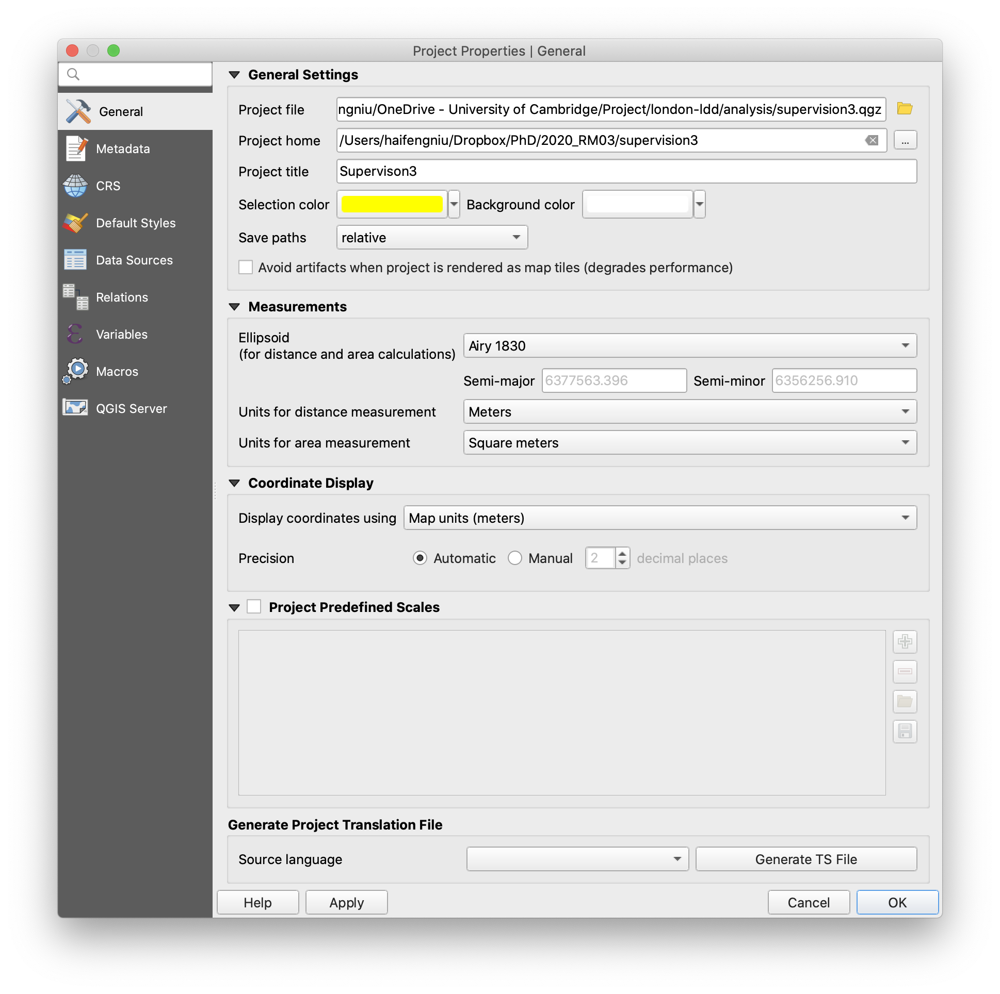
   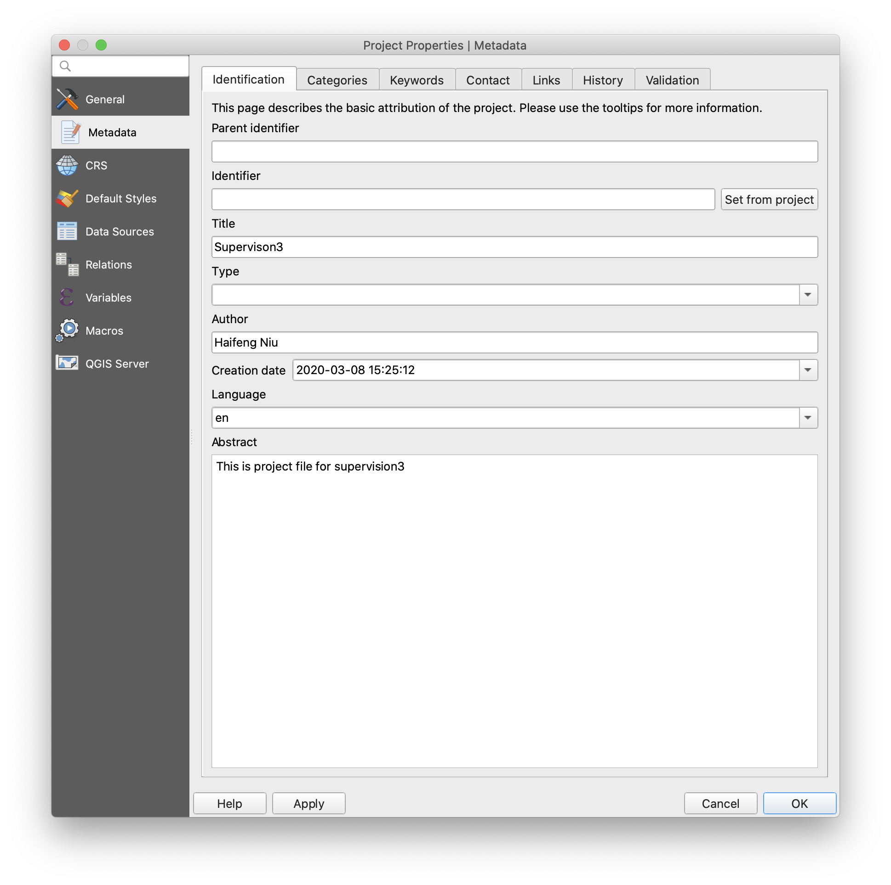

### Making density map based on their location

In the first exercise of this supervision, we learned how to collect tweets data via API and save the query as CSV file. In the CSV file, geographic coordinates are stored as `latitude` and `longtitude` (based on `WGS84`), which can be plot in QGIS as points. And we want to summarise geotagged tweets for each local authority and find the effected areas. So except for tweets data, we will boundary for local authorities.

1. Download `Census_Merged_Local_Authority_Districts_December_2011_in_Great_Britain` data from: [link](https://github.com/hn303/CamLandEc-RM03/blob/master/data/Census_Merged_Local_Authority_Districts_December_2011_in_Great_Britain.zip) and `flood_tweets.csv` data from [link](https://raw.githubusercontent.com/hn303/CamLandEc-RM03/master/data/flood_tweets.csv) (right-click and save as CSV). Both files should be saved into your working directory.

**Importing tweets file and local authorities boundaries**

1. Import shapefile into your project: Locate `Census_Merged_Local_Authority_Districts_December_2011_in_Great_Britain.shp ` file at your working directory in the `Browser Panel` and hold the left mouse and drag the shapefile into the map window. Alternatively, you can add vector file through data source manager. Click Open data source manager button on Data source manager toolbar and switch to Vector tab. Choose file as the source type and choose your shapefile in the source path.

2. Navigate to menu bar click `Layer` > `Add Layer` > `Add Delimited Text Layer`. Browse the `flood_tweets.csv` just downloaded. In the section of File Format, choose CSV. In the Geometry Definition section, choose `Point coordinates` and select `Longitude` and `Latitude` fields as X Y fields respectively. Normally the Geometry definition section will be auto-populated if it finds a suitable X and Y coordinate fields. Then choose the right CRS (EPSG:4326 - WGS84) for this file. Finally, click add and you will find a point layer. 
   

**Calculate density of geotagged tweets in local authorities (normalised by the population)**

After importing the `flood_tweets` layer, you can see there is obvious cluster around London in the layer. The reason is that there are more twitter users in London because of its large population. It is inappropriate to directly summarise flood-related tweets within local athorities to identify possible affected areas. We need to use normalization to minimize differences in the amount of geotagged tweets, which is caused by population variation among local authorities.

1. Navigate to `Processing` > `Toolbox` and search `Join attributes by location(summary)`. In the prompted window, choose `Census_Merged_Local_Authority_Districts_December_2011_in_Great_BritainCambridge` as input layer and `flood_tweets` as join layer. In the geometric predicate section, choose `intersects`. In the section of `Fields to summarise`, choose `text` as the field. In the section of `Summarises to calculate`, choose `count` as summarise function. To do so, you will count the total number of tweets in each local authority.
   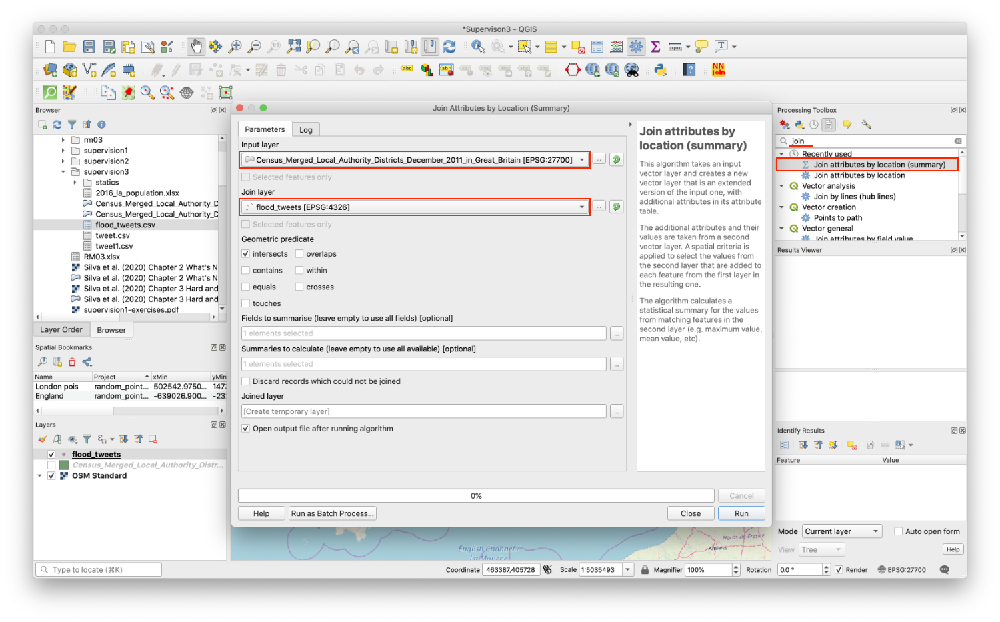
   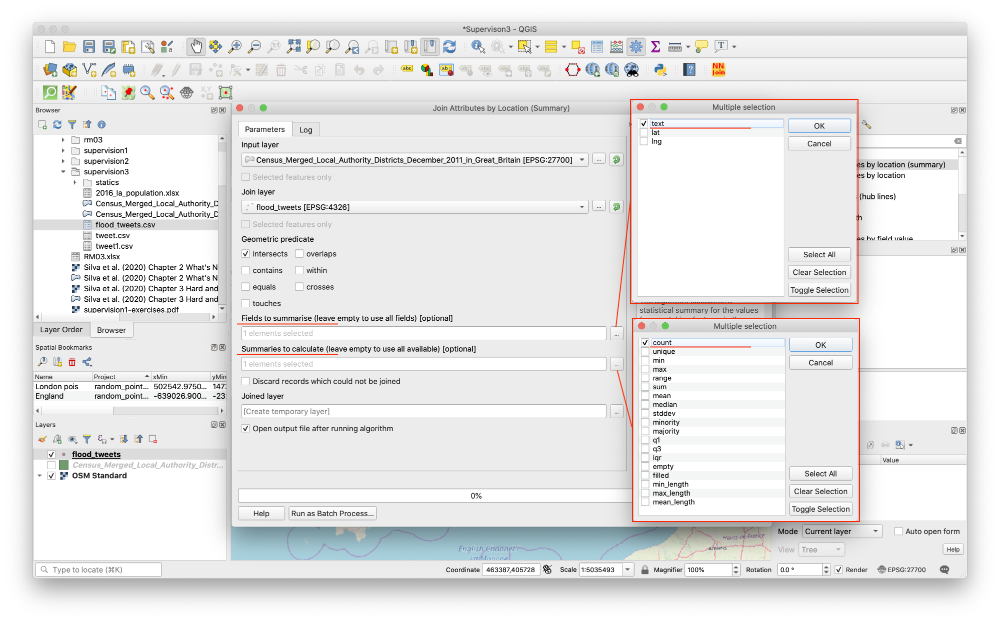

2. In the Attribute Table of `Joined` layer, click `Open field calculator`. Create another new field named as `tweet_normalised` and set the output field type to `Decimal number (real)`, Precision = 10 and Scale = 3. In the expression window, input `1000*text_count /Pop_2016` and we will compute tweet density, number of flood-related tweets per 1000 people in each local athority.
   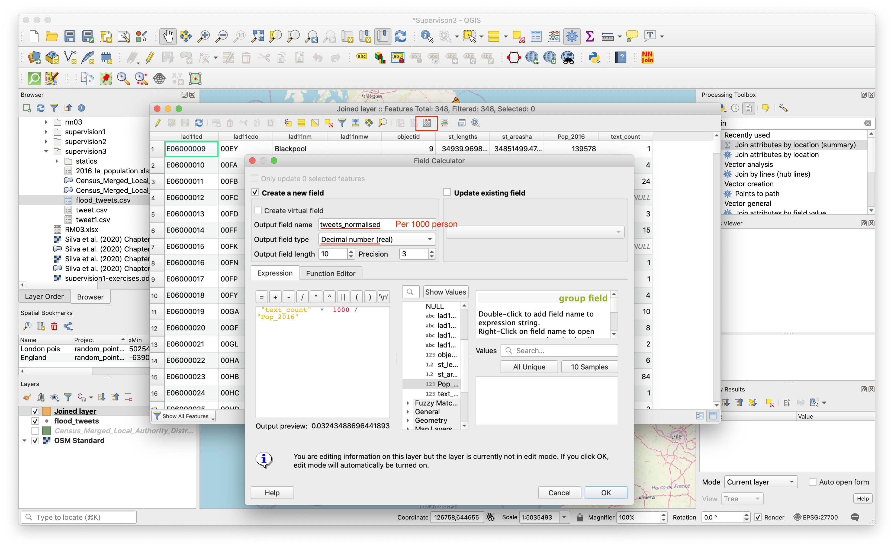

3. Symbolised `Joined layer` in `Graduated color` by `tweet_normalised`(per 1000 people) column . After choosing color ramp, set `Classes` at 10 in `Natural Breaks (Jenks)` mode (See this [link](http://wiki.gis.com/wiki/index.php/Jenks_Natural_Breaks_Classification) to further understand natural breaks-Jenks). Click `Classify` button and add all classes.
   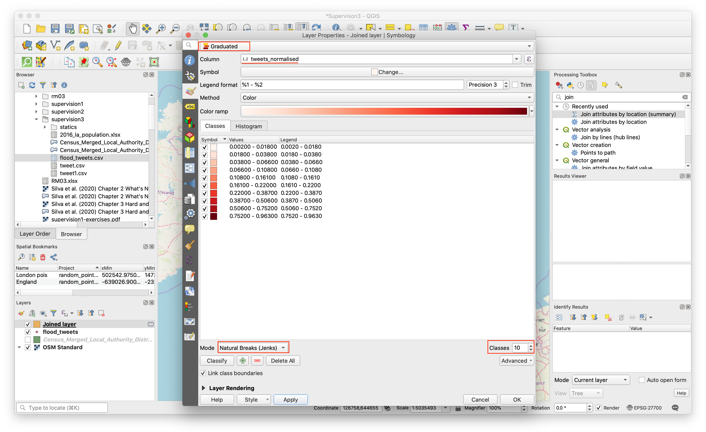

### Using QGIS Layout Manager

In this part, you will practice how to use QGIS Layout Manager to add map elements and export map.

**The Layout Manager**

QGIS allows you to create multiple maps using the same map file. For this reason, it has a tool called the Layout Manager.

1. Click on the `Project` -> `Layout Manager` menu entry to open this tool. You’ll see a blank Layout manager dialog appear.
2. Click the `Add` button and give the new layout the name of `flood_tweets`.
3. Click OK.
4. Click the Show button.
5. In blank area of page, right-click and open `Page Properties`.
6. In the `Item Properties` tab, you’ll find the `Page Size` panel. Set `Orientation` as `Portrait`.
   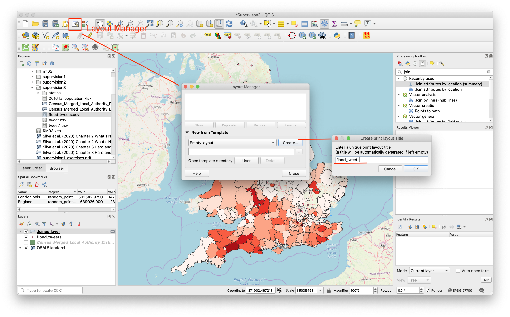
   

**Add Map**

Now you’ve got the page layout the way you wanted it, but this page is still blank.

1. To add the map, click on the `Add New Map` button. With this tool activated, you’ll be able to place a map on the page.
2. Click at the upper left corner. Hold mouse and drag a box on the blank page. The map will appear on the page.
3. Move the map by clicking and dragging it around.
4. Please try other tools to change size of your map or move content in a right right place.

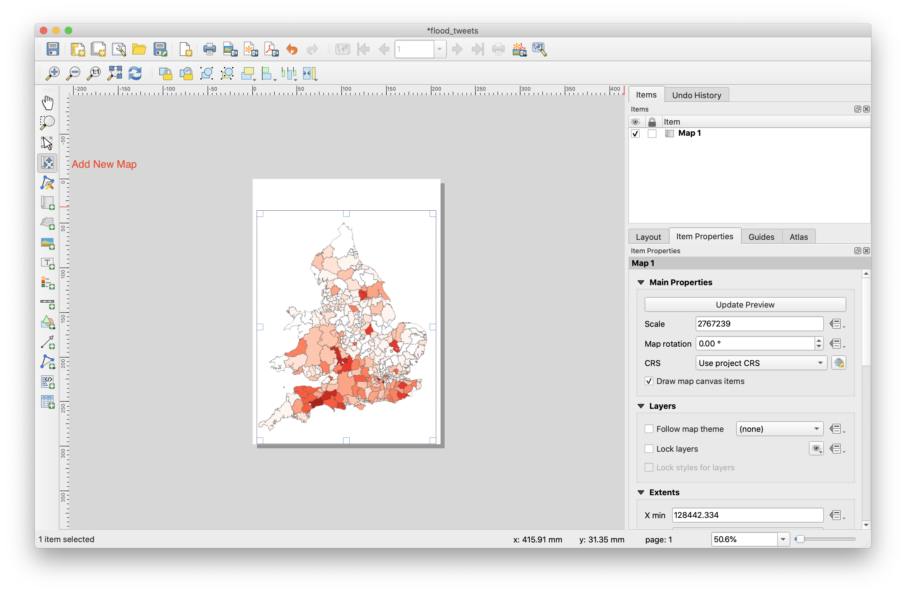

Because a Layout in QGIS is part of the main map file, you’ll need to save your main project. Go to the main QGIS window (the one with the Layers panel and all the other familiar elements you were working with before), and save your project from there as usual.

### Adding Map Elements

Now your map is looking good on the page, but your readers/users are not being told what’s going on yet. They need some context, which is what you’ll provide for them by adding map elements. Let’s add elements.

**Add Legend**

1. Click on this button: `Add a new Legend to the layout`
2. Click on the page to place the legend, and move it to where you want it:
   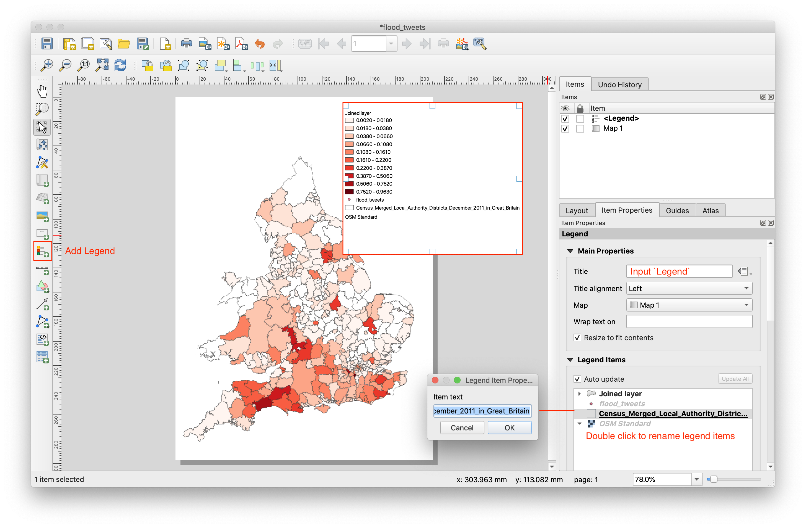

3. Input title (`Legend`) for legend.
4. You can also rename items. Double click legend item to rename.
5. Rename the layers to `Local Authority Boundary` and `Floods Tweets Density (per 1000 people)`. You can also reorder the items.
   

Not everything on the legend is necessary, so let’s remove some unwanted items.

6. In the `Item Properties` tab, you’ll find the `Legend items` panel. Uncheck `Auto update` to enable editing function.
7. Select the `flood_tweets`.
8. Delete it from the legend by clicking the minus button.

**Add Scale**

1. Click on this button `Add Scale Bar`
2. Click on the page, above the map, and a scalebar will appear at the top of the map.
3. Resize it and place it in the top center of the page. It can be resized and moved in the same way that you resized and moved the map.
4. As you move the title, you’ll notice that guidelines appear to help you position the title in the center of the page.
   

**Add North Arrow**

1. Click on this button: `Add Picture`
2. Click on the page to place the legend, and move it to where you want it.
3. In the `Item Properties` tab, you’ll find the `Search Directories` panel. Choose the north arrow you prefer.
   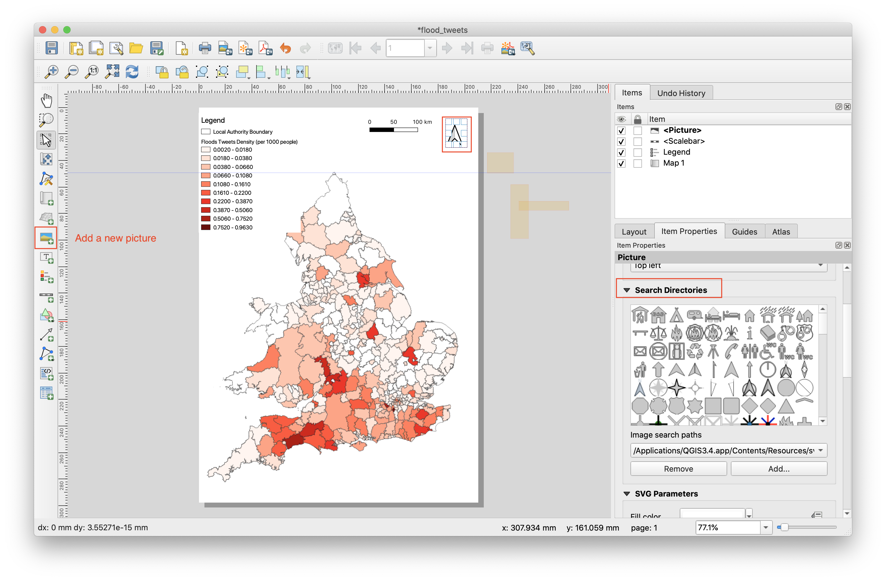

Adding elements is the basic step for a map. To make a **good** map, you need to do more! Check the [experts' guidence from ESRI](https://www.esri.com/news/arcuser/0911/making-a-map-meaningful.html) illustrating how to make a meaning map by answeing 10 questions.
.

**Exporting Your Map**

Finally the map is ready for export!

1. Find export buttons near the top left corner of the Layout window:
2. Choose `Export as Image`
   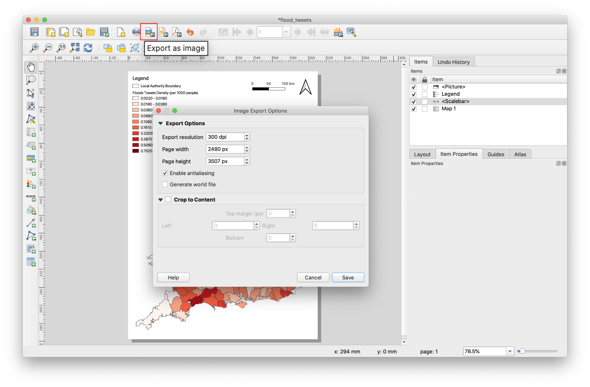

**Final map: Density Map of Flood-related Tweets in UK**
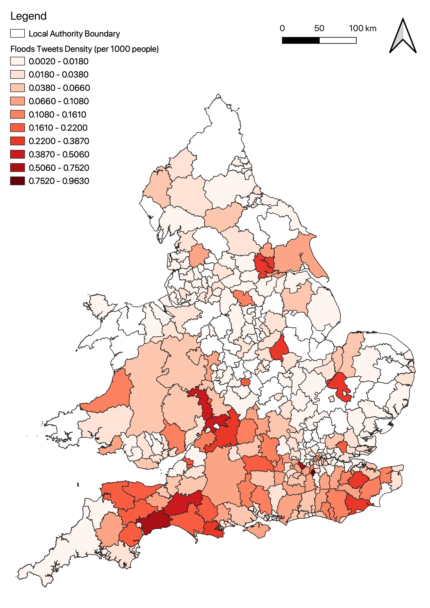

