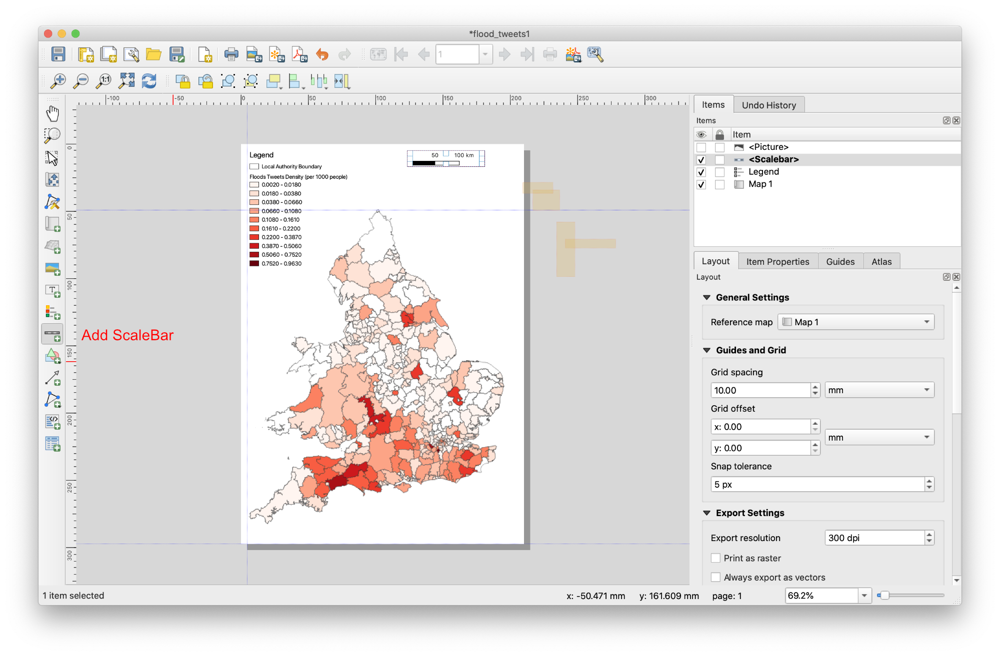
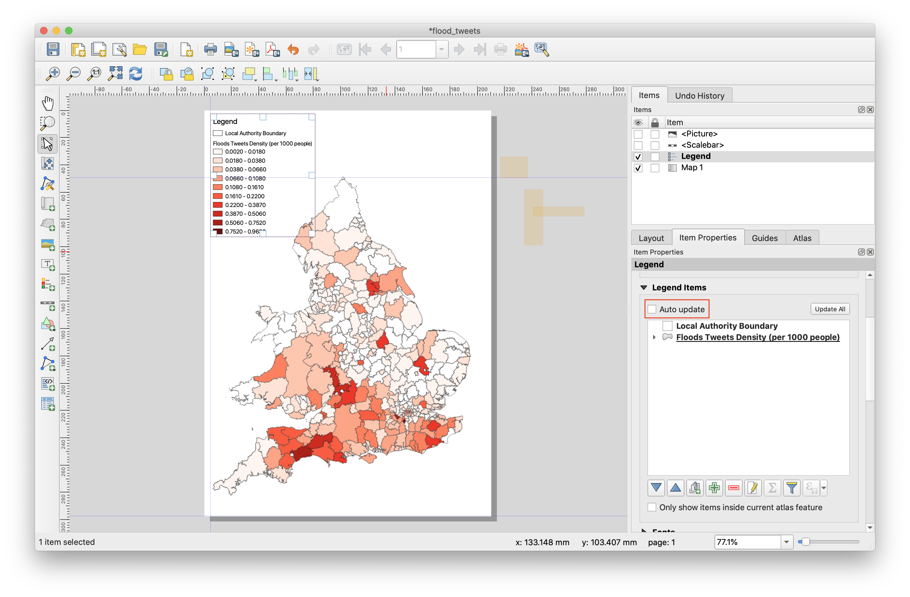
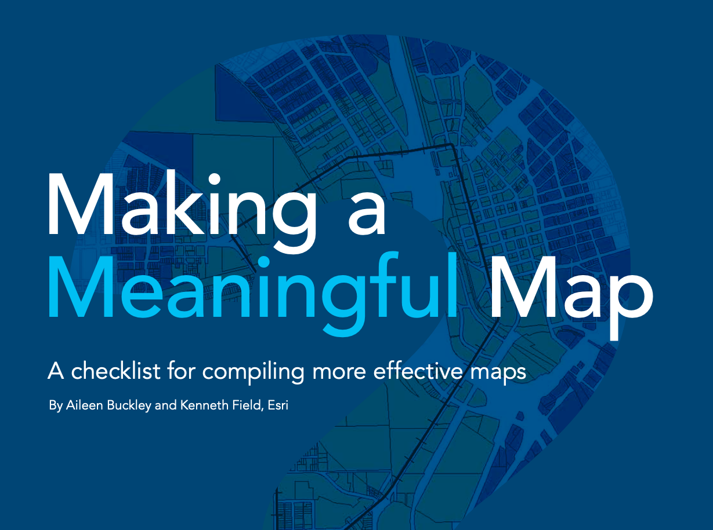

Remember to replace the notebook URL in this template with the notebook you want to link to.
# Supervision 3 (12-13 March, 2020)


### Instructions
1. Read through the instruction carefully. You may face problems if you overlook any of the steps.
2. The instruction for data collection via APIs is written in [Google Colab](https://colab.research.google.com/notebooks/intro.ipynb#recent=true), a free jupyter environment that requires no setup to use and runs python entirely in the cloud. You need log in with your **Google Account** to use this free platform. If you do not have Google Account previously, please apply a new account via this [link](https://accounts.google.com/signup/v2/webcreateaccount?hl=en&continue=https%3A%2F%2Fmyaccount.google.com%2Fintro&flowName=GlifWebSignIn&flowEntry=SignUp) before the supervision. Know more about Google Colab, please check this [link](https://research.google.com/colaboratory/faq.html).
3. If you do not have **Twitter account**, please apply one via this [Twitter Signup](https://twitter.com/i/flow/signup)

Note: functions and filename are `highlighted` in this document.

### Supervision overview
In this exercise, you will familiarise yourself with collect data via Application programming interface(APIs), spatial visualization with collected data and creating a formal map on QGIS.

# 1. Collect Tweets via API
# 2. Sentiment analysis with content of tweets

> Please click this link to move to Google Colab to start the first two exercises. [](https://colab.research.google.com/github/hn303/CamLandEc-RM03/blob/master/supervision3-v3.ipynb)

# 3. Visualizaton of geo-tagged tweets
Geo-location is another important feature of social media. Location of social media can be used in mobility pattern identification, sentiment detection, emergency management and so on. In emergency management, social media data can be used as crowdsourcing tool to collect real-time information in different effected areas. In this section, we will use tweets with geotagged location to identified the effected areas may suffer flood or storms in the early spring 2020. 
Because of the limted time of supervision, we will use pre-collected data (data collected in a week) to demonstrate how to process and visualize geo-location of tweets. 

Data
- wards
- population
- flood 

Process
- ward and population join
- summarise
- calculation
- visualization

the raw data is from https://data.gov.uk/dataset/b1f548a4-694c-438b-9551-af7a121e3395/ons-mid-year-population-estimates-custom-age-tables


### QGIS Project Setup (5 mins)

1. It is suggested to create a folder and name it as `rm03_YourCRSid_sup2`, at your prefered directory on your disk. This folder will be the working directory for the assignment and supervision.
2. Download dataset `Census_Merged_Local_Authority_Districts_December_2011_in_Great_Britain.zip`[(link)](https://github.com/hn303/CamLandEc-RM03/blob/master/data/Census_Merged_Local_Authority_Districts_December_2011_in_Great_Britain.zip) and `flood_tweets.csv`[(link)](data/flood_tweets.csv) into your working directory.

3. In the menu bar, Click `Project` > `New` to create a new QGIS project.
4. Go to `Project` > `Save As` and save as `supervision1.QGZ` to the working directory. 
5. Go to `Project` >  `Properties` and open the `Project Properties` window. 
    - `General` tab: in the general settings, set your working directory as `Project Home`, change the unit for distance measurement you prefer and also display coordinates units.
    - `Metadata` tab: It is suggested to input title, author, creation date and a short abstract in the identification tab.
    - `CRS` tab: this tab provides Coordinate Reference System (CRS) setting for the project file. Here, we choose the projected coordinate system, `OSGB 1936/British National Grid EPSG:27700`. Be aware that CRS setting in the `Project Properties` is just for the project (called `Data Frame setting` in ArcGIS). CRS setting for layers will be introduced later.<br>
Note: after adding `Project home`, you can find `Project Home` directory is showing in the `Browser panel`. It is much easier to locate your data files through this panel.<br>


 

### Making heatmap based on their location (5Mins)

- How to import data from spreadsheets and CSV with coordinates?
- How to display coordinates from spreadsheets and CSV in QGIS?

**Importing spreadsheets or CSV files**

1. Download `York_floods_tweets` data of Cambridgeshire from: [Cambridgeshire Insight Open Data](https://data.cambridgeshireinsight.org.uk/dataset/cambridge-local-services/resource/af2c41d1-c8a0-46cf-ab77-ca407732e060){:target="_blank"} and save into your working directory. This is a set of data to be used to geo-locate a shortlist of agencies and facilities around Cambridge.
2. Navigate to menu bar click `Layer` > `Add Layer` > `Add Delimited Text Layer`. Browse the `York_floods_tweets.csv` just downloaded and change the layer name to `York_floods_tweets`. In the section of File Format, choose CSV. In the Geometry Definition section, choose `Point coordinates` and select `Longitude` and `Latitude` fields as X Y fields respectively. Normally the Geometry definition section will be auto-populated if it finds a suitable X and Y coordinate fields. Then choose the right CRS (EPSG:4326 - WGS84) for this file. Finally, click add and you will find a point layer.<br>


**Making heatmap for geotagged tweets**
1. Find `QuickMapServices` function in the `Web` section from the menu bar. Choose `OSM`-`OSM Standard`, and you will add base map in QGIS.

2. Double click the `York_floods_tweets` layer to get in properties dialog.
3. In the Properties dialog, switch to the Style tab. Select `Heatmap` as the renderer. You have a lot of choice of color-ramps for the heatmap.
4. Set `10 millermeter` for radius and click OK.


### Using print layout 

**The Layout Manager**

QGIS allows you to create multiple maps using the same map file. For this reason, it has a tool called the Layout Manager.

1. Click on the `Project` -> `Layout Manager` menu entry to open this tool. You’ll see a blank Layout manager dialog appear.
2. Click the Add button and give the new layout the name of `York_floods_tweets_heatmap`.
3. Click OK.
4. Click the Show button.


**Basic Map Composition**

In this example, the composition was already the way we wanted it. Ensure that yours is as well.

1. In the Print Layout window, check that the values under Composition ‣ Paper and Quality are set to the following:

```
Size: A4 (210x297mm)
Orientation: Landscape
Quality: 300dpi
```

2. Now you’ve got the page layout the way you wanted it, but this page is still blank. To add the map, click on the `Add New Map` button: . With this tool activated, you’ll be able to place a map on the page.

3. Click and drag a box on the blank page: . The map will appear on the page.

4. Move the map by clicking and dragging it around: 

Note:
- Zoom in and out on the page (but not the map!) by using these buttons .
- Zoom and pan the map in the main QGIS window. You can also pan the map using the Move item content tool: `move Item Content` .

Because a Layout in QGIS is part of the main map file, you’ll need to save your main project. Go to the main QGIS window (the one with the Layers panel and all the other familiar elements you were working with before), and save your project from there as usual.

**Adding Map Elements**

Now your map is looking good on the page, but your readers/users are not being told what’s going on yet. They need some context, which is what you’ll provide for them by adding map elements. First, let’s add a title.

**Add Title**
1. Click on this button: label
2. Click on the page, above the map, and a label will appear at the top of the map.
Resize it and place it in the top center of the page. It can be resized and moved in the same way that you resized and moved the map.
3. As you move the title, you’ll notice that guidelines appear to help you position the title in the center of the page.


**Add North Arrow**
1. Click on this button: label
2. Click on the page, above the map, and a label will appear at the top of the map.
Resize it and place it in the top center of the page. It can be resized and moved in the same way that you resized and moved the map.
3. As you move the title, you’ll notice that guidelines appear to help you position the title in the center of the page.


**Add Scale**
1. Click on this button: label
2. Click on the page, above the map, and a label will appear at the top of the map.
Resize it and place it in the top center of the page. It can be resized and moved in the same way that you resized and moved the map.
3. As you move the title, you’ll notice that guidelines appear to help you position the title in the center of the page.


**Add Legend**
1. Click on this button: addLegend
2. Click on the page to place the legend, and move it to where you want it:


Not everything on the legend is necessary, so let’s remove some unwanted items.

In the Item Properties tab, you’ll find the Legend items panel.
3. Select the buildings entry.
4. Delete it from the legend by clicking the minus button: signMinus

You can also rename items.Select a layer from the same list.
5. Click the Edit button: edit
6. Rename the layers to Places, Roads and Streets, Surafce Water, and Rivers.
Set landuse to Hidden, then click the down arrow and edit each category to name them on the legend. You can also reorder the items:


Adding elements is the basic step for a map. To make a **good** map, you need to do more! Check the [experts' guidence from ESRI](https://www.esri.com/news/arcuser/0911/making-a-map-meaningful.html) illustrating how to make a meaning map by answeing 10 questions. 
.

**Exporting Your Map**

Finally the map is ready for export! 
1. Find export buttons near the top left corner of the Layout window:
2. Choose `Export as Image`

